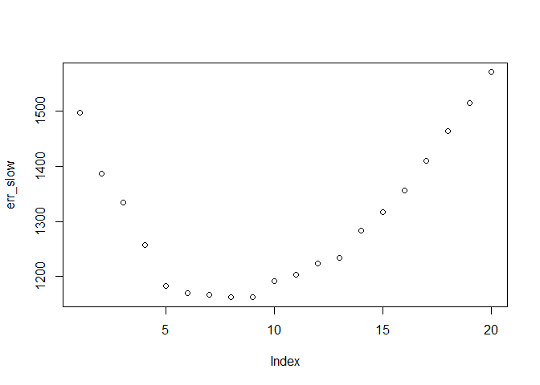
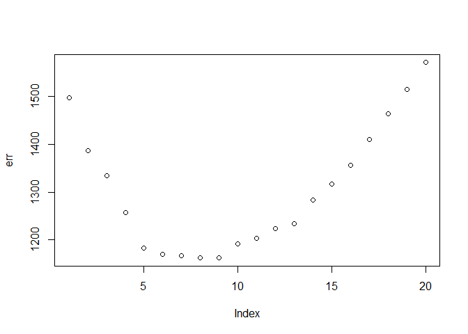

EDA
================
Nikhil Gupta
2020-08-29 06:30:48

  - [Files](#files)
  - [Functions (Process Raw Data)](#functions-process-raw-data)
  - [Offline data](#offline-data)
  - [Online Data](#online-data)
  - [Function (Reshape)](#function-reshape)
  - [Reshape Test Data](#reshape-test-data)
  - [Function (Select Train Data)](#function-select-train-data)
  - [Functions (Nearest Neighbors)](#functions-nearest-neighbors)
  - [Nearest Neighbors](#nearest-neighbors)
  - [K-Fold](#k-fold)
  - [Faster K Fold](#faster-k-fold)
  - [Final Model](#final-model)

``` r
library(tidyverse)
```

    ## -- Attaching packages ------------------------------------------------------------------------------------------------------------- tidyverse 1.3.0 --

    ## v ggplot2 3.3.0     v purrr   0.3.4
    ## v tibble  3.0.0     v dplyr   0.8.5
    ## v tidyr   1.0.2     v stringr 1.4.0
    ## v readr   1.3.1     v forcats 0.5.0

    ## -- Conflicts ---------------------------------------------------------------------------------------------------------------- tidyverse_conflicts() --
    ## x dplyr::filter() masks stats::filter()
    ## x dplyr::lag()    masks stats::lag()

``` r
library(magrittr)
```

    ## 
    ## Attaching package: 'magrittr'

    ## The following object is masked from 'package:purrr':
    ## 
    ##     set_names

    ## The following object is masked from 'package:tidyr':
    ## 
    ##     extract

## Files

``` r
offline_file = "../../data/offline.final.trace.txt"
online_file = "../../data/online.final.trace.txt"
```

# Functions (Process Raw Data)

``` r
# Create a function to parse the data
processLine = function(x){
  # Split up the line on ';', '=' and ','
  tokens = strsplit(x, "[;=,]")[[1]]
  
  # The hand held device (the one for which we need to determine the position)
  # infromation is contained in the 1st 10 tokens (refer to book page 9)
  # If no scanned signal values, return NULL
  if (length(tokens) == 10) {
    return(NULL)
  }
  
  # The tokens after the 10th one represent the signal strength at the access points (book page 9). 
  # Split up the tokens into individual measurements (each measurement contains 4 data points)
  # 4 points are: MAC address, Signal, Channel and Device Type
  # Device Type 3 is what is important (book page 6)
  tmp = matrix(data = tokens[ - (1:10) ], ncol = 4, byrow = TRUE)
  
  # Combine signal measurement with the h
  cbind(matrix(tokens[c(2, 4, 6:8, 10)], nrow(tmp), 6, byrow = TRUE), tmp)
}
```

``` r
#' @description Function to read the data, clean it and process it into an appropriate format
#' @param file Filename to be read in
#' @param keepMacs a list of MAC addresses to keep
#' @returns A dataframe 
readData = function(file, keepMacs=NULL){
  # Read in the raw "offline" text file
  txt = readLines(file)
  
  ##############################
  #### Process the raw data ####
  ##############################
  
  # Parse the data
  lines = txt[substr(txt, 1, 1) != "#" ]
  tmp = lapply(lines, processLine)
  
  # Convert the data to a data frame
  data = as.data.frame(do.call("rbind", tmp), stringsAsFactors = FALSE)

  ######################################################################
  #### Cleaning the Data and Building a Representation for Analysis ####
  ######################################################################
  
  # Assign column names to the offline data frame
  names(data) = c(
    "time", "scanMac", "posX", "posY", "posZ",
    "orientation", "mac", "signal",
    "channel", "type"
  )
  
  numVars = c("time", "posX", "posY", "posZ", "orientation", "signal")
  data[numVars] = lapply(data[numVars], as.numeric)
  
  # Keep only required device types (remove adhoc)
  data = data[data$type != 1, ]

  # Keep only required MAC Addresses
  data = data[data$mac %in% keepMacs, ]
  
  # # From book page 13
  # data$rawTime = data$time
  # data$time = data$time/1000
  # class(data$time) = c("POSIXt", "POSIXct")
  
  # Discard unwanted columns that dont add any additional information
  data = data[ , !(names(data) %in% c("scanMac", "posZ"))]

  # Cleanup Orientation
  data$angle = roundOrientation(data$orientation)
  
  # Add position identifier 
  data$posXY = paste(data$posX, data$posY, sep = "-")

  return(data)
}
```

# Offline data

``` r
# Keep only required MAC Addresses
keepMacs = c(
  '00:0f:a3:39:e1:c0',
  # '00:0f:a3:39:dd:cd',
  '00:14:bf:b1:97:8a',
  '00:14:bf:3b:c7:c6',
  '00:14:bf:b1:97:90',
  '00:14:bf:b1:97:8d',
  '00:14:bf:b1:97:81'
)
```

``` r
roundOrientation = function(angles) {
  refs = seq(0, by = 45, length = 9)
  q = sapply(angles, function(o) which.min(abs(o - refs)))
    c(refs[1:8], 0)[q]
  }
```

``` r
offline = readData(file = offline_file, keepMacs = keepMacs)
dim(offline)
```

    ## [1] 769332     10

``` r
length(unique(offline$posXY))
```

    ## [1] 166

# Online Data

``` r
online = readData(file = online_file, keepMacs = keepMacs)
dim(online)
```

    ## [1] 34778    10

``` r
length(unique(online$posXY))
```

    ## [1] 60

# Function (Reshape)

``` r
# This is equivalent to the tall2wide function 
reshapeSS = function(data, varSignal = "signal", keepVars = c("posXY", "posX", "posY"), sampleAngle = FALSE) {
  refs = seq(0, by = 45, length = 8)
  byLocation =
  with(
    data,
    by(
      data,
      list(posXY),
      function(x) {
        if (sampleAngle) x = x[x$angle == sample(refs, size = 1), ]
        ans = x[1, keepVars]
        avgSS = tapply(x[ , varSignal ], x$mac, mean)
        y = matrix(avgSS, nrow = 1, ncol = 6,
        dimnames = list(ans$posXY, names(avgSS)))
        cbind(ans, y)
      }
    )
  )
  newDataSS = do.call("rbind", byLocation)
  return(newDataSS)
}
```

# Reshape Test Data

``` r
keepVars = c("posXY", "posX","posY", "orientation", "angle")
onlineSummary = reshapeSS(data = online, varSignal = "signal", keepVars = keepVars)
onlineSummary
```

    ##                 posXY  posX  posY orientation angle 00:0f:a3:39:e1:c0
    ## 0-0.05         0-0.05  0.00  0.05       130.5   135         -52.22727
    ## 0.15-9.42   0.15-9.42  0.15  9.42       112.3    90         -55.27523
    ## 0.31-11.09 0.31-11.09  0.31 11.09       230.1   225         -51.70909
    ## 0.47-8.2     0.47-8.2  0.47  8.20         5.8     0         -49.50000
    ## 0.78-10.94 0.78-10.94  0.78 10.94       348.3     0         -53.26364
    ## 0.93-11.69 0.93-11.69  0.93 11.69       158.3   180         -57.96364
    ## 1.08-12.19 1.08-12.19  1.08 12.19       229.1   225         -54.82727
    ## 1.24-3.93   1.24-3.93  1.24  3.93       261.5   270         -56.47273
    ## 1.39-6.61   1.39-6.61  1.39  6.61       114.1   135         -51.28182
    ## 1.52-9.32   1.52-9.32  1.52  9.32         7.0     0         -50.36697
    ## 1.55-0.96   1.55-0.96  1.55  0.96       337.3   315         -49.17757
    ## 1.58-5.26   1.58-5.26  1.58  5.26       187.0   180         -50.58182
    ## 1.71-1.81   1.71-1.81  1.71  1.81        86.6    90         -54.55856
    ## 1.86-8.08   1.86-8.08  1.86  8.08       147.7   135         -54.38532
    ## 10.23-6.88 10.23-6.88 10.23  6.88       221.6   225         -45.83636
    ## 10.46-5.8   10.46-5.8 10.46  5.80        35.8    45         -44.52727
    ## 10.62-3.87 10.62-3.87 10.62  3.87        55.2    45         -48.10909
    ## 10.99-7.19 10.99-7.19 10.99  7.19       289.5   270         -44.75455
    ## 11.39-5       11.39-5 11.39  5.00        89.4    90         -54.01818
    ## 11.76-7.76 11.76-7.76 11.76  7.76       175.3   180         -48.47273
    ## 12.16-5.25 12.16-5.25 12.16  5.25        73.0    90         -52.30275
    ## 12.18-3.4   12.18-3.4 12.18  3.40       257.2   270         -50.25455
    ## 12.26-6.72 12.26-6.72 12.26  6.72        98.0    90         -51.66364
    ## 12.55-7.38 12.55-7.38 12.55  7.38        20.9     0         -41.66972
    ## 12.95-5.25 12.95-5.25 12.95  5.25       120.5   135         -50.14545
    ## 14.98-7.55 14.98-7.55 14.98  7.55        94.4    90         -53.22727
    ## 16.44-7.45 16.44-7.45 16.44  7.45       264.6   270         -53.45455
    ## 2.02-7.45   2.02-7.45  2.02  7.45        94.3    90         -55.44954
    ## 2.49-7.6     2.49-7.6  2.49  7.60       316.7   315         -58.74074
    ## 21.23-5.47 21.23-5.47 21.23  5.47       115.8   135         -57.21818
    ## 21.3-3.8     21.3-3.8 21.30  3.80       120.1   135         -60.18018
    ## 21.45-6.62 21.45-6.62 21.45  6.62        27.3    45         -53.60909
    ## 21.6-7.63   21.6-7.63 21.60  7.63       192.0   180         -54.54545
    ## 21.98-7.46 21.98-7.46 21.98  7.46       325.8   315         -53.25000
    ## 22.3-6.36   22.3-6.36 22.30  6.36       123.3   135         -61.86364
    ## 22.38-3.94 22.38-3.94 22.38  3.94       319.3   315         -57.57009
    ## 22.76-5.06 22.76-5.06 22.76  5.06       251.2   270         -57.64220
    ## 23.24-7.5   23.24-7.5 23.24  7.50         7.9     0         -56.48182
    ## 23.36-3.4   23.36-3.4 23.36  3.40       309.4   315         -58.63889
    ## 23.53-4.22 23.53-4.22 23.53  4.22       205.2   225         -58.85047
    ## 23.9-7         23.9-7 23.90  7.00       344.9     0         -57.51852
    ## 24.31-3.89 24.31-3.89 24.31  3.89       301.3   315         -55.38182
    ## 24.7-7.7     24.7-7.7 24.70  7.70        87.9    90         -55.95413
    ## 25.23-7.78 25.23-7.78 25.23  7.78        10.0     0         -54.64220
    ## 25.76-7.34 25.76-7.34 25.76  7.34       122.7   135         -57.54206
    ## 26.71-7.5   26.71-7.5 26.71  7.50        96.0    90         -57.93636
    ## 28.12-7.57 28.12-7.57 28.12  7.57       310.2   315         -56.59633
    ## 29.58-7.93 29.58-7.93 29.58  7.93       314.9   315         -53.79091
    ## 3.44-7.43   3.44-7.43  3.44  7.43        51.4    45         -51.23148
    ## 31.06-7.19 31.06-7.19 31.06  7.19       247.1   225         -56.12963
    ## 31.78-7.62 31.78-7.62 31.78  7.62       261.5   270         -54.90000
    ## 32.16-7.08 32.16-7.08 32.16  7.08       110.4    90         -59.01852
    ## 32.54-7.08 32.54-7.08 32.54  7.08        50.3    45         -53.98165
    ## 4.51-7.63   4.51-7.63  4.51  7.63       330.5   315         -48.88182
    ## 6-7.88         6-7.88  6.00  7.88       137.0   135         -47.75229
    ## 7.48-7.36   7.48-7.36  7.48  7.36       340.1     0         -43.56881
    ## 8.56-7.64   8.56-7.64  8.56  7.64       305.1   315         -46.19266
    ## 9.08-7.24   9.08-7.24  9.08  7.24       338.0     0         -48.30275
    ## 9.46-7.77   9.46-7.77  9.46  7.77       169.4   180         -45.48182
    ## 9.86-3.88   9.86-3.88  9.86  3.88       191.1   180         -55.30909
    ##            00:14:bf:3b:c7:c6 00:14:bf:b1:97:81 00:14:bf:b1:97:8a
    ## 0-0.05             -62.94898         -61.81395         -40.06897
    ## 0.15-9.42          -73.96190         -72.70103         -47.81308
    ## 0.31-11.09         -70.08247         -70.09890         -54.08824
    ## 0.47-8.2           -64.25806         -72.59770         -45.65289
    ## 0.78-10.94         -66.96000         -66.80952         -48.41379
    ## 0.93-11.69         -70.44340         -70.58025         -43.66346
    ## 1.08-12.19         -69.20192         -67.92553         -52.00820
    ## 1.24-3.93          -69.62745         -59.76136         -38.91753
    ## 1.39-6.61          -62.23913         -64.56627         -48.92381
    ## 1.52-9.32          -63.35922         -67.48913         -50.04167
    ## 1.55-0.96          -66.08989         -57.69318         -42.99038
    ## 1.58-5.26          -64.66667         -57.42708         -40.50980
    ## 1.71-1.81          -61.75789         -66.12088         -37.01000
    ## 1.86-8.08          -62.06383         -63.03571         -50.58252
    ## 10.23-6.88         -58.29474         -59.21348         -58.57143
    ## 10.46-5.8          -52.60241         -57.57895         -58.17204
    ## 10.62-3.87         -45.98039         -46.01111         -59.38333
    ## 10.99-7.19         -49.81633         -56.66292         -56.38739
    ## 11.39-5            -48.89011         -59.76404         -58.79048
    ## 11.76-7.76         -54.76768         -59.32967         -57.10891
    ## 12.16-5.25         -49.90361         -59.13415         -52.58621
    ## 12.18-3.4          -45.47727         -55.19149         -59.09574
    ## 12.26-6.72         -50.56180         -58.85393         -56.63636
    ## 12.55-7.38         -52.32941         -58.08791         -62.24038
    ## 12.95-5.25         -47.92929         -56.78161         -57.38261
    ## 14.98-7.55         -53.54902         -53.06122         -66.53659
    ## 16.44-7.45         -58.18824         -52.74725         -58.28261
    ## 2.02-7.45          -66.21212         -66.16667         -48.09346
    ## 2.49-7.6           -65.31522         -67.35955         -43.86111
    ## 21.23-5.47         -62.32653         -50.75000         -62.22105
    ## 21.3-3.8           -61.67816         -44.22222         -67.09278
    ## 21.45-6.62         -60.32927         -49.98667         -60.42857
    ## 21.6-7.63          -61.39773         -52.94186         -72.88043
    ## 21.98-7.46         -61.76667         -53.83696         -60.47863
    ## 22.3-6.36          -60.09091         -51.77907         -64.20652
    ## 22.38-3.94         -61.15116         -52.61798         -58.39535
    ## 22.76-5.06         -61.07609         -53.14737         -61.75269
    ## 23.24-7.5          -59.52874         -53.79348         -65.22772
    ## 23.36-3.4          -57.63830         -53.00000         -54.15741
    ## 23.53-4.22         -63.76136         -50.84706         -56.97753
    ## 23.9-7             -61.65556         -54.16495         -64.83333
    ## 24.31-3.89         -58.11702         -52.49451         -65.45652
    ## 24.7-7.7           -63.43478         -56.61538         -70.97000
    ## 25.23-7.78         -66.38144         -53.67033         -67.12745
    ## 25.76-7.34         -68.34409         -52.56818         -63.50000
    ## 26.71-7.5          -66.93827         -48.82979         -68.05556
    ## 28.12-7.57         -64.30693         -53.96739         -68.77551
    ## 29.58-7.93         -69.32143         -48.34737         -68.84000
    ## 3.44-7.43          -63.43333         -62.39535         -51.42857
    ## 31.06-7.19         -70.86585         -45.40860         -62.20652
    ## 31.78-7.62         -65.65625         -49.38824         -65.94574
    ## 32.16-7.08         -70.26471         -44.57303         -69.33621
    ## 32.54-7.08         -64.98913         -53.78261         -68.54639
    ## 4.51-7.63          -65.48485         -65.15217         -50.73134
    ## 6-7.88             -57.37634         -58.78481         -51.07000
    ## 7.48-7.36          -59.63158         -61.59574         -52.70642
    ## 8.56-7.64          -53.83133         -61.20652         -55.89320
    ## 9.08-7.24          -53.66667         -58.09639         -59.20652
    ## 9.46-7.77          -49.64516         -61.18824         -60.80851
    ## 9.86-3.88          -44.13131         -52.63333         -55.94000
    ##            00:14:bf:b1:97:8d 00:14:bf:b1:97:90
    ## 0-0.05             -63.04301         -55.23333
    ## 0.15-9.42          -69.45455         -46.88000
    ## 0.31-11.09         -69.13158         -53.88660
    ## 0.47-8.2           -60.79747         -49.58000
    ## 0.78-10.94         -65.00000         -54.84694
    ## 0.93-11.69         -65.59302         -47.27083
    ## 1.08-12.19         -71.58696         -51.66667
    ## 1.24-3.93          -71.66667         -53.23333
    ## 1.39-6.61          -60.79798         -50.49057
    ## 1.52-9.32          -65.10345         -49.38542
    ## 1.55-0.96          -63.52632         -50.04000
    ## 1.58-5.26          -61.97778         -62.48913
    ## 1.71-1.81          -64.33721         -53.21359
    ## 1.86-8.08          -51.38462         -49.96078
    ## 10.23-6.88         -50.10417         -67.56098
    ## 10.46-5.8          -58.74444         -65.31111
    ## 10.62-3.87         -61.26582         -68.40909
    ## 10.99-7.19         -55.78161         -66.21429
    ## 11.39-5            -58.35789         -74.37079
    ## 11.76-7.76         -54.22549         -67.06796
    ## 12.16-5.25         -56.73469         -67.09877
    ## 12.18-3.4          -60.80851         -76.48864
    ## 12.26-6.72         -46.17708         -68.72449
    ## 12.55-7.38         -51.67327         -68.34940
    ## 12.95-5.25         -58.03191         -69.42857
    ## 14.98-7.55         -44.18085         -77.11111
    ## 16.44-7.45         -45.52222         -68.65934
    ## 2.02-7.45          -57.96703         -58.68817
    ## 2.49-7.6           -62.64444         -44.71698
    ## 21.23-5.47         -50.95506         -79.14130
    ## 21.3-3.8           -56.42222         -78.50459
    ## 21.45-6.62         -41.11364         -70.95181
    ## 21.6-7.63          -50.27473         -80.23913
    ## 21.98-7.46         -52.13978         -76.55422
    ## 22.3-6.36          -47.46739         -77.80460
    ## 22.38-3.94         -49.43678         -73.38636
    ## 22.76-5.06         -49.97917         -76.54444
    ## 23.24-7.5          -56.66316         -69.67391
    ## 23.36-3.4          -54.28736         -73.41860
    ## 23.53-4.22         -55.40698         -78.16092
    ## 23.9-7             -58.33735         -69.24468
    ## 24.31-3.89         -54.35000         -78.72449
    ## 24.7-7.7           -44.89011         -75.44318
    ## 25.23-7.78         -47.34694         -73.71277
    ## 25.76-7.34         -45.03297         -77.07447
    ## 26.71-7.5          -47.25243         -75.80460
    ## 28.12-7.57         -53.68421         -70.62000
    ## 29.58-7.93         -49.95745         -75.66667
    ## 3.44-7.43          -52.05941         -60.35484
    ## 31.06-7.19         -39.36264         -79.72619
    ## 31.78-7.62         -45.44944         -76.68932
    ## 32.16-7.08         -37.55340         -77.05600
    ## 32.54-7.08         -32.84946         -71.63953
    ## 4.51-7.63          -62.29268         -60.14851
    ## 6-7.88             -54.40000         -61.91667
    ## 7.48-7.36          -59.89362         -63.77528
    ## 8.56-7.64          -56.65217         -66.17021
    ## 9.08-7.24          -57.08434         -65.36364
    ## 9.46-7.77          -49.34118         -71.44737
    ## 9.86-3.88          -55.94937         -65.53261

# Function (Select Train Data)

``` r
#' @description Selectes the appropriate observations (based on test data orientation) from the original tall data
#' and reformats it such that it can be used for training the KNN algorithm
#' @param angleNewObs Angle (Orientation) of the test observation
#' @param train_data Original tall-skinny data
#' @param m Keep the 'm' closest orientations to angleNewObs 
#' @returns A dataframe suitable for training
selectTrain = function(angleNewObs, train_data, m){
  
  # Find the angles to keep
  if (m %% 2 == 1) {
    angles = seq(-45 * (m - 1) /2, 45 * (m - 1) /2, length = m)
  } else {
    m = m + 1
    angles = seq(-45 * (m - 1) /2, 45 * (m - 1) /2, length = m)
    if (sign(angleNewObs - nearestAngle) > -1)
      angles = angles[ -1 ]
    else
      angles = angles[ -m ]
  }
  
  nearestAngle = roundOrientation(angles = angleNewObs)
  angles = angles + nearestAngle
  angles[angles < 0] = angles[ angles < 0 ] + 360
  angles[angles > 360] = angles[ angles > 360 ] - 360
  
  # print(paste("Angles Chosen = ", paste(angles, collapse=", "), sep = ""))
  
  # Subset only those angles from original data (tall-skinny)
  train_data_subset = train_data[train_data$angle %in% angles, ]
  
  # Convert to Wide and average 
  #train_data_subset = tall2wide(data = train_data_subset)
  train_data_subset = reshapeSS(data = train_data_subset, varSignal = "signal")
  
  
  return(train_data_subset)
}
```

# Functions (Nearest Neighbors)

``` r
findNN = function(newSignal, trainSubset) {
  diffs = apply(trainSubset[ , 4:9], 1, function(x) x - newSignal)
  dists = apply(diffs, 2, function(x) sqrt(sum(x^2)) )
  closest = order(dists)
  return(trainSubset[closest, 1:3])
}

predXY = function(newSignals, newAngles, trainData, numAngles = 1, k = 3){
  closeXY = list(length = nrow(newSignals))
  for (i in 1:nrow(newSignals)) {
    trainSS = selectTrain(newAngles[i], trainData, m = numAngles)
    closeXY[[i]] = findNN(
      newSignal = as.numeric(newSignals[i, ]),
      trainSubset = trainSS
    )
  }
  estXY = lapply(closeXY, function(x) sapply(x[ , 2:3], function(x) mean(x[1:k])))
  estXY = do.call("rbind", estXY)
  return(estXY)
}

calcError = function(estXY, actualXY){
  return(sum(rowSums((estXY - actualXY)^2)))
}
```

# Nearest Neighbors

``` r
estXYk3 = predXY(
  newSignals = onlineSummary[ , 6:11],
  newAngles = onlineSummary$angle, 
  trainData = offline,
  numAngles = 3,
  k = 3
)
```

``` r
estXYk1 = predXY(
  newSignals = onlineSummary[ , 6:11],
  newAngles = onlineSummary$angle, 
  trainData = offline,
  numAngles = 3,
  k = 1
)
```

``` r
actualXY = onlineSummary %>%  dplyr::select(posX, posY)
sapply(list(estXYk1, estXYk3), calcError, actualXY)
```

    ## [1] 658.0203 313.3359

# K-Fold

``` r
set.seed(42)
K = 20
v = 11
permuteLocs = sample(unique(offline$posXY))
permuteLocs = matrix(permuteLocs, ncol = v, nrow = floor(length(permuteLocs)/v))
```

    ## Warning in matrix(permuteLocs, ncol = v, nrow = floor(length(permuteLocs)/v)):
    ## data length [166] is not a sub-multiple or multiple of the number of rows [15]

``` r
permuteLocs
```

    ##       [,1]   [,2]   [,3]   [,4]   [,5]   [,6]   [,7]   [,8]   [,9]   [,10] 
    ##  [1,] "11-3" "24-6" "27-8" "25-8" "7-7"  "24-8" "22-8" "12-5" "0-12" "0-7" 
    ##  [2,] "9-7"  "21-6" "2-9"  "24-7" "5-8"  "15-8" "11-8" "32-6" "2-7"  "29-8"
    ##  [3,] "14-7" "30-3" "12-7" "23-4" "2-2"  "10-5" "4-7"  "17-8" "0-11" "17-7"
    ##  [4,] "13-8" "3-3"  "32-8" "30-7" "2-8"  "33-7" "25-3" "1-13" "12-6" "24-3"
    ##  [5,] "33-8" "15-7" "30-8" "0-3"  "20-3" "21-3" "2-11" "13-3" "8-8"  "22-3"
    ##  [6,] "21-8" "0-8"  "0-1"  "2-13" "1-5"  "0-4"  "0-0"  "23-3" "1-10" "16-8"
    ##  [7,] "20-8" "24-5" "26-3" "31-8" "31-3" "10-4" "3-8"  "2-5"  "8-7"  "0-9" 
    ##  [8,] "27-3" "1-1"  "32-3" "2-6"  "13-7" "11-4" "26-6" "8-3"  "26-4" "1-3" 
    ##  [9,] "9-3"  "19-3" "2-1"  "14-8" "33-4" "6-8"  "5-7"  "1-4"  "13-6" "4-8" 
    ## [10,] "1-12" "25-4" "20-7" "24-4" "26-7" "0-13" "22-4" "19-7" "33-3" "18-8"
    ## [11,] "10-8" "2-0"  "1-0"  "16-7" "7-8"  "3-7"  "6-7"  "26-8" "2-4"  "32-5"
    ## [12,] "21-4" "11-5" "21-7" "27-7" "32-7" "13-5" "15-3" "9-4"  "7-3"  "22-7"
    ## [13,] "16-3" "4-3"  "28-8" "21-5" "1-6"  "22-5" "19-8" "10-7" "1-11" "25-7"
    ## [14,] "26-5" "18-7" "23-7" "12-8" "29-3" "23-5" "13-4" "2-10" "2-3"  "10-3"
    ## [15,] "1-8"  "5-3"  "1-9"  "0-10" "12-4" "31-7" "28-3" "11-7" "23-6" "28-7"
    ##       [,11] 
    ##  [1,] "10-6"
    ##  [2,] "1-7" 
    ##  [3,] "23-8"
    ##  [4,] "11-6"
    ##  [5,] "14-3"
    ##  [6,] "12-3"
    ##  [7,] "29-7"
    ##  [8,] "22-6"
    ##  [9,] "18-3"
    ## [10,] "17-3"
    ## [11,] "9-8" 
    ## [12,] "6-3" 
    ## [13,] "32-4"
    ## [14,] "0-2" 
    ## [15,] "1-2"

``` r
onlineFold = subset(offline, posXY %in% permuteLocs[ , 1])
head(onlineFold)
```

    ##                time posX posY orientation               mac signal    channel
    ## 154732 1.139653e+12    1    8         0.7 00:14:bf:b1:97:8a    -47 2437000000
    ## 154733 1.139653e+12    1    8         0.7 00:14:bf:b1:97:8d    -52 2442000000
    ## 154734 1.139653e+12    1    8         0.7 00:0f:a3:39:e1:c0    -52 2462000000
    ## 154735 1.139653e+12    1    8         0.7 00:14:bf:b1:97:90    -51 2427000000
    ## 154736 1.139653e+12    1    8         0.7 00:14:bf:3b:c7:c6    -68 2432000000
    ## 154737 1.139653e+12    1    8         0.7 00:14:bf:b1:97:81    -67 2422000000
    ##        type angle posXY
    ## 154732    3     0   1-8
    ## 154733    3     0   1-8
    ## 154734    3     0   1-8
    ## 154735    3     0   1-8
    ## 154736    3     0   1-8
    ## 154737    3     0   1-8

``` r
# For reference
head(onlineSummary)
```

    ##                 posXY posX  posY orientation angle 00:0f:a3:39:e1:c0
    ## 0-0.05         0-0.05 0.00  0.05       130.5   135         -52.22727
    ## 0.15-9.42   0.15-9.42 0.15  9.42       112.3    90         -55.27523
    ## 0.31-11.09 0.31-11.09 0.31 11.09       230.1   225         -51.70909
    ## 0.47-8.2     0.47-8.2 0.47  8.20         5.8     0         -49.50000
    ## 0.78-10.94 0.78-10.94 0.78 10.94       348.3     0         -53.26364
    ## 0.93-11.69 0.93-11.69 0.93 11.69       158.3   180         -57.96364
    ##            00:14:bf:3b:c7:c6 00:14:bf:b1:97:81 00:14:bf:b1:97:8a
    ## 0-0.05             -62.94898         -61.81395         -40.06897
    ## 0.15-9.42          -73.96190         -72.70103         -47.81308
    ## 0.31-11.09         -70.08247         -70.09890         -54.08824
    ## 0.47-8.2           -64.25806         -72.59770         -45.65289
    ## 0.78-10.94         -66.96000         -66.80952         -48.41379
    ## 0.93-11.69         -70.44340         -70.58025         -43.66346
    ##            00:14:bf:b1:97:8d 00:14:bf:b1:97:90
    ## 0-0.05             -63.04301         -55.23333
    ## 0.15-9.42          -69.45455         -46.88000
    ## 0.31-11.09         -69.13158         -53.88660
    ## 0.47-8.2           -60.79747         -49.58000
    ## 0.78-10.94         -65.00000         -54.84694
    ## 0.93-11.69         -65.59302         -47.27083

``` r
keepVars = c("posXY", "posX","posY", "orientation", "angle")
onlineCVSummary = reshapeSS(offline, keepVars = keepVars, sampleAngle = TRUE)
onlineCVSummary
```

    ##      posXY posX posY orientation angle 00:0f:a3:39:e1:c0 00:14:bf:3b:c7:c6
    ## 0-0    0-0    0    0        90.3    90         -50.58559         -62.59551
    ## 0-1    0-1    0    1        89.8    90         -55.17273         -65.70000
    ## 0-10  0-10    0   10       225.3   225         -51.47706         -63.01163
    ## 0-11  0-11    0   11       135.2   135         -50.16364         -67.87778
    ## 0-12  0-12    0   12       135.0   135         -52.52727         -68.90816
    ## 0-13  0-13    0   13       135.2   135         -54.91818         -71.76190
    ## 0-2    0-2    0    2        90.3    90         -54.36364         -61.17000
    ## 0-3    0-3    0    3         0.2     0         -55.53636         -62.90526
    ## 0-4    0-4    0    4         0.5     0         -48.09091         -65.86139
    ## 0-7    0-7    0    7         0.3     0         -57.30000         -65.85417
    ## 0-8    0-8    0    8       225.0   225         -47.40909         -65.64583
    ## 0-9    0-9    0    9       180.2   180         -49.62727         -66.60000
    ## 1-0    1-0    1    0       269.7   270         -53.08182         -62.85556
    ## 1-1    1-1    1    1       225.2   225         -54.64545         -67.75532
    ## 1-10  1-10    1   10       135.4   135         -59.09091         -68.70833
    ## 1-11  1-11    1   11       269.8   270         -56.35455         -69.07609
    ## 1-12  1-12    1   12       359.9     0         -55.25455         -67.88785
    ## 1-13  1-13    1   13       180.3   180         -57.04545         -69.90909
    ## 1-2    1-2    1    2       134.4   135         -57.65455         -62.31183
    ## 1-3    1-3    1    3         0.2     0         -50.48182         -61.19318
    ## 1-4    1-4    1    4         0.8     0         -50.68182         -62.98925
    ## 1-5    1-5    1    5         0.3     0         -52.40909         -69.08411
    ## 1-6    1-6    1    6       135.4   135         -49.32727         -63.47253
    ## 1-7    1-7    1    7        45.3    45         -51.82727         -69.16484
    ## 1-8    1-8    1    8       270.2   270         -52.86364         -65.55435
    ## 1-9    1-9    1    9       315.1   315         -51.40909         -63.67021
    ## 10-3  10-3   10    3       270.4   270         -54.66364         -55.84043
    ## 10-4  10-4   10    4       314.8   315         -46.80000         -54.46000
    ## 10-5  10-5   10    5        90.3    90         -42.94545         -50.66667
    ## 10-6  10-6   10    6       180.8   180         -42.30909         -54.15054
    ## 10-7  10-7   10    7       180.3   180         -44.80000         -53.31868
    ## 10-8  10-8   10    8       135.1   135         -43.90000         -57.16327
    ## 11-3  11-3   11    3       359.9     0         -50.34545         -54.42857
    ## 11-4  11-4   11    4       224.8   225         -51.48182         -52.89899
    ## 11-5  11-5   11    5        89.8    90         -52.26606         -51.30682
    ## 11-6  11-6   11    6       134.8   135         -46.06364         -50.55208
    ## 11-7  11-7   11    7       270.2   270         -48.49091         -46.47778
    ## 11-8  11-8   11    8       180.3   180         -52.12727         -54.81553
    ## 12-3  12-3   12    3       269.6   270         -51.55963         -39.25490
    ## 12-4  12-4   12    4       315.1   315         -47.18349         -49.19101
    ## 12-5  12-5   12    5       224.8   225         -50.10909         -52.77647
    ## 12-6  12-6   12    6       270.5   270         -48.09091         -47.44706
    ## 12-7  12-7   12    7       315.1   315         -48.30000         -53.56322
    ## 12-8  12-8   12    8        45.3    45         -46.58182         -59.33333
    ## 13-3  13-3   13    3       270.6   270         -50.15455         -52.49451
    ## 13-4  13-4   13    4       270.2   270         -51.88182         -49.82955
    ## 13-5  13-5   13    5         0.7     0         -49.24545         -48.21348
    ## 13-6  13-6   13    6         0.1     0         -53.50000         -50.34000
    ## 13-7  13-7   13    7         0.3     0         -49.93636         -50.15730
    ## 13-8  13-8   13    8        90.3    90         -48.61818         -57.77174
    ## 14-3  14-3   14    3        46.5    45         -53.00917         -56.63265
    ## 14-7  14-7   14    7       180.2   180         -49.00000         -58.02273
    ## 14-8  14-8   14    8       270.1   270         -51.19091         -43.11881
    ## 15-3  15-3   15    3       134.9   135         -50.70000         -58.57576
    ## 15-7  15-7   15    7       135.4   135         -47.85455         -56.77419
    ## 15-8  15-8   15    8       270.4   270         -49.93636         -52.25000
    ## 16-3  16-3   16    3       180.4   180         -55.09091         -61.24138
    ## 16-7  16-7   16    7         0.4     0         -52.83636         -57.52688
    ## 16-8  16-8   16    8       134.9   135         -51.31818         -46.62366
    ## 17-3  17-3   17    3         1.0     0         -48.22727         -52.52809
    ## 17-7  17-7   17    7       316.0   315         -51.61818         -57.50515
    ## 17-8  17-8   17    8       225.7   225         -51.06364         -57.16279
    ## 18-3  18-3   18    3       315.7   315         -50.33636         -53.55882
    ## 18-7  18-7   18    7         0.4     0         -48.00000         -57.64286
    ## 18-8  18-8   18    8       180.5   180         -48.20909         -62.86957
    ## 19-3  19-3   19    3       225.2   225         -55.08182         -57.71429
    ## 19-7  19-7   19    7        89.5    90         -51.58182         -60.02083
    ## 19-8  19-8   19    8       359.9     0         -53.50000         -55.48980
    ## 2-0    2-0    2    0       225.0   225         -54.70909         -62.38144
    ## 2-1    2-1    2    1        45.6    45         -52.87273         -63.75238
    ## 2-10  2-10    2   10       226.5   225         -48.16364         -63.50575
    ## 2-11  2-11    2   11       225.7   225         -56.86486         -70.28571
    ## 2-12  2-12    2   12       136.7   135         -56.75455         -72.46602
    ## 2-13  2-13    2   13       270.9   270         -55.53636         -64.84685
    ## 2-2    2-2    2    2       225.4   225         -52.76364         -63.31579
    ## 2-3    2-3    2    3       270.5   270         -53.23853         -64.38542
    ## 2-4    2-4    2    4        44.4    45         -56.03738         -60.48276
    ## 2-5    2-5    2    5       180.4   180         -54.96364         -64.64444
    ## 2-6    2-6    2    6       180.3   180         -50.94545         -61.84270
    ## 2-7    2-7    2    7        90.3    90         -54.77273         -65.40385
    ## 2-8    2-8    2    8       270.4   270         -48.88182         -65.40230
    ## 2-9    2-9    2    9       180.1   180         -56.16364         -64.81308
    ## 20-3  20-3   20    3        45.2    45         -55.82727         -57.86022
    ## 20-7  20-7   20    7         1.5     0         -49.23636         -65.09890
    ## 20-8  20-8   20    8       225.6   225         -54.10909         -59.83158
    ## 21-3  21-3   21    3         0.1     0         -54.40909         -61.45455
    ## 21-4  21-4   21    4       225.0   225         -59.64545         -63.62500
    ## 21-5  21-5   21    5       315.4   315         -62.84545         -61.23958
    ## 21-6  21-6   21    6         0.0     0         -59.83636         -64.68817
    ## 21-7  21-7   21    7        90.4    90         -53.98182         -64.82653
    ## 21-8  21-8   21    8       135.5   135         -57.64545         -63.71717
    ## 22-3  22-3   22    3        45.1    45         -63.70000         -60.08989
    ## 22-4  22-4   22    4       270.2   270         -60.33028         -56.65306
    ## 22-5  22-5   22    5        45.3    45         -56.47273         -59.72941
    ## 22-6  22-6   22    6        45.6    45         -57.95455         -61.73913
    ## 22-7  22-7   22    7        44.8    45         -53.83636         -65.75789
    ## 22-8  22-8   22    8       135.4   135         -62.97273         -67.57009
    ## 23-3  23-3   23    3       135.1   135         -60.63636         -59.45000
    ## 23-4  23-4   23    4       270.6   270         -56.70909         -59.74737
    ## 23-5  23-5   23    5       180.0   180         -56.87273         -60.76087
    ## 23-6  23-6   23    6       270.2   270         -57.43636         -62.09375
    ## 23-7  23-7   23    7       359.6     0         -58.36364         -59.80769
    ## 23-8  23-8   23    8        90.0    90         -56.58182         -62.66316
    ## 24-3  24-3   24    3       224.9   225         -56.61818         -62.89796
    ## 24-4  24-4   24    4       180.5   180         -58.05455         -60.77174
    ## 24-5  24-5   24    5       225.2   225         -58.18349         -59.80000
    ## 24-6  24-6   24    6       135.3   135         -60.00909         -66.41284
    ## 24-7  24-7   24    7        45.1    45         -57.86239         -60.71910
    ## 24-8  24-8   24    8        44.7    45         -55.13636         -66.20388
    ## 25-3  25-3   25    3         0.0     0         -58.80000         -59.21505
    ## 25-4  25-4   25    4        90.6    90         -66.13761         -63.05102
    ## 25-7  25-7   25    7       134.9   135         -58.75455         -65.80851
    ## 25-8  25-8   25    8       225.3   225         -53.80000         -63.98864
    ## 26-3  26-3   26    3        45.4    45         -54.50909         -60.44211
    ## 26-4  26-4   26    4       359.8     0         -60.64545         -63.26214
    ## 26-5  26-5   26    5       270.5   270         -57.57273         -57.17978
    ## 26-6  26-6   26    6       270.5   270         -56.12727         -59.74468
    ## 26-7  26-7   26    7        45.2    45         -59.72727         -59.42105
    ## 26-8  26-8   26    8        89.9    90         -59.21818         -64.29897
    ## 27-3  27-3   27    3         0.2     0         -53.70000         -61.33333
    ## 27-7  27-7   27    7        90.0    90         -56.28182         -66.15730
    ## 27-8  27-8   27    8        90.6    90         -51.90000         -65.46067
    ## 28-3  28-3   28    3       135.2   135         -60.70909         -62.39286
    ## 28-7  28-7   28    7       180.4   180         -56.01818         -69.10989
    ## 28-8  28-8   28    8       135.1   135         -62.40000         -70.12121
    ## 29-3  29-3   29    3        44.7    45         -57.51818         -64.51546
    ## 29-7  29-7   29    7       225.1   225         -53.86486         -67.22772
    ## 29-8  29-8   29    8         0.2     0         -57.28182         -62.17476
    ## 3-3    3-3    3    3       225.7   225         -50.10000         -56.77451
    ## 3-7    3-7    3    7        89.2    90         -53.99091         -62.98980
    ## 3-8    3-8    3    8       358.3     0         -48.25455         -66.09677
    ## 30-3  30-3   30    3       225.6   225         -61.09091         -64.67391
    ## 30-7  30-7   30    7        91.5    90         -57.60000         -62.55914
    ## 30-8  30-8   30    8       180.1   180         -57.17273         -63.29474
    ## 31-3  31-3   31    3       135.5   135         -61.78182         -71.11765
    ## 31-7  31-7   31    7       180.4   180         -58.90909         -69.27885
    ## 31-8  31-8   31    8       224.6   225         -55.58182         -67.87387
    ## 32-3  32-3   32    3       270.4   270         -64.46364         -65.91818
    ## 32-4  32-4   32    4         0.5     0         -59.51818         -62.71000
    ## 32-5  32-5   32    5        44.2    45         -64.22727         -72.29703
    ## 32-6  32-6   32    6       314.8   315         -66.46364         -75.97321
    ## 32-7  32-7   32    7        45.2    45         -52.83636         -59.64130
    ## 32-8  32-8   32    8       270.9   270         -55.09091         -68.27723
    ## 33-3  33-3   33    3       269.7   270         -63.80909         -71.03750
    ## 33-4  33-4   33    4       225.7   225         -60.33636         -65.54545
    ## 33-7  33-7   33    7       135.1   135         -64.86364         -74.52830
    ## 33-8  33-8   33    8       179.6   180         -56.18182         -70.86139
    ## 4-3    4-3    4    3        90.3    90         -46.72340         -58.90909
    ## 4-7    4-7    4    7        45.9    45         -47.68182         -60.31250
    ## 4-8    4-8    4    8       359.6     0         -47.33636         -66.79570
    ## 5-3    5-3    5    3       359.9     0         -55.20183         -56.02273
    ## 5-7    5-7    5    7       180.5   180         -43.20909         -58.48936
    ## 5-8    5-8    5    8        45.8    45         -46.42727         -62.12500
    ## 6-3    6-3    6    3        90.4    90         -45.14545         -55.97917
    ## 6-7    6-7    6    7        45.2    45         -53.70642         -61.62766
    ## 6-8    6-8    6    8        91.5    90         -46.82727         -57.75248
    ## 7-3    7-3    7    3       225.0   225         -48.75455         -53.18478
    ## 7-7    7-7    7    7       271.5   270         -40.61261         -56.10112
    ## 7-8    7-8    7    8        91.0    90         -48.45455         -54.45000
    ## 8-3    8-3    8    3       315.5   315         -45.59091         -53.97778
    ## 8-7    8-7    8    7       135.6   135         -45.82727         -56.15789
    ## 8-8    8-8    8    8       315.4   315         -39.40741         -55.73626
    ## 9-3    9-3    9    3       179.8   180         -52.30000         -50.36957
    ## 9-4    9-4    9    4       315.0   315         -46.20561         -55.13095
    ## 9-7    9-7    9    7       225.7   225         -45.83636         -50.96591
    ## 9-8    9-8    9    8       134.8   135         -44.29091         -53.21875
    ##      00:14:bf:b1:97:81 00:14:bf:b1:97:8a 00:14:bf:b1:97:8d 00:14:bf:b1:97:90
    ## 0-0          -63.78261         -33.74737         -63.12941         -55.19588
    ## 0-1          -63.94186         -40.21782         -63.52381         -60.47826
    ## 0-10         -68.58416         -49.01010         -66.71111         -54.56180
    ## 0-11         -72.34000         -47.57895         -66.17241         -53.97000
    ## 0-12         -70.32222         -43.11009         -63.73494         -48.99000
    ## 0-13         -74.19588         -42.49438         -67.70423         -50.82828
    ## 0-2          -61.43333         -45.52000         -58.31461         -51.36364
    ## 0-3          -56.68817         -49.96040         -59.29412         -55.37755
    ## 0-4          -57.21111         -47.65591         -65.46154         -52.17000
    ## 0-7          -65.92632         -45.79439         -55.21111         -61.61798
    ## 0-8          -58.03750         -47.52830         -47.47674         -57.93878
    ## 0-9          -63.39286         -43.18367         -58.92045         -48.58763
    ## 1-0          -70.71429         -34.42424         -65.59770         -57.18182
    ## 1-1          -60.85263         -33.97980         -63.91753         -59.78846
    ## 1-10         -71.59091         -43.90741         -64.37500         -52.82653
    ## 1-11         -71.31111         -46.50000         -65.74118         -52.92784
    ## 1-12         -71.93617         -42.65979         -63.21978         -44.97872
    ## 1-13         -74.17204         -41.90625         -67.74468         -48.67677
    ## 1-2          -63.29545         -36.15238         -62.52688         -56.79787
    ## 1-3          -57.52273         -39.57547         -59.28049         -55.08333
    ## 1-4          -61.50538         -44.34000         -59.68085         -57.43011
    ## 1-5          -64.28235         -45.12766         -62.32468         -56.72826
    ## 1-6          -66.38824         -47.38776         -60.62500         -52.45361
    ## 1-7          -65.28916         -45.30097         -50.42857         -53.81633
    ## 1-8          -59.13793         -50.12766         -49.57143         -55.23469
    ## 1-9          -60.80435         -40.73832         -63.00000         -53.02299
    ## 10-3         -56.19417         -47.72477         -56.34694         -72.47619
    ## 10-4         -60.08602         -53.26168         -59.57778         -66.38298
    ## 10-5         -56.93407         -58.00000         -60.55056         -71.17442
    ## 10-6         -57.55952         -58.36752         -57.10989         -61.78218
    ## 10-7         -63.63218         -59.81443         -51.74725         -73.09574
    ## 10-8         -59.56122         -58.85149         -53.18000         -67.21429
    ## 11-3         -53.75000         -52.00926         -62.31707         -70.51685
    ## 11-4         -48.91860         -52.80769         -58.63529         -69.65000
    ## 11-5         -66.76829         -59.94697         -60.42857         -72.97938
    ## 11-6         -62.44444         -55.67213         -56.32184         -70.55660
    ## 11-7         -59.56790         -57.37755         -52.48837         -69.86170
    ## 11-8         -59.52083         -59.10256         -45.60000         -69.75269
    ## 12-3         -56.00000         -58.23810         -60.25287         -71.31868
    ## 12-4         -56.77381         -59.38686         -63.05263         -67.76699
    ## 12-5         -56.55814         -55.43860         -56.95098         -63.83696
    ## 12-6         -61.73256         -56.95699         -57.35484         -73.57471
    ## 12-7         -54.39326         -56.39496         -56.43678         -66.40860
    ## 12-8         -56.51064         -53.31250         -48.84000         -74.35955
    ## 13-3         -58.59302         -57.98198         -61.26506         -72.36986
    ## 13-4         -57.12791         -53.10526         -57.68182         -72.30337
    ## 13-5         -57.91765         -53.27551         -60.67778         -65.64198
    ## 13-6         -59.35556         -57.98131         -59.33000         -68.91304
    ## 13-7         -62.71429         -59.75630         -56.50000         -68.07527
    ## 13-8         -62.31313         -58.43000         -53.05495         -64.02198
    ## 14-3         -49.15625         -59.57778         -54.42391         -69.14423
    ## 14-7         -57.19318         -58.09278         -37.25000         -67.87209
    ## 14-8         -62.00000         -51.69149         -53.34884         -65.96386
    ## 15-3         -48.31395         -57.06250         -56.70588         -68.55556
    ## 15-7         -55.67708         -63.58696         -46.53571         -67.48000
    ## 15-8         -62.54430         -51.27473         -57.02970         -60.87000
    ## 16-3         -44.92708         -65.02299         -56.13636         -73.07071
    ## 16-7         -55.59091         -58.27835         -51.92000         -75.81720
    ## 16-8         -59.33929         -58.20833         -46.65909         -75.87179
    ## 17-3         -55.28866         -61.97778         -56.55670         -75.63953
    ## 17-7         -56.80198         -54.44211         -46.64646         -67.81609
    ## 17-8         -50.87778         -59.34884         -53.41304         -70.77419
    ## 18-3         -54.85106         -63.91304         -57.83333         -71.76344
    ## 18-7         -57.38043         -62.67442         -49.17857         -72.95604
    ## 18-8         -58.51136         -57.26733         -44.74000         -75.96552
    ## 19-3         -49.63953         -58.00000         -57.71277         -77.38095
    ## 19-7         -57.39130         -57.51064         -49.92708         -76.04255
    ## 19-8         -56.39326         -59.41111         -52.65556         -68.78409
    ## 2-0          -61.73810         -29.38835         -68.81250         -63.81522
    ## 2-1          -63.26087         -38.02020         -59.42391         -51.30303
    ## 2-10         -65.62353         -46.62626         -67.95604         -53.81553
    ## 2-11         -68.17857         -50.48936         -66.21277         -48.89899
    ## 2-12         -72.96000         -40.75258         -62.73684         -38.79464
    ## 2-13         -73.10680         -47.81308         -70.12222         -42.67308
    ## 2-2          -58.94118         -36.29126         -71.55056         -56.18391
    ## 2-3          -66.10843         -38.18447         -60.73256         -54.72727
    ## 2-4          -57.89610         -46.92593         -60.38554         -53.05263
    ## 2-5          -62.03448         -41.93636         -61.12500         -64.35556
    ## 2-6          -62.31461         -41.50000         -57.52874         -52.36634
    ## 2-7          -61.34831         -47.67677         -51.53750         -54.85057
    ## 2-8          -63.43478         -50.68000         -53.29897         -53.22330
    ## 2-9          -67.81553         -47.71910         -60.04762         -45.09091
    ## 20-3         -48.14286         -55.88421         -54.57292         -71.79487
    ## 20-7         -56.96591         -60.67708         -50.55435         -73.88889
    ## 20-8         -54.04651         -60.24468         -41.46988         -68.80220
    ## 21-3         -46.08247         -60.09474         -54.46875         -74.28261
    ## 21-4         -45.79787         -60.59406         -58.21277         -76.83721
    ## 21-5         -49.15730         -68.94382         -50.55102         -77.31313
    ## 21-6         -49.07292         -66.96842         -43.07368         -74.86420
    ## 21-7         -54.13830         -57.54167         -46.27103         -69.28736
    ## 21-8         -58.48421         -63.74528         -50.35052         -73.14286
    ## 22-3         -50.21875         -61.60952         -49.83838         -72.40698
    ## 22-4         -51.75000         -58.37500         -54.30928         -75.25000
    ## 22-5         -50.92391         -67.78723         -51.75824         -80.33333
    ## 22-6         -51.35484         -66.23158         -41.54082         -73.27835
    ## 22-7         -54.52174         -63.21505         -45.09890         -67.66250
    ## 22-8         -60.52525         -70.88542         -51.27778         -72.48000
    ## 23-3         -45.81928         -66.25532         -48.52222         -77.44186
    ## 23-4         -52.38947         -58.48000         -55.29787         -76.12903
    ## 23-5         -52.57447         -65.51579         -50.37143         -80.68966
    ## 23-6         -49.50505         -63.45455         -49.30693         -75.57143
    ## 23-7         -56.17241         -64.21154         -52.66316         -76.72941
    ## 23-8         -50.79787         -63.04545         -43.51042         -71.98810
    ## 24-3         -47.75532         -59.96939         -51.56383         -79.06667
    ## 24-4         -47.61111         -63.79817         -54.06593         -72.01042
    ## 24-5         -48.40816         -61.61702         -58.64211         -77.96000
    ## 24-6         -52.69231         -66.44681         -51.20879         -79.73418
    ## 24-7         -59.05376         -63.63529         -46.13402         -68.40625
    ## 24-8         -50.87356         -59.90000         -41.20619         -71.52941
    ## 25-3         -51.41237         -62.30769         -51.82178         -77.17045
    ## 25-4         -47.51087         -69.13542         -57.07778         -78.20833
    ## 25-7         -54.28889         -69.31373         -50.78261         -80.22500
    ## 25-8         -55.98958         -65.75926         -47.15000         -76.07229
    ## 26-3         -53.43820         -61.01205         -46.75238         -77.78652
    ## 26-4         -49.25490         -62.07292         -52.24272         -71.56701
    ## 26-5         -54.42553         -65.22917         -55.21111         -76.41379
    ## 26-6         -56.33721         -68.87234         -52.65882         -79.24675
    ## 26-7         -51.52688         -69.59341         -46.96703         -69.63736
    ## 26-8         -51.91262         -67.56250         -43.34343         -74.56522
    ## 27-3         -40.75904         -66.73636         -51.08421         -78.20000
    ## 27-7         -51.97849         -70.46809         -41.20225         -77.82828
    ## 27-8         -49.16495         -67.03191         -48.47312         -75.91667
    ## 28-3         -43.31250         -61.76744         -45.69159         -81.94253
    ## 28-7         -49.19388         -66.81132         -43.70213         -78.97802
    ## 28-8         -46.09091         -70.92708         -45.98889         -77.04255
    ## 29-3         -41.86170         -63.83333         -50.74444         -74.50000
    ## 29-7         -52.58824         -65.61818         -42.95556         -77.81333
    ## 29-8         -48.49398         -69.39604         -51.09184         -78.75000
    ## 3-3          -53.24419         -49.45045         -61.30000         -60.94792
    ## 3-7          -60.02353         -51.32258         -54.00000         -47.73684
    ## 3-8          -66.16883         -48.22449         -60.13793         -49.54286
    ## 30-3         -40.26596         -62.90217         -47.96552         -74.47191
    ## 30-7         -45.15534         -67.89583         -37.04545         -76.83516
    ## 30-8         -48.20619         -67.79412         -39.89583         -79.85714
    ## 31-3         -43.11628         -62.61905         -39.26804         -80.33333
    ## 31-7         -39.61111         -73.25000         -36.51579         -82.22826
    ## 31-8         -46.11340         -68.77778         -39.34021         -76.76543
    ## 32-3         -45.58333         -63.75269         -50.23333         -75.41237
    ## 32-4         -46.63158         -65.58163         -48.20000         -74.42529
    ## 32-5         -46.14141         -65.62500         -39.69767         -77.68085
    ## 32-6         -45.06000         -75.03810         -47.13793         -83.11000
    ## 32-7         -47.45263         -63.14000         -40.32110         -74.72826
    ## 32-8         -43.70588         -68.59434         -45.88542         -77.90816
    ## 33-3         -46.56250         -64.54167         -46.29293         -83.88506
    ## 33-4         -44.90625         -63.71591         -47.54444         -75.48454
    ## 33-7         -51.24742         -70.05217         -32.78261         -79.84314
    ## 33-8         -46.48421         -67.06452         -33.42574         -75.72917
    ## 4-3          -55.18293         -52.10417         -56.73333         -57.07527
    ## 4-7          -62.72414         -56.50476         -43.28378         -57.31959
    ## 4-8          -62.63218         -46.62745         -62.05495         -53.41176
    ## 5-3          -51.82796         -47.70526         -58.46316         -67.05063
    ## 5-7          -61.51648         -60.76042         -49.64130         -62.64894
    ## 5-8          -57.90323         -50.63265         -52.94253         -62.53922
    ## 6-3          -55.21111         -54.70408         -54.71084         -61.61957
    ## 6-7          -61.73626         -51.09184         -51.84615         -63.96739
    ## 6-8          -60.91304         -57.20635         -58.95122         -60.65957
    ## 7-3          -50.90000         -51.78571         -53.92941         -59.56044
    ## 7-7          -60.52273         -55.71963         -50.24419         -63.41379
    ## 7-8          -58.57317         -57.23684         -54.86869         -65.53191
    ## 8-3          -55.84524         -49.25532         -58.21875         -69.63830
    ## 8-7          -56.90816         -60.38235         -49.01961         -72.80000
    ## 8-8          -66.48352         -56.55469         -61.66667         -59.24176
    ## 9-3          -53.93750         -52.38776         -54.00000         -62.44318
    ## 9-4          -59.03529         -51.14563         -60.35556         -69.69048
    ## 9-7          -58.51613         -60.74157         -52.06186         -62.84444
    ## 9-8          -59.73684         -58.54545         -55.97802         -67.37079

``` r
# First Fold (validation)
onlineFold = subset(onlineCVSummary, posXY %in% permuteLocs[ , 1])
head(onlineFold)
```

    ##      posXY posX posY orientation angle 00:0f:a3:39:e1:c0 00:14:bf:3b:c7:c6
    ## 1-12  1-12    1   12       359.9     0         -55.25455         -67.88785
    ## 1-8    1-8    1    8       270.2   270         -52.86364         -65.55435
    ## 10-8  10-8   10    8       135.1   135         -43.90000         -57.16327
    ## 11-3  11-3   11    3       359.9     0         -50.34545         -54.42857
    ## 13-8  13-8   13    8        90.3    90         -48.61818         -57.77174
    ## 14-7  14-7   14    7       180.2   180         -49.00000         -58.02273
    ##      00:14:bf:b1:97:81 00:14:bf:b1:97:8a 00:14:bf:b1:97:8d 00:14:bf:b1:97:90
    ## 1-12         -71.93617         -42.65979         -63.21978         -44.97872
    ## 1-8          -59.13793         -50.12766         -49.57143         -55.23469
    ## 10-8         -59.56122         -58.85149         -53.18000         -67.21429
    ## 11-3         -53.75000         -52.00926         -62.31707         -70.51685
    ## 13-8         -62.31313         -58.43000         -53.05495         -64.02198
    ## 14-7         -57.19318         -58.09278         -37.25000         -67.87209

``` r
# First Fold (Train)
offlineFold = subset(offline, posXY %in% permuteLocs[ , -1])
head(offlineFold)
```

    ##           time posX posY orientation               mac signal    channel type
    ## 1 1.139643e+12    0    0           0 00:14:bf:b1:97:8a    -38 2437000000    3
    ## 2 1.139643e+12    0    0           0 00:14:bf:b1:97:90    -56 2427000000    3
    ## 3 1.139643e+12    0    0           0 00:0f:a3:39:e1:c0    -53 2462000000    3
    ## 4 1.139643e+12    0    0           0 00:14:bf:b1:97:8d    -65 2442000000    3
    ## 5 1.139643e+12    0    0           0 00:14:bf:b1:97:81    -65 2422000000    3
    ## 6 1.139643e+12    0    0           0 00:14:bf:3b:c7:c6    -66 2432000000    3
    ##   angle posXY
    ## 1     0   0-0
    ## 2     0   0-0
    ## 3     0   0-0
    ## 4     0   0-0
    ## 5     0   0-0
    ## 6     0   0-0

``` r
estFold = predXY(
  newSignals = onlineFold[ , 6:11],
  newAngles = onlineFold[ , 4],
  offlineFold,
  numAngles = 3,
  k = 3
)
```

``` r
actualFold = onlineFold[ , c("posX", "posY")]
calcError(estFold, actualFold)
```

    ## [1] 261.3333

``` r
start = proc.time()
err_slow = rep(0, K)
for (j in 1:v) {
  print(paste("Running Fold: ", j))
  onlineFold = subset(onlineCVSummary, posXY %in% permuteLocs[ , j])
  offlineFold = subset(offline, posXY %in% permuteLocs[ , -j])
  actualFold = onlineFold[ , c("posX", "posY")]
  for (k in 1:K) {
    print(paste("    Nearest Neighbors: ", k))
    estFold = predXY(
      newSignals = onlineFold[ , 6:11],
      newAngles = onlineFold[ , 4],
      offlineFold,
      numAngles = 3,
      k = k
    )
    err_slow[k] = err_slow[k] + calcError(estFold, actualFold)
  }
}
```

    ## [1] "Running Fold:  1"
    ## [1] "    Nearest Neighbors:  1"
    ## [1] "    Nearest Neighbors:  2"
    ## [1] "    Nearest Neighbors:  3"
    ## [1] "    Nearest Neighbors:  4"
    ## [1] "    Nearest Neighbors:  5"
    ## [1] "    Nearest Neighbors:  6"
    ## [1] "    Nearest Neighbors:  7"
    ## [1] "    Nearest Neighbors:  8"
    ## [1] "    Nearest Neighbors:  9"
    ## [1] "    Nearest Neighbors:  10"
    ## [1] "    Nearest Neighbors:  11"
    ## [1] "    Nearest Neighbors:  12"
    ## [1] "    Nearest Neighbors:  13"
    ## [1] "    Nearest Neighbors:  14"
    ## [1] "    Nearest Neighbors:  15"
    ## [1] "    Nearest Neighbors:  16"
    ## [1] "    Nearest Neighbors:  17"
    ## [1] "    Nearest Neighbors:  18"
    ## [1] "    Nearest Neighbors:  19"
    ## [1] "    Nearest Neighbors:  20"
    ## [1] "Running Fold:  2"
    ## [1] "    Nearest Neighbors:  1"
    ## [1] "    Nearest Neighbors:  2"
    ## [1] "    Nearest Neighbors:  3"
    ## [1] "    Nearest Neighbors:  4"
    ## [1] "    Nearest Neighbors:  5"
    ## [1] "    Nearest Neighbors:  6"
    ## [1] "    Nearest Neighbors:  7"
    ## [1] "    Nearest Neighbors:  8"
    ## [1] "    Nearest Neighbors:  9"
    ## [1] "    Nearest Neighbors:  10"
    ## [1] "    Nearest Neighbors:  11"
    ## [1] "    Nearest Neighbors:  12"
    ## [1] "    Nearest Neighbors:  13"
    ## [1] "    Nearest Neighbors:  14"
    ## [1] "    Nearest Neighbors:  15"
    ## [1] "    Nearest Neighbors:  16"
    ## [1] "    Nearest Neighbors:  17"
    ## [1] "    Nearest Neighbors:  18"
    ## [1] "    Nearest Neighbors:  19"
    ## [1] "    Nearest Neighbors:  20"
    ## [1] "Running Fold:  3"
    ## [1] "    Nearest Neighbors:  1"
    ## [1] "    Nearest Neighbors:  2"
    ## [1] "    Nearest Neighbors:  3"
    ## [1] "    Nearest Neighbors:  4"
    ## [1] "    Nearest Neighbors:  5"
    ## [1] "    Nearest Neighbors:  6"
    ## [1] "    Nearest Neighbors:  7"
    ## [1] "    Nearest Neighbors:  8"
    ## [1] "    Nearest Neighbors:  9"
    ## [1] "    Nearest Neighbors:  10"
    ## [1] "    Nearest Neighbors:  11"
    ## [1] "    Nearest Neighbors:  12"
    ## [1] "    Nearest Neighbors:  13"
    ## [1] "    Nearest Neighbors:  14"
    ## [1] "    Nearest Neighbors:  15"
    ## [1] "    Nearest Neighbors:  16"
    ## [1] "    Nearest Neighbors:  17"
    ## [1] "    Nearest Neighbors:  18"
    ## [1] "    Nearest Neighbors:  19"
    ## [1] "    Nearest Neighbors:  20"
    ## [1] "Running Fold:  4"
    ## [1] "    Nearest Neighbors:  1"
    ## [1] "    Nearest Neighbors:  2"
    ## [1] "    Nearest Neighbors:  3"
    ## [1] "    Nearest Neighbors:  4"
    ## [1] "    Nearest Neighbors:  5"
    ## [1] "    Nearest Neighbors:  6"
    ## [1] "    Nearest Neighbors:  7"
    ## [1] "    Nearest Neighbors:  8"
    ## [1] "    Nearest Neighbors:  9"
    ## [1] "    Nearest Neighbors:  10"
    ## [1] "    Nearest Neighbors:  11"
    ## [1] "    Nearest Neighbors:  12"
    ## [1] "    Nearest Neighbors:  13"
    ## [1] "    Nearest Neighbors:  14"
    ## [1] "    Nearest Neighbors:  15"
    ## [1] "    Nearest Neighbors:  16"
    ## [1] "    Nearest Neighbors:  17"
    ## [1] "    Nearest Neighbors:  18"
    ## [1] "    Nearest Neighbors:  19"
    ## [1] "    Nearest Neighbors:  20"
    ## [1] "Running Fold:  5"
    ## [1] "    Nearest Neighbors:  1"
    ## [1] "    Nearest Neighbors:  2"
    ## [1] "    Nearest Neighbors:  3"
    ## [1] "    Nearest Neighbors:  4"
    ## [1] "    Nearest Neighbors:  5"
    ## [1] "    Nearest Neighbors:  6"
    ## [1] "    Nearest Neighbors:  7"
    ## [1] "    Nearest Neighbors:  8"
    ## [1] "    Nearest Neighbors:  9"
    ## [1] "    Nearest Neighbors:  10"
    ## [1] "    Nearest Neighbors:  11"
    ## [1] "    Nearest Neighbors:  12"
    ## [1] "    Nearest Neighbors:  13"
    ## [1] "    Nearest Neighbors:  14"
    ## [1] "    Nearest Neighbors:  15"
    ## [1] "    Nearest Neighbors:  16"
    ## [1] "    Nearest Neighbors:  17"
    ## [1] "    Nearest Neighbors:  18"
    ## [1] "    Nearest Neighbors:  19"
    ## [1] "    Nearest Neighbors:  20"
    ## [1] "Running Fold:  6"
    ## [1] "    Nearest Neighbors:  1"
    ## [1] "    Nearest Neighbors:  2"
    ## [1] "    Nearest Neighbors:  3"
    ## [1] "    Nearest Neighbors:  4"
    ## [1] "    Nearest Neighbors:  5"
    ## [1] "    Nearest Neighbors:  6"
    ## [1] "    Nearest Neighbors:  7"
    ## [1] "    Nearest Neighbors:  8"
    ## [1] "    Nearest Neighbors:  9"
    ## [1] "    Nearest Neighbors:  10"
    ## [1] "    Nearest Neighbors:  11"
    ## [1] "    Nearest Neighbors:  12"
    ## [1] "    Nearest Neighbors:  13"
    ## [1] "    Nearest Neighbors:  14"
    ## [1] "    Nearest Neighbors:  15"
    ## [1] "    Nearest Neighbors:  16"
    ## [1] "    Nearest Neighbors:  17"
    ## [1] "    Nearest Neighbors:  18"
    ## [1] "    Nearest Neighbors:  19"
    ## [1] "    Nearest Neighbors:  20"
    ## [1] "Running Fold:  7"
    ## [1] "    Nearest Neighbors:  1"
    ## [1] "    Nearest Neighbors:  2"
    ## [1] "    Nearest Neighbors:  3"
    ## [1] "    Nearest Neighbors:  4"
    ## [1] "    Nearest Neighbors:  5"
    ## [1] "    Nearest Neighbors:  6"
    ## [1] "    Nearest Neighbors:  7"
    ## [1] "    Nearest Neighbors:  8"
    ## [1] "    Nearest Neighbors:  9"
    ## [1] "    Nearest Neighbors:  10"
    ## [1] "    Nearest Neighbors:  11"
    ## [1] "    Nearest Neighbors:  12"
    ## [1] "    Nearest Neighbors:  13"
    ## [1] "    Nearest Neighbors:  14"
    ## [1] "    Nearest Neighbors:  15"
    ## [1] "    Nearest Neighbors:  16"
    ## [1] "    Nearest Neighbors:  17"
    ## [1] "    Nearest Neighbors:  18"
    ## [1] "    Nearest Neighbors:  19"
    ## [1] "    Nearest Neighbors:  20"
    ## [1] "Running Fold:  8"
    ## [1] "    Nearest Neighbors:  1"
    ## [1] "    Nearest Neighbors:  2"
    ## [1] "    Nearest Neighbors:  3"
    ## [1] "    Nearest Neighbors:  4"
    ## [1] "    Nearest Neighbors:  5"
    ## [1] "    Nearest Neighbors:  6"
    ## [1] "    Nearest Neighbors:  7"
    ## [1] "    Nearest Neighbors:  8"
    ## [1] "    Nearest Neighbors:  9"
    ## [1] "    Nearest Neighbors:  10"
    ## [1] "    Nearest Neighbors:  11"
    ## [1] "    Nearest Neighbors:  12"
    ## [1] "    Nearest Neighbors:  13"
    ## [1] "    Nearest Neighbors:  14"
    ## [1] "    Nearest Neighbors:  15"
    ## [1] "    Nearest Neighbors:  16"
    ## [1] "    Nearest Neighbors:  17"
    ## [1] "    Nearest Neighbors:  18"
    ## [1] "    Nearest Neighbors:  19"
    ## [1] "    Nearest Neighbors:  20"
    ## [1] "Running Fold:  9"
    ## [1] "    Nearest Neighbors:  1"
    ## [1] "    Nearest Neighbors:  2"
    ## [1] "    Nearest Neighbors:  3"
    ## [1] "    Nearest Neighbors:  4"
    ## [1] "    Nearest Neighbors:  5"
    ## [1] "    Nearest Neighbors:  6"
    ## [1] "    Nearest Neighbors:  7"
    ## [1] "    Nearest Neighbors:  8"
    ## [1] "    Nearest Neighbors:  9"
    ## [1] "    Nearest Neighbors:  10"
    ## [1] "    Nearest Neighbors:  11"
    ## [1] "    Nearest Neighbors:  12"
    ## [1] "    Nearest Neighbors:  13"
    ## [1] "    Nearest Neighbors:  14"
    ## [1] "    Nearest Neighbors:  15"
    ## [1] "    Nearest Neighbors:  16"
    ## [1] "    Nearest Neighbors:  17"
    ## [1] "    Nearest Neighbors:  18"
    ## [1] "    Nearest Neighbors:  19"
    ## [1] "    Nearest Neighbors:  20"
    ## [1] "Running Fold:  10"
    ## [1] "    Nearest Neighbors:  1"
    ## [1] "    Nearest Neighbors:  2"
    ## [1] "    Nearest Neighbors:  3"
    ## [1] "    Nearest Neighbors:  4"
    ## [1] "    Nearest Neighbors:  5"
    ## [1] "    Nearest Neighbors:  6"
    ## [1] "    Nearest Neighbors:  7"
    ## [1] "    Nearest Neighbors:  8"
    ## [1] "    Nearest Neighbors:  9"
    ## [1] "    Nearest Neighbors:  10"
    ## [1] "    Nearest Neighbors:  11"
    ## [1] "    Nearest Neighbors:  12"
    ## [1] "    Nearest Neighbors:  13"
    ## [1] "    Nearest Neighbors:  14"
    ## [1] "    Nearest Neighbors:  15"
    ## [1] "    Nearest Neighbors:  16"
    ## [1] "    Nearest Neighbors:  17"
    ## [1] "    Nearest Neighbors:  18"
    ## [1] "    Nearest Neighbors:  19"
    ## [1] "    Nearest Neighbors:  20"
    ## [1] "Running Fold:  11"
    ## [1] "    Nearest Neighbors:  1"
    ## [1] "    Nearest Neighbors:  2"
    ## [1] "    Nearest Neighbors:  3"
    ## [1] "    Nearest Neighbors:  4"
    ## [1] "    Nearest Neighbors:  5"
    ## [1] "    Nearest Neighbors:  6"
    ## [1] "    Nearest Neighbors:  7"
    ## [1] "    Nearest Neighbors:  8"
    ## [1] "    Nearest Neighbors:  9"
    ## [1] "    Nearest Neighbors:  10"
    ## [1] "    Nearest Neighbors:  11"
    ## [1] "    Nearest Neighbors:  12"
    ## [1] "    Nearest Neighbors:  13"
    ## [1] "    Nearest Neighbors:  14"
    ## [1] "    Nearest Neighbors:  15"
    ## [1] "    Nearest Neighbors:  16"
    ## [1] "    Nearest Neighbors:  17"
    ## [1] "    Nearest Neighbors:  18"
    ## [1] "    Nearest Neighbors:  19"
    ## [1] "    Nearest Neighbors:  20"

``` r
stop = proc.time()
diff = stop-start
print(diff)
```

    ##    user  system elapsed 
    ##  625.84    0.41  627.16

``` r
err_slow
```

    ##  [1] 1497.000 1385.750 1333.889 1257.062 1183.280 1169.306 1166.694 1162.453
    ##  [9] 1162.247 1192.290 1202.810 1223.208 1233.408 1283.439 1316.849 1356.441
    ## [17] 1409.398 1463.213 1513.878 1570.290

``` r
plot(err_slow)
```

<!-- -->

# Faster K Fold

``` r
# Modified to help with faster CV
predXYCV = function(newSignals, newAngles, trainData, numAngles = 1, K = 10){
  closeXY = list(length = nrow(newSignals))
  for (i in 1:nrow(newSignals)) {
    trainSS = selectTrain(newAngles[i], trainData, m = numAngles)
    closeXY[[i]] = findNN(
      newSignal = as.numeric(newSignals[i, ]),
      trainSubset = trainSS
    )
  }
  
  all_K_means_single_obs = function(x){
    # Row will contain the K mean values for k = 1 to K
    row = rep(0, K)
    for(k in 1:K){
      row[k] = mean(x[1:k])
    }
    return(row)
  }
  
  # estXY = lapply(closeXY, function(x) sapply(x[ , 2:3], function(x) mean(x[1:k])))
  estXY = lapply(closeXY, function(x) sapply(x[ , 2:3], all_K_means_single_obs))

  return(estXY)
}
```

``` r
start = proc.time()
err = rep(0, K)
for (j in 1:v) {
  print(paste("Running Fold: ", j))
  onlineFold = subset(onlineCVSummary, posXY %in% permuteLocs[ , j])
  offlineFold = subset(offline, posXY %in% permuteLocs[ , -j])
  actualFold = onlineFold[ , c("posX", "posY")]
  
  estFold = predXYCV(
      newSignals = onlineFold[ , 6:11],
      newAngles = onlineFold[ , 4],
      offlineFold,
      numAngles = 3,
      K = K
    )
  
  # Reformat into correct format for each 'k' value
  for(k in 1:K){ 
    estSingleK = data.frame()
    for(i in 1:length(estFold)){
      estSingleK = rbind(estSingleK, estFold[[i]][k, ])
    }
    err[k] = err[k] + calcError(estSingleK, actualFold)
  }
}
```

    ## [1] "Running Fold:  1"
    ## [1] "Running Fold:  2"
    ## [1] "Running Fold:  3"
    ## [1] "Running Fold:  4"
    ## [1] "Running Fold:  5"
    ## [1] "Running Fold:  6"
    ## [1] "Running Fold:  7"
    ## [1] "Running Fold:  8"
    ## [1] "Running Fold:  9"
    ## [1] "Running Fold:  10"
    ## [1] "Running Fold:  11"

``` r
stop = proc.time()
diff = stop-start
print(diff)
```

    ##    user  system elapsed 
    ##   33.98    0.09   34.08

``` r
err
```

    ##  [1] 1497.000 1385.750 1333.889 1257.062 1183.280 1169.306 1166.694 1162.453
    ##  [9] 1162.247 1192.290 1202.810 1223.208 1233.408 1283.439 1316.849 1356.441
    ## [17] 1409.398 1463.213 1513.878 1570.290

``` r
plot(err)
```

<!-- -->

``` r
identical(err, err_slow)
```

    ## [1] TRUE

# Final Model

``` r
finalK = which.min(err)
finalK
```

    ## [1] 9

``` r
estXYfinalK = predXY(
  newSignals = onlineSummary[ , 6:11],
  newAngles = onlineSummary[ , 4],
  trainData = offline,
  numAngles = 3,
  k = finalK
)
calcError(estXYfinalK, actualXY)
```

    ## [1] 291.4988
