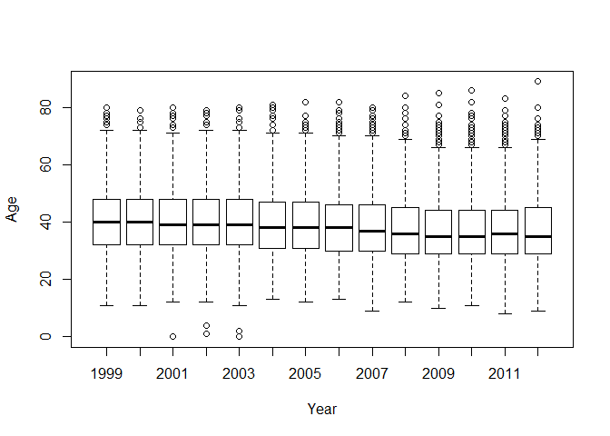

Case Study 2 - EDA
================
Nikhil Gupta
2020-09-11 06:51:54

  - [Section 2.2](#section-2.2)
  - [Section 2.3](#section-2.3)
      - [Cleaning Age](#cleaning-age)
      - [Cleaning Time](#cleaning-time)
      - [DataFrame](#dataframe)
  - [TODO: Fix 2006 Results (Header)](#todo-fix-2006-results-header)
  - [Section 2.4: Exploring Run Times (Male
    Runners)](#section-2.4-exploring-run-times-male-runners)
      - [2.4.1 Making Plots with Many
        Observations](#making-plots-with-many-observations)
      - [2.4.2: Fitting Models to Average
        Performance](#fitting-models-to-average-performance)
          - [LOESS Model](#loess-model)
          - [Piecewise Linear Model](#piecewise-linear-model)
      - [2.4.3 Cross Sectional Data and
        Covariates](#cross-sectional-data-and-covariates)
  - [Section 2.5](#section-2.5)
  - [Section 2.6](#section-2.6)
      - [Modeling the Change in Running for
        Individuals](#modeling-the-change-in-running-for-individuals)

``` r
library(tidyverse)
```

    ## -- Attaching packages ------------------------------------------------------------------------------------------------------- tidyverse 1.3.0 --

    ## v ggplot2 3.3.0     v purrr   0.3.4
    ## v tibble  3.0.0     v dplyr   0.8.5
    ## v tidyr   1.0.2     v stringr 1.4.0
    ## v readr   1.3.1     v forcats 0.5.0

    ## -- Conflicts ---------------------------------------------------------------------------------------------------------- tidyverse_conflicts() --
    ## x dplyr::filter() masks stats::filter()
    ## x dplyr::lag()    masks stats::lag()

``` r
version
```

    ##                _                           
    ## platform       x86_64-w64-mingw32          
    ## arch           x86_64                      
    ## os             mingw32                     
    ## system         x86_64, mingw32             
    ## status                                     
    ## major          3                           
    ## minor          6.3                         
    ## year           2020                        
    ## month          02                          
    ## day            29                          
    ## svn rev        77875                       
    ## language       R                           
    ## version.string R version 3.6.3 (2020-02-29)
    ## nickname       Holding the Windsock

\*\* From text (Chapter 2)\*\*

# Section 2.2

``` r
menTables = readRDS("../../data/CBMenTextTables.rds")
menTables[['2012']][1:10]
```

    ##  [1] ""                                                                                              
    ##  [2] "                 Credit Union Cherry Blossom Ten Mile Run"                                     
    ##  [3] "                 Washington, DC     Sunday, April 1, 2012"                                     
    ##  [4] ""                                                                                              
    ##  [5] "                Official Male Results (Sorted By Net Time)"                                    
    ##  [6] ""                                                                                              
    ##  [7] "Place Div  /Tot   Num    Name                   Ag Hometown             5 Mile  Time    Pace  "
    ##  [8] "===== =========== ====== ====================== == ==================== ======= ======= ===== "
    ##  [9] "    1     1/347        9 Allan Kiprono          22 Kenya                  22:32   45:15  4:32 "
    ## [10] "    2     2/347       11 Lani Kiplagat          23 Kenya                  22:38   46:28  4:39 "

``` r
menTables[['2006']][1:10]
```

    ##  [1] ""                                                                                         
    ##  [2] "               Credit Union Cherry Blossom 10 Mile Road Race"                             
    ##  [3] "                              Washington, DC"                                             
    ##  [4] "                           Sunday, April 2, 2006"                                         
    ##  [5] "                Mens's Official Results Sorted By Gun Time"                               
    ##  [6] ""                                                                                         
    ##  [7] "Place Div/Tot  Num    Name                   Ag Hometown        Net Tim Gun Tim  Pace  S "
    ##  [8] "===== ======== ====== ====================== == ======================= =======  ===== = "
    ##  [9] "    1   1/2892      1 Gilbert Okari          27 Kenya             47:24   47:25#  4:45   "
    ## [10] "    2   2/2892     11 Samuel Ndereba         29 Kenya             47:34   47:35#  4:46   "

``` r
els = menTables[['2012']]
```

``` r
eqIndex = grep("^===", els)
eqIndex
```

    ## [1] 8

``` r
spacerRow = els[eqIndex]
headerRow = els[eqIndex - 1] %>% tolower()
body = els[ -(1:eqIndex) ]
```

``` r
ageStart = regexpr("ag", headerRow)
```

``` r
age = substr(body, start = ageStart, stop = ageStart + 1)
head(age)
```

    ## [1] "22" "23" "36" "27" "24" "31"

``` r
summary(as.numeric(age))
```

    ##    Min. 1st Qu.  Median    Mean 3rd Qu.    Max.    NA's 
    ##    9.00   29.00   35.00   37.75   45.00   89.00       1

``` r
# Here the g in gregexpr() stands for “global,” which means that the function searches for
```

``` r
# multiple matches in the string, not just the first match.
blankLocs = gregexpr(" ", spacerRow)
blankLocs
```

    ## [[1]]
    ## [1]  6 18 25 48 51 72 80 88 94
    ## attr(,"match.length")
    ## [1] 1 1 1 1 1 1 1 1 1
    ## attr(,"index.type")
    ## [1] "chars"
    ## attr(,"useBytes")
    ## [1] TRUE

``` r
searchLocs = c(0, blankLocs[[1]])
searchLocs
```

    ##  [1]  0  6 18 25 48 51 72 80 88 94

``` r
Values = mapply(
  substr,
  list(body),
  start = searchLocs[-length(searchLocs)] + 1,
  stop = searchLocs[-1] - 1
  )
Values[1:10,]
```

    ##       [,1]    [,2]          [,3]     [,4]                     [,5]
    ##  [1,] "    1" "    1/347  " "     9" "Allan Kiprono         " "22"
    ##  [2,] "    2" "    2/347  " "    11" "Lani Kiplagat         " "23"
    ##  [3,] "    3" "    1/1093 " "    31" "John Korir            " "36"
    ##  [4,] "    4" "    1/1457 " "    15" "Ian Burrell           " "27"
    ##  [5,] "    5" "    3/347  " "    19" "Jesse Cherry          " "24"
    ##  [6,] "    6" "    1/1490 " "    37" "Ketema Nugusse        " "31"
    ##  [7,] "    7" "    2/1457 " "    13" "Josh Moen             " "29"
    ##  [8,] "    8" "    3/1457 " "    17" "Patrick Rizzo         " "28"
    ##  [9,] "    9" "    4/1457 " "    41" "Stephen Hallinan      " "26"
    ## [10,] "   10" "    2/1490 " "   345" "Paolo Natali          " "31"
    ##       [,6]                   [,7]      [,8]      [,9]   
    ##  [1,] "Kenya               " "  22:32" "  45:15" " 4:32"
    ##  [2,] "Kenya               " "  22:38" "  46:28" " 4:39"
    ##  [3,] "Kenya               " "  23:20" "  47:33" " 4:46"
    ##  [4,] "Tucson AZ           " "  23:50" "  47:34" " 4:46"
    ##  [5,] "Blowing Rock NC     " "  23:50" "  47:40" " 4:46"
    ##  [6,] "Ethiopia            " "  23:42" "  47:50" " 4:47"
    ##  [7,] "Minneapolis MN      " "  24:06" "  48:38" " 4:52"
    ##  [8,] "Boulder CO          " "  24:24" "  49:14" " 4:56"
    ##  [9,] "Washington DC       " "  25:01" "  50:18" " 5:02"
    ## [10,] "Washington DC       " "  25:20" "  50:44" " 5:05"

``` r
findColLocs = function(spacerRow){
  # In the function, we safeguard against the last character in the row of '=' characters not being a blank, we add
  # an additional element to the end of the vector of locations that is one character more than the length of the string.
  spaceLocs = gregexpr(" ", spacerRow)[[1]]
  rowLength = nchar(spacerRow)
  if(substring(spacerRow, rowLength, rowLength) != " "){
    return(c(0, spaceLocs, rowLength + 1))
  }
  else{
    return(c(0, spaceLocs))
  }
}
```

``` r
#' @description Function to determine the start and end location of a Column
#' @returns The Start and End Position of the Column
selectCols = function(colNames, headerRow, searchLocs){
  sapply(
    colNames,
    function(name, headerRow, searchLocs){
      startPos = regexpr(name, headerRow)[[1]]
      if (startPos == -1){
        return(c(NA, NA))
      }
      index = sum(startPos >= searchLocs)
      
      # We can easily solve both of these problems by including the value in the “blank” space between columns (see text book).
      # return(c(searchLocs[index] + 1, searchLocs[index + 1] - 1))
      return(c(searchLocs[index] + 1, searchLocs[index + 1]))
    },
    headerRow = headerRow, searchLocs = searchLocs
  )
}
```

``` r
searchLocs = findColLocs(spacerRow)
ageLoc = selectCols("ag", headerRow, searchLocs)
ages = mapply(
  substr,
  list(body),
  start = ageLoc[1,], stop = ageLoc[2,]
)
summary(as.numeric(ages))
```

    ##    Min. 1st Qu.  Median    Mean 3rd Qu.    Max.    NA's 
    ##    9.00   29.00   35.00   37.75   45.00   89.00       1

``` r
# Since the column names vary somewhat from year to year, we use only the first few
# characters that uniquely identify the desired columns, e.g.,
shortColNames = c("name", "home", "ag", "gun", "net", "time")
```

``` r
# Also, if a file does not have one of the desired variables, then we want the values for that variable to be NA.
locCols = selectCols(shortColNames, headerRow, searchLocs)
Values = mapply(
  substr,
  list(body),
  start = locCols[1, ],
  stop = locCols[2, ]
)
colnames(Values) = shortColNames
head(Values)
```

    ##      name                      home                    ag    gun net time      
    ## [1,] "Allan Kiprono          " "Kenya                " "22 " NA  NA  "  45:15 "
    ## [2,] "Lani Kiplagat          " "Kenya                " "23 " NA  NA  "  46:28 "
    ## [3,] "John Korir             " "Kenya                " "36 " NA  NA  "  47:33 "
    ## [4,] "Ian Burrell            " "Tucson AZ            " "27 " NA  NA  "  47:34 "
    ## [5,] "Jesse Cherry           " "Blowing Rock NC      " "24 " NA  NA  "  47:40 "
    ## [6,] "Ketema Nugusse         " "Ethiopia             " "31 " NA  NA  "  47:50 "

``` r
tail(Values)
```

    ##         name                      home                    ag    gun net
    ## [7188,] "Dana Brown             " "Randallstown MD      " "41 " NA  NA 
    ## [7189,] "Jurek Grabowski        " "Fairfax VA           " "39 " NA  NA 
    ## [7190,] "Larry Hume             " "Arlington VA         " "56 " NA  NA 
    ## [7191,] "Sean-Patrick Alexander " "Alexandria VA        " "35 " NA  NA 
    ## [7192,] "Joseph White           " "Forestville MD       " "   " NA  NA 
    ## [7193,] "Lee Jordan             " "Herndon VA           " "48 " NA  NA 
    ##         time      
    ## [7188,] "2:26:47 "
    ## [7189,] "2:27:11 "
    ## [7190,] "2:27:20 "
    ## [7191,] "2:27:30 "
    ## [7192,] "2:28:58 "
    ## [7193,] "2:30:59 "

``` r
extractVariables = function(file, varNames =c("name", "home", "ag", "gun", "net", "time")){
  # Find the index of the row with =s
  eqIndex = grep("^===", file)
  
  # Extract the two key rows and the data
  spacerRow = file[eqIndex]
  headerRow = tolower(file[ eqIndex - 1 ])
  body = file[ -(1 : eqIndex) ]
  
  # Remove Comments (Starting with optional space and #)
  comments = grep("^[[:space:]]*#", body)
  if(length(comments) > 0){
    body = body[-comments]
  }
  
  # Obtain the starting and ending positions of variables
  searchLocs = findColLocs(spacerRow)
  locCols = selectCols(varNames, headerRow, searchLocs)
  
  # Extract the values of these variables
  Values = mapply(
    substr, list(body),
    start = locCols[1, ],
    stop = locCols[2, ]
  )
  colnames(Values) = varNames
  
  # Remove empty rows
  blanks = grep("^[[:blank:]]*$", Values)
  if(length(blanks) > 0){
    Values = Values[-blanks, ]
  }
  
  return(invisible(Values))
}
```

``` r
menResMat = lapply(menTables, extractVariables)
length(menResMat)
```

    ## [1] 14

``` r
sapply(menResMat, nrow)
```

    ## 1999 2000 2001 2002 2003 2004 2005 2006 2007 2008 2009 2010 2011 2012 
    ## 3190 3016 3561 3723 3947 4156 4325 5236 5275 5905 6650 6910 7011 7193

# Section 2.3

## Cleaning Age

``` r
age = as.numeric(menResMat[['2012']][ , 'ag'])
tail(age)
```

    ## [1] 41 39 56 35 NA 48

``` r
age = sapply(
  menResMat,
  function(x) as.numeric(x[ , 'ag'])
)
```

``` r
boxplot(age, ylab = "Age", xlab = "Year")
```

<!-- -->

We see that in 2003, the age values are shifted to the right one space
in comparison to the location of the ‘=’ characters. This means that we
are picking up only the digit in the tens place. In 2006, some but not
all of the rows have values that are off by one character.

``` r
head(menTables[['2003']])
```

    ## [1] ""                                                                                             
    ## [2] "Place Div /Tot  Num    Name                          Ag Hometown            Gun Tim  Net Tim "
    ## [3] "===== ========= ===== ============================= == =================== =======  ======= " 
    ## [4] "    1    1/1999     6  John Korir                    27  KEN                  46:56#   46:55 "
    ## [5] "    2    2/1999     1  Reuben Cheruiyot              28  KEN                  47:03#   47:02 "
    ## [6] "    3    3/1999     8  Gilbert Okari                 24  KEN                  47:07#   47:07 "

``` r
menTables[['2006']][2200:2205]
```

    ## [1] " 2192 1263/2892   1475 Matt Curtis            39 Vienna          1:27:08 1:27:40   8:46   "
    ## [2] " 2193  94/279    1437 Joe McCloskey          59 Columbia        1:27:01 1:27:40   8:46   " 
    ## [3] " 2194 257/590    7062 Donald Hofmann         48 Princeton Junct 1:25:45 1:27:41   8:47   " 
    ## [4] " 2195 1264/2892   7049 Claudio Petruzziello   23 Princeton Jct   1:25:45 1:27:41   8:47   "
    ## [5] " 2196 339/746    3319 Robert Morrison        40 South Boston    1:23:54 1:27:41   8:47   " 
    ## [6] " 2197 1265/2892   9345 Larry Cooper           32 Arlington       1:26:42 1:27:41   8:47   "

``` r
head(menTables[['2009']],10)
```

    ##  [1] " "                                                                                              
    ##  [2] "                 Credit Union Cherry Blossom Ten Mile Run"                                      
    ##  [3] "                 Washington, DC     Sunday, April 5, 2009"                                      
    ##  [4] " "                                                                                              
    ##  [5] "                           Official Male Results"                                               
    ##  [6] " "                                                                                              
    ##  [7] "Place Div  /Tot   Num    Name                   Ag Hometown             Gun Tim Net Tim  Pace  "
    ##  [8] "===== =========== ====== ====================== == ==================== ======= =======  ===== "
    ##  [9] "    1     1/1420       1 Ridouane Harroufi      27 Morocco                45:56   45:56#  4:36 "
    ## [10] "    2     1/62         9 Feyisa Liesa           19 Ethiopia               45:58   45:58#  4:36 "

``` r
sapply(age, function(x) sum(is.na(x)))
```

    ## 1999 2000 2001 2002 2003 2004 2005 2006 2007 2008 2009 2010 2011 2012 
    ##    1    0    0    2    1    0   11    1    4    0    1    5    0    1

``` r
age2001 = age[["2001"]]
```

``` r
# grep("^===", menTables[['2001']])
```

``` r
# badAgeIndex = which(is.na(age2001)) + 5
# badAgeIndex
# menTables[['2001']][badAgeIndex]
```

``` r
# blanks = grep("^[[:blank:]]*$", menTables[['2001']])
# blanks
```

``` r
menResMat[['2001']][age2001 < 5,]
```

    ##      name                     home                  ag    gun       net       
    ## [1,] "Steve PINKOS          " "Washington DC      " " 0 " "1:22:34" "1:20:07 "
    ## [2,] "Jeff LAKE             " "Clarksville MD     " " 0 " "1:41:22" "1:39:26 "
    ## [3,] "Greg RHODE            " "Washington DC      " " 0 " "1:42:13" "1:37:14 "
    ##      time
    ## [1,] NA  
    ## [2,] NA  
    ## [3,] NA

## Cleaning Time

``` r
charTime = menResMat[['2012']][, 'time']
head(charTime, 5)
```

    ## [1] "  45:15 " "  46:28 " "  47:33 " "  47:34 " "  47:40 "

``` r
tail(charTime, 5)
```

    ## [1] "2:27:11 " "2:27:20 " "2:27:30 " "2:28:58 " "2:30:59 "

``` r
timePieces = strsplit(charTime, ":")
timePieces[[1]]
```

    ## [1] "  45" "15 "

``` r
tail(timePieces, 1)
```

    ## [[1]]
    ## [1] "2"   "30"  "59 "

``` r
timePieces = sapply(timePieces, as.numeric)
runTime = sapply(
  timePieces,
  function(x) {
    if (length(x) == 2) x[1] + x[2]/60
    else 60*x[1] + x[2] + x[3]/60
  }
)
summary(runTime)
```

    ##    Min. 1st Qu.  Median    Mean 3rd Qu.    Max. 
    ##   45.25   77.57   87.47   88.43   97.78  150.98

``` r
#' @description Converts character time columns to calculated numeric values
convertTime = function(charTimeValues){
  
  timePieces = charTimeValues %>% 
    strsplit(":") %>%
    sapply(as.numeric)
  
  runTime = sapply(
    timePieces,
    function(x) {
      if (length(x) == 2) x[1] + x[2]/60
      else 60*x[1] + x[2] + x[3]/60
    }
  )
  return(runTime)
}
```

``` r
summary(convertTime(charTime))
```

    ##    Min. 1st Qu.  Median    Mean 3rd Qu.    Max. 
    ##   45.25   77.57   87.47   88.43   97.78  150.98

## DataFrame

``` r
createDF = function(Res, year, sex){
  # Determine which time to use
  if(!is.na(Res[1, 'net'])){
    useTime = Res[ , 'net']
  }
  else if(!is.na(Res[1, 'gun'])){
    useTime = Res[ , 'gun']
  }
  else{
    useTime = Res[ , 'time']
  }
  
  # Remove # and * and blanks from time
  useTime = gsub("[#\\*[:blank:]]", "", useTime)
  # Drop rows with no time
  Res = Res[ useTime != "", ]
  
  # Convert from hh:mm:ss to single numeric value
  runTime = convertTime(useTime[useTime != ""])
  
  Results = data.frame(
    year = rep(year, nrow(Res)),
    sex = rep(sex, nrow(Res)),
    name = Res[ , 'name'],
    home = Res[ , 'home'],
    age = as.numeric(Res[, 'ag']),
    runTime = runTime,
    stringsAsFactors = FALSE
  )
  return(invisible(Results))
}
```

``` r
menDF = mapply(
  createDF,
  menResMat,
  year = 1999:2012,
  sex = rep("M", length(1999:2012)),
  SIMPLIFY = FALSE
)
```

    ## Warning in lapply(X = X, FUN = FUN, ...): NAs introduced by coercion
    
    ## Warning in lapply(X = X, FUN = FUN, ...): NAs introduced by coercion
    
    ## Warning in lapply(X = X, FUN = FUN, ...): NAs introduced by coercion
    
    ## Warning in lapply(X = X, FUN = FUN, ...): NAs introduced by coercion
    
    ## Warning in lapply(X = X, FUN = FUN, ...): NAs introduced by coercion
    
    ## Warning in lapply(X = X, FUN = FUN, ...): NAs introduced by coercion
    
    ## Warning in lapply(X = X, FUN = FUN, ...): NAs introduced by coercion
    
    ## Warning in lapply(X = X, FUN = FUN, ...): NAs introduced by coercion
    
    ## Warning in lapply(X = X, FUN = FUN, ...): NAs introduced by coercion
    
    ## Warning in lapply(X = X, FUN = FUN, ...): NAs introduced by coercion
    
    ## Warning in lapply(X = X, FUN = FUN, ...): NAs introduced by coercion
    
    ## Warning in lapply(X = X, FUN = FUN, ...): NAs introduced by coercion
    
    ## Warning in lapply(X = X, FUN = FUN, ...): NAs introduced by coercion
    
    ## Warning in lapply(X = X, FUN = FUN, ...): NAs introduced by coercion
    
    ## Warning in lapply(X = X, FUN = FUN, ...): NAs introduced by coercion
    
    ## Warning in lapply(X = X, FUN = FUN, ...): NAs introduced by coercion
    
    ## Warning in lapply(X = X, FUN = FUN, ...): NAs introduced by coercion
    
    ## Warning in lapply(X = X, FUN = FUN, ...): NAs introduced by coercion
    
    ## Warning in lapply(X = X, FUN = FUN, ...): NAs introduced by coercion
    
    ## Warning in lapply(X = X, FUN = FUN, ...): NAs introduced by coercion
    
    ## Warning in lapply(X = X, FUN = FUN, ...): NAs introduced by coercion
    
    ## Warning in lapply(X = X, FUN = FUN, ...): NAs introduced by coercion
    
    ## Warning in lapply(X = X, FUN = FUN, ...): NAs introduced by coercion
    
    ## Warning in lapply(X = X, FUN = FUN, ...): NAs introduced by coercion
    
    ## Warning in lapply(X = X, FUN = FUN, ...): NAs introduced by coercion
    
    ## Warning in lapply(X = X, FUN = FUN, ...): NAs introduced by coercion
    
    ## Warning in lapply(X = X, FUN = FUN, ...): NAs introduced by coercion
    
    ## Warning in lapply(X = X, FUN = FUN, ...): NAs introduced by coercion
    
    ## Warning in lapply(X = X, FUN = FUN, ...): NAs introduced by coercion
    
    ## Warning in lapply(X = X, FUN = FUN, ...): NAs introduced by coercion
    
    ## Warning in lapply(X = X, FUN = FUN, ...): NAs introduced by coercion
    
    ## Warning in lapply(X = X, FUN = FUN, ...): NAs introduced by coercion
    
    ## Warning in lapply(X = X, FUN = FUN, ...): NAs introduced by coercion
    
    ## Warning in lapply(X = X, FUN = FUN, ...): NAs introduced by coercion
    
    ## Warning in lapply(X = X, FUN = FUN, ...): NAs introduced by coercion
    
    ## Warning in lapply(X = X, FUN = FUN, ...): NAs introduced by coercion
    
    ## Warning in lapply(X = X, FUN = FUN, ...): NAs introduced by coercion
    
    ## Warning in lapply(X = X, FUN = FUN, ...): NAs introduced by coercion
    
    ## Warning in lapply(X = X, FUN = FUN, ...): NAs introduced by coercion
    
    ## Warning in lapply(X = X, FUN = FUN, ...): NAs introduced by coercion
    
    ## Warning in lapply(X = X, FUN = FUN, ...): NAs introduced by coercion
    
    ## Warning in lapply(X = X, FUN = FUN, ...): NAs introduced by coercion
    
    ## Warning in lapply(X = X, FUN = FUN, ...): NAs introduced by coercion
    
    ## Warning in lapply(X = X, FUN = FUN, ...): NAs introduced by coercion
    
    ## Warning in lapply(X = X, FUN = FUN, ...): NAs introduced by coercion
    
    ## Warning in lapply(X = X, FUN = FUN, ...): NAs introduced by coercion
    
    ## Warning in lapply(X = X, FUN = FUN, ...): NAs introduced by coercion
    
    ## Warning in lapply(X = X, FUN = FUN, ...): NAs introduced by coercion
    
    ## Warning in lapply(X = X, FUN = FUN, ...): NAs introduced by coercion
    
    ## Warning in lapply(X = X, FUN = FUN, ...): NAs introduced by coercion
    
    ## Warning in lapply(X = X, FUN = FUN, ...): NAs introduced by coercion
    
    ## Warning in lapply(X = X, FUN = FUN, ...): NAs introduced by coercion
    
    ## Warning in lapply(X = X, FUN = FUN, ...): NAs introduced by coercion
    
    ## Warning in lapply(X = X, FUN = FUN, ...): NAs introduced by coercion
    
    ## Warning in lapply(X = X, FUN = FUN, ...): NAs introduced by coercion
    
    ## Warning in lapply(X = X, FUN = FUN, ...): NAs introduced by coercion
    
    ## Warning in lapply(X = X, FUN = FUN, ...): NAs introduced by coercion
    
    ## Warning in lapply(X = X, FUN = FUN, ...): NAs introduced by coercion
    
    ## Warning in lapply(X = X, FUN = FUN, ...): NAs introduced by coercion
    
    ## Warning in lapply(X = X, FUN = FUN, ...): NAs introduced by coercion
    
    ## Warning in lapply(X = X, FUN = FUN, ...): NAs introduced by coercion
    
    ## Warning in lapply(X = X, FUN = FUN, ...): NAs introduced by coercion
    
    ## Warning in lapply(X = X, FUN = FUN, ...): NAs introduced by coercion
    
    ## Warning in lapply(X = X, FUN = FUN, ...): NAs introduced by coercion
    
    ## Warning in lapply(X = X, FUN = FUN, ...): NAs introduced by coercion
    
    ## Warning in lapply(X = X, FUN = FUN, ...): NAs introduced by coercion
    
    ## Warning in lapply(X = X, FUN = FUN, ...): NAs introduced by coercion
    
    ## Warning in lapply(X = X, FUN = FUN, ...): NAs introduced by coercion
    
    ## Warning in lapply(X = X, FUN = FUN, ...): NAs introduced by coercion
    
    ## Warning in lapply(X = X, FUN = FUN, ...): NAs introduced by coercion
    
    ## Warning in lapply(X = X, FUN = FUN, ...): NAs introduced by coercion
    
    ## Warning in lapply(X = X, FUN = FUN, ...): NAs introduced by coercion
    
    ## Warning in lapply(X = X, FUN = FUN, ...): NAs introduced by coercion
    
    ## Warning in lapply(X = X, FUN = FUN, ...): NAs introduced by coercion
    
    ## Warning in lapply(X = X, FUN = FUN, ...): NAs introduced by coercion
    
    ## Warning in lapply(X = X, FUN = FUN, ...): NAs introduced by coercion
    
    ## Warning in lapply(X = X, FUN = FUN, ...): NAs introduced by coercion
    
    ## Warning in lapply(X = X, FUN = FUN, ...): NAs introduced by coercion
    
    ## Warning in lapply(X = X, FUN = FUN, ...): NAs introduced by coercion
    
    ## Warning in lapply(X = X, FUN = FUN, ...): NAs introduced by coercion
    
    ## Warning in lapply(X = X, FUN = FUN, ...): NAs introduced by coercion
    
    ## Warning in lapply(X = X, FUN = FUN, ...): NAs introduced by coercion
    
    ## Warning in lapply(X = X, FUN = FUN, ...): NAs introduced by coercion
    
    ## Warning in lapply(X = X, FUN = FUN, ...): NAs introduced by coercion
    
    ## Warning in lapply(X = X, FUN = FUN, ...): NAs introduced by coercion
    
    ## Warning in lapply(X = X, FUN = FUN, ...): NAs introduced by coercion
    
    ## Warning in lapply(X = X, FUN = FUN, ...): NAs introduced by coercion
    
    ## Warning in lapply(X = X, FUN = FUN, ...): NAs introduced by coercion
    
    ## Warning in lapply(X = X, FUN = FUN, ...): NAs introduced by coercion
    
    ## Warning in lapply(X = X, FUN = FUN, ...): NAs introduced by coercion
    
    ## Warning in lapply(X = X, FUN = FUN, ...): NAs introduced by coercion
    
    ## Warning in lapply(X = X, FUN = FUN, ...): NAs introduced by coercion
    
    ## Warning in lapply(X = X, FUN = FUN, ...): NAs introduced by coercion
    
    ## Warning in lapply(X = X, FUN = FUN, ...): NAs introduced by coercion
    
    ## Warning in lapply(X = X, FUN = FUN, ...): NAs introduced by coercion
    
    ## Warning in lapply(X = X, FUN = FUN, ...): NAs introduced by coercion
    
    ## Warning in lapply(X = X, FUN = FUN, ...): NAs introduced by coercion
    
    ## Warning in lapply(X = X, FUN = FUN, ...): NAs introduced by coercion
    
    ## Warning in lapply(X = X, FUN = FUN, ...): NAs introduced by coercion
    
    ## Warning in lapply(X = X, FUN = FUN, ...): NAs introduced by coercion
    
    ## Warning in lapply(X = X, FUN = FUN, ...): NAs introduced by coercion
    
    ## Warning in lapply(X = X, FUN = FUN, ...): NAs introduced by coercion
    
    ## Warning in lapply(X = X, FUN = FUN, ...): NAs introduced by coercion
    
    ## Warning in lapply(X = X, FUN = FUN, ...): NAs introduced by coercion
    
    ## Warning in lapply(X = X, FUN = FUN, ...): NAs introduced by coercion
    
    ## Warning in lapply(X = X, FUN = FUN, ...): NAs introduced by coercion
    
    ## Warning in lapply(X = X, FUN = FUN, ...): NAs introduced by coercion
    
    ## Warning in lapply(X = X, FUN = FUN, ...): NAs introduced by coercion
    
    ## Warning in lapply(X = X, FUN = FUN, ...): NAs introduced by coercion
    
    ## Warning in lapply(X = X, FUN = FUN, ...): NAs introduced by coercion
    
    ## Warning in lapply(X = X, FUN = FUN, ...): NAs introduced by coercion
    
    ## Warning in lapply(X = X, FUN = FUN, ...): NAs introduced by coercion
    
    ## Warning in lapply(X = X, FUN = FUN, ...): NAs introduced by coercion
    
    ## Warning in lapply(X = X, FUN = FUN, ...): NAs introduced by coercion
    
    ## Warning in lapply(X = X, FUN = FUN, ...): NAs introduced by coercion
    
    ## Warning in lapply(X = X, FUN = FUN, ...): NAs introduced by coercion
    
    ## Warning in lapply(X = X, FUN = FUN, ...): NAs introduced by coercion
    
    ## Warning in lapply(X = X, FUN = FUN, ...): NAs introduced by coercion
    
    ## Warning in lapply(X = X, FUN = FUN, ...): NAs introduced by coercion
    
    ## Warning in lapply(X = X, FUN = FUN, ...): NAs introduced by coercion
    
    ## Warning in lapply(X = X, FUN = FUN, ...): NAs introduced by coercion
    
    ## Warning in lapply(X = X, FUN = FUN, ...): NAs introduced by coercion
    
    ## Warning in lapply(X = X, FUN = FUN, ...): NAs introduced by coercion
    
    ## Warning in lapply(X = X, FUN = FUN, ...): NAs introduced by coercion
    
    ## Warning in lapply(X = X, FUN = FUN, ...): NAs introduced by coercion
    
    ## Warning in lapply(X = X, FUN = FUN, ...): NAs introduced by coercion
    
    ## Warning in lapply(X = X, FUN = FUN, ...): NAs introduced by coercion
    
    ## Warning in lapply(X = X, FUN = FUN, ...): NAs introduced by coercion
    
    ## Warning in lapply(X = X, FUN = FUN, ...): NAs introduced by coercion
    
    ## Warning in lapply(X = X, FUN = FUN, ...): NAs introduced by coercion
    
    ## Warning in lapply(X = X, FUN = FUN, ...): NAs introduced by coercion
    
    ## Warning in lapply(X = X, FUN = FUN, ...): NAs introduced by coercion
    
    ## Warning in lapply(X = X, FUN = FUN, ...): NAs introduced by coercion
    
    ## Warning in lapply(X = X, FUN = FUN, ...): NAs introduced by coercion
    
    ## Warning in lapply(X = X, FUN = FUN, ...): NAs introduced by coercion
    
    ## Warning in lapply(X = X, FUN = FUN, ...): NAs introduced by coercion
    
    ## Warning in lapply(X = X, FUN = FUN, ...): NAs introduced by coercion
    
    ## Warning in lapply(X = X, FUN = FUN, ...): NAs introduced by coercion
    
    ## Warning in lapply(X = X, FUN = FUN, ...): NAs introduced by coercion
    
    ## Warning in lapply(X = X, FUN = FUN, ...): NAs introduced by coercion
    
    ## Warning in lapply(X = X, FUN = FUN, ...): NAs introduced by coercion
    
    ## Warning in lapply(X = X, FUN = FUN, ...): NAs introduced by coercion
    
    ## Warning in lapply(X = X, FUN = FUN, ...): NAs introduced by coercion
    
    ## Warning in lapply(X = X, FUN = FUN, ...): NAs introduced by coercion
    
    ## Warning in lapply(X = X, FUN = FUN, ...): NAs introduced by coercion
    
    ## Warning in lapply(X = X, FUN = FUN, ...): NAs introduced by coercion
    
    ## Warning in lapply(X = X, FUN = FUN, ...): NAs introduced by coercion
    
    ## Warning in lapply(X = X, FUN = FUN, ...): NAs introduced by coercion
    
    ## Warning in lapply(X = X, FUN = FUN, ...): NAs introduced by coercion
    
    ## Warning in lapply(X = X, FUN = FUN, ...): NAs introduced by coercion
    
    ## Warning in lapply(X = X, FUN = FUN, ...): NAs introduced by coercion
    
    ## Warning in lapply(X = X, FUN = FUN, ...): NAs introduced by coercion
    
    ## Warning in lapply(X = X, FUN = FUN, ...): NAs introduced by coercion
    
    ## Warning in lapply(X = X, FUN = FUN, ...): NAs introduced by coercion
    
    ## Warning in lapply(X = X, FUN = FUN, ...): NAs introduced by coercion
    
    ## Warning in lapply(X = X, FUN = FUN, ...): NAs introduced by coercion
    
    ## Warning in lapply(X = X, FUN = FUN, ...): NAs introduced by coercion
    
    ## Warning in lapply(X = X, FUN = FUN, ...): NAs introduced by coercion
    
    ## Warning in lapply(X = X, FUN = FUN, ...): NAs introduced by coercion
    
    ## Warning in lapply(X = X, FUN = FUN, ...): NAs introduced by coercion
    
    ## Warning in lapply(X = X, FUN = FUN, ...): NAs introduced by coercion
    
    ## Warning in lapply(X = X, FUN = FUN, ...): NAs introduced by coercion
    
    ## Warning in lapply(X = X, FUN = FUN, ...): NAs introduced by coercion
    
    ## Warning in lapply(X = X, FUN = FUN, ...): NAs introduced by coercion
    
    ## Warning in lapply(X = X, FUN = FUN, ...): NAs introduced by coercion
    
    ## Warning in lapply(X = X, FUN = FUN, ...): NAs introduced by coercion
    
    ## Warning in lapply(X = X, FUN = FUN, ...): NAs introduced by coercion
    
    ## Warning in lapply(X = X, FUN = FUN, ...): NAs introduced by coercion
    
    ## Warning in lapply(X = X, FUN = FUN, ...): NAs introduced by coercion
    
    ## Warning in lapply(X = X, FUN = FUN, ...): NAs introduced by coercion
    
    ## Warning in lapply(X = X, FUN = FUN, ...): NAs introduced by coercion
    
    ## Warning in lapply(X = X, FUN = FUN, ...): NAs introduced by coercion
    
    ## Warning in lapply(X = X, FUN = FUN, ...): NAs introduced by coercion
    
    ## Warning in lapply(X = X, FUN = FUN, ...): NAs introduced by coercion
    
    ## Warning in lapply(X = X, FUN = FUN, ...): NAs introduced by coercion
    
    ## Warning in lapply(X = X, FUN = FUN, ...): NAs introduced by coercion
    
    ## Warning in lapply(X = X, FUN = FUN, ...): NAs introduced by coercion
    
    ## Warning in lapply(X = X, FUN = FUN, ...): NAs introduced by coercion
    
    ## Warning in lapply(X = X, FUN = FUN, ...): NAs introduced by coercion
    
    ## Warning in lapply(X = X, FUN = FUN, ...): NAs introduced by coercion
    
    ## Warning in lapply(X = X, FUN = FUN, ...): NAs introduced by coercion
    
    ## Warning in lapply(X = X, FUN = FUN, ...): NAs introduced by coercion
    
    ## Warning in lapply(X = X, FUN = FUN, ...): NAs introduced by coercion
    
    ## Warning in lapply(X = X, FUN = FUN, ...): NAs introduced by coercion
    
    ## Warning in lapply(X = X, FUN = FUN, ...): NAs introduced by coercion
    
    ## Warning in lapply(X = X, FUN = FUN, ...): NAs introduced by coercion
    
    ## Warning in lapply(X = X, FUN = FUN, ...): NAs introduced by coercion
    
    ## Warning in lapply(X = X, FUN = FUN, ...): NAs introduced by coercion
    
    ## Warning in lapply(X = X, FUN = FUN, ...): NAs introduced by coercion
    
    ## Warning in lapply(X = X, FUN = FUN, ...): NAs introduced by coercion
    
    ## Warning in lapply(X = X, FUN = FUN, ...): NAs introduced by coercion
    
    ## Warning in lapply(X = X, FUN = FUN, ...): NAs introduced by coercion
    
    ## Warning in lapply(X = X, FUN = FUN, ...): NAs introduced by coercion
    
    ## Warning in lapply(X = X, FUN = FUN, ...): NAs introduced by coercion
    
    ## Warning in lapply(X = X, FUN = FUN, ...): NAs introduced by coercion
    
    ## Warning in lapply(X = X, FUN = FUN, ...): NAs introduced by coercion
    
    ## Warning in lapply(X = X, FUN = FUN, ...): NAs introduced by coercion
    
    ## Warning in lapply(X = X, FUN = FUN, ...): NAs introduced by coercion
    
    ## Warning in lapply(X = X, FUN = FUN, ...): NAs introduced by coercion
    
    ## Warning in lapply(X = X, FUN = FUN, ...): NAs introduced by coercion
    
    ## Warning in lapply(X = X, FUN = FUN, ...): NAs introduced by coercion
    
    ## Warning in lapply(X = X, FUN = FUN, ...): NAs introduced by coercion
    
    ## Warning in lapply(X = X, FUN = FUN, ...): NAs introduced by coercion
    
    ## Warning in lapply(X = X, FUN = FUN, ...): NAs introduced by coercion
    
    ## Warning in lapply(X = X, FUN = FUN, ...): NAs introduced by coercion
    
    ## Warning in lapply(X = X, FUN = FUN, ...): NAs introduced by coercion
    
    ## Warning in lapply(X = X, FUN = FUN, ...): NAs introduced by coercion
    
    ## Warning in lapply(X = X, FUN = FUN, ...): NAs introduced by coercion
    
    ## Warning in lapply(X = X, FUN = FUN, ...): NAs introduced by coercion
    
    ## Warning in lapply(X = X, FUN = FUN, ...): NAs introduced by coercion
    
    ## Warning in lapply(X = X, FUN = FUN, ...): NAs introduced by coercion
    
    ## Warning in lapply(X = X, FUN = FUN, ...): NAs introduced by coercion
    
    ## Warning in lapply(X = X, FUN = FUN, ...): NAs introduced by coercion
    
    ## Warning in lapply(X = X, FUN = FUN, ...): NAs introduced by coercion
    
    ## Warning in lapply(X = X, FUN = FUN, ...): NAs introduced by coercion
    
    ## Warning in lapply(X = X, FUN = FUN, ...): NAs introduced by coercion
    
    ## Warning in lapply(X = X, FUN = FUN, ...): NAs introduced by coercion
    
    ## Warning in lapply(X = X, FUN = FUN, ...): NAs introduced by coercion
    
    ## Warning in lapply(X = X, FUN = FUN, ...): NAs introduced by coercion
    
    ## Warning in lapply(X = X, FUN = FUN, ...): NAs introduced by coercion
    
    ## Warning in lapply(X = X, FUN = FUN, ...): NAs introduced by coercion
    
    ## Warning in lapply(X = X, FUN = FUN, ...): NAs introduced by coercion
    
    ## Warning in lapply(X = X, FUN = FUN, ...): NAs introduced by coercion
    
    ## Warning in lapply(X = X, FUN = FUN, ...): NAs introduced by coercion
    
    ## Warning in lapply(X = X, FUN = FUN, ...): NAs introduced by coercion
    
    ## Warning in lapply(X = X, FUN = FUN, ...): NAs introduced by coercion
    
    ## Warning in lapply(X = X, FUN = FUN, ...): NAs introduced by coercion
    
    ## Warning in lapply(X = X, FUN = FUN, ...): NAs introduced by coercion
    
    ## Warning in lapply(X = X, FUN = FUN, ...): NAs introduced by coercion
    
    ## Warning in lapply(X = X, FUN = FUN, ...): NAs introduced by coercion
    
    ## Warning in lapply(X = X, FUN = FUN, ...): NAs introduced by coercion
    
    ## Warning in lapply(X = X, FUN = FUN, ...): NAs introduced by coercion
    
    ## Warning in lapply(X = X, FUN = FUN, ...): NAs introduced by coercion
    
    ## Warning in lapply(X = X, FUN = FUN, ...): NAs introduced by coercion
    
    ## Warning in lapply(X = X, FUN = FUN, ...): NAs introduced by coercion
    
    ## Warning in lapply(X = X, FUN = FUN, ...): NAs introduced by coercion
    
    ## Warning in lapply(X = X, FUN = FUN, ...): NAs introduced by coercion
    
    ## Warning in lapply(X = X, FUN = FUN, ...): NAs introduced by coercion
    
    ## Warning in lapply(X = X, FUN = FUN, ...): NAs introduced by coercion
    
    ## Warning in lapply(X = X, FUN = FUN, ...): NAs introduced by coercion
    
    ## Warning in lapply(X = X, FUN = FUN, ...): NAs introduced by coercion
    
    ## Warning in lapply(X = X, FUN = FUN, ...): NAs introduced by coercion
    
    ## Warning in lapply(X = X, FUN = FUN, ...): NAs introduced by coercion
    
    ## Warning in lapply(X = X, FUN = FUN, ...): NAs introduced by coercion
    
    ## Warning in lapply(X = X, FUN = FUN, ...): NAs introduced by coercion
    
    ## Warning in lapply(X = X, FUN = FUN, ...): NAs introduced by coercion
    
    ## Warning in lapply(X = X, FUN = FUN, ...): NAs introduced by coercion
    
    ## Warning in lapply(X = X, FUN = FUN, ...): NAs introduced by coercion
    
    ## Warning in lapply(X = X, FUN = FUN, ...): NAs introduced by coercion
    
    ## Warning in lapply(X = X, FUN = FUN, ...): NAs introduced by coercion
    
    ## Warning in lapply(X = X, FUN = FUN, ...): NAs introduced by coercion
    
    ## Warning in lapply(X = X, FUN = FUN, ...): NAs introduced by coercion
    
    ## Warning in lapply(X = X, FUN = FUN, ...): NAs introduced by coercion
    
    ## Warning in lapply(X = X, FUN = FUN, ...): NAs introduced by coercion
    
    ## Warning in lapply(X = X, FUN = FUN, ...): NAs introduced by coercion
    
    ## Warning in lapply(X = X, FUN = FUN, ...): NAs introduced by coercion
    
    ## Warning in lapply(X = X, FUN = FUN, ...): NAs introduced by coercion
    
    ## Warning in lapply(X = X, FUN = FUN, ...): NAs introduced by coercion
    
    ## Warning in lapply(X = X, FUN = FUN, ...): NAs introduced by coercion
    
    ## Warning in lapply(X = X, FUN = FUN, ...): NAs introduced by coercion
    
    ## Warning in lapply(X = X, FUN = FUN, ...): NAs introduced by coercion
    
    ## Warning in lapply(X = X, FUN = FUN, ...): NAs introduced by coercion
    
    ## Warning in lapply(X = X, FUN = FUN, ...): NAs introduced by coercion
    
    ## Warning in lapply(X = X, FUN = FUN, ...): NAs introduced by coercion
    
    ## Warning in lapply(X = X, FUN = FUN, ...): NAs introduced by coercion
    
    ## Warning in lapply(X = X, FUN = FUN, ...): NAs introduced by coercion
    
    ## Warning in lapply(X = X, FUN = FUN, ...): NAs introduced by coercion
    
    ## Warning in lapply(X = X, FUN = FUN, ...): NAs introduced by coercion
    
    ## Warning in lapply(X = X, FUN = FUN, ...): NAs introduced by coercion
    
    ## Warning in lapply(X = X, FUN = FUN, ...): NAs introduced by coercion
    
    ## Warning in lapply(X = X, FUN = FUN, ...): NAs introduced by coercion
    
    ## Warning in lapply(X = X, FUN = FUN, ...): NAs introduced by coercion
    
    ## Warning in lapply(X = X, FUN = FUN, ...): NAs introduced by coercion
    
    ## Warning in lapply(X = X, FUN = FUN, ...): NAs introduced by coercion
    
    ## Warning in lapply(X = X, FUN = FUN, ...): NAs introduced by coercion
    
    ## Warning in lapply(X = X, FUN = FUN, ...): NAs introduced by coercion
    
    ## Warning in lapply(X = X, FUN = FUN, ...): NAs introduced by coercion
    
    ## Warning in lapply(X = X, FUN = FUN, ...): NAs introduced by coercion
    
    ## Warning in lapply(X = X, FUN = FUN, ...): NAs introduced by coercion
    
    ## Warning in lapply(X = X, FUN = FUN, ...): NAs introduced by coercion
    
    ## Warning in lapply(X = X, FUN = FUN, ...): NAs introduced by coercion
    
    ## Warning in lapply(X = X, FUN = FUN, ...): NAs introduced by coercion
    
    ## Warning in lapply(X = X, FUN = FUN, ...): NAs introduced by coercion
    
    ## Warning in lapply(X = X, FUN = FUN, ...): NAs introduced by coercion
    
    ## Warning in lapply(X = X, FUN = FUN, ...): NAs introduced by coercion
    
    ## Warning in lapply(X = X, FUN = FUN, ...): NAs introduced by coercion
    
    ## Warning in lapply(X = X, FUN = FUN, ...): NAs introduced by coercion
    
    ## Warning in lapply(X = X, FUN = FUN, ...): NAs introduced by coercion
    
    ## Warning in lapply(X = X, FUN = FUN, ...): NAs introduced by coercion
    
    ## Warning in lapply(X = X, FUN = FUN, ...): NAs introduced by coercion
    
    ## Warning in lapply(X = X, FUN = FUN, ...): NAs introduced by coercion
    
    ## Warning in lapply(X = X, FUN = FUN, ...): NAs introduced by coercion
    
    ## Warning in lapply(X = X, FUN = FUN, ...): NAs introduced by coercion
    
    ## Warning in lapply(X = X, FUN = FUN, ...): NAs introduced by coercion
    
    ## Warning in lapply(X = X, FUN = FUN, ...): NAs introduced by coercion
    
    ## Warning in lapply(X = X, FUN = FUN, ...): NAs introduced by coercion
    
    ## Warning in lapply(X = X, FUN = FUN, ...): NAs introduced by coercion
    
    ## Warning in lapply(X = X, FUN = FUN, ...): NAs introduced by coercion
    
    ## Warning in lapply(X = X, FUN = FUN, ...): NAs introduced by coercion
    
    ## Warning in lapply(X = X, FUN = FUN, ...): NAs introduced by coercion
    
    ## Warning in lapply(X = X, FUN = FUN, ...): NAs introduced by coercion
    
    ## Warning in lapply(X = X, FUN = FUN, ...): NAs introduced by coercion
    
    ## Warning in lapply(X = X, FUN = FUN, ...): NAs introduced by coercion
    
    ## Warning in lapply(X = X, FUN = FUN, ...): NAs introduced by coercion
    
    ## Warning in lapply(X = X, FUN = FUN, ...): NAs introduced by coercion
    
    ## Warning in lapply(X = X, FUN = FUN, ...): NAs introduced by coercion
    
    ## Warning in lapply(X = X, FUN = FUN, ...): NAs introduced by coercion
    
    ## Warning in lapply(X = X, FUN = FUN, ...): NAs introduced by coercion
    
    ## Warning in lapply(X = X, FUN = FUN, ...): NAs introduced by coercion
    
    ## Warning in lapply(X = X, FUN = FUN, ...): NAs introduced by coercion
    
    ## Warning in lapply(X = X, FUN = FUN, ...): NAs introduced by coercion
    
    ## Warning in lapply(X = X, FUN = FUN, ...): NAs introduced by coercion
    
    ## Warning in lapply(X = X, FUN = FUN, ...): NAs introduced by coercion
    
    ## Warning in lapply(X = X, FUN = FUN, ...): NAs introduced by coercion
    
    ## Warning in lapply(X = X, FUN = FUN, ...): NAs introduced by coercion
    
    ## Warning in lapply(X = X, FUN = FUN, ...): NAs introduced by coercion
    
    ## Warning in lapply(X = X, FUN = FUN, ...): NAs introduced by coercion
    
    ## Warning in lapply(X = X, FUN = FUN, ...): NAs introduced by coercion
    
    ## Warning in lapply(X = X, FUN = FUN, ...): NAs introduced by coercion
    
    ## Warning in lapply(X = X, FUN = FUN, ...): NAs introduced by coercion
    
    ## Warning in lapply(X = X, FUN = FUN, ...): NAs introduced by coercion
    
    ## Warning in lapply(X = X, FUN = FUN, ...): NAs introduced by coercion
    
    ## Warning in lapply(X = X, FUN = FUN, ...): NAs introduced by coercion
    
    ## Warning in lapply(X = X, FUN = FUN, ...): NAs introduced by coercion
    
    ## Warning in lapply(X = X, FUN = FUN, ...): NAs introduced by coercion
    
    ## Warning in lapply(X = X, FUN = FUN, ...): NAs introduced by coercion
    
    ## Warning in lapply(X = X, FUN = FUN, ...): NAs introduced by coercion
    
    ## Warning in lapply(X = X, FUN = FUN, ...): NAs introduced by coercion
    
    ## Warning in lapply(X = X, FUN = FUN, ...): NAs introduced by coercion
    
    ## Warning in lapply(X = X, FUN = FUN, ...): NAs introduced by coercion
    
    ## Warning in lapply(X = X, FUN = FUN, ...): NAs introduced by coercion
    
    ## Warning in lapply(X = X, FUN = FUN, ...): NAs introduced by coercion
    
    ## Warning in lapply(X = X, FUN = FUN, ...): NAs introduced by coercion
    
    ## Warning in lapply(X = X, FUN = FUN, ...): NAs introduced by coercion
    
    ## Warning in lapply(X = X, FUN = FUN, ...): NAs introduced by coercion
    
    ## Warning in lapply(X = X, FUN = FUN, ...): NAs introduced by coercion
    
    ## Warning in lapply(X = X, FUN = FUN, ...): NAs introduced by coercion
    
    ## Warning in lapply(X = X, FUN = FUN, ...): NAs introduced by coercion
    
    ## Warning in lapply(X = X, FUN = FUN, ...): NAs introduced by coercion
    
    ## Warning in lapply(X = X, FUN = FUN, ...): NAs introduced by coercion
    
    ## Warning in lapply(X = X, FUN = FUN, ...): NAs introduced by coercion
    
    ## Warning in lapply(X = X, FUN = FUN, ...): NAs introduced by coercion
    
    ## Warning in lapply(X = X, FUN = FUN, ...): NAs introduced by coercion
    
    ## Warning in lapply(X = X, FUN = FUN, ...): NAs introduced by coercion
    
    ## Warning in lapply(X = X, FUN = FUN, ...): NAs introduced by coercion
    
    ## Warning in lapply(X = X, FUN = FUN, ...): NAs introduced by coercion
    
    ## Warning in lapply(X = X, FUN = FUN, ...): NAs introduced by coercion
    
    ## Warning in lapply(X = X, FUN = FUN, ...): NAs introduced by coercion
    
    ## Warning in lapply(X = X, FUN = FUN, ...): NAs introduced by coercion
    
    ## Warning in lapply(X = X, FUN = FUN, ...): NAs introduced by coercion
    
    ## Warning in lapply(X = X, FUN = FUN, ...): NAs introduced by coercion
    
    ## Warning in lapply(X = X, FUN = FUN, ...): NAs introduced by coercion
    
    ## Warning in lapply(X = X, FUN = FUN, ...): NAs introduced by coercion
    
    ## Warning in lapply(X = X, FUN = FUN, ...): NAs introduced by coercion
    
    ## Warning in lapply(X = X, FUN = FUN, ...): NAs introduced by coercion
    
    ## Warning in lapply(X = X, FUN = FUN, ...): NAs introduced by coercion
    
    ## Warning in lapply(X = X, FUN = FUN, ...): NAs introduced by coercion
    
    ## Warning in lapply(X = X, FUN = FUN, ...): NAs introduced by coercion
    
    ## Warning in lapply(X = X, FUN = FUN, ...): NAs introduced by coercion
    
    ## Warning in lapply(X = X, FUN = FUN, ...): NAs introduced by coercion
    
    ## Warning in lapply(X = X, FUN = FUN, ...): NAs introduced by coercion
    
    ## Warning in lapply(X = X, FUN = FUN, ...): NAs introduced by coercion
    
    ## Warning in lapply(X = X, FUN = FUN, ...): NAs introduced by coercion
    
    ## Warning in lapply(X = X, FUN = FUN, ...): NAs introduced by coercion
    
    ## Warning in lapply(X = X, FUN = FUN, ...): NAs introduced by coercion
    
    ## Warning in lapply(X = X, FUN = FUN, ...): NAs introduced by coercion
    
    ## Warning in lapply(X = X, FUN = FUN, ...): NAs introduced by coercion
    
    ## Warning in lapply(X = X, FUN = FUN, ...): NAs introduced by coercion
    
    ## Warning in lapply(X = X, FUN = FUN, ...): NAs introduced by coercion
    
    ## Warning in lapply(X = X, FUN = FUN, ...): NAs introduced by coercion
    
    ## Warning in lapply(X = X, FUN = FUN, ...): NAs introduced by coercion
    
    ## Warning in lapply(X = X, FUN = FUN, ...): NAs introduced by coercion
    
    ## Warning in lapply(X = X, FUN = FUN, ...): NAs introduced by coercion
    
    ## Warning in lapply(X = X, FUN = FUN, ...): NAs introduced by coercion
    
    ## Warning in lapply(X = X, FUN = FUN, ...): NAs introduced by coercion
    
    ## Warning in lapply(X = X, FUN = FUN, ...): NAs introduced by coercion
    
    ## Warning in lapply(X = X, FUN = FUN, ...): NAs introduced by coercion
    
    ## Warning in lapply(X = X, FUN = FUN, ...): NAs introduced by coercion
    
    ## Warning in lapply(X = X, FUN = FUN, ...): NAs introduced by coercion
    
    ## Warning in lapply(X = X, FUN = FUN, ...): NAs introduced by coercion
    
    ## Warning in lapply(X = X, FUN = FUN, ...): NAs introduced by coercion
    
    ## Warning in lapply(X = X, FUN = FUN, ...): NAs introduced by coercion
    
    ## Warning in lapply(X = X, FUN = FUN, ...): NAs introduced by coercion
    
    ## Warning in lapply(X = X, FUN = FUN, ...): NAs introduced by coercion
    
    ## Warning in lapply(X = X, FUN = FUN, ...): NAs introduced by coercion
    
    ## Warning in lapply(X = X, FUN = FUN, ...): NAs introduced by coercion
    
    ## Warning in lapply(X = X, FUN = FUN, ...): NAs introduced by coercion
    
    ## Warning in lapply(X = X, FUN = FUN, ...): NAs introduced by coercion
    
    ## Warning in lapply(X = X, FUN = FUN, ...): NAs introduced by coercion
    
    ## Warning in lapply(X = X, FUN = FUN, ...): NAs introduced by coercion
    
    ## Warning in lapply(X = X, FUN = FUN, ...): NAs introduced by coercion
    
    ## Warning in lapply(X = X, FUN = FUN, ...): NAs introduced by coercion
    
    ## Warning in lapply(X = X, FUN = FUN, ...): NAs introduced by coercion
    
    ## Warning in lapply(X = X, FUN = FUN, ...): NAs introduced by coercion
    
    ## Warning in lapply(X = X, FUN = FUN, ...): NAs introduced by coercion
    
    ## Warning in lapply(X = X, FUN = FUN, ...): NAs introduced by coercion
    
    ## Warning in lapply(X = X, FUN = FUN, ...): NAs introduced by coercion
    
    ## Warning in lapply(X = X, FUN = FUN, ...): NAs introduced by coercion
    
    ## Warning in lapply(X = X, FUN = FUN, ...): NAs introduced by coercion
    
    ## Warning in lapply(X = X, FUN = FUN, ...): NAs introduced by coercion
    
    ## Warning in lapply(X = X, FUN = FUN, ...): NAs introduced by coercion
    
    ## Warning in lapply(X = X, FUN = FUN, ...): NAs introduced by coercion
    
    ## Warning in lapply(X = X, FUN = FUN, ...): NAs introduced by coercion
    
    ## Warning in lapply(X = X, FUN = FUN, ...): NAs introduced by coercion
    
    ## Warning in lapply(X = X, FUN = FUN, ...): NAs introduced by coercion
    
    ## Warning in lapply(X = X, FUN = FUN, ...): NAs introduced by coercion
    
    ## Warning in lapply(X = X, FUN = FUN, ...): NAs introduced by coercion
    
    ## Warning in lapply(X = X, FUN = FUN, ...): NAs introduced by coercion
    
    ## Warning in lapply(X = X, FUN = FUN, ...): NAs introduced by coercion
    
    ## Warning in lapply(X = X, FUN = FUN, ...): NAs introduced by coercion
    
    ## Warning in lapply(X = X, FUN = FUN, ...): NAs introduced by coercion
    
    ## Warning in lapply(X = X, FUN = FUN, ...): NAs introduced by coercion
    
    ## Warning in lapply(X = X, FUN = FUN, ...): NAs introduced by coercion
    
    ## Warning in lapply(X = X, FUN = FUN, ...): NAs introduced by coercion
    
    ## Warning in lapply(X = X, FUN = FUN, ...): NAs introduced by coercion
    
    ## Warning in lapply(X = X, FUN = FUN, ...): NAs introduced by coercion
    
    ## Warning in lapply(X = X, FUN = FUN, ...): NAs introduced by coercion
    
    ## Warning in lapply(X = X, FUN = FUN, ...): NAs introduced by coercion
    
    ## Warning in lapply(X = X, FUN = FUN, ...): NAs introduced by coercion
    
    ## Warning in lapply(X = X, FUN = FUN, ...): NAs introduced by coercion
    
    ## Warning in lapply(X = X, FUN = FUN, ...): NAs introduced by coercion
    
    ## Warning in lapply(X = X, FUN = FUN, ...): NAs introduced by coercion
    
    ## Warning in lapply(X = X, FUN = FUN, ...): NAs introduced by coercion
    
    ## Warning in lapply(X = X, FUN = FUN, ...): NAs introduced by coercion
    
    ## Warning in lapply(X = X, FUN = FUN, ...): NAs introduced by coercion
    
    ## Warning in lapply(X = X, FUN = FUN, ...): NAs introduced by coercion
    
    ## Warning in lapply(X = X, FUN = FUN, ...): NAs introduced by coercion
    
    ## Warning in lapply(X = X, FUN = FUN, ...): NAs introduced by coercion
    
    ## Warning in lapply(X = X, FUN = FUN, ...): NAs introduced by coercion
    
    ## Warning in lapply(X = X, FUN = FUN, ...): NAs introduced by coercion
    
    ## Warning in lapply(X = X, FUN = FUN, ...): NAs introduced by coercion
    
    ## Warning in lapply(X = X, FUN = FUN, ...): NAs introduced by coercion
    
    ## Warning in lapply(X = X, FUN = FUN, ...): NAs introduced by coercion
    
    ## Warning in lapply(X = X, FUN = FUN, ...): NAs introduced by coercion
    
    ## Warning in lapply(X = X, FUN = FUN, ...): NAs introduced by coercion
    
    ## Warning in lapply(X = X, FUN = FUN, ...): NAs introduced by coercion
    
    ## Warning in lapply(X = X, FUN = FUN, ...): NAs introduced by coercion
    
    ## Warning in lapply(X = X, FUN = FUN, ...): NAs introduced by coercion
    
    ## Warning in lapply(X = X, FUN = FUN, ...): NAs introduced by coercion
    
    ## Warning in lapply(X = X, FUN = FUN, ...): NAs introduced by coercion
    
    ## Warning in lapply(X = X, FUN = FUN, ...): NAs introduced by coercion
    
    ## Warning in lapply(X = X, FUN = FUN, ...): NAs introduced by coercion
    
    ## Warning in lapply(X = X, FUN = FUN, ...): NAs introduced by coercion
    
    ## Warning in lapply(X = X, FUN = FUN, ...): NAs introduced by coercion
    
    ## Warning in lapply(X = X, FUN = FUN, ...): NAs introduced by coercion
    
    ## Warning in lapply(X = X, FUN = FUN, ...): NAs introduced by coercion
    
    ## Warning in lapply(X = X, FUN = FUN, ...): NAs introduced by coercion
    
    ## Warning in lapply(X = X, FUN = FUN, ...): NAs introduced by coercion
    
    ## Warning in lapply(X = X, FUN = FUN, ...): NAs introduced by coercion
    
    ## Warning in lapply(X = X, FUN = FUN, ...): NAs introduced by coercion
    
    ## Warning in lapply(X = X, FUN = FUN, ...): NAs introduced by coercion
    
    ## Warning in lapply(X = X, FUN = FUN, ...): NAs introduced by coercion
    
    ## Warning in lapply(X = X, FUN = FUN, ...): NAs introduced by coercion
    
    ## Warning in lapply(X = X, FUN = FUN, ...): NAs introduced by coercion
    
    ## Warning in lapply(X = X, FUN = FUN, ...): NAs introduced by coercion
    
    ## Warning in lapply(X = X, FUN = FUN, ...): NAs introduced by coercion
    
    ## Warning in lapply(X = X, FUN = FUN, ...): NAs introduced by coercion
    
    ## Warning in lapply(X = X, FUN = FUN, ...): NAs introduced by coercion
    
    ## Warning in lapply(X = X, FUN = FUN, ...): NAs introduced by coercion
    
    ## Warning in lapply(X = X, FUN = FUN, ...): NAs introduced by coercion
    
    ## Warning in lapply(X = X, FUN = FUN, ...): NAs introduced by coercion
    
    ## Warning in lapply(X = X, FUN = FUN, ...): NAs introduced by coercion
    
    ## Warning in lapply(X = X, FUN = FUN, ...): NAs introduced by coercion
    
    ## Warning in lapply(X = X, FUN = FUN, ...): NAs introduced by coercion
    
    ## Warning in lapply(X = X, FUN = FUN, ...): NAs introduced by coercion
    
    ## Warning in lapply(X = X, FUN = FUN, ...): NAs introduced by coercion
    
    ## Warning in lapply(X = X, FUN = FUN, ...): NAs introduced by coercion
    
    ## Warning in lapply(X = X, FUN = FUN, ...): NAs introduced by coercion
    
    ## Warning in lapply(X = X, FUN = FUN, ...): NAs introduced by coercion
    
    ## Warning in lapply(X = X, FUN = FUN, ...): NAs introduced by coercion
    
    ## Warning in lapply(X = X, FUN = FUN, ...): NAs introduced by coercion
    
    ## Warning in lapply(X = X, FUN = FUN, ...): NAs introduced by coercion
    
    ## Warning in lapply(X = X, FUN = FUN, ...): NAs introduced by coercion
    
    ## Warning in lapply(X = X, FUN = FUN, ...): NAs introduced by coercion
    
    ## Warning in lapply(X = X, FUN = FUN, ...): NAs introduced by coercion
    
    ## Warning in lapply(X = X, FUN = FUN, ...): NAs introduced by coercion
    
    ## Warning in lapply(X = X, FUN = FUN, ...): NAs introduced by coercion
    
    ## Warning in lapply(X = X, FUN = FUN, ...): NAs introduced by coercion
    
    ## Warning in lapply(X = X, FUN = FUN, ...): NAs introduced by coercion
    
    ## Warning in lapply(X = X, FUN = FUN, ...): NAs introduced by coercion
    
    ## Warning in lapply(X = X, FUN = FUN, ...): NAs introduced by coercion
    
    ## Warning in lapply(X = X, FUN = FUN, ...): NAs introduced by coercion
    
    ## Warning in lapply(X = X, FUN = FUN, ...): NAs introduced by coercion
    
    ## Warning in lapply(X = X, FUN = FUN, ...): NAs introduced by coercion
    
    ## Warning in lapply(X = X, FUN = FUN, ...): NAs introduced by coercion
    
    ## Warning in lapply(X = X, FUN = FUN, ...): NAs introduced by coercion
    
    ## Warning in lapply(X = X, FUN = FUN, ...): NAs introduced by coercion
    
    ## Warning in lapply(X = X, FUN = FUN, ...): NAs introduced by coercion
    
    ## Warning in lapply(X = X, FUN = FUN, ...): NAs introduced by coercion
    
    ## Warning in lapply(X = X, FUN = FUN, ...): NAs introduced by coercion
    
    ## Warning in lapply(X = X, FUN = FUN, ...): NAs introduced by coercion
    
    ## Warning in lapply(X = X, FUN = FUN, ...): NAs introduced by coercion
    
    ## Warning in lapply(X = X, FUN = FUN, ...): NAs introduced by coercion
    
    ## Warning in lapply(X = X, FUN = FUN, ...): NAs introduced by coercion
    
    ## Warning in lapply(X = X, FUN = FUN, ...): NAs introduced by coercion
    
    ## Warning in lapply(X = X, FUN = FUN, ...): NAs introduced by coercion
    
    ## Warning in lapply(X = X, FUN = FUN, ...): NAs introduced by coercion
    
    ## Warning in lapply(X = X, FUN = FUN, ...): NAs introduced by coercion
    
    ## Warning in lapply(X = X, FUN = FUN, ...): NAs introduced by coercion
    
    ## Warning in lapply(X = X, FUN = FUN, ...): NAs introduced by coercion
    
    ## Warning in lapply(X = X, FUN = FUN, ...): NAs introduced by coercion
    
    ## Warning in lapply(X = X, FUN = FUN, ...): NAs introduced by coercion
    
    ## Warning in lapply(X = X, FUN = FUN, ...): NAs introduced by coercion
    
    ## Warning in lapply(X = X, FUN = FUN, ...): NAs introduced by coercion
    
    ## Warning in lapply(X = X, FUN = FUN, ...): NAs introduced by coercion
    
    ## Warning in lapply(X = X, FUN = FUN, ...): NAs introduced by coercion
    
    ## Warning in lapply(X = X, FUN = FUN, ...): NAs introduced by coercion
    
    ## Warning in lapply(X = X, FUN = FUN, ...): NAs introduced by coercion
    
    ## Warning in lapply(X = X, FUN = FUN, ...): NAs introduced by coercion
    
    ## Warning in lapply(X = X, FUN = FUN, ...): NAs introduced by coercion
    
    ## Warning in lapply(X = X, FUN = FUN, ...): NAs introduced by coercion
    
    ## Warning in lapply(X = X, FUN = FUN, ...): NAs introduced by coercion
    
    ## Warning in lapply(X = X, FUN = FUN, ...): NAs introduced by coercion
    
    ## Warning in lapply(X = X, FUN = FUN, ...): NAs introduced by coercion
    
    ## Warning in lapply(X = X, FUN = FUN, ...): NAs introduced by coercion
    
    ## Warning in lapply(X = X, FUN = FUN, ...): NAs introduced by coercion
    
    ## Warning in lapply(X = X, FUN = FUN, ...): NAs introduced by coercion
    
    ## Warning in lapply(X = X, FUN = FUN, ...): NAs introduced by coercion
    
    ## Warning in lapply(X = X, FUN = FUN, ...): NAs introduced by coercion
    
    ## Warning in lapply(X = X, FUN = FUN, ...): NAs introduced by coercion
    
    ## Warning in lapply(X = X, FUN = FUN, ...): NAs introduced by coercion
    
    ## Warning in lapply(X = X, FUN = FUN, ...): NAs introduced by coercion
    
    ## Warning in lapply(X = X, FUN = FUN, ...): NAs introduced by coercion
    
    ## Warning in lapply(X = X, FUN = FUN, ...): NAs introduced by coercion
    
    ## Warning in lapply(X = X, FUN = FUN, ...): NAs introduced by coercion
    
    ## Warning in lapply(X = X, FUN = FUN, ...): NAs introduced by coercion
    
    ## Warning in lapply(X = X, FUN = FUN, ...): NAs introduced by coercion
    
    ## Warning in lapply(X = X, FUN = FUN, ...): NAs introduced by coercion
    
    ## Warning in lapply(X = X, FUN = FUN, ...): NAs introduced by coercion
    
    ## Warning in lapply(X = X, FUN = FUN, ...): NAs introduced by coercion
    
    ## Warning in lapply(X = X, FUN = FUN, ...): NAs introduced by coercion
    
    ## Warning in lapply(X = X, FUN = FUN, ...): NAs introduced by coercion
    
    ## Warning in lapply(X = X, FUN = FUN, ...): NAs introduced by coercion
    
    ## Warning in lapply(X = X, FUN = FUN, ...): NAs introduced by coercion
    
    ## Warning in lapply(X = X, FUN = FUN, ...): NAs introduced by coercion
    
    ## Warning in lapply(X = X, FUN = FUN, ...): NAs introduced by coercion
    
    ## Warning in lapply(X = X, FUN = FUN, ...): NAs introduced by coercion
    
    ## Warning in lapply(X = X, FUN = FUN, ...): NAs introduced by coercion
    
    ## Warning in lapply(X = X, FUN = FUN, ...): NAs introduced by coercion
    
    ## Warning in lapply(X = X, FUN = FUN, ...): NAs introduced by coercion
    
    ## Warning in lapply(X = X, FUN = FUN, ...): NAs introduced by coercion
    
    ## Warning in lapply(X = X, FUN = FUN, ...): NAs introduced by coercion
    
    ## Warning in lapply(X = X, FUN = FUN, ...): NAs introduced by coercion
    
    ## Warning in lapply(X = X, FUN = FUN, ...): NAs introduced by coercion
    
    ## Warning in lapply(X = X, FUN = FUN, ...): NAs introduced by coercion
    
    ## Warning in lapply(X = X, FUN = FUN, ...): NAs introduced by coercion
    
    ## Warning in lapply(X = X, FUN = FUN, ...): NAs introduced by coercion
    
    ## Warning in lapply(X = X, FUN = FUN, ...): NAs introduced by coercion
    
    ## Warning in lapply(X = X, FUN = FUN, ...): NAs introduced by coercion
    
    ## Warning in lapply(X = X, FUN = FUN, ...): NAs introduced by coercion
    
    ## Warning in lapply(X = X, FUN = FUN, ...): NAs introduced by coercion
    
    ## Warning in lapply(X = X, FUN = FUN, ...): NAs introduced by coercion
    
    ## Warning in lapply(X = X, FUN = FUN, ...): NAs introduced by coercion
    
    ## Warning in lapply(X = X, FUN = FUN, ...): NAs introduced by coercion
    
    ## Warning in lapply(X = X, FUN = FUN, ...): NAs introduced by coercion
    
    ## Warning in lapply(X = X, FUN = FUN, ...): NAs introduced by coercion
    
    ## Warning in lapply(X = X, FUN = FUN, ...): NAs introduced by coercion
    
    ## Warning in lapply(X = X, FUN = FUN, ...): NAs introduced by coercion
    
    ## Warning in lapply(X = X, FUN = FUN, ...): NAs introduced by coercion
    
    ## Warning in lapply(X = X, FUN = FUN, ...): NAs introduced by coercion
    
    ## Warning in lapply(X = X, FUN = FUN, ...): NAs introduced by coercion
    
    ## Warning in lapply(X = X, FUN = FUN, ...): NAs introduced by coercion
    
    ## Warning in lapply(X = X, FUN = FUN, ...): NAs introduced by coercion
    
    ## Warning in lapply(X = X, FUN = FUN, ...): NAs introduced by coercion
    
    ## Warning in lapply(X = X, FUN = FUN, ...): NAs introduced by coercion
    
    ## Warning in lapply(X = X, FUN = FUN, ...): NAs introduced by coercion
    
    ## Warning in lapply(X = X, FUN = FUN, ...): NAs introduced by coercion
    
    ## Warning in lapply(X = X, FUN = FUN, ...): NAs introduced by coercion
    
    ## Warning in lapply(X = X, FUN = FUN, ...): NAs introduced by coercion
    
    ## Warning in lapply(X = X, FUN = FUN, ...): NAs introduced by coercion
    
    ## Warning in lapply(X = X, FUN = FUN, ...): NAs introduced by coercion
    
    ## Warning in lapply(X = X, FUN = FUN, ...): NAs introduced by coercion
    
    ## Warning in lapply(X = X, FUN = FUN, ...): NAs introduced by coercion
    
    ## Warning in lapply(X = X, FUN = FUN, ...): NAs introduced by coercion
    
    ## Warning in lapply(X = X, FUN = FUN, ...): NAs introduced by coercion
    
    ## Warning in lapply(X = X, FUN = FUN, ...): NAs introduced by coercion
    
    ## Warning in lapply(X = X, FUN = FUN, ...): NAs introduced by coercion
    
    ## Warning in lapply(X = X, FUN = FUN, ...): NAs introduced by coercion
    
    ## Warning in lapply(X = X, FUN = FUN, ...): NAs introduced by coercion
    
    ## Warning in lapply(X = X, FUN = FUN, ...): NAs introduced by coercion
    
    ## Warning in lapply(X = X, FUN = FUN, ...): NAs introduced by coercion
    
    ## Warning in lapply(X = X, FUN = FUN, ...): NAs introduced by coercion
    
    ## Warning in lapply(X = X, FUN = FUN, ...): NAs introduced by coercion
    
    ## Warning in lapply(X = X, FUN = FUN, ...): NAs introduced by coercion
    
    ## Warning in lapply(X = X, FUN = FUN, ...): NAs introduced by coercion
    
    ## Warning in lapply(X = X, FUN = FUN, ...): NAs introduced by coercion
    
    ## Warning in lapply(X = X, FUN = FUN, ...): NAs introduced by coercion
    
    ## Warning in lapply(X = X, FUN = FUN, ...): NAs introduced by coercion
    
    ## Warning in lapply(X = X, FUN = FUN, ...): NAs introduced by coercion
    
    ## Warning in lapply(X = X, FUN = FUN, ...): NAs introduced by coercion
    
    ## Warning in lapply(X = X, FUN = FUN, ...): NAs introduced by coercion
    
    ## Warning in lapply(X = X, FUN = FUN, ...): NAs introduced by coercion
    
    ## Warning in lapply(X = X, FUN = FUN, ...): NAs introduced by coercion
    
    ## Warning in lapply(X = X, FUN = FUN, ...): NAs introduced by coercion
    
    ## Warning in lapply(X = X, FUN = FUN, ...): NAs introduced by coercion
    
    ## Warning in lapply(X = X, FUN = FUN, ...): NAs introduced by coercion
    
    ## Warning in lapply(X = X, FUN = FUN, ...): NAs introduced by coercion
    
    ## Warning in lapply(X = X, FUN = FUN, ...): NAs introduced by coercion
    
    ## Warning in lapply(X = X, FUN = FUN, ...): NAs introduced by coercion
    
    ## Warning in lapply(X = X, FUN = FUN, ...): NAs introduced by coercion
    
    ## Warning in lapply(X = X, FUN = FUN, ...): NAs introduced by coercion
    
    ## Warning in lapply(X = X, FUN = FUN, ...): NAs introduced by coercion
    
    ## Warning in lapply(X = X, FUN = FUN, ...): NAs introduced by coercion
    
    ## Warning in lapply(X = X, FUN = FUN, ...): NAs introduced by coercion
    
    ## Warning in lapply(X = X, FUN = FUN, ...): NAs introduced by coercion
    
    ## Warning in lapply(X = X, FUN = FUN, ...): NAs introduced by coercion
    
    ## Warning in lapply(X = X, FUN = FUN, ...): NAs introduced by coercion
    
    ## Warning in lapply(X = X, FUN = FUN, ...): NAs introduced by coercion
    
    ## Warning in lapply(X = X, FUN = FUN, ...): NAs introduced by coercion
    
    ## Warning in lapply(X = X, FUN = FUN, ...): NAs introduced by coercion
    
    ## Warning in lapply(X = X, FUN = FUN, ...): NAs introduced by coercion
    
    ## Warning in lapply(X = X, FUN = FUN, ...): NAs introduced by coercion
    
    ## Warning in lapply(X = X, FUN = FUN, ...): NAs introduced by coercion
    
    ## Warning in lapply(X = X, FUN = FUN, ...): NAs introduced by coercion
    
    ## Warning in lapply(X = X, FUN = FUN, ...): NAs introduced by coercion
    
    ## Warning in lapply(X = X, FUN = FUN, ...): NAs introduced by coercion
    
    ## Warning in lapply(X = X, FUN = FUN, ...): NAs introduced by coercion
    
    ## Warning in lapply(X = X, FUN = FUN, ...): NAs introduced by coercion
    
    ## Warning in lapply(X = X, FUN = FUN, ...): NAs introduced by coercion
    
    ## Warning in lapply(X = X, FUN = FUN, ...): NAs introduced by coercion
    
    ## Warning in lapply(X = X, FUN = FUN, ...): NAs introduced by coercion
    
    ## Warning in lapply(X = X, FUN = FUN, ...): NAs introduced by coercion
    
    ## Warning in lapply(X = X, FUN = FUN, ...): NAs introduced by coercion
    
    ## Warning in lapply(X = X, FUN = FUN, ...): NAs introduced by coercion
    
    ## Warning in lapply(X = X, FUN = FUN, ...): NAs introduced by coercion
    
    ## Warning in lapply(X = X, FUN = FUN, ...): NAs introduced by coercion
    
    ## Warning in lapply(X = X, FUN = FUN, ...): NAs introduced by coercion
    
    ## Warning in lapply(X = X, FUN = FUN, ...): NAs introduced by coercion
    
    ## Warning in lapply(X = X, FUN = FUN, ...): NAs introduced by coercion
    
    ## Warning in lapply(X = X, FUN = FUN, ...): NAs introduced by coercion
    
    ## Warning in lapply(X = X, FUN = FUN, ...): NAs introduced by coercion
    
    ## Warning in lapply(X = X, FUN = FUN, ...): NAs introduced by coercion
    
    ## Warning in lapply(X = X, FUN = FUN, ...): NAs introduced by coercion
    
    ## Warning in lapply(X = X, FUN = FUN, ...): NAs introduced by coercion
    
    ## Warning in lapply(X = X, FUN = FUN, ...): NAs introduced by coercion
    
    ## Warning in lapply(X = X, FUN = FUN, ...): NAs introduced by coercion
    
    ## Warning in lapply(X = X, FUN = FUN, ...): NAs introduced by coercion
    
    ## Warning in lapply(X = X, FUN = FUN, ...): NAs introduced by coercion
    
    ## Warning in lapply(X = X, FUN = FUN, ...): NAs introduced by coercion
    
    ## Warning in lapply(X = X, FUN = FUN, ...): NAs introduced by coercion
    
    ## Warning in lapply(X = X, FUN = FUN, ...): NAs introduced by coercion
    
    ## Warning in lapply(X = X, FUN = FUN, ...): NAs introduced by coercion
    
    ## Warning in lapply(X = X, FUN = FUN, ...): NAs introduced by coercion
    
    ## Warning in lapply(X = X, FUN = FUN, ...): NAs introduced by coercion
    
    ## Warning in lapply(X = X, FUN = FUN, ...): NAs introduced by coercion
    
    ## Warning in lapply(X = X, FUN = FUN, ...): NAs introduced by coercion
    
    ## Warning in lapply(X = X, FUN = FUN, ...): NAs introduced by coercion
    
    ## Warning in lapply(X = X, FUN = FUN, ...): NAs introduced by coercion
    
    ## Warning in lapply(X = X, FUN = FUN, ...): NAs introduced by coercion
    
    ## Warning in lapply(X = X, FUN = FUN, ...): NAs introduced by coercion
    
    ## Warning in lapply(X = X, FUN = FUN, ...): NAs introduced by coercion
    
    ## Warning in lapply(X = X, FUN = FUN, ...): NAs introduced by coercion
    
    ## Warning in lapply(X = X, FUN = FUN, ...): NAs introduced by coercion
    
    ## Warning in lapply(X = X, FUN = FUN, ...): NAs introduced by coercion
    
    ## Warning in lapply(X = X, FUN = FUN, ...): NAs introduced by coercion
    
    ## Warning in lapply(X = X, FUN = FUN, ...): NAs introduced by coercion
    
    ## Warning in lapply(X = X, FUN = FUN, ...): NAs introduced by coercion
    
    ## Warning in lapply(X = X, FUN = FUN, ...): NAs introduced by coercion
    
    ## Warning in lapply(X = X, FUN = FUN, ...): NAs introduced by coercion
    
    ## Warning in lapply(X = X, FUN = FUN, ...): NAs introduced by coercion
    
    ## Warning in lapply(X = X, FUN = FUN, ...): NAs introduced by coercion
    
    ## Warning in lapply(X = X, FUN = FUN, ...): NAs introduced by coercion
    
    ## Warning in lapply(X = X, FUN = FUN, ...): NAs introduced by coercion
    
    ## Warning in lapply(X = X, FUN = FUN, ...): NAs introduced by coercion
    
    ## Warning in lapply(X = X, FUN = FUN, ...): NAs introduced by coercion
    
    ## Warning in lapply(X = X, FUN = FUN, ...): NAs introduced by coercion
    
    ## Warning in lapply(X = X, FUN = FUN, ...): NAs introduced by coercion
    
    ## Warning in lapply(X = X, FUN = FUN, ...): NAs introduced by coercion
    
    ## Warning in lapply(X = X, FUN = FUN, ...): NAs introduced by coercion
    
    ## Warning in lapply(X = X, FUN = FUN, ...): NAs introduced by coercion
    
    ## Warning in lapply(X = X, FUN = FUN, ...): NAs introduced by coercion
    
    ## Warning in lapply(X = X, FUN = FUN, ...): NAs introduced by coercion
    
    ## Warning in lapply(X = X, FUN = FUN, ...): NAs introduced by coercion
    
    ## Warning in lapply(X = X, FUN = FUN, ...): NAs introduced by coercion
    
    ## Warning in lapply(X = X, FUN = FUN, ...): NAs introduced by coercion
    
    ## Warning in lapply(X = X, FUN = FUN, ...): NAs introduced by coercion
    
    ## Warning in lapply(X = X, FUN = FUN, ...): NAs introduced by coercion
    
    ## Warning in lapply(X = X, FUN = FUN, ...): NAs introduced by coercion
    
    ## Warning in lapply(X = X, FUN = FUN, ...): NAs introduced by coercion
    
    ## Warning in lapply(X = X, FUN = FUN, ...): NAs introduced by coercion
    
    ## Warning in lapply(X = X, FUN = FUN, ...): NAs introduced by coercion
    
    ## Warning in lapply(X = X, FUN = FUN, ...): NAs introduced by coercion
    
    ## Warning in lapply(X = X, FUN = FUN, ...): NAs introduced by coercion
    
    ## Warning in lapply(X = X, FUN = FUN, ...): NAs introduced by coercion
    
    ## Warning in lapply(X = X, FUN = FUN, ...): NAs introduced by coercion
    
    ## Warning in lapply(X = X, FUN = FUN, ...): NAs introduced by coercion
    
    ## Warning in lapply(X = X, FUN = FUN, ...): NAs introduced by coercion
    
    ## Warning in lapply(X = X, FUN = FUN, ...): NAs introduced by coercion
    
    ## Warning in lapply(X = X, FUN = FUN, ...): NAs introduced by coercion
    
    ## Warning in lapply(X = X, FUN = FUN, ...): NAs introduced by coercion
    
    ## Warning in lapply(X = X, FUN = FUN, ...): NAs introduced by coercion
    
    ## Warning in lapply(X = X, FUN = FUN, ...): NAs introduced by coercion
    
    ## Warning in lapply(X = X, FUN = FUN, ...): NAs introduced by coercion
    
    ## Warning in lapply(X = X, FUN = FUN, ...): NAs introduced by coercion
    
    ## Warning in lapply(X = X, FUN = FUN, ...): NAs introduced by coercion
    
    ## Warning in lapply(X = X, FUN = FUN, ...): NAs introduced by coercion
    
    ## Warning in lapply(X = X, FUN = FUN, ...): NAs introduced by coercion
    
    ## Warning in lapply(X = X, FUN = FUN, ...): NAs introduced by coercion
    
    ## Warning in lapply(X = X, FUN = FUN, ...): NAs introduced by coercion
    
    ## Warning in lapply(X = X, FUN = FUN, ...): NAs introduced by coercion
    
    ## Warning in lapply(X = X, FUN = FUN, ...): NAs introduced by coercion
    
    ## Warning in lapply(X = X, FUN = FUN, ...): NAs introduced by coercion
    
    ## Warning in lapply(X = X, FUN = FUN, ...): NAs introduced by coercion
    
    ## Warning in lapply(X = X, FUN = FUN, ...): NAs introduced by coercion
    
    ## Warning in lapply(X = X, FUN = FUN, ...): NAs introduced by coercion
    
    ## Warning in lapply(X = X, FUN = FUN, ...): NAs introduced by coercion
    
    ## Warning in lapply(X = X, FUN = FUN, ...): NAs introduced by coercion
    
    ## Warning in lapply(X = X, FUN = FUN, ...): NAs introduced by coercion
    
    ## Warning in lapply(X = X, FUN = FUN, ...): NAs introduced by coercion
    
    ## Warning in lapply(X = X, FUN = FUN, ...): NAs introduced by coercion
    
    ## Warning in lapply(X = X, FUN = FUN, ...): NAs introduced by coercion
    
    ## Warning in lapply(X = X, FUN = FUN, ...): NAs introduced by coercion
    
    ## Warning in lapply(X = X, FUN = FUN, ...): NAs introduced by coercion
    
    ## Warning in lapply(X = X, FUN = FUN, ...): NAs introduced by coercion
    
    ## Warning in lapply(X = X, FUN = FUN, ...): NAs introduced by coercion
    
    ## Warning in lapply(X = X, FUN = FUN, ...): NAs introduced by coercion
    
    ## Warning in lapply(X = X, FUN = FUN, ...): NAs introduced by coercion
    
    ## Warning in lapply(X = X, FUN = FUN, ...): NAs introduced by coercion
    
    ## Warning in lapply(X = X, FUN = FUN, ...): NAs introduced by coercion
    
    ## Warning in lapply(X = X, FUN = FUN, ...): NAs introduced by coercion
    
    ## Warning in lapply(X = X, FUN = FUN, ...): NAs introduced by coercion
    
    ## Warning in lapply(X = X, FUN = FUN, ...): NAs introduced by coercion
    
    ## Warning in lapply(X = X, FUN = FUN, ...): NAs introduced by coercion
    
    ## Warning in lapply(X = X, FUN = FUN, ...): NAs introduced by coercion
    
    ## Warning in lapply(X = X, FUN = FUN, ...): NAs introduced by coercion
    
    ## Warning in lapply(X = X, FUN = FUN, ...): NAs introduced by coercion
    
    ## Warning in lapply(X = X, FUN = FUN, ...): NAs introduced by coercion
    
    ## Warning in lapply(X = X, FUN = FUN, ...): NAs introduced by coercion
    
    ## Warning in lapply(X = X, FUN = FUN, ...): NAs introduced by coercion
    
    ## Warning in lapply(X = X, FUN = FUN, ...): NAs introduced by coercion
    
    ## Warning in lapply(X = X, FUN = FUN, ...): NAs introduced by coercion
    
    ## Warning in lapply(X = X, FUN = FUN, ...): NAs introduced by coercion
    
    ## Warning in lapply(X = X, FUN = FUN, ...): NAs introduced by coercion
    
    ## Warning in lapply(X = X, FUN = FUN, ...): NAs introduced by coercion
    
    ## Warning in lapply(X = X, FUN = FUN, ...): NAs introduced by coercion
    
    ## Warning in lapply(X = X, FUN = FUN, ...): NAs introduced by coercion
    
    ## Warning in lapply(X = X, FUN = FUN, ...): NAs introduced by coercion
    
    ## Warning in lapply(X = X, FUN = FUN, ...): NAs introduced by coercion
    
    ## Warning in lapply(X = X, FUN = FUN, ...): NAs introduced by coercion
    
    ## Warning in lapply(X = X, FUN = FUN, ...): NAs introduced by coercion
    
    ## Warning in lapply(X = X, FUN = FUN, ...): NAs introduced by coercion
    
    ## Warning in lapply(X = X, FUN = FUN, ...): NAs introduced by coercion
    
    ## Warning in lapply(X = X, FUN = FUN, ...): NAs introduced by coercion
    
    ## Warning in lapply(X = X, FUN = FUN, ...): NAs introduced by coercion
    
    ## Warning in lapply(X = X, FUN = FUN, ...): NAs introduced by coercion
    
    ## Warning in lapply(X = X, FUN = FUN, ...): NAs introduced by coercion
    
    ## Warning in lapply(X = X, FUN = FUN, ...): NAs introduced by coercion
    
    ## Warning in lapply(X = X, FUN = FUN, ...): NAs introduced by coercion
    
    ## Warning in lapply(X = X, FUN = FUN, ...): NAs introduced by coercion
    
    ## Warning in lapply(X = X, FUN = FUN, ...): NAs introduced by coercion
    
    ## Warning in lapply(X = X, FUN = FUN, ...): NAs introduced by coercion
    
    ## Warning in lapply(X = X, FUN = FUN, ...): NAs introduced by coercion
    
    ## Warning in lapply(X = X, FUN = FUN, ...): NAs introduced by coercion
    
    ## Warning in lapply(X = X, FUN = FUN, ...): NAs introduced by coercion
    
    ## Warning in lapply(X = X, FUN = FUN, ...): NAs introduced by coercion
    
    ## Warning in lapply(X = X, FUN = FUN, ...): NAs introduced by coercion
    
    ## Warning in lapply(X = X, FUN = FUN, ...): NAs introduced by coercion
    
    ## Warning in lapply(X = X, FUN = FUN, ...): NAs introduced by coercion
    
    ## Warning in lapply(X = X, FUN = FUN, ...): NAs introduced by coercion
    
    ## Warning in lapply(X = X, FUN = FUN, ...): NAs introduced by coercion
    
    ## Warning in lapply(X = X, FUN = FUN, ...): NAs introduced by coercion
    
    ## Warning in lapply(X = X, FUN = FUN, ...): NAs introduced by coercion
    
    ## Warning in lapply(X = X, FUN = FUN, ...): NAs introduced by coercion
    
    ## Warning in lapply(X = X, FUN = FUN, ...): NAs introduced by coercion
    
    ## Warning in lapply(X = X, FUN = FUN, ...): NAs introduced by coercion
    
    ## Warning in lapply(X = X, FUN = FUN, ...): NAs introduced by coercion
    
    ## Warning in lapply(X = X, FUN = FUN, ...): NAs introduced by coercion
    
    ## Warning in lapply(X = X, FUN = FUN, ...): NAs introduced by coercion
    
    ## Warning in lapply(X = X, FUN = FUN, ...): NAs introduced by coercion
    
    ## Warning in lapply(X = X, FUN = FUN, ...): NAs introduced by coercion
    
    ## Warning in lapply(X = X, FUN = FUN, ...): NAs introduced by coercion
    
    ## Warning in lapply(X = X, FUN = FUN, ...): NAs introduced by coercion
    
    ## Warning in lapply(X = X, FUN = FUN, ...): NAs introduced by coercion
    
    ## Warning in lapply(X = X, FUN = FUN, ...): NAs introduced by coercion
    
    ## Warning in lapply(X = X, FUN = FUN, ...): NAs introduced by coercion
    
    ## Warning in lapply(X = X, FUN = FUN, ...): NAs introduced by coercion
    
    ## Warning in lapply(X = X, FUN = FUN, ...): NAs introduced by coercion
    
    ## Warning in lapply(X = X, FUN = FUN, ...): NAs introduced by coercion
    
    ## Warning in lapply(X = X, FUN = FUN, ...): NAs introduced by coercion
    
    ## Warning in lapply(X = X, FUN = FUN, ...): NAs introduced by coercion
    
    ## Warning in lapply(X = X, FUN = FUN, ...): NAs introduced by coercion
    
    ## Warning in lapply(X = X, FUN = FUN, ...): NAs introduced by coercion
    
    ## Warning in lapply(X = X, FUN = FUN, ...): NAs introduced by coercion
    
    ## Warning in lapply(X = X, FUN = FUN, ...): NAs introduced by coercion
    
    ## Warning in lapply(X = X, FUN = FUN, ...): NAs introduced by coercion
    
    ## Warning in lapply(X = X, FUN = FUN, ...): NAs introduced by coercion
    
    ## Warning in lapply(X = X, FUN = FUN, ...): NAs introduced by coercion
    
    ## Warning in lapply(X = X, FUN = FUN, ...): NAs introduced by coercion
    
    ## Warning in lapply(X = X, FUN = FUN, ...): NAs introduced by coercion
    
    ## Warning in lapply(X = X, FUN = FUN, ...): NAs introduced by coercion
    
    ## Warning in lapply(X = X, FUN = FUN, ...): NAs introduced by coercion
    
    ## Warning in lapply(X = X, FUN = FUN, ...): NAs introduced by coercion
    
    ## Warning in lapply(X = X, FUN = FUN, ...): NAs introduced by coercion
    
    ## Warning in lapply(X = X, FUN = FUN, ...): NAs introduced by coercion
    
    ## Warning in lapply(X = X, FUN = FUN, ...): NAs introduced by coercion
    
    ## Warning in lapply(X = X, FUN = FUN, ...): NAs introduced by coercion
    
    ## Warning in lapply(X = X, FUN = FUN, ...): NAs introduced by coercion
    
    ## Warning in lapply(X = X, FUN = FUN, ...): NAs introduced by coercion
    
    ## Warning in lapply(X = X, FUN = FUN, ...): NAs introduced by coercion
    
    ## Warning in lapply(X = X, FUN = FUN, ...): NAs introduced by coercion
    
    ## Warning in lapply(X = X, FUN = FUN, ...): NAs introduced by coercion
    
    ## Warning in lapply(X = X, FUN = FUN, ...): NAs introduced by coercion
    
    ## Warning in lapply(X = X, FUN = FUN, ...): NAs introduced by coercion
    
    ## Warning in lapply(X = X, FUN = FUN, ...): NAs introduced by coercion
    
    ## Warning in lapply(X = X, FUN = FUN, ...): NAs introduced by coercion
    
    ## Warning in lapply(X = X, FUN = FUN, ...): NAs introduced by coercion
    
    ## Warning in lapply(X = X, FUN = FUN, ...): NAs introduced by coercion
    
    ## Warning in lapply(X = X, FUN = FUN, ...): NAs introduced by coercion
    
    ## Warning in lapply(X = X, FUN = FUN, ...): NAs introduced by coercion
    
    ## Warning in lapply(X = X, FUN = FUN, ...): NAs introduced by coercion
    
    ## Warning in lapply(X = X, FUN = FUN, ...): NAs introduced by coercion
    
    ## Warning in lapply(X = X, FUN = FUN, ...): NAs introduced by coercion
    
    ## Warning in lapply(X = X, FUN = FUN, ...): NAs introduced by coercion
    
    ## Warning in lapply(X = X, FUN = FUN, ...): NAs introduced by coercion
    
    ## Warning in lapply(X = X, FUN = FUN, ...): NAs introduced by coercion
    
    ## Warning in lapply(X = X, FUN = FUN, ...): NAs introduced by coercion
    
    ## Warning in lapply(X = X, FUN = FUN, ...): NAs introduced by coercion
    
    ## Warning in lapply(X = X, FUN = FUN, ...): NAs introduced by coercion
    
    ## Warning in lapply(X = X, FUN = FUN, ...): NAs introduced by coercion
    
    ## Warning in lapply(X = X, FUN = FUN, ...): NAs introduced by coercion
    
    ## Warning in lapply(X = X, FUN = FUN, ...): NAs introduced by coercion
    
    ## Warning in lapply(X = X, FUN = FUN, ...): NAs introduced by coercion
    
    ## Warning in lapply(X = X, FUN = FUN, ...): NAs introduced by coercion
    
    ## Warning in lapply(X = X, FUN = FUN, ...): NAs introduced by coercion
    
    ## Warning in lapply(X = X, FUN = FUN, ...): NAs introduced by coercion
    
    ## Warning in lapply(X = X, FUN = FUN, ...): NAs introduced by coercion
    
    ## Warning in lapply(X = X, FUN = FUN, ...): NAs introduced by coercion
    
    ## Warning in lapply(X = X, FUN = FUN, ...): NAs introduced by coercion
    
    ## Warning in lapply(X = X, FUN = FUN, ...): NAs introduced by coercion
    
    ## Warning in lapply(X = X, FUN = FUN, ...): NAs introduced by coercion
    
    ## Warning in lapply(X = X, FUN = FUN, ...): NAs introduced by coercion
    
    ## Warning in lapply(X = X, FUN = FUN, ...): NAs introduced by coercion
    
    ## Warning in lapply(X = X, FUN = FUN, ...): NAs introduced by coercion
    
    ## Warning in lapply(X = X, FUN = FUN, ...): NAs introduced by coercion
    
    ## Warning in lapply(X = X, FUN = FUN, ...): NAs introduced by coercion
    
    ## Warning in lapply(X = X, FUN = FUN, ...): NAs introduced by coercion
    
    ## Warning in lapply(X = X, FUN = FUN, ...): NAs introduced by coercion
    
    ## Warning in lapply(X = X, FUN = FUN, ...): NAs introduced by coercion
    
    ## Warning in lapply(X = X, FUN = FUN, ...): NAs introduced by coercion
    
    ## Warning in lapply(X = X, FUN = FUN, ...): NAs introduced by coercion
    
    ## Warning in lapply(X = X, FUN = FUN, ...): NAs introduced by coercion
    
    ## Warning in lapply(X = X, FUN = FUN, ...): NAs introduced by coercion
    
    ## Warning in lapply(X = X, FUN = FUN, ...): NAs introduced by coercion
    
    ## Warning in lapply(X = X, FUN = FUN, ...): NAs introduced by coercion
    
    ## Warning in lapply(X = X, FUN = FUN, ...): NAs introduced by coercion
    
    ## Warning in lapply(X = X, FUN = FUN, ...): NAs introduced by coercion
    
    ## Warning in lapply(X = X, FUN = FUN, ...): NAs introduced by coercion
    
    ## Warning in lapply(X = X, FUN = FUN, ...): NAs introduced by coercion
    
    ## Warning in lapply(X = X, FUN = FUN, ...): NAs introduced by coercion
    
    ## Warning in lapply(X = X, FUN = FUN, ...): NAs introduced by coercion
    
    ## Warning in lapply(X = X, FUN = FUN, ...): NAs introduced by coercion
    
    ## Warning in lapply(X = X, FUN = FUN, ...): NAs introduced by coercion
    
    ## Warning in lapply(X = X, FUN = FUN, ...): NAs introduced by coercion
    
    ## Warning in lapply(X = X, FUN = FUN, ...): NAs introduced by coercion
    
    ## Warning in lapply(X = X, FUN = FUN, ...): NAs introduced by coercion
    
    ## Warning in lapply(X = X, FUN = FUN, ...): NAs introduced by coercion
    
    ## Warning in lapply(X = X, FUN = FUN, ...): NAs introduced by coercion
    
    ## Warning in lapply(X = X, FUN = FUN, ...): NAs introduced by coercion
    
    ## Warning in lapply(X = X, FUN = FUN, ...): NAs introduced by coercion
    
    ## Warning in lapply(X = X, FUN = FUN, ...): NAs introduced by coercion
    
    ## Warning in lapply(X = X, FUN = FUN, ...): NAs introduced by coercion
    
    ## Warning in lapply(X = X, FUN = FUN, ...): NAs introduced by coercion
    
    ## Warning in lapply(X = X, FUN = FUN, ...): NAs introduced by coercion
    
    ## Warning in lapply(X = X, FUN = FUN, ...): NAs introduced by coercion
    
    ## Warning in lapply(X = X, FUN = FUN, ...): NAs introduced by coercion
    
    ## Warning in lapply(X = X, FUN = FUN, ...): NAs introduced by coercion
    
    ## Warning in lapply(X = X, FUN = FUN, ...): NAs introduced by coercion
    
    ## Warning in lapply(X = X, FUN = FUN, ...): NAs introduced by coercion
    
    ## Warning in lapply(X = X, FUN = FUN, ...): NAs introduced by coercion
    
    ## Warning in lapply(X = X, FUN = FUN, ...): NAs introduced by coercion
    
    ## Warning in lapply(X = X, FUN = FUN, ...): NAs introduced by coercion
    
    ## Warning in lapply(X = X, FUN = FUN, ...): NAs introduced by coercion
    
    ## Warning in lapply(X = X, FUN = FUN, ...): NAs introduced by coercion
    
    ## Warning in lapply(X = X, FUN = FUN, ...): NAs introduced by coercion
    
    ## Warning in lapply(X = X, FUN = FUN, ...): NAs introduced by coercion
    
    ## Warning in lapply(X = X, FUN = FUN, ...): NAs introduced by coercion
    
    ## Warning in lapply(X = X, FUN = FUN, ...): NAs introduced by coercion
    
    ## Warning in lapply(X = X, FUN = FUN, ...): NAs introduced by coercion
    
    ## Warning in lapply(X = X, FUN = FUN, ...): NAs introduced by coercion
    
    ## Warning in lapply(X = X, FUN = FUN, ...): NAs introduced by coercion
    
    ## Warning in lapply(X = X, FUN = FUN, ...): NAs introduced by coercion
    
    ## Warning in lapply(X = X, FUN = FUN, ...): NAs introduced by coercion
    
    ## Warning in lapply(X = X, FUN = FUN, ...): NAs introduced by coercion
    
    ## Warning in lapply(X = X, FUN = FUN, ...): NAs introduced by coercion
    
    ## Warning in lapply(X = X, FUN = FUN, ...): NAs introduced by coercion
    
    ## Warning in lapply(X = X, FUN = FUN, ...): NAs introduced by coercion
    
    ## Warning in lapply(X = X, FUN = FUN, ...): NAs introduced by coercion
    
    ## Warning in lapply(X = X, FUN = FUN, ...): NAs introduced by coercion
    
    ## Warning in lapply(X = X, FUN = FUN, ...): NAs introduced by coercion
    
    ## Warning in lapply(X = X, FUN = FUN, ...): NAs introduced by coercion
    
    ## Warning in lapply(X = X, FUN = FUN, ...): NAs introduced by coercion
    
    ## Warning in lapply(X = X, FUN = FUN, ...): NAs introduced by coercion
    
    ## Warning in lapply(X = X, FUN = FUN, ...): NAs introduced by coercion
    
    ## Warning in lapply(X = X, FUN = FUN, ...): NAs introduced by coercion
    
    ## Warning in lapply(X = X, FUN = FUN, ...): NAs introduced by coercion
    
    ## Warning in lapply(X = X, FUN = FUN, ...): NAs introduced by coercion
    
    ## Warning in lapply(X = X, FUN = FUN, ...): NAs introduced by coercion
    
    ## Warning in lapply(X = X, FUN = FUN, ...): NAs introduced by coercion
    
    ## Warning in lapply(X = X, FUN = FUN, ...): NAs introduced by coercion
    
    ## Warning in lapply(X = X, FUN = FUN, ...): NAs introduced by coercion
    
    ## Warning in lapply(X = X, FUN = FUN, ...): NAs introduced by coercion
    
    ## Warning in lapply(X = X, FUN = FUN, ...): NAs introduced by coercion
    
    ## Warning in lapply(X = X, FUN = FUN, ...): NAs introduced by coercion
    
    ## Warning in lapply(X = X, FUN = FUN, ...): NAs introduced by coercion
    
    ## Warning in lapply(X = X, FUN = FUN, ...): NAs introduced by coercion
    
    ## Warning in lapply(X = X, FUN = FUN, ...): NAs introduced by coercion
    
    ## Warning in lapply(X = X, FUN = FUN, ...): NAs introduced by coercion
    
    ## Warning in lapply(X = X, FUN = FUN, ...): NAs introduced by coercion
    
    ## Warning in lapply(X = X, FUN = FUN, ...): NAs introduced by coercion
    
    ## Warning in lapply(X = X, FUN = FUN, ...): NAs introduced by coercion
    
    ## Warning in lapply(X = X, FUN = FUN, ...): NAs introduced by coercion
    
    ## Warning in lapply(X = X, FUN = FUN, ...): NAs introduced by coercion
    
    ## Warning in lapply(X = X, FUN = FUN, ...): NAs introduced by coercion
    
    ## Warning in lapply(X = X, FUN = FUN, ...): NAs introduced by coercion
    
    ## Warning in lapply(X = X, FUN = FUN, ...): NAs introduced by coercion
    
    ## Warning in lapply(X = X, FUN = FUN, ...): NAs introduced by coercion
    
    ## Warning in lapply(X = X, FUN = FUN, ...): NAs introduced by coercion
    
    ## Warning in lapply(X = X, FUN = FUN, ...): NAs introduced by coercion
    
    ## Warning in lapply(X = X, FUN = FUN, ...): NAs introduced by coercion
    
    ## Warning in lapply(X = X, FUN = FUN, ...): NAs introduced by coercion
    
    ## Warning in lapply(X = X, FUN = FUN, ...): NAs introduced by coercion
    
    ## Warning in lapply(X = X, FUN = FUN, ...): NAs introduced by coercion
    
    ## Warning in lapply(X = X, FUN = FUN, ...): NAs introduced by coercion
    
    ## Warning in lapply(X = X, FUN = FUN, ...): NAs introduced by coercion
    
    ## Warning in lapply(X = X, FUN = FUN, ...): NAs introduced by coercion
    
    ## Warning in lapply(X = X, FUN = FUN, ...): NAs introduced by coercion
    
    ## Warning in lapply(X = X, FUN = FUN, ...): NAs introduced by coercion
    
    ## Warning in lapply(X = X, FUN = FUN, ...): NAs introduced by coercion
    
    ## Warning in lapply(X = X, FUN = FUN, ...): NAs introduced by coercion
    
    ## Warning in lapply(X = X, FUN = FUN, ...): NAs introduced by coercion
    
    ## Warning in lapply(X = X, FUN = FUN, ...): NAs introduced by coercion
    
    ## Warning in lapply(X = X, FUN = FUN, ...): NAs introduced by coercion
    
    ## Warning in lapply(X = X, FUN = FUN, ...): NAs introduced by coercion
    
    ## Warning in lapply(X = X, FUN = FUN, ...): NAs introduced by coercion
    
    ## Warning in lapply(X = X, FUN = FUN, ...): NAs introduced by coercion
    
    ## Warning in lapply(X = X, FUN = FUN, ...): NAs introduced by coercion
    
    ## Warning in lapply(X = X, FUN = FUN, ...): NAs introduced by coercion
    
    ## Warning in lapply(X = X, FUN = FUN, ...): NAs introduced by coercion
    
    ## Warning in lapply(X = X, FUN = FUN, ...): NAs introduced by coercion
    
    ## Warning in lapply(X = X, FUN = FUN, ...): NAs introduced by coercion
    
    ## Warning in lapply(X = X, FUN = FUN, ...): NAs introduced by coercion
    
    ## Warning in lapply(X = X, FUN = FUN, ...): NAs introduced by coercion
    
    ## Warning in lapply(X = X, FUN = FUN, ...): NAs introduced by coercion
    
    ## Warning in lapply(X = X, FUN = FUN, ...): NAs introduced by coercion
    
    ## Warning in lapply(X = X, FUN = FUN, ...): NAs introduced by coercion
    
    ## Warning in lapply(X = X, FUN = FUN, ...): NAs introduced by coercion
    
    ## Warning in lapply(X = X, FUN = FUN, ...): NAs introduced by coercion
    
    ## Warning in lapply(X = X, FUN = FUN, ...): NAs introduced by coercion
    
    ## Warning in lapply(X = X, FUN = FUN, ...): NAs introduced by coercion
    
    ## Warning in lapply(X = X, FUN = FUN, ...): NAs introduced by coercion
    
    ## Warning in lapply(X = X, FUN = FUN, ...): NAs introduced by coercion
    
    ## Warning in lapply(X = X, FUN = FUN, ...): NAs introduced by coercion
    
    ## Warning in lapply(X = X, FUN = FUN, ...): NAs introduced by coercion
    
    ## Warning in lapply(X = X, FUN = FUN, ...): NAs introduced by coercion
    
    ## Warning in lapply(X = X, FUN = FUN, ...): NAs introduced by coercion
    
    ## Warning in lapply(X = X, FUN = FUN, ...): NAs introduced by coercion
    
    ## Warning in lapply(X = X, FUN = FUN, ...): NAs introduced by coercion
    
    ## Warning in lapply(X = X, FUN = FUN, ...): NAs introduced by coercion
    
    ## Warning in lapply(X = X, FUN = FUN, ...): NAs introduced by coercion
    
    ## Warning in lapply(X = X, FUN = FUN, ...): NAs introduced by coercion
    
    ## Warning in lapply(X = X, FUN = FUN, ...): NAs introduced by coercion
    
    ## Warning in lapply(X = X, FUN = FUN, ...): NAs introduced by coercion
    
    ## Warning in lapply(X = X, FUN = FUN, ...): NAs introduced by coercion
    
    ## Warning in lapply(X = X, FUN = FUN, ...): NAs introduced by coercion
    
    ## Warning in lapply(X = X, FUN = FUN, ...): NAs introduced by coercion
    
    ## Warning in lapply(X = X, FUN = FUN, ...): NAs introduced by coercion
    
    ## Warning in lapply(X = X, FUN = FUN, ...): NAs introduced by coercion
    
    ## Warning in lapply(X = X, FUN = FUN, ...): NAs introduced by coercion
    
    ## Warning in lapply(X = X, FUN = FUN, ...): NAs introduced by coercion
    
    ## Warning in lapply(X = X, FUN = FUN, ...): NAs introduced by coercion
    
    ## Warning in lapply(X = X, FUN = FUN, ...): NAs introduced by coercion
    
    ## Warning in lapply(X = X, FUN = FUN, ...): NAs introduced by coercion
    
    ## Warning in lapply(X = X, FUN = FUN, ...): NAs introduced by coercion
    
    ## Warning in lapply(X = X, FUN = FUN, ...): NAs introduced by coercion
    
    ## Warning in lapply(X = X, FUN = FUN, ...): NAs introduced by coercion
    
    ## Warning in lapply(X = X, FUN = FUN, ...): NAs introduced by coercion
    
    ## Warning in lapply(X = X, FUN = FUN, ...): NAs introduced by coercion
    
    ## Warning in lapply(X = X, FUN = FUN, ...): NAs introduced by coercion
    
    ## Warning in lapply(X = X, FUN = FUN, ...): NAs introduced by coercion
    
    ## Warning in lapply(X = X, FUN = FUN, ...): NAs introduced by coercion
    
    ## Warning in lapply(X = X, FUN = FUN, ...): NAs introduced by coercion
    
    ## Warning in lapply(X = X, FUN = FUN, ...): NAs introduced by coercion
    
    ## Warning in lapply(X = X, FUN = FUN, ...): NAs introduced by coercion
    
    ## Warning in lapply(X = X, FUN = FUN, ...): NAs introduced by coercion
    
    ## Warning in lapply(X = X, FUN = FUN, ...): NAs introduced by coercion
    
    ## Warning in lapply(X = X, FUN = FUN, ...): NAs introduced by coercion
    
    ## Warning in lapply(X = X, FUN = FUN, ...): NAs introduced by coercion
    
    ## Warning in lapply(X = X, FUN = FUN, ...): NAs introduced by coercion
    
    ## Warning in lapply(X = X, FUN = FUN, ...): NAs introduced by coercion
    
    ## Warning in lapply(X = X, FUN = FUN, ...): NAs introduced by coercion
    
    ## Warning in lapply(X = X, FUN = FUN, ...): NAs introduced by coercion
    
    ## Warning in lapply(X = X, FUN = FUN, ...): NAs introduced by coercion
    
    ## Warning in lapply(X = X, FUN = FUN, ...): NAs introduced by coercion
    
    ## Warning in lapply(X = X, FUN = FUN, ...): NAs introduced by coercion
    
    ## Warning in lapply(X = X, FUN = FUN, ...): NAs introduced by coercion
    
    ## Warning in lapply(X = X, FUN = FUN, ...): NAs introduced by coercion
    
    ## Warning in lapply(X = X, FUN = FUN, ...): NAs introduced by coercion
    
    ## Warning in lapply(X = X, FUN = FUN, ...): NAs introduced by coercion
    
    ## Warning in lapply(X = X, FUN = FUN, ...): NAs introduced by coercion
    
    ## Warning in lapply(X = X, FUN = FUN, ...): NAs introduced by coercion
    
    ## Warning in lapply(X = X, FUN = FUN, ...): NAs introduced by coercion
    
    ## Warning in lapply(X = X, FUN = FUN, ...): NAs introduced by coercion
    
    ## Warning in lapply(X = X, FUN = FUN, ...): NAs introduced by coercion
    
    ## Warning in lapply(X = X, FUN = FUN, ...): NAs introduced by coercion
    
    ## Warning in lapply(X = X, FUN = FUN, ...): NAs introduced by coercion
    
    ## Warning in lapply(X = X, FUN = FUN, ...): NAs introduced by coercion
    
    ## Warning in lapply(X = X, FUN = FUN, ...): NAs introduced by coercion
    
    ## Warning in lapply(X = X, FUN = FUN, ...): NAs introduced by coercion
    
    ## Warning in lapply(X = X, FUN = FUN, ...): NAs introduced by coercion
    
    ## Warning in lapply(X = X, FUN = FUN, ...): NAs introduced by coercion
    
    ## Warning in lapply(X = X, FUN = FUN, ...): NAs introduced by coercion
    
    ## Warning in lapply(X = X, FUN = FUN, ...): NAs introduced by coercion
    
    ## Warning in lapply(X = X, FUN = FUN, ...): NAs introduced by coercion
    
    ## Warning in lapply(X = X, FUN = FUN, ...): NAs introduced by coercion
    
    ## Warning in lapply(X = X, FUN = FUN, ...): NAs introduced by coercion
    
    ## Warning in lapply(X = X, FUN = FUN, ...): NAs introduced by coercion
    
    ## Warning in lapply(X = X, FUN = FUN, ...): NAs introduced by coercion
    
    ## Warning in lapply(X = X, FUN = FUN, ...): NAs introduced by coercion
    
    ## Warning in lapply(X = X, FUN = FUN, ...): NAs introduced by coercion
    
    ## Warning in lapply(X = X, FUN = FUN, ...): NAs introduced by coercion
    
    ## Warning in lapply(X = X, FUN = FUN, ...): NAs introduced by coercion
    
    ## Warning in lapply(X = X, FUN = FUN, ...): NAs introduced by coercion
    
    ## Warning in lapply(X = X, FUN = FUN, ...): NAs introduced by coercion
    
    ## Warning in lapply(X = X, FUN = FUN, ...): NAs introduced by coercion
    
    ## Warning in lapply(X = X, FUN = FUN, ...): NAs introduced by coercion
    
    ## Warning in lapply(X = X, FUN = FUN, ...): NAs introduced by coercion
    
    ## Warning in lapply(X = X, FUN = FUN, ...): NAs introduced by coercion
    
    ## Warning in lapply(X = X, FUN = FUN, ...): NAs introduced by coercion
    
    ## Warning in lapply(X = X, FUN = FUN, ...): NAs introduced by coercion
    
    ## Warning in lapply(X = X, FUN = FUN, ...): NAs introduced by coercion
    
    ## Warning in lapply(X = X, FUN = FUN, ...): NAs introduced by coercion
    
    ## Warning in lapply(X = X, FUN = FUN, ...): NAs introduced by coercion
    
    ## Warning in lapply(X = X, FUN = FUN, ...): NAs introduced by coercion
    
    ## Warning in lapply(X = X, FUN = FUN, ...): NAs introduced by coercion
    
    ## Warning in lapply(X = X, FUN = FUN, ...): NAs introduced by coercion
    
    ## Warning in lapply(X = X, FUN = FUN, ...): NAs introduced by coercion
    
    ## Warning in lapply(X = X, FUN = FUN, ...): NAs introduced by coercion
    
    ## Warning in lapply(X = X, FUN = FUN, ...): NAs introduced by coercion
    
    ## Warning in lapply(X = X, FUN = FUN, ...): NAs introduced by coercion
    
    ## Warning in lapply(X = X, FUN = FUN, ...): NAs introduced by coercion
    
    ## Warning in lapply(X = X, FUN = FUN, ...): NAs introduced by coercion
    
    ## Warning in lapply(X = X, FUN = FUN, ...): NAs introduced by coercion
    
    ## Warning in lapply(X = X, FUN = FUN, ...): NAs introduced by coercion
    
    ## Warning in lapply(X = X, FUN = FUN, ...): NAs introduced by coercion
    
    ## Warning in lapply(X = X, FUN = FUN, ...): NAs introduced by coercion
    
    ## Warning in lapply(X = X, FUN = FUN, ...): NAs introduced by coercion
    
    ## Warning in lapply(X = X, FUN = FUN, ...): NAs introduced by coercion
    
    ## Warning in lapply(X = X, FUN = FUN, ...): NAs introduced by coercion
    
    ## Warning in lapply(X = X, FUN = FUN, ...): NAs introduced by coercion
    
    ## Warning in lapply(X = X, FUN = FUN, ...): NAs introduced by coercion
    
    ## Warning in lapply(X = X, FUN = FUN, ...): NAs introduced by coercion
    
    ## Warning in lapply(X = X, FUN = FUN, ...): NAs introduced by coercion
    
    ## Warning in lapply(X = X, FUN = FUN, ...): NAs introduced by coercion
    
    ## Warning in lapply(X = X, FUN = FUN, ...): NAs introduced by coercion
    
    ## Warning in lapply(X = X, FUN = FUN, ...): NAs introduced by coercion
    
    ## Warning in lapply(X = X, FUN = FUN, ...): NAs introduced by coercion
    
    ## Warning in lapply(X = X, FUN = FUN, ...): NAs introduced by coercion
    
    ## Warning in lapply(X = X, FUN = FUN, ...): NAs introduced by coercion
    
    ## Warning in lapply(X = X, FUN = FUN, ...): NAs introduced by coercion
    
    ## Warning in lapply(X = X, FUN = FUN, ...): NAs introduced by coercion
    
    ## Warning in lapply(X = X, FUN = FUN, ...): NAs introduced by coercion
    
    ## Warning in lapply(X = X, FUN = FUN, ...): NAs introduced by coercion
    
    ## Warning in lapply(X = X, FUN = FUN, ...): NAs introduced by coercion
    
    ## Warning in lapply(X = X, FUN = FUN, ...): NAs introduced by coercion
    
    ## Warning in lapply(X = X, FUN = FUN, ...): NAs introduced by coercion
    
    ## Warning in lapply(X = X, FUN = FUN, ...): NAs introduced by coercion
    
    ## Warning in lapply(X = X, FUN = FUN, ...): NAs introduced by coercion
    
    ## Warning in lapply(X = X, FUN = FUN, ...): NAs introduced by coercion
    
    ## Warning in lapply(X = X, FUN = FUN, ...): NAs introduced by coercion
    
    ## Warning in lapply(X = X, FUN = FUN, ...): NAs introduced by coercion
    
    ## Warning in lapply(X = X, FUN = FUN, ...): NAs introduced by coercion
    
    ## Warning in lapply(X = X, FUN = FUN, ...): NAs introduced by coercion
    
    ## Warning in lapply(X = X, FUN = FUN, ...): NAs introduced by coercion
    
    ## Warning in lapply(X = X, FUN = FUN, ...): NAs introduced by coercion
    
    ## Warning in lapply(X = X, FUN = FUN, ...): NAs introduced by coercion
    
    ## Warning in lapply(X = X, FUN = FUN, ...): NAs introduced by coercion
    
    ## Warning in lapply(X = X, FUN = FUN, ...): NAs introduced by coercion
    
    ## Warning in lapply(X = X, FUN = FUN, ...): NAs introduced by coercion
    
    ## Warning in lapply(X = X, FUN = FUN, ...): NAs introduced by coercion
    
    ## Warning in lapply(X = X, FUN = FUN, ...): NAs introduced by coercion
    
    ## Warning in lapply(X = X, FUN = FUN, ...): NAs introduced by coercion
    
    ## Warning in lapply(X = X, FUN = FUN, ...): NAs introduced by coercion
    
    ## Warning in lapply(X = X, FUN = FUN, ...): NAs introduced by coercion
    
    ## Warning in lapply(X = X, FUN = FUN, ...): NAs introduced by coercion
    
    ## Warning in lapply(X = X, FUN = FUN, ...): NAs introduced by coercion
    
    ## Warning in lapply(X = X, FUN = FUN, ...): NAs introduced by coercion
    
    ## Warning in lapply(X = X, FUN = FUN, ...): NAs introduced by coercion
    
    ## Warning in lapply(X = X, FUN = FUN, ...): NAs introduced by coercion
    
    ## Warning in lapply(X = X, FUN = FUN, ...): NAs introduced by coercion
    
    ## Warning in lapply(X = X, FUN = FUN, ...): NAs introduced by coercion
    
    ## Warning in lapply(X = X, FUN = FUN, ...): NAs introduced by coercion
    
    ## Warning in lapply(X = X, FUN = FUN, ...): NAs introduced by coercion
    
    ## Warning in lapply(X = X, FUN = FUN, ...): NAs introduced by coercion
    
    ## Warning in lapply(X = X, FUN = FUN, ...): NAs introduced by coercion
    
    ## Warning in lapply(X = X, FUN = FUN, ...): NAs introduced by coercion
    
    ## Warning in lapply(X = X, FUN = FUN, ...): NAs introduced by coercion
    
    ## Warning in lapply(X = X, FUN = FUN, ...): NAs introduced by coercion
    
    ## Warning in lapply(X = X, FUN = FUN, ...): NAs introduced by coercion
    
    ## Warning in lapply(X = X, FUN = FUN, ...): NAs introduced by coercion
    
    ## Warning in lapply(X = X, FUN = FUN, ...): NAs introduced by coercion
    
    ## Warning in lapply(X = X, FUN = FUN, ...): NAs introduced by coercion
    
    ## Warning in lapply(X = X, FUN = FUN, ...): NAs introduced by coercion
    
    ## Warning in lapply(X = X, FUN = FUN, ...): NAs introduced by coercion
    
    ## Warning in lapply(X = X, FUN = FUN, ...): NAs introduced by coercion
    
    ## Warning in lapply(X = X, FUN = FUN, ...): NAs introduced by coercion
    
    ## Warning in lapply(X = X, FUN = FUN, ...): NAs introduced by coercion
    
    ## Warning in lapply(X = X, FUN = FUN, ...): NAs introduced by coercion
    
    ## Warning in lapply(X = X, FUN = FUN, ...): NAs introduced by coercion
    
    ## Warning in lapply(X = X, FUN = FUN, ...): NAs introduced by coercion
    
    ## Warning in lapply(X = X, FUN = FUN, ...): NAs introduced by coercion
    
    ## Warning in lapply(X = X, FUN = FUN, ...): NAs introduced by coercion
    
    ## Warning in lapply(X = X, FUN = FUN, ...): NAs introduced by coercion
    
    ## Warning in lapply(X = X, FUN = FUN, ...): NAs introduced by coercion
    
    ## Warning in lapply(X = X, FUN = FUN, ...): NAs introduced by coercion
    
    ## Warning in lapply(X = X, FUN = FUN, ...): NAs introduced by coercion
    
    ## Warning in lapply(X = X, FUN = FUN, ...): NAs introduced by coercion
    
    ## Warning in lapply(X = X, FUN = FUN, ...): NAs introduced by coercion
    
    ## Warning in lapply(X = X, FUN = FUN, ...): NAs introduced by coercion
    
    ## Warning in lapply(X = X, FUN = FUN, ...): NAs introduced by coercion
    
    ## Warning in lapply(X = X, FUN = FUN, ...): NAs introduced by coercion
    
    ## Warning in lapply(X = X, FUN = FUN, ...): NAs introduced by coercion
    
    ## Warning in lapply(X = X, FUN = FUN, ...): NAs introduced by coercion
    
    ## Warning in lapply(X = X, FUN = FUN, ...): NAs introduced by coercion
    
    ## Warning in lapply(X = X, FUN = FUN, ...): NAs introduced by coercion
    
    ## Warning in lapply(X = X, FUN = FUN, ...): NAs introduced by coercion
    
    ## Warning in lapply(X = X, FUN = FUN, ...): NAs introduced by coercion
    
    ## Warning in lapply(X = X, FUN = FUN, ...): NAs introduced by coercion
    
    ## Warning in lapply(X = X, FUN = FUN, ...): NAs introduced by coercion
    
    ## Warning in lapply(X = X, FUN = FUN, ...): NAs introduced by coercion
    
    ## Warning in lapply(X = X, FUN = FUN, ...): NAs introduced by coercion
    
    ## Warning in lapply(X = X, FUN = FUN, ...): NAs introduced by coercion
    
    ## Warning in lapply(X = X, FUN = FUN, ...): NAs introduced by coercion
    
    ## Warning in lapply(X = X, FUN = FUN, ...): NAs introduced by coercion
    
    ## Warning in lapply(X = X, FUN = FUN, ...): NAs introduced by coercion
    
    ## Warning in lapply(X = X, FUN = FUN, ...): NAs introduced by coercion
    
    ## Warning in lapply(X = X, FUN = FUN, ...): NAs introduced by coercion
    
    ## Warning in lapply(X = X, FUN = FUN, ...): NAs introduced by coercion
    
    ## Warning in lapply(X = X, FUN = FUN, ...): NAs introduced by coercion
    
    ## Warning in lapply(X = X, FUN = FUN, ...): NAs introduced by coercion
    
    ## Warning in lapply(X = X, FUN = FUN, ...): NAs introduced by coercion
    
    ## Warning in lapply(X = X, FUN = FUN, ...): NAs introduced by coercion
    
    ## Warning in lapply(X = X, FUN = FUN, ...): NAs introduced by coercion
    
    ## Warning in lapply(X = X, FUN = FUN, ...): NAs introduced by coercion
    
    ## Warning in lapply(X = X, FUN = FUN, ...): NAs introduced by coercion
    
    ## Warning in lapply(X = X, FUN = FUN, ...): NAs introduced by coercion
    
    ## Warning in lapply(X = X, FUN = FUN, ...): NAs introduced by coercion
    
    ## Warning in lapply(X = X, FUN = FUN, ...): NAs introduced by coercion
    
    ## Warning in lapply(X = X, FUN = FUN, ...): NAs introduced by coercion
    
    ## Warning in lapply(X = X, FUN = FUN, ...): NAs introduced by coercion
    
    ## Warning in lapply(X = X, FUN = FUN, ...): NAs introduced by coercion
    
    ## Warning in lapply(X = X, FUN = FUN, ...): NAs introduced by coercion
    
    ## Warning in lapply(X = X, FUN = FUN, ...): NAs introduced by coercion
    
    ## Warning in lapply(X = X, FUN = FUN, ...): NAs introduced by coercion
    
    ## Warning in lapply(X = X, FUN = FUN, ...): NAs introduced by coercion
    
    ## Warning in lapply(X = X, FUN = FUN, ...): NAs introduced by coercion
    
    ## Warning in lapply(X = X, FUN = FUN, ...): NAs introduced by coercion
    
    ## Warning in lapply(X = X, FUN = FUN, ...): NAs introduced by coercion
    
    ## Warning in lapply(X = X, FUN = FUN, ...): NAs introduced by coercion
    
    ## Warning in lapply(X = X, FUN = FUN, ...): NAs introduced by coercion
    
    ## Warning in lapply(X = X, FUN = FUN, ...): NAs introduced by coercion
    
    ## Warning in lapply(X = X, FUN = FUN, ...): NAs introduced by coercion
    
    ## Warning in lapply(X = X, FUN = FUN, ...): NAs introduced by coercion
    
    ## Warning in lapply(X = X, FUN = FUN, ...): NAs introduced by coercion
    
    ## Warning in lapply(X = X, FUN = FUN, ...): NAs introduced by coercion
    
    ## Warning in lapply(X = X, FUN = FUN, ...): NAs introduced by coercion
    
    ## Warning in lapply(X = X, FUN = FUN, ...): NAs introduced by coercion
    
    ## Warning in lapply(X = X, FUN = FUN, ...): NAs introduced by coercion
    
    ## Warning in lapply(X = X, FUN = FUN, ...): NAs introduced by coercion
    
    ## Warning in lapply(X = X, FUN = FUN, ...): NAs introduced by coercion
    
    ## Warning in lapply(X = X, FUN = FUN, ...): NAs introduced by coercion
    
    ## Warning in lapply(X = X, FUN = FUN, ...): NAs introduced by coercion
    
    ## Warning in lapply(X = X, FUN = FUN, ...): NAs introduced by coercion
    
    ## Warning in lapply(X = X, FUN = FUN, ...): NAs introduced by coercion
    
    ## Warning in lapply(X = X, FUN = FUN, ...): NAs introduced by coercion
    
    ## Warning in lapply(X = X, FUN = FUN, ...): NAs introduced by coercion
    
    ## Warning in lapply(X = X, FUN = FUN, ...): NAs introduced by coercion
    
    ## Warning in lapply(X = X, FUN = FUN, ...): NAs introduced by coercion
    
    ## Warning in lapply(X = X, FUN = FUN, ...): NAs introduced by coercion
    
    ## Warning in lapply(X = X, FUN = FUN, ...): NAs introduced by coercion
    
    ## Warning in lapply(X = X, FUN = FUN, ...): NAs introduced by coercion
    
    ## Warning in lapply(X = X, FUN = FUN, ...): NAs introduced by coercion
    
    ## Warning in lapply(X = X, FUN = FUN, ...): NAs introduced by coercion
    
    ## Warning in lapply(X = X, FUN = FUN, ...): NAs introduced by coercion
    
    ## Warning in lapply(X = X, FUN = FUN, ...): NAs introduced by coercion
    
    ## Warning in lapply(X = X, FUN = FUN, ...): NAs introduced by coercion
    
    ## Warning in lapply(X = X, FUN = FUN, ...): NAs introduced by coercion
    
    ## Warning in lapply(X = X, FUN = FUN, ...): NAs introduced by coercion
    
    ## Warning in lapply(X = X, FUN = FUN, ...): NAs introduced by coercion
    
    ## Warning in lapply(X = X, FUN = FUN, ...): NAs introduced by coercion
    
    ## Warning in lapply(X = X, FUN = FUN, ...): NAs introduced by coercion
    
    ## Warning in lapply(X = X, FUN = FUN, ...): NAs introduced by coercion
    
    ## Warning in lapply(X = X, FUN = FUN, ...): NAs introduced by coercion
    
    ## Warning in lapply(X = X, FUN = FUN, ...): NAs introduced by coercion
    
    ## Warning in lapply(X = X, FUN = FUN, ...): NAs introduced by coercion
    
    ## Warning in lapply(X = X, FUN = FUN, ...): NAs introduced by coercion
    
    ## Warning in lapply(X = X, FUN = FUN, ...): NAs introduced by coercion
    
    ## Warning in lapply(X = X, FUN = FUN, ...): NAs introduced by coercion
    
    ## Warning in lapply(X = X, FUN = FUN, ...): NAs introduced by coercion
    
    ## Warning in lapply(X = X, FUN = FUN, ...): NAs introduced by coercion
    
    ## Warning in lapply(X = X, FUN = FUN, ...): NAs introduced by coercion
    
    ## Warning in lapply(X = X, FUN = FUN, ...): NAs introduced by coercion
    
    ## Warning in lapply(X = X, FUN = FUN, ...): NAs introduced by coercion
    
    ## Warning in lapply(X = X, FUN = FUN, ...): NAs introduced by coercion
    
    ## Warning in lapply(X = X, FUN = FUN, ...): NAs introduced by coercion
    
    ## Warning in lapply(X = X, FUN = FUN, ...): NAs introduced by coercion
    
    ## Warning in lapply(X = X, FUN = FUN, ...): NAs introduced by coercion
    
    ## Warning in lapply(X = X, FUN = FUN, ...): NAs introduced by coercion
    
    ## Warning in lapply(X = X, FUN = FUN, ...): NAs introduced by coercion
    
    ## Warning in lapply(X = X, FUN = FUN, ...): NAs introduced by coercion
    
    ## Warning in lapply(X = X, FUN = FUN, ...): NAs introduced by coercion
    
    ## Warning in lapply(X = X, FUN = FUN, ...): NAs introduced by coercion
    
    ## Warning in lapply(X = X, FUN = FUN, ...): NAs introduced by coercion
    
    ## Warning in lapply(X = X, FUN = FUN, ...): NAs introduced by coercion
    
    ## Warning in lapply(X = X, FUN = FUN, ...): NAs introduced by coercion
    
    ## Warning in lapply(X = X, FUN = FUN, ...): NAs introduced by coercion
    
    ## Warning in lapply(X = X, FUN = FUN, ...): NAs introduced by coercion
    
    ## Warning in lapply(X = X, FUN = FUN, ...): NAs introduced by coercion
    
    ## Warning in lapply(X = X, FUN = FUN, ...): NAs introduced by coercion
    
    ## Warning in lapply(X = X, FUN = FUN, ...): NAs introduced by coercion
    
    ## Warning in lapply(X = X, FUN = FUN, ...): NAs introduced by coercion
    
    ## Warning in lapply(X = X, FUN = FUN, ...): NAs introduced by coercion
    
    ## Warning in lapply(X = X, FUN = FUN, ...): NAs introduced by coercion
    
    ## Warning in lapply(X = X, FUN = FUN, ...): NAs introduced by coercion
    
    ## Warning in lapply(X = X, FUN = FUN, ...): NAs introduced by coercion
    
    ## Warning in lapply(X = X, FUN = FUN, ...): NAs introduced by coercion
    
    ## Warning in lapply(X = X, FUN = FUN, ...): NAs introduced by coercion
    
    ## Warning in lapply(X = X, FUN = FUN, ...): NAs introduced by coercion
    
    ## Warning in lapply(X = X, FUN = FUN, ...): NAs introduced by coercion
    
    ## Warning in lapply(X = X, FUN = FUN, ...): NAs introduced by coercion
    
    ## Warning in lapply(X = X, FUN = FUN, ...): NAs introduced by coercion
    
    ## Warning in lapply(X = X, FUN = FUN, ...): NAs introduced by coercion
    
    ## Warning in lapply(X = X, FUN = FUN, ...): NAs introduced by coercion
    
    ## Warning in lapply(X = X, FUN = FUN, ...): NAs introduced by coercion
    
    ## Warning in lapply(X = X, FUN = FUN, ...): NAs introduced by coercion
    
    ## Warning in lapply(X = X, FUN = FUN, ...): NAs introduced by coercion
    
    ## Warning in lapply(X = X, FUN = FUN, ...): NAs introduced by coercion
    
    ## Warning in lapply(X = X, FUN = FUN, ...): NAs introduced by coercion
    
    ## Warning in lapply(X = X, FUN = FUN, ...): NAs introduced by coercion
    
    ## Warning in lapply(X = X, FUN = FUN, ...): NAs introduced by coercion
    
    ## Warning in lapply(X = X, FUN = FUN, ...): NAs introduced by coercion
    
    ## Warning in lapply(X = X, FUN = FUN, ...): NAs introduced by coercion
    
    ## Warning in lapply(X = X, FUN = FUN, ...): NAs introduced by coercion
    
    ## Warning in lapply(X = X, FUN = FUN, ...): NAs introduced by coercion
    
    ## Warning in lapply(X = X, FUN = FUN, ...): NAs introduced by coercion
    
    ## Warning in lapply(X = X, FUN = FUN, ...): NAs introduced by coercion
    
    ## Warning in lapply(X = X, FUN = FUN, ...): NAs introduced by coercion
    
    ## Warning in lapply(X = X, FUN = FUN, ...): NAs introduced by coercion
    
    ## Warning in lapply(X = X, FUN = FUN, ...): NAs introduced by coercion
    
    ## Warning in lapply(X = X, FUN = FUN, ...): NAs introduced by coercion
    
    ## Warning in lapply(X = X, FUN = FUN, ...): NAs introduced by coercion
    
    ## Warning in lapply(X = X, FUN = FUN, ...): NAs introduced by coercion
    
    ## Warning in lapply(X = X, FUN = FUN, ...): NAs introduced by coercion
    
    ## Warning in lapply(X = X, FUN = FUN, ...): NAs introduced by coercion
    
    ## Warning in lapply(X = X, FUN = FUN, ...): NAs introduced by coercion
    
    ## Warning in lapply(X = X, FUN = FUN, ...): NAs introduced by coercion
    
    ## Warning in lapply(X = X, FUN = FUN, ...): NAs introduced by coercion
    
    ## Warning in lapply(X = X, FUN = FUN, ...): NAs introduced by coercion
    
    ## Warning in lapply(X = X, FUN = FUN, ...): NAs introduced by coercion
    
    ## Warning in lapply(X = X, FUN = FUN, ...): NAs introduced by coercion
    
    ## Warning in lapply(X = X, FUN = FUN, ...): NAs introduced by coercion
    
    ## Warning in lapply(X = X, FUN = FUN, ...): NAs introduced by coercion
    
    ## Warning in lapply(X = X, FUN = FUN, ...): NAs introduced by coercion
    
    ## Warning in lapply(X = X, FUN = FUN, ...): NAs introduced by coercion
    
    ## Warning in lapply(X = X, FUN = FUN, ...): NAs introduced by coercion
    
    ## Warning in lapply(X = X, FUN = FUN, ...): NAs introduced by coercion
    
    ## Warning in lapply(X = X, FUN = FUN, ...): NAs introduced by coercion
    
    ## Warning in lapply(X = X, FUN = FUN, ...): NAs introduced by coercion
    
    ## Warning in lapply(X = X, FUN = FUN, ...): NAs introduced by coercion
    
    ## Warning in lapply(X = X, FUN = FUN, ...): NAs introduced by coercion
    
    ## Warning in lapply(X = X, FUN = FUN, ...): NAs introduced by coercion
    
    ## Warning in lapply(X = X, FUN = FUN, ...): NAs introduced by coercion
    
    ## Warning in lapply(X = X, FUN = FUN, ...): NAs introduced by coercion
    
    ## Warning in lapply(X = X, FUN = FUN, ...): NAs introduced by coercion
    
    ## Warning in lapply(X = X, FUN = FUN, ...): NAs introduced by coercion
    
    ## Warning in lapply(X = X, FUN = FUN, ...): NAs introduced by coercion
    
    ## Warning in lapply(X = X, FUN = FUN, ...): NAs introduced by coercion
    
    ## Warning in lapply(X = X, FUN = FUN, ...): NAs introduced by coercion
    
    ## Warning in lapply(X = X, FUN = FUN, ...): NAs introduced by coercion
    
    ## Warning in lapply(X = X, FUN = FUN, ...): NAs introduced by coercion
    
    ## Warning in lapply(X = X, FUN = FUN, ...): NAs introduced by coercion
    
    ## Warning in lapply(X = X, FUN = FUN, ...): NAs introduced by coercion
    
    ## Warning in lapply(X = X, FUN = FUN, ...): NAs introduced by coercion
    
    ## Warning in lapply(X = X, FUN = FUN, ...): NAs introduced by coercion
    
    ## Warning in lapply(X = X, FUN = FUN, ...): NAs introduced by coercion
    
    ## Warning in lapply(X = X, FUN = FUN, ...): NAs introduced by coercion
    
    ## Warning in lapply(X = X, FUN = FUN, ...): NAs introduced by coercion
    
    ## Warning in lapply(X = X, FUN = FUN, ...): NAs introduced by coercion
    
    ## Warning in lapply(X = X, FUN = FUN, ...): NAs introduced by coercion
    
    ## Warning in lapply(X = X, FUN = FUN, ...): NAs introduced by coercion
    
    ## Warning in lapply(X = X, FUN = FUN, ...): NAs introduced by coercion
    
    ## Warning in lapply(X = X, FUN = FUN, ...): NAs introduced by coercion
    
    ## Warning in lapply(X = X, FUN = FUN, ...): NAs introduced by coercion
    
    ## Warning in lapply(X = X, FUN = FUN, ...): NAs introduced by coercion
    
    ## Warning in lapply(X = X, FUN = FUN, ...): NAs introduced by coercion
    
    ## Warning in lapply(X = X, FUN = FUN, ...): NAs introduced by coercion
    
    ## Warning in lapply(X = X, FUN = FUN, ...): NAs introduced by coercion
    
    ## Warning in lapply(X = X, FUN = FUN, ...): NAs introduced by coercion
    
    ## Warning in lapply(X = X, FUN = FUN, ...): NAs introduced by coercion
    
    ## Warning in lapply(X = X, FUN = FUN, ...): NAs introduced by coercion
    
    ## Warning in lapply(X = X, FUN = FUN, ...): NAs introduced by coercion
    
    ## Warning in lapply(X = X, FUN = FUN, ...): NAs introduced by coercion
    
    ## Warning in lapply(X = X, FUN = FUN, ...): NAs introduced by coercion
    
    ## Warning in lapply(X = X, FUN = FUN, ...): NAs introduced by coercion
    
    ## Warning in lapply(X = X, FUN = FUN, ...): NAs introduced by coercion
    
    ## Warning in lapply(X = X, FUN = FUN, ...): NAs introduced by coercion
    
    ## Warning in lapply(X = X, FUN = FUN, ...): NAs introduced by coercion
    
    ## Warning in lapply(X = X, FUN = FUN, ...): NAs introduced by coercion
    
    ## Warning in lapply(X = X, FUN = FUN, ...): NAs introduced by coercion
    
    ## Warning in lapply(X = X, FUN = FUN, ...): NAs introduced by coercion
    
    ## Warning in lapply(X = X, FUN = FUN, ...): NAs introduced by coercion
    
    ## Warning in lapply(X = X, FUN = FUN, ...): NAs introduced by coercion
    
    ## Warning in lapply(X = X, FUN = FUN, ...): NAs introduced by coercion
    
    ## Warning in lapply(X = X, FUN = FUN, ...): NAs introduced by coercion
    
    ## Warning in lapply(X = X, FUN = FUN, ...): NAs introduced by coercion
    
    ## Warning in lapply(X = X, FUN = FUN, ...): NAs introduced by coercion
    
    ## Warning in lapply(X = X, FUN = FUN, ...): NAs introduced by coercion
    
    ## Warning in lapply(X = X, FUN = FUN, ...): NAs introduced by coercion
    
    ## Warning in lapply(X = X, FUN = FUN, ...): NAs introduced by coercion
    
    ## Warning in lapply(X = X, FUN = FUN, ...): NAs introduced by coercion
    
    ## Warning in lapply(X = X, FUN = FUN, ...): NAs introduced by coercion
    
    ## Warning in lapply(X = X, FUN = FUN, ...): NAs introduced by coercion
    
    ## Warning in lapply(X = X, FUN = FUN, ...): NAs introduced by coercion
    
    ## Warning in lapply(X = X, FUN = FUN, ...): NAs introduced by coercion
    
    ## Warning in lapply(X = X, FUN = FUN, ...): NAs introduced by coercion
    
    ## Warning in lapply(X = X, FUN = FUN, ...): NAs introduced by coercion
    
    ## Warning in lapply(X = X, FUN = FUN, ...): NAs introduced by coercion
    
    ## Warning in lapply(X = X, FUN = FUN, ...): NAs introduced by coercion
    
    ## Warning in lapply(X = X, FUN = FUN, ...): NAs introduced by coercion
    
    ## Warning in lapply(X = X, FUN = FUN, ...): NAs introduced by coercion
    
    ## Warning in lapply(X = X, FUN = FUN, ...): NAs introduced by coercion
    
    ## Warning in lapply(X = X, FUN = FUN, ...): NAs introduced by coercion
    
    ## Warning in lapply(X = X, FUN = FUN, ...): NAs introduced by coercion
    
    ## Warning in lapply(X = X, FUN = FUN, ...): NAs introduced by coercion
    
    ## Warning in lapply(X = X, FUN = FUN, ...): NAs introduced by coercion
    
    ## Warning in lapply(X = X, FUN = FUN, ...): NAs introduced by coercion
    
    ## Warning in lapply(X = X, FUN = FUN, ...): NAs introduced by coercion
    
    ## Warning in lapply(X = X, FUN = FUN, ...): NAs introduced by coercion
    
    ## Warning in lapply(X = X, FUN = FUN, ...): NAs introduced by coercion
    
    ## Warning in lapply(X = X, FUN = FUN, ...): NAs introduced by coercion
    
    ## Warning in lapply(X = X, FUN = FUN, ...): NAs introduced by coercion
    
    ## Warning in lapply(X = X, FUN = FUN, ...): NAs introduced by coercion
    
    ## Warning in lapply(X = X, FUN = FUN, ...): NAs introduced by coercion
    
    ## Warning in lapply(X = X, FUN = FUN, ...): NAs introduced by coercion
    
    ## Warning in lapply(X = X, FUN = FUN, ...): NAs introduced by coercion
    
    ## Warning in lapply(X = X, FUN = FUN, ...): NAs introduced by coercion
    
    ## Warning in lapply(X = X, FUN = FUN, ...): NAs introduced by coercion
    
    ## Warning in lapply(X = X, FUN = FUN, ...): NAs introduced by coercion
    
    ## Warning in lapply(X = X, FUN = FUN, ...): NAs introduced by coercion
    
    ## Warning in lapply(X = X, FUN = FUN, ...): NAs introduced by coercion
    
    ## Warning in lapply(X = X, FUN = FUN, ...): NAs introduced by coercion
    
    ## Warning in lapply(X = X, FUN = FUN, ...): NAs introduced by coercion
    
    ## Warning in lapply(X = X, FUN = FUN, ...): NAs introduced by coercion
    
    ## Warning in lapply(X = X, FUN = FUN, ...): NAs introduced by coercion
    
    ## Warning in lapply(X = X, FUN = FUN, ...): NAs introduced by coercion
    
    ## Warning in lapply(X = X, FUN = FUN, ...): NAs introduced by coercion
    
    ## Warning in lapply(X = X, FUN = FUN, ...): NAs introduced by coercion
    
    ## Warning in lapply(X = X, FUN = FUN, ...): NAs introduced by coercion
    
    ## Warning in lapply(X = X, FUN = FUN, ...): NAs introduced by coercion
    
    ## Warning in lapply(X = X, FUN = FUN, ...): NAs introduced by coercion
    
    ## Warning in lapply(X = X, FUN = FUN, ...): NAs introduced by coercion
    
    ## Warning in lapply(X = X, FUN = FUN, ...): NAs introduced by coercion
    
    ## Warning in lapply(X = X, FUN = FUN, ...): NAs introduced by coercion
    
    ## Warning in lapply(X = X, FUN = FUN, ...): NAs introduced by coercion
    
    ## Warning in lapply(X = X, FUN = FUN, ...): NAs introduced by coercion
    
    ## Warning in lapply(X = X, FUN = FUN, ...): NAs introduced by coercion
    
    ## Warning in lapply(X = X, FUN = FUN, ...): NAs introduced by coercion
    
    ## Warning in lapply(X = X, FUN = FUN, ...): NAs introduced by coercion
    
    ## Warning in lapply(X = X, FUN = FUN, ...): NAs introduced by coercion
    
    ## Warning in lapply(X = X, FUN = FUN, ...): NAs introduced by coercion
    
    ## Warning in lapply(X = X, FUN = FUN, ...): NAs introduced by coercion
    
    ## Warning in lapply(X = X, FUN = FUN, ...): NAs introduced by coercion
    
    ## Warning in lapply(X = X, FUN = FUN, ...): NAs introduced by coercion
    
    ## Warning in lapply(X = X, FUN = FUN, ...): NAs introduced by coercion
    
    ## Warning in lapply(X = X, FUN = FUN, ...): NAs introduced by coercion
    
    ## Warning in lapply(X = X, FUN = FUN, ...): NAs introduced by coercion
    
    ## Warning in lapply(X = X, FUN = FUN, ...): NAs introduced by coercion
    
    ## Warning in lapply(X = X, FUN = FUN, ...): NAs introduced by coercion
    
    ## Warning in lapply(X = X, FUN = FUN, ...): NAs introduced by coercion
    
    ## Warning in lapply(X = X, FUN = FUN, ...): NAs introduced by coercion
    
    ## Warning in lapply(X = X, FUN = FUN, ...): NAs introduced by coercion
    
    ## Warning in lapply(X = X, FUN = FUN, ...): NAs introduced by coercion
    
    ## Warning in lapply(X = X, FUN = FUN, ...): NAs introduced by coercion
    
    ## Warning in lapply(X = X, FUN = FUN, ...): NAs introduced by coercion
    
    ## Warning in lapply(X = X, FUN = FUN, ...): NAs introduced by coercion
    
    ## Warning in lapply(X = X, FUN = FUN, ...): NAs introduced by coercion
    
    ## Warning in lapply(X = X, FUN = FUN, ...): NAs introduced by coercion
    
    ## Warning in lapply(X = X, FUN = FUN, ...): NAs introduced by coercion
    
    ## Warning in lapply(X = X, FUN = FUN, ...): NAs introduced by coercion
    
    ## Warning in lapply(X = X, FUN = FUN, ...): NAs introduced by coercion
    
    ## Warning in lapply(X = X, FUN = FUN, ...): NAs introduced by coercion
    
    ## Warning in lapply(X = X, FUN = FUN, ...): NAs introduced by coercion
    
    ## Warning in lapply(X = X, FUN = FUN, ...): NAs introduced by coercion
    
    ## Warning in lapply(X = X, FUN = FUN, ...): NAs introduced by coercion
    
    ## Warning in lapply(X = X, FUN = FUN, ...): NAs introduced by coercion
    
    ## Warning in lapply(X = X, FUN = FUN, ...): NAs introduced by coercion
    
    ## Warning in lapply(X = X, FUN = FUN, ...): NAs introduced by coercion
    
    ## Warning in lapply(X = X, FUN = FUN, ...): NAs introduced by coercion
    
    ## Warning in lapply(X = X, FUN = FUN, ...): NAs introduced by coercion
    
    ## Warning in lapply(X = X, FUN = FUN, ...): NAs introduced by coercion
    
    ## Warning in lapply(X = X, FUN = FUN, ...): NAs introduced by coercion
    
    ## Warning in lapply(X = X, FUN = FUN, ...): NAs introduced by coercion
    
    ## Warning in lapply(X = X, FUN = FUN, ...): NAs introduced by coercion
    
    ## Warning in lapply(X = X, FUN = FUN, ...): NAs introduced by coercion
    
    ## Warning in lapply(X = X, FUN = FUN, ...): NAs introduced by coercion
    
    ## Warning in lapply(X = X, FUN = FUN, ...): NAs introduced by coercion
    
    ## Warning in lapply(X = X, FUN = FUN, ...): NAs introduced by coercion
    
    ## Warning in lapply(X = X, FUN = FUN, ...): NAs introduced by coercion
    
    ## Warning in lapply(X = X, FUN = FUN, ...): NAs introduced by coercion
    
    ## Warning in lapply(X = X, FUN = FUN, ...): NAs introduced by coercion
    
    ## Warning in lapply(X = X, FUN = FUN, ...): NAs introduced by coercion
    
    ## Warning in lapply(X = X, FUN = FUN, ...): NAs introduced by coercion
    
    ## Warning in lapply(X = X, FUN = FUN, ...): NAs introduced by coercion
    
    ## Warning in lapply(X = X, FUN = FUN, ...): NAs introduced by coercion
    
    ## Warning in lapply(X = X, FUN = FUN, ...): NAs introduced by coercion
    
    ## Warning in lapply(X = X, FUN = FUN, ...): NAs introduced by coercion
    
    ## Warning in lapply(X = X, FUN = FUN, ...): NAs introduced by coercion
    
    ## Warning in lapply(X = X, FUN = FUN, ...): NAs introduced by coercion
    
    ## Warning in lapply(X = X, FUN = FUN, ...): NAs introduced by coercion
    
    ## Warning in lapply(X = X, FUN = FUN, ...): NAs introduced by coercion
    
    ## Warning in lapply(X = X, FUN = FUN, ...): NAs introduced by coercion
    
    ## Warning in lapply(X = X, FUN = FUN, ...): NAs introduced by coercion
    
    ## Warning in lapply(X = X, FUN = FUN, ...): NAs introduced by coercion
    
    ## Warning in lapply(X = X, FUN = FUN, ...): NAs introduced by coercion
    
    ## Warning in lapply(X = X, FUN = FUN, ...): NAs introduced by coercion
    
    ## Warning in lapply(X = X, FUN = FUN, ...): NAs introduced by coercion
    
    ## Warning in lapply(X = X, FUN = FUN, ...): NAs introduced by coercion
    
    ## Warning in lapply(X = X, FUN = FUN, ...): NAs introduced by coercion
    
    ## Warning in lapply(X = X, FUN = FUN, ...): NAs introduced by coercion
    
    ## Warning in lapply(X = X, FUN = FUN, ...): NAs introduced by coercion
    
    ## Warning in lapply(X = X, FUN = FUN, ...): NAs introduced by coercion
    
    ## Warning in lapply(X = X, FUN = FUN, ...): NAs introduced by coercion
    
    ## Warning in lapply(X = X, FUN = FUN, ...): NAs introduced by coercion
    
    ## Warning in lapply(X = X, FUN = FUN, ...): NAs introduced by coercion
    
    ## Warning in lapply(X = X, FUN = FUN, ...): NAs introduced by coercion
    
    ## Warning in lapply(X = X, FUN = FUN, ...): NAs introduced by coercion
    
    ## Warning in lapply(X = X, FUN = FUN, ...): NAs introduced by coercion
    
    ## Warning in lapply(X = X, FUN = FUN, ...): NAs introduced by coercion
    
    ## Warning in lapply(X = X, FUN = FUN, ...): NAs introduced by coercion
    
    ## Warning in lapply(X = X, FUN = FUN, ...): NAs introduced by coercion
    
    ## Warning in lapply(X = X, FUN = FUN, ...): NAs introduced by coercion
    
    ## Warning in lapply(X = X, FUN = FUN, ...): NAs introduced by coercion
    
    ## Warning in lapply(X = X, FUN = FUN, ...): NAs introduced by coercion
    
    ## Warning in lapply(X = X, FUN = FUN, ...): NAs introduced by coercion
    
    ## Warning in lapply(X = X, FUN = FUN, ...): NAs introduced by coercion
    
    ## Warning in lapply(X = X, FUN = FUN, ...): NAs introduced by coercion
    
    ## Warning in lapply(X = X, FUN = FUN, ...): NAs introduced by coercion
    
    ## Warning in lapply(X = X, FUN = FUN, ...): NAs introduced by coercion
    
    ## Warning in lapply(X = X, FUN = FUN, ...): NAs introduced by coercion
    
    ## Warning in lapply(X = X, FUN = FUN, ...): NAs introduced by coercion
    
    ## Warning in lapply(X = X, FUN = FUN, ...): NAs introduced by coercion
    
    ## Warning in lapply(X = X, FUN = FUN, ...): NAs introduced by coercion
    
    ## Warning in lapply(X = X, FUN = FUN, ...): NAs introduced by coercion
    
    ## Warning in lapply(X = X, FUN = FUN, ...): NAs introduced by coercion
    
    ## Warning in lapply(X = X, FUN = FUN, ...): NAs introduced by coercion
    
    ## Warning in lapply(X = X, FUN = FUN, ...): NAs introduced by coercion
    
    ## Warning in lapply(X = X, FUN = FUN, ...): NAs introduced by coercion
    
    ## Warning in lapply(X = X, FUN = FUN, ...): NAs introduced by coercion
    
    ## Warning in lapply(X = X, FUN = FUN, ...): NAs introduced by coercion
    
    ## Warning in lapply(X = X, FUN = FUN, ...): NAs introduced by coercion
    
    ## Warning in lapply(X = X, FUN = FUN, ...): NAs introduced by coercion
    
    ## Warning in lapply(X = X, FUN = FUN, ...): NAs introduced by coercion
    
    ## Warning in lapply(X = X, FUN = FUN, ...): NAs introduced by coercion
    
    ## Warning in lapply(X = X, FUN = FUN, ...): NAs introduced by coercion
    
    ## Warning in lapply(X = X, FUN = FUN, ...): NAs introduced by coercion
    
    ## Warning in lapply(X = X, FUN = FUN, ...): NAs introduced by coercion
    
    ## Warning in lapply(X = X, FUN = FUN, ...): NAs introduced by coercion
    
    ## Warning in lapply(X = X, FUN = FUN, ...): NAs introduced by coercion
    
    ## Warning in lapply(X = X, FUN = FUN, ...): NAs introduced by coercion
    
    ## Warning in lapply(X = X, FUN = FUN, ...): NAs introduced by coercion
    
    ## Warning in lapply(X = X, FUN = FUN, ...): NAs introduced by coercion
    
    ## Warning in lapply(X = X, FUN = FUN, ...): NAs introduced by coercion
    
    ## Warning in lapply(X = X, FUN = FUN, ...): NAs introduced by coercion
    
    ## Warning in lapply(X = X, FUN = FUN, ...): NAs introduced by coercion
    
    ## Warning in lapply(X = X, FUN = FUN, ...): NAs introduced by coercion
    
    ## Warning in lapply(X = X, FUN = FUN, ...): NAs introduced by coercion
    
    ## Warning in lapply(X = X, FUN = FUN, ...): NAs introduced by coercion
    
    ## Warning in lapply(X = X, FUN = FUN, ...): NAs introduced by coercion
    
    ## Warning in lapply(X = X, FUN = FUN, ...): NAs introduced by coercion
    
    ## Warning in lapply(X = X, FUN = FUN, ...): NAs introduced by coercion
    
    ## Warning in lapply(X = X, FUN = FUN, ...): NAs introduced by coercion
    
    ## Warning in lapply(X = X, FUN = FUN, ...): NAs introduced by coercion
    
    ## Warning in lapply(X = X, FUN = FUN, ...): NAs introduced by coercion
    
    ## Warning in lapply(X = X, FUN = FUN, ...): NAs introduced by coercion
    
    ## Warning in lapply(X = X, FUN = FUN, ...): NAs introduced by coercion
    
    ## Warning in lapply(X = X, FUN = FUN, ...): NAs introduced by coercion
    
    ## Warning in lapply(X = X, FUN = FUN, ...): NAs introduced by coercion
    
    ## Warning in lapply(X = X, FUN = FUN, ...): NAs introduced by coercion
    
    ## Warning in lapply(X = X, FUN = FUN, ...): NAs introduced by coercion
    
    ## Warning in lapply(X = X, FUN = FUN, ...): NAs introduced by coercion
    
    ## Warning in lapply(X = X, FUN = FUN, ...): NAs introduced by coercion
    
    ## Warning in lapply(X = X, FUN = FUN, ...): NAs introduced by coercion
    
    ## Warning in lapply(X = X, FUN = FUN, ...): NAs introduced by coercion
    
    ## Warning in lapply(X = X, FUN = FUN, ...): NAs introduced by coercion
    
    ## Warning in lapply(X = X, FUN = FUN, ...): NAs introduced by coercion
    
    ## Warning in lapply(X = X, FUN = FUN, ...): NAs introduced by coercion
    
    ## Warning in lapply(X = X, FUN = FUN, ...): NAs introduced by coercion
    
    ## Warning in lapply(X = X, FUN = FUN, ...): NAs introduced by coercion
    
    ## Warning in lapply(X = X, FUN = FUN, ...): NAs introduced by coercion
    
    ## Warning in lapply(X = X, FUN = FUN, ...): NAs introduced by coercion
    
    ## Warning in lapply(X = X, FUN = FUN, ...): NAs introduced by coercion
    
    ## Warning in lapply(X = X, FUN = FUN, ...): NAs introduced by coercion
    
    ## Warning in lapply(X = X, FUN = FUN, ...): NAs introduced by coercion
    
    ## Warning in lapply(X = X, FUN = FUN, ...): NAs introduced by coercion
    
    ## Warning in lapply(X = X, FUN = FUN, ...): NAs introduced by coercion
    
    ## Warning in lapply(X = X, FUN = FUN, ...): NAs introduced by coercion
    
    ## Warning in lapply(X = X, FUN = FUN, ...): NAs introduced by coercion
    
    ## Warning in lapply(X = X, FUN = FUN, ...): NAs introduced by coercion
    
    ## Warning in lapply(X = X, FUN = FUN, ...): NAs introduced by coercion
    
    ## Warning in lapply(X = X, FUN = FUN, ...): NAs introduced by coercion
    
    ## Warning in lapply(X = X, FUN = FUN, ...): NAs introduced by coercion
    
    ## Warning in lapply(X = X, FUN = FUN, ...): NAs introduced by coercion
    
    ## Warning in lapply(X = X, FUN = FUN, ...): NAs introduced by coercion
    
    ## Warning in lapply(X = X, FUN = FUN, ...): NAs introduced by coercion
    
    ## Warning in lapply(X = X, FUN = FUN, ...): NAs introduced by coercion
    
    ## Warning in lapply(X = X, FUN = FUN, ...): NAs introduced by coercion
    
    ## Warning in lapply(X = X, FUN = FUN, ...): NAs introduced by coercion
    
    ## Warning in lapply(X = X, FUN = FUN, ...): NAs introduced by coercion
    
    ## Warning in lapply(X = X, FUN = FUN, ...): NAs introduced by coercion
    
    ## Warning in lapply(X = X, FUN = FUN, ...): NAs introduced by coercion
    
    ## Warning in lapply(X = X, FUN = FUN, ...): NAs introduced by coercion
    
    ## Warning in lapply(X = X, FUN = FUN, ...): NAs introduced by coercion
    
    ## Warning in lapply(X = X, FUN = FUN, ...): NAs introduced by coercion
    
    ## Warning in lapply(X = X, FUN = FUN, ...): NAs introduced by coercion
    
    ## Warning in lapply(X = X, FUN = FUN, ...): NAs introduced by coercion
    
    ## Warning in lapply(X = X, FUN = FUN, ...): NAs introduced by coercion
    
    ## Warning in lapply(X = X, FUN = FUN, ...): NAs introduced by coercion
    
    ## Warning in lapply(X = X, FUN = FUN, ...): NAs introduced by coercion
    
    ## Warning in lapply(X = X, FUN = FUN, ...): NAs introduced by coercion
    
    ## Warning in lapply(X = X, FUN = FUN, ...): NAs introduced by coercion
    
    ## Warning in lapply(X = X, FUN = FUN, ...): NAs introduced by coercion
    
    ## Warning in lapply(X = X, FUN = FUN, ...): NAs introduced by coercion
    
    ## Warning in lapply(X = X, FUN = FUN, ...): NAs introduced by coercion
    
    ## Warning in lapply(X = X, FUN = FUN, ...): NAs introduced by coercion
    
    ## Warning in lapply(X = X, FUN = FUN, ...): NAs introduced by coercion
    
    ## Warning in lapply(X = X, FUN = FUN, ...): NAs introduced by coercion
    
    ## Warning in lapply(X = X, FUN = FUN, ...): NAs introduced by coercion
    
    ## Warning in lapply(X = X, FUN = FUN, ...): NAs introduced by coercion
    
    ## Warning in lapply(X = X, FUN = FUN, ...): NAs introduced by coercion
    
    ## Warning in lapply(X = X, FUN = FUN, ...): NAs introduced by coercion
    
    ## Warning in lapply(X = X, FUN = FUN, ...): NAs introduced by coercion
    
    ## Warning in lapply(X = X, FUN = FUN, ...): NAs introduced by coercion
    
    ## Warning in lapply(X = X, FUN = FUN, ...): NAs introduced by coercion
    
    ## Warning in lapply(X = X, FUN = FUN, ...): NAs introduced by coercion
    
    ## Warning in lapply(X = X, FUN = FUN, ...): NAs introduced by coercion
    
    ## Warning in lapply(X = X, FUN = FUN, ...): NAs introduced by coercion
    
    ## Warning in lapply(X = X, FUN = FUN, ...): NAs introduced by coercion
    
    ## Warning in lapply(X = X, FUN = FUN, ...): NAs introduced by coercion
    
    ## Warning in lapply(X = X, FUN = FUN, ...): NAs introduced by coercion
    
    ## Warning in lapply(X = X, FUN = FUN, ...): NAs introduced by coercion
    
    ## Warning in lapply(X = X, FUN = FUN, ...): NAs introduced by coercion
    
    ## Warning in lapply(X = X, FUN = FUN, ...): NAs introduced by coercion
    
    ## Warning in lapply(X = X, FUN = FUN, ...): NAs introduced by coercion
    
    ## Warning in lapply(X = X, FUN = FUN, ...): NAs introduced by coercion
    
    ## Warning in lapply(X = X, FUN = FUN, ...): NAs introduced by coercion
    
    ## Warning in lapply(X = X, FUN = FUN, ...): NAs introduced by coercion
    
    ## Warning in lapply(X = X, FUN = FUN, ...): NAs introduced by coercion
    
    ## Warning in lapply(X = X, FUN = FUN, ...): NAs introduced by coercion
    
    ## Warning in lapply(X = X, FUN = FUN, ...): NAs introduced by coercion
    
    ## Warning in lapply(X = X, FUN = FUN, ...): NAs introduced by coercion
    
    ## Warning in lapply(X = X, FUN = FUN, ...): NAs introduced by coercion
    
    ## Warning in lapply(X = X, FUN = FUN, ...): NAs introduced by coercion
    
    ## Warning in lapply(X = X, FUN = FUN, ...): NAs introduced by coercion
    
    ## Warning in lapply(X = X, FUN = FUN, ...): NAs introduced by coercion
    
    ## Warning in lapply(X = X, FUN = FUN, ...): NAs introduced by coercion
    
    ## Warning in lapply(X = X, FUN = FUN, ...): NAs introduced by coercion
    
    ## Warning in lapply(X = X, FUN = FUN, ...): NAs introduced by coercion
    
    ## Warning in lapply(X = X, FUN = FUN, ...): NAs introduced by coercion
    
    ## Warning in lapply(X = X, FUN = FUN, ...): NAs introduced by coercion
    
    ## Warning in lapply(X = X, FUN = FUN, ...): NAs introduced by coercion
    
    ## Warning in lapply(X = X, FUN = FUN, ...): NAs introduced by coercion
    
    ## Warning in lapply(X = X, FUN = FUN, ...): NAs introduced by coercion
    
    ## Warning in lapply(X = X, FUN = FUN, ...): NAs introduced by coercion
    
    ## Warning in lapply(X = X, FUN = FUN, ...): NAs introduced by coercion
    
    ## Warning in lapply(X = X, FUN = FUN, ...): NAs introduced by coercion
    
    ## Warning in lapply(X = X, FUN = FUN, ...): NAs introduced by coercion
    
    ## Warning in lapply(X = X, FUN = FUN, ...): NAs introduced by coercion
    
    ## Warning in lapply(X = X, FUN = FUN, ...): NAs introduced by coercion
    
    ## Warning in lapply(X = X, FUN = FUN, ...): NAs introduced by coercion
    
    ## Warning in lapply(X = X, FUN = FUN, ...): NAs introduced by coercion
    
    ## Warning in lapply(X = X, FUN = FUN, ...): NAs introduced by coercion
    
    ## Warning in lapply(X = X, FUN = FUN, ...): NAs introduced by coercion
    
    ## Warning in lapply(X = X, FUN = FUN, ...): NAs introduced by coercion
    
    ## Warning in lapply(X = X, FUN = FUN, ...): NAs introduced by coercion
    
    ## Warning in lapply(X = X, FUN = FUN, ...): NAs introduced by coercion
    
    ## Warning in lapply(X = X, FUN = FUN, ...): NAs introduced by coercion
    
    ## Warning in lapply(X = X, FUN = FUN, ...): NAs introduced by coercion
    
    ## Warning in lapply(X = X, FUN = FUN, ...): NAs introduced by coercion
    
    ## Warning in lapply(X = X, FUN = FUN, ...): NAs introduced by coercion
    
    ## Warning in lapply(X = X, FUN = FUN, ...): NAs introduced by coercion
    
    ## Warning in lapply(X = X, FUN = FUN, ...): NAs introduced by coercion
    
    ## Warning in lapply(X = X, FUN = FUN, ...): NAs introduced by coercion
    
    ## Warning in lapply(X = X, FUN = FUN, ...): NAs introduced by coercion
    
    ## Warning in lapply(X = X, FUN = FUN, ...): NAs introduced by coercion
    
    ## Warning in lapply(X = X, FUN = FUN, ...): NAs introduced by coercion
    
    ## Warning in lapply(X = X, FUN = FUN, ...): NAs introduced by coercion
    
    ## Warning in lapply(X = X, FUN = FUN, ...): NAs introduced by coercion
    
    ## Warning in lapply(X = X, FUN = FUN, ...): NAs introduced by coercion
    
    ## Warning in lapply(X = X, FUN = FUN, ...): NAs introduced by coercion
    
    ## Warning in lapply(X = X, FUN = FUN, ...): NAs introduced by coercion
    
    ## Warning in lapply(X = X, FUN = FUN, ...): NAs introduced by coercion
    
    ## Warning in lapply(X = X, FUN = FUN, ...): NAs introduced by coercion
    
    ## Warning in lapply(X = X, FUN = FUN, ...): NAs introduced by coercion
    
    ## Warning in lapply(X = X, FUN = FUN, ...): NAs introduced by coercion
    
    ## Warning in lapply(X = X, FUN = FUN, ...): NAs introduced by coercion
    
    ## Warning in lapply(X = X, FUN = FUN, ...): NAs introduced by coercion
    
    ## Warning in lapply(X = X, FUN = FUN, ...): NAs introduced by coercion
    
    ## Warning in lapply(X = X, FUN = FUN, ...): NAs introduced by coercion
    
    ## Warning in lapply(X = X, FUN = FUN, ...): NAs introduced by coercion
    
    ## Warning in lapply(X = X, FUN = FUN, ...): NAs introduced by coercion
    
    ## Warning in lapply(X = X, FUN = FUN, ...): NAs introduced by coercion
    
    ## Warning in lapply(X = X, FUN = FUN, ...): NAs introduced by coercion
    
    ## Warning in lapply(X = X, FUN = FUN, ...): NAs introduced by coercion
    
    ## Warning in lapply(X = X, FUN = FUN, ...): NAs introduced by coercion
    
    ## Warning in lapply(X = X, FUN = FUN, ...): NAs introduced by coercion
    
    ## Warning in lapply(X = X, FUN = FUN, ...): NAs introduced by coercion
    
    ## Warning in lapply(X = X, FUN = FUN, ...): NAs introduced by coercion
    
    ## Warning in lapply(X = X, FUN = FUN, ...): NAs introduced by coercion
    
    ## Warning in lapply(X = X, FUN = FUN, ...): NAs introduced by coercion
    
    ## Warning in lapply(X = X, FUN = FUN, ...): NAs introduced by coercion
    
    ## Warning in lapply(X = X, FUN = FUN, ...): NAs introduced by coercion
    
    ## Warning in lapply(X = X, FUN = FUN, ...): NAs introduced by coercion
    
    ## Warning in lapply(X = X, FUN = FUN, ...): NAs introduced by coercion
    
    ## Warning in lapply(X = X, FUN = FUN, ...): NAs introduced by coercion
    
    ## Warning in lapply(X = X, FUN = FUN, ...): NAs introduced by coercion
    
    ## Warning in lapply(X = X, FUN = FUN, ...): NAs introduced by coercion
    
    ## Warning in lapply(X = X, FUN = FUN, ...): NAs introduced by coercion
    
    ## Warning in lapply(X = X, FUN = FUN, ...): NAs introduced by coercion
    
    ## Warning in lapply(X = X, FUN = FUN, ...): NAs introduced by coercion
    
    ## Warning in lapply(X = X, FUN = FUN, ...): NAs introduced by coercion
    
    ## Warning in lapply(X = X, FUN = FUN, ...): NAs introduced by coercion
    
    ## Warning in lapply(X = X, FUN = FUN, ...): NAs introduced by coercion
    
    ## Warning in lapply(X = X, FUN = FUN, ...): NAs introduced by coercion
    
    ## Warning in lapply(X = X, FUN = FUN, ...): NAs introduced by coercion
    
    ## Warning in lapply(X = X, FUN = FUN, ...): NAs introduced by coercion
    
    ## Warning in lapply(X = X, FUN = FUN, ...): NAs introduced by coercion
    
    ## Warning in lapply(X = X, FUN = FUN, ...): NAs introduced by coercion
    
    ## Warning in lapply(X = X, FUN = FUN, ...): NAs introduced by coercion
    
    ## Warning in lapply(X = X, FUN = FUN, ...): NAs introduced by coercion
    
    ## Warning in lapply(X = X, FUN = FUN, ...): NAs introduced by coercion
    
    ## Warning in lapply(X = X, FUN = FUN, ...): NAs introduced by coercion
    
    ## Warning in lapply(X = X, FUN = FUN, ...): NAs introduced by coercion
    
    ## Warning in lapply(X = X, FUN = FUN, ...): NAs introduced by coercion
    
    ## Warning in lapply(X = X, FUN = FUN, ...): NAs introduced by coercion
    
    ## Warning in lapply(X = X, FUN = FUN, ...): NAs introduced by coercion
    
    ## Warning in lapply(X = X, FUN = FUN, ...): NAs introduced by coercion
    
    ## Warning in lapply(X = X, FUN = FUN, ...): NAs introduced by coercion
    
    ## Warning in lapply(X = X, FUN = FUN, ...): NAs introduced by coercion
    
    ## Warning in lapply(X = X, FUN = FUN, ...): NAs introduced by coercion
    
    ## Warning in lapply(X = X, FUN = FUN, ...): NAs introduced by coercion
    
    ## Warning in lapply(X = X, FUN = FUN, ...): NAs introduced by coercion
    
    ## Warning in lapply(X = X, FUN = FUN, ...): NAs introduced by coercion
    
    ## Warning in lapply(X = X, FUN = FUN, ...): NAs introduced by coercion
    
    ## Warning in lapply(X = X, FUN = FUN, ...): NAs introduced by coercion
    
    ## Warning in lapply(X = X, FUN = FUN, ...): NAs introduced by coercion
    
    ## Warning in lapply(X = X, FUN = FUN, ...): NAs introduced by coercion
    
    ## Warning in lapply(X = X, FUN = FUN, ...): NAs introduced by coercion
    
    ## Warning in lapply(X = X, FUN = FUN, ...): NAs introduced by coercion
    
    ## Warning in lapply(X = X, FUN = FUN, ...): NAs introduced by coercion
    
    ## Warning in lapply(X = X, FUN = FUN, ...): NAs introduced by coercion
    
    ## Warning in lapply(X = X, FUN = FUN, ...): NAs introduced by coercion
    
    ## Warning in lapply(X = X, FUN = FUN, ...): NAs introduced by coercion
    
    ## Warning in lapply(X = X, FUN = FUN, ...): NAs introduced by coercion
    
    ## Warning in lapply(X = X, FUN = FUN, ...): NAs introduced by coercion
    
    ## Warning in lapply(X = X, FUN = FUN, ...): NAs introduced by coercion
    
    ## Warning in lapply(X = X, FUN = FUN, ...): NAs introduced by coercion
    
    ## Warning in lapply(X = X, FUN = FUN, ...): NAs introduced by coercion
    
    ## Warning in lapply(X = X, FUN = FUN, ...): NAs introduced by coercion
    
    ## Warning in lapply(X = X, FUN = FUN, ...): NAs introduced by coercion
    
    ## Warning in lapply(X = X, FUN = FUN, ...): NAs introduced by coercion
    
    ## Warning in lapply(X = X, FUN = FUN, ...): NAs introduced by coercion
    
    ## Warning in lapply(X = X, FUN = FUN, ...): NAs introduced by coercion
    
    ## Warning in lapply(X = X, FUN = FUN, ...): NAs introduced by coercion
    
    ## Warning in lapply(X = X, FUN = FUN, ...): NAs introduced by coercion
    
    ## Warning in lapply(X = X, FUN = FUN, ...): NAs introduced by coercion
    
    ## Warning in lapply(X = X, FUN = FUN, ...): NAs introduced by coercion
    
    ## Warning in lapply(X = X, FUN = FUN, ...): NAs introduced by coercion
    
    ## Warning in lapply(X = X, FUN = FUN, ...): NAs introduced by coercion
    
    ## Warning in lapply(X = X, FUN = FUN, ...): NAs introduced by coercion
    
    ## Warning in lapply(X = X, FUN = FUN, ...): NAs introduced by coercion
    
    ## Warning in lapply(X = X, FUN = FUN, ...): NAs introduced by coercion
    
    ## Warning in lapply(X = X, FUN = FUN, ...): NAs introduced by coercion
    
    ## Warning in lapply(X = X, FUN = FUN, ...): NAs introduced by coercion
    
    ## Warning in lapply(X = X, FUN = FUN, ...): NAs introduced by coercion
    
    ## Warning in lapply(X = X, FUN = FUN, ...): NAs introduced by coercion
    
    ## Warning in lapply(X = X, FUN = FUN, ...): NAs introduced by coercion
    
    ## Warning in lapply(X = X, FUN = FUN, ...): NAs introduced by coercion
    
    ## Warning in lapply(X = X, FUN = FUN, ...): NAs introduced by coercion
    
    ## Warning in lapply(X = X, FUN = FUN, ...): NAs introduced by coercion
    
    ## Warning in lapply(X = X, FUN = FUN, ...): NAs introduced by coercion
    
    ## Warning in lapply(X = X, FUN = FUN, ...): NAs introduced by coercion
    
    ## Warning in lapply(X = X, FUN = FUN, ...): NAs introduced by coercion
    
    ## Warning in lapply(X = X, FUN = FUN, ...): NAs introduced by coercion
    
    ## Warning in lapply(X = X, FUN = FUN, ...): NAs introduced by coercion
    
    ## Warning in lapply(X = X, FUN = FUN, ...): NAs introduced by coercion
    
    ## Warning in lapply(X = X, FUN = FUN, ...): NAs introduced by coercion
    
    ## Warning in lapply(X = X, FUN = FUN, ...): NAs introduced by coercion
    
    ## Warning in lapply(X = X, FUN = FUN, ...): NAs introduced by coercion
    
    ## Warning in lapply(X = X, FUN = FUN, ...): NAs introduced by coercion
    
    ## Warning in lapply(X = X, FUN = FUN, ...): NAs introduced by coercion
    
    ## Warning in lapply(X = X, FUN = FUN, ...): NAs introduced by coercion
    
    ## Warning in lapply(X = X, FUN = FUN, ...): NAs introduced by coercion
    
    ## Warning in lapply(X = X, FUN = FUN, ...): NAs introduced by coercion
    
    ## Warning in lapply(X = X, FUN = FUN, ...): NAs introduced by coercion
    
    ## Warning in lapply(X = X, FUN = FUN, ...): NAs introduced by coercion
    
    ## Warning in lapply(X = X, FUN = FUN, ...): NAs introduced by coercion
    
    ## Warning in lapply(X = X, FUN = FUN, ...): NAs introduced by coercion
    
    ## Warning in lapply(X = X, FUN = FUN, ...): NAs introduced by coercion
    
    ## Warning in lapply(X = X, FUN = FUN, ...): NAs introduced by coercion
    
    ## Warning in lapply(X = X, FUN = FUN, ...): NAs introduced by coercion
    
    ## Warning in lapply(X = X, FUN = FUN, ...): NAs introduced by coercion
    
    ## Warning in lapply(X = X, FUN = FUN, ...): NAs introduced by coercion
    
    ## Warning in lapply(X = X, FUN = FUN, ...): NAs introduced by coercion
    
    ## Warning in lapply(X = X, FUN = FUN, ...): NAs introduced by coercion
    
    ## Warning in lapply(X = X, FUN = FUN, ...): NAs introduced by coercion
    
    ## Warning in lapply(X = X, FUN = FUN, ...): NAs introduced by coercion
    
    ## Warning in lapply(X = X, FUN = FUN, ...): NAs introduced by coercion
    
    ## Warning in lapply(X = X, FUN = FUN, ...): NAs introduced by coercion
    
    ## Warning in lapply(X = X, FUN = FUN, ...): NAs introduced by coercion
    
    ## Warning in lapply(X = X, FUN = FUN, ...): NAs introduced by coercion
    
    ## Warning in lapply(X = X, FUN = FUN, ...): NAs introduced by coercion
    
    ## Warning in lapply(X = X, FUN = FUN, ...): NAs introduced by coercion
    
    ## Warning in lapply(X = X, FUN = FUN, ...): NAs introduced by coercion
    
    ## Warning in lapply(X = X, FUN = FUN, ...): NAs introduced by coercion
    
    ## Warning in lapply(X = X, FUN = FUN, ...): NAs introduced by coercion
    
    ## Warning in lapply(X = X, FUN = FUN, ...): NAs introduced by coercion
    
    ## Warning in lapply(X = X, FUN = FUN, ...): NAs introduced by coercion
    
    ## Warning in lapply(X = X, FUN = FUN, ...): NAs introduced by coercion
    
    ## Warning in lapply(X = X, FUN = FUN, ...): NAs introduced by coercion
    
    ## Warning in lapply(X = X, FUN = FUN, ...): NAs introduced by coercion
    
    ## Warning in lapply(X = X, FUN = FUN, ...): NAs introduced by coercion
    
    ## Warning in lapply(X = X, FUN = FUN, ...): NAs introduced by coercion
    
    ## Warning in lapply(X = X, FUN = FUN, ...): NAs introduced by coercion
    
    ## Warning in lapply(X = X, FUN = FUN, ...): NAs introduced by coercion
    
    ## Warning in lapply(X = X, FUN = FUN, ...): NAs introduced by coercion
    
    ## Warning in lapply(X = X, FUN = FUN, ...): NAs introduced by coercion
    
    ## Warning in lapply(X = X, FUN = FUN, ...): NAs introduced by coercion
    
    ## Warning in lapply(X = X, FUN = FUN, ...): NAs introduced by coercion
    
    ## Warning in lapply(X = X, FUN = FUN, ...): NAs introduced by coercion
    
    ## Warning in lapply(X = X, FUN = FUN, ...): NAs introduced by coercion
    
    ## Warning in lapply(X = X, FUN = FUN, ...): NAs introduced by coercion
    
    ## Warning in lapply(X = X, FUN = FUN, ...): NAs introduced by coercion
    
    ## Warning in lapply(X = X, FUN = FUN, ...): NAs introduced by coercion
    
    ## Warning in lapply(X = X, FUN = FUN, ...): NAs introduced by coercion
    
    ## Warning in lapply(X = X, FUN = FUN, ...): NAs introduced by coercion
    
    ## Warning in lapply(X = X, FUN = FUN, ...): NAs introduced by coercion
    
    ## Warning in lapply(X = X, FUN = FUN, ...): NAs introduced by coercion
    
    ## Warning in lapply(X = X, FUN = FUN, ...): NAs introduced by coercion
    
    ## Warning in lapply(X = X, FUN = FUN, ...): NAs introduced by coercion
    
    ## Warning in lapply(X = X, FUN = FUN, ...): NAs introduced by coercion
    
    ## Warning in lapply(X = X, FUN = FUN, ...): NAs introduced by coercion
    
    ## Warning in lapply(X = X, FUN = FUN, ...): NAs introduced by coercion
    
    ## Warning in lapply(X = X, FUN = FUN, ...): NAs introduced by coercion
    
    ## Warning in lapply(X = X, FUN = FUN, ...): NAs introduced by coercion
    
    ## Warning in lapply(X = X, FUN = FUN, ...): NAs introduced by coercion
    
    ## Warning in lapply(X = X, FUN = FUN, ...): NAs introduced by coercion
    
    ## Warning in lapply(X = X, FUN = FUN, ...): NAs introduced by coercion
    
    ## Warning in lapply(X = X, FUN = FUN, ...): NAs introduced by coercion
    
    ## Warning in lapply(X = X, FUN = FUN, ...): NAs introduced by coercion
    
    ## Warning in lapply(X = X, FUN = FUN, ...): NAs introduced by coercion
    
    ## Warning in lapply(X = X, FUN = FUN, ...): NAs introduced by coercion
    
    ## Warning in lapply(X = X, FUN = FUN, ...): NAs introduced by coercion
    
    ## Warning in lapply(X = X, FUN = FUN, ...): NAs introduced by coercion
    
    ## Warning in lapply(X = X, FUN = FUN, ...): NAs introduced by coercion
    
    ## Warning in lapply(X = X, FUN = FUN, ...): NAs introduced by coercion
    
    ## Warning in lapply(X = X, FUN = FUN, ...): NAs introduced by coercion
    
    ## Warning in lapply(X = X, FUN = FUN, ...): NAs introduced by coercion
    
    ## Warning in lapply(X = X, FUN = FUN, ...): NAs introduced by coercion
    
    ## Warning in lapply(X = X, FUN = FUN, ...): NAs introduced by coercion
    
    ## Warning in lapply(X = X, FUN = FUN, ...): NAs introduced by coercion
    
    ## Warning in lapply(X = X, FUN = FUN, ...): NAs introduced by coercion
    
    ## Warning in lapply(X = X, FUN = FUN, ...): NAs introduced by coercion
    
    ## Warning in lapply(X = X, FUN = FUN, ...): NAs introduced by coercion
    
    ## Warning in lapply(X = X, FUN = FUN, ...): NAs introduced by coercion
    
    ## Warning in lapply(X = X, FUN = FUN, ...): NAs introduced by coercion
    
    ## Warning in lapply(X = X, FUN = FUN, ...): NAs introduced by coercion
    
    ## Warning in lapply(X = X, FUN = FUN, ...): NAs introduced by coercion
    
    ## Warning in lapply(X = X, FUN = FUN, ...): NAs introduced by coercion
    
    ## Warning in lapply(X = X, FUN = FUN, ...): NAs introduced by coercion
    
    ## Warning in lapply(X = X, FUN = FUN, ...): NAs introduced by coercion
    
    ## Warning in lapply(X = X, FUN = FUN, ...): NAs introduced by coercion
    
    ## Warning in lapply(X = X, FUN = FUN, ...): NAs introduced by coercion
    
    ## Warning in lapply(X = X, FUN = FUN, ...): NAs introduced by coercion
    
    ## Warning in lapply(X = X, FUN = FUN, ...): NAs introduced by coercion
    
    ## Warning in lapply(X = X, FUN = FUN, ...): NAs introduced by coercion
    
    ## Warning in lapply(X = X, FUN = FUN, ...): NAs introduced by coercion
    
    ## Warning in lapply(X = X, FUN = FUN, ...): NAs introduced by coercion
    
    ## Warning in lapply(X = X, FUN = FUN, ...): NAs introduced by coercion
    
    ## Warning in lapply(X = X, FUN = FUN, ...): NAs introduced by coercion
    
    ## Warning in lapply(X = X, FUN = FUN, ...): NAs introduced by coercion
    
    ## Warning in lapply(X = X, FUN = FUN, ...): NAs introduced by coercion
    
    ## Warning in lapply(X = X, FUN = FUN, ...): NAs introduced by coercion
    
    ## Warning in lapply(X = X, FUN = FUN, ...): NAs introduced by coercion
    
    ## Warning in lapply(X = X, FUN = FUN, ...): NAs introduced by coercion
    
    ## Warning in lapply(X = X, FUN = FUN, ...): NAs introduced by coercion
    
    ## Warning in lapply(X = X, FUN = FUN, ...): NAs introduced by coercion
    
    ## Warning in lapply(X = X, FUN = FUN, ...): NAs introduced by coercion
    
    ## Warning in lapply(X = X, FUN = FUN, ...): NAs introduced by coercion
    
    ## Warning in lapply(X = X, FUN = FUN, ...): NAs introduced by coercion
    
    ## Warning in lapply(X = X, FUN = FUN, ...): NAs introduced by coercion
    
    ## Warning in lapply(X = X, FUN = FUN, ...): NAs introduced by coercion
    
    ## Warning in lapply(X = X, FUN = FUN, ...): NAs introduced by coercion
    
    ## Warning in lapply(X = X, FUN = FUN, ...): NAs introduced by coercion
    
    ## Warning in lapply(X = X, FUN = FUN, ...): NAs introduced by coercion
    
    ## Warning in lapply(X = X, FUN = FUN, ...): NAs introduced by coercion
    
    ## Warning in lapply(X = X, FUN = FUN, ...): NAs introduced by coercion
    
    ## Warning in lapply(X = X, FUN = FUN, ...): NAs introduced by coercion
    
    ## Warning in lapply(X = X, FUN = FUN, ...): NAs introduced by coercion
    
    ## Warning in lapply(X = X, FUN = FUN, ...): NAs introduced by coercion
    
    ## Warning in lapply(X = X, FUN = FUN, ...): NAs introduced by coercion
    
    ## Warning in lapply(X = X, FUN = FUN, ...): NAs introduced by coercion
    
    ## Warning in lapply(X = X, FUN = FUN, ...): NAs introduced by coercion
    
    ## Warning in lapply(X = X, FUN = FUN, ...): NAs introduced by coercion
    
    ## Warning in lapply(X = X, FUN = FUN, ...): NAs introduced by coercion
    
    ## Warning in lapply(X = X, FUN = FUN, ...): NAs introduced by coercion
    
    ## Warning in lapply(X = X, FUN = FUN, ...): NAs introduced by coercion
    
    ## Warning in lapply(X = X, FUN = FUN, ...): NAs introduced by coercion
    
    ## Warning in lapply(X = X, FUN = FUN, ...): NAs introduced by coercion
    
    ## Warning in lapply(X = X, FUN = FUN, ...): NAs introduced by coercion
    
    ## Warning in lapply(X = X, FUN = FUN, ...): NAs introduced by coercion
    
    ## Warning in lapply(X = X, FUN = FUN, ...): NAs introduced by coercion
    
    ## Warning in lapply(X = X, FUN = FUN, ...): NAs introduced by coercion
    
    ## Warning in lapply(X = X, FUN = FUN, ...): NAs introduced by coercion
    
    ## Warning in lapply(X = X, FUN = FUN, ...): NAs introduced by coercion
    
    ## Warning in lapply(X = X, FUN = FUN, ...): NAs introduced by coercion
    
    ## Warning in lapply(X = X, FUN = FUN, ...): NAs introduced by coercion
    
    ## Warning in lapply(X = X, FUN = FUN, ...): NAs introduced by coercion
    
    ## Warning in lapply(X = X, FUN = FUN, ...): NAs introduced by coercion
    
    ## Warning in lapply(X = X, FUN = FUN, ...): NAs introduced by coercion
    
    ## Warning in lapply(X = X, FUN = FUN, ...): NAs introduced by coercion
    
    ## Warning in lapply(X = X, FUN = FUN, ...): NAs introduced by coercion
    
    ## Warning in lapply(X = X, FUN = FUN, ...): NAs introduced by coercion
    
    ## Warning in lapply(X = X, FUN = FUN, ...): NAs introduced by coercion
    
    ## Warning in lapply(X = X, FUN = FUN, ...): NAs introduced by coercion
    
    ## Warning in lapply(X = X, FUN = FUN, ...): NAs introduced by coercion
    
    ## Warning in lapply(X = X, FUN = FUN, ...): NAs introduced by coercion
    
    ## Warning in lapply(X = X, FUN = FUN, ...): NAs introduced by coercion
    
    ## Warning in lapply(X = X, FUN = FUN, ...): NAs introduced by coercion
    
    ## Warning in lapply(X = X, FUN = FUN, ...): NAs introduced by coercion
    
    ## Warning in lapply(X = X, FUN = FUN, ...): NAs introduced by coercion
    
    ## Warning in lapply(X = X, FUN = FUN, ...): NAs introduced by coercion
    
    ## Warning in lapply(X = X, FUN = FUN, ...): NAs introduced by coercion
    
    ## Warning in lapply(X = X, FUN = FUN, ...): NAs introduced by coercion
    
    ## Warning in lapply(X = X, FUN = FUN, ...): NAs introduced by coercion
    
    ## Warning in lapply(X = X, FUN = FUN, ...): NAs introduced by coercion
    
    ## Warning in lapply(X = X, FUN = FUN, ...): NAs introduced by coercion
    
    ## Warning in lapply(X = X, FUN = FUN, ...): NAs introduced by coercion
    
    ## Warning in lapply(X = X, FUN = FUN, ...): NAs introduced by coercion
    
    ## Warning in lapply(X = X, FUN = FUN, ...): NAs introduced by coercion
    
    ## Warning in lapply(X = X, FUN = FUN, ...): NAs introduced by coercion
    
    ## Warning in lapply(X = X, FUN = FUN, ...): NAs introduced by coercion
    
    ## Warning in lapply(X = X, FUN = FUN, ...): NAs introduced by coercion
    
    ## Warning in lapply(X = X, FUN = FUN, ...): NAs introduced by coercion
    
    ## Warning in lapply(X = X, FUN = FUN, ...): NAs introduced by coercion
    
    ## Warning in lapply(X = X, FUN = FUN, ...): NAs introduced by coercion
    
    ## Warning in lapply(X = X, FUN = FUN, ...): NAs introduced by coercion
    
    ## Warning in lapply(X = X, FUN = FUN, ...): NAs introduced by coercion
    
    ## Warning in lapply(X = X, FUN = FUN, ...): NAs introduced by coercion
    
    ## Warning in lapply(X = X, FUN = FUN, ...): NAs introduced by coercion
    
    ## Warning in lapply(X = X, FUN = FUN, ...): NAs introduced by coercion
    
    ## Warning in lapply(X = X, FUN = FUN, ...): NAs introduced by coercion
    
    ## Warning in lapply(X = X, FUN = FUN, ...): NAs introduced by coercion
    
    ## Warning in lapply(X = X, FUN = FUN, ...): NAs introduced by coercion
    
    ## Warning in lapply(X = X, FUN = FUN, ...): NAs introduced by coercion
    
    ## Warning in lapply(X = X, FUN = FUN, ...): NAs introduced by coercion
    
    ## Warning in lapply(X = X, FUN = FUN, ...): NAs introduced by coercion
    
    ## Warning in lapply(X = X, FUN = FUN, ...): NAs introduced by coercion
    
    ## Warning in lapply(X = X, FUN = FUN, ...): NAs introduced by coercion
    
    ## Warning in lapply(X = X, FUN = FUN, ...): NAs introduced by coercion
    
    ## Warning in lapply(X = X, FUN = FUN, ...): NAs introduced by coercion
    
    ## Warning in lapply(X = X, FUN = FUN, ...): NAs introduced by coercion
    
    ## Warning in lapply(X = X, FUN = FUN, ...): NAs introduced by coercion
    
    ## Warning in lapply(X = X, FUN = FUN, ...): NAs introduced by coercion
    
    ## Warning in lapply(X = X, FUN = FUN, ...): NAs introduced by coercion
    
    ## Warning in lapply(X = X, FUN = FUN, ...): NAs introduced by coercion
    
    ## Warning in lapply(X = X, FUN = FUN, ...): NAs introduced by coercion
    
    ## Warning in lapply(X = X, FUN = FUN, ...): NAs introduced by coercion
    
    ## Warning in lapply(X = X, FUN = FUN, ...): NAs introduced by coercion
    
    ## Warning in lapply(X = X, FUN = FUN, ...): NAs introduced by coercion
    
    ## Warning in lapply(X = X, FUN = FUN, ...): NAs introduced by coercion
    
    ## Warning in lapply(X = X, FUN = FUN, ...): NAs introduced by coercion
    
    ## Warning in lapply(X = X, FUN = FUN, ...): NAs introduced by coercion
    
    ## Warning in lapply(X = X, FUN = FUN, ...): NAs introduced by coercion
    
    ## Warning in lapply(X = X, FUN = FUN, ...): NAs introduced by coercion
    
    ## Warning in lapply(X = X, FUN = FUN, ...): NAs introduced by coercion
    
    ## Warning in lapply(X = X, FUN = FUN, ...): NAs introduced by coercion
    
    ## Warning in lapply(X = X, FUN = FUN, ...): NAs introduced by coercion
    
    ## Warning in lapply(X = X, FUN = FUN, ...): NAs introduced by coercion
    
    ## Warning in lapply(X = X, FUN = FUN, ...): NAs introduced by coercion
    
    ## Warning in lapply(X = X, FUN = FUN, ...): NAs introduced by coercion
    
    ## Warning in lapply(X = X, FUN = FUN, ...): NAs introduced by coercion
    
    ## Warning in lapply(X = X, FUN = FUN, ...): NAs introduced by coercion
    
    ## Warning in lapply(X = X, FUN = FUN, ...): NAs introduced by coercion
    
    ## Warning in lapply(X = X, FUN = FUN, ...): NAs introduced by coercion
    
    ## Warning in lapply(X = X, FUN = FUN, ...): NAs introduced by coercion
    
    ## Warning in lapply(X = X, FUN = FUN, ...): NAs introduced by coercion
    
    ## Warning in lapply(X = X, FUN = FUN, ...): NAs introduced by coercion
    
    ## Warning in lapply(X = X, FUN = FUN, ...): NAs introduced by coercion
    
    ## Warning in lapply(X = X, FUN = FUN, ...): NAs introduced by coercion
    
    ## Warning in lapply(X = X, FUN = FUN, ...): NAs introduced by coercion
    
    ## Warning in lapply(X = X, FUN = FUN, ...): NAs introduced by coercion
    
    ## Warning in lapply(X = X, FUN = FUN, ...): NAs introduced by coercion
    
    ## Warning in lapply(X = X, FUN = FUN, ...): NAs introduced by coercion
    
    ## Warning in lapply(X = X, FUN = FUN, ...): NAs introduced by coercion
    
    ## Warning in lapply(X = X, FUN = FUN, ...): NAs introduced by coercion
    
    ## Warning in lapply(X = X, FUN = FUN, ...): NAs introduced by coercion
    
    ## Warning in lapply(X = X, FUN = FUN, ...): NAs introduced by coercion
    
    ## Warning in lapply(X = X, FUN = FUN, ...): NAs introduced by coercion
    
    ## Warning in lapply(X = X, FUN = FUN, ...): NAs introduced by coercion
    
    ## Warning in lapply(X = X, FUN = FUN, ...): NAs introduced by coercion
    
    ## Warning in lapply(X = X, FUN = FUN, ...): NAs introduced by coercion
    
    ## Warning in lapply(X = X, FUN = FUN, ...): NAs introduced by coercion
    
    ## Warning in lapply(X = X, FUN = FUN, ...): NAs introduced by coercion
    
    ## Warning in lapply(X = X, FUN = FUN, ...): NAs introduced by coercion
    
    ## Warning in lapply(X = X, FUN = FUN, ...): NAs introduced by coercion
    
    ## Warning in lapply(X = X, FUN = FUN, ...): NAs introduced by coercion
    
    ## Warning in lapply(X = X, FUN = FUN, ...): NAs introduced by coercion
    
    ## Warning in lapply(X = X, FUN = FUN, ...): NAs introduced by coercion
    
    ## Warning in lapply(X = X, FUN = FUN, ...): NAs introduced by coercion
    
    ## Warning in lapply(X = X, FUN = FUN, ...): NAs introduced by coercion
    
    ## Warning in lapply(X = X, FUN = FUN, ...): NAs introduced by coercion
    
    ## Warning in lapply(X = X, FUN = FUN, ...): NAs introduced by coercion
    
    ## Warning in lapply(X = X, FUN = FUN, ...): NAs introduced by coercion
    
    ## Warning in lapply(X = X, FUN = FUN, ...): NAs introduced by coercion
    
    ## Warning in lapply(X = X, FUN = FUN, ...): NAs introduced by coercion
    
    ## Warning in lapply(X = X, FUN = FUN, ...): NAs introduced by coercion
    
    ## Warning in lapply(X = X, FUN = FUN, ...): NAs introduced by coercion
    
    ## Warning in lapply(X = X, FUN = FUN, ...): NAs introduced by coercion
    
    ## Warning in lapply(X = X, FUN = FUN, ...): NAs introduced by coercion
    
    ## Warning in lapply(X = X, FUN = FUN, ...): NAs introduced by coercion
    
    ## Warning in lapply(X = X, FUN = FUN, ...): NAs introduced by coercion
    
    ## Warning in lapply(X = X, FUN = FUN, ...): NAs introduced by coercion
    
    ## Warning in lapply(X = X, FUN = FUN, ...): NAs introduced by coercion
    
    ## Warning in lapply(X = X, FUN = FUN, ...): NAs introduced by coercion
    
    ## Warning in lapply(X = X, FUN = FUN, ...): NAs introduced by coercion
    
    ## Warning in lapply(X = X, FUN = FUN, ...): NAs introduced by coercion
    
    ## Warning in lapply(X = X, FUN = FUN, ...): NAs introduced by coercion
    
    ## Warning in lapply(X = X, FUN = FUN, ...): NAs introduced by coercion
    
    ## Warning in lapply(X = X, FUN = FUN, ...): NAs introduced by coercion
    
    ## Warning in lapply(X = X, FUN = FUN, ...): NAs introduced by coercion
    
    ## Warning in lapply(X = X, FUN = FUN, ...): NAs introduced by coercion
    
    ## Warning in lapply(X = X, FUN = FUN, ...): NAs introduced by coercion
    
    ## Warning in lapply(X = X, FUN = FUN, ...): NAs introduced by coercion
    
    ## Warning in lapply(X = X, FUN = FUN, ...): NAs introduced by coercion
    
    ## Warning in lapply(X = X, FUN = FUN, ...): NAs introduced by coercion
    
    ## Warning in lapply(X = X, FUN = FUN, ...): NAs introduced by coercion
    
    ## Warning in lapply(X = X, FUN = FUN, ...): NAs introduced by coercion
    
    ## Warning in lapply(X = X, FUN = FUN, ...): NAs introduced by coercion
    
    ## Warning in lapply(X = X, FUN = FUN, ...): NAs introduced by coercion
    
    ## Warning in lapply(X = X, FUN = FUN, ...): NAs introduced by coercion
    
    ## Warning in lapply(X = X, FUN = FUN, ...): NAs introduced by coercion
    
    ## Warning in lapply(X = X, FUN = FUN, ...): NAs introduced by coercion
    
    ## Warning in lapply(X = X, FUN = FUN, ...): NAs introduced by coercion
    
    ## Warning in lapply(X = X, FUN = FUN, ...): NAs introduced by coercion
    
    ## Warning in lapply(X = X, FUN = FUN, ...): NAs introduced by coercion
    
    ## Warning in lapply(X = X, FUN = FUN, ...): NAs introduced by coercion
    
    ## Warning in lapply(X = X, FUN = FUN, ...): NAs introduced by coercion
    
    ## Warning in lapply(X = X, FUN = FUN, ...): NAs introduced by coercion
    
    ## Warning in lapply(X = X, FUN = FUN, ...): NAs introduced by coercion
    
    ## Warning in lapply(X = X, FUN = FUN, ...): NAs introduced by coercion
    
    ## Warning in lapply(X = X, FUN = FUN, ...): NAs introduced by coercion
    
    ## Warning in lapply(X = X, FUN = FUN, ...): NAs introduced by coercion
    
    ## Warning in lapply(X = X, FUN = FUN, ...): NAs introduced by coercion
    
    ## Warning in lapply(X = X, FUN = FUN, ...): NAs introduced by coercion
    
    ## Warning in lapply(X = X, FUN = FUN, ...): NAs introduced by coercion
    
    ## Warning in lapply(X = X, FUN = FUN, ...): NAs introduced by coercion
    
    ## Warning in lapply(X = X, FUN = FUN, ...): NAs introduced by coercion
    
    ## Warning in lapply(X = X, FUN = FUN, ...): NAs introduced by coercion
    
    ## Warning in lapply(X = X, FUN = FUN, ...): NAs introduced by coercion
    
    ## Warning in lapply(X = X, FUN = FUN, ...): NAs introduced by coercion
    
    ## Warning in lapply(X = X, FUN = FUN, ...): NAs introduced by coercion
    
    ## Warning in lapply(X = X, FUN = FUN, ...): NAs introduced by coercion
    
    ## Warning in lapply(X = X, FUN = FUN, ...): NAs introduced by coercion
    
    ## Warning in lapply(X = X, FUN = FUN, ...): NAs introduced by coercion
    
    ## Warning in lapply(X = X, FUN = FUN, ...): NAs introduced by coercion
    
    ## Warning in lapply(X = X, FUN = FUN, ...): NAs introduced by coercion
    
    ## Warning in lapply(X = X, FUN = FUN, ...): NAs introduced by coercion
    
    ## Warning in lapply(X = X, FUN = FUN, ...): NAs introduced by coercion
    
    ## Warning in lapply(X = X, FUN = FUN, ...): NAs introduced by coercion
    
    ## Warning in lapply(X = X, FUN = FUN, ...): NAs introduced by coercion
    
    ## Warning in lapply(X = X, FUN = FUN, ...): NAs introduced by coercion
    
    ## Warning in lapply(X = X, FUN = FUN, ...): NAs introduced by coercion
    
    ## Warning in lapply(X = X, FUN = FUN, ...): NAs introduced by coercion
    
    ## Warning in lapply(X = X, FUN = FUN, ...): NAs introduced by coercion
    
    ## Warning in lapply(X = X, FUN = FUN, ...): NAs introduced by coercion
    
    ## Warning in lapply(X = X, FUN = FUN, ...): NAs introduced by coercion
    
    ## Warning in lapply(X = X, FUN = FUN, ...): NAs introduced by coercion
    
    ## Warning in lapply(X = X, FUN = FUN, ...): NAs introduced by coercion
    
    ## Warning in lapply(X = X, FUN = FUN, ...): NAs introduced by coercion
    
    ## Warning in lapply(X = X, FUN = FUN, ...): NAs introduced by coercion
    
    ## Warning in lapply(X = X, FUN = FUN, ...): NAs introduced by coercion
    
    ## Warning in lapply(X = X, FUN = FUN, ...): NAs introduced by coercion
    
    ## Warning in lapply(X = X, FUN = FUN, ...): NAs introduced by coercion
    
    ## Warning in lapply(X = X, FUN = FUN, ...): NAs introduced by coercion
    
    ## Warning in lapply(X = X, FUN = FUN, ...): NAs introduced by coercion
    
    ## Warning in lapply(X = X, FUN = FUN, ...): NAs introduced by coercion
    
    ## Warning in lapply(X = X, FUN = FUN, ...): NAs introduced by coercion
    
    ## Warning in lapply(X = X, FUN = FUN, ...): NAs introduced by coercion
    
    ## Warning in lapply(X = X, FUN = FUN, ...): NAs introduced by coercion
    
    ## Warning in lapply(X = X, FUN = FUN, ...): NAs introduced by coercion
    
    ## Warning in lapply(X = X, FUN = FUN, ...): NAs introduced by coercion
    
    ## Warning in lapply(X = X, FUN = FUN, ...): NAs introduced by coercion
    
    ## Warning in lapply(X = X, FUN = FUN, ...): NAs introduced by coercion
    
    ## Warning in lapply(X = X, FUN = FUN, ...): NAs introduced by coercion
    
    ## Warning in lapply(X = X, FUN = FUN, ...): NAs introduced by coercion
    
    ## Warning in lapply(X = X, FUN = FUN, ...): NAs introduced by coercion
    
    ## Warning in lapply(X = X, FUN = FUN, ...): NAs introduced by coercion
    
    ## Warning in lapply(X = X, FUN = FUN, ...): NAs introduced by coercion
    
    ## Warning in lapply(X = X, FUN = FUN, ...): NAs introduced by coercion
    
    ## Warning in lapply(X = X, FUN = FUN, ...): NAs introduced by coercion
    
    ## Warning in lapply(X = X, FUN = FUN, ...): NAs introduced by coercion
    
    ## Warning in lapply(X = X, FUN = FUN, ...): NAs introduced by coercion
    
    ## Warning in lapply(X = X, FUN = FUN, ...): NAs introduced by coercion
    
    ## Warning in lapply(X = X, FUN = FUN, ...): NAs introduced by coercion
    
    ## Warning in lapply(X = X, FUN = FUN, ...): NAs introduced by coercion
    
    ## Warning in lapply(X = X, FUN = FUN, ...): NAs introduced by coercion
    
    ## Warning in lapply(X = X, FUN = FUN, ...): NAs introduced by coercion
    
    ## Warning in lapply(X = X, FUN = FUN, ...): NAs introduced by coercion
    
    ## Warning in lapply(X = X, FUN = FUN, ...): NAs introduced by coercion
    
    ## Warning in lapply(X = X, FUN = FUN, ...): NAs introduced by coercion
    
    ## Warning in lapply(X = X, FUN = FUN, ...): NAs introduced by coercion
    
    ## Warning in lapply(X = X, FUN = FUN, ...): NAs introduced by coercion
    
    ## Warning in lapply(X = X, FUN = FUN, ...): NAs introduced by coercion
    
    ## Warning in lapply(X = X, FUN = FUN, ...): NAs introduced by coercion
    
    ## Warning in lapply(X = X, FUN = FUN, ...): NAs introduced by coercion
    
    ## Warning in lapply(X = X, FUN = FUN, ...): NAs introduced by coercion
    
    ## Warning in lapply(X = X, FUN = FUN, ...): NAs introduced by coercion
    
    ## Warning in lapply(X = X, FUN = FUN, ...): NAs introduced by coercion
    
    ## Warning in lapply(X = X, FUN = FUN, ...): NAs introduced by coercion
    
    ## Warning in lapply(X = X, FUN = FUN, ...): NAs introduced by coercion
    
    ## Warning in lapply(X = X, FUN = FUN, ...): NAs introduced by coercion
    
    ## Warning in lapply(X = X, FUN = FUN, ...): NAs introduced by coercion
    
    ## Warning in lapply(X = X, FUN = FUN, ...): NAs introduced by coercion
    
    ## Warning in lapply(X = X, FUN = FUN, ...): NAs introduced by coercion
    
    ## Warning in lapply(X = X, FUN = FUN, ...): NAs introduced by coercion
    
    ## Warning in lapply(X = X, FUN = FUN, ...): NAs introduced by coercion
    
    ## Warning in lapply(X = X, FUN = FUN, ...): NAs introduced by coercion
    
    ## Warning in lapply(X = X, FUN = FUN, ...): NAs introduced by coercion
    
    ## Warning in lapply(X = X, FUN = FUN, ...): NAs introduced by coercion
    
    ## Warning in lapply(X = X, FUN = FUN, ...): NAs introduced by coercion
    
    ## Warning in lapply(X = X, FUN = FUN, ...): NAs introduced by coercion
    
    ## Warning in lapply(X = X, FUN = FUN, ...): NAs introduced by coercion
    
    ## Warning in lapply(X = X, FUN = FUN, ...): NAs introduced by coercion
    
    ## Warning in lapply(X = X, FUN = FUN, ...): NAs introduced by coercion
    
    ## Warning in lapply(X = X, FUN = FUN, ...): NAs introduced by coercion
    
    ## Warning in lapply(X = X, FUN = FUN, ...): NAs introduced by coercion
    
    ## Warning in lapply(X = X, FUN = FUN, ...): NAs introduced by coercion
    
    ## Warning in lapply(X = X, FUN = FUN, ...): NAs introduced by coercion
    
    ## Warning in lapply(X = X, FUN = FUN, ...): NAs introduced by coercion
    
    ## Warning in lapply(X = X, FUN = FUN, ...): NAs introduced by coercion
    
    ## Warning in lapply(X = X, FUN = FUN, ...): NAs introduced by coercion
    
    ## Warning in lapply(X = X, FUN = FUN, ...): NAs introduced by coercion
    
    ## Warning in lapply(X = X, FUN = FUN, ...): NAs introduced by coercion
    
    ## Warning in lapply(X = X, FUN = FUN, ...): NAs introduced by coercion
    
    ## Warning in lapply(X = X, FUN = FUN, ...): NAs introduced by coercion
    
    ## Warning in lapply(X = X, FUN = FUN, ...): NAs introduced by coercion
    
    ## Warning in lapply(X = X, FUN = FUN, ...): NAs introduced by coercion
    
    ## Warning in lapply(X = X, FUN = FUN, ...): NAs introduced by coercion
    
    ## Warning in lapply(X = X, FUN = FUN, ...): NAs introduced by coercion
    
    ## Warning in lapply(X = X, FUN = FUN, ...): NAs introduced by coercion
    
    ## Warning in lapply(X = X, FUN = FUN, ...): NAs introduced by coercion
    
    ## Warning in lapply(X = X, FUN = FUN, ...): NAs introduced by coercion
    
    ## Warning in lapply(X = X, FUN = FUN, ...): NAs introduced by coercion
    
    ## Warning in lapply(X = X, FUN = FUN, ...): NAs introduced by coercion
    
    ## Warning in lapply(X = X, FUN = FUN, ...): NAs introduced by coercion
    
    ## Warning in lapply(X = X, FUN = FUN, ...): NAs introduced by coercion
    
    ## Warning in lapply(X = X, FUN = FUN, ...): NAs introduced by coercion
    
    ## Warning in lapply(X = X, FUN = FUN, ...): NAs introduced by coercion
    
    ## Warning in lapply(X = X, FUN = FUN, ...): NAs introduced by coercion
    
    ## Warning in lapply(X = X, FUN = FUN, ...): NAs introduced by coercion
    
    ## Warning in lapply(X = X, FUN = FUN, ...): NAs introduced by coercion
    
    ## Warning in lapply(X = X, FUN = FUN, ...): NAs introduced by coercion
    
    ## Warning in lapply(X = X, FUN = FUN, ...): NAs introduced by coercion
    
    ## Warning in lapply(X = X, FUN = FUN, ...): NAs introduced by coercion
    
    ## Warning in lapply(X = X, FUN = FUN, ...): NAs introduced by coercion
    
    ## Warning in lapply(X = X, FUN = FUN, ...): NAs introduced by coercion
    
    ## Warning in lapply(X = X, FUN = FUN, ...): NAs introduced by coercion
    
    ## Warning in lapply(X = X, FUN = FUN, ...): NAs introduced by coercion
    
    ## Warning in lapply(X = X, FUN = FUN, ...): NAs introduced by coercion
    
    ## Warning in lapply(X = X, FUN = FUN, ...): NAs introduced by coercion
    
    ## Warning in lapply(X = X, FUN = FUN, ...): NAs introduced by coercion
    
    ## Warning in lapply(X = X, FUN = FUN, ...): NAs introduced by coercion
    
    ## Warning in lapply(X = X, FUN = FUN, ...): NAs introduced by coercion
    
    ## Warning in lapply(X = X, FUN = FUN, ...): NAs introduced by coercion
    
    ## Warning in lapply(X = X, FUN = FUN, ...): NAs introduced by coercion
    
    ## Warning in lapply(X = X, FUN = FUN, ...): NAs introduced by coercion
    
    ## Warning in lapply(X = X, FUN = FUN, ...): NAs introduced by coercion
    
    ## Warning in lapply(X = X, FUN = FUN, ...): NAs introduced by coercion
    
    ## Warning in lapply(X = X, FUN = FUN, ...): NAs introduced by coercion
    
    ## Warning in lapply(X = X, FUN = FUN, ...): NAs introduced by coercion
    
    ## Warning in lapply(X = X, FUN = FUN, ...): NAs introduced by coercion
    
    ## Warning in lapply(X = X, FUN = FUN, ...): NAs introduced by coercion
    
    ## Warning in lapply(X = X, FUN = FUN, ...): NAs introduced by coercion
    
    ## Warning in lapply(X = X, FUN = FUN, ...): NAs introduced by coercion
    
    ## Warning in lapply(X = X, FUN = FUN, ...): NAs introduced by coercion
    
    ## Warning in lapply(X = X, FUN = FUN, ...): NAs introduced by coercion
    
    ## Warning in lapply(X = X, FUN = FUN, ...): NAs introduced by coercion
    
    ## Warning in lapply(X = X, FUN = FUN, ...): NAs introduced by coercion
    
    ## Warning in lapply(X = X, FUN = FUN, ...): NAs introduced by coercion
    
    ## Warning in lapply(X = X, FUN = FUN, ...): NAs introduced by coercion
    
    ## Warning in lapply(X = X, FUN = FUN, ...): NAs introduced by coercion
    
    ## Warning in lapply(X = X, FUN = FUN, ...): NAs introduced by coercion
    
    ## Warning in lapply(X = X, FUN = FUN, ...): NAs introduced by coercion
    
    ## Warning in lapply(X = X, FUN = FUN, ...): NAs introduced by coercion
    
    ## Warning in lapply(X = X, FUN = FUN, ...): NAs introduced by coercion
    
    ## Warning in lapply(X = X, FUN = FUN, ...): NAs introduced by coercion
    
    ## Warning in lapply(X = X, FUN = FUN, ...): NAs introduced by coercion
    
    ## Warning in lapply(X = X, FUN = FUN, ...): NAs introduced by coercion
    
    ## Warning in lapply(X = X, FUN = FUN, ...): NAs introduced by coercion
    
    ## Warning in lapply(X = X, FUN = FUN, ...): NAs introduced by coercion
    
    ## Warning in lapply(X = X, FUN = FUN, ...): NAs introduced by coercion
    
    ## Warning in lapply(X = X, FUN = FUN, ...): NAs introduced by coercion
    
    ## Warning in lapply(X = X, FUN = FUN, ...): NAs introduced by coercion
    
    ## Warning in lapply(X = X, FUN = FUN, ...): NAs introduced by coercion
    
    ## Warning in lapply(X = X, FUN = FUN, ...): NAs introduced by coercion
    
    ## Warning in lapply(X = X, FUN = FUN, ...): NAs introduced by coercion
    
    ## Warning in lapply(X = X, FUN = FUN, ...): NAs introduced by coercion
    
    ## Warning in lapply(X = X, FUN = FUN, ...): NAs introduced by coercion
    
    ## Warning in lapply(X = X, FUN = FUN, ...): NAs introduced by coercion
    
    ## Warning in lapply(X = X, FUN = FUN, ...): NAs introduced by coercion
    
    ## Warning in lapply(X = X, FUN = FUN, ...): NAs introduced by coercion
    
    ## Warning in lapply(X = X, FUN = FUN, ...): NAs introduced by coercion
    
    ## Warning in lapply(X = X, FUN = FUN, ...): NAs introduced by coercion
    
    ## Warning in lapply(X = X, FUN = FUN, ...): NAs introduced by coercion
    
    ## Warning in lapply(X = X, FUN = FUN, ...): NAs introduced by coercion
    
    ## Warning in lapply(X = X, FUN = FUN, ...): NAs introduced by coercion
    
    ## Warning in lapply(X = X, FUN = FUN, ...): NAs introduced by coercion
    
    ## Warning in lapply(X = X, FUN = FUN, ...): NAs introduced by coercion
    
    ## Warning in lapply(X = X, FUN = FUN, ...): NAs introduced by coercion
    
    ## Warning in lapply(X = X, FUN = FUN, ...): NAs introduced by coercion
    
    ## Warning in lapply(X = X, FUN = FUN, ...): NAs introduced by coercion
    
    ## Warning in lapply(X = X, FUN = FUN, ...): NAs introduced by coercion
    
    ## Warning in lapply(X = X, FUN = FUN, ...): NAs introduced by coercion
    
    ## Warning in lapply(X = X, FUN = FUN, ...): NAs introduced by coercion
    
    ## Warning in lapply(X = X, FUN = FUN, ...): NAs introduced by coercion
    
    ## Warning in lapply(X = X, FUN = FUN, ...): NAs introduced by coercion
    
    ## Warning in lapply(X = X, FUN = FUN, ...): NAs introduced by coercion
    
    ## Warning in lapply(X = X, FUN = FUN, ...): NAs introduced by coercion
    
    ## Warning in lapply(X = X, FUN = FUN, ...): NAs introduced by coercion
    
    ## Warning in lapply(X = X, FUN = FUN, ...): NAs introduced by coercion
    
    ## Warning in lapply(X = X, FUN = FUN, ...): NAs introduced by coercion
    
    ## Warning in lapply(X = X, FUN = FUN, ...): NAs introduced by coercion
    
    ## Warning in lapply(X = X, FUN = FUN, ...): NAs introduced by coercion
    
    ## Warning in lapply(X = X, FUN = FUN, ...): NAs introduced by coercion
    
    ## Warning in lapply(X = X, FUN = FUN, ...): NAs introduced by coercion
    
    ## Warning in lapply(X = X, FUN = FUN, ...): NAs introduced by coercion
    
    ## Warning in lapply(X = X, FUN = FUN, ...): NAs introduced by coercion
    
    ## Warning in lapply(X = X, FUN = FUN, ...): NAs introduced by coercion
    
    ## Warning in lapply(X = X, FUN = FUN, ...): NAs introduced by coercion
    
    ## Warning in lapply(X = X, FUN = FUN, ...): NAs introduced by coercion
    
    ## Warning in lapply(X = X, FUN = FUN, ...): NAs introduced by coercion
    
    ## Warning in lapply(X = X, FUN = FUN, ...): NAs introduced by coercion
    
    ## Warning in lapply(X = X, FUN = FUN, ...): NAs introduced by coercion
    
    ## Warning in lapply(X = X, FUN = FUN, ...): NAs introduced by coercion
    
    ## Warning in lapply(X = X, FUN = FUN, ...): NAs introduced by coercion
    
    ## Warning in lapply(X = X, FUN = FUN, ...): NAs introduced by coercion
    
    ## Warning in lapply(X = X, FUN = FUN, ...): NAs introduced by coercion
    
    ## Warning in lapply(X = X, FUN = FUN, ...): NAs introduced by coercion
    
    ## Warning in lapply(X = X, FUN = FUN, ...): NAs introduced by coercion
    
    ## Warning in lapply(X = X, FUN = FUN, ...): NAs introduced by coercion
    
    ## Warning in lapply(X = X, FUN = FUN, ...): NAs introduced by coercion
    
    ## Warning in lapply(X = X, FUN = FUN, ...): NAs introduced by coercion
    
    ## Warning in lapply(X = X, FUN = FUN, ...): NAs introduced by coercion
    
    ## Warning in lapply(X = X, FUN = FUN, ...): NAs introduced by coercion
    
    ## Warning in lapply(X = X, FUN = FUN, ...): NAs introduced by coercion
    
    ## Warning in lapply(X = X, FUN = FUN, ...): NAs introduced by coercion
    
    ## Warning in lapply(X = X, FUN = FUN, ...): NAs introduced by coercion
    
    ## Warning in lapply(X = X, FUN = FUN, ...): NAs introduced by coercion
    
    ## Warning in lapply(X = X, FUN = FUN, ...): NAs introduced by coercion
    
    ## Warning in lapply(X = X, FUN = FUN, ...): NAs introduced by coercion
    
    ## Warning in lapply(X = X, FUN = FUN, ...): NAs introduced by coercion
    
    ## Warning in lapply(X = X, FUN = FUN, ...): NAs introduced by coercion
    
    ## Warning in lapply(X = X, FUN = FUN, ...): NAs introduced by coercion
    
    ## Warning in lapply(X = X, FUN = FUN, ...): NAs introduced by coercion
    
    ## Warning in lapply(X = X, FUN = FUN, ...): NAs introduced by coercion
    
    ## Warning in lapply(X = X, FUN = FUN, ...): NAs introduced by coercion
    
    ## Warning in lapply(X = X, FUN = FUN, ...): NAs introduced by coercion
    
    ## Warning in lapply(X = X, FUN = FUN, ...): NAs introduced by coercion
    
    ## Warning in lapply(X = X, FUN = FUN, ...): NAs introduced by coercion
    
    ## Warning in lapply(X = X, FUN = FUN, ...): NAs introduced by coercion
    
    ## Warning in lapply(X = X, FUN = FUN, ...): NAs introduced by coercion
    
    ## Warning in lapply(X = X, FUN = FUN, ...): NAs introduced by coercion
    
    ## Warning in lapply(X = X, FUN = FUN, ...): NAs introduced by coercion
    
    ## Warning in lapply(X = X, FUN = FUN, ...): NAs introduced by coercion
    
    ## Warning in lapply(X = X, FUN = FUN, ...): NAs introduced by coercion
    
    ## Warning in lapply(X = X, FUN = FUN, ...): NAs introduced by coercion
    
    ## Warning in lapply(X = X, FUN = FUN, ...): NAs introduced by coercion
    
    ## Warning in lapply(X = X, FUN = FUN, ...): NAs introduced by coercion
    
    ## Warning in lapply(X = X, FUN = FUN, ...): NAs introduced by coercion
    
    ## Warning in lapply(X = X, FUN = FUN, ...): NAs introduced by coercion
    
    ## Warning in lapply(X = X, FUN = FUN, ...): NAs introduced by coercion
    
    ## Warning in lapply(X = X, FUN = FUN, ...): NAs introduced by coercion
    
    ## Warning in lapply(X = X, FUN = FUN, ...): NAs introduced by coercion
    
    ## Warning in lapply(X = X, FUN = FUN, ...): NAs introduced by coercion
    
    ## Warning in lapply(X = X, FUN = FUN, ...): NAs introduced by coercion
    
    ## Warning in lapply(X = X, FUN = FUN, ...): NAs introduced by coercion
    
    ## Warning in lapply(X = X, FUN = FUN, ...): NAs introduced by coercion
    
    ## Warning in lapply(X = X, FUN = FUN, ...): NAs introduced by coercion
    
    ## Warning in lapply(X = X, FUN = FUN, ...): NAs introduced by coercion
    
    ## Warning in lapply(X = X, FUN = FUN, ...): NAs introduced by coercion
    
    ## Warning in lapply(X = X, FUN = FUN, ...): NAs introduced by coercion
    
    ## Warning in lapply(X = X, FUN = FUN, ...): NAs introduced by coercion
    
    ## Warning in lapply(X = X, FUN = FUN, ...): NAs introduced by coercion
    
    ## Warning in lapply(X = X, FUN = FUN, ...): NAs introduced by coercion
    
    ## Warning in lapply(X = X, FUN = FUN, ...): NAs introduced by coercion
    
    ## Warning in lapply(X = X, FUN = FUN, ...): NAs introduced by coercion
    
    ## Warning in lapply(X = X, FUN = FUN, ...): NAs introduced by coercion
    
    ## Warning in lapply(X = X, FUN = FUN, ...): NAs introduced by coercion
    
    ## Warning in lapply(X = X, FUN = FUN, ...): NAs introduced by coercion
    
    ## Warning in lapply(X = X, FUN = FUN, ...): NAs introduced by coercion
    
    ## Warning in lapply(X = X, FUN = FUN, ...): NAs introduced by coercion
    
    ## Warning in lapply(X = X, FUN = FUN, ...): NAs introduced by coercion
    
    ## Warning in lapply(X = X, FUN = FUN, ...): NAs introduced by coercion
    
    ## Warning in lapply(X = X, FUN = FUN, ...): NAs introduced by coercion
    
    ## Warning in lapply(X = X, FUN = FUN, ...): NAs introduced by coercion
    
    ## Warning in lapply(X = X, FUN = FUN, ...): NAs introduced by coercion
    
    ## Warning in lapply(X = X, FUN = FUN, ...): NAs introduced by coercion
    
    ## Warning in lapply(X = X, FUN = FUN, ...): NAs introduced by coercion
    
    ## Warning in lapply(X = X, FUN = FUN, ...): NAs introduced by coercion
    
    ## Warning in lapply(X = X, FUN = FUN, ...): NAs introduced by coercion
    
    ## Warning in lapply(X = X, FUN = FUN, ...): NAs introduced by coercion
    
    ## Warning in lapply(X = X, FUN = FUN, ...): NAs introduced by coercion
    
    ## Warning in lapply(X = X, FUN = FUN, ...): NAs introduced by coercion
    
    ## Warning in lapply(X = X, FUN = FUN, ...): NAs introduced by coercion
    
    ## Warning in lapply(X = X, FUN = FUN, ...): NAs introduced by coercion
    
    ## Warning in lapply(X = X, FUN = FUN, ...): NAs introduced by coercion
    
    ## Warning in lapply(X = X, FUN = FUN, ...): NAs introduced by coercion
    
    ## Warning in lapply(X = X, FUN = FUN, ...): NAs introduced by coercion
    
    ## Warning in lapply(X = X, FUN = FUN, ...): NAs introduced by coercion
    
    ## Warning in lapply(X = X, FUN = FUN, ...): NAs introduced by coercion
    
    ## Warning in lapply(X = X, FUN = FUN, ...): NAs introduced by coercion
    
    ## Warning in lapply(X = X, FUN = FUN, ...): NAs introduced by coercion
    
    ## Warning in lapply(X = X, FUN = FUN, ...): NAs introduced by coercion
    
    ## Warning in lapply(X = X, FUN = FUN, ...): NAs introduced by coercion
    
    ## Warning in lapply(X = X, FUN = FUN, ...): NAs introduced by coercion
    
    ## Warning in lapply(X = X, FUN = FUN, ...): NAs introduced by coercion
    
    ## Warning in lapply(X = X, FUN = FUN, ...): NAs introduced by coercion
    
    ## Warning in lapply(X = X, FUN = FUN, ...): NAs introduced by coercion
    
    ## Warning in lapply(X = X, FUN = FUN, ...): NAs introduced by coercion
    
    ## Warning in lapply(X = X, FUN = FUN, ...): NAs introduced by coercion
    
    ## Warning in lapply(X = X, FUN = FUN, ...): NAs introduced by coercion
    
    ## Warning in lapply(X = X, FUN = FUN, ...): NAs introduced by coercion
    
    ## Warning in lapply(X = X, FUN = FUN, ...): NAs introduced by coercion
    
    ## Warning in lapply(X = X, FUN = FUN, ...): NAs introduced by coercion
    
    ## Warning in lapply(X = X, FUN = FUN, ...): NAs introduced by coercion
    
    ## Warning in lapply(X = X, FUN = FUN, ...): NAs introduced by coercion
    
    ## Warning in lapply(X = X, FUN = FUN, ...): NAs introduced by coercion
    
    ## Warning in lapply(X = X, FUN = FUN, ...): NAs introduced by coercion
    
    ## Warning in lapply(X = X, FUN = FUN, ...): NAs introduced by coercion
    
    ## Warning in lapply(X = X, FUN = FUN, ...): NAs introduced by coercion
    
    ## Warning in lapply(X = X, FUN = FUN, ...): NAs introduced by coercion
    
    ## Warning in lapply(X = X, FUN = FUN, ...): NAs introduced by coercion
    
    ## Warning in lapply(X = X, FUN = FUN, ...): NAs introduced by coercion
    
    ## Warning in lapply(X = X, FUN = FUN, ...): NAs introduced by coercion
    
    ## Warning in lapply(X = X, FUN = FUN, ...): NAs introduced by coercion
    
    ## Warning in lapply(X = X, FUN = FUN, ...): NAs introduced by coercion
    
    ## Warning in lapply(X = X, FUN = FUN, ...): NAs introduced by coercion
    
    ## Warning in lapply(X = X, FUN = FUN, ...): NAs introduced by coercion
    
    ## Warning in lapply(X = X, FUN = FUN, ...): NAs introduced by coercion
    
    ## Warning in lapply(X = X, FUN = FUN, ...): NAs introduced by coercion
    
    ## Warning in lapply(X = X, FUN = FUN, ...): NAs introduced by coercion
    
    ## Warning in lapply(X = X, FUN = FUN, ...): NAs introduced by coercion
    
    ## Warning in lapply(X = X, FUN = FUN, ...): NAs introduced by coercion
    
    ## Warning in lapply(X = X, FUN = FUN, ...): NAs introduced by coercion
    
    ## Warning in lapply(X = X, FUN = FUN, ...): NAs introduced by coercion
    
    ## Warning in lapply(X = X, FUN = FUN, ...): NAs introduced by coercion
    
    ## Warning in lapply(X = X, FUN = FUN, ...): NAs introduced by coercion
    
    ## Warning in lapply(X = X, FUN = FUN, ...): NAs introduced by coercion
    
    ## Warning in lapply(X = X, FUN = FUN, ...): NAs introduced by coercion
    
    ## Warning in lapply(X = X, FUN = FUN, ...): NAs introduced by coercion
    
    ## Warning in lapply(X = X, FUN = FUN, ...): NAs introduced by coercion
    
    ## Warning in lapply(X = X, FUN = FUN, ...): NAs introduced by coercion
    
    ## Warning in lapply(X = X, FUN = FUN, ...): NAs introduced by coercion
    
    ## Warning in lapply(X = X, FUN = FUN, ...): NAs introduced by coercion
    
    ## Warning in lapply(X = X, FUN = FUN, ...): NAs introduced by coercion
    
    ## Warning in lapply(X = X, FUN = FUN, ...): NAs introduced by coercion
    
    ## Warning in lapply(X = X, FUN = FUN, ...): NAs introduced by coercion
    
    ## Warning in lapply(X = X, FUN = FUN, ...): NAs introduced by coercion
    
    ## Warning in lapply(X = X, FUN = FUN, ...): NAs introduced by coercion
    
    ## Warning in lapply(X = X, FUN = FUN, ...): NAs introduced by coercion
    
    ## Warning in lapply(X = X, FUN = FUN, ...): NAs introduced by coercion
    
    ## Warning in lapply(X = X, FUN = FUN, ...): NAs introduced by coercion
    
    ## Warning in lapply(X = X, FUN = FUN, ...): NAs introduced by coercion
    
    ## Warning in lapply(X = X, FUN = FUN, ...): NAs introduced by coercion
    
    ## Warning in lapply(X = X, FUN = FUN, ...): NAs introduced by coercion
    
    ## Warning in lapply(X = X, FUN = FUN, ...): NAs introduced by coercion
    
    ## Warning in lapply(X = X, FUN = FUN, ...): NAs introduced by coercion
    
    ## Warning in lapply(X = X, FUN = FUN, ...): NAs introduced by coercion
    
    ## Warning in lapply(X = X, FUN = FUN, ...): NAs introduced by coercion
    
    ## Warning in lapply(X = X, FUN = FUN, ...): NAs introduced by coercion
    
    ## Warning in lapply(X = X, FUN = FUN, ...): NAs introduced by coercion
    
    ## Warning in lapply(X = X, FUN = FUN, ...): NAs introduced by coercion
    
    ## Warning in lapply(X = X, FUN = FUN, ...): NAs introduced by coercion
    
    ## Warning in lapply(X = X, FUN = FUN, ...): NAs introduced by coercion
    
    ## Warning in lapply(X = X, FUN = FUN, ...): NAs introduced by coercion
    
    ## Warning in lapply(X = X, FUN = FUN, ...): NAs introduced by coercion
    
    ## Warning in lapply(X = X, FUN = FUN, ...): NAs introduced by coercion
    
    ## Warning in lapply(X = X, FUN = FUN, ...): NAs introduced by coercion
    
    ## Warning in lapply(X = X, FUN = FUN, ...): NAs introduced by coercion
    
    ## Warning in lapply(X = X, FUN = FUN, ...): NAs introduced by coercion
    
    ## Warning in lapply(X = X, FUN = FUN, ...): NAs introduced by coercion
    
    ## Warning in lapply(X = X, FUN = FUN, ...): NAs introduced by coercion
    
    ## Warning in lapply(X = X, FUN = FUN, ...): NAs introduced by coercion
    
    ## Warning in lapply(X = X, FUN = FUN, ...): NAs introduced by coercion
    
    ## Warning in lapply(X = X, FUN = FUN, ...): NAs introduced by coercion
    
    ## Warning in lapply(X = X, FUN = FUN, ...): NAs introduced by coercion
    
    ## Warning in lapply(X = X, FUN = FUN, ...): NAs introduced by coercion
    
    ## Warning in lapply(X = X, FUN = FUN, ...): NAs introduced by coercion
    
    ## Warning in lapply(X = X, FUN = FUN, ...): NAs introduced by coercion
    
    ## Warning in lapply(X = X, FUN = FUN, ...): NAs introduced by coercion
    
    ## Warning in lapply(X = X, FUN = FUN, ...): NAs introduced by coercion
    
    ## Warning in lapply(X = X, FUN = FUN, ...): NAs introduced by coercion
    
    ## Warning in lapply(X = X, FUN = FUN, ...): NAs introduced by coercion
    
    ## Warning in lapply(X = X, FUN = FUN, ...): NAs introduced by coercion
    
    ## Warning in lapply(X = X, FUN = FUN, ...): NAs introduced by coercion
    
    ## Warning in lapply(X = X, FUN = FUN, ...): NAs introduced by coercion
    
    ## Warning in lapply(X = X, FUN = FUN, ...): NAs introduced by coercion
    
    ## Warning in lapply(X = X, FUN = FUN, ...): NAs introduced by coercion
    
    ## Warning in lapply(X = X, FUN = FUN, ...): NAs introduced by coercion
    
    ## Warning in lapply(X = X, FUN = FUN, ...): NAs introduced by coercion
    
    ## Warning in lapply(X = X, FUN = FUN, ...): NAs introduced by coercion
    
    ## Warning in lapply(X = X, FUN = FUN, ...): NAs introduced by coercion
    
    ## Warning in lapply(X = X, FUN = FUN, ...): NAs introduced by coercion
    
    ## Warning in lapply(X = X, FUN = FUN, ...): NAs introduced by coercion
    
    ## Warning in lapply(X = X, FUN = FUN, ...): NAs introduced by coercion
    
    ## Warning in lapply(X = X, FUN = FUN, ...): NAs introduced by coercion
    
    ## Warning in lapply(X = X, FUN = FUN, ...): NAs introduced by coercion
    
    ## Warning in lapply(X = X, FUN = FUN, ...): NAs introduced by coercion
    
    ## Warning in lapply(X = X, FUN = FUN, ...): NAs introduced by coercion
    
    ## Warning in lapply(X = X, FUN = FUN, ...): NAs introduced by coercion
    
    ## Warning in lapply(X = X, FUN = FUN, ...): NAs introduced by coercion
    
    ## Warning in lapply(X = X, FUN = FUN, ...): NAs introduced by coercion
    
    ## Warning in lapply(X = X, FUN = FUN, ...): NAs introduced by coercion
    
    ## Warning in lapply(X = X, FUN = FUN, ...): NAs introduced by coercion
    
    ## Warning in lapply(X = X, FUN = FUN, ...): NAs introduced by coercion
    
    ## Warning in lapply(X = X, FUN = FUN, ...): NAs introduced by coercion
    
    ## Warning in lapply(X = X, FUN = FUN, ...): NAs introduced by coercion
    
    ## Warning in lapply(X = X, FUN = FUN, ...): NAs introduced by coercion
    
    ## Warning in lapply(X = X, FUN = FUN, ...): NAs introduced by coercion
    
    ## Warning in lapply(X = X, FUN = FUN, ...): NAs introduced by coercion
    
    ## Warning in lapply(X = X, FUN = FUN, ...): NAs introduced by coercion
    
    ## Warning in lapply(X = X, FUN = FUN, ...): NAs introduced by coercion
    
    ## Warning in lapply(X = X, FUN = FUN, ...): NAs introduced by coercion
    
    ## Warning in lapply(X = X, FUN = FUN, ...): NAs introduced by coercion
    
    ## Warning in lapply(X = X, FUN = FUN, ...): NAs introduced by coercion
    
    ## Warning in lapply(X = X, FUN = FUN, ...): NAs introduced by coercion
    
    ## Warning in lapply(X = X, FUN = FUN, ...): NAs introduced by coercion
    
    ## Warning in lapply(X = X, FUN = FUN, ...): NAs introduced by coercion
    
    ## Warning in lapply(X = X, FUN = FUN, ...): NAs introduced by coercion
    
    ## Warning in lapply(X = X, FUN = FUN, ...): NAs introduced by coercion
    
    ## Warning in lapply(X = X, FUN = FUN, ...): NAs introduced by coercion
    
    ## Warning in lapply(X = X, FUN = FUN, ...): NAs introduced by coercion
    
    ## Warning in lapply(X = X, FUN = FUN, ...): NAs introduced by coercion
    
    ## Warning in lapply(X = X, FUN = FUN, ...): NAs introduced by coercion
    
    ## Warning in lapply(X = X, FUN = FUN, ...): NAs introduced by coercion
    
    ## Warning in lapply(X = X, FUN = FUN, ...): NAs introduced by coercion
    
    ## Warning in lapply(X = X, FUN = FUN, ...): NAs introduced by coercion
    
    ## Warning in lapply(X = X, FUN = FUN, ...): NAs introduced by coercion
    
    ## Warning in lapply(X = X, FUN = FUN, ...): NAs introduced by coercion
    
    ## Warning in lapply(X = X, FUN = FUN, ...): NAs introduced by coercion
    
    ## Warning in lapply(X = X, FUN = FUN, ...): NAs introduced by coercion
    
    ## Warning in lapply(X = X, FUN = FUN, ...): NAs introduced by coercion
    
    ## Warning in lapply(X = X, FUN = FUN, ...): NAs introduced by coercion
    
    ## Warning in lapply(X = X, FUN = FUN, ...): NAs introduced by coercion
    
    ## Warning in lapply(X = X, FUN = FUN, ...): NAs introduced by coercion
    
    ## Warning in lapply(X = X, FUN = FUN, ...): NAs introduced by coercion
    
    ## Warning in lapply(X = X, FUN = FUN, ...): NAs introduced by coercion
    
    ## Warning in lapply(X = X, FUN = FUN, ...): NAs introduced by coercion
    
    ## Warning in lapply(X = X, FUN = FUN, ...): NAs introduced by coercion
    
    ## Warning in lapply(X = X, FUN = FUN, ...): NAs introduced by coercion
    
    ## Warning in lapply(X = X, FUN = FUN, ...): NAs introduced by coercion
    
    ## Warning in lapply(X = X, FUN = FUN, ...): NAs introduced by coercion
    
    ## Warning in lapply(X = X, FUN = FUN, ...): NAs introduced by coercion
    
    ## Warning in lapply(X = X, FUN = FUN, ...): NAs introduced by coercion
    
    ## Warning in lapply(X = X, FUN = FUN, ...): NAs introduced by coercion
    
    ## Warning in lapply(X = X, FUN = FUN, ...): NAs introduced by coercion
    
    ## Warning in lapply(X = X, FUN = FUN, ...): NAs introduced by coercion
    
    ## Warning in lapply(X = X, FUN = FUN, ...): NAs introduced by coercion
    
    ## Warning in lapply(X = X, FUN = FUN, ...): NAs introduced by coercion
    
    ## Warning in lapply(X = X, FUN = FUN, ...): NAs introduced by coercion
    
    ## Warning in lapply(X = X, FUN = FUN, ...): NAs introduced by coercion
    
    ## Warning in lapply(X = X, FUN = FUN, ...): NAs introduced by coercion
    
    ## Warning in lapply(X = X, FUN = FUN, ...): NAs introduced by coercion
    
    ## Warning in lapply(X = X, FUN = FUN, ...): NAs introduced by coercion
    
    ## Warning in lapply(X = X, FUN = FUN, ...): NAs introduced by coercion
    
    ## Warning in lapply(X = X, FUN = FUN, ...): NAs introduced by coercion
    
    ## Warning in lapply(X = X, FUN = FUN, ...): NAs introduced by coercion
    
    ## Warning in lapply(X = X, FUN = FUN, ...): NAs introduced by coercion
    
    ## Warning in lapply(X = X, FUN = FUN, ...): NAs introduced by coercion
    
    ## Warning in lapply(X = X, FUN = FUN, ...): NAs introduced by coercion
    
    ## Warning in lapply(X = X, FUN = FUN, ...): NAs introduced by coercion
    
    ## Warning in lapply(X = X, FUN = FUN, ...): NAs introduced by coercion
    
    ## Warning in lapply(X = X, FUN = FUN, ...): NAs introduced by coercion
    
    ## Warning in lapply(X = X, FUN = FUN, ...): NAs introduced by coercion
    
    ## Warning in lapply(X = X, FUN = FUN, ...): NAs introduced by coercion
    
    ## Warning in lapply(X = X, FUN = FUN, ...): NAs introduced by coercion
    
    ## Warning in lapply(X = X, FUN = FUN, ...): NAs introduced by coercion
    
    ## Warning in lapply(X = X, FUN = FUN, ...): NAs introduced by coercion
    
    ## Warning in lapply(X = X, FUN = FUN, ...): NAs introduced by coercion
    
    ## Warning in lapply(X = X, FUN = FUN, ...): NAs introduced by coercion
    
    ## Warning in lapply(X = X, FUN = FUN, ...): NAs introduced by coercion
    
    ## Warning in lapply(X = X, FUN = FUN, ...): NAs introduced by coercion
    
    ## Warning in lapply(X = X, FUN = FUN, ...): NAs introduced by coercion
    
    ## Warning in lapply(X = X, FUN = FUN, ...): NAs introduced by coercion
    
    ## Warning in lapply(X = X, FUN = FUN, ...): NAs introduced by coercion
    
    ## Warning in lapply(X = X, FUN = FUN, ...): NAs introduced by coercion
    
    ## Warning in lapply(X = X, FUN = FUN, ...): NAs introduced by coercion
    
    ## Warning in lapply(X = X, FUN = FUN, ...): NAs introduced by coercion
    
    ## Warning in lapply(X = X, FUN = FUN, ...): NAs introduced by coercion
    
    ## Warning in lapply(X = X, FUN = FUN, ...): NAs introduced by coercion
    
    ## Warning in lapply(X = X, FUN = FUN, ...): NAs introduced by coercion
    
    ## Warning in lapply(X = X, FUN = FUN, ...): NAs introduced by coercion
    
    ## Warning in lapply(X = X, FUN = FUN, ...): NAs introduced by coercion
    
    ## Warning in lapply(X = X, FUN = FUN, ...): NAs introduced by coercion
    
    ## Warning in lapply(X = X, FUN = FUN, ...): NAs introduced by coercion
    
    ## Warning in lapply(X = X, FUN = FUN, ...): NAs introduced by coercion
    
    ## Warning in lapply(X = X, FUN = FUN, ...): NAs introduced by coercion
    
    ## Warning in lapply(X = X, FUN = FUN, ...): NAs introduced by coercion
    
    ## Warning in lapply(X = X, FUN = FUN, ...): NAs introduced by coercion
    
    ## Warning in lapply(X = X, FUN = FUN, ...): NAs introduced by coercion
    
    ## Warning in lapply(X = X, FUN = FUN, ...): NAs introduced by coercion
    
    ## Warning in lapply(X = X, FUN = FUN, ...): NAs introduced by coercion
    
    ## Warning in lapply(X = X, FUN = FUN, ...): NAs introduced by coercion
    
    ## Warning in lapply(X = X, FUN = FUN, ...): NAs introduced by coercion
    
    ## Warning in lapply(X = X, FUN = FUN, ...): NAs introduced by coercion
    
    ## Warning in lapply(X = X, FUN = FUN, ...): NAs introduced by coercion
    
    ## Warning in lapply(X = X, FUN = FUN, ...): NAs introduced by coercion
    
    ## Warning in lapply(X = X, FUN = FUN, ...): NAs introduced by coercion
    
    ## Warning in lapply(X = X, FUN = FUN, ...): NAs introduced by coercion
    
    ## Warning in lapply(X = X, FUN = FUN, ...): NAs introduced by coercion
    
    ## Warning in lapply(X = X, FUN = FUN, ...): NAs introduced by coercion
    
    ## Warning in lapply(X = X, FUN = FUN, ...): NAs introduced by coercion
    
    ## Warning in lapply(X = X, FUN = FUN, ...): NAs introduced by coercion
    
    ## Warning in lapply(X = X, FUN = FUN, ...): NAs introduced by coercion
    
    ## Warning in lapply(X = X, FUN = FUN, ...): NAs introduced by coercion
    
    ## Warning in lapply(X = X, FUN = FUN, ...): NAs introduced by coercion
    
    ## Warning in lapply(X = X, FUN = FUN, ...): NAs introduced by coercion
    
    ## Warning in lapply(X = X, FUN = FUN, ...): NAs introduced by coercion
    
    ## Warning in lapply(X = X, FUN = FUN, ...): NAs introduced by coercion
    
    ## Warning in lapply(X = X, FUN = FUN, ...): NAs introduced by coercion
    
    ## Warning in lapply(X = X, FUN = FUN, ...): NAs introduced by coercion
    
    ## Warning in lapply(X = X, FUN = FUN, ...): NAs introduced by coercion
    
    ## Warning in lapply(X = X, FUN = FUN, ...): NAs introduced by coercion
    
    ## Warning in lapply(X = X, FUN = FUN, ...): NAs introduced by coercion
    
    ## Warning in lapply(X = X, FUN = FUN, ...): NAs introduced by coercion
    
    ## Warning in lapply(X = X, FUN = FUN, ...): NAs introduced by coercion
    
    ## Warning in lapply(X = X, FUN = FUN, ...): NAs introduced by coercion
    
    ## Warning in lapply(X = X, FUN = FUN, ...): NAs introduced by coercion
    
    ## Warning in lapply(X = X, FUN = FUN, ...): NAs introduced by coercion
    
    ## Warning in lapply(X = X, FUN = FUN, ...): NAs introduced by coercion
    
    ## Warning in lapply(X = X, FUN = FUN, ...): NAs introduced by coercion
    
    ## Warning in lapply(X = X, FUN = FUN, ...): NAs introduced by coercion
    
    ## Warning in lapply(X = X, FUN = FUN, ...): NAs introduced by coercion
    
    ## Warning in lapply(X = X, FUN = FUN, ...): NAs introduced by coercion
    
    ## Warning in lapply(X = X, FUN = FUN, ...): NAs introduced by coercion
    
    ## Warning in lapply(X = X, FUN = FUN, ...): NAs introduced by coercion
    
    ## Warning in lapply(X = X, FUN = FUN, ...): NAs introduced by coercion
    
    ## Warning in lapply(X = X, FUN = FUN, ...): NAs introduced by coercion
    
    ## Warning in lapply(X = X, FUN = FUN, ...): NAs introduced by coercion
    
    ## Warning in lapply(X = X, FUN = FUN, ...): NAs introduced by coercion
    
    ## Warning in lapply(X = X, FUN = FUN, ...): NAs introduced by coercion
    
    ## Warning in lapply(X = X, FUN = FUN, ...): NAs introduced by coercion
    
    ## Warning in lapply(X = X, FUN = FUN, ...): NAs introduced by coercion
    
    ## Warning in lapply(X = X, FUN = FUN, ...): NAs introduced by coercion
    
    ## Warning in lapply(X = X, FUN = FUN, ...): NAs introduced by coercion
    
    ## Warning in lapply(X = X, FUN = FUN, ...): NAs introduced by coercion
    
    ## Warning in lapply(X = X, FUN = FUN, ...): NAs introduced by coercion
    
    ## Warning in lapply(X = X, FUN = FUN, ...): NAs introduced by coercion
    
    ## Warning in lapply(X = X, FUN = FUN, ...): NAs introduced by coercion
    
    ## Warning in lapply(X = X, FUN = FUN, ...): NAs introduced by coercion
    
    ## Warning in lapply(X = X, FUN = FUN, ...): NAs introduced by coercion
    
    ## Warning in lapply(X = X, FUN = FUN, ...): NAs introduced by coercion
    
    ## Warning in lapply(X = X, FUN = FUN, ...): NAs introduced by coercion
    
    ## Warning in lapply(X = X, FUN = FUN, ...): NAs introduced by coercion
    
    ## Warning in lapply(X = X, FUN = FUN, ...): NAs introduced by coercion
    
    ## Warning in lapply(X = X, FUN = FUN, ...): NAs introduced by coercion
    
    ## Warning in lapply(X = X, FUN = FUN, ...): NAs introduced by coercion
    
    ## Warning in lapply(X = X, FUN = FUN, ...): NAs introduced by coercion
    
    ## Warning in lapply(X = X, FUN = FUN, ...): NAs introduced by coercion
    
    ## Warning in lapply(X = X, FUN = FUN, ...): NAs introduced by coercion
    
    ## Warning in lapply(X = X, FUN = FUN, ...): NAs introduced by coercion
    
    ## Warning in lapply(X = X, FUN = FUN, ...): NAs introduced by coercion
    
    ## Warning in lapply(X = X, FUN = FUN, ...): NAs introduced by coercion
    
    ## Warning in lapply(X = X, FUN = FUN, ...): NAs introduced by coercion
    
    ## Warning in lapply(X = X, FUN = FUN, ...): NAs introduced by coercion
    
    ## Warning in lapply(X = X, FUN = FUN, ...): NAs introduced by coercion
    
    ## Warning in lapply(X = X, FUN = FUN, ...): NAs introduced by coercion
    
    ## Warning in lapply(X = X, FUN = FUN, ...): NAs introduced by coercion
    
    ## Warning in lapply(X = X, FUN = FUN, ...): NAs introduced by coercion
    
    ## Warning in lapply(X = X, FUN = FUN, ...): NAs introduced by coercion
    
    ## Warning in lapply(X = X, FUN = FUN, ...): NAs introduced by coercion
    
    ## Warning in lapply(X = X, FUN = FUN, ...): NAs introduced by coercion
    
    ## Warning in lapply(X = X, FUN = FUN, ...): NAs introduced by coercion
    
    ## Warning in lapply(X = X, FUN = FUN, ...): NAs introduced by coercion
    
    ## Warning in lapply(X = X, FUN = FUN, ...): NAs introduced by coercion
    
    ## Warning in lapply(X = X, FUN = FUN, ...): NAs introduced by coercion
    
    ## Warning in lapply(X = X, FUN = FUN, ...): NAs introduced by coercion
    
    ## Warning in lapply(X = X, FUN = FUN, ...): NAs introduced by coercion
    
    ## Warning in lapply(X = X, FUN = FUN, ...): NAs introduced by coercion
    
    ## Warning in lapply(X = X, FUN = FUN, ...): NAs introduced by coercion
    
    ## Warning in lapply(X = X, FUN = FUN, ...): NAs introduced by coercion
    
    ## Warning in lapply(X = X, FUN = FUN, ...): NAs introduced by coercion
    
    ## Warning in lapply(X = X, FUN = FUN, ...): NAs introduced by coercion
    
    ## Warning in lapply(X = X, FUN = FUN, ...): NAs introduced by coercion
    
    ## Warning in lapply(X = X, FUN = FUN, ...): NAs introduced by coercion
    
    ## Warning in lapply(X = X, FUN = FUN, ...): NAs introduced by coercion
    
    ## Warning in lapply(X = X, FUN = FUN, ...): NAs introduced by coercion
    
    ## Warning in lapply(X = X, FUN = FUN, ...): NAs introduced by coercion
    
    ## Warning in lapply(X = X, FUN = FUN, ...): NAs introduced by coercion
    
    ## Warning in lapply(X = X, FUN = FUN, ...): NAs introduced by coercion
    
    ## Warning in lapply(X = X, FUN = FUN, ...): NAs introduced by coercion
    
    ## Warning in lapply(X = X, FUN = FUN, ...): NAs introduced by coercion
    
    ## Warning in lapply(X = X, FUN = FUN, ...): NAs introduced by coercion
    
    ## Warning in lapply(X = X, FUN = FUN, ...): NAs introduced by coercion
    
    ## Warning in lapply(X = X, FUN = FUN, ...): NAs introduced by coercion
    
    ## Warning in lapply(X = X, FUN = FUN, ...): NAs introduced by coercion
    
    ## Warning in lapply(X = X, FUN = FUN, ...): NAs introduced by coercion
    
    ## Warning in lapply(X = X, FUN = FUN, ...): NAs introduced by coercion
    
    ## Warning in lapply(X = X, FUN = FUN, ...): NAs introduced by coercion
    
    ## Warning in lapply(X = X, FUN = FUN, ...): NAs introduced by coercion
    
    ## Warning in lapply(X = X, FUN = FUN, ...): NAs introduced by coercion
    
    ## Warning in lapply(X = X, FUN = FUN, ...): NAs introduced by coercion
    
    ## Warning in lapply(X = X, FUN = FUN, ...): NAs introduced by coercion
    
    ## Warning in lapply(X = X, FUN = FUN, ...): NAs introduced by coercion
    
    ## Warning in lapply(X = X, FUN = FUN, ...): NAs introduced by coercion
    
    ## Warning in lapply(X = X, FUN = FUN, ...): NAs introduced by coercion
    
    ## Warning in lapply(X = X, FUN = FUN, ...): NAs introduced by coercion
    
    ## Warning in lapply(X = X, FUN = FUN, ...): NAs introduced by coercion
    
    ## Warning in lapply(X = X, FUN = FUN, ...): NAs introduced by coercion
    
    ## Warning in lapply(X = X, FUN = FUN, ...): NAs introduced by coercion
    
    ## Warning in lapply(X = X, FUN = FUN, ...): NAs introduced by coercion
    
    ## Warning in lapply(X = X, FUN = FUN, ...): NAs introduced by coercion
    
    ## Warning in lapply(X = X, FUN = FUN, ...): NAs introduced by coercion
    
    ## Warning in lapply(X = X, FUN = FUN, ...): NAs introduced by coercion
    
    ## Warning in lapply(X = X, FUN = FUN, ...): NAs introduced by coercion
    
    ## Warning in lapply(X = X, FUN = FUN, ...): NAs introduced by coercion
    
    ## Warning in lapply(X = X, FUN = FUN, ...): NAs introduced by coercion
    
    ## Warning in lapply(X = X, FUN = FUN, ...): NAs introduced by coercion
    
    ## Warning in lapply(X = X, FUN = FUN, ...): NAs introduced by coercion
    
    ## Warning in lapply(X = X, FUN = FUN, ...): NAs introduced by coercion
    
    ## Warning in lapply(X = X, FUN = FUN, ...): NAs introduced by coercion
    
    ## Warning in lapply(X = X, FUN = FUN, ...): NAs introduced by coercion
    
    ## Warning in lapply(X = X, FUN = FUN, ...): NAs introduced by coercion
    
    ## Warning in lapply(X = X, FUN = FUN, ...): NAs introduced by coercion
    
    ## Warning in lapply(X = X, FUN = FUN, ...): NAs introduced by coercion
    
    ## Warning in lapply(X = X, FUN = FUN, ...): NAs introduced by coercion
    
    ## Warning in lapply(X = X, FUN = FUN, ...): NAs introduced by coercion
    
    ## Warning in lapply(X = X, FUN = FUN, ...): NAs introduced by coercion
    
    ## Warning in lapply(X = X, FUN = FUN, ...): NAs introduced by coercion
    
    ## Warning in lapply(X = X, FUN = FUN, ...): NAs introduced by coercion
    
    ## Warning in lapply(X = X, FUN = FUN, ...): NAs introduced by coercion
    
    ## Warning in lapply(X = X, FUN = FUN, ...): NAs introduced by coercion
    
    ## Warning in lapply(X = X, FUN = FUN, ...): NAs introduced by coercion
    
    ## Warning in lapply(X = X, FUN = FUN, ...): NAs introduced by coercion
    
    ## Warning in lapply(X = X, FUN = FUN, ...): NAs introduced by coercion
    
    ## Warning in lapply(X = X, FUN = FUN, ...): NAs introduced by coercion
    
    ## Warning in lapply(X = X, FUN = FUN, ...): NAs introduced by coercion
    
    ## Warning in lapply(X = X, FUN = FUN, ...): NAs introduced by coercion
    
    ## Warning in lapply(X = X, FUN = FUN, ...): NAs introduced by coercion
    
    ## Warning in lapply(X = X, FUN = FUN, ...): NAs introduced by coercion
    
    ## Warning in lapply(X = X, FUN = FUN, ...): NAs introduced by coercion
    
    ## Warning in lapply(X = X, FUN = FUN, ...): NAs introduced by coercion
    
    ## Warning in lapply(X = X, FUN = FUN, ...): NAs introduced by coercion
    
    ## Warning in lapply(X = X, FUN = FUN, ...): NAs introduced by coercion
    
    ## Warning in lapply(X = X, FUN = FUN, ...): NAs introduced by coercion
    
    ## Warning in lapply(X = X, FUN = FUN, ...): NAs introduced by coercion
    
    ## Warning in lapply(X = X, FUN = FUN, ...): NAs introduced by coercion
    
    ## Warning in lapply(X = X, FUN = FUN, ...): NAs introduced by coercion
    
    ## Warning in lapply(X = X, FUN = FUN, ...): NAs introduced by coercion
    
    ## Warning in lapply(X = X, FUN = FUN, ...): NAs introduced by coercion
    
    ## Warning in lapply(X = X, FUN = FUN, ...): NAs introduced by coercion
    
    ## Warning in lapply(X = X, FUN = FUN, ...): NAs introduced by coercion
    
    ## Warning in lapply(X = X, FUN = FUN, ...): NAs introduced by coercion
    
    ## Warning in lapply(X = X, FUN = FUN, ...): NAs introduced by coercion
    
    ## Warning in lapply(X = X, FUN = FUN, ...): NAs introduced by coercion
    
    ## Warning in lapply(X = X, FUN = FUN, ...): NAs introduced by coercion
    
    ## Warning in lapply(X = X, FUN = FUN, ...): NAs introduced by coercion
    
    ## Warning in lapply(X = X, FUN = FUN, ...): NAs introduced by coercion
    
    ## Warning in lapply(X = X, FUN = FUN, ...): NAs introduced by coercion
    
    ## Warning in lapply(X = X, FUN = FUN, ...): NAs introduced by coercion
    
    ## Warning in lapply(X = X, FUN = FUN, ...): NAs introduced by coercion
    
    ## Warning in lapply(X = X, FUN = FUN, ...): NAs introduced by coercion
    
    ## Warning in lapply(X = X, FUN = FUN, ...): NAs introduced by coercion
    
    ## Warning in lapply(X = X, FUN = FUN, ...): NAs introduced by coercion
    
    ## Warning in lapply(X = X, FUN = FUN, ...): NAs introduced by coercion
    
    ## Warning in lapply(X = X, FUN = FUN, ...): NAs introduced by coercion
    
    ## Warning in lapply(X = X, FUN = FUN, ...): NAs introduced by coercion
    
    ## Warning in lapply(X = X, FUN = FUN, ...): NAs introduced by coercion
    
    ## Warning in lapply(X = X, FUN = FUN, ...): NAs introduced by coercion
    
    ## Warning in lapply(X = X, FUN = FUN, ...): NAs introduced by coercion
    
    ## Warning in lapply(X = X, FUN = FUN, ...): NAs introduced by coercion
    
    ## Warning in lapply(X = X, FUN = FUN, ...): NAs introduced by coercion
    
    ## Warning in lapply(X = X, FUN = FUN, ...): NAs introduced by coercion
    
    ## Warning in lapply(X = X, FUN = FUN, ...): NAs introduced by coercion
    
    ## Warning in lapply(X = X, FUN = FUN, ...): NAs introduced by coercion
    
    ## Warning in lapply(X = X, FUN = FUN, ...): NAs introduced by coercion
    
    ## Warning in lapply(X = X, FUN = FUN, ...): NAs introduced by coercion
    
    ## Warning in lapply(X = X, FUN = FUN, ...): NAs introduced by coercion
    
    ## Warning in lapply(X = X, FUN = FUN, ...): NAs introduced by coercion
    
    ## Warning in lapply(X = X, FUN = FUN, ...): NAs introduced by coercion
    
    ## Warning in lapply(X = X, FUN = FUN, ...): NAs introduced by coercion
    
    ## Warning in lapply(X = X, FUN = FUN, ...): NAs introduced by coercion
    
    ## Warning in lapply(X = X, FUN = FUN, ...): NAs introduced by coercion
    
    ## Warning in lapply(X = X, FUN = FUN, ...): NAs introduced by coercion
    
    ## Warning in lapply(X = X, FUN = FUN, ...): NAs introduced by coercion
    
    ## Warning in lapply(X = X, FUN = FUN, ...): NAs introduced by coercion
    
    ## Warning in lapply(X = X, FUN = FUN, ...): NAs introduced by coercion
    
    ## Warning in lapply(X = X, FUN = FUN, ...): NAs introduced by coercion
    
    ## Warning in lapply(X = X, FUN = FUN, ...): NAs introduced by coercion
    
    ## Warning in lapply(X = X, FUN = FUN, ...): NAs introduced by coercion
    
    ## Warning in lapply(X = X, FUN = FUN, ...): NAs introduced by coercion
    
    ## Warning in lapply(X = X, FUN = FUN, ...): NAs introduced by coercion
    
    ## Warning in lapply(X = X, FUN = FUN, ...): NAs introduced by coercion
    
    ## Warning in lapply(X = X, FUN = FUN, ...): NAs introduced by coercion
    
    ## Warning in lapply(X = X, FUN = FUN, ...): NAs introduced by coercion
    
    ## Warning in lapply(X = X, FUN = FUN, ...): NAs introduced by coercion
    
    ## Warning in lapply(X = X, FUN = FUN, ...): NAs introduced by coercion
    
    ## Warning in lapply(X = X, FUN = FUN, ...): NAs introduced by coercion
    
    ## Warning in lapply(X = X, FUN = FUN, ...): NAs introduced by coercion
    
    ## Warning in lapply(X = X, FUN = FUN, ...): NAs introduced by coercion
    
    ## Warning in lapply(X = X, FUN = FUN, ...): NAs introduced by coercion
    
    ## Warning in lapply(X = X, FUN = FUN, ...): NAs introduced by coercion
    
    ## Warning in lapply(X = X, FUN = FUN, ...): NAs introduced by coercion
    
    ## Warning in lapply(X = X, FUN = FUN, ...): NAs introduced by coercion
    
    ## Warning in lapply(X = X, FUN = FUN, ...): NAs introduced by coercion
    
    ## Warning in lapply(X = X, FUN = FUN, ...): NAs introduced by coercion
    
    ## Warning in lapply(X = X, FUN = FUN, ...): NAs introduced by coercion
    
    ## Warning in lapply(X = X, FUN = FUN, ...): NAs introduced by coercion
    
    ## Warning in lapply(X = X, FUN = FUN, ...): NAs introduced by coercion
    
    ## Warning in lapply(X = X, FUN = FUN, ...): NAs introduced by coercion
    
    ## Warning in lapply(X = X, FUN = FUN, ...): NAs introduced by coercion
    
    ## Warning in lapply(X = X, FUN = FUN, ...): NAs introduced by coercion
    
    ## Warning in lapply(X = X, FUN = FUN, ...): NAs introduced by coercion
    
    ## Warning in lapply(X = X, FUN = FUN, ...): NAs introduced by coercion
    
    ## Warning in lapply(X = X, FUN = FUN, ...): NAs introduced by coercion
    
    ## Warning in lapply(X = X, FUN = FUN, ...): NAs introduced by coercion
    
    ## Warning in lapply(X = X, FUN = FUN, ...): NAs introduced by coercion
    
    ## Warning in lapply(X = X, FUN = FUN, ...): NAs introduced by coercion
    
    ## Warning in lapply(X = X, FUN = FUN, ...): NAs introduced by coercion
    
    ## Warning in lapply(X = X, FUN = FUN, ...): NAs introduced by coercion
    
    ## Warning in lapply(X = X, FUN = FUN, ...): NAs introduced by coercion
    
    ## Warning in lapply(X = X, FUN = FUN, ...): NAs introduced by coercion
    
    ## Warning in lapply(X = X, FUN = FUN, ...): NAs introduced by coercion
    
    ## Warning in lapply(X = X, FUN = FUN, ...): NAs introduced by coercion
    
    ## Warning in lapply(X = X, FUN = FUN, ...): NAs introduced by coercion
    
    ## Warning in lapply(X = X, FUN = FUN, ...): NAs introduced by coercion
    
    ## Warning in lapply(X = X, FUN = FUN, ...): NAs introduced by coercion
    
    ## Warning in lapply(X = X, FUN = FUN, ...): NAs introduced by coercion
    
    ## Warning in lapply(X = X, FUN = FUN, ...): NAs introduced by coercion
    
    ## Warning in lapply(X = X, FUN = FUN, ...): NAs introduced by coercion
    
    ## Warning in lapply(X = X, FUN = FUN, ...): NAs introduced by coercion
    
    ## Warning in lapply(X = X, FUN = FUN, ...): NAs introduced by coercion
    
    ## Warning in lapply(X = X, FUN = FUN, ...): NAs introduced by coercion
    
    ## Warning in lapply(X = X, FUN = FUN, ...): NAs introduced by coercion
    
    ## Warning in lapply(X = X, FUN = FUN, ...): NAs introduced by coercion
    
    ## Warning in lapply(X = X, FUN = FUN, ...): NAs introduced by coercion
    
    ## Warning in lapply(X = X, FUN = FUN, ...): NAs introduced by coercion
    
    ## Warning in lapply(X = X, FUN = FUN, ...): NAs introduced by coercion
    
    ## Warning in lapply(X = X, FUN = FUN, ...): NAs introduced by coercion
    
    ## Warning in lapply(X = X, FUN = FUN, ...): NAs introduced by coercion
    
    ## Warning in lapply(X = X, FUN = FUN, ...): NAs introduced by coercion
    
    ## Warning in lapply(X = X, FUN = FUN, ...): NAs introduced by coercion
    
    ## Warning in lapply(X = X, FUN = FUN, ...): NAs introduced by coercion
    
    ## Warning in lapply(X = X, FUN = FUN, ...): NAs introduced by coercion
    
    ## Warning in lapply(X = X, FUN = FUN, ...): NAs introduced by coercion
    
    ## Warning in lapply(X = X, FUN = FUN, ...): NAs introduced by coercion
    
    ## Warning in lapply(X = X, FUN = FUN, ...): NAs introduced by coercion
    
    ## Warning in lapply(X = X, FUN = FUN, ...): NAs introduced by coercion
    
    ## Warning in lapply(X = X, FUN = FUN, ...): NAs introduced by coercion
    
    ## Warning in lapply(X = X, FUN = FUN, ...): NAs introduced by coercion
    
    ## Warning in lapply(X = X, FUN = FUN, ...): NAs introduced by coercion
    
    ## Warning in lapply(X = X, FUN = FUN, ...): NAs introduced by coercion
    
    ## Warning in lapply(X = X, FUN = FUN, ...): NAs introduced by coercion
    
    ## Warning in lapply(X = X, FUN = FUN, ...): NAs introduced by coercion
    
    ## Warning in lapply(X = X, FUN = FUN, ...): NAs introduced by coercion
    
    ## Warning in lapply(X = X, FUN = FUN, ...): NAs introduced by coercion
    
    ## Warning in lapply(X = X, FUN = FUN, ...): NAs introduced by coercion
    
    ## Warning in lapply(X = X, FUN = FUN, ...): NAs introduced by coercion
    
    ## Warning in lapply(X = X, FUN = FUN, ...): NAs introduced by coercion
    
    ## Warning in lapply(X = X, FUN = FUN, ...): NAs introduced by coercion
    
    ## Warning in lapply(X = X, FUN = FUN, ...): NAs introduced by coercion
    
    ## Warning in lapply(X = X, FUN = FUN, ...): NAs introduced by coercion
    
    ## Warning in lapply(X = X, FUN = FUN, ...): NAs introduced by coercion
    
    ## Warning in lapply(X = X, FUN = FUN, ...): NAs introduced by coercion
    
    ## Warning in lapply(X = X, FUN = FUN, ...): NAs introduced by coercion
    
    ## Warning in lapply(X = X, FUN = FUN, ...): NAs introduced by coercion
    
    ## Warning in lapply(X = X, FUN = FUN, ...): NAs introduced by coercion
    
    ## Warning in lapply(X = X, FUN = FUN, ...): NAs introduced by coercion
    
    ## Warning in lapply(X = X, FUN = FUN, ...): NAs introduced by coercion
    
    ## Warning in lapply(X = X, FUN = FUN, ...): NAs introduced by coercion
    
    ## Warning in lapply(X = X, FUN = FUN, ...): NAs introduced by coercion
    
    ## Warning in lapply(X = X, FUN = FUN, ...): NAs introduced by coercion
    
    ## Warning in lapply(X = X, FUN = FUN, ...): NAs introduced by coercion
    
    ## Warning in lapply(X = X, FUN = FUN, ...): NAs introduced by coercion
    
    ## Warning in lapply(X = X, FUN = FUN, ...): NAs introduced by coercion
    
    ## Warning in lapply(X = X, FUN = FUN, ...): NAs introduced by coercion
    
    ## Warning in lapply(X = X, FUN = FUN, ...): NAs introduced by coercion
    
    ## Warning in lapply(X = X, FUN = FUN, ...): NAs introduced by coercion
    
    ## Warning in lapply(X = X, FUN = FUN, ...): NAs introduced by coercion
    
    ## Warning in lapply(X = X, FUN = FUN, ...): NAs introduced by coercion
    
    ## Warning in lapply(X = X, FUN = FUN, ...): NAs introduced by coercion
    
    ## Warning in lapply(X = X, FUN = FUN, ...): NAs introduced by coercion
    
    ## Warning in lapply(X = X, FUN = FUN, ...): NAs introduced by coercion
    
    ## Warning in lapply(X = X, FUN = FUN, ...): NAs introduced by coercion
    
    ## Warning in lapply(X = X, FUN = FUN, ...): NAs introduced by coercion
    
    ## Warning in lapply(X = X, FUN = FUN, ...): NAs introduced by coercion
    
    ## Warning in lapply(X = X, FUN = FUN, ...): NAs introduced by coercion
    
    ## Warning in lapply(X = X, FUN = FUN, ...): NAs introduced by coercion
    
    ## Warning in lapply(X = X, FUN = FUN, ...): NAs introduced by coercion
    
    ## Warning in lapply(X = X, FUN = FUN, ...): NAs introduced by coercion
    
    ## Warning in lapply(X = X, FUN = FUN, ...): NAs introduced by coercion
    
    ## Warning in lapply(X = X, FUN = FUN, ...): NAs introduced by coercion
    
    ## Warning in lapply(X = X, FUN = FUN, ...): NAs introduced by coercion
    
    ## Warning in lapply(X = X, FUN = FUN, ...): NAs introduced by coercion
    
    ## Warning in lapply(X = X, FUN = FUN, ...): NAs introduced by coercion
    
    ## Warning in lapply(X = X, FUN = FUN, ...): NAs introduced by coercion
    
    ## Warning in lapply(X = X, FUN = FUN, ...): NAs introduced by coercion
    
    ## Warning in lapply(X = X, FUN = FUN, ...): NAs introduced by coercion
    
    ## Warning in lapply(X = X, FUN = FUN, ...): NAs introduced by coercion
    
    ## Warning in lapply(X = X, FUN = FUN, ...): NAs introduced by coercion
    
    ## Warning in lapply(X = X, FUN = FUN, ...): NAs introduced by coercion
    
    ## Warning in lapply(X = X, FUN = FUN, ...): NAs introduced by coercion
    
    ## Warning in lapply(X = X, FUN = FUN, ...): NAs introduced by coercion
    
    ## Warning in lapply(X = X, FUN = FUN, ...): NAs introduced by coercion
    
    ## Warning in lapply(X = X, FUN = FUN, ...): NAs introduced by coercion
    
    ## Warning in lapply(X = X, FUN = FUN, ...): NAs introduced by coercion
    
    ## Warning in lapply(X = X, FUN = FUN, ...): NAs introduced by coercion
    
    ## Warning in lapply(X = X, FUN = FUN, ...): NAs introduced by coercion
    
    ## Warning in lapply(X = X, FUN = FUN, ...): NAs introduced by coercion
    
    ## Warning in lapply(X = X, FUN = FUN, ...): NAs introduced by coercion
    
    ## Warning in lapply(X = X, FUN = FUN, ...): NAs introduced by coercion
    
    ## Warning in lapply(X = X, FUN = FUN, ...): NAs introduced by coercion
    
    ## Warning in lapply(X = X, FUN = FUN, ...): NAs introduced by coercion
    
    ## Warning in lapply(X = X, FUN = FUN, ...): NAs introduced by coercion
    
    ## Warning in lapply(X = X, FUN = FUN, ...): NAs introduced by coercion
    
    ## Warning in lapply(X = X, FUN = FUN, ...): NAs introduced by coercion
    
    ## Warning in lapply(X = X, FUN = FUN, ...): NAs introduced by coercion
    
    ## Warning in lapply(X = X, FUN = FUN, ...): NAs introduced by coercion
    
    ## Warning in lapply(X = X, FUN = FUN, ...): NAs introduced by coercion
    
    ## Warning in lapply(X = X, FUN = FUN, ...): NAs introduced by coercion
    
    ## Warning in lapply(X = X, FUN = FUN, ...): NAs introduced by coercion
    
    ## Warning in lapply(X = X, FUN = FUN, ...): NAs introduced by coercion
    
    ## Warning in lapply(X = X, FUN = FUN, ...): NAs introduced by coercion
    
    ## Warning in lapply(X = X, FUN = FUN, ...): NAs introduced by coercion
    
    ## Warning in lapply(X = X, FUN = FUN, ...): NAs introduced by coercion
    
    ## Warning in lapply(X = X, FUN = FUN, ...): NAs introduced by coercion
    
    ## Warning in lapply(X = X, FUN = FUN, ...): NAs introduced by coercion
    
    ## Warning in lapply(X = X, FUN = FUN, ...): NAs introduced by coercion
    
    ## Warning in lapply(X = X, FUN = FUN, ...): NAs introduced by coercion
    
    ## Warning in lapply(X = X, FUN = FUN, ...): NAs introduced by coercion
    
    ## Warning in lapply(X = X, FUN = FUN, ...): NAs introduced by coercion
    
    ## Warning in lapply(X = X, FUN = FUN, ...): NAs introduced by coercion
    
    ## Warning in lapply(X = X, FUN = FUN, ...): NAs introduced by coercion
    
    ## Warning in lapply(X = X, FUN = FUN, ...): NAs introduced by coercion
    
    ## Warning in lapply(X = X, FUN = FUN, ...): NAs introduced by coercion
    
    ## Warning in lapply(X = X, FUN = FUN, ...): NAs introduced by coercion
    
    ## Warning in lapply(X = X, FUN = FUN, ...): NAs introduced by coercion
    
    ## Warning in lapply(X = X, FUN = FUN, ...): NAs introduced by coercion
    
    ## Warning in lapply(X = X, FUN = FUN, ...): NAs introduced by coercion
    
    ## Warning in lapply(X = X, FUN = FUN, ...): NAs introduced by coercion
    
    ## Warning in lapply(X = X, FUN = FUN, ...): NAs introduced by coercion
    
    ## Warning in lapply(X = X, FUN = FUN, ...): NAs introduced by coercion
    
    ## Warning in lapply(X = X, FUN = FUN, ...): NAs introduced by coercion
    
    ## Warning in lapply(X = X, FUN = FUN, ...): NAs introduced by coercion
    
    ## Warning in lapply(X = X, FUN = FUN, ...): NAs introduced by coercion
    
    ## Warning in lapply(X = X, FUN = FUN, ...): NAs introduced by coercion
    
    ## Warning in lapply(X = X, FUN = FUN, ...): NAs introduced by coercion
    
    ## Warning in lapply(X = X, FUN = FUN, ...): NAs introduced by coercion
    
    ## Warning in lapply(X = X, FUN = FUN, ...): NAs introduced by coercion
    
    ## Warning in lapply(X = X, FUN = FUN, ...): NAs introduced by coercion
    
    ## Warning in lapply(X = X, FUN = FUN, ...): NAs introduced by coercion
    
    ## Warning in lapply(X = X, FUN = FUN, ...): NAs introduced by coercion
    
    ## Warning in lapply(X = X, FUN = FUN, ...): NAs introduced by coercion
    
    ## Warning in lapply(X = X, FUN = FUN, ...): NAs introduced by coercion
    
    ## Warning in lapply(X = X, FUN = FUN, ...): NAs introduced by coercion
    
    ## Warning in lapply(X = X, FUN = FUN, ...): NAs introduced by coercion
    
    ## Warning in lapply(X = X, FUN = FUN, ...): NAs introduced by coercion
    
    ## Warning in lapply(X = X, FUN = FUN, ...): NAs introduced by coercion
    
    ## Warning in lapply(X = X, FUN = FUN, ...): NAs introduced by coercion
    
    ## Warning in lapply(X = X, FUN = FUN, ...): NAs introduced by coercion
    
    ## Warning in lapply(X = X, FUN = FUN, ...): NAs introduced by coercion
    
    ## Warning in lapply(X = X, FUN = FUN, ...): NAs introduced by coercion
    
    ## Warning in lapply(X = X, FUN = FUN, ...): NAs introduced by coercion
    
    ## Warning in lapply(X = X, FUN = FUN, ...): NAs introduced by coercion
    
    ## Warning in lapply(X = X, FUN = FUN, ...): NAs introduced by coercion
    
    ## Warning in lapply(X = X, FUN = FUN, ...): NAs introduced by coercion
    
    ## Warning in lapply(X = X, FUN = FUN, ...): NAs introduced by coercion
    
    ## Warning in lapply(X = X, FUN = FUN, ...): NAs introduced by coercion
    
    ## Warning in lapply(X = X, FUN = FUN, ...): NAs introduced by coercion
    
    ## Warning in lapply(X = X, FUN = FUN, ...): NAs introduced by coercion
    
    ## Warning in lapply(X = X, FUN = FUN, ...): NAs introduced by coercion
    
    ## Warning in lapply(X = X, FUN = FUN, ...): NAs introduced by coercion
    
    ## Warning in lapply(X = X, FUN = FUN, ...): NAs introduced by coercion
    
    ## Warning in lapply(X = X, FUN = FUN, ...): NAs introduced by coercion
    
    ## Warning in lapply(X = X, FUN = FUN, ...): NAs introduced by coercion
    
    ## Warning in lapply(X = X, FUN = FUN, ...): NAs introduced by coercion
    
    ## Warning in lapply(X = X, FUN = FUN, ...): NAs introduced by coercion
    
    ## Warning in lapply(X = X, FUN = FUN, ...): NAs introduced by coercion
    
    ## Warning in lapply(X = X, FUN = FUN, ...): NAs introduced by coercion
    
    ## Warning in lapply(X = X, FUN = FUN, ...): NAs introduced by coercion
    
    ## Warning in lapply(X = X, FUN = FUN, ...): NAs introduced by coercion
    
    ## Warning in lapply(X = X, FUN = FUN, ...): NAs introduced by coercion
    
    ## Warning in lapply(X = X, FUN = FUN, ...): NAs introduced by coercion
    
    ## Warning in lapply(X = X, FUN = FUN, ...): NAs introduced by coercion
    
    ## Warning in lapply(X = X, FUN = FUN, ...): NAs introduced by coercion
    
    ## Warning in lapply(X = X, FUN = FUN, ...): NAs introduced by coercion
    
    ## Warning in lapply(X = X, FUN = FUN, ...): NAs introduced by coercion
    
    ## Warning in lapply(X = X, FUN = FUN, ...): NAs introduced by coercion
    
    ## Warning in lapply(X = X, FUN = FUN, ...): NAs introduced by coercion
    
    ## Warning in lapply(X = X, FUN = FUN, ...): NAs introduced by coercion
    
    ## Warning in lapply(X = X, FUN = FUN, ...): NAs introduced by coercion
    
    ## Warning in lapply(X = X, FUN = FUN, ...): NAs introduced by coercion
    
    ## Warning in lapply(X = X, FUN = FUN, ...): NAs introduced by coercion
    
    ## Warning in lapply(X = X, FUN = FUN, ...): NAs introduced by coercion
    
    ## Warning in lapply(X = X, FUN = FUN, ...): NAs introduced by coercion
    
    ## Warning in lapply(X = X, FUN = FUN, ...): NAs introduced by coercion
    
    ## Warning in lapply(X = X, FUN = FUN, ...): NAs introduced by coercion
    
    ## Warning in lapply(X = X, FUN = FUN, ...): NAs introduced by coercion
    
    ## Warning in lapply(X = X, FUN = FUN, ...): NAs introduced by coercion
    
    ## Warning in lapply(X = X, FUN = FUN, ...): NAs introduced by coercion
    
    ## Warning in lapply(X = X, FUN = FUN, ...): NAs introduced by coercion
    
    ## Warning in lapply(X = X, FUN = FUN, ...): NAs introduced by coercion
    
    ## Warning in lapply(X = X, FUN = FUN, ...): NAs introduced by coercion
    
    ## Warning in lapply(X = X, FUN = FUN, ...): NAs introduced by coercion
    
    ## Warning in lapply(X = X, FUN = FUN, ...): NAs introduced by coercion
    
    ## Warning in lapply(X = X, FUN = FUN, ...): NAs introduced by coercion
    
    ## Warning in lapply(X = X, FUN = FUN, ...): NAs introduced by coercion
    
    ## Warning in lapply(X = X, FUN = FUN, ...): NAs introduced by coercion
    
    ## Warning in lapply(X = X, FUN = FUN, ...): NAs introduced by coercion
    
    ## Warning in lapply(X = X, FUN = FUN, ...): NAs introduced by coercion
    
    ## Warning in lapply(X = X, FUN = FUN, ...): NAs introduced by coercion
    
    ## Warning in lapply(X = X, FUN = FUN, ...): NAs introduced by coercion
    
    ## Warning in lapply(X = X, FUN = FUN, ...): NAs introduced by coercion
    
    ## Warning in lapply(X = X, FUN = FUN, ...): NAs introduced by coercion
    
    ## Warning in lapply(X = X, FUN = FUN, ...): NAs introduced by coercion
    
    ## Warning in lapply(X = X, FUN = FUN, ...): NAs introduced by coercion
    
    ## Warning in lapply(X = X, FUN = FUN, ...): NAs introduced by coercion
    
    ## Warning in lapply(X = X, FUN = FUN, ...): NAs introduced by coercion
    
    ## Warning in lapply(X = X, FUN = FUN, ...): NAs introduced by coercion
    
    ## Warning in lapply(X = X, FUN = FUN, ...): NAs introduced by coercion
    
    ## Warning in lapply(X = X, FUN = FUN, ...): NAs introduced by coercion
    
    ## Warning in lapply(X = X, FUN = FUN, ...): NAs introduced by coercion
    
    ## Warning in lapply(X = X, FUN = FUN, ...): NAs introduced by coercion
    
    ## Warning in lapply(X = X, FUN = FUN, ...): NAs introduced by coercion
    
    ## Warning in lapply(X = X, FUN = FUN, ...): NAs introduced by coercion
    
    ## Warning in lapply(X = X, FUN = FUN, ...): NAs introduced by coercion
    
    ## Warning in lapply(X = X, FUN = FUN, ...): NAs introduced by coercion
    
    ## Warning in lapply(X = X, FUN = FUN, ...): NAs introduced by coercion
    
    ## Warning in lapply(X = X, FUN = FUN, ...): NAs introduced by coercion
    
    ## Warning in lapply(X = X, FUN = FUN, ...): NAs introduced by coercion
    
    ## Warning in lapply(X = X, FUN = FUN, ...): NAs introduced by coercion
    
    ## Warning in lapply(X = X, FUN = FUN, ...): NAs introduced by coercion
    
    ## Warning in lapply(X = X, FUN = FUN, ...): NAs introduced by coercion
    
    ## Warning in lapply(X = X, FUN = FUN, ...): NAs introduced by coercion
    
    ## Warning in lapply(X = X, FUN = FUN, ...): NAs introduced by coercion
    
    ## Warning in lapply(X = X, FUN = FUN, ...): NAs introduced by coercion
    
    ## Warning in lapply(X = X, FUN = FUN, ...): NAs introduced by coercion
    
    ## Warning in lapply(X = X, FUN = FUN, ...): NAs introduced by coercion
    
    ## Warning in lapply(X = X, FUN = FUN, ...): NAs introduced by coercion
    
    ## Warning in lapply(X = X, FUN = FUN, ...): NAs introduced by coercion
    
    ## Warning in lapply(X = X, FUN = FUN, ...): NAs introduced by coercion
    
    ## Warning in lapply(X = X, FUN = FUN, ...): NAs introduced by coercion
    
    ## Warning in lapply(X = X, FUN = FUN, ...): NAs introduced by coercion
    
    ## Warning in lapply(X = X, FUN = FUN, ...): NAs introduced by coercion
    
    ## Warning in lapply(X = X, FUN = FUN, ...): NAs introduced by coercion
    
    ## Warning in lapply(X = X, FUN = FUN, ...): NAs introduced by coercion
    
    ## Warning in lapply(X = X, FUN = FUN, ...): NAs introduced by coercion
    
    ## Warning in lapply(X = X, FUN = FUN, ...): NAs introduced by coercion
    
    ## Warning in lapply(X = X, FUN = FUN, ...): NAs introduced by coercion
    
    ## Warning in lapply(X = X, FUN = FUN, ...): NAs introduced by coercion
    
    ## Warning in lapply(X = X, FUN = FUN, ...): NAs introduced by coercion
    
    ## Warning in lapply(X = X, FUN = FUN, ...): NAs introduced by coercion
    
    ## Warning in lapply(X = X, FUN = FUN, ...): NAs introduced by coercion
    
    ## Warning in lapply(X = X, FUN = FUN, ...): NAs introduced by coercion
    
    ## Warning in lapply(X = X, FUN = FUN, ...): NAs introduced by coercion
    
    ## Warning in lapply(X = X, FUN = FUN, ...): NAs introduced by coercion
    
    ## Warning in lapply(X = X, FUN = FUN, ...): NAs introduced by coercion
    
    ## Warning in lapply(X = X, FUN = FUN, ...): NAs introduced by coercion
    
    ## Warning in lapply(X = X, FUN = FUN, ...): NAs introduced by coercion
    
    ## Warning in lapply(X = X, FUN = FUN, ...): NAs introduced by coercion
    
    ## Warning in lapply(X = X, FUN = FUN, ...): NAs introduced by coercion
    
    ## Warning in lapply(X = X, FUN = FUN, ...): NAs introduced by coercion
    
    ## Warning in lapply(X = X, FUN = FUN, ...): NAs introduced by coercion
    
    ## Warning in lapply(X = X, FUN = FUN, ...): NAs introduced by coercion
    
    ## Warning in lapply(X = X, FUN = FUN, ...): NAs introduced by coercion
    
    ## Warning in lapply(X = X, FUN = FUN, ...): NAs introduced by coercion
    
    ## Warning in lapply(X = X, FUN = FUN, ...): NAs introduced by coercion
    
    ## Warning in lapply(X = X, FUN = FUN, ...): NAs introduced by coercion
    
    ## Warning in lapply(X = X, FUN = FUN, ...): NAs introduced by coercion
    
    ## Warning in lapply(X = X, FUN = FUN, ...): NAs introduced by coercion
    
    ## Warning in lapply(X = X, FUN = FUN, ...): NAs introduced by coercion
    
    ## Warning in lapply(X = X, FUN = FUN, ...): NAs introduced by coercion
    
    ## Warning in lapply(X = X, FUN = FUN, ...): NAs introduced by coercion
    
    ## Warning in lapply(X = X, FUN = FUN, ...): NAs introduced by coercion
    
    ## Warning in lapply(X = X, FUN = FUN, ...): NAs introduced by coercion
    
    ## Warning in lapply(X = X, FUN = FUN, ...): NAs introduced by coercion
    
    ## Warning in lapply(X = X, FUN = FUN, ...): NAs introduced by coercion
    
    ## Warning in lapply(X = X, FUN = FUN, ...): NAs introduced by coercion
    
    ## Warning in lapply(X = X, FUN = FUN, ...): NAs introduced by coercion
    
    ## Warning in lapply(X = X, FUN = FUN, ...): NAs introduced by coercion
    
    ## Warning in lapply(X = X, FUN = FUN, ...): NAs introduced by coercion
    
    ## Warning in lapply(X = X, FUN = FUN, ...): NAs introduced by coercion
    
    ## Warning in lapply(X = X, FUN = FUN, ...): NAs introduced by coercion
    
    ## Warning in lapply(X = X, FUN = FUN, ...): NAs introduced by coercion
    
    ## Warning in lapply(X = X, FUN = FUN, ...): NAs introduced by coercion
    
    ## Warning in lapply(X = X, FUN = FUN, ...): NAs introduced by coercion
    
    ## Warning in lapply(X = X, FUN = FUN, ...): NAs introduced by coercion
    
    ## Warning in lapply(X = X, FUN = FUN, ...): NAs introduced by coercion
    
    ## Warning in lapply(X = X, FUN = FUN, ...): NAs introduced by coercion
    
    ## Warning in lapply(X = X, FUN = FUN, ...): NAs introduced by coercion
    
    ## Warning in lapply(X = X, FUN = FUN, ...): NAs introduced by coercion
    
    ## Warning in lapply(X = X, FUN = FUN, ...): NAs introduced by coercion
    
    ## Warning in lapply(X = X, FUN = FUN, ...): NAs introduced by coercion
    
    ## Warning in lapply(X = X, FUN = FUN, ...): NAs introduced by coercion
    
    ## Warning in lapply(X = X, FUN = FUN, ...): NAs introduced by coercion
    
    ## Warning in lapply(X = X, FUN = FUN, ...): NAs introduced by coercion
    
    ## Warning in lapply(X = X, FUN = FUN, ...): NAs introduced by coercion
    
    ## Warning in lapply(X = X, FUN = FUN, ...): NAs introduced by coercion
    
    ## Warning in lapply(X = X, FUN = FUN, ...): NAs introduced by coercion
    
    ## Warning in lapply(X = X, FUN = FUN, ...): NAs introduced by coercion
    
    ## Warning in lapply(X = X, FUN = FUN, ...): NAs introduced by coercion
    
    ## Warning in lapply(X = X, FUN = FUN, ...): NAs introduced by coercion
    
    ## Warning in lapply(X = X, FUN = FUN, ...): NAs introduced by coercion
    
    ## Warning in lapply(X = X, FUN = FUN, ...): NAs introduced by coercion
    
    ## Warning in lapply(X = X, FUN = FUN, ...): NAs introduced by coercion
    
    ## Warning in lapply(X = X, FUN = FUN, ...): NAs introduced by coercion
    
    ## Warning in lapply(X = X, FUN = FUN, ...): NAs introduced by coercion
    
    ## Warning in lapply(X = X, FUN = FUN, ...): NAs introduced by coercion
    
    ## Warning in lapply(X = X, FUN = FUN, ...): NAs introduced by coercion
    
    ## Warning in lapply(X = X, FUN = FUN, ...): NAs introduced by coercion
    
    ## Warning in lapply(X = X, FUN = FUN, ...): NAs introduced by coercion
    
    ## Warning in lapply(X = X, FUN = FUN, ...): NAs introduced by coercion
    
    ## Warning in lapply(X = X, FUN = FUN, ...): NAs introduced by coercion
    
    ## Warning in lapply(X = X, FUN = FUN, ...): NAs introduced by coercion
    
    ## Warning in lapply(X = X, FUN = FUN, ...): NAs introduced by coercion
    
    ## Warning in lapply(X = X, FUN = FUN, ...): NAs introduced by coercion
    
    ## Warning in lapply(X = X, FUN = FUN, ...): NAs introduced by coercion
    
    ## Warning in lapply(X = X, FUN = FUN, ...): NAs introduced by coercion
    
    ## Warning in lapply(X = X, FUN = FUN, ...): NAs introduced by coercion
    
    ## Warning in lapply(X = X, FUN = FUN, ...): NAs introduced by coercion
    
    ## Warning in lapply(X = X, FUN = FUN, ...): NAs introduced by coercion
    
    ## Warning in lapply(X = X, FUN = FUN, ...): NAs introduced by coercion
    
    ## Warning in lapply(X = X, FUN = FUN, ...): NAs introduced by coercion
    
    ## Warning in lapply(X = X, FUN = FUN, ...): NAs introduced by coercion
    
    ## Warning in lapply(X = X, FUN = FUN, ...): NAs introduced by coercion
    
    ## Warning in lapply(X = X, FUN = FUN, ...): NAs introduced by coercion
    
    ## Warning in lapply(X = X, FUN = FUN, ...): NAs introduced by coercion
    
    ## Warning in lapply(X = X, FUN = FUN, ...): NAs introduced by coercion
    
    ## Warning in lapply(X = X, FUN = FUN, ...): NAs introduced by coercion
    
    ## Warning in lapply(X = X, FUN = FUN, ...): NAs introduced by coercion
    
    ## Warning in lapply(X = X, FUN = FUN, ...): NAs introduced by coercion
    
    ## Warning in lapply(X = X, FUN = FUN, ...): NAs introduced by coercion
    
    ## Warning in lapply(X = X, FUN = FUN, ...): NAs introduced by coercion
    
    ## Warning in lapply(X = X, FUN = FUN, ...): NAs introduced by coercion
    
    ## Warning in lapply(X = X, FUN = FUN, ...): NAs introduced by coercion
    
    ## Warning in lapply(X = X, FUN = FUN, ...): NAs introduced by coercion
    
    ## Warning in lapply(X = X, FUN = FUN, ...): NAs introduced by coercion
    
    ## Warning in lapply(X = X, FUN = FUN, ...): NAs introduced by coercion
    
    ## Warning in lapply(X = X, FUN = FUN, ...): NAs introduced by coercion
    
    ## Warning in lapply(X = X, FUN = FUN, ...): NAs introduced by coercion
    
    ## Warning in lapply(X = X, FUN = FUN, ...): NAs introduced by coercion
    
    ## Warning in lapply(X = X, FUN = FUN, ...): NAs introduced by coercion
    
    ## Warning in lapply(X = X, FUN = FUN, ...): NAs introduced by coercion
    
    ## Warning in lapply(X = X, FUN = FUN, ...): NAs introduced by coercion
    
    ## Warning in lapply(X = X, FUN = FUN, ...): NAs introduced by coercion
    
    ## Warning in lapply(X = X, FUN = FUN, ...): NAs introduced by coercion
    
    ## Warning in lapply(X = X, FUN = FUN, ...): NAs introduced by coercion
    
    ## Warning in lapply(X = X, FUN = FUN, ...): NAs introduced by coercion
    
    ## Warning in lapply(X = X, FUN = FUN, ...): NAs introduced by coercion
    
    ## Warning in lapply(X = X, FUN = FUN, ...): NAs introduced by coercion
    
    ## Warning in lapply(X = X, FUN = FUN, ...): NAs introduced by coercion
    
    ## Warning in lapply(X = X, FUN = FUN, ...): NAs introduced by coercion
    
    ## Warning in lapply(X = X, FUN = FUN, ...): NAs introduced by coercion
    
    ## Warning in lapply(X = X, FUN = FUN, ...): NAs introduced by coercion
    
    ## Warning in lapply(X = X, FUN = FUN, ...): NAs introduced by coercion
    
    ## Warning in lapply(X = X, FUN = FUN, ...): NAs introduced by coercion
    
    ## Warning in lapply(X = X, FUN = FUN, ...): NAs introduced by coercion
    
    ## Warning in lapply(X = X, FUN = FUN, ...): NAs introduced by coercion
    
    ## Warning in lapply(X = X, FUN = FUN, ...): NAs introduced by coercion
    
    ## Warning in lapply(X = X, FUN = FUN, ...): NAs introduced by coercion
    
    ## Warning in lapply(X = X, FUN = FUN, ...): NAs introduced by coercion
    
    ## Warning in lapply(X = X, FUN = FUN, ...): NAs introduced by coercion
    
    ## Warning in lapply(X = X, FUN = FUN, ...): NAs introduced by coercion
    
    ## Warning in lapply(X = X, FUN = FUN, ...): NAs introduced by coercion
    
    ## Warning in lapply(X = X, FUN = FUN, ...): NAs introduced by coercion
    
    ## Warning in lapply(X = X, FUN = FUN, ...): NAs introduced by coercion
    
    ## Warning in lapply(X = X, FUN = FUN, ...): NAs introduced by coercion
    
    ## Warning in lapply(X = X, FUN = FUN, ...): NAs introduced by coercion
    
    ## Warning in lapply(X = X, FUN = FUN, ...): NAs introduced by coercion
    
    ## Warning in lapply(X = X, FUN = FUN, ...): NAs introduced by coercion
    
    ## Warning in lapply(X = X, FUN = FUN, ...): NAs introduced by coercion
    
    ## Warning in lapply(X = X, FUN = FUN, ...): NAs introduced by coercion
    
    ## Warning in lapply(X = X, FUN = FUN, ...): NAs introduced by coercion
    
    ## Warning in lapply(X = X, FUN = FUN, ...): NAs introduced by coercion
    
    ## Warning in lapply(X = X, FUN = FUN, ...): NAs introduced by coercion
    
    ## Warning in lapply(X = X, FUN = FUN, ...): NAs introduced by coercion
    
    ## Warning in lapply(X = X, FUN = FUN, ...): NAs introduced by coercion
    
    ## Warning in lapply(X = X, FUN = FUN, ...): NAs introduced by coercion
    
    ## Warning in lapply(X = X, FUN = FUN, ...): NAs introduced by coercion
    
    ## Warning in lapply(X = X, FUN = FUN, ...): NAs introduced by coercion
    
    ## Warning in lapply(X = X, FUN = FUN, ...): NAs introduced by coercion
    
    ## Warning in lapply(X = X, FUN = FUN, ...): NAs introduced by coercion
    
    ## Warning in lapply(X = X, FUN = FUN, ...): NAs introduced by coercion
    
    ## Warning in lapply(X = X, FUN = FUN, ...): NAs introduced by coercion
    
    ## Warning in lapply(X = X, FUN = FUN, ...): NAs introduced by coercion
    
    ## Warning in lapply(X = X, FUN = FUN, ...): NAs introduced by coercion
    
    ## Warning in lapply(X = X, FUN = FUN, ...): NAs introduced by coercion
    
    ## Warning in lapply(X = X, FUN = FUN, ...): NAs introduced by coercion
    
    ## Warning in lapply(X = X, FUN = FUN, ...): NAs introduced by coercion
    
    ## Warning in lapply(X = X, FUN = FUN, ...): NAs introduced by coercion
    
    ## Warning in lapply(X = X, FUN = FUN, ...): NAs introduced by coercion
    
    ## Warning in lapply(X = X, FUN = FUN, ...): NAs introduced by coercion
    
    ## Warning in lapply(X = X, FUN = FUN, ...): NAs introduced by coercion
    
    ## Warning in lapply(X = X, FUN = FUN, ...): NAs introduced by coercion
    
    ## Warning in lapply(X = X, FUN = FUN, ...): NAs introduced by coercion
    
    ## Warning in lapply(X = X, FUN = FUN, ...): NAs introduced by coercion
    
    ## Warning in lapply(X = X, FUN = FUN, ...): NAs introduced by coercion
    
    ## Warning in lapply(X = X, FUN = FUN, ...): NAs introduced by coercion
    
    ## Warning in lapply(X = X, FUN = FUN, ...): NAs introduced by coercion
    
    ## Warning in lapply(X = X, FUN = FUN, ...): NAs introduced by coercion
    
    ## Warning in lapply(X = X, FUN = FUN, ...): NAs introduced by coercion
    
    ## Warning in lapply(X = X, FUN = FUN, ...): NAs introduced by coercion
    
    ## Warning in lapply(X = X, FUN = FUN, ...): NAs introduced by coercion
    
    ## Warning in lapply(X = X, FUN = FUN, ...): NAs introduced by coercion
    
    ## Warning in lapply(X = X, FUN = FUN, ...): NAs introduced by coercion
    
    ## Warning in lapply(X = X, FUN = FUN, ...): NAs introduced by coercion
    
    ## Warning in lapply(X = X, FUN = FUN, ...): NAs introduced by coercion
    
    ## Warning in lapply(X = X, FUN = FUN, ...): NAs introduced by coercion
    
    ## Warning in lapply(X = X, FUN = FUN, ...): NAs introduced by coercion
    
    ## Warning in lapply(X = X, FUN = FUN, ...): NAs introduced by coercion
    
    ## Warning in lapply(X = X, FUN = FUN, ...): NAs introduced by coercion
    
    ## Warning in lapply(X = X, FUN = FUN, ...): NAs introduced by coercion
    
    ## Warning in lapply(X = X, FUN = FUN, ...): NAs introduced by coercion
    
    ## Warning in lapply(X = X, FUN = FUN, ...): NAs introduced by coercion
    
    ## Warning in lapply(X = X, FUN = FUN, ...): NAs introduced by coercion
    
    ## Warning in lapply(X = X, FUN = FUN, ...): NAs introduced by coercion
    
    ## Warning in lapply(X = X, FUN = FUN, ...): NAs introduced by coercion
    
    ## Warning in lapply(X = X, FUN = FUN, ...): NAs introduced by coercion
    
    ## Warning in lapply(X = X, FUN = FUN, ...): NAs introduced by coercion
    
    ## Warning in lapply(X = X, FUN = FUN, ...): NAs introduced by coercion
    
    ## Warning in lapply(X = X, FUN = FUN, ...): NAs introduced by coercion
    
    ## Warning in lapply(X = X, FUN = FUN, ...): NAs introduced by coercion
    
    ## Warning in lapply(X = X, FUN = FUN, ...): NAs introduced by coercion
    
    ## Warning in lapply(X = X, FUN = FUN, ...): NAs introduced by coercion
    
    ## Warning in lapply(X = X, FUN = FUN, ...): NAs introduced by coercion
    
    ## Warning in lapply(X = X, FUN = FUN, ...): NAs introduced by coercion
    
    ## Warning in lapply(X = X, FUN = FUN, ...): NAs introduced by coercion
    
    ## Warning in lapply(X = X, FUN = FUN, ...): NAs introduced by coercion
    
    ## Warning in lapply(X = X, FUN = FUN, ...): NAs introduced by coercion
    
    ## Warning in lapply(X = X, FUN = FUN, ...): NAs introduced by coercion
    
    ## Warning in lapply(X = X, FUN = FUN, ...): NAs introduced by coercion
    
    ## Warning in lapply(X = X, FUN = FUN, ...): NAs introduced by coercion
    
    ## Warning in lapply(X = X, FUN = FUN, ...): NAs introduced by coercion
    
    ## Warning in lapply(X = X, FUN = FUN, ...): NAs introduced by coercion
    
    ## Warning in lapply(X = X, FUN = FUN, ...): NAs introduced by coercion
    
    ## Warning in lapply(X = X, FUN = FUN, ...): NAs introduced by coercion
    
    ## Warning in lapply(X = X, FUN = FUN, ...): NAs introduced by coercion
    
    ## Warning in lapply(X = X, FUN = FUN, ...): NAs introduced by coercion
    
    ## Warning in lapply(X = X, FUN = FUN, ...): NAs introduced by coercion
    
    ## Warning in lapply(X = X, FUN = FUN, ...): NAs introduced by coercion
    
    ## Warning in lapply(X = X, FUN = FUN, ...): NAs introduced by coercion
    
    ## Warning in lapply(X = X, FUN = FUN, ...): NAs introduced by coercion
    
    ## Warning in lapply(X = X, FUN = FUN, ...): NAs introduced by coercion
    
    ## Warning in lapply(X = X, FUN = FUN, ...): NAs introduced by coercion
    
    ## Warning in lapply(X = X, FUN = FUN, ...): NAs introduced by coercion
    
    ## Warning in lapply(X = X, FUN = FUN, ...): NAs introduced by coercion
    
    ## Warning in lapply(X = X, FUN = FUN, ...): NAs introduced by coercion
    
    ## Warning in lapply(X = X, FUN = FUN, ...): NAs introduced by coercion
    
    ## Warning in lapply(X = X, FUN = FUN, ...): NAs introduced by coercion
    
    ## Warning in lapply(X = X, FUN = FUN, ...): NAs introduced by coercion
    
    ## Warning in lapply(X = X, FUN = FUN, ...): NAs introduced by coercion
    
    ## Warning in lapply(X = X, FUN = FUN, ...): NAs introduced by coercion
    
    ## Warning in lapply(X = X, FUN = FUN, ...): NAs introduced by coercion
    
    ## Warning in lapply(X = X, FUN = FUN, ...): NAs introduced by coercion
    
    ## Warning in lapply(X = X, FUN = FUN, ...): NAs introduced by coercion
    
    ## Warning in lapply(X = X, FUN = FUN, ...): NAs introduced by coercion
    
    ## Warning in lapply(X = X, FUN = FUN, ...): NAs introduced by coercion
    
    ## Warning in lapply(X = X, FUN = FUN, ...): NAs introduced by coercion
    
    ## Warning in lapply(X = X, FUN = FUN, ...): NAs introduced by coercion
    
    ## Warning in lapply(X = X, FUN = FUN, ...): NAs introduced by coercion
    
    ## Warning in lapply(X = X, FUN = FUN, ...): NAs introduced by coercion
    
    ## Warning in lapply(X = X, FUN = FUN, ...): NAs introduced by coercion
    
    ## Warning in lapply(X = X, FUN = FUN, ...): NAs introduced by coercion
    
    ## Warning in lapply(X = X, FUN = FUN, ...): NAs introduced by coercion
    
    ## Warning in lapply(X = X, FUN = FUN, ...): NAs introduced by coercion
    
    ## Warning in lapply(X = X, FUN = FUN, ...): NAs introduced by coercion
    
    ## Warning in lapply(X = X, FUN = FUN, ...): NAs introduced by coercion
    
    ## Warning in lapply(X = X, FUN = FUN, ...): NAs introduced by coercion
    
    ## Warning in lapply(X = X, FUN = FUN, ...): NAs introduced by coercion
    
    ## Warning in lapply(X = X, FUN = FUN, ...): NAs introduced by coercion
    
    ## Warning in lapply(X = X, FUN = FUN, ...): NAs introduced by coercion
    
    ## Warning in lapply(X = X, FUN = FUN, ...): NAs introduced by coercion
    
    ## Warning in lapply(X = X, FUN = FUN, ...): NAs introduced by coercion
    
    ## Warning in lapply(X = X, FUN = FUN, ...): NAs introduced by coercion
    
    ## Warning in lapply(X = X, FUN = FUN, ...): NAs introduced by coercion
    
    ## Warning in lapply(X = X, FUN = FUN, ...): NAs introduced by coercion
    
    ## Warning in lapply(X = X, FUN = FUN, ...): NAs introduced by coercion
    
    ## Warning in lapply(X = X, FUN = FUN, ...): NAs introduced by coercion
    
    ## Warning in lapply(X = X, FUN = FUN, ...): NAs introduced by coercion
    
    ## Warning in lapply(X = X, FUN = FUN, ...): NAs introduced by coercion
    
    ## Warning in lapply(X = X, FUN = FUN, ...): NAs introduced by coercion
    
    ## Warning in lapply(X = X, FUN = FUN, ...): NAs introduced by coercion
    
    ## Warning in lapply(X = X, FUN = FUN, ...): NAs introduced by coercion
    
    ## Warning in lapply(X = X, FUN = FUN, ...): NAs introduced by coercion
    
    ## Warning in lapply(X = X, FUN = FUN, ...): NAs introduced by coercion
    
    ## Warning in lapply(X = X, FUN = FUN, ...): NAs introduced by coercion
    
    ## Warning in lapply(X = X, FUN = FUN, ...): NAs introduced by coercion
    
    ## Warning in lapply(X = X, FUN = FUN, ...): NAs introduced by coercion
    
    ## Warning in lapply(X = X, FUN = FUN, ...): NAs introduced by coercion
    
    ## Warning in lapply(X = X, FUN = FUN, ...): NAs introduced by coercion
    
    ## Warning in lapply(X = X, FUN = FUN, ...): NAs introduced by coercion
    
    ## Warning in lapply(X = X, FUN = FUN, ...): NAs introduced by coercion
    
    ## Warning in lapply(X = X, FUN = FUN, ...): NAs introduced by coercion
    
    ## Warning in lapply(X = X, FUN = FUN, ...): NAs introduced by coercion
    
    ## Warning in lapply(X = X, FUN = FUN, ...): NAs introduced by coercion
    
    ## Warning in lapply(X = X, FUN = FUN, ...): NAs introduced by coercion
    
    ## Warning in lapply(X = X, FUN = FUN, ...): NAs introduced by coercion
    
    ## Warning in lapply(X = X, FUN = FUN, ...): NAs introduced by coercion
    
    ## Warning in lapply(X = X, FUN = FUN, ...): NAs introduced by coercion
    
    ## Warning in lapply(X = X, FUN = FUN, ...): NAs introduced by coercion
    
    ## Warning in lapply(X = X, FUN = FUN, ...): NAs introduced by coercion
    
    ## Warning in lapply(X = X, FUN = FUN, ...): NAs introduced by coercion
    
    ## Warning in lapply(X = X, FUN = FUN, ...): NAs introduced by coercion
    
    ## Warning in lapply(X = X, FUN = FUN, ...): NAs introduced by coercion
    
    ## Warning in lapply(X = X, FUN = FUN, ...): NAs introduced by coercion
    
    ## Warning in lapply(X = X, FUN = FUN, ...): NAs introduced by coercion
    
    ## Warning in lapply(X = X, FUN = FUN, ...): NAs introduced by coercion
    
    ## Warning in lapply(X = X, FUN = FUN, ...): NAs introduced by coercion
    
    ## Warning in lapply(X = X, FUN = FUN, ...): NAs introduced by coercion
    
    ## Warning in lapply(X = X, FUN = FUN, ...): NAs introduced by coercion
    
    ## Warning in lapply(X = X, FUN = FUN, ...): NAs introduced by coercion
    
    ## Warning in lapply(X = X, FUN = FUN, ...): NAs introduced by coercion
    
    ## Warning in lapply(X = X, FUN = FUN, ...): NAs introduced by coercion
    
    ## Warning in lapply(X = X, FUN = FUN, ...): NAs introduced by coercion
    
    ## Warning in lapply(X = X, FUN = FUN, ...): NAs introduced by coercion
    
    ## Warning in lapply(X = X, FUN = FUN, ...): NAs introduced by coercion
    
    ## Warning in lapply(X = X, FUN = FUN, ...): NAs introduced by coercion
    
    ## Warning in lapply(X = X, FUN = FUN, ...): NAs introduced by coercion
    
    ## Warning in lapply(X = X, FUN = FUN, ...): NAs introduced by coercion
    
    ## Warning in lapply(X = X, FUN = FUN, ...): NAs introduced by coercion
    
    ## Warning in lapply(X = X, FUN = FUN, ...): NAs introduced by coercion
    
    ## Warning in lapply(X = X, FUN = FUN, ...): NAs introduced by coercion
    
    ## Warning in lapply(X = X, FUN = FUN, ...): NAs introduced by coercion
    
    ## Warning in lapply(X = X, FUN = FUN, ...): NAs introduced by coercion
    
    ## Warning in lapply(X = X, FUN = FUN, ...): NAs introduced by coercion
    
    ## Warning in lapply(X = X, FUN = FUN, ...): NAs introduced by coercion
    
    ## Warning in lapply(X = X, FUN = FUN, ...): NAs introduced by coercion
    
    ## Warning in lapply(X = X, FUN = FUN, ...): NAs introduced by coercion
    
    ## Warning in lapply(X = X, FUN = FUN, ...): NAs introduced by coercion
    
    ## Warning in lapply(X = X, FUN = FUN, ...): NAs introduced by coercion
    
    ## Warning in lapply(X = X, FUN = FUN, ...): NAs introduced by coercion
    
    ## Warning in lapply(X = X, FUN = FUN, ...): NAs introduced by coercion
    
    ## Warning in lapply(X = X, FUN = FUN, ...): NAs introduced by coercion
    
    ## Warning in lapply(X = X, FUN = FUN, ...): NAs introduced by coercion
    
    ## Warning in lapply(X = X, FUN = FUN, ...): NAs introduced by coercion
    
    ## Warning in lapply(X = X, FUN = FUN, ...): NAs introduced by coercion
    
    ## Warning in lapply(X = X, FUN = FUN, ...): NAs introduced by coercion
    
    ## Warning in lapply(X = X, FUN = FUN, ...): NAs introduced by coercion
    
    ## Warning in lapply(X = X, FUN = FUN, ...): NAs introduced by coercion
    
    ## Warning in lapply(X = X, FUN = FUN, ...): NAs introduced by coercion
    
    ## Warning in lapply(X = X, FUN = FUN, ...): NAs introduced by coercion
    
    ## Warning in lapply(X = X, FUN = FUN, ...): NAs introduced by coercion
    
    ## Warning in lapply(X = X, FUN = FUN, ...): NAs introduced by coercion
    
    ## Warning in lapply(X = X, FUN = FUN, ...): NAs introduced by coercion
    
    ## Warning in lapply(X = X, FUN = FUN, ...): NAs introduced by coercion
    
    ## Warning in lapply(X = X, FUN = FUN, ...): NAs introduced by coercion
    
    ## Warning in lapply(X = X, FUN = FUN, ...): NAs introduced by coercion
    
    ## Warning in lapply(X = X, FUN = FUN, ...): NAs introduced by coercion
    
    ## Warning in lapply(X = X, FUN = FUN, ...): NAs introduced by coercion
    
    ## Warning in lapply(X = X, FUN = FUN, ...): NAs introduced by coercion
    
    ## Warning in lapply(X = X, FUN = FUN, ...): NAs introduced by coercion
    
    ## Warning in lapply(X = X, FUN = FUN, ...): NAs introduced by coercion
    
    ## Warning in lapply(X = X, FUN = FUN, ...): NAs introduced by coercion
    
    ## Warning in lapply(X = X, FUN = FUN, ...): NAs introduced by coercion
    
    ## Warning in lapply(X = X, FUN = FUN, ...): NAs introduced by coercion
    
    ## Warning in lapply(X = X, FUN = FUN, ...): NAs introduced by coercion
    
    ## Warning in lapply(X = X, FUN = FUN, ...): NAs introduced by coercion
    
    ## Warning in lapply(X = X, FUN = FUN, ...): NAs introduced by coercion
    
    ## Warning in lapply(X = X, FUN = FUN, ...): NAs introduced by coercion
    
    ## Warning in lapply(X = X, FUN = FUN, ...): NAs introduced by coercion
    
    ## Warning in lapply(X = X, FUN = FUN, ...): NAs introduced by coercion
    
    ## Warning in lapply(X = X, FUN = FUN, ...): NAs introduced by coercion
    
    ## Warning in lapply(X = X, FUN = FUN, ...): NAs introduced by coercion
    
    ## Warning in lapply(X = X, FUN = FUN, ...): NAs introduced by coercion
    
    ## Warning in lapply(X = X, FUN = FUN, ...): NAs introduced by coercion
    
    ## Warning in lapply(X = X, FUN = FUN, ...): NAs introduced by coercion
    
    ## Warning in lapply(X = X, FUN = FUN, ...): NAs introduced by coercion
    
    ## Warning in lapply(X = X, FUN = FUN, ...): NAs introduced by coercion
    
    ## Warning in lapply(X = X, FUN = FUN, ...): NAs introduced by coercion
    
    ## Warning in lapply(X = X, FUN = FUN, ...): NAs introduced by coercion
    
    ## Warning in lapply(X = X, FUN = FUN, ...): NAs introduced by coercion
    
    ## Warning in lapply(X = X, FUN = FUN, ...): NAs introduced by coercion
    
    ## Warning in lapply(X = X, FUN = FUN, ...): NAs introduced by coercion
    
    ## Warning in lapply(X = X, FUN = FUN, ...): NAs introduced by coercion
    
    ## Warning in lapply(X = X, FUN = FUN, ...): NAs introduced by coercion
    
    ## Warning in lapply(X = X, FUN = FUN, ...): NAs introduced by coercion
    
    ## Warning in lapply(X = X, FUN = FUN, ...): NAs introduced by coercion
    
    ## Warning in lapply(X = X, FUN = FUN, ...): NAs introduced by coercion
    
    ## Warning in lapply(X = X, FUN = FUN, ...): NAs introduced by coercion
    
    ## Warning in lapply(X = X, FUN = FUN, ...): NAs introduced by coercion
    
    ## Warning in lapply(X = X, FUN = FUN, ...): NAs introduced by coercion
    
    ## Warning in lapply(X = X, FUN = FUN, ...): NAs introduced by coercion
    
    ## Warning in lapply(X = X, FUN = FUN, ...): NAs introduced by coercion
    
    ## Warning in lapply(X = X, FUN = FUN, ...): NAs introduced by coercion
    
    ## Warning in lapply(X = X, FUN = FUN, ...): NAs introduced by coercion
    
    ## Warning in lapply(X = X, FUN = FUN, ...): NAs introduced by coercion
    
    ## Warning in lapply(X = X, FUN = FUN, ...): NAs introduced by coercion
    
    ## Warning in lapply(X = X, FUN = FUN, ...): NAs introduced by coercion
    
    ## Warning in lapply(X = X, FUN = FUN, ...): NAs introduced by coercion
    
    ## Warning in lapply(X = X, FUN = FUN, ...): NAs introduced by coercion
    
    ## Warning in lapply(X = X, FUN = FUN, ...): NAs introduced by coercion
    
    ## Warning in lapply(X = X, FUN = FUN, ...): NAs introduced by coercion
    
    ## Warning in lapply(X = X, FUN = FUN, ...): NAs introduced by coercion
    
    ## Warning in lapply(X = X, FUN = FUN, ...): NAs introduced by coercion
    
    ## Warning in lapply(X = X, FUN = FUN, ...): NAs introduced by coercion
    
    ## Warning in lapply(X = X, FUN = FUN, ...): NAs introduced by coercion
    
    ## Warning in lapply(X = X, FUN = FUN, ...): NAs introduced by coercion
    
    ## Warning in lapply(X = X, FUN = FUN, ...): NAs introduced by coercion
    
    ## Warning in lapply(X = X, FUN = FUN, ...): NAs introduced by coercion
    
    ## Warning in lapply(X = X, FUN = FUN, ...): NAs introduced by coercion
    
    ## Warning in lapply(X = X, FUN = FUN, ...): NAs introduced by coercion
    
    ## Warning in lapply(X = X, FUN = FUN, ...): NAs introduced by coercion
    
    ## Warning in lapply(X = X, FUN = FUN, ...): NAs introduced by coercion
    
    ## Warning in lapply(X = X, FUN = FUN, ...): NAs introduced by coercion
    
    ## Warning in lapply(X = X, FUN = FUN, ...): NAs introduced by coercion
    
    ## Warning in lapply(X = X, FUN = FUN, ...): NAs introduced by coercion
    
    ## Warning in lapply(X = X, FUN = FUN, ...): NAs introduced by coercion
    
    ## Warning in lapply(X = X, FUN = FUN, ...): NAs introduced by coercion
    
    ## Warning in lapply(X = X, FUN = FUN, ...): NAs introduced by coercion
    
    ## Warning in lapply(X = X, FUN = FUN, ...): NAs introduced by coercion
    
    ## Warning in lapply(X = X, FUN = FUN, ...): NAs introduced by coercion
    
    ## Warning in lapply(X = X, FUN = FUN, ...): NAs introduced by coercion
    
    ## Warning in lapply(X = X, FUN = FUN, ...): NAs introduced by coercion
    
    ## Warning in lapply(X = X, FUN = FUN, ...): NAs introduced by coercion
    
    ## Warning in lapply(X = X, FUN = FUN, ...): NAs introduced by coercion
    
    ## Warning in lapply(X = X, FUN = FUN, ...): NAs introduced by coercion
    
    ## Warning in lapply(X = X, FUN = FUN, ...): NAs introduced by coercion
    
    ## Warning in lapply(X = X, FUN = FUN, ...): NAs introduced by coercion
    
    ## Warning in lapply(X = X, FUN = FUN, ...): NAs introduced by coercion
    
    ## Warning in lapply(X = X, FUN = FUN, ...): NAs introduced by coercion
    
    ## Warning in lapply(X = X, FUN = FUN, ...): NAs introduced by coercion
    
    ## Warning in lapply(X = X, FUN = FUN, ...): NAs introduced by coercion
    
    ## Warning in lapply(X = X, FUN = FUN, ...): NAs introduced by coercion
    
    ## Warning in lapply(X = X, FUN = FUN, ...): NAs introduced by coercion
    
    ## Warning in lapply(X = X, FUN = FUN, ...): NAs introduced by coercion
    
    ## Warning in lapply(X = X, FUN = FUN, ...): NAs introduced by coercion
    
    ## Warning in lapply(X = X, FUN = FUN, ...): NAs introduced by coercion
    
    ## Warning in lapply(X = X, FUN = FUN, ...): NAs introduced by coercion
    
    ## Warning in lapply(X = X, FUN = FUN, ...): NAs introduced by coercion
    
    ## Warning in lapply(X = X, FUN = FUN, ...): NAs introduced by coercion
    
    ## Warning in lapply(X = X, FUN = FUN, ...): NAs introduced by coercion
    
    ## Warning in lapply(X = X, FUN = FUN, ...): NAs introduced by coercion
    
    ## Warning in lapply(X = X, FUN = FUN, ...): NAs introduced by coercion
    
    ## Warning in lapply(X = X, FUN = FUN, ...): NAs introduced by coercion
    
    ## Warning in lapply(X = X, FUN = FUN, ...): NAs introduced by coercion
    
    ## Warning in lapply(X = X, FUN = FUN, ...): NAs introduced by coercion
    
    ## Warning in lapply(X = X, FUN = FUN, ...): NAs introduced by coercion
    
    ## Warning in lapply(X = X, FUN = FUN, ...): NAs introduced by coercion
    
    ## Warning in lapply(X = X, FUN = FUN, ...): NAs introduced by coercion
    
    ## Warning in lapply(X = X, FUN = FUN, ...): NAs introduced by coercion
    
    ## Warning in lapply(X = X, FUN = FUN, ...): NAs introduced by coercion
    
    ## Warning in lapply(X = X, FUN = FUN, ...): NAs introduced by coercion
    
    ## Warning in lapply(X = X, FUN = FUN, ...): NAs introduced by coercion
    
    ## Warning in lapply(X = X, FUN = FUN, ...): NAs introduced by coercion
    
    ## Warning in lapply(X = X, FUN = FUN, ...): NAs introduced by coercion
    
    ## Warning in lapply(X = X, FUN = FUN, ...): NAs introduced by coercion
    
    ## Warning in lapply(X = X, FUN = FUN, ...): NAs introduced by coercion
    
    ## Warning in lapply(X = X, FUN = FUN, ...): NAs introduced by coercion
    
    ## Warning in lapply(X = X, FUN = FUN, ...): NAs introduced by coercion
    
    ## Warning in lapply(X = X, FUN = FUN, ...): NAs introduced by coercion
    
    ## Warning in lapply(X = X, FUN = FUN, ...): NAs introduced by coercion
    
    ## Warning in lapply(X = X, FUN = FUN, ...): NAs introduced by coercion
    
    ## Warning in lapply(X = X, FUN = FUN, ...): NAs introduced by coercion
    
    ## Warning in lapply(X = X, FUN = FUN, ...): NAs introduced by coercion
    
    ## Warning in lapply(X = X, FUN = FUN, ...): NAs introduced by coercion
    
    ## Warning in lapply(X = X, FUN = FUN, ...): NAs introduced by coercion
    
    ## Warning in lapply(X = X, FUN = FUN, ...): NAs introduced by coercion
    
    ## Warning in lapply(X = X, FUN = FUN, ...): NAs introduced by coercion
    
    ## Warning in lapply(X = X, FUN = FUN, ...): NAs introduced by coercion
    
    ## Warning in lapply(X = X, FUN = FUN, ...): NAs introduced by coercion
    
    ## Warning in lapply(X = X, FUN = FUN, ...): NAs introduced by coercion
    
    ## Warning in lapply(X = X, FUN = FUN, ...): NAs introduced by coercion
    
    ## Warning in lapply(X = X, FUN = FUN, ...): NAs introduced by coercion
    
    ## Warning in lapply(X = X, FUN = FUN, ...): NAs introduced by coercion
    
    ## Warning in lapply(X = X, FUN = FUN, ...): NAs introduced by coercion
    
    ## Warning in lapply(X = X, FUN = FUN, ...): NAs introduced by coercion
    
    ## Warning in lapply(X = X, FUN = FUN, ...): NAs introduced by coercion
    
    ## Warning in lapply(X = X, FUN = FUN, ...): NAs introduced by coercion
    
    ## Warning in lapply(X = X, FUN = FUN, ...): NAs introduced by coercion
    
    ## Warning in lapply(X = X, FUN = FUN, ...): NAs introduced by coercion
    
    ## Warning in lapply(X = X, FUN = FUN, ...): NAs introduced by coercion
    
    ## Warning in lapply(X = X, FUN = FUN, ...): NAs introduced by coercion
    
    ## Warning in lapply(X = X, FUN = FUN, ...): NAs introduced by coercion
    
    ## Warning in lapply(X = X, FUN = FUN, ...): NAs introduced by coercion
    
    ## Warning in lapply(X = X, FUN = FUN, ...): NAs introduced by coercion
    
    ## Warning in lapply(X = X, FUN = FUN, ...): NAs introduced by coercion
    
    ## Warning in lapply(X = X, FUN = FUN, ...): NAs introduced by coercion
    
    ## Warning in lapply(X = X, FUN = FUN, ...): NAs introduced by coercion
    
    ## Warning in lapply(X = X, FUN = FUN, ...): NAs introduced by coercion
    
    ## Warning in lapply(X = X, FUN = FUN, ...): NAs introduced by coercion
    
    ## Warning in lapply(X = X, FUN = FUN, ...): NAs introduced by coercion
    
    ## Warning in lapply(X = X, FUN = FUN, ...): NAs introduced by coercion
    
    ## Warning in lapply(X = X, FUN = FUN, ...): NAs introduced by coercion
    
    ## Warning in lapply(X = X, FUN = FUN, ...): NAs introduced by coercion
    
    ## Warning in lapply(X = X, FUN = FUN, ...): NAs introduced by coercion
    
    ## Warning in lapply(X = X, FUN = FUN, ...): NAs introduced by coercion
    
    ## Warning in lapply(X = X, FUN = FUN, ...): NAs introduced by coercion
    
    ## Warning in lapply(X = X, FUN = FUN, ...): NAs introduced by coercion
    
    ## Warning in lapply(X = X, FUN = FUN, ...): NAs introduced by coercion
    
    ## Warning in lapply(X = X, FUN = FUN, ...): NAs introduced by coercion
    
    ## Warning in lapply(X = X, FUN = FUN, ...): NAs introduced by coercion
    
    ## Warning in lapply(X = X, FUN = FUN, ...): NAs introduced by coercion
    
    ## Warning in lapply(X = X, FUN = FUN, ...): NAs introduced by coercion
    
    ## Warning in lapply(X = X, FUN = FUN, ...): NAs introduced by coercion
    
    ## Warning in lapply(X = X, FUN = FUN, ...): NAs introduced by coercion
    
    ## Warning in lapply(X = X, FUN = FUN, ...): NAs introduced by coercion
    
    ## Warning in lapply(X = X, FUN = FUN, ...): NAs introduced by coercion
    
    ## Warning in lapply(X = X, FUN = FUN, ...): NAs introduced by coercion
    
    ## Warning in lapply(X = X, FUN = FUN, ...): NAs introduced by coercion
    
    ## Warning in lapply(X = X, FUN = FUN, ...): NAs introduced by coercion
    
    ## Warning in lapply(X = X, FUN = FUN, ...): NAs introduced by coercion
    
    ## Warning in lapply(X = X, FUN = FUN, ...): NAs introduced by coercion
    
    ## Warning in lapply(X = X, FUN = FUN, ...): NAs introduced by coercion
    
    ## Warning in lapply(X = X, FUN = FUN, ...): NAs introduced by coercion
    
    ## Warning in lapply(X = X, FUN = FUN, ...): NAs introduced by coercion
    
    ## Warning in lapply(X = X, FUN = FUN, ...): NAs introduced by coercion
    
    ## Warning in lapply(X = X, FUN = FUN, ...): NAs introduced by coercion
    
    ## Warning in lapply(X = X, FUN = FUN, ...): NAs introduced by coercion
    
    ## Warning in lapply(X = X, FUN = FUN, ...): NAs introduced by coercion
    
    ## Warning in lapply(X = X, FUN = FUN, ...): NAs introduced by coercion
    
    ## Warning in lapply(X = X, FUN = FUN, ...): NAs introduced by coercion
    
    ## Warning in lapply(X = X, FUN = FUN, ...): NAs introduced by coercion
    
    ## Warning in lapply(X = X, FUN = FUN, ...): NAs introduced by coercion
    
    ## Warning in lapply(X = X, FUN = FUN, ...): NAs introduced by coercion
    
    ## Warning in lapply(X = X, FUN = FUN, ...): NAs introduced by coercion
    
    ## Warning in lapply(X = X, FUN = FUN, ...): NAs introduced by coercion
    
    ## Warning in lapply(X = X, FUN = FUN, ...): NAs introduced by coercion
    
    ## Warning in lapply(X = X, FUN = FUN, ...): NAs introduced by coercion
    
    ## Warning in lapply(X = X, FUN = FUN, ...): NAs introduced by coercion
    
    ## Warning in lapply(X = X, FUN = FUN, ...): NAs introduced by coercion
    
    ## Warning in lapply(X = X, FUN = FUN, ...): NAs introduced by coercion
    
    ## Warning in lapply(X = X, FUN = FUN, ...): NAs introduced by coercion
    
    ## Warning in lapply(X = X, FUN = FUN, ...): NAs introduced by coercion
    
    ## Warning in lapply(X = X, FUN = FUN, ...): NAs introduced by coercion
    
    ## Warning in lapply(X = X, FUN = FUN, ...): NAs introduced by coercion
    
    ## Warning in lapply(X = X, FUN = FUN, ...): NAs introduced by coercion
    
    ## Warning in lapply(X = X, FUN = FUN, ...): NAs introduced by coercion
    
    ## Warning in lapply(X = X, FUN = FUN, ...): NAs introduced by coercion
    
    ## Warning in lapply(X = X, FUN = FUN, ...): NAs introduced by coercion
    
    ## Warning in lapply(X = X, FUN = FUN, ...): NAs introduced by coercion
    
    ## Warning in lapply(X = X, FUN = FUN, ...): NAs introduced by coercion
    
    ## Warning in lapply(X = X, FUN = FUN, ...): NAs introduced by coercion
    
    ## Warning in lapply(X = X, FUN = FUN, ...): NAs introduced by coercion
    
    ## Warning in lapply(X = X, FUN = FUN, ...): NAs introduced by coercion
    
    ## Warning in lapply(X = X, FUN = FUN, ...): NAs introduced by coercion
    
    ## Warning in lapply(X = X, FUN = FUN, ...): NAs introduced by coercion
    
    ## Warning in lapply(X = X, FUN = FUN, ...): NAs introduced by coercion
    
    ## Warning in lapply(X = X, FUN = FUN, ...): NAs introduced by coercion
    
    ## Warning in lapply(X = X, FUN = FUN, ...): NAs introduced by coercion
    
    ## Warning in lapply(X = X, FUN = FUN, ...): NAs introduced by coercion
    
    ## Warning in lapply(X = X, FUN = FUN, ...): NAs introduced by coercion
    
    ## Warning in lapply(X = X, FUN = FUN, ...): NAs introduced by coercion
    
    ## Warning in lapply(X = X, FUN = FUN, ...): NAs introduced by coercion
    
    ## Warning in lapply(X = X, FUN = FUN, ...): NAs introduced by coercion
    
    ## Warning in lapply(X = X, FUN = FUN, ...): NAs introduced by coercion
    
    ## Warning in lapply(X = X, FUN = FUN, ...): NAs introduced by coercion
    
    ## Warning in lapply(X = X, FUN = FUN, ...): NAs introduced by coercion
    
    ## Warning in lapply(X = X, FUN = FUN, ...): NAs introduced by coercion
    
    ## Warning in lapply(X = X, FUN = FUN, ...): NAs introduced by coercion
    
    ## Warning in lapply(X = X, FUN = FUN, ...): NAs introduced by coercion
    
    ## Warning in lapply(X = X, FUN = FUN, ...): NAs introduced by coercion
    
    ## Warning in lapply(X = X, FUN = FUN, ...): NAs introduced by coercion
    
    ## Warning in lapply(X = X, FUN = FUN, ...): NAs introduced by coercion
    
    ## Warning in lapply(X = X, FUN = FUN, ...): NAs introduced by coercion
    
    ## Warning in lapply(X = X, FUN = FUN, ...): NAs introduced by coercion
    
    ## Warning in lapply(X = X, FUN = FUN, ...): NAs introduced by coercion
    
    ## Warning in lapply(X = X, FUN = FUN, ...): NAs introduced by coercion
    
    ## Warning in lapply(X = X, FUN = FUN, ...): NAs introduced by coercion
    
    ## Warning in lapply(X = X, FUN = FUN, ...): NAs introduced by coercion
    
    ## Warning in lapply(X = X, FUN = FUN, ...): NAs introduced by coercion
    
    ## Warning in lapply(X = X, FUN = FUN, ...): NAs introduced by coercion
    
    ## Warning in lapply(X = X, FUN = FUN, ...): NAs introduced by coercion
    
    ## Warning in lapply(X = X, FUN = FUN, ...): NAs introduced by coercion
    
    ## Warning in lapply(X = X, FUN = FUN, ...): NAs introduced by coercion
    
    ## Warning in lapply(X = X, FUN = FUN, ...): NAs introduced by coercion
    
    ## Warning in lapply(X = X, FUN = FUN, ...): NAs introduced by coercion
    
    ## Warning in lapply(X = X, FUN = FUN, ...): NAs introduced by coercion
    
    ## Warning in lapply(X = X, FUN = FUN, ...): NAs introduced by coercion
    
    ## Warning in lapply(X = X, FUN = FUN, ...): NAs introduced by coercion
    
    ## Warning in lapply(X = X, FUN = FUN, ...): NAs introduced by coercion
    
    ## Warning in lapply(X = X, FUN = FUN, ...): NAs introduced by coercion
    
    ## Warning in lapply(X = X, FUN = FUN, ...): NAs introduced by coercion
    
    ## Warning in lapply(X = X, FUN = FUN, ...): NAs introduced by coercion
    
    ## Warning in lapply(X = X, FUN = FUN, ...): NAs introduced by coercion
    
    ## Warning in lapply(X = X, FUN = FUN, ...): NAs introduced by coercion
    
    ## Warning in lapply(X = X, FUN = FUN, ...): NAs introduced by coercion
    
    ## Warning in lapply(X = X, FUN = FUN, ...): NAs introduced by coercion
    
    ## Warning in lapply(X = X, FUN = FUN, ...): NAs introduced by coercion
    
    ## Warning in lapply(X = X, FUN = FUN, ...): NAs introduced by coercion
    
    ## Warning in lapply(X = X, FUN = FUN, ...): NAs introduced by coercion
    
    ## Warning in lapply(X = X, FUN = FUN, ...): NAs introduced by coercion
    
    ## Warning in lapply(X = X, FUN = FUN, ...): NAs introduced by coercion
    
    ## Warning in lapply(X = X, FUN = FUN, ...): NAs introduced by coercion
    
    ## Warning in lapply(X = X, FUN = FUN, ...): NAs introduced by coercion
    
    ## Warning in lapply(X = X, FUN = FUN, ...): NAs introduced by coercion
    
    ## Warning in lapply(X = X, FUN = FUN, ...): NAs introduced by coercion
    
    ## Warning in lapply(X = X, FUN = FUN, ...): NAs introduced by coercion
    
    ## Warning in lapply(X = X, FUN = FUN, ...): NAs introduced by coercion
    
    ## Warning in lapply(X = X, FUN = FUN, ...): NAs introduced by coercion
    
    ## Warning in lapply(X = X, FUN = FUN, ...): NAs introduced by coercion
    
    ## Warning in lapply(X = X, FUN = FUN, ...): NAs introduced by coercion
    
    ## Warning in lapply(X = X, FUN = FUN, ...): NAs introduced by coercion
    
    ## Warning in lapply(X = X, FUN = FUN, ...): NAs introduced by coercion
    
    ## Warning in lapply(X = X, FUN = FUN, ...): NAs introduced by coercion
    
    ## Warning in lapply(X = X, FUN = FUN, ...): NAs introduced by coercion
    
    ## Warning in lapply(X = X, FUN = FUN, ...): NAs introduced by coercion
    
    ## Warning in lapply(X = X, FUN = FUN, ...): NAs introduced by coercion
    
    ## Warning in lapply(X = X, FUN = FUN, ...): NAs introduced by coercion
    
    ## Warning in lapply(X = X, FUN = FUN, ...): NAs introduced by coercion
    
    ## Warning in lapply(X = X, FUN = FUN, ...): NAs introduced by coercion
    
    ## Warning in lapply(X = X, FUN = FUN, ...): NAs introduced by coercion
    
    ## Warning in lapply(X = X, FUN = FUN, ...): NAs introduced by coercion
    
    ## Warning in lapply(X = X, FUN = FUN, ...): NAs introduced by coercion
    
    ## Warning in lapply(X = X, FUN = FUN, ...): NAs introduced by coercion
    
    ## Warning in lapply(X = X, FUN = FUN, ...): NAs introduced by coercion
    
    ## Warning in lapply(X = X, FUN = FUN, ...): NAs introduced by coercion
    
    ## Warning in lapply(X = X, FUN = FUN, ...): NAs introduced by coercion
    
    ## Warning in lapply(X = X, FUN = FUN, ...): NAs introduced by coercion
    
    ## Warning in lapply(X = X, FUN = FUN, ...): NAs introduced by coercion
    
    ## Warning in lapply(X = X, FUN = FUN, ...): NAs introduced by coercion
    
    ## Warning in lapply(X = X, FUN = FUN, ...): NAs introduced by coercion
    
    ## Warning in lapply(X = X, FUN = FUN, ...): NAs introduced by coercion
    
    ## Warning in lapply(X = X, FUN = FUN, ...): NAs introduced by coercion
    
    ## Warning in lapply(X = X, FUN = FUN, ...): NAs introduced by coercion
    
    ## Warning in lapply(X = X, FUN = FUN, ...): NAs introduced by coercion
    
    ## Warning in lapply(X = X, FUN = FUN, ...): NAs introduced by coercion
    
    ## Warning in lapply(X = X, FUN = FUN, ...): NAs introduced by coercion
    
    ## Warning in lapply(X = X, FUN = FUN, ...): NAs introduced by coercion
    
    ## Warning in lapply(X = X, FUN = FUN, ...): NAs introduced by coercion
    
    ## Warning in lapply(X = X, FUN = FUN, ...): NAs introduced by coercion
    
    ## Warning in lapply(X = X, FUN = FUN, ...): NAs introduced by coercion
    
    ## Warning in lapply(X = X, FUN = FUN, ...): NAs introduced by coercion
    
    ## Warning in lapply(X = X, FUN = FUN, ...): NAs introduced by coercion
    
    ## Warning in lapply(X = X, FUN = FUN, ...): NAs introduced by coercion
    
    ## Warning in lapply(X = X, FUN = FUN, ...): NAs introduced by coercion
    
    ## Warning in lapply(X = X, FUN = FUN, ...): NAs introduced by coercion
    
    ## Warning in lapply(X = X, FUN = FUN, ...): NAs introduced by coercion
    
    ## Warning in lapply(X = X, FUN = FUN, ...): NAs introduced by coercion
    
    ## Warning in lapply(X = X, FUN = FUN, ...): NAs introduced by coercion
    
    ## Warning in lapply(X = X, FUN = FUN, ...): NAs introduced by coercion
    
    ## Warning in lapply(X = X, FUN = FUN, ...): NAs introduced by coercion
    
    ## Warning in lapply(X = X, FUN = FUN, ...): NAs introduced by coercion
    
    ## Warning in lapply(X = X, FUN = FUN, ...): NAs introduced by coercion
    
    ## Warning in lapply(X = X, FUN = FUN, ...): NAs introduced by coercion
    
    ## Warning in lapply(X = X, FUN = FUN, ...): NAs introduced by coercion
    
    ## Warning in lapply(X = X, FUN = FUN, ...): NAs introduced by coercion
    
    ## Warning in lapply(X = X, FUN = FUN, ...): NAs introduced by coercion
    
    ## Warning in lapply(X = X, FUN = FUN, ...): NAs introduced by coercion
    
    ## Warning in lapply(X = X, FUN = FUN, ...): NAs introduced by coercion
    
    ## Warning in lapply(X = X, FUN = FUN, ...): NAs introduced by coercion
    
    ## Warning in lapply(X = X, FUN = FUN, ...): NAs introduced by coercion
    
    ## Warning in lapply(X = X, FUN = FUN, ...): NAs introduced by coercion
    
    ## Warning in lapply(X = X, FUN = FUN, ...): NAs introduced by coercion
    
    ## Warning in lapply(X = X, FUN = FUN, ...): NAs introduced by coercion
    
    ## Warning in lapply(X = X, FUN = FUN, ...): NAs introduced by coercion
    
    ## Warning in lapply(X = X, FUN = FUN, ...): NAs introduced by coercion
    
    ## Warning in lapply(X = X, FUN = FUN, ...): NAs introduced by coercion
    
    ## Warning in lapply(X = X, FUN = FUN, ...): NAs introduced by coercion
    
    ## Warning in lapply(X = X, FUN = FUN, ...): NAs introduced by coercion
    
    ## Warning in lapply(X = X, FUN = FUN, ...): NAs introduced by coercion
    
    ## Warning in lapply(X = X, FUN = FUN, ...): NAs introduced by coercion
    
    ## Warning in lapply(X = X, FUN = FUN, ...): NAs introduced by coercion
    
    ## Warning in lapply(X = X, FUN = FUN, ...): NAs introduced by coercion
    
    ## Warning in lapply(X = X, FUN = FUN, ...): NAs introduced by coercion
    
    ## Warning in lapply(X = X, FUN = FUN, ...): NAs introduced by coercion
    
    ## Warning in lapply(X = X, FUN = FUN, ...): NAs introduced by coercion
    
    ## Warning in lapply(X = X, FUN = FUN, ...): NAs introduced by coercion
    
    ## Warning in lapply(X = X, FUN = FUN, ...): NAs introduced by coercion
    
    ## Warning in lapply(X = X, FUN = FUN, ...): NAs introduced by coercion
    
    ## Warning in lapply(X = X, FUN = FUN, ...): NAs introduced by coercion
    
    ## Warning in lapply(X = X, FUN = FUN, ...): NAs introduced by coercion
    
    ## Warning in lapply(X = X, FUN = FUN, ...): NAs introduced by coercion
    
    ## Warning in lapply(X = X, FUN = FUN, ...): NAs introduced by coercion
    
    ## Warning in lapply(X = X, FUN = FUN, ...): NAs introduced by coercion
    
    ## Warning in lapply(X = X, FUN = FUN, ...): NAs introduced by coercion
    
    ## Warning in lapply(X = X, FUN = FUN, ...): NAs introduced by coercion
    
    ## Warning in lapply(X = X, FUN = FUN, ...): NAs introduced by coercion
    
    ## Warning in lapply(X = X, FUN = FUN, ...): NAs introduced by coercion
    
    ## Warning in lapply(X = X, FUN = FUN, ...): NAs introduced by coercion
    
    ## Warning in lapply(X = X, FUN = FUN, ...): NAs introduced by coercion
    
    ## Warning in lapply(X = X, FUN = FUN, ...): NAs introduced by coercion
    
    ## Warning in lapply(X = X, FUN = FUN, ...): NAs introduced by coercion
    
    ## Warning in lapply(X = X, FUN = FUN, ...): NAs introduced by coercion
    
    ## Warning in lapply(X = X, FUN = FUN, ...): NAs introduced by coercion
    
    ## Warning in lapply(X = X, FUN = FUN, ...): NAs introduced by coercion
    
    ## Warning in lapply(X = X, FUN = FUN, ...): NAs introduced by coercion
    
    ## Warning in lapply(X = X, FUN = FUN, ...): NAs introduced by coercion
    
    ## Warning in lapply(X = X, FUN = FUN, ...): NAs introduced by coercion
    
    ## Warning in lapply(X = X, FUN = FUN, ...): NAs introduced by coercion
    
    ## Warning in lapply(X = X, FUN = FUN, ...): NAs introduced by coercion
    
    ## Warning in lapply(X = X, FUN = FUN, ...): NAs introduced by coercion
    
    ## Warning in lapply(X = X, FUN = FUN, ...): NAs introduced by coercion
    
    ## Warning in lapply(X = X, FUN = FUN, ...): NAs introduced by coercion
    
    ## Warning in lapply(X = X, FUN = FUN, ...): NAs introduced by coercion
    
    ## Warning in lapply(X = X, FUN = FUN, ...): NAs introduced by coercion
    
    ## Warning in lapply(X = X, FUN = FUN, ...): NAs introduced by coercion
    
    ## Warning in lapply(X = X, FUN = FUN, ...): NAs introduced by coercion
    
    ## Warning in lapply(X = X, FUN = FUN, ...): NAs introduced by coercion
    
    ## Warning in lapply(X = X, FUN = FUN, ...): NAs introduced by coercion
    
    ## Warning in lapply(X = X, FUN = FUN, ...): NAs introduced by coercion
    
    ## Warning in lapply(X = X, FUN = FUN, ...): NAs introduced by coercion
    
    ## Warning in lapply(X = X, FUN = FUN, ...): NAs introduced by coercion
    
    ## Warning in lapply(X = X, FUN = FUN, ...): NAs introduced by coercion
    
    ## Warning in lapply(X = X, FUN = FUN, ...): NAs introduced by coercion
    
    ## Warning in lapply(X = X, FUN = FUN, ...): NAs introduced by coercion
    
    ## Warning in lapply(X = X, FUN = FUN, ...): NAs introduced by coercion
    
    ## Warning in lapply(X = X, FUN = FUN, ...): NAs introduced by coercion
    
    ## Warning in lapply(X = X, FUN = FUN, ...): NAs introduced by coercion
    
    ## Warning in lapply(X = X, FUN = FUN, ...): NAs introduced by coercion
    
    ## Warning in lapply(X = X, FUN = FUN, ...): NAs introduced by coercion
    
    ## Warning in lapply(X = X, FUN = FUN, ...): NAs introduced by coercion
    
    ## Warning in lapply(X = X, FUN = FUN, ...): NAs introduced by coercion
    
    ## Warning in lapply(X = X, FUN = FUN, ...): NAs introduced by coercion
    
    ## Warning in lapply(X = X, FUN = FUN, ...): NAs introduced by coercion
    
    ## Warning in lapply(X = X, FUN = FUN, ...): NAs introduced by coercion
    
    ## Warning in lapply(X = X, FUN = FUN, ...): NAs introduced by coercion
    
    ## Warning in lapply(X = X, FUN = FUN, ...): NAs introduced by coercion
    
    ## Warning in lapply(X = X, FUN = FUN, ...): NAs introduced by coercion
    
    ## Warning in lapply(X = X, FUN = FUN, ...): NAs introduced by coercion
    
    ## Warning in lapply(X = X, FUN = FUN, ...): NAs introduced by coercion
    
    ## Warning in lapply(X = X, FUN = FUN, ...): NAs introduced by coercion
    
    ## Warning in lapply(X = X, FUN = FUN, ...): NAs introduced by coercion
    
    ## Warning in lapply(X = X, FUN = FUN, ...): NAs introduced by coercion
    
    ## Warning in lapply(X = X, FUN = FUN, ...): NAs introduced by coercion
    
    ## Warning in lapply(X = X, FUN = FUN, ...): NAs introduced by coercion
    
    ## Warning in lapply(X = X, FUN = FUN, ...): NAs introduced by coercion
    
    ## Warning in lapply(X = X, FUN = FUN, ...): NAs introduced by coercion
    
    ## Warning in lapply(X = X, FUN = FUN, ...): NAs introduced by coercion
    
    ## Warning in lapply(X = X, FUN = FUN, ...): NAs introduced by coercion
    
    ## Warning in lapply(X = X, FUN = FUN, ...): NAs introduced by coercion
    
    ## Warning in lapply(X = X, FUN = FUN, ...): NAs introduced by coercion
    
    ## Warning in lapply(X = X, FUN = FUN, ...): NAs introduced by coercion
    
    ## Warning in lapply(X = X, FUN = FUN, ...): NAs introduced by coercion
    
    ## Warning in lapply(X = X, FUN = FUN, ...): NAs introduced by coercion
    
    ## Warning in lapply(X = X, FUN = FUN, ...): NAs introduced by coercion
    
    ## Warning in lapply(X = X, FUN = FUN, ...): NAs introduced by coercion
    
    ## Warning in lapply(X = X, FUN = FUN, ...): NAs introduced by coercion
    
    ## Warning in lapply(X = X, FUN = FUN, ...): NAs introduced by coercion
    
    ## Warning in lapply(X = X, FUN = FUN, ...): NAs introduced by coercion
    
    ## Warning in lapply(X = X, FUN = FUN, ...): NAs introduced by coercion
    
    ## Warning in lapply(X = X, FUN = FUN, ...): NAs introduced by coercion
    
    ## Warning in lapply(X = X, FUN = FUN, ...): NAs introduced by coercion
    
    ## Warning in lapply(X = X, FUN = FUN, ...): NAs introduced by coercion
    
    ## Warning in lapply(X = X, FUN = FUN, ...): NAs introduced by coercion
    
    ## Warning in lapply(X = X, FUN = FUN, ...): NAs introduced by coercion
    
    ## Warning in lapply(X = X, FUN = FUN, ...): NAs introduced by coercion
    
    ## Warning in lapply(X = X, FUN = FUN, ...): NAs introduced by coercion
    
    ## Warning in lapply(X = X, FUN = FUN, ...): NAs introduced by coercion
    
    ## Warning in lapply(X = X, FUN = FUN, ...): NAs introduced by coercion
    
    ## Warning in lapply(X = X, FUN = FUN, ...): NAs introduced by coercion
    
    ## Warning in lapply(X = X, FUN = FUN, ...): NAs introduced by coercion
    
    ## Warning in lapply(X = X, FUN = FUN, ...): NAs introduced by coercion
    
    ## Warning in lapply(X = X, FUN = FUN, ...): NAs introduced by coercion
    
    ## Warning in lapply(X = X, FUN = FUN, ...): NAs introduced by coercion
    
    ## Warning in lapply(X = X, FUN = FUN, ...): NAs introduced by coercion
    
    ## Warning in lapply(X = X, FUN = FUN, ...): NAs introduced by coercion
    
    ## Warning in lapply(X = X, FUN = FUN, ...): NAs introduced by coercion
    
    ## Warning in lapply(X = X, FUN = FUN, ...): NAs introduced by coercion
    
    ## Warning in lapply(X = X, FUN = FUN, ...): NAs introduced by coercion
    
    ## Warning in lapply(X = X, FUN = FUN, ...): NAs introduced by coercion
    
    ## Warning in lapply(X = X, FUN = FUN, ...): NAs introduced by coercion
    
    ## Warning in lapply(X = X, FUN = FUN, ...): NAs introduced by coercion
    
    ## Warning in lapply(X = X, FUN = FUN, ...): NAs introduced by coercion
    
    ## Warning in lapply(X = X, FUN = FUN, ...): NAs introduced by coercion
    
    ## Warning in lapply(X = X, FUN = FUN, ...): NAs introduced by coercion
    
    ## Warning in lapply(X = X, FUN = FUN, ...): NAs introduced by coercion
    
    ## Warning in lapply(X = X, FUN = FUN, ...): NAs introduced by coercion
    
    ## Warning in lapply(X = X, FUN = FUN, ...): NAs introduced by coercion
    
    ## Warning in lapply(X = X, FUN = FUN, ...): NAs introduced by coercion
    
    ## Warning in lapply(X = X, FUN = FUN, ...): NAs introduced by coercion
    
    ## Warning in lapply(X = X, FUN = FUN, ...): NAs introduced by coercion
    
    ## Warning in lapply(X = X, FUN = FUN, ...): NAs introduced by coercion
    
    ## Warning in lapply(X = X, FUN = FUN, ...): NAs introduced by coercion
    
    ## Warning in lapply(X = X, FUN = FUN, ...): NAs introduced by coercion
    
    ## Warning in lapply(X = X, FUN = FUN, ...): NAs introduced by coercion
    
    ## Warning in lapply(X = X, FUN = FUN, ...): NAs introduced by coercion
    
    ## Warning in lapply(X = X, FUN = FUN, ...): NAs introduced by coercion
    
    ## Warning in lapply(X = X, FUN = FUN, ...): NAs introduced by coercion
    
    ## Warning in lapply(X = X, FUN = FUN, ...): NAs introduced by coercion
    
    ## Warning in lapply(X = X, FUN = FUN, ...): NAs introduced by coercion
    
    ## Warning in lapply(X = X, FUN = FUN, ...): NAs introduced by coercion
    
    ## Warning in lapply(X = X, FUN = FUN, ...): NAs introduced by coercion
    
    ## Warning in lapply(X = X, FUN = FUN, ...): NAs introduced by coercion
    
    ## Warning in lapply(X = X, FUN = FUN, ...): NAs introduced by coercion
    
    ## Warning in lapply(X = X, FUN = FUN, ...): NAs introduced by coercion
    
    ## Warning in lapply(X = X, FUN = FUN, ...): NAs introduced by coercion
    
    ## Warning in lapply(X = X, FUN = FUN, ...): NAs introduced by coercion
    
    ## Warning in lapply(X = X, FUN = FUN, ...): NAs introduced by coercion
    
    ## Warning in lapply(X = X, FUN = FUN, ...): NAs introduced by coercion
    
    ## Warning in lapply(X = X, FUN = FUN, ...): NAs introduced by coercion
    
    ## Warning in lapply(X = X, FUN = FUN, ...): NAs introduced by coercion
    
    ## Warning in lapply(X = X, FUN = FUN, ...): NAs introduced by coercion
    
    ## Warning in lapply(X = X, FUN = FUN, ...): NAs introduced by coercion
    
    ## Warning in lapply(X = X, FUN = FUN, ...): NAs introduced by coercion
    
    ## Warning in lapply(X = X, FUN = FUN, ...): NAs introduced by coercion
    
    ## Warning in lapply(X = X, FUN = FUN, ...): NAs introduced by coercion
    
    ## Warning in lapply(X = X, FUN = FUN, ...): NAs introduced by coercion
    
    ## Warning in lapply(X = X, FUN = FUN, ...): NAs introduced by coercion
    
    ## Warning in lapply(X = X, FUN = FUN, ...): NAs introduced by coercion
    
    ## Warning in lapply(X = X, FUN = FUN, ...): NAs introduced by coercion
    
    ## Warning in lapply(X = X, FUN = FUN, ...): NAs introduced by coercion
    
    ## Warning in lapply(X = X, FUN = FUN, ...): NAs introduced by coercion
    
    ## Warning in lapply(X = X, FUN = FUN, ...): NAs introduced by coercion
    
    ## Warning in lapply(X = X, FUN = FUN, ...): NAs introduced by coercion
    
    ## Warning in lapply(X = X, FUN = FUN, ...): NAs introduced by coercion
    
    ## Warning in lapply(X = X, FUN = FUN, ...): NAs introduced by coercion
    
    ## Warning in lapply(X = X, FUN = FUN, ...): NAs introduced by coercion
    
    ## Warning in lapply(X = X, FUN = FUN, ...): NAs introduced by coercion
    
    ## Warning in lapply(X = X, FUN = FUN, ...): NAs introduced by coercion
    
    ## Warning in lapply(X = X, FUN = FUN, ...): NAs introduced by coercion
    
    ## Warning in lapply(X = X, FUN = FUN, ...): NAs introduced by coercion
    
    ## Warning in lapply(X = X, FUN = FUN, ...): NAs introduced by coercion
    
    ## Warning in lapply(X = X, FUN = FUN, ...): NAs introduced by coercion
    
    ## Warning in lapply(X = X, FUN = FUN, ...): NAs introduced by coercion
    
    ## Warning in lapply(X = X, FUN = FUN, ...): NAs introduced by coercion
    
    ## Warning in lapply(X = X, FUN = FUN, ...): NAs introduced by coercion
    
    ## Warning in lapply(X = X, FUN = FUN, ...): NAs introduced by coercion
    
    ## Warning in lapply(X = X, FUN = FUN, ...): NAs introduced by coercion
    
    ## Warning in lapply(X = X, FUN = FUN, ...): NAs introduced by coercion
    
    ## Warning in lapply(X = X, FUN = FUN, ...): NAs introduced by coercion
    
    ## Warning in lapply(X = X, FUN = FUN, ...): NAs introduced by coercion
    
    ## Warning in lapply(X = X, FUN = FUN, ...): NAs introduced by coercion
    
    ## Warning in lapply(X = X, FUN = FUN, ...): NAs introduced by coercion
    
    ## Warning in lapply(X = X, FUN = FUN, ...): NAs introduced by coercion
    
    ## Warning in lapply(X = X, FUN = FUN, ...): NAs introduced by coercion
    
    ## Warning in lapply(X = X, FUN = FUN, ...): NAs introduced by coercion
    
    ## Warning in lapply(X = X, FUN = FUN, ...): NAs introduced by coercion
    
    ## Warning in lapply(X = X, FUN = FUN, ...): NAs introduced by coercion
    
    ## Warning in lapply(X = X, FUN = FUN, ...): NAs introduced by coercion
    
    ## Warning in lapply(X = X, FUN = FUN, ...): NAs introduced by coercion
    
    ## Warning in lapply(X = X, FUN = FUN, ...): NAs introduced by coercion
    
    ## Warning in lapply(X = X, FUN = FUN, ...): NAs introduced by coercion
    
    ## Warning in lapply(X = X, FUN = FUN, ...): NAs introduced by coercion
    
    ## Warning in lapply(X = X, FUN = FUN, ...): NAs introduced by coercion
    
    ## Warning in lapply(X = X, FUN = FUN, ...): NAs introduced by coercion
    
    ## Warning in lapply(X = X, FUN = FUN, ...): NAs introduced by coercion
    
    ## Warning in lapply(X = X, FUN = FUN, ...): NAs introduced by coercion
    
    ## Warning in lapply(X = X, FUN = FUN, ...): NAs introduced by coercion
    
    ## Warning in lapply(X = X, FUN = FUN, ...): NAs introduced by coercion
    
    ## Warning in lapply(X = X, FUN = FUN, ...): NAs introduced by coercion
    
    ## Warning in lapply(X = X, FUN = FUN, ...): NAs introduced by coercion
    
    ## Warning in lapply(X = X, FUN = FUN, ...): NAs introduced by coercion
    
    ## Warning in lapply(X = X, FUN = FUN, ...): NAs introduced by coercion
    
    ## Warning in lapply(X = X, FUN = FUN, ...): NAs introduced by coercion
    
    ## Warning in lapply(X = X, FUN = FUN, ...): NAs introduced by coercion
    
    ## Warning in lapply(X = X, FUN = FUN, ...): NAs introduced by coercion
    
    ## Warning in lapply(X = X, FUN = FUN, ...): NAs introduced by coercion
    
    ## Warning in lapply(X = X, FUN = FUN, ...): NAs introduced by coercion
    
    ## Warning in lapply(X = X, FUN = FUN, ...): NAs introduced by coercion
    
    ## Warning in lapply(X = X, FUN = FUN, ...): NAs introduced by coercion
    
    ## Warning in lapply(X = X, FUN = FUN, ...): NAs introduced by coercion
    
    ## Warning in lapply(X = X, FUN = FUN, ...): NAs introduced by coercion
    
    ## Warning in lapply(X = X, FUN = FUN, ...): NAs introduced by coercion
    
    ## Warning in lapply(X = X, FUN = FUN, ...): NAs introduced by coercion
    
    ## Warning in lapply(X = X, FUN = FUN, ...): NAs introduced by coercion
    
    ## Warning in lapply(X = X, FUN = FUN, ...): NAs introduced by coercion
    
    ## Warning in lapply(X = X, FUN = FUN, ...): NAs introduced by coercion
    
    ## Warning in lapply(X = X, FUN = FUN, ...): NAs introduced by coercion
    
    ## Warning in lapply(X = X, FUN = FUN, ...): NAs introduced by coercion
    
    ## Warning in lapply(X = X, FUN = FUN, ...): NAs introduced by coercion
    
    ## Warning in lapply(X = X, FUN = FUN, ...): NAs introduced by coercion
    
    ## Warning in lapply(X = X, FUN = FUN, ...): NAs introduced by coercion
    
    ## Warning in lapply(X = X, FUN = FUN, ...): NAs introduced by coercion
    
    ## Warning in lapply(X = X, FUN = FUN, ...): NAs introduced by coercion
    
    ## Warning in lapply(X = X, FUN = FUN, ...): NAs introduced by coercion
    
    ## Warning in lapply(X = X, FUN = FUN, ...): NAs introduced by coercion
    
    ## Warning in lapply(X = X, FUN = FUN, ...): NAs introduced by coercion
    
    ## Warning in lapply(X = X, FUN = FUN, ...): NAs introduced by coercion
    
    ## Warning in lapply(X = X, FUN = FUN, ...): NAs introduced by coercion
    
    ## Warning in lapply(X = X, FUN = FUN, ...): NAs introduced by coercion
    
    ## Warning in lapply(X = X, FUN = FUN, ...): NAs introduced by coercion
    
    ## Warning in lapply(X = X, FUN = FUN, ...): NAs introduced by coercion
    
    ## Warning in lapply(X = X, FUN = FUN, ...): NAs introduced by coercion
    
    ## Warning in lapply(X = X, FUN = FUN, ...): NAs introduced by coercion
    
    ## Warning in lapply(X = X, FUN = FUN, ...): NAs introduced by coercion
    
    ## Warning in lapply(X = X, FUN = FUN, ...): NAs introduced by coercion
    
    ## Warning in lapply(X = X, FUN = FUN, ...): NAs introduced by coercion
    
    ## Warning in lapply(X = X, FUN = FUN, ...): NAs introduced by coercion
    
    ## Warning in lapply(X = X, FUN = FUN, ...): NAs introduced by coercion
    
    ## Warning in lapply(X = X, FUN = FUN, ...): NAs introduced by coercion
    
    ## Warning in lapply(X = X, FUN = FUN, ...): NAs introduced by coercion
    
    ## Warning in lapply(X = X, FUN = FUN, ...): NAs introduced by coercion
    
    ## Warning in lapply(X = X, FUN = FUN, ...): NAs introduced by coercion
    
    ## Warning in lapply(X = X, FUN = FUN, ...): NAs introduced by coercion
    
    ## Warning in lapply(X = X, FUN = FUN, ...): NAs introduced by coercion
    
    ## Warning in lapply(X = X, FUN = FUN, ...): NAs introduced by coercion
    
    ## Warning in lapply(X = X, FUN = FUN, ...): NAs introduced by coercion
    
    ## Warning in lapply(X = X, FUN = FUN, ...): NAs introduced by coercion
    
    ## Warning in lapply(X = X, FUN = FUN, ...): NAs introduced by coercion
    
    ## Warning in lapply(X = X, FUN = FUN, ...): NAs introduced by coercion
    
    ## Warning in lapply(X = X, FUN = FUN, ...): NAs introduced by coercion
    
    ## Warning in lapply(X = X, FUN = FUN, ...): NAs introduced by coercion
    
    ## Warning in lapply(X = X, FUN = FUN, ...): NAs introduced by coercion
    
    ## Warning in lapply(X = X, FUN = FUN, ...): NAs introduced by coercion
    
    ## Warning in lapply(X = X, FUN = FUN, ...): NAs introduced by coercion
    
    ## Warning in lapply(X = X, FUN = FUN, ...): NAs introduced by coercion
    
    ## Warning in lapply(X = X, FUN = FUN, ...): NAs introduced by coercion
    
    ## Warning in lapply(X = X, FUN = FUN, ...): NAs introduced by coercion
    
    ## Warning in lapply(X = X, FUN = FUN, ...): NAs introduced by coercion
    
    ## Warning in lapply(X = X, FUN = FUN, ...): NAs introduced by coercion
    
    ## Warning in lapply(X = X, FUN = FUN, ...): NAs introduced by coercion
    
    ## Warning in lapply(X = X, FUN = FUN, ...): NAs introduced by coercion
    
    ## Warning in lapply(X = X, FUN = FUN, ...): NAs introduced by coercion
    
    ## Warning in lapply(X = X, FUN = FUN, ...): NAs introduced by coercion
    
    ## Warning in lapply(X = X, FUN = FUN, ...): NAs introduced by coercion
    
    ## Warning in lapply(X = X, FUN = FUN, ...): NAs introduced by coercion
    
    ## Warning in lapply(X = X, FUN = FUN, ...): NAs introduced by coercion
    
    ## Warning in lapply(X = X, FUN = FUN, ...): NAs introduced by coercion
    
    ## Warning in lapply(X = X, FUN = FUN, ...): NAs introduced by coercion
    
    ## Warning in lapply(X = X, FUN = FUN, ...): NAs introduced by coercion
    
    ## Warning in lapply(X = X, FUN = FUN, ...): NAs introduced by coercion
    
    ## Warning in lapply(X = X, FUN = FUN, ...): NAs introduced by coercion
    
    ## Warning in lapply(X = X, FUN = FUN, ...): NAs introduced by coercion
    
    ## Warning in lapply(X = X, FUN = FUN, ...): NAs introduced by coercion
    
    ## Warning in lapply(X = X, FUN = FUN, ...): NAs introduced by coercion
    
    ## Warning in lapply(X = X, FUN = FUN, ...): NAs introduced by coercion
    
    ## Warning in lapply(X = X, FUN = FUN, ...): NAs introduced by coercion
    
    ## Warning in lapply(X = X, FUN = FUN, ...): NAs introduced by coercion
    
    ## Warning in lapply(X = X, FUN = FUN, ...): NAs introduced by coercion
    
    ## Warning in lapply(X = X, FUN = FUN, ...): NAs introduced by coercion
    
    ## Warning in lapply(X = X, FUN = FUN, ...): NAs introduced by coercion
    
    ## Warning in lapply(X = X, FUN = FUN, ...): NAs introduced by coercion
    
    ## Warning in lapply(X = X, FUN = FUN, ...): NAs introduced by coercion
    
    ## Warning in lapply(X = X, FUN = FUN, ...): NAs introduced by coercion
    
    ## Warning in lapply(X = X, FUN = FUN, ...): NAs introduced by coercion
    
    ## Warning in lapply(X = X, FUN = FUN, ...): NAs introduced by coercion
    
    ## Warning in lapply(X = X, FUN = FUN, ...): NAs introduced by coercion
    
    ## Warning in lapply(X = X, FUN = FUN, ...): NAs introduced by coercion
    
    ## Warning in lapply(X = X, FUN = FUN, ...): NAs introduced by coercion
    
    ## Warning in lapply(X = X, FUN = FUN, ...): NAs introduced by coercion
    
    ## Warning in lapply(X = X, FUN = FUN, ...): NAs introduced by coercion
    
    ## Warning in lapply(X = X, FUN = FUN, ...): NAs introduced by coercion
    
    ## Warning in lapply(X = X, FUN = FUN, ...): NAs introduced by coercion
    
    ## Warning in lapply(X = X, FUN = FUN, ...): NAs introduced by coercion
    
    ## Warning in lapply(X = X, FUN = FUN, ...): NAs introduced by coercion
    
    ## Warning in lapply(X = X, FUN = FUN, ...): NAs introduced by coercion
    
    ## Warning in lapply(X = X, FUN = FUN, ...): NAs introduced by coercion
    
    ## Warning in lapply(X = X, FUN = FUN, ...): NAs introduced by coercion
    
    ## Warning in lapply(X = X, FUN = FUN, ...): NAs introduced by coercion
    
    ## Warning in lapply(X = X, FUN = FUN, ...): NAs introduced by coercion
    
    ## Warning in lapply(X = X, FUN = FUN, ...): NAs introduced by coercion
    
    ## Warning in lapply(X = X, FUN = FUN, ...): NAs introduced by coercion
    
    ## Warning in lapply(X = X, FUN = FUN, ...): NAs introduced by coercion
    
    ## Warning in lapply(X = X, FUN = FUN, ...): NAs introduced by coercion
    
    ## Warning in lapply(X = X, FUN = FUN, ...): NAs introduced by coercion
    
    ## Warning in lapply(X = X, FUN = FUN, ...): NAs introduced by coercion
    
    ## Warning in lapply(X = X, FUN = FUN, ...): NAs introduced by coercion
    
    ## Warning in lapply(X = X, FUN = FUN, ...): NAs introduced by coercion
    
    ## Warning in lapply(X = X, FUN = FUN, ...): NAs introduced by coercion
    
    ## Warning in lapply(X = X, FUN = FUN, ...): NAs introduced by coercion
    
    ## Warning in lapply(X = X, FUN = FUN, ...): NAs introduced by coercion
    
    ## Warning in lapply(X = X, FUN = FUN, ...): NAs introduced by coercion
    
    ## Warning in lapply(X = X, FUN = FUN, ...): NAs introduced by coercion
    
    ## Warning in lapply(X = X, FUN = FUN, ...): NAs introduced by coercion
    
    ## Warning in lapply(X = X, FUN = FUN, ...): NAs introduced by coercion
    
    ## Warning in lapply(X = X, FUN = FUN, ...): NAs introduced by coercion
    
    ## Warning in lapply(X = X, FUN = FUN, ...): NAs introduced by coercion
    
    ## Warning in lapply(X = X, FUN = FUN, ...): NAs introduced by coercion
    
    ## Warning in lapply(X = X, FUN = FUN, ...): NAs introduced by coercion
    
    ## Warning in lapply(X = X, FUN = FUN, ...): NAs introduced by coercion
    
    ## Warning in lapply(X = X, FUN = FUN, ...): NAs introduced by coercion
    
    ## Warning in lapply(X = X, FUN = FUN, ...): NAs introduced by coercion
    
    ## Warning in lapply(X = X, FUN = FUN, ...): NAs introduced by coercion
    
    ## Warning in lapply(X = X, FUN = FUN, ...): NAs introduced by coercion
    
    ## Warning in lapply(X = X, FUN = FUN, ...): NAs introduced by coercion
    
    ## Warning in lapply(X = X, FUN = FUN, ...): NAs introduced by coercion
    
    ## Warning in lapply(X = X, FUN = FUN, ...): NAs introduced by coercion
    
    ## Warning in lapply(X = X, FUN = FUN, ...): NAs introduced by coercion
    
    ## Warning in lapply(X = X, FUN = FUN, ...): NAs introduced by coercion
    
    ## Warning in lapply(X = X, FUN = FUN, ...): NAs introduced by coercion
    
    ## Warning in lapply(X = X, FUN = FUN, ...): NAs introduced by coercion
    
    ## Warning in lapply(X = X, FUN = FUN, ...): NAs introduced by coercion
    
    ## Warning in lapply(X = X, FUN = FUN, ...): NAs introduced by coercion
    
    ## Warning in lapply(X = X, FUN = FUN, ...): NAs introduced by coercion
    
    ## Warning in lapply(X = X, FUN = FUN, ...): NAs introduced by coercion
    
    ## Warning in lapply(X = X, FUN = FUN, ...): NAs introduced by coercion
    
    ## Warning in lapply(X = X, FUN = FUN, ...): NAs introduced by coercion
    
    ## Warning in lapply(X = X, FUN = FUN, ...): NAs introduced by coercion
    
    ## Warning in lapply(X = X, FUN = FUN, ...): NAs introduced by coercion
    
    ## Warning in lapply(X = X, FUN = FUN, ...): NAs introduced by coercion
    
    ## Warning in lapply(X = X, FUN = FUN, ...): NAs introduced by coercion
    
    ## Warning in lapply(X = X, FUN = FUN, ...): NAs introduced by coercion
    
    ## Warning in lapply(X = X, FUN = FUN, ...): NAs introduced by coercion
    
    ## Warning in lapply(X = X, FUN = FUN, ...): NAs introduced by coercion
    
    ## Warning in lapply(X = X, FUN = FUN, ...): NAs introduced by coercion
    
    ## Warning in lapply(X = X, FUN = FUN, ...): NAs introduced by coercion
    
    ## Warning in lapply(X = X, FUN = FUN, ...): NAs introduced by coercion
    
    ## Warning in lapply(X = X, FUN = FUN, ...): NAs introduced by coercion
    
    ## Warning in lapply(X = X, FUN = FUN, ...): NAs introduced by coercion
    
    ## Warning in lapply(X = X, FUN = FUN, ...): NAs introduced by coercion
    
    ## Warning in lapply(X = X, FUN = FUN, ...): NAs introduced by coercion
    
    ## Warning in lapply(X = X, FUN = FUN, ...): NAs introduced by coercion
    
    ## Warning in lapply(X = X, FUN = FUN, ...): NAs introduced by coercion
    
    ## Warning in lapply(X = X, FUN = FUN, ...): NAs introduced by coercion
    
    ## Warning in lapply(X = X, FUN = FUN, ...): NAs introduced by coercion
    
    ## Warning in lapply(X = X, FUN = FUN, ...): NAs introduced by coercion
    
    ## Warning in lapply(X = X, FUN = FUN, ...): NAs introduced by coercion
    
    ## Warning in lapply(X = X, FUN = FUN, ...): NAs introduced by coercion
    
    ## Warning in lapply(X = X, FUN = FUN, ...): NAs introduced by coercion
    
    ## Warning in lapply(X = X, FUN = FUN, ...): NAs introduced by coercion
    
    ## Warning in lapply(X = X, FUN = FUN, ...): NAs introduced by coercion
    
    ## Warning in lapply(X = X, FUN = FUN, ...): NAs introduced by coercion
    
    ## Warning in lapply(X = X, FUN = FUN, ...): NAs introduced by coercion
    
    ## Warning in lapply(X = X, FUN = FUN, ...): NAs introduced by coercion
    
    ## Warning in lapply(X = X, FUN = FUN, ...): NAs introduced by coercion
    
    ## Warning in lapply(X = X, FUN = FUN, ...): NAs introduced by coercion
    
    ## Warning in lapply(X = X, FUN = FUN, ...): NAs introduced by coercion
    
    ## Warning in lapply(X = X, FUN = FUN, ...): NAs introduced by coercion
    
    ## Warning in lapply(X = X, FUN = FUN, ...): NAs introduced by coercion
    
    ## Warning in lapply(X = X, FUN = FUN, ...): NAs introduced by coercion
    
    ## Warning in lapply(X = X, FUN = FUN, ...): NAs introduced by coercion
    
    ## Warning in lapply(X = X, FUN = FUN, ...): NAs introduced by coercion
    
    ## Warning in lapply(X = X, FUN = FUN, ...): NAs introduced by coercion
    
    ## Warning in lapply(X = X, FUN = FUN, ...): NAs introduced by coercion
    
    ## Warning in lapply(X = X, FUN = FUN, ...): NAs introduced by coercion
    
    ## Warning in lapply(X = X, FUN = FUN, ...): NAs introduced by coercion
    
    ## Warning in lapply(X = X, FUN = FUN, ...): NAs introduced by coercion
    
    ## Warning in lapply(X = X, FUN = FUN, ...): NAs introduced by coercion
    
    ## Warning in lapply(X = X, FUN = FUN, ...): NAs introduced by coercion
    
    ## Warning in lapply(X = X, FUN = FUN, ...): NAs introduced by coercion
    
    ## Warning in lapply(X = X, FUN = FUN, ...): NAs introduced by coercion
    
    ## Warning in lapply(X = X, FUN = FUN, ...): NAs introduced by coercion
    
    ## Warning in lapply(X = X, FUN = FUN, ...): NAs introduced by coercion
    
    ## Warning in lapply(X = X, FUN = FUN, ...): NAs introduced by coercion
    
    ## Warning in lapply(X = X, FUN = FUN, ...): NAs introduced by coercion
    
    ## Warning in lapply(X = X, FUN = FUN, ...): NAs introduced by coercion
    
    ## Warning in lapply(X = X, FUN = FUN, ...): NAs introduced by coercion
    
    ## Warning in lapply(X = X, FUN = FUN, ...): NAs introduced by coercion
    
    ## Warning in lapply(X = X, FUN = FUN, ...): NAs introduced by coercion
    
    ## Warning in lapply(X = X, FUN = FUN, ...): NAs introduced by coercion
    
    ## Warning in lapply(X = X, FUN = FUN, ...): NAs introduced by coercion
    
    ## Warning in lapply(X = X, FUN = FUN, ...): NAs introduced by coercion
    
    ## Warning in lapply(X = X, FUN = FUN, ...): NAs introduced by coercion
    
    ## Warning in lapply(X = X, FUN = FUN, ...): NAs introduced by coercion
    
    ## Warning in lapply(X = X, FUN = FUN, ...): NAs introduced by coercion
    
    ## Warning in lapply(X = X, FUN = FUN, ...): NAs introduced by coercion
    
    ## Warning in lapply(X = X, FUN = FUN, ...): NAs introduced by coercion
    
    ## Warning in lapply(X = X, FUN = FUN, ...): NAs introduced by coercion
    
    ## Warning in lapply(X = X, FUN = FUN, ...): NAs introduced by coercion
    
    ## Warning in lapply(X = X, FUN = FUN, ...): NAs introduced by coercion
    
    ## Warning in lapply(X = X, FUN = FUN, ...): NAs introduced by coercion
    
    ## Warning in lapply(X = X, FUN = FUN, ...): NAs introduced by coercion
    
    ## Warning in lapply(X = X, FUN = FUN, ...): NAs introduced by coercion
    
    ## Warning in lapply(X = X, FUN = FUN, ...): NAs introduced by coercion
    
    ## Warning in lapply(X = X, FUN = FUN, ...): NAs introduced by coercion
    
    ## Warning in lapply(X = X, FUN = FUN, ...): NAs introduced by coercion
    
    ## Warning in lapply(X = X, FUN = FUN, ...): NAs introduced by coercion
    
    ## Warning in lapply(X = X, FUN = FUN, ...): NAs introduced by coercion
    
    ## Warning in lapply(X = X, FUN = FUN, ...): NAs introduced by coercion
    
    ## Warning in lapply(X = X, FUN = FUN, ...): NAs introduced by coercion
    
    ## Warning in lapply(X = X, FUN = FUN, ...): NAs introduced by coercion
    
    ## Warning in lapply(X = X, FUN = FUN, ...): NAs introduced by coercion
    
    ## Warning in lapply(X = X, FUN = FUN, ...): NAs introduced by coercion
    
    ## Warning in lapply(X = X, FUN = FUN, ...): NAs introduced by coercion
    
    ## Warning in lapply(X = X, FUN = FUN, ...): NAs introduced by coercion
    
    ## Warning in lapply(X = X, FUN = FUN, ...): NAs introduced by coercion
    
    ## Warning in lapply(X = X, FUN = FUN, ...): NAs introduced by coercion
    
    ## Warning in lapply(X = X, FUN = FUN, ...): NAs introduced by coercion
    
    ## Warning in lapply(X = X, FUN = FUN, ...): NAs introduced by coercion
    
    ## Warning in lapply(X = X, FUN = FUN, ...): NAs introduced by coercion
    
    ## Warning in lapply(X = X, FUN = FUN, ...): NAs introduced by coercion
    
    ## Warning in lapply(X = X, FUN = FUN, ...): NAs introduced by coercion
    
    ## Warning in lapply(X = X, FUN = FUN, ...): NAs introduced by coercion
    
    ## Warning in lapply(X = X, FUN = FUN, ...): NAs introduced by coercion
    
    ## Warning in lapply(X = X, FUN = FUN, ...): NAs introduced by coercion
    
    ## Warning in lapply(X = X, FUN = FUN, ...): NAs introduced by coercion
    
    ## Warning in lapply(X = X, FUN = FUN, ...): NAs introduced by coercion
    
    ## Warning in lapply(X = X, FUN = FUN, ...): NAs introduced by coercion
    
    ## Warning in lapply(X = X, FUN = FUN, ...): NAs introduced by coercion
    
    ## Warning in lapply(X = X, FUN = FUN, ...): NAs introduced by coercion
    
    ## Warning in lapply(X = X, FUN = FUN, ...): NAs introduced by coercion
    
    ## Warning in lapply(X = X, FUN = FUN, ...): NAs introduced by coercion
    
    ## Warning in lapply(X = X, FUN = FUN, ...): NAs introduced by coercion
    
    ## Warning in lapply(X = X, FUN = FUN, ...): NAs introduced by coercion
    
    ## Warning in lapply(X = X, FUN = FUN, ...): NAs introduced by coercion
    
    ## Warning in lapply(X = X, FUN = FUN, ...): NAs introduced by coercion
    
    ## Warning in lapply(X = X, FUN = FUN, ...): NAs introduced by coercion
    
    ## Warning in lapply(X = X, FUN = FUN, ...): NAs introduced by coercion
    
    ## Warning in lapply(X = X, FUN = FUN, ...): NAs introduced by coercion
    
    ## Warning in lapply(X = X, FUN = FUN, ...): NAs introduced by coercion
    
    ## Warning in lapply(X = X, FUN = FUN, ...): NAs introduced by coercion
    
    ## Warning in lapply(X = X, FUN = FUN, ...): NAs introduced by coercion
    
    ## Warning in lapply(X = X, FUN = FUN, ...): NAs introduced by coercion
    
    ## Warning in lapply(X = X, FUN = FUN, ...): NAs introduced by coercion
    
    ## Warning in lapply(X = X, FUN = FUN, ...): NAs introduced by coercion
    
    ## Warning in lapply(X = X, FUN = FUN, ...): NAs introduced by coercion
    
    ## Warning in lapply(X = X, FUN = FUN, ...): NAs introduced by coercion
    
    ## Warning in lapply(X = X, FUN = FUN, ...): NAs introduced by coercion
    
    ## Warning in lapply(X = X, FUN = FUN, ...): NAs introduced by coercion
    
    ## Warning in lapply(X = X, FUN = FUN, ...): NAs introduced by coercion
    
    ## Warning in lapply(X = X, FUN = FUN, ...): NAs introduced by coercion
    
    ## Warning in lapply(X = X, FUN = FUN, ...): NAs introduced by coercion
    
    ## Warning in lapply(X = X, FUN = FUN, ...): NAs introduced by coercion
    
    ## Warning in lapply(X = X, FUN = FUN, ...): NAs introduced by coercion
    
    ## Warning in lapply(X = X, FUN = FUN, ...): NAs introduced by coercion
    
    ## Warning in lapply(X = X, FUN = FUN, ...): NAs introduced by coercion
    
    ## Warning in lapply(X = X, FUN = FUN, ...): NAs introduced by coercion
    
    ## Warning in lapply(X = X, FUN = FUN, ...): NAs introduced by coercion
    
    ## Warning in lapply(X = X, FUN = FUN, ...): NAs introduced by coercion
    
    ## Warning in lapply(X = X, FUN = FUN, ...): NAs introduced by coercion
    
    ## Warning in lapply(X = X, FUN = FUN, ...): NAs introduced by coercion
    
    ## Warning in lapply(X = X, FUN = FUN, ...): NAs introduced by coercion
    
    ## Warning in lapply(X = X, FUN = FUN, ...): NAs introduced by coercion
    
    ## Warning in lapply(X = X, FUN = FUN, ...): NAs introduced by coercion
    
    ## Warning in lapply(X = X, FUN = FUN, ...): NAs introduced by coercion
    
    ## Warning in lapply(X = X, FUN = FUN, ...): NAs introduced by coercion
    
    ## Warning in lapply(X = X, FUN = FUN, ...): NAs introduced by coercion
    
    ## Warning in lapply(X = X, FUN = FUN, ...): NAs introduced by coercion
    
    ## Warning in lapply(X = X, FUN = FUN, ...): NAs introduced by coercion
    
    ## Warning in lapply(X = X, FUN = FUN, ...): NAs introduced by coercion
    
    ## Warning in lapply(X = X, FUN = FUN, ...): NAs introduced by coercion
    
    ## Warning in lapply(X = X, FUN = FUN, ...): NAs introduced by coercion
    
    ## Warning in lapply(X = X, FUN = FUN, ...): NAs introduced by coercion
    
    ## Warning in lapply(X = X, FUN = FUN, ...): NAs introduced by coercion
    
    ## Warning in lapply(X = X, FUN = FUN, ...): NAs introduced by coercion
    
    ## Warning in lapply(X = X, FUN = FUN, ...): NAs introduced by coercion
    
    ## Warning in lapply(X = X, FUN = FUN, ...): NAs introduced by coercion
    
    ## Warning in lapply(X = X, FUN = FUN, ...): NAs introduced by coercion
    
    ## Warning in lapply(X = X, FUN = FUN, ...): NAs introduced by coercion
    
    ## Warning in lapply(X = X, FUN = FUN, ...): NAs introduced by coercion
    
    ## Warning in lapply(X = X, FUN = FUN, ...): NAs introduced by coercion
    
    ## Warning in lapply(X = X, FUN = FUN, ...): NAs introduced by coercion
    
    ## Warning in lapply(X = X, FUN = FUN, ...): NAs introduced by coercion
    
    ## Warning in lapply(X = X, FUN = FUN, ...): NAs introduced by coercion
    
    ## Warning in lapply(X = X, FUN = FUN, ...): NAs introduced by coercion
    
    ## Warning in lapply(X = X, FUN = FUN, ...): NAs introduced by coercion
    
    ## Warning in lapply(X = X, FUN = FUN, ...): NAs introduced by coercion
    
    ## Warning in lapply(X = X, FUN = FUN, ...): NAs introduced by coercion
    
    ## Warning in lapply(X = X, FUN = FUN, ...): NAs introduced by coercion
    
    ## Warning in lapply(X = X, FUN = FUN, ...): NAs introduced by coercion
    
    ## Warning in lapply(X = X, FUN = FUN, ...): NAs introduced by coercion
    
    ## Warning in lapply(X = X, FUN = FUN, ...): NAs introduced by coercion
    
    ## Warning in lapply(X = X, FUN = FUN, ...): NAs introduced by coercion
    
    ## Warning in lapply(X = X, FUN = FUN, ...): NAs introduced by coercion
    
    ## Warning in lapply(X = X, FUN = FUN, ...): NAs introduced by coercion
    
    ## Warning in lapply(X = X, FUN = FUN, ...): NAs introduced by coercion
    
    ## Warning in lapply(X = X, FUN = FUN, ...): NAs introduced by coercion
    
    ## Warning in lapply(X = X, FUN = FUN, ...): NAs introduced by coercion
    
    ## Warning in lapply(X = X, FUN = FUN, ...): NAs introduced by coercion
    
    ## Warning in lapply(X = X, FUN = FUN, ...): NAs introduced by coercion
    
    ## Warning in lapply(X = X, FUN = FUN, ...): NAs introduced by coercion
    
    ## Warning in lapply(X = X, FUN = FUN, ...): NAs introduced by coercion
    
    ## Warning in lapply(X = X, FUN = FUN, ...): NAs introduced by coercion
    
    ## Warning in lapply(X = X, FUN = FUN, ...): NAs introduced by coercion
    
    ## Warning in lapply(X = X, FUN = FUN, ...): NAs introduced by coercion
    
    ## Warning in lapply(X = X, FUN = FUN, ...): NAs introduced by coercion
    
    ## Warning in lapply(X = X, FUN = FUN, ...): NAs introduced by coercion
    
    ## Warning in lapply(X = X, FUN = FUN, ...): NAs introduced by coercion
    
    ## Warning in lapply(X = X, FUN = FUN, ...): NAs introduced by coercion
    
    ## Warning in lapply(X = X, FUN = FUN, ...): NAs introduced by coercion
    
    ## Warning in lapply(X = X, FUN = FUN, ...): NAs introduced by coercion
    
    ## Warning in lapply(X = X, FUN = FUN, ...): NAs introduced by coercion
    
    ## Warning in lapply(X = X, FUN = FUN, ...): NAs introduced by coercion
    
    ## Warning in lapply(X = X, FUN = FUN, ...): NAs introduced by coercion
    
    ## Warning in lapply(X = X, FUN = FUN, ...): NAs introduced by coercion
    
    ## Warning in lapply(X = X, FUN = FUN, ...): NAs introduced by coercion
    
    ## Warning in lapply(X = X, FUN = FUN, ...): NAs introduced by coercion
    
    ## Warning in lapply(X = X, FUN = FUN, ...): NAs introduced by coercion
    
    ## Warning in lapply(X = X, FUN = FUN, ...): NAs introduced by coercion
    
    ## Warning in lapply(X = X, FUN = FUN, ...): NAs introduced by coercion
    
    ## Warning in lapply(X = X, FUN = FUN, ...): NAs introduced by coercion
    
    ## Warning in lapply(X = X, FUN = FUN, ...): NAs introduced by coercion
    
    ## Warning in lapply(X = X, FUN = FUN, ...): NAs introduced by coercion
    
    ## Warning in lapply(X = X, FUN = FUN, ...): NAs introduced by coercion
    
    ## Warning in lapply(X = X, FUN = FUN, ...): NAs introduced by coercion
    
    ## Warning in lapply(X = X, FUN = FUN, ...): NAs introduced by coercion
    
    ## Warning in lapply(X = X, FUN = FUN, ...): NAs introduced by coercion
    
    ## Warning in lapply(X = X, FUN = FUN, ...): NAs introduced by coercion
    
    ## Warning in lapply(X = X, FUN = FUN, ...): NAs introduced by coercion
    
    ## Warning in lapply(X = X, FUN = FUN, ...): NAs introduced by coercion
    
    ## Warning in lapply(X = X, FUN = FUN, ...): NAs introduced by coercion
    
    ## Warning in lapply(X = X, FUN = FUN, ...): NAs introduced by coercion
    
    ## Warning in lapply(X = X, FUN = FUN, ...): NAs introduced by coercion
    
    ## Warning in lapply(X = X, FUN = FUN, ...): NAs introduced by coercion
    
    ## Warning in lapply(X = X, FUN = FUN, ...): NAs introduced by coercion
    
    ## Warning in lapply(X = X, FUN = FUN, ...): NAs introduced by coercion
    
    ## Warning in lapply(X = X, FUN = FUN, ...): NAs introduced by coercion
    
    ## Warning in lapply(X = X, FUN = FUN, ...): NAs introduced by coercion
    
    ## Warning in lapply(X = X, FUN = FUN, ...): NAs introduced by coercion
    
    ## Warning in lapply(X = X, FUN = FUN, ...): NAs introduced by coercion
    
    ## Warning in lapply(X = X, FUN = FUN, ...): NAs introduced by coercion
    
    ## Warning in lapply(X = X, FUN = FUN, ...): NAs introduced by coercion
    
    ## Warning in lapply(X = X, FUN = FUN, ...): NAs introduced by coercion
    
    ## Warning in lapply(X = X, FUN = FUN, ...): NAs introduced by coercion
    
    ## Warning in lapply(X = X, FUN = FUN, ...): NAs introduced by coercion
    
    ## Warning in lapply(X = X, FUN = FUN, ...): NAs introduced by coercion
    
    ## Warning in lapply(X = X, FUN = FUN, ...): NAs introduced by coercion
    
    ## Warning in lapply(X = X, FUN = FUN, ...): NAs introduced by coercion
    
    ## Warning in lapply(X = X, FUN = FUN, ...): NAs introduced by coercion
    
    ## Warning in lapply(X = X, FUN = FUN, ...): NAs introduced by coercion
    
    ## Warning in lapply(X = X, FUN = FUN, ...): NAs introduced by coercion
    
    ## Warning in lapply(X = X, FUN = FUN, ...): NAs introduced by coercion
    
    ## Warning in lapply(X = X, FUN = FUN, ...): NAs introduced by coercion
    
    ## Warning in lapply(X = X, FUN = FUN, ...): NAs introduced by coercion
    
    ## Warning in lapply(X = X, FUN = FUN, ...): NAs introduced by coercion
    
    ## Warning in lapply(X = X, FUN = FUN, ...): NAs introduced by coercion
    
    ## Warning in lapply(X = X, FUN = FUN, ...): NAs introduced by coercion
    
    ## Warning in lapply(X = X, FUN = FUN, ...): NAs introduced by coercion
    
    ## Warning in lapply(X = X, FUN = FUN, ...): NAs introduced by coercion
    
    ## Warning in lapply(X = X, FUN = FUN, ...): NAs introduced by coercion
    
    ## Warning in lapply(X = X, FUN = FUN, ...): NAs introduced by coercion
    
    ## Warning in lapply(X = X, FUN = FUN, ...): NAs introduced by coercion
    
    ## Warning in lapply(X = X, FUN = FUN, ...): NAs introduced by coercion
    
    ## Warning in lapply(X = X, FUN = FUN, ...): NAs introduced by coercion
    
    ## Warning in lapply(X = X, FUN = FUN, ...): NAs introduced by coercion
    
    ## Warning in lapply(X = X, FUN = FUN, ...): NAs introduced by coercion
    
    ## Warning in lapply(X = X, FUN = FUN, ...): NAs introduced by coercion
    
    ## Warning in lapply(X = X, FUN = FUN, ...): NAs introduced by coercion
    
    ## Warning in lapply(X = X, FUN = FUN, ...): NAs introduced by coercion
    
    ## Warning in lapply(X = X, FUN = FUN, ...): NAs introduced by coercion
    
    ## Warning in lapply(X = X, FUN = FUN, ...): NAs introduced by coercion
    
    ## Warning in lapply(X = X, FUN = FUN, ...): NAs introduced by coercion
    
    ## Warning in lapply(X = X, FUN = FUN, ...): NAs introduced by coercion
    
    ## Warning in lapply(X = X, FUN = FUN, ...): NAs introduced by coercion
    
    ## Warning in lapply(X = X, FUN = FUN, ...): NAs introduced by coercion
    
    ## Warning in lapply(X = X, FUN = FUN, ...): NAs introduced by coercion
    
    ## Warning in lapply(X = X, FUN = FUN, ...): NAs introduced by coercion
    
    ## Warning in lapply(X = X, FUN = FUN, ...): NAs introduced by coercion
    
    ## Warning in lapply(X = X, FUN = FUN, ...): NAs introduced by coercion
    
    ## Warning in lapply(X = X, FUN = FUN, ...): NAs introduced by coercion
    
    ## Warning in lapply(X = X, FUN = FUN, ...): NAs introduced by coercion
    
    ## Warning in lapply(X = X, FUN = FUN, ...): NAs introduced by coercion
    
    ## Warning in lapply(X = X, FUN = FUN, ...): NAs introduced by coercion
    
    ## Warning in lapply(X = X, FUN = FUN, ...): NAs introduced by coercion
    
    ## Warning in lapply(X = X, FUN = FUN, ...): NAs introduced by coercion
    
    ## Warning in lapply(X = X, FUN = FUN, ...): NAs introduced by coercion
    
    ## Warning in lapply(X = X, FUN = FUN, ...): NAs introduced by coercion
    
    ## Warning in lapply(X = X, FUN = FUN, ...): NAs introduced by coercion
    
    ## Warning in lapply(X = X, FUN = FUN, ...): NAs introduced by coercion
    
    ## Warning in lapply(X = X, FUN = FUN, ...): NAs introduced by coercion
    
    ## Warning in lapply(X = X, FUN = FUN, ...): NAs introduced by coercion
    
    ## Warning in lapply(X = X, FUN = FUN, ...): NAs introduced by coercion
    
    ## Warning in lapply(X = X, FUN = FUN, ...): NAs introduced by coercion
    
    ## Warning in lapply(X = X, FUN = FUN, ...): NAs introduced by coercion
    
    ## Warning in lapply(X = X, FUN = FUN, ...): NAs introduced by coercion
    
    ## Warning in lapply(X = X, FUN = FUN, ...): NAs introduced by coercion
    
    ## Warning in lapply(X = X, FUN = FUN, ...): NAs introduced by coercion
    
    ## Warning in lapply(X = X, FUN = FUN, ...): NAs introduced by coercion
    
    ## Warning in lapply(X = X, FUN = FUN, ...): NAs introduced by coercion
    
    ## Warning in lapply(X = X, FUN = FUN, ...): NAs introduced by coercion
    
    ## Warning in lapply(X = X, FUN = FUN, ...): NAs introduced by coercion
    
    ## Warning in lapply(X = X, FUN = FUN, ...): NAs introduced by coercion
    
    ## Warning in lapply(X = X, FUN = FUN, ...): NAs introduced by coercion
    
    ## Warning in lapply(X = X, FUN = FUN, ...): NAs introduced by coercion
    
    ## Warning in lapply(X = X, FUN = FUN, ...): NAs introduced by coercion
    
    ## Warning in lapply(X = X, FUN = FUN, ...): NAs introduced by coercion
    
    ## Warning in lapply(X = X, FUN = FUN, ...): NAs introduced by coercion
    
    ## Warning in lapply(X = X, FUN = FUN, ...): NAs introduced by coercion
    
    ## Warning in lapply(X = X, FUN = FUN, ...): NAs introduced by coercion
    
    ## Warning in lapply(X = X, FUN = FUN, ...): NAs introduced by coercion
    
    ## Warning in lapply(X = X, FUN = FUN, ...): NAs introduced by coercion
    
    ## Warning in lapply(X = X, FUN = FUN, ...): NAs introduced by coercion
    
    ## Warning in lapply(X = X, FUN = FUN, ...): NAs introduced by coercion
    
    ## Warning in lapply(X = X, FUN = FUN, ...): NAs introduced by coercion
    
    ## Warning in lapply(X = X, FUN = FUN, ...): NAs introduced by coercion
    
    ## Warning in lapply(X = X, FUN = FUN, ...): NAs introduced by coercion
    
    ## Warning in lapply(X = X, FUN = FUN, ...): NAs introduced by coercion
    
    ## Warning in lapply(X = X, FUN = FUN, ...): NAs introduced by coercion
    
    ## Warning in lapply(X = X, FUN = FUN, ...): NAs introduced by coercion
    
    ## Warning in lapply(X = X, FUN = FUN, ...): NAs introduced by coercion
    
    ## Warning in lapply(X = X, FUN = FUN, ...): NAs introduced by coercion
    
    ## Warning in lapply(X = X, FUN = FUN, ...): NAs introduced by coercion
    
    ## Warning in lapply(X = X, FUN = FUN, ...): NAs introduced by coercion
    
    ## Warning in lapply(X = X, FUN = FUN, ...): NAs introduced by coercion
    
    ## Warning in lapply(X = X, FUN = FUN, ...): NAs introduced by coercion
    
    ## Warning in lapply(X = X, FUN = FUN, ...): NAs introduced by coercion
    
    ## Warning in lapply(X = X, FUN = FUN, ...): NAs introduced by coercion
    
    ## Warning in lapply(X = X, FUN = FUN, ...): NAs introduced by coercion
    
    ## Warning in lapply(X = X, FUN = FUN, ...): NAs introduced by coercion
    
    ## Warning in lapply(X = X, FUN = FUN, ...): NAs introduced by coercion
    
    ## Warning in lapply(X = X, FUN = FUN, ...): NAs introduced by coercion
    
    ## Warning in lapply(X = X, FUN = FUN, ...): NAs introduced by coercion
    
    ## Warning in lapply(X = X, FUN = FUN, ...): NAs introduced by coercion
    
    ## Warning in lapply(X = X, FUN = FUN, ...): NAs introduced by coercion
    
    ## Warning in lapply(X = X, FUN = FUN, ...): NAs introduced by coercion
    
    ## Warning in lapply(X = X, FUN = FUN, ...): NAs introduced by coercion
    
    ## Warning in lapply(X = X, FUN = FUN, ...): NAs introduced by coercion
    
    ## Warning in lapply(X = X, FUN = FUN, ...): NAs introduced by coercion
    
    ## Warning in lapply(X = X, FUN = FUN, ...): NAs introduced by coercion
    
    ## Warning in lapply(X = X, FUN = FUN, ...): NAs introduced by coercion
    
    ## Warning in lapply(X = X, FUN = FUN, ...): NAs introduced by coercion
    
    ## Warning in lapply(X = X, FUN = FUN, ...): NAs introduced by coercion
    
    ## Warning in lapply(X = X, FUN = FUN, ...): NAs introduced by coercion
    
    ## Warning in lapply(X = X, FUN = FUN, ...): NAs introduced by coercion
    
    ## Warning in lapply(X = X, FUN = FUN, ...): NAs introduced by coercion
    
    ## Warning in lapply(X = X, FUN = FUN, ...): NAs introduced by coercion
    
    ## Warning in lapply(X = X, FUN = FUN, ...): NAs introduced by coercion
    
    ## Warning in lapply(X = X, FUN = FUN, ...): NAs introduced by coercion
    
    ## Warning in lapply(X = X, FUN = FUN, ...): NAs introduced by coercion
    
    ## Warning in lapply(X = X, FUN = FUN, ...): NAs introduced by coercion
    
    ## Warning in lapply(X = X, FUN = FUN, ...): NAs introduced by coercion
    
    ## Warning in lapply(X = X, FUN = FUN, ...): NAs introduced by coercion
    
    ## Warning in lapply(X = X, FUN = FUN, ...): NAs introduced by coercion
    
    ## Warning in lapply(X = X, FUN = FUN, ...): NAs introduced by coercion
    
    ## Warning in lapply(X = X, FUN = FUN, ...): NAs introduced by coercion
    
    ## Warning in lapply(X = X, FUN = FUN, ...): NAs introduced by coercion
    
    ## Warning in lapply(X = X, FUN = FUN, ...): NAs introduced by coercion
    
    ## Warning in lapply(X = X, FUN = FUN, ...): NAs introduced by coercion
    
    ## Warning in lapply(X = X, FUN = FUN, ...): NAs introduced by coercion
    
    ## Warning in lapply(X = X, FUN = FUN, ...): NAs introduced by coercion
    
    ## Warning in lapply(X = X, FUN = FUN, ...): NAs introduced by coercion
    
    ## Warning in lapply(X = X, FUN = FUN, ...): NAs introduced by coercion
    
    ## Warning in lapply(X = X, FUN = FUN, ...): NAs introduced by coercion
    
    ## Warning in lapply(X = X, FUN = FUN, ...): NAs introduced by coercion
    
    ## Warning in lapply(X = X, FUN = FUN, ...): NAs introduced by coercion
    
    ## Warning in lapply(X = X, FUN = FUN, ...): NAs introduced by coercion
    
    ## Warning in lapply(X = X, FUN = FUN, ...): NAs introduced by coercion
    
    ## Warning in lapply(X = X, FUN = FUN, ...): NAs introduced by coercion
    
    ## Warning in lapply(X = X, FUN = FUN, ...): NAs introduced by coercion
    
    ## Warning in lapply(X = X, FUN = FUN, ...): NAs introduced by coercion
    
    ## Warning in lapply(X = X, FUN = FUN, ...): NAs introduced by coercion
    
    ## Warning in lapply(X = X, FUN = FUN, ...): NAs introduced by coercion
    
    ## Warning in lapply(X = X, FUN = FUN, ...): NAs introduced by coercion
    
    ## Warning in lapply(X = X, FUN = FUN, ...): NAs introduced by coercion
    
    ## Warning in lapply(X = X, FUN = FUN, ...): NAs introduced by coercion
    
    ## Warning in lapply(X = X, FUN = FUN, ...): NAs introduced by coercion
    
    ## Warning in lapply(X = X, FUN = FUN, ...): NAs introduced by coercion
    
    ## Warning in lapply(X = X, FUN = FUN, ...): NAs introduced by coercion
    
    ## Warning in lapply(X = X, FUN = FUN, ...): NAs introduced by coercion
    
    ## Warning in lapply(X = X, FUN = FUN, ...): NAs introduced by coercion
    
    ## Warning in lapply(X = X, FUN = FUN, ...): NAs introduced by coercion
    
    ## Warning in lapply(X = X, FUN = FUN, ...): NAs introduced by coercion
    
    ## Warning in lapply(X = X, FUN = FUN, ...): NAs introduced by coercion
    
    ## Warning in lapply(X = X, FUN = FUN, ...): NAs introduced by coercion
    
    ## Warning in lapply(X = X, FUN = FUN, ...): NAs introduced by coercion
    
    ## Warning in lapply(X = X, FUN = FUN, ...): NAs introduced by coercion
    
    ## Warning in lapply(X = X, FUN = FUN, ...): NAs introduced by coercion
    
    ## Warning in lapply(X = X, FUN = FUN, ...): NAs introduced by coercion
    
    ## Warning in lapply(X = X, FUN = FUN, ...): NAs introduced by coercion
    
    ## Warning in lapply(X = X, FUN = FUN, ...): NAs introduced by coercion
    
    ## Warning in lapply(X = X, FUN = FUN, ...): NAs introduced by coercion
    
    ## Warning in lapply(X = X, FUN = FUN, ...): NAs introduced by coercion
    
    ## Warning in lapply(X = X, FUN = FUN, ...): NAs introduced by coercion
    
    ## Warning in lapply(X = X, FUN = FUN, ...): NAs introduced by coercion
    
    ## Warning in lapply(X = X, FUN = FUN, ...): NAs introduced by coercion
    
    ## Warning in lapply(X = X, FUN = FUN, ...): NAs introduced by coercion
    
    ## Warning in lapply(X = X, FUN = FUN, ...): NAs introduced by coercion
    
    ## Warning in lapply(X = X, FUN = FUN, ...): NAs introduced by coercion
    
    ## Warning in lapply(X = X, FUN = FUN, ...): NAs introduced by coercion
    
    ## Warning in lapply(X = X, FUN = FUN, ...): NAs introduced by coercion
    
    ## Warning in lapply(X = X, FUN = FUN, ...): NAs introduced by coercion
    
    ## Warning in lapply(X = X, FUN = FUN, ...): NAs introduced by coercion
    
    ## Warning in lapply(X = X, FUN = FUN, ...): NAs introduced by coercion
    
    ## Warning in lapply(X = X, FUN = FUN, ...): NAs introduced by coercion
    
    ## Warning in lapply(X = X, FUN = FUN, ...): NAs introduced by coercion
    
    ## Warning in lapply(X = X, FUN = FUN, ...): NAs introduced by coercion
    
    ## Warning in lapply(X = X, FUN = FUN, ...): NAs introduced by coercion
    
    ## Warning in lapply(X = X, FUN = FUN, ...): NAs introduced by coercion
    
    ## Warning in lapply(X = X, FUN = FUN, ...): NAs introduced by coercion
    
    ## Warning in lapply(X = X, FUN = FUN, ...): NAs introduced by coercion
    
    ## Warning in lapply(X = X, FUN = FUN, ...): NAs introduced by coercion
    
    ## Warning in lapply(X = X, FUN = FUN, ...): NAs introduced by coercion
    
    ## Warning in lapply(X = X, FUN = FUN, ...): NAs introduced by coercion
    
    ## Warning in lapply(X = X, FUN = FUN, ...): NAs introduced by coercion
    
    ## Warning in lapply(X = X, FUN = FUN, ...): NAs introduced by coercion
    
    ## Warning in lapply(X = X, FUN = FUN, ...): NAs introduced by coercion
    
    ## Warning in lapply(X = X, FUN = FUN, ...): NAs introduced by coercion
    
    ## Warning in lapply(X = X, FUN = FUN, ...): NAs introduced by coercion
    
    ## Warning in lapply(X = X, FUN = FUN, ...): NAs introduced by coercion
    
    ## Warning in lapply(X = X, FUN = FUN, ...): NAs introduced by coercion
    
    ## Warning in lapply(X = X, FUN = FUN, ...): NAs introduced by coercion
    
    ## Warning in lapply(X = X, FUN = FUN, ...): NAs introduced by coercion
    
    ## Warning in lapply(X = X, FUN = FUN, ...): NAs introduced by coercion
    
    ## Warning in lapply(X = X, FUN = FUN, ...): NAs introduced by coercion
    
    ## Warning in lapply(X = X, FUN = FUN, ...): NAs introduced by coercion
    
    ## Warning in lapply(X = X, FUN = FUN, ...): NAs introduced by coercion
    
    ## Warning in lapply(X = X, FUN = FUN, ...): NAs introduced by coercion
    
    ## Warning in lapply(X = X, FUN = FUN, ...): NAs introduced by coercion
    
    ## Warning in lapply(X = X, FUN = FUN, ...): NAs introduced by coercion
    
    ## Warning in lapply(X = X, FUN = FUN, ...): NAs introduced by coercion
    
    ## Warning in lapply(X = X, FUN = FUN, ...): NAs introduced by coercion
    
    ## Warning in lapply(X = X, FUN = FUN, ...): NAs introduced by coercion
    
    ## Warning in lapply(X = X, FUN = FUN, ...): NAs introduced by coercion
    
    ## Warning in lapply(X = X, FUN = FUN, ...): NAs introduced by coercion
    
    ## Warning in lapply(X = X, FUN = FUN, ...): NAs introduced by coercion
    
    ## Warning in lapply(X = X, FUN = FUN, ...): NAs introduced by coercion
    
    ## Warning in lapply(X = X, FUN = FUN, ...): NAs introduced by coercion
    
    ## Warning in lapply(X = X, FUN = FUN, ...): NAs introduced by coercion
    
    ## Warning in lapply(X = X, FUN = FUN, ...): NAs introduced by coercion
    
    ## Warning in lapply(X = X, FUN = FUN, ...): NAs introduced by coercion
    
    ## Warning in lapply(X = X, FUN = FUN, ...): NAs introduced by coercion
    
    ## Warning in lapply(X = X, FUN = FUN, ...): NAs introduced by coercion
    
    ## Warning in lapply(X = X, FUN = FUN, ...): NAs introduced by coercion
    
    ## Warning in lapply(X = X, FUN = FUN, ...): NAs introduced by coercion
    
    ## Warning in lapply(X = X, FUN = FUN, ...): NAs introduced by coercion
    
    ## Warning in lapply(X = X, FUN = FUN, ...): NAs introduced by coercion
    
    ## Warning in lapply(X = X, FUN = FUN, ...): NAs introduced by coercion
    
    ## Warning in lapply(X = X, FUN = FUN, ...): NAs introduced by coercion
    
    ## Warning in lapply(X = X, FUN = FUN, ...): NAs introduced by coercion
    
    ## Warning in lapply(X = X, FUN = FUN, ...): NAs introduced by coercion
    
    ## Warning in lapply(X = X, FUN = FUN, ...): NAs introduced by coercion
    
    ## Warning in lapply(X = X, FUN = FUN, ...): NAs introduced by coercion
    
    ## Warning in lapply(X = X, FUN = FUN, ...): NAs introduced by coercion
    
    ## Warning in lapply(X = X, FUN = FUN, ...): NAs introduced by coercion
    
    ## Warning in lapply(X = X, FUN = FUN, ...): NAs introduced by coercion
    
    ## Warning in lapply(X = X, FUN = FUN, ...): NAs introduced by coercion
    
    ## Warning in lapply(X = X, FUN = FUN, ...): NAs introduced by coercion
    
    ## Warning in lapply(X = X, FUN = FUN, ...): NAs introduced by coercion
    
    ## Warning in lapply(X = X, FUN = FUN, ...): NAs introduced by coercion
    
    ## Warning in lapply(X = X, FUN = FUN, ...): NAs introduced by coercion
    
    ## Warning in lapply(X = X, FUN = FUN, ...): NAs introduced by coercion
    
    ## Warning in lapply(X = X, FUN = FUN, ...): NAs introduced by coercion
    
    ## Warning in lapply(X = X, FUN = FUN, ...): NAs introduced by coercion
    
    ## Warning in lapply(X = X, FUN = FUN, ...): NAs introduced by coercion
    
    ## Warning in lapply(X = X, FUN = FUN, ...): NAs introduced by coercion
    
    ## Warning in lapply(X = X, FUN = FUN, ...): NAs introduced by coercion
    
    ## Warning in lapply(X = X, FUN = FUN, ...): NAs introduced by coercion
    
    ## Warning in lapply(X = X, FUN = FUN, ...): NAs introduced by coercion
    
    ## Warning in lapply(X = X, FUN = FUN, ...): NAs introduced by coercion
    
    ## Warning in lapply(X = X, FUN = FUN, ...): NAs introduced by coercion
    
    ## Warning in lapply(X = X, FUN = FUN, ...): NAs introduced by coercion
    
    ## Warning in lapply(X = X, FUN = FUN, ...): NAs introduced by coercion
    
    ## Warning in lapply(X = X, FUN = FUN, ...): NAs introduced by coercion
    
    ## Warning in lapply(X = X, FUN = FUN, ...): NAs introduced by coercion
    
    ## Warning in lapply(X = X, FUN = FUN, ...): NAs introduced by coercion
    
    ## Warning in lapply(X = X, FUN = FUN, ...): NAs introduced by coercion
    
    ## Warning in lapply(X = X, FUN = FUN, ...): NAs introduced by coercion
    
    ## Warning in lapply(X = X, FUN = FUN, ...): NAs introduced by coercion
    
    ## Warning in lapply(X = X, FUN = FUN, ...): NAs introduced by coercion
    
    ## Warning in lapply(X = X, FUN = FUN, ...): NAs introduced by coercion
    
    ## Warning in lapply(X = X, FUN = FUN, ...): NAs introduced by coercion
    
    ## Warning in lapply(X = X, FUN = FUN, ...): NAs introduced by coercion
    
    ## Warning in lapply(X = X, FUN = FUN, ...): NAs introduced by coercion
    
    ## Warning in lapply(X = X, FUN = FUN, ...): NAs introduced by coercion
    
    ## Warning in lapply(X = X, FUN = FUN, ...): NAs introduced by coercion
    
    ## Warning in lapply(X = X, FUN = FUN, ...): NAs introduced by coercion
    
    ## Warning in lapply(X = X, FUN = FUN, ...): NAs introduced by coercion
    
    ## Warning in lapply(X = X, FUN = FUN, ...): NAs introduced by coercion
    
    ## Warning in lapply(X = X, FUN = FUN, ...): NAs introduced by coercion
    
    ## Warning in lapply(X = X, FUN = FUN, ...): NAs introduced by coercion
    
    ## Warning in lapply(X = X, FUN = FUN, ...): NAs introduced by coercion
    
    ## Warning in lapply(X = X, FUN = FUN, ...): NAs introduced by coercion
    
    ## Warning in lapply(X = X, FUN = FUN, ...): NAs introduced by coercion
    
    ## Warning in lapply(X = X, FUN = FUN, ...): NAs introduced by coercion
    
    ## Warning in lapply(X = X, FUN = FUN, ...): NAs introduced by coercion
    
    ## Warning in lapply(X = X, FUN = FUN, ...): NAs introduced by coercion
    
    ## Warning in lapply(X = X, FUN = FUN, ...): NAs introduced by coercion
    
    ## Warning in lapply(X = X, FUN = FUN, ...): NAs introduced by coercion
    
    ## Warning in lapply(X = X, FUN = FUN, ...): NAs introduced by coercion
    
    ## Warning in lapply(X = X, FUN = FUN, ...): NAs introduced by coercion
    
    ## Warning in lapply(X = X, FUN = FUN, ...): NAs introduced by coercion
    
    ## Warning in lapply(X = X, FUN = FUN, ...): NAs introduced by coercion
    
    ## Warning in lapply(X = X, FUN = FUN, ...): NAs introduced by coercion
    
    ## Warning in lapply(X = X, FUN = FUN, ...): NAs introduced by coercion
    
    ## Warning in lapply(X = X, FUN = FUN, ...): NAs introduced by coercion
    
    ## Warning in lapply(X = X, FUN = FUN, ...): NAs introduced by coercion
    
    ## Warning in lapply(X = X, FUN = FUN, ...): NAs introduced by coercion
    
    ## Warning in lapply(X = X, FUN = FUN, ...): NAs introduced by coercion
    
    ## Warning in lapply(X = X, FUN = FUN, ...): NAs introduced by coercion
    
    ## Warning in lapply(X = X, FUN = FUN, ...): NAs introduced by coercion
    
    ## Warning in lapply(X = X, FUN = FUN, ...): NAs introduced by coercion
    
    ## Warning in lapply(X = X, FUN = FUN, ...): NAs introduced by coercion
    
    ## Warning in lapply(X = X, FUN = FUN, ...): NAs introduced by coercion
    
    ## Warning in lapply(X = X, FUN = FUN, ...): NAs introduced by coercion
    
    ## Warning in lapply(X = X, FUN = FUN, ...): NAs introduced by coercion
    
    ## Warning in lapply(X = X, FUN = FUN, ...): NAs introduced by coercion
    
    ## Warning in lapply(X = X, FUN = FUN, ...): NAs introduced by coercion
    
    ## Warning in lapply(X = X, FUN = FUN, ...): NAs introduced by coercion
    
    ## Warning in lapply(X = X, FUN = FUN, ...): NAs introduced by coercion
    
    ## Warning in lapply(X = X, FUN = FUN, ...): NAs introduced by coercion
    
    ## Warning in lapply(X = X, FUN = FUN, ...): NAs introduced by coercion
    
    ## Warning in lapply(X = X, FUN = FUN, ...): NAs introduced by coercion
    
    ## Warning in lapply(X = X, FUN = FUN, ...): NAs introduced by coercion
    
    ## Warning in lapply(X = X, FUN = FUN, ...): NAs introduced by coercion
    
    ## Warning in lapply(X = X, FUN = FUN, ...): NAs introduced by coercion
    
    ## Warning in lapply(X = X, FUN = FUN, ...): NAs introduced by coercion
    
    ## Warning in lapply(X = X, FUN = FUN, ...): NAs introduced by coercion
    
    ## Warning in lapply(X = X, FUN = FUN, ...): NAs introduced by coercion
    
    ## Warning in lapply(X = X, FUN = FUN, ...): NAs introduced by coercion
    
    ## Warning in lapply(X = X, FUN = FUN, ...): NAs introduced by coercion
    
    ## Warning in lapply(X = X, FUN = FUN, ...): NAs introduced by coercion
    
    ## Warning in lapply(X = X, FUN = FUN, ...): NAs introduced by coercion
    
    ## Warning in lapply(X = X, FUN = FUN, ...): NAs introduced by coercion
    
    ## Warning in lapply(X = X, FUN = FUN, ...): NAs introduced by coercion
    
    ## Warning in lapply(X = X, FUN = FUN, ...): NAs introduced by coercion
    
    ## Warning in lapply(X = X, FUN = FUN, ...): NAs introduced by coercion
    
    ## Warning in lapply(X = X, FUN = FUN, ...): NAs introduced by coercion
    
    ## Warning in lapply(X = X, FUN = FUN, ...): NAs introduced by coercion
    
    ## Warning in lapply(X = X, FUN = FUN, ...): NAs introduced by coercion
    
    ## Warning in lapply(X = X, FUN = FUN, ...): NAs introduced by coercion
    
    ## Warning in lapply(X = X, FUN = FUN, ...): NAs introduced by coercion
    
    ## Warning in lapply(X = X, FUN = FUN, ...): NAs introduced by coercion
    
    ## Warning in lapply(X = X, FUN = FUN, ...): NAs introduced by coercion
    
    ## Warning in lapply(X = X, FUN = FUN, ...): NAs introduced by coercion
    
    ## Warning in lapply(X = X, FUN = FUN, ...): NAs introduced by coercion
    
    ## Warning in lapply(X = X, FUN = FUN, ...): NAs introduced by coercion
    
    ## Warning in lapply(X = X, FUN = FUN, ...): NAs introduced by coercion
    
    ## Warning in lapply(X = X, FUN = FUN, ...): NAs introduced by coercion
    
    ## Warning in lapply(X = X, FUN = FUN, ...): NAs introduced by coercion
    
    ## Warning in lapply(X = X, FUN = FUN, ...): NAs introduced by coercion
    
    ## Warning in lapply(X = X, FUN = FUN, ...): NAs introduced by coercion
    
    ## Warning in lapply(X = X, FUN = FUN, ...): NAs introduced by coercion
    
    ## Warning in lapply(X = X, FUN = FUN, ...): NAs introduced by coercion
    
    ## Warning in lapply(X = X, FUN = FUN, ...): NAs introduced by coercion
    
    ## Warning in lapply(X = X, FUN = FUN, ...): NAs introduced by coercion
    
    ## Warning in lapply(X = X, FUN = FUN, ...): NAs introduced by coercion
    
    ## Warning in lapply(X = X, FUN = FUN, ...): NAs introduced by coercion
    
    ## Warning in lapply(X = X, FUN = FUN, ...): NAs introduced by coercion
    
    ## Warning in lapply(X = X, FUN = FUN, ...): NAs introduced by coercion
    
    ## Warning in lapply(X = X, FUN = FUN, ...): NAs introduced by coercion
    
    ## Warning in lapply(X = X, FUN = FUN, ...): NAs introduced by coercion
    
    ## Warning in lapply(X = X, FUN = FUN, ...): NAs introduced by coercion
    
    ## Warning in lapply(X = X, FUN = FUN, ...): NAs introduced by coercion
    
    ## Warning in lapply(X = X, FUN = FUN, ...): NAs introduced by coercion
    
    ## Warning in lapply(X = X, FUN = FUN, ...): NAs introduced by coercion
    
    ## Warning in lapply(X = X, FUN = FUN, ...): NAs introduced by coercion
    
    ## Warning in lapply(X = X, FUN = FUN, ...): NAs introduced by coercion
    
    ## Warning in lapply(X = X, FUN = FUN, ...): NAs introduced by coercion
    
    ## Warning in lapply(X = X, FUN = FUN, ...): NAs introduced by coercion
    
    ## Warning in lapply(X = X, FUN = FUN, ...): NAs introduced by coercion
    
    ## Warning in lapply(X = X, FUN = FUN, ...): NAs introduced by coercion
    
    ## Warning in lapply(X = X, FUN = FUN, ...): NAs introduced by coercion
    
    ## Warning in lapply(X = X, FUN = FUN, ...): NAs introduced by coercion
    
    ## Warning in lapply(X = X, FUN = FUN, ...): NAs introduced by coercion
    
    ## Warning in lapply(X = X, FUN = FUN, ...): NAs introduced by coercion
    
    ## Warning in lapply(X = X, FUN = FUN, ...): NAs introduced by coercion
    
    ## Warning in lapply(X = X, FUN = FUN, ...): NAs introduced by coercion
    
    ## Warning in lapply(X = X, FUN = FUN, ...): NAs introduced by coercion
    
    ## Warning in lapply(X = X, FUN = FUN, ...): NAs introduced by coercion
    
    ## Warning in lapply(X = X, FUN = FUN, ...): NAs introduced by coercion
    
    ## Warning in lapply(X = X, FUN = FUN, ...): NAs introduced by coercion
    
    ## Warning in lapply(X = X, FUN = FUN, ...): NAs introduced by coercion
    
    ## Warning in lapply(X = X, FUN = FUN, ...): NAs introduced by coercion
    
    ## Warning in lapply(X = X, FUN = FUN, ...): NAs introduced by coercion
    
    ## Warning in lapply(X = X, FUN = FUN, ...): NAs introduced by coercion
    
    ## Warning in lapply(X = X, FUN = FUN, ...): NAs introduced by coercion
    
    ## Warning in lapply(X = X, FUN = FUN, ...): NAs introduced by coercion
    
    ## Warning in lapply(X = X, FUN = FUN, ...): NAs introduced by coercion
    
    ## Warning in lapply(X = X, FUN = FUN, ...): NAs introduced by coercion
    
    ## Warning in lapply(X = X, FUN = FUN, ...): NAs introduced by coercion
    
    ## Warning in lapply(X = X, FUN = FUN, ...): NAs introduced by coercion
    
    ## Warning in lapply(X = X, FUN = FUN, ...): NAs introduced by coercion
    
    ## Warning in lapply(X = X, FUN = FUN, ...): NAs introduced by coercion
    
    ## Warning in lapply(X = X, FUN = FUN, ...): NAs introduced by coercion
    
    ## Warning in lapply(X = X, FUN = FUN, ...): NAs introduced by coercion
    
    ## Warning in lapply(X = X, FUN = FUN, ...): NAs introduced by coercion
    
    ## Warning in lapply(X = X, FUN = FUN, ...): NAs introduced by coercion
    
    ## Warning in lapply(X = X, FUN = FUN, ...): NAs introduced by coercion
    
    ## Warning in lapply(X = X, FUN = FUN, ...): NAs introduced by coercion
    
    ## Warning in lapply(X = X, FUN = FUN, ...): NAs introduced by coercion
    
    ## Warning in lapply(X = X, FUN = FUN, ...): NAs introduced by coercion
    
    ## Warning in lapply(X = X, FUN = FUN, ...): NAs introduced by coercion
    
    ## Warning in lapply(X = X, FUN = FUN, ...): NAs introduced by coercion
    
    ## Warning in lapply(X = X, FUN = FUN, ...): NAs introduced by coercion
    
    ## Warning in lapply(X = X, FUN = FUN, ...): NAs introduced by coercion
    
    ## Warning in lapply(X = X, FUN = FUN, ...): NAs introduced by coercion
    
    ## Warning in lapply(X = X, FUN = FUN, ...): NAs introduced by coercion
    
    ## Warning in lapply(X = X, FUN = FUN, ...): NAs introduced by coercion
    
    ## Warning in lapply(X = X, FUN = FUN, ...): NAs introduced by coercion
    
    ## Warning in lapply(X = X, FUN = FUN, ...): NAs introduced by coercion
    
    ## Warning in lapply(X = X, FUN = FUN, ...): NAs introduced by coercion
    
    ## Warning in lapply(X = X, FUN = FUN, ...): NAs introduced by coercion
    
    ## Warning in lapply(X = X, FUN = FUN, ...): NAs introduced by coercion
    
    ## Warning in lapply(X = X, FUN = FUN, ...): NAs introduced by coercion
    
    ## Warning in lapply(X = X, FUN = FUN, ...): NAs introduced by coercion
    
    ## Warning in lapply(X = X, FUN = FUN, ...): NAs introduced by coercion
    
    ## Warning in lapply(X = X, FUN = FUN, ...): NAs introduced by coercion
    
    ## Warning in lapply(X = X, FUN = FUN, ...): NAs introduced by coercion
    
    ## Warning in lapply(X = X, FUN = FUN, ...): NAs introduced by coercion
    
    ## Warning in lapply(X = X, FUN = FUN, ...): NAs introduced by coercion
    
    ## Warning in lapply(X = X, FUN = FUN, ...): NAs introduced by coercion
    
    ## Warning in lapply(X = X, FUN = FUN, ...): NAs introduced by coercion
    
    ## Warning in lapply(X = X, FUN = FUN, ...): NAs introduced by coercion
    
    ## Warning in lapply(X = X, FUN = FUN, ...): NAs introduced by coercion
    
    ## Warning in lapply(X = X, FUN = FUN, ...): NAs introduced by coercion
    
    ## Warning in lapply(X = X, FUN = FUN, ...): NAs introduced by coercion
    
    ## Warning in lapply(X = X, FUN = FUN, ...): NAs introduced by coercion
    
    ## Warning in lapply(X = X, FUN = FUN, ...): NAs introduced by coercion
    
    ## Warning in lapply(X = X, FUN = FUN, ...): NAs introduced by coercion
    
    ## Warning in lapply(X = X, FUN = FUN, ...): NAs introduced by coercion
    
    ## Warning in lapply(X = X, FUN = FUN, ...): NAs introduced by coercion
    
    ## Warning in lapply(X = X, FUN = FUN, ...): NAs introduced by coercion
    
    ## Warning in lapply(X = X, FUN = FUN, ...): NAs introduced by coercion
    
    ## Warning in lapply(X = X, FUN = FUN, ...): NAs introduced by coercion
    
    ## Warning in lapply(X = X, FUN = FUN, ...): NAs introduced by coercion
    
    ## Warning in lapply(X = X, FUN = FUN, ...): NAs introduced by coercion
    
    ## Warning in lapply(X = X, FUN = FUN, ...): NAs introduced by coercion
    
    ## Warning in lapply(X = X, FUN = FUN, ...): NAs introduced by coercion
    
    ## Warning in lapply(X = X, FUN = FUN, ...): NAs introduced by coercion
    
    ## Warning in lapply(X = X, FUN = FUN, ...): NAs introduced by coercion
    
    ## Warning in lapply(X = X, FUN = FUN, ...): NAs introduced by coercion
    
    ## Warning in lapply(X = X, FUN = FUN, ...): NAs introduced by coercion
    
    ## Warning in lapply(X = X, FUN = FUN, ...): NAs introduced by coercion
    
    ## Warning in lapply(X = X, FUN = FUN, ...): NAs introduced by coercion
    
    ## Warning in lapply(X = X, FUN = FUN, ...): NAs introduced by coercion
    
    ## Warning in lapply(X = X, FUN = FUN, ...): NAs introduced by coercion
    
    ## Warning in lapply(X = X, FUN = FUN, ...): NAs introduced by coercion
    
    ## Warning in lapply(X = X, FUN = FUN, ...): NAs introduced by coercion
    
    ## Warning in lapply(X = X, FUN = FUN, ...): NAs introduced by coercion
    
    ## Warning in lapply(X = X, FUN = FUN, ...): NAs introduced by coercion
    
    ## Warning in lapply(X = X, FUN = FUN, ...): NAs introduced by coercion
    
    ## Warning in lapply(X = X, FUN = FUN, ...): NAs introduced by coercion
    
    ## Warning in lapply(X = X, FUN = FUN, ...): NAs introduced by coercion
    
    ## Warning in lapply(X = X, FUN = FUN, ...): NAs introduced by coercion
    
    ## Warning in lapply(X = X, FUN = FUN, ...): NAs introduced by coercion
    
    ## Warning in lapply(X = X, FUN = FUN, ...): NAs introduced by coercion
    
    ## Warning in lapply(X = X, FUN = FUN, ...): NAs introduced by coercion
    
    ## Warning in lapply(X = X, FUN = FUN, ...): NAs introduced by coercion
    
    ## Warning in lapply(X = X, FUN = FUN, ...): NAs introduced by coercion
    
    ## Warning in lapply(X = X, FUN = FUN, ...): NAs introduced by coercion
    
    ## Warning in lapply(X = X, FUN = FUN, ...): NAs introduced by coercion
    
    ## Warning in lapply(X = X, FUN = FUN, ...): NAs introduced by coercion
    
    ## Warning in lapply(X = X, FUN = FUN, ...): NAs introduced by coercion
    
    ## Warning in lapply(X = X, FUN = FUN, ...): NAs introduced by coercion
    
    ## Warning in lapply(X = X, FUN = FUN, ...): NAs introduced by coercion
    
    ## Warning in lapply(X = X, FUN = FUN, ...): NAs introduced by coercion
    
    ## Warning in lapply(X = X, FUN = FUN, ...): NAs introduced by coercion
    
    ## Warning in lapply(X = X, FUN = FUN, ...): NAs introduced by coercion
    
    ## Warning in lapply(X = X, FUN = FUN, ...): NAs introduced by coercion
    
    ## Warning in lapply(X = X, FUN = FUN, ...): NAs introduced by coercion
    
    ## Warning in lapply(X = X, FUN = FUN, ...): NAs introduced by coercion
    
    ## Warning in lapply(X = X, FUN = FUN, ...): NAs introduced by coercion
    
    ## Warning in lapply(X = X, FUN = FUN, ...): NAs introduced by coercion
    
    ## Warning in lapply(X = X, FUN = FUN, ...): NAs introduced by coercion
    
    ## Warning in lapply(X = X, FUN = FUN, ...): NAs introduced by coercion
    
    ## Warning in lapply(X = X, FUN = FUN, ...): NAs introduced by coercion
    
    ## Warning in lapply(X = X, FUN = FUN, ...): NAs introduced by coercion
    
    ## Warning in lapply(X = X, FUN = FUN, ...): NAs introduced by coercion
    
    ## Warning in lapply(X = X, FUN = FUN, ...): NAs introduced by coercion
    
    ## Warning in lapply(X = X, FUN = FUN, ...): NAs introduced by coercion
    
    ## Warning in lapply(X = X, FUN = FUN, ...): NAs introduced by coercion
    
    ## Warning in lapply(X = X, FUN = FUN, ...): NAs introduced by coercion
    
    ## Warning in lapply(X = X, FUN = FUN, ...): NAs introduced by coercion
    
    ## Warning in lapply(X = X, FUN = FUN, ...): NAs introduced by coercion
    
    ## Warning in lapply(X = X, FUN = FUN, ...): NAs introduced by coercion
    
    ## Warning in lapply(X = X, FUN = FUN, ...): NAs introduced by coercion
    
    ## Warning in lapply(X = X, FUN = FUN, ...): NAs introduced by coercion
    
    ## Warning in lapply(X = X, FUN = FUN, ...): NAs introduced by coercion
    
    ## Warning in lapply(X = X, FUN = FUN, ...): NAs introduced by coercion
    
    ## Warning in lapply(X = X, FUN = FUN, ...): NAs introduced by coercion
    
    ## Warning in lapply(X = X, FUN = FUN, ...): NAs introduced by coercion
    
    ## Warning in lapply(X = X, FUN = FUN, ...): NAs introduced by coercion
    
    ## Warning in lapply(X = X, FUN = FUN, ...): NAs introduced by coercion
    
    ## Warning in lapply(X = X, FUN = FUN, ...): NAs introduced by coercion
    
    ## Warning in lapply(X = X, FUN = FUN, ...): NAs introduced by coercion
    
    ## Warning in lapply(X = X, FUN = FUN, ...): NAs introduced by coercion
    
    ## Warning in lapply(X = X, FUN = FUN, ...): NAs introduced by coercion
    
    ## Warning in lapply(X = X, FUN = FUN, ...): NAs introduced by coercion
    
    ## Warning in lapply(X = X, FUN = FUN, ...): NAs introduced by coercion
    
    ## Warning in lapply(X = X, FUN = FUN, ...): NAs introduced by coercion
    
    ## Warning in lapply(X = X, FUN = FUN, ...): NAs introduced by coercion
    
    ## Warning in lapply(X = X, FUN = FUN, ...): NAs introduced by coercion
    
    ## Warning in lapply(X = X, FUN = FUN, ...): NAs introduced by coercion
    
    ## Warning in lapply(X = X, FUN = FUN, ...): NAs introduced by coercion
    
    ## Warning in lapply(X = X, FUN = FUN, ...): NAs introduced by coercion
    
    ## Warning in lapply(X = X, FUN = FUN, ...): NAs introduced by coercion
    
    ## Warning in lapply(X = X, FUN = FUN, ...): NAs introduced by coercion
    
    ## Warning in lapply(X = X, FUN = FUN, ...): NAs introduced by coercion
    
    ## Warning in lapply(X = X, FUN = FUN, ...): NAs introduced by coercion
    
    ## Warning in lapply(X = X, FUN = FUN, ...): NAs introduced by coercion
    
    ## Warning in lapply(X = X, FUN = FUN, ...): NAs introduced by coercion
    
    ## Warning in lapply(X = X, FUN = FUN, ...): NAs introduced by coercion
    
    ## Warning in lapply(X = X, FUN = FUN, ...): NAs introduced by coercion
    
    ## Warning in lapply(X = X, FUN = FUN, ...): NAs introduced by coercion
    
    ## Warning in lapply(X = X, FUN = FUN, ...): NAs introduced by coercion
    
    ## Warning in lapply(X = X, FUN = FUN, ...): NAs introduced by coercion
    
    ## Warning in lapply(X = X, FUN = FUN, ...): NAs introduced by coercion
    
    ## Warning in lapply(X = X, FUN = FUN, ...): NAs introduced by coercion
    
    ## Warning in lapply(X = X, FUN = FUN, ...): NAs introduced by coercion
    
    ## Warning in lapply(X = X, FUN = FUN, ...): NAs introduced by coercion
    
    ## Warning in lapply(X = X, FUN = FUN, ...): NAs introduced by coercion
    
    ## Warning in lapply(X = X, FUN = FUN, ...): NAs introduced by coercion
    
    ## Warning in lapply(X = X, FUN = FUN, ...): NAs introduced by coercion
    
    ## Warning in lapply(X = X, FUN = FUN, ...): NAs introduced by coercion
    
    ## Warning in lapply(X = X, FUN = FUN, ...): NAs introduced by coercion
    
    ## Warning in lapply(X = X, FUN = FUN, ...): NAs introduced by coercion
    
    ## Warning in lapply(X = X, FUN = FUN, ...): NAs introduced by coercion
    
    ## Warning in lapply(X = X, FUN = FUN, ...): NAs introduced by coercion
    
    ## Warning in lapply(X = X, FUN = FUN, ...): NAs introduced by coercion
    
    ## Warning in lapply(X = X, FUN = FUN, ...): NAs introduced by coercion
    
    ## Warning in lapply(X = X, FUN = FUN, ...): NAs introduced by coercion
    
    ## Warning in lapply(X = X, FUN = FUN, ...): NAs introduced by coercion
    
    ## Warning in lapply(X = X, FUN = FUN, ...): NAs introduced by coercion
    
    ## Warning in lapply(X = X, FUN = FUN, ...): NAs introduced by coercion
    
    ## Warning in lapply(X = X, FUN = FUN, ...): NAs introduced by coercion
    
    ## Warning in lapply(X = X, FUN = FUN, ...): NAs introduced by coercion
    
    ## Warning in lapply(X = X, FUN = FUN, ...): NAs introduced by coercion
    
    ## Warning in lapply(X = X, FUN = FUN, ...): NAs introduced by coercion
    
    ## Warning in lapply(X = X, FUN = FUN, ...): NAs introduced by coercion
    
    ## Warning in lapply(X = X, FUN = FUN, ...): NAs introduced by coercion
    
    ## Warning in lapply(X = X, FUN = FUN, ...): NAs introduced by coercion
    
    ## Warning in lapply(X = X, FUN = FUN, ...): NAs introduced by coercion
    
    ## Warning in lapply(X = X, FUN = FUN, ...): NAs introduced by coercion
    
    ## Warning in lapply(X = X, FUN = FUN, ...): NAs introduced by coercion
    
    ## Warning in lapply(X = X, FUN = FUN, ...): NAs introduced by coercion
    
    ## Warning in lapply(X = X, FUN = FUN, ...): NAs introduced by coercion
    
    ## Warning in lapply(X = X, FUN = FUN, ...): NAs introduced by coercion
    
    ## Warning in lapply(X = X, FUN = FUN, ...): NAs introduced by coercion
    
    ## Warning in lapply(X = X, FUN = FUN, ...): NAs introduced by coercion
    
    ## Warning in lapply(X = X, FUN = FUN, ...): NAs introduced by coercion
    
    ## Warning in lapply(X = X, FUN = FUN, ...): NAs introduced by coercion
    
    ## Warning in lapply(X = X, FUN = FUN, ...): NAs introduced by coercion
    
    ## Warning in lapply(X = X, FUN = FUN, ...): NAs introduced by coercion
    
    ## Warning in lapply(X = X, FUN = FUN, ...): NAs introduced by coercion
    
    ## Warning in lapply(X = X, FUN = FUN, ...): NAs introduced by coercion
    
    ## Warning in lapply(X = X, FUN = FUN, ...): NAs introduced by coercion
    
    ## Warning in lapply(X = X, FUN = FUN, ...): NAs introduced by coercion
    
    ## Warning in lapply(X = X, FUN = FUN, ...): NAs introduced by coercion
    
    ## Warning in lapply(X = X, FUN = FUN, ...): NAs introduced by coercion
    
    ## Warning in lapply(X = X, FUN = FUN, ...): NAs introduced by coercion
    
    ## Warning in lapply(X = X, FUN = FUN, ...): NAs introduced by coercion
    
    ## Warning in lapply(X = X, FUN = FUN, ...): NAs introduced by coercion
    
    ## Warning in lapply(X = X, FUN = FUN, ...): NAs introduced by coercion
    
    ## Warning in lapply(X = X, FUN = FUN, ...): NAs introduced by coercion
    
    ## Warning in lapply(X = X, FUN = FUN, ...): NAs introduced by coercion
    
    ## Warning in lapply(X = X, FUN = FUN, ...): NAs introduced by coercion
    
    ## Warning in lapply(X = X, FUN = FUN, ...): NAs introduced by coercion
    
    ## Warning in lapply(X = X, FUN = FUN, ...): NAs introduced by coercion
    
    ## Warning in lapply(X = X, FUN = FUN, ...): NAs introduced by coercion
    
    ## Warning in lapply(X = X, FUN = FUN, ...): NAs introduced by coercion
    
    ## Warning in lapply(X = X, FUN = FUN, ...): NAs introduced by coercion
    
    ## Warning in lapply(X = X, FUN = FUN, ...): NAs introduced by coercion
    
    ## Warning in lapply(X = X, FUN = FUN, ...): NAs introduced by coercion
    
    ## Warning in lapply(X = X, FUN = FUN, ...): NAs introduced by coercion
    
    ## Warning in lapply(X = X, FUN = FUN, ...): NAs introduced by coercion
    
    ## Warning in lapply(X = X, FUN = FUN, ...): NAs introduced by coercion
    
    ## Warning in lapply(X = X, FUN = FUN, ...): NAs introduced by coercion
    
    ## Warning in lapply(X = X, FUN = FUN, ...): NAs introduced by coercion
    
    ## Warning in lapply(X = X, FUN = FUN, ...): NAs introduced by coercion
    
    ## Warning in lapply(X = X, FUN = FUN, ...): NAs introduced by coercion
    
    ## Warning in lapply(X = X, FUN = FUN, ...): NAs introduced by coercion
    
    ## Warning in lapply(X = X, FUN = FUN, ...): NAs introduced by coercion
    
    ## Warning in lapply(X = X, FUN = FUN, ...): NAs introduced by coercion
    
    ## Warning in lapply(X = X, FUN = FUN, ...): NAs introduced by coercion
    
    ## Warning in lapply(X = X, FUN = FUN, ...): NAs introduced by coercion
    
    ## Warning in lapply(X = X, FUN = FUN, ...): NAs introduced by coercion
    
    ## Warning in lapply(X = X, FUN = FUN, ...): NAs introduced by coercion
    
    ## Warning in lapply(X = X, FUN = FUN, ...): NAs introduced by coercion
    
    ## Warning in lapply(X = X, FUN = FUN, ...): NAs introduced by coercion
    
    ## Warning in lapply(X = X, FUN = FUN, ...): NAs introduced by coercion
    
    ## Warning in lapply(X = X, FUN = FUN, ...): NAs introduced by coercion
    
    ## Warning in lapply(X = X, FUN = FUN, ...): NAs introduced by coercion
    
    ## Warning in lapply(X = X, FUN = FUN, ...): NAs introduced by coercion
    
    ## Warning in lapply(X = X, FUN = FUN, ...): NAs introduced by coercion
    
    ## Warning in lapply(X = X, FUN = FUN, ...): NAs introduced by coercion
    
    ## Warning in lapply(X = X, FUN = FUN, ...): NAs introduced by coercion
    
    ## Warning in lapply(X = X, FUN = FUN, ...): NAs introduced by coercion
    
    ## Warning in lapply(X = X, FUN = FUN, ...): NAs introduced by coercion
    
    ## Warning in lapply(X = X, FUN = FUN, ...): NAs introduced by coercion
    
    ## Warning in lapply(X = X, FUN = FUN, ...): NAs introduced by coercion
    
    ## Warning in lapply(X = X, FUN = FUN, ...): NAs introduced by coercion
    
    ## Warning in lapply(X = X, FUN = FUN, ...): NAs introduced by coercion
    
    ## Warning in lapply(X = X, FUN = FUN, ...): NAs introduced by coercion
    
    ## Warning in lapply(X = X, FUN = FUN, ...): NAs introduced by coercion
    
    ## Warning in lapply(X = X, FUN = FUN, ...): NAs introduced by coercion
    
    ## Warning in lapply(X = X, FUN = FUN, ...): NAs introduced by coercion
    
    ## Warning in lapply(X = X, FUN = FUN, ...): NAs introduced by coercion
    
    ## Warning in lapply(X = X, FUN = FUN, ...): NAs introduced by coercion
    
    ## Warning in lapply(X = X, FUN = FUN, ...): NAs introduced by coercion
    
    ## Warning in lapply(X = X, FUN = FUN, ...): NAs introduced by coercion
    
    ## Warning in lapply(X = X, FUN = FUN, ...): NAs introduced by coercion
    
    ## Warning in lapply(X = X, FUN = FUN, ...): NAs introduced by coercion
    
    ## Warning in lapply(X = X, FUN = FUN, ...): NAs introduced by coercion
    
    ## Warning in lapply(X = X, FUN = FUN, ...): NAs introduced by coercion
    
    ## Warning in lapply(X = X, FUN = FUN, ...): NAs introduced by coercion
    
    ## Warning in lapply(X = X, FUN = FUN, ...): NAs introduced by coercion
    
    ## Warning in lapply(X = X, FUN = FUN, ...): NAs introduced by coercion
    
    ## Warning in lapply(X = X, FUN = FUN, ...): NAs introduced by coercion
    
    ## Warning in lapply(X = X, FUN = FUN, ...): NAs introduced by coercion
    
    ## Warning in lapply(X = X, FUN = FUN, ...): NAs introduced by coercion
    
    ## Warning in lapply(X = X, FUN = FUN, ...): NAs introduced by coercion
    
    ## Warning in lapply(X = X, FUN = FUN, ...): NAs introduced by coercion
    
    ## Warning in lapply(X = X, FUN = FUN, ...): NAs introduced by coercion
    
    ## Warning in lapply(X = X, FUN = FUN, ...): NAs introduced by coercion
    
    ## Warning in lapply(X = X, FUN = FUN, ...): NAs introduced by coercion
    
    ## Warning in lapply(X = X, FUN = FUN, ...): NAs introduced by coercion
    
    ## Warning in lapply(X = X, FUN = FUN, ...): NAs introduced by coercion
    
    ## Warning in lapply(X = X, FUN = FUN, ...): NAs introduced by coercion
    
    ## Warning in lapply(X = X, FUN = FUN, ...): NAs introduced by coercion
    
    ## Warning in lapply(X = X, FUN = FUN, ...): NAs introduced by coercion
    
    ## Warning in lapply(X = X, FUN = FUN, ...): NAs introduced by coercion
    
    ## Warning in lapply(X = X, FUN = FUN, ...): NAs introduced by coercion
    
    ## Warning in lapply(X = X, FUN = FUN, ...): NAs introduced by coercion
    
    ## Warning in lapply(X = X, FUN = FUN, ...): NAs introduced by coercion
    
    ## Warning in lapply(X = X, FUN = FUN, ...): NAs introduced by coercion
    
    ## Warning in lapply(X = X, FUN = FUN, ...): NAs introduced by coercion
    
    ## Warning in lapply(X = X, FUN = FUN, ...): NAs introduced by coercion
    
    ## Warning in lapply(X = X, FUN = FUN, ...): NAs introduced by coercion
    
    ## Warning in lapply(X = X, FUN = FUN, ...): NAs introduced by coercion
    
    ## Warning in lapply(X = X, FUN = FUN, ...): NAs introduced by coercion
    
    ## Warning in lapply(X = X, FUN = FUN, ...): NAs introduced by coercion
    
    ## Warning in lapply(X = X, FUN = FUN, ...): NAs introduced by coercion
    
    ## Warning in lapply(X = X, FUN = FUN, ...): NAs introduced by coercion
    
    ## Warning in lapply(X = X, FUN = FUN, ...): NAs introduced by coercion
    
    ## Warning in lapply(X = X, FUN = FUN, ...): NAs introduced by coercion
    
    ## Warning in lapply(X = X, FUN = FUN, ...): NAs introduced by coercion
    
    ## Warning in lapply(X = X, FUN = FUN, ...): NAs introduced by coercion
    
    ## Warning in lapply(X = X, FUN = FUN, ...): NAs introduced by coercion
    
    ## Warning in lapply(X = X, FUN = FUN, ...): NAs introduced by coercion
    
    ## Warning in lapply(X = X, FUN = FUN, ...): NAs introduced by coercion
    
    ## Warning in lapply(X = X, FUN = FUN, ...): NAs introduced by coercion
    
    ## Warning in lapply(X = X, FUN = FUN, ...): NAs introduced by coercion
    
    ## Warning in lapply(X = X, FUN = FUN, ...): NAs introduced by coercion
    
    ## Warning in lapply(X = X, FUN = FUN, ...): NAs introduced by coercion
    
    ## Warning in lapply(X = X, FUN = FUN, ...): NAs introduced by coercion
    
    ## Warning in lapply(X = X, FUN = FUN, ...): NAs introduced by coercion
    
    ## Warning in lapply(X = X, FUN = FUN, ...): NAs introduced by coercion
    
    ## Warning in lapply(X = X, FUN = FUN, ...): NAs introduced by coercion
    
    ## Warning in lapply(X = X, FUN = FUN, ...): NAs introduced by coercion
    
    ## Warning in lapply(X = X, FUN = FUN, ...): NAs introduced by coercion
    
    ## Warning in lapply(X = X, FUN = FUN, ...): NAs introduced by coercion
    
    ## Warning in lapply(X = X, FUN = FUN, ...): NAs introduced by coercion
    
    ## Warning in lapply(X = X, FUN = FUN, ...): NAs introduced by coercion
    
    ## Warning in lapply(X = X, FUN = FUN, ...): NAs introduced by coercion
    
    ## Warning in lapply(X = X, FUN = FUN, ...): NAs introduced by coercion
    
    ## Warning in lapply(X = X, FUN = FUN, ...): NAs introduced by coercion
    
    ## Warning in lapply(X = X, FUN = FUN, ...): NAs introduced by coercion
    
    ## Warning in lapply(X = X, FUN = FUN, ...): NAs introduced by coercion
    
    ## Warning in lapply(X = X, FUN = FUN, ...): NAs introduced by coercion
    
    ## Warning in lapply(X = X, FUN = FUN, ...): NAs introduced by coercion
    
    ## Warning in lapply(X = X, FUN = FUN, ...): NAs introduced by coercion
    
    ## Warning in lapply(X = X, FUN = FUN, ...): NAs introduced by coercion
    
    ## Warning in lapply(X = X, FUN = FUN, ...): NAs introduced by coercion
    
    ## Warning in lapply(X = X, FUN = FUN, ...): NAs introduced by coercion
    
    ## Warning in lapply(X = X, FUN = FUN, ...): NAs introduced by coercion
    
    ## Warning in lapply(X = X, FUN = FUN, ...): NAs introduced by coercion
    
    ## Warning in lapply(X = X, FUN = FUN, ...): NAs introduced by coercion
    
    ## Warning in lapply(X = X, FUN = FUN, ...): NAs introduced by coercion
    
    ## Warning in lapply(X = X, FUN = FUN, ...): NAs introduced by coercion
    
    ## Warning in lapply(X = X, FUN = FUN, ...): NAs introduced by coercion
    
    ## Warning in lapply(X = X, FUN = FUN, ...): NAs introduced by coercion
    
    ## Warning in lapply(X = X, FUN = FUN, ...): NAs introduced by coercion
    
    ## Warning in lapply(X = X, FUN = FUN, ...): NAs introduced by coercion
    
    ## Warning in lapply(X = X, FUN = FUN, ...): NAs introduced by coercion
    
    ## Warning in lapply(X = X, FUN = FUN, ...): NAs introduced by coercion
    
    ## Warning in lapply(X = X, FUN = FUN, ...): NAs introduced by coercion
    
    ## Warning in lapply(X = X, FUN = FUN, ...): NAs introduced by coercion
    
    ## Warning in lapply(X = X, FUN = FUN, ...): NAs introduced by coercion
    
    ## Warning in lapply(X = X, FUN = FUN, ...): NAs introduced by coercion
    
    ## Warning in lapply(X = X, FUN = FUN, ...): NAs introduced by coercion
    
    ## Warning in lapply(X = X, FUN = FUN, ...): NAs introduced by coercion
    
    ## Warning in lapply(X = X, FUN = FUN, ...): NAs introduced by coercion
    
    ## Warning in lapply(X = X, FUN = FUN, ...): NAs introduced by coercion
    
    ## Warning in lapply(X = X, FUN = FUN, ...): NAs introduced by coercion
    
    ## Warning in lapply(X = X, FUN = FUN, ...): NAs introduced by coercion
    
    ## Warning in lapply(X = X, FUN = FUN, ...): NAs introduced by coercion
    
    ## Warning in lapply(X = X, FUN = FUN, ...): NAs introduced by coercion
    
    ## Warning in lapply(X = X, FUN = FUN, ...): NAs introduced by coercion
    
    ## Warning in lapply(X = X, FUN = FUN, ...): NAs introduced by coercion
    
    ## Warning in lapply(X = X, FUN = FUN, ...): NAs introduced by coercion
    
    ## Warning in lapply(X = X, FUN = FUN, ...): NAs introduced by coercion
    
    ## Warning in lapply(X = X, FUN = FUN, ...): NAs introduced by coercion
    
    ## Warning in lapply(X = X, FUN = FUN, ...): NAs introduced by coercion
    
    ## Warning in lapply(X = X, FUN = FUN, ...): NAs introduced by coercion
    
    ## Warning in lapply(X = X, FUN = FUN, ...): NAs introduced by coercion
    
    ## Warning in lapply(X = X, FUN = FUN, ...): NAs introduced by coercion
    
    ## Warning in lapply(X = X, FUN = FUN, ...): NAs introduced by coercion
    
    ## Warning in lapply(X = X, FUN = FUN, ...): NAs introduced by coercion
    
    ## Warning in lapply(X = X, FUN = FUN, ...): NAs introduced by coercion
    
    ## Warning in lapply(X = X, FUN = FUN, ...): NAs introduced by coercion
    
    ## Warning in lapply(X = X, FUN = FUN, ...): NAs introduced by coercion
    
    ## Warning in lapply(X = X, FUN = FUN, ...): NAs introduced by coercion
    
    ## Warning in lapply(X = X, FUN = FUN, ...): NAs introduced by coercion
    
    ## Warning in lapply(X = X, FUN = FUN, ...): NAs introduced by coercion
    
    ## Warning in lapply(X = X, FUN = FUN, ...): NAs introduced by coercion
    
    ## Warning in lapply(X = X, FUN = FUN, ...): NAs introduced by coercion
    
    ## Warning in lapply(X = X, FUN = FUN, ...): NAs introduced by coercion
    
    ## Warning in lapply(X = X, FUN = FUN, ...): NAs introduced by coercion
    
    ## Warning in lapply(X = X, FUN = FUN, ...): NAs introduced by coercion
    
    ## Warning in lapply(X = X, FUN = FUN, ...): NAs introduced by coercion
    
    ## Warning in lapply(X = X, FUN = FUN, ...): NAs introduced by coercion
    
    ## Warning in lapply(X = X, FUN = FUN, ...): NAs introduced by coercion
    
    ## Warning in lapply(X = X, FUN = FUN, ...): NAs introduced by coercion
    
    ## Warning in lapply(X = X, FUN = FUN, ...): NAs introduced by coercion
    
    ## Warning in lapply(X = X, FUN = FUN, ...): NAs introduced by coercion
    
    ## Warning in lapply(X = X, FUN = FUN, ...): NAs introduced by coercion
    
    ## Warning in lapply(X = X, FUN = FUN, ...): NAs introduced by coercion
    
    ## Warning in lapply(X = X, FUN = FUN, ...): NAs introduced by coercion
    
    ## Warning in lapply(X = X, FUN = FUN, ...): NAs introduced by coercion
    
    ## Warning in lapply(X = X, FUN = FUN, ...): NAs introduced by coercion
    
    ## Warning in lapply(X = X, FUN = FUN, ...): NAs introduced by coercion
    
    ## Warning in lapply(X = X, FUN = FUN, ...): NAs introduced by coercion
    
    ## Warning in lapply(X = X, FUN = FUN, ...): NAs introduced by coercion
    
    ## Warning in lapply(X = X, FUN = FUN, ...): NAs introduced by coercion
    
    ## Warning in lapply(X = X, FUN = FUN, ...): NAs introduced by coercion
    
    ## Warning in lapply(X = X, FUN = FUN, ...): NAs introduced by coercion
    
    ## Warning in lapply(X = X, FUN = FUN, ...): NAs introduced by coercion
    
    ## Warning in lapply(X = X, FUN = FUN, ...): NAs introduced by coercion
    
    ## Warning in lapply(X = X, FUN = FUN, ...): NAs introduced by coercion
    
    ## Warning in lapply(X = X, FUN = FUN, ...): NAs introduced by coercion
    
    ## Warning in lapply(X = X, FUN = FUN, ...): NAs introduced by coercion
    
    ## Warning in lapply(X = X, FUN = FUN, ...): NAs introduced by coercion
    
    ## Warning in lapply(X = X, FUN = FUN, ...): NAs introduced by coercion
    
    ## Warning in lapply(X = X, FUN = FUN, ...): NAs introduced by coercion
    
    ## Warning in lapply(X = X, FUN = FUN, ...): NAs introduced by coercion
    
    ## Warning in lapply(X = X, FUN = FUN, ...): NAs introduced by coercion
    
    ## Warning in lapply(X = X, FUN = FUN, ...): NAs introduced by coercion
    
    ## Warning in lapply(X = X, FUN = FUN, ...): NAs introduced by coercion
    
    ## Warning in lapply(X = X, FUN = FUN, ...): NAs introduced by coercion
    
    ## Warning in lapply(X = X, FUN = FUN, ...): NAs introduced by coercion
    
    ## Warning in lapply(X = X, FUN = FUN, ...): NAs introduced by coercion
    
    ## Warning in lapply(X = X, FUN = FUN, ...): NAs introduced by coercion
    
    ## Warning in lapply(X = X, FUN = FUN, ...): NAs introduced by coercion
    
    ## Warning in lapply(X = X, FUN = FUN, ...): NAs introduced by coercion
    
    ## Warning in lapply(X = X, FUN = FUN, ...): NAs introduced by coercion
    
    ## Warning in lapply(X = X, FUN = FUN, ...): NAs introduced by coercion
    
    ## Warning in lapply(X = X, FUN = FUN, ...): NAs introduced by coercion
    
    ## Warning in lapply(X = X, FUN = FUN, ...): NAs introduced by coercion
    
    ## Warning in lapply(X = X, FUN = FUN, ...): NAs introduced by coercion
    
    ## Warning in lapply(X = X, FUN = FUN, ...): NAs introduced by coercion
    
    ## Warning in lapply(X = X, FUN = FUN, ...): NAs introduced by coercion
    
    ## Warning in lapply(X = X, FUN = FUN, ...): NAs introduced by coercion
    
    ## Warning in lapply(X = X, FUN = FUN, ...): NAs introduced by coercion
    
    ## Warning in lapply(X = X, FUN = FUN, ...): NAs introduced by coercion
    
    ## Warning in lapply(X = X, FUN = FUN, ...): NAs introduced by coercion
    
    ## Warning in lapply(X = X, FUN = FUN, ...): NAs introduced by coercion
    
    ## Warning in lapply(X = X, FUN = FUN, ...): NAs introduced by coercion
    
    ## Warning in lapply(X = X, FUN = FUN, ...): NAs introduced by coercion
    
    ## Warning in lapply(X = X, FUN = FUN, ...): NAs introduced by coercion
    
    ## Warning in lapply(X = X, FUN = FUN, ...): NAs introduced by coercion
    
    ## Warning in lapply(X = X, FUN = FUN, ...): NAs introduced by coercion
    
    ## Warning in lapply(X = X, FUN = FUN, ...): NAs introduced by coercion
    
    ## Warning in lapply(X = X, FUN = FUN, ...): NAs introduced by coercion
    
    ## Warning in lapply(X = X, FUN = FUN, ...): NAs introduced by coercion
    
    ## Warning in lapply(X = X, FUN = FUN, ...): NAs introduced by coercion
    
    ## Warning in lapply(X = X, FUN = FUN, ...): NAs introduced by coercion
    
    ## Warning in lapply(X = X, FUN = FUN, ...): NAs introduced by coercion
    
    ## Warning in lapply(X = X, FUN = FUN, ...): NAs introduced by coercion
    
    ## Warning in lapply(X = X, FUN = FUN, ...): NAs introduced by coercion
    
    ## Warning in lapply(X = X, FUN = FUN, ...): NAs introduced by coercion
    
    ## Warning in lapply(X = X, FUN = FUN, ...): NAs introduced by coercion
    
    ## Warning in lapply(X = X, FUN = FUN, ...): NAs introduced by coercion
    
    ## Warning in lapply(X = X, FUN = FUN, ...): NAs introduced by coercion
    
    ## Warning in lapply(X = X, FUN = FUN, ...): NAs introduced by coercion
    
    ## Warning in lapply(X = X, FUN = FUN, ...): NAs introduced by coercion
    
    ## Warning in lapply(X = X, FUN = FUN, ...): NAs introduced by coercion
    
    ## Warning in lapply(X = X, FUN = FUN, ...): NAs introduced by coercion
    
    ## Warning in lapply(X = X, FUN = FUN, ...): NAs introduced by coercion
    
    ## Warning in lapply(X = X, FUN = FUN, ...): NAs introduced by coercion
    
    ## Warning in lapply(X = X, FUN = FUN, ...): NAs introduced by coercion
    
    ## Warning in lapply(X = X, FUN = FUN, ...): NAs introduced by coercion
    
    ## Warning in lapply(X = X, FUN = FUN, ...): NAs introduced by coercion
    
    ## Warning in lapply(X = X, FUN = FUN, ...): NAs introduced by coercion
    
    ## Warning in lapply(X = X, FUN = FUN, ...): NAs introduced by coercion
    
    ## Warning in lapply(X = X, FUN = FUN, ...): NAs introduced by coercion
    
    ## Warning in lapply(X = X, FUN = FUN, ...): NAs introduced by coercion
    
    ## Warning in lapply(X = X, FUN = FUN, ...): NAs introduced by coercion
    
    ## Warning in lapply(X = X, FUN = FUN, ...): NAs introduced by coercion
    
    ## Warning in lapply(X = X, FUN = FUN, ...): NAs introduced by coercion
    
    ## Warning in lapply(X = X, FUN = FUN, ...): NAs introduced by coercion
    
    ## Warning in lapply(X = X, FUN = FUN, ...): NAs introduced by coercion
    
    ## Warning in lapply(X = X, FUN = FUN, ...): NAs introduced by coercion
    
    ## Warning in lapply(X = X, FUN = FUN, ...): NAs introduced by coercion
    
    ## Warning in lapply(X = X, FUN = FUN, ...): NAs introduced by coercion
    
    ## Warning in lapply(X = X, FUN = FUN, ...): NAs introduced by coercion
    
    ## Warning in lapply(X = X, FUN = FUN, ...): NAs introduced by coercion
    
    ## Warning in lapply(X = X, FUN = FUN, ...): NAs introduced by coercion
    
    ## Warning in lapply(X = X, FUN = FUN, ...): NAs introduced by coercion
    
    ## Warning in lapply(X = X, FUN = FUN, ...): NAs introduced by coercion
    
    ## Warning in lapply(X = X, FUN = FUN, ...): NAs introduced by coercion
    
    ## Warning in lapply(X = X, FUN = FUN, ...): NAs introduced by coercion
    
    ## Warning in lapply(X = X, FUN = FUN, ...): NAs introduced by coercion
    
    ## Warning in lapply(X = X, FUN = FUN, ...): NAs introduced by coercion
    
    ## Warning in lapply(X = X, FUN = FUN, ...): NAs introduced by coercion
    
    ## Warning in lapply(X = X, FUN = FUN, ...): NAs introduced by coercion
    
    ## Warning in lapply(X = X, FUN = FUN, ...): NAs introduced by coercion
    
    ## Warning in lapply(X = X, FUN = FUN, ...): NAs introduced by coercion
    
    ## Warning in lapply(X = X, FUN = FUN, ...): NAs introduced by coercion
    
    ## Warning in lapply(X = X, FUN = FUN, ...): NAs introduced by coercion
    
    ## Warning in lapply(X = X, FUN = FUN, ...): NAs introduced by coercion
    
    ## Warning in lapply(X = X, FUN = FUN, ...): NAs introduced by coercion
    
    ## Warning in lapply(X = X, FUN = FUN, ...): NAs introduced by coercion
    
    ## Warning in lapply(X = X, FUN = FUN, ...): NAs introduced by coercion
    
    ## Warning in lapply(X = X, FUN = FUN, ...): NAs introduced by coercion
    
    ## Warning in lapply(X = X, FUN = FUN, ...): NAs introduced by coercion
    
    ## Warning in lapply(X = X, FUN = FUN, ...): NAs introduced by coercion
    
    ## Warning in lapply(X = X, FUN = FUN, ...): NAs introduced by coercion
    
    ## Warning in lapply(X = X, FUN = FUN, ...): NAs introduced by coercion
    
    ## Warning in lapply(X = X, FUN = FUN, ...): NAs introduced by coercion
    
    ## Warning in lapply(X = X, FUN = FUN, ...): NAs introduced by coercion
    
    ## Warning in lapply(X = X, FUN = FUN, ...): NAs introduced by coercion
    
    ## Warning in lapply(X = X, FUN = FUN, ...): NAs introduced by coercion
    
    ## Warning in lapply(X = X, FUN = FUN, ...): NAs introduced by coercion
    
    ## Warning in lapply(X = X, FUN = FUN, ...): NAs introduced by coercion
    
    ## Warning in lapply(X = X, FUN = FUN, ...): NAs introduced by coercion
    
    ## Warning in lapply(X = X, FUN = FUN, ...): NAs introduced by coercion
    
    ## Warning in lapply(X = X, FUN = FUN, ...): NAs introduced by coercion
    
    ## Warning in lapply(X = X, FUN = FUN, ...): NAs introduced by coercion
    
    ## Warning in lapply(X = X, FUN = FUN, ...): NAs introduced by coercion
    
    ## Warning in lapply(X = X, FUN = FUN, ...): NAs introduced by coercion
    
    ## Warning in lapply(X = X, FUN = FUN, ...): NAs introduced by coercion
    
    ## Warning in lapply(X = X, FUN = FUN, ...): NAs introduced by coercion
    
    ## Warning in lapply(X = X, FUN = FUN, ...): NAs introduced by coercion
    
    ## Warning in lapply(X = X, FUN = FUN, ...): NAs introduced by coercion
    
    ## Warning in lapply(X = X, FUN = FUN, ...): NAs introduced by coercion
    
    ## Warning in lapply(X = X, FUN = FUN, ...): NAs introduced by coercion
    
    ## Warning in lapply(X = X, FUN = FUN, ...): NAs introduced by coercion
    
    ## Warning in lapply(X = X, FUN = FUN, ...): NAs introduced by coercion
    
    ## Warning in lapply(X = X, FUN = FUN, ...): NAs introduced by coercion
    
    ## Warning in lapply(X = X, FUN = FUN, ...): NAs introduced by coercion
    
    ## Warning in lapply(X = X, FUN = FUN, ...): NAs introduced by coercion
    
    ## Warning in lapply(X = X, FUN = FUN, ...): NAs introduced by coercion
    
    ## Warning in lapply(X = X, FUN = FUN, ...): NAs introduced by coercion
    
    ## Warning in lapply(X = X, FUN = FUN, ...): NAs introduced by coercion
    
    ## Warning in lapply(X = X, FUN = FUN, ...): NAs introduced by coercion
    
    ## Warning in lapply(X = X, FUN = FUN, ...): NAs introduced by coercion
    
    ## Warning in lapply(X = X, FUN = FUN, ...): NAs introduced by coercion
    
    ## Warning in lapply(X = X, FUN = FUN, ...): NAs introduced by coercion
    
    ## Warning in lapply(X = X, FUN = FUN, ...): NAs introduced by coercion
    
    ## Warning in lapply(X = X, FUN = FUN, ...): NAs introduced by coercion
    
    ## Warning in lapply(X = X, FUN = FUN, ...): NAs introduced by coercion
    
    ## Warning in lapply(X = X, FUN = FUN, ...): NAs introduced by coercion
    
    ## Warning in lapply(X = X, FUN = FUN, ...): NAs introduced by coercion
    
    ## Warning in lapply(X = X, FUN = FUN, ...): NAs introduced by coercion
    
    ## Warning in lapply(X = X, FUN = FUN, ...): NAs introduced by coercion
    
    ## Warning in lapply(X = X, FUN = FUN, ...): NAs introduced by coercion
    
    ## Warning in lapply(X = X, FUN = FUN, ...): NAs introduced by coercion
    
    ## Warning in lapply(X = X, FUN = FUN, ...): NAs introduced by coercion
    
    ## Warning in lapply(X = X, FUN = FUN, ...): NAs introduced by coercion
    
    ## Warning in lapply(X = X, FUN = FUN, ...): NAs introduced by coercion
    
    ## Warning in lapply(X = X, FUN = FUN, ...): NAs introduced by coercion
    
    ## Warning in lapply(X = X, FUN = FUN, ...): NAs introduced by coercion
    
    ## Warning in lapply(X = X, FUN = FUN, ...): NAs introduced by coercion
    
    ## Warning in lapply(X = X, FUN = FUN, ...): NAs introduced by coercion
    
    ## Warning in lapply(X = X, FUN = FUN, ...): NAs introduced by coercion
    
    ## Warning in lapply(X = X, FUN = FUN, ...): NAs introduced by coercion
    
    ## Warning in lapply(X = X, FUN = FUN, ...): NAs introduced by coercion
    
    ## Warning in lapply(X = X, FUN = FUN, ...): NAs introduced by coercion
    
    ## Warning in lapply(X = X, FUN = FUN, ...): NAs introduced by coercion
    
    ## Warning in lapply(X = X, FUN = FUN, ...): NAs introduced by coercion
    
    ## Warning in lapply(X = X, FUN = FUN, ...): NAs introduced by coercion
    
    ## Warning in lapply(X = X, FUN = FUN, ...): NAs introduced by coercion
    
    ## Warning in lapply(X = X, FUN = FUN, ...): NAs introduced by coercion
    
    ## Warning in lapply(X = X, FUN = FUN, ...): NAs introduced by coercion
    
    ## Warning in lapply(X = X, FUN = FUN, ...): NAs introduced by coercion
    
    ## Warning in lapply(X = X, FUN = FUN, ...): NAs introduced by coercion
    
    ## Warning in lapply(X = X, FUN = FUN, ...): NAs introduced by coercion
    
    ## Warning in lapply(X = X, FUN = FUN, ...): NAs introduced by coercion
    
    ## Warning in lapply(X = X, FUN = FUN, ...): NAs introduced by coercion
    
    ## Warning in lapply(X = X, FUN = FUN, ...): NAs introduced by coercion
    
    ## Warning in lapply(X = X, FUN = FUN, ...): NAs introduced by coercion
    
    ## Warning in lapply(X = X, FUN = FUN, ...): NAs introduced by coercion
    
    ## Warning in lapply(X = X, FUN = FUN, ...): NAs introduced by coercion
    
    ## Warning in lapply(X = X, FUN = FUN, ...): NAs introduced by coercion
    
    ## Warning in lapply(X = X, FUN = FUN, ...): NAs introduced by coercion
    
    ## Warning in lapply(X = X, FUN = FUN, ...): NAs introduced by coercion
    
    ## Warning in lapply(X = X, FUN = FUN, ...): NAs introduced by coercion
    
    ## Warning in lapply(X = X, FUN = FUN, ...): NAs introduced by coercion
    
    ## Warning in lapply(X = X, FUN = FUN, ...): NAs introduced by coercion
    
    ## Warning in lapply(X = X, FUN = FUN, ...): NAs introduced by coercion
    
    ## Warning in lapply(X = X, FUN = FUN, ...): NAs introduced by coercion
    
    ## Warning in lapply(X = X, FUN = FUN, ...): NAs introduced by coercion
    
    ## Warning in lapply(X = X, FUN = FUN, ...): NAs introduced by coercion
    
    ## Warning in lapply(X = X, FUN = FUN, ...): NAs introduced by coercion
    
    ## Warning in lapply(X = X, FUN = FUN, ...): NAs introduced by coercion
    
    ## Warning in lapply(X = X, FUN = FUN, ...): NAs introduced by coercion
    
    ## Warning in lapply(X = X, FUN = FUN, ...): NAs introduced by coercion
    
    ## Warning in lapply(X = X, FUN = FUN, ...): NAs introduced by coercion
    
    ## Warning in lapply(X = X, FUN = FUN, ...): NAs introduced by coercion
    
    ## Warning in lapply(X = X, FUN = FUN, ...): NAs introduced by coercion
    
    ## Warning in lapply(X = X, FUN = FUN, ...): NAs introduced by coercion
    
    ## Warning in lapply(X = X, FUN = FUN, ...): NAs introduced by coercion
    
    ## Warning in lapply(X = X, FUN = FUN, ...): NAs introduced by coercion
    
    ## Warning in lapply(X = X, FUN = FUN, ...): NAs introduced by coercion
    
    ## Warning in lapply(X = X, FUN = FUN, ...): NAs introduced by coercion
    
    ## Warning in lapply(X = X, FUN = FUN, ...): NAs introduced by coercion
    
    ## Warning in lapply(X = X, FUN = FUN, ...): NAs introduced by coercion
    
    ## Warning in lapply(X = X, FUN = FUN, ...): NAs introduced by coercion
    
    ## Warning in lapply(X = X, FUN = FUN, ...): NAs introduced by coercion
    
    ## Warning in lapply(X = X, FUN = FUN, ...): NAs introduced by coercion
    
    ## Warning in lapply(X = X, FUN = FUN, ...): NAs introduced by coercion
    
    ## Warning in lapply(X = X, FUN = FUN, ...): NAs introduced by coercion
    
    ## Warning in lapply(X = X, FUN = FUN, ...): NAs introduced by coercion
    
    ## Warning in lapply(X = X, FUN = FUN, ...): NAs introduced by coercion
    
    ## Warning in lapply(X = X, FUN = FUN, ...): NAs introduced by coercion
    
    ## Warning in lapply(X = X, FUN = FUN, ...): NAs introduced by coercion
    
    ## Warning in lapply(X = X, FUN = FUN, ...): NAs introduced by coercion
    
    ## Warning in lapply(X = X, FUN = FUN, ...): NAs introduced by coercion
    
    ## Warning in lapply(X = X, FUN = FUN, ...): NAs introduced by coercion
    
    ## Warning in lapply(X = X, FUN = FUN, ...): NAs introduced by coercion
    
    ## Warning in lapply(X = X, FUN = FUN, ...): NAs introduced by coercion
    
    ## Warning in lapply(X = X, FUN = FUN, ...): NAs introduced by coercion
    
    ## Warning in lapply(X = X, FUN = FUN, ...): NAs introduced by coercion
    
    ## Warning in lapply(X = X, FUN = FUN, ...): NAs introduced by coercion
    
    ## Warning in lapply(X = X, FUN = FUN, ...): NAs introduced by coercion
    
    ## Warning in lapply(X = X, FUN = FUN, ...): NAs introduced by coercion
    
    ## Warning in lapply(X = X, FUN = FUN, ...): NAs introduced by coercion
    
    ## Warning in lapply(X = X, FUN = FUN, ...): NAs introduced by coercion
    
    ## Warning in lapply(X = X, FUN = FUN, ...): NAs introduced by coercion
    
    ## Warning in lapply(X = X, FUN = FUN, ...): NAs introduced by coercion
    
    ## Warning in lapply(X = X, FUN = FUN, ...): NAs introduced by coercion
    
    ## Warning in lapply(X = X, FUN = FUN, ...): NAs introduced by coercion
    
    ## Warning in lapply(X = X, FUN = FUN, ...): NAs introduced by coercion
    
    ## Warning in lapply(X = X, FUN = FUN, ...): NAs introduced by coercion
    
    ## Warning in lapply(X = X, FUN = FUN, ...): NAs introduced by coercion
    
    ## Warning in lapply(X = X, FUN = FUN, ...): NAs introduced by coercion
    
    ## Warning in lapply(X = X, FUN = FUN, ...): NAs introduced by coercion
    
    ## Warning in lapply(X = X, FUN = FUN, ...): NAs introduced by coercion
    
    ## Warning in lapply(X = X, FUN = FUN, ...): NAs introduced by coercion
    
    ## Warning in lapply(X = X, FUN = FUN, ...): NAs introduced by coercion
    
    ## Warning in lapply(X = X, FUN = FUN, ...): NAs introduced by coercion
    
    ## Warning in lapply(X = X, FUN = FUN, ...): NAs introduced by coercion
    
    ## Warning in lapply(X = X, FUN = FUN, ...): NAs introduced by coercion
    
    ## Warning in lapply(X = X, FUN = FUN, ...): NAs introduced by coercion
    
    ## Warning in lapply(X = X, FUN = FUN, ...): NAs introduced by coercion
    
    ## Warning in lapply(X = X, FUN = FUN, ...): NAs introduced by coercion
    
    ## Warning in lapply(X = X, FUN = FUN, ...): NAs introduced by coercion
    
    ## Warning in lapply(X = X, FUN = FUN, ...): NAs introduced by coercion
    
    ## Warning in lapply(X = X, FUN = FUN, ...): NAs introduced by coercion
    
    ## Warning in lapply(X = X, FUN = FUN, ...): NAs introduced by coercion
    
    ## Warning in lapply(X = X, FUN = FUN, ...): NAs introduced by coercion
    
    ## Warning in lapply(X = X, FUN = FUN, ...): NAs introduced by coercion
    
    ## Warning in lapply(X = X, FUN = FUN, ...): NAs introduced by coercion
    
    ## Warning in lapply(X = X, FUN = FUN, ...): NAs introduced by coercion
    
    ## Warning in lapply(X = X, FUN = FUN, ...): NAs introduced by coercion
    
    ## Warning in lapply(X = X, FUN = FUN, ...): NAs introduced by coercion
    
    ## Warning in lapply(X = X, FUN = FUN, ...): NAs introduced by coercion
    
    ## Warning in lapply(X = X, FUN = FUN, ...): NAs introduced by coercion
    
    ## Warning in lapply(X = X, FUN = FUN, ...): NAs introduced by coercion
    
    ## Warning in lapply(X = X, FUN = FUN, ...): NAs introduced by coercion
    
    ## Warning in lapply(X = X, FUN = FUN, ...): NAs introduced by coercion
    
    ## Warning in lapply(X = X, FUN = FUN, ...): NAs introduced by coercion
    
    ## Warning in lapply(X = X, FUN = FUN, ...): NAs introduced by coercion
    
    ## Warning in lapply(X = X, FUN = FUN, ...): NAs introduced by coercion
    
    ## Warning in lapply(X = X, FUN = FUN, ...): NAs introduced by coercion
    
    ## Warning in lapply(X = X, FUN = FUN, ...): NAs introduced by coercion
    
    ## Warning in lapply(X = X, FUN = FUN, ...): NAs introduced by coercion
    
    ## Warning in lapply(X = X, FUN = FUN, ...): NAs introduced by coercion
    
    ## Warning in lapply(X = X, FUN = FUN, ...): NAs introduced by coercion
    
    ## Warning in lapply(X = X, FUN = FUN, ...): NAs introduced by coercion
    
    ## Warning in lapply(X = X, FUN = FUN, ...): NAs introduced by coercion
    
    ## Warning in lapply(X = X, FUN = FUN, ...): NAs introduced by coercion
    
    ## Warning in lapply(X = X, FUN = FUN, ...): NAs introduced by coercion
    
    ## Warning in lapply(X = X, FUN = FUN, ...): NAs introduced by coercion
    
    ## Warning in lapply(X = X, FUN = FUN, ...): NAs introduced by coercion
    
    ## Warning in lapply(X = X, FUN = FUN, ...): NAs introduced by coercion
    
    ## Warning in lapply(X = X, FUN = FUN, ...): NAs introduced by coercion
    
    ## Warning in lapply(X = X, FUN = FUN, ...): NAs introduced by coercion
    
    ## Warning in lapply(X = X, FUN = FUN, ...): NAs introduced by coercion
    
    ## Warning in lapply(X = X, FUN = FUN, ...): NAs introduced by coercion
    
    ## Warning in lapply(X = X, FUN = FUN, ...): NAs introduced by coercion
    
    ## Warning in lapply(X = X, FUN = FUN, ...): NAs introduced by coercion
    
    ## Warning in lapply(X = X, FUN = FUN, ...): NAs introduced by coercion
    
    ## Warning in lapply(X = X, FUN = FUN, ...): NAs introduced by coercion
    
    ## Warning in lapply(X = X, FUN = FUN, ...): NAs introduced by coercion
    
    ## Warning in lapply(X = X, FUN = FUN, ...): NAs introduced by coercion
    
    ## Warning in lapply(X = X, FUN = FUN, ...): NAs introduced by coercion
    
    ## Warning in lapply(X = X, FUN = FUN, ...): NAs introduced by coercion
    
    ## Warning in lapply(X = X, FUN = FUN, ...): NAs introduced by coercion
    
    ## Warning in lapply(X = X, FUN = FUN, ...): NAs introduced by coercion
    
    ## Warning in lapply(X = X, FUN = FUN, ...): NAs introduced by coercion
    
    ## Warning in lapply(X = X, FUN = FUN, ...): NAs introduced by coercion
    
    ## Warning in lapply(X = X, FUN = FUN, ...): NAs introduced by coercion
    
    ## Warning in lapply(X = X, FUN = FUN, ...): NAs introduced by coercion
    
    ## Warning in lapply(X = X, FUN = FUN, ...): NAs introduced by coercion
    
    ## Warning in lapply(X = X, FUN = FUN, ...): NAs introduced by coercion
    
    ## Warning in lapply(X = X, FUN = FUN, ...): NAs introduced by coercion
    
    ## Warning in lapply(X = X, FUN = FUN, ...): NAs introduced by coercion
    
    ## Warning in lapply(X = X, FUN = FUN, ...): NAs introduced by coercion
    
    ## Warning in lapply(X = X, FUN = FUN, ...): NAs introduced by coercion
    
    ## Warning in lapply(X = X, FUN = FUN, ...): NAs introduced by coercion
    
    ## Warning in lapply(X = X, FUN = FUN, ...): NAs introduced by coercion
    
    ## Warning in lapply(X = X, FUN = FUN, ...): NAs introduced by coercion
    
    ## Warning in lapply(X = X, FUN = FUN, ...): NAs introduced by coercion
    
    ## Warning in lapply(X = X, FUN = FUN, ...): NAs introduced by coercion
    
    ## Warning in lapply(X = X, FUN = FUN, ...): NAs introduced by coercion
    
    ## Warning in lapply(X = X, FUN = FUN, ...): NAs introduced by coercion
    
    ## Warning in lapply(X = X, FUN = FUN, ...): NAs introduced by coercion
    
    ## Warning in lapply(X = X, FUN = FUN, ...): NAs introduced by coercion
    
    ## Warning in lapply(X = X, FUN = FUN, ...): NAs introduced by coercion
    
    ## Warning in lapply(X = X, FUN = FUN, ...): NAs introduced by coercion
    
    ## Warning in lapply(X = X, FUN = FUN, ...): NAs introduced by coercion
    
    ## Warning in lapply(X = X, FUN = FUN, ...): NAs introduced by coercion
    
    ## Warning in lapply(X = X, FUN = FUN, ...): NAs introduced by coercion
    
    ## Warning in lapply(X = X, FUN = FUN, ...): NAs introduced by coercion
    
    ## Warning in lapply(X = X, FUN = FUN, ...): NAs introduced by coercion
    
    ## Warning in lapply(X = X, FUN = FUN, ...): NAs introduced by coercion
    
    ## Warning in lapply(X = X, FUN = FUN, ...): NAs introduced by coercion
    
    ## Warning in lapply(X = X, FUN = FUN, ...): NAs introduced by coercion
    
    ## Warning in lapply(X = X, FUN = FUN, ...): NAs introduced by coercion
    
    ## Warning in lapply(X = X, FUN = FUN, ...): NAs introduced by coercion
    
    ## Warning in lapply(X = X, FUN = FUN, ...): NAs introduced by coercion
    
    ## Warning in lapply(X = X, FUN = FUN, ...): NAs introduced by coercion
    
    ## Warning in lapply(X = X, FUN = FUN, ...): NAs introduced by coercion
    
    ## Warning in lapply(X = X, FUN = FUN, ...): NAs introduced by coercion
    
    ## Warning in lapply(X = X, FUN = FUN, ...): NAs introduced by coercion
    
    ## Warning in lapply(X = X, FUN = FUN, ...): NAs introduced by coercion
    
    ## Warning in lapply(X = X, FUN = FUN, ...): NAs introduced by coercion
    
    ## Warning in lapply(X = X, FUN = FUN, ...): NAs introduced by coercion
    
    ## Warning in lapply(X = X, FUN = FUN, ...): NAs introduced by coercion
    
    ## Warning in lapply(X = X, FUN = FUN, ...): NAs introduced by coercion
    
    ## Warning in lapply(X = X, FUN = FUN, ...): NAs introduced by coercion
    
    ## Warning in lapply(X = X, FUN = FUN, ...): NAs introduced by coercion
    
    ## Warning in lapply(X = X, FUN = FUN, ...): NAs introduced by coercion
    
    ## Warning in lapply(X = X, FUN = FUN, ...): NAs introduced by coercion
    
    ## Warning in lapply(X = X, FUN = FUN, ...): NAs introduced by coercion
    
    ## Warning in lapply(X = X, FUN = FUN, ...): NAs introduced by coercion
    
    ## Warning in lapply(X = X, FUN = FUN, ...): NAs introduced by coercion
    
    ## Warning in lapply(X = X, FUN = FUN, ...): NAs introduced by coercion
    
    ## Warning in lapply(X = X, FUN = FUN, ...): NAs introduced by coercion
    
    ## Warning in lapply(X = X, FUN = FUN, ...): NAs introduced by coercion
    
    ## Warning in lapply(X = X, FUN = FUN, ...): NAs introduced by coercion
    
    ## Warning in lapply(X = X, FUN = FUN, ...): NAs introduced by coercion
    
    ## Warning in lapply(X = X, FUN = FUN, ...): NAs introduced by coercion
    
    ## Warning in lapply(X = X, FUN = FUN, ...): NAs introduced by coercion
    
    ## Warning in lapply(X = X, FUN = FUN, ...): NAs introduced by coercion
    
    ## Warning in lapply(X = X, FUN = FUN, ...): NAs introduced by coercion
    
    ## Warning in lapply(X = X, FUN = FUN, ...): NAs introduced by coercion
    
    ## Warning in lapply(X = X, FUN = FUN, ...): NAs introduced by coercion
    
    ## Warning in lapply(X = X, FUN = FUN, ...): NAs introduced by coercion
    
    ## Warning in lapply(X = X, FUN = FUN, ...): NAs introduced by coercion
    
    ## Warning in lapply(X = X, FUN = FUN, ...): NAs introduced by coercion
    
    ## Warning in lapply(X = X, FUN = FUN, ...): NAs introduced by coercion
    
    ## Warning in lapply(X = X, FUN = FUN, ...): NAs introduced by coercion
    
    ## Warning in lapply(X = X, FUN = FUN, ...): NAs introduced by coercion
    
    ## Warning in lapply(X = X, FUN = FUN, ...): NAs introduced by coercion
    
    ## Warning in lapply(X = X, FUN = FUN, ...): NAs introduced by coercion
    
    ## Warning in lapply(X = X, FUN = FUN, ...): NAs introduced by coercion
    
    ## Warning in lapply(X = X, FUN = FUN, ...): NAs introduced by coercion
    
    ## Warning in lapply(X = X, FUN = FUN, ...): NAs introduced by coercion
    
    ## Warning in lapply(X = X, FUN = FUN, ...): NAs introduced by coercion
    
    ## Warning in lapply(X = X, FUN = FUN, ...): NAs introduced by coercion
    
    ## Warning in lapply(X = X, FUN = FUN, ...): NAs introduced by coercion
    
    ## Warning in lapply(X = X, FUN = FUN, ...): NAs introduced by coercion
    
    ## Warning in lapply(X = X, FUN = FUN, ...): NAs introduced by coercion
    
    ## Warning in lapply(X = X, FUN = FUN, ...): NAs introduced by coercion
    
    ## Warning in lapply(X = X, FUN = FUN, ...): NAs introduced by coercion
    
    ## Warning in lapply(X = X, FUN = FUN, ...): NAs introduced by coercion
    
    ## Warning in lapply(X = X, FUN = FUN, ...): NAs introduced by coercion
    
    ## Warning in lapply(X = X, FUN = FUN, ...): NAs introduced by coercion
    
    ## Warning in lapply(X = X, FUN = FUN, ...): NAs introduced by coercion
    
    ## Warning in lapply(X = X, FUN = FUN, ...): NAs introduced by coercion
    
    ## Warning in lapply(X = X, FUN = FUN, ...): NAs introduced by coercion
    
    ## Warning in lapply(X = X, FUN = FUN, ...): NAs introduced by coercion
    
    ## Warning in lapply(X = X, FUN = FUN, ...): NAs introduced by coercion
    
    ## Warning in lapply(X = X, FUN = FUN, ...): NAs introduced by coercion
    
    ## Warning in lapply(X = X, FUN = FUN, ...): NAs introduced by coercion
    
    ## Warning in lapply(X = X, FUN = FUN, ...): NAs introduced by coercion
    
    ## Warning in lapply(X = X, FUN = FUN, ...): NAs introduced by coercion
    
    ## Warning in lapply(X = X, FUN = FUN, ...): NAs introduced by coercion
    
    ## Warning in lapply(X = X, FUN = FUN, ...): NAs introduced by coercion
    
    ## Warning in lapply(X = X, FUN = FUN, ...): NAs introduced by coercion
    
    ## Warning in lapply(X = X, FUN = FUN, ...): NAs introduced by coercion
    
    ## Warning in lapply(X = X, FUN = FUN, ...): NAs introduced by coercion
    
    ## Warning in lapply(X = X, FUN = FUN, ...): NAs introduced by coercion
    
    ## Warning in lapply(X = X, FUN = FUN, ...): NAs introduced by coercion
    
    ## Warning in lapply(X = X, FUN = FUN, ...): NAs introduced by coercion
    
    ## Warning in lapply(X = X, FUN = FUN, ...): NAs introduced by coercion
    
    ## Warning in lapply(X = X, FUN = FUN, ...): NAs introduced by coercion
    
    ## Warning in lapply(X = X, FUN = FUN, ...): NAs introduced by coercion
    
    ## Warning in lapply(X = X, FUN = FUN, ...): NAs introduced by coercion
    
    ## Warning in lapply(X = X, FUN = FUN, ...): NAs introduced by coercion
    
    ## Warning in lapply(X = X, FUN = FUN, ...): NAs introduced by coercion
    
    ## Warning in lapply(X = X, FUN = FUN, ...): NAs introduced by coercion
    
    ## Warning in lapply(X = X, FUN = FUN, ...): NAs introduced by coercion
    
    ## Warning in lapply(X = X, FUN = FUN, ...): NAs introduced by coercion
    
    ## Warning in lapply(X = X, FUN = FUN, ...): NAs introduced by coercion
    
    ## Warning in lapply(X = X, FUN = FUN, ...): NAs introduced by coercion
    
    ## Warning in lapply(X = X, FUN = FUN, ...): NAs introduced by coercion
    
    ## Warning in lapply(X = X, FUN = FUN, ...): NAs introduced by coercion
    
    ## Warning in lapply(X = X, FUN = FUN, ...): NAs introduced by coercion
    
    ## Warning in lapply(X = X, FUN = FUN, ...): NAs introduced by coercion
    
    ## Warning in lapply(X = X, FUN = FUN, ...): NAs introduced by coercion
    
    ## Warning in lapply(X = X, FUN = FUN, ...): NAs introduced by coercion
    
    ## Warning in lapply(X = X, FUN = FUN, ...): NAs introduced by coercion
    
    ## Warning in lapply(X = X, FUN = FUN, ...): NAs introduced by coercion
    
    ## Warning in lapply(X = X, FUN = FUN, ...): NAs introduced by coercion
    
    ## Warning in lapply(X = X, FUN = FUN, ...): NAs introduced by coercion
    
    ## Warning in lapply(X = X, FUN = FUN, ...): NAs introduced by coercion
    
    ## Warning in lapply(X = X, FUN = FUN, ...): NAs introduced by coercion
    
    ## Warning in lapply(X = X, FUN = FUN, ...): NAs introduced by coercion
    
    ## Warning in lapply(X = X, FUN = FUN, ...): NAs introduced by coercion
    
    ## Warning in lapply(X = X, FUN = FUN, ...): NAs introduced by coercion
    
    ## Warning in lapply(X = X, FUN = FUN, ...): NAs introduced by coercion
    
    ## Warning in lapply(X = X, FUN = FUN, ...): NAs introduced by coercion
    
    ## Warning in lapply(X = X, FUN = FUN, ...): NAs introduced by coercion
    
    ## Warning in lapply(X = X, FUN = FUN, ...): NAs introduced by coercion
    
    ## Warning in lapply(X = X, FUN = FUN, ...): NAs introduced by coercion
    
    ## Warning in lapply(X = X, FUN = FUN, ...): NAs introduced by coercion
    
    ## Warning in lapply(X = X, FUN = FUN, ...): NAs introduced by coercion
    
    ## Warning in lapply(X = X, FUN = FUN, ...): NAs introduced by coercion
    
    ## Warning in lapply(X = X, FUN = FUN, ...): NAs introduced by coercion
    
    ## Warning in lapply(X = X, FUN = FUN, ...): NAs introduced by coercion
    
    ## Warning in lapply(X = X, FUN = FUN, ...): NAs introduced by coercion
    
    ## Warning in lapply(X = X, FUN = FUN, ...): NAs introduced by coercion
    
    ## Warning in lapply(X = X, FUN = FUN, ...): NAs introduced by coercion
    
    ## Warning in lapply(X = X, FUN = FUN, ...): NAs introduced by coercion
    
    ## Warning in lapply(X = X, FUN = FUN, ...): NAs introduced by coercion
    
    ## Warning in lapply(X = X, FUN = FUN, ...): NAs introduced by coercion
    
    ## Warning in lapply(X = X, FUN = FUN, ...): NAs introduced by coercion
    
    ## Warning in lapply(X = X, FUN = FUN, ...): NAs introduced by coercion
    
    ## Warning in lapply(X = X, FUN = FUN, ...): NAs introduced by coercion
    
    ## Warning in lapply(X = X, FUN = FUN, ...): NAs introduced by coercion
    
    ## Warning in lapply(X = X, FUN = FUN, ...): NAs introduced by coercion
    
    ## Warning in lapply(X = X, FUN = FUN, ...): NAs introduced by coercion
    
    ## Warning in lapply(X = X, FUN = FUN, ...): NAs introduced by coercion
    
    ## Warning in lapply(X = X, FUN = FUN, ...): NAs introduced by coercion
    
    ## Warning in lapply(X = X, FUN = FUN, ...): NAs introduced by coercion
    
    ## Warning in lapply(X = X, FUN = FUN, ...): NAs introduced by coercion
    
    ## Warning in lapply(X = X, FUN = FUN, ...): NAs introduced by coercion
    
    ## Warning in lapply(X = X, FUN = FUN, ...): NAs introduced by coercion
    
    ## Warning in lapply(X = X, FUN = FUN, ...): NAs introduced by coercion
    
    ## Warning in lapply(X = X, FUN = FUN, ...): NAs introduced by coercion
    
    ## Warning in lapply(X = X, FUN = FUN, ...): NAs introduced by coercion
    
    ## Warning in lapply(X = X, FUN = FUN, ...): NAs introduced by coercion
    
    ## Warning in lapply(X = X, FUN = FUN, ...): NAs introduced by coercion
    
    ## Warning in lapply(X = X, FUN = FUN, ...): NAs introduced by coercion
    
    ## Warning in lapply(X = X, FUN = FUN, ...): NAs introduced by coercion
    
    ## Warning in lapply(X = X, FUN = FUN, ...): NAs introduced by coercion
    
    ## Warning in lapply(X = X, FUN = FUN, ...): NAs introduced by coercion
    
    ## Warning in lapply(X = X, FUN = FUN, ...): NAs introduced by coercion
    
    ## Warning in lapply(X = X, FUN = FUN, ...): NAs introduced by coercion
    
    ## Warning in lapply(X = X, FUN = FUN, ...): NAs introduced by coercion
    
    ## Warning in lapply(X = X, FUN = FUN, ...): NAs introduced by coercion
    
    ## Warning in lapply(X = X, FUN = FUN, ...): NAs introduced by coercion
    
    ## Warning in lapply(X = X, FUN = FUN, ...): NAs introduced by coercion
    
    ## Warning in lapply(X = X, FUN = FUN, ...): NAs introduced by coercion
    
    ## Warning in lapply(X = X, FUN = FUN, ...): NAs introduced by coercion
    
    ## Warning in lapply(X = X, FUN = FUN, ...): NAs introduced by coercion
    
    ## Warning in lapply(X = X, FUN = FUN, ...): NAs introduced by coercion
    
    ## Warning in lapply(X = X, FUN = FUN, ...): NAs introduced by coercion
    
    ## Warning in lapply(X = X, FUN = FUN, ...): NAs introduced by coercion
    
    ## Warning in lapply(X = X, FUN = FUN, ...): NAs introduced by coercion
    
    ## Warning in lapply(X = X, FUN = FUN, ...): NAs introduced by coercion
    
    ## Warning in lapply(X = X, FUN = FUN, ...): NAs introduced by coercion
    
    ## Warning in lapply(X = X, FUN = FUN, ...): NAs introduced by coercion
    
    ## Warning in lapply(X = X, FUN = FUN, ...): NAs introduced by coercion
    
    ## Warning in lapply(X = X, FUN = FUN, ...): NAs introduced by coercion
    
    ## Warning in lapply(X = X, FUN = FUN, ...): NAs introduced by coercion
    
    ## Warning in lapply(X = X, FUN = FUN, ...): NAs introduced by coercion
    
    ## Warning in lapply(X = X, FUN = FUN, ...): NAs introduced by coercion
    
    ## Warning in lapply(X = X, FUN = FUN, ...): NAs introduced by coercion
    
    ## Warning in lapply(X = X, FUN = FUN, ...): NAs introduced by coercion
    
    ## Warning in lapply(X = X, FUN = FUN, ...): NAs introduced by coercion
    
    ## Warning in lapply(X = X, FUN = FUN, ...): NAs introduced by coercion
    
    ## Warning in lapply(X = X, FUN = FUN, ...): NAs introduced by coercion
    
    ## Warning in lapply(X = X, FUN = FUN, ...): NAs introduced by coercion
    
    ## Warning in lapply(X = X, FUN = FUN, ...): NAs introduced by coercion
    
    ## Warning in lapply(X = X, FUN = FUN, ...): NAs introduced by coercion
    
    ## Warning in lapply(X = X, FUN = FUN, ...): NAs introduced by coercion
    
    ## Warning in lapply(X = X, FUN = FUN, ...): NAs introduced by coercion
    
    ## Warning in lapply(X = X, FUN = FUN, ...): NAs introduced by coercion
    
    ## Warning in lapply(X = X, FUN = FUN, ...): NAs introduced by coercion
    
    ## Warning in lapply(X = X, FUN = FUN, ...): NAs introduced by coercion
    
    ## Warning in lapply(X = X, FUN = FUN, ...): NAs introduced by coercion
    
    ## Warning in lapply(X = X, FUN = FUN, ...): NAs introduced by coercion
    
    ## Warning in lapply(X = X, FUN = FUN, ...): NAs introduced by coercion
    
    ## Warning in lapply(X = X, FUN = FUN, ...): NAs introduced by coercion
    
    ## Warning in lapply(X = X, FUN = FUN, ...): NAs introduced by coercion
    
    ## Warning in lapply(X = X, FUN = FUN, ...): NAs introduced by coercion
    
    ## Warning in lapply(X = X, FUN = FUN, ...): NAs introduced by coercion
    
    ## Warning in lapply(X = X, FUN = FUN, ...): NAs introduced by coercion
    
    ## Warning in lapply(X = X, FUN = FUN, ...): NAs introduced by coercion
    
    ## Warning in lapply(X = X, FUN = FUN, ...): NAs introduced by coercion
    
    ## Warning in lapply(X = X, FUN = FUN, ...): NAs introduced by coercion
    
    ## Warning in lapply(X = X, FUN = FUN, ...): NAs introduced by coercion
    
    ## Warning in lapply(X = X, FUN = FUN, ...): NAs introduced by coercion
    
    ## Warning in lapply(X = X, FUN = FUN, ...): NAs introduced by coercion
    
    ## Warning in lapply(X = X, FUN = FUN, ...): NAs introduced by coercion
    
    ## Warning in lapply(X = X, FUN = FUN, ...): NAs introduced by coercion
    
    ## Warning in lapply(X = X, FUN = FUN, ...): NAs introduced by coercion
    
    ## Warning in lapply(X = X, FUN = FUN, ...): NAs introduced by coercion
    
    ## Warning in lapply(X = X, FUN = FUN, ...): NAs introduced by coercion
    
    ## Warning in lapply(X = X, FUN = FUN, ...): NAs introduced by coercion
    
    ## Warning in lapply(X = X, FUN = FUN, ...): NAs introduced by coercion
    
    ## Warning in lapply(X = X, FUN = FUN, ...): NAs introduced by coercion
    
    ## Warning in lapply(X = X, FUN = FUN, ...): NAs introduced by coercion
    
    ## Warning in lapply(X = X, FUN = FUN, ...): NAs introduced by coercion
    
    ## Warning in lapply(X = X, FUN = FUN, ...): NAs introduced by coercion
    
    ## Warning in lapply(X = X, FUN = FUN, ...): NAs introduced by coercion
    
    ## Warning in lapply(X = X, FUN = FUN, ...): NAs introduced by coercion
    
    ## Warning in lapply(X = X, FUN = FUN, ...): NAs introduced by coercion
    
    ## Warning in lapply(X = X, FUN = FUN, ...): NAs introduced by coercion
    
    ## Warning in lapply(X = X, FUN = FUN, ...): NAs introduced by coercion
    
    ## Warning in lapply(X = X, FUN = FUN, ...): NAs introduced by coercion
    
    ## Warning in lapply(X = X, FUN = FUN, ...): NAs introduced by coercion
    
    ## Warning in lapply(X = X, FUN = FUN, ...): NAs introduced by coercion
    
    ## Warning in lapply(X = X, FUN = FUN, ...): NAs introduced by coercion
    
    ## Warning in lapply(X = X, FUN = FUN, ...): NAs introduced by coercion
    
    ## Warning in lapply(X = X, FUN = FUN, ...): NAs introduced by coercion
    
    ## Warning in lapply(X = X, FUN = FUN, ...): NAs introduced by coercion
    
    ## Warning in lapply(X = X, FUN = FUN, ...): NAs introduced by coercion
    
    ## Warning in lapply(X = X, FUN = FUN, ...): NAs introduced by coercion
    
    ## Warning in lapply(X = X, FUN = FUN, ...): NAs introduced by coercion
    
    ## Warning in lapply(X = X, FUN = FUN, ...): NAs introduced by coercion
    
    ## Warning in lapply(X = X, FUN = FUN, ...): NAs introduced by coercion
    
    ## Warning in lapply(X = X, FUN = FUN, ...): NAs introduced by coercion
    
    ## Warning in lapply(X = X, FUN = FUN, ...): NAs introduced by coercion
    
    ## Warning in lapply(X = X, FUN = FUN, ...): NAs introduced by coercion
    
    ## Warning in lapply(X = X, FUN = FUN, ...): NAs introduced by coercion
    
    ## Warning in lapply(X = X, FUN = FUN, ...): NAs introduced by coercion
    
    ## Warning in lapply(X = X, FUN = FUN, ...): NAs introduced by coercion
    
    ## Warning in lapply(X = X, FUN = FUN, ...): NAs introduced by coercion
    
    ## Warning in lapply(X = X, FUN = FUN, ...): NAs introduced by coercion
    
    ## Warning in lapply(X = X, FUN = FUN, ...): NAs introduced by coercion
    
    ## Warning in lapply(X = X, FUN = FUN, ...): NAs introduced by coercion
    
    ## Warning in lapply(X = X, FUN = FUN, ...): NAs introduced by coercion
    
    ## Warning in lapply(X = X, FUN = FUN, ...): NAs introduced by coercion
    
    ## Warning in lapply(X = X, FUN = FUN, ...): NAs introduced by coercion
    
    ## Warning in lapply(X = X, FUN = FUN, ...): NAs introduced by coercion
    
    ## Warning in lapply(X = X, FUN = FUN, ...): NAs introduced by coercion
    
    ## Warning in lapply(X = X, FUN = FUN, ...): NAs introduced by coercion
    
    ## Warning in lapply(X = X, FUN = FUN, ...): NAs introduced by coercion
    
    ## Warning in lapply(X = X, FUN = FUN, ...): NAs introduced by coercion
    
    ## Warning in lapply(X = X, FUN = FUN, ...): NAs introduced by coercion
    
    ## Warning in lapply(X = X, FUN = FUN, ...): NAs introduced by coercion
    
    ## Warning in lapply(X = X, FUN = FUN, ...): NAs introduced by coercion
    
    ## Warning in lapply(X = X, FUN = FUN, ...): NAs introduced by coercion
    
    ## Warning in lapply(X = X, FUN = FUN, ...): NAs introduced by coercion
    
    ## Warning in lapply(X = X, FUN = FUN, ...): NAs introduced by coercion
    
    ## Warning in lapply(X = X, FUN = FUN, ...): NAs introduced by coercion
    
    ## Warning in lapply(X = X, FUN = FUN, ...): NAs introduced by coercion
    
    ## Warning in lapply(X = X, FUN = FUN, ...): NAs introduced by coercion
    
    ## Warning in lapply(X = X, FUN = FUN, ...): NAs introduced by coercion
    
    ## Warning in lapply(X = X, FUN = FUN, ...): NAs introduced by coercion
    
    ## Warning in lapply(X = X, FUN = FUN, ...): NAs introduced by coercion
    
    ## Warning in lapply(X = X, FUN = FUN, ...): NAs introduced by coercion
    
    ## Warning in lapply(X = X, FUN = FUN, ...): NAs introduced by coercion
    
    ## Warning in lapply(X = X, FUN = FUN, ...): NAs introduced by coercion
    
    ## Warning in lapply(X = X, FUN = FUN, ...): NAs introduced by coercion
    
    ## Warning in lapply(X = X, FUN = FUN, ...): NAs introduced by coercion
    
    ## Warning in lapply(X = X, FUN = FUN, ...): NAs introduced by coercion
    
    ## Warning in lapply(X = X, FUN = FUN, ...): NAs introduced by coercion
    
    ## Warning in lapply(X = X, FUN = FUN, ...): NAs introduced by coercion
    
    ## Warning in lapply(X = X, FUN = FUN, ...): NAs introduced by coercion
    
    ## Warning in lapply(X = X, FUN = FUN, ...): NAs introduced by coercion
    
    ## Warning in lapply(X = X, FUN = FUN, ...): NAs introduced by coercion
    
    ## Warning in lapply(X = X, FUN = FUN, ...): NAs introduced by coercion
    
    ## Warning in lapply(X = X, FUN = FUN, ...): NAs introduced by coercion
    
    ## Warning in lapply(X = X, FUN = FUN, ...): NAs introduced by coercion
    
    ## Warning in lapply(X = X, FUN = FUN, ...): NAs introduced by coercion
    
    ## Warning in lapply(X = X, FUN = FUN, ...): NAs introduced by coercion
    
    ## Warning in lapply(X = X, FUN = FUN, ...): NAs introduced by coercion

``` r
# It is likely that the conversion problems are coming from the conversion of time from a
# character string into minutes because we have already handled the conversion of age.
sapply(menDF, function(x) sum(is.na(x$runTime)))
```

    ## 1999 2000 2001 2002 2003 2004 2005 2006 2007 2008 2009 2010 2011 2012 
    ##    0    0    0    0    0    0    0 5232    0    0    0    0    0    0

We find that these are caused by runners who completed half the race but
have no final times and by runners who have a footnote after their time,

``` r
menDF[['2001']][is.na(menDF[['2001']]$runTime), ]
```

    ## [1] year    sex     name    home    age     runTime
    ## <0 rows> (or 0-length row.names)

``` r
menDF[['2002']][is.na(menDF[['2002']]$runTime), ]
```

    ## [1] year    sex     name    home    age     runTime
    ## <0 rows> (or 0-length row.names)

``` r
head(menDF[['2006']])
```

    ##   year sex                    name                     home age runTime
    ## 1 2006   M Gilbert Okari           Kenya             47:24   27      NA
    ## 2 2006   M Samuel Ndereba          Kenya             47:34   29      NA
    ## 3 2006   M Rueben Kibet Chebii     Kenya             47:38   23      NA
    ## 4 2006   M Kazuo Ietani            Japan             47:39   28      NA
    ## 5 2006   M Wilson Komen            Kenya             47:58   28      NA
    ## 6 2006   M Matt Downin             United States     48:42   29      NA

``` r
# Hometown and Net Time are Combined
menTables[['2006']][1:20]
```

    ##  [1] ""                                                                                         
    ##  [2] "               Credit Union Cherry Blossom 10 Mile Road Race"                             
    ##  [3] "                              Washington, DC"                                             
    ##  [4] "                           Sunday, April 2, 2006"                                         
    ##  [5] "                Mens's Official Results Sorted By Gun Time"                               
    ##  [6] ""                                                                                         
    ##  [7] "Place Div/Tot  Num    Name                   Ag Hometown        Net Tim Gun Tim  Pace  S "
    ##  [8] "===== ======== ====== ====================== == ======================= =======  ===== = "
    ##  [9] "    1   1/2892      1 Gilbert Okari          27 Kenya             47:24   47:25#  4:45   "
    ## [10] "    2   2/2892     11 Samuel Ndereba         29 Kenya             47:34   47:35#  4:46   "
    ## [11] "    3   3/2892      3 Rueben Kibet Chebii    23 Kenya             47:38   47:39#  4:46   "
    ## [12] "    4   4/2892      9 Kazuo Ietani           28 Japan             47:39   47:39#  4:46   "
    ## [13] "    5   5/2892     17 Wilson Komen           28 Kenya             47:58   47:58#  4:48   "
    ## [14] "    6   6/2892      7 Matt Downin            29 United States     48:42   48:43#  4:53   "
    ## [15] "    7   7/2892     31 Chris Graff            30 United States     48:54   48:55#  4:54   "
    ## [16] "    8   1/59       35 Worku Beyi             19 Ethiopia          48:57   48:57#  4:54   "
    ## [17] "    9   8/2892     13 Mindaugas Pukstas      27 Lithuania         49:20   49:20#  4:56   "
    ## [18] "   10   9/2892      5 Michitaka Hosokawa     29 Japan             49:26   49:26#  4:57   "
    ## [19] "   11  10/2892     15 Shinichi Watanabe      29 Japan             49:27   49:28#  4:57   "
    ## [20] "   12  11/2892     19 Jacob Frey             24 United States     49:38   49:38#  4:58   "

# TODO: Fix 2006 Results (Header)

``` r
cbMen = do.call(rbind, menDF)
```

``` r
dim(cbMen)
```

    ## [1] 70070     6

``` r
saveRDS(cbMen, file = "../../data/cbMen.rds")
```

# Section 2.4: Exploring Run Times (Male Runners)

``` r
plot(
  runTime ~ age, data = cbMen, ylim = c(40, 180),
  xlab = "Age (years)", ylab = "Run Time (minutes)"
)
```

<!-- -->

**TODO**: Convert to GGPLOT with faceting or color coding by year

## 2.4.1 Making Plots with Many Observations

``` r
library(RColorBrewer)
ls("package:RColorBrewer")
```

    ## [1] "brewer.pal"         "brewer.pal.info"    "display.brewer.all"
    ## [4] "display.brewer.pal"

``` r
display.brewer.all()
```

<!-- -->

``` r
Purples8 = brewer.pal(9, "Purples")[8]
Purples8
```

    ## [1] "#54278F"

``` r
# Adding Transparency
Purples8A = paste(Purples8, "14", sep = "")
```

**TODO**: Plot with Color (left as exercise to user)

``` r
# Better Alternate
smoothScatter(
  y = cbMen$runTime, x = cbMen$age,
  ylim = c(40, 165), xlim = c(15, 85),
  xlab = "Age (years)", ylab = "Run Time (minutes)"
)
```

<!-- -->

``` r
# Graphing Sumary Statistics
cbMenSub = cbMen[cbMen$runTime > 30 & !is.na(cbMen$age) & cbMen$age > 15, ]
ageCat = cut(cbMenSub$age, breaks = c(seq(15, 75, 10), 90))
table(ageCat)
```

    ## ageCat
    ## (15,25] (25,35] (35,45] (45,55] (55,65] (65,75] (75,90] 
    ##    5358   23628   18981   11249    4627     687      65

``` r
plot(
  cbMenSub$runTime ~ ageCat,
  xlab = "Age (years)", ylab = "Run Time (minutes)"
)
```

<!-- -->

## 2.4.2: Fitting Models to Average Performance

``` r
# TODO: When 2006 is fixed, this should include all the data.
# Right now, it excludes 2006 data
dim(cbMenSub)
```

    ## [1] 69806     6

``` r
cbMenSub = cbMenSub[which(!is.na(cbMenSub$runTime)),]
dim(cbMenSub)
```

    ## [1] 64595     6

``` r
lmAge = lm(runTime ~ age, data = cbMenSub)
summary(lmAge)
```

    ## 
    ## Call:
    ## lm(formula = runTime ~ age, data = cbMenSub)
    ## 
    ## Residuals:
    ##     Min      1Q  Median      3Q     Max 
    ## -40.283 -10.227  -0.970   9.072  82.470 
    ## 
    ## Coefficients:
    ##              Estimate Std. Error t value Pr(>|t|)    
    ## (Intercept) 78.700943   0.216035   364.3   <2e-16 ***
    ## age          0.225449   0.005381    41.9   <2e-16 ***
    ## ---
    ## Signif. codes:  0 '***' 0.001 '**' 0.01 '*' 0.05 '.' 0.1 ' ' 1
    ## 
    ## Residual standard error: 14.78 on 64593 degrees of freedom
    ## Multiple R-squared:  0.02646,    Adjusted R-squared:  0.02645 
    ## F-statistic:  1756 on 1 and 64593 DF,  p-value: < 2.2e-16

``` r
# TODO: Fails since there are NA Values
smoothScatter(
  x = cbMenSub$age, y = lmAge$residuals,
  xlab = "Age (years)", ylab = "Residuals"
)
abline(h = 0, col = "purple", lwd = 3)
```

<!-- -->

``` r
resid.lo = loess(
  resids ~ age,
  data = data.frame(
    resids = residuals(lmAge),
    age = cbMenSub$age
  )
)
```

``` r
age20to80 = 20:80
resid.lo.pr = predict(resid.lo, newdata = data.frame(age = age20to80))
```

``` r
smoothScatter(
  x = cbMenSub$age, y = lmAge$residuals,
  xlab = "Age (years)", ylab = "Residuals"
)
abline(h = 0, col = "purple", lwd = 3)
lines(x = age20to80, y = resid.lo.pr, col = "green", lwd = 3, lty = 2)
```

<!-- -->

### LOESS Model

``` r
menRes.lo = loess(runTime ~ age, cbMenSub)
menRes.lo.pr = predict(menRes.lo, data.frame(age = age20to80))
```

``` r
plot(x = age20to80, y = menRes.lo.pr, col = "green", lwd = 3, lty = 2)
```

<!-- -->

### Piecewise Linear Model

``` r
over50 = pmax(0, cbMenSub$age - 50)
lmOver50 = lm(runTime ~ age + over50, data = cbMenSub)
summary(lmOver50)
```

    ## 
    ## Call:
    ## lm(formula = runTime ~ age + over50, data = cbMenSub)
    ## 
    ## Residuals:
    ##     Min      1Q  Median      3Q     Max 
    ## -40.212 -10.101  -0.889   9.034  78.211 
    ## 
    ## Coefficients:
    ##              Estimate Std. Error t value Pr(>|t|)    
    ## (Intercept) 82.710463   0.275755  299.94   <2e-16 ***
    ## age          0.105443   0.007441   14.17   <2e-16 ***
    ## over50       0.566433   0.024369   23.24   <2e-16 ***
    ## ---
    ## Signif. codes:  0 '***' 0.001 '**' 0.01 '*' 0.05 '.' 0.1 ' ' 1
    ## 
    ## Residual standard error: 14.72 on 64592 degrees of freedom
    ## Multiple R-squared:  0.03454,    Adjusted R-squared:  0.03451 
    ## F-statistic:  1155 on 2 and 64592 DF,  p-value: < 2.2e-16

``` r
decades = seq(30, 60, by = 10)
overAge = lapply(decades,
function(x) pmax(0, (cbMenSub$age - x)))
names(overAge) = paste("over", decades, sep = "")
overAge = as.data.frame(overAge)
tail(overAge)
```

    ##       over30 over40 over50 over60
    ## 64590     36     26     16      6
    ## 64591     11      1      0      0
    ## 64592      9      0      0      0
    ## 64593     26     16      6      0
    ## 64594      5      0      0      0
    ## 64595     18      8      0      0

``` r
lmPiecewise = lm(
  runTime ~ . ,
  data = cbind(cbMenSub[, c("runTime", "age")], overAge)
)
summary(lmPiecewise)
```

    ## 
    ## Call:
    ## lm(formula = runTime ~ ., data = cbind(cbMenSub[, c("runTime", 
    ##     "age")], overAge))
    ## 
    ## Residuals:
    ##     Min      1Q  Median      3Q     Max 
    ## -40.880 -10.128  -0.894   9.007  78.234 
    ## 
    ## Coefficients:
    ##             Estimate Std. Error t value Pr(>|t|)    
    ## (Intercept) 74.05880    0.95249  77.753  < 2e-16 ***
    ## age          0.42867    0.03455  12.408  < 2e-16 ***
    ## over30      -0.48459    0.04967  -9.755  < 2e-16 ***
    ## over40       0.22847    0.04231   5.400 6.68e-08 ***
    ## over50       0.48557    0.05513   8.808  < 2e-16 ***
    ## over60       0.01672    0.08090   0.207    0.836    
    ## ---
    ## Signif. codes:  0 '***' 0.001 '**' 0.01 '*' 0.05 '.' 0.1 ' ' 1
    ## 
    ## Residual standard error: 14.71 on 64589 degrees of freedom
    ## Multiple R-squared:  0.03597,    Adjusted R-squared:  0.0359 
    ## F-statistic:   482 on 5 and 64589 DF,  p-value: < 2.2e-16

``` r
overAge20 = lapply(decades, function(x) pmax(0, (age20to80 - x)))
names(overAge20) = paste("over", decades, sep = "")
overAgeDF = cbind(age = data.frame(age = age20to80), overAge20)
tail(overAgeDF)
```

    ##    age over30 over40 over50 over60
    ## 56  75     45     35     25     15
    ## 57  76     46     36     26     16
    ## 58  77     47     37     27     17
    ## 59  78     48     38     28     18
    ## 60  79     49     39     29     19
    ## 61  80     50     40     30     20

``` r
predPiecewise = predict(lmPiecewise, overAgeDF)
```

``` r
plot(
  predPiecewise ~ age20to80,
  type = "l", col = "purple", lwd = 3,
  xlab = "Age (years)", ylab = "Run Time Prediction"
)
lines(x = age20to80, y = menRes.lo.pr, col = "green", lty = 2, lwd = 3) # LOESS
legend(
  "topleft", col = c("purple", "green"),
  lty = c(1, 2), lwd= 3,
  legend = c("Piecewise Linear", "Loess Curve"),
  bty = "n"
)
```

<!-- -->

## 2.4.3 Cross Sectional Data and Covariates

  - Issue 1: Comparison across ages: Younger might be professional
    runners, older mighy be amateurs
  - Issue 2: Composition of ages might have changed over the years

<!-- end list -->

``` r
summary(cbMenSub$runTime[cbMenSub$year == 1999])
```

    ##    Min. 1st Qu.  Median    Mean 3rd Qu.    Max. 
    ##   46.98   74.82   84.29   84.35   93.06  170.83

``` r
summary(cbMenSub$runTime[cbMenSub$year == 2012])
```

    ##    Min. 1st Qu.  Median    Mean 3rd Qu.    Max. 
    ##   45.25   77.57   87.47   88.44   97.78  150.98

``` r
age1999 = cbMenSub[ cbMenSub$year == 1999, "age" ]
age2012 = cbMenSub[ cbMenSub$year == 2012, "age" ]
```

``` r
plot(
  density(age1999, na.rm = TRUE),
  ylim = c(0, 0.05), col = "purple",
  lwd = 3, xlab = "Age (years)", main = ""
)
lines(
  density(age2012, na.rm = TRUE),
  lwd = 3, lty = 2, col="green"
)
legend("topleft", col = c("purple", "green"), lty= 1:2, lwd = 3,
legend = c("1999", "2012"), bty = "n")
```

<!-- -->

``` r
mR.lo99 = loess(runTime ~ age, cbMenSub[ cbMenSub$year == 1999,])
mR.lo.pr99 = predict(mR.lo99, data.frame(age = age20to80))
mR.lo12 = loess(runTime ~ age, cbMenSub[ cbMenSub$year == 2012,])
mR.lo.pr12 = predict(mR.lo12, data.frame(age = age20to80))
plot(
  mR.lo.pr99 ~ age20to80,
  type = "l", col = "purple", lwd = 3,
  xlab = "Age (years)", ylab = "Fitted Run Time (minutes)"
)
lines(
  x = age20to80, y = mR.lo.pr12,
  col = "green", lty = 2, lwd = 3
)
legend("topleft", col = c("purple", "green"), lty = 1:2, lwd = 3,
legend = c("1999", "2012"), bty = "n")
```

<!-- -->

# Section 2.5

\#\#Constructing a Record for an Individual Runner across Years

# Section 2.6

## Modeling the Change in Running for Individuals
