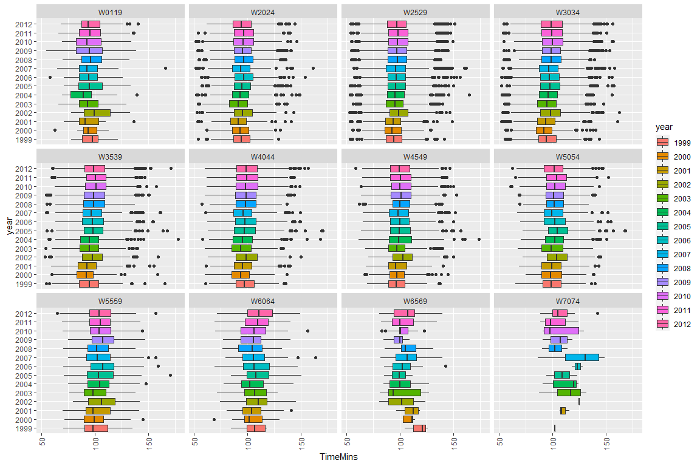

Case Study 2 - EDA
================
Nikhil Gupta
2020-09-15 06:09:06

  - [Load Libraries](#load-libraries)
  - [Missing Values](#missing-values)
  - [Participants by Year](#participants-by-year)
  - [Age Brackets by Year](#age-brackets-by-year)
  - [Race Times](#race-times)

# Load Libraries

``` r
library(tidyverse)
```

    ## -- Attaching packages --------------------------------------- tidyverse 1.3.0 --

    ## v ggplot2 3.3.0     v purrr   0.3.4
    ## v tibble  3.0.0     v dplyr   0.8.5
    ## v tidyr   1.0.2     v stringr 1.4.0
    ## v readr   1.3.1     v forcats 0.5.0

    ## -- Conflicts ------------------------------------------ tidyverse_conflicts() --
    ## x dplyr::filter() masks stats::filter()
    ## x dplyr::lag()    masks stats::lag()

``` r
library(plotly)
```

    ## 
    ## Attaching package: 'plotly'

    ## The following object is masked from 'package:ggplot2':
    ## 
    ##     last_plot

    ## The following object is masked from 'package:stats':
    ## 
    ##     filter

    ## The following object is masked from 'package:graphics':
    ## 
    ##     layout

``` r
data = readRDS("../../data/data.rds")
str(data)
```

    ## 'data.frame':    75866 obs. of  22 variables:
    ##  $ Race         : chr  "10M" "10M" "10M" "10M" ...
    ##  $ Name         : chr  "Jane Omoro " "Jane Ngotho " "Lidiya Grigoryeva " "Eunice Sagero " ...
    ##  $ Gender       : chr  "W" "W" "W" "W" ...
    ##  $ Age          : num  26 29 NA 20 29 24 38 NA 27 30 ...
    ##  $ Time         : POSIXct, format: "0000-01-01 00:53:37" "0000-01-01 00:53:38" ...
    ##  $ Pace         : POSIXct, format: "0000-01-01 00:05:22" "0000-01-01 00:05:22" ...
    ##  $ PiS          : num  1 2 3 4 5 6 7 8 9 10 ...
    ##  $ TiS          : num  2358 2358 2358 2358 2358 ...
    ##  $ Division     : chr  "W2529" "W2529" "NR" "W2024" ...
    ##  $ PiD          : num  1 2 NA 1 3 2 1 NA 4 1 ...
    ##  $ TiD          : num  559 559 NA 196 559 196 387 NA 559 529 ...
    ##  $ Hometown     : chr  "Kenya" "Kenya" "Russia" "Kenya" ...
    ##  $ Home State   : chr  NA NA NA NA ...
    ##  $ year         : int  1999 1999 1999 1999 1999 1999 1999 1999 1999 1999 ...
    ##  $ divisionTitle: chr  "Overall+Women" "Overall+Women" "Overall+Women" "Overall+Women" ...
    ##  $ section      : chr  "10M" "10M" "10M" "10M" ...
    ##  $ page         : int  1 1 1 1 1 1 1 1 1 1 ...
    ##  $ link         : chr  "http://www.cballtimeresults.org/performances?utf8=%E2%9C%93&section=10M&year=1999&division=Overall+Women&page=1" "http://www.cballtimeresults.org/performances?utf8=%E2%9C%93&section=10M&year=1999&division=Overall+Women&page=1" "http://www.cballtimeresults.org/performances?utf8=%E2%9C%93&section=10M&year=1999&division=Overall+Women&page=1" "http://www.cballtimeresults.org/performances?utf8=%E2%9C%93&section=10M&year=1999&division=Overall+Women&page=1" ...
    ##  $ DivisionCode : chr  "W" "W" "N" "W" ...
    ##  $ DivisionNum  : chr  "529" "529" "" "024" ...
    ##  $ TimeMins     : num  53.6 53.6 53.7 53.9 54.1 ...
    ##  $ PaceMins     : num  5.37 5.37 5.37 5.4 5.42 ...

``` r
summary(data)
```

    ##      Race               Name              Gender               Age       
    ##  Length:75866       Length:75866       Length:75866       Min.   : 7.00  
    ##  Class :character   Class :character   Class :character   1st Qu.:27.00  
    ##  Mode  :character   Mode  :character   Mode  :character   Median :32.00  
    ##                                                           Mean   :33.85  
    ##                                                           3rd Qu.:39.00  
    ##                                                           Max.   :87.00  
    ##                                                           NA's   :20     
    ##       Time                          Pace                          PiS      
    ##  Min.   :0000-01-01 00:51:44   Min.   :0000-01-01 00:05:10   Min.   :   1  
    ##  1st Qu.:0000-01-01 01:28:39   1st Qu.:0000-01-01 00:08:52   1st Qu.:1356  
    ##  Median :0000-01-01 01:37:29   Median :0000-01-01 00:09:45   Median :2786  
    ##  Mean   :0000-01-01 01:38:13   Mean   :0000-01-01 00:09:50   Mean   :3305  
    ##  3rd Qu.:0000-01-01 01:46:58   3rd Qu.:0000-01-01 00:10:42   3rd Qu.:4905  
    ##  Max.   :0000-01-01 02:57:31   Max.   :0000-01-01 00:17:45   Max.   :9729  
    ##                                                                            
    ##       TiS         Division              PiD              TiD      
    ##  Min.   :2166   Length:75866       Min.   :   1.0   Min.   :   1  
    ##  1st Qu.:4333   Class :character   1st Qu.: 165.0   1st Qu.: 559  
    ##  Median :6395   Mode  :character   Median : 404.0   Median : 953  
    ##  Mean   :6609                      Mean   : 595.6   Mean   :1190  
    ##  3rd Qu.:8853                      3rd Qu.: 816.0   3rd Qu.:1678  
    ##  Max.   :9729                      Max.   :5302.0   Max.   :2803  
    ##                                    NA's   :20       NA's   :20    
    ##    Hometown          Home State             year      divisionTitle     
    ##  Length:75866       Length:75866       Min.   :1999   Length:75866      
    ##  Class :character   Class :character   1st Qu.:2005   Class :character  
    ##  Mode  :character   Mode  :character   Median :2008   Mode  :character  
    ##                                        Mean   :2007                     
    ##                                        3rd Qu.:2010                     
    ##                                        Max.   :2012                     
    ##                                                                         
    ##    section               page           link           DivisionCode      
    ##  Length:75866       Min.   :  1.0   Length:75866       Length:75866      
    ##  Class :character   1st Qu.: 68.0   Class :character   Class :character  
    ##  Mode  :character   Median :140.0   Mode  :character   Mode  :character  
    ##                     Mean   :165.7                                        
    ##                     3rd Qu.:246.0                                        
    ##                     Max.   :487.0                                        
    ##                                                                          
    ##  DivisionNum           TimeMins         PaceMins     
    ##  Length:75866       Min.   : 51.73   Min.   : 5.167  
    ##  Class :character   1st Qu.: 88.65   1st Qu.: 8.867  
    ##  Mode  :character   Median : 97.48   Median : 9.750  
    ##                     Mean   : 98.22   Mean   : 9.823  
    ##                     3rd Qu.:106.97   3rd Qu.:10.700  
    ##                     Max.   :177.52   Max.   :17.750  
    ## 

``` r
head(data)
```

    ##   Race               Name Gender Age                Time                Pace
    ## 1  10M        Jane Omoro       W  26 0000-01-01 00:53:37 0000-01-01 00:05:22
    ## 2  10M       Jane Ngotho       W  29 0000-01-01 00:53:38 0000-01-01 00:05:22
    ## 3  10M Lidiya Grigoryeva       W  NA 0000-01-01 00:53:40 0000-01-01 00:05:22
    ## 4  10M     Eunice Sagero       W  20 0000-01-01 00:53:55 0000-01-01 00:05:24
    ## 5  10M   Alla Zhilyayeva       W  29 0000-01-01 00:54:08 0000-01-01 00:05:25
    ## 6  10M    Teresa Wanjiku       W  24 0000-01-01 00:54:10 0000-01-01 00:05:25
    ##   PiS  TiS Division PiD TiD Hometown Home State year divisionTitle section page
    ## 1   1 2358    W2529   1 559    Kenya       <NA> 1999 Overall+Women     10M    1
    ## 2   2 2358    W2529   2 559    Kenya       <NA> 1999 Overall+Women     10M    1
    ## 3   3 2358       NR  NA  NA   Russia       <NA> 1999 Overall+Women     10M    1
    ## 4   4 2358    W2024   1 196    Kenya       <NA> 1999 Overall+Women     10M    1
    ## 5   5 2358    W2529   3 559   Russia       <NA> 1999 Overall+Women     10M    1
    ## 6   6 2358    W2024   2 196    Kenya       <NA> 1999 Overall+Women     10M    1
    ##                                                                                                              link
    ## 1 http://www.cballtimeresults.org/performances?utf8=%E2%9C%93&section=10M&year=1999&division=Overall+Women&page=1
    ## 2 http://www.cballtimeresults.org/performances?utf8=%E2%9C%93&section=10M&year=1999&division=Overall+Women&page=1
    ## 3 http://www.cballtimeresults.org/performances?utf8=%E2%9C%93&section=10M&year=1999&division=Overall+Women&page=1
    ## 4 http://www.cballtimeresults.org/performances?utf8=%E2%9C%93&section=10M&year=1999&division=Overall+Women&page=1
    ## 5 http://www.cballtimeresults.org/performances?utf8=%E2%9C%93&section=10M&year=1999&division=Overall+Women&page=1
    ## 6 http://www.cballtimeresults.org/performances?utf8=%E2%9C%93&section=10M&year=1999&division=Overall+Women&page=1
    ##   DivisionCode DivisionNum TimeMins PaceMins
    ## 1            W         529 53.61667 5.366667
    ## 2            W         529 53.63333 5.366667
    ## 3            N             53.66667 5.366667
    ## 4            W         024 53.91667 5.400000
    ## 5            W         529 54.13333 5.416667
    ## 6            W         024 54.16667 5.416667

``` r
unique(data$Race)
```

    ## [1] "10M"

``` r
unique(data$Gender)
```

    ## [1] "W"       "xue Zhu" "suzy"    "Cindy"

``` r
unique(data %>% arrange(Age) %>%  select(Age) %>%  pluck(1)) 
```

    ##  [1]  7 10 11 12 13 14 15 16 17 18 19 20 21 22 23 24 25 26 27 28 29 30 31 32 33
    ## [26] 34 35 36 37 38 39 40 41 42 43 44 45 46 47 48 49 50 51 52 53 54 55 56 57 58
    ## [51] 59 60 61 62 63 64 65 66 67 68 69 70 71 72 73 74 75 76 77 78 80 81 83 84 85
    ## [76] 86 87 NA

``` r
unique(data %>% arrange(Division) %>%  select(Division) %>%  pluck(1)) 
```

    ##  [1] "NR"    "W0119" "W2024" "W2529" "W3034" "W3539" "W4044" "W4549" "W5054"
    ## [10] "W5559" "W6064" "W6569" "W7074" "W7579" "W8099"

  - Some issues with Gender –\> Does it matter?

# Missing Values

``` r
data %>% 
  select_if(function(x) any(is.na(x))) %>% 
  summarise_each(~ sum(is.na(.))) 
```

    ##   Age PiD TiD Home State
    ## 1  20  20  20        241

``` r
noresults = data %>% dplyr::filter(Division == "NR")
dim(noresults)
```

    ## [1] 19 22

``` r
head(noresults)
```

    ##   Race                 Name Gender Age                Time                Pace
    ## 1  10M   Lidiya Grigoryeva       W  NA 0000-01-01 00:53:40 0000-01-01 00:05:22
    ## 2  10M        Gladys Asiba       W  NA 0000-01-01 00:54:50 0000-01-01 00:05:29
    ## 3  10M   Connie Buckwalter       W  NA 0000-01-01 00:59:36 0000-01-01 00:05:58
    ## 4  10M            Ann Reid       W  NA 0000-01-01 01:53:03 0000-01-01 00:11:18
    ## 5  10M        Loretta Cuce       W  NA 0000-01-01 01:53:38 0000-01-01 00:11:22
    ## 6  10M Unidentified Runner       W  NA 0000-01-01 01:19:45 0000-01-01 00:07:59
    ##    PiS  TiS Division PiD TiD   Hometown Home State year divisionTitle section
    ## 1    3 2358       NR  NA  NA     Russia       <NA> 1999 Overall+Women     10M
    ## 2    8 2358       NR  NA  NA      Kenya       <NA> 1999 Overall+Women     10M
    ## 3   17 2358       NR  NA  NA  Lancaster         PA 1999 Overall+Women     10M
    ## 4 2176 2358       NR  NA  NA   Bethesda         MD 1999 Overall+Women     10M
    ## 5 2611 2972       NR  NA  NA Alexandria         VA 2001 Overall+Women     10M
    ## 6  270 3333       NR  NA  NA Washington         DC 2002 Overall+Women     10M
    ##   page
    ## 1    1
    ## 2    1
    ## 3    1
    ## 4  109
    ## 5  131
    ## 6   14
    ##                                                                                                                link
    ## 1   http://www.cballtimeresults.org/performances?utf8=%E2%9C%93&section=10M&year=1999&division=Overall+Women&page=1
    ## 2   http://www.cballtimeresults.org/performances?utf8=%E2%9C%93&section=10M&year=1999&division=Overall+Women&page=1
    ## 3   http://www.cballtimeresults.org/performances?utf8=%E2%9C%93&section=10M&year=1999&division=Overall+Women&page=1
    ## 4 http://www.cballtimeresults.org/performances?utf8=%E2%9C%93&section=10M&year=1999&division=Overall+Women&page=109
    ## 5 http://www.cballtimeresults.org/performances?utf8=%E2%9C%93&section=10M&year=2001&division=Overall+Women&page=131
    ## 6  http://www.cballtimeresults.org/performances?utf8=%E2%9C%93&section=10M&year=2002&division=Overall+Women&page=14
    ##   DivisionCode DivisionNum  TimeMins  PaceMins
    ## 1            N              53.66667  5.366667
    ## 2            N              54.83333  5.483333
    ## 3            N              59.60000  5.966667
    ## 4            N             113.05000 11.300000
    ## 5            N             113.63333 11.366667
    ## 6            N              79.75000  7.983333

``` r
noage = data %>% dplyr::filter(is.na(Age))
dim(noage)
```

    ## [1] 20 22

``` r
head(noage)
```

    ##   Race                 Name Gender Age                Time                Pace
    ## 1  10M   Lidiya Grigoryeva       W  NA 0000-01-01 00:53:40 0000-01-01 00:05:22
    ## 2  10M        Gladys Asiba       W  NA 0000-01-01 00:54:50 0000-01-01 00:05:29
    ## 3  10M   Connie Buckwalter       W  NA 0000-01-01 00:59:36 0000-01-01 00:05:58
    ## 4  10M            Ann Reid       W  NA 0000-01-01 01:53:03 0000-01-01 00:11:18
    ## 5  10M        Loretta Cuce       W  NA 0000-01-01 01:53:38 0000-01-01 00:11:22
    ## 6  10M Unidentified Runner       W  NA 0000-01-01 01:19:45 0000-01-01 00:07:59
    ##    PiS  TiS Division PiD TiD   Hometown Home State year divisionTitle section
    ## 1    3 2358       NR  NA  NA     Russia       <NA> 1999 Overall+Women     10M
    ## 2    8 2358       NR  NA  NA      Kenya       <NA> 1999 Overall+Women     10M
    ## 3   17 2358       NR  NA  NA  Lancaster         PA 1999 Overall+Women     10M
    ## 4 2176 2358       NR  NA  NA   Bethesda         MD 1999 Overall+Women     10M
    ## 5 2611 2972       NR  NA  NA Alexandria         VA 2001 Overall+Women     10M
    ## 6  270 3333       NR  NA  NA Washington         DC 2002 Overall+Women     10M
    ##   page
    ## 1    1
    ## 2    1
    ## 3    1
    ## 4  109
    ## 5  131
    ## 6   14
    ##                                                                                                                link
    ## 1   http://www.cballtimeresults.org/performances?utf8=%E2%9C%93&section=10M&year=1999&division=Overall+Women&page=1
    ## 2   http://www.cballtimeresults.org/performances?utf8=%E2%9C%93&section=10M&year=1999&division=Overall+Women&page=1
    ## 3   http://www.cballtimeresults.org/performances?utf8=%E2%9C%93&section=10M&year=1999&division=Overall+Women&page=1
    ## 4 http://www.cballtimeresults.org/performances?utf8=%E2%9C%93&section=10M&year=1999&division=Overall+Women&page=109
    ## 5 http://www.cballtimeresults.org/performances?utf8=%E2%9C%93&section=10M&year=2001&division=Overall+Women&page=131
    ## 6  http://www.cballtimeresults.org/performances?utf8=%E2%9C%93&section=10M&year=2002&division=Overall+Women&page=14
    ##   DivisionCode DivisionNum  TimeMins  PaceMins
    ## 1            N              53.66667  5.366667
    ## 2            N              54.83333  5.483333
    ## 3            N              59.60000  5.966667
    ## 4            N             113.05000 11.300000
    ## 5            N             113.63333 11.366667
    ## 6            N              79.75000  7.983333

``` r
setdiff(noage, noresults)
```

    ##   Race             Name Gender Age                Time                Pace  PiS
    ## 1  10M Michelle Hinman       W  NA 0000-01-01 01:39:13 0000-01-01 00:09:55 2455
    ##    TiS Division PiD TiD Hometown Home State year divisionTitle section page
    ## 1 4333    W8099   1   2       NR       <NA> 2005 Overall+Women     10M  123
    ##                                                                                                                link
    ## 1 http://www.cballtimeresults.org/performances?utf8=%E2%9C%93&section=10M&year=2005&division=Overall+Women&page=123
    ##   DivisionCode DivisionNum TimeMins PaceMins
    ## 1            W         099 99.21667 9.916667

  - This seems to be an issue. It looks like this person is placed first
    in the division, but age is not set so she has been classified as
    W8099 and the time seems to be off from what would be expected from
    this age bracket.
  - TODO: Fix this

<!-- end list -->

``` r
# Remove no results
data = data %>% 
  dplyr::filter(Division != "NR")
```

# Participants by Year

``` r
plotdata = data %>% 
  group_by(year) %>% 
  summarise(count=n()) 

p = plotdata %>% 
  ggplot(aes(x=year, y=count)) +
  geom_line() +
  geom_point()
ggplotly(p, tooltip="text")
```

<!--html_preserve-->

<div id="htmlwidget-0e2644fbb02933cad72e" class="plotly html-widget" style="width:672px;height:480px;">

</div>

<script type="application/json" data-for="htmlwidget-0e2644fbb02933cad72e">{"x":{"data":[{"x":[1999,2000,2001,2002,2003,2004,2005,2006,2007,2008,2009,2010,2011,2012],"y":[2354,2166,2971,3330,3525,3885,4324,5435,5530,6395,8322,8853,9030,9727],"text":"","type":"scatter","mode":"lines+markers","line":{"width":1.88976377952756,"color":"rgba(0,0,0,1)","dash":"solid"},"hoveron":"points","showlegend":false,"xaxis":"x","yaxis":"y","hoverinfo":"text","marker":{"autocolorscale":false,"color":"rgba(0,0,0,1)","opacity":1,"size":5.66929133858268,"symbol":"circle","line":{"width":1.88976377952756,"color":"rgba(0,0,0,1)"}},"frame":null}],"layout":{"margin":{"t":26.2283105022831,"r":7.30593607305936,"b":40.1826484018265,"l":54.7945205479452},"plot_bgcolor":"rgba(235,235,235,1)","paper_bgcolor":"rgba(255,255,255,1)","font":{"color":"rgba(0,0,0,1)","family":"","size":14.6118721461187},"xaxis":{"domain":[0,1],"automargin":true,"type":"linear","autorange":false,"range":[1998.35,2012.65],"tickmode":"array","ticktext":["2001","2004","2007","2010"],"tickvals":[2001,2004,2007,2010],"categoryorder":"array","categoryarray":["2001","2004","2007","2010"],"nticks":null,"ticks":"outside","tickcolor":"rgba(51,51,51,1)","ticklen":3.65296803652968,"tickwidth":0.66417600664176,"showticklabels":true,"tickfont":{"color":"rgba(77,77,77,1)","family":"","size":11.689497716895},"tickangle":-0,"showline":false,"linecolor":null,"linewidth":0,"showgrid":true,"gridcolor":"rgba(255,255,255,1)","gridwidth":0.66417600664176,"zeroline":false,"anchor":"y","title":{"text":"year","font":{"color":"rgba(0,0,0,1)","family":"","size":14.6118721461187}},"hoverformat":".2f"},"yaxis":{"domain":[0,1],"automargin":true,"type":"linear","autorange":false,"range":[1787.95,10105.05],"tickmode":"array","ticktext":["2000","4000","6000","8000","10000"],"tickvals":[2000,4000,6000,8000,10000],"categoryorder":"array","categoryarray":["2000","4000","6000","8000","10000"],"nticks":null,"ticks":"outside","tickcolor":"rgba(51,51,51,1)","ticklen":3.65296803652968,"tickwidth":0.66417600664176,"showticklabels":true,"tickfont":{"color":"rgba(77,77,77,1)","family":"","size":11.689497716895},"tickangle":-0,"showline":false,"linecolor":null,"linewidth":0,"showgrid":true,"gridcolor":"rgba(255,255,255,1)","gridwidth":0.66417600664176,"zeroline":false,"anchor":"x","title":{"text":"count","font":{"color":"rgba(0,0,0,1)","family":"","size":14.6118721461187}},"hoverformat":".2f"},"shapes":[{"type":"rect","fillcolor":null,"line":{"color":null,"width":0,"linetype":[]},"yref":"paper","xref":"paper","x0":0,"x1":1,"y0":0,"y1":1}],"showlegend":false,"legend":{"bgcolor":"rgba(255,255,255,1)","bordercolor":"transparent","borderwidth":1.88976377952756,"font":{"color":"rgba(0,0,0,1)","family":"","size":11.689497716895}},"hovermode":"closest","barmode":"relative"},"config":{"doubleClick":"reset","showSendToCloud":false},"source":"A","attrs":{"2d0843301844":{"x":{},"y":{},"type":"scatter"},"2d0836aa4844":{"x":{},"y":{}}},"cur_data":"2d0843301844","visdat":{"2d0843301844":["function (y) ","x"],"2d0836aa4844":["function (y) ","x"]},"highlight":{"on":"plotly_click","persistent":false,"dynamic":false,"selectize":false,"opacityDim":0.2,"selected":{"opacity":1},"debounce":0},"shinyEvents":["plotly_hover","plotly_click","plotly_selected","plotly_relayout","plotly_brushed","plotly_brushing","plotly_clickannotation","plotly_doubleclick","plotly_deselect","plotly_afterplot","plotly_sunburstclick"],"base_url":"https://plot.ly"},"evals":[],"jsHooks":[]}</script>

<!--/html_preserve-->

``` r
p = plotdata %>% 
  ggplot(aes(x = year, y = count)) + 
  geom_bar(stat = "identity")
ggplotly(p, tooltip="text")
```

<!--html_preserve-->

<div id="htmlwidget-ff2ed3292eda7a0c6c37" class="plotly html-widget" style="width:672px;height:480px;">

</div>

<script type="application/json" data-for="htmlwidget-ff2ed3292eda7a0c6c37">{"x":{"data":[{"orientation":"v","width":[0.900000000000091,0.900000000000091,0.900000000000091,0.900000000000091,0.900000000000091,0.900000000000091,0.900000000000091,0.900000000000091,0.900000000000091,0.900000000000091,0.900000000000091,0.900000000000091,0.900000000000091,0.900000000000091],"base":[0,0,0,0,0,0,0,0,0,0,0,0,0,0],"x":[1999,2000,2001,2002,2003,2004,2005,2006,2007,2008,2009,2010,2011,2012],"y":[2354,2166,2971,3330,3525,3885,4324,5435,5530,6395,8322,8853,9030,9727],"text":"","type":"bar","marker":{"autocolorscale":false,"color":"rgba(89,89,89,1)","line":{"width":1.88976377952756,"color":"transparent"}},"showlegend":false,"xaxis":"x","yaxis":"y","hoverinfo":"text","frame":null}],"layout":{"margin":{"t":26.2283105022831,"r":7.30593607305936,"b":40.1826484018265,"l":54.7945205479452},"plot_bgcolor":"rgba(235,235,235,1)","paper_bgcolor":"rgba(255,255,255,1)","font":{"color":"rgba(0,0,0,1)","family":"","size":14.6118721461187},"xaxis":{"domain":[0,1],"automargin":true,"type":"linear","autorange":false,"range":[1997.855,2013.145],"tickmode":"array","ticktext":["1998","2002","2006","2010"],"tickvals":[1998,2002,2006,2010],"categoryorder":"array","categoryarray":["1998","2002","2006","2010"],"nticks":null,"ticks":"outside","tickcolor":"rgba(51,51,51,1)","ticklen":3.65296803652968,"tickwidth":0.66417600664176,"showticklabels":true,"tickfont":{"color":"rgba(77,77,77,1)","family":"","size":11.689497716895},"tickangle":-0,"showline":false,"linecolor":null,"linewidth":0,"showgrid":true,"gridcolor":"rgba(255,255,255,1)","gridwidth":0.66417600664176,"zeroline":false,"anchor":"y","title":{"text":"year","font":{"color":"rgba(0,0,0,1)","family":"","size":14.6118721461187}},"hoverformat":".2f"},"yaxis":{"domain":[0,1],"automargin":true,"type":"linear","autorange":false,"range":[-486.35,10213.35],"tickmode":"array","ticktext":["0","2500","5000","7500","10000"],"tickvals":[0,2500,5000,7500,10000],"categoryorder":"array","categoryarray":["0","2500","5000","7500","10000"],"nticks":null,"ticks":"outside","tickcolor":"rgba(51,51,51,1)","ticklen":3.65296803652968,"tickwidth":0.66417600664176,"showticklabels":true,"tickfont":{"color":"rgba(77,77,77,1)","family":"","size":11.689497716895},"tickangle":-0,"showline":false,"linecolor":null,"linewidth":0,"showgrid":true,"gridcolor":"rgba(255,255,255,1)","gridwidth":0.66417600664176,"zeroline":false,"anchor":"x","title":{"text":"count","font":{"color":"rgba(0,0,0,1)","family":"","size":14.6118721461187}},"hoverformat":".2f"},"shapes":[{"type":"rect","fillcolor":null,"line":{"color":null,"width":0,"linetype":[]},"yref":"paper","xref":"paper","x0":0,"x1":1,"y0":0,"y1":1}],"showlegend":false,"legend":{"bgcolor":"rgba(255,255,255,1)","bordercolor":"transparent","borderwidth":1.88976377952756,"font":{"color":"rgba(0,0,0,1)","family":"","size":11.689497716895}},"hovermode":"closest","barmode":"relative"},"config":{"doubleClick":"reset","showSendToCloud":false},"source":"A","attrs":{"2d086afd4521":{"x":{},"y":{},"type":"bar"}},"cur_data":"2d086afd4521","visdat":{"2d086afd4521":["function (y) ","x"]},"highlight":{"on":"plotly_click","persistent":false,"dynamic":false,"selectize":false,"opacityDim":0.2,"selected":{"opacity":1},"debounce":0},"shinyEvents":["plotly_hover","plotly_click","plotly_selected","plotly_relayout","plotly_brushed","plotly_brushing","plotly_clickannotation","plotly_doubleclick","plotly_deselect","plotly_afterplot","plotly_sunburstclick"],"base_url":"https://plot.ly"},"evals":[],"jsHooks":[]}</script>

<!--/html_preserve-->

``` r
# Alternate colored by Division
plotdata = data %>% 
  group_by(year, Division) %>% 
  summarise(count = n())

p = plotdata %>% 
  ggplot(aes(x = year, y = count, fill = Division)) + 
  geom_bar(stat = "identity", position = "stack") 
ggplotly(p, tooltip="text")
```

<!--html_preserve-->

<div id="htmlwidget-3bc92ab542f74bc5639b" class="plotly html-widget" style="width:672px;height:480px;">

</div>

<script type="application/json" data-for="htmlwidget-3bc92ab542f74bc5639b">{"x":{"data":[{"orientation":"v","width":[0.900000000000091,0.900000000000091,0.900000000000091,0.900000000000091,0.900000000000091,0.900000000000091,0.900000000000091,0.900000000000091,0.900000000000091,0.900000000000091,0.900000000000091,0.900000000000091,0.900000000000091,0.900000000000091],"base":[2340,2146,2946,3310,3500,3852,4289,5385,5476,6341,8251,8759,8939,9644],"x":[1999,2000,2001,2002,2003,2004,2005,2006,2007,2008,2009,2010,2011,2012],"y":[14,20,25,20,25,33,35,50,54,54,71,94,91,83],"text":"","type":"bar","marker":{"autocolorscale":false,"color":"rgba(248,118,109,1)","line":{"width":1.88976377952756,"color":"transparent"}},"name":"W0119","legendgroup":"W0119","showlegend":true,"xaxis":"x","yaxis":"y","hoverinfo":"text","frame":null},{"orientation":"v","width":[0.900000000000091,0.900000000000091,0.900000000000091,0.900000000000091,0.900000000000091,0.900000000000091,0.900000000000091,0.900000000000091,0.900000000000091,0.900000000000091,0.900000000000091,0.900000000000091,0.900000000000091,0.900000000000091],"base":[2144,1978,2690,3032,3210,3419,3811,4699,4763,5558,7297,7788,8002,8670],"x":[1999,2000,2001,2002,2003,2004,2005,2006,2007,2008,2009,2010,2011,2012],"y":[196,168,256,278,290,433,478,686,713,783,954,971,937,974],"text":"","type":"bar","marker":{"autocolorscale":false,"color":"rgba(227,137,0,1)","line":{"width":1.88976377952756,"color":"transparent"}},"name":"W2024","legendgroup":"W2024","showlegend":true,"xaxis":"x","yaxis":"y","hoverinfo":"text","frame":null},{"orientation":"v","width":[0.900000000000091,0.900000000000091,0.900000000000091,0.900000000000091,0.900000000000091,0.900000000000091,0.900000000000091,0.900000000000091,0.900000000000091,0.900000000000091,0.900000000000091,0.900000000000091,0.900000000000091,0.900000000000091],"base":[1585,1512,1985,2256,2354,2345,2608,3174,3133,3565,4591,4985,5297,5889],"x":[1999,2000,2001,2002,2003,2004,2005,2006,2007,2008,2009,2010,2011,2012],"y":[559,466,705,776,856,1074,1203,1525,1630,1993,2706,2803,2705,2781],"text":"","type":"bar","marker":{"autocolorscale":false,"color":"rgba(196,154,0,1)","line":{"width":1.88976377952756,"color":"transparent"}},"name":"W2529","legendgroup":"W2529","showlegend":true,"xaxis":"x","yaxis":"y","hoverinfo":"text","frame":null},{"orientation":"v","width":[0.900000000000091,0.900000000000091,0.900000000000091,0.900000000000091,0.900000000000091,0.900000000000091,0.900000000000091,0.900000000000091,0.900000000000091,0.900000000000091,0.900000000000091,0.900000000000091,0.900000000000091,0.900000000000091],"base":[1056,1040,1302,1494,1584,1519,1804,2115,2086,2307,2913,3175,3431,3663],"x":[1999,2000,2001,2002,2003,2004,2005,2006,2007,2008,2009,2010,2011,2012],"y":[529,472,683,762,770,826,804,1059,1047,1258,1678,1810,1866,2226],"text":"","type":"bar","marker":{"autocolorscale":false,"color":"rgba(153,168,0,1)","line":{"width":1.88976377952756,"color":"transparent"}},"name":"W3034","legendgroup":"W3034","showlegend":true,"xaxis":"x","yaxis":"y","hoverinfo":"text","frame":null},{"orientation":"v","width":[0.900000000000091,0.900000000000091,0.900000000000091,0.900000000000091,0.900000000000091,0.900000000000091,0.900000000000091,0.900000000000091,0.900000000000091,0.900000000000091,0.900000000000091,0.900000000000091,0.900000000000091,0.900000000000091],"base":[669,663,840,957,1000,958,1145,1316,1278,1425,1783,1998,2166,2298],"x":[1999,2000,2001,2002,2003,2004,2005,2006,2007,2008,2009,2010,2011,2012],"y":[387,377,462,537,584,561,659,799,808,882,1130,1177,1265,1365],"text":"","type":"bar","marker":{"autocolorscale":false,"color":"rgba(83,180,0,1)","line":{"width":1.88976377952756,"color":"transparent"}},"name":"W3539","legendgroup":"W3539","showlegend":true,"xaxis":"x","yaxis":"y","hoverinfo":"text","frame":null},{"orientation":"v","width":[0.900000000000091,0.900000000000091,0.900000000000091,0.900000000000091,0.900000000000091,0.900000000000091,0.900000000000091,0.900000000000091,0.900000000000091,0.900000000000091,0.900000000000091,0.900000000000091,0.900000000000091,0.900000000000091],"base":[363,376,460,558,582,552,643,756,772,853,1041,1153,1245,1324],"x":[1999,2000,2001,2002,2003,2004,2005,2006,2007,2008,2009,2010,2011,2012],"y":[306,287,380,399,418,406,502,560,506,572,742,845,921,974],"text":"","type":"bar","marker":{"autocolorscale":false,"color":"rgba(0,188,86,1)","line":{"width":1.88976377952756,"color":"transparent"}},"name":"W4044","legendgroup":"W4044","showlegend":true,"xaxis":"x","yaxis":"y","hoverinfo":"text","frame":null},{"orientation":"v","width":[0.900000000000091,0.900000000000091,0.900000000000091,0.900000000000091,0.900000000000091,0.900000000000091,0.900000000000091,0.900000000000091,0.900000000000091,0.900000000000091,0.900000000000091,0.900000000000091,0.900000000000091,0.900000000000091],"base":[177,196,219,284,298,291,355,393,405,442,552,592,670,770],"x":[1999,2000,2001,2002,2003,2004,2005,2006,2007,2008,2009,2010,2011,2012],"y":[186,180,241,274,284,261,288,363,367,411,489,561,575,554],"text":"","type":"bar","marker":{"autocolorscale":false,"color":"rgba(0,192,148,1)","line":{"width":1.88976377952756,"color":"transparent"}},"name":"W4549","legendgroup":"W4549","showlegend":true,"xaxis":"x","yaxis":"y","hoverinfo":"text","frame":null},{"orientation":"v","width":[0.900000000000091,0.900000000000091,0.900000000000091,0.900000000000091,0.900000000000091,0.900000000000091,0.900000000000091,0.900000000000091,0.900000000000091,0.900000000000091,0.900000000000091,0.900000000000091,0.900000000000091,0.900000000000091],"base":[63,87,106,118,130,127,139,166,162,185,233,290,313,373],"x":[1999,2000,2001,2002,2003,2004,2005,2006,2007,2008,2009,2010,2011,2012],"y":[114,109,113,166,168,164,216,227,243,257,319,302,357,397],"text":"","type":"bar","marker":{"autocolorscale":false,"color":"rgba(0,191,196,1)","line":{"width":1.88976377952756,"color":"transparent"}},"name":"W5054","legendgroup":"W5054","showlegend":true,"xaxis":"x","yaxis":"y","hoverinfo":"text","frame":null},{"orientation":"v","width":[0.900000000000091,0.900000000000091,0.900000000000091,0.900000000000091,0.900000000000091,0.900000000000091,0.900000000000091,0.900000000000091,0.900000000000091,0.900000000000091,0.900000000000091,0.900000000000091,0.900000000000091,0.900000000000091],"base":[16,27,40,46,47,44,49,62,55,66,74,87,105,137],"x":[1999,2000,2001,2002,2003,2004,2005,2006,2007,2008,2009,2010,2011,2012],"y":[47,60,66,72,83,83,90,104,107,119,159,203,208,236],"text":"","type":"bar","marker":{"autocolorscale":false,"color":"rgba(0,182,235,1)","line":{"width":1.88976377952756,"color":"transparent"}},"name":"W5559","legendgroup":"W5559","showlegend":true,"xaxis":"x","yaxis":"y","hoverinfo":"text","frame":null},{"orientation":"v","width":[0.900000000000091,0.900000000000091,0.900000000000091,0.900000000000091,0.900000000000091,0.900000000000091,0.900000000000091,0.900000000000091,0.900000000000091,0.900000000000091,0.900000000000091,0.900000000000091,0.900000000000091,0.900000000000091],"base":[6,7,10,14,17,17,13,14,22,16,18,23,33,44],"x":[1999,2000,2001,2002,2003,2004,2005,2006,2007,2008,2009,2010,2011,2012],"y":[10,20,30,32,30,27,36,48,33,50,56,64,72,93],"text":"","type":"bar","marker":{"autocolorscale":false,"color":"rgba(6,164,255,1)","line":{"width":1.88976377952756,"color":"transparent"}},"name":"W6064","legendgroup":"W6064","showlegend":true,"xaxis":"x","yaxis":"y","hoverinfo":"text","frame":null},{"orientation":"v","width":[0.900000000000091,0.900000000000091,0.900000000000091,0.900000000000091,0.900000000000091,0.900000000000091,0.900000000000091,0.900000000000091,0.900000000000091,0.900000000000091,0.900000000000091,0.900000000000091,0.900000000000091,0.900000000000091],"base":[3,2,4,3,7,8,5,4,5,3,6,6,7,9],"x":[1999,2000,2001,2002,2003,2004,2005,2006,2007,2008,2009,2010,2011,2012],"y":[3,5,6,11,10,9,8,10,17,13,12,17,26,35],"text":"","type":"bar","marker":{"autocolorscale":false,"color":"rgba(165,138,255,1)","line":{"width":1.88976377952756,"color":"transparent"}},"name":"W6569","legendgroup":"W6569","showlegend":true,"xaxis":"x","yaxis":"y","hoverinfo":"text","frame":null},{"orientation":"v","width":[0.900000000000091,0.900000000000091,0.900000000000091,0.900000000000091,0.900000000000091,0.900000000000091,0.900000000000091,0.900000000000091,0.900000000000091,0.900000000000091,0.900000000000091,0.900000000000091,0.900000000000091],"base":[2,1,2,3,2,3,2,1,1,0,1,2,1],"x":[1999,2001,2002,2003,2004,2005,2006,2007,2008,2009,2010,2011,2012],"y":[1,3,1,4,6,2,2,4,2,6,5,5,8],"text":"","type":"bar","marker":{"autocolorscale":false,"color":"rgba(223,112,248,1)","line":{"width":1.88976377952756,"color":"transparent"}},"name":"W7074","legendgroup":"W7074","showlegend":true,"xaxis":"x","yaxis":"y","hoverinfo":"text","frame":null},{"orientation":"v","width":[0.900000000000091,0.900000000000091,0.900000000000091,0.900000000000091,0.900000000000091,0.900000000000091,0.900000000000091,0.900000000000091,0.900000000000091,0.900000000000091,0.900000000000091],"base":[1,0,1,1,2,0,0,0,0,0,0],"x":[1999,2000,2002,2003,2005,2006,2007,2008,2010,2011,2012],"y":[1,2,1,2,1,2,1,1,1,2,1],"text":"","type":"bar","marker":{"autocolorscale":false,"color":"rgba(251,97,215,1)","line":{"width":1.88976377952756,"color":"transparent"}},"name":"W7579","legendgroup":"W7579","showlegend":true,"xaxis":"x","yaxis":"y","hoverinfo":"text","frame":null},{"orientation":"v","width":[0.900000000000091,0.900000000000091,0.900000000000091,0.900000000000091,0.900000000000091,0.900000000000091],"base":[0,0,0,0,0,0],"x":[1999,2001,2002,2003,2004,2005],"y":[1,1,1,1,2,2],"text":"","type":"bar","marker":{"autocolorscale":false,"color":"rgba(255,102,168,1)","line":{"width":1.88976377952756,"color":"transparent"}},"name":"W8099","legendgroup":"W8099","showlegend":true,"xaxis":"x","yaxis":"y","hoverinfo":"text","frame":null}],"layout":{"margin":{"t":26.2283105022831,"r":7.30593607305936,"b":40.1826484018265,"l":54.7945205479452},"plot_bgcolor":"rgba(235,235,235,1)","paper_bgcolor":"rgba(255,255,255,1)","font":{"color":"rgba(0,0,0,1)","family":"","size":14.6118721461187},"xaxis":{"domain":[0,1],"automargin":true,"type":"linear","autorange":false,"range":[1997.855,2013.145],"tickmode":"array","ticktext":["1998","2002","2006","2010"],"tickvals":[1998,2002,2006,2010],"categoryorder":"array","categoryarray":["1998","2002","2006","2010"],"nticks":null,"ticks":"outside","tickcolor":"rgba(51,51,51,1)","ticklen":3.65296803652968,"tickwidth":0.66417600664176,"showticklabels":true,"tickfont":{"color":"rgba(77,77,77,1)","family":"","size":11.689497716895},"tickangle":-0,"showline":false,"linecolor":null,"linewidth":0,"showgrid":true,"gridcolor":"rgba(255,255,255,1)","gridwidth":0.66417600664176,"zeroline":false,"anchor":"y","title":{"text":"year","font":{"color":"rgba(0,0,0,1)","family":"","size":14.6118721461187}},"hoverformat":".2f"},"yaxis":{"domain":[0,1],"automargin":true,"type":"linear","autorange":false,"range":[-486.35,10213.35],"tickmode":"array","ticktext":["0","2500","5000","7500","10000"],"tickvals":[0,2500,5000,7500,10000],"categoryorder":"array","categoryarray":["0","2500","5000","7500","10000"],"nticks":null,"ticks":"outside","tickcolor":"rgba(51,51,51,1)","ticklen":3.65296803652968,"tickwidth":0.66417600664176,"showticklabels":true,"tickfont":{"color":"rgba(77,77,77,1)","family":"","size":11.689497716895},"tickangle":-0,"showline":false,"linecolor":null,"linewidth":0,"showgrid":true,"gridcolor":"rgba(255,255,255,1)","gridwidth":0.66417600664176,"zeroline":false,"anchor":"x","title":{"text":"count","font":{"color":"rgba(0,0,0,1)","family":"","size":14.6118721461187}},"hoverformat":".2f"},"shapes":[{"type":"rect","fillcolor":null,"line":{"color":null,"width":0,"linetype":[]},"yref":"paper","xref":"paper","x0":0,"x1":1,"y0":0,"y1":1}],"showlegend":true,"legend":{"bgcolor":"rgba(255,255,255,1)","bordercolor":"transparent","borderwidth":1.88976377952756,"font":{"color":"rgba(0,0,0,1)","family":"","size":11.689497716895},"y":0.93503937007874},"annotations":[{"text":"Division","x":1.02,"y":1,"showarrow":false,"ax":0,"ay":0,"font":{"color":"rgba(0,0,0,1)","family":"","size":14.6118721461187},"xref":"paper","yref":"paper","textangle":-0,"xanchor":"left","yanchor":"bottom","legendTitle":true}],"hovermode":"closest","barmode":"relative"},"config":{"doubleClick":"reset","showSendToCloud":false},"source":"A","attrs":{"2d087fba585f":{"x":{},"y":{},"fill":{},"type":"bar"}},"cur_data":"2d087fba585f","visdat":{"2d087fba585f":["function (y) ","x"]},"highlight":{"on":"plotly_click","persistent":false,"dynamic":false,"selectize":false,"opacityDim":0.2,"selected":{"opacity":1},"debounce":0},"shinyEvents":["plotly_hover","plotly_click","plotly_selected","plotly_relayout","plotly_brushed","plotly_brushing","plotly_clickannotation","plotly_doubleclick","plotly_deselect","plotly_afterplot","plotly_sunburstclick"],"base_url":"https://plot.ly"},"evals":[],"jsHooks":[]}</script>

<!--/html_preserve-->

# Age Brackets by Year

``` r
plotdata_by_year = data %>% 
  group_by(year) %>% 
  summarise(count_year = n())

plotdata_by_year_div = data %>% 
  group_by(year, Division) %>% 
  summarise(count_year_div = n())

plotdata = plotdata_by_year %>% 
  plyr::join(plotdata_by_year_div, by = "year", type = "full") %>% 
  mutate(percent = round(count_year_div/count_year*100,1))
  
plotdata %>% 
  ggplot(aes(x = year, y = percent, fill = Division)) + 
  geom_bar(stat = "identity", position = "stack")
```

<!-- -->

# Race Times

``` r
p = data %>% 
  mutate_at("year", as.factor) %>% 
  ggplot(aes(x=year, y=TimeMins)) + 
  geom_boxplot()

ggplotly(p, tooltip="text")
```

<!--html_preserve-->

<div id="htmlwidget-872184b1f7befb50f7a4" class="plotly html-widget" style="width:672px;height:480px;">

</div>

<script type="application/json" data-for="htmlwidget-872184b1f7befb50f7a4">{"x":{"data":[{"x":[1,1,1,1,1,1,1,1,1,1,1,1,1,1,1,1,1,1,1,1,1,1,1,1,1,1,1,1,1,1,1,1,1,1,1,1,1,1,1,1,1,1,1,1,1,1,1,1,1,1,1,1,1,1,1,1,1,1,1,1,1,1,1,1,1,1,1,1,1,1,1,1,1,1,1,1,1,1,1,1,1,1,1,1,1,1,1,1,1,1,1,1,1,1,1,1,1,1,1,1,1,1,1,1,1,1,1,1,1,1,1,1,1,1,1,1,1,1,1,1,1,1,1,1,1,1,1,1,1,1,1,1,1,1,1,1,1,1,1,1,1,1,1,1,1,1,1,1,1,1,1,1,1,1,1,1,1,1,1,1,1,1,1,1,1,1,1,1,1,1,1,1,1,1,1,1,1,1,1,1,1,1,1,1,1,1,1,1,1,1,1,1,1,1,1,1,1,1,1,1,1,1,1,1,1,1,1,1,1,1,1,1,1,1,1,1,1,1,1,1,1,1,1,1,1,1,1,1,1,1,1,1,1,1,1,1,1,1,1,1,1,1,1,1,1,1,1,1,1,1,1,1,1,1,1,1,1,1,1,1,1,1,1,1,1,1,1,1,1,1,1,1,1,1,1,1,1,1,1,1,1,1,1,1,1,1,1,1,1,1,1,1,1,1,1,1,1,1,1,1,1,1,1,1,1,1,1,1,1,1,1,1,1,1,1,1,1,1,1,1,1,1,1,1,1,1,1,1,1,1,1,1,1,1,1,1,1,1,1,1,1,1,1,1,1,1,1,1,1,1,1,1,1,1,1,1,1,1,1,1,1,1,1,1,1,1,1,1,1,1,1,1,1,1,1,1,1,1,1,1,1,1,1,1,1,1,1,1,1,1,1,1,1,1,1,1,1,1,1,1,1,1,1,1,1,1,1,1,1,1,1,1,1,1,1,1,1,1,1,1,1,1,1,1,1,1,1,1,1,1,1,1,1,1,1,1,1,1,1,1,1,1,1,1,1,1,1,1,1,1,1,1,1,1,1,1,1,1,1,1,1,1,1,1,1,1,1,1,1,1,1,1,1,1,1,1,1,1,1,1,1,1,1,1,1,1,1,1,1,1,1,1,1,1,1,1,1,1,1,1,1,1,1,1,1,1,1,1,1,1,1,1,1,1,1,1,1,1,1,1,1,1,1,1,1,1,1,1,1,1,1,1,1,1,1,1,1,1,1,1,1,1,1,1,1,1,1,1,1,1,1,1,1,1,1,1,1,1,1,1,1,1,1,1,1,1,1,1,1,1,1,1,1,1,1,1,1,1,1,1,1,1,1,1,1,1,1,1,1,1,1,1,1,1,1,1,1,1,1,1,1,1,1,1,1,1,1,1,1,1,1,1,1,1,1,1,1,1,1,1,1,1,1,1,1,1,1,1,1,1,1,1,1,1,1,1,1,1,1,1,1,1,1,1,1,1,1,1,1,1,1,1,1,1,1,1,1,1,1,1,1,1,1,1,1,1,1,1,1,1,1,1,1,1,1,1,1,1,1,1,1,1,1,1,1,1,1,1,1,1,1,1,1,1,1,1,1,1,1,1,1,1,1,1,1,1,1,1,1,1,1,1,1,1,1,1,1,1,1,1,1,1,1,1,1,1,1,1,1,1,1,1,1,1,1,1,1,1,1,1,1,1,1,1,1,1,1,1,1,1,1,1,1,1,1,1,1,1,1,1,1,1,1,1,1,1,1,1,1,1,1,1,1,1,1,1,1,1,1,1,1,1,1,1,1,1,1,1,1,1,1,1,1,1,1,1,1,1,1,1,1,1,1,1,1,1,1,1,1,1,1,1,1,1,1,1,1,1,1,1,1,1,1,1,1,1,1,1,1,1,1,1,1,1,1,1,1,1,1,1,1,1,1,1,1,1,1,1,1,1,1,1,1,1,1,1,1,1,1,1,1,1,1,1,1,1,1,1,1,1,1,1,1,1,1,1,1,1,1,1,1,1,1,1,1,1,1,1,1,1,1,1,1,1,1,1,1,1,1,1,1,1,1,1,1,1,1,1,1,1,1,1,1,1,1,1,1,1,1,1,1,1,1,1,1,1,1,1,1,1,1,1,1,1,1,1,1,1,1,1,1,1,1,1,1,1,1,1,1,1,1,1,1,1,1,1,1,1,1,1,1,1,1,1,1,1,1,1,1,1,1,1,1,1,1,1,1,1,1,1,1,1,1,1,1,1,1,1,1,1,1,1,1,1,1,1,1,1,1,1,1,1,1,1,1,1,1,1,1,1,1,1,1,1,1,1,1,1,1,1,1,1,1,1,1,1,1,1,1,1,1,1,1,1,1,1,1,1,1,1,1,1,1,1,1,1,1,1,1,1,1,1,1,1,1,1,1,1,1,1,1,1,1,1,1,1,1,1,1,1,1,1,1,1,1,1,1,1,1,1,1,1,1,1,1,1,1,1,1,1,1,1,1,1,1,1,1,1,1,1,1,1,1,1,1,1,1,1,1,1,1,1,1,1,1,1,1,1,1,1,1,1,1,1,1,1,1,1,1,1,1,1,1,1,1,1,1,1,1,1,1,1,1,1,1,1,1,1,1,1,1,1,1,1,1,1,1,1,1,1,1,1,1,1,1,1,1,1,1,1,1,1,1,1,1,1,1,1,1,1,1,1,1,1,1,1,1,1,1,1,1,1,1,1,1,1,1,1,1,1,1,1,1,1,1,1,1,1,1,1,1,1,1,1,1,1,1,1,1,1,1,1,1,1,1,1,1,1,1,1,1,1,1,1,1,1,1,1,1,1,1,1,1,1,1,1,1,1,1,1,1,1,1,1,1,1,1,1,1,1,1,1,1,1,1,1,1,1,1,1,1,1,1,1,1,1,1,1,1,1,1,1,1,1,1,1,1,1,1,1,1,1,1,1,1,1,1,1,1,1,1,1,1,1,1,1,1,1,1,1,1,1,1,1,1,1,1,1,1,1,1,1,1,1,1,1,1,1,1,1,1,1,1,1,1,1,1,1,1,1,1,1,1,1,1,1,1,1,1,1,1,1,1,1,1,1,1,1,1,1,1,1,1,1,1,1,1,1,1,1,1,1,1,1,1,1,1,1,1,1,1,1,1,1,1,1,1,1,1,1,1,1,1,1,1,1,1,1,1,1,1,1,1,1,1,1,1,1,1,1,1,1,1,1,1,1,1,1,1,1,1,1,1,1,1,1,1,1,1,1,1,1,1,1,1,1,1,1,1,1,1,1,1,1,1,1,1,1,1,1,1,1,1,1,1,1,1,1,1,1,1,1,1,1,1,1,1,1,1,1,1,1,1,1,1,1,1,1,1,1,1,1,1,1,1,1,1,1,1,1,1,1,1,1,1,1,1,1,1,1,1,1,1,1,1,1,1,1,1,1,1,1,1,1,1,1,1,1,1,1,1,1,1,1,1,1,1,1,1,1,1,1,1,1,1,1,1,1,1,1,1,1,1,1,1,1,1,1,1,1,1,1,1,1,1,1,1,1,1,1,1,1,1,1,1,1,1,1,1,1,1,1,1,1,1,1,1,1,1,1,1,1,1,1,1,1,1,1,1,1,1,1,1,1,1,1,1,1,1,1,1,1,1,1,1,1,1,1,1,1,1,1,1,1,1,1,1,1,1,1,1,1,1,1,1,1,1,1,1,1,1,1,1,1,1,1,1,1,1,1,1,1,1,1,1,1,1,1,1,1,1,1,1,1,1,1,1,1,1,1,1,1,1,1,1,1,1,1,1,1,1,1,1,1,1,1,1,1,1,1,1,1,1,1,1,1,1,1,1,1,1,1,1,1,1,1,1,1,1,1,1,1,1,1,1,1,1,1,1,1,1,1,1,1,1,1,1,1,1,1,1,1,1,1,1,1,1,1,1,1,1,1,1,1,1,1,1,1,1,1,1,1,1,1,1,1,1,1,1,1,1,1,1,1,1,1,1,1,1,1,1,1,1,1,1,1,1,1,1,1,1,1,1,1,1,1,1,1,1,1,1,1,1,1,1,1,1,1,1,1,1,1,1,1,1,1,1,1,1,1,1,1,1,1,1,1,1,1,1,1,1,1,1,1,1,1,1,1,1,1,1,1,1,1,1,1,1,1,1,1,1,1,1,1,1,1,1,1,1,1,1,1,1,1,1,1,1,1,1,1,1,1,1,1,1,1,1,1,1,1,1,1,1,1,1,1,1,1,1,1,1,1,1,1,1,1,1,1,1,1,1,1,1,1,1,1,1,1,1,1,1,1,1,1,1,1,1,1,1,1,1,1,1,1,1,1,1,1,1,1,1,1,1,1,1,1,1,1,1,1,1,1,1,1,1,1,1,1,1,1,1,1,1,1,1,1,1,1,1,1,1,1,1,1,1,1,1,1,1,1,1,1,1,1,1,1,1,1,1,1,1,1,1,1,1,1,1,1,1,1,1,1,1,1,1,1,1,1,1,1,1,1,1,1,1,1,1,1,1,1,1,1,1,1,1,1,1,1,1,1,1,1,1,1,1,1,1,1,1,1,1,1,1,1,1,1,1,1,1,1,1,1,1,1,1,1,1,1,1,1,1,1,1,1,1,1,1,1,1,1,1,1,1,1,1,1,1,1,1,1,1,1,1,1,1,1,1,1,1,1,1,1,1,1,1,1,1,1,1,1,1,1,1,1,1,1,1,1,1,1,1,1,1,1,1,1,1,1,1,1,1,1,1,1,1,1,1,1,1,1,1,1,1,1,1,1,1,1,1,1,1,1,1,1,1,1,1,1,1,1,1,1,1,1,1,1,1,1,1,1,1,1,1,1,1,1,1,1,1,1,1,1,1,1,1,1,1,1,1,1,1,1,1,1,1,1,1,1,1,1,1,1,1,1,1,1,1,1,1,1,1,1,1,1,1,1,1,1,1,1,1,1,1,1,1,1,1,1,1,1,1,1,1,1,1,1,1,1,1,1,1,1,1,1,1,1,1,1,1,1,1,1,1,1,1,1,1,1,1,1,1,1,1,1,1,1,1,1,1,1,1,1,1,1,1,1,1,1,1,1,1,1,1,1,1,1,1,1,1,1,1,1,1,1,1,1,1,1,1,1,1,1,1,1,1,1,1,1,1,1,1,1,1,1,1,1,1,1,1,1,1,1,1,1,1,1,1,1,1,1,1,1,1,1,1,1,1,1,1,1,1,1,1,1,1,1,1,1,1,1,1,1,1,1,1,1,1,1,1,1,1,1,1,1,1,1,1,1,1,1,1,1,1,1,1,1,1,1,1,1,1,1,1,1,1,1,1,1,1,1,1,1,1,1,2,2,2,2,2,2,2,2,2,2,2,2,2,2,2,2,2,2,2,2,2,2,2,2,2,2,2,2,2,2,2,2,2,2,2,2,2,2,2,2,2,2,2,2,2,2,2,2,2,2,2,2,2,2,2,2,2,2,2,2,2,2,2,2,2,2,2,2,2,2,2,2,2,2,2,2,2,2,2,2,2,2,2,2,2,2,2,2,2,2,2,2,2,2,2,2,2,2,2,2,2,2,2,2,2,2,2,2,2,2,2,2,2,2,2,2,2,2,2,2,2,2,2,2,2,2,2,2,2,2,2,2,2,2,2,2,2,2,2,2,2,2,2,2,2,2,2,2,2,2,2,2,2,2,2,2,2,2,2,2,2,2,2,2,2,2,2,2,2,2,2,2,2,2,2,2,2,2,2,2,2,2,2,2,2,2,2,2,2,2,2,2,2,2,2,2,2,2,2,2,2,2,2,2,2,2,2,2,2,2,2,2,2,2,2,2,2,2,2,2,2,2,2,2,2,2,2,2,2,2,2,2,2,2,2,2,2,2,2,2,2,2,2,2,2,2,2,2,2,2,2,2,2,2,2,2,2,2,2,2,2,2,2,2,2,2,2,2,2,2,2,2,2,2,2,2,2,2,2,2,2,2,2,2,2,2,2,2,2,2,2,2,2,2,2,2,2,2,2,2,2,2,2,2,2,2,2,2,2,2,2,2,2,2,2,2,2,2,2,2,2,2,2,2,2,2,2,2,2,2,2,2,2,2,2,2,2,2,2,2,2,2,2,2,2,2,2,2,2,2,2,2,2,2,2,2,2,2,2,2,2,2,2,2,2,2,2,2,2,2,2,2,2,2,2,2,2,2,2,2,2,2,2,2,2,2,2,2,2,2,2,2,2,2,2,2,2,2,2,2,2,2,2,2,2,2,2,2,2,2,2,2,2,2,2,2,2,2,2,2,2,2,2,2,2,2,2,2,2,2,2,2,2,2,2,2,2,2,2,2,2,2,2,2,2,2,2,2,2,2,2,2,2,2,2,2,2,2,2,2,2,2,2,2,2,2,2,2,2,2,2,2,2,2,2,2,2,2,2,2,2,2,2,2,2,2,2,2,2,2,2,2,2,2,2,2,2,2,2,2,2,2,2,2,2,2,2,2,2,2,2,2,2,2,2,2,2,2,2,2,2,2,2,2,2,2,2,2,2,2,2,2,2,2,2,2,2,2,2,2,2,2,2,2,2,2,2,2,2,2,2,2,2,2,2,2,2,2,2,2,2,2,2,2,2,2,2,2,2,2,2,2,2,2,2,2,2,2,2,2,2,2,2,2,2,2,2,2,2,2,2,2,2,2,2,2,2,2,2,2,2,2,2,2,2,2,2,2,2,2,2,2,2,2,2,2,2,2,2,2,2,2,2,2,2,2,2,2,2,2,2,2,2,2,2,2,2,2,2,2,2,2,2,2,2,2,2,2,2,2,2,2,2,2,2,2,2,2,2,2,2,2,2,2,2,2,2,2,2,2,2,2,2,2,2,2,2,2,2,2,2,2,2,2,2,2,2,2,2,2,2,2,2,2,2,2,2,2,2,2,2,2,2,2,2,2,2,2,2,2,2,2,2,2,2,2,2,2,2,2,2,2,2,2,2,2,2,2,2,2,2,2,2,2,2,2,2,2,2,2,2,2,2,2,2,2,2,2,2,2,2,2,2,2,2,2,2,2,2,2,2,2,2,2,2,2,2,2,2,2,2,2,2,2,2,2,2,2,2,2,2,2,2,2,2,2,2,2,2,2,2,2,2,2,2,2,2,2,2,2,2,2,2,2,2,2,2,2,2,2,2,2,2,2,2,2,2,2,2,2,2,2,2,2,2,2,2,2,2,2,2,2,2,2,2,2,2,2,2,2,2,2,2,2,2,2,2,2,2,2,2,2,2,2,2,2,2,2,2,2,2,2,2,2,2,2,2,2,2,2,2,2,2,2,2,2,2,2,2,2,2,2,2,2,2,2,2,2,2,2,2,2,2,2,2,2,2,2,2,2,2,2,2,2,2,2,2,2,2,2,2,2,2,2,2,2,2,2,2,2,2,2,2,2,2,2,2,2,2,2,2,2,2,2,2,2,2,2,2,2,2,2,2,2,2,2,2,2,2,2,2,2,2,2,2,2,2,2,2,2,2,2,2,2,2,2,2,2,2,2,2,2,2,2,2,2,2,2,2,2,2,2,2,2,2,2,2,2,2,2,2,2,2,2,2,2,2,2,2,2,2,2,2,2,2,2,2,2,2,2,2,2,2,2,2,2,2,2,2,2,2,2,2,2,2,2,2,2,2,2,2,2,2,2,2,2,2,2,2,2,2,2,2,2,2,2,2,2,2,2,2,2,2,2,2,2,2,2,2,2,2,2,2,2,2,2,2,2,2,2,2,2,2,2,2,2,2,2,2,2,2,2,2,2,2,2,2,2,2,2,2,2,2,2,2,2,2,2,2,2,2,2,2,2,2,2,2,2,2,2,2,2,2,2,2,2,2,2,2,2,2,2,2,2,2,2,2,2,2,2,2,2,2,2,2,2,2,2,2,2,2,2,2,2,2,2,2,2,2,2,2,2,2,2,2,2,2,2,2,2,2,2,2,2,2,2,2,2,2,2,2,2,2,2,2,2,2,2,2,2,2,2,2,2,2,2,2,2,2,2,2,2,2,2,2,2,2,2,2,2,2,2,2,2,2,2,2,2,2,2,2,2,2,2,2,2,2,2,2,2,2,2,2,2,2,2,2,2,2,2,2,2,2,2,2,2,2,2,2,2,2,2,2,2,2,2,2,2,2,2,2,2,2,2,2,2,2,2,2,2,2,2,2,2,2,2,2,2,2,2,2,2,2,2,2,2,2,2,2,2,2,2,2,2,2,2,2,2,2,2,2,2,2,2,2,2,2,2,2,2,2,2,2,2,2,2,2,2,2,2,2,2,2,2,2,2,2,2,2,2,2,2,2,2,2,2,2,2,2,2,2,2,2,2,2,2,2,2,2,2,2,2,2,2,2,2,2,2,2,2,2,2,2,2,2,2,2,2,2,2,2,2,2,2,2,2,2,2,2,2,2,2,2,2,2,2,2,2,2,2,2,2,2,2,2,2,2,2,2,2,2,2,2,2,2,2,2,2,2,2,2,2,2,2,2,2,2,2,2,2,2,2,2,2,2,2,2,2,2,2,2,2,2,2,2,2,2,2,2,2,2,2,2,2,2,2,2,2,2,2,2,2,2,2,2,2,2,2,2,2,2,2,2,2,2,2,2,2,2,2,2,2,2,2,2,2,2,2,2,2,2,2,2,2,2,2,2,2,2,2,2,2,2,2,2,2,2,2,2,2,2,2,2,2,2,2,2,2,2,2,2,2,2,2,2,2,2,2,2,2,2,2,2,2,2,2,2,2,2,2,2,2,2,2,2,2,2,2,2,2,2,2,2,2,2,2,2,2,2,2,2,2,2,2,2,2,2,2,2,2,2,2,2,2,2,2,2,2,2,2,2,2,2,2,2,2,2,2,2,2,2,2,2,2,2,2,2,2,2,2,2,2,2,2,2,2,2,2,2,2,2,2,2,2,2,2,2,2,2,2,2,2,2,2,2,2,2,2,2,2,2,2,2,2,2,2,2,2,2,2,2,2,2,2,2,2,2,2,2,2,2,2,2,2,2,2,2,2,2,2,2,2,2,2,2,2,2,2,2,2,2,2,2,2,2,2,2,2,2,2,2,2,2,2,2,2,2,2,2,2,2,2,2,2,2,2,2,2,2,2,2,2,2,2,2,2,2,2,2,2,2,2,2,2,2,2,2,2,2,2,2,2,2,2,2,2,2,2,2,2,2,2,2,2,2,2,2,2,2,2,2,2,2,2,2,2,2,2,2,2,2,2,2,2,2,2,2,2,2,2,2,2,2,2,2,2,2,2,2,2,2,2,2,2,2,2,2,2,2,2,2,2,2,2,2,2,2,2,2,2,2,2,2,2,2,2,2,2,2,2,2,2,2,2,2,2,2,2,2,2,2,2,2,2,2,2,2,2,2,2,2,2,2,2,2,2,2,2,2,2,2,2,2,2,2,2,2,2,2,2,2,2,2,2,2,2,2,2,2,2,2,2,2,2,2,2,2,2,2,2,2,2,2,2,2,2,2,2,2,2,2,2,2,2,2,2,2,2,2,2,2,2,2,2,2,2,2,2,2,2,2,2,2,2,2,2,2,2,2,2,2,2,2,2,2,2,2,2,2,2,2,2,2,2,2,2,2,2,2,2,2,2,2,2,2,2,2,2,2,2,2,2,2,2,2,2,2,2,2,2,2,2,2,2,2,2,2,2,2,2,2,2,2,2,2,2,2,2,2,2,2,2,2,2,2,2,2,2,2,2,2,2,2,2,2,2,2,2,2,2,2,2,2,2,2,2,2,2,2,2,2,2,2,2,2,2,2,2,2,2,2,2,2,2,2,2,2,2,2,2,2,2,2,2,2,2,2,2,2,2,2,2,2,2,2,2,2,2,2,2,2,2,2,2,2,2,2,2,2,2,2,2,2,2,2,2,2,2,2,2,2,2,2,2,2,2,2,2,2,2,2,2,2,2,2,2,2,2,2,2,2,2,2,2,2,2,2,2,2,2,2,2,2,2,2,2,2,2,2,2,2,2,2,2,2,2,2,2,2,2,2,2,2,2,2,2,2,2,2,2,2,2,2,2,2,2,2,2,2,2,2,2,2,2,2,2,2,2,2,2,2,2,2,2,2,2,2,2,2,2,2,2,2,2,2,2,2,2,2,2,2,2,2,2,2,2,2,2,2,2,2,2,2,2,2,2,2,2,2,2,2,2,2,2,2,2,2,2,2,2,2,2,2,2,2,2,3,3,3,3,3,3,3,3,3,3,3,3,3,3,3,3,3,3,3,3,3,3,3,3,3,3,3,3,3,3,3,3,3,3,3,3,3,3,3,3,3,3,3,3,3,3,3,3,3,3,3,3,3,3,3,3,3,3,3,3,3,3,3,3,3,3,3,3,3,3,3,3,3,3,3,3,3,3,3,3,3,3,3,3,3,3,3,3,3,3,3,3,3,3,3,3,3,3,3,3,3,3,3,3,3,3,3,3,3,3,3,3,3,3,3,3,3,3,3,3,3,3,3,3,3,3,3,3,3,3,3,3,3,3,3,3,3,3,3,3,3,3,3,3,3,3,3,3,3,3,3,3,3,3,3,3,3,3,3,3,3,3,3,3,3,3,3,3,3,3,3,3,3,3,3,3,3,3,3,3,3,3,3,3,3,3,3,3,3,3,3,3,3,3,3,3,3,3,3,3,3,3,3,3,3,3,3,3,3,3,3,3,3,3,3,3,3,3,3,3,3,3,3,3,3,3,3,3,3,3,3,3,3,3,3,3,3,3,3,3,3,3,3,3,3,3,3,3,3,3,3,3,3,3,3,3,3,3,3,3,3,3,3,3,3,3,3,3,3,3,3,3,3,3,3,3,3,3,3,3,3,3,3,3,3,3,3,3,3,3,3,3,3,3,3,3,3,3,3,3,3,3,3,3,3,3,3,3,3,3,3,3,3,3,3,3,3,3,3,3,3,3,3,3,3,3,3,3,3,3,3,3,3,3,3,3,3,3,3,3,3,3,3,3,3,3,3,3,3,3,3,3,3,3,3,3,3,3,3,3,3,3,3,3,3,3,3,3,3,3,3,3,3,3,3,3,3,3,3,3,3,3,3,3,3,3,3,3,3,3,3,3,3,3,3,3,3,3,3,3,3,3,3,3,3,3,3,3,3,3,3,3,3,3,3,3,3,3,3,3,3,3,3,3,3,3,3,3,3,3,3,3,3,3,3,3,3,3,3,3,3,3,3,3,3,3,3,3,3,3,3,3,3,3,3,3,3,3,3,3,3,3,3,3,3,3,3,3,3,3,3,3,3,3,3,3,3,3,3,3,3,3,3,3,3,3,3,3,3,3,3,3,3,3,3,3,3,3,3,3,3,3,3,3,3,3,3,3,3,3,3,3,3,3,3,3,3,3,3,3,3,3,3,3,3,3,3,3,3,3,3,3,3,3,3,3,3,3,3,3,3,3,3,3,3,3,3,3,3,3,3,3,3,3,3,3,3,3,3,3,3,3,3,3,3,3,3,3,3,3,3,3,3,3,3,3,3,3,3,3,3,3,3,3,3,3,3,3,3,3,3,3,3,3,3,3,3,3,3,3,3,3,3,3,3,3,3,3,3,3,3,3,3,3,3,3,3,3,3,3,3,3,3,3,3,3,3,3,3,3,3,3,3,3,3,3,3,3,3,3,3,3,3,3,3,3,3,3,3,3,3,3,3,3,3,3,3,3,3,3,3,3,3,3,3,3,3,3,3,3,3,3,3,3,3,3,3,3,3,3,3,3,3,3,3,3,3,3,3,3,3,3,3,3,3,3,3,3,3,3,3,3,3,3,3,3,3,3,3,3,3,3,3,3,3,3,3,3,3,3,3,3,3,3,3,3,3,3,3,3,3,3,3,3,3,3,3,3,3,3,3,3,3,3,3,3,3,3,3,3,3,3,3,3,3,3,3,3,3,3,3,3,3,3,3,3,3,3,3,3,3,3,3,3,3,3,3,3,3,3,3,3,3,3,3,3,3,3,3,3,3,3,3,3,3,3,3,3,3,3,3,3,3,3,3,3,3,3,3,3,3,3,3,3,3,3,3,3,3,3,3,3,3,3,3,3,3,3,3,3,3,3,3,3,3,3,3,3,3,3,3,3,3,3,3,3,3,3,3,3,3,3,3,3,3,3,3,3,3,3,3,3,3,3,3,3,3,3,3,3,3,3,3,3,3,3,3,3,3,3,3,3,3,3,3,3,3,3,3,3,3,3,3,3,3,3,3,3,3,3,3,3,3,3,3,3,3,3,3,3,3,3,3,3,3,3,3,3,3,3,3,3,3,3,3,3,3,3,3,3,3,3,3,3,3,3,3,3,3,3,3,3,3,3,3,3,3,3,3,3,3,3,3,3,3,3,3,3,3,3,3,3,3,3,3,3,3,3,3,3,3,3,3,3,3,3,3,3,3,3,3,3,3,3,3,3,3,3,3,3,3,3,3,3,3,3,3,3,3,3,3,3,3,3,3,3,3,3,3,3,3,3,3,3,3,3,3,3,3,3,3,3,3,3,3,3,3,3,3,3,3,3,3,3,3,3,3,3,3,3,3,3,3,3,3,3,3,3,3,3,3,3,3,3,3,3,3,3,3,3,3,3,3,3,3,3,3,3,3,3,3,3,3,3,3,3,3,3,3,3,3,3,3,3,3,3,3,3,3,3,3,3,3,3,3,3,3,3,3,3,3,3,3,3,3,3,3,3,3,3,3,3,3,3,3,3,3,3,3,3,3,3,3,3,3,3,3,3,3,3,3,3,3,3,3,3,3,3,3,3,3,3,3,3,3,3,3,3,3,3,3,3,3,3,3,3,3,3,3,3,3,3,3,3,3,3,3,3,3,3,3,3,3,3,3,3,3,3,3,3,3,3,3,3,3,3,3,3,3,3,3,3,3,3,3,3,3,3,3,3,3,3,3,3,3,3,3,3,3,3,3,3,3,3,3,3,3,3,3,3,3,3,3,3,3,3,3,3,3,3,3,3,3,3,3,3,3,3,3,3,3,3,3,3,3,3,3,3,3,3,3,3,3,3,3,3,3,3,3,3,3,3,3,3,3,3,3,3,3,3,3,3,3,3,3,3,3,3,3,3,3,3,3,3,3,3,3,3,3,3,3,3,3,3,3,3,3,3,3,3,3,3,3,3,3,3,3,3,3,3,3,3,3,3,3,3,3,3,3,3,3,3,3,3,3,3,3,3,3,3,3,3,3,3,3,3,3,3,3,3,3,3,3,3,3,3,3,3,3,3,3,3,3,3,3,3,3,3,3,3,3,3,3,3,3,3,3,3,3,3,3,3,3,3,3,3,3,3,3,3,3,3,3,3,3,3,3,3,3,3,3,3,3,3,3,3,3,3,3,3,3,3,3,3,3,3,3,3,3,3,3,3,3,3,3,3,3,3,3,3,3,3,3,3,3,3,3,3,3,3,3,3,3,3,3,3,3,3,3,3,3,3,3,3,3,3,3,3,3,3,3,3,3,3,3,3,3,3,3,3,3,3,3,3,3,3,3,3,3,3,3,3,3,3,3,3,3,3,3,3,3,3,3,3,3,3,3,3,3,3,3,3,3,3,3,3,3,3,3,3,3,3,3,3,3,3,3,3,3,3,3,3,3,3,3,3,3,3,3,3,3,3,3,3,3,3,3,3,3,3,3,3,3,3,3,3,3,3,3,3,3,3,3,3,3,3,3,3,3,3,3,3,3,3,3,3,3,3,3,3,3,3,3,3,3,3,3,3,3,3,3,3,3,3,3,3,3,3,3,3,3,3,3,3,3,3,3,3,3,3,3,3,3,3,3,3,3,3,3,3,3,3,3,3,3,3,3,3,3,3,3,3,3,3,3,3,3,3,3,3,3,3,3,3,3,3,3,3,3,3,3,3,3,3,3,3,3,3,3,3,3,3,3,3,3,3,3,3,3,3,3,3,3,3,3,3,3,3,3,3,3,3,3,3,3,3,3,3,3,3,3,3,3,3,3,3,3,3,3,3,3,3,3,3,3,3,3,3,3,3,3,3,3,3,3,3,3,3,3,3,3,3,3,3,3,3,3,3,3,3,3,3,3,3,3,3,3,3,3,3,3,3,3,3,3,3,3,3,3,3,3,3,3,3,3,3,3,3,3,3,3,3,3,3,3,3,3,3,3,3,3,3,3,3,3,3,3,3,3,3,3,3,3,3,3,3,3,3,3,3,3,3,3,3,3,3,3,3,3,3,3,3,3,3,3,3,3,3,3,3,3,3,3,3,3,3,3,3,3,3,3,3,3,3,3,3,3,3,3,3,3,3,3,3,3,3,3,3,3,3,3,3,3,3,3,3,3,3,3,3,3,3,3,3,3,3,3,3,3,3,3,3,3,3,3,3,3,3,3,3,3,3,3,3,3,3,3,3,3,3,3,3,3,3,3,3,3,3,3,3,3,3,3,3,3,3,3,3,3,3,3,3,3,3,3,3,3,3,3,3,3,3,3,3,3,3,3,3,3,3,3,3,3,3,3,3,3,3,3,3,3,3,3,3,3,3,3,3,3,3,3,3,3,3,3,3,3,3,3,3,3,3,3,3,3,3,3,3,3,3,3,3,3,3,3,3,3,3,3,3,3,3,3,3,3,3,3,3,3,3,3,3,3,3,3,3,3,3,3,3,3,3,3,3,3,3,3,3,3,3,3,3,3,3,3,3,3,3,3,3,3,3,3,3,3,3,3,3,3,3,3,3,3,3,3,3,3,3,3,3,3,3,3,3,3,3,3,3,3,3,3,3,3,3,3,3,3,3,3,3,3,3,3,3,3,3,3,3,3,3,3,3,3,3,3,3,3,3,3,3,3,3,3,3,3,3,3,3,3,3,3,3,3,3,3,3,3,3,3,3,3,3,3,3,3,3,3,3,3,3,3,3,3,3,3,3,3,3,3,3,3,3,3,3,3,3,3,3,3,3,3,3,3,3,3,3,3,3,3,3,3,3,3,3,3,3,3,3,3,3,3,3,3,3,3,3,3,3,3,3,3,3,3,3,3,3,3,3,3,3,3,3,3,3,3,3,3,3,3,3,3,3,3,3,3,3,3,3,3,3,3,3,3,3,3,3,3,3,3,3,3,3,3,3,3,3,3,3,3,3,3,3,3,3,3,3,3,3,3,3,3,3,3,3,3,3,3,3,3,3,3,3,3,3,3,3,3,3,3,3,3,3,3,3,3,3,3,3,3,3,3,3,3,3,3,3,3,3,3,3,3,3,3,3,3,3,3,3,3,3,3,3,3,3,3,3,3,3,3,3,3,3,3,3,3,3,3,3,3,3,3,3,3,3,3,3,3,3,3,3,3,3,3,3,3,3,3,3,3,3,3,3,3,3,3,3,3,3,3,3,3,3,3,3,3,3,3,3,3,3,3,3,3,3,3,3,3,3,3,3,3,3,3,3,3,3,3,3,3,3,3,3,3,3,3,3,3,3,3,3,3,3,3,3,3,3,3,3,3,3,3,3,3,3,3,3,3,3,3,3,3,3,3,3,3,3,3,3,3,3,3,3,3,3,3,3,3,3,3,3,3,3,3,3,3,3,3,3,3,3,3,3,3,3,3,3,3,3,3,3,3,3,3,3,3,3,3,3,3,3,3,3,3,3,3,3,3,3,3,3,3,3,3,3,3,3,3,3,3,3,3,3,3,3,3,3,3,3,3,3,3,3,3,3,3,3,3,3,3,3,3,3,3,3,3,3,3,3,3,3,3,3,3,3,3,3,3,3,3,3,3,3,3,3,3,3,3,3,3,3,3,3,3,3,3,3,3,3,3,3,3,3,3,3,3,3,3,3,3,3,3,3,3,3,3,3,3,3,3,3,3,3,3,3,3,3,3,3,3,3,3,3,3,3,3,3,3,3,3,3,3,3,3,3,3,3,3,3,3,3,3,3,3,3,3,3,3,3,3,3,3,3,3,3,3,3,3,3,3,3,3,3,3,3,3,3,3,3,3,3,3,3,3,3,3,3,3,3,3,3,3,3,3,3,3,3,3,3,3,3,3,3,3,3,3,3,3,3,3,3,3,3,3,3,3,3,3,3,3,3,3,3,3,3,3,3,3,3,3,3,3,3,3,3,3,3,3,3,3,3,3,3,3,3,3,3,3,3,3,3,3,3,3,3,3,3,3,3,3,3,3,3,3,3,3,3,3,3,3,3,3,3,3,3,3,3,3,3,3,3,3,3,3,3,3,3,3,3,3,3,3,3,3,3,3,3,3,3,3,3,3,3,3,3,3,3,3,3,3,3,3,3,3,3,3,3,3,3,3,3,3,3,3,3,3,3,3,3,3,3,3,3,3,3,3,3,3,3,3,3,3,3,3,3,3,3,3,3,3,3,3,3,3,3,3,3,3,3,3,3,3,3,3,3,3,3,3,3,3,3,3,3,3,3,3,3,3,3,3,3,3,3,3,3,3,3,3,3,3,3,3,3,3,3,3,3,3,3,3,3,3,3,3,3,3,3,3,3,3,3,3,3,3,3,3,3,3,3,3,3,3,3,3,3,3,3,3,3,3,3,3,3,3,3,3,3,3,3,3,3,3,3,3,3,3,3,3,3,3,3,3,3,3,3,3,3,3,3,3,3,3,3,3,3,3,3,3,3,3,3,3,3,3,3,3,3,3,3,3,3,3,3,3,3,3,3,3,3,3,3,3,3,3,3,3,3,3,3,3,3,3,3,3,3,3,3,3,3,3,3,3,3,3,3,3,3,3,3,3,3,3,3,3,3,3,3,3,3,3,3,3,3,3,3,3,3,3,3,3,3,3,3,3,3,3,3,3,3,3,3,3,3,3,3,3,3,3,3,3,3,3,3,3,3,3,3,3,3,3,3,3,3,3,3,3,3,3,3,3,3,3,3,3,3,3,3,3,3,3,3,3,4,4,4,4,4,4,4,4,4,4,4,4,4,4,4,4,4,4,4,4,4,4,4,4,4,4,4,4,4,4,4,4,4,4,4,4,4,4,4,4,4,4,4,4,4,4,4,4,4,4,4,4,4,4,4,4,4,4,4,4,4,4,4,4,4,4,4,4,4,4,4,4,4,4,4,4,4,4,4,4,4,4,4,4,4,4,4,4,4,4,4,4,4,4,4,4,4,4,4,4,4,4,4,4,4,4,4,4,4,4,4,4,4,4,4,4,4,4,4,4,4,4,4,4,4,4,4,4,4,4,4,4,4,4,4,4,4,4,4,4,4,4,4,4,4,4,4,4,4,4,4,4,4,4,4,4,4,4,4,4,4,4,4,4,4,4,4,4,4,4,4,4,4,4,4,4,4,4,4,4,4,4,4,4,4,4,4,4,4,4,4,4,4,4,4,4,4,4,4,4,4,4,4,4,4,4,4,4,4,4,4,4,4,4,4,4,4,4,4,4,4,4,4,4,4,4,4,4,4,4,4,4,4,4,4,4,4,4,4,4,4,4,4,4,4,4,4,4,4,4,4,4,4,4,4,4,4,4,4,4,4,4,4,4,4,4,4,4,4,4,4,4,4,4,4,4,4,4,4,4,4,4,4,4,4,4,4,4,4,4,4,4,4,4,4,4,4,4,4,4,4,4,4,4,4,4,4,4,4,4,4,4,4,4,4,4,4,4,4,4,4,4,4,4,4,4,4,4,4,4,4,4,4,4,4,4,4,4,4,4,4,4,4,4,4,4,4,4,4,4,4,4,4,4,4,4,4,4,4,4,4,4,4,4,4,4,4,4,4,4,4,4,4,4,4,4,4,4,4,4,4,4,4,4,4,4,4,4,4,4,4,4,4,4,4,4,4,4,4,4,4,4,4,4,4,4,4,4,4,4,4,4,4,4,4,4,4,4,4,4,4,4,4,4,4,4,4,4,4,4,4,4,4,4,4,4,4,4,4,4,4,4,4,4,4,4,4,4,4,4,4,4,4,4,4,4,4,4,4,4,4,4,4,4,4,4,4,4,4,4,4,4,4,4,4,4,4,4,4,4,4,4,4,4,4,4,4,4,4,4,4,4,4,4,4,4,4,4,4,4,4,4,4,4,4,4,4,4,4,4,4,4,4,4,4,4,4,4,4,4,4,4,4,4,4,4,4,4,4,4,4,4,4,4,4,4,4,4,4,4,4,4,4,4,4,4,4,4,4,4,4,4,4,4,4,4,4,4,4,4,4,4,4,4,4,4,4,4,4,4,4,4,4,4,4,4,4,4,4,4,4,4,4,4,4,4,4,4,4,4,4,4,4,4,4,4,4,4,4,4,4,4,4,4,4,4,4,4,4,4,4,4,4,4,4,4,4,4,4,4,4,4,4,4,4,4,4,4,4,4,4,4,4,4,4,4,4,4,4,4,4,4,4,4,4,4,4,4,4,4,4,4,4,4,4,4,4,4,4,4,4,4,4,4,4,4,4,4,4,4,4,4,4,4,4,4,4,4,4,4,4,4,4,4,4,4,4,4,4,4,4,4,4,4,4,4,4,4,4,4,4,4,4,4,4,4,4,4,4,4,4,4,4,4,4,4,4,4,4,4,4,4,4,4,4,4,4,4,4,4,4,4,4,4,4,4,4,4,4,4,4,4,4,4,4,4,4,4,4,4,4,4,4,4,4,4,4,4,4,4,4,4,4,4,4,4,4,4,4,4,4,4,4,4,4,4,4,4,4,4,4,4,4,4,4,4,4,4,4,4,4,4,4,4,4,4,4,4,4,4,4,4,4,4,4,4,4,4,4,4,4,4,4,4,4,4,4,4,4,4,4,4,4,4,4,4,4,4,4,4,4,4,4,4,4,4,4,4,4,4,4,4,4,4,4,4,4,4,4,4,4,4,4,4,4,4,4,4,4,4,4,4,4,4,4,4,4,4,4,4,4,4,4,4,4,4,4,4,4,4,4,4,4,4,4,4,4,4,4,4,4,4,4,4,4,4,4,4,4,4,4,4,4,4,4,4,4,4,4,4,4,4,4,4,4,4,4,4,4,4,4,4,4,4,4,4,4,4,4,4,4,4,4,4,4,4,4,4,4,4,4,4,4,4,4,4,4,4,4,4,4,4,4,4,4,4,4,4,4,4,4,4,4,4,4,4,4,4,4,4,4,4,4,4,4,4,4,4,4,4,4,4,4,4,4,4,4,4,4,4,4,4,4,4,4,4,4,4,4,4,4,4,4,4,4,4,4,4,4,4,4,4,4,4,4,4,4,4,4,4,4,4,4,4,4,4,4,4,4,4,4,4,4,4,4,4,4,4,4,4,4,4,4,4,4,4,4,4,4,4,4,4,4,4,4,4,4,4,4,4,4,4,4,4,4,4,4,4,4,4,4,4,4,4,4,4,4,4,4,4,4,4,4,4,4,4,4,4,4,4,4,4,4,4,4,4,4,4,4,4,4,4,4,4,4,4,4,4,4,4,4,4,4,4,4,4,4,4,4,4,4,4,4,4,4,4,4,4,4,4,4,4,4,4,4,4,4,4,4,4,4,4,4,4,4,4,4,4,4,4,4,4,4,4,4,4,4,4,4,4,4,4,4,4,4,4,4,4,4,4,4,4,4,4,4,4,4,4,4,4,4,4,4,4,4,4,4,4,4,4,4,4,4,4,4,4,4,4,4,4,4,4,4,4,4,4,4,4,4,4,4,4,4,4,4,4,4,4,4,4,4,4,4,4,4,4,4,4,4,4,4,4,4,4,4,4,4,4,4,4,4,4,4,4,4,4,4,4,4,4,4,4,4,4,4,4,4,4,4,4,4,4,4,4,4,4,4,4,4,4,4,4,4,4,4,4,4,4,4,4,4,4,4,4,4,4,4,4,4,4,4,4,4,4,4,4,4,4,4,4,4,4,4,4,4,4,4,4,4,4,4,4,4,4,4,4,4,4,4,4,4,4,4,4,4,4,4,4,4,4,4,4,4,4,4,4,4,4,4,4,4,4,4,4,4,4,4,4,4,4,4,4,4,4,4,4,4,4,4,4,4,4,4,4,4,4,4,4,4,4,4,4,4,4,4,4,4,4,4,4,4,4,4,4,4,4,4,4,4,4,4,4,4,4,4,4,4,4,4,4,4,4,4,4,4,4,4,4,4,4,4,4,4,4,4,4,4,4,4,4,4,4,4,4,4,4,4,4,4,4,4,4,4,4,4,4,4,4,4,4,4,4,4,4,4,4,4,4,4,4,4,4,4,4,4,4,4,4,4,4,4,4,4,4,4,4,4,4,4,4,4,4,4,4,4,4,4,4,4,4,4,4,4,4,4,4,4,4,4,4,4,4,4,4,4,4,4,4,4,4,4,4,4,4,4,4,4,4,4,4,4,4,4,4,4,4,4,4,4,4,4,4,4,4,4,4,4,4,4,4,4,4,4,4,4,4,4,4,4,4,4,4,4,4,4,4,4,4,4,4,4,4,4,4,4,4,4,4,4,4,4,4,4,4,4,4,4,4,4,4,4,4,4,4,4,4,4,4,4,4,4,4,4,4,4,4,4,4,4,4,4,4,4,4,4,4,4,4,4,4,4,4,4,4,4,4,4,4,4,4,4,4,4,4,4,4,4,4,4,4,4,4,4,4,4,4,4,4,4,4,4,4,4,4,4,4,4,4,4,4,4,4,4,4,4,4,4,4,4,4,4,4,4,4,4,4,4,4,4,4,4,4,4,4,4,4,4,4,4,4,4,4,4,4,4,4,4,4,4,4,4,4,4,4,4,4,4,4,4,4,4,4,4,4,4,4,4,4,4,4,4,4,4,4,4,4,4,4,4,4,4,4,4,4,4,4,4,4,4,4,4,4,4,4,4,4,4,4,4,4,4,4,4,4,4,4,4,4,4,4,4,4,4,4,4,4,4,4,4,4,4,4,4,4,4,4,4,4,4,4,4,4,4,4,4,4,4,4,4,4,4,4,4,4,4,4,4,4,4,4,4,4,4,4,4,4,4,4,4,4,4,4,4,4,4,4,4,4,4,4,4,4,4,4,4,4,4,4,4,4,4,4,4,4,4,4,4,4,4,4,4,4,4,4,4,4,4,4,4,4,4,4,4,4,4,4,4,4,4,4,4,4,4,4,4,4,4,4,4,4,4,4,4,4,4,4,4,4,4,4,4,4,4,4,4,4,4,4,4,4,4,4,4,4,4,4,4,4,4,4,4,4,4,4,4,4,4,4,4,4,4,4,4,4,4,4,4,4,4,4,4,4,4,4,4,4,4,4,4,4,4,4,4,4,4,4,4,4,4,4,4,4,4,4,4,4,4,4,4,4,4,4,4,4,4,4,4,4,4,4,4,4,4,4,4,4,4,4,4,4,4,4,4,4,4,4,4,4,4,4,4,4,4,4,4,4,4,4,4,4,4,4,4,4,4,4,4,4,4,4,4,4,4,4,4,4,4,4,4,4,4,4,4,4,4,4,4,4,4,4,4,4,4,4,4,4,4,4,4,4,4,4,4,4,4,4,4,4,4,4,4,4,4,4,4,4,4,4,4,4,4,4,4,4,4,4,4,4,4,4,4,4,4,4,4,4,4,4,4,4,4,4,4,4,4,4,4,4,4,4,4,4,4,4,4,4,4,4,4,4,4,4,4,4,4,4,4,4,4,4,4,4,4,4,4,4,4,4,4,4,4,4,4,4,4,4,4,4,4,4,4,4,4,4,4,4,4,4,4,4,4,4,4,4,4,4,4,4,4,4,4,4,4,4,4,4,4,4,4,4,4,4,4,4,4,4,4,4,4,4,4,4,4,4,4,4,4,4,4,4,4,4,4,4,4,4,4,4,4,4,4,4,4,4,4,4,4,4,4,4,4,4,4,4,4,4,4,4,4,4,4,4,4,4,4,4,4,4,4,4,4,4,4,4,4,4,4,4,4,4,4,4,4,4,4,4,4,4,4,4,4,4,4,4,4,4,4,4,4,4,4,4,4,4,4,4,4,4,4,4,4,4,4,4,4,4,4,4,4,4,4,4,4,4,4,4,4,4,4,4,4,4,4,4,4,4,4,4,4,4,4,4,4,4,4,4,4,4,4,4,4,4,4,4,4,4,4,4,4,4,4,4,4,4,4,4,4,4,4,4,4,4,4,4,4,4,4,4,4,4,4,4,4,4,4,4,4,4,4,4,4,4,4,4,4,4,4,4,4,4,4,4,4,4,4,4,4,4,4,4,4,4,4,4,4,4,4,4,4,4,4,4,4,4,4,4,4,4,4,4,4,4,4,4,4,4,4,4,4,4,4,4,4,4,4,4,4,4,4,4,4,4,4,4,4,4,4,4,4,4,4,4,4,4,4,4,4,4,4,4,4,4,4,4,4,4,4,4,4,4,4,4,4,4,4,4,4,4,4,4,4,4,4,4,4,4,4,4,4,4,4,4,4,4,4,4,4,4,4,4,4,4,4,4,4,4,4,4,4,4,4,4,4,4,4,4,4,4,4,4,4,4,4,4,4,4,4,4,4,4,4,4,4,4,4,4,4,4,4,4,4,4,4,4,4,4,4,4,4,4,4,4,4,4,4,4,4,4,4,4,4,4,4,4,4,4,4,4,4,4,4,4,4,4,4,4,4,4,4,4,4,4,4,4,4,4,4,4,4,4,4,4,4,4,4,4,4,4,4,4,4,4,4,4,4,4,4,4,4,4,4,4,4,4,4,4,4,4,4,4,4,4,4,4,4,4,4,4,4,4,4,4,4,4,4,4,4,4,4,4,4,4,4,4,4,4,4,4,4,4,4,4,4,4,4,4,4,4,4,4,4,4,4,4,4,4,4,4,4,4,4,4,4,4,4,4,4,4,4,4,4,4,4,4,4,4,4,4,4,4,4,4,4,4,4,4,4,4,4,4,4,4,4,4,4,4,4,4,4,4,4,4,4,4,4,4,4,4,4,4,4,4,4,4,4,4,4,4,4,4,4,4,4,4,4,4,4,4,4,4,4,4,4,4,4,4,4,4,4,4,4,4,4,4,4,4,4,4,4,4,4,4,4,4,4,4,4,4,4,4,4,4,4,4,4,4,4,4,4,4,4,4,4,4,4,4,4,4,4,4,4,4,4,4,4,4,4,4,4,4,4,4,4,4,4,4,4,4,4,4,4,4,4,4,4,4,4,4,4,4,4,4,4,4,4,4,4,4,4,4,4,4,4,4,4,4,4,4,4,4,4,4,4,4,4,4,4,4,4,4,4,4,4,4,4,4,4,4,4,4,4,4,4,4,4,4,4,4,4,4,4,4,4,4,4,4,4,4,4,4,4,4,4,4,4,4,4,4,4,4,4,4,4,4,4,4,4,4,4,4,4,4,4,4,4,4,4,4,4,4,4,4,4,4,4,4,4,4,4,4,4,4,4,4,4,4,4,4,4,4,4,4,4,4,4,4,4,4,4,4,4,4,4,4,4,4,4,4,4,4,4,4,4,4,4,4,4,4,4,4,4,4,4,4,4,4,4,4,4,4,4,4,4,4,4,4,4,4,4,4,4,4,4,4,4,4,4,4,4,4,4,4,4,4,4,4,4,4,4,4,4,4,4,4,4,4,4,4,4,4,4,4,4,4,4,4,4,4,4,4,4,4,4,4,4,4,4,4,4,4,4,4,4,4,4,4,4,4,4,4,4,4,4,4,4,4,4,4,4,4,4,4,4,4,4,4,4,4,4,4,4,4,4,4,4,4,4,4,4,4,4,4,4,4,4,4,4,4,4,4,4,4,4,4,4,4,4,4,4,4,4,4,4,4,4,4,4,4,4,4,4,4,4,4,4,4,4,4,4,4,4,4,4,4,4,4,4,4,4,4,4,4,4,4,4,4,4,4,4,4,4,4,4,4,4,4,4,4,4,4,4,4,4,4,4,4,4,4,4,4,4,4,4,4,4,4,4,4,4,4,4,4,4,4,4,4,4,4,4,4,4,4,4,4,4,4,4,4,4,4,4,4,4,4,4,4,4,4,4,4,4,4,4,4,4,4,4,4,4,4,4,4,4,4,4,4,4,4,4,4,4,4,4,4,4,4,4,4,4,4,4,4,4,4,4,4,4,4,4,4,4,4,4,4,4,4,4,4,4,4,4,4,4,4,4,4,4,4,4,4,4,4,4,4,4,4,4,4,4,4,4,4,4,4,4,4,4,4,4,4,4,4,4,4,4,4,4,4,4,4,4,4,4,4,4,4,4,4,4,4,4,4,4,4,4,4,4,4,4,4,4,4,4,4,4,4,4,4,4,4,4,4,4,4,4,4,4,4,4,4,4,4,4,4,4,4,4,4,4,4,4,4,4,4,4,4,4,4,4,4,4,4,4,4,4,4,4,4,4,4,4,4,4,4,4,4,4,4,4,4,4,4,4,4,4,4,4,4,4,4,4,4,4,4,4,4,4,4,4,4,4,4,4,4,4,4,4,4,4,4,4,4,4,4,4,4,4,4,4,4,5,5,5,5,5,5,5,5,5,5,5,5,5,5,5,5,5,5,5,5,5,5,5,5,5,5,5,5,5,5,5,5,5,5,5,5,5,5,5,5,5,5,5,5,5,5,5,5,5,5,5,5,5,5,5,5,5,5,5,5,5,5,5,5,5,5,5,5,5,5,5,5,5,5,5,5,5,5,5,5,5,5,5,5,5,5,5,5,5,5,5,5,5,5,5,5,5,5,5,5,5,5,5,5,5,5,5,5,5,5,5,5,5,5,5,5,5,5,5,5,5,5,5,5,5,5,5,5,5,5,5,5,5,5,5,5,5,5,5,5,5,5,5,5,5,5,5,5,5,5,5,5,5,5,5,5,5,5,5,5,5,5,5,5,5,5,5,5,5,5,5,5,5,5,5,5,5,5,5,5,5,5,5,5,5,5,5,5,5,5,5,5,5,5,5,5,5,5,5,5,5,5,5,5,5,5,5,5,5,5,5,5,5,5,5,5,5,5,5,5,5,5,5,5,5,5,5,5,5,5,5,5,5,5,5,5,5,5,5,5,5,5,5,5,5,5,5,5,5,5,5,5,5,5,5,5,5,5,5,5,5,5,5,5,5,5,5,5,5,5,5,5,5,5,5,5,5,5,5,5,5,5,5,5,5,5,5,5,5,5,5,5,5,5,5,5,5,5,5,5,5,5,5,5,5,5,5,5,5,5,5,5,5,5,5,5,5,5,5,5,5,5,5,5,5,5,5,5,5,5,5,5,5,5,5,5,5,5,5,5,5,5,5,5,5,5,5,5,5,5,5,5,5,5,5,5,5,5,5,5,5,5,5,5,5,5,5,5,5,5,5,5,5,5,5,5,5,5,5,5,5,5,5,5,5,5,5,5,5,5,5,5,5,5,5,5,5,5,5,5,5,5,5,5,5,5,5,5,5,5,5,5,5,5,5,5,5,5,5,5,5,5,5,5,5,5,5,5,5,5,5,5,5,5,5,5,5,5,5,5,5,5,5,5,5,5,5,5,5,5,5,5,5,5,5,5,5,5,5,5,5,5,5,5,5,5,5,5,5,5,5,5,5,5,5,5,5,5,5,5,5,5,5,5,5,5,5,5,5,5,5,5,5,5,5,5,5,5,5,5,5,5,5,5,5,5,5,5,5,5,5,5,5,5,5,5,5,5,5,5,5,5,5,5,5,5,5,5,5,5,5,5,5,5,5,5,5,5,5,5,5,5,5,5,5,5,5,5,5,5,5,5,5,5,5,5,5,5,5,5,5,5,5,5,5,5,5,5,5,5,5,5,5,5,5,5,5,5,5,5,5,5,5,5,5,5,5,5,5,5,5,5,5,5,5,5,5,5,5,5,5,5,5,5,5,5,5,5,5,5,5,5,5,5,5,5,5,5,5,5,5,5,5,5,5,5,5,5,5,5,5,5,5,5,5,5,5,5,5,5,5,5,5,5,5,5,5,5,5,5,5,5,5,5,5,5,5,5,5,5,5,5,5,5,5,5,5,5,5,5,5,5,5,5,5,5,5,5,5,5,5,5,5,5,5,5,5,5,5,5,5,5,5,5,5,5,5,5,5,5,5,5,5,5,5,5,5,5,5,5,5,5,5,5,5,5,5,5,5,5,5,5,5,5,5,5,5,5,5,5,5,5,5,5,5,5,5,5,5,5,5,5,5,5,5,5,5,5,5,5,5,5,5,5,5,5,5,5,5,5,5,5,5,5,5,5,5,5,5,5,5,5,5,5,5,5,5,5,5,5,5,5,5,5,5,5,5,5,5,5,5,5,5,5,5,5,5,5,5,5,5,5,5,5,5,5,5,5,5,5,5,5,5,5,5,5,5,5,5,5,5,5,5,5,5,5,5,5,5,5,5,5,5,5,5,5,5,5,5,5,5,5,5,5,5,5,5,5,5,5,5,5,5,5,5,5,5,5,5,5,5,5,5,5,5,5,5,5,5,5,5,5,5,5,5,5,5,5,5,5,5,5,5,5,5,5,5,5,5,5,5,5,5,5,5,5,5,5,5,5,5,5,5,5,5,5,5,5,5,5,5,5,5,5,5,5,5,5,5,5,5,5,5,5,5,5,5,5,5,5,5,5,5,5,5,5,5,5,5,5,5,5,5,5,5,5,5,5,5,5,5,5,5,5,5,5,5,5,5,5,5,5,5,5,5,5,5,5,5,5,5,5,5,5,5,5,5,5,5,5,5,5,5,5,5,5,5,5,5,5,5,5,5,5,5,5,5,5,5,5,5,5,5,5,5,5,5,5,5,5,5,5,5,5,5,5,5,5,5,5,5,5,5,5,5,5,5,5,5,5,5,5,5,5,5,5,5,5,5,5,5,5,5,5,5,5,5,5,5,5,5,5,5,5,5,5,5,5,5,5,5,5,5,5,5,5,5,5,5,5,5,5,5,5,5,5,5,5,5,5,5,5,5,5,5,5,5,5,5,5,5,5,5,5,5,5,5,5,5,5,5,5,5,5,5,5,5,5,5,5,5,5,5,5,5,5,5,5,5,5,5,5,5,5,5,5,5,5,5,5,5,5,5,5,5,5,5,5,5,5,5,5,5,5,5,5,5,5,5,5,5,5,5,5,5,5,5,5,5,5,5,5,5,5,5,5,5,5,5,5,5,5,5,5,5,5,5,5,5,5,5,5,5,5,5,5,5,5,5,5,5,5,5,5,5,5,5,5,5,5,5,5,5,5,5,5,5,5,5,5,5,5,5,5,5,5,5,5,5,5,5,5,5,5,5,5,5,5,5,5,5,5,5,5,5,5,5,5,5,5,5,5,5,5,5,5,5,5,5,5,5,5,5,5,5,5,5,5,5,5,5,5,5,5,5,5,5,5,5,5,5,5,5,5,5,5,5,5,5,5,5,5,5,5,5,5,5,5,5,5,5,5,5,5,5,5,5,5,5,5,5,5,5,5,5,5,5,5,5,5,5,5,5,5,5,5,5,5,5,5,5,5,5,5,5,5,5,5,5,5,5,5,5,5,5,5,5,5,5,5,5,5,5,5,5,5,5,5,5,5,5,5,5,5,5,5,5,5,5,5,5,5,5,5,5,5,5,5,5,5,5,5,5,5,5,5,5,5,5,5,5,5,5,5,5,5,5,5,5,5,5,5,5,5,5,5,5,5,5,5,5,5,5,5,5,5,5,5,5,5,5,5,5,5,5,5,5,5,5,5,5,5,5,5,5,5,5,5,5,5,5,5,5,5,5,5,5,5,5,5,5,5,5,5,5,5,5,5,5,5,5,5,5,5,5,5,5,5,5,5,5,5,5,5,5,5,5,5,5,5,5,5,5,5,5,5,5,5,5,5,5,5,5,5,5,5,5,5,5,5,5,5,5,5,5,5,5,5,5,5,5,5,5,5,5,5,5,5,5,5,5,5,5,5,5,5,5,5,5,5,5,5,5,5,5,5,5,5,5,5,5,5,5,5,5,5,5,5,5,5,5,5,5,5,5,5,5,5,5,5,5,5,5,5,5,5,5,5,5,5,5,5,5,5,5,5,5,5,5,5,5,5,5,5,5,5,5,5,5,5,5,5,5,5,5,5,5,5,5,5,5,5,5,5,5,5,5,5,5,5,5,5,5,5,5,5,5,5,5,5,5,5,5,5,5,5,5,5,5,5,5,5,5,5,5,5,5,5,5,5,5,5,5,5,5,5,5,5,5,5,5,5,5,5,5,5,5,5,5,5,5,5,5,5,5,5,5,5,5,5,5,5,5,5,5,5,5,5,5,5,5,5,5,5,5,5,5,5,5,5,5,5,5,5,5,5,5,5,5,5,5,5,5,5,5,5,5,5,5,5,5,5,5,5,5,5,5,5,5,5,5,5,5,5,5,5,5,5,5,5,5,5,5,5,5,5,5,5,5,5,5,5,5,5,5,5,5,5,5,5,5,5,5,5,5,5,5,5,5,5,5,5,5,5,5,5,5,5,5,5,5,5,5,5,5,5,5,5,5,5,5,5,5,5,5,5,5,5,5,5,5,5,5,5,5,5,5,5,5,5,5,5,5,5,5,5,5,5,5,5,5,5,5,5,5,5,5,5,5,5,5,5,5,5,5,5,5,5,5,5,5,5,5,5,5,5,5,5,5,5,5,5,5,5,5,5,5,5,5,5,5,5,5,5,5,5,5,5,5,5,5,5,5,5,5,5,5,5,5,5,5,5,5,5,5,5,5,5,5,5,5,5,5,5,5,5,5,5,5,5,5,5,5,5,5,5,5,5,5,5,5,5,5,5,5,5,5,5,5,5,5,5,5,5,5,5,5,5,5,5,5,5,5,5,5,5,5,5,5,5,5,5,5,5,5,5,5,5,5,5,5,5,5,5,5,5,5,5,5,5,5,5,5,5,5,5,5,5,5,5,5,5,5,5,5,5,5,5,5,5,5,5,5,5,5,5,5,5,5,5,5,5,5,5,5,5,5,5,5,5,5,5,5,5,5,5,5,5,5,5,5,5,5,5,5,5,5,5,5,5,5,5,5,5,5,5,5,5,5,5,5,5,5,5,5,5,5,5,5,5,5,5,5,5,5,5,5,5,5,5,5,5,5,5,5,5,5,5,5,5,5,5,5,5,5,5,5,5,5,5,5,5,5,5,5,5,5,5,5,5,5,5,5,5,5,5,5,5,5,5,5,5,5,5,5,5,5,5,5,5,5,5,5,5,5,5,5,5,5,5,5,5,5,5,5,5,5,5,5,5,5,5,5,5,5,5,5,5,5,5,5,5,5,5,5,5,5,5,5,5,5,5,5,5,5,5,5,5,5,5,5,5,5,5,5,5,5,5,5,5,5,5,5,5,5,5,5,5,5,5,5,5,5,5,5,5,5,5,5,5,5,5,5,5,5,5,5,5,5,5,5,5,5,5,5,5,5,5,5,5,5,5,5,5,5,5,5,5,5,5,5,5,5,5,5,5,5,5,5,5,5,5,5,5,5,5,5,5,5,5,5,5,5,5,5,5,5,5,5,5,5,5,5,5,5,5,5,5,5,5,5,5,5,5,5,5,5,5,5,5,5,5,5,5,5,5,5,5,5,5,5,5,5,5,5,5,5,5,5,5,5,5,5,5,5,5,5,5,5,5,5,5,5,5,5,5,5,5,5,5,5,5,5,5,5,5,5,5,5,5,5,5,5,5,5,5,5,5,5,5,5,5,5,5,5,5,5,5,5,5,5,5,5,5,5,5,5,5,5,5,5,5,5,5,5,5,5,5,5,5,5,5,5,5,5,5,5,5,5,5,5,5,5,5,5,5,5,5,5,5,5,5,5,5,5,5,5,5,5,5,5,5,5,5,5,5,5,5,5,5,5,5,5,5,5,5,5,5,5,5,5,5,5,5,5,5,5,5,5,5,5,5,5,5,5,5,5,5,5,5,5,5,5,5,5,5,5,5,5,5,5,5,5,5,5,5,5,5,5,5,5,5,5,5,5,5,5,5,5,5,5,5,5,5,5,5,5,5,5,5,5,5,5,5,5,5,5,5,5,5,5,5,5,5,5,5,5,5,5,5,5,5,5,5,5,5,5,5,5,5,5,5,5,5,5,5,5,5,5,5,5,5,5,5,5,5,5,5,5,5,5,5,5,5,5,5,5,5,5,5,5,5,5,5,5,5,5,5,5,5,5,5,5,5,5,5,5,5,5,5,5,5,5,5,5,5,5,5,5,5,5,5,5,5,5,5,5,5,5,5,5,5,5,5,5,5,5,5,5,5,5,5,5,5,5,5,5,5,5,5,5,5,5,5,5,5,5,5,5,5,5,5,5,5,5,5,5,5,5,5,5,5,5,5,5,5,5,5,5,5,5,5,5,5,5,5,5,5,5,5,5,5,5,5,5,5,5,5,5,5,5,5,5,5,5,5,5,5,5,5,5,5,5,5,5,5,5,5,5,5,5,5,5,5,5,5,5,5,5,5,5,5,5,5,5,5,5,5,5,5,5,5,5,5,5,5,5,5,5,5,5,5,5,5,5,5,5,5,5,5,5,5,5,5,5,5,5,5,5,5,5,5,5,5,5,5,5,5,5,5,5,5,5,5,5,5,5,5,5,5,5,5,5,5,5,5,5,5,5,5,5,5,5,5,5,5,5,5,5,5,5,5,5,5,5,5,5,5,5,5,5,5,5,5,5,5,5,5,5,5,5,5,5,5,5,5,5,5,5,5,5,5,5,5,5,5,5,5,5,5,5,5,5,5,5,5,5,5,5,5,5,5,5,5,5,5,5,5,5,5,5,5,5,5,5,5,5,5,5,5,5,5,5,5,5,5,5,5,5,5,5,5,5,5,5,5,5,5,5,5,5,5,5,5,5,5,5,5,5,5,5,5,5,5,5,5,5,5,5,5,5,5,5,5,5,5,5,5,5,5,5,5,5,5,5,5,5,5,5,5,5,5,5,5,5,5,5,5,5,5,5,5,5,5,5,5,5,5,5,5,5,5,5,5,5,5,5,5,5,5,5,5,5,5,5,5,5,5,5,5,5,5,5,5,5,5,5,5,5,5,5,5,5,5,5,5,5,5,5,5,5,5,5,5,5,5,5,5,5,5,5,5,5,5,5,5,5,5,5,5,5,5,5,5,5,5,5,5,5,5,5,5,5,5,5,5,5,5,5,5,5,5,5,5,5,5,5,5,5,5,5,5,5,5,5,5,5,5,5,5,5,5,5,5,5,5,5,5,5,5,5,5,5,5,5,5,5,5,5,5,5,5,5,5,5,5,5,5,5,5,5,5,5,5,5,5,5,5,5,5,5,5,5,5,5,5,5,5,5,5,5,5,5,5,5,5,5,5,5,5,5,5,5,5,5,5,5,5,5,5,5,5,5,5,5,5,5,5,5,5,5,5,5,5,5,5,5,5,5,5,5,5,5,5,5,5,5,5,5,5,5,5,5,5,5,5,5,5,5,5,5,5,5,5,5,5,5,5,5,5,5,5,5,5,5,5,5,5,5,5,5,5,5,5,5,5,5,5,5,5,5,5,5,5,5,5,5,5,5,5,5,5,5,5,5,5,5,5,5,5,5,5,5,5,5,5,5,5,5,5,5,5,5,5,5,5,5,5,5,5,5,5,5,5,5,5,5,5,5,5,5,5,5,5,5,5,5,5,5,5,5,5,5,5,5,5,5,5,5,5,5,5,5,5,5,5,5,5,5,5,5,5,5,5,5,5,5,5,5,5,5,5,5,5,5,5,5,5,5,5,5,5,5,5,5,5,5,5,5,5,5,5,5,5,5,5,5,5,5,5,5,5,5,5,5,5,5,5,5,5,5,5,5,5,5,5,5,5,5,5,5,5,5,5,5,5,5,5,5,5,5,5,5,5,5,5,5,5,5,5,5,5,5,5,5,5,5,5,5,5,5,5,5,5,5,5,5,5,5,5,5,5,5,5,5,5,5,5,5,5,5,5,5,5,5,5,5,5,5,5,5,5,5,5,5,5,5,5,5,5,5,5,5,5,5,5,5,5,5,5,5,5,5,5,5,5,5,5,5,5,5,5,5,5,5,5,5,5,5,5,5,5,5,5,5,5,5,5,5,5,5,5,5,5,5,5,5,5,5,5,5,5,5,5,5,5,5,5,5,5,5,5,5,5,5,5,5,5,5,5,5,5,5,5,5,5,5,5,5,5,5,5,5,5,5,5,5,5,5,5,5,5,5,5,5,5,5,5,5,5,5,5,5,5,5,5,5,5,5,5,5,5,5,5,5,5,5,5,5,5,5,5,5,5,5,5,5,5,5,5,5,5,5,5,5,5,5,5,5,5,5,5,5,5,5,5,5,5,5,5,5,5,5,5,5,5,5,5,5,5,5,5,5,5,5,5,5,5,5,5,5,5,5,5,5,5,5,5,5,5,5,5,5,5,5,5,5,5,5,5,5,5,5,5,5,5,5,5,5,5,5,5,5,5,5,6,6,6,6,6,6,6,6,6,6,6,6,6,6,6,6,6,6,6,6,6,6,6,6,6,6,6,6,6,6,6,6,6,6,6,6,6,6,6,6,6,6,6,6,6,6,6,6,6,6,6,6,6,6,6,6,6,6,6,6,6,6,6,6,6,6,6,6,6,6,6,6,6,6,6,6,6,6,6,6,6,6,6,6,6,6,6,6,6,6,6,6,6,6,6,6,6,6,6,6,6,6,6,6,6,6,6,6,6,6,6,6,6,6,6,6,6,6,6,6,6,6,6,6,6,6,6,6,6,6,6,6,6,6,6,6,6,6,6,6,6,6,6,6,6,6,6,6,6,6,6,6,6,6,6,6,6,6,6,6,6,6,6,6,6,6,6,6,6,6,6,6,6,6,6,6,6,6,6,6,6,6,6,6,6,6,6,6,6,6,6,6,6,6,6,6,6,6,6,6,6,6,6,6,6,6,6,6,6,6,6,6,6,6,6,6,6,6,6,6,6,6,6,6,6,6,6,6,6,6,6,6,6,6,6,6,6,6,6,6,6,6,6,6,6,6,6,6,6,6,6,6,6,6,6,6,6,6,6,6,6,6,6,6,6,6,6,6,6,6,6,6,6,6,6,6,6,6,6,6,6,6,6,6,6,6,6,6,6,6,6,6,6,6,6,6,6,6,6,6,6,6,6,6,6,6,6,6,6,6,6,6,6,6,6,6,6,6,6,6,6,6,6,6,6,6,6,6,6,6,6,6,6,6,6,6,6,6,6,6,6,6,6,6,6,6,6,6,6,6,6,6,6,6,6,6,6,6,6,6,6,6,6,6,6,6,6,6,6,6,6,6,6,6,6,6,6,6,6,6,6,6,6,6,6,6,6,6,6,6,6,6,6,6,6,6,6,6,6,6,6,6,6,6,6,6,6,6,6,6,6,6,6,6,6,6,6,6,6,6,6,6,6,6,6,6,6,6,6,6,6,6,6,6,6,6,6,6,6,6,6,6,6,6,6,6,6,6,6,6,6,6,6,6,6,6,6,6,6,6,6,6,6,6,6,6,6,6,6,6,6,6,6,6,6,6,6,6,6,6,6,6,6,6,6,6,6,6,6,6,6,6,6,6,6,6,6,6,6,6,6,6,6,6,6,6,6,6,6,6,6,6,6,6,6,6,6,6,6,6,6,6,6,6,6,6,6,6,6,6,6,6,6,6,6,6,6,6,6,6,6,6,6,6,6,6,6,6,6,6,6,6,6,6,6,6,6,6,6,6,6,6,6,6,6,6,6,6,6,6,6,6,6,6,6,6,6,6,6,6,6,6,6,6,6,6,6,6,6,6,6,6,6,6,6,6,6,6,6,6,6,6,6,6,6,6,6,6,6,6,6,6,6,6,6,6,6,6,6,6,6,6,6,6,6,6,6,6,6,6,6,6,6,6,6,6,6,6,6,6,6,6,6,6,6,6,6,6,6,6,6,6,6,6,6,6,6,6,6,6,6,6,6,6,6,6,6,6,6,6,6,6,6,6,6,6,6,6,6,6,6,6,6,6,6,6,6,6,6,6,6,6,6,6,6,6,6,6,6,6,6,6,6,6,6,6,6,6,6,6,6,6,6,6,6,6,6,6,6,6,6,6,6,6,6,6,6,6,6,6,6,6,6,6,6,6,6,6,6,6,6,6,6,6,6,6,6,6,6,6,6,6,6,6,6,6,6,6,6,6,6,6,6,6,6,6,6,6,6,6,6,6,6,6,6,6,6,6,6,6,6,6,6,6,6,6,6,6,6,6,6,6,6,6,6,6,6,6,6,6,6,6,6,6,6,6,6,6,6,6,6,6,6,6,6,6,6,6,6,6,6,6,6,6,6,6,6,6,6,6,6,6,6,6,6,6,6,6,6,6,6,6,6,6,6,6,6,6,6,6,6,6,6,6,6,6,6,6,6,6,6,6,6,6,6,6,6,6,6,6,6,6,6,6,6,6,6,6,6,6,6,6,6,6,6,6,6,6,6,6,6,6,6,6,6,6,6,6,6,6,6,6,6,6,6,6,6,6,6,6,6,6,6,6,6,6,6,6,6,6,6,6,6,6,6,6,6,6,6,6,6,6,6,6,6,6,6,6,6,6,6,6,6,6,6,6,6,6,6,6,6,6,6,6,6,6,6,6,6,6,6,6,6,6,6,6,6,6,6,6,6,6,6,6,6,6,6,6,6,6,6,6,6,6,6,6,6,6,6,6,6,6,6,6,6,6,6,6,6,6,6,6,6,6,6,6,6,6,6,6,6,6,6,6,6,6,6,6,6,6,6,6,6,6,6,6,6,6,6,6,6,6,6,6,6,6,6,6,6,6,6,6,6,6,6,6,6,6,6,6,6,6,6,6,6,6,6,6,6,6,6,6,6,6,6,6,6,6,6,6,6,6,6,6,6,6,6,6,6,6,6,6,6,6,6,6,6,6,6,6,6,6,6,6,6,6,6,6,6,6,6,6,6,6,6,6,6,6,6,6,6,6,6,6,6,6,6,6,6,6,6,6,6,6,6,6,6,6,6,6,6,6,6,6,6,6,6,6,6,6,6,6,6,6,6,6,6,6,6,6,6,6,6,6,6,6,6,6,6,6,6,6,6,6,6,6,6,6,6,6,6,6,6,6,6,6,6,6,6,6,6,6,6,6,6,6,6,6,6,6,6,6,6,6,6,6,6,6,6,6,6,6,6,6,6,6,6,6,6,6,6,6,6,6,6,6,6,6,6,6,6,6,6,6,6,6,6,6,6,6,6,6,6,6,6,6,6,6,6,6,6,6,6,6,6,6,6,6,6,6,6,6,6,6,6,6,6,6,6,6,6,6,6,6,6,6,6,6,6,6,6,6,6,6,6,6,6,6,6,6,6,6,6,6,6,6,6,6,6,6,6,6,6,6,6,6,6,6,6,6,6,6,6,6,6,6,6,6,6,6,6,6,6,6,6,6,6,6,6,6,6,6,6,6,6,6,6,6,6,6,6,6,6,6,6,6,6,6,6,6,6,6,6,6,6,6,6,6,6,6,6,6,6,6,6,6,6,6,6,6,6,6,6,6,6,6,6,6,6,6,6,6,6,6,6,6,6,6,6,6,6,6,6,6,6,6,6,6,6,6,6,6,6,6,6,6,6,6,6,6,6,6,6,6,6,6,6,6,6,6,6,6,6,6,6,6,6,6,6,6,6,6,6,6,6,6,6,6,6,6,6,6,6,6,6,6,6,6,6,6,6,6,6,6,6,6,6,6,6,6,6,6,6,6,6,6,6,6,6,6,6,6,6,6,6,6,6,6,6,6,6,6,6,6,6,6,6,6,6,6,6,6,6,6,6,6,6,6,6,6,6,6,6,6,6,6,6,6,6,6,6,6,6,6,6,6,6,6,6,6,6,6,6,6,6,6,6,6,6,6,6,6,6,6,6,6,6,6,6,6,6,6,6,6,6,6,6,6,6,6,6,6,6,6,6,6,6,6,6,6,6,6,6,6,6,6,6,6,6,6,6,6,6,6,6,6,6,6,6,6,6,6,6,6,6,6,6,6,6,6,6,6,6,6,6,6,6,6,6,6,6,6,6,6,6,6,6,6,6,6,6,6,6,6,6,6,6,6,6,6,6,6,6,6,6,6,6,6,6,6,6,6,6,6,6,6,6,6,6,6,6,6,6,6,6,6,6,6,6,6,6,6,6,6,6,6,6,6,6,6,6,6,6,6,6,6,6,6,6,6,6,6,6,6,6,6,6,6,6,6,6,6,6,6,6,6,6,6,6,6,6,6,6,6,6,6,6,6,6,6,6,6,6,6,6,6,6,6,6,6,6,6,6,6,6,6,6,6,6,6,6,6,6,6,6,6,6,6,6,6,6,6,6,6,6,6,6,6,6,6,6,6,6,6,6,6,6,6,6,6,6,6,6,6,6,6,6,6,6,6,6,6,6,6,6,6,6,6,6,6,6,6,6,6,6,6,6,6,6,6,6,6,6,6,6,6,6,6,6,6,6,6,6,6,6,6,6,6,6,6,6,6,6,6,6,6,6,6,6,6,6,6,6,6,6,6,6,6,6,6,6,6,6,6,6,6,6,6,6,6,6,6,6,6,6,6,6,6,6,6,6,6,6,6,6,6,6,6,6,6,6,6,6,6,6,6,6,6,6,6,6,6,6,6,6,6,6,6,6,6,6,6,6,6,6,6,6,6,6,6,6,6,6,6,6,6,6,6,6,6,6,6,6,6,6,6,6,6,6,6,6,6,6,6,6,6,6,6,6,6,6,6,6,6,6,6,6,6,6,6,6,6,6,6,6,6,6,6,6,6,6,6,6,6,6,6,6,6,6,6,6,6,6,6,6,6,6,6,6,6,6,6,6,6,6,6,6,6,6,6,6,6,6,6,6,6,6,6,6,6,6,6,6,6,6,6,6,6,6,6,6,6,6,6,6,6,6,6,6,6,6,6,6,6,6,6,6,6,6,6,6,6,6,6,6,6,6,6,6,6,6,6,6,6,6,6,6,6,6,6,6,6,6,6,6,6,6,6,6,6,6,6,6,6,6,6,6,6,6,6,6,6,6,6,6,6,6,6,6,6,6,6,6,6,6,6,6,6,6,6,6,6,6,6,6,6,6,6,6,6,6,6,6,6,6,6,6,6,6,6,6,6,6,6,6,6,6,6,6,6,6,6,6,6,6,6,6,6,6,6,6,6,6,6,6,6,6,6,6,6,6,6,6,6,6,6,6,6,6,6,6,6,6,6,6,6,6,6,6,6,6,6,6,6,6,6,6,6,6,6,6,6,6,6,6,6,6,6,6,6,6,6,6,6,6,6,6,6,6,6,6,6,6,6,6,6,6,6,6,6,6,6,6,6,6,6,6,6,6,6,6,6,6,6,6,6,6,6,6,6,6,6,6,6,6,6,6,6,6,6,6,6,6,6,6,6,6,6,6,6,6,6,6,6,6,6,6,6,6,6,6,6,6,6,6,6,6,6,6,6,6,6,6,6,6,6,6,6,6,6,6,6,6,6,6,6,6,6,6,6,6,6,6,6,6,6,6,6,6,6,6,6,6,6,6,6,6,6,6,6,6,6,6,6,6,6,6,6,6,6,6,6,6,6,6,6,6,6,6,6,6,6,6,6,6,6,6,6,6,6,6,6,6,6,6,6,6,6,6,6,6,6,6,6,6,6,6,6,6,6,6,6,6,6,6,6,6,6,6,6,6,6,6,6,6,6,6,6,6,6,6,6,6,6,6,6,6,6,6,6,6,6,6,6,6,6,6,6,6,6,6,6,6,6,6,6,6,6,6,6,6,6,6,6,6,6,6,6,6,6,6,6,6,6,6,6,6,6,6,6,6,6,6,6,6,6,6,6,6,6,6,6,6,6,6,6,6,6,6,6,6,6,6,6,6,6,6,6,6,6,6,6,6,6,6,6,6,6,6,6,6,6,6,6,6,6,6,6,6,6,6,6,6,6,6,6,6,6,6,6,6,6,6,6,6,6,6,6,6,6,6,6,6,6,6,6,6,6,6,6,6,6,6,6,6,6,6,6,6,6,6,6,6,6,6,6,6,6,6,6,6,6,6,6,6,6,6,6,6,6,6,6,6,6,6,6,6,6,6,6,6,6,6,6,6,6,6,6,6,6,6,6,6,6,6,6,6,6,6,6,6,6,6,6,6,6,6,6,6,6,6,6,6,6,6,6,6,6,6,6,6,6,6,6,6,6,6,6,6,6,6,6,6,6,6,6,6,6,6,6,6,6,6,6,6,6,6,6,6,6,6,6,6,6,6,6,6,6,6,6,6,6,6,6,6,6,6,6,6,6,6,6,6,6,6,6,6,6,6,6,6,6,6,6,6,6,6,6,6,6,6,6,6,6,6,6,6,6,6,6,6,6,6,6,6,6,6,6,6,6,6,6,6,6,6,6,6,6,6,6,6,6,6,6,6,6,6,6,6,6,6,6,6,6,6,6,6,6,6,6,6,6,6,6,6,6,6,6,6,6,6,6,6,6,6,6,6,6,6,6,6,6,6,6,6,6,6,6,6,6,6,6,6,6,6,6,6,6,6,6,6,6,6,6,6,6,6,6,6,6,6,6,6,6,6,6,6,6,6,6,6,6,6,6,6,6,6,6,6,6,6,6,6,6,6,6,6,6,6,6,6,6,6,6,6,6,6,6,6,6,6,6,6,6,6,6,6,6,6,6,6,6,6,6,6,6,6,6,6,6,6,6,6,6,6,6,6,6,6,6,6,6,6,6,6,6,6,6,6,6,6,6,6,6,6,6,6,6,6,6,6,6,6,6,6,6,6,6,6,6,6,6,6,6,6,6,6,6,6,6,6,6,6,6,6,6,6,6,6,6,6,6,6,6,6,6,6,6,6,6,6,6,6,6,6,6,6,6,6,6,6,6,6,6,6,6,6,6,6,6,6,6,6,6,6,6,6,6,6,6,6,6,6,6,6,6,6,6,6,6,6,6,6,6,6,6,6,6,6,6,6,6,6,6,6,6,6,6,6,6,6,6,6,6,6,6,6,6,6,6,6,6,6,6,6,6,6,6,6,6,6,6,6,6,6,6,6,6,6,6,6,6,6,6,6,6,6,6,6,6,6,6,6,6,6,6,6,6,6,6,6,6,6,6,6,6,6,6,6,6,6,6,6,6,6,6,6,6,6,6,6,6,6,6,6,6,6,6,6,6,6,6,6,6,6,6,6,6,6,6,6,6,6,6,6,6,6,6,6,6,6,6,6,6,6,6,6,6,6,6,6,6,6,6,6,6,6,6,6,6,6,6,6,6,6,6,6,6,6,6,6,6,6,6,6,6,6,6,6,6,6,6,6,6,6,6,6,6,6,6,6,6,6,6,6,6,6,6,6,6,6,6,6,6,6,6,6,6,6,6,6,6,6,6,6,6,6,6,6,6,6,6,6,6,6,6,6,6,6,6,6,6,6,6,6,6,6,6,6,6,6,6,6,6,6,6,6,6,6,6,6,6,6,6,6,6,6,6,6,6,6,6,6,6,6,6,6,6,6,6,6,6,6,6,6,6,6,6,6,6,6,6,6,6,6,6,6,6,6,6,6,6,6,6,6,6,6,6,6,6,6,6,6,6,6,6,6,6,6,6,6,6,6,6,6,6,6,6,6,6,6,6,6,6,6,6,6,6,6,6,6,6,6,6,6,6,6,6,6,6,6,6,6,6,6,6,6,6,6,6,6,6,6,6,6,6,6,6,6,6,6,6,6,6,6,6,6,6,6,6,6,6,6,6,6,6,6,6,6,6,6,6,6,6,6,6,6,6,6,6,6,6,6,6,6,6,6,6,6,6,6,6,6,6,6,6,6,6,6,6,6,6,6,6,6,6,6,6,6,6,6,6,6,6,6,6,6,6,6,6,6,6,6,6,6,6,6,6,6,6,6,6,6,6,6,6,6,6,6,6,6,6,6,6,6,6,6,6,6,6,6,6,6,6,6,6,6,6,6,6,6,6,6,6,6,6,6,6,6,6,6,6,6,6,6,6,6,6,6,6,6,6,6,6,6,6,6,6,6,6,6,6,6,6,6,6,6,6,6,6,6,6,6,6,6,6,6,6,6,6,6,6,6,6,6,6,6,6,6,6,6,6,6,6,6,6,6,6,6,6,6,6,6,6,6,6,6,6,6,6,6,6,6,6,6,6,6,6,6,6,6,6,6,6,6,6,6,6,6,6,6,6,6,6,6,6,6,6,6,6,6,6,6,6,6,6,6,6,6,6,6,6,6,6,6,6,6,6,6,6,6,6,6,6,6,6,6,6,6,6,6,6,6,6,6,6,6,6,6,6,6,6,6,6,6,6,6,6,6,6,6,6,6,6,6,6,6,6,6,6,6,6,6,6,6,6,6,6,6,6,6,6,6,6,6,6,6,6,6,6,6,6,6,6,6,6,6,6,6,6,6,6,6,6,6,6,6,6,6,6,6,6,6,6,6,6,6,6,6,6,6,6,6,6,6,6,6,6,6,6,6,6,6,6,6,6,6,6,6,6,6,6,6,6,6,6,6,6,6,6,6,6,6,6,6,6,6,6,6,6,6,6,6,6,6,6,6,6,6,6,6,6,6,6,6,6,6,6,6,6,6,6,6,6,6,6,6,6,6,6,6,6,6,6,6,6,6,6,6,6,6,6,6,6,6,6,6,6,6,6,6,6,6,6,6,6,6,6,6,6,6,6,6,6,6,6,6,6,6,6,6,6,6,6,6,6,6,6,6,6,6,6,6,6,6,6,6,6,6,6,6,6,6,6,6,6,6,6,6,6,6,6,6,6,6,6,6,6,6,6,6,6,6,6,6,6,6,6,6,6,6,6,6,6,6,6,6,6,6,6,6,6,6,6,6,6,6,6,6,6,6,6,6,6,6,6,6,6,6,6,6,6,6,6,6,6,6,6,6,6,6,6,6,6,6,6,6,6,6,6,6,6,6,6,6,6,6,6,6,6,6,6,6,6,6,6,6,6,6,6,6,6,6,6,6,6,6,6,6,6,6,6,6,6,6,6,6,6,6,6,6,6,6,6,6,6,6,6,6,6,6,6,6,6,6,6,6,6,6,6,6,6,6,6,6,6,6,6,6,6,6,6,6,6,6,6,6,6,6,6,6,6,6,6,6,6,6,6,6,6,6,6,6,6,6,6,6,6,6,6,6,6,6,6,6,6,6,6,6,6,6,6,6,6,6,6,6,6,6,6,6,6,6,6,6,7,7,7,7,7,7,7,7,7,7,7,7,7,7,7,7,7,7,7,7,7,7,7,7,7,7,7,7,7,7,7,7,7,7,7,7,7,7,7,7,7,7,7,7,7,7,7,7,7,7,7,7,7,7,7,7,7,7,7,7,7,7,7,7,7,7,7,7,7,7,7,7,7,7,7,7,7,7,7,7,7,7,7,7,7,7,7,7,7,7,7,7,7,7,7,7,7,7,7,7,7,7,7,7,7,7,7,7,7,7,7,7,7,7,7,7,7,7,7,7,7,7,7,7,7,7,7,7,7,7,7,7,7,7,7,7,7,7,7,7,7,7,7,7,7,7,7,7,7,7,7,7,7,7,7,7,7,7,7,7,7,7,7,7,7,7,7,7,7,7,7,7,7,7,7,7,7,7,7,7,7,7,7,7,7,7,7,7,7,7,7,7,7,7,7,7,7,7,7,7,7,7,7,7,7,7,7,7,7,7,7,7,7,7,7,7,7,7,7,7,7,7,7,7,7,7,7,7,7,7,7,7,7,7,7,7,7,7,7,7,7,7,7,7,7,7,7,7,7,7,7,7,7,7,7,7,7,7,7,7,7,7,7,7,7,7,7,7,7,7,7,7,7,7,7,7,7,7,7,7,7,7,7,7,7,7,7,7,7,7,7,7,7,7,7,7,7,7,7,7,7,7,7,7,7,7,7,7,7,7,7,7,7,7,7,7,7,7,7,7,7,7,7,7,7,7,7,7,7,7,7,7,7,7,7,7,7,7,7,7,7,7,7,7,7,7,7,7,7,7,7,7,7,7,7,7,7,7,7,7,7,7,7,7,7,7,7,7,7,7,7,7,7,7,7,7,7,7,7,7,7,7,7,7,7,7,7,7,7,7,7,7,7,7,7,7,7,7,7,7,7,7,7,7,7,7,7,7,7,7,7,7,7,7,7,7,7,7,7,7,7,7,7,7,7,7,7,7,7,7,7,7,7,7,7,7,7,7,7,7,7,7,7,7,7,7,7,7,7,7,7,7,7,7,7,7,7,7,7,7,7,7,7,7,7,7,7,7,7,7,7,7,7,7,7,7,7,7,7,7,7,7,7,7,7,7,7,7,7,7,7,7,7,7,7,7,7,7,7,7,7,7,7,7,7,7,7,7,7,7,7,7,7,7,7,7,7,7,7,7,7,7,7,7,7,7,7,7,7,7,7,7,7,7,7,7,7,7,7,7,7,7,7,7,7,7,7,7,7,7,7,7,7,7,7,7,7,7,7,7,7,7,7,7,7,7,7,7,7,7,7,7,7,7,7,7,7,7,7,7,7,7,7,7,7,7,7,7,7,7,7,7,7,7,7,7,7,7,7,7,7,7,7,7,7,7,7,7,7,7,7,7,7,7,7,7,7,7,7,7,7,7,7,7,7,7,7,7,7,7,7,7,7,7,7,7,7,7,7,7,7,7,7,7,7,7,7,7,7,7,7,7,7,7,7,7,7,7,7,7,7,7,7,7,7,7,7,7,7,7,7,7,7,7,7,7,7,7,7,7,7,7,7,7,7,7,7,7,7,7,7,7,7,7,7,7,7,7,7,7,7,7,7,7,7,7,7,7,7,7,7,7,7,7,7,7,7,7,7,7,7,7,7,7,7,7,7,7,7,7,7,7,7,7,7,7,7,7,7,7,7,7,7,7,7,7,7,7,7,7,7,7,7,7,7,7,7,7,7,7,7,7,7,7,7,7,7,7,7,7,7,7,7,7,7,7,7,7,7,7,7,7,7,7,7,7,7,7,7,7,7,7,7,7,7,7,7,7,7,7,7,7,7,7,7,7,7,7,7,7,7,7,7,7,7,7,7,7,7,7,7,7,7,7,7,7,7,7,7,7,7,7,7,7,7,7,7,7,7,7,7,7,7,7,7,7,7,7,7,7,7,7,7,7,7,7,7,7,7,7,7,7,7,7,7,7,7,7,7,7,7,7,7,7,7,7,7,7,7,7,7,7,7,7,7,7,7,7,7,7,7,7,7,7,7,7,7,7,7,7,7,7,7,7,7,7,7,7,7,7,7,7,7,7,7,7,7,7,7,7,7,7,7,7,7,7,7,7,7,7,7,7,7,7,7,7,7,7,7,7,7,7,7,7,7,7,7,7,7,7,7,7,7,7,7,7,7,7,7,7,7,7,7,7,7,7,7,7,7,7,7,7,7,7,7,7,7,7,7,7,7,7,7,7,7,7,7,7,7,7,7,7,7,7,7,7,7,7,7,7,7,7,7,7,7,7,7,7,7,7,7,7,7,7,7,7,7,7,7,7,7,7,7,7,7,7,7,7,7,7,7,7,7,7,7,7,7,7,7,7,7,7,7,7,7,7,7,7,7,7,7,7,7,7,7,7,7,7,7,7,7,7,7,7,7,7,7,7,7,7,7,7,7,7,7,7,7,7,7,7,7,7,7,7,7,7,7,7,7,7,7,7,7,7,7,7,7,7,7,7,7,7,7,7,7,7,7,7,7,7,7,7,7,7,7,7,7,7,7,7,7,7,7,7,7,7,7,7,7,7,7,7,7,7,7,7,7,7,7,7,7,7,7,7,7,7,7,7,7,7,7,7,7,7,7,7,7,7,7,7,7,7,7,7,7,7,7,7,7,7,7,7,7,7,7,7,7,7,7,7,7,7,7,7,7,7,7,7,7,7,7,7,7,7,7,7,7,7,7,7,7,7,7,7,7,7,7,7,7,7,7,7,7,7,7,7,7,7,7,7,7,7,7,7,7,7,7,7,7,7,7,7,7,7,7,7,7,7,7,7,7,7,7,7,7,7,7,7,7,7,7,7,7,7,7,7,7,7,7,7,7,7,7,7,7,7,7,7,7,7,7,7,7,7,7,7,7,7,7,7,7,7,7,7,7,7,7,7,7,7,7,7,7,7,7,7,7,7,7,7,7,7,7,7,7,7,7,7,7,7,7,7,7,7,7,7,7,7,7,7,7,7,7,7,7,7,7,7,7,7,7,7,7,7,7,7,7,7,7,7,7,7,7,7,7,7,7,7,7,7,7,7,7,7,7,7,7,7,7,7,7,7,7,7,7,7,7,7,7,7,7,7,7,7,7,7,7,7,7,7,7,7,7,7,7,7,7,7,7,7,7,7,7,7,7,7,7,7,7,7,7,7,7,7,7,7,7,7,7,7,7,7,7,7,7,7,7,7,7,7,7,7,7,7,7,7,7,7,7,7,7,7,7,7,7,7,7,7,7,7,7,7,7,7,7,7,7,7,7,7,7,7,7,7,7,7,7,7,7,7,7,7,7,7,7,7,7,7,7,7,7,7,7,7,7,7,7,7,7,7,7,7,7,7,7,7,7,7,7,7,7,7,7,7,7,7,7,7,7,7,7,7,7,7,7,7,7,7,7,7,7,7,7,7,7,7,7,7,7,7,7,7,7,7,7,7,7,7,7,7,7,7,7,7,7,7,7,7,7,7,7,7,7,7,7,7,7,7,7,7,7,7,7,7,7,7,7,7,7,7,7,7,7,7,7,7,7,7,7,7,7,7,7,7,7,7,7,7,7,7,7,7,7,7,7,7,7,7,7,7,7,7,7,7,7,7,7,7,7,7,7,7,7,7,7,7,7,7,7,7,7,7,7,7,7,7,7,7,7,7,7,7,7,7,7,7,7,7,7,7,7,7,7,7,7,7,7,7,7,7,7,7,7,7,7,7,7,7,7,7,7,7,7,7,7,7,7,7,7,7,7,7,7,7,7,7,7,7,7,7,7,7,7,7,7,7,7,7,7,7,7,7,7,7,7,7,7,7,7,7,7,7,7,7,7,7,7,7,7,7,7,7,7,7,7,7,7,7,7,7,7,7,7,7,7,7,7,7,7,7,7,7,7,7,7,7,7,7,7,7,7,7,7,7,7,7,7,7,7,7,7,7,7,7,7,7,7,7,7,7,7,7,7,7,7,7,7,7,7,7,7,7,7,7,7,7,7,7,7,7,7,7,7,7,7,7,7,7,7,7,7,7,7,7,7,7,7,7,7,7,7,7,7,7,7,7,7,7,7,7,7,7,7,7,7,7,7,7,7,7,7,7,7,7,7,7,7,7,7,7,7,7,7,7,7,7,7,7,7,7,7,7,7,7,7,7,7,7,7,7,7,7,7,7,7,7,7,7,7,7,7,7,7,7,7,7,7,7,7,7,7,7,7,7,7,7,7,7,7,7,7,7,7,7,7,7,7,7,7,7,7,7,7,7,7,7,7,7,7,7,7,7,7,7,7,7,7,7,7,7,7,7,7,7,7,7,7,7,7,7,7,7,7,7,7,7,7,7,7,7,7,7,7,7,7,7,7,7,7,7,7,7,7,7,7,7,7,7,7,7,7,7,7,7,7,7,7,7,7,7,7,7,7,7,7,7,7,7,7,7,7,7,7,7,7,7,7,7,7,7,7,7,7,7,7,7,7,7,7,7,7,7,7,7,7,7,7,7,7,7,7,7,7,7,7,7,7,7,7,7,7,7,7,7,7,7,7,7,7,7,7,7,7,7,7,7,7,7,7,7,7,7,7,7,7,7,7,7,7,7,7,7,7,7,7,7,7,7,7,7,7,7,7,7,7,7,7,7,7,7,7,7,7,7,7,7,7,7,7,7,7,7,7,7,7,7,7,7,7,7,7,7,7,7,7,7,7,7,7,7,7,7,7,7,7,7,7,7,7,7,7,7,7,7,7,7,7,7,7,7,7,7,7,7,7,7,7,7,7,7,7,7,7,7,7,7,7,7,7,7,7,7,7,7,7,7,7,7,7,7,7,7,7,7,7,7,7,7,7,7,7,7,7,7,7,7,7,7,7,7,7,7,7,7,7,7,7,7,7,7,7,7,7,7,7,7,7,7,7,7,7,7,7,7,7,7,7,7,7,7,7,7,7,7,7,7,7,7,7,7,7,7,7,7,7,7,7,7,7,7,7,7,7,7,7,7,7,7,7,7,7,7,7,7,7,7,7,7,7,7,7,7,7,7,7,7,7,7,7,7,7,7,7,7,7,7,7,7,7,7,7,7,7,7,7,7,7,7,7,7,7,7,7,7,7,7,7,7,7,7,7,7,7,7,7,7,7,7,7,7,7,7,7,7,7,7,7,7,7,7,7,7,7,7,7,7,7,7,7,7,7,7,7,7,7,7,7,7,7,7,7,7,7,7,7,7,7,7,7,7,7,7,7,7,7,7,7,7,7,7,7,7,7,7,7,7,7,7,7,7,7,7,7,7,7,7,7,7,7,7,7,7,7,7,7,7,7,7,7,7,7,7,7,7,7,7,7,7,7,7,7,7,7,7,7,7,7,7,7,7,7,7,7,7,7,7,7,7,7,7,7,7,7,7,7,7,7,7,7,7,7,7,7,7,7,7,7,7,7,7,7,7,7,7,7,7,7,7,7,7,7,7,7,7,7,7,7,7,7,7,7,7,7,7,7,7,7,7,7,7,7,7,7,7,7,7,7,7,7,7,7,7,7,7,7,7,7,7,7,7,7,7,7,7,7,7,7,7,7,7,7,7,7,7,7,7,7,7,7,7,7,7,7,7,7,7,7,7,7,7,7,7,7,7,7,7,7,7,7,7,7,7,7,7,7,7,7,7,7,7,7,7,7,7,7,7,7,7,7,7,7,7,7,7,7,7,7,7,7,7,7,7,7,7,7,7,7,7,7,7,7,7,7,7,7,7,7,7,7,7,7,7,7,7,7,7,7,7,7,7,7,7,7,7,7,7,7,7,7,7,7,7,7,7,7,7,7,7,7,7,7,7,7,7,7,7,7,7,7,7,7,7,7,7,7,7,7,7,7,7,7,7,7,7,7,7,7,7,7,7,7,7,7,7,7,7,7,7,7,7,7,7,7,7,7,7,7,7,7,7,7,7,7,7,7,7,7,7,7,7,7,7,7,7,7,7,7,7,7,7,7,7,7,7,7,7,7,7,7,7,7,7,7,7,7,7,7,7,7,7,7,7,7,7,7,7,7,7,7,7,7,7,7,7,7,7,7,7,7,7,7,7,7,7,7,7,7,7,7,7,7,7,7,7,7,7,7,7,7,7,7,7,7,7,7,7,7,7,7,7,7,7,7,7,7,7,7,7,7,7,7,7,7,7,7,7,7,7,7,7,7,7,7,7,7,7,7,7,7,7,7,7,7,7,7,7,7,7,7,7,7,7,7,7,7,7,7,7,7,7,7,7,7,7,7,7,7,7,7,7,7,7,7,7,7,7,7,7,7,7,7,7,7,7,7,7,7,7,7,7,7,7,7,7,7,7,7,7,7,7,7,7,7,7,7,7,7,7,7,7,7,7,7,7,7,7,7,7,7,7,7,7,7,7,7,7,7,7,7,7,7,7,7,7,7,7,7,7,7,7,7,7,7,7,7,7,7,7,7,7,7,7,7,7,7,7,7,7,7,7,7,7,7,7,7,7,7,7,7,7,7,7,7,7,7,7,7,7,7,7,7,7,7,7,7,7,7,7,7,7,7,7,7,7,7,7,7,7,7,7,7,7,7,7,7,7,7,7,7,7,7,7,7,7,7,7,7,7,7,7,7,7,7,7,7,7,7,7,7,7,7,7,7,7,7,7,7,7,7,7,7,7,7,7,7,7,7,7,7,7,7,7,7,7,7,7,7,7,7,7,7,7,7,7,7,7,7,7,7,7,7,7,7,7,7,7,7,7,7,7,7,7,7,7,7,7,7,7,7,7,7,7,7,7,7,7,7,7,7,7,7,7,7,7,7,7,7,7,7,7,7,7,7,7,7,7,7,7,7,7,7,7,7,7,7,7,7,7,7,7,7,7,7,7,7,7,7,7,7,7,7,7,7,7,7,7,7,7,7,7,7,7,7,7,7,7,7,7,7,7,7,7,7,7,7,7,7,7,7,7,7,7,7,7,7,7,7,7,7,7,7,7,7,7,7,7,7,7,7,7,7,7,7,7,7,7,7,7,7,7,7,7,7,7,7,7,7,7,7,7,7,7,7,7,7,7,7,7,7,7,7,7,7,7,7,7,7,7,7,7,7,7,7,7,7,7,7,7,7,7,7,7,7,7,7,7,7,7,7,7,7,7,7,7,7,7,7,7,7,7,7,7,7,7,7,7,7,7,7,7,7,7,7,7,7,7,7,7,7,7,7,7,7,7,7,7,7,7,7,7,7,7,7,7,7,7,7,7,7,7,7,7,7,7,7,7,7,7,7,7,7,7,7,7,7,7,7,7,7,7,7,7,7,7,7,7,7,7,7,7,7,7,7,7,7,7,7,7,7,7,7,7,7,7,7,7,7,7,7,7,7,7,7,7,7,7,7,7,7,7,7,7,7,7,7,7,7,7,7,7,7,7,7,7,7,7,7,7,7,7,7,7,7,7,7,7,7,7,7,7,7,7,7,7,7,7,7,7,7,7,7,7,7,7,7,7,7,7,7,7,7,7,7,7,7,7,7,7,7,7,7,7,7,7,7,7,7,7,7,7,7,7,7,7,7,7,7,7,7,7,7,7,7,7,7,7,7,7,7,7,7,7,7,7,7,7,7,7,7,7,7,7,7,7,7,7,7,7,7,7,7,7,7,7,7,7,7,7,7,7,7,7,7,7,7,7,7,7,7,7,7,7,7,7,7,7,7,7,7,7,7,7,7,7,7,7,7,7,7,7,7,7,7,7,7,7,7,7,7,7,7,7,7,7,7,7,7,7,7,7,7,7,7,7,7,7,7,7,7,7,7,7,7,7,7,7,7,7,7,7,7,7,7,7,7,7,7,7,7,7,7,7,7,7,7,7,7,7,7,7,7,7,7,7,7,7,7,7,7,7,7,7,7,7,7,7,7,7,7,7,7,7,7,7,7,7,7,7,7,7,7,7,7,7,7,7,7,7,7,7,7,7,7,7,7,7,7,7,7,7,7,7,7,7,7,7,7,7,7,7,7,7,7,7,7,7,7,7,7,7,7,7,7,7,7,7,7,7,7,7,7,7,7,7,7,7,7,7,7,7,7,7,7,7,7,7,7,7,7,7,7,7,7,7,7,7,7,7,7,7,7,7,7,7,7,7,7,7,7,7,7,7,7,7,7,7,7,7,7,7,7,7,7,7,7,7,7,7,7,7,7,7,7,7,7,7,7,7,7,7,7,7,7,7,7,7,7,7,7,7,7,7,7,7,7,7,7,7,7,7,7,7,7,7,7,7,7,7,7,7,7,7,7,7,7,7,7,7,7,7,7,7,7,7,7,7,7,7,7,7,7,7,7,7,7,7,7,7,7,7,7,7,7,7,7,7,7,7,7,7,7,7,7,7,7,7,7,7,7,7,7,7,7,7,7,7,7,7,7,7,7,7,7,7,7,7,7,7,7,7,7,7,7,7,7,7,7,7,7,7,7,7,7,7,7,7,7,7,7,7,7,7,7,7,7,7,7,7,7,7,7,7,7,7,7,7,7,7,7,7,7,7,7,7,7,7,7,7,7,7,7,7,7,7,7,7,7,7,7,7,7,7,7,7,7,7,7,7,7,7,7,7,7,7,7,7,7,7,7,7,7,7,7,7,7,7,7,7,7,7,7,7,7,7,7,7,7,7,7,7,7,7,7,7,7,7,7,7,7,7,7,7,7,7,7,7,7,7,7,7,7,7,7,7,7,7,7,7,7,7,7,7,7,7,7,7,7,7,7,7,7,7,7,7,7,7,7,7,7,7,7,7,7,7,7,7,7,7,7,7,7,7,7,7,7,7,7,7,7,7,7,7,7,7,7,7,7,7,7,7,7,7,7,7,7,7,7,7,7,7,7,7,7,7,7,7,7,7,7,7,7,7,7,7,7,7,7,7,7,7,7,7,7,7,7,7,7,7,7,7,7,7,7,7,7,7,7,7,7,7,7,7,7,7,7,7,7,7,7,7,7,7,7,7,7,7,7,7,7,7,7,7,7,7,7,7,7,7,7,7,7,7,7,7,7,7,7,7,7,7,7,7,7,7,7,7,7,7,7,7,7,7,7,7,7,7,7,7,7,7,7,7,7,7,7,7,7,7,7,7,7,7,7,7,7,7,7,7,7,7,7,7,7,7,7,7,7,7,7,7,7,7,7,7,7,7,7,7,7,7,7,7,7,7,7,7,7,7,7,7,7,7,7,7,7,7,7,7,7,7,7,7,7,7,7,7,7,7,7,7,7,7,7,7,7,7,7,7,7,7,7,7,7,7,7,7,7,7,7,7,7,7,7,7,7,7,7,7,7,7,7,7,7,7,7,7,7,7,7,7,7,7,7,7,7,7,7,7,7,7,7,7,7,7,7,7,7,7,7,7,7,7,7,7,7,7,7,7,7,7,7,7,7,7,7,7,7,7,7,7,7,7,7,7,7,7,7,7,7,7,7,7,7,7,7,7,7,7,7,7,7,7,7,7,7,7,7,7,7,7,7,7,7,7,7,7,7,7,7,7,7,7,7,7,7,7,7,7,7,7,7,7,7,7,7,7,7,7,7,7,7,7,7,7,7,7,7,7,7,7,7,7,7,7,7,7,7,7,7,7,7,7,7,7,7,7,7,7,7,7,7,7,7,7,7,7,7,7,7,7,7,7,7,7,7,7,7,7,7,7,7,7,7,7,7,7,7,7,7,7,7,7,7,7,7,7,7,7,7,7,7,7,7,7,7,7,7,7,7,7,7,7,7,7,7,7,7,7,7,7,7,7,7,7,7,7,7,7,7,7,7,7,7,7,8,8,8,8,8,8,8,8,8,8,8,8,8,8,8,8,8,8,8,8,8,8,8,8,8,8,8,8,8,8,8,8,8,8,8,8,8,8,8,8,8,8,8,8,8,8,8,8,8,8,8,8,8,8,8,8,8,8,8,8,8,8,8,8,8,8,8,8,8,8,8,8,8,8,8,8,8,8,8,8,8,8,8,8,8,8,8,8,8,8,8,8,8,8,8,8,8,8,8,8,8,8,8,8,8,8,8,8,8,8,8,8,8,8,8,8,8,8,8,8,8,8,8,8,8,8,8,8,8,8,8,8,8,8,8,8,8,8,8,8,8,8,8,8,8,8,8,8,8,8,8,8,8,8,8,8,8,8,8,8,8,8,8,8,8,8,8,8,8,8,8,8,8,8,8,8,8,8,8,8,8,8,8,8,8,8,8,8,8,8,8,8,8,8,8,8,8,8,8,8,8,8,8,8,8,8,8,8,8,8,8,8,8,8,8,8,8,8,8,8,8,8,8,8,8,8,8,8,8,8,8,8,8,8,8,8,8,8,8,8,8,8,8,8,8,8,8,8,8,8,8,8,8,8,8,8,8,8,8,8,8,8,8,8,8,8,8,8,8,8,8,8,8,8,8,8,8,8,8,8,8,8,8,8,8,8,8,8,8,8,8,8,8,8,8,8,8,8,8,8,8,8,8,8,8,8,8,8,8,8,8,8,8,8,8,8,8,8,8,8,8,8,8,8,8,8,8,8,8,8,8,8,8,8,8,8,8,8,8,8,8,8,8,8,8,8,8,8,8,8,8,8,8,8,8,8,8,8,8,8,8,8,8,8,8,8,8,8,8,8,8,8,8,8,8,8,8,8,8,8,8,8,8,8,8,8,8,8,8,8,8,8,8,8,8,8,8,8,8,8,8,8,8,8,8,8,8,8,8,8,8,8,8,8,8,8,8,8,8,8,8,8,8,8,8,8,8,8,8,8,8,8,8,8,8,8,8,8,8,8,8,8,8,8,8,8,8,8,8,8,8,8,8,8,8,8,8,8,8,8,8,8,8,8,8,8,8,8,8,8,8,8,8,8,8,8,8,8,8,8,8,8,8,8,8,8,8,8,8,8,8,8,8,8,8,8,8,8,8,8,8,8,8,8,8,8,8,8,8,8,8,8,8,8,8,8,8,8,8,8,8,8,8,8,8,8,8,8,8,8,8,8,8,8,8,8,8,8,8,8,8,8,8,8,8,8,8,8,8,8,8,8,8,8,8,8,8,8,8,8,8,8,8,8,8,8,8,8,8,8,8,8,8,8,8,8,8,8,8,8,8,8,8,8,8,8,8,8,8,8,8,8,8,8,8,8,8,8,8,8,8,8,8,8,8,8,8,8,8,8,8,8,8,8,8,8,8,8,8,8,8,8,8,8,8,8,8,8,8,8,8,8,8,8,8,8,8,8,8,8,8,8,8,8,8,8,8,8,8,8,8,8,8,8,8,8,8,8,8,8,8,8,8,8,8,8,8,8,8,8,8,8,8,8,8,8,8,8,8,8,8,8,8,8,8,8,8,8,8,8,8,8,8,8,8,8,8,8,8,8,8,8,8,8,8,8,8,8,8,8,8,8,8,8,8,8,8,8,8,8,8,8,8,8,8,8,8,8,8,8,8,8,8,8,8,8,8,8,8,8,8,8,8,8,8,8,8,8,8,8,8,8,8,8,8,8,8,8,8,8,8,8,8,8,8,8,8,8,8,8,8,8,8,8,8,8,8,8,8,8,8,8,8,8,8,8,8,8,8,8,8,8,8,8,8,8,8,8,8,8,8,8,8,8,8,8,8,8,8,8,8,8,8,8,8,8,8,8,8,8,8,8,8,8,8,8,8,8,8,8,8,8,8,8,8,8,8,8,8,8,8,8,8,8,8,8,8,8,8,8,8,8,8,8,8,8,8,8,8,8,8,8,8,8,8,8,8,8,8,8,8,8,8,8,8,8,8,8,8,8,8,8,8,8,8,8,8,8,8,8,8,8,8,8,8,8,8,8,8,8,8,8,8,8,8,8,8,8,8,8,8,8,8,8,8,8,8,8,8,8,8,8,8,8,8,8,8,8,8,8,8,8,8,8,8,8,8,8,8,8,8,8,8,8,8,8,8,8,8,8,8,8,8,8,8,8,8,8,8,8,8,8,8,8,8,8,8,8,8,8,8,8,8,8,8,8,8,8,8,8,8,8,8,8,8,8,8,8,8,8,8,8,8,8,8,8,8,8,8,8,8,8,8,8,8,8,8,8,8,8,8,8,8,8,8,8,8,8,8,8,8,8,8,8,8,8,8,8,8,8,8,8,8,8,8,8,8,8,8,8,8,8,8,8,8,8,8,8,8,8,8,8,8,8,8,8,8,8,8,8,8,8,8,8,8,8,8,8,8,8,8,8,8,8,8,8,8,8,8,8,8,8,8,8,8,8,8,8,8,8,8,8,8,8,8,8,8,8,8,8,8,8,8,8,8,8,8,8,8,8,8,8,8,8,8,8,8,8,8,8,8,8,8,8,8,8,8,8,8,8,8,8,8,8,8,8,8,8,8,8,8,8,8,8,8,8,8,8,8,8,8,8,8,8,8,8,8,8,8,8,8,8,8,8,8,8,8,8,8,8,8,8,8,8,8,8,8,8,8,8,8,8,8,8,8,8,8,8,8,8,8,8,8,8,8,8,8,8,8,8,8,8,8,8,8,8,8,8,8,8,8,8,8,8,8,8,8,8,8,8,8,8,8,8,8,8,8,8,8,8,8,8,8,8,8,8,8,8,8,8,8,8,8,8,8,8,8,8,8,8,8,8,8,8,8,8,8,8,8,8,8,8,8,8,8,8,8,8,8,8,8,8,8,8,8,8,8,8,8,8,8,8,8,8,8,8,8,8,8,8,8,8,8,8,8,8,8,8,8,8,8,8,8,8,8,8,8,8,8,8,8,8,8,8,8,8,8,8,8,8,8,8,8,8,8,8,8,8,8,8,8,8,8,8,8,8,8,8,8,8,8,8,8,8,8,8,8,8,8,8,8,8,8,8,8,8,8,8,8,8,8,8,8,8,8,8,8,8,8,8,8,8,8,8,8,8,8,8,8,8,8,8,8,8,8,8,8,8,8,8,8,8,8,8,8,8,8,8,8,8,8,8,8,8,8,8,8,8,8,8,8,8,8,8,8,8,8,8,8,8,8,8,8,8,8,8,8,8,8,8,8,8,8,8,8,8,8,8,8,8,8,8,8,8,8,8,8,8,8,8,8,8,8,8,8,8,8,8,8,8,8,8,8,8,8,8,8,8,8,8,8,8,8,8,8,8,8,8,8,8,8,8,8,8,8,8,8,8,8,8,8,8,8,8,8,8,8,8,8,8,8,8,8,8,8,8,8,8,8,8,8,8,8,8,8,8,8,8,8,8,8,8,8,8,8,8,8,8,8,8,8,8,8,8,8,8,8,8,8,8,8,8,8,8,8,8,8,8,8,8,8,8,8,8,8,8,8,8,8,8,8,8,8,8,8,8,8,8,8,8,8,8,8,8,8,8,8,8,8,8,8,8,8,8,8,8,8,8,8,8,8,8,8,8,8,8,8,8,8,8,8,8,8,8,8,8,8,8,8,8,8,8,8,8,8,8,8,8,8,8,8,8,8,8,8,8,8,8,8,8,8,8,8,8,8,8,8,8,8,8,8,8,8,8,8,8,8,8,8,8,8,8,8,8,8,8,8,8,8,8,8,8,8,8,8,8,8,8,8,8,8,8,8,8,8,8,8,8,8,8,8,8,8,8,8,8,8,8,8,8,8,8,8,8,8,8,8,8,8,8,8,8,8,8,8,8,8,8,8,8,8,8,8,8,8,8,8,8,8,8,8,8,8,8,8,8,8,8,8,8,8,8,8,8,8,8,8,8,8,8,8,8,8,8,8,8,8,8,8,8,8,8,8,8,8,8,8,8,8,8,8,8,8,8,8,8,8,8,8,8,8,8,8,8,8,8,8,8,8,8,8,8,8,8,8,8,8,8,8,8,8,8,8,8,8,8,8,8,8,8,8,8,8,8,8,8,8,8,8,8,8,8,8,8,8,8,8,8,8,8,8,8,8,8,8,8,8,8,8,8,8,8,8,8,8,8,8,8,8,8,8,8,8,8,8,8,8,8,8,8,8,8,8,8,8,8,8,8,8,8,8,8,8,8,8,8,8,8,8,8,8,8,8,8,8,8,8,8,8,8,8,8,8,8,8,8,8,8,8,8,8,8,8,8,8,8,8,8,8,8,8,8,8,8,8,8,8,8,8,8,8,8,8,8,8,8,8,8,8,8,8,8,8,8,8,8,8,8,8,8,8,8,8,8,8,8,8,8,8,8,8,8,8,8,8,8,8,8,8,8,8,8,8,8,8,8,8,8,8,8,8,8,8,8,8,8,8,8,8,8,8,8,8,8,8,8,8,8,8,8,8,8,8,8,8,8,8,8,8,8,8,8,8,8,8,8,8,8,8,8,8,8,8,8,8,8,8,8,8,8,8,8,8,8,8,8,8,8,8,8,8,8,8,8,8,8,8,8,8,8,8,8,8,8,8,8,8,8,8,8,8,8,8,8,8,8,8,8,8,8,8,8,8,8,8,8,8,8,8,8,8,8,8,8,8,8,8,8,8,8,8,8,8,8,8,8,8,8,8,8,8,8,8,8,8,8,8,8,8,8,8,8,8,8,8,8,8,8,8,8,8,8,8,8,8,8,8,8,8,8,8,8,8,8,8,8,8,8,8,8,8,8,8,8,8,8,8,8,8,8,8,8,8,8,8,8,8,8,8,8,8,8,8,8,8,8,8,8,8,8,8,8,8,8,8,8,8,8,8,8,8,8,8,8,8,8,8,8,8,8,8,8,8,8,8,8,8,8,8,8,8,8,8,8,8,8,8,8,8,8,8,8,8,8,8,8,8,8,8,8,8,8,8,8,8,8,8,8,8,8,8,8,8,8,8,8,8,8,8,8,8,8,8,8,8,8,8,8,8,8,8,8,8,8,8,8,8,8,8,8,8,8,8,8,8,8,8,8,8,8,8,8,8,8,8,8,8,8,8,8,8,8,8,8,8,8,8,8,8,8,8,8,8,8,8,8,8,8,8,8,8,8,8,8,8,8,8,8,8,8,8,8,8,8,8,8,8,8,8,8,8,8,8,8,8,8,8,8,8,8,8,8,8,8,8,8,8,8,8,8,8,8,8,8,8,8,8,8,8,8,8,8,8,8,8,8,8,8,8,8,8,8,8,8,8,8,8,8,8,8,8,8,8,8,8,8,8,8,8,8,8,8,8,8,8,8,8,8,8,8,8,8,8,8,8,8,8,8,8,8,8,8,8,8,8,8,8,8,8,8,8,8,8,8,8,8,8,8,8,8,8,8,8,8,8,8,8,8,8,8,8,8,8,8,8,8,8,8,8,8,8,8,8,8,8,8,8,8,8,8,8,8,8,8,8,8,8,8,8,8,8,8,8,8,8,8,8,8,8,8,8,8,8,8,8,8,8,8,8,8,8,8,8,8,8,8,8,8,8,8,8,8,8,8,8,8,8,8,8,8,8,8,8,8,8,8,8,8,8,8,8,8,8,8,8,8,8,8,8,8,8,8,8,8,8,8,8,8,8,8,8,8,8,8,8,8,8,8,8,8,8,8,8,8,8,8,8,8,8,8,8,8,8,8,8,8,8,8,8,8,8,8,8,8,8,8,8,8,8,8,8,8,8,8,8,8,8,8,8,8,8,8,8,8,8,8,8,8,8,8,8,8,8,8,8,8,8,8,8,8,8,8,8,8,8,8,8,8,8,8,8,8,8,8,8,8,8,8,8,8,8,8,8,8,8,8,8,8,8,8,8,8,8,8,8,8,8,8,8,8,8,8,8,8,8,8,8,8,8,8,8,8,8,8,8,8,8,8,8,8,8,8,8,8,8,8,8,8,8,8,8,8,8,8,8,8,8,8,8,8,8,8,8,8,8,8,8,8,8,8,8,8,8,8,8,8,8,8,8,8,8,8,8,8,8,8,8,8,8,8,8,8,8,8,8,8,8,8,8,8,8,8,8,8,8,8,8,8,8,8,8,8,8,8,8,8,8,8,8,8,8,8,8,8,8,8,8,8,8,8,8,8,8,8,8,8,8,8,8,8,8,8,8,8,8,8,8,8,8,8,8,8,8,8,8,8,8,8,8,8,8,8,8,8,8,8,8,8,8,8,8,8,8,8,8,8,8,8,8,8,8,8,8,8,8,8,8,8,8,8,8,8,8,8,8,8,8,8,8,8,8,8,8,8,8,8,8,8,8,8,8,8,8,8,8,8,8,8,8,8,8,8,8,8,8,8,8,8,8,8,8,8,8,8,8,8,8,8,8,8,8,8,8,8,8,8,8,8,8,8,8,8,8,8,8,8,8,8,8,8,8,8,8,8,8,8,8,8,8,8,8,8,8,8,8,8,8,8,8,8,8,8,8,8,8,8,8,8,8,8,8,8,8,8,8,8,8,8,8,8,8,8,8,8,8,8,8,8,8,8,8,8,8,8,8,8,8,8,8,8,8,8,8,8,8,8,8,8,8,8,8,8,8,8,8,8,8,8,8,8,8,8,8,8,8,8,8,8,8,8,8,8,8,8,8,8,8,8,8,8,8,8,8,8,8,8,8,8,8,8,8,8,8,8,8,8,8,8,8,8,8,8,8,8,8,8,8,8,8,8,8,8,8,8,8,8,8,8,8,8,8,8,8,8,8,8,8,8,8,8,8,8,8,8,8,8,8,8,8,8,8,8,8,8,8,8,8,8,8,8,8,8,8,8,8,8,8,8,8,8,8,8,8,8,8,8,8,8,8,8,8,8,8,8,8,8,8,8,8,8,8,8,8,8,8,8,8,8,8,8,8,8,8,8,8,8,8,8,8,8,8,8,8,8,8,8,8,8,8,8,8,8,8,8,8,8,8,8,8,8,8,8,8,8,8,8,8,8,8,8,8,8,8,8,8,8,8,8,8,8,8,8,8,8,8,8,8,8,8,8,8,8,8,8,8,8,8,8,8,8,8,8,8,8,8,8,8,8,8,8,8,8,8,8,8,8,8,8,8,8,8,8,8,8,8,8,8,8,8,8,8,8,8,8,8,8,8,8,8,8,8,8,8,8,8,8,8,8,8,8,8,8,8,8,8,8,8,8,8,8,8,8,8,8,8,8,8,8,8,8,8,8,8,8,8,8,8,8,8,8,8,8,8,8,8,8,8,8,8,8,8,8,8,8,8,8,8,8,8,8,8,8,8,8,8,8,8,8,8,8,8,8,8,8,8,8,8,8,8,8,8,8,8,8,8,8,8,8,8,8,8,8,8,8,8,8,8,8,8,8,8,8,8,8,8,8,8,8,8,8,8,8,8,8,8,8,8,8,8,8,8,8,8,8,8,8,8,8,8,8,8,8,8,8,8,8,8,8,8,8,8,8,8,8,8,8,8,8,8,8,8,8,8,8,8,8,8,8,8,8,8,8,8,8,8,8,8,8,8,8,8,8,8,8,8,8,8,8,8,8,8,8,8,8,8,8,8,8,8,8,8,8,8,8,8,8,8,8,8,8,8,8,8,8,8,8,8,8,8,8,8,8,8,8,8,8,8,8,8,8,8,8,8,8,8,8,8,8,8,8,8,8,8,8,8,8,8,8,8,8,8,8,8,8,8,8,8,8,8,8,8,8,8,8,8,8,8,8,8,8,8,8,8,8,8,8,8,8,8,8,8,8,8,8,8,8,8,8,8,8,8,8,8,8,8,8,8,8,8,8,8,8,8,8,8,8,8,8,8,8,8,8,8,8,8,8,8,8,8,8,8,8,8,8,8,8,8,8,8,8,8,8,8,8,8,8,8,8,8,8,8,8,8,8,8,8,8,8,8,8,8,8,8,8,8,8,8,8,8,8,8,8,8,8,8,8,8,8,8,8,8,8,8,8,8,8,8,8,8,8,8,8,8,8,8,8,8,8,8,8,8,8,8,8,8,8,8,8,8,8,8,8,8,8,8,8,8,8,8,8,8,8,8,8,8,8,8,8,8,8,8,8,8,8,8,8,8,8,8,8,8,8,8,8,8,8,8,8,8,8,8,8,8,8,8,8,8,8,8,8,8,8,8,8,8,8,8,8,8,8,8,8,8,8,8,8,8,8,8,8,8,8,8,8,8,8,8,8,8,8,8,8,8,8,8,8,8,8,8,8,8,8,8,8,8,8,8,8,8,8,8,8,8,8,8,8,8,8,8,8,8,8,8,8,8,8,8,8,8,8,8,8,8,8,8,8,8,8,8,8,8,8,8,8,8,8,8,8,8,8,8,8,8,8,8,8,8,8,8,8,8,8,8,8,8,8,8,8,8,8,8,8,8,8,8,8,8,8,8,8,8,8,8,8,8,8,8,8,8,8,8,8,8,8,8,8,8,8,8,8,8,8,8,8,8,8,8,8,8,8,8,8,8,8,8,8,8,8,8,8,8,8,8,8,8,8,8,8,8,8,8,8,8,8,8,8,8,8,8,8,8,8,8,8,8,8,8,8,8,8,8,8,8,8,8,8,8,8,8,8,8,8,8,8,8,8,8,8,8,8,8,8,8,8,8,8,8,8,8,8,8,8,8,8,8,8,8,8,8,8,8,8,8,8,8,8,8,8,8,8,8,8,8,8,8,8,8,8,8,8,8,8,8,8,8,8,8,8,8,8,8,8,8,8,8,8,8,8,8,8,8,8,8,8,8,8,8,8,8,8,8,8,8,8,8,8,8,8,8,8,8,8,8,8,8,8,8,8,8,8,8,8,8,8,8,8,8,8,8,8,8,8,8,8,8,8,8,8,8,8,8,8,8,8,8,8,8,8,8,8,8,8,8,8,8,8,8,8,8,8,8,8,8,8,8,8,8,8,8,8,8,8,8,8,8,8,8,8,8,8,8,8,8,8,8,8,8,8,8,8,8,8,8,8,8,8,8,8,8,8,8,8,8,8,8,8,8,8,8,8,8,8,8,8,8,8,8,8,8,8,8,8,8,8,8,8,8,8,8,8,8,8,8,8,8,8,8,8,8,8,8,8,8,8,8,8,8,8,8,8,8,8,8,8,8,8,8,8,8,8,8,8,8,8,8,8,8,8,8,8,8,8,8,8,8,8,8,8,8,8,8,8,8,8,8,8,8,8,8,8,8,8,8,8,8,8,8,8,8,8,8,8,8,8,8,8,8,8,8,8,8,8,8,8,8,8,8,8,8,8,8,8,8,8,8,8,8,8,8,8,8,8,8,8,8,8,8,8,8,8,8,8,8,8,8,8,8,8,8,8,8,8,8,8,8,8,8,8,8,8,8,8,8,8,8,8,8,8,8,8,8,8,8,8,8,8,8,8,8,8,8,8,8,8,8,8,8,8,8,8,8,8,8,8,8,8,8,8,8,8,8,8,8,8,8,8,8,8,8,8,8,8,8,8,8,8,8,8,8,8,8,8,8,8,8,8,8,8,8,8,8,8,8,8,8,8,8,8,8,8,8,8,8,8,8,8,8,8,8,8,8,8,8,8,8,8,8,8,8,8,8,8,8,8,8,8,8,8,8,8,8,8,8,8,8,8,8,8,8,8,8,8,8,8,8,8,8,8,8,8,8,8,8,8,8,8,8,8,8,8,8,8,8,8,8,8,8,8,8,8,8,8,8,8,8,8,8,8,8,8,8,8,8,8,8,8,8,8,8,8,8,8,8,8,8,8,8,8,8,8,8,8,8,8,8,8,8,8,8,8,8,8,8,8,8,8,8,8,8,8,8,8,8,8,8,8,8,8,8,8,8,8,8,8,8,8,8,8,8,8,8,8,8,8,8,8,8,8,8,8,8,8,8,8,8,8,8,8,8,8,8,8,8,8,8,8,8,8,8,8,8,8,8,8,8,8,8,8,8,8,8,8,8,8,8,8,8,8,8,8,8,8,8,8,8,8,8,8,8,8,8,8,8,8,8,8,8,8,8,8,8,8,8,8,8,8,8,8,8,8,8,8,8,8,8,8,8,8,8,8,8,8,8,8,8,8,8,8,8,8,8,8,8,8,8,8,8,8,8,8,8,8,8,8,8,8,8,8,8,8,8,8,8,8,8,8,8,8,8,8,8,8,8,8,8,8,8,8,8,8,8,8,8,8,8,8,8,8,8,8,8,8,8,8,8,8,8,8,8,8,8,8,8,8,8,8,8,8,8,8,8,8,8,8,8,8,8,8,8,8,8,8,8,8,8,8,8,8,8,8,8,8,8,8,8,8,8,8,8,8,8,8,8,8,8,8,8,8,8,8,8,8,8,8,8,8,8,8,8,8,8,8,8,8,8,8,8,8,8,8,8,8,8,8,8,8,8,8,8,8,8,8,8,8,8,8,8,8,8,8,8,8,8,8,8,8,8,8,8,8,8,8,8,8,8,8,8,8,8,8,8,8,8,8,8,8,8,8,8,8,8,8,8,8,8,8,8,8,8,8,8,8,8,8,8,8,8,8,8,8,8,8,8,8,8,8,8,8,8,8,8,8,8,8,8,8,8,8,8,8,8,8,8,8,8,8,8,8,8,8,8,8,8,8,8,8,8,8,8,8,8,8,8,8,8,8,8,8,8,8,8,8,8,8,8,8,8,8,8,8,8,8,8,8,8,8,8,8,8,8,8,8,8,8,8,8,8,8,8,8,8,8,8,8,8,8,8,8,8,8,8,8,8,8,8,8,8,8,8,8,8,8,8,8,8,8,8,8,8,8,8,8,8,8,8,8,8,8,8,8,8,8,8,8,8,8,8,8,8,8,8,8,8,8,8,8,8,8,8,8,8,8,8,8,8,8,8,8,8,8,8,8,8,8,8,8,8,8,8,8,8,8,8,8,8,8,8,8,8,8,8,8,8,8,8,8,8,8,8,8,8,8,8,8,8,8,8,8,8,8,8,8,8,8,8,8,8,8,8,8,8,8,8,8,8,8,8,8,8,8,8,8,8,8,8,8,8,8,8,8,8,8,8,8,8,8,8,8,8,8,8,8,8,8,8,8,8,8,8,8,8,8,8,8,8,8,8,8,8,8,8,8,8,8,8,8,8,8,8,8,8,8,8,8,8,8,8,8,8,8,8,8,8,8,8,8,8,8,8,8,8,8,8,8,8,8,8,8,8,8,8,8,8,8,8,8,8,8,8,8,8,8,8,8,8,8,8,8,8,8,8,8,8,8,8,8,8,8,8,8,8,8,8,8,8,8,8,8,8,8,8,8,8,8,8,8,8,8,8,8,8,8,8,8,8,8,8,8,8,8,8,8,8,8,8,8,8,8,8,8,8,8,8,8,8,8,8,8,8,8,8,8,8,8,8,8,8,8,8,8,8,8,8,8,8,8,8,8,8,8,8,8,8,8,8,8,8,8,8,8,8,8,8,8,8,8,8,8,8,8,8,8,8,8,8,8,8,8,8,8,8,8,8,8,8,8,8,8,8,8,8,8,8,8,8,8,8,8,8,8,8,8,8,8,8,8,8,8,8,8,8,8,8,8,8,8,8,8,8,8,8,8,8,8,8,8,8,8,8,8,8,8,8,8,8,8,8,8,8,8,8,8,8,8,8,8,8,8,8,8,8,8,8,8,8,8,8,8,8,8,8,8,8,8,8,8,8,8,8,8,8,8,8,8,8,8,8,8,8,8,8,8,8,8,8,8,8,8,8,8,8,8,8,8,8,8,8,8,8,8,8,8,8,8,8,8,8,8,8,8,8,8,8,8,8,8,8,8,8,8,8,8,8,8,8,8,8,8,8,8,8,8,8,8,8,8,8,8,8,8,8,8,8,8,8,8,8,8,8,8,8,8,8,8,8,8,8,8,8,8,8,8,8,8,8,8,8,8,8,8,8,8,8,8,8,8,8,8,8,8,8,8,8,8,8,8,8,8,8,8,8,8,8,8,8,8,8,8,8,8,8,8,8,8,8,8,8,8,8,8,8,8,8,8,8,8,8,8,8,8,8,8,8,8,8,8,8,8,8,8,8,8,8,8,8,8,8,8,8,8,8,8,8,8,8,8,8,8,8,8,8,8,8,8,8,8,8,8,8,8,8,8,8,8,8,8,8,8,8,8,8,8,8,8,8,8,8,8,8,8,8,8,8,8,8,8,8,8,8,8,8,8,8,8,8,8,8,8,8,8,8,8,8,8,8,8,8,8,8,8,8,8,8,8,8,9,9,9,9,9,9,9,9,9,9,9,9,9,9,9,9,9,9,9,9,9,9,9,9,9,9,9,9,9,9,9,9,9,9,9,9,9,9,9,9,9,9,9,9,9,9,9,9,9,9,9,9,9,9,9,9,9,9,9,9,9,9,9,9,9,9,9,9,9,9,9,9,9,9,9,9,9,9,9,9,9,9,9,9,9,9,9,9,9,9,9,9,9,9,9,9,9,9,9,9,9,9,9,9,9,9,9,9,9,9,9,9,9,9,9,9,9,9,9,9,9,9,9,9,9,9,9,9,9,9,9,9,9,9,9,9,9,9,9,9,9,9,9,9,9,9,9,9,9,9,9,9,9,9,9,9,9,9,9,9,9,9,9,9,9,9,9,9,9,9,9,9,9,9,9,9,9,9,9,9,9,9,9,9,9,9,9,9,9,9,9,9,9,9,9,9,9,9,9,9,9,9,9,9,9,9,9,9,9,9,9,9,9,9,9,9,9,9,9,9,9,9,9,9,9,9,9,9,9,9,9,9,9,9,9,9,9,9,9,9,9,9,9,9,9,9,9,9,9,9,9,9,9,9,9,9,9,9,9,9,9,9,9,9,9,9,9,9,9,9,9,9,9,9,9,9,9,9,9,9,9,9,9,9,9,9,9,9,9,9,9,9,9,9,9,9,9,9,9,9,9,9,9,9,9,9,9,9,9,9,9,9,9,9,9,9,9,9,9,9,9,9,9,9,9,9,9,9,9,9,9,9,9,9,9,9,9,9,9,9,9,9,9,9,9,9,9,9,9,9,9,9,9,9,9,9,9,9,9,9,9,9,9,9,9,9,9,9,9,9,9,9,9,9,9,9,9,9,9,9,9,9,9,9,9,9,9,9,9,9,9,9,9,9,9,9,9,9,9,9,9,9,9,9,9,9,9,9,9,9,9,9,9,9,9,9,9,9,9,9,9,9,9,9,9,9,9,9,9,9,9,9,9,9,9,9,9,9,9,9,9,9,9,9,9,9,9,9,9,9,9,9,9,9,9,9,9,9,9,9,9,9,9,9,9,9,9,9,9,9,9,9,9,9,9,9,9,9,9,9,9,9,9,9,9,9,9,9,9,9,9,9,9,9,9,9,9,9,9,9,9,9,9,9,9,9,9,9,9,9,9,9,9,9,9,9,9,9,9,9,9,9,9,9,9,9,9,9,9,9,9,9,9,9,9,9,9,9,9,9,9,9,9,9,9,9,9,9,9,9,9,9,9,9,9,9,9,9,9,9,9,9,9,9,9,9,9,9,9,9,9,9,9,9,9,9,9,9,9,9,9,9,9,9,9,9,9,9,9,9,9,9,9,9,9,9,9,9,9,9,9,9,9,9,9,9,9,9,9,9,9,9,9,9,9,9,9,9,9,9,9,9,9,9,9,9,9,9,9,9,9,9,9,9,9,9,9,9,9,9,9,9,9,9,9,9,9,9,9,9,9,9,9,9,9,9,9,9,9,9,9,9,9,9,9,9,9,9,9,9,9,9,9,9,9,9,9,9,9,9,9,9,9,9,9,9,9,9,9,9,9,9,9,9,9,9,9,9,9,9,9,9,9,9,9,9,9,9,9,9,9,9,9,9,9,9,9,9,9,9,9,9,9,9,9,9,9,9,9,9,9,9,9,9,9,9,9,9,9,9,9,9,9,9,9,9,9,9,9,9,9,9,9,9,9,9,9,9,9,9,9,9,9,9,9,9,9,9,9,9,9,9,9,9,9,9,9,9,9,9,9,9,9,9,9,9,9,9,9,9,9,9,9,9,9,9,9,9,9,9,9,9,9,9,9,9,9,9,9,9,9,9,9,9,9,9,9,9,9,9,9,9,9,9,9,9,9,9,9,9,9,9,9,9,9,9,9,9,9,9,9,9,9,9,9,9,9,9,9,9,9,9,9,9,9,9,9,9,9,9,9,9,9,9,9,9,9,9,9,9,9,9,9,9,9,9,9,9,9,9,9,9,9,9,9,9,9,9,9,9,9,9,9,9,9,9,9,9,9,9,9,9,9,9,9,9,9,9,9,9,9,9,9,9,9,9,9,9,9,9,9,9,9,9,9,9,9,9,9,9,9,9,9,9,9,9,9,9,9,9,9,9,9,9,9,9,9,9,9,9,9,9,9,9,9,9,9,9,9,9,9,9,9,9,9,9,9,9,9,9,9,9,9,9,9,9,9,9,9,9,9,9,9,9,9,9,9,9,9,9,9,9,9,9,9,9,9,9,9,9,9,9,9,9,9,9,9,9,9,9,9,9,9,9,9,9,9,9,9,9,9,9,9,9,9,9,9,9,9,9,9,9,9,9,9,9,9,9,9,9,9,9,9,9,9,9,9,9,9,9,9,9,9,9,9,9,9,9,9,9,9,9,9,9,9,9,9,9,9,9,9,9,9,9,9,9,9,9,9,9,9,9,9,9,9,9,9,9,9,9,9,9,9,9,9,9,9,9,9,9,9,9,9,9,9,9,9,9,9,9,9,9,9,9,9,9,9,9,9,9,9,9,9,9,9,9,9,9,9,9,9,9,9,9,9,9,9,9,9,9,9,9,9,9,9,9,9,9,9,9,9,9,9,9,9,9,9,9,9,9,9,9,9,9,9,9,9,9,9,9,9,9,9,9,9,9,9,9,9,9,9,9,9,9,9,9,9,9,9,9,9,9,9,9,9,9,9,9,9,9,9,9,9,9,9,9,9,9,9,9,9,9,9,9,9,9,9,9,9,9,9,9,9,9,9,9,9,9,9,9,9,9,9,9,9,9,9,9,9,9,9,9,9,9,9,9,9,9,9,9,9,9,9,9,9,9,9,9,9,9,9,9,9,9,9,9,9,9,9,9,9,9,9,9,9,9,9,9,9,9,9,9,9,9,9,9,9,9,9,9,9,9,9,9,9,9,9,9,9,9,9,9,9,9,9,9,9,9,9,9,9,9,9,9,9,9,9,9,9,9,9,9,9,9,9,9,9,9,9,9,9,9,9,9,9,9,9,9,9,9,9,9,9,9,9,9,9,9,9,9,9,9,9,9,9,9,9,9,9,9,9,9,9,9,9,9,9,9,9,9,9,9,9,9,9,9,9,9,9,9,9,9,9,9,9,9,9,9,9,9,9,9,9,9,9,9,9,9,9,9,9,9,9,9,9,9,9,9,9,9,9,9,9,9,9,9,9,9,9,9,9,9,9,9,9,9,9,9,9,9,9,9,9,9,9,9,9,9,9,9,9,9,9,9,9,9,9,9,9,9,9,9,9,9,9,9,9,9,9,9,9,9,9,9,9,9,9,9,9,9,9,9,9,9,9,9,9,9,9,9,9,9,9,9,9,9,9,9,9,9,9,9,9,9,9,9,9,9,9,9,9,9,9,9,9,9,9,9,9,9,9,9,9,9,9,9,9,9,9,9,9,9,9,9,9,9,9,9,9,9,9,9,9,9,9,9,9,9,9,9,9,9,9,9,9,9,9,9,9,9,9,9,9,9,9,9,9,9,9,9,9,9,9,9,9,9,9,9,9,9,9,9,9,9,9,9,9,9,9,9,9,9,9,9,9,9,9,9,9,9,9,9,9,9,9,9,9,9,9,9,9,9,9,9,9,9,9,9,9,9,9,9,9,9,9,9,9,9,9,9,9,9,9,9,9,9,9,9,9,9,9,9,9,9,9,9,9,9,9,9,9,9,9,9,9,9,9,9,9,9,9,9,9,9,9,9,9,9,9,9,9,9,9,9,9,9,9,9,9,9,9,9,9,9,9,9,9,9,9,9,9,9,9,9,9,9,9,9,9,9,9,9,9,9,9,9,9,9,9,9,9,9,9,9,9,9,9,9,9,9,9,9,9,9,9,9,9,9,9,9,9,9,9,9,9,9,9,9,9,9,9,9,9,9,9,9,9,9,9,9,9,9,9,9,9,9,9,9,9,9,9,9,9,9,9,9,9,9,9,9,9,9,9,9,9,9,9,9,9,9,9,9,9,9,9,9,9,9,9,9,9,9,9,9,9,9,9,9,9,9,9,9,9,9,9,9,9,9,9,9,9,9,9,9,9,9,9,9,9,9,9,9,9,9,9,9,9,9,9,9,9,9,9,9,9,9,9,9,9,9,9,9,9,9,9,9,9,9,9,9,9,9,9,9,9,9,9,9,9,9,9,9,9,9,9,9,9,9,9,9,9,9,9,9,9,9,9,9,9,9,9,9,9,9,9,9,9,9,9,9,9,9,9,9,9,9,9,9,9,9,9,9,9,9,9,9,9,9,9,9,9,9,9,9,9,9,9,9,9,9,9,9,9,9,9,9,9,9,9,9,9,9,9,9,9,9,9,9,9,9,9,9,9,9,9,9,9,9,9,9,9,9,9,9,9,9,9,9,9,9,9,9,9,9,9,9,9,9,9,9,9,9,9,9,9,9,9,9,9,9,9,9,9,9,9,9,9,9,9,9,9,9,9,9,9,9,9,9,9,9,9,9,9,9,9,9,9,9,9,9,9,9,9,9,9,9,9,9,9,9,9,9,9,9,9,9,9,9,9,9,9,9,9,9,9,9,9,9,9,9,9,9,9,9,9,9,9,9,9,9,9,9,9,9,9,9,9,9,9,9,9,9,9,9,9,9,9,9,9,9,9,9,9,9,9,9,9,9,9,9,9,9,9,9,9,9,9,9,9,9,9,9,9,9,9,9,9,9,9,9,9,9,9,9,9,9,9,9,9,9,9,9,9,9,9,9,9,9,9,9,9,9,9,9,9,9,9,9,9,9,9,9,9,9,9,9,9,9,9,9,9,9,9,9,9,9,9,9,9,9,9,9,9,9,9,9,9,9,9,9,9,9,9,9,9,9,9,9,9,9,9,9,9,9,9,9,9,9,9,9,9,9,9,9,9,9,9,9,9,9,9,9,9,9,9,9,9,9,9,9,9,9,9,9,9,9,9,9,9,9,9,9,9,9,9,9,9,9,9,9,9,9,9,9,9,9,9,9,9,9,9,9,9,9,9,9,9,9,9,9,9,9,9,9,9,9,9,9,9,9,9,9,9,9,9,9,9,9,9,9,9,9,9,9,9,9,9,9,9,9,9,9,9,9,9,9,9,9,9,9,9,9,9,9,9,9,9,9,9,9,9,9,9,9,9,9,9,9,9,9,9,9,9,9,9,9,9,9,9,9,9,9,9,9,9,9,9,9,9,9,9,9,9,9,9,9,9,9,9,9,9,9,9,9,9,9,9,9,9,9,9,9,9,9,9,9,9,9,9,9,9,9,9,9,9,9,9,9,9,9,9,9,9,9,9,9,9,9,9,9,9,9,9,9,9,9,9,9,9,9,9,9,9,9,9,9,9,9,9,9,9,9,9,9,9,9,9,9,9,9,9,9,9,9,9,9,9,9,9,9,9,9,9,9,9,9,9,9,9,9,9,9,9,9,9,9,9,9,9,9,9,9,9,9,9,9,9,9,9,9,9,9,9,9,9,9,9,9,9,9,9,9,9,9,9,9,9,9,9,9,9,9,9,9,9,9,9,9,9,9,9,9,9,9,9,9,9,9,9,9,9,9,9,9,9,9,9,9,9,9,9,9,9,9,9,9,9,9,9,9,9,9,9,9,9,9,9,9,9,9,9,9,9,9,9,9,9,9,9,9,9,9,9,9,9,9,9,9,9,9,9,9,9,9,9,9,9,9,9,9,9,9,9,9,9,9,9,9,9,9,9,9,9,9,9,9,9,9,9,9,9,9,9,9,9,9,9,9,9,9,9,9,9,9,9,9,9,9,9,9,9,9,9,9,9,9,9,9,9,9,9,9,9,9,9,9,9,9,9,9,9,9,9,9,9,9,9,9,9,9,9,9,9,9,9,9,9,9,9,9,9,9,9,9,9,9,9,9,9,9,9,9,9,9,9,9,9,9,9,9,9,9,9,9,9,9,9,9,9,9,9,9,9,9,9,9,9,9,9,9,9,9,9,9,9,9,9,9,9,9,9,9,9,9,9,9,9,9,9,9,9,9,9,9,9,9,9,9,9,9,9,9,9,9,9,9,9,9,9,9,9,9,9,9,9,9,9,9,9,9,9,9,9,9,9,9,9,9,9,9,9,9,9,9,9,9,9,9,9,9,9,9,9,9,9,9,9,9,9,9,9,9,9,9,9,9,9,9,9,9,9,9,9,9,9,9,9,9,9,9,9,9,9,9,9,9,9,9,9,9,9,9,9,9,9,9,9,9,9,9,9,9,9,9,9,9,9,9,9,9,9,9,9,9,9,9,9,9,9,9,9,9,9,9,9,9,9,9,9,9,9,9,9,9,9,9,9,9,9,9,9,9,9,9,9,9,9,9,9,9,9,9,9,9,9,9,9,9,9,9,9,9,9,9,9,9,9,9,9,9,9,9,9,9,9,9,9,9,9,9,9,9,9,9,9,9,9,9,9,9,9,9,9,9,9,9,9,9,9,9,9,9,9,9,9,9,9,9,9,9,9,9,9,9,9,9,9,9,9,9,9,9,9,9,9,9,9,9,9,9,9,9,9,9,9,9,9,9,9,9,9,9,9,9,9,9,9,9,9,9,9,9,9,9,9,9,9,9,9,9,9,9,9,9,9,9,9,9,9,9,9,9,9,9,9,9,9,9,9,9,9,9,9,9,9,9,9,9,9,9,9,9,9,9,9,9,9,9,9,9,9,9,9,9,9,9,9,9,9,9,9,9,9,9,9,9,9,9,9,9,9,9,9,9,9,9,9,9,9,9,9,9,9,9,9,9,9,9,9,9,9,9,9,9,9,9,9,9,9,9,9,9,9,9,9,9,9,9,9,9,9,9,9,9,9,9,9,9,9,9,9,9,9,9,9,9,9,9,9,9,9,9,9,9,9,9,9,9,9,9,9,9,9,9,9,9,9,9,9,9,9,9,9,9,9,9,9,9,9,9,9,9,9,9,9,9,9,9,9,9,9,9,9,9,9,9,9,9,9,9,9,9,9,9,9,9,9,9,9,9,9,9,9,9,9,9,9,9,9,9,9,9,9,9,9,9,9,9,9,9,9,9,9,9,9,9,9,9,9,9,9,9,9,9,9,9,9,9,9,9,9,9,9,9,9,9,9,9,9,9,9,9,9,9,9,9,9,9,9,9,9,9,9,9,9,9,9,9,9,9,9,9,9,9,9,9,9,9,9,9,9,9,9,9,9,9,9,9,9,9,9,9,9,9,9,9,9,9,9,9,9,9,9,9,9,9,9,9,9,9,9,9,9,9,9,9,9,9,9,9,9,9,9,9,9,9,9,9,9,9,9,9,9,9,9,9,9,9,9,9,9,9,9,9,9,9,9,9,9,9,9,9,9,9,9,9,9,9,9,9,9,9,9,9,9,9,9,9,9,9,9,9,9,9,9,9,9,9,9,9,9,9,9,9,9,9,9,9,9,9,9,9,9,9,9,9,9,9,9,9,9,9,9,9,9,9,9,9,9,9,9,9,9,9,9,9,9,9,9,9,9,9,9,9,9,9,9,9,9,9,9,9,9,9,9,9,9,9,9,9,9,9,9,9,9,9,9,9,9,9,9,9,9,9,9,9,9,9,9,9,9,9,9,9,9,9,9,9,9,9,9,9,9,9,9,9,9,9,9,9,9,9,9,9,9,9,9,9,9,9,9,9,9,9,9,9,9,9,9,9,9,9,9,9,9,9,9,9,9,9,9,9,9,9,9,9,9,9,9,9,9,9,9,9,9,9,9,9,9,9,9,9,9,9,9,9,9,9,9,9,9,9,9,9,9,9,9,9,9,9,9,9,9,9,9,9,9,9,9,9,9,9,9,9,9,9,9,9,9,9,9,9,9,9,9,9,9,9,9,9,9,9,9,9,9,9,9,9,9,9,9,9,9,9,9,9,9,9,9,9,9,9,9,9,9,9,9,9,9,9,9,9,9,9,9,9,9,9,9,9,9,9,9,9,9,9,9,9,9,9,9,9,9,9,9,9,9,9,9,9,9,9,9,9,9,9,9,9,9,9,9,9,9,9,9,9,9,9,9,9,9,9,9,9,9,9,9,9,9,9,9,9,9,9,9,9,9,9,9,9,9,9,9,9,9,9,9,9,9,9,9,9,9,9,9,9,9,9,9,9,9,9,9,9,9,9,9,9,9,9,9,9,9,9,9,9,9,9,9,9,9,9,9,9,9,9,9,9,9,9,9,9,9,9,9,9,9,9,9,9,9,9,9,9,9,9,9,9,9,9,9,9,9,9,9,9,9,9,9,9,9,9,9,9,9,9,9,9,9,9,9,9,9,9,9,9,9,9,9,9,9,9,9,9,9,9,9,9,9,9,9,9,9,9,9,9,9,9,9,9,9,9,9,9,9,9,9,9,9,9,9,9,9,9,9,9,9,9,9,9,9,9,9,9,9,9,9,9,9,9,9,9,9,9,9,9,9,9,9,9,9,9,9,9,9,9,9,9,9,9,9,9,9,9,9,9,9,9,9,9,9,9,9,9,9,9,9,9,9,9,9,9,9,9,9,9,9,9,9,9,9,9,9,9,9,9,9,9,9,9,9,9,9,9,9,9,9,9,9,9,9,9,9,9,9,9,9,9,9,9,9,9,9,9,9,9,9,9,9,9,9,9,9,9,9,9,9,9,9,9,9,9,9,9,9,9,9,9,9,9,9,9,9,9,9,9,9,9,9,9,9,9,9,9,9,9,9,9,9,9,9,9,9,9,9,9,9,9,9,9,9,9,9,9,9,9,9,9,9,9,9,9,9,9,9,9,9,9,9,9,9,9,9,9,9,9,9,9,9,9,9,9,9,9,9,9,9,9,9,9,9,9,9,9,9,9,9,9,9,9,9,9,9,9,9,9,9,9,9,9,9,9,9,9,9,9,9,9,9,9,9,9,9,9,9,9,9,9,9,9,9,9,9,9,9,9,9,9,9,9,9,9,9,9,9,9,9,9,9,9,9,9,9,9,9,9,9,9,9,9,9,9,9,9,9,9,9,9,9,9,9,9,9,9,9,9,9,9,9,9,9,9,9,9,9,9,9,9,9,9,9,9,9,9,9,9,9,9,9,9,9,9,9,9,9,9,9,9,9,9,9,9,9,9,9,9,9,9,9,9,9,9,9,9,9,9,9,9,9,9,9,9,9,9,9,9,9,9,9,9,9,9,9,9,9,9,9,9,9,9,9,9,9,9,9,9,9,9,9,9,9,9,9,9,9,9,9,9,9,9,9,9,9,9,9,9,9,9,9,9,9,9,9,9,9,9,9,9,9,9,9,9,9,9,9,9,9,9,9,9,9,9,9,9,9,9,9,9,9,9,9,9,9,9,9,9,9,9,9,9,9,9,9,9,9,9,9,9,9,9,9,9,9,9,9,9,9,9,9,9,9,9,9,9,9,9,9,9,9,9,9,9,9,9,9,9,9,9,9,9,9,9,9,9,9,9,9,9,9,9,9,9,9,9,9,9,9,9,9,9,9,9,9,9,9,9,9,9,9,9,9,9,9,9,9,9,9,9,9,9,9,9,9,9,9,9,9,9,9,9,9,9,9,9,9,9,9,9,9,9,9,9,9,9,9,9,9,9,9,9,9,9,9,9,9,9,9,9,9,9,9,9,9,9,9,9,9,9,9,9,9,9,9,9,9,9,9,9,9,9,9,9,9,9,9,9,9,9,9,9,9,9,9,9,9,9,9,9,9,9,9,9,9,9,9,9,9,9,9,9,9,9,9,9,9,9,9,9,9,9,9,9,9,9,9,9,9,9,9,9,9,9,9,9,9,9,9,9,9,9,9,9,9,9,9,9,9,9,9,9,9,9,9,9,9,9,9,9,9,9,9,9,9,9,9,9,9,9,9,9,9,9,9,9,9,9,9,9,9,9,9,9,9,9,9,9,9,9,9,9,9,9,9,9,9,9,9,9,9,9,9,9,9,9,9,9,9,9,9,9,9,9,9,9,9,9,9,9,9,9,9,9,9,9,9,9,9,9,9,9,9,9,9,9,9,9,9,9,9,9,9,9,9,9,9,9,9,9,9,9,9,9,9,9,9,9,9,9,9,9,9,9,9,9,9,9,9,9,9,9,9,9,9,9,9,9,9,9,9,9,9,9,9,9,9,9,9,9,9,9,9,9,9,9,9,9,9,9,9,9,9,9,9,9,9,9,9,9,9,9,9,9,9,9,9,9,9,9,9,9,9,9,9,9,9,9,9,9,9,9,9,9,9,9,9,9,9,9,9,9,9,9,9,9,9,9,9,9,9,9,9,9,9,9,9,9,9,9,9,9,9,9,9,9,9,9,9,9,9,9,9,9,9,9,9,9,9,9,9,9,9,9,9,9,9,9,9,9,9,9,9,9,9,9,9,9,9,9,9,9,9,9,9,9,9,9,9,9,9,9,9,9,9,9,9,9,9,9,9,9,9,9,9,9,9,9,9,9,9,9,9,9,9,9,9,9,9,9,9,9,9,9,9,9,9,9,9,9,9,9,9,9,9,9,9,9,9,9,9,9,9,9,9,9,9,9,9,9,9,9,9,9,9,9,9,9,9,9,9,9,9,9,9,9,9,9,9,9,9,9,9,9,9,9,9,9,9,9,9,9,9,9,9,9,9,9,9,9,9,9,9,9,9,9,9,9,9,9,9,9,9,9,9,9,9,9,9,9,9,9,9,9,9,9,9,9,9,9,9,9,9,9,9,9,9,9,9,9,9,9,9,9,9,9,9,9,9,9,9,9,9,9,9,9,9,9,9,9,9,9,9,9,9,9,9,9,9,9,9,9,9,9,9,9,9,9,9,9,9,9,9,9,9,9,9,9,9,9,9,9,9,9,9,9,9,9,9,9,9,9,9,9,9,9,9,9,9,9,9,9,9,9,9,9,9,9,9,9,9,9,9,9,9,9,9,9,9,9,9,9,9,9,9,9,9,9,9,9,9,9,9,9,9,9,9,9,9,9,9,9,9,9,9,9,9,9,9,9,9,9,9,9,9,9,9,9,9,9,9,9,9,9,9,9,9,9,9,9,9,9,9,9,9,9,9,9,9,9,9,9,9,9,9,9,9,9,9,9,9,9,9,9,9,9,9,9,9,9,9,9,9,9,9,9,9,9,9,9,9,9,9,9,9,9,9,9,9,9,9,9,9,9,9,9,9,9,9,9,9,9,9,9,9,9,9,9,9,9,9,9,9,9,9,9,9,9,9,9,9,9,9,9,9,9,9,9,9,9,9,9,9,9,9,9,9,9,9,9,9,9,9,9,9,9,9,9,9,9,9,9,9,9,9,9,9,9,9,9,9,9,9,9,9,9,9,9,9,9,9,9,9,9,9,9,9,9,9,9,9,9,9,9,9,9,9,9,9,9,9,9,9,9,9,9,9,9,9,9,9,9,9,9,9,9,9,9,9,9,9,9,9,9,9,9,9,9,9,9,9,9,9,9,9,9,9,9,9,9,9,9,9,9,9,9,9,9,9,9,9,9,9,9,9,9,9,9,9,9,9,9,9,9,9,9,9,9,9,9,9,9,9,9,9,9,9,9,9,9,9,9,9,9,9,9,9,9,9,9,9,9,9,9,9,9,9,9,9,9,9,9,9,9,9,9,9,9,9,9,9,9,9,9,9,9,9,9,9,9,9,9,9,9,9,9,9,9,9,9,9,9,9,9,9,9,9,9,9,9,9,9,9,9,9,9,9,9,9,9,9,9,9,9,9,9,9,9,9,9,9,9,9,9,9,9,9,9,9,9,9,9,9,9,9,9,9,9,9,9,9,9,9,9,9,9,9,9,9,9,9,9,9,9,9,9,9,9,9,9,9,9,9,9,9,9,9,9,9,9,9,9,9,9,9,9,9,9,9,9,9,9,9,9,9,9,9,9,9,9,9,9,9,9,9,9,9,9,9,9,9,9,9,9,9,9,9,9,9,9,9,9,9,9,9,9,9,9,9,9,9,9,9,9,9,9,9,9,9,9,9,9,9,9,9,9,9,9,9,9,9,9,9,9,9,9,9,9,9,9,9,9,9,9,9,9,9,9,9,9,9,9,9,9,9,9,9,9,9,9,9,9,9,9,9,9,9,9,9,9,9,9,9,9,9,9,9,9,9,9,9,9,9,9,9,9,9,9,9,9,9,9,9,9,9,9,9,9,9,9,9,9,9,9,9,9,9,9,9,9,9,9,9,9,9,9,9,9,9,9,9,9,9,9,9,9,9,9,9,9,9,9,9,9,9,9,9,9,9,9,9,9,9,9,9,9,9,9,9,9,9,9,9,9,9,9,9,9,9,9,9,9,9,9,9,9,9,9,9,9,9,9,9,9,9,9,9,9,9,9,9,9,9,9,9,9,9,9,9,9,9,9,9,9,9,9,9,9,9,9,9,9,9,9,9,9,9,9,9,9,9,9,9,9,9,9,9,9,9,9,9,9,9,9,9,9,9,9,9,9,9,9,10,10,10,10,10,10,10,10,10,10,10,10,10,10,10,10,10,10,10,10,10,10,10,10,10,10,10,10,10,10,10,10,10,10,10,10,10,10,10,10,10,10,10,10,10,10,10,10,10,10,10,10,10,10,10,10,10,10,10,10,10,10,10,10,10,10,10,10,10,10,10,10,10,10,10,10,10,10,10,10,10,10,10,10,10,10,10,10,10,10,10,10,10,10,10,10,10,10,10,10,10,10,10,10,10,10,10,10,10,10,10,10,10,10,10,10,10,10,10,10,10,10,10,10,10,10,10,10,10,10,10,10,10,10,10,10,10,10,10,10,10,10,10,10,10,10,10,10,10,10,10,10,10,10,10,10,10,10,10,10,10,10,10,10,10,10,10,10,10,10,10,10,10,10,10,10,10,10,10,10,10,10,10,10,10,10,10,10,10,10,10,10,10,10,10,10,10,10,10,10,10,10,10,10,10,10,10,10,10,10,10,10,10,10,10,10,10,10,10,10,10,10,10,10,10,10,10,10,10,10,10,10,10,10,10,10,10,10,10,10,10,10,10,10,10,10,10,10,10,10,10,10,10,10,10,10,10,10,10,10,10,10,10,10,10,10,10,10,10,10,10,10,10,10,10,10,10,10,10,10,10,10,10,10,10,10,10,10,10,10,10,10,10,10,10,10,10,10,10,10,10,10,10,10,10,10,10,10,10,10,10,10,10,10,10,10,10,10,10,10,10,10,10,10,10,10,10,10,10,10,10,10,10,10,10,10,10,10,10,10,10,10,10,10,10,10,10,10,10,10,10,10,10,10,10,10,10,10,10,10,10,10,10,10,10,10,10,10,10,10,10,10,10,10,10,10,10,10,10,10,10,10,10,10,10,10,10,10,10,10,10,10,10,10,10,10,10,10,10,10,10,10,10,10,10,10,10,10,10,10,10,10,10,10,10,10,10,10,10,10,10,10,10,10,10,10,10,10,10,10,10,10,10,10,10,10,10,10,10,10,10,10,10,10,10,10,10,10,10,10,10,10,10,10,10,10,10,10,10,10,10,10,10,10,10,10,10,10,10,10,10,10,10,10,10,10,10,10,10,10,10,10,10,10,10,10,10,10,10,10,10,10,10,10,10,10,10,10,10,10,10,10,10,10,10,10,10,10,10,10,10,10,10,10,10,10,10,10,10,10,10,10,10,10,10,10,10,10,10,10,10,10,10,10,10,10,10,10,10,10,10,10,10,10,10,10,10,10,10,10,10,10,10,10,10,10,10,10,10,10,10,10,10,10,10,10,10,10,10,10,10,10,10,10,10,10,10,10,10,10,10,10,10,10,10,10,10,10,10,10,10,10,10,10,10,10,10,10,10,10,10,10,10,10,10,10,10,10,10,10,10,10,10,10,10,10,10,10,10,10,10,10,10,10,10,10,10,10,10,10,10,10,10,10,10,10,10,10,10,10,10,10,10,10,10,10,10,10,10,10,10,10,10,10,10,10,10,10,10,10,10,10,10,10,10,10,10,10,10,10,10,10,10,10,10,10,10,10,10,10,10,10,10,10,10,10,10,10,10,10,10,10,10,10,10,10,10,10,10,10,10,10,10,10,10,10,10,10,10,10,10,10,10,10,10,10,10,10,10,10,10,10,10,10,10,10,10,10,10,10,10,10,10,10,10,10,10,10,10,10,10,10,10,10,10,10,10,10,10,10,10,10,10,10,10,10,10,10,10,10,10,10,10,10,10,10,10,10,10,10,10,10,10,10,10,10,10,10,10,10,10,10,10,10,10,10,10,10,10,10,10,10,10,10,10,10,10,10,10,10,10,10,10,10,10,10,10,10,10,10,10,10,10,10,10,10,10,10,10,10,10,10,10,10,10,10,10,10,10,10,10,10,10,10,10,10,10,10,10,10,10,10,10,10,10,10,10,10,10,10,10,10,10,10,10,10,10,10,10,10,10,10,10,10,10,10,10,10,10,10,10,10,10,10,10,10,10,10,10,10,10,10,10,10,10,10,10,10,10,10,10,10,10,10,10,10,10,10,10,10,10,10,10,10,10,10,10,10,10,10,10,10,10,10,10,10,10,10,10,10,10,10,10,10,10,10,10,10,10,10,10,10,10,10,10,10,10,10,10,10,10,10,10,10,10,10,10,10,10,10,10,10,10,10,10,10,10,10,10,10,10,10,10,10,10,10,10,10,10,10,10,10,10,10,10,10,10,10,10,10,10,10,10,10,10,10,10,10,10,10,10,10,10,10,10,10,10,10,10,10,10,10,10,10,10,10,10,10,10,10,10,10,10,10,10,10,10,10,10,10,10,10,10,10,10,10,10,10,10,10,10,10,10,10,10,10,10,10,10,10,10,10,10,10,10,10,10,10,10,10,10,10,10,10,10,10,10,10,10,10,10,10,10,10,10,10,10,10,10,10,10,10,10,10,10,10,10,10,10,10,10,10,10,10,10,10,10,10,10,10,10,10,10,10,10,10,10,10,10,10,10,10,10,10,10,10,10,10,10,10,10,10,10,10,10,10,10,10,10,10,10,10,10,10,10,10,10,10,10,10,10,10,10,10,10,10,10,10,10,10,10,10,10,10,10,10,10,10,10,10,10,10,10,10,10,10,10,10,10,10,10,10,10,10,10,10,10,10,10,10,10,10,10,10,10,10,10,10,10,10,10,10,10,10,10,10,10,10,10,10,10,10,10,10,10,10,10,10,10,10,10,10,10,10,10,10,10,10,10,10,10,10,10,10,10,10,10,10,10,10,10,10,10,10,10,10,10,10,10,10,10,10,10,10,10,10,10,10,10,10,10,10,10,10,10,10,10,10,10,10,10,10,10,10,10,10,10,10,10,10,10,10,10,10,10,10,10,10,10,10,10,10,10,10,10,10,10,10,10,10,10,10,10,10,10,10,10,10,10,10,10,10,10,10,10,10,10,10,10,10,10,10,10,10,10,10,10,10,10,10,10,10,10,10,10,10,10,10,10,10,10,10,10,10,10,10,10,10,10,10,10,10,10,10,10,10,10,10,10,10,10,10,10,10,10,10,10,10,10,10,10,10,10,10,10,10,10,10,10,10,10,10,10,10,10,10,10,10,10,10,10,10,10,10,10,10,10,10,10,10,10,10,10,10,10,10,10,10,10,10,10,10,10,10,10,10,10,10,10,10,10,10,10,10,10,10,10,10,10,10,10,10,10,10,10,10,10,10,10,10,10,10,10,10,10,10,10,10,10,10,10,10,10,10,10,10,10,10,10,10,10,10,10,10,10,10,10,10,10,10,10,10,10,10,10,10,10,10,10,10,10,10,10,10,10,10,10,10,10,10,10,10,10,10,10,10,10,10,10,10,10,10,10,10,10,10,10,10,10,10,10,10,10,10,10,10,10,10,10,10,10,10,10,10,10,10,10,10,10,10,10,10,10,10,10,10,10,10,10,10,10,10,10,10,10,10,10,10,10,10,10,10,10,10,10,10,10,10,10,10,10,10,10,10,10,10,10,10,10,10,10,10,10,10,10,10,10,10,10,10,10,10,10,10,10,10,10,10,10,10,10,10,10,10,10,10,10,10,10,10,10,10,10,10,10,10,10,10,10,10,10,10,10,10,10,10,10,10,10,10,10,10,10,10,10,10,10,10,10,10,10,10,10,10,10,10,10,10,10,10,10,10,10,10,10,10,10,10,10,10,10,10,10,10,10,10,10,10,10,10,10,10,10,10,10,10,10,10,10,10,10,10,10,10,10,10,10,10,10,10,10,10,10,10,10,10,10,10,10,10,10,10,10,10,10,10,10,10,10,10,10,10,10,10,10,10,10,10,10,10,10,10,10,10,10,10,10,10,10,10,10,10,10,10,10,10,10,10,10,10,10,10,10,10,10,10,10,10,10,10,10,10,10,10,10,10,10,10,10,10,10,10,10,10,10,10,10,10,10,10,10,10,10,10,10,10,10,10,10,10,10,10,10,10,10,10,10,10,10,10,10,10,10,10,10,10,10,10,10,10,10,10,10,10,10,10,10,10,10,10,10,10,10,10,10,10,10,10,10,10,10,10,10,10,10,10,10,10,10,10,10,10,10,10,10,10,10,10,10,10,10,10,10,10,10,10,10,10,10,10,10,10,10,10,10,10,10,10,10,10,10,10,10,10,10,10,10,10,10,10,10,10,10,10,10,10,10,10,10,10,10,10,10,10,10,10,10,10,10,10,10,10,10,10,10,10,10,10,10,10,10,10,10,10,10,10,10,10,10,10,10,10,10,10,10,10,10,10,10,10,10,10,10,10,10,10,10,10,10,10,10,10,10,10,10,10,10,10,10,10,10,10,10,10,10,10,10,10,10,10,10,10,10,10,10,10,10,10,10,10,10,10,10,10,10,10,10,10,10,10,10,10,10,10,10,10,10,10,10,10,10,10,10,10,10,10,10,10,10,10,10,10,10,10,10,10,10,10,10,10,10,10,10,10,10,10,10,10,10,10,10,10,10,10,10,10,10,10,10,10,10,10,10,10,10,10,10,10,10,10,10,10,10,10,10,10,10,10,10,10,10,10,10,10,10,10,10,10,10,10,10,10,10,10,10,10,10,10,10,10,10,10,10,10,10,10,10,10,10,10,10,10,10,10,10,10,10,10,10,10,10,10,10,10,10,10,10,10,10,10,10,10,10,10,10,10,10,10,10,10,10,10,10,10,10,10,10,10,10,10,10,10,10,10,10,10,10,10,10,10,10,10,10,10,10,10,10,10,10,10,10,10,10,10,10,10,10,10,10,10,10,10,10,10,10,10,10,10,10,10,10,10,10,10,10,10,10,10,10,10,10,10,10,10,10,10,10,10,10,10,10,10,10,10,10,10,10,10,10,10,10,10,10,10,10,10,10,10,10,10,10,10,10,10,10,10,10,10,10,10,10,10,10,10,10,10,10,10,10,10,10,10,10,10,10,10,10,10,10,10,10,10,10,10,10,10,10,10,10,10,10,10,10,10,10,10,10,10,10,10,10,10,10,10,10,10,10,10,10,10,10,10,10,10,10,10,10,10,10,10,10,10,10,10,10,10,10,10,10,10,10,10,10,10,10,10,10,10,10,10,10,10,10,10,10,10,10,10,10,10,10,10,10,10,10,10,10,10,10,10,10,10,10,10,10,10,10,10,10,10,10,10,10,10,10,10,10,10,10,10,10,10,10,10,10,10,10,10,10,10,10,10,10,10,10,10,10,10,10,10,10,10,10,10,10,10,10,10,10,10,10,10,10,10,10,10,10,10,10,10,10,10,10,10,10,10,10,10,10,10,10,10,10,10,10,10,10,10,10,10,10,10,10,10,10,10,10,10,10,10,10,10,10,10,10,10,10,10,10,10,10,10,10,10,10,10,10,10,10,10,10,10,10,10,10,10,10,10,10,10,10,10,10,10,10,10,10,10,10,10,10,10,10,10,10,10,10,10,10,10,10,10,10,10,10,10,10,10,10,10,10,10,10,10,10,10,10,10,10,10,10,10,10,10,10,10,10,10,10,10,10,10,10,10,10,10,10,10,10,10,10,10,10,10,10,10,10,10,10,10,10,10,10,10,10,10,10,10,10,10,10,10,10,10,10,10,10,10,10,10,10,10,10,10,10,10,10,10,10,10,10,10,10,10,10,10,10,10,10,10,10,10,10,10,10,10,10,10,10,10,10,10,10,10,10,10,10,10,10,10,10,10,10,10,10,10,10,10,10,10,10,10,10,10,10,10,10,10,10,10,10,10,10,10,10,10,10,10,10,10,10,10,10,10,10,10,10,10,10,10,10,10,10,10,10,10,10,10,10,10,10,10,10,10,10,10,10,10,10,10,10,10,10,10,10,10,10,10,10,10,10,10,10,10,10,10,10,10,10,10,10,10,10,10,10,10,10,10,10,10,10,10,10,10,10,10,10,10,10,10,10,10,10,10,10,10,10,10,10,10,10,10,10,10,10,10,10,10,10,10,10,10,10,10,10,10,10,10,10,10,10,10,10,10,10,10,10,10,10,10,10,10,10,10,10,10,10,10,10,10,10,10,10,10,10,10,10,10,10,10,10,10,10,10,10,10,10,10,10,10,10,10,10,10,10,10,10,10,10,10,10,10,10,10,10,10,10,10,10,10,10,10,10,10,10,10,10,10,10,10,10,10,10,10,10,10,10,10,10,10,10,10,10,10,10,10,10,10,10,10,10,10,10,10,10,10,10,10,10,10,10,10,10,10,10,10,10,10,10,10,10,10,10,10,10,10,10,10,10,10,10,10,10,10,10,10,10,10,10,10,10,10,10,10,10,10,10,10,10,10,10,10,10,10,10,10,10,10,10,10,10,10,10,10,10,10,10,10,10,10,10,10,10,10,10,10,10,10,10,10,10,10,10,10,10,10,10,10,10,10,10,10,10,10,10,10,10,10,10,10,10,10,10,10,10,10,10,10,10,10,10,10,10,10,10,10,10,10,10,10,10,10,10,10,10,10,10,10,10,10,10,10,10,10,10,10,10,10,10,10,10,10,10,10,10,10,10,10,10,10,10,10,10,10,10,10,10,10,10,10,10,10,10,10,10,10,10,10,10,10,10,10,10,10,10,10,10,10,10,10,10,10,10,10,10,10,10,10,10,10,10,10,10,10,10,10,10,10,10,10,10,10,10,10,10,10,10,10,10,10,10,10,10,10,10,10,10,10,10,10,10,10,10,10,10,10,10,10,10,10,10,10,10,10,10,10,10,10,10,10,10,10,10,10,10,10,10,10,10,10,10,10,10,10,10,10,10,10,10,10,10,10,10,10,10,10,10,10,10,10,10,10,10,10,10,10,10,10,10,10,10,10,10,10,10,10,10,10,10,10,10,10,10,10,10,10,10,10,10,10,10,10,10,10,10,10,10,10,10,10,10,10,10,10,10,10,10,10,10,10,10,10,10,10,10,10,10,10,10,10,10,10,10,10,10,10,10,10,10,10,10,10,10,10,10,10,10,10,10,10,10,10,10,10,10,10,10,10,10,10,10,10,10,10,10,10,10,10,10,10,10,10,10,10,10,10,10,10,10,10,10,10,10,10,10,10,10,10,10,10,10,10,10,10,10,10,10,10,10,10,10,10,10,10,10,10,10,10,10,10,10,10,10,10,10,10,10,10,10,10,10,10,10,10,10,10,10,10,10,10,10,10,10,10,10,10,10,10,10,10,10,10,10,10,10,10,10,10,10,10,10,10,10,10,10,10,10,10,10,10,10,10,10,10,10,10,10,10,10,10,10,10,10,10,10,10,10,10,10,10,10,10,10,10,10,10,10,10,10,10,10,10,10,10,10,10,10,10,10,10,10,10,10,10,10,10,10,10,10,10,10,10,10,10,10,10,10,10,10,10,10,10,10,10,10,10,10,10,10,10,10,10,10,10,10,10,10,10,10,10,10,10,10,10,10,10,10,10,10,10,10,10,10,10,10,10,10,10,10,10,10,10,10,10,10,10,10,10,10,10,10,10,10,10,10,10,10,10,10,10,10,10,10,10,10,10,10,10,10,10,10,10,10,10,10,10,10,10,10,10,10,10,10,10,10,10,10,10,10,10,10,10,10,10,10,10,10,10,10,10,10,10,10,10,10,10,10,10,10,10,10,10,10,10,10,10,10,10,10,10,10,10,10,10,10,10,10,10,10,10,10,10,10,10,10,10,10,10,10,10,10,10,10,10,10,10,10,10,10,10,10,10,10,10,10,10,10,10,10,10,10,10,10,10,10,10,10,10,10,10,10,10,10,10,10,10,10,10,10,10,10,10,10,10,10,10,10,10,10,10,10,10,10,10,10,10,10,10,10,10,10,10,10,10,10,10,10,10,10,10,10,10,10,10,10,10,10,10,10,10,10,10,10,10,10,10,10,10,10,10,10,10,10,10,10,10,10,10,10,10,10,10,10,10,10,10,10,10,10,10,10,10,10,10,10,10,10,10,10,10,10,10,10,10,10,10,10,10,10,10,10,10,10,10,10,10,10,10,10,10,10,10,10,10,10,10,10,10,10,10,10,10,10,10,10,10,10,10,10,10,10,10,10,10,10,10,10,10,10,10,10,10,10,10,10,10,10,10,10,10,10,10,10,10,10,10,10,10,10,10,10,10,10,10,10,10,10,10,10,10,10,10,10,10,10,10,10,10,10,10,10,10,10,10,10,10,10,10,10,10,10,10,10,10,10,10,10,10,10,10,10,10,10,10,10,10,10,10,10,10,10,10,10,10,10,10,10,10,10,10,10,10,10,10,10,10,10,10,10,10,10,10,10,10,10,10,10,10,10,10,10,10,10,10,10,10,10,10,10,10,10,10,10,10,10,10,10,10,10,10,10,10,10,10,10,10,10,10,10,10,10,10,10,10,10,10,10,10,10,10,10,10,10,10,10,10,10,10,10,10,10,10,10,10,10,10,10,10,10,10,10,10,10,10,10,10,10,10,10,10,10,10,10,10,10,10,10,10,10,10,10,10,10,10,10,10,10,10,10,10,10,10,10,10,10,10,10,10,10,10,10,10,10,10,10,10,10,10,10,10,10,10,10,10,10,10,10,10,10,10,10,10,10,10,10,10,10,10,10,10,10,10,10,10,10,10,10,10,10,10,10,10,10,10,10,10,10,10,10,10,10,10,10,10,10,10,10,10,10,10,10,10,10,10,10,10,10,10,10,10,10,10,10,10,10,10,10,10,10,10,10,10,10,10,10,10,10,10,10,10,10,10,10,10,10,10,10,10,10,10,10,10,10,10,10,10,10,10,10,10,10,10,10,10,10,10,10,10,10,10,10,10,10,10,10,10,10,10,10,10,10,10,10,10,10,10,10,10,10,10,10,10,10,10,10,10,10,10,10,10,10,10,10,10,10,10,10,10,10,10,10,10,10,10,10,10,10,10,10,10,10,10,10,10,10,10,10,10,10,10,10,10,10,10,10,10,10,10,10,10,10,10,10,10,10,10,10,10,10,10,10,10,10,10,10,10,10,10,10,10,10,10,10,10,10,10,10,10,10,10,10,10,10,10,10,10,10,10,10,10,10,10,10,10,10,10,10,10,10,10,10,10,10,10,10,10,10,10,10,10,10,10,10,10,10,10,10,10,10,10,10,10,10,10,10,10,10,10,10,10,10,10,10,10,10,10,10,10,10,10,10,10,10,10,10,10,10,10,10,10,10,10,10,10,10,10,10,10,10,10,10,10,10,10,10,10,10,10,10,10,10,10,10,10,10,10,10,10,10,10,10,10,10,10,10,10,10,10,10,10,10,10,10,10,10,10,10,10,10,10,10,10,10,10,10,10,10,10,10,10,10,10,10,10,10,10,10,10,10,10,10,10,10,10,10,10,10,10,10,10,10,10,10,10,10,10,10,10,10,10,10,10,10,10,10,10,10,10,10,10,10,10,10,10,10,10,10,10,10,10,10,10,10,10,10,10,10,10,10,10,10,10,10,10,10,10,10,10,10,10,10,10,10,10,10,10,10,10,10,10,10,10,10,10,10,10,10,10,10,10,10,10,10,10,10,10,10,10,10,10,10,10,10,10,10,10,10,10,10,10,10,10,10,10,10,10,10,10,10,10,10,10,10,10,10,10,10,10,10,10,10,10,10,10,10,10,10,10,10,10,10,10,10,10,10,10,10,10,10,10,10,10,10,10,10,10,10,10,10,10,10,10,10,10,10,10,10,10,10,10,10,10,10,10,10,10,10,10,10,10,10,10,10,10,10,10,10,10,10,10,10,10,10,10,10,10,10,10,10,10,10,10,10,10,10,10,10,10,10,10,10,10,10,10,10,10,10,10,10,10,10,10,10,10,10,10,10,10,10,10,10,10,10,10,10,10,10,10,10,10,10,10,10,10,10,10,10,10,10,10,10,10,10,10,10,10,10,10,10,10,10,10,10,10,10,10,10,10,10,10,10,10,10,10,10,10,10,10,10,10,10,10,10,10,10,10,10,10,10,10,10,10,10,10,10,10,10,10,10,10,10,10,10,10,10,10,10,10,10,10,10,10,10,10,10,10,10,10,10,10,10,10,10,10,10,10,10,10,10,10,10,10,10,10,10,10,10,10,10,10,10,10,10,10,10,10,10,10,10,10,10,10,10,10,10,10,10,10,10,10,10,10,10,10,10,10,10,10,10,10,10,10,10,10,10,10,10,10,10,10,10,10,10,10,10,10,10,10,10,10,10,10,10,10,10,10,10,10,10,10,10,10,10,10,10,10,10,10,10,10,10,10,10,10,10,10,10,10,10,10,10,10,10,10,10,10,10,10,10,10,10,10,10,10,10,10,10,10,10,10,10,10,10,10,10,10,10,10,10,10,10,10,10,10,10,10,10,10,10,10,10,10,10,10,10,10,10,10,10,10,10,10,10,10,10,10,10,10,10,10,10,10,10,10,10,10,10,10,10,10,10,10,10,10,10,10,10,10,10,10,10,10,10,10,10,10,10,10,10,10,10,10,10,10,10,10,10,10,10,10,10,10,10,10,10,10,10,10,10,10,10,10,10,10,10,10,10,10,10,10,10,10,10,10,10,10,10,10,10,10,10,10,10,10,10,10,10,10,10,10,10,10,10,10,10,10,10,10,10,10,10,10,10,10,10,10,10,10,10,10,10,10,10,10,10,10,10,10,10,10,10,10,10,10,10,10,10,10,10,10,10,10,10,10,10,10,10,10,10,10,10,10,10,10,10,10,10,10,10,10,10,10,10,10,10,10,10,10,10,10,10,10,10,10,10,10,10,10,10,10,10,10,10,10,10,10,10,10,10,10,10,10,10,10,10,10,10,10,10,10,10,10,10,10,10,10,10,10,10,10,10,10,10,10,10,10,10,10,10,10,10,10,10,10,10,10,10,10,10,10,10,10,10,10,10,10,10,10,10,10,10,10,10,10,10,10,10,10,10,10,10,10,10,10,10,10,10,10,10,10,10,10,10,10,10,10,10,10,10,10,10,10,10,10,10,10,10,10,10,10,10,10,10,10,10,10,10,10,10,10,10,10,10,10,10,10,10,10,10,10,10,10,10,10,10,10,10,10,10,10,10,10,10,10,10,10,10,10,10,10,10,10,10,10,10,10,10,10,10,10,10,10,10,10,10,10,10,10,10,10,10,10,10,10,10,10,10,10,10,10,10,10,10,10,10,10,10,10,10,10,10,10,10,10,10,10,10,10,10,10,10,10,10,10,10,10,10,10,10,10,10,10,10,10,10,10,10,10,10,10,10,10,10,10,10,10,10,10,10,10,10,10,10,10,10,10,10,10,10,10,10,10,10,10,10,10,10,10,10,10,10,10,10,10,10,10,10,10,10,10,10,10,10,10,10,10,10,10,10,10,10,10,10,10,10,10,10,10,10,10,10,10,10,10,10,10,10,10,10,10,10,10,10,10,10,10,10,10,10,10,10,10,10,10,10,10,10,10,10,10,10,10,10,10,10,10,10,10,10,10,10,10,10,10,10,10,10,10,10,10,10,10,10,10,10,10,10,10,10,10,10,10,10,10,10,10,10,10,10,10,10,10,10,10,10,10,10,10,10,10,10,10,10,10,10,10,10,10,10,10,10,10,10,10,10,10,10,10,10,10,10,10,10,10,10,10,10,10,10,10,10,10,10,10,10,10,10,10,10,10,10,10,10,10,10,10,10,10,10,10,10,10,10,10,10,10,10,10,10,10,10,10,10,10,10,10,10,10,10,10,10,10,10,10,10,10,10,10,10,10,10,10,10,10,10,10,10,10,10,10,10,10,10,10,10,10,10,10,10,10,10,10,10,10,10,10,10,10,10,10,10,10,10,10,10,10,10,10,10,10,10,10,10,10,10,10,10,10,10,10,10,10,10,10,10,10,10,10,10,10,10,10,10,10,10,10,10,10,10,10,10,10,10,10,10,10,10,10,10,10,10,10,10,10,10,10,10,10,10,10,10,10,10,10,10,10,10,10,10,10,10,10,10,10,10,10,10,10,10,10,10,10,10,10,10,10,10,10,10,10,10,10,10,10,10,10,10,10,10,10,10,10,10,10,10,10,10,10,10,10,10,10,10,10,10,10,10,10,10,10,10,10,10,10,10,10,10,10,10,10,10,10,10,10,10,10,10,10,10,10,10,10,10,10,10,10,10,10,10,10,10,10,10,10,10,10,10,10,10,10,10,10,10,10,10,10,10,10,10,10,10,10,10,10,10,10,10,10,10,10,10,10,10,10,10,10,10,10,10,10,10,10,10,10,10,10,10,10,10,10,10,10,10,10,10,10,10,10,10,10,10,10,10,10,10,10,10,10,10,10,10,10,10,10,10,10,10,10,10,10,10,10,10,10,10,10,10,10,10,10,10,10,10,10,10,10,10,10,10,10,10,10,10,10,10,10,10,10,10,10,10,10,10,10,10,10,10,10,10,10,10,10,10,10,10,10,10,10,10,10,10,10,10,10,10,10,10,10,10,10,10,10,10,10,10,10,10,10,10,10,10,10,10,10,10,10,10,10,10,10,10,10,10,10,10,10,10,10,10,10,10,10,10,10,10,10,10,10,10,10,10,10,10,10,10,10,10,10,10,10,10,10,10,10,10,10,10,10,10,10,10,10,10,10,10,10,10,10,10,10,10,10,10,10,10,10,10,10,10,10,10,10,10,10,10,10,10,10,10,10,10,10,10,10,10,10,10,10,10,10,10,10,10,10,10,10,10,10,10,10,10,10,10,10,10,10,10,10,10,10,10,10,10,10,10,10,10,10,10,10,10,10,10,10,10,10,10,10,10,10,10,10,10,10,10,10,10,10,10,10,10,10,10,10,10,10,10,10,10,10,10,10,10,10,10,10,10,10,10,10,10,10,10,10,10,10,10,10,10,10,10,10,10,10,10,10,10,10,10,10,10,10,10,10,10,10,10,10,10,10,10,10,10,10,10,10,10,10,10,10,10,10,10,10,10,10,10,10,10,10,10,10,10,10,10,10,10,10,10,10,10,10,10,10,10,10,10,10,10,10,10,10,10,10,10,10,10,10,10,10,10,10,10,10,10,10,10,10,10,10,10,10,10,10,10,10,10,10,10,10,10,10,10,10,10,10,10,10,10,10,10,10,10,10,10,10,10,10,10,10,10,10,10,10,10,10,10,10,10,10,10,10,10,10,10,10,10,10,10,10,10,10,10,10,10,10,10,10,10,10,10,10,10,10,10,10,10,10,10,10,10,10,10,10,10,10,10,10,10,10,10,10,10,10,10,10,10,10,10,10,10,10,10,10,10,10,10,10,10,10,10,10,10,10,10,10,10,10,10,10,10,10,10,10,10,10,10,10,10,10,10,10,10,10,10,10,10,10,10,10,10,10,10,10,10,10,10,10,10,10,10,10,10,10,10,10,10,10,10,10,10,10,10,10,10,10,10,10,10,10,10,10,10,10,10,10,10,10,10,10,10,10,10,10,10,10,10,10,10,10,10,10,10,10,10,10,10,10,10,10,10,10,10,10,10,10,10,10,10,10,10,10,10,10,10,10,10,10,10,10,10,10,10,10,10,10,10,10,10,10,10,10,10,10,10,10,10,10,10,10,10,10,10,10,10,10,10,10,10,10,10,10,10,10,10,10,10,10,10,10,10,10,10,10,10,10,10,10,10,10,10,10,10,10,10,10,10,10,10,10,10,10,10,10,10,10,10,10,10,10,10,10,10,10,10,10,10,10,10,10,10,10,10,10,10,10,10,10,10,10,10,10,10,10,10,10,10,10,10,10,10,10,10,10,10,10,10,10,10,10,10,10,10,10,10,10,10,10,10,10,10,10,10,10,10,10,10,10,10,10,10,10,10,10,10,10,10,10,10,10,10,10,10,10,10,10,10,10,10,10,10,10,10,10,10,10,10,10,10,10,10,10,10,10,10,10,10,10,10,10,10,10,10,10,10,10,10,10,10,10,10,10,10,10,10,10,10,10,10,10,10,10,10,10,10,10,10,10,10,10,10,10,10,10,10,10,10,10,10,10,10,10,10,10,10,10,10,10,10,10,10,10,10,10,10,10,10,10,10,10,10,10,10,10,10,10,10,10,10,10,10,10,10,10,10,10,10,10,10,10,10,10,10,10,10,10,10,10,10,10,10,10,10,10,10,10,10,10,10,10,10,10,10,10,10,10,10,10,10,10,10,10,10,10,10,10,10,10,10,10,10,10,10,10,10,10,10,10,10,10,10,10,10,10,10,10,10,10,10,10,10,10,10,10,10,10,10,10,10,10,10,10,10,10,10,10,10,10,10,10,10,10,10,10,10,10,10,10,10,10,10,10,10,10,10,10,10,10,10,10,10,10,10,10,10,10,10,10,10,10,10,10,10,10,10,10,10,10,10,10,10,10,10,10,10,10,10,10,10,10,10,10,10,10,10,10,10,10,10,10,10,10,10,10,10,10,10,10,10,10,10,10,10,10,10,10,10,10,10,10,10,10,10,10,10,11,11,11,11,11,11,11,11,11,11,11,11,11,11,11,11,11,11,11,11,11,11,11,11,11,11,11,11,11,11,11,11,11,11,11,11,11,11,11,11,11,11,11,11,11,11,11,11,11,11,11,11,11,11,11,11,11,11,11,11,11,11,11,11,11,11,11,11,11,11,11,11,11,11,11,11,11,11,11,11,11,11,11,11,11,11,11,11,11,11,11,11,11,11,11,11,11,11,11,11,11,11,11,11,11,11,11,11,11,11,11,11,11,11,11,11,11,11,11,11,11,11,11,11,11,11,11,11,11,11,11,11,11,11,11,11,11,11,11,11,11,11,11,11,11,11,11,11,11,11,11,11,11,11,11,11,11,11,11,11,11,11,11,11,11,11,11,11,11,11,11,11,11,11,11,11,11,11,11,11,11,11,11,11,11,11,11,11,11,11,11,11,11,11,11,11,11,11,11,11,11,11,11,11,11,11,11,11,11,11,11,11,11,11,11,11,11,11,11,11,11,11,11,11,11,11,11,11,11,11,11,11,11,11,11,11,11,11,11,11,11,11,11,11,11,11,11,11,11,11,11,11,11,11,11,11,11,11,11,11,11,11,11,11,11,11,11,11,11,11,11,11,11,11,11,11,11,11,11,11,11,11,11,11,11,11,11,11,11,11,11,11,11,11,11,11,11,11,11,11,11,11,11,11,11,11,11,11,11,11,11,11,11,11,11,11,11,11,11,11,11,11,11,11,11,11,11,11,11,11,11,11,11,11,11,11,11,11,11,11,11,11,11,11,11,11,11,11,11,11,11,11,11,11,11,11,11,11,11,11,11,11,11,11,11,11,11,11,11,11,11,11,11,11,11,11,11,11,11,11,11,11,11,11,11,11,11,11,11,11,11,11,11,11,11,11,11,11,11,11,11,11,11,11,11,11,11,11,11,11,11,11,11,11,11,11,11,11,11,11,11,11,11,11,11,11,11,11,11,11,11,11,11,11,11,11,11,11,11,11,11,11,11,11,11,11,11,11,11,11,11,11,11,11,11,11,11,11,11,11,11,11,11,11,11,11,11,11,11,11,11,11,11,11,11,11,11,11,11,11,11,11,11,11,11,11,11,11,11,11,11,11,11,11,11,11,11,11,11,11,11,11,11,11,11,11,11,11,11,11,11,11,11,11,11,11,11,11,11,11,11,11,11,11,11,11,11,11,11,11,11,11,11,11,11,11,11,11,11,11,11,11,11,11,11,11,11,11,11,11,11,11,11,11,11,11,11,11,11,11,11,11,11,11,11,11,11,11,11,11,11,11,11,11,11,11,11,11,11,11,11,11,11,11,11,11,11,11,11,11,11,11,11,11,11,11,11,11,11,11,11,11,11,11,11,11,11,11,11,11,11,11,11,11,11,11,11,11,11,11,11,11,11,11,11,11,11,11,11,11,11,11,11,11,11,11,11,11,11,11,11,11,11,11,11,11,11,11,11,11,11,11,11,11,11,11,11,11,11,11,11,11,11,11,11,11,11,11,11,11,11,11,11,11,11,11,11,11,11,11,11,11,11,11,11,11,11,11,11,11,11,11,11,11,11,11,11,11,11,11,11,11,11,11,11,11,11,11,11,11,11,11,11,11,11,11,11,11,11,11,11,11,11,11,11,11,11,11,11,11,11,11,11,11,11,11,11,11,11,11,11,11,11,11,11,11,11,11,11,11,11,11,11,11,11,11,11,11,11,11,11,11,11,11,11,11,11,11,11,11,11,11,11,11,11,11,11,11,11,11,11,11,11,11,11,11,11,11,11,11,11,11,11,11,11,11,11,11,11,11,11,11,11,11,11,11,11,11,11,11,11,11,11,11,11,11,11,11,11,11,11,11,11,11,11,11,11,11,11,11,11,11,11,11,11,11,11,11,11,11,11,11,11,11,11,11,11,11,11,11,11,11,11,11,11,11,11,11,11,11,11,11,11,11,11,11,11,11,11,11,11,11,11,11,11,11,11,11,11,11,11,11,11,11,11,11,11,11,11,11,11,11,11,11,11,11,11,11,11,11,11,11,11,11,11,11,11,11,11,11,11,11,11,11,11,11,11,11,11,11,11,11,11,11,11,11,11,11,11,11,11,11,11,11,11,11,11,11,11,11,11,11,11,11,11,11,11,11,11,11,11,11,11,11,11,11,11,11,11,11,11,11,11,11,11,11,11,11,11,11,11,11,11,11,11,11,11,11,11,11,11,11,11,11,11,11,11,11,11,11,11,11,11,11,11,11,11,11,11,11,11,11,11,11,11,11,11,11,11,11,11,11,11,11,11,11,11,11,11,11,11,11,11,11,11,11,11,11,11,11,11,11,11,11,11,11,11,11,11,11,11,11,11,11,11,11,11,11,11,11,11,11,11,11,11,11,11,11,11,11,11,11,11,11,11,11,11,11,11,11,11,11,11,11,11,11,11,11,11,11,11,11,11,11,11,11,11,11,11,11,11,11,11,11,11,11,11,11,11,11,11,11,11,11,11,11,11,11,11,11,11,11,11,11,11,11,11,11,11,11,11,11,11,11,11,11,11,11,11,11,11,11,11,11,11,11,11,11,11,11,11,11,11,11,11,11,11,11,11,11,11,11,11,11,11,11,11,11,11,11,11,11,11,11,11,11,11,11,11,11,11,11,11,11,11,11,11,11,11,11,11,11,11,11,11,11,11,11,11,11,11,11,11,11,11,11,11,11,11,11,11,11,11,11,11,11,11,11,11,11,11,11,11,11,11,11,11,11,11,11,11,11,11,11,11,11,11,11,11,11,11,11,11,11,11,11,11,11,11,11,11,11,11,11,11,11,11,11,11,11,11,11,11,11,11,11,11,11,11,11,11,11,11,11,11,11,11,11,11,11,11,11,11,11,11,11,11,11,11,11,11,11,11,11,11,11,11,11,11,11,11,11,11,11,11,11,11,11,11,11,11,11,11,11,11,11,11,11,11,11,11,11,11,11,11,11,11,11,11,11,11,11,11,11,11,11,11,11,11,11,11,11,11,11,11,11,11,11,11,11,11,11,11,11,11,11,11,11,11,11,11,11,11,11,11,11,11,11,11,11,11,11,11,11,11,11,11,11,11,11,11,11,11,11,11,11,11,11,11,11,11,11,11,11,11,11,11,11,11,11,11,11,11,11,11,11,11,11,11,11,11,11,11,11,11,11,11,11,11,11,11,11,11,11,11,11,11,11,11,11,11,11,11,11,11,11,11,11,11,11,11,11,11,11,11,11,11,11,11,11,11,11,11,11,11,11,11,11,11,11,11,11,11,11,11,11,11,11,11,11,11,11,11,11,11,11,11,11,11,11,11,11,11,11,11,11,11,11,11,11,11,11,11,11,11,11,11,11,11,11,11,11,11,11,11,11,11,11,11,11,11,11,11,11,11,11,11,11,11,11,11,11,11,11,11,11,11,11,11,11,11,11,11,11,11,11,11,11,11,11,11,11,11,11,11,11,11,11,11,11,11,11,11,11,11,11,11,11,11,11,11,11,11,11,11,11,11,11,11,11,11,11,11,11,11,11,11,11,11,11,11,11,11,11,11,11,11,11,11,11,11,11,11,11,11,11,11,11,11,11,11,11,11,11,11,11,11,11,11,11,11,11,11,11,11,11,11,11,11,11,11,11,11,11,11,11,11,11,11,11,11,11,11,11,11,11,11,11,11,11,11,11,11,11,11,11,11,11,11,11,11,11,11,11,11,11,11,11,11,11,11,11,11,11,11,11,11,11,11,11,11,11,11,11,11,11,11,11,11,11,11,11,11,11,11,11,11,11,11,11,11,11,11,11,11,11,11,11,11,11,11,11,11,11,11,11,11,11,11,11,11,11,11,11,11,11,11,11,11,11,11,11,11,11,11,11,11,11,11,11,11,11,11,11,11,11,11,11,11,11,11,11,11,11,11,11,11,11,11,11,11,11,11,11,11,11,11,11,11,11,11,11,11,11,11,11,11,11,11,11,11,11,11,11,11,11,11,11,11,11,11,11,11,11,11,11,11,11,11,11,11,11,11,11,11,11,11,11,11,11,11,11,11,11,11,11,11,11,11,11,11,11,11,11,11,11,11,11,11,11,11,11,11,11,11,11,11,11,11,11,11,11,11,11,11,11,11,11,11,11,11,11,11,11,11,11,11,11,11,11,11,11,11,11,11,11,11,11,11,11,11,11,11,11,11,11,11,11,11,11,11,11,11,11,11,11,11,11,11,11,11,11,11,11,11,11,11,11,11,11,11,11,11,11,11,11,11,11,11,11,11,11,11,11,11,11,11,11,11,11,11,11,11,11,11,11,11,11,11,11,11,11,11,11,11,11,11,11,11,11,11,11,11,11,11,11,11,11,11,11,11,11,11,11,11,11,11,11,11,11,11,11,11,11,11,11,11,11,11,11,11,11,11,11,11,11,11,11,11,11,11,11,11,11,11,11,11,11,11,11,11,11,11,11,11,11,11,11,11,11,11,11,11,11,11,11,11,11,11,11,11,11,11,11,11,11,11,11,11,11,11,11,11,11,11,11,11,11,11,11,11,11,11,11,11,11,11,11,11,11,11,11,11,11,11,11,11,11,11,11,11,11,11,11,11,11,11,11,11,11,11,11,11,11,11,11,11,11,11,11,11,11,11,11,11,11,11,11,11,11,11,11,11,11,11,11,11,11,11,11,11,11,11,11,11,11,11,11,11,11,11,11,11,11,11,11,11,11,11,11,11,11,11,11,11,11,11,11,11,11,11,11,11,11,11,11,11,11,11,11,11,11,11,11,11,11,11,11,11,11,11,11,11,11,11,11,11,11,11,11,11,11,11,11,11,11,11,11,11,11,11,11,11,11,11,11,11,11,11,11,11,11,11,11,11,11,11,11,11,11,11,11,11,11,11,11,11,11,11,11,11,11,11,11,11,11,11,11,11,11,11,11,11,11,11,11,11,11,11,11,11,11,11,11,11,11,11,11,11,11,11,11,11,11,11,11,11,11,11,11,11,11,11,11,11,11,11,11,11,11,11,11,11,11,11,11,11,11,11,11,11,11,11,11,11,11,11,11,11,11,11,11,11,11,11,11,11,11,11,11,11,11,11,11,11,11,11,11,11,11,11,11,11,11,11,11,11,11,11,11,11,11,11,11,11,11,11,11,11,11,11,11,11,11,11,11,11,11,11,11,11,11,11,11,11,11,11,11,11,11,11,11,11,11,11,11,11,11,11,11,11,11,11,11,11,11,11,11,11,11,11,11,11,11,11,11,11,11,11,11,11,11,11,11,11,11,11,11,11,11,11,11,11,11,11,11,11,11,11,11,11,11,11,11,11,11,11,11,11,11,11,11,11,11,11,11,11,11,11,11,11,11,11,11,11,11,11,11,11,11,11,11,11,11,11,11,11,11,11,11,11,11,11,11,11,11,11,11,11,11,11,11,11,11,11,11,11,11,11,11,11,11,11,11,11,11,11,11,11,11,11,11,11,11,11,11,11,11,11,11,11,11,11,11,11,11,11,11,11,11,11,11,11,11,11,11,11,11,11,11,11,11,11,11,11,11,11,11,11,11,11,11,11,11,11,11,11,11,11,11,11,11,11,11,11,11,11,11,11,11,11,11,11,11,11,11,11,11,11,11,11,11,11,11,11,11,11,11,11,11,11,11,11,11,11,11,11,11,11,11,11,11,11,11,11,11,11,11,11,11,11,11,11,11,11,11,11,11,11,11,11,11,11,11,11,11,11,11,11,11,11,11,11,11,11,11,11,11,11,11,11,11,11,11,11,11,11,11,11,11,11,11,11,11,11,11,11,11,11,11,11,11,11,11,11,11,11,11,11,11,11,11,11,11,11,11,11,11,11,11,11,11,11,11,11,11,11,11,11,11,11,11,11,11,11,11,11,11,11,11,11,11,11,11,11,11,11,11,11,11,11,11,11,11,11,11,11,11,11,11,11,11,11,11,11,11,11,11,11,11,11,11,11,11,11,11,11,11,11,11,11,11,11,11,11,11,11,11,11,11,11,11,11,11,11,11,11,11,11,11,11,11,11,11,11,11,11,11,11,11,11,11,11,11,11,11,11,11,11,11,11,11,11,11,11,11,11,11,11,11,11,11,11,11,11,11,11,11,11,11,11,11,11,11,11,11,11,11,11,11,11,11,11,11,11,11,11,11,11,11,11,11,11,11,11,11,11,11,11,11,11,11,11,11,11,11,11,11,11,11,11,11,11,11,11,11,11,11,11,11,11,11,11,11,11,11,11,11,11,11,11,11,11,11,11,11,11,11,11,11,11,11,11,11,11,11,11,11,11,11,11,11,11,11,11,11,11,11,11,11,11,11,11,11,11,11,11,11,11,11,11,11,11,11,11,11,11,11,11,11,11,11,11,11,11,11,11,11,11,11,11,11,11,11,11,11,11,11,11,11,11,11,11,11,11,11,11,11,11,11,11,11,11,11,11,11,11,11,11,11,11,11,11,11,11,11,11,11,11,11,11,11,11,11,11,11,11,11,11,11,11,11,11,11,11,11,11,11,11,11,11,11,11,11,11,11,11,11,11,11,11,11,11,11,11,11,11,11,11,11,11,11,11,11,11,11,11,11,11,11,11,11,11,11,11,11,11,11,11,11,11,11,11,11,11,11,11,11,11,11,11,11,11,11,11,11,11,11,11,11,11,11,11,11,11,11,11,11,11,11,11,11,11,11,11,11,11,11,11,11,11,11,11,11,11,11,11,11,11,11,11,11,11,11,11,11,11,11,11,11,11,11,11,11,11,11,11,11,11,11,11,11,11,11,11,11,11,11,11,11,11,11,11,11,11,11,11,11,11,11,11,11,11,11,11,11,11,11,11,11,11,11,11,11,11,11,11,11,11,11,11,11,11,11,11,11,11,11,11,11,11,11,11,11,11,11,11,11,11,11,11,11,11,11,11,11,11,11,11,11,11,11,11,11,11,11,11,11,11,11,11,11,11,11,11,11,11,11,11,11,11,11,11,11,11,11,11,11,11,11,11,11,11,11,11,11,11,11,11,11,11,11,11,11,11,11,11,11,11,11,11,11,11,11,11,11,11,11,11,11,11,11,11,11,11,11,11,11,11,11,11,11,11,11,11,11,11,11,11,11,11,11,11,11,11,11,11,11,11,11,11,11,11,11,11,11,11,11,11,11,11,11,11,11,11,11,11,11,11,11,11,11,11,11,11,11,11,11,11,11,11,11,11,11,11,11,11,11,11,11,11,11,11,11,11,11,11,11,11,11,11,11,11,11,11,11,11,11,11,11,11,11,11,11,11,11,11,11,11,11,11,11,11,11,11,11,11,11,11,11,11,11,11,11,11,11,11,11,11,11,11,11,11,11,11,11,11,11,11,11,11,11,11,11,11,11,11,11,11,11,11,11,11,11,11,11,11,11,11,11,11,11,11,11,11,11,11,11,11,11,11,11,11,11,11,11,11,11,11,11,11,11,11,11,11,11,11,11,11,11,11,11,11,11,11,11,11,11,11,11,11,11,11,11,11,11,11,11,11,11,11,11,11,11,11,11,11,11,11,11,11,11,11,11,11,11,11,11,11,11,11,11,11,11,11,11,11,11,11,11,11,11,11,11,11,11,11,11,11,11,11,11,11,11,11,11,11,11,11,11,11,11,11,11,11,11,11,11,11,11,11,11,11,11,11,11,11,11,11,11,11,11,11,11,11,11,11,11,11,11,11,11,11,11,11,11,11,11,11,11,11,11,11,11,11,11,11,11,11,11,11,11,11,11,11,11,11,11,11,11,11,11,11,11,11,11,11,11,11,11,11,11,11,11,11,11,11,11,11,11,11,11,11,11,11,11,11,11,11,11,11,11,11,11,11,11,11,11,11,11,11,11,11,11,11,11,11,11,11,11,11,11,11,11,11,11,11,11,11,11,11,11,11,11,11,11,11,11,11,11,11,11,11,11,11,11,11,11,11,11,11,11,11,11,11,11,11,11,11,11,11,11,11,11,11,11,11,11,11,11,11,11,11,11,11,11,11,11,11,11,11,11,11,11,11,11,11,11,11,11,11,11,11,11,11,11,11,11,11,11,11,11,11,11,11,11,11,11,11,11,11,11,11,11,11,11,11,11,11,11,11,11,11,11,11,11,11,11,11,11,11,11,11,11,11,11,11,11,11,11,11,11,11,11,11,11,11,11,11,11,11,11,11,11,11,11,11,11,11,11,11,11,11,11,11,11,11,11,11,11,11,11,11,11,11,11,11,11,11,11,11,11,11,11,11,11,11,11,11,11,11,11,11,11,11,11,11,11,11,11,11,11,11,11,11,11,11,11,11,11,11,11,11,11,11,11,11,11,11,11,11,11,11,11,11,11,11,11,11,11,11,11,11,11,11,11,11,11,11,11,11,11,11,11,11,11,11,11,11,11,11,11,11,11,11,11,11,11,11,11,11,11,11,11,11,11,11,11,11,11,11,11,11,11,11,11,11,11,11,11,11,11,11,11,11,11,11,11,11,11,11,11,11,11,11,11,11,11,11,11,11,11,11,11,11,11,11,11,11,11,11,11,11,11,11,11,11,11,11,11,11,11,11,11,11,11,11,11,11,11,11,11,11,11,11,11,11,11,11,11,11,11,11,11,11,11,11,11,11,11,11,11,11,11,11,11,11,11,11,11,11,11,11,11,11,11,11,11,11,11,11,11,11,11,11,11,11,11,11,11,11,11,11,11,11,11,11,11,11,11,11,11,11,11,11,11,11,11,11,11,11,11,11,11,11,11,11,11,11,11,11,11,11,11,11,11,11,11,11,11,11,11,11,11,11,11,11,11,11,11,11,11,11,11,11,11,11,11,11,11,11,11,11,11,11,11,11,11,11,11,11,11,11,11,11,11,11,11,11,11,11,11,11,11,11,11,11,11,11,11,11,11,11,11,11,11,11,11,11,11,11,11,11,11,11,11,11,11,11,11,11,11,11,11,11,11,11,11,11,11,11,11,11,11,11,11,11,11,11,11,11,11,11,11,11,11,11,11,11,11,11,11,11,11,11,11,11,11,11,11,11,11,11,11,11,11,11,11,11,11,11,11,11,11,11,11,11,11,11,11,11,11,11,11,11,11,11,11,11,11,11,11,11,11,11,11,11,11,11,11,11,11,11,11,11,11,11,11,11,11,11,11,11,11,11,11,11,11,11,11,11,11,11,11,11,11,11,11,11,11,11,11,11,11,11,11,11,11,11,11,11,11,11,11,11,11,11,11,11,11,11,11,11,11,11,11,11,11,11,11,11,11,11,11,11,11,11,11,11,11,11,11,11,11,11,11,11,11,11,11,11,11,11,11,11,11,11,11,11,11,11,11,11,11,11,11,11,11,11,11,11,11,11,11,11,11,11,11,11,11,11,11,11,11,11,11,11,11,11,11,11,11,11,11,11,11,11,11,11,11,11,11,11,11,11,11,11,11,11,11,11,11,11,11,11,11,11,11,11,11,11,11,11,11,11,11,11,11,11,11,11,11,11,11,11,11,11,11,11,11,11,11,11,11,11,11,11,11,11,11,11,11,11,11,11,11,11,11,11,11,11,11,11,11,11,11,11,11,11,11,11,11,11,11,11,11,11,11,11,11,11,11,11,11,11,11,11,11,11,11,11,11,11,11,11,11,11,11,11,11,11,11,11,11,11,11,11,11,11,11,11,11,11,11,11,11,11,11,11,11,11,11,11,11,11,11,11,11,11,11,11,11,11,11,11,11,11,11,11,11,11,11,11,11,11,11,11,11,11,11,11,11,11,11,11,11,11,11,11,11,11,11,11,11,11,11,11,11,11,11,11,11,11,11,11,11,11,11,11,11,11,11,11,11,11,11,11,11,11,11,11,11,11,11,11,11,11,11,11,11,11,11,11,11,11,11,11,11,11,11,11,11,11,11,11,11,11,11,11,11,11,11,11,11,11,11,11,11,11,11,11,11,11,11,11,11,11,11,11,11,11,11,11,11,11,11,11,11,11,11,11,11,11,11,11,11,11,11,11,11,11,11,11,11,11,11,11,11,11,11,11,11,11,11,11,11,11,11,11,11,11,11,11,11,11,11,11,11,11,11,11,11,11,11,11,11,11,11,11,11,11,11,11,11,11,11,11,11,11,11,11,11,11,11,11,11,11,11,11,11,11,11,11,11,11,11,11,11,11,11,11,11,11,11,11,11,11,11,11,11,11,11,11,11,11,11,11,11,11,11,11,11,11,11,11,11,11,11,11,11,11,11,11,11,11,11,11,11,11,11,11,11,11,11,11,11,11,11,11,11,11,11,11,11,11,11,11,11,11,11,11,11,11,11,11,11,11,11,11,11,11,11,11,11,11,11,11,11,11,11,11,11,11,11,11,11,11,11,11,11,11,11,11,11,11,11,11,11,11,11,11,11,11,11,11,11,11,11,11,11,11,11,11,11,11,11,11,11,11,11,11,11,11,11,11,11,11,11,11,11,11,11,11,11,11,11,11,11,11,11,11,11,11,11,11,11,11,11,11,11,11,11,11,11,11,11,11,11,11,11,11,11,11,11,11,11,11,11,11,11,11,11,11,11,11,11,11,11,11,11,11,11,11,11,11,11,11,11,11,11,11,11,11,11,11,11,11,11,11,11,11,11,11,11,11,11,11,11,11,11,11,11,11,11,11,11,11,11,11,11,11,11,11,11,11,11,11,11,11,11,11,11,11,11,11,11,11,11,11,11,11,11,11,11,11,11,11,11,11,11,11,11,11,11,11,11,11,11,11,11,11,11,11,11,11,11,11,11,11,11,11,11,11,11,11,11,11,11,11,11,11,11,11,11,11,11,11,11,11,11,11,11,11,11,11,11,11,11,11,11,11,11,11,11,11,11,11,11,11,11,11,11,11,11,11,11,11,11,11,11,11,11,11,11,11,11,11,11,11,11,11,11,11,11,11,11,11,11,11,11,11,11,11,11,11,11,11,11,11,11,11,11,11,11,11,11,11,11,11,11,11,11,11,11,11,11,11,11,11,11,11,11,11,11,11,11,11,11,11,11,11,11,11,11,11,11,11,11,11,11,11,11,11,11,11,11,11,11,11,11,11,11,11,11,11,11,11,11,11,11,11,11,11,11,11,11,11,11,11,11,11,11,11,11,11,11,11,11,11,11,11,11,11,11,11,11,11,11,11,11,11,11,11,11,11,11,11,11,11,11,11,11,11,11,11,11,11,11,11,11,11,11,11,11,11,11,11,11,11,11,11,11,11,11,11,11,11,11,11,11,11,11,11,11,11,11,11,11,11,11,11,11,11,11,11,11,11,11,11,11,11,11,11,11,11,11,11,11,11,11,11,11,11,11,11,11,11,11,11,11,11,11,11,11,11,11,11,11,11,11,11,11,11,11,11,11,11,11,11,11,11,11,11,11,11,11,11,11,11,11,11,11,11,11,11,11,11,11,11,11,11,11,11,11,11,11,11,11,11,11,11,11,11,11,11,11,11,11,11,11,11,11,11,11,11,11,11,11,11,11,11,11,11,11,11,11,11,11,11,11,11,11,11,11,11,11,11,11,11,11,11,11,11,11,11,11,11,11,11,11,11,11,11,11,11,11,11,11,11,11,11,11,11,11,11,11,11,11,11,11,11,11,11,11,11,11,11,11,11,11,11,11,11,11,11,11,11,11,11,11,11,11,11,11,11,11,11,11,11,11,11,11,11,11,11,11,11,11,11,11,11,11,11,11,11,11,11,11,11,11,11,11,11,11,11,11,11,11,11,11,11,11,11,11,11,11,11,11,11,11,11,11,11,11,11,11,11,11,11,11,11,11,11,11,11,11,11,11,11,11,11,11,11,11,11,11,11,11,11,11,11,11,11,11,11,11,11,11,11,11,11,11,11,11,11,11,11,11,11,11,11,11,11,11,11,11,11,11,11,11,11,11,11,11,11,11,11,11,11,11,11,11,11,11,11,11,11,11,11,11,11,11,11,11,11,11,11,11,11,11,11,11,11,11,11,11,11,11,11,11,11,11,11,11,11,11,11,11,11,11,11,11,11,11,11,11,11,11,11,11,11,11,11,11,11,11,11,11,11,11,11,11,11,11,11,11,11,11,11,11,11,11,11,11,11,11,11,11,11,11,11,11,11,11,11,11,11,11,11,11,11,11,11,11,11,11,11,11,11,11,11,11,11,11,11,11,11,11,11,11,11,11,11,11,11,11,11,11,11,11,11,11,11,11,11,11,11,11,11,11,11,11,11,11,11,11,11,11,11,11,11,11,11,11,11,11,11,11,11,11,11,11,11,11,11,11,11,11,11,11,11,11,11,11,11,11,11,11,11,11,11,11,11,11,11,11,11,11,11,11,11,11,11,11,11,11,11,11,11,11,11,11,11,11,11,11,11,11,11,11,11,11,11,11,11,11,11,11,11,11,11,11,11,11,11,11,11,11,11,11,11,11,11,11,11,11,11,11,11,11,11,11,11,11,11,11,11,11,11,11,11,11,11,11,11,11,11,11,11,11,11,11,11,11,11,11,11,11,11,11,11,11,11,11,11,11,11,11,11,11,11,11,11,11,11,11,11,11,11,11,11,11,11,11,11,11,11,11,11,11,11,11,11,11,11,11,11,11,11,11,11,11,11,11,11,11,11,11,11,11,11,11,11,11,11,11,11,11,11,11,11,11,11,11,11,11,11,11,11,11,11,11,11,11,11,11,11,11,11,11,11,11,11,11,11,11,11,11,11,11,11,11,11,11,11,11,11,11,11,11,11,11,11,11,11,11,11,11,11,11,11,11,11,11,11,11,11,11,11,11,11,11,11,11,11,11,11,11,11,11,11,11,11,11,11,11,11,11,11,11,11,11,11,11,11,11,11,11,11,11,11,11,11,11,11,11,11,11,11,11,11,11,11,11,11,11,11,11,11,11,11,11,11,11,11,11,11,11,11,11,11,11,11,11,11,11,11,11,11,11,11,11,11,11,11,11,11,11,11,11,11,11,11,11,11,11,11,11,11,11,11,11,11,11,11,11,11,11,11,11,11,11,11,11,11,11,11,11,11,11,11,11,11,11,11,11,11,11,11,11,11,11,11,11,11,11,11,11,11,11,11,11,11,11,11,11,11,11,11,11,11,11,11,11,11,11,11,11,11,11,11,11,11,11,11,11,11,11,11,11,11,11,11,11,11,11,11,11,11,11,11,11,11,11,11,11,11,11,11,11,11,11,11,11,11,11,11,11,11,11,11,11,11,11,11,11,11,11,11,11,11,11,11,11,11,11,11,11,11,11,11,11,11,11,11,11,11,11,11,11,11,11,11,11,11,11,11,11,11,11,11,11,11,11,11,11,11,11,11,11,11,11,11,11,11,11,11,11,11,11,11,11,11,11,11,11,11,11,11,11,11,11,11,11,11,11,11,11,11,11,11,11,11,11,11,11,11,11,11,11,11,11,11,11,11,11,11,11,11,11,11,11,11,11,11,11,11,11,11,11,11,11,11,11,11,11,11,11,11,11,11,11,11,11,11,11,11,11,11,11,11,11,11,11,11,11,11,11,11,11,11,11,11,11,11,11,11,11,11,11,11,11,11,11,11,11,11,11,11,11,11,11,11,11,11,11,11,11,11,11,11,11,11,11,11,11,11,11,11,11,11,11,11,11,11,11,11,11,11,11,11,11,11,11,11,11,11,11,11,11,11,11,11,11,11,11,11,11,11,11,11,11,11,11,11,11,11,11,11,11,11,11,11,11,11,11,11,11,11,11,11,11,11,11,11,11,11,11,11,11,11,11,11,11,11,11,11,11,11,11,11,11,11,11,11,11,11,11,11,11,11,11,11,11,11,11,11,11,11,11,11,11,11,11,11,11,11,11,11,11,11,11,11,11,11,11,11,11,11,11,11,11,11,11,11,11,11,11,11,11,11,11,11,11,11,11,11,11,11,11,11,11,11,11,11,11,11,11,11,11,11,11,11,11,11,11,11,11,11,11,11,11,11,11,11,11,11,11,11,11,11,11,11,11,11,11,11,11,11,11,11,11,11,11,11,11,11,11,11,11,11,11,11,11,11,11,11,11,11,11,11,11,11,11,11,11,11,11,11,11,11,11,11,11,11,11,11,11,11,11,11,11,11,11,11,11,11,11,11,11,11,11,11,11,11,11,11,11,11,11,11,11,11,11,11,11,11,11,11,11,11,11,11,11,11,11,11,11,11,11,11,11,11,11,11,11,11,11,11,11,11,11,11,11,11,11,11,11,11,11,11,11,11,11,11,11,11,11,11,11,11,11,11,11,11,11,11,11,11,11,11,11,11,11,11,11,11,11,11,11,11,11,11,11,11,11,11,11,11,11,11,11,11,11,11,11,11,11,11,11,11,11,11,11,11,11,11,11,11,11,11,11,11,11,11,11,11,11,11,11,11,11,11,11,11,11,11,11,11,11,11,11,11,11,11,11,11,11,11,11,11,11,11,11,11,11,11,11,11,11,11,11,11,11,11,11,11,11,11,11,11,11,11,11,11,11,11,11,11,11,11,11,11,11,11,11,11,11,11,11,11,11,11,11,11,11,11,11,11,11,11,11,11,11,11,11,11,11,11,11,11,11,11,11,11,11,11,11,11,11,11,11,11,11,11,11,11,11,11,11,11,11,11,11,11,11,11,11,11,11,11,11,11,11,11,11,11,11,11,11,11,11,11,11,11,11,11,11,11,11,11,11,11,11,11,11,11,11,11,11,11,11,11,11,11,11,11,11,11,11,11,11,11,11,11,11,11,11,11,11,11,11,11,11,11,11,11,11,11,11,11,11,11,11,11,11,11,11,11,11,11,11,11,11,11,11,11,11,11,11,11,11,11,11,11,11,11,11,11,11,11,11,11,11,11,11,11,11,11,11,11,11,11,11,11,11,11,11,11,11,11,11,11,11,11,11,11,11,11,11,11,11,11,11,11,11,11,11,11,11,11,11,11,11,11,11,11,11,11,11,11,11,11,11,11,11,11,11,11,11,11,11,11,11,11,11,11,11,11,11,11,11,11,11,11,11,11,11,11,11,11,11,11,11,11,11,11,11,11,11,11,11,11,11,11,11,11,11,11,11,11,11,11,11,11,11,11,11,11,11,11,11,11,11,11,11,11,11,11,11,11,11,11,11,11,11,11,11,11,11,11,11,11,11,11,11,11,11,11,11,11,11,11,11,11,11,11,11,11,11,11,11,11,11,11,11,11,11,11,11,11,11,11,11,11,11,11,11,11,11,11,11,11,11,11,11,11,11,11,11,11,11,11,11,11,11,11,11,11,11,11,11,11,11,11,11,11,11,11,11,11,11,11,11,11,11,11,11,11,11,11,11,11,11,11,11,11,11,11,11,11,11,11,11,11,11,11,11,11,11,11,11,11,11,11,11,11,11,11,11,11,11,11,11,11,11,11,11,11,11,11,11,11,11,11,11,11,11,11,11,11,11,11,11,11,11,11,11,11,11,11,11,11,11,11,11,11,11,11,11,11,11,11,11,11,11,11,11,11,11,11,11,11,11,11,11,11,11,11,11,11,11,11,11,11,11,11,11,11,11,11,11,11,11,11,11,11,11,11,11,11,11,11,11,11,11,11,11,11,11,11,11,11,11,11,11,11,11,11,11,11,11,11,11,11,11,11,11,11,11,11,11,11,11,11,11,11,11,11,11,11,11,11,11,11,11,11,11,11,11,11,11,11,11,11,11,11,11,11,11,11,11,11,11,11,11,11,11,11,11,11,11,11,11,11,11,11,11,11,11,11,11,11,11,11,11,11,11,11,11,11,11,11,11,11,11,11,11,11,11,11,11,11,11,11,11,11,11,11,11,11,11,11,11,11,11,11,11,11,11,11,11,11,11,11,11,11,11,11,11,11,11,11,11,11,11,11,11,11,11,11,11,11,11,11,11,11,11,11,11,11,11,11,11,11,11,11,11,11,11,11,11,11,11,11,11,11,11,11,11,11,11,11,11,11,11,11,11,11,11,11,11,11,11,11,11,11,11,11,11,11,11,11,11,11,11,11,11,11,11,11,11,11,11,11,11,11,11,11,11,11,11,11,11,11,11,11,11,11,11,11,11,11,11,11,11,11,11,11,11,11,11,11,11,11,11,11,11,11,11,11,11,11,11,11,11,11,11,11,11,11,11,11,11,11,11,11,11,11,11,11,11,11,11,11,11,11,11,11,11,11,11,11,11,11,11,11,11,11,11,11,11,11,11,11,11,11,11,11,11,11,11,11,11,11,11,11,11,11,11,11,11,11,11,11,11,11,11,11,11,11,11,11,11,11,11,11,11,11,11,11,11,11,11,11,11,11,11,11,11,11,11,11,11,11,11,11,11,11,11,11,11,11,11,11,11,11,11,11,11,11,11,11,11,11,11,11,11,11,11,11,11,11,11,11,11,11,11,11,11,11,11,11,11,11,11,11,11,11,11,11,11,11,11,11,11,11,11,11,11,11,11,11,11,11,11,11,11,11,11,11,11,11,11,11,11,11,11,11,11,11,11,11,11,11,11,11,11,11,11,11,11,11,11,11,11,11,11,11,11,11,11,11,11,11,11,11,11,11,11,11,11,11,11,11,11,11,11,11,11,11,11,11,11,11,11,11,11,11,11,11,11,11,11,11,11,11,11,11,11,11,11,11,11,11,11,11,11,11,11,11,11,11,11,11,11,11,11,11,11,11,11,11,11,11,11,11,11,11,11,11,11,11,11,11,11,11,11,11,11,11,11,11,11,11,11,11,11,11,11,11,11,11,11,11,11,11,11,11,11,11,11,11,11,11,11,11,11,11,11,11,11,11,11,11,11,11,11,11,11,11,11,11,11,11,11,11,11,11,11,11,11,11,11,11,11,11,11,11,11,11,11,11,11,11,11,11,11,11,11,11,11,11,11,11,11,11,11,11,11,11,11,11,11,11,11,11,11,11,11,11,11,11,11,11,11,11,11,11,11,11,11,11,11,11,11,11,11,11,11,11,11,11,11,11,11,11,11,11,11,11,11,11,11,11,11,11,11,11,11,11,11,11,11,11,11,11,11,11,11,11,11,11,11,11,11,11,11,11,11,11,11,11,11,11,11,11,11,11,11,11,11,11,11,11,11,11,11,11,11,11,11,11,11,11,11,11,11,11,11,11,11,11,11,11,11,11,11,11,11,11,11,11,11,11,11,11,11,11,11,11,11,11,11,11,11,11,11,11,11,11,11,11,11,11,11,11,11,11,11,11,11,11,11,11,11,11,11,11,11,11,11,11,11,11,11,11,11,11,11,11,11,11,11,11,11,11,11,11,11,11,11,11,11,11,11,11,11,11,11,11,11,11,11,11,11,11,11,11,11,11,11,11,11,11,11,11,11,11,11,11,11,11,11,11,11,11,11,11,11,11,11,11,11,11,11,11,11,11,11,11,11,11,11,11,11,11,11,11,11,11,11,11,11,11,11,11,11,11,11,11,11,11,11,11,11,11,11,11,11,11,11,11,11,11,11,11,11,11,11,11,11,11,11,11,11,11,11,11,11,11,11,11,11,11,11,11,11,11,11,11,11,11,11,11,11,11,11,11,11,11,11,11,11,11,11,11,11,11,11,11,11,11,11,11,11,11,11,11,11,11,11,11,11,11,11,11,11,11,11,11,11,11,11,11,11,11,11,11,11,11,11,11,11,11,11,11,11,11,11,11,11,11,11,11,11,11,11,11,11,11,11,11,11,11,11,11,11,11,11,11,11,11,11,11,11,11,11,11,11,11,11,11,11,11,11,11,11,11,11,11,11,11,11,11,11,11,11,11,11,11,11,11,11,11,11,11,11,11,11,11,11,11,11,11,11,11,11,11,11,11,11,11,11,11,11,11,11,11,11,11,11,11,11,11,11,11,11,11,11,11,11,11,11,11,11,11,11,11,11,11,11,11,11,11,11,11,11,11,11,11,11,11,11,11,11,11,11,11,11,11,11,11,11,11,11,11,11,11,11,11,11,11,11,11,11,11,11,11,11,11,11,11,11,11,11,11,11,11,11,11,11,11,11,11,11,11,11,11,11,11,11,11,11,11,11,11,11,11,11,11,11,11,11,11,11,11,11,11,11,11,11,11,11,11,11,11,11,11,11,11,11,11,11,11,11,11,11,11,11,11,11,11,11,11,11,11,11,11,11,11,11,11,11,11,11,11,11,11,11,11,11,11,11,11,11,11,11,11,11,11,11,11,11,11,11,11,11,11,11,11,11,11,11,11,11,11,11,11,11,11,11,11,11,11,11,11,11,11,11,11,11,11,11,11,11,11,11,11,11,11,11,11,11,11,11,11,11,11,11,11,11,11,11,11,11,11,11,11,11,11,11,11,11,11,11,11,11,11,11,11,11,11,11,11,11,11,11,11,11,11,11,11,11,11,11,11,11,11,11,11,11,11,11,11,11,11,11,11,11,11,11,11,11,11,11,11,11,11,11,11,11,11,11,11,11,11,11,11,11,11,11,11,11,11,11,11,11,11,11,11,11,11,11,11,11,11,11,11,11,11,11,11,11,11,11,11,11,11,11,11,11,11,11,11,11,11,11,11,11,11,11,11,11,11,11,11,11,11,11,11,11,11,11,11,11,11,11,11,11,11,11,11,11,11,11,11,11,11,11,11,11,11,11,11,11,11,11,11,11,11,11,11,11,11,11,11,11,11,11,11,11,11,11,11,11,11,11,11,11,11,11,11,11,11,11,11,11,11,11,11,11,11,11,11,11,11,11,11,11,11,11,11,11,11,11,11,11,11,11,11,11,11,11,11,11,11,11,11,11,11,11,11,11,11,11,11,11,11,11,11,11,12,12,12,12,12,12,12,12,12,12,12,12,12,12,12,12,12,12,12,12,12,12,12,12,12,12,12,12,12,12,12,12,12,12,12,12,12,12,12,12,12,12,12,12,12,12,12,12,12,12,12,12,12,12,12,12,12,12,12,12,12,12,12,12,12,12,12,12,12,12,12,12,12,12,12,12,12,12,12,12,12,12,12,12,12,12,12,12,12,12,12,12,12,12,12,12,12,12,12,12,12,12,12,12,12,12,12,12,12,12,12,12,12,12,12,12,12,12,12,12,12,12,12,12,12,12,12,12,12,12,12,12,12,12,12,12,12,12,12,12,12,12,12,12,12,12,12,12,12,12,12,12,12,12,12,12,12,12,12,12,12,12,12,12,12,12,12,12,12,12,12,12,12,12,12,12,12,12,12,12,12,12,12,12,12,12,12,12,12,12,12,12,12,12,12,12,12,12,12,12,12,12,12,12,12,12,12,12,12,12,12,12,12,12,12,12,12,12,12,12,12,12,12,12,12,12,12,12,12,12,12,12,12,12,12,12,12,12,12,12,12,12,12,12,12,12,12,12,12,12,12,12,12,12,12,12,12,12,12,12,12,12,12,12,12,12,12,12,12,12,12,12,12,12,12,12,12,12,12,12,12,12,12,12,12,12,12,12,12,12,12,12,12,12,12,12,12,12,12,12,12,12,12,12,12,12,12,12,12,12,12,12,12,12,12,12,12,12,12,12,12,12,12,12,12,12,12,12,12,12,12,12,12,12,12,12,12,12,12,12,12,12,12,12,12,12,12,12,12,12,12,12,12,12,12,12,12,12,12,12,12,12,12,12,12,12,12,12,12,12,12,12,12,12,12,12,12,12,12,12,12,12,12,12,12,12,12,12,12,12,12,12,12,12,12,12,12,12,12,12,12,12,12,12,12,12,12,12,12,12,12,12,12,12,12,12,12,12,12,12,12,12,12,12,12,12,12,12,12,12,12,12,12,12,12,12,12,12,12,12,12,12,12,12,12,12,12,12,12,12,12,12,12,12,12,12,12,12,12,12,12,12,12,12,12,12,12,12,12,12,12,12,12,12,12,12,12,12,12,12,12,12,12,12,12,12,12,12,12,12,12,12,12,12,12,12,12,12,12,12,12,12,12,12,12,12,12,12,12,12,12,12,12,12,12,12,12,12,12,12,12,12,12,12,12,12,12,12,12,12,12,12,12,12,12,12,12,12,12,12,12,12,12,12,12,12,12,12,12,12,12,12,12,12,12,12,12,12,12,12,12,12,12,12,12,12,12,12,12,12,12,12,12,12,12,12,12,12,12,12,12,12,12,12,12,12,12,12,12,12,12,12,12,12,12,12,12,12,12,12,12,12,12,12,12,12,12,12,12,12,12,12,12,12,12,12,12,12,12,12,12,12,12,12,12,12,12,12,12,12,12,12,12,12,12,12,12,12,12,12,12,12,12,12,12,12,12,12,12,12,12,12,12,12,12,12,12,12,12,12,12,12,12,12,12,12,12,12,12,12,12,12,12,12,12,12,12,12,12,12,12,12,12,12,12,12,12,12,12,12,12,12,12,12,12,12,12,12,12,12,12,12,12,12,12,12,12,12,12,12,12,12,12,12,12,12,12,12,12,12,12,12,12,12,12,12,12,12,12,12,12,12,12,12,12,12,12,12,12,12,12,12,12,12,12,12,12,12,12,12,12,12,12,12,12,12,12,12,12,12,12,12,12,12,12,12,12,12,12,12,12,12,12,12,12,12,12,12,12,12,12,12,12,12,12,12,12,12,12,12,12,12,12,12,12,12,12,12,12,12,12,12,12,12,12,12,12,12,12,12,12,12,12,12,12,12,12,12,12,12,12,12,12,12,12,12,12,12,12,12,12,12,12,12,12,12,12,12,12,12,12,12,12,12,12,12,12,12,12,12,12,12,12,12,12,12,12,12,12,12,12,12,12,12,12,12,12,12,12,12,12,12,12,12,12,12,12,12,12,12,12,12,12,12,12,12,12,12,12,12,12,12,12,12,12,12,12,12,12,12,12,12,12,12,12,12,12,12,12,12,12,12,12,12,12,12,12,12,12,12,12,12,12,12,12,12,12,12,12,12,12,12,12,12,12,12,12,12,12,12,12,12,12,12,12,12,12,12,12,12,12,12,12,12,12,12,12,12,12,12,12,12,12,12,12,12,12,12,12,12,12,12,12,12,12,12,12,12,12,12,12,12,12,12,12,12,12,12,12,12,12,12,12,12,12,12,12,12,12,12,12,12,12,12,12,12,12,12,12,12,12,12,12,12,12,12,12,12,12,12,12,12,12,12,12,12,12,12,12,12,12,12,12,12,12,12,12,12,12,12,12,12,12,12,12,12,12,12,12,12,12,12,12,12,12,12,12,12,12,12,12,12,12,12,12,12,12,12,12,12,12,12,12,12,12,12,12,12,12,12,12,12,12,12,12,12,12,12,12,12,12,12,12,12,12,12,12,12,12,12,12,12,12,12,12,12,12,12,12,12,12,12,12,12,12,12,12,12,12,12,12,12,12,12,12,12,12,12,12,12,12,12,12,12,12,12,12,12,12,12,12,12,12,12,12,12,12,12,12,12,12,12,12,12,12,12,12,12,12,12,12,12,12,12,12,12,12,12,12,12,12,12,12,12,12,12,12,12,12,12,12,12,12,12,12,12,12,12,12,12,12,12,12,12,12,12,12,12,12,12,12,12,12,12,12,12,12,12,12,12,12,12,12,12,12,12,12,12,12,12,12,12,12,12,12,12,12,12,12,12,12,12,12,12,12,12,12,12,12,12,12,12,12,12,12,12,12,12,12,12,12,12,12,12,12,12,12,12,12,12,12,12,12,12,12,12,12,12,12,12,12,12,12,12,12,12,12,12,12,12,12,12,12,12,12,12,12,12,12,12,12,12,12,12,12,12,12,12,12,12,12,12,12,12,12,12,12,12,12,12,12,12,12,12,12,12,12,12,12,12,12,12,12,12,12,12,12,12,12,12,12,12,12,12,12,12,12,12,12,12,12,12,12,12,12,12,12,12,12,12,12,12,12,12,12,12,12,12,12,12,12,12,12,12,12,12,12,12,12,12,12,12,12,12,12,12,12,12,12,12,12,12,12,12,12,12,12,12,12,12,12,12,12,12,12,12,12,12,12,12,12,12,12,12,12,12,12,12,12,12,12,12,12,12,12,12,12,12,12,12,12,12,12,12,12,12,12,12,12,12,12,12,12,12,12,12,12,12,12,12,12,12,12,12,12,12,12,12,12,12,12,12,12,12,12,12,12,12,12,12,12,12,12,12,12,12,12,12,12,12,12,12,12,12,12,12,12,12,12,12,12,12,12,12,12,12,12,12,12,12,12,12,12,12,12,12,12,12,12,12,12,12,12,12,12,12,12,12,12,12,12,12,12,12,12,12,12,12,12,12,12,12,12,12,12,12,12,12,12,12,12,12,12,12,12,12,12,12,12,12,12,12,12,12,12,12,12,12,12,12,12,12,12,12,12,12,12,12,12,12,12,12,12,12,12,12,12,12,12,12,12,12,12,12,12,12,12,12,12,12,12,12,12,12,12,12,12,12,12,12,12,12,12,12,12,12,12,12,12,12,12,12,12,12,12,12,12,12,12,12,12,12,12,12,12,12,12,12,12,12,12,12,12,12,12,12,12,12,12,12,12,12,12,12,12,12,12,12,12,12,12,12,12,12,12,12,12,12,12,12,12,12,12,12,12,12,12,12,12,12,12,12,12,12,12,12,12,12,12,12,12,12,12,12,12,12,12,12,12,12,12,12,12,12,12,12,12,12,12,12,12,12,12,12,12,12,12,12,12,12,12,12,12,12,12,12,12,12,12,12,12,12,12,12,12,12,12,12,12,12,12,12,12,12,12,12,12,12,12,12,12,12,12,12,12,12,12,12,12,12,12,12,12,12,12,12,12,12,12,12,12,12,12,12,12,12,12,12,12,12,12,12,12,12,12,12,12,12,12,12,12,12,12,12,12,12,12,12,12,12,12,12,12,12,12,12,12,12,12,12,12,12,12,12,12,12,12,12,12,12,12,12,12,12,12,12,12,12,12,12,12,12,12,12,12,12,12,12,12,12,12,12,12,12,12,12,12,12,12,12,12,12,12,12,12,12,12,12,12,12,12,12,12,12,12,12,12,12,12,12,12,12,12,12,12,12,12,12,12,12,12,12,12,12,12,12,12,12,12,12,12,12,12,12,12,12,12,12,12,12,12,12,12,12,12,12,12,12,12,12,12,12,12,12,12,12,12,12,12,12,12,12,12,12,12,12,12,12,12,12,12,12,12,12,12,12,12,12,12,12,12,12,12,12,12,12,12,12,12,12,12,12,12,12,12,12,12,12,12,12,12,12,12,12,12,12,12,12,12,12,12,12,12,12,12,12,12,12,12,12,12,12,12,12,12,12,12,12,12,12,12,12,12,12,12,12,12,12,12,12,12,12,12,12,12,12,12,12,12,12,12,12,12,12,12,12,12,12,12,12,12,12,12,12,12,12,12,12,12,12,12,12,12,12,12,12,12,12,12,12,12,12,12,12,12,12,12,12,12,12,12,12,12,12,12,12,12,12,12,12,12,12,12,12,12,12,12,12,12,12,12,12,12,12,12,12,12,12,12,12,12,12,12,12,12,12,12,12,12,12,12,12,12,12,12,12,12,12,12,12,12,12,12,12,12,12,12,12,12,12,12,12,12,12,12,12,12,12,12,12,12,12,12,12,12,12,12,12,12,12,12,12,12,12,12,12,12,12,12,12,12,12,12,12,12,12,12,12,12,12,12,12,12,12,12,12,12,12,12,12,12,12,12,12,12,12,12,12,12,12,12,12,12,12,12,12,12,12,12,12,12,12,12,12,12,12,12,12,12,12,12,12,12,12,12,12,12,12,12,12,12,12,12,12,12,12,12,12,12,12,12,12,12,12,12,12,12,12,12,12,12,12,12,12,12,12,12,12,12,12,12,12,12,12,12,12,12,12,12,12,12,12,12,12,12,12,12,12,12,12,12,12,12,12,12,12,12,12,12,12,12,12,12,12,12,12,12,12,12,12,12,12,12,12,12,12,12,12,12,12,12,12,12,12,12,12,12,12,12,12,12,12,12,12,12,12,12,12,12,12,12,12,12,12,12,12,12,12,12,12,12,12,12,12,12,12,12,12,12,12,12,12,12,12,12,12,12,12,12,12,12,12,12,12,12,12,12,12,12,12,12,12,12,12,12,12,12,12,12,12,12,12,12,12,12,12,12,12,12,12,12,12,12,12,12,12,12,12,12,12,12,12,12,12,12,12,12,12,12,12,12,12,12,12,12,12,12,12,12,12,12,12,12,12,12,12,12,12,12,12,12,12,12,12,12,12,12,12,12,12,12,12,12,12,12,12,12,12,12,12,12,12,12,12,12,12,12,12,12,12,12,12,12,12,12,12,12,12,12,12,12,12,12,12,12,12,12,12,12,12,12,12,12,12,12,12,12,12,12,12,12,12,12,12,12,12,12,12,12,12,12,12,12,12,12,12,12,12,12,12,12,12,12,12,12,12,12,12,12,12,12,12,12,12,12,12,12,12,12,12,12,12,12,12,12,12,12,12,12,12,12,12,12,12,12,12,12,12,12,12,12,12,12,12,12,12,12,12,12,12,12,12,12,12,12,12,12,12,12,12,12,12,12,12,12,12,12,12,12,12,12,12,12,12,12,12,12,12,12,12,12,12,12,12,12,12,12,12,12,12,12,12,12,12,12,12,12,12,12,12,12,12,12,12,12,12,12,12,12,12,12,12,12,12,12,12,12,12,12,12,12,12,12,12,12,12,12,12,12,12,12,12,12,12,12,12,12,12,12,12,12,12,12,12,12,12,12,12,12,12,12,12,12,12,12,12,12,12,12,12,12,12,12,12,12,12,12,12,12,12,12,12,12,12,12,12,12,12,12,12,12,12,12,12,12,12,12,12,12,12,12,12,12,12,12,12,12,12,12,12,12,12,12,12,12,12,12,12,12,12,12,12,12,12,12,12,12,12,12,12,12,12,12,12,12,12,12,12,12,12,12,12,12,12,12,12,12,12,12,12,12,12,12,12,12,12,12,12,12,12,12,12,12,12,12,12,12,12,12,12,12,12,12,12,12,12,12,12,12,12,12,12,12,12,12,12,12,12,12,12,12,12,12,12,12,12,12,12,12,12,12,12,12,12,12,12,12,12,12,12,12,12,12,12,12,12,12,12,12,12,12,12,12,12,12,12,12,12,12,12,12,12,12,12,12,12,12,12,12,12,12,12,12,12,12,12,12,12,12,12,12,12,12,12,12,12,12,12,12,12,12,12,12,12,12,12,12,12,12,12,12,12,12,12,12,12,12,12,12,12,12,12,12,12,12,12,12,12,12,12,12,12,12,12,12,12,12,12,12,12,12,12,12,12,12,12,12,12,12,12,12,12,12,12,12,12,12,12,12,12,12,12,12,12,12,12,12,12,12,12,12,12,12,12,12,12,12,12,12,12,12,12,12,12,12,12,12,12,12,12,12,12,12,12,12,12,12,12,12,12,12,12,12,12,12,12,12,12,12,12,12,12,12,12,12,12,12,12,12,12,12,12,12,12,12,12,12,12,12,12,12,12,12,12,12,12,12,12,12,12,12,12,12,12,12,12,12,12,12,12,12,12,12,12,12,12,12,12,12,12,12,12,12,12,12,12,12,12,12,12,12,12,12,12,12,12,12,12,12,12,12,12,12,12,12,12,12,12,12,12,12,12,12,12,12,12,12,12,12,12,12,12,12,12,12,12,12,12,12,12,12,12,12,12,12,12,12,12,12,12,12,12,12,12,12,12,12,12,12,12,12,12,12,12,12,12,12,12,12,12,12,12,12,12,12,12,12,12,12,12,12,12,12,12,12,12,12,12,12,12,12,12,12,12,12,12,12,12,12,12,12,12,12,12,12,12,12,12,12,12,12,12,12,12,12,12,12,12,12,12,12,12,12,12,12,12,12,12,12,12,12,12,12,12,12,12,12,12,12,12,12,12,12,12,12,12,12,12,12,12,12,12,12,12,12,12,12,12,12,12,12,12,12,12,12,12,12,12,12,12,12,12,12,12,12,12,12,12,12,12,12,12,12,12,12,12,12,12,12,12,12,12,12,12,12,12,12,12,12,12,12,12,12,12,12,12,12,12,12,12,12,12,12,12,12,12,12,12,12,12,12,12,12,12,12,12,12,12,12,12,12,12,12,12,12,12,12,12,12,12,12,12,12,12,12,12,12,12,12,12,12,12,12,12,12,12,12,12,12,12,12,12,12,12,12,12,12,12,12,12,12,12,12,12,12,12,12,12,12,12,12,12,12,12,12,12,12,12,12,12,12,12,12,12,12,12,12,12,12,12,12,12,12,12,12,12,12,12,12,12,12,12,12,12,12,12,12,12,12,12,12,12,12,12,12,12,12,12,12,12,12,12,12,12,12,12,12,12,12,12,12,12,12,12,12,12,12,12,12,12,12,12,12,12,12,12,12,12,12,12,12,12,12,12,12,12,12,12,12,12,12,12,12,12,12,12,12,12,12,12,12,12,12,12,12,12,12,12,12,12,12,12,12,12,12,12,12,12,12,12,12,12,12,12,12,12,12,12,12,12,12,12,12,12,12,12,12,12,12,12,12,12,12,12,12,12,12,12,12,12,12,12,12,12,12,12,12,12,12,12,12,12,12,12,12,12,12,12,12,12,12,12,12,12,12,12,12,12,12,12,12,12,12,12,12,12,12,12,12,12,12,12,12,12,12,12,12,12,12,12,12,12,12,12,12,12,12,12,12,12,12,12,12,12,12,12,12,12,12,12,12,12,12,12,12,12,12,12,12,12,12,12,12,12,12,12,12,12,12,12,12,12,12,12,12,12,12,12,12,12,12,12,12,12,12,12,12,12,12,12,12,12,12,12,12,12,12,12,12,12,12,12,12,12,12,12,12,12,12,12,12,12,12,12,12,12,12,12,12,12,12,12,12,12,12,12,12,12,12,12,12,12,12,12,12,12,12,12,12,12,12,12,12,12,12,12,12,12,12,12,12,12,12,12,12,12,12,12,12,12,12,12,12,12,12,12,12,12,12,12,12,12,12,12,12,12,12,12,12,12,12,12,12,12,12,12,12,12,12,12,12,12,12,12,12,12,12,12,12,12,12,12,12,12,12,12,12,12,12,12,12,12,12,12,12,12,12,12,12,12,12,12,12,12,12,12,12,12,12,12,12,12,12,12,12,12,12,12,12,12,12,12,12,12,12,12,12,12,12,12,12,12,12,12,12,12,12,12,12,12,12,12,12,12,12,12,12,12,12,12,12,12,12,12,12,12,12,12,12,12,12,12,12,12,12,12,12,12,12,12,12,12,12,12,12,12,12,12,12,12,12,12,12,12,12,12,12,12,12,12,12,12,12,12,12,12,12,12,12,12,12,12,12,12,12,12,12,12,12,12,12,12,12,12,12,12,12,12,12,12,12,12,12,12,12,12,12,12,12,12,12,12,12,12,12,12,12,12,12,12,12,12,12,12,12,12,12,12,12,12,12,12,12,12,12,12,12,12,12,12,12,12,12,12,12,12,12,12,12,12,12,12,12,12,12,12,12,12,12,12,12,12,12,12,12,12,12,12,12,12,12,12,12,12,12,12,12,12,12,12,12,12,12,12,12,12,12,12,12,12,12,12,12,12,12,12,12,12,12,12,12,12,12,12,12,12,12,12,12,12,12,12,12,12,12,12,12,12,12,12,12,12,12,12,12,12,12,12,12,12,12,12,12,12,12,12,12,12,12,12,12,12,12,12,12,12,12,12,12,12,12,12,12,12,12,12,12,12,12,12,12,12,12,12,12,12,12,12,12,12,12,12,12,12,12,12,12,12,12,12,12,12,12,12,12,12,12,12,12,12,12,12,12,12,12,12,12,12,12,12,12,12,12,12,12,12,12,12,12,12,12,12,12,12,12,12,12,12,12,12,12,12,12,12,12,12,12,12,12,12,12,12,12,12,12,12,12,12,12,12,12,12,12,12,12,12,12,12,12,12,12,12,12,12,12,12,12,12,12,12,12,12,12,12,12,12,12,12,12,12,12,12,12,12,12,12,12,12,12,12,12,12,12,12,12,12,12,12,12,12,12,12,12,12,12,12,12,12,12,12,12,12,12,12,12,12,12,12,12,12,12,12,12,12,12,12,12,12,12,12,12,12,12,12,12,12,12,12,12,12,12,12,12,12,12,12,12,12,12,12,12,12,12,12,12,12,12,12,12,12,12,12,12,12,12,12,12,12,12,12,12,12,12,12,12,12,12,12,12,12,12,12,12,12,12,12,12,12,12,12,12,12,12,12,12,12,12,12,12,12,12,12,12,12,12,12,12,12,12,12,12,12,12,12,12,12,12,12,12,12,12,12,12,12,12,12,12,12,12,12,12,12,12,12,12,12,12,12,12,12,12,12,12,12,12,12,12,12,12,12,12,12,12,12,12,12,12,12,12,12,12,12,12,12,12,12,12,12,12,12,12,12,12,12,12,12,12,12,12,12,12,12,12,12,12,12,12,12,12,12,12,12,12,12,12,12,12,12,12,12,12,12,12,12,12,12,12,12,12,12,12,12,12,12,12,12,12,12,12,12,12,12,12,12,12,12,12,12,12,12,12,12,12,12,12,12,12,12,12,12,12,12,12,12,12,12,12,12,12,12,12,12,12,12,12,12,12,12,12,12,12,12,12,12,12,12,12,12,12,12,12,12,12,12,12,12,12,12,12,12,12,12,12,12,12,12,12,12,12,12,12,12,12,12,12,12,12,12,12,12,12,12,12,12,12,12,12,12,12,12,12,12,12,12,12,12,12,12,12,12,12,12,12,12,12,12,12,12,12,12,12,12,12,12,12,12,12,12,12,12,12,12,12,12,12,12,12,12,12,12,12,12,12,12,12,12,12,12,12,12,12,12,12,12,12,12,12,12,12,12,12,12,12,12,12,12,12,12,12,12,12,12,12,12,12,12,12,12,12,12,12,12,12,12,12,12,12,12,12,12,12,12,12,12,12,12,12,12,12,12,12,12,12,12,12,12,12,12,12,12,12,12,12,12,12,12,12,12,12,12,12,12,12,12,12,12,12,12,12,12,12,12,12,12,12,12,12,12,12,12,12,12,12,12,12,12,12,12,12,12,12,12,12,12,12,12,12,12,12,12,12,12,12,12,12,12,12,12,12,12,12,12,12,12,12,12,12,12,12,12,12,12,12,12,12,12,12,12,12,12,12,12,12,12,12,12,12,12,12,12,12,12,12,12,12,12,12,12,12,12,12,12,12,12,12,12,12,12,12,12,12,12,12,12,12,12,12,12,12,12,12,12,12,12,12,12,12,12,12,12,12,12,12,12,12,12,12,12,12,12,12,12,12,12,12,12,12,12,12,12,12,12,12,12,12,12,12,12,12,12,12,12,12,12,12,12,12,12,12,12,12,12,12,12,12,12,12,12,12,12,12,12,12,12,12,12,12,12,12,12,12,12,12,12,12,12,12,12,12,12,12,12,12,12,12,12,12,12,12,12,12,12,12,12,12,12,12,12,12,12,12,12,12,12,12,12,12,12,12,12,12,12,12,12,12,12,12,12,12,12,12,12,12,12,12,12,12,12,12,12,12,12,12,12,12,12,12,12,12,12,12,12,12,12,12,12,12,12,12,12,12,12,12,12,12,12,12,12,12,12,12,12,12,12,12,12,12,12,12,12,12,12,12,12,12,12,12,12,12,12,12,12,12,12,12,12,12,12,12,12,12,12,12,12,12,12,12,12,12,12,12,12,12,12,12,12,12,12,12,12,12,12,12,12,12,12,12,12,12,12,12,12,12,12,12,12,12,12,12,12,12,12,12,12,12,12,12,12,12,12,12,12,12,12,12,12,12,12,12,12,12,12,12,12,12,12,12,12,12,12,12,12,12,12,12,12,12,12,12,12,12,12,12,12,12,12,12,12,12,12,12,12,12,12,12,12,12,12,12,12,12,12,12,12,12,12,12,12,12,12,12,12,12,12,12,12,12,12,12,12,12,12,12,12,12,12,12,12,12,12,12,12,12,12,12,12,12,12,12,12,12,12,12,12,12,12,12,12,12,12,12,12,12,12,12,12,12,12,12,12,12,12,12,12,12,12,12,12,12,12,12,12,12,12,12,12,12,12,12,12,12,12,12,12,12,12,12,12,12,12,12,12,12,12,12,12,12,12,12,12,12,12,12,12,12,12,12,12,12,12,12,12,12,12,12,12,12,12,12,12,12,12,12,12,12,12,12,12,12,12,12,12,12,12,12,12,12,12,12,12,12,12,12,12,12,12,12,12,12,12,12,12,12,12,12,12,12,12,12,12,12,12,12,12,12,12,12,12,12,12,12,12,12,12,12,12,12,12,12,12,12,12,12,12,12,12,12,12,12,12,12,12,12,12,12,12,12,12,12,12,12,12,12,12,12,12,12,12,12,12,12,12,12,12,12,12,12,12,12,12,12,12,12,12,12,12,12,12,12,12,12,12,12,12,12,12,12,12,12,12,12,12,12,12,12,12,12,12,12,12,12,12,12,12,12,12,12,12,12,12,12,12,12,12,12,12,12,12,12,12,12,12,12,12,12,12,12,12,12,12,12,12,12,12,12,12,12,12,12,12,12,12,12,12,12,12,12,12,12,12,12,12,12,12,12,12,12,12,12,12,12,12,12,12,12,12,12,12,12,12,12,12,12,12,12,12,12,12,12,12,12,12,12,12,12,12,12,12,12,12,12,12,12,12,12,12,12,12,12,12,12,12,12,12,12,12,12,12,12,12,12,12,12,12,12,12,12,12,12,12,12,12,12,12,12,12,12,12,12,12,12,12,12,12,12,12,12,12,12,12,12,12,12,12,12,12,12,12,12,12,12,12,12,12,12,12,12,12,12,12,12,12,12,12,12,12,12,12,12,12,12,12,12,12,12,12,12,12,12,12,12,12,12,12,12,12,12,12,12,12,12,12,12,12,12,12,12,12,12,12,12,12,12,12,12,12,12,12,12,12,12,12,12,12,12,12,12,12,12,12,12,12,12,12,12,12,12,12,12,12,12,12,12,12,12,12,12,12,12,12,12,12,12,12,12,12,12,12,12,12,12,12,12,12,12,12,12,12,12,12,12,12,12,12,12,12,12,12,12,12,12,12,12,12,12,12,12,12,12,12,12,12,12,12,12,12,12,12,12,12,12,12,12,12,12,12,12,12,12,12,12,12,12,12,12,12,12,12,12,12,12,12,12,12,12,12,12,12,12,12,12,12,12,12,12,12,12,12,12,12,12,12,12,12,12,12,12,12,12,12,12,12,12,12,12,12,12,12,12,12,12,12,12,12,12,12,12,12,12,12,12,12,12,12,12,12,12,12,12,12,12,12,12,12,12,12,12,12,12,12,12,12,12,12,12,12,12,12,12,12,12,12,12,12,12,12,12,12,12,12,12,12,12,12,12,12,12,12,12,12,12,12,12,12,12,12,12,12,12,12,12,12,12,12,12,12,12,12,12,12,12,12,12,12,12,12,12,12,12,12,12,12,12,12,12,12,12,12,12,12,12,12,12,12,12,12,12,12,12,12,12,12,12,12,12,12,12,12,12,12,12,12,12,12,12,12,12,12,12,12,12,12,12,12,12,12,12,12,12,12,12,12,12,12,12,12,12,12,12,12,12,12,12,12,12,12,12,12,12,12,12,12,12,12,12,12,12,12,12,12,12,12,12,12,12,12,12,12,12,12,12,12,12,12,12,12,12,12,12,12,12,12,12,12,12,12,12,12,12,12,12,12,12,12,12,12,12,12,12,12,12,12,12,12,12,12,12,12,12,12,12,12,12,12,12,12,12,12,12,12,12,12,12,12,12,12,12,12,12,12,12,12,12,12,12,12,12,12,12,12,12,12,12,12,12,12,12,12,12,12,12,12,12,12,12,12,12,12,12,12,12,12,12,12,12,12,12,12,12,12,12,12,12,12,12,12,12,12,12,12,12,12,12,12,12,12,12,12,12,12,12,12,12,12,12,12,12,12,12,12,12,12,12,12,12,12,12,12,12,12,12,12,12,12,12,12,12,12,12,12,12,12,12,12,12,12,12,12,12,12,12,12,12,12,12,12,12,12,12,12,12,12,12,12,12,12,12,12,12,12,12,12,12,12,12,12,12,12,12,12,12,12,12,12,12,12,12,12,12,12,12,12,12,12,12,12,12,12,12,12,12,12,12,12,12,12,12,12,12,12,12,12,12,12,12,12,12,12,12,12,12,12,12,12,12,12,12,12,12,12,12,12,12,12,12,12,12,12,12,12,12,12,12,12,12,12,12,12,12,12,12,12,12,12,12,12,12,12,12,12,12,12,12,12,12,12,12,12,12,12,12,12,12,12,12,12,12,12,12,12,12,12,12,12,12,12,12,12,12,12,12,12,12,12,12,12,12,12,12,12,12,12,12,12,12,12,12,12,12,12,12,12,12,12,12,12,12,12,12,12,12,12,12,12,12,12,12,12,12,12,12,12,12,12,12,12,12,12,12,12,12,12,12,12,12,12,12,12,12,12,12,12,12,12,12,12,12,12,12,12,12,12,12,12,12,12,12,12,12,12,12,12,12,12,12,12,12,12,12,12,12,12,12,12,12,12,12,12,12,12,12,12,12,12,12,12,12,12,12,12,12,12,12,12,12,12,12,12,12,12,12,12,12,12,12,12,12,12,12,12,12,12,12,12,12,12,12,12,12,12,12,12,12,12,12,12,12,12,12,12,12,12,12,12,12,12,12,12,12,12,12,12,12,12,12,12,12,12,12,12,12,12,12,12,12,12,12,12,12,12,12,12,12,12,12,12,12,12,12,12,12,12,12,12,12,12,12,12,12,12,12,12,12,12,12,12,12,12,12,12,12,12,12,12,12,12,12,12,12,12,12,12,12,12,12,12,12,12,12,12,12,12,12,12,12,12,12,12,12,12,12,12,12,12,12,12,12,12,12,12,12,12,12,12,12,12,12,12,12,12,12,12,12,12,12,12,12,12,12,12,12,12,12,12,12,12,12,12,12,12,12,12,12,12,12,12,12,12,12,12,12,12,12,12,12,12,12,12,12,12,12,12,12,12,12,12,12,12,12,12,12,12,12,12,12,12,12,12,12,12,12,12,12,12,12,12,12,12,12,12,12,12,12,12,12,12,12,12,12,12,12,12,12,12,12,12,12,12,12,12,12,12,12,12,12,12,12,12,12,12,12,12,12,12,12,12,12,12,12,12,12,12,12,12,12,12,12,12,12,12,12,12,12,12,12,12,12,12,12,12,12,12,12,12,12,12,12,12,12,12,12,12,12,12,12,12,12,12,12,12,12,12,12,12,12,12,12,12,12,12,12,12,12,12,12,12,12,12,12,12,12,12,12,12,12,12,12,12,12,12,12,12,12,12,12,12,12,12,12,12,12,12,12,12,12,12,12,12,12,12,12,12,12,12,12,12,12,12,12,12,12,12,12,12,12,12,12,12,12,12,12,12,12,12,12,12,12,12,12,12,12,12,12,12,12,12,12,12,12,12,12,12,12,12,12,12,12,12,12,12,12,12,12,12,12,12,12,12,12,12,12,12,12,12,12,12,12,12,12,12,12,12,12,12,12,12,12,12,12,12,12,12,12,12,12,12,12,12,12,12,12,12,12,12,12,12,12,12,12,12,12,12,12,12,12,12,12,12,12,12,12,12,12,12,12,12,12,12,12,12,12,12,12,12,12,12,12,12,12,12,12,12,12,12,12,12,12,12,12,12,12,12,12,12,12,12,12,12,12,12,12,12,12,12,12,12,12,12,12,12,12,12,12,12,12,12,12,12,12,12,12,12,12,12,12,12,12,12,12,12,12,12,12,12,12,12,12,12,12,12,12,12,12,12,12,12,12,12,12,12,12,12,12,12,12,12,12,12,12,12,12,12,12,12,12,12,12,12,12,12,12,12,12,12,12,12,12,12,12,12,12,12,12,12,12,12,12,12,12,12,12,12,12,12,12,12,12,12,12,12,12,12,12,12,12,12,12,12,12,12,12,12,12,12,12,12,12,12,12,12,12,12,12,12,12,12,12,12,12,12,12,12,12,12,12,12,12,12,12,12,12,12,12,12,12,12,12,12,12,12,12,12,12,12,12,12,12,12,12,12,12,12,12,12,12,12,12,12,12,12,12,12,12,12,12,12,12,12,12,12,12,12,12,12,12,12,12,12,12,12,12,12,12,12,12,12,12,12,12,12,12,12,12,12,12,12,12,12,12,12,12,12,12,12,12,12,12,12,12,12,12,12,12,12,12,12,12,12,12,12,12,12,12,12,12,12,12,12,12,12,12,12,12,12,12,12,12,12,12,12,12,12,12,12,12,12,12,12,12,12,12,12,12,12,12,12,12,12,12,12,12,12,12,12,12,12,12,12,12,12,12,12,12,12,12,12,12,12,12,12,12,12,12,12,12,12,12,12,12,12,12,12,12,12,12,12,12,12,12,12,12,12,12,12,12,12,12,12,12,12,12,12,12,12,12,12,12,12,12,12,12,12,12,12,12,12,12,12,12,12,12,12,12,12,12,12,12,12,12,12,12,12,12,12,12,12,12,12,12,12,12,12,12,12,12,12,12,12,12,12,12,12,12,12,12,12,12,12,12,12,12,12,12,12,12,12,12,12,12,12,12,12,12,12,12,12,12,12,12,12,12,12,12,12,12,12,12,12,12,12,12,12,12,12,12,12,12,12,12,12,12,12,12,12,12,12,12,12,12,12,12,12,12,12,12,12,12,12,12,12,12,12,12,12,12,12,12,12,12,12,12,12,12,12,12,12,12,12,12,12,12,12,12,12,12,12,12,12,12,12,12,12,12,12,12,12,12,12,12,12,12,12,12,12,12,12,12,12,12,12,12,12,12,12,12,12,12,12,12,12,12,12,12,12,12,12,12,12,12,12,12,12,12,12,12,12,12,12,12,12,12,12,12,12,12,12,12,12,12,12,12,12,12,12,12,12,12,12,12,12,12,12,12,12,12,12,12,12,12,12,12,12,12,12,12,12,12,12,12,12,12,12,12,12,12,12,12,12,12,12,12,12,12,12,12,12,12,12,12,12,12,12,12,12,12,12,12,12,12,12,12,12,12,12,12,12,12,12,12,12,12,12,12,12,12,12,12,12,12,12,12,12,12,12,12,12,12,12,12,12,12,12,12,12,12,12,12,12,12,12,12,12,12,12,12,12,12,12,12,12,12,12,12,12,12,12,12,12,12,12,12,12,12,12,12,12,12,12,12,12,12,12,12,12,12,12,12,12,12,12,12,12,12,12,12,12,12,12,12,12,12,12,12,12,12,12,12,12,12,12,12,12,12,12,12,12,12,12,12,12,12,12,12,12,12,12,12,12,12,12,12,12,12,12,12,12,12,12,12,12,12,12,12,12,12,12,12,12,12,12,12,12,12,12,12,12,12,12,12,12,12,12,12,12,12,12,12,12,12,12,12,12,12,12,12,12,12,12,12,12,12,12,12,12,12,12,12,12,12,12,12,12,12,12,12,12,12,12,12,12,12,12,12,12,12,12,12,12,12,12,12,12,12,12,12,12,12,12,12,12,12,12,12,12,12,12,12,12,12,12,12,12,12,12,12,12,12,12,12,12,12,12,12,12,12,12,12,12,12,12,12,12,12,12,12,12,12,12,12,12,12,12,12,12,12,12,12,12,12,12,12,12,12,12,12,12,12,12,12,12,12,12,12,12,12,12,12,12,12,12,12,12,12,12,12,12,12,12,12,12,12,12,12,12,12,12,12,12,12,12,12,12,12,12,12,12,12,12,12,12,12,12,12,12,12,12,12,12,12,12,12,12,12,12,12,12,12,12,12,12,12,12,12,12,12,12,12,12,12,12,12,12,12,12,12,12,12,12,12,12,12,12,12,12,12,12,12,12,12,12,12,12,12,12,12,12,12,12,12,12,12,12,12,12,12,12,12,12,12,12,12,12,12,12,12,12,12,12,12,12,12,12,12,12,12,12,12,12,12,12,12,12,12,12,12,12,12,12,12,12,12,12,12,12,12,12,12,12,12,12,12,12,12,12,12,12,12,12,12,12,12,12,12,12,12,12,12,12,12,12,12,12,12,12,12,12,12,12,12,12,12,12,12,12,12,12,12,12,12,12,12,12,12,12,12,12,12,12,12,12,12,12,12,12,12,12,12,12,12,12,12,12,12,12,12,12,12,12,12,12,12,12,12,12,12,12,12,12,12,12,12,12,12,12,12,12,12,12,12,12,12,12,12,12,12,12,12,12,12,12,12,12,12,12,12,12,12,12,12,12,12,12,12,12,12,12,12,12,12,12,12,12,12,12,12,12,12,12,12,12,12,12,12,12,12,12,12,12,12,12,12,12,12,12,12,12,12,12,12,12,12,12,12,12,12,12,12,12,12,12,12,12,12,12,12,12,12,12,12,12,12,12,12,12,12,12,12,12,12,12,12,12,12,12,12,12,12,12,12,12,12,12,12,12,12,12,12,12,12,12,12,12,12,12,12,12,12,12,12,12,12,12,12,12,12,12,12,12,12,12,12,12,12,12,12,12,12,12,12,12,12,12,12,12,12,12,12,12,12,12,12,12,12,12,12,12,12,12,12,12,12,12,12,12,12,12,12,12,12,12,12,12,12,12,12,12,12,12,12,12,12,12,12,12,12,12,12,12,12,12,12,12,12,12,12,12,12,12,12,12,12,12,12,12,12,12,12,12,12,12,12,12,12,12,12,12,12,12,12,12,12,12,12,12,12,12,12,12,12,12,12,12,12,12,12,12,12,12,12,12,12,12,12,12,12,12,12,12,12,12,12,12,12,12,12,12,12,12,12,12,12,12,12,12,12,12,12,12,12,12,12,12,12,12,12,12,12,12,12,12,12,12,12,12,12,12,12,12,12,12,12,12,12,12,12,12,12,12,12,12,12,12,12,12,12,12,12,12,12,12,12,12,12,12,12,12,12,12,12,12,12,12,12,12,12,12,12,12,12,12,12,12,12,12,12,12,12,12,12,12,12,12,12,12,12,12,12,12,12,12,12,12,12,12,12,12,12,12,12,12,12,12,12,12,12,12,12,12,12,12,12,12,12,12,12,12,12,12,12,12,12,12,12,12,12,12,12,12,12,12,12,12,12,12,12,12,12,12,12,12,12,12,12,12,12,12,12,12,12,12,12,12,12,12,12,12,12,12,12,12,12,12,12,12,12,12,12,12,12,12,12,12,12,12,12,12,12,12,12,12,12,12,12,12,12,12,12,12,12,12,12,12,12,12,12,12,12,12,12,12,12,12,12,12,12,12,12,12,12,12,12,12,12,12,12,12,12,12,12,12,12,12,12,12,12,12,12,12,12,12,12,12,12,12,12,12,12,12,12,12,12,12,12,12,12,12,12,12,12,12,12,12,12,12,12,12,12,12,12,12,12,12,12,12,12,12,12,12,12,12,12,12,12,12,12,12,12,12,12,12,12,12,12,12,12,12,12,12,12,12,12,12,12,12,12,12,12,12,12,12,12,12,12,12,12,12,12,12,12,12,12,12,12,12,12,12,12,12,12,12,12,12,12,12,12,12,12,12,12,12,12,12,12,12,12,12,12,12,12,12,12,12,12,12,12,12,12,12,12,12,12,12,12,12,12,12,12,12,12,12,12,12,12,12,12,12,12,12,12,12,12,12,12,12,12,12,12,12,12,12,12,12,12,12,12,12,12,12,12,12,12,12,12,12,12,12,12,12,12,12,12,12,12,12,12,12,12,12,12,12,12,12,12,12,12,12,12,12,12,12,12,12,12,12,12,12,12,12,12,12,12,12,12,12,12,12,12,12,12,12,12,12,12,12,12,12,12,12,12,12,12,12,12,12,12,12,12,12,12,12,12,12,12,12,12,12,12,12,12,12,12,12,12,12,12,12,12,12,12,12,12,12,12,12,12,12,12,12,12,12,12,12,12,12,12,12,12,12,12,12,12,12,12,12,12,12,12,12,12,12,12,12,12,12,12,12,12,12,12,12,12,12,12,12,12,12,12,12,12,12,12,12,12,12,12,12,12,12,12,12,12,12,12,12,12,12,12,12,12,12,12,12,12,12,12,12,12,12,12,12,12,12,12,12,12,12,12,12,12,12,12,12,12,12,12,12,12,12,12,12,12,12,12,12,12,12,12,12,12,12,12,12,12,12,12,12,12,12,12,12,12,12,12,12,12,12,12,12,12,12,12,12,12,12,12,12,12,12,12,12,12,12,12,12,12,12,12,12,12,12,12,12,12,12,12,12,12,12,12,12,12,12,12,12,12,12,12,12,12,12,12,12,12,12,12,12,12,12,12,12,12,12,12,12,12,12,12,12,12,12,12,12,12,12,12,12,12,12,12,12,12,12,12,12,12,12,12,12,12,12,12,12,12,12,12,12,12,12,12,12,12,12,12,12,12,12,12,12,12,12,12,12,12,12,12,12,12,12,12,12,12,12,12,12,12,12,12,12,12,12,12,12,12,12,12,12,12,12,12,12,12,12,12,12,12,12,12,12,12,12,12,12,12,12,12,12,12,12,12,12,12,12,12,12,12,12,12,12,12,12,12,12,12,12,12,12,12,12,12,12,12,12,12,12,12,12,12,12,12,12,12,12,12,12,12,12,12,12,12,12,12,12,12,12,12,12,12,12,12,12,12,12,12,12,12,12,12,12,12,12,12,12,12,12,12,12,12,12,12,12,12,12,12,12,12,12,12,12,12,12,12,12,12,12,12,12,12,12,12,12,12,12,12,12,12,12,12,12,12,12,12,12,12,12,12,12,12,12,12,12,12,12,12,12,12,12,12,12,12,12,12,12,12,12,12,12,12,12,12,12,12,12,12,12,12,12,12,12,12,12,12,12,12,12,12,12,12,12,12,12,12,12,12,13,13,13,13,13,13,13,13,13,13,13,13,13,13,13,13,13,13,13,13,13,13,13,13,13,13,13,13,13,13,13,13,13,13,13,13,13,13,13,13,13,13,13,13,13,13,13,13,13,13,13,13,13,13,13,13,13,13,13,13,13,13,13,13,13,13,13,13,13,13,13,13,13,13,13,13,13,13,13,13,13,13,13,13,13,13,13,13,13,13,13,13,13,13,13,13,13,13,13,13,13,13,13,13,13,13,13,13,13,13,13,13,13,13,13,13,13,13,13,13,13,13,13,13,13,13,13,13,13,13,13,13,13,13,13,13,13,13,13,13,13,13,13,13,13,13,13,13,13,13,13,13,13,13,13,13,13,13,13,13,13,13,13,13,13,13,13,13,13,13,13,13,13,13,13,13,13,13,13,13,13,13,13,13,13,13,13,13,13,13,13,13,13,13,13,13,13,13,13,13,13,13,13,13,13,13,13,13,13,13,13,13,13,13,13,13,13,13,13,13,13,13,13,13,13,13,13,13,13,13,13,13,13,13,13,13,13,13,13,13,13,13,13,13,13,13,13,13,13,13,13,13,13,13,13,13,13,13,13,13,13,13,13,13,13,13,13,13,13,13,13,13,13,13,13,13,13,13,13,13,13,13,13,13,13,13,13,13,13,13,13,13,13,13,13,13,13,13,13,13,13,13,13,13,13,13,13,13,13,13,13,13,13,13,13,13,13,13,13,13,13,13,13,13,13,13,13,13,13,13,13,13,13,13,13,13,13,13,13,13,13,13,13,13,13,13,13,13,13,13,13,13,13,13,13,13,13,13,13,13,13,13,13,13,13,13,13,13,13,13,13,13,13,13,13,13,13,13,13,13,13,13,13,13,13,13,13,13,13,13,13,13,13,13,13,13,13,13,13,13,13,13,13,13,13,13,13,13,13,13,13,13,13,13,13,13,13,13,13,13,13,13,13,13,13,13,13,13,13,13,13,13,13,13,13,13,13,13,13,13,13,13,13,13,13,13,13,13,13,13,13,13,13,13,13,13,13,13,13,13,13,13,13,13,13,13,13,13,13,13,13,13,13,13,13,13,13,13,13,13,13,13,13,13,13,13,13,13,13,13,13,13,13,13,13,13,13,13,13,13,13,13,13,13,13,13,13,13,13,13,13,13,13,13,13,13,13,13,13,13,13,13,13,13,13,13,13,13,13,13,13,13,13,13,13,13,13,13,13,13,13,13,13,13,13,13,13,13,13,13,13,13,13,13,13,13,13,13,13,13,13,13,13,13,13,13,13,13,13,13,13,13,13,13,13,13,13,13,13,13,13,13,13,13,13,13,13,13,13,13,13,13,13,13,13,13,13,13,13,13,13,13,13,13,13,13,13,13,13,13,13,13,13,13,13,13,13,13,13,13,13,13,13,13,13,13,13,13,13,13,13,13,13,13,13,13,13,13,13,13,13,13,13,13,13,13,13,13,13,13,13,13,13,13,13,13,13,13,13,13,13,13,13,13,13,13,13,13,13,13,13,13,13,13,13,13,13,13,13,13,13,13,13,13,13,13,13,13,13,13,13,13,13,13,13,13,13,13,13,13,13,13,13,13,13,13,13,13,13,13,13,13,13,13,13,13,13,13,13,13,13,13,13,13,13,13,13,13,13,13,13,13,13,13,13,13,13,13,13,13,13,13,13,13,13,13,13,13,13,13,13,13,13,13,13,13,13,13,13,13,13,13,13,13,13,13,13,13,13,13,13,13,13,13,13,13,13,13,13,13,13,13,13,13,13,13,13,13,13,13,13,13,13,13,13,13,13,13,13,13,13,13,13,13,13,13,13,13,13,13,13,13,13,13,13,13,13,13,13,13,13,13,13,13,13,13,13,13,13,13,13,13,13,13,13,13,13,13,13,13,13,13,13,13,13,13,13,13,13,13,13,13,13,13,13,13,13,13,13,13,13,13,13,13,13,13,13,13,13,13,13,13,13,13,13,13,13,13,13,13,13,13,13,13,13,13,13,13,13,13,13,13,13,13,13,13,13,13,13,13,13,13,13,13,13,13,13,13,13,13,13,13,13,13,13,13,13,13,13,13,13,13,13,13,13,13,13,13,13,13,13,13,13,13,13,13,13,13,13,13,13,13,13,13,13,13,13,13,13,13,13,13,13,13,13,13,13,13,13,13,13,13,13,13,13,13,13,13,13,13,13,13,13,13,13,13,13,13,13,13,13,13,13,13,13,13,13,13,13,13,13,13,13,13,13,13,13,13,13,13,13,13,13,13,13,13,13,13,13,13,13,13,13,13,13,13,13,13,13,13,13,13,13,13,13,13,13,13,13,13,13,13,13,13,13,13,13,13,13,13,13,13,13,13,13,13,13,13,13,13,13,13,13,13,13,13,13,13,13,13,13,13,13,13,13,13,13,13,13,13,13,13,13,13,13,13,13,13,13,13,13,13,13,13,13,13,13,13,13,13,13,13,13,13,13,13,13,13,13,13,13,13,13,13,13,13,13,13,13,13,13,13,13,13,13,13,13,13,13,13,13,13,13,13,13,13,13,13,13,13,13,13,13,13,13,13,13,13,13,13,13,13,13,13,13,13,13,13,13,13,13,13,13,13,13,13,13,13,13,13,13,13,13,13,13,13,13,13,13,13,13,13,13,13,13,13,13,13,13,13,13,13,13,13,13,13,13,13,13,13,13,13,13,13,13,13,13,13,13,13,13,13,13,13,13,13,13,13,13,13,13,13,13,13,13,13,13,13,13,13,13,13,13,13,13,13,13,13,13,13,13,13,13,13,13,13,13,13,13,13,13,13,13,13,13,13,13,13,13,13,13,13,13,13,13,13,13,13,13,13,13,13,13,13,13,13,13,13,13,13,13,13,13,13,13,13,13,13,13,13,13,13,13,13,13,13,13,13,13,13,13,13,13,13,13,13,13,13,13,13,13,13,13,13,13,13,13,13,13,13,13,13,13,13,13,13,13,13,13,13,13,13,13,13,13,13,13,13,13,13,13,13,13,13,13,13,13,13,13,13,13,13,13,13,13,13,13,13,13,13,13,13,13,13,13,13,13,13,13,13,13,13,13,13,13,13,13,13,13,13,13,13,13,13,13,13,13,13,13,13,13,13,13,13,13,13,13,13,13,13,13,13,13,13,13,13,13,13,13,13,13,13,13,13,13,13,13,13,13,13,13,13,13,13,13,13,13,13,13,13,13,13,13,13,13,13,13,13,13,13,13,13,13,13,13,13,13,13,13,13,13,13,13,13,13,13,13,13,13,13,13,13,13,13,13,13,13,13,13,13,13,13,13,13,13,13,13,13,13,13,13,13,13,13,13,13,13,13,13,13,13,13,13,13,13,13,13,13,13,13,13,13,13,13,13,13,13,13,13,13,13,13,13,13,13,13,13,13,13,13,13,13,13,13,13,13,13,13,13,13,13,13,13,13,13,13,13,13,13,13,13,13,13,13,13,13,13,13,13,13,13,13,13,13,13,13,13,13,13,13,13,13,13,13,13,13,13,13,13,13,13,13,13,13,13,13,13,13,13,13,13,13,13,13,13,13,13,13,13,13,13,13,13,13,13,13,13,13,13,13,13,13,13,13,13,13,13,13,13,13,13,13,13,13,13,13,13,13,13,13,13,13,13,13,13,13,13,13,13,13,13,13,13,13,13,13,13,13,13,13,13,13,13,13,13,13,13,13,13,13,13,13,13,13,13,13,13,13,13,13,13,13,13,13,13,13,13,13,13,13,13,13,13,13,13,13,13,13,13,13,13,13,13,13,13,13,13,13,13,13,13,13,13,13,13,13,13,13,13,13,13,13,13,13,13,13,13,13,13,13,13,13,13,13,13,13,13,13,13,13,13,13,13,13,13,13,13,13,13,13,13,13,13,13,13,13,13,13,13,13,13,13,13,13,13,13,13,13,13,13,13,13,13,13,13,13,13,13,13,13,13,13,13,13,13,13,13,13,13,13,13,13,13,13,13,13,13,13,13,13,13,13,13,13,13,13,13,13,13,13,13,13,13,13,13,13,13,13,13,13,13,13,13,13,13,13,13,13,13,13,13,13,13,13,13,13,13,13,13,13,13,13,13,13,13,13,13,13,13,13,13,13,13,13,13,13,13,13,13,13,13,13,13,13,13,13,13,13,13,13,13,13,13,13,13,13,13,13,13,13,13,13,13,13,13,13,13,13,13,13,13,13,13,13,13,13,13,13,13,13,13,13,13,13,13,13,13,13,13,13,13,13,13,13,13,13,13,13,13,13,13,13,13,13,13,13,13,13,13,13,13,13,13,13,13,13,13,13,13,13,13,13,13,13,13,13,13,13,13,13,13,13,13,13,13,13,13,13,13,13,13,13,13,13,13,13,13,13,13,13,13,13,13,13,13,13,13,13,13,13,13,13,13,13,13,13,13,13,13,13,13,13,13,13,13,13,13,13,13,13,13,13,13,13,13,13,13,13,13,13,13,13,13,13,13,13,13,13,13,13,13,13,13,13,13,13,13,13,13,13,13,13,13,13,13,13,13,13,13,13,13,13,13,13,13,13,13,13,13,13,13,13,13,13,13,13,13,13,13,13,13,13,13,13,13,13,13,13,13,13,13,13,13,13,13,13,13,13,13,13,13,13,13,13,13,13,13,13,13,13,13,13,13,13,13,13,13,13,13,13,13,13,13,13,13,13,13,13,13,13,13,13,13,13,13,13,13,13,13,13,13,13,13,13,13,13,13,13,13,13,13,13,13,13,13,13,13,13,13,13,13,13,13,13,13,13,13,13,13,13,13,13,13,13,13,13,13,13,13,13,13,13,13,13,13,13,13,13,13,13,13,13,13,13,13,13,13,13,13,13,13,13,13,13,13,13,13,13,13,13,13,13,13,13,13,13,13,13,13,13,13,13,13,13,13,13,13,13,13,13,13,13,13,13,13,13,13,13,13,13,13,13,13,13,13,13,13,13,13,13,13,13,13,13,13,13,13,13,13,13,13,13,13,13,13,13,13,13,13,13,13,13,13,13,13,13,13,13,13,13,13,13,13,13,13,13,13,13,13,13,13,13,13,13,13,13,13,13,13,13,13,13,13,13,13,13,13,13,13,13,13,13,13,13,13,13,13,13,13,13,13,13,13,13,13,13,13,13,13,13,13,13,13,13,13,13,13,13,13,13,13,13,13,13,13,13,13,13,13,13,13,13,13,13,13,13,13,13,13,13,13,13,13,13,13,13,13,13,13,13,13,13,13,13,13,13,13,13,13,13,13,13,13,13,13,13,13,13,13,13,13,13,13,13,13,13,13,13,13,13,13,13,13,13,13,13,13,13,13,13,13,13,13,13,13,13,13,13,13,13,13,13,13,13,13,13,13,13,13,13,13,13,13,13,13,13,13,13,13,13,13,13,13,13,13,13,13,13,13,13,13,13,13,13,13,13,13,13,13,13,13,13,13,13,13,13,13,13,13,13,13,13,13,13,13,13,13,13,13,13,13,13,13,13,13,13,13,13,13,13,13,13,13,13,13,13,13,13,13,13,13,13,13,13,13,13,13,13,13,13,13,13,13,13,13,13,13,13,13,13,13,13,13,13,13,13,13,13,13,13,13,13,13,13,13,13,13,13,13,13,13,13,13,13,13,13,13,13,13,13,13,13,13,13,13,13,13,13,13,13,13,13,13,13,13,13,13,13,13,13,13,13,13,13,13,13,13,13,13,13,13,13,13,13,13,13,13,13,13,13,13,13,13,13,13,13,13,13,13,13,13,13,13,13,13,13,13,13,13,13,13,13,13,13,13,13,13,13,13,13,13,13,13,13,13,13,13,13,13,13,13,13,13,13,13,13,13,13,13,13,13,13,13,13,13,13,13,13,13,13,13,13,13,13,13,13,13,13,13,13,13,13,13,13,13,13,13,13,13,13,13,13,13,13,13,13,13,13,13,13,13,13,13,13,13,13,13,13,13,13,13,13,13,13,13,13,13,13,13,13,13,13,13,13,13,13,13,13,13,13,13,13,13,13,13,13,13,13,13,13,13,13,13,13,13,13,13,13,13,13,13,13,13,13,13,13,13,13,13,13,13,13,13,13,13,13,13,13,13,13,13,13,13,13,13,13,13,13,13,13,13,13,13,13,13,13,13,13,13,13,13,13,13,13,13,13,13,13,13,13,13,13,13,13,13,13,13,13,13,13,13,13,13,13,13,13,13,13,13,13,13,13,13,13,13,13,13,13,13,13,13,13,13,13,13,13,13,13,13,13,13,13,13,13,13,13,13,13,13,13,13,13,13,13,13,13,13,13,13,13,13,13,13,13,13,13,13,13,13,13,13,13,13,13,13,13,13,13,13,13,13,13,13,13,13,13,13,13,13,13,13,13,13,13,13,13,13,13,13,13,13,13,13,13,13,13,13,13,13,13,13,13,13,13,13,13,13,13,13,13,13,13,13,13,13,13,13,13,13,13,13,13,13,13,13,13,13,13,13,13,13,13,13,13,13,13,13,13,13,13,13,13,13,13,13,13,13,13,13,13,13,13,13,13,13,13,13,13,13,13,13,13,13,13,13,13,13,13,13,13,13,13,13,13,13,13,13,13,13,13,13,13,13,13,13,13,13,13,13,13,13,13,13,13,13,13,13,13,13,13,13,13,13,13,13,13,13,13,13,13,13,13,13,13,13,13,13,13,13,13,13,13,13,13,13,13,13,13,13,13,13,13,13,13,13,13,13,13,13,13,13,13,13,13,13,13,13,13,13,13,13,13,13,13,13,13,13,13,13,13,13,13,13,13,13,13,13,13,13,13,13,13,13,13,13,13,13,13,13,13,13,13,13,13,13,13,13,13,13,13,13,13,13,13,13,13,13,13,13,13,13,13,13,13,13,13,13,13,13,13,13,13,13,13,13,13,13,13,13,13,13,13,13,13,13,13,13,13,13,13,13,13,13,13,13,13,13,13,13,13,13,13,13,13,13,13,13,13,13,13,13,13,13,13,13,13,13,13,13,13,13,13,13,13,13,13,13,13,13,13,13,13,13,13,13,13,13,13,13,13,13,13,13,13,13,13,13,13,13,13,13,13,13,13,13,13,13,13,13,13,13,13,13,13,13,13,13,13,13,13,13,13,13,13,13,13,13,13,13,13,13,13,13,13,13,13,13,13,13,13,13,13,13,13,13,13,13,13,13,13,13,13,13,13,13,13,13,13,13,13,13,13,13,13,13,13,13,13,13,13,13,13,13,13,13,13,13,13,13,13,13,13,13,13,13,13,13,13,13,13,13,13,13,13,13,13,13,13,13,13,13,13,13,13,13,13,13,13,13,13,13,13,13,13,13,13,13,13,13,13,13,13,13,13,13,13,13,13,13,13,13,13,13,13,13,13,13,13,13,13,13,13,13,13,13,13,13,13,13,13,13,13,13,13,13,13,13,13,13,13,13,13,13,13,13,13,13,13,13,13,13,13,13,13,13,13,13,13,13,13,13,13,13,13,13,13,13,13,13,13,13,13,13,13,13,13,13,13,13,13,13,13,13,13,13,13,13,13,13,13,13,13,13,13,13,13,13,13,13,13,13,13,13,13,13,13,13,13,13,13,13,13,13,13,13,13,13,13,13,13,13,13,13,13,13,13,13,13,13,13,13,13,13,13,13,13,13,13,13,13,13,13,13,13,13,13,13,13,13,13,13,13,13,13,13,13,13,13,13,13,13,13,13,13,13,13,13,13,13,13,13,13,13,13,13,13,13,13,13,13,13,13,13,13,13,13,13,13,13,13,13,13,13,13,13,13,13,13,13,13,13,13,13,13,13,13,13,13,13,13,13,13,13,13,13,13,13,13,13,13,13,13,13,13,13,13,13,13,13,13,13,13,13,13,13,13,13,13,13,13,13,13,13,13,13,13,13,13,13,13,13,13,13,13,13,13,13,13,13,13,13,13,13,13,13,13,13,13,13,13,13,13,13,13,13,13,13,13,13,13,13,13,13,13,13,13,13,13,13,13,13,13,13,13,13,13,13,13,13,13,13,13,13,13,13,13,13,13,13,13,13,13,13,13,13,13,13,13,13,13,13,13,13,13,13,13,13,13,13,13,13,13,13,13,13,13,13,13,13,13,13,13,13,13,13,13,13,13,13,13,13,13,13,13,13,13,13,13,13,13,13,13,13,13,13,13,13,13,13,13,13,13,13,13,13,13,13,13,13,13,13,13,13,13,13,13,13,13,13,13,13,13,13,13,13,13,13,13,13,13,13,13,13,13,13,13,13,13,13,13,13,13,13,13,13,13,13,13,13,13,13,13,13,13,13,13,13,13,13,13,13,13,13,13,13,13,13,13,13,13,13,13,13,13,13,13,13,13,13,13,13,13,13,13,13,13,13,13,13,13,13,13,13,13,13,13,13,13,13,13,13,13,13,13,13,13,13,13,13,13,13,13,13,13,13,13,13,13,13,13,13,13,13,13,13,13,13,13,13,13,13,13,13,13,13,13,13,13,13,13,13,13,13,13,13,13,13,13,13,13,13,13,13,13,13,13,13,13,13,13,13,13,13,13,13,13,13,13,13,13,13,13,13,13,13,13,13,13,13,13,13,13,13,13,13,13,13,13,13,13,13,13,13,13,13,13,13,13,13,13,13,13,13,13,13,13,13,13,13,13,13,13,13,13,13,13,13,13,13,13,13,13,13,13,13,13,13,13,13,13,13,13,13,13,13,13,13,13,13,13,13,13,13,13,13,13,13,13,13,13,13,13,13,13,13,13,13,13,13,13,13,13,13,13,13,13,13,13,13,13,13,13,13,13,13,13,13,13,13,13,13,13,13,13,13,13,13,13,13,13,13,13,13,13,13,13,13,13,13,13,13,13,13,13,13,13,13,13,13,13,13,13,13,13,13,13,13,13,13,13,13,13,13,13,13,13,13,13,13,13,13,13,13,13,13,13,13,13,13,13,13,13,13,13,13,13,13,13,13,13,13,13,13,13,13,13,13,13,13,13,13,13,13,13,13,13,13,13,13,13,13,13,13,13,13,13,13,13,13,13,13,13,13,13,13,13,13,13,13,13,13,13,13,13,13,13,13,13,13,13,13,13,13,13,13,13,13,13,13,13,13,13,13,13,13,13,13,13,13,13,13,13,13,13,13,13,13,13,13,13,13,13,13,13,13,13,13,13,13,13,13,13,13,13,13,13,13,13,13,13,13,13,13,13,13,13,13,13,13,13,13,13,13,13,13,13,13,13,13,13,13,13,13,13,13,13,13,13,13,13,13,13,13,13,13,13,13,13,13,13,13,13,13,13,13,13,13,13,13,13,13,13,13,13,13,13,13,13,13,13,13,13,13,13,13,13,13,13,13,13,13,13,13,13,13,13,13,13,13,13,13,13,13,13,13,13,13,13,13,13,13,13,13,13,13,13,13,13,13,13,13,13,13,13,13,13,13,13,13,13,13,13,13,13,13,13,13,13,13,13,13,13,13,13,13,13,13,13,13,13,13,13,13,13,13,13,13,13,13,13,13,13,13,13,13,13,13,13,13,13,13,13,13,13,13,13,13,13,13,13,13,13,13,13,13,13,13,13,13,13,13,13,13,13,13,13,13,13,13,13,13,13,13,13,13,13,13,13,13,13,13,13,13,13,13,13,13,13,13,13,13,13,13,13,13,13,13,13,13,13,13,13,13,13,13,13,13,13,13,13,13,13,13,13,13,13,13,13,13,13,13,13,13,13,13,13,13,13,13,13,13,13,13,13,13,13,13,13,13,13,13,13,13,13,13,13,13,13,13,13,13,13,13,13,13,13,13,13,13,13,13,13,13,13,13,13,13,13,13,13,13,13,13,13,13,13,13,13,13,13,13,13,13,13,13,13,13,13,13,13,13,13,13,13,13,13,13,13,13,13,13,13,13,13,13,13,13,13,13,13,13,13,13,13,13,13,13,13,13,13,13,13,13,13,13,13,13,13,13,13,13,13,13,13,13,13,13,13,13,13,13,13,13,13,13,13,13,13,13,13,13,13,13,13,13,13,13,13,13,13,13,13,13,13,13,13,13,13,13,13,13,13,13,13,13,13,13,13,13,13,13,13,13,13,13,13,13,13,13,13,13,13,13,13,13,13,13,13,13,13,13,13,13,13,13,13,13,13,13,13,13,13,13,13,13,13,13,13,13,13,13,13,13,13,13,13,13,13,13,13,13,13,13,13,13,13,13,13,13,13,13,13,13,13,13,13,13,13,13,13,13,13,13,13,13,13,13,13,13,13,13,13,13,13,13,13,13,13,13,13,13,13,13,13,13,13,13,13,13,13,13,13,13,13,13,13,13,13,13,13,13,13,13,13,13,13,13,13,13,13,13,13,13,13,13,13,13,13,13,13,13,13,13,13,13,13,13,13,13,13,13,13,13,13,13,13,13,13,13,13,13,13,13,13,13,13,13,13,13,13,13,13,13,13,13,13,13,13,13,13,13,13,13,13,13,13,13,13,13,13,13,13,13,13,13,13,13,13,13,13,13,13,13,13,13,13,13,13,13,13,13,13,13,13,13,13,13,13,13,13,13,13,13,13,13,13,13,13,13,13,13,13,13,13,13,13,13,13,13,13,13,13,13,13,13,13,13,13,13,13,13,13,13,13,13,13,13,13,13,13,13,13,13,13,13,13,13,13,13,13,13,13,13,13,13,13,13,13,13,13,13,13,13,13,13,13,13,13,13,13,13,13,13,13,13,13,13,13,13,13,13,13,13,13,13,13,13,13,13,13,13,13,13,13,13,13,13,13,13,13,13,13,13,13,13,13,13,13,13,13,13,13,13,13,13,13,13,13,13,13,13,13,13,13,13,13,13,13,13,13,13,13,13,13,13,13,13,13,13,13,13,13,13,13,13,13,13,13,13,13,13,13,13,13,13,13,13,13,13,13,13,13,13,13,13,13,13,13,13,13,13,13,13,13,13,13,13,13,13,13,13,13,13,13,13,13,13,13,13,13,13,13,13,13,13,13,13,13,13,13,13,13,13,13,13,13,13,13,13,13,13,13,13,13,13,13,13,13,13,13,13,13,13,13,13,13,13,13,13,13,13,13,13,13,13,13,13,13,13,13,13,13,13,13,13,13,13,13,13,13,13,13,13,13,13,13,13,13,13,13,13,13,13,13,13,13,13,13,13,13,13,13,13,13,13,13,13,13,13,13,13,13,13,13,13,13,13,13,13,13,13,13,13,13,13,13,13,13,13,13,13,13,13,13,13,13,13,13,13,13,13,13,13,13,13,13,13,13,13,13,13,13,13,13,13,13,13,13,13,13,13,13,13,13,13,13,13,13,13,13,13,13,13,13,13,13,13,13,13,13,13,13,13,13,13,13,13,13,13,13,13,13,13,13,13,13,13,13,13,13,13,13,13,13,13,13,13,13,13,13,13,13,13,13,13,13,13,13,13,13,13,13,13,13,13,13,13,13,13,13,13,13,13,13,13,13,13,13,13,13,13,13,13,13,13,13,13,13,13,13,13,13,13,13,13,13,13,13,13,13,13,13,13,13,13,13,13,13,13,13,13,13,13,13,13,13,13,13,13,13,13,13,13,13,13,13,13,13,13,13,13,13,13,13,13,13,13,13,13,13,13,13,13,13,13,13,13,13,13,13,13,13,13,13,13,13,13,13,13,13,13,13,13,13,13,13,13,13,13,13,13,13,13,13,13,13,13,13,13,13,13,13,13,13,13,13,13,13,13,13,13,13,13,13,13,13,13,13,13,13,13,13,13,13,13,13,13,13,13,13,13,13,13,13,13,13,13,13,13,13,13,13,13,13,13,13,13,13,13,13,13,13,13,13,13,13,13,13,13,13,13,13,13,13,13,13,13,13,13,13,13,13,13,13,13,13,13,13,13,13,13,13,13,13,13,13,13,13,13,13,13,13,13,13,13,13,13,13,13,13,13,13,13,13,13,13,13,13,13,13,13,13,13,13,13,13,13,13,13,13,13,13,13,13,13,13,13,13,13,13,13,13,13,13,13,13,13,13,13,13,13,13,13,13,13,13,13,13,13,13,13,13,13,13,13,13,13,13,13,13,13,13,13,13,13,13,13,13,13,13,13,13,13,13,13,13,13,13,13,13,13,13,13,13,13,13,13,13,13,13,13,13,13,13,13,13,13,13,13,13,13,13,13,13,13,13,13,13,13,13,13,13,13,13,13,13,13,13,13,13,13,13,13,13,13,13,13,13,13,13,13,13,13,13,13,13,13,13,13,13,13,13,13,13,13,13,13,13,13,13,13,13,13,13,13,13,13,13,13,13,13,13,13,13,13,13,13,13,13,13,13,13,13,13,13,13,13,13,13,13,13,13,13,13,13,13,13,13,13,13,13,13,13,13,13,13,13,13,13,13,13,13,13,13,13,13,13,13,13,13,13,13,13,13,13,13,13,13,13,13,13,13,13,13,13,13,13,13,13,13,13,13,13,13,13,13,13,13,13,13,13,13,13,13,13,13,13,13,13,13,13,13,13,13,13,13,13,13,13,13,13,13,13,13,13,13,13,13,13,13,13,13,13,13,13,13,13,13,13,13,13,13,13,13,13,13,13,13,13,13,13,13,13,13,13,13,13,13,13,13,13,13,13,13,13,13,13,13,13,13,13,13,13,13,13,13,13,13,13,13,13,13,13,13,13,13,13,13,13,13,13,13,13,13,13,13,13,13,13,13,13,13,13,13,13,13,13,13,13,13,13,13,13,13,13,13,13,13,13,13,13,13,13,13,13,13,13,13,13,13,13,13,13,13,13,13,13,13,13,13,13,13,13,13,13,13,13,13,13,13,13,13,13,13,13,13,13,13,13,13,13,13,13,13,13,13,13,13,13,13,13,13,13,13,13,13,13,13,13,13,13,13,13,13,13,13,13,13,13,13,13,13,13,13,13,13,13,13,13,13,13,13,13,13,13,13,13,13,13,13,13,13,13,13,13,13,13,13,13,13,13,13,13,13,13,13,13,13,13,13,13,13,13,13,13,13,13,13,13,13,13,13,13,13,13,13,13,13,13,13,13,13,13,13,13,13,13,13,13,13,13,13,13,13,13,13,13,13,13,13,13,13,13,13,13,13,13,13,13,13,13,13,13,13,13,13,13,13,13,13,13,13,13,13,13,13,13,13,13,13,13,13,13,13,13,13,13,13,13,13,13,13,13,13,13,13,13,13,13,13,13,13,13,13,13,13,13,13,13,13,13,13,13,13,13,13,13,13,13,13,13,13,13,13,13,13,13,13,13,13,13,13,13,13,13,13,13,13,13,13,13,13,13,13,13,13,13,13,13,13,13,13,13,13,13,13,13,13,13,13,13,13,13,13,13,13,13,13,13,13,13,13,13,13,13,13,13,13,13,13,13,13,13,13,13,13,13,13,13,13,13,13,13,13,13,13,13,13,13,13,13,13,13,13,13,13,13,13,13,13,13,13,13,13,13,13,13,13,13,13,13,13,13,13,13,13,13,13,13,13,13,13,13,13,13,13,13,13,13,13,13,13,13,13,13,13,13,13,13,13,13,13,13,13,13,13,13,13,13,13,13,13,13,13,13,13,13,13,13,13,13,13,13,13,13,13,13,13,13,13,13,13,13,13,13,13,13,13,13,13,13,13,13,13,13,13,13,13,13,13,13,13,13,13,13,13,13,13,13,13,13,13,13,13,13,13,13,13,13,13,13,13,13,13,13,13,13,13,13,13,13,13,13,13,13,13,13,13,13,13,13,13,13,13,13,13,13,13,13,13,13,13,13,13,13,13,13,13,13,13,13,13,13,13,13,13,13,13,13,13,13,13,13,13,13,13,13,13,13,13,13,13,13,13,13,13,13,13,13,13,13,13,13,13,13,13,13,13,13,13,13,13,13,13,13,13,13,13,13,13,13,13,13,13,13,13,13,13,13,13,13,13,13,13,13,13,13,13,13,13,13,13,13,13,13,13,13,13,13,13,13,13,13,13,13,13,13,13,13,13,13,13,13,13,13,13,13,13,13,13,13,13,13,13,13,13,13,13,13,13,13,13,13,13,13,13,13,13,13,13,13,13,13,13,13,13,13,13,13,13,13,13,13,13,13,13,13,13,13,13,13,13,13,13,13,13,13,13,13,13,13,13,13,13,13,13,13,13,13,13,13,13,13,13,13,13,13,13,13,13,13,13,13,13,13,13,13,13,13,13,13,13,13,13,13,13,13,13,13,13,13,13,13,13,13,13,13,13,13,13,13,13,13,13,13,13,13,13,13,13,13,13,13,13,13,13,13,13,13,13,13,13,13,13,13,13,13,13,13,13,13,13,13,13,13,13,13,13,13,13,13,13,13,13,13,13,13,13,13,13,13,13,13,13,13,13,13,13,13,13,13,13,13,13,13,13,13,13,13,13,13,13,13,13,13,13,13,13,13,13,13,13,13,13,13,13,13,13,13,13,13,13,13,13,13,13,13,13,13,13,13,13,13,13,13,13,13,13,13,13,13,13,13,13,13,13,13,13,13,13,13,13,13,13,13,13,13,13,13,13,13,13,13,13,13,13,13,13,13,13,13,13,13,13,13,13,13,13,13,13,13,13,13,13,13,13,13,13,13,13,13,13,13,13,13,13,13,13,13,13,13,13,13,13,13,13,13,13,13,13,13,13,13,13,13,13,13,13,13,13,13,13,13,13,13,13,13,13,13,13,13,13,13,13,13,13,13,13,13,13,13,13,13,13,13,13,13,13,13,13,13,13,13,13,13,13,13,13,13,13,13,13,13,13,13,13,13,13,13,13,13,13,13,13,13,13,13,13,13,13,13,13,13,13,13,13,13,13,13,13,13,13,13,13,13,13,13,13,13,13,13,13,13,13,13,13,13,13,13,13,13,13,13,13,13,13,13,13,13,13,13,13,13,13,13,13,13,13,13,13,13,13,13,13,13,13,13,13,13,13,13,13,13,13,13,13,13,13,13,13,13,13,13,13,13,13,13,13,13,13,13,13,13,13,13,13,13,13,13,13,13,13,13,13,13,13,13,13,13,13,13,13,13,13,13,13,13,13,13,13,13,13,13,13,13,13,13,13,13,13,13,13,13,13,13,13,13,13,13,13,13,13,13,13,13,13,13,13,13,13,13,13,13,13,13,13,13,13,13,13,13,13,13,13,13,13,13,13,13,13,13,13,13,13,13,13,13,13,13,13,13,13,13,13,13,13,13,13,13,13,13,13,13,13,13,13,13,13,13,13,13,13,13,13,13,13,13,13,13,13,13,13,13,13,13,13,13,13,13,13,13,13,13,13,13,13,13,13,13,13,13,13,13,13,13,13,13,13,13,13,13,13,13,13,13,13,13,13,13,13,13,13,13,13,13,13,13,13,13,13,13,13,13,13,13,13,13,13,13,13,13,13,13,13,13,13,13,13,13,13,13,13,13,13,13,13,13,13,13,13,13,13,13,13,13,13,13,13,13,13,13,13,13,13,13,13,13,13,13,13,13,13,13,13,13,13,13,13,13,13,13,13,13,13,13,13,13,13,13,13,13,13,13,13,13,13,13,13,13,13,13,13,13,13,13,13,13,13,13,13,13,13,13,13,13,13,13,13,13,13,13,13,13,13,13,13,13,13,13,13,13,13,13,13,13,13,13,13,13,13,13,13,13,13,13,13,13,13,13,13,13,13,13,13,13,13,13,13,13,13,13,13,13,13,13,13,13,13,13,13,13,13,13,13,13,13,13,13,13,13,13,13,13,13,13,13,13,13,13,13,13,13,13,13,13,13,13,13,13,13,13,13,13,13,13,13,13,13,13,13,13,13,13,13,13,13,13,13,13,13,13,13,13,13,13,13,13,13,13,13,13,13,13,13,13,13,13,13,13,13,13,13,13,13,13,13,13,13,13,13,13,13,13,13,13,13,13,13,13,13,13,13,13,13,13,13,13,13,13,13,13,13,13,13,13,13,13,13,13,13,13,13,13,13,13,13,13,13,13,13,13,13,13,13,13,13,13,13,13,13,13,13,13,13,13,13,13,13,13,13,13,13,13,13,13,13,13,13,13,13,13,13,13,13,13,13,13,13,13,13,13,13,13,13,13,13,13,13,13,13,13,13,13,13,13,13,13,13,13,13,13,13,13,13,13,13,13,13,13,13,13,13,13,13,13,13,13,13,13,13,13,13,13,13,13,13,13,13,13,13,13,13,13,13,13,13,13,13,13,13,13,13,13,13,13,13,13,13,13,13,13,13,13,13,13,13,13,13,13,13,13,13,13,13,13,13,13,13,13,13,13,13,13,13,13,13,13,13,13,13,13,13,13,13,13,13,13,13,13,13,13,13,13,13,13,13,13,13,13,13,13,13,13,13,13,13,13,13,13,13,13,13,13,13,13,13,13,13,13,13,13,13,13,13,13,13,13,13,13,13,13,13,13,13,13,13,13,13,13,13,13,13,13,13,13,13,13,13,13,13,13,13,13,13,13,13,13,13,13,13,13,13,13,13,13,13,13,13,13,13,13,13,13,13,13,13,13,13,13,13,13,13,13,13,13,13,13,13,13,13,13,13,13,13,13,13,13,13,13,13,13,13,13,13,13,13,13,13,13,13,13,13,13,13,13,13,13,13,13,13,13,13,13,13,13,13,13,13,13,13,13,13,13,13,13,13,13,13,13,13,13,13,13,13,13,13,13,13,13,13,13,13,13,13,13,13,13,13,13,13,13,13,13,13,13,13,13,13,13,13,13,13,13,13,13,13,13,13,13,13,13,13,13,13,13,13,13,13,13,13,13,13,13,13,13,13,13,13,13,13,13,13,13,13,13,13,13,13,13,13,13,13,13,13,13,13,13,13,13,13,13,13,13,13,13,13,13,13,13,13,13,13,13,13,13,13,13,13,13,13,13,13,13,13,13,13,13,13,13,13,13,13,13,13,13,13,13,13,13,13,13,13,13,13,13,13,13,13,13,13,13,13,13,13,13,13,13,13,13,13,13,13,13,13,13,13,13,13,13,13,13,13,13,13,13,13,13,13,13,13,13,13,13,13,13,13,13,13,13,13,13,13,13,13,13,13,13,13,13,13,13,13,13,13,13,13,13,13,13,13,13,13,13,13,13,13,13,13,13,13,13,13,13,13,13,13,13,13,13,13,13,13,13,13,13,13,13,13,13,13,13,13,13,13,13,13,13,13,13,13,13,13,13,13,13,13,13,13,13,13,13,13,13,13,13,13,13,13,13,13,13,13,13,13,13,13,13,13,13,13,13,13,13,13,13,13,13,13,13,13,13,13,13,13,13,13,13,13,13,13,13,13,13,13,13,13,13,13,13,13,13,13,13,13,13,13,13,13,13,13,13,13,13,13,13,13,13,13,13,13,13,13,13,13,13,13,13,13,13,13,13,13,13,13,13,13,13,13,13,13,13,13,13,13,13,13,13,13,13,13,13,13,13,13,13,13,13,13,13,13,13,13,13,13,13,13,13,13,13,13,13,13,13,13,13,13,13,13,13,13,13,13,13,13,13,13,13,13,13,13,13,13,13,13,13,13,13,13,13,13,13,13,13,13,13,13,13,13,13,13,13,13,13,13,13,13,13,13,13,13,13,13,13,13,13,13,13,13,13,13,13,13,13,13,13,13,13,13,13,13,13,13,13,13,13,13,13,13,13,13,13,13,13,13,13,13,13,13,13,13,13,13,13,13,13,13,13,13,13,13,13,13,13,13,13,13,13,13,13,13,13,13,13,13,13,13,13,13,13,13,13,13,13,13,13,13,13,13,13,13,13,13,13,13,13,13,13,13,13,13,13,13,13,13,13,13,13,13,13,13,13,13,13,13,13,13,13,13,13,13,13,13,13,13,13,13,13,13,13,13,13,13,13,13,13,13,13,13,13,13,13,13,13,13,13,13,13,13,13,13,13,13,13,13,13,13,13,13,13,13,13,13,13,13,13,13,13,13,13,13,13,13,13,13,13,13,13,13,13,13,13,13,13,13,13,13,13,13,13,13,13,13,13,13,13,13,13,13,13,13,13,13,13,13,13,13,13,13,13,13,13,13,13,13,13,13,13,13,13,13,13,13,13,13,13,13,13,13,13,13,13,13,13,13,13,13,13,13,13,13,13,13,13,13,13,13,13,13,13,13,13,13,13,13,13,13,13,13,13,13,13,13,13,13,13,13,13,13,13,13,13,13,13,13,13,13,13,13,13,13,13,13,13,13,13,13,13,13,13,13,13,13,13,13,13,13,13,13,13,13,13,13,13,13,13,13,13,13,13,13,13,13,13,13,13,13,13,13,13,13,13,13,13,13,13,13,13,13,13,13,13,13,13,13,13,13,13,13,13,13,13,13,13,13,13,13,13,13,13,13,13,13,13,13,13,13,13,13,13,13,13,13,13,13,13,13,13,13,13,13,13,13,13,13,13,13,13,13,13,13,13,13,13,13,13,13,13,13,13,13,13,13,13,13,13,13,13,13,13,13,13,13,13,13,13,13,13,13,13,13,13,13,13,13,13,13,13,13,13,13,13,13,13,13,13,13,13,13,13,13,13,13,13,13,13,13,13,13,13,13,13,13,13,13,13,13,13,13,13,13,13,13,13,13,13,13,13,13,13,13,13,13,13,13,13,13,13,13,13,13,13,13,13,13,13,13,13,13,13,13,13,13,13,13,13,13,13,13,13,13,13,13,13,13,13,13,13,13,13,13,13,13,13,13,13,13,13,13,13,13,13,13,13,13,13,13,13,13,13,13,13,13,13,13,13,13,13,13,13,13,13,13,13,13,13,13,13,13,13,13,13,13,13,13,13,13,13,13,13,13,13,13,13,13,13,13,13,13,13,13,13,13,13,13,13,13,13,13,13,13,13,13,13,13,13,13,13,13,13,13,13,13,13,13,13,13,13,13,13,13,13,13,13,13,13,13,13,13,13,13,13,13,13,13,13,13,13,13,13,13,13,13,13,13,13,13,13,13,13,13,13,13,13,13,13,13,13,13,13,13,13,13,13,13,13,13,13,13,13,13,13,13,13,13,13,13,13,13,13,13,13,13,13,13,13,13,13,13,13,13,13,13,13,13,13,13,13,13,13,13,13,13,13,13,13,13,13,13,13,13,13,13,13,13,13,13,13,13,13,13,13,13,13,13,13,13,13,13,13,13,13,13,13,13,13,13,13,13,13,13,13,13,13,13,13,13,13,13,13,13,13,13,13,13,13,13,13,13,13,13,13,13,13,13,13,13,13,13,13,13,13,13,13,13,13,13,13,13,13,13,13,13,13,13,13,13,13,13,13,13,13,13,13,13,13,13,13,13,13,13,13,13,13,13,13,13,13,13,13,13,13,13,13,13,13,13,13,13,13,13,13,13,13,13,13,13,13,13,13,13,13,13,13,13,13,13,13,13,13,13,13,13,13,13,13,13,13,13,13,13,13,13,13,13,13,13,13,13,13,13,13,13,13,13,13,13,13,13,13,13,13,13,13,13,13,13,13,13,13,13,13,13,13,13,13,13,13,13,13,13,13,13,13,13,13,13,13,13,13,13,13,13,13,13,13,13,13,13,13,13,13,13,13,13,13,13,13,13,13,13,13,13,13,13,13,13,13,13,13,13,13,13,13,13,13,13,13,13,13,13,13,13,13,13,13,13,13,13,13,13,13,13,13,13,13,13,13,13,13,13,13,13,13,13,13,13,13,13,13,13,13,13,13,13,13,13,13,13,13,13,13,13,13,13,13,13,13,13,13,13,13,13,13,13,13,13,13,13,13,13,13,13,13,13,13,13,13,13,13,13,13,13,13,13,13,13,13,13,13,13,13,13,13,13,13,13,13,13,13,13,13,13,13,13,13,13,13,13,13,13,13,13,13,13,13,13,13,13,13,13,13,13,13,13,13,13,13,13,13,13,13,13,13,13,13,13,13,13,13,13,13,13,13,13,13,13,13,13,13,13,13,13,13,13,13,13,13,13,13,13,13,13,13,13,13,13,13,13,13,13,13,13,13,13,13,13,13,13,13,13,13,13,13,13,13,13,13,13,13,13,13,13,13,13,13,13,13,13,13,13,13,13,13,13,13,13,13,13,13,13,13,13,13,13,13,13,13,13,13,13,13,13,13,13,13,13,13,13,13,13,13,13,13,13,13,13,13,13,13,13,13,13,13,13,13,13,13,13,13,13,13,13,13,13,13,13,13,13,13,13,13,13,13,13,13,13,13,13,13,13,13,13,13,13,13,13,13,13,13,13,13,13,13,13,13,13,13,13,13,13,13,13,13,13,13,13,13,13,13,13,13,13,13,13,13,13,13,13,13,13,13,13,13,13,13,13,13,13,13,13,13,13,13,13,13,13,13,13,13,13,13,13,13,13,13,13,13,13,13,13,13,13,13,13,13,13,13,13,13,13,13,13,13,13,13,13,13,13,13,13,14,14,14,14,14,14,14,14,14,14,14,14,14,14,14,14,14,14,14,14,14,14,14,14,14,14,14,14,14,14,14,14,14,14,14,14,14,14,14,14,14,14,14,14,14,14,14,14,14,14,14,14,14,14,14,14,14,14,14,14,14,14,14,14,14,14,14,14,14,14,14,14,14,14,14,14,14,14,14,14,14,14,14,14,14,14,14,14,14,14,14,14,14,14,14,14,14,14,14,14,14,14,14,14,14,14,14,14,14,14,14,14,14,14,14,14,14,14,14,14,14,14,14,14,14,14,14,14,14,14,14,14,14,14,14,14,14,14,14,14,14,14,14,14,14,14,14,14,14,14,14,14,14,14,14,14,14,14,14,14,14,14,14,14,14,14,14,14,14,14,14,14,14,14,14,14,14,14,14,14,14,14,14,14,14,14,14,14,14,14,14,14,14,14,14,14,14,14,14,14,14,14,14,14,14,14,14,14,14,14,14,14,14,14,14,14,14,14,14,14,14,14,14,14,14,14,14,14,14,14,14,14,14,14,14,14,14,14,14,14,14,14,14,14,14,14,14,14,14,14,14,14,14,14,14,14,14,14,14,14,14,14,14,14,14,14,14,14,14,14,14,14,14,14,14,14,14,14,14,14,14,14,14,14,14,14,14,14,14,14,14,14,14,14,14,14,14,14,14,14,14,14,14,14,14,14,14,14,14,14,14,14,14,14,14,14,14,14,14,14,14,14,14,14,14,14,14,14,14,14,14,14,14,14,14,14,14,14,14,14,14,14,14,14,14,14,14,14,14,14,14,14,14,14,14,14,14,14,14,14,14,14,14,14,14,14,14,14,14,14,14,14,14,14,14,14,14,14,14,14,14,14,14,14,14,14,14,14,14,14,14,14,14,14,14,14,14,14,14,14,14,14,14,14,14,14,14,14,14,14,14,14,14,14,14,14,14,14,14,14,14,14,14,14,14,14,14,14,14,14,14,14,14,14,14,14,14,14,14,14,14,14,14,14,14,14,14,14,14,14,14,14,14,14,14,14,14,14,14,14,14,14,14,14,14,14,14,14,14,14,14,14,14,14,14,14,14,14,14,14,14,14,14,14,14,14,14,14,14,14,14,14,14,14,14,14,14,14,14,14,14,14,14,14,14,14,14,14,14,14,14,14,14,14,14,14,14,14,14,14,14,14,14,14,14,14,14,14,14,14,14,14,14,14,14,14,14,14,14,14,14,14,14,14,14,14,14,14,14,14,14,14,14,14,14,14,14,14,14,14,14,14,14,14,14,14,14,14,14,14,14,14,14,14,14,14,14,14,14,14,14,14,14,14,14,14,14,14,14,14,14,14,14,14,14,14,14,14,14,14,14,14,14,14,14,14,14,14,14,14,14,14,14,14,14,14,14,14,14,14,14,14,14,14,14,14,14,14,14,14,14,14,14,14,14,14,14,14,14,14,14,14,14,14,14,14,14,14,14,14,14,14,14,14,14,14,14,14,14,14,14,14,14,14,14,14,14,14,14,14,14,14,14,14,14,14,14,14,14,14,14,14,14,14,14,14,14,14,14,14,14,14,14,14,14,14,14,14,14,14,14,14,14,14,14,14,14,14,14,14,14,14,14,14,14,14,14,14,14,14,14,14,14,14,14,14,14,14,14,14,14,14,14,14,14,14,14,14,14,14,14,14,14,14,14,14,14,14,14,14,14,14,14,14,14,14,14,14,14,14,14,14,14,14,14,14,14,14,14,14,14,14,14,14,14,14,14,14,14,14,14,14,14,14,14,14,14,14,14,14,14,14,14,14,14,14,14,14,14,14,14,14,14,14,14,14,14,14,14,14,14,14,14,14,14,14,14,14,14,14,14,14,14,14,14,14,14,14,14,14,14,14,14,14,14,14,14,14,14,14,14,14,14,14,14,14,14,14,14,14,14,14,14,14,14,14,14,14,14,14,14,14,14,14,14,14,14,14,14,14,14,14,14,14,14,14,14,14,14,14,14,14,14,14,14,14,14,14,14,14,14,14,14,14,14,14,14,14,14,14,14,14,14,14,14,14,14,14,14,14,14,14,14,14,14,14,14,14,14,14,14,14,14,14,14,14,14,14,14,14,14,14,14,14,14,14,14,14,14,14,14,14,14,14,14,14,14,14,14,14,14,14,14,14,14,14,14,14,14,14,14,14,14,14,14,14,14,14,14,14,14,14,14,14,14,14,14,14,14,14,14,14,14,14,14,14,14,14,14,14,14,14,14,14,14,14,14,14,14,14,14,14,14,14,14,14,14,14,14,14,14,14,14,14,14,14,14,14,14,14,14,14,14,14,14,14,14,14,14,14,14,14,14,14,14,14,14,14,14,14,14,14,14,14,14,14,14,14,14,14,14,14,14,14,14,14,14,14,14,14,14,14,14,14,14,14,14,14,14,14,14,14,14,14,14,14,14,14,14,14,14,14,14,14,14,14,14,14,14,14,14,14,14,14,14,14,14,14,14,14,14,14,14,14,14,14,14,14,14,14,14,14,14,14,14,14,14,14,14,14,14,14,14,14,14,14,14,14,14,14,14,14,14,14,14,14,14,14,14,14,14,14,14,14,14,14,14,14,14,14,14,14,14,14,14,14,14,14,14,14,14,14,14,14,14,14,14,14,14,14,14,14,14,14,14,14,14,14,14,14,14,14,14,14,14,14,14,14,14,14,14,14,14,14,14,14,14,14,14,14,14,14,14,14,14,14,14,14,14,14,14,14,14,14,14,14,14,14,14,14,14,14,14,14,14,14,14,14,14,14,14,14,14,14,14,14,14,14,14,14,14,14,14,14,14,14,14,14,14,14,14,14,14,14,14,14,14,14,14,14,14,14,14,14,14,14,14,14,14,14,14,14,14,14,14,14,14,14,14,14,14,14,14,14,14,14,14,14,14,14,14,14,14,14,14,14,14,14,14,14,14,14,14,14,14,14,14,14,14,14,14,14,14,14,14,14,14,14,14,14,14,14,14,14,14,14,14,14,14,14,14,14,14,14,14,14,14,14,14,14,14,14,14,14,14,14,14,14,14,14,14,14,14,14,14,14,14,14,14,14,14,14,14,14,14,14,14,14,14,14,14,14,14,14,14,14,14,14,14,14,14,14,14,14,14,14,14,14,14,14,14,14,14,14,14,14,14,14,14,14,14,14,14,14,14,14,14,14,14,14,14,14,14,14,14,14,14,14,14,14,14,14,14,14,14,14,14,14,14,14,14,14,14,14,14,14,14,14,14,14,14,14,14,14,14,14,14,14,14,14,14,14,14,14,14,14,14,14,14,14,14,14,14,14,14,14,14,14,14,14,14,14,14,14,14,14,14,14,14,14,14,14,14,14,14,14,14,14,14,14,14,14,14,14,14,14,14,14,14,14,14,14,14,14,14,14,14,14,14,14,14,14,14,14,14,14,14,14,14,14,14,14,14,14,14,14,14,14,14,14,14,14,14,14,14,14,14,14,14,14,14,14,14,14,14,14,14,14,14,14,14,14,14,14,14,14,14,14,14,14,14,14,14,14,14,14,14,14,14,14,14,14,14,14,14,14,14,14,14,14,14,14,14,14,14,14,14,14,14,14,14,14,14,14,14,14,14,14,14,14,14,14,14,14,14,14,14,14,14,14,14,14,14,14,14,14,14,14,14,14,14,14,14,14,14,14,14,14,14,14,14,14,14,14,14,14,14,14,14,14,14,14,14,14,14,14,14,14,14,14,14,14,14,14,14,14,14,14,14,14,14,14,14,14,14,14,14,14,14,14,14,14,14,14,14,14,14,14,14,14,14,14,14,14,14,14,14,14,14,14,14,14,14,14,14,14,14,14,14,14,14,14,14,14,14,14,14,14,14,14,14,14,14,14,14,14,14,14,14,14,14,14,14,14,14,14,14,14,14,14,14,14,14,14,14,14,14,14,14,14,14,14,14,14,14,14,14,14,14,14,14,14,14,14,14,14,14,14,14,14,14,14,14,14,14,14,14,14,14,14,14,14,14,14,14,14,14,14,14,14,14,14,14,14,14,14,14,14,14,14,14,14,14,14,14,14,14,14,14,14,14,14,14,14,14,14,14,14,14,14,14,14,14,14,14,14,14,14,14,14,14,14,14,14,14,14,14,14,14,14,14,14,14,14,14,14,14,14,14,14,14,14,14,14,14,14,14,14,14,14,14,14,14,14,14,14,14,14,14,14,14,14,14,14,14,14,14,14,14,14,14,14,14,14,14,14,14,14,14,14,14,14,14,14,14,14,14,14,14,14,14,14,14,14,14,14,14,14,14,14,14,14,14,14,14,14,14,14,14,14,14,14,14,14,14,14,14,14,14,14,14,14,14,14,14,14,14,14,14,14,14,14,14,14,14,14,14,14,14,14,14,14,14,14,14,14,14,14,14,14,14,14,14,14,14,14,14,14,14,14,14,14,14,14,14,14,14,14,14,14,14,14,14,14,14,14,14,14,14,14,14,14,14,14,14,14,14,14,14,14,14,14,14,14,14,14,14,14,14,14,14,14,14,14,14,14,14,14,14,14,14,14,14,14,14,14,14,14,14,14,14,14,14,14,14,14,14,14,14,14,14,14,14,14,14,14,14,14,14,14,14,14,14,14,14,14,14,14,14,14,14,14,14,14,14,14,14,14,14,14,14,14,14,14,14,14,14,14,14,14,14,14,14,14,14,14,14,14,14,14,14,14,14,14,14,14,14,14,14,14,14,14,14,14,14,14,14,14,14,14,14,14,14,14,14,14,14,14,14,14,14,14,14,14,14,14,14,14,14,14,14,14,14,14,14,14,14,14,14,14,14,14,14,14,14,14,14,14,14,14,14,14,14,14,14,14,14,14,14,14,14,14,14,14,14,14,14,14,14,14,14,14,14,14,14,14,14,14,14,14,14,14,14,14,14,14,14,14,14,14,14,14,14,14,14,14,14,14,14,14,14,14,14,14,14,14,14,14,14,14,14,14,14,14,14,14,14,14,14,14,14,14,14,14,14,14,14,14,14,14,14,14,14,14,14,14,14,14,14,14,14,14,14,14,14,14,14,14,14,14,14,14,14,14,14,14,14,14,14,14,14,14,14,14,14,14,14,14,14,14,14,14,14,14,14,14,14,14,14,14,14,14,14,14,14,14,14,14,14,14,14,14,14,14,14,14,14,14,14,14,14,14,14,14,14,14,14,14,14,14,14,14,14,14,14,14,14,14,14,14,14,14,14,14,14,14,14,14,14,14,14,14,14,14,14,14,14,14,14,14,14,14,14,14,14,14,14,14,14,14,14,14,14,14,14,14,14,14,14,14,14,14,14,14,14,14,14,14,14,14,14,14,14,14,14,14,14,14,14,14,14,14,14,14,14,14,14,14,14,14,14,14,14,14,14,14,14,14,14,14,14,14,14,14,14,14,14,14,14,14,14,14,14,14,14,14,14,14,14,14,14,14,14,14,14,14,14,14,14,14,14,14,14,14,14,14,14,14,14,14,14,14,14,14,14,14,14,14,14,14,14,14,14,14,14,14,14,14,14,14,14,14,14,14,14,14,14,14,14,14,14,14,14,14,14,14,14,14,14,14,14,14,14,14,14,14,14,14,14,14,14,14,14,14,14,14,14,14,14,14,14,14,14,14,14,14,14,14,14,14,14,14,14,14,14,14,14,14,14,14,14,14,14,14,14,14,14,14,14,14,14,14,14,14,14,14,14,14,14,14,14,14,14,14,14,14,14,14,14,14,14,14,14,14,14,14,14,14,14,14,14,14,14,14,14,14,14,14,14,14,14,14,14,14,14,14,14,14,14,14,14,14,14,14,14,14,14,14,14,14,14,14,14,14,14,14,14,14,14,14,14,14,14,14,14,14,14,14,14,14,14,14,14,14,14,14,14,14,14,14,14,14,14,14,14,14,14,14,14,14,14,14,14,14,14,14,14,14,14,14,14,14,14,14,14,14,14,14,14,14,14,14,14,14,14,14,14,14,14,14,14,14,14,14,14,14,14,14,14,14,14,14,14,14,14,14,14,14,14,14,14,14,14,14,14,14,14,14,14,14,14,14,14,14,14,14,14,14,14,14,14,14,14,14,14,14,14,14,14,14,14,14,14,14,14,14,14,14,14,14,14,14,14,14,14,14,14,14,14,14,14,14,14,14,14,14,14,14,14,14,14,14,14,14,14,14,14,14,14,14,14,14,14,14,14,14,14,14,14,14,14,14,14,14,14,14,14,14,14,14,14,14,14,14,14,14,14,14,14,14,14,14,14,14,14,14,14,14,14,14,14,14,14,14,14,14,14,14,14,14,14,14,14,14,14,14,14,14,14,14,14,14,14,14,14,14,14,14,14,14,14,14,14,14,14,14,14,14,14,14,14,14,14,14,14,14,14,14,14,14,14,14,14,14,14,14,14,14,14,14,14,14,14,14,14,14,14,14,14,14,14,14,14,14,14,14,14,14,14,14,14,14,14,14,14,14,14,14,14,14,14,14,14,14,14,14,14,14,14,14,14,14,14,14,14,14,14,14,14,14,14,14,14,14,14,14,14,14,14,14,14,14,14,14,14,14,14,14,14,14,14,14,14,14,14,14,14,14,14,14,14,14,14,14,14,14,14,14,14,14,14,14,14,14,14,14,14,14,14,14,14,14,14,14,14,14,14,14,14,14,14,14,14,14,14,14,14,14,14,14,14,14,14,14,14,14,14,14,14,14,14,14,14,14,14,14,14,14,14,14,14,14,14,14,14,14,14,14,14,14,14,14,14,14,14,14,14,14,14,14,14,14,14,14,14,14,14,14,14,14,14,14,14,14,14,14,14,14,14,14,14,14,14,14,14,14,14,14,14,14,14,14,14,14,14,14,14,14,14,14,14,14,14,14,14,14,14,14,14,14,14,14,14,14,14,14,14,14,14,14,14,14,14,14,14,14,14,14,14,14,14,14,14,14,14,14,14,14,14,14,14,14,14,14,14,14,14,14,14,14,14,14,14,14,14,14,14,14,14,14,14,14,14,14,14,14,14,14,14,14,14,14,14,14,14,14,14,14,14,14,14,14,14,14,14,14,14,14,14,14,14,14,14,14,14,14,14,14,14,14,14,14,14,14,14,14,14,14,14,14,14,14,14,14,14,14,14,14,14,14,14,14,14,14,14,14,14,14,14,14,14,14,14,14,14,14,14,14,14,14,14,14,14,14,14,14,14,14,14,14,14,14,14,14,14,14,14,14,14,14,14,14,14,14,14,14,14,14,14,14,14,14,14,14,14,14,14,14,14,14,14,14,14,14,14,14,14,14,14,14,14,14,14,14,14,14,14,14,14,14,14,14,14,14,14,14,14,14,14,14,14,14,14,14,14,14,14,14,14,14,14,14,14,14,14,14,14,14,14,14,14,14,14,14,14,14,14,14,14,14,14,14,14,14,14,14,14,14,14,14,14,14,14,14,14,14,14,14,14,14,14,14,14,14,14,14,14,14,14,14,14,14,14,14,14,14,14,14,14,14,14,14,14,14,14,14,14,14,14,14,14,14,14,14,14,14,14,14,14,14,14,14,14,14,14,14,14,14,14,14,14,14,14,14,14,14,14,14,14,14,14,14,14,14,14,14,14,14,14,14,14,14,14,14,14,14,14,14,14,14,14,14,14,14,14,14,14,14,14,14,14,14,14,14,14,14,14,14,14,14,14,14,14,14,14,14,14,14,14,14,14,14,14,14,14,14,14,14,14,14,14,14,14,14,14,14,14,14,14,14,14,14,14,14,14,14,14,14,14,14,14,14,14,14,14,14,14,14,14,14,14,14,14,14,14,14,14,14,14,14,14,14,14,14,14,14,14,14,14,14,14,14,14,14,14,14,14,14,14,14,14,14,14,14,14,14,14,14,14,14,14,14,14,14,14,14,14,14,14,14,14,14,14,14,14,14,14,14,14,14,14,14,14,14,14,14,14,14,14,14,14,14,14,14,14,14,14,14,14,14,14,14,14,14,14,14,14,14,14,14,14,14,14,14,14,14,14,14,14,14,14,14,14,14,14,14,14,14,14,14,14,14,14,14,14,14,14,14,14,14,14,14,14,14,14,14,14,14,14,14,14,14,14,14,14,14,14,14,14,14,14,14,14,14,14,14,14,14,14,14,14,14,14,14,14,14,14,14,14,14,14,14,14,14,14,14,14,14,14,14,14,14,14,14,14,14,14,14,14,14,14,14,14,14,14,14,14,14,14,14,14,14,14,14,14,14,14,14,14,14,14,14,14,14,14,14,14,14,14,14,14,14,14,14,14,14,14,14,14,14,14,14,14,14,14,14,14,14,14,14,14,14,14,14,14,14,14,14,14,14,14,14,14,14,14,14,14,14,14,14,14,14,14,14,14,14,14,14,14,14,14,14,14,14,14,14,14,14,14,14,14,14,14,14,14,14,14,14,14,14,14,14,14,14,14,14,14,14,14,14,14,14,14,14,14,14,14,14,14,14,14,14,14,14,14,14,14,14,14,14,14,14,14,14,14,14,14,14,14,14,14,14,14,14,14,14,14,14,14,14,14,14,14,14,14,14,14,14,14,14,14,14,14,14,14,14,14,14,14,14,14,14,14,14,14,14,14,14,14,14,14,14,14,14,14,14,14,14,14,14,14,14,14,14,14,14,14,14,14,14,14,14,14,14,14,14,14,14,14,14,14,14,14,14,14,14,14,14,14,14,14,14,14,14,14,14,14,14,14,14,14,14,14,14,14,14,14,14,14,14,14,14,14,14,14,14,14,14,14,14,14,14,14,14,14,14,14,14,14,14,14,14,14,14,14,14,14,14,14,14,14,14,14,14,14,14,14,14,14,14,14,14,14,14,14,14,14,14,14,14,14,14,14,14,14,14,14,14,14,14,14,14,14,14,14,14,14,14,14,14,14,14,14,14,14,14,14,14,14,14,14,14,14,14,14,14,14,14,14,14,14,14,14,14,14,14,14,14,14,14,14,14,14,14,14,14,14,14,14,14,14,14,14,14,14,14,14,14,14,14,14,14,14,14,14,14,14,14,14,14,14,14,14,14,14,14,14,14,14,14,14,14,14,14,14,14,14,14,14,14,14,14,14,14,14,14,14,14,14,14,14,14,14,14,14,14,14,14,14,14,14,14,14,14,14,14,14,14,14,14,14,14,14,14,14,14,14,14,14,14,14,14,14,14,14,14,14,14,14,14,14,14,14,14,14,14,14,14,14,14,14,14,14,14,14,14,14,14,14,14,14,14,14,14,14,14,14,14,14,14,14,14,14,14,14,14,14,14,14,14,14,14,14,14,14,14,14,14,14,14,14,14,14,14,14,14,14,14,14,14,14,14,14,14,14,14,14,14,14,14,14,14,14,14,14,14,14,14,14,14,14,14,14,14,14,14,14,14,14,14,14,14,14,14,14,14,14,14,14,14,14,14,14,14,14,14,14,14,14,14,14,14,14,14,14,14,14,14,14,14,14,14,14,14,14,14,14,14,14,14,14,14,14,14,14,14,14,14,14,14,14,14,14,14,14,14,14,14,14,14,14,14,14,14,14,14,14,14,14,14,14,14,14,14,14,14,14,14,14,14,14,14,14,14,14,14,14,14,14,14,14,14,14,14,14,14,14,14,14,14,14,14,14,14,14,14,14,14,14,14,14,14,14,14,14,14,14,14,14,14,14,14,14,14,14,14,14,14,14,14,14,14,14,14,14,14,14,14,14,14,14,14,14,14,14,14,14,14,14,14,14,14,14,14,14,14,14,14,14,14,14,14,14,14,14,14,14,14,14,14,14,14,14,14,14,14,14,14,14,14,14,14,14,14,14,14,14,14,14,14,14,14,14,14,14,14,14,14,14,14,14,14,14,14,14,14,14,14,14,14,14,14,14,14,14,14,14,14,14,14,14,14,14,14,14,14,14,14,14,14,14,14,14,14,14,14,14,14,14,14,14,14,14,14,14,14,14,14,14,14,14,14,14,14,14,14,14,14,14,14,14,14,14,14,14,14,14,14,14,14,14,14,14,14,14,14,14,14,14,14,14,14,14,14,14,14,14,14,14,14,14,14,14,14,14,14,14,14,14,14,14,14,14,14,14,14,14,14,14,14,14,14,14,14,14,14,14,14,14,14,14,14,14,14,14,14,14,14,14,14,14,14,14,14,14,14,14,14,14,14,14,14,14,14,14,14,14,14,14,14,14,14,14,14,14,14,14,14,14,14,14,14,14,14,14,14,14,14,14,14,14,14,14,14,14,14,14,14,14,14,14,14,14,14,14,14,14,14,14,14,14,14,14,14,14,14,14,14,14,14,14,14,14,14,14,14,14,14,14,14,14,14,14,14,14,14,14,14,14,14,14,14,14,14,14,14,14,14,14,14,14,14,14,14,14,14,14,14,14,14,14,14,14,14,14,14,14,14,14,14,14,14,14,14,14,14,14,14,14,14,14,14,14,14,14,14,14,14,14,14,14,14,14,14,14,14,14,14,14,14,14,14,14,14,14,14,14,14,14,14,14,14,14,14,14,14,14,14,14,14,14,14,14,14,14,14,14,14,14,14,14,14,14,14,14,14,14,14,14,14,14,14,14,14,14,14,14,14,14,14,14,14,14,14,14,14,14,14,14,14,14,14,14,14,14,14,14,14,14,14,14,14,14,14,14,14,14,14,14,14,14,14,14,14,14,14,14,14,14,14,14,14,14,14,14,14,14,14,14,14,14,14,14,14,14,14,14,14,14,14,14,14,14,14,14,14,14,14,14,14,14,14,14,14,14,14,14,14,14,14,14,14,14,14,14,14,14,14,14,14,14,14,14,14,14,14,14,14,14,14,14,14,14,14,14,14,14,14,14,14,14,14,14,14,14,14,14,14,14,14,14,14,14,14,14,14,14,14,14,14,14,14,14,14,14,14,14,14,14,14,14,14,14,14,14,14,14,14,14,14,14,14,14,14,14,14,14,14,14,14,14,14,14,14,14,14,14,14,14,14,14,14,14,14,14,14,14,14,14,14,14,14,14,14,14,14,14,14,14,14,14,14,14,14,14,14,14,14,14,14,14,14,14,14,14,14,14,14,14,14,14,14,14,14,14,14,14,14,14,14,14,14,14,14,14,14,14,14,14,14,14,14,14,14,14,14,14,14,14,14,14,14,14,14,14,14,14,14,14,14,14,14,14,14,14,14,14,14,14,14,14,14,14,14,14,14,14,14,14,14,14,14,14,14,14,14,14,14,14,14,14,14,14,14,14,14,14,14,14,14,14,14,14,14,14,14,14,14,14,14,14,14,14,14,14,14,14,14,14,14,14,14,14,14,14,14,14,14,14,14,14,14,14,14,14,14,14,14,14,14,14,14,14,14,14,14,14,14,14,14,14,14,14,14,14,14,14,14,14,14,14,14,14,14,14,14,14,14,14,14,14,14,14,14,14,14,14,14,14,14,14,14,14,14,14,14,14,14,14,14,14,14,14,14,14,14,14,14,14,14,14,14,14,14,14,14,14,14,14,14,14,14,14,14,14,14,14,14,14,14,14,14,14,14,14,14,14,14,14,14,14,14,14,14,14,14,14,14,14,14,14,14,14,14,14,14,14,14,14,14,14,14,14,14,14,14,14,14,14,14,14,14,14,14,14,14,14,14,14,14,14,14,14,14,14,14,14,14,14,14,14,14,14,14,14,14,14,14,14,14,14,14,14,14,14,14,14,14,14,14,14,14,14,14,14,14,14,14,14,14,14,14,14,14,14,14,14,14,14,14,14,14,14,14,14,14,14,14,14,14,14,14,14,14,14,14,14,14,14,14,14,14,14,14,14,14,14,14,14,14,14,14,14,14,14,14,14,14,14,14,14,14,14,14,14,14,14,14,14,14,14,14,14,14,14,14,14,14,14,14,14,14,14,14,14,14,14,14,14,14,14,14,14,14,14,14,14,14,14,14,14,14,14,14,14,14,14,14,14,14,14,14,14,14,14,14,14,14,14,14,14,14,14,14,14,14,14,14,14,14,14,14,14,14,14,14,14,14,14,14,14,14,14,14,14,14,14,14,14,14,14,14,14,14,14,14,14,14,14,14,14,14,14,14,14,14,14,14,14,14,14,14,14,14,14,14,14,14,14,14,14,14,14,14,14,14,14,14,14,14,14,14,14,14,14,14,14,14,14,14,14,14,14,14,14,14,14,14,14,14,14,14,14,14,14,14,14,14,14,14,14,14,14,14,14,14,14,14,14,14,14,14,14,14,14,14,14,14,14,14,14,14,14,14,14,14,14,14,14,14,14,14,14,14,14,14,14,14,14,14,14,14,14,14,14,14,14,14,14,14,14,14,14,14,14,14,14,14,14,14,14,14,14,14,14,14,14,14,14,14,14,14,14,14,14,14,14,14,14,14,14,14,14,14,14,14,14,14,14,14,14,14,14,14,14,14,14,14,14,14,14,14,14,14,14,14,14,14,14,14,14,14,14,14,14,14,14,14,14,14,14,14,14,14,14,14,14,14,14,14,14,14,14,14,14,14,14,14,14,14,14,14,14,14,14,14,14,14,14,14,14,14,14,14,14,14,14,14,14,14,14,14,14,14,14,14,14,14,14,14,14,14,14,14,14,14,14,14,14,14,14,14,14,14,14,14,14,14,14,14,14,14,14,14,14,14,14,14,14,14,14,14,14,14,14,14,14,14,14,14,14,14,14,14,14,14,14,14,14,14,14,14,14,14,14,14,14,14,14,14,14,14,14,14,14,14,14,14,14,14,14,14,14,14,14,14,14,14,14,14,14,14,14,14,14,14,14,14,14,14,14,14,14,14,14,14,14,14,14,14,14,14,14,14,14,14,14,14,14,14,14,14,14,14,14,14,14,14,14,14,14,14,14,14,14,14,14,14,14,14,14,14,14,14,14,14,14,14,14,14,14,14,14,14,14,14,14,14,14,14,14,14,14,14,14,14,14,14,14,14,14,14,14,14,14,14,14,14,14,14,14,14,14,14,14,14,14,14,14,14,14,14,14,14,14,14,14,14,14,14,14,14,14,14,14,14,14,14,14,14,14,14,14,14,14,14,14,14,14,14,14,14,14,14,14,14,14,14,14,14,14,14,14,14,14,14,14,14,14,14,14,14,14,14,14,14,14,14,14,14,14,14,14,14,14,14,14,14,14,14,14,14,14,14,14,14,14,14,14,14,14,14,14,14,14,14,14,14,14,14,14,14,14,14,14,14,14,14,14,14,14,14,14,14,14,14,14,14,14,14,14,14,14,14,14,14,14,14,14,14,14,14,14,14,14,14,14,14,14,14,14,14,14,14,14,14,14,14,14,14,14,14,14,14,14,14,14,14,14,14,14,14,14,14,14,14,14,14,14,14,14,14,14,14,14,14,14,14,14,14,14,14,14,14,14,14,14,14,14,14,14,14,14,14,14,14,14,14,14,14,14,14,14,14,14,14,14,14,14,14,14,14,14,14,14,14,14,14,14,14,14,14,14,14,14,14,14,14,14,14,14,14,14,14,14,14,14,14,14,14,14,14,14,14,14,14,14,14,14,14,14,14,14,14,14,14,14,14,14,14,14,14,14,14,14,14,14,14,14,14,14,14,14,14,14,14,14,14,14,14,14,14,14,14,14,14,14,14,14,14,14,14,14,14,14,14,14,14,14,14,14,14,14,14,14,14,14,14,14,14,14,14,14,14,14,14,14,14,14,14,14,14,14,14,14,14,14,14,14,14,14,14,14,14,14,14,14,14,14,14,14,14,14,14,14,14,14,14,14,14,14,14,14,14,14,14,14,14,14,14,14,14,14,14,14,14,14,14,14,14,14,14,14,14,14,14,14,14,14,14,14,14,14,14,14,14,14,14,14,14,14,14,14,14,14,14,14,14,14,14,14,14,14,14,14,14,14,14,14,14,14,14,14,14,14,14,14,14,14,14,14,14,14,14,14,14,14,14,14,14,14,14,14,14,14,14,14,14,14,14,14,14,14,14,14,14,14,14,14,14,14,14,14,14,14,14,14,14,14,14,14,14,14,14,14,14,14,14,14,14,14,14,14,14,14,14,14,14,14,14,14,14,14,14,14,14,14,14,14,14,14,14,14,14,14,14,14,14,14,14,14,14,14,14,14,14,14,14,14,14,14,14,14,14,14,14,14,14,14,14,14,14,14,14,14,14,14,14,14,14,14,14,14,14,14,14,14,14,14,14,14,14,14,14,14,14,14,14,14,14,14,14,14,14,14,14,14,14,14,14,14,14,14,14,14,14,14,14,14,14,14,14,14,14,14,14,14,14,14,14,14,14,14,14,14,14,14,14,14,14,14,14,14,14,14,14,14,14,14,14,14,14,14,14,14,14,14,14,14,14,14,14,14,14,14,14,14,14,14,14,14,14,14,14,14,14,14,14,14,14,14,14,14,14,14,14,14,14,14,14,14,14,14,14,14,14,14,14,14,14,14,14,14,14,14,14,14,14,14,14,14,14,14,14,14,14,14,14,14,14,14,14,14,14,14,14,14,14,14,14,14,14,14,14,14,14,14,14,14,14,14,14,14,14,14,14,14,14,14,14,14,14,14,14,14,14,14,14,14,14,14,14,14,14,14,14,14,14,14,14,14,14,14,14,14,14,14,14,14,14,14,14,14,14,14,14,14,14,14,14,14,14,14,14,14,14,14,14,14,14,14,14,14,14,14,14,14,14,14,14,14,14,14,14,14,14,14,14,14,14,14,14,14,14,14,14,14,14,14,14,14,14,14,14,14,14,14,14,14,14,14,14,14,14,14,14,14,14,14,14,14,14,14,14,14,14,14,14,14,14,14,14,14,14,14,14,14,14,14,14,14,14,14,14,14,14,14,14,14,14,14,14,14,14,14,14,14,14,14,14,14,14,14,14,14,14,14,14,14,14,14,14,14,14,14,14,14,14,14,14,14,14,14,14,14,14,14,14,14,14,14,14,14,14,14,14,14,14,14,14,14,14,14,14,14,14,14,14,14,14,14,14,14,14,14,14,14,14,14,14,14,14,14,14,14,14,14,14,14,14,14,14,14,14,14,14,14,14,14,14,14,14,14,14,14,14,14,14,14,14,14,14,14,14,14,14,14,14,14,14,14,14,14,14,14,14,14,14,14,14,14,14,14,14,14,14,14,14,14,14,14,14,14,14,14,14,14,14,14,14,14,14,14,14,14,14,14,14,14,14,14,14,14,14,14,14,14,14,14,14,14,14,14,14,14,14,14,14,14,14,14,14,14,14,14,14,14,14,14,14,14,14,14,14,14,14,14,14,14,14,14,14,14,14,14,14,14,14,14,14,14,14,14,14,14,14,14,14,14,14,14,14,14,14,14,14,14,14,14,14,14,14,14,14,14,14,14,14,14,14,14,14,14,14,14,14,14,14,14,14,14,14,14,14,14,14,14,14,14,14,14,14,14,14,14,14,14,14,14,14,14,14,14,14,14,14,14,14,14,14,14,14,14,14,14,14,14,14,14,14,14,14,14,14,14,14,14,14,14,14,14,14,14,14,14,14,14,14,14,14,14,14,14,14,14,14,14,14,14,14,14,14,14,14,14,14,14,14,14,14,14,14,14,14,14,14,14,14,14,14,14,14,14,14,14,14,14,14,14,14,14,14,14,14,14,14,14,14,14,14,14,14,14,14,14,14,14,14,14,14,14,14,14,14,14,14,14,14,14,14,14,14,14,14,14,14,14,14,14,14,14,14,14,14,14,14,14,14,14,14,14,14,14,14,14,14,14,14,14,14,14,14,14,14,14,14,14,14,14,14,14,14,14,14,14,14,14,14,14,14,14,14,14,14,14,14,14,14,14,14,14,14,14,14,14,14,14,14,14,14,14,14,14,14,14,14,14,14,14,14,14,14,14,14,14,14,14,14,14,14,14,14,14,14,14,14,14,14,14,14,14,14,14,14,14,14,14,14,14,14,14,14,14,14,14,14,14,14,14,14,14,14,14,14,14,14,14,14,14,14,14,14,14,14,14,14,14,14,14,14,14,14,14,14,14,14,14,14,14,14,14,14,14,14,14,14,14,14,14,14,14,14,14,14,14,14,14,14,14,14,14,14,14,14,14,14,14,14,14,14,14,14,14,14,14,14,14,14,14,14,14,14,14,14,14,14,14,14,14,14,14,14,14,14,14,14,14,14,14,14,14,14,14,14,14,14,14,14,14,14,14,14,14,14,14,14,14,14,14,14,14,14,14,14,14,14,14,14,14,14,14,14,14,14,14,14,14,14,14,14,14,14,14,14,14,14,14,14,14,14,14,14,14,14,14,14,14,14,14,14,14,14,14,14,14,14,14,14,14,14,14,14,14,14,14,14,14,14,14,14,14,14,14,14,14,14,14,14,14,14,14,14,14,14,14,14,14,14,14,14,14,14,14,14,14,14,14,14,14,14,14,14,14,14,14,14,14,14,14,14,14,14,14,14,14,14,14,14,14,14,14,14,14,14,14,14,14,14,14,14,14,14,14,14,14,14,14,14,14,14,14,14,14,14,14,14,14,14,14,14,14,14,14,14,14,14,14,14,14,14,14,14,14,14,14,14,14,14,14,14,14,14,14,14,14,14,14,14,14,14,14,14,14,14,14,14,14,14,14,14,14,14,14,14,14,14,14,14,14,14,14,14,14,14,14,14,14,14,14,14,14,14,14,14,14,14,14,14,14,14,14,14,14,14,14,14,14,14,14,14,14,14,14,14,14,14,14,14,14,14,14,14,14,14,14,14,14,14,14,14,14,14,14,14,14,14,14,14,14,14,14,14,14,14,14,14,14,14,14,14,14,14,14,14,14,14,14,14,14,14,14,14,14,14,14,14,14,14,14,14,14,14,14,14,14,14,14,14,14,14,14,14,14,14,14,14,14,14,14,14,14,14,14,14,14,14,14,14,14,14,14,14,14,14,14,14,14,14,14,14,14,14,14,14,14,14,14,14,14,14,14,14,14,14,14,14,14,14,14,14,14,14,14,14,14,14,14,14,14,14,14,14,14,14,14,14,14,14,14,14,14,14,14,14,14,14,14,14,14,14,14,14,14,14,14,14,14,14,14,14,14,14,14,14,14,14,14,14,14,14,14,14,14,14,14,14,14,14,14,14,14,14,14,14,14,14,14,14,14,14,14,14,14,14,14,14,14,14,14,14,14,14,14,14,14,14,14,14,14,14,14,14,14,14,14,14,14,14,14,14,14,14,14,14,14,14,14,14,14,14,14,14,14,14,14,14,14,14,14,14,14,14,14,14,14,14,14,14,14,14,14,14,14,14,14,14,14,14,14,14,14,14,14,14,14,14,14,14,14,14,14,14,14,14,14,14,14,14,14,14,14,14,14,14,14,14,14,14,14,14,14,14,14,14,14,14,14,14,14,14,14,14,14,14,14,14,14,14,14,14,14,14,14,14,14,14,14,14,14,14,14,14,14,14,14,14,14,14,14,14,14,14,14,14,14,14,14,14,14,14,14,14,14,14,14,14,14,14,14,14,14,14,14,14,14,14,14,14,14,14,14,14,14,14,14,14,14,14,14,14,14,14,14,14,14,14,14,14,14,14,14,14,14,14,14,14,14,14,14,14,14,14,14,14,14,14,14,14,14,14,14,14,14,14,14,14,14,14,14,14,14,14,14,14,14,14,14,14,14,14,14,14,14,14,14,14,14,14,14,14,14,14,14,14,14,14,14,14,14,14,14,14,14,14,14,14,14,14,14,14,14,14,14,14,14,14,14,14,14,14,14,14,14,14,14,14,14,14,14,14,14,14,14,14,14,14,14,14,14,14,14,14,14,14,14,14,14,14,14,14,14,14,14,14,14,14,14,14,14,14,14,14,14,14,14,14,14,14,14,14,14,14,14,14,14,14,14,14,14,14,14,14,14,14,14,14,14,14,14,14,14,14,14,14,14,14,14,14,14,14,14,14,14,14,14,14,14,14,14,14,14,14,14,14,14,14,14,14,14,14,14,14,14,14,14,14,14,14,14,14,14,14,14,14,14,14,14,14,14,14,14,14,14,14,14,14,14,14,14,14,14,14,14,14,14,14,14,14,14,14,14,14,14,14,14,14,14,14,14,14,14,14,14,14,14,14,14,14,14,14,14,14,14,14,14,14,14,14,14,14,14,14,14,14,14,14,14,14,14,14,14,14,14,14,14,14,14,14,14,14,14,14,14,14,14,14,14,14,14,14,14,14,14,14,14,14,14,14,14,14,14,14,14,14,14,14,14,14,14,14,14,14,14,14,14,14,14,14,14,14,14,14,14,14,14,14,14,14,14,14,14,14,14,14,14,14,14,14,14,14,14,14,14,14,14,14,14,14,14,14,14,14,14,14,14,14,14,14,14,14,14,14,14,14,14,14,14,14,14,14,14,14,14,14,14,14,14,14,14,14,14,14,14,14,14,14,14,14,14,14,14,14,14,14,14,14,14,14,14,14,14,14,14,14,14,14,14,14,14,14,14,14,14,14,14,14,14,14,14,14,14,14,14,14,14,14,14,14,14,14,14,14,14,14,14,14,14,14,14,14,14,14,14,14,14,14,14,14,14,14,14,14,14,14,14,14,14,14,14,14,14,14,14,14,14,14,14,14,14,14,14,14,14,14,14,14,14,14,14,14,14,14,14,14,14,14,14,14,14,14,14,14,14,14,14,14,14,14,14,14,14,14,14,14,14,14,14,14,14,14,14,14,14,14,14,14,14,14,14,14,14,14,14,14,14,14,14,14,14,14,14,14,14,14,14,14,14,14,14,14,14,14,14,14,14,14,14,14,14,14,14,14,14,14,14,14,14,14,14,14,14,14,14,14,14,14,14,14,14,14,14,14,14,14,14,14,14,14,14,14,14,14,14,14,14,14,14,14,14,14,14,14,14,14,14,14,14,14,14,14,14,14,14,14,14,14,14,14,14,14,14,14,14,14,14,14,14,14,14,14,14,14,14,14,14,14,14,14,14,14,14,14,14,14,14,14,14,14,14,14,14,14,14,14,14,14,14,14,14,14,14,14,14,14,14,14,14,14,14,14,14,14,14,14,14,14,14,14,14,14,14,14,14,14,14,14,14,14,14,14,14,14,14,14,14,14,14,14,14,14,14,14,14,14,14,14,14,14,14,14,14,14,14,14,14,14,14,14,14,14,14,14,14,14,14,14,14,14,14,14,14,14,14,14,14,14,14,14,14,14,14,14,14,14,14,14,14,14,14,14,14,14,14,14,14,14,14,14,14,14,14,14,14,14,14,14,14,14,14,14,14,14,14,14,14,14,14,14,14,14,14,14,14,14,14,14,14,14,14,14,14,14,14,14,14,14,14,14,14,14,14,14,14,14,14,14,14,14,14,14,14,14,14,14,14,14,14,14,14,14,14,14,14,14,14,14,14,14,14,14,14,14,14,14,14,14,14,14,14,14,14,14,14,14,14,14,14,14,14,14,14,14,14,14,14,14,14,14,14,14,14,14,14,14,14,14,14,14,14,14,14,14,14,14,14,14,14,14,14,14,14,14,14,14,14,14,14,14,14,14,14,14,14,14,14,14,14,14,14,14,14,14,14,14,14,14,14,14,14,14,14,14,14,14,14,14,14,14,14,14,14,14,14,14,14,14,14,14,14,14,14,14,14,14,14,14,14,14,14,14,14,14,14,14,14,14,14,14,14,14,14,14,14,14,14,14,14,14,14,14,14,14,14,14,14,14,14,14,14,14,14,14,14,14,14,14,14,14,14,14,14,14,14,14,14,14,14,14,14,14,14,14,14,14,14,14,14,14,14,14,14,14,14,14,14,14,14,14,14,14,14,14,14,14,14,14,14,14,14,14,14,14,14,14,14,14,14,14,14,14,14,14,14,14,14,14,14,14,14,14,14,14,14,14,14,14,14,14,14,14,14,14,14,14,14,14,14,14,14,14,14,14,14,14,14,14,14,14,14,14,14,14,14,14,14,14,14,14,14,14,14,14,14,14,14,14,14,14,14,14,14,14,14,14,14,14,14,14,14,14,14,14,14,14,14,14,14,14,14,14,14,14,14,14,14,14,14,14,14,14,14,14,14,14,14,14,14,14,14,14,14,14,14,14,14,14,14,14,14,14,14,14,14,14,14,14,14,14,14,14,14,14,14,14,14,14,14,14,14,14,14,14,14,14,14,14,14,14,14,14,14,14,14,14,14,14,14,14,14,14,14,14,14,14,14,14,14,14,14,14,14,14,14,14,14,14,14,14,14,14,14,14,14,14,14,14,14,14,14,14,14,14,14,14,14,14,14,14,14,14,14,14,14,14,14,14,14,14,14,14,14,14,14,14,14,14,14,14,14,14,14,14,14,14,14,14,14,14,14,14,14,14,14,14,14,14,14,14,14,14,14,14,14,14,14,14,14,14,14,14,14,14,14,14,14,14,14,14,14,14,14,14,14,14,14,14,14,14,14,14,14,14,14,14,14,14,14,14,14,14,14,14,14,14,14,14,14,14,14,14,14,14,14,14,14,14,14,14,14,14,14,14,14,14,14,14,14,14,14,14,14,14,14,14,14,14,14,14,14,14,14,14,14,14,14,14,14,14,14,14,14,14,14,14,14,14,14,14,14,14,14,14,14,14,14,14,14,14,14,14,14,14,14,14,14,14,14,14,14,14,14,14,14,14,14,14,14,14,14,14,14,14,14,14,14,14,14,14,14,14,14,14,14,14,14,14,14,14,14,14,14,14,14,14,14,14,14,14,14,14,14,14,14,14,14,14,14,14,14,14,14,14,14,14,14,14,14,14,14,14,14,14,14,14,14,14,14,14,14,14,14,14,14,14,14,14,14,14,14,14,14,14,14,14,14,14,14,14,14,14,14,14,14,14,14,14,14,14,14,14,14,14,14,14,14,14,14,14,14,14,14,14,14,14,14,14,14,14,14,14,14,14,14,14,14,14,14,14,14,14,14,14,14,14,14,14,14,14,14,14,14,14,14,14,14,14,14,14,14,14,14,14,14,14,14,14,14,14,14,14,14,14,14,14,14,14,14,14,14,14,14,14,14,14,14,14,14,14,14,14,14,14,14,14,14,14,14,14,14,14,14,14,14,14,14,14,14,14,14,14,14,14,14,14,14,14,14,14,14,14,14,14,14,14,14,14,14,14,14,14,14,14,14,14,14,14,14,14,14,14,14,14,14,14,14,14,14,14,14,14,14,14,14,14,14,14,14,14,14,14,14,14,14,14,14,14,14,14,14,14,14,14,14,14,14,14,14,14,14,14,14,14,14,14,14,14,14,14,14,14,14,14,14,14,14,14,14,14,14,14,14,14,14,14,14,14,14,14,14,14,14,14,14,14,14,14,14,14,14,14,14,14,14,14,14,14,14,14,14,14,14,14,14,14,14,14,14,14,14,14,14,14,14,14,14,14,14,14,14,14,14,14,14,14,14,14,14,14,14,14,14,14,14,14,14,14,14,14,14,14,14,14,14,14,14,14,14,14,14,14,14,14,14,14,14,14,14,14,14,14,14,14,14,14,14,14,14,14,14,14,14,14,14,14,14,14,14,14,14,14,14,14,14,14,14,14,14,14,14,14,14,14,14,14,14,14,14,14,14,14,14,14,14,14,14,14,14,14,14,14,14,14,14,14,14,14,14,14,14,14,14,14,14,14,14,14,14,14,14,14,14,14,14,14,14,14,14,14,14,14,14,14,14,14,14,14,14,14,14,14,14,14,14,14,14,14,14,14,14,14,14,14,14,14,14,14,14,14,14,14,14,14,14,14,14,14,14,14,14,14,14,14,14,14,14,14,14,14,14,14,14,14,14,14,14,14,14,14,14,14,14,14,14,14,14,14,14,14,14,14,14,14,14,14,14,14,14,14,14,14,14,14,14,14,14,14,14,14,14,14,14,14,14,14,14,14,14,14,14,14,14,14,14,14,14,14,14,14,14,14,14,14,14,14,14,14,14,14,14,14,14,14,14,14,14,14,14,14,14,14,14,14,14,14,14,14,14],"y":[53.6166666666667,53.6333333333333,53.9166666666667,54.1333333333333,54.1666666666667,54.4833333333333,55.65,55.7166666666667,56.2166666666667,57.3833333333333,57.4,57.85,58.0833333333333,58.6,59.7,59.8,60.5,60.5333333333333,60.7166666666667,60.7833333333333,61.0666666666667,61.25,61.3333333333333,61.9833333333333,62.1166666666667,62.2,62.2666666666667,62.4666666666667,62.75,62.85,63.0166666666667,63.1666666666667,63.5166666666667,63.55,63.8833333333333,63.9333333333333,64.25,65.0166666666667,65.2833333333333,65.3333333333333,65.4666666666667,65.5666666666667,65.8333333333333,65.85,66.15,66.45,66.5666666666667,66.6166666666667,66.7,67.6166666666667,67.6833333333333,67.7666666666667,67.8,68.1,68.15,68.3166666666667,68.3833333333333,68.4166666666667,68.4833333333333,68.5166666666667,68.75,68.8,68.9333333333333,69.0333333333333,69.1,69.15,69.1833333333333,69.2166666666667,69.3833333333333,69.55,69.6,69.7,69.8166666666667,69.85,69.9333333333333,69.95,70.15,70.1666666666667,70.3666666666667,70.45,70.55,70.5833333333333,70.65,70.6666666666667,70.75,70.8333333333333,70.8833333333333,70.9666666666667,70.9833333333333,71.4666666666667,71.55,71.6833333333333,71.7,71.7166666666667,71.7333333333333,71.8833333333333,71.8833333333333,71.9166666666667,72.15,72.3833333333333,72.5,72.5166666666667,72.5166666666667,72.65,72.6666666666667,72.6833333333333,72.7666666666667,72.7833333333333,73.1333333333333,73.15,73.2333333333333,73.2333333333333,73.35,73.3833333333333,73.4333333333333,73.5666666666667,73.6166666666667,73.6333333333333,73.6666666666667,73.7,73.9,73.9333333333333,74,74.1166666666667,74.15,74.3833333333333,74.55,74.6333333333333,74.6333333333333,74.6666666666667,74.7,74.7166666666667,74.75,74.7833333333333,74.8,74.9166666666667,74.9333333333333,74.9666666666667,75,75.0833333333333,75.1,75.1666666666667,75.2333333333333,75.25,75.2666666666667,75.3333333333333,75.35,75.4166666666667,75.5333333333333,75.65,75.7833333333333,75.8,75.8833333333333,76.0833333333333,76.1333333333333,76.1666666666667,76.1833333333333,76.2,76.25,76.25,76.35,76.4,76.6,76.6666666666667,76.7,76.7333333333333,76.7333333333333,76.8,76.8666666666667,76.8833333333333,77.0666666666667,77.1833333333333,77.2,77.2,77.2166666666667,77.2166666666667,77.2333333333333,77.4166666666667,77.4166666666667,77.4333333333333,77.4333333333333,77.4833333333333,77.5833333333333,77.5833333333333,77.6,77.6166666666667,77.7666666666667,77.8166666666667,77.85,77.8833333333333,77.9333333333333,77.9833333333333,78,78.0166666666667,78.0166666666667,78.05,78.0833333333333,78.1166666666667,78.1333333333333,78.15,78.2,78.2166666666667,78.2333333333333,78.4,78.45,78.4666666666667,78.5,78.5,78.5333333333333,78.55,78.55,78.5666666666667,78.8333333333333,78.85,78.8666666666667,78.8833333333333,78.9,78.9166666666667,78.9666666666667,79.0833333333333,79.1,79.1333333333333,79.15,79.1833333333333,79.3,79.3333333333333,79.3833333333333,79.4,79.4,79.4333333333333,79.45,79.4666666666667,79.5333333333333,79.55,79.6,79.6333333333333,79.65,79.65,79.65,79.6666666666667,79.7,79.7,79.7333333333333,79.75,79.75,79.8333333333333,79.8666666666667,79.9166666666667,79.9166666666667,79.95,80.0166666666667,80.0333333333333,80.0666666666667,80.1333333333333,80.15,80.1666666666667,80.1833333333333,80.2,80.2166666666667,80.2333333333333,80.25,80.2666666666667,80.2666666666667,80.3,80.3166666666667,80.3333333333333,80.3833333333333,80.4166666666667,80.4333333333333,80.4666666666667,80.4833333333333,80.5,80.5166666666667,80.5333333333333,80.6166666666667,80.6166666666667,80.6333333333333,80.6333333333333,80.6666666666667,80.7833333333333,80.8,80.8166666666667,80.8333333333333,80.85,80.8666666666667,80.8666666666667,80.9,80.9,80.9166666666667,80.9166666666667,80.9333333333333,80.9333333333333,80.9666666666667,80.9666666666667,81,81.0833333333333,81.1,81.15,81.2166666666667,81.2333333333333,81.25,81.2833333333333,81.3,81.3166666666667,81.3333333333333,81.4166666666667,81.4333333333333,81.45,81.4666666666667,81.5166666666667,81.5333333333333,81.55,81.55,81.5666666666667,81.5833333333333,81.65,81.65,81.6666666666667,81.6666666666667,81.6666666666667,81.75,81.7833333333333,81.7833333333333,81.8,81.8666666666667,81.8833333333333,81.9,81.9,81.9666666666667,82.05,82.0833333333333,82.15,82.1666666666667,82.1833333333333,82.1833333333333,82.2,82.2,82.2166666666667,82.2166666666667,82.2333333333333,82.3,82.4166666666667,82.4333333333333,82.4833333333333,82.4833333333333,82.5,82.5333333333333,82.55,82.5833333333333,82.6,82.6166666666667,82.65,82.65,82.7333333333333,82.7666666666667,82.8333333333333,82.85,82.85,82.9,82.95,82.9833333333333,83,83.0333333333333,83.0333333333333,83.0833333333333,83.1,83.1,83.1166666666667,83.1333333333333,83.15,83.2,83.25,83.2833333333333,83.2833333333333,83.3,83.3166666666667,83.3333333333333,83.3333333333333,83.35,83.3666666666667,83.3666666666667,83.3833333333333,83.3833333333333,83.3833333333333,83.4166666666667,83.4333333333333,83.4333333333333,83.4333333333333,83.45,83.45,83.4666666666667,83.4833333333333,83.4833333333333,83.5166666666667,83.5333333333333,83.55,83.55,83.55,83.6166666666667,83.6666666666667,83.6833333333333,83.7,83.7166666666667,83.7333333333333,83.7666666666667,83.7666666666667,83.7833333333333,83.8,83.8166666666667,83.8333333333333,83.8666666666667,83.9,83.9166666666667,83.9333333333333,83.9333333333333,83.95,83.95,83.95,83.9666666666667,83.9666666666667,83.9833333333333,84.0166666666667,84.05,84.05,84.0833333333333,84.1,84.1333333333333,84.2333333333333,84.25,84.25,84.2666666666667,84.2833333333333,84.2833333333333,84.3,84.3,84.3333333333333,84.35,84.3833333333333,84.4,84.4166666666667,84.4333333333333,84.4666666666667,84.4833333333333,84.5,84.5166666666667,84.5333333333333,84.5333333333333,84.5833333333333,84.6,84.6,84.6166666666667,84.6666666666667,84.7166666666667,84.7666666666667,84.7666666666667,84.8166666666667,84.8166666666667,84.8333333333333,84.8333333333333,84.8666666666667,84.9166666666667,84.9333333333333,84.9666666666667,84.9833333333333,85,85.0166666666667,85.0333333333333,85.0333333333333,85.05,85.05,85.05,85.0666666666667,85.0666666666667,85.0833333333333,85.1,85.1166666666667,85.15,85.1666666666667,85.1666666666667,85.1833333333333,85.1833333333333,85.2,85.2333333333333,85.2333333333333,85.2666666666667,85.3,85.3666666666667,85.3833333333333,85.4,85.4,85.4166666666667,85.4166666666667,85.4333333333333,85.4333333333333,85.4333333333333,85.45,85.4666666666667,85.4833333333333,85.5166666666667,85.5333333333333,85.5833333333333,85.6,85.6166666666667,85.65,85.65,85.6666666666667,85.7166666666667,85.7166666666667,85.7333333333333,85.7833333333333,85.8,85.8,85.8333333333333,85.8666666666667,85.9,85.9166666666667,85.9166666666667,85.9333333333333,85.95,85.95,85.9666666666667,86,86.0166666666667,86.0666666666667,86.0666666666667,86.0833333333333,86.1,86.1166666666667,86.15,86.1666666666667,86.1833333333333,86.2,86.2166666666667,86.2333333333333,86.25,86.2666666666667,86.3,86.3833333333333,86.4,86.4166666666667,86.4333333333333,86.45,86.4666666666667,86.4833333333333,86.5333333333333,86.55,86.55,86.5666666666667,86.6166666666667,86.6333333333333,86.6666666666667,86.6833333333333,86.7,86.7,86.7166666666667,86.7166666666667,86.7333333333333,86.75,86.75,86.7666666666667,86.7666666666667,86.7666666666667,86.8,86.8166666666667,86.8333333333333,86.8333333333333,86.8666666666667,86.8833333333333,86.9,86.9166666666667,86.9333333333333,86.95,86.95,86.9833333333333,87.0166666666667,87.0333333333333,87.05,87.0666666666667,87.0833333333333,87.1,87.1,87.1,87.1166666666667,87.1333333333333,87.1333333333333,87.15,87.15,87.1666666666667,87.1833333333333,87.2,87.2,87.2166666666667,87.2333333333333,87.2333333333333,87.25,87.2666666666667,87.2833333333333,87.3333333333333,87.3333333333333,87.3833333333333,87.4,87.4166666666667,87.5333333333333,87.5333333333333,87.55,87.5666666666667,87.5666666666667,87.5833333333333,87.5833333333333,87.6166666666667,87.6333333333333,87.6333333333333,87.65,87.65,87.6666666666667,87.6833333333333,87.6833333333333,87.7,87.7,87.7333333333333,87.75,87.8,87.8166666666667,87.85,87.8833333333333,87.9,87.9,87.9,87.9333333333333,87.95,87.9666666666667,87.9666666666667,88,88.0333333333333,88.0333333333333,88.05,88.05,88.0666666666667,88.0666666666667,88.0666666666667,88.1166666666667,88.1333333333333,88.15,88.1833333333333,88.1833333333333,88.2,88.2166666666667,88.2333333333333,88.25,88.25,88.2666666666667,88.35,88.3666666666667,88.4,88.4333333333333,88.5166666666667,88.55,88.5666666666667,88.5833333333333,88.6,88.6,88.6333333333333,88.6333333333333,88.6666666666667,88.6833333333333,88.7,88.7166666666667,88.7333333333333,88.75,88.7666666666667,88.7666666666667,88.7833333333333,88.7833333333333,88.7833333333333,88.8,88.8,88.8166666666667,88.8166666666667,88.8333333333333,88.8833333333333,88.9,88.9,88.9166666666667,88.9166666666667,88.9166666666667,88.9666666666667,88.9833333333333,88.9833333333333,89,89.0666666666667,89.1,89.1166666666667,89.1333333333333,89.15,89.15,89.15,89.15,89.1666666666667,89.1666666666667,89.1833333333333,89.1833333333333,89.1833333333333,89.2,89.2,89.2166666666667,89.2166666666667,89.2333333333333,89.25,89.2666666666667,89.2666666666667,89.2833333333333,89.3166666666667,89.3333333333333,89.35,89.3666666666667,89.3666666666667,89.3833333333333,89.3833333333333,89.4,89.4166666666667,89.4833333333333,89.4833333333333,89.4833333333333,89.5,89.5,89.5166666666667,89.5333333333333,89.55,89.55,89.5666666666667,89.5666666666667,89.5833333333333,89.6,89.6166666666667,89.65,89.6666666666667,89.6833333333333,89.6833333333333,89.7,89.7,89.7333333333333,89.7333333333333,89.7333333333333,89.75,89.7666666666667,89.7833333333333,89.7833333333333,89.8166666666667,89.8333333333333,89.85,89.9,89.9166666666667,89.9333333333333,89.9333333333333,89.95,89.95,89.95,89.9666666666667,89.9833333333333,90,90,90,90.0166666666667,90.0166666666667,90.0833333333333,90.1,90.15,90.1666666666667,90.1833333333333,90.2,90.2,90.2166666666667,90.25,90.2666666666667,90.2666666666667,90.2833333333333,90.2833333333333,90.2833333333333,90.3,90.3,90.3,90.3166666666667,90.3333333333333,90.3333333333333,90.35,90.3833333333333,90.4,90.4,90.4166666666667,90.4166666666667,90.45,90.4666666666667,90.4833333333333,90.4833333333333,90.4833333333333,90.5,90.5,90.5166666666667,90.5333333333333,90.55,90.55,90.5666666666667,90.5666666666667,90.5833333333333,90.5833333333333,90.6,90.6,90.6166666666667,90.6333333333333,90.65,90.65,90.6666666666667,90.7,90.7,90.7,90.7166666666667,90.7333333333333,90.7333333333333,90.7333333333333,90.75,90.75,90.7666666666667,90.7833333333333,90.8166666666667,90.8166666666667,90.8166666666667,90.8666666666667,90.8833333333333,90.9,90.9166666666667,90.9333333333333,90.9333333333333,90.95,90.95,90.9666666666667,90.9833333333333,90.9833333333333,90.9833333333333,91,91,91.0166666666667,91.0166666666667,91.0333333333333,91.05,91.0666666666667,91.0666666666667,91.1333333333333,91.15,91.1666666666667,91.1833333333333,91.1833333333333,91.2,91.2166666666667,91.2166666666667,91.2333333333333,91.2333333333333,91.2333333333333,91.25,91.2666666666667,91.2833333333333,91.2833333333333,91.3,91.3166666666667,91.3333333333333,91.35,91.35,91.35,91.35,91.3666666666667,91.3666666666667,91.3833333333333,91.45,91.45,91.4666666666667,91.4666666666667,91.4833333333333,91.5,91.5833333333333,91.6,91.6333333333333,91.65,91.65,91.6666666666667,91.6666666666667,91.7333333333333,91.7333333333333,91.75,91.75,91.75,91.7666666666667,91.7833333333333,91.8,91.85,91.85,91.8666666666667,91.8666666666667,91.8666666666667,91.8833333333333,91.8833333333333,91.8833333333333,91.9,91.9,91.9166666666667,91.9333333333333,91.9333333333333,91.95,92,92,92,92.0166666666667,92.05,92.0666666666667,92.0833333333333,92.1,92.1166666666667,92.1166666666667,92.1333333333333,92.1333333333333,92.15,92.1666666666667,92.1666666666667,92.2,92.2166666666667,92.25,92.2666666666667,92.2666666666667,92.2666666666667,92.2833333333333,92.2833333333333,92.3,92.3,92.3166666666667,92.3333333333333,92.35,92.35,92.3666666666667,92.3666666666667,92.3833333333333,92.3833333333333,92.4,92.4666666666667,92.4833333333333,92.4833333333333,92.4833333333333,92.5166666666667,92.5333333333333,92.5333333333333,92.55,92.55,92.55,92.55,92.55,92.5666666666667,92.5833333333333,92.5833333333333,92.6,92.6,92.6333333333333,92.6333333333333,92.6333333333333,92.65,92.6666666666667,92.6666666666667,92.6833333333333,92.6833333333333,92.7,92.7,92.7166666666667,92.7333333333333,92.7333333333333,92.75,92.75,92.8166666666667,92.8166666666667,92.8333333333333,92.8333333333333,92.8333333333333,92.85,92.85,92.85,92.8666666666667,92.8666666666667,92.8666666666667,92.8833333333333,92.8833333333333,92.8833333333333,92.9,92.9,92.9166666666667,92.9166666666667,92.9333333333333,92.95,92.9666666666667,92.9666666666667,92.9833333333333,93.0333333333333,93.0333333333333,93.05,93.05,93.0666666666667,93.0666666666667,93.0666666666667,93.0833333333333,93.1166666666667,93.1333333333333,93.15,93.1666666666667,93.1666666666667,93.2,93.2333333333333,93.25,93.25,93.2666666666667,93.2666666666667,93.2833333333333,93.2833333333333,93.3,93.3166666666667,93.3166666666667,93.3166666666667,93.3333333333333,93.3333333333333,93.35,93.3833333333333,93.4,93.4,93.4166666666667,93.4333333333333,93.4333333333333,93.45,93.4666666666667,93.4833333333333,93.5,93.5166666666667,93.5166666666667,93.5333333333333,93.5333333333333,93.5333333333333,93.55,93.55,93.6,93.6166666666667,93.6166666666667,93.6166666666667,93.65,93.7166666666667,93.7333333333333,93.7333333333333,93.7333333333333,93.75,93.75,93.7833333333333,93.7833333333333,93.7833333333333,93.8,93.8,93.8166666666667,93.8166666666667,93.8166666666667,93.8333333333333,93.8333333333333,93.85,93.85,93.8666666666667,93.8833333333333,93.8833333333333,93.95,93.9666666666667,93.9666666666667,93.9833333333333,93.9833333333333,94,94,94.0166666666667,94.0333333333333,94.0333333333333,94.05,94.05,94.0666666666667,94.1333333333333,94.15,94.1666666666667,94.1666666666667,94.1833333333333,94.2,94.2166666666667,94.2333333333333,94.2333333333333,94.25,94.2666666666667,94.2666666666667,94.2666666666667,94.2833333333333,94.3,94.3166666666667,94.3166666666667,94.3333333333333,94.3333333333333,94.3333333333333,94.35,94.3833333333333,94.3833333333333,94.4,94.4,94.45,94.4833333333333,94.4833333333333,94.5166666666667,94.5166666666667,94.5333333333333,94.55,94.5666666666667,94.5833333333333,94.6,94.6,94.6,94.6166666666667,94.6166666666667,94.6333333333333,94.6333333333333,94.6333333333333,94.65,94.65,94.6666666666667,94.6666666666667,94.6833333333333,94.6833333333333,94.6833333333333,94.7,94.7,94.7,94.7,94.7,94.7166666666667,94.7166666666667,94.7333333333333,94.7333333333333,94.75,94.75,94.75,94.7666666666667,94.7666666666667,94.7833333333333,94.7833333333333,94.8166666666667,94.8333333333333,94.8333333333333,94.85,94.85,94.8666666666667,94.8666666666667,94.8833333333333,94.9,94.9,94.9333333333333,94.9333333333333,94.95,94.9666666666667,94.9833333333333,94.9833333333333,94.9833333333333,95,95.0166666666667,95.0166666666667,95.0166666666667,95.0666666666667,95.0833333333333,95.0833333333333,95.1,95.1,95.1,95.1166666666667,95.1166666666667,95.1333333333333,95.1333333333333,95.15,95.15,95.1666666666667,95.1666666666667,95.1833333333333,95.2,95.2,95.2166666666667,95.2666666666667,95.2666666666667,95.3166666666667,95.35,95.3666666666667,95.3666666666667,95.3666666666667,95.3833333333333,95.3833333333333,95.4,95.4166666666667,95.4166666666667,95.4333333333333,95.4333333333333,95.45,95.4666666666667,95.4833333333333,95.4833333333333,95.5166666666667,95.5166666666667,95.5166666666667,95.5333333333333,95.5333333333333,95.55,95.55,95.5666666666667,95.5666666666667,95.5666666666667,95.5833333333333,95.6,95.6,95.6333333333333,95.6666666666667,95.7,95.7166666666667,95.75,95.7833333333333,95.8,95.8,95.8166666666667,95.8166666666667,95.8333333333333,95.85,95.8833333333333,95.9166666666667,95.9166666666667,95.9166666666667,95.9333333333333,95.9333333333333,95.9333333333333,95.9666666666667,96.0333333333333,96.0333333333333,96.05,96.0666666666667,96.0666666666667,96.0666666666667,96.0833333333333,96.1,96.1166666666667,96.1166666666667,96.15,96.15,96.15,96.15,96.1666666666667,96.1833333333333,96.2,96.2166666666667,96.2333333333333,96.2666666666667,96.2666666666667,96.3,96.3166666666667,96.3166666666667,96.3333333333333,96.35,96.35,96.3666666666667,96.3833333333333,96.3833333333333,96.4666666666667,96.4666666666667,96.4666666666667,96.4666666666667,96.5,96.5333333333333,96.5333333333333,96.5333333333333,96.55,96.55,96.5833333333333,96.6,96.6,96.6166666666667,96.6666666666667,96.6666666666667,96.6666666666667,96.6833333333333,96.7,96.7,96.7333333333333,96.75,96.7666666666667,96.7833333333333,96.7833333333333,96.8,96.8,96.8,96.8166666666667,96.8166666666667,96.8666666666667,96.9,96.9166666666667,96.9333333333333,96.9333333333333,96.95,96.95,96.9666666666667,96.9666666666667,96.9833333333333,97,97.0166666666667,97.0166666666667,97.0333333333333,97.0333333333333,97.0333333333333,97.05,97.0666666666667,97.0666666666667,97.0833333333333,97.0833333333333,97.1,97.1166666666667,97.1166666666667,97.1333333333333,97.1333333333333,97.1333333333333,97.15,97.1666666666667,97.1833333333333,97.2,97.2166666666667,97.2666666666667,97.2833333333333,97.3333333333333,97.35,97.35,97.3666666666667,97.3833333333333,97.3833333333333,97.4,97.4166666666667,97.4166666666667,97.4166666666667,97.4333333333333,97.4333333333333,97.45,97.45,97.4666666666667,97.5166666666667,97.5166666666667,97.5333333333333,97.5333333333333,97.5833333333333,97.6166666666667,97.65,97.6666666666667,97.6666666666667,97.6833333333333,97.7,97.7,97.75,97.7833333333333,97.8166666666667,97.8333333333333,97.85,97.85,97.85,97.8833333333333,97.8833333333333,97.8833333333333,97.8833333333333,97.9,97.9,97.9166666666667,97.95,97.95,97.9666666666667,97.9666666666667,98,98.0166666666667,98.0166666666667,98.0333333333333,98.05,98.05,98.0666666666667,98.0666666666667,98.0833333333333,98.1,98.1,98.1333333333333,98.1333333333333,98.15,98.15,98.2,98.2166666666667,98.2166666666667,98.2333333333333,98.25,98.2666666666667,98.3,98.3166666666667,98.3166666666667,98.3166666666667,98.3166666666667,98.35,98.3666666666667,98.3666666666667,98.3666666666667,98.4,98.4166666666667,98.4166666666667,98.4333333333333,98.4333333333333,98.4666666666667,98.4833333333333,98.5,98.5166666666667,98.5166666666667,98.5166666666667,98.5333333333333,98.5333333333333,98.55,98.5666666666667,98.5833333333333,98.6,98.6166666666667,98.6333333333333,98.65,98.6666666666667,98.6833333333333,98.7,98.7166666666667,98.7333333333333,98.7666666666667,98.7833333333333,98.8,98.85,98.85,98.85,98.8666666666667,98.8666666666667,98.8666666666667,98.9166666666667,98.9166666666667,98.9333333333333,98.95,98.9833333333333,99,99,99.0333333333333,99.0333333333333,99.0666666666667,99.0833333333333,99.1,99.1,99.1,99.1166666666667,99.1166666666667,99.1333333333333,99.15,99.15,99.1666666666667,99.1833333333333,99.1833333333333,99.2666666666667,99.2666666666667,99.3,99.3166666666667,99.3166666666667,99.3333333333333,99.3333333333333,99.3666666666667,99.3666666666667,99.3666666666667,99.3833333333333,99.4,99.4166666666667,99.4166666666667,99.4333333333333,99.45,99.45,99.45,99.4666666666667,99.4833333333333,99.4833333333333,99.5,99.5166666666667,99.5333333333333,99.5333333333333,99.5666666666667,99.5666666666667,99.5833333333333,99.5833333333333,99.6,99.6333333333333,99.65,99.6666666666667,99.6666666666667,99.6666666666667,99.6833333333333,99.7,99.7166666666667,99.7833333333333,99.8,99.8166666666667,99.8333333333333,99.85,99.85,99.85,99.9,99.9166666666667,99.95,99.9833333333333,99.9833333333333,100,100.016666666667,100.033333333333,100.066666666667,100.066666666667,100.083333333333,100.1,100.116666666667,100.116666666667,100.133333333333,100.133333333333,100.15,100.183333333333,100.233333333333,100.25,100.25,100.266666666667,100.266666666667,100.266666666667,100.283333333333,100.283333333333,100.3,100.316666666667,100.316666666667,100.366666666667,100.4,100.4,100.416666666667,100.416666666667,100.433333333333,100.433333333333,100.433333333333,100.45,100.45,100.466666666667,100.483333333333,100.5,100.516666666667,100.55,100.55,100.566666666667,100.566666666667,100.566666666667,100.583333333333,100.583333333333,100.583333333333,100.583333333333,100.616666666667,100.633333333333,100.633333333333,100.65,100.65,100.683333333333,100.7,100.7,100.716666666667,100.733333333333,100.75,100.8,100.8,100.816666666667,100.833333333333,100.833333333333,100.883333333333,100.9,100.933333333333,100.983333333333,101.016666666667,101.016666666667,101.033333333333,101.05,101.05,101.05,101.116666666667,101.133333333333,101.133333333333,101.15,101.166666666667,101.166666666667,101.183333333333,101.2,101.2,101.233333333333,101.283333333333,101.3,101.316666666667,101.333333333333,101.333333333333,101.35,101.366666666667,101.383333333333,101.383333333333,101.383333333333,101.4,101.416666666667,101.416666666667,101.433333333333,101.433333333333,101.45,101.466666666667,101.466666666667,101.483333333333,101.5,101.5,101.516666666667,101.55,101.566666666667,101.583333333333,101.633333333333,101.633333333333,101.65,101.65,101.65,101.7,101.75,101.766666666667,101.783333333333,101.816666666667,101.816666666667,101.85,101.85,101.866666666667,101.866666666667,101.866666666667,101.883333333333,101.883333333333,101.9,101.95,101.983333333333,101.983333333333,102,102,102.016666666667,102.016666666667,102.05,102.066666666667,102.1,102.116666666667,102.133333333333,102.133333333333,102.166666666667,102.166666666667,102.183333333333,102.2,102.2,102.2,102.2,102.216666666667,102.216666666667,102.25,102.283333333333,102.283333333333,102.3,102.316666666667,102.316666666667,102.333333333333,102.333333333333,102.35,102.366666666667,102.366666666667,102.383333333333,102.383333333333,102.4,102.4,102.433333333333,102.433333333333,102.45,102.45,102.483333333333,102.566666666667,102.566666666667,102.616666666667,102.633333333333,102.633333333333,102.65,102.65,102.666666666667,102.666666666667,102.683333333333,102.683333333333,102.683333333333,102.7,102.716666666667,102.733333333333,102.766666666667,102.783333333333,102.8,102.8,102.85,102.866666666667,102.866666666667,102.866666666667,102.883333333333,102.883333333333,102.9,102.916666666667,102.916666666667,102.95,102.95,102.966666666667,103.016666666667,103.033333333333,103.05,103.083333333333,103.133333333333,103.15,103.183333333333,103.183333333333,103.216666666667,103.216666666667,103.233333333333,103.25,103.266666666667,103.283333333333,103.283333333333,103.3,103.333333333333,103.333333333333,103.35,103.366666666667,103.366666666667,103.366666666667,103.383333333333,103.383333333333,103.4,103.4,103.45,103.466666666667,103.466666666667,103.483333333333,103.483333333333,103.5,103.516666666667,103.533333333333,103.55,103.55,103.55,103.566666666667,103.566666666667,103.583333333333,103.583333333333,103.6,103.6,103.616666666667,103.633333333333,103.65,103.666666666667,103.683333333333,103.7,103.7,103.75,103.783333333333,103.783333333333,103.783333333333,103.833333333333,103.85,103.85,103.866666666667,103.866666666667,103.883333333333,103.883333333333,103.883333333333,103.9,104.016666666667,104.033333333333,104.05,104.05,104.083333333333,104.1,104.1,104.116666666667,104.116666666667,104.133333333333,104.15,104.15,104.15,104.166666666667,104.166666666667,104.166666666667,104.183333333333,104.2,104.216666666667,104.216666666667,104.25,104.266666666667,104.266666666667,104.266666666667,104.3,104.3,104.35,104.366666666667,104.366666666667,104.383333333333,104.4,104.4,104.433333333333,104.466666666667,104.483333333333,104.516666666667,104.516666666667,104.566666666667,104.566666666667,104.633333333333,104.65,104.65,104.7,104.7,104.7,104.716666666667,104.716666666667,104.716666666667,104.75,104.783333333333,104.833333333333,104.85,104.85,104.866666666667,104.883333333333,104.883333333333,104.933333333333,104.933333333333,104.95,104.966666666667,105,105.016666666667,105.033333333333,105.066666666667,105.066666666667,105.083333333333,105.083333333333,105.1,105.116666666667,105.166666666667,105.2,105.216666666667,105.25,105.266666666667,105.283333333333,105.283333333333,105.3,105.333333333333,105.333333333333,105.433333333333,105.433333333333,105.466666666667,105.5,105.516666666667,105.516666666667,105.55,105.55,105.6,105.616666666667,105.633333333333,105.633333333333,105.65,105.65,105.683333333333,105.75,105.8,105.816666666667,105.85,105.866666666667,105.866666666667,105.866666666667,105.883333333333,105.883333333333,105.9,105.916666666667,105.933333333333,105.966666666667,105.966666666667,105.966666666667,105.983333333333,105.983333333333,106,106,106.016666666667,106.016666666667,106.033333333333,106.033333333333,106.1,106.116666666667,106.15,106.15,106.166666666667,106.166666666667,106.183333333333,106.183333333333,106.2,106.216666666667,106.216666666667,106.433333333333,106.45,106.516666666667,106.533333333333,106.566666666667,106.6,106.616666666667,106.633333333333,106.716666666667,106.75,106.75,106.75,106.783333333333,106.8,106.8,106.816666666667,106.816666666667,106.833333333333,106.883333333333,106.9,106.916666666667,106.966666666667,106.983333333333,107,107.05,107.066666666667,107.066666666667,107.1,107.166666666667,107.166666666667,107.166666666667,107.183333333333,107.2,107.2,107.2,107.233333333333,107.25,107.266666666667,107.266666666667,107.3,107.316666666667,107.333333333333,107.333333333333,107.366666666667,107.4,107.4,107.416666666667,107.45,107.466666666667,107.483333333333,107.483333333333,107.5,107.516666666667,107.533333333333,107.55,107.566666666667,107.6,107.616666666667,107.616666666667,107.616666666667,107.633333333333,107.633333333333,107.683333333333,107.683333333333,107.7,107.7,107.7,107.716666666667,107.75,107.833333333333,107.866666666667,107.866666666667,107.883333333333,107.9,107.9,107.916666666667,107.966666666667,108,108.033333333333,108.083333333333,108.083333333333,108.1,108.116666666667,108.133333333333,108.133333333333,108.166666666667,108.216666666667,108.216666666667,108.233333333333,108.3,108.333333333333,108.4,108.416666666667,108.533333333333,108.55,108.583333333333,108.616666666667,108.7,108.75,108.766666666667,108.8,108.816666666667,108.833333333333,108.916666666667,108.916666666667,108.933333333333,108.933333333333,109,109.033333333333,109.033333333333,109.05,109.066666666667,109.066666666667,109.066666666667,109.116666666667,109.15,109.166666666667,109.233333333333,109.3,109.3,109.316666666667,109.35,109.35,109.35,109.366666666667,109.366666666667,109.383333333333,109.4,109.4,109.433333333333,109.433333333333,109.45,109.45,109.533333333333,109.533333333333,109.55,109.633333333333,109.65,109.666666666667,109.666666666667,109.716666666667,109.733333333333,109.733333333333,109.766666666667,109.8,109.816666666667,109.833333333333,109.866666666667,109.983333333333,110,110.05,110.05,110.066666666667,110.083333333333,110.083333333333,110.1,110.116666666667,110.116666666667,110.116666666667,110.133333333333,110.15,110.15,110.166666666667,110.166666666667,110.233333333333,110.266666666667,110.283333333333,110.283333333333,110.3,110.316666666667,110.333333333333,110.45,110.466666666667,110.466666666667,110.466666666667,110.466666666667,110.516666666667,110.516666666667,110.516666666667,110.533333333333,110.533333333333,110.55,110.55,110.55,110.7,110.716666666667,110.716666666667,110.733333333333,110.866666666667,110.883333333333,110.883333333333,110.9,110.916666666667,110.916666666667,110.95,111,111.016666666667,111.016666666667,111.016666666667,111.033333333333,111.066666666667,111.066666666667,111.066666666667,111.133333333333,111.133333333333,111.15,111.15,111.15,111.166666666667,111.183333333333,111.183333333333,111.183333333333,111.2,111.233333333333,111.3,111.383333333333,111.383333333333,111.4,111.4,111.4,111.516666666667,111.55,111.55,111.55,111.6,111.616666666667,111.683333333333,111.7,111.733333333333,111.75,111.783333333333,111.783333333333,111.783333333333,111.8,111.8,111.816666666667,111.816666666667,111.816666666667,111.85,111.866666666667,111.95,111.966666666667,111.983333333333,112.033333333333,112.066666666667,112.1,112.1,112.166666666667,112.183333333333,112.25,112.35,112.433333333333,112.433333333333,112.45,112.516666666667,112.583333333333,112.6,112.616666666667,112.65,112.666666666667,112.7,112.75,112.8,112.85,112.866666666667,112.883333333333,112.883333333333,112.9,112.95,112.966666666667,113.016666666667,113.033333333333,113.05,113.1,113.133333333333,113.266666666667,113.316666666667,113.466666666667,113.733333333333,113.75,113.766666666667,113.816666666667,113.833333333333,113.85,113.85,114.016666666667,114.016666666667,114.033333333333,114.1,114.116666666667,114.2,114.233333333333,114.283333333333,114.35,114.433333333333,114.433333333333,114.45,114.666666666667,114.716666666667,114.766666666667,114.816666666667,114.85,114.883333333333,114.933333333333,115.016666666667,115.066666666667,115.1,115.183333333333,115.2,115.216666666667,115.233333333333,115.25,115.283333333333,115.283333333333,115.3,115.333333333333,115.4,115.433333333333,115.466666666667,115.483333333333,115.55,115.566666666667,115.583333333333,115.583333333333,115.7,115.733333333333,115.8,115.916666666667,115.916666666667,116.033333333333,116.1,116.116666666667,116.35,116.4,116.416666666667,116.516666666667,116.766666666667,116.816666666667,117.083333333333,117.166666666667,117.2,117.233333333333,117.366666666667,117.433333333333,117.45,117.516666666667,117.616666666667,117.633333333333,118.016666666667,118.033333333333,118.166666666667,118.2,118.216666666667,118.233333333333,118.266666666667,118.483333333333,118.516666666667,118.55,118.6,118.716666666667,118.766666666667,118.8,118.966666666667,118.983333333333,119.066666666667,119.133333333333,119.483333333333,119.5,119.7,119.733333333333,119.75,119.783333333333,119.95,119.95,120.033333333333,120.183333333333,120.266666666667,120.35,120.483333333333,120.5,120.5,120.766666666667,120.95,120.983333333333,120.983333333333,121,121.266666666667,121.333333333333,121.466666666667,121.616666666667,121.716666666667,121.916666666667,122.15,122.166666666667,122.2,122.266666666667,122.583333333333,122.683333333333,122.783333333333,122.8,122.966666666667,123.05,123.05,123.15,123.266666666667,123.5,123.566666666667,124.116666666667,124.15,124.183333333333,124.3,124.5,124.516666666667,124.55,124.866666666667,125.016666666667,125.066666666667,125.15,125.466666666667,125.5,125.516666666667,125.633333333333,126.116666666667,126.183333333333,126.183333333333,126.233333333333,126.283333333333,127.15,129.1,129.366666666667,130.283333333333,130.8,130.916666666667,130.933333333333,131.133333333333,132.583333333333,132.916666666667,133.8,133.883333333333,134.033333333333,134.516666666667,134.766666666667,135.183333333333,135.883333333333,136,136.166666666667,136.266666666667,136.516666666667,137.533333333333,139.966666666667,141.666666666667,143.766666666667,146.233333333333,165.3,55.8333333333333,55.9333333333333,56.0166666666667,56.1,57.5166666666667,58.05,59.85,60.3333333333333,60.3666666666667,60.8666666666667,61.15,61.2333333333333,61.5166666666667,61.6166666666667,61.8,61.6166666666667,61.9833333333333,62.0333333333333,62.2666666666667,62.4666666666667,62.9833333333333,63.2333333333333,63.7,64.1666666666667,64.4,64.45,64.4833333333333,64.7833333333333,65.4666666666667,65.8,65.8,65.9666666666667,66.0166666666667,66.1333333333333,66.2833333333333,66.1833333333333,66.8333333333333,67.1166666666667,67.0166666666667,66.8166666666667,67.4833333333333,67.5,67.7833333333333,67.7,67.7333333333333,67.7333333333333,67.9166666666667,67.7833333333333,68.1833333333333,68.4833333333333,68.5166666666667,68.45,68.75,68.8166666666667,68.9333333333333,69.1333333333333,69.5666666666667,68.9833333333333,68.7666666666667,69.0166666666667,69.6333333333333,69.5666666666667,69.75,69.7833333333333,70.0333333333333,70.3666666666667,70.1666666666667,70.2666666666667,70.3833333333333,70.5,70,70.5833333333333,70.7166666666667,70.75,70.9,70.6333333333333,70.8333333333333,71.0666666666667,71.2,71.1333333333333,70.95,70.5333333333333,71.4833333333333,71.5833333333333,71.7166666666667,71.6,71.4333333333333,71.6,69.7833333333333,71.7666666666667,71.6833333333333,72.0833333333333,72.0833333333333,72.1833333333333,72.3333333333333,71.6666666666667,71.9333333333333,72.4833333333333,72.8666666666667,72.8666666666667,72.75,72.1166666666667,72.8,71.7333333333333,73.1666666666667,73.4666666666667,73.15,73.1333333333333,73.0666666666667,72.65,73.4833333333333,73.2,72.8,73.35,72.6166666666667,73.8666666666667,73.8333333333333,74.4166666666667,72,74.0333333333333,73.6833333333333,74.0833333333333,73.9333333333333,74.4666666666667,74.8,73.9333333333333,74.8,74.8666666666667,74.3666666666667,74.1333333333333,75,75.2666666666667,75.15,74.7333333333333,74.7166666666667,74.5333333333333,74.5,75.0166666666667,74.55,74.6333333333333,75.55,74.95,75.2333333333333,75.2833333333333,75.0666666666667,74.5666666666667,75.3833333333333,75.7,75.3166666666667,76.0333333333333,74.7166666666667,75.2,74.9,76.3666666666667,76.1666666666667,76,75.7833333333333,75.2666666666667,76.5,75.1833333333333,75.75,76.0166666666667,76.9,76.1666666666667,75.75,75.85,76.4,76.3833333333333,74.2166666666667,76.5333333333333,76.6666666666667,76.3166666666667,76.8833333333333,77.25,76.7,76.9833333333333,77.2166666666667,77.5333333333333,76.6833333333333,76.7166666666667,74.9,76.0333333333333,77.45,77.05,77.2666666666667,76.85,74.7333333333333,77.5666666666667,77.6333333333333,75.7166666666667,77.5,77.1666666666667,77.7,78.3666666666667,77.6333333333333,77.9333333333333,78.3833333333333,77.8166666666667,77.7166666666667,77.7666666666667,77.3833333333333,78.4,78.2833333333333,75.8,77.15,77.0166666666667,78.4,77.1833333333333,78.2333333333333,77.6666666666667,77.9833333333333,77.7,78.5166666666667,78.2,77.9166666666667,78.55,78.4833333333333,78.6833333333333,76.9166666666667,78.2666666666667,77.5166666666667,78.7833333333333,78.85,76.7,78.0166666666667,79.1166666666667,79.0833333333333,78.5333333333333,79.1333333333333,77.6833333333333,75.7833333333333,77.2666666666667,78.5833333333333,76.2833333333333,78.7,77.5,79.15,79.3833333333333,79.4333333333333,79.7166666666667,79.7166666666667,79.2333333333333,79.75,78.1666666666667,78.5333333333333,77.6666666666667,76.1666666666667,79.9666666666667,79.7,80.0333333333333,79.7666666666667,79.3,79.2,79.0833333333333,76.8833333333333,80.0833333333333,80.1833333333333,80.1166666666667,80.7166666666667,80.7666666666667,77.05,79.8166666666667,78.4833333333333,80.1666666666667,78.5,77.3666666666667,77.35,79.8833333333333,79.45,79.65,80.5666666666667,79.95,80,79.0166666666667,79.2,81.2,81.3166666666667,80.75,80.7666666666667,80.8,80.7166666666667,79.55,80.6,80.8666666666667,80.3833333333333,80.3666666666667,80.6666666666667,80.6666666666667,80.7666666666667,81.5333333333333,81.3166666666667,80.55,80.4,80.9166666666667,81.5333333333333,81.6666666666667,80.9666666666667,81.3166666666667,80.8,80.75,79.5666666666667,80.5666666666667,79.9166666666667,82.2166666666667,80.5833333333333,81.9833333333333,81.0166666666667,81.0166666666667,80.6833333333333,80.2166666666667,80.05,81.1333333333333,81.15,80.7166666666667,81.55,82.0833333333333,80.4833333333333,82.25,80.4833333333333,80.95,82.1,80.8166666666667,82.45,81.5833333333333,80.7666666666667,82.25,81.3666666666667,80.55,82.3166666666667,81.8,82.1166666666667,80.6,80.6166666666667,82.55,80.65,81.9833333333333,81.4333333333333,82.7333333333333,82.85,79.5666666666667,81.4666666666667,81.4833333333333,82.8333333333333,82.8833333333333,82.1333333333333,82.8833333333333,82.4166666666667,81.0166666666667,82.0666666666667,79.75,82.5666666666667,83.2166666666667,82.45,79.65,83.1666666666667,83.2166666666667,83.25,82.2833333333333,82.9333333333333,83.4,82.3166666666667,82.4333333333333,78.8666666666667,83.4333333333333,81.8333333333333,82.5166666666667,82.3333333333333,79.25,81.7166666666667,83.2333333333333,82.65,82.65,82.95,83.5833333333333,82.65,82.2666666666667,81.2333333333333,83.4,83.3833333333333,82.6166666666667,82.85,82.9333333333333,82.95,83.1,83.45,83.2,82.1,82.9333333333333,82.3,81.5333333333333,82.9333333333333,80.3,80.5833333333333,82.5,82.4333333333333,83.8333333333333,80.6,82.1666666666667,81.3,80.65,82.7333333333333,82.7666666666667,83.2666666666667,84.3166666666667,81.1666666666667,83.1833333333333,83.0666666666667,83.1166666666667,83.7,83.1833333333333,83.25,82.8,83.8,83.8166666666667,83.2666666666667,84.9,84.2166666666667,82.5,84.9333333333333,83.4,83.4,84.0166666666667,83.5,83.9333333333333,84.0833333333333,81.6166666666667,82.5833333333333,81.8166666666667,85.1,84.1833333333333,82.7333333333333,82.9333333333333,83.8166666666667,83.3333333333333,82.7666666666667,83.9833333333333,83.0833333333333,83.5166666666667,83.5666666666667,84.4833333333333,84.95,84.5166666666667,83.55,84.1166666666667,83.35,84.3166666666667,84.05,83.7833333333333,84.1166666666667,81.9666666666667,84.1333333333333,85.0166666666667,84.2166666666667,82.6,81.7166666666667,85.7666666666667,85.55,84.2,84.7333333333333,85.4,84.95,84.0166666666667,84.6,84.5,84.5,85.5166666666667,84.05,84.4833333333333,84.5666666666667,84.5,85.15,83.65,84.5833333333333,84.3666666666667,84.75,84.3166666666667,82.3333333333333,84.2333333333333,85.6333333333333,83.6166666666667,83.5,83.5,84.7833333333333,83.8666666666667,84.9333333333333,84.9166666666667,82.5333333333333,84.1666666666667,83.7333333333333,85.4666666666667,84.7333333333333,85.9,84.8166666666667,84.75,85.0833333333333,85.35,84.2,85.8833333333333,84.8333333333333,84.5666666666667,85.4,85.8,84.6666666666667,84.9,84.9333333333333,86.0666666666667,83.7,84.9166666666667,86.1666666666667,84.7333333333333,85.9166666666667,86.6666666666667,83.85,85.0833333333333,83.85,86.4333333333333,86.6666666666667,85.25,85.05,86.6666666666667,84.4166666666667,84.7166666666667,85.5833333333333,86.05,85.7666666666667,85.1666666666667,84.7666666666667,85.9166666666667,86.2833333333333,86.55,85.3333333333333,85.3333333333333,86.4166666666667,84.3166666666667,85.6666666666667,84.3166666666667,85.75,84.0833333333333,86.2166666666667,85.5,85.1666666666667,86.7666666666667,86.3666666666667,86.8666666666667,83.15,83.9666666666667,86.8666666666667,83.55,86.1833333333333,86.3,85.9833333333333,85.0333333333333,86.5333333333333,86.6333333333333,84.7333333333333,86.4666666666667,85.4833333333333,85.9666666666667,86.8666666666667,86.2666666666667,87.1166666666667,86.8333333333333,84.3,85.3,84.3166666666667,87.2666666666667,86.7166666666667,87.3,87.4,86.6833333333333,86.65,83.65,86.6166666666667,86.1833333333333,87.05,85.95,86.3,85.5333333333333,87.8333333333333,87.2166666666667,87.7333333333333,86.15,86.3,86.9666666666667,84.1,87.2166666666667,86.9166666666667,87.8166666666667,87.4833333333333,86.8,87.7833333333333,88.0833333333333,88.1,86.3,87.0666666666667,86.5333333333333,86.2333333333333,86.8333333333333,84.2833333333333,87.0333333333333,86.9333333333333,87.6833333333333,87.4666666666667,87.15,86.9333333333333,88.5166666666667,87.3,85.8833333333333,87.1,87.1,88.2833333333333,85.7333333333333,87.7,87.8833333333333,86.4666666666667,87.3333333333333,85.2333333333333,88.4166666666667,87.95,87.9166666666667,87.0833333333333,86.5333333333333,87.3166666666667,86.95,84.5333333333333,88.15,87.1833333333333,85.4333333333333,88.6,88.3333333333333,87.3,85.4166666666667,85.8833333333333,87.7333333333333,87.4333333333333,87.7333333333333,87.95,88.0333333333333,88.0166666666667,87.8666666666667,88.5333333333333,87.1333333333333,87.9666666666667,87.95,87.05,88.3166666666667,87.65,88.25,89.1166666666667,86.4,88.35,88.2166666666667,88.6833333333333,88.4666666666667,89.1166666666667,88.55,87.7833333333333,88.3333333333333,85.6166666666667,87.9166666666667,89.4,87.7,87.7,85.8,88.5666666666667,87.15,90.0166666666667,89.8666666666667,89.35,88.3166666666667,87.6666666666667,87.5333333333333,88.8166666666667,87.1,85.5666666666667,87.4666666666667,89.6166666666667,88.95,88.2833333333333,89.0333333333333,88.2,86.2,86.3666666666667,89.0833333333333,89.1166666666667,88.6666666666667,88.6666666666667,89.15,88.6333333333333,87.95,89.8,87.65,87.7833333333333,88,88.3166666666667,88.5,88.7,89.0166666666667,86.6166666666667,88.6666666666667,89.3333333333333,88.45,88.7833333333333,89.7166666666667,88.9333333333333,88.45,88.2833333333333,88.2333333333333,89.8,88.4,88.7666666666667,89.1333333333333,86.4833333333333,89.0833333333333,88.5166666666667,88.05,88.8333333333333,88.5833333333333,89.95,89.3833333333333,88.75,88.6666666666667,90.8333333333333,89.1,87.7,88.8833333333333,87.35,90.2666666666667,88.4166666666667,87.75,89.4,85.9,89.2166666666667,89.9166666666667,90.55,90.3166666666667,87.4166666666667,91.3333333333333,88.5166666666667,91.3666666666667,90.2833333333333,88.1333333333333,89.3333333333333,90.2166666666667,88.6,88.25,88.15,89.65,90.4666666666667,89.4333333333333,89.95,89.6333333333333,87.9333333333333,90.7333333333333,91.4,90.75,90.1166666666667,89.9833333333333,87.8333333333333,90.0666666666667,89.65,89.3166666666667,88.2,91.6833333333333,90.3666666666667,87.5333333333333,89.8,87.4666666666667,89.5666666666667,88.2166666666667,88.8,88.55,89.7666666666667,90.0166666666667,91.0833333333333,90.6,89.8833333333333,89.8833333333333,90.4833333333333,90.4833333333333,90.05,90.5333333333333,90.6166666666667,89.0666666666667,90.1833333333333,90.55,88.9166666666667,90.35,88.5666666666667,87.8333333333333,91.1333333333333,88.7,89.9333333333333,90.4333333333333,89.55,90.75,88.8833333333333,89.4166666666667,90.3666666666667,89.5,89.6666666666667,90.7666666666667,90.9166666666667,90.45,90.9333333333333,90.8833333333333,91.1333333333333,90.8666666666667,90.5666666666667,89.3666666666667,90.5166666666667,91.2166666666667,89.4833333333333,90.6,90.6166666666667,90.25,91.5,90.7333333333333,88.3666666666667,90.1,90.7833333333333,91.8,90.55,88.65,90.0666666666667,91.85,91.1833333333333,90.7,91.05,89.7666666666667,91.6333333333333,89.1666666666667,90.6666666666667,89.4333333333333,88.35,91.2666666666667,91.35,90.3,91.8,92.3666666666667,90.85,90,92.1,90.5666666666667,91.4833333333333,91.4666666666667,91.5333333333333,91.95,91.0666666666667,91.6666666666667,90.9333333333333,91.6833333333333,91.0333333333333,90.1833333333333,91.9333333333333,89.35,91.6,91.6166666666667,89.5833333333333,90.3833333333333,89.2833333333333,91.75,91.25,91.8333333333333,90.8833333333333,91.15,89.25,91.8,90.9166666666667,90.6833333333333,91.45,92.8333333333333,91.3833333333333,91.3833333333333,89.8,91.45,90.7166666666667,90.5,90.7833333333333,92.1666666666667,89.0666666666667,92.6666666666667,92.6333333333333,92.9,90.85,91.9833333333333,92.5666666666667,91.9833333333333,92.6166666666667,92.2,92.2166666666667,86.3,89.1,92.0666666666667,90.1166666666667,90.9333333333333,91.8666666666667,90.8833333333333,90.2166666666667,91.2,92.0333333333333,90.0833333333333,89.9333333333333,89.1166666666667,92.25,89.5166666666667,91.8666666666667,92.2666666666667,91.8833333333333,92.0833333333333,91.6666666666667,92.1,93.2833333333333,92,89.9,90.5833333333333,90.6,93.0333333333333,91.2,93.0666666666667,91.5166666666667,91.25,91.8333333333333,89.8166666666667,92.0666666666667,89.85,92.1,90.3166666666667,92.1666666666667,92.2333333333333,91.0166666666667,92.1666666666667,92.1166666666667,92.15,91.1666666666667,93.6666666666667,91.6833333333333,92.0666666666667,89.75,89.65,91.3833333333333,91.9333333333333,91.5666666666667,90.6666666666667,93.4833333333333,92.25,93.65,92,92.1833333333333,91.8666666666667,89.7,92.65,93.7166666666667,89.7333333333333,88.0833333333333,92.8166666666667,92.15,90.2833333333333,90.2833333333333,92.9833333333333,91.95,93.0166666666667,90.1,92.2333333333333,92.7333333333333,92.5833333333333,91.2666666666667,92.5833333333333,91.5333333333333,93.4,91.9833333333333,93.85,92.6166666666667,93.1833333333333,91.5666666666667,92.4333333333333,90.9666666666667,91.4,92.0833333333333,90.8,92.6166666666667,92.0333333333333,92.0833333333333,94.1166666666667,94.3666666666667,91.9833333333333,91.8166666666667,92.0166666666667,91.75,91.65,92.6833333333333,93.8,92.2833333333333,92.8666666666667,91.9666666666667,92.2166666666667,90.8,92.9833333333333,93.3166666666667,93.3166666666667,92.15,91.75,93.65,90.7,94.05,91.95,92.2333333333333,92.0666666666667,93.95,90.9,92.7,92.65,93.75,93.6,90.9833333333333,94.2,93.0833333333333,93.85,91.5333333333333,93.7666666666667,92.9166666666667,94.85,91.5333333333333,93.6,91.5333333333333,93.6,92.8,91.6166666666667,93.45,94.0333333333333,90.7666666666667,92.35,95.0166666666667,93.3666666666667,90.9666666666667,93.25,94,93.2666666666667,93.6833333333333,93.45,91.4333333333333,92.4166666666667,92.0666666666667,92.0833333333333,92.8,93.1833333333333,91.2333333333333,92.8666666666667,92.4166666666667,92.6666666666667,91.3166666666667,92.2833333333333,92.8333333333333,91.7666666666667,91.7666666666667,91.1833333333333,93.05,92.9666666666667,93.4666666666667,93.2333333333333,93.9,91.3333333333333,91.3333333333333,92.6,91.4666666666667,94,92.65,92.15,93.3,93.0166666666667,93.4833333333333,93.1666666666667,93.8,94.25,94.0666666666667,93.0166666666667,94.85,92.7833333333333,92.4,93.5833333333333,91.55,93.5,94.4333333333333,93.0833333333333,92.8166666666667,94.4333333333333,92.8166666666667,93.4666666666667,92.65,91.6666666666667,93.8833333333333,93.9,93.6333333333333,93.8166666666667,93.9833333333333,92.25,93.1166666666667,94.6166666666667,91.6833333333333,94.3166666666667,92.3333333333333,93.3,93.3,94.2333333333333,93.1,92.6,94.0166666666667,95.85,91.7666666666667,91.7666666666667,94.9833333333333,91.9166666666667,93.75,92.2666666666667,94.0833333333333,94,91.85,95.7166666666667,95.5833333333333,96.05,93.9166666666667,94.2,92.6833333333333,93.5166666666667,92.9166666666667,94.75,92.3333333333333,94.8333333333333,92.2,92.9,93.1333333333333,94.9166666666667,94.2166666666667,94.2833333333333,94.7166666666667,94.2,94.2166666666667,95.05,94.7333333333333,94.3833333333333,95.0833333333333,94.8166666666667,92.9,95.05,96.1166666666667,95.0666666666667,94.7333333333333,93.1166666666667,94.3666666666667,92.4166666666667,96.0833333333333,96.0833333333333,93.6333333333333,94.4833333333333,95.5333333333333,94.7333333333333,93.1833333333333,95.3,95.3,92.5333333333333,92.7833333333333,95.8666666666667,94.3833333333333,94.4333333333333,94.3166666666667,93.5333333333333,95.1,95.4166666666667,96.7,92.9666666666667,95.6166666666667,95.75,94.9,94.9666666666667,94.8,95.65,92.6333333333333,94.6833333333333,94.45,92.8,93.5,93.6833333333333,96,95.2666666666667,94.8166666666667,95.1666666666667,95.1833333333333,95.5166666666667,95.9,95.8833333333333,93.95,95.4,94.5333333333333,96.1333333333333,94.7333333333333,95.85,95.55,96.6,96.3833333333333,94.55,96.6666666666667,94.55,95.9,95.8166666666667,95.3833333333333,93.6166666666667,94.75,93.8,96.4166666666667,93.35,96,94.8833333333333,93.6166666666667,94.45,94.4833333333333,95.3333333333333,94.2166666666667,93.7666666666667,94.2166666666667,95.8,93.4833333333333,96.3833333333333,95.0833333333333,96.6833333333333,96.15,95.1666666666667,97.4833333333333,96.2166666666667,94.1,95.65,94.6333333333333,96.7,95.65,95.6666666666667,95.85,97,97.1833333333333,97.1333333333333,97.6833333333333,95.4,94.85,95.4166666666667,94.25,94.9166666666667,95.8166666666667,95.3833333333333,95.3166666666667,94.25,94.4,96.6166666666667,95.2333333333333,95.7,95.8166666666667,97,96.4,95.3666666666667,95.6333333333333,96.7666666666667,97.9833333333333,96.75,94.4166666666667,95.8833333333333,95.2333333333333,95.7166666666667,96.9166666666667,95.2166666666667,94.8666666666667,96.6833333333333,94.95,96.9333333333333,96.1666666666667,94.6,94.9166666666667,95.9,96.6166666666667,94.9333333333333,96.3333333333333,97.1166666666667,95.4,95.0333333333333,96.7,95.9333333333333,96.7,98.6333333333333,96.2166666666667,96.2166666666667,95.0333333333333,97.6,95.2333333333333,95.3,95.9,99,97.6,95.5666666666667,98.7,97.05,98.8166666666667,95.6833333333333,96.8333333333333,96.9333333333333,96.8333333333333,95.55,96.85,95.5,97.15,95.35,94.75,95.4,93.9,97.1,95.0333333333333,95.2833333333333,96.6666666666667,96.8166666666667,97.2,97.05,97.8,96.1333333333333,97.1166666666667,97.1333333333333,97.1166666666667,95.2,95.4666666666667,95.9833333333333,97.9333333333333,97.9166666666667,96.5333333333333,96.8,95.3333333333333,96.3166666666667,96.55,95.7666666666667,95.3666666666667,97.2833333333333,95.8,96.2,95.9833333333333,96.2,97.2,97.7,94.8166666666667,95.7833333333333,97.3,97.35,95.5833333333333,96.3333333333333,96.25,97.4166666666667,96.0833333333333,95.75,95.65,98.4833333333333,96.0666666666667,96.1,96.25,96.65,96.65,96.9333333333333,97.8166666666667,97.6166666666667,96.9666666666667,94.1833333333333,96.95,96.5166666666667,96.5166666666667,97.3333333333333,99.8666666666667,97.5833333333333,97.5833333333333,98.4333333333333,99.45,97.5,97.3166666666667,95.75,95.7833333333333,96.5166666666667,97.9,100.016666666667,97.8166666666667,95.9666666666667,95.9666666666667,97.3166666666667,98.4333333333333,97.4,96.7166666666667,96.4666666666667,98.9166666666667,96.0166666666667,91.6666666666667,98.5166666666667,98.5166666666667,98.55,97.3,95.6833333333333,97.7,99.0166666666667,98.0833333333333,97.1666666666667,97.8166666666667,97.8,98.0833333333333,98.1,98.8,99.0833333333333,96.2166666666667,98.65,98.65,99.1166666666667,98.0666666666667,96.5166666666667,96.3,97.4333333333333,100.25,98.1666666666667,98.7166666666667,97.4166666666667,98.9833333333333,97.9166666666667,96.8333333333333,98.75,98.45,99.2166666666667,98.3666666666667,98.6333333333333,100.55,97.2,97.9833333333333,96.5333333333333,98.3,99.2,99.8833333333333,94.9666666666667,100.466666666667,96.7833333333333,97.5,98.0166666666667,97.9666666666667,97.6833333333333,97.2166666666667,98.95,98.5166666666667,97.1833333333333,99.1666666666667,94.3833333333333,97.9833333333333,99.3333333333333,100.966666666667,98.45,98.0333333333333,99.2166666666667,97.2,99.0833333333333,98.4833333333333,99.75,97.7166666666667,100.1,97.4666666666667,100.016666666667,100.333333333333,98.6166666666667,97.45,100.266666666667,98.1,98.7666666666667,98.2833333333333,98.4166666666667,98.4333333333333,98.55,98.4333333333333,98.3166666666667,100.466666666667,98.3666666666667,98.0833333333333,98.2,97.5833333333333,99.9,98.4166666666667,100.283333333333,99.4166666666667,98.35,98.45,97.6833333333333,99.4833333333333,98.7833333333333,99.4666666666667,98.65,99.4833333333333,99.5666666666667,99.1,98.2666666666667,98.1833333333333,99.95,98.55,98.5666666666667,100.116666666667,100.25,97.5666666666667,98.3,97.5833333333333,99.2166666666667,99.2,98,98.3666666666667,99.55,99.85,100,96.9833333333333,99.5666666666667,99.9666666666667,98.5333333333333,99.9666666666667,100.75,99.1333333333333,100.466666666667,98.6666666666667,101.1,101.066666666667,101.066666666667,100.2,100.966666666667,99.3666666666667,99.2666666666667,101.45,100.166666666667,99.6833333333333,100.083333333333,100.316666666667,100.1,99.1166666666667,99.6666666666667,98.65,99.1666666666667,99,102.866666666667,100.05,100.05,99.7666666666667,100.083333333333,100.566666666667,100.566666666667,100.85,100.033333333333,101.816666666667,99.0666666666667,102.433333333333,100.666666666667,98.25,101.383333333333,100.566666666667,99.6666666666667,101.2,98.8166666666667,99.3666666666667,99.1333333333333,99.15,99.2666666666667,98.9666666666667,100.3,101.266666666667,102.783333333333,100.516666666667,98.95,99.2166666666667,99.25,101.983333333333,101.183333333333,100.266666666667,101.383333333333,101.666666666667,100.933333333333,100.733333333333,100.05,100.9,100.95,104,100.433333333333,99.55,101.866666666667,101.883333333333,100.3,100.433333333333,101.266666666667,101.216666666667,100.05,101.216666666667,101.116666666667,101.783333333333,102.866666666667,101.15,100.166666666667,101.433333333333,100.133333333333,99.55,100.75,101.916666666667,100.333333333333,100.933333333333,101.983333333333,100.683333333333,101.6,100.966666666667,101.066666666667,101.066666666667,100.05,102.866666666667,100.083333333333,100.116666666667,100.583333333333,102.816666666667,102.866666666667,100.833333333333,100.833333333333,101.15,100.633333333333,100.616666666667,101.1,101.1,101.666666666667,102.9,100.616666666667,100.366666666667,101.1,100.316666666667,101.366666666667,100.1,100.9,101.533333333333,100.983333333333,101.933333333333,101.933333333333,100.6,101,103.966666666667,101.4,101.75,101.633333333333,101.566666666667,102.516666666667,102.866666666667,101.483333333333,104.083333333333,102.2,102.166666666667,100.616666666667,101.283333333333,103.05,101.533333333333,102.133333333333,102.116666666667,102.216666666667,100.933333333333,97.9333333333333,101.916666666667,102.7,102.283333333333,101.783333333333,102.75,101.8,101.8,101.466666666667,101.15,103.366666666667,103.35,101.716666666667,101.3,101.383333333333,102.833333333333,103.833333333333,102.15,101.733333333333,102.25,104.3,101.966666666667,102.516666666667,101.433333333333,101.433333333333,102.866666666667,105,101.683333333333,102.983333333333,102.583333333333,102.583333333333,102.716666666667,102.766666666667,101.733333333333,101.65,102.916666666667,88.4,103.433333333333,106.15,103.016666666667,103.066666666667,102.716666666667,103.166666666667,103.183333333333,102.15,102.3,102.15,104.366666666667,105.883333333333,103.233333333333,102.95,101.416666666667,105.1,101.95,102.883333333333,102,103.466666666667,104.483333333333,102.1,104.5,103.683333333333,102.383333333333,103.683333333333,104.516666666667,103.716666666667,102.533333333333,103.533333333333,103.066666666667,102.3,103.666666666667,101.133333333333,103.666666666667,102.8,104.3,101.216666666667,99.4,103.95,102.8,103.85,102.816666666667,103.216666666667,102.666666666667,105.35,104.066666666667,103.116666666667,103.433333333333,104.066666666667,104.916666666667,103.1,105.45,104.633333333333,104.7,103.85,103.45,103.45,103.083333333333,103.083333333333,103.15,103.483333333333,103.033333333333,104.483333333333,103.083333333333,103.083333333333,103.083333333333,104.233333333333,106.816666666667,102.983333333333,102.983333333333,104.916666666667,105.2,104.183333333333,103.85,106.433333333333,104.366666666667,105.25,105.033333333333,104.383333333333,103.333333333333,104.433333333333,106.366666666667,104.483333333333,104.483333333333,104.666666666667,104.966666666667,105.516666666667,107.066666666667,104.266666666667,104.3,103.433333333333,104.033333333333,104.1,104.333333333333,105.583333333333,105.933333333333,105.916666666667,104.016666666667,104.733333333333,100.95,100.95,104.65,106.683333333333,106.516666666667,104.033333333333,105.666666666667,106.383333333333,103.85,103.9,104.716666666667,104.15,104.433333333333,105.516666666667,104.316666666667,104.233333333333,105.233333333333,105.233333333333,106.416666666667,106.333333333333,106.35,105.633333333333,104.166666666667,105.483333333333,105.55,105.083333333333,105.75,105.583333333333,104.683333333333,104.683333333333,107.316666666667,104.833333333333,104.9,105.9,106.2,107.75,106.1,104.916666666667,104.766666666667,104.783333333333,105.883333333333,106.583333333333,106.266666666667,105.183333333333,107.616666666667,107.533333333333,105.283333333333,106.266666666667,105.733333333333,105.483333333333,105.383333333333,107,108.25,108.266666666667,108.2,105.433333333333,105.433333333333,107.233333333333,106.75,105.4,105.4,105.5,105.366666666667,105.483333333333,107.316666666667,105.916666666667,109.033333333333,106.566666666667,107.583333333333,107.033333333333,107.516666666667,106.5,105.866666666667,107.866666666667,105.883333333333,106.616666666667,108.733333333333,106.2,107.283333333333,107.833333333333,107.366666666667,107.3,107.016666666667,106.55,107.483333333333,106.85,106.9,107.833333333333,109.266666666667,106.733333333333,109.133333333333,107.316666666667,108.666666666667,108.316666666667,107.516666666667,107.85,107,107.2,107.666666666667,109.3,107.283333333333,107.516666666667,107.166666666667,107.65,107.2,109.583333333333,107.766666666667,107.516666666667,109.15,107.916666666667,107.733333333333,109.45,109.066666666667,107.266666666667,107.466666666667,107.4,107.933333333333,110.366666666667,108.133333333333,107.933333333333,109.266666666667,109.433333333333,109.433333333333,109.883333333333,107.583333333333,107.766666666667,108.183333333333,111.183333333333,109.066666666667,109.066666666667,110.566666666667,108.416666666667,110.966666666667,109.1,109.1,108.866666666667,108.883333333333,110.533333333333,109.683333333333,108.85,109.466666666667,109.833333333333,108.5,110.5,108.466666666667,108.65,112.283333333333,110.65,108.833333333333,109.166666666667,110.016666666667,111.016666666667,110.583333333333,110.1,111.783333333333,109.133333333333,110.35,109.85,109.55,109.783333333333,110.4,109.3,110.016666666667,110,110.916666666667,110.533333333333,111.3,110.583333333333,110.666666666667,110.95,110.95,113.8,110.233333333333,110.7,110.566666666667,111.816666666667,110.433333333333,110.433333333333,110.683333333333,110.966666666667,110.966666666667,111.15,110,109.766666666667,109.95,111.55,111.133333333333,110.416666666667,111.733333333333,110.816666666667,110.633333333333,111.416666666667,111.75,113.183333333333,113.116666666667,112.566666666667,111.033333333333,113.283333333333,112.233333333333,112.266666666667,111.933333333333,111.2,112.483333333333,111.166666666667,111.983333333333,111.25,112.433333333333,112.666666666667,112.683333333333,112.183333333333,112.25,110.95,111.833333333333,115.083333333333,113.25,114.3,112.116666666667,112.45,112.766666666667,112.783333333333,114.133333333333,113.116666666667,113.4,112.916666666667,116.25,112.883333333333,112.883333333333,112.916666666667,113.766666666667,112.633333333333,113.533333333333,114.2,113.533333333333,114.583333333333,114.116666666667,113.483333333333,113.516666666667,114.25,113.933333333333,115.483333333333,112.75,115.516666666667,115.516666666667,114.583333333333,113.733333333333,114.75,112.766666666667,114.316666666667,114.683333333333,114.9,114.15,113.75,114,114.016666666667,113.383333333333,116.3,113.6,113.616666666667,114.416666666667,114.066666666667,112.233333333333,113.9,114.3,114.866666666667,116.616666666667,118.383333333333,114.066666666667,114.566666666667,114.05,114.75,114.933333333333,114.416666666667,114.516666666667,115.05,114.283333333333,116.25,115.45,115.433333333333,119.216666666667,114.683333333333,116.8,116.75,117.033333333333,114.633333333333,115.433333333333,117.966666666667,116.516666666667,115.65,117.183333333333,116.833333333333,117.6,116.983333333333,117.266666666667,117.25,118.133333333333,119.766666666667,119.816666666667,118.116666666667,119.466666666667,117.383333333333,117.783333333333,118.833333333333,118.216666666667,119.116666666667,117.6,118.1,118.033333333333,118.066666666667,119.283333333333,118.716666666667,118.783333333333,118.766666666667,120.016666666667,119.25,120.35,119.366666666667,119.35,120.566666666667,120.333333333333,120.916666666667,122.133333333333,120.65,121.766666666667,120.95,122.433333333333,121.25,121.616666666667,121.466666666667,119.233333333333,122.616666666667,122.483333333333,121.633333333333,121.133333333333,121.366666666667,121.4,122.3,121.7,122.716666666667,122.716666666667,118.8,127.016666666667,123.25,123.05,124.05,125.55,124.5,124.5,128.516666666667,124.933333333333,126.25,126.933333333333,126.033333333333,127.6,126.866666666667,127.633333333333,127.25,125.983333333333,125.766666666667,131.966666666667,130.416666666667,128.55,130.283333333333,128.983333333333,129.883333333333,131.95,133.216666666667,135.15,137.816666666667,133.7,136.933333333333,138.266666666667,138.416666666667,138.383333333333,140.333333333333,144.516666666667,144.583333333333,158.45,167.716666666667,52.25,53.2,53.2666666666667,53.55,54.0166666666667,54.4833333333333,55.0833333333333,55.3166666666667,55.4166666666667,56.75,56.8333333333333,57.2166666666667,58.8666666666667,59,59.05,59.6833333333333,59.85,60.4333333333333,60.5666666666667,61.1,62.05,62.7,63.0666666666667,63.4833333333333,62.2,63.7166666666667,63.75,63.9333333333333,63.9333333333333,64.0333333333333,64.2,64.95,65.5333333333333,65.5666666666667,65.2166666666667,65.8833333333333,66.0833333333333,66.5166666666667,66.5,66.4666666666667,66.6333333333333,66.4833333333333,67.1833333333333,67.5333333333333,67.5333333333333,67.6166666666667,67.9,68,67.8333333333333,68.0833333333333,68.2,67.65,68.1833333333333,68.2666666666667,68.2666666666667,68.3333333333333,68.5,68.4833333333333,68.5833333333333,68.3,69.0833333333333,69.05,69.1833333333333,69.4166666666667,69.3166666666667,67.4833333333333,69.1333333333333,68.8833333333333,68.9333333333333,69.7166666666667,68.9166666666667,68.95,69.9166666666667,70.0833333333333,69.7833333333333,69.4166666666667,70.3166666666667,70.0666666666667,70.5333333333333,70.0666666666667,69.5833333333333,70.7333333333333,70.5666666666667,70.85,70.9666666666667,70.95,71.1666666666667,71.1666666666667,70.5833333333333,71.25,71,71.5666666666667,70.8333333333333,71.15,71.4666666666667,71.7333333333333,72.0333333333333,71.8333333333333,72.0333333333333,70.95,72.1333333333333,69.0333333333333,71.9833333333333,71.9166666666667,72.4333333333333,72.5333333333333,72.2666666666667,71.0333333333333,70.5833333333333,70.9666666666667,67.4666666666667,72.15,72.5666666666667,72.9166666666667,73.0833333333333,72.6166666666667,73.3833333333333,73.3833333333333,73.05,73.4833333333333,73.5666666666667,73.3,73.0833333333333,73.2166666666667,73.8333333333333,73.65,72.9,72.0666666666667,73.8333333333333,72.85,72.2166666666667,73.6833333333333,73.3166666666667,73.8166666666667,74.4333333333333,74.1166666666667,73.65,74.6333333333333,73.9166666666667,70.3,72.4,74.4666666666667,75.0333333333333,74.15,74.7333333333333,74.25,74.65,74.1,74.3666666666667,74.65,74.2166666666667,75.4333333333333,70.2833333333333,75.1,73.8,70.8333333333333,72.0166666666667,75.75,73.9166666666667,74.8666666666667,75.7,74.2333333333333,75.9666666666667,75.8166666666667,75.75,74.9333333333333,76.0333333333333,75.1333333333333,76.05,76.0833333333333,72.5333333333333,75.9,76.5166666666667,76.6,75.6333333333333,75.3666666666667,75.8333333333333,74.6833333333333,76.3666666666667,76.4166666666667,75.35,72.5166666666667,75.3666666666667,75.6666666666667,75.9833333333333,75.9833333333333,76.0333333333333,76.9166666666667,76.2166666666667,75.0166666666667,76.3333333333333,76.8,76.6333333333333,76.9333333333333,76.4,77.3333333333333,76.1333333333333,77.45,76.7,68.4833333333333,76.5666666666667,77.65,75.8666666666667,76.7,76.85,76.8,77.8166666666667,77.3,77.1333333333333,76.9833333333333,74.5833333333333,78.1333333333333,77.2,76.7333333333333,77.1666666666667,77.0666666666667,76.8666666666667,75.6833333333333,77.6333333333333,76.4166666666667,75.6333333333333,75.8666666666667,77.7833333333333,77.5833333333333,77.5,76.8666666666667,77.3333333333333,76.6833333333333,77.5333333333333,77.7333333333333,78.2666666666667,76.8666666666667,78.55,78.5833333333333,76.5666666666667,78.0333333333333,78.7333333333333,77.7166666666667,77.6666666666667,78.6333333333333,75.0166666666667,78.6333333333333,77.85,78.45,78.85,77.0666666666667,77.6833333333333,78.8333333333333,77.7333333333333,77.2666666666667,78.8,76.3666666666667,77.4,77.4,78.0666666666667,78.3,78.2833333333333,78.3,73.8833333333333,77.9833333333333,79.2166666666667,78.2666666666667,78.6,78.5166666666667,78.5,78.45,79.2333333333333,78.5666666666667,79.2833333333333,79.1666666666667,78.8666666666667,75.9166666666667,79.6,77.0666666666667,78.5333333333333,79.5833333333333,79.75,78.6166666666667,74.6,79.1333333333333,79.1666666666667,77.0166666666667,79.55,75,77.9166666666667,77.8166666666667,79.85,79.2166666666667,78.6666666666667,79.0666666666667,80.15,77.3166666666667,78.9333333333333,78.6333333333333,78.5,79.9666666666667,79.6833333333333,78.4,79.5166666666667,79.2333333333333,79.8166666666667,78.95,79.0166666666667,79.7666666666667,80.4666666666667,80.0833333333333,76,80.2,78.4833333333333,80.3333333333333,79.7833333333333,80.2,80.2333333333333,78.7833333333333,76.25,77.45,80.4,80.4666666666667,79.0166666666667,80.3833333333333,80.6166666666667,79.7333333333333,79.7,79.35,79.6333333333333,80.1666666666667,79.2166666666667,78.9166666666667,79.9166666666667,80.6333333333333,78.9666666666667,80.6666666666667,81.2666666666667,80.0666666666667,81.1833333333333,79.9666666666667,79.8666666666667,80.7333333333333,79.1,79.8666666666667,80.6333333333333,76.5166666666667,76.4,80.95,80.85,77.3,79.5333333333333,79.9833333333333,80.4166666666667,81.1166666666667,79.8,78.4333333333333,79.5166666666667,80.3666666666667,80.0166666666667,80.6333333333333,78.9333333333333,81.1,80.6,80.9,81.4333333333333,81.15,79.7,77.4666666666667,80.1833333333333,77.4666666666667,80.9166666666667,80.5333333333333,78.5666666666667,79.2,78.55,81.4166666666667,81.3,78.25,80.3833333333333,81.0833333333333,81.8666666666667,81.9,81.05,81.3166666666667,79.4333333333333,81.8166666666667,81.3333333333333,81.05,81.8833333333333,78.6333333333333,81.9333333333333,81.9666666666667,78.8333333333333,82.1333333333333,80.4666666666667,81.9833333333333,82.1,82.1333333333333,81.4666666666667,81.9666666666667,81.9666666666667,82.25,82.1666666666667,82.3,82.1666666666667,81.3166666666667,81.6,82.4333333333333,81.4333333333333,80.55,80.2666666666667,82.15,82.4833333333333,80.8166666666667,80.3,81.2833333333333,78.9833333333333,77.9166666666667,81.8,82.65,80.3833333333333,81.4,82.8166666666667,83.2,82.9166666666667,83.2833333333333,80.9166666666667,83.3,82.65,82.8166666666667,83.25,82.2333333333333,81.7666666666667,83.5,80.6,83.1333333333333,82.6666666666667,83.1833333333333,82.0333333333333,82.1333333333333,74.45,79.5333333333333,82.6,82.0666666666667,80.7666666666667,82.2666666666667,81.0166666666667,82.9333333333333,83.7166666666667,81.1666666666667,78.35,82.3166666666667,83.0666666666667,81.7833333333333,81.3166666666667,81.8666666666667,79.5,82.5,82.4,82.0333333333333,80.9,79.5833333333333,83.25,83.8166666666667,79.4666666666667,84.3333333333333,82.7166666666667,80.8166666666667,82.9166666666667,82.6833333333333,82.5,82.4666666666667,82.5333333333333,82.5166666666667,80.3333333333333,82.9333333333333,82.6166666666667,81.8333333333333,83.6,82.6,82.6,82.8,82.8833333333333,82.4666666666667,82.7,82.8666666666667,83.4666666666667,82.65,83.8166666666667,84.1833333333333,82.9666666666667,84.0166666666667,79.7333333333333,82.9166666666667,85.0666666666667,84.3333333333333,82.5666666666667,80.6166666666667,84.8,81.8333333333333,84.45,83.4,81.75,83.8666666666667,80.3,81.4166666666667,84.1333333333333,83.5333333333333,81.75,83.2166666666667,81.15,84.2,84.5666666666667,84.8833333333333,81.3833333333333,84.25,85.4666666666667,81.0833333333333,82.8833333333333,82.5333333333333,84.3666666666667,81.55,79.0666666666667,82.8666666666667,82.85,84.2166666666667,82.4833333333333,83.6166666666667,83.7333333333333,83.5833333333333,83.2166666666667,84.8,85.45,85.8166666666667,83.9333333333333,82.2833333333333,85.7833333333333,85.6333333333333,82,84.25,84.1833333333333,84.1833333333333,82.3166666666667,82.75,80.3666666666667,84.05,81.0166666666667,83.15,83.15,83.15,84.35,84.3666666666667,85.7,85.2833333333333,78.6833333333333,83.4,75.85,81.35,84.6833333333333,83.6166666666667,81.5166666666667,83.6,85.8166666666667,75.2666666666667,83.2666666666667,82.6833333333333,83.4833333333333,83.8,83.7833333333333,84.7,85.4666666666667,85.65,84.35,84.55,85.7166666666667,84.55,84.65,84.6666666666667,84.2166666666667,85.9833333333333,81.9,85.55,84.7166666666667,84.6,85.1833333333333,84.0166666666667,83.7666666666667,86.0833333333333,83.1666666666667,86.2,85.6166666666667,85.6166666666667,85.2,82.35,84.0333333333333,85.85,85.6833333333333,83.4833333333333,86.2,81.1166666666667,85.0166666666667,85.5833333333333,85.05,76.1166666666667,83.0333333333333,85.3333333333333,82.8666666666667,83,83,83.8166666666667,85.2333333333333,84.1333333333333,84.8166666666667,85.7833333333333,85.3166666666667,85.0333333333333,85.5166666666667,85.6,82.6833333333333,83.9,84.3666666666667,84.5833333333333,81.5666666666667,86.5666666666667,86.5,84.95,86.1333333333333,85.6833333333333,85.6833333333333,85.25,86.1833333333333,85.7,83.7833333333333,83.8,85.7833333333333,85.4833333333333,86.05,86.0166666666667,83.5,87.1833333333333,85.95,82.2,86.3,84.7,85.3166666666667,85.5,84.1166666666667,83.1666666666667,86.65,84.1166666666667,85.0166666666667,83.6,85.2666666666667,85.3333333333333,83.1333333333333,85.7833333333333,84.2,87.3,87.4333333333333,81.3666666666667,86.6833333333333,84.75,84.8166666666667,84.55,85.6333333333333,86.1,80.1333333333333,86.6833333333333,84.6666666666667,82.4666666666667,85.1166666666667,85.1166666666667,87.6833333333333,86.0833333333333,85.3166666666667,85.8166666666667,85.4,85.8333333333333,82.95,83.3,83.3833333333333,87.3833333333333,85.7833333333333,85.6833333333333,86,86.0166666666667,87.6,87.2833333333333,87.6333333333333,86.2833333333333,86.9166666666667,86.85,85.95,86.05,86.25,87.5166666666667,88,88.2166666666667,88,83.9166666666667,84,84.8166666666667,88.0166666666667,88,83.65,87.15,85.7,86.5,85.7166666666667,83.8333333333333,85.8,87.1166666666667,88.85,87.4,85.3166666666667,87.0833333333333,87.3,88.4,86.8666666666667,87.05,87.5833333333333,87.7166666666667,84.8,87.8333333333333,84.9333333333333,85.7333333333333,84.2833333333333,85.2166666666667,85.8166666666667,83.95,83.95,85.4666666666667,85.15,74.5833333333333,82.8333333333333,85.85,87.8833333333333,85.0833333333333,84.8833333333333,78.6666666666667,85.3333333333333,81.4166666666667,87.5166666666667,86.0833333333333,85.8833333333333,85.8833333333333,85.6166666666667,88.6166666666667,86.3333333333333,84.4833333333333,87.35,87.7333333333333,85.0666666666667,87.45,85.4666666666667,86.3666666666667,84.75,87.6166666666667,86.2833333333333,85.7166666666667,88.5666666666667,87.5666666666667,87.5333333333333,89.45,83.8,85.7,88.2166666666667,87.2833333333333,86.7333333333333,85.9666666666667,84.75,87.6666666666667,87.3833333333333,87.4833333333333,88.0833333333333,89.2833333333333,85.9666666666667,89.3833333333333,86.3833333333333,85.7333333333333,86.4,86.6833333333333,84.3333333333333,85.35,87.0666666666667,87.3,87.9666666666667,86.75,85.0666666666667,88.8166666666667,86.35,84.7833333333333,86.3666666666667,86.3166666666667,84.4166666666667,85.9166666666667,85.7833333333333,86.2166666666667,89.4,86.6666666666667,88.4166666666667,84.95,87.5833333333333,86.15,84.5833333333333,87.8166666666667,88.5,86.0166666666667,88.8333333333333,85.6,87.0166666666667,88.0833333333333,86.7833333333333,87.8,87.3,88.6333333333333,86.8166666666667,86.8333333333333,85.1833333333333,87.5833333333333,88.65,84.8666666666667,86.65,87.9,89.25,89.9166666666667,86.25,87.2833333333333,85.3,86.3833333333333,90.2333333333333,83.6333333333333,89.8666666666667,88.3666666666667,89.4,87.9333333333333,87.6833333333333,89.1666666666667,89.35,87.35,87.3,86.1166666666667,85.6833333333333,87.5,87.7166666666667,86.3666666666667,87.5666666666667,89.7166666666667,86.6833333333333,88.3833333333333,87.7,87.7,90.3666666666667,88.85,88.6,88.9833333333333,84.0833333333333,89.5,88.6666666666667,86,85.9333333333333,88.6,87.4,85.1166666666667,86.0166666666667,89.6333333333333,86.9,88.6666666666667,87.2833333333333,85.8333333333333,85.8166666666667,90.4333333333333,88.3333333333333,87.75,87.1833333333333,87.55,89.5333333333333,85.3166666666667,89.8166666666667,87.6333333333333,83.6833333333333,87.5,89.2,89.2666666666667,88.55,90.4833333333333,86.35,90.0166666666667,82.7833333333333,88.8,88.1,88.95,88.3666666666667,90.15,87.0833333333333,89.0333333333333,89.4,88.4333333333333,89.3833333333333,87.8,88.7,89.25,82.7166666666667,89.3166666666667,86.25,87.6333333333333,88.75,88.1833333333333,86.7833333333333,85.9166666666667,89.2,86.2833333333333,89.9166666666667,89.1333333333333,87.8333333333333,90.0166666666667,89.3666666666667,88.2,88.2166666666667,90.8166666666667,89.15,86.0666666666667,90.15,90.3166666666667,88.0666666666667,90.4333333333333,90.1833333333333,88.7333333333333,90.1666666666667,87.5,89.6333333333333,88.2833333333333,85.9833333333333,89.1,89.9333333333333,88.9666666666667,88,86.6333333333333,82.4166666666667,82.4,87.1166666666667,90.5833333333333,89.3666666666667,90,90.7166666666667,87.1666666666667,90.45,90.45,88.8166666666667,82.2333333333333,87.6333333333333,89.2333333333333,90.15,87.5833333333333,90.85,86.4166666666667,88.9833333333333,90.3666666666667,91.2,88.1666666666667,87.15,90.3,90.3166666666667,86.8333333333333,87.1166666666667,91.2333333333333,90.85,91.25,87.6666666666667,88.65,86.7833333333333,91.25,90.6166666666667,89.0333333333333,91.55,89.7,90.2666666666667,86.8333333333333,88.5833333333333,88.4,89.4,91.6166666666667,87.8333333333333,89.5166666666667,90.1833333333333,91.6166666666667,91.15,88.6666666666667,88.8333333333333,90.35,91.7166666666667,90.6833333333333,87.2,89.75,89.3,91.0333333333333,88.6666666666667,89.1666666666667,91.5833333333333,92.1,90.35,90.35,90.0166666666667,88.1333333333333,88.2833333333333,88.3,90.65,89.2166666666667,87.05,90.2,89.1,90.7,89,83.7333333333333,87.25,87.75,82.2333333333333,86.5,86.5,88.35,90.1333333333333,84.5333333333333,90.2833333333333,87.2833333333333,88.75,87.3333333333333,90,87.9,87.3166666666667,92.1166666666667,88.8,90.7666666666667,88.45,89.7666666666667,91.3333333333333,90.3,88.4666666666667,91.4333333333333,89.75,92.25,90.4166666666667,90.6166666666667,85.4833333333333,88.7166666666667,88.7,91.9166666666667,90.35,90.0333333333333,91.3166666666667,86.3666666666667,91.5,90.8333333333333,91.4,90.55,91.1666666666667,83.5833333333333,90.55,89.9833333333333,90.4833333333333,91.1833333333333,88.4833333333333,88.3833333333333,91.5166666666667,88.4,91.5833333333333,91.5166666666667,88.3333333333333,91.8666666666667,87.35,91.0333333333333,90.8,88.8833333333333,81.55,91.55,89.05,91.4833333333333,90.0666666666667,91.7,91.5166666666667,92.7833333333333,90.75,92.5166666666667,90.4166666666667,90.3166666666667,91.1833333333333,92.1166666666667,88.6166666666667,88.7666666666667,86.2333333333333,90.2833333333333,89.0833333333333,92.6166666666667,92.8333333333333,89.6166666666667,88.6166666666667,92.0166666666667,89.4,90.4333333333333,90.4166666666667,91.4833333333333,93.2166666666667,87.9666666666667,90.8666666666667,91.7666666666667,90.35,91.65,85.6333333333333,92.75,92.2666666666667,91.1,91.3333333333333,91.7,91.15,92.4166666666667,91.1166666666667,90.6833333333333,88.5333333333333,89.1833333333333,92.8833333333333,92.4666666666667,90.5166666666667,82.1333333333333,91.7166666666667,93.5166666666667,90.5333333333333,90.5333333333333,91.1333333333333,91.9833333333333,93.95,90.8166666666667,89.0166666666667,89.9666666666667,91.4666666666667,90.8,91.45,91.0166666666667,92.4666666666667,89.35,90.05,94.1166666666667,89.7166666666667,91.5333333333333,93.8,88.85,87.0833333333333,92.9666666666667,92.1666666666667,91.4666666666667,92.7833333333333,89.1333333333333,90.6833333333333,88.7333333333333,91.8833333333333,91.8833333333333,89.8166666666667,89.9166666666667,92.05,92.3833333333333,89.5666666666667,89.6,93.8833333333333,90.1166666666667,89.9833333333333,92.6,93.05,91.2,91.4833333333333,86.4333333333333,90.9166666666667,89.1,93.5666666666667,93.1166666666667,93.1166666666667,90.05,88.4666666666667,90.5666666666667,86.75,93.4,90.3166666666667,91.5333333333333,92.4833333333333,89.8,90.6333333333333,90.5333333333333,90.0833333333333,92.6333333333333,88.9166666666667,94.0166666666667,89.4833333333333,87.4833333333333,92.1666666666667,90.2,94.1,93.5333333333333,90.7333333333333,92.0333333333333,89.2666666666667,86.0166666666667,86.0166666666667,86,92.05,93.6166666666667,93.1,93.1,92.0833333333333,90.3833333333333,89.7166666666667,93.45,94.3166666666667,84.4,86.9333333333333,93.5833333333333,91.05,92.8833333333333,90.65,93.8,91,89.9666666666667,93.8,90.2,91.2833333333333,92.9666666666667,90.0833333333333,92.9666666666667,91.7166666666667,93.8166666666667,91.2833333333333,90.3166666666667,93.2666666666667,93.2833333333333,90.5333333333333,93.65,93.0333333333333,93.6833333333333,91.7666666666667,93.6833333333333,92.85,92.15,90.25,92.25,93.1333333333333,93.3333333333333,91.8666666666667,91.0833333333333,88.1,88.3333333333333,95.2,94.0666666666667,88.0833333333333,91.7166666666667,90.05,91.65,94.9833333333333,92.9166666666667,92.8,92.8,93.8833333333333,86.5666666666667,94.1833333333333,90.9666666666667,94.2,92.4833333333333,92.4833333333333,91.1666666666667,92.7333333333333,92.4,91.8166666666667,92.7833333333333,92.7666666666667,92.85,94.1833333333333,91.5333333333333,92.3833333333333,92.3,93.3833333333333,94.25,90.7,90.7166666666667,94.4,93.4666666666667,91.6833333333333,92.9166666666667,90.2333333333333,90.5833333333333,92.4333333333333,91.7666666666667,93.2666666666667,95.3666666666667,91.3166666666667,92.5833333333333,91.1,92.7,92.85,91.6166666666667,94.8833333333333,89.8166666666667,92.3166666666667,95.1166666666667,95.0833333333333,92.9166666666667,88.8,94,93.9833333333333,94.6833333333333,88.6,93.1333333333333,93.35,91.6666666666667,93.4833333333333,94.3666666666667,88.6333333333333,90.4833333333333,92.75,93.5166666666667,92.6833333333333,91.55,90.5833333333333,95.45,90.2166666666667,91.8166666666667,94.95,94.2,94.25,94.3666666666667,92.7333333333333,91.3333333333333,90.6833333333333,91.2,90.9333333333333,90.9166666666667,92.95,94.3666666666667,94.25,95.8333333333333,95.3,95.85,91.6166666666667,93.0333333333333,92.3166666666667,94.1,94.7333333333333,92.6833333333333,93.15,94.15,93.5166666666667,94.7833333333333,94.3833333333333,91.95,92.2,94.2333333333333,91.3833333333333,92.15,93.8,94.3166666666667,92.9666666666667,92.2,94.4833333333333,96.55,91.1833333333333,91.5,92.85,94.1166666666667,93.3666666666667,93.0666666666667,88.8333333333333,94.4,94.5,95.7833333333333,93.4166666666667,95.05,93.4166666666667,93.0833333333333,94.35,91.2833333333333,93.6666666666667,91.1333333333333,95.1166666666667,93.75,91.8166666666667,92.3166666666667,91.85,91.85,92.7666666666667,90.8833333333333,95.3166666666667,93.2166666666667,86.15,95.5833333333333,93.8333333333333,96.25,85.7,93.5,93.3,94.7333333333333,93.5166666666667,91.5,94.1333333333333,94.6,94.6166666666667,92.7166666666667,92.7166666666667,94.6333333333333,94.2833333333333,94.2833333333333,92.1333333333333,91.6333333333333,93.3833333333333,86.2666666666667,96.25,94.5666666666667,96.5666666666667,94,93.9666666666667,91.4666666666667,96.2833333333333,96.7166666666667,93.9666666666667,96.0666666666667,95.2333333333333,95.2166666666667,94.15,92.7333333333333,94.4833333333333,96.6166666666667,93.6833333333333,91.7166666666667,94.4166666666667,93.6833333333333,96.05,91.1833333333333,90,93.4166666666667,94.7666666666667,94.7833333333333,91.7,95.3833333333333,97.15,91.0666666666667,90.65,95.1166666666667,90.9166666666667,91.95,91.9,96.4,95.35,94.25,92.8166666666667,96.2,92.0666666666667,92.1166666666667,93.1833333333333,94.3333333333333,93.75,90.1833333333333,90.6,92.3833333333333,93.75,92.8666666666667,93.1,94.4333333333333,94.1833333333333,94.5,94.4333333333333,94.7666666666667,94.7666666666667,96.4333333333333,95.8,89.4333333333333,96.4666666666667,96.4666666666667,95.8833333333333,96.7333333333333,93.35,93.6166666666667,92.8166666666667,93.8166666666667,94.6333333333333,93.65,92.8666666666667,96.2833333333333,96.75,94.2,95.8833333333333,93.2333333333333,96.2,93.3666666666667,94.8666666666667,94.5166666666667,95.6166666666667,84.15,92.2833333333333,94.5333333333333,94.5666666666667,90.4833333333333,92.4666666666667,91.3833333333333,94.0666666666667,92.5666666666667,92.8833333333333,93.1666666666667,92.6166666666667,94.5,95.3166666666667,94.8666666666667,95.85,93.7166666666667,96.45,95.5333333333333,95.8833333333333,94.5833333333333,95.8,96.7666666666667,94.25,96.8666666666667,95.3833333333333,94.6166666666667,94.8333333333333,97.2833333333333,96,94.8,95.5666666666667,86.4833333333333,96.6,95.2333333333333,90.0333333333333,93.0833333333333,96.7333333333333,93.1,96.7666666666667,94.2166666666667,97.75,93.9666666666667,96.6,95.1,96.9666666666667,93.7166666666667,94.2333333333333,90.9666666666667,95.8166666666667,96.0666666666667,95.1,97.55,95.4666666666667,97.3166666666667,96.75,97.6666666666667,94.3,97.95,94.1333333333333,95.2333333333333,94.5166666666667,94.0833333333333,91,91,96.0833333333333,87.4666666666667,94.0166666666667,94.0666666666667,95.5,93.3333333333333,95.75,93.8833333333333,94.1,94.9,94.45,94.0833333333333,95.4833333333333,95.5,95.5833333333333,94.2333333333333,94.2333333333333,93.7166666666667,97.35,97.3833333333333,97.1666666666667,96.6333333333333,98.3,98.0333333333333,97.8,89.9166666666667,95.0666666666667,97.0333333333333,94.7166666666667,96.45,93.7666666666667,94.05,94.75,96.0166666666667,96.9833333333333,96.1,93.7666666666667,91.8166666666667,95.9666666666667,98.05,87.3833333333333,94.9,96.7,95.9333333333333,97.2833333333333,95.85,96.7666666666667,97.0666666666667,87.5166666666667,93.0333333333333,97.6,93.8666666666667,95.6333333333333,96.0833333333333,94.2,95.3166666666667,94.2,96.2166666666667,94.6666666666667,94.5333333333333,94.25,95,94.3833333333333,94.3833333333333,94.8166666666667,95.7,98.4,94.9166666666667,94.0166666666667,95.8333333333333,96.9333333333333,95.05,98.7,98.6166666666667,95.7833333333333,95.4333333333333,97.7666666666667,95.45,95.45,96.65,90.45,96.4333333333333,96.4333333333333,96.2166666666667,98.0333333333333,95.5,94.4166666666667,97.5,96.6,95.2333333333333,94.45,95.15,97.1833333333333,94.25,97.15,96.75,96.7666666666667,97.45,97.5166666666667,97.2333333333333,93.35,93.35,97.95,95.2333333333333,96.05,97.25,96.2166666666667,97.9833333333333,98.3333333333333,95.4166666666667,95.4166666666667,94.4833333333333,94.65,94.5,95.8,91,96.1666666666667,99.2333333333333,97.3166666666667,95.6666666666667,99,89.9,97.5333333333333,95.1833333333333,94.6833333333333,93.4166666666667,99.5166666666667,97.1333333333333,97.2,87.6833333333333,95.3833333333333,88.2833333333333,99.2333333333333,94.45,95.55,96.9166666666667,96.9166666666667,98.5166666666667,98.55,94.55,97.3166666666667,94.55,96.6333333333333,96.6333333333333,95.0333333333333,96.9,95.15,94.6833333333333,97.8,93.2166666666667,95.25,98.1833333333333,98.0833333333333,97.4166666666667,94.8166666666667,96.7,89.4333333333333,97.9666666666667,86.5666666666667,97.2666666666667,97.2666666666667,93.8666666666667,98.15,92.9,96.3,95.5333333333333,96.0166666666667,98.5,96.8666666666667,96.5333333333333,95.2,95.45,96.1666666666667,96.1833333333333,98.4,91.8833333333333,97.6,93.5333333333333,97.0666666666667,99.3333333333333,99.1166666666667,90.9833333333333,98.2666666666667,98.2166666666667,97.9166666666667,98.25,98.7333333333333,95.4,88.75,95.4166666666667,99.2166666666667,97.3166666666667,98.95,99.45,100.15,97.4333333333333,96.8166666666667,96.7333333333333,95.35,94.8666666666667,98.65,97.5833333333333,96.2666666666667,92.3,99.5166666666667,96.1,95.4166666666667,98.1166666666667,95.9166666666667,96.1333333333333,97.8166666666667,98.3,98.5833333333333,98.6333333333333,91.3333333333333,95.4,98.4166666666667,96.3166666666667,98.4333333333333,95.6666666666667,94.7,95.6666666666667,96.1666666666667,96.1833333333333,97.0666666666667,97.4666666666667,97.25,95.8833333333333,97.1,97.1166666666667,99.0666666666667,97.5,97.5,99.0666666666667,98.6166666666667,95.7666666666667,99.65,97.5333333333333,98.7,100.116666666667,98.2166666666667,98.8833333333333,94.3333333333333,95.7333333333333,98.4833333333333,101.316666666667,95.6666666666667,96.2666666666667,90.8166666666667,97.4,94.3333333333333,97.8166666666667,95.75,96.8166666666667,98.5666666666667,96.3333333333333,98.5833333333333,97.2333333333333,97.1,99.1333333333333,90.5166666666667,97.1666666666667,94.4666666666667,98.2333333333333,96.3833333333333,97.2,96.1333333333333,98.8166666666667,96.1333333333333,98.3666666666667,90.4666666666667,97.6166666666667,98.8333333333333,97.7333333333333,97.7333333333333,97.9666666666667,96.4,98.0166666666667,98.0166666666667,97.9833333333333,94.3166666666667,98.7333333333333,92.3833333333333,97.2833333333333,97.5,97.5,98.3333333333333,98.2,99.9166666666667,99.3,97.5833333333333,99.2666666666667,101.083333333333,97.6833333333333,97.85,98.35,97.7166666666667,98.6666666666667,98.6666666666667,96.1,96.1,101.55,89.5333333333333,99.1333333333333,97.9333333333333,97.0666666666667,98.45,88.0833333333333,98.3166666666667,98.3166666666667,101.283333333333,90.6666666666667,95.1166666666667,98.6666666666667,99.2,100.45,98.1666666666667,95.1166666666667,97.1666666666667,97.1666666666667,90.5666666666667,98.2166666666667,98.8166666666667,96.4166666666667,96.8666666666667,99.4666666666667,98.7833333333333,96.7,97.05,102.233333333333,98.7666666666667,96.8,97.9166666666667,96.5666666666667,96.55,98.3,97.5666666666667,95.3333333333333,99.2333333333333,100.15,99.1166666666667,101.15,99.1333333333333,97.55,96.7833333333333,88.6166666666667,95.6666666666667,96.95,89.0166666666667,99.1,93.3166666666667,98.55,97.4833333333333,100.933333333333,97.2166666666667,100.916666666667,101.066666666667,99.8666666666667,98.6833333333333,98.6833333333333,100.15,99.8833333333333,97.2833333333333,97.4166666666667,99.9333333333333,98.4833333333333,99.8333333333333,98.4833333333333,94.7833333333333,94.1833333333333,97.3833333333333,98.3333333333333,97.8833333333333,101.083333333333,97.1166666666667,98.35,98.7666666666667,98.5166666666667,94.75,97.2333333333333,97.75,101.733333333333,98.6166666666667,99.65,96,100.5,98.7,100.883333333333,100.316666666667,91.75,99.2666666666667,98.0833333333333,90.9333333333333,99.2,96.2,98.7166666666667,92.35,98.1,98.1,99.2666666666667,99.75,99.75,100.516666666667,100.516666666667,98.6833333333333,98.15,98.05,98.7333333333333,99,97.9833333333333,98.2666666666667,97.8166666666667,99.0333333333333,98.5166666666667,98.7166666666667,98.7666666666667,99.9333333333333,99.2333333333333,99.25,100.8,97.45,97.6833333333333,102.15,95.9333333333333,95.9333333333333,98.7,99.5,99.5,102.8,94.8333333333333,98.2666666666667,103.183333333333,101.566666666667,98.2166666666667,103.15,97.9833333333333,99.3666666666667,99.3666666666667,98.4,99.0166666666667,98.8,101,99.7166666666667,103.333333333333,91.85,97.9833333333333,94.4166666666667,94.4333333333333,98.35,98.3666666666667,102.166666666667,95.35,95.35,95.1333333333333,98.9166666666667,99,100.666666666667,98.3,99.6666666666667,101.966666666667,99.6,97.6166666666667,99.0166666666667,102.9,100.633333333333,102.033333333333,101.95,97.7166666666667,100.766666666667,103.016666666667,100.183333333333,101.016666666667,101.016666666667,103.7,99.4,91.0666666666667,98.3833333333333,99.5,98.4,93.0333333333333,98.4166666666667,100.05,99.6833333333333,96,98.2166666666667,94.7333333333333,98.6833333333333,99.0333333333333,101.216666666667,102.316666666667,101.65,102.35,92.25,96.3166666666667,96.3333333333333,101.8,100.4,100.4,94.0333333333333,99.8666666666667,99.25,100.316666666667,96.05,99.35,99.9666666666667,99.0166666666667,99.85,99.6666666666667,99.15,99.2666666666667,98.5333333333333,100.8,102.966666666667,97.1833333333333,100.1,102.333333333333,99.7666666666667,101.033333333333,100.8,101.6,97.3,99.0833333333333,99.1,100.716666666667,103.933333333333,99.7333333333333,99.7333333333333,99.5166666666667,98.2,99.4666666666667,99.0833333333333,99.75,100.333333333333,99.4166666666667,102.133333333333,99.2,102.916666666667,100.85,99.1833333333333,99.75,101.866666666667,98.0166666666667,101.383333333333,100.083333333333,101.433333333333,91.15,100.75,92.7666666666667,91.0333333333333,102.483333333333,103.183333333333,96.35,103.166666666667,103.866666666667,103.833333333333,102.416666666667,102.416666666667,100.333333333333,100.666666666667,101.333333333333,101.2,101.066666666667,100.7,99.4666666666667,103.45,103.433333333333,99.6166666666667,99.75,99.8666666666667,99.9333333333333,102.116666666667,102.033333333333,101.283333333333,99.95,101.316666666667,103.933333333333,98.65,94.7,93.85,100.883333333333,101.183333333333,94.3,101.916666666667,100.35,101.266666666667,102.166666666667,102.15,102.833333333333,102.016666666667,93.8666666666667,99.0833333333333,102.7,98.2333333333333,103.483333333333,103.05,103.1,102.133333333333,104.683333333333,100.45,101.966666666667,97.05,101.716666666667,102.116666666667,101.416666666667,103.4,103.416666666667,103.416666666667,98.5,101.216666666667,103.266666666667,101.45,102.1,100.75,104.333333333333,103.266666666667,97.25,102.016666666667,102.633333333333,101.033333333333,96.9666666666667,104.55,104.3,102,104.316666666667,102,101.983333333333,101.9,101.9,101.216666666667,101.15,101.15,105.8,101.233333333333,105.166666666667,104.016666666667,102.95,104.583333333333,106.4,103.7,100.55,100.566666666667,102.3,101.15,100.75,100.75,100.583333333333,105.383333333333,102.216666666667,105,106.7,106.716666666667,106.716666666667,103.266666666667,102.8,102.55,102.8,100.983333333333,103.666666666667,103.366666666667,95,102.55,106.05,101.783333333333,102.3,102,99.3,99.3166666666667,101.933333333333,102.25,105.683333333333,100.666666666667,101.3,105.85,106.966666666667,101.683333333333,99.2,101.65,104.7,101.75,105.266666666667,102.65,101.583333333333,105.25,104.333333333333,102.933333333333,101.133333333333,102.3,104.5,99.6,103.616666666667,103.833333333333,103.666666666667,106.433333333333,102.233333333333,103.7,103.883333333333,102.716666666667,103.533333333333,103.466666666667,104.716666666667,104.733333333333,104.733333333333,104.733333333333,99.2833333333333,102.383333333333,102.766666666667,102.633333333333,101.866666666667,104.766666666667,94.1333333333333,103.883333333333,105.75,107.283333333333,107.283333333333,101.783333333333,103.85,103.783333333333,102.616666666667,102.783333333333,102.316666666667,103.75,103.75,99.5333333333333,104.966666666667,103.583333333333,103.933333333333,102.733333333333,107.133333333333,104.066666666667,102.55,105.95,105.85,104.5,105.316666666667,104.5,103.1,100.4,103.2,103.833333333333,105.35,106.416666666667,102.866666666667,105.083333333333,106.45,106.433333333333,106.866666666667,103.966666666667,104.366666666667,104.366666666667,106.916666666667,105.65,102.783333333333,105.666666666667,102.383333333333,103.233333333333,104.15,105.8,103.75,103.75,104.1,104.583333333333,102.716666666667,104.2,106.683333333333,103.1,106.566666666667,103.166666666667,103.166666666667,106.733333333333,106.75,102.95,106.833333333333,103.45,97.6666666666667,104.416666666667,103.983333333333,106.25,102.8,104.833333333333,103.083333333333,104.366666666667,105.966666666667,106.033333333333,98.95,103.85,104.133333333333,104.133333333333,103.233333333333,99.8666666666667,108.05,108.05,98.0666666666667,104.1,100.45,104.333333333333,105.083333333333,103.15,104.65,104.133333333333,100.3,99.4166666666667,105.55,99.3833333333333,100.316666666667,105.716666666667,103.9,106.783333333333,104.933333333333,104.933333333333,102.516666666667,102.166666666667,103.966666666667,107.316666666667,108.433333333333,105.716666666667,97.65,100.666666666667,104.366666666667,106.066666666667,99.4666666666667,102.4,103.566666666667,104.933333333333,105.8,102.683333333333,102.683333333333,107.05,104.583333333333,104.2,105.516666666667,105.533333333333,104.616666666667,105.95,104.1,100.85,104.1,104.083333333333,105.533333333333,104.083333333333,92.0666666666667,102.45,104.25,105.116666666667,103.833333333333,101.583333333333,105.216666666667,103.983333333333,107.883333333333,106.2,107.916666666667,105.1,106.883333333333,107.516666666667,103.966666666667,104.7,103.933333333333,104.583333333333,107,97.3833333333333,104.716666666667,105.816666666667,97.4166666666667,104.483333333333,108.033333333333,97.45,98.3833333333333,101.316666666667,100.433333333333,109.866666666667,104.533333333333,104.55,107.75,105.283333333333,109.016666666667,106.866666666667,106.166666666667,101.8,106.783333333333,103.35,108.266666666667,105.216666666667,105.133333333333,104.65,104.733333333333,98.75,105.566666666667,96.3833333333333,109.033333333333,107.766666666667,109.716666666667,109.1,107.833333333333,107.833333333333,105.166666666667,105.983333333333,98.8833333333333,108.716666666667,107.766666666667,98.9,103.35,107.783333333333,108.883333333333,106.25,99.0333333333333,105.616666666667,110.216666666667,104.466666666667,106.25,106.25,105.533333333333,105.7,105.283333333333,105.583333333333,107.583333333333,105.833333333333,96.5666666666667,105.6,107.3,109.966666666667,105.85,106.016666666667,106.066666666667,106.65,106.85,108.966666666667,107.816666666667,107.266666666667,107.266666666667,106.016666666667,107.3,105.966666666667,105.966666666667,105.85,107.7,107.6,107.616666666667,108.083333333333,110.683333333333,110.716666666667,107.066666666667,105.983333333333,108.616666666667,103.233333333333,106.016666666667,104.516666666667,102.566666666667,97.7166666666667,107.3,107.3,106.9,107.3,103.15,109.083333333333,107.3,106.15,107.15,102.316666666667,107.716666666667,108.266666666667,108.466666666667,107.033333333333,108.483333333333,102.816666666667,109.166666666667,107.416666666667,109.383333333333,106.766666666667,101.55,101.55,102.3,109.55,106.983333333333,108.5,103.833333333333,107.716666666667,108.55,108.583333333333,105.916666666667,107.983333333333,108.133333333333,107.383333333333,110.683333333333,104.683333333333,107.183333333333,102.066666666667,100.266666666667,108.583333333333,108.916666666667,108.133333333333,108.133333333333,107.7,109.283333333333,112.283333333333,101.416666666667,101.283333333333,112.316666666667,101.3,101.533333333333,108.35,109.15,109.416666666667,109.3,109.633333333333,109.633333333333,109.85,109.016666666667,108.8,108.933333333333,105.466666666667,109.433333333333,109.766666666667,108.65,109.833333333333,112.316666666667,112.316666666667,111.416666666667,107.3,111.433333333333,109.933333333333,102.066666666667,102.933333333333,108.883333333333,109.116666666667,112.416666666667,108.5,109.083333333333,111.483333333333,108.533333333333,104.2,104.183333333333,103.183333333333,110.4,109.683333333333,109.8,109.85,111.55,112.15,108.283333333333,111.733333333333,111.75,105.116666666667,109.316666666667,110.316666666667,110.75,108.55,111.816666666667,110.016666666667,109.666666666667,114.333333333333,114.183333333333,110.916666666667,111.416666666667,112.05,109.716666666667,110.5,109.933333333333,108.933333333333,108.95,111.15,113.633333333333,109.05,112.866666666667,109.766666666667,109.65,111.616666666667,113.766666666667,106.55,113.133333333333,112.516666666667,110.05,111.083333333333,112.366666666667,110.133333333333,109.366666666667,109.933333333333,112.316666666667,111.1,112.516666666667,112.566666666667,112.433333333333,109.833333333333,111.416666666667,110.333333333333,106.55,110.333333333333,110.333333333333,114.85,110.283333333333,106.533333333333,111.316666666667,106.65,110.5,110.333333333333,112.883333333333,112.9,104.55,104.566666666667,113.3,112.15,112.15,112.15,111.333333333333,115.75,109.983333333333,110.9,107.833333333333,113.45,116,112.833333333333,110.916666666667,114.166666666667,113.716666666667,108.916666666667,112.133333333333,110.583333333333,106.083333333333,107.583333333333,108.8,111.45,112.35,112.233333333333,110.266666666667,112.416666666667,111.2,113.216666666667,113.283333333333,111.416666666667,108.666666666667,102.816666666667,109.866666666667,112.6,108.833333333333,114.683333333333,113.1,106.65,106.65,105.783333333333,113.35,113.366666666667,111.433333333333,111.516666666667,116.183333333333,113.766666666667,105.816666666667,111.416666666667,115.066666666667,103.45,106.216666666667,113.233333333333,106.566666666667,111,111,114.3,114.3,111.883333333333,103.566666666667,103.566666666667,113.25,111.233333333333,112.016666666667,112.016666666667,113.083333333333,113.1,113.683333333333,114.05,114.05,111.733333333333,113.616666666667,114.05,114.05,112.833333333333,112.833333333333,109.9,110.866666666667,113.95,114.033333333333,107.583333333333,114.583333333333,114.7,113.25,108.216666666667,116.933333333333,113.866666666667,117.783333333333,115.583333333333,117.583333333333,115.5,106.5,113.966666666667,113.966666666667,113.666666666667,106.883333333333,106.883333333333,114,112.3,116.633333333333,110.983333333333,115.45,103.966666666667,113.216666666667,114.45,114.083333333333,113.2,113.216666666667,115.7,112.833333333333,115.3,115.316666666667,114.35,117.216666666667,117.916666666667,116.466666666667,116.466666666667,114.166666666667,109.033333333333,118.633333333333,114.8,114.816666666667,114.716666666667,114.466666666667,114.916666666667,116.483333333333,109.3,109.316666666667,114.533333333333,116.5,116.5,110.516666666667,118.066666666667,116.4,115.15,115.783333333333,116.016666666667,115.35,116.733333333333,115.516666666667,116.4,116.416666666667,114.416666666667,120.5,105.583333333333,119.316666666667,117.266666666667,118.266666666667,118.15,116.633333333333,116.65,115.55,117.166666666667,117.166666666667,118.016666666667,118.433333333333,112.666666666667,116.666666666667,116.666666666667,117.35,117.816666666667,110.05,110.033333333333,118.366666666667,118.366666666667,115.95,118.35,117.233333333333,118.116666666667,116.116666666667,114.633333333333,110.85,117.983333333333,118.6,117.25,119.383333333333,119.366666666667,119.2,119.216666666667,119.216666666667,118.3,117.733333333333,118.583333333333,120.016666666667,120.016666666667,110.7,117.916666666667,119.616666666667,117.5,119.533333333333,110.916666666667,113.783333333333,110.916666666667,120.466666666667,119.583333333333,119.3,117.816666666667,118.183333333333,118.433333333333,119.333333333333,110.216666666667,118.083333333333,119.366666666667,109.666666666667,119.35,119.383333333333,115.733333333333,115.733333333333,121.383333333333,119.3,119.3,120.683333333333,113.7,119.133333333333,121.233333333333,116.383333333333,116.383333333333,123.683333333333,115.933333333333,115.95,120.766666666667,121.8,121.65,119.316666666667,119.516666666667,118.7,119.616666666667,115.1,115.916666666667,116.916666666667,119.983333333333,120,117.066666666667,122.15,120.983333333333,121.433333333333,122.133333333333,117.333333333333,122.966666666667,115.7,125.083333333333,121.783333333333,121.8,122.6,122.483333333333,121.383333333333,122.616666666667,122.183333333333,126.2,122.1,110.033333333333,123.15,117.183333333333,117.166666666667,123.133333333333,122.733333333333,123.166666666667,122.883333333333,126.166666666667,116.133333333333,115.683333333333,126.516666666667,123.183333333333,124.05,126.633333333333,122.183333333333,129.45,128.183333333333,121.933333333333,125.533333333333,121.65,125.966666666667,125.666666666667,126.183333333333,130.833333333333,126.016666666667,125.65,132.183333333333,118.4,125.7,128.85,129.75,133.9,124.4,130.5,129.2,134.216666666667,130.2,130.116666666667,130.7,130.533333333333,130.016666666667,130.516666666667,131.283333333333,134.983333333333,133.55,127.366666666667,131.366666666667,130.983333333333,133.933333333333,134.466666666667,134.5,134.2,134.35,135.933333333333,135.116666666667,139.816666666667,140.166666666667,136.1,141.283333333333,136.5,136.5,137.133333333333,138.233333333333,139.75,139.75,143.183333333333,141.016666666667,141,148.866666666667,148.883333333333,138.566666666667,150.866666666667,155.283333333333,161.016666666667,52.8333333333333,52.9166666666667,53.2833333333333,53.6,53.6166666666667,53.9333333333333,54.4333333333333,54.55,54.6,55.0833333333333,55.4833333333333,55.9333333333333,55.9833333333333,56.8833333333333,57,57.5166666666667,57.6166666666667,57.75,57.95,58.2,58.2666666666667,58.3166666666667,58.8,59.2166666666667,61.2666666666667,61.4166666666667,61.4666666666667,61.5833333333333,61.9,62.0666666666667,62.5666666666667,62.8166666666667,63.25,63.7,63.7833333333333,63.8333333333333,63.85,63.8833333333333,64.3833333333333,64.8,65.1833333333333,65.3666666666667,65.6166666666667,65.65,65.7166666666667,66.0166666666667,66.0333333333333,66.1333333333333,66.3833333333333,66.3833333333333,66.45,66.8833333333333,67.1,67.1333333333333,67.1666666666667,67.7,67.7166666666667,68,68.1,68.4833333333333,68.8333333333333,68.8833333333333,69.15,69.4,69.4833333333333,69.8333333333333,70.1333333333333,70.1333333333333,70.15,70.25,70.2833333333333,70.3,70.35,70.4166666666667,70.5166666666667,70.5666666666667,70.6166666666667,70.7,70.85,70.9333333333333,70.9833333333333,71.0166666666667,71.1833333333333,71.4333333333333,71.6833333333333,71.8833333333333,71.8833333333333,71.9,71.9333333333333,72.5833333333333,72.6,72.6166666666667,72.65,72.75,72.7833333333333,72.8,72.8666666666667,72.9,72.9166666666667,72.9333333333333,73.2333333333333,73.2333333333333,73.2833333333333,73.3666666666667,73.3833333333333,73.5666666666667,73.6,73.6833333333333,73.7333333333333,73.7333333333333,73.8166666666667,73.9,73.9166666666667,73.9166666666667,73.95,74.0666666666667,74.0833333333333,74.1333333333333,74.15,74.2,74.2,74.2166666666667,74.2666666666667,74.3666666666667,74.4166666666667,74.45,74.6,74.6166666666667,74.6166666666667,74.8,74.8666666666667,75.1166666666667,75.1333333333333,75.3,75.3666666666667,75.3833333333333,75.4,75.45,75.45,75.4666666666667,75.4833333333333,75.4833333333333,75.4833333333333,75.6166666666667,75.6666666666667,75.7,75.7166666666667,75.7333333333333,75.8833333333333,75.9166666666667,75.95,76.0166666666667,76.0333333333333,76.0833333333333,76.1333333333333,76.15,76.15,76.1833333333333,76.3833333333333,76.4333333333333,76.4666666666667,76.4833333333333,76.5166666666667,76.55,76.6,76.65,76.6666666666667,76.7333333333333,76.7333333333333,76.8,76.8333333333333,76.85,76.85,76.9,76.9,76.9166666666667,76.9166666666667,76.9333333333333,76.95,77.0166666666667,77.0333333333333,77.0333333333333,77.05,77.1166666666667,77.1333333333333,77.15,77.2,77.3,77.3666666666667,77.3666666666667,77.3833333333333,77.3833333333333,77.4666666666667,77.4666666666667,77.4833333333333,77.5166666666667,77.65,77.65,77.7666666666667,77.8333333333333,77.8333333333333,77.8333333333333,77.9333333333333,77.9333333333333,77.9333333333333,78.0833333333333,78.0833333333333,78.15,78.2166666666667,78.3833333333333,78.4333333333333,78.4666666666667,78.4833333333333,78.5,78.5166666666667,78.5833333333333,78.6666666666667,78.7166666666667,78.7166666666667,78.75,78.75,78.7833333333333,78.8333333333333,78.85,78.9,78.9166666666667,78.9166666666667,78.9333333333333,78.9333333333333,78.95,78.95,78.9666666666667,79.0833333333333,79.1,79.1333333333333,79.1333333333333,79.15,79.15,79.1666666666667,79.1833333333333,79.2,79.2,79.2166666666667,79.25,79.25,79.2666666666667,79.3166666666667,79.3833333333333,79.4166666666667,79.4166666666667,79.4166666666667,79.4666666666667,79.4833333333333,79.4833333333333,79.5,79.5333333333333,79.6,79.6,79.6166666666667,79.6333333333333,79.6666666666667,79.6833333333333,79.7,79.7,79.7,79.7166666666667,79.7333333333333,79.7333333333333,79.7333333333333,79.8,79.8333333333333,79.85,79.85,79.85,79.8666666666667,79.8666666666667,79.9333333333333,79.95,79.9666666666667,79.9833333333333,80,80,80.0166666666667,80.05,80.0833333333333,80.1,80.1166666666667,80.15,80.1666666666667,80.2166666666667,80.2333333333333,80.2333333333333,80.2833333333333,80.2833333333333,80.3166666666667,80.3166666666667,80.3333333333333,80.3333333333333,80.35,80.3833333333333,80.4333333333333,80.4333333333333,80.45,80.4666666666667,80.4666666666667,80.4833333333333,80.5,80.5666666666667,80.5833333333333,80.5833333333333,80.5833333333333,80.5833333333333,80.5833333333333,80.6,80.6166666666667,80.6333333333333,80.6333333333333,80.6666666666667,80.6666666666667,80.7166666666667,80.7333333333333,80.75,80.7666666666667,80.8166666666667,80.8333333333333,80.8333333333333,80.8333333333333,80.85,80.85,80.85,80.9,80.9333333333333,80.95,80.95,81.05,81.0833333333333,81.1,81.1166666666667,81.1333333333333,81.1666666666667,81.1666666666667,81.2166666666667,81.2666666666667,81.2833333333333,81.3666666666667,81.45,81.45,81.5,81.5166666666667,81.5166666666667,81.5333333333333,81.5333333333333,81.5333333333333,81.55,81.5666666666667,81.5833333333333,81.6333333333333,81.65,81.7,81.7,81.7,81.7,81.7166666666667,81.7166666666667,81.7333333333333,81.7333333333333,81.7666666666667,81.7666666666667,81.8,81.8166666666667,81.8833333333333,81.9,81.9,81.9166666666667,81.9166666666667,81.9333333333333,81.9333333333333,81.9666666666667,81.9833333333333,82,82.0333333333333,82.0333333333333,82.05,82.05,82.0666666666667,82.1666666666667,82.2,82.2333333333333,82.2333333333333,82.25,82.2666666666667,82.2833333333333,82.3,82.3166666666667,82.35,82.35,82.3666666666667,82.3666666666667,82.3833333333333,82.4166666666667,82.4333333333333,82.45,82.45,82.4833333333333,82.4833333333333,82.4833333333333,82.5,82.5166666666667,82.5333333333333,82.5666666666667,82.6166666666667,82.6166666666667,82.6333333333333,82.6666666666667,82.7,82.7,82.7166666666667,82.7333333333333,82.7333333333333,82.8333333333333,82.8333333333333,82.8666666666667,82.8666666666667,82.8833333333333,82.9,82.9166666666667,82.95,82.95,82.9666666666667,82.9666666666667,82.9833333333333,83.05,83.05,83.0833333333333,83.0833333333333,83.1166666666667,83.1166666666667,83.1166666666667,83.1666666666667,83.1833333333333,83.2,83.2,83.2166666666667,83.2333333333333,83.2333333333333,83.25,83.2833333333333,83.3166666666667,83.3166666666667,83.3333333333333,83.3833333333333,83.3833333333333,83.4,83.4,83.4333333333333,83.4333333333333,83.45,83.4666666666667,83.4666666666667,83.5,83.5,83.5333333333333,83.55,83.55,83.5666666666667,83.5833333333333,83.6,83.6,83.6,83.6166666666667,83.6666666666667,83.6666666666667,83.7,83.7,83.7333333333333,83.7333333333333,83.75,83.7666666666667,83.8,83.8,83.8333333333333,83.85,83.8833333333333,83.9333333333333,83.95,83.9666666666667,84,84.0166666666667,84.05,84.0666666666667,84.1,84.1166666666667,84.1333333333333,84.1833333333333,84.2166666666667,84.2166666666667,84.2666666666667,84.35,84.4,84.4333333333333,84.45,84.45,84.45,84.45,84.4833333333333,84.5,84.5,84.55,84.5666666666667,84.5833333333333,84.6,84.6166666666667,84.6333333333333,84.6666666666667,84.6666666666667,84.7166666666667,84.7333333333333,84.7666666666667,84.8,84.8166666666667,84.8333333333333,84.85,84.8833333333333,84.9166666666667,84.95,84.9666666666667,85,85.0333333333333,85.05,85.05,85.1,85.1333333333333,85.15,85.15,85.1666666666667,85.1666666666667,85.2,85.2,85.2166666666667,85.2166666666667,85.2666666666667,85.2833333333333,85.2833333333333,85.3166666666667,85.3666666666667,85.3833333333333,85.4166666666667,85.4333333333333,85.4333333333333,85.45,85.4666666666667,85.4833333333333,85.4833333333333,85.5,85.5166666666667,85.5333333333333,85.5333333333333,85.55,85.5666666666667,85.6,85.6833333333333,85.6833333333333,85.7,85.7166666666667,85.7166666666667,85.75,85.7666666666667,85.7833333333333,85.7833333333333,85.7833333333333,85.8333333333333,85.85,85.85,85.85,85.8666666666667,85.8666666666667,85.8833333333333,85.9,85.95,85.9666666666667,85.9666666666667,86,86,86,86.0333333333333,86.0333333333333,86.0666666666667,86.0666666666667,86.0833333333333,86.1,86.1333333333333,86.15,86.2166666666667,86.2833333333333,86.2833333333333,86.3,86.3,86.3,86.3666666666667,86.3666666666667,86.3666666666667,86.3666666666667,86.3666666666667,86.3833333333333,86.4,86.4,86.4333333333333,86.45,86.4833333333333,86.4833333333333,86.5,86.5166666666667,86.5333333333333,86.55,86.5666666666667,86.5666666666667,86.6,86.6333333333333,86.6333333333333,86.6666666666667,86.6833333333333,86.6833333333333,86.7,86.7,86.7333333333333,86.75,86.75,86.7666666666667,86.7666666666667,86.7666666666667,86.7666666666667,86.8166666666667,86.8166666666667,86.8333333333333,86.85,86.8833333333333,86.8833333333333,86.9,86.9333333333333,86.95,86.9833333333333,87.0166666666667,87.0166666666667,87.0333333333333,87.0333333333333,87.05,87.05,87.05,87.05,87.0666666666667,87.0666666666667,87.0833333333333,87.0833333333333,87.1166666666667,87.1166666666667,87.15,87.1666666666667,87.2166666666667,87.25,87.2666666666667,87.2666666666667,87.3,87.3166666666667,87.35,87.3666666666667,87.3666666666667,87.3833333333333,87.3833333333333,87.4,87.4333333333333,87.45,87.45,87.4666666666667,87.4833333333333,87.4833333333333,87.5166666666667,87.5166666666667,87.5166666666667,87.5166666666667,87.5333333333333,87.55,87.55,87.5666666666667,87.5666666666667,87.5833333333333,87.6333333333333,87.6333333333333,87.65,87.65,87.6666666666667,87.6666666666667,87.7166666666667,87.7166666666667,87.7166666666667,87.7333333333333,87.7333333333333,87.75,87.75,87.7666666666667,87.7666666666667,87.7666666666667,87.7833333333333,87.7833333333333,87.8,87.8166666666667,87.8166666666667,87.8333333333333,87.8333333333333,87.8333333333333,87.85,87.8833333333333,87.8833333333333,87.9166666666667,87.9166666666667,87.9333333333333,87.9833333333333,87.9833333333333,87.9833333333333,87.9833333333333,88,88,88,88.0166666666667,88.0166666666667,88.0333333333333,88.05,88.0666666666667,88.0666666666667,88.0833333333333,88.1166666666667,88.1166666666667,88.15,88.1666666666667,88.1666666666667,88.1833333333333,88.1833333333333,88.1833333333333,88.2,88.2,88.2,88.2166666666667,88.2333333333333,88.2333333333333,88.2333333333333,88.25,88.2666666666667,88.2833333333333,88.2833333333333,88.3,88.3,88.3166666666667,88.3333333333333,88.3666666666667,88.4,88.4166666666667,88.45,88.45,88.45,88.4666666666667,88.4833333333333,88.5333333333333,88.5333333333333,88.55,88.5666666666667,88.5833333333333,88.6,88.6,88.6166666666667,88.6333333333333,88.65,88.6666666666667,88.6833333333333,88.6833333333333,88.6833333333333,88.7,88.7166666666667,88.7166666666667,88.7166666666667,88.7333333333333,88.7333333333333,88.75,88.7666666666667,88.7666666666667,88.7833333333333,88.8,88.8,88.8166666666667,88.8166666666667,88.8333333333333,88.8333333333333,88.85,88.85,88.85,88.85,88.85,88.85,88.85,88.85,88.8666666666667,88.8666666666667,88.8666666666667,88.9,88.9,88.9,88.9166666666667,88.9166666666667,88.9166666666667,88.95,88.95,88.9666666666667,89.0833333333333,89.0833333333333,89.0833333333333,89.1,89.1,89.1,89.1166666666667,89.1166666666667,89.1333333333333,89.1333333333333,89.1333333333333,89.1333333333333,89.1666666666667,89.1666666666667,89.1666666666667,89.1833333333333,89.1833333333333,89.2333333333333,89.25,89.25,89.25,89.2666666666667,89.2666666666667,89.2666666666667,89.2833333333333,89.3,89.3,89.3166666666667,89.35,89.3666666666667,89.4,89.4333333333333,89.4666666666667,89.4666666666667,89.4666666666667,89.4833333333333,89.4833333333333,89.4833333333333,89.5,89.5333333333333,89.5333333333333,89.55,89.55,89.5666666666667,89.5666666666667,89.5666666666667,89.6,89.6166666666667,89.6333333333333,89.6333333333333,89.6333333333333,89.6666666666667,89.6666666666667,89.7,89.7166666666667,89.7333333333333,89.75,89.7666666666667,89.7833333333333,89.7833333333333,89.8166666666667,89.8333333333333,89.85,89.85,89.85,89.8666666666667,89.8666666666667,89.8833333333333,89.8833333333333,89.9,89.9166666666667,89.9333333333333,89.9333333333333,89.9333333333333,89.95,89.95,89.95,89.95,90,90.0333333333333,90.0666666666667,90.0833333333333,90.1,90.1166666666667,90.1166666666667,90.15,90.15,90.15,90.1666666666667,90.1833333333333,90.2,90.2166666666667,90.2333333333333,90.25,90.25,90.2666666666667,90.2666666666667,90.2833333333333,90.3,90.3,90.35,90.3666666666667,90.3666666666667,90.3833333333333,90.4,90.4,90.4,90.4833333333333,90.4833333333333,90.5,90.5166666666667,90.5333333333333,90.5333333333333,90.5333333333333,90.55,90.5666666666667,90.5666666666667,90.6,90.6,90.6166666666667,90.6166666666667,90.6166666666667,90.6333333333333,90.6333333333333,90.6333333333333,90.6333333333333,90.65,90.65,90.6666666666667,90.6666666666667,90.6666666666667,90.6666666666667,90.7,90.7166666666667,90.7166666666667,90.7333333333333,90.7333333333333,90.7333333333333,90.7833333333333,90.7833333333333,90.8,90.8166666666667,90.8333333333333,90.8333333333333,90.8666666666667,90.8833333333333,90.9,90.9,90.9166666666667,90.9333333333333,90.9333333333333,90.95,91.0166666666667,91.0166666666667,91.0333333333333,91.05,91.0666666666667,91.0666666666667,91.0666666666667,91.0833333333333,91.0833333333333,91.1,91.1,91.1,91.1,91.1333333333333,91.1666666666667,91.1666666666667,91.1833333333333,91.1833333333333,91.2166666666667,91.2166666666667,91.2333333333333,91.2833333333333,91.3,91.3,91.3,91.3,91.3,91.35,91.3666666666667,91.3833333333333,91.3833333333333,91.4,91.4333333333333,91.4333333333333,91.45,91.4833333333333,91.4833333333333,91.4833333333333,91.4833333333333,91.4833333333333,91.5,91.5166666666667,91.55,91.5833333333333,91.5833333333333,91.6166666666667,91.6333333333333,91.65,91.65,91.65,91.65,91.6666666666667,91.6666666666667,91.6666666666667,91.6666666666667,91.6833333333333,91.6833333333333,91.7,91.7,91.7,91.7,91.7,91.7166666666667,91.7166666666667,91.7166666666667,91.7333333333333,91.7666666666667,91.7666666666667,91.7833333333333,91.8,91.8166666666667,91.8166666666667,91.85,91.85,91.85,91.8666666666667,91.8833333333333,91.9166666666667,91.9166666666667,91.9166666666667,91.95,91.95,91.95,91.9666666666667,92,92.0333333333333,92.05,92.0666666666667,92.0666666666667,92.0833333333333,92.0833333333333,92.0833333333333,92.1,92.1,92.1166666666667,92.1166666666667,92.1166666666667,92.1666666666667,92.1833333333333,92.2,92.2,92.2166666666667,92.2333333333333,92.25,92.25,92.2666666666667,92.2666666666667,92.3,92.3,92.3166666666667,92.3333333333333,92.35,92.4333333333333,92.45,92.45,92.4666666666667,92.4833333333333,92.5,92.5,92.5,92.5,92.5,92.5166666666667,92.5333333333333,92.55,92.55,92.55,92.5833333333333,92.5833333333333,92.6,92.6333333333333,92.65,92.7,92.7,92.7,92.7,92.7333333333333,92.75,92.7666666666667,92.7666666666667,92.7833333333333,92.7833333333333,92.8,92.8,92.8,92.8,92.8,92.8,92.8166666666667,92.8333333333333,92.8333333333333,92.8333333333333,92.85,92.8666666666667,92.8666666666667,92.8833333333333,92.9,92.9,92.9166666666667,92.9333333333333,92.9333333333333,92.9666666666667,92.9666666666667,92.9833333333333,92.9833333333333,93,93,93.0166666666667,93.0333333333333,93.0333333333333,93.05,93.05,93.05,93.0666666666667,93.0833333333333,93.0833333333333,93.1,93.1166666666667,93.1333333333333,93.15,93.1666666666667,93.1833333333333,93.1833333333333,93.2,93.2,93.2,93.2333333333333,93.2666666666667,93.2666666666667,93.2833333333333,93.2833333333333,93.3,93.3166666666667,93.35,93.35,93.3666666666667,93.3666666666667,93.3666666666667,93.3666666666667,93.3833333333333,93.4,93.4,93.4,93.4,93.4,93.4166666666667,93.4166666666667,93.4166666666667,93.4166666666667,93.4333333333333,93.4833333333333,93.4833333333333,93.4833333333333,93.4833333333333,93.5,93.5166666666667,93.5166666666667,93.5333333333333,93.5333333333333,93.5333333333333,93.5333333333333,93.55,93.55,93.55,93.5666666666667,93.5666666666667,93.5833333333333,93.5833333333333,93.6,93.6,93.6,93.6,93.6333333333333,93.6333333333333,93.6333333333333,93.6333333333333,93.6333333333333,93.65,93.65,93.7,93.7166666666667,93.7166666666667,93.7333333333333,93.75,93.75,93.75,93.75,93.8166666666667,93.8166666666667,93.85,93.8666666666667,93.8833333333333,93.8833333333333,93.8833333333333,93.9,93.9,93.9166666666667,93.95,93.95,93.95,93.95,93.9666666666667,93.9833333333333,93.9833333333333,93.9833333333333,94,94.0166666666667,94.0166666666667,94.0166666666667,94.0333333333333,94.0333333333333,94.0333333333333,94.0333333333333,94.0333333333333,94.0333333333333,94.05,94.05,94.05,94.1166666666667,94.1333333333333,94.1333333333333,94.1666666666667,94.1666666666667,94.1833333333333,94.2,94.2,94.2666666666667,94.2833333333333,94.3,94.3166666666667,94.3333333333333,94.35,94.3666666666667,94.3666666666667,94.3833333333333,94.4,94.4,94.4166666666667,94.4166666666667,94.4333333333333,94.4333333333333,94.45,94.4666666666667,94.5166666666667,94.5166666666667,94.5333333333333,94.55,94.55,94.55,94.5833333333333,94.5833333333333,94.5833333333333,94.6166666666667,94.6166666666667,94.6333333333333,94.6333333333333,94.6833333333333,94.7166666666667,94.7333333333333,94.7333333333333,94.75,94.75,94.7666666666667,94.7666666666667,94.7833333333333,94.8,94.8,94.8333333333333,94.8333333333333,94.8333333333333,94.8333333333333,94.85,94.8666666666667,94.8833333333333,94.9,94.9,94.9333333333333,94.9333333333333,94.95,94.95,94.9666666666667,95.0166666666667,95.05,95.05,95.05,95.05,95.0666666666667,95.0666666666667,95.0666666666667,95.1,95.1,95.1333333333333,95.1333333333333,95.15,95.1666666666667,95.1833333333333,95.1833333333333,95.2166666666667,95.2166666666667,95.2166666666667,95.2333333333333,95.2333333333333,95.2333333333333,95.2333333333333,95.25,95.2666666666667,95.2666666666667,95.2833333333333,95.3,95.3,95.3,95.3166666666667,95.3333333333333,95.3333333333333,95.35,95.35,95.35,95.35,95.3666666666667,95.4,95.4333333333333,95.4333333333333,95.45,95.4833333333333,95.5,95.5166666666667,95.5333333333333,95.55,95.5666666666667,95.5666666666667,95.5666666666667,95.5666666666667,95.6,95.6,95.6,95.6166666666667,95.65,95.6666666666667,95.6666666666667,95.6666666666667,95.6833333333333,95.6833333333333,95.7,95.7,95.7,95.7,95.7166666666667,95.7166666666667,95.7166666666667,95.7166666666667,95.7333333333333,95.75,95.75,95.7666666666667,95.8,95.8,95.8166666666667,95.85,95.8666666666667,95.8666666666667,95.8833333333333,95.9333333333333,95.95,95.95,95.9666666666667,95.9833333333333,95.9833333333333,96,96,96,96.0166666666667,96.0333333333333,96.05,96.0833333333333,96.0833333333333,96.0833333333333,96.0833333333333,96.1333333333333,96.1333333333333,96.1333333333333,96.1333333333333,96.1333333333333,96.15,96.15,96.15,96.1666666666667,96.1666666666667,96.1833333333333,96.2,96.2166666666667,96.2333333333333,96.25,96.2666666666667,96.2666666666667,96.2666666666667,96.2833333333333,96.2833333333333,96.3,96.3,96.3166666666667,96.35,96.35,96.3666666666667,96.3666666666667,96.3666666666667,96.3833333333333,96.4166666666667,96.4166666666667,96.4166666666667,96.4166666666667,96.4333333333333,96.4666666666667,96.4666666666667,96.4833333333333,96.5,96.5166666666667,96.5333333333333,96.5333333333333,96.5333333333333,96.55,96.5666666666667,96.5666666666667,96.5666666666667,96.5833333333333,96.5833333333333,96.6166666666667,96.6166666666667,96.6333333333333,96.6333333333333,96.6333333333333,96.65,96.6666666666667,96.6666666666667,96.6666666666667,96.6833333333333,96.7,96.7333333333333,96.7666666666667,96.7833333333333,96.8,96.8,96.8,96.8166666666667,96.8333333333333,96.85,96.8666666666667,96.8666666666667,96.8833333333333,96.9,96.9,96.9,96.9166666666667,96.9166666666667,96.9166666666667,96.9166666666667,96.95,96.9666666666667,96.9666666666667,97.0166666666667,97.0166666666667,97.0333333333333,97.0333333333333,97.0333333333333,97.05,97.05,97.1,97.1166666666667,97.1166666666667,97.1333333333333,97.15,97.1833333333333,97.2,97.2,97.2,97.2166666666667,97.2666666666667,97.3166666666667,97.3166666666667,97.3333333333333,97.3333333333333,97.3333333333333,97.3333333333333,97.35,97.35,97.3666666666667,97.3666666666667,97.3833333333333,97.4,97.4166666666667,97.4333333333333,97.4333333333333,97.45,97.45,97.4666666666667,97.4666666666667,97.4666666666667,97.5,97.5333333333333,97.5333333333333,97.5666666666667,97.6,97.6,97.6166666666667,97.6166666666667,97.6166666666667,97.6333333333333,97.6333333333333,97.65,97.65,97.6666666666667,97.7,97.7166666666667,97.7166666666667,97.7166666666667,97.75,97.7666666666667,97.7666666666667,97.7833333333333,97.7833333333333,97.8,97.8166666666667,97.8166666666667,97.8333333333333,97.85,97.85,97.85,97.8666666666667,97.8666666666667,97.8666666666667,97.8833333333333,97.8833333333333,97.8833333333333,97.9333333333333,97.9333333333333,97.9666666666667,97.9666666666667,97.9666666666667,98.0166666666667,98.0333333333333,98.0333333333333,98.0333333333333,98.05,98.0666666666667,98.0833333333333,98.0833333333333,98.1,98.1,98.1,98.1666666666667,98.1833333333333,98.1833333333333,98.2,98.2166666666667,98.2166666666667,98.2333333333333,98.2333333333333,98.2333333333333,98.2333333333333,98.25,98.2666666666667,98.2666666666667,98.3,98.3166666666667,98.3333333333333,98.3333333333333,98.3333333333333,98.35,98.35,98.35,98.3666666666667,98.3666666666667,98.3666666666667,98.3833333333333,98.3833333333333,98.3833333333333,98.4,98.4,98.4,98.4166666666667,98.4333333333333,98.4333333333333,98.4333333333333,98.4666666666667,98.4833333333333,98.4833333333333,98.4833333333333,98.4833333333333,98.5,98.5,98.5,98.5166666666667,98.5166666666667,98.5333333333333,98.5333333333333,98.5333333333333,98.5666666666667,98.5833333333333,98.5833333333333,98.6,98.6,98.6166666666667,98.6166666666667,98.6333333333333,98.65,98.65,98.6666666666667,98.6666666666667,98.6833333333333,98.7,98.7166666666667,98.7166666666667,98.75,98.75,98.7666666666667,98.7666666666667,98.7666666666667,98.7666666666667,98.8,98.8166666666667,98.8166666666667,98.8166666666667,98.8333333333333,98.8333333333333,98.8333333333333,98.8333333333333,98.8333333333333,98.85,98.85,98.85,98.85,98.85,98.8666666666667,98.8833333333333,98.8833333333333,98.9,98.9,98.9,98.9166666666667,98.9166666666667,98.9333333333333,98.9333333333333,98.95,98.9666666666667,98.9666666666667,98.9833333333333,99.0166666666667,99.0166666666667,99.05,99.0666666666667,99.0833333333333,99.15,99.15,99.1666666666667,99.1833333333333,99.1833333333333,99.2,99.2,99.2333333333333,99.25,99.2666666666667,99.2666666666667,99.2833333333333,99.2833333333333,99.3,99.3,99.3,99.3166666666667,99.3333333333333,99.3333333333333,99.3333333333333,99.3333333333333,99.3333333333333,99.35,99.35,99.3666666666667,99.3666666666667,99.3666666666667,99.3833333333333,99.3833333333333,99.4166666666667,99.4166666666667,99.4333333333333,99.4333333333333,99.4333333333333,99.4333333333333,99.45,99.45,99.4666666666667,99.4666666666667,99.4833333333333,99.5,99.5,99.5,99.5,99.5333333333333,99.5333333333333,99.5333333333333,99.5333333333333,99.55,99.55,99.5666666666667,99.5666666666667,99.5833333333333,99.6,99.6,99.6333333333333,99.6333333333333,99.65,99.65,99.6833333333333,99.7,99.7,99.7166666666667,99.7166666666667,99.7333333333333,99.7333333333333,99.7333333333333,99.7333333333333,99.7333333333333,99.75,99.75,99.7666666666667,99.7666666666667,99.7833333333333,99.7833333333333,99.7833333333333,99.7833333333333,99.8,99.8,99.8,99.8,99.8,99.8166666666667,99.8333333333333,99.8666666666667,99.8666666666667,99.8833333333333,99.9,99.9,99.9166666666667,99.9166666666667,99.9166666666667,99.9166666666667,99.9166666666667,99.9333333333333,99.95,99.95,99.9666666666667,100,100.066666666667,100.083333333333,100.1,100.116666666667,100.116666666667,100.116666666667,100.133333333333,100.133333333333,100.133333333333,100.133333333333,100.15,100.15,100.166666666667,100.166666666667,100.183333333333,100.183333333333,100.2,100.2,100.216666666667,100.216666666667,100.233333333333,100.25,100.266666666667,100.283333333333,100.283333333333,100.3,100.316666666667,100.316666666667,100.333333333333,100.333333333333,100.333333333333,100.333333333333,100.35,100.35,100.366666666667,100.416666666667,100.45,100.466666666667,100.466666666667,100.466666666667,100.466666666667,100.483333333333,100.483333333333,100.533333333333,100.533333333333,100.55,100.55,100.55,100.55,100.583333333333,100.583333333333,100.583333333333,100.6,100.616666666667,100.616666666667,100.616666666667,100.633333333333,100.65,100.65,100.683333333333,100.716666666667,100.733333333333,100.75,100.75,100.75,100.75,100.766666666667,100.766666666667,100.766666666667,100.766666666667,100.783333333333,100.8,100.833333333333,100.85,100.85,100.866666666667,100.883333333333,100.9,100.916666666667,100.916666666667,100.933333333333,100.95,100.95,100.966666666667,100.983333333333,100.983333333333,100.983333333333,101.016666666667,101.033333333333,101.033333333333,101.05,101.066666666667,101.066666666667,101.066666666667,101.083333333333,101.083333333333,101.1,101.1,101.116666666667,101.133333333333,101.133333333333,101.183333333333,101.183333333333,101.183333333333,101.183333333333,101.2,101.2,101.216666666667,101.233333333333,101.25,101.266666666667,101.3,101.3,101.3,101.3,101.3,101.316666666667,101.316666666667,101.316666666667,101.333333333333,101.333333333333,101.35,101.35,101.366666666667,101.4,101.433333333333,101.45,101.466666666667,101.483333333333,101.533333333333,101.533333333333,101.533333333333,101.533333333333,101.55,101.55,101.566666666667,101.6,101.633333333333,101.65,101.65,101.65,101.666666666667,101.683333333333,101.716666666667,101.75,101.75,101.75,101.766666666667,101.766666666667,101.766666666667,101.766666666667,101.783333333333,101.783333333333,101.783333333333,101.783333333333,101.8,101.8,101.8,101.816666666667,101.85,101.866666666667,101.866666666667,101.883333333333,101.9,101.9,101.916666666667,101.916666666667,101.916666666667,101.916666666667,101.933333333333,101.933333333333,101.933333333333,101.933333333333,101.966666666667,101.966666666667,102,102,102.033333333333,102.033333333333,102.083333333333,102.1,102.1,102.1,102.116666666667,102.183333333333,102.2,102.216666666667,102.216666666667,102.216666666667,102.25,102.25,102.25,102.266666666667,102.283333333333,102.283333333333,102.283333333333,102.3,102.316666666667,102.316666666667,102.333333333333,102.333333333333,102.333333333333,102.366666666667,102.383333333333,102.383333333333,102.4,102.416666666667,102.416666666667,102.433333333333,102.45,102.45,102.45,102.466666666667,102.483333333333,102.5,102.5,102.516666666667,102.533333333333,102.533333333333,102.55,102.583333333333,102.583333333333,102.6,102.633333333333,102.633333333333,102.633333333333,102.633333333333,102.666666666667,102.666666666667,102.666666666667,102.683333333333,102.716666666667,102.716666666667,102.716666666667,102.716666666667,102.733333333333,102.733333333333,102.75,102.766666666667,102.8,102.816666666667,102.833333333333,102.85,102.866666666667,102.883333333333,102.9,102.916666666667,102.916666666667,102.933333333333,102.95,102.95,102.966666666667,102.966666666667,102.966666666667,102.966666666667,102.966666666667,102.966666666667,102.966666666667,103,103,103.016666666667,103.033333333333,103.033333333333,103.05,103.066666666667,103.066666666667,103.066666666667,103.083333333333,103.083333333333,103.083333333333,103.083333333333,103.083333333333,103.1,103.116666666667,103.133333333333,103.133333333333,103.166666666667,103.183333333333,103.183333333333,103.2,103.2,103.216666666667,103.233333333333,103.233333333333,103.233333333333,103.266666666667,103.266666666667,103.283333333333,103.283333333333,103.283333333333,103.3,103.316666666667,103.333333333333,103.333333333333,103.35,103.35,103.35,103.366666666667,103.383333333333,103.4,103.416666666667,103.416666666667,103.433333333333,103.433333333333,103.45,103.45,103.45,103.466666666667,103.466666666667,103.483333333333,103.483333333333,103.516666666667,103.516666666667,103.55,103.566666666667,103.566666666667,103.583333333333,103.6,103.616666666667,103.616666666667,103.616666666667,103.666666666667,103.666666666667,103.666666666667,103.666666666667,103.683333333333,103.7,103.733333333333,103.75,103.766666666667,103.766666666667,103.766666666667,103.783333333333,103.783333333333,103.816666666667,103.816666666667,103.833333333333,103.85,103.866666666667,103.883333333333,103.883333333333,103.883333333333,103.9,103.916666666667,103.916666666667,103.933333333333,103.933333333333,103.983333333333,103.983333333333,103.983333333333,104,104,104.016666666667,104.033333333333,104.033333333333,104.066666666667,104.066666666667,104.066666666667,104.066666666667,104.066666666667,104.083333333333,104.083333333333,104.083333333333,104.083333333333,104.083333333333,104.1,104.1,104.1,104.116666666667,104.133333333333,104.133333333333,104.133333333333,104.15,104.15,104.15,104.15,104.166666666667,104.166666666667,104.166666666667,104.183333333333,104.266666666667,104.283333333333,104.3,104.3,104.3,104.316666666667,104.333333333333,104.333333333333,104.35,104.35,104.366666666667,104.366666666667,104.383333333333,104.4,104.416666666667,104.416666666667,104.416666666667,104.433333333333,104.433333333333,104.433333333333,104.45,104.466666666667,104.466666666667,104.466666666667,104.466666666667,104.5,104.516666666667,104.55,104.55,104.566666666667,104.566666666667,104.583333333333,104.583333333333,104.583333333333,104.6,104.6,104.616666666667,104.616666666667,104.616666666667,104.633333333333,104.633333333333,104.65,104.666666666667,104.666666666667,104.683333333333,104.683333333333,104.7,104.716666666667,104.783333333333,104.783333333333,104.8,104.8,104.8,104.833333333333,104.833333333333,104.85,104.85,104.85,104.85,104.866666666667,104.866666666667,104.866666666667,104.883333333333,104.9,104.916666666667,104.916666666667,104.933333333333,104.95,104.95,104.95,104.966666666667,104.983333333333,104.983333333333,105.016666666667,105.016666666667,105.016666666667,105.016666666667,105.033333333333,105.033333333333,105.066666666667,105.066666666667,105.083333333333,105.083333333333,105.1,105.116666666667,105.116666666667,105.116666666667,105.133333333333,105.15,105.15,105.15,105.166666666667,105.166666666667,105.166666666667,105.183333333333,105.183333333333,105.216666666667,105.216666666667,105.233333333333,105.25,105.25,105.266666666667,105.316666666667,105.333333333333,105.35,105.35,105.366666666667,105.383333333333,105.4,105.4,105.4,105.4,105.4,105.45,105.466666666667,105.483333333333,105.5,105.5,105.5,105.5,105.516666666667,105.516666666667,105.533333333333,105.533333333333,105.55,105.566666666667,105.583333333333,105.65,105.65,105.666666666667,105.683333333333,105.716666666667,105.716666666667,105.716666666667,105.716666666667,105.733333333333,105.733333333333,105.733333333333,105.75,105.75,105.766666666667,105.8,105.833333333333,105.85,105.866666666667,105.883333333333,105.916666666667,105.916666666667,105.933333333333,105.933333333333,105.966666666667,105.966666666667,105.966666666667,105.983333333333,106,106.033333333333,106.05,106.083333333333,106.1,106.1,106.116666666667,106.116666666667,106.133333333333,106.15,106.166666666667,106.166666666667,106.183333333333,106.183333333333,106.183333333333,106.216666666667,106.233333333333,106.233333333333,106.25,106.266666666667,106.266666666667,106.283333333333,106.316666666667,106.316666666667,106.316666666667,106.316666666667,106.333333333333,106.333333333333,106.35,106.366666666667,106.383333333333,106.383333333333,106.4,106.4,106.416666666667,106.416666666667,106.433333333333,106.45,106.483333333333,106.5,106.516666666667,106.533333333333,106.583333333333,106.6,106.616666666667,106.616666666667,106.633333333333,106.683333333333,106.7,106.7,106.733333333333,106.75,106.766666666667,106.783333333333,106.8,106.816666666667,106.833333333333,106.85,106.866666666667,106.9,106.9,106.916666666667,106.95,106.966666666667,106.966666666667,106.966666666667,106.966666666667,106.983333333333,107,107,107,107.016666666667,107.016666666667,107.033333333333,107.05,107.05,107.066666666667,107.066666666667,107.1,107.1,107.116666666667,107.15,107.15,107.15,107.166666666667,107.166666666667,107.183333333333,107.183333333333,107.183333333333,107.183333333333,107.2,107.216666666667,107.233333333333,107.233333333333,107.25,107.25,107.25,107.266666666667,107.316666666667,107.316666666667,107.35,107.366666666667,107.366666666667,107.383333333333,107.416666666667,107.416666666667,107.433333333333,107.433333333333,107.45,107.466666666667,107.483333333333,107.5,107.5,107.5,107.516666666667,107.516666666667,107.516666666667,107.533333333333,107.533333333333,107.566666666667,107.566666666667,107.583333333333,107.6,107.6,107.616666666667,107.616666666667,107.633333333333,107.633333333333,107.65,107.65,107.65,107.7,107.733333333333,107.766666666667,107.783333333333,107.783333333333,107.783333333333,107.8,107.8,107.816666666667,107.85,107.866666666667,107.866666666667,107.866666666667,107.866666666667,107.883333333333,107.9,107.916666666667,107.95,107.95,107.966666666667,107.966666666667,107.983333333333,107.983333333333,108,108,108,108,108.016666666667,108.016666666667,108.033333333333,108.033333333333,108.033333333333,108.066666666667,108.1,108.1,108.1,108.116666666667,108.133333333333,108.15,108.183333333333,108.183333333333,108.266666666667,108.283333333333,108.316666666667,108.333333333333,108.35,108.366666666667,108.383333333333,108.4,108.4,108.416666666667,108.433333333333,108.45,108.5,108.5,108.516666666667,108.533333333333,108.533333333333,108.533333333333,108.55,108.55,108.566666666667,108.566666666667,108.583333333333,108.583333333333,108.583333333333,108.583333333333,108.6,108.6,108.616666666667,108.633333333333,108.633333333333,108.633333333333,108.633333333333,108.633333333333,108.633333333333,108.65,108.65,108.7,108.733333333333,108.75,108.75,108.75,108.766666666667,108.783333333333,108.8,108.833333333333,108.85,108.85,108.85,108.85,108.866666666667,108.866666666667,108.9,108.9,108.9,108.916666666667,108.916666666667,108.933333333333,108.933333333333,108.95,108.95,108.95,108.95,108.966666666667,108.983333333333,108.983333333333,108.983333333333,109,109.016666666667,109.033333333333,109.05,109.066666666667,109.066666666667,109.066666666667,109.083333333333,109.083333333333,109.116666666667,109.116666666667,109.133333333333,109.15,109.15,109.166666666667,109.183333333333,109.183333333333,109.183333333333,109.2,109.216666666667,109.216666666667,109.25,109.25,109.266666666667,109.266666666667,109.266666666667,109.283333333333,109.283333333333,109.3,109.333333333333,109.383333333333,109.4,109.4,109.416666666667,109.416666666667,109.433333333333,109.45,109.483333333333,109.5,109.516666666667,109.516666666667,109.516666666667,109.533333333333,109.55,109.55,109.616666666667,109.616666666667,109.616666666667,109.633333333333,109.666666666667,109.683333333333,109.683333333333,109.683333333333,109.766666666667,109.8,109.85,109.85,109.883333333333,109.883333333333,109.9,109.916666666667,109.916666666667,109.916666666667,109.933333333333,109.933333333333,109.966666666667,109.966666666667,109.966666666667,110,110.016666666667,110.033333333333,110.033333333333,110.033333333333,110.05,110.066666666667,110.066666666667,110.066666666667,110.083333333333,110.083333333333,110.083333333333,110.1,110.1,110.1,110.116666666667,110.133333333333,110.183333333333,110.183333333333,110.2,110.216666666667,110.233333333333,110.25,110.25,110.266666666667,110.316666666667,110.316666666667,110.316666666667,110.333333333333,110.366666666667,110.383333333333,110.383333333333,110.383333333333,110.383333333333,110.416666666667,110.466666666667,110.483333333333,110.483333333333,110.5,110.5,110.5,110.516666666667,110.55,110.55,110.616666666667,110.633333333333,110.7,110.716666666667,110.733333333333,110.75,110.75,110.766666666667,110.8,110.833333333333,110.833333333333,110.85,110.866666666667,110.883333333333,110.883333333333,110.9,110.916666666667,110.916666666667,110.95,110.966666666667,110.966666666667,110.966666666667,110.966666666667,110.983333333333,110.983333333333,111.016666666667,111.033333333333,111.05,111.05,111.066666666667,111.1,111.116666666667,111.166666666667,111.183333333333,111.233333333333,111.283333333333,111.3,111.3,111.3,111.316666666667,111.316666666667,111.333333333333,111.366666666667,111.383333333333,111.45,111.466666666667,111.466666666667,111.5,111.5,111.516666666667,111.516666666667,111.516666666667,111.533333333333,111.6,111.65,111.65,111.666666666667,111.7,111.716666666667,111.75,111.783333333333,111.783333333333,111.783333333333,111.833333333333,111.866666666667,111.883333333333,111.983333333333,111.983333333333,112,112,112.016666666667,112.05,112.1,112.1,112.1,112.133333333333,112.133333333333,112.133333333333,112.133333333333,112.166666666667,112.183333333333,112.216666666667,112.316666666667,112.316666666667,112.35,112.35,112.366666666667,112.366666666667,112.366666666667,112.383333333333,112.383333333333,112.4,112.416666666667,112.483333333333,112.5,112.516666666667,112.516666666667,112.533333333333,112.55,112.566666666667,112.6,112.6,112.65,112.65,112.683333333333,112.7,112.733333333333,112.783333333333,112.783333333333,112.783333333333,112.85,112.85,112.9,112.916666666667,112.916666666667,112.95,112.95,112.966666666667,113,113.033333333333,113.033333333333,113.033333333333,113.083333333333,113.083333333333,113.1,113.15,113.15,113.183333333333,113.183333333333,113.266666666667,113.283333333333,113.333333333333,113.366666666667,113.366666666667,113.4,113.416666666667,113.466666666667,113.466666666667,113.466666666667,113.466666666667,113.516666666667,113.533333333333,113.533333333333,113.55,113.583333333333,113.583333333333,113.6,113.65,113.666666666667,113.666666666667,113.683333333333,113.683333333333,113.683333333333,113.683333333333,113.683333333333,113.7,113.75,113.766666666667,113.766666666667,113.783333333333,113.816666666667,113.85,113.85,113.866666666667,113.866666666667,113.883333333333,113.933333333333,113.95,113.95,113.966666666667,113.966666666667,113.983333333333,114.033333333333,114.033333333333,114.033333333333,114.05,114.066666666667,114.1,114.133333333333,114.15,114.15,114.183333333333,114.2,114.216666666667,114.233333333333,114.266666666667,114.283333333333,114.283333333333,114.316666666667,114.333333333333,114.333333333333,114.366666666667,114.4,114.4,114.433333333333,114.433333333333,114.45,114.483333333333,114.5,114.516666666667,114.516666666667,114.533333333333,114.566666666667,114.616666666667,114.65,114.65,114.65,114.716666666667,114.75,114.75,114.766666666667,114.783333333333,114.783333333333,114.783333333333,114.8,114.816666666667,114.833333333333,114.85,114.883333333333,114.883333333333,114.883333333333,114.916666666667,114.916666666667,114.933333333333,114.933333333333,114.95,114.95,114.966666666667,114.983333333333,114.983333333333,115,115.016666666667,115.033333333333,115.066666666667,115.066666666667,115.1,115.116666666667,115.133333333333,115.133333333333,115.166666666667,115.183333333333,115.2,115.216666666667,115.233333333333,115.233333333333,115.283333333333,115.283333333333,115.283333333333,115.3,115.316666666667,115.333333333333,115.333333333333,115.35,115.35,115.35,115.366666666667,115.366666666667,115.5,115.516666666667,115.566666666667,115.65,115.666666666667,115.666666666667,115.683333333333,115.7,115.716666666667,115.716666666667,115.783333333333,115.8,115.816666666667,115.85,115.85,115.883333333333,115.9,115.95,115.95,115.95,115.966666666667,116,116.033333333333,116.083333333333,116.116666666667,116.15,116.216666666667,116.35,116.416666666667,116.433333333333,116.466666666667,116.483333333333,116.516666666667,116.516666666667,116.7,116.7,116.733333333333,116.783333333333,116.8,116.85,116.85,116.916666666667,116.933333333333,116.966666666667,117,117.016666666667,117.05,117.066666666667,117.083333333333,117.216666666667,117.216666666667,117.233333333333,117.233333333333,117.25,117.266666666667,117.266666666667,117.333333333333,117.366666666667,117.366666666667,117.416666666667,117.483333333333,117.566666666667,117.583333333333,117.583333333333,117.633333333333,117.7,117.716666666667,117.75,117.766666666667,117.85,117.85,117.933333333333,117.933333333333,117.933333333333,118.033333333333,118.033333333333,118.05,118.05,118.083333333333,118.1,118.1,118.1,118.133333333333,118.133333333333,118.183333333333,118.216666666667,118.233333333333,118.233333333333,118.25,118.3,118.316666666667,118.316666666667,118.4,118.4,118.416666666667,118.466666666667,118.483333333333,118.5,118.566666666667,118.566666666667,118.583333333333,118.583333333333,118.6,118.616666666667,118.633333333333,118.633333333333,118.7,118.766666666667,118.8,118.816666666667,118.85,118.85,118.866666666667,118.883333333333,118.9,119,119.033333333333,119.033333333333,119.033333333333,119.033333333333,119.1,119.15,119.166666666667,119.183333333333,119.2,119.25,119.283333333333,119.333333333333,119.333333333333,119.366666666667,119.416666666667,119.416666666667,119.483333333333,119.583333333333,119.666666666667,119.666666666667,119.733333333333,119.75,119.75,119.75,119.766666666667,119.766666666667,119.916666666667,119.933333333333,119.95,119.966666666667,119.966666666667,120.016666666667,120.033333333333,120.083333333333,120.166666666667,120.166666666667,120.25,120.25,120.266666666667,120.266666666667,120.283333333333,120.383333333333,120.383333333333,120.45,120.466666666667,120.533333333333,120.55,120.566666666667,120.733333333333,120.766666666667,120.8,120.85,120.883333333333,120.9,121.166666666667,121.2,121.2,121.233333333333,121.25,121.25,121.25,121.383333333333,121.4,121.666666666667,121.683333333333,121.7,121.766666666667,121.833333333333,121.866666666667,121.883333333333,121.933333333333,121.966666666667,122.083333333333,122.116666666667,122.133333333333,122.15,122.166666666667,122.183333333333,122.233333333333,122.233333333333,122.25,122.266666666667,122.3,122.35,122.4,122.483333333333,122.5,122.516666666667,122.533333333333,122.583333333333,122.616666666667,122.633333333333,122.783333333333,122.816666666667,122.85,122.883333333333,122.883333333333,122.9,122.9,122.9,122.916666666667,122.933333333333,122.95,122.95,122.95,122.983333333333,122.983333333333,123.033333333333,123.116666666667,123.233333333333,123.25,123.4,123.483333333333,123.5,123.533333333333,123.55,123.566666666667,123.583333333333,123.583333333333,123.6,123.833333333333,123.85,123.933333333333,124.083333333333,124.083333333333,124.2,124.216666666667,124.3,124.316666666667,124.333333333333,124.333333333333,124.483333333333,124.5,124.533333333333,124.583333333333,124.6,124.8,124.8,124.833333333333,124.983333333333,124.983333333333,125.083333333333,125.15,125.15,125.166666666667,125.183333333333,125.3,125.366666666667,125.383333333333,125.433333333333,125.5,125.55,125.633333333333,125.716666666667,125.833333333333,125.883333333333,125.966666666667,126.033333333333,126.033333333333,126.1,126.2,126.266666666667,126.333333333333,126.416666666667,126.45,126.683333333333,126.933333333333,126.95,126.983333333333,127.05,127.066666666667,127.133333333333,127.216666666667,127.316666666667,127.4,127.416666666667,127.433333333333,127.466666666667,127.483333333333,127.6,127.783333333333,127.85,127.85,127.866666666667,127.883333333333,127.916666666667,127.916666666667,127.933333333333,127.966666666667,127.966666666667,128,128.1,128.116666666667,128.133333333333,128.183333333333,128.216666666667,128.25,128.25,128.266666666667,128.283333333333,128.3,128.366666666667,128.366666666667,128.4,128.45,128.483333333333,128.6,128.65,128.666666666667,128.683333333333,128.783333333333,128.866666666667,128.966666666667,128.966666666667,129.05,129.05,129.05,129.166666666667,129.283333333333,129.433333333333,129.783333333333,129.95,130.116666666667,130.216666666667,130.25,130.45,130.483333333333,130.5,130.883333333333,131.333333333333,131.583333333333,131.783333333333,131.916666666667,132,132.083333333333,132.333333333333,132.333333333333,132.4,132.583333333333,132.666666666667,132.683333333333,132.733333333333,132.9,132.916666666667,133.116666666667,133.166666666667,133.233333333333,133.266666666667,133.65,133.783333333333,133.883333333333,133.966666666667,134.116666666667,134.6,134.85,134.966666666667,135.55,135.866666666667,135.916666666667,136.416666666667,136.666666666667,136.833333333333,137.133333333333,137.15,137.166666666667,137.3,137.366666666667,137.433333333333,137.516666666667,137.9,137.966666666667,138.3,138.7,138.733333333333,138.833333333333,139.183333333333,139.75,139.783333333333,139.8,140.8,140.8,141.133333333333,141.6,141.866666666667,142.05,142.283333333333,143.05,143.083333333333,143.2,143.383333333333,143.466666666667,143.5,144.816666666667,145.116666666667,145.316666666667,146.35,146.916666666667,149.766666666667,150.133333333333,158.966666666667,162.366666666667,53.7,53.95,54.9833333333333,55.35,56.1833333333333,56.4333333333333,57.9666666666667,57.9833333333333,58.1333333333333,58.5166666666667,58.7,58.9666666666667,59.0333333333333,59.6833333333333,59.8166666666667,59.95,60.2333333333333,60.4,61.4,61.55,61.6666666666667,62.05,62.5333333333333,62.5333333333333,62.8,62.9833333333333,63.0333333333333,63.2333333333333,63.4,63.5166666666667,63.6833333333333,63.8333333333333,63.75,63.9833333333333,64.1833333333333,64.2333333333333,64.5166666666667,64.65,64.65,64.95,64.9166666666667,65.8666666666667,65.9666666666667,66.0833333333333,65.9333333333333,66.4666666666667,66.3833333333333,66.3333333333333,66.45,66.4,66.7666666666667,66.8833333333333,66.7333333333333,66.65,66.5666666666667,65.2666666666667,66.8666666666667,67.5166666666667,67.45,66.6166666666667,67.65,67.7333333333333,67.5166666666667,67.5666666666667,66.9333333333333,67.9666666666667,68,66.5833333333333,68.3166666666667,68.0166666666667,68.65,68.7166666666667,68.9166666666667,69.4166666666667,69.2833333333333,69.1833333333333,69.4666666666667,69.5333333333333,69.5,69.6666666666667,69.6333333333333,68.7333333333333,69.3166666666667,69.3833333333333,69.65,69.35,69.6666666666667,70.2333333333333,70.4666666666667,70.45,70.45,69.9,69.4833333333333,70.45,69.2333333333333,70.6833333333333,70.8833333333333,70.3,71.1166666666667,70.9833333333333,71.1,69.8333333333333,71.1333333333333,70.3,71.6,69.35,71.3,71.2333333333333,70.95,71.3,71.5333333333333,71.6833333333333,71.9666666666667,70.3833333333333,72.0833333333333,72.25,71.8,71.6,72.4,71.4333333333333,72.1333333333333,71.9833333333333,72.7,72.35,72.1,71.8,72.45,72.35,71.9833333333333,71.7,72.55,72.2333333333333,72.7,72.5,72.45,72.0333333333333,73.0666666666667,72.9333333333333,72.3666666666667,73.3166666666667,73.3166666666667,72.95,73.2166666666667,72.6166666666667,72.9166666666667,73.05,71.95,73.8166666666667,73.3166666666667,74.2166666666667,73.6333333333333,73.4166666666667,74.15,73.2166666666667,73.6833333333333,73.6666666666667,74.3,73.8833333333333,73.8833333333333,73.8166666666667,74.4666666666667,74.2166666666667,73.65,74.8,74.0833333333333,74.7333333333333,74.1666666666667,73.9,73.8666666666667,71.7666666666667,73.7833333333333,74.8833333333333,73.9,73.6833333333333,74.5166666666667,73.85,74.75,74.3333333333333,74.55,74.7833333333333,75.45,74.6166666666667,74.2,73.4,75.3,74.1666666666667,74.1833333333333,75.3166666666667,75.0833333333333,74.3333333333333,75.6333333333333,75.3,75.6,75.15,75.4833333333333,75.1166666666667,75.25,75.85,75.25,75.0833333333333,75.35,74.3166666666667,75.15,75.2833333333333,75.4333333333333,75.4333333333333,73.6,75.35,75.7833333333333,75.7166666666667,75.3333333333333,76.0333333333333,76.3,75.4166666666667,75.55,75.2,74.65,74.3333333333333,75.2833333333333,75.3333333333333,76,76.0333333333333,75.9166666666667,75.6833333333333,75.3,75.1666666666667,76.5166666666667,76.1666666666667,75.9,76.65,74.95,76.5666666666667,76.2,76.8333333333333,75.0333333333333,76.9833333333333,75.5333333333333,76.3333333333333,76.8833333333333,75.4833333333333,76.2,75.4666666666667,76.3833333333333,75.1333333333333,75.1166666666667,75.8333333333333,76.35,76.3666666666667,77.2833333333333,76.8666666666667,74.5833333333333,77.2,77.2333333333333,76.3,75.4166666666667,76.5,75.85,75.5166666666667,76,76.7333333333333,77.5166666666667,77.8833333333333,76.3666666666667,76.75,77.4166666666667,76.5166666666667,76.7333333333333,77.8833333333333,77.2333333333333,75.4833333333333,76.9333333333333,75.4833333333333,77.3333333333333,77.7166666666667,77.6333333333333,76.8666666666667,76.5,75.65,77.3833333333333,78.1333333333333,78.1333333333333,77.4833333333333,76.4333333333333,78.55,78.1666666666667,78,78.05,78.4333333333333,77.4666666666667,78.2166666666667,77.7666666666667,77.2333333333333,77.9166666666667,78.4166666666667,75.4666666666667,78.1333333333333,78.4333333333333,78.3833333333333,78.2666666666667,77.6,77.3666666666667,77.7,77.1666666666667,78.2166666666667,75.9666666666667,78.3166666666667,77.85,78.2166666666667,78.9833333333333,78.9,77.2666666666667,77.3666666666667,77.3666666666667,78.4,78.9666666666667,78.0333333333333,77.5666666666667,78.1,77.6833333333333,75.6,79.0833333333333,78.0166666666667,78.6666666666667,78.55,78.2833333333333,78.5333333333333,77.9166666666667,78.7,78.0666666666667,75.4166666666667,78.7333333333333,78.7,78.3,79.0666666666667,78.3666666666667,77.6166666666667,72.9,79.4166666666667,78.0666666666667,79.1166666666667,77.45,78.4666666666667,78.45,79.3,78.4,78.5833333333333,78.4,79.0333333333333,78.9666666666667,78.75,78.9333333333333,78.8,78.1833333333333,79.5666666666667,79.05,79.5833333333333,79.0166666666667,80.2666666666667,79.25,79.0166666666667,79.55,79.8166666666667,79.4666666666667,77.9333333333333,79.6833333333333,79.4,78.2833333333333,78.45,75.2666666666667,79.2333333333333,79.2833333333333,79,76.2333333333333,79.9166666666667,79.5666666666667,79.4333333333333,78.0666666666667,79.15,79.2833333333333,79.3666666666667,79.05,78.7333333333333,79.5833333333333,79.6166666666667,78.9833333333333,79.8833333333333,79.6166666666667,80.3,78.2,80.5,79.7,79.2666666666667,80.3666666666667,78.3333333333333,79.9,79.9166666666667,79.5166666666667,78,79.2166666666667,79.7833333333333,79.7833333333333,76.2333333333333,80.3,77.5333333333333,80.6166666666667,81.1166666666667,80.1,79.1833333333333,79.7166666666667,80.2,75.1333333333333,80.15,80.5333333333333,79.7666666666667,80.75,80.9666666666667,80.45,80.2333333333333,80.1833333333333,80.8166666666667,79.9,80.1666666666667,80.2833333333333,81.6666666666667,79.9666666666667,80.7333333333333,80.5666666666667,80.7,80.8666666666667,81.4833333333333,80.45,75.9333333333333,81.1666666666667,81.2,80.7833333333333,82.0833333333333,80.75,81.0333333333333,81.05,81.2333333333333,79.6833333333333,80.9666666666667,79.8,80.3333333333333,80.1666666666667,79.8166666666667,81.7833333333333,82.2333333333333,81.6333333333333,80.3166666666667,80.8833333333333,81.5333333333333,81.8,80.1666666666667,79.8333333333333,78.7333333333333,79.7666666666667,82.6166666666667,81.55,80.8333333333333,81.7,80.45,81.6333333333333,76.6666666666667,80.1666666666667,80.3666666666667,80.4166666666667,76.65,81.5333333333333,81.2666666666667,81.25,80.4333333333333,81.0333333333333,78.9166666666667,80.4333333333333,80.8666666666667,81.5833333333333,81.6,81.4,81.7833333333333,81.9,80.9833333333333,81.6166666666667,80.1166666666667,81.6166666666667,81.8,81.1833333333333,81.5666666666667,80.1166666666667,80.7,81.55,81.6166666666667,82.5333333333333,82.3,79.5,82.6166666666667,80.4666666666667,77.6,81.6,81.2666666666667,81.85,81.3833333333333,78.4666666666667,82.6166666666667,80.1,82.7666666666667,81.9833333333333,81.2833333333333,81.7666666666667,82.4166666666667,82.4666666666667,82.5,82.5166666666667,81.7333333333333,80.8333333333333,80.9166666666667,81.7,82.45,81.7833333333333,81.6166666666667,82.0166666666667,81.3333333333333,81.35,79.7166666666667,82.4166666666667,81.9666666666667,82.55,82.5333333333333,80.05,82.9333333333333,81.9666666666667,81.2333333333333,81.5833333333333,81.3833333333333,82.15,80.8,79.0833333333333,83.4833333333333,78.4666666666667,81.2333333333333,81.6833333333333,83.7333333333333,80.1833333333333,80.1333333333333,82.6166666666667,84.0166666666667,81.95,82.4833333333333,82.3166666666667,80.8333333333333,83.8666666666667,81.8166666666667,81.95,81.85,81.0166666666667,82.5,82.5666666666667,80.8666666666667,81.8833333333333,83.5,83.7833333333333,81.9666666666667,81.0166666666667,84.3166666666667,81.3833333333333,82.35,81.9166666666667,82.8166666666667,82.7333333333333,80.3,82.3833333333333,84.4166666666667,83.1,83.4,78.4666666666667,82.05,82.0333333333333,82.75,83.5666666666667,83.5666666666667,83.0166666666667,83.2166666666667,82.3833333333333,84.6166666666667,79.6,83.15,79.7833333333333,83.9,81.95,83.6,83.7333333333333,84.2833333333333,84.0666666666667,82.5666666666667,79.3166666666667,82.3333333333333,82.4833333333333,83.1666666666667,83.5,82.9,78.9166666666667,83.9166666666667,83.45,84.5666666666667,83.85,82.95,82.9666666666667,82.5666666666667,84.45,82.9,83.1333333333333,83.6,83.1166666666667,82.9166666666667,82.7,82.9666666666667,83.0166666666667,81.5666666666667,83.05,83.1333333333333,83.5166666666667,83.15,84.1166666666667,84.4333333333333,84.1666666666667,83.1833333333333,79.0166666666667,83.1,84.05,79.9166666666667,83.4833333333333,83.9,82.3333333333333,84.0666666666667,82.6166666666667,80.6,82.8,82.6833333333333,83.7333333333333,83.35,83.5666666666667,84.3666666666667,82.9166666666667,85.0833333333333,79.4,84.9333333333333,83.9833333333333,84.2,81.8666666666667,84.45,84.1,83.3,83.6166666666667,84.5333333333333,83.5666666666667,83.4833333333333,83.85,83.95,84.4666666666667,82.1,85.8333333333333,84.1833333333333,83.6666666666667,81.5166666666667,82.6666666666667,80.9833333333333,85.5,81.35,84.0166666666667,80.2166666666667,84.55,85.5,83.7333333333333,84,82.8333333333333,80.8666666666667,80.8666666666667,84.35,84.7666666666667,84.8,83.4666666666667,84.5166666666667,81.4,85.1,83.6666666666667,84.3,85.05,85.1,84.45,85.9666666666667,85.2333333333333,84.5,84.5333333333333,84.6833333333333,85.9,85.95,84.4333333333333,84.4666666666667,84.1666666666667,84.1666666666667,85.6,86.0166666666667,81.8,81.8,82.5333333333333,85.7833333333333,80,86.75,86.2666666666667,83.9,85.6166666666667,86.7166666666667,85.05,83.7166666666667,81.6333333333333,81.9666666666667,85.8666666666667,85.3,85.25,83.3666666666667,84.7666666666667,85.5666666666667,84.2666666666667,85.8,85.9166666666667,84.15,84.2833333333333,85.7,82.5833333333333,84.4833333333333,85.1833333333333,83.1166666666667,85.1833333333333,84.2,84.8833333333333,84.5,80.65,84.5666666666667,85.1833333333333,85.95,85,85.7166666666667,85.5833333333333,85.4833333333333,84.2166666666667,85.1166666666667,86.4,84.9333333333333,87.2333333333333,86.4,85.1833333333333,85.2833333333333,84.0166666666667,86.1333333333333,82.3833333333333,84.1,86.4666666666667,83.9833333333333,85.6166666666667,84.05,81.0666666666667,85.8666666666667,85.8833333333333,86.4,84.6166666666667,85.7333333333333,85.3333333333333,82.7333333333333,84.8666666666667,85.25,85.65,84.9166666666667,86.2833333333333,84.1333333333333,85.5833333333333,83.4333333333333,81.2,84.9,85.1333333333333,85.55,84.0666666666667,86.7833333333333,85.35,85.7,85.8,85.4833333333333,85.9333333333333,86.0166666666667,86.2,86.1666666666667,85.4166666666667,86.4,81.8833333333333,87.15,87.1333333333333,86.4833333333333,83.15,87.7,87.7333333333333,85.25,83,85.1833333333333,84.4666666666667,84.75,85.9333333333333,86.2,86.6666666666667,87.6166666666667,85.9166666666667,81.9833333333333,85.6833333333333,85.8333333333333,86.3333333333333,87.2333333333333,87.2,87.2333333333333,87.6166666666667,83.0166666666667,85.2166666666667,85.0333333333333,82.6666666666667,85.3833333333333,84.6,86.05,86.3833333333333,86.3333333333333,86.8333333333333,82.1666666666667,85.1333333333333,86.1166666666667,85.2833333333333,86.9,86.25,87.3166666666667,85.3333333333333,85.6833333333333,86.5,86.7166666666667,86.1833333333333,86.15,85.15,82.5666666666667,86.3833333333333,86.2333333333333,86.6166666666667,87.3666666666667,85.8333333333333,83.05,86.65,85.5166666666667,82.3,87.2666666666667,85.65,85.5666666666667,86.6,85,86.6166666666667,86.7833333333333,87.7833333333333,84.7,86.75,86.1333333333333,87.3666666666667,86.8833333333333,86.9833333333333,87.2666666666667,86.7,82.7166666666667,87.6833333333333,87.9166666666667,87.2666666666667,87.8166666666667,87.2333333333333,88.8333333333333,87.0333333333333,86.6833333333333,87.25,86.2333333333333,82.7666666666667,85.9833333333333,82.9166666666667,87.8666666666667,86.25,86.6,88.2833333333333,87.4166666666667,88.1166666666667,88.3166666666667,88.4166666666667,87.7333333333333,84.7833333333333,86.2,86.3666666666667,86.9166666666667,84.3833333333333,86.2833333333333,84.6333333333333,88.4666666666667,87.55,86.3666666666667,87.6166666666667,84.9,83.4666666666667,86.0333333333333,86.3333333333333,88.4,86.05,88.5166666666667,87.5333333333333,86.5666666666667,82.9833333333333,86.7,83.3166666666667,87.7666666666667,87.7666666666667,87.3166666666667,84.6833333333333,87.35,85.9,83.9166666666667,88.85,87.6333333333333,87.15,88.4,85.3333333333333,88.9833333333333,86.6,86.2833333333333,84.0833333333333,88.0666666666667,86.25,88.0833333333333,83.5833333333333,85.9333333333333,87.7333333333333,87.2166666666667,86.9833333333333,87.2666666666667,83.55,86.5333333333333,87.65,86.6833333333333,88.0666666666667,87.8166666666667,89.8,87.8,86.6,89.1333333333333,89.8666666666667,89.0166666666667,87.8333333333333,85.3166666666667,87.1666666666667,86.35,86.4833333333333,83.8333333333333,84.5666666666667,87.8166666666667,87.45,88.4666666666667,87.7166666666667,89.6333333333333,86.0666666666667,88.7833333333333,85.8833333333333,85.7,84.0166666666667,84.7333333333333,88.9166666666667,87.7666666666667,86.8666666666667,84.1,88.7,88.1666666666667,87.15,88.4833333333333,87.6833333333333,87.6666666666667,88.2166666666667,87.7833333333333,88.1333333333333,88.9166666666667,83.6833333333333,84.2333333333333,88.75,86.7833333333333,89.1666666666667,89.55,87.5,88.0666666666667,88.5833333333333,87.5166666666667,87.5166666666667,88.3166666666667,88.2166666666667,88.65,87.3666666666667,86.8,88.05,87.8666666666667,87.4166666666667,88.6,86.6166666666667,87.4166666666667,84.5166666666667,87.75,87.2833333333333,86.4,87.2666666666667,86.4833333333333,87.7333333333333,88.35,89.6166666666667,85.05,88.8666666666667,84.75,88.8333333333333,87.3166666666667,88.1333333333333,88.9333333333333,84.7666666666667,86.6333333333333,88.9666666666667,88.2333333333333,89.55,89.2,88.1666666666667,85.5833333333333,88.4666666666667,88,87.6333333333333,87.85,88.1833333333333,88.1166666666667,89.3666666666667,87.6833333333333,88.9666666666667,84.5833333333333,89.7,90.6166666666667,88.3833333333333,88.5833333333333,85.1333333333333,90.8833333333333,87.8833333333333,85.8166666666667,87.9,89.9666666666667,89.55,88.1,88.5666666666667,89.5333333333333,89.4666666666667,88.3666666666667,88.4833333333333,89.9,87.9166666666667,89.5,90.1333333333333,87.4333333333333,87.8166666666667,86.5833333333333,89.1,89.8,88.4333333333333,89.4333333333333,89.3333333333333,89.0166666666667,85.1,88.9833333333333,90.2,90.2,89.2166666666667,91.3166666666667,84.75,87.1333333333333,88.4833333333333,89.7,86.6333333333333,85.25,88.35,87.2166666666667,86.65,91.4166666666667,89.1333333333333,88.5166666666667,88.5666666666667,89.85,89.6333333333333,85.5666666666667,87.5833333333333,85.7166666666667,89.2833333333333,87.4333333333333,88.4166666666667,85.6333333333333,88.2833333333333,87.7,91.5833333333333,90.15,90.0833333333333,85.8,87.2166666666667,89.5,88.7333333333333,87.1333333333333,90.7166666666667,90.05,88.15,86.7666666666667,87.5,89.1166666666667,89.0166666666667,89.3166666666667,88.9833333333333,89.4,90.2166666666667,89.9333333333333,85.7333333333333,89.4166666666667,88.2,88.65,87.8166666666667,89.3333333333333,85.6166666666667,85.6166666666667,88.35,87.1166666666667,88.5833333333333,90.7333333333333,90.8333333333333,88.3333333333333,89.4166666666667,88.0666666666667,90.2666666666667,89.9166666666667,88,89.35,88.7833333333333,87.6333333333333,88.25,85.9833333333333,86.2833333333333,90.9,90.7666666666667,89.1166666666667,90.2833333333333,90.1333333333333,90.95,90.1,88.7,89.3833333333333,89.1,88.55,89.6,88.7333333333333,89.75,91.2333333333333,90.3833333333333,85.5833333333333,89.7833333333333,88.7,91.7166666666667,91.75,90.7833333333333,85.9,90.1666666666667,89.4333333333333,88.6333333333333,90.0333333333333,86.6,89.4666666666667,91.3666666666667,89.5333333333333,90.4333333333333,89.7,91.2166666666667,89.2833333333333,87.55,88.9333333333333,92.6166666666667,91.55,88.2,90.9666666666667,88,87.8166666666667,92.6833333333333,91.95,90,89.1166666666667,90.6833333333333,86.7,88.2333333333333,87.7166666666667,90,91.0666666666667,89.3,90.5666666666667,90.1666666666667,91.5,92.8166666666667,90.8333333333333,89.1,90.8166666666667,90.7666666666667,90.6833333333333,90.6166666666667,89.75,89.5166666666667,90.2333333333333,90.6666666666667,89.6166666666667,89.6166666666667,89.5833333333333,89.05,91.75,92.5,93.0666666666667,90.1166666666667,88.2833333333333,87.6666666666667,91.0166666666667,91.65,89.2833333333333,89.4166666666667,87.3333333333333,88.7333333333333,88.6166666666667,93.1666666666667,86.6,91,90.1166666666667,90.8666666666667,91.8166666666667,91.0166666666667,90.8,92.3,89.4166666666667,89.3666666666667,90.6833333333333,91.6,92.15,90.9166666666667,90.6666666666667,87.8333333333333,89.6,90.45,87.1,88.3333333333333,91.5666666666667,91.2166666666667,91.4666666666667,91.3666666666667,88.65,92.1333333333333,91.7166666666667,91.7333333333333,90.8666666666667,90.8,91.65,87.7166666666667,87.15,93.55,91.7166666666667,90.8666666666667,92.45,93.55,91.7333333333333,88.35,89.9166666666667,89.7333333333333,87.9333333333333,91.5833333333333,92.0833333333333,90.7833333333333,88.9666666666667,89.75,91.7666666666667,89.8333333333333,92.0666666666667,89.1833333333333,91.2833333333333,89.25,91.2333333333333,90.7166666666667,88.6,91.2833333333333,89.3666666666667,90.95,91.2833333333333,89.5166666666667,90.7833333333333,91.4333333333333,91.85,90.0666666666667,92.3666666666667,93.1833333333333,92.8,89.1833333333333,92.05,89.2,92.0333333333333,92.0333333333333,90.0333333333333,91.9666666666667,91.7666666666667,89.4166666666667,91.5833333333333,90.65,94.2166666666667,90.4333333333333,93.05,90.7666666666667,92.4666666666667,90.4666666666667,89.85,87.85,92.6333333333333,89.3166666666667,89.9333333333333,87.9333333333333,91.9166666666667,92.6333333333333,91.8166666666667,90.1666666666667,90.1833333333333,88.3333333333333,90.1166666666667,91.2666666666667,88.5666666666667,92.1666666666667,92.3166666666667,91.95,89.2,91.2833333333333,92.8333333333333,91.9333333333333,91.5333333333333,92.0666666666667,91.4166666666667,89.1,91.5166666666667,89.65,91.7,88.75,92.0833333333333,92.1166666666667,90.05,91.8166666666667,88.1,89.5333333333333,88.7833333333333,90.9,90.6166666666667,91.55,91.6,93.3333333333333,90.8,91.5833333333333,91.6333333333333,88.1333333333333,92.5166666666667,91.3666666666667,90.6,93.65,92.8833333333333,94.2166666666667,94.2333333333333,91.0333333333333,92.5166666666667,93.4166666666667,92.5333333333333,92.85,88.9666666666667,91.8666666666667,95,90.9333333333333,91.8166666666667,93.1,91.3,90.4,93.5333333333333,90.85,91.4333333333333,92.15,90.8833333333333,93.25,93.5333333333333,89.7333333333333,91.7333333333333,93.45,92.1666666666667,93.9833333333333,93.9833333333333,91.1666666666667,94.0666666666667,91.8833333333333,92.1166666666667,91.1,91.7166666666667,92.8,91.3833333333333,94.05,92.4833333333333,92.55,92.05,89.8666666666667,92.35,90.4166666666667,93.5666666666667,88.9166666666667,92.8666666666667,91.2333333333333,94.1333333333333,92.8166666666667,92.5333333333333,89.8666666666667,90.5166666666667,88.8166666666667,88.8333333333333,90.5166666666667,93.3,93.7333333333333,95.4833333333333,89.0833333333333,93.15,89.4333333333333,93.05,91.55,93.3166666666667,93.5,92.1,91.7666666666667,91.5666666666667,93.1,93.4333333333333,92.8333333333333,91.35,92.5833333333333,89.0666666666667,94.5,91.2833333333333,89.45,89.2166666666667,92.2166666666667,90.7166666666667,92.35,93.0166666666667,91.6833333333333,89.3166666666667,90.0333333333333,90.8833333333333,89.8,93.7833333333333,90.9,89.4166666666667,91.65,92.9166666666667,91.05,92.8833333333333,93,91.8166666666667,93.8,92.15,92.3833333333333,92.9666666666667,92.55,90.8,94.95,93.45,92.45,89.9333333333333,89.6333333333333,93.95,92.2,92.2,90.1833333333333,94.8,91.1666666666667,91.1833333333333,96.1166666666667,92.8,91.85,93.8166666666667,93.5833333333333,92.9333333333333,93.1,94.1666666666667,93.2666666666667,90.1333333333333,96.2666666666667,93.4833333333333,92.5,92.9333333333333,92.5333333333333,93.05,92.6666666666667,90.4333333333333,90.6,92.2166666666667,92.2333333333333,91.0333333333333,95.0333333333333,90.6333333333333,94.3833333333333,93.4833333333333,92.6666666666667,90.1666666666667,93.8,91.0833333333333,93.3,89.8666666666667,92.8,89.8166666666667,91.1166666666667,94.2166666666667,94.5,94.85,91.45,91.4333333333333,95.05,91.2833333333333,91.4666666666667,94.3666666666667,92.55,92.5666666666667,94.0666666666667,91.6333333333333,93.0666666666667,91.1,93.2833333333333,94.2,93.1333333333333,92.4,95.2833333333333,91.0833333333333,94.1833333333333,92.5833333333333,93.3,93.7833333333333,93.4833333333333,93.8833333333333,92.85,96.7666666666667,93.65,93.3166666666667,93.3333333333333,93.55,93.7333333333333,91.55,92.1666666666667,93.6333333333333,93.3166666666667,94.7833333333333,90.6833333333333,93.0166666666667,93.95,93.9666666666667,93.7166666666667,92.8333333333333,93.5,95.45,93.7333333333333,95.3166666666667,91.3166666666667,92.15,93.2333333333333,91.6166666666667,94.1666666666667,91,96.25,94.5833333333333,93.8833333333333,93.9833333333333,92.75,94.2666666666667,94.6,91.1,94.7833333333333,93.55,92.7666666666667,94.75,94.4166666666667,94.6166666666667,94.3833333333333,91.35,94.1,95.5666666666667,91.65,94.2833333333333,94.5833333333333,93.6833333333333,95.1166666666667,94.8166666666667,95.0833333333333,95.1333333333333,92.55,91.6333333333333,95.8666666666667,94.4666666666667,92.1666666666667,92.1666666666667,92.2666666666667,96.6333333333333,93.7,94.0833333333333,94,93.9833333333333,95.6,97.4833333333333,94.2,93.8666666666667,93.8833333333333,93.8833333333333,93.8833333333333,94.5333333333333,95.2833333333333,94.6,91.9666666666667,94.2166666666667,93.1833333333333,91.9833333333333,94.7,93.7333333333333,94.3,97.6833333333333,91.6333333333333,94.8166666666667,96.0666666666667,94.35,92.6666666666667,93.0666666666667,93.85,92.3,94.8,94.8,94.8,95.4333333333333,95.5,95.75,94.8666666666667,95.9833333333333,92.5666666666667,93.7333333333333,95.8166666666667,94.75,95.6833333333333,93,95.6,92.9,96.0166666666667,95.6166666666667,91.1333333333333,95.4833333333333,94.3166666666667,95.1833333333333,93.9166666666667,95.4333333333333,91.85,93.5166666666667,92.95,94.9,92.1666666666667,94.4833333333333,95.6166666666667,94.5,93.9666666666667,93.5,95.1333333333333,95.1333333333333,94.3166666666667,94.9666666666667,94.9333333333333,95.55,93.1166666666667,93.1166666666667,94.1666666666667,94,91.95,95.55,96.2333333333333,93.3166666666667,96.7666666666667,92.2666666666667,92.2666666666667,92.9333333333333,92.7,93.9333333333333,92.6333333333333,94.1666666666667,96.2,92.6666666666667,94.7166666666667,92.4333333333333,94.5833333333333,95.15,92.1,96.8,95.9166666666667,96.35,92.5166666666667,92.85,95.8166666666667,94.3333333333333,93.7166666666667,95.7333333333333,96.9333333333333,94.7166666666667,95.6166666666667,94.4833333333333,96.1,92.8666666666667,95.9333333333333,92.1833333333333,96.6,98.7333333333333,95.4166666666667,94.9833333333333,98.7666666666667,94.8333333333333,92.55,96.8666666666667,93.05,94.0666666666667,97.3666666666667,97.4666666666667,95.0333333333333,92.9,92.9166666666667,94,94.3666666666667,98.1166666666667,96.65,94.0666666666667,95.45,92.1166666666667,98.05,92.5333333333333,95.3,95.5166666666667,96.65,98.1333333333333,94.8166666666667,95.55,92.1833333333333,96.2166666666667,93.1,93.15,97.25,95.7833333333333,92.7,95.2166666666667,94.85,92.7,96.3,93.45,94.3666666666667,94.35,92.8,96.9833333333333,94.5166666666667,94.35,96.5833333333333,94.85,94.9166666666667,93.7,95.1666666666667,95.8,92.5333333333333,93.05,95.5,95.4666666666667,97.15,97.1833333333333,95.15,93.55,94.05,96.4333333333333,94.6,94.3333333333333,96.5833333333333,95.7,94.7666666666667,97.4333333333333,94.7666666666667,96.5666666666667,98.4833333333333,92.6666666666667,95.7,95.5,95.8833333333333,96.55,93.7333333333333,96.6666666666667,94.7833333333333,96.4,92.9166666666667,95.3833333333333,93.7,97.3833333333333,96.8833333333333,98.2833333333333,98.2666666666667,94.2833333333333,96.9,94.6833333333333,94.65,94.6333333333333,98.2,93.7666666666667,96.2833333333333,99.6333333333333,96.0166666666667,94.1166666666667,95.0166666666667,95.4333333333333,96.3166666666667,93.7666666666667,93.7666666666667,94.9833333333333,95.5833333333333,94.7166666666667,93.7333333333333,97.25,96.45,93.2166666666667,94.4333333333333,99.7333333333333,93.35,98.8166666666667,93.1166666666667,96.6166666666667,94.7833333333333,97.4,96.6666666666667,96.7166666666667,96.0166666666667,97.45,97.7666666666667,94.75,94,95.35,96.6666666666667,96.6333333333333,96.5666666666667,98.3833333333333,93.5666666666667,96.5666666666667,93.3,96.8833333333333,96.35,95.0666666666667,94.1833333333333,95.65,93.5,95.95,95.9833333333333,96.95,95.9666666666667,95.9333333333333,97.0333333333333,97.5666666666667,94.7833333333333,95.5833333333333,93.9,96.5333333333333,95.6,96.45,95.9,96.3666666666667,95.3666666666667,97.2166666666667,95.6,95.2833333333333,93.95,97.3666666666667,94.05,98.6333333333333,94.3833333333333,98.65,96.5666666666667,98.15,96.8666666666667,95.45,96.1166666666667,93.8333333333333,95.4833333333333,98.1833333333333,97.6166666666667,95.45,96.5166666666667,95.2666666666667,95.1,97.2333333333333,95.15,97.4166666666667,95.7666666666667,97.0333333333333,94.3166666666667,95.6333333333333,95.2666666666667,97.4833333333333,98.7,95.7166666666667,94.2833333333333,94.2833333333333,96.8333333333333,96.7,96.7333333333333,93.6833333333333,100.516666666667,96.35,93.6833333333333,96.5833333333333,96.5833333333333,94.7666666666667,97.05,97.4,97.0666666666667,96.45,94.8833333333333,94.95,97.7666666666667,94.5,97.1833333333333,96.2,94.6333333333333,99.8833333333333,94.2,95.6333333333333,96.4833333333333,99.35,94.3,98.5166666666667,98,97.8,95.8666666666667,95.9,95.6833333333333,99.5166666666667,98.7666666666667,96.4,98.4833333333333,99.2833333333333,96.6333333333333,96.1,94.1333333333333,95.7833333333333,97.4833333333333,97.3166666666667,95.7833333333333,97.0333333333333,97.5166666666667,97.2166666666667,95.0833333333333,96.0333333333333,94.9666666666667,96.05,99.4333333333333,95.5333333333333,100.583333333333,96.6833333333333,97.05,96.45,94.45,95.4166666666667,97.0166666666667,96.2666666666667,97.45,97.3833333333333,97.0666666666667,97.85,94.6833333333333,97.8833333333333,98.8666666666667,95.2833333333333,85,93.9,95.4166666666667,96.4666666666667,96.7166666666667,96.7,97.4833333333333,97.4833333333333,96.3666666666667,96.4,95.2666666666667,99.8333333333333,97.5,97.0833333333333,97.0166666666667,97.1,94.7166666666667,98.0833333333333,95.3166666666667,96.7166666666667,98.4,94.6833333333333,95.3166666666667,97.3833333333333,101.45,95.5666666666667,95.55,97.6666666666667,95,95.05,95.1,97.3166666666667,97.4,96.4833333333333,95.5,97.5666666666667,96.8833333333333,95.15,97.2833333333333,95.5333333333333,96.4166666666667,95.3,95.7166666666667,97.0333333333333,95.6166666666667,98.8666666666667,94.7833333333333,95.4,96.8833333333333,99.8833333333333,96.7,96.65,95.3,97.8166666666667,100.3,96.8333333333333,96.3166666666667,97.6666666666667,95.3833333333333,99.1,97.5166666666667,97.05,95.9333333333333,95.3666666666667,99.2666666666667,95.75,95.0833333333333,96.8666666666667,97.1833333333333,99.0833333333333,97.1833333333333,98.6333333333333,98.8833333333333,98.6666666666667,98.3833333333333,97.6833333333333,98.5,98.9333333333333,98.95,97.5,98.4666666666667,98.1666666666667,95.85,97.5166666666667,97.5,99.2333333333333,95.4166666666667,96.25,96.4666666666667,97.9333333333333,99.5333333333333,95.3166666666667,95.55,98.85,98.8,98.8333333333333,99.0166666666667,96.4333333333333,96.9166666666667,95.7166666666667,98.85,98.8833333333333,96.8833333333333,96.45,96.4666666666667,97.95,97.9,95.8833333333333,97.7166666666667,95.7166666666667,98.6333333333333,97.9666666666667,97.2333333333333,97.2166666666667,100,98.2,95.85,97.1333333333333,99.2,100.033333333333,98.8,99.3333333333333,98.2333333333333,96.6333333333333,96.6333333333333,100.45,98.9666666666667,98.0666666666667,98.5,96.5666666666667,97.8166666666667,96.4666666666667,97.05,97.4666666666667,96.7166666666667,96.8,97.85,98.3833333333333,95.9833333333333,98.2833333333333,98.6,100.85,98.2,98.2,96.9,101.35,98.3166666666667,97.15,98.3333333333333,97.2333333333333,97.8,97.7333333333333,98.2666666666667,99.6333333333333,99.8833333333333,101.4,96.6833333333333,98.5166666666667,96.7833333333333,99.95,99.4666666666667,99.4666666666667,100.033333333333,96.3166666666667,96.8833333333333,96.1833333333333,99.6833333333333,98.6166666666667,97.55,98.6333333333333,97.4833333333333,98.0833333333333,99.1333333333333,98.9,98.9,97.1333333333333,97.55,100,100.4,98.1166666666667,97.15,100.7,97.8666666666667,99.0833333333333,97.2833333333333,96.1833333333333,98.1333333333333,96.7,98.6666666666667,96.2166666666667,96.2833333333333,99.35,100.066666666667,96.4166666666667,96.15,100.433333333333,99.3833333333333,97.8666666666667,100.083333333333,100.983333333333,100.25,98.3,97.5,99.9833333333333,99.4666666666667,99.25,96.15,102.966666666667,96.8333333333333,98.5333333333333,98.6,96.9,96.7166666666667,96.55,99.15,97.0333333333333,98.2666666666667,100.383333333333,99.1666666666667,100.833333333333,99.2833333333333,99.3,96.55,98.2833333333333,98.25,98.1166666666667,98.35,97.4666666666667,98.2666666666667,100.133333333333,98.4666666666667,98.3666666666667,99.45,98.6333333333333,99.6833333333333,93.7333333333333,98.6666666666667,98.6,98.8166666666667,98.75,98.25,100.85,100.866666666667,98.15,98.5,96.1333333333333,99.1166666666667,99.3166666666667,97.4333333333333,99.9166666666667,99.9333333333333,98.7,98.7,99.7666666666667,98.5,99.5833333333333,97.2166666666667,98.7166666666667,99.4166666666667,98.6166666666667,99.6833333333333,97.9666666666667,101.516666666667,98.6,96.9666666666667,98.7,100.7,100.683333333333,101.2,100.7,99.9166666666667,96.8333333333333,99.2,99.2166666666667,99.7666666666667,99.7666666666667,98.6833333333333,98.7166666666667,99.9666666666667,100.5,97.7833333333333,99.9166666666667,99.1166666666667,98.3666666666667,98.3833333333333,99.2833333333333,103.9,101.783333333333,100.85,100.866666666667,100.716666666667,101.3,100.116666666667,99.8,98.9833333333333,101.083333333333,100.183333333333,100.366666666667,102.45,98.85,97.1833333333333,99.4833333333333,88.0833333333333,98.5666666666667,100.95,99.4333333333333,101.266666666667,98.6333333333333,99.5,99.5666666666667,101.083333333333,100.966666666667,97.65,99.2,99.45,101.15,100.066666666667,98.9666666666667,98.5666666666667,98.8166666666667,99.2833333333333,98.5,99.2833333333333,97.8666666666667,102.133333333333,99.2,97.9,100.733333333333,100.2,99.4166666666667,100.083333333333,98.6833333333333,98.1,102.25,102.433333333333,100.216666666667,98.9666666666667,98.6666666666667,100.266666666667,99.6666666666667,98.35,98.35,98.9666666666667,102.916666666667,98.9666666666667,102.666666666667,98.1333333333333,100.233333333333,99.55,99.55,100.25,98.85,102.083333333333,100.683333333333,99.9,102.05,104.683333333333,102.183333333333,100.416666666667,98.5,104.75,101.6,98.85,99.6166666666667,100.1,100.6,101.433333333333,100.466666666667,102.216666666667,98.9666666666667,101.483333333333,99.3166666666667,98.95,103,101.533333333333,99.7833333333333,101.383333333333,98.6833333333333,101.583333333333,98.7666666666667,100.05,101.616666666667,99.7166666666667,101.216666666667,100.433333333333,100.15,100.783333333333,101.466666666667,99.5833333333333,100.516666666667,98.9666666666667,101.2,101.616666666667,99.8333333333333,101.2,99.6333333333333,102.883333333333,101.066666666667,101.066666666667,99.6333333333333,99.1,99.9666666666667,99.2333333333333,101.733333333333,99.2333333333333,99.8333333333333,99.5833333333333,105.2,99.95,101.566666666667,102.75,99.3,102.066666666667,99.7666666666667,98.95,101.033333333333,100.666666666667,99.7666666666667,98.6,103.433333333333,99.1166666666667,100.65,100.516666666667,103.416666666667,103.4,102.683333333333,102.683333333333,98.6833333333333,101.666666666667,98.75,101.1,99.9833333333333,105.466666666667,100.766666666667,99.4333333333333,101.883333333333,99.5833333333333,98.7333333333333,102.383333333333,102.766666666667,102.783333333333,99.8833333333333,100.8,101.233333333333,100.25,99.2833333333333,99.3333333333333,103.65,100,101.816666666667,101.933333333333,102.166666666667,103.066666666667,102.483333333333,102.016666666667,101.983333333333,101.983333333333,102.3,98.9,101.516666666667,99.5666666666667,102.35,99.85,100.933333333333,102.933333333333,101.1,102.45,102.7,100.216666666667,99.6666666666667,101.9,101.283333333333,99.7166666666667,100.05,102.283333333333,101.566666666667,101.566666666667,100.55,101.65,101.55,100.966666666667,106.016666666667,102.583333333333,100.3,100.316666666667,100.85,101.55,100.466666666667,99.8,101.616666666667,104.4,103.833333333333,102.05,99.4166666666667,102.066666666667,99.9,102.866666666667,102.883333333333,102.433333333333,101.9,100.15,100.7,103.783333333333,100.133333333333,103.116666666667,102.533333333333,103.183333333333,103.233333333333,100.85,100.816666666667,99.5166666666667,101.2,101.133333333333,102.266666666667,101.5,102.966666666667,100.15,100.233333333333,104.15,101.966666666667,100.266666666667,103,101.816666666667,103.016666666667,102.683333333333,101.633333333333,101.65,100.083333333333,102.8,101.733333333333,100.566666666667,102.233333333333,102.683333333333,104.666666666667,101.333333333333,100.183333333333,100.083333333333,102.533333333333,103.716666666667,100.15,100.883333333333,102.5,99.8833333333333,103.283333333333,99.8833333333333,100.95,102.516666666667,102.783333333333,103.766666666667,101.7,103.416666666667,100.233333333333,104.15,101.616666666667,104.65,101.9,102.75,102.35,101.3,103.266666666667,103.1,103.683333333333,101.166666666667,102.566666666667,105.033333333333,101.916666666667,100.733333333333,100.75,103.483333333333,101.666666666667,101.283333333333,102.183333333333,101.366666666667,104.35,103.466666666667,102.733333333333,101.783333333333,102.916666666667,105.133333333333,105.4,105.2,101.883333333333,101.916666666667,103.15,102.266666666667,100.766666666667,103.383333333333,101.666666666667,103.933333333333,103.766666666667,103.783333333333,101.816666666667,101.15,103.6,101.966666666667,101.55,104.766666666667,103.616666666667,103.666666666667,104.216666666667,105.116666666667,101.633333333333,103.15,101.266666666667,105.033333333333,101.533333333333,105.7,103.95,103.65,102.6,104.45,104.316666666667,102.383333333333,107.65,103.183333333333,103.183333333333,103.8,104.45,101.6,101.466666666667,102.883333333333,102,103.85,104.216666666667,105.6,105.566666666667,102.916666666667,103.1,102.916666666667,101.166666666667,103.55,103.366666666667,101.483333333333,101.966666666667,107.983333333333,101.416666666667,104.116666666667,101.766666666667,102.45,102.416666666667,101.583333333333,103.266666666667,105.133333333333,104.55,104.416666666667,103.183333333333,103.133333333333,106.616666666667,104.533333333333,104.1,108.15,106.45,101.383333333333,102.216666666667,100.783333333333,102.533333333333,102.533333333333,108.016666666667,102.816666666667,102.6,102.4,103.466666666667,102.383333333333,102.65,102.4,102.033333333333,106.216666666667,101.85,102.15,108.416666666667,103.666666666667,104.183333333333,104.15,106.983333333333,104.616666666667,104.633333333333,103.083333333333,101.766666666667,102.933333333333,102.383333333333,105.016666666667,106.166666666667,104.7,104.833333333333,106.016666666667,108.566666666667,108.583333333333,104.066666666667,103.583333333333,103.083333333333,105.45,107.183333333333,99.2166666666667,106.9,103.2,106.216666666667,103.916666666667,105.583333333333,105.566666666667,104,102.5,107.366666666667,106.966666666667,104.8,102.833333333333,104.55,104.85,104.85,102.05,102.3,104.383333333333,102.083333333333,103.916666666667,103.15,106.183333333333,105.15,106.733333333333,104.2,105.083333333333,103.55,106.866666666667,106.883333333333,102.533333333333,103.05,104.6,105.25,107.283333333333,106.316666666667,103.5,105.216666666667,103.466666666667,104.583333333333,106.433333333333,102.616666666667,103.933333333333,106.5,104.3,105.183333333333,105.616666666667,103.583333333333,104.133333333333,104.266666666667,105.95,106.133333333333,106.133333333333,103.7,102.683333333333,108.166666666667,104,104.2,105.233333333333,104.333333333333,103.65,106.3,109.433333333333,103.65,106.15,104.433333333333,103.666666666667,103.783333333333,103.766666666667,103.2,104.433333333333,106.666666666667,106.5,105.183333333333,105.333333333333,104.916666666667,103.916666666667,106.35,105.85,108.483333333333,108.916666666667,104.583333333333,105.7,104.416666666667,105.266666666667,107.1,104,106.433333333333,104.016666666667,103.55,103.55,103.833333333333,105.95,104.783333333333,107,103.466666666667,104.266666666667,103.983333333333,106.216666666667,105.45,103.533333333333,107,107,104.7,109.916666666667,105.25,103.716666666667,104.783333333333,105.633333333333,105.65,103.85,105.483333333333,105.483333333333,104.95,105.916666666667,105.35,103.283333333333,108.433333333333,107,104.7,110.016666666667,104.516666666667,105.95,104.566666666667,106.7,103.866666666667,103.583333333333,105.75,107.966666666667,103.9,105.783333333333,104.333333333333,110.233333333333,107.35,103.65,104.8,104.683333333333,105.016666666667,104.45,104.5,104.116666666667,106.033333333333,106.25,110.633333333333,103.633333333333,107.083333333333,107.5,105.1,105.083333333333,107.333333333333,104.65,107.216666666667,105.816666666667,108.783333333333,108.1,104.9,106.416666666667,104.333333333333,105.8,104.95,107.916666666667,106.583333333333,110.983333333333,105.35,106.266666666667,105.116666666667,105.133333333333,109.116666666667,107.316666666667,104.583333333333,107.733333333333,105.433333333333,109.716666666667,106.95,106.933333333333,106.366666666667,111.15,106.866666666667,105.766666666667,105.85,105.55,108.716666666667,107.183333333333,105.866666666667,104.733333333333,104.4,108.566666666667,108.35,105,108.716666666667,106.433333333333,104.7,104.95,104.966666666667,106.2,105.2,106,105.95,109.483333333333,105.233333333333,105.65,105.316666666667,107.866666666667,105.35,106.25,107.466666666667,107.633333333333,106.2,106.6,106.5,107.583333333333,106.383333333333,107.05,105.466666666667,105.466666666667,106,106.533333333333,106.933333333333,105.583333333333,106.6,106.866666666667,107.066666666667,107.416666666667,107.233333333333,107.3,107.266666666667,105.966666666667,105.983333333333,106.6,106.3,106.316666666667,108.166666666667,105.433333333333,106.65,105.5,105.45,106.483333333333,107.383333333333,111.15,106.666666666667,105.966666666667,105.666666666667,105.55,105.933333333333,106.983333333333,106.116666666667,108.916666666667,112.6,107.916666666667,107.616666666667,109.1,106.266666666667,107.9,108.65,108.766666666667,112.85,110.166666666667,109.7,109.35,109.35,107.75,106.1,107.65,110.4,108.05,109.533333333333,106.416666666667,106.733333333333,107.166666666667,108.1,108.6,106.733333333333,109.15,106.433333333333,107.4,107.233333333333,106.9,106.95,108,108.433333333333,106.833333333333,107.716666666667,106.866666666667,109.05,107.05,108.333333333333,109.983333333333,108.35,108.35,108.633333333333,109.4,106.933333333333,107.766666666667,107.216666666667,107.716666666667,109.266666666667,109.25,110.083333333333,108.583333333333,107.283333333333,108.1,113.816666666667,109.5,107.933333333333,112.2,108.933333333333,110.85,109.833333333333,108.266666666667,109.733333333333,108.266666666667,110.333333333333,109.783333333333,110.366666666667,114.05,110.85,109.316666666667,110.366666666667,108.366666666667,108.716666666667,110.05,107.916666666667,108.116666666667,110.95,110.983333333333,107.733333333333,114.316666666667,109.65,110.383333333333,108.716666666667,109.133333333333,107.95,109.183333333333,111.166666666667,111.083333333333,108.666666666667,108.95,108.666666666667,108.466666666667,108.833333333333,111.466666666667,111.55,110.233333333333,109,109.6,109.033333333333,110.683333333333,108.233333333333,111.183333333333,108.966666666667,113.5,110.65,108.783333333333,110.3,110.366666666667,108.383333333333,108.7,110.4,110.333333333333,109.633333333333,111.65,108.9,108.916666666667,110.666666666667,109.283333333333,109.5,109.5,113,109.733333333333,111.05,114.416666666667,108.766666666667,110.25,109.25,109.65,110.1,109.8,111.733333333333,109.85,109.5,112.616666666667,113.266666666667,115.533333333333,110.316666666667,115.533333333333,109.983333333333,110.066666666667,108.766666666667,110.066666666667,110.1,111.766666666667,109.466666666667,110.483333333333,109.633333333333,111.333333333333,109.833333333333,109.883333333333,109.916666666667,109.433333333333,109.116666666667,109.45,110.35,109.683333333333,112.3,109.716666666667,112.033333333333,110.65,111.883333333333,109.3,112.466666666667,110.716666666667,111.966666666667,110.283333333333,109.583333333333,111.9,111.116666666667,113.116666666667,110.616666666667,111.216666666667,113.133333333333,110.016666666667,111.05,111.05,110.783333333333,110.133333333333,110.616666666667,113.5,110.833333333333,112.816666666667,112.316666666667,111.75,109.916666666667,110.366666666667,109.9,111.233333333333,109.916666666667,111.266666666667,116.533333333333,112.966666666667,109.7,112.216666666667,111.116666666667,111.133333333333,112.2,111.1,112.366666666667,109.966666666667,112.966666666667,111.55,115.616666666667,112.183333333333,110.133333333333,110.15,112.333333333333,110.716666666667,112.1,111.8,111.783333333333,113.033333333333,111.716666666667,111.716666666667,110.916666666667,110.916666666667,112.283333333333,110.75,110.75,110.4,110.4,110.9,112.1,110.7,110.716666666667,112.716666666667,113.666666666667,113.933333333333,112.05,110.783333333333,111.583333333333,112.95,111.116666666667,111.55,112.816666666667,113.933333333333,117.566666666667,112.55,111.866666666667,110.866666666667,112.55,111.283333333333,111.333333333333,111.65,113.133333333333,114.616666666667,114.333333333333,113.5,112.8,113.633333333333,113.65,113.166666666667,113.283333333333,114.55,118.15,111.783333333333,113.616666666667,114.65,112.583333333333,115.116666666667,113.85,114.466666666667,114.45,112.183333333333,114.816666666667,114.833333333333,113.85,112.216666666667,113.35,113.3,113.333333333333,112.266666666667,113.366666666667,116.65,114.066666666667,113.483333333333,113.516666666667,113.466666666667,118.866666666667,114.216666666667,113.633333333333,114.483333333333,115.583333333333,114.483333333333,114.366666666667,112.666666666667,113.9,113.4,113.616666666667,112.466666666667,114.5,112.95,114.1,113.65,116.883333333333,112.5,117.716666666667,113.083333333333,113.7,119.266666666667,113.283333333333,112.5,112.5,115.083333333333,114.766666666667,115.216666666667,113.466666666667,113.666666666667,114.166666666667,115.966666666667,114.966666666667,116.016666666667,115.15,113.05,112.95,113.266666666667,113.583333333333,116.45,116.466666666667,115.25,113.716666666667,113.783333333333,114.583333333333,114.6,114.833333333333,115.6,114.083333333333,116.966666666667,113.65,114.066666666667,116.083333333333,114.55,114.85,114.883333333333,115.166666666667,115.316666666667,114.983333333333,113.933333333333,119.083333333333,115.016666666667,115.066666666667,115.066666666667,115.65,117.033333333333,115.05,115.833333333333,115.65,116.9,115.666666666667,116.85,114.533333333333,116.5,116.35,115.133333333333,118.466666666667,114.466666666667,116.666666666667,114.633333333333,115.483333333333,115.383333333333,116.883333333333,116.3,116.25,117.483333333333,118.616666666667,115.3,115.866666666667,115.5,115.516666666667,118.333333333333,115.333333333333,116.7,115.8,119.416666666667,122.216666666667,116.466666666667,116.483333333333,116.316666666667,116.433333333333,115.766666666667,117.183333333333,115.8,117.033333333333,117.716666666667,117.1,122.383333333333,118.733333333333,116.116666666667,117.516666666667,117.55,117.7,118.5,123,116.4,118.516666666667,117.85,118.5,117.316666666667,117.416666666667,118.166666666667,117.166666666667,118.633333333333,119,119.016666666667,119.8,117.466666666667,120.7,117.683333333333,120.15,120.166666666667,117.883333333333,117.066666666667,119.733333333333,119.716666666667,119.933333333333,117.016666666667,117.183333333333,117.4,119.3,118.05,117.433333333333,120.283333333333,120.816666666667,119.466666666667,118.85,118.883333333333,119.816666666667,119.85,119.116666666667,119.266666666667,118.283333333333,117.95,118.5,121.166666666667,122.5,119.066666666667,118.533333333333,119.033333333333,119.333333333333,119.333333333333,121.666666666667,118.516666666667,118.533333333333,120.383333333333,118.85,120.45,119.283333333333,121.016666666667,121,125.683333333333,121.033333333333,120.1,120.666666666667,122.816666666667,120.983333333333,119.516666666667,121.133333333333,121.066666666667,121.383333333333,124,120.283333333333,120.716666666667,120.733333333333,121.816666666667,121.4,123.733333333333,121.916666666667,127.216666666667,122.833333333333,121.783333333333,121.8,120.716666666667,123,122.183333333333,122.216666666667,123.266666666667,125.083333333333,123.15,121.216666666667,122.25,121.366666666667,121.4,123.4,121.633333333333,123.466666666667,121.55,122.383333333333,124.166666666667,120.833333333333,122.033333333333,123.333333333333,124.4,121.883333333333,124.3,123.05,125.95,123.9,123.466666666667,124.116666666667,124.333333333333,123.85,123.083333333333,129.283333333333,124.966666666667,123.283333333333,123.416666666667,126.65,126.366666666667,125.75,123.616666666667,126.55,126.666666666667,125.816666666667,125.7,125.55,125.6,125.583333333333,124.5,124.35,126.15,127.433333333333,126.55,125.95,127.066666666667,126.666666666667,127.05,125.833333333333,127.6,125.416666666667,126.2,125.616666666667,125.983333333333,125.283333333333,125.283333333333,126.25,127.366666666667,127.366666666667,126.783333333333,128.816666666667,126.983333333333,127.766666666667,128.483333333333,129.9,127.516666666667,127.333333333333,129.3,129.3,127.983333333333,128.016666666667,128.133333333333,128.366666666667,127.75,127.516666666667,128.266666666667,128.383333333333,131.25,134.783333333333,135.15,131.066666666667,135.616666666667,132.366666666667,129.666666666667,129.75,131.7,129.333333333333,129.783333333333,131.966666666667,131.733333333333,130,133.166666666667,131.4,132.783333333333,134.133333333333,131.25,134.166666666667,132.716666666667,131.916666666667,131.933333333333,131.95,134.8,132.433333333333,132.633333333333,133.716666666667,135.033333333333,133.583333333333,137.9,138.016666666667,135.333333333333,135.95,135.95,136.316666666667,137.9,135.616666666667,134.75,134.366666666667,134.216666666667,137.033333333333,137.1,138.533333333333,138.55,136.45,136.866666666667,138.083333333333,138.416666666667,139.983333333333,139.966666666667,139.533333333333,138.95,131.216666666667,147.733333333333,52.1,52.9666666666667,53.1333333333333,53.4666666666667,53.7333333333333,54.3833333333333,55.0333333333333,55.5333333333333,56.6833333333333,56.7333333333333,57.25,57.7333333333333,58.1833333333333,58.5833333333333,58.85,59.2166666666667,59.45,59.95,60.6666666666667,61.0333333333333,61.1666666666667,61.2333333333333,61.6333333333333,62.6666666666667,62.75,62.9833333333333,63.05,63.4833333333333,63.4833333333333,63.7,64.1,64.0333333333333,64.2666666666667,63.6,64.8666666666667,64.8833333333333,65.05,65.2166666666667,65.1166666666667,65.3833333333333,65.2833333333333,65.3833333333333,64.8666666666667,65.8166666666667,65.7833333333333,65.4166666666667,66.05,66.4,66.3833333333333,66.5833333333333,65.8333333333333,66.6166666666667,66.3333333333333,67.0666666666667,67.1,66.2666666666667,67.5166666666667,67.75,67.65,67.8833333333333,67.6333333333333,67.8333333333333,66.9333333333333,67.8166666666667,68.2,68.2833333333333,68.5833333333333,68.4333333333333,69.1,68.95,69.1666666666667,68.9666666666667,69.8,69.8833333333333,68.8,69.6666666666667,69.7166666666667,69.4166666666667,70.0333333333333,70.3166666666667,69.9833333333333,69.5666666666667,70.5666666666667,69.6166666666667,70.2333333333333,70.3833333333333,70.4,70.7666666666667,70.1333333333333,70.6,70.3666666666667,70.8666666666667,71.1666666666667,71.25,71.1833333333333,71.7833333333333,70.6166666666667,71.5833333333333,71.5833333333333,71.7666666666667,71.8,71.7666666666667,70.15,71.5,72.0666666666667,71.6833333333333,71,72.1,72.15,72.15,71.9666666666667,72.0166666666667,72.7,72.7,72.55,72.4333333333333,71.8833333333333,72.8,72.5666666666667,72.9333333333333,72.4833333333333,73.4,71.6666666666667,72.9333333333333,72.9833333333333,72.5833333333333,71.7166666666667,73.3166666666667,72.0166666666667,73.6666666666667,73.6666666666667,73.3833333333333,72.9333333333333,73.8333333333333,73.2166666666667,72.8166666666667,74.3,72.8833333333333,73.3166666666667,72.5166666666667,73.2833333333333,72.65,73.85,73.4,74.1833333333333,74.1333333333333,73.9333333333333,73.4166666666667,73.45,73.7666666666667,74.7833333333333,74.1666666666667,73.35,74.35,74.8333333333333,70.5333333333333,73.2166666666667,73.95,75.2333333333333,74.4,75.15,74.4333333333333,74.1833333333333,74.6166666666667,74.5,73.7,74.3,74.6,75.2,75.4333333333333,73.1833333333333,75.3666666666667,75.0166666666667,75.2,75.2166666666667,74.6666666666667,75.0833333333333,75.4333333333333,75.3666666666667,72.6166666666667,75.3,74.8833333333333,75.4666666666667,74.8833333333333,75.3,75.45,75.2666666666667,73.3666666666667,74.85,75.6333333333333,72.9166666666667,75.3333333333333,75.6,75.7166666666667,76,75.8166666666667,76.3833333333333,75.9833333333333,74.5833333333333,75.85,74.8,75.0333333333333,76.1,75.9833333333333,75.2,74.2333333333333,75.0333333333333,76.4333333333333,76.2833333333333,76.9166666666667,76.6166666666667,75.9333333333333,76.9333333333333,76.0666666666667,76.5666666666667,76.2166666666667,77.0166666666667,76.1,76.0166666666667,76.5166666666667,77.0666666666667,74.6166666666667,76.6666666666667,77.2166666666667,77.3666666666667,76.0166666666667,77.4666666666667,77.2166666666667,75.9166666666667,75.9666666666667,75.2333333333333,76.1,77,77.8833333333333,74.3666666666667,75.0333333333333,77.8333333333333,77.5166666666667,74.6,76.55,74.6,76.3666666666667,77.2666666666667,76.55,76.4833333333333,76.05,77.2,77.1,77.5166666666667,78.15,76.7166666666667,77.1,77.7833333333333,76.2166666666667,76.75,76.8166666666667,77.4166666666667,78.5,78.3333333333333,76.6,76.8666666666667,78.0166666666667,77.2,75.8833333333333,77.5833333333333,77.4666666666667,76.15,76.3666666666667,77.6166666666667,77.6833333333333,78.4833333333333,76.6166666666667,76.95,77.8333333333333,77.0833333333333,76.5,77.35,78.8166666666667,76.9166666666667,79.0333333333333,76.25,78.7166666666667,78.0666666666667,78.9833333333333,75.7666666666667,78.55,79.0166666666667,78.5666666666667,78.3833333333333,72.8833333333333,77.4833333333333,78.6333333333333,79.2333333333333,78.7833333333333,79.0333333333333,76.8833333333333,79.3333333333333,78.3833333333333,79.0666666666667,78.9666666666667,77.15,77.4333333333333,78.5666666666667,79.0833333333333,79.2,78.7,78.0666666666667,79.6,78.85,79.2166666666667,79.3,78.9833333333333,78.3333333333333,80.2833333333333,79.1833333333333,80.0666666666667,79.25,78.8166666666667,78.45,78.3833333333333,77.6,78.8833333333333,80.4333333333333,80.0333333333333,78.9666666666667,79.3,79.8333333333333,75.2333333333333,80.3333333333333,79.2666666666667,78,79.25,79.1333333333333,79.25,78.5,80.9,78.9,78.1833333333333,79.6166666666667,77.85,79.3833333333333,79.8333333333333,79.8666666666667,79.5333333333333,79.0833333333333,80.95,79.9166666666667,78.7166666666667,79.25,80.4,78.9833333333333,79.7,79.7333333333333,77.55,79.6666666666667,79.95,80.5833333333333,80.4166666666667,76.1166666666667,80.05,79.45,80.4166666666667,80.3833333333333,81,79.65,81.0666666666667,80.7,76.9666666666667,78.35,80.8666666666667,79.5833333333333,79.8666666666667,77.6166666666667,77.6333333333333,80.6,80.5833333333333,79.9333333333333,79.7666666666667,81.8333333333333,79.5666666666667,77.8833333333333,80.7833333333333,79.7833333333333,76.9666666666667,80.0833333333333,81.4833333333333,78.9333333333333,80.75,80.5833333333333,80.9,80.5333333333333,80.45,79.1333333333333,80.55,81.8833333333333,80.45,76.0333333333333,80.0833333333333,80.2166666666667,80.3833333333333,80.25,79.55,81.2166666666667,77.9166666666667,81.1166666666667,81.2666666666667,81.8,80.4166666666667,80.1166666666667,80.0666666666667,79.7333333333333,79.6833333333333,79.25,81.3833333333333,78.2333333333333,81.8333333333333,81.6166666666667,80.7666666666667,77.4833333333333,81.3,79.4833333333333,82.2666666666667,80.3666666666667,82.2166666666667,81.7666666666667,81.35,78.5666666666667,78.5833333333333,78.1166666666667,81.0833333333333,80.8833333333333,80.25,81.7,80.5833333333333,76.0833333333333,80.2333333333333,79.9,77.5666666666667,78.9333333333333,82.75,81.5833333333333,78.0333333333333,77.6166666666667,79.3666666666667,81.0833333333333,80.35,82.2333333333333,81.6,82.3833333333333,81.9666666666667,82.8,80.95,82.9666666666667,80.7333333333333,82.7,79.9833333333333,82.9166666666667,80.8333333333333,80.7333333333333,81.5666666666667,81.5666666666667,80.35,82.6666666666667,82.3166666666667,83.2,82.5333333333333,81.3333333333333,82.4833333333333,83.7333333333333,82.5333333333333,81.3833333333333,81,83.45,82.3333333333333,82.2166666666667,83.1333333333333,83.1333333333333,83.15,82.4333333333333,76.9166666666667,81.9333333333333,81.3333333333333,82.4333333333333,82.4,82.85,82.5666666666667,80.7,81.3666666666667,82.0833333333333,82.15,82.2666666666667,80.8833333333333,81.35,82.4166666666667,83.1666666666667,81.3,80.7,83.1333333333333,81.8,83.3166666666667,80.7333333333333,83.3166666666667,80.5666666666667,83.4166666666667,83.9666666666667,82.7833333333333,83.15,82.5333333333333,82.3333333333333,81.95,84.2666666666667,76.8,78.6166666666667,79.8833333333333,83.5,82.1166666666667,83.5,81.8333333333333,81.7,83.3,83.0333333333333,83.2833333333333,82.8833333333333,82.8333333333333,84.3666666666667,83.3,81.7833333333333,84.8833333333333,77.4333333333333,82.5666666666667,82.45,83.4166666666667,81.6833333333333,84.4833333333333,82.9666666666667,83.1,82.3333333333333,82.95,82.95,84.8,82.3,82.9,82.4833333333333,82.8166666666667,82.3166666666667,83.7333333333333,83.1166666666667,83.5666666666667,85.3,79.6166666666667,81.6,78.3833333333333,84.2,84.0333333333333,81.2666666666667,82,80.9,83.4166666666667,82.8166666666667,82.8166666666667,83.7833333333333,83.3666666666667,83.8666666666667,83.4,83.7333333333333,82.9333333333333,84.0833333333333,85.0166666666667,84,83.6666666666667,81.85,83.1166666666667,83.55,84.45,80.0666666666667,83.45,85.2333333333333,85,84.85,83.7,84.1,84.0666666666667,81.0333333333333,83.3666666666667,83.95,83.6333333333333,83.4833333333333,83.9666666666667,84.9,85,81.3666666666667,85.2166666666667,84.55,81.7333333333333,83.0833333333333,85.1666666666667,82.2,82.5166666666667,85.2,84.25,82.15,85.8333333333333,83.9166666666667,81,82.75,83.1333333333333,82.3833333333333,81.8,85.5666666666667,84.3666666666667,81.2166666666667,82.35,86.1,84.2166666666667,81.8833333333333,84.35,84.9833333333333,84.6166666666667,80.3833333333333,84.2,82.8166666666667,83.5833333333333,85,85.1166666666667,85.35,85.5833333333333,85.25,80.2333333333333,85.0333333333333,84.4166666666667,85.4166666666667,84.8666666666667,85.3,84.8833333333333,85.1166666666667,84.7666666666667,86.6,84.6,86.35,84.7833333333333,79.1333333333333,83.15,83.3833333333333,85.7666666666667,85.3666666666667,84.4666666666667,81.7833333333333,80.95,84.0333333333333,86.05,85.1166666666667,85.6,84.2166666666667,84.5166666666667,84.5166666666667,81.65,85.2333333333333,84.4833333333333,82.8333333333333,83.9333333333333,83.55,86.6833333333333,84.8833333333333,83.4333333333333,84.9333333333333,85.8666666666667,85.7166666666667,82.7166666666667,84.3,85.7333333333333,85.3,83.6666666666667,82.05,84.0833333333333,85.0333333333333,85,83.1833333333333,85.2166666666667,80.2666666666667,85.7833333333333,85.7833333333333,83.7833333333333,84.9,83.5333333333333,86.1,82.9166666666667,82.4,83.2333333333333,84.65,85.1166666666667,84.9,85.5333333333333,85.6333333333333,85.2833333333333,85.2,82.5166666666667,80.4,84.6166666666667,85.05,83.8166666666667,83.1,84.95,83,83.9166666666667,84.9333333333333,84.8833333333333,85.5833333333333,84.8333333333333,82.9833333333333,83.4333333333333,83.45,83.15,83.35,83.3833333333333,85.7333333333333,85.7833333333333,86.15,83.5666666666667,85.75,83.25,87.2333333333333,84.65,84.95,85.2166666666667,84.5833333333333,83.2,86.95,86.4666666666667,84.6833333333333,86.35,85.4,84.2666666666667,85.6,85.9666666666667,83.9333333333333,85.8333333333333,85.7,86.5,84.8666666666667,86.5666666666667,86.5833333333333,80.75,85.9,85.3,86.4666666666667,84.75,86.1333333333333,85.3833333333333,85.6333333333333,81.7166666666667,85.1333333333333,83.35,81.5,82.9166666666667,86.55,85,87.0833333333333,85.6833333333333,86.5,85.9833333333333,82.5833333333333,86.1166666666667,86.5666666666667,85.1833333333333,87.5666666666667,86.65,86,83.75,85.4333333333333,86.55,86.6666666666667,86.0833333333333,87.9833333333333,86.2666666666667,86.95,85.8166666666667,84.6,85.9833333333333,86.75,83.2166666666667,85.2833333333333,87.3666666666667,86.7333333333333,87.65,88.1333333333333,84.8166666666667,86.8333333333333,88.6666666666667,83.1166666666667,86.9333333333333,86.8166666666667,85.9666666666667,81.0166666666667,86.5333333333333,86.7666666666667,81.15,81.8166666666667,88.1166666666667,86.4333333333333,85.8833333333333,87.65,84.1,87.1333333333333,86.65,83.8833333333333,85.8333333333333,86.8166666666667,84.45,83.8833333333333,83.7666666666667,83.1666666666667,84.4833333333333,85.6833333333333,86.4666666666667,83.25,87.4833333333333,87.6666666666667,86.1166666666667,82.4666666666667,82.1333333333333,83.4,84.4,86.6833333333333,83.2833333333333,86.3833333333333,85.6,87.25,86.6833333333333,87.1333333333333,87.35,85.4666666666667,83,86.1,86.4333333333333,86.2166666666667,85.5166666666667,88.6333333333333,84.05,86.9166666666667,88.4333333333333,85.55,85.5833333333333,86.2833333333333,87.55,82.6,88.4166666666667,82.55,86.2166666666667,87.5666666666667,84.85,85.0666666666667,87.5833333333333,85.6333333333333,86.3333333333333,87.7166666666667,88.1166666666667,87.5166666666667,87.5333333333333,89.5,87.9833333333333,87.4166666666667,85.3833333333333,86.9166666666667,86.0166666666667,86.05,82.7,85.6333333333333,87.3833333333333,88.0666666666667,87.4666666666667,83.1666666666667,87.8666666666667,85.8833333333333,87.9333333333333,87.9166666666667,86.95,87.6166666666667,86.5333333333333,87.85,87.4,87.4166666666667,86.6333333333333,88.2666666666667,86.5833333333333,89.2166666666667,87.55,88.15,86.9,85.7333333333333,86.4166666666667,87.0333333333333,84.5833333333333,89.0833333333333,85.0333333333333,82.6333333333333,85.65,88.0666666666667,85.2666666666667,88.3,83.8166666666667,88.0166666666667,89.3333333333333,86.55,86.0833333333333,84.5166666666667,88.75,87.5166666666667,87.0833333333333,88.9,86.5166666666667,87.75,87.2666666666667,86.8666666666667,88.0833333333333,86.2,87.9333333333333,87.9666666666667,84.8833333333333,87.3166666666667,87.1333333333333,85.5666666666667,89.3,88.1666666666667,83.25,89.5833333333333,88.95,88.3666666666667,85.5666666666667,89.7333333333333,88.6833333333333,86.1166666666667,90,87.4,89.7333333333333,85.1,88.2333333333333,84.2833333333333,89.6333333333333,88.8333333333333,88.8166666666667,85.55,88.1333333333333,85.7166666666667,89.1666666666667,90.2666666666667,89.8166666666667,87.6166666666667,87.5,86.3166666666667,85.45,88.1,88.2833333333333,87.9166666666667,84.1333333333333,85.25,86.5666666666667,86.9166666666667,85.6833333333333,84.9833333333333,86,89.0666666666667,88.0166666666667,89.6,89.6166666666667,88.4666666666667,89.2666666666667,85.25,86.0833333333333,88.1333333333333,88.1166666666667,88.55,88.5166666666667,85.5666666666667,89.2666666666667,89.2166666666667,84.7333333333333,87.5833333333333,88.1666666666667,89.8,88.4333333333333,85.8833333333333,90.25,90.6333333333333,90.25,89.6,87.0333333333333,90.8,88.8333333333333,89.5833333333333,88.3833333333333,90.3333333333333,87.0333333333333,89.8166666666667,85.8166666666667,87.1,88.3666666666667,86.5166666666667,87.7333333333333,85.2333333333333,84.6666666666667,89.8666666666667,89.6166666666667,88.3,89.5833333333333,87.6333333333333,88.3166666666667,85.75,87.2166666666667,90.2333333333333,86.3666666666667,84.7833333333333,86.4666666666667,86.1333333333333,86.45,89.1666666666667,89.15,89.8166666666667,87.9833333333333,90.0333333333333,89.0333333333333,90.4833333333333,87.7833333333333,86.9666666666667,88.9333333333333,87.55,88.7166666666667,84.9333333333333,89.55,89.2,91.7,89.2833333333333,88.5833333333333,87.4,90.3333333333333,88.3,90.9833333333333,88.3333333333333,87.2166666666667,87.2333333333333,85.5333333333333,91.2333333333333,86.4,87.95,86.3333333333333,87.55,87.6166666666667,90.8666666666667,89.65,88.1333333333333,86.9666666666667,89.5166666666667,87.1833333333333,85.2666666666667,88.0333333333333,88.7333333333333,87.4166666666667,87.55,87.25,89.7,86.5166666666667,89.3166666666667,87.45,87.4666666666667,86.6,88.8666666666667,90.5,86.5666666666667,85.7666666666667,87.8,87.35,90.0833333333333,88.1166666666667,86.4,90.4833333333333,88.1833333333333,89.5666666666667,90.2333333333333,90.2166666666667,88.2833333333333,86.8333333333333,89.65,91.7666666666667,89.0333333333333,89.8833333333333,86.1,89.8666666666667,89.75,89.05,86.9833333333333,89.7166666666667,84.65,89.8333333333333,85.9666666666667,88.1,89.0166666666667,91.45,85.75,85.75,90.1666666666667,86.5333333333333,89.4833333333333,87.3333333333333,86.2333333333333,90.4333333333333,89.7666666666667,91.2166666666667,87.2666666666667,91.2166666666667,87.6333333333333,90.5,87.0333333333333,92.4833333333333,89.2333333333333,87.1333333333333,89.3833333333333,86.65,89.3166666666667,89.7166666666667,87.2333333333333,88.8,87.4,89.8666666666667,86.4166666666667,87.9833333333333,86.95,87.2,87.85,87.9166666666667,87.3166666666667,86.8666666666667,90.85,88.65,88.55,87.8,88.55,89.6666666666667,87.3166666666667,89.2166666666667,86.45,90.3,87.0166666666667,89.55,88.1833333333333,90.8333333333333,87.5666666666667,86.7333333333333,89.3833333333333,90.7,90.0166666666667,90.65,87.3,90.6333333333333,92.9833333333333,91.8166666666667,90.4666666666667,88.0666666666667,90.4666666666667,88.0833333333333,89.6666666666667,89,90.7666666666667,88.3333333333333,90.3,92.15,86.7333333333333,90.25,89.1,90.7666666666667,90.2666666666667,91.7666666666667,91.5666666666667,86.8833333333333,91.25,91.2166666666667,89.5166666666667,90.1,91.7333333333333,89.7166666666667,90.3833333333333,89.3666666666667,90.8666666666667,87.15,91.6,86.1333333333333,90.95,87.4333333333333,88.9333333333333,90.5666666666667,91.0833333333333,87.7666666666667,90.6833333333333,93.55,91.1166666666667,86.7833333333333,88.4666666666667,92.3,86.9333333333333,90.85,88.9166666666667,89.6666666666667,89.4833333333333,88.5666666666667,86.3333333333333,88.6,93.3833333333333,91.5666666666667,91.9,90.4166666666667,91.0833333333333,92.15,89.65,93.35,90.4666666666667,93.85,89.2333333333333,92.1833333333333,90.9166666666667,89.6,89.5,89.3666666666667,86.1,88.6833333333333,89.9166666666667,88.7,91.7666666666667,86.0666666666667,92.1333333333333,91.35,91.9,88.4,86.8666666666667,87.3333333333333,90.7,88.0166666666667,89.6333333333333,88.05,91.2,87.4166666666667,91.05,87.45,90.7166666666667,87.0833333333333,92.4166666666667,87.55,88.6666666666667,90.7333333333333,91.3,91.55,87.2166666666667,91.8666666666667,89.3833333333333,92.3833333333333,91.2333333333333,89.45,92.3666666666667,92.0833333333333,89.45,86.85,88.4333333333333,87.8166666666667,91.7833333333333,89.4833333333333,90.8666666666667,90.7333333333333,93,92.0166666666667,92,90.9,89.0166666666667,91.65,89.8666666666667,89.8666666666667,91.55,92.2166666666667,91.5166666666667,92.2333333333333,91.7666666666667,91.9666666666667,91.9,91.8,89.6833333333333,89.6666666666667,91.6166666666667,90.05,87.8,92.65,92.3,89.7,90.5,90.5,92.3,91.5,87.7,91.8333333333333,92.7,91.5333333333333,88.1166666666667,90.6333333333333,90.65,93.45,92,90.5166666666667,92.7,90.9833333333333,93.95,87.5,90.9666666666667,89.1333333333333,92.2333333333333,92.5333333333333,88.8,90.05,94.8833333333333,90.3166666666667,87.85,91.8666666666667,93.65,91.9166666666667,89.4166666666667,90.45,89.6666666666667,89.6166666666667,93.85,92.8,92.1166666666667,89.9833333333333,90.7833333333333,90.0166666666667,92.0833333333333,93.0333333333333,93.3,92.5666666666667,90.15,91.9166666666667,91.25,90.8833333333333,88.95,88.4833333333333,95.1666666666667,94.4833333333333,94.2166666666667,90.85,93.45,88.5166666666667,91.7,90.6333333333333,93.0333333333333,93.1333333333333,93.15,89.25,92.35,91.9666666666667,90.3666666666667,90.35,91,94.05,89.1,89.7666666666667,89.55,91.3166666666667,93.1833333333333,90.2666666666667,89.4666666666667,89.9333333333333,89.4833333333333,89.0333333333333,89.3833333333333,90.2166666666667,91.9833333333333,90.3333333333333,93.1333333333333,89.3666666666667,92.3166666666667,91.55,92.6833333333333,90.0833333333333,93.2333333333333,90.5,89.8166666666667,89.9666666666667,91.1333333333333,95,92.4666666666667,91.1833333333333,91.6,89.95,91.6,93.35,92.65,92.2833333333333,87.95,88,88.5833333333333,93.45,92.4833333333333,94.05,89.9833333333333,88.1,92.8833333333333,90.4166666666667,88.2166666666667,88.3333333333333,92.15,93.3,90.3833333333333,92.4,90.1,90.8333333333333,90.5166666666667,88.05,89.4,93.0666666666667,90.5166666666667,89.6,91.3,92.4666666666667,91.85,90.1833333333333,92.2333333333333,93.4333333333333,93.7166666666667,93.7166666666667,89.6,89.25,90.8833333333333,89.5666666666667,93.1166666666667,94.9666666666667,93.1,94.3666666666667,89.9,93.1166666666667,94.3833333333333,90.3333333333333,89.55,88.7666666666667,91.5833333333333,93.7333333333333,94.0666666666667,90.0333333333333,95.25,93.6833333333333,88.7166666666667,94.9166666666667,91.7833333333333,88.7333333333333,94.55,92.05,91.7666666666667,93.6333333333333,93.8666666666667,93.4833333333333,92.9333333333333,92.9833333333333,90.75,93.7666666666667,91.3666666666667,90.6333333333333,89.6166666666667,91.2833333333333,89.85,89.6166666666667,90.8166666666667,90.6666666666667,95.6333333333333,90.1166666666667,95.0666666666667,95.0833333333333,90.7166666666667,90,93.1833333333333,93.3833333333333,91.95,93.4,93.25,92.9666666666667,96.15,92.3666666666667,93,91.9166666666667,94.15,89.65,94.3666666666667,91.8,91.2,94.0166666666667,91.8666666666667,94.0666666666667,91,96.5666666666667,93.4166666666667,90.8333333333333,91,92.8333333333333,90.0333333333333,94.5166666666667,94.5833333333333,93.5333333333333,94,92.1166666666667,93.0333333333333,92.3,91.2833333333333,91.3,91.0166666666667,92.35,93.3,91.2166666666667,94.4666666666667,90.65,93.3,93.6166666666667,92.8333333333333,95.4,93.0666666666667,95.3666666666667,92.8,93.5833333333333,93.3333333333333,88.9833333333333,92.9666666666667,96.2,89.5,94.2666666666667,89.55,89.5833333333333,94.2,91.1833333333333,95.2833333333333,90.8166666666667,92.4166666666667,91.95,93,92.95,92.0666666666667,95.0166666666667,91.5333333333333,94.3166666666667,97.0166666666667,95.1166666666667,89.3333333333333,91.3,93.5666666666667,92.1833333333333,94.2833333333333,94.2833333333333,94.5666666666667,92.9666666666667,90.9,94.2833333333333,94.6166666666667,94.3166666666667,90.1,90.6166666666667,97.1833333333333,90.5833333333333,94.5833333333333,95.25,93,96.5833333333333,93.2833333333333,90.6166666666667,94.0333333333333,92.1666666666667,91.4333333333333,95.6833333333333,91.2833333333333,95.35,89.2,94.7166666666667,92.2833333333333,89.8833333333333,91.5166666666667,89.9666666666667,94.6666666666667,91.4833333333333,93.3,91.4833333333333,94.45,94.6833333333333,93,93.6,90.8666666666667,92.0666666666667,93.6166666666667,90.0333333333333,93.0166666666667,94.5166666666667,91.15,96.0833333333333,91.9,91.7,95.3833333333333,90.9666666666667,92.0833333333333,92.0333333333333,93.9166666666667,91.0666666666667,90.2333333333333,90.6666666666667,91.75,95.35,93.7666666666667,97.0666666666667,94.1666666666667,91.8333333333333,95.4,93.6166666666667,90.6833333333333,97.2,90.6833333333333,93.5666666666667,91.0166666666667,92.8,94.0666666666667,90.9833333333333,92.0833333333333,94.2833333333333,89.9,89.5333333333333,92.8333333333333,94.1666666666667,91.9166666666667,91.6,91.9166666666667,93.0166666666667,93.5166666666667,91.9166666666667,94.3333333333333,96.15,93.1833333333333,94.7,90.5333333333333,90.5166666666667,90.2,92.2666666666667,92.35,92.3666666666667,93.7833333333333,95.2166666666667,96.0666666666667,92.2666666666667,92.2,90.8166666666667,92.8833333333333,93.0333333333333,90.7166666666667,96.5666666666667,91.9,90.85,95.05,94.0666666666667,93.85,94.0666666666667,91.6833333333333,94.4166666666667,94.3666666666667,91.7166666666667,90.2666666666667,93.15,90.8333333333333,94,90.6,94.1166666666667,91.55,95.6666666666667,92.8333333333333,93.8333333333333,90.6166666666667,93.9833333333333,93.9833333333333,95.0333333333333,95.0166666666667,93.8,97.9333333333333,93.4333333333333,92.0666666666667,95.6666666666667,93.1833333333333,96.7833333333333,94.9833333333333,94.9833333333333,94.65,95.15,90.4666666666667,94.9333333333333,95.9666666666667,97.1666666666667,93.8166666666667,94.6833333333333,92.1666666666667,95.1,96.7166666666667,92.3833333333333,90.85,91.1166666666667,93.9,95.35,95.5333333333333,95.35,93.8333333333333,92.2333333333333,92.9166666666667,95.2666666666667,95.1333333333333,93.4666666666667,92.6333333333333,92.6166666666667,93.6,90.7166666666667,95.1666666666667,96.65,96.5833333333333,92.6666666666667,97.3833333333333,95.0666666666667,93.1166666666667,93.2,93.1166666666667,95.6333333333333,94.8833333333333,90.8,93.5166666666667,92.6333333333333,91.35,97.85,94.7666666666667,92.5166666666667,92.5333333333333,95.8,92.9166666666667,96.4833333333333,94.45,91.75,95.5833333333333,95.75,97.4666666666667,94.1666666666667,95.05,92.05,94.1666666666667,95.05,95.9333333333333,91.8666666666667,97.1166666666667,93.8166666666667,92.7333333333333,92.3666666666667,96.0833333333333,93.2833333333333,94.9166666666667,96.15,93.85,98.9166666666667,95.3166666666667,98.9166666666667,97.2333333333333,91.8333333333333,93.4,96,93.2666666666667,96.0333333333333,95.4166666666667,96.1,98.9666666666667,95.2833333333333,95.6833333333333,97.0666666666667,96.1,94.9,94.5,92.8833333333333,91.5666666666667,93.6166666666667,91.6,92.8166666666667,92,92.7333333333333,95.9833333333333,93.55,94.35,91.9166666666667,96.2833333333333,94.9833333333333,93.8,92.2333333333333,96.8666666666667,93.6833333333333,93.6833333333333,96.8833333333333,95.8833333333333,94.5833333333333,93.7166666666667,94.9166666666667,96.8,92.6833333333333,95.9666666666667,95.15,95.1166666666667,92.8,95.1333333333333,96.2166666666667,94.1833333333333,94.45,95.55,97.7,91.7666666666667,92.45,93.6,91.6833333333333,93.0833333333333,94.0666666666667,96.3666666666667,96.9833333333333,92.5,94.5666666666667,94.0833333333333,94.05,94.8166666666667,94.6833333333333,94.6,97.7666666666667,95.0833333333333,95.4,94.8,94.6666666666667,96.75,95.8333333333333,94.45,95.8666666666667,92.8333333333333,93.6333333333333,94.4833333333333,97,97.7666666666667,96.7833333333333,97.2833333333333,95.95,95.8666666666667,94.8,93.7833333333333,96.5333333333333,96.05,93.8833333333333,94.8,94.8,93.2,98.0333333333333,98.0166666666667,93.6333333333333,98.15,96.7166666666667,98.15,91.7166666666667,96.75,90.1166666666667,98.6166666666667,93.8166666666667,95.4333333333333,91.8833333333333,97.0166666666667,92.4333333333333,92.5833333333333,96.0166666666667,94.0833333333333,97.7666666666667,96.2166666666667,96.4666666666667,91.8666666666667,94.3833333333333,95.4166666666667,94.65,94.7666666666667,98.0166666666667,94.7666666666667,94,96.1666666666667,94,93.9833333333333,98.9166666666667,94.3333333333333,99.1166666666667,96.05,96.7833333333333,96.2,95.65,93.9166666666667,95.1833333333333,92.4,94.65,94.9166666666667,92.7,96.6833333333333,94.6666666666667,95.4666666666667,92.2,96.7166666666667,94.8333333333333,94.1166666666667,98.0833333333333,93.65,95.8333333333333,92.8666666666667,93.3166666666667,93.3333333333333,96.1666666666667,94.1666666666667,96.5833333333333,94.7166666666667,94.7666666666667,94.2,93.3666666666667,93.0166666666667,98.4333333333333,93.5666666666667,92.5,94.3,99.7833333333333,94.05,97.6333333333333,94.1166666666667,96.25,94.7333333333333,97.3333333333333,98.5166666666667,97.7666666666667,97.7666666666667,91.9333333333333,93.9166666666667,96.4,92.65,93.4,96.75,93.4333333333333,97.4666666666667,95.4333333333333,96.7833333333333,95.7666666666667,93.2,92.9,94.4333333333333,94.45,100.166666666667,96.45,97.5333333333333,94.6666666666667,97.7,96.4666666666667,97.3833333333333,92.8833333333333,94.7666666666667,93.1166666666667,95.7166666666667,92.6666666666667,95.5,96.7666666666667,97.1333333333333,96.65,98.3166666666667,99.1666666666667,97.3833333333333,97.3833333333333,97.4,98.7833333333333,98.3166666666667,98,98.8166666666667,96.2,95.5666666666667,95.5833333333333,93.2666666666667,98.0333333333333,93.8666666666667,97.7,96.75,95.2166666666667,94.9,93.2166666666667,94.35,95.0333333333333,94.2,94.2,95.2166666666667,95.7833333333333,95.7666666666667,97.0833333333333,97.2833333333333,96.6166666666667,99.7166666666667,97.4333333333333,97.9333333333333,95.7166666666667,94.5166666666667,95.3,98,94.9166666666667,95.3333333333333,93.4666666666667,94.0166666666667,93.1166666666667,96.3666666666667,95.6833333333333,95.75,98.9833333333333,95.6833333333333,95.9166666666667,94.0833333333333,97.2666666666667,96.15,97.5,96.2333333333333,96.7666666666667,93.1666666666667,97.15,95.7166666666667,93.5333333333333,96.3833333333333,98.0333333333333,99.8,93.9833333333333,99.8166666666667,99.6666666666667,96.9166666666667,96.9666666666667,96.7,94.8,98.6666666666667,94.15,98.6833333333333,96.1166666666667,97.9333333333333,94.75,93.5166666666667,99.25,98.25,94.3833333333333,95.4666666666667,94.4833333333333,94.9,97.1333333333333,97.2,100.916666666667,95.5333333333333,97.65,94.5666666666667,94.95,93.8333333333333,95.15,97.35,95.7333333333333,94.6833333333333,96.0166666666667,96.5666666666667,94.0666666666667,97.2833333333333,95.8666666666667,96.9833333333333,94.6333333333333,94.3333333333333,100.133333333333,97.95,96.45,96.2333333333333,94.4833333333333,95.95,95.3166666666667,98.1,95.3,97.0833333333333,98.25,98.2833333333333,97.5666666666667,94.0666666666667,94.0833333333333,97.3166666666667,97.3166666666667,97.3166666666667,94.4333333333333,94.65,94.0333333333333,98.8833333333333,96.35,97.5833333333333,98.3833333333333,93.9166666666667,95.85,97.65,95.65,95.2166666666667,95.2666666666667,96.9166666666667,94.95,94.95,99.55,95.8833333333333,97.2166666666667,95.6,100.766666666667,97.7666666666667,95.3833333333333,95.3833333333333,96.55,96.1333333333333,94.75,97.2166666666667,95,94.8666666666667,97.8166666666667,96.7333333333333,96.7333333333333,96.7333333333333,96.6333333333333,98.7833333333333,98.4333333333333,99.7666666666667,99.7666666666667,99.7833333333333,96.2333333333333,96.2666666666667,101.316666666667,96.0833333333333,95.2666666666667,98.8166666666667,99.7166666666667,98.95,96.2666666666667,98.9833333333333,94.65,98.4666666666667,97.2166666666667,98.4666666666667,96.85,96.85,96.1,95.9666666666667,97.0666666666667,94.4,97.05,96.85,99.05,99.35,96.9666666666667,97.9166666666667,98.35,96.9666666666667,91.8166666666667,98.5333333333333,100.75,95.6333333333333,97.7333333333333,98.6333333333333,98.1833333333333,96.1333333333333,96.6333333333333,101.5,98.0166666666667,95.9333333333333,95.95,97.2666666666667,96.1166666666667,95.9166666666667,101.166666666667,98.8666666666667,95.35,95.4166666666667,97,95.0833333333333,101.666666666667,98.35,95.5333333333333,96.0166666666667,95.6666666666667,97.1333333333333,97.7166666666667,97.9,95.1833333333333,96.85,99.6833333333333,100,98.6166666666667,99.0333333333333,99.55,97.0166666666667,101.483333333333,95.4833333333333,95.4833333333333,97.7166666666667,97.0333333333333,96.85,95.5,100.283333333333,99.8166666666667,97.7,97.75,95.1,96.9333333333333,100.466666666667,97.7333333333333,95.5666666666667,95.0333333333333,97.4666666666667,98.6166666666667,98.4833333333333,96.4333333333333,96.6833333333333,99.7666666666667,96.4833333333333,96.5833333333333,99.1,96.1666666666667,96.9,98.8666666666667,95.5,96.6166666666667,97.2666666666667,95.6833333333333,95.6666666666667,95.6666666666667,99.55,95.9,97.3333333333333,98.1833333333333,98.2333333333333,95.4666666666667,95.45,97.3,101.35,98.2333333333333,96.8166666666667,98.3,96.5666666666667,95.2166666666667,97.1,96.8166666666667,96.4833333333333,96.5,96.1833333333333,95.9666666666667,96.35,95.6166666666667,95.5833333333333,97.0333333333333,97.95,97,99.7666666666667,96.4,97.4833333333333,99.0333333333333,97.1166666666667,97.6333333333333,97.8166666666667,99.9166666666667,97.0833333333333,97.0833333333333,96.8833333333333,101.216666666667,95.5666666666667,97.5166666666667,98.15,97.3666666666667,97.7666666666667,100.783333333333,97.1666666666667,97.7,95.8333333333333,101.066666666667,98.45,95.9,100.816666666667,99.6666666666667,99.35,99.0333333333333,96.9,97.9,102.166666666667,98.3833333333333,96.4333333333333,97.1,98.8666666666667,96.0833333333333,98.9833333333333,96.4666666666667,102.183333333333,100.116666666667,100.85,101.05,97.5333333333333,96.85,97.7,96.2166666666667,95.8666666666667,99.7,100.75,97.1333333333333,96.15,97.3666666666667,96.2333333333333,98.9833333333333,97.5,98.9666666666667,98.95,97.6166666666667,99.4666666666667,96.2666666666667,102.333333333333,100.75,98.8,99.0333333333333,97.3166666666667,96.4333333333333,96.45,99.9166666666667,100.466666666667,100.55,98.85,97.25,97.4666666666667,100.966666666667,100.783333333333,102.066666666667,97.05,96.6333333333333,98.2666666666667,98.8833333333333,99.2166666666667,102.85,100.25,99.85,100.233333333333,99.9,99.8333333333333,99.1666666666667,96.7,96.6833333333333,98.2333333333333,99.3,100.45,100.166666666667,99.7666666666667,99.6166666666667,98.2666666666667,98.9833333333333,99.1833333333333,98.3,103.166666666667,99.2666666666667,98.95,97.3833333333333,97.2,97.2,99.5,96.4833333333333,98.6,97.3666666666667,103.3,99.6666666666667,99.9,96.75,104.433333333333,100.116666666667,101.583333333333,98.2833333333333,98.2833333333333,96.9166666666667,96.9,98.15,98.8166666666667,97.2833333333333,98.6333333333333,100.3,100.316666666667,97.1333333333333,97.2333333333333,101,98.3,98.2166666666667,99.15,99.4833333333333,100.316666666667,101.233333333333,102.033333333333,102.033333333333,101.966666666667,96.8,96.8,102.366666666667,98.7833333333333,97.8166666666667,97.4833333333333,100.383333333333,98.8333333333333,98.1666666666667,99.4166666666667,101.783333333333,97.75,96.8833333333333,99.4333333333333,98.7,97.4833333333333,98.7166666666667,101.533333333333,97.0666666666667,98.0833333333333,103.866666666667,102.2,98.5833333333333,99.5,99.1,98.5666666666667,101.133333333333,97.0666666666667,101.75,99.2166666666667,98.7,98.1,97.6666666666667,97.5666666666667,100.433333333333,100.266666666667,100.266666666667,100.483333333333,100.65,102.316666666667,99.1,98.6,99.1,98.8666666666667,100.383333333333,100.616666666667,100.633333333333,102.383333333333,97.95,98.55,104.7,99.2666666666667,101.083333333333,99.3833333333333,102.466666666667,101.65,103.316666666667,99.2666666666667,98.5833333333333,102.983333333333,98.9,99.5666666666667,101.933333333333,99.6333333333333,103.766666666667,101,99.2666666666667,101.733333333333,96.6333333333333,99.4666666666667,99.3,98.8333333333333,101.183333333333,101.6,99.9833333333333,98.2,101.616666666667,98.3166666666667,98.7833333333333,98.0166666666667,103.566666666667,101.416666666667,100.5,98,100.816666666667,99.2,99.6333333333333,97.5666666666667,97.55,102.016666666667,97.5333333333333,105.4,98.9833333333333,98.25,98.9833333333333,101.833333333333,98.9666666666667,104.516666666667,100.216666666667,99.7666666666667,99.75,99.75,97.6666666666667,97.7833333333333,98.3166666666667,102.083333333333,101.016666666667,99.3666666666667,98.45,104.55,99.6,100.833333333333,99.4166666666667,98.65,97.9,99.2666666666667,103.8,103.066666666667,100.333333333333,98.4666666666667,97.9166666666667,99.8,98.6166666666667,99.9833333333333,98.2333333333333,99.5333333333333,101.583333333333,98.5666666666667,100.033333333333,99.6166666666667,101.666666666667,98.5666666666667,99.0333333333333,98.4333333333333,99.0333333333333,100.333333333333,102.183333333333,98.75,102.166666666667,98.45,100.766666666667,98.2,98.45,100.266666666667,104.766666666667,98.5333333333333,98.4666666666667,99.05,98.3333333333333,98.5666666666667,100.25,100.25,105.3,101.983333333333,101.15,99.4166666666667,101.95,99.1833333333333,99,99.2833333333333,99.3166666666667,99.45,104.916666666667,105.25,99.0666666666667,101.483333333333,99.15,102.633333333333,102.1,105.816666666667,101.85,99.55,99.9,98.8833333333333,102.116666666667,99.3166666666667,100.416666666667,106.283333333333,99.6833333333333,98.55,100.616666666667,102.016666666667,98.8666666666667,105.416666666667,100.083333333333,98.8666666666667,99.9333333333333,99.8666666666667,105.466666666667,103.4,106.366666666667,106.366666666667,100.55,102.633333333333,98.4666666666667,99.85,102.35,100.8,100.85,101.816666666667,99.8833333333333,106.416666666667,106.433333333333,100.566666666667,99.9166666666667,102.3,101.816666666667,102.066666666667,102.8,100.4,100.4,100.683333333333,102.333333333333,102.316666666667,103.55,102.333333333333,99.8166666666667,100.3,103.15,100.3,101.183333333333,100.316666666667,102.75,103.8,100.55,100.6,100.283333333333,100.466666666667,102,99.4833333333333,100.066666666667,103.85,101.333333333333,99.65,100.166666666667,100.133333333333,102.216666666667,100.433333333333,100.866666666667,100.45,103.233333333333,100.6,99.7833333333333,102.183333333333,104.2,99.4166666666667,102.566666666667,100.7,104.95,105.416666666667,99.8333333333333,101.15,101.633333333333,102.05,99.5,99.5,102.666666666667,99.5166666666667,99.4666666666667,99.4833333333333,103.416666666667,100.783333333333,100.783333333333,100.783333333333,100.816666666667,101.666666666667,102,102.166666666667,106.766666666667,103.3,100.216666666667,99.6333333333333,103.316666666667,104.316666666667,99.7666666666667,99.3,100.966666666667,102.766666666667,102.866666666667,104.466666666667,103.033333333333,103.033333333333,99.8166666666667,99.4333333333333,104.916666666667,103.983333333333,99.2166666666667,102.833333333333,100.95,99.2166666666667,103.383333333333,99.2666666666667,102.166666666667,100.55,101.166666666667,102.25,102.083333333333,100.566666666667,99.45,102.5,101.6,101.633333333333,99.8666666666667,105.916666666667,102.65,102.066666666667,101.816666666667,100.583333333333,100.583333333333,101.666666666667,100.616666666667,107.516666666667,101.55,107.516666666667,103.666666666667,101.566666666667,105.266666666667,105.266666666667,102.25,101.483333333333,104.916666666667,100.083333333333,103.266666666667,103.283333333333,102.9,101.783333333333,102.35,104.1,102.866666666667,100.916666666667,103.383333333333,97.7833333333333,100.95,107.733333333333,102.866666666667,100.433333333333,100.433333333333,102.55,103.2,105.6,106.166666666667,104.766666666667,107.283333333333,102.3,100.8,101.616666666667,100.433333333333,105.666666666667,101.816666666667,100.466666666667,104.933333333333,103.333333333333,101.433333333333,102.65,100.766666666667,101.216666666667,103.7,103.7,100.816666666667,100.366666666667,103.1,105.15,106.616666666667,101.95,99.95,102.316666666667,102.5,103.15,103.883333333333,103.933333333333,101.166666666667,100.7,102.616666666667,106,100.983333333333,104.15,101.966666666667,103.033333333333,101.966666666667,102.083333333333,103.8,101.3,105.7,103.833333333333,100.65,104.216666666667,107.35,100.916666666667,100.733333333333,104.266666666667,100.916666666667,105.05,101.233333333333,101.266666666667,100.85,106.783333333333,102.733333333333,106.616666666667,103.616666666667,102.516666666667,108.316666666667,102,108.35,102.916666666667,101.733333333333,106.416666666667,106.433333333333,104.316666666667,102.183333333333,104.633333333333,101.766666666667,104.483333333333,105.966666666667,106.716666666667,106.1,101.983333333333,106.683333333333,103.133333333333,106.683333333333,101.933333333333,104.25,101.716666666667,101.35,104.133333333333,101.433333333333,106.25,101.516666666667,103.95,102.033333333333,102.016666666667,103.05,102.616666666667,101.233333333333,101.383333333333,103.35,102.283333333333,103.083333333333,106.333333333333,103.083333333333,102.283333333333,105.45,101.833333333333,102.266666666667,102.616666666667,107.95,103.85,101.283333333333,102.45,102.116666666667,104.5,105.7,104.85,102.866666666667,104.433333333333,103.633333333333,104.916666666667,103.7,103.3,106.216666666667,102.9,106.216666666667,104.45,101.933333333333,102.35,101.85,104.516666666667,102.866666666667,103,105.983333333333,103.583333333333,107.966666666667,105.6,105.616666666667,103.666666666667,102.033333333333,105.733333333333,106.633333333333,106.633333333333,102.75,102.116666666667,102.533333333333,105.166666666667,103.95,106.4,104.433333333333,102.25,107.166666666667,106.683333333333,104,102.166666666667,102.166666666667,102.833333333333,102.533333333333,101.3,102.35,103.316666666667,103.316666666667,103.833333333333,103.1,104.683333333333,108.816666666667,105.4,106.15,104.716666666667,102.383333333333,102.416666666667,103.966666666667,102.416666666667,102.9,104.8,102.233333333333,104.816666666667,103.45,102.133333333333,102.15,103.033333333333,102.416666666667,106.883333333333,106.833333333333,106.833333333333,107.316666666667,103.65,104.15,102.233333333333,107.35,106.05,103.683333333333,104.85,110.2,104.2,105.966666666667,104.25,104.25,106.283333333333,103.066666666667,102.966666666667,102.983333333333,105.633333333333,106.566666666667,106.05,108.516666666667,102.5,104.733333333333,102.816666666667,102.516666666667,106.816666666667,102.933333333333,102.966666666667,104.35,104.35,103.766666666667,103.233333333333,103.25,103.25,104.366666666667,103.8,108.1,104.916666666667,104.45,104.7,103.6,107.816666666667,103.8,104.983333333333,107.2,105.75,105.733333333333,103.266666666667,105.55,103.283333333333,106.75,104.083333333333,108.483333333333,103.316666666667,107.95,107.8,105.75,105.033333333333,105.016666666667,104.166666666667,104.4,107.783333333333,105.033333333333,107.233333333333,104.183333333333,104.816666666667,110.116666666667,107.7,105.983333333333,104.1,103.116666666667,106,110.95,104.183333333333,105.166666666667,104.266666666667,105.066666666667,104.066666666667,103.366666666667,104.65,109.466666666667,103.616666666667,104.216666666667,105.433333333333,103.9,111.033333333333,105.033333333333,111.05,107.1,103.3,105.75,105.883333333333,105.933333333333,109.916666666667,104.966666666667,103.683333333333,103.65,110.333333333333,104,105.383333333333,108,104.4,111.5,107.783333333333,107.783333333333,105.5,107.15,104.783333333333,106.383333333333,104.233333333333,107.75,104.666666666667,108.783333333333,106.666666666667,106.666666666667,104.166666666667,105.166666666667,105.616666666667,109.05,106.033333333333,103.683333333333,109.05,104.116666666667,105.833333333333,104.483333333333,107.65,111.766666666667,105.166666666667,105.35,104.15,104.216666666667,104.4,104.216666666667,105.05,105.6,107.716666666667,105.933333333333,105.2,105.75,107.6,106,106.2,106.783333333333,107.85,107.583333333333,105.65,107.133333333333,107.083333333333,105.55,104.55,107.516666666667,106.65,104.383333333333,107.616666666667,111.416666666667,109.533333333333,106.7,105.916666666667,108.866666666667,104.9,105,104.216666666667,105.366666666667,107.883333333333,107.883333333333,107.583333333333,104.466666666667,108.933333333333,108.95,106.683333333333,106.666666666667,106.683333333333,106.25,107.2,105.833333333333,110.966666666667,110.983333333333,109.166666666667,105.816666666667,105.933333333333,107,108.85,108.433333333333,105.916666666667,107.1,110.383333333333,108.416666666667,106.516666666667,104.9,104.75,106.433333333333,106.4,106.766666666667,110.966666666667,107.85,105.066666666667,107.9,105.616666666667,105.25,105.266666666667,107.316666666667,105.083333333333,109.666666666667,109.233333333333,109.883333333333,109.866666666667,109.266666666667,109.583333333333,105.7,106.066666666667,111.316666666667,109.533333333333,109.966666666667,107.566666666667,112.183333333333,109.083333333333,106,108,109.5,108.533333333333,106.333333333333,107.866666666667,108.966666666667,107.316666666667,109.466666666667,106.5,111.283333333333,108.533333333333,109.3,109.283333333333,108.733333333333,106.133333333333,107.216666666667,106.066666666667,107.083333333333,107.366666666667,109.65,107.866666666667,106.083333333333,105.933333333333,106.183333333333,108.45,105.916666666667,106.633333333333,106.633333333333,106.966666666667,109.983333333333,109.016666666667,107.616666666667,106.45,109.033333333333,106.1,106.3,106.716666666667,112.316666666667,112.316666666667,108.516666666667,108.516666666667,110.4,106.583333333333,109.283333333333,106.8,106.1,108.866666666667,108.533333333333,108.95,106.783333333333,108.55,106.416666666667,106.466666666667,106.466666666667,111.466666666667,106.383333333333,107.4,109.266666666667,107.883333333333,107.9,112.116666666667,109.016666666667,106.083333333333,106.183333333333,109.1,107.216666666667,109.9,107,106.866666666667,107.766666666667,106.516666666667,108.9,107.533333333333,111,107.4,107.066666666667,108,109.183333333333,106.85,112.166666666667,110.85,107.516666666667,111.233333333333,111.233333333333,109.966666666667,107.9,110.65,106.666666666667,106.966666666667,108.383333333333,109.983333333333,108.083333333333,112.233333333333,107.083333333333,107.1,111.883333333333,111.833333333333,108.233333333333,108.233333333333,106.983333333333,107.4,113.3,107.583333333333,107.65,108.4,107.666666666667,111.4,109.616666666667,107.733333333333,107.733333333333,109.55,111.166666666667,108.433333333333,107.683333333333,108.65,108.05,108.733333333333,110.1,109.516666666667,107.233333333333,107.233333333333,115.133333333333,108.3,108.1,108.633333333333,108.25,109.166666666667,108.7,110.333333333333,110,108.566666666667,109.116666666667,109.766666666667,109.55,109,110.6,111.466666666667,108.616666666667,108.016666666667,108.033333333333,108.533333333333,109.716666666667,109.933333333333,109.1,110.033333333333,115.5,108.55,115.533333333333,108.85,108.533333333333,110.266666666667,110.25,110.25,107.966666666667,107.966666666667,108.183333333333,112.516666666667,108.5,108.5,108.233333333333,108.533333333333,109.166666666667,109.166666666667,107.65,110.65,108.9,108.066666666667,108.216666666667,109.683333333333,109.783333333333,108.583333333333,112.783333333333,108.2,108.366666666667,109.016666666667,110.416666666667,109.033333333333,108.7,110.066666666667,110.466666666667,109.766666666667,108.166666666667,109.433333333333,111.6,111.05,115.183333333333,113.516666666667,112.75,109.483333333333,113.416666666667,112.466666666667,108.9,108.85,109.233333333333,108.716666666667,108.716666666667,110.783333333333,113.816666666667,109.666666666667,111.383333333333,111.4,109.683333333333,111.6,108.866666666667,108.866666666667,112.416666666667,109.666666666667,109.65,111.65,108.916666666667,110.166666666667,110.7,109.283333333333,111.9,111.983333333333,111.983333333333,108.983333333333,113.633333333333,110.833333333333,110.633333333333,116.816666666667,109.566666666667,110.883333333333,114.383333333333,113.633333333333,109.433333333333,111.333333333333,109.933333333333,112.3,110.216666666667,109.733333333333,111.833333333333,109.4,109.416666666667,111.116666666667,111.55,116.766666666667,110.383333333333,110.4,110.066666666667,113.983333333333,111.55,111.566666666667,113.933333333333,111.6,110.266666666667,113.383333333333,112.633333333333,112.866666666667,110.666666666667,110.733333333333,111.433333333333,109.616666666667,110.283333333333,111.466666666667,111.483333333333,112.233333333333,111.25,112.366666666667,112.266666666667,110.233333333333,110.5,113.533333333333,112.8,113.1,110.833333333333,110.366666666667,113.933333333333,113.95,111.866666666667,109.866666666667,112.916666666667,114.283333333333,113.533333333333,110.7,112.183333333333,115.916666666667,110.866666666667,110.483333333333,113.116666666667,112.7,111.2,111.166666666667,112.75,113.166666666667,113.583333333333,111.983333333333,113.85,112.016666666667,113.966666666667,113.883333333333,112.166666666667,112.166666666667,113.866666666667,112.166666666667,113.083333333333,113.916666666667,112.983333333333,116.983333333333,111.066666666667,110.966666666667,110.966666666667,112.133333333333,116.45,111.416666666667,114.983333333333,113.15,111.966666666667,113.366666666667,113.9,113.266666666667,111.366666666667,111.4,115.133333333333,112.35,118.033333333333,112.616666666667,115.033333333333,114.483333333333,115.8,115.066666666667,111.383333333333,112.933333333333,112.933333333333,115.316666666667,114.3,113.883333333333,118.016666666667,112.5,113.633333333333,113.233333333333,112.6,112.7,116.783333333333,113.15,116.316666666667,112.766666666667,114.616666666667,114.65,111.9,111.916666666667,113.116666666667,117.2,115.05,113.3,112.216666666667,113.066666666667,112.266666666667,113.75,113.35,112.866666666667,116.283333333333,112.4,112.95,115,114.25,115.416666666667,114.566666666667,115.466666666667,114.033333333333,113.666666666667,114.066666666667,114.55,114.583333333333,113.866666666667,113.4,114.833333333333,112.283333333333,116.3,115.366666666667,115.2,116.983333333333,113.25,112.75,113.033333333333,113.783333333333,114.683333333333,114.666666666667,112.366666666667,115.383333333333,115.75,116.7,114.066666666667,116.566666666667,119.383333333333,113.016666666667,115.866666666667,113.7,117,117.233333333333,114.416666666667,115.983333333333,116.183333333333,113.1,117.166666666667,117.166666666667,116.233333333333,114.95,112.733333333333,116.316666666667,115.15,114.35,114.133333333333,114.133333333333,117.35,114.25,115.616666666667,113.75,117.2,115.116666666667,113.766666666667,113.766666666667,115.866666666667,118.65,114.633333333333,114.216666666667,112.816666666667,114.266666666667,114.333333333333,115.75,115.083333333333,115.8,113.866666666667,116.916666666667,118.083333333333,116.083333333333,116.15,116.15,115.733333333333,114.05,114.016666666667,113.633333333333,114.95,117.15,117.933333333333,121.15,117.333333333333,114.383333333333,122,114.233333333333,116.916666666667,114.233333333333,115.683333333333,120.55,115.1,120.5,120.533333333333,116.333333333333,117.233333333333,117.45,119.983333333333,119.866666666667,119.866666666667,114.416666666667,120.15,120.1,116.266666666667,114.733333333333,116.716666666667,115.466666666667,116.983333333333,122.583333333333,114.666666666667,114.883333333333,115.883333333333,117.75,115.833333333333,115.9,117.1,117.083333333333,117.033333333333,115.5,116.816666666667,117.166666666667,116.016666666667,117.866666666667,117.183333333333,117.533333333333,116.266666666667,117.366666666667,115.933333333333,115.45,115.466666666667,119.333333333333,115.483333333333,117.533333333333,118.1,116.15,116.766666666667,116.916666666667,120.333333333333,115.533333333333,117.866666666667,117.933333333333,120.9,117.983333333333,122,119.8,117.683333333333,118.683333333333,119.833333333333,116.416666666667,117.983333333333,117.933333333333,117.6,118.016666666667,119.05,117.616666666667,117.433333333333,118.533333333333,118.833333333333,117.383333333333,117.716666666667,118.233333333333,118.1,116.85,117.933333333333,119.166666666667,120.516666666667,119.216666666667,122.966666666667,118.483333333333,120.433333333333,119.933333333333,121.316666666667,119.2,122.75,120.5,122.766666666667,122.766666666667,117.9,119.883333333333,125.216666666667,117.566666666667,120.783333333333,118.6,122.283333333333,118.116666666667,120.483333333333,120.483333333333,120.783333333333,117.666666666667,122.216666666667,117.666666666667,122.583333333333,121.6,120.633333333333,121.033333333333,118.95,118.766666666667,121.083333333333,121.566666666667,121.583333333333,120.733333333333,124.966666666667,122.866666666667,118.3,119.433333333333,120.533333333333,126.3,120.166666666667,123.95,120.833333333333,120.833333333333,119.55,119.283333333333,122,120.816666666667,127.116666666667,121.133333333333,121.133333333333,123.183333333333,120.466666666667,120.483333333333,123.633333333333,124.666666666667,121.4,122.733333333333,122.166666666667,122.833333333333,124.683333333333,122.416666666667,122.433333333333,127.75,127.75,123.733333333333,124.05,124.066666666667,122.2,120.966666666667,120.966666666667,124.2,123.5,123.65,121.85,123.383333333333,121.566666666667,123.416666666667,121.166666666667,124.666666666667,121.533333333333,121.55,121.916666666667,122.6,126.833333333333,123.316666666667,124.233333333333,123.316666666667,123.05,122,123.916666666667,123.5,123.516666666667,121.8,122.95,126.25,122.583333333333,122.583333333333,122.2,122.566666666667,122.666666666667,122.666666666667,122.683333333333,123.366666666667,126.916666666667,123.683333333333,125.516666666667,124.366666666667,125.083333333333,125.183333333333,127.883333333333,127.333333333333,126.233333333333,129.983333333333,127.633333333333,129.166666666667,125.283333333333,127.333333333333,126.616666666667,125.633333333333,124.866666666667,127.266666666667,125.466666666667,132.816666666667,125.116666666667,126.05,126.883333333333,126.483333333333,129.416666666667,126.066666666667,130.516666666667,126.966666666667,127.216666666667,126.183333333333,133.8,129.033333333333,126.133333333333,126.866666666667,128.533333333333,128.283333333333,126.55,127.4,128.766666666667,127.15,127.166666666667,133.55,127.366666666667,127.716666666667,131.133333333333,130.55,128.316666666667,128.116666666667,129.7,133.316666666667,129.033333333333,133.333333333333,136.45,130.4,129.383333333333,129.4,131.333333333333,131.783333333333,129.883333333333,131.9,138,133.933333333333,138.066666666667,138.116666666667,130.166666666667,133.616666666667,134.166666666667,132.266666666667,133.45,139.166666666667,139.216666666667,136.216666666667,133.333333333333,139.466666666667,132.516666666667,135.95,135.716666666667,134.466666666667,140.083333333333,140.083333333333,134.316666666667,134.116666666667,134.083333333333,134.25,133.866666666667,137.7,134.4,134.4,137.783333333333,133.9,134.15,134.15,135.616666666667,135.616666666667,142.083333333333,136,142.333333333333,142.65,135.616666666667,137.116666666667,137.7,135.8,137.033333333333,137.083333333333,143.2,143.216666666667,143.216666666667,136.016666666667,137.683333333333,137.95,136.2,137.483333333333,136.566666666667,145.483333333333,137.516666666667,137.55,145.65,138.216666666667,140.766666666667,141.566666666667,141.1,145.466666666667,144.583333333333,148,141.1,141.1,141.2,142.616666666667,150.5,150.5,148.616666666667,147.8,155.75,148.766666666667,155.9,158.6,160.866666666667,164.85,168.183333333333,173.933333333333,177.516666666667,52,53.2666666666667,54.25,54.9333333333333,55.2666666666667,55.6,57.2666666666667,57.3833333333333,57.45,57.6,57.7,58.15,59.4333333333333,59.6833333333333,60.95,61.45,62.05,62.4666666666667,62.65,62.6833333333333,62.7166666666667,63.0166666666667,63.1666666666667,63.3833333333333,63.5166666666667,63.5666666666667,63.85,63.9333333333333,63.7833333333333,64.2833333333333,64.2333333333333,64.6833333333333,64.9333333333333,64.9833333333333,65.2666666666667,65.4333333333333,65.65,65.7833333333333,65.9666666666667,65.8,66.3833333333333,66.5166666666667,66.3833333333333,66.6,66.5833333333333,66.7833333333333,67.2166666666667,67.35,67.4833333333333,67.8333333333333,67.65,67.9666666666667,67.95,67.95,68.2333333333333,68.5333333333333,68.4166666666667,68.8333333333333,68.55,68.6,68.95,69,68.9,69.3166666666667,69.2666666666667,69.3166666666667,69.3166666666667,69.4833333333333,69.0166666666667,69.8166666666667,69.8333333333333,70.4833333333333,69.9833333333333,70.45,70.4,70.3,68.7666666666667,70.55,71.15,70.95,71.1166666666667,69.8833333333333,71.5666666666667,71.3166666666667,71.7666666666667,71.2333333333333,72.05,71.35,71.85,72.0333333333333,72.3833333333333,72.3833333333333,71.95,72.25,72.6,72.8,72.1166666666667,72.2333333333333,68.7833333333333,71.5333333333333,72.45,72.4,69.6666666666667,72.5666666666667,72.1666666666667,72.8,72.7166666666667,71.8833333333333,72.8333333333333,72.1166666666667,72.6333333333333,73.0333333333333,73.5833333333333,73.05,72.9166666666667,73.65,73.55,68.4166666666667,73.75,73.4333333333333,71.4833333333333,73.8166666666667,73.8,73.3833333333333,74.0833333333333,73.8,74.2166666666667,71.6666666666667,72.4,73.0666666666667,73.8833333333333,74.2333333333333,74.3333333333333,68.9833333333333,71.7,74.1,74.1666666666667,74.2666666666667,72.2666666666667,72.1,74.9833333333333,74.45,74.2,73.4833333333333,73.25,74.7333333333333,74.85,74.8166666666667,74.6666666666667,75.05,75.2166666666667,71.0166666666667,75.0833333333333,74.9833333333333,75.4333333333333,74.5333333333333,74.9166666666667,74.7166666666667,71.2833333333333,75.4333333333333,75.5,74.9666666666667,70.7,75.5,75.1333333333333,75.6,75.1666666666667,75.8,75.6666666666667,75.9833333333333,75.9666666666667,75.9833333333333,76.1833333333333,75.25,75.5333333333333,76.3,73.0833333333333,74.6833333333333,74.6666666666667,75.9666666666667,75.8666666666667,75.7833333333333,76.4833333333333,76.2666666666667,76.2,76.7333333333333,76.4166666666667,76.25,76.8333333333333,76.7166666666667,76.0666666666667,75.45,76.2,77.15,77.1666666666667,76.5,75.4833333333333,75.9833333333333,76.35,76.6833333333333,77.2333333333333,76.6333333333333,77.1666666666667,76.7833333333333,77.1333333333333,76.6166666666667,76.2,77.1333333333333,77.0833333333333,77.6,77.0333333333333,76.9666666666667,77.55,77.1333333333333,77.2333333333333,77.4,75.9333333333333,78.1166666666667,77.5833333333333,77.6166666666667,74.15,76.55,77.2833333333333,75.3166666666667,75.15,78.4166666666667,78.4333333333333,77.5166666666667,76.6333333333333,77.35,78.4833333333333,77.7,78.3833333333333,78.1,77.9333333333333,77.65,77.5333333333333,77.5833333333333,78.6333333333333,77.4,78.7,77.4666666666667,77.7833333333333,77.95,78.8333333333333,78.8666666666667,77.5333333333333,78.0333333333333,77.8666666666667,77.6,77.9,76.1333333333333,78.7,78.5333333333333,76.1,77.75,78.4,78.0833333333333,75.5833333333333,78.4666666666667,79.2,78.6166666666667,74.15,78.5333333333333,74.5166666666667,79.3,78.2,78.8833333333333,78.65,78.2333333333333,77.3666666666667,77.05,78.8666666666667,78.0666666666667,78.8333333333333,78.9,79.1833333333333,76.1166666666667,73.5166666666667,75.7333333333333,75.1,78.6166666666667,75.75,79.0333333333333,78.35,77.6166666666667,77.55,79.1666666666667,79.3833333333333,79.8666666666667,78.9,76.35,78.1833333333333,78.25,79.05,74.9333333333333,79.0333333333333,78.8666666666667,74.7,78.8333333333333,78.8833333333333,79.1,80.2666666666667,80.2833333333333,77.2833333333333,78.2,79.5,79.9333333333333,80.3666666666667,79.75,77.3333333333333,79.3166666666667,77.1333333333333,79.9833333333333,79.2666666666667,75.3,80.6,79.25,78.2166666666667,80.6666666666667,76.6333333333333,79.5166666666667,75.3833333333333,79.35,78.2,79.4833333333333,80.7666666666667,76.85,80.2833333333333,80.3833333333333,79.9166666666667,80.2666666666667,79.9333333333333,79.8833333333333,79.6666666666667,76.0166666666667,79.05,80.3666666666667,79.6333333333333,80.15,76.6166666666667,77.45,80.1666666666667,80.95,80.1166666666667,79.2,81.1166666666667,79.8833333333333,79.9333333333333,80.6666666666667,80.1833333333333,79.8,80.5833333333333,80.1166666666667,75.25,80.0166666666667,79.9,80.8333333333333,80.4333333333333,80.35,76.4666666666667,80.9166666666667,80.3333333333333,80.3166666666667,80.6666666666667,80.0833333333333,80.4,77.8666666666667,79.6833333333333,81.2166666666667,75.5,80.65,80.5,79.0833333333333,80.4833333333333,79.0833333333333,75.2333333333333,80.35,81.0333333333333,81.6666666666667,80.5333333333333,80.4833333333333,80.0833333333333,80.9666666666667,76.4666666666667,80.2,81.0666666666667,80.5833333333333,80.9166666666667,79.7166666666667,80.6333333333333,80.4333333333333,79.7666666666667,76.1166666666667,81,79.3666666666667,81.0333333333333,81.2,80.9833333333333,78.9,82.0333333333333,81.1833333333333,82.25,79.5666666666667,81.6,82.3166666666667,81.1666666666667,81.1,75.4666666666667,79.8666666666667,81.35,82.3833333333333,81.3666666666667,76.9,76.25,81,80.8833333333333,81.7666666666667,79.1166666666667,80.4333333333333,80.9166666666667,81.65,81.4166666666667,81.5833333333333,79,81.7666666666667,80.85,78.3,81.3333333333333,81.95,80.2166666666667,82.75,82.7,81.1166666666667,78.65,82.6,81.95,78.9333333333333,83,83.0166666666667,82.8333333333333,81.2666666666667,81.85,77.3666666666667,82.5166666666667,82.7666666666667,79.3166666666667,82,82.55,79.7333333333333,82.6166666666667,76.7333333333333,80.9666666666667,78.5666666666667,82.0333333333333,82.1333333333333,82.4,83.3,77.35,81.3,79.3833333333333,83.3833333333333,76.5333333333333,82.45,81.3666666666667,82.0166666666667,82.1333333333333,82.5666666666667,80.1,82.4166666666667,78.6333333333333,80.05,77.3833333333333,83.6166666666667,79.4666666666667,82.7833333333333,77.3833333333333,82.6166666666667,79.6333333333333,83.7,83.0166666666667,83.8166666666667,78.4833333333333,82.8166666666667,82.9333333333333,83.4833333333333,82.8666666666667,81.9,77.85,83.4833333333333,82.3166666666667,80.35,84.0833333333333,84.1,82.0166666666667,80.15,80.8,84.15,82.7333333333333,84.05,84.2,82.6666666666667,82.8166666666667,82.8166666666667,83.55,79.3833333333333,80.6833333333333,79.4166666666667,82.6,83.1333333333333,77.0333333333333,82.4666666666667,83.8666666666667,77.9833333333333,80.4166666666667,84.4333333333333,83.35,83.8333333333333,83.4666666666667,79.3166666666667,81.6333333333333,83.25,83.65,84.75,82.8166666666667,82.05,77.4333333333333,80.3166666666667,81.8833333333333,84.5333333333333,83.4666666666667,83.3666666666667,83.75,81.95,83.4166666666667,81.6333333333333,83.2666666666667,84.9666666666667,81.9333333333333,80.5666666666667,85.2666666666667,82.4833333333333,83.5166666666667,83.5,84.5,83.6333333333333,84.1,78.95,85.5166666666667,78.8,83.7666666666667,84.1333333333333,80.4833333333333,80.5,79.8666666666667,79.8833333333333,80.1833333333333,84.8666666666667,80.3,81.6666666666667,84.0333333333333,81.0833333333333,80.15,80.1833333333333,84.65,85.5,84.65,84.2666666666667,84.2166666666667,81.5833333333333,83,81.6833333333333,79.85,81.7833333333333,85.0833333333333,85.6,85.05,79.7166666666667,84.6166666666667,85.75,84.7666666666667,84.3333333333333,83.55,84.9166666666667,79.4833333333333,81.1833333333333,85.3166666666667,79.8666666666667,82.7833333333333,80.2,84.65,79.65,78.5,84.9666666666667,84.9666666666667,82.4833333333333,82.3,82.8333333333333,82.5,82.2666666666667,85,83.4,85.2333333333333,83.4166666666667,83.65,83.95,86.05,86.0166666666667,85.5833333333333,85.65,81.1,82.2333333333333,83.9333333333333,83.5833333333333,85.3666666666667,84.2333333333333,80.35,83.5333333333333,83.1166666666667,84.3166666666667,80.8,85.8833333333333,85.4166666666667,82.0833333333333,83.9666666666667,85.6833333333333,85.0833333333333,82.9833333333333,86.7833333333333,83.6833333333333,85.4333333333333,84.0833333333333,86,85.0333333333333,84.1833333333333,85.05,84.2333333333333,85.2333333333333,85.7,85.3,80.05,85.65,85.0833333333333,85.5,85.5,87,85.85,84.1333333333333,85.3333333333333,85.8833333333333,84.1833333333333,84.2166666666667,85.8,87.2166666666667,83.1,87.2333333333333,83.25,85.2166666666667,82.9166666666667,86.45,86.85,86,85.5833333333333,86.1833333333333,86.15,81.7666666666667,82.5666666666667,83.6333333333333,86.1333333333333,85.8333333333333,80.9666666666667,85.6333333333333,82.05,87.5,85.8833333333333,85.75,81.5833333333333,82.8666666666667,83.2,84.5,83.9,86.6333333333333,85.45,85.9,83.0833333333333,81.5333333333333,83.0833333333333,86.0833333333333,86.0833333333333,86.35,87.5166666666667,83.5166666666667,82.35,81.8333333333333,86.1,86.2,83.7166666666667,86.05,87.1333333333333,85.6333333333333,86.75,81.55,84.6666666666667,86.75,86.5666666666667,87.2333333333333,87.9333333333333,84.2333333333333,87.9666666666667,83.1833333333333,84.1333333333333,81.55,83.7,81.5166666666667,85.15,84.3,86.4666666666667,84.2833333333333,84.45,86.9,85.1,87.6166666666667,87.1166666666667,85.3,86.0333333333333,88.3,87.4833333333333,84.3333333333333,87.1333333333333,88.4333333333333,86.4666666666667,81.5333333333333,85.0666666666667,82.85,87.2833333333333,85.6833333333333,81.4,88.5666666666667,83.8333333333333,88.5833333333333,84.05,87.3833333333333,83.4833333333333,87.0166666666667,88.6166666666667,83.1166666666667,87.8833333333333,86.85,88.7166666666667,87.4166666666667,88.7333333333333,84.35,87.2333333333333,88.3166666666667,87.95,84.15,87.1166666666667,84.3166666666667,85.3166666666667,83.5,84.2666666666667,81.4333333333333,85.3333333333333,85.6833333333333,85.6666666666667,84.55,87.3,88.8833333333333,83.25,86.6,88.9166666666667,87.0833333333333,87.15,88.9333333333333,86.3666666666667,83.3666666666667,87.4666666666667,84.55,86.0333333333333,81.4333333333333,83.6,86.5166666666667,85.6833333333333,87.45,87.6666666666667,87.4833333333333,85.4833333333333,86.4666666666667,83.4,87.4,89.1166666666667,84.9333333333333,84.85,89.15,89.1666666666667,87.9,85.6333333333333,88.3166666666667,89.1,85.4666666666667,88.3,83.8666666666667,88.15,81.4166666666667,88.2,88.05,88.1666666666667,87.05,89.4166666666667,87.8,87.2666666666667,87.8666666666667,87.8833333333333,87.1333333333333,88.2333333333333,87.5833333333333,83.4333333333333,89.5666666666667,88,89.5833333333333,86.4166666666667,86.1666666666667,86.1,88.4666666666667,87.0833333333333,84.9333333333333,82.0333333333333,86.2833333333333,84.75,85.9166666666667,85.9166666666667,87.85,86.6,83.1333333333333,89.7166666666667,88.9,83.4666666666667,88.5833333333333,88.5833333333333,88.5833333333333,89.6166666666667,82.4,85.9833333333333,85.0833333333333,86.05,87,86.7666666666667,88.45,84.9166666666667,84.9833333333333,89.95,88.4833333333333,89.1,84.9333333333333,84.4,86.95,88.3666666666667,88.3666666666667,88.4333333333333,84.8166666666667,87.3666666666667,88.7833333333333,88.45,85.4833333333333,90.0666666666667,88.5666666666667,87.05,83.4833333333333,86.8,85.75,86.45,83.8333333333333,88.7166666666667,86.1166666666667,86.7,87.25,88.55,87.6333333333333,88.75,87.15,89.1,89.1166666666667,90.3,84.9833333333333,87.7833333333333,88.65,88.2666666666667,87.65,87.2666666666667,90.4,87.3166666666667,85.6166666666667,87.7666666666667,90.4333333333333,90.4833333333333,88.5,87.3,89.5166666666667,86.45,85.1166666666667,87.1666666666667,87.6333333333333,88.5666666666667,88.0333333333333,87.9,89.1833333333333,88.8666666666667,88.5666666666667,89.1833333333333,87.4166666666667,88.7166666666667,84.7,87.6666666666667,85.9666666666667,88.9833333333333,85.3,86.6666666666667,90.0666666666667,88.1666666666667,89.05,87.6166666666667,84.6166666666667,88.1833333333333,87.0833333333333,85.6666666666667,87.4,86.6166666666667,87.9333333333333,87.9333333333333,88.4166666666667,87.9,84.6666666666667,89.6,86.9333333333333,85.7166666666667,87.8833333333333,88.5333333333333,87.4666666666667,87.7333333333333,89.2666666666667,89.4333333333333,87.6333333333333,86.8666666666667,85.25,89.05,91.0833333333333,91.1,86.45,87.8333333333333,86.2,88.95,88.35,87.8166666666667,86.9833333333333,88.5333333333333,87.3666666666667,90.0333333333333,84.75,85.35,85,88.1333333333333,89.9833333333333,86.0666666666667,88.5,84.8833333333333,88.55,89.9833333333333,84.7333333333333,86.0333333333333,89.35,86.0166666666667,87.85,91.3833333333333,85.8,87.8,88.8666666666667,86.0166666666667,89.1333333333333,86.0333333333333,89.7166666666667,90.7166666666667,87.7,90.6833333333333,87.0333333333333,87.3666666666667,86.2,85.2166666666667,87.4833333333333,90.3166666666667,88.1166666666667,91.55,89.1333333333333,88.35,89.0333333333333,86.9166666666667,90.1666666666667,87.1,90.1,87.8666666666667,86.8666666666667,91.6833333333333,90.5166666666667,87.1166666666667,80.4666666666667,86.6666666666667,91.7333333333333,91.75,88.9,88.6166666666667,86.5,88.5166666666667,87.55,85.8333333333333,86.85,89.8666666666667,89.1833333333333,87.9666666666667,88.4833333333333,91.8833333333333,86.05,86.0666666666667,88.7666666666667,90.6166666666667,87.4333333333333,88.3333333333333,87.4333333333333,86.15,87.8166666666667,87.8666666666667,91.9833333333333,88.35,88.2333333333333,90.1166666666667,85.2833333333333,90.3,91.4166666666667,88.4166666666667,86.9333333333333,89.45,92.05,89.3333333333333,90.7166666666667,87.3166666666667,89.65,88.2,88.9333333333333,89.3833333333333,85.9166666666667,89.0833333333333,88.3,90.65,85.1833333333333,92.2333333333333,90.35,87.2833333333333,90.1166666666667,89.6,92.2666666666667,89.6,89.2666666666667,88.4166666666667,92.2833333333333,92.3,89.2166666666667,88.2166666666667,91.2333333333333,86.2833333333333,87.9166666666667,86.4166666666667,89.4,88.6666666666667,89.7833333333333,92.4,87.9,85.9,88.2,88.1166666666667,85.1,86.5166666666667,87.6,90.8666666666667,89.4833333333333,92.4833333333333,90.6333333333333,89.6833333333333,90.15,91.1833333333333,90.9666666666667,92.55,92.55,92.55,92.5666666666667,85.4833333333333,88.45,91.2833333333333,87.1666666666667,91.0833333333333,90.2833333333333,91.3166666666667,91.8,92.65,90.7,88.5,87.2333333333333,90.4166666666667,89.25,89.8833333333333,88.1,91.0333333333333,92.7166666666667,88.7333333333333,85.5,86.0166666666667,91.7,88.3,90.55,89.7166666666667,89.9333333333333,89.6666666666667,87.95,88.5333333333333,88.9333333333333,90.1666666666667,90.15,90.9,87.6333333333333,88.9833333333333,90.7666666666667,88.2166666666667,87.7666666666667,90,86.3166666666667,90.5,92.9833333333333,93,90.5,93,91.45,93.0166666666667,89.4666666666667,86.7,86.95,89.6,86.3333333333333,86.8166666666667,91.6333333333333,90.1333333333333,90.9833333333333,92.55,91.7,86.1,90.75,91.7333333333333,89.8666666666667,90.55,91.0333333333333,93.2333333333333,86.7333333333333,85.3333333333333,89.7,90.65,90.3833333333333,86.4,93.3,90.4,89.6666666666667,85.7666666666667,89.2666666666667,90.6,89.75,88.9333333333333,87.5,93.2,91.7666666666667,86.1333333333333,91.2666666666667,87.2,91.7333333333333,90.15,87.1666666666667,91.2833333333333,89.7,91.9666666666667,86.4833333333333,85.5666666666667,87.6,90.5833333333333,93.4666666666667,92.9666666666667,87.2166666666667,92.3333333333333,87.6833333333333,90.25,87.3833333333333,88.3166666666667,85.7666666666667,90.3666666666667,86.4333333333333,86.4333333333333,89.35,88.5166666666667,92.7833333333333,90.4333333333333,91.4833333333333,91.4666666666667,90.75,90.0666666666667,88.1333333333333,90.45,90.25,91.3,92.2666666666667,89.7166666666667,90.9166666666667,92.3,91.4166666666667,89.0166666666667,91.0833333333333,91.5833333333333,92.95,91.35,91.4,91.0333333333333,91.6166666666667,90.1833333333333,90.5,88.2333333333333,85.7666666666667,93.9166666666667,86.5,88.9,92.2666666666667,89.5666666666667,90.3666666666667,92.1166666666667,86.5333333333333,93.9666666666667,88.6833333333333,89.8166666666667,89.3333333333333,89.3333333333333,87.3333333333333,86.4333333333333,91.4,91.8833333333333,92.3333333333333,92.05,91.3333333333333,93.5333333333333,90.2166666666667,87.1,91.95,90.0666666666667,94.05,90.0666666666667,85.9333333333333,88,88.05,92.3833333333333,91.3,93.15,91.3166666666667,89.1833333333333,92.5166666666667,86.8666666666667,89.1,92.05,94.2666666666667,91.1,89.9833333333333,86.35,88.6666666666667,88.6666666666667,89.6,86.2,89.85,88.5,89.35,92.1666666666667,88.8833333333333,92.1166666666667,90.1166666666667,93.4833333333333,88.1166666666667,91.3833333333333,89.7333333333333,86.5333333333333,90.35,92.2166666666667,86.45,92.2166666666667,86.4333333333333,86.45,91.4,92.45,92.3333333333333,89.2,94.5166666666667,90.4333333333333,88.3166666666667,88.3666666666667,90.0333333333333,93.7666666666667,89.0666666666667,88.5666666666667,88.9,94.5666666666667,88.5666666666667,89.3833333333333,92.3333333333333,93.1833333333333,93.0833333333333,94.35,93.7833333333333,91.65,86.9333333333333,94.65,93.1333333333333,94.45,90.05,88.6666666666667,92.4666666666667,91.5666666666667,90.2166666666667,88.2833333333333,90.95,90.65,87.95,87.75,91.0166666666667,88.2333333333333,92.4833333333333,91.0833333333333,92.5333333333333,92.0166666666667,89.05,88.5666666666667,94.9166666666667,88.55,90.6166666666667,90.5666666666667,92.8333333333333,92.85,90.55,92.85,90.5666666666667,89.9666666666667,90.3166666666667,92.1833333333333,93.4666666666667,94.9833333333333,91.4833333333333,91.7833333333333,88.5,95,90.6,87.5333333333333,91.05,91.1,88.75,91.3166666666667,93.6333333333333,90.1,87.1833333333333,91.55,88,87.6833333333333,89.3666666666667,88.5333333333333,88.25,93.1666666666667,92.9833333333333,88.6666666666667,91.2833333333333,92.1,89.9666666666667,88.9,93.8833333333333,90.95,87.75,91.45,92.1666666666667,87.5,93.2833333333333,93.7833333333333,95.0833333333333,90.8333333333333,91,93.45,95.3,91.95,91.1,93.1,93.45,93.9333333333333,89.4333333333333,91.7166666666667,93.25,90.15,91.8166666666667,91.7666666666667,90.9333333333333,92.3333333333333,90.9333333333333,91.8,94.1833333333333,89.1,88.1666666666667,95.4333333333333,95.4333333333333,90.1166666666667,89.7166666666667,89.7166666666667,87.7333333333333,89.15,95.4666666666667,91.4833333333333,91.3666666666667,95.4833333333333,90.2833333333333,90.8,91.2,95.5166666666667,91.5,88.4666666666667,95.55,93.3833333333333,90.2833333333333,92.2333333333333,95.6,88.7666666666667,90.9833333333333,89.4666666666667,92.75,88.0666666666667,93.85,95.6333333333333,92.3333333333333,91.55,89.2333333333333,91.0666666666667,83.4,92.7333333333333,94.2333333333333,93.1333333333333,91.45,91.6166666666667,91.9666666666667,91.9833333333333,91.9333333333333,89.8833333333333,94,90.55,88.3,89.2166666666667,90.8833333333333,93.1333333333333,88.2,94.4833333333333,88.75,89.15,90.2833333333333,92.75,91.25,91.3333333333333,90.3333333333333,95.9166666666667,90.75,95.7166666666667,94.4333333333333,93.1833333333333,94.3666666666667,93.8333333333333,93.6,90.9,94.55,90.7,94.7,90.95,90.1666666666667,89.9166666666667,94.45,89.8833333333333,89,89.8666666666667,89.8333333333333,89.3333333333333,90.5666666666667,88.3666666666667,92.15,92.3166666666667,88.9166666666667,93.1666666666667,88.9,91.8833333333333,90.35,90.4833333333333,90.1833333333333,88.1166666666667,88.9833333333333,92.3833333333333,91.9166666666667,91.3666666666667,92.9,93.2333333333333,90.3833333333333,93.5333333333333,93.4666666666667,90.45,89.1166666666667,94.0166666666667,94.35,91.9333333333333,92.7833333333333,92.4833333333333,91.85,88.3833333333333,94.8333333333333,96.5166666666667,93.9833333333333,92.9333333333333,92.5166666666667,96.55,93.4833333333333,96.55,92.2166666666667,95.1833333333333,96.5666666666667,94.4333333333333,89.7166666666667,90.7833333333333,94.05,94.2833333333333,89.1666666666667,91,93.3833333333333,93.6333333333333,91.2833333333333,89.0666666666667,95.3833333333333,93.9,89.45,93.4666666666667,94.1,95.75,91.4333333333333,91.2,93.8333333333333,93.2666666666667,96.1,92.3166666666667,91.8166666666667,92.1333333333333,92.3166666666667,89.2333333333333,93.0333333333333,88.6833333333333,92.4166666666667,95.7833333333333,90.9,91.75,96.8,92.7,93.9833333333333,90.3833333333333,94.4666666666667,95.0166666666667,92.2666666666667,92.45,93.8666666666667,90.1666666666667,94.1333333333333,92.4833333333333,93.8333333333333,94.75,89.4,94.15,92.95,92.75,96.95,94.5333333333333,91.75,89.9833333333333,92.85,93.9833333333333,90.2,90.1666666666667,92.05,95.0333333333333,93.05,93.05,92.1333333333333,97.0333333333333,89.6333333333333,91.3333333333333,94.6833333333333,93.4666666666667,90.8,94.6166666666667,95.2333333333333,93.7,91.3833333333333,93.6666666666667,93.7,91.35,93.45,93.9666666666667,90.1833333333333,97.1166666666667,95.0333333333333,97.1333333333333,95.9666666666667,91.3666666666667,90.9,91.6166666666667,89.7833333333333,95.7666666666667,95.5833333333333,94.6666666666667,92.85,95.0166666666667,93.6833333333333,94.45,89.7833333333333,88.9666666666667,95.7166666666667,88.9333333333333,94.0666666666667,93.5833333333333,93.5833333333333,97.35,94.2,97.3666666666667,95.4166666666667,96.3833333333333,97.4,95.1166666666667,91.8,94.5833333333333,96.6,89.65,89.05,92.6666666666667,92.35,91.0333333333333,92.9166666666667,95.3666666666667,97.55,95.2,91.1166666666667,94.25,96.3,95.3166666666667,95.3166666666667,93.85,94.1166666666667,95.9,89.6166666666667,93.3666666666667,92.2833333333333,95.0166666666667,91.45,94.9166666666667,94.2666666666667,93.3333333333333,90.45,95.8833333333333,92.05,95.8333333333333,94.3833333333333,92.95,91.7333333333333,94.3666666666667,96.1833333333333,94.7833333333333,91.3333333333333,91.3833333333333,89.45,95.9166666666667,91.8,93.2166666666667,97.9166666666667,95.35,93.1333333333333,92.6166666666667,94.75,94.75,93.9666666666667,95.0333333333333,95.05,95.0666666666667,95.8333333333333,92.9833333333333,90.0666666666667,92.4,93.75,93.1333333333333,96.1333333333333,95.9333333333333,92.3666666666667,94.5333333333333,96.1166666666667,93.8,94.4166666666667,94.6833333333333,91.6166666666667,90.65,91.7166666666667,96.0166666666667,94.7833333333333,94.75,98.1333333333333,96.05,98.1666666666667,96.0833333333333,98.2166666666667,90.2666666666667,93.6166666666667,98.2333333333333,98.25,93.3333333333333,93.9166666666667,98.3,98.3,96.8833333333333,96.5666666666667,96.6166666666667,96.4,93.3833333333333,95.7166666666667,97.6,92.5833333333333,94.6833333333333,93.5666666666667,96.9333333333333,93.6166666666667,95.2666666666667,95.2666666666667,95.95,91.5166666666667,95.9666666666667,97,95.7333333333333,93.4666666666667,95.4166666666667,96.1333333333333,91.65,94.6166666666667,93.2166666666667,91.65,93.95,93.4666666666667,95.4,95.6,91.7333333333333,94.2833333333333,98.5666666666667,95.9333333333333,96.7333333333333,97.1166666666667,90.2666666666667,95.65,95.8666666666667,92.4833333333333,91.1666666666667,98.6666666666667,95.4833333333333,97.25,95.8666666666667,96.9333333333333,92.1,90.9333333333333,96.5,96.25,96.7333333333333,96.1166666666667,94.25,98.7666666666667,94.4166666666667,96.7166666666667,95.6666666666667,96.1333333333333,93.4333333333333,95.9,97.3333333333333,98.8333333333333,94.7,98.8333333333333,92.0666666666667,97.7666666666667,93,90.7,98.0666666666667,94.15,91.5333333333333,92.9166666666667,93.8166666666667,92.95,90.8166666666667,91.4,92.7,96.5666666666667,96.0333333333333,97.8833333333333,91.35,94.3833333333333,95.4666666666667,90.9,97.4666666666667,95.2833333333333,91.15,93.5666666666667,97,94.9,92.6833333333333,94.1833333333333,92.15,94.9666666666667,96.8166666666667,96.3,93.3666666666667,92.6,92.9166666666667,92.35,93.65,92.1666666666667,99.1666666666667,94.35,91.2666666666667,97.25,94.65,99.2333333333333,97.0666666666667,96.3,99.25,94.75,94.95,99.3,95.8,94.35,95.3,95.05,95.7666666666667,96.2666666666667,97.1666666666667,95.8666666666667,98.0666666666667,97.6666666666667,96.7,94.15,96.9333333333333,92.7666666666667,94.6666666666667,96.0333333333333,96.05,93.8166666666667,94.45,94.45,92.5833333333333,92.5666666666667,95.8,94.6666666666667,92.5,95.2333333333333,96.3666666666667,97.4833333333333,95.1,95.5666666666667,95.2,94.0166666666667,95.8,99.5166666666667,94.1,99.5333333333333,99.5333333333333,99.55,93.9666666666667,95.9666666666667,92.0833333333333,92.7,95.8,93.3833333333333,97.25,96.2166666666667,95.6833333333333,97.9666666666667,92.4166666666667,99.6333333333333,93.1833333333333,94.6666666666667,99.6333333333333,96.0166666666667,95.4166666666667,95.2,92.1666666666667,96.2,96.8666666666667,96.6333333333333,97.6666666666667,95.35,96.0333333333333,97.2333333333333,97.5833333333333,94.1833333333333,96.7833333333333,93.2166666666667,97.5,95.6666666666667,92.8,93.6333333333333,94.6166666666667,95.6166666666667,94.7833333333333,94.1833333333333,93.7,91.8333333333333,91.5,94.45,95.1333333333333,97.3833333333333,94.4666666666667,94.4833333333333,94.5333333333333,97.65,98.1,95,97.6666666666667,91.9666666666667,95.5,99.95,97.5166666666667,91.9333333333333,97,96.7166666666667,95.2166666666667,95.2166666666667,93.5,93.6833333333333,87,92.85,97.05,97.05,97.2666666666667,98.7,92.45,94.8,92.75,97.1333333333333,100.133333333333,97.4666666666667,92.4833333333333,87.15,95.3833333333333,96.6666666666667,100.216666666667,95.6833333333333,97.6166666666667,97.95,92.9,100.25,98.25,96.6333333333333,92.45,100.283333333333,97.2666666666667,94.15,94.1333333333333,94.2166666666667,93.4166666666667,94.3666666666667,96.7666666666667,95.9,94.2,94.1833333333333,95.8166666666667,92.4166666666667,96.4833333333333,92.0333333333333,95.3833333333333,94.2833333333333,96.3333333333333,94.9166666666667,98.55,92.95,94.9666666666667,98.4333333333333,96.8166666666667,93.7333333333333,93.0333333333333,95.1666666666667,96.1166666666667,96.8,93.8,94.4666666666667,97.4833333333333,96.3666666666667,93.8333333333333,92.85,93.6333333333333,100.6,95.35,93.8666666666667,96.2666666666667,93.8833333333333,94.5166666666667,94.9833333333333,95.6166666666667,96.9,100.683333333333,100.7,94.0666666666667,97.6833333333333,100.716666666667,94.6833333333333,98.2666666666667,93.8333333333333,97.1666666666667,93.8333333333333,100.2,93.6833333333333,94.5833333333333,92.4666666666667,97.0833333333333,93.55,100.816666666667,93.9166666666667,94.4333333333333,92.8666666666667,96,98.9333333333333,97,96.2166666666667,90.0166666666667,96.7666666666667,100.866666666667,97.5833333333333,96.25,93.1833333333333,95.8833333333333,98.1333333333333,95.6333333333333,98.3333333333333,98.3,94.0666666666667,98,97.25,96.35,96.6333333333333,96.0333333333333,94.05,96.0333333333333,101.016666666667,98.4,94.6,97.1166666666667,93.9166666666667,96.5,98.15,94.45,95.9666666666667,99.6,92.7,97.8166666666667,96.2833333333333,97.75,95.3333333333333,98.5833333333333,93.75,97.8166666666667,99.5666666666667,97.8,98.1166666666667,94.0833333333333,100.383333333333,94.6333333333333,98.05,97.8333333333333,93.5,95.25,98.2666666666667,96.6166666666667,96.1666666666667,95.05,95.0666666666667,99.75,101.25,98.3666666666667,93.0833333333333,96.8833333333333,97.1333333333333,96.4666666666667,97.15,95.1166666666667,98.1666666666667,95.0833333333333,97.7833333333333,89.15,98.75,96.2666666666667,99.6833333333333,96.4833333333333,97.4833333333333,96.7333333333333,100.033333333333,96.7333333333333,98.7833333333333,93.8166666666667,93.8333333333333,95.55,95.6833333333333,100.25,95.0333333333333,96.4166666666667,97.0333333333333,97.2,95.4333333333333,95.65,95.0333333333333,93.7166666666667,101.55,93.85,93.6666666666667,97.5333333333333,98.5666666666667,97.4333333333333,96.25,97.95,96.6333333333333,94.75,99.25,98.4166666666667,100.75,98.45,101.7,98.5833333333333,96.4166666666667,100.116666666667,98.9,101.75,101.366666666667,101.766666666667,98.4166666666667,96.0166666666667,96.0333333333333,98.7666666666667,94.6833333333333,99.55,100,96.5333333333333,94.6333333333333,96.45,96,95.3666666666667,94,99.2833333333333,99.8,97.7,97.8333333333333,99.8,97.75,97.1,95.6333333333333,95.4333333333333,94.85,96.7,99.5333333333333,96.7166666666667,97.4666666666667,99.0333333333333,95.3,97.2,95.2666666666667,102,95.45,99.5833333333333,102.016666666667,97.95,98.8333333333333,97.6833333333333,98.8166666666667,95.3,97.8333333333333,95.8666666666667,98.9166666666667,98.1833333333333,94.8,96.9166666666667,101.766666666667,100.533333333333,100.05,98.2333333333333,99.5,96.1833333333333,95.8666666666667,98.25,102.216666666667,94.75,98.2333333333333,94.2666666666667,102.25,95.25,96.1833333333333,98.8333333333333,99.7166666666667,98.7166666666667,97.2333333333333,94.4166666666667,94.95,94.7833333333333,94.4666666666667,100.083333333333,97.6833333333333,95.1,95.7666666666667,95.7,97.8166666666667,102.35,97.3333333333333,100.783333333333,94.0333333333333,96.9166666666667,98.3833333333333,97.3666666666667,98.4833333333333,98.9333333333333,96.85,102.416666666667,102.416666666667,94.6,97.2666666666667,96.8166666666667,96.4333333333333,96.8333333333333,100.266666666667,98.9166666666667,102.45,98.55,96.4666666666667,96.7,98.95,96.4666666666667,95.8333333333333,101.283333333333,99.8166666666667,97.75,102.5,94.0666666666667,96.3333333333333,102.516666666667,95.5833333333333,96.5666666666667,100.016666666667,100.033333333333,95.7166666666667,99.0333333333333,98.25,97.7833333333333,95.4333333333333,97.9,100.333333333333,97.4666666666667,99.5666666666667,97.2333333333333,96.6833333333333,97.6333333333333,96.1333333333333,97.1166666666667,97.5833333333333,97.15,98.85,97.4333333333333,95.9666666666667,100.383333333333,101.15,100.15,102.766666666667,95.7,95.95,102.816666666667,95.8,97.15,97.2166666666667,98.65,95.6166666666667,96.5166666666667,100.45,96.45,96.4166666666667,95.65,96.8666666666667,95.0333333333333,95.4,100.9,100.233333333333,100.9,98.7333333333333,98.1333333333333,96.8,101.233333333333,101.25,97.8666666666667,96.45,96.4333333333333,97.2833333333333,98.6833333333333,100.016666666667,97.05,102.816666666667,101.15,99.9333333333333,99.0333333333333,99.05,100.816666666667,99.5333333333333,103.1,103.116666666667,100.716666666667,97.0833333333333,97.7333333333333,94.8666666666667,96.4166666666667,98.0166666666667,100.883333333333,98.7666666666667,100.883333333333,97.3333333333333,98.6666666666667,98.6166666666667,103.233333333333,97,98.1666666666667,103.25,103.25,95.8333333333333,101.783333333333,98.9166666666667,100,100.85,103.316666666667,101.233333333333,101.716666666667,101.716666666667,98.3333333333333,100.033333333333,100.383333333333,100.05,99.65,99.8666666666667,97.6833333333333,103.383333333333,98.7333333333333,99.85,95.2833333333333,99.9666666666667,101.066666666667,99.5333333333333,97.8,103.45,96.2333333333333,101.066666666667,97.65,95.8666666666667,98.6333333333333,100.216666666667,99.6333333333333,97.3,99.55,98.3166666666667,96.3333333333333,99.9333333333333,96.8333333333333,101.266666666667,96.3333333333333,97.7833333333333,97.4333333333333,97.7833333333333,95.15,98.2833333333333,103.616666666667,100.716666666667,98.4166666666667,101.616666666667,101.616666666667,95.8333333333333,99.9833333333333,97.0333333333333,97.0333333333333,103.683333333333,97.9166666666667,99.05,99.4333333333333,96.4833333333333,102.116666666667,103.75,97.2,100.433333333333,103.766666666667,101.166666666667,103.783333333333,99.8,100.033333333333,95.5833333333333,97.45,96.8,96.1666666666667,95.6333333333333,101.55,95.8166666666667,99.55,103.866666666667,100.966666666667,97.1833333333333,100.116666666667,100.166666666667,97.25,100.016666666667,97.25,99.45,100.883333333333,100.966666666667,98.3833333333333,97.5,96.1,97.65,101.2,102.316666666667,103.983333333333,95.75,96.7833333333333,99.7,99.2,101.766666666667,101.716666666667,101.183333333333,97.5,100.15,96.0666666666667,101.2,98.1,100.3,98.5,104.166666666667,99.5833333333333,104.2,98.2666666666667,100.766666666667,100.5,98.5833333333333,99.2166666666667,104.25,100.2,100.183333333333,99.7166666666667,97.3833333333333,97.5833333333333,99.2666666666667,100.65,100.283333333333,99.4,99.7,98.2833333333333,100.666666666667,97.2833333333333,101.416666666667,99.7333333333333,97.85,96.95,104.416666666667,97.85,100.833333333333,104.433333333333,102.65,99.1333333333333,100.75,96.9166666666667,96.5666666666667,104.516666666667,101.016666666667,100.783333333333,101.066666666667,101.233333333333,102.116666666667,98.15,100.483333333333,102.35,95.9666666666667,100.9,96.6833333333333,101,101.816666666667,98.9166666666667,103.583333333333,99.0333333333333,101.1,97.2833333333333,99.35,102.833333333333,97.9833333333333,98.9166666666667,99.7166666666667,104.733333333333,104.733333333333,97.3,101.55,97.6333333333333,104.766666666667,99.5666666666667,104.783333333333,102.083333333333,97.5333333333333,104.816666666667,97.3166666666667,99.8,104.266666666667,99.0666666666667,104.483333333333,96.85,100.25,99.1833333333333,97.3166666666667,99.1166666666667,97.3166666666667,100.533333333333,98.3333333333333,98.3333333333333,100.6,97.45,99.8166666666667,96.8666666666667,99.6166666666667,102.483333333333,100.283333333333,97.7333333333333,105.016666666667,99.1166666666667,99.6166666666667,99.6166666666667,100.066666666667,105.066666666667,103.933333333333,97.6833333333333,98.9666666666667,105.116666666667,97.2333333333333,101.666666666667,105.166666666667,101.5,105.2,100,102.45,99.7166666666667,105.216666666667,101.75,99.6,105.233333333333,99.6,99.6,101.366666666667,101.766666666667,96.6833333333333,101.816666666667,100.7,99.65,99.65,101.916666666667,99.2333333333333,100.916666666667,98.1666666666667,98.3166666666667,97.8333333333333,97.0333333333333,98.3,100.016666666667,98.15,94.55,105.416666666667,98.2833333333333,101.233333333333,105.433333333333,103.133333333333,101.75,98.9166666666667,98.8833333333333,98.2333333333333,103.2,100.75,100.75,98.0166666666667,99.95,99.3,98.25,99.8666666666667,102.15,99.0833333333333,99.0833333333333,99.7166666666667,98.5333333333333,99.7,99.7,99.6833333333333,97.9,97.9333333333333,97.5333333333333,101.283333333333,99.3833333333333,105.683333333333,99.75,98.4,97.4833333333333,105.716666666667,101.383333333333,99.6,99.2333333333333,98.0833333333333,101.033333333333,102.75,100.9,98.35,100.95,99.2166666666667,99.25,101.433333333333,99.9666666666667,99.9666666666667,97.5333333333333,103.25,99.0666666666667,101.866666666667,99.0666666666667,101.166666666667,99.2,100.55,101.2,99.8,105.866666666667,98.7833333333333,102.066666666667,103.883333333333,97.7333333333333,103.083333333333,101.6,97.6833333333333,101.25,97.9333333333333,103.05,98.7333333333333,103.05,98.25,97.8666666666667,101.416666666667,106.05,100.1,101.25,97.8666666666667,104.016666666667,98.2166666666667,101.366666666667,104.516666666667,98.5333333333333,101.15,101.333333333333,97.95,99.5833333333333,97.9,100.233333333333,100.45,105.883333333333,105.816666666667,102.433333333333,102.833333333333,102.2,98.9333333333333,103.766666666667,101.166666666667,106.3,99.3166666666667,100.633333333333,103.7,98.6166666666667,99.1166666666667,102.8,103,101.433333333333,98.0166666666667,98.0333333333333,99.1,98.9,98.5666666666667,104.566666666667,100.383333333333,101.633333333333,101.7,101.7,101.766666666667,99.1666666666667,106.533333333333,106.533333333333,103.133333333333,103.333333333333,102.4,98.5833333333333,106.566666666667,104.116666666667,99.7333333333333,102,98.7,102.8,98.45,101.616666666667,101.883333333333,101.55,101.95,99.5333333333333,99.1333333333333,104.2,102.85,101.366666666667,101.466666666667,99.0666666666667,98.5166666666667,100.783333333333,100.783333333333,106.8,101.55,99.1166666666667,98.5666666666667,102.45,99.0666666666667,106.833333333333,101.533333333333,103.266666666667,106.866666666667,99.2833333333333,103.533333333333,106.5,99.6,103.316666666667,103.733333333333,106.95,104.866666666667,102.733333333333,102.716666666667,100.366666666667,102.283333333333,104.566666666667,102.166666666667,100.933333333333,100.9,106.983333333333,99.55,99.8833333333333,104.15,98.65,103.266666666667,102.733333333333,103.05,103.083333333333,98.95,102.133333333333,102.15,101.05,104.616666666667,104.033333333333,101.933333333333,107.133333333333,101.933333333333,103.466666666667,103.433333333333,99.5833333333333,99.9166666666667,105.133333333333,107.216666666667,102.266666666667,102.3,103.816666666667,103.25,100.016666666667,103.35,100.016666666667,99.85,99.0333333333333,103.9,99.0833333333333,99.75,99,101.633333333333,104.666666666667,104.666666666667,99.9166666666667,103.866666666667,105.283333333333,103.866666666667,103.366666666667,101.85,102.3,104.266666666667,101.85,104.283333333333,100.583333333333,99.6,104.783333333333,102.666666666667,101.066666666667,101.1,100.65,100.05,100.033333333333,103.433333333333,100.95,103.1,107.483333333333,103.266666666667,104.966666666667,103.816666666667,107.516666666667,104.75,102.733333333333,106.033333333333,99.7833333333333,102.883333333333,100.766666666667,101.266666666667,102.2,100.65,102.216666666667,107.566666666667,102.8,102.433333333333,100.166666666667,100.366666666667,100.366666666667,102.983333333333,102.983333333333,103.133333333333,101.25,103.2,100.233333333333,99.2833333333333,99.6666666666667,103.116666666667,103.116666666667,103.516666666667,102.35,99.5,99.5166666666667,100.566666666667,102.05,103.8,102.166666666667,99.3833333333333,101.766666666667,105.633333333333,104.2,104.2,106.416666666667,100.95,101.583333333333,100.933333333333,100.116666666667,105.133333333333,103.083333333333,100.8,102.416666666667,102.4,102.216666666667,100.983333333333,104.683333333333,103.583333333333,103.783333333333,103.55,101.2,100.85,107.9,103.433333333333,107.9,100.533333333333,100.466666666667,101.416666666667,99.7333333333333,100.133333333333,103.45,101.383333333333,100,101.85,101.583333333333,99.7833333333333,99.7833333333333,100.883333333333,107.983333333333,99.6833333333333,102.266666666667,104.833333333333,104.883333333333,102.866666666667,104.683333333333,102.216666666667,104.383333333333,104.183333333333,100.05,108.15,100.45,100.4,100.6,103.95,103.15,103.466666666667,100.533333333333,108.266666666667,104.65,103.85,103.05,105.083333333333,100.25,101.783333333333,101.783333333333,104.2,100.05,105.083333333333,105.083333333333,102.266666666667,108.4,106.316666666667,101.183333333333,102.933333333333,100.183333333333,108.433333333333,108.45,102.483333333333,101.866666666667,101.6,102.116666666667,104.85,96.5,101.65,101.85,101.85,100.283333333333,104.416666666667,102.383333333333,105.866666666667,101.366666666667,108.583333333333,100.583333333333,108.6,108.616666666667,108.616666666667,103.1,100.433333333333,105.483333333333,103.533333333333,104.683333333333,105.5,106.683333333333,104.133333333333,103.633333333333,105.316666666667,101.433333333333,108.716666666667,100.533333333333,103.15,105.9,108.783333333333,104.933333333333,106.8,106.866666666667,108.8,106.583333333333,108.816666666667,101.95,106.333333333333,101.683333333333,100.6,104.85,106.466666666667,102.883333333333,103.516666666667,107,101.066666666667,101.066666666667,100.65,104.416666666667,107.633333333333,100.666666666667,104.55,104.566666666667,105.466666666667,102.616666666667,104.833333333333,105.15,103.083333333333,105.133333333333,103.033333333333,109.016666666667,101.65,102.816666666667,101.85,101.366666666667,101.85,101.383333333333,107.5,105.133333333333,105.033333333333,107.1,100.933333333333,109.066666666667,109.083333333333,105.85,105.083333333333,102.866666666667,102.533333333333,107.383333333333,105.033333333333,101.366666666667,109.2,101.533333333333,105.75,104.316666666667,102.016666666667,105.6,102.833333333333,104.4,102.966666666667,109.283333333333,102.683333333333,104.133333333333,105.816666666667,104.383333333333,107.083333333333,101.1,101.783333333333,102.066666666667,102.083333333333,101.716666666667,109.45,103.316666666667,109.466666666667,107.483333333333,102.116666666667,103.633333333333,103.816666666667,108.75,106.916666666667,105.716666666667,105.783333333333,104.933333333333,103.666666666667,103.55,108.133333333333,103.55,101.716666666667,101.433333333333,107.65,107.783333333333,108.316666666667,104.15,107.683333333333,102.933333333333,101.383333333333,101.566666666667,109.75,104.2,101.533333333333,101.533333333333,104.75,107.683333333333,104.616666666667,101.55,108.666666666667,101.483333333333,104.416666666667,109.883333333333,102.4,105.666666666667,105.733333333333,107.583333333333,106.983333333333,105.166666666667,105.133333333333,106.716666666667,105.15,107.716666666667,102.3,106.5,101.816666666667,106.166666666667,108.166666666667,106.15,108.183333333333,102.333333333333,106.483333333333,105.333333333333,103.233333333333,104.116666666667,101.466666666667,102.8,102.3,103.083333333333,107.85,107.866666666667,105.566666666667,103.366666666667,103.316666666667,106.35,102.65,103.3,104.766666666667,102.766666666667,108.466666666667,107.516666666667,110.4,102.783333333333,105.233333333333,105.266666666667,104.75,105.75,102.583333333333,102.533333333333,106.833333333333,103.116666666667,104.733333333333,103.916666666667,110.55,110.55,108.566666666667,107.35,102.65,105.366666666667,107.3,103.616666666667,102.65,102.85,103.633333333333,106.016666666667,103.35,110.666666666667,107.25,103.05,106.383333333333,110.716666666667,105.2,106.383333333333,107.866666666667,107.216666666667,104.5,108.316666666667,104.383333333333,103.666666666667,110.85,108.533333333333,107.833333333333,110.983333333333,104.116666666667,102.6,111.016666666667,102.916666666667,103.4,103.433333333333,106.166666666667,105.3,111.083333333333,103.783333333333,102.966666666667,106.666666666667,108.716666666667,105.333333333333,106.333333333333,107.133333333333,107.15,110.066666666667,108.583333333333,107.5,111.316666666667,105.216666666667,103.983333333333,103.283333333333,111.366666666667,108.65,108.1,108.1,104.75,106.55,104.75,107.666666666667,104.716666666667,106.366666666667,105.483333333333,111.5,105.883333333333,108.633333333333,103.283333333333,103.883333333333,104.616666666667,103.683333333333,106.466666666667,107.666666666667,103.733333333333,104.2,111.583333333333,106.416666666667,106.433333333333,104.45,104.466666666667,103.516666666667,111.633333333333,103.4,111.683333333333,103.816666666667,106.633333333333,109.433333333333,103.433333333333,104.533333333333,106.183333333333,104.383333333333,104.466666666667,106.5,105.75,105.483333333333,111.8,106.516666666667,103.4,107.733333333333,106.133333333333,106.116666666667,103.516666666667,109.616666666667,106.883333333333,109.333333333333,107.9,107.05,106.283333333333,105.566666666667,110.133333333333,103.983333333333,103.85,105.016666666667,105.866666666667,104,112.083333333333,107.866666666667,105.05,106.1,104.166666666667,109.666666666667,109.083333333333,112.183333333333,109.483333333333,112.1,106.166666666667,104,108.183333333333,105.983333333333,106.4,104.4,106.083333333333,105.666666666667,106.15,106.1,104.716666666667,105.183333333333,106.5,108.9,110.7,106.133333333333,105.233333333333,104.783333333333,109.016666666667,108.983333333333,112.45,104.383333333333,106.966666666667,105.4,104.733333333333,104.7,106.95,109.2,109.216666666667,105.416666666667,106.166666666667,104.983333333333,112.566666666667,106.55,106.466666666667,107.2,112.633333333333,105.05,107.066666666667,107.8,109.9,109.116666666667,109.133333333333,106.566666666667,110.516666666667,110.066666666667,108.466666666667,107.383333333333,108.583333333333,112.9,106.283333333333,109.55,104.933333333333,109.7,104.95,106.65,112.966666666667,104.6,106.183333333333,106.233333333333,106.05,108.3,105.216666666667,108.616666666667,109.266666666667,113.05,109.333333333333,107.916666666667,109,112.016666666667,109.483333333333,109.433333333333,109.483333333333,108.383333333333,113.216666666667,109.366666666667,106.3,110.3,105.4,110.866666666667,110.833333333333,110.883333333333,106.9,104.9,105.316666666667,106.916666666667,113.3,107.283333333333,111.366666666667,107.166666666667,106.066666666667,105.05,104.983333333333,108.45,107.266666666667,111.216666666667,105.416666666667,105.8,105.633333333333,107.633333333333,105.816666666667,109.5,105.283333333333,105.35,108.35,105.133333333333,109.116666666667,113.5,105.733333333333,107.183333333333,105.683333333333,110.133333333333,105.083333333333,109.466666666667,106.95,105.983333333333,107.933333333333,108.566666666667,108.233333333333,105.7,110.683333333333,110.383333333333,108.6,106.85,113.65,106.683333333333,110.15,108.683333333333,108.333333333333,107.533333333333,107.933333333333,110.633333333333,108.683333333333,110.3,108.483333333333,110.483333333333,111.5,109.516666666667,108.233333333333,112.333333333333,105.783333333333,105.75,109.566666666667,105.483333333333,108.533333333333,106.283333333333,109.566666666667,107.5,112.666666666667,106.833333333333,107.216666666667,106.433333333333,105.866666666667,107.7,106.033333333333,107.5,107.533333333333,109.433333333333,106.583333333333,109.533333333333,106.75,107.883333333333,106.616666666667,106.566666666667,109.083333333333,110.95,108.5,110.866666666667,109.083333333333,110.45,106.1,111.716666666667,106.233333333333,106.433333333333,106.233333333333,106.433333333333,108.183333333333,108.333333333333,106.533333333333,107.833333333333,110.766666666667,109.866666666667,112.066666666667,107.516666666667,105.866666666667,108.1,108.1,106.133333333333,109.1,107.483333333333,109.6,107,106.716666666667,107.783333333333,110.333333333333,106.75,114.516666666667,106.133333333333,106.1,108.116666666667,111.616666666667,110.85,110.1,106.6,107.416666666667,108.266666666667,109.05,113.566666666667,109.116666666667,107.583333333333,107.033333333333,109.066666666667,106.666666666667,106.9,106.366666666667,111.7,106.716666666667,108.133333333333,109.666666666667,109.25,109.25,110.966666666667,110.966666666667,107.983333333333,108.95,114.833333333333,107.1,106.6,106.566666666667,110.8,107.616666666667,107.116666666667,108.666666666667,111.633333333333,109.266666666667,109.233333333333,108.65,110.983333333333,108.1,109.066666666667,107.65,107.35,106.866666666667,106.583333333333,109.6,114.083333333333,114.033333333333,108.866666666667,106.616666666667,109.466666666667,107.966666666667,107.966666666667,109.15,112.25,109.15,112.216666666667,107.733333333333,107.75,110.7,113,107.166666666667,109.05,107.333333333333,108.433333333333,113.4,109.35,110.75,107.616666666667,109.583333333333,109.45,107.233333333333,107.816666666667,110.016666666667,110.05,108.25,112.5,108.7,115.466666666667,108.2,107.866666666667,109.55,114.2,113.55,109.883333333333,108.216666666667,108.3,115,107.6,115.616666666667,112.983333333333,108.716666666667,108.283333333333,107.466666666667,112.083333333333,111.966666666667,107.566666666667,109.916666666667,111.2,108.55,114.1,111.2,110.783333333333,115.75,112.183333333333,113.766666666667,115.833333333333,108.733333333333,110.833333333333,108.716666666667,110.133333333333,110.7,110.2,114.566666666667,107.866666666667,110.533333333333,108.35,112.416666666667,109.3,115.983333333333,109.15,109.166666666667,112.05,112.616666666667,116.066666666667,107.933333333333,108.083333333333,116.1,110.216666666667,109.5,108.083333333333,107.983333333333,109.633333333333,110.55,110.55,110.716666666667,116.266666666667,108.65,114.233333333333,110.933333333333,113.05,107.966666666667,116.333333333333,116.35,112.933333333333,109.116666666667,112.416666666667,113.666666666667,113.633333333333,108.266666666667,112.716666666667,113.466666666667,116.566666666667,108.9,112.766666666667,109.683333333333,110.016666666667,114.316666666667,116.683333333333,114.016666666667,111.55,109.416666666667,115.066666666667,110.65,110.433333333333,113.616666666667,113.616666666667,110.7,110.133333333333,114.6,110.033333333333,111.033333333333,116.95,110.683333333333,111.15,116.983333333333,114.3,117.083333333333,109.1,115.866666666667,113.666666666667,111.183333333333,114.083333333333,117.216666666667,112.216666666667,113.016666666667,109.466666666667,108.816666666667,110.466666666667,111.65,112.116666666667,109.516666666667,109.533333333333,112.95,113.016666666667,117.416666666667,117.433333333333,109.1,110.916666666667,112.95,117.533333333333,117.6,109.533333333333,117.633333333333,110.483333333333,114.05,112.433333333333,117.7,117.7,117.7,117.716666666667,117.733333333333,117.733333333333,114.166666666667,110.4,111.666666666667,111.566666666667,113.7,110.8,111.75,117.85,112.933333333333,112.316666666667,109.8,110.433333333333,110.083333333333,113.983333333333,112.733333333333,112.866666666667,111.383333333333,113.466666666667,111.966666666667,111.416666666667,113.283333333333,111.35,112.616666666667,111.4,111,111.05,112.85,118.116666666667,111.066666666667,113.65,112.05,110.683333333333,112.6,115.5,111.483333333333,112.966666666667,110.15,114.1,112.133333333333,112.183333333333,114.083333333333,110.683333333333,110.65,114.266666666667,110.9,114.2,114.683333333333,110.566666666667,110.583333333333,110.933333333333,112.4,116.8,115.733333333333,111.183333333333,113.35,118.55,110.833333333333,110.8,111.233333333333,112.166666666667,112.466666666667,110.7,110.6,113.616666666667,112.95,113.35,115.65,114.533333333333,112.883333333333,111.783333333333,111.683333333333,116.716666666667,113.266666666667,114.433333333333,111.716666666667,113.083333333333,116.333333333333,110.516666666667,111.466666666667,114.433333333333,114.366666666667,118.85,118.866666666667,116.45,116.05,116.716666666667,113.316666666667,113.283333333333,119.05,119.066666666667,114.3,111.45,114.5,111.95,116.266666666667,112.75,110.95,116.5,119.333333333333,115.9,111.233333333333,114.666666666667,119.483333333333,116.3,119.533333333333,119.533333333333,113.966666666667,113.983333333333,119.633333333333,116.533333333333,113.666666666667,115.933333333333,115.916666666667,115.783333333333,114.65,115.016666666667,119.8,119.816666666667,111.983333333333,111.966666666667,113.35,112.1,120.05,115.566666666667,120.116666666667,117.4,112.516666666667,117.433333333333,113.833333333333,113.85,114.8,112.033333333333,120.283333333333,115.483333333333,112.783333333333,116.55,114.483333333333,114.483333333333,113.183333333333,112.9,113.2,112.3,112.783333333333,112.316666666667,115,120.416666666667,112.316666666667,116.733333333333,118.166666666667,115.566666666667,115.366666666667,112.833333333333,120.516666666667,116.95,116.95,115.283333333333,114.683333333333,119.516666666667,113.25,113.8,116.833333333333,118.016666666667,117.133333333333,116.45,120.95,120.966666666667,112.716666666667,116.4,114.483333333333,113.133333333333,112.716666666667,113,114.75,114.483333333333,115.316666666667,119.083333333333,116.683333333333,121.25,118.05,118.016666666667,116.766666666667,117.05,114.833333333333,114.883333333333,121.383333333333,112.983333333333,121.416666666667,117.35,113.133333333333,113.183333333333,113.683333333333,113.066666666667,116.05,115.3,119.25,121.55,119.266666666667,117.333333333333,117.3,116.65,117.433333333333,113.883333333333,118.316666666667,115.733333333333,114.683333333333,118.55,117.283333333333,117.283333333333,120.45,118.283333333333,115.416666666667,115.483333333333,113.916666666667,122.033333333333,116.716666666667,117.883333333333,117.833333333333,114.233333333333,113.983333333333,114.566666666667,114.533333333333,122.266666666667,115.166666666667,122.316666666667,114.516666666667,113.95,114.316666666667,122.433333333333,114.083333333333,119.783333333333,116.05,114.233333333333,117.583333333333,115.466666666667,119.466666666667,118.266666666667,118.516666666667,114.95,122.816666666667,122.833333333333,122.883333333333,114.933333333333,114.933333333333,115.1,122.933333333333,114.933333333333,117.2,118.233333333333,117.866666666667,117.066666666667,114.766666666667,117.283333333333,117.183333333333,116.9,116.833333333333,116.866666666667,116.866666666667,116.3,120.033333333333,123.35,115.1,119.333333333333,115.016666666667,115.083333333333,115.266666666667,121.2,118.733333333333,118.566666666667,119.65,119.25,122.15,116.3,117.016666666667,117,119.883333333333,115.45,116.4,120.2,119.483333333333,115.333333333333,119.966666666667,121.1,117.166666666667,119.216666666667,118.65,117.1,124.066666666667,116.15,116.116666666667,115.783333333333,116.183333333333,124.1,122.733333333333,118.3,116.416666666667,118.983333333333,124.25,118.016666666667,120.85,116.55,117.3,116.283333333333,116.283333333333,116.35,116.75,120.65,117.383333333333,121.65,118.266666666667,117.383333333333,124.4,119.15,122,124.45,120.333333333333,120.45,117.516666666667,118.016666666667,124.6,120.816666666667,120.1,121.683333333333,117.45,122.083333333333,120.666666666667,117.066666666667,116.366666666667,116.833333333333,116.533333333333,117.183333333333,119.8,118.333333333333,118.3,122.75,119.816666666667,119.85,119.833333333333,122.833333333333,114.716666666667,118.983333333333,118.85,121.533333333333,125.35,118.466666666667,121.55,121.566666666667,117.65,122.183333333333,117.616666666667,120.5,120.316666666667,125.666666666667,125.7,120,125.733333333333,117.516666666667,118.65,118.4,118.4,120.516666666667,119.5,118.05,124.633333333333,122.65,117.733333333333,117.7,120.016666666667,117.983333333333,118.1,118.45,121.35,125,120.3,122.633333333333,118.9,118.9,119.133333333333,119.783333333333,124.133333333333,122.216666666667,122.216666666667,121.683333333333,124.583333333333,121.683333333333,119.2,119.633333333333,127.366666666667,120.483333333333,121.283333333333,122.75,120.65,119.5,119.45,121.45,121.85,120.3,125.216666666667,122.016666666667,120.433333333333,119.9,121.95,121.35,123.733333333333,120.05,122.133333333333,125.733333333333,125.733333333333,125.633333333333,124.183333333333,127.083333333333,120.483333333333,123.333333333333,122.3,121.416666666667,120.266666666667,124.4,120.633333333333,121.4,120.466666666667,124.083333333333,121.316666666667,120.6,129.066666666667,123.933333333333,126.833333333333,121.533333333333,129.266666666667,124.7,121.233333333333,123.783333333333,122.083333333333,121.516666666667,121.566666666667,129.916666666667,129.966666666667,129.983333333333,124.35,122.866666666667,124.683333333333,130.15,127.983333333333,124.716666666667,122.616666666667,128.75,124.65,124.666666666667,124.783333333333,130.6,124.6,128.716666666667,126.35,126.35,131.083333333333,131.1,123.133333333333,126.95,126.35,131.266666666667,129.816666666667,124.4,123.883333333333,129.216666666667,128.833333333333,128.883333333333,129.283333333333,129.933333333333,125.133333333333,123.483333333333,124.083333333333,131.866666666667,126.083333333333,131.916666666667,130.35,130.4,132.05,126.016666666667,132.166666666667,124.05,128.2,126.783333333333,128.166666666667,124.616666666667,130.55,126.516666666667,124.233333333333,126.116666666667,124.4,124.4,124.216666666667,124.233333333333,124.916666666667,129.8,129.8,132.85,124.866666666667,132.966666666667,127.516666666667,133.15,125.383333333333,133.45,133.466666666667,126.966666666667,127.583333333333,127.116666666667,126.083333333333,133.9,126.5,129.966666666667,129.583333333333,134.116666666667,132.666666666667,125.95,134.35,131.233333333333,127.25,127.233333333333,127.383333333333,127.416666666667,132.65,127.316666666667,134.633333333333,133,129.8,129.833333333333,128.6,127.216666666667,131.116666666667,128.15,127.283333333333,133.466666666667,128.2,129.816666666667,128.283333333333,131.716666666667,127.483333333333,135.866666666667,127.85,129.3,128.516666666667,128.6,132.433333333333,132.433333333333,127.966666666667,128.633333333333,132.533333333333,136.483333333333,134.35,128.233333333333,132.4,136.816666666667,133.716666666667,130.033333333333,133.783333333333,133.8,131.866666666667,130.483333333333,129.283333333333,132.05,129.483333333333,133.133333333333,129.483333333333,132.45,132.466666666667,137.933333333333,131.983333333333,131.2,132.633333333333,131.15,138.083333333333,131.416666666667,131.6,131.583333333333,129.9,131.616666666667,130.166666666667,132.95,138.683333333333,138.716666666667,130.416666666667,131.116666666667,135.116666666667,138.966666666667,138.833333333333,139.266666666667,139.283333333333,131.533333333333,131.266666666667,139.566666666667,139.566666666667,132.783333333333,131.683333333333,137.716666666667,133.3,140.516666666667,140.533333333333,138.5,138.483333333333,136.533333333333,136.583333333333,138.516666666667,140.716666666667,133.016666666667,135.8,139.5,139.516666666667,132.566666666667,132.433333333333,141.183333333333,133.45,137.4,140.433333333333,131.283333333333,135.65,139.583333333333,135.233333333333,143.2,136.966666666667,135.583333333333,135.183333333333,141.266666666667,137,136.35,137.683333333333,138.2,145.016666666667,145.133333333333,137.433333333333,137.433333333333,138.35,142.9,141.616666666667,144.466666666667,141.8,141.816666666667,142.683333333333,141.566666666667,148.5,143.816666666667,149.316666666667,149.5,141.366666666667,150,143.316666666667,150.133333333333,143.433333333333,150.416666666667,150.716666666667,151.466666666667,145.616666666667,144.383333333333,153.766666666667,155.75,156.783333333333,156.783333333333,157.483333333333,157.566666666667,150.05,153.85,163.733333333333,170.45,170.45,169.25,167.683333333333,168.383333333333,167.716666666667,52.1833333333333,52.65,55.3,55.55,55.7,56.75,56.8,56.8166666666667,57.1,57.15,57.2333333333333,57.7666666666667,57.8833333333333,57.9166666666667,59.65,59.8,60.2166666666667,60.35,60.6,61.05,61.3666666666667,61.65,62.25,62.6666666666667,62.7666666666667,63.0333333333333,63.0666666666667,63.15,63.3833333333333,63.5166666666667,63.8666666666667,64.1666666666667,64.4666666666667,64.4833333333333,64.65,64.7333333333333,65,65.1666666666667,65.25,65.4,65.5,66.0333333333333,66.3166666666667,66.35,66.6833333333333,66.6166666666667,66.55,66.7166666666667,67.2833333333333,67.4833333333333,67.4,67.6833333333333,67.5166666666667,67.05,67.2333333333333,68.05,68.2833333333333,68.3333333333333,68.5333333333333,68.55,68.8833333333333,68,69,69.0166666666667,69.05,69.2,69.3333333333333,69.4,68.8666666666667,66.8,69.4666666666667,69.5,69.5333333333333,69.6166666666667,69.85,65.6333333333333,69.9166666666667,69.9833333333333,69.9,69.9166666666667,70.0833333333333,69.3166666666667,70.2333333333333,68.8166666666667,69.9833333333333,70.5,70.45,70.15,70.3833333333333,70.6166666666667,70.45,70.15,68.35,69.2833333333333,70.6666666666667,71.0166666666667,71.1666666666667,69.1,71.0666666666667,71.2333333333333,71.15,71.0166666666667,71.3,71.1,71.3666666666667,71.5833333333333,71.3666666666667,71.6666666666667,69.6166666666667,71.9,69.5666666666667,72,71.75,71.9833333333333,71.9,71.25,71.7166666666667,70.45,71.8166666666667,72.3833333333333,72.2833333333333,72.4,72.5833333333333,72.0833333333333,72.7166666666667,71.3166666666667,68.7333333333333,72.1,66.4166666666667,71.5833333333333,71.1,68.9,72.5333333333333,72.5833333333333,69.7166666666667,72.75,72.3333333333333,73.3166666666667,72.4333333333333,69.05,73.2166666666667,73.3333333333333,73.6333333333333,73.4666666666667,73.2333333333333,73.3333333333333,71.5833333333333,73.45,73.5333333333333,73.6666666666667,73.3333333333333,74.0666666666667,73.35,72.4666666666667,73.3333333333333,74.2666666666667,74.25,68.2333333333333,73.0166666666667,74.2333333333333,74,72.1833333333333,71.7833333333333,72.3333333333333,70.8833333333333,73.3833333333333,74.0333333333333,73.9666666666667,74.2166666666667,72.1166666666667,73.5833333333333,74.5,72.8333333333333,72.2166666666667,73.9166666666667,71.5333333333333,71.2166666666667,74.7833333333333,72.7333333333333,73.85,74.6333333333333,71.0333333333333,72.9,74.4333333333333,74.7666666666667,74.7833333333333,74.0666666666667,73.7333333333333,72.8166666666667,75.1833333333333,74.8333333333333,75.15,75.35,74.75,71.7333333333333,75.4333333333333,75.45,73.7833333333333,72.1333333333333,75.25,74.25,72.3666666666667,74.4,74.1666666666667,74.9666666666667,74.4833333333333,74.8833333333333,72.3666666666667,75.75,74.5333333333333,74.1666666666667,74.0666666666667,74.85,75.1666666666667,75.85,75.2833333333333,76.2333333333333,74.55,75.75,72.9833333333333,72.9166666666667,75.95,75.7,76.35,75.45,76.2833333333333,75.9833333333333,75.7666666666667,76.85,75.85,75.9,76.8333333333333,76.5333333333333,76.45,75.8333333333333,77.1833333333333,75.0333333333333,76.7166666666667,76.5333333333333,75.7833333333333,76.7666666666667,74.0166666666667,75.6,76.7833333333333,75.9666666666667,76.6333333333333,76.15,77.0666666666667,76.8166666666667,77.75,76.6333333333333,77.35,76.9,77.2833333333333,75.65,77.1666666666667,77.2666666666667,76.6833333333333,77.2833333333333,77.3,77.3166666666667,75.6166666666667,77.05,76.7333333333333,76.7,76.85,69.95,76.8166666666667,71.4666666666667,76.1166666666667,77.1,77.5333333333333,77.75,75.2833333333333,77.3,77.3,78.0833333333333,77.6833333333333,77.1666666666667,75.2333333333333,76.3,78.0166666666667,77.3833333333333,77.9333333333333,78.15,76.5666666666667,78.4166666666667,76.3166666666667,76.9333333333333,76.1333333333333,78.6666666666667,77.3833333333333,77.8,77.3,75.0666666666667,74.9333333333333,78.25,78.2833333333333,75.3833333333333,77,78.5,76.9166666666667,77.9666666666667,78.5333333333333,78.1,77.6833333333333,75.7833333333333,76.3166666666667,79,77.15,78.8666666666667,78.6833333333333,78.5333333333333,77.9666666666667,78.4666666666667,79.2,79.25,76.3333333333333,77.5833333333333,77.9833333333333,76.4666666666667,78.8833333333333,78.3333333333333,79.2833333333333,78.8,77.8666666666667,78.9,77.3833333333333,77.8166666666667,76.4,77.7,78.6666666666667,75.4666666666667,78.95,79.05,76.3166666666667,78.95,78.25,76.3166666666667,77.8,79.25,78.7166666666667,78.9166666666667,79.4,76.2666666666667,79.4833333333333,77.9166666666667,77.9,77.0833333333333,78.25,79.3166666666667,79.0333333333333,79.2,76.9333333333333,79.3333333333333,78.8,78.2666666666667,78.55,78.8166666666667,75.15,77.3,79,79.0833333333333,78.9833333333333,75.6666666666667,77.7333333333333,77.65,78.1,78.9833333333333,79.4166666666667,75.55,80.15,76.8833333333333,79.9666666666667,80.2166666666667,79.2166666666667,79.55,78.8166666666667,79.1166666666667,78.7833333333333,80.2166666666667,78.3333333333333,78.7833333333333,79.35,80.0833333333333,78.5333333333333,80.05,78.8666666666667,78.7333333333333,80.1666666666667,78.2166666666667,77.05,78.3333333333333,78.9166666666667,78.4333333333333,79.8333333333333,78.2,80.4,79.8333333333333,80,76.4333333333333,78.1333333333333,79.4166666666667,80.7166666666667,76.2666666666667,76.3166666666667,78.9166666666667,80.25,78.5166666666667,79.5833333333333,79.2166666666667,80.0166666666667,78.9833333333333,78.8833333333333,80.65,80.3333333333333,80.6833333333333,78.6666666666667,79.9666666666667,80.0833333333333,78.15,80.3166666666667,80.7166666666667,80.35,79.45,79.7333333333333,77.55,80.2,78.9833333333333,78.9666666666667,79.7,80.1166666666667,79.6666666666667,77.7,80.0833333333333,80.4,75.75,80.6166666666667,79.1166666666667,81.2333333333333,79.7166666666667,78.7166666666667,79.4333333333333,78.4666666666667,79.5833333333333,79.45,79.0166666666667,80.3166666666667,80.7833333333333,81.1666666666667,76.95,75.9,79.9333333333333,79.6333333333333,78.45,81.8166666666667,81.3,78.45,77.65,79.4166666666667,80.4333333333333,75.9666666666667,80.4333333333333,78.5333333333333,81.5333333333333,80,81.2833333333333,78.9666666666667,81.2,80.05,80.7333333333333,75.3333333333333,82.15,81.2833333333333,81,81.0166666666667,77.6,79.9333333333333,82.0666666666667,80.2833333333333,81.0833333333333,80.8166666666667,81.95,81.0166666666667,76.3,81.1,78.0333333333333,79.6333333333333,77.6666666666667,80.4333333333333,80.6833333333333,80.4333333333333,78.9333333333333,81.3833333333333,78.3166666666667,81.0333333333333,80.85,79.2166666666667,78.55,78.7,78.0666666666667,81.5333333333333,80.95,81.5166666666667,80.4666666666667,76.9666666666667,79.7333333333333,81.4833333333333,79.7,80.9333333333333,79.4166666666667,78.1,78.4833333333333,79.3166666666667,79.3833333333333,80.6666666666667,81.6166666666667,80.9166666666667,81.1666666666667,82.85,80.25,80.6,82.1166666666667,79.5,81.85,81.4166666666667,81.4333333333333,82.6666666666667,81.0666666666667,82.2666666666667,82.3166666666667,79.6833333333333,80.5333333333333,83.1,81.1666666666667,82.9,81.9,79.7333333333333,80.2833333333333,79.4833333333333,81.05,83.3333333333333,81.6833333333333,83.2,81.45,82.8666666666667,74,80.35,82.65,83.3333333333333,81.7833333333333,80.2333333333333,83.3833333333333,82.1166666666667,82.4833333333333,82.75,81.3333333333333,83.5166666666667,79.6666666666667,81.5833333333333,82.3166666666667,82.2833333333333,79.3,81.8166666666667,81.2333333333333,79.1,83.0833333333333,82.0833333333333,83.25,82.2166666666667,83.5666666666667,80.9166666666667,83.5166666666667,81.3666666666667,80.1666666666667,75.8166666666667,82.4666666666667,82.35,82.9666666666667,80.7333333333333,81.9666666666667,83.8666666666667,83.5833333333333,81.3833333333333,82.25,82.4166666666667,83.6,83.45,81.2,81.6833333333333,83.05,82.4166666666667,80.9833333333333,81.5166666666667,82.7833333333333,81.3833333333333,81.7666666666667,80.5,82.4333333333333,80.3,81.9333333333333,83.8833333333333,79.7333333333333,82.3666666666667,83.75,83.0833333333333,82.95,81.5333333333333,80.15,82,82.0166666666667,82.95,80.9666666666667,83.2833333333333,83.4,83.1,81.7666666666667,83.7833333333333,80.3666666666667,83.1,83.0833333333333,82.2666666666667,82.7333333333333,80.5166666666667,82.05,80.45,82,81.15,82.8,82.2333333333333,83.5,83.2166666666667,83.25,82.3833333333333,83.75,82.3166666666667,84.2666666666667,82.9,81.7833333333333,83.4333333333333,84.3833333333333,84.0833333333333,83.7333333333333,82.9833333333333,81.5666666666667,80.7666666666667,81.8,81.7333333333333,83.4,83.0166666666667,81.8,82.9,81.6666666666667,83.15,80.7166666666667,78.0333333333333,81.75,81.2,84.0833333333333,83.6666666666667,81.7,83.1833333333333,82.6666666666667,80.6333333333333,80.3666666666667,82.35,81.9166666666667,84.6166666666667,81.5833333333333,82.8333333333333,84.8666666666667,83.2833333333333,82.3166666666667,82.9333333333333,84.1166666666667,79.8333333333333,79.4,79.85,83.9,84.6666666666667,80.35,83.6333333333333,84.8333333333333,84.6,84.3,85.2166666666667,84.4333333333333,83.75,81.6,84.75,84.0666666666667,81.8666666666667,84.9,82.35,84.1166666666667,84.6333333333333,85.25,82.8166666666667,77.4166666666667,80.2333333333333,80.2333333333333,84.6333333333333,84.0833333333333,82.8,79.3,83.3,84.5166666666667,83.8333333333333,80.05,84.9833333333333,76.15,80.4833333333333,84.3,84.6833333333333,85.05,84.5,82.7333333333333,84.8666666666667,83.5166666666667,84.1166666666667,83.6833333333333,83.2833333333333,85.05,80.7166666666667,84.4,80.45,83.9333333333333,84.8166666666667,84.8,83.2333333333333,83.6333333333333,83.6166666666667,83.5666666666667,83.3666666666667,84.25,84.0833333333333,82.95,84.6833333333333,82.8,83.7833333333333,81.7666666666667,82.8,84.3333333333333,82.3,84.1333333333333,83.6833333333333,84.85,80.8666666666667,85.3833333333333,83.9333333333333,66.15,83.1166666666667,84.0666666666667,82.3333333333333,84.5333333333333,85.7833333333333,81.0833333333333,85.3833333333333,84.3666666666667,85.8833333333333,80.9166666666667,85,83.9,84.4833333333333,85.2,81.6,84.15,84.2833333333333,84.0333333333333,85.5666666666667,84.6166666666667,85.8333333333333,84.3166666666667,84.75,84.5833333333333,84.6833333333333,82.1,82.2166666666667,82.5833333333333,83.4666666666667,83.1333333333333,84.3333333333333,84.3333333333333,85.35,84.5333333333333,85.55,85.2833333333333,86.4333333333333,85.5833333333333,85.3333333333333,82.85,84.2833333333333,82.6833333333333,84.8833333333333,84.05,83.5166666666667,81.9833333333333,85.4666666666667,83.7333333333333,85.3,86.2333333333333,82.9666666666667,80.9833333333333,85.2833333333333,85.2,84.6666666666667,86.6333333333333,86.6833333333333,81.05,80.4833333333333,82.9166666666667,86.3666666666667,83.95,84.05,85.4166666666667,86.05,85.2,83.3833333333333,85.8833333333333,84.2833333333333,85.1,85.25,82.5666666666667,84.3333333333333,83,86.45,86.5,86.9333333333333,86.7,86.0166666666667,82.3833333333333,84.3,82.3833333333333,82.75,85.4666666666667,82.4166666666667,85.4,83.1,85.9666666666667,86.2666666666667,81.3,87.1666666666667,85.75,85.3166666666667,86.7166666666667,84.4833333333333,85.9166666666667,86.15,86.6,84.3333333333333,84.7666666666667,80.7166666666667,85.3166666666667,84.3833333333333,83.15,84.9833333333333,85.4166666666667,86.95,87.15,86.7166666666667,86.5833333333333,84.1833333333333,82.8166666666667,85.15,84.75,86.75,81.7166666666667,85.75,83.3333333333333,87.6,86.0833333333333,86.4166666666667,87.4666666666667,86.6166666666667,83.3833333333333,85.9666666666667,87.6833333333333,85.55,84.7666666666667,85.4666666666667,87.25,83.4333333333333,86.6166666666667,87.55,87.1333333333333,83.8166666666667,81.4166666666667,83.45,85.7833333333333,87,85.9833333333333,87.15,84.7,87.0833333333333,87.2166666666667,85.8833333333333,81.1166666666667,87.2333333333333,86.0666666666667,80.7833333333333,83.3333333333333,84.6166666666667,84.6833333333333,85.25,87.4333333333333,86.4833333333333,87,87.1,87.75,88,87.7333333333333,83.3333333333333,84.9833333333333,86.1333333333333,87.3666666666667,86.3666666666667,83.2666666666667,84.9833333333333,82.95,85.2166666666667,83.9166666666667,85.9166666666667,86.75,87.0333333333333,84.8666666666667,85.15,84.3,86.8166666666667,84.3166666666667,86.55,86.9666666666667,83.7,85.7333333333333,86.3166666666667,83.1333333333333,85.1833333333333,85.6666666666667,87.3333333333333,86.2,83.9833333333333,85.8,87.4333333333333,87.2666666666667,86,86.4333333333333,88.15,85.7,83.7833333333333,87.3166666666667,84.9666666666667,86.4333333333333,83.55,82.4333333333333,83.4833333333333,82.6666666666667,86.6666666666667,84.15,80.95,88.3,85.4333333333333,87.6833333333333,81.0166666666667,84.85,86.25,88.4666666666667,87.0833333333333,84.9666666666667,88.6166666666667,85.0333333333333,84.25,83.4666666666667,85.7666666666667,86.8333333333333,85.8166666666667,86.5666666666667,83.5833333333333,88.0833333333333,85.2333333333333,88.1833333333333,87.9666666666667,87.3666666666667,86.0333333333333,86.8833333333333,87.9166666666667,84.6,85.15,83.6333333333333,88.2,86.3,85.5833333333333,85.6,85,85.1333333333333,88,87.9666666666667,87.9833333333333,84.0166666666667,86.0666666666667,85.3333333333333,88.75,86.1,86.7,85.9,87.3,88.0833333333333,86.0166666666667,86.3333333333333,86.0166666666667,83.7333333333333,82.6333333333333,85.6,82.65,88.1666666666667,85.4,87.7833333333333,87.8833333333333,87.7833333333333,84.6666666666667,84.8,88.7166666666667,84.55,87.4333333333333,83.3166666666667,83.6166666666667,85.5666666666667,87.2833333333333,88.1,85,87.0333333333333,87.75,88.45,87.7166666666667,83.95,85.0666666666667,84.6166666666667,87.4333333333333,88.3,87.25,83.9666666666667,84.1166666666667,88.3166666666667,86.7,87.6666666666667,87.6666666666667,85.9833333333333,87.65,84.4166666666667,86.0333333333333,82.75,88.9333333333333,87.5,87.4166666666667,83.8833333333333,88.3666666666667,88.3333333333333,88.05,85.8833333333333,85.8833333333333,85.8833333333333,88.2833333333333,87.8166666666667,86.1333333333333,88.7666666666667,87.15,85.35,85.4666666666667,86.45,85,86.8,86.4833333333333,85.4666666666667,88.5,85.6333333333333,86.25,86.25,89.55,88.05,89.9166666666667,84.8,87.0166666666667,86.2333333333333,89.1666666666667,86.1333333333333,87.4666666666667,85.1,86.75,84.65,86.35,84.7333333333333,81.8166666666667,88.1333333333333,82.95,84.7666666666667,88.65,88.65,86.4166666666667,84.3333333333333,88.5166666666667,85.7,83.7,86.55,85.8166666666667,88,87.9666666666667,87.7833333333333,89.5666666666667,88.5666666666667,88.5833333333333,87.2,88.3166666666667,85.9166666666667,90.0833333333333,87.6166666666667,85.6333333333333,87.4166666666667,85.6666666666667,85.9833333333333,86.65,87.4,84.9,89.1,88.3,85.9,86.15,89.1666666666667,89.1333333333333,87.3166666666667,85.5,87.3333333333333,87.6,85.7833333333333,84.5,88.65,89.3666666666667,85.2166666666667,88.3,89.0333333333333,88.3666666666667,87.9,81.5166666666667,88.6,88.6,89.55,88.3833333333333,89.25,82.15,88.2166666666667,88.4,84.7666666666667,86.1333333333333,89.8333333333333,90.1833333333333,84.3,83.1333333333333,90.45,86.4,85.7833333333333,87.55,87.3833333333333,88.9333333333333,86.4833333333333,89.7333333333333,80.3166666666667,89.3,89.0666666666667,82.7333333333333,87.3833333333333,88.4166666666667,83.0166666666667,87.9666666666667,88.4333333333333,89.4833333333333,87.6833333333333,90.4333333333333,84.5,86.4,90.0333333333333,84.8333333333333,87.7666666666667,88.5333333333333,89.3666666666667,90.9333333333333,84.4,83.4833333333333,90.4333333333333,88.1666666666667,87.6833333333333,87.8833333333333,90.7333333333333,89.3,87.4666666666667,88.7333333333333,87.5,87.65,86.6333333333333,84.95,84.35,87.95,90.6333333333333,83.2333333333333,83.4833333333333,87.6166666666667,83.5,85.8666666666667,86.3166666666667,88.35,86.8166666666667,89.4,87.7833333333333,87.7666666666667,88.9333333333333,87.75,88.8,90.3166666666667,83.6333333333333,87.2666666666667,85.9166666666667,86.6833333333333,87.1333333333333,86.7,86.15,84.4,84.95,88.9333333333333,88.5,86.2,87.5166666666667,85.6,88.6666666666667,89.4666666666667,87.3833333333333,89.2166666666667,90.7166666666667,86.25,90.4333333333333,89.1666666666667,85.5,87.1333333333333,88.2,88.3166666666667,86.1166666666667,85.8166666666667,89.25,84.2,89.5333333333333,87.8166666666667,89.55,88.9666666666667,88.3833333333333,88.6166666666667,88.5166666666667,85.55,89.65,87.6833333333333,90.0333333333333,88.2,83,87.6333333333333,87.8166666666667,88.4666666666667,89.1666666666667,89.0166666666667,90.6833333333333,87.25,90.75,85.6166666666667,85.6166666666667,89.3166666666667,89.9,86.9833333333333,90.85,87.2666666666667,86.95,88.3666666666667,88.0333333333333,88.3833333333333,85.2,88.2166666666667,89.2833333333333,86.25,88.0166666666667,85.95,90.5,90.25,87.1666666666667,88.0666666666667,90.3666666666667,87.65,91,89.7666666666667,87.1333333333333,90.2166666666667,88.7333333333333,91.5333333333333,88.25,88.9833333333333,90.0833333333333,88.9833333333333,88.9833333333333,86.9166666666667,87.2,88.0833333333333,87.7,90.15,81.95,88.8,91.5,91.0333333333333,91,87.8333333333333,86.5,86.5166666666667,85.7166666666667,87.5,88.8666666666667,88.8,89,87.5166666666667,89.3333333333333,86.1333333333333,90.3833333333333,90.6166666666667,86.6333333333333,92.3833333333333,91.5,90.85,90.7833333333333,91.55,87.2833333333333,89.7666666666667,92,88.85,91.3166666666667,90.55,89.2,90.0166666666667,88.1,90.5833333333333,89.1833333333333,89.85,90.0333333333333,91.75,90.6166666666667,91.6833333333333,85.2833333333333,89.4166666666667,92.4,87.9166666666667,90.25,89.75,91.1666666666667,91.0833333333333,91.8666666666667,88.6666666666667,87.5,86.0666666666667,85.5166666666667,89.3833333333333,90.3,88.3166666666667,86.8333333333333,87.4166666666667,91,92.1,89.3333333333333,90.4333333333333,91.6166666666667,87.3833333333333,90.8,87.1,86,87.5166666666667,87.45,88.8833333333333,90.7833333333333,92.6833333333333,89.8,86.65,89.3166666666667,91.8,88.9666666666667,91.1166666666667,89.5833333333333,91.3666666666667,86.4333333333333,88.4333333333333,88.5666666666667,90.8166666666667,89.6666666666667,89.75,87.4666666666667,88.5833333333333,90.95,89.8166666666667,87.4333333333333,90.5666666666667,91.25,89.3833333333333,91.6,92.4166666666667,91.9,91.8833333333333,88.1333333333333,88.4833333333333,88.6666666666667,87.7666666666667,89.0333333333333,91.4333333333333,91.45,86.8666666666667,87.5833333333333,88.3,91.2833333333333,89.8666666666667,91.2666666666667,90.35,90.45,87.1,87.1333333333333,88.4166666666667,88.2333333333333,90.15,88.6,84.3333333333333,91.2333333333333,88.7333333333333,88.75,86.95,90.1833333333333,88.25,88.5833333333333,90.2,86.8833333333333,91.3166666666667,89.6,90.1833333333333,89.6666666666667,88.9,91.2666666666667,91.3666666666667,88.55,86.9833333333333,88.85,90.8,87.2166666666667,87.5,92.85,90.7833333333333,93.3833333333333,88.0333333333333,92.6,91.1833333333333,89.6333333333333,93.3,92.9,89.9166666666667,90.5333333333333,92.2166666666667,89.7166666666667,89.4833333333333,87.8,88.4,88.6333333333333,90.1666666666667,85.95,88.7166666666667,90.4333333333333,89.2833333333333,89.2666666666667,92.4333333333333,90.55,87.4,88.5333333333333,90.8,88.6333333333333,90.7166666666667,91.3666666666667,92.4333333333333,87.0166666666667,89.0833333333333,91.7833333333333,89.3666666666667,89.4333333333333,86.5,91.7,86.8333333333333,91.65,88.25,91.2,91.2,91.4666666666667,89.5833333333333,88.35,86.9,89.6,88.9333333333333,91.7833333333333,86.8333333333333,90.9,88.1333333333333,92.05,86.8333333333333,88.1333333333333,88.15,87.0666666666667,91.15,88.0666666666667,89.55,87.5833333333333,89.4333333333333,89.1833333333333,91.15,91.1333333333333,90.8833333333333,89.55,88.55,91.4666666666667,92.2333333333333,89.3833333333333,91.75,89.65,89.1,89.6,89.85,90.5666666666667,90.9333333333333,90.1333333333333,90.9666666666667,92.4666666666667,92.4666666666667,89.7,91.2666666666667,87.6833333333333,91.45,90.2833333333333,86.0833333333333,89.6666666666667,92.45,86.5333333333333,89.4333333333333,89,88.9,89.8,91.4333333333333,92.6333333333333,86.1666666666667,89.0833333333333,90.05,89.7833333333333,90.4,88.9,92.2666666666667,93.0833333333333,93.6333333333333,90.3833333333333,88.8333333333333,90.4,92.0333333333333,90.1,92.6,91.0333333333333,85.9666666666667,90.6833333333333,89.9333333333333,87.1166666666667,88.3166666666667,91.5333333333333,88.3333333333333,93.0333333333333,90.6166666666667,93.1833333333333,91.8333333333333,92.1833333333333,87.6,92.25,89.5166666666667,90.8666666666667,90.3166666666667,89.3333333333333,92.3333333333333,88.6333333333333,90.0166666666667,87.75,89.6,87.7,90.85,90.6833333333333,91.1833333333333,91.2,94.2,92.3,87.5666666666667,88.5666666666667,93.05,93.2166666666667,91.3166666666667,91.3166666666667,92.5666666666667,85.2166666666667,84.0166666666667,91.2333333333333,89.9833333333333,90.9,87.2833333333333,90,89.5333333333333,91.45,94.5333333333333,91.3333333333333,92.7333333333333,84.8166666666667,91.45,85.25,92.9666666666667,90.15,92.4166666666667,86.6333333333333,90.25,91.8,84.9166666666667,88.8666666666667,92.6833333333333,91.5166666666667,89.7166666666667,93.5,92.1833333333333,91.5,89.75,91.9,94.1666666666667,94.0833333333333,93.5166666666667,91.2166666666667,91.6166666666667,93.1,94.1666666666667,90.7666666666667,89.8833333333333,92.5,93.0333333333333,93.0333333333333,90.5333333333333,87.4166666666667,91.8,89.1666666666667,92.7,90.2833333333333,90.4166666666667,90.3333333333333,91.55,92.6333333333333,89.2333333333333,94.1666666666667,86.1166666666667,91.8333333333333,89.8333333333333,94.9833333333333,91.1666666666667,87.1,90.8,85.1333333333333,91.7666666666667,92.45,87.7,91.7666666666667,87.45,87.15,92.3333333333333,93.2333333333333,89.5833333333333,94.05,86.4666666666667,92.75,86.4666666666667,89.7166666666667,89.0666666666667,93.5666666666667,94,91.85,90.65,92,93.3,89.2666666666667,86.9333333333333,90.7,89.5,88.8,94.1833333333333,91.5,91.5833333333333,89.2,90.9666666666667,89.2833333333333,91.6333333333333,89.5833333333333,89.6166666666667,91.8833333333333,91.8666666666667,93.5833333333333,88.7166666666667,89.85,92.9333333333333,92.0833333333333,92.8333333333333,90.7666666666667,90.4666666666667,92.7666666666667,92.75,86.9833333333333,91.9666666666667,90.5,94.6333333333333,89.4333333333333,90.0333333333333,91.1166666666667,93.35,93.3166666666667,91.5666666666667,87.05,93.1333333333333,91.25,91.2333333333333,92.4833333333333,90.1666666666667,95.45,86.6166666666667,93.2333333333333,93.6666666666667,89.3666666666667,91.9,87.4833333333333,91.0833333333333,91.5,95.2,92.5166666666667,91.6166666666667,93.3666666666667,93.3666666666667,88.7333333333333,94.0833333333333,92.3166666666667,88.6666666666667,89.95,91.45,94.9666666666667,92.1833333333333,94.5166666666667,90.5833333333333,90.1333333333333,88.9,90.3,94.3333333333333,92.6,91.75,91.0166666666667,90.8,91.3833333333333,91.7833333333333,91.6666666666667,93.0833333333333,94.65,92.0833333333333,93.9,91.7333333333333,92.7333333333333,91.9333333333333,91.6666666666667,86.3666666666667,93.1666666666667,92,93.6,94.2833333333333,91.7666666666667,94.3,92.4333333333333,92.7166666666667,91.7166666666667,87.2833333333333,88.9,94.3166666666667,93.9333333333333,92.5666666666667,91.1833333333333,90.5,94.7333333333333,93.2833333333333,95.3166666666667,89.1666666666667,92.5,91.7666666666667,91.6666666666667,91.5833333333333,91.9833333333333,90.7833333333333,91.7833333333333,88.9333333333333,88.0333333333333,91.65,91.8333333333333,87.9666666666667,89.85,90.15,89.3333333333333,93.0666666666667,92.25,91.55,90,90.7,93.5166666666667,93.8,90.35,90.3,94.65,93.3666666666667,93.0666666666667,92.45,87.2166666666667,89.6166666666667,93.3333333333333,92.2166666666667,92.7333333333333,93.1333333333333,93.6833333333333,91.0666666666667,90.8166666666667,92.1333333333333,90.0666666666667,86.8166666666667,92.35,90.8166666666667,93.0166666666667,91.7833333333333,93.85,92.6333333333333,90.6,90.5,92.3166666666667,93.75,92.3666666666667,90.7166666666667,93.9666666666667,96.2666666666667,92.9833333333333,89.55,92.2833333333333,91.3,92.85,95.3166666666667,88.8,93.25,92.0333333333333,93.1333333333333,89.4833333333333,91.25,91.85,89.6166666666667,91.7333333333333,93,90.4,96.1166666666667,90.7666666666667,94.4666666666667,92.6833333333333,88.6333333333333,88.75,93.6,93.2666666666667,87.5833333333333,94.1333333333333,92.8333333333333,90.55,91.75,92.05,88.15,95.6333333333333,93.8166666666667,91.4333333333333,94.5833333333333,93.35,92.0666666666667,93.9833333333333,91.0666666666667,89.7,93.1,91.0833333333333,95.2,93.6333333333333,93.6333333333333,91.8666666666667,90.7666666666667,90.2333333333333,91.15,93.9166666666667,93.1166666666667,96.0666666666667,93.8333333333333,90.0333333333333,92.4833333333333,95.0666666666667,90.1166666666667,90.8833333333333,94.1333333333333,96.6166666666667,89.55,87.7333333333333,94.8333333333333,96.45,89.65,91.85,92.45,91.4,91.8166666666667,92.7833333333333,95.25,95.4166666666667,91.8666666666667,90.1,93.1,95.4666666666667,95.1333333333333,93.25,96.3833333333333,91.05,93.3166666666667,94.0333333333333,94.0333333333333,94.8166666666667,92.0333333333333,93.9166666666667,91.3833333333333,88.1166666666667,92,89.7666666666667,92.7333333333333,94.2166666666667,92.75,93.1166666666667,93.45,89.15,90.35,92.5166666666667,91.7166666666667,92,91.5833333333333,87.65,93.45,93.9,92.2833333333333,90.4666666666667,91.95,94.1833333333333,94.7333333333333,94.1166666666667,94.1666666666667,93.1833333333333,93.2166666666667,94.1166666666667,92.3666666666667,89.5833333333333,94.6166666666667,94.6166666666667,92.3333333333333,93.1166666666667,93.1333333333333,94.5,93.1166666666667,93.4333333333333,90.5333333333333,94.1,92.1833333333333,92.1333333333333,94.8833333333333,97.3166666666667,97.0333333333333,92.4666666666667,95.75,92.1333333333333,91.85,94.4833333333333,93.4333333333333,93.6833333333333,88.4666666666667,91.25,90.5833333333333,95.15,90.5833333333333,92.9833333333333,94.4833333333333,95.3666666666667,94.5333333333333,93.4,96.8833333333333,95.9333333333333,95.9166666666667,92.3,95.9166666666667,95.4,93.3666666666667,89.65,95.3333333333333,92.1,96.0166666666667,94.5666666666667,95.4,94.55,95.4166666666667,96.6833333333333,92.4,93.05,96.0833333333333,93.75,92.2166666666667,93.5666666666667,93.15,95.5666666666667,94.9833333333333,96.4833333333333,92.85,96.2333333333333,89.35,93.1666666666667,91.0166666666667,93.95,90.2166666666667,92.5666666666667,93.9833333333333,90.75,96.55,88.8,92.9,97.7833333333333,90.2666666666667,93.35,91.15,92.2333333333333,91.8333333333333,93.8666666666667,92.2333333333333,93.9333333333333,93.8833333333333,92.35,92.85,95.0166666666667,91.7833333333333,92.05,92.6166666666667,93.7333333333333,91.7166666666667,92.6333333333333,93.3333333333333,88.9666666666667,95.7833333333333,91.1,95.7333333333333,92.3833333333333,93.25,94.3666666666667,97.4833333333333,89.6833333333333,91.8666666666667,96.3833333333333,93.6333333333333,91.2333333333333,93.7333333333333,90.4333333333333,90.8,96.4166666666667,94.7666666666667,93.75,92.4333333333333,94.7833333333333,92.4,94.8,94.15,89.7,88.4166666666667,92.5166666666667,93.9,94.2333333333333,93.1,94.6666666666667,90.9666666666667,93.0166666666667,92.3833333333333,95.0333333333333,94.85,95.8166666666667,95.8166666666667,94.4833333333333,94.9166666666667,96.2333333333333,94.7333333333333,94.7333333333333,89.8833333333333,95.5666666666667,93.5166666666667,90.45,97.9666666666667,95.6333333333333,93.9166666666667,95.95,93.9333333333333,90.5833333333333,94.1833333333333,92.6166666666667,92.6166666666667,95.2333333333333,96.5666666666667,96.9666666666667,89.2666666666667,93.6,93.15,93.6333333333333,95.75,98.5666666666667,96.05,89.7,95.6833333333333,93.4166666666667,93.4166666666667,95.55,90.7166666666667,90.3333333333333,94.65,92.15,92.7833333333333,94.8,96.1,95.3333333333333,95.8166666666667,92.6166666666667,91.3666666666667,96.2666666666667,88.2333333333333,93.7,91.9833333333333,91,95.1666666666667,95.35,95.5166666666667,96.9666666666667,96.4166666666667,91.2833333333333,94.7166666666667,91.2333333333333,92.4833333333333,94.0833333333333,89.5166666666667,91.9333333333333,95.0333333333333,89.7833333333333,92.9833333333333,92.45,93.3,92.9166666666667,91.7166666666667,96.2166666666667,93.6666666666667,93.8333333333333,93.2166666666667,92.2166666666667,97.5333333333333,92.2166666666667,89.6333333333333,93.35,93.2666666666667,92.9666666666667,95.6,93.8833333333333,95.3,95.3333333333333,90.1333333333333,93.8,91.1,94.05,92.0166666666667,93.15,93.75,90.1666666666667,97.5166666666667,91.9333333333333,93.6166666666667,94.5666666666667,95.9166666666667,95.8,90.85,97.0833333333333,96.7166666666667,95.6166666666667,94.3666666666667,98.4666666666667,94.2333333333333,93.0666666666667,93.4666666666667,95.0833333333333,94.95,94.2166666666667,94.7833333333333,95.6,93.7666666666667,94.7833333333333,92.8666666666667,95.3,96.85,94,94.7833333333333,97.8333333333333,92.9666666666667,93.35,92.8166666666667,95.8166666666667,91.1833333333333,91.6,94.25,91.6166666666667,96.1833333333333,96.9833333333333,96.2,94.1833333333333,92.8833333333333,96.4666666666667,92.2833333333333,90.25,96.0166666666667,93.7333333333333,91,90.3166666666667,93.8333333333333,93.8333333333333,92.3333333333333,96.7666666666667,96.15,97.9333333333333,94.6,96,99.5333333333333,96.6166666666667,98.6833333333333,95.9166666666667,96.4333333333333,89.5,93.8666666666667,95.1166666666667,95.3166666666667,96.15,95.7333333333333,95.6,95.0166666666667,93.5666666666667,93.5333333333333,94.05,94.05,91.8833333333333,92.6166666666667,93.1666666666667,95.3166666666667,89.4666666666667,96.4333333333333,96.4833333333333,94.45,95.4666666666667,92.6166666666667,89.6333333333333,90.3166666666667,93.6666666666667,94.3,94.35,95.7666666666667,95.55,90.8166666666667,97.2333333333333,94.1333333333333,97.5,94.3333333333333,94.6333333333333,98.6666666666667,93.1666666666667,90.3666666666667,93.2666666666667,91.8,90.1333333333333,97.2,96.7,94.1333333333333,89.9166666666667,90.5666666666667,92.8833333333333,98.75,96.4166666666667,95.85,96.6166666666667,95.25,93,95.2,97.2,95.0666666666667,98.7833333333333,95.3166666666667,97.85,95.3833333333333,94.6166666666667,96.8,94.9,95.9666666666667,97.1,97.1,92.8166666666667,90.4666666666667,96.5166666666667,95.1,98.2666666666667,99.15,96.05,94.4,93.5166666666667,92.3,90.8333333333333,96.5833333333333,96.6166666666667,95.0166666666667,95.4166666666667,93.2833333333333,93.2333333333333,97.5333333333333,96.3333333333333,94.3166666666667,96.6,94.3333333333333,95.7,93.3833333333333,93.3166666666667,96.3833333333333,93.9666666666667,97.6166666666667,98.15,91.4666666666667,100.016666666667,93.9666666666667,96.1,97.0666666666667,93.1833333333333,93.1166666666667,94.2666666666667,94.4,94.85,94.8833333333333,100.383333333333,94.8833333333333,92.1,94.2833333333333,92.9833333333333,97.0833333333333,93.6666666666667,97.9666666666667,97.9833333333333,97.9833333333333,94.9333333333333,94.4333333333333,97.7166666666667,95.1333333333333,93.2833333333333,91.7833333333333,94.85,94.7166666666667,96.8,96.9833333333333,93.4166666666667,94.85,98.4,92.9833333333333,94.8666666666667,97.3666666666667,95.8,94.2,93.85,95.7333333333333,92.8333333333333,95.9,76.7,95.2833333333333,97.6833333333333,93.6166666666667,95.5166666666667,96.2,97.0666666666667,95.4333333333333,95.4333333333333,97.0666666666667,93.2666666666667,94.8333333333333,94.25,93.9333333333333,97.0666666666667,99.6166666666667,94.05,95.15,95.7,98.75,100.033333333333,94.6166666666667,91.1166666666667,92.9,97.5166666666667,98.2833333333333,97.5666666666667,92.5666666666667,98.4333333333333,96.1,95.5,97.5833333333333,93.85,96.4,97.9333333333333,93.2333333333333,93.4166666666667,93.4166666666667,95.8166666666667,96.15,95.8166666666667,98.75,95.8166666666667,92.5666666666667,96.5166666666667,92.4333333333333,97.4,99.6666666666667,96.2833333333333,92.4166666666667,96.5833333333333,92.1166666666667,98.4666666666667,97.85,96.3,96.3,96.3333333333333,93.8666666666667,97.7333333333333,98.5,96.15,96.3333333333333,98.65,91.8,95.6,95.6666666666667,95,94.95,95.6666666666667,95.4333333333333,96.05,96.0333333333333,94.6,97.8833333333333,98.8333333333333,95.9666666666667,95.7,98.4666666666667,98.8,91.3666666666667,92.9166666666667,96.3666666666667,94.7,96.8166666666667,94.9333333333333,96.5,96.85,96.6333333333333,100.55,92.7333333333333,95.6,92.2333333333333,94.9333333333333,93.7,93.7833333333333,98.6333333333333,96.4666666666667,96.8833333333333,96.6833333333333,96.7,99.25,95.25,98.3833333333333,94.5,93.7333333333333,95.7833333333333,96.8,95.25,92.2666666666667,93.7833333333333,99.45,95.2,91.3,96,96,98.55,99.45,99.4,98.2833333333333,94.65,100.583333333333,96.3833333333333,98.0166666666667,91.8833333333333,95.5666666666667,100.05,96.4833333333333,99.5,97.7166666666667,96.15,94.4666666666667,95.5166666666667,96.1666666666667,94.9333333333333,91.5666666666667,95.55,94.1833333333333,94.9,94.05,93.4666666666667,96.5333333333333,96.55,100.283333333333,98.1666666666667,98.15,96.0166666666667,92.2333333333333,96.4166666666667,98.0833333333333,94.8333333333333,99.9666666666667,96.2333333333333,94.8166666666667,98.4,96.4333333333333,94.9666666666667,96.4666666666667,96.7333333333333,98.8,97.4,96.25,96.7666666666667,93.0166666666667,93.2666666666667,98.9166666666667,95.1,94.0833333333333,92.7,98.8666666666667,97.85,97.6666666666667,97.6333333333333,101.183333333333,93.2833333333333,99.5333333333333,93.4,94.3833333333333,97.1333333333333,94.3833333333333,93.7833333333333,93.7833333333333,96.5333333333333,93.8833333333333,99.3,98.5166666666667,94.9333333333333,98.2166666666667,93.6333333333333,98.5166666666667,101.15,94.6166666666667,97.6166666666667,98.0333333333333,95.7333333333333,99.3,92.35,96.8333333333333,92.7,96.2166666666667,98.0166666666667,97.1833333333333,93.1833333333333,98.0333333333333,93.4666666666667,97.4166666666667,97.2833333333333,93.1,96.7,97,98.3833333333333,93.5166666666667,98.85,97.4,98.1,96.4833333333333,97.7666666666667,94.0333333333333,95.3333333333333,94.05,97.55,96.1166666666667,95.6833333333333,100.316666666667,95.7333333333333,95.8833333333333,97.1166666666667,95.8666666666667,96.9833333333333,96.7333333333333,99.9666666666667,99.5333333333333,96.9,99.7833333333333,98.1333333333333,93.2833333333333,96.5833333333333,95.9,102.583333333333,98.9666666666667,96.8333333333333,92.9333333333333,96.0833333333333,96.0833333333333,98.7666666666667,98.1833333333333,98.7833333333333,96.7,95.6166666666667,96.1166666666667,95.5333333333333,98.2333333333333,99.9,98.8666666666667,96.4333333333333,95.8166666666667,94.8,97.55,95.7666666666667,97.4,98.2833333333333,97.25,101.633333333333,99.1166666666667,99.1166666666667,96.3166666666667,98,98.65,95.8333333333333,94.9166666666667,100.85,96.9,100.533333333333,96.9333333333333,95.8666666666667,97.7833333333333,97.7333333333333,95.3333333333333,97.75,97.1666666666667,100.916666666667,96.9333333333333,96.75,99.3166666666667,100.916666666667,94.6833333333333,95.8166666666667,96.2666666666667,100.116666666667,100,95.0333333333333,94.8166666666667,95.1333333333333,97.3333333333333,96.3333333333333,103,98.55,94.8333333333333,96.2166666666667,95.5,97.1,93.7666666666667,98.6666666666667,100.1,99.7666666666667,97.6,97.75,95.1166666666667,96.1166666666667,96.9,95.2166666666667,97.2666666666667,97.25,97.6666666666667,95.8,99.8,96.9166666666667,97.6166666666667,100.716666666667,99.4833333333333,99.4833333333333,96.5833333333333,99.0333333333333,93.3666666666667,101.566666666667,94.5,102.283333333333,95.2833333333333,99.1333333333333,94.6333333333333,99.6833333333333,95.4833333333333,100.05,97.9833333333333,98.95,99.15,93.8666666666667,97.6,96.6166666666667,97.6,94.5166666666667,97.7666666666667,97.6833333333333,100.483333333333,96.5,95.7833333333333,95.35,97.1833333333333,97.5333333333333,99.4666666666667,93.2166666666667,98.4333333333333,98.3166666666667,96.2,99.2666666666667,96.8833333333333,95.9166666666667,97.5833333333333,93.5166666666667,95.4333333333333,96.4166666666667,97.4666666666667,95.9166666666667,98.1333333333333,94.75,100.7,98.7,99.1833333333333,96.5833333333333,96.0333333333333,102.2,101.316666666667,103.316666666667,97.6,95.5,96.6166666666667,97.6,95.25,97.0333333333333,100.75,98.5833333333333,98,96.35,94.8666666666667,97.1,100.466666666667,101.333333333333,100.5,96.5,101.666666666667,94.2,97.5833333333333,95.6,101.383333333333,96.0333333333333,100.233333333333,100.583333333333,96.8833333333333,99.4333333333333,96.1666666666667,98.2333333333333,94.9166666666667,98.0833333333333,98.95,100.416666666667,97.7333333333333,99.7666666666667,98.45,96.55,95.9833333333333,100.916666666667,96,96.3666666666667,96.3833333333333,95.3166666666667,98.4333333333333,98.0166666666667,97.25,96.6333333333333,99.6,96.4166666666667,96.05,98.7,97.0666666666667,99.2666666666667,99,99.4,98.8,101.883333333333,95.8666666666667,97.4,96.1666666666667,95.6166666666667,101.916666666667,98.6333333333333,101.916666666667,95.6333333333333,94.9,98.25,100.916666666667,97.0333333333333,96.8,97.4833333333333,96.7333333333333,96.75,97.0333333333333,98.8833333333333,98.15,94.65,97.85,97.8666666666667,97.8833333333333,96.9833333333333,95.9,97.6833333333333,102.183333333333,101.933333333333,98.8833333333333,98.2,94.5166666666667,99.7,96.8833333333333,96.9,101.95,97.9666666666667,99.4,96.8333333333333,95.35,94.5333333333333,97.9666666666667,97.4,102.25,98.1333333333333,100.433333333333,97.9333333333333,98.5333333333333,98.15,95.6333333333333,98.8833333333333,98.0833333333333,98.9833333333333,100.866666666667,102.5,95.7666666666667,100.916666666667,97.85,98.3333333333333,98.0166666666667,95.8166666666667,98.6666666666667,101.066666666667,94.8833333333333,94.7166666666667,103.716666666667,98.35,97.2833333333333,96.8333333333333,101.916666666667,97.8,99.2833333333333,99.1333333333333,97.5,100.316666666667,100.533333333333,97.6166666666667,95.0833333333333,100.116666666667,99.7,98.5166666666667,99.6666666666667,102.566666666667,98.75,97.3666666666667,96.5666666666667,99.6833333333333,102.616666666667,98.9333333333333,96.5666666666667,97.5833333333333,102.333333333333,101.283333333333,100.416666666667,98.2666666666667,95.5333333333333,96.5833333333333,98.6,98,97.4833333333333,103.85,97.9666666666667,97.4166666666667,96.65,99.1166666666667,99.6666666666667,97.2,99.0333333333333,95.9833333333333,96.65,95.8666666666667,99.0166666666667,97.5,102.1,96.0166666666667,98.55,97.5,99.8166666666667,99.6666666666667,99.3166666666667,97.4,99.7,99.9,102.716666666667,95.2833333333333,96.35,101.133333333333,100.483333333333,99.0666666666667,97.6666666666667,100.483333333333,97.35,98.7,99.45,97.6666666666667,97.8666666666667,98.85,97.6666666666667,95.1666666666667,98.7,98.7,101.666666666667,100.916666666667,102.483333333333,102.533333333333,99.1833333333333,100.533333333333,98.0166666666667,100.55,100.566666666667,100.65,99.65,102.533333333333,102.583333333333,101.733333333333,97.7,101.616666666667,96.05,98.7,104.333333333333,97.6666666666667,95.9,100.916666666667,97.4166666666667,100.733333333333,100.45,97.2166666666667,98.0666666666667,103.65,97.3833333333333,98.55,97.8333333333333,100.733333333333,98.95,99.2333333333333,100.866666666667,101.35,98.8166666666667,95.8,97.0333333333333,99.7833333333333,99.7833333333333,103.616666666667,100.583333333333,97.8166666666667,97.8333333333333,100.666666666667,102.983333333333,104.833333333333,100.166666666667,98.9333333333333,98.9666666666667,99.85,102.4,101.766666666667,101.9,99.9333333333333,96.2833333333333,98.6833333333333,97.9833333333333,98.5166666666667,99.0833333333333,98.4,96.0166666666667,98.25,98.95,96.6666666666667,104.216666666667,99.6166666666667,99.75,96.1666666666667,96.0333333333333,100.066666666667,95.9666666666667,98.3666666666667,98.3833333333333,98.5833333333333,98.4166666666667,98.2166666666667,96.6166666666667,98.4333333333333,102.283333333333,100.933333333333,99.9833333333333,98.7333333333333,99.5,102.866666666667,98.0833333333333,103.8,98.05,103.35,97.4833333333333,100.166666666667,104.316666666667,95.95,98.1666666666667,98.8333333333333,103.35,100.816666666667,98.6333333333333,104.15,101.183333333333,99.7333333333333,100.516666666667,98.3666666666667,99.6166666666667,104.366666666667,99.9,100.866666666667,103.233333333333,103.233333333333,100.416666666667,96.9333333333333,100.416666666667,103.666666666667,103.333333333333,99.3666666666667,98.5,99.3833333333333,99.1333333333333,100.566666666667,101.45,97.9666666666667,102.45,101.35,96.6333333333333,97.05,96.3333333333333,102.483333333333,102.466666666667,97.75,100.983333333333,96.7166666666667,101.633333333333,105.15,99.8,98.05,100.633333333333,97.5,102.816666666667,100.416666666667,96.0333333333333,100.25,96.4666666666667,99.9166666666667,98.5333333333333,97.6,97.0833333333333,101.633333333333,99.4666666666667,99.2833333333333,103.55,98.5333333333333,97.0166666666667,99.4666666666667,97.5333333333333,102.5,97.2166666666667,97.5,102.6,103.6,99.85,103.5,98.5,98.5333333333333,99.5833333333333,98.85,99.3333333333333,99.3333333333333,98.5333333333333,104.033333333333,102.866666666667,98.8666666666667,101.583333333333,100.783333333333,96.8666666666667,100.683333333333,102.916666666667,98.4833333333333,97.4,105.666666666667,98.95,100.566666666667,100.65,97.05,101.383333333333,98.7833333333333,104.383333333333,96.4666666666667,101.083333333333,99.35,97.3666666666667,103.516666666667,98.5,98.5166666666667,100.316666666667,99.4666666666667,97.3333333333333,96.4333333333333,98,98.0166666666667,101.3,98.2833333333333,100,98.65,98.2833333333333,101.533333333333,101.55,99.8833333333333,98.5166666666667,97.5833333333333,96.9666666666667,101.066666666667,103.183333333333,97.5,100.233333333333,100.766666666667,99.0333333333333,101.283333333333,96.9833333333333,103.683333333333,97.05,99.4166666666667,99.4833333333333,99.1833333333333,100.55,100.316666666667,99.45,100.55,97.9166666666667,100.483333333333,100.85,99.2,100.033333333333,99.6833333333333,100.366666666667,99.8333333333333,101.766666666667,100.516666666667,100.616666666667,99.8666666666667,99.55,98.7833333333333,105,98.7,98.85,100.616666666667,99.2333333333333,99.5333333333333,102.283333333333,103.1,97.0333333333333,98.6,97.5166666666667,98.5,101.316666666667,98.7666666666667,98.0166666666667,100.15,100.366666666667,101.783333333333,99.3333333333333,100.316666666667,100.933333333333,98.2,99.7166666666667,100.35,99.75,101.166666666667,102.383333333333,102.1,104.05,97.7333333333333,105.033333333333,100.75,104.016666666667,106.633333333333,99.9166666666667,101.316666666667,102.25,98.95,100.916666666667,100.233333333333,99.4666666666667,102.016666666667,106.15,102.2,105.616666666667,100.916666666667,100.966666666667,101.366666666667,101.366666666667,105.133333333333,101.433333333333,104.3,99,102.95,100.766666666667,102.633333333333,104.016666666667,103.116666666667,98.0166666666667,101.083333333333,98.7333333333333,98.1166666666667,97.8,100.65,101.766666666667,99.6333333333333,99.4,97.8666666666667,101.266666666667,99.8833333333333,101.45,97.9,99.0166666666667,99.65,100.4,100.566666666667,98.2166666666667,103.75,99.4333333333333,100.25,101.35,102.25,98.9,103.566666666667,100.733333333333,100.916666666667,97.6,101.283333333333,98.0333333333333,99.0333333333333,101.266666666667,99.0333333333333,101.283333333333,103.816666666667,100,101.566666666667,101.916666666667,100.316666666667,104.733333333333,100.716666666667,99.8,97.8666666666667,102.016666666667,99.9833333333333,98.3833333333333,101.85,97.7166666666667,98.3833333333333,98.4,100.816666666667,104.1,97.7166666666667,102.333333333333,98.65,105.066666666667,102.333333333333,100.283333333333,99.5833333333333,99.0166666666667,104.566666666667,99.7833333333333,104.816666666667,100.333333333333,100.65,104.833333333333,100.916666666667,100.8,98.65,97.6333333333333,101.45,100.766666666667,102.333333333333,100.766666666667,98.5833333333333,100.8,100.083333333333,102.933333333333,101.25,103.283333333333,101.833333333333,98.9333333333333,101.583333333333,99.1,102.716666666667,105.416666666667,104.133333333333,99.5666666666667,100.933333333333,102.683333333333,102.6,106.3,100.6,102.7,102.416666666667,101.583333333333,101.566666666667,100.516666666667,101.8,100.15,101.433333333333,100.283333333333,102.383333333333,101.383333333333,101.95,100,101.116666666667,98.7333333333333,100.3,100.666666666667,101.45,102.716666666667,101.45,103.1,105.133333333333,101.833333333333,102.9,105.15,100.166666666667,99.5333333333333,103,100.25,105.95,102.15,103.016666666667,98.2333333333333,98.2333333333333,102.3,98.7833333333333,98,103.683333333333,105.55,102.65,101.783333333333,100.5,102.916666666667,98.2833333333333,101.516666666667,98.8833333333333,98.9166666666667,106.45,98.65,99.0333333333333,101.033333333333,101.183333333333,99.0833333333333,98.7333333333333,102.266666666667,98.7,100.033333333333,100.433333333333,101.9,103.083333333333,103.25,104.466666666667,100.583333333333,101.283333333333,99.35,98.4,104.2,99.9166666666667,99.3833333333333,101.166666666667,101.45,99.45,98.6,98.3833333333333,100.816666666667,103.866666666667,100.733333333333,101.35,103.216666666667,100.65,98.85,100.766666666667,102.716666666667,101.816666666667,106.116666666667,102.216666666667,99.6833333333333,102.216666666667,101.216666666667,104.3,97.9,104.733333333333,104.233333333333,99.1166666666667,102,102,98.5833333333333,103.783333333333,103.583333333333,101.2,101.716666666667,98.6,101.716666666667,103.3,101.666666666667,101.2,102.783333333333,102.15,98.95,101.383333333333,99.8166666666667,103.4,103.066666666667,99.8333333333333,99.85,104.85,104.733333333333,101.65,104.566666666667,101.266666666667,99.9166666666667,102.5,102.483333333333,105.916666666667,105.566666666667,105.366666666667,100.45,99.15,98.9833333333333,99.6166666666667,100.283333333333,99.05,100.483333333333,98.7166666666667,103.483333333333,103,103.183333333333,99.4833333333333,102.15,107.35,99.7166666666667,103.8,103.383333333333,101.166666666667,100.216666666667,104.683333333333,101.183333333333,101.883333333333,100.383333333333,102.566666666667,103.233333333333,101.3,103.566666666667,98.9166666666667,98.9166666666667,101.116666666667,102.133333333333,100.85,100.533333333333,102.866666666667,101.283333333333,104.466666666667,100.75,100.8,100.366666666667,100.316666666667,101.533333333333,99.45,99.4333333333333,106.383333333333,104.816666666667,103.716666666667,99.6833333333333,104.883333333333,104.966666666667,100.316666666667,103.733333333333,106.75,106.75,101.766666666667,99.55,103.333333333333,101.65,101.7,101.65,106.05,105.733333333333,104.4,101.7,102.166666666667,102.216666666667,105.75,105.766666666667,100.55,105.75,100.216666666667,100.75,106.933333333333,103.633333333333,104.7,102.35,104.733333333333,100.6,101.7,99.8,102.65,102.1,102.616666666667,100.4,99.8666666666667,102.983333333333,103.783333333333,101.266666666667,100.9,100.9,102.3,103.95,106.416666666667,100.2,100.783333333333,99.2166666666667,101.966666666667,105.633333333333,101.883333333333,103.6,101.416666666667,105.15,103.75,109.083333333333,108.016666666667,100.45,101.25,102.683333333333,102.666666666667,104.283333333333,99.2833333333333,102.616666666667,102.433333333333,105.616666666667,101.216666666667,105.8,101.166666666667,101.666666666667,102.95,101.916666666667,100.266666666667,104.366666666667,101.883333333333,106.366666666667,106.5,105.3,102.516666666667,104.1,102.583333333333,109.883333333333,104.733333333333,104.75,102.266666666667,102.616666666667,105.266666666667,105.783333333333,100.8,100.816666666667,102.816666666667,105.816666666667,100.266666666667,101.15,100.283333333333,100.266666666667,104.916666666667,108.65,105.4,105.833333333333,100.233333333333,102.9,101.166666666667,101.55,104.6,101.966666666667,103.283333333333,103.15,103.133333333333,102.616666666667,100.2,99.8,101.55,102.166666666667,102.633333333333,101.35,101.366666666667,102.55,102.35,102.35,102.333333333333,103.35,100.7,103.35,101.016666666667,100.85,103.916666666667,102.75,101.433333333333,100.866666666667,105.9,107.6,106.05,102.066666666667,102.9,100.35,104.916666666667,97.1666666666667,104.783333333333,104.05,103.233333333333,104.116666666667,104.133333333333,104.133333333333,100,109.716666666667,104.883333333333,105.183333333333,103.8,100.8,103.183333333333,106.25,103.083333333333,102.883333333333,101.55,100.5,100.05,104.933333333333,104.683333333333,103.733333333333,103.25,103.25,104.633333333333,102.433333333333,100.983333333333,102.833333333333,102.833333333333,107.116666666667,101.4,101.916666666667,101.4,108.116666666667,105.9,101.666666666667,105.533333333333,101.65,102.133333333333,101.716666666667,103.766666666667,105.766666666667,103.483333333333,102.616666666667,102.483333333333,102.433333333333,101.5,102.516666666667,101.583333333333,104.266666666667,102.183333333333,102.083333333333,100.883333333333,104.666666666667,105.683333333333,104.816666666667,104.716666666667,105.183333333333,104.683333333333,102.566666666667,101.65,102.233333333333,105.083333333333,103.65,104.033333333333,102.4,105.1,102.183333333333,101.783333333333,102.3,101.2,104.35,102.7,102.333333333333,103.2,106.95,103.95,101.75,103.766666666667,104.1,105.216666666667,102.633333333333,102.016666666667,101.933333333333,101.95,107.1,103.383333333333,105.5,101.416666666667,109.45,103.783333333333,103.783333333333,101.166666666667,104.35,105.166666666667,103.716666666667,101.983333333333,103.333333333333,101.133333333333,106.466666666667,106.466666666667,104.266666666667,103.15,103.583333333333,106.383333333333,106.766666666667,101.433333333333,103.566666666667,110,103.8,104.7,103.666666666667,102.616666666667,102.616666666667,104.816666666667,108.116666666667,103.183333333333,104.85,105.966666666667,105.966666666667,107.316666666667,102.85,103.216666666667,108.466666666667,102.25,101.966666666667,105.883333333333,107.366666666667,102.966666666667,108.066666666667,104.183333333333,101.916666666667,106.45,101.983333333333,103.133333333333,103.783333333333,104.45,104.45,104.016666666667,103.9,101.9,102.983333333333,101.4,103.2,105.933333333333,105.683333333333,102.733333333333,104.6,102.216666666667,107.916666666667,107.933333333333,102.383333333333,103.566666666667,102.666666666667,102.666666666667,106.9,108.85,104.983333333333,107.933333333333,102.433333333333,101.433333333333,104.233333333333,103.283333333333,102.066666666667,102.833333333333,103.5,102.633333333333,104.266666666667,103.85,103.9,103.883333333333,103.9,103.016666666667,105.583333333333,104.366666666667,104.85,106.6,108.7,109.2,105.083333333333,102.216666666667,109.133333333333,105.333333333333,102.25,101.683333333333,104.433333333333,105.133333333333,108.216666666667,105.65,102.8,108.583333333333,103.533333333333,108.6,108.15,103.95,111.916666666667,103.816666666667,103.033333333333,103.083333333333,103.1,107.716666666667,104.483333333333,107.883333333333,105.516666666667,102.616666666667,103.416666666667,105.45,104.066666666667,93.0166666666667,103.066666666667,106.683333333333,105.883333333333,104.766666666667,105.783333333333,107.316666666667,104.216666666667,105.733333333333,103.633333333333,104.033333333333,104.033333333333,105.366666666667,105.683333333333,104.583333333333,106.566666666667,106.583333333333,105.616666666667,104.45,102.883333333333,105.4,104.6,104.6,107.6,106.083333333333,104.35,104.35,104.35,105.6,106.533333333333,104.583333333333,105.016666666667,105.016666666667,108.633333333333,108.65,109.3,105.116666666667,108.3,106.016666666667,104.7,108.3,108.316666666667,104.733333333333,103.716666666667,103.15,104.533333333333,105.8,107.2,105.633333333333,105.266666666667,107.383333333333,105.266666666667,107.4,103.05,107.583333333333,102.75,104.666666666667,102.95,108.4,107.65,104.6,106.166666666667,105.466666666667,109.85,105.3,105.183333333333,105.933333333333,105.933333333333,105.5,104.433333333333,105.366666666667,104.716666666667,105.666666666667,104.116666666667,109.983333333333,106.866666666667,109.983333333333,109.25,104.333333333333,105.366666666667,103.216666666667,107.333333333333,105.533333333333,106.666666666667,105.966666666667,105.616666666667,108.016666666667,107.05,103.333333333333,104.55,106.983333333333,106.983333333333,104.416666666667,104.466666666667,110.233333333333,105.8,106.066666666667,113,107.116666666667,106.85,109.25,105.916666666667,107.383333333333,102.466666666667,105.933333333333,109.666666666667,109.616666666667,109.65,109.666666666667,105.016666666667,105.016666666667,104.016666666667,104.016666666667,108.25,108.266666666667,107.416666666667,106.65,104.566666666667,105.2,105.216666666667,103.283333333333,106.383333333333,105.366666666667,104.766666666667,104.583333333333,104.666666666667,104.7,109.35,104.75,105.95,107.666666666667,106.533333333333,105.7,105.05,104,106.9,111.2,104.9,105.2,106.216666666667,103.65,104.55,105.183333333333,109.466666666667,109.466666666667,104.566666666667,105.066666666667,107.283333333333,110.066666666667,109.483333333333,104.066666666667,105.85,107.683333333333,109.866666666667,110.083333333333,103.966666666667,103.983333333333,105.05,103.516666666667,103.366666666667,105.216666666667,108.533333333333,105.216666666667,107.166666666667,109.233333333333,109.233333333333,110.566666666667,107.666666666667,110.533333333333,106.033333333333,107.716666666667,107.116666666667,105.266666666667,106.433333333333,106.683333333333,107.383333333333,105.2,105.266666666667,104.583333333333,104.9,112.133333333333,105.266666666667,104.266666666667,106.416666666667,112.166666666667,105.4,104.716666666667,108.083333333333,108.516666666667,103.983333333333,107.8,104,112.3,109.75,105.1,105.75,105.65,107.916666666667,110.833333333333,106.8,105.1,110.85,105.4,104.733333333333,106.95,104.933333333333,106.416666666667,106.55,105.25,108.333333333333,106.766666666667,106.016666666667,108.116666666667,104.416666666667,104.883333333333,109.933333333333,108.616666666667,105.583333333333,104.516666666667,104.7,104.733333333333,107.233333333333,106.65,104.866666666667,105.483333333333,107.45,106.95,106.1,104.216666666667,104.233333333333,106.2,106.283333333333,104,105.9,108.8,106.483333333333,105.3,106.366666666667,106.366666666667,109.116666666667,104.466666666667,106.666666666667,106.316666666667,110.266666666667,108.9,106.833333333333,108.316666666667,103.883333333333,107.416666666667,107.416666666667,110.233333333333,105.2,105.2,111.116666666667,106.95,106.966666666667,106.316666666667,107.633333333333,106.05,104.683333333333,104.7,106.666666666667,107.3,106.25,104.433333333333,109.35,105.116666666667,109.35,105.566666666667,106.816666666667,110.716666666667,107,104.483333333333,107.266666666667,106.85,105.75,105.8,105.583333333333,106.383333333333,107.6,107.55,105.233333333333,109.916666666667,107.833333333333,109.033333333333,106.833333333333,105.416666666667,106.95,108.533333333333,110.95,106.533333333333,105.6,105.6,107.15,107.016666666667,105.333333333333,109.85,108,109.866666666667,105.55,109.066666666667,106.116666666667,106.616666666667,106.133333333333,108.666666666667,106.183333333333,105.366666666667,107.516666666667,104.433333333333,105.95,109.183333333333,107.4,105.066666666667,105.8,105.383333333333,110.35,108.533333333333,108.883333333333,108.516666666667,108.2,105,110.95,106.816666666667,107.5,111.783333333333,104.85,104.866666666667,106.2,106.016666666667,111.833333333333,105.583333333333,106.583333333333,108.383333333333,111.15,107.883333333333,106.766666666667,114.033333333333,107.85,108.733333333333,111.95,106.616666666667,108.983333333333,106.25,106.483333333333,109.366666666667,109.366666666667,108.3,108.3,109.15,109.15,107.4,107.566666666667,109.133333333333,107.983333333333,105.983333333333,105.616666666667,111.35,106.783333333333,107.85,105.45,106.25,105.466666666667,105.483333333333,109.65,109.066666666667,105.883333333333,106.966666666667,105.35,106.383333333333,110.7,107.016666666667,105.483333333333,106.4,115.183333333333,105.783333333333,107.366666666667,107.366666666667,106.85,105.533333333333,106.9,107.65,106.783333333333,106.233333333333,106.5,106.833333333333,109.966666666667,109.3,106.616666666667,113.2,107.283333333333,106.616666666667,108.9,105.516666666667,107.316666666667,107.316666666667,107.316666666667,108.566666666667,111.316666666667,106.55,110.25,108.45,108.716666666667,108.933333333333,107.4,105.95,106.466666666667,106.733333333333,105.633333333333,110.983333333333,109.416666666667,111,106.466666666667,105.75,108.483333333333,105.766666666667,109.383333333333,106.783333333333,107.766666666667,109.766666666667,106.333333333333,110.166666666667,108.1,108.116666666667,108.133333333333,106.583333333333,108.583333333333,106.716666666667,106.75,107.55,106.133333333333,106.166666666667,107.516666666667,105.883333333333,112.333333333333,112.8,106.166666666667,108.75,108.9,106.366666666667,109.25,107.133333333333,107.133333333333,108.066666666667,107.116666666667,108.6,108.1,107.016666666667,107.55,110.366666666667,106.716666666667,110.316666666667,107.216666666667,106.8,106.55,107.666666666667,109.25,106.583333333333,114.9,108.15,105.933333333333,107.833333333333,113.816666666667,113.833333333333,108.066666666667,110.816666666667,107.2,106.5,107,107.733333333333,106.366666666667,106.533333333333,106.533333333333,107.7,113.25,111.366666666667,111.066666666667,107.85,107.133333333333,107.15,113.15,107.816666666667,107.383333333333,107.883333333333,107.833333333333,107.866666666667,110.566666666667,107.85,110.366666666667,108.4,108.4,109.4,107.1,108.05,107.7,110.733333333333,108.883333333333,107.883333333333,110.533333333333,107.716666666667,108.616666666667,109.383333333333,107.233333333333,106.683333333333,107.733333333333,106.65,108.016666666667,107.916666666667,110.533333333333,109.366666666667,109.383333333333,108.416666666667,107.7,107.7,109.6,109.55,109.433333333333,108.266666666667,107.616666666667,112.466666666667,109.466666666667,107.05,108.716666666667,109.866666666667,109.866666666667,107.133333333333,112.783333333333,106.9,108.733333333333,109,112.8,107.716666666667,110.016666666667,111.916666666667,107.15,108.883333333333,108.716666666667,108.433333333333,113.8,111.233333333333,111.233333333333,110.183333333333,107.15,108.2,112.3,107.733333333333,110.583333333333,107.15,111.883333333333,111.016666666667,108.3,108.3,111.433333333333,112.933333333333,110.466666666667,107.066666666667,110.016666666667,107.533333333333,114.966666666667,111.166666666667,109.2,110.8,111.45,106.85,108.716666666667,108.616666666667,109.45,108.1,107.166666666667,107.683333333333,107.416666666667,111.616666666667,107.733333333333,109.883333333333,109.183333333333,107.866666666667,109.9,107.783333333333,87.3333333333333,110.716666666667,110.716666666667,107.7,107.283333333333,110.033333333333,111.1,110.033333333333,107.583333333333,108.816666666667,110.35,109.983333333333,111.45,109.233333333333,107.416666666667,108.383333333333,107.433333333333,107.8,109.066666666667,109.083333333333,109.6,109.833333333333,108.183333333333,108.2,113.05,108.916666666667,110.45,110.45,109.3,107.633333333333,109.15,112.183333333333,112.3,113.533333333333,117.65,113.516666666667,108.916666666667,117.666666666667,107.95,108.416666666667,109.05,109.75,112.033333333333,112.066666666667,111.566666666667,110.266666666667,109.783333333333,112.083333333333,109.183333333333,112.316666666667,112.283333333333,113.3,108.533333333333,108.1,108.566666666667,109.766666666667,109.283333333333,112.45,111.633333333333,109.85,108.116666666667,108.133333333333,108.216666666667,115.066666666667,115.066666666667,108.133333333333,110.983333333333,109.966666666667,112.916666666667,108.716666666667,108.766666666667,109.25,111.5,112.95,110.2,111.516666666667,110.483333333333,111.533333333333,111.833333333333,114.883333333333,114.883333333333,108.166666666667,111.666666666667,109.4,115.083333333333,108.366666666667,111.916666666667,108.85,112.866666666667,110.133333333333,110.433333333333,113.05,110.05,108.333333333333,109.383333333333,108.633333333333,110.75,109.483333333333,111.033333333333,110.183333333333,108.566666666667,108.566666666667,113.333333333333,112.916666666667,109.583333333333,108.9,109.6,111.366666666667,109.683333333333,114.366666666667,108.633333333333,108.733333333333,109.033333333333,112.133333333333,112.7,111.483333333333,112.7,108.966666666667,115.883333333333,111.8,110.433333333333,112.55,112.533333333333,111.466666666667,112.033333333333,112.6,109.2,114.866666666667,108.883333333333,112.95,113.9,111.566666666667,111.483333333333,112.616666666667,116.816666666667,110.916666666667,114.55,111.766666666667,113.216666666667,110.033333333333,108.983333333333,109.683333333333,112.883333333333,113.033333333333,110.116666666667,116.55,112.016666666667,110.783333333333,116.583333333333,111.55,111.8,110.4,111.85,116.1,112.05,112.533333333333,114.133333333333,109.566666666667,111.65,114.766666666667,109.533333333333,113.233333333333,109.9,111.133333333333,110.983333333333,111.133333333333,111.783333333333,111.683333333333,109.85,112.666666666667,113.816666666667,110.15,109.583333333333,110.5,109.6,111.983333333333,116.166666666667,110.566666666667,110.2,113.25,110.783333333333,113.283333333333,112.05,110.966666666667,110.1,110.1,110.983333333333,111.066666666667,116.55,112.766666666667,112.933333333333,111.733333333333,112.05,109.8,112,110.983333333333,110.416666666667,112.083333333333,114.583333333333,111.533333333333,112.033333333333,113,112.566666666667,110.4,110.4,110.133333333333,112.066666666667,112.316666666667,111.516666666667,111.516666666667,110.383333333333,110.966666666667,117.783333333333,110.483333333333,113.916666666667,112.733333333333,112.316666666667,111.766666666667,112.633333333333,112.516666666667,112.9,115.333333333333,114.766666666667,110.583333333333,111.6,116.716666666667,110.416666666667,112.616666666667,113.183333333333,112.6,113.4,115.083333333333,113.283333333333,117.7,113.366666666667,111.166666666667,117.733333333333,110.85,110.316666666667,114.716666666667,112.083333333333,112.25,112.966666666667,111.533333333333,113.766666666667,113.3,113.483333333333,113.1,115.316666666667,113.333333333333,116.3,112.983333333333,111.033333333333,113.55,113.166666666667,112.966666666667,112.183333333333,112.7,110.683333333333,111.233333333333,111.016666666667,110.75,112.216666666667,116.233333333333,111.2,111.733333333333,114.883333333333,111.333333333333,111.8,111.316666666667,118.85,111.1,111.35,112.75,113.1,111.133333333333,111.233333333333,118.4,118.4,112.183333333333,112.066666666667,114.283333333333,118.416666666667,112.65,113.15,119.083333333333,113.116666666667,112.166666666667,111.366666666667,116.4,117.5,112.05,115.15,112.333333333333,113.1,113.75,112.25,113.783333333333,114.7,112.7,116.1,111.383333333333,119.416666666667,111.416666666667,111.483333333333,119.416666666667,113.65,111.8,112.366666666667,112.066666666667,113.266666666667,113.5,113.5,113.483333333333,117.3,115.05,116.516666666667,111.633333333333,114.7,111.433333333333,112.566666666667,111.2,112.483333333333,113.166666666667,112.533333333333,114.433333333333,114.583333333333,113.366666666667,116.733333333333,112,116.75,111.916666666667,116.033333333333,118.066666666667,113.85,114.583333333333,111.983333333333,116.15,116.166666666667,112.083333333333,115.55,113.366666666667,112.333333333333,114.3,113.15,114.85,115.616666666667,114.45,115.466666666667,113.216666666667,112.333333333333,113.566666666667,117.166666666667,112.2,112.733333333333,112.6,113.633333333333,122,115.066666666667,112.65,112.716666666667,112.5,116.233333333333,113.083333333333,116.75,112.616666666667,113.083333333333,113.666666666667,113.683333333333,97.2166666666667,115.883333333333,97.2,113.7,115.483333333333,114.533333333333,114.533333333333,122.233333333333,116.15,115.966666666667,115.433333333333,114.366666666667,112.883333333333,116.166666666667,112.933333333333,112.45,114.75,118.416666666667,115.883333333333,113.616666666667,115.916666666667,113.516666666667,113.666666666667,112.85,112.85,113.7,119.016666666667,113.566666666667,113.883333333333,117.15,118.983333333333,117.85,118.15,116.616666666667,116.966666666667,114.233333333333,113.533333333333,112.8,116.45,116.216666666667,113.25,114.8,114.05,114.05,116.85,114.65,116.55,113,113.15,113.05,115.416666666667,120.133333333333,116.8,115.45,114.183333333333,114.933333333333,113.8,115.8,114.483333333333,117.466666666667,115.05,115.066666666667,114.016666666667,115.433333333333,113.416666666667,113.416666666667,113.466666666667,113.35,115.35,113.583333333333,113.55,114.5,113.866666666667,113.95,120.333333333333,120.333333333333,114.566666666667,113.95,115.466666666667,114,115.15,113.433333333333,116.833333333333,117.766666666667,115.866666666667,114.116666666667,114.1,114.133333333333,123.433333333333,115.116666666667,113.816666666667,114.016666666667,117.533333333333,115.05,115.816666666667,115.566666666667,117.05,117.883333333333,114.616666666667,123.683333333333,123.7,116.1,114.733333333333,114.666666666667,114.066666666667,118.45,114.683333333333,117.766666666667,114.933333333333,115.65,118.35,115.466666666667,116.25,114.5,113.85,117.866666666667,115.5,115.533333333333,116.25,115.766666666667,117.983333333333,115.783333333333,114.05,114.05,114.616666666667,115.233333333333,115.283333333333,120.333333333333,117.766666666667,117.2,115.35,115.466666666667,116.183333333333,116.4,115.6,124.35,117.166666666667,116.666666666667,116,116.1,114.933333333333,116.483333333333,116.483333333333,115.366666666667,114.316666666667,116.333333333333,116.383333333333,116.35,117.8,116.6,116.8,116.1,117.85,120.166666666667,120.166666666667,117.883333333333,115.116666666667,118.366666666667,116.916666666667,115.416666666667,115.066666666667,116.316666666667,114.283333333333,119.166666666667,116.066666666667,118.116666666667,117.483333333333,117.883333333333,117.5,117.266666666667,116.816666666667,124.5,115.8,115.083333333333,115.083333333333,113.733333333333,118.15,118.483333333333,115.483333333333,117.833333333333,117.55,117.033333333333,115.533333333333,120.716666666667,117.466666666667,118.8,115.466666666667,117.6,117.1,116.666666666667,116.666666666667,115.616666666667,116.316666666667,117.183333333333,119.05,116.816666666667,119.533333333333,116.75,116.616666666667,120.683333333333,121.333333333333,117.216666666667,115.916666666667,120.95,116.516666666667,117.566666666667,117.216666666667,116.25,116.65,116.85,121.1,118.633333333333,117.716666666667,120.383333333333,116.983333333333,117.05,116.133333333333,117.133333333333,117.366666666667,116.15,116.583333333333,116.583333333333,116.6,116.583333333333,117.433333333333,115.95,119.45,114.316666666667,118.7,117.466666666667,116.816666666667,118.016666666667,118.466666666667,118.466666666667,120.05,116.15,119.533333333333,117.666666666667,119.583333333333,116.966666666667,117.683333333333,118.533333333333,117.983333333333,117.133333333333,117.85,118.133333333333,118.15,119.183333333333,121.633333333333,118.15,117.266666666667,119.933333333333,125.083333333333,120.066666666667,117.833333333333,118.883333333333,120.016666666667,118.9,118.916666666667,124.133333333333,121.616666666667,120.083333333333,120.416666666667,119.85,119.85,120.116666666667,117.433333333333,117.433333333333,113.483333333333,118.65,117.316666666667,117.333333333333,117.233333333333,113.533333333333,119.616666666667,121.133333333333,117.1,117.416666666667,117.9,119.45,124.016666666667,118.483333333333,119.9,118.516666666667,121.5,118.95,121.833333333333,122.55,122.616666666667,119.516666666667,121.683333333333,119.1,122.616666666667,119.383333333333,117.933333333333,118.55,118.083333333333,119.283333333333,120.116666666667,118.333333333333,119.1,119.816666666667,120.35,116.533333333333,116.55,123.433333333333,117.233333333333,118.266666666667,119.066666666667,118.3,120.916666666667,120.5,119.75,122.116666666667,120.616666666667,119.75,120.55,120.733333333333,120.3,120.433333333333,124.566666666667,121.083333333333,125.316666666667,121.816666666667,120.9,122.466666666667,122.483333333333,124.15,124.983333333333,124.983333333333,122.466666666667,119.516666666667,125.683333333333,119.7,119.2,124.5,126.266666666667,120.716666666667,121,120.5,121.583333333333,119.8,121.183333333333,125.55,121.433333333333,122.2,120.916666666667,121.866666666667,121.466666666667,120.716666666667,123.9,122.85,121.65,120.633333333333,120.65,121.7,123.666666666667,121.25,123.683333333333,121.283333333333,120.283333333333,123.966666666667,123.766666666667,122.083333333333,122.833333333333,120.6,123.616666666667,123.15,122.316666666667,121.033333333333,122.95,121.683333333333,127.3,120.583333333333,121.25,125.116666666667,120.916666666667,123.966666666667,124.4,122.05,122.133333333333,121.55,121.833333333333,121.866666666667,121.133333333333,123.25,124.766666666667,122.2,124.133333333333,121.566666666667,122.6,124.85,127.666666666667,122.966666666667,123.566666666667,124.35,121.7,122.866666666667,124.6,124.633333333333,125.016666666667,121.783333333333,123.783333333333,122.933333333333,122.083333333333,122.983333333333,122.983333333333,123.866666666667,125.766666666667,125.333333333333,127.75,124.666666666667,124.683333333333,123.183333333333,123.016666666667,124.316666666667,122.633333333333,124.466666666667,127.166666666667,123.45,123.45,125.383333333333,125.416666666667,123.983333333333,124.066666666667,124.083333333333,125.85,129.633333333333,123,123.55,126.35,124.933333333333,123.416666666667,125.183333333333,125.216666666667,123.233333333333,125.233333333333,126.3,128.5,125.2,98.6333333333333,126.283333333333,123.866666666667,124.05,124.633333333333,123.666666666667,126.433333333333,123.633333333333,125.116666666667,124.133333333333,125.033333333333,126.883333333333,125.416666666667,124.083333333333,127.683333333333,128,124.966666666667,126.95,123.933333333333,126.2,125,128.083333333333,126.216666666667,125.383333333333,126.5,126.5,128.7,126.183333333333,127.066666666667,124.633333333333,126.55,126.066666666667,127.8,126.333333333333,124.783333333333,126.616666666667,126.633333333333,129,127.55,125.916666666667,126.45,126.266666666667,126.283333333333,126,131.25,131.25,126.833333333333,125.433333333333,126.433333333333,126.816666666667,126.583333333333,125.933333333333,126.6,130.65,126.4,127.366666666667,129.65,126.833333333333,129.533333333333,130.333333333333,126.833333333333,128.6,132.066666666667,129.583333333333,129.583333333333,127.283333333333,128.7,130.383333333333,128.016666666667,130.45,129.416666666667,129.416666666667,130.5,127.783333333333,130.033333333333,130.666666666667,129.683333333333,129.733333333333,130.016666666667,129.733333333333,130.933333333333,129.4,129.35,130.45,132.05,135.6,135.45,130,133.383333333333,132.083333333333,131.333333333333,130.466666666667,129.95,128.983333333333,130.6,130.533333333333,132.433333333333,131.75,133.1,133.9,132.35,133.666666666667,131.566666666667,137.016666666667,134,131.566666666667,133.383333333333,132.033333333333,133.283333333333,135.483333333333,132.016666666667,132.016666666667,135.85,135.85,132.616666666667,132.5,132.866666666667,117.066666666667,136.266666666667,136.116666666667,136.116666666667,134.683333333333,133.933333333333,135.55,135.833333333333,135.866666666667,135.183333333333,142.783333333333,142.783333333333,135.5,135.866666666667,135.9,137.95,139,140.533333333333,136.683333333333,136.866666666667,137.5,137.483333333333,140.25,137.6,138.6,138.45,137.4,139.35,142.316666666667,140.516666666667,140.116666666667,142.4,142.183333333333,142.616666666667,144.666666666667,140,140.016666666667,140,140.016666666667,140,140.983333333333,141,144.666666666667,141.466666666667,141.466666666667,141.516666666667,142.05,143.8,145.566666666667,144.2,147.033333333333,144.316666666667,140.983333333333,146.133333333333,146.083333333333,144.083333333333,147.383333333333,148.566666666667,148.633333333333,155.9,150.733333333333,149.633333333333,150.783333333333,159,149.75,151.75,152.55,152.55,153.883333333333,153.883333333333,155.783333333333,154.483333333333,154.716666666667,51.7333333333333,52.9666666666667,53.4333333333333,53.75,53.8666666666667,54.1166666666667,54.45,54.9333333333333,55.1833333333333,55.7333333333333,56.6666666666667,56.7666666666667,57.3,58.0333333333333,58.2333333333333,59.0833333333333,59.4833333333333,59.6666666666667,60.1,60.4,60.7833333333333,60.5166666666667,61.05,61.7833333333333,62.35,62.6,62.8666666666667,63,63.05,63.1166666666667,63.5,64.5833333333333,64.8,64.4833333333333,64.4666666666667,64.6333333333333,64.8833333333333,65.15,64.9833333333333,65.2833333333333,65.4333333333333,65.6166666666667,65.65,65.75,65.25,65.4833333333333,66.2,66,66.45,66.5666666666667,66.1,66.1833333333333,66.55,66.7333333333333,66.85,66.55,66.9,67.0833333333333,66.7333333333333,67.15,66.95,66.7,66.95,67.45,67.05,67.35,67.6666666666667,67.6166666666667,66.8166666666667,67.5333333333333,67.8166666666667,67.6833333333333,66.9333333333333,67.55,67.9333333333333,64.7166666666667,68.2166666666667,67.9666666666667,67.9,68.1,68.5666666666667,68.6333333333333,67.8666666666667,68.7333333333333,68.3666666666667,68.7166666666667,68.2333333333333,68.8666666666667,68.45,68.2833333333333,68.95,69.0333333333333,68.7666666666667,69.4333333333333,68.6833333333333,69.2833333333333,69.75,69.3333333333333,70,69.9166666666667,69.4166666666667,66.7166666666667,70.0666666666667,70.5666666666667,70.2333333333333,71.05,70.5166666666667,71.0333333333333,70.9333333333333,71.1333333333333,70.9666666666667,67.0333333333333,71.25,68.2,70.8333333333333,71.25,71.25,67.9,71.9,71.7666666666667,71.7666666666667,71.75,71.9,72.2333333333333,72.1666666666667,71.7,71.9833333333333,72.1833333333333,72.35,71.95,72.6,72.8333333333333,69.5166666666667,71.9666666666667,72.8333333333333,73.15,72.3333333333333,73.2166666666667,73.35,73.2333333333333,69.9166666666667,73.1833333333333,73.1666666666667,73.25,73.3166666666667,73.6333333333333,73.75,73.5333333333333,73.6,73.3333333333333,70.5333333333333,73.7833333333333,73.6333333333333,73.1166666666667,73.8833333333333,70.7666666666667,70.6666666666667,74.0666666666667,70.2333333333333,70.95,69.4333333333333,70.7,71.2,74.0833333333333,74.2666666666667,74.2833333333333,71.35,71.3666666666667,71.2166666666667,74.8166666666667,74.8333333333333,74.05,74.75,74.7333333333333,74.6833333333333,74.8,70.9333333333333,71.0333333333333,75,74.5833333333333,74.8833333333333,74.7833333333333,71.5666666666667,71.55,74.7833333333333,70.9166666666667,74.5833333333333,74.5333333333333,74.7166666666667,75.6,71.8333333333333,74.7166666666667,74.7166666666667,75.15,74.8666666666667,75.4,75.4333333333333,75.45,72.2666666666667,75.7666666666667,70.7,75.95,72.4833333333333,69.3666666666667,71.7833333333333,75.1833333333333,73.1166666666667,76.1166666666667,73.1666666666667,76.6,76.3666666666667,76.5333333333333,76.0833333333333,73.5166666666667,71.8666666666667,73.2833333333333,72.9,73.0833333333333,76.8333333333333,73.6166666666667,73.3166666666667,77,73.2,73.6833333333333,73.8833333333333,73.4833333333333,73.6666666666667,73.4333333333333,76.8,73.1833333333333,77.4333333333333,73.75,73.3833333333333,73.2,74.1333333333333,73.3333333333333,72.1666666666667,76.9166666666667,73.7833333333333,77.9666666666667,74.2166666666667,74.2,74.0833333333333,77.6833333333333,73.2333333333333,73.6666666666667,74.15,74.7333333333333,78.1,74.6,74.6333333333333,78.4166666666667,74.2166666666667,74.35,73.5833333333333,78.5333333333333,74.95,77.7666666666667,78.1166666666667,74.8833333333333,74.5833333333333,74.5833333333333,75.3,74.6333333333333,78.3833333333333,75.4833333333333,75.1666666666667,75,75.0333333333333,73.75,73.5666666666667,75.2833333333333,75.05,75.6333333333333,75.75,79.3833333333333,75.65,78.35,79.1166666666667,75.2166666666667,75.8333333333333,75.15,79.4,75.6,79.4166666666667,75.3333333333333,76.05,74.8833333333333,74.4166666666667,75.9666666666667,75.0833333333333,76.05,76.2666666666667,75.5333333333333,75.4,79.7166666666667,72.1833333333333,75.5,75.75,76.2166666666667,76.2333333333333,79.9666666666667,75.05,79.6333333333333,75.2666666666667,76.0666666666667,76.05,75.45,80.25,76.6333333333333,75.0333333333333,76.4666666666667,75.4833333333333,76.65,68.5333333333333,76.6166666666667,76.4333333333333,80.4,75.2,75.8333333333333,76.45,80.0833333333333,76.3833333333333,75.05,77.25,76.4666666666667,75.2833333333333,77.0666666666667,80,76.4333333333333,77.0333333333333,80.0833333333333,76.9666666666667,76.7,80,76.4166666666667,80.6833333333333,77.1666666666667,77.0666666666667,76.0333333333333,80.65,75.85,77.25,80.6166666666667,76.2833333333333,77.2166666666667,75.5666666666667,81.1166666666667,76.3333333333333,72.3166666666667,76.5,77.2666666666667,80.6833333333333,77.5666666666667,77.6833333333333,80.4333333333333,77.65,77.3333333333333,77.9666666666667,77.5166666666667,76.7666666666667,81.5333333333333,76.6166666666667,77.25,77.7666666666667,77.55,72.6333333333333,78.1666666666667,76.3333333333333,77.7333333333333,77.2833333333333,81.3333333333333,77.0333333333333,76.45,77.2833333333333,77.1666666666667,76.7833333333333,78.3166666666667,77.5,77.25,77.3,77.9666666666667,81.15,77.2666666666667,81.5333333333333,77.2833333333333,77,77.9333333333333,77.8,78.5,81.5,78.45,77.4666666666667,81.8333333333333,77.9333333333333,78.6666666666667,78.0166666666667,77.6833333333333,82.15,78.4666666666667,78.8666666666667,77.8,78.2,82.1333333333333,78.9166666666667,74.8833333333333,77.9166666666667,82.2333333333333,78.7333333333333,77.25,82.1,77.85,77.6666666666667,77.6833333333333,82.5,77.8166666666667,78.2666666666667,78.1833333333333,77.95,79.2833333333333,78.3666666666667,77.3333333333333,77.7333333333333,79.3,78.6333333333333,79.4666666666667,78.8666666666667,78.8666666666667,79.5333333333333,78.8166666666667,78.55,79,82.1833333333333,78.3166666666667,82.6166666666667,79.3666666666667,79.2833333333333,78.55,70,79.25,79.25,72.2333333333333,77.7166666666667,79.6333333333333,79.4333333333333,72.3,79.6666666666667,79.1,83.3,78.95,82.55,78.8666666666667,79.6333333333333,79.5,79.45,78.9166666666667,82.9166666666667,79.35,78.7333333333333,79.5,79.8166666666667,82.9,78.6833333333333,78.85,78.5,78.75,79.7333333333333,79.3666666666667,79.0166666666667,78.7,79.3,75.9,83.2166666666667,79.7833333333333,80.1333333333333,83.6,79.65,78.4833333333333,78.35,78.7833333333333,83.4833333333333,80.1333333333333,83.7833333333333,83.8,83.9333333333333,76.2666666666667,78.5333333333333,79.1,79.3166666666667,80.25,78.3833333333333,79.65,79.8166666666667,79.7166666666667,80.0166666666667,80.2,79.5333333333333,79.7333333333333,84.0666666666667,83.7833333333333,83.5666666666667,83.8166666666667,80,79.75,79.4333333333333,80.3833333333333,80.4,80.5333333333333,79.4833333333333,80.5833333333333,79.75,84.3833333333333,79.3833333333333,80.9666666666667,79.3,80.5,80.6666666666667,79.3,80.6666666666667,80.9666666666667,79.25,79.0333333333333,80.5,80.7166666666667,79.2333333333333,76.7666666666667,80.35,79.7,73.5833333333333,80.15,79.8833333333333,84.3,79.8166666666667,83.8166666666667,80.25,76.8666666666667,76.8333333333333,80.1333333333333,79.4333333333333,80.7166666666667,80.9,80.9,79.6666666666667,81.0666666666667,83.8333333333333,81.2666666666667,80.1,80.8333333333333,84.75,84.3,84.8666666666667,80.8833333333333,79.8833333333333,79.9666666666667,81,80.2666666666667,79.9333333333333,77.3833333333333,80.15,79.9333333333333,79.55,81.2333333333333,84.95,79.35,84.5166666666667,81.1333333333333,81.1,80.4166666666667,80.9,80.2333333333333,81.45,79.75,81.3833333333333,81.3166666666667,84.3833333333333,80.4166666666667,80.4166666666667,79.5666666666667,80.7833333333333,80.8,80.2166666666667,80.25,81.2333333333333,76.7666666666667,80.9833333333333,80.8166666666667,80.7666666666667,81.2666666666667,85.1666666666667,80.9833333333333,85.1833333333333,80.5333333333333,81.7,81.3166666666667,85.1333333333333,82.0666666666667,82.0666666666667,81.4166666666667,81.2833333333333,80.5,80.65,80.2666666666667,81.05,81.1,81.6333333333333,85.2166666666667,81.6666666666667,81.4833333333333,85.05,82.1666666666667,81.2666666666667,81.6333333333333,81.6333333333333,81.2,80.5166666666667,80.0333333333333,81.4666666666667,82.2333333333333,85.3166666666667,81.6666666666667,81.8666666666667,85.1,81.0333333333333,82.3,80.2333333333333,80.2333333333333,81.75,80.6333333333333,77.0166666666667,85.1166666666667,81.35,80.9833333333333,82.3833333333333,80.8166666666667,81.3333333333333,73.8166666666667,78.4333333333333,73.35,82.1166666666667,82.1666666666667,86.2666666666667,85.1666666666667,85.1666666666667,82.2666666666667,86.2,85.45,80.6666666666667,85.7333333333333,78.7666666666667,80.7666666666667,86.0666666666667,82.8,81.95,81.5666666666667,80.9333333333333,81.3666666666667,81.8,81.4666666666667,81.4,82.35,82.45,82.5,77.5,81.3333333333333,82.05,81.5666666666667,82.0333333333333,81.5833333333333,82.45,82.6,81.4666666666667,82.0833333333333,86.0333333333333,79.2833333333333,82.65,82.3333333333333,78.5666666666667,81.0333333333333,82.8166666666667,81.7666666666667,83.1666666666667,82.9833333333333,81.05,82.0833333333333,82.3666666666667,78.7833333333333,81.3666666666667,82.6333333333333,82.6333333333333,82.0833333333333,81.95,82.1333333333333,83.45,81.9333333333333,86.1833333333333,83.0666666666667,86.7333333333333,78.1166666666667,82,82.95,79.1,81.6666666666667,78.9,82.2833333333333,82.8833333333333,81.75,81.6166666666667,78.35,81.6166666666667,83.5166666666667,78.3666666666667,82.15,83.3666666666667,83.1333333333333,82.5166666666667,82.85,81.45,83.05,87.0833333333333,83.45,83.4333333333333,82.7,83.6333333333333,87.0333333333333,79.7166666666667,75.4166666666667,83.6333333333333,82.6333333333333,83.0833333333333,79.3333333333333,79.9333333333333,79.6833333333333,82.7166666666667,82.0666666666667,83.5666666666667,83.8666666666667,83.15,83.8333333333333,82.1,82.0666666666667,83.6666666666667,82.4666666666667,82.4166666666667,83.6666666666667,83.6833333333333,81.8666666666667,84.2166666666667,79.6833333333333,82.0166666666667,82.1333333333333,82.3333333333333,82.35,83.3666666666667,78.8666666666667,80.3666666666667,83.9666666666667,83.6833333333333,87.3,80.2166666666667,87.1666666666667,84.0166666666667,87.7166666666667,83.5833333333333,79.4833333333333,82.65,82.55,82.7,84.0333333333333,84.1333333333333,83.4833333333333,87.5833333333333,87.2833333333333,80.5333333333333,79.2166666666667,87.1666666666667,84.2833333333333,80.3,82.35,84.2666666666667,84.2833333333333,82.6333333333333,79.8666666666667,84,84.55,88.25,82.8,83.2166666666667,84.4833333333333,84.6666666666667,83.2,84.5166666666667,76.9,83.6333333333333,82.9666666666667,87.8333333333333,87.4666666666667,83.9,80.8666666666667,82.95,83.95,84.2833333333333,83.2666666666667,81.0833333333333,80.9833333333333,83.45,79.7333333333333,84.4833333333333,83.5333333333333,84.6166666666667,84.1333333333333,82.8,84.6,83.8166666666667,84.1333333333333,83.5833333333333,84,83.5166666666667,83.75,83.1,88.1833333333333,84.05,84.0666666666667,84.5166666666667,83.2,80.8166666666667,84.1333333333333,84.1333333333333,88.7,83.2833333333333,80.9,83.0333333333333,84.5166666666667,85.1333333333333,83.4333333333333,84.35,83.55,88.7166666666667,83.4333333333333,85.3666666666667,84.8666666666667,83.4666666666667,87.9,83.1,85.1666666666667,83.75,85.1666666666667,83.8166666666667,84.7666666666667,84.7666666666667,81.3166666666667,88.45,84.6,85.0833333333333,88.2666666666667,83.6333333333333,84.6666666666667,80.65,83.8,80.4166666666667,81.5,88.6,88.9666666666667,83.2833333333333,83.2833333333333,83.2833333333333,85.3666666666667,80.9666666666667,81.45,83.5166666666667,83.4166666666667,84.9166666666667,85.3666666666667,89.0833333333333,83.8833333333333,84.5833333333333,83.9,83.5333333333333,84.9,85.4166666666667,81.0166666666667,84.2666666666667,85.45,84.4333333333333,83.7,85.0666666666667,82,88.6666666666667,81.75,85.2,89.0666666666667,85,84.3833333333333,85.8666666666667,84.1833333333333,84.1666666666667,82.05,81.8666666666667,81.2666666666667,84.7833333333333,83.8666666666667,84.15,85.5,84.25,89.2833333333333,84.3333333333333,84.95,82.0166666666667,84.1833333333333,85.2166666666667,82.2333333333333,82.2333333333333,81.6333333333333,84.8666666666667,84.8666666666667,82.3333333333333,86.2166666666667,84.0166666666667,89.0166666666667,84.65,84.35,85.9833333333333,89.1166666666667,82.4333333333333,86.3,84.6833333333333,88.7666666666667,82.1166666666667,85.75,82.1666666666667,85.5166666666667,86,89.6333333333333,89.4166666666667,81.1333333333333,85.2833333333333,86.5666666666667,82.25,82.3833333333333,86.4,82.2333333333333,89.1,84.7666666666667,82.6166666666667,89.7666666666667,82.0166666666667,84.7,84.9,89.3166666666667,82.3666666666667,84.8666666666667,85.15,86.3666666666667,86.1333333333333,89.25,86.5166666666667,85.45,85.8333333333333,82.7166666666667,81.7666666666667,89.4166666666667,86.1166666666667,86.1166666666667,85.7833333333333,89.35,81.4166666666667,86.6666666666667,83,83.0666666666667,86.2,86.7,85.1333333333333,82.1166666666667,86.4,86.7666666666667,86.7666666666667,85.8333333333333,89.65,85.1166666666667,85.1166666666667,86.0166666666667,85.5333333333333,85.8166666666667,90.3666666666667,85.4333333333333,85.5833333333333,85.9666666666667,86.0666666666667,86.55,82.5333333333333,85.9,90.2666666666667,90.4833333333333,85.0833333333333,83.3166666666667,85.3666666666667,82.0333333333333,82.5333333333333,86.1,82.9,75.7166666666667,82.6666666666667,87.1,86.7833333333333,86.7833333333333,90.0666666666667,78.7333333333333,86.0833333333333,85.5666666666667,83.0333333333333,85.1,86.0833333333333,85.85,83.5833333333333,86.3,82.6,78.0666666666667,85.6,87.2666666666667,82.8666666666667,86.2833333333333,86,83.4833333333333,91.0333333333333,82.5666666666667,82.9833333333333,83.4,86.6666666666667,86.15,83.3333333333333,86.1666666666667,86.0833333333333,83.4333333333333,86.6333333333333,90.4166666666667,86.5,86.3,87.6,83.85,83.85,91.3833333333333,79.65,87.2666666666667,91.2333333333333,86.25,87,91.0833333333333,86.3,83.5666666666667,83.1166666666667,83.5,86.6833333333333,87.2833333333333,86.8333333333333,83.5666666666667,86.1,84.1166666666667,86.4333333333333,83.0333333333333,86.9833333333333,87,84.15,87,85.9,83.8833333333333,87.25,87.8166666666667,87.6,87.6,87.3833333333333,84.2833333333333,87.7166666666667,83.0333333333333,86.6,84.0833333333333,88.0666666666667,83.6333333333333,86.6333333333333,88.35,84.1333333333333,90.75,84.4,83.7666666666667,83.7666666666667,87.1833333333333,84.0666666666667,87.9833333333333,88.5166666666667,88.55,87.7,86.2833333333333,91.2333333333333,86.3166666666667,88.5666666666667,86.8,87.8333333333333,83.8833333333333,92.1,87.05,87.05,83.6666666666667,87.2,90.95,84.45,87.1,88.45,76.4166666666667,91.3666666666667,84.0666666666667,87.7,79.4833333333333,84.1666666666667,81.1666666666667,85.0333333333333,85.0333333333333,84.3166666666667,84.6666666666667,84.5666666666667,83.2,85.0833333333333,91.3,88.3,80.3666666666667,84.7333333333333,87.9666666666667,80.4333333333333,88.3166666666667,88.45,84.7666666666667,84.75,84.1666666666667,88.8666666666667,80.4666666666667,84.35,88.3833333333333,87.9833333333333,91.7166666666667,85.15,87.8166666666667,85.1333333333333,92.5166666666667,92.55,89.1166666666667,88.9,86.7666666666667,86.7666666666667,87.2166666666667,85.3666666666667,87.1333333333333,84.6333333333333,85.1666666666667,88.9,85.3833333333333,88.3333333333333,88.35,87.35,91.8,89.2,79.9666666666667,87.4666666666667,87.5,87.7,92.8333333333333,84.6333333333333,85.1833333333333,84.2166666666667,88.5333333333333,87.9833333333333,76.85,84.9,84.6833333333333,85.1,87.8833333333333,89.3333333333333,84.5833333333333,87.8833333333333,92.8666666666667,88.4833333333333,85.2,88.4666666666667,85.7,85.45,87.95,85.45,85.0666666666667,78.0833333333333,85.7166666666667,85.8166666666667,85.2833333333333,89.3333333333333,85.8333333333333,81.0666666666667,88.3666666666667,85.2666666666667,85.0166666666667,85.0166666666667,89,78.1833333333333,84.8166666666667,89.6666666666667,87.5666666666667,88.6333333333333,88.8166666666667,92.6,88.1833333333333,85.6666666666667,92.7333333333333,88.0833333333333,88.45,85.45,84.7666666666667,81.7333333333333,85,84.7166666666667,84.3166666666667,85.7666666666667,81.0833333333333,86.05,88.1166666666667,88.8833333333333,92.5,86.15,85.5166666666667,84.4,89.2333333333333,84.95,85.9833333333333,78.0166666666667,88.7333333333333,84.7,85.5333333333333,89.9333333333333,88.1666666666667,77.9833333333333,88.8,85.3666666666667,86.0666666666667,88.2,88.5333333333333,90.05,85.7833333333333,86.2,85.6,89.5166666666667,93.65,89,86.0666666666667,88.7166666666667,89.35,89.8333333333333,87.9833333333333,93.1166666666667,90.2333333333333,85.6333333333333,86.3833333333333,88.2666666666667,86.1,78.4333333333333,86.3666666666667,93,89.35,88.2666666666667,89.7166666666667,88.1833333333333,85.65,85.4833333333333,88.5666666666667,85.8333333333333,89.1666666666667,89.7166666666667,84.8,90.3333333333333,90.45,86.45,86.0833333333333,88.95,89.2833333333333,86.7,89.45,89.6166666666667,89.55,89.55,89.5666666666667,86.5166666666667,88.3833333333333,90.5166666666667,90.5333333333333,90.5166666666667,85.4333333333333,86.4333333333333,86.8166666666667,88.85,90.6166666666667,88.5833333333333,89.0666666666667,90.35,86.6333333333333,90.7166666666667,86.4,83.2666666666667,85.4666666666667,81,86.75,86.65,89.0166666666667,85.9333333333333,89.4833333333333,86.3333333333333,88.6333333333333,88.7333333333333,88.7833333333333,83.3333333333333,89.2833333333333,90.9333333333333,86,89.8666666666667,94.3,86.3333333333333,86.1,94.4166666666667,79.5833333333333,88.8166666666667,88.8166666666667,89.4333333333333,86.45,87.15,90.0833333333333,90.5,83.4166666666667,86.9166666666667,86.45,86.6833333333333,86.55,86.7333333333333,89.4333333333333,90.0333333333333,88.8833333333333,89.95,89.7333333333333,87.1833333333333,91.0166666666667,78.9,86.5166666666667,85.5166666666667,94.5833333333333,87.3166666666667,89.9333333333333,90.3166666666667,94.0333333333333,89.3166666666667,87.4,82.8166666666667,86.8,83.5833333333333,89.8666666666667,87.4,89.4333333333333,94.15,87.2833333333333,90.2333333333333,87.2166666666667,86.7,87.45,87.3333333333333,90.2,89.95,86,89.5333333333333,83.45,86.8333333333333,91.05,91.05,91.3,82.85,90.7833333333333,83.9,86.8333333333333,86.9,87.2833333333333,94.0833333333333,87.0833333333333,85.9166666666667,90.0333333333333,82.9,87.55,87.6,89.6333333333333,86.6,89.6833333333333,91.55,87.0333333333333,86,90.2166666666667,87.6,86.65,87.4,87.4,85.85,85.7,90.3833333333333,90.45,90.3833333333333,91.2666666666667,86.2333333333333,90.7666666666667,86.7166666666667,90.7333333333333,87.4833333333333,89.55,94.5666666666667,95.1333333333333,87.9,86.3666666666667,91.2833333333333,90.5333333333333,94.6,87.2166666666667,87.2666666666667,90.5666666666667,90.9666666666667,83.2,87.8333333333333,88.0333333333333,91.8666666666667,91.9333333333333,84.4166666666667,84.4333333333333,83.2166666666667,87.3166666666667,84.5,80.3333333333333,83.8666666666667,83.8666666666667,88.0166666666667,90.5333333333333,84.5666666666667,87.7666666666667,89.9333333333333,91.3833333333333,87.5666666666667,83.95,91.75,89.8833333333333,89.9666666666667,86.8333333333333,88.1666666666667,91,90.9833333333333,86.8166666666667,86.5333333333333,90.1166666666667,94.95,88.2666666666667,88.2666666666667,87.95,86.8,90.2333333333333,86.9666666666667,86.7333333333333,90.2666666666667,90.65,91.5,88.1333333333333,90.85,90.2833333333333,84.05,82.8666666666667,83.5,88.4666666666667,87.2333333333333,95.7333333333333,87.9833333333333,88.4166666666667,90.3,91.7833333333333,88.1833333333333,88.4666666666667,91.3833333333333,79.75,90.8333333333333,82.5833333333333,87.05,80.75,91.85,88.3,92.1833333333333,91.8166666666667,84.9,87.8833333333333,87.75,92.1166666666667,92.05,92.6333333333333,88.4,85.1,91.4666666666667,87.65,88,84.4666666666667,87.6333333333333,86.7166666666667,82.9666666666667,86.9833333333333,91.3833333333333,88.4833333333333,90.5666666666667,88.7,88.05,87.1,87.8,96.15,88.8666666666667,92.2,85.05,92.2166666666667,88.3166666666667,91.7333333333333,90.95,92.35,96.2666666666667,90.5833333333333,85.35,90.5833333333333,88.7333333333333,88.4333333333333,88.4333333333333,95.5666666666667,87.5666666666667,88.35,91.15,87.8166666666667,85.45,87.7333333333333,88.4,88.3166666666667,88.4,90.9333333333333,83.3666666666667,88.6333333333333,88.9833333333333,88.95,83.3333333333333,87.25,92.85,92.85,92.85,84.6666666666667,93.05,92.6166666666667,85.4666666666667,88.6833333333333,89.0333333333333,96.65,87.65,92.6,89.1833333333333,88.55,91.9166666666667,89.3333333333333,87.8833333333333,88.55,84.2833333333333,95.9166666666667,88.9833333333333,92.4,87.9,88.7166666666667,85.1166666666667,89.0333333333333,87.4333333333333,87.4333333333333,87.4166666666667,89.4666666666667,87.5833333333333,93.2,92.7166666666667,85.5666666666667,92.5,84.85,87.95,88.5166666666667,88.0333333333333,88.6833333333333,91.1,91.1,89.2333333333333,89.2333333333333,85.2166666666667,96.8,80.0833333333333,87.9333333333333,87.75,93.2666666666667,93.45,87.9166666666667,88.1166666666667,89,88.95,91.7333333333333,87.8,89.05,88.5666666666667,88.4166666666667,88.8666666666667,89.0166666666667,92.2,85.4,89.3333333333333,96.6833333333333,92.2333333333333,83.8833333333333,85.6333333333333,88.5833333333333,89.1166666666667,84.5166666666667,89.1333333333333,89.2333333333333,88.4333333333333,89.25,89.4833333333333,89.5,89.5166666666667,84.9,89.0333333333333,89.5333333333333,88.3666666666667,89.5333333333333,88.2,89.7666666666667,96.5833333333333,86.05,85.0333333333333,91.7,91.9333333333333,89.55,89.75,89.75,86.1666666666667,87.9666666666667,86.3333333333333,88.3666666666667,88.6833333333333,89.9666666666667,91.85,86.4,89.5,89.5333333333333,92.1,88.8333333333333,89.95,85.0166666666667,89.9,90.2,93.9333333333333,90.1333333333333,88.45,89.2666666666667,93.5,92.3666666666667,90.15,81.1166666666667,89.4666666666667,96.7,93.2166666666667,84.3,96.6333333333333,89.8333333333333,92.5333333333333,89.0833333333333,94.1,89.5833333333333,84.45,90.0666666666667,93.3166666666667,90.45,89.6666666666667,94.2833333333333,90.1666666666667,88.6166666666667,89.6833333333333,92.6333333333333,86.0333333333333,92.4,94.0166666666667,86.6,88.45,89.5666666666667,86.2,90.5333333333333,90.6,90.5,90.4833333333333,85.95,89.1333333333333,85.6166666666667,89.5666666666667,85.05,86.9166666666667,94.1833333333333,90.3166666666667,89.2333333333333,89.25,93.7833333333333,90.6,94.2833333333333,90,90.2833333333333,85.7833333333333,92.7333333333333,90.6166666666667,89.2166666666667,85.1833333333333,92.6833333333333,92.6833333333333,93.7666666666667,83,90.4,92.9666666666667,90.2333333333333,94.25,90.6,93.7166666666667,92.4166666666667,89.1166666666667,83.0666666666667,89.7666666666667,94.7,86.0333333333333,92.5666666666667,89.6666666666667,82.1333333333333,93.7666666666667,90.2,90.6333333333333,90.8666666666667,90.8333333333333,93.1166666666667,82.1333333333333,90.1,89.2166666666667,93.1833333333333,90.45,89.6333333333333,90.2166666666667,90.7333333333333,94.6,89.6166666666667,85.45,94.5833333333333,89.6333333333333,86.3333333333333,90.55,92.9166666666667,89.5166666666667,90.1833333333333,90.2833333333333,90.1166666666667,90.1,94.9666666666667,91.2166666666667,93.65,89.7666666666667,91.1166666666667,89.9333333333333,89.9333333333333,90.9666666666667,90.2833333333333,92.95,92.95,94.2666666666667,92.95,87.25,86.7833333333333,90.55,92.9166666666667,98.2333333333333,91.0166666666667,90.95,93.95,97.4166666666667,90.8166666666667,89.8666666666667,89.9666666666667,83.25,94.6833333333333,87.6666666666667,90.9333333333333,98.4,89.4666666666667,93.4166666666667,94.9333333333333,86.8833333333333,94.6333333333333,90.8833333333333,83.1166666666667,81.9666666666667,91.2666666666667,90.1333333333333,90.1333333333333,89.6,87.25,90.6166666666667,98.8333333333333,83.7833333333333,93.8666666666667,90.7833333333333,91.65,93.6166666666667,93.3333333333333,93.35,86.1333333333333,94.6666666666667,91.1166666666667,87.85,94.85,94.2,95.0333333333333,90.65,93.5166666666667,90.7333333333333,93.6833333333333,98.5333333333333,94.4333333333333,90.6833333333333,91.6,90.7333333333333,90.9166666666667,93.5666666666667,94.7166666666667,90.4166666666667,87.4666666666667,85.9666666666667,88.0166666666667,90.25,91.0166666666667,93.6,94.8,94.1,90.8,94.4166666666667,91.0333333333333,87.5833333333333,91.9166666666667,84,90.0833333333333,91.9666666666667,90.2666666666667,94.3,90.9333333333333,84.2666666666667,87.75,90.8833333333333,87.05,90.25,87.7166666666667,91.6166666666667,93.8,93.9166666666667,83.2,91.2166666666667,95.2666666666667,90.7666666666667,81.2,87.2333333333333,87.1666666666667,86.4166666666667,90.75,87.8333333333333,90.4833333333333,91.4833333333333,99.35,87.9,83.3666666666667,95.6833333333333,86.6,91.9666666666667,88.3,90.5833333333333,94.2666666666667,86.3666666666667,90.85,92.2833333333333,90.8666666666667,90.45,90.8666666666667,91.5,91.5,86.75,91.5166666666667,91.15,90.6,90.75,90.6333333333333,90.5333333333333,87.55,92.25,98.7166666666667,98.8,91.9333333333333,90.7166666666667,86.85,95.4666666666667,95.1166666666667,95.2666666666667,91.3,94.4833333333333,87.2,92.25,87.8166666666667,83.05,91.3333333333333,94.65,83.6166666666667,91.45,94.15,91.9333333333333,84.3833333333333,91.7833333333333,91.2833333333333,88.25,91.6333333333333,91.6333333333333,91.4166666666667,91.7833333333333,92.4,96.4666666666667,91.2333333333333,91.2333333333333,88.6666666666667,92.1333333333333,87.8333333333333,89,87.7333333333333,94.5833333333333,87.9333333333333,96.0333333333333,92.75,92.7333333333333,92.7666666666667,91.2833333333333,84.15,91.55,92.5,91.2,91.9166666666667,95.9666666666667,91.75,91.5666666666667,100.1,91.5833333333333,91.6833333333333,89.2333333333333,95.8666666666667,94.85,95.75,87.9666666666667,88.6333333333333,91.65,94.9166666666667,83.2,96.5166666666667,88.1666666666667,88.2,92.2833333333333,92.4,86.95,92.1833333333333,92.5666666666667,94.8666666666667,91.6,88.2833333333333,91.5833333333333,91.3166666666667,92.9833333333333,91.3166666666667,91.7333333333333,95.6,92.7666666666667,95.6333333333333,88.5,92.4333333333333,91.5833333333333,92.7833333333333,89.0833333333333,89.1666666666667,92.3,89.4,87.4833333333333,92.3833333333333,93.1333333333333,94.8333333333333,92.25,89.1333333333333,91.9666666666667,85.2833333333333,83.6666666666667,96.0666666666667,92.0333333333333,95.55,92.1333333333333,92.1333333333333,88.5666666666667,91.4833333333333,93.2333333333333,92.8166666666667,92.4,91.5166666666667,92.8166666666667,85.8333333333333,88.3833333333333,88.7666666666667,95.7166666666667,93.4,92.9333333333333,92.9333333333333,93.3833333333333,97.3,92.9166666666667,92.8166666666667,92.9833333333333,100.066666666667,92.3333333333333,85.4833333333333,89.3333333333333,95.3333333333333,91.85,93.0166666666667,84.1666666666667,100.15,87.6333333333333,85.6,92.2833333333333,92.3,89.3333333333333,93.3166666666667,92.8666666666667,87.9,97.3,89.3333333333333,93.4833333333333,93.1333333333333,92.05,93.2666666666667,93.15,84.0166666666667,84.0166666666667,92.0166666666667,89.7666666666667,92.8166666666667,88.3833333333333,100.116666666667,100.4,92.9166666666667,96.1166666666667,92.1666666666667,92.3666666666667,93.1666666666667,88.65,88.65,88.6666666666667,93.6166666666667,89.3833333333333,92.45,93.7333333333333,91.95,93.3666666666667,88.9166666666667,93.4,88.8333333333333,92.9833333333333,97.9166666666667,94.0166666666667,85.0666666666667,93.9833333333333,93.2666666666667,92.35,92.35,93.7833333333333,93.9,88.4666666666667,93.9333333333333,93.6166666666667,86.6166666666667,85.4333333333333,97.8833333333333,93.3333333333333,94.0166666666667,92.3666666666667,88.9166666666667,93.2333333333333,96.4,89.2,93.3666666666667,93.4,90.45,96.9166666666667,97.05,97.05,92.5333333333333,92.5333333333333,89.0666666666667,94.15,93.0833333333333,94,93.1,88.9,89.6,92.4333333333333,96.1833333333333,93.85,98.0333333333333,92.85,86.5,88.7166666666667,90.6333333333333,93.4333333333333,88.6333333333333,94.3166666666667,93.1333333333333,89.3333333333333,84.4166666666667,93.2166666666667,85.4,89.6,97.8333333333333,92.6666666666667,90.8,92.7,89.4666666666667,93.65,92.8666666666667,94.2,93.6833333333333,94.1833333333333,93.5333333333333,94.2333333333333,92.6333333333333,96.7166666666667,93.8333333333333,96.95,89.5833333333333,89.8333333333333,89.6166666666667,93.8833333333333,92.6,93.4166666666667,85.7833333333333,93.8833333333333,94.55,88.9166666666667,94.6,90.0333333333333,94.5333333333333,97.85,94.5333333333333,101.416666666667,87.0666666666667,93.6166666666667,84.9833333333333,94.2166666666667,90.9666666666667,89.05,94.5,94.2,90.0166666666667,94.6166666666667,93.25,98.7166666666667,97.2833333333333,97.2833333333333,98.5,94.8,94.6833333333333,94.9333333333333,89.25,94.4166666666667,93.7833333333333,86.9666666666667,89.25,86.95,94.6333333333333,91.2833333333333,98.7,93.8166666666667,94.5166666666667,94.2,97.2166666666667,86.6666666666667,93.1,94.85,93.6833333333333,91.1166666666667,90.95,94.4833333333333,87.4333333333333,97.7333333333333,94.3833333333333,93.8166666666667,94.5166666666667,93.2,86.0166666666667,87.15,86.95,94.5666666666667,85.15,94.1,94.9666666666667,85.3333333333333,91.0166666666667,94.9666666666667,94.95,102.666666666667,93.65,98.2166666666667,90.6333333333333,95.1,94.8166666666667,90.15,91.5666666666667,98.9666666666667,94.55,87.1166666666667,94.15,94.15,90.4666666666667,94.9333333333333,91.8,91.6666666666667,91.15,90.3833333333333,97.3833333333333,90.2333333333333,91.4833333333333,97.3833333333333,87.7666666666667,93.7833333333333,94.3,97.65,91.8166666666667,91.6166666666667,90.6333333333333,97.4166666666667,90.7833333333333,98.9333333333333,94.7,90.4,95.25,94.3166666666667,99.05,95,94.85,95.3166666666667,95.5,94.0666666666667,91.0166666666667,91.6333333333333,90.5333333333333,97.3333333333333,94.5666666666667,90.9333333333333,91.9833333333333,92,92.0166666666667,97.35,94.2833333333333,94.75,95.7166666666667,91.15,94.7166666666667,94.7166666666667,95.25,91.35,86.2833333333333,91.9666666666667,98.05,97.8333333333333,90.1833333333333,90.65,94.9166666666667,90.95,91.1,91.7333333333333,95.1333333333333,103.166666666667,91.55,94.9833333333333,94.85,91.8833333333333,91.9,95.5,95.1666666666667,94.2666666666667,95.7333333333333,93.85,91.7333333333333,90.1833333333333,95.0333333333333,95.2,92.0166666666667,95.45,95.3833333333333,97.8166666666667,97.8333333333333,95.6,97.7666666666667,95.6833333333333,94.4833333333333,91.4166666666667,95.3333333333333,90.5166666666667,95.7166666666667,88.0833333333333,87.0166666666667,91.15,102.716666666667,92.3333333333333,102.75,94.9666666666667,91.7333333333333,98.4166666666667,94.7833333333333,90.6,95.2666666666667,92.0333333333333,87.3333333333333,92.5333333333333,95.7666666666667,91.5666666666667,91.5833333333333,103.55,95.05,91.8333333333333,87.4666666666667,94.4666666666667,91.45,95.5166666666667,95.05,91.4,95.2333333333333,94.7,94.8666666666667,91.5,91.1333333333333,91.6666666666667,95.55,90.4833333333333,86.9333333333333,86.9333333333333,86.5833333333333,95.9,95.5,96.25,95.7166666666667,88.1833333333333,96.3333333333333,87.6833333333333,92.3,99.8,95.7333333333333,87.6,98.5666666666667,88.7,96.0166666666667,87.3333333333333,91.9666666666667,87.45,99.0333333333333,96.4666666666667,94.55,91.75,89.1333333333333,91.05,96.35,95.3666666666667,89.1666666666667,91.4333333333333,95.2833333333333,96.5,96.7166666666667,91.5833333333333,95.05,88.7333333333333,96.7333333333333,95.3333333333333,95.1833333333333,95.2,95.3333333333333,96.55,100.416666666667,93.1833333333333,96.1,96.3666666666667,92.6833333333333,88.7166666666667,87.45,89.0666666666667,94.9666666666667,95.9833333333333,96.1,91.8166666666667,100.033333333333,89.1166666666667,93.0833333333333,98.5,95.95,92.95,88.8666666666667,95.5,96.0666666666667,96.6,100.9,99.9666666666667,92.4333333333333,95.95,95.8333333333333,92.4333333333333,95.4333333333333,96.4,96.2833333333333,95.85,99.2,92.6666666666667,96.4833333333333,96.1833333333333,96.05,88.55,91.8666666666667,95.65,96.65,100.2,93.15,96.4666666666667,96.4833333333333,92.1333333333333,95.8333333333333,92.8,99.4333333333333,89.5666666666667,95.5166666666667,96.75,88.8333333333333,88.8333333333333,95.4833333333333,95.9333333333333,95.9333333333333,92.8666666666667,92.8666666666667,92.7333333333333,96.5,92.7333333333333,93.4833333333333,96.2,96.1833333333333,91.7666666666667,96.4666666666667,91.5166666666667,96.3,95.85,93.1333333333333,97.05,91.9833333333333,91.9833333333333,88.4833333333333,95.9333333333333,95.7,96.4166666666667,89.65,96.7666666666667,93.3666666666667,96.1333333333333,96.4833333333333,96.7666666666667,104.6,97.1833333333333,97.4,95.9666666666667,92.2333333333333,89.5666666666667,99.1333333333333,97.1833333333333,88.0833333333333,97.4833333333333,90.0666666666667,95.6833333333333,93.05,93.25,93.0666666666667,88.4333333333333,97.0166666666667,92.3333333333333,89.0166666666667,92.6166666666667,89.8166666666667,89.7666666666667,88.2,99.5,91.5666666666667,97.4666666666667,95.7833333333333,92.1166666666667,96.4666666666667,95.8,89.9833333333333,99.7833333333333,100.65,97.0833333333333,90.25,88.0166666666667,97.05,96.3333333333333,96.0666666666667,96.7166666666667,93.6833333333333,90.2666666666667,93.8833333333333,95.9333333333333,93.3,93.3166666666667,94.25,96.4833333333333,96.6333333333333,93.65,104.483333333333,97.9666666666667,93.6833333333333,93.4833333333333,96.35,96.3333333333333,88.5666666666667,89.6666666666667,89.7,88.7833333333333,97.7333333333333,93.9833333333333,97.2666666666667,93.25,97.9166666666667,100.733333333333,92.7166666666667,100.516666666667,92.75,99.9333333333333,97.1,93.8166666666667,96.9833333333333,97.8333333333333,92.65,93.6166666666667,96.7,100.05,96.75,100.216666666667,89.1333333333333,93.7,96.75,96.75,89.4,89.3333333333333,89.75,96.65,93.9166666666667,94.3166666666667,100.15,97.0166666666667,88.8666666666667,88.8833333333333,97.2,97.4666666666667,93.8166666666667,105.75,89.9166666666667,97.3333333333333,100.866666666667,101.9,89.4666666666667,94.3666666666667,93.1166666666667,104.75,93.6,97.3833333333333,90.8666666666667,93.7666666666667,93.05,93.3,94.7,100.083333333333,98.4333333333333,89.4,97.2333333333333,90.8,101.2,98.35,97,100.616666666667,102.35,88.9833333333333,97.9833333333333,102.2,93.5666666666667,96.65,94.4166666666667,93.1833333333333,97.1,94.9166666666667,94.6166666666667,93,96.9166666666667,93.9666666666667,98.65,102.316666666667,94.8833333333333,93.5666666666667,97.9666666666667,94.65,97.6666666666667,94.6833333333333,95.0166666666667,98.7833333333333,98.1333333333333,89.1,95.0666666666667,94.7,100.883333333333,96.95,97.75,93.6,94.9,91.05,93.5666666666667,89.4666666666667,89.3,97.4833333333333,94.7666666666667,90.1666666666667,105.566666666667,93.5833333333333,95.3333333333333,95,97.4666666666667,94.4666666666667,97.5166666666667,98.7666666666667,98.7833333333333,90.3666666666667,97.5,100.616666666667,97.5,90.2,97.3666666666667,97.1,93.55,98.05,95.1833333333333,97.7833333333333,94.2666666666667,90.9666666666667,97.6166666666667,90,93.8666666666667,98.4,90.1666666666667,98.6333333333333,90.35,102,98.1666666666667,93.4666666666667,98.55,94.3,90.7833333333333,94.4333333333333,93.9166666666667,91.5833333333333,95.5,95.5,93.6833333333333,93.3666666666667,93.3666666666667,99.25,95.6333333333333,97.8833333333333,95.1666666666667,95.5666666666667,95.4666666666667,90.0333333333333,97.4666666666667,94.95,101.75,99.2166666666667,97.7166666666667,94.4833333333333,97.7333333333333,101.766666666667,90.85,101.55,91.3166666666667,94.5333333333333,90.8166666666667,99.4333333333333,98.2666666666667,91.2333333333333,91.25,98.1,91.0166666666667,98.7666666666667,95.8166666666667,98.3666666666667,93.4333333333333,91.9333333333333,98.3833333333333,99.4666666666667,91.3333333333333,98.4,99.2166666666667,95.4166666666667,90.2666666666667,95.3666666666667,101.233333333333,94.2333333333333,97.9333333333333,102.483333333333,102.433333333333,102.433333333333,95.1166666666667,102.016666666667,95.3333333333333,95.3166666666667,99.3,92.05,91.4666666666667,95.8833333333333,91.9666666666667,95.8833333333333,95.8833333333333,99.65,95.25,90.6,98.4666666666667,94.7166666666667,98.7666666666667,97.9,94.4333333333333,96.1333333333333,98.6833333333333,99.5166666666667,95.6166666666667,101.366666666667,98.4833333333333,91.7,95.9833333333333,95.0166666666667,103.066666666667,99.8,97.9166666666667,95.4,94.9833333333333,95.8333333333333,95.2833333333333,95.8333333333333,95.9333333333333,94.8166666666667,96.0833333333333,96.0833333333333,92.2333333333333,94.65,96.2166666666667,94.9666666666667,95.1,94.4666666666667,95.4166666666667,95.5333333333333,95,101.683333333333,99.3166666666667,98.5166666666667,98.2333333333333,96.35,94.3333333333333,99.05,98.85,99.85,94.4333333333333,96.3333333333333,91.0333333333333,96.3166666666667,96.2833333333333,94.3,92.15,95.8666666666667,99.1,95.8666666666667,99.2166666666667,98.7166666666667,96.3,98.2833333333333,95.8833333333333,98.5833333333333,95.8166666666667,99.2,98.4833333333333,90.85,95.2333333333333,99.6666666666667,95.25,95.45,95.4666666666667,95.5833333333333,96.1666666666667,98.3,98.3,92.7,92.5333333333333,95.9833333333333,95.15,98.8833333333333,98.4333333333333,92.35,94.4666666666667,96.0666666666667,94.4666666666667,100.2,98.65,95.65,98.65,99.6666666666667,91.3166666666667,92.5833333333333,102.5,99.2333333333333,95.5833333333333,92.8333333333333,92.45,92.8166666666667,91.9,98.5,92.2,96.7833333333333,95.6333333333333,99.6,96.25,99.0666666666667,91.8166666666667,96.8833333333333,99.2166666666667,92.3,91.3,95.6666666666667,94.8666666666667,99.35,96.65,94.7666666666667,100,99.95,99.1666666666667,99.1833333333333,102.5,102.95,96.3833333333333,103.966666666667,95.15,96.4,92.2333333333333,100.2,99.2,93.1333333333333,96.45,97.0666666666667,96.1166666666667,95.7166666666667,96.6666666666667,99.75,102.366666666667,93.1,108.166666666667,98.9333333333333,99.2833333333333,96.0166666666667,93.2166666666667,97.1,94.8666666666667,92.4833333333333,96.45,97.1166666666667,100.7,96.8666666666667,92.8833333333333,99.75,95.6166666666667,93.2,92.4833333333333,100.533333333333,100.866666666667,99.4833333333333,96.4,99.6166666666667,95.9666666666667,92.6666666666667,96.8833333333333,97.2333333333333,97.2666666666667,91.3833333333333,97,104,97.3,102.966666666667,96.0166666666667,93.4333333333333,97.3666666666667,99.1166666666667,91.85,104.1,97.2,96.7333333333333,96.2333333333333,95.7666666666667,95.8,95.35,101.116666666667,103.1,95.8333333333333,97.35,96.2833333333333,99.3166666666667,97.4333333333333,92.7666666666667,100.733333333333,96.7,97.6166666666667,96.3,93.2833333333333,91.5333333333333,101.233333333333,93.3166666666667,104.116666666667,97.0666666666667,92.4833333333333,96.6333333333333,100.166666666667,95.55,104.983333333333,100.166666666667,100.266666666667,100.166666666667,91.6333333333333,91.6333333333333,107.75,95.3,96.0666666666667,95.45,95.8833333333333,96.3166666666667,93.3666666666667,96.3166666666667,92.15,92.9333333333333,97.2833333333333,100.3,103.716666666667,92.8166666666667,92.8333333333333,92.25,93.5833333333333,92.6333333333333,100.733333333333,96.0333333333333,101.566666666667,103.883333333333,101.316666666667,93.6833333333333,101.316666666667,99.9333333333333,99.95,96.75,97.3833333333333,96.25,100.866666666667,96.2166666666667,94.05,96.5,96.3333333333333,100.833333333333,92.3166666666667,95.7,96.35,99.8333333333333,93.9833333333333,96.2,94,93.75,99.85,97.7666666666667,103.616666666667,93.6333333333333,103.483333333333,93.5166666666667,92.1166666666667,93.6833333333333,98.1666666666667,100.55,108.45,92.1333333333333,100.133333333333,96.7333333333333,98.0833333333333,96.9166666666667,100.616666666667,103.816666666667,93.3333333333333,96.0666666666667,100.283333333333,103.85,97.5833333333333,98.1833333333333,94.3166666666667,96.4333333333333,100.15,96.2333333333333,98.1666666666667,96.35,96.2,97.8,100.266666666667,93.45,93.6333333333333,98.1833333333333,97.9333333333333,96.5166666666667,103.75,92.95,96.9166666666667,97.1333333333333,96.7333333333333,94.2,100.316666666667,96.2833333333333,96.2833333333333,97.05,97.8166666666667,105.85,97.6666666666667,94.05,93.8666666666667,96.3666666666667,94.3333333333333,98.5833333333333,94.3833333333333,102.116666666667,100.5,97.0333333333333,100.65,97.0166666666667,104.083333333333,94.3833333333333,102.1,101.483333333333,97.8666666666667,92.8333333333333,92.8333333333333,100.85,98.6666666666667,96.95,94.5666666666667,96.45,101.266666666667,97.6833333333333,98.7166666666667,98.7166666666667,96.75,97.0833333333333,93.7833333333333,98.8,102.316666666667,98.4,101.983333333333,96.9333333333333,97.2833333333333,93,97.6833333333333,101.916666666667,97.3,100.55,96.7833333333333,96.7833333333333,98.45,97.5333333333333,94.6666666666667,101.866666666667,98.85,98.4666666666667,93.7166666666667,97.5166666666667,93.4166666666667,97.2666666666667,97.6166666666667,94.5666666666667,96.8333333333333,101.983333333333,96.85,94.5833333333333,94.8666666666667,98.85,98.1333333333333,101.15,94.7333333333333,94.6,95.0333333333333,94.1833333333333,100.816666666667,95.05,92.8833333333333,97.8333333333333,96.9,100.766666666667,98.3333333333333,98.3,97.7166666666667,97.55,101.066666666667,105.9,101.233333333333,98.9666666666667,97.3166666666667,96.85,101.083333333333,97.8166666666667,99.0333333333333,99.0333333333333,93.25,93.7666666666667,98.6,95.05,99,99,95.1,98.6166666666667,98.3333333333333,98.2166666666667,93.95,93.75,97.4833333333333,98.4666666666667,102.85,97.8,98.7666666666667,105.3,102.433333333333,95.3666666666667,95.3666666666667,97.3833333333333,98.8,97.4,97.6833333333333,99.1,97,98.5166666666667,98.2833333333333,106.216666666667,102.316666666667,97.7833333333333,99.2166666666667,101.6,101.533333333333,102.35,101.566666666667,98.3333333333333,94.0666666666667,99.0666666666667,99.1333333333333,99.3666666666667,98.9333333333333,94.6833333333333,97.4166666666667,101.4,98.3833333333333,97.0666666666667,102.366666666667,95.5333333333333,98.6,99.4333333333333,99.0666666666667,95.0166666666667,95.0166666666667,99.1333333333333,95.1833333333333,98.6833333333333,101.283333333333,94.8333333333333,98.5833333333333,98.5833333333333,99.4333333333333,99.4333333333333,94.4166666666667,95.6,105.85,93.6666666666667,101.35,90.8833333333333,97.5,102.2,94.8666666666667,98.1,106.133333333333,99.6,101.383333333333,98.1,94.9,99.4666666666667,98,94.55,101.233333333333,97.7,98.9166666666667,97.2666666666667,98.8166666666667,98.3833333333333,99.6833333333333,99.6833333333333,95.8666666666667,99.4333333333333,95.8666666666667,99.4666666666667,97.7,99.1833333333333,95.6666666666667,93.95,98.05,103.45,99.4333333333333,94.35,98.0666666666667,99.0666666666667,99.1,99.0666666666667,99.4666666666667,97.8333333333333,97.6166666666667,99.8666666666667,95.9666666666667,106.433333333333,99.3,99.8166666666667,98.5833333333333,98.5833333333333,103.366666666667,95.4,99.4333333333333,95.4833333333333,94.0833333333333,101.716666666667,101.716666666667,94.1333333333333,98.7166666666667,97.6166666666667,94.2,102.433333333333,99.6,110.666666666667,98.6666666666667,99.5833333333333,101.933333333333,103.1,99.2,95.7666666666667,99.3833333333333,103.733333333333,98.5833333333333,95.45,95.45,105.466666666667,95.9,95.9,99.5666666666667,94.5166666666667,94.5333333333333,107.7,94.4166666666667,95.25,95.25,98.3166666666667,105.566666666667,102.833333333333,102.683333333333,103.766666666667,98.3166666666667,99.9166666666667,99.2,99.7166666666667,98.4166666666667,95,94.9,99.45,99.6333333333333,98.9,98.4,99.5,96.1833333333333,94.9,98.1833333333333,111.416666666667,107.616666666667,99.0166666666667,94.7333333333333,107.783333333333,102.7,102.666666666667,102.466666666667,96.4666666666667,102.416666666667,94.5,98.3833333333333,99.7166666666667,98.9333333333333,100.3,99.9833333333333,100.1,99.0666666666667,96.4,98.9666666666667,100.416666666667,102.8,96.4,98.05,98.4,102.7,99.0666666666667,102.6,99.3166666666667,103.783333333333,102.95,102.933333333333,102.933333333333,98.8,100.033333333333,96.5333333333333,111.55,98.7,96.5333333333333,96.1,94.6666666666667,100.55,103.45,94.75,100.433333333333,100.583333333333,94.6833333333333,95.1333333333333,96.6833333333333,100.45,99.15,98.25,107.866666666667,95.9,99.75,99.6,98.7333333333333,100.45,103.433333333333,107.383333333333,102.366666666667,100.7,102.383333333333,99.5166666666667,102.383333333333,102.383333333333,102.383333333333,98.5833333333333,100.55,107,95.85,99,99.7666666666667,94.9833333333333,100.666666666667,106.25,98.8666666666667,95.3666666666667,95.9,103.116666666667,106.516666666667,99.2166666666667,100.3,100.45,100.466666666667,99.2833333333333,96.4666666666667,100.35,100.2,103.416666666667,104.416666666667,99,99.0166666666667,98.65,96.8333333333333,98.8666666666667,103.95,98.95,95.3166666666667,103.833333333333,95.3166666666667,95.3166666666667,103.833333333333,96.6,99.1833333333333,100.933333333333,100.933333333333,96.3333333333333,100.433333333333,94.8666666666667,97.2,97.2,99.55,96.4333333333333,100.1,99.9166666666667,96.95,98.8166666666667,104.683333333333,100.35,99.8833333333333,101.166666666667,100.683333333333,104.216666666667,99.7666666666667,97.0333333333333,100.216666666667,101.033333333333,101.033333333333,111.266666666667,104.633333333333,111.283333333333,100.016666666667,100.733333333333,100.75,101.116666666667,95.5833333333333,100.083333333333,99.1166666666667,104.483333333333,100.45,101.2,104.483333333333,101.016666666667,99.25,100.45,104.133333333333,103.3,100.916666666667,100.4,96.85,97.15,96.7,100.016666666667,97.0333333333333,96.05,101.15,104.666666666667,96.5333333333333,100.6,100.833333333333,96.7666666666667,99.2833333333333,100.1,100.816666666667,104.966666666667,96.35,100.1,99.6666666666667,101.183333333333,100.683333333333,94.6,101.116666666667,100.45,96.45,107.566666666667,97.7833333333333,100.416666666667,100.916666666667,100.966666666667,101.116666666667,104.15,104.45,100.05,99.7666666666667,100.033333333333,95.75,101.466666666667,100.083333333333,96.5833333333333,103.466666666667,103.466666666667,100.166666666667,96.9,104.333333333333,100.2,101.35,99.5833333333333,97.2166666666667,97.9333333333333,100.983333333333,97.2666666666667,97.9833333333333,101.783333333333,101.35,100.4,97.0666666666667,97.25,100.916666666667,100.4,99.9333333333333,107.216666666667,100.25,100.066666666667,112.216666666667,96.6666666666667,100.3,100.383333333333,104.083333333333,103.8,96.2333333333333,100.55,101.916666666667,97.95,104.1,101.383333333333,105.6,97.7666666666667,98.1333333333333,103.883333333333,103.866666666667,96.3166666666667,100.4,101.1,100.883333333333,96.6333333333333,101.583333333333,101.666666666667,101.833333333333,101.283333333333,104.983333333333,104.783333333333,100.05,97.9166666666667,101.733333333333,96.85,101.6,97.05,100.633333333333,100.966666666667,96.25,107.75,97.5,97.15,101.266666666667,96.6666666666667,97.7,101.266666666667,101.883333333333,104.016666666667,104.016666666667,104.033333333333,101.316666666667,104.283333333333,101.233333333333,98.2166666666667,102.433333333333,104.866666666667,101.233333333333,97.1333333333333,104.3,100.85,104.483333333333,101.8,101.85,96.8666666666667,98.1333333333333,98.5833333333333,98.6,96.8,100.833333333333,98.6166666666667,101.916666666667,108.666666666667,97.9833333333333,97.6166666666667,102.3,102.3,98.7666666666667,100.883333333333,102.233333333333,97.2333333333333,102.65,101.916666666667,101.033333333333,97.05,102.6,105,98.8833333333333,101.666666666667,100.566666666667,105.033333333333,98.95,102.766666666667,97.35,104.55,97.2,98.2333333333333,105.1,101.183333333333,104.633333333333,98.8666666666667,105.483333333333,101.4,99.05,99.0333333333333,105.866666666667,100.6,97.45,102.483333333333,102.35,97.55,102.966666666667,102.966666666667,101.083333333333,100.916666666667,102.916666666667,98.2,100.566666666667,100.75,101.05,98.1833333333333,102.566666666667,97.2166666666667,97.2,102.366666666667,100.616666666667,101.033333333333,97.9833333333333,97.45,101.95,104.766666666667,102.5,105.55,97.65,97.6833333333333,103.066666666667,97.3166666666667,97.3166666666667,97.3166666666667,99.3,101.883333333333,102.566666666667,102.316666666667,99.1166666666667,110.233333333333,98.2166666666667,100.95,98.5,101.483333333333,94.5666666666667,106.216666666667,106.85,99.4,99,101.95,99.1666666666667,109.033333333333,98.9,103,101.65,107.05,102.95,102.483333333333,103.4,99.2833333333333,109.366666666667,102.983333333333,106.183333333333,102.033333333333,101.916666666667,98.9333333333333,102.983333333333,105.066666666667,109.233333333333,102.1,99.3,98.7666666666667,103.516666666667,109.85,98.2,102.9,103.266666666667,101.166666666667,101.566666666667,102.65,93.9333333333333,105.666666666667,101.683333333333,98.35,99.7166666666667,109.533333333333,97.5,99.2,99.2,102.383333333333,105.533333333333,99.2833333333333,99.2833333333333,105.65,102.483333333333,105.95,99.1666666666667,105.433333333333,105.433333333333,103.383333333333,98.9333333333333,98.4333333333333,106.2,99.7,99.7,101.466666666667,97.8333333333333,98.3333333333333,99.95,103.116666666667,98.5666666666667,102.983333333333,102.983333333333,106.033333333333,102.333333333333,111.35,103.933333333333,99.3333333333333,98.5333333333333,98.1833333333333,99.2666666666667,103.883333333333,102.916666666667,106.45,99.9,103.833333333333,98.9833333333333,98.9833333333333,103.366666666667,103.366666666667,98.9833333333333,104.1,106.616666666667,98.2333333333333,98.4833333333333,104,98.9833333333333,104.1,106.083333333333,102.366666666667,99.9833333333333,102.616666666667,104.05,103.016666666667,99.3833333333333,99.15,99.15,99.9166666666667,104,104.116666666667,114.533333333333,107.9,107.55,107.9,107.9,107.533333333333,99.8,98.9666666666667,104.183333333333,100.383333333333,103.6,103.15,100.15,103.833333333333,99.1666666666667,103.733333333333,103.7,104.166666666667,102.383333333333,99.5,99.2333333333333,103.816666666667,99.9333333333333,103.933333333333,98.4666666666667,99.3333333333333,104.116666666667,103.95,98.9333333333333,100.533333333333,102.5,103.816666666667,99.6166666666667,98.6,98.75,99.7833333333333,102.85,104.033333333333,103.483333333333,98.6166666666667,98.45,106.7,100.15,109.85,103.833333333333,103.85,104.516666666667,102.783333333333,104.516666666667,100.766666666667,104.65,103.15,103,104.416666666667,103.933333333333,106.416666666667,103.633333333333,102.816666666667,100.55,104.6,98.7,104.6,98.7,100.75,102.516666666667,100.716666666667,99.4833333333333,104.083333333333,98.7833333333333,100.816666666667,106.683333333333,98.95,102.9,108.433333333333,99.9666666666667,99.9666666666667,103.516666666667,110.45,100.133333333333,99.3833333333333,100.433333333333,106.85,103.766666666667,102.55,100,102.7,100.783333333333,99.6333333333333,99.9166666666667,102.833333333333,103.216666666667,103.883333333333,100.033333333333,99.2333333333333,104.416666666667,107.166666666667,99.4166666666667,103.883333333333,108.466666666667,116.133333333333,99.7333333333333,99.05,102.666666666667,107.6,103.3,100.216666666667,104.25,107.616666666667,100.116666666667,105.033333333333,106.8,104.55,104.983333333333,99.6333333333333,108.583333333333,107.683333333333,99.65,108.633333333333,110.916666666667,107.116666666667,107.116666666667,104.366666666667,100.216666666667,101.25,100.466666666667,104.366666666667,104.066666666667,99.6833333333333,105.1,105.116666666667,104.033333333333,99.6833333333333,104.1,103.133333333333,99.95,103.15,104.6,104.85,99.9666666666667,111.283333333333,105.25,102.983333333333,103.283333333333,103.483333333333,99.3666666666667,99.3833333333333,111.316666666667,104.183333333333,103.8,100.2,105.1,100.6,107.266666666667,107.266666666667,108.416666666667,103.233333333333,109.116666666667,102.983333333333,100.466666666667,101.033333333333,99.7,100.533333333333,105.333333333333,99.9666666666667,103.516666666667,105.483333333333,103.6,104.95,100.833333333333,112.05,101.6,104.733333333333,104,100.15,100.983333333333,100.9,104.05,101.716666666667,104.033333333333,104.816666666667,103.616666666667,100.783333333333,101.816666666667,101.616666666667,105,105,105.25,105.716666666667,108.233333333333,108.233333333333,103.95,104.65,105.733333333333,105.433333333333,100.2,101.45,104.633333333333,104.733333333333,100.45,100.05,100.3,107.633333333333,111.466666666667,105.233333333333,104.233333333333,104.816666666667,101.566666666667,108.033333333333,107.633333333333,108.4,104.9,101.15,105.916666666667,104.35,107.883333333333,104.283333333333,104.483333333333,100.533333333333,104.416666666667,101.25,108.983333333333,100.933333333333,105.266666666667,108.666666666667,103.766666666667,104.25,105.55,100.966666666667,101.416666666667,100.966666666667,112.766666666667,101.25,101.133333333333,105.716666666667,105.716666666667,101.383333333333,101.933333333333,100.1,100.116666666667,105.416666666667,100.483333333333,100.483333333333,109.633333333333,104.733333333333,101.2,104.8,102.266666666667,100.55,100.533333333333,100.55,108.883333333333,105.716666666667,108.866666666667,105.716666666667,109.216666666667,104.466666666667,102.2,100.883333333333,100.983333333333,109.433333333333,104.433333333333,101.05,104.566666666667,104.566666666667,104.566666666667,100.8,104.166666666667,100.583333333333,102.35,105.95,106.15,102.333333333333,105.25,100.3,102.35,101.383333333333,102,102.116666666667,102.116666666667,105.166666666667,112.25,101.666666666667,100.566666666667,100.833333333333,102.2,104.266666666667,104.7,105.9,101.433333333333,105.166666666667,104.716666666667,101.6,105.15,105.65,105.35,108.25,100.4,100.516666666667,106.2,101.85,104.75,112.633333333333,101.666666666667,112.633333333333,101.533333333333,100.916666666667,100.5,105.4,105.1,101.516666666667,104.733333333333,105.466666666667,100.966666666667,101.466666666667,102.45,101.616666666667,106.516666666667,106.516666666667,106.533333333333,105.45,106.416666666667,114.05,106.133333333333,101.133333333333,104.783333333333,105.783333333333,100.7,104.316666666667,101.15,101.1,106.183333333333,106.733333333333,101.5,101.75,105.983333333333,101.3,102.866666666667,102.566666666667,102.883333333333,105.316666666667,102.416666666667,102.416666666667,101.3,102.183333333333,104.733333333333,109.016666666667,106.683333333333,106.65,106.283333333333,101.916666666667,102.583333333333,101.583333333333,105.466666666667,105.55,101.416666666667,106.183333333333,106.2,106.833333333333,101.683333333333,102.466666666667,101.966666666667,101.983333333333,103.133333333333,105.9,106.633333333333,106.783333333333,101.983333333333,102.9,101.233333333333,106.916666666667,101.266666666667,106.35,101.9,102.016666666667,106.65,105.6,102.966666666667,104.8,114.116666666667,106.5,101.783333333333,105.383333333333,109.333333333333,106.116666666667,102.516666666667,105.683333333333,101.633333333333,105.916666666667,101.616666666667,105.85,105.516666666667,105.85,105.516666666667,107.016666666667,101.4,105.116666666667,118.366666666667,101.416666666667,105.333333333333,102.466666666667,101.65,102.466666666667,102.95,102.966666666667,105.5,107.066666666667,105.016666666667,103.066666666667,106.383333333333,103.166666666667,110.166666666667,106.25,102.233333333333,103.383333333333,106.4,109.266666666667,105.2,109.833333333333,101.583333333333,107.116666666667,102.266666666667,103.4,106.583333333333,101.4,105.25,107.2,103.366666666667,101.75,111.216666666667,107,110.1,103.066666666667,103.533333333333,105.216666666667,103.05,101.95,103.083333333333,113.183333333333,107.033333333333,106.816666666667,103.6,103.583333333333,111.216666666667,106.933333333333,105.933333333333,106.5,107.65,102.866666666667,103.3,103.566666666667,101.633333333333,105.466666666667,102.35,102.55,102.333333333333,102.4,103.8,106,103.7,103.85,103.083333333333,103.016666666667,103.1,105.733333333333,102.566666666667,102.583333333333,101.95,106.083333333333,106.083333333333,103.833333333333,102.533333333333,103.85,103.85,103.133333333333,104.083333333333,108.033333333333,106.1,106.1,102.4,103.916666666667,102.35,106.65,104.05,108.066666666667,107.116666666667,107.7,103.183333333333,103.666666666667,106.666666666667,103.2,106.55,106.216666666667,106.2,114.566666666667,102.5,104.133333333333,110.4,102.416666666667,103.083333333333,104.166666666667,108.2,104.183333333333,104.033333333333,106.066666666667,108.133333333333,103.933333333333,107.233333333333,106.55,107.65,110.033333333333,107.483333333333,108.233333333333,104.25,103.166666666667,106.383333333333,103.433333333333,106.95,107.983333333333,107.9,102.766666666667,104.316666666667,102.466666666667,110.266666666667,108.433333333333,106.833333333333,106.833333333333,107.133333333333,107.283333333333,106.516666666667,111.25,111.75,111.733333333333,110.4,102.716666666667,103.316666666667,103.383333333333,104.1,104.616666666667,103.383333333333,102.833333333333,104.55,103.783333333333,103.8,108.133333333333,104.666666666667,108.266666666667,107.133333333333,104.716666666667,104.716666666667,104.316666666667,103.083333333333,102.716666666667,108.016666666667,107.966666666667,104.1,107.716666666667,106.783333333333,106.8,107.033333333333,104.083333333333,114.4,104.666666666667,107.333333333333,106.566666666667,108.55,107.333333333333,108.6,108.6,107.416666666667,106.916666666667,106.933333333333,108.766666666667,108.583333333333,107.333333333333,107.833333333333,108.316666666667,106.516666666667,106.516666666667,103.2,103.383333333333,104.816666666667,103.166666666667,103.733333333333,107,107.45,103.816666666667,104.866666666667,106.65,108.75,106.633333333333,106.666666666667,105.166666666667,105.166666666667,111.266666666667,104.033333333333,107.9,107.316666666667,107.3,107.9,104.85,104.85,108.933333333333,114.583333333333,114.583333333333,103.433333333333,108.95,104.883333333333,103.983333333333,106.95,107.133333333333,104.333333333333,108.333333333333,109.116666666667,109.116666666667,108.416666666667,103.416666666667,108.75,105.116666666667,108.616666666667,108.766666666667,103.783333333333,104.566666666667,107.833333333333,103.083333333333,109.133333333333,103.5,108.5,104.3,107.633333333333,108.133333333333,107.35,107.633333333333,107.183333333333,104.7,103.75,108.716666666667,104.083333333333,107.2,111.55,114.9,114.833333333333,99.8166666666667,107.033333333333,103.55,105.416666666667,120.6,120.6,116.616666666667,108.083333333333,104.383333333333,108.966666666667,107.683333333333,104.933333333333,108.216666666667,108.2,109.35,108.216666666667,111.95,105.416666666667,108.216666666667,105.25,105.25,104.816666666667,109.333333333333,108.9,108.883333333333,104.983333333333,104.283333333333,109.216666666667,103.683333333333,104.016666666667,103.883333333333,107.85,104.95,105.45,104.766666666667,108.016666666667,105.616666666667,105.133333333333,104.366666666667,104.05,111.4,104.366666666667,104.866666666667,103.783333333333,109.366666666667,102.416666666667,109.433333333333,105.683333333333,104.15,104.8,104.85,104.983333333333,104.45,103.866666666667,116.116666666667,104.816666666667,104.866666666667,108.9,104.816666666667,107.916666666667,105.35,108.666666666667,109,106.033333333333,106.05,109.95,109.95,109.2,104.116666666667,109.716666666667,108.633333333333,104.2,112.216666666667,108.15,108.916666666667,105.283333333333,105.833333333333,107.833333333333,108.166666666667,104.866666666667,108.283333333333,108.566666666667,106.133333333333,113.016666666667,108.983333333333,109.416666666667,108.616666666667,108.616666666667,110.283333333333,104.766666666667,105.566666666667,106.4,105.583333333333,109.066666666667,109.066666666667,101.583333333333,109.083333333333,104.55,104.55,101.6,105.966666666667,105.05,109.433333333333,105.016666666667,108.333333333333,110.433333333333,106.183333333333,106.2,105.816666666667,105.066666666667,109.583333333333,110.05,110.066666666667,104.65,104.65,108.4,109.766666666667,108.516666666667,104.566666666667,104.75,108.516666666667,108.133333333333,108.366666666667,110,105.283333333333,105.1,108.55,108.316666666667,106.683333333333,106.45,109.2,109.816666666667,109.833333333333,110.6,109.766666666667,105.666666666667,110,110,106.833333333333,104.866666666667,109.1,112.416666666667,105.9,108.516666666667,106.516666666667,110.5,108.416666666667,113.033333333333,117.783333333333,105.716666666667,105.95,105.75,116.666666666667,105.266666666667,109.833333333333,106.866666666667,104.816666666667,106.266666666667,106.866666666667,109.3,109.95,110.1,109.116666666667,109.25,109.05,106.116666666667,108.616666666667,108.616666666667,106.6,106.983333333333,110.45,105.15,108.883333333333,111.033333333333,106.183333333333,109.616666666667,109,105.916666666667,109.016666666667,107.266666666667,111.2,105.4,109.05,121.983333333333,109.733333333333,105.366666666667,113.383333333333,106.083333333333,109.216666666667,117.25,110.416666666667,110.933333333333,110.933333333333,106.2,109.166666666667,106.333333333333,109.166666666667,107.366666666667,109.033333333333,106.816666666667,106.666666666667,105.483333333333,110.1,106.366666666667,106.183333333333,111.183333333333,106.016666666667,110.45,107.533333333333,106.666666666667,107.166666666667,111.066666666667,106.516666666667,106.833333333333,106.85,109.7,118.883333333333,118.883333333333,110.6,110.216666666667,111.316666666667,111.166666666667,106.333333333333,110.866666666667,110.216666666667,106.083333333333,106.5,110.3,105.733333333333,110.6,109.283333333333,122.133333333333,110.933333333333,110.883333333333,110.666666666667,106.85,107.766666666667,109.3,110.333333333333,111.616666666667,114.133333333333,110.716666666667,106.166666666667,106.183333333333,106.583333333333,107.95,107.95,114.216666666667,107.616666666667,110.2,111.266666666667,107.383333333333,111.6,107.416666666667,107.916666666667,111.216666666667,107.933333333333,110.316666666667,109.6,110.316666666667,106.25,109.6,109.616666666667,107.733333333333,118.166666666667,118.166666666667,107.716666666667,110.333333333333,110.35,111.116666666667,107.55,100.916666666667,105.95,100.883333333333,111.533333333333,100.933333333333,107.333333333333,107.683333333333,111.283333333333,115.716666666667,107.6,111.183333333333,111.116666666667,109.733333333333,109.733333333333,104.5,106.9,114.55,107.233333333333,107.016666666667,106.666666666667,115.066666666667,106.083333333333,106.433333333333,106.883333333333,115.783333333333,107.166666666667,111.966666666667,111.983333333333,109.816666666667,105.55,111.283333333333,110.466666666667,106.183333333333,107.6,112.166666666667,111.983333333333,108.233333333333,108.233333333333,107.883333333333,111.083333333333,111.083333333333,111.933333333333,117.866666666667,106.95,111.416666666667,108.533333333333,111.633333333333,108.516666666667,111.083333333333,107.4,108.516666666667,108.316666666667,108.566666666667,114.9,107.583333333333,107.583333333333,107.1,106.55,110.95,111.383333333333,106.566666666667,111.033333333333,114.966666666667,107.966666666667,108.483333333333,110.816666666667,106.85,112.583333333333,110.55,110.55,107.75,114.633333333333,107.066666666667,107.066666666667,108.683333333333,107.033333333333,107.033333333333,107.533333333333,108.7,107.516666666667,107.333333333333,112.816666666667,107.1,107.466666666667,110.583333333333,107.25,108.85,107.733333333333,107.033333333333,108.483333333333,108.6,111.8,107.3,110.666666666667,110.666666666667,110.616666666667,111.533333333333,111.55,112.983333333333,106.9,107.916666666667,110.666666666667,107.55,111.983333333333,115.116666666667,111.3,107.866666666667,112.75,111.866666666667,115.166666666667,107.6,112.45,108.95,112.166666666667,112.783333333333,118.783333333333,112.833333333333,112.066666666667,107.9,111.916666666667,111.3,111.683333333333,112.566666666667,119.366666666667,108.733333333333,108.033333333333,111.933333333333,109.55,111.833333333333,112.683333333333,112.583333333333,112.133333333333,112.15,112.133333333333,108.65,111.783333333333,111.766666666667,107.533333333333,115.933333333333,108.333333333333,111.466666666667,112.033333333333,112.7,113,109.416666666667,119.7,108.483333333333,109.533333333333,109.366666666667,112.133333333333,112.25,112.25,113.35,112.25,108.566666666667,108.45,112.083333333333,108.716666666667,109.733333333333,109.45,113.016666666667,112.3,108.933333333333,108.483333333333,112.7,112.05,112.5,109.516666666667,113.716666666667,107.65,114.033333333333,112.366666666667,110.116666666667,112.8,107.383333333333,108.65,109.966666666667,109.983333333333,112.883333333333,113.45,112.766666666667,113.683333333333,110.016666666667,114.266666666667,108.383333333333,110.283333333333,110.383333333333,112.2,112.1,109.05,109.95,109.55,113.7,112.25,110.4,108.25,109,109.25,114.183333333333,109.266666666667,109.633333333333,110.316666666667,109.033333333333,109.866666666667,113.983333333333,114,110.55,108.583333333333,109.866666666667,108.65,108.65,108.65,113,108.666666666667,109.133333333333,112.45,112.45,114.016666666667,109.566666666667,112.9,109.3,117.2,113.983333333333,110.133333333333,109.983333333333,110.933333333333,114.483333333333,114.483333333333,110.15,110.166666666667,109.333333333333,110.366666666667,110.783333333333,112.683333333333,117.783333333333,114.783333333333,109.066666666667,113.5,110.75,117.05,117.05,117.066666666667,113.183333333333,109.366666666667,110.516666666667,114.716666666667,110.233333333333,110.233333333333,109.016666666667,109.766666666667,110.35,114.166666666667,113.016666666667,112.7,112.716666666667,116.7,116.716666666667,112.983333333333,110.7,113.866666666667,114.1,110.616666666667,110.3,110.833333333333,110.35,113.016666666667,109.533333333333,111.2,114.833333333333,110.833333333333,115.4,111.45,114.533333333333,115.2,110.233333333333,109.583333333333,113.65,114.883333333333,113.583333333333,115.45,110.366666666667,111.083333333333,111.616666666667,111.533333333333,117.966666666667,117.966666666667,113.583333333333,109.733333333333,109.9,126.916666666667,109.65,115.5,114.716666666667,114.816666666667,111.066666666667,111.066666666667,110.783333333333,115.616666666667,111.25,110.2,115.616666666667,110.483333333333,121.75,110.516666666667,111.816666666667,111.783333333333,112.05,115.55,113.7,115.483333333333,110.6,114,110.25,111.633333333333,112.15,111.65,111.216666666667,110.383333333333,112,112.216666666667,112.216666666667,112.116666666667,118.416666666667,114.85,112.066666666667,112.15,111.183333333333,114.483333333333,114.533333333333,111.183333333333,111.183333333333,122.533333333333,115.183333333333,114.516666666667,114.5,112.466666666667,111.133333333333,115.3,111.416666666667,111.85,110.8,111.366666666667,111.183333333333,111.883333333333,111.816666666667,110.983333333333,110.1,112.6,114.55,114.833333333333,110.95,110.883333333333,114.916666666667,112.9,116.783333333333,111.416666666667,112.2,112.2,112.183333333333,112.183333333333,111.85,111.866666666667,116.333333333333,116.333333333333,111.5,112.583333333333,115.883333333333,113.016666666667,115.6,116.15,111.516666666667,113.016666666667,116.216666666667,116.283333333333,112.183333333333,112.2,115.866666666667,111.633333333333,116.366666666667,112.083333333333,117.066666666667,115.35,112.616666666667,115.6,111.816666666667,112.166666666667,112.2,112.166666666667,115.2,115.183333333333,113.5,120.966666666667,115.9,112.183333333333,113.6,115.25,112.766666666667,111.95,112.766666666667,111.883333333333,112.616666666667,112.566666666667,113.233333333333,113.4,113.816666666667,115.4,112.05,112.066666666667,115.933333333333,124.533333333333,124.516666666667,124.516666666667,112.75,113.783333333333,116.1,112.15,115.666666666667,115.533333333333,112.466666666667,113.333333333333,111.333333333333,112.5,116.25,116.283333333333,113.783333333333,112,112.616666666667,113.55,113.4,117.233333333333,113.733333333333,117.966666666667,113.216666666667,116.383333333333,112.733333333333,117.016666666667,117.016666666667,114.333333333333,114.333333333333,112.433333333333,112.933333333333,112.95,117.216666666667,120.516666666667,116.066666666667,112.7,113.866666666667,113.666666666667,113.85,114.416666666667,117.416666666667,114.383333333333,114.533333333333,114.583333333333,113.766666666667,112.85,112.85,122.266666666667,117.1,114.466666666667,116.4,114.633333333333,114.25,117.733333333333,114.15,113.45,118.833333333333,114.4,113.85,115,115,113.45,114.6,116.883333333333,116.9,115.116666666667,115.25,114.816666666667,114.416666666667,118.416666666667,119.15,114.966666666667,113.733333333333,114.75,125.433333333333,114.033333333333,114.383333333333,119.366666666667,117.25,117.25,121.65,114.8,114.683333333333,118.133333333333,117.783333333333,114.533333333333,114.533333333333,114.95,114.683333333333,114.283333333333,123.35,123.383333333333,114.066666666667,114.083333333333,118.133333333333,118.033333333333,115.083333333333,119.5,114.133333333333,119.5,114.066666666667,118.783333333333,116.116666666667,119.8,115.816666666667,115.816666666667,119.833333333333,119.75,115.933333333333,115.283333333333,123.7,115.15,118.283333333333,118.15,118.15,118.55,115.883333333333,115.216666666667,114.916666666667,114.916666666667,116.383333333333,115.2,116.05,115.1,118.8,116.75,115.733333333333,116.2,115.25,115.516666666667,123.5,118.966666666667,116.95,116.633333333333,116.633333333333,116.633333333333,115.65,115.65,115.833333333333,115.3,114.866666666667,132.15,132.2,120.4,116.15,115.683333333333,121.083333333333,120.683333333333,119.916666666667,113.666666666667,119.066666666667,116.683333333333,118.75,118.733333333333,119.383333333333,116.183333333333,115.6,115.533333333333,124.066666666667,115.516666666667,116.066666666667,117.433333333333,120.483333333333,123.3,116.633333333333,116.633333333333,117.566666666667,116.433333333333,117.416666666667,117.35,127.533333333333,119.433333333333,116.433333333333,117.25,116.166666666667,120.2,116.666666666667,121.5,115.816666666667,116.65,117.683333333333,119.55,116.2,116.466666666667,119.766666666667,119.783333333333,116.75,117.8,118,117.866666666667,117.016666666667,120.8,116.35,118.183333333333,118.033333333333,122,117.583333333333,117.316666666667,116.733333333333,116.816666666667,124.3,120,117.916666666667,129.85,120.55,120.75,121.816666666667,120.416666666667,118.533333333333,124.25,120.466666666667,121.766666666667,117.2,118.45,118.133333333333,118.383333333333,118.4,118.65,119.083333333333,117.733333333333,117.483333333333,134.216666666667,118.633333333333,119,122.066666666667,119.25,117.9,122.7,122.7,122.833333333333,117.333333333333,117.333333333333,122.183333333333,118.516666666667,119.15,118.566666666667,118.233333333333,121.966666666667,118.95,122.45,122.416666666667,122.683333333333,117.783333333333,117.783333333333,129.85,122.65,121.833333333333,118.8,119.383333333333,117.716666666667,118.85,118.1,118.683333333333,119.883333333333,118.45,123.25,121.666666666667,118.083333333333,117.066666666667,118.633333333333,117.95,118.766666666667,120.216666666667,119.4,123.866666666667,119.633333333333,123.083333333333,119.816666666667,120.35,120.366666666667,122.116666666667,119.333333333333,122.983333333333,118.883333333333,118.883333333333,119.366666666667,136,124.216666666667,124.55,119.05,122.716666666667,122.866666666667,119.4,119.9,124.3,123.6,120.016666666667,121.266666666667,128.983333333333,121.566666666667,120.6,120.616666666667,123.883333333333,123.883333333333,121.45,119.933333333333,124.516666666667,125.583333333333,125.2,120.866666666667,120.983333333333,120.9,120.366666666667,124.466666666667,120.933333333333,121.333333333333,133.4,122.15,123.7,120.55,120.516666666667,128.183333333333,128.2,125.316666666667,121.983333333333,124.316666666667,124.316666666667,124.316666666667,122.35,122.366666666667,120.45,120.95,118.733333333333,120.516666666667,120.666666666667,125,124.216666666667,126.533333333333,138,139,139,139,139.5,139.5,140,140.75,141,142,125,143,143,144,144.5,145,145,146,146,135.283333333333,147,149,132.966666666667,133.7,136.866666666667,133.5,137.266666666667,133.1,134.483333333333,133.433333333333,133.7,134.683333333333,135.35,127.166666666667,134.616666666667,135.55,139.3,142.016666666667,138.95,136.316666666667,136.683333333333,137.016666666667,137.033333333333,140.466666666667,137.416666666667,139.783333333333,135.683333333333,136.133333333333,139.833333333333,136.766666666667,137.35,136.366666666667,137.3,137.033333333333,137.016666666667,138.566666666667,140.133333333333,137.416666666667,138.733333333333,141.816666666667,137.633333333333,136.716666666667,137.3,136.916666666667,137.716666666667,137.133333333333,143.566666666667,138.083333333333,138.166666666667,138.4,140.483333333333,140.716666666667,139.85,157,142.016666666667,148.683333333333,149.783333333333,140.816666666667,146.466666666667,146.466666666667,141.8,140.933333333333,141.45,141.466666666667,143.066666666667,143.816666666667,149.6,144.1,147.5,147.5,147.5,143.95,143.95,147.716666666667,147.716666666667,151.6,144.35,145.283333333333,145.766666666667,146.05,146.1,161.516666666667,146.7,148.2,148.6,162,146.316666666667,147.633333333333,151.733333333333,153.25,158.016666666667,157.766666666667,165.566666666667,159.933333333333,161.316666666667,160.716666666667,160.783333333333,163.283333333333,54.35,54.65,54.6833333333333,54.8666666666667,55.1166666666667,55.1833333333333,55.2666666666667,56.0833333333333,56.4333333333333,57.0833333333333,57.1166666666667,57.2833333333333,58.05,58.6333333333333,58.7833333333333,58.9666666666667,59.2666666666667,59.75,60.8833333333333,61.0833333333333,61.4,61.5166666666667,61.9,62.05,62.1666666666667,63.0666666666667,63.7333333333333,64.35,64.5666666666667,64.8833333333333,65.0666666666667,65.2666666666667,65.3166666666667,65.4,65.5,66.0666666666667,66.2,66.35,66.4833333333333,66.4833333333333,66.5166666666667,66.7666666666667,66.7833333333333,66.8,66.8333333333333,67.1333333333333,67.2166666666667,67.2833333333333,67.4166666666667,67.4666666666667,67.75,67.7666666666667,67.8166666666667,67.8666666666667,67.95,68.15,68.3,68.3166666666667,68.35,68.4666666666667,68.5,68.6,68.7666666666667,68.8166666666667,68.9166666666667,68.9333333333333,68.95,68.95,69,69.0166666666667,69.0666666666667,69.1833333333333,69.2,69.25,69.2666666666667,69.35,69.4333333333333,69.55,69.6333333333333,69.75,69.7833333333333,69.8666666666667,69.9166666666667,69.9333333333333,69.9666666666667,70.0833333333333,70.1166666666667,70.1333333333333,70.2166666666667,70.35,70.3833333333333,70.4166666666667,70.5333333333333,70.6,70.6166666666667,70.6666666666667,70.7333333333333,70.8166666666667,70.8833333333333,70.9,70.9666666666667,71.0333333333333,71.0833333333333,71.1,71.1333333333333,71.1333333333333,71.2166666666667,71.2333333333333,71.2666666666667,71.3166666666667,71.35,71.4666666666667,71.5833333333333,71.65,71.7166666666667,71.8166666666667,71.8333333333333,71.8333333333333,71.9333333333333,72,72.0333333333333,72.0833333333333,72.0833333333333,72.1333333333333,72.15,72.15,72.1833333333333,72.25,72.3,72.3166666666667,72.3333333333333,72.3833333333333,72.4833333333333,72.5,72.5333333333333,72.5333333333333,72.6333333333333,72.6666666666667,72.6833333333333,72.7,72.7166666666667,72.7333333333333,72.75,72.7833333333333,72.8333333333333,72.85,72.8833333333333,72.8833333333333,72.9333333333333,72.9666666666667,73,73.0166666666667,73.0166666666667,73.0333333333333,73.0666666666667,73.0666666666667,73.1,73.1166666666667,73.15,73.2,73.2333333333333,73.25,73.3666666666667,73.3833333333333,73.4333333333333,73.5,73.5166666666667,73.5166666666667,73.5333333333333,73.6333333333333,73.65,73.65,73.6666666666667,73.7166666666667,73.7333333333333,73.8833333333333,73.9,73.9333333333333,73.95,73.95,74,74.0166666666667,74.05,74.15,74.2833333333333,74.3,74.3333333333333,74.3666666666667,74.4,74.4166666666667,74.4166666666667,74.4333333333333,74.4666666666667,74.4833333333333,74.4833333333333,74.5166666666667,74.5333333333333,74.6,74.6,74.6166666666667,74.7166666666667,74.7333333333333,74.75,74.7833333333333,74.8,74.8833333333333,74.9,74.9166666666667,74.9333333333333,74.95,74.9833333333333,75.0333333333333,75.0333333333333,75.1833333333333,75.1833333333333,75.2,75.2166666666667,75.2333333333333,75.2666666666667,75.3333333333333,75.35,75.35,75.3833333333333,75.4166666666667,75.4666666666667,75.4833333333333,75.5166666666667,75.55,75.65,75.7333333333333,75.75,75.7666666666667,75.7833333333333,75.8333333333333,75.85,75.8666666666667,75.9,75.9333333333333,75.9666666666667,76.0166666666667,76.0666666666667,76.0666666666667,76.0833333333333,76.1,76.1166666666667,76.1333333333333,76.1333333333333,76.1833333333333,76.25,76.25,76.25,76.2666666666667,76.2833333333333,76.2833333333333,76.3,76.3166666666667,76.3333333333333,76.3833333333333,76.4,76.4333333333333,76.4666666666667,76.4833333333333,76.5,76.5,76.5166666666667,76.5333333333333,76.5333333333333,76.55,76.55,76.5666666666667,76.5666666666667,76.6,76.6,76.6166666666667,76.6333333333333,76.65,76.7,76.7,76.7,76.7333333333333,76.8166666666667,76.85,76.85,76.8666666666667,76.8666666666667,76.9166666666667,76.95,76.9666666666667,76.9833333333333,77,77.0333333333333,77.0333333333333,77.05,77.0833333333333,77.0833333333333,77.1333333333333,77.1666666666667,77.1666666666667,77.1833333333333,77.1833333333333,77.1833333333333,77.2166666666667,77.2333333333333,77.2333333333333,77.3,77.3166666666667,77.3166666666667,77.3333333333333,77.3333333333333,77.3333333333333,77.3833333333333,77.4,77.4166666666667,77.4833333333333,77.4833333333333,77.5333333333333,77.6,77.6,77.6333333333333,77.6333333333333,77.7,77.7,77.7,77.7333333333333,77.75,77.75,77.7833333333333,77.8,77.8333333333333,77.85,77.8666666666667,77.9,77.9,77.9166666666667,77.9166666666667,77.9333333333333,77.95,77.9833333333333,78,78,78.0333333333333,78.0833333333333,78.1166666666667,78.1333333333333,78.2166666666667,78.2333333333333,78.2666666666667,78.2833333333333,78.3,78.3166666666667,78.3166666666667,78.3333333333333,78.3666666666667,78.3666666666667,78.4,78.4166666666667,78.4833333333333,78.5166666666667,78.5666666666667,78.5833333333333,78.6,78.6,78.6,78.6166666666667,78.6333333333333,78.6333333333333,78.6333333333333,78.6833333333333,78.7,78.7,78.7166666666667,78.7666666666667,78.7666666666667,78.8,78.8,78.8333333333333,78.8333333333333,78.8833333333333,78.9,78.9,78.9166666666667,78.9833333333333,78.9833333333333,79,79.0166666666667,79.0333333333333,79.0333333333333,79.05,79.1,79.1,79.1166666666667,79.15,79.15,79.1666666666667,79.1666666666667,79.1666666666667,79.1666666666667,79.2,79.2,79.2,79.2,79.2166666666667,79.2333333333333,79.2833333333333,79.3,79.3,79.3166666666667,79.3333333333333,79.35,79.35,79.3666666666667,79.3833333333333,79.3833333333333,79.3833333333333,79.4,79.4,79.4166666666667,79.4333333333333,79.45,79.45,79.45,79.4666666666667,79.4666666666667,79.4833333333333,79.4833333333333,79.4833333333333,79.5,79.5,79.5166666666667,79.5166666666667,79.5166666666667,79.5333333333333,79.5833333333333,79.6,79.6166666666667,79.6166666666667,79.6166666666667,79.6333333333333,79.6333333333333,79.65,79.6666666666667,79.6833333333333,79.7,79.7166666666667,79.7166666666667,79.7333333333333,79.75,79.7833333333333,79.7833333333333,79.7833333333333,79.7833333333333,79.8,79.8333333333333,79.8333333333333,79.85,79.85,79.8666666666667,79.8666666666667,79.8833333333333,79.8833333333333,79.9,79.9,79.9333333333333,79.95,79.9666666666667,79.9666666666667,79.9666666666667,80,80.0166666666667,80.0333333333333,80.0333333333333,80.05,80.0666666666667,80.0833333333333,80.1166666666667,80.15,80.1666666666667,80.1666666666667,80.1833333333333,80.1833333333333,80.2,80.2,80.2166666666667,80.2166666666667,80.2166666666667,80.2333333333333,80.25,80.2666666666667,80.2666666666667,80.2666666666667,80.3,80.3666666666667,80.3666666666667,80.4,80.4166666666667,80.4166666666667,80.4166666666667,80.4333333333333,80.4333333333333,80.4333333333333,80.4333333333333,80.45,80.45,80.45,80.4833333333333,80.5,80.5166666666667,80.5166666666667,80.5166666666667,80.5666666666667,80.5666666666667,80.5666666666667,80.5666666666667,80.6,80.6166666666667,80.6333333333333,80.6333333333333,80.6833333333333,80.7333333333333,80.75,80.7666666666667,80.7833333333333,80.7833333333333,80.8333333333333,80.8333333333333,80.85,80.85,80.9,80.9,80.9333333333333,80.9333333333333,80.9333333333333,80.95,80.95,80.95,80.9666666666667,80.9666666666667,80.9666666666667,80.9666666666667,80.9833333333333,80.9833333333333,81.0166666666667,81.05,81.0666666666667,81.0666666666667,81.0666666666667,81.0833333333333,81.1333333333333,81.1333333333333,81.1333333333333,81.15,81.1666666666667,81.1666666666667,81.2,81.2333333333333,81.2333333333333,81.2833333333333,81.3166666666667,81.3333333333333,81.35,81.35,81.3666666666667,81.3833333333333,81.3833333333333,81.4666666666667,81.4666666666667,81.5166666666667,81.5166666666667,81.5166666666667,81.5166666666667,81.5166666666667,81.5333333333333,81.5333333333333,81.5333333333333,81.5666666666667,81.5833333333333,81.5833333333333,81.6,81.6,81.6166666666667,81.6333333333333,81.6333333333333,81.65,81.6666666666667,81.6833333333333,81.7166666666667,81.7333333333333,81.7333333333333,81.75,81.75,81.7666666666667,81.7833333333333,81.7833333333333,81.7833333333333,81.7833333333333,81.8166666666667,81.8166666666667,81.8166666666667,81.8166666666667,81.8333333333333,81.8333333333333,81.8333333333333,81.85,81.8666666666667,81.8666666666667,81.8666666666667,81.8833333333333,81.8833333333333,81.9,81.9,81.95,81.9666666666667,81.9666666666667,81.9833333333333,81.9833333333333,81.9833333333333,81.9833333333333,82.0333333333333,82.0333333333333,82.0666666666667,82.0666666666667,82.0833333333333,82.1166666666667,82.1166666666667,82.1333333333333,82.15,82.1666666666667,82.1833333333333,82.1833333333333,82.1833333333333,82.1833333333333,82.2,82.2,82.2166666666667,82.2333333333333,82.25,82.25,82.2833333333333,82.2833333333333,82.3166666666667,82.3333333333333,82.35,82.35,82.3666666666667,82.3666666666667,82.3833333333333,82.3833333333333,82.4,82.4166666666667,82.4333333333333,82.4333333333333,82.4333333333333,82.45,82.45,82.5,82.5,82.5,82.5166666666667,82.5333333333333,82.5333333333333,82.5333333333333,82.5333333333333,82.55,82.55,82.55,82.5666666666667,82.5666666666667,82.5833333333333,82.5833333333333,82.6,82.6,82.6166666666667,82.6166666666667,82.6333333333333,82.65,82.6666666666667,82.6666666666667,82.7166666666667,82.7333333333333,82.75,82.7666666666667,82.8166666666667,82.8333333333333,82.8333333333333,82.8333333333333,82.8833333333333,82.9,82.9,82.9,82.9,82.9,82.9,82.9333333333333,82.9333333333333,82.95,82.95,82.95,82.95,82.9666666666667,82.9833333333333,82.9833333333333,83,83,83,83.0333333333333,83.05,83.05,83.0833333333333,83.0833333333333,83.1,83.1333333333333,83.15,83.15,83.1666666666667,83.1666666666667,83.1666666666667,83.1833333333333,83.2166666666667,83.2166666666667,83.25,83.25,83.2666666666667,83.2666666666667,83.2833333333333,83.2833333333333,83.2833333333333,83.3,83.3166666666667,83.3166666666667,83.3333333333333,83.3333333333333,83.3333333333333,83.35,83.3666666666667,83.3666666666667,83.3666666666667,83.3666666666667,83.3833333333333,83.3833333333333,83.3833333333333,83.3833333333333,83.3833333333333,83.4166666666667,83.4166666666667,83.4166666666667,83.4333333333333,83.4333333333333,83.4333333333333,83.45,83.45,83.4666666666667,83.4833333333333,83.4833333333333,83.4833333333333,83.5,83.5,83.5,83.5166666666667,83.5166666666667,83.5166666666667,83.5166666666667,83.5166666666667,83.5333333333333,83.55,83.55,83.5833333333333,83.6,83.6,83.6,83.6166666666667,83.6333333333333,83.65,83.65,83.6666666666667,83.6833333333333,83.6833333333333,83.7,83.7,83.7,83.7,83.7166666666667,83.7166666666667,83.7166666666667,83.7166666666667,83.7166666666667,83.7333333333333,83.7333333333333,83.75,83.75,83.7666666666667,83.7666666666667,83.7666666666667,83.7833333333333,83.8,83.8,83.8166666666667,83.8166666666667,83.8166666666667,83.8333333333333,83.8333333333333,83.8333333333333,83.8333333333333,83.85,83.8666666666667,83.9166666666667,83.9166666666667,83.9166666666667,83.9166666666667,83.95,83.9666666666667,83.9833333333333,84,84,84.0166666666667,84.0166666666667,84.0166666666667,84.0333333333333,84.0333333333333,84.0666666666667,84.0666666666667,84.0833333333333,84.0833333333333,84.0833333333333,84.0833333333333,84.1,84.1166666666667,84.1333333333333,84.1333333333333,84.1333333333333,84.1333333333333,84.1333333333333,84.1333333333333,84.15,84.15,84.1666666666667,84.2,84.2,84.2,84.25,84.25,84.2666666666667,84.2666666666667,84.3,84.3,84.3,84.3166666666667,84.3166666666667,84.3166666666667,84.3166666666667,84.3333333333333,84.3333333333333,84.3666666666667,84.3833333333333,84.4,84.4166666666667,84.4333333333333,84.4333333333333,84.4333333333333,84.4333333333333,84.4333333333333,84.4333333333333,84.45,84.45,84.45,84.5,84.5,84.5,84.5333333333333,84.5333333333333,84.55,84.55,84.55,84.55,84.5666666666667,84.5666666666667,84.5666666666667,84.5833333333333,84.5833333333333,84.6166666666667,84.6333333333333,84.65,84.65,84.65,84.65,84.65,84.65,84.6666666666667,84.6666666666667,84.6666666666667,84.6833333333333,84.7166666666667,84.7166666666667,84.7333333333333,84.7333333333333,84.75,84.75,84.75,84.75,84.75,84.75,84.75,84.7666666666667,84.7666666666667,84.7666666666667,84.7833333333333,84.7833333333333,84.7833333333333,84.7833333333333,84.7833333333333,84.8,84.8166666666667,84.8166666666667,84.8166666666667,84.8333333333333,84.8333333333333,84.85,84.85,84.8666666666667,84.8666666666667,84.8666666666667,84.8666666666667,84.8666666666667,84.8666666666667,84.8833333333333,84.8833333333333,84.8833333333333,84.8833333333333,84.9,84.9,84.9166666666667,84.9333333333333,84.9333333333333,84.95,84.9666666666667,84.9666666666667,84.9833333333333,84.9833333333333,84.9833333333333,84.9833333333333,85,85,85,85.0166666666667,85.0166666666667,85.0333333333333,85.0333333333333,85.0666666666667,85.0666666666667,85.1,85.1,85.1166666666667,85.1166666666667,85.1333333333333,85.1333333333333,85.1666666666667,85.1666666666667,85.1666666666667,85.1666666666667,85.1833333333333,85.1833333333333,85.1833333333333,85.2,85.2,85.2166666666667,85.2166666666667,85.2333333333333,85.2333333333333,85.25,85.2833333333333,85.3,85.3,85.3,85.3,85.3,85.3166666666667,85.3166666666667,85.3166666666667,85.3333333333333,85.35,85.35,85.35,85.3666666666667,85.3666666666667,85.4,85.4166666666667,85.4166666666667,85.4166666666667,85.4333333333333,85.4333333333333,85.45,85.45,85.45,85.4666666666667,85.4666666666667,85.5166666666667,85.5166666666667,85.5166666666667,85.5333333333333,85.5333333333333,85.55,85.55,85.5666666666667,85.5833333333333,85.6,85.6166666666667,85.6166666666667,85.6166666666667,85.6166666666667,85.6333333333333,85.65,85.65,85.65,85.65,85.6666666666667,85.6833333333333,85.6833333333333,85.7,85.7,85.7,85.7,85.7,85.7,85.7,85.7,85.7,85.7166666666667,85.7166666666667,85.7166666666667,85.7166666666667,85.7166666666667,85.7166666666667,85.7166666666667,85.7333333333333,85.7333333333333,85.75,85.75,85.7666666666667,85.7833333333333,85.7833333333333,85.8,85.8,85.8,85.8,85.8,85.8166666666667,85.8166666666667,85.8166666666667,85.8166666666667,85.8166666666667,85.8166666666667,85.8333333333333,85.8333333333333,85.8333333333333,85.85,85.85,85.85,85.85,85.8666666666667,85.8833333333333,85.9,85.9,85.9,85.9333333333333,85.95,85.9666666666667,85.9666666666667,85.9833333333333,85.9833333333333,85.9833333333333,86,86,86,86.0333333333333,86.0333333333333,86.05,86.05,86.05,86.0666666666667,86.0666666666667,86.0833333333333,86.0833333333333,86.0833333333333,86.0833333333333,86.1,86.1,86.1,86.1166666666667,86.1166666666667,86.1166666666667,86.1166666666667,86.1166666666667,86.1333333333333,86.1333333333333,86.1666666666667,86.1666666666667,86.1666666666667,86.1833333333333,86.1833333333333,86.2,86.2166666666667,86.2166666666667,86.2333333333333,86.2333333333333,86.2333333333333,86.2333333333333,86.25,86.25,86.25,86.25,86.2666666666667,86.2833333333333,86.3,86.3,86.3,86.3,86.3166666666667,86.3166666666667,86.3333333333333,86.35,86.35,86.3666666666667,86.3833333333333,86.3833333333333,86.4,86.4,86.4,86.4,86.4,86.4,86.4166666666667,86.4166666666667,86.4166666666667,86.4333333333333,86.4333333333333,86.45,86.45,86.4666666666667,86.4833333333333,86.4833333333333,86.5,86.5166666666667,86.5166666666667,86.5333333333333,86.5333333333333,86.55,86.55,86.55,86.5666666666667,86.5666666666667,86.5666666666667,86.5833333333333,86.5833333333333,86.5833333333333,86.5833333333333,86.6166666666667,86.6166666666667,86.6333333333333,86.6333333333333,86.65,86.65,86.6666666666667,86.6833333333333,86.6833333333333,86.6833333333333,86.6833333333333,86.7333333333333,86.7333333333333,86.7333333333333,86.7333333333333,86.75,86.75,86.75,86.75,86.75,86.7666666666667,86.7666666666667,86.7666666666667,86.7833333333333,86.8,86.8,86.8166666666667,86.8166666666667,86.8166666666667,86.8166666666667,86.8333333333333,86.85,86.85,86.8666666666667,86.8666666666667,86.8833333333333,86.8833333333333,86.9,86.9,86.9,86.9166666666667,86.9166666666667,86.9166666666667,86.9166666666667,86.9333333333333,86.9333333333333,86.95,86.95,86.95,86.95,86.9833333333333,86.9833333333333,86.9833333333333,87,87,87,87.0166666666667,87.0166666666667,87.0333333333333,87.05,87.05,87.0666666666667,87.0666666666667,87.0666666666667,87.0833333333333,87.0833333333333,87.0833333333333,87.1,87.1166666666667,87.1166666666667,87.1166666666667,87.1166666666667,87.1166666666667,87.1333333333333,87.1333333333333,87.1333333333333,87.1333333333333,87.1333333333333,87.1333333333333,87.15,87.1666666666667,87.1833333333333,87.1833333333333,87.2,87.2,87.2166666666667,87.2333333333333,87.2333333333333,87.2333333333333,87.2333333333333,87.2333333333333,87.25,87.25,87.2666666666667,87.2666666666667,87.2833333333333,87.2833333333333,87.2833333333333,87.3,87.3166666666667,87.3166666666667,87.3166666666667,87.3166666666667,87.3166666666667,87.3166666666667,87.3166666666667,87.3166666666667,87.3333333333333,87.35,87.3666666666667,87.3666666666667,87.4,87.4166666666667,87.4166666666667,87.4166666666667,87.45,87.45,87.45,87.45,87.4666666666667,87.4666666666667,87.4833333333333,87.4833333333333,87.4833333333333,87.4833333333333,87.4833333333333,87.5,87.5,87.5166666666667,87.5166666666667,87.5166666666667,87.5166666666667,87.5166666666667,87.5333333333333,87.5333333333333,87.5333333333333,87.55,87.55,87.5666666666667,87.5666666666667,87.5666666666667,87.5666666666667,87.5833333333333,87.5833333333333,87.6,87.6,87.6,87.6,87.6,87.6166666666667,87.6166666666667,87.6166666666667,87.6333333333333,87.6333333333333,87.65,87.6666666666667,87.6833333333333,87.6833333333333,87.6833333333333,87.7,87.7,87.7333333333333,87.7333333333333,87.7333333333333,87.7333333333333,87.75,87.75,87.75,87.75,87.75,87.7666666666667,87.7833333333333,87.7833333333333,87.7833333333333,87.7833333333333,87.8,87.8,87.8,87.8166666666667,87.8166666666667,87.8166666666667,87.8166666666667,87.8333333333333,87.8333333333333,87.8333333333333,87.85,87.85,87.85,87.8833333333333,87.9166666666667,87.9166666666667,87.9166666666667,87.9166666666667,87.9166666666667,87.9333333333333,87.9333333333333,87.95,87.95,87.9666666666667,87.9666666666667,87.9666666666667,87.9666666666667,87.9833333333333,87.9833333333333,88,88,88,88.0166666666667,88.0333333333333,88.0333333333333,88.0666666666667,88.0666666666667,88.0666666666667,88.0833333333333,88.0833333333333,88.1,88.1,88.1166666666667,88.1166666666667,88.1166666666667,88.1333333333333,88.1333333333333,88.1333333333333,88.15,88.1666666666667,88.1833333333333,88.1833333333333,88.1833333333333,88.1833333333333,88.1833333333333,88.2166666666667,88.2333333333333,88.2333333333333,88.2333333333333,88.2333333333333,88.2333333333333,88.25,88.25,88.25,88.25,88.2666666666667,88.2833333333333,88.2833333333333,88.2833333333333,88.2833333333333,88.3,88.3333333333333,88.3333333333333,88.3333333333333,88.35,88.35,88.35,88.3666666666667,88.3666666666667,88.3666666666667,88.3833333333333,88.3833333333333,88.4,88.4,88.4,88.4,88.4166666666667,88.4333333333333,88.4333333333333,88.4333333333333,88.45,88.4666666666667,88.4666666666667,88.4833333333333,88.5166666666667,88.5333333333333,88.55,88.55,88.55,88.5666666666667,88.5666666666667,88.5666666666667,88.5666666666667,88.5833333333333,88.5833333333333,88.5833333333333,88.5833333333333,88.5833333333333,88.5833333333333,88.6,88.6,88.6,88.6,88.6166666666667,88.6166666666667,88.6333333333333,88.6333333333333,88.65,88.65,88.65,88.65,88.6833333333333,88.6833333333333,88.7,88.7166666666667,88.7333333333333,88.7333333333333,88.7333333333333,88.7333333333333,88.75,88.75,88.7666666666667,88.7666666666667,88.7833333333333,88.8,88.8,88.8166666666667,88.8166666666667,88.8166666666667,88.8166666666667,88.8333333333333,88.8333333333333,88.85,88.85,88.85,88.8666666666667,88.8666666666667,88.8833333333333,88.8833333333333,88.8833333333333,88.8833333333333,88.9,88.9,88.9,88.9,88.9166666666667,88.9333333333333,88.9333333333333,88.9333333333333,88.95,88.95,88.95,88.95,88.95,88.9666666666667,88.9666666666667,88.9666666666667,88.9833333333333,88.9833333333333,88.9833333333333,88.9833333333333,88.9833333333333,88.9833333333333,89,89,89.0166666666667,89.0166666666667,89.0166666666667,89.0166666666667,89.0333333333333,89.05,89.05,89.05,89.05,89.0666666666667,89.0833333333333,89.1166666666667,89.1166666666667,89.1333333333333,89.1333333333333,89.1333333333333,89.1333333333333,89.1333333333333,89.15,89.15,89.15,89.15,89.1666666666667,89.1666666666667,89.1666666666667,89.1666666666667,89.1833333333333,89.1833333333333,89.2,89.2,89.2,89.2,89.2166666666667,89.2166666666667,89.2166666666667,89.2166666666667,89.2333333333333,89.25,89.25,89.25,89.25,89.2666666666667,89.2666666666667,89.2666666666667,89.2666666666667,89.2666666666667,89.2833333333333,89.2833333333333,89.2833333333333,89.2833333333333,89.2833333333333,89.2833333333333,89.3,89.3,89.3,89.3166666666667,89.3166666666667,89.3166666666667,89.3166666666667,89.3166666666667,89.3333333333333,89.3333333333333,89.3666666666667,89.3666666666667,89.3666666666667,89.3833333333333,89.4,89.4,89.4,89.4,89.4,89.4,89.4166666666667,89.4333333333333,89.45,89.45,89.4666666666667,89.4833333333333,89.4833333333333,89.5,89.5,89.5166666666667,89.5166666666667,89.5333333333333,89.55,89.55,89.5666666666667,89.5666666666667,89.5666666666667,89.5666666666667,89.5833333333333,89.5833333333333,89.5833333333333,89.5833333333333,89.6,89.6,89.6166666666667,89.6333333333333,89.6333333333333,89.65,89.65,89.6666666666667,89.6666666666667,89.6833333333333,89.6833333333333,89.6833333333333,89.6833333333333,89.7,89.7,89.7166666666667,89.7166666666667,89.7333333333333,89.7333333333333,89.75,89.75,89.7666666666667,89.7666666666667,89.7666666666667,89.7833333333333,89.7833333333333,89.7833333333333,89.8,89.8,89.8,89.8,89.8,89.8166666666667,89.8333333333333,89.8333333333333,89.8333333333333,89.8333333333333,89.8333333333333,89.8333333333333,89.85,89.85,89.85,89.8666666666667,89.8666666666667,89.8666666666667,89.8666666666667,89.8833333333333,89.8833333333333,89.8833333333333,89.9,89.9,89.9,89.9,89.9166666666667,89.9333333333333,89.9333333333333,89.9333333333333,89.9333333333333,89.95,89.95,89.95,89.95,89.95,89.95,89.95,89.9666666666667,89.9666666666667,89.9666666666667,89.9666666666667,89.9833333333333,89.9833333333333,90,90,90,90,90.0166666666667,90.0166666666667,90.0333333333333,90.05,90.05,90.05,90.0666666666667,90.0666666666667,90.0666666666667,90.0833333333333,90.0833333333333,90.0833333333333,90.1,90.1,90.1166666666667,90.1166666666667,90.15,90.15,90.15,90.15,90.1666666666667,90.1833333333333,90.1833333333333,90.1833333333333,90.2,90.2,90.2,90.2,90.2,90.2166666666667,90.2333333333333,90.2333333333333,90.2333333333333,90.25,90.25,90.25,90.25,90.25,90.2666666666667,90.2666666666667,90.2833333333333,90.2833333333333,90.2833333333333,90.3,90.3,90.3166666666667,90.3166666666667,90.3166666666667,90.35,90.35,90.35,90.35,90.35,90.3666666666667,90.3666666666667,90.3666666666667,90.3833333333333,90.3833333333333,90.4,90.4,90.4166666666667,90.4166666666667,90.4166666666667,90.45,90.4666666666667,90.4666666666667,90.4833333333333,90.4833333333333,90.4833333333333,90.5,90.5,90.5,90.5,90.5,90.5166666666667,90.5166666666667,90.5333333333333,90.55,90.5666666666667,90.6,90.6166666666667,90.6166666666667,90.6166666666667,90.6166666666667,90.65,90.65,90.6666666666667,90.6666666666667,90.6666666666667,90.6666666666667,90.6833333333333,90.6833333333333,90.6833333333333,90.6833333333333,90.6833333333333,90.7,90.7,90.7,90.7,90.7,90.7166666666667,90.7166666666667,90.7166666666667,90.7166666666667,90.7166666666667,90.7166666666667,90.7333333333333,90.7333333333333,90.7333333333333,90.7333333333333,90.7333333333333,90.7333333333333,90.7333333333333,90.75,90.75,90.75,90.75,90.75,90.75,90.7666666666667,90.7666666666667,90.7666666666667,90.7666666666667,90.7666666666667,90.7833333333333,90.7833333333333,90.7833333333333,90.7833333333333,90.8,90.8,90.8166666666667,90.8166666666667,90.8166666666667,90.8166666666667,90.8333333333333,90.8333333333333,90.8333333333333,90.85,90.85,90.8666666666667,90.8833333333333,90.8833333333333,90.9,90.9,90.9166666666667,90.9166666666667,90.9166666666667,90.9166666666667,90.9333333333333,90.95,90.95,90.95,90.95,90.9666666666667,90.9666666666667,90.9666666666667,90.9833333333333,90.9833333333333,91,91,91,91,91.0166666666667,91.0166666666667,91.0166666666667,91.0166666666667,91.0333333333333,91.0333333333333,91.0333333333333,91.0333333333333,91.05,91.05,91.0666666666667,91.0666666666667,91.0833333333333,91.0833333333333,91.0833333333333,91.1,91.1,91.1166666666667,91.1166666666667,91.1333333333333,91.1333333333333,91.1333333333333,91.15,91.15,91.15,91.15,91.1666666666667,91.1666666666667,91.1666666666667,91.1833333333333,91.2,91.2,91.2166666666667,91.2333333333333,91.2333333333333,91.25,91.2666666666667,91.2833333333333,91.2833333333333,91.2833333333333,91.3,91.3166666666667,91.3166666666667,91.3166666666667,91.35,91.35,91.35,91.3666666666667,91.3666666666667,91.3666666666667,91.3833333333333,91.3833333333333,91.3833333333333,91.4,91.4,91.4,91.4,91.4166666666667,91.4166666666667,91.4166666666667,91.4166666666667,91.4333333333333,91.4333333333333,91.4333333333333,91.45,91.4666666666667,91.4666666666667,91.4666666666667,91.4833333333333,91.4833333333333,91.4833333333333,91.4833333333333,91.5,91.5,91.5166666666667,91.5166666666667,91.5166666666667,91.5166666666667,91.5166666666667,91.5333333333333,91.5333333333333,91.5333333333333,91.55,91.55,91.55,91.5666666666667,91.5666666666667,91.5666666666667,91.5833333333333,91.5833333333333,91.6,91.6,91.6,91.6,91.6166666666667,91.6333333333333,91.65,91.65,91.6666666666667,91.6666666666667,91.6833333333333,91.6833333333333,91.6833333333333,91.6833333333333,91.7166666666667,91.7166666666667,91.7333333333333,91.7333333333333,91.7333333333333,91.7333333333333,91.7333333333333,91.75,91.75,91.7666666666667,91.7666666666667,91.7833333333333,91.7833333333333,91.7833333333333,91.7833333333333,91.8,91.8,91.8166666666667,91.8166666666667,91.8166666666667,91.8333333333333,91.8333333333333,91.85,91.85,91.85,91.85,91.8666666666667,91.8666666666667,91.8666666666667,91.8666666666667,91.8833333333333,91.8833333333333,91.8833333333333,91.8833333333333,91.8833333333333,91.9,91.9,91.9,91.9,91.9166666666667,91.9166666666667,91.9166666666667,91.9333333333333,91.9333333333333,91.9333333333333,91.9333333333333,91.95,91.95,91.9666666666667,91.9666666666667,91.9666666666667,91.9666666666667,91.9666666666667,91.9833333333333,91.9833333333333,91.9833333333333,91.9833333333333,91.9833333333333,92,92,92,92,92,92.0166666666667,92.0166666666667,92.0166666666667,92.0166666666667,92.0166666666667,92.0333333333333,92.0333333333333,92.05,92.05,92.0666666666667,92.0666666666667,92.0666666666667,92.0833333333333,92.0833333333333,92.0833333333333,92.1,92.1,92.1,92.1,92.1,92.1166666666667,92.1166666666667,92.1166666666667,92.1166666666667,92.1166666666667,92.1166666666667,92.1166666666667,92.1166666666667,92.15,92.1666666666667,92.1666666666667,92.1666666666667,92.2,92.2,92.2,92.2,92.2,92.2166666666667,92.2166666666667,92.2166666666667,92.2166666666667,92.2166666666667,92.2166666666667,92.2333333333333,92.2333333333333,92.2333333333333,92.2333333333333,92.25,92.25,92.2833333333333,92.2833333333333,92.3,92.3,92.3,92.3166666666667,92.3166666666667,92.3333333333333,92.3333333333333,92.3333333333333,92.35,92.3666666666667,92.3833333333333,92.4,92.4,92.4,92.4333333333333,92.4333333333333,92.45,92.4666666666667,92.4833333333333,92.4833333333333,92.4833333333333,92.4833333333333,92.5,92.5,92.5166666666667,92.5166666666667,92.5166666666667,92.5166666666667,92.5333333333333,92.5333333333333,92.55,92.55,92.55,92.55,92.55,92.55,92.55,92.55,92.5666666666667,92.5833333333333,92.5833333333333,92.6,92.6,92.6333333333333,92.6333333333333,92.6333333333333,92.6333333333333,92.6333333333333,92.65,92.65,92.65,92.65,92.6666666666667,92.6833333333333,92.6833333333333,92.6833333333333,92.6833333333333,92.7166666666667,92.75,92.75,92.75,92.7666666666667,92.7666666666667,92.7833333333333,92.7833333333333,92.8,92.8,92.8,92.8,92.8,92.8,92.8166666666667,92.8166666666667,92.8166666666667,92.8166666666667,92.8166666666667,92.8166666666667,92.8333333333333,92.8333333333333,92.8333333333333,92.85,92.85,92.8666666666667,92.8666666666667,92.8666666666667,92.8666666666667,92.8833333333333,92.8833333333333,92.8833333333333,92.8833333333333,92.8833333333333,92.8833333333333,92.9,92.9,92.9166666666667,92.9166666666667,92.9166666666667,92.9166666666667,92.9166666666667,92.9333333333333,92.9333333333333,92.9333333333333,92.9333333333333,92.9333333333333,92.95,92.95,92.95,92.95,92.9666666666667,92.9833333333333,92.9833333333333,93,93,93.0166666666667,93.0166666666667,93.0333333333333,93.0333333333333,93.0333333333333,93.0333333333333,93.05,93.05,93.05,93.0666666666667,93.0666666666667,93.0666666666667,93.0666666666667,93.0833333333333,93.0833333333333,93.1,93.1,93.1,93.1,93.1166666666667,93.1333333333333,93.1333333333333,93.15,93.15,93.15,93.1833333333333,93.1833333333333,93.1833333333333,93.1833333333333,93.1833333333333,93.2,93.2,93.2166666666667,93.2333333333333,93.2333333333333,93.25,93.25,93.25,93.2666666666667,93.2666666666667,93.2666666666667,93.2666666666667,93.2833333333333,93.2833333333333,93.2833333333333,93.2833333333333,93.3,93.3,93.3166666666667,93.35,93.35,93.3666666666667,93.3666666666667,93.3666666666667,93.3833333333333,93.4,93.4166666666667,93.4166666666667,93.4166666666667,93.4166666666667,93.4166666666667,93.4166666666667,93.4166666666667,93.4333333333333,93.4333333333333,93.4333333333333,93.45,93.4666666666667,93.4833333333333,93.5,93.5,93.5166666666667,93.5333333333333,93.5333333333333,93.55,93.5666666666667,93.5666666666667,93.5666666666667,93.5833333333333,93.6,93.6,93.6,93.6,93.6,93.6166666666667,93.6166666666667,93.6166666666667,93.6166666666667,93.6333333333333,93.6333333333333,93.6333333333333,93.65,93.6666666666667,93.6666666666667,93.6833333333333,93.7,93.7,93.7,93.7,93.7166666666667,93.75,93.75,93.7666666666667,93.7666666666667,93.7666666666667,93.7666666666667,93.7666666666667,93.7666666666667,93.7666666666667,93.7833333333333,93.7833333333333,93.7833333333333,93.7833333333333,93.7833333333333,93.7833333333333,93.8,93.8166666666667,93.8166666666667,93.8333333333333,93.8333333333333,93.8333333333333,93.85,93.85,93.85,93.85,93.85,93.85,93.85,93.8666666666667,93.8666666666667,93.8833333333333,93.9,93.9166666666667,93.9166666666667,93.9333333333333,93.9333333333333,93.9333333333333,93.9333333333333,93.9333333333333,93.9333333333333,93.9333333333333,93.95,93.95,93.95,93.9666666666667,93.9833333333333,93.9833333333333,93.9833333333333,94,94,94,94,94.0166666666667,94.0166666666667,94.0166666666667,94.0333333333333,94.0333333333333,94.0333333333333,94.0333333333333,94.05,94.05,94.05,94.05,94.0666666666667,94.0833333333333,94.1,94.1,94.1,94.1,94.1,94.1,94.1166666666667,94.1166666666667,94.1166666666667,94.1333333333333,94.1333333333333,94.1333333333333,94.1333333333333,94.1333333333333,94.15,94.15,94.15,94.1666666666667,94.1666666666667,94.1666666666667,94.1666666666667,94.1833333333333,94.1833333333333,94.1833333333333,94.2,94.25,94.25,94.2666666666667,94.2666666666667,94.2666666666667,94.2833333333333,94.3,94.3,94.3,94.3166666666667,94.3166666666667,94.3333333333333,94.3333333333333,94.3333333333333,94.3333333333333,94.3666666666667,94.3666666666667,94.3666666666667,94.3666666666667,94.3833333333333,94.4,94.4,94.4,94.4,94.4166666666667,94.4166666666667,94.4333333333333,94.4333333333333,94.4333333333333,94.4333333333333,94.45,94.45,94.45,94.45,94.45,94.45,94.45,94.45,94.45,94.45,94.4666666666667,94.4666666666667,94.4666666666667,94.4666666666667,94.4666666666667,94.4666666666667,94.4833333333333,94.4833333333333,94.5,94.5,94.5166666666667,94.5166666666667,94.5166666666667,94.5166666666667,94.5166666666667,94.5333333333333,94.5333333333333,94.55,94.55,94.5666666666667,94.5666666666667,94.5666666666667,94.6,94.6,94.6,94.6166666666667,94.6166666666667,94.6166666666667,94.6166666666667,94.6166666666667,94.6333333333333,94.6333333333333,94.6333333333333,94.65,94.65,94.65,94.6666666666667,94.6666666666667,94.6833333333333,94.6833333333333,94.6833333333333,94.6833333333333,94.6833333333333,94.7,94.7,94.7,94.7,94.7,94.7,94.7166666666667,94.7166666666667,94.7166666666667,94.7166666666667,94.7166666666667,94.7333333333333,94.75,94.75,94.75,94.75,94.7666666666667,94.7833333333333,94.7833333333333,94.7833333333333,94.7833333333333,94.7833333333333,94.8,94.8166666666667,94.8166666666667,94.8166666666667,94.8166666666667,94.8166666666667,94.8166666666667,94.8166666666667,94.8166666666667,94.8333333333333,94.8333333333333,94.85,94.85,94.85,94.85,94.85,94.8666666666667,94.8666666666667,94.8666666666667,94.8666666666667,94.8666666666667,94.8666666666667,94.8833333333333,94.8833333333333,94.8833333333333,94.9,94.9,94.9,94.9,94.9166666666667,94.9166666666667,94.9166666666667,94.9333333333333,94.95,94.9666666666667,94.9666666666667,94.9666666666667,94.9666666666667,94.9666666666667,94.9666666666667,94.9666666666667,94.9833333333333,94.9833333333333,94.9833333333333,94.9833333333333,94.9833333333333,95,95.0166666666667,95.0166666666667,95.05,95.05,95.05,95.05,95.0666666666667,95.0666666666667,95.0666666666667,95.0666666666667,95.0833333333333,95.0833333333333,95.0833333333333,95.0833333333333,95.0833333333333,95.1,95.1,95.1,95.1,95.1166666666667,95.1166666666667,95.1166666666667,95.1166666666667,95.1333333333333,95.1333333333333,95.1333333333333,95.15,95.15,95.15,95.15,95.15,95.1666666666667,95.1666666666667,95.1666666666667,95.1833333333333,95.2,95.2,95.2166666666667,95.2166666666667,95.2166666666667,95.2333333333333,95.2333333333333,95.2333333333333,95.2333333333333,95.2333333333333,95.25,95.25,95.2666666666667,95.2666666666667,95.2666666666667,95.2666666666667,95.2833333333333,95.2833333333333,95.2833333333333,95.3,95.3333333333333,95.3333333333333,95.3333333333333,95.3666666666667,95.4,95.4166666666667,95.4333333333333,95.4333333333333,95.4333333333333,95.4333333333333,95.45,95.45,95.4666666666667,95.4666666666667,95.4666666666667,95.4666666666667,95.4666666666667,95.4833333333333,95.4833333333333,95.4833333333333,95.5,95.5,95.5,95.5166666666667,95.5166666666667,95.5333333333333,95.5333333333333,95.5333333333333,95.55,95.55,95.55,95.55,95.55,95.5666666666667,95.5833333333333,95.5833333333333,95.5833333333333,95.5833333333333,95.6,95.6,95.6,95.6,95.6166666666667,95.6166666666667,95.6166666666667,95.6166666666667,95.6166666666667,95.6333333333333,95.6333333333333,95.65,95.6666666666667,95.6666666666667,95.6666666666667,95.6833333333333,95.6833333333333,95.7,95.7,95.7,95.7,95.7,95.7,95.7,95.7,95.7,95.7166666666667,95.7166666666667,95.7166666666667,95.7166666666667,95.7166666666667,95.7333333333333,95.7333333333333,95.7333333333333,95.7333333333333,95.7333333333333,95.75,95.75,95.75,95.75,95.75,95.75,95.75,95.75,95.75,95.7833333333333,95.7833333333333,95.7833333333333,95.7833333333333,95.7833333333333,95.7833333333333,95.7833333333333,95.8,95.8,95.8,95.8,95.8,95.8,95.8166666666667,95.8166666666667,95.8166666666667,95.8166666666667,95.8333333333333,95.8333333333333,95.8333333333333,95.8333333333333,95.8333333333333,95.85,95.8666666666667,95.8666666666667,95.8833333333333,95.8833333333333,95.8833333333333,95.8833333333333,95.8833333333333,95.9,95.9,95.9166666666667,95.9166666666667,95.9166666666667,95.9333333333333,95.9333333333333,95.9333333333333,95.95,95.95,95.95,95.95,95.9666666666667,95.9666666666667,95.9666666666667,95.9833333333333,95.9833333333333,96,96,96,96,96,96,96.0166666666667,96.0166666666667,96.0166666666667,96.0166666666667,96.0333333333333,96.0333333333333,96.05,96.05,96.05,96.0666666666667,96.0666666666667,96.0666666666667,96.0666666666667,96.0833333333333,96.0833333333333,96.1166666666667,96.1166666666667,96.1166666666667,96.1166666666667,96.1166666666667,96.1166666666667,96.1166666666667,96.1166666666667,96.1333333333333,96.15,96.15,96.15,96.1666666666667,96.1666666666667,96.1666666666667,96.1666666666667,96.1833333333333,96.1833333333333,96.1833333333333,96.1833333333333,96.1833333333333,96.2,96.2,96.2,96.2,96.2,96.2,96.2,96.2166666666667,96.2166666666667,96.2166666666667,96.2166666666667,96.2166666666667,96.2166666666667,96.25,96.25,96.2666666666667,96.2666666666667,96.2833333333333,96.2833333333333,96.2833333333333,96.2833333333333,96.2833333333333,96.2833333333333,96.3,96.3,96.3,96.3,96.3,96.3,96.3,96.3166666666667,96.3166666666667,96.3333333333333,96.3333333333333,96.3333333333333,96.35,96.3666666666667,96.3666666666667,96.3666666666667,96.3666666666667,96.3833333333333,96.3833333333333,96.3833333333333,96.3833333333333,96.3833333333333,96.4,96.4166666666667,96.4333333333333,96.45,96.4666666666667,96.4666666666667,96.4833333333333,96.4833333333333,96.5,96.5,96.5,96.5166666666667,96.5166666666667,96.5166666666667,96.5166666666667,96.5166666666667,96.5333333333333,96.5333333333333,96.5333333333333,96.5333333333333,96.55,96.55,96.5666666666667,96.5666666666667,96.5666666666667,96.5666666666667,96.5833333333333,96.5833333333333,96.5833333333333,96.5833333333333,96.6,96.6166666666667,96.6166666666667,96.6166666666667,96.6166666666667,96.6333333333333,96.6333333333333,96.6333333333333,96.6333333333333,96.65,96.65,96.65,96.65,96.65,96.65,96.6666666666667,96.6833333333333,96.7,96.7,96.7,96.7,96.7,96.7166666666667,96.7333333333333,96.7333333333333,96.7333333333333,96.75,96.75,96.7666666666667,96.7666666666667,96.7666666666667,96.7833333333333,96.8,96.8,96.8,96.8,96.8166666666667,96.8166666666667,96.8166666666667,96.8333333333333,96.8333333333333,96.85,96.85,96.85,96.8666666666667,96.8666666666667,96.8666666666667,96.8833333333333,96.8833333333333,96.8833333333333,96.8833333333333,96.9,96.9166666666667,96.9166666666667,96.9166666666667,96.9333333333333,96.9333333333333,96.9333333333333,96.95,96.95,96.9666666666667,96.9666666666667,96.9666666666667,96.9666666666667,96.9666666666667,96.9833333333333,96.9833333333333,96.9833333333333,96.9833333333333,97,97,97,97,97,97,97,97,97.0166666666667,97.0166666666667,97.0333333333333,97.0333333333333,97.0333333333333,97.0333333333333,97.0333333333333,97.05,97.05,97.0666666666667,97.0666666666667,97.0833333333333,97.1,97.1,97.1,97.1166666666667,97.1333333333333,97.1333333333333,97.1333333333333,97.1333333333333,97.15,97.15,97.15,97.15,97.1666666666667,97.1666666666667,97.1666666666667,97.1833333333333,97.1833333333333,97.1833333333333,97.2,97.2,97.2,97.2,97.2,97.2166666666667,97.2166666666667,97.2166666666667,97.2166666666667,97.2166666666667,97.2166666666667,97.2333333333333,97.2333333333333,97.2333333333333,97.25,97.25,97.25,97.2666666666667,97.2666666666667,97.2666666666667,97.2666666666667,97.2833333333333,97.2833333333333,97.2833333333333,97.2833333333333,97.2833333333333,97.3,97.3,97.3,97.3,97.3,97.3,97.3,97.3166666666667,97.3166666666667,97.3333333333333,97.3333333333333,97.35,97.35,97.35,97.35,97.3666666666667,97.3666666666667,97.3666666666667,97.3666666666667,97.3833333333333,97.3833333333333,97.3833333333333,97.4,97.4,97.4166666666667,97.4166666666667,97.4166666666667,97.4166666666667,97.4333333333333,97.4333333333333,97.4333333333333,97.45,97.45,97.45,97.45,97.45,97.45,97.45,97.4666666666667,97.4666666666667,97.4666666666667,97.4666666666667,97.4833333333333,97.4833333333333,97.4833333333333,97.4833333333333,97.4833333333333,97.4833333333333,97.5,97.5,97.5,97.5166666666667,97.5166666666667,97.5333333333333,97.5333333333333,97.5333333333333,97.55,97.55,97.5666666666667,97.5666666666667,97.5666666666667,97.5833333333333,97.5833333333333,97.5833333333333,97.6,97.6,97.6,97.6166666666667,97.6166666666667,97.6333333333333,97.6333333333333,97.6333333333333,97.6333333333333,97.65,97.65,97.6666666666667,97.6666666666667,97.6833333333333,97.6833333333333,97.6833333333333,97.6833333333333,97.7,97.7,97.7,97.7166666666667,97.7166666666667,97.7166666666667,97.7166666666667,97.7166666666667,97.7333333333333,97.7333333333333,97.7333333333333,97.75,97.75,97.7666666666667,97.7666666666667,97.7833333333333,97.7833333333333,97.7833333333333,97.8,97.8,97.8,97.8,97.8,97.8,97.8,97.8,97.8166666666667,97.8166666666667,97.8166666666667,97.8166666666667,97.8166666666667,97.8166666666667,97.8333333333333,97.8333333333333,97.8333333333333,97.8333333333333,97.8333333333333,97.8333333333333,97.8333333333333,97.8333333333333,97.8666666666667,97.8666666666667,97.9,97.9,97.9,97.9,97.9,97.9,97.9,97.9333333333333,97.95,97.95,97.95,97.95,97.9666666666667,97.9666666666667,97.9666666666667,97.9666666666667,97.9833333333333,98,98,98,98,98,98,98,98.0166666666667,98.0166666666667,98.0166666666667,98.0333333333333,98.0333333333333,98.05,98.05,98.05,98.05,98.05,98.05,98.0666666666667,98.0666666666667,98.0666666666667,98.0833333333333,98.0833333333333,98.0833333333333,98.0833333333333,98.0833333333333,98.0833333333333,98.0833333333333,98.0833333333333,98.1,98.1,98.1,98.1,98.1,98.1166666666667,98.1166666666667,98.1166666666667,98.1166666666667,98.1166666666667,98.1333333333333,98.1333333333333,98.1333333333333,98.1333333333333,98.1333333333333,98.1333333333333,98.1333333333333,98.1333333333333,98.1333333333333,98.15,98.15,98.15,98.15,98.15,98.15,98.15,98.15,98.15,98.15,98.1666666666667,98.1666666666667,98.1666666666667,98.1666666666667,98.1833333333333,98.1833333333333,98.1833333333333,98.1833333333333,98.1833333333333,98.2,98.2,98.2,98.2,98.2,98.2,98.2166666666667,98.2166666666667,98.2166666666667,98.2333333333333,98.2333333333333,98.2333333333333,98.2333333333333,98.25,98.2666666666667,98.2666666666667,98.2666666666667,98.2666666666667,98.2833333333333,98.2833333333333,98.3,98.3166666666667,98.3166666666667,98.3166666666667,98.3166666666667,98.3166666666667,98.3333333333333,98.3333333333333,98.3333333333333,98.3333333333333,98.3333333333333,98.3333333333333,98.3333333333333,98.3333333333333,98.3333333333333,98.35,98.35,98.35,98.3666666666667,98.3666666666667,98.3666666666667,98.3666666666667,98.3666666666667,98.3666666666667,98.3666666666667,98.3833333333333,98.3833333333333,98.3833333333333,98.3833333333333,98.4,98.4,98.4,98.4,98.4166666666667,98.4166666666667,98.4166666666667,98.4166666666667,98.4333333333333,98.4333333333333,98.4333333333333,98.45,98.45,98.45,98.45,98.45,98.4666666666667,98.4666666666667,98.4666666666667,98.4666666666667,98.4666666666667,98.4666666666667,98.4833333333333,98.5,98.5,98.5,98.5,98.5,98.5,98.5166666666667,98.5166666666667,98.5166666666667,98.5166666666667,98.5166666666667,98.5166666666667,98.5333333333333,98.5333333333333,98.5333333333333,98.5333333333333,98.55,98.55,98.55,98.5666666666667,98.5666666666667,98.5666666666667,98.5833333333333,98.5833333333333,98.5833333333333,98.6,98.6,98.6,98.6,98.6166666666667,98.6166666666667,98.6166666666667,98.65,98.65,98.65,98.65,98.65,98.6666666666667,98.6666666666667,98.6666666666667,98.6666666666667,98.6666666666667,98.6833333333333,98.7,98.7,98.7,98.7,98.7,98.7,98.7,98.7333333333333,98.7333333333333,98.7333333333333,98.7333333333333,98.7333333333333,98.7333333333333,98.75,98.75,98.75,98.7666666666667,98.7666666666667,98.7833333333333,98.7833333333333,98.8,98.8,98.8166666666667,98.8166666666667,98.8166666666667,98.8166666666667,98.8166666666667,98.8166666666667,98.8333333333333,98.8333333333333,98.8333333333333,98.8333333333333,98.85,98.85,98.85,98.85,98.85,98.8666666666667,98.8666666666667,98.8833333333333,98.8833333333333,98.8833333333333,98.9166666666667,98.9166666666667,98.9166666666667,98.9166666666667,98.9333333333333,98.9333333333333,98.9333333333333,98.9333333333333,98.95,98.95,98.9666666666667,98.9666666666667,98.9666666666667,98.9666666666667,98.9666666666667,98.9666666666667,98.9666666666667,98.9666666666667,98.9833333333333,98.9833333333333,98.9833333333333,99,99,99,99.0166666666667,99.0166666666667,99.0166666666667,99.0166666666667,99.0166666666667,99.0333333333333,99.0333333333333,99.0333333333333,99.0333333333333,99.0666666666667,99.0666666666667,99.0833333333333,99.1166666666667,99.1166666666667,99.1166666666667,99.1333333333333,99.15,99.15,99.15,99.15,99.1666666666667,99.1666666666667,99.1833333333333,99.1833333333333,99.2,99.2166666666667,99.2333333333333,99.25,99.25,99.25,99.25,99.25,99.25,99.2666666666667,99.2666666666667,99.2666666666667,99.2833333333333,99.2833333333333,99.2833333333333,99.2833333333333,99.3,99.3,99.3,99.3,99.3,99.3,99.3166666666667,99.3166666666667,99.3166666666667,99.3333333333333,99.3333333333333,99.3333333333333,99.3333333333333,99.3333333333333,99.35,99.35,99.35,99.35,99.3666666666667,99.3666666666667,99.3666666666667,99.3833333333333,99.3833333333333,99.3833333333333,99.3833333333333,99.3833333333333,99.3833333333333,99.4,99.4,99.4,99.4166666666667,99.4166666666667,99.4166666666667,99.4166666666667,99.4166666666667,99.4166666666667,99.4166666666667,99.4333333333333,99.4333333333333,99.4333333333333,99.4333333333333,99.45,99.4666666666667,99.4666666666667,99.4833333333333,99.4833333333333,99.5,99.5,99.5,99.5166666666667,99.5333333333333,99.5333333333333,99.5333333333333,99.5333333333333,99.5333333333333,99.55,99.55,99.5666666666667,99.5666666666667,99.5666666666667,99.5666666666667,99.5666666666667,99.5666666666667,99.5666666666667,99.5666666666667,99.5833333333333,99.5833333333333,99.5833333333333,99.6,99.6,99.6,99.6,99.6,99.6,99.6166666666667,99.6166666666667,99.6333333333333,99.6333333333333,99.6333333333333,99.6333333333333,99.65,99.6666666666667,99.6666666666667,99.6666666666667,99.6666666666667,99.6666666666667,99.6666666666667,99.6833333333333,99.7,99.7,99.7,99.7,99.7166666666667,99.7166666666667,99.7166666666667,99.7333333333333,99.7333333333333,99.75,99.75,99.75,99.75,99.75,99.75,99.7666666666667,99.7666666666667,99.7666666666667,99.7666666666667,99.7666666666667,99.7666666666667,99.7666666666667,99.7666666666667,99.7666666666667,99.7833333333333,99.8,99.8,99.8,99.8,99.8166666666667,99.8333333333333,99.8333333333333,99.8333333333333,99.85,99.85,99.85,99.8666666666667,99.8666666666667,99.8833333333333,99.8833333333333,99.8833333333333,99.8833333333333,99.9,99.9,99.9166666666667,99.9166666666667,99.9166666666667,99.9333333333333,99.9333333333333,99.9333333333333,99.95,99.95,99.95,99.95,99.95,99.9666666666667,99.9666666666667,99.9666666666667,99.9666666666667,99.9666666666667,99.9666666666667,99.9833333333333,99.9833333333333,99.9833333333333,99.9833333333333,100,100,100,100,100,100,100,100,100,100.016666666667,100.016666666667,100.033333333333,100.033333333333,100.033333333333,100.033333333333,100.033333333333,100.033333333333,100.033333333333,100.033333333333,100.05,100.05,100.05,100.05,100.066666666667,100.066666666667,100.083333333333,100.083333333333,100.1,100.116666666667,100.116666666667,100.116666666667,100.133333333333,100.133333333333,100.15,100.15,100.166666666667,100.166666666667,100.183333333333,100.2,100.2,100.2,100.2,100.2,100.2,100.216666666667,100.216666666667,100.233333333333,100.233333333333,100.233333333333,100.25,100.25,100.25,100.25,100.25,100.266666666667,100.266666666667,100.266666666667,100.266666666667,100.283333333333,100.283333333333,100.3,100.3,100.3,100.3,100.316666666667,100.316666666667,100.316666666667,100.316666666667,100.333333333333,100.333333333333,100.35,100.35,100.35,100.35,100.35,100.35,100.366666666667,100.366666666667,100.383333333333,100.4,100.4,100.4,100.4,100.4,100.416666666667,100.416666666667,100.433333333333,100.433333333333,100.45,100.45,100.45,100.45,100.466666666667,100.466666666667,100.483333333333,100.5,100.5,100.5,100.5,100.516666666667,100.516666666667,100.516666666667,100.516666666667,100.516666666667,100.516666666667,100.533333333333,100.533333333333,100.533333333333,100.55,100.55,100.55,100.55,100.55,100.566666666667,100.566666666667,100.583333333333,100.583333333333,100.6,100.6,100.6,100.616666666667,100.616666666667,100.616666666667,100.616666666667,100.616666666667,100.616666666667,100.616666666667,100.633333333333,100.633333333333,100.65,100.65,100.666666666667,100.683333333333,100.683333333333,100.7,100.7,100.716666666667,100.716666666667,100.716666666667,100.75,100.75,100.75,100.75,100.766666666667,100.766666666667,100.766666666667,100.8,100.8,100.8,100.8,100.816666666667,100.833333333333,100.833333333333,100.85,100.85,100.85,100.9,100.9,100.9,100.9,100.916666666667,100.916666666667,100.916666666667,100.933333333333,100.933333333333,100.933333333333,100.933333333333,100.933333333333,100.933333333333,100.933333333333,100.95,100.95,100.95,100.95,100.966666666667,100.966666666667,100.983333333333,100.983333333333,100.983333333333,101.016666666667,101.016666666667,101.016666666667,101.033333333333,101.033333333333,101.033333333333,101.033333333333,101.033333333333,101.05,101.066666666667,101.066666666667,101.066666666667,101.066666666667,101.083333333333,101.1,101.1,101.1,101.1,101.1,101.1,101.116666666667,101.116666666667,101.116666666667,101.116666666667,101.116666666667,101.116666666667,101.133333333333,101.133333333333,101.15,101.166666666667,101.166666666667,101.166666666667,101.183333333333,101.183333333333,101.183333333333,101.2,101.2,101.2,101.2,101.2,101.2,101.2,101.2,101.2,101.216666666667,101.233333333333,101.233333333333,101.233333333333,101.233333333333,101.25,101.25,101.25,101.25,101.266666666667,101.266666666667,101.266666666667,101.266666666667,101.283333333333,101.283333333333,101.3,101.3,101.316666666667,101.333333333333,101.35,101.35,101.366666666667,101.366666666667,101.366666666667,101.383333333333,101.383333333333,101.4,101.416666666667,101.416666666667,101.433333333333,101.433333333333,101.433333333333,101.433333333333,101.433333333333,101.433333333333,101.45,101.45,101.45,101.45,101.466666666667,101.466666666667,101.466666666667,101.483333333333,101.483333333333,101.483333333333,101.483333333333,101.483333333333,101.483333333333,101.5,101.5,101.5,101.533333333333,101.533333333333,101.533333333333,101.533333333333,101.55,101.55,101.55,101.55,101.55,101.55,101.55,101.566666666667,101.566666666667,101.583333333333,101.583333333333,101.583333333333,101.6,101.6,101.616666666667,101.616666666667,101.616666666667,101.633333333333,101.633333333333,101.633333333333,101.633333333333,101.633333333333,101.633333333333,101.633333333333,101.65,101.65,101.65,101.65,101.65,101.65,101.65,101.666666666667,101.666666666667,101.666666666667,101.683333333333,101.7,101.7,101.7,101.716666666667,101.716666666667,101.716666666667,101.716666666667,101.716666666667,101.716666666667,101.733333333333,101.75,101.75,101.75,101.75,101.766666666667,101.766666666667,101.766666666667,101.766666666667,101.766666666667,101.783333333333,101.783333333333,101.8,101.8,101.8,101.8,101.8,101.816666666667,101.816666666667,101.816666666667,101.833333333333,101.833333333333,101.85,101.866666666667,101.866666666667,101.883333333333,101.883333333333,101.883333333333,101.883333333333,101.883333333333,101.9,101.9,101.9,101.9,101.916666666667,101.916666666667,101.933333333333,101.933333333333,101.933333333333,101.95,101.95,101.95,101.95,101.966666666667,101.966666666667,101.966666666667,101.983333333333,101.983333333333,101.983333333333,102,102,102,102.016666666667,102.016666666667,102.033333333333,102.033333333333,102.033333333333,102.033333333333,102.033333333333,102.033333333333,102.05,102.05,102.05,102.066666666667,102.066666666667,102.066666666667,102.066666666667,102.083333333333,102.083333333333,102.083333333333,102.083333333333,102.083333333333,102.083333333333,102.1,102.1,102.116666666667,102.116666666667,102.116666666667,102.116666666667,102.116666666667,102.116666666667,102.133333333333,102.133333333333,102.133333333333,102.133333333333,102.15,102.15,102.15,102.15,102.15,102.15,102.183333333333,102.183333333333,102.183333333333,102.183333333333,102.2,102.2,102.2,102.2,102.2,102.216666666667,102.233333333333,102.233333333333,102.266666666667,102.266666666667,102.266666666667,102.266666666667,102.283333333333,102.283333333333,102.283333333333,102.283333333333,102.3,102.3,102.316666666667,102.316666666667,102.333333333333,102.333333333333,102.333333333333,102.333333333333,102.333333333333,102.35,102.35,102.35,102.35,102.35,102.35,102.35,102.35,102.35,102.366666666667,102.366666666667,102.366666666667,102.366666666667,102.366666666667,102.383333333333,102.4,102.416666666667,102.416666666667,102.416666666667,102.433333333333,102.433333333333,102.433333333333,102.45,102.45,102.45,102.45,102.45,102.466666666667,102.466666666667,102.483333333333,102.483333333333,102.483333333333,102.483333333333,102.483333333333,102.483333333333,102.516666666667,102.516666666667,102.516666666667,102.533333333333,102.55,102.55,102.55,102.55,102.55,102.55,102.566666666667,102.566666666667,102.566666666667,102.566666666667,102.583333333333,102.583333333333,102.583333333333,102.6,102.6,102.6,102.6,102.65,102.65,102.65,102.65,102.65,102.666666666667,102.683333333333,102.683333333333,102.683333333333,102.683333333333,102.683333333333,102.7,102.7,102.7,102.716666666667,102.716666666667,102.716666666667,102.716666666667,102.716666666667,102.733333333333,102.733333333333,102.75,102.75,102.8,102.8,102.8,102.8,102.8,102.816666666667,102.816666666667,102.816666666667,102.816666666667,102.833333333333,102.85,102.85,102.866666666667,102.866666666667,102.866666666667,102.866666666667,102.883333333333,102.883333333333,102.883333333333,102.9,102.9,102.9,102.9,102.9,102.9,102.9,102.916666666667,102.933333333333,102.933333333333,102.95,102.95,102.95,102.966666666667,102.966666666667,102.983333333333,102.983333333333,103,103.016666666667,103.016666666667,103.016666666667,103.033333333333,103.033333333333,103.05,103.05,103.05,103.05,103.05,103.066666666667,103.066666666667,103.066666666667,103.066666666667,103.066666666667,103.066666666667,103.066666666667,103.083333333333,103.083333333333,103.083333333333,103.083333333333,103.1,103.1,103.1,103.133333333333,103.133333333333,103.15,103.15,103.15,103.15,103.166666666667,103.166666666667,103.2,103.2,103.216666666667,103.216666666667,103.233333333333,103.233333333333,103.233333333333,103.233333333333,103.233333333333,103.233333333333,103.233333333333,103.233333333333,103.25,103.25,103.25,103.25,103.25,103.266666666667,103.266666666667,103.283333333333,103.283333333333,103.283333333333,103.283333333333,103.3,103.3,103.3,103.3,103.316666666667,103.316666666667,103.316666666667,103.316666666667,103.316666666667,103.333333333333,103.333333333333,103.333333333333,103.333333333333,103.333333333333,103.333333333333,103.35,103.35,103.35,103.383333333333,103.383333333333,103.4,103.4,103.4,103.416666666667,103.416666666667,103.416666666667,103.433333333333,103.433333333333,103.433333333333,103.433333333333,103.433333333333,103.433333333333,103.45,103.45,103.45,103.45,103.45,103.483333333333,103.483333333333,103.5,103.5,103.5,103.5,103.516666666667,103.55,103.55,103.55,103.55,103.55,103.55,103.55,103.566666666667,103.566666666667,103.566666666667,103.566666666667,103.566666666667,103.583333333333,103.583333333333,103.6,103.616666666667,103.616666666667,103.616666666667,103.616666666667,103.633333333333,103.633333333333,103.65,103.65,103.666666666667,103.666666666667,103.666666666667,103.666666666667,103.683333333333,103.716666666667,103.716666666667,103.733333333333,103.75,103.75,103.75,103.75,103.75,103.766666666667,103.766666666667,103.766666666667,103.783333333333,103.783333333333,103.8,103.816666666667,103.816666666667,103.816666666667,103.85,103.866666666667,103.866666666667,103.866666666667,103.883333333333,103.883333333333,103.9,103.9,103.916666666667,103.916666666667,103.916666666667,103.916666666667,103.933333333333,103.933333333333,103.933333333333,103.95,103.95,103.95,103.983333333333,104,104.016666666667,104.016666666667,104.016666666667,104.033333333333,104.033333333333,104.033333333333,104.05,104.066666666667,104.066666666667,104.083333333333,104.083333333333,104.1,104.1,104.1,104.116666666667,104.116666666667,104.116666666667,104.116666666667,104.133333333333,104.15,104.15,104.15,104.15,104.166666666667,104.166666666667,104.166666666667,104.166666666667,104.166666666667,104.166666666667,104.166666666667,104.183333333333,104.183333333333,104.183333333333,104.183333333333,104.2,104.2,104.216666666667,104.216666666667,104.233333333333,104.233333333333,104.233333333333,104.25,104.25,104.25,104.25,104.266666666667,104.266666666667,104.283333333333,104.283333333333,104.283333333333,104.283333333333,104.283333333333,104.3,104.3,104.3,104.3,104.3,104.316666666667,104.316666666667,104.316666666667,104.316666666667,104.316666666667,104.333333333333,104.333333333333,104.35,104.35,104.35,104.366666666667,104.366666666667,104.366666666667,104.4,104.416666666667,104.433333333333,104.433333333333,104.433333333333,104.433333333333,104.433333333333,104.45,104.466666666667,104.483333333333,104.483333333333,104.483333333333,104.5,104.5,104.5,104.516666666667,104.516666666667,104.516666666667,104.533333333333,104.533333333333,104.55,104.55,104.55,104.566666666667,104.566666666667,104.566666666667,104.583333333333,104.583333333333,104.583333333333,104.583333333333,104.583333333333,104.6,104.616666666667,104.616666666667,104.616666666667,104.633333333333,104.633333333333,104.633333333333,104.633333333333,104.633333333333,104.633333333333,104.65,104.65,104.666666666667,104.666666666667,104.666666666667,104.666666666667,104.666666666667,104.666666666667,104.683333333333,104.683333333333,104.683333333333,104.7,104.7,104.7,104.7,104.7,104.7,104.7,104.716666666667,104.716666666667,104.716666666667,104.733333333333,104.733333333333,104.733333333333,104.733333333333,104.733333333333,104.733333333333,104.75,104.75,104.75,104.766666666667,104.766666666667,104.766666666667,104.783333333333,104.8,104.8,104.8,104.816666666667,104.816666666667,104.816666666667,104.816666666667,104.816666666667,104.833333333333,104.85,104.85,104.85,104.866666666667,104.866666666667,104.883333333333,104.883333333333,104.883333333333,104.883333333333,104.9,104.916666666667,104.916666666667,104.916666666667,104.916666666667,104.933333333333,104.933333333333,104.95,104.966666666667,104.966666666667,104.966666666667,104.983333333333,105,105,105.016666666667,105.033333333333,105.033333333333,105.033333333333,105.05,105.05,105.05,105.066666666667,105.066666666667,105.066666666667,105.066666666667,105.066666666667,105.066666666667,105.083333333333,105.083333333333,105.083333333333,105.083333333333,105.116666666667,105.116666666667,105.116666666667,105.116666666667,105.133333333333,105.133333333333,105.133333333333,105.15,105.15,105.166666666667,105.183333333333,105.183333333333,105.183333333333,105.183333333333,105.2,105.2,105.2,105.216666666667,105.216666666667,105.216666666667,105.216666666667,105.216666666667,105.216666666667,105.233333333333,105.233333333333,105.233333333333,105.233333333333,105.25,105.25,105.266666666667,105.266666666667,105.266666666667,105.266666666667,105.266666666667,105.266666666667,105.283333333333,105.283333333333,105.283333333333,105.283333333333,105.3,105.3,105.316666666667,105.316666666667,105.333333333333,105.333333333333,105.333333333333,105.333333333333,105.35,105.35,105.35,105.4,105.4,105.4,105.4,105.416666666667,105.416666666667,105.433333333333,105.433333333333,105.433333333333,105.433333333333,105.45,105.45,105.45,105.45,105.466666666667,105.483333333333,105.5,105.5,105.516666666667,105.516666666667,105.533333333333,105.55,105.55,105.55,105.55,105.566666666667,105.583333333333,105.6,105.6,105.616666666667,105.616666666667,105.616666666667,105.633333333333,105.65,105.683333333333,105.7,105.7,105.7,105.7,105.716666666667,105.716666666667,105.716666666667,105.716666666667,105.716666666667,105.733333333333,105.733333333333,105.733333333333,105.733333333333,105.75,105.766666666667,105.766666666667,105.783333333333,105.783333333333,105.783333333333,105.783333333333,105.8,105.8,105.8,105.816666666667,105.816666666667,105.816666666667,105.833333333333,105.833333333333,105.833333333333,105.833333333333,105.85,105.85,105.85,105.866666666667,105.866666666667,105.883333333333,105.883333333333,105.883333333333,105.9,105.916666666667,105.916666666667,105.916666666667,105.933333333333,105.933333333333,105.95,105.966666666667,105.983333333333,105.983333333333,105.983333333333,106,106,106.016666666667,106.016666666667,106.05,106.05,106.066666666667,106.066666666667,106.083333333333,106.083333333333,106.1,106.1,106.1,106.116666666667,106.133333333333,106.133333333333,106.15,106.15,106.15,106.15,106.15,106.166666666667,106.166666666667,106.166666666667,106.183333333333,106.2,106.2,106.2,106.2,106.216666666667,106.233333333333,106.233333333333,106.233333333333,106.233333333333,106.233333333333,106.233333333333,106.233333333333,106.233333333333,106.25,106.266666666667,106.3,106.3,106.3,106.3,106.316666666667,106.316666666667,106.316666666667,106.316666666667,106.316666666667,106.333333333333,106.333333333333,106.333333333333,106.35,106.35,106.35,106.35,106.35,106.366666666667,106.366666666667,106.366666666667,106.383333333333,106.383333333333,106.416666666667,106.416666666667,106.416666666667,106.416666666667,106.433333333333,106.433333333333,106.45,106.45,106.45,106.466666666667,106.483333333333,106.483333333333,106.483333333333,106.483333333333,106.5,106.5,106.5,106.5,106.5,106.516666666667,106.533333333333,106.55,106.55,106.566666666667,106.566666666667,106.583333333333,106.583333333333,106.583333333333,106.6,106.6,106.6,106.6,106.6,106.6,106.616666666667,106.616666666667,106.616666666667,106.633333333333,106.633333333333,106.633333333333,106.633333333333,106.65,106.65,106.666666666667,106.666666666667,106.666666666667,106.683333333333,106.683333333333,106.683333333333,106.683333333333,106.7,106.733333333333,106.733333333333,106.733333333333,106.766666666667,106.783333333333,106.783333333333,106.783333333333,106.8,106.8,106.8,106.816666666667,106.816666666667,106.816666666667,106.833333333333,106.833333333333,106.833333333333,106.85,106.85,106.85,106.866666666667,106.866666666667,106.866666666667,106.866666666667,106.866666666667,106.866666666667,106.866666666667,106.883333333333,106.883333333333,106.9,106.9,106.9,106.916666666667,106.916666666667,106.95,106.966666666667,106.966666666667,106.983333333333,106.983333333333,107,107.016666666667,107.016666666667,107.016666666667,107.016666666667,107.016666666667,107.016666666667,107.016666666667,107.033333333333,107.033333333333,107.033333333333,107.033333333333,107.033333333333,107.05,107.05,107.05,107.05,107.05,107.05,107.05,107.066666666667,107.066666666667,107.083333333333,107.1,107.1,107.116666666667,107.116666666667,107.116666666667,107.133333333333,107.15,107.166666666667,107.166666666667,107.166666666667,107.166666666667,107.166666666667,107.166666666667,107.183333333333,107.183333333333,107.216666666667,107.216666666667,107.233333333333,107.233333333333,107.233333333333,107.233333333333,107.233333333333,107.233333333333,107.233333333333,107.233333333333,107.25,107.25,107.25,107.266666666667,107.283333333333,107.3,107.3,107.3,107.3,107.3,107.316666666667,107.316666666667,107.35,107.35,107.366666666667,107.366666666667,107.366666666667,107.4,107.4,107.4,107.4,107.4,107.4,107.416666666667,107.416666666667,107.416666666667,107.416666666667,107.433333333333,107.433333333333,107.433333333333,107.433333333333,107.433333333333,107.45,107.466666666667,107.483333333333,107.483333333333,107.483333333333,107.483333333333,107.5,107.5,107.5,107.516666666667,107.516666666667,107.516666666667,107.533333333333,107.533333333333,107.55,107.55,107.566666666667,107.566666666667,107.566666666667,107.566666666667,107.583333333333,107.583333333333,107.583333333333,107.616666666667,107.616666666667,107.616666666667,107.616666666667,107.633333333333,107.633333333333,107.65,107.666666666667,107.666666666667,107.683333333333,107.683333333333,107.683333333333,107.683333333333,107.7,107.7,107.733333333333,107.733333333333,107.733333333333,107.733333333333,107.75,107.766666666667,107.783333333333,107.783333333333,107.8,107.8,107.8,107.816666666667,107.816666666667,107.816666666667,107.833333333333,107.833333333333,107.85,107.85,107.85,107.883333333333,107.883333333333,107.883333333333,107.916666666667,107.933333333333,107.933333333333,107.95,107.966666666667,107.966666666667,107.966666666667,107.983333333333,107.983333333333,107.983333333333,108,108,108,108,108,108.016666666667,108.033333333333,108.033333333333,108.033333333333,108.033333333333,108.033333333333,108.05,108.05,108.083333333333,108.083333333333,108.1,108.1,108.1,108.116666666667,108.133333333333,108.166666666667,108.166666666667,108.183333333333,108.183333333333,108.183333333333,108.2,108.2,108.2,108.2,108.2,108.2,108.2,108.216666666667,108.233333333333,108.233333333333,108.233333333333,108.233333333333,108.233333333333,108.25,108.266666666667,108.266666666667,108.25,108.283333333333,108.283333333333,108.283333333333,108.333333333333,108.333333333333,108.333333333333,108.333333333333,108.366666666667,108.366666666667,108.383333333333,108.383333333333,108.383333333333,108.383333333333,108.383333333333,108.4,108.4,108.4,108.4,108.4,108.4,108.416666666667,108.416666666667,108.433333333333,108.45,108.45,108.483333333333,108.483333333333,108.5,108.5,108.5,108.516666666667,108.516666666667,108.533333333333,108.533333333333,108.55,108.55,108.566666666667,108.566666666667,108.566666666667,108.566666666667,108.583333333333,108.583333333333,108.616666666667,108.616666666667,108.616666666667,108.616666666667,108.65,108.65,108.65,108.65,108.666666666667,108.666666666667,108.683333333333,108.683333333333,108.7,108.733333333333,108.733333333333,108.733333333333,108.75,108.75,108.75,108.75,108.75,108.75,108.766666666667,108.783333333333,108.783333333333,108.783333333333,108.783333333333,108.816666666667,108.816666666667,108.833333333333,108.833333333333,108.833333333333,108.833333333333,108.833333333333,108.85,108.85,108.85,108.85,108.866666666667,108.866666666667,108.883333333333,108.883333333333,108.883333333333,108.883333333333,108.9,108.9,108.933333333333,108.95,108.95,108.95,108.95,108.966666666667,108.966666666667,108.966666666667,108.966666666667,108.983333333333,108.983333333333,108.983333333333,108.983333333333,109,109.033333333333,109.033333333333,109.05,109.05,109.066666666667,109.066666666667,109.066666666667,109.066666666667,109.066666666667,109.083333333333,109.116666666667,109.133333333333,109.133333333333,109.133333333333,109.133333333333,109.133333333333,109.133333333333,109.15,109.15,109.15,109.15,109.15,109.166666666667,109.166666666667,109.166666666667,109.166666666667,109.166666666667,109.166666666667,109.166666666667,109.183333333333,109.183333333333,109.2,109.2,109.216666666667,109.216666666667,109.233333333333,109.25,109.25,109.25,109.25,109.25,109.266666666667,109.266666666667,109.283333333333,109.283333333333,109.3,109.3,109.3,109.3,109.316666666667,109.316666666667,109.316666666667,109.333333333333,109.333333333333,109.333333333333,109.35,109.35,109.35,109.366666666667,109.366666666667,109.383333333333,109.4,109.416666666667,109.416666666667,109.433333333333,109.433333333333,109.433333333333,109.433333333333,109.45,109.45,109.466666666667,109.483333333333,109.483333333333,109.483333333333,109.5,109.5,109.55,109.55,109.55,109.55,109.55,109.55,109.55,109.566666666667,109.566666666667,109.566666666667,109.566666666667,109.583333333333,109.6,109.616666666667,109.633333333333,109.633333333333,109.65,109.666666666667,109.683333333333,109.683333333333,109.7,109.7,109.733333333333,109.733333333333,109.75,109.75,109.766666666667,109.766666666667,109.766666666667,109.766666666667,109.766666666667,109.766666666667,109.766666666667,109.783333333333,109.783333333333,109.783333333333,109.8,109.816666666667,109.816666666667,109.833333333333,109.833333333333,109.833333333333,109.85,109.85,109.85,109.85,109.85,109.866666666667,109.883333333333,109.9,109.9,109.9,109.9,109.9,109.916666666667,109.916666666667,109.933333333333,109.933333333333,109.933333333333,109.933333333333,109.95,109.966666666667,109.966666666667,109.966666666667,109.966666666667,109.983333333333,109.983333333333,109.983333333333,110,110,110.016666666667,110.016666666667,110.033333333333,110.05,110.05,110.05,110.066666666667,110.066666666667,110.083333333333,110.083333333333,110.083333333333,110.083333333333,110.1,110.1,110.116666666667,110.116666666667,110.116666666667,110.133333333333,110.133333333333,110.133333333333,110.15,110.15,110.166666666667,110.183333333333,110.216666666667,110.216666666667,110.233333333333,110.233333333333,110.233333333333,110.25,110.25,110.25,110.266666666667,110.266666666667,110.283333333333,110.316666666667,110.316666666667,110.316666666667,110.316666666667,110.316666666667,110.333333333333,110.35,110.366666666667,110.383333333333,110.383333333333,110.383333333333,110.4,110.4,110.4,110.4,110.416666666667,110.433333333333,110.433333333333,110.45,110.45,110.466666666667,110.483333333333,110.483333333333,110.483333333333,110.5,110.5,110.5,110.5,110.516666666667,110.516666666667,110.516666666667,110.516666666667,110.516666666667,110.516666666667,110.533333333333,110.55,110.566666666667,110.566666666667,110.566666666667,110.566666666667,110.566666666667,110.6,110.633333333333,110.633333333333,110.633333333333,110.666666666667,110.683333333333,110.7,110.716666666667,110.716666666667,110.733333333333,110.75,110.75,110.766666666667,110.8,110.8,110.8,110.8,110.816666666667,110.833333333333,110.833333333333,110.866666666667,110.866666666667,110.866666666667,110.883333333333,110.883333333333,110.9,110.9,110.916666666667,110.916666666667,110.933333333333,110.933333333333,110.966666666667,110.983333333333,111,111,111,111.016666666667,111.016666666667,111.033333333333,111.033333333333,111.033333333333,111.033333333333,111.05,111.05,111.05,111.066666666667,111.066666666667,111.116666666667,111.116666666667,111.116666666667,111.116666666667,111.133333333333,111.133333333333,111.133333333333,111.15,111.15,111.15,111.15,111.166666666667,111.166666666667,111.166666666667,111.183333333333,111.183333333333,111.183333333333,111.183333333333,111.2,111.2,111.216666666667,111.216666666667,111.216666666667,111.233333333333,111.233333333333,111.233333333333,111.233333333333,111.233333333333,111.25,111.3,111.316666666667,111.35,111.35,111.35,111.35,111.366666666667,111.366666666667,111.366666666667,111.383333333333,111.4,111.4,111.4,111.416666666667,111.433333333333,111.45,111.466666666667,111.483333333333,111.483333333333,111.483333333333,111.483333333333,111.483333333333,111.5,111.5,111.516666666667,111.516666666667,111.533333333333,111.566666666667,111.566666666667,111.566666666667,111.583333333333,111.583333333333,111.583333333333,111.6,111.616666666667,111.633333333333,111.65,111.65,111.65,111.666666666667,111.666666666667,111.666666666667,111.666666666667,111.7,111.716666666667,111.716666666667,111.716666666667,111.733333333333,111.733333333333,111.733333333333,111.733333333333,111.75,111.75,111.75,111.766666666667,111.766666666667,111.766666666667,111.783333333333,111.783333333333,111.783333333333,111.8,111.833333333333,111.833333333333,111.85,111.85,111.85,111.85,111.866666666667,111.866666666667,111.883333333333,111.916666666667,111.933333333333,111.95,111.95,111.95,111.95,111.95,111.966666666667,111.966666666667,111.983333333333,111.983333333333,112,112,112.016666666667,112.033333333333,112.05,112.083333333333,112.083333333333,112.083333333333,112.1,112.116666666667,112.116666666667,112.133333333333,112.15,112.183333333333,112.2,112.216666666667,112.216666666667,112.216666666667,112.216666666667,112.25,112.25,112.25,112.266666666667,112.283333333333,112.283333333333,112.3,112.3,112.3,112.316666666667,112.316666666667,112.333333333333,112.333333333333,112.35,112.35,112.366666666667,112.366666666667,112.366666666667,112.366666666667,112.383333333333,112.416666666667,112.433333333333,112.466666666667,112.466666666667,112.466666666667,112.466666666667,112.5,112.5,112.5,112.5,112.516666666667,112.516666666667,112.516666666667,112.516666666667,112.516666666667,112.533333333333,112.533333333333,112.566666666667,112.566666666667,112.566666666667,112.566666666667,112.583333333333,112.583333333333,112.6,112.6,112.616666666667,112.616666666667,112.65,112.65,112.666666666667,112.666666666667,112.683333333333,112.716666666667,112.716666666667,112.716666666667,112.75,112.75,112.75,112.766666666667,112.783333333333,112.8,112.8,112.816666666667,112.833333333333,112.85,112.85,112.866666666667,112.866666666667,112.866666666667,112.866666666667,112.866666666667,112.883333333333,112.883333333333,112.883333333333,112.883333333333,112.883333333333,112.9,112.916666666667,112.933333333333,112.966666666667,112.983333333333,112.983333333333,113,113,113,113,113.016666666667,113.033333333333,113.05,113.083333333333,113.083333333333,113.1,113.1,113.116666666667,113.116666666667,113.133333333333,113.15,113.166666666667,113.183333333333,113.2,113.216666666667,113.216666666667,113.216666666667,113.216666666667,113.233333333333,113.25,113.25,113.25,113.25,113.283333333333,113.283333333333,113.283333333333,113.3,113.3,113.316666666667,113.316666666667,113.316666666667,113.316666666667,113.316666666667,113.333333333333,113.333333333333,113.333333333333,113.35,113.366666666667,113.4,113.4,113.433333333333,113.466666666667,113.466666666667,113.466666666667,113.466666666667,113.483333333333,113.483333333333,113.5,113.516666666667,113.533333333333,113.533333333333,113.583333333333,113.583333333333,113.583333333333,113.616666666667,113.65,113.65,113.65,113.666666666667,113.666666666667,113.666666666667,113.683333333333,113.716666666667,113.716666666667,113.716666666667,113.733333333333,113.733333333333,113.766666666667,113.766666666667,113.766666666667,113.8,113.8,113.816666666667,113.816666666667,113.816666666667,113.833333333333,113.833333333333,113.833333333333,113.85,113.866666666667,113.866666666667,113.866666666667,113.883333333333,113.883333333333,113.9,113.916666666667,113.933333333333,113.95,113.983333333333,113.983333333333,114.033333333333,114.05,114.05,114.05,114.066666666667,114.066666666667,114.083333333333,114.083333333333,114.116666666667,114.116666666667,114.133333333333,114.15,114.15,114.15,114.15,114.166666666667,114.166666666667,114.166666666667,114.183333333333,114.183333333333,114.233333333333,114.266666666667,114.3,114.316666666667,114.35,114.35,114.366666666667,114.366666666667,114.383333333333,114.383333333333,114.383333333333,114.383333333333,114.4,114.416666666667,114.416666666667,114.45,114.45,114.45,114.466666666667,114.483333333333,114.483333333333,114.5,114.5,114.5,114.516666666667,114.516666666667,114.55,114.55,114.55,114.566666666667,114.566666666667,114.583333333333,114.583333333333,114.583333333333,114.6,114.6,114.616666666667,114.633333333333,114.633333333333,114.65,114.683333333333,114.683333333333,114.683333333333,114.683333333333,114.7,114.7,114.716666666667,114.733333333333,114.75,114.766666666667,114.783333333333,114.783333333333,114.8,114.8,114.8,114.816666666667,114.816666666667,114.816666666667,114.816666666667,114.85,114.85,114.866666666667,114.866666666667,114.866666666667,114.883333333333,114.883333333333,114.9,114.9,114.916666666667,114.933333333333,114.933333333333,114.933333333333,114.933333333333,114.966666666667,114.983333333333,115,115.016666666667,115.016666666667,115.016666666667,115.033333333333,115.033333333333,115.033333333333,115.033333333333,115.033333333333,115.066666666667,115.083333333333,115.1,115.1,115.133333333333,115.166666666667,115.166666666667,115.166666666667,115.2,115.2,115.216666666667,115.25,115.25,115.25,115.266666666667,115.266666666667,115.266666666667,115.266666666667,115.283333333333,115.283333333333,115.316666666667,115.316666666667,115.333333333333,115.35,115.35,115.383333333333,115.433333333333,115.433333333333,115.433333333333,115.45,115.45,115.45,115.45,115.483333333333,115.5,115.533333333333,115.533333333333,115.583333333333,115.6,115.6,115.616666666667,115.683333333333,115.683333333333,115.7,115.7,115.7,115.716666666667,115.75,115.783333333333,115.783333333333,115.85,115.85,115.85,115.866666666667,115.9,115.916666666667,115.95,115.966666666667,115.983333333333,115.983333333333,116,116,116.05,116.05,116.066666666667,116.066666666667,116.083333333333,116.083333333333,116.083333333333,116.15,116.166666666667,116.166666666667,116.216666666667,116.216666666667,116.233333333333,116.25,116.266666666667,116.266666666667,116.283333333333,116.316666666667,116.316666666667,116.35,116.383333333333,116.433333333333,116.433333333333,116.466666666667,116.466666666667,116.483333333333,116.5,116.516666666667,116.533333333333,116.583333333333,116.6,116.6,116.6,116.633333333333,116.633333333333,116.633333333333,116.65,116.683333333333,116.683333333333,116.7,116.7,116.7,116.716666666667,116.716666666667,116.733333333333,116.75,116.75,116.766666666667,116.783333333333,116.8,116.833333333333,116.833333333333,116.85,116.85,116.916666666667,116.916666666667,116.933333333333,116.95,116.966666666667,116.966666666667,116.983333333333,116.983333333333,117,117.033333333333,117.033333333333,117.05,117.05,117.066666666667,117.066666666667,117.083333333333,117.083333333333,117.1,117.133333333333,117.15,117.15,117.166666666667,117.166666666667,117.166666666667,117.166666666667,117.166666666667,117.183333333333,117.183333333333,117.183333333333,117.183333333333,117.2,117.216666666667,117.233333333333,117.25,117.266666666667,117.283333333333,117.35,117.35,117.383333333333,117.416666666667,117.433333333333,117.433333333333,117.433333333333,117.45,117.45,117.45,117.466666666667,117.466666666667,117.466666666667,117.483333333333,117.5,117.5,117.516666666667,117.55,117.55,117.566666666667,117.583333333333,117.6,117.6,117.6,117.616666666667,117.616666666667,117.666666666667,117.666666666667,117.716666666667,117.75,117.75,117.766666666667,117.766666666667,117.766666666667,117.766666666667,117.783333333333,117.8,117.8,117.866666666667,117.883333333333,117.933333333333,117.95,117.95,117.95,117.983333333333,118,118.016666666667,118.05,118.083333333333,118.1,118.1,118.116666666667,118.133333333333,118.133333333333,118.15,118.183333333333,118.183333333333,118.216666666667,118.25,118.266666666667,118.283333333333,118.316666666667,118.35,118.35,118.35,118.366666666667,118.4,118.4,118.4,118.4,118.416666666667,118.416666666667,118.45,118.45,118.466666666667,118.466666666667,118.55,118.583333333333,118.583333333333,118.633333333333,118.65,118.65,118.683333333333,118.683333333333,118.683333333333,118.7,118.7,118.716666666667,118.716666666667,118.716666666667,118.75,118.75,118.833333333333,118.833333333333,118.85,118.85,118.866666666667,118.933333333333,118.966666666667,119.016666666667,119.033333333333,119.05,119.083333333333,119.116666666667,119.116666666667,119.133333333333,119.133333333333,119.15,119.183333333333,119.216666666667,119.25,119.266666666667,119.3,119.316666666667,119.35,119.433333333333,119.45,119.466666666667,119.483333333333,119.483333333333,119.483333333333,119.483333333333,119.483333333333,119.55,119.583333333333,119.6,119.616666666667,119.666666666667,119.666666666667,119.666666666667,119.7,119.7,119.7,119.716666666667,119.716666666667,119.716666666667,119.716666666667,119.75,119.75,119.766666666667,119.816666666667,119.816666666667,119.816666666667,119.833333333333,119.85,119.85,119.85,119.866666666667,119.883333333333,119.883333333333,119.9,119.983333333333,119.983333333333,120,120.05,120.05,120.05,120.166666666667,120.183333333333,120.183333333333,120.25,120.25,120.3,120.316666666667,120.316666666667,120.316666666667,120.366666666667,120.383333333333,120.383333333333,120.416666666667,120.416666666667,120.433333333333,120.45,120.466666666667,120.55,120.566666666667,120.583333333333,120.6,120.616666666667,120.616666666667,120.7,120.7,120.75,120.783333333333,120.8,120.85,120.883333333333,120.95,121,121,121.05,121.066666666667,121.083333333333,121.083333333333,121.183333333333,121.2,121.2,121.2,121.2,121.2,121.266666666667,121.266666666667,121.3,121.3,121.316666666667,121.316666666667,121.35,121.4,121.466666666667,121.5,121.5,121.533333333333,121.566666666667,121.566666666667,121.583333333333,121.583333333333,121.666666666667,121.683333333333,121.75,121.766666666667,121.783333333333,121.833333333333,121.866666666667,121.883333333333,121.916666666667,121.95,121.95,121.95,121.966666666667,121.966666666667,121.983333333333,121.983333333333,122,122,122.016666666667,122.033333333333,122.05,122.066666666667,122.066666666667,122.066666666667,122.1,122.116666666667,122.116666666667,122.15,122.15,122.15,122.15,122.166666666667,122.2,122.2,122.25,122.283333333333,122.3,122.3,122.333333333333,122.416666666667,122.416666666667,122.433333333333,122.433333333333,122.466666666667,122.466666666667,122.55,122.6,122.616666666667,122.616666666667,122.616666666667,122.633333333333,122.783333333333,122.8,122.8,122.85,122.85,122.85,122.85,122.883333333333,122.883333333333,122.9,122.95,122.966666666667,122.966666666667,122.983333333333,123.066666666667,123.133333333333,123.133333333333,123.15,123.166666666667,123.183333333333,123.183333333333,123.183333333333,123.233333333333,123.3,123.366666666667,123.416666666667,123.416666666667,123.45,123.55,123.6,123.666666666667,123.666666666667,123.733333333333,123.75,123.833333333333,123.833333333333,123.833333333333,123.85,123.85,123.866666666667,123.883333333333,123.883333333333,123.933333333333,123.933333333333,123.933333333333,123.983333333333,124.016666666667,124.066666666667,124.1,124.116666666667,124.15,124.166666666667,124.183333333333,124.316666666667,124.433333333333,124.433333333333,124.5,124.516666666667,124.533333333333,124.566666666667,124.566666666667,124.616666666667,124.666666666667,124.683333333333,124.716666666667,124.783333333333,124.883333333333,124.883333333333,124.883333333333,124.9,124.9,124.95,125.016666666667,125.05,125.05,125.1,125.116666666667,125.116666666667,125.183333333333,125.2,125.25,125.25,125.283333333333,125.3,125.316666666667,125.333333333333,125.333333333333,125.35,125.35,125.35,125.433333333333,125.433333333333,125.45,125.45,125.533333333333,125.583333333333,125.6,125.65,125.65,125.683333333333,125.716666666667,125.9,125.916666666667,126,126.033333333333,126.15,126.333333333333,126.35,126.533333333333,126.783333333333,126.783333333333,127.016666666667,127.033333333333,127.083333333333,127.1,127.166666666667,127.166666666667,127.333333333333,127.433333333333,127.433333333333,127.433333333333,127.516666666667,127.583333333333,127.65,127.683333333333,127.716666666667,127.716666666667,127.75,127.766666666667,127.816666666667,127.933333333333,128.216666666667,128.216666666667,128.266666666667,128.266666666667,128.3,128.333333333333,128.366666666667,128.516666666667,128.55,128.566666666667,128.633333333333,128.7,128.716666666667,128.716666666667,128.733333333333,128.783333333333,128.8,128.883333333333,128.9,128.9,128.966666666667,128.966666666667,129,129.016666666667,129.05,129.05,129.1,129.15,129.183333333333,129.216666666667,129.25,129.25,129.266666666667,129.333333333333,129.416666666667,129.433333333333,129.45,129.466666666667,129.483333333333,129.483333333333,129.533333333333,129.55,129.566666666667,129.616666666667,129.65,129.666666666667,129.733333333333,129.8,129.966666666667,130.15,130.216666666667,130.3,130.433333333333,130.45,130.5,130.566666666667,130.6,130.6,130.65,130.65,130.75,130.916666666667,131.066666666667,131.133333333333,131.15,131.183333333333,131.216666666667,131.216666666667,131.25,131.266666666667,131.283333333333,131.35,131.55,131.7,131.816666666667,131.833333333333,131.833333333333,131.866666666667,131.966666666667,131.966666666667,132.033333333333,132.033333333333,132.033333333333,132.05,132.166666666667,132.233333333333,132.283333333333,132.35,132.366666666667,132.4,132.4,132.466666666667,132.483333333333,132.5,132.5,132.5,132.516666666667,132.55,132.633333333333,132.666666666667,132.666666666667,132.666666666667,132.683333333333,132.733333333333,132.783333333333,132.933333333333,133.3,133.3,133.5,133.5,133.55,133.55,133.566666666667,133.583333333333,133.616666666667,133.633333333333,133.716666666667,133.75,133.766666666667,133.866666666667,134,134.116666666667,134.233333333333,134.85,134.9,135.133333333333,135.266666666667,135.583333333333,135.733333333333,135.75,135.866666666667,135.983333333333,136.05,136.1,136.583333333333,136.65,136.666666666667,137.016666666667,137.35,137.366666666667,137.9,137.9,138.016666666667,138.016666666667,138.133333333333,138.866666666667,139.183333333333,139.233333333333,53.5333333333333,53.9166666666667,53.9666666666667,54.4333333333333,54.45,54.5333333333333,54.6333333333333,54.65,54.7166666666667,54.7666666666667,55.1833333333333,55.2,55.4666666666667,55.7166666666667,55.85,55.9166666666667,56.3,56.7333333333333,56.7833333333333,57.1833333333333,57.4166666666667,58.5666666666667,58.75,59.3666666666667,60.3,60.9333333333333,61.0166666666667,61.0166666666667,61.4,62.0833333333333,62.3,62.4333333333333,62.7333333333333,62.7833333333333,62.8,62.85,63.3,63.3833333333333,63.8,63.8166666666667,63.9333333333333,63.9666666666667,64,64.0166666666667,64.0833333333333,64.1833333333333,64.3,64.4333333333333,64.5166666666667,64.5666666666667,64.85,65.0666666666667,65.1333333333333,65.2333333333333,65.35,65.3833333333333,65.4166666666667,65.45,65.5333333333333,65.5333333333333,65.6166666666667,65.6833333333333,65.6833333333333,65.85,65.8666666666667,65.9666666666667,66.0166666666667,66.0166666666667,66.05,66.1166666666667,66.15,66.1666666666667,66.3,66.3666666666667,66.6333333333333,66.65,66.6666666666667,66.6666666666667,66.6833333333333,66.8,66.9333333333333,67.0166666666667,67.0333333333333,67.0833333333333,67.1333333333333,67.2,67.2666666666667,67.5166666666667,67.5333333333333,67.6,67.6166666666667,67.6333333333333,67.6833333333333,67.6833333333333,67.7333333333333,68,68.0833333333333,68.1666666666667,68.25,68.4333333333333,68.45,68.5,68.5333333333333,68.6333333333333,68.65,68.6666666666667,68.8,68.85,68.9666666666667,69,69.0166666666667,69.0833333333333,69.1166666666667,69.1166666666667,69.1333333333333,69.1833333333333,69.1833333333333,69.1833333333333,69.2333333333333,69.3,69.3,69.3666666666667,69.4166666666667,69.4833333333333,69.5,69.5,69.5166666666667,69.5833333333333,69.5833333333333,69.6166666666667,69.7333333333333,69.7833333333333,69.8333333333333,69.9166666666667,70.0333333333333,70.05,70.0833333333333,70.1,70.1166666666667,70.15,70.2,70.35,70.3833333333333,70.3833333333333,70.4166666666667,70.4166666666667,70.5166666666667,70.6166666666667,70.7166666666667,70.7666666666667,70.8333333333333,71,71.0166666666667,71.0166666666667,71.0333333333333,71.0333333333333,71.15,71.2,71.2,71.2,71.25,71.25,71.2833333333333,71.35,71.3833333333333,71.3833333333333,71.4,71.4666666666667,71.4833333333333,71.5333333333333,71.5333333333333,71.6166666666667,71.6166666666667,71.6333333333333,71.6333333333333,71.6333333333333,71.7333333333333,71.75,71.8666666666667,71.9,71.9166666666667,71.95,71.9833333333333,72.0166666666667,72.15,72.2833333333333,72.2833333333333,72.3,72.3333333333333,72.35,72.4,72.4333333333333,72.4666666666667,72.4666666666667,72.5166666666667,72.5333333333333,72.5333333333333,72.6,72.6333333333333,72.6333333333333,72.7,72.75,72.7666666666667,72.8,72.8,72.8333333333333,72.8666666666667,72.95,72.9666666666667,73.0333333333333,73.05,73.05,73.05,73.0666666666667,73.0666666666667,73.0833333333333,73.1333333333333,73.1666666666667,73.1833333333333,73.2166666666667,73.25,73.25,73.3166666666667,73.3666666666667,73.3666666666667,73.3666666666667,73.3666666666667,73.4333333333333,73.4666666666667,73.4833333333333,73.5666666666667,73.5833333333333,73.6166666666667,73.6166666666667,73.65,73.65,73.65,73.7,73.7,73.7166666666667,73.7166666666667,73.7333333333333,73.75,73.75,73.7666666666667,73.7666666666667,73.8,73.85,73.8833333333333,73.9166666666667,73.9333333333333,73.9333333333333,73.95,73.9833333333333,74.0166666666667,74.05,74.0666666666667,74.0833333333333,74.0833333333333,74.0833333333333,74.1166666666667,74.1333333333333,74.1333333333333,74.1833333333333,74.2,74.2333333333333,74.25,74.2833333333333,74.3166666666667,74.3166666666667,74.3333333333333,74.3833333333333,74.3833333333333,74.45,74.4666666666667,74.4833333333333,74.5333333333333,74.5333333333333,74.5333333333333,74.5333333333333,74.55,74.55,74.5666666666667,74.6333333333333,74.6333333333333,74.65,74.65,74.65,74.6666666666667,74.6666666666667,74.6833333333333,74.7166666666667,74.7333333333333,74.7666666666667,74.8,74.8,74.8,74.8166666666667,74.8333333333333,74.8333333333333,74.85,74.8666666666667,74.8833333333333,74.8833333333333,74.8833333333333,74.9,74.9666666666667,74.9666666666667,75,75,75.0166666666667,75.05,75.0833333333333,75.1,75.1333333333333,75.1333333333333,75.15,75.2,75.2166666666667,75.2666666666667,75.3,75.3166666666667,75.3833333333333,75.4,75.4,75.4333333333333,75.4333333333333,75.4666666666667,75.4666666666667,75.4833333333333,75.5166666666667,75.5333333333333,75.55,75.5666666666667,75.5666666666667,75.5833333333333,75.5833333333333,75.6166666666667,75.65,75.65,75.6666666666667,75.6833333333333,75.7,75.7666666666667,75.7666666666667,75.7833333333333,75.8,75.8,75.8166666666667,75.8333333333333,75.8333333333333,75.8333333333333,75.85,75.8666666666667,75.8833333333333,75.9166666666667,75.95,75.95,75.95,75.9833333333333,75.9833333333333,76,76.0666666666667,76.1,76.15,76.15,76.15,76.15,76.1666666666667,76.1833333333333,76.1833333333333,76.2,76.2666666666667,76.2666666666667,76.3,76.3,76.3,76.3,76.3166666666667,76.3166666666667,76.3333333333333,76.3666666666667,76.3666666666667,76.3833333333333,76.3833333333333,76.3833333333333,76.3833333333333,76.3833333333333,76.4166666666667,76.4166666666667,76.4666666666667,76.5,76.5,76.5333333333333,76.5333333333333,76.5666666666667,76.5833333333333,76.5833333333333,76.6,76.6166666666667,76.6166666666667,76.6166666666667,76.65,76.65,76.65,76.6833333333333,76.6833333333333,76.7166666666667,76.7333333333333,76.75,76.7833333333333,76.8166666666667,76.8333333333333,76.8333333333333,76.8333333333333,76.8666666666667,76.8833333333333,76.9166666666667,76.9166666666667,76.9166666666667,76.9333333333333,76.9333333333333,76.9666666666667,76.9666666666667,76.9833333333333,77,77.0333333333333,77.05,77.0666666666667,77.0666666666667,77.0833333333333,77.1,77.1,77.1333333333333,77.1666666666667,77.1666666666667,77.2,77.2,77.25,77.2833333333333,77.3,77.3,77.3166666666667,77.3333333333333,77.35,77.35,77.3666666666667,77.4,77.4166666666667,77.4166666666667,77.4166666666667,77.4166666666667,77.4333333333333,77.45,77.45,77.4666666666667,77.4833333333333,77.4833333333333,77.5,77.5166666666667,77.5333333333333,77.5333333333333,77.5333333333333,77.5333333333333,77.5666666666667,77.5833333333333,77.5833333333333,77.6,77.6,77.65,77.65,77.65,77.6666666666667,77.6666666666667,77.6666666666667,77.6833333333333,77.6833333333333,77.7,77.7,77.7166666666667,77.7333333333333,77.7333333333333,77.7333333333333,77.75,77.7666666666667,77.7833333333333,77.7833333333333,77.7833333333333,77.8,77.8,77.8,77.8,77.8166666666667,77.8333333333333,77.8333333333333,77.8666666666667,77.8833333333333,77.9166666666667,77.9166666666667,77.9333333333333,77.9333333333333,77.95,77.9666666666667,77.9833333333333,78,78,78.0166666666667,78.0166666666667,78.0333333333333,78.0333333333333,78.05,78.05,78.05,78.0666666666667,78.0833333333333,78.0833333333333,78.0833333333333,78.0833333333333,78.15,78.1666666666667,78.2,78.2,78.2666666666667,78.3,78.3166666666667,78.3333333333333,78.35,78.3666666666667,78.3833333333333,78.4,78.4,78.4,78.4166666666667,78.4166666666667,78.4166666666667,78.4166666666667,78.4333333333333,78.4666666666667,78.4833333333333,78.5,78.5,78.5166666666667,78.5166666666667,78.5333333333333,78.5333333333333,78.5333333333333,78.55,78.5833333333333,78.6,78.6,78.6166666666667,78.6166666666667,78.6166666666667,78.6333333333333,78.6333333333333,78.6666666666667,78.6666666666667,78.6666666666667,78.6833333333333,78.6833333333333,78.7,78.7,78.7,78.7333333333333,78.75,78.7666666666667,78.7666666666667,78.7666666666667,78.7833333333333,78.7833333333333,78.8,78.8166666666667,78.8166666666667,78.8333333333333,78.85,78.8666666666667,78.8833333333333,78.9,78.9,78.95,78.9666666666667,78.9833333333333,78.9833333333333,79,79,79,79,79,79.0166666666667,79.0166666666667,79.0166666666667,79.0333333333333,79.0333333333333,79.0666666666667,79.0666666666667,79.1,79.1,79.1,79.1333333333333,79.1333333333333,79.1333333333333,79.15,79.2,79.2,79.2,79.2166666666667,79.2166666666667,79.2333333333333,79.25,79.25,79.25,79.2666666666667,79.2666666666667,79.2666666666667,79.2833333333333,79.2833333333333,79.3,79.3,79.3,79.3166666666667,79.3333333333333,79.3333333333333,79.3333333333333,79.3333333333333,79.35,79.35,79.35,79.3666666666667,79.3666666666667,79.3833333333333,79.4,79.4,79.4166666666667,79.4333333333333,79.45,79.45,79.45,79.4666666666667,79.4666666666667,79.4666666666667,79.4833333333333,79.4833333333333,79.5,79.5166666666667,79.5166666666667,79.5166666666667,79.5166666666667,79.5166666666667,79.5333333333333,79.55,79.55,79.5666666666667,79.5666666666667,79.5833333333333,79.6,79.6,79.6166666666667,79.6166666666667,79.6666666666667,79.6666666666667,79.6833333333333,79.7,79.7,79.7,79.7166666666667,79.7166666666667,79.7166666666667,79.7666666666667,79.7666666666667,79.7833333333333,79.7833333333333,79.7833333333333,79.8,79.8,79.8,79.8,79.8,79.8166666666667,79.8166666666667,79.8333333333333,79.85,79.8666666666667,79.8666666666667,79.8833333333333,79.8833333333333,79.8833333333333,79.9,79.9166666666667,79.9333333333333,79.9333333333333,79.9333333333333,79.9333333333333,79.95,79.95,79.95,79.9666666666667,79.9666666666667,80,80,80.0333333333333,80.0333333333333,80.05,80.05,80.1,80.1166666666667,80.1166666666667,80.1333333333333,80.1333333333333,80.15,80.1666666666667,80.1833333333333,80.2,80.2,80.2166666666667,80.2166666666667,80.2333333333333,80.2333333333333,80.25,80.2666666666667,80.2666666666667,80.2666666666667,80.2666666666667,80.2666666666667,80.2666666666667,80.2666666666667,80.3,80.3166666666667,80.3333333333333,80.3333333333333,80.3333333333333,80.3333333333333,80.35,80.35,80.3833333333333,80.4,80.4166666666667,80.4166666666667,80.4333333333333,80.45,80.4666666666667,80.4666666666667,80.4833333333333,80.4833333333333,80.5,80.5,80.5166666666667,80.5333333333333,80.55,80.5666666666667,80.5666666666667,80.5833333333333,80.5833333333333,80.6,80.6,80.6166666666667,80.6333333333333,80.6333333333333,80.6333333333333,80.65,80.65,80.65,80.65,80.6666666666667,80.6833333333333,80.6833333333333,80.7,80.7166666666667,80.7166666666667,80.7333333333333,80.7333333333333,80.75,80.75,80.75,80.7833333333333,80.8,80.8166666666667,80.8333333333333,80.8333333333333,80.85,80.85,80.8833333333333,80.8833333333333,80.9,80.9,80.9,80.9166666666667,80.9166666666667,80.9166666666667,80.9333333333333,80.9333333333333,80.9666666666667,81,81,81.0166666666667,81.05,81.0666666666667,81.0833333333333,81.1,81.1,81.1166666666667,81.1166666666667,81.1166666666667,81.1333333333333,81.1333333333333,81.1333333333333,81.15,81.1666666666667,81.1666666666667,81.1666666666667,81.2166666666667,81.2333333333333,81.2666666666667,81.2833333333333,81.2833333333333,81.2833333333333,81.2833333333333,81.2833333333333,81.2833333333333,81.2833333333333,81.3166666666667,81.3166666666667,81.3166666666667,81.3333333333333,81.3666666666667,81.3666666666667,81.4,81.4,81.4,81.4,81.4,81.4,81.4,81.4166666666667,81.4166666666667,81.4166666666667,81.45,81.45,81.45,81.4833333333333,81.4833333333333,81.5,81.5166666666667,81.5166666666667,81.55,81.5666666666667,81.5666666666667,81.5833333333333,81.5833333333333,81.6,81.6166666666667,81.6166666666667,81.6333333333333,81.6333333333333,81.6833333333333,81.6833333333333,81.6833333333333,81.6833333333333,81.7166666666667,81.7333333333333,81.7333333333333,81.75,81.75,81.7666666666667,81.7666666666667,81.7666666666667,81.7833333333333,81.7833333333333,81.8,81.8,81.8,81.8166666666667,81.8166666666667,81.8333333333333,81.8333333333333,81.8666666666667,81.8666666666667,81.8833333333333,81.8833333333333,81.8833333333333,81.8833333333333,81.9,81.9166666666667,81.9166666666667,81.9333333333333,81.9333333333333,81.95,81.9666666666667,81.9666666666667,81.9666666666667,81.9666666666667,81.9666666666667,81.9833333333333,82,82.0166666666667,82.0166666666667,82.0166666666667,82.0166666666667,82.0166666666667,82.0166666666667,82.0333333333333,82.0666666666667,82.0666666666667,82.0833333333333,82.0833333333333,82.1333333333333,82.1666666666667,82.1666666666667,82.1666666666667,82.2,82.2,82.2166666666667,82.2166666666667,82.2166666666667,82.2333333333333,82.2333333333333,82.2333333333333,82.2333333333333,82.25,82.25,82.25,82.25,82.2666666666667,82.2833333333333,82.2833333333333,82.3,82.3,82.3166666666667,82.3166666666667,82.3166666666667,82.3166666666667,82.3333333333333,82.3333333333333,82.35,82.35,82.35,82.35,82.3666666666667,82.3833333333333,82.4,82.4,82.4,82.4166666666667,82.4333333333333,82.4333333333333,82.4333333333333,82.45,82.4666666666667,82.4666666666667,82.4833333333333,82.4833333333333,82.4833333333333,82.4833333333333,82.4833333333333,82.4833333333333,82.5,82.5,82.5,82.5166666666667,82.5166666666667,82.5333333333333,82.5333333333333,82.5333333333333,82.55,82.55,82.5833333333333,82.5833333333333,82.5833333333333,82.6,82.6166666666667,82.6166666666667,82.6333333333333,82.6333333333333,82.6333333333333,82.6833333333333,82.7,82.7,82.7,82.7,82.7,82.7166666666667,82.7166666666667,82.7166666666667,82.7333333333333,82.7333333333333,82.7333333333333,82.7333333333333,82.7333333333333,82.7333333333333,82.75,82.75,82.75,82.7666666666667,82.7833333333333,82.8,82.8,82.8,82.85,82.85,82.85,82.8666666666667,82.8666666666667,82.8666666666667,82.8666666666667,82.8666666666667,82.8833333333333,82.9,82.9,82.9,82.9166666666667,82.9333333333333,82.9333333333333,82.9333333333333,82.9333333333333,82.95,82.95,82.95,82.95,82.95,82.9666666666667,82.9666666666667,82.9666666666667,82.9666666666667,82.9666666666667,82.9666666666667,82.9833333333333,82.9833333333333,82.9833333333333,83,83,83.0166666666667,83.0166666666667,83.0166666666667,83.0333333333333,83.0333333333333,83.0333333333333,83.0333333333333,83.0333333333333,83.05,83.05,83.0666666666667,83.0666666666667,83.0666666666667,83.0833333333333,83.0833333333333,83.0833333333333,83.1166666666667,83.1166666666667,83.1166666666667,83.1166666666667,83.1333333333333,83.15,83.15,83.15,83.2,83.2,83.2,83.2,83.2166666666667,83.2166666666667,83.2333333333333,83.2333333333333,83.2333333333333,83.25,83.25,83.2666666666667,83.2666666666667,83.2666666666667,83.2833333333333,83.2833333333333,83.2833333333333,83.2833333333333,83.2833333333333,83.2833333333333,83.3,83.3,83.3166666666667,83.3166666666667,83.3333333333333,83.3333333333333,83.35,83.35,83.3666666666667,83.3666666666667,83.3833333333333,83.3833333333333,83.4,83.4166666666667,83.4166666666667,83.4166666666667,83.4166666666667,83.4333333333333,83.45,83.45,83.45,83.4666666666667,83.4666666666667,83.4666666666667,83.4833333333333,83.4833333333333,83.5,83.5166666666667,83.5333333333333,83.5333333333333,83.5666666666667,83.5833333333333,83.5833333333333,83.6333333333333,83.6333333333333,83.6333333333333,83.6333333333333,83.6333333333333,83.6333333333333,83.65,83.6666666666667,83.7,83.7,83.7,83.7,83.7,83.7,83.7,83.7166666666667,83.7333333333333,83.75,83.75,83.75,83.7833333333333,83.7833333333333,83.7833333333333,83.7833333333333,83.7833333333333,83.8,83.8,83.8333333333333,83.8333333333333,83.8333333333333,83.8333333333333,83.8333333333333,83.85,83.85,83.85,83.8666666666667,83.8666666666667,83.8666666666667,83.8833333333333,83.8833333333333,83.9,83.9,83.9166666666667,83.9166666666667,83.9166666666667,83.9333333333333,83.9333333333333,83.9333333333333,83.95,83.9833333333333,83.9833333333333,83.9833333333333,83.9833333333333,84,84,84,84.0166666666667,84.0166666666667,84.05,84.05,84.05,84.05,84.0666666666667,84.0833333333333,84.0833333333333,84.1,84.1333333333333,84.1333333333333,84.1333333333333,84.1333333333333,84.1333333333333,84.15,84.1666666666667,84.1833333333333,84.1833333333333,84.1833333333333,84.1833333333333,84.2,84.2,84.2,84.2166666666667,84.2166666666667,84.2166666666667,84.2166666666667,84.2333333333333,84.2333333333333,84.25,84.25,84.25,84.25,84.2666666666667,84.3,84.3166666666667,84.3166666666667,84.3166666666667,84.3166666666667,84.3166666666667,84.3333333333333,84.3333333333333,84.3333333333333,84.35,84.35,84.35,84.35,84.35,84.35,84.35,84.3666666666667,84.3666666666667,84.3833333333333,84.4,84.4,84.4,84.4,84.4,84.4,84.4166666666667,84.4166666666667,84.4166666666667,84.4333333333333,84.45,84.4666666666667,84.4666666666667,84.4833333333333,84.4833333333333,84.4833333333333,84.4833333333333,84.4833333333333,84.5,84.5,84.5,84.5166666666667,84.5166666666667,84.5333333333333,84.5333333333333,84.55,84.55,84.55,84.5666666666667,84.5833333333333,84.5833333333333,84.5833333333333,84.6,84.6,84.6,84.6166666666667,84.6166666666667,84.6166666666667,84.6333333333333,84.6333333333333,84.6333333333333,84.6333333333333,84.65,84.65,84.65,84.65,84.6666666666667,84.6666666666667,84.6666666666667,84.6666666666667,84.6833333333333,84.6833333333333,84.7,84.7166666666667,84.7166666666667,84.7166666666667,84.7166666666667,84.7166666666667,84.7333333333333,84.7333333333333,84.7333333333333,84.75,84.75,84.75,84.75,84.75,84.7666666666667,84.7666666666667,84.7833333333333,84.7833333333333,84.8,84.8166666666667,84.8166666666667,84.8166666666667,84.8333333333333,84.8333333333333,84.85,84.85,84.85,84.85,84.8666666666667,84.8666666666667,84.8833333333333,84.8833333333333,84.8833333333333,84.8833333333333,84.9,84.9,84.9,84.9166666666667,84.9166666666667,84.9166666666667,84.9166666666667,84.9333333333333,84.9333333333333,84.9333333333333,84.9333333333333,84.95,84.95,84.95,84.95,84.95,84.9666666666667,84.9833333333333,84.9833333333333,84.9833333333333,84.9833333333333,85,85,85.0166666666667,85.0166666666667,85.0333333333333,85.0333333333333,85.0333333333333,85.05,85.05,85.05,85.0666666666667,85.0666666666667,85.0666666666667,85.0666666666667,85.0666666666667,85.0833333333333,85.0833333333333,85.0833333333333,85.1,85.1333333333333,85.1333333333333,85.1333333333333,85.1333333333333,85.1333333333333,85.1333333333333,85.1333333333333,85.1333333333333,85.15,85.1666666666667,85.1833333333333,85.2,85.2,85.2166666666667,85.2166666666667,85.2333333333333,85.2333333333333,85.25,85.25,85.25,85.25,85.25,85.2666666666667,85.2666666666667,85.2833333333333,85.2833333333333,85.2833333333333,85.2833333333333,85.2833333333333,85.3,85.3,85.3166666666667,85.3166666666667,85.3166666666667,85.3166666666667,85.3166666666667,85.3166666666667,85.3333333333333,85.3333333333333,85.3333333333333,85.3333333333333,85.3333333333333,85.35,85.3666666666667,85.3666666666667,85.3666666666667,85.3833333333333,85.3833333333333,85.3833333333333,85.3833333333333,85.3833333333333,85.4,85.4,85.4,85.4,85.4166666666667,85.4166666666667,85.4166666666667,85.4166666666667,85.4333333333333,85.45,85.4666666666667,85.4666666666667,85.4833333333333,85.4833333333333,85.4833333333333,85.5,85.5166666666667,85.5166666666667,85.5333333333333,85.5333333333333,85.55,85.55,85.5666666666667,85.5666666666667,85.5666666666667,85.5833333333333,85.5833333333333,85.6,85.6,85.6166666666667,85.6166666666667,85.65,85.65,85.65,85.6666666666667,85.6666666666667,85.6833333333333,85.6833333333333,85.7,85.7,85.7,85.7,85.7,85.7166666666667,85.7166666666667,85.7166666666667,85.7333333333333,85.7333333333333,85.75,85.75,85.75,85.75,85.7666666666667,85.7833333333333,85.7833333333333,85.7833333333333,85.7833333333333,85.7833333333333,85.8,85.8,85.8166666666667,85.8333333333333,85.85,85.85,85.8666666666667,85.8666666666667,85.8666666666667,85.8666666666667,85.8833333333333,85.8833333333333,85.9,85.9166666666667,85.9166666666667,85.9333333333333,85.9333333333333,85.95,85.95,85.95,85.95,85.95,85.9666666666667,85.9833333333333,85.9833333333333,85.9833333333333,85.9833333333333,85.9833333333333,86.0166666666667,86.0166666666667,86.0166666666667,86.0333333333333,86.0333333333333,86.05,86.05,86.0666666666667,86.0666666666667,86.0666666666667,86.0666666666667,86.0666666666667,86.0833333333333,86.0833333333333,86.0833333333333,86.1,86.1,86.1,86.1,86.1,86.1166666666667,86.1166666666667,86.1166666666667,86.1166666666667,86.1333333333333,86.1333333333333,86.1333333333333,86.1333333333333,86.1333333333333,86.15,86.1666666666667,86.1833333333333,86.1833333333333,86.2,86.2166666666667,86.2166666666667,86.2166666666667,86.2166666666667,86.25,86.25,86.25,86.25,86.2666666666667,86.2666666666667,86.2833333333333,86.2833333333333,86.2833333333333,86.2833333333333,86.2833333333333,86.2833333333333,86.2833333333333,86.3,86.3,86.3,86.3166666666667,86.3166666666667,86.3166666666667,86.3166666666667,86.3166666666667,86.3333333333333,86.3333333333333,86.3333333333333,86.3333333333333,86.35,86.35,86.35,86.35,86.35,86.35,86.3833333333333,86.3833333333333,86.4,86.4,86.4166666666667,86.4166666666667,86.4166666666667,86.4166666666667,86.4166666666667,86.45,86.45,86.4666666666667,86.4666666666667,86.4833333333333,86.4833333333333,86.4833333333333,86.4833333333333,86.4833333333333,86.5,86.5,86.5166666666667,86.5166666666667,86.5166666666667,86.5333333333333,86.5333333333333,86.55,86.55,86.55,86.5666666666667,86.5833333333333,86.5833333333333,86.5833333333333,86.5833333333333,86.6,86.6166666666667,86.6166666666667,86.6166666666667,86.6333333333333,86.6333333333333,86.6333333333333,86.6333333333333,86.65,86.65,86.6666666666667,86.6833333333333,86.6833333333333,86.7,86.7,86.7,86.7166666666667,86.7166666666667,86.75,86.75,86.75,86.7666666666667,86.7666666666667,86.7833333333333,86.7833333333333,86.7833333333333,86.8,86.8,86.8333333333333,86.85,86.85,86.85,86.85,86.85,86.85,86.8666666666667,86.8666666666667,86.8666666666667,86.8666666666667,86.8833333333333,86.8833333333333,86.8833333333333,86.9,86.9166666666667,86.95,86.9666666666667,86.9666666666667,86.9666666666667,86.9666666666667,86.9666666666667,86.9833333333333,86.9833333333333,86.9833333333333,86.9833333333333,87,87,87,87,87.0166666666667,87.0166666666667,87.0166666666667,87.0166666666667,87.0166666666667,87.0333333333333,87.0333333333333,87.0333333333333,87.0333333333333,87.0333333333333,87.0333333333333,87.05,87.05,87.05,87.05,87.05,87.0666666666667,87.0666666666667,87.0666666666667,87.0666666666667,87.0833333333333,87.0833333333333,87.0833333333333,87.1,87.1,87.1,87.1,87.1,87.1166666666667,87.1166666666667,87.1166666666667,87.1333333333333,87.1333333333333,87.15,87.15,87.1666666666667,87.1666666666667,87.1666666666667,87.1833333333333,87.1833333333333,87.1833333333333,87.1833333333333,87.2,87.2166666666667,87.2166666666667,87.2333333333333,87.2333333333333,87.25,87.25,87.25,87.2666666666667,87.2666666666667,87.2666666666667,87.2666666666667,87.2666666666667,87.2833333333333,87.2833333333333,87.2833333333333,87.2833333333333,87.2833333333333,87.2833333333333,87.2833333333333,87.2833333333333,87.3,87.3,87.3,87.3,87.3166666666667,87.3166666666667,87.3166666666667,87.3166666666667,87.3166666666667,87.3333333333333,87.3333333333333,87.35,87.3666666666667,87.3666666666667,87.3666666666667,87.3666666666667,87.3833333333333,87.3833333333333,87.3833333333333,87.4,87.4,87.4166666666667,87.4166666666667,87.4166666666667,87.4166666666667,87.4333333333333,87.4333333333333,87.4333333333333,87.45,87.45,87.45,87.4666666666667,87.4666666666667,87.4666666666667,87.4666666666667,87.4833333333333,87.4833333333333,87.5,87.5,87.5,87.5,87.5166666666667,87.5166666666667,87.5333333333333,87.5333333333333,87.5333333333333,87.55,87.55,87.55,87.55,87.55,87.5666666666667,87.5833333333333,87.5833333333333,87.5833333333333,87.5833333333333,87.6,87.6,87.6,87.6,87.6,87.6166666666667,87.6166666666667,87.6333333333333,87.6333333333333,87.6333333333333,87.6333333333333,87.6333333333333,87.65,87.65,87.65,87.65,87.6666666666667,87.6666666666667,87.6666666666667,87.6666666666667,87.6833333333333,87.6833333333333,87.7,87.7,87.7,87.7,87.7166666666667,87.7166666666667,87.7166666666667,87.7166666666667,87.7333333333333,87.75,87.7666666666667,87.7666666666667,87.7666666666667,87.7833333333333,87.7833333333333,87.7833333333333,87.8,87.8,87.8,87.8,87.8166666666667,87.8166666666667,87.8333333333333,87.8333333333333,87.8333333333333,87.8333333333333,87.8333333333333,87.8333333333333,87.85,87.85,87.85,87.8666666666667,87.8666666666667,87.8666666666667,87.8666666666667,87.8833333333333,87.8833333333333,87.8833333333333,87.8833333333333,87.8833333333333,87.9,87.9166666666667,87.9166666666667,87.9166666666667,87.9166666666667,87.9333333333333,87.9333333333333,87.9333333333333,87.95,87.95,87.9666666666667,87.9666666666667,87.9833333333333,87.9833333333333,87.9833333333333,87.9833333333333,88,88,88.0166666666667,88.0166666666667,88.0166666666667,88.0166666666667,88.0333333333333,88.0333333333333,88.0333333333333,88.0333333333333,88.0333333333333,88.05,88.05,88.0666666666667,88.0666666666667,88.0833333333333,88.0833333333333,88.0833333333333,88.0833333333333,88.0833333333333,88.0833333333333,88.1166666666667,88.1166666666667,88.1166666666667,88.1166666666667,88.1166666666667,88.1333333333333,88.1333333333333,88.15,88.1666666666667,88.1833333333333,88.1833333333333,88.1833333333333,88.1833333333333,88.2,88.2,88.2,88.2,88.2166666666667,88.2166666666667,88.2166666666667,88.2166666666667,88.2333333333333,88.25,88.25,88.25,88.2666666666667,88.2833333333333,88.2833333333333,88.2833333333333,88.3,88.3166666666667,88.3166666666667,88.3166666666667,88.3333333333333,88.3333333333333,88.3333333333333,88.3333333333333,88.3333333333333,88.35,88.35,88.35,88.35,88.35,88.35,88.3666666666667,88.3666666666667,88.3666666666667,88.3666666666667,88.3666666666667,88.3833333333333,88.3833333333333,88.4,88.4,88.4,88.4,88.4166666666667,88.4166666666667,88.4333333333333,88.45,88.45,88.45,88.45,88.4666666666667,88.4666666666667,88.4666666666667,88.4666666666667,88.4666666666667,88.4666666666667,88.4666666666667,88.4833333333333,88.4833333333333,88.4833333333333,88.4833333333333,88.5,88.5,88.5,88.5,88.5,88.5,88.5166666666667,88.5166666666667,88.5166666666667,88.5333333333333,88.5333333333333,88.5333333333333,88.55,88.55,88.55,88.55,88.5666666666667,88.5666666666667,88.5666666666667,88.5666666666667,88.5833333333333,88.5833333333333,88.6,88.6166666666667,88.6333333333333,88.6333333333333,88.65,88.65,88.65,88.65,88.65,88.65,88.6666666666667,88.6666666666667,88.6666666666667,88.6666666666667,88.6666666666667,88.6666666666667,88.6833333333333,88.6833333333333,88.6833333333333,88.7,88.7,88.7,88.7,88.7166666666667,88.7166666666667,88.7166666666667,88.7166666666667,88.7166666666667,88.7166666666667,88.7166666666667,88.7333333333333,88.7333333333333,88.7333333333333,88.7333333333333,88.75,88.7666666666667,88.7666666666667,88.7833333333333,88.7833333333333,88.7833333333333,88.8,88.8,88.8,88.8,88.8166666666667,88.8166666666667,88.8166666666667,88.8333333333333,88.8333333333333,88.8333333333333,88.85,88.85,88.8666666666667,88.8666666666667,88.8666666666667,88.8666666666667,88.8666666666667,88.8833333333333,88.8833333333333,88.8833333333333,88.9,88.9,88.9,88.9,88.9166666666667,88.9166666666667,88.9333333333333,88.9333333333333,88.9333333333333,88.9333333333333,88.95,88.95,88.9666666666667,88.9666666666667,88.9666666666667,88.9833333333333,88.9833333333333,88.9833333333333,88.9833333333333,89,89,89.0166666666667,89.0166666666667,89.0333333333333,89.0333333333333,89.0333333333333,89.05,89.05,89.05,89.0666666666667,89.0833333333333,89.0833333333333,89.0833333333333,89.0833333333333,89.1,89.1,89.1166666666667,89.1166666666667,89.1333333333333,89.1333333333333,89.1333333333333,89.1333333333333,89.15,89.15,89.1666666666667,89.1666666666667,89.1666666666667,89.1833333333333,89.1833333333333,89.2,89.2,89.2,89.2,89.2,89.2166666666667,89.2166666666667,89.2166666666667,89.2166666666667,89.25,89.25,89.25,89.2666666666667,89.2666666666667,89.2833333333333,89.2833333333333,89.2833333333333,89.2833333333333,89.3,89.3,89.3,89.3166666666667,89.3166666666667,89.3166666666667,89.3166666666667,89.3333333333333,89.3333333333333,89.3333333333333,89.3333333333333,89.35,89.3666666666667,89.3666666666667,89.3666666666667,89.3666666666667,89.3833333333333,89.3833333333333,89.3833333333333,89.3833333333333,89.3833333333333,89.3833333333333,89.4,89.4,89.4,89.4,89.4,89.4166666666667,89.4166666666667,89.4333333333333,89.4333333333333,89.45,89.45,89.45,89.4666666666667,89.4666666666667,89.4666666666667,89.4666666666667,89.4833333333333,89.4833333333333,89.4833333333333,89.5,89.5,89.5166666666667,89.5166666666667,89.5333333333333,89.5333333333333,89.5333333333333,89.55,89.5666666666667,89.5666666666667,89.5666666666667,89.5666666666667,89.5833333333333,89.5833333333333,89.5833333333333,89.5833333333333,89.5833333333333,89.5833333333333,89.5833333333333,89.6,89.6,89.6,89.6,89.6,89.6166666666667,89.6166666666667,89.6166666666667,89.6333333333333,89.6333333333333,89.6333333333333,89.65,89.65,89.65,89.65,89.65,89.65,89.6666666666667,89.6666666666667,89.6666666666667,89.6666666666667,89.6666666666667,89.6666666666667,89.6666666666667,89.6833333333333,89.6833333333333,89.6833333333333,89.7,89.7,89.7166666666667,89.7333333333333,89.7333333333333,89.7333333333333,89.7333333333333,89.75,89.75,89.75,89.7666666666667,89.7666666666667,89.7666666666667,89.7666666666667,89.7666666666667,89.7666666666667,89.7833333333333,89.7833333333333,89.7833333333333,89.8,89.8,89.8,89.8,89.8,89.8,89.8166666666667,89.8166666666667,89.8166666666667,89.8166666666667,89.8166666666667,89.8166666666667,89.8333333333333,89.8333333333333,89.8333333333333,89.8333333333333,89.85,89.85,89.85,89.85,89.85,89.85,89.85,89.85,89.8666666666667,89.8666666666667,89.8666666666667,89.8833333333333,89.8833333333333,89.8833333333333,89.8833333333333,89.8833333333333,89.8833333333333,89.9,89.9,89.9,89.9,89.9166666666667,89.9166666666667,89.9333333333333,89.95,89.9666666666667,89.9666666666667,89.9666666666667,89.9666666666667,89.9833333333333,89.9833333333333,89.9833333333333,89.9833333333333,89.9833333333333,90,90,90,90,90,90.0166666666667,90.0166666666667,90.0166666666667,90.0333333333333,90.0333333333333,90.05,90.05,90.05,90.0666666666667,90.0666666666667,90.0666666666667,90.0666666666667,90.0833333333333,90.0833333333333,90.0833333333333,90.1,90.1166666666667,90.1166666666667,90.1166666666667,90.1166666666667,90.15,90.1666666666667,90.1666666666667,90.1666666666667,90.1666666666667,90.1666666666667,90.1666666666667,90.1833333333333,90.1833333333333,90.2,90.2,90.2,90.2,90.2,90.2166666666667,90.2166666666667,90.2166666666667,90.2333333333333,90.2333333333333,90.2333333333333,90.25,90.25,90.25,90.25,90.2666666666667,90.2666666666667,90.2666666666667,90.2666666666667,90.2666666666667,90.2833333333333,90.2833333333333,90.2833333333333,90.3,90.3,90.3,90.3,90.3166666666667,90.3166666666667,90.3166666666667,90.3166666666667,90.3166666666667,90.3333333333333,90.3333333333333,90.3333333333333,90.3333333333333,90.3333333333333,90.35,90.35,90.35,90.35,90.3666666666667,90.3666666666667,90.3666666666667,90.3833333333333,90.3833333333333,90.3833333333333,90.3833333333333,90.3833333333333,90.4,90.4,90.4,90.4166666666667,90.4166666666667,90.4166666666667,90.4333333333333,90.4333333333333,90.45,90.45,90.45,90.4666666666667,90.4666666666667,90.4666666666667,90.4833333333333,90.4833333333333,90.4833333333333,90.4833333333333,90.5,90.5,90.5,90.5166666666667,90.5166666666667,90.5166666666667,90.5333333333333,90.55,90.55,90.55,90.5666666666667,90.5666666666667,90.5666666666667,90.5666666666667,90.5666666666667,90.5833333333333,90.6,90.6,90.6,90.6166666666667,90.6166666666667,90.6166666666667,90.6166666666667,90.6166666666667,90.6166666666667,90.6333333333333,90.65,90.6666666666667,90.6666666666667,90.6833333333333,90.6833333333333,90.6833333333333,90.6833333333333,90.7,90.7,90.7,90.7,90.7166666666667,90.7166666666667,90.7166666666667,90.7166666666667,90.7166666666667,90.7333333333333,90.75,90.75,90.75,90.75,90.75,90.7666666666667,90.7833333333333,90.8,90.8,90.8,90.8,90.8166666666667,90.8166666666667,90.8166666666667,90.8166666666667,90.8333333333333,90.8333333333333,90.8333333333333,90.8333333333333,90.8333333333333,90.85,90.85,90.85,90.85,90.85,90.85,90.85,90.8666666666667,90.8666666666667,90.8666666666667,90.8833333333333,90.8833333333333,90.8833333333333,90.8833333333333,90.9333333333333,90.9333333333333,90.9333333333333,90.9333333333333,90.95,90.95,90.95,90.95,90.9666666666667,90.9666666666667,90.9666666666667,90.9833333333333,90.9833333333333,90.9833333333333,91,91,91,91,91,91,91,91,91,91,91.0166666666667,91.0166666666667,91.0166666666667,91.0166666666667,91.0166666666667,91.0166666666667,91.0166666666667,91.0333333333333,91.0333333333333,91.0333333333333,91.0333333333333,91.0333333333333,91.0333333333333,91.0333333333333,91.0333333333333,91.05,91.05,91.05,91.05,91.05,91.0666666666667,91.0666666666667,91.0666666666667,91.0666666666667,91.0833333333333,91.0833333333333,91.1,91.1,91.1,91.1,91.1166666666667,91.1166666666667,91.1333333333333,91.1333333333333,91.15,91.15,91.1833333333333,91.1833333333333,91.2,91.2166666666667,91.2166666666667,91.2166666666667,91.2166666666667,91.2333333333333,91.2333333333333,91.2333333333333,91.25,91.25,91.25,91.25,91.25,91.2666666666667,91.2666666666667,91.2666666666667,91.2666666666667,91.2833333333333,91.2833333333333,91.2833333333333,91.3,91.3,91.3,91.3166666666667,91.3166666666667,91.3333333333333,91.3333333333333,91.3333333333333,91.3333333333333,91.3333333333333,91.3333333333333,91.3333333333333,91.3333333333333,91.3333333333333,91.35,91.35,91.3666666666667,91.3666666666667,91.3666666666667,91.3666666666667,91.3666666666667,91.3833333333333,91.3833333333333,91.3833333333333,91.3833333333333,91.3833333333333,91.3833333333333,91.3833333333333,91.3833333333333,91.4,91.4,91.4,91.4,91.4166666666667,91.4166666666667,91.4166666666667,91.4166666666667,91.4333333333333,91.4333333333333,91.4333333333333,91.4333333333333,91.45,91.45,91.45,91.4666666666667,91.4666666666667,91.4666666666667,91.4833333333333,91.4833333333333,91.5,91.5,91.5,91.5,91.5,91.5,91.5166666666667,91.5166666666667,91.5166666666667,91.5333333333333,91.55,91.55,91.5666666666667,91.5666666666667,91.5666666666667,91.5666666666667,91.5833333333333,91.5833333333333,91.5833333333333,91.5833333333333,91.5833333333333,91.5833333333333,91.5833333333333,91.6,91.6,91.6,91.6,91.6,91.6,91.6166666666667,91.6166666666667,91.6166666666667,91.6333333333333,91.6333333333333,91.6333333333333,91.65,91.65,91.65,91.65,91.65,91.6666666666667,91.6666666666667,91.6666666666667,91.6666666666667,91.6666666666667,91.6833333333333,91.6833333333333,91.6833333333333,91.6833333333333,91.7,91.7,91.7,91.7,91.7,91.7,91.7,91.7166666666667,91.7166666666667,91.7166666666667,91.7166666666667,91.7166666666667,91.7333333333333,91.7333333333333,91.75,91.75,91.75,91.75,91.75,91.75,91.7666666666667,91.7666666666667,91.7666666666667,91.7833333333333,91.7833333333333,91.7833333333333,91.7833333333333,91.7833333333333,91.8,91.8,91.8,91.8166666666667,91.8166666666667,91.8333333333333,91.8333333333333,91.85,91.85,91.85,91.85,91.85,91.8666666666667,91.8666666666667,91.8666666666667,91.8666666666667,91.8833333333333,91.8833333333333,91.8833333333333,91.8833333333333,91.9,91.9,91.9,91.9,91.9166666666667,91.9166666666667,91.9166666666667,91.9333333333333,91.9333333333333,91.9333333333333,91.9333333333333,91.95,91.9666666666667,91.9666666666667,91.9666666666667,91.9666666666667,91.9666666666667,91.9666666666667,91.9833333333333,91.9833333333333,91.9833333333333,92,92,92,92,92,92.0166666666667,92.0166666666667,92.0166666666667,92.0333333333333,92.0333333333333,92.0333333333333,92.0333333333333,92.0333333333333,92.05,92.0666666666667,92.0833333333333,92.0833333333333,92.0833333333333,92.0833333333333,92.1,92.1,92.1,92.1,92.1,92.1166666666667,92.1166666666667,92.1166666666667,92.1166666666667,92.1166666666667,92.1166666666667,92.1333333333333,92.1333333333333,92.1333333333333,92.1333333333333,92.1333333333333,92.15,92.15,92.15,92.15,92.15,92.1666666666667,92.1666666666667,92.1833333333333,92.1833333333333,92.1833333333333,92.2,92.2,92.2,92.2,92.2166666666667,92.2166666666667,92.2166666666667,92.2166666666667,92.2333333333333,92.2333333333333,92.25,92.25,92.25,92.25,92.25,92.2666666666667,92.2666666666667,92.2666666666667,92.2833333333333,92.2833333333333,92.2833333333333,92.3,92.3,92.3,92.3,92.3,92.3166666666667,92.3166666666667,92.3166666666667,92.3166666666667,92.3333333333333,92.3333333333333,92.3333333333333,92.3333333333333,92.3333333333333,92.3333333333333,92.35,92.35,92.3666666666667,92.3666666666667,92.3666666666667,92.3666666666667,92.3666666666667,92.3833333333333,92.3833333333333,92.3833333333333,92.3833333333333,92.4,92.4,92.4,92.4,92.4,92.4,92.4166666666667,92.4166666666667,92.4166666666667,92.4333333333333,92.4333333333333,92.4333333333333,92.45,92.45,92.45,92.4666666666667,92.4666666666667,92.4666666666667,92.4833333333333,92.4833333333333,92.4833333333333,92.4833333333333,92.4833333333333,92.5,92.5,92.5,92.5,92.5,92.5,92.5166666666667,92.5166666666667,92.5166666666667,92.5166666666667,92.5166666666667,92.5166666666667,92.5166666666667,92.5333333333333,92.5333333333333,92.55,92.55,92.55,92.55,92.55,92.5666666666667,92.5666666666667,92.5833333333333,92.5833333333333,92.5833333333333,92.5833333333333,92.6,92.6166666666667,92.6166666666667,92.6333333333333,92.6333333333333,92.6333333333333,92.65,92.65,92.65,92.65,92.65,92.65,92.6666666666667,92.6666666666667,92.6833333333333,92.6833333333333,92.7,92.7,92.7,92.7,92.7,92.7,92.7,92.7166666666667,92.7166666666667,92.7166666666667,92.7166666666667,92.7333333333333,92.7333333333333,92.7333333333333,92.75,92.75,92.75,92.75,92.75,92.75,92.7666666666667,92.7666666666667,92.7833333333333,92.7833333333333,92.7833333333333,92.7833333333333,92.8,92.8,92.8,92.8,92.8,92.8,92.8166666666667,92.8166666666667,92.8166666666667,92.8333333333333,92.8333333333333,92.8333333333333,92.85,92.85,92.85,92.8666666666667,92.8666666666667,92.8666666666667,92.8833333333333,92.8833333333333,92.8833333333333,92.8833333333333,92.8833333333333,92.9,92.9,92.9166666666667,92.9166666666667,92.9166666666667,92.9166666666667,92.9333333333333,92.9333333333333,92.9333333333333,92.9333333333333,92.9333333333333,92.9333333333333,92.9333333333333,92.9333333333333,92.95,92.95,92.9666666666667,92.9666666666667,92.9666666666667,92.9833333333333,92.9833333333333,92.9833333333333,92.9833333333333,93,93,93.0166666666667,93.0166666666667,93.0166666666667,93.0166666666667,93.0166666666667,93.0166666666667,93.0166666666667,93.0166666666667,93.0333333333333,93.0333333333333,93.05,93.05,93.05,93.0666666666667,93.0666666666667,93.0666666666667,93.0666666666667,93.0666666666667,93.0833333333333,93.0833333333333,93.0833333333333,93.1,93.1,93.1166666666667,93.1166666666667,93.1166666666667,93.1166666666667,93.1333333333333,93.1333333333333,93.1333333333333,93.1333333333333,93.1333333333333,93.1333333333333,93.1333333333333,93.15,93.15,93.15,93.15,93.15,93.15,93.15,93.1666666666667,93.1666666666667,93.1666666666667,93.1666666666667,93.1833333333333,93.1833333333333,93.1833333333333,93.2,93.2,93.2166666666667,93.2166666666667,93.2166666666667,93.2333333333333,93.2333333333333,93.2333333333333,93.25,93.25,93.25,93.25,93.2666666666667,93.2666666666667,93.2833333333333,93.3,93.3,93.3166666666667,93.3166666666667,93.3166666666667,93.3333333333333,93.3333333333333,93.3333333333333,93.3333333333333,93.3333333333333,93.3333333333333,93.3333333333333,93.35,93.35,93.35,93.35,93.35,93.3666666666667,93.3666666666667,93.3666666666667,93.3666666666667,93.3833333333333,93.3833333333333,93.3833333333333,93.4,93.4,93.4,93.4166666666667,93.4166666666667,93.45,93.45,93.45,93.45,93.45,93.4666666666667,93.4666666666667,93.4666666666667,93.4666666666667,93.4833333333333,93.4833333333333,93.4833333333333,93.4833333333333,93.4833333333333,93.4833333333333,93.4833333333333,93.5,93.5,93.5166666666667,93.5166666666667,93.5166666666667,93.5166666666667,93.5166666666667,93.5333333333333,93.5333333333333,93.5333333333333,93.5333333333333,93.5333333333333,93.55,93.55,93.55,93.5666666666667,93.5666666666667,93.5666666666667,93.5833333333333,93.5833333333333,93.6,93.6,93.6,93.6,93.6,93.6166666666667,93.6166666666667,93.6166666666667,93.6166666666667,93.6166666666667,93.6333333333333,93.6333333333333,93.6333333333333,93.6333333333333,93.6333333333333,93.6333333333333,93.6333333333333,93.6333333333333,93.6333333333333,93.65,93.65,93.65,93.65,93.6666666666667,93.6666666666667,93.6833333333333,93.6833333333333,93.6833333333333,93.6833333333333,93.6833333333333,93.7,93.7,93.7166666666667,93.7166666666667,93.7166666666667,93.7166666666667,93.7166666666667,93.7333333333333,93.7333333333333,93.7333333333333,93.75,93.75,93.75,93.7666666666667,93.7666666666667,93.7833333333333,93.7833333333333,93.7833333333333,93.8,93.8,93.8166666666667,93.8166666666667,93.8166666666667,93.8333333333333,93.8333333333333,93.8333333333333,93.85,93.85,93.85,93.85,93.85,93.85,93.85,93.85,93.85,93.85,93.85,93.8666666666667,93.8666666666667,93.8833333333333,93.8833333333333,93.8833333333333,93.8833333333333,93.8833333333333,93.8833333333333,93.8833333333333,93.8833333333333,93.9,93.9,93.9,93.9,93.9,93.9,93.9,93.9166666666667,93.9166666666667,93.9166666666667,93.9166666666667,93.9333333333333,93.9333333333333,93.9333333333333,93.95,93.95,93.9666666666667,93.9666666666667,93.9666666666667,94,94,94.0166666666667,94.0166666666667,94.0166666666667,94.0166666666667,94.0166666666667,94.0333333333333,94.0333333333333,94.0333333333333,94.05,94.05,94.05,94.05,94.05,94.05,94.0666666666667,94.0666666666667,94.0666666666667,94.0666666666667,94.0666666666667,94.0666666666667,94.0833333333333,94.0833333333333,94.0833333333333,94.0833333333333,94.0833333333333,94.1,94.1,94.1,94.1,94.1,94.1,94.1,94.1166666666667,94.1166666666667,94.1166666666667,94.1166666666667,94.1166666666667,94.1333333333333,94.1333333333333,94.1333333333333,94.1333333333333,94.1333333333333,94.1333333333333,94.1333333333333,94.1333333333333,94.1333333333333,94.1333333333333,94.1333333333333,94.15,94.15,94.15,94.15,94.15,94.15,94.1666666666667,94.1666666666667,94.1666666666667,94.1666666666667,94.1833333333333,94.1833333333333,94.1833333333333,94.1833333333333,94.1833333333333,94.1833333333333,94.2,94.2,94.2,94.2,94.2166666666667,94.2166666666667,94.2166666666667,94.2166666666667,94.2166666666667,94.2333333333333,94.25,94.25,94.25,94.25,94.2666666666667,94.2666666666667,94.2666666666667,94.2666666666667,94.2666666666667,94.2666666666667,94.2666666666667,94.2666666666667,94.2666666666667,94.2666666666667,94.2833333333333,94.2833333333333,94.3,94.3,94.3,94.3,94.3166666666667,94.3166666666667,94.3166666666667,94.3333333333333,94.3333333333333,94.3333333333333,94.3333333333333,94.35,94.35,94.35,94.3666666666667,94.3666666666667,94.3666666666667,94.3666666666667,94.3666666666667,94.3666666666667,94.3666666666667,94.3833333333333,94.3833333333333,94.3833333333333,94.3833333333333,94.4,94.4,94.4,94.4166666666667,94.4166666666667,94.4166666666667,94.4333333333333,94.4333333333333,94.4333333333333,94.4333333333333,94.4333333333333,94.4333333333333,94.4333333333333,94.45,94.45,94.45,94.4666666666667,94.4666666666667,94.4833333333333,94.4833333333333,94.4833333333333,94.5,94.5,94.5,94.5,94.5166666666667,94.5166666666667,94.5166666666667,94.5166666666667,94.5333333333333,94.5333333333333,94.5333333333333,94.5333333333333,94.55,94.55,94.55,94.55,94.55,94.5666666666667,94.5666666666667,94.5833333333333,94.5833333333333,94.5833333333333,94.5833333333333,94.5833333333333,94.5833333333333,94.6,94.6,94.6,94.6,94.6166666666667,94.6166666666667,94.6166666666667,94.6166666666667,94.6166666666667,94.6333333333333,94.6333333333333,94.6333333333333,94.6333333333333,94.65,94.65,94.65,94.65,94.65,94.65,94.65,94.6666666666667,94.6666666666667,94.6666666666667,94.6666666666667,94.6666666666667,94.6666666666667,94.6666666666667,94.6833333333333,94.6833333333333,94.6833333333333,94.6833333333333,94.7,94.7,94.7,94.7,94.7,94.7,94.7,94.7,94.7166666666667,94.7166666666667,94.7166666666667,94.7166666666667,94.7333333333333,94.7333333333333,94.75,94.75,94.7666666666667,94.7666666666667,94.7666666666667,94.7666666666667,94.7833333333333,94.7833333333333,94.7833333333333,94.7833333333333,94.8,94.8,94.8,94.8,94.8,94.8,94.8166666666667,94.8166666666667,94.8166666666667,94.8333333333333,94.8333333333333,94.8333333333333,94.8333333333333,94.85,94.85,94.85,94.85,94.8666666666667,94.8666666666667,94.8666666666667,94.8666666666667,94.8666666666667,94.8833333333333,94.8833333333333,94.8833333333333,94.8833333333333,94.9,94.9,94.9,94.9166666666667,94.9166666666667,94.9333333333333,94.9333333333333,94.9333333333333,94.95,94.95,94.95,94.95,94.9666666666667,94.9666666666667,94.9666666666667,94.9666666666667,94.9833333333333,94.9833333333333,94.9833333333333,95,95,95,95,95,95,95,95.0166666666667,95.0166666666667,95.0166666666667,95.0333333333333,95.0333333333333,95.0333333333333,95.05,95.05,95.05,95.05,95.05,95.0666666666667,95.0666666666667,95.0666666666667,95.0833333333333,95.0833333333333,95.0833333333333,95.0833333333333,95.0833333333333,95.0833333333333,95.0833333333333,95.1,95.1,95.1,95.1,95.1166666666667,95.1166666666667,95.1166666666667,95.1333333333333,95.1333333333333,95.1333333333333,95.1333333333333,95.1333333333333,95.1333333333333,95.1333333333333,95.1333333333333,95.1333333333333,95.15,95.15,95.15,95.15,95.15,95.1666666666667,95.1666666666667,95.1666666666667,95.1666666666667,95.1833333333333,95.1833333333333,95.1833333333333,95.1833333333333,95.1833333333333,95.1833333333333,95.2,95.2,95.2,95.2166666666667,95.2333333333333,95.2333333333333,95.2333333333333,95.25,95.25,95.25,95.25,95.2666666666667,95.2666666666667,95.2666666666667,95.2666666666667,95.2666666666667,95.2666666666667,95.2833333333333,95.2833333333333,95.3,95.3,95.3166666666667,95.3166666666667,95.3166666666667,95.3166666666667,95.3166666666667,95.3166666666667,95.3166666666667,95.3166666666667,95.3166666666667,95.3333333333333,95.3333333333333,95.3333333333333,95.3333333333333,95.3333333333333,95.3333333333333,95.3333333333333,95.35,95.3666666666667,95.3666666666667,95.3666666666667,95.3833333333333,95.3833333333333,95.4,95.4,95.4,95.4,95.4,95.4,95.4166666666667,95.4166666666667,95.4166666666667,95.4166666666667,95.4333333333333,95.4333333333333,95.4333333333333,95.4333333333333,95.4333333333333,95.45,95.45,95.45,95.4666666666667,95.4666666666667,95.4666666666667,95.4666666666667,95.4833333333333,95.5,95.5,95.5,95.5,95.5,95.5166666666667,95.5166666666667,95.5166666666667,95.5166666666667,95.5333333333333,95.5333333333333,95.5333333333333,95.55,95.55,95.5666666666667,95.5666666666667,95.5833333333333,95.5833333333333,95.6166666666667,95.6166666666667,95.6166666666667,95.6166666666667,95.6166666666667,95.6166666666667,95.6333333333333,95.6333333333333,95.65,95.65,95.65,95.65,95.65,95.65,95.6666666666667,95.6666666666667,95.6666666666667,95.6666666666667,95.6833333333333,95.6833333333333,95.6833333333333,95.6833333333333,95.6833333333333,95.6833333333333,95.6833333333333,95.6833333333333,95.6833333333333,95.7,95.7,95.7,95.7,95.7166666666667,95.7166666666667,95.7166666666667,95.7166666666667,95.7166666666667,95.7166666666667,95.7333333333333,95.7333333333333,95.7333333333333,95.75,95.75,95.7666666666667,95.7833333333333,95.7833333333333,95.7833333333333,95.8,95.8,95.8,95.8,95.8,95.8166666666667,95.8166666666667,95.8166666666667,95.8333333333333,95.8333333333333,95.8333333333333,95.8333333333333,95.8333333333333,95.8333333333333,95.85,95.85,95.85,95.85,95.85,95.85,95.85,95.8666666666667,95.8666666666667,95.8666666666667,95.8666666666667,95.9,95.9,95.9,95.9,95.9166666666667,95.9333333333333,95.9333333333333,95.9333333333333,95.9333333333333,95.9333333333333,95.95,95.9666666666667,95.9666666666667,95.9666666666667,95.9666666666667,95.9833333333333,95.9833333333333,95.9833333333333,95.9833333333333,95.9833333333333,96,96,96,96,96,96,96.0166666666667,96.0166666666667,96.0166666666667,96.0166666666667,96.0166666666667,96.0333333333333,96.05,96.05,96.05,96.05,96.05,96.0666666666667,96.0666666666667,96.0666666666667,96.0666666666667,96.0666666666667,96.0666666666667,96.0666666666667,96.0666666666667,96.0666666666667,96.0833333333333,96.0833333333333,96.0833333333333,96.0833333333333,96.0833333333333,96.0833333333333,96.1,96.1,96.1,96.1,96.1,96.1,96.1166666666667,96.1166666666667,96.1166666666667,96.1333333333333,96.1333333333333,96.1333333333333,96.1333333333333,96.1333333333333,96.1333333333333,96.1333333333333,96.15,96.15,96.1666666666667,96.1666666666667,96.1666666666667,96.1833333333333,96.1833333333333,96.1833333333333,96.2,96.2,96.2,96.2,96.2,96.2,96.2166666666667,96.2166666666667,96.2166666666667,96.2166666666667,96.2333333333333,96.2333333333333,96.2333333333333,96.25,96.25,96.2666666666667,96.2833333333333,96.2833333333333,96.2833333333333,96.3,96.3,96.3,96.3,96.3166666666667,96.3166666666667,96.3166666666667,96.3166666666667,96.3333333333333,96.3333333333333,96.3333333333333,96.3333333333333,96.3333333333333,96.3333333333333,96.35,96.35,96.35,96.3666666666667,96.3666666666667,96.3833333333333,96.3833333333333,96.4,96.4,96.4166666666667,96.4166666666667,96.4333333333333,96.4333333333333,96.4333333333333,96.45,96.4666666666667,96.4833333333333,96.4833333333333,96.4833333333333,96.4833333333333,96.4833333333333,96.4833333333333,96.5,96.5,96.5,96.5166666666667,96.5166666666667,96.5333333333333,96.55,96.55,96.55,96.5666666666667,96.5666666666667,96.5666666666667,96.5666666666667,96.5666666666667,96.5666666666667,96.5666666666667,96.5666666666667,96.5666666666667,96.5833333333333,96.5833333333333,96.5833333333333,96.6,96.6,96.6,96.6166666666667,96.6166666666667,96.6166666666667,96.6333333333333,96.6333333333333,96.6333333333333,96.6666666666667,96.6666666666667,96.6666666666667,96.6833333333333,96.6833333333333,96.6833333333333,96.6833333333333,96.6833333333333,96.6833333333333,96.6833333333333,96.7,96.7,96.7,96.7,96.7166666666667,96.7166666666667,96.7333333333333,96.7333333333333,96.7333333333333,96.7333333333333,96.75,96.75,96.75,96.75,96.75,96.75,96.7666666666667,96.7666666666667,96.7833333333333,96.7833333333333,96.7833333333333,96.7833333333333,96.8,96.8,96.8,96.8,96.8,96.8,96.8166666666667,96.8166666666667,96.8166666666667,96.8166666666667,96.8333333333333,96.8333333333333,96.8333333333333,96.8333333333333,96.85,96.8666666666667,96.8666666666667,96.8666666666667,96.8833333333333,96.8833333333333,96.8833333333333,96.8833333333333,96.8833333333333,96.8833333333333,96.8833333333333,96.8833333333333,96.8833333333333,96.9,96.9,96.9,96.9,96.9,96.9,96.9166666666667,96.9166666666667,96.9333333333333,96.9333333333333,96.9333333333333,96.9333333333333,96.9333333333333,96.95,96.95,96.95,96.9666666666667,96.9666666666667,96.9666666666667,96.9666666666667,96.9833333333333,96.9833333333333,96.9833333333333,97,97,97.0166666666667,97.0166666666667,97.0166666666667,97.0166666666667,97.0166666666667,97.0166666666667,97.0166666666667,97.0333333333333,97.0333333333333,97.0333333333333,97.0333333333333,97.0333333333333,97.05,97.05,97.05,97.05,97.05,97.05,97.05,97.05,97.0666666666667,97.0666666666667,97.0666666666667,97.0833333333333,97.0833333333333,97.0833333333333,97.0833333333333,97.1,97.1,97.1,97.1,97.1,97.1166666666667,97.1333333333333,97.1333333333333,97.15,97.15,97.15,97.15,97.15,97.1666666666667,97.1666666666667,97.1666666666667,97.1666666666667,97.1666666666667,97.1666666666667,97.1833333333333,97.1833333333333,97.1833333333333,97.1833333333333,97.1833333333333,97.1833333333333,97.2,97.2,97.2,97.2,97.2,97.2166666666667,97.2166666666667,97.2166666666667,97.2166666666667,97.2166666666667,97.2333333333333,97.2333333333333,97.2333333333333,97.2333333333333,97.25,97.25,97.25,97.25,97.25,97.25,97.2666666666667,97.2666666666667,97.2666666666667,97.2833333333333,97.2833333333333,97.2833333333333,97.3,97.3166666666667,97.3166666666667,97.3166666666667,97.3166666666667,97.3166666666667,97.3166666666667,97.3333333333333,97.3333333333333,97.3333333333333,97.3333333333333,97.3333333333333,97.3333333333333,97.3333333333333,97.3333333333333,97.3333333333333,97.35,97.3666666666667,97.3666666666667,97.3666666666667,97.3833333333333,97.4,97.4,97.4,97.4,97.4,97.4,97.4,97.4,97.4166666666667,97.4166666666667,97.4166666666667,97.4166666666667,97.4333333333333,97.4333333333333,97.4333333333333,97.4333333333333,97.4333333333333,97.4333333333333,97.4333333333333,97.4333333333333,97.45,97.45,97.45,97.4666666666667,97.4666666666667,97.4666666666667,97.4666666666667,97.4833333333333,97.4833333333333,97.4833333333333,97.5,97.5,97.5,97.5,97.5166666666667,97.5166666666667,97.5166666666667,97.5166666666667,97.5333333333333,97.5333333333333,97.5333333333333,97.55,97.5666666666667,97.5666666666667,97.5666666666667,97.5666666666667,97.5666666666667,97.5666666666667,97.5833333333333,97.5833333333333,97.5833333333333,97.5833333333333,97.5833333333333,97.5833333333333,97.6,97.6,97.6166666666667,97.6166666666667,97.6166666666667,97.6166666666667,97.6166666666667,97.6166666666667,97.6333333333333,97.6333333333333,97.65,97.65,97.65,97.65,97.65,97.65,97.6666666666667,97.6666666666667,97.6666666666667,97.6666666666667,97.6666666666667,97.6833333333333,97.6833333333333,97.6833333333333,97.6833333333333,97.6833333333333,97.6833333333333,97.7,97.7,97.7,97.7,97.7166666666667,97.7166666666667,97.7166666666667,97.7166666666667,97.7333333333333,97.7333333333333,97.7333333333333,97.7333333333333,97.7333333333333,97.7333333333333,97.75,97.75,97.75,97.75,97.75,97.75,97.75,97.7666666666667,97.7666666666667,97.7666666666667,97.7666666666667,97.7666666666667,97.7833333333333,97.7833333333333,97.7833333333333,97.8,97.8,97.8,97.8,97.8,97.8,97.8,97.8166666666667,97.8166666666667,97.8166666666667,97.8333333333333,97.8333333333333,97.8333333333333,97.8333333333333,97.8333333333333,97.8333333333333,97.85,97.85,97.85,97.85,97.8666666666667,97.8666666666667,97.8666666666667,97.8666666666667,97.8666666666667,97.8666666666667,97.8833333333333,97.8833333333333,97.8833333333333,97.8833333333333,97.9,97.9,97.9,97.9,97.9,97.9,97.9166666666667,97.9166666666667,97.9166666666667,97.9333333333333,97.9333333333333,97.9333333333333,97.95,97.95,97.95,97.9666666666667,97.9666666666667,97.9666666666667,97.9666666666667,97.9666666666667,97.9666666666667,97.9666666666667,97.9666666666667,97.9666666666667,97.9833333333333,97.9833333333333,97.9833333333333,97.9833333333333,97.9833333333333,97.9833333333333,98,98,98,98.0166666666667,98.0166666666667,98.0333333333333,98.05,98.05,98.05,98.05,98.05,98.05,98.0666666666667,98.0666666666667,98.0666666666667,98.0666666666667,98.0666666666667,98.0833333333333,98.0833333333333,98.0833333333333,98.0833333333333,98.1,98.1,98.1,98.1,98.1,98.1,98.1,98.1166666666667,98.1166666666667,98.1166666666667,98.1333333333333,98.1333333333333,98.1333333333333,98.15,98.15,98.1666666666667,98.1666666666667,98.1666666666667,98.1833333333333,98.1833333333333,98.1833333333333,98.2,98.2,98.2,98.2166666666667,98.2166666666667,98.2166666666667,98.2166666666667,98.2333333333333,98.2333333333333,98.2333333333333,98.2333333333333,98.25,98.25,98.25,98.25,98.25,98.2666666666667,98.2666666666667,98.2666666666667,98.2666666666667,98.2666666666667,98.2666666666667,98.2833333333333,98.2833333333333,98.2833333333333,98.3,98.3,98.3,98.3,98.3,98.3,98.3,98.3166666666667,98.3166666666667,98.3166666666667,98.3333333333333,98.3333333333333,98.3333333333333,98.35,98.35,98.35,98.3666666666667,98.3666666666667,98.3666666666667,98.3833333333333,98.3833333333333,98.3833333333333,98.3833333333333,98.3833333333333,98.4,98.4,98.4,98.4166666666667,98.4166666666667,98.4166666666667,98.4166666666667,98.4333333333333,98.4333333333333,98.4333333333333,98.4333333333333,98.45,98.45,98.4666666666667,98.4666666666667,98.4666666666667,98.4666666666667,98.4833333333333,98.4833333333333,98.4833333333333,98.4833333333333,98.5,98.5,98.5,98.5,98.5,98.5166666666667,98.5166666666667,98.5166666666667,98.5166666666667,98.5166666666667,98.5333333333333,98.5333333333333,98.55,98.55,98.55,98.55,98.5666666666667,98.5666666666667,98.5666666666667,98.5666666666667,98.5666666666667,98.5666666666667,98.5833333333333,98.5833333333333,98.6,98.6,98.6,98.6166666666667,98.6166666666667,98.6166666666667,98.6166666666667,98.6166666666667,98.6333333333333,98.6333333333333,98.65,98.6666666666667,98.6666666666667,98.6666666666667,98.6666666666667,98.6666666666667,98.6833333333333,98.6833333333333,98.6833333333333,98.6833333333333,98.7,98.7,98.7,98.7,98.7,98.7166666666667,98.7166666666667,98.7166666666667,98.7166666666667,98.7166666666667,98.7333333333333,98.7333333333333,98.7333333333333,98.75,98.75,98.75,98.7666666666667,98.7666666666667,98.7666666666667,98.7833333333333,98.7833333333333,98.7833333333333,98.7833333333333,98.8,98.8,98.8,98.8,98.8166666666667,98.8166666666667,98.8166666666667,98.8166666666667,98.8166666666667,98.8166666666667,98.8166666666667,98.8166666666667,98.8333333333333,98.8333333333333,98.8333333333333,98.8333333333333,98.8333333333333,98.85,98.85,98.85,98.85,98.85,98.8666666666667,98.8666666666667,98.8833333333333,98.8833333333333,98.8833333333333,98.9,98.9,98.9,98.9166666666667,98.9166666666667,98.9166666666667,98.9333333333333,98.9333333333333,98.95,98.95,98.95,98.95,98.95,98.9833333333333,98.9833333333333,98.9833333333333,98.9833333333333,99,99,99,99,99.0166666666667,99.0166666666667,99.0166666666667,99.0166666666667,99.0166666666667,99.0166666666667,99.0166666666667,99.0166666666667,99.0166666666667,99.0166666666667,99.0166666666667,99.0333333333333,99.0333333333333,99.0333333333333,99.0333333333333,99.0333333333333,99.0333333333333,99.0333333333333,99.05,99.05,99.05,99.05,99.05,99.0666666666667,99.0666666666667,99.0666666666667,99.0666666666667,99.0666666666667,99.0833333333333,99.0833333333333,99.0833333333333,99.0833333333333,99.0833333333333,99.1,99.1,99.1,99.1,99.1,99.1,99.1,99.1166666666667,99.1166666666667,99.1166666666667,99.1166666666667,99.1166666666667,99.1166666666667,99.1166666666667,99.1166666666667,99.1333333333333,99.1333333333333,99.1333333333333,99.1333333333333,99.15,99.15,99.15,99.15,99.15,99.15,99.15,99.15,99.1666666666667,99.1666666666667,99.1833333333333,99.1833333333333,99.1833333333333,99.1833333333333,99.2,99.2,99.2,99.2166666666667,99.2166666666667,99.2166666666667,99.2166666666667,99.2333333333333,99.25,99.25,99.25,99.25,99.2666666666667,99.2833333333333,99.2833333333333,99.2833333333333,99.2833333333333,99.2833333333333,99.2833333333333,99.3,99.3,99.3,99.3,99.3,99.3166666666667,99.3166666666667,99.3166666666667,99.3166666666667,99.3166666666667,99.3166666666667,99.3166666666667,99.3166666666667,99.3333333333333,99.3333333333333,99.3333333333333,99.3333333333333,99.35,99.35,99.35,99.35,99.35,99.3666666666667,99.3833333333333,99.3833333333333,99.3833333333333,99.3833333333333,99.3833333333333,99.4,99.4,99.4,99.4,99.4166666666667,99.4166666666667,99.4166666666667,99.4166666666667,99.4166666666667,99.4333333333333,99.4333333333333,99.4333333333333,99.4333333333333,99.45,99.45,99.45,99.45,99.45,99.4666666666667,99.4666666666667,99.4666666666667,99.4833333333333,99.4833333333333,99.5,99.5,99.5,99.5,99.5333333333333,99.5333333333333,99.55,99.55,99.55,99.55,99.55,99.5666666666667,99.5666666666667,99.5666666666667,99.5666666666667,99.5666666666667,99.5833333333333,99.5833333333333,99.5833333333333,99.5833333333333,99.5833333333333,99.6,99.6,99.6,99.6,99.6,99.6166666666667,99.6166666666667,99.6333333333333,99.6333333333333,99.6333333333333,99.6333333333333,99.6333333333333,99.65,99.65,99.65,99.65,99.65,99.65,99.6666666666667,99.6666666666667,99.6666666666667,99.6666666666667,99.6666666666667,99.6666666666667,99.6833333333333,99.6833333333333,99.6833333333333,99.7,99.7,99.7166666666667,99.7166666666667,99.7166666666667,99.7333333333333,99.7333333333333,99.7333333333333,99.7333333333333,99.7333333333333,99.7333333333333,99.7333333333333,99.7333333333333,99.75,99.75,99.75,99.75,99.75,99.75,99.75,99.7666666666667,99.7666666666667,99.7833333333333,99.7833333333333,99.7833333333333,99.7833333333333,99.7833333333333,99.7833333333333,99.7833333333333,99.7833333333333,99.8,99.8,99.8,99.8,99.8,99.8,99.8333333333333,99.8333333333333,99.8333333333333,99.85,99.85,99.85,99.85,99.8666666666667,99.8666666666667,99.8666666666667,99.8666666666667,99.8666666666667,99.8666666666667,99.8833333333333,99.8833333333333,99.8833333333333,99.8833333333333,99.9,99.9,99.9166666666667,99.9166666666667,99.9166666666667,99.9166666666667,99.9166666666667,99.9333333333333,99.9333333333333,99.9333333333333,99.9333333333333,99.9333333333333,99.9333333333333,99.95,99.95,99.95,99.95,99.95,99.95,99.9666666666667,99.9666666666667,99.9833333333333,99.9833333333333,99.9833333333333,99.9833333333333,100,100,100,100,100,100,100.016666666667,100.016666666667,100.016666666667,100.016666666667,100.016666666667,100.016666666667,100.016666666667,100.016666666667,100.033333333333,100.033333333333,100.033333333333,100.033333333333,100.033333333333,100.05,100.05,100.05,100.05,100.066666666667,100.066666666667,100.066666666667,100.083333333333,100.083333333333,100.1,100.1,100.1,100.116666666667,100.116666666667,100.116666666667,100.133333333333,100.133333333333,100.133333333333,100.133333333333,100.15,100.15,100.15,100.15,100.15,100.166666666667,100.166666666667,100.166666666667,100.183333333333,100.183333333333,100.183333333333,100.2,100.2,100.233333333333,100.233333333333,100.233333333333,100.233333333333,100.233333333333,100.233333333333,100.233333333333,100.25,100.25,100.25,100.266666666667,100.266666666667,100.266666666667,100.266666666667,100.283333333333,100.283333333333,100.283333333333,100.283333333333,100.283333333333,100.283333333333,100.283333333333,100.3,100.3,100.3,100.316666666667,100.316666666667,100.316666666667,100.333333333333,100.333333333333,100.333333333333,100.35,100.366666666667,100.366666666667,100.383333333333,100.383333333333,100.383333333333,100.383333333333,100.4,100.4,100.4,100.4,100.4,100.4,100.4,100.4,100.4,100.4,100.4,100.416666666667,100.416666666667,100.416666666667,100.416666666667,100.433333333333,100.433333333333,100.433333333333,100.433333333333,100.433333333333,100.45,100.45,100.45,100.45,100.45,100.466666666667,100.483333333333,100.483333333333,100.483333333333,100.483333333333,100.483333333333,100.5,100.516666666667,100.516666666667,100.533333333333,100.533333333333,100.533333333333,100.55,100.55,100.566666666667,100.583333333333,100.583333333333,100.583333333333,100.583333333333,100.583333333333,100.6,100.6,100.616666666667,100.616666666667,100.616666666667,100.616666666667,100.616666666667,100.616666666667,100.633333333333,100.633333333333,100.633333333333,100.65,100.65,100.65,100.65,100.666666666667,100.666666666667,100.666666666667,100.666666666667,100.683333333333,100.683333333333,100.683333333333,100.683333333333,100.683333333333,100.7,100.7,100.7,100.7,100.716666666667,100.716666666667,100.716666666667,100.716666666667,100.716666666667,100.716666666667,100.733333333333,100.733333333333,100.733333333333,100.766666666667,100.766666666667,100.766666666667,100.783333333333,100.8,100.8,100.8,100.8,100.8,100.8,100.8,100.8,100.8,100.8,100.8,100.816666666667,100.816666666667,100.816666666667,100.816666666667,100.816666666667,100.816666666667,100.816666666667,100.833333333333,100.833333333333,100.833333333333,100.833333333333,100.85,100.85,100.85,100.866666666667,100.883333333333,100.883333333333,100.883333333333,100.883333333333,100.883333333333,100.9,100.9,100.916666666667,100.916666666667,100.916666666667,100.916666666667,100.916666666667,100.916666666667,100.916666666667,100.916666666667,100.933333333333,100.95,100.95,100.95,100.95,100.95,100.966666666667,100.966666666667,100.983333333333,100.983333333333,100.983333333333,100.983333333333,100.983333333333,100.983333333333,101,101,101.016666666667,101.016666666667,101.016666666667,101.016666666667,101.016666666667,101.016666666667,101.016666666667,101.033333333333,101.033333333333,101.033333333333,101.033333333333,101.033333333333,101.05,101.05,101.05,101.05,101.05,101.05,101.066666666667,101.066666666667,101.066666666667,101.083333333333,101.083333333333,101.083333333333,101.083333333333,101.083333333333,101.083333333333,101.083333333333,101.083333333333,101.1,101.1,101.1,101.1,101.1,101.116666666667,101.116666666667,101.116666666667,101.116666666667,101.116666666667,101.116666666667,101.133333333333,101.133333333333,101.133333333333,101.133333333333,101.133333333333,101.15,101.15,101.15,101.15,101.15,101.166666666667,101.166666666667,101.166666666667,101.166666666667,101.166666666667,101.183333333333,101.2,101.2,101.2,101.216666666667,101.216666666667,101.216666666667,101.233333333333,101.233333333333,101.233333333333,101.233333333333,101.25,101.25,101.266666666667,101.266666666667,101.283333333333,101.283333333333,101.283333333333,101.283333333333,101.3,101.3,101.3,101.3,101.3,101.316666666667,101.316666666667,101.333333333333,101.333333333333,101.333333333333,101.35,101.35,101.35,101.366666666667,101.383333333333,101.4,101.4,101.4,101.4,101.416666666667,101.416666666667,101.416666666667,101.416666666667,101.433333333333,101.433333333333,101.433333333333,101.433333333333,101.433333333333,101.433333333333,101.45,101.45,101.45,101.466666666667,101.466666666667,101.466666666667,101.466666666667,101.483333333333,101.483333333333,101.483333333333,101.483333333333,101.483333333333,101.483333333333,101.5,101.5,101.5,101.516666666667,101.516666666667,101.516666666667,101.533333333333,101.533333333333,101.533333333333,101.533333333333,101.55,101.55,101.55,101.55,101.566666666667,101.566666666667,101.566666666667,101.566666666667,101.583333333333,101.583333333333,101.6,101.6,101.6,101.6,101.616666666667,101.616666666667,101.633333333333,101.65,101.65,101.65,101.666666666667,101.666666666667,101.666666666667,101.666666666667,101.666666666667,101.666666666667,101.683333333333,101.683333333333,101.683333333333,101.683333333333,101.683333333333,101.683333333333,101.7,101.7,101.7,101.7,101.7,101.7,101.7,101.7,101.7,101.7,101.7,101.7,101.716666666667,101.716666666667,101.733333333333,101.733333333333,101.75,101.75,101.75,101.75,101.75,101.75,101.75,101.766666666667,101.766666666667,101.766666666667,101.766666666667,101.766666666667,101.783333333333,101.783333333333,101.783333333333,101.783333333333,101.783333333333,101.783333333333,101.783333333333,101.783333333333,101.783333333333,101.783333333333,101.8,101.8,101.8,101.8,101.8,101.8,101.8,101.8,101.816666666667,101.816666666667,101.816666666667,101.816666666667,101.816666666667,101.833333333333,101.833333333333,101.833333333333,101.833333333333,101.85,101.85,101.85,101.85,101.85,101.85,101.85,101.85,101.866666666667,101.866666666667,101.866666666667,101.883333333333,101.883333333333,101.883333333333,101.883333333333,101.9,101.9,101.9,101.9,101.9,101.916666666667,101.916666666667,101.916666666667,101.933333333333,101.95,101.966666666667,101.966666666667,101.966666666667,101.966666666667,101.966666666667,101.966666666667,101.983333333333,101.983333333333,101.983333333333,102,102,102,102.016666666667,102.016666666667,102.016666666667,102.016666666667,102.016666666667,102.016666666667,102.033333333333,102.033333333333,102.033333333333,102.033333333333,102.033333333333,102.033333333333,102.05,102.05,102.05,102.05,102.05,102.05,102.066666666667,102.066666666667,102.066666666667,102.066666666667,102.083333333333,102.083333333333,102.083333333333,102.083333333333,102.1,102.1,102.1,102.1,102.116666666667,102.116666666667,102.116666666667,102.133333333333,102.133333333333,102.15,102.15,102.15,102.15,102.166666666667,102.166666666667,102.166666666667,102.166666666667,102.183333333333,102.183333333333,102.183333333333,102.183333333333,102.183333333333,102.2,102.2,102.2,102.2,102.2,102.2,102.2,102.2,102.2,102.216666666667,102.216666666667,102.216666666667,102.216666666667,102.233333333333,102.233333333333,102.233333333333,102.25,102.25,102.266666666667,102.266666666667,102.266666666667,102.266666666667,102.266666666667,102.266666666667,102.283333333333,102.283333333333,102.3,102.3,102.3,102.3,102.3,102.3,102.316666666667,102.316666666667,102.316666666667,102.333333333333,102.333333333333,102.333333333333,102.333333333333,102.35,102.35,102.366666666667,102.366666666667,102.366666666667,102.366666666667,102.366666666667,102.383333333333,102.383333333333,102.383333333333,102.4,102.4,102.4,102.4,102.4,102.4,102.416666666667,102.416666666667,102.416666666667,102.416666666667,102.433333333333,102.433333333333,102.433333333333,102.433333333333,102.45,102.45,102.466666666667,102.466666666667,102.466666666667,102.483333333333,102.483333333333,102.483333333333,102.483333333333,102.5,102.5,102.516666666667,102.516666666667,102.533333333333,102.533333333333,102.55,102.55,102.55,102.583333333333,102.583333333333,102.583333333333,102.583333333333,102.583333333333,102.583333333333,102.6,102.6,102.6,102.6,102.6,102.6,102.6,102.6,102.6,102.616666666667,102.616666666667,102.616666666667,102.616666666667,102.633333333333,102.633333333333,102.633333333333,102.633333333333,102.633333333333,102.65,102.65,102.65,102.65,102.666666666667,102.666666666667,102.666666666667,102.683333333333,102.683333333333,102.683333333333,102.683333333333,102.683333333333,102.683333333333,102.7,102.7,102.7,102.716666666667,102.716666666667,102.716666666667,102.716666666667,102.716666666667,102.716666666667,102.716666666667,102.733333333333,102.733333333333,102.733333333333,102.733333333333,102.733333333333,102.75,102.75,102.75,102.75,102.75,102.75,102.766666666667,102.766666666667,102.783333333333,102.783333333333,102.783333333333,102.783333333333,102.783333333333,102.8,102.8,102.8,102.8,102.8,102.8,102.8,102.8,102.8,102.8,102.8,102.816666666667,102.816666666667,102.816666666667,102.833333333333,102.833333333333,102.833333333333,102.833333333333,102.85,102.85,102.85,102.866666666667,102.866666666667,102.866666666667,102.866666666667,102.866666666667,102.866666666667,102.883333333333,102.883333333333,102.883333333333,102.883333333333,102.883333333333,102.883333333333,102.883333333333,102.9,102.9,102.9,102.9,102.9,102.916666666667,102.933333333333,102.933333333333,102.933333333333,102.933333333333,102.933333333333,102.95,102.95,102.966666666667,102.966666666667,102.966666666667,102.983333333333,102.983333333333,102.983333333333,102.983333333333,102.983333333333,103,103.016666666667,103.016666666667,103.033333333333,103.033333333333,103.033333333333,103.05,103.05,103.05,103.05,103.05,103.066666666667,103.066666666667,103.066666666667,103.066666666667,103.066666666667,103.066666666667,103.066666666667,103.066666666667,103.066666666667,103.083333333333,103.083333333333,103.083333333333,103.1,103.1,103.1,103.116666666667,103.116666666667,103.133333333333,103.15,103.15,103.15,103.166666666667,103.166666666667,103.166666666667,103.166666666667,103.2,103.2,103.2,103.216666666667,103.216666666667,103.216666666667,103.216666666667,103.216666666667,103.233333333333,103.233333333333,103.233333333333,103.25,103.25,103.25,103.25,103.266666666667,103.266666666667,103.283333333333,103.283333333333,103.283333333333,103.283333333333,103.283333333333,103.283333333333,103.283333333333,103.3,103.3,103.316666666667,103.316666666667,103.316666666667,103.333333333333,103.333333333333,103.333333333333,103.333333333333,103.366666666667,103.366666666667,103.366666666667,103.366666666667,103.383333333333,103.383333333333,103.383333333333,103.4,103.4,103.416666666667,103.416666666667,103.416666666667,103.416666666667,103.416666666667,103.433333333333,103.466666666667,103.466666666667,103.483333333333,103.483333333333,103.5,103.5,103.5,103.516666666667,103.516666666667,103.516666666667,103.533333333333,103.533333333333,103.55,103.55,103.55,103.55,103.55,103.55,103.566666666667,103.566666666667,103.566666666667,103.566666666667,103.566666666667,103.583333333333,103.583333333333,103.583333333333,103.583333333333,103.6,103.6,103.6,103.6,103.6,103.6,103.6,103.616666666667,103.616666666667,103.616666666667,103.616666666667,103.616666666667,103.616666666667,103.633333333333,103.65,103.65,103.65,103.666666666667,103.666666666667,103.666666666667,103.683333333333,103.683333333333,103.7,103.7,103.716666666667,103.716666666667,103.716666666667,103.733333333333,103.733333333333,103.733333333333,103.75,103.766666666667,103.783333333333,103.783333333333,103.8,103.8,103.816666666667,103.816666666667,103.816666666667,103.816666666667,103.816666666667,103.816666666667,103.833333333333,103.833333333333,103.833333333333,103.85,103.85,103.85,103.85,103.85,103.866666666667,103.866666666667,103.866666666667,103.866666666667,103.9,103.9,103.916666666667,103.916666666667,103.916666666667,103.933333333333,103.933333333333,103.933333333333,103.95,103.95,103.95,103.966666666667,103.966666666667,103.983333333333,103.983333333333,103.983333333333,103.983333333333,103.983333333333,104,104,104.016666666667,104.016666666667,104.016666666667,104.016666666667,104.033333333333,104.033333333333,104.033333333333,104.033333333333,104.05,104.05,104.05,104.05,104.05,104.05,104.066666666667,104.066666666667,104.066666666667,104.066666666667,104.066666666667,104.083333333333,104.083333333333,104.083333333333,104.083333333333,104.083333333333,104.1,104.1,104.1,104.1,104.1,104.1,104.1,104.116666666667,104.116666666667,104.133333333333,104.133333333333,104.133333333333,104.15,104.15,104.15,104.15,104.166666666667,104.183333333333,104.183333333333,104.183333333333,104.2,104.2,104.2,104.216666666667,104.216666666667,104.216666666667,104.216666666667,104.216666666667,104.216666666667,104.216666666667,104.216666666667,104.233333333333,104.233333333333,104.25,104.25,104.25,104.266666666667,104.266666666667,104.266666666667,104.266666666667,104.266666666667,104.283333333333,104.283333333333,104.283333333333,104.283333333333,104.283333333333,104.283333333333,104.3,104.3,104.3,104.3,104.3,104.3,104.316666666667,104.316666666667,104.333333333333,104.333333333333,104.35,104.35,104.35,104.35,104.366666666667,104.366666666667,104.366666666667,104.366666666667,104.366666666667,104.366666666667,104.383333333333,104.383333333333,104.383333333333,104.4,104.4,104.416666666667,104.416666666667,104.45,104.466666666667,104.466666666667,104.466666666667,104.483333333333,104.483333333333,104.483333333333,104.5,104.5,104.5,104.5,104.5,104.5,104.5,104.516666666667,104.516666666667,104.533333333333,104.533333333333,104.533333333333,104.533333333333,104.533333333333,104.55,104.55,104.55,104.55,104.55,104.566666666667,104.566666666667,104.566666666667,104.583333333333,104.583333333333,104.583333333333,104.583333333333,104.583333333333,104.583333333333,104.583333333333,104.6,104.6,104.6,104.616666666667,104.616666666667,104.616666666667,104.633333333333,104.633333333333,104.633333333333,104.633333333333,104.65,104.65,104.65,104.65,104.65,104.65,104.666666666667,104.683333333333,104.683333333333,104.683333333333,104.683333333333,104.683333333333,104.7,104.7,104.7,104.7,104.716666666667,104.716666666667,104.716666666667,104.733333333333,104.733333333333,104.733333333333,104.733333333333,104.733333333333,104.75,104.75,104.75,104.75,104.75,104.766666666667,104.766666666667,104.766666666667,104.783333333333,104.783333333333,104.8,104.8,104.8,104.816666666667,104.816666666667,104.833333333333,104.833333333333,104.833333333333,104.833333333333,104.85,104.85,104.85,104.85,104.866666666667,104.866666666667,104.883333333333,104.883333333333,104.883333333333,104.883333333333,104.883333333333,104.883333333333,104.9,104.9,104.916666666667,104.916666666667,104.933333333333,104.95,104.95,104.95,104.966666666667,104.966666666667,104.966666666667,104.966666666667,104.966666666667,104.983333333333,104.983333333333,105,105,105,105,105.016666666667,105.016666666667,105.033333333333,105.033333333333,105.066666666667,105.066666666667,105.066666666667,105.083333333333,105.083333333333,105.1,105.1,105.1,105.1,105.116666666667,105.116666666667,105.116666666667,105.116666666667,105.133333333333,105.133333333333,105.15,105.183333333333,105.183333333333,105.2,105.216666666667,105.216666666667,105.233333333333,105.233333333333,105.233333333333,105.25,105.25,105.25,105.266666666667,105.266666666667,105.266666666667,105.283333333333,105.283333333333,105.283333333333,105.283333333333,105.3,105.3,105.3,105.3,105.316666666667,105.316666666667,105.316666666667,105.316666666667,105.316666666667,105.316666666667,105.333333333333,105.333333333333,105.333333333333,105.333333333333,105.333333333333,105.333333333333,105.333333333333,105.333333333333,105.35,105.35,105.35,105.35,105.366666666667,105.366666666667,105.383333333333,105.383333333333,105.383333333333,105.383333333333,105.4,105.4,105.416666666667,105.416666666667,105.416666666667,105.416666666667,105.416666666667,105.416666666667,105.433333333333,105.433333333333,105.433333333333,105.433333333333,105.45,105.45,105.45,105.466666666667,105.466666666667,105.466666666667,105.466666666667,105.466666666667,105.483333333333,105.483333333333,105.483333333333,105.483333333333,105.5,105.516666666667,105.516666666667,105.516666666667,105.533333333333,105.533333333333,105.533333333333,105.533333333333,105.55,105.55,105.55,105.566666666667,105.566666666667,105.583333333333,105.583333333333,105.583333333333,105.6,105.6,105.6,105.6,105.6,105.616666666667,105.616666666667,105.616666666667,105.633333333333,105.633333333333,105.633333333333,105.633333333333,105.633333333333,105.633333333333,105.65,105.666666666667,105.666666666667,105.666666666667,105.666666666667,105.666666666667,105.683333333333,105.683333333333,105.683333333333,105.7,105.716666666667,105.716666666667,105.733333333333,105.733333333333,105.733333333333,105.733333333333,105.75,105.75,105.75,105.75,105.75,105.766666666667,105.766666666667,105.783333333333,105.783333333333,105.8,105.8,105.8,105.816666666667,105.816666666667,105.816666666667,105.833333333333,105.833333333333,105.85,105.85,105.85,105.85,105.85,105.85,105.866666666667,105.866666666667,105.866666666667,105.883333333333,105.883333333333,105.883333333333,105.9,105.916666666667,105.916666666667,105.916666666667,105.916666666667,105.916666666667,105.916666666667,105.916666666667,105.916666666667,105.916666666667,105.933333333333,105.933333333333,105.933333333333,105.933333333333,105.933333333333,105.933333333333,105.95,105.95,105.95,105.95,105.966666666667,105.966666666667,105.966666666667,105.966666666667,105.983333333333,106,106,106,106,106,106.016666666667,106.033333333333,106.033333333333,106.033333333333,106.033333333333,106.05,106.05,106.05,106.05,106.066666666667,106.066666666667,106.066666666667,106.066666666667,106.083333333333,106.083333333333,106.083333333333,106.083333333333,106.083333333333,106.1,106.1,106.1,106.1,106.1,106.116666666667,106.116666666667,106.133333333333,106.133333333333,106.133333333333,106.15,106.15,106.15,106.166666666667,106.166666666667,106.166666666667,106.183333333333,106.183333333333,106.183333333333,106.183333333333,106.2,106.2,106.2,106.2,106.2,106.216666666667,106.216666666667,106.216666666667,106.233333333333,106.233333333333,106.233333333333,106.25,106.25,106.25,106.25,106.266666666667,106.266666666667,106.266666666667,106.283333333333,106.283333333333,106.3,106.3,106.3,106.316666666667,106.316666666667,106.333333333333,106.333333333333,106.35,106.35,106.366666666667,106.366666666667,106.366666666667,106.366666666667,106.366666666667,106.366666666667,106.366666666667,106.366666666667,106.366666666667,106.366666666667,106.366666666667,106.366666666667,106.366666666667,106.366666666667,106.366666666667,106.383333333333,106.383333333333,106.383333333333,106.383333333333,106.383333333333,106.4,106.4,106.4,106.4,106.4,106.4,106.416666666667,106.416666666667,106.416666666667,106.416666666667,106.416666666667,106.433333333333,106.433333333333,106.45,106.45,106.466666666667,106.466666666667,106.483333333333,106.483333333333,106.483333333333,106.483333333333,106.483333333333,106.483333333333,106.483333333333,106.483333333333,106.483333333333,106.5,106.5,106.5,106.5,106.5,106.516666666667,106.516666666667,106.516666666667,106.516666666667,106.516666666667,106.516666666667,106.516666666667,106.533333333333,106.55,106.55,106.55,106.55,106.55,106.55,106.566666666667,106.566666666667,106.583333333333,106.583333333333,106.583333333333,106.583333333333,106.6,106.6,106.6,106.6,106.6,106.616666666667,106.616666666667,106.616666666667,106.616666666667,106.633333333333,106.633333333333,106.633333333333,106.633333333333,106.65,106.65,106.666666666667,106.666666666667,106.666666666667,106.666666666667,106.683333333333,106.683333333333,106.683333333333,106.7,106.7,106.7,106.7,106.716666666667,106.716666666667,106.716666666667,106.716666666667,106.716666666667,106.733333333333,106.733333333333,106.733333333333,106.733333333333,106.75,106.75,106.75,106.766666666667,106.766666666667,106.8,106.816666666667,106.816666666667,106.816666666667,106.833333333333,106.833333333333,106.85,106.85,106.85,106.866666666667,106.883333333333,106.883333333333,106.883333333333,106.883333333333,106.9,106.9,106.916666666667,106.916666666667,106.916666666667,106.916666666667,106.916666666667,106.916666666667,106.933333333333,106.933333333333,106.95,106.966666666667,106.966666666667,106.966666666667,106.966666666667,106.966666666667,106.983333333333,106.983333333333,106.983333333333,107,107,107,107,107,107,107,107,107.016666666667,107.016666666667,107.016666666667,107.033333333333,107.033333333333,107.033333333333,107.033333333333,107.033333333333,107.05,107.05,107.05,107.066666666667,107.066666666667,107.066666666667,107.083333333333,107.083333333333,107.083333333333,107.083333333333,107.1,107.1,107.1,107.1,107.1,107.1,107.116666666667,107.116666666667,107.116666666667,107.116666666667,107.133333333333,107.133333333333,107.133333333333,107.15,107.166666666667,107.166666666667,107.166666666667,107.166666666667,107.166666666667,107.183333333333,107.183333333333,107.183333333333,107.183333333333,107.183333333333,107.2,107.2,107.2,107.2,107.2,107.2,107.2,107.2,107.216666666667,107.216666666667,107.216666666667,107.216666666667,107.216666666667,107.216666666667,107.233333333333,107.25,107.25,107.266666666667,107.266666666667,107.283333333333,107.283333333333,107.283333333333,107.3,107.3,107.316666666667,107.316666666667,107.316666666667,107.333333333333,107.333333333333,107.35,107.35,107.35,107.366666666667,107.366666666667,107.366666666667,107.366666666667,107.366666666667,107.383333333333,107.383333333333,107.4,107.4,107.416666666667,107.416666666667,107.416666666667,107.433333333333,107.433333333333,107.45,107.45,107.45,107.45,107.45,107.466666666667,107.466666666667,107.483333333333,107.483333333333,107.483333333333,107.483333333333,107.5,107.5,107.5,107.5,107.516666666667,107.516666666667,107.533333333333,107.533333333333,107.533333333333,107.55,107.55,107.55,107.55,107.55,107.566666666667,107.566666666667,107.583333333333,107.583333333333,107.583333333333,107.583333333333,107.6,107.6,107.616666666667,107.633333333333,107.65,107.65,107.65,107.65,107.65,107.65,107.65,107.65,107.666666666667,107.683333333333,107.683333333333,107.683333333333,107.683333333333,107.683333333333,107.683333333333,107.7,107.7,107.716666666667,107.716666666667,107.716666666667,107.733333333333,107.733333333333,107.75,107.766666666667,107.766666666667,107.766666666667,107.766666666667,107.766666666667,107.766666666667,107.766666666667,107.783333333333,107.8,107.8,107.816666666667,107.816666666667,107.816666666667,107.816666666667,107.816666666667,107.816666666667,107.816666666667,107.833333333333,107.85,107.85,107.85,107.866666666667,107.866666666667,107.883333333333,107.883333333333,107.9,107.916666666667,107.916666666667,107.916666666667,107.916666666667,107.916666666667,107.916666666667,107.916666666667,107.916666666667,107.916666666667,107.933333333333,107.933333333333,107.95,107.95,107.95,107.983333333333,107.983333333333,107.983333333333,108,108,108.033333333333,108.033333333333,108.05,108.05,108.05,108.066666666667,108.066666666667,108.066666666667,108.066666666667,108.083333333333,108.083333333333,108.083333333333,108.083333333333,108.083333333333,108.1,108.1,108.116666666667,108.116666666667,108.133333333333,108.133333333333,108.15,108.15,108.15,108.166666666667,108.166666666667,108.166666666667,108.183333333333,108.183333333333,108.183333333333,108.183333333333,108.2,108.2,108.216666666667,108.216666666667,108.216666666667,108.233333333333,108.233333333333,108.25,108.25,108.25,108.283333333333,108.3,108.3,108.3,108.316666666667,108.316666666667,108.333333333333,108.333333333333,108.333333333333,108.333333333333,108.35,108.35,108.35,108.35,108.35,108.35,108.366666666667,108.366666666667,108.366666666667,108.383333333333,108.383333333333,108.383333333333,108.4,108.4,108.416666666667,108.433333333333,108.45,108.466666666667,108.483333333333,108.5,108.5,108.5,108.5,108.5,108.516666666667,108.516666666667,108.516666666667,108.516666666667,108.533333333333,108.533333333333,108.533333333333,108.55,108.55,108.566666666667,108.566666666667,108.583333333333,108.583333333333,108.6,108.6,108.616666666667,108.616666666667,108.616666666667,108.616666666667,108.633333333333,108.633333333333,108.65,108.65,108.65,108.65,108.65,108.666666666667,108.683333333333,108.683333333333,108.683333333333,108.683333333333,108.716666666667,108.716666666667,108.716666666667,108.733333333333,108.733333333333,108.75,108.766666666667,108.766666666667,108.766666666667,108.766666666667,108.783333333333,108.783333333333,108.783333333333,108.783333333333,108.8,108.8,108.8,108.816666666667,108.816666666667,108.816666666667,108.833333333333,108.833333333333,108.85,108.866666666667,108.866666666667,108.866666666667,108.883333333333,108.883333333333,108.883333333333,108.883333333333,108.9,108.9,108.9,108.916666666667,108.916666666667,108.916666666667,108.916666666667,108.916666666667,108.933333333333,108.933333333333,108.933333333333,108.933333333333,108.933333333333,108.95,108.95,108.95,108.95,108.95,108.966666666667,108.966666666667,108.966666666667,108.966666666667,108.966666666667,108.966666666667,108.966666666667,108.966666666667,108.983333333333,108.983333333333,108.983333333333,108.983333333333,108.983333333333,109,109.016666666667,109.016666666667,109.016666666667,109.016666666667,109.033333333333,109.033333333333,109.033333333333,109.033333333333,109.05,109.066666666667,109.066666666667,109.066666666667,109.083333333333,109.083333333333,109.1,109.1,109.1,109.116666666667,109.116666666667,109.116666666667,109.116666666667,109.133333333333,109.133333333333,109.133333333333,109.15,109.15,109.166666666667,109.166666666667,109.166666666667,109.166666666667,109.183333333333,109.2,109.216666666667,109.216666666667,109.216666666667,109.233333333333,109.233333333333,109.233333333333,109.25,109.283333333333,109.283333333333,109.3,109.3,109.316666666667,109.316666666667,109.316666666667,109.35,109.35,109.366666666667,109.366666666667,109.383333333333,109.383333333333,109.383333333333,109.383333333333,109.4,109.416666666667,109.416666666667,109.416666666667,109.416666666667,109.433333333333,109.45,109.45,109.45,109.466666666667,109.466666666667,109.466666666667,109.466666666667,109.483333333333,109.5,109.5,109.533333333333,109.55,109.566666666667,109.566666666667,109.566666666667,109.566666666667,109.566666666667,109.566666666667,109.566666666667,109.583333333333,109.6,109.616666666667,109.616666666667,109.633333333333,109.65,109.666666666667,109.666666666667,109.666666666667,109.666666666667,109.666666666667,109.666666666667,109.683333333333,109.7,109.7,109.716666666667,109.716666666667,109.716666666667,109.716666666667,109.733333333333,109.75,109.75,109.75,109.75,109.766666666667,109.766666666667,109.766666666667,109.766666666667,109.766666666667,109.766666666667,109.783333333333,109.8,109.8,109.8,109.8,109.816666666667,109.816666666667,109.833333333333,109.833333333333,109.833333333333,109.85,109.866666666667,109.866666666667,109.866666666667,109.866666666667,109.883333333333,109.883333333333,109.883333333333,109.883333333333,109.883333333333,109.883333333333,109.883333333333,109.9,109.916666666667,109.916666666667,109.916666666667,109.916666666667,109.933333333333,109.933333333333,109.933333333333,109.95,109.95,109.95,109.966666666667,109.966666666667,109.966666666667,109.966666666667,109.966666666667,109.966666666667,109.966666666667,109.983333333333,109.983333333333,110,110,110.016666666667,110.016666666667,110.016666666667,110.016666666667,110.016666666667,110.033333333333,110.05,110.05,110.05,110.066666666667,110.066666666667,110.083333333333,110.083333333333,110.083333333333,110.083333333333,110.083333333333,110.1,110.1,110.1,110.116666666667,110.116666666667,110.116666666667,110.133333333333,110.133333333333,110.15,110.183333333333,110.183333333333,110.183333333333,110.183333333333,110.2,110.2,110.2,110.2,110.2,110.216666666667,110.216666666667,110.216666666667,110.216666666667,110.233333333333,110.233333333333,110.233333333333,110.233333333333,110.233333333333,110.25,110.25,110.25,110.266666666667,110.266666666667,110.266666666667,110.266666666667,110.283333333333,110.283333333333,110.283333333333,110.283333333333,110.283333333333,110.3,110.316666666667,110.316666666667,110.316666666667,110.333333333333,110.333333333333,110.333333333333,110.333333333333,110.333333333333,110.333333333333,110.333333333333,110.333333333333,110.35,110.35,110.366666666667,110.366666666667,110.366666666667,110.366666666667,110.383333333333,110.4,110.4,110.4,110.416666666667,110.433333333333,110.433333333333,110.433333333333,110.433333333333,110.45,110.45,110.45,110.45,110.466666666667,110.483333333333,110.5,110.5,110.5,110.516666666667,110.516666666667,110.516666666667,110.516666666667,110.516666666667,110.516666666667,110.533333333333,110.533333333333,110.533333333333,110.55,110.566666666667,110.583333333333,110.583333333333,110.6,110.616666666667,110.616666666667,110.616666666667,110.633333333333,110.633333333333,110.65,110.65,110.65,110.7,110.7,110.7,110.7,110.7,110.716666666667,110.716666666667,110.716666666667,110.733333333333,110.766666666667,110.8,110.8,110.816666666667,110.833333333333,110.833333333333,110.85,110.85,110.866666666667,110.9,110.916666666667,110.916666666667,110.933333333333,110.933333333333,110.933333333333,110.933333333333,110.95,110.95,110.966666666667,110.966666666667,110.966666666667,110.966666666667,110.966666666667,110.983333333333,110.983333333333,111,111.016666666667,111.016666666667,111.033333333333,111.033333333333,111.033333333333,111.05,111.066666666667,111.066666666667,111.1,111.1,111.116666666667,111.116666666667,111.15,111.166666666667,111.166666666667,111.166666666667,111.183333333333,111.183333333333,111.2,111.2,111.2,111.216666666667,111.216666666667,111.216666666667,111.233333333333,111.233333333333,111.233333333333,111.25,111.266666666667,111.266666666667,111.283333333333,111.283333333333,111.283333333333,111.3,111.316666666667,111.333333333333,111.333333333333,111.333333333333,111.333333333333,111.35,111.35,111.35,111.366666666667,111.383333333333,111.4,111.4,111.4,111.4,111.416666666667,111.45,111.466666666667,111.466666666667,111.483333333333,111.483333333333,111.483333333333,111.5,111.516666666667,111.516666666667,111.516666666667,111.516666666667,111.533333333333,111.533333333333,111.55,111.55,111.55,111.566666666667,111.583333333333,111.6,111.6,111.6,111.6,111.616666666667,111.616666666667,111.616666666667,111.616666666667,111.633333333333,111.65,111.65,111.65,111.65,111.666666666667,111.683333333333,111.683333333333,111.683333333333,111.7,111.7,111.7,111.716666666667,111.716666666667,111.716666666667,111.716666666667,111.733333333333,111.733333333333,111.733333333333,111.733333333333,111.75,111.75,111.766666666667,111.766666666667,111.766666666667,111.766666666667,111.783333333333,111.783333333333,111.783333333333,111.8,111.8,111.8,111.8,111.816666666667,111.816666666667,111.816666666667,111.833333333333,111.833333333333,111.85,111.85,111.9,111.916666666667,111.916666666667,111.916666666667,111.933333333333,111.933333333333,111.933333333333,111.933333333333,111.95,111.95,111.966666666667,111.983333333333,112,112.016666666667,112.016666666667,112.066666666667,112.066666666667,112.083333333333,112.1,112.1,112.1,112.1,112.116666666667,112.116666666667,112.133333333333,112.133333333333,112.133333333333,112.133333333333,112.15,112.15,112.166666666667,112.166666666667,112.183333333333,112.183333333333,112.183333333333,112.183333333333,112.2,112.216666666667,112.216666666667,112.216666666667,112.233333333333,112.233333333333,112.25,112.25,112.266666666667,112.283333333333,112.283333333333,112.3,112.3,112.3,112.3,112.3,112.316666666667,112.333333333333,112.333333333333,112.333333333333,112.35,112.35,112.366666666667,112.366666666667,112.366666666667,112.366666666667,112.383333333333,112.4,112.4,112.4,112.416666666667,112.416666666667,112.416666666667,112.416666666667,112.433333333333,112.433333333333,112.466666666667,112.466666666667,112.483333333333,112.483333333333,112.483333333333,112.483333333333,112.5,112.516666666667,112.516666666667,112.533333333333,112.533333333333,112.533333333333,112.533333333333,112.55,112.55,112.55,112.55,112.583333333333,112.616666666667,112.616666666667,112.633333333333,112.633333333333,112.65,112.666666666667,112.666666666667,112.666666666667,112.666666666667,112.666666666667,112.666666666667,112.666666666667,112.666666666667,112.683333333333,112.7,112.7,112.716666666667,112.716666666667,112.716666666667,112.733333333333,112.733333333333,112.733333333333,112.75,112.75,112.75,112.766666666667,112.766666666667,112.766666666667,112.766666666667,112.783333333333,112.783333333333,112.783333333333,112.8,112.8,112.816666666667,112.816666666667,112.833333333333,112.833333333333,112.833333333333,112.85,112.866666666667,112.883333333333,112.9,112.9,112.933333333333,112.933333333333,112.933333333333,112.933333333333,112.933333333333,112.95,112.966666666667,112.983333333333,113,113,113,113.016666666667,113.016666666667,113.033333333333,113.033333333333,113.033333333333,113.033333333333,113.033333333333,113.05,113.066666666667,113.083333333333,113.083333333333,113.083333333333,113.1,113.1,113.116666666667,113.116666666667,113.116666666667,113.133333333333,113.15,113.183333333333,113.183333333333,113.183333333333,113.183333333333,113.183333333333,113.216666666667,113.25,113.283333333333,113.3,113.3,113.3,113.3,113.316666666667,113.333333333333,113.35,113.35,113.366666666667,113.383333333333,113.383333333333,113.383333333333,113.4,113.416666666667,113.433333333333,113.433333333333,113.45,113.45,113.45,113.45,113.483333333333,113.483333333333,113.5,113.5,113.516666666667,113.516666666667,113.533333333333,113.533333333333,113.533333333333,113.55,113.583333333333,113.6,113.6,113.616666666667,113.616666666667,113.616666666667,113.616666666667,113.616666666667,113.633333333333,113.633333333333,113.65,113.666666666667,113.683333333333,113.683333333333,113.7,113.7,113.716666666667,113.733333333333,113.75,113.75,113.75,113.766666666667,113.766666666667,113.766666666667,113.766666666667,113.783333333333,113.8,113.8,113.816666666667,113.833333333333,113.833333333333,113.85,113.85,113.85,113.85,113.866666666667,113.866666666667,113.866666666667,113.9,113.9,113.9,113.916666666667,113.916666666667,113.933333333333,113.933333333333,113.933333333333,113.933333333333,113.95,113.966666666667,113.966666666667,113.966666666667,113.983333333333,113.983333333333,114,114,114,114.016666666667,114.016666666667,114.016666666667,114.033333333333,114.033333333333,114.05,114.066666666667,114.066666666667,114.066666666667,114.083333333333,114.1,114.116666666667,114.116666666667,114.116666666667,114.116666666667,114.133333333333,114.133333333333,114.133333333333,114.133333333333,114.15,114.166666666667,114.183333333333,114.2,114.2,114.2,114.233333333333,114.233333333333,114.25,114.25,114.25,114.266666666667,114.266666666667,114.283333333333,114.283333333333,114.316666666667,114.316666666667,114.316666666667,114.316666666667,114.316666666667,114.35,114.35,114.366666666667,114.366666666667,114.383333333333,114.4,114.4,114.416666666667,114.416666666667,114.416666666667,114.433333333333,114.433333333333,114.45,114.466666666667,114.483333333333,114.5,114.516666666667,114.516666666667,114.533333333333,114.533333333333,114.55,114.583333333333,114.583333333333,114.583333333333,114.583333333333,114.583333333333,114.583333333333,114.6,114.6,114.616666666667,114.616666666667,114.616666666667,114.633333333333,114.65,114.65,114.666666666667,114.666666666667,114.666666666667,114.666666666667,114.683333333333,114.683333333333,114.7,114.716666666667,114.766666666667,114.766666666667,114.766666666667,114.783333333333,114.783333333333,114.8,114.816666666667,114.816666666667,114.816666666667,114.816666666667,114.816666666667,114.833333333333,114.833333333333,114.85,114.85,114.866666666667,114.883333333333,114.9,114.9,114.916666666667,114.933333333333,114.933333333333,114.966666666667,115,115.033333333333,115.033333333333,115.033333333333,115.033333333333,115.05,115.05,115.066666666667,115.1,115.1,115.1,115.116666666667,115.116666666667,115.133333333333,115.133333333333,115.15,115.15,115.166666666667,115.183333333333,115.2,115.216666666667,115.233333333333,115.233333333333,115.233333333333,115.266666666667,115.266666666667,115.266666666667,115.283333333333,115.283333333333,115.283333333333,115.283333333333,115.283333333333,115.3,115.3,115.3,115.316666666667,115.333333333333,115.35,115.4,115.4,115.4,115.4,115.4,115.4,115.416666666667,115.416666666667,115.433333333333,115.483333333333,115.5,115.5,115.533333333333,115.533333333333,115.533333333333,115.533333333333,115.533333333333,115.533333333333,115.55,115.55,115.566666666667,115.583333333333,115.583333333333,115.583333333333,115.6,115.6,115.6,115.616666666667,115.616666666667,115.633333333333,115.633333333333,115.633333333333,115.65,115.65,115.683333333333,115.7,115.7,115.7,115.716666666667,115.75,115.766666666667,115.766666666667,115.766666666667,115.8,115.816666666667,115.816666666667,115.816666666667,115.816666666667,115.816666666667,115.833333333333,115.85,115.85,115.85,115.85,115.85,115.85,115.866666666667,115.866666666667,115.866666666667,115.883333333333,115.9,115.933333333333,115.933333333333,115.933333333333,115.933333333333,115.95,115.95,115.966666666667,115.966666666667,115.983333333333,116,116.016666666667,116.016666666667,116.05,116.05,116.066666666667,116.066666666667,116.083333333333,116.116666666667,116.116666666667,116.183333333333,116.183333333333,116.183333333333,116.2,116.216666666667,116.216666666667,116.3,116.3,116.3,116.3,116.316666666667,116.316666666667,116.316666666667,116.316666666667,116.316666666667,116.333333333333,116.366666666667,116.383333333333,116.383333333333,116.383333333333,116.4,116.416666666667,116.416666666667,116.433333333333,116.45,116.45,116.466666666667,116.466666666667,116.483333333333,116.483333333333,116.5,116.5,116.5,116.516666666667,116.516666666667,116.533333333333,116.533333333333,116.55,116.6,116.616666666667,116.633333333333,116.633333333333,116.633333333333,116.65,116.666666666667,116.683333333333,116.683333333333,116.683333333333,116.7,116.7,116.716666666667,116.716666666667,116.733333333333,116.733333333333,116.75,116.766666666667,116.766666666667,116.766666666667,116.766666666667,116.783333333333,116.816666666667,116.816666666667,116.816666666667,116.833333333333,116.85,116.85,116.866666666667,116.883333333333,116.883333333333,116.9,116.9,116.916666666667,116.916666666667,116.916666666667,116.916666666667,116.95,116.95,116.95,116.95,116.966666666667,116.983333333333,116.983333333333,117,117,117,117.016666666667,117.016666666667,117.033333333333,117.033333333333,117.033333333333,117.05,117.066666666667,117.1,117.1,117.1,117.116666666667,117.116666666667,117.116666666667,117.133333333333,117.15,117.15,117.15,117.166666666667,117.183333333333,117.2,117.216666666667,117.216666666667,117.233333333333,117.25,117.25,117.266666666667,117.283333333333,117.283333333333,117.3,117.316666666667,117.316666666667,117.316666666667,117.35,117.35,117.366666666667,117.383333333333,117.4,117.416666666667,117.416666666667,117.433333333333,117.45,117.45,117.466666666667,117.466666666667,117.5,117.5,117.533333333333,117.533333333333,117.55,117.55,117.55,117.55,117.566666666667,117.583333333333,117.583333333333,117.583333333333,117.583333333333,117.616666666667,117.7,117.733333333333,117.733333333333,117.766666666667,117.766666666667,117.766666666667,117.783333333333,117.783333333333,117.783333333333,117.783333333333,117.85,117.85,117.883333333333,117.883333333333,117.9,117.916666666667,117.95,117.966666666667,117.966666666667,117.966666666667,117.983333333333,118,118,118.016666666667,118.016666666667,118.033333333333,118.033333333333,118.033333333333,118.05,118.066666666667,118.083333333333,118.083333333333,118.083333333333,118.083333333333,118.116666666667,118.116666666667,118.166666666667,118.166666666667,118.183333333333,118.183333333333,118.233333333333,118.233333333333,118.25,118.266666666667,118.266666666667,118.266666666667,118.266666666667,118.266666666667,118.283333333333,118.283333333333,118.3,118.316666666667,118.316666666667,118.333333333333,118.333333333333,118.333333333333,118.35,118.366666666667,118.366666666667,118.383333333333,118.4,118.4,118.416666666667,118.433333333333,118.433333333333,118.433333333333,118.45,118.45,118.466666666667,118.466666666667,118.483333333333,118.483333333333,118.5,118.5,118.516666666667,118.516666666667,118.516666666667,118.533333333333,118.533333333333,118.583333333333,118.6,118.6,118.616666666667,118.616666666667,118.65,118.666666666667,118.666666666667,118.683333333333,118.75,118.8,118.833333333333,118.833333333333,118.85,118.85,118.866666666667,118.866666666667,118.866666666667,118.866666666667,118.9,118.966666666667,118.966666666667,118.983333333333,118.983333333333,119.016666666667,119.016666666667,119.016666666667,119.05,119.05,119.083333333333,119.1,119.116666666667,119.116666666667,119.133333333333,119.133333333333,119.133333333333,119.15,119.15,119.166666666667,119.166666666667,119.166666666667,119.183333333333,119.216666666667,119.216666666667,119.233333333333,119.266666666667,119.3,119.3,119.316666666667,119.316666666667,119.316666666667,119.316666666667,119.333333333333,119.35,119.35,119.35,119.35,119.35,119.35,119.366666666667,119.366666666667,119.366666666667,119.366666666667,119.383333333333,119.4,119.4,119.45,119.466666666667,119.466666666667,119.466666666667,119.5,119.516666666667,119.516666666667,119.583333333333,119.6,119.6,119.6,119.616666666667,119.633333333333,119.65,119.65,119.65,119.733333333333,119.766666666667,119.783333333333,119.833333333333,119.833333333333,119.833333333333,119.85,119.85,119.85,119.85,119.85,119.866666666667,119.866666666667,119.883333333333,119.9,119.916666666667,119.95,119.95,119.966666666667,119.983333333333,119.983333333333,120,120.016666666667,120.033333333333,120.05,120.05,120.066666666667,120.066666666667,120.083333333333,120.083333333333,120.1,120.116666666667,120.133333333333,120.133333333333,120.133333333333,120.15,120.183333333333,120.183333333333,120.183333333333,120.2,120.2,120.216666666667,120.25,120.266666666667,120.266666666667,120.283333333333,120.3,120.3,120.316666666667,120.333333333333,120.333333333333,120.366666666667,120.366666666667,120.366666666667,120.366666666667,120.4,120.4,120.4,120.4,120.416666666667,120.416666666667,120.416666666667,120.45,120.466666666667,120.483333333333,120.5,120.5,120.5,120.516666666667,120.566666666667,120.566666666667,120.6,120.6,120.633333333333,120.65,120.666666666667,120.666666666667,120.683333333333,120.716666666667,120.716666666667,120.733333333333,120.766666666667,120.783333333333,120.783333333333,120.783333333333,120.816666666667,120.833333333333,120.833333333333,120.85,120.866666666667,120.883333333333,120.9,120.95,120.966666666667,120.966666666667,120.983333333333,121,121.016666666667,121.016666666667,121.033333333333,121.05,121.05,121.083333333333,121.083333333333,121.1,121.1,121.116666666667,121.216666666667,121.233333333333,121.233333333333,121.266666666667,121.3,121.316666666667,121.316666666667,121.333333333333,121.333333333333,121.333333333333,121.383333333333,121.383333333333,121.4,121.4,121.416666666667,121.433333333333,121.483333333333,121.483333333333,121.483333333333,121.5,121.516666666667,121.533333333333,121.566666666667,121.566666666667,121.6,121.616666666667,121.65,121.666666666667,121.666666666667,121.683333333333,121.7,121.7,121.716666666667,121.75,121.75,121.75,121.75,121.75,121.8,121.8,121.833333333333,121.85,121.883333333333,121.883333333333,121.9,121.916666666667,121.916666666667,121.933333333333,121.983333333333,122.05,122.066666666667,122.083333333333,122.083333333333,122.133333333333,122.15,122.183333333333,122.25,122.25,122.283333333333,122.3,122.3,122.3,122.433333333333,122.466666666667,122.5,122.516666666667,122.516666666667,122.616666666667,122.616666666667,122.633333333333,122.65,122.683333333333,122.683333333333,122.7,122.7,122.733333333333,122.766666666667,122.783333333333,122.8,122.816666666667,122.816666666667,122.916666666667,122.916666666667,122.933333333333,122.933333333333,122.95,122.95,122.95,122.95,122.966666666667,122.983333333333,123,123.016666666667,123.016666666667,123.033333333333,123.05,123.066666666667,123.116666666667,123.116666666667,123.116666666667,123.116666666667,123.15,123.166666666667,123.2,123.216666666667,123.233333333333,123.266666666667,123.283333333333,123.316666666667,123.333333333333,123.333333333333,123.333333333333,123.366666666667,123.4,123.4,123.416666666667,123.416666666667,123.45,123.483333333333,123.5,123.566666666667,123.583333333333,123.6,123.65,123.65,123.666666666667,123.666666666667,123.666666666667,123.666666666667,123.683333333333,123.783333333333,123.783333333333,123.833333333333,123.866666666667,123.883333333333,123.933333333333,124.016666666667,124.066666666667,124.083333333333,124.25,124.3,124.35,124.4,124.433333333333,124.433333333333,124.466666666667,124.533333333333,124.6,124.616666666667,124.616666666667,124.616666666667,124.633333333333,124.666666666667,124.716666666667,124.75,124.816666666667,124.833333333333,124.883333333333,124.966666666667,125.033333333333,125.116666666667,125.133333333333,125.133333333333,125.166666666667,125.216666666667,125.233333333333,125.25,125.25,125.35,125.366666666667,125.383333333333,125.4,125.4,125.416666666667,125.483333333333,125.516666666667,125.566666666667,125.616666666667,125.616666666667,125.633333333333,125.633333333333,125.65,125.666666666667,125.666666666667,125.683333333333,125.7,125.75,125.8,125.816666666667,125.816666666667,125.85,125.9,125.933333333333,125.983333333333,125.983333333333,126,126,126,126.016666666667,126.033333333333,126.05,126.066666666667,126.116666666667,126.15,126.15,126.183333333333,126.233333333333,126.233333333333,126.25,126.25,126.3,126.4,126.4,126.416666666667,126.433333333333,126.466666666667,126.466666666667,126.483333333333,126.5,126.533333333333,126.533333333333,126.55,126.583333333333,126.6,126.633333333333,126.65,126.65,126.733333333333,126.733333333333,126.75,126.75,126.75,126.75,126.766666666667,126.766666666667,126.783333333333,126.8,126.85,126.866666666667,126.883333333333,126.9,126.9,126.916666666667,126.916666666667,126.933333333333,126.966666666667,127,127.05,127.066666666667,127.083333333333,127.1,127.116666666667,127.116666666667,127.116666666667,127.116666666667,127.133333333333,127.133333333333,127.133333333333,127.15,127.183333333333,127.2,127.233333333333,127.3,127.316666666667,127.35,127.35,127.383333333333,127.4,127.416666666667,127.5,127.516666666667,127.533333333333,127.583333333333,127.583333333333,127.633333333333,127.65,127.683333333333,127.716666666667,127.733333333333,127.75,127.75,127.766666666667,127.783333333333,127.85,127.883333333333,128,128.016666666667,128.133333333333,128.2,128.2,128.216666666667,128.3,128.3,128.3,128.333333333333,128.5,128.6,128.683333333333,128.783333333333,128.783333333333,128.783333333333,128.816666666667,128.833333333333,128.883333333333,128.9,129.116666666667,129.116666666667,129.166666666667,129.2,129.316666666667,129.383333333333,129.383333333333,129.4,129.4,129.416666666667,129.45,129.466666666667,129.483333333333,129.633333333333,129.65,129.733333333333,129.766666666667,129.85,129.9,130.05,130.066666666667,130.166666666667,130.233333333333,130.25,130.433333333333,130.433333333333,130.45,130.533333333333,130.616666666667,130.616666666667,130.916666666667,131.066666666667,131.1,131.116666666667,131.25,131.283333333333,131.3,131.333333333333,131.466666666667,131.483333333333,131.533333333333,131.6,131.6,131.666666666667,131.7,131.716666666667,131.733333333333,131.75,131.816666666667,131.816666666667,131.833333333333,131.85,131.9,131.933333333333,131.933333333333,132.083333333333,132.266666666667,132.316666666667,132.35,132.65,132.666666666667,132.7,132.783333333333,132.816666666667,132.85,132.866666666667,132.9,133.033333333333,133.05,133.066666666667,133.066666666667,133.216666666667,133.233333333333,133.25,133.283333333333,133.316666666667,133.316666666667,133.416666666667,133.466666666667,133.5,133.516666666667,133.55,133.716666666667,133.716666666667,133.85,134.016666666667,134.05,134.066666666667,134.2,134.2,134.216666666667,134.233333333333,134.25,134.4,134.433333333333,134.433333333333,134.45,134.733333333333,134.75,134.75,134.766666666667,134.783333333333,134.833333333333,134.9,134.916666666667,134.95,134.966666666667,135.066666666667,135.1,135.1,135.116666666667,135.15,135.166666666667,135.166666666667,135.266666666667,135.266666666667,135.266666666667,135.3,135.566666666667,135.566666666667,135.616666666667,135.733333333333,135.766666666667,135.816666666667,135.816666666667,135.916666666667,136,136.15,136.166666666667,136.166666666667,136.233333333333,136.516666666667,136.616666666667,136.683333333333,136.933333333333,136.966666666667,137,137.05,137.1,137.233333333333,137.25,137.366666666667,137.5,137.516666666667,137.566666666667,137.65,137.716666666667,137.883333333333,137.883333333333,137.95,137.983333333333,138.016666666667,138.15,138.233333333333,138.583333333333,138.616666666667,138.683333333333,138.816666666667,138.833333333333,138.9,138.95,139.166666666667,139.516666666667,139.583333333333,139.783333333333,139.8,139.816666666667,139.916666666667,139.983333333333,140.016666666667,140.033333333333,140.3,140.333333333333,140.7,140.8,140.8,140.8,140.816666666667,140.85,140.9,141.116666666667,141.133333333333,141.183333333333,141.233333333333,141.25,141.316666666667,141.466666666667,141.466666666667,141.666666666667,141.766666666667,142.15,142.216666666667,143.016666666667,143.383333333333,143.433333333333,143.483333333333,144.116666666667,145.033333333333,145.05,145.55,146.883333333333,146.9,149.633333333333,149.883333333333,150.5,152.616666666667,153.466666666667,51.85,52.65,53.3666666666667,54.6166666666667,54.6666666666667,54.7,54.7666666666667,54.95,58.1666666666667,58.65,59.2,59.2333333333333,59.5166666666667,59.7,59.8,60.2166666666667,60.8,60.8666666666667,60.9833333333333,61.85,61.8666666666667,61.9166666666667,61.9833333333333,62.15,62.65,62.95,62.9833333333333,63,63.0166666666667,63.4166666666667,63.45,63.4666666666667,63.5833333333333,64.0333333333333,64.05,64.1833333333333,64.1833333333333,64.4166666666667,64.4166666666667,64.5666666666667,64.6,64.6166666666667,64.6333333333333,64.6333333333333,65.1,65.1333333333333,65.1666666666667,65.4333333333333,65.55,65.6166666666667,65.6833333333333,65.7333333333333,65.7666666666667,65.8833333333333,66.2666666666667,66.35,66.4166666666667,66.5666666666667,66.7,66.7666666666667,66.7666666666667,66.7833333333333,66.8333333333333,66.8666666666667,66.9333333333333,67.1166666666667,67.1666666666667,67.25,67.3166666666667,67.35,67.4166666666667,67.45,67.5,67.55,67.6,67.6,67.6333333333333,67.9833333333333,68.0166666666667,68.0333333333333,68.1833333333333,68.2666666666667,68.3,68.3833333333333,68.4,68.4,68.4166666666667,68.45,68.5833333333333,68.6166666666667,68.65,68.7833333333333,68.7833333333333,68.9333333333333,68.9333333333333,68.95,69,69.1166666666667,69.1333333333333,69.2666666666667,69.4166666666667,69.4833333333333,69.55,69.55,69.6166666666667,69.6333333333333,69.75,69.8,69.8166666666667,69.8166666666667,69.85,69.9,69.9666666666667,69.9833333333333,70.0166666666667,70.05,70.05,70.1166666666667,70.1833333333333,70.25,70.2833333333333,70.4,70.4333333333333,70.4333333333333,70.4666666666667,70.4833333333333,70.55,70.5833333333333,70.6333333333333,70.65,70.6833333333333,70.7833333333333,70.85,70.9,70.9333333333333,70.9666666666667,70.9666666666667,71.05,71.05,71.1,71.15,71.1666666666667,71.2333333333333,71.3,71.3166666666667,71.3666666666667,71.3833333333333,71.4166666666667,71.4833333333333,71.6333333333333,71.75,71.75,71.75,71.7833333333333,71.8333333333333,71.85,71.9333333333333,71.9666666666667,72,72.0333333333333,72.0666666666667,72.0666666666667,72.1,72.1,72.1166666666667,72.1166666666667,72.1166666666667,72.1666666666667,72.1833333333333,72.2666666666667,72.3166666666667,72.3166666666667,72.35,72.3666666666667,72.4,72.45,72.55,72.5666666666667,72.6333333333333,72.6333333333333,72.6666666666667,72.6666666666667,72.75,72.8,72.8,72.8166666666667,72.9,72.9,72.9333333333333,72.9333333333333,72.95,73.0166666666667,73.05,73.05,73.0666666666667,73.0833333333333,73.1,73.1333333333333,73.1833333333333,73.1833333333333,73.2833333333333,73.3,73.3,73.3,73.3166666666667,73.4333333333333,73.45,73.4666666666667,73.5333333333333,73.6,73.6166666666667,73.6166666666667,73.65,73.6666666666667,73.7666666666667,73.8333333333333,73.8333333333333,73.95,73.95,73.9833333333333,74,74.0166666666667,74.0166666666667,74.0666666666667,74.0666666666667,74.0833333333333,74.1166666666667,74.1333333333333,74.15,74.15,74.1833333333333,74.2,74.2166666666667,74.2333333333333,74.3,74.35,74.3833333333333,74.3833333333333,74.3833333333333,74.4,74.45,74.45,74.4666666666667,74.4833333333333,74.5,74.5166666666667,74.5833333333333,74.6166666666667,74.65,74.6833333333333,74.75,74.7666666666667,74.7833333333333,74.7833333333333,74.8166666666667,74.8666666666667,74.9166666666667,74.9666666666667,74.9833333333333,75.05,75.0666666666667,75.0666666666667,75.1,75.1,75.1,75.1333333333333,75.15,75.15,75.15,75.2,75.25,75.2666666666667,75.3,75.3666666666667,75.4166666666667,75.4333333333333,75.4666666666667,75.4666666666667,75.5,75.5,75.5333333333333,75.5333333333333,75.6,75.7,75.7,75.7333333333333,75.75,75.75,75.7666666666667,75.7666666666667,75.7833333333333,75.8166666666667,75.8333333333333,75.85,75.85,75.8666666666667,75.9166666666667,75.9666666666667,75.9666666666667,75.9833333333333,76,76,76.0166666666667,76.0833333333333,76.1,76.1666666666667,76.1666666666667,76.2,76.2166666666667,76.2166666666667,76.2666666666667,76.2666666666667,76.2833333333333,76.3,76.3,76.35,76.35,76.3666666666667,76.3833333333333,76.4,76.4,76.4333333333333,76.4666666666667,76.5,76.5,76.5166666666667,76.5166666666667,76.5166666666667,76.5333333333333,76.5333333333333,76.55,76.55,76.5666666666667,76.5833333333333,76.5833333333333,76.5833333333333,76.6,76.6,76.6166666666667,76.6333333333333,76.65,76.6666666666667,76.7333333333333,76.7333333333333,76.7666666666667,76.8,76.8333333333333,76.85,76.8666666666667,76.8666666666667,76.8833333333333,76.8833333333333,76.9,76.9166666666667,76.9166666666667,76.95,76.9833333333333,76.9833333333333,77,77,77.0166666666667,77.05,77.0666666666667,77.0833333333333,77.0833333333333,77.1166666666667,77.1333333333333,77.1333333333333,77.1666666666667,77.1666666666667,77.1833333333333,77.2,77.2333333333333,77.2333333333333,77.2333333333333,77.25,77.2666666666667,77.2666666666667,77.2833333333333,77.2833333333333,77.3,77.3333333333333,77.3666666666667,77.3833333333333,77.4166666666667,77.4166666666667,77.4166666666667,77.4333333333333,77.4333333333333,77.4666666666667,77.4666666666667,77.4666666666667,77.5,77.5166666666667,77.5166666666667,77.5166666666667,77.5666666666667,77.6,77.6166666666667,77.65,77.65,77.65,77.6666666666667,77.6666666666667,77.6833333333333,77.6833333333333,77.7,77.7166666666667,77.7333333333333,77.7333333333333,77.75,77.7666666666667,77.7666666666667,77.7666666666667,77.7666666666667,77.7833333333333,77.7833333333333,77.7833333333333,77.7833333333333,77.8166666666667,77.8166666666667,77.85,77.8666666666667,77.8833333333333,77.9,77.9,77.9166666666667,77.95,77.9666666666667,77.9833333333333,78,78,78.0166666666667,78.0166666666667,78.1,78.1,78.1,78.1166666666667,78.1166666666667,78.1333333333333,78.1333333333333,78.1333333333333,78.15,78.15,78.15,78.1666666666667,78.1666666666667,78.1666666666667,78.1666666666667,78.1833333333333,78.1833333333333,78.1833333333333,78.2166666666667,78.2166666666667,78.2166666666667,78.2333333333333,78.25,78.25,78.2666666666667,78.2666666666667,78.2666666666667,78.2833333333333,78.2833333333333,78.3,78.3166666666667,78.3166666666667,78.3333333333333,78.3333333333333,78.35,78.35,78.35,78.35,78.3666666666667,78.3666666666667,78.3666666666667,78.3833333333333,78.4166666666667,78.4333333333333,78.4833333333333,78.5,78.5,78.5166666666667,78.5333333333333,78.5333333333333,78.55,78.5666666666667,78.5833333333333,78.6,78.6,78.6166666666667,78.6166666666667,78.6333333333333,78.6333333333333,78.65,78.65,78.65,78.6666666666667,78.6666666666667,78.6833333333333,78.7,78.7,78.7166666666667,78.7166666666667,78.7333333333333,78.7333333333333,78.7333333333333,78.7333333333333,78.75,78.75,78.7666666666667,78.7833333333333,78.8,78.8166666666667,78.8166666666667,78.8333333333333,78.85,78.8833333333333,78.8833333333333,78.8833333333333,78.8833333333333,78.9,78.9,78.9,78.9,78.9,78.9166666666667,78.9166666666667,78.9166666666667,78.9333333333333,78.9333333333333,78.95,78.95,78.9666666666667,78.9833333333333,78.9833333333333,79,79,79.0166666666667,79.0333333333333,79.0333333333333,79.05,79.0666666666667,79.0666666666667,79.0666666666667,79.0666666666667,79.0833333333333,79.0833333333333,79.1166666666667,79.1333333333333,79.1333333333333,79.1333333333333,79.1333333333333,79.1333333333333,79.15,79.1666666666667,79.1833333333333,79.2,79.2,79.2,79.2166666666667,79.2333333333333,79.25,79.25,79.2666666666667,79.2666666666667,79.2666666666667,79.2666666666667,79.2666666666667,79.2833333333333,79.2833333333333,79.3,79.3,79.3166666666667,79.3166666666667,79.3333333333333,79.3333333333333,79.3666666666667,79.3666666666667,79.3833333333333,79.4,79.4,79.4166666666667,79.4166666666667,79.4166666666667,79.4666666666667,79.4833333333333,79.4833333333333,79.4833333333333,79.5,79.5,79.5166666666667,79.5333333333333,79.5333333333333,79.55,79.55,79.55,79.55,79.5666666666667,79.5833333333333,79.5833333333333,79.5833333333333,79.5833333333333,79.5833333333333,79.6,79.6,79.6166666666667,79.6333333333333,79.6333333333333,79.65,79.65,79.6666666666667,79.6666666666667,79.6666666666667,79.6833333333333,79.6833333333333,79.6833333333333,79.6833333333333,79.7,79.7,79.7166666666667,79.7166666666667,79.7166666666667,79.7333333333333,79.7333333333333,79.7333333333333,79.7333333333333,79.75,79.7666666666667,79.7833333333333,79.7833333333333,79.7833333333333,79.7833333333333,79.8,79.8166666666667,79.8333333333333,79.85,79.85,79.85,79.8666666666667,79.8833333333333,79.8833333333333,79.8833333333333,79.8833333333333,79.9,79.9166666666667,79.9166666666667,79.9333333333333,79.9333333333333,79.95,79.9833333333333,80,80,80,80,80.0333333333333,80.05,80.05,80.05,80.1,80.1166666666667,80.1333333333333,80.15,80.15,80.15,80.2,80.2166666666667,80.2166666666667,80.2166666666667,80.2333333333333,80.2333333333333,80.2333333333333,80.2333333333333,80.25,80.2666666666667,80.3,80.3166666666667,80.3166666666667,80.3166666666667,80.3333333333333,80.4166666666667,80.4166666666667,80.4333333333333,80.45,80.45,80.4666666666667,80.4666666666667,80.4833333333333,80.4833333333333,80.5,80.5,80.5,80.5166666666667,80.5166666666667,80.5333333333333,80.55,80.5666666666667,80.5666666666667,80.5833333333333,80.6,80.6,80.6,80.6166666666667,80.6166666666667,80.6333333333333,80.65,80.65,80.6666666666667,80.6666666666667,80.6666666666667,80.7,80.7166666666667,80.7333333333333,80.7333333333333,80.7666666666667,80.7666666666667,80.7666666666667,80.7666666666667,80.7666666666667,80.7833333333333,80.8166666666667,80.8333333333333,80.8333333333333,80.85,80.85,80.85,80.8666666666667,80.9,80.9166666666667,80.9166666666667,80.9166666666667,80.9333333333333,80.95,80.95,80.9666666666667,80.9666666666667,81,81,81,81,81.0166666666667,81.0333333333333,81.0666666666667,81.0833333333333,81.1,81.1166666666667,81.1166666666667,81.1166666666667,81.1333333333333,81.1333333333333,81.1333333333333,81.1333333333333,81.15,81.15,81.1666666666667,81.1833333333333,81.2,81.2,81.2166666666667,81.2166666666667,81.2166666666667,81.2166666666667,81.2333333333333,81.2333333333333,81.2333333333333,81.2333333333333,81.25,81.25,81.2666666666667,81.2666666666667,81.2833333333333,81.2833333333333,81.3,81.3166666666667,81.3166666666667,81.3166666666667,81.3333333333333,81.35,81.35,81.35,81.3666666666667,81.3833333333333,81.3833333333333,81.4,81.4166666666667,81.4166666666667,81.4166666666667,81.4333333333333,81.4333333333333,81.45,81.4833333333333,81.4833333333333,81.4833333333333,81.5166666666667,81.5166666666667,81.5166666666667,81.5166666666667,81.5333333333333,81.5333333333333,81.55,81.55,81.5666666666667,81.5833333333333,81.5833333333333,81.5833333333333,81.6,81.6,81.6,81.6,81.6166666666667,81.6166666666667,81.6166666666667,81.6166666666667,81.6166666666667,81.6333333333333,81.6333333333333,81.65,81.65,81.65,81.65,81.65,81.65,81.65,81.65,81.6666666666667,81.6666666666667,81.6666666666667,81.6666666666667,81.6833333333333,81.6833333333333,81.7,81.7166666666667,81.7166666666667,81.7166666666667,81.7166666666667,81.7333333333333,81.7333333333333,81.7333333333333,81.7666666666667,81.8,81.8,81.8166666666667,81.8166666666667,81.8166666666667,81.8333333333333,81.8333333333333,81.85,81.85,81.8666666666667,81.9,81.9166666666667,81.9166666666667,81.9333333333333,81.9333333333333,81.9333333333333,81.9333333333333,81.9333333333333,81.95,81.95,81.9666666666667,81.9833333333333,81.9833333333333,81.9833333333333,81.9833333333333,81.9833333333333,82,82,82.0166666666667,82.0166666666667,82.0166666666667,82.0166666666667,82.0666666666667,82.0666666666667,82.1,82.1,82.1,82.1333333333333,82.1333333333333,82.1333333333333,82.15,82.15,82.15,82.1666666666667,82.1666666666667,82.1666666666667,82.1666666666667,82.1833333333333,82.1833333333333,82.1833333333333,82.2,82.2,82.2166666666667,82.2166666666667,82.2166666666667,82.25,82.25,82.2666666666667,82.2833333333333,82.2833333333333,82.2833333333333,82.3,82.3,82.3,82.3166666666667,82.3166666666667,82.3333333333333,82.3333333333333,82.35,82.35,82.3666666666667,82.3666666666667,82.3833333333333,82.3833333333333,82.4333333333333,82.4333333333333,82.45,82.45,82.4666666666667,82.4666666666667,82.4833333333333,82.5,82.5333333333333,82.5333333333333,82.5333333333333,82.5333333333333,82.5333333333333,82.55,82.5666666666667,82.5666666666667,82.5666666666667,82.5833333333333,82.5833333333333,82.6,82.6166666666667,82.6166666666667,82.6166666666667,82.6333333333333,82.6333333333333,82.65,82.65,82.65,82.65,82.65,82.65,82.6666666666667,82.6666666666667,82.6833333333333,82.7,82.7,82.7,82.7,82.7,82.7,82.7,82.7,82.7,82.7166666666667,82.7166666666667,82.7166666666667,82.7333333333333,82.7333333333333,82.7333333333333,82.7333333333333,82.75,82.75,82.75,82.75,82.7666666666667,82.7833333333333,82.7833333333333,82.7833333333333,82.7833333333333,82.7833333333333,82.8,82.8,82.8,82.8166666666667,82.8166666666667,82.8166666666667,82.8166666666667,82.8333333333333,82.8333333333333,82.8333333333333,82.85,82.85,82.85,82.8666666666667,82.8666666666667,82.8833333333333,82.8833333333333,82.8833333333333,82.8833333333333,82.9,82.9,82.9,82.9,82.9,82.9166666666667,82.9333333333333,82.95,82.9666666666667,82.9833333333333,82.9833333333333,82.9833333333333,83,83.0166666666667,83.0333333333333,83.0333333333333,83.05,83.05,83.0666666666667,83.0833333333333,83.0833333333333,83.0833333333333,83.1,83.1,83.1,83.1,83.1166666666667,83.1166666666667,83.1166666666667,83.1333333333333,83.15,83.15,83.15,83.15,83.15,83.15,83.1666666666667,83.1666666666667,83.1833333333333,83.1833333333333,83.2,83.2166666666667,83.2166666666667,83.2333333333333,83.2333333333333,83.2333333333333,83.2333333333333,83.25,83.2666666666667,83.2833333333333,83.2833333333333,83.2833333333333,83.2833333333333,83.3166666666667,83.3166666666667,83.3333333333333,83.3333333333333,83.3333333333333,83.35,83.3666666666667,83.3666666666667,83.3833333333333,83.3833333333333,83.4166666666667,83.4166666666667,83.4166666666667,83.4166666666667,83.45,83.45,83.4666666666667,83.4666666666667,83.4833333333333,83.5,83.5,83.5,83.5,83.5166666666667,83.5166666666667,83.5333333333333,83.5333333333333,83.55,83.5666666666667,83.5666666666667,83.5666666666667,83.5833333333333,83.6,83.6,83.6,83.6,83.6166666666667,83.6166666666667,83.6166666666667,83.6166666666667,83.6166666666667,83.6166666666667,83.6333333333333,83.6333333333333,83.6333333333333,83.6333333333333,83.65,83.65,83.65,83.6666666666667,83.6833333333333,83.6833333333333,83.6833333333333,83.7,83.7,83.7,83.7166666666667,83.7166666666667,83.7333333333333,83.7333333333333,83.7333333333333,83.7666666666667,83.7833333333333,83.8,83.8,83.8,83.8166666666667,83.8166666666667,83.8166666666667,83.8166666666667,83.85,83.85,83.8666666666667,83.8666666666667,83.8666666666667,83.8666666666667,83.8666666666667,83.8833333333333,83.8833333333333,83.9,83.9,83.9,83.9,83.9166666666667,83.9333333333333,83.9333333333333,83.9666666666667,83.9666666666667,83.9666666666667,83.9666666666667,83.9666666666667,83.9833333333333,83.9833333333333,83.9833333333333,83.9833333333333,83.9833333333333,83.9833333333333,84,84,84,84,84,84.0166666666667,84.0333333333333,84.05,84.05,84.05,84.0666666666667,84.0666666666667,84.0666666666667,84.0666666666667,84.0833333333333,84.1,84.1,84.1166666666667,84.1333333333333,84.1333333333333,84.1333333333333,84.15,84.15,84.1666666666667,84.1666666666667,84.1666666666667,84.1666666666667,84.1833333333333,84.1833333333333,84.2,84.2,84.2,84.2,84.2,84.2166666666667,84.2166666666667,84.2333333333333,84.2333333333333,84.2333333333333,84.2666666666667,84.2666666666667,84.2833333333333,84.2833333333333,84.2833333333333,84.3,84.3,84.3,84.3,84.3,84.3,84.3166666666667,84.3166666666667,84.3166666666667,84.35,84.35,84.35,84.3666666666667,84.3666666666667,84.3833333333333,84.3833333333333,84.3833333333333,84.4,84.4,84.4,84.4,84.4,84.4166666666667,84.4333333333333,84.4333333333333,84.45,84.45,84.4666666666667,84.4833333333333,84.4833333333333,84.4833333333333,84.5,84.5,84.5166666666667,84.5333333333333,84.5333333333333,84.55,84.5666666666667,84.5666666666667,84.5833333333333,84.5833333333333,84.5833333333333,84.5833333333333,84.6,84.6,84.6166666666667,84.6166666666667,84.6333333333333,84.6333333333333,84.6666666666667,84.6666666666667,84.6666666666667,84.6666666666667,84.6833333333333,84.6833333333333,84.6833333333333,84.6833333333333,84.6833333333333,84.7,84.7,84.7,84.7,84.7,84.7166666666667,84.7166666666667,84.7166666666667,84.7166666666667,84.7333333333333,84.7333333333333,84.7333333333333,84.75,84.75,84.7666666666667,84.7666666666667,84.7666666666667,84.7833333333333,84.7833333333333,84.7833333333333,84.8,84.8,84.8,84.8,84.8,84.8,84.8166666666667,84.8333333333333,84.8333333333333,84.8333333333333,84.8333333333333,84.85,84.85,84.85,84.8666666666667,84.8666666666667,84.8833333333333,84.8833333333333,84.8833333333333,84.9,84.9,84.9,84.9166666666667,84.9166666666667,84.9166666666667,84.9333333333333,84.9333333333333,84.9333333333333,84.95,84.95,84.9666666666667,84.9666666666667,84.9666666666667,84.9666666666667,84.9833333333333,85,85,85,85,85,85.0166666666667,85.0166666666667,85.0166666666667,85.0333333333333,85.0333333333333,85.05,85.05,85.05,85.05,85.0666666666667,85.0666666666667,85.0666666666667,85.0666666666667,85.0833333333333,85.0833333333333,85.1,85.1166666666667,85.1166666666667,85.1166666666667,85.1166666666667,85.1166666666667,85.1333333333333,85.15,85.15,85.15,85.15,85.1666666666667,85.1666666666667,85.1666666666667,85.1833333333333,85.1833333333333,85.1833333333333,85.2166666666667,85.2166666666667,85.2166666666667,85.2166666666667,85.2333333333333,85.2333333333333,85.25,85.25,85.25,85.2666666666667,85.2666666666667,85.2666666666667,85.2666666666667,85.2666666666667,85.2833333333333,85.2833333333333,85.2833333333333,85.2833333333333,85.2833333333333,85.2833333333333,85.3,85.3,85.3,85.3166666666667,85.3166666666667,85.3333333333333,85.3333333333333,85.3333333333333,85.35,85.35,85.35,85.3666666666667,85.3833333333333,85.3833333333333,85.3833333333333,85.3833333333333,85.4,85.4,85.4,85.4,85.4,85.4,85.4,85.4166666666667,85.4166666666667,85.4166666666667,85.4333333333333,85.45,85.4666666666667,85.4666666666667,85.4833333333333,85.4833333333333,85.4833333333333,85.4833333333333,85.4833333333333,85.5,85.5,85.5,85.5166666666667,85.5166666666667,85.55,85.55,85.55,85.5666666666667,85.5666666666667,85.5666666666667,85.5833333333333,85.6,85.6,85.6166666666667,85.6166666666667,85.6333333333333,85.6333333333333,85.6333333333333,85.6333333333333,85.65,85.65,85.6666666666667,85.6666666666667,85.6666666666667,85.6666666666667,85.6666666666667,85.6833333333333,85.6833333333333,85.6833333333333,85.7,85.7,85.7166666666667,85.7166666666667,85.7166666666667,85.7166666666667,85.7333333333333,85.7333333333333,85.7333333333333,85.75,85.75,85.75,85.75,85.75,85.75,85.75,85.75,85.7666666666667,85.7666666666667,85.7666666666667,85.7833333333333,85.7833333333333,85.8,85.8,85.8166666666667,85.8166666666667,85.8333333333333,85.8333333333333,85.85,85.8666666666667,85.8666666666667,85.8833333333333,85.8833333333333,85.9,85.9,85.9,85.9,85.9166666666667,85.9166666666667,85.9333333333333,85.9333333333333,85.95,85.95,85.95,85.95,85.95,85.9666666666667,85.9666666666667,85.9666666666667,85.9666666666667,85.9833333333333,85.9833333333333,85.9833333333333,85.9833333333333,85.9833333333333,86,86,86,86,86.0166666666667,86.0166666666667,86.0166666666667,86.0166666666667,86.0166666666667,86.0333333333333,86.0333333333333,86.05,86.05,86.05,86.05,86.05,86.0666666666667,86.0666666666667,86.0666666666667,86.0666666666667,86.0833333333333,86.0833333333333,86.0833333333333,86.0833333333333,86.1,86.1,86.1,86.1,86.1,86.1166666666667,86.1166666666667,86.1333333333333,86.1333333333333,86.1333333333333,86.15,86.15,86.1666666666667,86.1666666666667,86.1833333333333,86.2,86.2,86.2166666666667,86.2166666666667,86.2333333333333,86.2333333333333,86.25,86.25,86.2666666666667,86.2833333333333,86.2833333333333,86.3,86.3,86.3166666666667,86.3333333333333,86.3333333333333,86.3333333333333,86.35,86.35,86.35,86.35,86.35,86.35,86.3666666666667,86.3666666666667,86.3666666666667,86.3833333333333,86.3833333333333,86.3833333333333,86.3833333333333,86.3833333333333,86.3833333333333,86.3833333333333,86.4,86.4166666666667,86.4166666666667,86.4166666666667,86.4166666666667,86.4333333333333,86.4333333333333,86.4333333333333,86.45,86.45,86.45,86.45,86.4666666666667,86.4833333333333,86.5,86.5,86.5,86.5,86.5,86.5333333333333,86.55,86.5666666666667,86.5833333333333,86.5833333333333,86.6,86.6,86.6,86.6166666666667,86.6166666666667,86.6166666666667,86.6166666666667,86.6333333333333,86.65,86.65,86.65,86.65,86.6666666666667,86.6666666666667,86.6666666666667,86.7,86.7,86.7,86.7,86.7166666666667,86.7333333333333,86.7333333333333,86.7333333333333,86.7333333333333,86.7333333333333,86.75,86.7666666666667,86.7666666666667,86.7833333333333,86.8,86.8,86.8,86.8166666666667,86.8333333333333,86.8333333333333,86.8333333333333,86.85,86.85,86.85,86.85,86.85,86.85,86.85,86.85,86.8666666666667,86.8666666666667,86.8666666666667,86.8833333333333,86.8833333333333,86.8833333333333,86.8833333333333,86.8833333333333,86.8833333333333,86.9,86.9,86.9333333333333,86.9333333333333,86.9333333333333,86.9333333333333,86.9333333333333,86.9333333333333,86.95,86.95,86.95,86.95,86.9666666666667,86.9666666666667,86.9833333333333,86.9833333333333,87,87.0333333333333,87.0333333333333,87.05,87.05,87.05,87.0666666666667,87.0666666666667,87.0833333333333,87.0833333333333,87.0833333333333,87.0833333333333,87.0833333333333,87.1166666666667,87.1166666666667,87.1166666666667,87.1166666666667,87.1166666666667,87.1166666666667,87.1166666666667,87.1166666666667,87.1333333333333,87.1333333333333,87.1333333333333,87.15,87.15,87.15,87.15,87.15,87.1666666666667,87.1666666666667,87.1833333333333,87.2,87.2,87.2,87.2,87.2166666666667,87.2166666666667,87.2166666666667,87.2166666666667,87.2166666666667,87.2333333333333,87.25,87.25,87.25,87.2666666666667,87.2666666666667,87.2833333333333,87.2833333333333,87.2833333333333,87.2833333333333,87.2833333333333,87.2833333333333,87.2833333333333,87.3,87.3,87.3166666666667,87.3166666666667,87.3166666666667,87.3166666666667,87.3166666666667,87.3166666666667,87.3333333333333,87.3333333333333,87.3333333333333,87.3333333333333,87.35,87.35,87.35,87.3666666666667,87.3833333333333,87.3833333333333,87.3833333333333,87.4,87.4,87.4,87.4,87.4166666666667,87.4166666666667,87.4166666666667,87.4166666666667,87.4166666666667,87.4333333333333,87.4333333333333,87.4333333333333,87.45,87.45,87.45,87.45,87.45,87.45,87.4666666666667,87.4666666666667,87.4833333333333,87.4833333333333,87.4833333333333,87.4833333333333,87.4833333333333,87.4833333333333,87.5,87.5166666666667,87.5166666666667,87.5166666666667,87.5166666666667,87.5333333333333,87.5333333333333,87.5333333333333,87.5333333333333,87.5333333333333,87.5333333333333,87.5333333333333,87.5333333333333,87.5333333333333,87.5333333333333,87.5333333333333,87.55,87.55,87.55,87.5833333333333,87.6,87.6,87.6,87.6,87.6166666666667,87.6166666666667,87.6166666666667,87.6166666666667,87.6333333333333,87.6333333333333,87.6333333333333,87.6333333333333,87.6666666666667,87.6833333333333,87.6833333333333,87.6833333333333,87.7,87.7,87.7333333333333,87.7333333333333,87.75,87.75,87.75,87.75,87.75,87.75,87.7666666666667,87.7666666666667,87.7666666666667,87.8,87.8166666666667,87.8166666666667,87.8333333333333,87.85,87.85,87.8666666666667,87.8666666666667,87.8833333333333,87.8833333333333,87.8833333333333,87.8833333333333,87.9,87.9,87.9,87.9,87.9,87.9166666666667,87.9166666666667,87.9166666666667,87.9333333333333,87.95,87.95,87.95,87.95,87.95,87.9666666666667,87.9666666666667,87.9666666666667,87.9666666666667,87.9833333333333,87.9833333333333,87.9833333333333,88,88,88,88,88,88,88.0166666666667,88.0166666666667,88.0166666666667,88.0166666666667,88.0333333333333,88.0333333333333,88.0333333333333,88.0333333333333,88.0333333333333,88.05,88.05,88.05,88.05,88.0666666666667,88.0666666666667,88.0666666666667,88.0666666666667,88.0666666666667,88.0666666666667,88.0833333333333,88.0833333333333,88.0833333333333,88.0833333333333,88.0833333333333,88.1,88.1,88.1166666666667,88.1166666666667,88.1166666666667,88.1166666666667,88.1333333333333,88.1333333333333,88.15,88.1666666666667,88.1666666666667,88.1666666666667,88.1833333333333,88.1833333333333,88.1833333333333,88.2,88.2166666666667,88.2166666666667,88.25,88.25,88.2666666666667,88.2666666666667,88.2666666666667,88.2666666666667,88.2666666666667,88.2833333333333,88.2833333333333,88.2833333333333,88.2833333333333,88.2833333333333,88.2833333333333,88.2833333333333,88.2833333333333,88.3,88.3,88.3166666666667,88.3166666666667,88.3333333333333,88.3333333333333,88.35,88.35,88.35,88.35,88.35,88.3666666666667,88.3666666666667,88.3666666666667,88.3666666666667,88.3666666666667,88.3833333333333,88.3833333333333,88.3833333333333,88.4,88.4,88.4,88.4166666666667,88.4166666666667,88.4166666666667,88.4166666666667,88.4166666666667,88.4333333333333,88.45,88.45,88.45,88.4666666666667,88.4666666666667,88.4666666666667,88.4666666666667,88.4666666666667,88.4666666666667,88.4833333333333,88.4833333333333,88.4833333333333,88.4833333333333,88.5,88.5,88.5,88.5,88.5166666666667,88.5166666666667,88.5166666666667,88.5333333333333,88.5333333333333,88.5333333333333,88.5333333333333,88.5333333333333,88.5333333333333,88.55,88.55,88.55,88.55,88.55,88.5666666666667,88.5666666666667,88.5666666666667,88.5833333333333,88.5833333333333,88.5833333333333,88.5833333333333,88.5833333333333,88.5833333333333,88.5833333333333,88.6,88.6,88.6166666666667,88.6166666666667,88.6333333333333,88.6333333333333,88.6333333333333,88.6333333333333,88.6333333333333,88.65,88.65,88.65,88.65,88.65,88.65,88.6666666666667,88.6666666666667,88.6666666666667,88.6666666666667,88.6833333333333,88.6833333333333,88.7,88.7,88.7,88.7,88.7,88.7166666666667,88.7333333333333,88.7333333333333,88.7333333333333,88.75,88.7666666666667,88.7666666666667,88.7833333333333,88.8,88.8166666666667,88.8166666666667,88.8166666666667,88.8166666666667,88.8166666666667,88.8166666666667,88.8333333333333,88.8333333333333,88.8333333333333,88.8333333333333,88.8666666666667,88.8666666666667,88.8666666666667,88.8666666666667,88.8666666666667,88.8833333333333,88.8833333333333,88.9,88.9,88.9,88.9,88.9166666666667,88.9333333333333,88.9333333333333,88.9333333333333,88.95,88.95,88.95,88.9666666666667,88.9666666666667,88.9666666666667,88.9666666666667,88.9666666666667,88.9666666666667,88.9833333333333,88.9833333333333,88.9833333333333,88.9833333333333,88.9833333333333,89,89,89,89.0166666666667,89.0166666666667,89.0333333333333,89.0333333333333,89.0333333333333,89.0333333333333,89.05,89.05,89.05,89.0666666666667,89.0833333333333,89.0833333333333,89.0833333333333,89.0833333333333,89.1,89.1166666666667,89.1166666666667,89.1333333333333,89.1333333333333,89.1333333333333,89.1333333333333,89.15,89.15,89.15,89.15,89.15,89.15,89.1666666666667,89.1666666666667,89.1666666666667,89.1666666666667,89.1833333333333,89.1833333333333,89.1833333333333,89.2,89.2,89.2,89.2,89.2,89.2166666666667,89.2166666666667,89.2166666666667,89.2166666666667,89.2166666666667,89.2166666666667,89.2333333333333,89.2333333333333,89.2333333333333,89.2333333333333,89.25,89.25,89.25,89.25,89.2666666666667,89.2666666666667,89.2666666666667,89.2666666666667,89.2666666666667,89.2666666666667,89.2666666666667,89.2666666666667,89.2666666666667,89.2833333333333,89.2833333333333,89.2833333333333,89.2833333333333,89.2833333333333,89.3,89.3,89.3,89.3,89.3,89.3,89.3,89.3166666666667,89.3166666666667,89.3333333333333,89.3333333333333,89.3333333333333,89.35,89.35,89.35,89.3666666666667,89.3666666666667,89.3666666666667,89.3666666666667,89.3833333333333,89.3833333333333,89.3833333333333,89.3833333333333,89.3833333333333,89.4,89.4166666666667,89.4166666666667,89.4166666666667,89.4166666666667,89.4166666666667,89.4166666666667,89.4333333333333,89.4333333333333,89.4333333333333,89.45,89.45,89.45,89.45,89.4666666666667,89.4666666666667,89.4666666666667,89.4666666666667,89.4666666666667,89.4666666666667,89.4833333333333,89.5,89.5,89.5,89.5,89.5166666666667,89.5166666666667,89.5166666666667,89.5166666666667,89.5166666666667,89.5166666666667,89.5333333333333,89.5333333333333,89.55,89.55,89.55,89.55,89.55,89.55,89.55,89.55,89.5666666666667,89.5666666666667,89.5666666666667,89.5666666666667,89.5833333333333,89.5833333333333,89.5833333333333,89.5833333333333,89.5833333333333,89.5833333333333,89.5833333333333,89.5833333333333,89.6,89.6,89.6166666666667,89.6166666666667,89.6333333333333,89.6333333333333,89.6333333333333,89.6333333333333,89.6333333333333,89.65,89.65,89.65,89.65,89.6666666666667,89.6666666666667,89.6666666666667,89.6833333333333,89.6833333333333,89.6833333333333,89.6833333333333,89.7,89.7,89.7,89.7166666666667,89.7166666666667,89.7166666666667,89.7166666666667,89.7166666666667,89.7166666666667,89.7333333333333,89.7333333333333,89.7333333333333,89.75,89.75,89.7666666666667,89.7666666666667,89.7666666666667,89.7666666666667,89.7666666666667,89.7666666666667,89.7666666666667,89.7666666666667,89.7666666666667,89.7666666666667,89.7833333333333,89.7833333333333,89.7833333333333,89.8,89.8,89.8166666666667,89.8166666666667,89.8333333333333,89.85,89.85,89.8666666666667,89.8666666666667,89.8666666666667,89.8833333333333,89.8833333333333,89.8833333333333,89.9,89.9,89.9166666666667,89.9166666666667,89.9166666666667,89.9333333333333,89.9333333333333,89.9333333333333,89.95,89.95,89.95,89.95,89.95,89.9666666666667,89.9666666666667,89.9666666666667,89.9666666666667,89.9833333333333,90,90.0166666666667,90.0166666666667,90.0166666666667,90.0166666666667,90.0333333333333,90.0333333333333,90.0333333333333,90.05,90.05,90.0666666666667,90.0666666666667,90.0666666666667,90.0666666666667,90.0666666666667,90.0666666666667,90.0666666666667,90.0833333333333,90.0833333333333,90.0833333333333,90.0833333333333,90.0833333333333,90.0833333333333,90.1,90.1,90.1,90.1,90.1166666666667,90.1166666666667,90.1166666666667,90.1166666666667,90.1333333333333,90.1333333333333,90.1333333333333,90.1333333333333,90.15,90.15,90.15,90.15,90.15,90.1666666666667,90.1666666666667,90.1666666666667,90.1666666666667,90.1833333333333,90.1833333333333,90.2,90.2,90.2,90.2,90.2166666666667,90.2166666666667,90.2166666666667,90.2166666666667,90.2166666666667,90.2166666666667,90.2333333333333,90.2333333333333,90.2333333333333,90.2333333333333,90.25,90.25,90.25,90.2666666666667,90.2666666666667,90.2833333333333,90.2833333333333,90.2833333333333,90.2833333333333,90.3,90.3,90.3,90.3,90.3166666666667,90.3166666666667,90.3166666666667,90.3166666666667,90.3166666666667,90.3333333333333,90.3333333333333,90.3333333333333,90.35,90.35,90.3666666666667,90.3666666666667,90.3666666666667,90.3833333333333,90.3833333333333,90.4,90.4,90.4166666666667,90.4333333333333,90.4333333333333,90.4333333333333,90.4333333333333,90.4333333333333,90.4333333333333,90.4333333333333,90.4333333333333,90.4333333333333,90.45,90.45,90.4666666666667,90.4666666666667,90.4666666666667,90.4833333333333,90.4833333333333,90.4833333333333,90.4833333333333,90.5,90.5,90.5,90.5166666666667,90.5333333333333,90.5333333333333,90.5333333333333,90.5333333333333,90.55,90.55,90.55,90.5666666666667,90.5666666666667,90.5666666666667,90.5666666666667,90.5833333333333,90.5833333333333,90.5833333333333,90.5833333333333,90.5833333333333,90.5833333333333,90.5833333333333,90.6,90.6,90.6,90.6,90.6,90.6166666666667,90.6166666666667,90.6333333333333,90.6333333333333,90.6333333333333,90.65,90.65,90.65,90.65,90.65,90.65,90.65,90.6666666666667,90.6666666666667,90.6666666666667,90.6666666666667,90.6666666666667,90.6833333333333,90.7,90.7,90.7,90.7,90.7,90.7,90.7,90.7,90.7,90.7,90.7166666666667,90.7166666666667,90.7166666666667,90.7166666666667,90.7166666666667,90.7166666666667,90.7166666666667,90.7166666666667,90.7333333333333,90.75,90.75,90.7666666666667,90.7833333333333,90.7833333333333,90.7833333333333,90.7833333333333,90.7833333333333,90.7833333333333,90.8,90.8,90.8,90.8166666666667,90.8166666666667,90.8166666666667,90.8166666666667,90.8333333333333,90.8333333333333,90.8333333333333,90.8333333333333,90.8333333333333,90.85,90.85,90.85,90.85,90.8666666666667,90.8666666666667,90.8666666666667,90.8833333333333,90.8833333333333,90.8833333333333,90.8833333333333,90.8833333333333,90.8833333333333,90.8833333333333,90.9,90.9166666666667,90.9166666666667,90.9333333333333,90.9333333333333,90.9333333333333,90.9333333333333,90.9333333333333,90.95,90.95,90.95,90.95,90.9666666666667,90.9666666666667,90.9666666666667,90.9666666666667,90.9833333333333,90.9833333333333,91,91,91,91.0166666666667,91.0166666666667,91.0333333333333,91.05,91.05,91.05,91.05,91.05,91.05,91.0666666666667,91.0833333333333,91.0833333333333,91.0833333333333,91.0833333333333,91.1,91.1,91.1,91.1,91.1,91.1166666666667,91.15,91.1666666666667,91.1666666666667,91.1666666666667,91.1666666666667,91.1833333333333,91.1833333333333,91.1833333333333,91.2,91.2,91.2,91.2166666666667,91.2166666666667,91.2166666666667,91.2166666666667,91.2166666666667,91.2333333333333,91.2333333333333,91.2333333333333,91.2333333333333,91.2333333333333,91.2333333333333,91.2333333333333,91.2333333333333,91.25,91.25,91.2666666666667,91.2666666666667,91.2833333333333,91.2833333333333,91.2833333333333,91.2833333333333,91.2833333333333,91.3,91.3,91.3,91.3,91.3,91.3,91.3333333333333,91.3333333333333,91.35,91.35,91.35,91.3666666666667,91.3666666666667,91.3666666666667,91.3666666666667,91.3666666666667,91.3833333333333,91.3833333333333,91.4,91.4,91.4166666666667,91.4166666666667,91.4166666666667,91.4333333333333,91.4333333333333,91.4333333333333,91.4333333333333,91.4333333333333,91.45,91.45,91.45,91.4666666666667,91.4666666666667,91.4666666666667,91.4833333333333,91.5,91.5,91.5,91.5166666666667,91.5166666666667,91.5166666666667,91.5166666666667,91.5333333333333,91.5333333333333,91.55,91.55,91.55,91.55,91.55,91.5666666666667,91.5833333333333,91.5833333333333,91.5833333333333,91.5833333333333,91.6,91.6166666666667,91.6166666666667,91.6166666666667,91.6166666666667,91.6166666666667,91.6166666666667,91.6333333333333,91.65,91.65,91.65,91.6666666666667,91.6666666666667,91.6666666666667,91.6833333333333,91.6833333333333,91.6833333333333,91.6833333333333,91.7,91.7,91.7,91.7,91.7,91.7166666666667,91.7166666666667,91.7333333333333,91.7333333333333,91.7333333333333,91.7333333333333,91.7333333333333,91.7333333333333,91.7333333333333,91.75,91.75,91.7666666666667,91.7666666666667,91.7666666666667,91.7666666666667,91.7666666666667,91.7833333333333,91.7833333333333,91.7833333333333,91.7833333333333,91.7833333333333,91.7833333333333,91.7833333333333,91.7833333333333,91.8,91.8,91.8,91.8166666666667,91.8166666666667,91.8166666666667,91.8166666666667,91.8166666666667,91.8333333333333,91.8333333333333,91.8333333333333,91.8333333333333,91.8333333333333,91.8333333333333,91.85,91.8666666666667,91.8666666666667,91.8666666666667,91.8666666666667,91.8666666666667,91.8833333333333,91.8833333333333,91.8833333333333,91.8833333333333,91.9,91.9,91.9,91.9,91.9,91.9,91.9166666666667,91.9333333333333,91.9333333333333,91.9333333333333,91.9333333333333,91.95,91.95,91.95,91.95,91.95,91.95,91.9666666666667,91.9666666666667,91.9666666666667,91.9666666666667,91.9833333333333,91.9833333333333,92,92,92,92.0166666666667,92.0166666666667,92.0166666666667,92.0166666666667,92.0166666666667,92.0166666666667,92.0166666666667,92.0166666666667,92.0333333333333,92.0333333333333,92.0333333333333,92.0333333333333,92.0333333333333,92.0333333333333,92.0333333333333,92.05,92.05,92.0666666666667,92.0666666666667,92.0666666666667,92.0666666666667,92.0666666666667,92.0666666666667,92.0666666666667,92.0666666666667,92.0833333333333,92.0833333333333,92.1,92.1,92.1,92.1,92.1,92.1166666666667,92.1333333333333,92.1333333333333,92.15,92.15,92.1666666666667,92.1833333333333,92.1833333333333,92.1833333333333,92.2,92.2,92.2,92.2,92.2,92.2,92.2166666666667,92.2166666666667,92.2166666666667,92.2166666666667,92.2333333333333,92.2333333333333,92.25,92.25,92.2666666666667,92.2666666666667,92.2666666666667,92.2666666666667,92.2666666666667,92.2666666666667,92.2833333333333,92.3,92.3,92.3,92.3,92.3166666666667,92.3166666666667,92.3166666666667,92.3166666666667,92.3333333333333,92.35,92.35,92.35,92.35,92.35,92.3666666666667,92.3666666666667,92.3666666666667,92.3666666666667,92.3666666666667,92.3666666666667,92.3666666666667,92.3833333333333,92.3833333333333,92.3833333333333,92.4,92.4,92.4,92.4,92.4,92.4166666666667,92.4166666666667,92.4333333333333,92.4333333333333,92.4333333333333,92.4333333333333,92.4333333333333,92.45,92.45,92.45,92.45,92.45,92.45,92.45,92.4666666666667,92.4666666666667,92.4666666666667,92.4666666666667,92.4833333333333,92.4833333333333,92.4833333333333,92.4833333333333,92.4833333333333,92.4833333333333,92.4833333333333,92.5,92.5,92.5,92.5,92.5166666666667,92.5166666666667,92.5166666666667,92.5333333333333,92.55,92.55,92.55,92.55,92.55,92.55,92.55,92.55,92.5666666666667,92.5666666666667,92.5666666666667,92.5666666666667,92.5833333333333,92.5833333333333,92.5833333333333,92.5833333333333,92.5833333333333,92.6,92.6,92.6,92.6,92.6166666666667,92.6166666666667,92.6166666666667,92.6333333333333,92.6333333333333,92.6333333333333,92.6333333333333,92.6333333333333,92.6333333333333,92.6333333333333,92.6333333333333,92.6333333333333,92.6333333333333,92.65,92.6666666666667,92.6666666666667,92.6666666666667,92.6666666666667,92.6666666666667,92.6666666666667,92.6666666666667,92.6666666666667,92.6666666666667,92.6666666666667,92.6833333333333,92.6833333333333,92.6833333333333,92.6833333333333,92.6833333333333,92.6833333333333,92.7,92.7,92.7,92.7,92.7,92.7166666666667,92.7166666666667,92.7166666666667,92.7166666666667,92.7166666666667,92.7333333333333,92.7333333333333,92.7333333333333,92.7333333333333,92.75,92.75,92.75,92.75,92.75,92.75,92.75,92.7666666666667,92.7666666666667,92.7666666666667,92.7666666666667,92.7666666666667,92.7666666666667,92.7833333333333,92.7833333333333,92.8,92.8,92.8,92.8166666666667,92.8166666666667,92.8166666666667,92.8333333333333,92.8333333333333,92.8333333333333,92.8333333333333,92.85,92.85,92.85,92.85,92.8666666666667,92.8666666666667,92.8666666666667,92.8666666666667,92.8833333333333,92.8833333333333,92.8833333333333,92.9,92.9,92.9,92.9,92.9166666666667,92.9166666666667,92.9166666666667,92.9166666666667,92.9333333333333,92.9333333333333,92.9333333333333,92.95,92.95,92.95,92.95,92.95,92.95,92.95,92.9666666666667,92.9666666666667,92.9666666666667,92.9666666666667,92.9666666666667,92.9666666666667,92.9833333333333,92.9833333333333,92.9833333333333,93,93,93.0166666666667,93.0166666666667,93.0166666666667,93.0166666666667,93.0333333333333,93.0333333333333,93.0333333333333,93.0333333333333,93.0333333333333,93.05,93.05,93.0666666666667,93.0666666666667,93.0666666666667,93.0666666666667,93.0666666666667,93.0666666666667,93.0666666666667,93.0833333333333,93.0833333333333,93.0833333333333,93.0833333333333,93.0833333333333,93.0833333333333,93.0833333333333,93.0833333333333,93.1,93.1,93.1,93.1,93.1,93.1166666666667,93.1166666666667,93.1166666666667,93.1333333333333,93.1333333333333,93.1333333333333,93.1333333333333,93.1333333333333,93.15,93.15,93.15,93.1666666666667,93.2,93.2,93.2,93.2166666666667,93.2166666666667,93.2166666666667,93.2333333333333,93.2333333333333,93.2333333333333,93.25,93.25,93.25,93.25,93.2666666666667,93.2666666666667,93.2666666666667,93.2666666666667,93.2833333333333,93.2833333333333,93.2833333333333,93.3,93.3,93.3,93.3166666666667,93.3166666666667,93.3333333333333,93.35,93.35,93.3666666666667,93.3666666666667,93.3666666666667,93.3666666666667,93.3833333333333,93.3833333333333,93.3833333333333,93.4,93.4,93.4,93.4166666666667,93.4166666666667,93.4166666666667,93.4166666666667,93.4333333333333,93.4333333333333,93.4333333333333,93.4333333333333,93.45,93.4666666666667,93.4666666666667,93.4666666666667,93.4833333333333,93.4833333333333,93.4833333333333,93.4833333333333,93.4833333333333,93.4833333333333,93.5,93.5,93.5,93.5166666666667,93.5166666666667,93.5166666666667,93.5166666666667,93.5166666666667,93.5166666666667,93.5166666666667,93.5333333333333,93.5333333333333,93.5333333333333,93.5333333333333,93.5333333333333,93.5333333333333,93.55,93.55,93.5666666666667,93.5666666666667,93.5666666666667,93.5666666666667,93.5666666666667,93.5833333333333,93.5833333333333,93.6,93.6,93.6,93.6166666666667,93.6166666666667,93.6333333333333,93.6333333333333,93.6333333333333,93.65,93.65,93.65,93.65,93.65,93.65,93.6666666666667,93.6666666666667,93.6833333333333,93.6833333333333,93.6833333333333,93.6833333333333,93.6833333333333,93.6833333333333,93.7,93.7,93.7,93.7,93.7,93.7,93.7,93.7166666666667,93.7166666666667,93.7166666666667,93.7166666666667,93.7166666666667,93.7333333333333,93.7333333333333,93.75,93.75,93.75,93.75,93.7666666666667,93.7666666666667,93.7833333333333,93.7833333333333,93.7833333333333,93.7833333333333,93.7833333333333,93.8,93.8,93.8,93.8,93.8,93.8,93.8166666666667,93.8166666666667,93.8166666666667,93.8166666666667,93.8166666666667,93.8333333333333,93.8333333333333,93.8333333333333,93.8333333333333,93.85,93.85,93.85,93.8666666666667,93.8833333333333,93.8833333333333,93.8833333333333,93.9,93.9,93.9,93.9166666666667,93.9166666666667,93.9166666666667,93.9166666666667,93.9333333333333,93.9333333333333,93.9333333333333,93.95,93.95,93.95,93.95,93.95,93.95,93.95,93.95,93.9666666666667,93.9666666666667,93.9833333333333,93.9833333333333,94,94,94,94,94,94,94.0166666666667,94.0166666666667,94.0166666666667,94.0333333333333,94.0333333333333,94.0333333333333,94.0333333333333,94.0333333333333,94.0333333333333,94.05,94.05,94.0666666666667,94.0666666666667,94.0666666666667,94.0666666666667,94.0666666666667,94.0833333333333,94.0833333333333,94.0833333333333,94.0833333333333,94.0833333333333,94.0833333333333,94.1,94.1,94.1166666666667,94.1166666666667,94.1333333333333,94.1333333333333,94.15,94.15,94.15,94.1666666666667,94.1666666666667,94.1666666666667,94.1666666666667,94.1666666666667,94.1666666666667,94.1666666666667,94.1666666666667,94.1666666666667,94.1666666666667,94.1833333333333,94.1833333333333,94.1833333333333,94.2,94.2,94.2166666666667,94.2166666666667,94.2166666666667,94.2166666666667,94.2166666666667,94.2333333333333,94.2333333333333,94.25,94.25,94.25,94.25,94.2666666666667,94.2666666666667,94.2666666666667,94.2666666666667,94.2833333333333,94.2833333333333,94.3,94.3166666666667,94.3166666666667,94.3166666666667,94.3166666666667,94.3166666666667,94.3166666666667,94.3333333333333,94.3333333333333,94.3333333333333,94.35,94.35,94.35,94.35,94.35,94.3666666666667,94.3666666666667,94.3666666666667,94.3666666666667,94.3833333333333,94.3833333333333,94.3833333333333,94.3833333333333,94.3833333333333,94.3833333333333,94.3833333333333,94.4,94.4,94.4,94.4,94.4,94.4166666666667,94.4166666666667,94.4166666666667,94.4166666666667,94.4166666666667,94.4166666666667,94.4333333333333,94.4333333333333,94.4333333333333,94.4333333333333,94.45,94.45,94.45,94.45,94.4666666666667,94.4833333333333,94.5,94.5,94.5,94.5,94.5,94.5,94.5,94.5166666666667,94.5333333333333,94.5333333333333,94.5333333333333,94.5333333333333,94.5333333333333,94.5333333333333,94.5333333333333,94.55,94.5666666666667,94.5666666666667,94.5666666666667,94.5666666666667,94.5666666666667,94.5833333333333,94.5833333333333,94.5833333333333,94.5833333333333,94.5833333333333,94.5833333333333,94.6,94.6,94.6,94.6,94.6,94.6,94.6,94.6166666666667,94.6166666666667,94.6166666666667,94.6166666666667,94.6166666666667,94.6333333333333,94.6333333333333,94.6333333333333,94.65,94.65,94.6666666666667,94.6666666666667,94.6666666666667,94.6833333333333,94.6833333333333,94.6833333333333,94.6833333333333,94.6833333333333,94.6833333333333,94.6833333333333,94.6833333333333,94.6833333333333,94.6833333333333,94.7,94.7,94.7,94.7,94.7,94.7166666666667,94.7166666666667,94.7333333333333,94.7333333333333,94.7333333333333,94.75,94.75,94.75,94.75,94.75,94.7666666666667,94.7666666666667,94.7666666666667,94.7666666666667,94.7833333333333,94.7833333333333,94.7833333333333,94.7833333333333,94.7833333333333,94.7833333333333,94.7833333333333,94.7833333333333,94.7833333333333,94.8,94.8166666666667,94.8333333333333,94.85,94.85,94.85,94.85,94.85,94.85,94.8666666666667,94.8666666666667,94.8666666666667,94.9,94.9,94.9,94.9,94.9,94.9,94.9,94.9166666666667,94.9166666666667,94.9166666666667,94.9333333333333,94.9333333333333,94.9333333333333,94.95,94.95,94.95,94.9666666666667,94.9666666666667,94.9666666666667,94.9666666666667,94.9666666666667,94.9666666666667,94.9666666666667,94.9833333333333,94.9833333333333,95,95,95,95.0166666666667,95.0166666666667,95.0166666666667,95.0166666666667,95.0166666666667,95.0166666666667,95.0333333333333,95.0333333333333,95.0333333333333,95.0333333333333,95.05,95.05,95.05,95.05,95.0833333333333,95.0833333333333,95.0833333333333,95.0833333333333,95.0833333333333,95.1166666666667,95.1166666666667,95.1166666666667,95.1166666666667,95.1333333333333,95.15,95.15,95.15,95.15,95.15,95.15,95.1666666666667,95.1666666666667,95.1666666666667,95.1666666666667,95.1666666666667,95.1833333333333,95.1833333333333,95.1833333333333,95.1833333333333,95.2,95.2,95.2,95.2,95.2166666666667,95.2166666666667,95.2166666666667,95.2333333333333,95.2333333333333,95.2333333333333,95.2333333333333,95.2333333333333,95.2333333333333,95.2333333333333,95.2333333333333,95.25,95.25,95.25,95.2666666666667,95.2666666666667,95.2666666666667,95.2666666666667,95.2666666666667,95.2666666666667,95.2666666666667,95.2833333333333,95.2833333333333,95.2833333333333,95.2833333333333,95.3,95.3,95.3,95.3,95.3,95.3,95.3166666666667,95.3166666666667,95.3166666666667,95.3166666666667,95.3166666666667,95.3333333333333,95.3333333333333,95.3333333333333,95.3333333333333,95.3333333333333,95.3333333333333,95.3333333333333,95.35,95.35,95.35,95.35,95.35,95.35,95.35,95.35,95.35,95.35,95.3666666666667,95.3666666666667,95.3666666666667,95.3666666666667,95.3833333333333,95.3833333333333,95.3833333333333,95.4,95.4,95.4,95.4,95.4,95.4,95.4,95.4166666666667,95.4166666666667,95.4333333333333,95.4333333333333,95.4333333333333,95.4333333333333,95.4333333333333,95.4333333333333,95.4333333333333,95.4333333333333,95.4333333333333,95.45,95.45,95.45,95.45,95.45,95.45,95.45,95.4666666666667,95.4666666666667,95.4666666666667,95.4666666666667,95.4833333333333,95.4833333333333,95.4833333333333,95.5,95.5,95.5,95.5,95.5166666666667,95.5166666666667,95.5166666666667,95.5333333333333,95.5333333333333,95.5333333333333,95.5333333333333,95.5333333333333,95.55,95.55,95.55,95.55,95.5666666666667,95.5666666666667,95.5666666666667,95.6,95.6,95.6,95.6166666666667,95.6333333333333,95.6333333333333,95.6333333333333,95.6333333333333,95.6333333333333,95.6333333333333,95.65,95.65,95.6666666666667,95.6666666666667,95.6833333333333,95.6833333333333,95.6833333333333,95.6833333333333,95.6833333333333,95.6833333333333,95.7,95.7,95.7,95.7,95.7,95.7166666666667,95.7166666666667,95.7166666666667,95.7166666666667,95.7166666666667,95.7166666666667,95.7166666666667,95.7166666666667,95.7166666666667,95.7333333333333,95.7333333333333,95.7333333333333,95.7333333333333,95.75,95.75,95.75,95.75,95.7666666666667,95.7666666666667,95.7833333333333,95.7833333333333,95.7833333333333,95.8,95.8,95.8,95.8166666666667,95.8166666666667,95.8166666666667,95.8166666666667,95.8333333333333,95.85,95.85,95.85,95.85,95.85,95.85,95.85,95.9,95.9,95.9,95.9,95.9166666666667,95.9166666666667,95.9166666666667,95.9166666666667,95.9333333333333,95.9333333333333,95.9333333333333,95.95,95.95,95.95,95.95,95.9666666666667,95.9666666666667,95.9666666666667,95.9833333333333,95.9833333333333,95.9833333333333,95.9833333333333,95.9833333333333,95.9833333333333,95.9833333333333,96,96,96,96,96,96,96,96.0166666666667,96.0166666666667,96.0333333333333,96.0333333333333,96.0333333333333,96.0333333333333,96.0333333333333,96.0333333333333,96.05,96.05,96.0666666666667,96.0666666666667,96.0666666666667,96.0666666666667,96.0666666666667,96.0666666666667,96.0833333333333,96.0833333333333,96.0833333333333,96.0833333333333,96.0833333333333,96.1,96.1,96.1,96.1,96.1166666666667,96.1166666666667,96.1166666666667,96.1166666666667,96.1333333333333,96.1333333333333,96.1333333333333,96.1333333333333,96.1333333333333,96.1333333333333,96.15,96.15,96.15,96.15,96.15,96.15,96.1666666666667,96.1666666666667,96.1666666666667,96.1666666666667,96.1666666666667,96.1833333333333,96.1833333333333,96.1833333333333,96.2,96.2166666666667,96.2166666666667,96.2166666666667,96.2166666666667,96.2166666666667,96.2333333333333,96.2333333333333,96.2333333333333,96.2333333333333,96.2333333333333,96.2333333333333,96.25,96.25,96.25,96.25,96.2666666666667,96.2666666666667,96.2666666666667,96.2666666666667,96.2666666666667,96.2833333333333,96.2833333333333,96.2833333333333,96.2833333333333,96.2833333333333,96.2833333333333,96.2833333333333,96.3,96.3,96.3,96.3,96.3,96.3,96.3,96.3,96.3,96.3333333333333,96.3333333333333,96.3333333333333,96.3333333333333,96.35,96.35,96.35,96.35,96.35,96.3666666666667,96.3666666666667,96.3666666666667,96.3833333333333,96.3833333333333,96.3833333333333,96.3833333333333,96.3833333333333,96.4,96.4,96.4,96.4,96.4,96.4,96.4166666666667,96.4166666666667,96.4333333333333,96.4333333333333,96.4333333333333,96.4333333333333,96.45,96.45,96.45,96.4666666666667,96.4833333333333,96.4833333333333,96.4833333333333,96.4833333333333,96.5,96.5,96.5,96.5,96.5,96.5,96.5,96.5,96.5,96.5,96.5166666666667,96.5166666666667,96.5166666666667,96.5166666666667,96.5166666666667,96.5333333333333,96.5333333333333,96.5333333333333,96.5333333333333,96.5333333333333,96.55,96.55,96.55,96.55,96.55,96.55,96.5666666666667,96.5666666666667,96.5833333333333,96.5833333333333,96.5833333333333,96.5833333333333,96.5833333333333,96.5833333333333,96.6,96.6,96.6,96.6166666666667,96.6166666666667,96.6166666666667,96.6166666666667,96.6166666666667,96.6166666666667,96.6333333333333,96.6333333333333,96.6333333333333,96.6333333333333,96.6333333333333,96.65,96.65,96.65,96.65,96.65,96.65,96.6666666666667,96.6833333333333,96.6833333333333,96.6833333333333,96.6833333333333,96.6833333333333,96.7,96.7,96.7,96.7,96.7,96.7,96.7166666666667,96.7166666666667,96.7166666666667,96.7166666666667,96.7166666666667,96.7166666666667,96.7333333333333,96.7333333333333,96.7333333333333,96.7333333333333,96.7333333333333,96.7333333333333,96.75,96.75,96.75,96.75,96.75,96.75,96.75,96.75,96.7666666666667,96.7666666666667,96.7666666666667,96.7833333333333,96.7833333333333,96.7833333333333,96.7833333333333,96.7833333333333,96.7833333333333,96.8,96.8,96.8,96.8,96.8,96.8,96.8166666666667,96.8166666666667,96.8166666666667,96.8166666666667,96.8166666666667,96.8166666666667,96.8166666666667,96.8166666666667,96.8166666666667,96.8166666666667,96.8333333333333,96.8333333333333,96.8333333333333,96.8333333333333,96.8333333333333,96.8333333333333,96.85,96.85,96.85,96.85,96.8666666666667,96.8666666666667,96.8666666666667,96.8666666666667,96.8833333333333,96.8833333333333,96.9,96.9,96.9,96.9,96.9,96.9,96.9166666666667,96.9166666666667,96.9166666666667,96.9166666666667,96.9333333333333,96.95,96.95,96.95,96.95,96.95,96.95,96.95,96.95,96.9666666666667,96.9666666666667,96.9833333333333,96.9833333333333,96.9833333333333,97,97,97,97,97,97,97,97,97.0166666666667,97.0166666666667,97.0166666666667,97.0166666666667,97.0166666666667,97.0166666666667,97.0166666666667,97.0166666666667,97.0166666666667,97.0166666666667,97.0333333333333,97.0333333333333,97.0333333333333,97.05,97.05,97.05,97.05,97.05,97.05,97.05,97.0666666666667,97.0666666666667,97.0666666666667,97.0833333333333,97.0833333333333,97.0833333333333,97.1,97.1,97.1,97.1,97.1166666666667,97.1166666666667,97.1166666666667,97.1166666666667,97.1166666666667,97.1333333333333,97.1333333333333,97.1333333333333,97.1333333333333,97.1333333333333,97.1333333333333,97.1333333333333,97.15,97.15,97.15,97.15,97.15,97.15,97.15,97.15,97.1666666666667,97.1666666666667,97.1666666666667,97.1666666666667,97.1833333333333,97.1833333333333,97.2,97.2,97.2,97.2166666666667,97.2166666666667,97.2166666666667,97.2333333333333,97.2333333333333,97.2333333333333,97.2333333333333,97.2333333333333,97.2333333333333,97.25,97.25,97.25,97.25,97.25,97.25,97.25,97.25,97.2666666666667,97.2666666666667,97.2666666666667,97.2666666666667,97.2666666666667,97.2666666666667,97.2833333333333,97.2833333333333,97.2833333333333,97.3,97.3,97.3,97.3,97.3166666666667,97.3166666666667,97.3166666666667,97.3166666666667,97.3166666666667,97.3166666666667,97.3333333333333,97.35,97.35,97.35,97.3666666666667,97.3666666666667,97.3833333333333,97.3833333333333,97.3833333333333,97.3833333333333,97.3833333333333,97.4,97.4,97.4,97.4,97.4,97.4166666666667,97.4166666666667,97.4166666666667,97.4166666666667,97.4333333333333,97.4333333333333,97.4333333333333,97.4333333333333,97.4333333333333,97.45,97.4666666666667,97.4666666666667,97.4666666666667,97.4666666666667,97.4833333333333,97.4833333333333,97.4833333333333,97.4833333333333,97.5,97.5,97.5,97.5,97.5,97.5166666666667,97.5166666666667,97.5166666666667,97.5333333333333,97.5333333333333,97.55,97.55,97.55,97.55,97.55,97.55,97.55,97.55,97.5666666666667,97.5666666666667,97.5666666666667,97.5666666666667,97.5666666666667,97.5666666666667,97.5833333333333,97.5833333333333,97.5833333333333,97.5833333333333,97.5833333333333,97.5833333333333,97.5833333333333,97.6,97.6,97.6,97.6,97.6,97.6,97.6,97.6,97.6,97.6,97.6166666666667,97.6166666666667,97.6166666666667,97.6166666666667,97.6166666666667,97.6333333333333,97.6333333333333,97.6333333333333,97.65,97.65,97.65,97.6666666666667,97.6666666666667,97.6666666666667,97.6833333333333,97.6833333333333,97.6833333333333,97.7,97.7,97.7166666666667,97.7166666666667,97.7166666666667,97.7333333333333,97.75,97.75,97.75,97.7666666666667,97.7666666666667,97.7666666666667,97.7666666666667,97.7666666666667,97.7833333333333,97.7833333333333,97.7833333333333,97.8,97.8,97.8166666666667,97.8166666666667,97.8166666666667,97.8166666666667,97.8333333333333,97.8333333333333,97.85,97.85,97.85,97.85,97.85,97.8666666666667,97.8666666666667,97.8666666666667,97.8666666666667,97.8666666666667,97.8666666666667,97.8666666666667,97.8666666666667,97.8833333333333,97.8833333333333,97.9,97.9,97.9,97.9,97.9,97.9,97.9166666666667,97.9166666666667,97.9166666666667,97.9166666666667,97.9333333333333,97.9333333333333,97.9333333333333,97.9333333333333,97.95,97.95,97.95,97.95,97.95,97.9666666666667,97.9666666666667,97.9666666666667,97.9666666666667,97.9666666666667,97.9833333333333,97.9833333333333,97.9833333333333,97.9833333333333,97.9833333333333,97.9833333333333,97.9833333333333,97.9833333333333,97.9833333333333,98,98,98,98.0166666666667,98.0166666666667,98.0333333333333,98.0333333333333,98.0333333333333,98.05,98.05,98.05,98.0666666666667,98.0666666666667,98.0666666666667,98.0666666666667,98.0666666666667,98.0833333333333,98.0833333333333,98.0833333333333,98.0833333333333,98.1,98.1,98.1,98.1,98.1166666666667,98.1166666666667,98.1333333333333,98.1333333333333,98.1333333333333,98.1333333333333,98.1333333333333,98.15,98.15,98.1666666666667,98.1666666666667,98.1666666666667,98.1666666666667,98.1666666666667,98.1833333333333,98.1833333333333,98.1833333333333,98.1833333333333,98.1833333333333,98.2,98.2,98.2166666666667,98.2166666666667,98.2333333333333,98.2333333333333,98.2333333333333,98.2333333333333,98.2333333333333,98.2333333333333,98.2333333333333,98.25,98.25,98.25,98.25,98.25,98.25,98.25,98.25,98.2666666666667,98.2666666666667,98.2666666666667,98.2833333333333,98.2833333333333,98.2833333333333,98.2833333333333,98.3,98.3,98.3,98.3166666666667,98.3166666666667,98.3333333333333,98.3333333333333,98.3333333333333,98.3333333333333,98.3333333333333,98.3333333333333,98.3333333333333,98.3333333333333,98.35,98.35,98.35,98.35,98.35,98.35,98.35,98.35,98.35,98.3666666666667,98.3666666666667,98.3833333333333,98.3833333333333,98.3833333333333,98.4,98.4,98.4,98.4,98.4,98.4,98.4166666666667,98.4166666666667,98.4166666666667,98.4166666666667,98.4166666666667,98.4166666666667,98.4166666666667,98.4166666666667,98.4166666666667,98.4333333333333,98.4333333333333,98.4333333333333,98.4333333333333,98.4333333333333,98.45,98.45,98.45,98.45,98.45,98.45,98.4666666666667,98.4666666666667,98.4666666666667,98.4666666666667,98.4833333333333,98.4833333333333,98.4833333333333,98.4833333333333,98.4833333333333,98.4833333333333,98.4833333333333,98.5,98.5,98.5,98.5,98.5,98.5,98.5166666666667,98.5333333333333,98.5333333333333,98.5333333333333,98.55,98.55,98.55,98.55,98.55,98.55,98.5666666666667,98.5666666666667,98.5666666666667,98.5666666666667,98.5666666666667,98.5666666666667,98.5666666666667,98.5833333333333,98.5833333333333,98.5833333333333,98.5833333333333,98.5833333333333,98.5833333333333,98.5833333333333,98.5833333333333,98.5833333333333,98.5833333333333,98.5833333333333,98.5833333333333,98.6,98.6,98.6,98.6,98.6166666666667,98.6166666666667,98.6166666666667,98.6166666666667,98.6333333333333,98.6333333333333,98.6333333333333,98.65,98.65,98.65,98.6666666666667,98.6666666666667,98.6666666666667,98.6666666666667,98.6666666666667,98.6833333333333,98.6833333333333,98.7,98.7,98.7,98.7,98.7,98.7,98.7,98.7,98.7,98.7166666666667,98.7166666666667,98.7166666666667,98.7166666666667,98.7166666666667,98.7166666666667,98.7333333333333,98.7333333333333,98.7333333333333,98.7333333333333,98.7333333333333,98.75,98.75,98.75,98.7666666666667,98.7666666666667,98.7666666666667,98.7666666666667,98.7666666666667,98.7666666666667,98.7833333333333,98.7833333333333,98.7833333333333,98.7833333333333,98.7833333333333,98.7833333333333,98.8,98.8,98.8,98.8,98.8166666666667,98.8166666666667,98.8166666666667,98.8166666666667,98.8166666666667,98.8166666666667,98.8166666666667,98.8333333333333,98.8333333333333,98.85,98.85,98.85,98.85,98.85,98.85,98.85,98.85,98.8666666666667,98.8666666666667,98.8666666666667,98.8666666666667,98.8666666666667,98.8666666666667,98.8666666666667,98.8833333333333,98.8833333333333,98.9,98.9,98.9166666666667,98.9166666666667,98.9166666666667,98.9166666666667,98.9333333333333,98.9333333333333,98.9333333333333,98.95,98.95,98.95,98.95,98.9666666666667,98.9666666666667,98.9666666666667,98.9666666666667,98.9666666666667,98.9666666666667,98.9833333333333,98.9833333333333,98.9833333333333,98.9833333333333,98.9833333333333,98.9833333333333,98.9833333333333,99,99,99,99,99,99,99.0166666666667,99.0166666666667,99.0166666666667,99.0166666666667,99.0333333333333,99.0333333333333,99.0333333333333,99.0333333333333,99.05,99.05,99.05,99.05,99.05,99.0666666666667,99.0666666666667,99.0666666666667,99.0666666666667,99.0666666666667,99.0666666666667,99.0833333333333,99.0833333333333,99.0833333333333,99.1,99.1,99.1,99.1166666666667,99.1166666666667,99.1166666666667,99.1166666666667,99.1333333333333,99.1333333333333,99.1333333333333,99.1333333333333,99.1333333333333,99.1333333333333,99.15,99.15,99.15,99.15,99.15,99.15,99.15,99.15,99.1666666666667,99.1666666666667,99.1833333333333,99.1833333333333,99.1833333333333,99.1833333333333,99.1833333333333,99.2,99.2,99.2166666666667,99.2166666666667,99.2166666666667,99.2166666666667,99.2166666666667,99.2166666666667,99.2166666666667,99.2166666666667,99.2166666666667,99.2333333333333,99.2333333333333,99.2333333333333,99.25,99.25,99.2666666666667,99.2666666666667,99.2833333333333,99.2833333333333,99.2833333333333,99.2833333333333,99.3,99.3,99.3,99.3,99.3,99.3,99.3166666666667,99.3166666666667,99.3333333333333,99.3333333333333,99.3333333333333,99.3333333333333,99.3333333333333,99.3333333333333,99.3333333333333,99.3333333333333,99.35,99.35,99.35,99.35,99.35,99.35,99.3666666666667,99.3666666666667,99.3666666666667,99.3833333333333,99.3833333333333,99.3833333333333,99.3833333333333,99.4,99.4,99.4,99.4,99.4,99.4,99.4166666666667,99.4166666666667,99.4166666666667,99.4166666666667,99.4333333333333,99.4333333333333,99.45,99.45,99.45,99.45,99.45,99.45,99.4666666666667,99.4666666666667,99.4833333333333,99.4833333333333,99.4833333333333,99.5,99.5,99.5166666666667,99.5166666666667,99.5166666666667,99.5166666666667,99.5333333333333,99.5333333333333,99.5333333333333,99.5333333333333,99.5333333333333,99.5333333333333,99.5333333333333,99.5333333333333,99.5333333333333,99.5333333333333,99.55,99.55,99.55,99.55,99.55,99.55,99.5666666666667,99.5666666666667,99.5666666666667,99.5666666666667,99.5666666666667,99.5833333333333,99.6,99.6,99.6,99.6,99.6,99.6,99.6,99.6,99.6,99.6,99.6166666666667,99.6166666666667,99.6333333333333,99.6333333333333,99.6333333333333,99.65,99.6666666666667,99.6666666666667,99.6666666666667,99.6833333333333,99.6833333333333,99.6833333333333,99.7,99.7,99.7,99.7333333333333,99.7333333333333,99.7333333333333,99.75,99.75,99.75,99.75,99.75,99.7666666666667,99.7666666666667,99.7666666666667,99.7833333333333,99.7833333333333,99.7833333333333,99.7833333333333,99.7833333333333,99.7833333333333,99.8,99.8,99.8,99.8166666666667,99.8166666666667,99.8166666666667,99.8166666666667,99.8166666666667,99.8333333333333,99.85,99.85,99.85,99.85,99.85,99.85,99.85,99.85,99.8666666666667,99.8666666666667,99.8666666666667,99.8833333333333,99.8833333333333,99.8833333333333,99.8833333333333,99.8833333333333,99.9,99.9,99.9,99.9166666666667,99.9166666666667,99.9333333333333,99.9333333333333,99.9333333333333,99.9333333333333,99.9333333333333,99.9333333333333,99.9333333333333,99.9333333333333,99.95,99.95,99.95,99.9666666666667,99.9666666666667,99.9666666666667,99.9833333333333,100,100,100,100.016666666667,100.016666666667,100.016666666667,100.016666666667,100.033333333333,100.033333333333,100.033333333333,100.05,100.05,100.066666666667,100.066666666667,100.066666666667,100.066666666667,100.083333333333,100.083333333333,100.083333333333,100.1,100.1,100.1,100.1,100.1,100.1,100.116666666667,100.116666666667,100.116666666667,100.116666666667,100.133333333333,100.133333333333,100.133333333333,100.15,100.15,100.15,100.166666666667,100.183333333333,100.183333333333,100.183333333333,100.183333333333,100.183333333333,100.2,100.2,100.2,100.2,100.2,100.2,100.2,100.2,100.2,100.216666666667,100.216666666667,100.216666666667,100.233333333333,100.233333333333,100.233333333333,100.25,100.25,100.266666666667,100.266666666667,100.3,100.3,100.3,100.316666666667,100.316666666667,100.333333333333,100.333333333333,100.333333333333,100.35,100.35,100.35,100.366666666667,100.366666666667,100.366666666667,100.366666666667,100.366666666667,100.366666666667,100.383333333333,100.383333333333,100.383333333333,100.383333333333,100.4,100.4,100.4,100.4,100.4,100.416666666667,100.416666666667,100.416666666667,100.416666666667,100.433333333333,100.433333333333,100.433333333333,100.45,100.45,100.45,100.45,100.45,100.466666666667,100.466666666667,100.466666666667,100.466666666667,100.483333333333,100.5,100.516666666667,100.516666666667,100.516666666667,100.516666666667,100.533333333333,100.533333333333,100.55,100.55,100.55,100.55,100.55,100.55,100.566666666667,100.566666666667,100.566666666667,100.566666666667,100.566666666667,100.566666666667,100.566666666667,100.583333333333,100.583333333333,100.583333333333,100.583333333333,100.583333333333,100.583333333333,100.583333333333,100.6,100.6,100.6,100.6,100.6,100.6,100.616666666667,100.616666666667,100.616666666667,100.633333333333,100.633333333333,100.633333333333,100.633333333333,100.633333333333,100.65,100.65,100.65,100.65,100.65,100.666666666667,100.666666666667,100.666666666667,100.666666666667,100.683333333333,100.683333333333,100.683333333333,100.7,100.7,100.7,100.7,100.716666666667,100.716666666667,100.716666666667,100.733333333333,100.733333333333,100.733333333333,100.75,100.75,100.75,100.75,100.75,100.75,100.766666666667,100.766666666667,100.766666666667,100.766666666667,100.766666666667,100.783333333333,100.8,100.8,100.816666666667,100.816666666667,100.816666666667,100.816666666667,100.816666666667,100.816666666667,100.816666666667,100.833333333333,100.833333333333,100.833333333333,100.85,100.85,100.85,100.85,100.85,100.866666666667,100.883333333333,100.883333333333,100.9,100.916666666667,100.916666666667,100.933333333333,100.933333333333,100.933333333333,100.933333333333,100.933333333333,100.933333333333,100.95,100.95,100.95,100.966666666667,100.966666666667,100.966666666667,100.966666666667,100.966666666667,100.966666666667,100.983333333333,100.983333333333,100.983333333333,101,101,101,101.016666666667,101.016666666667,101.016666666667,101.033333333333,101.05,101.05,101.05,101.05,101.066666666667,101.066666666667,101.066666666667,101.066666666667,101.066666666667,101.066666666667,101.083333333333,101.083333333333,101.1,101.1,101.1,101.1,101.1,101.116666666667,101.116666666667,101.116666666667,101.116666666667,101.116666666667,101.133333333333,101.133333333333,101.133333333333,101.133333333333,101.133333333333,101.133333333333,101.133333333333,101.15,101.166666666667,101.166666666667,101.166666666667,101.183333333333,101.183333333333,101.2,101.2,101.2,101.216666666667,101.216666666667,101.216666666667,101.216666666667,101.216666666667,101.233333333333,101.25,101.25,101.25,101.266666666667,101.266666666667,101.266666666667,101.283333333333,101.3,101.3,101.3,101.3,101.3,101.3,101.316666666667,101.316666666667,101.316666666667,101.316666666667,101.316666666667,101.316666666667,101.316666666667,101.333333333333,101.333333333333,101.333333333333,101.35,101.35,101.35,101.35,101.35,101.35,101.35,101.35,101.366666666667,101.366666666667,101.4,101.4,101.416666666667,101.416666666667,101.416666666667,101.416666666667,101.433333333333,101.433333333333,101.433333333333,101.433333333333,101.433333333333,101.433333333333,101.45,101.45,101.45,101.45,101.45,101.45,101.466666666667,101.466666666667,101.466666666667,101.466666666667,101.466666666667,101.483333333333,101.483333333333,101.483333333333,101.483333333333,101.5,101.5,101.5,101.5,101.5,101.5,101.5,101.516666666667,101.516666666667,101.516666666667,101.516666666667,101.533333333333,101.533333333333,101.533333333333,101.55,101.55,101.55,101.55,101.55,101.55,101.55,101.55,101.566666666667,101.566666666667,101.583333333333,101.583333333333,101.583333333333,101.6,101.6,101.6,101.6,101.6,101.616666666667,101.616666666667,101.616666666667,101.616666666667,101.616666666667,101.616666666667,101.633333333333,101.633333333333,101.633333333333,101.633333333333,101.65,101.65,101.666666666667,101.666666666667,101.666666666667,101.683333333333,101.683333333333,101.683333333333,101.7,101.7,101.7,101.7,101.716666666667,101.716666666667,101.716666666667,101.716666666667,101.733333333333,101.733333333333,101.75,101.75,101.75,101.75,101.75,101.75,101.75,101.75,101.766666666667,101.766666666667,101.766666666667,101.766666666667,101.766666666667,101.766666666667,101.783333333333,101.783333333333,101.783333333333,101.783333333333,101.783333333333,101.8,101.8,101.8,101.816666666667,101.816666666667,101.816666666667,101.816666666667,101.816666666667,101.816666666667,101.833333333333,101.833333333333,101.833333333333,101.833333333333,101.833333333333,101.85,101.85,101.85,101.85,101.85,101.85,101.866666666667,101.866666666667,101.883333333333,101.883333333333,101.9,101.9,101.9,101.916666666667,101.916666666667,101.916666666667,101.933333333333,101.933333333333,101.933333333333,101.933333333333,101.933333333333,101.933333333333,101.933333333333,101.933333333333,101.95,101.95,101.95,101.966666666667,101.966666666667,101.966666666667,101.966666666667,101.966666666667,101.966666666667,101.983333333333,101.983333333333,102,102,102,102,102,102.016666666667,102.016666666667,102.016666666667,102.033333333333,102.033333333333,102.033333333333,102.033333333333,102.033333333333,102.05,102.05,102.05,102.05,102.066666666667,102.083333333333,102.083333333333,102.083333333333,102.083333333333,102.1,102.1,102.1,102.116666666667,102.116666666667,102.116666666667,102.116666666667,102.133333333333,102.15,102.15,102.15,102.15,102.15,102.166666666667,102.166666666667,102.166666666667,102.166666666667,102.166666666667,102.183333333333,102.183333333333,102.183333333333,102.2,102.2,102.2,102.2,102.2,102.2,102.2,102.2,102.216666666667,102.216666666667,102.216666666667,102.216666666667,102.233333333333,102.233333333333,102.25,102.25,102.25,102.25,102.25,102.266666666667,102.266666666667,102.266666666667,102.266666666667,102.266666666667,102.266666666667,102.266666666667,102.283333333333,102.283333333333,102.283333333333,102.316666666667,102.316666666667,102.316666666667,102.333333333333,102.333333333333,102.333333333333,102.333333333333,102.35,102.35,102.35,102.366666666667,102.383333333333,102.383333333333,102.383333333333,102.383333333333,102.383333333333,102.4,102.4,102.4,102.4,102.4,102.4,102.416666666667,102.416666666667,102.416666666667,102.416666666667,102.433333333333,102.433333333333,102.433333333333,102.433333333333,102.45,102.45,102.45,102.45,102.45,102.45,102.45,102.466666666667,102.466666666667,102.466666666667,102.466666666667,102.466666666667,102.466666666667,102.466666666667,102.466666666667,102.483333333333,102.483333333333,102.483333333333,102.483333333333,102.483333333333,102.5,102.516666666667,102.516666666667,102.516666666667,102.516666666667,102.516666666667,102.516666666667,102.516666666667,102.516666666667,102.533333333333,102.533333333333,102.533333333333,102.533333333333,102.533333333333,102.533333333333,102.55,102.566666666667,102.566666666667,102.566666666667,102.566666666667,102.566666666667,102.583333333333,102.583333333333,102.6,102.6,102.6,102.616666666667,102.616666666667,102.616666666667,102.616666666667,102.616666666667,102.633333333333,102.633333333333,102.65,102.65,102.65,102.65,102.666666666667,102.666666666667,102.666666666667,102.666666666667,102.666666666667,102.683333333333,102.683333333333,102.683333333333,102.683333333333,102.683333333333,102.7,102.7,102.7,102.7,102.716666666667,102.716666666667,102.716666666667,102.733333333333,102.733333333333,102.733333333333,102.75,102.75,102.75,102.75,102.75,102.766666666667,102.766666666667,102.766666666667,102.766666666667,102.766666666667,102.783333333333,102.783333333333,102.8,102.8,102.8,102.8,102.8,102.816666666667,102.816666666667,102.833333333333,102.833333333333,102.833333333333,102.833333333333,102.833333333333,102.833333333333,102.833333333333,102.833333333333,102.833333333333,102.833333333333,102.833333333333,102.833333333333,102.833333333333,102.85,102.85,102.85,102.85,102.85,102.85,102.866666666667,102.866666666667,102.866666666667,102.883333333333,102.883333333333,102.883333333333,102.9,102.9,102.9,102.9,102.916666666667,102.916666666667,102.916666666667,102.916666666667,102.916666666667,102.916666666667,102.933333333333,102.933333333333,102.933333333333,102.933333333333,102.933333333333,102.95,102.95,102.95,102.966666666667,102.966666666667,102.966666666667,102.983333333333,102.983333333333,102.983333333333,103,103,103,103,103,103.016666666667,103.016666666667,103.016666666667,103.016666666667,103.016666666667,103.016666666667,103.016666666667,103.016666666667,103.016666666667,103.033333333333,103.033333333333,103.05,103.05,103.05,103.05,103.05,103.05,103.066666666667,103.083333333333,103.083333333333,103.1,103.1,103.116666666667,103.116666666667,103.133333333333,103.133333333333,103.15,103.15,103.15,103.166666666667,103.166666666667,103.166666666667,103.166666666667,103.166666666667,103.166666666667,103.166666666667,103.183333333333,103.183333333333,103.183333333333,103.183333333333,103.183333333333,103.183333333333,103.2,103.216666666667,103.216666666667,103.216666666667,103.216666666667,103.216666666667,103.216666666667,103.233333333333,103.233333333333,103.25,103.25,103.25,103.266666666667,103.266666666667,103.266666666667,103.266666666667,103.283333333333,103.283333333333,103.283333333333,103.283333333333,103.3,103.3,103.3,103.316666666667,103.316666666667,103.316666666667,103.316666666667,103.333333333333,103.35,103.366666666667,103.366666666667,103.366666666667,103.366666666667,103.383333333333,103.383333333333,103.383333333333,103.4,103.4,103.4,103.4,103.4,103.416666666667,103.416666666667,103.416666666667,103.416666666667,103.416666666667,103.416666666667,103.416666666667,103.433333333333,103.433333333333,103.433333333333,103.45,103.45,103.466666666667,103.466666666667,103.466666666667,103.466666666667,103.466666666667,103.466666666667,103.5,103.5,103.516666666667,103.516666666667,103.516666666667,103.516666666667,103.516666666667,103.516666666667,103.516666666667,103.533333333333,103.533333333333,103.55,103.55,103.55,103.55,103.566666666667,103.6,103.616666666667,103.616666666667,103.633333333333,103.633333333333,103.633333333333,103.633333333333,103.65,103.65,103.666666666667,103.666666666667,103.666666666667,103.666666666667,103.683333333333,103.683333333333,103.7,103.7,103.7,103.7,103.716666666667,103.716666666667,103.716666666667,103.716666666667,103.716666666667,103.733333333333,103.733333333333,103.733333333333,103.75,103.75,103.75,103.75,103.766666666667,103.766666666667,103.766666666667,103.766666666667,103.766666666667,103.783333333333,103.783333333333,103.783333333333,103.8,103.8,103.8,103.8,103.8,103.816666666667,103.816666666667,103.816666666667,103.816666666667,103.816666666667,103.816666666667,103.816666666667,103.833333333333,103.833333333333,103.833333333333,103.833333333333,103.833333333333,103.85,103.85,103.85,103.85,103.85,103.866666666667,103.866666666667,103.866666666667,103.883333333333,103.9,103.9,103.9,103.9,103.9,103.9,103.916666666667,103.916666666667,103.916666666667,103.916666666667,103.933333333333,103.933333333333,103.933333333333,103.933333333333,103.933333333333,103.933333333333,103.933333333333,103.95,103.95,103.95,103.95,103.95,103.966666666667,103.966666666667,103.983333333333,103.983333333333,103.983333333333,103.983333333333,104,104,104,104,104.016666666667,104.016666666667,104.016666666667,104.016666666667,104.016666666667,104.016666666667,104.016666666667,104.016666666667,104.05,104.05,104.05,104.05,104.066666666667,104.066666666667,104.066666666667,104.066666666667,104.066666666667,104.066666666667,104.066666666667,104.083333333333,104.083333333333,104.083333333333,104.083333333333,104.1,104.1,104.1,104.116666666667,104.116666666667,104.116666666667,104.116666666667,104.116666666667,104.116666666667,104.133333333333,104.133333333333,104.133333333333,104.133333333333,104.133333333333,104.133333333333,104.133333333333,104.15,104.15,104.15,104.166666666667,104.166666666667,104.183333333333,104.2,104.2,104.233333333333,104.233333333333,104.233333333333,104.25,104.25,104.25,104.266666666667,104.266666666667,104.266666666667,104.266666666667,104.266666666667,104.266666666667,104.283333333333,104.283333333333,104.283333333333,104.3,104.3,104.316666666667,104.316666666667,104.316666666667,104.316666666667,104.316666666667,104.316666666667,104.333333333333,104.35,104.35,104.35,104.35,104.366666666667,104.366666666667,104.366666666667,104.383333333333,104.383333333333,104.383333333333,104.4,104.4,104.4,104.416666666667,104.416666666667,104.416666666667,104.433333333333,104.433333333333,104.433333333333,104.433333333333,104.433333333333,104.433333333333,104.433333333333,104.45,104.45,104.45,104.466666666667,104.466666666667,104.466666666667,104.466666666667,104.466666666667,104.483333333333,104.483333333333,104.483333333333,104.483333333333,104.5,104.5,104.5,104.5,104.516666666667,104.516666666667,104.533333333333,104.533333333333,104.533333333333,104.533333333333,104.55,104.55,104.55,104.55,104.55,104.566666666667,104.566666666667,104.566666666667,104.566666666667,104.566666666667,104.566666666667,104.566666666667,104.583333333333,104.583333333333,104.583333333333,104.583333333333,104.583333333333,104.583333333333,104.583333333333,104.6,104.6,104.6,104.6,104.6,104.616666666667,104.616666666667,104.616666666667,104.616666666667,104.616666666667,104.616666666667,104.616666666667,104.616666666667,104.633333333333,104.633333333333,104.633333333333,104.633333333333,104.65,104.65,104.65,104.65,104.65,104.65,104.666666666667,104.666666666667,104.666666666667,104.683333333333,104.683333333333,104.683333333333,104.683333333333,104.683333333333,104.683333333333,104.683333333333,104.683333333333,104.7,104.7,104.7,104.7,104.7,104.7,104.7,104.7,104.7,104.716666666667,104.716666666667,104.733333333333,104.733333333333,104.75,104.75,104.75,104.8,104.8,104.816666666667,104.816666666667,104.816666666667,104.816666666667,104.816666666667,104.816666666667,104.833333333333,104.833333333333,104.833333333333,104.833333333333,104.85,104.85,104.866666666667,104.866666666667,104.883333333333,104.883333333333,104.883333333333,104.883333333333,104.9,104.9,104.9,104.9,104.9,104.9,104.916666666667,104.916666666667,104.916666666667,104.933333333333,104.933333333333,104.95,104.95,104.966666666667,104.966666666667,104.966666666667,104.966666666667,104.966666666667,104.983333333333,104.983333333333,105,105,105,105,105,105.016666666667,105.016666666667,105.016666666667,105.016666666667,105.016666666667,105.033333333333,105.033333333333,105.033333333333,105.05,105.05,105.05,105.05,105.066666666667,105.083333333333,105.1,105.1,105.1,105.1,105.1,105.116666666667,105.116666666667,105.116666666667,105.116666666667,105.116666666667,105.133333333333,105.133333333333,105.133333333333,105.15,105.15,105.15,105.15,105.15,105.15,105.166666666667,105.166666666667,105.166666666667,105.183333333333,105.183333333333,105.183333333333,105.2,105.2,105.2,105.216666666667,105.216666666667,105.233333333333,105.233333333333,105.233333333333,105.233333333333,105.25,105.25,105.25,105.25,105.266666666667,105.266666666667,105.266666666667,105.266666666667,105.283333333333,105.3,105.3,105.3,105.3,105.316666666667,105.316666666667,105.316666666667,105.316666666667,105.333333333333,105.333333333333,105.333333333333,105.35,105.35,105.35,105.366666666667,105.366666666667,105.366666666667,105.366666666667,105.366666666667,105.383333333333,105.383333333333,105.4,105.4,105.4,105.416666666667,105.416666666667,105.416666666667,105.433333333333,105.433333333333,105.45,105.466666666667,105.466666666667,105.466666666667,105.466666666667,105.466666666667,105.483333333333,105.483333333333,105.483333333333,105.483333333333,105.5,105.5,105.516666666667,105.516666666667,105.516666666667,105.516666666667,105.516666666667,105.516666666667,105.533333333333,105.533333333333,105.533333333333,105.533333333333,105.533333333333,105.533333333333,105.55,105.55,105.55,105.55,105.566666666667,105.566666666667,105.566666666667,105.583333333333,105.583333333333,105.583333333333,105.583333333333,105.6,105.6,105.616666666667,105.616666666667,105.616666666667,105.633333333333,105.633333333333,105.633333333333,105.65,105.65,105.65,105.683333333333,105.683333333333,105.7,105.7,105.7,105.7,105.7,105.7,105.716666666667,105.716666666667,105.716666666667,105.75,105.75,105.75,105.75,105.75,105.766666666667,105.766666666667,105.766666666667,105.766666666667,105.766666666667,105.766666666667,105.783333333333,105.783333333333,105.783333333333,105.783333333333,105.783333333333,105.783333333333,105.783333333333,105.783333333333,105.8,105.8,105.8,105.8,105.8,105.8,105.8,105.816666666667,105.816666666667,105.816666666667,105.816666666667,105.816666666667,105.816666666667,105.816666666667,105.816666666667,105.833333333333,105.833333333333,105.833333333333,105.833333333333,105.85,105.85,105.85,105.85,105.85,105.85,105.85,105.866666666667,105.866666666667,105.866666666667,105.883333333333,105.883333333333,105.9,105.9,105.9,105.916666666667,105.933333333333,105.933333333333,105.933333333333,105.933333333333,105.95,105.95,105.95,105.95,105.966666666667,105.966666666667,105.966666666667,105.966666666667,105.966666666667,105.983333333333,105.983333333333,106,106,106,106,106,106.016666666667,106.033333333333,106.033333333333,106.033333333333,106.033333333333,106.033333333333,106.033333333333,106.033333333333,106.05,106.05,106.05,106.05,106.05,106.05,106.05,106.05,106.066666666667,106.066666666667,106.066666666667,106.066666666667,106.066666666667,106.083333333333,106.083333333333,106.083333333333,106.1,106.1,106.116666666667,106.133333333333,106.133333333333,106.133333333333,106.15,106.15,106.15,106.15,106.166666666667,106.166666666667,106.166666666667,106.166666666667,106.166666666667,106.166666666667,106.183333333333,106.183333333333,106.183333333333,106.2,106.2,106.2,106.2,106.216666666667,106.216666666667,106.216666666667,106.216666666667,106.233333333333,106.233333333333,106.233333333333,106.233333333333,106.233333333333,106.25,106.25,106.266666666667,106.266666666667,106.266666666667,106.266666666667,106.266666666667,106.266666666667,106.283333333333,106.283333333333,106.283333333333,106.283333333333,106.3,106.3,106.3,106.3,106.3,106.3,106.3,106.316666666667,106.316666666667,106.316666666667,106.316666666667,106.316666666667,106.316666666667,106.316666666667,106.316666666667,106.333333333333,106.333333333333,106.333333333333,106.35,106.35,106.35,106.366666666667,106.383333333333,106.383333333333,106.383333333333,106.383333333333,106.4,106.4,106.4,106.416666666667,106.416666666667,106.416666666667,106.433333333333,106.433333333333,106.45,106.45,106.466666666667,106.466666666667,106.483333333333,106.483333333333,106.5,106.5,106.5,106.516666666667,106.516666666667,106.516666666667,106.533333333333,106.533333333333,106.533333333333,106.533333333333,106.533333333333,106.55,106.55,106.55,106.55,106.55,106.55,106.55,106.55,106.566666666667,106.566666666667,106.566666666667,106.566666666667,106.566666666667,106.566666666667,106.583333333333,106.583333333333,106.6,106.616666666667,106.616666666667,106.616666666667,106.616666666667,106.633333333333,106.633333333333,106.633333333333,106.65,106.65,106.65,106.666666666667,106.666666666667,106.666666666667,106.683333333333,106.683333333333,106.683333333333,106.7,106.7,106.7,106.7,106.7,106.716666666667,106.716666666667,106.733333333333,106.733333333333,106.733333333333,106.733333333333,106.733333333333,106.733333333333,106.733333333333,106.75,106.75,106.75,106.766666666667,106.766666666667,106.766666666667,106.766666666667,106.783333333333,106.783333333333,106.8,106.833333333333,106.833333333333,106.833333333333,106.85,106.85,106.866666666667,106.883333333333,106.883333333333,106.9,106.9,106.9,106.9,106.916666666667,106.916666666667,106.916666666667,106.916666666667,106.916666666667,106.916666666667,106.916666666667,106.916666666667,106.916666666667,106.933333333333,106.933333333333,106.95,106.95,106.95,106.95,106.95,106.95,106.95,106.966666666667,106.966666666667,106.966666666667,106.983333333333,106.983333333333,106.983333333333,106.983333333333,107,107,107,107,107,107,107,107,107.016666666667,107.016666666667,107.016666666667,107.016666666667,107.016666666667,107.033333333333,107.05,107.05,107.05,107.066666666667,107.066666666667,107.066666666667,107.066666666667,107.066666666667,107.083333333333,107.1,107.116666666667,107.133333333333,107.133333333333,107.133333333333,107.15,107.166666666667,107.166666666667,107.166666666667,107.166666666667,107.166666666667,107.183333333333,107.183333333333,107.183333333333,107.183333333333,107.183333333333,107.183333333333,107.183333333333,107.2,107.2,107.2,107.2,107.2,107.2,107.2,107.216666666667,107.216666666667,107.216666666667,107.233333333333,107.233333333333,107.233333333333,107.233333333333,107.25,107.266666666667,107.266666666667,107.266666666667,107.283333333333,107.283333333333,107.283333333333,107.283333333333,107.3,107.3,107.3,107.3,107.3,107.316666666667,107.316666666667,107.35,107.35,107.35,107.366666666667,107.366666666667,107.366666666667,107.366666666667,107.383333333333,107.383333333333,107.4,107.4,107.4,107.4,107.4,107.416666666667,107.416666666667,107.416666666667,107.416666666667,107.416666666667,107.416666666667,107.416666666667,107.433333333333,107.433333333333,107.433333333333,107.433333333333,107.45,107.45,107.466666666667,107.483333333333,107.483333333333,107.483333333333,107.483333333333,107.483333333333,107.483333333333,107.483333333333,107.483333333333,107.5,107.5,107.5,107.5,107.5,107.516666666667,107.533333333333,107.533333333333,107.55,107.55,107.566666666667,107.566666666667,107.566666666667,107.583333333333,107.583333333333,107.6,107.6,107.6,107.6,107.616666666667,107.616666666667,107.616666666667,107.616666666667,107.633333333333,107.633333333333,107.633333333333,107.633333333333,107.65,107.666666666667,107.666666666667,107.683333333333,107.683333333333,107.683333333333,107.683333333333,107.683333333333,107.683333333333,107.7,107.7,107.7,107.7,107.716666666667,107.733333333333,107.733333333333,107.733333333333,107.75,107.75,107.75,107.75,107.75,107.75,107.75,107.766666666667,107.766666666667,107.766666666667,107.766666666667,107.783333333333,107.783333333333,107.8,107.8,107.8,107.816666666667,107.816666666667,107.833333333333,107.833333333333,107.833333333333,107.833333333333,107.833333333333,107.833333333333,107.833333333333,107.85,107.85,107.866666666667,107.866666666667,107.866666666667,107.883333333333,107.883333333333,107.883333333333,107.883333333333,107.883333333333,107.883333333333,107.883333333333,107.9,107.916666666667,107.916666666667,107.916666666667,107.933333333333,107.933333333333,107.933333333333,107.95,107.95,107.966666666667,107.966666666667,107.983333333333,107.983333333333,107.983333333333,108,108,108,108.016666666667,108.016666666667,108.016666666667,108.016666666667,108.033333333333,108.033333333333,108.05,108.05,108.066666666667,108.066666666667,108.083333333333,108.083333333333,108.083333333333,108.1,108.1,108.116666666667,108.116666666667,108.116666666667,108.116666666667,108.116666666667,108.133333333333,108.133333333333,108.15,108.15,108.166666666667,108.166666666667,108.183333333333,108.183333333333,108.2,108.2,108.2,108.2,108.216666666667,108.216666666667,108.216666666667,108.216666666667,108.216666666667,108.216666666667,108.216666666667,108.233333333333,108.233333333333,108.233333333333,108.233333333333,108.233333333333,108.25,108.25,108.266666666667,108.266666666667,108.283333333333,108.283333333333,108.283333333333,108.283333333333,108.316666666667,108.316666666667,108.333333333333,108.333333333333,108.333333333333,108.333333333333,108.333333333333,108.35,108.35,108.35,108.366666666667,108.366666666667,108.383333333333,108.383333333333,108.383333333333,108.383333333333,108.4,108.4,108.4,108.416666666667,108.416666666667,108.416666666667,108.416666666667,108.416666666667,108.433333333333,108.433333333333,108.433333333333,108.433333333333,108.45,108.45,108.45,108.466666666667,108.466666666667,108.466666666667,108.466666666667,108.483333333333,108.483333333333,108.516666666667,108.516666666667,108.516666666667,108.516666666667,108.516666666667,108.533333333333,108.533333333333,108.533333333333,108.533333333333,108.55,108.55,108.55,108.55,108.566666666667,108.566666666667,108.583333333333,108.583333333333,108.583333333333,108.583333333333,108.583333333333,108.583333333333,108.583333333333,108.6,108.6,108.6,108.616666666667,108.616666666667,108.616666666667,108.633333333333,108.65,108.666666666667,108.666666666667,108.666666666667,108.666666666667,108.683333333333,108.683333333333,108.683333333333,108.683333333333,108.683333333333,108.683333333333,108.7,108.7,108.7,108.716666666667,108.716666666667,108.75,108.783333333333,108.783333333333,108.8,108.8,108.816666666667,108.816666666667,108.816666666667,108.816666666667,108.816666666667,108.816666666667,108.816666666667,108.833333333333,108.833333333333,108.833333333333,108.833333333333,108.833333333333,108.85,108.85,108.866666666667,108.866666666667,108.866666666667,108.883333333333,108.9,108.9,108.9,108.9,108.9,108.9,108.916666666667,108.916666666667,108.916666666667,108.916666666667,108.916666666667,108.916666666667,108.916666666667,108.933333333333,108.966666666667,108.966666666667,108.983333333333,108.983333333333,109,109,109.016666666667,109.016666666667,109.016666666667,109.033333333333,109.033333333333,109.033333333333,109.033333333333,109.05,109.05,109.05,109.066666666667,109.066666666667,109.066666666667,109.066666666667,109.083333333333,109.083333333333,109.083333333333,109.083333333333,109.083333333333,109.1,109.1,109.1,109.1,109.116666666667,109.116666666667,109.133333333333,109.133333333333,109.133333333333,109.15,109.15,109.15,109.15,109.15,109.15,109.166666666667,109.166666666667,109.166666666667,109.183333333333,109.183333333333,109.183333333333,109.183333333333,109.183333333333,109.183333333333,109.183333333333,109.183333333333,109.2,109.2,109.216666666667,109.216666666667,109.216666666667,109.216666666667,109.233333333333,109.233333333333,109.233333333333,109.233333333333,109.25,109.266666666667,109.283333333333,109.283333333333,109.283333333333,109.3,109.3,109.316666666667,109.316666666667,109.333333333333,109.333333333333,109.35,109.35,109.366666666667,109.366666666667,109.366666666667,109.383333333333,109.383333333333,109.383333333333,109.383333333333,109.383333333333,109.383333333333,109.4,109.416666666667,109.416666666667,109.416666666667,109.416666666667,109.45,109.45,109.45,109.466666666667,109.466666666667,109.5,109.5,109.5,109.5,109.516666666667,109.516666666667,109.516666666667,109.533333333333,109.55,109.55,109.55,109.55,109.583333333333,109.583333333333,109.583333333333,109.6,109.6,109.6,109.616666666667,109.616666666667,109.633333333333,109.65,109.683333333333,109.683333333333,109.683333333333,109.683333333333,109.7,109.7,109.7,109.7,109.716666666667,109.733333333333,109.733333333333,109.733333333333,109.75,109.766666666667,109.783333333333,109.783333333333,109.8,109.8,109.816666666667,109.816666666667,109.833333333333,109.833333333333,109.833333333333,109.833333333333,109.833333333333,109.85,109.85,109.85,109.85,109.85,109.866666666667,109.866666666667,109.866666666667,109.866666666667,109.866666666667,109.883333333333,109.883333333333,109.883333333333,109.883333333333,109.9,109.9,109.9,109.9,109.916666666667,109.916666666667,109.916666666667,109.916666666667,109.933333333333,109.933333333333,109.933333333333,109.933333333333,109.933333333333,109.933333333333,109.95,109.95,109.95,109.966666666667,109.966666666667,109.966666666667,109.966666666667,109.983333333333,110,110,110,110,110,110.016666666667,110.016666666667,110.033333333333,110.05,110.05,110.05,110.066666666667,110.083333333333,110.1,110.1,110.1,110.116666666667,110.116666666667,110.116666666667,110.116666666667,110.133333333333,110.133333333333,110.15,110.166666666667,110.166666666667,110.183333333333,110.2,110.2,110.2,110.216666666667,110.216666666667,110.216666666667,110.216666666667,110.233333333333,110.233333333333,110.233333333333,110.25,110.266666666667,110.266666666667,110.266666666667,110.283333333333,110.283333333333,110.3,110.3,110.3,110.316666666667,110.333333333333,110.333333333333,110.333333333333,110.333333333333,110.333333333333,110.35,110.35,110.35,110.35,110.35,110.35,110.35,110.35,110.366666666667,110.366666666667,110.366666666667,110.366666666667,110.383333333333,110.383333333333,110.4,110.4,110.4,110.416666666667,110.416666666667,110.416666666667,110.433333333333,110.433333333333,110.433333333333,110.45,110.45,110.45,110.45,110.466666666667,110.483333333333,110.483333333333,110.483333333333,110.483333333333,110.483333333333,110.5,110.5,110.5,110.5,110.5,110.5,110.516666666667,110.516666666667,110.516666666667,110.516666666667,110.533333333333,110.533333333333,110.533333333333,110.533333333333,110.55,110.55,110.566666666667,110.566666666667,110.583333333333,110.583333333333,110.583333333333,110.583333333333,110.6,110.6,110.616666666667,110.616666666667,110.633333333333,110.65,110.65,110.65,110.65,110.65,110.65,110.65,110.65,110.666666666667,110.666666666667,110.666666666667,110.666666666667,110.666666666667,110.683333333333,110.683333333333,110.683333333333,110.683333333333,110.683333333333,110.683333333333,110.683333333333,110.7,110.7,110.7,110.7,110.716666666667,110.716666666667,110.716666666667,110.733333333333,110.733333333333,110.733333333333,110.733333333333,110.733333333333,110.733333333333,110.733333333333,110.75,110.75,110.75,110.75,110.75,110.75,110.783333333333,110.783333333333,110.783333333333,110.8,110.8,110.8,110.8,110.816666666667,110.816666666667,110.816666666667,110.816666666667,110.833333333333,110.833333333333,110.833333333333,110.833333333333,110.85,110.85,110.85,110.866666666667,110.866666666667,110.866666666667,110.866666666667,110.866666666667,110.866666666667,110.883333333333,110.883333333333,110.9,110.9,110.916666666667,110.916666666667,110.933333333333,110.933333333333,110.933333333333,110.95,110.95,110.95,110.966666666667,110.966666666667,110.966666666667,110.983333333333,110.983333333333,110.983333333333,110.983333333333,110.983333333333,111,111,111.016666666667,111.016666666667,111.016666666667,111.033333333333,111.033333333333,111.033333333333,111.033333333333,111.05,111.05,111.05,111.066666666667,111.066666666667,111.083333333333,111.083333333333,111.116666666667,111.133333333333,111.15,111.15,111.166666666667,111.166666666667,111.183333333333,111.183333333333,111.183333333333,111.183333333333,111.216666666667,111.216666666667,111.216666666667,111.216666666667,111.233333333333,111.233333333333,111.25,111.25,111.266666666667,111.266666666667,111.266666666667,111.283333333333,111.283333333333,111.283333333333,111.3,111.3,111.3,111.333333333333,111.333333333333,111.333333333333,111.333333333333,111.333333333333,111.35,111.35,111.366666666667,111.383333333333,111.383333333333,111.383333333333,111.4,111.4,111.4,111.4,111.416666666667,111.433333333333,111.433333333333,111.433333333333,111.45,111.466666666667,111.466666666667,111.466666666667,111.483333333333,111.483333333333,111.483333333333,111.483333333333,111.483333333333,111.5,111.5,111.5,111.5,111.5,111.5,111.516666666667,111.516666666667,111.516666666667,111.516666666667,111.533333333333,111.533333333333,111.533333333333,111.533333333333,111.55,111.583333333333,111.583333333333,111.583333333333,111.6,111.6,111.616666666667,111.616666666667,111.616666666667,111.633333333333,111.633333333333,111.65,111.65,111.65,111.666666666667,111.683333333333,111.683333333333,111.7,111.716666666667,111.733333333333,111.75,111.75,111.75,111.75,111.766666666667,111.766666666667,111.766666666667,111.8,111.8,111.833333333333,111.833333333333,111.833333333333,111.833333333333,111.833333333333,111.833333333333,111.85,111.85,111.866666666667,111.883333333333,111.883333333333,111.883333333333,111.883333333333,111.883333333333,111.883333333333,111.9,111.9,111.9,111.9,111.9,111.916666666667,111.916666666667,111.933333333333,111.95,111.95,111.95,111.966666666667,111.966666666667,111.966666666667,111.966666666667,111.966666666667,111.983333333333,111.983333333333,112,112,112,112,112,112,112.016666666667,112.016666666667,112.033333333333,112.033333333333,112.05,112.05,112.05,112.05,112.05,112.066666666667,112.066666666667,112.066666666667,112.066666666667,112.066666666667,112.066666666667,112.083333333333,112.1,112.1,112.1,112.116666666667,112.15,112.15,112.183333333333,112.2,112.2,112.2,112.2,112.2,112.25,112.25,112.25,112.266666666667,112.266666666667,112.266666666667,112.3,112.3,112.316666666667,112.316666666667,112.316666666667,112.316666666667,112.333333333333,112.333333333333,112.333333333333,112.333333333333,112.35,112.35,112.35,112.35,112.366666666667,112.366666666667,112.366666666667,112.366666666667,112.383333333333,112.4,112.4,112.416666666667,112.416666666667,112.433333333333,112.433333333333,112.433333333333,112.45,112.45,112.45,112.466666666667,112.466666666667,112.483333333333,112.5,112.5,112.516666666667,112.516666666667,112.516666666667,112.533333333333,112.533333333333,112.533333333333,112.533333333333,112.55,112.566666666667,112.566666666667,112.566666666667,112.566666666667,112.583333333333,112.583333333333,112.583333333333,112.583333333333,112.6,112.6,112.6,112.616666666667,112.616666666667,112.616666666667,112.65,112.666666666667,112.666666666667,112.666666666667,112.666666666667,112.683333333333,112.683333333333,112.683333333333,112.683333333333,112.7,112.7,112.716666666667,112.733333333333,112.733333333333,112.733333333333,112.733333333333,112.75,112.75,112.766666666667,112.766666666667,112.766666666667,112.766666666667,112.783333333333,112.8,112.8,112.8,112.8,112.816666666667,112.816666666667,112.816666666667,112.833333333333,112.833333333333,112.833333333333,112.833333333333,112.85,112.85,112.85,112.883333333333,112.883333333333,112.883333333333,112.9,112.9,112.916666666667,112.916666666667,112.916666666667,112.916666666667,112.933333333333,112.933333333333,112.95,112.95,112.966666666667,112.983333333333,112.983333333333,112.983333333333,113,113,113,113,113.016666666667,113.016666666667,113.016666666667,113.033333333333,113.05,113.05,113.05,113.05,113.066666666667,113.066666666667,113.066666666667,113.066666666667,113.066666666667,113.066666666667,113.083333333333,113.1,113.116666666667,113.116666666667,113.133333333333,113.133333333333,113.133333333333,113.133333333333,113.133333333333,113.183333333333,113.183333333333,113.2,113.2,113.2,113.216666666667,113.216666666667,113.216666666667,113.216666666667,113.233333333333,113.233333333333,113.25,113.25,113.25,113.266666666667,113.266666666667,113.266666666667,113.283333333333,113.283333333333,113.283333333333,113.283333333333,113.3,113.3,113.3,113.3,113.3,113.316666666667,113.316666666667,113.316666666667,113.316666666667,113.333333333333,113.35,113.35,113.383333333333,113.383333333333,113.4,113.416666666667,113.433333333333,113.433333333333,113.45,113.45,113.45,113.466666666667,113.466666666667,113.466666666667,113.5,113.5,113.516666666667,113.516666666667,113.516666666667,113.55,113.566666666667,113.566666666667,113.566666666667,113.566666666667,113.566666666667,113.583333333333,113.583333333333,113.6,113.6,113.6,113.616666666667,113.616666666667,113.633333333333,113.633333333333,113.65,113.666666666667,113.666666666667,113.666666666667,113.666666666667,113.666666666667,113.683333333333,113.683333333333,113.683333333333,113.683333333333,113.683333333333,113.683333333333,113.7,113.716666666667,113.716666666667,113.733333333333,113.75,113.75,113.75,113.766666666667,113.766666666667,113.783333333333,113.816666666667,113.816666666667,113.816666666667,113.816666666667,113.816666666667,113.816666666667,113.833333333333,113.833333333333,113.833333333333,113.833333333333,113.833333333333,113.833333333333,113.833333333333,113.85,113.85,113.85,113.866666666667,113.866666666667,113.866666666667,113.866666666667,113.866666666667,113.866666666667,113.866666666667,113.866666666667,113.883333333333,113.883333333333,113.883333333333,113.9,113.9,113.916666666667,113.933333333333,113.933333333333,113.933333333333,113.933333333333,113.95,113.95,113.95,113.966666666667,113.966666666667,113.966666666667,113.983333333333,113.983333333333,114,114,114,114,114,114.033333333333,114.033333333333,114.033333333333,114.033333333333,114.033333333333,114.033333333333,114.033333333333,114.033333333333,114.05,114.05,114.05,114.066666666667,114.066666666667,114.066666666667,114.066666666667,114.066666666667,114.083333333333,114.083333333333,114.083333333333,114.083333333333,114.1,114.1,114.1,114.116666666667,114.116666666667,114.133333333333,114.15,114.166666666667,114.166666666667,114.183333333333,114.2,114.2,114.2,114.2,114.2,114.216666666667,114.216666666667,114.216666666667,114.216666666667,114.233333333333,114.25,114.25,114.266666666667,114.3,114.3,114.316666666667,114.316666666667,114.333333333333,114.35,114.35,114.35,114.366666666667,114.366666666667,114.383333333333,114.4,114.4,114.416666666667,114.433333333333,114.433333333333,114.45,114.45,114.45,114.45,114.45,114.483333333333,114.483333333333,114.483333333333,114.5,114.516666666667,114.516666666667,114.516666666667,114.516666666667,114.516666666667,114.533333333333,114.533333333333,114.533333333333,114.55,114.55,114.566666666667,114.566666666667,114.566666666667,114.566666666667,114.583333333333,114.583333333333,114.6,114.6,114.6,114.6,114.616666666667,114.616666666667,114.616666666667,114.633333333333,114.633333333333,114.633333333333,114.633333333333,114.633333333333,114.633333333333,114.65,114.666666666667,114.666666666667,114.683333333333,114.7,114.7,114.75,114.75,114.766666666667,114.8,114.8,114.816666666667,114.833333333333,114.833333333333,114.85,114.85,114.85,114.85,114.85,114.866666666667,114.866666666667,114.916666666667,114.933333333333,114.933333333333,114.95,114.95,114.966666666667,114.966666666667,114.966666666667,114.983333333333,114.983333333333,114.983333333333,114.983333333333,115,115.016666666667,115.016666666667,115.016666666667,115.016666666667,115.033333333333,115.033333333333,115.05,115.05,115.066666666667,115.083333333333,115.1,115.116666666667,115.116666666667,115.116666666667,115.116666666667,115.116666666667,115.133333333333,115.133333333333,115.15,115.15,115.166666666667,115.166666666667,115.183333333333,115.183333333333,115.183333333333,115.183333333333,115.2,115.216666666667,115.216666666667,115.216666666667,115.216666666667,115.233333333333,115.233333333333,115.233333333333,115.25,115.266666666667,115.266666666667,115.266666666667,115.283333333333,115.283333333333,115.283333333333,115.283333333333,115.283333333333,115.316666666667,115.316666666667,115.333333333333,115.35,115.35,115.366666666667,115.366666666667,115.366666666667,115.383333333333,115.383333333333,115.4,115.4,115.4,115.416666666667,115.416666666667,115.416666666667,115.433333333333,115.433333333333,115.45,115.45,115.466666666667,115.466666666667,115.466666666667,115.483333333333,115.483333333333,115.483333333333,115.483333333333,115.5,115.5,115.516666666667,115.516666666667,115.516666666667,115.516666666667,115.516666666667,115.516666666667,115.533333333333,115.533333333333,115.55,115.566666666667,115.566666666667,115.583333333333,115.6,115.6,115.616666666667,115.633333333333,115.633333333333,115.65,115.65,115.65,115.65,115.65,115.666666666667,115.666666666667,115.683333333333,115.683333333333,115.7,115.7,115.7,115.716666666667,115.716666666667,115.733333333333,115.766666666667,115.766666666667,115.783333333333,115.783333333333,115.783333333333,115.783333333333,115.8,115.816666666667,115.816666666667,115.833333333333,115.833333333333,115.833333333333,115.85,115.85,115.85,115.85,115.883333333333,115.883333333333,115.9,115.9,115.9,115.9,115.9,115.916666666667,115.916666666667,115.916666666667,115.916666666667,115.933333333333,115.95,115.966666666667,115.966666666667,115.983333333333,115.983333333333,116,116,116.016666666667,116.016666666667,116.016666666667,116.033333333333,116.05,116.066666666667,116.066666666667,116.066666666667,116.083333333333,116.083333333333,116.083333333333,116.1,116.1,116.116666666667,116.116666666667,116.133333333333,116.133333333333,116.15,116.15,116.15,116.166666666667,116.166666666667,116.2,116.2,116.2,116.233333333333,116.233333333333,116.25,116.25,116.266666666667,116.266666666667,116.266666666667,116.316666666667,116.333333333333,116.35,116.366666666667,116.366666666667,116.366666666667,116.383333333333,116.4,116.416666666667,116.433333333333,116.433333333333,116.45,116.466666666667,116.483333333333,116.516666666667,116.533333333333,116.55,116.566666666667,116.566666666667,116.566666666667,116.583333333333,116.583333333333,116.616666666667,116.616666666667,116.616666666667,116.633333333333,116.65,116.65,116.65,116.7,116.7,116.716666666667,116.716666666667,116.716666666667,116.716666666667,116.733333333333,116.733333333333,116.75,116.766666666667,116.8,116.816666666667,116.866666666667,116.866666666667,116.866666666667,116.866666666667,116.883333333333,116.9,116.9,116.9,116.916666666667,116.933333333333,116.933333333333,116.95,116.983333333333,116.983333333333,116.983333333333,117,117.033333333333,117.05,117.05,117.05,117.066666666667,117.066666666667,117.066666666667,117.083333333333,117.083333333333,117.083333333333,117.083333333333,117.083333333333,117.1,117.1,117.133333333333,117.15,117.166666666667,117.166666666667,117.166666666667,117.166666666667,117.183333333333,117.183333333333,117.183333333333,117.2,117.216666666667,117.233333333333,117.233333333333,117.233333333333,117.233333333333,117.233333333333,117.233333333333,117.233333333333,117.25,117.25,117.266666666667,117.266666666667,117.283333333333,117.3,117.333333333333,117.35,117.366666666667,117.4,117.416666666667,117.416666666667,117.433333333333,117.433333333333,117.483333333333,117.5,117.5,117.5,117.533333333333,117.533333333333,117.55,117.55,117.55,117.55,117.566666666667,117.583333333333,117.6,117.616666666667,117.633333333333,117.633333333333,117.633333333333,117.633333333333,117.65,117.683333333333,117.683333333333,117.683333333333,117.7,117.7,117.7,117.716666666667,117.716666666667,117.716666666667,117.716666666667,117.733333333333,117.733333333333,117.766666666667,117.766666666667,117.783333333333,117.783333333333,117.8,117.816666666667,117.816666666667,117.816666666667,117.833333333333,117.833333333333,117.833333333333,117.85,117.883333333333,117.916666666667,117.916666666667,117.933333333333,117.95,117.95,117.95,117.966666666667,117.966666666667,117.983333333333,118,118,118.016666666667,118.016666666667,118.033333333333,118.05,118.05,118.066666666667,118.066666666667,118.083333333333,118.1,118.1,118.1,118.166666666667,118.166666666667,118.166666666667,118.166666666667,118.183333333333,118.2,118.233333333333,118.233333333333,118.25,118.25,118.266666666667,118.283333333333,118.283333333333,118.283333333333,118.283333333333,118.283333333333,118.3,118.3,118.3,118.3,118.333333333333,118.333333333333,118.35,118.366666666667,118.4,118.433333333333,118.466666666667,118.466666666667,118.466666666667,118.466666666667,118.483333333333,118.483333333333,118.5,118.5,118.5,118.516666666667,118.516666666667,118.533333333333,118.533333333333,118.55,118.566666666667,118.566666666667,118.583333333333,118.583333333333,118.6,118.6,118.6,118.6,118.616666666667,118.616666666667,118.616666666667,118.65,118.666666666667,118.666666666667,118.666666666667,118.683333333333,118.683333333333,118.716666666667,118.733333333333,118.733333333333,118.75,118.766666666667,118.783333333333,118.8,118.816666666667,118.816666666667,118.816666666667,118.85,118.85,118.916666666667,118.933333333333,118.933333333333,118.966666666667,118.966666666667,118.983333333333,118.983333333333,119,119.016666666667,119.05,119.05,119.066666666667,119.066666666667,119.083333333333,119.083333333333,119.1,119.116666666667,119.116666666667,119.133333333333,119.133333333333,119.133333333333,119.15,119.15,119.15,119.166666666667,119.166666666667,119.183333333333,119.183333333333,119.2,119.2,119.2,119.216666666667,119.216666666667,119.233333333333,119.25,119.266666666667,119.283333333333,119.3,119.316666666667,119.333333333333,119.35,119.35,119.383333333333,119.383333333333,119.4,119.433333333333,119.433333333333,119.466666666667,119.483333333333,119.483333333333,119.5,119.516666666667,119.516666666667,119.533333333333,119.55,119.55,119.55,119.566666666667,119.566666666667,119.583333333333,119.583333333333,119.616666666667,119.616666666667,119.633333333333,119.633333333333,119.633333333333,119.666666666667,119.666666666667,119.666666666667,119.683333333333,119.7,119.716666666667,119.75,119.75,119.766666666667,119.8,119.816666666667,119.816666666667,119.816666666667,119.85,119.85,119.866666666667,119.866666666667,119.866666666667,119.866666666667,119.883333333333,119.9,120,120,120.05,120.05,120.066666666667,120.1,120.116666666667,120.116666666667,120.133333333333,120.183333333333,120.183333333333,120.2,120.2,120.216666666667,120.233333333333,120.266666666667,120.266666666667,120.283333333333,120.283333333333,120.316666666667,120.35,120.366666666667,120.383333333333,120.433333333333,120.433333333333,120.45,120.466666666667,120.483333333333,120.5,120.516666666667,120.516666666667,120.533333333333,120.533333333333,120.533333333333,120.533333333333,120.55,120.55,120.566666666667,120.566666666667,120.566666666667,120.583333333333,120.6,120.65,120.683333333333,120.766666666667,120.816666666667,120.833333333333,120.833333333333,120.833333333333,120.833333333333,120.85,120.85,120.85,120.866666666667,120.866666666667,120.866666666667,120.883333333333,120.883333333333,120.883333333333,120.916666666667,120.916666666667,120.966666666667,120.983333333333,120.983333333333,121,121.016666666667,121.016666666667,121.016666666667,121.033333333333,121.033333333333,121.066666666667,121.1,121.116666666667,121.2,121.2,121.216666666667,121.233333333333,121.233333333333,121.233333333333,121.25,121.25,121.266666666667,121.283333333333,121.283333333333,121.283333333333,121.3,121.3,121.3,121.316666666667,121.316666666667,121.35,121.35,121.383333333333,121.383333333333,121.383333333333,121.383333333333,121.4,121.45,121.45,121.483333333333,121.483333333333,121.483333333333,121.483333333333,121.483333333333,121.5,121.5,121.516666666667,121.516666666667,121.533333333333,121.533333333333,121.533333333333,121.566666666667,121.566666666667,121.583333333333,121.6,121.6,121.633333333333,121.633333333333,121.666666666667,121.666666666667,121.666666666667,121.683333333333,121.7,121.7,121.716666666667,121.716666666667,121.733333333333,121.766666666667,121.766666666667,121.783333333333,121.833333333333,121.833333333333,121.85,121.883333333333,121.883333333333,121.883333333333,121.916666666667,121.933333333333,121.95,121.966666666667,122.016666666667,122.083333333333,122.1,122.133333333333,122.133333333333,122.133333333333,122.133333333333,122.15,122.15,122.15,122.183333333333,122.2,122.216666666667,122.233333333333,122.266666666667,122.283333333333,122.283333333333,122.3,122.316666666667,122.316666666667,122.333333333333,122.333333333333,122.333333333333,122.35,122.383333333333,122.433333333333,122.45,122.45,122.483333333333,122.483333333333,122.5,122.516666666667,122.533333333333,122.6,122.633333333333,122.633333333333,122.633333333333,122.65,122.65,122.666666666667,122.666666666667,122.683333333333,122.683333333333,122.7,122.733333333333,122.733333333333,122.75,122.75,122.766666666667,122.766666666667,122.8,122.8,122.933333333333,122.933333333333,122.95,122.983333333333,123.016666666667,123.083333333333,123.116666666667,123.133333333333,123.133333333333,123.2,123.216666666667,123.216666666667,123.216666666667,123.233333333333,123.233333333333,123.233333333333,123.283333333333,123.3,123.3,123.3,123.316666666667,123.316666666667,123.333333333333,123.35,123.366666666667,123.4,123.45,123.45,123.483333333333,123.5,123.533333333333,123.55,123.583333333333,123.6,123.6,123.6,123.616666666667,123.65,123.666666666667,123.666666666667,123.683333333333,123.7,123.7,123.75,123.766666666667,123.8,123.85,123.866666666667,123.883333333333,123.883333333333,123.933333333333,123.966666666667,123.966666666667,124.016666666667,124.033333333333,124.05,124.116666666667,124.133333333333,124.133333333333,124.15,124.166666666667,124.2,124.216666666667,124.25,124.266666666667,124.283333333333,124.283333333333,124.3,124.366666666667,124.366666666667,124.383333333333,124.383333333333,124.433333333333,124.45,124.466666666667,124.483333333333,124.5,124.516666666667,124.55,124.55,124.583333333333,124.666666666667,124.666666666667,124.683333333333,124.683333333333,124.7,124.716666666667,124.766666666667,124.783333333333,124.783333333333,124.783333333333,124.8,124.8,124.833333333333,124.833333333333,124.85,124.85,124.85,124.883333333333,124.883333333333,124.95,124.966666666667,124.966666666667,125,125,125.016666666667,125.033333333333,125.133333333333,125.166666666667,125.183333333333,125.233333333333,125.233333333333,125.233333333333,125.233333333333,125.233333333333,125.266666666667,125.283333333333,125.283333333333,125.333333333333,125.433333333333,125.45,125.466666666667,125.516666666667,125.55,125.566666666667,125.566666666667,125.583333333333,125.616666666667,125.633333333333,125.633333333333,125.633333333333,125.65,125.7,125.716666666667,125.8,125.833333333333,125.883333333333,125.883333333333,125.883333333333,125.9,125.916666666667,125.916666666667,125.933333333333,125.95,125.983333333333,126.016666666667,126.116666666667,126.116666666667,126.133333333333,126.15,126.15,126.166666666667,126.2,126.216666666667,126.233333333333,126.233333333333,126.266666666667,126.3,126.333333333333,126.333333333333,126.4,126.433333333333,126.45,126.45,126.533333333333,126.566666666667,126.566666666667,126.6,126.633333333333,126.633333333333,126.65,126.65,126.7,126.7,126.716666666667,126.733333333333,126.75,126.75,126.783333333333,126.816666666667,126.816666666667,126.85,126.866666666667,126.883333333333,126.983333333333,127.016666666667,127.066666666667,127.066666666667,127.083333333333,127.1,127.116666666667,127.116666666667,127.133333333333,127.133333333333,127.133333333333,127.15,127.15,127.15,127.15,127.183333333333,127.2,127.216666666667,127.233333333333,127.283333333333,127.3,127.316666666667,127.35,127.4,127.433333333333,127.5,127.516666666667,127.516666666667,127.516666666667,127.533333333333,127.6,127.616666666667,127.616666666667,127.616666666667,127.683333333333,127.683333333333,127.683333333333,127.716666666667,127.733333333333,127.75,127.75,127.816666666667,127.9,127.9,127.916666666667,127.966666666667,127.966666666667,128.05,128.1,128.15,128.166666666667,128.183333333333,128.183333333333,128.183333333333,128.2,128.216666666667,128.25,128.266666666667,128.266666666667,128.3,128.35,128.383333333333,128.383333333333,128.416666666667,128.416666666667,128.416666666667,128.45,128.45,128.466666666667,128.483333333333,128.583333333333,128.6,128.633333333333,128.633333333333,128.65,128.716666666667,128.75,128.766666666667,128.766666666667,128.8,128.816666666667,128.816666666667,128.85,128.85,128.9,128.933333333333,128.966666666667,129,129,129.033333333333,129.033333333333,129.066666666667,129.083333333333,129.1,129.133333333333,129.15,129.166666666667,129.183333333333,129.2,129.266666666667,129.283333333333,129.283333333333,129.283333333333,129.333333333333,129.333333333333,129.35,129.35,129.383333333333,129.4,129.433333333333,129.45,129.466666666667,129.5,129.5,129.533333333333,129.55,129.566666666667,129.616666666667,129.616666666667,129.733333333333,129.75,129.75,129.783333333333,129.883333333333,129.9,129.966666666667,130,130,130.016666666667,130.033333333333,130.1,130.1,130.116666666667,130.116666666667,130.116666666667,130.133333333333,130.183333333333,130.25,130.25,130.283333333333,130.35,130.416666666667,130.433333333333,130.466666666667,130.516666666667,130.566666666667,130.616666666667,130.616666666667,130.65,130.75,130.75,130.833333333333,130.95,130.983333333333,131.033333333333,131.066666666667,131.083333333333,131.116666666667,131.15,131.266666666667,131.3,131.366666666667,131.383333333333,131.483333333333,131.583333333333,131.583333333333,131.6,131.633333333333,131.65,131.666666666667,131.8,131.8,131.816666666667,131.85,131.866666666667,131.933333333333,131.966666666667,132.016666666667,132.033333333333,132.083333333333,132.266666666667,132.266666666667,132.416666666667,132.566666666667,132.583333333333,132.633333333333,132.7,132.75,132.783333333333,132.816666666667,132.916666666667,132.95,132.983333333333,133,133,133.05,133.1,133.116666666667,133.116666666667,133.15,133.166666666667,133.2,133.233333333333,133.266666666667,133.383333333333,133.383333333333,133.383333333333,133.616666666667,133.65,133.683333333333,133.85,133.883333333333,133.883333333333,133.883333333333,133.9,133.9,133.916666666667,133.933333333333,133.933333333333,134.05,134.066666666667,134.1,134.116666666667,134.133333333333,134.283333333333,134.333333333333,134.383333333333,134.533333333333,134.65,134.666666666667,134.783333333333,134.833333333333,134.866666666667,134.866666666667,134.883333333333,134.9,134.9,134.95,135.183333333333,135.266666666667,135.333333333333,135.383333333333,135.383333333333,135.433333333333,135.433333333333,135.516666666667,135.533333333333,135.633333333333,135.7,135.716666666667,135.766666666667,135.9,136.066666666667,136.1,136.133333333333,136.133333333333,136.183333333333,136.2,136.316666666667,136.4,136.4,136.433333333333,136.583333333333,136.683333333333,136.733333333333,136.75,136.816666666667,136.85,136.95,137.25,137.25,137.283333333333,137.316666666667,137.35,137.383333333333,137.4,137.416666666667,137.516666666667,137.566666666667,137.916666666667,137.983333333333,138.066666666667,138.2,138.316666666667,138.383333333333,138.45,138.5,138.533333333333,138.616666666667,138.633333333333,138.716666666667,138.783333333333,138.9,138.966666666667,139,139.05,139.183333333333,139.383333333333,139.433333333333,139.466666666667,139.583333333333,139.633333333333,139.966666666667,139.983333333333,139.983333333333,140.016666666667,140.066666666667,140.25,140.25,140.266666666667,140.333333333333,140.766666666667,140.85,141.083333333333,141.183333333333,141.216666666667,141.216666666667,141.283333333333,141.516666666667,141.583333333333,141.716666666667,141.85,141.933333333333,142.066666666667,142.166666666667,142.216666666667,142.283333333333,142.3,142.833333333333,143.366666666667,143.45,143.466666666667,143.6,143.983333333333,144.3,144.533333333333,144.633333333333,144.783333333333,144.916666666667,144.933333333333,145.05,145.7,146.083333333333,147.3,148.333333333333,148.716666666667,149.616666666667,149.833333333333,155.4,156.083333333333,156.516666666667,157.05,54.0333333333333,54.05,54.2166666666667,55.2833333333333,56.2833333333333,57.1,59.3333333333333,59.6666666666667,59.8666666666667,60.05,60.4166666666667,60.45,60.5166666666667,60.6333333333333,60.8,61.6666666666667,61.6833333333333,61.9166666666667,62.35,62.35,62.5166666666667,62.55,62.6666666666667,62.7833333333333,62.8666666666667,62.8833333333333,63.3833333333333,63.5333333333333,63.8333333333333,63.9333333333333,64.0666666666667,64.3166666666667,64.5,64.6,64.8166666666667,64.8166666666667,64.8666666666667,64.9666666666667,65.0833333333333,65.1333333333333,65.1333333333333,65.1833333333333,65.2666666666667,65.2833333333333,65.4333333333333,65.6,65.6666666666667,65.9166666666667,65.9166666666667,65.9333333333333,66.05,66.05,66.1833333333333,66.2833333333333,66.3166666666667,66.4666666666667,66.6166666666667,66.6166666666667,66.8166666666667,66.8666666666667,66.9833333333333,67.1166666666667,67.1333333333333,67.1833333333333,67.2,67.25,67.25,67.2666666666667,67.4666666666667,67.4666666666667,67.4833333333333,67.5333333333333,67.55,67.6166666666667,67.6666666666667,67.8,67.85,67.8666666666667,68.0666666666667,68.1666666666667,68.2,68.3,68.35,68.4833333333333,68.5833333333333,68.65,68.6666666666667,68.7666666666667,68.8166666666667,68.8666666666667,68.9666666666667,68.9833333333333,69,69.05,69.0666666666667,69.0666666666667,69.0666666666667,69.0833333333333,69.1,69.1166666666667,69.1333333333333,69.1666666666667,69.2166666666667,69.3833333333333,69.4,69.5,69.5166666666667,69.6166666666667,69.8333333333333,69.9166666666667,69.9666666666667,70.0166666666667,70.0333333333333,70.0666666666667,70.15,70.1666666666667,70.2166666666667,70.2333333333333,70.35,70.35,70.4166666666667,70.4833333333333,70.5333333333333,70.6333333333333,70.7666666666667,70.8333333333333,70.8833333333333,70.9,70.9333333333333,70.9833333333333,71.0166666666667,71.0333333333333,71.1333333333333,71.15,71.2333333333333,71.25,71.3,71.3166666666667,71.35,71.4,71.4166666666667,71.4166666666667,71.4166666666667,71.4166666666667,71.45,71.5,71.5,71.5166666666667,71.5333333333333,71.55,71.6166666666667,71.65,71.6666666666667,71.6666666666667,71.6833333333333,71.6833333333333,71.7,71.7166666666667,71.7333333333333,71.7333333333333,71.75,71.75,71.75,71.9166666666667,71.9833333333333,71.9833333333333,71.9833333333333,72,72.05,72.0666666666667,72.0666666666667,72.1,72.1166666666667,72.1833333333333,72.2,72.2,72.2166666666667,72.2333333333333,72.25,72.2666666666667,72.3,72.3166666666667,72.3166666666667,72.45,72.4833333333333,72.4833333333333,72.5,72.5333333333333,72.5666666666667,72.6666666666667,72.7333333333333,72.7666666666667,72.7833333333333,72.8166666666667,72.85,72.85,72.8833333333333,73.0166666666667,73.0166666666667,73.0666666666667,73.0666666666667,73.1,73.1,73.1166666666667,73.15,73.1666666666667,73.2166666666667,73.2333333333333,73.25,73.2833333333333,73.3166666666667,73.35,73.35,73.4166666666667,73.4166666666667,73.4166666666667,73.45,73.45,73.4833333333333,73.5,73.5333333333333,73.6333333333333,73.6666666666667,73.7166666666667,73.7166666666667,73.8,73.8166666666667,73.8333333333333,73.8333333333333,73.85,73.9,73.9166666666667,73.9333333333333,73.9666666666667,73.9666666666667,73.9833333333333,73.9833333333333,74,74.05,74.0666666666667,74.0833333333333,74.1,74.2166666666667,74.2166666666667,74.2166666666667,74.2666666666667,74.2833333333333,74.3,74.3333333333333,74.3333333333333,74.35,74.3833333333333,74.3833333333333,74.4,74.45,74.5333333333333,74.5666666666667,74.6,74.6,74.6166666666667,74.6166666666667,74.6333333333333,74.6666666666667,74.6666666666667,74.6666666666667,74.6833333333333,74.7,74.7166666666667,74.7833333333333,74.7833333333333,74.7833333333333,74.8333333333333,74.8333333333333,74.85,74.9166666666667,74.9166666666667,74.9166666666667,74.95,74.95,74.9666666666667,74.9833333333333,75,75.0166666666667,75.0666666666667,75.0666666666667,75.0833333333333,75.1166666666667,75.1333333333333,75.1333333333333,75.1333333333333,75.1333333333333,75.2,75.2333333333333,75.25,75.2666666666667,75.2666666666667,75.2833333333333,75.2833333333333,75.3,75.35,75.3833333333333,75.4,75.4166666666667,75.4666666666667,75.4833333333333,75.5,75.5,75.5333333333333,75.5333333333333,75.55,75.55,75.5666666666667,75.5833333333333,75.6,75.65,75.6666666666667,75.7,75.7,75.7,75.7,75.7166666666667,75.75,75.7666666666667,75.7666666666667,75.7666666666667,75.7833333333333,75.7833333333333,75.7833333333333,75.7833333333333,75.8,75.8333333333333,75.8833333333333,75.9,75.9,75.9333333333333,75.9666666666667,75.9833333333333,75.9833333333333,76,76.0166666666667,76.0333333333333,76.0666666666667,76.0666666666667,76.0666666666667,76.0833333333333,76.0833333333333,76.1,76.1166666666667,76.1166666666667,76.25,76.2833333333333,76.2833333333333,76.2833333333333,76.3166666666667,76.3333333333333,76.3333333333333,76.3333333333333,76.35,76.35,76.3666666666667,76.4333333333333,76.4666666666667,76.4666666666667,76.4666666666667,76.4833333333333,76.5166666666667,76.5166666666667,76.5166666666667,76.5333333333333,76.5333333333333,76.55,76.55,76.55,76.5666666666667,76.5666666666667,76.5833333333333,76.5833333333333,76.5833333333333,76.6,76.6,76.6166666666667,76.65,76.65,76.6666666666667,76.6666666666667,76.6666666666667,76.6833333333333,76.6833333333333,76.7166666666667,76.7166666666667,76.7666666666667,76.7833333333333,76.7833333333333,76.8166666666667,76.8166666666667,76.8166666666667,76.8166666666667,76.85,76.85,76.8666666666667,76.8833333333333,76.9,76.9166666666667,76.9333333333333,76.95,76.95,76.95,76.95,76.9666666666667,76.9833333333333,77,77.05,77.0666666666667,77.0666666666667,77.0833333333333,77.1,77.1,77.15,77.15,77.1833333333333,77.1833333333333,77.2,77.2,77.2166666666667,77.2166666666667,77.2166666666667,77.2333333333333,77.2333333333333,77.2333333333333,77.25,77.2833333333333,77.2833333333333,77.3,77.3,77.3166666666667,77.35,77.35,77.35,77.3666666666667,77.3833333333333,77.3833333333333,77.3833333333333,77.4,77.4333333333333,77.45,77.4666666666667,77.4666666666667,77.5,77.5,77.5166666666667,77.5166666666667,77.5166666666667,77.5333333333333,77.5333333333333,77.55,77.5666666666667,77.6,77.6,77.6,77.6,77.6166666666667,77.6166666666667,77.6333333333333,77.6333333333333,77.6333333333333,77.65,77.6666666666667,77.6666666666667,77.7166666666667,77.7333333333333,77.7333333333333,77.75,77.7666666666667,77.8,77.8,77.8166666666667,77.8666666666667,77.8833333333333,77.9,77.9,77.9,77.9,77.9166666666667,77.9333333333333,77.9666666666667,77.9666666666667,77.9833333333333,78,78,78.0166666666667,78.05,78.0666666666667,78.0666666666667,78.0833333333333,78.0833333333333,78.1166666666667,78.1166666666667,78.1166666666667,78.1166666666667,78.15,78.1666666666667,78.1666666666667,78.1833333333333,78.2,78.2333333333333,78.2333333333333,78.25,78.3333333333333,78.35,78.35,78.35,78.3666666666667,78.3666666666667,78.3666666666667,78.3833333333333,78.3833333333333,78.3833333333333,78.3833333333333,78.3833333333333,78.4166666666667,78.4166666666667,78.4333333333333,78.45,78.45,78.4833333333333,78.4833333333333,78.5,78.5,78.5,78.5166666666667,78.5166666666667,78.5166666666667,78.5333333333333,78.5333333333333,78.5333333333333,78.5333333333333,78.55,78.5666666666667,78.5666666666667,78.5833333333333,78.6,78.6166666666667,78.6333333333333,78.6333333333333,78.6833333333333,78.6833333333333,78.7,78.7,78.7666666666667,78.7666666666667,78.7666666666667,78.7833333333333,78.7833333333333,78.8,78.8,78.8166666666667,78.8166666666667,78.8333333333333,78.8333333333333,78.8333333333333,78.85,78.85,78.8666666666667,78.9166666666667,78.9333333333333,78.9833333333333,78.9833333333333,78.9833333333333,79,79,79.0166666666667,79.0333333333333,79.05,79.05,79.0666666666667,79.0833333333333,79.0833333333333,79.0833333333333,79.1,79.1,79.1166666666667,79.1166666666667,79.1333333333333,79.1333333333333,79.1333333333333,79.1333333333333,79.1333333333333,79.15,79.15,79.1666666666667,79.1833333333333,79.1833333333333,79.1833333333333,79.1833333333333,79.2,79.2,79.2166666666667,79.25,79.25,79.25,79.25,79.25,79.2833333333333,79.2833333333333,79.3166666666667,79.3333333333333,79.3333333333333,79.3333333333333,79.35,79.35,79.3666666666667,79.3833333333333,79.4166666666667,79.4166666666667,79.4166666666667,79.45,79.45,79.45,79.4666666666667,79.4666666666667,79.4666666666667,79.4833333333333,79.4833333333333,79.5,79.5,79.5,79.5333333333333,79.55,79.5833333333333,79.5833333333333,79.6,79.6,79.6166666666667,79.6333333333333,79.65,79.6666666666667,79.6833333333333,79.6833333333333,79.7,79.7,79.7,79.7166666666667,79.7333333333333,79.75,79.7666666666667,79.7666666666667,79.7833333333333,79.8,79.8,79.8,79.8,79.8166666666667,79.8166666666667,79.8333333333333,79.8333333333333,79.8333333333333,79.85,79.8833333333333,79.8833333333333,79.8833333333333,79.9166666666667,79.9166666666667,79.9166666666667,79.9166666666667,79.9333333333333,79.95,79.95,79.9666666666667,79.9666666666667,79.9666666666667,79.9833333333333,79.9833333333333,79.9833333333333,79.9833333333333,80.0166666666667,80.0166666666667,80.0166666666667,80.0333333333333,80.0333333333333,80.05,80.0833333333333,80.0833333333333,80.0833333333333,80.1166666666667,80.1166666666667,80.1333333333333,80.1333333333333,80.1333333333333,80.1333333333333,80.15,80.15,80.1666666666667,80.1833333333333,80.1833333333333,80.1833333333333,80.2,80.2166666666667,80.2166666666667,80.2166666666667,80.2166666666667,80.25,80.3,80.3,80.3166666666667,80.3166666666667,80.3333333333333,80.3333333333333,80.3333333333333,80.35,80.3666666666667,80.3666666666667,80.3833333333333,80.3833333333333,80.3833333333333,80.3833333333333,80.3833333333333,80.3833333333333,80.4,80.4166666666667,80.4166666666667,80.4166666666667,80.4166666666667,80.4333333333333,80.45,80.45,80.4666666666667,80.4666666666667,80.5,80.5166666666667,80.5166666666667,80.5333333333333,80.55,80.5666666666667,80.5666666666667,80.5833333333333,80.6,80.6,80.6166666666667,80.6166666666667,80.6333333333333,80.6333333333333,80.6333333333333,80.65,80.65,80.6833333333333,80.6833333333333,80.6833333333333,80.6833333333333,80.7,80.7,80.7166666666667,80.7333333333333,80.75,80.75,80.75,80.7666666666667,80.7666666666667,80.7666666666667,80.7833333333333,80.7833333333333,80.8,80.8,80.8333333333333,80.85,80.85,80.8666666666667,80.8666666666667,80.8666666666667,80.8833333333333,80.9166666666667,80.9333333333333,80.95,80.9666666666667,80.9666666666667,80.9833333333333,80.9833333333333,80.9833333333333,81,81,81,81,81,81.0166666666667,81.0166666666667,81.0166666666667,81.0166666666667,81.0333333333333,81.0333333333333,81.0333333333333,81.05,81.0666666666667,81.0833333333333,81.1,81.1,81.1,81.1166666666667,81.1166666666667,81.1166666666667,81.1333333333333,81.1333333333333,81.1333333333333,81.15,81.15,81.1666666666667,81.1666666666667,81.1666666666667,81.1666666666667,81.1833333333333,81.2,81.2,81.2,81.2,81.2,81.2,81.2166666666667,81.2166666666667,81.25,81.25,81.2666666666667,81.2666666666667,81.2833333333333,81.2833333333333,81.2833333333333,81.2833333333333,81.3166666666667,81.3166666666667,81.3333333333333,81.35,81.35,81.35,81.35,81.35,81.3666666666667,81.3666666666667,81.3833333333333,81.3833333333333,81.4166666666667,81.4166666666667,81.4333333333333,81.4333333333333,81.4333333333333,81.45,81.45,81.45,81.4666666666667,81.4833333333333,81.5,81.5,81.5166666666667,81.5333333333333,81.55,81.55,81.5666666666667,81.5666666666667,81.5833333333333,81.5833333333333,81.5833333333333,81.5833333333333,81.5833333333333,81.6,81.65,81.65,81.6833333333333,81.6833333333333,81.6833333333333,81.6833333333333,81.7,81.7,81.7166666666667,81.7166666666667,81.7166666666667,81.7166666666667,81.7333333333333,81.7333333333333,81.7333333333333,81.75,81.75,81.75,81.7666666666667,81.7666666666667,81.7666666666667,81.7833333333333,81.8166666666667,81.8333333333333,81.8333333333333,81.8333333333333,81.85,81.85,81.8666666666667,81.8833333333333,81.8833333333333,81.8833333333333,81.9,81.9,81.9,81.9166666666667,81.9166666666667,81.9166666666667,81.9666666666667,81.9833333333333,81.9833333333333,81.9833333333333,82,82,82,82.0166666666667,82.0333333333333,82.0333333333333,82.0333333333333,82.0333333333333,82.05,82.05,82.05,82.0666666666667,82.0833333333333,82.1,82.1,82.1,82.1,82.1166666666667,82.1166666666667,82.1333333333333,82.1333333333333,82.15,82.15,82.15,82.15,82.1666666666667,82.1666666666667,82.1666666666667,82.1833333333333,82.1833333333333,82.2,82.2,82.2,82.2,82.2,82.2166666666667,82.2166666666667,82.2166666666667,82.2333333333333,82.2333333333333,82.2333333333333,82.25,82.25,82.2666666666667,82.3166666666667,82.3166666666667,82.3333333333333,82.3333333333333,82.35,82.35,82.35,82.35,82.3666666666667,82.3833333333333,82.3833333333333,82.3833333333333,82.4,82.4333333333333,82.4333333333333,82.4333333333333,82.45,82.45,82.45,82.45,82.45,82.4666666666667,82.4666666666667,82.4833333333333,82.4833333333333,82.5,82.5333333333333,82.55,82.55,82.55,82.5666666666667,82.5666666666667,82.5833333333333,82.6,82.6,82.6,82.6,82.6,82.6,82.6166666666667,82.6166666666667,82.6166666666667,82.6333333333333,82.6333333333333,82.6333333333333,82.6333333333333,82.6333333333333,82.65,82.65,82.65,82.65,82.65,82.6666666666667,82.6666666666667,82.6833333333333,82.6833333333333,82.7,82.7166666666667,82.7166666666667,82.7333333333333,82.7333333333333,82.75,82.75,82.75,82.7666666666667,82.7666666666667,82.7666666666667,82.7666666666667,82.7833333333333,82.7833333333333,82.8,82.8,82.8166666666667,82.8166666666667,82.85,82.85,82.85,82.8666666666667,82.8666666666667,82.8666666666667,82.8666666666667,82.8833333333333,82.8833333333333,82.9,82.9,82.9,82.9166666666667,82.9166666666667,82.9166666666667,82.9333333333333,82.9333333333333,82.9333333333333,82.9333333333333,82.95,82.9666666666667,82.9666666666667,82.9666666666667,82.9666666666667,82.9833333333333,82.9833333333333,83,83.0166666666667,83.0166666666667,83.0333333333333,83.0333333333333,83.0666666666667,83.0666666666667,83.0666666666667,83.0833333333333,83.1,83.1,83.1166666666667,83.1166666666667,83.1333333333333,83.1333333333333,83.1333333333333,83.1333333333333,83.15,83.1666666666667,83.1833333333333,83.2,83.2,83.2166666666667,83.2166666666667,83.2166666666667,83.2166666666667,83.2333333333333,83.2333333333333,83.2333333333333,83.2333333333333,83.25,83.2666666666667,83.2666666666667,83.2666666666667,83.2833333333333,83.2833333333333,83.3,83.3166666666667,83.3166666666667,83.3166666666667,83.3333333333333,83.35,83.35,83.35,83.35,83.35,83.3666666666667,83.3833333333333,83.3833333333333,83.4,83.4166666666667,83.4333333333333,83.4333333333333,83.4333333333333,83.45,83.45,83.45,83.45,83.45,83.4833333333333,83.4833333333333,83.5,83.5,83.5,83.5166666666667,83.5166666666667,83.5333333333333,83.5333333333333,83.5666666666667,83.5833333333333,83.5833333333333,83.5833333333333,83.6166666666667,83.6166666666667,83.6166666666667,83.6166666666667,83.6166666666667,83.6666666666667,83.6666666666667,83.7,83.7,83.7166666666667,83.7166666666667,83.7166666666667,83.7333333333333,83.7333333333333,83.75,83.75,83.7666666666667,83.7666666666667,83.7833333333333,83.7833333333333,83.7833333333333,83.8,83.8,83.8166666666667,83.8333333333333,83.8333333333333,83.8333333333333,83.8333333333333,83.8333333333333,83.85,83.85,83.8666666666667,83.8666666666667,83.8666666666667,83.8666666666667,83.8666666666667,83.8833333333333,83.8833333333333,83.9333333333333,83.9333333333333,83.9333333333333,83.95,83.95,83.9666666666667,83.9666666666667,83.9666666666667,83.9833333333333,83.9833333333333,83.9833333333333,84,84,84,84.0166666666667,84.0166666666667,84.0166666666667,84.0166666666667,84.0333333333333,84.0333333333333,84.0666666666667,84.0666666666667,84.0666666666667,84.0833333333333,84.1,84.1166666666667,84.1166666666667,84.1166666666667,84.1333333333333,84.15,84.15,84.15,84.1666666666667,84.1666666666667,84.1666666666667,84.1666666666667,84.1666666666667,84.1833333333333,84.1833333333333,84.2,84.2,84.2,84.2,84.2,84.2166666666667,84.2166666666667,84.2333333333333,84.25,84.2666666666667,84.2833333333333,84.3,84.3,84.3,84.3166666666667,84.3166666666667,84.3166666666667,84.3333333333333,84.3333333333333,84.3333333333333,84.3333333333333,84.35,84.35,84.35,84.35,84.3666666666667,84.3666666666667,84.3666666666667,84.3666666666667,84.3833333333333,84.4,84.4166666666667,84.4333333333333,84.4333333333333,84.45,84.45,84.45,84.4666666666667,84.4833333333333,84.4833333333333,84.5,84.5,84.5166666666667,84.5166666666667,84.5333333333333,84.55,84.55,84.55,84.5666666666667,84.5666666666667,84.5666666666667,84.5666666666667,84.5833333333333,84.5833333333333,84.5833333333333,84.5833333333333,84.5833333333333,84.6,84.6,84.65,84.65,84.65,84.65,84.6666666666667,84.6833333333333,84.7,84.7,84.7166666666667,84.7166666666667,84.7333333333333,84.7333333333333,84.75,84.75,84.7666666666667,84.7666666666667,84.7666666666667,84.7833333333333,84.7833333333333,84.7833333333333,84.7833333333333,84.7833333333333,84.8,84.8,84.8,84.8,84.8,84.8,84.8166666666667,84.8166666666667,84.8333333333333,84.8333333333333,84.85,84.85,84.85,84.85,84.85,84.8666666666667,84.8666666666667,84.8666666666667,84.8666666666667,84.8666666666667,84.8833333333333,84.8833333333333,84.8833333333333,84.9,84.9,84.9,84.9166666666667,84.9333333333333,84.9333333333333,84.9333333333333,84.9333333333333,84.95,84.95,84.95,84.95,84.95,84.9666666666667,84.9666666666667,84.9666666666667,84.9833333333333,84.9833333333333,84.9833333333333,84.9833333333333,85,85,85.0166666666667,85.0166666666667,85.0166666666667,85.0333333333333,85.0333333333333,85.0333333333333,85.05,85.0666666666667,85.0666666666667,85.0833333333333,85.0833333333333,85.1,85.1,85.1166666666667,85.1166666666667,85.1333333333333,85.1333333333333,85.1333333333333,85.1333333333333,85.15,85.15,85.15,85.1666666666667,85.1666666666667,85.1666666666667,85.1666666666667,85.1666666666667,85.1833333333333,85.1833333333333,85.2,85.2,85.2,85.2,85.2166666666667,85.2166666666667,85.2166666666667,85.2166666666667,85.2333333333333,85.2333333333333,85.2333333333333,85.2333333333333,85.2333333333333,85.2333333333333,85.25,85.25,85.25,85.25,85.2666666666667,85.2666666666667,85.2666666666667,85.2666666666667,85.3,85.3166666666667,85.3166666666667,85.3166666666667,85.3333333333333,85.3333333333333,85.35,85.3666666666667,85.3666666666667,85.3666666666667,85.3833333333333,85.3833333333333,85.4,85.4166666666667,85.4166666666667,85.4166666666667,85.4333333333333,85.45,85.45,85.45,85.4666666666667,85.4666666666667,85.4666666666667,85.4833333333333,85.4833333333333,85.4833333333333,85.4833333333333,85.5,85.5166666666667,85.5166666666667,85.5166666666667,85.5333333333333,85.5333333333333,85.55,85.55,85.55,85.5666666666667,85.5666666666667,85.5833333333333,85.6,85.65,85.65,85.65,85.65,85.65,85.65,85.6666666666667,85.6666666666667,85.6666666666667,85.6666666666667,85.6833333333333,85.6833333333333,85.6833333333333,85.6833333333333,85.7,85.7,85.7,85.7,85.7166666666667,85.7166666666667,85.7166666666667,85.7166666666667,85.7166666666667,85.7166666666667,85.7333333333333,85.7333333333333,85.75,85.7833333333333,85.7833333333333,85.7833333333333,85.7833333333333,85.8,85.8,85.8166666666667,85.8166666666667,85.8166666666667,85.8166666666667,85.8333333333333,85.8333333333333,85.85,85.85,85.85,85.8666666666667,85.8666666666667,85.8833333333333,85.8833333333333,85.9,85.9,85.9166666666667,85.9166666666667,85.9333333333333,85.95,85.95,85.9666666666667,85.9666666666667,85.9833333333333,85.9833333333333,85.9833333333333,86,86,86,86,86.0166666666667,86.0166666666667,86.0166666666667,86.0333333333333,86.0333333333333,86.0333333333333,86.05,86.05,86.05,86.05,86.0666666666667,86.0666666666667,86.0666666666667,86.0833333333333,86.0833333333333,86.0833333333333,86.0833333333333,86.0833333333333,86.0833333333333,86.0833333333333,86.0833333333333,86.1,86.1166666666667,86.1166666666667,86.1166666666667,86.1166666666667,86.1333333333333,86.1333333333333,86.1333333333333,86.15,86.1666666666667,86.1666666666667,86.1833333333333,86.1833333333333,86.1833333333333,86.1833333333333,86.1833333333333,86.2,86.2166666666667,86.2166666666667,86.2166666666667,86.2166666666667,86.2166666666667,86.2333333333333,86.2333333333333,86.2333333333333,86.25,86.25,86.2666666666667,86.2666666666667,86.2833333333333,86.3,86.3,86.3,86.3,86.3,86.3,86.3166666666667,86.3166666666667,86.3166666666667,86.3166666666667,86.3333333333333,86.3333333333333,86.3333333333333,86.3333333333333,86.3666666666667,86.3833333333333,86.3833333333333,86.3833333333333,86.3833333333333,86.4,86.4,86.4166666666667,86.4166666666667,86.4166666666667,86.4166666666667,86.4166666666667,86.4166666666667,86.4166666666667,86.4333333333333,86.4333333333333,86.4333333333333,86.4333333333333,86.45,86.45,86.45,86.45,86.4666666666667,86.4666666666667,86.4833333333333,86.5,86.5,86.5,86.5166666666667,86.5166666666667,86.5166666666667,86.5333333333333,86.5333333333333,86.5333333333333,86.55,86.55,86.55,86.5666666666667,86.5666666666667,86.5666666666667,86.5666666666667,86.5666666666667,86.5833333333333,86.5833333333333,86.5833333333333,86.5833333333333,86.5833333333333,86.5833333333333,86.6,86.6,86.6,86.6,86.6,86.6166666666667,86.6166666666667,86.6166666666667,86.6333333333333,86.6333333333333,86.6333333333333,86.65,86.65,86.65,86.6666666666667,86.6666666666667,86.6666666666667,86.6666666666667,86.6833333333333,86.7,86.7,86.7,86.7,86.7,86.7,86.7166666666667,86.7166666666667,86.7333333333333,86.7333333333333,86.75,86.75,86.75,86.75,86.7666666666667,86.7666666666667,86.7833333333333,86.8,86.8,86.8,86.8333333333333,86.8333333333333,86.85,86.85,86.85,86.85,86.8666666666667,86.8666666666667,86.8666666666667,86.8833333333333,86.8833333333333,86.8833333333333,86.8833333333333,86.8833333333333,86.9,86.9,86.9,86.9,86.9,86.9166666666667,86.9166666666667,86.9166666666667,86.9333333333333,86.9333333333333,86.95,86.95,86.95,86.95,86.95,86.9666666666667,86.9666666666667,86.9833333333333,86.9833333333333,86.9833333333333,86.9833333333333,87,87,87,87,87.0166666666667,87.0166666666667,87.0166666666667,87.0166666666667,87.0166666666667,87.0333333333333,87.0333333333333,87.0333333333333,87.0333333333333,87.0333333333333,87.0333333333333,87.0333333333333,87.05,87.05,87.05,87.0666666666667,87.0666666666667,87.0833333333333,87.0833333333333,87.0833333333333,87.0833333333333,87.0833333333333,87.0833333333333,87.0833333333333,87.0833333333333,87.1,87.1,87.1,87.1166666666667,87.1166666666667,87.1166666666667,87.1166666666667,87.1166666666667,87.1333333333333,87.1333333333333,87.1333333333333,87.1333333333333,87.1333333333333,87.15,87.15,87.1666666666667,87.1666666666667,87.1833333333333,87.1833333333333,87.1833333333333,87.2,87.2,87.2,87.2166666666667,87.2166666666667,87.2166666666667,87.2166666666667,87.2333333333333,87.2333333333333,87.2333333333333,87.2333333333333,87.25,87.25,87.25,87.2666666666667,87.2833333333333,87.2833333333333,87.3,87.3,87.3166666666667,87.3166666666667,87.3166666666667,87.3166666666667,87.3166666666667,87.3166666666667,87.3333333333333,87.3333333333333,87.35,87.35,87.35,87.3666666666667,87.3833333333333,87.3833333333333,87.3833333333333,87.4,87.4,87.4,87.4,87.4,87.4,87.4166666666667,87.4166666666667,87.4166666666667,87.4333333333333,87.4333333333333,87.4333333333333,87.4333333333333,87.45,87.45,87.4666666666667,87.4666666666667,87.4666666666667,87.4666666666667,87.4666666666667,87.4833333333333,87.4833333333333,87.4833333333333,87.4833333333333,87.5,87.5,87.5333333333333,87.5333333333333,87.5333333333333,87.5333333333333,87.5333333333333,87.55,87.55,87.55,87.55,87.55,87.55,87.5666666666667,87.5666666666667,87.5666666666667,87.5666666666667,87.5666666666667,87.5666666666667,87.5833333333333,87.6,87.6,87.6,87.6,87.6,87.6166666666667,87.6166666666667,87.6333333333333,87.65,87.65,87.65,87.65,87.6666666666667,87.6666666666667,87.6666666666667,87.6666666666667,87.6666666666667,87.6666666666667,87.6666666666667,87.6833333333333,87.6833333333333,87.6833333333333,87.6833333333333,87.6833333333333,87.6833333333333,87.6833333333333,87.6833333333333,87.7,87.7,87.7,87.7166666666667,87.7166666666667,87.7166666666667,87.7166666666667,87.75,87.75,87.75,87.7666666666667,87.7833333333333,87.7833333333333,87.7833333333333,87.7833333333333,87.7833333333333,87.8,87.8,87.8,87.8,87.8,87.8166666666667,87.8166666666667,87.8166666666667,87.8166666666667,87.8333333333333,87.85,87.85,87.85,87.85,87.85,87.85,87.85,87.85,87.8666666666667,87.8666666666667,87.8666666666667,87.8833333333333,87.8833333333333,87.8833333333333,87.8833333333333,87.8833333333333,87.9,87.9166666666667,87.9166666666667,87.9166666666667,87.9333333333333,87.9333333333333,87.95,87.95,87.95,87.95,87.9666666666667,87.9666666666667,87.9833333333333,87.9833333333333,87.9833333333333,88,88.0166666666667,88.0166666666667,88.0166666666667,88.0166666666667,88.0166666666667,88.0333333333333,88.0333333333333,88.0333333333333,88.05,88.05,88.0666666666667,88.0666666666667,88.0833333333333,88.0833333333333,88.0833333333333,88.0833333333333,88.0833333333333,88.0833333333333,88.0833333333333,88.1,88.1,88.1,88.1,88.1166666666667,88.1166666666667,88.1166666666667,88.1333333333333,88.15,88.15,88.15,88.1666666666667,88.1666666666667,88.1666666666667,88.1666666666667,88.1833333333333,88.1833333333333,88.1833333333333,88.1833333333333,88.2166666666667,88.2333333333333,88.2333333333333,88.2333333333333,88.25,88.25,88.2666666666667,88.2666666666667,88.2666666666667,88.2833333333333,88.2833333333333,88.3,88.3,88.3,88.3,88.3166666666667,88.3166666666667,88.3166666666667,88.3166666666667,88.3166666666667,88.3166666666667,88.3333333333333,88.3333333333333,88.3333333333333,88.3333333333333,88.35,88.35,88.35,88.35,88.3666666666667,88.3666666666667,88.3833333333333,88.3833333333333,88.4,88.4166666666667,88.4166666666667,88.4333333333333,88.4333333333333,88.4333333333333,88.4333333333333,88.45,88.45,88.4666666666667,88.4666666666667,88.4666666666667,88.4666666666667,88.4666666666667,88.4833333333333,88.4833333333333,88.4833333333333,88.4833333333333,88.5,88.5,88.5,88.5333333333333,88.5333333333333,88.55,88.55,88.55,88.55,88.55,88.55,88.5666666666667,88.5666666666667,88.5666666666667,88.6,88.6,88.6,88.6166666666667,88.6166666666667,88.6166666666667,88.6166666666667,88.6333333333333,88.6333333333333,88.6333333333333,88.65,88.65,88.65,88.6666666666667,88.6666666666667,88.6833333333333,88.6833333333333,88.6833333333333,88.7,88.7,88.7166666666667,88.7333333333333,88.7333333333333,88.75,88.75,88.75,88.75,88.7666666666667,88.7666666666667,88.7666666666667,88.7666666666667,88.7666666666667,88.7666666666667,88.7666666666667,88.7666666666667,88.7666666666667,88.7833333333333,88.7833333333333,88.7833333333333,88.8,88.8166666666667,88.8166666666667,88.8166666666667,88.8166666666667,88.8166666666667,88.8166666666667,88.8333333333333,88.85,88.85,88.85,88.85,88.85,88.85,88.85,88.8666666666667,88.8666666666667,88.8666666666667,88.8833333333333,88.9,88.9,88.9166666666667,88.9166666666667,88.9166666666667,88.9166666666667,88.9166666666667,88.9333333333333,88.9333333333333,88.9333333333333,88.9333333333333,88.9333333333333,88.95,88.9666666666667,88.9666666666667,88.9666666666667,88.9666666666667,88.9833333333333,88.9833333333333,89,89,89.0166666666667,89.0166666666667,89.05,89.05,89.05,89.05,89.05,89.05,89.0833333333333,89.0833333333333,89.0833333333333,89.0833333333333,89.0833333333333,89.0833333333333,89.0833333333333,89.1,89.1,89.1166666666667,89.1166666666667,89.1166666666667,89.1166666666667,89.1333333333333,89.1333333333333,89.1333333333333,89.1333333333333,89.1333333333333,89.1333333333333,89.1333333333333,89.15,89.15,89.15,89.15,89.1666666666667,89.1833333333333,89.2,89.2166666666667,89.2166666666667,89.2166666666667,89.2166666666667,89.2166666666667,89.2333333333333,89.2333333333333,89.2333333333333,89.2333333333333,89.2333333333333,89.25,89.25,89.2666666666667,89.2666666666667,89.2666666666667,89.2833333333333,89.2833333333333,89.2833333333333,89.2833333333333,89.3,89.3,89.3,89.3166666666667,89.3166666666667,89.3166666666667,89.3166666666667,89.3166666666667,89.3166666666667,89.3333333333333,89.3333333333333,89.35,89.35,89.35,89.35,89.35,89.3666666666667,89.3666666666667,89.3666666666667,89.3666666666667,89.3833333333333,89.3833333333333,89.4,89.4,89.4,89.4166666666667,89.4166666666667,89.4166666666667,89.4166666666667,89.4333333333333,89.4333333333333,89.4333333333333,89.4333333333333,89.4333333333333,89.45,89.45,89.4666666666667,89.4666666666667,89.4666666666667,89.4666666666667,89.4666666666667,89.4833333333333,89.4833333333333,89.5,89.5,89.5,89.5,89.5,89.5,89.5166666666667,89.5166666666667,89.5166666666667,89.5166666666667,89.5333333333333,89.5333333333333,89.5333333333333,89.5333333333333,89.5333333333333,89.55,89.55,89.5666666666667,89.5666666666667,89.5666666666667,89.5666666666667,89.5833333333333,89.5833333333333,89.5833333333333,89.6,89.6,89.6,89.6,89.6,89.6,89.6,89.6166666666667,89.6166666666667,89.6166666666667,89.6166666666667,89.6166666666667,89.6333333333333,89.6333333333333,89.6333333333333,89.6333333333333,89.65,89.65,89.6666666666667,89.7,89.7,89.7,89.7,89.7,89.7,89.7,89.7166666666667,89.7166666666667,89.7166666666667,89.7333333333333,89.7333333333333,89.75,89.75,89.75,89.7666666666667,89.7666666666667,89.7833333333333,89.7833333333333,89.7833333333333,89.7833333333333,89.7833333333333,89.8,89.8,89.8,89.8166666666667,89.8333333333333,89.8333333333333,89.8333333333333,89.8333333333333,89.85,89.8666666666667,89.8666666666667,89.8666666666667,89.8666666666667,89.8666666666667,89.8666666666667,89.8833333333333,89.8833333333333,89.9,89.9,89.9,89.9166666666667,89.9166666666667,89.9166666666667,89.9166666666667,89.9166666666667,89.9166666666667,89.9333333333333,89.9333333333333,89.9333333333333,89.9333333333333,89.9333333333333,89.9333333333333,89.9333333333333,89.9333333333333,89.95,89.95,89.9666666666667,89.9666666666667,89.9666666666667,89.9666666666667,89.9666666666667,89.9666666666667,89.9833333333333,89.9833333333333,89.9833333333333,90,90,90,90,90,90.0166666666667,90.0166666666667,90.0166666666667,90.0333333333333,90.0333333333333,90.0333333333333,90.05,90.05,90.05,90.05,90.05,90.05,90.0666666666667,90.0666666666667,90.0833333333333,90.0833333333333,90.0833333333333,90.1,90.1,90.1,90.1,90.1,90.1,90.1,90.1166666666667,90.1166666666667,90.1166666666667,90.1166666666667,90.1166666666667,90.1333333333333,90.1333333333333,90.1333333333333,90.15,90.15,90.15,90.15,90.1666666666667,90.1666666666667,90.1833333333333,90.1833333333333,90.1833333333333,90.2,90.2,90.2166666666667,90.2166666666667,90.2166666666667,90.2333333333333,90.2333333333333,90.2333333333333,90.25,90.25,90.25,90.25,90.2666666666667,90.2666666666667,90.2833333333333,90.2833333333333,90.2833333333333,90.2833333333333,90.3,90.3,90.3,90.3,90.3,90.3166666666667,90.3166666666667,90.3166666666667,90.3166666666667,90.3333333333333,90.3333333333333,90.3333333333333,90.3333333333333,90.3333333333333,90.35,90.35,90.35,90.35,90.35,90.3666666666667,90.3666666666667,90.3666666666667,90.3666666666667,90.3666666666667,90.3833333333333,90.4,90.4,90.4,90.4,90.4166666666667,90.4166666666667,90.4166666666667,90.4166666666667,90.4333333333333,90.4333333333333,90.4333333333333,90.4333333333333,90.4333333333333,90.45,90.45,90.45,90.45,90.45,90.4666666666667,90.4666666666667,90.4666666666667,90.4833333333333,90.4833333333333,90.4833333333333,90.4833333333333,90.4833333333333,90.5,90.5,90.5,90.5,90.5,90.5,90.5,90.5,90.5166666666667,90.5166666666667,90.5333333333333,90.5333333333333,90.5333333333333,90.5333333333333,90.5333333333333,90.5666666666667,90.5666666666667,90.5666666666667,90.5666666666667,90.5666666666667,90.5666666666667,90.5833333333333,90.5833333333333,90.5833333333333,90.5833333333333,90.6,90.6,90.6,90.6,90.6166666666667,90.6166666666667,90.6333333333333,90.6333333333333,90.65,90.6666666666667,90.6833333333333,90.6833333333333,90.7,90.7,90.7,90.7,90.7166666666667,90.7166666666667,90.7166666666667,90.7333333333333,90.7333333333333,90.7333333333333,90.7333333333333,90.7333333333333,90.75,90.75,90.7666666666667,90.7666666666667,90.7666666666667,90.7666666666667,90.7666666666667,90.7833333333333,90.7833333333333,90.7833333333333,90.7833333333333,90.7833333333333,90.8,90.8,90.8,90.8,90.8,90.8166666666667,90.8166666666667,90.8166666666667,90.8166666666667,90.8166666666667,90.8166666666667,90.8166666666667,90.8333333333333,90.8333333333333,90.85,90.85,90.85,90.8666666666667,90.8666666666667,90.8666666666667,90.8666666666667,90.8833333333333,90.8833333333333,90.8833333333333,90.8833333333333,90.8833333333333,90.9,90.9,90.9166666666667,90.9166666666667,90.9333333333333,90.9333333333333,90.9333333333333,90.9333333333333,90.9333333333333,90.95,90.9666666666667,90.9833333333333,90.9833333333333,90.9833333333333,90.9833333333333,90.9833333333333,91,91,91,91,91,91,91.0166666666667,91.0166666666667,91.0166666666667,91.05,91.05,91.05,91.0666666666667,91.0833333333333,91.0833333333333,91.0833333333333,91.0833333333333,91.1,91.1,91.1,91.1166666666667,91.1166666666667,91.1166666666667,91.1166666666667,91.1166666666667,91.1333333333333,91.1333333333333,91.15,91.15,91.15,91.15,91.15,91.1666666666667,91.1666666666667,91.1666666666667,91.1666666666667,91.1666666666667,91.1666666666667,91.1666666666667,91.1666666666667,91.1666666666667,91.1833333333333,91.1833333333333,91.1833333333333,91.1833333333333,91.1833333333333,91.2,91.2,91.2,91.2,91.2,91.2,91.2,91.2166666666667,91.2166666666667,91.2166666666667,91.2166666666667,91.2166666666667,91.2166666666667,91.2333333333333,91.2333333333333,91.2333333333333,91.2333333333333,91.2333333333333,91.25,91.25,91.25,91.25,91.25,91.25,91.2666666666667,91.2666666666667,91.2666666666667,91.2833333333333,91.2833333333333,91.2833333333333,91.2833333333333,91.2833333333333,91.2833333333333,91.2833333333333,91.3,91.3,91.3,91.3,91.3166666666667,91.3333333333333,91.3333333333333,91.3333333333333,91.3333333333333,91.35,91.35,91.35,91.35,91.35,91.35,91.35,91.35,91.35,91.3666666666667,91.3666666666667,91.3666666666667,91.3666666666667,91.3666666666667,91.3666666666667,91.3833333333333,91.3833333333333,91.3833333333333,91.3833333333333,91.3833333333333,91.4,91.4,91.4,91.4,91.4166666666667,91.4166666666667,91.4166666666667,91.4166666666667,91.4333333333333,91.4333333333333,91.4333333333333,91.4333333333333,91.4333333333333,91.45,91.45,91.45,91.45,91.4666666666667,91.4666666666667,91.4666666666667,91.4666666666667,91.4666666666667,91.4833333333333,91.4833333333333,91.5,91.5,91.5,91.5,91.5,91.5166666666667,91.5166666666667,91.5333333333333,91.5333333333333,91.5333333333333,91.55,91.55,91.55,91.5666666666667,91.5666666666667,91.5666666666667,91.5833333333333,91.5833333333333,91.6,91.6,91.6,91.6166666666667,91.6166666666667,91.6166666666667,91.6166666666667,91.6166666666667,91.6166666666667,91.6333333333333,91.6333333333333,91.6333333333333,91.6333333333333,91.6333333333333,91.6333333333333,91.65,91.65,91.65,91.65,91.6666666666667,91.6666666666667,91.6666666666667,91.6666666666667,91.6666666666667,91.6666666666667,91.6666666666667,91.6833333333333,91.6833333333333,91.6833333333333,91.6833333333333,91.6833333333333,91.6833333333333,91.7,91.7,91.7,91.7,91.7166666666667,91.7166666666667,91.7166666666667,91.7166666666667,91.7333333333333,91.7333333333333,91.7333333333333,91.75,91.75,91.75,91.7666666666667,91.7666666666667,91.7666666666667,91.7833333333333,91.7833333333333,91.8,91.8,91.8,91.8,91.8,91.8166666666667,91.8166666666667,91.8333333333333,91.8333333333333,91.8333333333333,91.85,91.85,91.85,91.85,91.8666666666667,91.8666666666667,91.8666666666667,91.8666666666667,91.9,91.9,91.9,91.9,91.9,91.9166666666667,91.9166666666667,91.9166666666667,91.9166666666667,91.9166666666667,91.9166666666667,91.9166666666667,91.9166666666667,91.9166666666667,91.9166666666667,91.9333333333333,91.9333333333333,91.9333333333333,91.9333333333333,91.9333333333333,91.95,91.95,91.95,91.95,91.95,91.9666666666667,91.9666666666667,91.9666666666667,91.9666666666667,91.9666666666667,91.9666666666667,91.9666666666667,91.9833333333333,91.9833333333333,92,92,92,92,92,92,92,92.0166666666667,92.0166666666667,92.0166666666667,92.0166666666667,92.0166666666667,92.0333333333333,92.0333333333333,92.0333333333333,92.0333333333333,92.0333333333333,92.05,92.05,92.05,92.05,92.05,92.05,92.05,92.05,92.05,92.0666666666667,92.0666666666667,92.0666666666667,92.0833333333333,92.1,92.1,92.1166666666667,92.1166666666667,92.1333333333333,92.1333333333333,92.1333333333333,92.1333333333333,92.1333333333333,92.1333333333333,92.15,92.15,92.1666666666667,92.1666666666667,92.1666666666667,92.2,92.2,92.2166666666667,92.2166666666667,92.2166666666667,92.2166666666667,92.2333333333333,92.2333333333333,92.2333333333333,92.2333333333333,92.2333333333333,92.2333333333333,92.2333333333333,92.25,92.2666666666667,92.2666666666667,92.2666666666667,92.2666666666667,92.2833333333333,92.2833333333333,92.2833333333333,92.2833333333333,92.2833333333333,92.2833333333333,92.2833333333333,92.2833333333333,92.3,92.3,92.3,92.3,92.3,92.3166666666667,92.3166666666667,92.3166666666667,92.3166666666667,92.3166666666667,92.3166666666667,92.3333333333333,92.3333333333333,92.3333333333333,92.35,92.35,92.35,92.35,92.3833333333333,92.3833333333333,92.4,92.4,92.4,92.4,92.4,92.4,92.4166666666667,92.4166666666667,92.4166666666667,92.4166666666667,92.4166666666667,92.4166666666667,92.4166666666667,92.4333333333333,92.4333333333333,92.45,92.45,92.45,92.4666666666667,92.4666666666667,92.4666666666667,92.4833333333333,92.4833333333333,92.4833333333333,92.4833333333333,92.4833333333333,92.5,92.5,92.5,92.5,92.5,92.5166666666667,92.5166666666667,92.5166666666667,92.5166666666667,92.5166666666667,92.5166666666667,92.5166666666667,92.5333333333333,92.5333333333333,92.5333333333333,92.55,92.55,92.55,92.55,92.5666666666667,92.5666666666667,92.5666666666667,92.5666666666667,92.5833333333333,92.5833333333333,92.5833333333333,92.5833333333333,92.5833333333333,92.6,92.6,92.6,92.6,92.6,92.6166666666667,92.6166666666667,92.6166666666667,92.6166666666667,92.6333333333333,92.6333333333333,92.6333333333333,92.6333333333333,92.65,92.65,92.6666666666667,92.6666666666667,92.6833333333333,92.6833333333333,92.6833333333333,92.6833333333333,92.7,92.7,92.7,92.7,92.7,92.7,92.7166666666667,92.7166666666667,92.7333333333333,92.7333333333333,92.7333333333333,92.7333333333333,92.7333333333333,92.75,92.75,92.7666666666667,92.7666666666667,92.7833333333333,92.7833333333333,92.7833333333333,92.7833333333333,92.7833333333333,92.8,92.8,92.8,92.8,92.8,92.8,92.8166666666667,92.8166666666667,92.8166666666667,92.8166666666667,92.8166666666667,92.8166666666667,92.8166666666667,92.8333333333333,92.8333333333333,92.85,92.85,92.8666666666667,92.8666666666667,92.8833333333333,92.8833333333333,92.8833333333333,92.8833333333333,92.8833333333333,92.9,92.9,92.9,92.9,92.9,92.9,92.9166666666667,92.9166666666667,92.9166666666667,92.9166666666667,92.9166666666667,92.9333333333333,92.9333333333333,92.9333333333333,92.9333333333333,92.9333333333333,92.95,92.95,92.95,92.95,92.95,92.95,92.9666666666667,92.9666666666667,92.9666666666667,92.9666666666667,92.9666666666667,92.9666666666667,92.9666666666667,92.9833333333333,92.9833333333333,93,93,93,93,93,93.0166666666667,93.0166666666667,93.0166666666667,93.0166666666667,93.0166666666667,93.0333333333333,93.0333333333333,93.0333333333333,93.0333333333333,93.0333333333333,93.05,93.05,93.0666666666667,93.0666666666667,93.0833333333333,93.0833333333333,93.1,93.1166666666667,93.1166666666667,93.1166666666667,93.1166666666667,93.1166666666667,93.1166666666667,93.1333333333333,93.1333333333333,93.1333333333333,93.1333333333333,93.15,93.15,93.15,93.1666666666667,93.1666666666667,93.1833333333333,93.1833333333333,93.1833333333333,93.1833333333333,93.2,93.2,93.2,93.2,93.2,93.2,93.2,93.2,93.2166666666667,93.2166666666667,93.2166666666667,93.2166666666667,93.2166666666667,93.2166666666667,93.2333333333333,93.2333333333333,93.2333333333333,93.2333333333333,93.2333333333333,93.25,93.25,93.25,93.25,93.25,93.2666666666667,93.2666666666667,93.2666666666667,93.2666666666667,93.2666666666667,93.2666666666667,93.2833333333333,93.2833333333333,93.2833333333333,93.2833333333333,93.2833333333333,93.2833333333333,93.2833333333333,93.2833333333333,93.3,93.3,93.3,93.3,93.3,93.3166666666667,93.3166666666667,93.3166666666667,93.3166666666667,93.3166666666667,93.3333333333333,93.3333333333333,93.3333333333333,93.3333333333333,93.35,93.35,93.35,93.35,93.3666666666667,93.3666666666667,93.3666666666667,93.3833333333333,93.3833333333333,93.4,93.4,93.4166666666667,93.4166666666667,93.4166666666667,93.4166666666667,93.4333333333333,93.4333333333333,93.45,93.45,93.4666666666667,93.4666666666667,93.4833333333333,93.4833333333333,93.4833333333333,93.4833333333333,93.5,93.5,93.5,93.5,93.5,93.5166666666667,93.5166666666667,93.5166666666667,93.5166666666667,93.5166666666667,93.5166666666667,93.5333333333333,93.5333333333333,93.5333333333333,93.5333333333333,93.5333333333333,93.5333333333333,93.55,93.55,93.55,93.55,93.5666666666667,93.5666666666667,93.5666666666667,93.5833333333333,93.5833333333333,93.5833333333333,93.5833333333333,93.6,93.6166666666667,93.6166666666667,93.6166666666667,93.6166666666667,93.6166666666667,93.6166666666667,93.6166666666667,93.6333333333333,93.6333333333333,93.65,93.65,93.65,93.65,93.65,93.6666666666667,93.6666666666667,93.6666666666667,93.6833333333333,93.6833333333333,93.6833333333333,93.6833333333333,93.6833333333333,93.6833333333333,93.7,93.7,93.7,93.7,93.7,93.7,93.7,93.7166666666667,93.7166666666667,93.7166666666667,93.7333333333333,93.75,93.75,93.75,93.75,93.7666666666667,93.7666666666667,93.7666666666667,93.7833333333333,93.7833333333333,93.7833333333333,93.8,93.8,93.8,93.8,93.8166666666667,93.8166666666667,93.8333333333333,93.8333333333333,93.8333333333333,93.8333333333333,93.8333333333333,93.8333333333333,93.85,93.8666666666667,93.8666666666667,93.8666666666667,93.8666666666667,93.8666666666667,93.8833333333333,93.8833333333333,93.8833333333333,93.9,93.9166666666667,93.9166666666667,93.9166666666667,93.9166666666667,93.9333333333333,93.9333333333333,93.9333333333333,93.95,93.95,93.95,93.95,93.95,93.95,93.9666666666667,93.9666666666667,93.9666666666667,93.9666666666667,93.9833333333333,93.9833333333333,93.9833333333333,94,94,94,94.0166666666667,94.0166666666667,94.0166666666667,94.0166666666667,94.0333333333333,94.0333333333333,94.0333333333333,94.0333333333333,94.0333333333333,94.0333333333333,94.0333333333333,94.05,94.05,94.05,94.05,94.05,94.0666666666667,94.0666666666667,94.0666666666667,94.0666666666667,94.0833333333333,94.0833333333333,94.0833333333333,94.0833333333333,94.1,94.1,94.1,94.1,94.1,94.1,94.1,94.1,94.1166666666667,94.1166666666667,94.1166666666667,94.1166666666667,94.1166666666667,94.1333333333333,94.15,94.15,94.1666666666667,94.1666666666667,94.1666666666667,94.1666666666667,94.1833333333333,94.1833333333333,94.1833333333333,94.2,94.2,94.2,94.2,94.2,94.2166666666667,94.2166666666667,94.2333333333333,94.2333333333333,94.2333333333333,94.2333333333333,94.2333333333333,94.25,94.25,94.2666666666667,94.2833333333333,94.2833333333333,94.2833333333333,94.3,94.3,94.3166666666667,94.3166666666667,94.3166666666667,94.3166666666667,94.3333333333333,94.3333333333333,94.3333333333333,94.35,94.35,94.3666666666667,94.3666666666667,94.3666666666667,94.3666666666667,94.3833333333333,94.3833333333333,94.3833333333333,94.3833333333333,94.4,94.4,94.4166666666667,94.4166666666667,94.4166666666667,94.4333333333333,94.4333333333333,94.4333333333333,94.4333333333333,94.4333333333333,94.4333333333333,94.4666666666667,94.4666666666667,94.4666666666667,94.4666666666667,94.4666666666667,94.4666666666667,94.4666666666667,94.4833333333333,94.4833333333333,94.4833333333333,94.4833333333333,94.4833333333333,94.4833333333333,94.4833333333333,94.5,94.5166666666667,94.5166666666667,94.5166666666667,94.5333333333333,94.5333333333333,94.5333333333333,94.55,94.55,94.55,94.55,94.55,94.5666666666667,94.5666666666667,94.5666666666667,94.5666666666667,94.5833333333333,94.5833333333333,94.5833333333333,94.5833333333333,94.5833333333333,94.6,94.6,94.6166666666667,94.6166666666667,94.6166666666667,94.6166666666667,94.6166666666667,94.6166666666667,94.6333333333333,94.6333333333333,94.6333333333333,94.6333333333333,94.6333333333333,94.65,94.6833333333333,94.6833333333333,94.6833333333333,94.6833333333333,94.7,94.7,94.7,94.7166666666667,94.7166666666667,94.7166666666667,94.7333333333333,94.7333333333333,94.7333333333333,94.7333333333333,94.7333333333333,94.7333333333333,94.7333333333333,94.7333333333333,94.7333333333333,94.75,94.75,94.75,94.75,94.75,94.75,94.75,94.7666666666667,94.7666666666667,94.7666666666667,94.7666666666667,94.7833333333333,94.7833333333333,94.7833333333333,94.7833333333333,94.7833333333333,94.7833333333333,94.8,94.8,94.8,94.8166666666667,94.8166666666667,94.8166666666667,94.8166666666667,94.8166666666667,94.8333333333333,94.8333333333333,94.8333333333333,94.85,94.85,94.85,94.85,94.8666666666667,94.8666666666667,94.8666666666667,94.8666666666667,94.8666666666667,94.8666666666667,94.8833333333333,94.9,94.9,94.9166666666667,94.9166666666667,94.9166666666667,94.9333333333333,94.9333333333333,94.9333333333333,94.9333333333333,94.9333333333333,94.9666666666667,94.9666666666667,94.9666666666667,94.9666666666667,94.9833333333333,94.9833333333333,94.9833333333333,94.9833333333333,95,95,95.0166666666667,95.0166666666667,95.0166666666667,95.0166666666667,95.0333333333333,95.0333333333333,95.0333333333333,95.0333333333333,95.0333333333333,95.05,95.05,95.05,95.05,95.0666666666667,95.0666666666667,95.0666666666667,95.0666666666667,95.0833333333333,95.0833333333333,95.0833333333333,95.1,95.1,95.1,95.1166666666667,95.1166666666667,95.1166666666667,95.1166666666667,95.1166666666667,95.1333333333333,95.1333333333333,95.1333333333333,95.1333333333333,95.1333333333333,95.1333333333333,95.15,95.15,95.15,95.15,95.15,95.15,95.1666666666667,95.1833333333333,95.1833333333333,95.1833333333333,95.1833333333333,95.1833333333333,95.2,95.2,95.2,95.2,95.2,95.2,95.2166666666667,95.2166666666667,95.2166666666667,95.2166666666667,95.2166666666667,95.2333333333333,95.2333333333333,95.2333333333333,95.25,95.25,95.25,95.25,95.25,95.25,95.2666666666667,95.2666666666667,95.2666666666667,95.2666666666667,95.2666666666667,95.2666666666667,95.2666666666667,95.2666666666667,95.2833333333333,95.2833333333333,95.2833333333333,95.2833333333333,95.2833333333333,95.2833333333333,95.3,95.3,95.3,95.3166666666667,95.3166666666667,95.3166666666667,95.3166666666667,95.3166666666667,95.3166666666667,95.3333333333333,95.3333333333333,95.3333333333333,95.35,95.35,95.35,95.35,95.35,95.3666666666667,95.3666666666667,95.3666666666667,95.3666666666667,95.3833333333333,95.3833333333333,95.3833333333333,95.3833333333333,95.4,95.4,95.4,95.4,95.4,95.4,95.4166666666667,95.4166666666667,95.4166666666667,95.4166666666667,95.4333333333333,95.4333333333333,95.45,95.45,95.45,95.45,95.45,95.4666666666667,95.4666666666667,95.4666666666667,95.4666666666667,95.4666666666667,95.4833333333333,95.4833333333333,95.4833333333333,95.4833333333333,95.4833333333333,95.5,95.5166666666667,95.5166666666667,95.5166666666667,95.5166666666667,95.5166666666667,95.5166666666667,95.5166666666667,95.5166666666667,95.5333333333333,95.5333333333333,95.5333333333333,95.5333333333333,95.5333333333333,95.5333333333333,95.55,95.55,95.55,95.55,95.55,95.55,95.5666666666667,95.5666666666667,95.5666666666667,95.5666666666667,95.5833333333333,95.5833333333333,95.5833333333333,95.5833333333333,95.5833333333333,95.5833333333333,95.5833333333333,95.6,95.6,95.6,95.6,95.6166666666667,95.6166666666667,95.6166666666667,95.6333333333333,95.6333333333333,95.65,95.65,95.65,95.65,95.65,95.65,95.6666666666667,95.6666666666667,95.6666666666667,95.6666666666667,95.6833333333333,95.6833333333333,95.6833333333333,95.6833333333333,95.6833333333333,95.6833333333333,95.6833333333333,95.6833333333333,95.6833333333333,95.7,95.7,95.7,95.7166666666667,95.7166666666667,95.7166666666667,95.7166666666667,95.7166666666667,95.7333333333333,95.7333333333333,95.7333333333333,95.75,95.75,95.75,95.75,95.75,95.75,95.75,95.7666666666667,95.7666666666667,95.7666666666667,95.7833333333333,95.7833333333333,95.8,95.8,95.8,95.8,95.8,95.8,95.8,95.8166666666667,95.8166666666667,95.8166666666667,95.8166666666667,95.8333333333333,95.8333333333333,95.8333333333333,95.8333333333333,95.8333333333333,95.85,95.85,95.85,95.85,95.85,95.85,95.85,95.85,95.8666666666667,95.8666666666667,95.8666666666667,95.8666666666667,95.9,95.9,95.9,95.9166666666667,95.9166666666667,95.9166666666667,95.9166666666667,95.9333333333333,95.9333333333333,95.9333333333333,95.9333333333333,95.9333333333333,95.95,95.95,95.95,95.95,95.95,95.95,95.95,95.9666666666667,95.9666666666667,95.9666666666667,95.9666666666667,95.9666666666667,95.9666666666667,95.9666666666667,95.9833333333333,95.9833333333333,95.9833333333333,95.9833333333333,95.9833333333333,95.9833333333333,95.9833333333333,95.9833333333333,96,96,96,96,96.0166666666667,96.0166666666667,96.0166666666667,96.0166666666667,96.0166666666667,96.0166666666667,96.0333333333333,96.0333333333333,96.05,96.05,96.05,96.05,96.0666666666667,96.0666666666667,96.0666666666667,96.0833333333333,96.0833333333333,96.0833333333333,96.0833333333333,96.0833333333333,96.0833333333333,96.1,96.1,96.1,96.1,96.1,96.1166666666667,96.1166666666667,96.1166666666667,96.1166666666667,96.1166666666667,96.1333333333333,96.1333333333333,96.1333333333333,96.1333333333333,96.1333333333333,96.1333333333333,96.1333333333333,96.15,96.15,96.15,96.1666666666667,96.1666666666667,96.1666666666667,96.1833333333333,96.1833333333333,96.1833333333333,96.1833333333333,96.2,96.2,96.2,96.2,96.2,96.2,96.2166666666667,96.2166666666667,96.2166666666667,96.2166666666667,96.2166666666667,96.2333333333333,96.2333333333333,96.2333333333333,96.2333333333333,96.2333333333333,96.2333333333333,96.25,96.25,96.25,96.25,96.2666666666667,96.2666666666667,96.2666666666667,96.2833333333333,96.2833333333333,96.2833333333333,96.2833333333333,96.2833333333333,96.3,96.3,96.3,96.3,96.3,96.3166666666667,96.3166666666667,96.3166666666667,96.3166666666667,96.3166666666667,96.3166666666667,96.3166666666667,96.3333333333333,96.3333333333333,96.3333333333333,96.3333333333333,96.3333333333333,96.3333333333333,96.3333333333333,96.3333333333333,96.3333333333333,96.3333333333333,96.3333333333333,96.35,96.35,96.35,96.35,96.35,96.3666666666667,96.3666666666667,96.3666666666667,96.3666666666667,96.3666666666667,96.3833333333333,96.3833333333333,96.3833333333333,96.4,96.4,96.4,96.4166666666667,96.4166666666667,96.4166666666667,96.4166666666667,96.4166666666667,96.4333333333333,96.4333333333333,96.4333333333333,96.4333333333333,96.4333333333333,96.4333333333333,96.45,96.45,96.45,96.45,96.4666666666667,96.4666666666667,96.4666666666667,96.4666666666667,96.4666666666667,96.4666666666667,96.4833333333333,96.4833333333333,96.5,96.5,96.5166666666667,96.5166666666667,96.5166666666667,96.5166666666667,96.5166666666667,96.5166666666667,96.5166666666667,96.5166666666667,96.5166666666667,96.5333333333333,96.5333333333333,96.5333333333333,96.5333333333333,96.55,96.55,96.55,96.5666666666667,96.5666666666667,96.5666666666667,96.5666666666667,96.5666666666667,96.5666666666667,96.5666666666667,96.5666666666667,96.5666666666667,96.5666666666667,96.5833333333333,96.5833333333333,96.5833333333333,96.5833333333333,96.5833333333333,96.5833333333333,96.6,96.6,96.6,96.6,96.6,96.6,96.6166666666667,96.6166666666667,96.6166666666667,96.6166666666667,96.6166666666667,96.6333333333333,96.6333333333333,96.6333333333333,96.6333333333333,96.65,96.6666666666667,96.6666666666667,96.6666666666667,96.6833333333333,96.6833333333333,96.6833333333333,96.6833333333333,96.7,96.7,96.7166666666667,96.7166666666667,96.7166666666667,96.7166666666667,96.7166666666667,96.7166666666667,96.7166666666667,96.7333333333333,96.7333333333333,96.7333333333333,96.75,96.75,96.75,96.75,96.7666666666667,96.7666666666667,96.7666666666667,96.7833333333333,96.7833333333333,96.7833333333333,96.8,96.8,96.8,96.8,96.8166666666667,96.8166666666667,96.8166666666667,96.8333333333333,96.85,96.85,96.8666666666667,96.8666666666667,96.8666666666667,96.8666666666667,96.8833333333333,96.8833333333333,96.8833333333333,96.8833333333333,96.8833333333333,96.9,96.9,96.9,96.9166666666667,96.9166666666667,96.9166666666667,96.9166666666667,96.9166666666667,96.9166666666667,96.9166666666667,96.9333333333333,96.95,96.95,96.9666666666667,96.9666666666667,96.9666666666667,97,97,97,97,97,97,97.0166666666667,97.0166666666667,97.0166666666667,97.0333333333333,97.0333333333333,97.05,97.05,97.05,97.05,97.05,97.0666666666667,97.0666666666667,97.0666666666667,97.0833333333333,97.0833333333333,97.0833333333333,97.1,97.1,97.1,97.1,97.1,97.1166666666667,97.1166666666667,97.1333333333333,97.1333333333333,97.15,97.15,97.15,97.1666666666667,97.1833333333333,97.1833333333333,97.1833333333333,97.1833333333333,97.2,97.2,97.2,97.2,97.2,97.2,97.2,97.2,97.2166666666667,97.2166666666667,97.2166666666667,97.2166666666667,97.2166666666667,97.2166666666667,97.2166666666667,97.2333333333333,97.2333333333333,97.2333333333333,97.2333333333333,97.25,97.2666666666667,97.2666666666667,97.2666666666667,97.2666666666667,97.2833333333333,97.2833333333333,97.2833333333333,97.2833333333333,97.2833333333333,97.2833333333333,97.2833333333333,97.2833333333333,97.3,97.3,97.3,97.3166666666667,97.3166666666667,97.3166666666667,97.3166666666667,97.3166666666667,97.3333333333333,97.35,97.35,97.35,97.35,97.35,97.35,97.3666666666667,97.3666666666667,97.3666666666667,97.3833333333333,97.3833333333333,97.3833333333333,97.4,97.4,97.4166666666667,97.4166666666667,97.4166666666667,97.4333333333333,97.4333333333333,97.45,97.45,97.45,97.4666666666667,97.4666666666667,97.4833333333333,97.4833333333333,97.5,97.5,97.5,97.5,97.5166666666667,97.5166666666667,97.5166666666667,97.5166666666667,97.5333333333333,97.5333333333333,97.5333333333333,97.5333333333333,97.55,97.55,97.55,97.55,97.55,97.55,97.55,97.5833333333333,97.5833333333333,97.5833333333333,97.5833333333333,97.5833333333333,97.5833333333333,97.6,97.6,97.6,97.6,97.6166666666667,97.6166666666667,97.6166666666667,97.6166666666667,97.6166666666667,97.6166666666667,97.6166666666667,97.6333333333333,97.6333333333333,97.6333333333333,97.6333333333333,97.6333333333333,97.6333333333333,97.6333333333333,97.6333333333333,97.65,97.65,97.65,97.6666666666667,97.6666666666667,97.6666666666667,97.6666666666667,97.6666666666667,97.6666666666667,97.6666666666667,97.6833333333333,97.6833333333333,97.6833333333333,97.6833333333333,97.6833333333333,97.6833333333333,97.6833333333333,97.6833333333333,97.6833333333333,97.6833333333333,97.6833333333333,97.7,97.7,97.7,97.7,97.7,97.7166666666667,97.7166666666667,97.7166666666667,97.7166666666667,97.7166666666667,97.7333333333333,97.7333333333333,97.7333333333333,97.7333333333333,97.75,97.75,97.75,97.75,97.75,97.75,97.7666666666667,97.7666666666667,97.7666666666667,97.7666666666667,97.7833333333333,97.7833333333333,97.7833333333333,97.8,97.8,97.8,97.8,97.8,97.8,97.8166666666667,97.8333333333333,97.8333333333333,97.8333333333333,97.8333333333333,97.8333333333333,97.85,97.85,97.85,97.85,97.85,97.85,97.8666666666667,97.8666666666667,97.8666666666667,97.8666666666667,97.8666666666667,97.8666666666667,97.8833333333333,97.8833333333333,97.8833333333333,97.8833333333333,97.8833333333333,97.9,97.9,97.9,97.9,97.9,97.9,97.9,97.9166666666667,97.9166666666667,97.9166666666667,97.9166666666667,97.9166666666667,97.9166666666667,97.9166666666667,97.9166666666667,97.9166666666667,97.9333333333333,97.9333333333333,97.9333333333333,97.95,97.95,97.95,97.95,97.9666666666667,97.9666666666667,97.9833333333333,97.9833333333333,98,98,98,98,98.0166666666667,98.0166666666667,98.0166666666667,98.0166666666667,98.0166666666667,98.0166666666667,98.0333333333333,98.0333333333333,98.0333333333333,98.0333333333333,98.0333333333333,98.05,98.05,98.05,98.05,98.0666666666667,98.0666666666667,98.0666666666667,98.0666666666667,98.0666666666667,98.0666666666667,98.0666666666667,98.0833333333333,98.0833333333333,98.0833333333333,98.1,98.1,98.1166666666667,98.1166666666667,98.1166666666667,98.1166666666667,98.1333333333333,98.15,98.15,98.1666666666667,98.1666666666667,98.1666666666667,98.1666666666667,98.1666666666667,98.1666666666667,98.1833333333333,98.1833333333333,98.1833333333333,98.1833333333333,98.1833333333333,98.1833333333333,98.1833333333333,98.2,98.2,98.2166666666667,98.2166666666667,98.2166666666667,98.2166666666667,98.2166666666667,98.2333333333333,98.2333333333333,98.2333333333333,98.2333333333333,98.2333333333333,98.2333333333333,98.2333333333333,98.25,98.25,98.25,98.25,98.25,98.25,98.25,98.2666666666667,98.2666666666667,98.2833333333333,98.2833333333333,98.2833333333333,98.2833333333333,98.2833333333333,98.3166666666667,98.3166666666667,98.3166666666667,98.3166666666667,98.3333333333333,98.3333333333333,98.35,98.35,98.3666666666667,98.3666666666667,98.3666666666667,98.3666666666667,98.3666666666667,98.3666666666667,98.3666666666667,98.3666666666667,98.3833333333333,98.3833333333333,98.4,98.4,98.4,98.4,98.4,98.4,98.4166666666667,98.4166666666667,98.4166666666667,98.4166666666667,98.4166666666667,98.4166666666667,98.4333333333333,98.4333333333333,98.4333333333333,98.4333333333333,98.4333333333333,98.4333333333333,98.4333333333333,98.4333333333333,98.45,98.45,98.45,98.45,98.45,98.45,98.45,98.4666666666667,98.4666666666667,98.4666666666667,98.4666666666667,98.4833333333333,98.4833333333333,98.4833333333333,98.5,98.5,98.5,98.5,98.5,98.5,98.5,98.5166666666667,98.5166666666667,98.5166666666667,98.5166666666667,98.5166666666667,98.5333333333333,98.5333333333333,98.5333333333333,98.5333333333333,98.5333333333333,98.5333333333333,98.5333333333333,98.55,98.55,98.55,98.55,98.55,98.5666666666667,98.5666666666667,98.5666666666667,98.5666666666667,98.5833333333333,98.5833333333333,98.5833333333333,98.5833333333333,98.5833333333333,98.5833333333333,98.5833333333333,98.5833333333333,98.6,98.6,98.6,98.6,98.6,98.6166666666667,98.6166666666667,98.6166666666667,98.6333333333333,98.6333333333333,98.6333333333333,98.6333333333333,98.65,98.65,98.65,98.65,98.65,98.65,98.65,98.65,98.6666666666667,98.6666666666667,98.6666666666667,98.6666666666667,98.6833333333333,98.6833333333333,98.6833333333333,98.6833333333333,98.6833333333333,98.6833333333333,98.6833333333333,98.6833333333333,98.6833333333333,98.6833333333333,98.7,98.7,98.7,98.7,98.7,98.7166666666667,98.7166666666667,98.7166666666667,98.7166666666667,98.7166666666667,98.7333333333333,98.7333333333333,98.7333333333333,98.7333333333333,98.75,98.75,98.75,98.75,98.75,98.75,98.75,98.75,98.75,98.7666666666667,98.7666666666667,98.7833333333333,98.7833333333333,98.7833333333333,98.7833333333333,98.8,98.8,98.8,98.8,98.8,98.8166666666667,98.8166666666667,98.8166666666667,98.8333333333333,98.8333333333333,98.85,98.85,98.85,98.85,98.8666666666667,98.8666666666667,98.8666666666667,98.8666666666667,98.8666666666667,98.8833333333333,98.8833333333333,98.8833333333333,98.8833333333333,98.8833333333333,98.9,98.9,98.9166666666667,98.9166666666667,98.9166666666667,98.9166666666667,98.9166666666667,98.9166666666667,98.9166666666667,98.9166666666667,98.9166666666667,98.9333333333333,98.95,98.95,98.9666666666667,98.9666666666667,98.9666666666667,98.9666666666667,98.9666666666667,98.9666666666667,98.9666666666667,98.9666666666667,98.9666666666667,98.9666666666667,98.9666666666667,98.9666666666667,98.9833333333333,98.9833333333333,98.9833333333333,98.9833333333333,99,99.0166666666667,99.0166666666667,99.0333333333333,99.0333333333333,99.0333333333333,99.05,99.05,99.05,99.05,99.05,99.05,99.05,99.0666666666667,99.0666666666667,99.0833333333333,99.0833333333333,99.0833333333333,99.0833333333333,99.1,99.1,99.1,99.1,99.1166666666667,99.1166666666667,99.1333333333333,99.1333333333333,99.1333333333333,99.1333333333333,99.1333333333333,99.1333333333333,99.1333333333333,99.1333333333333,99.15,99.15,99.15,99.15,99.15,99.15,99.15,99.1666666666667,99.1666666666667,99.1666666666667,99.1666666666667,99.1666666666667,99.1666666666667,99.1666666666667,99.1666666666667,99.1666666666667,99.1666666666667,99.1833333333333,99.1833333333333,99.1833333333333,99.2,99.2,99.2,99.2,99.2,99.2,99.2,99.2,99.2,99.2166666666667,99.2166666666667,99.2166666666667,99.2166666666667,99.2333333333333,99.2333333333333,99.2333333333333,99.2333333333333,99.2333333333333,99.2333333333333,99.2333333333333,99.25,99.25,99.25,99.25,99.25,99.25,99.25,99.25,99.2666666666667,99.2666666666667,99.2833333333333,99.2833333333333,99.2833333333333,99.2833333333333,99.2833333333333,99.2833333333333,99.3,99.3,99.3166666666667,99.3333333333333,99.3333333333333,99.3333333333333,99.3333333333333,99.35,99.35,99.35,99.35,99.35,99.3666666666667,99.3833333333333,99.3833333333333,99.3833333333333,99.4,99.4166666666667,99.4166666666667,99.4333333333333,99.45,99.45,99.45,99.45,99.4666666666667,99.4666666666667,99.4666666666667,99.4833333333333,99.4833333333333,99.4833333333333,99.4833333333333,99.4833333333333,99.4833333333333,99.4833333333333,99.4833333333333,99.4833333333333,99.5,99.5,99.5166666666667,99.5166666666667,99.5333333333333,99.5333333333333,99.5333333333333,99.5333333333333,99.55,99.55,99.55,99.55,99.5666666666667,99.5666666666667,99.5666666666667,99.5833333333333,99.5833333333333,99.6,99.6,99.6,99.6,99.6,99.6166666666667,99.6166666666667,99.6166666666667,99.6333333333333,99.6333333333333,99.6333333333333,99.6333333333333,99.6333333333333,99.6333333333333,99.6333333333333,99.6333333333333,99.65,99.65,99.6666666666667,99.6833333333333,99.6833333333333,99.6833333333333,99.6833333333333,99.6833333333333,99.6833333333333,99.6833333333333,99.6833333333333,99.6833333333333,99.7,99.7,99.7,99.7166666666667,99.7166666666667,99.7166666666667,99.7333333333333,99.7333333333333,99.75,99.75,99.75,99.75,99.7666666666667,99.7666666666667,99.7666666666667,99.7833333333333,99.8,99.8,99.8,99.8,99.8166666666667,99.8166666666667,99.8166666666667,99.8166666666667,99.8166666666667,99.8166666666667,99.8333333333333,99.8333333333333,99.8333333333333,99.8333333333333,99.8333333333333,99.8333333333333,99.85,99.85,99.85,99.8666666666667,99.8666666666667,99.8833333333333,99.9,99.9,99.9,99.9333333333333,99.9333333333333,99.95,99.95,99.95,99.95,99.95,99.95,99.9666666666667,99.9666666666667,99.9666666666667,99.9833333333333,100,100,100.016666666667,100.016666666667,100.016666666667,100.033333333333,100.033333333333,100.033333333333,100.05,100.05,100.05,100.05,100.066666666667,100.066666666667,100.083333333333,100.083333333333,100.083333333333,100.1,100.1,100.1,100.116666666667,100.116666666667,100.116666666667,100.116666666667,100.116666666667,100.133333333333,100.133333333333,100.133333333333,100.133333333333,100.133333333333,100.133333333333,100.133333333333,100.15,100.15,100.15,100.15,100.15,100.15,100.15,100.166666666667,100.166666666667,100.166666666667,100.166666666667,100.166666666667,100.183333333333,100.183333333333,100.183333333333,100.183333333333,100.183333333333,100.2,100.2,100.2,100.2,100.2,100.216666666667,100.216666666667,100.216666666667,100.233333333333,100.233333333333,100.233333333333,100.233333333333,100.266666666667,100.266666666667,100.266666666667,100.266666666667,100.266666666667,100.283333333333,100.283333333333,100.283333333333,100.283333333333,100.283333333333,100.283333333333,100.283333333333,100.3,100.3,100.3,100.3,100.316666666667,100.316666666667,100.316666666667,100.316666666667,100.316666666667,100.333333333333,100.333333333333,100.333333333333,100.333333333333,100.333333333333,100.333333333333,100.333333333333,100.333333333333,100.333333333333,100.35,100.35,100.35,100.35,100.35,100.35,100.35,100.366666666667,100.366666666667,100.366666666667,100.383333333333,100.383333333333,100.383333333333,100.383333333333,100.383333333333,100.383333333333,100.383333333333,100.4,100.4,100.4,100.4,100.4,100.4,100.416666666667,100.416666666667,100.416666666667,100.416666666667,100.416666666667,100.416666666667,100.416666666667,100.433333333333,100.433333333333,100.433333333333,100.433333333333,100.433333333333,100.433333333333,100.433333333333,100.45,100.45,100.45,100.45,100.45,100.466666666667,100.466666666667,100.466666666667,100.466666666667,100.483333333333,100.483333333333,100.483333333333,100.483333333333,100.483333333333,100.5,100.5,100.5,100.5,100.516666666667,100.516666666667,100.516666666667,100.516666666667,100.533333333333,100.533333333333,100.533333333333,100.55,100.55,100.55,100.566666666667,100.566666666667,100.566666666667,100.566666666667,100.566666666667,100.583333333333,100.583333333333,100.583333333333,100.583333333333,100.6,100.6,100.6,100.6,100.6,100.616666666667,100.616666666667,100.616666666667,100.633333333333,100.633333333333,100.633333333333,100.633333333333,100.633333333333,100.65,100.65,100.65,100.65,100.65,100.65,100.666666666667,100.666666666667,100.666666666667,100.666666666667,100.666666666667,100.666666666667,100.666666666667,100.683333333333,100.683333333333,100.683333333333,100.683333333333,100.683333333333,100.7,100.7,100.7,100.7,100.716666666667,100.716666666667,100.716666666667,100.716666666667,100.733333333333,100.733333333333,100.75,100.75,100.75,100.766666666667,100.783333333333,100.783333333333,100.783333333333,100.8,100.8,100.8,100.8,100.816666666667,100.816666666667,100.816666666667,100.833333333333,100.833333333333,100.833333333333,100.833333333333,100.85,100.85,100.85,100.85,100.85,100.866666666667,100.866666666667,100.866666666667,100.866666666667,100.866666666667,100.866666666667,100.883333333333,100.883333333333,100.883333333333,100.883333333333,100.883333333333,100.883333333333,100.9,100.9,100.9,100.9,100.9,100.916666666667,100.916666666667,100.916666666667,100.916666666667,100.916666666667,100.916666666667,100.933333333333,100.933333333333,100.933333333333,100.933333333333,100.933333333333,100.95,100.95,100.95,100.95,100.966666666667,100.966666666667,100.966666666667,100.983333333333,100.983333333333,100.983333333333,100.983333333333,100.983333333333,101,101,101.016666666667,101.016666666667,101.016666666667,101.033333333333,101.033333333333,101.033333333333,101.033333333333,101.033333333333,101.033333333333,101.05,101.05,101.05,101.05,101.066666666667,101.066666666667,101.066666666667,101.066666666667,101.066666666667,101.083333333333,101.083333333333,101.083333333333,101.1,101.1,101.1,101.1,101.1,101.1,101.116666666667,101.116666666667,101.133333333333,101.133333333333,101.133333333333,101.15,101.15,101.15,101.15,101.15,101.15,101.166666666667,101.166666666667,101.166666666667,101.166666666667,101.166666666667,101.183333333333,101.183333333333,101.183333333333,101.183333333333,101.2,101.2,101.2,101.2,101.216666666667,101.216666666667,101.216666666667,101.233333333333,101.233333333333,101.233333333333,101.233333333333,101.233333333333,101.233333333333,101.233333333333,101.25,101.25,101.25,101.25,101.25,101.266666666667,101.266666666667,101.266666666667,101.266666666667,101.266666666667,101.266666666667,101.283333333333,101.283333333333,101.283333333333,101.283333333333,101.3,101.3,101.3,101.3,101.3,101.316666666667,101.316666666667,101.316666666667,101.333333333333,101.333333333333,101.333333333333,101.333333333333,101.333333333333,101.35,101.35,101.35,101.35,101.35,101.35,101.35,101.35,101.366666666667,101.366666666667,101.366666666667,101.366666666667,101.366666666667,101.366666666667,101.366666666667,101.366666666667,101.383333333333,101.383333333333,101.383333333333,101.4,101.4,101.4,101.4,101.4,101.4,101.4,101.4,101.4,101.4,101.4,101.416666666667,101.416666666667,101.416666666667,101.416666666667,101.416666666667,101.416666666667,101.416666666667,101.416666666667,101.433333333333,101.433333333333,101.433333333333,101.45,101.45,101.45,101.45,101.45,101.45,101.45,101.466666666667,101.466666666667,101.466666666667,101.466666666667,101.466666666667,101.466666666667,101.483333333333,101.483333333333,101.483333333333,101.483333333333,101.5,101.5,101.5,101.516666666667,101.516666666667,101.516666666667,101.533333333333,101.55,101.55,101.566666666667,101.566666666667,101.583333333333,101.583333333333,101.583333333333,101.583333333333,101.583333333333,101.6,101.616666666667,101.616666666667,101.616666666667,101.633333333333,101.633333333333,101.633333333333,101.65,101.65,101.65,101.666666666667,101.666666666667,101.666666666667,101.666666666667,101.666666666667,101.683333333333,101.683333333333,101.683333333333,101.7,101.7,101.7,101.7,101.7,101.7,101.716666666667,101.716666666667,101.716666666667,101.716666666667,101.716666666667,101.716666666667,101.716666666667,101.716666666667,101.716666666667,101.733333333333,101.75,101.75,101.75,101.766666666667,101.766666666667,101.766666666667,101.766666666667,101.766666666667,101.783333333333,101.783333333333,101.783333333333,101.783333333333,101.783333333333,101.816666666667,101.833333333333,101.833333333333,101.833333333333,101.85,101.85,101.85,101.85,101.85,101.866666666667,101.866666666667,101.866666666667,101.866666666667,101.883333333333,101.883333333333,101.883333333333,101.883333333333,101.883333333333,101.883333333333,101.9,101.9,101.9,101.9,101.916666666667,101.916666666667,101.916666666667,101.916666666667,101.95,101.95,101.966666666667,101.983333333333,101.983333333333,101.983333333333,101.983333333333,102,102,102,102,102,102,102.016666666667,102.016666666667,102.016666666667,102.016666666667,102.033333333333,102.05,102.05,102.05,102.05,102.05,102.05,102.05,102.066666666667,102.066666666667,102.066666666667,102.066666666667,102.066666666667,102.066666666667,102.066666666667,102.066666666667,102.083333333333,102.083333333333,102.083333333333,102.083333333333,102.083333333333,102.1,102.1,102.1,102.1,102.1,102.1,102.116666666667,102.133333333333,102.133333333333,102.133333333333,102.133333333333,102.133333333333,102.133333333333,102.133333333333,102.15,102.15,102.166666666667,102.166666666667,102.166666666667,102.166666666667,102.166666666667,102.183333333333,102.183333333333,102.183333333333,102.183333333333,102.183333333333,102.2,102.2,102.2,102.2,102.2,102.2,102.2,102.2,102.216666666667,102.216666666667,102.216666666667,102.216666666667,102.216666666667,102.216666666667,102.233333333333,102.25,102.25,102.266666666667,102.266666666667,102.266666666667,102.266666666667,102.283333333333,102.283333333333,102.283333333333,102.283333333333,102.283333333333,102.283333333333,102.283333333333,102.283333333333,102.3,102.3,102.3,102.3,102.3,102.316666666667,102.316666666667,102.316666666667,102.333333333333,102.333333333333,102.333333333333,102.35,102.366666666667,102.366666666667,102.383333333333,102.383333333333,102.383333333333,102.383333333333,102.383333333333,102.383333333333,102.383333333333,102.383333333333,102.383333333333,102.383333333333,102.4,102.4,102.4,102.416666666667,102.416666666667,102.416666666667,102.433333333333,102.433333333333,102.433333333333,102.433333333333,102.433333333333,102.433333333333,102.433333333333,102.45,102.45,102.466666666667,102.466666666667,102.466666666667,102.466666666667,102.483333333333,102.483333333333,102.483333333333,102.483333333333,102.483333333333,102.483333333333,102.483333333333,102.5,102.5,102.5,102.516666666667,102.516666666667,102.516666666667,102.516666666667,102.533333333333,102.533333333333,102.533333333333,102.533333333333,102.55,102.55,102.55,102.55,102.55,102.566666666667,102.566666666667,102.566666666667,102.566666666667,102.583333333333,102.583333333333,102.583333333333,102.583333333333,102.583333333333,102.6,102.6,102.6,102.616666666667,102.616666666667,102.616666666667,102.616666666667,102.616666666667,102.633333333333,102.633333333333,102.633333333333,102.633333333333,102.65,102.65,102.65,102.65,102.666666666667,102.666666666667,102.666666666667,102.666666666667,102.683333333333,102.683333333333,102.683333333333,102.683333333333,102.7,102.7,102.7,102.716666666667,102.716666666667,102.716666666667,102.716666666667,102.733333333333,102.733333333333,102.733333333333,102.75,102.75,102.75,102.75,102.75,102.75,102.766666666667,102.766666666667,102.766666666667,102.783333333333,102.783333333333,102.783333333333,102.783333333333,102.8,102.816666666667,102.816666666667,102.833333333333,102.833333333333,102.833333333333,102.85,102.85,102.85,102.866666666667,102.866666666667,102.866666666667,102.866666666667,102.866666666667,102.866666666667,102.883333333333,102.883333333333,102.883333333333,102.883333333333,102.883333333333,102.883333333333,102.883333333333,102.9,102.9,102.9,102.916666666667,102.916666666667,102.916666666667,102.916666666667,102.916666666667,102.916666666667,102.916666666667,102.933333333333,102.933333333333,102.933333333333,102.933333333333,102.933333333333,102.933333333333,102.933333333333,102.95,102.966666666667,102.983333333333,102.983333333333,103,103,103,103.016666666667,103.016666666667,103.016666666667,103.016666666667,103.016666666667,103.016666666667,103.033333333333,103.033333333333,103.033333333333,103.033333333333,103.05,103.066666666667,103.083333333333,103.083333333333,103.083333333333,103.083333333333,103.083333333333,103.1,103.1,103.1,103.1,103.116666666667,103.116666666667,103.133333333333,103.133333333333,103.133333333333,103.133333333333,103.15,103.15,103.15,103.15,103.15,103.15,103.15,103.166666666667,103.166666666667,103.166666666667,103.183333333333,103.183333333333,103.183333333333,103.183333333333,103.183333333333,103.2,103.2,103.2,103.216666666667,103.216666666667,103.233333333333,103.233333333333,103.233333333333,103.233333333333,103.25,103.25,103.25,103.266666666667,103.266666666667,103.266666666667,103.266666666667,103.283333333333,103.283333333333,103.283333333333,103.283333333333,103.283333333333,103.283333333333,103.283333333333,103.283333333333,103.283333333333,103.3,103.3,103.3,103.316666666667,103.316666666667,103.316666666667,103.316666666667,103.316666666667,103.316666666667,103.316666666667,103.333333333333,103.333333333333,103.333333333333,103.333333333333,103.333333333333,103.333333333333,103.35,103.35,103.35,103.35,103.35,103.35,103.366666666667,103.366666666667,103.366666666667,103.366666666667,103.366666666667,103.383333333333,103.383333333333,103.383333333333,103.383333333333,103.4,103.416666666667,103.416666666667,103.416666666667,103.416666666667,103.416666666667,103.416666666667,103.433333333333,103.433333333333,103.433333333333,103.433333333333,103.433333333333,103.45,103.45,103.45,103.45,103.45,103.466666666667,103.466666666667,103.466666666667,103.466666666667,103.466666666667,103.466666666667,103.466666666667,103.466666666667,103.466666666667,103.483333333333,103.483333333333,103.483333333333,103.5,103.5,103.5,103.5,103.5,103.5,103.516666666667,103.516666666667,103.533333333333,103.55,103.55,103.55,103.55,103.55,103.55,103.566666666667,103.566666666667,103.566666666667,103.566666666667,103.566666666667,103.566666666667,103.566666666667,103.583333333333,103.583333333333,103.583333333333,103.583333333333,103.6,103.6,103.616666666667,103.616666666667,103.633333333333,103.633333333333,103.633333333333,103.633333333333,103.633333333333,103.633333333333,103.65,103.65,103.666666666667,103.666666666667,103.666666666667,103.683333333333,103.683333333333,103.7,103.7,103.7,103.7,103.716666666667,103.733333333333,103.733333333333,103.733333333333,103.733333333333,103.733333333333,103.733333333333,103.733333333333,103.75,103.75,103.75,103.766666666667,103.766666666667,103.766666666667,103.783333333333,103.783333333333,103.783333333333,103.783333333333,103.783333333333,103.8,103.816666666667,103.816666666667,103.816666666667,103.833333333333,103.85,103.85,103.85,103.85,103.85,103.866666666667,103.866666666667,103.866666666667,103.866666666667,103.866666666667,103.866666666667,103.883333333333,103.883333333333,103.883333333333,103.9,103.9,103.9,103.916666666667,103.916666666667,103.916666666667,103.933333333333,103.933333333333,103.95,103.95,103.95,103.95,103.95,103.966666666667,103.966666666667,103.966666666667,103.966666666667,103.983333333333,103.983333333333,103.983333333333,103.983333333333,103.983333333333,103.983333333333,104,104.016666666667,104.016666666667,104.016666666667,104.033333333333,104.033333333333,104.033333333333,104.033333333333,104.033333333333,104.05,104.05,104.05,104.05,104.05,104.05,104.066666666667,104.066666666667,104.066666666667,104.083333333333,104.083333333333,104.083333333333,104.1,104.1,104.1,104.116666666667,104.116666666667,104.133333333333,104.15,104.15,104.15,104.15,104.15,104.166666666667,104.166666666667,104.166666666667,104.166666666667,104.166666666667,104.166666666667,104.183333333333,104.2,104.2,104.2,104.216666666667,104.233333333333,104.233333333333,104.233333333333,104.233333333333,104.25,104.25,104.25,104.25,104.25,104.266666666667,104.266666666667,104.266666666667,104.266666666667,104.283333333333,104.283333333333,104.283333333333,104.283333333333,104.283333333333,104.283333333333,104.3,104.3,104.3,104.3,104.316666666667,104.316666666667,104.333333333333,104.333333333333,104.333333333333,104.333333333333,104.35,104.366666666667,104.366666666667,104.366666666667,104.383333333333,104.383333333333,104.4,104.416666666667,104.416666666667,104.45,104.45,104.45,104.45,104.466666666667,104.466666666667,104.483333333333,104.483333333333,104.5,104.516666666667,104.516666666667,104.516666666667,104.516666666667,104.533333333333,104.533333333333,104.533333333333,104.533333333333,104.533333333333,104.533333333333,104.533333333333,104.533333333333,104.55,104.55,104.55,104.55,104.55,104.55,104.566666666667,104.566666666667,104.566666666667,104.566666666667,104.566666666667,104.583333333333,104.583333333333,104.583333333333,104.583333333333,104.583333333333,104.583333333333,104.6,104.6,104.6,104.6,104.6,104.6,104.6,104.616666666667,104.616666666667,104.616666666667,104.633333333333,104.633333333333,104.633333333333,104.633333333333,104.65,104.65,104.65,104.666666666667,104.666666666667,104.666666666667,104.666666666667,104.666666666667,104.683333333333,104.683333333333,104.683333333333,104.7,104.7,104.7,104.7,104.7,104.7,104.716666666667,104.716666666667,104.716666666667,104.716666666667,104.716666666667,104.733333333333,104.733333333333,104.733333333333,104.733333333333,104.733333333333,104.733333333333,104.75,104.75,104.766666666667,104.783333333333,104.783333333333,104.783333333333,104.783333333333,104.783333333333,104.783333333333,104.783333333333,104.8,104.8,104.8,104.8,104.8,104.816666666667,104.816666666667,104.816666666667,104.816666666667,104.816666666667,104.816666666667,104.816666666667,104.833333333333,104.833333333333,104.833333333333,104.833333333333,104.833333333333,104.833333333333,104.85,104.85,104.85,104.85,104.85,104.866666666667,104.866666666667,104.866666666667,104.866666666667,104.883333333333,104.883333333333,104.883333333333,104.883333333333,104.883333333333,104.883333333333,104.883333333333,104.883333333333,104.883333333333,104.883333333333,104.9,104.9,104.9,104.9,104.9,104.916666666667,104.916666666667,104.916666666667,104.916666666667,104.933333333333,104.95,104.95,104.966666666667,104.966666666667,104.983333333333,104.983333333333,104.983333333333,105,105,105,105.016666666667,105.016666666667,105.016666666667,105.016666666667,105.016666666667,105.016666666667,105.016666666667,105.033333333333,105.033333333333,105.05,105.05,105.05,105.05,105.066666666667,105.066666666667,105.066666666667,105.066666666667,105.066666666667,105.066666666667,105.083333333333,105.083333333333,105.083333333333,105.1,105.1,105.1,105.1,105.1,105.1,105.1,105.116666666667,105.116666666667,105.116666666667,105.116666666667,105.116666666667,105.116666666667,105.133333333333,105.15,105.15,105.166666666667,105.166666666667,105.183333333333,105.183333333333,105.183333333333,105.183333333333,105.2,105.2,105.2,105.2,105.2,105.216666666667,105.216666666667,105.216666666667,105.233333333333,105.233333333333,105.25,105.25,105.25,105.25,105.25,105.266666666667,105.266666666667,105.283333333333,105.283333333333,105.3,105.3,105.3,105.316666666667,105.316666666667,105.333333333333,105.333333333333,105.333333333333,105.333333333333,105.333333333333,105.333333333333,105.35,105.366666666667,105.366666666667,105.383333333333,105.383333333333,105.383333333333,105.383333333333,105.383333333333,105.4,105.4,105.4,105.4,105.4,105.4,105.4,105.416666666667,105.416666666667,105.433333333333,105.433333333333,105.433333333333,105.433333333333,105.433333333333,105.433333333333,105.45,105.45,105.45,105.45,105.466666666667,105.466666666667,105.466666666667,105.466666666667,105.466666666667,105.483333333333,105.483333333333,105.483333333333,105.483333333333,105.483333333333,105.5,105.5,105.5,105.516666666667,105.516666666667,105.533333333333,105.533333333333,105.533333333333,105.55,105.55,105.566666666667,105.566666666667,105.566666666667,105.583333333333,105.583333333333,105.583333333333,105.583333333333,105.583333333333,105.6,105.6,105.6,105.6,105.6,105.6,105.6,105.616666666667,105.616666666667,105.633333333333,105.633333333333,105.633333333333,105.65,105.65,105.65,105.65,105.666666666667,105.666666666667,105.683333333333,105.683333333333,105.683333333333,105.683333333333,105.683333333333,105.683333333333,105.683333333333,105.7,105.7,105.7,105.7,105.7,105.7,105.716666666667,105.716666666667,105.716666666667,105.733333333333,105.733333333333,105.733333333333,105.733333333333,105.75,105.75,105.75,105.75,105.766666666667,105.766666666667,105.766666666667,105.766666666667,105.766666666667,105.766666666667,105.766666666667,105.766666666667,105.783333333333,105.783333333333,105.783333333333,105.8,105.8,105.8,105.816666666667,105.816666666667,105.833333333333,105.833333333333,105.85,105.85,105.85,105.866666666667,105.866666666667,105.866666666667,105.883333333333,105.883333333333,105.883333333333,105.883333333333,105.9,105.9,105.9,105.9,105.9,105.9,105.916666666667,105.916666666667,105.916666666667,105.933333333333,105.933333333333,105.95,105.95,105.95,105.95,105.966666666667,105.983333333333,105.983333333333,105.983333333333,106,106,106,106,106,106.016666666667,106.016666666667,106.016666666667,106.016666666667,106.016666666667,106.016666666667,106.033333333333,106.033333333333,106.033333333333,106.05,106.05,106.05,106.05,106.05,106.066666666667,106.083333333333,106.083333333333,106.083333333333,106.083333333333,106.1,106.1,106.1,106.116666666667,106.116666666667,106.116666666667,106.116666666667,106.116666666667,106.116666666667,106.133333333333,106.15,106.15,106.15,106.15,106.15,106.15,106.166666666667,106.166666666667,106.166666666667,106.166666666667,106.166666666667,106.166666666667,106.183333333333,106.183333333333,106.2,106.2,106.2,106.216666666667,106.216666666667,106.216666666667,106.216666666667,106.233333333333,106.233333333333,106.25,106.266666666667,106.266666666667,106.266666666667,106.266666666667,106.266666666667,106.283333333333,106.3,106.316666666667,106.316666666667,106.333333333333,106.333333333333,106.333333333333,106.333333333333,106.35,106.35,106.366666666667,106.366666666667,106.366666666667,106.383333333333,106.383333333333,106.383333333333,106.383333333333,106.383333333333,106.4,106.4,106.4,106.416666666667,106.416666666667,106.416666666667,106.416666666667,106.433333333333,106.433333333333,106.433333333333,106.45,106.45,106.45,106.45,106.466666666667,106.466666666667,106.483333333333,106.5,106.5,106.516666666667,106.516666666667,106.516666666667,106.516666666667,106.516666666667,106.516666666667,106.533333333333,106.533333333333,106.533333333333,106.533333333333,106.533333333333,106.55,106.55,106.55,106.55,106.566666666667,106.566666666667,106.566666666667,106.566666666667,106.566666666667,106.583333333333,106.583333333333,106.583333333333,106.583333333333,106.583333333333,106.583333333333,106.583333333333,106.583333333333,106.6,106.6,106.6,106.6,106.616666666667,106.616666666667,106.616666666667,106.616666666667,106.633333333333,106.633333333333,106.633333333333,106.633333333333,106.65,106.666666666667,106.666666666667,106.666666666667,106.666666666667,106.683333333333,106.683333333333,106.7,106.7,106.7,106.7,106.716666666667,106.716666666667,106.716666666667,106.716666666667,106.716666666667,106.716666666667,106.733333333333,106.733333333333,106.733333333333,106.75,106.766666666667,106.766666666667,106.766666666667,106.766666666667,106.766666666667,106.766666666667,106.766666666667,106.766666666667,106.783333333333,106.783333333333,106.783333333333,106.8,106.816666666667,106.816666666667,106.833333333333,106.833333333333,106.833333333333,106.833333333333,106.833333333333,106.833333333333,106.833333333333,106.85,106.85,106.85,106.866666666667,106.866666666667,106.866666666667,106.866666666667,106.866666666667,106.866666666667,106.866666666667,106.883333333333,106.9,106.9,106.9,106.916666666667,106.916666666667,106.933333333333,106.933333333333,106.933333333333,106.933333333333,106.95,106.966666666667,106.966666666667,106.966666666667,106.966666666667,106.983333333333,106.983333333333,107,107,107,107.016666666667,107.016666666667,107.016666666667,107.016666666667,107.016666666667,107.033333333333,107.033333333333,107.033333333333,107.05,107.05,107.05,107.05,107.066666666667,107.066666666667,107.066666666667,107.066666666667,107.066666666667,107.083333333333,107.083333333333,107.083333333333,107.116666666667,107.116666666667,107.116666666667,107.116666666667,107.133333333333,107.133333333333,107.133333333333,107.133333333333,107.15,107.15,107.15,107.15,107.15,107.166666666667,107.166666666667,107.166666666667,107.183333333333,107.183333333333,107.183333333333,107.183333333333,107.183333333333,107.2,107.2,107.2,107.216666666667,107.233333333333,107.233333333333,107.233333333333,107.233333333333,107.233333333333,107.233333333333,107.233333333333,107.25,107.25,107.25,107.25,107.266666666667,107.283333333333,107.283333333333,107.3,107.3,107.3,107.316666666667,107.316666666667,107.333333333333,107.333333333333,107.35,107.35,107.35,107.35,107.366666666667,107.366666666667,107.366666666667,107.366666666667,107.366666666667,107.366666666667,107.366666666667,107.383333333333,107.383333333333,107.383333333333,107.4,107.4,107.4,107.416666666667,107.433333333333,107.433333333333,107.433333333333,107.45,107.45,107.466666666667,107.466666666667,107.466666666667,107.466666666667,107.466666666667,107.466666666667,107.466666666667,107.483333333333,107.483333333333,107.483333333333,107.483333333333,107.5,107.516666666667,107.516666666667,107.516666666667,107.533333333333,107.533333333333,107.533333333333,107.533333333333,107.55,107.55,107.55,107.566666666667,107.566666666667,107.583333333333,107.583333333333,107.583333333333,107.583333333333,107.6,107.6,107.6,107.6,107.616666666667,107.616666666667,107.616666666667,107.616666666667,107.616666666667,107.633333333333,107.633333333333,107.633333333333,107.633333333333,107.65,107.65,107.666666666667,107.666666666667,107.666666666667,107.666666666667,107.683333333333,107.683333333333,107.683333333333,107.7,107.7,107.7,107.7,107.716666666667,107.716666666667,107.733333333333,107.733333333333,107.733333333333,107.75,107.75,107.766666666667,107.766666666667,107.783333333333,107.8,107.8,107.8,107.8,107.816666666667,107.816666666667,107.833333333333,107.833333333333,107.833333333333,107.85,107.85,107.85,107.866666666667,107.883333333333,107.883333333333,107.9,107.9,107.9,107.9,107.9,107.9,107.916666666667,107.916666666667,107.916666666667,107.933333333333,107.933333333333,107.933333333333,107.933333333333,107.95,107.966666666667,107.966666666667,107.983333333333,107.983333333333,107.983333333333,107.983333333333,107.983333333333,108,108,108,108.016666666667,108.016666666667,108.033333333333,108.033333333333,108.033333333333,108.033333333333,108.033333333333,108.033333333333,108.066666666667,108.066666666667,108.066666666667,108.066666666667,108.066666666667,108.066666666667,108.083333333333,108.083333333333,108.1,108.1,108.1,108.1,108.1,108.1,108.116666666667,108.133333333333,108.133333333333,108.133333333333,108.15,108.15,108.15,108.15,108.15,108.15,108.166666666667,108.166666666667,108.166666666667,108.183333333333,108.183333333333,108.183333333333,108.2,108.2,108.216666666667,108.216666666667,108.216666666667,108.216666666667,108.233333333333,108.233333333333,108.233333333333,108.233333333333,108.233333333333,108.233333333333,108.25,108.25,108.266666666667,108.266666666667,108.266666666667,108.266666666667,108.266666666667,108.266666666667,108.283333333333,108.283333333333,108.283333333333,108.283333333333,108.283333333333,108.3,108.3,108.316666666667,108.316666666667,108.316666666667,108.316666666667,108.316666666667,108.333333333333,108.333333333333,108.333333333333,108.333333333333,108.35,108.35,108.35,108.35,108.35,108.35,108.366666666667,108.366666666667,108.383333333333,108.383333333333,108.383333333333,108.383333333333,108.4,108.4,108.4,108.4,108.4,108.4,108.4,108.4,108.416666666667,108.416666666667,108.416666666667,108.416666666667,108.433333333333,108.433333333333,108.45,108.45,108.45,108.45,108.45,108.45,108.466666666667,108.466666666667,108.466666666667,108.466666666667,108.466666666667,108.466666666667,108.483333333333,108.483333333333,108.5,108.5,108.5,108.5,108.516666666667,108.516666666667,108.516666666667,108.533333333333,108.533333333333,108.533333333333,108.533333333333,108.55,108.55,108.566666666667,108.566666666667,108.566666666667,108.583333333333,108.583333333333,108.583333333333,108.6,108.6,108.6,108.616666666667,108.616666666667,108.616666666667,108.65,108.65,108.65,108.666666666667,108.666666666667,108.666666666667,108.666666666667,108.666666666667,108.666666666667,108.666666666667,108.666666666667,108.683333333333,108.683333333333,108.683333333333,108.683333333333,108.7,108.7,108.7,108.7,108.716666666667,108.716666666667,108.733333333333,108.733333333333,108.75,108.75,108.766666666667,108.766666666667,108.783333333333,108.783333333333,108.783333333333,108.783333333333,108.8,108.8,108.816666666667,108.816666666667,108.816666666667,108.866666666667,108.866666666667,108.866666666667,108.883333333333,108.883333333333,108.883333333333,108.9,108.9,108.9,108.9,108.916666666667,108.916666666667,108.916666666667,108.933333333333,108.95,108.95,108.95,108.95,108.95,108.966666666667,108.966666666667,108.966666666667,108.983333333333,108.983333333333,108.983333333333,108.983333333333,108.983333333333,109,109,109,109,109,109.016666666667,109.016666666667,109.016666666667,109.016666666667,109.033333333333,109.033333333333,109.05,109.05,109.05,109.066666666667,109.066666666667,109.066666666667,109.083333333333,109.083333333333,109.1,109.1,109.116666666667,109.116666666667,109.133333333333,109.133333333333,109.15,109.166666666667,109.183333333333,109.183333333333,109.183333333333,109.2,109.2,109.2,109.216666666667,109.216666666667,109.216666666667,109.233333333333,109.233333333333,109.25,109.25,109.25,109.25,109.25,109.25,109.266666666667,109.266666666667,109.266666666667,109.283333333333,109.283333333333,109.283333333333,109.283333333333,109.3,109.3,109.3,109.3,109.316666666667,109.316666666667,109.333333333333,109.333333333333,109.35,109.35,109.35,109.35,109.366666666667,109.366666666667,109.383333333333,109.383333333333,109.4,109.4,109.4,109.4,109.4,109.4,109.4,109.4,109.416666666667,109.416666666667,109.416666666667,109.433333333333,109.433333333333,109.45,109.45,109.45,109.45,109.45,109.483333333333,109.483333333333,109.483333333333,109.483333333333,109.5,109.5,109.5,109.5,109.5,109.516666666667,109.516666666667,109.533333333333,109.533333333333,109.533333333333,109.55,109.566666666667,109.566666666667,109.583333333333,109.583333333333,109.583333333333,109.6,109.6,109.616666666667,109.616666666667,109.616666666667,109.616666666667,109.616666666667,109.633333333333,109.633333333333,109.633333333333,109.633333333333,109.633333333333,109.633333333333,109.633333333333,109.65,109.65,109.65,109.65,109.65,109.666666666667,109.666666666667,109.666666666667,109.666666666667,109.683333333333,109.683333333333,109.683333333333,109.7,109.7,109.7,109.7,109.716666666667,109.716666666667,109.716666666667,109.733333333333,109.733333333333,109.733333333333,109.733333333333,109.75,109.75,109.766666666667,109.766666666667,109.766666666667,109.766666666667,109.783333333333,109.783333333333,109.783333333333,109.783333333333,109.8,109.8,109.8,109.816666666667,109.816666666667,109.833333333333,109.833333333333,109.833333333333,109.85,109.85,109.866666666667,109.866666666667,109.866666666667,109.883333333333,109.883333333333,109.883333333333,109.883333333333,109.883333333333,109.883333333333,109.883333333333,109.883333333333,109.883333333333,109.9,109.9,109.916666666667,109.95,109.95,109.95,109.966666666667,109.966666666667,109.966666666667,109.966666666667,109.983333333333,109.983333333333,110,110,110,110.016666666667,110.016666666667,110.016666666667,110.016666666667,110.033333333333,110.033333333333,110.033333333333,110.05,110.05,110.05,110.05,110.05,110.066666666667,110.066666666667,110.066666666667,110.083333333333,110.1,110.116666666667,110.116666666667,110.133333333333,110.133333333333,110.133333333333,110.133333333333,110.15,110.166666666667,110.166666666667,110.183333333333,110.183333333333,110.2,110.216666666667,110.216666666667,110.216666666667,110.233333333333,110.233333333333,110.25,110.25,110.25,110.25,110.266666666667,110.266666666667,110.266666666667,110.283333333333,110.283333333333,110.3,110.3,110.3,110.3,110.316666666667,110.316666666667,110.316666666667,110.316666666667,110.316666666667,110.316666666667,110.333333333333,110.333333333333,110.333333333333,110.333333333333,110.333333333333,110.35,110.35,110.35,110.35,110.35,110.35,110.366666666667,110.366666666667,110.366666666667,110.383333333333,110.383333333333,110.383333333333,110.383333333333,110.4,110.4,110.4,110.416666666667,110.416666666667,110.433333333333,110.433333333333,110.433333333333,110.45,110.45,110.45,110.45,110.45,110.466666666667,110.466666666667,110.466666666667,110.466666666667,110.483333333333,110.483333333333,110.483333333333,110.5,110.5,110.5,110.5,110.5,110.516666666667,110.516666666667,110.533333333333,110.533333333333,110.533333333333,110.533333333333,110.533333333333,110.533333333333,110.55,110.55,110.566666666667,110.566666666667,110.566666666667,110.566666666667,110.583333333333,110.583333333333,110.583333333333,110.583333333333,110.583333333333,110.583333333333,110.583333333333,110.6,110.6,110.616666666667,110.616666666667,110.616666666667,110.616666666667,110.633333333333,110.633333333333,110.666666666667,110.7,110.7,110.716666666667,110.716666666667,110.766666666667,110.766666666667,110.783333333333,110.783333333333,110.783333333333,110.8,110.8,110.8,110.8,110.8,110.8,110.816666666667,110.816666666667,110.816666666667,110.816666666667,110.833333333333,110.833333333333,110.833333333333,110.833333333333,110.85,110.85,110.85,110.85,110.85,110.85,110.866666666667,110.866666666667,110.866666666667,110.866666666667,110.9,110.9,110.9,110.9,110.9,110.916666666667,110.916666666667,110.916666666667,110.916666666667,110.916666666667,110.916666666667,110.933333333333,110.933333333333,110.933333333333,110.933333333333,110.933333333333,110.95,110.95,110.966666666667,110.966666666667,110.966666666667,110.966666666667,110.983333333333,111,111,111,111,111,111.016666666667,111.016666666667,111.016666666667,111.033333333333,111.033333333333,111.033333333333,111.033333333333,111.033333333333,111.05,111.05,111.05,111.066666666667,111.066666666667,111.066666666667,111.083333333333,111.1,111.116666666667,111.116666666667,111.116666666667,111.133333333333,111.133333333333,111.133333333333,111.15,111.15,111.15,111.15,111.15,111.15,111.15,111.15,111.166666666667,111.183333333333,111.183333333333,111.2,111.2,111.216666666667,111.216666666667,111.216666666667,111.233333333333,111.233333333333,111.233333333333,111.25,111.25,111.25,111.25,111.266666666667,111.266666666667,111.283333333333,111.283333333333,111.3,111.3,111.3,111.3,111.3,111.316666666667,111.316666666667,111.316666666667,111.333333333333,111.35,111.35,111.35,111.366666666667,111.366666666667,111.383333333333,111.383333333333,111.4,111.4,111.4,111.4,111.4,111.4,111.416666666667,111.433333333333,111.45,111.45,111.45,111.45,111.466666666667,111.466666666667,111.466666666667,111.483333333333,111.483333333333,111.483333333333,111.483333333333,111.483333333333,111.483333333333,111.483333333333,111.483333333333,111.5,111.516666666667,111.516666666667,111.516666666667,111.533333333333,111.533333333333,111.566666666667,111.566666666667,111.566666666667,111.583333333333,111.6,111.6,111.6,111.6,111.616666666667,111.616666666667,111.616666666667,111.616666666667,111.616666666667,111.633333333333,111.633333333333,111.65,111.65,111.65,111.666666666667,111.666666666667,111.666666666667,111.666666666667,111.683333333333,111.683333333333,111.683333333333,111.683333333333,111.683333333333,111.683333333333,111.7,111.7,111.7,111.7,111.716666666667,111.733333333333,111.733333333333,111.733333333333,111.733333333333,111.75,111.75,111.75,111.75,111.75,111.766666666667,111.766666666667,111.766666666667,111.766666666667,111.766666666667,111.783333333333,111.8,111.8,111.816666666667,111.816666666667,111.833333333333,111.833333333333,111.833333333333,111.833333333333,111.85,111.866666666667,111.883333333333,111.883333333333,111.883333333333,111.883333333333,111.883333333333,111.883333333333,111.9,111.9,111.9,111.916666666667,111.916666666667,111.916666666667,111.933333333333,111.933333333333,111.933333333333,111.95,111.95,111.95,111.95,111.966666666667,111.983333333333,111.983333333333,111.983333333333,112.016666666667,112.033333333333,112.033333333333,112.05,112.05,112.066666666667,112.066666666667,112.083333333333,112.1,112.1,112.1,112.116666666667,112.116666666667,112.116666666667,112.133333333333,112.15,112.166666666667,112.166666666667,112.166666666667,112.166666666667,112.166666666667,112.2,112.2,112.216666666667,112.233333333333,112.233333333333,112.266666666667,112.266666666667,112.266666666667,112.283333333333,112.283333333333,112.3,112.316666666667,112.316666666667,112.316666666667,112.333333333333,112.333333333333,112.366666666667,112.366666666667,112.366666666667,112.383333333333,112.383333333333,112.383333333333,112.383333333333,112.4,112.4,112.416666666667,112.416666666667,112.433333333333,112.433333333333,112.45,112.45,112.45,112.45,112.466666666667,112.483333333333,112.483333333333,112.5,112.5,112.516666666667,112.516666666667,112.516666666667,112.516666666667,112.516666666667,112.516666666667,112.516666666667,112.533333333333,112.533333333333,112.533333333333,112.533333333333,112.533333333333,112.55,112.55,112.55,112.55,112.55,112.566666666667,112.566666666667,112.583333333333,112.583333333333,112.583333333333,112.583333333333,112.583333333333,112.583333333333,112.583333333333,112.583333333333,112.6,112.6,112.6,112.6,112.616666666667,112.616666666667,112.633333333333,112.65,112.65,112.65,112.666666666667,112.683333333333,112.7,112.7,112.7,112.7,112.716666666667,112.716666666667,112.733333333333,112.733333333333,112.733333333333,112.75,112.75,112.766666666667,112.783333333333,112.783333333333,112.8,112.8,112.8,112.8,112.816666666667,112.833333333333,112.833333333333,112.833333333333,112.833333333333,112.833333333333,112.833333333333,112.85,112.866666666667,112.866666666667,112.866666666667,112.866666666667,112.883333333333,112.883333333333,112.883333333333,112.9,112.916666666667,112.916666666667,112.916666666667,112.916666666667,112.916666666667,112.933333333333,112.933333333333,112.95,112.95,112.95,112.95,112.966666666667,112.966666666667,112.966666666667,112.983333333333,113.016666666667,113.016666666667,113.016666666667,113.033333333333,113.033333333333,113.033333333333,113.033333333333,113.05,113.066666666667,113.066666666667,113.083333333333,113.083333333333,113.083333333333,113.083333333333,113.083333333333,113.083333333333,113.083333333333,113.1,113.116666666667,113.133333333333,113.133333333333,113.133333333333,113.133333333333,113.133333333333,113.15,113.183333333333,113.183333333333,113.183333333333,113.2,113.2,113.216666666667,113.216666666667,113.25,113.266666666667,113.266666666667,113.266666666667,113.266666666667,113.266666666667,113.266666666667,113.283333333333,113.3,113.333333333333,113.333333333333,113.35,113.35,113.35,113.35,113.35,113.366666666667,113.366666666667,113.383333333333,113.383333333333,113.383333333333,113.383333333333,113.4,113.416666666667,113.416666666667,113.416666666667,113.416666666667,113.433333333333,113.433333333333,113.433333333333,113.433333333333,113.433333333333,113.45,113.466666666667,113.466666666667,113.483333333333,113.483333333333,113.516666666667,113.533333333333,113.533333333333,113.566666666667,113.566666666667,113.583333333333,113.583333333333,113.6,113.616666666667,113.616666666667,113.616666666667,113.633333333333,113.633333333333,113.633333333333,113.65,113.666666666667,113.666666666667,113.666666666667,113.666666666667,113.683333333333,113.7,113.7,113.7,113.716666666667,113.716666666667,113.733333333333,113.75,113.75,113.75,113.75,113.766666666667,113.766666666667,113.766666666667,113.783333333333,113.783333333333,113.783333333333,113.8,113.8,113.816666666667,113.85,113.85,113.866666666667,113.883333333333,113.9,113.9,113.916666666667,113.933333333333,113.933333333333,113.933333333333,113.95,113.95,113.966666666667,113.966666666667,113.983333333333,113.983333333333,114,114,114.016666666667,114.016666666667,114.016666666667,114.016666666667,114.016666666667,114.033333333333,114.033333333333,114.05,114.05,114.066666666667,114.083333333333,114.083333333333,114.083333333333,114.1,114.1,114.1,114.1,114.1,114.1,114.1,114.116666666667,114.116666666667,114.133333333333,114.133333333333,114.15,114.166666666667,114.183333333333,114.183333333333,114.183333333333,114.183333333333,114.2,114.216666666667,114.216666666667,114.233333333333,114.233333333333,114.233333333333,114.233333333333,114.233333333333,114.25,114.25,114.283333333333,114.283333333333,114.283333333333,114.3,114.3,114.316666666667,114.316666666667,114.333333333333,114.35,114.35,114.35,114.35,114.35,114.35,114.35,114.366666666667,114.366666666667,114.366666666667,114.383333333333,114.383333333333,114.383333333333,114.383333333333,114.383333333333,114.383333333333,114.4,114.4,114.4,114.4,114.416666666667,114.416666666667,114.416666666667,114.433333333333,114.433333333333,114.45,114.45,114.466666666667,114.483333333333,114.483333333333,114.483333333333,114.483333333333,114.516666666667,114.516666666667,114.516666666667,114.533333333333,114.566666666667,114.583333333333,114.583333333333,114.583333333333,114.583333333333,114.583333333333,114.6,114.6,114.6,114.616666666667,114.616666666667,114.616666666667,114.633333333333,114.633333333333,114.65,114.666666666667,114.666666666667,114.666666666667,114.666666666667,114.683333333333,114.716666666667,114.733333333333,114.733333333333,114.75,114.75,114.75,114.766666666667,114.766666666667,114.783333333333,114.816666666667,114.816666666667,114.833333333333,114.833333333333,114.866666666667,114.883333333333,114.883333333333,114.9,114.9,114.9,114.916666666667,114.916666666667,114.916666666667,114.95,114.95,114.95,114.966666666667,114.966666666667,114.983333333333,114.983333333333,115,115,115.016666666667,115.016666666667,115.016666666667,115.016666666667,115.016666666667,115.033333333333,115.033333333333,115.033333333333,115.05,115.05,115.05,115.05,115.066666666667,115.083333333333,115.1,115.1,115.1,115.1,115.1,115.116666666667,115.116666666667,115.116666666667,115.116666666667,115.133333333333,115.15,115.15,115.15,115.166666666667,115.166666666667,115.183333333333,115.183333333333,115.2,115.2,115.2,115.2,115.2,115.2,115.216666666667,115.233333333333,115.233333333333,115.25,115.25,115.25,115.25,115.266666666667,115.283333333333,115.283333333333,115.283333333333,115.333333333333,115.333333333333,115.333333333333,115.333333333333,115.35,115.35,115.35,115.35,115.366666666667,115.383333333333,115.383333333333,115.4,115.416666666667,115.416666666667,115.416666666667,115.433333333333,115.433333333333,115.433333333333,115.45,115.45,115.45,115.466666666667,115.483333333333,115.483333333333,115.483333333333,115.5,115.516666666667,115.583333333333,115.583333333333,115.6,115.616666666667,115.633333333333,115.65,115.666666666667,115.683333333333,115.7,115.716666666667,115.716666666667,115.716666666667,115.716666666667,115.716666666667,115.733333333333,115.8,115.816666666667,115.816666666667,115.833333333333,115.833333333333,115.833333333333,115.85,115.85,115.85,115.866666666667,115.866666666667,115.883333333333,115.883333333333,115.883333333333,115.883333333333,115.9,115.9,115.916666666667,115.933333333333,115.933333333333,115.95,115.95,115.966666666667,116,116,116.016666666667,116.016666666667,116.033333333333,116.05,116.066666666667,116.083333333333,116.083333333333,116.083333333333,116.1,116.1,116.1,116.116666666667,116.116666666667,116.133333333333,116.15,116.15,116.15,116.15,116.166666666667,116.166666666667,116.166666666667,116.183333333333,116.183333333333,116.2,116.2,116.233333333333,116.283333333333,116.283333333333,116.3,116.3,116.316666666667,116.316666666667,116.333333333333,116.333333333333,116.35,116.35,116.35,116.366666666667,116.366666666667,116.383333333333,116.4,116.4,116.416666666667,116.416666666667,116.416666666667,116.433333333333,116.433333333333,116.45,116.45,116.45,116.45,116.466666666667,116.483333333333,116.483333333333,116.483333333333,116.5,116.5,116.533333333333,116.55,116.583333333333,116.583333333333,116.6,116.6,116.6,116.6,116.6,116.616666666667,116.633333333333,116.633333333333,116.65,116.65,116.666666666667,116.683333333333,116.7,116.7,116.7,116.7,116.7,116.7,116.716666666667,116.733333333333,116.733333333333,116.75,116.75,116.75,116.75,116.75,116.75,116.75,116.766666666667,116.766666666667,116.766666666667,116.8,116.8,116.816666666667,116.816666666667,116.816666666667,116.816666666667,116.833333333333,116.833333333333,116.833333333333,116.833333333333,116.85,116.85,116.85,116.85,116.85,116.866666666667,116.866666666667,116.883333333333,116.883333333333,116.883333333333,116.9,116.9,116.9,116.916666666667,116.933333333333,116.933333333333,116.933333333333,116.933333333333,116.95,116.95,116.95,116.966666666667,116.983333333333,117.016666666667,117.033333333333,117.033333333333,117.033333333333,117.033333333333,117.066666666667,117.066666666667,117.066666666667,117.083333333333,117.116666666667,117.133333333333,117.15,117.15,117.15,117.166666666667,117.166666666667,117.166666666667,117.166666666667,117.2,117.216666666667,117.233333333333,117.233333333333,117.25,117.25,117.25,117.25,117.25,117.266666666667,117.283333333333,117.3,117.3,117.316666666667,117.316666666667,117.333333333333,117.333333333333,117.333333333333,117.35,117.35,117.35,117.366666666667,117.366666666667,117.383333333333,117.383333333333,117.383333333333,117.4,117.4,117.4,117.4,117.4,117.416666666667,117.45,117.466666666667,117.466666666667,117.483333333333,117.5,117.5,117.516666666667,117.533333333333,117.55,117.55,117.55,117.55,117.55,117.55,117.566666666667,117.566666666667,117.566666666667,117.566666666667,117.566666666667,117.566666666667,117.566666666667,117.583333333333,117.583333333333,117.616666666667,117.616666666667,117.65,117.65,117.65,117.65,117.65,117.65,117.666666666667,117.7,117.7,117.716666666667,117.75,117.783333333333,117.783333333333,117.8,117.8,117.816666666667,117.833333333333,117.85,117.85,117.866666666667,117.866666666667,117.866666666667,117.866666666667,117.883333333333,117.883333333333,117.883333333333,117.9,117.9,117.916666666667,117.916666666667,117.916666666667,117.933333333333,117.933333333333,117.933333333333,117.95,117.966666666667,117.983333333333,117.983333333333,118.016666666667,118.016666666667,118.05,118.083333333333,118.083333333333,118.083333333333,118.1,118.116666666667,118.116666666667,118.116666666667,118.116666666667,118.116666666667,118.116666666667,118.133333333333,118.133333333333,118.133333333333,118.15,118.15,118.15,118.15,118.15,118.166666666667,118.183333333333,118.183333333333,118.183333333333,118.2,118.2,118.2,118.2,118.2,118.216666666667,118.25,118.25,118.266666666667,118.266666666667,118.266666666667,118.266666666667,118.266666666667,118.366666666667,118.366666666667,118.383333333333,118.383333333333,118.466666666667,118.483333333333,118.483333333333,118.483333333333,118.516666666667,118.533333333333,118.533333333333,118.533333333333,118.55,118.55,118.55,118.566666666667,118.566666666667,118.583333333333,118.6,118.6,118.616666666667,118.616666666667,118.683333333333,118.683333333333,118.716666666667,118.75,118.75,118.766666666667,118.766666666667,118.783333333333,118.8,118.8,118.816666666667,118.833333333333,118.85,118.85,118.866666666667,118.866666666667,118.866666666667,118.883333333333,118.883333333333,118.9,118.933333333333,118.933333333333,118.95,118.966666666667,118.966666666667,118.983333333333,119,119.016666666667,119.016666666667,119.016666666667,119.033333333333,119.05,119.083333333333,119.116666666667,119.133333333333,119.133333333333,119.133333333333,119.133333333333,119.133333333333,119.133333333333,119.15,119.166666666667,119.183333333333,119.2,119.2,119.216666666667,119.216666666667,119.233333333333,119.233333333333,119.233333333333,119.25,119.266666666667,119.283333333333,119.283333333333,119.3,119.3,119.316666666667,119.333333333333,119.333333333333,119.366666666667,119.366666666667,119.4,119.416666666667,119.416666666667,119.433333333333,119.433333333333,119.45,119.466666666667,119.466666666667,119.466666666667,119.466666666667,119.516666666667,119.533333333333,119.55,119.566666666667,119.633333333333,119.633333333333,119.65,119.666666666667,119.666666666667,119.666666666667,119.666666666667,119.666666666667,119.683333333333,119.683333333333,119.716666666667,119.733333333333,119.733333333333,119.75,119.75,119.766666666667,119.8,119.8,119.8,119.816666666667,119.816666666667,119.85,119.883333333333,119.9,119.9,119.916666666667,119.916666666667,119.916666666667,119.916666666667,119.933333333333,119.933333333333,119.966666666667,119.966666666667,119.966666666667,120,120,120.05,120.05,120.05,120.066666666667,120.066666666667,120.1,120.1,120.116666666667,120.116666666667,120.116666666667,120.133333333333,120.133333333333,120.133333333333,120.15,120.15,120.183333333333,120.216666666667,120.233333333333,120.266666666667,120.266666666667,120.266666666667,120.283333333333,120.283333333333,120.283333333333,120.3,120.3,120.316666666667,120.316666666667,120.35,120.35,120.383333333333,120.383333333333,120.4,120.416666666667,120.416666666667,120.416666666667,120.416666666667,120.416666666667,120.433333333333,120.433333333333,120.45,120.45,120.466666666667,120.466666666667,120.483333333333,120.483333333333,120.483333333333,120.5,120.516666666667,120.55,120.566666666667,120.583333333333,120.6,120.616666666667,120.633333333333,120.683333333333,120.683333333333,120.683333333333,120.7,120.716666666667,120.733333333333,120.733333333333,120.783333333333,120.8,120.816666666667,120.833333333333,120.883333333333,120.916666666667,120.933333333333,120.933333333333,120.983333333333,121.016666666667,121.016666666667,121.016666666667,121.033333333333,121.033333333333,121.033333333333,121.05,121.05,121.05,121.05,121.05,121.066666666667,121.066666666667,121.083333333333,121.083333333333,121.116666666667,121.116666666667,121.116666666667,121.166666666667,121.233333333333,121.266666666667,121.283333333333,121.3,121.316666666667,121.316666666667,121.366666666667,121.4,121.4,121.416666666667,121.45,121.466666666667,121.483333333333,121.483333333333,121.5,121.566666666667,121.6,121.616666666667,121.616666666667,121.65,121.65,121.65,121.683333333333,121.683333333333,121.683333333333,121.683333333333,121.7,121.7,121.716666666667,121.716666666667,121.733333333333,121.733333333333,121.75,121.75,121.75,121.75,121.75,121.766666666667,121.766666666667,121.783333333333,121.8,121.8,121.833333333333,121.833333333333,121.85,121.866666666667,121.866666666667,121.866666666667,121.866666666667,121.883333333333,121.883333333333,121.9,121.9,121.95,121.966666666667,121.983333333333,121.983333333333,121.983333333333,122,122,122.016666666667,122.016666666667,122.033333333333,122.066666666667,122.116666666667,122.133333333333,122.166666666667,122.166666666667,122.216666666667,122.216666666667,122.216666666667,122.233333333333,122.25,122.25,122.266666666667,122.316666666667,122.333333333333,122.35,122.35,122.366666666667,122.366666666667,122.416666666667,122.416666666667,122.433333333333,122.433333333333,122.45,122.466666666667,122.466666666667,122.516666666667,122.516666666667,122.533333333333,122.55,122.55,122.6,122.6,122.633333333333,122.7,122.75,122.75,122.766666666667,122.766666666667,122.816666666667,122.816666666667,122.816666666667,122.833333333333,122.85,122.866666666667,122.866666666667,122.883333333333,122.916666666667,122.916666666667,122.933333333333,122.95,122.95,122.966666666667,122.966666666667,122.966666666667,123.016666666667,123.016666666667,123.033333333333,123.033333333333,123.033333333333,123.033333333333,123.05,123.066666666667,123.066666666667,123.066666666667,123.083333333333,123.083333333333,123.133333333333,123.133333333333,123.15,123.183333333333,123.2,123.216666666667,123.216666666667,123.216666666667,123.233333333333,123.25,123.3,123.3,123.366666666667,123.383333333333,123.4,123.4,123.416666666667,123.433333333333,123.466666666667,123.466666666667,123.5,123.516666666667,123.533333333333,123.566666666667,123.566666666667,123.583333333333,123.583333333333,123.583333333333,123.616666666667,123.683333333333,123.733333333333,123.75,123.783333333333,123.783333333333,123.8,123.833333333333,123.866666666667,123.866666666667,123.9,123.9,123.916666666667,123.933333333333,123.933333333333,123.95,123.966666666667,123.983333333333,124.05,124.05,124.083333333333,124.1,124.1,124.116666666667,124.133333333333,124.133333333333,124.15,124.15,124.166666666667,124.183333333333,124.183333333333,124.2,124.216666666667,124.233333333333,124.233333333333,124.233333333333,124.25,124.283333333333,124.3,124.333333333333,124.433333333333,124.433333333333,124.45,124.466666666667,124.483333333333,124.5,124.5,124.566666666667,124.616666666667,124.65,124.666666666667,124.683333333333,124.683333333333,124.766666666667,124.783333333333,124.783333333333,124.8,124.8,124.8,124.8,124.8,124.816666666667,124.833333333333,124.85,124.916666666667,124.933333333333,124.966666666667,124.983333333333,125,125,125.05,125.083333333333,125.1,125.116666666667,125.133333333333,125.15,125.166666666667,125.166666666667,125.166666666667,125.183333333333,125.233333333333,125.25,125.25,125.266666666667,125.266666666667,125.3,125.316666666667,125.333333333333,125.333333333333,125.366666666667,125.366666666667,125.383333333333,125.433333333333,125.45,125.45,125.466666666667,125.483333333333,125.5,125.516666666667,125.533333333333,125.566666666667,125.566666666667,125.566666666667,125.566666666667,125.583333333333,125.583333333333,125.616666666667,125.616666666667,125.65,125.65,125.7,125.7,125.7,125.7,125.716666666667,125.733333333333,125.783333333333,125.833333333333,125.85,125.883333333333,125.883333333333,125.9,125.916666666667,125.95,125.95,125.983333333333,126.05,126.083333333333,126.1,126.1,126.116666666667,126.183333333333,126.183333333333,126.216666666667,126.233333333333,126.233333333333,126.25,126.25,126.266666666667,126.266666666667,126.283333333333,126.3,126.316666666667,126.35,126.366666666667,126.366666666667,126.383333333333,126.45,126.45,126.466666666667,126.466666666667,126.466666666667,126.533333333333,126.533333333333,126.566666666667,126.6,126.65,126.666666666667,126.7,126.733333333333,126.733333333333,126.733333333333,126.75,126.75,126.75,126.8,126.816666666667,126.816666666667,126.816666666667,126.833333333333,126.85,126.866666666667,126.866666666667,126.866666666667,126.883333333333,126.916666666667,126.933333333333,126.933333333333,126.966666666667,126.966666666667,126.983333333333,126.983333333333,126.983333333333,127,127,127,127.05,127.066666666667,127.083333333333,127.083333333333,127.083333333333,127.083333333333,127.1,127.133333333333,127.15,127.15,127.166666666667,127.3,127.366666666667,127.383333333333,127.416666666667,127.433333333333,127.533333333333,127.533333333333,127.55,127.55,127.566666666667,127.616666666667,127.633333333333,127.633333333333,127.65,127.666666666667,127.683333333333,127.8,127.833333333333,127.866666666667,127.916666666667,127.933333333333,127.933333333333,127.933333333333,127.983333333333,128.016666666667,128.016666666667,128.05,128.05,128.133333333333,128.183333333333,128.183333333333,128.183333333333,128.283333333333,128.366666666667,128.383333333333,128.416666666667,128.45,128.466666666667,128.483333333333,128.516666666667,128.516666666667,128.55,128.55,128.6,128.6,128.683333333333,128.716666666667,128.733333333333,128.866666666667,128.916666666667,128.933333333333,128.983333333333,128.983333333333,129.033333333333,129.05,129.083333333333,129.133333333333,129.133333333333,129.166666666667,129.166666666667,129.2,129.25,129.25,129.266666666667,129.3,129.316666666667,129.4,129.416666666667,129.433333333333,129.466666666667,129.5,129.65,129.666666666667,129.666666666667,129.7,129.75,129.766666666667,129.8,129.816666666667,129.833333333333,129.833333333333,129.95,129.966666666667,130.033333333333,130.066666666667,130.1,130.1,130.216666666667,130.233333333333,130.333333333333,130.416666666667,130.433333333333,130.433333333333,130.45,130.533333333333,130.583333333333,130.6,130.616666666667,130.616666666667,130.7,130.716666666667,130.783333333333,130.816666666667,130.833333333333,130.85,130.883333333333,131,131,131.116666666667,131.133333333333,131.15,131.15,131.166666666667,131.183333333333,131.283333333333,131.316666666667,131.333333333333,131.333333333333,131.333333333333,131.366666666667,131.4,131.533333333333,131.533333333333,131.566666666667,131.566666666667,131.583333333333,131.583333333333,131.6,131.616666666667,131.65,131.766666666667,131.766666666667,131.783333333333,131.783333333333,131.8,131.833333333333,131.966666666667,132.016666666667,132.05,132.2,132.25,132.25,132.283333333333,132.333333333333,132.383333333333,132.483333333333,132.483333333333,132.5,132.583333333333,132.65,132.85,132.85,132.9,132.9,132.916666666667,132.916666666667,132.933333333333,132.95,133.05,133.15,133.166666666667,133.25,133.266666666667,133.266666666667,133.283333333333,133.3,133.333333333333,133.483333333333,133.483333333333,133.533333333333,133.533333333333,133.566666666667,133.616666666667,133.633333333333,133.666666666667,133.7,133.733333333333,133.75,133.866666666667,133.933333333333,133.966666666667,133.983333333333,134.033333333333,134.05,134.066666666667,134.066666666667,134.083333333333,134.15,134.183333333333,134.216666666667,134.266666666667,134.366666666667,134.383333333333,134.616666666667,134.7,134.75,134.75,134.75,134.766666666667,134.833333333333,134.966666666667,135,135.033333333333,135.2,135.266666666667,135.266666666667,135.416666666667,135.45,135.45,135.466666666667,135.466666666667,135.5,135.533333333333,135.533333333333,135.55,135.566666666667,135.6,135.7,135.8,135.833333333333,135.883333333333,135.9,135.9,136.05,136.066666666667,136.066666666667,136.1,136.2,136.266666666667,136.283333333333,136.333333333333,136.333333333333,136.433333333333,136.483333333333,136.566666666667,136.6,136.783333333333,136.933333333333,136.95,137,137.05,137.266666666667,137.466666666667,137.483333333333,137.516666666667,137.7,137.766666666667,137.816666666667,137.9,138.066666666667,138.116666666667,138.15,138.166666666667,138.183333333333,138.2,138.233333333333,138.383333333333,138.583333333333,138.6,138.733333333333,139,139.05,139.05,139.116666666667,139.183333333333,139.233333333333,139.283333333333,139.483333333333,139.6,139.8,139.816666666667,139.883333333333,139.916666666667,139.916666666667,139.983333333333,140.016666666667,140.2,140.283333333333,140.333333333333,140.383333333333,140.383333333333,140.383333333333,140.4,140.433333333333,140.566666666667,140.633333333333,140.783333333333,140.866666666667,141.033333333333,141.216666666667,141.666666666667,141.683333333333,141.7,141.716666666667,141.766666666667,141.816666666667,141.9,141.983333333333,142.083333333333,142.333333333333,142.366666666667,142.416666666667,142.75,142.75,143.316666666667,143.55,143.566666666667,143.75,143.883333333333,144.383333333333,144.7,144.75,144.75,146.75,146.85,150.566666666667,152.266666666667,54.0333333333333,54.4,54.55,54.6,54.6166666666667,55.2666666666667,55.4,56.0666666666667,57.4666666666667,58.2333333333333,58.6333333333333,58.8333333333333,59.6333333333333,59.9833333333333,60.0166666666667,60.0833333333333,60.2333333333333,60.3666666666667,60.3666666666667,60.55,60.7666666666667,60.7833333333333,61.1166666666667,61.1833333333333,61.35,61.35,61.7833333333333,61.8,61.8666666666667,62.1833333333333,62.2,62.3333333333333,62.35,62.45,62.4666666666667,62.6833333333333,62.7,62.8666666666667,63.0166666666667,63.2,63.25,63.3,63.3833333333333,63.4333333333333,63.45,63.5833333333333,63.6166666666667,63.6333333333333,63.65,63.9,63.9,63.95,63.95,63.9833333333333,64.05,64.2333333333333,64.2833333333333,64.5666666666667,64.5833333333333,64.6666666666667,64.7666666666667,64.8333333333333,65.1,65.2166666666667,65.25,65.25,65.3,65.3333333333333,65.5166666666667,65.5833333333333,65.6333333333333,65.6666666666667,65.75,65.7666666666667,65.8333333333333,65.8333333333333,65.9833333333333,66.05,66.2166666666667,66.3,66.3333333333333,66.3833333333333,66.4166666666667,66.4333333333333,66.4666666666667,66.4833333333333,66.5166666666667,66.5333333333333,66.5833333333333,66.6166666666667,66.6666666666667,66.7166666666667,66.8166666666667,66.8833333333333,66.8833333333333,66.9,66.9,66.9333333333333,66.9666666666667,66.9833333333333,67.1,67.1333333333333,67.1666666666667,67.3333333333333,67.35,67.3666666666667,67.4166666666667,67.45,67.5,67.5,67.55,67.5666666666667,67.65,67.6666666666667,67.75,67.7833333333333,67.8166666666667,67.8666666666667,67.8833333333333,67.9,67.9,68.0833333333333,68.1833333333333,68.3166666666667,68.3333333333333,68.4166666666667,68.5333333333333,68.55,68.55,68.6,68.6666666666667,68.75,68.75,68.7833333333333,68.8,68.8,68.8166666666667,68.8333333333333,68.8833333333333,68.9166666666667,68.9333333333333,68.95,68.9666666666667,68.9833333333333,69.05,69.0666666666667,69.0833333333333,69.1333333333333,69.1666666666667,69.2833333333333,69.3333333333333,69.4166666666667,69.4333333333333,69.5,69.5166666666667,69.6,69.6166666666667,69.65,69.6666666666667,69.6666666666667,69.7333333333333,69.75,69.9,70.0333333333333,70.0333333333333,70.0666666666667,70.1,70.1,70.1,70.1333333333333,70.2,70.3833333333333,70.4,70.4,70.4166666666667,70.4333333333333,70.4333333333333,70.4666666666667,70.5166666666667,70.5333333333333,70.55,70.55,70.6166666666667,70.65,70.6666666666667,70.6666666666667,70.7,70.7166666666667,70.75,70.7666666666667,70.8,70.85,70.8833333333333,70.9,70.9333333333333,70.95,70.95,70.9666666666667,70.9666666666667,70.9666666666667,70.9666666666667,71,71.0333333333333,71.1666666666667,71.1666666666667,71.2,71.2,71.2166666666667,71.2666666666667,71.2666666666667,71.3166666666667,71.3666666666667,71.4,71.45,71.6333333333333,71.65,71.7,71.7166666666667,71.7333333333333,71.7333333333333,71.8,71.8166666666667,71.8333333333333,71.8833333333333,71.8833333333333,71.9,71.9,71.9333333333333,71.9333333333333,72.0166666666667,72.0333333333333,72.1,72.1166666666667,72.1666666666667,72.1833333333333,72.1833333333333,72.2666666666667,72.3,72.3166666666667,72.3166666666667,72.3333333333333,72.4166666666667,72.4166666666667,72.45,72.4666666666667,72.4666666666667,72.5,72.55,72.5833333333333,72.6,72.6833333333333,72.7,72.7166666666667,72.7166666666667,72.7333333333333,72.7333333333333,72.75,72.7666666666667,72.7666666666667,72.7666666666667,72.7833333333333,72.8,72.8,72.85,72.85,72.9,72.95,72.9666666666667,73,73,73,73.0333333333333,73.0333333333333,73.05,73.05,73.05,73.0833333333333,73.1,73.1,73.1166666666667,73.1166666666667,73.1333333333333,73.1833333333333,73.1833333333333,73.2166666666667,73.3,73.3,73.3166666666667,73.3166666666667,73.3166666666667,73.3166666666667,73.3333333333333,73.3333333333333,73.3333333333333,73.3333333333333,73.3833333333333,73.4,73.4166666666667,73.4166666666667,73.4166666666667,73.4333333333333,73.45,73.45,73.4666666666667,73.4666666666667,73.4666666666667,73.4833333333333,73.5,73.5166666666667,73.5333333333333,73.55,73.5666666666667,73.5666666666667,73.5833333333333,73.6666666666667,73.7,73.7,73.7166666666667,73.7166666666667,73.7333333333333,73.7333333333333,73.75,73.7666666666667,73.7833333333333,73.7833333333333,73.8,73.85,73.9333333333333,73.95,73.9666666666667,73.9833333333333,74,74.0166666666667,74.0833333333333,74.0833333333333,74.1,74.1,74.1166666666667,74.15,74.1666666666667,74.1833333333333,74.2,74.2166666666667,74.2333333333333,74.2333333333333,74.25,74.25,74.25,74.2666666666667,74.2833333333333,74.35,74.3666666666667,74.3833333333333,74.4,74.4,74.4,74.45,74.45,74.4833333333333,74.4833333333333,74.5166666666667,74.55,74.5666666666667,74.6,74.6166666666667,74.6333333333333,74.6666666666667,74.6666666666667,74.6666666666667,74.6833333333333,74.7,74.7166666666667,74.7166666666667,74.7166666666667,74.7166666666667,74.7333333333333,74.7333333333333,74.75,74.75,74.7666666666667,74.7833333333333,74.8333333333333,74.8333333333333,74.8333333333333,74.85,74.85,74.8666666666667,74.8833333333333,74.9333333333333,74.9333333333333,74.9333333333333,74.95,74.9666666666667,74.9833333333333,74.9833333333333,74.9833333333333,75,75,75.0166666666667,75.0166666666667,75.0333333333333,75.05,75.0666666666667,75.0833333333333,75.0833333333333,75.1,75.1166666666667,75.1166666666667,75.1333333333333,75.1666666666667,75.2,75.2,75.2333333333333,75.2333333333333,75.25,75.2833333333333,75.2833333333333,75.3,75.3333333333333,75.3333333333333,75.3666666666667,75.3666666666667,75.4,75.4,75.4,75.4166666666667,75.4333333333333,75.45,75.45,75.4666666666667,75.4666666666667,75.4833333333333,75.5,75.5166666666667,75.5333333333333,75.5333333333333,75.5333333333333,75.5333333333333,75.5666666666667,75.5666666666667,75.5666666666667,75.6,75.6166666666667,75.6166666666667,75.6333333333333,75.6333333333333,75.65,75.65,75.6666666666667,75.6833333333333,75.6833333333333,75.6833333333333,75.6833333333333,75.7,75.7166666666667,75.7166666666667,75.7166666666667,75.75,75.7833333333333,75.8166666666667,75.8333333333333,75.8333333333333,75.8333333333333,75.8833333333333,75.8833333333333,75.9,75.9,75.9333333333333,75.9333333333333,75.9333333333333,75.95,75.95,75.95,75.95,75.95,75.95,75.9666666666667,75.9666666666667,76,76,76.0166666666667,76.0333333333333,76.0333333333333,76.0333333333333,76.05,76.0666666666667,76.0833333333333,76.0833333333333,76.0833333333333,76.1,76.1166666666667,76.1333333333333,76.1333333333333,76.15,76.1666666666667,76.2166666666667,76.2166666666667,76.2166666666667,76.2166666666667,76.2166666666667,76.2333333333333,76.25,76.25,76.25,76.25,76.2833333333333,76.3,76.3166666666667,76.3166666666667,76.3333333333333,76.35,76.35,76.3833333333333,76.3833333333333,76.4,76.4166666666667,76.4333333333333,76.4333333333333,76.45,76.45,76.4666666666667,76.5,76.5,76.55,76.55,76.5666666666667,76.5666666666667,76.5833333333333,76.5833333333333,76.6,76.6,76.65,76.6666666666667,76.6833333333333,76.7,76.7333333333333,76.75,76.75,76.75,76.7833333333333,76.7833333333333,76.7833333333333,76.8,76.8,76.8,76.8166666666667,76.8333333333333,76.8333333333333,76.85,76.85,76.85,76.85,76.85,76.8666666666667,76.9,76.9,76.9333333333333,76.95,76.95,76.95,76.9666666666667,76.9666666666667,76.9833333333333,77,77,77.0333333333333,77.0333333333333,77.05,77.05,77.0833333333333,77.0833333333333,77.1,77.1,77.1166666666667,77.1166666666667,77.1166666666667,77.1333333333333,77.1333333333333,77.15,77.1833333333333,77.1833333333333,77.2333333333333,77.2333333333333,77.2333333333333,77.25,77.25,77.25,77.25,77.2666666666667,77.2666666666667,77.3,77.3,77.3,77.3166666666667,77.35,77.3666666666667,77.3833333333333,77.3833333333333,77.4,77.4,77.4166666666667,77.4166666666667,77.4166666666667,77.4333333333333,77.45,77.45,77.4666666666667,77.4666666666667,77.5,77.5,77.5166666666667,77.5166666666667,77.55,77.5666666666667,77.5833333333333,77.6166666666667,77.6333333333333,77.6333333333333,77.65,77.6666666666667,77.6833333333333,77.6833333333333,77.7166666666667,77.7666666666667,77.7666666666667,77.7666666666667,77.8,77.8,77.8166666666667,77.8166666666667,77.8166666666667,77.8166666666667,77.8333333333333,77.85,77.85,77.85,77.8666666666667,77.8666666666667,77.8833333333333,77.8833333333333,77.9,77.9166666666667,77.9333333333333,77.95,77.95,77.95,77.9666666666667,77.9666666666667,77.9833333333333,78,78,78,78.0166666666667,78.0333333333333,78.0666666666667,78.0833333333333,78.1,78.1,78.1,78.1166666666667,78.1333333333333,78.15,78.1833333333333,78.1833333333333,78.1833333333333,78.1833333333333,78.2166666666667,78.2166666666667,78.2166666666667,78.2333333333333,78.25,78.25,78.25,78.2666666666667,78.2666666666667,78.2666666666667,78.2833333333333,78.2833333333333,78.3,78.35,78.3666666666667,78.3833333333333,78.3833333333333,78.3833333333333,78.4,78.4,78.4,78.4166666666667,78.4166666666667,78.4166666666667,78.4333333333333,78.45,78.45,78.4666666666667,78.4833333333333,78.5,78.5166666666667,78.5333333333333,78.55,78.55,78.5666666666667,78.5666666666667,78.5666666666667,78.6,78.6166666666667,78.65,78.65,78.65,78.6833333333333,78.6833333333333,78.6833333333333,78.7,78.7,78.7166666666667,78.7333333333333,78.7333333333333,78.75,78.7666666666667,78.7666666666667,78.7833333333333,78.7833333333333,78.7833333333333,78.8,78.8,78.8166666666667,78.8333333333333,78.8333333333333,78.85,78.8833333333333,78.8833333333333,78.8833333333333,78.9166666666667,78.9166666666667,78.9333333333333,78.9333333333333,78.9333333333333,78.9333333333333,78.9666666666667,78.9666666666667,78.9833333333333,79,79,79.0166666666667,79.0333333333333,79.0333333333333,79.0333333333333,79.05,79.05,79.05,79.0666666666667,79.0833333333333,79.0833333333333,79.1,79.1,79.1166666666667,79.1333333333333,79.1333333333333,79.15,79.15,79.15,79.1666666666667,79.1666666666667,79.1666666666667,79.2,79.2166666666667,79.2166666666667,79.2333333333333,79.2333333333333,79.2333333333333,79.2333333333333,79.2333333333333,79.25,79.25,79.2666666666667,79.2833333333333,79.3,79.3,79.3166666666667,79.3333333333333,79.35,79.35,79.35,79.3833333333333,79.4,79.4,79.4,79.4,79.4166666666667,79.4166666666667,79.4166666666667,79.4333333333333,79.45,79.45,79.45,79.45,79.45,79.4666666666667,79.4833333333333,79.4833333333333,79.4833333333333,79.5,79.5166666666667,79.5166666666667,79.5333333333333,79.5333333333333,79.55,79.55,79.5666666666667,79.5666666666667,79.5666666666667,79.5833333333333,79.5833333333333,79.6,79.6166666666667,79.6333333333333,79.6333333333333,79.6333333333333,79.6333333333333,79.65,79.6666666666667,79.6666666666667,79.6666666666667,79.6833333333333,79.7,79.7,79.7166666666667,79.7166666666667,79.7333333333333,79.7333333333333,79.75,79.75,79.75,79.75,79.75,79.7666666666667,79.7666666666667,79.7833333333333,79.7833333333333,79.7833333333333,79.7833333333333,79.8,79.8,79.8166666666667,79.8166666666667,79.8333333333333,79.8333333333333,79.8333333333333,79.85,79.85,79.8666666666667,79.8666666666667,79.8666666666667,79.8833333333333,79.9,79.9166666666667,79.9166666666667,79.9166666666667,79.9333333333333,79.9333333333333,79.9333333333333,79.9333333333333,79.95,79.9666666666667,79.9833333333333,79.9833333333333,80,80.0166666666667,80.0166666666667,80.05,80.05,80.0666666666667,80.0666666666667,80.0833333333333,80.1,80.1,80.1166666666667,80.1333333333333,80.15,80.15,80.1666666666667,80.1833333333333,80.2333333333333,80.2333333333333,80.2333333333333,80.2333333333333,80.25,80.25,80.2666666666667,80.2833333333333,80.2833333333333,80.2833333333333,80.2833333333333,80.3,80.3,80.3,80.3166666666667,80.3166666666667,80.3166666666667,80.3333333333333,80.3333333333333,80.3333333333333,80.35,80.35,80.35,80.3666666666667,80.3666666666667,80.3666666666667,80.3833333333333,80.3833333333333,80.4166666666667,80.45,80.45,80.45,80.4666666666667,80.4666666666667,80.4666666666667,80.4666666666667,80.4833333333333,80.4833333333333,80.4833333333333,80.4833333333333,80.4833333333333,80.5,80.5,80.5,80.5,80.5166666666667,80.5166666666667,80.5166666666667,80.5166666666667,80.5166666666667,80.5333333333333,80.5333333333333,80.5333333333333,80.5333333333333,80.55,80.5666666666667,80.5833333333333,80.5833333333333,80.6,80.6,80.6166666666667,80.6166666666667,80.6166666666667,80.6333333333333,80.65,80.6666666666667,80.6833333333333,80.7,80.7166666666667,80.7333333333333,80.7333333333333,80.7333333333333,80.7333333333333,80.7333333333333,80.75,80.75,80.75,80.7666666666667,80.7666666666667,80.7666666666667,80.7833333333333,80.7833333333333,80.8166666666667,80.8166666666667,80.8333333333333,80.85,80.9,80.9166666666667,80.9166666666667,80.9166666666667,80.9333333333333,80.9333333333333,80.95,80.95,80.9833333333333,81,81,81.0166666666667,81.0333333333333,81.0333333333333,81.05,81.0666666666667,81.0666666666667,81.0833333333333,81.0833333333333,81.0833333333333,81.0833333333333,81.1,81.1333333333333,81.15,81.15,81.15,81.1666666666667,81.1666666666667,81.1666666666667,81.1666666666667,81.1833333333333,81.2,81.2,81.2166666666667,81.2166666666667,81.2166666666667,81.2333333333333,81.2333333333333,81.25,81.25,81.2666666666667,81.2666666666667,81.2666666666667,81.2666666666667,81.2833333333333,81.2833333333333,81.2833333333333,81.3,81.3,81.3,81.3166666666667,81.3166666666667,81.3333333333333,81.3333333333333,81.3333333333333,81.3333333333333,81.3333333333333,81.35,81.35,81.3666666666667,81.3666666666667,81.3833333333333,81.4,81.4166666666667,81.4166666666667,81.4166666666667,81.4166666666667,81.4333333333333,81.4333333333333,81.4333333333333,81.4333333333333,81.4333333333333,81.4333333333333,81.45,81.45,81.45,81.4666666666667,81.4833333333333,81.4833333333333,81.4833333333333,81.4833333333333,81.5,81.5,81.5,81.5166666666667,81.5166666666667,81.5333333333333,81.5333333333333,81.5333333333333,81.55,81.55,81.55,81.55,81.5666666666667,81.5833333333333,81.6166666666667,81.6166666666667,81.6166666666667,81.6333333333333,81.6666666666667,81.6833333333333,81.6833333333333,81.6833333333333,81.7,81.7,81.7166666666667,81.7333333333333,81.75,81.75,81.75,81.7666666666667,81.7666666666667,81.7833333333333,81.7833333333333,81.7833333333333,81.8,81.8,81.8,81.8166666666667,81.8166666666667,81.8166666666667,81.85,81.85,81.85,81.85,81.8666666666667,81.8833333333333,81.9,81.9166666666667,81.95,81.95,81.95,81.9666666666667,81.9666666666667,81.9666666666667,81.9666666666667,81.9666666666667,81.9833333333333,81.9833333333333,81.9833333333333,82,82,82,82.0166666666667,82.0333333333333,82.0333333333333,82.05,82.05,82.0666666666667,82.0666666666667,82.0666666666667,82.0833333333333,82.0833333333333,82.0833333333333,82.0833333333333,82.0833333333333,82.1,82.1166666666667,82.1166666666667,82.1166666666667,82.1166666666667,82.1333333333333,82.1333333333333,82.15,82.15,82.1666666666667,82.1666666666667,82.1666666666667,82.1833333333333,82.2,82.2,82.2,82.2,82.2166666666667,82.2166666666667,82.2333333333333,82.2333333333333,82.25,82.2666666666667,82.2666666666667,82.2833333333333,82.2833333333333,82.2833333333333,82.2833333333333,82.3,82.3,82.3166666666667,82.3166666666667,82.3333333333333,82.35,82.35,82.35,82.3666666666667,82.3666666666667,82.3666666666667,82.3833333333333,82.3833333333333,82.4,82.4,82.4,82.4,82.4,82.4,82.4166666666667,82.4333333333333,82.4333333333333,82.45,82.45,82.4833333333333,82.4833333333333,82.5,82.5,82.5,82.5,82.5166666666667,82.5166666666667,82.55,82.55,82.55,82.55,82.55,82.55,82.5666666666667,82.5666666666667,82.5833333333333,82.5833333333333,82.6,82.6,82.6,82.6166666666667,82.6166666666667,82.6333333333333,82.6333333333333,82.6333333333333,82.65,82.65,82.65,82.65,82.6666666666667,82.6666666666667,82.6666666666667,82.6833333333333,82.7,82.7,82.7,82.7166666666667,82.7166666666667,82.7333333333333,82.7333333333333,82.75,82.75,82.7666666666667,82.7666666666667,82.7833333333333,82.7833333333333,82.7833333333333,82.8166666666667,82.8166666666667,82.8166666666667,82.8166666666667,82.8166666666667,82.8333333333333,82.8333333333333,82.8333333333333,82.85,82.8666666666667,82.8666666666667,82.8666666666667,82.8666666666667,82.8666666666667,82.8833333333333,82.9,82.9,82.95,82.95,82.95,82.95,82.9833333333333,82.9833333333333,83,83,83.0166666666667,83.0166666666667,83.0333333333333,83.0333333333333,83.0666666666667,83.0666666666667,83.0666666666667,83.0833333333333,83.1,83.1,83.1,83.1,83.1,83.1,83.1,83.1166666666667,83.1166666666667,83.1166666666667,83.1333333333333,83.15,83.15,83.15,83.15,83.15,83.1666666666667,83.1666666666667,83.1666666666667,83.1666666666667,83.2,83.2166666666667,83.25,83.25,83.2666666666667,83.2666666666667,83.2666666666667,83.2666666666667,83.2666666666667,83.2666666666667,83.2833333333333,83.2833333333333,83.2833333333333,83.2833333333333,83.2833333333333,83.2833333333333,83.2833333333333,83.3,83.3,83.3,83.3333333333333,83.35,83.35,83.35,83.3666666666667,83.3666666666667,83.3666666666667,83.3666666666667,83.3666666666667,83.3666666666667,83.3833333333333,83.4,83.4166666666667,83.4333333333333,83.4333333333333,83.45,83.45,83.45,83.45,83.4666666666667,83.4833333333333,83.5,83.5166666666667,83.5166666666667,83.5333333333333,83.5333333333333,83.5333333333333,83.5333333333333,83.5333333333333,83.5333333333333,83.55,83.5833333333333,83.5833333333333,83.6,83.6,83.6,83.6,83.6166666666667,83.6166666666667,83.6166666666667,83.6166666666667,83.6333333333333,83.6333333333333,83.6333333333333,83.65,83.65,83.65,83.65,83.65,83.65,83.65,83.6666666666667,83.6666666666667,83.6666666666667,83.6666666666667,83.6666666666667,83.6666666666667,83.6833333333333,83.6833333333333,83.7,83.7,83.7,83.7,83.7166666666667,83.7333333333333,83.7333333333333,83.7333333333333,83.7333333333333,83.75,83.75,83.7666666666667,83.7833333333333,83.7833333333333,83.8166666666667,83.8333333333333,83.8333333333333,83.85,83.85,83.85,83.8666666666667,83.8666666666667,83.8666666666667,83.8833333333333,83.8833333333333,83.9,83.9,83.9166666666667,83.9333333333333,83.95,83.95,83.95,83.95,83.9666666666667,84,84.0333333333333,84.05,84.05,84.05,84.0666666666667,84.0666666666667,84.0666666666667,84.0833333333333,84.0833333333333,84.1,84.1,84.1,84.1166666666667,84.1166666666667,84.1166666666667,84.1333333333333,84.1333333333333,84.1333333333333,84.1333333333333,84.1333333333333,84.1666666666667,84.1666666666667,84.1666666666667,84.1666666666667,84.1666666666667,84.1833333333333,84.1833333333333,84.1833333333333,84.1833333333333,84.1833333333333,84.2,84.2,84.2,84.2,84.2,84.2166666666667,84.2166666666667,84.2333333333333,84.25,84.2666666666667,84.2666666666667,84.2666666666667,84.2833333333333,84.2833333333333,84.3,84.3,84.3,84.3,84.3,84.3,84.3,84.3166666666667,84.3166666666667,84.3333333333333,84.3333333333333,84.35,84.3666666666667,84.3666666666667,84.3666666666667,84.3833333333333,84.3833333333333,84.3833333333333,84.3833333333333,84.3833333333333,84.4,84.4,84.4,84.4,84.4166666666667,84.4166666666667,84.4333333333333,84.4333333333333,84.45,84.45,84.45,84.45,84.45,84.4666666666667,84.4666666666667,84.4666666666667,84.4833333333333,84.4833333333333,84.4833333333333,84.5,84.5,84.5,84.5166666666667,84.5166666666667,84.5166666666667,84.5166666666667,84.5166666666667,84.5166666666667,84.5166666666667,84.5333333333333,84.5333333333333,84.55,84.55,84.55,84.55,84.55,84.5666666666667,84.5666666666667,84.5666666666667,84.5833333333333,84.5833333333333,84.5833333333333,84.5833333333333,84.6,84.6,84.6,84.6166666666667,84.6166666666667,84.6166666666667,84.6166666666667,84.6333333333333,84.6333333333333,84.65,84.65,84.6666666666667,84.6666666666667,84.6833333333333,84.6833333333333,84.6833333333333,84.6833333333333,84.7,84.7166666666667,84.7166666666667,84.7333333333333,84.75,84.75,84.7833333333333,84.7833333333333,84.8,84.8,84.8,84.8,84.8166666666667,84.8166666666667,84.8166666666667,84.8333333333333,84.85,84.8666666666667,84.9,84.9,84.9166666666667,84.9166666666667,84.9166666666667,84.9166666666667,84.9333333333333,84.9333333333333,84.9333333333333,84.9333333333333,84.95,84.95,84.9833333333333,84.9833333333333,84.9833333333333,84.9833333333333,84.9833333333333,85,85,85,85.0166666666667,85.0166666666667,85.0166666666667,85.0166666666667,85.0166666666667,85.0333333333333,85.0333333333333,85.0333333333333,85.05,85.05,85.0666666666667,85.0833333333333,85.0833333333333,85.0833333333333,85.0833333333333,85.0833333333333,85.1,85.1166666666667,85.1166666666667,85.1166666666667,85.1166666666667,85.15,85.15,85.15,85.1666666666667,85.1666666666667,85.1666666666667,85.1666666666667,85.1666666666667,85.1666666666667,85.1666666666667,85.1833333333333,85.1833333333333,85.1833333333333,85.2,85.2,85.2,85.2166666666667,85.2166666666667,85.2333333333333,85.2333333333333,85.2333333333333,85.2333333333333,85.2666666666667,85.2666666666667,85.2833333333333,85.2833333333333,85.2833333333333,85.3,85.3,85.3166666666667,85.3166666666667,85.3333333333333,85.3333333333333,85.3333333333333,85.3333333333333,85.35,85.35,85.35,85.35,85.3666666666667,85.3833333333333,85.3833333333333,85.3833333333333,85.3833333333333,85.3833333333333,85.3833333333333,85.4,85.4,85.4,85.4,85.4,85.4166666666667,85.4166666666667,85.4166666666667,85.4166666666667,85.4166666666667,85.45,85.45,85.4666666666667,85.4666666666667,85.4666666666667,85.4666666666667,85.4666666666667,85.4666666666667,85.4833333333333,85.4833333333333,85.4833333333333,85.4833333333333,85.4833333333333,85.4833333333333,85.5,85.5,85.5166666666667,85.5333333333333,85.5333333333333,85.5333333333333,85.5333333333333,85.55,85.55,85.55,85.5666666666667,85.5666666666667,85.5666666666667,85.5833333333333,85.5833333333333,85.5833333333333,85.6,85.6,85.6166666666667,85.6166666666667,85.6166666666667,85.6166666666667,85.6166666666667,85.6166666666667,85.6166666666667,85.6333333333333,85.6333333333333,85.6333333333333,85.6333333333333,85.6333333333333,85.6333333333333,85.6333333333333,85.65,85.65,85.65,85.6666666666667,85.6666666666667,85.6833333333333,85.6833333333333,85.6833333333333,85.6833333333333,85.6833333333333,85.7,85.7,85.7166666666667,85.7166666666667,85.7166666666667,85.7166666666667,85.7333333333333,85.75,85.7833333333333,85.8,85.8166666666667,85.8166666666667,85.8166666666667,85.8333333333333,85.85,85.85,85.85,85.85,85.85,85.8666666666667,85.8666666666667,85.8833333333333,85.8833333333333,85.8833333333333,85.9,85.9,85.9166666666667,85.9166666666667,85.9166666666667,85.9166666666667,85.9333333333333,85.9333333333333,85.95,85.95,85.95,85.95,85.95,85.9666666666667,85.9666666666667,85.9666666666667,85.9833333333333,85.9833333333333,85.9833333333333,86,86.0166666666667,86.0166666666667,86.0166666666667,86.0333333333333,86.0333333333333,86.0333333333333,86.0333333333333,86.05,86.05,86.05,86.05,86.05,86.05,86.0666666666667,86.0666666666667,86.0666666666667,86.0666666666667,86.0666666666667,86.0666666666667,86.0666666666667,86.0666666666667,86.0833333333333,86.0833333333333,86.0833333333333,86.1,86.1,86.1,86.1166666666667,86.1166666666667,86.1333333333333,86.1333333333333,86.1333333333333,86.15,86.15,86.1666666666667,86.1666666666667,86.1666666666667,86.1666666666667,86.1666666666667,86.1833333333333,86.1833333333333,86.1833333333333,86.1833333333333,86.1833333333333,86.2166666666667,86.2333333333333,86.2333333333333,86.2333333333333,86.2333333333333,86.2333333333333,86.2333333333333,86.25,86.25,86.2666666666667,86.2666666666667,86.2666666666667,86.2666666666667,86.2666666666667,86.2666666666667,86.2666666666667,86.2666666666667,86.2666666666667,86.2833333333333,86.2833333333333,86.2833333333333,86.2833333333333,86.2833333333333,86.3,86.3,86.3,86.3166666666667,86.3166666666667,86.3166666666667,86.3166666666667,86.3333333333333,86.3333333333333,86.3333333333333,86.3333333333333,86.3333333333333,86.3333333333333,86.3333333333333,86.35,86.35,86.35,86.3666666666667,86.3666666666667,86.3833333333333,86.3833333333333,86.4,86.4,86.4,86.4,86.4166666666667,86.4166666666667,86.4166666666667,86.4166666666667,86.4333333333333,86.4333333333333,86.4333333333333,86.4333333333333,86.4333333333333,86.4333333333333,86.45,86.45,86.45,86.45,86.45,86.45,86.45,86.4666666666667,86.4833333333333,86.4833333333333,86.4833333333333,86.4833333333333,86.4833333333333,86.4833333333333,86.5,86.5,86.5,86.5166666666667,86.5166666666667,86.5166666666667,86.5166666666667,86.5166666666667,86.5166666666667,86.5333333333333,86.5333333333333,86.5333333333333,86.55,86.55,86.5666666666667,86.5666666666667,86.5833333333333,86.5833333333333,86.6,86.6,86.6166666666667,86.6166666666667,86.6166666666667,86.6166666666667,86.6166666666667,86.6333333333333,86.6333333333333,86.6333333333333,86.6333333333333,86.65,86.65,86.65,86.6833333333333,86.6833333333333,86.7,86.7,86.7,86.7,86.7,86.7166666666667,86.7166666666667,86.7166666666667,86.7166666666667,86.7333333333333,86.7333333333333,86.75,86.7666666666667,86.7666666666667,86.7666666666667,86.7666666666667,86.7666666666667,86.7833333333333,86.7833333333333,86.7833333333333,86.7833333333333,86.7833333333333,86.8,86.8,86.8166666666667,86.8166666666667,86.8166666666667,86.8166666666667,86.8166666666667,86.8333333333333,86.8333333333333,86.85,86.8666666666667,86.8833333333333,86.8833333333333,86.8833333333333,86.8833333333333,86.8833333333333,86.9,86.9,86.9,86.9,86.9,86.9,86.9,86.9,86.9,86.9166666666667,86.9166666666667,86.9333333333333,86.9333333333333,86.95,86.9666666666667,86.9666666666667,86.9666666666667,86.9666666666667,86.9833333333333,86.9833333333333,87,87,87,87,87.0166666666667,87.0166666666667,87.0166666666667,87.0166666666667,87.0333333333333,87.05,87.05,87.05,87.0666666666667,87.0666666666667,87.0666666666667,87.0666666666667,87.0833333333333,87.1,87.1,87.1,87.1,87.1166666666667,87.1166666666667,87.1166666666667,87.1166666666667,87.1333333333333,87.15,87.15,87.15,87.15,87.15,87.15,87.1666666666667,87.1666666666667,87.1666666666667,87.1666666666667,87.1666666666667,87.1833333333333,87.1833333333333,87.1833333333333,87.1833333333333,87.2,87.2,87.2,87.2166666666667,87.2166666666667,87.2166666666667,87.2333333333333,87.2333333333333,87.2333333333333,87.2333333333333,87.25,87.2666666666667,87.2833333333333,87.3,87.3,87.3,87.3,87.3,87.3,87.3,87.3,87.3,87.3,87.3,87.3,87.3,87.3166666666667,87.3166666666667,87.3333333333333,87.3333333333333,87.3333333333333,87.3333333333333,87.35,87.35,87.35,87.3666666666667,87.3833333333333,87.3833333333333,87.3833333333333,87.4,87.4,87.4,87.4,87.4,87.4,87.4,87.4166666666667,87.4166666666667,87.4166666666667,87.4166666666667,87.4333333333333,87.4333333333333,87.4333333333333,87.4333333333333,87.4333333333333,87.45,87.45,87.45,87.45,87.45,87.45,87.4666666666667,87.4666666666667,87.4666666666667,87.4833333333333,87.4833333333333,87.5,87.5,87.5,87.5166666666667,87.5166666666667,87.5166666666667,87.5166666666667,87.5333333333333,87.5333333333333,87.5333333333333,87.5333333333333,87.55,87.55,87.55,87.55,87.55,87.55,87.5666666666667,87.5666666666667,87.5666666666667,87.5666666666667,87.5666666666667,87.5666666666667,87.5666666666667,87.5833333333333,87.5833333333333,87.5833333333333,87.6,87.6,87.6,87.6,87.6,87.6166666666667,87.6166666666667,87.6333333333333,87.6333333333333,87.6333333333333,87.6333333333333,87.6333333333333,87.65,87.65,87.65,87.65,87.6666666666667,87.6666666666667,87.6666666666667,87.6666666666667,87.6833333333333,87.6833333333333,87.6833333333333,87.6833333333333,87.6833333333333,87.7,87.7,87.7,87.7,87.7,87.7166666666667,87.7166666666667,87.7166666666667,87.7333333333333,87.7333333333333,87.7333333333333,87.7333333333333,87.7333333333333,87.75,87.75,87.75,87.75,87.7666666666667,87.7666666666667,87.7666666666667,87.7666666666667,87.7666666666667,87.7666666666667,87.7666666666667,87.7833333333333,87.7833333333333,87.7833333333333,87.7833333333333,87.7833333333333,87.8,87.8,87.8,87.8,87.8166666666667,87.8166666666667,87.8166666666667,87.8166666666667,87.8166666666667,87.8333333333333,87.8333333333333,87.8333333333333,87.8333333333333,87.8333333333333,87.8333333333333,87.8333333333333,87.85,87.85,87.85,87.85,87.85,87.8666666666667,87.8666666666667,87.8666666666667,87.8833333333333,87.8833333333333,87.8833333333333,87.8833333333333,87.8833333333333,87.9,87.9,87.9,87.9,87.9,87.9,87.9166666666667,87.9166666666667,87.9166666666667,87.9333333333333,87.9333333333333,87.9333333333333,87.9333333333333,87.9333333333333,87.95,87.95,87.95,87.9666666666667,87.9666666666667,87.9666666666667,87.9666666666667,87.9666666666667,87.9833333333333,87.9833333333333,87.9833333333333,87.9833333333333,88,88,88.0166666666667,88.0166666666667,88.0166666666667,88.0166666666667,88.0166666666667,88.0166666666667,88.0166666666667,88.0333333333333,88.0333333333333,88.0333333333333,88.0333333333333,88.0333333333333,88.05,88.05,88.05,88.05,88.05,88.05,88.05,88.05,88.0666666666667,88.0666666666667,88.0666666666667,88.0666666666667,88.0833333333333,88.1,88.1,88.1,88.1,88.1166666666667,88.1166666666667,88.1166666666667,88.1166666666667,88.1333333333333,88.1333333333333,88.1333333333333,88.1333333333333,88.15,88.15,88.15,88.15,88.15,88.15,88.1666666666667,88.1666666666667,88.1666666666667,88.1666666666667,88.1666666666667,88.1833333333333,88.2,88.2,88.2,88.2,88.2,88.2,88.2,88.2,88.2166666666667,88.2166666666667,88.2166666666667,88.2166666666667,88.2333333333333,88.2333333333333,88.2333333333333,88.2333333333333,88.25,88.25,88.2666666666667,88.2666666666667,88.2833333333333,88.2833333333333,88.2833333333333,88.3,88.3,88.3,88.3166666666667,88.3166666666667,88.3166666666667,88.3166666666667,88.3166666666667,88.3166666666667,88.3333333333333,88.3333333333333,88.3333333333333,88.35,88.35,88.3666666666667,88.3666666666667,88.3666666666667,88.3666666666667,88.3666666666667,88.3833333333333,88.3833333333333,88.3833333333333,88.4,88.4,88.4166666666667,88.4166666666667,88.4333333333333,88.4333333333333,88.4333333333333,88.45,88.45,88.45,88.45,88.45,88.4666666666667,88.4666666666667,88.4666666666667,88.4666666666667,88.4666666666667,88.4666666666667,88.4666666666667,88.4833333333333,88.4833333333333,88.4833333333333,88.5,88.5,88.5,88.5,88.5166666666667,88.5333333333333,88.5333333333333,88.5333333333333,88.5333333333333,88.5333333333333,88.5333333333333,88.55,88.55,88.55,88.55,88.55,88.55,88.55,88.5666666666667,88.5666666666667,88.5666666666667,88.5666666666667,88.5833333333333,88.5833333333333,88.6,88.6,88.6,88.6,88.6,88.6166666666667,88.6166666666667,88.6166666666667,88.6166666666667,88.6166666666667,88.6166666666667,88.6333333333333,88.65,88.65,88.6666666666667,88.6666666666667,88.6666666666667,88.6666666666667,88.6833333333333,88.6833333333333,88.6833333333333,88.6833333333333,88.6833333333333,88.6833333333333,88.7,88.7,88.7,88.7166666666667,88.7166666666667,88.7166666666667,88.7166666666667,88.7166666666667,88.7166666666667,88.7166666666667,88.7333333333333,88.7333333333333,88.7333333333333,88.75,88.75,88.7666666666667,88.7666666666667,88.7666666666667,88.7666666666667,88.7833333333333,88.7833333333333,88.7833333333333,88.7833333333333,88.7833333333333,88.8,88.8,88.8,88.8,88.8,88.8,88.8166666666667,88.8166666666667,88.8166666666667,88.8333333333333,88.8333333333333,88.85,88.85,88.85,88.8666666666667,88.8666666666667,88.8666666666667,88.8666666666667,88.8666666666667,88.8666666666667,88.8666666666667,88.8833333333333,88.8833333333333,88.8833333333333,88.8833333333333,88.8833333333333,88.9,88.9,88.9,88.9,88.9,88.9,88.9166666666667,88.9166666666667,88.9166666666667,88.9333333333333,88.9333333333333,88.9333333333333,88.9333333333333,88.95,88.9666666666667,88.9666666666667,88.9833333333333,88.9833333333333,88.9833333333333,89,89,89,89,89.0166666666667,89.0166666666667,89.0333333333333,89.0333333333333,89.0333333333333,89.05,89.05,89.0666666666667,89.0666666666667,89.0666666666667,89.0833333333333,89.0833333333333,89.0833333333333,89.0833333333333,89.0833333333333,89.0833333333333,89.0833333333333,89.0833333333333,89.1,89.1,89.1,89.1,89.1,89.1,89.1166666666667,89.1166666666667,89.1166666666667,89.1166666666667,89.1166666666667,89.1166666666667,89.1333333333333,89.1333333333333,89.1333333333333,89.15,89.15,89.15,89.1666666666667,89.1666666666667,89.1666666666667,89.1833333333333,89.1833333333333,89.1833333333333,89.1833333333333,89.1833333333333,89.1833333333333,89.1833333333333,89.2,89.2,89.2,89.2,89.2,89.2,89.2166666666667,89.2333333333333,89.2333333333333,89.2333333333333,89.2333333333333,89.2333333333333,89.2333333333333,89.2333333333333,89.25,89.25,89.25,89.25,89.25,89.2833333333333,89.2833333333333,89.3,89.3,89.3,89.3,89.3,89.3,89.3166666666667,89.3166666666667,89.3166666666667,89.3333333333333,89.3333333333333,89.3333333333333,89.3333333333333,89.3333333333333,89.3333333333333,89.35,89.35,89.3666666666667,89.3666666666667,89.3833333333333,89.3833333333333,89.3833333333333,89.3833333333333,89.3833333333333,89.3833333333333,89.4,89.4,89.4166666666667,89.4166666666667,89.4166666666667,89.4166666666667,89.4166666666667,89.4166666666667,89.4333333333333,89.4333333333333,89.4333333333333,89.45,89.45,89.4666666666667,89.4666666666667,89.4666666666667,89.4666666666667,89.4666666666667,89.4833333333333,89.4833333333333,89.4833333333333,89.4833333333333,89.4833333333333,89.5,89.5,89.5166666666667,89.5166666666667,89.5166666666667,89.5333333333333,89.5333333333333,89.5333333333333,89.5333333333333,89.5333333333333,89.5333333333333,89.5333333333333,89.55,89.55,89.5666666666667,89.5666666666667,89.5833333333333,89.5833333333333,89.5833333333333,89.5833333333333,89.6,89.6,89.6166666666667,89.6166666666667,89.6166666666667,89.6166666666667,89.6333333333333,89.6333333333333,89.6333333333333,89.6333333333333,89.6333333333333,89.65,89.65,89.65,89.65,89.6666666666667,89.6666666666667,89.6833333333333,89.6833333333333,89.6833333333333,89.6833333333333,89.7,89.7,89.7,89.7,89.7166666666667,89.7166666666667,89.7166666666667,89.7166666666667,89.7166666666667,89.7333333333333,89.7333333333333,89.75,89.75,89.75,89.75,89.75,89.75,89.75,89.75,89.75,89.75,89.7666666666667,89.7666666666667,89.7666666666667,89.7833333333333,89.7833333333333,89.7833333333333,89.8,89.8,89.8166666666667,89.8166666666667,89.8333333333333,89.8333333333333,89.85,89.85,89.8666666666667,89.8666666666667,89.8833333333333,89.8833333333333,89.8833333333333,89.9,89.9,89.9,89.9166666666667,89.9166666666667,89.9166666666667,89.9166666666667,89.9166666666667,89.9333333333333,89.9333333333333,89.9333333333333,89.9333333333333,89.9333333333333,89.9333333333333,89.9333333333333,89.9333333333333,89.95,89.95,89.95,89.95,89.9666666666667,89.9666666666667,89.9666666666667,89.9666666666667,89.9666666666667,89.9833333333333,89.9833333333333,89.9833333333333,89.9833333333333,90,90,90,90.0166666666667,90.0166666666667,90.0166666666667,90.0166666666667,90.0166666666667,90.0166666666667,90.0333333333333,90.0333333333333,90.05,90.05,90.0666666666667,90.0666666666667,90.0666666666667,90.0666666666667,90.0666666666667,90.0833333333333,90.0833333333333,90.1,90.1,90.1,90.1,90.1166666666667,90.1166666666667,90.1166666666667,90.1333333333333,90.1333333333333,90.1333333333333,90.1333333333333,90.1333333333333,90.1333333333333,90.15,90.15,90.15,90.1666666666667,90.1666666666667,90.1833333333333,90.1833333333333,90.1833333333333,90.1833333333333,90.2,90.2,90.2,90.2,90.2166666666667,90.2166666666667,90.2166666666667,90.2166666666667,90.2333333333333,90.2333333333333,90.2333333333333,90.25,90.25,90.25,90.25,90.25,90.25,90.25,90.2666666666667,90.2666666666667,90.2833333333333,90.2833333333333,90.2833333333333,90.3,90.3,90.3,90.3,90.3,90.3,90.3,90.3166666666667,90.3166666666667,90.3333333333333,90.3333333333333,90.3333333333333,90.3333333333333,90.3333333333333,90.3333333333333,90.3333333333333,90.35,90.35,90.35,90.35,90.35,90.35,90.3666666666667,90.3666666666667,90.3666666666667,90.3666666666667,90.3666666666667,90.3833333333333,90.3833333333333,90.3833333333333,90.3833333333333,90.3833333333333,90.3833333333333,90.4,90.4,90.4166666666667,90.4166666666667,90.4166666666667,90.4166666666667,90.4166666666667,90.4333333333333,90.4333333333333,90.4333333333333,90.4333333333333,90.4333333333333,90.4333333333333,90.45,90.45,90.4666666666667,90.4666666666667,90.4666666666667,90.4666666666667,90.4833333333333,90.4833333333333,90.5,90.5,90.5,90.5,90.5,90.5166666666667,90.5166666666667,90.5166666666667,90.5333333333333,90.55,90.55,90.5666666666667,90.5666666666667,90.5666666666667,90.5666666666667,90.5666666666667,90.5666666666667,90.5833333333333,90.5833333333333,90.5833333333333,90.5833333333333,90.5833333333333,90.5833333333333,90.5833333333333,90.6,90.6,90.6,90.6166666666667,90.6166666666667,90.6166666666667,90.6166666666667,90.6333333333333,90.6333333333333,90.6333333333333,90.65,90.65,90.6666666666667,90.6666666666667,90.6666666666667,90.6666666666667,90.6666666666667,90.6666666666667,90.6833333333333,90.6833333333333,90.6833333333333,90.6833333333333,90.7,90.7,90.7,90.7,90.7,90.7166666666667,90.7166666666667,90.7166666666667,90.7166666666667,90.7333333333333,90.7333333333333,90.75,90.75,90.75,90.75,90.7666666666667,90.7666666666667,90.7666666666667,90.7666666666667,90.7833333333333,90.7833333333333,90.7833333333333,90.7833333333333,90.8,90.8,90.8,90.8,90.8,90.8166666666667,90.8166666666667,90.8333333333333,90.8333333333333,90.8333333333333,90.8333333333333,90.85,90.85,90.85,90.85,90.8666666666667,90.8666666666667,90.8666666666667,90.8666666666667,90.8666666666667,90.8833333333333,90.8833333333333,90.9,90.9,90.9,90.9,90.9,90.9166666666667,90.9166666666667,90.9166666666667,90.9166666666667,90.9166666666667,90.9166666666667,90.9333333333333,90.9333333333333,90.9333333333333,90.9333333333333,90.95,90.95,90.95,90.9666666666667,90.9833333333333,90.9833333333333,90.9833333333333,90.9833333333333,90.9833333333333,90.9833333333333,91,91,91,91,91,91,91,91.0166666666667,91.0166666666667,91.0333333333333,91.0333333333333,91.0333333333333,91.0333333333333,91.05,91.05,91.05,91.0666666666667,91.0666666666667,91.0666666666667,91.0833333333333,91.0833333333333,91.0833333333333,91.0833333333333,91.1,91.1,91.1,91.1,91.1,91.1,91.1166666666667,91.1166666666667,91.1166666666667,91.1166666666667,91.1166666666667,91.1333333333333,91.1333333333333,91.1333333333333,91.1333333333333,91.1333333333333,91.1333333333333,91.15,91.15,91.15,91.15,91.15,91.1666666666667,91.1666666666667,91.1666666666667,91.1666666666667,91.1666666666667,91.1833333333333,91.1833333333333,91.2,91.2,91.2,91.2,91.2,91.2,91.2,91.2166666666667,91.2166666666667,91.2166666666667,91.2333333333333,91.2333333333333,91.2333333333333,91.2333333333333,91.25,91.25,91.2666666666667,91.2666666666667,91.2833333333333,91.2833333333333,91.2833333333333,91.2833333333333,91.3,91.3,91.3166666666667,91.3166666666667,91.3166666666667,91.3166666666667,91.3166666666667,91.3166666666667,91.3166666666667,91.3333333333333,91.3333333333333,91.3333333333333,91.35,91.35,91.3666666666667,91.3833333333333,91.3833333333333,91.3833333333333,91.3833333333333,91.4,91.4,91.4,91.4,91.4,91.4,91.4,91.4,91.4,91.4166666666667,91.4166666666667,91.4333333333333,91.4333333333333,91.4333333333333,91.4333333333333,91.4333333333333,91.4333333333333,91.4333333333333,91.45,91.45,91.4666666666667,91.4666666666667,91.4666666666667,91.4666666666667,91.4833333333333,91.4833333333333,91.5,91.5,91.5,91.5166666666667,91.5166666666667,91.5166666666667,91.5166666666667,91.5333333333333,91.55,91.55,91.55,91.5666666666667,91.5666666666667,91.5666666666667,91.5833333333333,91.5833333333333,91.6,91.6,91.6,91.6166666666667,91.6166666666667,91.6166666666667,91.6166666666667,91.6166666666667,91.6166666666667,91.6333333333333,91.6333333333333,91.6333333333333,91.6333333333333,91.65,91.65,91.65,91.6666666666667,91.6666666666667,91.6666666666667,91.6666666666667,91.6666666666667,91.6666666666667,91.6833333333333,91.6833333333333,91.6833333333333,91.6833333333333,91.7,91.7,91.7,91.7,91.7,91.7,91.7,91.7166666666667,91.7166666666667,91.7166666666667,91.7166666666667,91.7166666666667,91.7166666666667,91.7166666666667,91.7166666666667,91.7333333333333,91.7333333333333,91.7333333333333,91.7333333333333,91.7333333333333,91.7333333333333,91.7333333333333,91.7333333333333,91.7333333333333,91.7333333333333,91.7333333333333,91.7333333333333,91.75,91.75,91.75,91.75,91.7666666666667,91.7666666666667,91.7666666666667,91.7833333333333,91.8,91.8,91.8,91.8166666666667,91.8166666666667,91.8166666666667,91.8333333333333,91.8333333333333,91.8333333333333,91.8333333333333,91.8333333333333,91.85,91.85,91.85,91.85,91.85,91.85,91.8666666666667,91.8666666666667,91.8666666666667,91.8666666666667,91.8666666666667,91.8666666666667,91.8833333333333,91.8833333333333,91.8833333333333,91.8833333333333,91.8833333333333,91.8833333333333,91.8833333333333,91.8833333333333,91.9,91.9,91.9,91.9,91.9,91.9166666666667,91.9166666666667,91.9166666666667,91.9333333333333,91.9333333333333,91.9333333333333,91.9333333333333,91.9333333333333,91.9333333333333,91.9333333333333,91.95,91.95,91.95,91.95,91.95,91.95,91.95,91.95,91.9666666666667,91.9666666666667,91.9833333333333,91.9833333333333,91.9833333333333,91.9833333333333,92,92,92,92.0166666666667,92.0333333333333,92.0333333333333,92.0333333333333,92.0333333333333,92.05,92.05,92.05,92.05,92.0666666666667,92.0666666666667,92.0666666666667,92.0666666666667,92.0833333333333,92.0833333333333,92.1,92.1,92.1,92.1166666666667,92.1166666666667,92.1166666666667,92.1333333333333,92.1333333333333,92.1333333333333,92.1333333333333,92.15,92.15,92.15,92.15,92.15,92.1666666666667,92.1833333333333,92.2,92.2,92.2,92.2,92.2,92.2166666666667,92.2166666666667,92.2166666666667,92.2166666666667,92.2166666666667,92.2166666666667,92.2333333333333,92.2333333333333,92.2333333333333,92.2333333333333,92.2333333333333,92.2333333333333,92.2333333333333,92.2333333333333,92.2333333333333,92.25,92.25,92.25,92.25,92.2666666666667,92.2666666666667,92.2666666666667,92.2833333333333,92.2833333333333,92.3,92.3166666666667,92.3166666666667,92.3333333333333,92.35,92.35,92.35,92.35,92.35,92.35,92.3666666666667,92.3666666666667,92.3666666666667,92.3666666666667,92.3666666666667,92.3666666666667,92.3833333333333,92.3833333333333,92.3833333333333,92.3833333333333,92.4,92.4,92.4,92.4,92.4166666666667,92.4166666666667,92.4166666666667,92.45,92.45,92.4666666666667,92.4833333333333,92.4833333333333,92.4833333333333,92.4833333333333,92.4833333333333,92.4833333333333,92.4833333333333,92.4833333333333,92.5,92.5,92.5,92.5,92.5,92.5,92.5,92.5166666666667,92.5166666666667,92.5333333333333,92.5333333333333,92.5333333333333,92.5333333333333,92.55,92.55,92.55,92.55,92.55,92.5666666666667,92.5666666666667,92.5666666666667,92.5666666666667,92.5833333333333,92.5833333333333,92.5833333333333,92.5833333333333,92.5833333333333,92.5833333333333,92.5833333333333,92.6,92.6,92.6,92.6,92.6,92.6166666666667,92.6166666666667,92.6166666666667,92.6166666666667,92.6166666666667,92.6333333333333,92.6333333333333,92.6333333333333,92.65,92.65,92.65,92.6666666666667,92.6666666666667,92.6666666666667,92.6666666666667,92.6666666666667,92.6666666666667,92.6833333333333,92.6833333333333,92.6833333333333,92.6833333333333,92.6833333333333,92.6833333333333,92.6833333333333,92.6833333333333,92.6833333333333,92.6833333333333,92.6833333333333,92.7,92.7,92.7,92.7166666666667,92.7166666666667,92.7166666666667,92.7333333333333,92.7333333333333,92.7333333333333,92.7333333333333,92.7333333333333,92.7333333333333,92.7333333333333,92.7333333333333,92.75,92.75,92.75,92.75,92.75,92.7666666666667,92.7666666666667,92.7666666666667,92.7666666666667,92.7666666666667,92.7666666666667,92.7833333333333,92.8,92.8,92.8,92.8,92.8,92.8,92.8,92.8166666666667,92.8333333333333,92.8333333333333,92.8333333333333,92.8333333333333,92.8333333333333,92.85,92.85,92.85,92.85,92.85,92.8666666666667,92.8666666666667,92.8666666666667,92.8833333333333,92.8833333333333,92.9,92.9,92.9166666666667,92.9166666666667,92.9166666666667,92.9166666666667,92.9166666666667,92.9333333333333,92.9333333333333,92.9333333333333,92.95,92.95,92.9666666666667,92.9666666666667,92.9666666666667,92.9666666666667,92.9666666666667,92.9666666666667,92.9666666666667,92.9833333333333,93,93,93,93,93,93,93,93,93,93,93.0166666666667,93.0166666666667,93.0166666666667,93.0166666666667,93.0166666666667,93.0166666666667,93.0166666666667,93.0166666666667,93.0333333333333,93.05,93.05,93.05,93.05,93.0666666666667,93.0666666666667,93.0833333333333,93.1,93.1,93.1166666666667,93.1166666666667,93.1333333333333,93.1333333333333,93.1333333333333,93.1333333333333,93.1333333333333,93.15,93.15,93.15,93.15,93.15,93.15,93.1666666666667,93.1666666666667,93.1666666666667,93.1666666666667,93.1666666666667,93.1666666666667,93.1666666666667,93.1833333333333,93.1833333333333,93.1833333333333,93.1833333333333,93.1833333333333,93.2,93.2,93.2,93.2,93.2,93.2,93.2,93.2166666666667,93.2166666666667,93.2166666666667,93.2166666666667,93.2166666666667,93.2166666666667,93.2333333333333,93.2333333333333,93.2333333333333,93.2333333333333,93.2333333333333,93.2333333333333,93.2333333333333,93.25,93.25,93.25,93.25,93.25,93.25,93.25,93.25,93.2666666666667,93.2666666666667,93.2666666666667,93.2666666666667,93.2666666666667,93.2833333333333,93.2833333333333,93.2833333333333,93.3,93.3,93.3,93.3,93.3166666666667,93.3166666666667,93.3166666666667,93.3166666666667,93.3166666666667,93.3166666666667,93.3166666666667,93.3166666666667,93.3333333333333,93.3333333333333,93.35,93.35,93.35,93.35,93.35,93.3666666666667,93.3666666666667,93.3666666666667,93.3833333333333,93.3833333333333,93.3833333333333,93.3833333333333,93.3833333333333,93.3833333333333,93.4,93.4,93.4,93.4,93.4166666666667,93.4166666666667,93.4166666666667,93.4333333333333,93.4333333333333,93.4333333333333,93.45,93.4666666666667,93.4666666666667,93.4666666666667,93.4833333333333,93.4833333333333,93.4833333333333,93.4833333333333,93.4833333333333,93.5,93.5,93.5,93.5,93.5,93.5166666666667,93.5166666666667,93.5333333333333,93.5333333333333,93.5333333333333,93.5333333333333,93.55,93.55,93.55,93.55,93.55,93.5666666666667,93.5666666666667,93.5666666666667,93.5833333333333,93.5833333333333,93.5833333333333,93.5833333333333,93.6,93.6,93.6,93.6,93.6,93.6,93.6,93.6,93.6,93.6,93.6166666666667,93.6166666666667,93.6166666666667,93.6166666666667,93.6333333333333,93.65,93.65,93.65,93.65,93.65,93.6666666666667,93.6666666666667,93.6666666666667,93.6666666666667,93.6666666666667,93.6833333333333,93.6833333333333,93.6833333333333,93.6833333333333,93.6833333333333,93.6833333333333,93.6833333333333,93.7,93.7,93.7,93.7166666666667,93.7166666666667,93.7166666666667,93.7166666666667,93.7166666666667,93.7166666666667,93.7166666666667,93.7166666666667,93.7166666666667,93.7166666666667,93.7333333333333,93.7333333333333,93.7333333333333,93.7333333333333,93.7333333333333,93.7333333333333,93.75,93.75,93.75,93.75,93.75,93.75,93.75,93.7666666666667,93.7666666666667,93.7666666666667,93.7666666666667,93.7833333333333,93.7833333333333,93.7833333333333,93.7833333333333,93.7833333333333,93.7833333333333,93.7833333333333,93.7833333333333,93.8,93.8,93.8,93.8166666666667,93.8166666666667,93.8166666666667,93.8166666666667,93.8166666666667,93.8166666666667,93.8166666666667,93.8333333333333,93.85,93.85,93.85,93.85,93.85,93.8666666666667,93.8666666666667,93.8666666666667,93.8666666666667,93.8666666666667,93.8833333333333,93.8833333333333,93.8833333333333,93.8833333333333,93.9,93.9,93.9,93.9,93.9,93.9166666666667,93.9166666666667,93.9166666666667,93.9166666666667,93.9166666666667,93.9166666666667,93.9166666666667,93.9333333333333,93.9333333333333,93.9333333333333,93.9333333333333,93.9333333333333,93.9333333333333,93.9333333333333,93.9333333333333,93.9333333333333,93.95,93.95,93.95,93.95,93.95,93.9666666666667,93.9666666666667,93.9666666666667,93.9666666666667,93.9666666666667,93.9666666666667,93.9833333333333,93.9833333333333,93.9833333333333,93.9833333333333,93.9833333333333,93.9833333333333,94,94,94,94,94,94,94.0166666666667,94.0166666666667,94.0166666666667,94.0166666666667,94.0333333333333,94.0333333333333,94.0333333333333,94.0333333333333,94.05,94.05,94.0666666666667,94.0666666666667,94.0666666666667,94.0666666666667,94.0666666666667,94.0833333333333,94.0833333333333,94.0833333333333,94.1,94.1,94.1,94.1,94.1166666666667,94.1166666666667,94.1166666666667,94.1333333333333,94.1333333333333,94.1333333333333,94.1333333333333,94.1333333333333,94.1333333333333,94.15,94.15,94.1666666666667,94.1666666666667,94.1666666666667,94.1833333333333,94.1833333333333,94.1833333333333,94.1833333333333,94.1833333333333,94.2,94.2,94.2,94.2,94.2,94.2,94.2166666666667,94.2166666666667,94.2333333333333,94.2333333333333,94.2333333333333,94.2333333333333,94.2333333333333,94.2333333333333,94.2333333333333,94.2333333333333,94.2333333333333,94.2333333333333,94.2333333333333,94.25,94.25,94.25,94.2666666666667,94.2666666666667,94.2666666666667,94.2666666666667,94.2666666666667,94.2666666666667,94.2666666666667,94.2666666666667,94.2833333333333,94.2833333333333,94.3,94.3,94.3,94.3,94.3,94.3,94.3166666666667,94.3166666666667,94.3333333333333,94.3333333333333,94.3333333333333,94.3333333333333,94.35,94.35,94.35,94.35,94.35,94.35,94.35,94.35,94.3666666666667,94.3666666666667,94.3666666666667,94.3666666666667,94.3666666666667,94.3833333333333,94.3833333333333,94.3833333333333,94.3833333333333,94.4,94.4,94.4,94.4166666666667,94.4166666666667,94.4166666666667,94.4333333333333,94.4333333333333,94.4333333333333,94.45,94.45,94.45,94.45,94.45,94.45,94.45,94.45,94.45,94.4666666666667,94.4666666666667,94.4666666666667,94.4666666666667,94.4666666666667,94.4833333333333,94.4833333333333,94.4833333333333,94.5,94.5,94.5,94.5,94.5333333333333,94.5333333333333,94.5333333333333,94.5333333333333,94.5333333333333,94.55,94.55,94.55,94.55,94.55,94.55,94.55,94.5666666666667,94.5666666666667,94.5666666666667,94.5666666666667,94.5666666666667,94.5666666666667,94.5666666666667,94.5666666666667,94.5666666666667,94.5666666666667,94.5833333333333,94.5833333333333,94.5833333333333,94.5833333333333,94.6,94.6,94.6,94.6,94.6,94.6166666666667,94.6166666666667,94.6166666666667,94.6333333333333,94.6333333333333,94.6333333333333,94.6333333333333,94.6333333333333,94.65,94.65,94.6666666666667,94.6666666666667,94.6666666666667,94.6666666666667,94.6666666666667,94.6666666666667,94.6666666666667,94.6666666666667,94.6833333333333,94.6833333333333,94.6833333333333,94.6833333333333,94.6833333333333,94.7,94.7,94.7,94.7166666666667,94.7166666666667,94.7333333333333,94.7333333333333,94.7333333333333,94.7333333333333,94.75,94.75,94.75,94.75,94.75,94.75,94.7666666666667,94.7666666666667,94.7666666666667,94.7666666666667,94.7666666666667,94.7666666666667,94.7833333333333,94.7833333333333,94.7833333333333,94.7833333333333,94.7833333333333,94.7833333333333,94.7833333333333,94.7833333333333,94.8,94.8,94.8,94.8,94.8,94.8166666666667,94.8166666666667,94.8166666666667,94.8166666666667,94.8166666666667,94.8166666666667,94.8166666666667,94.8333333333333,94.8333333333333,94.8333333333333,94.8333333333333,94.8333333333333,94.8333333333333,94.85,94.85,94.85,94.8666666666667,94.8666666666667,94.8666666666667,94.8666666666667,94.8833333333333,94.8833333333333,94.8833333333333,94.8833333333333,94.8833333333333,94.8833333333333,94.9,94.9,94.9,94.9,94.9,94.9,94.9,94.9166666666667,94.9166666666667,94.9333333333333,94.9333333333333,94.95,94.95,94.9666666666667,94.9666666666667,94.9666666666667,94.9833333333333,94.9833333333333,94.9833333333333,94.9833333333333,95,95,95,95,95,95,95.0166666666667,95.0333333333333,95.0333333333333,95.0333333333333,95.05,95.05,95.05,95.05,95.05,95.0666666666667,95.0666666666667,95.0666666666667,95.0666666666667,95.0666666666667,95.0833333333333,95.0833333333333,95.0833333333333,95.0833333333333,95.1,95.1,95.1,95.1,95.1166666666667,95.1166666666667,95.1166666666667,95.1166666666667,95.1333333333333,95.1333333333333,95.1333333333333,95.1333333333333,95.15,95.15,95.15,95.15,95.15,95.15,95.15,95.15,95.15,95.15,95.1666666666667,95.1666666666667,95.1666666666667,95.1666666666667,95.1666666666667,95.1666666666667,95.1666666666667,95.1833333333333,95.1833333333333,95.1833333333333,95.1833333333333,95.1833333333333,95.1833333333333,95.1833333333333,95.1833333333333,95.1833333333333,95.1833333333333,95.2,95.2,95.2,95.2,95.2,95.2,95.2166666666667,95.2166666666667,95.2166666666667,95.2166666666667,95.2166666666667,95.2166666666667,95.2333333333333,95.2333333333333,95.25,95.25,95.25,95.25,95.25,95.2666666666667,95.2666666666667,95.2666666666667,95.2666666666667,95.2666666666667,95.2666666666667,95.2666666666667,95.2666666666667,95.2666666666667,95.2666666666667,95.2833333333333,95.2833333333333,95.2833333333333,95.3,95.3,95.3,95.3,95.3,95.3,95.3166666666667,95.3166666666667,95.3166666666667,95.3166666666667,95.3166666666667,95.3333333333333,95.3333333333333,95.3333333333333,95.3333333333333,95.3333333333333,95.35,95.35,95.35,95.35,95.3666666666667,95.3833333333333,95.3833333333333,95.3833333333333,95.4,95.4,95.4,95.4,95.4,95.4,95.4166666666667,95.4166666666667,95.4166666666667,95.4333333333333,95.4333333333333,95.45,95.45,95.45,95.45,95.45,95.45,95.45,95.4666666666667,95.4666666666667,95.4833333333333,95.4833333333333,95.4833333333333,95.5,95.5,95.5,95.5,95.5,95.5,95.5,95.5,95.5166666666667,95.5166666666667,95.5166666666667,95.5166666666667,95.5166666666667,95.5166666666667,95.5166666666667,95.5166666666667,95.5333333333333,95.5333333333333,95.55,95.55,95.55,95.55,95.55,95.5666666666667,95.5666666666667,95.5666666666667,95.5833333333333,95.5833333333333,95.5833333333333,95.5833333333333,95.6,95.6,95.6,95.6,95.6166666666667,95.6166666666667,95.6333333333333,95.6333333333333,95.6333333333333,95.6333333333333,95.6333333333333,95.65,95.65,95.65,95.65,95.65,95.65,95.65,95.6666666666667,95.6666666666667,95.6666666666667,95.6666666666667,95.6666666666667,95.6666666666667,95.6833333333333,95.6833333333333,95.6833333333333,95.6833333333333,95.6833333333333,95.7,95.7,95.7,95.7,95.7166666666667,95.7166666666667,95.7166666666667,95.7166666666667,95.7166666666667,95.7333333333333,95.7333333333333,95.7333333333333,95.7333333333333,95.75,95.75,95.75,95.7666666666667,95.7666666666667,95.7666666666667,95.7666666666667,95.7666666666667,95.7666666666667,95.7666666666667,95.7666666666667,95.7666666666667,95.7666666666667,95.7666666666667,95.7833333333333,95.7833333333333,95.7833333333333,95.7833333333333,95.7833333333333,95.7833333333333,95.8,95.8,95.8,95.8166666666667,95.8166666666667,95.8166666666667,95.8166666666667,95.8166666666667,95.8333333333333,95.8333333333333,95.8333333333333,95.8333333333333,95.8333333333333,95.8333333333333,95.85,95.85,95.85,95.85,95.85,95.85,95.8666666666667,95.8666666666667,95.8666666666667,95.8666666666667,95.8833333333333,95.8833333333333,95.8833333333333,95.8833333333333,95.8833333333333,95.8833333333333,95.8833333333333,95.8833333333333,95.9,95.9,95.9,95.9166666666667,95.9166666666667,95.9166666666667,95.9166666666667,95.9166666666667,95.9166666666667,95.9333333333333,95.9333333333333,95.9333333333333,95.95,95.95,95.95,95.95,95.95,95.95,95.95,95.95,95.9666666666667,95.9666666666667,95.9666666666667,95.9666666666667,95.9666666666667,95.9666666666667,95.9666666666667,95.9666666666667,95.9666666666667,95.9666666666667,95.9666666666667,95.9666666666667,95.9833333333333,95.9833333333333,95.9833333333333,95.9833333333333,95.9833333333333,95.9833333333333,95.9833333333333,95.9833333333333,95.9833333333333,96,96,96,96,96,96,96,96.0166666666667,96.0166666666667,96.0166666666667,96.0166666666667,96.0166666666667,96.0333333333333,96.0333333333333,96.0333333333333,96.0333333333333,96.0333333333333,96.0333333333333,96.0333333333333,96.0333333333333,96.05,96.05,96.05,96.05,96.0666666666667,96.0666666666667,96.0666666666667,96.0666666666667,96.0666666666667,96.0666666666667,96.0833333333333,96.0833333333333,96.0833333333333,96.0833333333333,96.1,96.1,96.1,96.1,96.1,96.1,96.1,96.1,96.1,96.1166666666667,96.1166666666667,96.1166666666667,96.1166666666667,96.1166666666667,96.1166666666667,96.1166666666667,96.1333333333333,96.1333333333333,96.1333333333333,96.15,96.15,96.15,96.15,96.15,96.15,96.15,96.1666666666667,96.1666666666667,96.1666666666667,96.1666666666667,96.1666666666667,96.1833333333333,96.1833333333333,96.1833333333333,96.1833333333333,96.1833333333333,96.2,96.2,96.2,96.2,96.2,96.2,96.2,96.2,96.2,96.2166666666667,96.2166666666667,96.2166666666667,96.2166666666667,96.2333333333333,96.2333333333333,96.2333333333333,96.25,96.25,96.25,96.25,96.25,96.25,96.25,96.2666666666667,96.2666666666667,96.2666666666667,96.2833333333333,96.2833333333333,96.3,96.3,96.3,96.3,96.3,96.3,96.3,96.3,96.3166666666667,96.3166666666667,96.3166666666667,96.3166666666667,96.3333333333333,96.3333333333333,96.3333333333333,96.3333333333333,96.35,96.35,96.35,96.3666666666667,96.3666666666667,96.3666666666667,96.3666666666667,96.3833333333333,96.3833333333333,96.3833333333333,96.3833333333333,96.3833333333333,96.3833333333333,96.4,96.4,96.4,96.4,96.4,96.4,96.4166666666667,96.4166666666667,96.4166666666667,96.4166666666667,96.4166666666667,96.4333333333333,96.45,96.45,96.4666666666667,96.4666666666667,96.4666666666667,96.4666666666667,96.5,96.5,96.5,96.5,96.5,96.5166666666667,96.5166666666667,96.5333333333333,96.5333333333333,96.5333333333333,96.55,96.55,96.55,96.5666666666667,96.5666666666667,96.5666666666667,96.5666666666667,96.5666666666667,96.5666666666667,96.5666666666667,96.5666666666667,96.5833333333333,96.5833333333333,96.5833333333333,96.5833333333333,96.5833333333333,96.5833333333333,96.5833333333333,96.5833333333333,96.5833333333333,96.5833333333333,96.5833333333333,96.5833333333333,96.6,96.6166666666667,96.6333333333333,96.6333333333333,96.6333333333333,96.6333333333333,96.6333333333333,96.65,96.65,96.65,96.65,96.65,96.6666666666667,96.6666666666667,96.6666666666667,96.6666666666667,96.6833333333333,96.6833333333333,96.6833333333333,96.6833333333333,96.6833333333333,96.6833333333333,96.7,96.7,96.7,96.7166666666667,96.7166666666667,96.7166666666667,96.7166666666667,96.7333333333333,96.7333333333333,96.7333333333333,96.75,96.75,96.75,96.7666666666667,96.7666666666667,96.7666666666667,96.7666666666667,96.7666666666667,96.7833333333333,96.7833333333333,96.7833333333333,96.7833333333333,96.8,96.8,96.8,96.8,96.8,96.8166666666667,96.8166666666667,96.8166666666667,96.8166666666667,96.8166666666667,96.8166666666667,96.8333333333333,96.8333333333333,96.85,96.85,96.85,96.85,96.85,96.85,96.85,96.8666666666667,96.8666666666667,96.8666666666667,96.8666666666667,96.8666666666667,96.8833333333333,96.8833333333333,96.8833333333333,96.8833333333333,96.9,96.9,96.9,96.9,96.9,96.9,96.9,96.9,96.9,96.9166666666667,96.9166666666667,96.9333333333333,96.9333333333333,96.9333333333333,96.9333333333333,96.9333333333333,96.95,96.95,96.95,96.9666666666667,96.9666666666667,96.9666666666667,96.9666666666667,96.9666666666667,96.9833333333333,96.9833333333333,96.9833333333333,96.9833333333333,96.9833333333333,96.9833333333333,96.9833333333333,97,97,97,97,97,97,97,97,97.0166666666667,97.0166666666667,97.0166666666667,97.0166666666667,97.0166666666667,97.0333333333333,97.0333333333333,97.0333333333333,97.0333333333333,97.0333333333333,97.0333333333333,97.0333333333333,97.0333333333333,97.05,97.05,97.05,97.05,97.0666666666667,97.0666666666667,97.0666666666667,97.0666666666667,97.0833333333333,97.0833333333333,97.0833333333333,97.0833333333333,97.0833333333333,97.1,97.1,97.1,97.1,97.1,97.1166666666667,97.1166666666667,97.1166666666667,97.1166666666667,97.1166666666667,97.1166666666667,97.1333333333333,97.1333333333333,97.1333333333333,97.1333333333333,97.15,97.15,97.15,97.1666666666667,97.1666666666667,97.1666666666667,97.1666666666667,97.1666666666667,97.1666666666667,97.1833333333333,97.1833333333333,97.2,97.2,97.2,97.2,97.2,97.2,97.2,97.2,97.2166666666667,97.2166666666667,97.2166666666667,97.2166666666667,97.2333333333333,97.2333333333333,97.2333333333333,97.2333333333333,97.2333333333333,97.2333333333333,97.25,97.25,97.25,97.25,97.25,97.25,97.25,97.25,97.25,97.2666666666667,97.2666666666667,97.2666666666667,97.2666666666667,97.2666666666667,97.2666666666667,97.2666666666667,97.2833333333333,97.2833333333333,97.2833333333333,97.2833333333333,97.3,97.3,97.3,97.3,97.3,97.3,97.3,97.3166666666667,97.3166666666667,97.3166666666667,97.3166666666667,97.3166666666667,97.3333333333333,97.3333333333333,97.3333333333333,97.3333333333333,97.3333333333333,97.3333333333333,97.3333333333333,97.3333333333333,97.3333333333333,97.3333333333333,97.35,97.35,97.35,97.35,97.35,97.35,97.35,97.35,97.3666666666667,97.3666666666667,97.3666666666667,97.3666666666667,97.3666666666667,97.3666666666667,97.3666666666667,97.3666666666667,97.3666666666667,97.3666666666667,97.3666666666667,97.3833333333333,97.3833333333333,97.3833333333333,97.3833333333333,97.3833333333333,97.3833333333333,97.3833333333333,97.3833333333333,97.4,97.4,97.4,97.4,97.4,97.4,97.4,97.4,97.4,97.4166666666667,97.4166666666667,97.4166666666667,97.4166666666667,97.4166666666667,97.4333333333333,97.4333333333333,97.45,97.45,97.45,97.4666666666667,97.4666666666667,97.4666666666667,97.4666666666667,97.4666666666667,97.4833333333333,97.4833333333333,97.4833333333333,97.4833333333333,97.4833333333333,97.5,97.5,97.5,97.5,97.5,97.5,97.5,97.5166666666667,97.5166666666667,97.5166666666667,97.5166666666667,97.5166666666667,97.5166666666667,97.5166666666667,97.5166666666667,97.5166666666667,97.5333333333333,97.5333333333333,97.5333333333333,97.55,97.55,97.55,97.55,97.55,97.5666666666667,97.5666666666667,97.5666666666667,97.5666666666667,97.5833333333333,97.5833333333333,97.5833333333333,97.5833333333333,97.6,97.6,97.6,97.6,97.6,97.6,97.6,97.6166666666667,97.6166666666667,97.6166666666667,97.6166666666667,97.6333333333333,97.6333333333333,97.6333333333333,97.65,97.65,97.65,97.6666666666667,97.6666666666667,97.6666666666667,97.6666666666667,97.6666666666667,97.6833333333333,97.6833333333333,97.6833333333333,97.6833333333333,97.6833333333333,97.6833333333333,97.6833333333333,97.6833333333333,97.7,97.7,97.7,97.7,97.7,97.7,97.7,97.7,97.7,97.7,97.7,97.7166666666667,97.7166666666667,97.7166666666667,97.7333333333333,97.7333333333333,97.7333333333333,97.7333333333333,97.7333333333333,97.7333333333333,97.7333333333333,97.7333333333333,97.75,97.75,97.75,97.75,97.75,97.75,97.75,97.7666666666667,97.7666666666667,97.7666666666667,97.7833333333333,97.7833333333333,97.7833333333333,97.7833333333333,97.7833333333333,97.7833333333333,97.8,97.8,97.8,97.8166666666667,97.8166666666667,97.8166666666667,97.8333333333333,97.8333333333333,97.8333333333333,97.8333333333333,97.8333333333333,97.85,97.8666666666667,97.8666666666667,97.8666666666667,97.8666666666667,97.8666666666667,97.8666666666667,97.8666666666667,97.8666666666667,97.8666666666667,97.8833333333333,97.8833333333333,97.8833333333333,97.9,97.9,97.9,97.9,97.9,97.9166666666667,97.9166666666667,97.9166666666667,97.9166666666667,97.9166666666667,97.9166666666667,97.9333333333333,97.9333333333333,97.9333333333333,97.9333333333333,97.95,97.95,97.95,97.9666666666667,97.9666666666667,97.9666666666667,97.9666666666667,97.9833333333333,97.9833333333333,97.9833333333333,98,98.0166666666667,98.0166666666667,98.0166666666667,98.0166666666667,98.0166666666667,98.0166666666667,98.0333333333333,98.0333333333333,98.0333333333333,98.0333333333333,98.0333333333333,98.0333333333333,98.0333333333333,98.0333333333333,98.0333333333333,98.0333333333333,98.0333333333333,98.0666666666667,98.0666666666667,98.0666666666667,98.0666666666667,98.0666666666667,98.0833333333333,98.0833333333333,98.0833333333333,98.0833333333333,98.0833333333333,98.0833333333333,98.1,98.1,98.1,98.1,98.1,98.1,98.1166666666667,98.1166666666667,98.1166666666667,98.1166666666667,98.1166666666667,98.1166666666667,98.1333333333333,98.1333333333333,98.1333333333333,98.1333333333333,98.1333333333333,98.1333333333333,98.15,98.15,98.15,98.15,98.15,98.15,98.15,98.1666666666667,98.1666666666667,98.1833333333333,98.1833333333333,98.1833333333333,98.1833333333333,98.2,98.2,98.2,98.2,98.2,98.2,98.2166666666667,98.2166666666667,98.2166666666667,98.2333333333333,98.2333333333333,98.2333333333333,98.2333333333333,98.2333333333333,98.25,98.25,98.25,98.2666666666667,98.2666666666667,98.2833333333333,98.2833333333333,98.2833333333333,98.2833333333333,98.2833333333333,98.2833333333333,98.3,98.3,98.3,98.3,98.3,98.3,98.3166666666667,98.3166666666667,98.3166666666667,98.3166666666667,98.3333333333333,98.3333333333333,98.3333333333333,98.35,98.35,98.35,98.35,98.3666666666667,98.3666666666667,98.3666666666667,98.3666666666667,98.3666666666667,98.3666666666667,98.3666666666667,98.3666666666667,98.3833333333333,98.3833333333333,98.3833333333333,98.3833333333333,98.3833333333333,98.3833333333333,98.4,98.4,98.4,98.4166666666667,98.4166666666667,98.4166666666667,98.4166666666667,98.4333333333333,98.4333333333333,98.4333333333333,98.4333333333333,98.4333333333333,98.4333333333333,98.45,98.45,98.45,98.45,98.45,98.4666666666667,98.4666666666667,98.4666666666667,98.4666666666667,98.4666666666667,98.4833333333333,98.4833333333333,98.4833333333333,98.4833333333333,98.5,98.5,98.5,98.5,98.5,98.5,98.5,98.5,98.5,98.5,98.5166666666667,98.5166666666667,98.5166666666667,98.5166666666667,98.5166666666667,98.5166666666667,98.5166666666667,98.5333333333333,98.55,98.55,98.5666666666667,98.5666666666667,98.5666666666667,98.5666666666667,98.5666666666667,98.5833333333333,98.5833333333333,98.5833333333333,98.5833333333333,98.5833333333333,98.6,98.6,98.6,98.6,98.6,98.6,98.6166666666667,98.6166666666667,98.6166666666667,98.6166666666667,98.6166666666667,98.6166666666667,98.6333333333333,98.6333333333333,98.6333333333333,98.6333333333333,98.65,98.65,98.65,98.6666666666667,98.6666666666667,98.6666666666667,98.6666666666667,98.6833333333333,98.6833333333333,98.6833333333333,98.7,98.7,98.7166666666667,98.7166666666667,98.7166666666667,98.7166666666667,98.7166666666667,98.7333333333333,98.75,98.75,98.75,98.75,98.75,98.75,98.75,98.7666666666667,98.7666666666667,98.7666666666667,98.7666666666667,98.7666666666667,98.7666666666667,98.7833333333333,98.7833333333333,98.7833333333333,98.7833333333333,98.7833333333333,98.7833333333333,98.7833333333333,98.8,98.8,98.8,98.8,98.8166666666667,98.8166666666667,98.8166666666667,98.8166666666667,98.8166666666667,98.8166666666667,98.8333333333333,98.85,98.85,98.85,98.8666666666667,98.8666666666667,98.8666666666667,98.8833333333333,98.8833333333333,98.8833333333333,98.9,98.9,98.9,98.9,98.9,98.9,98.9,98.9,98.9166666666667,98.9166666666667,98.9166666666667,98.9166666666667,98.9166666666667,98.9333333333333,98.9333333333333,98.9333333333333,98.9333333333333,98.9333333333333,98.9333333333333,98.9333333333333,98.9333333333333,98.95,98.95,98.95,98.95,98.95,98.9666666666667,98.9666666666667,98.9666666666667,98.9833333333333,98.9833333333333,99,99,99,99,99,99,99,99,99,99.0166666666667,99.0166666666667,99.0166666666667,99.0166666666667,99.0166666666667,99.0166666666667,99.0166666666667,99.0166666666667,99.0333333333333,99.0333333333333,99.0333333333333,99.0333333333333,99.0333333333333,99.05,99.05,99.05,99.05,99.05,99.05,99.0666666666667,99.0666666666667,99.0833333333333,99.0833333333333,99.0833333333333,99.0833333333333,99.0833333333333,99.0833333333333,99.1,99.1,99.1,99.1,99.1166666666667,99.1166666666667,99.1166666666667,99.1166666666667,99.1166666666667,99.1166666666667,99.1333333333333,99.1333333333333,99.1333333333333,99.15,99.15,99.15,99.15,99.15,99.1833333333333,99.1833333333333,99.1833333333333,99.1833333333333,99.2,99.2,99.2,99.2,99.2166666666667,99.2166666666667,99.2166666666667,99.2166666666667,99.2166666666667,99.2333333333333,99.2333333333333,99.25,99.25,99.25,99.25,99.2666666666667,99.2666666666667,99.2666666666667,99.2666666666667,99.2666666666667,99.2833333333333,99.2833333333333,99.2833333333333,99.2833333333333,99.2833333333333,99.3,99.3,99.3,99.3166666666667,99.3166666666667,99.3166666666667,99.3166666666667,99.3333333333333,99.3333333333333,99.3333333333333,99.3333333333333,99.3333333333333,99.3333333333333,99.3333333333333,99.3333333333333,99.35,99.35,99.35,99.35,99.35,99.35,99.35,99.35,99.35,99.3666666666667,99.3666666666667,99.3666666666667,99.3833333333333,99.3833333333333,99.3833333333333,99.3833333333333,99.3833333333333,99.4,99.4,99.4,99.4,99.4166666666667,99.4166666666667,99.4166666666667,99.4166666666667,99.4166666666667,99.4166666666667,99.4166666666667,99.4166666666667,99.4166666666667,99.4333333333333,99.4333333333333,99.45,99.45,99.45,99.45,99.4666666666667,99.4833333333333,99.4833333333333,99.4833333333333,99.5,99.5,99.5,99.5166666666667,99.5166666666667,99.5166666666667,99.5166666666667,99.5166666666667,99.5166666666667,99.5333333333333,99.5333333333333,99.5333333333333,99.55,99.55,99.5666666666667,99.5666666666667,99.5666666666667,99.5666666666667,99.5666666666667,99.5666666666667,99.5666666666667,99.5833333333333,99.5833333333333,99.5833333333333,99.6,99.6,99.6,99.6,99.6,99.6,99.6166666666667,99.6166666666667,99.6333333333333,99.6333333333333,99.6333333333333,99.6333333333333,99.6333333333333,99.65,99.65,99.65,99.65,99.65,99.6666666666667,99.6666666666667,99.6666666666667,99.6666666666667,99.6666666666667,99.6833333333333,99.6833333333333,99.6833333333333,99.7,99.7,99.7,99.7,99.7166666666667,99.7166666666667,99.7166666666667,99.7166666666667,99.7333333333333,99.7333333333333,99.7333333333333,99.7333333333333,99.75,99.75,99.75,99.75,99.7666666666667,99.7666666666667,99.7666666666667,99.7833333333333,99.7833333333333,99.8,99.8,99.8166666666667,99.8166666666667,99.8166666666667,99.8333333333333,99.8333333333333,99.8333333333333,99.8333333333333,99.8333333333333,99.8333333333333,99.8333333333333,99.8333333333333,99.8333333333333,99.8333333333333,99.85,99.85,99.85,99.85,99.85,99.85,99.8666666666667,99.8666666666667,99.8666666666667,99.8666666666667,99.8666666666667,99.8666666666667,99.8833333333333,99.8833333333333,99.8833333333333,99.8833333333333,99.9,99.9,99.9,99.9,99.9166666666667,99.9166666666667,99.9333333333333,99.9333333333333,99.9333333333333,99.9333333333333,99.9333333333333,99.9333333333333,99.9333333333333,99.9333333333333,99.95,99.95,99.9666666666667,99.9666666666667,99.9666666666667,99.9666666666667,99.9666666666667,99.9666666666667,99.9666666666667,99.9666666666667,99.9833333333333,99.9833333333333,99.9833333333333,100,100,100,100,100.016666666667,100.016666666667,100.016666666667,100.016666666667,100.016666666667,100.033333333333,100.033333333333,100.05,100.05,100.05,100.05,100.066666666667,100.066666666667,100.066666666667,100.083333333333,100.083333333333,100.083333333333,100.083333333333,100.083333333333,100.083333333333,100.083333333333,100.083333333333,100.083333333333,100.1,100.1,100.1,100.1,100.1,100.1,100.1,100.1,100.116666666667,100.116666666667,100.116666666667,100.116666666667,100.116666666667,100.116666666667,100.133333333333,100.133333333333,100.133333333333,100.133333333333,100.133333333333,100.133333333333,100.133333333333,100.133333333333,100.15,100.15,100.15,100.166666666667,100.166666666667,100.166666666667,100.166666666667,100.183333333333,100.183333333333,100.183333333333,100.183333333333,100.183333333333,100.183333333333,100.2,100.2,100.2,100.2,100.2,100.2,100.2,100.2,100.2,100.2,100.216666666667,100.216666666667,100.216666666667,100.216666666667,100.216666666667,100.233333333333,100.233333333333,100.233333333333,100.233333333333,100.25,100.25,100.25,100.25,100.266666666667,100.266666666667,100.266666666667,100.266666666667,100.266666666667,100.3,100.3,100.316666666667,100.316666666667,100.316666666667,100.316666666667,100.316666666667,100.316666666667,100.333333333333,100.333333333333,100.333333333333,100.35,100.35,100.35,100.35,100.366666666667,100.366666666667,100.366666666667,100.366666666667,100.366666666667,100.4,100.4,100.4,100.4,100.416666666667,100.416666666667,100.416666666667,100.433333333333,100.45,100.45,100.45,100.45,100.45,100.466666666667,100.466666666667,100.483333333333,100.483333333333,100.483333333333,100.483333333333,100.483333333333,100.483333333333,100.483333333333,100.5,100.5,100.5,100.5,100.5,100.5,100.5,100.516666666667,100.516666666667,100.533333333333,100.533333333333,100.533333333333,100.533333333333,100.533333333333,100.55,100.55,100.55,100.566666666667,100.566666666667,100.566666666667,100.583333333333,100.583333333333,100.583333333333,100.583333333333,100.583333333333,100.583333333333,100.583333333333,100.6,100.6,100.6,100.6,100.6,100.6,100.6,100.6,100.6,100.616666666667,100.616666666667,100.616666666667,100.616666666667,100.616666666667,100.616666666667,100.616666666667,100.65,100.65,100.65,100.65,100.65,100.65,100.65,100.666666666667,100.666666666667,100.666666666667,100.666666666667,100.683333333333,100.683333333333,100.683333333333,100.7,100.7,100.7,100.716666666667,100.716666666667,100.716666666667,100.716666666667,100.733333333333,100.733333333333,100.733333333333,100.733333333333,100.733333333333,100.75,100.75,100.75,100.75,100.75,100.75,100.75,100.75,100.75,100.75,100.766666666667,100.766666666667,100.766666666667,100.766666666667,100.783333333333,100.783333333333,100.8,100.8,100.8,100.8,100.8,100.8,100.816666666667,100.816666666667,100.816666666667,100.816666666667,100.816666666667,100.816666666667,100.816666666667,100.816666666667,100.816666666667,100.833333333333,100.833333333333,100.833333333333,100.833333333333,100.833333333333,100.833333333333,100.85,100.85,100.85,100.866666666667,100.866666666667,100.866666666667,100.866666666667,100.866666666667,100.866666666667,100.883333333333,100.883333333333,100.883333333333,100.883333333333,100.883333333333,100.883333333333,100.883333333333,100.883333333333,100.9,100.9,100.9,100.916666666667,100.916666666667,100.916666666667,100.933333333333,100.933333333333,100.933333333333,100.933333333333,100.95,100.95,100.95,100.95,100.95,100.966666666667,100.966666666667,100.966666666667,100.966666666667,100.966666666667,100.983333333333,100.983333333333,100.983333333333,100.983333333333,100.983333333333,100.983333333333,100.983333333333,100.983333333333,101,101,101,101.016666666667,101.016666666667,101.033333333333,101.033333333333,101.033333333333,101.05,101.05,101.05,101.05,101.05,101.05,101.05,101.05,101.05,101.066666666667,101.066666666667,101.066666666667,101.066666666667,101.066666666667,101.066666666667,101.083333333333,101.083333333333,101.083333333333,101.1,101.1,101.1,101.1,101.1,101.1,101.116666666667,101.116666666667,101.116666666667,101.116666666667,101.133333333333,101.133333333333,101.133333333333,101.133333333333,101.15,101.15,101.15,101.166666666667,101.166666666667,101.183333333333,101.183333333333,101.183333333333,101.183333333333,101.2,101.2,101.2,101.2,101.2,101.216666666667,101.216666666667,101.216666666667,101.216666666667,101.216666666667,101.216666666667,101.233333333333,101.233333333333,101.233333333333,101.25,101.25,101.25,101.25,101.25,101.25,101.266666666667,101.266666666667,101.266666666667,101.266666666667,101.266666666667,101.266666666667,101.283333333333,101.283333333333,101.283333333333,101.3,101.3,101.316666666667,101.316666666667,101.316666666667,101.316666666667,101.316666666667,101.316666666667,101.333333333333,101.333333333333,101.35,101.35,101.366666666667,101.366666666667,101.366666666667,101.366666666667,101.383333333333,101.383333333333,101.383333333333,101.383333333333,101.4,101.4,101.4,101.4,101.4,101.4,101.4,101.416666666667,101.416666666667,101.416666666667,101.416666666667,101.416666666667,101.433333333333,101.433333333333,101.433333333333,101.433333333333,101.45,101.45,101.45,101.45,101.45,101.466666666667,101.466666666667,101.466666666667,101.483333333333,101.483333333333,101.483333333333,101.5,101.5,101.5,101.5,101.5,101.5,101.5,101.516666666667,101.516666666667,101.516666666667,101.533333333333,101.533333333333,101.533333333333,101.533333333333,101.55,101.55,101.55,101.55,101.55,101.55,101.566666666667,101.583333333333,101.583333333333,101.583333333333,101.583333333333,101.583333333333,101.583333333333,101.6,101.6,101.6,101.6,101.6,101.616666666667,101.616666666667,101.616666666667,101.633333333333,101.633333333333,101.633333333333,101.65,101.65,101.65,101.65,101.666666666667,101.666666666667,101.666666666667,101.666666666667,101.683333333333,101.683333333333,101.683333333333,101.683333333333,101.683333333333,101.683333333333,101.683333333333,101.7,101.7,101.7,101.7,101.716666666667,101.716666666667,101.716666666667,101.716666666667,101.733333333333,101.733333333333,101.75,101.75,101.75,101.75,101.75,101.75,101.766666666667,101.766666666667,101.766666666667,101.783333333333,101.783333333333,101.783333333333,101.8,101.8,101.8,101.8,101.816666666667,101.816666666667,101.816666666667,101.816666666667,101.816666666667,101.816666666667,101.833333333333,101.833333333333,101.833333333333,101.833333333333,101.85,101.85,101.85,101.85,101.85,101.866666666667,101.866666666667,101.866666666667,101.866666666667,101.866666666667,101.866666666667,101.883333333333,101.883333333333,101.883333333333,101.9,101.9,101.9,101.9,101.9,101.916666666667,101.916666666667,101.916666666667,101.916666666667,101.933333333333,101.95,101.95,101.95,101.95,101.95,101.95,101.966666666667,101.966666666667,101.966666666667,101.966666666667,101.966666666667,101.983333333333,101.983333333333,101.983333333333,101.983333333333,101.983333333333,101.983333333333,102,102,102.016666666667,102.016666666667,102.033333333333,102.05,102.05,102.05,102.05,102.05,102.05,102.05,102.066666666667,102.066666666667,102.066666666667,102.083333333333,102.083333333333,102.083333333333,102.1,102.1,102.116666666667,102.116666666667,102.116666666667,102.116666666667,102.116666666667,102.133333333333,102.133333333333,102.133333333333,102.133333333333,102.133333333333,102.15,102.15,102.15,102.15,102.15,102.15,102.166666666667,102.166666666667,102.183333333333,102.183333333333,102.2,102.216666666667,102.216666666667,102.216666666667,102.233333333333,102.233333333333,102.233333333333,102.25,102.25,102.25,102.25,102.25,102.266666666667,102.266666666667,102.283333333333,102.283333333333,102.283333333333,102.283333333333,102.3,102.3,102.3,102.3,102.316666666667,102.316666666667,102.316666666667,102.316666666667,102.316666666667,102.333333333333,102.333333333333,102.333333333333,102.333333333333,102.35,102.35,102.366666666667,102.366666666667,102.366666666667,102.366666666667,102.366666666667,102.366666666667,102.383333333333,102.383333333333,102.383333333333,102.4,102.4,102.4,102.4,102.416666666667,102.416666666667,102.416666666667,102.416666666667,102.416666666667,102.416666666667,102.416666666667,102.416666666667,102.416666666667,102.433333333333,102.433333333333,102.433333333333,102.45,102.45,102.45,102.45,102.45,102.466666666667,102.466666666667,102.466666666667,102.466666666667,102.466666666667,102.483333333333,102.483333333333,102.483333333333,102.483333333333,102.483333333333,102.5,102.5,102.5,102.5,102.5,102.5,102.516666666667,102.516666666667,102.516666666667,102.55,102.55,102.55,102.55,102.55,102.566666666667,102.566666666667,102.583333333333,102.583333333333,102.6,102.6,102.6,102.616666666667,102.616666666667,102.616666666667,102.616666666667,102.616666666667,102.633333333333,102.633333333333,102.65,102.65,102.65,102.65,102.65,102.65,102.666666666667,102.666666666667,102.666666666667,102.666666666667,102.666666666667,102.666666666667,102.683333333333,102.683333333333,102.683333333333,102.683333333333,102.683333333333,102.683333333333,102.683333333333,102.683333333333,102.7,102.7,102.7,102.716666666667,102.716666666667,102.716666666667,102.716666666667,102.716666666667,102.716666666667,102.733333333333,102.733333333333,102.75,102.75,102.75,102.75,102.75,102.75,102.75,102.75,102.75,102.766666666667,102.766666666667,102.766666666667,102.766666666667,102.766666666667,102.766666666667,102.766666666667,102.783333333333,102.783333333333,102.783333333333,102.8,102.8,102.8,102.8,102.8,102.8,102.8,102.816666666667,102.816666666667,102.816666666667,102.816666666667,102.833333333333,102.833333333333,102.833333333333,102.833333333333,102.833333333333,102.833333333333,102.85,102.85,102.85,102.85,102.866666666667,102.866666666667,102.866666666667,102.866666666667,102.883333333333,102.883333333333,102.883333333333,102.883333333333,102.883333333333,102.9,102.9,102.9,102.9,102.9,102.9,102.916666666667,102.916666666667,102.916666666667,102.916666666667,102.916666666667,102.933333333333,102.95,102.95,102.95,102.966666666667,102.966666666667,102.966666666667,102.983333333333,102.983333333333,102.983333333333,102.983333333333,102.983333333333,102.983333333333,103,103.016666666667,103.016666666667,103.033333333333,103.033333333333,103.033333333333,103.033333333333,103.033333333333,103.05,103.05,103.05,103.066666666667,103.066666666667,103.083333333333,103.083333333333,103.083333333333,103.083333333333,103.083333333333,103.1,103.1,103.1,103.1,103.1,103.1,103.1,103.1,103.116666666667,103.116666666667,103.116666666667,103.116666666667,103.133333333333,103.133333333333,103.133333333333,103.15,103.15,103.15,103.166666666667,103.166666666667,103.166666666667,103.166666666667,103.183333333333,103.2,103.2,103.2,103.2,103.2,103.216666666667,103.216666666667,103.216666666667,103.216666666667,103.233333333333,103.25,103.25,103.266666666667,103.266666666667,103.266666666667,103.266666666667,103.266666666667,103.283333333333,103.283333333333,103.283333333333,103.283333333333,103.283333333333,103.3,103.3,103.3,103.316666666667,103.316666666667,103.316666666667,103.316666666667,103.316666666667,103.333333333333,103.333333333333,103.333333333333,103.35,103.35,103.35,103.366666666667,103.366666666667,103.366666666667,103.366666666667,103.383333333333,103.4,103.4,103.4,103.4,103.4,103.416666666667,103.416666666667,103.433333333333,103.433333333333,103.433333333333,103.433333333333,103.45,103.45,103.45,103.45,103.45,103.45,103.466666666667,103.466666666667,103.466666666667,103.466666666667,103.466666666667,103.483333333333,103.5,103.5,103.5,103.5,103.516666666667,103.516666666667,103.516666666667,103.516666666667,103.516666666667,103.533333333333,103.533333333333,103.533333333333,103.533333333333,103.533333333333,103.55,103.55,103.55,103.55,103.55,103.566666666667,103.566666666667,103.566666666667,103.566666666667,103.583333333333,103.6,103.6,103.6,103.6,103.616666666667,103.616666666667,103.616666666667,103.616666666667,103.616666666667,103.65,103.65,103.65,103.65,103.65,103.65,103.65,103.666666666667,103.666666666667,103.666666666667,103.666666666667,103.666666666667,103.666666666667,103.683333333333,103.683333333333,103.683333333333,103.683333333333,103.7,103.7,103.7,103.716666666667,103.716666666667,103.716666666667,103.733333333333,103.733333333333,103.733333333333,103.733333333333,103.733333333333,103.733333333333,103.733333333333,103.75,103.75,103.75,103.766666666667,103.766666666667,103.783333333333,103.783333333333,103.783333333333,103.783333333333,103.783333333333,103.8,103.8,103.8,103.8,103.8,103.8,103.8,103.8,103.8,103.816666666667,103.816666666667,103.816666666667,103.816666666667,103.816666666667,103.816666666667,103.833333333333,103.833333333333,103.833333333333,103.833333333333,103.833333333333,103.833333333333,103.866666666667,103.866666666667,103.866666666667,103.883333333333,103.883333333333,103.883333333333,103.883333333333,103.883333333333,103.9,103.9,103.9,103.9,103.916666666667,103.916666666667,103.916666666667,103.933333333333,103.933333333333,103.933333333333,103.95,103.95,103.95,103.95,103.95,103.95,103.95,103.95,103.95,103.966666666667,103.966666666667,103.966666666667,103.966666666667,103.983333333333,103.983333333333,103.983333333333,103.983333333333,103.983333333333,103.983333333333,103.983333333333,104,104,104,104.016666666667,104.016666666667,104.016666666667,104.016666666667,104.016666666667,104.033333333333,104.033333333333,104.033333333333,104.033333333333,104.033333333333,104.033333333333,104.033333333333,104.033333333333,104.05,104.05,104.05,104.05,104.05,104.05,104.05,104.066666666667,104.066666666667,104.066666666667,104.066666666667,104.066666666667,104.066666666667,104.066666666667,104.083333333333,104.083333333333,104.1,104.1,104.1,104.1,104.1,104.1,104.1,104.1,104.116666666667,104.116666666667,104.116666666667,104.133333333333,104.133333333333,104.15,104.15,104.15,104.15,104.15,104.15,104.166666666667,104.166666666667,104.166666666667,104.183333333333,104.2,104.2,104.2,104.2,104.216666666667,104.216666666667,104.216666666667,104.216666666667,104.216666666667,104.216666666667,104.216666666667,104.233333333333,104.233333333333,104.233333333333,104.25,104.25,104.25,104.25,104.25,104.25,104.25,104.266666666667,104.266666666667,104.266666666667,104.266666666667,104.283333333333,104.283333333333,104.283333333333,104.283333333333,104.3,104.3,104.316666666667,104.316666666667,104.316666666667,104.316666666667,104.333333333333,104.333333333333,104.333333333333,104.333333333333,104.333333333333,104.35,104.35,104.35,104.366666666667,104.366666666667,104.383333333333,104.383333333333,104.383333333333,104.383333333333,104.4,104.4,104.4,104.416666666667,104.416666666667,104.416666666667,104.433333333333,104.433333333333,104.433333333333,104.45,104.45,104.45,104.45,104.45,104.45,104.45,104.45,104.45,104.45,104.466666666667,104.466666666667,104.466666666667,104.466666666667,104.466666666667,104.466666666667,104.466666666667,104.466666666667,104.466666666667,104.483333333333,104.5,104.5,104.5,104.5,104.5,104.5,104.516666666667,104.516666666667,104.516666666667,104.516666666667,104.533333333333,104.533333333333,104.533333333333,104.533333333333,104.533333333333,104.533333333333,104.533333333333,104.533333333333,104.55,104.55,104.566666666667,104.566666666667,104.566666666667,104.583333333333,104.583333333333,104.583333333333,104.583333333333,104.6,104.6,104.616666666667,104.633333333333,104.633333333333,104.633333333333,104.65,104.65,104.65,104.65,104.65,104.65,104.65,104.65,104.666666666667,104.683333333333,104.683333333333,104.683333333333,104.7,104.7,104.7,104.7,104.7,104.7,104.7,104.7,104.716666666667,104.716666666667,104.733333333333,104.733333333333,104.733333333333,104.75,104.75,104.75,104.75,104.75,104.766666666667,104.766666666667,104.766666666667,104.766666666667,104.783333333333,104.783333333333,104.783333333333,104.8,104.8,104.816666666667,104.816666666667,104.816666666667,104.816666666667,104.816666666667,104.816666666667,104.816666666667,104.816666666667,104.833333333333,104.833333333333,104.85,104.85,104.85,104.85,104.85,104.85,104.85,104.85,104.85,104.866666666667,104.866666666667,104.866666666667,104.866666666667,104.883333333333,104.883333333333,104.883333333333,104.883333333333,104.883333333333,104.883333333333,104.883333333333,104.9,104.9,104.9,104.916666666667,104.916666666667,104.916666666667,104.916666666667,104.916666666667,104.916666666667,104.916666666667,104.933333333333,104.933333333333,104.933333333333,104.933333333333,104.933333333333,104.95,104.966666666667,104.966666666667,104.966666666667,104.966666666667,104.966666666667,104.966666666667,104.983333333333,104.983333333333,104.983333333333,104.983333333333,105,105,105,105,105,105.016666666667,105.016666666667,105.016666666667,105.033333333333,105.033333333333,105.033333333333,105.033333333333,105.033333333333,105.05,105.05,105.05,105.066666666667,105.066666666667,105.066666666667,105.066666666667,105.066666666667,105.083333333333,105.083333333333,105.083333333333,105.083333333333,105.083333333333,105.083333333333,105.083333333333,105.1,105.1,105.1,105.116666666667,105.116666666667,105.116666666667,105.116666666667,105.15,105.15,105.15,105.15,105.15,105.15,105.166666666667,105.166666666667,105.166666666667,105.166666666667,105.183333333333,105.183333333333,105.183333333333,105.2,105.2,105.2,105.216666666667,105.216666666667,105.216666666667,105.216666666667,105.25,105.25,105.266666666667,105.266666666667,105.266666666667,105.266666666667,105.283333333333,105.283333333333,105.283333333333,105.3,105.3,105.3,105.3,105.3,105.316666666667,105.316666666667,105.316666666667,105.316666666667,105.316666666667,105.316666666667,105.316666666667,105.333333333333,105.333333333333,105.333333333333,105.333333333333,105.35,105.35,105.35,105.35,105.35,105.366666666667,105.366666666667,105.366666666667,105.366666666667,105.383333333333,105.383333333333,105.383333333333,105.383333333333,105.383333333333,105.383333333333,105.383333333333,105.383333333333,105.4,105.4,105.4,105.416666666667,105.416666666667,105.416666666667,105.433333333333,105.433333333333,105.45,105.45,105.466666666667,105.466666666667,105.466666666667,105.466666666667,105.466666666667,105.466666666667,105.466666666667,105.483333333333,105.483333333333,105.5,105.5,105.5,105.5,105.5,105.516666666667,105.516666666667,105.533333333333,105.55,105.566666666667,105.566666666667,105.583333333333,105.583333333333,105.583333333333,105.583333333333,105.583333333333,105.583333333333,105.583333333333,105.6,105.616666666667,105.616666666667,105.616666666667,105.633333333333,105.633333333333,105.633333333333,105.633333333333,105.65,105.666666666667,105.666666666667,105.666666666667,105.666666666667,105.683333333333,105.683333333333,105.683333333333,105.683333333333,105.683333333333,105.7,105.716666666667,105.716666666667,105.716666666667,105.733333333333,105.733333333333,105.733333333333,105.75,105.75,105.766666666667,105.766666666667,105.766666666667,105.783333333333,105.783333333333,105.8,105.816666666667,105.816666666667,105.816666666667,105.833333333333,105.833333333333,105.833333333333,105.833333333333,105.833333333333,105.85,105.85,105.85,105.85,105.866666666667,105.883333333333,105.9,105.9,105.9,105.916666666667,105.916666666667,105.916666666667,105.916666666667,105.933333333333,105.933333333333,105.933333333333,105.933333333333,105.933333333333,105.933333333333,105.95,105.95,105.95,105.966666666667,105.966666666667,105.966666666667,105.966666666667,105.966666666667,105.966666666667,105.983333333333,105.983333333333,105.983333333333,105.983333333333,105.983333333333,106,106,106.016666666667,106.016666666667,106.016666666667,106.016666666667,106.016666666667,106.016666666667,106.016666666667,106.033333333333,106.033333333333,106.033333333333,106.033333333333,106.05,106.05,106.066666666667,106.083333333333,106.083333333333,106.083333333333,106.083333333333,106.083333333333,106.083333333333,106.083333333333,106.083333333333,106.1,106.1,106.1,106.116666666667,106.116666666667,106.116666666667,106.116666666667,106.116666666667,106.133333333333,106.133333333333,106.133333333333,106.133333333333,106.15,106.166666666667,106.166666666667,106.166666666667,106.166666666667,106.166666666667,106.166666666667,106.166666666667,106.166666666667,106.183333333333,106.183333333333,106.183333333333,106.183333333333,106.183333333333,106.2,106.216666666667,106.216666666667,106.216666666667,106.216666666667,106.233333333333,106.233333333333,106.233333333333,106.233333333333,106.25,106.266666666667,106.266666666667,106.266666666667,106.266666666667,106.283333333333,106.3,106.3,106.3,106.3,106.316666666667,106.316666666667,106.316666666667,106.316666666667,106.316666666667,106.316666666667,106.35,106.35,106.35,106.35,106.366666666667,106.366666666667,106.366666666667,106.366666666667,106.366666666667,106.383333333333,106.416666666667,106.416666666667,106.416666666667,106.416666666667,106.416666666667,106.433333333333,106.433333333333,106.433333333333,106.433333333333,106.45,106.45,106.45,106.466666666667,106.466666666667,106.466666666667,106.466666666667,106.466666666667,106.466666666667,106.466666666667,106.466666666667,106.466666666667,106.483333333333,106.483333333333,106.483333333333,106.483333333333,106.5,106.5,106.5,106.5,106.5,106.516666666667,106.516666666667,106.533333333333,106.533333333333,106.55,106.55,106.55,106.55,106.566666666667,106.566666666667,106.566666666667,106.583333333333,106.583333333333,106.583333333333,106.583333333333,106.6,106.6,106.6,106.6,106.616666666667,106.633333333333,106.633333333333,106.633333333333,106.633333333333,106.65,106.65,106.65,106.666666666667,106.683333333333,106.683333333333,106.683333333333,106.683333333333,106.683333333333,106.683333333333,106.683333333333,106.683333333333,106.7,106.716666666667,106.733333333333,106.75,106.75,106.75,106.75,106.75,106.75,106.766666666667,106.766666666667,106.766666666667,106.783333333333,106.783333333333,106.8,106.8,106.8,106.8,106.816666666667,106.816666666667,106.833333333333,106.833333333333,106.85,106.85,106.85,106.85,106.85,106.883333333333,106.883333333333,106.883333333333,106.883333333333,106.883333333333,106.9,106.9,106.9,106.95,106.95,106.966666666667,106.966666666667,106.966666666667,106.966666666667,106.966666666667,106.966666666667,106.983333333333,106.983333333333,106.983333333333,106.983333333333,106.983333333333,107,107,107.016666666667,107.016666666667,107.016666666667,107.016666666667,107.033333333333,107.033333333333,107.05,107.05,107.05,107.066666666667,107.066666666667,107.066666666667,107.066666666667,107.083333333333,107.1,107.1,107.1,107.1,107.1,107.1,107.116666666667,107.116666666667,107.116666666667,107.116666666667,107.133333333333,107.133333333333,107.133333333333,107.133333333333,107.15,107.15,107.15,107.166666666667,107.183333333333,107.183333333333,107.183333333333,107.2,107.2,107.2,107.2,107.2,107.2,107.216666666667,107.233333333333,107.233333333333,107.233333333333,107.233333333333,107.233333333333,107.25,107.25,107.25,107.25,107.266666666667,107.266666666667,107.266666666667,107.266666666667,107.283333333333,107.283333333333,107.283333333333,107.283333333333,107.283333333333,107.3,107.3,107.3,107.3,107.3,107.3,107.316666666667,107.316666666667,107.316666666667,107.316666666667,107.333333333333,107.333333333333,107.333333333333,107.333333333333,107.35,107.35,107.366666666667,107.366666666667,107.366666666667,107.366666666667,107.366666666667,107.383333333333,107.383333333333,107.383333333333,107.383333333333,107.383333333333,107.383333333333,107.383333333333,107.416666666667,107.416666666667,107.433333333333,107.433333333333,107.433333333333,107.433333333333,107.433333333333,107.45,107.45,107.45,107.466666666667,107.466666666667,107.466666666667,107.466666666667,107.466666666667,107.466666666667,107.466666666667,107.5,107.5,107.5,107.516666666667,107.516666666667,107.516666666667,107.516666666667,107.533333333333,107.533333333333,107.533333333333,107.533333333333,107.533333333333,107.533333333333,107.55,107.55,107.55,107.566666666667,107.566666666667,107.566666666667,107.583333333333,107.583333333333,107.583333333333,107.583333333333,107.6,107.6,107.6,107.6,107.6,107.6,107.6,107.6,107.616666666667,107.616666666667,107.633333333333,107.633333333333,107.633333333333,107.65,107.65,107.666666666667,107.666666666667,107.666666666667,107.683333333333,107.683333333333,107.7,107.7,107.7,107.7,107.7,107.716666666667,107.716666666667,107.716666666667,107.716666666667,107.716666666667,107.716666666667,107.733333333333,107.733333333333,107.733333333333,107.733333333333,107.733333333333,107.733333333333,107.75,107.75,107.75,107.766666666667,107.766666666667,107.766666666667,107.783333333333,107.783333333333,107.783333333333,107.783333333333,107.783333333333,107.783333333333,107.8,107.8,107.8,107.8,107.8,107.8,107.816666666667,107.816666666667,107.816666666667,107.816666666667,107.816666666667,107.833333333333,107.833333333333,107.833333333333,107.833333333333,107.85,107.85,107.85,107.85,107.85,107.866666666667,107.866666666667,107.866666666667,107.866666666667,107.866666666667,107.866666666667,107.866666666667,107.866666666667,107.866666666667,107.883333333333,107.883333333333,107.883333333333,107.883333333333,107.9,107.9,107.9,107.9,107.9,107.9,107.916666666667,107.916666666667,107.916666666667,107.916666666667,107.916666666667,107.916666666667,107.933333333333,107.95,107.95,107.95,107.95,107.966666666667,107.983333333333,107.983333333333,107.983333333333,108,108,108.016666666667,108.033333333333,108.033333333333,108.033333333333,108.033333333333,108.05,108.05,108.05,108.05,108.05,108.05,108.066666666667,108.066666666667,108.066666666667,108.083333333333,108.083333333333,108.083333333333,108.083333333333,108.083333333333,108.083333333333,108.116666666667,108.116666666667,108.133333333333,108.15,108.15,108.166666666667,108.166666666667,108.183333333333,108.183333333333,108.2,108.2,108.2,108.2,108.2,108.216666666667,108.216666666667,108.216666666667,108.216666666667,108.216666666667,108.216666666667,108.216666666667,108.216666666667,108.233333333333,108.233333333333,108.25,108.266666666667,108.266666666667,108.266666666667,108.266666666667,108.266666666667,108.266666666667,108.283333333333,108.283333333333,108.3,108.316666666667,108.316666666667,108.316666666667,108.316666666667,108.333333333333,108.333333333333,108.333333333333,108.333333333333,108.35,108.35,108.35,108.366666666667,108.366666666667,108.366666666667,108.366666666667,108.383333333333,108.383333333333,108.383333333333,108.383333333333,108.383333333333,108.383333333333,108.383333333333,108.4,108.4,108.4,108.4,108.4,108.416666666667,108.416666666667,108.416666666667,108.416666666667,108.416666666667,108.433333333333,108.433333333333,108.433333333333,108.433333333333,108.45,108.45,108.45,108.45,108.466666666667,108.466666666667,108.483333333333,108.483333333333,108.5,108.5,108.516666666667,108.516666666667,108.533333333333,108.533333333333,108.55,108.55,108.55,108.566666666667,108.566666666667,108.566666666667,108.583333333333,108.583333333333,108.583333333333,108.583333333333,108.583333333333,108.6,108.6,108.6,108.6,108.6,108.616666666667,108.616666666667,108.616666666667,108.616666666667,108.616666666667,108.633333333333,108.65,108.65,108.666666666667,108.666666666667,108.683333333333,108.7,108.7,108.7,108.7,108.733333333333,108.733333333333,108.733333333333,108.733333333333,108.75,108.766666666667,108.766666666667,108.766666666667,108.766666666667,108.766666666667,108.766666666667,108.766666666667,108.783333333333,108.783333333333,108.783333333333,108.783333333333,108.783333333333,108.8,108.8,108.8,108.816666666667,108.833333333333,108.833333333333,108.833333333333,108.833333333333,108.833333333333,108.85,108.866666666667,108.883333333333,108.883333333333,108.883333333333,108.9,108.916666666667,108.916666666667,108.933333333333,108.933333333333,108.933333333333,108.933333333333,108.933333333333,108.933333333333,108.966666666667,108.966666666667,108.983333333333,108.983333333333,108.983333333333,108.983333333333,108.983333333333,109.033333333333,109.033333333333,109.05,109.066666666667,109.066666666667,109.066666666667,109.066666666667,109.083333333333,109.083333333333,109.083333333333,109.083333333333,109.1,109.1,109.116666666667,109.116666666667,109.133333333333,109.133333333333,109.133333333333,109.133333333333,109.133333333333,109.133333333333,109.133333333333,109.15,109.15,109.15,109.15,109.15,109.166666666667,109.166666666667,109.166666666667,109.166666666667,109.183333333333,109.183333333333,109.183333333333,109.183333333333,109.183333333333,109.183333333333,109.2,109.216666666667,109.216666666667,109.216666666667,109.216666666667,109.233333333333,109.233333333333,109.233333333333,109.233333333333,109.233333333333,109.233333333333,109.25,109.266666666667,109.266666666667,109.266666666667,109.283333333333,109.283333333333,109.283333333333,109.3,109.3,109.333333333333,109.333333333333,109.333333333333,109.333333333333,109.35,109.366666666667,109.383333333333,109.4,109.4,109.416666666667,109.433333333333,109.433333333333,109.433333333333,109.45,109.466666666667,109.483333333333,109.5,109.5,109.516666666667,109.516666666667,109.533333333333,109.533333333333,109.533333333333,109.533333333333,109.533333333333,109.533333333333,109.55,109.566666666667,109.566666666667,109.566666666667,109.566666666667,109.566666666667,109.566666666667,109.583333333333,109.583333333333,109.583333333333,109.583333333333,109.6,109.6,109.616666666667,109.616666666667,109.616666666667,109.633333333333,109.633333333333,109.633333333333,109.65,109.65,109.65,109.65,109.666666666667,109.683333333333,109.683333333333,109.683333333333,109.683333333333,109.683333333333,109.7,109.7,109.7,109.716666666667,109.733333333333,109.75,109.75,109.75,109.766666666667,109.766666666667,109.783333333333,109.783333333333,109.8,109.8,109.816666666667,109.833333333333,109.833333333333,109.833333333333,109.833333333333,109.85,109.85,109.866666666667,109.866666666667,109.883333333333,109.883333333333,109.9,109.9,109.916666666667,109.916666666667,109.916666666667,109.916666666667,109.916666666667,109.916666666667,109.916666666667,109.933333333333,109.933333333333,109.933333333333,109.933333333333,109.95,109.95,109.95,109.966666666667,109.966666666667,109.966666666667,109.966666666667,109.966666666667,109.983333333333,109.983333333333,109.983333333333,110,110.016666666667,110.016666666667,110.016666666667,110.016666666667,110.016666666667,110.016666666667,110.016666666667,110.016666666667,110.033333333333,110.033333333333,110.033333333333,110.05,110.05,110.05,110.05,110.066666666667,110.066666666667,110.066666666667,110.066666666667,110.083333333333,110.083333333333,110.083333333333,110.083333333333,110.1,110.1,110.1,110.116666666667,110.116666666667,110.133333333333,110.15,110.15,110.166666666667,110.166666666667,110.166666666667,110.183333333333,110.183333333333,110.183333333333,110.183333333333,110.183333333333,110.2,110.216666666667,110.233333333333,110.233333333333,110.25,110.266666666667,110.266666666667,110.283333333333,110.283333333333,110.283333333333,110.283333333333,110.283333333333,110.316666666667,110.333333333333,110.333333333333,110.333333333333,110.35,110.35,110.35,110.35,110.366666666667,110.383333333333,110.383333333333,110.383333333333,110.383333333333,110.383333333333,110.4,110.4,110.4,110.4,110.4,110.433333333333,110.433333333333,110.433333333333,110.433333333333,110.45,110.45,110.45,110.45,110.466666666667,110.466666666667,110.466666666667,110.483333333333,110.483333333333,110.483333333333,110.483333333333,110.483333333333,110.483333333333,110.5,110.5,110.516666666667,110.516666666667,110.516666666667,110.516666666667,110.516666666667,110.516666666667,110.533333333333,110.55,110.566666666667,110.566666666667,110.566666666667,110.583333333333,110.583333333333,110.6,110.6,110.6,110.6,110.616666666667,110.616666666667,110.633333333333,110.633333333333,110.65,110.65,110.666666666667,110.683333333333,110.683333333333,110.683333333333,110.7,110.7,110.7,110.7,110.716666666667,110.733333333333,110.733333333333,110.733333333333,110.75,110.766666666667,110.766666666667,110.766666666667,110.8,110.8,110.816666666667,110.816666666667,110.833333333333,110.85,110.85,110.85,110.866666666667,110.866666666667,110.866666666667,110.866666666667,110.883333333333,110.883333333333,110.883333333333,110.883333333333,110.883333333333,110.883333333333,110.9,110.9,110.916666666667,110.916666666667,110.916666666667,110.916666666667,110.933333333333,110.933333333333,110.933333333333,110.966666666667,110.966666666667,110.983333333333,110.983333333333,110.983333333333,111.016666666667,111.033333333333,111.033333333333,111.05,111.05,111.05,111.066666666667,111.066666666667,111.066666666667,111.066666666667,111.083333333333,111.083333333333,111.083333333333,111.083333333333,111.1,111.116666666667,111.116666666667,111.116666666667,111.15,111.15,111.15,111.166666666667,111.166666666667,111.166666666667,111.183333333333,111.183333333333,111.183333333333,111.2,111.2,111.2,111.2,111.2,111.2,111.216666666667,111.216666666667,111.216666666667,111.233333333333,111.233333333333,111.233333333333,111.233333333333,111.233333333333,111.266666666667,111.266666666667,111.283333333333,111.283333333333,111.316666666667,111.333333333333,111.333333333333,111.333333333333,111.35,111.366666666667,111.366666666667,111.383333333333,111.383333333333,111.383333333333,111.383333333333,111.4,111.4,111.4,111.4,111.4,111.4,111.416666666667,111.416666666667,111.433333333333,111.433333333333,111.433333333333,111.433333333333,111.433333333333,111.45,111.45,111.45,111.45,111.466666666667,111.483333333333,111.483333333333,111.483333333333,111.5,111.5,111.5,111.5,111.516666666667,111.516666666667,111.516666666667,111.516666666667,111.533333333333,111.566666666667,111.583333333333,111.583333333333,111.6,111.6,111.6,111.6,111.616666666667,111.65,111.65,111.65,111.65,111.65,111.65,111.65,111.666666666667,111.666666666667,111.666666666667,111.683333333333,111.683333333333,111.733333333333,111.733333333333,111.75,111.75,111.766666666667,111.766666666667,111.766666666667,111.783333333333,111.8,111.8,111.816666666667,111.816666666667,111.833333333333,111.85,111.85,111.85,111.85,111.85,111.866666666667,111.866666666667,111.866666666667,111.9,111.916666666667,111.916666666667,111.916666666667,111.933333333333,111.933333333333,111.95,111.966666666667,111.966666666667,111.983333333333,111.983333333333,111.983333333333,111.983333333333,112,112,112.016666666667,112.016666666667,112.016666666667,112.016666666667,112.05,112.05,112.066666666667,112.066666666667,112.066666666667,112.083333333333,112.083333333333,112.083333333333,112.083333333333,112.1,112.116666666667,112.133333333333,112.133333333333,112.133333333333,112.15,112.166666666667,112.166666666667,112.166666666667,112.166666666667,112.183333333333,112.183333333333,112.183333333333,112.183333333333,112.183333333333,112.183333333333,112.183333333333,112.2,112.2,112.2,112.2,112.2,112.233333333333,112.266666666667,112.283333333333,112.283333333333,112.283333333333,112.3,112.3,112.3,112.3,112.316666666667,112.316666666667,112.316666666667,112.333333333333,112.333333333333,112.35,112.35,112.366666666667,112.366666666667,112.366666666667,112.366666666667,112.366666666667,112.4,112.416666666667,112.433333333333,112.433333333333,112.433333333333,112.45,112.45,112.45,112.45,112.466666666667,112.466666666667,112.483333333333,112.5,112.5,112.516666666667,112.533333333333,112.533333333333,112.533333333333,112.55,112.55,112.566666666667,112.583333333333,112.583333333333,112.6,112.6,112.6,112.616666666667,112.633333333333,112.633333333333,112.65,112.65,112.65,112.65,112.65,112.666666666667,112.7,112.716666666667,112.716666666667,112.716666666667,112.716666666667,112.733333333333,112.733333333333,112.75,112.75,112.75,112.75,112.766666666667,112.783333333333,112.783333333333,112.8,112.8,112.816666666667,112.816666666667,112.816666666667,112.833333333333,112.833333333333,112.833333333333,112.85,112.85,112.85,112.85,112.85,112.866666666667,112.866666666667,112.866666666667,112.883333333333,112.883333333333,112.883333333333,112.883333333333,112.883333333333,112.9,112.9,112.9,112.933333333333,112.95,112.95,112.966666666667,112.983333333333,112.983333333333,112.983333333333,112.983333333333,113,113,113,113,113,113,113.016666666667,113.016666666667,113.016666666667,113.016666666667,113.016666666667,113.016666666667,113.016666666667,113.033333333333,113.033333333333,113.033333333333,113.033333333333,113.066666666667,113.1,113.1,113.1,113.1,113.1,113.116666666667,113.116666666667,113.116666666667,113.116666666667,113.116666666667,113.133333333333,113.15,113.15,113.15,113.15,113.2,113.2,113.216666666667,113.233333333333,113.233333333333,113.25,113.25,113.25,113.25,113.266666666667,113.266666666667,113.266666666667,113.283333333333,113.283333333333,113.3,113.316666666667,113.316666666667,113.316666666667,113.333333333333,113.333333333333,113.333333333333,113.35,113.383333333333,113.383333333333,113.383333333333,113.383333333333,113.4,113.416666666667,113.416666666667,113.416666666667,113.45,113.45,113.45,113.45,113.45,113.45,113.45,113.483333333333,113.483333333333,113.5,113.5,113.5,113.516666666667,113.566666666667,113.566666666667,113.566666666667,113.583333333333,113.6,113.6,113.616666666667,113.616666666667,113.633333333333,113.633333333333,113.65,113.65,113.666666666667,113.683333333333,113.683333333333,113.683333333333,113.683333333333,113.683333333333,113.7,113.716666666667,113.716666666667,113.75,113.766666666667,113.766666666667,113.766666666667,113.766666666667,113.766666666667,113.783333333333,113.783333333333,113.8,113.816666666667,113.816666666667,113.816666666667,113.85,113.85,113.85,113.866666666667,113.866666666667,113.866666666667,113.866666666667,113.866666666667,113.866666666667,113.866666666667,113.883333333333,113.883333333333,113.9,113.916666666667,113.916666666667,113.933333333333,113.933333333333,113.95,113.95,113.95,113.966666666667,113.966666666667,113.966666666667,113.983333333333,113.983333333333,114,114.016666666667,114.016666666667,114.016666666667,114.016666666667,114.016666666667,114.016666666667,114.016666666667,114.016666666667,114.033333333333,114.033333333333,114.033333333333,114.05,114.05,114.066666666667,114.066666666667,114.066666666667,114.083333333333,114.083333333333,114.083333333333,114.083333333333,114.083333333333,114.1,114.1,114.1,114.116666666667,114.133333333333,114.133333333333,114.15,114.15,114.15,114.15,114.166666666667,114.166666666667,114.183333333333,114.183333333333,114.183333333333,114.183333333333,114.183333333333,114.183333333333,114.183333333333,114.183333333333,114.2,114.2,114.2,114.2,114.2,114.2,114.216666666667,114.216666666667,114.233333333333,114.233333333333,114.233333333333,114.233333333333,114.25,114.266666666667,114.266666666667,114.266666666667,114.266666666667,114.266666666667,114.283333333333,114.283333333333,114.283333333333,114.283333333333,114.283333333333,114.3,114.3,114.316666666667,114.316666666667,114.316666666667,114.316666666667,114.316666666667,114.316666666667,114.333333333333,114.333333333333,114.333333333333,114.35,114.366666666667,114.366666666667,114.4,114.416666666667,114.416666666667,114.416666666667,114.433333333333,114.433333333333,114.45,114.466666666667,114.483333333333,114.483333333333,114.5,114.516666666667,114.533333333333,114.533333333333,114.55,114.55,114.55,114.55,114.566666666667,114.566666666667,114.566666666667,114.583333333333,114.6,114.6,114.633333333333,114.633333333333,114.633333333333,114.65,114.65,114.65,114.65,114.65,114.65,114.666666666667,114.666666666667,114.683333333333,114.683333333333,114.683333333333,114.683333333333,114.7,114.7,114.733333333333,114.733333333333,114.75,114.75,114.766666666667,114.783333333333,114.783333333333,114.783333333333,114.816666666667,114.866666666667,114.866666666667,114.866666666667,114.933333333333,114.933333333333,114.95,114.95,114.95,114.966666666667,114.966666666667,114.983333333333,114.983333333333,114.983333333333,114.983333333333,114.983333333333,115,115,115,115,115.016666666667,115.033333333333,115.033333333333,115.05,115.05,115.05,115.05,115.066666666667,115.066666666667,115.066666666667,115.066666666667,115.066666666667,115.066666666667,115.083333333333,115.083333333333,115.1,115.1,115.1,115.116666666667,115.116666666667,115.116666666667,115.116666666667,115.116666666667,115.116666666667,115.133333333333,115.133333333333,115.133333333333,115.15,115.15,115.15,115.15,115.15,115.15,115.166666666667,115.166666666667,115.166666666667,115.183333333333,115.183333333333,115.183333333333,115.216666666667,115.233333333333,115.233333333333,115.233333333333,115.233333333333,115.233333333333,115.25,115.25,115.25,115.266666666667,115.316666666667,115.316666666667,115.316666666667,115.333333333333,115.35,115.35,115.366666666667,115.366666666667,115.366666666667,115.366666666667,115.383333333333,115.383333333333,115.383333333333,115.4,115.4,115.416666666667,115.416666666667,115.416666666667,115.433333333333,115.45,115.45,115.466666666667,115.483333333333,115.483333333333,115.483333333333,115.483333333333,115.483333333333,115.5,115.5,115.5,115.5,115.5,115.516666666667,115.516666666667,115.516666666667,115.533333333333,115.533333333333,115.533333333333,115.533333333333,115.533333333333,115.533333333333,115.533333333333,115.55,115.55,115.566666666667,115.566666666667,115.566666666667,115.566666666667,115.583333333333,115.583333333333,115.583333333333,115.583333333333,115.616666666667,115.65,115.65,115.65,115.666666666667,115.666666666667,115.683333333333,115.683333333333,115.683333333333,115.683333333333,115.683333333333,115.7,115.716666666667,115.716666666667,115.733333333333,115.75,115.75,115.75,115.766666666667,115.766666666667,115.783333333333,115.783333333333,115.783333333333,115.816666666667,115.816666666667,115.816666666667,115.833333333333,115.833333333333,115.833333333333,115.85,115.866666666667,115.866666666667,115.866666666667,115.883333333333,115.883333333333,115.9,115.916666666667,115.933333333333,115.933333333333,115.933333333333,115.95,115.95,115.95,115.966666666667,115.966666666667,115.966666666667,116,116,116,116,116,116,116.016666666667,116.016666666667,116.066666666667,116.1,116.1,116.116666666667,116.133333333333,116.133333333333,116.133333333333,116.15,116.166666666667,116.183333333333,116.183333333333,116.2,116.2,116.2,116.2,116.216666666667,116.216666666667,116.233333333333,116.233333333333,116.233333333333,116.25,116.25,116.25,116.266666666667,116.283333333333,116.283333333333,116.3,116.3,116.35,116.366666666667,116.366666666667,116.383333333333,116.4,116.433333333333,116.433333333333,116.433333333333,116.433333333333,116.45,116.45,116.45,116.45,116.466666666667,116.466666666667,116.466666666667,116.483333333333,116.483333333333,116.483333333333,116.483333333333,116.5,116.533333333333,116.55,116.566666666667,116.583333333333,116.6,116.616666666667,116.616666666667,116.633333333333,116.633333333333,116.65,116.65,116.666666666667,116.666666666667,116.666666666667,116.683333333333,116.716666666667,116.716666666667,116.75,116.766666666667,116.766666666667,116.783333333333,116.783333333333,116.833333333333,116.833333333333,116.866666666667,116.866666666667,116.866666666667,116.9,116.9,116.9,116.916666666667,116.916666666667,116.916666666667,116.933333333333,116.933333333333,116.933333333333,116.95,116.95,116.966666666667,116.966666666667,116.966666666667,116.966666666667,116.983333333333,116.983333333333,117,117,117.016666666667,117.05,117.066666666667,117.083333333333,117.083333333333,117.1,117.1,117.116666666667,117.116666666667,117.116666666667,117.133333333333,117.15,117.15,117.15,117.15,117.15,117.166666666667,117.166666666667,117.166666666667,117.166666666667,117.166666666667,117.183333333333,117.183333333333,117.216666666667,117.216666666667,117.233333333333,117.233333333333,117.25,117.25,117.3,117.3,117.316666666667,117.333333333333,117.333333333333,117.333333333333,117.333333333333,117.333333333333,117.35,117.35,117.366666666667,117.366666666667,117.366666666667,117.383333333333,117.383333333333,117.383333333333,117.383333333333,117.383333333333,117.4,117.416666666667,117.416666666667,117.416666666667,117.433333333333,117.433333333333,117.466666666667,117.466666666667,117.466666666667,117.466666666667,117.466666666667,117.483333333333,117.483333333333,117.5,117.5,117.5,117.516666666667,117.516666666667,117.516666666667,117.533333333333,117.533333333333,117.533333333333,117.533333333333,117.533333333333,117.55,117.55,117.55,117.566666666667,117.566666666667,117.566666666667,117.583333333333,117.6,117.6,117.616666666667,117.633333333333,117.633333333333,117.633333333333,117.65,117.65,117.65,117.666666666667,117.683333333333,117.7,117.716666666667,117.716666666667,117.716666666667,117.733333333333,117.75,117.766666666667,117.766666666667,117.783333333333,117.816666666667,117.833333333333,117.833333333333,117.833333333333,117.85,117.85,117.866666666667,117.866666666667,117.883333333333,117.883333333333,117.9,117.916666666667,117.933333333333,117.933333333333,117.933333333333,117.966666666667,117.966666666667,117.966666666667,117.966666666667,117.983333333333,117.983333333333,118,118.016666666667,118.05,118.05,118.05,118.05,118.083333333333,118.083333333333,118.083333333333,118.1,118.116666666667,118.116666666667,118.133333333333,118.15,118.166666666667,118.166666666667,118.183333333333,118.183333333333,118.233333333333,118.233333333333,118.25,118.25,118.266666666667,118.283333333333,118.283333333333,118.316666666667,118.316666666667,118.316666666667,118.333333333333,118.333333333333,118.366666666667,118.366666666667,118.383333333333,118.383333333333,118.383333333333,118.4,118.4,118.433333333333,118.45,118.466666666667,118.466666666667,118.483333333333,118.5,118.516666666667,118.516666666667,118.516666666667,118.533333333333,118.55,118.55,118.566666666667,118.566666666667,118.566666666667,118.566666666667,118.583333333333,118.6,118.6,118.6,118.616666666667,118.65,118.65,118.65,118.666666666667,118.666666666667,118.7,118.716666666667,118.716666666667,118.733333333333,118.733333333333,118.733333333333,118.75,118.75,118.766666666667,118.816666666667,118.833333333333,118.833333333333,118.866666666667,118.866666666667,118.883333333333,118.883333333333,118.9,118.9,118.9,118.9,118.933333333333,118.933333333333,118.933333333333,118.95,118.95,118.95,118.983333333333,118.983333333333,118.983333333333,119,119,119.033333333333,119.033333333333,119.033333333333,119.05,119.05,119.066666666667,119.116666666667,119.116666666667,119.133333333333,119.133333333333,119.133333333333,119.133333333333,119.183333333333,119.233333333333,119.233333333333,119.266666666667,119.266666666667,119.283333333333,119.3,119.3,119.316666666667,119.316666666667,119.316666666667,119.333333333333,119.35,119.366666666667,119.383333333333,119.4,119.433333333333,119.433333333333,119.433333333333,119.433333333333,119.433333333333,119.433333333333,119.45,119.466666666667,119.466666666667,119.483333333333,119.5,119.516666666667,119.516666666667,119.55,119.566666666667,119.566666666667,119.583333333333,119.583333333333,119.583333333333,119.583333333333,119.616666666667,119.616666666667,119.65,119.65,119.666666666667,119.683333333333,119.683333333333,119.7,119.716666666667,119.716666666667,119.733333333333,119.733333333333,119.75,119.75,119.766666666667,119.783333333333,119.783333333333,119.783333333333,119.783333333333,119.8,119.833333333333,119.833333333333,119.833333333333,119.833333333333,119.85,119.883333333333,119.9,119.933333333333,119.966666666667,120.016666666667,120.033333333333,120.033333333333,120.066666666667,120.083333333333,120.083333333333,120.1,120.1,120.1,120.1,120.133333333333,120.133333333333,120.15,120.15,120.15,120.166666666667,120.183333333333,120.183333333333,120.183333333333,120.183333333333,120.2,120.216666666667,120.216666666667,120.233333333333,120.233333333333,120.25,120.25,120.266666666667,120.266666666667,120.266666666667,120.266666666667,120.283333333333,120.3,120.316666666667,120.316666666667,120.316666666667,120.333333333333,120.333333333333,120.35,120.366666666667,120.366666666667,120.4,120.416666666667,120.416666666667,120.416666666667,120.416666666667,120.416666666667,120.433333333333,120.433333333333,120.45,120.466666666667,120.466666666667,120.483333333333,120.5,120.533333333333,120.55,120.55,120.566666666667,120.583333333333,120.633333333333,120.65,120.65,120.65,120.65,120.666666666667,120.683333333333,120.683333333333,120.683333333333,120.733333333333,120.75,120.766666666667,120.766666666667,120.766666666667,120.766666666667,120.766666666667,120.766666666667,120.766666666667,120.783333333333,120.8,120.816666666667,120.816666666667,120.833333333333,120.883333333333,120.9,120.916666666667,120.916666666667,120.933333333333,120.95,120.966666666667,120.983333333333,121,121.016666666667,121.016666666667,121.033333333333,121.05,121.066666666667,121.083333333333,121.1,121.116666666667,121.116666666667,121.15,121.166666666667,121.166666666667,121.166666666667,121.183333333333,121.2,121.216666666667,121.216666666667,121.25,121.25,121.266666666667,121.266666666667,121.333333333333,121.333333333333,121.35,121.366666666667,121.383333333333,121.4,121.4,121.416666666667,121.416666666667,121.45,121.45,121.45,121.483333333333,121.5,121.5,121.516666666667,121.516666666667,121.55,121.55,121.566666666667,121.566666666667,121.633333333333,121.65,121.666666666667,121.666666666667,121.666666666667,121.683333333333,121.683333333333,121.683333333333,121.716666666667,121.75,121.766666666667,121.766666666667,121.8,121.883333333333,121.883333333333,121.9,121.916666666667,121.916666666667,121.966666666667,121.966666666667,122,122,122.016666666667,122.016666666667,122.033333333333,122.033333333333,122.083333333333,122.1,122.1,122.116666666667,122.15,122.216666666667,122.233333333333,122.266666666667,122.283333333333,122.3,122.3,122.316666666667,122.333333333333,122.333333333333,122.333333333333,122.35,122.366666666667,122.383333333333,122.4,122.4,122.416666666667,122.416666666667,122.433333333333,122.45,122.483333333333,122.483333333333,122.483333333333,122.516666666667,122.516666666667,122.533333333333,122.55,122.55,122.566666666667,122.566666666667,122.583333333333,122.583333333333,122.6,122.6,122.65,122.666666666667,122.666666666667,122.7,122.733333333333,122.733333333333,122.75,122.766666666667,122.783333333333,122.783333333333,122.8,122.816666666667,122.866666666667,122.866666666667,122.95,123.016666666667,123.016666666667,123.033333333333,123.033333333333,123.066666666667,123.066666666667,123.083333333333,123.083333333333,123.1,123.116666666667,123.116666666667,123.133333333333,123.15,123.15,123.2,123.2,123.216666666667,123.233333333333,123.3,123.316666666667,123.35,123.366666666667,123.383333333333,123.383333333333,123.416666666667,123.416666666667,123.416666666667,123.416666666667,123.433333333333,123.45,123.466666666667,123.483333333333,123.5,123.5,123.516666666667,123.55,123.55,123.55,123.566666666667,123.566666666667,123.566666666667,123.633333333333,123.666666666667,123.666666666667,123.683333333333,123.683333333333,123.7,123.766666666667,123.816666666667,123.816666666667,123.816666666667,123.833333333333,123.833333333333,123.866666666667,123.866666666667,123.9,123.933333333333,123.933333333333,123.983333333333,123.983333333333,124,124.033333333333,124.05,124.066666666667,124.066666666667,124.066666666667,124.083333333333,124.1,124.133333333333,124.133333333333,124.133333333333,124.15,124.166666666667,124.166666666667,124.25,124.25,124.25,124.25,124.283333333333,124.3,124.316666666667,124.316666666667,124.35,124.35,124.35,124.366666666667,124.366666666667,124.383333333333,124.466666666667,124.55,124.583333333333,124.6,124.6,124.65,124.65,124.7,124.833333333333,124.883333333333,124.883333333333,124.9,124.916666666667,124.916666666667,124.916666666667,124.916666666667,124.933333333333,124.966666666667,124.966666666667,124.966666666667,124.983333333333,125.083333333333,125.083333333333,125.083333333333,125.083333333333,125.083333333333,125.1,125.133333333333,125.133333333333,125.15,125.15,125.15,125.216666666667,125.216666666667,125.266666666667,125.283333333333,125.283333333333,125.3,125.316666666667,125.383333333333,125.4,125.433333333333,125.45,125.483333333333,125.516666666667,125.516666666667,125.616666666667,125.616666666667,125.666666666667,125.683333333333,125.683333333333,125.733333333333,125.75,125.783333333333,125.8,125.833333333333,125.85,125.85,125.85,125.866666666667,125.866666666667,125.866666666667,125.883333333333,125.933333333333,126,126.033333333333,126.05,126.05,126.066666666667,126.066666666667,126.15,126.183333333333,126.2,126.3,126.366666666667,126.383333333333,126.4,126.4,126.4,126.416666666667,126.433333333333,126.45,126.45,126.483333333333,126.516666666667,126.516666666667,126.516666666667,126.566666666667,126.616666666667,126.666666666667,126.716666666667,126.716666666667,126.733333333333,126.75,126.766666666667,126.766666666667,126.783333333333,126.816666666667,126.816666666667,126.833333333333,126.85,126.883333333333,126.9,126.9,126.916666666667,126.916666666667,126.916666666667,126.933333333333,126.933333333333,126.933333333333,126.966666666667,127,127.033333333333,127.05,127.066666666667,127.1,127.133333333333,127.15,127.183333333333,127.183333333333,127.2,127.316666666667,127.316666666667,127.333333333333,127.4,127.416666666667,127.416666666667,127.433333333333,127.483333333333,127.5,127.5,127.533333333333,127.55,127.566666666667,127.566666666667,127.583333333333,127.633333333333,127.65,127.65,127.65,127.65,127.783333333333,127.783333333333,127.8,127.816666666667,127.866666666667,127.883333333333,127.95,127.966666666667,127.966666666667,128.033333333333,128.033333333333,128.05,128.083333333333,128.1,128.1,128.116666666667,128.133333333333,128.15,128.15,128.166666666667,128.166666666667,128.166666666667,128.2,128.216666666667,128.216666666667,128.216666666667,128.216666666667,128.25,128.25,128.266666666667,128.266666666667,128.333333333333,128.366666666667,128.4,128.4,128.416666666667,128.416666666667,128.45,128.5,128.516666666667,128.533333333333,128.55,128.583333333333,128.616666666667,128.7,128.7,128.716666666667,128.733333333333,128.733333333333,128.75,128.766666666667,128.766666666667,128.8,128.833333333333,128.833333333333,128.866666666667,128.866666666667,128.916666666667,128.983333333333,128.983333333333,129,129.016666666667,129.033333333333,129.033333333333,129.05,129.116666666667,129.183333333333,129.2,129.216666666667,129.233333333333,129.233333333333,129.266666666667,129.35,129.366666666667,129.366666666667,129.383333333333,129.383333333333,129.416666666667,129.45,129.45,129.533333333333,129.533333333333,129.55,129.566666666667,129.583333333333,129.683333333333,129.716666666667,129.716666666667,129.716666666667,129.75,129.766666666667,129.783333333333,129.866666666667,129.883333333333,129.95,129.95,129.966666666667,129.983333333333,130.033333333333,130.116666666667,130.116666666667,130.133333333333,130.166666666667,130.233333333333,130.25,130.3,130.3,130.316666666667,130.383333333333,130.383333333333,130.416666666667,130.45,130.466666666667,130.466666666667,130.466666666667,130.5,130.5,130.5,130.65,130.65,130.733333333333,130.75,130.75,130.816666666667,130.85,130.866666666667,130.883333333333,130.9,130.916666666667,131,131,131,131,131.016666666667,131.016666666667,131.033333333333,131.1,131.1,131.216666666667,131.266666666667,131.316666666667,131.333333333333,131.416666666667,131.516666666667,131.533333333333,131.55,131.566666666667,131.633333333333,131.65,131.666666666667,131.7,131.716666666667,131.733333333333,131.75,131.75,131.783333333333,131.783333333333,131.833333333333,131.833333333333,131.866666666667,131.883333333333,131.9,131.9,131.933333333333,131.95,131.966666666667,131.983333333333,132,132.05,132.05,132.066666666667,132.183333333333,132.233333333333,132.266666666667,132.316666666667,132.333333333333,132.366666666667,132.383333333333,132.416666666667,132.5,132.516666666667,132.533333333333,132.533333333333,132.533333333333,132.583333333333,132.583333333333,132.6,132.666666666667,132.7,132.783333333333,132.8,132.866666666667,132.916666666667,133,133.033333333333,133.2,133.216666666667,133.366666666667,133.383333333333,133.433333333333,133.45,133.45,133.466666666667,133.5,133.55,133.616666666667,133.683333333333,133.716666666667,133.783333333333,133.95,133.95,133.983333333333,134.083333333333,134.166666666667,134.183333333333,134.216666666667,134.3,134.316666666667,134.483333333333,134.5,134.566666666667,134.633333333333,134.683333333333,134.783333333333,134.783333333333,134.816666666667,134.866666666667,134.883333333333,134.883333333333,134.883333333333,134.916666666667,135,135.016666666667,135.083333333333,135.083333333333,135.1,135.133333333333,135.15,135.166666666667,135.6,135.65,135.666666666667,135.683333333333,135.716666666667,135.766666666667,135.816666666667,135.85,135.883333333333,135.916666666667,135.916666666667,135.983333333333,135.983333333333,135.983333333333,136.1,136.116666666667,136.133333333333,136.15,136.183333333333,136.266666666667,136.383333333333,136.383333333333,136.416666666667,136.6,136.8,136.833333333333,137.1,137.133333333333,137.133333333333,137.3,137.316666666667,137.333333333333,137.333333333333,137.45,137.45,137.45,137.5,137.683333333333,137.816666666667,137.85,137.866666666667,138.1,138.15,138.233333333333,138.233333333333,138.283333333333,138.3,138.316666666667,138.366666666667,138.4,138.4,138.633333333333,138.633333333333,138.75,138.75,138.766666666667,138.766666666667,139.033333333333,139.05,139.083333333333,139.216666666667,139.216666666667,139.25,139.3,139.35,139.4,139.45,139.533333333333,139.566666666667,139.583333333333,139.6,139.633333333333,139.683333333333,140,140.083333333333,140.083333333333,140.1,140.216666666667,140.55,140.55,140.6,140.85,141.033333333333,141.033333333333,141.333333333333,141.85,142.183333333333,142.383333333333,142.633333333333,142.816666666667,143,143,143.266666666667,143.283333333333,143.3,144.066666666667,144.083333333333,144.416666666667,144.816666666667,144.816666666667,145.033333333333,145.05,145.05,145.166666666667,145.216666666667,145.4,145.583333333333,145.666666666667,146.016666666667,146.8,146.833333333333,146.883333333333,147.033333333333,147.833333333333,148.5,149.466666666667,149.6,150.566666666667,151.166666666667,151.183333333333,151.35,151.366666666667,152.133333333333,153.183333333333,156.05,156.75,156.9,170.966666666667],"hoverinfo":"y","type":"box","fillcolor":"rgba(255,255,255,1)","marker":{"opacity":null,"outliercolor":"rgba(0,0,0,1)","line":{"width":1.88976377952756,"color":"rgba(0,0,0,1)"},"size":5.66929133858268},"line":{"color":"rgba(51,51,51,1)","width":1.88976377952756},"showlegend":false,"xaxis":"x","yaxis":"y","frame":null}],"layout":{"margin":{"t":26.2283105022831,"r":7.30593607305936,"b":40.1826484018265,"l":43.1050228310502},"plot_bgcolor":"rgba(235,235,235,1)","paper_bgcolor":"rgba(255,255,255,1)","font":{"color":"rgba(0,0,0,1)","family":"","size":14.6118721461187},"xaxis":{"domain":[0,1],"automargin":true,"type":"linear","autorange":false,"range":[0.4,14.6],"tickmode":"array","ticktext":["1999","2000","2001","2002","2003","2004","2005","2006","2007","2008","2009","2010","2011","2012"],"tickvals":[1,2,3,4,5,6,7,8,9,10,11,12,13,14],"categoryorder":"array","categoryarray":["1999","2000","2001","2002","2003","2004","2005","2006","2007","2008","2009","2010","2011","2012"],"nticks":null,"ticks":"outside","tickcolor":"rgba(51,51,51,1)","ticklen":3.65296803652968,"tickwidth":0.66417600664176,"showticklabels":true,"tickfont":{"color":"rgba(77,77,77,1)","family":"","size":11.689497716895},"tickangle":-0,"showline":false,"linecolor":null,"linewidth":0,"showgrid":true,"gridcolor":"rgba(255,255,255,1)","gridwidth":0.66417600664176,"zeroline":false,"anchor":"y","title":{"text":"year","font":{"color":"rgba(0,0,0,1)","family":"","size":14.6118721461187}},"hoverformat":".2f"},"yaxis":{"domain":[0,1],"automargin":true,"type":"linear","autorange":false,"range":[45.4441666666667,183.805833333333],"tickmode":"array","ticktext":["50","100","150"],"tickvals":[50,100,150],"categoryorder":"array","categoryarray":["50","100","150"],"nticks":null,"ticks":"outside","tickcolor":"rgba(51,51,51,1)","ticklen":3.65296803652968,"tickwidth":0.66417600664176,"showticklabels":true,"tickfont":{"color":"rgba(77,77,77,1)","family":"","size":11.689497716895},"tickangle":-0,"showline":false,"linecolor":null,"linewidth":0,"showgrid":true,"gridcolor":"rgba(255,255,255,1)","gridwidth":0.66417600664176,"zeroline":false,"anchor":"x","title":{"text":"TimeMins","font":{"color":"rgba(0,0,0,1)","family":"","size":14.6118721461187}},"hoverformat":".2f"},"shapes":[{"type":"rect","fillcolor":null,"line":{"color":null,"width":0,"linetype":[]},"yref":"paper","xref":"paper","x0":0,"x1":1,"y0":0,"y1":1}],"showlegend":false,"legend":{"bgcolor":"rgba(255,255,255,1)","bordercolor":"transparent","borderwidth":1.88976377952756,"font":{"color":"rgba(0,0,0,1)","family":"","size":11.689497716895}},"hovermode":"closest","barmode":"relative"},"config":{"doubleClick":"reset","showSendToCloud":false},"source":"A","attrs":{"2d08273c20c4":{"x":{},"y":{},"type":"box"}},"cur_data":"2d08273c20c4","visdat":{"2d08273c20c4":["function (y) ","x"]},"highlight":{"on":"plotly_click","persistent":false,"dynamic":false,"selectize":false,"opacityDim":0.2,"selected":{"opacity":1},"debounce":0},"shinyEvents":["plotly_hover","plotly_click","plotly_selected","plotly_relayout","plotly_brushed","plotly_brushing","plotly_clickannotation","plotly_doubleclick","plotly_deselect","plotly_afterplot","plotly_sunburstclick"],"base_url":"https://plot.ly"},"evals":[],"jsHooks":[]}</script>

<!--/html_preserve-->

``` r
p = data %>% 
  dplyr::filter(!(Division %in% c("W8099", "W7579"))) %>% 
  mutate_at("year", as.factor) %>% 
  ggplot(aes(x=year, y=TimeMins, fill=year)) + 
  geom_boxplot() +
  facet_wrap(. ~ Division, ncol=4) +
  theme(axis.text.x = element_text(angle = 90, vjust = 0.5, hjust=1)) + 
  coord_flip()

p
```

<!-- -->

``` r
#ggplotly(p, tooltip="text")
```

``` r
p = data %>% 
  dplyr::filter(Division %in% c("W2529", "W3034", "W3539", "W4044")) %>% 
  mutate_at("year", as.factor) %>% 
  ggplot(aes(x=year, y=TimeMins, fill=year)) + 
  geom_boxplot() +
  facet_wrap(. ~ Division, ncol=4) +
  theme(axis.text.x = element_text(angle = 90, vjust = 0.5, hjust=1)) + 
  coord_flip()

m <- list(
  l = 100,
  r = 50,
  b = 100,
  t = 50,
  pad = 4
)
gp = ggplotly(p, tooltip="text", width=800, height=600) %>%
  layout(
    autosize = F,
    margin=m,
    legend = list(orientation = "h", xanchor = "center", x = 0.5, y = -0.15)
    ) %>% 
  style(legendgroup = NULL)
# gp

# find the annotation you want to move
# Based on https://stackoverflow.com/questions/42763280/r-ggplot-and-plotly-axis-margin-wont-change
labels = c("year", "TimeMins")
for(i in seq_along(gp[['x']][['layout']][['annotations']])){
  for(label in labels){
    if (gp[['x']][['layout']][['annotations']][[i]]$text == label){
      print(paste(
        label, "Index: ", i, "X, Y: ",
        gp[['x']][['layout']][['annotations']][[i]]$x,
        gp[['x']][['layout']][['annotations']][[i]]$y)
      )
    }
  }
}
```

    ## [1] "TimeMins Index:  1 X, Y:  0.5 -0.0356164383561644"
    ## [1] "year Index:  2 X, Y:  -0.0321917808219178 0.5"
    ## [1] "year Index:  7 X, Y:  1.02 1"

``` r
# X Label
gp[['x']][['layout']][['annotations']][[1]]$y = -0.1
# Y Label
gp[['x']][['layout']][['annotations']][[2]]$x = -0.075
# Legend XY
gp[['x']][['layout']][['annotations']][[7]]$x = -0.025
gp[['x']][['layout']][['annotations']][[7]]$y = -0.225
gp
```

<!--html_preserve-->

<div id="htmlwidget-6c76b0d4fc6644406a45" class="plotly html-widget" style="width:800px;height:600px;">

</div>

<script type="application/json" data-for="htmlwidget-6c76b0d4fc6644406a45">{"x":{"data":[{"x":[53.6166666666667,53.6333333333333,54.1333333333333,92.3833333333333,55.65,94.2666666666667,98.5333333333333,98.55,98.6,98.6166666666667,98.6333333333333,85.1,59.7,101.166666666667,85.1666666666667,92.55,92.5666666666667,98.7833333333333,85.2,110.883333333333,62.1166666666667,98.8666666666667,98.8666666666667,98.8666666666667,98.9166666666667,98.9166666666667,85.4,92.7333333333333,107.316666666667,85.4333333333333,63.9333333333333,99.0333333333333,104.166666666667,99.0666666666667,77.8833333333333,92.8666666666667,99.1166666666667,120.5,85.6166666666667,66.5666666666667,107.6,99.1833333333333,67.6166666666667,85.7833333333333,107.616666666667,99.3333333333333,99.3333333333333,101.883333333333,68.3166666666667,99.4166666666667,107.716666666667,68.4833333333333,107.833333333333,99.45,99.4666666666667,99.4833333333333,86.0833333333333,69.1,99.5,69.3833333333333,108,79.4,99.5833333333333,69.85,99.6,86.4,93.3,70.1666666666667,99.6833333333333,91.3333333333333,99.7166666666667,86.5333333333333,99.8,86.55,79.7333333333333,99.85,108.8,71.55,108.833333333333,71.7333333333333,93.5,109.033333333333,86.75,100.066666666667,89.4,86.7666666666667,72.6833333333333,89.4833333333333,72.7833333333333,86.8333333333333,100.183333333333,93.7333333333333,102.866666666667,100.25,73.4333333333333,93.8,73.6166666666667,100.3,95.5333333333333,73.7,109.433333333333,87.1,109.45,74.6333333333333,100.45,74.7,74.7166666666667,74.75,93.9666666666667,109.716666666667,105.983333333333,100.55,100.566666666667,94.0333333333333,100.583333333333,87.4,100.583333333333,80.9666666666667,100.633333333333,75.4166666666667,90.0833333333333,81.2166666666667,75.8,87.6166666666667,76.0833333333333,76.1333333333333,103.583333333333,76.2,76.25,87.7333333333333,87.75,110.516666666667,101.15,76.7333333333333,81.65,76.8,94.3833333333333,101.233333333333,81.75,77.1833333333333,118.233333333333,118.55,94.5166666666667,77.2166666666667,77.4166666666667,77.4166666666667,101.433333333333,77.4833333333333,111.033333333333,77.5833333333333,77.6,77.6166666666667,101.55,119.95,94.6666666666667,82.3,111.183333333333,120.483333333333,85.5333333333333,88.5166666666667,101.75,88.5833333333333,111.383333333333,88.6333333333333,101.85,78.45,94.75,78.5,90.9833333333333,78.5333333333333,101.9,91.0166666666667,101.983333333333,88.8,102.016666666667,78.9,83.1166666666667,94.85,94.8666666666667,102.2,125.466666666667,79.3833333333333,104.85,102.283333333333,102.3,86.2666666666667,93.2833333333333,102.333333333333,102.35,79.65,93.3166666666667,89.1833333333333,102.4,95.1333333333333,79.7,105.083333333333,112.7,79.75,95.1833333333333,79.8666666666667,112.883333333333,79.9166666666667,79.95,80.0166666666667,80.0333333333333,83.8166666666667,80.1666666666667,80.1833333333333,109.066666666667,83.95,113.75,80.25,91.8,84.05,80.3333333333333,80.3833333333333,93.7833333333333,91.8833333333333,105.75,105.8,114.2,114.233333333333,80.5333333333333,114.35,103.216666666667,103.233333333333,95.6,84.4166666666667,80.7833333333333,103.3,103.333333333333,89.9166666666667,80.85,92.1333333333333,95.8333333333333,89.9666666666667,95.9166666666667,90,106.116666666667,80.9666666666667,90.0166666666667,84.8166666666667,84.8333333333333,115.583333333333,98.4833333333333,90.2166666666667,115.8,92.4,116.033333333333,90.3,103.6,90.3333333333333,81.55,81.55,90.3833333333333,106.8,81.65,103.866666666667,117.633333333333,87.95,103.883333333333,110.733333333333,96.3833333333333,81.8666666666667,81.8833333333333,81.9,104.083333333333,90.6,104.1,90.65,104.116666666667,94.6166666666667,104.15,104.15,91.35,104.166666666667,90.7333333333333,82.4166666666667,94.6833333333333,96.75,120.766666666667,104.266666666667,82.5833333333333,104.3,82.65,105.3,96.9,82.85,82.85,96.9333333333333,90.9833333333333,96.9666666666667,85.9166666666667,83.0333333333333,91.05,83.1,83.1,107.866666666667,97.0666666666667,83.2,83.25,97.0833333333333,83.2833333333333,125.633333333333,97.1166666666667,97.1333333333333,112.1,94.9666666666667,83.4166666666667,104.933333333333,83.4333333333333,89.15,83.4666666666667,91.35,85.4333333333333,97.3833333333333,89.2,83.55,97.4166666666667,83.6666666666667,141.666666666667,105.25,105.266666666667,91.6333333333333,83.7666666666667,87.5833333333333,93.5333333333333,105.333333333333,105.433333333333,113.316666666667,102.716666666667,86.8333333333333,93.6166666666667,89.5333333333333,97.85,92.55,84.0833333333333,95.4666666666667,100.266666666667,93.8,100.283333333333,97.9166666666667,98.0166666666667,93.8333333333333,105.866666666667,98.0833333333333,84.3833333333333,105.933333333333,87.15,92.0666666666667,93.9666666666667,89.8333333333333,103.283333333333,84.5333333333333,86.4833333333333,92.15,84.6,84.6,84.6166666666667,94.1333333333333,84.7666666666667,92.2833333333333,94.1833333333333,95.9666666666667,98.4666666666667,104.266666666667,94.2333333333333,98.5166666666667,110.316666666667,111.516666666667,87.7,85.0333333333333,85.0666666666667,85.0666666666667,106.75,93.05,96.1833333333333,117.366666666667,110.55,101.183333333333,117.616666666667,85.1833333333333,118.216666666667,96.3666666666667,92.6,98.85,107.183333333333,92.65,92.6833333333333,88.1333333333333,90.6333333333333,95.0666666666667,90.7,88.2,92.9333333333333,93.35,96.6666666666667,93.3833333333333,111.166666666667,94.6666666666667,89.2333333333333,93.4333333333333,94.7,85.65,107.55,89.3666666666667,113.016666666667,93.1333333333333,88.6666666666667,89.4166666666667,91.75,94.75,96.95,101.883333333333,107.7,90.3333333333333,87.85,111.783333333333,111.783333333333,86.0666666666667,103.5,107.9,93.1666666666667,86.15,93.2333333333333,100.4,93.2666666666667,102.25,87.1333333333333,108.133333333333,112.35,89.8166666666667,100.433333333333,103.833333333333,113.033333333333,88.2166666666667,86.55,94.0333333333333,95.15,93.4166666666667,95.9166666666667,90,89.2666666666667,112.883333333333,100,90.1,94.7,90.45,102.683333333333,99.2666666666667,90.95,97.6666666666667,96.1166666666667,100.933333333333,92.5166666666667,96.15,123.05,93.7833333333333,91.8666666666667,91.0666666666667,97.5166666666667,91.8833333333333,97.9,93.8333333333333,95.55,96.4666666666667,95.5666666666667,109.533333333333,110.95,92,87.15,94.6,93.8833333333333,91.0666666666667,115.566666666667,95.1166666666667,87.3333333333333,97.3833333333333,95.1333333333333,94.0666666666667,102.45,97.4166666666667,87.55,95.9333333333333,91.4833333333333,94.1666666666667,89.35,91.1333333333333,88.6333333333333,97.6166666666667,91.7333333333333,96.1166666666667,96.95,101.866666666667,90.3,95.5666666666667,92.5333333333333,94.3333333333333,90.35,89.5666666666667,115.4,96.2666666666667,90.5,96.35,104.716666666667,132.583333333333,118.166666666667,88.0666666666667,92.2166666666667,90.5833333333333,119.066666666667,93.8833333333333,104.033333333333,95.45,97.5333333333333,105.283333333333,89.1833333333333,97.3666666666667,94.7333333333333,91.3833333333333,106.016666666667,112.066666666667,91.4666666666667,97.4333333333333,90,92.2666666666667,95.9333333333333,96.2,104.7,95.2666666666667,111.4,102.65,112.966666666667,103.883333333333,108.55,96.4666666666667,93.8666666666667,118.966666666667,106.75,116.116666666667,96.8,106.183333333333,124.516666666667,97.0666666666667,103.85,123.566666666667,132.916666666667,101.383333333333,134.766666666667,95.9333333333333,93.1166666666667,115.55,92.6333333333333,91.35,90.7166666666667,91.95,95.1666666666667,94.8333333333333,94.3833333333333],"y":[1,1,1,1,1,1,1,1,1,1,1,1,1,1,1,1,1,1,1,1,1,1,1,1,1,1,1,1,1,1,1,1,1,1,1,1,1,1,1,1,1,1,1,1,1,1,1,1,1,1,1,1,1,1,1,1,1,1,1,1,1,1,1,1,1,1,1,1,1,1,1,1,1,1,1,1,1,1,1,1,1,1,1,1,1,1,1,1,1,1,1,1,1,1,1,1,1,1,1,1,1,1,1,1,1,1,1,1,1,1,1,1,1,1,1,1,1,1,1,1,1,1,1,1,1,1,1,1,1,1,1,1,1,1,1,1,1,1,1,1,1,1,1,1,1,1,1,1,1,1,1,1,1,1,1,1,1,1,1,1,1,1,1,1,1,1,1,1,1,1,1,1,1,1,1,1,1,1,1,1,1,1,1,1,1,1,1,1,1,1,1,1,1,1,1,1,1,1,1,1,1,1,1,1,1,1,1,1,1,1,1,1,1,1,1,1,1,1,1,1,1,1,1,1,1,1,1,1,1,1,1,1,1,1,1,1,1,1,1,1,1,1,1,1,1,1,1,1,1,1,1,1,1,1,1,1,1,1,1,1,1,1,1,1,1,1,1,1,1,1,1,1,1,1,1,1,1,1,1,1,1,1,1,1,1,1,1,1,1,1,1,1,1,1,1,1,1,1,1,1,1,1,1,1,1,1,1,1,1,1,1,1,1,1,1,1,1,1,1,1,1,1,1,1,1,1,1,1,1,1,1,1,1,1,1,1,1,1,1,1,1,1,1,1,1,1,1,1,1,1,1,1,1,1,1,1,1,1,1,1,1,1,1,1,1,1,1,1,1,1,1,1,1,1,1,1,1,1,1,1,1,1,1,1,1,1,1,1,1,1,1,1,1,1,1,1,1,1,1,1,1,1,1,1,1,1,1,1,1,1,1,1,1,1,1,1,1,1,1,1,1,1,1,1,1,1,1,1,1,1,1,1,1,1,1,1,1,1,1,1,1,1,1,1,1,1,1,1,1,1,1,1,1,1,1,1,1,1,1,1,1,1,1,1,1,1,1,1,1,1,1,1,1,1,1,1,1,1,1,1,1,1,1,1,1,1,1,1,1,1,1,1,1,1,1,1,1,1,1,1,1,1,1,1,1,1,1,1,1,1,1,1,1,1,1,1,1,1,1,1,1,1,1,1,1,1,1,1,1,1,1,1,1,1,1,1,1,1,1,1,1,1,1,1,1,1,1,1,1,1,1,1,1,1,1,1,1,1,1],"hoverinfo":"x","type":"box","fillcolor":"rgba(248,118,109,1)","marker":{"opacity":null,"outliercolor":"rgba(0,0,0,1)","line":{"width":1.88976377952756,"color":"rgba(0,0,0,1)"},"size":5.66929133858268},"line":{"color":"rgba(51,51,51,1)","width":1.88976377952756},"name":"1999","showlegend":true,"xaxis":"x","yaxis":"y","orientation":"h","frame":null},{"x":[80.8666666666667,87.6666666666667,92.75,107.7,85.4166666666667,89.1666666666667,96.9666666666667,63.55,105.983333333333,99.3833333333333,89.15,81.3166666666667,86.4666666666667,98.6666666666667,99.0333333333333,77.2,83,87.25,88.55,92.8833333333333,107.516666666667,114.016666666667,84.4666666666667,92.3166666666667,87.2333333333333,85.7333333333333,98.5,110.266666666667,98.5333333333333,85,91.7833333333333,93.7166666666667,94.7,87.5333333333333,93.3166666666667,60.5,110.55,97.8833333333333,77.0666666666667,98.7166666666667,84.25,91.9,61.0666666666667,87.6833333333333,85.9166666666667,94.7666666666667,80.2333333333333,99.9833333333333,112.183333333333,88.15,105.966666666667,101.45,92.75,96.6,103.333333333333,107.4,87.3333333333333,93.4,80.6166666666667,79.4666666666667,73.2333333333333,96.7666666666667,94.7,111.233333333333,81.2833333333333,106.216666666667,78.2,96.0666666666667,88.7,101.866666666667,90.9666666666667,85.9,95.4166666666667,88.4,111.616666666667,91.85,78.8333333333333,87.9,89.6166666666667,104.716666666667,93.15,92.5833333333333,86.1166666666667,77.2,73.9,85.2666666666667,90.9833333333333,102.316666666667,94.5833333333333,127.15,93.2833333333333,83.4333333333333,97.2833333333333,102.366666666667,85.4333333333333,92.85,88.25,103.366666666667,78,83.3333333333333,102.566666666667,71.4666666666667,90.8166666666667,86.7,100.016666666667,93.5166666666667,93.5166666666667,96.8666666666667,115.916666666667,103.566666666667,95.3833333333333,102.783333333333,88.7666666666667,91.7666666666667,97.8166666666667,102,80.2666666666667,100.233333333333,84.1,97.8833333333333,102.916666666667,95.5166666666667,73.6666666666667,105.85,107.166666666667,95.5666666666667,98.0666666666667,95.5833333333333,91.2333333333333,114.666666666667,100.45,87.2166666666667,100.466666666667,100.483333333333,109.666666666667,92.1166666666667,80.9,96.6833333333333,112.666666666667,88.3666666666667,92.25,98.3666666666667,83.6833333333333,87.5666666666667,94.2166666666667,98.4333333333333,115.583333333333,96.0666666666667,94.25,78.4666666666667,98.5166666666667,55.7166666666667,83.9666666666667,81.5333333333333,101.033333333333,83.9833333333333,92.5333333333333,58.0833333333333,85.1166666666667,92.55,98.7,87.9666666666667,94.4,94.45,91.9333333333333,88.05,104.016666666667,92.6333333333333,92,62.2666666666667,62.4666666666667,63.5166666666667,82.15,98.9333333333333,98.95,85.4166666666667,80.9,98.3166666666667,84.5833333333333,88.25,65.3333333333333,94.6833333333333,85.5166666666667,99.1333333333333,107.5,99.15,90.9,99.1833333333333,66.7,84.9333333333333,92.95,104.383333333333,67.8,82.9833333333333,107.7,73.1333333333333,93.05,68.4166666666667,68.5166666666667,93.0666666666667,111.8,78.9166666666667,68.9333333333333,88.9166666666667,81.7833333333333,99.5666666666667,93.25,86.2,108.083333333333,93.2666666666667,86.3833333333333,99.5833333333333,69.95,99.6666666666667,95.1,104.966666666667,92.8333333333333,92.85,107.4,134.033333333333,70.8833333333333,70.9833333333333,112.866666666667,86.6666666666667,93.4666666666667,93.4833333333333,86.7166666666667,109,72.5166666666667,107.683333333333,93.6,109.066666666667,93.6166666666667,83.95,100.133333333333,96.15,100.15,73.15,105.55,105.616666666667,73.35,105.65,100.266666666667,87.05,97.9666666666667,100.366666666667,84.2833333333333,87.1,89.7333333333333,87.1166666666667,80.6166666666667,98.1333333333333,95.7,103.266666666667,95.7166666666667,80.8,94,95.8166666666667,75.0833333333333,75,109.816666666667,80.9333333333333,75.25,88.35,106.15,98.4166666666667,100.7,84.8666666666667,84.8333333333333,90.1666666666667,94.2666666666667,96.0833333333333,100.816666666667,106.516666666667,56.2166666666667,122.583333333333,110.516666666667,94.3333333333333,101.116666666667,76.7,106.816666666667,110.55,76.8666666666667,110.7,60.7166666666667,107.066666666667,98.8,98.85,90.55,62.2,110.916666666667,88.0666666666667,111.016666666667,63.1666666666667,94.6166666666667,88.1833333333333,94.6333333333333,111.066666666667,99,111.15,82.2166666666667,111.15,77.9333333333333,91.45,101.65,136,111.3,92.9,99.1666666666667,78.1333333333333,90.95,104.366666666667,67.6833333333333,104.4,95.4,80.2,97.7833333333333,89.5166666666667,101.983333333333,104.566666666667,104.633333333333,88.8166666666667,91.15,104.7,124.3,93.1666666666667,99.5166666666667,93.25,111.983333333333,94.95,79.4,89.1333333333333,79.4333333333333,108.133333333333,79.55,86.4166666666667,109.65,112.45,79.65,95.15,70.75,112.65,70.9666666666667,80.9166666666667,102.483333333333,75.3333333333333,102.633333333333,89.3333333333333,102.633333333333,100.033333333333,100.1,95.3666666666667,80.15,102.7,87.6833333333333,94.3,94.3166666666667,81.5166666666667,113.766666666667,86.8666666666667,113.833333333333,89.5833333333333,95.5166666666667,73.5666666666667,87.0166666666667,93.8166666666667,95.5333333333333,89.6833333333333,87.0833333333333,89.7,103.216666666667,84.35,114.45,96.5333333333333,82.05,89.7833333333333,96.5833333333333,82.1833333333333,114.933333333333,89.95,103.366666666667,112.616666666667,89.9833333333333,96.7333333333333,90.75,90.7833333333333,110.1,106.15,106.166666666667,75.65,85.6666666666667,103.533333333333,75.8833333333333,106.45,121.916666666667,91.75,111.55,109.116666666667,96.15,57.85,103.783333333333,94.35,96.2166666666667,106.833333333333,87.9333333333333,110.716666666667,110.716666666667,88.0333333333333,94.5166666666667,97.1166666666667,94.5333333333333,96.5,96.5333333333333,83.3666666666667,85.3666666666667,96.55,89.15,119.483333333333,90.7,96.6666666666667,90.7333333333333,106,96.7,108.616666666667,83.55,89.2166666666667,112.85,110.083333333333,78.05,82.55,83.7666666666667,104.35,107.616666666667,90.9333333333333,83.8333333333333,88.9666666666667,97.75,95.3833333333333,105.516666666667,96.9833333333333,114.433333333333,86.9,97.0333333333333,94.85,86.0666666666667,90.4166666666667,91.9,88.9166666666667,107.333333333333,107.916666666667,83.3,91.2166666666667,97.1333333333333,103.4,85.3,130.916666666667,63.0166666666667,130.283333333333,131.133333333333,98.2666666666667,105.066666666667,95.3666666666667,105.066666666667,98.3166666666667,75.1666666666667,103.366666666667,109.166666666667,106.75,97.5166666666667,91.5,96.0333333333333,93.5333333333333,109.05,105.333333333333,84.25,105.816666666667,113.266666666667,105.866666666667,87.7,89.7333333333333,113.85,106.783333333333,86.9166666666667,86.95,112.516666666667,88.8166666666667,90.4833333333333,103.35,120.183333333333,114.1,115.016666666667,111.966666666667,110.116666666667,108.916666666667,108.083333333333,90.5833333333333,90.9333333333333,87.0333333333333,107.3,119.733333333333,85.4666666666667,113.466666666667,109.8,86.1,115.283333333333,58.6,103.783333333333,81.4666666666667,88.6,97.05,99,112.9,101.5,97.1,94.8833333333333,81.7833333333333,106.816666666667,90.4,104.116666666667,107.533333333333,109.733333333333,104.716666666667,83.4833333333333,72.3833333333333,123.5,110.533333333333,143.766666666667,86.75,68.75],"y":[1,1,1,1,1,1,1,1,1,1,1,1,1,1,1,1,1,1,1,1,1,1,1,1,1,1,1,1,1,1,1,1,1,1,1,1,1,1,1,1,1,1,1,1,1,1,1,1,1,1,1,1,1,1,1,1,1,1,1,1,1,1,1,1,1,1,1,1,1,1,1,1,1,1,1,1,1,1,1,1,1,1,1,1,1,1,1,1,1,1,1,1,1,1,1,1,1,1,1,1,1,1,1,1,1,1,1,1,1,1,1,1,1,1,1,1,1,1,1,1,1,1,1,1,1,1,1,1,1,1,1,1,1,1,1,1,1,1,1,1,1,1,1,1,1,1,1,1,1,1,1,1,1,1,1,1,1,1,1,1,1,1,1,1,1,1,1,1,1,1,1,1,1,1,1,1,1,1,1,1,1,1,1,1,1,1,1,1,1,1,1,1,1,1,1,1,1,1,1,1,1,1,1,1,1,1,1,1,1,1,1,1,1,1,1,1,1,1,1,1,1,1,1,1,1,1,1,1,1,1,1,1,1,1,1,1,1,1,1,1,1,1,1,1,1,1,1,1,1,1,1,1,1,1,1,1,1,1,1,1,1,1,1,1,1,1,1,1,1,1,1,1,1,1,1,1,1,1,1,1,1,1,1,1,1,1,1,1,1,1,1,1,1,1,1,1,1,1,1,1,1,1,1,1,1,1,1,1,1,1,1,1,1,1,1,1,1,1,1,1,1,1,1,1,1,1,1,1,1,1,1,1,1,1,1,1,1,1,1,1,1,1,1,1,1,1,1,1,1,1,1,1,1,1,1,1,1,1,1,1,1,1,1,1,1,1,1,1,1,1,1,1,1,1,1,1,1,1,1,1,1,1,1,1,1,1,1,1,1,1,1,1,1,1,1,1,1,1,1,1,1,1,1,1,1,1,1,1,1,1,1,1,1,1,1,1,1,1,1,1,1,1,1,1,1,1,1,1,1,1,1,1,1,1,1,1,1,1,1,1,1,1,1,1,1,1,1,1,1,1,1,1,1,1,1,1,1,1,1,1,1,1,1,1,1,1,1,1,1,1,1,1,1,1,1,1,1,1,1,1,1,1,1,1,1,1,1,1,1,1,1,1,1,1,1,1,1,1,1,1,1,1,1,1,1,1,1,1,1,1,1,1,1,1,1,1,1,1,1,1,1,1,1,1,1,1,1,1,1],"hoverinfo":"x","type":"box","fillcolor":"rgba(248,118,109,1)","marker":{"opacity":null,"outliercolor":"rgba(0,0,0,1)","line":{"width":1.88976377952756,"color":"rgba(0,0,0,1)"},"size":5.66929133858268},"line":{"color":"rgba(51,51,51,1)","width":1.88976377952756},"name":"1999","showlegend":false,"xaxis":"x2","yaxis":"y","orientation":"h","frame":null},{"x":[85.45,84.05,77.8166666666667,93.65,105.466666666667,93.3333333333333,93.0666666666667,104.216666666667,83.45,102.85,87.2333333333333,63.8833333333333,86.2166666666667,113.733333333333,105.433333333333,94.9,88.7833333333333,70.45,115.066666666667,73.2333333333333,79.65,80.4666666666667,87.2833333333333,104.133333333333,88.0333333333333,87.3833333333333,91.9333333333333,126.116666666667,78.55,112.25,109.3,74.9333333333333,82.0833333333333,95.5166666666667,100.5,80.8333333333333,92.4666666666667,85.4833333333333,80.5,107.416666666667,92.8666666666667,85.6,92.8833333333333,87.5333333333333,98.2,101.433333333333,86.4333333333333,92.9166666666667,94.7166666666667,89.9333333333333,106.533333333333,111.15,107.683333333333,98.5166666666667,110.466666666667,102.8,109.233333333333,109.3,100.733333333333,85.15,101.166666666667,102.883333333333,110.15,109.4,92.9833333333333,61.9833333333333,107.1,100.416666666667,77.2166666666667,94.9833333333333,104.933333333333,83.0833333333333,70.15,84.4333333333333,107.233333333333,111.016666666667,119.75,88.2333333333333,84.5333333333333,99.85,98.3166666666667,77.9833333333333,107.483333333333,101.633333333333,66.45,90.8666666666667,82.7333333333333,85.7166666666667,101.816666666667,100.8,100.75,76.1666666666667,72.7666666666667,96.9333333333333,92.9666666666667,93.0333333333333,88.75,109.15,89.5666666666667,59.8,85.9666666666667,102.133333333333,109.366666666667,98.7666666666667,73.6333333333333,79.3,79.1833333333333,69.55,107.966666666667,91.2166666666667,83.3833333333333,99.65,85.4,92.7,97.2666666666667,91.2833333333333,86.45,89.9333333333333,107.333333333333,109.833333333333,77.85,90.75,65.5666666666667,99.9,99.1166666666667,96.7833333333333,87.5666666666667,146.233333333333,72.15,121.466666666667,121.616666666667,81.3333333333333,96.1,83.9166666666667,86.8166666666667,93.6166666666667,86.8,94.3166666666667,111.733333333333,85.9333333333333,93.75,80.4166666666667,86.9833333333333,69.0333333333333,89.6666666666667,80.4833333333333,89.6833333333333,109.4,114.283333333333,100.416666666667,105.866666666667,89.1,104.883333333333,91.25,95.6333333333333,98.15,100.516666666667,92.1166666666667,84.5166666666667,94.65,99.8166666666667,74.9666666666667,103.383333333333,100.616666666667,110.066666666667,99.95,101.65,92.3,110.116666666667,100.066666666667,106.183333333333,81.2333333333333,102.683333333333,84.9833333333333,110.45,81.45,92.4833333333333,89.4833333333333,89.55,91.85,94.3333333333333,92.55,85.95,60.5333333333333,101.2,85.1833333333333,92.5833333333333,101.3,92.6,96.4666666666667,88.05,89.75,80.6666666666667,85.3833333333333,62.85,107.2,103.25,111.066666666667,101.466666666667,94.0166666666667,106.016666666667,94.65,86.5666666666667,120.35,104.183333333333,104.2,86.7,95.2,102.616666666667,66.6166666666667,92.9,96.8166666666667,54.4833333333333,107.633333333333,78.2333333333333,91.75,78.5,100.833333333333,76.4,85.0833333333333,94.7833333333333,99.4333333333333,91.8666666666667,113.85,102.166666666667,79.1,69.2166666666667,83.2833333333333,94.9,102.2,102.216666666667,104.883333333333,88.1166666666667,80.6333333333333,69.9333333333333,108.216666666667,101.416666666667,79.6333333333333,97.3333333333333,101.483333333333,82.2,83.5166666666667,106,133.883333333333,91.45,105.116666666667,65.8333333333333,75.5333333333333,81.1,95.2166666666667,95.2666666666667,86.7666666666667,67.7666666666667,91.6666666666667,97.6666666666667,89.3833333333333,102.733333333333,82.95,83.8666666666667,99.4166666666667,102.8,97.85,81.5666666666667,111.75,117.516666666667,109.366666666667,93.8166666666667,84.2333333333333,103.133333333333,98.0333333333333,100.4,93.85,126.233333333333,107.2,114.716666666667,74.6666666666667,95.0166666666667,81.9666666666667,93.9833333333333,80.8166666666667,96.6666666666667,98.3,82.2166666666667,93.4,100.583333333333,98.35,97.45,102.45,84.7666666666667,115.3,81.15,103.483333333333,165.3,82.8333333333333,99.3,94.7333333333333,109.066666666667,97.7,103.6,90.2833333333333,117.083333333333,98.65,97.0166666666667,109.316666666667,102.016666666667,107.866666666667,81.6666666666667,96.35,81.6666666666667,111.85,81.8,90.5166666666667,98.1,69.7,104.05,96.5333333333333,97.45,78.0833333333333,119.5,114.816666666667,99.7,79.7,89.2,111.066666666667,65.2833333333333,86.6333333333333,107.45,78.55,123.15,103.7,84.6666666666667,111.4,120.983333333333,109.033333333333,95.35,97.5333333333333,89.3666666666667,104.75,91.2,81.4333333333333,92,104.05,84.4,57.3833333333333,100.25,117.233333333333,68.8,88.9166666666667,99.4833333333333,103.05,83.4833333333333,91.3666666666667,86.25,134.516666666667,76.6666666666667,57.4,90.5666666666667,83.7,105.283333333333,104.65,109.35,102.383333333333,100.55,102.65,103.15,115.2,91.1833333333333,101.366666666667,91.2333333333333,109.433333333333,98.3666666666667,123.266666666667,90.8833333333333,97.35,91.65,111.816666666667,99.7833333333333,79.75,91.1666666666667,82.2333333333333,109.866666666667,79.6666666666667,92.1666666666667,87.9,91.1833333333333,105.016666666667,124.866666666667],"y":[1,1,1,1,1,1,1,1,1,1,1,1,1,1,1,1,1,1,1,1,1,1,1,1,1,1,1,1,1,1,1,1,1,1,1,1,1,1,1,1,1,1,1,1,1,1,1,1,1,1,1,1,1,1,1,1,1,1,1,1,1,1,1,1,1,1,1,1,1,1,1,1,1,1,1,1,1,1,1,1,1,1,1,1,1,1,1,1,1,1,1,1,1,1,1,1,1,1,1,1,1,1,1,1,1,1,1,1,1,1,1,1,1,1,1,1,1,1,1,1,1,1,1,1,1,1,1,1,1,1,1,1,1,1,1,1,1,1,1,1,1,1,1,1,1,1,1,1,1,1,1,1,1,1,1,1,1,1,1,1,1,1,1,1,1,1,1,1,1,1,1,1,1,1,1,1,1,1,1,1,1,1,1,1,1,1,1,1,1,1,1,1,1,1,1,1,1,1,1,1,1,1,1,1,1,1,1,1,1,1,1,1,1,1,1,1,1,1,1,1,1,1,1,1,1,1,1,1,1,1,1,1,1,1,1,1,1,1,1,1,1,1,1,1,1,1,1,1,1,1,1,1,1,1,1,1,1,1,1,1,1,1,1,1,1,1,1,1,1,1,1,1,1,1,1,1,1,1,1,1,1,1,1,1,1,1,1,1,1,1,1,1,1,1,1,1,1,1,1,1,1,1,1,1,1,1,1,1,1,1,1,1,1,1,1,1,1,1,1,1,1,1,1,1,1,1,1,1,1,1,1,1,1,1,1,1,1,1,1,1,1,1,1,1,1,1,1,1,1,1,1,1,1,1,1,1,1,1,1,1,1,1,1,1,1,1,1,1,1,1,1,1,1,1,1,1,1,1,1,1,1,1,1,1,1,1,1],"hoverinfo":"x","type":"box","fillcolor":"rgba(248,118,109,1)","marker":{"opacity":null,"outliercolor":"rgba(0,0,0,1)","line":{"width":1.88976377952756,"color":"rgba(0,0,0,1)"},"size":5.66929133858268},"line":{"color":"rgba(51,51,51,1)","width":1.88976377952756},"name":"1999","showlegend":false,"xaxis":"x3","yaxis":"y","orientation":"h","frame":null},{"x":[92.0833333333333,104.25,97.85,102.316666666667,94.8333333333333,70.3666666666667,92.8833333333333,107.166666666667,105.216666666667,92.0166666666667,94.8166666666667,95.7833333333333,85.0166666666667,94.7833333333333,105.966666666667,104.4,96.8,96.1666666666667,104.466666666667,84.2833333333333,92.1,95.1,82.5333333333333,87.5833333333333,68.1,90.2666666666667,93.0333333333333,94.15,103.4,104.483333333333,92.8666666666667,68.3833333333333,85.95,107.75,92.3833333333333,84.4833333333333,83.0333333333333,94.8666666666667,107,94.75,92.4833333333333,106.566666666667,85.2333333333333,104.866666666667,93.95,97.1666666666667,94.6,108.166666666667,98.25,108.233333333333,70.5833333333333,108.416666666667,94.05,101.333333333333,65.0166666666667,95.1666666666667,106.1,105.166666666667,79.8333333333333,66.15,71.6833333333333,94.7,92.3666666666667,106.2,94.2666666666667,99.3166666666667,100.083333333333,85.8,94.7666666666667,68.15,99.4,105.516666666667,95.4333333333333,105.6,99.45,105.633333333333,79.0833333333333,107.883333333333,107.9,109.383333333333,103.183333333333,85.2333333333333,93.85,73.9333333333333,98.1333333333333,105.9,83.3833333333333,109.55,98.15,105.966666666667,93.3333333333333,74.8,92.85,95.85,97.4,100.566666666667,99.1,109.983333333333,75.2666666666667,108.816666666667,75.35,94.2333333333333,82.6166666666667,110.116666666667,110.133333333333,84.9166666666667,100.8,94.2833333333333,100.833333333333,110.466666666667,100.133333333333,110.466666666667,76.6,87.8166666666667,97.8833333333333,92.55,102.95,105.65,106.983333333333,76.8833333333333,107.066666666667,84.2666666666667,101.316666666667,110.9,110.916666666667,94.55,109.533333333333,104.1,77.4333333333333,107.266666666667,74.7833333333333,98.9833333333333,94.6333333333333,64.25,92.1666666666667,101.566666666667,93.4333333333333,88.2666666666667,101.633333333333,111.183333333333,101.65,78.0166666666667,92.3333333333333,101.766666666667,107.616666666667,92.9666666666667,88.6833333333333,85.8,111.55,85.8333333333333,111.6,88.7666666666667,111.683333333333,111.7,88.8,78.85,80.4333333333333,98.7333333333333,88.8833333333333,111.816666666667,60.7833333333333,94.4833333333333,99.5333333333333,99.5333333333333,69.6,89,94.9833333333333,79.45,89.15,99.6666666666667,112.433333333333,108.3,102.383333333333,70.6666666666667,77.7666666666667,108.583333333333,102.433333333333,108.7,108.75,86.6833333333333,89.25,95.2,96.8,71.8833333333333,86.7166666666667,83.7833333333333,72.5,113.1,72.6666666666667,100.116666666667,80.2166666666667,89.5,95.4166666666667,95.4333333333333,113.816666666667,80.2666666666667,102.866666666667,84.1333333333333,114.016666666667,89.65,114.033333333333,87.0666666666667,80.5166666666667,89.7,103.183333333333,74.3833333333333,87.1333333333333,80.6333333333333,89.7666666666667,109.633333333333,114.766666666667,95.75,114.883333333333,95.8,112.583333333333,89.95,115.1,106.033333333333,115.25,115.283333333333,98.4,103.45,103.466666666667,100.7,96.0333333333333,103.516666666667,90.2,103.55,90.25,115.916666666667,103.583333333333,100.983333333333,116.35,103.666666666667,117.166666666667,117.2,87.8833333333333,76.7333333333333,85.1666666666667,94.4,103.866666666667,101.283333333333,90.5,103.883333333333,90.55,118.766666666667,118.8,101.383333333333,92.7,119.133333333333,111.016666666667,77.5833333333333,88.1833333333333,82.1833333333333,90.7333333333333,119.95,120.033333333333,101.583333333333,120.266666666667,82.4333333333333,104.216666666667,82.4833333333333,90.8166666666667,111.383333333333,121.266666666667,121.333333333333,101.816666666667,111.4,101.866666666667,122.15,122.166666666667,104.433333333333,122.683333333333,122.783333333333,104.516666666667,91.0333333333333,97.0333333333333,78.8833333333333,88.9,124.183333333333,83.15,102.183333333333,97.0833333333333,111.95,104.833333333333,88.9833333333333,126.183333333333,91.2333333333333,97.1333333333333,129.366666666667,104.95,91.2833333333333,112.433333333333,105,108.533333333333,133.8,102.4,105.083333333333,89.2166666666667,83.6166666666667,135.883333333333,105.2,91.4666666666667,79.9166666666667,83.7333333333333,91.65],"y":[1,1,1,1,1,1,1,1,1,1,1,1,1,1,1,1,1,1,1,1,1,1,1,1,1,1,1,1,1,1,1,1,1,1,1,1,1,1,1,1,1,1,1,1,1,1,1,1,1,1,1,1,1,1,1,1,1,1,1,1,1,1,1,1,1,1,1,1,1,1,1,1,1,1,1,1,1,1,1,1,1,1,1,1,1,1,1,1,1,1,1,1,1,1,1,1,1,1,1,1,1,1,1,1,1,1,1,1,1,1,1,1,1,1,1,1,1,1,1,1,1,1,1,1,1,1,1,1,1,1,1,1,1,1,1,1,1,1,1,1,1,1,1,1,1,1,1,1,1,1,1,1,1,1,1,1,1,1,1,1,1,1,1,1,1,1,1,1,1,1,1,1,1,1,1,1,1,1,1,1,1,1,1,1,1,1,1,1,1,1,1,1,1,1,1,1,1,1,1,1,1,1,1,1,1,1,1,1,1,1,1,1,1,1,1,1,1,1,1,1,1,1,1,1,1,1,1,1,1,1,1,1,1,1,1,1,1,1,1,1,1,1,1,1,1,1,1,1,1,1,1,1,1,1,1,1,1,1,1,1,1,1,1,1,1,1,1,1,1,1,1,1,1,1,1,1,1,1,1,1,1,1,1,1,1,1,1,1,1,1,1,1,1,1,1,1,1,1,1,1,1,1,1,1,1,1],"hoverinfo":"x","type":"box","fillcolor":"rgba(248,118,109,1)","marker":{"opacity":null,"outliercolor":"rgba(0,0,0,1)","line":{"width":1.88976377952756,"color":"rgba(0,0,0,1)"},"size":5.66929133858268},"line":{"color":"rgba(51,51,51,1)","width":1.88976377952756},"name":"1999","showlegend":false,"xaxis":"x4","yaxis":"y","orientation":"h","frame":null},{"x":[55.8333333333333,55.9333333333333,108.866666666667,56.1,110.533333333333,109.683333333333,87.3,60.3333333333333,95.4,98.0666666666667,84.5,96.3,61.5166666666667,98.7166666666667,61.8,61.6166666666667,102.866666666667,109.3,76.6666666666667,98.3666666666667,93.3,111.3,64.4833333333333,100.333333333333,83.6166666666667,83.5,83.5,100.05,98.0166666666667,66.1833333333333,110.966666666667,98.5166666666667,93.7166666666667,100.833333333333,67.5,98.0333333333333,90.1,82.1333333333333,85.0833333333333,67.7833333333333,84.2,68.75,77.3833333333333,111.2,111.166666666667,98.7666666666667,98.2833333333333,85.6166666666667,98.4333333333333,98.55,98.4333333333333,98.3166666666667,70.1666666666667,70.2666666666667,102.216666666667,97.5833333333333,99.9,98.4166666666667,70.7166666666667,89.6166666666667,76.7,70.8333333333333,85.7666666666667,85.1666666666667,71.1333333333333,70.95,70.5333333333333,71.4833333333333,113.933333333333,113.733333333333,84.3166666666667,98.5666666666667,92.7,71.7666666666667,97.5666666666667,98.3,97.5833333333333,99.2166666666667,96.55,98,83.9666666666667,72.8666666666667,86.1833333333333,86.3,72.1166666666667,80.0833333333333,100.466666666667,98.6666666666667,84.7333333333333,101.95,72.65,86.8666666666667,72.8,73.35,101.45,79.45,91.4333333333333,86.7166666666667,116.516666666667,99.1166666666667,92.8,74.4666666666667,74.8,99.1666666666667,102.8,89.1,75,100.566666666667,74.7333333333333,100.85,86.3,98.25,101.383333333333,118.766666666667,91.3333333333333,103.85,91.8666666666667,92.15,84.05,83.7833333333333,98.9666666666667,75.7,98.95,121.25,103.083333333333,100.266666666667,122.483333333333,91.6833333333333,121.133333333333,84.0166666666667,89.8,101.883333333333,76.1666666666667,75.75,101.216666666667,92.25,101.783333333333,109.783333333333,101.15,104.483333333333,93.3,82.25,77.25,76.7,82.3166666666667,101.983333333333,101.066666666667,101.066666666667,88.6,77.45,102.866666666667,77.2666666666667,102.816666666667,77.5666666666667,111.15,75.7166666666667,100.833333333333,104.033333333333,93.0166666666667,88.25,104.716666666667,100.616666666667,111.033333333333,105.516666666667,113.283333333333,101.933333333333,87.7833333333333,105.233333333333,90.55,78.4,87.7,102.2,85.8,104.683333333333,104.683333333333,114.3,87.6666666666667,88.8166666666667,76.9166666666667,102.283333333333,82.2666666666667,92.4166666666667,101.8,92.3666666666667,94.4833333333333,95.5333333333333,94.7333333333333,91.4833333333333,97.8,80.8666666666667,99.4833333333333,88.6333333333333,79.4333333333333,101.433333333333,88,80.5833333333333,97.9166666666667,102.583333333333,78.5333333333333,86.6166666666667,76.1666666666667,103.066666666667,82.7333333333333,103.183333333333,79.0833333333333,102.15,118.383333333333,104.366666666667,106.2,91.45,90.7666666666667,102,78.4833333333333,83.2666666666667,88.8833333333333,103.683333333333,106.9,103.683333333333,87.75,89.4,103.666666666667,89.2166666666667,107.666666666667,92.6166666666667,80.55,85.1,86.3,93.8,80.6,89.55,104.066666666667,88.25,88.15,89.65,104.633333333333,104.7,89.95,93.4833333333333,80.4,91.6166666666667,92.0833333333333,81.3166666666667,80.8,80.75,90.5833333333333,90.6,79.9166666666667,80.5833333333333,88.2,112.433333333333,88.65,91.25,104.183333333333,81.55,82.0833333333333,80.4833333333333,95.3833333333333,103.333333333333,86.6666666666667,80.8166666666667,128.983333333333,91.6833333333333,100.166666666667,87.4,90.8,82.3333333333333,103.433333333333,104.033333333333,104.1,86.55,105.583333333333,80.65,110.966666666667,104.016666666667,100.95,96.05,90.8833333333333,81.4833333333333,84.7333333333333,83.35,103.9,92.7333333333333,81.0166666666667,91.2166666666667,112.266666666667,81.1666666666667,93.85,79.65,111.25,86.5333333333333,86.6333333333333,91.85,82.9333333333333,105.083333333333,85.9166666666667,83.85,91.6333333333333,104.833333333333,106.85,82.95,91.2666666666667,93.8,94.1833333333333,85.75,93.6,82.85,107.616666666667,107.533333333333,92.15,82.9333333333333,90.9333333333333,90.8833333333333,90.9333333333333,93.95,82.9333333333333,80.3,97.1666666666667,91.8,107.316666666667,92.8166666666667,94.2,81.3,80.65,103.016666666667,82.7666666666667,122.433333333333,105.883333333333,89.0833333333333,90.9166666666667,93.1166666666667,92.25,97.3,89.3833333333333,116.25,118.8,86.2666666666667,82.5,92.1666666666667,84.5666666666667,109.266666666667,96.65,107.316666666667,110.366666666667,95.0333333333333,97.4,87.3166666666667,90.35,96.7666666666667,92.0666666666667,91.3833333333333,97.05,85.5333333333333,88.6,92.2333333333333,118.1,91.2,91.75,102.15,85.4666666666667,114,114.016666666667,91.6,98.5166666666667,98.55,109.1,95.9333333333333,92.4,93.0333333333333,94.6166666666667,82.5333333333333,90.45,92.4333333333333,91.6166666666667,84.5,84.7333333333333,112.283333333333,101.266666666667,115.083333333333,95.05,100.25,128.55,94,94.2166666666667,96,95.9,105.4,97.6833333333333,93.3166666666667,97.9833333333333,90.5666666666667,117.383333333333,97.2,83.8666666666667,91.9166666666667,93.5,95.55,85.6666666666667,95.65,95.7833333333333,92.6833333333333,114.9,88.6666666666667,94.9,85.35,113.183333333333,114.066666666667,93.6,112.783333333333,97.7,96.2,112.766666666667,95.2,117.6,92.0833333333333,93.4666666666667,95.5666666666667,98.7,94,103.85,98.3666666666667,91.7666666666667,90.1166666666667,91.0166666666667,91.55,93.6833333333333,89.4333333333333,114.75,95.3666666666667,85.9166666666667,97.5,93.3166666666667,92.8,91.7666666666667,87.8333333333333,106.566666666667,91.0333333333333,110.433333333333,118.066666666667,89.3166666666667,86.8666666666667,88.55,94.85,87.4666666666667,114.2,94.25,86.8333333333333,89.3333333333333,87.65,96.2,96.7,105.866666666667,95.3666666666667,96.0833333333333,91.6666666666667,119.216666666667,95.7666666666667,95.1666666666667,90.3833333333333,90.8,86.5333333333333,120.95,113.533333333333,87.7,90.85,94.8,97.6],"y":[2,2,2,2,2,2,2,2,2,2,2,2,2,2,2,2,2,2,2,2,2,2,2,2,2,2,2,2,2,2,2,2,2,2,2,2,2,2,2,2,2,2,2,2,2,2,2,2,2,2,2,2,2,2,2,2,2,2,2,2,2,2,2,2,2,2,2,2,2,2,2,2,2,2,2,2,2,2,2,2,2,2,2,2,2,2,2,2,2,2,2,2,2,2,2,2,2,2,2,2,2,2,2,2,2,2,2,2,2,2,2,2,2,2,2,2,2,2,2,2,2,2,2,2,2,2,2,2,2,2,2,2,2,2,2,2,2,2,2,2,2,2,2,2,2,2,2,2,2,2,2,2,2,2,2,2,2,2,2,2,2,2,2,2,2,2,2,2,2,2,2,2,2,2,2,2,2,2,2,2,2,2,2,2,2,2,2,2,2,2,2,2,2,2,2,2,2,2,2,2,2,2,2,2,2,2,2,2,2,2,2,2,2,2,2,2,2,2,2,2,2,2,2,2,2,2,2,2,2,2,2,2,2,2,2,2,2,2,2,2,2,2,2,2,2,2,2,2,2,2,2,2,2,2,2,2,2,2,2,2,2,2,2,2,2,2,2,2,2,2,2,2,2,2,2,2,2,2,2,2,2,2,2,2,2,2,2,2,2,2,2,2,2,2,2,2,2,2,2,2,2,2,2,2,2,2,2,2,2,2,2,2,2,2,2,2,2,2,2,2,2,2,2,2,2,2,2,2,2,2,2,2,2,2,2,2,2,2,2,2,2,2,2,2,2,2,2,2,2,2,2,2,2,2,2,2,2,2,2,2,2,2,2,2,2,2,2,2,2,2,2,2,2,2,2,2,2,2,2,2,2,2,2,2,2,2,2,2,2,2,2,2,2,2,2,2,2,2,2,2,2,2,2,2,2,2,2,2,2,2,2,2,2,2,2,2,2,2,2,2,2,2,2,2,2,2,2,2,2,2,2,2,2,2,2,2,2,2,2,2,2,2,2,2,2,2,2,2,2,2,2,2,2,2,2,2,2,2,2,2,2,2,2,2,2,2],"hoverinfo":"x","type":"box","fillcolor":"rgba(227,137,0,1)","marker":{"opacity":null,"outliercolor":"rgba(0,0,0,1)","line":{"width":1.88976377952756,"color":"rgba(0,0,0,1)"},"size":5.66929133858268},"line":{"color":"rgba(51,51,51,1)","width":1.88976377952756},"name":"2000","showlegend":true,"xaxis":"x","yaxis":"y","orientation":"h","frame":null},{"x":[103.083333333333,95.4,74.5666666666667,87.05,63.2333333333333,92.2166666666667,119.466666666667,87.4166666666667,83.8,74.8666666666667,89.1166666666667,75.75,99.4,93.6666666666667,84.7166666666667,72.3333333333333,86.3,91.2333333333333,87.65,88.9166666666667,104.783333333333,88.6666666666667,80.7666666666667,104.766666666667,89.0333333333333,96.6666666666667,84.75,84.6,102.1,83.7,77.5,96.7833333333333,104.433333333333,107.233333333333,98.45,74.0333333333333,80.05,100.05,84.0833333333333,101.066666666667,64.45,84.2333333333333,90.75,90.7,74.4166666666667,98.75,72,74.5333333333333,77.05,73.6833333333333,99.6666666666667,93.0666666666667,86.5333333333333,80.55,87.9333333333333,75.2833333333333,90.8666666666667,97.5,108.266666666667,82.65,85.2333333333333,96.2166666666667,107.933333333333,131.95,91.1666666666667,119.366666666667,85.8833333333333,89.4,77.1833333333333,73.2,77.9333333333333,78.5166666666667,73.8666666666667,107.4,100.933333333333,78.6833333333333,69.5666666666667,99.1166666666667,69.5666666666667,88.95,79.1166666666667,105.883333333333,90.2833333333333,94.9666666666667,85.4333333333333,95.2166666666667,83.4,81.9833333333333,94.3833333333333,84.5833333333333,98.35,84.4166666666667,74.95,102.983333333333,78.3666666666667,97.2,77.6666666666667,113.6,82.8833333333333,82.9333333333333,85.4,88.6833333333333,82.3,91.85,93.4666666666667,80.1166666666667,84.9333333333333,97.35,115.05,83.8166666666667,76.0166666666667,107.483333333333,98.2,87.35,93.45,90.7833333333333,114.05,80,85.9,79.2,83.65,94.55,98.65,92.4166666666667,92.6666666666667,103.216666666667,91.7666666666667,100.016666666667,86.15,95.85,103.1,67.4833333333333,87.9666666666667,109.433333333333,86.8,84.1166666666667,92.2666666666667,103.083333333333,93.8,100.316666666667,68.8166666666667,103.083333333333,80.3666666666667,99.25,101,91.5166666666667,95.85,90.3666666666667,121.366666666667,87.1,79.8166666666667,88.8,109.166666666667,87.8833333333333,76.4,95.3166666666667,85.15,94.4,127.633333333333,81.5833333333333,95.8166666666667,104.966666666667,140.333333333333,99.2,104.266666666667,89.9333333333333,89.1166666666667,102.15,88.8833333333333,89.5,97.2166666666667,90.9166666666667,79.2333333333333,66.8166666666667,81.4666666666667,77.5,82.8333333333333,86.7666666666667,105.666666666667,92.9,96.7,77.8166666666667,85.8833333333333,93.1333333333333,100.266666666667,75.8,88.3333333333333,106.333333333333,83.1666666666667,82.2833333333333,96.5166666666667,102.133333333333,101.483333333333,82.3333333333333,83.85,90.6666666666667,89.4333333333333,92.6833333333333,107.75,91.35,104.916666666667,91.8,88.2833333333333,101.3,77.6833333333333,77.2666666666667,65.9666666666667,95.2333333333333,96.1333333333333,91.6666666666667,109.45,91.6833333333333,90.9333333333333,96.7,88.3166666666667,105.483333333333,88.7,93.5166666666667,102.766666666667,82.1666666666667,103.166666666667,95.65,90.6,99.9666666666667,83.1166666666667,92.8,80.1833333333333,105.1,102.95,73.15,91.3833333333333,91.3833333333333,87.7,78.5,90.7166666666667,90.2666666666667,79.8833333333333,92.1666666666667,89.0666666666667,92.9,83.5,117.183333333333,93.1833333333333,91.6833333333333,95.3833333333333,93.6166666666667,82.7333333333333,105.483333333333,96,82.7666666666667,90.6666666666667,95.9666666666667,95.9666666666667,100.566666666667,91.3333333333333,89.5166666666667,92.6,113.75,80.6,100.25,84.1333333333333,89.9833333333333,89.9,101.183333333333,56.0166666666667,108.883333333333,58.05,57.5166666666667,88.5166666666667,102.983333333333,91.8333333333333,92.0666666666667,89.85,85.5166666666667,89.7666666666667,82.25,61.6166666666667,80.4833333333333,92.1666666666667,70,94.3166666666667,87.0833333333333,135.15,79.0166666666667,76.9833333333333,84.3166666666667,89.65,100.466666666667,91.75,76.6833333333333,113.483333333333,90.7666666666667,87.4333333333333,92.65,90.1833333333333,102.866666666667,87.95,89.6333333333333,77.6333333333333,84.1,72.1833333333333,88.35,104.15,82.4166666666667,99.5666666666667,74.7166666666667,97.2,98.1,94.7166666666667,105.233333333333,83.1833333333333,110.95,77.6666666666667,104.166666666667,89.35,89.1666666666667,91.8166666666667,92.0166666666667,87.1,100.083333333333,86.6666666666667,116.25,94.55,100.1,99.4833333333333,106.266666666667,86.2,78.7,91.7666666666667,98.65,118.833333333333,91.1833333333333,98.55,87.7833333333333,89.1166666666667,100.116666666667,84.4833333333333,75.0166666666667,96.7166666666667,93.3666666666667,82.4333333333333,99.2,85.0166666666667,83.55,94.6333333333333,91.8333333333333,87.6833333333333,93.5,94.2833333333333,93.45,90.6833333333333,95.5166666666667,92.8666666666667,90.9666666666667,91.45,116.8,99.2666666666667,90.5,115.433333333333,98.9833333333333,92.0666666666667,92.0833333333333,88.4166666666667,101.916666666667,94.2333333333333,78.2833333333333,97.3166666666667,80.7666666666667,89.0833333333333,83.8166666666667,82.1166666666667,102.666666666667,92.9666666666667,105.933333333333,100.583333333333,97.3166666666667,84.1666666666667,90.9,117.966666666667,104.916666666667,93.9,91.6666666666667,110.65,94.0666666666667,89.2833333333333,95.65,82.6,89.65,119.233333333333,103.083333333333,84.6666666666667,104.9,96.5333333333333,101.916666666667,88.2833333333333,138.266666666667,93.9833333333333,107.016666666667,101.216666666667,95.0666666666667,88.35,74.2166666666667,95.5,96.65,102.516666666667,121.766666666667,99,104.3,112.683333333333,113.533333333333,68.5166666666667,103.483333333333,92.2666666666667,80.3833333333333,97.1166666666667,69.7833333333333,84.3166666666667,90.7833333333333,86.4166666666667,86.3,94.3833333333333,99,89.7666666666667,92.9,94.9166666666667,92,75.3833333333333,93.0166666666667,84.2833333333333,97.6,85.25,110.5,94.4166666666667,92.9833333333333,95.9,96.8333333333333,107.833333333333,90.1166666666667,96.1166666666667,105.916666666667,96.2166666666667,87.4666666666667,102.3,116.983333333333,93.6166666666667,89.8,114.516666666667,91.2666666666667,107.916666666667,96.9333333333333,95.4,93.9,95.75,93.1,82.55,99.4666666666667,103.033333333333,107.583333333333,91.1833333333333,110.566666666667,122.716666666667,92.1,99.2666666666667,96.5166666666667,96.9333333333333,107.316666666667,99.3666666666667,92.1,97.9,69.75,100.566666666667,105.35],"y":[2,2,2,2,2,2,2,2,2,2,2,2,2,2,2,2,2,2,2,2,2,2,2,2,2,2,2,2,2,2,2,2,2,2,2,2,2,2,2,2,2,2,2,2,2,2,2,2,2,2,2,2,2,2,2,2,2,2,2,2,2,2,2,2,2,2,2,2,2,2,2,2,2,2,2,2,2,2,2,2,2,2,2,2,2,2,2,2,2,2,2,2,2,2,2,2,2,2,2,2,2,2,2,2,2,2,2,2,2,2,2,2,2,2,2,2,2,2,2,2,2,2,2,2,2,2,2,2,2,2,2,2,2,2,2,2,2,2,2,2,2,2,2,2,2,2,2,2,2,2,2,2,2,2,2,2,2,2,2,2,2,2,2,2,2,2,2,2,2,2,2,2,2,2,2,2,2,2,2,2,2,2,2,2,2,2,2,2,2,2,2,2,2,2,2,2,2,2,2,2,2,2,2,2,2,2,2,2,2,2,2,2,2,2,2,2,2,2,2,2,2,2,2,2,2,2,2,2,2,2,2,2,2,2,2,2,2,2,2,2,2,2,2,2,2,2,2,2,2,2,2,2,2,2,2,2,2,2,2,2,2,2,2,2,2,2,2,2,2,2,2,2,2,2,2,2,2,2,2,2,2,2,2,2,2,2,2,2,2,2,2,2,2,2,2,2,2,2,2,2,2,2,2,2,2,2,2,2,2,2,2,2,2,2,2,2,2,2,2,2,2,2,2,2,2,2,2,2,2,2,2,2,2,2,2,2,2,2,2,2,2,2,2,2,2,2,2,2,2,2,2,2,2,2,2,2,2,2,2,2,2,2,2,2,2,2,2,2,2,2,2,2,2,2,2,2,2,2,2,2,2,2,2,2,2,2,2,2,2,2,2,2,2,2,2,2,2,2,2,2,2,2,2,2,2,2,2,2,2,2,2,2,2,2,2,2,2,2,2,2,2,2,2,2,2,2,2,2,2,2,2,2,2,2,2,2,2,2,2,2,2,2,2,2,2,2,2,2,2,2,2,2,2,2,2,2,2,2,2,2,2,2,2,2,2,2,2,2,2,2,2,2],"hoverinfo":"x","type":"box","fillcolor":"rgba(227,137,0,1)","marker":{"opacity":null,"outliercolor":"rgba(0,0,0,1)","line":{"width":1.88976377952756,"color":"rgba(0,0,0,1)"},"size":5.66929133858268},"line":{"color":"rgba(51,51,51,1)","width":1.88976377952756},"name":"2000","showlegend":false,"xaxis":"x2","yaxis":"y","orientation":"h","frame":null},{"x":[99.0833333333333,77.6333333333333,95.0333333333333,80.9666666666667,94.6833333333333,87.1,95.2833333333333,93.1666666666667,88.0833333333333,94.8333333333333,82.5833333333333,101.2,94.2166666666667,100.616666666667,96.7,101.966666666667,72.4833333333333,90.3166666666667,75.0666666666667,95.0833333333333,62.9833333333333,71.6,67.7833333333333,88.3333333333333,100.733333333333,112.633333333333,84.0833333333333,67.7333333333333,89.3333333333333,88.1333333333333,71.7166666666667,110.633333333333,85.3333333333333,82.45,69.1333333333333,74.9,91.4,80.75,91.1333333333333,82.8,87.5333333333333,75.7833333333333,96.0166666666667,87.0666666666667,79.55,127.6,79.65,88.4166666666667,108.733333333333,88.8333333333333,88.5,83.25,81.6166666666667,81.3666666666667,98.9166666666667,158.45,74.1333333333333,107.583333333333,91.9333333333333,110.7,104.3,90.6166666666667,96.6,70.75,78.5333333333333,91.9333333333333,94.9333333333333,96.3833333333333,92.9166666666667,72.0833333333333,104.333333333333,111.416666666667,78.4,91.5333333333333,94.9166666666667,89.1166666666667,59.85,74.6333333333333,84.95,75.7833333333333,83.2166666666667,94.7333333333333,89.1,90.5666666666667,94.8166666666667,98.8166666666667,91.0833333333333,89.8833333333333,62.4666666666667,92.1166666666667,97.7,64.1666666666667,104.666666666667,112.916666666667,92.2,88.2,90,95.75,95.3,92.7833333333333,94.8666666666667,105.45,83.7333333333333,98.45,88.0166666666667,96.6166666666667,120.016666666667,88.3166666666667,79.75,82.5,85.1666666666667,88.4,104.316666666667,96.2166666666667,88.7666666666667,72.75,72.8,81.0166666666667,98.5333333333333,86.0666666666667,88.5833333333333,114.283333333333,92.35,89.8666666666667,93.95,97.05,91.9833333333333,93.2666666666667,96.1,94.7333333333333,106.733333333333,96.0833333333333,90.3,90.55,87.9166666666667,95.9,86.1833333333333,74.3666666666667,118.116666666667,95.7833333333333,95.8666666666667,98.2666666666667,94.4833333333333,82.85,93.7666666666667,79.7166666666667,76.85,95.6166666666667,96.4666666666667,99.1666666666667,109.433333333333,96.15,91.5333333333333,77.7666666666667,98.6333333333333,97.4666666666667,90.7333333333333,76.8833333333333,76,95.1666666666667,77.15,109.833333333333,93.8833333333333,97.4166666666667,92.6166666666667,93.8166666666667,85.3,84.05,92.2333333333333,79.95,90.05,110.916666666667,104.3,99.2166666666667,95.35,73.9333333333333,89.75,92.6,91.1333333333333,110.95,76.7166666666667,97.1166666666667,83.2,91.2,97.9666666666667,94.2166666666667,105.4,93.9166666666667,96.3333333333333,97.9333333333333,72.0833333333333,78.1666666666667,93.85,79.7666666666667,79.3,90.8833333333333,91.15,98.0833333333333,85.8,104.233333333333,106.616666666667,90.9666666666667,98.4166666666667,95.4166666666667,73.0666666666667,70.0333333333333,95.8166666666667,78.8666666666667,98.0833333333333,89.8833333333333,70.5,96.6166666666667,90.1833333333333,91.9666666666667,96.95,87.3,96.6666666666667,71.2,96.8166666666667,106.266666666667,91.95,110.233333333333,85.3333333333333,92.1833333333333,94.3166666666667,94.9166666666667,74.5,95.8,89.35,86.9166666666667,91.6666666666667,75.1833333333333,109.883333333333,94.9666666666667,82.0666666666667,91.5333333333333,104.433333333333,111.933333333333,89.25,83.0666666666667,84.7333333333333,71.7333333333333,107.283333333333,107.283333333333,84.5333333333333,85.4833333333333,92.0833333333333,94.5333333333333,104.5,96.0666666666667,99.6833333333333,92.4166666666667,101.783333333333,83.9333333333333,100.133333333333,95.2333333333333,71.4333333333333,69.6333333333333,107.516666666667,102.816666666667,77.2166666666667,91.0666666666667,80.6,83.9833333333333,94.45,92.0333333333333,105.433333333333,95.1,99.3666666666667,92.65,102.8,112.666666666667,95.3333333333333,93.6333333333333,88.9333333333333,98.3666666666667,99.85,72.8666666666667,87.4666666666667,74.9,77.0166666666667,69.0166666666667,110.4,95.2333333333333,83.3833333333333,95.0833333333333,86.95,61.2333333333333,75.85,100.05,105.033333333333,84.5,61.9833333333333,83.65,78.2666666666667,82.7333333333333,87.2666666666667,95.1833333333333,88.5666666666667,77.05,98.7833333333333,90.75,109.583333333333,93.65,66.2833333333333,96.1666666666667,104.066666666667,83.0833333333333,76.3666666666667,83.5166666666667,87.95,100.933333333333,82.6166666666667,78.2333333333333,99.15,97.7166666666667,89.4833333333333,99.0166666666667,79.2,101.366666666667,80.5666666666667,96.3833333333333,104.233333333333,81.5333333333333,107,83.25,92.0666666666667,101.283333333333,84.9,81.8333333333333,70.3833333333333,77.9166666666667,82.65,70.5833333333333,109.1,76.5333333333333,93.5833333333333,101.383333333333,65.8,114.75,107.366666666667,82.95,79.5666666666667,95.6833333333333,74.7166666666667,114.583333333333,76.0333333333333,102.533333333333,82.1,83.4,104.483333333333,86.3666666666667,105.516666666667,105.25,102.783333333333,104.516666666667,114.683333333333,84.9333333333333,96.25,69.7833333333333,112.233333333333,86.2833333333333,120.333333333333,94.7333333333333,61.15,109.55,103.15,104.366666666667,90.2166666666667,100.95,107.733333333333,82.3166666666667,81.6666666666667,124.5,101.066666666667,78.2,107.3],"y":[2,2,2,2,2,2,2,2,2,2,2,2,2,2,2,2,2,2,2,2,2,2,2,2,2,2,2,2,2,2,2,2,2,2,2,2,2,2,2,2,2,2,2,2,2,2,2,2,2,2,2,2,2,2,2,2,2,2,2,2,2,2,2,2,2,2,2,2,2,2,2,2,2,2,2,2,2,2,2,2,2,2,2,2,2,2,2,2,2,2,2,2,2,2,2,2,2,2,2,2,2,2,2,2,2,2,2,2,2,2,2,2,2,2,2,2,2,2,2,2,2,2,2,2,2,2,2,2,2,2,2,2,2,2,2,2,2,2,2,2,2,2,2,2,2,2,2,2,2,2,2,2,2,2,2,2,2,2,2,2,2,2,2,2,2,2,2,2,2,2,2,2,2,2,2,2,2,2,2,2,2,2,2,2,2,2,2,2,2,2,2,2,2,2,2,2,2,2,2,2,2,2,2,2,2,2,2,2,2,2,2,2,2,2,2,2,2,2,2,2,2,2,2,2,2,2,2,2,2,2,2,2,2,2,2,2,2,2,2,2,2,2,2,2,2,2,2,2,2,2,2,2,2,2,2,2,2,2,2,2,2,2,2,2,2,2,2,2,2,2,2,2,2,2,2,2,2,2,2,2,2,2,2,2,2,2,2,2,2,2,2,2,2,2,2,2,2,2,2,2,2,2,2,2,2,2,2,2,2,2,2,2,2,2,2,2,2,2,2,2,2,2,2,2,2,2,2,2,2,2,2,2,2,2,2,2,2,2,2,2,2,2,2,2,2,2,2,2,2,2,2,2,2,2,2,2,2,2,2,2,2,2,2,2,2,2,2,2,2,2,2,2,2,2,2,2,2],"hoverinfo":"x","type":"box","fillcolor":"rgba(227,137,0,1)","marker":{"opacity":null,"outliercolor":"rgba(0,0,0,1)","line":{"width":1.88976377952756,"color":"rgba(0,0,0,1)"},"size":5.66929133858268},"line":{"color":"rgba(51,51,51,1)","width":1.88976377952756},"name":"2000","showlegend":false,"xaxis":"x3","yaxis":"y","orientation":"h","frame":null},{"x":[95.75,92.2,78.3833333333333,90.9833333333333,99.7666666666667,92.3333333333333,101.15,101.1,92.9166666666667,89.3666666666667,91.4,97.1333333333333,88.5166666666667,67.7,86.3666666666667,87.05,99.55,81.5333333333333,92.65,88.1,91.3166666666667,92.9666666666667,81.3166666666667,92.2333333333333,88.2333333333333,100.966666666667,95.5833333333333,94.25,90.7333333333333,99.1333333333333,80.8,94.4333333333333,60.8666666666667,100.166666666667,88.4666666666667,94.75,89.7333333333333,105.883333333333,97.1833333333333,96.0833333333333,81.2,81.3166666666667,84.1833333333333,88.7833333333333,81.8,91.5,94.9833333333333,80.6166666666667,93.75,97.6833333333333,97.9833333333333,70.6333333333333,99.6666666666667,104.65,106.516666666667,97.1166666666667,99.8833333333333,106.383333333333,87.3,88.45,88.2166666666667,67.1166666666667,100.083333333333,88.0333333333333,79.7166666666667,100.6,94.2,80.7166666666667,102.983333333333,100.633333333333,105.483333333333,66.1333333333333,77.9833333333333,102.116666666667,100.366666666667,93.6,88.05,93.6333333333333,84.75,76.8833333333333,96.4,101.466666666667,101.15,79.1333333333333,101.383333333333,103.833333333333,83.1,88.6666666666667,85.8833333333333,79.15,79.3833333333333,81.4333333333333,97.1833333333333,102.866666666667,101.683333333333,96.8,89.5833333333333,105.916666666667,90.5166666666667,101.666666666667,97.2833333333333,106.5,79.75,82.5666666666667,98.0833333333333,95.2666666666667,83.7,101.4,102.516666666667,81.15,95.8833333333333,88.3166666666667,80.1666666666667,84.3166666666667,96.1333333333333,82.65,97.9333333333333,96.85,94.75,77.5166666666667,83.4,96.5166666666667,98.4333333333333,103.95,107.166666666667,107.2,93.35,87.2166666666667,101.733333333333,99.0666666666667,107.266666666667,80.6666666666667,95.4666666666667,80.7666666666667,109.266666666667,83.55,103.45,96.6833333333333,109.033333333333,91.75,94.1,90.0666666666667,104.483333333333,107.866666666667,99.9666666666667,85.55,97.8166666666667,106.816666666667,92.8333333333333,108.5,60.3666666666667,80.7166666666667,87.7,90.3166666666667,84.4833333333333,93.1166666666667,94.25,96.8333333333333,106.1,74.0833333333333,90.55,84.3666666666667,110.533333333333,87.1833333333333,95.85,110.666666666667,65.8,110.95,91.5666666666667,84.7833333333333,93.4833333333333,84.9333333333333,80.6666666666667,67.0166666666667,110,109.766666666667,109.95,111.733333333333,84.8166666666667,67.7333333333333,98.4833333333333,92.5833333333333,100.1,93.4,88.5166666666667,92.6166666666667,93.1833333333333,84.9,81.1333333333333,106.35,91.05,84.9166666666667,111.833333333333,70.3666666666667,113.25,85.0833333333333,112.45,112.766666666667,84.0166666666667,114.133333333333,99.4166666666667,92.2166666666667,113.766666666667,86.05,71.0666666666667,82.9333333333333,102.833333333333,114.116666666667,83.45,99.5666666666667,108.2,99.95,84.9166666666667,71.6,114.683333333333,105.366666666667,71.6833333333333,86.2166666666667,93.0833333333333,116.3,71.6666666666667,113.616666666667,91.5333333333333,95.9833333333333,98.6166666666667,116.616666666667,85.9833333333333,85.0333333333333,95.9,73.4666666666667,107.833333333333,86.4666666666667,100.2,93.25,95.65,84.3,117.033333333333,114.633333333333,85.05,100.316666666667,91.9833333333333,115.65,86.6833333333333,86.6166666666667,117.266666666667,119.766666666667,100.05,85.95,90.2166666666667,75.15,118.216666666667,119.116666666667,100.666666666667,86.9666666666667,84.5166666666667,74.55,87.8166666666667,120.35,75.2333333333333,119.35,107.766666666667,122.133333333333,108.416666666667,84.2166666666667,113.9,81.7166666666667,121.466666666667,87.15,85.4,98.1,76.5,121.7,108.466666666667,85.7333333333333,123.05,125.55,110.583333333333,86.4666666666667,76.3833333333333,106.366666666667,92.15,110,76.3166666666667,136.933333333333,65.4666666666667,110.583333333333,100.933333333333],"y":[2,2,2,2,2,2,2,2,2,2,2,2,2,2,2,2,2,2,2,2,2,2,2,2,2,2,2,2,2,2,2,2,2,2,2,2,2,2,2,2,2,2,2,2,2,2,2,2,2,2,2,2,2,2,2,2,2,2,2,2,2,2,2,2,2,2,2,2,2,2,2,2,2,2,2,2,2,2,2,2,2,2,2,2,2,2,2,2,2,2,2,2,2,2,2,2,2,2,2,2,2,2,2,2,2,2,2,2,2,2,2,2,2,2,2,2,2,2,2,2,2,2,2,2,2,2,2,2,2,2,2,2,2,2,2,2,2,2,2,2,2,2,2,2,2,2,2,2,2,2,2,2,2,2,2,2,2,2,2,2,2,2,2,2,2,2,2,2,2,2,2,2,2,2,2,2,2,2,2,2,2,2,2,2,2,2,2,2,2,2,2,2,2,2,2,2,2,2,2,2,2,2,2,2,2,2,2,2,2,2,2,2,2,2,2,2,2,2,2,2,2,2,2,2,2,2,2,2,2,2,2,2,2,2,2,2,2,2,2,2,2,2,2,2,2,2,2,2,2,2,2,2,2,2,2,2,2,2,2,2,2,2,2,2,2,2,2,2,2,2,2,2,2,2,2,2,2,2,2,2,2,2,2,2,2,2,2],"hoverinfo":"x","type":"box","fillcolor":"rgba(227,137,0,1)","marker":{"opacity":null,"outliercolor":"rgba(0,0,0,1)","line":{"width":1.88976377952756,"color":"rgba(0,0,0,1)"},"size":5.66929133858268},"line":{"color":"rgba(51,51,51,1)","width":1.88976377952756},"name":"2000","showlegend":false,"xaxis":"x4","yaxis":"y","orientation":"h","frame":null},{"x":[97.5833333333333,55.0833333333333,86.8333333333333,81.3166666666667,82,72.1333333333333,92.3,82.6,91.3333333333333,85.6166666666667,91.75,102,94.7333333333333,88.9833333333333,84.6666666666667,91.8166666666667,90.0833333333333,75.6333333333333,79.7666666666667,69.0333333333333,76.2166666666667,79.6333333333333,74.65,96.45,76.3333333333333,77.4666666666667,85.2166666666667,103.666666666667,90.8166666666667,100.316666666667,70.95,76.9166666666667,94.3833333333333,86.25,98.65,94.45,65.5333333333333,92.3833333333333,86.35,89.2833333333333,91.2833333333333,98.7,90.5666666666667,87.2833333333333,90.8,91.1666666666667,90.2166666666667,82.7166666666667,106.05,84.8666666666667,88.1666666666667,55.3166666666667,94.3833333333333,94.8166666666667,96.4,108.616666666667,85.45,134.466666666667,94.1,78.5,113.25,92.0666666666667,104.616666666667,105.35,79.6,112.833333333333,95.2,92.3833333333333,88.2833333333333,73.3,96.6333333333333,87.6833333333333,80.6333333333333,97.5,88.8333333333333,94.5666666666667,74.6833333333333,83.8166666666667,104.5,86.25,78.6333333333333,113.966666666667,90.8166666666667,75.9,94.2,91.2833333333333,103.416666666667,96.05,104.733333333333,92.2833333333333,90.65,75.0166666666667,97.5166666666667,74.1,82.8666666666667,79.9666666666667,95.1,120.683333333333,100.183333333333,94.4666666666667,83.8333333333333,90.1333333333333,68.8833333333333,91.4833333333333,78.9666666666667,69.1333333333333,111.433333333333,87.5833333333333,81.9833333333333,96,94.8,70.0666666666667,81.9666666666667,84.2833333333333,83.8,75.3666666666667,103.233333333333,111.55,82.5333333333333,66.6333333333333,86.3666666666667,88.7166666666667,95.35,90.8333333333333,78.6666666666667,86.2833333333333,88.1333333333333,94.4166666666667,110.716666666667,110.916666666667,90.55,72.0333333333333,99.6,87.7333333333333,112.833333333333,73.8,98.5833333333333,87.6666666666667,94.25,95.1166666666667,88.2166666666667,91.0333333333333,98.3666666666667,101.283333333333,87.2833333333333,108.466666666667,91.7,99.5,90.1833333333333,81.1666666666667,85.2333333333333,79.1666666666667,84.8166666666667,106.983333333333,102.3,69.5833333333333,72.0666666666667,106.533333333333,83.25,86.1166666666667,92.8166666666667,82.7166666666667,78.4,90.0166666666667,75.9833333333333,71.5666666666667,90.2,90.55,72.4,93.7666666666667,86.05,99.0166666666667,98.05,82.8833333333333,103.266666666667,83.8166666666667,96.7666666666667,81.0833333333333,86.0166666666667,100.8,85.2666666666667,93.0333333333333,91.3333333333333,89.0333333333333,101.9,106.883333333333,98.35,87.9,111.416666666667,106.5,75.1333333333333,85.1166666666667,90.05,94.5,94.9166666666667,99.0666666666667,90.35,85.8333333333333,99.2666666666667,105.716666666667,79.4666666666667,85.7833333333333,100.083333333333,107.6,81.9,98.1,98.0333333333333,148.883333333333,88.3833333333333,85.95,103.166666666667,84.15,98.6833333333333,93.5666666666667,87.1166666666667,92.0666666666667,95.3166666666667,76.25,72.2666666666667,81.0166666666667,95.85,105.583333333333,89.8,95.5333333333333,63.0666666666667,90.0833333333333,111.616666666667,76.8666666666667,94.8333333333333,94.8333333333333,77.6333333333333,89.8166666666667,101.566666666667,109.966666666667,88.55,86,102.166666666667,93.1,98.3333333333333,109.8,93.6166666666667,97.5833333333333,92.8833333333333,100.45,103.883333333333,89.9666666666667,113.3,77.9166666666667,85.3333333333333,92.9666666666667,103.4,91.7166666666667,77.4,94.6833333333333,86.2,94.3,70.2833333333333,92.6166666666667,101.033333333333,86.3666666666667,86.2833333333333,78.5166666666667,111.45,85.0166666666667,100.4,90.15,101.9,111.416666666667,91.0833333333333,92.7833333333333,84.75,95.45,106.4,91.7166666666667,90.05,97.05,101.15,97.0666666666667,82.0333333333333,83.9,108.133333333333,89.9166666666667,84.7833333333333,114.3,90.35,95.2333333333333,85.9166666666667,90.35,53.2,86.2166666666667,86.6666666666667,91.5333333333333,101.783333333333,80.2,96.2666666666667,86.8333333333333,85.2,121.933333333333,108.716666666667,86.7833333333333,87.8,90.5833333333333,102.65,82.9166666666667,93.2666666666667,104.333333333333,89.9666666666667,88.65,81.75,99.6,98.5166666666667,103.833333333333,85.1166666666667,79.8666666666667,100.333333333333,83.6333333333333,96,85.4,95.8,95.7833333333333,113.216666666667,102.383333333333,88.6333333333333,85.6833333333333,148.866666666667,84.2166666666667,92.35,78.9333333333333,90.1166666666667,102.483333333333,103.183333333333,97.5,95.1166666666667,103.833333333333,118.066666666667,88.0166666666667,97.15,83.7333333333333,92.4666666666667,97.95,91.5333333333333,85.7166666666667,68.3,83.15,88.35,97.9833333333333,85.8333333333333,94.15,117.35,95.9333333333333,75.6833333333333,85.3166666666667,87.9,103.966666666667,98.0166666666667,70.5333333333333,94.4833333333333,117.25,91.1833333333333,91.5,119.2,96.9166666666667,71.1666666666667,99.3,106.016666666667,82.8333333333333,110.7,89.3833333333333,95.35,102.116666666667,93.6666666666667,97.7166666666667,99.1,93.75,83.7666666666667,97.4833333333333,112.833333333333,90.5333333333333,99.4666666666667,89.4333333333333,88.4,84.0333333333333,113.7,96.25,121.233333333333,95.5,96.3,123.683333333333,104.333333333333,88.0666666666667,79.5833333333333,112.6,105.55,94.0833333333333,115.1,89.1,94.2333333333333,102.233333333333,86.2666666666667,108.583333333333,100.75,98.25,96.5666666666667,90,87.1666666666667,84.4166666666667,74.1166666666667,87.9666666666667,99.25,96.7333333333333,91.7166666666667,96.95,101.416666666667,90,115.683333333333,90.9166666666667,101.3,99.15,100.916666666667,87.0166666666667,83.4666666666667,91.9,99.8833333333333,88.65,85.3333333333333,99.8333333333333,125.65,95.3666666666667,94.3333333333333,93.75,90.1833333333333,90.2666666666667,88.4,99.4666666666667,92.8666666666667,95.0833333333333,83.2166666666667,99.4166666666667,94.7666666666667,103.966666666667,97.5,109.683333333333,87.2,98.0833333333333,90.9333333333333,99.2,87.7166666666667,101.433333333333,106.783333333333,67.5333333333333,98.4833333333333,110.683333333333,95.6666666666667,85.6333333333333,99.6666666666667,101.283333333333,89.5,82.75,109.716666666667,90.9333333333333,80.3666666666667,97.1666666666667,94.25,76.7,100.766666666667,97.2666666666667,99.8666666666667,67.4833333333333,94.5833333333333,95.9333333333333,77.1666666666667,101.316666666667,98.65,118.366666666667,75.2666666666667,109.933333333333,106.916666666667,82.6833333333333,95.2333333333333,106.016666666667,102.15,77.5333333333333,85.7166666666667,78.0333333333333,85.15,96.9166666666667,98.2333333333333,77.85,105.85,78.45,81.2833333333333,92.7666666666667,77.0666666666667,99.8666666666667,113.683333333333,78.8,53.55,97.6666666666667,99.0166666666667,97.25,71.9166666666667,121.383333333333,91.5166666666667,94.0833333333333,93.5166666666667,107.583333333333,97.2666666666667,81.55,103.7,116.383333333333,91.0666666666667,98.3833333333333,104.133333333333,106.766666666667,87.3833333333333,100.05,99.6833333333333,98.4,106.65,106.65,85.0333333333333,82.4,90.5833333333333,98.0333333333333,84.5833333333333,90.4166666666667,91.4833333333333,92.7333333333333,79.6833333333333,73.65,94.05,98.1,87.5833333333333,101.15,105.8,96.1,105.516666666667,87.5833333333333,124.05,82.3166666666667,82.4666666666667,82.8666666666667,95.85,109.633333333333,92.95,106.083333333333,86.7833333333333,93.8666666666667,62.05,75.7,87.5833333333333,91.3166666666667,105.083333333333,108.483333333333,108.666666666667,91.6166666666667,94.3833333333333,109.116666666667,90.2333333333333,131.283333333333,98.7,104.483333333333,95.7666666666667,80.85,99.65,76.3666666666667,102.766666666667,94.6333333333333,80.3666666666667,96.4333333333333,87.6333333333333,90.0333333333333,104.566666666667,96.0666666666667,104.683333333333,105.316666666667,118.016666666667,96.75,101.333333333333,86.7833333333333,97.9833333333333,93.35,99.0333333333333,85.7,102.633333333333,106.966666666667,95.35,119.133333333333,90.4833333333333,94.7666666666667,79.4333333333333,90.2833333333333,89.0166666666667,119.216666666667,106.716666666667,92.15,118.116666666667,87.6333333333333,97.1333333333333,94.3166666666667,110.333333333333,101.6,98.15,82.6833333333333,88.95,81.4333333333333,114.05,97.95,74.4333333333333,98.55,98.95,93.7666666666667,101.8,85.6833333333333,112.3,105.65,92.25,108.266666666667,92.3166666666667,89.45,111,114.166666666667,79.2,102.45,97.8166666666667,87.4,100.55,109.3,97.0666666666667,118.6,105.85,113.283333333333,101.65,79.2166666666667,89.3,94.6,98.4166666666667,103.7,88.7666666666667,91.1666666666667,92.2,92.9666666666667,60.4333333333333,108.216666666667,86.75,94.2,97.6833333333333,88,112.833333333333,102.4,89.1666666666667,92.3833333333333,109.083333333333,92.75,99.5333333333333,112.316666666667,98.4,84.8166666666667,97.3833333333333,82.6,89.75,101.066666666667,106.033333333333,86.75,81.3,94.4333333333333,99.7666666666667,95.8833333333333,84.9333333333333,104.1,89.15,121.433333333333,102.633333333333,95.1166666666667,97.5666666666667,96.2833333333333,104.966666666667,92.5666666666667,96.45,101.55,116.65,81.4166666666667,73.9166666666667,97.6166666666667,118.433333333333,100.75,86.5,105.983333333333,89.8166666666667,85.9333333333333,98.0166666666667,89.1,97.9833333333333,101.016666666667,106.066666666667,107.833333333333,97.9666666666667,105,108.833333333333,94.3666666666667,86.5666666666667,107.983333333333,101.2,73.6833333333333,89.1333333333333],"y":[3,3,3,3,3,3,3,3,3,3,3,3,3,3,3,3,3,3,3,3,3,3,3,3,3,3,3,3,3,3,3,3,3,3,3,3,3,3,3,3,3,3,3,3,3,3,3,3,3,3,3,3,3,3,3,3,3,3,3,3,3,3,3,3,3,3,3,3,3,3,3,3,3,3,3,3,3,3,3,3,3,3,3,3,3,3,3,3,3,3,3,3,3,3,3,3,3,3,3,3,3,3,3,3,3,3,3,3,3,3,3,3,3,3,3,3,3,3,3,3,3,3,3,3,3,3,3,3,3,3,3,3,3,3,3,3,3,3,3,3,3,3,3,3,3,3,3,3,3,3,3,3,3,3,3,3,3,3,3,3,3,3,3,3,3,3,3,3,3,3,3,3,3,3,3,3,3,3,3,3,3,3,3,3,3,3,3,3,3,3,3,3,3,3,3,3,3,3,3,3,3,3,3,3,3,3,3,3,3,3,3,3,3,3,3,3,3,3,3,3,3,3,3,3,3,3,3,3,3,3,3,3,3,3,3,3,3,3,3,3,3,3,3,3,3,3,3,3,3,3,3,3,3,3,3,3,3,3,3,3,3,3,3,3,3,3,3,3,3,3,3,3,3,3,3,3,3,3,3,3,3,3,3,3,3,3,3,3,3,3,3,3,3,3,3,3,3,3,3,3,3,3,3,3,3,3,3,3,3,3,3,3,3,3,3,3,3,3,3,3,3,3,3,3,3,3,3,3,3,3,3,3,3,3,3,3,3,3,3,3,3,3,3,3,3,3,3,3,3,3,3,3,3,3,3,3,3,3,3,3,3,3,3,3,3,3,3,3,3,3,3,3,3,3,3,3,3,3,3,3,3,3,3,3,3,3,3,3,3,3,3,3,3,3,3,3,3,3,3,3,3,3,3,3,3,3,3,3,3,3,3,3,3,3,3,3,3,3,3,3,3,3,3,3,3,3,3,3,3,3,3,3,3,3,3,3,3,3,3,3,3,3,3,3,3,3,3,3,3,3,3,3,3,3,3,3,3,3,3,3,3,3,3,3,3,3,3,3,3,3,3,3,3,3,3,3,3,3,3,3,3,3,3,3,3,3,3,3,3,3,3,3,3,3,3,3,3,3,3,3,3,3,3,3,3,3,3,3,3,3,3,3,3,3,3,3,3,3,3,3,3,3,3,3,3,3,3,3,3,3,3,3,3,3,3,3,3,3,3,3,3,3,3,3,3,3,3,3,3,3,3,3,3,3,3,3,3,3,3,3,3,3,3,3,3,3,3,3,3,3,3,3,3,3,3,3,3,3,3,3,3,3,3,3,3,3,3,3,3,3,3,3,3,3,3,3,3,3,3,3,3,3,3,3,3,3,3,3,3,3,3,3,3,3,3,3,3,3,3,3,3,3,3,3,3,3,3,3,3,3,3,3,3,3,3,3,3,3,3,3,3,3,3,3,3,3,3,3,3,3,3,3,3,3,3,3,3,3,3,3,3,3,3,3,3,3,3,3,3,3,3,3,3,3,3,3,3,3,3,3,3,3,3,3,3,3,3,3,3,3,3,3,3,3,3,3,3,3,3,3,3,3,3,3,3],"hoverinfo":"x","type":"box","fillcolor":"rgba(196,154,0,1)","marker":{"opacity":null,"outliercolor":"rgba(0,0,0,1)","line":{"width":1.88976377952756,"color":"rgba(0,0,0,1)"},"size":5.66929133858268},"line":{"color":"rgba(51,51,51,1)","width":1.88976377952756},"name":"2001","showlegend":true,"xaxis":"x","yaxis":"y","orientation":"h","frame":null},{"x":[52.25,80.3333333333333,91.1833333333333,54.0166666666667,82.6,91.7,55.4166666666667,56.8333333333333,57.2166666666667,58.8666666666667,91.95,125.966666666667,59.6833333333333,103.833333333333,92.8166666666667,60.5666666666667,90.6166666666667,118.4,125.7,97.1166666666667,63.4833333333333,90.6,104.7,63.75,130.016666666667,63.9333333333333,64.0333333333333,64.2,64.95,100.883333333333,102.916666666667,65.2166666666667,134.2,135.933333333333,84.3666666666667,81.55,88.6666666666667,93.65,92.1,67.5333333333333,83.7333333333333,81.1,84.8,161.016666666667,83.9333333333333,90.4833333333333,89.2166666666667,91.3833333333333,68.2666666666667,92.8833333333333,68.3333333333333,98.8833333333333,98.7166666666667,94.8666666666667,83.15,69.05,99.2333333333333,100.8,85.7,94.25,75.85,68.9166666666667,83.6166666666667,69.9166666666667,85.8166666666667,69.7833333333333,99.3666666666667,99.3666666666667,83.4833333333333,70.0666666666667,83.7833333333333,70.5666666666667,70.85,70.9666666666667,70.95,85.4833333333333,95.1,71.25,96.9666666666667,94.2333333333333,90.9666666666667,95.8166666666667,71.4666666666667,95.0333333333333,84.0166666666667,97.3166666666667,86.0833333333333,83.1666666666667,91.1833333333333,71.9833333333333,94.1333333333333,72.4333333333333,72.5333333333333,97.7166666666667,83.4833333333333,70.5833333333333,104.316666666667,67.4666666666667,85.5833333333333,72.5666666666667,76.1166666666667,73.0833333333333,72.6166666666667,83,73.3833333333333,95.4833333333333,95.5,102.3,93.7166666666667,85.3166666666667,73.65,72.9,102.316666666667,73.8333333333333,72.2166666666667,95.0666666666667,73.3166666666667,73.8166666666667,84.95,86.1333333333333,85.6833333333333,96.0166666666667,70.3,91.65,85.4833333333333,92.75,74.7333333333333,112.316666666667,74.65,96.7,79.7833333333333,74.2166666666667,83.1666666666667,90.5166666666667,82.1333333333333,72.0166666666667,109.016666666667,97.6,81.3666666666667,95.6333333333333,74.2333333333333,75.8166666666667,94.2,96.2166666666667,94.5333333333333,99.0833333333333,76.0833333333333,103.7,79.8666666666667,86.0833333333333,85.3166666666667,80.95,92.9666666666667,95.4333333333333,80.4166666666667,95.45,95.45,75.35,90.45,75.3666666666667,75.6666666666667,93.8833333333333,105.216666666667,76.0333333333333,92.6,91.4833333333333,94.45,83.9166666666667,96.7666666666667,93.1166666666667,76.7,76.5666666666667,77.65,103.45,95.2333333333333,76.85,76.8,85.8,76.9833333333333,94.4833333333333,109.65,95.8,87.3,99.2333333333333,97.3166666666667,99,75.6333333333333,75.8666666666667,93.4166666666667,85.7333333333333,100.35,87.6833333333333,95.3833333333333,77.7333333333333,88.8,99.0833333333333,74.5833333333333,98.5166666666667,90.65,101.966666666667,97.3166666666667,84.8833333333333,96.6333333333333,91.2833333333333,80.3833333333333,96.9,95.15,103.266666666667,102.1,95.25,78.3,98.1833333333333,97.4166666666667,102.016666666667,97.9666666666667,86.5666666666667,102,103.016666666667,78.45,79.2333333333333,85.7,93.3333333333333,101.15,77.0666666666667,101.233333333333,104.016666666667,88.0833333333333,88.0833333333333,86.6833333333333,77.0166666666667,113.35,75,90.9833333333333,98.2166666666667,78.6666666666667,85.0666666666667,77.3166666666667,95.4,88.75,97.3166666666667,97.55,100.15,96.8166666666667,103.366666666667,95.35,94.1833333333333,88.9833333333333,92.3833333333333,102.3,82.8,84.5833333333333,101.066666666667,80.2333333333333,93.4666666666667,92.9166666666667,90.2333333333333,98.6333333333333,79.7333333333333,86.8166666666667,96.2,96.3166666666667,102.3,117.783333333333,107.516666666667,92.85,97.0666666666667,80.3,85.3,89.5166666666667,99.65,116.633333333333,88.3666666666667,104.2,99.0666666666667,104.733333333333,100.433333333333,115.7,79.8,79.5166666666667,98.8833333333333,94.3333333333333,92.6833333333333,86.6833333333333,96.2166666666667,95.6666666666667,81.4333333333333,91.1333333333333,77.4666666666667,110.516666666667,103.75,88.6666666666667,78.5666666666667,97.1,78.55,90.5166666666667,85.1166666666667,98.7666666666667,117.266666666667,83.15,113.633333333333,98.8166666666667,96.1333333333333,78.6833333333333,87.75,97.7333333333333,82.1333333333333,91.3833333333333,117.233333333333,81.4666666666667,87.5,104.366666666667,98.7333333333333,105.666666666667,97.2833333333333,99.7166666666667,84.55,99.9166666666667,80.55,119.216666666667,99.2666666666667,101.083333333333,89.0333333333333,97.85,87.8,81.8,84.6,104.2,83.2833333333333,101.55,88.1833333333333,99.1333333333333,82.8166666666667,83.25,82.2333333333333,83.5,95.3166666666667,104.133333333333,90.6666666666667,93.6833333333333,82.1333333333333,74.45,86.0666666666667,100.45,90.3166666666667,115.95,98.2166666666667,98.8166666666667,92.7166666666667,119.616666666667,99.4666666666667,81.7833333333333,92.1333333333333,102.516666666667,98.7666666666667,96.8,87.9666666666667,121.783333333333,102.35,122.6,96.7166666666667,82.6833333333333,93.2166666666667,89.2333333333333,82.5333333333333,82.5166666666667,104.583333333333,96.35,109.283333333333,99.9666666666667,92.2666666666667,92.3,100.933333333333,86.3,82.7,90.85,91.25,121.65,125.666666666667,99.9333333333333,105.216666666667,85.7833333333333,98.4833333333333,80.6166666666667,84.55,86.1,88.5833333333333,129.2,105.833333333333,97.2333333333333,102.933333333333,106.433333333333,81.15,84.2,133.55,104.716666666667,87.6833333333333,91.4666666666667,109.866666666667,104.533333333333,104.55,88.7333333333333,82.85,87.6,82.4833333333333,91.55,107.283333333333,103.666666666667,89.25,98.75,82.2833333333333,109.666666666667,84.1833333333333,84.1833333333333,105.166666666667,112.05,93.1666666666667,93.35,86.5,86.5,108.95,106.25,84.5333333333333,106.25,106.25,99.95,81.35,94.6166666666667,107.416666666667,87.3166666666667,105.6,87.8333333333333,92.0333333333333,89.7666666666667,91.3333333333333,90.3,85.8166666666667,83.95,91.85,84.55,94.2166666666667,84.6666666666667,84.2166666666667,112.9,107.7,101.716666666667,119.616666666667,96.2833333333333,96.9833333333333,95,101.966666666667,93.8166666666667,91.8166666666667,93.2666666666667,102.9,88.3833333333333,82.35,101.95,88.3333333333333,106.15,89.3666666666667,107.15,107.716666666667,94.0666666666667,85.05,89.05,83.0333333333333,109.166666666667,90.8,83.8166666666667,88.6166666666667,84.1333333333333,106.783333333333,85.7833333333333,100.566666666667,99.0333333333333,101.216666666667,117.333333333333,92.0166666666667,94.1833333333333,90.4333333333333,96.3166666666667,96.3333333333333,102.55,107.183333333333,108.133333333333,108.133333333333,85.7833333333333,95.45,105.75,122.883333333333,114.333333333333,96.1,85.95,91.7,88.8333333333333,100.1,98.1166666666667,99.8666666666667,120.5,109.633333333333,87.5166666666667,130.833333333333,90.8166666666667,109.766666666667,113.866666666667,109.433333333333,80.1333333333333,87.05,94.2333333333333,103.933333333333,93.75,130.7,103.883333333333,93.8,111.1,94.9833333333333,103.466666666667,93.35,114.45,83.3833333333333,90.6833333333333,90.4833333333333,86.0166666666667,117.216666666667,87.2833333333333,109.316666666667,122.616666666667,93.6833333333333,92.7833333333333,88.6166666666667,103.566666666667,92.6833333333333,84,115.15,93.1166666666667,90.6833333333333,110.5,103.933333333333,84.75,92.4833333333333,103.583333333333,104.7,88.85,109.766666666667,91.4333333333333,100.45,113.766666666667,85.9666666666667,96.8666666666667,93.85,94.1,104.366666666667,110.85,89.2666666666667,98.7833333333333,94.3,87.3,83.8,92.25,106.65,110.5,103.1,90.15,87.0833333333333,85.0833333333333,117.916666666667,98.2166666666667,90.15,100.4,96.6166666666667,91.6333333333333,113.216666666667,105.1,103.083333333333,105.966666666667,89.2,93.65,93.0333333333333,116.016666666667,91.7666666666667,107.3,119.333333333333,102,101.583333333333,97.1666666666667,100.583333333333,91.5,96.0833333333333,103.933333333333,120.766666666667,114.683333333333,98.4,101.55,84.3333333333333,107,90.2833333333333,119.983333333333,92.7666666666667,116.933333333333,86.5666666666667,86.35,98.7333333333333,107.383333333333,88.8166666666667,99.4666666666667,103.566666666667,112.883333333333,121.383333333333,97.9333333333333,119.3,109.716666666667,82.4166666666667,94.7333333333333,99.1,87.05,94.9,90.7,90.9166666666667,103.85,114.416666666667,87.3,94.6833333333333,103.75,98.6666666666667,87.55,88.6,104.733333333333,101.8,94.75,89.4833333333333,105.083333333333,111.75,88.1,97.3833333333333,93.9666666666667,99.0833333333333,88.6,112.15,104.5,104.766666666667,92.7333333333333,105.116666666667,96.7666666666667,99.1333333333333,103.833333333333,111.2,114.3,86,99,103.75,102.166666666667,102.033333333333,90.7333333333333,116.383333333333,109.416666666667,93.8833333333333,93.0666666666667,99.4166666666667,102.833333333333,88.7,96.5666666666667,114.35,91.85,90.5333333333333,110.266666666667,104.2,103.45,105.283333333333,86.2833333333333,93.3666666666667,107.3,104.833333333333,107.266666666667,107.816666666667,97.2333333333333,94.7166666666667,105.816666666667,107.766666666667,98.7333333333333,97.0333333333333,109.666666666667,96.7333333333333,111.416666666667],"y":[3,3,3,3,3,3,3,3,3,3,3,3,3,3,3,3,3,3,3,3,3,3,3,3,3,3,3,3,3,3,3,3,3,3,3,3,3,3,3,3,3,3,3,3,3,3,3,3,3,3,3,3,3,3,3,3,3,3,3,3,3,3,3,3,3,3,3,3,3,3,3,3,3,3,3,3,3,3,3,3,3,3,3,3,3,3,3,3,3,3,3,3,3,3,3,3,3,3,3,3,3,3,3,3,3,3,3,3,3,3,3,3,3,3,3,3,3,3,3,3,3,3,3,3,3,3,3,3,3,3,3,3,3,3,3,3,3,3,3,3,3,3,3,3,3,3,3,3,3,3,3,3,3,3,3,3,3,3,3,3,3,3,3,3,3,3,3,3,3,3,3,3,3,3,3,3,3,3,3,3,3,3,3,3,3,3,3,3,3,3,3,3,3,3,3,3,3,3,3,3,3,3,3,3,3,3,3,3,3,3,3,3,3,3,3,3,3,3,3,3,3,3,3,3,3,3,3,3,3,3,3,3,3,3,3,3,3,3,3,3,3,3,3,3,3,3,3,3,3,3,3,3,3,3,3,3,3,3,3,3,3,3,3,3,3,3,3,3,3,3,3,3,3,3,3,3,3,3,3,3,3,3,3,3,3,3,3,3,3,3,3,3,3,3,3,3,3,3,3,3,3,3,3,3,3,3,3,3,3,3,3,3,3,3,3,3,3,3,3,3,3,3,3,3,3,3,3,3,3,3,3,3,3,3,3,3,3,3,3,3,3,3,3,3,3,3,3,3,3,3,3,3,3,3,3,3,3,3,3,3,3,3,3,3,3,3,3,3,3,3,3,3,3,3,3,3,3,3,3,3,3,3,3,3,3,3,3,3,3,3,3,3,3,3,3,3,3,3,3,3,3,3,3,3,3,3,3,3,3,3,3,3,3,3,3,3,3,3,3,3,3,3,3,3,3,3,3,3,3,3,3,3,3,3,3,3,3,3,3,3,3,3,3,3,3,3,3,3,3,3,3,3,3,3,3,3,3,3,3,3,3,3,3,3,3,3,3,3,3,3,3,3,3,3,3,3,3,3,3,3,3,3,3,3,3,3,3,3,3,3,3,3,3,3,3,3,3,3,3,3,3,3,3,3,3,3,3,3,3,3,3,3,3,3,3,3,3,3,3,3,3,3,3,3,3,3,3,3,3,3,3,3,3,3,3,3,3,3,3,3,3,3,3,3,3,3,3,3,3,3,3,3,3,3,3,3,3,3,3,3,3,3,3,3,3,3,3,3,3,3,3,3,3,3,3,3,3,3,3,3,3,3,3,3,3,3,3,3,3,3,3,3,3,3,3,3,3,3,3,3,3,3,3,3,3,3,3,3,3,3,3,3,3,3,3,3,3,3,3,3,3,3,3,3,3,3,3,3,3,3,3,3,3,3,3,3,3,3,3,3,3,3,3,3,3,3,3,3,3,3,3,3,3,3,3,3,3,3,3,3,3,3,3,3,3,3,3,3,3,3,3,3,3,3,3,3,3,3,3,3,3,3,3],"hoverinfo":"x","type":"box","fillcolor":"rgba(196,154,0,1)","marker":{"opacity":null,"outliercolor":"rgba(0,0,0,1)","line":{"width":1.88976377952756,"color":"rgba(0,0,0,1)"},"size":5.66929133858268},"line":{"color":"rgba(51,51,51,1)","width":1.88976377952756},"name":"2001","showlegend":false,"xaxis":"x2","yaxis":"y","orientation":"h","frame":null},{"x":[92.3166666666667,97.8,76.3666666666667,88.2833333333333,68.0833333333333,84.0833333333333,74.25,93.7166666666667,107.583333333333,102.25,103.85,92.7166666666667,76.0333333333333,102.616666666667,100.883333333333,104.5,103.783333333333,96.8666666666667,77.7333333333333,80.3333333333333,92.9166666666667,83.95,109.933333333333,76.05,80.5333333333333,103.616666666667,85.4666666666667,90.4833333333333,72.0333333333333,80.6,78.8333333333333,120.466666666667,83.3,90,98.6666666666667,95.05,91.6166666666667,76.4166666666667,86.6833333333333,84.4833333333333,83.3,97.25,93.0333333333333,81.1166666666667,87.4,87.6333333333333,97.7666666666667,106.016666666667,109.15,73.3833333333333,104.133333333333,94.95,67.65,96.6,76.6,97.35,101.316666666667,97.9166666666667,102.383333333333,80.9166666666667,99.7333333333333,106.416666666667,93.4166666666667,90.2,87.5,71.7333333333333,94.5166666666667,88.6,85.7833333333333,86.0833333333333,79.0166666666667,74.15,97.5,78.5833333333333,100.85,85.5,90.7166666666667,88.5333333333333,70.8333333333333,80.1833333333333,81.05,82.6666666666667,96.0833333333333,92.4333333333333,79.7333333333333,88.4166666666667,80.0833333333333,92.2,92.5833333333333,81.2666666666667,98.7666666666667,83.1333333333333,102.066666666667,107.3,73.2166666666667,98.2166666666667,81.3166666666667,81.8666666666667,96.6333333333333,94.6833333333333,87.35,65.8833333333333,81.1166666666667,93.7166666666667,63.7166666666667,94.55,90.3666666666667,105.133333333333,101.316666666667,92.85,111.816666666667,100.516666666667,88.2833333333333,67.8333333333333,89.1,98.05,99.3,99.2666666666667,87.45,96.2166666666667,88.6666666666667,69.0833333333333,89.6333333333333,96.05,99.75,90.6333333333333,79.9166666666667,82.2666666666667,81.8833333333333,105.533333333333,98.7,110.05,97.2833333333333,70.3166666666667,94.3166666666667,91.15,88.85,103.183333333333,84.25,106.85,85.4666666666667,90.4166666666667,90.6166666666667,70.5833333333333,102.716666666667,80.6333333333333,93.4166666666667,67.9,94.55,83.5833333333333,99,77.6833333333333,98.6666666666667,98.5,89.9833333333333,88.6166666666667,78.2833333333333,73.8833333333333,78.7833333333333,93.6833333333333,86.5,97.2,94.5166666666667,71.0333333333333,108.8,87.5333333333333,76.7333333333333,94.5,93.3333333333333,96.0166666666667,115.933333333333,96.5333333333333,90.75,74.6,105.716666666667,89.9333333333333,88.9666666666667,93.5333333333333,104.933333333333,113.366666666667,96.25,82.4,94.2,88.3666666666667,104.583333333333,110.333333333333,82.4833333333333,86.3666666666667,150.866666666667,95.1333333333333,85.25,82.9333333333333,86.4166666666667,74.4666666666667,90.3666666666667,87.1833333333333,78.4833333333333,92.4166666666667,98.3166666666667,91.2333333333333,89.9166666666667,119.3,114.033333333333,105.466666666667,59.85,109.85,132.183333333333,72.9166666666667,95.6666666666667,81.8333333333333,62.7,99.7333333333333,98.2,83.8666666666667,82.4666666666667,97.1,89.7166666666667,110.983333333333,102.133333333333,100.85,81.3833333333333,99.75,75.8333333333333,104.733333333333,101.383333333333,78.6333333333333,98.7166666666667,85.9833333333333,91.5,73.9166666666667,75.9833333333333,114.466666666667,108.55,110.016666666667,95.2333333333333,88.3,102.783333333333,76.6333333333333,104.1,100.633333333333,99.3166666666667,98.6833333333333,75.8666666666667,108.933333333333,103.35,99.6166666666667,118.266666666667,107.916666666667,102.116666666667,105.7,92.6333333333333,94.0166666666667,87.3333333333333,88.3333333333333,70.0833333333333,98.2666666666667,81.9666666666667,109.833333333333,89.2,93.0833333333333,82.1666666666667,93.1,102.016666666667,81.6,76.5666666666667,96.65,78.9333333333333,120.016666666667,90.35,91.0333333333333,78.85,71.15,119.533333333333,112.15,94.8666666666667,101.216666666667,119.3,118.183333333333,88.4833333333333,95.4166666666667,91.85,90.3166666666667,108.916666666667,59.05,113.95,93.8333333333333,87.35,84.3666666666667,78.5666666666667,72.15,88.2166666666667,95.6666666666667,82.9333333333333,103.966666666667,96.4166666666667,99.3833333333333,96.1833333333333,86.2333333333333,94.2833333333333,88.8,88,85.5166666666667,131.366666666667,89.3666666666667,81.5666666666667,93.9666666666667,66.5,82.4666666666667,93.8,100.316666666667,100.983333333333,79.8166666666667,78.95,90.85,109.3,86.0166666666667,84.95,87.3833333333333,86.15,85.6166666666667,105.533333333333,113.716666666667,98.6833333333333,87.15,78.25,83.6,125.533333333333,98.4833333333333,85.1833333333333,78.9166666666667,108.65,93.5166666666667,83.4,94.9,91.45,130.2,99.75,86.3833333333333,94.0166666666667,97.9833333333333,104.183333333333,82.25,119.383333333333,79.5333333333333,97.9166666666667,87.3,94.4,85.6833333333333,136.5,87.5,67.1833333333333,90.5833333333333,90.35,91.7666666666667,112.016666666667,114.533333333333,119.583333333333,68,94.25,114.05,83.65,107.3,100.7,68.2666666666667,84.1166666666667,59,94.2833333333333,111.15,112.866666666667,112.666666666667,85.3166666666667,91.55,117.816666666667,97.65,90.4333333333333,87.7166666666667,110.05,92.1166666666667,77.5,93.8,99.0166666666667,76.4,77.9166666666667,110.333333333333,99.1833333333333,107.266666666667,104.516666666667,99.2333333333333,102.8,120.016666666667,79.5166666666667,122.1,83.0666666666667,110.75,111.233333333333,123.166666666667,155.283333333333,93.5,109.983333333333,92.1166666666667,104.333333333333,90.2,93.2833333333333,85.9166666666667,116.416666666667,102.8,106.883333333333,104.716666666667,108.05,92.9,107.883333333333,90.4333333333333,79.0666666666667,66.0833333333333,96.7333333333333,121.8,91.1833333333333,94.6333333333333,83.5333333333333,104.933333333333,92.4,117.983333333333,104.65,100.15,96.1333333333333,99.85,95.3833333333333,93.3833333333333,91.0333333333333,104.366666666667,85.85,87.6333333333333,63.9333333333333,73.4833333333333,92.8666666666667,126.183333333333,91.4666666666667,92.15,85.7,100.716666666667,96.5666666666667,82.65,76.4,62.2,97.1166666666667,92.4833333333333,103.35,89.35,91.25,114.05,103.75,85.3333333333333,95.8833333333333,111.416666666667,106.866666666667,82.1333333333333,100.266666666667,86.3166666666667,121.8,91.6666666666667,73.05,89.4],"y":[3,3,3,3,3,3,3,3,3,3,3,3,3,3,3,3,3,3,3,3,3,3,3,3,3,3,3,3,3,3,3,3,3,3,3,3,3,3,3,3,3,3,3,3,3,3,3,3,3,3,3,3,3,3,3,3,3,3,3,3,3,3,3,3,3,3,3,3,3,3,3,3,3,3,3,3,3,3,3,3,3,3,3,3,3,3,3,3,3,3,3,3,3,3,3,3,3,3,3,3,3,3,3,3,3,3,3,3,3,3,3,3,3,3,3,3,3,3,3,3,3,3,3,3,3,3,3,3,3,3,3,3,3,3,3,3,3,3,3,3,3,3,3,3,3,3,3,3,3,3,3,3,3,3,3,3,3,3,3,3,3,3,3,3,3,3,3,3,3,3,3,3,3,3,3,3,3,3,3,3,3,3,3,3,3,3,3,3,3,3,3,3,3,3,3,3,3,3,3,3,3,3,3,3,3,3,3,3,3,3,3,3,3,3,3,3,3,3,3,3,3,3,3,3,3,3,3,3,3,3,3,3,3,3,3,3,3,3,3,3,3,3,3,3,3,3,3,3,3,3,3,3,3,3,3,3,3,3,3,3,3,3,3,3,3,3,3,3,3,3,3,3,3,3,3,3,3,3,3,3,3,3,3,3,3,3,3,3,3,3,3,3,3,3,3,3,3,3,3,3,3,3,3,3,3,3,3,3,3,3,3,3,3,3,3,3,3,3,3,3,3,3,3,3,3,3,3,3,3,3,3,3,3,3,3,3,3,3,3,3,3,3,3,3,3,3,3,3,3,3,3,3,3,3,3,3,3,3,3,3,3,3,3,3,3,3,3,3,3,3,3,3,3,3,3,3,3,3,3,3,3,3,3,3,3,3,3,3,3,3,3,3,3,3,3,3,3,3,3,3,3,3,3,3,3,3,3,3,3,3,3,3,3,3,3,3,3,3,3,3,3,3,3,3,3,3,3,3,3,3,3,3,3,3,3,3,3,3,3,3,3,3,3,3,3,3,3,3,3,3,3,3,3,3,3,3,3,3,3,3,3,3],"hoverinfo":"x","type":"box","fillcolor":"rgba(196,154,0,1)","marker":{"opacity":null,"outliercolor":"rgba(0,0,0,1)","line":{"width":1.88976377952756,"color":"rgba(0,0,0,1)"},"size":5.66929133858268},"line":{"color":"rgba(51,51,51,1)","width":1.88976377952756},"name":"2001","showlegend":false,"xaxis":"x3","yaxis":"y","orientation":"h","frame":null},{"x":[101.866666666667,94.7,98.15,94.7833333333333,87.35,97.7333333333333,96.1833333333333,94.1,94.0166666666667,95.4,82.0333333333333,98.3,79.5833333333333,98.6166666666667,96.4666666666667,68.95,82.8833333333333,96.1666666666667,95.9333333333333,93.8666666666667,98.3166666666667,99.9333333333333,78.6,69.1833333333333,97.3,95.4666666666667,82.9166666666667,80.4666666666667,97.4,102.416666666667,86.7333333333333,88.75,95.9166666666667,88.7,70.9666666666667,78.2666666666667,77.45,85.35,98.2333333333333,99.25,76.6833333333333,101,96.8666666666667,93.1,98.35,92.1666666666667,68.5,88.0833333333333,97.6833333333333,98.35,86.85,77.3333333333333,65.5666666666667,87.5166666666667,105.983333333333,82.7833333333333,103.233333333333,92.4666666666667,68.1833333333333,97.25,81.5166666666667,100.666666666667,95.2333333333333,75.75,85.1833333333333,98.3,86.2,105.616666666667,83.5833333333333,78.8666666666667,87.0833333333333,93.8833333333333,97.1833333333333,80.0166666666667,94.45,78.6166666666667,87.75,81.8666666666667,87.4666666666667,89.6166666666667,89.0833333333333,92.6166666666667,87.1166666666667,107.316666666667,84.65,102.816666666667,98.45,107.3,94.1333333333333,95.7333333333333,98.6833333333333,79.55,107.283333333333,89.4,96.05,112.283333333333,91.8166666666667,78.3,100.75,102.8,97.2833333333333,97.8166666666667,84.1166666666667,80.6,102.95,79.35,88.6333333333333,105.25,82.5666666666667,74.8666666666667,99.4,94.2,99.5166666666667,74.9333333333333,81.1833333333333,87.2833333333333,92.4666666666667,90.0166666666667,90.1833333333333,109.55,76.5166666666667,95.05,97.45,90.6833333333333,82.95,112.316666666667,98.3666666666667,108.283333333333,111.733333333333,71,96.6,89.6,98.9166666666667,99.75,89.9833333333333,86.25,103.866666666667,105.566666666667,114.183333333333,110.916666666667,108.35,106.9,88.4666666666667,68.5833333333333,82.9666666666667,103.433333333333,108.883333333333,84.35,77.3,69.4166666666667,77.2,81.9333333333333,88.9166666666667,96.1666666666667,106.55,113.133333333333,86.4833333333333,83.2666666666667,88.8,90.7666666666667,93.6166666666667,90.0333333333333,106.55,108.966666666667,110.333333333333,80.2666666666667,94.4333333333333,86.9333333333333,78.6333333333333,66.4833333333333,84.7166666666667,103.166666666667,85.55,112.15,96.0666666666667,112.15,111.333333333333,115.75,96.75,110.9,107.3,85.6,85.0666666666667,77.9833333333333,109.933333333333,112.133333333333,104.3,88.5666666666667,102.316666666667,88.8833333333333,80.7666666666667,93.1333333333333,95.5333333333333,91.8666666666667,105.8,79.75,95.2,94.0666666666667,113.1,73.0833333333333,97.6,91.65,87.0666666666667,108.55,88.6166666666667,92.0833333333333,94.4166666666667,92.25,110.683333333333,105.966666666667,91.15,111.883333333333,90.8666666666667,85.7,107.7,112.016666666667,102.55,114.05,104.1,99.6666666666667,101.533333333333,94.25,90.6833333333333,109.9,79.2166666666667,75.1,101.65,80.4,91.1333333333333,91.9833333333333,98.4166666666667,101.133333333333,80.6666666666667,91.1,115.583333333333,115.5,91.0166666666667,94.8833333333333,106.883333333333,72.5333333333333,112.416666666667,103.533333333333,93.9833333333333,87.0833333333333,113.216666666667,89.35,92.7833333333333,76.4166666666667,100.116666666667,115.3,87.8833333333333,93.5166666666667,116.466666666667,67.6166666666667,87.7,114.916666666667,96.2666666666667,81.15,87.5166666666667,95.75,96.8166666666667,96.3333333333333,97.2333333333333,116.733333333333,87.25,90.9166666666667,102.733333333333,104.066666666667,102.55,81.9,99.9333333333333,81.3166666666667,93.15,88.3333333333333,98.8333333333333,89.5333333333333,106.45,95.1833333333333,84.8,116.116666666667,101.916666666667,76.8666666666667,97.2,96.55,82.1666666666667,119.366666666667,94.1166666666667,90.3833333333333,104.1,118.583333333333,72.5166666666667,80.3,106.566666666667,93.0833333333333,94.35,103.45,97.6666666666667,104.416666666667,103.983333333333,106.25,89.5333333333333,107.833333333333,98.0833333333333,97.0666666666667,98.95,90.8833333333333,87.8333333333333,93.2166666666667,103.233333333333,108.05,90.25,101.983333333333,98.1666666666667,95.1166666666667,97.1666666666667,81.0166666666667,94.6166666666667,83.7166666666667,119.316666666667,82.3166666666667,96,104.933333333333,120,117.066666666667,113.766666666667,103.966666666667,125.083333333333,102.216666666667,106.216666666667,92.4833333333333,82.15,82.5,122.183333333333,96.7833333333333,117.183333333333,117.166666666667,123.133333333333,89.0166666666667,81.8333333333333,93.3166666666667,126.516666666667,87.15,126.633333333333,128.183333333333,91.0666666666667,110.866666666667,104.25,105.116666666667,97.2833333333333,114.583333333333,91.7666666666667,84.3333333333333,61.1,91.4666666666667,89.7,129.75,130.5,80.0666666666667,87.8333333333333,104.583333333333,101.733333333333,130.516666666667,88.6666666666667,105.816666666667,89.4,130.983333333333,96.4666666666667,134.5,93.4833333333333,66.5166666666667,139.816666666667,106.166666666667,138.233333333333,139.75,116.466666666667,99.75,138.566666666667,96.2,100.516666666667,116.5],"y":[3,3,3,3,3,3,3,3,3,3,3,3,3,3,3,3,3,3,3,3,3,3,3,3,3,3,3,3,3,3,3,3,3,3,3,3,3,3,3,3,3,3,3,3,3,3,3,3,3,3,3,3,3,3,3,3,3,3,3,3,3,3,3,3,3,3,3,3,3,3,3,3,3,3,3,3,3,3,3,3,3,3,3,3,3,3,3,3,3,3,3,3,3,3,3,3,3,3,3,3,3,3,3,3,3,3,3,3,3,3,3,3,3,3,3,3,3,3,3,3,3,3,3,3,3,3,3,3,3,3,3,3,3,3,3,3,3,3,3,3,3,3,3,3,3,3,3,3,3,3,3,3,3,3,3,3,3,3,3,3,3,3,3,3,3,3,3,3,3,3,3,3,3,3,3,3,3,3,3,3,3,3,3,3,3,3,3,3,3,3,3,3,3,3,3,3,3,3,3,3,3,3,3,3,3,3,3,3,3,3,3,3,3,3,3,3,3,3,3,3,3,3,3,3,3,3,3,3,3,3,3,3,3,3,3,3,3,3,3,3,3,3,3,3,3,3,3,3,3,3,3,3,3,3,3,3,3,3,3,3,3,3,3,3,3,3,3,3,3,3,3,3,3,3,3,3,3,3,3,3,3,3,3,3,3,3,3,3,3,3,3,3,3,3,3,3,3,3,3,3,3,3,3,3,3,3,3,3,3,3,3,3,3,3,3,3,3,3,3,3,3,3,3,3,3,3,3,3,3,3,3,3,3,3,3,3,3,3,3,3,3,3,3,3,3,3,3,3,3,3,3,3,3,3,3,3,3,3,3,3,3,3,3,3,3,3,3,3,3,3,3,3,3,3,3,3,3,3,3,3],"hoverinfo":"x","type":"box","fillcolor":"rgba(196,154,0,1)","marker":{"opacity":null,"outliercolor":"rgba(0,0,0,1)","line":{"width":1.88976377952756,"color":"rgba(0,0,0,1)"},"size":5.66929133858268},"line":{"color":"rgba(51,51,51,1)","width":1.88976377952756},"name":"2001","showlegend":false,"xaxis":"x4","yaxis":"y","orientation":"h","frame":null},{"x":[52.8333333333333,114.95,53.6,90.65,115,54.4333333333333,96.3666666666667,115.116666666667,55.4833333333333,101.75,55.9833333333333,96.4833333333333,115.216666666667,83.6,57.75,96.5333333333333,58.2666666666667,96.5666666666667,58.8,115.366666666667,61.2666666666667,61.4666666666667,96.6333333333333,83.8,62.0666666666667,62.5666666666667,96.6666666666667,83.9666666666667,115.816666666667,96.7333333333333,107.483333333333,115.883333333333,63.8833333333333,115.95,102.1,96.8666666666667,91.1833333333333,65.6166666666667,84.45,102.216666666667,96.9,116.35,84.5666666666667,66.3833333333333,66.3833333333333,97.0166666666667,102.283333333333,84.6666666666667,102.316666666667,67.1666666666667,67.7166666666667,97.05,84.8166666666667,84.8333333333333,97.1833333333333,97.2,97.2,69.4,97.2666666666667,102.483333333333,97.3166666666667,97.3333333333333,97.3333333333333,97.3333333333333,70.2833333333333,97.35,70.35,91.7166666666667,78.9333333333333,97.4333333333333,118.033333333333,85.2833333333333,85.3166666666667,118.083333333333,118.1,71.6833333333333,108.283333333333,71.9333333333333,72.5833333333333,85.4833333333333,97.6166666666667,72.65,97.65,125.5,97.6666666666667,97.7166666666667,118.566666666667,118.583333333333,72.9333333333333,102.966666666667,85.7666666666667,97.8166666666667,99.5,119,102.966666666667,119.033333333333,73.6833333333333,79.8333333333333,85.9666666666667,119.25,103.033333333333,97.9666666666667,86,99.5666666666667,119.483333333333,74.2,98.05,103.1,74.3666666666667,86.1333333333333,119.766666666667,74.6,98.1666666666667,119.95,98.1833333333333,92.5166666666667,86.3666666666667,98.2333333333333,86.3833333333333,103.266666666667,98.2333333333333,75.45,98.2666666666667,98.2666666666667,120.383333333333,120.45,86.55,120.566666666667,103.383333333333,75.9166666666667,76.0166666666667,76.0333333333333,76.0833333333333,92.8,98.4166666666667,92.8,109.183333333333,98.4833333333333,76.4666666666667,98.4833333333333,121.4,76.55,121.683333333333,103.566666666667,92.8833333333333,121.833333333333,87.0166666666667,103.6,81.1,98.6166666666667,98.6333333333333,92.9833333333333,87.0833333333333,103.666666666667,87.1166666666667,77.05,122.5,77.15,122.583333333333,77.3,98.7666666666667,93.1,93.1166666666667,81.5333333333333,77.5166666666667,98.8333333333333,77.8333333333333,87.4833333333333,77.9333333333333,77.9333333333333,93.2666666666667,78.0833333333333,78.2166666666667,122.983333333333,123.033333333333,78.5,81.8,123.4,123.483333333333,98.9333333333333,98.9666666666667,123.566666666667,99.0166666666667,89.6,89.6166666666667,110.2,87.8,78.9166666666667,124.2,89.7333333333333,78.95,104.133333333333,124.333333333333,100.8,99.3,113.766666666667,104.183333333333,93.55,79.2,79.2166666666667,124.983333333333,99.35,93.6,104.333333333333,82.5333333333333,104.366666666667,125.833333333333,79.5,99.4333333333333,93.65,126.333333333333,88.1833333333333,79.6333333333333,106.383333333333,93.8166666666667,104.466666666667,99.5,127.483333333333,82.9,104.55,99.5333333333333,79.8666666666667,79.95,93.95,82.9833333333333,111.033333333333,80.0166666666667,99.6,104.666666666667,104.683333333333,99.65,94.0333333333333,80.2333333333333,99.7333333333333,80.2833333333333,94.05,99.7833333333333,99.7833333333333,80.3333333333333,94.1833333333333,99.8,128.966666666667,129.05,129.05,88.7166666666667,104.966666666667,99.8666666666667,80.5833333333333,88.8,80.5833333333333,80.5833333333333,99.9166666666667,80.6333333333333,88.85,112.1,105.083333333333,100.066666666667,100.083333333333,80.7666666666667,80.8166666666667,94.6833333333333,112.35,80.85,80.85,100.15,94.8,100.183333333333,94.8333333333333,100.2,101.916666666667,100.216666666667,100.233333333333,137.966666666667,100.266666666667,100.283333333333,100.283333333333,139.183333333333,105.4,100.316666666667,89.1666666666667,143.05,81.5166666666667,81.5166666666667,100.35,109.85,81.55,100.45,105.533333333333,100.466666666667,91.3833333333333,89.35,95.2666666666667,81.7166666666667,105.716666666667,100.55,113.183333333333,87.55,91.5833333333333,89.5,100.583333333333,100.6,81.9166666666667,81.9333333333333,81.9333333333333,117.25,85.05,82,100.733333333333,89.7,100.75,97.3666666666667,82.2333333333333,106,82.2833333333333,91.7666666666667,82.3166666666667,102.716666666667,100.866666666667,82.3833333333333,95.7,89.8833333333333,113.866666666667,82.4833333333333,82.4833333333333,108.4,102.85,82.5666666666667,106.316666666667,106.316666666667,104.4,82.7,114.066666666667,82.7333333333333,114.133333333333,85.7833333333333,82.8333333333333,101.133333333333,101.183333333333,82.8833333333333,103,82.9166666666667,82.95,101.216666666667,90.2666666666667,106.616666666667,119.333333333333,90.3,83.05,101.316666666667,101.316666666667,96.1333333333333,90.4,101.35,101.35,83.2,83.2,106.966666666667,101.45,101.466666666667,90.6,114.85,101.533333333333,83.3333333333333,83.3833333333333,101.566666666667,83.4,101.6,96.3166666666667,101.65,90.6666666666667,83.4666666666667,107.116666666667,101.75,107.166666666667,83.55,83.5666666666667,90.7833333333333,107.183333333333,83.6,83.6166666666667,109.25,90.8666666666667,83.7,101.85,92.85,90.9166666666667,107.316666666667,96.6166666666667,101.9,91.0333333333333,94.85,115.783333333333,91.0666666666667,101.966666666667,122.233333333333,107.5,109.516666666667,84.2666666666667,93.05,109.616666666667,103.766666666667,87.25,91.2166666666667,91.2333333333333,102.216666666667,105.5,91.3,91.35,107.65,96.95,109.933333333333,103.916666666667,107.783333333333,102.316666666667,84.7666666666667,102.333333333333,98.8666666666667,102.966666666667,93.3666666666667,84.8833333333333,102.433333333333,84.95,117.216666666667,87.6666666666667,104.083333333333,93.4,95.4833333333333,85.1,91.7,102.55,85.1666666666667,87.8333333333333,87.8333333333333,102.633333333333,104.133333333333,93.5333333333333,100.766666666667,95.65,85.3833333333333,102.716666666667,97.5666666666667,102.733333333333,91.9166666666667,118.25,91.9166666666667,106.266666666667,93.6,93.6,106.316666666667,92,109.066666666667,85.6833333333333,85.7,92.0833333333333,92.0833333333333,104.433333333333,126.983333333333,120.883333333333,108.583333333333,102.966666666667,104.5,88.3,90.2333333333333,92.25,108.633333333333,86,127.916666666667,93.95,86.0333333333333,103.083333333333,96.1333333333333,101.316666666667,103.116666666667,104.683333333333,111.3,103.166666666667,119.916666666667,86.3666666666667,128.483333333333,88.6166666666667,108.916666666667,94.1666666666667,120.083333333333,92.5833333333333,86.4,103.316666666667,103.333333333333,92.65,109.033333333333,103.35,87.4666666666667,103.366666666667,92.75,88.8166666666667,86.6666666666667,103.416666666667,120.85,95.3,115.2,94.5833333333333,105.116666666667,88.85,103.466666666667,98.4833333333333,112.316666666667,94.75,98.5,121.666666666667,112.366666666667,109.4,107.366666666667,93.4833333333333,112.516666666667,87.05,137.366666666667,89.1,92.9833333333333,105.4,105.4,91.1,115.9,95.0666666666667,95.0666666666667,93.0833333333333,87.35,102.216666666667,91.3,113,87.45,98.8333333333333,110.75,105.016666666667,116.466666666667,87.5166666666667,110.833333333333,87.5166666666667,95.3,108.566666666667,90.15,122.983333333333,89.4833333333333,95.35,110.083333333333,104.066666666667,102.45,100.616666666667,104.583333333333,104.066666666667,113.55,89.6666666666667,110.233333333333,109.4,105.933333333333,113.666666666667,87.85,100.766666666667,89.7833333333333,113.683333333333,104.8,91.85,110.5,91.85,87.9833333333333,104.3,88,110.616666666667,110.55,113.933333333333,95.7166666666667,110.7,111.833333333333,96.9166666666667,93.65,95.8166666666667,101.716666666667,90.1166666666667,101.1,94.5333333333333,112.1,92.1166666666667,104.466666666667,90.2,106.483333333333,93.8833333333333,110.966666666667,88.3333333333333,90.9,96.0833333333333,90.2833333333333,106.633333333333,111.066666666667,89.6666666666667,95.5666666666667,94.0166666666667,96.1333333333333,114.716666666667,88.5666666666667,104.8,137.433333333333,96.1833333333333,90.5666666666667,88.6333333333333,94.1666666666667,128.783333333333,94.2,111.666666666667,107.016666666667,114.916666666667,111.75,111.783333333333,105.533333333333,101.033333333333,111.983333333333,105.016666666667,103.916666666667,112.05,115.133333333333,116.783333333333,107.783333333333,96.4666666666667,107.183333333333,90.8,107.216666666667,112.216666666667,100.116666666667,110.083333333333,93.4,94.7666666666667,100.133333333333,117.266666666667,108.016666666667,96.0833333333333,102.533333333333,107.383333333333,94.8833333333333,101.933333333333,91.0666666666667,94.9333333333333,110.316666666667,94.95,92.5,106.166666666667,113.816666666667,93.05,105.483333333333,112.95,89.9,113.883333333333,112.966666666667,113.033333333333,146.35,120.283333333333,107.066666666667,98.8333333333333,92.05,92.0666666666667,95.2666666666667,92.7666666666667,109.133333333333,90.7333333333333,103.416666666667,104,107.866666666667,89.5333333333333,105.75,106.516666666667,90.25,106.583333333333,108.65,103.05,96.0833333333333,127.916666666667,92.3333333333333,105.916666666667,99.2,89.75,110.316666666667,124.216666666667,90.5166666666667,106.916666666667,114.75,119.933333333333,90.6,100.883333333333,95.7,106.233333333333,107,108.983333333333,114.883333333333,107.033333333333,98.25,114.333333333333,113.033333333333,110.75,129.783333333333,94.4333333333333,110.833333333333,91.4833333333333,93.2666666666667,107.15,120.8,114.266666666667,93.85,92.2,96.15,115.333333333333,107.916666666667,103.016666666667,115.35,133.966666666667,100.633333333333,99.55,107,117.583333333333,114.516666666667,137.15,94.0333333333333,110.5,94.9,92.5,111.983333333333,94.0333333333333,91.85,106.966666666667,128.666666666667,112,105.466666666667,108.35,124.983333333333,114.883333333333,95.35,112.183333333333,113.966666666667,114.366666666667,114.966666666667,103.9,90.7,94.4333333333333,95.5666666666667,130.45,105.883333333333,109.116666666667,104.95,100.216666666667,113.683333333333,117.083333333333,110.983333333333,132.916666666667,93.9166666666667,93.95,113.583333333333,128.966666666667,122.533333333333,118.233333333333,106.783333333333,96.5333333333333,108.333333333333,93.4833333333333,101.183333333333,114.783333333333,92.8166666666667,102.516666666667,91.8833333333333,103.233333333333,117.366666666667,113.333333333333,110.5,91.6333333333333,124.083333333333,104.283333333333,93.5833333333333,96.2666666666667,114.5,95.9833333333333,118.1,93.5666666666667],"y":[4,4,4,4,4,4,4,4,4,4,4,4,4,4,4,4,4,4,4,4,4,4,4,4,4,4,4,4,4,4,4,4,4,4,4,4,4,4,4,4,4,4,4,4,4,4,4,4,4,4,4,4,4,4,4,4,4,4,4,4,4,4,4,4,4,4,4,4,4,4,4,4,4,4,4,4,4,4,4,4,4,4,4,4,4,4,4,4,4,4,4,4,4,4,4,4,4,4,4,4,4,4,4,4,4,4,4,4,4,4,4,4,4,4,4,4,4,4,4,4,4,4,4,4,4,4,4,4,4,4,4,4,4,4,4,4,4,4,4,4,4,4,4,4,4,4,4,4,4,4,4,4,4,4,4,4,4,4,4,4,4,4,4,4,4,4,4,4,4,4,4,4,4,4,4,4,4,4,4,4,4,4,4,4,4,4,4,4,4,4,4,4,4,4,4,4,4,4,4,4,4,4,4,4,4,4,4,4,4,4,4,4,4,4,4,4,4,4,4,4,4,4,4,4,4,4,4,4,4,4,4,4,4,4,4,4,4,4,4,4,4,4,4,4,4,4,4,4,4,4,4,4,4,4,4,4,4,4,4,4,4,4,4,4,4,4,4,4,4,4,4,4,4,4,4,4,4,4,4,4,4,4,4,4,4,4,4,4,4,4,4,4,4,4,4,4,4,4,4,4,4,4,4,4,4,4,4,4,4,4,4,4,4,4,4,4,4,4,4,4,4,4,4,4,4,4,4,4,4,4,4,4,4,4,4,4,4,4,4,4,4,4,4,4,4,4,4,4,4,4,4,4,4,4,4,4,4,4,4,4,4,4,4,4,4,4,4,4,4,4,4,4,4,4,4,4,4,4,4,4,4,4,4,4,4,4,4,4,4,4,4,4,4,4,4,4,4,4,4,4,4,4,4,4,4,4,4,4,4,4,4,4,4,4,4,4,4,4,4,4,4,4,4,4,4,4,4,4,4,4,4,4,4,4,4,4,4,4,4,4,4,4,4,4,4,4,4,4,4,4,4,4,4,4,4,4,4,4,4,4,4,4,4,4,4,4,4,4,4,4,4,4,4,4,4,4,4,4,4,4,4,4,4,4,4,4,4,4,4,4,4,4,4,4,4,4,4,4,4,4,4,4,4,4,4,4,4,4,4,4,4,4,4,4,4,4,4,4,4,4,4,4,4,4,4,4,4,4,4,4,4,4,4,4,4,4,4,4,4,4,4,4,4,4,4,4,4,4,4,4,4,4,4,4,4,4,4,4,4,4,4,4,4,4,4,4,4,4,4,4,4,4,4,4,4,4,4,4,4,4,4,4,4,4,4,4,4,4,4,4,4,4,4,4,4,4,4,4,4,4,4,4,4,4,4,4,4,4,4,4,4,4,4,4,4,4,4,4,4,4,4,4,4,4,4,4,4,4,4,4,4,4,4,4,4,4,4,4,4,4,4,4,4,4,4,4,4,4,4,4,4,4,4,4,4,4,4,4,4,4,4,4,4,4,4,4,4,4,4,4,4,4,4,4,4,4,4,4,4,4,4,4,4,4,4,4,4,4,4,4,4,4,4,4,4,4,4,4,4,4,4,4,4,4,4,4,4,4,4,4,4,4,4,4,4,4,4,4,4,4,4,4,4,4,4,4,4,4,4,4,4,4,4,4,4,4,4,4,4,4,4,4,4,4,4,4,4,4,4,4,4,4,4,4,4,4,4,4,4,4,4,4,4,4,4,4,4,4,4,4,4,4,4,4,4,4],"hoverinfo":"x","type":"box","fillcolor":"rgba(153,168,0,1)","marker":{"opacity":null,"outliercolor":"rgba(0,0,0,1)","line":{"width":1.88976377952756,"color":"rgba(0,0,0,1)"},"size":5.66929133858268},"line":{"color":"rgba(51,51,51,1)","width":1.88976377952756},"name":"2002","showlegend":true,"xaxis":"x","yaxis":"y","orientation":"h","frame":null},{"x":[105.5,91.65,81.7,108.6,93.3,114.2,73.3666666666667,91.95,110.016666666667,88.2,76.4333333333333,79.7333333333333,106.4,78.5833333333333,55.9333333333333,87.2666666666667,81.7666666666667,96.8666666666667,103.766666666667,105.716666666667,93.3666666666667,87.3666666666667,88.0166666666667,88.0333333333333,95.8,85.55,93.0166666666667,84.35,99.4666666666667,78.0833333333333,85.85,92.0833333333333,75.4,108.433333333333,85.85,76.15,86.7666666666667,57.95,95.2333333333333,82.6333333333333,115.95,75.3,98.0166666666667,93.75,87.0333333333333,86.7,106.383333333333,101.333333333333,86.0833333333333,98.6,107.533333333333,64.8,63.85,86.6333333333333,100.466666666667,83.3166666666667,91.0166666666667,91.2166666666667,81.45,95.1,77.4833333333333,116.216666666667,145.316666666667,86.45,83.4666666666667,100.416666666667,93.55,74.8666666666667,54.6,89.1333333333333,94.5166666666667,113.15,93.35,100.533333333333,97.85,104.033333333333,100.55,78.5166666666667,78.6666666666667,103.883333333333,113.083333333333,95.05,67.1333333333333,83.7666666666667,101.9,92.9,92.9666666666667,96.6833333333333,76.85,97.4166666666667,76.9,100.316666666667,93.5333333333333,138.3,98.35,90.3,79.15,102.2,89.8666666666667,100.916666666667,105.5,79.4166666666667,89.9333333333333,87.3833333333333,82.5166666666667,72.7833333333333,72.8,94.9666666666667,99.3,101.083333333333,101.066666666667,73.2333333333333,110.85,101.116666666667,78.4333333333333,93.8166666666667,108.6,82.8666666666667,88.85,89.5333333333333,101.05,95.25,76.7333333333333,99.1666666666667,104.633333333333,99.5833333333333,121.866666666667,89.0833333333333,85.2166666666667,80.1166666666667,101.333333333333,89.1,111.366666666667,70.9833333333333,61.9,92.5,103.2,92.55,90.6166666666667,92.55,101.533333333333,88.6833333333333,90.6166666666667,95.7166666666667,129.166666666667,104.983333333333,129.283333333333,118.05,115.033333333333,101.683333333333,98.3666666666667,120.766666666667,83.5333333333333,99.95,90.15,86.7666666666667,57,94.5833333333333,76.3833333333333,101.783333333333,107.1,96.5833333333333,88.9,101.866666666667,121.7,87.0166666666667,88.9666666666667,70.3,83.8,101.916666666667,107.416666666667,115.8,107.416666666667,99.7,84.1333333333333,91.1,122.35,109.616666666667,65.1833333333333,98.7166666666667,116,77.3833333333333,100.333333333333,96.9,84.5,103.883333333333,66.0333333333333,102.266666666667,84.6333333333333,81.65,105.566666666667,105.65,116.733333333333,98.85,97.05,91.5,113.266666666667,97.15,91.6166666666667,110.066666666667,101.8,94.75,93.4166666666667,95.45,107.25,83.05,101.3,74.2666666666667,82.05,82.2,95.5666666666667,70.6166666666667,113.683333333333,81.1666666666667,87.9166666666667,79.1333333333333,108.133333333333,100.833333333333,108.183333333333,97.6,118.233333333333,98.7166666666667,85.5166666666667,100.983333333333,85.5333333333333,102.833333333333,72.75,104.383333333333,97.65,95.8,102.933333333333,72.9166666666667,93.7166666666667,97.7833333333333,118.816666666667,102.966666666667,104.45,127.133333333333,73.3833333333333,97.9333333333333,107.95,69.8333333333333,101.816666666667,82.95,78.7833333333333,80.85,61.5833333333333,107.35,103.083333333333,98.0666666666667,94.0166666666667,92.45,90.4833333333333,86.15,103.133333333333,98.1,86.3,104.833333333333,92.5333333333333,120.033333333333,106.983333333333,86.3666666666667,96.2833333333333,98.2333333333333,80.4333333333333,104.916666666667,80.5,53.6166666666667,53.9333333333333,98.3333333333333,103.35,54.55,86.5666666666667,80.6333333333333,90.7166666666667,101.766666666667,98.4,120.9,103.45,121.2,103.45,69.4833333333333,84.9666666666667,86.85,103.483333333333,86.8833333333333,103.083333333333,108.7,98.5333333333333,76.8,109.416666666667,103.616666666667,103.616666666667,103.616666666667,115.85,76.9166666666667,77.0166666666667,89.1166666666667,95.0166666666667,96.8166666666667,140.8,109.683333333333,100.333333333333,103.783333333333,93.0833333333333,77.4666666666667,102.25,93.1333333333333,87.45,122.883333333333,116.516666666667,97.0333333333333,116.7,93.2,109.966666666667,103.983333333333,122.95,68.4833333333333,87.5666666666667,104.016666666667,104.033333333333,86.8166666666667,105.15,93.4,107.983333333333,117.233333333333,101.866666666667,92.8666666666667,91.7,91.7,85.15,85.2166666666667,117.75,102.633333333333,70.9333333333333,95.6166666666667,118.033333333333,104.15,90.5333333333333,99.3,99.3166666666667,99.3333333333333,102.75,88,97.6166666666667,79.3833333333333,89.9166666666667,125.433333333333,102.866666666667,110.733333333333,85.6833333333333,104.416666666667,88.1166666666667,90.1,79.6,99.45,88.2,108.583333333333,97.8333333333333,85.85,106.4,98.9,93.4,119.2,93.9,82.9666666666667,74.1333333333333,99.5666666666667,93.9666666666667,128,74.2166666666667,90.3666666666667,111.283333333333,92.4666666666667,88.55,111.333333333333,99.6833333333333,88.5833333333333,96.7666666666667,114.8,75.1166666666667,103.216666666667,88.65,108.95,111.65,111.7,101.55,92.6333333333333,99.8166666666667,94.3833333333333,83.45,88.7833333333333,86.5666666666667,109.066666666667,109.116666666667,105.033333333333,109.15,132.333333333333,112.133333333333,80.7166666666667,80.7333333333333,88.85,105.133333333333,86.8333333333333,105.15,90.8833333333333,112.366666666667,105.183333333333,94.7666666666667,80.9,136.666666666667,80.95,105.266666666667,89.0833333333333,94.9,103.666666666667,105.35,105.383333333333,82.3,102.083333333333,81.2666666666667,98.6833333333333,140.8,84.45,112.9,65.7166666666667,95.1333333333333,98.8166666666667,146.916666666667,95.1833333333333,81.6333333333333,162.366666666667,122.9,84.6666666666667,102.3,91.4333333333333,100.533333333333,113.183333333333,116.8,102.383333333333,91.55,100.583333333333,81.8166666666667,95.3666666666667,105.766666666667,89.55,78.75,104.083333333333,95.5166666666667,100.65,104.1,117.416666666667,87.8166666666667,82.1666666666667,100.75,108.1,85.2833333333333,104.15,106.9,98.1,106.116666666667,82.3666666666667,106.166666666667,106.183333333333,100.933333333333,89.8833333333333,106.25,102.8,106.266666666667,101.033333333333,82.6166666666667,89.95,101.066666666667,101.066666666667,90.0666666666667,102.95,90.1166666666667,95.8833333333333,110.866666666667,93.75,110.883333333333,118.883333333333,92.2333333333333,90.25,127.85,106.533333333333,114.433333333333,119.283333333333,101.266666666667,96.0833333333333,106.683333333333,108.75,93.9833333333333,90.3666666666667,96.1333333333333,119.75,106.816666666667,92.4833333333333,91.0833333333333,93,109.533333333333,83.2333333333333,114.833333333333,120.016666666667,107,83.3166666666667,96.2666666666667,88.6833333333333,104.933333333333,111.716666666667,99.8,75.7166666666667,90.65,107.066666666667,96.35,88.8,96.4166666666667,105.066666666667,115.133333333333,103.433333333333,101.783333333333,101.783333333333,101.783333333333,90.8166666666667,115.3,58.3166666666667,121.383333333333,90.9,109.283333333333,115.5,101.883333333333,115.566666666667,103.583333333333,107.366666666667,83.95,92.9333333333333,122.083333333333,107.466666666667,106.033333333333,108.116666666667,128.366666666667,89.1166666666667,110.483333333333,112.783333333333,87.2166666666667,85.45,141.866666666667,84.5,107.616666666667,91.3,105.516666666667,107.65,84.6166666666667,102.283333333333,93.2,109.933333333333,97.0166666666667,84.7333333333333,107.8,97.0333333333333,132,98.8833333333333,84.85,93.3666666666667,84.9166666666667,98.9,107.966666666667,113.466666666667,104.083333333333,98.9666666666667,100.65,95.5,93.4166666666667,108.033333333333,110.25,104.116666666667,105.983333333333,91.7166666666667,104.783333333333,109.516666666667,100.25,122.266666666667,90.5333333333333,97.5333333333333,91.8666666666667,111.516666666667,72.6,97.6166666666667,93.6,91.95,118.4,108.416666666667,95.7333333333333,118.5,108.5,108.516666666667,104.416666666667,108.533333333333,102.966666666667,92.7833333333333,112.1,99.4833333333333,79.6666666666667,95.9666666666667,73.7333333333333,103,108.633333333333,103.033333333333,104.583333333333,88.4166666666667,74.0666666666667,97.9666666666667,108.733333333333,106.7,114.533333333333,119.733333333333,99.6333333333333,108.85,122.133333333333,97.4333333333333,78.9666666666667,96.15,96.8,119.966666666667,104.85,89.1333333333333,75.3666666666667,108.95,98.7666666666667,80.4333333333333,75.45,72.6166666666667,109.916666666667,75.6666666666667,92.7,114.033333333333,120.55,120.733333333333,131.583333333333,122.95,113.15,109.15,92.8,86.7666666666667,112.166666666667,92.8,133.166666666667,98.9166666666667,115.35,87.6666666666667,98.5,134.116666666667,103.566666666667,134.966666666667,98.5333333333333,112.483333333333,89.0833333333333,105.333333333333,93.5166666666667,119.75,99.25,95.6,87.8833333333333,98.65,95.6666666666667,113.85,110.55,124.8,88,122.633333333333,87.3833333333333,95.1666666666667,113.95,95.2166666666667,81.5833333333333,94.4,114.033333333333,114.033333333333,122.95,114.1,113.583333333333,98.3833333333333,107.866666666667,78.4666666666667,99.9666666666667,105.733333333333,68.8833333333333,93.8833333333333,97.2166666666667,103.483333333333,113.533333333333,104.583333333333,88.45,111.5,78.9166666666667,97.3333333333333,89.7166666666667,91.7166666666667,80.15,81.05,128.266666666667,125.633333333333,116.433333333333,109.05,111.466666666667,106.966666666667,86.9333333333333,88.6833333333333,104.866666666667,95.7166666666667,95.7166666666667,96.9,116.116666666667,118.416666666667,121.233333333333,114.4,119.166666666667,72.8666666666667,97.7666666666667,99.9166666666667,114.516666666667,119.416666666667,128.1,56.8833333333333,68.1,114.283333333333,85.95,81.5333333333333,132.666666666667,113.966666666667,127.866666666667,105.183333333333,78.7166666666667,90.2666666666667,113.85,96.2666666666667,114.616666666667,115.683333333333,121.933333333333,110.266666666667,115.283333333333,121.166666666667,79.85,112.383333333333,115.516666666667,107.583333333333,80.35,98.4,96.5333333333333,96.5,105.233333333333,99.1833333333333,98.5,111.016666666667,104.3,100.133333333333,124.083333333333,113.666666666667,121.766666666667,95.7,143.383333333333,88.4],"y":[4,4,4,4,4,4,4,4,4,4,4,4,4,4,4,4,4,4,4,4,4,4,4,4,4,4,4,4,4,4,4,4,4,4,4,4,4,4,4,4,4,4,4,4,4,4,4,4,4,4,4,4,4,4,4,4,4,4,4,4,4,4,4,4,4,4,4,4,4,4,4,4,4,4,4,4,4,4,4,4,4,4,4,4,4,4,4,4,4,4,4,4,4,4,4,4,4,4,4,4,4,4,4,4,4,4,4,4,4,4,4,4,4,4,4,4,4,4,4,4,4,4,4,4,4,4,4,4,4,4,4,4,4,4,4,4,4,4,4,4,4,4,4,4,4,4,4,4,4,4,4,4,4,4,4,4,4,4,4,4,4,4,4,4,4,4,4,4,4,4,4,4,4,4,4,4,4,4,4,4,4,4,4,4,4,4,4,4,4,4,4,4,4,4,4,4,4,4,4,4,4,4,4,4,4,4,4,4,4,4,4,4,4,4,4,4,4,4,4,4,4,4,4,4,4,4,4,4,4,4,4,4,4,4,4,4,4,4,4,4,4,4,4,4,4,4,4,4,4,4,4,4,4,4,4,4,4,4,4,4,4,4,4,4,4,4,4,4,4,4,4,4,4,4,4,4,4,4,4,4,4,4,4,4,4,4,4,4,4,4,4,4,4,4,4,4,4,4,4,4,4,4,4,4,4,4,4,4,4,4,4,4,4,4,4,4,4,4,4,4,4,4,4,4,4,4,4,4,4,4,4,4,4,4,4,4,4,4,4,4,4,4,4,4,4,4,4,4,4,4,4,4,4,4,4,4,4,4,4,4,4,4,4,4,4,4,4,4,4,4,4,4,4,4,4,4,4,4,4,4,4,4,4,4,4,4,4,4,4,4,4,4,4,4,4,4,4,4,4,4,4,4,4,4,4,4,4,4,4,4,4,4,4,4,4,4,4,4,4,4,4,4,4,4,4,4,4,4,4,4,4,4,4,4,4,4,4,4,4,4,4,4,4,4,4,4,4,4,4,4,4,4,4,4,4,4,4,4,4,4,4,4,4,4,4,4,4,4,4,4,4,4,4,4,4,4,4,4,4,4,4,4,4,4,4,4,4,4,4,4,4,4,4,4,4,4,4,4,4,4,4,4,4,4,4,4,4,4,4,4,4,4,4,4,4,4,4,4,4,4,4,4,4,4,4,4,4,4,4,4,4,4,4,4,4,4,4,4,4,4,4,4,4,4,4,4,4,4,4,4,4,4,4,4,4,4,4,4,4,4,4,4,4,4,4,4,4,4,4,4,4,4,4,4,4,4,4,4,4,4,4,4,4,4,4,4,4,4,4,4,4,4,4,4,4,4,4,4,4,4,4,4,4,4,4,4,4,4,4,4,4,4,4,4,4,4,4,4,4,4,4,4,4,4,4,4,4,4,4,4,4,4,4,4,4,4,4,4,4,4,4,4,4,4,4,4,4,4,4,4,4,4,4,4,4,4,4,4,4,4,4,4,4,4,4,4,4,4,4,4,4,4,4,4,4,4,4,4,4,4,4,4,4,4,4,4,4,4,4,4,4,4,4,4,4,4,4,4,4,4,4,4,4,4,4,4,4,4,4,4,4,4,4,4,4,4,4,4,4,4,4,4,4,4,4,4,4,4,4,4,4,4,4,4,4,4,4,4,4,4,4,4,4,4,4,4,4,4,4,4,4,4,4,4,4,4,4,4,4,4,4,4],"hoverinfo":"x","type":"box","fillcolor":"rgba(153,168,0,1)","marker":{"opacity":null,"outliercolor":"rgba(0,0,0,1)","line":{"width":1.88976377952756,"color":"rgba(0,0,0,1)"},"size":5.66929133858268},"line":{"color":"rgba(51,51,51,1)","width":1.88976377952756},"name":"2002","showlegend":false,"xaxis":"x2","yaxis":"y","orientation":"h","frame":null},{"x":[83.1166666666667,87.05,98.85,102.183333333333,107.566666666667,122.4,107.866666666667,123.25,107.766666666667,76.85,79.1333333333333,87.7166666666667,81.7,95.35,88.9166666666667,92.4333333333333,89.4833333333333,90.9333333333333,98.4333333333333,100.466666666667,97.7666666666667,84.6,64.3833333333333,91.3833333333333,77.0333333333333,100.3,105.4,103.75,85.4166666666667,80.0833333333333,104.466666666667,116.85,87.5666666666667,90.0333333333333,63.8333333333333,99.2833333333333,84.2166666666667,85.6,91.4,79.6,106.333333333333,92.1,73.2833333333333,79.7,68,90.1666666666667,83.6666666666667,85.5666666666667,79.4833333333333,105.55,123.833333333333,59.2166666666667,87.7666666666667,87.75,86.9833333333333,88.9166666666667,76.8333333333333,108.8,109.433333333333,97.85,97.8833333333333,108.866666666667,79.15,91.8166666666667,102.666666666667,82.35,98.2166666666667,79.1666666666667,103.233333333333,104.85,77.3833333333333,109.883333333333,74.4166666666667,99.6333333333333,83.4333333333333,75.4666666666667,82.6166666666667,92.7,89.95,92.7333333333333,92.7666666666667,93.7,85.7166666666667,97.1166666666667,110.883333333333,109.166666666667,85.5333333333333,103.45,109.183333333333,92.8333333333333,107.25,85.0333333333333,89.5666666666667,83.7333333333333,83.75,78.9,109.383333333333,83.9333333333333,117.85,98.4333333333333,91.05,103.666666666667,124.483333333333,101.966666666667,84.2166666666667,91.1,87.1166666666667,89.85,103.683333333333,105.45,98.2333333333333,112.95,90.3833333333333,122.783333333333,91.95,96.9166666666667,93.15,95.2166666666667,77.65,89.3,116.516666666667,109.966666666667,98.85,101.1,84.8,89.4666666666667,95.3333333333333,102.416666666667,110.066666666667,108.633333333333,95.35,92.8333333333333,109.266666666667,85,85.05,135.55,81.9833333333333,86.0666666666667,80.1,112.4,108.1,102.583333333333,92.9666666666667,70.7,79.1,110.383333333333,89.8333333333333,98.1833333333333,89.85,87.9833333333333,112.783333333333,65.65,118.466666666667,100.983333333333,107.616666666667,108.383333333333,89.9333333333333,93.6333333333333,99.4166666666667,92.0333333333333,99.4333333333333,79.5333333333333,73.2333333333333,87.5333333333333,82.7333333333333,95.8666666666667,88.2,108.583333333333,90.1833333333333,92.2166666666667,110.966666666667,97.3166666666667,95.4333333333333,73.95,92.3,93.4166666666667,80,100.2,92.9,104.1,99.6,114.65,98.0833333333333,98.1,128.3,103.183333333333,86.3666666666667,81.2166666666667,94.05,101.483333333333,83.2333333333333,80.3333333333333,84.55,88.7,118.316666666667,94.3666666666667,80.45,101.65,107.05,86.5333333333333,80.5833333333333,75.8833333333333,83.5,95.8666666666667,88.8333333333333,86.6833333333333,132.583333333333,57.5166666666667,88.85,105.116666666667,90.8333333333333,99.5333333333333,88.85,80.8333333333333,103.516666666667,103.55,76.7333333333333,112.366666666667,88.45,119.666666666667,91.0166666666667,98.5833333333333,105.316666666667,89.1,98.65,76.9333333333333,122.3,110.383333333333,106.1,138.833333333333,93.05,109.633333333333,109.8,116.083333333333,92.6,103.85,98.8,105.516666666667,103.883333333333,158.966666666667,89.2666666666667,66.8833333333333,107.733333333333,122.933333333333,89.4333333333333,81.7166666666667,91.4833333333333,107.8,116.85,102.4,68.8333333333333,117.016666666667,105.8,102.45,89.55,110.1,110.183333333333,91.7,112.383333333333,105.216666666667,108.016666666667,70.5666666666667,93.4833333333333,102.666666666667,99.2666666666667,70.85,89.8166666666667,96.1666666666667,99.7666666666667,124.583333333333,95.6833333333333,82.4166666666667,109.666666666667,101.016666666667,122.616666666667,79.2666666666667,99.3333333333333,97.6333333333333,90.6333333333333,95.7666666666667,89.95,102.9,106.333333333333,102.95,118.633333333333,108.533333333333,106.35,86.75,127.066666666667,118.85,110.95,119.15,85.8666666666667,88.3166666666667,96.0166666666667,114.45,119.416666666667,103.066666666667,80,109.3,104.666666666667,106.733333333333,128.133333333333,83.0833333333333,80.2166666666667,83.1166666666667,74.45,115.85,103.666666666667,88.6,101.433333333333,96.2166666666667,128.683333333333,81.5,104.333333333333,94.2666666666667,107.016666666667,96.3,96.9166666666667,103.35,75.4833333333333,98.3333333333333,99.8833333333333,105.016666666667,88.8333333333333,112,99.9333333333333,105.716666666667,103.433333333333,90.7833333333333,115.283333333333,103.466666666667,132.9,107.233333333333,107.233333333333,105.166666666667,96.5666666666667,92.8666666666667,81.9666666666667,87.7666666666667,105.216666666667,123.933333333333,96.6666666666667,105.933333333333,62.8166666666667,63.7,84.05,87.8833333333333,89.7666666666667,124.3,107.5,71.4333333333333,89.1333333333333,99.7833333333333,99.8,108.366666666667,107.6,99.3333333333333,109,102.25,102.283333333333,91.3666666666667,79.4833333333333,93.2,122.9,84.7166666666667,126.033333333333,96.4666666666667,80.6666666666667,81.7333333333333,98.8833333333333,98.9,100.583333333333,81.9,96,78.7166666666667,105.833333333333,91.6833333333333,104.616666666667,99.55,99.2,92.35,104.1,83.0833333333333,108.1,82.2333333333333,124.333333333333,111.3,92.5,83.2166666666667,71.1833333333333,111.383333333333,108.183333333333,114.816666666667,96.8833333333333,111.533333333333,79.25,120.25,97.6,86.4333333333333,99.3833333333333,110.716666666667,107.05,118.566666666667,125.966666666667,126.2,103.933333333333,87.4833333333333,91.4833333333333,99.95,105.083333333333,88.85,73.6,79.7333333333333,113.366666666667,85.9666666666667,92.25,106.616666666667,123.533333333333,110.1,105.866666666667,70.25,111.166666666667,105.916666666667,93.4333333333333,86.1,103.133333333333,109.5,76.9,114.75,101.4,106.116666666667,128.45,122.483333333333,88.6666666666667,82.45,86.4,116.033333333333,99.7833333333333,89.25,53.2833333333333,109.016666666667,89.2666666666667,94.4,98.85,129.95,74.0833333333333,114.483333333333,105.016666666667,100.683333333333,98.3833333333333,105.716666666667,107.183333333333,107.183333333333,101.183333333333,109.25,121.25,76.5166666666667,108.633333333333,95.6666666666667,93.55,108,80.3166666666667,74.2,104.65,94.8666666666667,137.3,85.2666666666667,100.766666666667,81.1166666666667,80.2333333333333,101.366666666667,106.316666666667,73.9166666666667,82.4333333333333,108.65,91.9166666666667,100.966666666667,99.3333333333333,90.6333333333333,95.1833333333333,109.9,104.55,92.7,93.6333333333333,101.2,93.6333333333333,97.9333333333333,104.85,104.083333333333,70.15,83.5833333333333,113.6,79.7333333333333,88.5333333333333,96.1333333333333,81.9,113.516666666667,75.4833333333333,100.116666666667,99.5333333333333,97.8666666666667,110.966666666667,105.85,110.183333333333,88.85,105.966666666667,103.3,106.283333333333,99.2666666666667,104.133333333333,79.85,96.55,95.9833333333333,106.433333333333,89.85,88.5333333333333,104.916666666667,70.1333333333333,106.7,94.6333333333333,78.9333333333333,117,88.3,127.416666666667,108.633333333333,91.65,110.966666666667,88.2333333333333,111.3,113.533333333333,106.233333333333,123.5,89.25,93.5166666666667,108.983333333333,79.9666666666667],"y":[4,4,4,4,4,4,4,4,4,4,4,4,4,4,4,4,4,4,4,4,4,4,4,4,4,4,4,4,4,4,4,4,4,4,4,4,4,4,4,4,4,4,4,4,4,4,4,4,4,4,4,4,4,4,4,4,4,4,4,4,4,4,4,4,4,4,4,4,4,4,4,4,4,4,4,4,4,4,4,4,4,4,4,4,4,4,4,4,4,4,4,4,4,4,4,4,4,4,4,4,4,4,4,4,4,4,4,4,4,4,4,4,4,4,4,4,4,4,4,4,4,4,4,4,4,4,4,4,4,4,4,4,4,4,4,4,4,4,4,4,4,4,4,4,4,4,4,4,4,4,4,4,4,4,4,4,4,4,4,4,4,4,4,4,4,4,4,4,4,4,4,4,4,4,4,4,4,4,4,4,4,4,4,4,4,4,4,4,4,4,4,4,4,4,4,4,4,4,4,4,4,4,4,4,4,4,4,4,4,4,4,4,4,4,4,4,4,4,4,4,4,4,4,4,4,4,4,4,4,4,4,4,4,4,4,4,4,4,4,4,4,4,4,4,4,4,4,4,4,4,4,4,4,4,4,4,4,4,4,4,4,4,4,4,4,4,4,4,4,4,4,4,4,4,4,4,4,4,4,4,4,4,4,4,4,4,4,4,4,4,4,4,4,4,4,4,4,4,4,4,4,4,4,4,4,4,4,4,4,4,4,4,4,4,4,4,4,4,4,4,4,4,4,4,4,4,4,4,4,4,4,4,4,4,4,4,4,4,4,4,4,4,4,4,4,4,4,4,4,4,4,4,4,4,4,4,4,4,4,4,4,4,4,4,4,4,4,4,4,4,4,4,4,4,4,4,4,4,4,4,4,4,4,4,4,4,4,4,4,4,4,4,4,4,4,4,4,4,4,4,4,4,4,4,4,4,4,4,4,4,4,4,4,4,4,4,4,4,4,4,4,4,4,4,4,4,4,4,4,4,4,4,4,4,4,4,4,4,4,4,4,4,4,4,4,4,4,4,4,4,4,4,4,4,4,4,4,4,4,4,4,4,4,4,4,4,4,4,4,4,4,4,4,4,4,4,4,4,4,4,4,4,4,4,4,4,4,4,4,4,4,4,4,4,4,4,4,4,4,4,4,4,4,4,4,4,4,4,4,4,4,4,4,4,4,4,4,4,4,4,4,4,4,4,4,4,4,4,4,4,4,4,4,4,4,4,4],"hoverinfo":"x","type":"box","fillcolor":"rgba(153,168,0,1)","marker":{"opacity":null,"outliercolor":"rgba(0,0,0,1)","line":{"width":1.88976377952756,"color":"rgba(0,0,0,1)"},"size":5.66929133858268},"line":{"color":"rgba(51,51,51,1)","width":1.88976377952756},"name":"2002","showlegend":false,"xaxis":"x3","yaxis":"y","orientation":"h","frame":null},{"x":[102.716666666667,99.5,84.4333333333333,91.1833333333333,102.116666666667,77.2,89.4,89.4833333333333,82.8666666666667,80.2833333333333,104.15,100.483333333333,108.15,107.566666666667,90.7333333333333,83.7333333333333,88.9,86.3666666666667,88.7666666666667,104,88.2333333333333,108.916666666667,81.2833333333333,87.9166666666667,108.9,95.95,94.55,87.1666666666667,93.3666666666667,96.35,87.9333333333333,102.683333333333,93.1833333333333,101.75,90.6666666666667,90.6666666666667,87.5166666666667,84.45,89.1833333333333,83.4,85.8666666666667,83.4333333333333,66.1333333333333,103.333333333333,88.7333333333333,100.133333333333,80.8333333333333,101.233333333333,102.5,108,105.666666666667,82.8333333333333,87.55,81.7333333333333,105.733333333333,102.416666666667,85.3666666666667,86.2833333333333,104.783333333333,91.1666666666667,102.1,113.75,100.85,87.9833333333333,104.266666666667,96.6666666666667,95.5333333333333,92.5833333333333,83.1166666666667,90.6333333333333,98.8166666666667,104.35,102.883333333333,81.7,95.2333333333333,113.083333333333,82.7166666666667,104.416666666667,112.85,109.683333333333,114.15,101.183333333333,92.1833333333333,105.733333333333,87.65,91.65,113.466666666667,100.616666666667,82.9666666666667,92.2666666666667,85.15,79.6166666666667,106.366666666667,103.083333333333,109.416666666667,88.4833333333333,106.75,105.35,112.6,106.833333333333,113.683333333333,114.766666666667,111.45,96.2,83.25,82.0333333333333,93.5666666666667,104.9,101.55,110.633333333333,88.0166666666667,80.4666666666667,96.3,101.65,88.0666666666667,99.9,109.083333333333,115.066666666667,108.95,96.4166666666667,101.766666666667,115.183333333333,73.5666666666667,110.916666666667,88.2833333333333,101.2,86.8166666666667,83.6666666666667,109.283333333333,107.25,93.4166666666667,83.5,88.45,94.8333333333333,108.766666666667,115.666666666667,84.0166666666667,95.6,63.25,96.7,103.183333333333,112.683333333333,107.5,96.8,107.516666666667,96.8333333333333,115.966666666667,65.3666666666667,95.1,90.6333333333333,86.4833333333333,66.0166666666667,89.2666666666667,116.416666666667,89.2833333333333,107.65,66.45,113.1,67.1,97.0333333333333,89.4666666666667,102.333333333333,100.55,113.283333333333,116.966666666667,107.9,113.416666666667,69.15,91.6666666666667,95.4333333333333,78.8333333333333,78.85,70.1333333333333,91.7,102.533333333333,108.033333333333,102.583333333333,114.65,117.85,91.7666666666667,63.7833333333333,97.45,97.45,97.4666666666667,97.5,85.4333333333333,102.733333333333,113.866666666667,85.4666666666667,99.3666666666667,118.3,113.95,108.4,88.05,91.9666666666667,108.45,88.0833333333333,72.9,95.85,97.7833333333333,118.7,97.8166666666667,95.9333333333333,110.916666666667,92.1666666666667,119.033333333333,90.2166666666667,96,104.566666666667,73.9,96.0333333333333,102.5,101.3,86.0333333333333,86.0666666666667,88.4666666666667,98.0333333333333,92.45,108.833333333333,83.1833333333333,119.766666666667,108.866666666667,108.9,74.6166666666667,74.8,103.2,96.25,98.2166666666667,90.6166666666667,120.166666666667,114.883333333333,96.2833333333333,114.933333333333,120.266666666667,86.5,114.983333333333,98.3333333333333,96.3666666666667,75.7333333333333,103.4,98.3833333333333,107.166666666667,92.7833333333333,94.5833333333333,76.15,92.8,94.6166666666667,101.8,121.25,88.8666666666667,76.4833333333333,96.5833333333333,86.95,76.65,96.6333333333333,115.65,92.9333333333333,98.5666666666667,101.933333333333,109.45,87.0666666666667,87.0666666666667,102.033333333333,87.15,98.6666666666667,103.7,98.7,77.1166666666667,93.0666666666667,98.75,103.816666666667,103.833333333333,109.85,107.633333333333,122.883333333333,93.1833333333333,109.916666666667,122.9,77.8333333333333,98.85,103.933333333333,110,103.983333333333,110.033333333333,110.05,110.066666666667,123.116666666667,87.6333333333333,104.066666666667,87.65,117.216666666667,108,110.133333333333,123.583333333333,99.0666666666667,123.85,100.75,117.7,108.066666666667,99.2333333333333,95.6,117.933333333333,93.5333333333333,110.416666666667,110.466666666667,104.166666666667,124.6,124.8,71.8833333333333,124.833333333333,102.766666666667,104.316666666667,125.15,125.366666666667,99.3833333333333,79.4166666666667,88.0666666666667,99.4333333333333,110.766666666667,88.1833333333333,99.45,104.433333333333,126.933333333333,102.966666666667,114.216666666667,99.5,127.4,93.8833333333333,97.8833333333333,127.783333333333,99.5333333333333,86,97.9666666666667,92.2666666666667,127.933333333333,111.05,98.0333333333333,94.0166666666667,128.216666666667,128.25,90.5,128.283333333333,94.0333333333333,94.0333333333333,88.6,99.7333333333333,128.6,108.933333333333,80.3166666666667,75.3833333333333,128.866666666667,120.25,94.2833333333333,120.266666666667,94.3666666666667,99.8333333333333,99.8666666666667,80.5666666666667,94.4166666666667,130.25,99.9166666666667,94.45,131.783333333333,105.066666666667,80.6666666666667,132.333333333333,112.133333333333,76.1833333333333,80.75,105.15,133.116666666667,100.116666666667,133.233333333333,107.266666666667,88.9,98.5166666666667,100.166666666667,80.9333333333333,137.133333333333,91.0666666666667,112.533333333333,112.55,81.1333333333333,112.65,81.1666666666667,112.7,112.783333333333,139.783333333333,81.3666666666667,81.45,89.1666666666667,100.333333333333,89.2333333333333,100.333333333333,122.85,100.366666666667,150.133333333333,113.033333333333,100.466666666667],"y":[4,4,4,4,4,4,4,4,4,4,4,4,4,4,4,4,4,4,4,4,4,4,4,4,4,4,4,4,4,4,4,4,4,4,4,4,4,4,4,4,4,4,4,4,4,4,4,4,4,4,4,4,4,4,4,4,4,4,4,4,4,4,4,4,4,4,4,4,4,4,4,4,4,4,4,4,4,4,4,4,4,4,4,4,4,4,4,4,4,4,4,4,4,4,4,4,4,4,4,4,4,4,4,4,4,4,4,4,4,4,4,4,4,4,4,4,4,4,4,4,4,4,4,4,4,4,4,4,4,4,4,4,4,4,4,4,4,4,4,4,4,4,4,4,4,4,4,4,4,4,4,4,4,4,4,4,4,4,4,4,4,4,4,4,4,4,4,4,4,4,4,4,4,4,4,4,4,4,4,4,4,4,4,4,4,4,4,4,4,4,4,4,4,4,4,4,4,4,4,4,4,4,4,4,4,4,4,4,4,4,4,4,4,4,4,4,4,4,4,4,4,4,4,4,4,4,4,4,4,4,4,4,4,4,4,4,4,4,4,4,4,4,4,4,4,4,4,4,4,4,4,4,4,4,4,4,4,4,4,4,4,4,4,4,4,4,4,4,4,4,4,4,4,4,4,4,4,4,4,4,4,4,4,4,4,4,4,4,4,4,4,4,4,4,4,4,4,4,4,4,4,4,4,4,4,4,4,4,4,4,4,4,4,4,4,4,4,4,4,4,4,4,4,4,4,4,4,4,4,4,4,4,4,4,4,4,4,4,4,4,4,4,4,4,4,4,4,4,4,4,4,4,4,4,4,4,4,4,4,4,4,4,4,4,4,4,4,4,4,4,4,4,4,4,4,4,4,4,4,4,4,4,4,4,4,4,4,4,4,4,4,4,4,4,4,4,4,4,4],"hoverinfo":"x","type":"box","fillcolor":"rgba(153,168,0,1)","marker":{"opacity":null,"outliercolor":"rgba(0,0,0,1)","line":{"width":1.88976377952756,"color":"rgba(0,0,0,1)"},"size":5.66929133858268},"line":{"color":"rgba(51,51,51,1)","width":1.88976377952756},"name":"2002","showlegend":false,"xaxis":"x4","yaxis":"y","orientation":"h","frame":null},{"x":[58.5166666666667,103.783333333333,97.55,91.2833333333333,58.7,88.9833333333333,87.15,113.283333333333,69.8333333333333,69.6666666666667,91,96.9833333333333,84.4666666666667,83.35,88.9833333333333,97.4833333333333,92.4833333333333,95.4833333333333,104.583333333333,94.8333333333333,90.9,109.5,88.6,90.3833333333333,79.05,99.1,84.75,101.966666666667,89.0166666666667,99.2,97.5166666666667,83.7333333333333,85.5166666666667,88.6166666666667,92.1666666666667,85.1166666666667,87.2666666666667,80.3,87.1166666666667,91.3666666666667,88.5833333333333,78.7,106.866666666667,92.8333333333333,77.45,96.1166666666667,82.3166666666667,94.3666666666667,80.8666666666667,91.75,76.7333333333333,94.7166666666667,80.6,87.5,78.4,102.5,95.6166666666667,98.8333333333333,98.2666666666667,89.1833333333333,112.666666666667,85.7166666666667,91.0333333333333,70.3,119.3,97.0833333333333,93.8,93.2166666666667,99.7166666666667,89.75,76.7333333333333,88.35,83.9833333333333,82.3333333333333,96.4333333333333,84.2333333333333,84.0833333333333,113.333333333333,99.35,72.1333333333333,71.9833333333333,94.1666666666667,98.6666666666667,103.266666666667,95.15,84.9166666666667,91.9666666666667,112.95,95.9666666666667,98.85,93.6833333333333,90.7166666666667,96.7666666666667,97.95,70.2333333333333,81.6,75.4333333333333,77.2833333333333,110.1,82.5666666666667,89.8,115.083333333333,80.8666666666667,77.9166666666667,73.8833333333333,91.8833333333333,83.3,95.9,77.6,89.4166666666667,100.516666666667,103.55,73.9,78.4666666666667,86.7,94.3166666666667,115.6,74.75,112.466666666667,86.25,110.633333333333,85.3333333333333,95.7166666666667,98.7333333333333,83.55,96.4166666666667,88.7333333333333,96.9166666666667,121.916666666667,89.8,81.9666666666667,112.816666666667,64.2333333333333,114.5,81.4,88.7,89.1166666666667,100.85,82.6166666666667,94.35,80.1166666666667,95.0333333333333,97.4833333333333,86.65,89.2,84.5333333333333,79.5833333333333,84.4333333333333,97.5,75.3,88.9333333333333,80.3,90.6833333333333,92.55,87.2,99.2833333333333,91.55,87.85,66.5833333333333,87.6833333333333,79.7666666666667,131.916666666667,77.5333333333333,85.9833333333333,85.5666666666667,69.1833333333333,105.2,100.433333333333,80.8666666666667,63.6833333333333,98.5,93.4833333333333,84.4833333333333,99.9833333333333,75.35,114.05,103.283333333333,70.45,102.216666666667,75.35,83.4666666666667,99.3166666666667,114.333333333333,87.3333333333333,97.0333333333333,85.1,100.233333333333,109.183333333333,84.0166666666667,83.85,95.4166666666667,89.4166666666667,82.95,93.55,98.2666666666667,88.7833333333333,77.7666666666667,85.8833333333333,101.2,88.9166666666667,89.2833333333333,93.55,87.4333333333333,96.4666666666667,89.8666666666667,102.916666666667,96.15,105.4,100.416666666667,93.3,83.1833333333333,109.283333333333,103.15,94.7666666666667,87.9166666666667,85.35,108.766666666667,92.55,110.25,97.9,81.6166666666667,96.8333333333333,95.7166666666667,99.7666666666667,87.7,90.7166666666667,78.5333333333333,80.4666666666667,95.6,105.033333333333,83.6166666666667,83.5666666666667,108.166666666667,79.6833333333333,109.116666666667,71.5333333333333,73.6833333333333,94.6,61.4,101.933333333333,86.7833333333333,85.9833333333333,84.0166666666667,75.45,89.1166666666667,62.9833333333333,98.8,79.7166666666667,72.55,72.5,101.166666666667,75.6,97.2333333333333,75.25,100.766666666667,92.5,89.7833333333333,75.2666666666667,102.416666666667,87.2666666666667,95.4166666666667,65.9666666666667,88.6333333333333,106.616666666667,91.1333333333333,111.55,100.733333333333,92.6666666666667,109.15,98.9,76.0333333333333,108.016666666667,75.1666666666667,88.4833333333333,86.75,94.5333333333333,81.0166666666667,76.5666666666667,67.5166666666667,109.4,68,100.233333333333,98.6666666666667,75.1333333333333,85.3,80.1,96.2333333333333,82.05,91.0833333333333,95.4166666666667,99.3833333333333,88.1,88.5666666666667,91.8166666666667,92.85,84.6166666666667,117.566666666667,139.966666666667,77.4166666666667,81.95,84.5,94.3333333333333,93.3166666666667,106.266666666667,114.616666666667,113.5,93.1666666666667,99.1666666666667,98.6833333333333,104.65,69.35,81.0333333333333,71.3,98.7333333333333,85.25,100.15,106.883333333333,98.3666666666667,97.0333333333333,83.6,82.7,112.266666666667,100.866666666667,88.3333333333333,96.65,96.1333333333333,102.616666666667,99.3166666666667,114.483333333333,113.816666666667,98.5,90.8,84.9,93.1,72.3666666666667,101.516666666667,81.5833333333333,95.2166666666667,77.3666666666667,96.3,100.7,95.8833333333333,87.7166666666667,106.3,99.2166666666667,84.3666666666667,88.2,101.633333333333,93.9833333333333,93.7,84.4666666666667,89.3666666666667,86.6666666666667,123.283333333333,91.85,72.9,85.8333333333333,78.0666666666667,114.583333333333,109.716666666667,97.4833333333333,81.5166666666667,78.5833333333333,89.6333333333333,85.5,92.2,111.116666666667,74.2,108.916666666667,98.7,99.4333333333333,92.9166666666667,86.9,97.65,97.7333333333333,87.4166666666667,85.6833333333333,86.1833333333333,111.233333333333,86.15,83.6666666666667,75.4333333333333,99.4666666666667,80.1833333333333,88.5666666666667,85.8333333333333,97.9,84.5,100.2,100.083333333333,96.45,107.966666666667,89.1,98.6666666666667,102.6,88.2333333333333,66.6166666666667,98.35,78.3333333333333,97.8666666666667,80,94,92.5666666666667,91.5833333333333,93.5666666666667,83.7166666666667,132.633333333333,76.35,95.55,112.05,106.016666666667,95.9833333333333,93.4166666666667,116.4,98.8666666666667,82.5833333333333,92.6666666666667,86.9166666666667,95.5833333333333,93.3333333333333,84.8833333333333,95.9,79.9666666666667,98.9666666666667,69.4833333333333,117.883333333333,99.7666666666667,95.3666666666667,70.8833333333333,93.7166666666667,119.466666666667,95.9333333333333,107.95,101.616666666667,81.05,111.083333333333,91.3833333333333,105.55,118.533333333333,92.9,98.6333333333333,105.25,119.283333333333,102.883333333333,101.066666666667,98.7,85.9333333333333,83.1333333333333,80.45,99.2333333333333,99.2333333333333,90.5166666666667,99.95,102.75,99.3,85.1333333333333,107.633333333333,96.9666666666667,97.05,98.6,87.45,100.65,86.0166666666667,93.1,88.7833333333333,89.0666666666667,101.616666666667,94.35,94.85,103.666666666667,90.0333333333333,86.8666666666667,105.966666666667,81.6,106.6,91.65,91.05,91.8166666666667,59.95,106.65,114.833333333333,88,112.3,61.6666666666667,93.45,98.85,74.55,105.933333333333,96.55,125.95,100.216666666667,94.45,107.916666666667,125.833333333333,97.15,107.9,98.2666666666667,100.55,64.1833333333333,91.8166666666667,64.65,106.1,82.5666666666667,101.55,75.7833333333333,87.7333333333333,101.55,104.516666666667,105.95,79.15,128.366666666667,98.0833333333333,102.533333333333,98.9,89.8666666666667,99.7333333333333,87.7833333333333,116.7,95.3166666666667,100.85,98.9666666666667,95.55,97.6666666666667,101.5,88.1166666666667,82.7333333333333,117.716666666667,94,90.6,100.683333333333,102.683333333333,75.1333333333333,135.95,96.7666666666667,108.266666666667,118.516666666667,97.0333333333333,108.1,109.783333333333,100.883333333333,102.5,110.85,108.366666666667,99.8833333333333,70.45,84.5666666666667,99.4666666666667,92.2666666666667,88.7333333333333,101.666666666667,113.166666666667,96.8666666666667,104.383333333333,98.2833333333333,98.25,98.6333333333333,98.35,91.0166666666667,118.533333333333,76.4333333333333,93.9833333333333,101.916666666667,104.4,97.5166666666667,97.5,87.1,106.433333333333,92.7666666666667,78.7333333333333,95.3166666666667,95.55,83.15,81.6333333333333,94.35,91.65,104.133333333333,99.6833333333333,95.7166666666667,109.733333333333,111.05,88.15,84.0666666666667,87.9333333333333,101.15,113.65,91.7666666666667,93.25,111.133333333333,85.7333333333333,129.3,73.2166666666667,94,87.8166666666667,106.5,103.95,74.1666666666667,98.2333333333333,71.7666666666667,90.0666666666667,104.583333333333,109.683333333333,126.366666666667,88.9166666666667,102.033333333333,101.466666666667,78.4,102.016666666667,114.066666666667,104.783333333333,88.5833333333333,91.5833333333333,97.05,102.916666666667,95.2833333333333,104.7,86.1166666666667,115.066666666667,89.75,91.2333333333333,104.116666666667,99.8833333333333,95.4333333333333,105.483333333333,78.4666666666667,96.0166666666667,109.533333333333,94.95,106.533333333333,106.416666666667,105.583333333333,79.4333333333333,101.383333333333,103.583333333333,105.75,93.9166666666667,91.85,92.95,107.233333333333,103.183333333333,107.35,102.65,98.35,102.4,103.483333333333,83.9,98.1333333333333,91.5,115.8,102.383333333333,132.433333333333,93.3,96.35,135.95,109.633333333333,133.583333333333,97.8666666666667,102.683333333333,100.183333333333,100.083333333333,117.316666666667,94.7833333333333,105.583333333333,105.566666666667,104,111.333333333333,96.9,112.216666666667,97.8666666666667,92.8,97.1833333333333,73.6333333333333,91.2333333333333,114.166666666667,87.7666666666667,100.05,76.8666666666667,82.3833333333333,121.166666666667,109.633333333333,96.5166666666667,119.033333333333,91.6,90.6666666666667,104.683333333333,113.3,98.6666666666667,105,102,104.7,96.0333333333333,98.05,88.65,98.7,113.933333333333,63.2333333333333,114.366666666667,95.4833333333333,89.0833333333333,105.95,93.55,80.8666666666667,122.216666666667,100.683333333333,96.45,105.233333333333,123.4,90.8833333333333,100.95,79.9166666666667,83.7333333333333,114.466666666667,81.6166666666667,116.25,81.55,56.4333333333333,123.466666666667,105.333333333333,87.6166666666667,98.7666666666667,111.8,108.916666666667,113.783333333333,105.433333333333,107.183333333333,102.916666666667,92.0333333333333,92.55,115.766666666667,105.666666666667,91.6333333333333,98.6,89.4166666666667,73.4,88.8166666666667,113.116666666667,94.8166666666667,115.016666666667,89.55,87.85,99.45,89.9333333333333,94.6833333333333,98.5666666666667,92.5333333333333,116.533333333333,120.7,94.85,93.9,77.5666666666667,93.9666666666667,97.7666666666667,97.4833333333333,92.35,95.4833333333333,94.3166666666667,118.616666666667,75.3333333333333,105.783333333333,97.0166666666667,93.05,106.95,91.8166666666667,81.6166666666667,108.433333333333,112.216666666667,98.9666666666667,102.666666666667,71.6,90.1666666666667,95.6333333333333,103.633333333333,124.35,78.4666666666667,90.1833333333333,108.716666666667,100.466666666667,118.5,94.75,97.0333333333333,89.5833333333333,110.333333333333,137.1,86.2833333333333,93.5333333333333,88.4666666666667,107.05,93.7666666666667,95.6833333333333,121.4,101.466666666667,95.15,129.9,118.85,100.766666666667,109.133333333333,117.483333333333,114.966666666667,118.283333333333,112.583333333333,103.65,94.4166666666667,105.55,97.8166666666667,107.866666666667,101.45,108.716666666667,89.6333333333333,94.2166666666667,102.483333333333,105.966666666667,116.433333333333,97.4,90.5166666666667,95.4,107.466666666667,89.0166666666667,87.6666666666667,115.333333333333,111.75,92.1,121.783333333333,125.283333333333,78.75,92.55,105.983333333333,87.2833333333333,100.95,94.7833333333333,130,94.6333333333333,94.2,103.233333333333,95.05,109.7,110.1,116.483333333333,109.5,129.666666666667,105.016666666667,111.866666666667,110.366666666667,104.783333333333,75.4833333333333,125.983333333333,86.6166666666667,108.783333333333,113.5,113.4,110.366666666667,63.75,84.2833333333333,81.5333333333333,134.216666666667,99.5166666666667,93.7,83.5666666666667],"y":[5,5,5,5,5,5,5,5,5,5,5,5,5,5,5,5,5,5,5,5,5,5,5,5,5,5,5,5,5,5,5,5,5,5,5,5,5,5,5,5,5,5,5,5,5,5,5,5,5,5,5,5,5,5,5,5,5,5,5,5,5,5,5,5,5,5,5,5,5,5,5,5,5,5,5,5,5,5,5,5,5,5,5,5,5,5,5,5,5,5,5,5,5,5,5,5,5,5,5,5,5,5,5,5,5,5,5,5,5,5,5,5,5,5,5,5,5,5,5,5,5,5,5,5,5,5,5,5,5,5,5,5,5,5,5,5,5,5,5,5,5,5,5,5,5,5,5,5,5,5,5,5,5,5,5,5,5,5,5,5,5,5,5,5,5,5,5,5,5,5,5,5,5,5,5,5,5,5,5,5,5,5,5,5,5,5,5,5,5,5,5,5,5,5,5,5,5,5,5,5,5,5,5,5,5,5,5,5,5,5,5,5,5,5,5,5,5,5,5,5,5,5,5,5,5,5,5,5,5,5,5,5,5,5,5,5,5,5,5,5,5,5,5,5,5,5,5,5,5,5,5,5,5,5,5,5,5,5,5,5,5,5,5,5,5,5,5,5,5,5,5,5,5,5,5,5,5,5,5,5,5,5,5,5,5,5,5,5,5,5,5,5,5,5,5,5,5,5,5,5,5,5,5,5,5,5,5,5,5,5,5,5,5,5,5,5,5,5,5,5,5,5,5,5,5,5,5,5,5,5,5,5,5,5,5,5,5,5,5,5,5,5,5,5,5,5,5,5,5,5,5,5,5,5,5,5,5,5,5,5,5,5,5,5,5,5,5,5,5,5,5,5,5,5,5,5,5,5,5,5,5,5,5,5,5,5,5,5,5,5,5,5,5,5,5,5,5,5,5,5,5,5,5,5,5,5,5,5,5,5,5,5,5,5,5,5,5,5,5,5,5,5,5,5,5,5,5,5,5,5,5,5,5,5,5,5,5,5,5,5,5,5,5,5,5,5,5,5,5,5,5,5,5,5,5,5,5,5,5,5,5,5,5,5,5,5,5,5,5,5,5,5,5,5,5,5,5,5,5,5,5,5,5,5,5,5,5,5,5,5,5,5,5,5,5,5,5,5,5,5,5,5,5,5,5,5,5,5,5,5,5,5,5,5,5,5,5,5,5,5,5,5,5,5,5,5,5,5,5,5,5,5,5,5,5,5,5,5,5,5,5,5,5,5,5,5,5,5,5,5,5,5,5,5,5,5,5,5,5,5,5,5,5,5,5,5,5,5,5,5,5,5,5,5,5,5,5,5,5,5,5,5,5,5,5,5,5,5,5,5,5,5,5,5,5,5,5,5,5,5,5,5,5,5,5,5,5,5,5,5,5,5,5,5,5,5,5,5,5,5,5,5,5,5,5,5,5,5,5,5,5,5,5,5,5,5,5,5,5,5,5,5,5,5,5,5,5,5,5,5,5,5,5,5,5,5,5,5,5,5,5,5,5,5,5,5,5,5,5,5,5,5,5,5,5,5,5,5,5,5,5,5,5,5,5,5,5,5,5,5,5,5,5,5,5,5,5,5,5,5,5,5,5,5,5,5,5,5,5,5,5,5,5,5,5,5,5,5,5,5,5,5,5,5,5,5,5,5,5,5,5,5,5,5,5,5,5,5,5,5,5,5,5,5,5,5,5,5,5,5,5,5,5,5,5,5,5,5,5,5,5,5,5,5,5,5,5,5,5,5,5,5,5,5,5,5,5,5,5,5,5,5,5,5,5,5,5,5,5,5,5,5,5,5,5,5,5,5,5,5,5,5,5,5,5,5,5,5,5,5,5,5,5,5,5,5,5,5,5,5,5,5,5,5,5,5,5,5,5,5,5,5,5,5,5,5,5,5,5,5,5,5,5,5,5,5,5,5,5,5,5,5,5,5,5,5],"hoverinfo":"x","type":"box","fillcolor":"rgba(83,180,0,1)","marker":{"opacity":null,"outliercolor":"rgba(0,0,0,1)","line":{"width":1.88976377952756,"color":"rgba(0,0,0,1)"},"size":5.66929133858268},"line":{"color":"rgba(51,51,51,1)","width":1.88976377952756},"name":"2003","showlegend":true,"xaxis":"x","yaxis":"y","orientation":"h","frame":null},{"x":[78.7333333333333,113.266666666667,74.3333333333333,78.7333333333333,59.0333333333333,88.7,94.4833333333333,80.05,96.0166666666667,106.3,90.45,78.7,123.85,93.95,73.65,108.1,85.7833333333333,75.2833333333333,93.1833333333333,94.9833333333333,100.033333333333,91.1833333333333,66.7666666666667,118.15,89.8333333333333,104.566666666667,93.7666666666667,69.4666666666667,113.933333333333,83.5666666666667,69.3166666666667,107.316666666667,127.333333333333,87.3166666666667,85.8166666666667,72.7,121,88.4,76.9833333333333,93.9666666666667,93.8666666666667,84.6833333333333,83,95.5333333333333,92.2166666666667,84.55,101.1,79.0166666666667,100.716666666667,75.15,108.9,81.9666666666667,110.716666666667,99.9166666666667,83.2166666666667,81.85,95.0166666666667,80.2166666666667,80.65,75.6,95.6833333333333,99.8,85.2333333333333,83.05,75.4833333333333,89.8,78.9333333333333,91.2166666666667,105.183333333333,98.3666666666667,97.3666666666667,96.25,94.05,115.25,87.2333333333333,74.95,86.8833333333333,79.8333333333333,95.5833333333333,92.8333333333333,91.9333333333333,96.2833333333333,75.8333333333333,73.9,79.1833333333333,93.3166666666667,96.4166666666667,84.2666666666667,85.1333333333333,102.233333333333,103.366666666667,84.7833333333333,86.4,110.366666666667,102.533333333333,103.783333333333,104.2,81.6833333333333,84.3,86.3833333333333,84.9,80.7,103.766666666667,104.55,102.05,95.45,83.3166666666667,71.1333333333333,89.7,100.216666666667,119.066666666667,76.5166666666667,94.5,129.783333333333,114.816666666667,85.6166666666667,83.1333333333333,83.1166666666667,86.2833333333333,68.3166666666667,132.716666666667,85.3833333333333,86.6833333333333,95.5,81.7,78.4333333333333,94.1,85.65,77.7,103.583333333333,80.9666666666667,106.25,82.3833333333333,112.85,87.8333333333333,72.9166666666667,93.55,64.95,91.6333333333333,93.95,97.7166666666667,113.083333333333,113.283333333333,55.35,94.7166666666667,94.0833333333333,94.9166666666667,73.8166666666667,107.266666666667,57.9833333333333,95.1666666666667,114.45,114.466666666667,86.4666666666667,87.6833333333333,93.8,81.9833333333333,107.1,93.7333333333333,101.666666666667,99.6333333333333,92.8666666666667,62.5333333333333,84.6,91.6333333333333,86.3833333333333,87.5166666666667,63.4,88.2166666666667,102.7,110.133333333333,105.25,93.5833333333333,102.266666666667,84.8,97.0666666666667,86.35,91.7666666666667,90.1666666666667,111.733333333333,92.6666666666667,90.6,90.1666666666667,99.2,81.95,96.1833333333333,98.6166666666667,106.733333333333,81.8166666666667,86.6,110.15,96.4,98.0833333333333,76.1666666666667,84.7,103.65,89.2,88.1666666666667,97.2833333333333,87.6333333333333,95.1,82.6666666666667,75.4666666666667,82.3833333333333,110.716666666667,89.1,84.7666666666667,80.2,69.2833333333333,80.15,95.7166666666667,69.5333333333333,68.7333333333333,94.8,112.816666666667,86.2,93.3166666666667,98.5166666666667,138.95,79.2333333333333,87.8166666666667,86.5833333333333,94.7833333333333,86.0333333333333,102.833333333333,107.733333333333,82.4833333333333,110.383333333333,101.583333333333,95.0833333333333,83.45,93.2333333333333,92.8,83.9166666666667,105.766666666667,100.783333333333,97.2333333333333,78.4333333333333,97.5,89.1333333333333,77.4666666666667,79.7833333333333,110.65,94.75,106.433333333333,83.05,110.4,96.7,90.15,105.133333333333,108.916666666667,81.2666666666667,91.65,93.7833333333333,97.25,85.55,96.8833333333333,84.6333333333333,86.7666666666667,104,82.6833333333333,78.1,121.55,112.5,78.0166666666667,94.3,84.7333333333333,56.1833333333333,93.0166666666667,110.066666666667,81.8666666666667,57.9666666666667,84.5333333333333,99.3333333333333,100.866666666667,88.3333333333333,73.7833333333333,100.45,103.8,107.383333333333,101.816666666667,94.7833333333333,62.05,94.7,86.2833333333333,104.216666666667,100.583333333333,90.7666666666667,63.0333333333333,85.5,74.1833333333333,88.55,63.8333333333333,103.55,87.4166666666667,101.15,94.6833333333333,83.9,98.8166666666667,101.4,81.2333333333333,103.266666666667,111.116666666667,86.2333333333333,89.4333333333333,112.2,115.483333333333,115.383333333333,89.4666666666667,85.9,127.75,91.5333333333333,102.533333333333,79.6166666666667,102.816666666667,102.4,94.2166666666667,81.8,95.1333333333333,89.1166666666667,101.2,87.6333333333333,100.15,87.6833333333333,93.1166666666667,92.8166666666667,88.5833333333333,96.8833333333333,95.15,82.9166666666667,102.8,86.6,84.15,77.2333333333333,76.5,89.5333333333333,75.85,138.533333333333,79.7833333333333,92.5166666666667,99.8833333333333,92.15,95.8166666666667,96.7166666666667,102.516666666667,91.7333333333333,85,80.45,113.65,86.6,102.05,90.8666666666667,87.35,99.0833333333333,104.2,98.8833333333333,108.466666666667,108.95,71.9666666666667,91.4166666666667,96.8666666666667,90.4166666666667,71.8,106.316666666667,101.366666666667,81.5666666666667,94.0666666666667,91.3666666666667,84.8666666666667,92.1333333333333,104.3,94.8166666666667,77.3666666666667,105.35,127.216666666667,95.1166666666667,96.5833333333333,92.7,112.95,89.9166666666667,114.416666666667,84.5666666666667,109.65,88.3333333333333,123.466666666667,89.4,85.7,113.466666666667,89.4166666666667,93.7,107.233333333333,91.2833333333333,100.5,89.5166666666667,99.5833333333333,59.8166666666667,77.6166666666667,100.85,92.3666666666667,82.6166666666667,60.2333333333333,88.7833333333333,112.033333333333,96.5666666666667,90.0333333333333,105.95,91.7666666666667,86.05,103.983333333333,90.95,79.5833333333333,82.1666666666667,92.4666666666667,92.6666666666667,95.3833333333333,107.983333333333,81.2333333333333,105.633333333333,83.4666666666667,75.25,115.666666666667,101.583333333333,98.5,80.2833333333333,86.4833333333333,96.7,93.7666666666667,66.0833333333333,107.166666666667,75.3333333333333,90.6333333333333,97.25,90.4333333333333,103.9,66.8833333333333,115.516666666667,104.333333333333,90.05,99.6666666666667,96.7166666666667,115.8,88.4666666666667,78,79.7833333333333,91.0666666666667,96.6333333333333,106.25,110.9,105.016666666667,113.666666666667,90.8833333333333,89.75,95.65,104.683333333333,88.4166666666667,92.5833333333333,91.8666666666667,104.75,94.1666666666667,100.1,105.8,98.5333333333333,96.35,85.4833333333333,105.35,117.066666666667,93.7166666666667,117.183333333333,105.116666666667,103.416666666667,104.433333333333,121.883333333333,93.7333333333333,102.75,86.1333333333333,91.8166666666667,77.3833333333333,106.866666666667,95.1,102.533333333333,84.05,81.6333333333333,92.75,95.7666666666667,108.233333333333,125.683333333333,97.4833333333333,82.6166666666667,101.066666666667,105.2,99.9666666666667,88.8333333333333,105.316666666667,76.65,105.2,96.4333333333333,80.4333333333333,97.9666666666667,91.55,99.7666666666667,107.583333333333,90.05,78.45,85,128.483333333333,99.95,94.8833333333333,109.5,84.0166666666667,86.4833333333333,96.3666666666667,75.4166666666667,81.6166666666667,107.066666666667,85.65,92.5333333333333,94.2,106.316666666667,83.4833333333333,100.25,100.8,88.0666666666667,126.55,84.1833333333333,106.666666666667,88.75,97.2166666666667,82.45,103.85,99.5666666666667,127.433333333333,126.55,91.1666666666667,96.0666666666667,107.616666666667,88.05,82.55,84.7666666666667,97.85,115.833333333333,127.366666666667,107.75,101.433333333333,79.9,117.683333333333,110.05,116.35,103.133333333333,86.6166666666667,96.8833333333333,106.866666666667,124.4,88.8333333333333,98.6333333333333,90.1166666666667,91.7166666666667,135.15,86.6333333333333,67.45,81.8833333333333,129.333333333333,91.45,95.1333333333333,106.866666666667,94.9666666666667,93.3333333333333,104.15,107.216666666667,77.9166666666667,83.1,98.85,106.166666666667,94.1833333333333,94.2,89.9666666666667,136.316666666667,77.2,83.0166666666667,105.45,111.116666666667,98.85,93.0666666666667,106.2,103.85,101.2,85.15,147.733333333333,131.216666666667,95.7333333333333,115.533333333333,96.2,81.8,106.6,104.15,99.9833333333333,110.133333333333,97.6166666666667,105.15,106.733333333333,91.4333333333333,100.433333333333,93.8833333333333,105.033333333333,99.45,98.95,105.866666666667,101.283333333333,82.9666666666667,111.966666666667,92.6666666666667,99.5333333333333,83.5166666666667,71.7,114.216666666667,90.4333333333333,114.483333333333,99.5666666666667,113.9,96.5833333333333,78.2166666666667,94.8166666666667,73.3166666666667,105.65,90.4,75.15,95.9166666666667,90.1833333333333,99.6333333333333,79.5666666666667,90.1166666666667,105.35,92.3833333333333,89.6166666666667,103.15,88.25,93.8333333333333,84.75,94.4333333333333,93.8833333333333,135.616666666667,102.383333333333,113.033333333333,78.4666666666667,88,109.916666666667,94.7666666666667,116.966666666667,99.7166666666667,95.55,78.4,95.5,78.8,98.2,98.2,121.383333333333,101.35,105.1,99.2833333333333,108.65,97.3833333333333,112.183333333333,75.85,80.1833333333333,99.6333333333333,88.2833333333333,106.383333333333,104.95,91.65,120.166666666667,89.2833333333333,113.85,81.7833333333333,98.6833333333333,79.9,95.35,101.1,93.5,82.0833333333333,115.5,99.2833333333333,81.8,116.466666666667,97.15,88.0666666666667,79.7666666666667,97.7666666666667,93.85,102.066666666667,103.5,108.416666666667,88.3833333333333,103,100.25,103.016666666667,86.8333333333333,105.083333333333,90.4333333333333,104.8,92.6333333333333,98.6333333333333,92.15,107.183333333333,98.95,111.55,81.3833333333333,98.8666666666667,100.6,105.483333333333,93.1166666666667,111.783333333333,96.4,118.516666666667,90.9166666666667,90.2333333333333,107.283333333333,103.55,83.0166666666667,114.65,119.116666666667,91.0833333333333,93.8833333333333,131.933333333333,102.916666666667,83.7333333333333,111.216666666667,79.05,111.466666666667,97.3833333333333,113.616666666667,87.9333333333333,97.85,113.466666666667,103.933333333333,95.5166666666667,95.8833333333333,79.0666666666667,109.433333333333,95.3166666666667,98.1166666666667,114.55,90.65,104.016666666667,112.283333333333,115.05,125.283333333333,131.25,102.583333333333,97.4,99.4833333333333,110.333333333333,99.9,96.9,122.833333333333,102.533333333333,99.5833333333333,96.9,103.116666666667,125.816666666667,62.5333333333333,97.1833333333333,102.45,68.0166666666667,102.733333333333,89.8166666666667,100.933333333333,120.383333333333,103.55,90.8,98.5666666666667,87.5],"y":[5,5,5,5,5,5,5,5,5,5,5,5,5,5,5,5,5,5,5,5,5,5,5,5,5,5,5,5,5,5,5,5,5,5,5,5,5,5,5,5,5,5,5,5,5,5,5,5,5,5,5,5,5,5,5,5,5,5,5,5,5,5,5,5,5,5,5,5,5,5,5,5,5,5,5,5,5,5,5,5,5,5,5,5,5,5,5,5,5,5,5,5,5,5,5,5,5,5,5,5,5,5,5,5,5,5,5,5,5,5,5,5,5,5,5,5,5,5,5,5,5,5,5,5,5,5,5,5,5,5,5,5,5,5,5,5,5,5,5,5,5,5,5,5,5,5,5,5,5,5,5,5,5,5,5,5,5,5,5,5,5,5,5,5,5,5,5,5,5,5,5,5,5,5,5,5,5,5,5,5,5,5,5,5,5,5,5,5,5,5,5,5,5,5,5,5,5,5,5,5,5,5,5,5,5,5,5,5,5,5,5,5,5,5,5,5,5,5,5,5,5,5,5,5,5,5,5,5,5,5,5,5,5,5,5,5,5,5,5,5,5,5,5,5,5,5,5,5,5,5,5,5,5,5,5,5,5,5,5,5,5,5,5,5,5,5,5,5,5,5,5,5,5,5,5,5,5,5,5,5,5,5,5,5,5,5,5,5,5,5,5,5,5,5,5,5,5,5,5,5,5,5,5,5,5,5,5,5,5,5,5,5,5,5,5,5,5,5,5,5,5,5,5,5,5,5,5,5,5,5,5,5,5,5,5,5,5,5,5,5,5,5,5,5,5,5,5,5,5,5,5,5,5,5,5,5,5,5,5,5,5,5,5,5,5,5,5,5,5,5,5,5,5,5,5,5,5,5,5,5,5,5,5,5,5,5,5,5,5,5,5,5,5,5,5,5,5,5,5,5,5,5,5,5,5,5,5,5,5,5,5,5,5,5,5,5,5,5,5,5,5,5,5,5,5,5,5,5,5,5,5,5,5,5,5,5,5,5,5,5,5,5,5,5,5,5,5,5,5,5,5,5,5,5,5,5,5,5,5,5,5,5,5,5,5,5,5,5,5,5,5,5,5,5,5,5,5,5,5,5,5,5,5,5,5,5,5,5,5,5,5,5,5,5,5,5,5,5,5,5,5,5,5,5,5,5,5,5,5,5,5,5,5,5,5,5,5,5,5,5,5,5,5,5,5,5,5,5,5,5,5,5,5,5,5,5,5,5,5,5,5,5,5,5,5,5,5,5,5,5,5,5,5,5,5,5,5,5,5,5,5,5,5,5,5,5,5,5,5,5,5,5,5,5,5,5,5,5,5,5,5,5,5,5,5,5,5,5,5,5,5,5,5,5,5,5,5,5,5,5,5,5,5,5,5,5,5,5,5,5,5,5,5,5,5,5,5,5,5,5,5,5,5,5,5,5,5,5,5,5,5,5,5,5,5,5,5,5,5,5,5,5,5,5,5,5,5,5,5,5,5,5,5,5,5,5,5,5,5,5,5,5,5,5,5,5,5,5,5,5,5,5,5,5,5,5,5,5,5,5,5,5,5,5,5,5,5,5,5,5,5,5,5,5,5,5,5,5,5,5,5,5,5,5,5,5,5,5,5,5,5,5,5,5,5,5,5,5,5,5,5,5,5,5,5,5,5,5,5,5,5,5,5,5,5,5,5,5,5,5,5,5,5,5,5,5,5,5,5,5,5,5,5,5,5,5,5,5,5,5,5,5,5,5,5,5,5,5,5,5],"hoverinfo":"x","type":"box","fillcolor":"rgba(83,180,0,1)","marker":{"opacity":null,"outliercolor":"rgba(0,0,0,1)","line":{"width":1.88976377952756,"color":"rgba(0,0,0,1)"},"size":5.66929133858268},"line":{"color":"rgba(51,51,51,1)","width":1.88976377952756},"name":"2003","showlegend":false,"xaxis":"x2","yaxis":"y","orientation":"h","frame":null},{"x":[53.95,115.533333333333,98.5166666666667,125.95,93.7833333333333,124.333333333333,74.0833333333333,88.1666666666667,90.7333333333333,59.6833333333333,96.6333333333333,96.1,105.5,106.483333333333,83.6833333333333,61.55,90.8,125.55,81.7,93.95,62.8,106.116666666667,94.8,112.6,126.666666666667,96.1166666666667,106.266666666667,97.45,92.9333333333333,93.1,93.2666666666667,81.5833333333333,92.9333333333333,80.8,127.766666666667,128.816666666667,64.9166666666667,127.516666666667,84.45,92.2333333333333,66.4666666666667,128.016666666667,66.3333333333333,99.8333333333333,66.4,95.4333333333333,107.4,66.65,66.5666666666667,66.8666666666667,94.6833333333333,75.9,67.65,95.05,91.2833333333333,82.35,106.933333333333,134.133333333333,85.6166666666667,91.1,68.65,68.7166666666667,92.4,107.283333333333,94.2166666666667,87.9,109.5,83.5666666666667,95.6166666666667,85.7,69.3833333333333,69.65,83.15,138.416666666667,70.45,87.6666666666667,69.9,92.1666666666667,96.3166666666667,102.783333333333,96.9333333333333,89.0166666666667,70.9833333333333,71.1,82.9,91.3166666666667,83.9166666666667,97.1833333333333,88.4833333333333,71.2333333333333,94.1666666666667,94.5833333333333,71.6833333333333,87.2166666666667,72.0833333333333,94.2666666666667,94.6,85.7166666666667,71.4333333333333,95.4166666666667,103.466666666667,72.7,72.35,91.35,98.85,77.6,110.666666666667,72.0333333333333,94.5833333333333,72.9333333333333,84.05,73.3166666666667,95.0833333333333,95.1333333333333,72.6166666666667,85.7,95.8666666666667,92.1666666666667,103.65,74.2166666666667,96.6333333333333,73.4166666666667,78.6666666666667,110.066666666667,84.2,95.85,88.35,84.1,110.483333333333,97.15,96.6333333333333,93.8833333333333,74.8833333333333,82.1,85.8333333333333,96.4666666666667,73.85,96.7166666666667,74.3333333333333,80.9833333333333,74.7833333333333,109.583333333333,74.6166666666667,114.883333333333,110.616666666667,74.1666666666667,84,110.783333333333,89.6,79.55,92.3,101.416666666667,94.8,109.9,81.4,95.75,95.9833333333333,95.8166666666667,85.05,95.4333333333333,100.033333333333,95.6166666666667,90.0333333333333,115.616666666667,94.7166666666667,91.3666666666667,102.25,112.333333333333,79.8833333333333,112.1,84.1666666666667,86.0166666666667,80.5,111.716666666667,82.5333333333333,100.7,79.5166666666667,94.9333333333333,76.2,104.116666666667,76.3833333333333,112.1,90.8333333333333,116.116666666667,90.6833333333333,108.583333333333,111.583333333333,76.8666666666667,92.9333333333333,100.083333333333,135.616666666667,100.25,117.416666666667,77.5166666666667,76.3666666666667,112.55,80.1666666666667,113.133333333333,107.366666666667,77.8833333333333,77.2333333333333,96.55,76.9333333333333,95.6166666666667,101.7,86.4,92.8666666666667,76.5,75.65,96.6,115.116666666667,97.4666666666667,94.9833333333333,100.133333333333,78.05,103.05,93.05,87.8333333333333,86.6,98.1166666666667,113.483333333333,113.516666666667,75.4666666666667,78.1333333333333,99.1166666666667,96.65,76.6666666666667,95.55,93.7333333333333,78.3166666666667,77.85,93.15,106.133333333333,84.0666666666667,86.7833333333333,114.1,103.433333333333,78.0333333333333,94.3666666666667,103.416666666667,120.833333333333,85.4166666666667,86.4,80.1166666666667,78.2833333333333,113.666666666667,124.3,99.4333333333333,115.866666666667,81.85,86.6166666666667,78.3666666666667,81.9833333333333,83.95,126.65,88.2166666666667,87.2333333333333,94.3333333333333,101.083333333333,85.2166666666667,98.4833333333333,116.083333333333,98.9,114.85,101.516666666667,93.7333333333333,107,107,79.25,79.0166666666667,127.6,79.8166666666667,87.3166666666667,77.9333333333333,98.2,78.2833333333333,116.85,99.2833333333333,104.95,100.3,110.4,102.133333333333,107,104.4,79.3666666666667,108.15,84.75,102.433333333333,98.1833333333333,80.75,95.45,118.333333333333,78.2,88.9666666666667,79.7,86.1333333333333,97.45,84.3166666666667,86.7,82.7166666666667,110.75,80.3,117.1,80.6166666666667,87.25,97.5666666666667,85.1333333333333,117.7,107.333333333333,96.95,80.75,90.6666666666667,80.45,99.2166666666667,118.166666666667,117.166666666667,93.9,139.533333333333,97.2166666666667,110.983333333333,84.2833333333333,119.933333333333,89.7333333333333,103,82.9833333333333,109.116666666667,81.2,120.816666666667,101.266666666667,85.95,100.783333333333,92.1833333333333,81.2333333333333,88.85,80.1666666666667,97.6833333333333,97.4166666666667,100.516666666667,81.5333333333333,97.3166666666667,111.183333333333,121.033333333333,83.5833333333333,99.6333333333333,106.2,96.8333333333333,109.483333333333,85.25,80.4166666666667,85.8,93.6833333333333,94.2833333333333,86.6,78.9166666666667,123.15,121.366666666667,103.766666666667,96.4666666666667,81.7833333333333,80.9833333333333,93.45,106,122.033333333333,123.333333333333,97.2333333333333,82.9166666666667,88.9166666666667,88.65,90.2,85.1833333333333,101.9,81.0166666666667,98.3833333333333,81.3833333333333,97.1833333333333,84.4666666666667,103.183333333333,82.4166666666667,95.7833333333333,101.133333333333,81.7333333333333,95.7833333333333,89.55,98.3833333333333,95.5333333333333,105.6,82.0166666666667,86.3333333333333,88.7,103.1,97.0166666666667,100.966666666667,90.4666666666667,84.35,108.766666666667,94.2833333333333,126.783333333333,87.75,100.316666666667,96.7833333333333,100.3,85.9,108.433333333333,107.916666666667,118.466666666667,109.966666666667,106.15,95.75,110.316666666667,110.75,108.716666666667,106.366666666667,84.7666666666667,80.8666666666667,100.266666666667,103.466666666667,81.9666666666667,131.733333333333,85.3333333333333,81.0666666666667,81.9166666666667,104.5,138.55,88.9666666666667,96.4833333333333,107.716666666667,107.083333333333,118.733333333333,109.25,87.8666666666667,101.733333333333,103.083333333333,92.5333333333333,89.6166666666667,101.6,105.116666666667,89.9,85.1833333333333,102.966666666667,91.4333333333333,85.8,105.466666666667,89.1,103.4,99.15,93.45,91.35,96.5833333333333,114.083333333333,99.2333333333333,84.6166666666667,85.2833333333333,98.7666666666667,89.7,102.35,98.3833333333333,95.2666666666667,102.566666666667,98.9666666666667,104.45,83.6666666666667,87.1333333333333,93.05,103.383333333333,98.5,85.6333333333333,88.2833333333333,94.6166666666667,101.783333333333,86.5333333333333,105.616666666667,99.0166666666667,81.2,87.7166666666667,91.2833333333333,103.616666666667,96.8,103.7,98.7,109.35,95.2833333333333,98.6,121.633333333333,106.966666666667,85.8833333333333,106.933333333333,108.833333333333,86.9833333333333,86.75,92.6333333333333,91.9833333333333,96.7,102.083333333333,87.55,90.8333333333333,102.783333333333,106.9,102.383333333333,94.7833333333333,99.6666666666667,87.8166666666667,86.25,87.6166666666667,115.65,85.5833333333333,110.283333333333,107,125.6,87.2166666666667,115.166666666667,105.45,82.8333333333333,104.8,104.65,92.35,101.883333333333,87.7166666666667,101.85,101.766666666667,92.4333333333333,89.5,91.5666666666667,92.0833333333333,96.15,104.916666666667,88.35,100.4,100.516666666667,99.3333333333333,87.15,86.3666666666667,102.883333333333,87.7666666666667,96.55,88.75,92.8,94.05,104.45,85.8,121.816666666667,99.6166666666667,94.2333333333333,108.35,92.05,110.866666666667,94.1333333333333,92.5333333333333,104.15,89.8666666666667,86.3666666666667,100.133333333333,90.7833333333333,116.9,92.0333333333333,104.333333333333,87.2166666666667,91.6333333333333,109.716666666667,106.35,92.6333333333333,106.133333333333,92.1166666666667,104.266666666667,105.216666666667,91.7,93.3166666666667,82.7333333333333,102.166666666667,114.066666666667,122.216666666667,95.0833333333333,115.65,104,88.0666666666667,100.983333333333,104.45,99.2,103.716666666667,84.5166666666667,100.066666666667,98.6166666666667,93.1,89.4333333333333,98.0666666666667],"y":[5,5,5,5,5,5,5,5,5,5,5,5,5,5,5,5,5,5,5,5,5,5,5,5,5,5,5,5,5,5,5,5,5,5,5,5,5,5,5,5,5,5,5,5,5,5,5,5,5,5,5,5,5,5,5,5,5,5,5,5,5,5,5,5,5,5,5,5,5,5,5,5,5,5,5,5,5,5,5,5,5,5,5,5,5,5,5,5,5,5,5,5,5,5,5,5,5,5,5,5,5,5,5,5,5,5,5,5,5,5,5,5,5,5,5,5,5,5,5,5,5,5,5,5,5,5,5,5,5,5,5,5,5,5,5,5,5,5,5,5,5,5,5,5,5,5,5,5,5,5,5,5,5,5,5,5,5,5,5,5,5,5,5,5,5,5,5,5,5,5,5,5,5,5,5,5,5,5,5,5,5,5,5,5,5,5,5,5,5,5,5,5,5,5,5,5,5,5,5,5,5,5,5,5,5,5,5,5,5,5,5,5,5,5,5,5,5,5,5,5,5,5,5,5,5,5,5,5,5,5,5,5,5,5,5,5,5,5,5,5,5,5,5,5,5,5,5,5,5,5,5,5,5,5,5,5,5,5,5,5,5,5,5,5,5,5,5,5,5,5,5,5,5,5,5,5,5,5,5,5,5,5,5,5,5,5,5,5,5,5,5,5,5,5,5,5,5,5,5,5,5,5,5,5,5,5,5,5,5,5,5,5,5,5,5,5,5,5,5,5,5,5,5,5,5,5,5,5,5,5,5,5,5,5,5,5,5,5,5,5,5,5,5,5,5,5,5,5,5,5,5,5,5,5,5,5,5,5,5,5,5,5,5,5,5,5,5,5,5,5,5,5,5,5,5,5,5,5,5,5,5,5,5,5,5,5,5,5,5,5,5,5,5,5,5,5,5,5,5,5,5,5,5,5,5,5,5,5,5,5,5,5,5,5,5,5,5,5,5,5,5,5,5,5,5,5,5,5,5,5,5,5,5,5,5,5,5,5,5,5,5,5,5,5,5,5,5,5,5,5,5,5,5,5,5,5,5,5,5,5,5,5,5,5,5,5,5,5,5,5,5,5,5,5,5,5,5,5,5,5,5,5,5,5,5,5,5,5,5,5,5,5,5,5,5,5,5,5,5,5,5,5,5,5,5,5,5,5,5,5,5,5,5,5,5,5,5,5,5,5,5,5,5,5,5,5,5,5,5,5,5,5,5,5,5,5,5,5,5,5,5,5,5,5,5,5,5,5,5,5,5,5,5,5,5,5,5,5,5,5,5,5,5,5,5,5,5,5,5,5,5,5,5,5,5,5,5,5,5,5,5,5,5,5],"hoverinfo":"x","type":"box","fillcolor":"rgba(83,180,0,1)","marker":{"opacity":null,"outliercolor":"rgba(0,0,0,1)","line":{"width":1.88976377952756,"color":"rgba(0,0,0,1)"},"size":5.66929133858268},"line":{"color":"rgba(51,51,51,1)","width":1.88976377952756},"name":"2003","showlegend":false,"xaxis":"x3","yaxis":"y","orientation":"h","frame":null},{"x":[99.3,101.533333333333,98.3166666666667,80.8333333333333,81.1666666666667,82.9,84.4333333333333,83.1,77.6333333333333,88.7333333333333,99.7833333333333,100.566666666667,79.0166666666667,103.183333333333,101.166666666667,86.3333333333333,89.4333333333333,89.5166666666667,105.133333333333,89.85,86.6,87.8666666666667,92.15,86.7,99.2833333333333,99.2666666666667,99.7666666666667,82.5166666666667,102.066666666667,88.2,98.95,103.766666666667,87.1333333333333,99.8,87.7333333333333,89.4166666666667,82.9666666666667,84.1666666666667,68.9166666666667,87.65,88.65,94.1833333333333,92.85,93.9833333333333,83.0166666666667,99.2,100.066666666667,85,82.5666666666667,105.566666666667,95.9333333333333,94.3833333333333,70.6833333333333,85.1833333333333,103.65,85.4833333333333,92.1666666666667,66.3833333333333,98.15,91.4666666666667,90.9,81.9666666666667,90.7833333333333,92.0833333333333,110.233333333333,89.3666666666667,71.3,97.05,101.6,109,92.9666666666667,101.9,88.1333333333333,95.45,84.6833333333333,100,93.65,76.3666666666667,87.7,102.05,92.5166666666667,95.5666666666667,89.5,101.916666666667,80.1666666666667,78.9166666666667,94.2833333333333,99.55,104.95,83.9,73.3166666666667,89.3166666666667,73.05,86.1666666666667,104.533333333333,110.983333333333,85.0833333333333,109.65,102.183333333333,98.2,108.766666666667,85.1,78.1333333333333,111.166666666667,84.1,104.316666666667,93,89.9166666666667,100.116666666667,95.2833333333333,109.033333333333,83.1666666666667,82.6666666666667,72.4,99.1166666666667,81.35,108.383333333333,90.6166666666667,97.6833333333333,91.7333333333333,90.0833333333333,89.3833333333333,87.3666666666667,101.9,74.5166666666667,91.7166666666667,92.45,85.7333333333333,96.45,82.6166666666667,94.1166666666667,103.6,109.7,103.183333333333,108.116666666667,104.766666666667,95.2666666666667,85.05,76.0333333333333,108.6,81.95,102.433333333333,106.433333333333,97.1333333333333,85.9166666666667,94.4833333333333,91.55,84.45,101.3,76.65,60.4,108.633333333333,67.9666666666667,93.1833333333333,98.2833333333333,103.083333333333,93.1166666666667,106.983333333333,75.1166666666667,104.7,104.833333333333,108.1,104.066666666667,92.2666666666667,93.0666666666667,83.1166666666667,99.4666666666667,85.3166666666667,103.2,102.45,100.466666666667,86.4,91.0166666666667,79.3166666666667,80.5666666666667,85.9666666666667,75.4833333333333,113.633333333333,104.85,104.85,77.7166666666667,96.1,70.3,91.3166666666667,84.1666666666667,101.3,86.6333333333333,112.183333333333,87.8166666666667,98.9333333333333,92.55,104.6,85.8666666666667,78.2166666666667,85.05,108.783333333333,88.4166666666667,101.816666666667,95.3,118.866666666667,106.5,78.2666666666667,90.8666666666667,86.2833333333333,92.1833333333333,73.0666666666667,79.9166666666667,101.65,83.4833333333333,77.2666666666667,84.2,90.1333333333333,99.9166666666667,104.333333333333,71.95,89.4166666666667,109.433333333333,87.15,97.2166666666667,100,99.9666666666667,115.966666666667,74.2166666666667,115.15,98.1166666666667,102.766666666667,113.583333333333,96.6333333333333,78.1666666666667,110.35,105.266666666667,92.8,94.6,78.45,94,110.716666666667,91.9666666666667,78.4166666666667,94.3,88.0833333333333,81.3333333333333,93.05,96.6666666666667,113.133333333333,75.3,115.066666666667,89.05,106.416666666667,79.4666666666667,86.7166666666667,73.2166666666667,95.5,91.7166666666667,114.533333333333,116.5,92.1666666666667,91.2666666666667,88.8666666666667,104.1,91.95,106.7,66.45,100.15,115.3,79.6166666666667,98.9666666666667,86.7833333333333,93.35,109.45,106.833333333333,89.5333333333333,110.916666666667,110.916666666667,96.1833333333333,100.183333333333,100.233333333333,99.55,88.1333333333333,110.7,82.7666666666667,107.5,117.516666666667,110.783333333333,93.5,88.3166666666667,95.9333333333333,105.816666666667,78.9,106.9,97.5666666666667,79.4,80.8166666666667,76.75,107.916666666667,76.5166666666667,84.0666666666667,80.7333333333333,98.6333333333333,117.016666666667,96.5666666666667,93.9833333333333,120.283333333333,105.433333333333,80.7833333333333,91.1,111.15,85.9,78.1333333333333,105.85,87.6333333333333,114.833333333333,79.8166666666667,88.9833333333333,93.5666666666667,108.35,94.3166666666667,77.2333333333333,91.5666666666667,120.1,120.666666666667,119.516666666667,121.066666666667,105.233333333333,96.7333333333333,123.733333333333,96.35,96.2166666666667,118.5,99.7666666666667,112.466666666667,106.5,77.3666666666667,101.816666666667,109.25,88.4666666666667,93.4333333333333,119.266666666667,102.683333333333,79.0833333333333,89.25,98.6833333333333,80.7,87.7666666666667,95.8666666666667,101.883333333333,112.95,81.2666666666667,124.966666666667,98.4833333333333,123.416666666667,104.416666666667,94.1333333333333,125.75,123.616666666667,82.4666666666667,126.666666666667,113.65,80.9166666666667,93.7333333333333,81.7833333333333,126.15,78.1833333333333,88.3166666666667,96.45,81.35,63.5166666666667,93.8166666666667,101.283333333333,75.1166666666667,63.9833333333333,126.25,97.8833333333333,64.5166666666667,64.65,93.05,107.65,79.2833333333333,65.8666666666667,75.7166666666667,106.733333333333,127.983333333333,96.4,128.133333333333,83.8666666666667,90.1666666666667,127.516666666667,88.9333333333333,94.7166666666667,82.5,94.5,96.6166666666667,83.5,119.416666666667,67.7333333333333,133.166666666667,131.4,87.2666666666667,107.766666666667,97.3166666666667,93.2833333333333,109.266666666667,83.4,133.716666666667,117.55,82.0333333333333,82.75,107.216666666667,69.5,108.266666666667,80.2333333333333,89.4666666666667,93.65,96.8833333333333,96.7,95.3,87.6166666666667,91.55,96.8333333333333],"y":[5,5,5,5,5,5,5,5,5,5,5,5,5,5,5,5,5,5,5,5,5,5,5,5,5,5,5,5,5,5,5,5,5,5,5,5,5,5,5,5,5,5,5,5,5,5,5,5,5,5,5,5,5,5,5,5,5,5,5,5,5,5,5,5,5,5,5,5,5,5,5,5,5,5,5,5,5,5,5,5,5,5,5,5,5,5,5,5,5,5,5,5,5,5,5,5,5,5,5,5,5,5,5,5,5,5,5,5,5,5,5,5,5,5,5,5,5,5,5,5,5,5,5,5,5,5,5,5,5,5,5,5,5,5,5,5,5,5,5,5,5,5,5,5,5,5,5,5,5,5,5,5,5,5,5,5,5,5,5,5,5,5,5,5,5,5,5,5,5,5,5,5,5,5,5,5,5,5,5,5,5,5,5,5,5,5,5,5,5,5,5,5,5,5,5,5,5,5,5,5,5,5,5,5,5,5,5,5,5,5,5,5,5,5,5,5,5,5,5,5,5,5,5,5,5,5,5,5,5,5,5,5,5,5,5,5,5,5,5,5,5,5,5,5,5,5,5,5,5,5,5,5,5,5,5,5,5,5,5,5,5,5,5,5,5,5,5,5,5,5,5,5,5,5,5,5,5,5,5,5,5,5,5,5,5,5,5,5,5,5,5,5,5,5,5,5,5,5,5,5,5,5,5,5,5,5,5,5,5,5,5,5,5,5,5,5,5,5,5,5,5,5,5,5,5,5,5,5,5,5,5,5,5,5,5,5,5,5,5,5,5,5,5,5,5,5,5,5,5,5,5,5,5,5,5,5,5,5,5,5,5,5,5,5,5,5,5,5,5,5,5,5,5,5,5,5,5,5,5,5,5,5,5,5,5,5,5,5,5,5,5,5,5,5,5,5,5,5,5,5,5,5,5,5,5,5,5,5,5,5,5,5,5,5,5,5,5,5],"hoverinfo":"x","type":"box","fillcolor":"rgba(83,180,0,1)","marker":{"opacity":null,"outliercolor":"rgba(0,0,0,1)","line":{"width":1.88976377952756,"color":"rgba(0,0,0,1)"},"size":5.66929133858268},"line":{"color":"rgba(51,51,51,1)","width":1.88976377952756},"name":"2003","showlegend":false,"xaxis":"x4","yaxis":"y","orientation":"h","frame":null},{"x":[82.5666666666667,78.3833333333333,108,101.416666666667,93.3,99.05,84.8666666666667,67.65,84.9333333333333,96.7833333333333,80.3833333333333,72.55,84.65,85.1,88.7333333333333,85.8833333333333,122.6,92.0833333333333,93.2666666666667,130.166666666667,104.7,81.7166666666667,76.0333333333333,106.666666666667,95.4166666666667,98.6166666666667,76.2166666666667,77.4833333333333,71.6666666666667,86.5333333333333,72.8833333333333,90.2333333333333,87.4666666666667,94.8,93.1166666666667,86.8166666666667,107.083333333333,117.233333333333,100.25,98.25,94.1666666666667,69.6666666666667,78.9666666666667,108.566666666667,92.45,103.866666666667,97.5833333333333,91.5666666666667,72.8833333333333,98.65,55.0333333333333,96.7666666666667,99.5666666666667,78.7833333333333,82.4,118.016666666667,85.9833333333333,103.316666666667,91,103.316666666667,89.2,113.3,76.1,85.4333333333333,93.2833333333333,72.65,75.8166666666667,94.9833333333333,84.2166666666667,106.416666666667,89.5,78.1833333333333,84.0833333333333,92.0666666666667,92.3666666666667,86.9666666666667,80.5833333333333,94.9833333333333,83.1666666666667,80.95,68.9666666666667,89.0166666666667,89.6,63.4833333333333,87.6333333333333,81.5666666666667,94.6166666666667,94.75,99.5333333333333,96.5666666666667,62.6666666666667,76.0166666666667,83.25,70.8666666666667,88.0166666666667,99.0333333333333,85.1166666666667,91.35,71.7666666666667,86.3333333333333,71.6833333333333,84.9,87.0833333333333,85.6333333333333,86,89.8166666666667,89.7333333333333,114.133333333333,82.4833333333333,94.9166666666667,89.45,92.3666666666667,78.9333333333333,94.9166666666667,83.35,106.4,61.1666666666667,86.7833333333333,110.4,90.7333333333333,97.1,92,81.8833333333333,107.1,94.65,86.75,77.4333333333333,96.35,108.233333333333,92.1166666666667,95.3,97.4833333333333,95.0666666666667,81.8333333333333,96.8833333333333,74.1333333333333,88.05,88.9333333333333,93.9833333333333,80.3666666666667,71.8,85.5666666666667,95.3833333333333,87.0166666666667,65.1166666666667,93.2,115.466666666667,100.816666666667,95.6666666666667,93.1833333333333,97.5333333333333,115.9,107.1,92.2666666666667,88.4333333333333,87.85,98.6166666666667,89.8333333333333,102.983333333333,75.0166666666667,89,101.933333333333,91.8,97.3166666666667,129.7,109.933333333333,96.5666666666667,102.516666666667,79.6666666666667,87.9833333333333,79.8333333333333,92.3,82.5333333333333,96.1,76,94.4833333333333,94.05,79.4833333333333,94.7666666666667,134.166666666667,76.9166666666667,103,92.8333333333333,101.933333333333,104.25,91,110.116666666667,90.9833333333333,108.7,76.6166666666667,89.6666666666667,84.8833333333333,86.4,66.9333333333333,83.3166666666667,93.7833333333333,96.0833333333333,135.616666666667,135.616666666667,100.166666666667,92.6833333333333,135.616666666667,90.5,77.9166666666667,75.0333333333333,77.8333333333333,77.5166666666667,83.8166666666667,74.6,86.5666666666667,95.5666666666667,81.85,86.45,84.9,90.7,92.4833333333333,89.6333333333333,109.166666666667,107.883333333333,84.8833333333333,89.25,87.7666666666667,86.1,94,81.35,87.55,85.9666666666667,83.0833333333333,72.15,98.3,91.2333333333333,102.533333333333,90.1833333333333,76.25,93.8166666666667,111.433333333333,99.2833333333333,96.15,79.0166666666667,103.266666666667,92.8666666666667,100.383333333333,112.8,90.9,98.9166666666667,79.0666666666667,89.7166666666667,87.9166666666667,92.2166666666667,81.5666666666667,104.716666666667,73.3166666666667,97.8166666666667,94.3833333333333,84.9833333333333,92.05,92.65,102.9,84.9,83.1333333333333,96.5833333333333,110.216666666667,89.9,127.333333333333,103.65,90.6333333333333,89.85,83.8833333333333,88.4333333333333,90.6666666666667,87.5,105.933333333333,87.6666666666667,101.966666666667,97.1,100.4,96.4666666666667,58.85,99.2666666666667,95.7166666666667,60.6666666666667,92.8,103.766666666667,95.1333333333333,89.6166666666667,78.6166666666667,99.2666666666667,100.316666666667,79.8833333333333,98.7833333333333,103.6,75.45,99.9833333333333,85.6833333333333,99.4666666666667,98.0166666666667,103.266666666667,65.2833333333333,87.9333333333333,84.85,64.8666666666667,88.1166666666667,87.7166666666667,108.216666666667,84.4833333333333,66.4,87.4,74.2333333333333,92.8333333333333,112.866666666667,66.2666666666667,109.433333333333,103.95,103.116666666667,106,86.3333333333333,94.2,76.6666666666667,114.583333333333,68.2833333333333,103.366666666667,69.1,92.0666666666667,100.833333333333,93.9833333333333,83.3666666666667,105.033333333333,69.7166666666667,92.6333333333333,91.6,76.55,98.2333333333333,85.6,88.95,87.5166666666667,90.0833333333333,70.6,88.1833333333333,91.3,99.2666666666667,107.15,94.35,96.4833333333333,90.3833333333333,108.783333333333,91.2833333333333,105.166666666667,78.1166666666667,110.383333333333,107,98.5666666666667,105.166666666667,85.75,93.3,85.2,104.433333333333,90.4333333333333,89.6,93.2833333333333,99.3166666666667,88.1333333333333,87.6333333333333,104.916666666667,82.35,87.5,87.1333333333333,71.7166666666667,89.8666666666667,89.8666666666667,90.0333333333333,99.9,86.4166666666667,73.8333333333333,94.05,95.4,115.683333333333,111.416666666667,90.6833333333333,94.4833333333333,97.2166666666667,87.8,98.2833333333333,90.9833333333333,100.266666666667,105.466666666667,107.883333333333,89.5333333333333,73.35,103.683333333333,98.4666666666667,103.15,115.883333333333,94.3333333333333,89.6,90.7,94.5833333333333,90.3166666666667,73.7,106.516666666667,106.433333333333,95.2166666666667,79.8666666666667,98.9,90.8166666666667,89.65,96.85,103.766666666667,84.3,63.4833333333333,94.0666666666667,90.2666666666667,75.4666666666667,101.6,63.6,93.5333333333333,105.75,113.233333333333,109.533333333333,75.7166666666667,95.6666666666667,92.8333333333333,98.0166666666667,90.95,108.9,81.6833333333333,100.466666666667,77.6166666666667,95.35,93.4333333333333,82.95,99.4166666666667,122.966666666667,98.9833333333333,94.65,89.4833333333333,99.5,90.2166666666667,95.1833333333333,99.4833333333333,83.3833333333333,90.4166666666667,90.85,77.3666666666667,101.666666666667,112.316666666667,87.2333333333333,75.9166666666667,89.5,92.2333333333333,106.583333333333,109.283333333333,88.7,94.2833333333333,95.1666666666667,116.566666666667,99.6166666666667,77.2,99.4333333333333,106.416666666667,93.2,110.883333333333,94.8833333333333,104.45,94.7666666666667,101.933333333333,84.75,109.016666666667,101.633333333333,109.05,106.033333333333,94.3333333333333,107.766666666667,101.666666666667,92.05,120.966666666667,95.05,95.9333333333333,108,109.183333333333,105.05,96.0833333333333,93.6166666666667,94.9166666666667,111.233333333333,93.85,98.9166666666667,102.35,87.9833333333333,114.05,72.0166666666667,94.0333333333333,111.833333333333,100.433333333333,103.2,91.8333333333333,91.9666666666667,104.766666666667,83.2,122.683333333333,85.1166666666667,105.416666666667,81.15,89.6666666666667,101.216666666667,79.1833333333333,79.25,92.7,88.1166666666667,97.7,95,108.3,53.1333333333333,93.95,79.2666666666667,101.816666666667,93.6833333333333,84.5166666666667,102.083333333333,109.116666666667,93.7166666666667,109.55,93.65,111.966666666667,94.65,90.45,96.85,97.7,108.033333333333,80.4,100.75,93.3,97.7,96.2333333333333,103.8,83.1833333333333,94.3666666666667,94.0666666666667,90.1,79.45,96.2666666666667,90.85,108.533333333333,81.7833333333333,94.6833333333333,109.166666666667,85.6333333333333,90.65,97.5666666666667,77.6333333333333,97.25,119.166666666667,104.133333333333,85.3833333333333,94.9833333333333,77.8833333333333,134.116666666667,111.05,94.2666666666667,133.866666666667,108.85,108.716666666667,86.6333333333333,103.35,113.816666666667,80.45,94.8,99.7666666666667,98.2666666666667,91.1333333333333,91.7166666666667,85.0333333333333,91.6,90.1166666666667,92.6166666666667,96.1166666666667,84.2666666666667,88.4,97.0166666666667,98.6,78.2333333333333,89.9833333333333,99.2166666666667,114.383333333333,84.1,92.1666666666667,120.816666666667,111.833333333333,85.5666666666667,100.266666666667,77.5833333333333,78.5833333333333,96.0166666666667,114.35,122.416666666667,87.4,91.3,82.5166666666667,92.2333333333333,88.2333333333333,101.95,94.4833333333333,89.25,86,112.366666666667,98.7833333333333,93.3166666666667,113.533333333333,93.1166666666667,86.3166666666667,97.2333333333333,107.083333333333,107.1,97.0666666666667,98.0833333333333,109.866666666667,95.6833333333333,99.7833333333333,86.9166666666667,80.2333333333333,94.7333333333333,79.2166666666667,91.5666666666667,86.8666666666667,92.9833333333333,83.1333333333333,111.983333333333,96.75,88.5166666666667,100.266666666667,81.3333333333333,96.1333333333333,113.866666666667,84.45,98.8666666666667,100.616666666667,112.983333333333,95.0666666666667,79.1333333333333,87.0333333333333,88.8333333333333,97.7,91.95,82.8333333333333,83.9333333333333,113.9,91.9166666666667,104.35,115.133333333333,94.3666666666667,104.366666666667,76.8,97.3833333333333,91.8666666666667,104.45,83.5,101.183333333333,81.8333333333333,85.2166666666667,88.4833333333333,98.3166666666667,98.7833333333333,91.2833333333333,97.7,138.066666666667,95.2166666666667,98,118.533333333333,114.65,107.95,100.55,75.9833333333333,109.016666666667,95.3666666666667,113.35,82.3,93.3333333333333,87.3833333333333,93.1166666666667,82.3166666666667,113.666666666667,87.95,91.1833333333333,95.1,74.6166666666667,95.7166666666667,99.0333333333333,106.3,106.716666666667,97.0166666666667,99.2666666666667,84.95,85.2166666666667,94.8,99.8166666666667,99.2666666666667,102.866666666667,103.033333333333,108.866666666667,99.25,120.533333333333,90.5833333333333,85.2333333333333,103.3,99.9,96.6833333333333,85.9,100.116666666667,121.133333333333,104.233333333333,90.7166666666667,97.35,98.5333333333333,106.183333333333,96.6166666666667,98.3333333333333,106.866666666667,100.25,106.516666666667,94.6333333333333,72.4333333333333,89.45,98.2333333333333,114.633333333333,105.6,81.8,98.1,111.233333333333,93.0166666666667,98.25,84.2166666666667,97.3166666666667,79.9833333333333,114.016666666667,101.85,73.6666666666667,90.2333333333333,91.75,114.233333333333,95.85,113.533333333333,106.283333333333,87.9166666666667,115.1,126.916666666667,94.0666666666667,100.083333333333,105,99.9333333333333,94.2833333333333,119.866666666667,83.15,103.1,106.366666666667,82.4333333333333,125.633333333333,84.0333333333333,114.883333333333,101.966666666667,96.9,126.966666666667,117.083333333333,117.033333333333,129.033333333333,109.766666666667,128.283333333333,92.6833333333333,96.2666666666667,116.266666666667,83.4333333333333,93.0333333333333,117.533333333333,75.0833333333333,107.316666666667,83.6666666666667,115.533333333333,96.85,109.233333333333,91.6833333333333,80.4166666666667,95.5833333333333,75.6333333333333,98.1833333333333,99.4833333333333,117.6,103.566666666667,103.283333333333,91.6,104.083333333333,100.133333333333,93.3,115.05,88.1166666666667,116.85,106.133333333333,107.216666666667,92.3,98.9833333333333,94.5166666666667,97.1333333333333,97.7166666666667,83.4333333333333,103.05,76.0166666666667,101.233333333333,86.5333333333333,122.283333333333,101.016666666667,100.45,100.816666666667,118.116666666667,95.4833333333333,93.6333333333333,96.7166666666667,84.5833333333333,91.1833333333333,92.9666666666667,98.95,79.7333333333333,86.0833333333333,91.8833333333333,96.4833333333333,106.783333333333,104.916666666667,111.5,116.816666666667,96.75,104.433333333333,102.166666666667,112.3,92,110.1,101.6,98.6333333333333,78.5666666666667,99.05,90.7333333333333,97.4666666666667,122.433333333333,85.1666666666667,85.9833333333333,82.5833333333333,103.95,94.45,92.7333333333333,123.416666666667,107.516666666667,98.2333333333333,89.4833333333333,103.283333333333,121.916666666667,107.9,102.866666666667,102.633333333333,86.95,123.05,95.5833333333333,108.233333333333,87.3666666666667,122.583333333333,97.4833333333333,99.3166666666667,104.383333333333,78.85,94.5,95.2166666666667,107.733333333333,100.766666666667,97.6666666666667,125.183333333333,114.616666666667,121.133333333333,97.1666666666667,100.483333333333,96.75,139.466666666667,112.166666666667,127.266666666667,84.4833333333333,100.633333333333,90.25,97.95,103.033333333333,96.4333333333333,87.3,101.3,126.183333333333,102.516666666667,104.216666666667,95.1166666666667,108.016666666667,107.85,115.933333333333,103.25,106.783333333333,99.1666666666667,103.616666666667,105.083333333333,115.533333333333,85.5833333333333,85.55,98.95,106.416666666667,106.433333333333,92.5,80.3833333333333,122.666666666667,101.766666666667,138.116666666667,95.5666666666667,95.4166666666667,93.7666666666667,111.9,133.45,107.8,112.733333333333,97.4666666666667,109.033333333333,109.1,106.633333333333,109.766666666667,98.2666666666667,85.8833333333333,97.1666666666667,87.6166666666667,104.183333333333,125.216666666667,99.1666666666667,100.783333333333,107.616666666667,124.666666666667,83.4166666666667,109.683333333333,116.983333333333,99.6166666666667,99.6333333333333,86.5166666666667,99.3,100.283333333333,112.366666666667,90.7166666666667,95.4333333333333,97.2,141.1,103.7,108.55,104.2,101.816666666667,90.2333333333333,94.0833333333333,96.4,103.033333333333,112.016666666667,99.1,104,109.3,102.016666666667,102.316666666667,110.2,109.966666666667,124.683333333333,117.35,105.166666666667,107.4,95.9,123.5,89.7666666666667,80.35,102.366666666667,89.5666666666667,110.6,118.6,104.8,92.4833333333333,100.916666666667,103.316666666667,80.7333333333333,103.1,104.683333333333,111.866666666667,84.6,98.5833333333333,94.3,106.65,98.5666666666667,105.033333333333,78.8833333333333,96.25,101.216666666667,102.166666666667,93.8666666666667,94.6666666666667,82.5333333333333,96.85,119.883333333333,100,93.9833333333333,97.4333333333333,118.683333333333,108.616666666667,124.866666666667,100.983333333333,129.416666666667,99.5,108.516666666667,98.3833333333333,112.933333333333,98.3166666666667,93.35,110.283333333333,91.95,91.1166666666667,115.866666666667,83.2833333333333,100.3,107.9,100.3,164.85,78.9833333333333,97.2833333333333,84.7833333333333,123.65,106.1,91.2166666666667,95.4666666666667,109.283333333333,89.6666666666667,109.266666666667,105.55,92.8833333333333,107.516666666667,102.016666666667,120.633333333333,120.966666666667,102.45,87.8166666666667,136.216666666667,86.55,110.7,93.6166666666667,102.1,93.6333333333333,112.95,90.9666666666667,113.633333333333,79.25,88.8,97.0333333333333,84.5166666666667,72.8,103.316666666667,111.916666666667,145.483333333333,90.1166666666667,95.4833333333333,99.15,122.833333333333,102.616666666667,97.05,96.6833333333333,92.0333333333333,108.516666666667,136.566666666667,102.866666666667,97.5666666666667,116.15,100.433333333333,96.4833333333333,93.85,108.383333333333,99.4333333333333,112.233333333333,122.75,110.833333333333,97.7833333333333],"y":[6,6,6,6,6,6,6,6,6,6,6,6,6,6,6,6,6,6,6,6,6,6,6,6,6,6,6,6,6,6,6,6,6,6,6,6,6,6,6,6,6,6,6,6,6,6,6,6,6,6,6,6,6,6,6,6,6,6,6,6,6,6,6,6,6,6,6,6,6,6,6,6,6,6,6,6,6,6,6,6,6,6,6,6,6,6,6,6,6,6,6,6,6,6,6,6,6,6,6,6,6,6,6,6,6,6,6,6,6,6,6,6,6,6,6,6,6,6,6,6,6,6,6,6,6,6,6,6,6,6,6,6,6,6,6,6,6,6,6,6,6,6,6,6,6,6,6,6,6,6,6,6,6,6,6,6,6,6,6,6,6,6,6,6,6,6,6,6,6,6,6,6,6,6,6,6,6,6,6,6,6,6,6,6,6,6,6,6,6,6,6,6,6,6,6,6,6,6,6,6,6,6,6,6,6,6,6,6,6,6,6,6,6,6,6,6,6,6,6,6,6,6,6,6,6,6,6,6,6,6,6,6,6,6,6,6,6,6,6,6,6,6,6,6,6,6,6,6,6,6,6,6,6,6,6,6,6,6,6,6,6,6,6,6,6,6,6,6,6,6,6,6,6,6,6,6,6,6,6,6,6,6,6,6,6,6,6,6,6,6,6,6,6,6,6,6,6,6,6,6,6,6,6,6,6,6,6,6,6,6,6,6,6,6,6,6,6,6,6,6,6,6,6,6,6,6,6,6,6,6,6,6,6,6,6,6,6,6,6,6,6,6,6,6,6,6,6,6,6,6,6,6,6,6,6,6,6,6,6,6,6,6,6,6,6,6,6,6,6,6,6,6,6,6,6,6,6,6,6,6,6,6,6,6,6,6,6,6,6,6,6,6,6,6,6,6,6,6,6,6,6,6,6,6,6,6,6,6,6,6,6,6,6,6,6,6,6,6,6,6,6,6,6,6,6,6,6,6,6,6,6,6,6,6,6,6,6,6,6,6,6,6,6,6,6,6,6,6,6,6,6,6,6,6,6,6,6,6,6,6,6,6,6,6,6,6,6,6,6,6,6,6,6,6,6,6,6,6,6,6,6,6,6,6,6,6,6,6,6,6,6,6,6,6,6,6,6,6,6,6,6,6,6,6,6,6,6,6,6,6,6,6,6,6,6,6,6,6,6,6,6,6,6,6,6,6,6,6,6,6,6,6,6,6,6,6,6,6,6,6,6,6,6,6,6,6,6,6,6,6,6,6,6,6,6,6,6,6,6,6,6,6,6,6,6,6,6,6,6,6,6,6,6,6,6,6,6,6,6,6,6,6,6,6,6,6,6,6,6,6,6,6,6,6,6,6,6,6,6,6,6,6,6,6,6,6,6,6,6,6,6,6,6,6,6,6,6,6,6,6,6,6,6,6,6,6,6,6,6,6,6,6,6,6,6,6,6,6,6,6,6,6,6,6,6,6,6,6,6,6,6,6,6,6,6,6,6,6,6,6,6,6,6,6,6,6,6,6,6,6,6,6,6,6,6,6,6,6,6,6,6,6,6,6,6,6,6,6,6,6,6,6,6,6,6,6,6,6,6,6,6,6,6,6,6,6,6,6,6,6,6,6,6,6,6,6,6,6,6,6,6,6,6,6,6,6,6,6,6,6,6,6,6,6,6,6,6,6,6,6,6,6,6,6,6,6,6,6,6,6,6,6,6,6,6,6,6,6,6,6,6,6,6,6,6,6,6,6,6,6,6,6,6,6,6,6,6,6,6,6,6,6,6,6,6,6,6,6,6,6,6,6,6,6,6,6,6,6,6,6,6,6,6,6,6,6,6,6,6,6,6,6,6,6,6,6,6,6,6,6,6,6,6,6,6,6,6,6,6,6,6,6,6,6,6,6,6,6,6,6,6,6,6,6,6,6,6,6,6,6,6,6,6,6,6,6,6,6,6,6,6,6,6,6,6,6,6,6,6,6,6,6,6,6,6,6,6,6,6,6,6,6,6,6,6,6,6,6,6,6,6,6,6,6,6,6,6,6,6,6,6,6,6,6,6,6,6,6,6,6,6,6,6,6,6,6,6,6,6,6,6,6,6,6,6,6,6,6,6,6,6,6,6,6,6,6,6,6,6,6,6,6,6,6,6,6,6,6,6,6,6,6,6,6,6,6,6,6,6,6,6,6,6,6,6,6,6,6,6,6,6,6,6,6,6,6,6,6,6,6,6,6,6,6,6,6,6,6,6,6,6,6,6,6,6,6,6,6,6,6,6,6,6,6,6,6,6,6,6,6,6,6,6,6,6,6,6,6,6,6,6,6,6,6,6,6,6,6,6,6,6,6,6,6,6,6,6,6,6,6,6,6,6,6,6,6,6,6,6,6,6,6,6,6,6,6,6,6,6,6,6,6,6,6,6,6,6,6,6,6,6,6,6,6],"hoverinfo":"x","type":"box","fillcolor":"rgba(0,188,86,1)","marker":{"opacity":null,"outliercolor":"rgba(0,0,0,1)","line":{"width":1.88976377952756,"color":"rgba(0,0,0,1)"},"size":5.66929133858268},"line":{"color":"rgba(51,51,51,1)","width":1.88976377952756},"name":"2004","showlegend":true,"xaxis":"x","yaxis":"y","orientation":"h","frame":null},{"x":[52.9666666666667,90.8166666666667,54.3833333333333,82.15,55.5333333333333,104.25,56.7333333333333,93.1833333333333,105.633333333333,58.5833333333333,102.816666666667,59.2166666666667,59.45,104.35,92.6666666666667,61.6333333333333,75.2,62.75,82.3333333333333,63.05,104.916666666667,112.933333333333,82.1166666666667,115.316666666667,98,104.983333333333,64.8666666666667,113.633333333333,105.733333333333,98.0333333333333,82.8333333333333,116.783333333333,65.3833333333333,92.35,74.5833333333333,65.7833333333333,66.05,93.3,105.75,82.9666666666667,66.3333333333333,67.0666666666667,105.4,107.7,105.983333333333,104.1,82.8166666666667,115.466666666667,67.8333333333333,95.6833333333333,104.266666666667,68.2,104.066666666667,68.5833333333333,104.65,98.0333333333333,103.616666666667,82.8166666666667,69.8833333333333,93.5666666666667,105.75,70.0333333333333,105.933333333333,104.966666666667,103.683333333333,96.9333333333333,93.5166666666667,90.6166666666667,70.7666666666667,70.1333333333333,113.7,94.9,77.7833333333333,90.6166666666667,94.0333333333333,113.1,91.4333333333333,98.2,104.166666666667,93.8333333333333,95.7333333333333,72.1,103.683333333333,104.116666666667,97.2833333333333,82.2,105.35,104.15,104.216666666667,93,93.6,72.5666666666667,82.3833333333333,107.716666666667,90.0333333333333,105.75,115.083333333333,106,95.3833333333333,107.85,89.3833333333333,105.65,107.083333333333,105.55,72.9333333333333,94.1666666666667,85.35,85.5833333333333,72.5166666666667,73.2833333333333,84.4166666666667,85.3,73.4,91.0166666666667,73.9333333333333,104.216666666667,95.6,73.7666666666667,119.866666666667,74.1666666666667,92.8333333333333,91.9166666666667,81.7833333333333,96.7333333333333,93.5166666666667,73.95,85.1166666666667,99.8833333333333,96.2333333333333,90.65,90.2,115.5,117.166666666667,99.7166666666667,117.183333333333,92.2666666666667,103.55,97.5333333333333,74.6666666666667,96.5666666666667,105.266666666667,90.85,72.6166666666667,74.8833333333333,94.0666666666667,74.8833333333333,94.4166666666667,119.8,74.85,105.7,94.1166666666667,109.966666666667,96.1333333333333,103.85,101.333333333333,76.9666666666667,97.2666666666667,74.8,108.533333333333,93.8,97.9333333333333,75.2,95.6666666666667,88.4666666666667,76.2833333333333,76.9166666666667,83.9166666666667,75.9333333333333,76.5666666666667,105.916666666667,106.633333333333,106.633333333333,76.5166666666667,92.3833333333333,106.966666666667,77.2166666666667,85.75,99.55,117.666666666667,112.316666666667,75.9666666666667,95.5,118.766666666667,86.95,97.7,84.6833333333333,93.8166666666667,100.466666666667,108.95,96.5833333333333,77.1,92.6666666666667,76.7166666666667,80.7666666666667,119.283333333333,76.75,76.8166666666667,91.05,112.116666666667,78.0166666666667,92.9166666666667,96.4833333333333,77.4666666666667,78.4833333333333,76.6166666666667,91.8666666666667,76.5,95.6666666666667,76.9166666666667,107.066666666667,86.1166666666667,86.5666666666667,78.0666666666667,112.166666666667,86.65,100.083333333333,110.233333333333,110.5,78.6333333333333,89.8166666666667,123.316666666667,80.7333333333333,123.316666666667,82.9166666666667,88.2833333333333,85.2833333333333,97.95,79.0833333333333,122.583333333333,78.7,83.1166666666667,111.4,109.616666666667,107.733333333333,93.6166666666667,78.3333333333333,92.8166666666667,108.65,92.7333333333333,78.8166666666667,83.8833333333333,78.3833333333333,91.9166666666667,96.2833333333333,90.5166666666667,92.7,96.8666666666667,78,110.333333333333,96.8833333333333,82.4666666666667,82.1333333333333,112.133333333333,84.4,91.8666666666667,96.4666666666667,86.3833333333333,79.5333333333333,82.7833333333333,79.9166666666667,108.533333333333,94.1833333333333,128.116666666667,95.55,110.033333333333,115.5,98.9833333333333,93.6,91.6833333333333,76.1166666666667,96.9833333333333,108.5,108.5,108.233333333333,100.75,98.8,77.4333333333333,107.65,95.0833333333333,95.4,108.583333333333,108.2,95.8333333333333,89.5,79.9333333333333,100.783333333333,79.5666666666667,94.4833333333333,96.6333333333333,101.516666666667,76.9666666666667,95.95,133.9,99.85,108.716666666667,93.8833333333333,110.783333333333,109.666666666667,93.2,86.9,81.2166666666667,89.9666666666667,81.1166666666667,98.3,109.666666666667,109.65,98.6166666666667,84.0833333333333,97.2,79.6833333333333,111.983333333333,81.3833333333333,96.2166666666667,99.6666666666667,99.0333333333333,87.2666666666667,81.3,111.333333333333,88.3333333333333,104.516666666667,109.4,109.416666666667,98.9166666666667,116.766666666667,100.3,97.2333333333333,102.033333333333,80.5833333333333,80.2333333333333,79.9,77.5666666666667,78.9333333333333,92.2,101.966666666667,79.3666666666667,80.35,95.8333333333333,112.816666666667,97.0833333333333,93.3333333333333,86.1,82.9666666666667,113.866666666667,110.366666666667,89.3166666666667,88.1,93.5666666666667,117.15,114.283333333333,82.6666666666667,99.5,110.866666666667,94.55,81.3333333333333,82.4833333333333,83.7333333333333,93.9166666666667,113.166666666667,88.1333333333333,83.15,91.3666666666667,97.4666666666667,112.166666666667,96.7833333333333,95.7666666666667,89.8,81.3666666666667,96.6333333333333,94.45,80.8833333333333,96.45,80.7,83.1333333333333,96.0833333333333,106.05,111.416666666667,93.25,98.5833333333333,117.533333333333,102.316666666667,97.2166666666667,82.5333333333333,112.35,114.483333333333,103.8,120.333333333333,82.05,85.75,98.8333333333333,113.883333333333,84.7833333333333,85.7833333333333,83.2833333333333,109.583333333333,82.9166666666667,90.0333333333333,116.316666666667,88.5166666666667,100.166666666667,82.45,83.4166666666667,84.9333333333333,99.6333333333333,91.7,83.1,82.3333333333333,97.5333333333333,116.283333333333,82.9,112.4,93.1833333333333,85.5333333333333,98.9833333333333,99.75,85.3,81.6,114.833333333333,81.2666666666667,82,116.3,115.2,102,82.8166666666667,99.6666666666667,89.7,83.4,97.9166666666667,82.9333333333333,91.7666666666667,97.75,124.966666666667,87.8,84.45,97.1833333333333,90.4833333333333,104.4,87.75,100.916666666667,95.5333333333333,98.45,117.166666666667,123.183333333333,83.9666666666667,85.3833333333333,106.083333333333,85.2166666666667,96.5666666666667,88.1,97.2666666666667,85.75,115.616666666667,100.133333333333,82.15,81,82.75,83.1333333333333,95.45,114.266666666667,121.166666666667,102.166666666667,90.5,93,116.15,94.3833333333333,90.3333333333333,91.65,89.55,98.8833333333333,99.55,104.55,97,86.95,114.233333333333,87.85,98.55,87.3166666666667,94.95,86.5333333333333,88.65,97.5166666666667,97.3666666666667,100.766666666667,99.8666666666667,96.55,85.7666666666667,114.733333333333,88.1833333333333,99.85,99.1,86.7333333333333,89.3833333333333,86.4666666666667,89.1333333333333,117.1,127.216666666667,102.466666666667,100.4,91.8166666666667,90.4666666666667,91.9166666666667,85.6,101.05,88.3333333333333,90.3,96.1,97.0666666666667,86.7333333333333,133.316666666667,109.666666666667,88.8666666666667,96.9666666666667,109.866666666667,87.55,98.6333333333333,108.183333333333,82.55,86.2166666666667,138,155.9,87.7833333333333,90.6166666666667,85.2833333333333,85.2,94.2,80.4,102.183333333333,112.216666666667,134.466666666667,84.95,83,120.433333333333,102.75,90.4666666666667,85.5833333333333,86.3333333333333,83.15,99.5166666666667,91.5666666666667,89.3666666666667,86.15,90.4666666666667,99.3666666666667,102.533333333333,122.583333333333,121.6,93.8333333333333,99.7666666666667,86.1,102.766666666667,93.3666666666667,88.0166666666667,92.65,103.033333333333,85.9666666666667,95.0333333333333,93.45,108.983333333333,89.0666666666667,88.0166666666667,80.75,102.25,104.783333333333,116.183333333333,102.5,99.45,88.1666666666667,90.5166666666667,85.1333333333333,83.35,91.3,89.3833333333333,85.6833333333333,99.55,124.2,101.566666666667,97.3333333333333,85.1833333333333,88.8333333333333,104.916666666667,85.55,102.166666666667,105.933333333333,113.266666666667,101.3,101.483333333333,98.2833333333333,85.45,109.716666666667,93.7333333333333,88.4333333333333,97.0333333333333,85.25,105.6,106.983333333333,107.283333333333,86.9333333333333,87.8,89.7166666666667,112.7,90.5,86.0833333333333,91.6,87.65,86.65,91.5333333333333,129.166666666667,99.1,98.45,106.25,115.133333333333,99.35,134.316666666667,102.383333333333,108.7,98.55,99.2666666666667,101.816666666667,110.966666666667,98.8666666666667,128.533333333333,92.9666666666667,90.4666666666667,91.1166666666667,127.366666666667,83,128.316666666667,90.0166666666667,102.616666666667,89.1,85.65,137.95,97.5,86.2833333333333,91.25,131.783333333333,89.5166666666667,91.7166666666667,104.85,120.55,98.8666666666667,92.8833333333333,101.983333333333,132.266666666667,88.7166666666667,103.233333333333,98.85,87.5166666666667,98.8666666666667,90.3333333333333,95.8666666666667,89.7666666666667,89.6,114.133333333333,110.466666666667,98.8833333333333,99.2166666666667,117.9,91.9833333333333,134.15,97.7833333333333,95.3166666666667,87.55,94.1166666666667,89.4166666666667,85.7333333333333,137.7,89.0833333333333,94.7166666666667,82.6333333333333,103.833333333333,113.1,98.6833333333333,102.116666666667,87.95,84.5166666666667,104.433333333333,87.3333333333333,107.65,95.1666666666667,97.0833333333333,98.1,88.2833333333333,90.8,99.7666666666667,96.9,100.566666666667,106.833333333333,100.366666666667,89.4,105.916666666667,91.75,102.566666666667,90.25,89.7333333333333,104.25,102.033333333333,84.2833333333333,102.033333333333,99,88.8166666666667,96.7166666666667,100.683333333333,126.55,103.083333333333,99.0666666666667,92.8833333333333,99.8166666666667,98.3166666666667,105.25,103.066666666667,109.1,98.7166666666667,105.883333333333,86.5666666666667,94.9166666666667,102.416666666667,107.616666666667,99.8166666666667,102.866666666667,117.683333333333,91.7666666666667,108.866666666667,93.4833333333333,106.833333333333,89.2166666666667,107.316666666667,100.866666666667,94.2,112.166666666667,90.65,135.95,93.0666666666667,102.066666666667,113.916666666667,96.9833333333333,99.0333333333333,95.0833333333333,110.966666666667,99.9166666666667,87.55,101.483333333333,94.8333333333333,87.1833333333333,89.65,100.85,117.666666666667,97.9,127.15,101.833333333333,96.2166666666667,94.5666666666667,96.7,94.4666666666667,114.3,136.45,100.283333333333,98.9666666666667,102.2,102,138.216666666667,109.166666666667,100.333333333333,91.0166666666667,91.9333333333333,87.4333333333333,88.6,103.7,119.983333333333,134.15,111.116666666667,98.8166666666667,91.2833333333333,113.75,127.166666666667,100.7,101.433333333333,95.9666666666667,89.0333333333333,116.916666666667,106.183333333333,115.183333333333,120.733333333333,123.383333333333,101.583333333333,87.2,90.8833333333333,97.3833333333333,106.766666666667,103.15,100.55,94.7666666666667,125.083333333333,87.45,114.683333333333,99.2166666666667,104.5,89.55,110.166666666667,91.9166666666667,93.8666666666667,102.383333333333,89.7,96.2,112.75,87.3333333333333,104.4,108.966666666667,117.2,104.216666666667,96.2333333333333,111.65,98.5166666666667,104.933333333333,99.1833333333333,107.95,109.883333333333,102.65,123.916666666667,96.1,93.6333333333333,91.8333333333333,113.383333333333,102.016666666667,89.4833333333333,116.983333333333,97.3333333333333],"y":[6,6,6,6,6,6,6,6,6,6,6,6,6,6,6,6,6,6,6,6,6,6,6,6,6,6,6,6,6,6,6,6,6,6,6,6,6,6,6,6,6,6,6,6,6,6,6,6,6,6,6,6,6,6,6,6,6,6,6,6,6,6,6,6,6,6,6,6,6,6,6,6,6,6,6,6,6,6,6,6,6,6,6,6,6,6,6,6,6,6,6,6,6,6,6,6,6,6,6,6,6,6,6,6,6,6,6,6,6,6,6,6,6,6,6,6,6,6,6,6,6,6,6,6,6,6,6,6,6,6,6,6,6,6,6,6,6,6,6,6,6,6,6,6,6,6,6,6,6,6,6,6,6,6,6,6,6,6,6,6,6,6,6,6,6,6,6,6,6,6,6,6,6,6,6,6,6,6,6,6,6,6,6,6,6,6,6,6,6,6,6,6,6,6,6,6,6,6,6,6,6,6,6,6,6,6,6,6,6,6,6,6,6,6,6,6,6,6,6,6,6,6,6,6,6,6,6,6,6,6,6,6,6,6,6,6,6,6,6,6,6,6,6,6,6,6,6,6,6,6,6,6,6,6,6,6,6,6,6,6,6,6,6,6,6,6,6,6,6,6,6,6,6,6,6,6,6,6,6,6,6,6,6,6,6,6,6,6,6,6,6,6,6,6,6,6,6,6,6,6,6,6,6,6,6,6,6,6,6,6,6,6,6,6,6,6,6,6,6,6,6,6,6,6,6,6,6,6,6,6,6,6,6,6,6,6,6,6,6,6,6,6,6,6,6,6,6,6,6,6,6,6,6,6,6,6,6,6,6,6,6,6,6,6,6,6,6,6,6,6,6,6,6,6,6,6,6,6,6,6,6,6,6,6,6,6,6,6,6,6,6,6,6,6,6,6,6,6,6,6,6,6,6,6,6,6,6,6,6,6,6,6,6,6,6,6,6,6,6,6,6,6,6,6,6,6,6,6,6,6,6,6,6,6,6,6,6,6,6,6,6,6,6,6,6,6,6,6,6,6,6,6,6,6,6,6,6,6,6,6,6,6,6,6,6,6,6,6,6,6,6,6,6,6,6,6,6,6,6,6,6,6,6,6,6,6,6,6,6,6,6,6,6,6,6,6,6,6,6,6,6,6,6,6,6,6,6,6,6,6,6,6,6,6,6,6,6,6,6,6,6,6,6,6,6,6,6,6,6,6,6,6,6,6,6,6,6,6,6,6,6,6,6,6,6,6,6,6,6,6,6,6,6,6,6,6,6,6,6,6,6,6,6,6,6,6,6,6,6,6,6,6,6,6,6,6,6,6,6,6,6,6,6,6,6,6,6,6,6,6,6,6,6,6,6,6,6,6,6,6,6,6,6,6,6,6,6,6,6,6,6,6,6,6,6,6,6,6,6,6,6,6,6,6,6,6,6,6,6,6,6,6,6,6,6,6,6,6,6,6,6,6,6,6,6,6,6,6,6,6,6,6,6,6,6,6,6,6,6,6,6,6,6,6,6,6,6,6,6,6,6,6,6,6,6,6,6,6,6,6,6,6,6,6,6,6,6,6,6,6,6,6,6,6,6,6,6,6,6,6,6,6,6,6,6,6,6,6,6,6,6,6,6,6,6,6,6,6,6,6,6,6,6,6,6,6,6,6,6,6,6,6,6,6,6,6,6,6,6,6,6,6,6,6,6,6,6,6,6,6,6,6,6,6,6,6,6,6,6,6,6,6,6,6,6,6,6,6,6,6,6,6,6,6,6,6,6,6,6,6,6,6,6,6,6,6,6,6,6,6,6,6,6,6,6,6,6,6,6,6,6,6,6,6,6,6,6,6,6,6,6,6,6,6,6,6,6,6,6,6,6,6,6,6,6,6],"hoverinfo":"x","type":"box","fillcolor":"rgba(0,188,86,1)","marker":{"opacity":null,"outliercolor":"rgba(0,0,0,1)","line":{"width":1.88976377952756,"color":"rgba(0,0,0,1)"},"size":5.66929133858268},"line":{"color":"rgba(51,51,51,1)","width":1.88976377952756},"name":"2004","showlegend":false,"xaxis":"x2","yaxis":"y","orientation":"h","frame":null},{"x":[89.9833333333333,101.5,89.65,95.9166666666667,74.8333333333333,90.3833333333333,92.7,87.2333333333333,71.1833333333333,105.983333333333,92.9666666666667,111.566666666667,99.7833333333333,107,118.233333333333,87.5666666666667,79.55,98.15,98.4833333333333,83.7,96.9666666666667,101.15,91.7,101.783333333333,87.5833333333333,108.866666666667,87.4166666666667,98.8666666666667,89.9,99.9166666666667,75.0333333333333,91.3,95.6333333333333,92.8,95.5333333333333,101.133333333333,91.9666666666667,104.4,83.6333333333333,93.7166666666667,99.1166666666667,69.8,96.7833333333333,72.0166666666667,104.483333333333,121.316666666667,92.4,74.6166666666667,96.4333333333333,83.3666666666667,80.7333333333333,95.8333333333333,104.766666666667,102.933333333333,70.5333333333333,107.6,85.7166666666667,115.75,80.95,89.8666666666667,96.2166666666667,62.9833333333333,57.7333333333333,86.1333333333333,89.05,83.55,103.4,85.2666666666667,91.6166666666667,112.5,82.8833333333333,97.6166666666667,80.4166666666667,100.066666666667,75.9833333333333,81.0333333333333,117.616666666667,94.95,113.883333333333,90.3333333333333,107.2,89.2666666666667,105.616666666667,93.0166666666667,92.8,86.9333333333333,100.8,87.2166666666667,78.5,98.9666666666667,89.6333333333333,106.766666666667,98.2,97.55,75.2,100.65,86.5166666666667,96.3833333333333,89.6166666666667,89.2333333333333,83.8666666666667,96.9166666666667,88.3166666666667,95.0333333333333,96.1166666666667,100.6,84.2,107.516666666667,122,98.25,119.383333333333,97.4666666666667,98.4333333333333,85.7,109.566666666667,80.2833333333333,91.2,104.9,92.8833333333333,83.5833333333333,102.866666666667,123.633333333333,108.95,122.166666666667,89.5833333333333,72.15,99.8333333333333,100.616666666667,77.35,99.4166666666667,86.8333333333333,100.766666666667,76.8666666666667,96.8,105.066666666667,89.2166666666667,82.2333333333333,84.3666666666667,98.0333333333333,72.9833333333333,79.2333333333333,86.2666666666667,103.8,113.75,83.7333333333333,113.766666666667,86.8833333333333,98.8166666666667,92.2333333333333,107.666666666667,99.1,91.7833333333333,109.533333333333,84.7666666666667,84.8833333333333,85.25,116.333333333333,98.8666666666667,92.3,97.7666666666667,90.3,107.233333333333,80.8833333333333,101.95,91.6,90.8333333333333,102.35,102.616666666667,105.816666666667,90.5333333333333,90.0166666666667,88.8,88.3833333333333,84.4833333333333,79.3833333333333,96.8,94.7666666666667,86.6833333333333,121.55,84.6666666666667,101.233333333333,103.233333333333,75.4333333333333,75.3666666666667,104,98.6166666666667,70.2333333333333,78.5666666666667,91.25,108.35,129.383333333333,93.0333333333333,83.0333333333333,142.616666666667,104.633333333333,79.65,100.5,85.0666666666667,92.35,100.816666666667,91.0833333333333,89.2,89.6166666666667,80.6,83.1,96.7833333333333,82.7,102.066666666667,95.5333333333333,88.9833333333333,89.4666666666667,76.1,76.2166666666667,89.65,92.4166666666667,80.5333333333333,92.3166666666667,115.366666666667,80.55,93.2333333333333,111.383333333333,99.4166666666667,100.216666666667,97.1333333333333,90.15,63.7,79.7,108.316666666667,85.0166666666667,96.65,108,118.3,103.3,122.566666666667,95.25,78.15,106.383333333333,94.3833333333333,87.4166666666667,96.9166666666667,78.3333333333333,91.7666666666667,116.233333333333,92.4166666666667,83.25,71,94.7166666666667,89.0166666666667,110.066666666667,99.15,91.4833333333333,100.316666666667,77.6166666666667,96.2333333333333,79.0333333333333,91.2166666666667,91.2166666666667,85.5666666666667,99.45,83.75,82.3833333333333,94.15,102.35,111.6,94.45,69.5666666666667,121.583333333333,69.9833333333333,87.4,92.5,79.2,122.2,100.416666666667,97.7333333333333,97.0666666666667,104.816666666667,94.95,102.15,90.5,97.5666666666667,100.433333333333,78.45,90.6333333333333,79.1333333333333,102.233333333333,98.6,79.8333333333333,92.9,105.966666666667,94.4333333333333,75.2333333333333,81.3,103.066666666667,74.5,89.5833333333333,101.65,93.4,74.6,98.8166666666667,93,95.5,142.65,84.9333333333333,99.6333333333333,90.5,100.95,93.0166666666667,82.8166666666667,90.0333333333333,103.8,86.3666666666667,83.3,82.6,145.466666666667,98.5666666666667,75.3333333333333,96.6333333333333,109.083333333333,106.75,93.1333333333333,107.316666666667,79.5833333333333,99.2,94.5666666666667,94.6666666666667,101.716666666667,94.45,88.3,89.1,67.5166666666667,106.25,97,99.7666666666667,88.5666666666667,81.4833333333333,93.1333333333333,96.7666666666667,113.4,92.95,112.283333333333,85.7333333333333,121.533333333333,87.0333333333333,90.9166666666667,92.15,89.5833333333333,99.4666666666667,99.3,121.566666666667,90.9,108.533333333333,97.7333333333333,109.283333333333,102.416666666667,85.0333333333333,123.95,96.4666666666667,106.466666666667,105.5,115.983333333333,106.383333333333,87.3166666666667,107.9,95.9833333333333,114.95,116.316666666667,99.8666666666667,105.6,81.7333333333333,89.9666666666667,72.7,101.55,101.983333333333,78.0333333333333,86.85,90.5166666666667,102.25,91.7833333333333,72.9333333333333,75.7666666666667,111.25,86.6833333333333,84.8833333333333,86.6666666666667,112.75,108.866666666667,76.55,101.283333333333,106.15,77.15,98.8833333333333,114.383333333333,82.3166666666667,88.7166666666667,98.5333333333333,102.233333333333,73.85,102.133333333333,90.85,120.533333333333,108.433333333333,107.683333333333,93.4333333333333,103.7,113.966666666667,108.933333333333,116.266666666667,89.6166666666667,110.966666666667,110.983333333333,73.2166666666667,126.483333333333,93.6833333333333,99.7833333333333,110,94.6666666666667,90.6333333333333,105.7,79.6166666666667,102.283333333333,86.5833333333333,98.2333333333333,90.8666666666667,79.0833333333333,101.266666666667,84.65,91.5833333333333,84.6166666666667,90.7666666666667,102.75,117.933333333333,80.5833333333333,130.4,79.95,104.2,83.9333333333333,95.5666666666667,119.833333333333,87.5666666666667,84.3666666666667,106.1,87.55,85.6333333333333,65.8166666666667,88.55,127.883333333333,96.6166666666667,106.85,95.0833333333333,85.05,107.366666666667,88.3333333333333,98,96.2,134.083333333333,111.066666666667,99.75,117.566666666667,101.383333333333,78.9833333333333,122,80.5833333333333,80.5666666666667,89.6666666666667,100.733333333333,86.55,102.733333333333,94.0166666666667,89.3666666666667,103.166666666667,113.95,70.5666666666667,117.333333333333,83.4,103.583333333333,116.916666666667,97.65,97.0833333333333,105.916666666667,106.466666666667,111.466666666667,88.2166666666667,177.516666666667,94.8833333333333,92.65,85.8833333333333,64.1,93.3833333333333,121.4,108.1,77.0833333333333,94.1666666666667,111.55,107.533333333333,110.266666666667,114.566666666667,95.6166666666667,95.8833333333333,95.95,81.8,84.2,85.8333333333333,93.1666666666667,95.9666666666667,79.25,87.25,94.2833333333333,81.8,94.2,125.516666666667,97.3833333333333,91.5166666666667,133.333333333333,102.85,78.7166666666667,85.3666666666667,88.5833333333333,92.2333333333333,116.983333333333,81.0166666666667,78.9833333333333,123.683333333333,56.6833333333333,106.083333333333,86.95,108.433333333333,94.4,93.4166666666667,90.35,106.05,109.983333333333,82.85,95.6833333333333,140.083333333333,79.25,137.033333333333,84.05,113.933333333333,111.383333333333,133.333333333333,97.1333333333333,78.9,108.366666666667,107.583333333333,95.35,79.7666666666667,87.0333333333333,89.0333333333333,88.1,91.8666666666667,96.1833333333333,120.833333333333,95.75,88.0666666666667,73.3166666666667,111.166666666667,125.283333333333,112.7,98.0166666666667,111.2,80.0333333333333],"y":[6,6,6,6,6,6,6,6,6,6,6,6,6,6,6,6,6,6,6,6,6,6,6,6,6,6,6,6,6,6,6,6,6,6,6,6,6,6,6,6,6,6,6,6,6,6,6,6,6,6,6,6,6,6,6,6,6,6,6,6,6,6,6,6,6,6,6,6,6,6,6,6,6,6,6,6,6,6,6,6,6,6,6,6,6,6,6,6,6,6,6,6,6,6,6,6,6,6,6,6,6,6,6,6,6,6,6,6,6,6,6,6,6,6,6,6,6,6,6,6,6,6,6,6,6,6,6,6,6,6,6,6,6,6,6,6,6,6,6,6,6,6,6,6,6,6,6,6,6,6,6,6,6,6,6,6,6,6,6,6,6,6,6,6,6,6,6,6,6,6,6,6,6,6,6,6,6,6,6,6,6,6,6,6,6,6,6,6,6,6,6,6,6,6,6,6,6,6,6,6,6,6,6,6,6,6,6,6,6,6,6,6,6,6,6,6,6,6,6,6,6,6,6,6,6,6,6,6,6,6,6,6,6,6,6,6,6,6,6,6,6,6,6,6,6,6,6,6,6,6,6,6,6,6,6,6,6,6,6,6,6,6,6,6,6,6,6,6,6,6,6,6,6,6,6,6,6,6,6,6,6,6,6,6,6,6,6,6,6,6,6,6,6,6,6,6,6,6,6,6,6,6,6,6,6,6,6,6,6,6,6,6,6,6,6,6,6,6,6,6,6,6,6,6,6,6,6,6,6,6,6,6,6,6,6,6,6,6,6,6,6,6,6,6,6,6,6,6,6,6,6,6,6,6,6,6,6,6,6,6,6,6,6,6,6,6,6,6,6,6,6,6,6,6,6,6,6,6,6,6,6,6,6,6,6,6,6,6,6,6,6,6,6,6,6,6,6,6,6,6,6,6,6,6,6,6,6,6,6,6,6,6,6,6,6,6,6,6,6,6,6,6,6,6,6,6,6,6,6,6,6,6,6,6,6,6,6,6,6,6,6,6,6,6,6,6,6,6,6,6,6,6,6,6,6,6,6,6,6,6,6,6,6,6,6,6,6,6,6,6,6,6,6,6,6,6,6,6,6,6,6,6,6,6,6,6,6,6,6,6,6,6,6,6,6,6,6,6,6,6,6,6,6,6,6,6,6,6,6,6,6,6,6,6,6,6,6,6,6,6,6,6,6,6,6,6,6,6,6,6,6,6,6,6,6,6,6,6,6,6,6,6,6,6,6,6,6,6,6,6,6,6,6,6,6,6,6,6,6,6,6],"hoverinfo":"x","type":"box","fillcolor":"rgba(0,188,86,1)","marker":{"opacity":null,"outliercolor":"rgba(0,0,0,1)","line":{"width":1.88976377952756,"color":"rgba(0,0,0,1)"},"size":5.66929133858268},"line":{"color":"rgba(51,51,51,1)","width":1.88976377952756},"name":"2004","showlegend":false,"xaxis":"x3","yaxis":"y","orientation":"h","frame":null},{"x":[102.283333333333,78.0666666666667,87.35,107.783333333333,72.5833333333333,94,65.05,83.4166666666667,87.9833333333333,88.3,95.1166666666667,77.2,87.55,102.833333333333,97.0166666666667,102,66.5833333333333,89.5666666666667,91.55,66.6166666666667,73.4,93.55,86.4666666666667,101.733333333333,99.7666666666667,65.2166666666667,95.35,103.083333333333,89.3,92.4,95.8,82.5166666666667,107.35,76.4833333333333,109.466666666667,90.6833333333333,102.183333333333,111.4,74.4333333333333,88.4166666666667,102.25,99.1833333333333,87.1333333333333,111.283333333333,95.0166666666667,94.3166666666667,90.1,86.8666666666667,90.5166666666667,67.1,85,78.7166666666667,95.4,91.85,106.683333333333,102.666666666667,106.683333333333,110.733333333333,82.2166666666667,88.3666666666667,75.4333333333333,91.55,102.9,89.1666666666667,101.633333333333,99.4833333333333,91.9,83.1166666666667,83.7333333333333,70.3833333333333,106.8,103.65,92.1333333333333,91.7666666666667,113.3,89.6833333333333,90.6833333333333,82.8,95.3166666666667,90.8666666666667,101.183333333333,71.5833333333333,73.4166666666667,82.2666666666667,96.1666666666667,94.35,81.9333333333333,95.4333333333333,87.4166666666667,93.0666666666667,110.483333333333,106.216666666667,95.6333333333333,82.2666666666667,89.4833333333333,93.7166666666667,105.266666666667,92.9833333333333,75.3666666666667,102.333333333333,93.1,94.9666666666667,93.85,87.7333333333333,108.25,100.85,96.65,112.616666666667,93.4,86.0666666666667,84.1333333333333,85.7666666666667,95.4166666666667,100.6,81.7,107.966666666667,64.8833333333333,86.1,94.5666666666667,89.3666666666667,93.8333333333333,73.45,80.8666666666667,97.7666666666667,103.133333333333,106.683333333333,95.7833333333333,95.7666666666667,86.1166666666667,99.7166666666667,93.2666666666667,97.9333333333333,88.9166666666667,101.833333333333,67.75,58.1833333333333,96.3666666666667,110.95,114.066666666667,103.416666666667,93.7833333333333,83.3166666666667,72.9333333333333,99.6,80.9,99.8,111.033333333333,102.266666666667,93.0333333333333,81.2666666666667,87.4666666666667,114.666666666667,100.55,115.383333333333,116.7,84,70.4,96.5833333333333,83.45,107.783333333333,81.0666666666667,96.75,71.5833333333333,71.7666666666667,97.65,96.1666666666667,95.6833333333333,72.0666666666667,81.0833333333333,88.3666666666667,76.4333333333333,96.05,98.2166666666667,94.6666666666667,105.3,72.7,91.4833333333333,112.866666666667,71.8833333333333,96.7166666666667,96.8,87.2666666666667,68.95,81.6,105.25,91.9,94.1666666666667,106.2,94.2833333333333,84.9833333333333,73.6666666666667,91.0666666666667,99.9833333333333,93.6833333333333,102.116666666667,98.3833333333333,112.183333333333,101.616666666667,95.65,97.2,96.9166666666667,120.5,86.6,106.883333333333,117.45,74.7833333333333,109.516666666667,104.466666666667,114.416666666667,102.633333333333,115.15,80.7,113.083333333333,86.05,98.7833333333333,115.833333333333,94.7,102.983333333333,93.3833333333333,74.3,116.45,87.0333333333333,72.4833333333333,111.466666666667,110.966666666667,111.4,83.15,115.466666666667,82.7166666666667,116.15,85.7333333333333,92.5666666666667,97.05,85.0333333333333,64.0333333333333,75.3,94,100.466666666667,85.7833333333333,112.6,116.416666666667,107.566666666667,84.65,119.05,95.9333333333333,75.85,117.383333333333,117.716666666667,101.166666666667,107.783333333333,84.6166666666667,104.816666666667,120.516666666667,101.666666666667,107.866666666667,96.0166666666667,67.8833333333333,122.766666666667,97.9,93.8166666666667,67.8166666666667,98.3166666666667,116.016666666667,100.783333333333,106.1,93.9,122.216666666667,77.2166666666667,87.25,113.033333333333,113.783333333333,95.1333333333333,93.4666666666667,86.4666666666667,104.466666666667,85.4,122.866666666667,76.05,88.9,120.166666666667,85.8333333333333,117,106.216666666667,86.5833333333333,84.0666666666667,107.883333333333,85.3,94.7666666666667,120.483333333333,96.9,81.3666666666667,95.5,91.5166666666667,94.0666666666667,81.5,85.6833333333333,86.5,103.666666666667,96.45,97.1166666666667,118.65,90.8666666666667,87.5666666666667,97.3,114.333333333333,78.3833333333333,95.2166666666667,91.7,96.8166666666667,98.7,124.233333333333,95.9666666666667,96,95.25,96.0333333333333,123.5,86.7333333333333,88.1333333333333,86.8333333333333,94.9,105.666666666667,86.8166666666667,79.3,104.9,95.8833333333333,88.1166666666667,92.0833333333333,86.45,100.783333333333,126.233333333333,107.233333333333,74.35,94.8666666666667,78.9666666666667,99.6666666666667,109.166666666667,90.9666666666667,130.516666666667,102.166666666667,96.2666666666667,85.2333333333333,95.2666666666667,103.833333333333,109,98.95,128.766666666667,102.333333333333,105.066666666667,87.35,127.716666666667,95.8666666666667,86.2166666666667,85.5166666666667,96.15,91.7666666666667,117.983333333333,108.533333333333,110.25,129.4,80.05,129.883333333333,131.9,102.333333333333,104.483333333333,94.8166666666667,97.3166666666667,87.5833333333333,96.45,79.8666666666667,90.3666666666667,118.1,94.05,101.35,100.966666666667,140.083333333333,109.65,90.2666666666667,80.7833333333333,79.7833333333333,134.25,113.416666666667,95.8666666666667,99.6833333333333,96.5333333333333,80.45,99.3,106.333333333333,88.15,137.116666666667,95.35,135.8,92.4666666666667,137.083333333333,96.75,80.4166666666667,80.1166666666667,80.0666666666667,141.1,88,113.016666666667,97.7666666666667,155.75,86.5166666666667,120.833333333333,168.183333333333,93.5166666666667],"y":[6,6,6,6,6,6,6,6,6,6,6,6,6,6,6,6,6,6,6,6,6,6,6,6,6,6,6,6,6,6,6,6,6,6,6,6,6,6,6,6,6,6,6,6,6,6,6,6,6,6,6,6,6,6,6,6,6,6,6,6,6,6,6,6,6,6,6,6,6,6,6,6,6,6,6,6,6,6,6,6,6,6,6,6,6,6,6,6,6,6,6,6,6,6,6,6,6,6,6,6,6,6,6,6,6,6,6,6,6,6,6,6,6,6,6,6,6,6,6,6,6,6,6,6,6,6,6,6,6,6,6,6,6,6,6,6,6,6,6,6,6,6,6,6,6,6,6,6,6,6,6,6,6,6,6,6,6,6,6,6,6,6,6,6,6,6,6,6,6,6,6,6,6,6,6,6,6,6,6,6,6,6,6,6,6,6,6,6,6,6,6,6,6,6,6,6,6,6,6,6,6,6,6,6,6,6,6,6,6,6,6,6,6,6,6,6,6,6,6,6,6,6,6,6,6,6,6,6,6,6,6,6,6,6,6,6,6,6,6,6,6,6,6,6,6,6,6,6,6,6,6,6,6,6,6,6,6,6,6,6,6,6,6,6,6,6,6,6,6,6,6,6,6,6,6,6,6,6,6,6,6,6,6,6,6,6,6,6,6,6,6,6,6,6,6,6,6,6,6,6,6,6,6,6,6,6,6,6,6,6,6,6,6,6,6,6,6,6,6,6,6,6,6,6,6,6,6,6,6,6,6,6,6,6,6,6,6,6,6,6,6,6,6,6,6,6,6,6,6,6,6,6,6,6,6,6,6,6,6,6,6,6,6,6,6,6,6,6,6,6,6,6,6,6,6,6,6,6,6,6,6,6,6,6,6,6,6,6,6,6,6,6,6,6,6,6,6,6,6,6,6,6,6,6,6,6],"hoverinfo":"x","type":"box","fillcolor":"rgba(0,188,86,1)","marker":{"opacity":null,"outliercolor":"rgba(0,0,0,1)","line":{"width":1.88976377952756,"color":"rgba(0,0,0,1)"},"size":5.66929133858268},"line":{"color":"rgba(51,51,51,1)","width":1.88976377952756},"name":"2004","showlegend":false,"xaxis":"x4","yaxis":"y","orientation":"h","frame":null},{"x":[79.4833333333333,89.7166666666667,79.2,73.3833333333333,106.616666666667,88.5833333333333,69.8833333333333,94.3833333333333,89.95,85.1166666666667,95.75,77.35,122.65,90.8166666666667,113.7,80.35,108.6,108.583333333333,107.683333333333,87.3666666666667,82.5666666666667,82.8166666666667,60.95,95.2833333333333,94.4333333333333,84.0833333333333,87.15,87.4666666666667,81.3666666666667,82.0166666666667,95.1333333333333,87.55,55.6,85.8333333333333,84.1833333333333,92.9,84.1333333333333,72.5666666666667,97.7333333333333,84.1833333333333,88.5333333333333,89.5666666666667,62.05,85.6166666666667,79.9166666666667,95.8,104.766666666667,68.95,84.9833333333333,78.4166666666667,100,107.733333333333,80.5,68.9,90.55,104.25,53.2666666666667,107.966666666667,81.8833333333333,85.25,76.1833333333333,114.083333333333,95.2,86.7666666666667,96.8666666666667,90.5666666666667,83.4666666666667,102.666666666667,80.4333333333333,92.65,74.8166666666667,76.25,95.9666666666667,93.4666666666667,93,68.7833333333333,92.4833333333333,74.9666666666667,78.2333333333333,87.6833333333333,82.8666666666667,86.8,54.25,94.45,80.3833333333333,80.8,102.75,108.816666666667,87.6333333333333,55.2666666666667,104.2,100.7,92.75,83.1333333333333,92.3,97.5333333333333,102.533333333333,113.616666666667,93.6333333333333,87.3166666666667,115.45,92.1333333333333,80.0166666666667,107.166666666667,90.1833333333333,100.05,93.9166666666667,92.2333333333333,111.35,104.933333333333,103.05,93.5333333333333,65.2666666666667,118.45,79.6333333333333,84.6666666666667,78.65,80.4833333333333,86.0333333333333,91.8833333333333,97.8333333333333,77.3666666666667,86.0166666666667,93.1833333333333,67.9666666666667,93.6,102.833333333333,93.8833333333333,100.3,95.1833333333333,96.5666666666667,82,77.5166666666667,87.4833333333333,110.833333333333,84.2333333333333,93.4666666666667,97.2666666666667,81.1166666666667,73.8833333333333,101.433333333333,75.45,83.4,89.45,87.3,98.95,107.216666666667,98.2333333333333,121.316666666667,98.1333333333333,88.0333333333333,95.7166666666667,110.05,114.433333333333,91.45,98.5333333333333,91.9333333333333,90.45,117.45,87.8833333333333,80.6666666666667,105.183333333333,81.9,77.6166666666667,98.8333333333333,92.75,86.95,97.4333333333333,112.75,86.8166666666667,78.35,97.2,92.5666666666667,88.45,57.7,90.65,87.95,88.9,82.85,98.65,93.05,99.1166666666667,85.0833333333333,85.0833333333333,91.3333333333333,117.433333333333,90.6166666666667,105.366666666667,82.35,79.9,88.4833333333333,100.05,100.033333333333,93.3666666666667,92.2833333333333,88.3666666666667,101.1,107.083333333333,94.7833333333333,88.45,85.4833333333333,91.2666666666667,87.3833333333333,87.2333333333333,95.0166666666667,89.35,80.5333333333333,88.6666666666667,95.05,92.2166666666667,91.6333333333333,99.2166666666667,91.45,100.366666666667,87.5,103.316666666667,96.0333333333333,102.966666666667,112.566666666667,94.45,107.966666666667,97.0333333333333,77.7833333333333,90.4333333333333,100.6,70.4833333333333,90.15,91.8166666666667,91.7666666666667,101.766666666667,96.0166666666667,133.783333333333,76.9,87.9,89.1833333333333,95.4333333333333,92.9166666666667,91.05,82.9333333333333,87.1166666666667,87.6666666666667,98,97.7833333333333,78.1166666666667,84.3,86.0333333333333,91.5,103.55,83.4166666666667,90.6333333333333,81.0666666666667,87.75,84.55,92.05,99.7833333333333,96.0333333333333,87.8833333333333,93.85,103.783333333333,123.733333333333,73.0666666666667,93.1,74.2333333333333,89.05,74.7,78.8833333333333,88.95,88.35,80.2666666666667,91.9333333333333,89.8833333333333,95.65,98.1,80.05,91.4,97.1333333333333,105.083333333333,118.316666666667,92.1666666666667,105.666666666667,95.2166666666667,102.933333333333,90.3333333333333,106.5,107.216666666667,84.2833333333333,77.85,91.65,80.35,110.766666666667,88.4666666666667,88.7666666666667,97.7666666666667,90.95,79.6333333333333,90.95,100.5,89.8666666666667,97.95,89.1333333333333,88.3666666666667,119.466666666667,62.7166666666667,89.05,116.95,90.5166666666667,111.616666666667,83.35,80.1166666666667,86.6666666666667,91.7333333333333,91.9166666666667,92.0333333333333,106.9,82.05,77.4333333333333,96.3333333333333,105.083333333333,74.15,96.8166666666667,93.0333333333333,108.95,100.6,112.833333333333,99.25,97.2666666666667,98.9166666666667,87.4333333333333,92.5166666666667,67.65,119.8,90.7,85.5166666666667,109.066666666667,68.55,103.033333333333,90.3,90.7833333333333,94.05,79.3666666666667,91,92.95,122.183333333333,93.45,69.0166666666667,77.5333333333333,109.083333333333,96.1166666666667,105.033333333333,85.1833333333333,97.7333333333333,91.6166666666667,71.5666666666667,91.8,100.866666666667,98.9666666666667,71.35,98.55,110.966666666667,96.8333333333333,91.2333333333333,72.45,83.5,101.75,94.4666666666667,83.2666666666667,99.6333333333333,104.933333333333,113.983333333333,83.4,108.133333333333,67.95,78.9333333333333,99.7833333333333,113.95,96.95,89.9833333333333,93.9833333333333,122.016666666667,104.2,97.8166666666667,83.5333333333333,89.8833333333333,91.0666666666667,93.05,125.733333333333,95.6166666666667,91.7,105.733333333333,91.9666666666667,93.4666666666667,90.8,97.1833333333333,74.85,85.3,93.7,88.2,93.45,108.7,83.8166666666667,96.1166666666667,95.9666666666667,91.6166666666667,99.5666666666667,99.7,90.75,101.383333333333,83.25,101.6,75.1666666666667,106.35,94.55,88.9666666666667,94.7,108.9,90.1666666666667,100.766666666667,74.6833333333333,95.4333333333333,95.65,87.5,93.7166666666667,115.016666666667,79.8833333333333,88.9166666666667,88.5666666666667,109.9,92.9166666666667,85.9,86.0833333333333,83.5166666666667,97,91.2666666666667,76.35,87.2,89.6166666666667,83.7166666666667,86.05,88.2166666666667,103.05,106.383333333333,110.716666666667,92.3333333333333,107.866666666667,77.1333333333333,77.2333333333333,101.333333333333,107,110.85,94.3666666666667,96.1833333333333,104.116666666667,91.3333333333333,87.6166666666667,75.3166666666667,87.1166666666667,105.3,93.1333333333333,94.75,106.3,102.816666666667,81.5333333333333,87.2666666666667,91.1,96.1333333333333,98.9166666666667,107.5,99.1,99.5166666666667,93.8,88.9,77.9,105.8,78.5333333333333,92.3166666666667,98.25,88.7166666666667,98.1666666666667,86.75,115.5,79.4833333333333,93.6166666666667,112.966666666667,78.2,111.583333333333,106.416666666667,71.8833333333333,72.1166666666667,103.516666666667,90.1666666666667,103.433333333333,92.5833333333333,87.9333333333333,73.05,96.8666666666667,96.9166666666667,79.0333333333333,95.35,77.6166666666667,79.1666666666667,85.6833333333333,106.116666666667,76.35,96.4333333333333,84.3166666666667,98.55,103.983333333333,102.4,105.016666666667,133.45,124.4,116.716666666667,86.5333333333333,74.7333333333333,90.2666666666667,86.45,136.35,71.0166666666667,99.0333333333333,89.2,85.85,96.7166666666667,96.7333333333333,106.083333333333,84.7333333333333,142.683333333333,88.5666666666667,105.133333333333,96.1333333333333,107.866666666667,95.9,97.15,94.65,100.016666666667,95.6833333333333,100.016666666667,112.766666666667,86.1,95.7,80.3666666666667,109.216666666667,119.633333333333,97.2166666666667,106.716666666667,90.1,91.35,93.1666666666667,91.8833333333333,107.8,112.516666666667,106.566666666667,101.85,83.8333333333333,101.233333333333,101.25,109.55,89.1,103.433333333333,80.3333333333333,80.0833333333333,87.5333333333333,104.6,91.1,106.05,80.65,102.733333333333,102.35,83.4833333333333,75.9333333333333,94.95,86.45,94.35,95.3,97,102.433333333333,103.25,80.5833333333333,80.9166666666667,100.683333333333,93.2833333333333,110.833333333333,108.866666666667,95.3,84.8666666666667,97.3166666666667,100.033333333333,92.5666666666667,87.7666666666667,81.1833333333333,100.533333333333,107.266666666667,111.216666666667,105.416666666667,108.1,94.0166666666667,95.8666666666667,82.3833333333333,99.5333333333333,99.55,93.9666666666667,90.1166666666667,92.0833333333333,89.7166666666667,110.133333333333,117.283333333333,117.283333333333,90.2833333333333,107.933333333333,88.1166666666667,95.5166666666667,81.95,117.883333333333,101.766666666667,112.083333333333,75.7333333333333,99.7333333333333,114.516666666667,101.85,121.45,110.3,108.483333333333,94.1833333333333,114.233333333333,93.2166666666667,95.5833333333333,95.3333333333333,86.8666666666667,104.183333333333,114.533333333333,95.6333333333333,83.3833333333333,95.8166666666667,115.1,87.8166666666667,82.1333333333333,91.5,90.55,83.6166666666667,92.4833333333333,97.25,99.95,97.5166666666667,74.9166666666667,89.15,89.9833333333333,104.116666666667,93.5,97.05,97.05,91.3833333333333,119.65,92.45,82.9166666666667,108.333333333333,104.85,100.133333333333,97.4666666666667,92.4833333333333,108.1,105.866666666667,117.166666666667,100.216666666667,129.283333333333,91.8,99.0666666666667,91.0833333333333,92.3166666666667,94.3833333333333,98.7833333333333,77.9833333333333,105.5,95.9,103.633333333333,116.983333333333,63.9333333333333,92.4166666666667,96.4833333333333,88.9,97.9333333333333,108.783333333333,88.5166666666667,120.45,92.95,110.966666666667,101.95,120.816666666667,114.833333333333,97.7,86.0666666666667,117.066666666667,67.2166666666667,133.9,116.533333333333,93.8666666666667,103.583333333333,110.983333333333,104.566666666667,88.35,83.7666666666667,127.233333333333,109.016666666667,94.0666666666667,93.9666666666667,110.883333333333,87.65,93.75,104.9,107.1,93.8333333333333,95.3833333333333,98.1833333333333,90.5,97.45,94.4166666666667,102.166666666667,111.416666666667,104.75,96.2166666666667,109.45,110.016666666667,118.1,84.3333333333333,71.95,95.7833333333333,97.2333333333333,104.616666666667,92.7,79.65,122.216666666667,72.1666666666667,92.2666666666667,82.8333333333333,82.5,97.8166666666667,85.2333333333333,81.95,100.7,101.433333333333,73.55,107.933333333333,82.2333333333333,100.916666666667,125.216666666667,92.7,113.766666666667,98.3,86.2,94.55,88.1,102.733333333333,109.883333333333,123.333333333333,93.5,94.6833333333333,83.6833333333333,109.3,95.05,91.3833333333333,90.1666666666667,106.5,85.65,93.0833333333333,108.166666666667,91.9333333333333,97.15,97.1333333333333,90.0333333333333,107.133333333333,96.2666666666667,108.65,97.4833333333333,93,75.1333333333333,114.3,124.6,94.7,85.5833333333333,123.133333333333,100.95,104.733333333333,76.3,85.8333333333333,95.4166666666667,113.983333333333,101.633333333333,110.65,126.083333333333,92.6666666666667,100.433333333333,105.05,110.55,101.85,76.2,98.4166666666667,106.6,104.283333333333,126.516666666667,81.8333333333333,103.616666666667,116.55,94.1166666666667,103.05,85.5666666666667,97.8666666666667,100,87.9333333333333,105.2,92.9666666666667,133.15,101.366666666667,98.5333333333333,97.75,85.75,109.1,95.4333333333333,117.533333333333,86.9,105.816666666667,102.433333333333,102.833333333333,87.15,88.3,117.733333333333,96.9333333333333,91.4166666666667,101.65,93.8166666666667,100.633333333333,103.116666666667,131.116666666667,81.4,118.016666666667,90.4833333333333,103.983333333333,98.7333333333333,111.366666666667,101.066666666667,121.383333333333,89.5666666666667,95.8666666666667,93.9666666666667,94.75,89.8166666666667,110.683333333333,88.3166666666667,78.4666666666667,118.55,86.4333333333333,114.1,94.4666666666667,85.3333333333333,97.6833333333333,90.0666666666667,93.3833333333333,95.0166666666667,102.35,101.016666666667,87.0833333333333,83.3666666666667,94.0333333333333,89.1833333333333,90.9666666666667,118.55,91.1,95.7333333333333,94.6,110.7,91.55,96.8333333333333,79.05,97.45,100.366666666667,87.4,87.8333333333333,111.783333333333,131.283333333333,103.466666666667,105.05,92.2166666666667,98.65,116.333333333333,81.4166666666667,79.4666666666667,90.8833333333333,108.083333333333,101.05,87.8,116.3,90.2833333333333,94.4166666666667,97.2333333333333,113.316666666667,141.566666666667,102.266666666667,108.9,103.816666666667,96.7333333333333,116.266666666667,100.383333333333,119.333333333333,99.5833333333333,106.95,99.0833333333333,99.75,119.216666666667,109.2,104.833333333333,94.6833333333333,92.15,105.283333333333,82.4666666666667,85.9833333333333,99.2666666666667,101.2,98.2833333333333,126.783333333333,116.283333333333,108.466666666667,94.9,98.6833333333333,102.016666666667,100.016666666667,97.05,88.3666666666667,106.65,99.0333333333333,99.5333333333333,116.733333333333,88.75,79.6833333333333,98.2166666666667,93.8,96.4166666666667,92.85,103.666666666667,98.6666666666667,98.6166666666667,107.566666666667,103.233333333333,80.2,95.8333333333333,104.833333333333,90.1166666666667,100.85,99.5666666666667,132.65,101.433333333333,117.583333333333,103.316666666667,97.6833333333333,100.383333333333,103.116666666667,100.933333333333,80.15,108.45,93.9,110.55,132.433333333333,108.1,81.35,78.6333333333333,100.216666666667,97.3,115.3,105.133333333333,83.55,72.3833333333333,96.25,103.083333333333,119.133333333333,97.9666666666667,109.466666666667,81.3333333333333,93.1833333333333,95.8333333333333,101.266666666667,103.666666666667,95.2,78.65,93.15,99.65,106.183333333333,110.933333333333,108.316666666667,85.2166666666667,103.766666666667,116.4,88.0666666666667,112.716666666667,103.516666666667,102.216666666667,120.05,96.1666666666667,106.283333333333,127.283333333333,91.45,96.9166666666667,107.583333333333,114.933333333333,90.35,109.066666666667,106.033333333333,91.9666666666667,98.3666666666667,99.8666666666667,100.883333333333,88.5,97,116.1,100.333333333333,115.083333333333,100.183333333333,95.9166666666667,70.7,90.5,119.2,102.3,106.133333333333,150,96.5,103.3,116.566666666667,104.416666666667,102.383333333333,106.583333333333,119.533333333333,110.4,97.6333333333333,98.3166666666667,110.433333333333,116.116666666667,96.4166666666667,87.8666666666667,84.5,93.6333333333333,102.066666666667,122.3,77.15,95.8166666666667,120.65,108.266666666667,87.6333333333333,81.7833333333333,106.716666666667,114.083333333333,104.933333333333,118.016666666667,101.416666666667,107.983333333333,87.9666666666667,118.85,120.416666666667,109.533333333333,127.583333333333,82.3,91.95,101.816666666667,87.4333333333333,100.783333333333,98.9166666666667,118.333333333333,91.9833333333333,95.55,95.3,101.55,102,102.983333333333,99.85,115.333333333333,104.883333333333,100.033333333333,81.6666666666667,88.5,90.1833333333333,105.483333333333,91.7166666666667,111.483333333333,122.883333333333,85.45,99.3833333333333,86.7833333333333,85.2333333333333,93.6666666666667,97.6833333333333,117.983333333333,112.05,132.05,113.65,131.866666666667,110.483333333333,107.516666666667,103.316666666667,99.5333333333333,87.9,131.2,131.983333333333,93.8333333333333,95.7,80.7666666666667,110.9,100.9,138.833333333333,117.85,107.516666666667,90.9833333333333,123.883333333333,104.7,127.25,120.95,109.6,106.133333333333,71.6666666666667,88.35,113.616666666667,119.083333333333,96.5,106.4,89.7166666666667,106.616666666667,124.083333333333,95.4833333333333,75.9833333333333,114.433333333333,102.3,92.2166666666667,100.016666666667,101.783333333333,121.516666666667,111.016666666667,86.6,100.1,100.366666666667,87.1333333333333,78.8,98.3333333333333,102.216666666667,114.083333333333,99.5833333333333,126.5,141.366666666667,132.666666666667,107.2,89.85,82.8666666666667,84.8833333333333,91.3,110.066666666667,97.65,90.4,106.5,109.516666666667,110.7,77.1333333333333,97.5333333333333,94.6833333333333,104.966666666667,105.866666666667,123.783333333333,124.6,101.883333333333,86.85,102.4,94.1833333333333,107.633333333333,143.316666666667,95,129.8,96.6,103.9,145.133333333333,101.166666666667,131.083333333333,104.683333333333,99.6,116.95,94.05,111.5,101.583333333333,106.416666666667,108.133333333333,115,114.366666666667,104.95,112.466666666667,136.583333333333,93.1666666666667,87.95,101.816666666667,117.35,129.8,136.533333333333,109.533333333333,90.1166666666667,88.3,122,105.066666666667,105.633333333333,95.0666666666667,99.5333333333333,99.8833333333333,108.75,105.883333333333,119.783333333333],"y":[7,7,7,7,7,7,7,7,7,7,7,7,7,7,7,7,7,7,7,7,7,7,7,7,7,7,7,7,7,7,7,7,7,7,7,7,7,7,7,7,7,7,7,7,7,7,7,7,7,7,7,7,7,7,7,7,7,7,7,7,7,7,7,7,7,7,7,7,7,7,7,7,7,7,7,7,7,7,7,7,7,7,7,7,7,7,7,7,7,7,7,7,7,7,7,7,7,7,7,7,7,7,7,7,7,7,7,7,7,7,7,7,7,7,7,7,7,7,7,7,7,7,7,7,7,7,7,7,7,7,7,7,7,7,7,7,7,7,7,7,7,7,7,7,7,7,7,7,7,7,7,7,7,7,7,7,7,7,7,7,7,7,7,7,7,7,7,7,7,7,7,7,7,7,7,7,7,7,7,7,7,7,7,7,7,7,7,7,7,7,7,7,7,7,7,7,7,7,7,7,7,7,7,7,7,7,7,7,7,7,7,7,7,7,7,7,7,7,7,7,7,7,7,7,7,7,7,7,7,7,7,7,7,7,7,7,7,7,7,7,7,7,7,7,7,7,7,7,7,7,7,7,7,7,7,7,7,7,7,7,7,7,7,7,7,7,7,7,7,7,7,7,7,7,7,7,7,7,7,7,7,7,7,7,7,7,7,7,7,7,7,7,7,7,7,7,7,7,7,7,7,7,7,7,7,7,7,7,7,7,7,7,7,7,7,7,7,7,7,7,7,7,7,7,7,7,7,7,7,7,7,7,7,7,7,7,7,7,7,7,7,7,7,7,7,7,7,7,7,7,7,7,7,7,7,7,7,7,7,7,7,7,7,7,7,7,7,7,7,7,7,7,7,7,7,7,7,7,7,7,7,7,7,7,7,7,7,7,7,7,7,7,7,7,7,7,7,7,7,7,7,7,7,7,7,7,7,7,7,7,7,7,7,7,7,7,7,7,7,7,7,7,7,7,7,7,7,7,7,7,7,7,7,7,7,7,7,7,7,7,7,7,7,7,7,7,7,7,7,7,7,7,7,7,7,7,7,7,7,7,7,7,7,7,7,7,7,7,7,7,7,7,7,7,7,7,7,7,7,7,7,7,7,7,7,7,7,7,7,7,7,7,7,7,7,7,7,7,7,7,7,7,7,7,7,7,7,7,7,7,7,7,7,7,7,7,7,7,7,7,7,7,7,7,7,7,7,7,7,7,7,7,7,7,7,7,7,7,7,7,7,7,7,7,7,7,7,7,7,7,7,7,7,7,7,7,7,7,7,7,7,7,7,7,7,7,7,7,7,7,7,7,7,7,7,7,7,7,7,7,7,7,7,7,7,7,7,7,7,7,7,7,7,7,7,7,7,7,7,7,7,7,7,7,7,7,7,7,7,7,7,7,7,7,7,7,7,7,7,7,7,7,7,7,7,7,7,7,7,7,7,7,7,7,7,7,7,7,7,7,7,7,7,7,7,7,7,7,7,7,7,7,7,7,7,7,7,7,7,7,7,7,7,7,7,7,7,7,7,7,7,7,7,7,7,7,7,7,7,7,7,7,7,7,7,7,7,7,7,7,7,7,7,7,7,7,7,7,7,7,7,7,7,7,7,7,7,7,7,7,7,7,7,7,7,7,7,7,7,7,7,7,7,7,7,7,7,7,7,7,7,7,7,7,7,7,7,7,7,7,7,7,7,7,7,7,7,7,7,7,7,7,7,7,7,7,7,7,7,7,7,7,7,7,7,7,7,7,7,7,7,7,7,7,7,7,7,7,7,7,7,7,7,7,7,7,7,7,7,7,7,7,7,7,7,7,7,7,7,7,7,7,7,7,7,7,7,7,7,7,7,7,7,7,7,7,7,7,7,7,7,7,7,7,7,7,7,7,7,7,7,7,7,7,7,7,7,7,7,7,7,7,7,7,7,7,7,7,7,7,7,7,7,7,7,7,7,7,7,7,7,7,7,7,7,7,7,7,7,7,7,7,7,7,7,7,7,7,7,7,7,7,7,7,7,7,7,7,7,7,7,7,7,7,7,7,7,7,7,7,7,7,7,7,7,7,7,7,7,7,7,7,7,7,7,7,7,7,7,7,7,7,7,7,7,7,7,7,7,7,7,7,7,7,7,7,7,7,7,7,7,7,7,7,7,7,7,7,7,7,7,7,7,7,7,7,7,7,7,7,7,7,7,7,7,7,7,7,7,7,7,7,7,7,7,7,7,7,7,7,7,7,7,7,7,7,7,7,7,7,7,7,7,7,7,7,7,7,7,7,7,7,7,7,7,7,7,7,7,7,7,7,7,7,7,7,7,7,7,7,7,7,7,7,7,7,7,7,7,7,7,7,7,7,7,7,7,7,7,7,7,7,7,7,7,7,7,7,7,7,7,7,7,7,7,7,7,7,7,7,7,7,7,7,7,7,7,7,7,7,7,7,7,7,7,7,7,7,7,7,7,7,7,7,7,7,7,7,7,7,7,7,7,7,7,7,7,7,7,7,7,7,7,7,7,7,7,7,7,7,7,7,7,7,7,7,7,7,7,7,7,7,7,7,7,7,7,7,7,7,7,7,7,7,7,7,7,7,7,7,7,7,7,7,7,7,7,7,7,7,7,7,7,7,7,7,7,7,7,7,7,7,7,7,7,7,7,7,7,7,7,7,7,7,7,7,7,7,7,7,7,7,7,7,7,7,7,7,7,7,7,7,7,7,7,7,7,7,7,7,7,7,7],"hoverinfo":"x","type":"box","fillcolor":"rgba(0,192,148,1)","marker":{"opacity":null,"outliercolor":"rgba(0,0,0,1)","line":{"width":1.88976377952756,"color":"rgba(0,0,0,1)"},"size":5.66929133858268},"line":{"color":"rgba(51,51,51,1)","width":1.88976377952756},"name":"2005","showlegend":true,"xaxis":"x","yaxis":"y","orientation":"h","frame":null},{"x":[52,97.1333333333333,75.9666666666667,100.283333333333,84.15,75.25,57.3833333333333,57.45,82.8166666666667,88.1166666666667,59.6833333333333,100.25,80.6833333333333,62.65,62.6833333333333,94.15,63.0166666666667,118.016666666667,63.3833333333333,87.1166666666667,63.85,92.3833333333333,108.716666666667,100.533333333333,103.15,105.9,100.75,96.5666666666667,109.25,89.1166666666667,89.8666666666667,89.1833333333333,101.683333333333,81.95,66.3833333333333,88.3833333333333,102.883333333333,103.516666666667,85.2666666666667,101.066666666667,101.066666666667,108.65,104.55,108.1,119.85,96.9,97.3,68.6,114.716666666667,97.6833333333333,94.2833333333333,69.2666666666667,99.8,92.05,109.15,91.2833333333333,89.0666666666667,84.65,107.383333333333,88.3,70.4,68.7666666666667,101.533333333333,90.35,97,89.2666666666667,91.8166666666667,104.133333333333,93.0333333333333,88.6833333333333,72.25,86.2833333333333,101.5,80.2,72.4,90.3833333333333,105.716666666667,105.783333333333,107.6,115.616666666667,72.6333333333333,94.75,73.5833333333333,101.716666666667,92.95,92.75,96.5,68.4166666666667,94.45,85.3666666666667,73.8166666666667,90.1666666666667,108.733333333333,95.0333333333333,108.716666666667,105.416666666667,100.383333333333,88.7333333333333,89.6333333333333,110.533333333333,74.45,74.2,73.4833333333333,73.25,109.15,99.75,109.166666666667,91.35,121.233333333333,106.15,74.5333333333333,106.483333333333,105.333333333333,91.3666666666667,108.083333333333,99.6833333333333,95.5833333333333,114.233333333333,92.85,99.6,93.6833333333333,109.116666666667,89.7833333333333,151.466666666667,86.15,81.7666666666667,92.4666666666667,97.3666666666667,102.783333333333,105.233333333333,75.9666666666667,102.583333333333,101.866666666667,76.4166666666667,76.25,93.6666666666667,76.7166666666667,91.0333333333333,105.866666666667,95.3666666666667,97.55,91.1166666666667,103.083333333333,95.3166666666667,95.3166666666667,76.6833333333333,76.6333333333333,101.766666666667,117.216666666667,85.6333333333333,112.216666666667,77.1333333333333,93.3333333333333,111.65,95.8833333333333,92.05,95.8333333333333,83.7,92.95,86.4333333333333,108.533333333333,114.683333333333,94.7833333333333,76.55,77.2833333333333,91.8,75.15,90.25,117.716666666667,76.6333333333333,102.016666666667,106.666666666667,108.716666666667,77.5333333333333,78.6333333333333,77.4,85.6833333333333,109.8,78.8333333333333,83.8333333333333,77.8666666666667,77.6,94.6833333333333,78.7,91.7166666666667,83.1166666666667,87.8833333333333,78.4,78.0833333333333,75.5833333333333,98.2166666666667,79.2,78.6166666666667,94.4166666666667,98.25,91.3666666666667,132.633333333333,81.4333333333333,96.5666666666667,78.0666666666667,103.816666666667,87.3,83.25,97.3333333333333,94.6833333333333,93.6166666666667,78.6166666666667,106.5,82.7666666666667,111.8,86.35,86.5166666666667,88.6666666666667,96.1333333333333,78.1833333333333,87.4833333333333,93.2166666666667,74.9333333333333,139.516666666667,96.7,84.9333333333333,84.85,98.5666666666667,89.1666666666667,97.1166666666667,106.1,113.083333333333,109.083333333333,109.483333333333,79.75,102.133333333333,105.983333333333,79.9833333333333,79.2666666666667,97.4666666666667,141.8,116.716666666667,87.5833333333333,83.4333333333333,118.566666666667,93.4333333333333,76.85,86.4166666666667,86.9333333333333,93.8333333333333,92.0666666666667,105.4,87.3666666666667,79.6666666666667,84.75,94.15,101.366666666667,109.416666666667,91.4,104.666666666667,92.4833333333333,103.866666666667,111.966666666667,95.4666666666667,90.9,95.4,95.2833333333333,91.15,109.116666666667,112.9,79.3166666666667,100.65,114.483333333333,76.4666666666667,96.3,93.3666666666667,80.4,88.4333333333333,93.65,103.1,105.216666666667,91.3166666666667,90.1,75.2333333333333,80.35,81.0333333333333,109,82.4833333333333,80.4833333333333,86.1166666666667,96.2666666666667,88.55,106.3,97.6666666666667,96.7,80.4333333333333,79.7666666666667,88.2666666666667,81,101.716666666667,106.916666666667,92.5833333333333,78.9,121.25,106.066666666667,82.25,95.2333333333333,96.3666666666667,95.1,101.366666666667,81.1,99.5166666666667,105.816666666667,109.35,89.1,88.1666666666667,88.8666666666667,81.7666666666667,100.116666666667,80.4333333333333,97.25,86.4166666666667,105.983333333333,92.4166666666667,99.6333333333333,100.716666666667,94.6666666666667,88.1666666666667,82.75,81.1166666666667,110.15,97.9166666666667,86.6166666666667,85.65,92.55,97.2,86.0333333333333,79.7333333333333,82.6166666666667,76.7333333333333,80.9666666666667,95.6666666666667,118.516666666667,82.4,77.35,79.3833333333333,107.5,82.45,93.7,122.933333333333,106.433333333333,87.9,107.7,90.0333333333333,84.75,107.533333333333,82.7833333333333,77.3833333333333,116.866666666667,98.3833333333333,97.5,119.333333333333,92.9833333333333,83.4833333333333,108.433333333333,98.4,106.433333333333,108.183333333333,94.8,97.5,110.7,113.633333333333,103.35,115.9,88.6666666666667,84.2,95.3833333333333,80.9666666666667,109.683333333333,82.05,90.5666666666667,100.183333333333,100.283333333333,106.75,118.3,83.8666666666667,88.9,80.4166666666667,104.133333333333,87.5,88.9833333333333,97.6833333333333,81.6333333333333,104.433333333333,82.8166666666667,124.4,119.15,91.9666666666667,98.25,106.583333333333,100.783333333333,98.15,109.516666666667,83.4166666666667,106.6,106.566666666667,80.5666666666667,116.833333333333,86.4666666666667,83.5166666666667,84.45,87.8666666666667,99.7166666666667,119.816666666667,88.2333333333333,107.65,85.2833333333333,92.2666666666667,104.783333333333,110.4,80.1833333333333,89.1666666666667,101.366666666667,90.7166666666667,100.2,93.6833333333333,88.9333333333333,94.5833333333333,98.5666666666667,86.5,98.2333333333333,99.5,99.1666666666667,117.7,113.066666666667,92.2833333333333,120.016666666667,108.25,112.5,101.666666666667,125,98.7,101.616666666667,114.2,97.4333333333333,82.4833333333333,96.35,108.216666666667,85.1,108.283333333333,107.466666666667,90.8666666666667,101.816666666667,85.5833333333333,104.383333333333,115.733333333333,111.2,119.45,98.1666666666667,90.2833333333333,120.433333333333,89.6,83.1166666666667,108.666666666667,85.4833333333333,91.0333333333333,113.35,105.433333333333,105.666666666667,95.25,112.416666666667,135.233333333333,86.9833333333333,123.933333333333,88.5333333333333,126.833333333333,90.9,106.166666666667,96.8833333333333,87.05,121.566666666667,98.1666666666667,109.5,101.183333333333,88.9,96.4833333333333,96.6833333333333,128.75,107.85,116.35,98.0833333333333,88.7166666666667,109.533333333333,86.3333333333333,113.666666666667,117.7,83.6333333333333,110.016666666667,119.533333333333,102.766666666667,101.25,124.083333333333,99.0666666666667,81.5833333333333,93.3,110.033333333333,111.033333333333,86.8666666666667,94.75,88.9333333333333,110.683333333333,102.65,115.483333333333,109.1,98.9,86.2,102.85,89.7,101.15,107.483333333333,124.866666666667,96.5333333333333,101.25,104.75,125.383333333333,90.25,120.516666666667,81.5166666666667,116.95,115.283333333333,100.65,130.166666666667,92.3833333333333,85.1,90.0666666666667,103.45,120.966666666667,127.383333333333,157.566666666667,110.866666666667,88.6666666666667,111.666666666667,85.0666666666667,98.8166666666667,115.316666666667,89.2333333333333,98.0166666666667,94.8,127.483333333333,103.383333333333,113.983333333333,89.15,100.383333333333,103.45,136.816666666667,100.066666666667,118.116666666667,96.05,87.4166666666667,84.35,89.3333333333333,89.3333333333333,105.133333333333,96.3333333333333,105.083333333333,105.216666666667,90.2166666666667,138.083333333333,85.6833333333333,85.6666666666667,88,94.35,117.183333333333,100.783333333333,87.15,113.216666666667,99.65,93.9166666666667,104.733333333333,106.866666666667,96.4166666666667,111.233333333333,95.6333333333333,87.6666666666667,104.866666666667,89.0333333333333,139.5,108.533333333333,104.566666666667,93.4833333333333,88.1166666666667,92.5,108.35,100.933333333333,111.716666666667,141.266666666667,103.05,110.516666666667,98.25,100.05,116.833333333333,89.4166666666667,118.866666666667,104.033333333333,90.5,97.5333333333333,141.816666666667,99.75,102.3,97.1166666666667,89.5833333333333,86.4333333333333,95.55,89.9666666666667,102.8,92.2333333333333,97.4666666666667,86.2833333333333,104.466666666667,121.1,124.4,102.266666666667,104.666666666667,106.9,98.3333333333333,97.5,92.5333333333333,96.8666666666667,89.6666666666667,94.9166666666667,104.266666666667,103.95,97.2833333333333,100.666666666667,105.316666666667,104.416666666667,121.65,84.9333333333333,94.9666666666667,114.483333333333,100.95,92.6,96.3333333333333,106.183333333333,101.066666666667,122.633333333333,86.05,95.9666666666667,100.9,101,116.366666666667,85.9333333333333,102.2,97.0333333333333,103.683333333333,91.4666666666667,119.5,90.45,104.383333333333,98.2666666666667,135.116666666667,90.7,101.716666666667,93.2333333333333,115.466666666667,118.466666666667,109.333333333333,87.3166666666667,89.4333333333333,99.8666666666667,99.5,90.6,94.1833333333333,111.683333333333,111.966666666667,101.066666666667,92.3333333333333,117.733333333333,103.933333333333,133.8,88.6833333333333,88.5666666666667,90.4333333333333,103.883333333333,133.133333333333,97.9,91.4833333333333,120.45,85.3,103.583333333333,90.0666666666667,93.0833333333333,115.416666666667,86.5166666666667,134.116666666667,129.9,90.75,112.4,106.8,109.916666666667,114.533333333333,157.483333333333,99.2833333333333,117.733333333333,86.9333333333333,93.45,90.3833333333333,135.8,100.266666666667,86.45,101.55,109.15,94.6166666666667,107.35,95.4333333333333,135.583333333333,100.116666666667,118.233333333333,100.25,85,124.7,99.0833333333333,97.2333333333333,94.4833333333333,102.266666666667,108.183333333333,102.15,98.9166666666667,102.216666666667,109.633333333333,122.616666666667,88.5333333333333,108.566666666667,94.75,98.5166666666667,131.583333333333,138.683333333333,99.1166666666667,101.416666666667,110.583333333333,96.25,129.283333333333,110.783333333333,107.3,124.216666666667,88.6166666666667,103.733333333333,107.783333333333,99.8,110.133333333333,108.116666666667,100.4,126.016666666667,130.4,103.116666666667,99.6,107.1,99.8,101.466666666667,111.183333333333,137,89.2166666666667,117.066666666667,121.35,93.4666666666667,137.433333333333,98.3166666666667,105.816666666667,90.8,155.75,124.583333333333,94.6166666666667,100.533333333333,104.466666666667,114.266666666667,89.65,121.683333333333,113.25,103.916666666667,98.0333333333333,100.166666666667,90.9333333333333,91.5833333333333,102.866666666667,103.283333333333,99.0666666666667,109.066666666667,90.1833333333333,105.633333333333,107.866666666667,106.466666666667,86.5333333333333,90.2833333333333,95.15,104.2,108.633333333333,107.716666666667,106.833333333333,92.3333333333333,101.233333333333,133.016666666667,97.25,96.6333333333333,135.183333333333,116.15,94.0666666666667,130.35,112.183333333333,97.25],"y":[7,7,7,7,7,7,7,7,7,7,7,7,7,7,7,7,7,7,7,7,7,7,7,7,7,7,7,7,7,7,7,7,7,7,7,7,7,7,7,7,7,7,7,7,7,7,7,7,7,7,7,7,7,7,7,7,7,7,7,7,7,7,7,7,7,7,7,7,7,7,7,7,7,7,7,7,7,7,7,7,7,7,7,7,7,7,7,7,7,7,7,7,7,7,7,7,7,7,7,7,7,7,7,7,7,7,7,7,7,7,7,7,7,7,7,7,7,7,7,7,7,7,7,7,7,7,7,7,7,7,7,7,7,7,7,7,7,7,7,7,7,7,7,7,7,7,7,7,7,7,7,7,7,7,7,7,7,7,7,7,7,7,7,7,7,7,7,7,7,7,7,7,7,7,7,7,7,7,7,7,7,7,7,7,7,7,7,7,7,7,7,7,7,7,7,7,7,7,7,7,7,7,7,7,7,7,7,7,7,7,7,7,7,7,7,7,7,7,7,7,7,7,7,7,7,7,7,7,7,7,7,7,7,7,7,7,7,7,7,7,7,7,7,7,7,7,7,7,7,7,7,7,7,7,7,7,7,7,7,7,7,7,7,7,7,7,7,7,7,7,7,7,7,7,7,7,7,7,7,7,7,7,7,7,7,7,7,7,7,7,7,7,7,7,7,7,7,7,7,7,7,7,7,7,7,7,7,7,7,7,7,7,7,7,7,7,7,7,7,7,7,7,7,7,7,7,7,7,7,7,7,7,7,7,7,7,7,7,7,7,7,7,7,7,7,7,7,7,7,7,7,7,7,7,7,7,7,7,7,7,7,7,7,7,7,7,7,7,7,7,7,7,7,7,7,7,7,7,7,7,7,7,7,7,7,7,7,7,7,7,7,7,7,7,7,7,7,7,7,7,7,7,7,7,7,7,7,7,7,7,7,7,7,7,7,7,7,7,7,7,7,7,7,7,7,7,7,7,7,7,7,7,7,7,7,7,7,7,7,7,7,7,7,7,7,7,7,7,7,7,7,7,7,7,7,7,7,7,7,7,7,7,7,7,7,7,7,7,7,7,7,7,7,7,7,7,7,7,7,7,7,7,7,7,7,7,7,7,7,7,7,7,7,7,7,7,7,7,7,7,7,7,7,7,7,7,7,7,7,7,7,7,7,7,7,7,7,7,7,7,7,7,7,7,7,7,7,7,7,7,7,7,7,7,7,7,7,7,7,7,7,7,7,7,7,7,7,7,7,7,7,7,7,7,7,7,7,7,7,7,7,7,7,7,7,7,7,7,7,7,7,7,7,7,7,7,7,7,7,7,7,7,7,7,7,7,7,7,7,7,7,7,7,7,7,7,7,7,7,7,7,7,7,7,7,7,7,7,7,7,7,7,7,7,7,7,7,7,7,7,7,7,7,7,7,7,7,7,7,7,7,7,7,7,7,7,7,7,7,7,7,7,7,7,7,7,7,7,7,7,7,7,7,7,7,7,7,7,7,7,7,7,7,7,7,7,7,7,7,7,7,7,7,7,7,7,7,7,7,7,7,7,7,7,7,7,7,7,7,7,7,7,7,7,7,7,7,7,7,7,7,7,7,7,7,7,7,7,7,7,7,7,7,7,7,7,7,7,7,7,7,7,7,7,7,7,7,7,7,7,7,7,7,7,7,7,7,7,7,7,7,7,7,7,7,7,7,7,7,7,7,7,7,7,7,7,7,7,7,7,7,7,7,7,7,7,7,7,7,7,7,7,7,7,7,7,7,7,7,7,7,7,7,7,7,7,7,7,7,7,7,7,7,7,7,7,7,7,7,7,7,7,7,7],"hoverinfo":"x","type":"box","fillcolor":"rgba(0,192,148,1)","marker":{"opacity":null,"outliercolor":"rgba(0,0,0,1)","line":{"width":1.88976377952756,"color":"rgba(0,0,0,1)"},"size":5.66929133858268},"line":{"color":"rgba(51,51,51,1)","width":1.88976377952756},"name":"2005","showlegend":false,"xaxis":"x2","yaxis":"y","orientation":"h","frame":null},{"x":[95.4166666666667,93.8333333333333,76.2666666666667,107.5,67.35,167.716666666667,107.133333333333,91.75,109.2,90.9833333333333,133.716666666667,83.25,100.2,95.75,107.033333333333,102.483333333333,111.75,110.383333333333,87,70.55,89.1333333333333,90.3833333333333,93.4666666666667,75.5,108.433333333333,109.6,97.15,96.0333333333333,77.65,108.683333333333,112.666666666667,80.6333333333333,88.3,113.266666666667,90.65,97.2333333333333,80.1666666666667,104.316666666667,94,93.85,90.15,104.416666666667,82.0333333333333,79.1,120.2,93.2166666666667,94.25,97,91.7333333333333,80.2833333333333,87.6833333333333,94.8333333333333,126.083333333333,101.866666666667,101.183333333333,99.9833333333333,94.6,80.1833333333333,112.216666666667,131.533333333333,84.2166666666667,99.3833333333333,99.7833333333333,87.2833333333333,91.55,100.716666666667,91.5333333333333,93.3833333333333,101.85,88.5166666666667,98.8333333333333,97.3666666666667,90.1166666666667,94.2,95.2666666666667,82.55,98.45,77.1666666666667,98.5833333333333,77.75,92.85,103.35,115.933333333333,112.25,122.75,93.1333333333333,85.7666666666667,94.1333333333333,96.8,75.3,104.85,96.7166666666667,78.2,110.933333333333,101.366666666667,130.6,102.65,85.4166666666667,97.8333333333333,88.9,102.883333333333,97.25,90.3,73.4333333333333,83.6,91.8,89.0166666666667,118.65,108.616666666667,95.3,83.8333333333333,109.483333333333,99.4,97.1666666666667,100.166666666667,88.5,100.566666666667,114.883333333333,81.6833333333333,87.1666666666667,76.1,101.25,106.8,82.0833333333333,77.4666666666667,108.2,69.8333333333333,101.766666666667,110.15,91.8833333333333,102.416666666667,115.566666666667,81.6333333333333,113.05,113.05,95.7166666666667,101.2,93.9666666666667,76.1166666666667,113.65,106.95,73.65,88.4166666666667,73.75,59.4333333333333,98.5833333333333,103.533333333333,91.35,99.6666666666667,78.5666666666667,121.283333333333,109.566666666667,97.0833333333333,77.3666666666667,93.1333333333333,95.6,91.6166666666667,82.9833333333333,112.083333333333,89.6666666666667,105.866666666667,90.3166666666667,86.95,102.8,89.2166666666667,112.1,94.6333333333333,87.9166666666667,102.45,96.2166666666667,82.8166666666667,105.683333333333,98.3,86.0166666666667,99.3,93.0166666666667,98.7,89.7166666666667,84.1,86.1,86.85,84.9333333333333,90.1333333333333,108.683333333333,91.0833333333333,69.3166666666667,105.266666666667,107.483333333333,95.8,86.7333333333333,108.616666666667,97.2666666666667,79.0333333333333,97.95,120.05,76.0666666666667,94.3666666666667,100.233333333333,80.4666666666667,106.283333333333,84.9833333333333,124.233333333333,79.9333333333333,102.816666666667,96.9333333333333,94.2833333333333,96.8,86.3166666666667,94.9666666666667,87.9666666666667,94,100.716666666667,121.2,126.966666666667,89.3833333333333,93.9833333333333,88.25,95.35,67.4833333333333,83.5,96.2666666666667,78.95,68.5333333333333,105.466666666667,122.433333333333,100.883333333333,88.4333333333333,103.783333333333,99.3166666666667,101.85,94.45,98.2666666666667,104.266666666667,103.516666666667,111.366666666667,69.8166666666667,88.2333333333333,112.866666666667,70.45,101.7,118.05,99.1166666666667,113.666666666667,91.7333333333333,102.65,99.55,92.7,95.8833333333333,137.933333333333,90.9,98.2333333333333,102.083333333333,66.5166666666667,81.4166666666667,66.6,115.483333333333,88.2,96.0333333333333,106.633333333333,93.3833333333333,89.4,85.6666666666667,94.15,72.9166666666667,114.1,74.6666666666667,104.15,99.6,112.183333333333,105.483333333333,99.5666666666667,91.65,85.8833333333333,100.05,93.4666666666667,120.483333333333,74.1,112.883333333333,102.166666666667,91.8333333333333,105.133333333333,105.15,104.166666666667,105.083333333333,104.4,97.25,88.1333333333333,85.5,88.2,93,101.466666666667,116.45,120.033333333333,124.683333333333,94.5666666666667,108.45,95.6666666666667,89.4666666666667,94.3666666666667,89.6,117.016666666667,109.016666666667,101.85,119.483333333333,100.25,94.4333333333333,109.1,89.8833333333333,114.316666666667,90.3166666666667,98.8333333333333,101.55,89.6166666666667,97.3833333333333,103.366666666667,103.533333333333,106.133333333333,116.416666666667,90.35,128.166666666667,100.75,114.3,116.35,117.083333333333,79.3166666666667,101.366666666667,77.1333333333333,99.9333333333333,94.35,76.2,87.6,118.166666666667,96,88.7833333333333,84.9666666666667,77.4,104.383333333333,107.616666666667,91.7333333333333,97.9,107.833333333333,100.233333333333,95.9166666666667,112.433333333333,103.4,99.4333333333333,117.7,103.766666666667,114.483333333333,84.3333333333333,92.05,69.3166666666667,128.6,110.8,99.1833333333333,88.2,94.5333333333333,94.6666666666667,116.766666666667,84.05,81.6,128.233333333333,87.0166666666667,112.616666666667,100.116666666667,106.366666666667,85.75,79.1166666666667,100.933333333333,99.9333333333333,90.2666666666667,107.183333333333,106.466666666667,118.283333333333,116.05,98.3,106.433333333333,95.7666666666667,110.683333333333,131.416666666667,96.0333333333333,97.6,73.0333333333333,92.1666666666667,106.833333333333,98.5666666666667,107.65,113.35,91.5166666666667,98.9333333333333,163.733333333333,101.533333333333,104.683333333333,138.516666666667,94.0833333333333,125.733333333333,91.65,103.85,100.6,141.183333333333,96.4666666666667,95.8333333333333,103.866666666667,103.05,78.2,129.266666666667,86.45,102.15,138.2,106.166666666667,90,85.8833333333333,106.316666666667,104.4,110.466666666667,103.983333333333,113.283333333333,118.733333333333,88,75.6,102.116666666667,103.366666666667,104.783333333333,108.983333333333,94.0666666666667,79.9333333333333,96.6666666666667,113.966666666667,97.2,99,80.4833333333333,100.233333333333,75.7833333333333,79.3833333333333,106.466666666667,103.866666666667,92.35,90.4,96.25,132.166666666667,110.1,112.033333333333,92.8333333333333,90.9333333333333,106.55,86.1333333333333,91.4833333333333,88.5,76.6166666666667,104.516666666667,99.55,103.816666666667,132.85,81.2166666666667,87.95,97.7833333333333,122.083333333333,94.8666666666667,88.7666666666667,98.0166666666667,98.7666666666667,88.3333333333333,129.966666666667,114.683333333333,90.95,109.366666666667,92.1666666666667,110.3,122.833333333333,89.7166666666667,110.483333333333,73.8,99.2833333333333,89.45,113.3,107.15,116.683333333333,100.05,120,96.4666666666667,85.7666666666667,120.516666666667,101.633333333333,94.2,103.85,96.1833333333333,88.5666666666667,105.283333333333,100.95,108.35,104.383333333333,96.1833333333333,99.7333333333333,129.916666666667,77.0833333333333,91.3333333333333,85.9666666666667,81.7666666666667,91.2,78.8666666666667,102.85,96.6833333333333,79.1833333333333,97.5833333333333,104.533333333333,120.65,96.6333333333333,75.1,131.266666666667,98.15,99.9666666666667,92.85,121.95,90.7,105.75,87.6333333333333,115.65,104.416666666667,110.7,110.083333333333,109.566666666667,137.433333333333,89.7166666666667,114.833333333333,106.15,117.2,103.266666666667,80.05,98.95,114.766666666667,117.283333333333,106.75,109.083333333333,106.566666666667,95.0333333333333,100.966666666667,110.95,98.9333333333333,99.5833333333333,87.2166666666667,101.766666666667,86.45,80.2833333333333,99.0666666666667,126.35,101.15,54.9333333333333,91.0333333333333,85.3,89.9166666666667,103.883333333333,91.7333333333333,101.166666666667,127.316666666667,94.5833333333333,83.1333333333333,76.8333333333333,112.633333333333,82.4,110.133333333333,84.1333333333333,89.9833333333333,63.5166666666667,89.4,98.3,83.4833333333333,88.3166666666667,102.65,124.233333333333,86.5,90.6,112.3,65.65,112.066666666667,95.6166666666667,126.35,103.433333333333,119.966666666667,97.4833333333333,113.016666666667,90.6166666666667,92.9333333333333,95.6333333333333,110.833333333333,69.4833333333333,105.883333333333,95.9333333333333,107.05,91.1833333333333,127.85,104.616666666667,144.383333333333,87.1666666666667,102.416666666667,92.4,105.333333333333,79.7166666666667,112.616666666667,125.666666666667,107.933333333333,113.016666666667,113.2,134.35,79.8833333333333,104.733333333333,89.9333333333333,100.083333333333,71.3166666666667,102.833333333333,78.8333333333333,89.7,87.2333333333333,88.05,97.8,127.216666666667,88.9333333333333,86.8666666666667,80.2666666666667,89.7833333333333,137.716666666667,80.85,149.5,121.35,112.05,101.483333333333,102.716666666667,121.55,107.5,93.9166666666667,118.983333333333,87.7333333333333,98.35,82.3166666666667,109.7,116.066666666667,85.7,79.8666666666667,75.9833333333333,108.316666666667,114.5,127.116666666667,95.0333333333333,109.466666666667,96.3333333333333,114.516666666667,100.966666666667,131.866666666667,87.45,120.666666666667,96.0333333333333,112.133333333333,93.2666666666667,116.05,138.5,90.2,117.866666666667,114.75,107.9,138.483333333333],"y":[7,7,7,7,7,7,7,7,7,7,7,7,7,7,7,7,7,7,7,7,7,7,7,7,7,7,7,7,7,7,7,7,7,7,7,7,7,7,7,7,7,7,7,7,7,7,7,7,7,7,7,7,7,7,7,7,7,7,7,7,7,7,7,7,7,7,7,7,7,7,7,7,7,7,7,7,7,7,7,7,7,7,7,7,7,7,7,7,7,7,7,7,7,7,7,7,7,7,7,7,7,7,7,7,7,7,7,7,7,7,7,7,7,7,7,7,7,7,7,7,7,7,7,7,7,7,7,7,7,7,7,7,7,7,7,7,7,7,7,7,7,7,7,7,7,7,7,7,7,7,7,7,7,7,7,7,7,7,7,7,7,7,7,7,7,7,7,7,7,7,7,7,7,7,7,7,7,7,7,7,7,7,7,7,7,7,7,7,7,7,7,7,7,7,7,7,7,7,7,7,7,7,7,7,7,7,7,7,7,7,7,7,7,7,7,7,7,7,7,7,7,7,7,7,7,7,7,7,7,7,7,7,7,7,7,7,7,7,7,7,7,7,7,7,7,7,7,7,7,7,7,7,7,7,7,7,7,7,7,7,7,7,7,7,7,7,7,7,7,7,7,7,7,7,7,7,7,7,7,7,7,7,7,7,7,7,7,7,7,7,7,7,7,7,7,7,7,7,7,7,7,7,7,7,7,7,7,7,7,7,7,7,7,7,7,7,7,7,7,7,7,7,7,7,7,7,7,7,7,7,7,7,7,7,7,7,7,7,7,7,7,7,7,7,7,7,7,7,7,7,7,7,7,7,7,7,7,7,7,7,7,7,7,7,7,7,7,7,7,7,7,7,7,7,7,7,7,7,7,7,7,7,7,7,7,7,7,7,7,7,7,7,7,7,7,7,7,7,7,7,7,7,7,7,7,7,7,7,7,7,7,7,7,7,7,7,7,7,7,7,7,7,7,7,7,7,7,7,7,7,7,7,7,7,7,7,7,7,7,7,7,7,7,7,7,7,7,7,7,7,7,7,7,7,7,7,7,7,7,7,7,7,7,7,7,7,7,7,7,7,7,7,7,7,7,7,7,7,7,7,7,7,7,7,7,7,7,7,7,7,7,7,7,7,7,7,7,7,7,7,7,7,7,7,7,7,7,7,7,7,7,7,7,7,7,7,7,7,7,7,7,7,7,7,7,7,7,7,7,7,7,7,7,7,7,7,7,7,7,7,7,7,7,7,7,7,7,7,7,7,7,7,7,7,7,7,7,7,7,7,7,7,7,7,7,7,7,7,7,7,7,7,7,7,7,7,7,7,7,7,7,7,7,7,7,7,7,7,7,7,7,7,7,7,7,7,7,7,7,7,7,7,7,7,7,7,7,7,7,7,7,7,7,7,7,7,7,7,7,7,7,7,7,7,7,7,7,7,7,7,7,7,7,7,7,7,7,7,7,7,7,7,7,7,7,7,7,7,7,7,7,7,7,7,7,7,7,7,7],"hoverinfo":"x","type":"box","fillcolor":"rgba(0,192,148,1)","marker":{"opacity":null,"outliercolor":"rgba(0,0,0,1)","line":{"width":1.88976377952756,"color":"rgba(0,0,0,1)"},"size":5.66929133858268},"line":{"color":"rgba(51,51,51,1)","width":1.88976377952756},"name":"2005","showlegend":false,"xaxis":"x3","yaxis":"y","orientation":"h","frame":null},{"x":[80.1166666666667,94.1,80.8333333333333,64.2333333333333,74.2666666666667,64.6833333333333,77.55,81.3666666666667,92.1166666666667,88.5833333333333,79.0833333333333,95.3833333333333,75.4333333333333,109.266666666667,96.6166666666667,93.4833333333333,92.6833333333333,80.9166666666667,107.866666666667,79.5666666666667,109.433333333333,83.55,106.683333333333,102.8,88,85.9166666666667,101.433333333333,87.25,96.5666666666667,88.4166666666667,83.65,95.1666666666667,107,92.9,65.8,72.1166666666667,108.566666666667,97.4666666666667,99.7333333333333,109.083333333333,64.2833333333333,106.833333333333,97.0333333333333,96.0666666666667,103.15,106.1,95.8,96.55,102.916666666667,79.25,98.75,83.1833333333333,90.8333333333333,95.1166666666667,88.2333333333333,79.8833333333333,117.433333333333,90.6833333333333,98.7333333333333,95.95,88.55,74.1666666666667,111.316666666667,107.75,84.6666666666667,82.3166666666667,87.3833333333333,79.85,80.35,104.75,102.216666666667,68.2333333333333,84.2666666666667,105.733333333333,93.1833333333333,65.7833333333333,92.7833333333333,81.5833333333333,104.2,81.55,94.4333333333333,103.783333333333,108.233333333333,64.9333333333333,96.55,74.15,87.0833333333333,95.6,96.2,89.4666666666667,94.35,87.85,105.75,94.6666666666667,85.6333333333333,108.233333333333,89.05,107.9,106.85,96.8,79.8,102.3,114.566666666667,94.7833333333333,89.7333333333333,106.983333333333,96.7333333333333,97.75,91.4333333333333,97.3833333333333,79.5,96.0833333333333,97.5833333333333,112.966666666667,97.7833333333333,79.8666666666667,87.3333333333333,95.6333333333333,87.2666666666667,89.7833333333333,84.2166666666667,94.6666666666667,96.1333333333333,96.7333333333333,100.033333333333,75.8,84.0833333333333,109.866666666667,95.9666666666667,99.2333333333333,81.1,105.4,79.05,82.6666666666667,97.4,80.15,105.416666666667,69.3166666666667,82.6,115.916666666667,96.45,95.0333333333333,80.6666666666667,86.6333333333333,86.05,80.5833333333333,91.7666666666667,76.5,92.85,91.3666666666667,94.1833333333333,92.15,76.7833333333333,88.05,90.45,112.316666666667,94.2666666666667,110.216666666667,83.75,103.116666666667,108.616666666667,88.5666666666667,97.1,117.416666666667,107.916666666667,81.6666666666667,109.483333333333,119.516666666667,80.9666666666667,116.833333333333,95.2666666666667,98.3833333333333,95.35,112.716666666667,99.5833333333333,79.8666666666667,76.1166666666667,100.45,93.1333333333333,81.0333333333333,80.9833333333333,107.283333333333,92.4666666666667,99.65,93.25,88.5833333333333,100.816666666667,89.5166666666667,81.1666666666667,112.983333333333,104.2,111.05,92.3166666666667,105.35,95.25,81,98.1333333333333,65.9666666666667,88.7166666666667,84.7,81.65,100.983333333333,88.9833333333333,72.8,92.45,105.7,94.1333333333333,114.566666666667,103.55,122.266666666667,117.133333333333,68.4166666666667,96.4833333333333,114.316666666667,87.9,100.433333333333,96.7833333333333,91.95,80.3,78.25,82.1333333333333,83.4,92.7333333333333,122.816666666667,107.866666666667,114.933333333333,114.933333333333,99.55,82.0166666666667,115.983333333333,82.5666666666667,87.3666666666667,95.8666666666667,80.3666666666667,95.5,93.1333333333333,87,89.1833333333333,106.566666666667,78.4833333333333,94.25,110.866666666667,89.35,110.45,99.2,101.716666666667,122.15,93.8166666666667,86.1666666666667,119.883333333333,101.533333333333,87.4666666666667,84.05,86.2,98.0666666666667,87.4833333333333,100.583333333333,89.3333333333333,113.666666666667,106.55,103.1,99.7166666666667,124.1,97.5833333333333,115.566666666667,91.6833333333333,117.3,114.8,84.9166666666667,101.416666666667,112.783333333333,106.666666666667,118.266666666667,111.7,64.9833333333333,65.4333333333333,80.3166666666667,77.8666666666667,83.4666666666667,104.016666666667,121.683333333333,100.483333333333,91.85,100.766666666667,109.333333333333,100.6,107.116666666667,108.666666666667,109.266666666667,86.15,84.5,94.5166666666667,95.8666666666667,98.9166666666667,106.866666666667,103.133333333333,88.65,118.85,125.35,114.483333333333,121.55,97.1666666666667,120.5,102.35,85.5,118.4,117.05,110.7,119.5,109.05,107.333333333333,92.8666666666667,104.2,85.0833333333333,71.7666666666667,119.25,105.116666666667,113.883333333333,84.9166666666667,115.466666666667,118.9,99.7166666666667,124.133333333333,109.883333333333,99.6,86.6666666666667,99.6,80.2166666666667,120.483333333333,84.6166666666667,98.4,122.316666666667,99.05,111.2,101.916666666667,120.3,83.5833333333333,101.566666666667,115.833333333333,105.783333333333,89.4333333333333,98.15,92.8,86.4666666666667,98.2833333333333,101.233333333333,86.0166666666667,103.133333333333,120.266666666667,98.8833333333333,96.1666666666667,100.75,100.75,98.0166666666667,99.95,74.6666666666667,88.9833333333333,75.0833333333333,74.7166666666667,99.7,99.6833333333333,122.866666666667,75.5,130.15,85.8,103.083333333333,124.65,124.666666666667,90.7166666666667,117,75.9833333333333,98.1,87.0833333333333,102.766666666667,108.466666666667,106.133333333333,99.9666666666667,129.216666666667,103.25,117.1,124.066666666667,85.75,93.85,104.733333333333,83.2,63.1666666666667,124.05,128.2,111.15,97.7333333333333,130.55,117.383333333333,101.25,86.1,98.7333333333333,124.916666666667,110.666666666667,107.25,101.016666666667,109.466666666667,83.3666666666667,77.0333333333333,133.45,107.216666666667,112.95,66.7833333333333,88.3166666666667,97.95,77.5833333333333,112.95,94.85,99.5333333333333,125.95,99.0333333333333,119.833333333333,102.2,111.083333333333,127.416666666667,77.7,95.0666666666667,134.633333333333,133,98.6166666666667,95.8666666666667,84.0333333333333,92.3666666666667,88.5666666666667,118.4,129.3,111.383333333333,132.533333333333,92.2666666666667,90.3666666666667,106.533333333333,106.533333333333,103.133333333333,92.3,98.5833333333333,88.2166666666667,98.8333333333333,129.483333333333,102.8,94.95,84.3166666666667,92.05,131.15,108.3,96.6166666666667,127.366666666667,78.9,87.6,132.95,107.566666666667,97.1166666666667,116.8,89.1,132.783333333333,98.4833333333333,77.55,101.166666666667,97.0333333333333,101.533333333333,110.6,94.6166666666667,114.95,92.1666666666667,88.8833333333333,95.4,105.866666666667,104,139.583333333333,99.55,77.2833333333333,88.3,96.5666666666667,83.8666666666667,103.083333333333,111.466666666667,145.016666666667,87.7666666666667,88.3166666666667,88.3666666666667,141.616666666667,93.7666666666667,101.933333333333,79.35,97.6333333333333,119.05,119.066666666667,86.7,101.033333333333,103.25,145.616666666667,87.0333333333333,153.766666666667,100.15,91.5666666666667,88.2833333333333,102.816666666667,170.45,169.25,87.75],"y":[7,7,7,7,7,7,7,7,7,7,7,7,7,7,7,7,7,7,7,7,7,7,7,7,7,7,7,7,7,7,7,7,7,7,7,7,7,7,7,7,7,7,7,7,7,7,7,7,7,7,7,7,7,7,7,7,7,7,7,7,7,7,7,7,7,7,7,7,7,7,7,7,7,7,7,7,7,7,7,7,7,7,7,7,7,7,7,7,7,7,7,7,7,7,7,7,7,7,7,7,7,7,7,7,7,7,7,7,7,7,7,7,7,7,7,7,7,7,7,7,7,7,7,7,7,7,7,7,7,7,7,7,7,7,7,7,7,7,7,7,7,7,7,7,7,7,7,7,7,7,7,7,7,7,7,7,7,7,7,7,7,7,7,7,7,7,7,7,7,7,7,7,7,7,7,7,7,7,7,7,7,7,7,7,7,7,7,7,7,7,7,7,7,7,7,7,7,7,7,7,7,7,7,7,7,7,7,7,7,7,7,7,7,7,7,7,7,7,7,7,7,7,7,7,7,7,7,7,7,7,7,7,7,7,7,7,7,7,7,7,7,7,7,7,7,7,7,7,7,7,7,7,7,7,7,7,7,7,7,7,7,7,7,7,7,7,7,7,7,7,7,7,7,7,7,7,7,7,7,7,7,7,7,7,7,7,7,7,7,7,7,7,7,7,7,7,7,7,7,7,7,7,7,7,7,7,7,7,7,7,7,7,7,7,7,7,7,7,7,7,7,7,7,7,7,7,7,7,7,7,7,7,7,7,7,7,7,7,7,7,7,7,7,7,7,7,7,7,7,7,7,7,7,7,7,7,7,7,7,7,7,7,7,7,7,7,7,7,7,7,7,7,7,7,7,7,7,7,7,7,7,7,7,7,7,7,7,7,7,7,7,7,7,7,7,7,7,7,7,7,7,7,7,7,7,7,7,7,7,7,7,7,7,7,7,7,7,7,7,7,7,7,7,7,7,7,7,7,7,7,7,7,7,7,7,7,7,7,7,7,7,7,7,7,7,7,7,7,7,7,7,7,7,7,7,7,7,7,7,7,7,7,7,7,7,7,7,7,7,7,7,7,7,7,7,7,7,7,7,7,7,7,7,7,7,7,7,7,7,7,7,7,7,7,7,7,7,7,7,7,7,7],"hoverinfo":"x","type":"box","fillcolor":"rgba(0,192,148,1)","marker":{"opacity":null,"outliercolor":"rgba(0,0,0,1)","line":{"width":1.88976377952756,"color":"rgba(0,0,0,1)"},"size":5.66929133858268},"line":{"color":"rgba(51,51,51,1)","width":1.88976377952756},"name":"2005","showlegend":false,"xaxis":"x4","yaxis":"y","orientation":"h","frame":null},{"x":[110.85,113.116666666667,89.85,69.0166666666667,83.5166666666667,77.4166666666667,109.2,87.1,112.916666666667,78.2166666666667,75.7,80.35,78.7333333333333,76.85,83.6166666666667,86.25,100.05,101.2,98.8666666666667,66.0333333333333,92.7,88.2,87.7333333333333,82.3166666666667,87.25,73.0166666666667,89.3666666666667,78.3333333333333,144.2,109.383333333333,70.8833333333333,89.4833333333333,93.6166666666667,109.4,76.2833333333333,90.5833333333333,77.55,79.5,84.3,69.2,95.6666666666667,75.2833333333333,94.3666666666667,76.1333333333333,89.55,89.75,71.0166666666667,93.2333333333333,94.1166666666667,87.25,82.9166666666667,109.183333333333,102.583333333333,87.6666666666667,100,90.3166666666667,76.6833333333333,72.1333333333333,98.25,105.3,77.6833333333333,90.5666666666667,101.333333333333,88.35,89.85,66.3166666666667,82.4833333333333,90.15,91.45,97.2,88.1,93.1833333333333,92.9833333333333,82.3333333333333,109.233333333333,116.15,65.5,97.2166666666667,113.416666666667,117.85,69.6166666666667,57.8833333333333,90.5333333333333,96.6333333333333,92.6333333333333,91.2666666666667,96.0333333333333,97.4166666666667,80.4333333333333,89.5833333333333,104.116666666667,70.0833333333333,98.5166666666667,110.4,108.566666666667,96.6166666666667,104.333333333333,87.05,86.45,90.7166666666667,111.483333333333,108.733333333333,85.4666666666667,80.5,88.9666666666667,91.8333333333333,114.716666666667,123.866666666667,90.4333333333333,100.666666666667,102.016666666667,89.8666666666667,69.5666666666667,84.8666666666667,83.3833333333333,93.1166666666667,86.0666666666667,89.6666666666667,115.5,88.1333333333333,101.7,150.733333333333,111.916666666667,91.4333333333333,97.6166666666667,103.583333333333,89.0166666666667,119.75,88,69.9166666666667,115.15,120.3,71.7333333333333,98.3833333333333,103.65,87.4166666666667,85.6,97,82.9,96.0333333333333,109.883333333333,73.3333333333333,77.9666666666667,89.1,112.333333333333,110.783333333333,94.2,71.1,84.9833333333333,89.5166666666667,98.7,90.7166666666667,85.1,118.016666666667,82.95,91.6166666666667,99.8,125.933333333333,84.7666666666667,102.866666666667,81.95,95.3166666666667,92.15,79.8333333333333,89.6,85.7833333333333,59.65,111.166666666667,87.1666666666667,72.75,83.5,86.1,74.75,96.3833333333333,75.9666666666667,64.4666666666667,81.2,103.233333333333,88.55,82.65,87.7,94.9166666666667,89.7666666666667,77.7333333333333,72.3666666666667,74.9666666666667,96.9666666666667,95.8666666666667,90.2166666666667,90.9666666666667,99.0333333333333,93.2666666666667,89.7,124.666666666667,83.5833333333333,123.016666666667,140.983333333333,98.5333333333333,100.55,88.3,75.9833333333333,86.8166666666667,89.8,88.9333333333333,112.216666666667,99.55,100.283333333333,114.883333333333,77.3833333333333,104.683333333333,62.25,118.9,81.3833333333333,85.9,123.25,73.2333333333333,115.916666666667,92.85,117.316666666667,112.65,88.3166666666667,102.383333333333,97.7333333333333,91.25,70.6666666666667,126.183333333333,90.1666666666667,78.9833333333333,83.3166666666667,106.95,126.616666666667,108.3,79.6666666666667,112.616666666667,87.65,104.366666666667,91.2333333333333,96.2833333333333,93.8833333333333,99.3,71.8166666666667,90.6833333333333,83.1333333333333,72.2833333333333,110.116666666667,92.45,101.216666666667,66.4166666666667,90.3,96.8333333333333,88.8333333333333,90,98.7,79.5833333333333,91.3333333333333,93.6833333333333,97.6,73.4666666666667,81.9833333333333,86.3666666666667,89.2833333333333,77.6833333333333,97.85,96.4833333333333,90.25,85.5,87.2833333333333,85.7833333333333,76.85,91.5,112.933333333333,88.3,100.233333333333,114.283333333333,112.05,91.2166666666667,88.9833333333333,77.8166666666667,88.9333333333333,75.4666666666667,87.7,72.8333333333333,100.783333333333,87.4166666666667,92.9333333333333,89.1666666666667,110.45,71.0333333333333,101.666666666667,88.15,91.3833333333333,92.8166666666667,93.7833333333333,108.416666666667,97.55,78.25,91.1666666666667,115.333333333333,90.8,75.45,87.6833333333333,91.0666666666667,107.85,92.9166666666667,90.8166666666667,113.533333333333,112.8,84.1833333333333,91.7833333333333,84.4,86.4666666666667,113.15,89.4166666666667,113.3,106.3,93.1166666666667,114.933333333333,113.8,89.55,101.566666666667,123.45,92.85,95.3166666666667,83.4333333333333,101.95,97.9833333333333,97.9666666666667,79.8333333333333,91.7333333333333,97.4833333333333,96.1166666666667,82.8,92.9333333333333,84.4,98.4,100.45,93.2666666666667,76.8166666666667,86.1333333333333,85.35,112.7,93.35,90.95,93.8166666666667,113.816666666667,112.7,80.35,95.4333333333333,98.1666666666667,87.3666666666667,92.25,97.0666666666667,95.7333333333333,108.883333333333,82.95,92.3333333333333,84.2833333333333,94.6166666666667,111.483333333333,84.3333333333333,85.55,86.55,78.7166666666667,102.616666666667,98.4333333333333,95.5,87.7333333333333,86.2,76.3166666666667,80.9333333333333,91.0166666666667,87.4333333333333,87.2166666666667,72.5333333333333,92.6,93.25,99.0333333333333,108.616666666667,115.55,94.0333333333333,107.416666666667,98.55,116,108.316666666667,80.9833333333333,81,100.733333333333,81.0166666666667,87.65,81.75,93.9333333333333,112.733333333333,103.066666666667,98.65,101.283333333333,103.816666666667,104.566666666667,79.6333333333333,93.2166666666667,109.666666666667,89.4333333333333,87.9666666666667,102.016666666667,87.9666666666667,107.933333333333,88.25,57.2333333333333,79.4,103.483333333333,76.9333333333333,114.366666666667,105.216666666667,94.8833333333333,94.65,91.15,93.3666666666667,94.9833333333333,87.2166666666667,95.25,93.3333333333333,107.666666666667,78.55,105.05,99.45,91.75,86.8166666666667,87.8833333333333,116.983333333333,98.55,108.133333333333,109.966666666667,97.8166666666667,94.5666666666667,95.4,103.95,95.4166666666667,96.6833333333333,87.6833333333333,104.966666666667,85.0666666666667,96.15,93.75,92.45,82.0833333333333,95.55,68,93.1666666666667,91.0166666666667,93.95,102.216666666667,105.75,92.2333333333333,94.8333333333333,96.8,93.4166666666667,98.2166666666667,88.6333333333333,104.583333333333,80.0166666666667,100.35,98.7333333333333,81.2,92.8333333333333,113.483333333333,102.983333333333,86.4833333333333,128.083333333333,82.7833333333333,94.0833333333333,103.95,95.7833333333333,82.4333333333333,89.55,126.066666666667,92.2833333333333,71.4666666666667,77.1,87.1,98.3666666666667,105.8,93.7333333333333,113.216666666667,108.616666666667,110.033333333333,119.1,93.75,116.533333333333,92.4,89.7,88.65,97.9666666666667,91.8166666666667,111.55,111.65,101.883333333333,98.0166666666667,69.7166666666667,108.8,72.4333333333333,116.15,98.05,92.9666666666667,102.616666666667,106.316666666667,92.1166666666667,88.4,111.983333333333,84.9166666666667,73.35,104.916666666667,101.283333333333,92.1833333333333,95.2333333333333,97.5333333333333,91.9,99.85,76.3,93.6333333333333,95.75,121.7,96.05,82.15,95.6833333333333,82.8333333333333,73.5833333333333,91.3666666666667,90.3333333333333,91.8,81.5166666666667,103.35,94.1,85,95.8166666666667,91.55,97.3166666666667,96.2666666666667,105.366666666667,86.7,81.1666666666667,106.533333333333,88.4666666666667,91.9333333333333,101.3,73.7833333333333,98.2833333333333,74.25,65,103.8,80.2333333333333,93.6666666666667,88.5333333333333,111.166666666667,123.783333333333,80.05,89.6333333333333,97.1666666666667,96.9833333333333,94,99.4833333333333,105.383333333333,89.2666666666667,86.9333333333333,83.2833333333333,112.983333333333,123.45,91.9333333333333,89.2,84.8166666666667,83.6333333333333,90.85,96.7166666666667,94.3666666666667,83.3666666666667,76.2666666666667,93.6333333333333,90.3833333333333,101.316666666667,92.0333333333333,104.683333333333,83.6,100.866666666667,112.183333333333,83.6833333333333,108.516666666667,89.2166666666667,96.5833333333333,93.3666666666667,104.6,91.2333333333333,92.4833333333333,103.2,96.9833333333333,80.9166666666667,100.916666666667,116.1,123.7,108.433333333333,87.5833333333333,86.2333333333333,88.9666666666667,104.416666666667,93.8333333333333,84.6166666666667,91.45,99.5333333333333,126.6,88.2,106.616666666667,93.8666666666667,100.65,106.466666666667,96.15,85.7,111.433333333333,84.5333333333333,91.7833333333333,97.9,100.7,75.0666666666667,103.666666666667,84.8166666666667,96.4833333333333,88.3833333333333,108.116666666667,93.1666666666667,129.35,84.0833333333333,88.0166666666667,85.2833333333333,106.583333333333,96.3333333333333,120.5,94.6333333333333,107.55,104.183333333333,90.5,122,101.983333333333,88.25,88.9833333333333,94.9166666666667,91.9833333333333,83,88.0333333333333,105.683333333333,86.0166666666667,83.2833333333333,100.916666666667,102.383333333333,82.9333333333333,91,101.016666666667,79.85,115.966666666667,81.3,85.7166666666667,90.4666666666667,98.2666666666667,112.633333333333,82.7333333333333,140.25,87.1,103.9,81.8666666666667,113.883333333333,93.2833333333333,92.1333333333333,95.8333333333333,87.2833333333333,103.283333333333,89.2,99.1,96.3833333333333,91.75,92.6333333333333,75.55,102.683333333333,93.75,92.4,114.183333333333,96.9833333333333,94.2666666666667,94.4,100.316666666667,98.8833333333333,147.383333333333,109.383333333333,97.0833333333333,86.8333333333333,96.9,87.55,87.1333333333333,152.55,78.2,69.6166666666667,78.1333333333333,84.0833333333333,94.4666666666667,92.6833333333333,104.033333333333,99.5333333333333,102.566666666667,107.616666666667,106.566666666667,102.183333333333,90.55,78.6666666666667,95.2833333333333,93.0166666666667,93.2666666666667,104.35,90.6166666666667,93.9833333333333,106.533333333333,98.65,114.866666666667,112.05,124.016666666667,76.8166666666667,102.2,90.45,80.4,88.4166666666667,107.2,97.5166666666667,98.2833333333333,97.5666666666667,90.8833333333333,94.9333333333333,82.95,90.1833333333333,106.166666666667,98.6,132.066666666667,105.3,95.5333333333333,110.8,92.7,105.666666666667,97.2,115.35,100.983333333333,102.216666666667,97.4,102.216666666667,101.216666666667,83.4833333333333,100.75,88.1166666666667,75.3333333333333,93.45,97.7666666666667,78.4666666666667,98.5,82.0666666666667,99.8166666666667,84.9666666666667,110.033333333333,84.25,99.45,85.7666666666667,96.05,86.5666666666667,102.5,98.7,117.266666666667,87.3666666666667,82.3833333333333,108.183333333333,104.016666666667,84.6,108.266666666667,86.3,115.533333333333,92.7333333333333,105.2,88.1333333333333,94.9333333333333,92.4666666666667,140.533333333333,96.4666666666667,100.733333333333,119.533333333333,100.383333333333,102.566666666667,98.2833333333333,89.4833333333333,103.566666666667,98.95,64.65,89.1,96,100.533333333333,65.4,100.583333333333,74,94.65,104.566666666667,102.983333333333,91.8833333333333,95.5666666666667,104.066666666667,99.5,96.0833333333333,93.8,103.966666666667,87.4333333333333,94.9333333333333,117.666666666667,111.783333333333,96.0166666666667,93.4666666666667,96.5333333333333,99.6166666666667,83.6333333333333,68.8666666666667,105.266666666667,103.1,107.383333333333,102.35,90.2666666666667,98.4333333333333,88.4333333333333,69.9833333333333,92.2333333333333,96.7333333333333,109.6,85.4666666666667,104,84.85,101.566666666667,105.75,84.5333333333333,107.916666666667,109.066666666667,105.1,92.8833333333333,88.6666666666667,89.25,86.1166666666667,89.5333333333333,101.883333333333,89.55,82,93.7833333333333,96.5333333333333,89.6,105.583333333333,81.8166666666667,98.0166666666667,107.283333333333,84.7666666666667,102.616666666667,93.05,106.1,92.5166666666667,83.7,82,96.3333333333333,71.5833333333333,95.0333333333333,109.9,96.5833333333333,88.3666666666667,109.116666666667,94.7333333333333,124.566666666667,100.416666666667,97.5,96.4666666666667,107.333333333333,107.416666666667,114.85,86.15,94.05,97.55,96.1166666666667,102.9,85.2166666666667,95.8833333333333,99.85,106.666666666667,103.15,99.9666666666667,89.25,99.3333333333333,112.083333333333,104.033333333333,96.5833333333333,86.1333333333333,107.266666666667,102.333333333333,105.8,105.583333333333,98.95,107.6,104.383333333333,92.6166666666667,109.033333333333,86.4833333333333,100.916666666667,75.15,89.8333333333333,99.4666666666667,104.783333333333,87.9666666666667,93.6833333333333,103.883333333333,109.85,84.5,93.3,105.55,109.066666666667,87.7666666666667,103.183333333333,80.2333333333333,90.9333333333333,100.766666666667,105.95,122.983333333333,90.7333333333333,75.1666666666667,95.3,107.116666666667,90.1333333333333,110.733333333333,83.4833333333333,108.516666666667,106.816666666667,94.8166666666667,107.233333333333,113.416666666667,96.3333333333333,111.833333333333,98.55,99.4,96.2166666666667,85.9166666666667,120.066666666667,86.7,94.7833333333333,104.666666666667,93.7666666666667,92.2333333333333,95.8,100.933333333333,112.466666666667,102.4,91.1166666666667,80.8666666666667,88.15,94.8833333333333,102.7,117.233333333333,106.25,104.35,93.6666666666667,94.8333333333333,119.45,109.3,105.016666666667,95.2,85.2,90.7666666666667,103.383333333333,100.966666666667,101.433333333333,109.45,119.416666666667,99.4666666666667,99.6833333333333,100.416666666667,83,99.2666666666667,87.8166666666667,107.316666666667,99.6333333333333,103.15,90.6833333333333,87.25,101.45,130.45,103.216666666667,117.2,77.3,101.316666666667,102.616666666667,78.5,103.75,97.6,129.4,85.4666666666667,85.95,96.3,97.4,81.05,106.75,113.216666666667,106.166666666667,95.6,101.266666666667,99.0333333333333,77.9833333333333,103.783333333333,88.9833333333333,98.0833333333333,86.9166666666667,95.85,101.4,98.45,95.9833333333333,98.3833333333333,96,82.75,136.116666666667,92.25,78.7166666666667,122.233333333333,99.5833333333333,85.9666666666667,102.433333333333,115.616666666667,99.2666666666667,112.85,89.3333333333333,86.15,90.8333333333333,116.616666666667,102.333333333333,103.9,111.066666666667,104.85,90.0666666666667,97.0333333333333,100.85,96.7333333333333,89.1833333333333,97.0333333333333,98.8833333333333,98.15,85.2833333333333,116.85,102.6,97.8666666666667,100.6,95.9,111.833333333333,109.866666666667,113.333333333333,85.5166666666667,94.8833333333333,100.483333333333,91.5833333333333,96.8833333333333,113.466666666667,108.016666666667,102.166666666667,96.8333333333333,101.45,104.216666666667,76.4333333333333,89.8,104.033333333333,100.433333333333,85.8833333333333,78.5166666666667,90.4666666666667,87.8166666666667,97.85,104.45,105.4,103.8,70.3833333333333,103.783333333333,105.033333333333,100.75,93.3333333333333,128.7,106.983333333333,101.316666666667,103.766666666667,118.366666666667,76.7333333333333,111.233333333333,97.6,92.5166666666667,100.433333333333,117.766666666667,102.566666666667,86.95,96.5666666666667,118.333333333333,95.9166666666667,109.683333333333,107.65,88.9,105.466666666667,83.9833333333333,86.9833333333333,120.916666666667,94.2333333333333,105.5,77.65,104,87.9666666666667,99.1166666666667,101.816666666667,97.5,86.4333333333333,95.4666666666667,111.616666666667,96.5833333333333,82.3166666666667,99.6666666666667,91.8,81.7333333333333,101.2,84.85,99.45,87.4,88.5333333333333,97.8333333333333,110.033333333333,95.8666666666667,81.0166666666667,84.0833333333333,98.85,96.0333333333333,102.483333333333,109.65,95.9666666666667,98.4666666666667,105.016666666667,115.483333333333,100.533333333333,100.55,99.65,108.916666666667,102.583333333333,109.15,79.7,60.35,73.7333333333333,116.316666666667,107.95,102.9,94.8,97.3333333333333,96.4333333333333,106.5,85.1333333333333,104.133333333333,109.133333333333,117.566666666667,117.716666666667,87.45,81.1666666666667,103.65,83.0166666666667,84.8,92.1,123.683333333333,102.8,115.95,103.716666666667,112.95,98.9666666666667,102.7,100.55,101.916666666667,98.6833333333333,97.9833333333333,93.15,102.383333333333,92.85,116.966666666667,98.95,83.2333333333333,111.2,102.433333333333,93.0666666666667,93.0833333333333,98.5833333333333,65.6333333333333,94.8166666666667,104.733333333333,118.916666666667,104.716666666667,99.8,68.8166666666667,102.616666666667,111.366666666667,99.4333333333333,95.0166666666667,111.35,135.6,109.75,95.2833333333333,96.9,105.2,80.2,105.833333333333,116.55,111.916666666667,91.5,72.1833333333333,85.2166666666667,97.6833333333333,106.783333333333,104.883333333333,90.4333333333333,71.25,94.9666666666667,103.783333333333,94.7666666666667,91.2,106.65,77.9333333333333,82.2666666666667,88.55,98.3833333333333,97.8666666666667,93.1,104.366666666667,128.7,104.716666666667,102.066666666667,91.7333333333333,88.5666666666667,113.816666666667,94.0333333333333,95.5666666666667,99.4833333333333,103.016666666667,112.083333333333,84.1166666666667,130,88.8666666666667,101.716666666667,106.616666666667,105.4,95.3333333333333,101.55,97.5,88.7333333333333,141.516666666667,78.3333333333333,98.5333333333333,98.85,99.5333333333333,109.35,101.55,102.633333333333,110.716666666667,90.7166666666667,96.8666666666667,100.683333333333,98.4,97.25,90.2833333333333,100.85,96.4666666666667,101.083333333333,83.1,113.916666666667,96.4166666666667,84.95,102.633333333333,101.45,86.1333333333333,74.9333333333333,76.9333333333333,83.5166666666667,98.2333333333333,90.4333333333333,103.983333333333,116.616666666667,113.4,104.9,108.016666666667,108.666666666667,128.983333333333,126.55,101.533333333333,122.983333333333,114.616666666667,80.4833333333333,97.8833333333333,82.75,117.466666666667,105.85,101.4,107.716666666667,107.716666666667,103.516666666667,80.0833333333333,90.9666666666667,89.2833333333333,89.4833333333333,91.25,113.55,150.783333333333,88.7166666666667,97.0333333333333,100.1,113.95,135.866666666667,81.7666666666667,84.2833333333333,124.633333333333,92.3,100.716666666667,109.583333333333,121.816666666667,124.083333333333,142.316666666667,85.3166666666667,109.183333333333,108.1,109.283333333333,97.6,102.716666666667,77.6,99.0333333333333,107.516666666667,81.0833333333333,93.6,113.75,112.25,91.6166666666667,105.133333333333,106.5,126.433333333333,81.2333333333333,102.733333333333,103.783333333333,77.3833333333333,113.483333333333,96.5666666666667,129.65,94.9,80.7833333333333,110.016666666667,93.5666666666667,93.5333333333333,86.4333333333333,104.7,95.1666666666667,83.6333333333333,100.4,110.983333333333,82.6833333333333,116.183333333333,113.85,91.9333333333333,99.4333333333333,82.2666666666667,101.35,109.866666666667,97.6,93.3833333333333,91.7166666666667,114.05,108.4,110.366666666667,86.75,96.3833333333333,107.583333333333,135.55,131.566666666667,100.316666666667,116.75,98.7,91.65,109.066666666667,108.066666666667,113.683333333333,98.3833333333333,93.1166666666667,93.4333333333333,81.3666666666667,141.466666666667,107.833333333333,76.9666666666667,99.7166666666667,117.6,100.266666666667,105.15,114,125.116666666667,87.5166666666667,116.4,89.4666666666667,92.6166666666667,101.45,99.6833333333333,104.7,80.2333333333333,114.7,82.8166666666667,100.266666666667,102.133333333333,96.35,106.95,117.883333333333,100.483333333333,125.55,140.016666666667,102.483333333333,126.35,107.316666666667,81.4166666666667,84.95,103.733333333333,75.2833333333333,105.016666666667,85.55,104.283333333333,155.9,101.7,103.333333333333,109.183333333333,103.283333333333,104.683333333333,122.85,87.1333333333333,91.3666666666667,87.9833333333333,106.833333333333,115.283333333333,85.9833333333333,135.9,106.183333333333,99.9,94.9333333333333,113.7,97.7166666666667,103.183333333333,102.616666666667,140.516666666667,108.116666666667,101.9,122.866666666667,107.866666666667,92.2166666666667,92.4333333333333,81.0333333333333,119.8,76.3333333333333,99.4333333333333,94.4333333333333,99.3,126,103.25,112.183333333333,99.7833333333333,86.8333333333333,99.15,101.433333333333,99.7,98.9666666666667,105.766666666667,98.1166666666667,108.4,104.766666666667,106.2,107.4,82.35,102.25,74.0666666666667,94.3333333333333,97.7333333333333,109.9,93.9666666666667,116.216666666667,106.983333333333,108.1,117.833333333333,103.916666666667,119.166666666667,110.416666666667,108.9,105.2,105.566666666667,97.8666666666667,136.266666666667,113.65,126.583333333333,101.133333333333,111.516666666667,100.483333333333,108.2,96.7,107.816666666667,87.45,77.75,123.866666666667,102.55,132.5,100.266666666667,116.383333333333,107.916666666667,97.7666666666667,107.733333333333,100.866666666667,123.15,78.9,114.316666666667,109.666666666667,95.9,94.6166666666667,90.75,97.1,113.783333333333,112,115.466666666667,100.65,108.75,77.8,110.316666666667,78.3333333333333,81.7,83.4666666666667,104.566666666667,106.9],"y":[8,8,8,8,8,8,8,8,8,8,8,8,8,8,8,8,8,8,8,8,8,8,8,8,8,8,8,8,8,8,8,8,8,8,8,8,8,8,8,8,8,8,8,8,8,8,8,8,8,8,8,8,8,8,8,8,8,8,8,8,8,8,8,8,8,8,8,8,8,8,8,8,8,8,8,8,8,8,8,8,8,8,8,8,8,8,8,8,8,8,8,8,8,8,8,8,8,8,8,8,8,8,8,8,8,8,8,8,8,8,8,8,8,8,8,8,8,8,8,8,8,8,8,8,8,8,8,8,8,8,8,8,8,8,8,8,8,8,8,8,8,8,8,8,8,8,8,8,8,8,8,8,8,8,8,8,8,8,8,8,8,8,8,8,8,8,8,8,8,8,8,8,8,8,8,8,8,8,8,8,8,8,8,8,8,8,8,8,8,8,8,8,8,8,8,8,8,8,8,8,8,8,8,8,8,8,8,8,8,8,8,8,8,8,8,8,8,8,8,8,8,8,8,8,8,8,8,8,8,8,8,8,8,8,8,8,8,8,8,8,8,8,8,8,8,8,8,8,8,8,8,8,8,8,8,8,8,8,8,8,8,8,8,8,8,8,8,8,8,8,8,8,8,8,8,8,8,8,8,8,8,8,8,8,8,8,8,8,8,8,8,8,8,8,8,8,8,8,8,8,8,8,8,8,8,8,8,8,8,8,8,8,8,8,8,8,8,8,8,8,8,8,8,8,8,8,8,8,8,8,8,8,8,8,8,8,8,8,8,8,8,8,8,8,8,8,8,8,8,8,8,8,8,8,8,8,8,8,8,8,8,8,8,8,8,8,8,8,8,8,8,8,8,8,8,8,8,8,8,8,8,8,8,8,8,8,8,8,8,8,8,8,8,8,8,8,8,8,8,8,8,8,8,8,8,8,8,8,8,8,8,8,8,8,8,8,8,8,8,8,8,8,8,8,8,8,8,8,8,8,8,8,8,8,8,8,8,8,8,8,8,8,8,8,8,8,8,8,8,8,8,8,8,8,8,8,8,8,8,8,8,8,8,8,8,8,8,8,8,8,8,8,8,8,8,8,8,8,8,8,8,8,8,8,8,8,8,8,8,8,8,8,8,8,8,8,8,8,8,8,8,8,8,8,8,8,8,8,8,8,8,8,8,8,8,8,8,8,8,8,8,8,8,8,8,8,8,8,8,8,8,8,8,8,8,8,8,8,8,8,8,8,8,8,8,8,8,8,8,8,8,8,8,8,8,8,8,8,8,8,8,8,8,8,8,8,8,8,8,8,8,8,8,8,8,8,8,8,8,8,8,8,8,8,8,8,8,8,8,8,8,8,8,8,8,8,8,8,8,8,8,8,8,8,8,8,8,8,8,8,8,8,8,8,8,8,8,8,8,8,8,8,8,8,8,8,8,8,8,8,8,8,8,8,8,8,8,8,8,8,8,8,8,8,8,8,8,8,8,8,8,8,8,8,8,8,8,8,8,8,8,8,8,8,8,8,8,8,8,8,8,8,8,8,8,8,8,8,8,8,8,8,8,8,8,8,8,8,8,8,8,8,8,8,8,8,8,8,8,8,8,8,8,8,8,8,8,8,8,8,8,8,8,8,8,8,8,8,8,8,8,8,8,8,8,8,8,8,8,8,8,8,8,8,8,8,8,8,8,8,8,8,8,8,8,8,8,8,8,8,8,8,8,8,8,8,8,8,8,8,8,8,8,8,8,8,8,8,8,8,8,8,8,8,8,8,8,8,8,8,8,8,8,8,8,8,8,8,8,8,8,8,8,8,8,8,8,8,8,8,8,8,8,8,8,8,8,8,8,8,8,8,8,8,8,8,8,8,8,8,8,8,8,8,8,8,8,8,8,8,8,8,8,8,8,8,8,8,8,8,8,8,8,8,8,8,8,8,8,8,8,8,8,8,8,8,8,8,8,8,8,8,8,8,8,8,8,8,8,8,8,8,8,8,8,8,8,8,8,8,8,8,8,8,8,8,8,8,8,8,8,8,8,8,8,8,8,8,8,8,8,8,8,8,8,8,8,8,8,8,8,8,8,8,8,8,8,8,8,8,8,8,8,8,8,8,8,8,8,8,8,8,8,8,8,8,8,8,8,8,8,8,8,8,8,8,8,8,8,8,8,8,8,8,8,8,8,8,8,8,8,8,8,8,8,8,8,8,8,8,8,8,8,8,8,8,8,8,8,8,8,8,8,8,8,8,8,8,8,8,8,8,8,8,8,8,8,8,8,8,8,8,8,8,8,8,8,8,8,8,8,8,8,8,8,8,8,8,8,8,8,8,8,8,8,8,8,8,8,8,8,8,8,8,8,8,8,8,8,8,8,8,8,8,8,8,8,8,8,8,8,8,8,8,8,8,8,8,8,8,8,8,8,8,8,8,8,8,8,8,8,8,8,8,8,8,8,8,8,8,8,8,8,8,8,8,8,8,8,8,8,8,8,8,8,8,8,8,8,8,8,8,8,8,8,8,8,8,8,8,8,8,8,8,8,8,8,8,8,8,8,8,8,8,8,8,8,8,8,8,8,8,8,8,8,8,8,8,8,8,8,8,8,8,8,8,8,8,8,8,8,8,8,8,8,8,8,8,8,8,8,8,8,8,8,8,8,8,8,8,8,8,8,8,8,8,8,8,8,8,8,8,8,8,8,8,8,8,8,8,8,8,8,8,8,8,8,8,8,8,8,8,8,8,8,8,8,8,8,8,8,8,8,8,8,8,8,8,8,8,8,8,8,8,8,8,8,8,8,8,8,8,8,8,8,8,8,8,8,8,8,8,8,8,8,8,8,8,8,8,8,8,8,8,8,8,8,8,8,8,8,8,8,8,8,8,8,8,8,8,8,8,8,8,8,8,8,8,8,8,8,8,8,8,8,8,8,8,8,8,8,8,8,8,8,8,8,8,8,8,8,8,8,8,8,8,8,8,8,8,8,8,8,8,8,8,8,8,8,8,8,8,8,8,8,8,8,8,8,8,8,8,8,8,8,8,8,8,8,8,8,8,8,8,8,8,8,8,8,8,8,8,8,8,8,8,8,8,8,8,8,8,8,8,8,8,8,8,8,8,8,8,8,8,8,8,8,8,8,8,8,8,8,8,8,8,8,8,8,8,8,8,8,8,8,8,8,8,8,8,8,8,8,8,8,8,8,8,8,8,8,8,8,8,8,8,8,8,8,8,8,8,8,8,8,8,8,8,8,8,8,8,8,8,8,8,8,8,8,8,8,8,8,8,8,8,8,8,8,8,8,8,8,8,8,8,8,8,8,8,8,8,8,8,8,8,8,8,8,8,8,8,8,8,8,8,8,8,8,8,8,8,8,8,8,8,8,8,8,8,8,8,8,8,8,8,8,8,8,8,8,8,8,8,8,8,8,8,8,8,8,8,8,8,8,8,8,8,8,8,8,8,8,8,8],"hoverinfo":"x","type":"box","fillcolor":"rgba(0,191,196,1)","marker":{"opacity":null,"outliercolor":"rgba(0,0,0,1)","line":{"width":1.88976377952756,"color":"rgba(0,0,0,1)"},"size":5.66929133858268},"line":{"color":"rgba(51,51,51,1)","width":1.88976377952756},"name":"2006","showlegend":true,"xaxis":"x","yaxis":"y","orientation":"h","frame":null},{"x":[52.1833333333333,52.65,55.3,55.55,55.7,56.75,56.8,57.1,88.35,57.7666666666667,107.416666666667,91.7833333333333,59.8,113.533333333333,61.3666666666667,61.65,100.216666666667,106.383333333333,62.7666666666667,63.0333333333333,82.1166666666667,112.316666666667,86.0166666666667,120.95,116.516666666667,109.766666666667,64.7333333333333,89.65,97.0333333333333,108.116666666667,93.3666666666667,84.6666666666667,116.15,100.316666666667,100.366666666667,92.4666666666667,109.25,67.2833333333333,110.483333333333,67.4,91.45,67.5166666666667,86.0833333333333,108.166666666667,82.2833333333333,89.4333333333333,89,88.9,117.133333333333,86.7,118.133333333333,86.1666666666667,92.5666666666667,88.9,98.3833333333333,110.183333333333,98.4166666666667,83.8833333333333,105.266666666667,82.25,70.2333333333333,108.9,102.1,70.15,112.133333333333,99.8666666666667,91.5333333333333,68.35,69.2833333333333,100.166666666667,117.416666666667,95.95,117.5,87.6,118.483333333333,71.3666666666667,113.9,111.566666666667,121.833333333333,103.6,93.6333333333333,105.15,71.75,103.233333333333,87.7,100.416666666667,102.666666666667,72.3833333333333,113.033333333333,116.55,72.0833333333333,92.5666666666667,68.7333333333333,82.05,110.4,87.2833333333333,68.9,89.5333333333333,97.75,105.9,73.3166666666667,82.3833333333333,85.25,100.633333333333,105.266666666667,77.9666666666667,73.3333333333333,71.5833333333333,73.45,93.9333333333333,101.633333333333,89.7166666666667,73.3333333333333,110.966666666667,68.2333333333333,95.6833333333333,81.2,111.733333333333,71.7833333333333,72.3333333333333,82.6666666666667,74.0333333333333,73.9666666666667,74.2166666666667,72.1166666666667,112.033333333333,113,101.366666666667,73.9166666666667,122.833333333333,102.916666666667,74.6333333333333,112.066666666667,111.516666666667,110.966666666667,117.783333333333,89.2333333333333,72.8166666666667,86.1166666666667,98.5166666666667,121.833333333333,121.866666666667,88.4166666666667,84.0666666666667,98.2833333333333,100,121.566666666667,122.966666666667,123.566666666667,115.083333333333,87.15,97.5833333333333,124.633333333333,106.25,75.75,83.8333333333333,97.75,112.966666666667,76.15,95.6,74.55,92,94.6833333333333,76.35,90.7,92.0166666666667,88.8,110.683333333333,125.416666666667,75.85,76.5333333333333,87.75,89.6166666666667,75.0333333333333,101.583333333333,76.7666666666667,74.0166666666667,98.6,76.7833333333333,75.9666666666667,76.15,77.0666666666667,99.3333333333333,86.9833333333333,94,76.9,77.2833333333333,101.783333333333,80.0833333333333,104.35,102.283333333333,104.016666666667,106.633333333333,84.9833333333333,76.7,100.05,69.95,91.0833333333333,106.15,95.2,77.5333333333333,116.1,111.383333333333,93.3666666666667,126.816666666667,77.1666666666667,112.366666666667,113.5,78.0166666666667,90.5833333333333,116.516666666667,88.9,101.766666666667,94.3333333333333,92.6,114.05,114.583333333333,128.016666666667,77.8,118.066666666667,92.0833333333333,114.583333333333,130.016666666667,78.2833333333333,98.2166666666667,116.166666666667,102.1,114.3,82.9666666666667,76.3166666666667,79,78.5333333333333,101.966666666667,88.9,106.716666666667,113.566666666667,91.1833333333333,112.6,93.2833333333333,115.066666666667,92.5,77.8666666666667,113.083333333333,77.3833333333333,96.4166666666667,77.7,113.666666666667,93,78.95,92.3333333333333,76.3166666666667,76.3166666666667,93.0666666666667,79.25,98.65,90.7,97.1,104.566666666667,87.5,85.3166666666667,113.616666666667,79.0333333333333,104.266666666667,112.85,119.016666666667,78.8,84.7666666666667,80.7166666666667,78.8166666666667,116.966666666667,79,79.0833333333333,86.7166666666667,140,77.65,104.133333333333,114.05,90.5,93.9666666666667,76.8833333333333,115.45,90.7166666666667,93.9666666666667,96.2666666666667,91.0833333333333,117.466666666667,79.35,115.066666666667,94.2833333333333,88.8,106.683333333333,91,113.583333333333,98.7333333333333,114.5,80,113.95,102.716666666667,94.7166666666667,76.3166666666667,89.3166666666667,113.433333333333,105.366666666667,92.9833333333333,80.7833333333333,78.9833333333333,80.3333333333333,114.133333333333,98.7833333333333,99.75,91.4333333333333,101.783333333333,102.916666666667,117.883333333333,100.9,91.0666666666667,88.4833333333333,93.1,101.183333333333,99.0833333333333,98.7333333333333,80.0833333333333,100.033333333333,75.75,80.6166666666667,115.466666666667,79.7166666666667,117.866666666667,111.883333333333,78.4666666666667,116.25,79.0166666666667,80.3166666666667,115.783333333333,91.3666666666667,76.95,104.216666666667,79.9333333333333,78.45,78.45,95.4666666666667,115.466666666667,103.8,91.05,80.4333333333333,80,99.6666666666667,104.75,97.9,114.933333333333,115.366666666667,82.15,85.4333333333333,92.5166666666667,116.6,79.9333333333333,87.65,115.116666666667,92.2833333333333,104.466666666667,115.066666666667,104.733333333333,95.6666666666667,78.0333333333333,107.383333333333,77.6666666666667,80.6833333333333,98.8333333333333,78.3166666666667,118.15,104.483333333333,79.2166666666667,117.033333333333,98.7166666666667,90.45,118.8,81.4833333333333,92.1333333333333,101.616666666667,79.3166666666667,93.7,84.8333333333333,80.9166666666667,93.4333333333333,99.4,103.85,90.8833333333333,86.0166666666667,84.9,80.5333333333333,83.1,118.633333333333,96.8833333333333,95.4,87.7833333333333,102.866666666667,99.4,84.55,86.4666666666667,82.65,94.55,119.45,87.4666666666667,92.4,88.45,79.6666666666667,81.5833333333333,120.05,96.1666666666667,101.65,83.5666666666667,118.533333333333,109.233333333333,124.066666666667,87.6666666666667,90.2166666666667,99.75,119.933333333333,125.083333333333,103.633333333333,83.8666666666667,88.8,96.2333333333333,105.2,82.4166666666667,94.9666666666667,96.4666666666667,93.8833333333333,89.9333333333333,97.4,92.05,80.9833333333333,113.533333333333,91.7166666666667,88.5,99.1333333333333,84.3666666666667,100.2,97.85,105.4,118.516666666667,83.75,96.0166666666667,106.766666666667,106.016666666667,86.1333333333333,87.4666666666667,80.9666666666667,90.8,96.4166666666667,98.5166666666667,80.3666666666667,120.35,123.433333333333,118.266666666667,105.483333333333,80.5166666666667,95.7333333333333,80.45,119.75,92.35,94.05,96.2166666666667,88.0333333333333,120.433333333333,98.0333333333333,83.75,122.466666666667,104.816666666667,90.3166666666667,124.983333333333,93.9166666666667,81.8,110.566666666667,124.5,121,92.6166666666667,80.7166666666667,78.0333333333333,132.433333333333,100.316666666667,121.466666666667,123.9,83.1833333333333,98.2333333333333,98.5666666666667,123.666666666667,96.9,123.683333333333,93.4166666666667,93.4166666666667,107.916666666667,102.533333333333,84.3,106.85,85.4666666666667,106.383333333333,95.3333333333333,122.95,84.6666666666667,80.35,121.25,88.8666666666667,124.4,110.95,89.4333333333333,93.0666666666667,97.4,95.0333333333333,92.3833333333333,89.7833333333333,98.65,104.883333333333,107.133333333333,100.8,124.6,100.533333333333,96.75,102.883333333333,141,92.2166666666667,94.65,100.916666666667,107.1,99.3166666666667,105.8,113.1,83.6833333333333,91.1,87.6166666666667,105.533333333333,125.383333333333,100.85,101.716666666667,101.65,111.016666666667,105.883333333333,83.5666666666667,111.15,84.25,125.2,84.6833333333333,86.15,83.7833333333333,123.666666666667,97.6666666666667,125.116666666667,84.1333333333333,88.6666666666667,128,92.9666666666667,87.1166666666667,86.4833333333333,89.8166666666667,88.3333333333333,102.333333333333,83.3333333333333,92.0666666666667,96.2,124.633333333333,85,106.4,84.2,108.316666666667,81.6,91,100.916666666667,84.0333333333333,88.6166666666667,88.5166666666667,101.416666666667,96.6166666666667,84.5833333333333,103.333333333333,82.1,82.2166666666667,126.833333333333,126.833333333333,93.2333333333333,85.8,106.766666666667,105.95,96.15,85.3333333333333,106.733333333333,129.733333333333,96.0333333333333,129.733333333333,130.933333333333,90.5333333333333,115.6,93.6666666666667,86.25,90.8166666666667,97.2333333333333,94.1333333333333,87.6833333333333,105.883333333333,104.55,84.05,87.0833333333333,85.2,83.3833333333333,105.883333333333,84.2833333333333,91.3666666666667,85.25,132.016666666667,98.95,135.85,86.7,113.083333333333,91.7,101.35,88.8,102.666666666667,85.15,82.4166666666667,135.833333333333,135.866666666667,96.4166666666667,113.816666666667,103.283333333333,95.9,94.4,136.866666666667,108.533333333333,94.4833333333333,86.6,84.3333333333333,88.4333333333333,94.9,140.116666666667,96.3333333333333,85.4,140,97.4833333333333,89.6,105.65,82.8166666666667,95.3333333333333,84.75,100.583333333333,96.1,110.066666666667,87.9166666666667,107.7,104.883333333333,87.7166666666667,102.183333333333,144.083333333333,105.516666666667,94.5166666666667,99.7,101.383333333333,106.2,97.9833333333333,95.8,97.7166666666667,152.55,83.45,87,107.7,107.7,155.783333333333,94.85,88.9666666666667,95.6333333333333,98.8833333333333,83.3333333333333,84.6166666666667,95.7333333333333,87.3833333333333,102.883333333333,85,92.75,101.266666666667,85.5,81.0166666666667,93.2666666666667,106.45,86.3666666666667,89.0333333333333,100.233333333333,84.8,95.15,83.9166666666667,100.033333333333,99.7,106.233333333333,84.3,107.383333333333,113.85,86.9666666666667,86.3166666666667,96.1,97.5833333333333,93.85,91.85,107.316666666667,105.8,105.183333333333,95.8166666666667,120.5,95.8166666666667,87.5,106.85,109.983333333333,87.3166666666667,109.983333333333,93.1,96.2333333333333,103.216666666667,82.6666666666667,102,108,99.3166666666667,119.516666666667,106.116666666667,96.5,110.716666666667,106.966666666667,96.3333333333333,90.8,95.6,89.0333333333333,88.3666666666667,109.25,111.45,105.116666666667,107.8,92.3666666666667,86.5,117.5,90.15,98.9833333333333,108.25,91.5,98.0166666666667,92.7,85.6,90.9,99.4833333333333,109.916666666667,98.2333333333333,99.9,89.0666666666667,99,112.733333333333,98.8,95.7666666666667,86.6333333333333,107.016666666667,90.5833333333333,92.2333333333333,114.1,87.7833333333333,96,92.7166666666667,105.45,104.55,97.7333333333333,114.8,100.233333333333,85.5666666666667,141.466666666667,92.9666666666667,102.433333333333,108.05,101.416666666667,90.2833333333333,96.2666666666667,108.883333333333,101.766666666667,100.383333333333,94.1833333333333,104.733333333333,99.8333333333333,98.5166666666667,101.116666666667,108.383333333333,84.4166666666667,93.9833333333333,82.75,106.683333333333,105.733333333333,96.1166666666667,106.25,85.8833333333333,91.0333333333333,85.9666666666667,99.9833333333333,109.15,98.3333333333333,90.0333333333333,98.85,90.25,92.6166666666667,84.8333333333333,94.0333333333333,90.4333333333333,88.3166666666667,98.8333333333333,100.783333333333,94.25,113.1,105.533333333333,91.8666666666667,107.65,109.35,91.15,109.933333333333,108.016666666667,103.233333333333,102.683333333333,87.6833333333333,94.6166666666667,93.6333333333333,99.6166666666667,99.3833333333333,104.866666666667,111.316666666667,104.233333333333,86.55,107.066666666667,94.75,101.433333333333,103.566666666667,89.5666666666667,109.883333333333,88.3166666666667,107.166666666667,106.866666666667,100.766666666667,85.9833333333333,92.9833333333333,93.2333333333333,94.8666666666667,100.25,116.85,112.8,93.5,91.5833333333333,97.5833333333333,107.633333333333,101.166666666667,101.916666666667,112.8,93.15,95.0833333333333,104.45,93.1,88.2166666666667,89.8833333333333,105.566666666667,100.45,111.016666666667,113.733333333333,93.6166666666667,99.05,100.816666666667,96.6333333333333,105.233333333333,87.3833333333333,107.933333333333,104.983333333333,113.833333333333,89,98.5,107.6,93.5166666666667,106.366666666667,89.6166666666667,107.05,95.4166666666667,114.116666666667,94.2,101.25,101.116666666667,98.5833333333333,85.95,102.25,97.0666666666667,105.183333333333,98.15,105.65,96.0333333333333,108.15,107.283333333333,101.55,107.1,95.8166666666667,97.7166666666667,96.7666666666667,86.3166666666667,89.65,93.8333333333333,98.4333333333333,108.9,105.516666666667,96.8833333333333,87.1,91.8666666666667,107.883333333333,93.7666666666667,107.85,89.85,95.0833333333333,91.8,90.7666666666667,86.2,87.5166666666667,99.8,99.65,109.15,103.183333333333,94.2833333333333,98.5833333333333,86.6333333333333,94.5333333333333,99.8833333333333,90.5833333333333,89.2666666666667,99.6833333333333,97.9833333333333,106.383333333333,97.6166666666667,111.233333333333,94.5166666666667,97.6,101.566666666667,104.733333333333,93.3666666666667,87.2,97.3666666666667,109.25,125.916666666667,101.666666666667,100.916666666667,109.083333333333,90.15,95.1166666666667,101.283333333333,107.533333333333,95.9166666666667,90.3333333333333,95.4166666666667,99.35,91.8666666666667,87.2666666666667,93.9,102.616666666667,106.366666666667,104.583333333333,107.733333333333,96.6166666666667,107.7,101.933333333333,94.1666666666667,90.45,108.9,107.85,107.866666666667,102.783333333333,110.716666666667,107.283333333333,101.916666666667,103.4,94.1666666666667,106.716666666667,109.25,97.1,133.383333333333,110.35,97.7333333333333,98.2,97.0666666666667,102.633333333333,103.05,91.1833333333333,111.433333333333,89.3333333333333,98.2333333333333,107.683333333333,87.5166666666667,88.8833333333333,97.9666666666667,104.266666666667,94.1666666666667,96.5,92.8333333333333,106.95,107.2,111,112.133333333333,117.433333333333,97.8,100.15,114.683333333333,124.133333333333,104.366666666667,105.583333333333,109.383333333333,106.766666666667,99.9166666666667,104.433333333333,102.15,107.783333333333,97.5833333333333,113.1,105.683333333333,95.35,101.9,98.7,103.083333333333,100.616666666667,100.866666666667,101.35,97.9333333333333,92.1833333333333,103.116666666667,105.266666666667,96.15,105.75,106.466666666667,91.4,133.933333333333,93.2833333333333,90.4166666666667,103.1,121.683333333333,113.5,109.433333333333,96.4333333333333,98.0166666666667,106.166666666667,98.15,102.6,92.4333333333333,95.1333333333333,115.483333333333,108.883333333333,107.666666666667,91.15,101.783333333333,105.616666666667,87.3333333333333,102.333333333333,92.1833333333333,115.233333333333,127.783333333333,106.366666666667,98.2833333333333,96.8,98.85,95.3166666666667,106.466666666667,92.6166666666667,109.6],"y":[8,8,8,8,8,8,8,8,8,8,8,8,8,8,8,8,8,8,8,8,8,8,8,8,8,8,8,8,8,8,8,8,8,8,8,8,8,8,8,8,8,8,8,8,8,8,8,8,8,8,8,8,8,8,8,8,8,8,8,8,8,8,8,8,8,8,8,8,8,8,8,8,8,8,8,8,8,8,8,8,8,8,8,8,8,8,8,8,8,8,8,8,8,8,8,8,8,8,8,8,8,8,8,8,8,8,8,8,8,8,8,8,8,8,8,8,8,8,8,8,8,8,8,8,8,8,8,8,8,8,8,8,8,8,8,8,8,8,8,8,8,8,8,8,8,8,8,8,8,8,8,8,8,8,8,8,8,8,8,8,8,8,8,8,8,8,8,8,8,8,8,8,8,8,8,8,8,8,8,8,8,8,8,8,8,8,8,8,8,8,8,8,8,8,8,8,8,8,8,8,8,8,8,8,8,8,8,8,8,8,8,8,8,8,8,8,8,8,8,8,8,8,8,8,8,8,8,8,8,8,8,8,8,8,8,8,8,8,8,8,8,8,8,8,8,8,8,8,8,8,8,8,8,8,8,8,8,8,8,8,8,8,8,8,8,8,8,8,8,8,8,8,8,8,8,8,8,8,8,8,8,8,8,8,8,8,8,8,8,8,8,8,8,8,8,8,8,8,8,8,8,8,8,8,8,8,8,8,8,8,8,8,8,8,8,8,8,8,8,8,8,8,8,8,8,8,8,8,8,8,8,8,8,8,8,8,8,8,8,8,8,8,8,8,8,8,8,8,8,8,8,8,8,8,8,8,8,8,8,8,8,8,8,8,8,8,8,8,8,8,8,8,8,8,8,8,8,8,8,8,8,8,8,8,8,8,8,8,8,8,8,8,8,8,8,8,8,8,8,8,8,8,8,8,8,8,8,8,8,8,8,8,8,8,8,8,8,8,8,8,8,8,8,8,8,8,8,8,8,8,8,8,8,8,8,8,8,8,8,8,8,8,8,8,8,8,8,8,8,8,8,8,8,8,8,8,8,8,8,8,8,8,8,8,8,8,8,8,8,8,8,8,8,8,8,8,8,8,8,8,8,8,8,8,8,8,8,8,8,8,8,8,8,8,8,8,8,8,8,8,8,8,8,8,8,8,8,8,8,8,8,8,8,8,8,8,8,8,8,8,8,8,8,8,8,8,8,8,8,8,8,8,8,8,8,8,8,8,8,8,8,8,8,8,8,8,8,8,8,8,8,8,8,8,8,8,8,8,8,8,8,8,8,8,8,8,8,8,8,8,8,8,8,8,8,8,8,8,8,8,8,8,8,8,8,8,8,8,8,8,8,8,8,8,8,8,8,8,8,8,8,8,8,8,8,8,8,8,8,8,8,8,8,8,8,8,8,8,8,8,8,8,8,8,8,8,8,8,8,8,8,8,8,8,8,8,8,8,8,8,8,8,8,8,8,8,8,8,8,8,8,8,8,8,8,8,8,8,8,8,8,8,8,8,8,8,8,8,8,8,8,8,8,8,8,8,8,8,8,8,8,8,8,8,8,8,8,8,8,8,8,8,8,8,8,8,8,8,8,8,8,8,8,8,8,8,8,8,8,8,8,8,8,8,8,8,8,8,8,8,8,8,8,8,8,8,8,8,8,8,8,8,8,8,8,8,8,8,8,8,8,8,8,8,8,8,8,8,8,8,8,8,8,8,8,8,8,8,8,8,8,8,8,8,8,8,8,8,8,8,8,8,8,8,8,8,8,8,8,8,8,8,8,8,8,8,8,8,8,8,8,8,8,8,8,8,8,8,8,8,8,8,8,8,8,8,8,8,8,8,8,8,8,8,8,8,8,8,8,8,8,8,8,8,8,8,8,8,8,8,8,8,8,8,8,8,8,8,8,8,8,8,8,8,8,8,8,8,8,8,8,8,8,8,8,8,8,8,8,8,8,8,8,8,8,8,8,8,8,8,8,8,8,8,8,8,8,8,8,8,8,8,8,8,8,8,8,8,8,8,8,8,8,8,8,8,8,8,8,8,8,8,8,8,8,8,8,8,8,8,8,8,8,8,8,8,8,8,8,8,8,8,8,8,8,8,8,8,8,8,8,8,8,8,8,8,8,8,8,8,8,8,8,8,8,8,8,8,8,8,8,8,8,8,8,8,8,8,8,8,8,8,8,8,8,8,8,8,8,8,8,8,8,8,8,8,8,8,8,8,8,8,8,8,8,8,8,8,8,8,8,8,8,8,8,8,8,8,8,8,8,8,8,8,8,8,8,8,8,8,8,8,8,8,8,8,8,8,8,8,8,8,8,8,8,8,8,8,8,8,8,8,8,8,8,8,8,8,8,8,8,8,8,8,8,8,8,8,8,8,8,8,8,8,8,8,8,8,8],"hoverinfo":"x","type":"box","fillcolor":"rgba(0,191,196,1)","marker":{"opacity":null,"outliercolor":"rgba(0,0,0,1)","line":{"width":1.88976377952756,"color":"rgba(0,0,0,1)"},"size":5.66929133858268},"line":{"color":"rgba(51,51,51,1)","width":1.88976377952756},"name":"2006","showlegend":false,"xaxis":"x2","yaxis":"y","orientation":"h","frame":null},{"x":[105.533333333333,88.85,75.9,92.7833333333333,93.5166666666667,95.2,85.1833333333333,93.7833333333333,84.15,93.35,103.716666666667,87.5,105.633333333333,93.4,88.3,104.666666666667,99.2,93.0333333333333,84.6833333333333,96.2833333333333,95.7,90.05,107.716666666667,84.3333333333333,105.816666666667,83.9666666666667,84.35,97.5166666666667,98.4,109.233333333333,87.65,98.3166666666667,89.8333333333333,91.4666666666667,73.3333333333333,106.533333333333,91.7666666666667,111.366666666667,98.9166666666667,87.1666666666667,68.3333333333333,100.416666666667,102.133333333333,104.7,97.3833333333333,77.35,71.3166666666667,85.9166666666667,110.233333333333,106.55,101.95,87.75,102.416666666667,99.9333333333333,100.466666666667,107.133333333333,98.9333333333333,93.0333333333333,105.216666666667,89.3333333333333,97.3333333333333,85.2166666666667,104.266666666667,86.4,95.7666666666667,90.85,102.483333333333,86.75,103.183333333333,90.9333333333333,95.7,79.2166666666667,95.1333333333333,89.55,95.8666666666667,89.4666666666667,89.75,88.5833333333333,98.6666666666667,92.4333333333333,89.1666666666667,97.9166666666667,101.666666666667,86.1333333333333,86.25,104.733333333333,87.0166666666667,94.05,104.15,97.5,100.533333333333,97.6166666666667,110.183333333333,101.9,99.7833333333333,81.05,84.65,108.533333333333,90.2,105.166666666667,91.3166666666667,101.166666666667,82.4666666666667,105.583333333333,93.5166666666667,99.8833333333333,87.2666666666667,97.6833333333333,90.15,85.8833333333333,92.5666666666667,94.4833333333333,87.2333333333333,96.85,92.4333333333333,105.75,92.2166666666667,105.783333333333,87.8,107.733333333333,105.966666666667,94.5833333333333,95.4333333333333,93.0166666666667,93.2166666666667,106.966666666667,109.466666666667,108.3,106.05,85.0333333333333,85.8833333333333,83.4666666666667,108.816666666667,91.5833333333333,109.083333333333,100.716666666667,89.3666666666667,81.3833333333333,84.8666666666667,109.6,79.05,86.8833333333333,89.1666666666667,99.1333333333333,95.9166666666667,93.4166666666667,93.4166666666667,94.9166666666667,92.7333333333333,89.6333333333333,88.9333333333333,87.0833333333333,85.7,109.45,105.6,87.3,96.1666666666667,90.85,108.533333333333,104,93.0333333333333,106.666666666667,90.1666666666667,113.15,86.25,101.283333333333,103.616666666667,98.2833333333333,90.6166666666667,97.85,107.4,99.4166666666667,95.3333333333333,87.4666666666667,103.033333333333,111.533333333333,95.5166666666667,105.05,95.0333333333333,101.65,68.2833333333333,115.083333333333,69.3333333333333,96.55,85.5833333333333,109.85,109.3,98.1333333333333,83.7833333333333,102.583333333333,87.7833333333333,105.633333333333,88.3333333333333,69.9833333333333,105.683333333333,101.65,95.8,108.083333333333,81.6833333333333,102.866666666667,99.8166666666667,91.1833333333333,107.15,97.4833333333333,109.85,86.6166666666667,96.8333333333333,112.6,89.6833333333333,83.2666666666667,101.966666666667,112.95,71.3666666666667,100.516666666667,103.15,86.75,116.816666666667,96,89.55,71.7166666666667,89.6,108.983333333333,99.9166666666667,94.15,110.533333333333,107.116666666667,112.016666666667,98,90.8,94.65,90.1,110.816666666667,98.75,91.45,111.783333333333,101.633333333333,112.666666666667,104.466666666667,96.0166666666667,100.8,110.5,95.95,103.35,97.0833333333333,108.583333333333,98.0333333333333,108.066666666667,91,89.7666666666667,110.1,89.75,88.6333333333333,74,96.9833333333333,96.7333333333333,88.0833333333333,109.616666666667,89.7,98.1333333333333,106.816666666667,111.533333333333,91.65,74.5,83.1333333333333,85.6666666666667,72.4,106.65,110.783333333333,88.9333333333333,85.8166666666667,94.85,95.6,91.85,88.0666666666667,104.583333333333,90.6166666666667,75.35,63.15,63.3833333333333,99.1166666666667,98,91.7666666666667,87.4,90.0333333333333,105.2,92.3333333333333,89.5833333333333,74.4833333333333,117.733333333333,90.1333333333333,110.316666666667,89.7166666666667,92.3666666666667,105.066666666667,87.5,101.4,99.1833333333333,72.9166666666667,89.5,110.95,68.05,107.5,112.7,75.7666666666667,107.666666666667,94.8,112.866666666667,98.1833333333333,102.45,74.4333333333333,100.916666666667,94.05,98.1333333333333,111.95,95.2166666666667,109.366666666667,109.366666666667,118.4,90.5,99.4833333333333,112.066666666667,96.25,112.3,75.65,77.1666666666667,75.6166666666667,112.55,112.533333333333,116.4,99.2833333333333,79.7333333333333,99.15,84.4833333333333,93.7333333333333,106.9,111.483333333333,99.9,100.483333333333,110.916666666667,114.55,97.5333333333333,104.516666666667,75.2333333333333,94.5166666666667,104.6,103,88.4666666666667,111.633333333333,114.7,84.3333333333333,93.0166666666667,104.816666666667,71.1,104.1,116.033333333333,95.3166666666667,86.95,88.0333333333333,100.566666666667,87.6166666666667,98.3833333333333,85.3,113.366666666667,102.25,75.7833333333333,103.566666666667,91.7166666666667,99.2833333333333,86.25,94.3166666666667,79.2,93.2666666666667,77.5833333333333,112.333333333333,96.7,94.1333333333333,79.2833333333333,97.8833333333333,106.366666666667,104.733333333333,112.616666666667,107.133333333333,101.583333333333,107.116666666667,97.7166666666667,87.5666666666667,91.0333333333333,73.85,86.5,99.6,101.266666666667,113.166666666667,77.9,103.516666666667,112.933333333333,91.2333333333333,87.3833333333333,100.766666666667,79.2,97.4,113.25,78.2666666666667,90.7833333333333,109.2,94.3333333333333,96.2166666666667,101.833333333333,78.9833333333333,116.45,110.566666666667,92.75,78.9833333333333,79.4166666666667,112.25,97.0666666666667,115.416666666667,90.25,80.2166666666667,79.2166666666667,107.883333333333,100.516666666667,113.55,102.616666666667,88.3166666666667,78.5333333333333,111.233333333333,92.0333333333333,89.5833333333333,110.133333333333,113.05,93.8,77.0833333333333,111.033333333333,103.633333333333,101.833333333333,109.55,100.166666666667,93.6,116.833333333333,117.766666666667,115.866666666667,87.4666666666667,102.3,112.783333333333,80.7166666666667,102.65,115.05,115.816666666667,111.366666666667,79.7333333333333,71.0166666666667,85.8166666666667,99.0333333333333,91.0833333333333,80.1166666666667,114.666666666667,118.45,107.15,112.3,115.65,95.35,84.3166666666667,104.466666666667,95.0666666666667,98.4,108.3,90.1333333333333,115.766666666667,117.983333333333,81.1666666666667,114.05,100.816666666667,114.616666666667,89.3166666666667,89.9,108.716666666667,100.766666666667,79.4166666666667,92.9,89.9166666666667,99.6833333333333,81.2833333333333,117.166666666667,93.9166666666667,80.05,80.7333333333333,93.1166666666667,114.316666666667,103.333333333333,72.4666666666667,90.55,116.1,93.45,97.35,91.95,81.95,94.7333333333333,116.316666666667,98.75,95.1666666666667,117.483333333333,88.1833333333333,105.366666666667,115.8,86.0333333333333,99.1833333333333,94.6166666666667,113.05,96.85,88.9333333333333,103,95.6,74.7833333333333,87.9666666666667,108.066666666667,88.75,79.3833333333333,101.183333333333,104.7,91.1333333333333,120.683333333333,90.5833333333333,81.85,108.1,106.9,100.866666666667,75.15,65.1666666666667,79.7333333333333,80.2833333333333,116.133333333333,115.066666666667,83.2,83.6166666666667,109.4,108.716666666667,81.7833333333333,100.166666666667,67.4833333333333,93.05,67.6833333333333,114.883333333333,114.883333333333,82.3166666666667,95.5666666666667,96.4833333333333,88.3166666666667,106.05,108.85,80.1666666666667,87.2666666666667,93.5833333333333,87.15,97.4,80.7333333333333,81.9666666666667,97.7833333333333,83.5833333333333,113.333333333333,85.8833333333333,102.65,90.6833333333333,83.45,100.4,117.433333333333,98.05,82.4166666666667,93.7333333333333,93.1833333333333,119.616666666667,81.3833333333333,106.416666666667,89.7,71.3,80.3,119.9,82.3666666666667,118.95,82.95,121.683333333333,119.1,122.616666666667,117.933333333333,71.9833333333333,90.85,81.7666666666667,103.666666666667,79.5833333333333,83.1,83.0833333333333,82.7333333333333,118.3,93.9,97.05,106.283333333333,120.616666666667,92.3833333333333,120.55,120.733333333333,83.2166666666667,83.25,73.2166666666667,110.15,109.583333333333,122.483333333333,124.15,116.166666666667,82.9833333333333,110.2,119.7,94.1833333333333,82.9,97.0166666666667,121.583333333333,96.5666666666667,96.9666666666667,121.866666666667,94.0833333333333,93.5166666666667,101.266666666667,121.65,100.2,82.35,121.25,81.5833333333333,121.283333333333,120.283333333333,110.4,122.083333333333,100.7,120.6,123.616666666667,87.55,121.033333333333,102.75,87.0666666666667,120.583333333333,74.8333333333333,112.316666666667,100.35,84.3,112.516666666667,81.6,104.116666666667,114.766666666667,111.6,101.55,112.6,91.7166666666667,121.7,74.1666666666667,93.8333333333333,84.6333333333333,125.016666666667,84.5166666666667,100.5,100.05,104.933333333333,111.533333333333,90.65,84.3,124.683333333333,100,124.316666666667,127.166666666667,85.05,80.7166666666667,84.4,94.5666666666667,123.983333333333,103.483333333333,75.8166666666667,118.15,82.35,108.633333333333,111.8,100.883333333333,111.1,124.05,111.133333333333,111.233333333333,126.433333333333,84.3333333333333,76.6333333333333,97.8333333333333,101.166666666667,83.9333333333333,85.3833333333333,125,83.1166666666667,112.166666666667,96.1833333333333,85.3833333333333,91.1,85.8833333333333,91.9,127.8,83.9,126.633333333333,127.55,93.8333333333333,126.45,105.5,78.0833333333333,85.5666666666667,113.2,85.8333333333333,84.75,126.4,127.366666666667,76.5666666666667,82.5833333333333,129.533333333333,97.4666666666667,95.6,129.583333333333,78.6666666666667,91.6666666666667,110,99.0166666666667,130.666666666667,106.466666666667,84.8833333333333,95.5,107.766666666667,106.333333333333,104.85,132.05,107.316666666667,103.216666666667,102.25,97.5,130.466666666667,107.366666666667,130.6,90.3666666666667,131.75,106.45,133.9,131.566666666667,134,112.716666666667,103.9,84.3333333333333,135.85,96.6166666666667,78.6666666666667,95.0666666666667,98.7833333333333,115.883333333333,82.3833333333333,102.666666666667,114.533333333333,108.85,105.066666666667,78.9166666666667,98.7,99.7833333333333,104.233333333333,112.45,78.25,113.516666666667,85.9166666666667,96.5833333333333,79.3333333333333,139.35,117.85,102.933333333333,96.8,84.3833333333333,144.666666666667,109.133333333333,140.016666666667,101.683333333333,99.5666666666667,140,85.15,92.3166666666667,80.15,81.7166666666667,142.05,103.816666666667,145.566666666667,103.083333333333,103.1,91.3,89.3833333333333,84.7666666666667,105.45,93.25,103.066666666667,86.6166666666667,94.8333333333333,75.8333333333333,125.216666666667,123.233333333333,153.883333333333,90.7666666666667,154.716666666667],"y":[8,8,8,8,8,8,8,8,8,8,8,8,8,8,8,8,8,8,8,8,8,8,8,8,8,8,8,8,8,8,8,8,8,8,8,8,8,8,8,8,8,8,8,8,8,8,8,8,8,8,8,8,8,8,8,8,8,8,8,8,8,8,8,8,8,8,8,8,8,8,8,8,8,8,8,8,8,8,8,8,8,8,8,8,8,8,8,8,8,8,8,8,8,8,8,8,8,8,8,8,8,8,8,8,8,8,8,8,8,8,8,8,8,8,8,8,8,8,8,8,8,8,8,8,8,8,8,8,8,8,8,8,8,8,8,8,8,8,8,8,8,8,8,8,8,8,8,8,8,8,8,8,8,8,8,8,8,8,8,8,8,8,8,8,8,8,8,8,8,8,8,8,8,8,8,8,8,8,8,8,8,8,8,8,8,8,8,8,8,8,8,8,8,8,8,8,8,8,8,8,8,8,8,8,8,8,8,8,8,8,8,8,8,8,8,8,8,8,8,8,8,8,8,8,8,8,8,8,8,8,8,8,8,8,8,8,8,8,8,8,8,8,8,8,8,8,8,8,8,8,8,8,8,8,8,8,8,8,8,8,8,8,8,8,8,8,8,8,8,8,8,8,8,8,8,8,8,8,8,8,8,8,8,8,8,8,8,8,8,8,8,8,8,8,8,8,8,8,8,8,8,8,8,8,8,8,8,8,8,8,8,8,8,8,8,8,8,8,8,8,8,8,8,8,8,8,8,8,8,8,8,8,8,8,8,8,8,8,8,8,8,8,8,8,8,8,8,8,8,8,8,8,8,8,8,8,8,8,8,8,8,8,8,8,8,8,8,8,8,8,8,8,8,8,8,8,8,8,8,8,8,8,8,8,8,8,8,8,8,8,8,8,8,8,8,8,8,8,8,8,8,8,8,8,8,8,8,8,8,8,8,8,8,8,8,8,8,8,8,8,8,8,8,8,8,8,8,8,8,8,8,8,8,8,8,8,8,8,8,8,8,8,8,8,8,8,8,8,8,8,8,8,8,8,8,8,8,8,8,8,8,8,8,8,8,8,8,8,8,8,8,8,8,8,8,8,8,8,8,8,8,8,8,8,8,8,8,8,8,8,8,8,8,8,8,8,8,8,8,8,8,8,8,8,8,8,8,8,8,8,8,8,8,8,8,8,8,8,8,8,8,8,8,8,8,8,8,8,8,8,8,8,8,8,8,8,8,8,8,8,8,8,8,8,8,8,8,8,8,8,8,8,8,8,8,8,8,8,8,8,8,8,8,8,8,8,8,8,8,8,8,8,8,8,8,8,8,8,8,8,8,8,8,8,8,8,8,8,8,8,8,8,8,8,8,8,8,8,8,8,8,8,8,8,8,8,8,8,8,8,8,8,8,8,8,8,8,8,8,8,8,8,8,8,8,8,8,8,8,8,8,8,8,8,8,8,8,8,8,8,8,8,8,8,8,8,8,8,8,8,8,8,8,8,8,8,8,8,8,8,8,8,8,8,8,8,8,8,8,8,8,8,8,8,8,8,8,8,8,8,8,8,8,8,8,8,8,8,8,8,8,8,8,8,8,8,8,8,8,8,8,8,8,8,8,8,8,8,8,8,8,8,8,8,8,8,8,8,8,8,8,8,8,8,8,8,8,8,8,8,8,8,8,8,8,8,8,8,8,8,8,8,8,8,8,8,8,8,8,8,8,8,8,8,8,8,8,8,8,8,8,8,8,8,8,8,8,8,8,8,8,8,8,8,8,8,8,8,8,8,8,8,8,8,8,8,8,8,8,8,8,8,8,8,8,8,8,8,8],"hoverinfo":"x","type":"box","fillcolor":"rgba(0,191,196,1)","marker":{"opacity":null,"outliercolor":"rgba(0,0,0,1)","line":{"width":1.88976377952756,"color":"rgba(0,0,0,1)"},"size":5.66929133858268},"line":{"color":"rgba(51,51,51,1)","width":1.88976377952756},"name":"2006","showlegend":false,"xaxis":"x3","yaxis":"y","orientation":"h","frame":null},{"x":[91.6,87.4333333333333,98.9,110.833333333333,100.15,92.1833333333333,99.5333333333333,98.5333333333333,86.65,103.716666666667,89.3833333333333,88.1666666666667,104.583333333333,91.3,104.316666666667,87,117.216666666667,100.8,95.8166666666667,86.6833333333333,80.3166666666667,124.983333333333,115.316666666667,94.85,71.6666666666667,91.6166666666667,95.15,75.25,113.15,92.2833333333333,82.0166666666667,101.066666666667,103.683333333333,71.0666666666667,90.3166666666667,110.016666666667,97.8333333333333,97.4,107.4,100.25,109.866666666667,124.766666666667,75.4333333333333,94.3,76.2333333333333,96.3833333333333,70.45,106.95,104.2,101.183333333333,100.316666666667,96.4333333333333,113.166666666667,101.3,124.35,120.116666666667,90.0166666666667,103.866666666667,105.933333333333,98.5166666666667,109,102.716666666667,87.7833333333333,99.2166666666667,87.5833333333333,103,92.8666666666667,81.5333333333333,91.8666666666667,97.0666666666667,92.4166666666667,98.4666666666667,93.5166666666667,110.166666666667,92.4166666666667,95.1,108.3,81.7666666666667,99.6166666666667,101.183333333333,120.083333333333,95.25,106.666666666667,100.116666666667,89.1666666666667,101.916666666667,81.1,106.083333333333,119.583333333333,100.916666666667,68.5333333333333,101.433333333333,79.4333333333333,72,104.933333333333,103.133333333333,94.6166666666667,95.3166666666667,84.3333333333333,116.583333333333,119.533333333333,102.466666666667,96.6166666666667,92.75,95.9833333333333,95.8166666666667,108.1,92.2666666666667,92.8333333333333,103.233333333333,92.7333333333333,137.4,92.45,101.533333333333,101.583333333333,96.9,81.6833333333333,89.65,93.2833333333333,90.8666666666667,98.6333333333333,90.25,77.7,106.85,84.9833333333333,93.5666666666667,125.766666666667,115.616666666667,100.9,75.45,100.45,100.583333333333,78.7833333333333,94.9,69,84.0166666666667,110.75,106.683333333333,120.716666666667,86.0333333333333,108.883333333333,97.1833333333333,85.55,109.85,96.8833333333333,97.2166666666667,78.9166666666667,108.266666666667,63.8666666666667,94.8666666666667,118.4,98.8,126.95,70.6166666666667,119.083333333333,106.783333333333,91.6,94.25,117.9,88.05,115.15,114.733333333333,99.45,94.1833333333333,104.1,102.016666666667,87.8166666666667,88.6333333333333,86.6166666666667,108.116666666667,100.316666666667,85.4666666666667,86.35,108.616666666667,97.9666666666667,84.8,88.65,90.3,118.15,78.15,98.3666666666667,96.65,96.55,85.5833333333333,108.566666666667,109.533333333333,100.733333333333,88.15,94.7833333333333,83.55,109.383333333333,94.8166666666667,82.3166666666667,105.966666666667,76.9166666666667,102.816666666667,132.083333333333,84.9,77.05,109.466666666667,92.3833333333333,99.4666666666667,78.9666666666667,105.216666666667,91.5333333333333,97.8666666666667,94.1166666666667,91.6666666666667,107.733333333333,96.0666666666667,94.6,106.616666666667,92.5,107.4,76.3,115.533333333333,110.133333333333,98.7666666666667,110.466666666667,96.1,108.716666666667,114.566666666667,96.65,75.6,86,62.6666666666667,116.816666666667,104.75,109.783333333333,89.5166666666667,137.6,105.6,107.15,100.083333333333,91.55,95.7,92.35,117.7,84.0833333333333,94.6333333333333,99.7833333333333,108.133333333333,66.6166666666667,74.85,96.75,85.75,86.0833333333333,143.8,100.916666666667,84.6166666666667,114.483333333333,144.316666666667,92.2166666666667,92.4833333333333,106.75,117.066666666667,78.8666666666667,80.9166666666667,98.25,100.616666666667,90.8,98.0333333333333,101.433333333333,82.2333333333333,96.1166666666667,92.0833333333333,102.283333333333,108.566666666667,98.4,93.8666666666667,112.916666666667,90.8166666666667,108.716666666667,84.6833333333333,91.5666666666667,104.6,106.9,94.7166666666667,86.6333333333333,90.5666666666667,101.516666666667,107.716666666667,100.816666666667,89.9166666666667,108.716666666667,103.95,95.3166666666667,107.3,113,94.3833333333333,71.9,83.2833333333333,105.633333333333,86.45,118.55,115.05,109.833333333333,98.2166666666667,105.616666666667,87.6333333333333,99.2833333333333,99.5333333333333,77.9166666666667,90.7833333333333,112.483333333333,135.183333333333,81.15,117.183333333333,91.15,99.8,83.4333333333333,84.9666666666667,109.25,88.2166666666667,116.666666666667,89.7166666666667,106.833333333333,98.6,105.183333333333,97.2833333333333,108.65,93.1666666666667,101.383333333333,86.05,106.066666666667,80.8166666666667,92.4666666666667,104.833333333333,109.483333333333,88.0833333333333,91.7833333333333,81.9166666666667,88.4,84.1166666666667,114.583333333333,86.8833333333333,85.9666666666667,94.5,84.1166666666667,102.533333333333,78.55,97.9333333333333,93,91.2333333333333,79.4833333333333,96.4166666666667,135.5,84.7,69.9166666666667,104.916666666667,84.4833333333333,98.0666666666667,119.85,83.75,112.9,122.2,64.4833333333333,94.3166666666667,115.116666666667,84.9833333333333,98.5166666666667,103.083333333333,86.5833333333333,101.283333333333,100.933333333333,66.35,90.1333333333333,133.1,97.6666666666667,79.9666666666667,127.75,67.2333333333333,81.3333333333333,109.3,110.583333333333,102.95,119.283333333333,148.566666666667,93.0166666666667,106.016666666667,106.65,74.7833333333333,80.4666666666667,86.5166666666667,106.433333333333,112.883333333333,87.4166666666667,113.366666666667,80.3166666666667,104.766666666667,82.8,101.7,97.2833333333333,119.85,99.5,85.25,91.7833333333333,83.05,111.2,142.183333333333,108.966666666667,85.6333333333333,126.5,115.566666666667,96.4666666666667,97.6666666666667,83.4833333333333,74.5333333333333,108.6,98.5,90.2333333333333,88.3833333333333,91.1166666666667,80.3666666666667,94.1666666666667,94.0833333333333,91.8333333333333,89.85,132.866666666667,83.7833333333333,98.5,148.633333333333,96.5,115.433333333333,99.4,93.4666666666667,108.916666666667,81.6166666666667,120.016666666667,111.316666666667,109.75,85.9166666666667,101.883333333333,93.3166666666667,106.416666666667,84.05,92.6166666666667,109.716666666667,118.416666666667,124.966666666667,131.333333333333,113.283333333333,99.4666666666667,74.2666666666667,84.5,115.416666666667,89.3666666666667,104.416666666667,116.583333333333,87.2833333333333,86.8333333333333,88.3833333333333,90.5666666666667,84.15,79.55,111.45,107.15,118.35,110.266666666667,97.85,96.0833333333333,96.2,112.566666666667,75.7833333333333,85.1333333333333,90,102.083333333333,94.95,112.45,101.166666666667,84.6,104.433333333333,111.766666666667,88.5666666666667,121.616666666667,125.416666666667,114.283333333333,102.3,118.15,83.15,100.85,103.133333333333,87.1333333333333,88.0666666666667,126.3,72.3666666666667,88.65,93.85,107.016666666667,112.766666666667,111.916666666667,87.0333333333333,110.35,89.0833333333333,90.35,96.05,108.733333333333,98.35,92.4833333333333,95.8166666666667,101.95,105.483333333333,108.366666666667,136.116666666667,105.766666666667,123.416666666667,83.9,95.3666666666667,77.2666666666667,93.8666666666667,96.05,101.666666666667,99.1333333333333,92.7333333333333,94.65,83.15,66.6833333333333,76.4666666666667,97.1333333333333,80.6833333333333,90.4,109.8,82.9666666666667,100.916666666667,92.2333333333333,113.866666666667,110.85,86.7166666666667,100.8,123.766666666667,91.7833333333333,98.7833333333333,87.8333333333333,110.233333333333,113.25,110.416666666667,69.4,114.45,66.7166666666667,115.466666666667,116.35,112.65,111.333333333333,98.9166666666667,116.6,110.533333333333,115.35,108.416666666667,85.4,117.366666666667,100.3,80.85,83.8166666666667,105.983333333333,101.733333333333,105.783333333333,81.5166666666667,100.666666666667,149.633333333333,76.45],"y":[8,8,8,8,8,8,8,8,8,8,8,8,8,8,8,8,8,8,8,8,8,8,8,8,8,8,8,8,8,8,8,8,8,8,8,8,8,8,8,8,8,8,8,8,8,8,8,8,8,8,8,8,8,8,8,8,8,8,8,8,8,8,8,8,8,8,8,8,8,8,8,8,8,8,8,8,8,8,8,8,8,8,8,8,8,8,8,8,8,8,8,8,8,8,8,8,8,8,8,8,8,8,8,8,8,8,8,8,8,8,8,8,8,8,8,8,8,8,8,8,8,8,8,8,8,8,8,8,8,8,8,8,8,8,8,8,8,8,8,8,8,8,8,8,8,8,8,8,8,8,8,8,8,8,8,8,8,8,8,8,8,8,8,8,8,8,8,8,8,8,8,8,8,8,8,8,8,8,8,8,8,8,8,8,8,8,8,8,8,8,8,8,8,8,8,8,8,8,8,8,8,8,8,8,8,8,8,8,8,8,8,8,8,8,8,8,8,8,8,8,8,8,8,8,8,8,8,8,8,8,8,8,8,8,8,8,8,8,8,8,8,8,8,8,8,8,8,8,8,8,8,8,8,8,8,8,8,8,8,8,8,8,8,8,8,8,8,8,8,8,8,8,8,8,8,8,8,8,8,8,8,8,8,8,8,8,8,8,8,8,8,8,8,8,8,8,8,8,8,8,8,8,8,8,8,8,8,8,8,8,8,8,8,8,8,8,8,8,8,8,8,8,8,8,8,8,8,8,8,8,8,8,8,8,8,8,8,8,8,8,8,8,8,8,8,8,8,8,8,8,8,8,8,8,8,8,8,8,8,8,8,8,8,8,8,8,8,8,8,8,8,8,8,8,8,8,8,8,8,8,8,8,8,8,8,8,8,8,8,8,8,8,8,8,8,8,8,8,8,8,8,8,8,8,8,8,8,8,8,8,8,8,8,8,8,8,8,8,8,8,8,8,8,8,8,8,8,8,8,8,8,8,8,8,8,8,8,8,8,8,8,8,8,8,8,8,8,8,8,8,8,8,8,8,8,8,8,8,8,8,8,8,8,8,8,8,8,8,8,8,8,8,8,8,8,8,8,8,8,8,8,8,8,8,8,8,8,8,8,8,8,8,8,8,8,8,8,8,8,8,8,8,8,8,8,8,8,8,8,8,8,8,8,8,8,8,8,8,8,8,8,8,8,8,8,8,8,8,8,8,8,8,8,8,8,8,8,8,8,8,8,8,8,8,8,8,8,8,8,8,8,8,8,8,8,8,8,8,8,8],"hoverinfo":"x","type":"box","fillcolor":"rgba(0,191,196,1)","marker":{"opacity":null,"outliercolor":"rgba(0,0,0,1)","line":{"width":1.88976377952756,"color":"rgba(0,0,0,1)"},"size":5.66929133858268},"line":{"color":"rgba(51,51,51,1)","width":1.88976377952756},"name":"2006","showlegend":false,"xaxis":"x4","yaxis":"y","orientation":"h","frame":null},{"x":[87.95,82.1333333333333,102.383333333333,106.333333333333,96.7,93.25,92.7166666666667,91.5833333333333,95.6666666666667,78.8166666666667,94.9333333333333,77.2833333333333,86.3666666666667,91.55,88.5833333333333,87.15,99.2,77.6833333333333,80.5833333333333,95.55,83.4833333333333,95.0166666666667,84.2166666666667,85.1833333333333,79.5666666666667,93.7666666666667,87.8833333333333,75.2833333333333,111.8,94.3166666666667,101.5,87.0333333333333,85.6,96.9166666666667,88.5166666666667,119.633333333333,66.1833333333333,104.983333333333,97.0333333333333,93.9,111.316666666667,66.7333333333333,94.5166666666667,92.6833333333333,96.0666666666667,78.3666666666667,149,101.9,67.6833333333333,97.9166666666667,77.8166666666667,87,77.3833333333333,59.4833333333333,101.75,81.6166666666667,89.3333333333333,96.7166666666667,89.3,88.0666666666667,84.0833333333333,80.2333333333333,85.6,97.4666666666667,83.0333333333333,82.1,92.9166666666667,71.7666666666667,76.4166666666667,83.8833333333333,94.2666666666667,86.5,81.4666666666667,89.05,84.7666666666667,89.7166666666667,110.266666666667,79.9333333333333,81.2666666666667,82.6333333333333,93.2666666666667,85.9,81.6166666666667,85.9666666666667,85.1,84.2833333333333,93.2166666666667,95.0166666666667,111.25,93.9333333333333,99.6166666666667,81.7666666666667,87.2,113.85,89.3333333333333,83.3166666666667,70.7,93.8166666666667,88.45,105.216666666667,95.6,94.4833333333333,82.8666666666667,78.1166666666667,110.316666666667,86.5333333333333,93.7833333333333,98.9333333333333,94.3833333333333,90.15,86.0166666666667,69.4333333333333,96.7,106.2,88.1833333333333,87.5666666666667,79.75,84.0333333333333,80.8166666666667,91.6666666666667,94.9333333333333,83.3333333333333,86.25,117.05,83.6333333333333,88.5666666666667,93.2166666666667,99.3,97.9833333333333,85.1,107.233333333333,88.8333333333333,89.9333333333333,89.3333333333333,144.5,85.5333333333333,82.0666666666667,82.1333333333333,106.2,114.566666666667,94.7166666666667,99.5166666666667,94.7166666666667,80.7666666666667,91.9666666666667,84.6166666666667,87.4333333333333,98.5833333333333,91.5833333333333,98.3833333333333,64.4833333333333,99.4666666666667,84.9833333333333,80.9333333333333,90.9666666666667,94,66.5666666666667,87.05,92.6166666666667,88.6833333333333,110.316666666667,95.7333333333333,84.45,71.25,88.0166666666667,94.65,74.15,90.95,79.8666666666667,83.5666666666667,85.1166666666667,100.45,85.9833333333333,85.65,86.0333333333333,76.65,90.8833333333333,83.1166666666667,88.85,86.8166666666667,73.35,96.5833333333333,77.25,86.05,90.6166666666667,91.65,89.25,96.4,87.9833333333333,84.35,105.1,85.1166666666667,85.05,97.2666666666667,90.3166666666667,91.4,87.05,88.3,94.6166666666667,95.5,85.2833333333333,79.4333333333333,93.5666666666667,89.2,85.3666666666667,79.4833333333333,98.3833333333333,86.0333333333333,93.9166666666667,95.0666666666667,84.9,90.0833333333333,103.4,104.316666666667,90.5166666666667,93.45,96.3333333333333,105.166666666667,90.9333333333333,100.05,86.5166666666667,109.633333333333,95.2833333333333,93.8,105.9,85.3333333333333,81.0666666666667,90.0333333333333,84.1333333333333,101.633333333333,88.4166666666667,95.2,85.1166666666667,98.3,95.05,85.3666666666667,97.0666666666667,82.15,83.2,91.6,89.7666666666667,86.75,105.1,85.45,93.9166666666667,90.7833333333333,99.75,88.8833333333333,114.9,87.2833333333333,85,86.1,89.1166666666667,107.566666666667,120.6,95.9666666666667,83.05,105.483333333333,96.1833333333333,91.3833333333333,97,101.916666666667,84.3833333333333,87.4,101.033333333333,91.85,98.7,105.433333333333,103.566666666667,97.9166666666667,81.15,107.65,88.4,77.8,86.7,70.2333333333333,114.883333333333,93.1833333333333,92.75,87.2666666666667,91.9333333333333,83.2166666666667,91.7666666666667,102.416666666667,88.5666666666667,88.6333333333333,109.733333333333,112.85,79.5,89.9333333333333,108.733333333333,143.066666666667,83.95,96.4,96.2833333333333,86.8333333333333,92.8166666666667,90.5333333333333,90.5166666666667,80.3666666666667,115.483333333333,106.8,96.95,88.3166666666667,118.8,89.35,83.8,80.9833333333333,78.35,98.7833333333333,91.5666666666667,95.5833333333333,70.2333333333333,81.5666666666667,105.483333333333,88.2,89.0833333333333,86.7666666666667,89.95,95.45,93.5166666666667,103.516666666667,112.366666666667,90.25,110.8,92.1333333333333,86.5833333333333,88.8166666666667,92.8166666666667,91.9,82.3333333333333,94.8,97.5833333333333,90.0666666666667,85.1,97.8,96.35,89.6666666666667,85.2,92.9166666666667,90.0333333333333,83.5833333333333,59.6666666666667,60.1,95.3333333333333,108.516666666667,110.5,91.0166666666667,92.5333333333333,87.4,77.3,106.95,97.6666666666667,85.2666666666667,90.3,96.3666666666667,90.9333333333333,98.5833333333333,106.266666666667,85.9,91.05,104.083333333333,89.4,109.25,102.1,82.85,97.8666666666667,92.8333333333333,78.2,83.5,66.7,97.4666666666667,101.266666666667,82.9,67.45,96.75,97.0833333333333,89.0333333333333,94.3666666666667,87.4333333333333,98.4,87.5833333333333,105.983333333333,76.7666666666667,68.1,80.9833333333333,96.7833333333333,88.6833333333333,82.95,75.75,103.066666666667,86.3333333333333,69.0333333333333,79.4,83.4333333333333,106.383333333333,93.65,88.1166666666667,86,96.85,107.633333333333,94.8666666666667,94.7333333333333,118.883333333333,93.9666666666667,109.433333333333,93.4333333333333,92.8833333333333,104.983333333333,96.9,110.216666666667,92.2333333333333,97.55,101.9,144.1,89.9666666666667,72.8333333333333,71.95,77.0166666666667,88.2666666666667,85.4333333333333,106.583333333333,97.3166666666667,99,87.9666666666667,92.2333333333333,89.8333333333333,93.95,88.2833333333333,93.3333333333333,85.4666666666667,89.75,73.8833333333333,87.9833333333333,95.7,99.1,109.6,93.55,106.216666666667,79.75,94.8333333333333,103.483333333333,100.4,100.65,100.883333333333,102.983333333333,82.05,87.75,82.5333333333333,93.6833333333333,93.3333333333333,97.0666666666667,79.3,84.3,71.55,84.5833333333333,57.3,83.0333333333333,96.2333333333333,56.7666666666667,94.8333333333333,75.4333333333333,98.5833333333333,89.6833333333333,114.916666666667,69.3666666666667,94.0166666666667,78.0833333333333,100.516666666667,90.7666666666667,104.716666666667,90.4833333333333,105.116666666667,91.0166666666667,93.8666666666667,97.7,106.2,99.7,98.3333333333333,78.35,89.75,91.3833333333333,91.8,94.2333333333333,90,85.45,104.7,89.2166666666667,85.7666666666667,88.55,98.0666666666667,93.7666666666667,92.9666666666667,99.0666666666667,92.4,97.8333333333333,97.6166666666667,89.7666666666667,84.7,107.533333333333,98.4666666666667,97.35,98.5833333333333,90.2,94.0833333333333,91.15,90.8333333333333,101.716666666667,91.35,90.2166666666667,94.2,68.7666666666667,98.6666666666667,85.45,88.9833333333333,89.5166666666667,81.1,82.1666666666667,95.9333333333333,99.05,74.4166666666667,94.5833333333333,121.766666666667,74.8833333333333,108.433333333333,95.1,100.816666666667,87.25,95,97.8333333333333,97.8166666666667,82.6333333333333,103.383333333333,95.6,104.55,92.15,93.65,91.4166666666667,109.85,75.4833333333333,93.4166666666667,99.6333333333333,98.9,98.4,81.9666666666667,100.766666666667,99.3,98.5833333333333,103.633333333333,102.7,90.7166666666667,119.383333333333,93.35,95.4666666666667,95.3666666666667,101.416666666667,94.2,96.4,80.6833333333333,88.7333333333333,98.05,99.2166666666667,101.6,107.55,101.566666666667,91.1333333333333,90.4833333333333,72.3166666666667,76.5,87.4666666666667,71.0333333333333,101.4,94.75,105.2,87.6833333333333,100.45,95.0166666666667,91.1166666666667,93.3666666666667,106.083333333333,90.45,109.266666666667,72.6333333333333,84.2666666666667,99.5166666666667,96.35,87.05,89.9333333333333,77.2833333333333,85.7166666666667,85.8166666666667,89.3333333333333,108.65,76.5333333333333,106.516666666667,87.2833333333333,100.3,87.2166666666667,90.5833333333333,109.566666666667,100.2,99.2166666666667,110.95,102.366666666667,96.8333333333333,93.1,98.95,104.483333333333,112.683333333333,90.75,103.883333333333,105.1,87.55,100.933333333333,92.4833333333333,79.9333333333333,109.016666666667,110.233333333333,100.466666666667,94.4833333333333,78.2666666666667,86.6,91.3333333333333,104.683333333333,91.45,86.65,82.2333333333333,109.35,93.15,78.8666666666667,92.1333333333333,84.35,90.1833333333333,99.6,95.5833333333333,75.65,95.4,112.75,91.2333333333333,96.8333333333333,87.2666666666667,99.25,92.7333333333333,72.3,82.55,92.4833333333333,96.6333333333333,109.366666666667,79.6333333333333,96.05,91.9166666666667,100.6,91.9833333333333,91.5666666666667,96.3166666666667,91.6833333333333,99.6666666666667,89.5666666666667,115.616666666667,95.75,110.483333333333,92.8333333333333,100.916666666667,96.7666666666667,87.95,97.1833333333333,88.1666666666667,90.35,78.7833333333333,86.95,92.5666666666667,96.5833333333333,82.8666666666667,109.633333333333,88.4666666666667,91.1166666666667,95.6,92.7666666666667,92.3333333333333,105.716666666667,85.5333333333333,91.3833333333333,89.1666666666667,87.05,79.7333333333333,102.933333333333,115.3,107.216666666667,104.566666666667,111.85,100.8,112.766666666667,103.45,111.883333333333,98.5,110.983333333333,92.4,105.283333333333,78.5666666666667,84,85.5666666666667,93.4,112.2,102.116666666667,98.1833333333333,110,111.85,97.7333333333333,104.266666666667,97.05,91.85,91.2166666666667,83.2833333333333,105.716666666667,95.15,105.15,96.6666666666667,105.35,63.5,87.9,104.016666666667,83.8333333333333,64.4666666666667,111.816666666667,83.85,112.633333333333,84.6666666666667,112.166666666667,85.7833333333333,91.15,98.1333333333333,96.1166666666667,100.15,100.85,98.6666666666667,94.5666666666667,113.233333333333,80.9,102.3,102.3,100.883333333333,102.233333333333,98.8,102.65,101.916666666667,101.033333333333,93.2,93.05,105,102.866666666667,100.566666666667,96.7833333333333,89.4,94.6666666666667,90.7666666666667,85.2166666666667,85.1333333333333,80.0833333333333,81.4166666666667,103.1,107.983333333333,81.05,101.983333333333,112.933333333333,99.0333333333333,88.9,89.6,85.05,102.35,101.983333333333,81.2,114.383333333333,98.2,81.4666666666667,112.85,89.3333333333333,98.1833333333333,71.9,78.5,84.3166666666667,84.5166666666667,113.85,97.8166666666667,91.05,110.333333333333,92.6333333333333,98.6,97.3166666666667,93.8333333333333,97.3166666666667,98.2166666666667,82.1666666666667,121.833333333333,94.4666666666667,80.4666666666667,105.516666666667,114.8,78.7666666666667,74.0666666666667,88.6833333333333,87.0666666666667,98.2833333333333,94.2166666666667,100.816666666667,99.2833333333333,94.2666666666667,86.55,71.2166666666667,102.933333333333,106.383333333333,103.166666666667,102.1,92.1166666666667,100.383333333333,114.066666666667,86.95,102.366666666667,91.2833333333333,93.8166666666667,103.866666666667,88.7666666666667,123.7,74.7166666666667,98.35,99.7166666666667,109.533333333333,97.5,99.2,109.816666666667,114.916666666667,105.533333333333,116.05,115.6,118.8,90.5333333333333,82,115.516666666667,116.633333333333,116.633333333333,98.4333333333333,102.333333333333,111.633333333333,72.9,108.566666666667,99.95,95.4166666666667,93.7833333333333,83.3666666666667,111.35,91.8166666666667,103.283333333333,90.6166666666667,103.45,110.816666666667,102.916666666667,99.9,73.6666666666667,83.0833333333333,74.7333333333333,90.4,116.633333333333,97.3333333333333,107.033333333333,117.416666666667,91.9833333333333,92,106.083333333333,102.366666666667,102.616666666667,107.466666666667,103.016666666667,115.816666666667,85.7833333333333,91.7,104,93.4,117.016666666667,107.233333333333,107.55,99.5833333333333,80.5,77.7166666666667,111.866666666667,104.183333333333,91.1166666666667,90.9666666666667,95.45,104.866666666667,104.166666666667,94.2666666666667,99.2333333333333,118.383333333333,107.9,89.1666666666667,82.35,118.633333333333,97.8333333333333,119.366666666667,102.833333333333,80.2333333333333,98.3166666666667,103.8,108.133333333333,89.4666666666667,103.833333333333,103.85,118.566666666667,108.333333333333,92.3333333333333,101.25,80.8666666666667,98.4166666666667,106.416666666667,89.5666666666667,109.533333333333,106.566666666667,117.716666666667,118.85,98.7,121.666666666667,98.3,83.8166666666667,91.45,98.7833333333333,100.4,83.3333333333333,89.2833333333333,94.6166666666667,105.016666666667,110.433333333333,100.133333333333,108.65,98.7,99.2333333333333,98.7666666666667,100,95.5,99.9166666666667,93.6,119.9,101.566666666667,104.5,91.9666666666667,98.7333333333333,77.55,91.8166666666667,85.1666666666667,109.25,100.116666666667,91.3,89.1666666666667,104.983333333333,98.5833333333333,83.0666666666667,99.1833333333333,106.25,104.366666666667,124.316666666667,104.366666666667,95.1833333333333,99.6833333333333,100.45,96.1,83.4166666666667,88.7166666666667,109.3,99.0166666666667,114.483333333333,95.9833333333333,78.6666666666667,97.0166666666667,102.583333333333,103.483333333333,144,78.4666666666667,94.8666666666667,85.0666666666667,99.9666666666667,107.266666666667,95.95,109.116666666667,95.4333333333333,120.6,134.483333333333,99.2,114.166666666667,83.8666666666667,104.95,100.833333333333,88.55,97.3,84.1833333333333,105.416666666667,137.033333333333,101.033333333333,104.05,107.916666666667,84.65,136.366666666667,99.1166666666667,82.4333333333333,91.7333333333333,93.2666666666667,95.9333333333333,101.016666666667,85.75,104.733333333333,136.916666666667,106.833333333333,100.4,96.7,110.366666666667,107.633333333333,108.4,89.1,105.916666666667,104.45,82.6166666666667,100.1,84.7,95.9333333333333,95.7,78.85,89.65,96.7666666666667,78.7,100.416666666667,92.6333333333333,100.966666666667,83.2166666666667,80.9833333333333,90.2666666666667,110.25,101.383333333333,95,105.416666666667,103.466666666667,83.9333333333333,78.5333333333333,95.6833333333333,102.266666666667,160.783333333333,105.566666666667,105.583333333333,88.1833333333333,102.466666666667,85.8166666666667,103.616666666667,86.0666666666667,85.0166666666667,101.916666666667,104.566666666667,96.0666666666667,100.55,105.066666666667,94.6666666666667,96.7166666666667,102.35,84.3833333333333,106.15,86.7833333333333,103.883333333333,80.9666666666667,108.55,93.6833333333333,102,102.116666666667,118.15,118.15,80.35,101.666666666667,120.9,102.2,60.7833333333333,100.733333333333,92.35,101.433333333333,92.75,93.8166666666667,85.45,105.85,63,63.1166666666667,108.25,93.6166666666667,100.516666666667,106.866666666667,101.85,83.85,112.166666666667,109.95,105.733333333333,107.633333333333,101.95,104.733333333333,105.466666666667,106.6,92.8333333333333,93.1666666666667,86.6833333333333,106.416666666667,93.8166666666667,101.133333333333,89.9166666666667,100.866666666667,107.266666666667,81.3833333333333,101.1,93.1166666666667,104.75,67.9333333333333,97.6833333333333,106.083333333333,81.2333333333333,111.333333333333,105.033333333333,98.45,101.3,104.733333333333,104.55,106.65,88.7166666666667,101.916666666667,107.533333333333,80.2666666666667,105.55,101.416666666667,106.183333333333,106.2,118.533333333333,106.516666666667,83.6666666666667,96.9166666666667,70.9666666666667,103.133333333333,87.1,88.45,101.983333333333,97.6666666666667,94.6833333333333,106.916666666667,85.3166666666667,102.566666666667,94.4833333333333,97.9833333333333,76.6333333333333,84.5666666666667,80.6333333333333,107.966666666667,94.2333333333333,119.15,106.783333333333,84.7333333333333,99.7666666666667,105.683333333333,80.0833333333333,86.6333333333333,92.6,85.7833333333333,109.416666666667,107.016666666667,101.4,118.133333333333,80.7666666666667,85.15,103,108.766666666667,83.5833333333333,97.7833333333333,94.4666666666667,103.383333333333,74.0833333333333,74.2666666666667,98.9333333333333,77.5,110.166666666667,104.166666666667,97.4166666666667,88.8166666666667,94.4333333333333,109.266666666667,105.166666666667,109.833333333333,84.6833333333333,115.933333333333,101.4,82.8166666666667,99.25,90.0833333333333,96.8833333333333,88.4666666666667,103.066666666667,112.183333333333,115.883333333333,113.183333333333,101.766666666667,90.85,94.9833333333333,105.95,90.8166666666667,99.6,108.75,108.666666666667,88.3666666666667,71.8666666666667,82.8833333333333,115.65,104.033333333333,124.216666666667,94.15,102.983333333333,90.2666666666667,107.35,112.2,107.183333333333,98.5333333333333,81.7333333333333,87.0833333333333,112.766666666667,116.183333333333,103.133333333333,85.5166666666667,90.7833333333333,95.8833333333333,84.95,103.916666666667,98.2333333333333,116.433333333333,92.6666666666667,83.8333333333333,107.516666666667,107.333333333333,75.3,82.4666666666667,110.4,101.716666666667,75,99.9166666666667,106.066666666667,73.5666666666667,103.933333333333,95.8,100.783333333333,78.8666666666667,102.583333333333,93.1166666666667,116.733333333333,103.95,94.85,112.45,104.05,137.133333333333,103.7,84.1333333333333,106.833333333333,94.4666666666667,107.283333333333,100.266666666667,103.383333333333,89.7166666666667,104.616666666667,91.9833333333333,115.5,108.033333333333,104.816666666667,109.55,97.2833333333333,83.2166666666667,110.666666666667,97.7833333333333,84.6666666666667,109.2,143.95,96.0333333333333,114.416666666667,104.083333333333,79.65,104.866666666667,83.4833333333333,90.2833333333333,84.1666666666667,95.45,99.9833333333333,84.4833333333333,100.716666666667,106.916666666667,106.933333333333,109.216666666667,99.5,88.7833333333333,80.2,109.433333333333,109.516666666667,106.55,122.116666666667,99.3833333333333,102.5,118.883333333333,136,80.5333333333333,106.633333333333,106.666666666667,96.0666666666667,87.15,96.7833333333333,86.9166666666667,86.6833333333333,99.05,86.55,56.6666666666667,87.9,120.983333333333,78.9,75.7666666666667,104,77.7333333333333,106.95,99.7666666666667,112.583333333333,107.116666666667,102.5,96.3833333333333,97.15,101.266666666667,108.616666666667,90.2333333333333,99.2,103.083333333333,104.016666666667,112.083333333333,99,104.85,139,81.6666666666667,110.15,111.383333333333,81.0166666666667,82.85,108.716666666667,82.15,97.1166666666667,117.05,95.6166666666667,99.8166666666667,74.8833333333333,110.233333333333,84.3833333333333,112.05,116.616666666667,111.2,104.383333333333,107.683333333333,104.933333333333,108.216666666667,112.033333333333,115.666666666667,96.65,78.8666666666667,116.25,90.3833333333333,104.816666666667,96.2333333333333,90.8,98.4666666666667,107.55,118.033333333333,79.25,94.6,110.45,105.616666666667,104.366666666667,66.7166666666667,111.066666666667,114.516666666667,103.783333333333,79.1,117.2,140.483333333333,117.416666666667,100.166666666667,82.9166666666667,97.05,98.3166666666667,106.5,96.35,86.7833333333333,108.983333333333,100.883333333333,89.1166666666667,91.3833333333333,109.3,115.55,94.95,85.45,112.183333333333,81.7666666666667,101.133333333333,119.15,102.316666666667,76.3833333333333,122.65,83.7833333333333,83.5,94.05,95.7333333333333,104.766666666667,86.7666666666667,111.183333333333,76.9666666666667,109.616666666667,111.183333333333,119.4,76.0333333333333,89.1333333333333,116.15,83.5666666666667,104.566666666667,111.416666666667,109.233333333333,109.583333333333,99.3,111.183333333333,108.516666666667,115.716666666667,84.4666666666667,109.616666666667,99.0666666666667,110.95,86.9833333333333,81.45,74.5333333333333,105.4,119.933333333333,110,116.1,112.716666666667,127.166666666667,106.183333333333,111.5,71.7833333333333,96.25,61.7833333333333,113.033333333333,116.75,95.9,79.4333333333333,109.133333333333,112.2,109.833333333333,81.45,107.533333333333,69.4166666666667,93.1333333333333,79.6333333333333,112.95,115.683333333333,103.95,111.033333333333,110.216666666667,108.616666666667,116.683333333333,92.1666666666667,66.9,108.883333333333,66.95,104.483333333333,97.6166666666667,79.3333333333333,74.6333333333333,87.5833333333333,96.4333333333333,113.45,66.9333333333333,67.55,111.816666666667,120.866666666667,134.683333333333,116.666666666667,121.5,137.016666666667,119.55,68.7166666666667,81.2666666666667,106.9,100.75,137.35,106.183333333333,87.9333333333333,107.866666666667,115.4,76.7,109.083333333333,78.4333333333333,103.083333333333,103.016666666667,106.85,114.083333333333,92.7333333333333,81.1166666666667,75.5333333333333,70.8333333333333,106.333333333333,67.9,94.3166666666667,109.65,110.016666666667,98.6,91.0333333333333,104.033333333333,101.25,107.2,112.25,84.4833333333333,92.6666666666667,109,112.7,80.4166666666667,147.716666666667,90.1333333333333,103.933333333333,112.15,148.2,94.5333333333333,112,105.3,96.9,97.85,159.933333333333,106.25,118.083333333333,137.016666666667,114.533333333333,87.1666666666667,110.233333333333,139,136.716666666667,132.2,99.9666666666667,109.333333333333,122.983333333333,81.5833333333333,109.983333333333,111.3,80.6833333333333,84.5166666666667,73.2333333333333,107.75,77.3333333333333,107.866666666667,101.166666666667,107.033333333333,116.633333333333,110.35,86.1333333333333,96.95,84.3833333333333,112.45,80.9666666666667,94.4666666666667,107.6,104.333333333333,89.3166666666667,79.6833333333333,106.133333333333,125.316666666667,104.116666666667,83.2833333333333,112.116666666667,116.633333333333,114.133333333333,95.5,115.6,82.8,72.2333333333333,112.433333333333,89.0666666666667,79.2833333333333,92.3,113.7,118.133333333333,98.05,82.25,91.2333333333333,100.45,83.2833333333333,80.5166666666667,111.816666666667,116.066666666667,114.816666666667,113.983333333333,82.0166666666667,100.733333333333,99.6,115.933333333333,101.033333333333,114,104.733333333333,75.5,134.216666666667,140.133333333333,87.4666666666667,115.2,79.3833333333333,83.6333333333333,146,75.2833333333333,80.5333333333333,146.316666666667,142.016666666667,118.766666666667,112.083333333333,95.85,82.6333333333333,109.866666666667,77.65,113.183333333333,135.683333333333,116.383333333333,162,83.1333333333333,112.45,98.2,117.066666666667,120.933333333333,77.1666666666667,122.866666666667,110.616666666667,80.3,111.883333333333,101.916666666667],"y":[9,9,9,9,9,9,9,9,9,9,9,9,9,9,9,9,9,9,9,9,9,9,9,9,9,9,9,9,9,9,9,9,9,9,9,9,9,9,9,9,9,9,9,9,9,9,9,9,9,9,9,9,9,9,9,9,9,9,9,9,9,9,9,9,9,9,9,9,9,9,9,9,9,9,9,9,9,9,9,9,9,9,9,9,9,9,9,9,9,9,9,9,9,9,9,9,9,9,9,9,9,9,9,9,9,9,9,9,9,9,9,9,9,9,9,9,9,9,9,9,9,9,9,9,9,9,9,9,9,9,9,9,9,9,9,9,9,9,9,9,9,9,9,9,9,9,9,9,9,9,9,9,9,9,9,9,9,9,9,9,9,9,9,9,9,9,9,9,9,9,9,9,9,9,9,9,9,9,9,9,9,9,9,9,9,9,9,9,9,9,9,9,9,9,9,9,9,9,9,9,9,9,9,9,9,9,9,9,9,9,9,9,9,9,9,9,9,9,9,9,9,9,9,9,9,9,9,9,9,9,9,9,9,9,9,9,9,9,9,9,9,9,9,9,9,9,9,9,9,9,9,9,9,9,9,9,9,9,9,9,9,9,9,9,9,9,9,9,9,9,9,9,9,9,9,9,9,9,9,9,9,9,9,9,9,9,9,9,9,9,9,9,9,9,9,9,9,9,9,9,9,9,9,9,9,9,9,9,9,9,9,9,9,9,9,9,9,9,9,9,9,9,9,9,9,9,9,9,9,9,9,9,9,9,9,9,9,9,9,9,9,9,9,9,9,9,9,9,9,9,9,9,9,9,9,9,9,9,9,9,9,9,9,9,9,9,9,9,9,9,9,9,9,9,9,9,9,9,9,9,9,9,9,9,9,9,9,9,9,9,9,9,9,9,9,9,9,9,9,9,9,9,9,9,9,9,9,9,9,9,9,9,9,9,9,9,9,9,9,9,9,9,9,9,9,9,9,9,9,9,9,9,9,9,9,9,9,9,9,9,9,9,9,9,9,9,9,9,9,9,9,9,9,9,9,9,9,9,9,9,9,9,9,9,9,9,9,9,9,9,9,9,9,9,9,9,9,9,9,9,9,9,9,9,9,9,9,9,9,9,9,9,9,9,9,9,9,9,9,9,9,9,9,9,9,9,9,9,9,9,9,9,9,9,9,9,9,9,9,9,9,9,9,9,9,9,9,9,9,9,9,9,9,9,9,9,9,9,9,9,9,9,9,9,9,9,9,9,9,9,9,9,9,9,9,9,9,9,9,9,9,9,9,9,9,9,9,9,9,9,9,9,9,9,9,9,9,9,9,9,9,9,9,9,9,9,9,9,9,9,9,9,9,9,9,9,9,9,9,9,9,9,9,9,9,9,9,9,9,9,9,9,9,9,9,9,9,9,9,9,9,9,9,9,9,9,9,9,9,9,9,9,9,9,9,9,9,9,9,9,9,9,9,9,9,9,9,9,9,9,9,9,9,9,9,9,9,9,9,9,9,9,9,9,9,9,9,9,9,9,9,9,9,9,9,9,9,9,9,9,9,9,9,9,9,9,9,9,9,9,9,9,9,9,9,9,9,9,9,9,9,9,9,9,9,9,9,9,9,9,9,9,9,9,9,9,9,9,9,9,9,9,9,9,9,9,9,9,9,9,9,9,9,9,9,9,9,9,9,9,9,9,9,9,9,9,9,9,9,9,9,9,9,9,9,9,9,9,9,9,9,9,9,9,9,9,9,9,9,9,9,9,9,9,9,9,9,9,9,9,9,9,9,9,9,9,9,9,9,9,9,9,9,9,9,9,9,9,9,9,9,9,9,9,9,9,9,9,9,9,9,9,9,9,9,9,9,9,9,9,9,9,9,9,9,9,9,9,9,9,9,9,9,9,9,9,9,9,9,9,9,9,9,9,9,9,9,9,9,9,9,9,9,9,9,9,9,9,9,9,9,9,9,9,9,9,9,9,9,9,9,9,9,9,9,9,9,9,9,9,9,9,9,9,9,9,9,9,9,9,9,9,9,9,9,9,9,9,9,9,9,9,9,9,9,9,9,9,9,9,9,9,9,9,9,9,9,9,9,9,9,9,9,9,9,9,9,9,9,9,9,9,9,9,9,9,9,9,9,9,9,9,9,9,9,9,9,9,9,9,9,9,9,9,9,9,9,9,9,9,9,9,9,9,9,9,9,9,9,9,9,9,9,9,9,9,9,9,9,9,9,9,9,9,9,9,9,9,9,9,9,9,9,9,9,9,9,9,9,9,9,9,9,9,9,9,9,9,9,9,9,9,9,9,9,9,9,9,9,9,9,9,9,9,9,9,9,9,9,9,9,9,9,9,9,9,9,9,9,9,9,9,9,9,9,9,9,9,9,9,9,9,9,9,9,9,9,9,9,9,9,9,9,9,9,9,9,9,9,9,9,9,9,9,9,9,9,9,9,9,9,9,9,9,9,9,9,9,9,9,9,9,9,9,9,9,9,9,9,9,9,9,9,9,9,9,9,9,9,9,9,9,9,9,9,9,9,9,9,9,9,9,9,9,9,9,9,9,9,9,9,9,9,9,9,9,9,9,9,9,9,9,9,9,9,9,9,9,9,9,9,9,9,9,9,9,9,9,9,9,9,9,9,9,9,9,9,9,9,9,9,9,9,9,9,9,9,9,9,9,9,9,9,9,9,9,9,9,9,9,9,9,9,9,9,9,9,9,9,9,9,9,9,9,9,9,9,9,9,9,9,9,9,9,9,9,9,9,9,9,9,9,9,9,9,9,9,9,9,9,9,9,9,9,9,9,9,9,9,9,9,9,9,9,9,9,9,9,9,9,9,9,9,9,9,9,9,9,9,9,9,9,9,9,9,9,9,9,9,9,9,9,9,9,9,9,9,9,9,9,9,9,9,9,9,9,9,9,9,9,9,9,9,9,9,9,9,9,9,9,9,9,9,9,9,9,9,9,9,9,9,9,9,9,9,9,9,9,9,9,9,9,9,9,9,9,9,9,9,9,9,9,9,9,9,9,9,9,9,9,9,9,9,9,9,9,9,9,9,9,9,9,9,9,9,9,9,9,9,9,9,9,9,9,9,9,9,9,9,9,9,9,9,9,9,9,9,9,9,9,9,9,9,9,9,9,9,9,9,9,9,9,9,9,9,9,9,9,9,9,9,9,9,9,9,9,9,9,9,9,9,9,9,9,9,9,9,9,9,9,9,9,9,9,9,9,9,9,9,9,9,9,9,9,9,9,9,9,9,9,9,9,9,9,9,9,9,9,9,9,9,9,9,9,9,9,9,9,9,9,9,9,9,9,9,9,9,9,9,9,9,9,9,9,9,9,9,9,9,9,9,9,9,9,9,9,9,9,9,9,9,9,9,9,9,9,9,9,9,9,9,9,9,9,9,9,9,9,9,9,9,9,9,9,9,9,9,9,9,9,9,9,9,9,9,9,9,9,9,9,9,9,9,9,9,9,9,9,9,9,9,9,9,9,9,9,9,9,9,9,9,9,9,9,9,9,9,9,9,9,9,9,9,9,9,9,9,9,9,9,9,9,9,9,9,9,9,9,9,9,9,9,9,9,9,9,9,9,9,9,9,9,9,9,9,9,9,9,9,9,9,9,9,9,9,9,9,9,9,9,9,9,9,9,9,9,9,9,9,9,9,9,9,9,9,9,9,9,9,9],"hoverinfo":"x","type":"box","fillcolor":"rgba(0,182,235,1)","marker":{"opacity":null,"outliercolor":"rgba(0,0,0,1)","line":{"width":1.88976377952756,"color":"rgba(0,0,0,1)"},"size":5.66929133858268},"line":{"color":"rgba(51,51,51,1)","width":1.88976377952756},"name":"2007","showlegend":true,"xaxis":"x","yaxis":"y","orientation":"h","frame":null},{"x":[53.4333333333333,53.8666666666667,54.1166666666667,98.1833333333333,96.4333333333333,109.833333333333,110.6,101.283333333333,59.0833333333333,96.15,109.1,96.5166666666667,60.4,92.95,60.5166666666667,83.8166666666667,108.416666666667,62.35,87.5666666666667,88.35,105.75,87.7333333333333,105.266666666667,92.8666666666667,94.05,94.3333333333333,64.6333333333333,87.25,65.2833333333333,97.0333333333333,110.1,79.9666666666667,92.0166666666667,106.116666666667,72.1666666666667,108.483333333333,66.7333333333333,110.45,84.5166666666667,106.183333333333,89.3333333333333,109,105.916666666667,87.9,67.5333333333333,88.7166666666667,93.7833333333333,84.15,102.316666666667,105.366666666667,101.983333333333,96.9333333333333,109.216666666667,85.4333333333333,67.8666666666667,93.3333333333333,109.033333333333,68.2333333333333,106.666666666667,68.95,89.2333333333333,84.0666666666667,117.016666666667,69.2833333333333,69.3333333333333,94.5666666666667,106.666666666667,107.166666666667,88.5666666666667,70.5166666666667,70.9333333333333,112.783333333333,110.6,94.1833333333333,68.2,111.166666666667,92.2,110.866666666667,113.766666666667,71.7666666666667,110.3,105.733333333333,85.1,88.5833333333333,110.883333333333,72.35,89.1333333333333,93.6833333333333,93.25,93.6,73.2333333333333,88.3,107.95,95.1,93.5833333333333,110.2,111.266666666667,117.25,111.6,73.6333333333333,80.6666666666667,85.7333333333333,86.3333333333333,98.8,97.6833333333333,70.95,85.1333333333333,86.4,118.166666666667,107.716666666667,110.333333333333,110.35,89.9,74.05,81.3333333333333,100.933333333333,74.8,70.9333333333333,81.1166666666667,116.116666666667,84.6333333333333,74.7833333333333,109.733333333333,119.833333333333,95.5,70.9166666666667,106.666666666667,93.3166666666667,100.45,106.883333333333,111.216666666667,90.1666666666667,94.4166666666667,82.6333333333333,92.4,112.166666666667,97.5,88.45,86.2,98.1,76.3666666666667,98.1,89.1333333333333,78.9,73.2833333333333,98.9166666666667,76.8333333333333,114.9,91.3333333333333,73.8833333333333,73.6666666666667,121.083333333333,94.2833333333333,74.1333333333333,107.966666666667,77.6833333333333,109.066666666667,74.2,106.85,77.6833333333333,99.0666666666667,99.1,103.833333333333,99.4666666666667,108.683333333333,74.2166666666667,74.35,95.9666666666667,74.95,78.1166666666667,104.1,107.1,95.4,90.6333333333333,75.1666666666667,88.5333333333333,90.05,107.3,111.55,82.1333333333333,102.433333333333,94.6,110.666666666667,94.9166666666667,79.1166666666667,88.6666666666667,120,91.55,107.6,75.3333333333333,108.95,82.55,115.45,75.0833333333333,112.833333333333,92.95,75.4,72.1833333333333,95.25,112.566666666667,98.2333333333333,105.566666666667,79.9666666666667,75.05,97.4166666666667,111.833333333333,83.25,87.6666666666667,76.4666666666667,108.65,84.5166666666667,68.5333333333333,112.7,76.4333333333333,75.8333333333333,119.7,90.1333333333333,75.05,98.4833333333333,81.0833333333333,92.0333333333333,113.35,76.4333333333333,77.0333333333333,80.0833333333333,108.933333333333,108.483333333333,90.65,93.5166666666667,112.5,75.85,80.6166666666667,76.2833333333333,90.9333333333333,75.5666666666667,90.7333333333333,109.966666666667,84.1333333333333,84.1333333333333,113.45,88.0166666666667,85.1333333333333,91.0166666666667,110.383333333333,128.983333333333,109.55,76.7666666666667,76.6166666666667,77.25,112.2,96.4666666666667,94.3,89.1333333333333,76.3333333333333,110.316666666667,104.55,81.3333333333333,77.0333333333333,93.9166666666667,83.2,95.05,78.3166666666667,124.316666666667,124.316666666667,77.9666666666667,87.9,88.3,77.9333333333333,99.2833333333333,96.45,110.933333333333,78.45,139.5,110.166666666667,111.283333333333,143,97.9333333333333,99.3333333333333,103.833333333333,90.6333333333333,103.833333333333,82,92.25,100.933333333333,77.9166666666667,133.5,99.4833333333333,77.6833333333333,109.766666666667,87.2,133.7,79.2833333333333,77.7333333333333,116.716666666667,100.683333333333,91.9333333333333,101.3,114.1,140.466666666667,110.3,89.0166666666667,82.1833333333333,91.7833333333333,99.4333333333333,79.3666666666667,110.833333333333,88.5166666666667,101.2,105.716666666667,92.7666666666667,94.5833333333333,87.9333333333333,89.6333333333333,93,92.7666666666667,78.8666666666667,111.616666666667,96.4666666666667,91.2,117.966666666667,84.7666666666667,96.7666666666667,82.0166666666667,114.716666666667,78.6833333333333,110.783333333333,141.466666666667,96.4166666666667,96.45,79.0166666666667,88.6333333333333,79.3,75.9,83.2,147.716666666667,100.05,97.4,92.4,95.75,111.216666666667,81.4166666666667,112.216666666667,153.25,158.016666666667,114.85,93.25,99.5833333333333,79.65,79.7166666666667,101.35,122.533333333333,79.5333333333333,114.5,112.466666666667,111.133333333333,92.25,93.6833333333333,100.25,84.9,111.366666666667,96.0666666666667,82.45,75.7166666666667,91.4833333333333,110.1,97.7666666666667,96.6333333333333,110.883333333333,96.3166666666667,80.9666666666667,105.666666666667,82.9833333333333,79.2333333333333,76.7666666666667,104.783333333333,92.3333333333333,116.333333333333,80.15,105.9,104.7,93.0166666666667,116.15,76.8333333333333,80.1333333333333,116.216666666667,92.3,80.9,88.4,81.75,117.066666666667,115.35,86.3,98.2166666666667,84.3,79.8833333333333,92.85,79.65,101.233333333333,84.2666666666667,118.75,111.95,98.6,83.5666666666667,81.1333333333333,88.6666666666667,113.4,120.483333333333,88.9166666666667,84.1166666666667,104.783333333333,124.533333333333,98.4833333333333,87,101.15,80.8,80.25,97.05,104.05,97.8833333333333,100.55,83.6333333333333,112.616666666667,89.2,91.1,81.7,110.1,97,106.55,114.333333333333,114.333333333333,93.5666666666667,81.6333333333333,89.0666666666667,117.216666666667,93.2833333333333,120.466666666667,92.4333333333333,98.0333333333333,90.95,90.6333333333333,89.0166666666667,80.0333333333333,85.4,100.75,114.466666666667,116.4,81.1666666666667,81.0333333333333,82.3,90.8,94.2,97.75,83.2,86.5166666666667,91.3,89.0333333333333,118.416666666667,97.4833333333333,83.9,114.383333333333,85.1666666666667,105.916666666667,117.25,121.65,88.8666666666667,108.616666666667,106.85,117.783333333333,99.1666666666667,114.95,98.9,105.333333333333,86.7666666666667,102.966666666667,81.4,102.033333333333,82.5,118.133333333333,85.3833333333333,94.8,81.5666666666667,87.5,80.9,92.8333333333333,102.233333333333,94.6333333333333,82.65,109.733333333333,88.7166666666667,120.616666666667,115.15,121.45,99.0333333333333,82.0833333333333,97.7333333333333,115.216666666667,85.7,105.033333333333,78.0666666666667,105.85,115.1,106.933333333333,86.7333333333333,128.183333333333,102.666666666667,102.866666666667,98.2166666666667,98,115.65,83.5166666666667,125,132.15,97.3,98.4,103.116666666667,89.25,85.6666666666667,119.916666666667,92.7333333333333,103.1,143,82.7,118.733333333333,91.4833333333333,115.533333333333,97.65,92.4333333333333,94.0833333333333,100.866666666667,79.6833333333333,82.7166666666667,106.616666666667,84.7833333333333,104,99.8166666666667,88.1666666666667,116.166666666667,94.75,104.733333333333,88.2,84.8666666666667,101.366666666667,108.2,89.6333333333333,82.3333333333333,82.35,116.35,99.8,95.1333333333333,86.3,94.9833333333333,90.2333333333333,84.0166666666667,121.816666666667,91.8833333333333,87.8333333333333,83.2,95.1666666666667,99.5,83.4833333333333,87.5833333333333,87.1666666666667,90.1833333333333,92.0166666666667,98.9333333333333,90.45,98.6,122.7,102.85,103.783333333333,98.6166666666667,95.3333333333333,98.45,95,101.95,91.15,82.9666666666667,117.783333333333,117.783333333333,86.7333333333333,129.85,94.7833333333333,87.25,107.333333333333,86.4,83.2666666666667,98.5,81,86.75,84.6,94.85,120.216666666667,84,95.9833333333333,83.75,119.816666666667,94.8666666666667,94.4333333333333,110.45,98.4,94.3,86.3333333333333,86.9333333333333,96.7333333333333,122.716666666667,95.9,119.4,84.35,105.166666666667,87.6333333333333,93.65,85.3666666666667,86.0833333333333,93.4833333333333,86.7333333333333,108.933333333333,99.2166666666667,114.583333333333,112.25,103.433333333333,85.0833333333333,88.2666666666667,128.2,110.916666666667,94.2,82.9833333333333,103.416666666667,101.25,104.066666666667,86.4166666666667,102.55,91.9333333333333,90.4166666666667,86.9166666666667,83.8833333333333,84.5833333333333,96.6666666666667,83.5333333333333,99.75,107.633333333333,91.2833333333333,95.6666666666667,84.7666666666667,83.7,83.9,86.8333333333333,135.283333333333,105.45,86.8333333333333,91.4666666666667,107.033333333333,84.1666666666667,133.1,91.3,108.083333333333,84.25,89.2833333333333,84.3333333333333,82.0166666666667,99.8833333333333,86,101.6,91.7833333333333,84.0166666666667,104.1,139.833333333333,86.2333333333333,104.283333333333,89.5666666666667,98.35,98.2333333333333,84.6833333333333,97.4333333333333,106.016666666667,96.7,92.8666666666667,94.8166666666667,103.833333333333,104.116666666667,85.2833333333333,103.166666666667,105.233333333333,139.85,104.15,83.8666666666667,146.466666666667,104.35,146.466666666667,84.9,89.3166666666667,85.4,102.016666666667,105.266666666667,147.5,147.5,108.666666666667,147.5,85.8333333333333,104.116666666667,89.4166666666667,96.1833333333333,93.6833333333333,148.6,101.933333333333,96.75,83,100.866666666667,99.6666666666667,108.616666666667,110.283333333333,100.55,100.533333333333,96.35,91.7833333333333,104.466666666667,102.2,100.983333333333,109.433333333333,93.6333333333333,84.6333333333333,93,98.1666666666667,87.35,105.816666666667,92.3666666666667,87.7,94.4166666666667,82.6666666666667,87.1,102.333333333333,103.266666666667,104.033333333333,78.7333333333333,86.45,99.75,95.1833333333333,88.4833333333333,89.6666666666667,89.7,114.583333333333,104.983333333333,97.2666666666667,87.3166666666667,85.0666666666667,100.966666666667,101.55,102.2,99.9333333333333,86.6666666666667,97.1,105.65,113.016666666667,100.2,103.783333333333,105.1,100.4,87.6,104.75,109.3,93.2666666666667,97.25,101.966666666667,91.05,91.3,106.083333333333,86.3,89.1833333333333,86.05,97.3833333333333,114.833333333333,100.6,105.75,102.4,95.8833333333333,94.3166666666667,97.45,89.4666666666667,103.516666666667,106.733333333333,90.8666666666667,94.7166666666667,96.05,112.216666666667,87.4,95.6166666666667,86.6333333333333,91.6333333333333,98.05,87.1833333333333,86.0666666666667,103.616666666667,104.816666666667,97.9833333333333,102.2,95.1333333333333,93.45,86.1,97.6166666666667,100.45,102.466666666667,94.15,101.533333333333,93.4833333333333,85.4833333333333,95.4166666666667,93.5666666666667,101.683333333333,98.5166666666667,79.4833333333333,84.1666666666667,98.3,102.683333333333,91.5833333333333,89.55,84.6666666666667,102.35,99.0666666666667,103.766666666667,104.8,99.2166666666667,100.966666666667,86.9666666666667,104.083333333333,95.3333333333333,88.45,91.5,84.75,91.7,100.483333333333,97.4833333333333,90.3666666666667,88.3833333333333,100.616666666667,97.3666666666667,101.416666666667,106.65,111.183333333333,102.95,105.5,97.6166666666667,102.766666666667,103.733333333333,103.066666666667,107.383333333333,98.1666666666667,107.45,104.866666666667,92.45,96.1333333333333,89.4333333333333,102.9,96.6833333333333,108.133333333333,107.9,104.416666666667,99.2,100.3,104.85,95.1666666666667,107,92.8166666666667,89.5666666666667,94.8166666666667,103.75,94.7666666666667,94.0333333333333,96.7166666666667,100,85.2833333333333,96.2833333333333,85.8333333333333,111.933333333333,92.9833333333333,95.1,95.95,107.2,108.766666666667,103.7,89.2333333333333,92.2833333333333,98.5333333333333,94.5,92.95,105.016666666667,107.066666666667,89.1166666666667,95.1166666666667,88.8,94.65,111.55,91.9166666666667,98.6166666666667,94.8666666666667,101.916666666667,101.233333333333,88.4833333333333,91.0333333333333,100.15,107.316666666667,93.5833333333333,86.3666666666667,91.2833333333333,105.25,113.7,89.0666666666667,100.15,103.083333333333,100.083333333333,90.3833333333333,89,104.983333333333,95.0166666666667,105.166666666667,91.7333333333333,95.05,104.116666666667,95.8333333333333,108.016666666667,94.9833333333333,94.4166666666667,96.75,83.45,103.3,104.366666666667,104.816666666667,92.5833333333333,94.4833333333333,100.966666666667,91.65,95.25,96.35,88.95,104.866666666667,95.45,105.25,104.566666666667,105.35,114.25,98.5666666666667,136.133333333333,86.65,91.8333333333333,85.9333333333333,102.8,107.416666666667,94.7333333333333,89.5833333333333,104.666666666667,100.55,105.516666666667,87.6333333333333,100.483333333333,114.066666666667,90.1666666666667,96.6666666666667,107.333333333333,98.55,103.8,95.15,108.316666666667,89.7666666666667,107.9,94.7,91.9,101.233333333333,100.933333333333,116.133333333333,100.7,120.6,99.2166666666667,97.6166666666667,86.45,100.283333333333,95.7166666666667,101.233333333333,104.883333333333,95.5666666666667,102.366666666667,97.5,119.783333333333,96.7333333333333,96.3333333333333,98.5833333333333,86.9333333333333,98.9333333333333,85.4833333333333,90.8833333333333,123.7,90.8333333333333,103.15,91.4166666666667,107.333333333333,103.866666666667,118.65,90.3833333333333,94.5333333333333,97.2666666666667,105.95,103.5,86,97.0666666666667,98.85,101.466666666667,92.3,110.233333333333,106.833333333333,100.983333333333,95.9,100.816666666667,101.05,95.8833333333333,84.5666666666667,100.9,99.1333333333333,91.7333333333333,87.45,95.8333333333333,145.283333333333,99.9333333333333,97.3833333333333,104.95,106.683333333333,100.033333333333,102.116666666667,87.7166666666667,94.6833333333333,107.85,100.566666666667,99,107,96.65,109.066666666667,103.95,103.1,114.833333333333,88.8333333333333,91.4666666666667,101.183333333333,100.766666666667,109.133333333333,106.083333333333,100.2,96.1666666666667,147.633333333333,109.416666666667,105.116666666667,108.166666666667],"y":[9,9,9,9,9,9,9,9,9,9,9,9,9,9,9,9,9,9,9,9,9,9,9,9,9,9,9,9,9,9,9,9,9,9,9,9,9,9,9,9,9,9,9,9,9,9,9,9,9,9,9,9,9,9,9,9,9,9,9,9,9,9,9,9,9,9,9,9,9,9,9,9,9,9,9,9,9,9,9,9,9,9,9,9,9,9,9,9,9,9,9,9,9,9,9,9,9,9,9,9,9,9,9,9,9,9,9,9,9,9,9,9,9,9,9,9,9,9,9,9,9,9,9,9,9,9,9,9,9,9,9,9,9,9,9,9,9,9,9,9,9,9,9,9,9,9,9,9,9,9,9,9,9,9,9,9,9,9,9,9,9,9,9,9,9,9,9,9,9,9,9,9,9,9,9,9,9,9,9,9,9,9,9,9,9,9,9,9,9,9,9,9,9,9,9,9,9,9,9,9,9,9,9,9,9,9,9,9,9,9,9,9,9,9,9,9,9,9,9,9,9,9,9,9,9,9,9,9,9,9,9,9,9,9,9,9,9,9,9,9,9,9,9,9,9,9,9,9,9,9,9,9,9,9,9,9,9,9,9,9,9,9,9,9,9,9,9,9,9,9,9,9,9,9,9,9,9,9,9,9,9,9,9,9,9,9,9,9,9,9,9,9,9,9,9,9,9,9,9,9,9,9,9,9,9,9,9,9,9,9,9,9,9,9,9,9,9,9,9,9,9,9,9,9,9,9,9,9,9,9,9,9,9,9,9,9,9,9,9,9,9,9,9,9,9,9,9,9,9,9,9,9,9,9,9,9,9,9,9,9,9,9,9,9,9,9,9,9,9,9,9,9,9,9,9,9,9,9,9,9,9,9,9,9,9,9,9,9,9,9,9,9,9,9,9,9,9,9,9,9,9,9,9,9,9,9,9,9,9,9,9,9,9,9,9,9,9,9,9,9,9,9,9,9,9,9,9,9,9,9,9,9,9,9,9,9,9,9,9,9,9,9,9,9,9,9,9,9,9,9,9,9,9,9,9,9,9,9,9,9,9,9,9,9,9,9,9,9,9,9,9,9,9,9,9,9,9,9,9,9,9,9,9,9,9,9,9,9,9,9,9,9,9,9,9,9,9,9,9,9,9,9,9,9,9,9,9,9,9,9,9,9,9,9,9,9,9,9,9,9,9,9,9,9,9,9,9,9,9,9,9,9,9,9,9,9,9,9,9,9,9,9,9,9,9,9,9,9,9,9,9,9,9,9,9,9,9,9,9,9,9,9,9,9,9,9,9,9,9,9,9,9,9,9,9,9,9,9,9,9,9,9,9,9,9,9,9,9,9,9,9,9,9,9,9,9,9,9,9,9,9,9,9,9,9,9,9,9,9,9,9,9,9,9,9,9,9,9,9,9,9,9,9,9,9,9,9,9,9,9,9,9,9,9,9,9,9,9,9,9,9,9,9,9,9,9,9,9,9,9,9,9,9,9,9,9,9,9,9,9,9,9,9,9,9,9,9,9,9,9,9,9,9,9,9,9,9,9,9,9,9,9,9,9,9,9,9,9,9,9,9,9,9,9,9,9,9,9,9,9,9,9,9,9,9,9,9,9,9,9,9,9,9,9,9,9,9,9,9,9,9,9,9,9,9,9,9,9,9,9,9,9,9,9,9,9,9,9,9,9,9,9,9,9,9,9,9,9,9,9,9,9,9,9,9,9,9,9,9,9,9,9,9,9,9,9,9,9,9,9,9,9,9,9,9,9,9,9,9,9,9,9,9,9,9,9,9,9,9,9,9,9,9,9,9,9,9,9,9,9,9,9,9,9,9,9,9,9,9,9,9,9,9,9,9,9,9,9,9,9,9,9,9,9,9,9,9,9,9,9,9,9,9,9,9,9,9,9,9,9,9,9,9,9,9,9,9,9,9,9,9,9,9,9,9,9,9,9,9,9,9,9,9,9,9,9,9,9,9,9,9,9,9,9,9,9,9,9,9,9,9,9,9,9,9,9,9,9,9,9,9,9,9,9,9,9,9,9,9,9,9,9,9,9,9,9,9,9,9,9,9,9,9,9,9,9,9,9,9,9,9,9,9,9,9,9,9,9,9,9,9,9,9,9,9,9,9,9,9,9,9,9,9,9,9,9,9,9,9,9,9,9,9,9,9,9,9,9,9,9,9,9,9,9,9,9,9,9,9,9,9,9,9,9,9,9,9,9,9,9,9,9,9,9,9,9,9,9,9,9,9,9,9,9,9,9,9,9,9,9,9,9,9,9,9,9,9,9,9,9,9,9,9,9,9,9,9,9,9,9,9,9,9,9,9,9,9,9,9,9,9,9,9,9,9,9,9,9,9,9,9,9,9,9,9,9,9],"hoverinfo":"x","type":"box","fillcolor":"rgba(0,182,235,1)","marker":{"opacity":null,"outliercolor":"rgba(0,0,0,1)","line":{"width":1.88976377952756,"color":"rgba(0,0,0,1)"},"size":5.66929133858268},"line":{"color":"rgba(51,51,51,1)","width":1.88976377952756},"name":"2007","showlegend":false,"xaxis":"x2","yaxis":"y","orientation":"h","frame":null},{"x":[108.483333333333,92.1333333333333,102.383333333333,98.8833333333333,83.6666666666667,93.3,89.7666666666667,82.0833333333333,102.383333333333,81.0666666666667,73.2166666666667,96.0166666666667,108.85,92.6333333333333,102.483333333333,109.05,114.866666666667,115.533333333333,114.533333333333,106.183333333333,74.8833333333333,95.25,113.866666666667,79.8166666666667,67.8166666666667,89.6833333333333,96.65,113.5,107.333333333333,87.3,64.8,91.1,104,87.65,107.116666666667,73.5833333333333,95.8666666666667,98.65,79.45,140.716666666667,96.3333333333333,89.4666666666667,83.6833333333333,91.95,102.6,124.516666666667,112.066666666667,92.9333333333333,119.066666666667,107.416666666667,87.6,85.1166666666667,88.0833333333333,104.1,72.4833333333333,81.3333333333333,82.1166666666667,104.65,93.2333333333333,96.7333333333333,97.2,102.983333333333,81.6333333333333,102.433333333333,111.083333333333,94.6666666666667,83.6833333333333,120.45,97.0166666666667,110.466666666667,112.416666666667,82.1333333333333,71.1333333333333,100.116666666667,81,89.3333333333333,77.9333333333333,84.0166666666667,92.0333333333333,141,92.7333333333333,95.4666666666667,84.0666666666667,106.4,91.6166666666667,103.366666666667,89.8833333333333,88.25,84.5166666666667,109.016666666667,88.4833333333333,78.1833333333333,79.0333333333333,124.516666666667,109.733333333333,89.4666666666667,97.9,92.5,104.216666666667,83.6666666666667,105.25,66.95,88.7333333333333,83.5833333333333,90.75,87.1666666666667,112.25,105,92.65,73.2,101.65,102.483333333333,104.816666666667,81.4833333333333,115.2,110.366666666667,99.9333333333333,118.783333333333,99.1833333333333,71.25,88.4166666666667,101.15,106.633333333333,81.2333333333333,102.5,92.05,89.2333333333333,81.0333333333333,96.3166666666667,106.65,79.75,118.516666666667,94.0166666666667,105.55,114.116666666667,88.3666666666667,98.7166666666667,106.166666666667,94.9,107.95,134.616666666667,84.1333333333333,86.2,117.233333333333,119.883333333333,107.933333333333,108.533333333333,86.4,117.016666666667,84.9166666666667,78.5,80.1,85.2166666666667,104.55,116.066666666667,91.7333333333333,90.8666666666667,93.05,102.483333333333,90.2666666666667,90.4833333333333,119.5,100.583333333333,93.1333333333333,111.183333333333,82.0833333333333,106.133333333333,112.616666666667,115.283333333333,94.5166666666667,54.45,83.8666666666667,96.85,109.2,91.75,101.283333333333,104.25,120.366666666667,91.05,85.85,89.3333333333333,116.283333333333,125.433333333333,106.5,73.1166666666667,77.25,101.483333333333,95.3333333333333,103.383333333333,86.0833333333333,108.316666666667,95.6333333333333,77.1666666666667,95.3333333333333,118.166666666667,99.4666666666667,101.666666666667,104.433333333333,86.8333333333333,84.9,97.7,103.933333333333,93.2166666666667,92.05,112.583333333333,92.3666666666667,99.6333333333333,107.266666666667,98.9833333333333,90.6,92.4166666666667,90.0666666666667,137.266666666667,95.8833333333333,117.35,96.8833333333333,89.6666666666667,113.383333333333,67.9,92.7166666666667,91.8666666666667,112.15,76.6,119.766666666667,96.4,108.133333333333,62.8666666666667,90.55,68.6833333333333,80.3666666666667,101.933333333333,93.1333333333333,94.1833333333333,86.3166666666667,87.9166666666667,97.1,89.4166666666667,65.4833333333333,87.8,111.466666666667,94.2666666666667,112.066666666667,102.316666666667,95.9666666666667,96.5333333333333,99.2833333333333,110.55,86.45,95.8666666666667,98.7833333333333,101.183333333333,97.2,122.183333333333,86.5166666666667,94.3,104.716666666667,114.816666666667,82.3833333333333,104.516666666667,89.5333333333333,103,98.6166666666667,116.2,108.483333333333,112.25,112.25,83.45,100.3,98.7666666666667,114.683333333333,78.3833333333333,89,91.85,88.9,70.7,90.7333333333333,92.1,100.6,84.0666666666667,114.033333333333,100.916666666667,92.1833333333333,76.3333333333333,89.25,100.616666666667,80.4,90.25,109.85,94.1,96.6333333333333,71.5666666666667,107.116666666667,92.8166666666667,101.583333333333,92.8666666666667,91.9666666666667,111.983333333333,82.3666666666667,88.8833333333333,88.7833333333333,92.3,85.45,94.5666666666667,106.516666666667,76.7833333333333,109.116666666667,111.083333333333,105.433333333333,112.183333333333,113,92.2333333333333,79.6666666666667,111.633333333333,99.95,81.5333333333333,87.1166666666667,88.6333333333333,95.8666666666667,120.683333333333,65.6166666666667,65.65,100.65,139.5,95.3166666666667,81.0833333333333,145,92.6833333333333,145,81.1,109.366666666667,82.2333333333333,85.8666666666667,106.1,100.7,95.85,100.1,85.0666666666667,113.016666666667,97.2333333333333,74.6333333333333,107.25,93.9333333333333,104.133333333333,102.966666666667,100.216666666667,88.0333333333333,91.6333333333333,97.2,115.116666666667,118.183333333333,96.4666666666667,93.4166666666667,117.316666666667,137.633333333333,95.7666666666667,104.483333333333,109.583333333333,89,90.9666666666667,104.316666666667,120.516666666667,86.5666666666667,84.15,88.5666666666667,111.25,105.9,100.566666666667,76.2166666666667,91.75,109.283333333333,96.3333333333333,79.6333333333333,98.9666666666667,82.8,79.3666666666667,109,110.516666666667,87.0166666666667,104.516666666667,96.5166666666667,121.966666666667,111.633333333333,86.1166666666667,85.0333333333333,111.65,94.8666666666667,97.3833333333333,76.2666666666667,91.3166666666667,91.5833333333333,77.0666666666667,98.9666666666667,91.7166666666667,89.0166666666667,89.4833333333333,92.5333333333333,80.0166666666667,104.55,82.5333333333333,96.4666666666667,88.1833333333333,94.2,115.083333333333,91.8166666666667,106.2,92.1333333333333,106.85,74.5833333333333,119.366666666667,90.15,77.9666666666667,92.2,103.85,90.8,93.3666666666667,99.7333333333333,80.5,83.1,104.85,110.4,85.1666666666667,88.8666666666667,84.6,91.7333333333333,75.1833333333333,115.883333333333,81.9333333333333,121.983333333333,108.416666666667,89.4333333333333,105.95,116.666666666667,93.3166666666667,97.7,91.5666666666667,98.7666666666667,101.583333333333,101.233333333333,92.85,92.05,95.8666666666667,73.1833333333333,106.033333333333,92.85,81.45,95.3166666666667,92.6,99.2666666666667,106.983333333333,83,97.2,104.083333333333,80.4166666666667,95.4666666666667,91.9666666666667,78.0166666666667,83.0666666666667,102.35,89.6333333333333,108.7,98.5833333333333,116.433333333333,82.4166666666667,108.2,79.3,87.95,99.15,98.4333333333333,80.9833333333333,106.683333333333,89.55,113.733333333333,89.1166666666667,96.9166666666667,70,87.8333333333333,98.05,96.65,90.5666666666667,103.733333333333,92.2333333333333,81.1333333333333,102.466666666667,105.466666666667,75.9666666666667,117.966666666667,86.7833333333333,104.8,78.7333333333333,102.9,91.0166666666667,141.8,141.45,89.9666666666667,94.7,97.3166666666667,105.6,102.966666666667,114.133333333333,96.4833333333333,116.9,106.5,104.6,109.333333333333,83.95,111.416666666667,90.65,97.4833333333333,97.5166666666667,89.55,105.85,112.216666666667,80.25,97.0166666666667,97.5,118.366666666667,92.5333333333333,97.1,98.4,77.2166666666667,87.2166666666667,100.916666666667,90.6833333333333,85.3666666666667,97.2833333333333,98.6333333333333,96.1,100.3,119.5,107.683333333333,94.35,108.383333333333,114.833333333333,83.4333333333333,92.8166666666667,55.7333333333333,101.383333333333,99.1333333333333,103.366666666667,107.016666666667,83.4333333333333,107.6,101.416666666667,89.7333333333333,88.4666666666667,73.5833333333333,99.2833333333333,99.1666666666667,108.65,76.1166666666667,92.2833333333333,81.2,97.8166666666667,76.0833333333333,96.9833333333333,120.516666666667,89.0166666666667,117.916666666667,98.8166666666667,110.133333333333,81.8333333333333,94.9666666666667,90.45,83.9,107.583333333333,88.45,82.5166666666667,102.433333333333,102.433333333333,79.7166666666667,104.1,78.9166666666667,112.766666666667,98.9833333333333,84.4,87.0833333333333,90.7166666666667,75.45,105.333333333333,117.333333333333,133.433333333333,106.05,83.4666666666667,78.6333333333333,83.6,95.4833333333333,105.716666666667,108.216666666667,79,97.6166666666667,93.3666666666667,68.2833333333333,109.533333333333,106.366666666667,137.3,75.6,101.883333333333,117.95,98.9666666666667,101.4,87.7166666666667,113.65,82.65,92.7333333333333,143.566666666667,93.8666666666667,101.083333333333,96.3,86.4,111.683333333333,93.4666666666667,76.2333333333333,98.3333333333333,83.8833333333333,84.55,122.7,96.3166666666667,112.9,117.333333333333,77.7666666666667,93.7666666666667,114.6,93.5333333333333,89.25,100.066666666667,88.2,94.15,104.416666666667,107.783333333333,90.85,98.3833333333333,119.366666666667,73.7833333333333,96.2166666666667,101.35,99.4833333333333,107.9,103.166666666667,99.85,96.2,91.5666666666667,94.4666666666667,99.0666666666667,99.3166666666667,120.366666666667,89.5333333333333,100.033333333333,91.5166666666667,103.816666666667,100.433333333333,96.6,79.55,100.55,95.5,96.4833333333333,93.3,108.366666666667,71.7,77.5166666666667,91.0166666666667,102.666666666667,107.9,83.55,93.5666666666667,97.65,88.7666666666667,92.2833333333333,113,106.816666666667,86.6,91.5833333333333,107.883333333333,85.6,107.75,122.366666666667,101.6,88.3666666666667,96.5,90.55,137.416666666667,87.2166666666667,112.616666666667,100.216666666667,102.433333333333,104.3,101.15,113.716666666667,97.2833333333333,74.2166666666667,93.95,83.8666666666667,89.5,96.8,75.75,98.8,93.3666666666667,106.1,92.4333333333333,110.933333333333,100.616666666667,87.6,88.3833333333333,87.9833333333333,93.3666666666667,101.116666666667,108.566666666667,86.2833333333333,112.766666666667,161.516666666667,102.416666666667,105.25,90.7333333333333,97.8333333333333,97.35,113.016666666667,99.9333333333333,76.8666666666667,95.35,160.716666666667,140.816666666667,104.766666666667,97.35,95.9333333333333,112.05,79.4166666666667,123.083333333333,100.5,95.7166666666667,112.1,94.5166666666667,86.1,111.516666666667,88.55,106.25,94.4333333333333,115.816666666667,81.6666666666667,93.95,95.6333333333333,108.316666666667,95.6833333333333,85.1666666666667,86.7,89.3333333333333,78.3166666666667,113.55,79.25,115.2,103.883333333333,99.95,108.566666666667,106.133333333333,84.6666666666667,97.1833333333333,82.9666666666667,83.1,100.95,99.6333333333333,102.416666666667,92.6833333333333,100.2,88.8333333333333,85.4333333333333,104.6,92.1166666666667,95.2333333333333,84,100.316666666667,103.766666666667,99.65,98.4833333333333,102.766666666667,110.833333333333,82.3333333333333,102.833333333333,124.066666666667,100.433333333333,93.3166666666667,89.45,98.95,93.4166666666667,111.2,96.5,109.216666666667,73.75,111.266666666667,114.633333333333,88.4333333333333,92.1333333333333,105,108.333333333333,80.2166666666667,139,119.083333333333,74.6833333333333,97.2333333333333,92.9166666666667,79.8166666666667,77.8,111.183333333333,107.583333333333,108.15,102.416666666667,91.5833333333333,79.2833333333333,93.6833333333333,104.483333333333,83.8],"y":[9,9,9,9,9,9,9,9,9,9,9,9,9,9,9,9,9,9,9,9,9,9,9,9,9,9,9,9,9,9,9,9,9,9,9,9,9,9,9,9,9,9,9,9,9,9,9,9,9,9,9,9,9,9,9,9,9,9,9,9,9,9,9,9,9,9,9,9,9,9,9,9,9,9,9,9,9,9,9,9,9,9,9,9,9,9,9,9,9,9,9,9,9,9,9,9,9,9,9,9,9,9,9,9,9,9,9,9,9,9,9,9,9,9,9,9,9,9,9,9,9,9,9,9,9,9,9,9,9,9,9,9,9,9,9,9,9,9,9,9,9,9,9,9,9,9,9,9,9,9,9,9,9,9,9,9,9,9,9,9,9,9,9,9,9,9,9,9,9,9,9,9,9,9,9,9,9,9,9,9,9,9,9,9,9,9,9,9,9,9,9,9,9,9,9,9,9,9,9,9,9,9,9,9,9,9,9,9,9,9,9,9,9,9,9,9,9,9,9,9,9,9,9,9,9,9,9,9,9,9,9,9,9,9,9,9,9,9,9,9,9,9,9,9,9,9,9,9,9,9,9,9,9,9,9,9,9,9,9,9,9,9,9,9,9,9,9,9,9,9,9,9,9,9,9,9,9,9,9,9,9,9,9,9,9,9,9,9,9,9,9,9,9,9,9,9,9,9,9,9,9,9,9,9,9,9,9,9,9,9,9,9,9,9,9,9,9,9,9,9,9,9,9,9,9,9,9,9,9,9,9,9,9,9,9,9,9,9,9,9,9,9,9,9,9,9,9,9,9,9,9,9,9,9,9,9,9,9,9,9,9,9,9,9,9,9,9,9,9,9,9,9,9,9,9,9,9,9,9,9,9,9,9,9,9,9,9,9,9,9,9,9,9,9,9,9,9,9,9,9,9,9,9,9,9,9,9,9,9,9,9,9,9,9,9,9,9,9,9,9,9,9,9,9,9,9,9,9,9,9,9,9,9,9,9,9,9,9,9,9,9,9,9,9,9,9,9,9,9,9,9,9,9,9,9,9,9,9,9,9,9,9,9,9,9,9,9,9,9,9,9,9,9,9,9,9,9,9,9,9,9,9,9,9,9,9,9,9,9,9,9,9,9,9,9,9,9,9,9,9,9,9,9,9,9,9,9,9,9,9,9,9,9,9,9,9,9,9,9,9,9,9,9,9,9,9,9,9,9,9,9,9,9,9,9,9,9,9,9,9,9,9,9,9,9,9,9,9,9,9,9,9,9,9,9,9,9,9,9,9,9,9,9,9,9,9,9,9,9,9,9,9,9,9,9,9,9,9,9,9,9,9,9,9,9,9,9,9,9,9,9,9,9,9,9,9,9,9,9,9,9,9,9,9,9,9,9,9,9,9,9,9,9,9,9,9,9,9,9,9,9,9,9,9,9,9,9,9,9,9,9,9,9,9,9,9,9,9,9,9,9,9,9,9,9,9,9,9,9,9,9,9,9,9,9,9,9,9,9,9,9,9,9,9,9,9,9,9,9,9,9,9,9,9,9,9,9,9,9,9,9,9,9,9,9,9,9,9,9,9,9,9,9,9,9,9,9,9,9,9,9,9,9,9,9,9,9,9,9,9,9,9,9,9,9,9,9,9,9,9,9,9,9,9,9,9,9,9,9,9,9,9,9,9,9,9,9,9,9,9,9,9,9,9,9,9,9,9,9,9,9,9,9,9,9,9,9,9,9,9,9,9,9,9,9,9,9,9,9,9,9,9,9,9,9,9,9,9,9,9,9,9,9,9,9,9,9,9,9,9,9,9,9,9,9,9,9,9,9,9,9,9,9,9,9,9,9,9],"hoverinfo":"x","type":"box","fillcolor":"rgba(0,182,235,1)","marker":{"opacity":null,"outliercolor":"rgba(0,0,0,1)","line":{"width":1.88976377952756,"color":"rgba(0,0,0,1)"},"size":5.66929133858268},"line":{"color":"rgba(51,51,51,1)","width":1.88976377952756},"name":"2007","showlegend":false,"xaxis":"x3","yaxis":"y","orientation":"h","frame":null},{"x":[75.95,108.95,73.5333333333333,97.8333333333333,95.3166666666667,87.2666666666667,88.3166666666667,94.7,105.316666666667,86.9666666666667,100.016666666667,101.05,88.45,70.5333333333333,97.0333333333333,88.05,85.8333333333333,103.05,102.75,85.05,64.8833333333333,85.0333333333333,109.366666666667,91.3166666666667,68.3666666666667,96.8666666666667,103.75,87.3166666666667,85.6166666666667,95.05,89.35,94.4166666666667,102.533333333333,107.033333333333,106.116666666667,98.75,88.9,90.1333333333333,88.9166666666667,89.05,86.0833333333333,103.733333333333,66.45,95.55,72.8333333333333,98.2833333333333,103.85,100.05,87.75,102.383333333333,85.7,101.483333333333,96.2166666666667,102.35,92.15,89.5166666666667,109.766666666667,102.35,101.233333333333,105.383333333333,85.45,98.3833333333333,73.3166666666667,89.8666666666667,102.466666666667,102.716666666667,88.1666666666667,105.4,91.2333333333333,87.9666666666667,99.2833333333333,90.6,90.5333333333333,93.4833333333333,111.283333333333,76.85,85.0333333333333,92.95,95.25,98.65,72.1833333333333,91.2333333333333,93.5,101.75,95.5666666666667,94.2833333333333,112.883333333333,87.7166666666667,90.8666666666667,95.65,110.7,86,108.666666666667,108.55,78.7333333333333,87.1,85.95,103.883333333333,82.6166666666667,97.9166666666667,89.5,99.3833333333333,84.8166666666667,102.316666666667,98.7166666666667,88.25,93.7,79.6666666666667,90.65,92.85,111.083333333333,84.5,107.7,95.3166666666667,103.85,86.9,101.266666666667,71.2,89.35,87.55,99.55,94.9666666666667,107.7,112.15,103.666666666667,99.1,101.783333333333,79.7833333333333,96.3,91.2666666666667,95.9666666666667,105.85,73.6,98.4666666666667,99.7166666666667,102.85,106.283333333333,108.6,108.6,70.6666666666667,87.75,89.9666666666667,81.8,90.85,97.7666666666667,97.4666666666667,88.0333333333333,92.3833333333333,98.65,106.183333333333,83.8166666666667,88.0166666666667,100.066666666667,89.4666666666667,104.65,97.7666666666667,99.05,86.7,98.7166666666667,105.416666666667,96.95,74.7833333333333,78.75,80.6666666666667,85.0833333333333,101.666666666667,80.5,99.2166666666667,94.5833333333333,79.7,111.866666666667,101.6,105.933333333333,108.233333333333,109.366666666667,80.25,99.4333333333333,62.6,86.15,86.1666666666667,88.5,85.0166666666667,90.2,100.35,101.316666666667,81.2666666666667,99.7833333333333,108.133333333333,76.8,66,109.05,79.9333333333333,115.9,95.3333333333333,101.466666666667,103.816666666667,96.2333333333333,102.833333333333,87.5666666666667,72.2333333333333,89.5833333333333,115.4,67.35,99.65,116.783333333333,97.2333333333333,106.55,98.7666666666667,85.3666666666667,67.9666666666667,86.6,68.6333333333333,110.933333333333,106.2,80.8166666666667,112,106.816666666667,75.05,97.5166666666667,90.45,108.233333333333,97.05,95.8333333333333,85.6333333333333,92.5333333333333,88.2666666666667,94.15,94.65,101.683333333333,97.45,101.566666666667,113.666666666667,102.966666666667,111.316666666667,102.916666666667,106.516666666667,106.533333333333,93.1333333333333,82.2333333333333,85.9166666666667,97.6833333333333,84.8666666666667,94.85,117.733333333333,87.9666666666667,80.2333333333333,94.1833333333333,102.716666666667,97.6833333333333,106.183333333333,73.1833333333333,73.1666666666667,108.166666666667,107.616666666667,95.2666666666667,73.3333333333333,76.4666666666667,90.0666666666667,85.45,106.216666666667,87.85,94.5333333333333,101.783333333333,114.533333333333,107.733333333333,114.683333333333,114.283333333333,123.35,123.383333333333,84.0666666666667,82.35,74.8166666666667,94.0666666666667,74.7333333333333,80.3833333333333,94.3,96.6833333333333,118.783333333333,74.8833333333333,71.75,85.6333333333333,86.7166666666667,97.9666666666667,100.883333333333,93.1,101.683333333333,115.066666666667,75.4,102.383333333333,97.9333333333333,78.7833333333333,93.2,86.0166666666667,90.95,86,61.05,102.483333333333,98.8666666666667,116.2,93.65,117.866666666667,80.7166666666667,88.3166666666667,98.9666666666667,103.8,101.466666666667,94.55,106.866666666667,80.8333333333333,104.866666666667,100.5,104.3,91.6666666666667,73.3333333333333,112.183333333333,103.833333333333,103.383333333333,74.0833333333333,110.55,93.2333333333333,100.3,107.066666666667,107.066666666667,103.366666666667,87,99.3,90.9333333333333,92.5666666666667,127.533333333333,87.6,94.2833333333333,94.4333333333333,78.3833333333333,90.45,99.15,75.0333333333333,89.5166666666667,95.9833333333333,91.1,114.533333333333,107.9,94.5833333333333,111.3,97.05,104.633333333333,90.1,115.166666666667,103.6,104.133333333333,124.25,112.166666666667,82.1666666666667,99.5666666666667,76.2666666666667,93.85,103.933333333333,90.2333333333333,90.5333333333333,84.2833333333333,119,92.45,117.9,92.6666666666667,75.0333333333333,122.833333333333,112.683333333333,95.7166666666667,99.45,116.883333333333,107.716666666667,83.6333333333333,76.6166666666667,87.8333333333333,73.3166666666667,114.4,90.85,90.6,107.383333333333,82.2666666666667,87.3333333333333,104.6,70.7666666666667,100.75,86.0666666666667,114.533333333333,108.583333333333,112.7,102.7,83.5166666666667,99.9666666666667,99.9666666666667,91.5,98.8,119.333333333333,96.5333333333333,94.7166666666667,92.8333333333333,102.55,124.55,77.5666666666667,122.066666666667,88.1833333333333,100.033333333333,93.6833333333333,97.2166666666667,96.25,123.883333333333,102.366666666667,108.25,118.55,107.616666666667,78.1666666666667,83.8166666666667,124.466666666667,109.866666666667,86.95,99.2833333333333,87.4,83.4,81.5,96.7333333333333,94.15,81.6666666666667,85.0166666666667,102.4,114.016666666667,99.6833333333333,89.95,104.416666666667,81.5,90.8666666666667,94.9333333333333,96.1,102.983333333333,78.0166666666667,93.0833333333333,98.5,84.4333333333333,78.8666666666667,96.0666666666667,119.8,88.6666666666667,85.2,136.866666666667,95.1166666666667,96.4,106.433333333333,82.05,99.9166666666667,96.4833333333333,119.433333333333,135.35,79.4666666666667,112.983333333333,138.95,96.0166666666667,100.983333333333,96.4833333333333,78.55,104.033333333333,92.8,92.4,85.9833333333333,95.5166666666667,107.9,75.15,95.4833333333333,141.816666666667,104.633333333333,98.5833333333333,100.05,96.5,82.7,138.166666666667,138.4,91.55,111.533333333333,78.9166666666667,107.75,79.35,104.283333333333,104.816666666667,104.416666666667,111.933333333333,107.916666666667,82.3666666666667,149.6,85.15,106.033333333333,107.533333333333,94.9166666666667,100.733333333333,101.116666666667,110.6,107.833333333333,86.1166666666667,99.1166666666667,85.7833333333333,84.2833333333333,104.6,100.166666666667,86.2,96.4,79.1,112.066666666667,86.7666666666667],"y":[9,9,9,9,9,9,9,9,9,9,9,9,9,9,9,9,9,9,9,9,9,9,9,9,9,9,9,9,9,9,9,9,9,9,9,9,9,9,9,9,9,9,9,9,9,9,9,9,9,9,9,9,9,9,9,9,9,9,9,9,9,9,9,9,9,9,9,9,9,9,9,9,9,9,9,9,9,9,9,9,9,9,9,9,9,9,9,9,9,9,9,9,9,9,9,9,9,9,9,9,9,9,9,9,9,9,9,9,9,9,9,9,9,9,9,9,9,9,9,9,9,9,9,9,9,9,9,9,9,9,9,9,9,9,9,9,9,9,9,9,9,9,9,9,9,9,9,9,9,9,9,9,9,9,9,9,9,9,9,9,9,9,9,9,9,9,9,9,9,9,9,9,9,9,9,9,9,9,9,9,9,9,9,9,9,9,9,9,9,9,9,9,9,9,9,9,9,9,9,9,9,9,9,9,9,9,9,9,9,9,9,9,9,9,9,9,9,9,9,9,9,9,9,9,9,9,9,9,9,9,9,9,9,9,9,9,9,9,9,9,9,9,9,9,9,9,9,9,9,9,9,9,9,9,9,9,9,9,9,9,9,9,9,9,9,9,9,9,9,9,9,9,9,9,9,9,9,9,9,9,9,9,9,9,9,9,9,9,9,9,9,9,9,9,9,9,9,9,9,9,9,9,9,9,9,9,9,9,9,9,9,9,9,9,9,9,9,9,9,9,9,9,9,9,9,9,9,9,9,9,9,9,9,9,9,9,9,9,9,9,9,9,9,9,9,9,9,9,9,9,9,9,9,9,9,9,9,9,9,9,9,9,9,9,9,9,9,9,9,9,9,9,9,9,9,9,9,9,9,9,9,9,9,9,9,9,9,9,9,9,9,9,9,9,9,9,9,9,9,9,9,9,9,9,9,9,9,9,9,9,9,9,9,9,9,9,9,9,9,9,9,9,9,9,9,9,9,9,9,9,9,9,9,9,9,9,9,9,9,9,9,9,9,9,9,9,9,9,9,9,9,9,9,9,9,9,9,9,9,9,9,9,9,9,9,9,9,9,9,9,9,9,9,9,9,9,9,9,9,9,9,9,9,9,9,9,9,9,9,9,9,9,9,9,9,9,9,9,9,9,9,9,9,9,9,9],"hoverinfo":"x","type":"box","fillcolor":"rgba(0,182,235,1)","marker":{"opacity":null,"outliercolor":"rgba(0,0,0,1)","line":{"width":1.88976377952756,"color":"rgba(0,0,0,1)"},"size":5.66929133858268},"line":{"color":"rgba(51,51,51,1)","width":1.88976377952756},"name":"2007","showlegend":false,"xaxis":"x4","yaxis":"y","orientation":"h","frame":null},{"x":[54.65,108.333333333333,94.6333333333333,55.2666666666667,56.0833333333333,118.283333333333,57.0833333333333,88.7333333333333,99.6666666666667,105.066666666667,58.6333333333333,58.7833333333333,88.8,88.8166666666667,61.0833333333333,61.4,61.9,62.05,105.116666666667,63.7333333333333,88.8666666666667,64.5666666666667,99.75,65.2666666666667,97.4666666666667,66.5166666666667,66.7666666666667,66.7833333333333,66.8,66.8333333333333,67.1333333333333,105.216666666667,67.4666666666667,80.7333333333333,67.8166666666667,67.8666666666667,88.9666666666667,68.3,68.3166666666667,80.9,105.266666666667,80.9333333333333,80.95,105.283333333333,68.8166666666667,68.9166666666667,119.483333333333,108.833333333333,69.0166666666667,69.0666666666667,89.0666666666667,89.0833333333333,89.1166666666667,81.1333333333333,105.4,105.416666666667,81.1666666666667,108.95,105.45,70.2166666666667,89.15,89.15,89.15,105.5,70.9,70.9666666666667,105.533333333333,105.55,89.2,71.1333333333333,89.2166666666667,71.2666666666667,120.25,105.683333333333,89.25,71.5833333333333,105.7,97.8166666666667,71.8166666666667,89.2666666666667,72.0333333333333,72.0833333333333,72.1333333333333,89.2833333333333,105.766666666667,72.25,72.3,97.8666666666667,105.8,72.5,105.816666666667,105.816666666667,105.816666666667,105.833333333333,72.6833333333333,72.7,72.7166666666667,72.75,97.95,72.85,105.883333333333,72.8833333333333,105.883333333333,72.9666666666667,82.0333333333333,89.5,73.0166666666667,98,105.95,105.966666666667,73.1166666666667,73.15,89.5666666666667,73.25,98.05,121.95,106.016666666667,73.5166666666667,73.5333333333333,106.066666666667,106.066666666667,89.6833333333333,106.083333333333,106.1,73.9,106.116666666667,106.133333333333,106.15,74,74.0166666666667,74.05,89.7666666666667,82.5,106.166666666667,98.1333333333333,98.1333333333333,106.2,106.2,74.4333333333333,122.466666666667,106.233333333333,74.5166666666667,106.233333333333,82.5833333333333,74.6,74.6166666666667,74.7166666666667,74.7333333333333,106.3,106.3,92.8166666666667,106.316666666667,89.8833333333333,89.8833333333333,122.95,106.35,75.0333333333333,89.9,106.35,106.366666666667,75.2166666666667,106.416666666667,75.3333333333333,75.35,106.416666666667,75.4166666666667,106.433333333333,75.4833333333333,106.45,75.55,75.7333333333333,89.9666666666667,100.816666666667,106.5,93.0166666666667,106.5,75.9333333333333,90.05,76.0833333333333,123.85,123.866666666667,123.933333333333,90.0833333333333,76.25,98.3666666666667,76.2833333333333,124.116666666667,76.3166666666667,106.616666666667,106.616666666667,106.633333333333,83.2833333333333,76.4666666666667,76.4833333333333,98.4166666666667,76.5333333333333,76.5333333333333,98.4333333333333,76.55,106.683333333333,76.5666666666667,124.883333333333,76.6,76.65,106.783333333333,76.7,98.4666666666667,90.2833333333333,125.2,76.85,98.5,76.8666666666667,106.866666666667,125.333333333333,76.9833333333333,98.5166666666667,106.883333333333,98.5333333333333,77.05,125.65,98.55,106.966666666667,125.9,77.1833333333333,77.1833333333333,77.1833333333333,77.2333333333333,107.016666666667,77.3,77.3166666666667,77.3333333333333,90.5,77.3333333333333,107.05,107.05,107.05,107.05,107.05,107.066666666667,98.6666666666667,107.1,107.116666666667,98.7,77.7,90.6666666666667,77.7,90.6833333333333,83.8166666666667,77.7833333333333,77.8,128.733333333333,77.8666666666667,77.9,77.9166666666667,128.966666666667,107.25,107.25,77.9833333333333,90.7166666666667,107.3,78.1166666666667,78.1333333333333,90.7333333333333,107.35,78.3166666666667,107.4,107.4,78.3666666666667,78.3666666666667,98.9166666666667,78.4833333333333,78.5166666666667,78.5666666666667,78.5833333333333,107.433333333333,84.15,78.6333333333333,78.6333333333333,90.8166666666667,78.7166666666667,78.7666666666667,107.483333333333,131.7,84.3,78.8333333333333,107.5,90.9166666666667,78.9,78.9833333333333,78.9833333333333,79,79.0333333333333,132.35,107.566666666667,107.566666666667,107.583333333333,79.15,107.583333333333,107.616666666667,91.0166666666667,79.2,79.2,91.0333333333333,91.0333333333333,107.683333333333,79.2833333333333,107.733333333333,99.25,79.3333333333333,79.35,107.766666666667,94.1833333333333,91.1333333333333,79.3833333333333,107.816666666667,79.4,79.4166666666667,107.833333333333,79.45,91.1666666666667,107.883333333333,136.583333333333,79.4666666666667,79.4833333333333,107.933333333333,137.35,79.5,91.3166666666667,91.35,91.35,107.983333333333,79.6166666666667,79.6166666666667,108,99.4166666666667,79.65,79.6666666666667,108.033333333333,79.7,79.7166666666667,79.7333333333333,79.75,79.7833333333333,79.7833333333333,99.4666666666667,91.4333333333333,91.45,79.85,79.85,79.8666666666667,79.8666666666667,108.2,84.9,91.5166666666667,99.5666666666667,79.9333333333333,79.9666666666667,108.266666666667,79.9666666666667,80,91.5666666666667,99.5833333333333,80.0333333333333,80.05,80.0833333333333,112.3,104.983333333333,99.6333333333333,80.1833333333333,80.1833333333333,80.2,108.383333333333,85.1333333333333,108.4,108.416666666667,80.2666666666667,80.3,108.45,91.7666666666667,91.7833333333333,80.4166666666667,85.2333333333333,108.533333333333,80.4333333333333,108.55,91.8333333333333,94.8,108.566666666667,80.5166666666667,80.5166666666667,80.5166666666667,80.5666666666667,108.616666666667,80.6,91.8833333333333,80.6333333333333,112.666666666667,112.666666666667,80.75,108.683333333333,80.85,94.8833333333333,108.75,112.75,80.9333333333333,94.9166666666667,112.783333333333,112.8,80.9666666666667,91.9666666666667,80.9666666666667,112.85,81.0166666666667,91.9833333333333,81.0666666666667,81.0666666666667,81.0833333333333,119.616666666667,92,81.15,112.883333333333,85.7,108.95,99.9833333333333,92.0666666666667,108.966666666667,108.966666666667,81.3666666666667,81.3833333333333,81.3833333333333,102.683333333333,92.1,92.1,92.1166666666667,92.1166666666667,81.5333333333333,109.116666666667,81.5333333333333,109.133333333333,81.5833333333333,92.1666666666667,109.15,85.8166666666667,92.2,81.6333333333333,109.166666666667,95.2333333333333,81.6833333333333,81.7166666666667,100.133333333333,81.7666666666667,109.2,109.216666666667,109.216666666667,85.9666666666667,81.8166666666667,100.2,81.8333333333333,81.85,81.8666666666667,100.233333333333,102.9,100.233333333333,86.05,109.333333333333,109.35,81.9833333333333,82.0333333333333,95.4666666666667,92.5,109.383333333333,95.5,100.283333333333,121.683333333333,86.1333333333333,82.1833333333333,92.55,82.2,82.2166666666667,82.2333333333333,109.5,113.683333333333,92.5833333333333,109.55,92.6,82.35,82.35,82.3666666666667,92.6333333333333,109.583333333333,109.6,113.85,82.4333333333333,86.3,100.433333333333,82.45,86.3666666666667,82.5,82.5,82.5166666666667,86.4,82.5333333333333,109.766666666667,82.55,109.766666666667,82.5666666666667,100.533333333333,103.283333333333,82.5833333333333,109.816666666667,82.6,109.833333333333,82.6333333333333,82.65,114.4,82.6666666666667,82.7166666666667,109.866666666667,92.8666666666667,82.8333333333333,82.8333333333333,82.8333333333333,82.8833333333333,82.9,82.9,100.65,95.85,109.95,92.9333333333333,100.7,109.966666666667,82.95,82.95,92.9666666666667,109.983333333333,82.9833333333333,86.7666666666667,110.016666666667,123.733333333333,83.05,110.05,100.916666666667,93.05,83.1,110.083333333333,110.1,83.1666666666667,83.1666666666667,110.116666666667,83.1833333333333,110.133333333333,83.2166666666667,83.25,83.25,83.2666666666667,86.9333333333333,110.233333333333,83.3,110.233333333333,93.2166666666667,83.3333333333333,93.2333333333333,83.35,83.3666666666667,83.3666666666667,83.3666666666667,83.3833333333333,83.3833333333333,101.066666666667,101.1,83.3833333333333,93.2833333333333,87.1166666666667,93.35,83.4333333333333,101.116666666667,83.45,101.133333333333,83.4833333333333,110.516666666667,83.4833333333333,110.516666666667,93.45,93.4666666666667,83.5166666666667,93.5,93.5,83.5166666666667,110.566666666667,83.5333333333333,101.233333333333,83.5833333333333,93.5666666666667,83.6,110.633333333333,110.683333333333,83.6666666666667,93.6,87.3166666666667,110.75,83.7,83.7,83.7166666666667,101.316666666667,115.866666666667,83.75,93.6666666666667,115.966666666667,83.8,83.8,83.8166666666667,87.4833333333333,93.7666666666667,110.966666666667,83.8333333333333,93.7666666666667,83.8333333333333,111.016666666667,83.9166666666667,111.033333333333,83.9166666666667,111.05,104.25,83.9666666666667,93.8333333333333,93.8333333333333,111.116666666667,93.85,93.85,111.133333333333,84.0833333333333,84.0833333333333,84.0833333333333,84.1,93.8833333333333,84.1333333333333,101.55,111.183333333333,111.183333333333,87.75,111.2,84.2,84.2,84.25,84.25,111.233333333333,101.633333333333,96.7,111.3,87.8333333333333,84.3166666666667,84.3166666666667,84.3333333333333,111.383333333333,94.0166666666667,84.4333333333333,84.4333333333333,84.4333333333333,94.05,87.9666666666667,111.483333333333,84.45,101.75,111.5,94.1,94.1,88.0333333333333,84.5333333333333,84.55,84.55,84.55,111.583333333333,94.1666666666667,84.5833333333333,111.633333333333,117.166666666667,94.25,84.65,111.65,84.65,84.65,84.6666666666667,94.3166666666667,88.25,84.6833333333333,111.716666666667,84.7166666666667,111.733333333333,101.95,111.75,94.4,84.75,88.35,84.75,111.8,84.75,84.7666666666667,111.85,84.7833333333333,111.916666666667,84.7833333333333,84.7833333333333,84.8,111.95,84.8166666666667,111.966666666667,84.85,102.066666666667,94.4666666666667,84.8666666666667,94.4833333333333,84.8666666666667,102.083333333333,84.8833333333333,88.5666666666667,84.8833333333333,88.5833333333333,84.9166666666667,102.116666666667,112.2,84.9666666666667,84.9666666666667,84.9833333333333,94.6,112.25,84.9833333333333,94.6166666666667,112.3,85,97.3,89.6833333333333,85.0666666666667,85.1,112.35,94.6833333333333,85.1333333333333,105.05,94.7,85.1666666666667,85.1833333333333,94.7166666666667,85.1833333333333,85.2,102.3,85.2333333333333,105.083333333333,112.516666666667,97.45,94.7833333333333,85.3,88.8833333333333,112.566666666667,85.3166666666667,85.3333333333333,88.9,85.35,94.85,85.3666666666667,85.4166666666667,112.65,91.8833333333333,88.95,85.45,119.133333333333,85.4666666666667,105.25,94.8833333333333,119.25,85.55,88.9833333333333,108.75,91.95,85.6166666666667,94.95,112.833333333333,97.6166666666667,91.9666666666667,85.65,85.6666666666667,112.866666666667,85.6833333333333,99.95,85.7,85.7,99.9666666666667,92.0166666666667,102.6,102.6,95.0833333333333,102.6,102.65,85.7166666666667,85.7166666666667,113,89.1666666666667,113.083333333333,89.1833333333333,85.75,85.75,85.7666666666667,85.7833333333333,85.7833333333333,113.2,97.8,95.1666666666667,95.1833333333333,100.05,85.8166666666667,85.8333333333333,113.25,105.733333333333,85.85,102.833333333333,95.2333333333333,85.9,95.25,85.9333333333333,85.95,89.3166666666667,113.333333333333,113.35,85.9833333333333,86,113.4,86.0333333333333,89.3833333333333,113.466666666667,102.9,113.466666666667,113.483333333333,113.483333333333,86.0833333333333,89.45,95.4666666666667,86.1166666666667,121.583333333333,113.583333333333,115.616666666667,89.55,113.616666666667,86.1666666666667,86.1666666666667,113.666666666667,109.45,92.55,92.55,86.2166666666667,86.2333333333333,86.2333333333333,113.766666666667,92.6,87.45,86.25,95.6666666666667,86.2666666666667,98.0833333333333,113.866666666667,89.7333333333333,86.3333333333333,113.9,98.1166666666667,113.933333333333,113.95,95.7166666666667,100.466666666667,95.7333333333333,95.7333333333333,86.4333333333333,114.15,95.75,86.4666666666667,89.8333333333333,114.316666666667,86.5166666666667,95.7833333333333,103.316666666667,114.383333333333,114.383333333333,122.85,86.5833333333333,86.5833333333333,114.45,95.8166666666667,86.6166666666667,86.6333333333333,86.6333333333333,103.4,103.4,95.8333333333333,86.6833333333333,89.9333333333333,103.433333333333,114.583333333333,86.7333333333333,86.7333333333333,114.6,95.9166666666667,86.75,103.45,86.7666666666667,98.3166666666667,95.9333333333333,103.5,86.8,114.75,86.8166666666667,114.783333333333,114.783333333333,103.55,86.8666666666667,114.816666666667,114.816666666667,98.3666666666667,86.9,96.0333333333333,114.866666666667,86.9166666666667,86.9166666666667,90.15,98.3833333333333,86.95,86.95,86.95,86.9833333333333,114.933333333333,96.1166666666667,87,103.75,96.1166666666667,96.1333333333333,87.0666666666667,87.0666666666667,115.033333333333,103.766666666667,87.0833333333333,115.083333333333,98.4666666666667,96.1833333333333,96.1833333333333,115.2,98.5,87.1333333333333,115.25,115.266666666667,115.266666666667,115.283333333333,87.1666666666667,87.1833333333333,106.9,96.25,87.2,96.2666666666667,115.45,98.5833333333333,87.2333333333333,115.533333333333,96.2833333333333,87.2666666666667,117.8,115.683333333333,87.2833333333333,87.3,127.333333333333,115.7,87.3166666666667,90.5166666666667,127.65,96.3666666666667,98.6666666666667,96.3666666666667,87.45,110.833333333333,91.5833333333333,104.166666666667,87.4833333333333,107.166666666667,87.4833333333333,116.05,104.183333333333,101.433333333333,87.5166666666667,87.5166666666667,87.5333333333333,87.5333333333333,116.166666666667,87.5666666666667,90.7166666666667,87.5833333333333,116.266666666667,87.6,87.6,87.6166666666667,87.6166666666667,96.5833333333333,116.466666666667,87.65,87.6666666666667,87.6833333333333,116.583333333333,87.7,87.7333333333333,96.6333333333333,116.633333333333,90.8,87.75,96.65,90.8166666666667,111.216666666667,87.8,116.716666666667,87.8166666666667,98.9833333333333,96.7,99,116.783333333333,116.833333333333,96.7333333333333,132.033333333333,99.0166666666667,96.7666666666667,96.7666666666667,96.7833333333333,104.5,90.9833333333333,117.033333333333,96.8333333333333,88,88,117.05,88.0333333333333,91.0333333333333,117.083333333333,99.1666666666667,88.0833333333333,88.1,88.1,88.1166666666667,88.1333333333333,88.1333333333333,91.1166666666667,117.183333333333,96.9666666666667,96.9833333333333,88.2166666666667,88.2333333333333,88.2333333333333,97,111.666666666667,88.25,97.0333333333333,88.2833333333333,117.45,101.95,137.016666666667,88.3333333333333,88.3333333333333,99.3666666666667,88.3666666666667,88.3666666666667,117.5,91.3666666666667,104.733333333333,88.4,88.4,88.4,88.4,104.75,97.1833333333333,117.666666666667,88.4333333333333,88.4666666666667,104.783333333333,97.2,88.5166666666667,88.5333333333333,117.766666666667,88.55,97.2166666666667,99.5333333333333,105.933333333333,91.5166666666667,102.1,88.5833333333333,88.5833333333333,88.5833333333333,118.016666666667,88.6,88.6166666666667,88.6333333333333,104.95,97.3,88.65,88.65,95.6166666666667,100.35,102.2,97.3166666666667,88.7333333333333,91.6666666666667,118.35,99.65,102.266666666667,118.416666666667,91.7333333333333,88.8,105.066666666667,108.433333333333,88.8166666666667,97.4166666666667,91.7833333333333,88.85,99.7333333333333,97.45,105.133333333333,99.75,112.516666666667,118.75,91.85,91.85,97.4666666666667,88.9166666666667,88.9333333333333,94.85,119.016666666667,94.85,102.416666666667,91.8833333333333,91.9,88.9666666666667,99.85,119.183333333333,99.8666666666667,91.9333333333333,91.9333333333333,99.8833333333333,94.9166666666667,97.5833333333333,123.3,89.0166666666667,108.783333333333,89.95,91.9666666666667,119.583333333333,97.6333333333333,119.6,94.9833333333333,99.9666666666667,99.9666666666667,95.05,112.883333333333,92.0166666666667,89.1333333333333,89.15,105.45,98.35,97.7166666666667,92.0833333333333,89.1666666666667,92.1,119.983333333333,100,119.983333333333,120.05,105.583333333333,89.2166666666667,105.6,120.25,95.15,120.316666666667,120.316666666667,102.733333333333,89.2666666666667,95.2,89.2666666666667,97.8333333333333,120.55,100.116666666667,120.566666666667,97.8333333333333,97.8333333333333,105.783333333333,89.3,92.3,120.883333333333,92.3,102.883333333333,92.3333333333333,89.3666666666667,89.3666666666667,109.283333333333,113.433333333333,96.2166666666667,121.2,92.4666666666667,89.4166666666667,105.883333333333,92.4833333333333,92.5,100.266666666667,92.5166666666667,90.4833333333333,90.4833333333333,98,121.766666666667,89.5666666666667,105.983333333333,89.5833333333333,95.5666666666667,103.066666666667,100.316666666667,98.05,89.6166666666667,106.05,122,96.3666666666667,90.6666666666667,92.6333333333333,109.566666666667,98.0833333333333,92.6333333333333,95.6833333333333,92.65,122.116666666667,122.15,98.1166666666667,92.6833333333333,122.25,95.7166666666667,103.233333333333,89.8,89.8,89.8,106.2,103.266666666667,89.8333333333333,129.416666666667,122.55,95.75,100.55,89.85,89.85,122.8,100.583333333333,100.583333333333,100.6,98.1833333333333,98.2,103.35,122.966666666667,98.2,98.2,89.9166666666667,89.9333333333333,123.15,103.416666666667,89.9333333333333,123.183333333333,103.433333333333,99.0166666666667,90.9166666666667,123.416666666667,107.516666666667,89.9666666666667,123.6,100.8,106.466666666667,123.55,98.3166666666667,93.0333333333333,90.0333333333333,103.55,123.85,103.55,112.916666666667,93.0833333333333,96.8833333333333,100.933333333333,110.116666666667,90.1166666666667,106.6,100.95,90.15,93.15,93.15,100.983333333333,90.1833333333333,90.2,93.2,90.2,124.666666666667,110.25,124.716666666667,90.2333333333333,124.883333333333,98.45,90.25,124.9,125.016666666667,90.2833333333333,106.8,115.066666666667,98.4833333333333,101.116666666667,93.3666666666667,110.483333333333,125.316666666667,110.5,125.333333333333,106.866666666667,90.35,93.4333333333333,90.3666666666667,91.4166666666667,101.2,101.2,110.533333333333,90.4,101.2,90.4166666666667,126.35,90.4666666666667,94.5166666666667,91.4833333333333,90.5,107.033333333333,98.65,101.266666666667,90.5,98.65,96.3166666666667,101.283333333333,90.5666666666667,94.6166666666667,90.6166666666667,93.65,99.6,118.133333333333,98.7,98.7333333333333,110.9,93.75,98.7333333333333,90.6833333333333,98.75,128.9,107.233333333333,90.7,107.233333333333,91.75,93.7833333333333,93.8,107.25,129.25,98.8333333333333,90.7333333333333,96.55,103.283333333333,96.5833333333333,90.7333333333333,98.8833333333333,90.75,90.75,107.4,90.7666666666667,129.65,111.166666666667,90.7666666666667,96.6333333333333,98.9666666666667,131.133333333333,93.9333333333333,98.9666666666667,131.216666666667,98.9833333333333,101.633333333333,96.7,101.65,104.416666666667,131.966666666667,123.183333333333,94,104.433333333333,131.966666666667,90.95,104.483333333333,99.0333333333333,101.7,111.45,99.1166666666667,132.5,132.633333333333,132.666666666667,94.1,91.0333333333333,123.833333333333,99.1666666666667,99.9833333333333,133.5,133.55,101.8,94.15,133.616666666667,99.2666666666667,94.1666666666667,107.75,99.2833333333333,91.1333333333333,107.8,91.15,135.266666666667,135.733333333333,107.833333333333,109.133333333333,91.1833333333333,99.3333333333333,136.65,99.35,100.066666666667,94.3833333333333,91.3166666666667,99.3666666666667,99.3833333333333,99.3833333333333,91.3666666666667,102,99.4,91.3833333333333,94.45,91.3833333333333,102.033333333333,91.4,94.45,108.05,105.833333333333,91.4166666666667,91.4166666666667,108.1,108.1,99.4833333333333,102.083333333333,91.4666666666667,97.2166666666667,95.4833333333333,98,94.5166666666667,97.2333333333333,99.55,104.883333333333,94.5666666666667,94.5666666666667,91.55,94.6,99.5833333333333,95.6,102.15,112.283333333333,100.35,94.6166666666667,103.083333333333,118.133333333333,102.2,99.6333333333333,94.6833333333333,91.6833333333333,95.7,108.383333333333,91.7166666666667,97.3666666666667,91.7333333333333,92.6833333333333,94.7166666666667,102.283333333333,95.7333333333333,102.316666666667,94.75,94.75,91.8166666666667,102.333333333333,103.55,118.7,91.85,94.8166666666667,112.566666666667,99.7666666666667,91.8666666666667,105.2,97.4833333333333,108.65,97.4833333333333,105.216666666667,94.8666666666667,102.433333333333,99.8333333333333,100.616666666667,102.45,102.466666666667,94.8833333333333,99.8833333333333,103.433333333333,108.75,96.7,92.2166666666667,99.9166666666667,102.516666666667,109.966666666667,106.45,99.95,99.95,99.95,108.85,96.8,95.0166666666667,108.866666666667,112.883333333333,95.0666666666667,101.75,108.9,103.55,100.25,103.566666666667,95.1,92.1,97.7333333333333,105.5,97.7666666666667,105.516666666667,100.016666666667,100.033333333333,100.033333333333,100.033333333333,113.166666666667,97.8,113.183333333333,124.616666666667,97.8166666666667,98.4333333333333,110.283333333333,92.2,101.95,102.816666666667,95.2333333333333,95.6333333333333,109.166666666667,92.2333333333333,92.2333333333333,92.25,103.85,102.883333333333,113.333333333333,100.2,102.9,92.3333333333333,102.9,113.4,101.2,97.2,95.4333333333333,113.466666666667,122.333333333333,92.4833333333333,103.933333333333,93.55,102.983333333333,93.5666666666667,104.816666666667,101.233333333333,93.6,103.033333333333,96.3,104.066666666667,92.55,121.866666666667,102.133333333333,113.65,101.3,103.066666666667,92.5833333333333,104.15,103.083333333333,104.15,98.0833333333333,96.15,103.133333333333,103.15,110.916666666667,93.7666666666667,98.1,98.1,93.7833333333333,95.7,93.7833333333333,98.1333333333333,113.916666666667,104.233333333333,92.75,100.516666666667,100.516666666667,122.416666666667,96.8666666666667,104.566666666667,111.566666666667,101.5,95.75,103.316666666667,100.55,92.8166666666667,103.333333333333,95.8,101.55,92.8333333333333,103.35,100.6,103.383333333333,95.8166666666667,98.2,92.8833333333333,92.9,98.2166666666667,104.366666666667,116.733333333333,123.183333333333,101.4,98.4666666666667,94,104.433333333333,111.35,101.666666666667,98.2833333333333,98.3166666666667,106.45,112.866666666667,105.333333333333,94.0666666666667,114.733333333333,98.3333333333333,96,99.1333333333333,99.9666666666667,94.4666666666667,99.4333333333333,95.4666666666667,110.1,100.95,93.1,124.1,93.1333333333333,103.616666666667,114.866666666667,100.966666666667,93.1833333333333,93.1833333333333,124.533333333333,103.666666666667,93.2333333333333,111.666666666667,93.25,94.3333333333333,94.3333333333333,110.316666666667,102.8,93.2666666666667,106.383333333333,93.7,113.283333333333,104.7,103.8,103.816666666667,97.1333333333333,101.116666666667,102.016666666667,96.2,103.883333333333,93.4166666666667,103.9,103.9,109.266666666667,96.2166666666667,125.583333333333,101.483333333333,112.5,97.7166666666667,94.4833333333333,97.2166666666667,110.566666666667,99.5,104.016666666667,97.2166666666667,108.183333333333,101.25,104.866666666667,110.633333333333,96.3,93.6166666666667,100.3,98.65,102.15,97.2833333333333,118.1,98.0666666666667,118.05,108.333333333333,98.45,120.416666666667,104.166666666667,104.166666666667,105.033333333333,99.6333333333333,96.4666666666667,101.433333333333,102.266666666667,93.7833333333333,94.7166666666667,105.066666666667,96.5166666666667,103.233333333333,116.166666666667,93.8333333333333,111.066666666667,94.4666666666667,97.2,97.95,100.933333333333,94.15,93.85,93.85,93.85,101.533333333333,101.533333333333,93.9,111.166666666667,112.616666666667,103.333333333333,118.85,101.6,111.2,104.333333333333,111.233333333333,101.633333333333,96.6666666666667,105.266666666667,102.483333333333,97.3,102.183333333333,101.966666666667,96.7,99,107.5,111.766666666667,95.2666666666667,101.683333333333,104.483333333333,99.4166666666667,94.45,97.15,94.1,111.483333333333,104.55,104.733333333333,103.25,97.4333333333333,98.1333333333333,117.666666666667,95.4666666666667,99.2333333333333,117.15,100,96.95,96.95,101.833333333333,101.866666666667,101.883333333333,95.15,94.2666666666667,104.633333333333,101.9,98.4166666666667,102.733333333333,96.1166666666667,101.033333333333,94.3333333333333,103.75,123.066666666667,111.716666666667,96.3833333333333,110.316666666667,100.116666666667,117.466666666667,96.4333333333333,101.433333333333,102,99.3833333333333,99.6666666666667,104.216666666667,95.7166666666667,97.1666666666667,117.6,99.4166666666667,118.583333333333,103.25,117.583333333333,103.266666666667,99.15,132.666666666667,97.2166666666667,97.2166666666667,96.2833333333333,107,104,96.2833333333333,108.2,104.033333333333,107.033333333333,97.25,117.95,115.7,97.2833333333333,104.9,100.316666666667,104.916666666667,104.916666666667,109.9,136.1,100.35,96.15,122,94.65,104.15,95.25,105.783333333333,116,110.9,94.9833333333333,113.333333333333,106.85,99.6833333333333,111,102.566666666667,104.533333333333,104.516666666667,116.15,117.55,97.2,102.916666666667,104.566666666667,104.583333333333,100,99.7666666666667,99.7666666666667,108.566666666667,99.7666666666667,107.4,111.15,102.366666666667,102.7,112.616666666667,102.433333333333,104.65,95.8333333333333,119.15,98.2,106.683333333333,107.466666666667,135.866666666667,106.05,98.4666666666667,115.983333333333,102.816666666667,107.133333333333,101.466666666667,137.9,102.55,117.466666666667,104.2,98.7666666666667,103.866666666667,96.8,100.216666666667,115.25,104.5,101.466666666667,115.6,120.183333333333,99.4333333333333,108.083333333333,97.9666666666667,126,114.85,100,106.25,106.616666666667,117.166666666667,97.7833333333333,96.0833333333333,101.416666666667,117.166666666667,99.3,97.2833333333333,101.016666666667,97.2833333333333,97.0166666666667,104.916666666667,117.383333333333,95.3666666666667,104.666666666667,104.966666666667,98.45,98.5166666666667,98.7,98.8333333333333,137.9,138.133333333333,108.05,123.45,108,104.216666666667,110.133333333333,103.883333333333,104.516666666667,100.2,104.033333333333,104.633333333333,103.05,100.516666666667,99.4333333333333,113.15,117.233333333333,112,104.816666666667,103.383333333333,102.083333333333,96.3,98.6166666666667,104.85,96.6166666666667,101.533333333333,102.116666666667,96.6333333333333,116,104.883333333333,109.483333333333,114.5,111.85,100.45,112.416666666667,104.733333333333,102.033333333333,107.233333333333,109.816666666667,110.216666666667,98.1333333333333,109.066666666667,100.15,134.233333333333,104.483333333333,104.3,104.716666666667,98.1666666666667,100.566666666667,104.6,98.9166666666667,98.9166666666667,101.5,114.416666666667,100.983333333333,110.7,114.9,101.8,102.133333333333,104.8,104.733333333333,101.433333333333,117.5,101.533333333333,102.35,96.9833333333333,101.25,102.066666666667,98.65,99.9333333333333,114.5,110.166666666667,107.433333333333,104.033333333333,96.6,99.6666666666667,107.816666666667,103.65,120.05,107.033333333333,127.016666666667,133.5,102.95,110.183333333333],"y":[10,10,10,10,10,10,10,10,10,10,10,10,10,10,10,10,10,10,10,10,10,10,10,10,10,10,10,10,10,10,10,10,10,10,10,10,10,10,10,10,10,10,10,10,10,10,10,10,10,10,10,10,10,10,10,10,10,10,10,10,10,10,10,10,10,10,10,10,10,10,10,10,10,10,10,10,10,10,10,10,10,10,10,10,10,10,10,10,10,10,10,10,10,10,10,10,10,10,10,10,10,10,10,10,10,10,10,10,10,10,10,10,10,10,10,10,10,10,10,10,10,10,10,10,10,10,10,10,10,10,10,10,10,10,10,10,10,10,10,10,10,10,10,10,10,10,10,10,10,10,10,10,10,10,10,10,10,10,10,10,10,10,10,10,10,10,10,10,10,10,10,10,10,10,10,10,10,10,10,10,10,10,10,10,10,10,10,10,10,10,10,10,10,10,10,10,10,10,10,10,10,10,10,10,10,10,10,10,10,10,10,10,10,10,10,10,10,10,10,10,10,10,10,10,10,10,10,10,10,10,10,10,10,10,10,10,10,10,10,10,10,10,10,10,10,10,10,10,10,10,10,10,10,10,10,10,10,10,10,10,10,10,10,10,10,10,10,10,10,10,10,10,10,10,10,10,10,10,10,10,10,10,10,10,10,10,10,10,10,10,10,10,10,10,10,10,10,10,10,10,10,10,10,10,10,10,10,10,10,10,10,10,10,10,10,10,10,10,10,10,10,10,10,10,10,10,10,10,10,10,10,10,10,10,10,10,10,10,10,10,10,10,10,10,10,10,10,10,10,10,10,10,10,10,10,10,10,10,10,10,10,10,10,10,10,10,10,10,10,10,10,10,10,10,10,10,10,10,10,10,10,10,10,10,10,10,10,10,10,10,10,10,10,10,10,10,10,10,10,10,10,10,10,10,10,10,10,10,10,10,10,10,10,10,10,10,10,10,10,10,10,10,10,10,10,10,10,10,10,10,10,10,10,10,10,10,10,10,10,10,10,10,10,10,10,10,10,10,10,10,10,10,10,10,10,10,10,10,10,10,10,10,10,10,10,10,10,10,10,10,10,10,10,10,10,10,10,10,10,10,10,10,10,10,10,10,10,10,10,10,10,10,10,10,10,10,10,10,10,10,10,10,10,10,10,10,10,10,10,10,10,10,10,10,10,10,10,10,10,10,10,10,10,10,10,10,10,10,10,10,10,10,10,10,10,10,10,10,10,10,10,10,10,10,10,10,10,10,10,10,10,10,10,10,10,10,10,10,10,10,10,10,10,10,10,10,10,10,10,10,10,10,10,10,10,10,10,10,10,10,10,10,10,10,10,10,10,10,10,10,10,10,10,10,10,10,10,10,10,10,10,10,10,10,10,10,10,10,10,10,10,10,10,10,10,10,10,10,10,10,10,10,10,10,10,10,10,10,10,10,10,10,10,10,10,10,10,10,10,10,10,10,10,10,10,10,10,10,10,10,10,10,10,10,10,10,10,10,10,10,10,10,10,10,10,10,10,10,10,10,10,10,10,10,10,10,10,10,10,10,10,10,10,10,10,10,10,10,10,10,10,10,10,10,10,10,10,10,10,10,10,10,10,10,10,10,10,10,10,10,10,10,10,10,10,10,10,10,10,10,10,10,10,10,10,10,10,10,10,10,10,10,10,10,10,10,10,10,10,10,10,10,10,10,10,10,10,10,10,10,10,10,10,10,10,10,10,10,10,10,10,10,10,10,10,10,10,10,10,10,10,10,10,10,10,10,10,10,10,10,10,10,10,10,10,10,10,10,10,10,10,10,10,10,10,10,10,10,10,10,10,10,10,10,10,10,10,10,10,10,10,10,10,10,10,10,10,10,10,10,10,10,10,10,10,10,10,10,10,10,10,10,10,10,10,10,10,10,10,10,10,10,10,10,10,10,10,10,10,10,10,10,10,10,10,10,10,10,10,10,10,10,10,10,10,10,10,10,10,10,10,10,10,10,10,10,10,10,10,10,10,10,10,10,10,10,10,10,10,10,10,10,10,10,10,10,10,10,10,10,10,10,10,10,10,10,10,10,10,10,10,10,10,10,10,10,10,10,10,10,10,10,10,10,10,10,10,10,10,10,10,10,10,10,10,10,10,10,10,10,10,10,10,10,10,10,10,10,10,10,10,10,10,10,10,10,10,10,10,10,10,10,10,10,10,10,10,10,10,10,10,10,10,10,10,10,10,10,10,10,10,10,10,10,10,10,10,10,10,10,10,10,10,10,10,10,10,10,10,10,10,10,10,10,10,10,10,10,10,10,10,10,10,10,10,10,10,10,10,10,10,10,10,10,10,10,10,10,10,10,10,10,10,10,10,10,10,10,10,10,10,10,10,10,10,10,10,10,10,10,10,10,10,10,10,10,10,10,10,10,10,10,10,10,10,10,10,10,10,10,10,10,10,10,10,10,10,10,10,10,10,10,10,10,10,10,10,10,10,10,10,10,10,10,10,10,10,10,10,10,10,10,10,10,10,10,10,10,10,10,10,10,10,10,10,10,10,10,10,10,10,10,10,10,10,10,10,10,10,10,10,10,10,10,10,10,10,10,10,10,10,10,10,10,10,10,10,10,10,10,10,10,10,10,10,10,10,10,10,10,10,10,10,10,10,10,10,10,10,10,10,10,10,10,10,10,10,10,10,10,10,10,10,10,10,10,10,10,10,10,10,10,10,10,10,10,10,10,10,10,10,10,10,10,10,10,10,10,10,10,10,10,10,10,10,10,10,10,10,10,10,10,10,10,10,10,10,10,10,10,10,10,10,10,10,10,10,10,10,10,10,10,10,10,10,10,10,10,10,10,10,10,10,10,10,10,10,10,10,10,10,10,10,10,10,10,10,10,10,10,10,10,10,10,10,10,10,10,10,10,10,10,10,10,10,10,10,10,10,10,10,10,10,10,10,10,10,10,10,10,10,10,10,10,10,10,10,10,10,10,10,10,10,10,10,10,10,10,10,10,10,10,10,10,10,10,10,10,10,10,10,10,10,10,10,10,10,10,10,10,10,10,10,10,10,10,10,10,10,10,10,10,10,10,10,10,10,10,10,10,10,10,10,10,10,10,10,10,10,10,10,10,10,10,10,10,10,10,10,10,10,10,10,10,10,10,10,10,10,10,10,10,10,10,10,10,10,10,10,10,10,10,10,10,10,10,10,10,10,10,10,10,10,10,10,10,10,10,10,10,10,10,10,10,10,10,10,10,10,10,10,10,10,10,10,10,10,10,10,10,10,10,10,10,10,10,10,10,10,10,10,10,10,10,10,10,10,10,10,10,10,10,10,10,10,10,10,10,10,10,10,10,10,10,10,10,10,10,10,10,10,10,10,10,10,10,10,10,10,10,10,10,10,10,10,10,10,10,10,10,10,10,10,10,10,10,10,10,10,10,10,10,10,10,10,10,10,10,10,10,10,10,10,10,10,10,10,10,10,10,10,10,10,10,10,10,10,10,10,10,10,10,10,10,10,10,10,10,10,10,10,10,10,10,10,10,10,10,10,10,10,10,10,10,10,10,10,10,10,10,10,10,10,10,10,10,10,10,10,10,10,10,10,10,10,10,10,10,10,10,10,10,10,10,10,10,10,10,10,10,10,10,10,10,10,10,10,10,10,10,10,10,10,10,10,10,10,10,10,10,10,10,10,10,10,10,10,10,10,10,10,10,10,10,10,10,10,10,10,10,10,10,10,10,10,10,10,10,10,10,10,10,10,10,10,10,10,10,10,10,10,10,10,10,10,10,10,10,10,10,10,10,10,10,10,10,10,10,10,10,10,10,10,10,10,10,10,10,10,10,10,10,10,10,10,10,10,10,10,10,10,10,10,10,10,10,10,10,10,10,10,10,10,10,10,10,10,10,10,10,10,10,10,10,10,10,10,10,10,10,10,10,10,10,10,10,10,10,10,10,10,10,10,10,10,10,10,10,10,10,10,10,10,10,10,10,10,10,10,10,10,10,10,10,10,10,10,10,10,10,10,10,10,10,10,10,10,10,10,10,10,10,10,10,10,10,10,10,10,10,10,10,10,10,10,10,10,10,10,10,10,10,10,10,10,10,10,10,10,10,10,10,10,10,10,10,10,10,10,10,10,10,10,10,10,10,10,10,10,10,10,10,10,10,10,10,10,10,10,10,10,10,10,10,10,10,10,10,10,10,10,10,10,10,10,10,10,10,10,10,10,10,10,10,10,10,10,10,10,10,10,10,10,10,10,10,10,10,10,10,10,10,10,10,10,10,10,10,10,10,10,10,10,10,10,10,10,10,10,10,10,10,10,10,10,10,10,10,10,10,10,10,10,10,10,10,10,10,10,10,10,10,10,10,10,10,10,10,10,10,10,10,10,10,10,10,10,10,10,10,10,10,10,10,10,10,10,10,10,10,10,10,10,10,10,10,10,10,10,10,10,10,10,10,10,10,10,10,10,10,10,10,10,10,10,10,10,10,10,10,10,10,10,10,10,10,10,10,10,10,10,10,10],"hoverinfo":"x","type":"box","fillcolor":"rgba(6,164,255,1)","marker":{"opacity":null,"outliercolor":"rgba(0,0,0,1)","line":{"width":1.88976377952756,"color":"rgba(0,0,0,1)"},"size":5.66929133858268},"line":{"color":"rgba(51,51,51,1)","width":1.88976377952756},"name":"2008","showlegend":true,"xaxis":"x","yaxis":"y","orientation":"h","frame":null},{"x":[90.95,98.15,105.066666666667,89.0333333333333,94.9666666666667,102.55,90.7333333333333,89.7333333333333,106.5,105.183333333333,119.483333333333,69.25,100.716666666667,84.0333333333333,101.116666666667,82.9333333333333,87.9333333333333,118.75,108.783333333333,81.3166666666667,115.433333333333,105.15,82.5666666666667,97.45,92.8,102.35,104.183333333333,102.683333333333,101.65,94.9333333333333,100.683333333333,93.2833333333333,85.65,106.333333333333,68.95,122.633333333333,103.283333333333,98.1333333333333,111.483333333333,97.6,89.95,82.1333333333333,80.95,68.4666666666667,83.1333333333333,105.466666666667,102.483333333333,76.1166666666667,83.4166666666667,86.75,100.55,89.1666666666667,123.833333333333,90.0166666666667,85.6166666666667,68.6,97.4,79.4833333333333,89.95,96.8666666666667,78.6333333333333,86.85,94.7833333333333,100.75,92.9833333333333,72.3333333333333,106.233333333333,80.15,86.1166666666667,96.05,97.3,111.516666666667,93.9333333333333,84.75,83.4166666666667,100.4,100,113,105.9,109.15,86.7833333333333,113.816666666667,110.866666666667,108.483333333333,108.366666666667,99.6,119.716666666667,81.9,92.45,122.066666666667,108.4,92.1666666666667,109.683333333333,116.433333333333,91.9833333333333,92.8,100.266666666667,106.566666666667,105.85,92.5333333333333,111.666666666667,90.8166666666667,100.516666666667,101.483333333333,95.2666666666667,84.0333333333333,90.6,109.15,105.016666666667,92.9166666666667,82.9,90.8833333333333,101.65,90.9,95.8833333333333,89.95,91.9666666666667,96.5666666666667,94.8666666666667,94.0333333333333,92.65,97.6833333333333,83,89.1333333333333,100.5,81.9,87.1833333333333,94.75,88.0166666666667,100,111.4,57.1166666666667,96.0166666666667,90.1,84.5666666666667,107.733333333333,96.9333333333333,82.1666666666667,103.333333333333,118.866666666667,109.45,91.8833333333333,105.233333333333,98.35,85.7166666666667,82.25,98.9666666666667,99.3,97.5666666666667,120.316666666667,94.3666666666667,104.683333333333,99.35,72.15,87.0833333333333,106.766666666667,79.5166666666667,101.1,104.466666666667,106.833333333333,103.866666666667,98.8166666666667,95.95,101.716666666667,80.3666666666667,101.466666666667,70.1166666666667,83.0833333333333,83.5,99.15,98.5666666666667,93.5166666666667,73,102.966666666667,104.3,109.416666666667,83.6,111.6,102.683333333333,124.433333333333,98.1833333333333,117.183333333333,113.65,108.75,83.75,80.8333333333333,115.783333333333,90.55,95.2,99.6,90.6166666666667,73.65,113.816666666667,89.6833333333333,108.383333333333,100.366666666667,128.7,56.4333333333333,109.683333333333,109.666666666667,98.7666666666667,107.566666666667,106.15,121.066666666667,95.9666666666667,109.766666666667,102.033333333333,89.4,104.25,125.683333333333,122.616666666667,94.7833333333333,118.683333333333,99.75,80.45,91.8333333333333,97.45,87.25,100.016666666667,92.5166666666667,92.5333333333333,91.5166666666667,87.7333333333333,82.8166666666667,96.65,107.883333333333,85.45,92.8833333333333,93.6333333333333,104.366666666667,88.9666666666667,78.8333333333333,105.266666666667,85.5666666666667,91.9333333333333,108.75,95.8833333333333,109.966666666667,94.9666666666667,105.316666666667,85.6333333333333,94.7,97.6333333333333,84.4333333333333,95,85.6833333333333,97.3833333333333,99.7,69.7833333333333,99.9666666666667,81.2333333333333,112.933333333333,112.983333333333,70.6,105.45,96.0166666666667,102.65,100,103.016666666667,97.75,122.85,90.7666666666667,102.683333333333,101.583333333333,109.883333333333,73.3833333333333,92.15,97,100.033333333333,71.7166666666667,89.2666666666667,101.066666666667,109.166666666667,81.6333333333333,99.35,84.75,111.75,113.316666666667,120.7,109.233333333333,105.783333333333,81.7833333333333,110.483333333333,97.9,109.25,85.9666666666667,110.066666666667,106.533333333333,104.75,94.45,97.95,90.3666666666667,79.8,115.45,96.2833333333333,121.4,73.0166666666667,109.4,109.033333333333,103,89.1833333333333,96.0666666666667,86.1333333333333,83.7,93.9333333333333,119.133333333333,90.5166666666667,95.5833333333333,89.6,82.2833333333333,103.066666666667,88.65,77.6333333333333,101.383333333333,85.0166666666667,91.6,85.0333333333333,118.266666666667,122.066666666667,85.1166666666667,128.783333333333,95.7,87.5,97.3666666666667,93.7833333333333,96.5166666666667,129.15,77.0333333333333,122.3,108.516666666667,118.583333333333,91.8166666666667,106.216666666667,114.133333333333,98.15,114.3,74.5333333333333,98.1666666666667,94.5166666666667,94.8333333333333,105.933333333333,88.5833333333333,91.8833333333333,82.6666666666667,119.033333333333,86.2,106.333333333333,98.2,87.7833333333333,108.666666666667,108.733333333333,114.55,91.9333333333333,75.2,100.65,114.583333333333,109.966666666667,98.2333333333333,112.8,89.95,75.4666666666667,107.516666666667,86.7666666666667,90,98.3166666666667,93.0166666666667,103.5,74.4,70.0833333333333,83.0833333333333,106.5,100.933333333333,98.3333333333333,98.35,83.15,90.0833333333333,105.483333333333,106.583333333333,111.583333333333,90.15,103.6,99.7666666666667,97.7833333333333,124.183333333333,88.1833333333333,99.8,113.216666666667,81.5666666666667,71.4666666666667,106.683333333333,90.2,93.25,100.05,103.75,106.733333333333,100.116666666667,109.166666666667,103.766666666667,97.1,76.7,90.3,76.8166666666667,98.5,81.7833333333333,97.9,76.95,101.133333333333,108.866666666667,92.35,92.4,100.233333333333,83.5,89.4,83.5166666666667,111.983333333333,77.1333333333333,89.4333333333333,109.35,108.183333333333,98,98.6,86.9333333333333,95.5,94.5333333333333,84.9333333333333,91.5166666666667,87.3166666666667,86.1833333333333,101.266666666667,104.1,83.7166666666667,93.6333333333333,103.066666666667,101.333333333333,109.55,89.65,95.6333333333333,89.7,113.833333333333,98.7333333333333,82.3833333333333,102.233333333333,87.5,101.433333333333,106.15,74.15,122.2,59.75,101.45,96.5333333333333,114.083333333333,107.266666666667,107.35,111.066666666667,98.85,107.316666666667,98.85,98.85,107.366666666667,99.75,86.5333333333333,126.533333333333,74.9,74.75,96.6166666666667,89.8666666666667,98.95,84.1333333333333,130.6,99.8333333333333,101.616666666667,93.9333333333333,90.8333333333333,107.483333333333,131.35,107.483333333333,87.8166666666667,116.75,102.483333333333,86.7333333333333,96.7333333333333,116.85,99.9333333333333,99.0333333333333,107.533333333333,94.0333333333333,87.9666666666667,99.0833333333333,98.3166666666667,123.75,99.1166666666667,79.1666666666667,96.85,84.5,84.45,88.0666666666667,96.8833333333333,103.566666666667,107.7,86.8833333333333,79.3,104.583333333333,79.3666666666667,96.0666666666667,99.2666666666667,107.8,105.6,83.3333333333333,90.2,86.9833333333333,94.3166666666667,84.6666666666667,99.3333333333333,103.75,117.45,91.2333333333333,94.3666666666667,107.916666666667,99.35,97.8333333333333,104.7,101.1,97.1333333333333,88.3833333333333,106.816666666667,120.7,79.6333333333333,91.3833333333333,101.166666666667,77,106.883333333333,125.533333333333,91.4166666666667,96.25,103.916666666667,100.25,117.75,98.5833333333333,110.566666666667,121.5,84.8666666666667,109.366666666667,102.083333333333,108.2,98,98.0166666666667,98.0166666666667,73.2333333333333,115.7,102.133333333333,99.5666666666667,110.766666666667,80.0166666666667,89.6,94.6166666666667,98.7,115.916666666667,99.6,94.6333333333333,90.6833333333333,91.6,91.6166666666667,98.1,102.233333333333,122.066666666667,128.716666666667,102.266666666667,89.75,98.8,58.9666666666667,91.75,105.066666666667,99.7166666666667,129.266666666667,112.516666666667,88.85,99.75,109.766666666667,74.4833333333333,112.533333333333,116.433333333333,85.35,94.8333333333333,105.183333333333,96.6166666666667,97.4666666666667,107.416666666667,80.6166666666667,102.416666666667,108.65,100.616666666667,114.466666666667,109.9,112.716666666667,85.4666666666667,85.5166666666667,94.9,97.5666666666667,102.483333333333,95.8666666666667,82.9,85.5833333333333,85.6,87.9166666666667,119.483333333333,102.55,81.05,91.9833333333333,69.2,105.35,108.85,89.1333333333333,108.883333333333,93.0333333333333,105.433333333333,105.433333333333,92.05,108.966666666667,97.7166666666667,81.35,104.583333333333,95.1166666666667,95.1166666666667,109,81.5166666666667,98.3833333333333,81.5166666666667,99.2833333333333,92.1166666666667,101.9,95.15,105.65,71.35,81.5833333333333,92.1666666666667,113.25,81.6,85.85,120.466666666667,85.85,124.9,120.616666666667,92.2333333333333,113.316666666667,109.183333333333,102.866666666667,115.133333333333,89.3166666666667,95.2666666666667,98.5,94.45,72.6666666666667,97.1666666666667,92.3666666666667,86.0333333333333,95.4333333333333,103.916666666667,95.45,91.4333333333333,81.9833333333333,86.0833333333333,100.266666666667,126.333333333333,105.916666666667,121.566666666667,99.5333333333333,97.2333333333333,107.033333333333,117.883333333333,100.3,73.3666666666667,89.5833333333333,95.6,100.316666666667,77.4833333333333,73.5,85,95.6166666666667,82.2833333333333,110.833333333333,99.6,98.0833333333333,122.05,118.316666666667,103.15,90.6833333333333,104.183333333333,83.8333333333333,128.9,112.466666666667,74.3666666666667,89.7833333333333,114.05,98.1333333333333,108.45,92.75,92.7666666666667,74.4666666666667,104.283333333333,129.333333333333,109.783333333333,116.383333333333,129.466666666667,97.4666666666667,95.7833333333333,112.583333333333,92.8166666666667,103.333333333333,109.833333333333,92.85,100.616666666667,129.8,116.683333333333,104.35,106.35,100.616666666667,92.9166666666667,109.916666666667,92.9166666666667,114.566666666667,98.2333333333333,107.5,106.416666666667,111.366666666667,87.8833333333333,132.033333333333,98.2666666666667,95.9333333333333,83,95.95,100.85,123.666666666667,79.1,93.0333333333333,84.45,100.916666666667,96,93.0666666666667,96,110.083333333333,96.0166666666667,119.75,79.2333333333333,96.05,106.6,103.616666666667,91.1333333333333,76.3333333333333,71.2333333333333,96.0833333333333,76.5,98.4,96.1166666666667,103.683333333333,98.4333333333333,87.0166666666667,102.75,93.25,115.033333333333,106.7,83.3833333333333,107.933333333333,84.75,90.25,96.1666666666667,96.1666666666667,83.4333333333333,104.716666666667,88.3833333333333,97.15,84.7666666666667,85.9833333333333,96.2,86,96.2166666666667,103.916666666667,101.2,89.4,115.316666666667,101.2,110.566666666667,96.2833333333333,101.216666666667,117.766666666667,101.233333333333,93.5666666666667,89.5166666666667,100.283333333333,104.866666666667,109.433333333333,93.6,90.5,96.3,110.733333333333,103.066666666667,91.55,91.5666666666667,88.65,115.9,128.216666666667,97.3,98.0833333333333,90.6833333333333,93.7,106.1,112.35,96.3833333333333,83.8166666666667,128.716666666667,112.383333333333,100.45,83.8666666666667,104.233333333333,77.9333333333333,74.3,96.5333333333333,98.8333333333333,129.25,111.116666666667,105.116666666667,107.3,101.5,132.783333333333,78.3,100.55,104.3,122.85,98.9166666666667,90.7666666666667,84.1333333333333,116.6,107.416666666667,85.4166666666667,86.6166666666667,122.9,116.65,93.95,97.5166666666667,97.5333333333333,116.7,102.483333333333,123.133333333333,75.2333333333333,107.516666666667,101.65,97.8333333333333,102.55,84.4166666666667,101.666666666667,116.95,116.933333333333,111.466666666667,90.9833333333333,111.483333333333,84.4333333333333,81.1333333333333,117.033333333333,104.55,85.7,94.1333333333333,107.683333333333,94.1333333333333,108.166666666667,99.1833333333333,101.816666666667,111.583333333333,91.1,119.883333333333,104.616666666667,84.6333333333333,104.633333333333,101.883333333333,104.633333333333,111.666666666667,135.75,104.666666666667,85.8,101.033333333333,104.666666666667,97.0333333333333,104.683333333333,111.733333333333,97.8333333333333,113.283333333333,107.95,96.3833333333333,97.1166666666667,102,120.8,106.816666666667,94.4333333333333,97.9,91.4,99.4166666666667,96.2,117.6,105.833333333333,102.033333333333,98.55,84.85,94.4666666666667,92.4833333333333,116.283333333333,102.083333333333,90.4,113.533333333333,109.35,117.866666666667,102.1,95.5166666666667,104.05,103.05,108.233333333333,98.0333333333333,94.6,121.833333333333,98.05,82.25,99.5833333333333,97.2833333333333,54.6833333333333,83.7666666666667,108.333333333333,100.35,112.316666666667,106.416666666667,101.416666666667,99.0166666666667,112.816666666667,96.4,94.9666666666667,112.366666666667,80.2666666666667,112.466666666667,97.3833333333333,101.45,105.083333333333,103.25,105.083333333333,105.116666666667,74.4166666666667,102.6,101.766666666667,117.066666666667,117.083333333333,105.183333333333,102.35,91.8666666666667,118.833333333333,108.616666666667,80.5666666666667,94.85,97.4833333333333,114.45,95.8,107.433333333333,130.65,92.8833333333333,86.65,86.6666666666667,75.1833333333333,95.8333333333333,124.783333333333,114.55,95.8666666666667,85.8666666666667,91.2833333333333,102.85,102.866666666667,90.9333333333333,94.4333333333333,108.85,102.55,91.9833333333333,114.683333333333,132.4,95.9666666666667,103.516666666667,108.9,98.3333333333333,95.0666666666667,88.4666666666667,83.5166666666667,86.0666666666667,79.8333333333333,81.35,102.666666666667,100.95,98.1666666666667,98.3833333333333,96.0666666666667,81.5166666666667,113.116666666667,81.5333333333333,71.3166666666667,124.566666666667,102.716666666667,110.25,85.8,71.65,89.2666666666667,95.2166666666667,102.183333333333,90.25,90.25,100.366666666667,112.316666666667,110.883333333333,78.8833333333333,87.1166666666667,90.9,110.45,117.516666666667,110.5,76.9166666666667,106.866666666667,97.9,87.1333333333333,97.9333333333333,105.833333333333,105.85,101.483333333333,90.05,119.716666666667,102.95,99.4833333333333,110.566666666667,106.983333333333,86.05,93.5833333333333,94.5333333333333,73.0666666666667,98.6166666666667,105.983333333333,101.266666666667,98.0333333333333,106.316666666667,121.883333333333,84.9833333333333,106.016666666667,89.6333333333333,98.0666666666667,76.5666666666667,77.6333333333333,107.116666666667,116.75,79.4833333333333,105.733333333333,125.116666666667,87.9166666666667,104.716666666667,95.9166666666667,93,103.216666666667,100.45,109.733333333333,103.233333333333,106.183333333333,86.3833333333333,114.083333333333,95.75,96,113.466666666667,117.716666666667,102.05,72.8833333333333,101.783333333333,86.5166666666667,112.716666666667,78.4166666666667,86.55,109.833333333333,116.6,74.9333333333333,99.8,99.8,117.216666666667,86.5833333333333,116.633333333333,101.616666666667,103.4,110,121.95,107.883333333333,117.433333333333,91.2166666666667,115.983333333333,109.55,106.083333333333,110.4,108.783333333333,113.316666666667,117.483333333333,106.483333333333,114.85,75.75,84.7833333333333,87.9833333333333,96.8333333333333,103.55,123.833333333333,110.516666666667,102.333333333333,107.683333333333,106.55,115.433333333333,108.1,96.1166666666667,90.2333333333333,78.3333333333333,84.6166666666667,104.616666666667,114.883333333333,134,96.1166666666667,83.2833333333333,110.716666666667,96.1166666666667,97,103.716666666667,88.3666666666667,117.55,114.516666666667,121.966666666667,91.5833333333333,118.116666666667,87.3666666666667,120.433333333333,87.45,95.2333333333333,79.5166666666667,89.2833333333333,87.9333333333333,103.066666666667,117.766666666667,108.016666666667,97.3666666666667,90.35,102.033333333333,125.45,83.5,114.066666666667,110.066666666667,109.766666666667,102.383333333333,114.766666666667,87.1166666666667,114.483333333333,108.25,88.2833333333333,112.083333333333,103.016666666667,101.25,86.1166666666667,127.166666666667,121.75,91.15,87.15,109.85,117.266666666667,132.233333333333,75.5166666666667,116.083333333333,79.4666666666667,101.033333333333,104.666666666667,102.183333333333,127.933333333333,104.75,88.4333333333333,113.583333333333,101.65,72.15,122.883333333333,81.9666666666667,90.8166666666667,98.5,102.283333333333,86.3833333333333,132.4,122.283333333333,129.733333333333,134.116666666667,87.1333333333333,109.066666666667,89.55,105.75,109.133333333333,85.65,108.266666666667,80.5,104.316666666667,107.4,116.533333333333,90.35,108.033333333333,73.1,87.2666666666667,129.533333333333,100.983333333333,107.983333333333,105.983333333333,94.05,118.083333333333,113.216666666667,127.766666666667,116.083333333333,96.9666666666667,113.1,77.3333333333333,107.4,124.166666666667,120.166666666667,99.3,106.65,107.85,80.2666666666667,93.4166666666667,79.6833333333333,111.15,97.15,121.666666666667,98.1833333333333,91.1,90.75,110.633333333333,89.2833333333333,103.65,79.4,106.666666666667,88.9,86.35,101.933333333333,139.183333333333,84.75,111.85,85.3,127.033333333333,89.5,83.6833333333333,93.6,89.75,91.3666666666667,109.133333333333,113.666666666667,116.916666666667,106.15,98.7833333333333,96.3,79.6,139.233333333333,134.9,69.1833333333333,116.516666666667,89.25,93,111.416666666667,88.1833333333333],"y":[10,10,10,10,10,10,10,10,10,10,10,10,10,10,10,10,10,10,10,10,10,10,10,10,10,10,10,10,10,10,10,10,10,10,10,10,10,10,10,10,10,10,10,10,10,10,10,10,10,10,10,10,10,10,10,10,10,10,10,10,10,10,10,10,10,10,10,10,10,10,10,10,10,10,10,10,10,10,10,10,10,10,10,10,10,10,10,10,10,10,10,10,10,10,10,10,10,10,10,10,10,10,10,10,10,10,10,10,10,10,10,10,10,10,10,10,10,10,10,10,10,10,10,10,10,10,10,10,10,10,10,10,10,10,10,10,10,10,10,10,10,10,10,10,10,10,10,10,10,10,10,10,10,10,10,10,10,10,10,10,10,10,10,10,10,10,10,10,10,10,10,10,10,10,10,10,10,10,10,10,10,10,10,10,10,10,10,10,10,10,10,10,10,10,10,10,10,10,10,10,10,10,10,10,10,10,10,10,10,10,10,10,10,10,10,10,10,10,10,10,10,10,10,10,10,10,10,10,10,10,10,10,10,10,10,10,10,10,10,10,10,10,10,10,10,10,10,10,10,10,10,10,10,10,10,10,10,10,10,10,10,10,10,10,10,10,10,10,10,10,10,10,10,10,10,10,10,10,10,10,10,10,10,10,10,10,10,10,10,10,10,10,10,10,10,10,10,10,10,10,10,10,10,10,10,10,10,10,10,10,10,10,10,10,10,10,10,10,10,10,10,10,10,10,10,10,10,10,10,10,10,10,10,10,10,10,10,10,10,10,10,10,10,10,10,10,10,10,10,10,10,10,10,10,10,10,10,10,10,10,10,10,10,10,10,10,10,10,10,10,10,10,10,10,10,10,10,10,10,10,10,10,10,10,10,10,10,10,10,10,10,10,10,10,10,10,10,10,10,10,10,10,10,10,10,10,10,10,10,10,10,10,10,10,10,10,10,10,10,10,10,10,10,10,10,10,10,10,10,10,10,10,10,10,10,10,10,10,10,10,10,10,10,10,10,10,10,10,10,10,10,10,10,10,10,10,10,10,10,10,10,10,10,10,10,10,10,10,10,10,10,10,10,10,10,10,10,10,10,10,10,10,10,10,10,10,10,10,10,10,10,10,10,10,10,10,10,10,10,10,10,10,10,10,10,10,10,10,10,10,10,10,10,10,10,10,10,10,10,10,10,10,10,10,10,10,10,10,10,10,10,10,10,10,10,10,10,10,10,10,10,10,10,10,10,10,10,10,10,10,10,10,10,10,10,10,10,10,10,10,10,10,10,10,10,10,10,10,10,10,10,10,10,10,10,10,10,10,10,10,10,10,10,10,10,10,10,10,10,10,10,10,10,10,10,10,10,10,10,10,10,10,10,10,10,10,10,10,10,10,10,10,10,10,10,10,10,10,10,10,10,10,10,10,10,10,10,10,10,10,10,10,10,10,10,10,10,10,10,10,10,10,10,10,10,10,10,10,10,10,10,10,10,10,10,10,10,10,10,10,10,10,10,10,10,10,10,10,10,10,10,10,10,10,10,10,10,10,10,10,10,10,10,10,10,10,10,10,10,10,10,10,10,10,10,10,10,10,10,10,10,10,10,10,10,10,10,10,10,10,10,10,10,10,10,10,10,10,10,10,10,10,10,10,10,10,10,10,10,10,10,10,10,10,10,10,10,10,10,10,10,10,10,10,10,10,10,10,10,10,10,10,10,10,10,10,10,10,10,10,10,10,10,10,10,10,10,10,10,10,10,10,10,10,10,10,10,10,10,10,10,10,10,10,10,10,10,10,10,10,10,10,10,10,10,10,10,10,10,10,10,10,10,10,10,10,10,10,10,10,10,10,10,10,10,10,10,10,10,10,10,10,10,10,10,10,10,10,10,10,10,10,10,10,10,10,10,10,10,10,10,10,10,10,10,10,10,10,10,10,10,10,10,10,10,10,10,10,10,10,10,10,10,10,10,10,10,10,10,10,10,10,10,10,10,10,10,10,10,10,10,10,10,10,10,10,10,10,10,10,10,10,10,10,10,10,10,10,10,10,10,10,10,10,10,10,10,10,10,10,10,10,10,10,10,10,10,10,10,10,10,10,10,10,10,10,10,10,10,10,10,10,10,10,10,10,10,10,10,10,10,10,10,10,10,10,10,10,10,10,10,10,10,10,10,10,10,10,10,10,10,10,10,10,10,10,10,10,10,10,10,10,10,10,10,10,10,10,10,10,10,10,10,10,10,10,10,10,10,10,10,10,10,10,10,10,10,10,10,10,10,10,10,10,10,10,10,10,10,10,10,10,10,10,10,10,10,10,10,10,10,10,10,10,10,10,10,10,10,10,10,10,10,10,10,10,10,10,10,10,10,10,10,10,10,10,10,10,10,10,10,10,10,10,10,10,10,10,10,10,10,10,10,10,10,10,10,10,10,10,10,10,10,10,10,10,10,10,10,10,10,10,10,10,10,10,10,10,10,10,10,10,10,10,10,10,10,10,10,10,10,10,10,10,10,10,10,10,10,10,10,10,10,10,10,10,10,10,10,10,10,10,10,10,10,10,10,10,10,10,10,10,10,10,10,10,10,10,10,10,10,10,10,10,10,10,10,10,10,10,10,10,10,10,10,10,10,10,10,10,10,10,10,10,10,10,10,10,10,10,10,10,10,10,10,10,10,10,10,10,10,10,10,10,10,10,10,10,10,10,10,10,10,10,10,10,10,10,10,10,10,10,10,10,10,10,10,10,10,10,10,10,10,10,10,10,10,10,10,10,10,10,10,10,10,10,10,10,10,10,10,10,10,10,10,10,10,10,10,10,10,10,10,10,10,10,10,10,10,10,10,10,10,10,10,10,10,10],"hoverinfo":"x","type":"box","fillcolor":"rgba(6,164,255,1)","marker":{"opacity":null,"outliercolor":"rgba(0,0,0,1)","line":{"width":1.88976377952756,"color":"rgba(0,0,0,1)"},"size":5.66929133858268},"line":{"color":"rgba(51,51,51,1)","width":1.88976377952756},"name":"2008","showlegend":false,"xaxis":"x2","yaxis":"y","orientation":"h","frame":null},{"x":[86.5,104.016666666667,113.533333333333,81.5166666666667,94.8166666666667,88.75,92.8,90.1166666666667,101.233333333333,102.35,103.3,58.05,102.683333333333,96.5833333333333,92.65,103.166666666667,100.4,92.6666666666667,106.6,93.1,85.7333333333333,87.6166666666667,116.083333333333,99.25,91.4833333333333,89.0166666666667,95.8833333333333,92.9333333333333,91.6833333333333,114.616666666667,109.783333333333,99.6666666666667,95.7,102.65,100.433333333333,114.816666666667,96.9166666666667,91.9666666666667,94.1666666666667,92.5166666666667,113.1,97.6166666666667,80.45,92.95,112.516666666667,92.7833333333333,98.15,113.5,93.3833333333333,121,105.133333333333,108.566666666667,89.0166666666667,95.9166666666667,99.15,68.7666666666667,89.8333333333333,105.066666666667,97.35,80.2166666666667,94.7166666666667,108.55,97.45,100.333333333333,93.9833333333333,117.783333333333,114.366666666667,91.95,111.05,101.983333333333,85.3,86.45,92.0666666666667,70.7333333333333,107.233333333333,107.083333333333,96.5,118.416666666667,97.6833333333333,103.1,97.2333333333333,98.4666666666667,84.5,75.35,99.9166666666667,106.433333333333,97.6333333333333,118.683333333333,97.35,100.933333333333,133.55,95.1166666666667,70.8166666666667,97.5833333333333,99.7333333333333,97.5666666666667,116.266666666667,96.55,105.866666666667,102.333333333333,77.6,90.0833333333333,108.683333333333,111.233333333333,84.2666666666667,111.316666666667,92.1,95.1333333333333,102.583333333333,83.3833333333333,93.2833333333333,104.133333333333,101.983333333333,103.166666666667,73.95,68.9333333333333,100.2,96.1833333333333,100.9,80.85,78.8,93.9833333333333,101.183333333333,97.6833333333333,101.1,104.55,87.2,93.0833333333333,77.1666666666667,87.2333333333333,117.8,91.4833333333333,103.016666666667,82.0666666666667,94.45,99.2666666666667,106.3,94.1166666666667,97.5,87.35,96.3333333333333,104.116666666667,111.7,110.8,104.116666666667,93.9833333333333,101.35,86.1,96.1666666666667,105,80.1166666666667,102.2,82.4333333333333,80.1666666666667,82.95,87.5166666666667,109.633333333333,122.1,103.216666666667,114.716666666667,92.6333333333333,92,98.8166666666667,94.7333333333333,97.4166666666667,108.5,64.35,84.8666666666667,98.15,101.483333333333,109.766666666667,106.233333333333,89.8333333333333,89.8333333333333,112.583333333333,95.5,102.116666666667,94.8666666666667,104.333333333333,97.5,97.5166666666667,91.9,91.55,87.8,105.25,88.9833333333333,111.233333333333,103.416666666667,105.266666666667,88.9833333333333,92.9166666666667,119.316666666667,92.9333333333333,94.9666666666667,97.3333333333333,89.05,103.45,100.766666666667,116.966666666667,105.35,97.6833333333333,83.95,75.8333333333333,89.1333333333333,95.9833333333333,102.583333333333,92.0333333333333,100.516666666667,106.583333333333,96,113,70.6166666666667,76.25,83.1666666666667,76.3,83.2166666666667,97.7666666666667,88.9333333333333,97.7833333333333,89.8666666666667,98.9666666666667,99.5666666666667,89.9,97.8166666666667,104.666666666667,96.65,106.683333333333,105.716666666667,92.2,95.2166666666667,97.0833333333333,110.333333333333,96.1666666666667,115.033333333333,98.2666666666667,115.216666666667,125.283333333333,125.25,97.9,109.25,112.866666666667,86.8,95.3333333333333,91.4,88.4333333333333,81.8833333333333,109.3,106.966666666667,72.8333333333333,117.75,110.55,97.9666666666667,103.95,112.033333333333,96.2833333333333,83.55,98.6,71.1,124.316666666667,103.616666666667,91.5333333333333,105.233333333333,101.283333333333,77.4,87.3666666666667,96.35,77.5333333333333,118.1,110.8,98.0833333333333,88.7,103.1,109.566666666667,54.8666666666667,95.6666666666667,92.65,94.7,83.8333333333333,96.4666666666667,90.7,83.0333333333333,113.366666666667,85.2166666666667,122.2,104.233333333333,87.55,99.7166666666667,96.5333333333333,90.7333333333333,83.9833333333333,80.4333333333333,129.433333333333,111.133333333333,105.133333333333,90.75,95.7833333333333,112.6,99.5333333333333,89.8666666666667,105.216666666667,101.583333333333,95.1666666666667,80.6833333333333,85.4166666666667,102.45,78.7,91.9166666666667,98.9666666666667,131.25,104.366666666667,84.2666666666667,111.233333333333,111.25,104.433333333333,114.6,92.9333333333333,94.0166666666667,101.666666666667,94.9666666666667,102.55,98.7833333333333,90.7,79.05,101.716666666667,98.3333333333333,107.583333333333,101.75,79.1666666666667,95.0833333333333,101.766666666667,81.2833333333333,76.25,119.766666666667,96.9166666666667,99.25,84.5666666666667,133.566666666667,100.966666666667,106.633333333333,79.35,111.65,97.4833333333333,92.1166666666667,92.1166666666667,106.666666666667,83.3333333333333,105.7,101.933333333333,87.0166666666667,120.383333333333,110.316666666667,89.2833333333333,88.2833333333333,111.733333333333,94.4,76.7333333333333,93.3166666666667,92.3,102.866666666667,110.466666666667,89.3166666666667,89.1166666666667,95.2833333333333,110.5,100.216666666667,95.4166666666667,99.4166666666667,99.4166666666667,102.05,77.0833333333333,91.4333333333333,99.45,97.9666666666667,112,94.5,89.4833333333333,88.55,112.083333333333,110.6,79.9,94.55,99.5666666666667,97.2666666666667,112.133333333333,104.883333333333,87.3166666666667,79.9666666666667,95.6,115.85,84.9833333333333,95.6166666666667,82.3166666666667,88.6833333333333,118.15,86.25,77.75,112.333333333333,73.95,105.05,86.3,97.35,82.4333333333333,88.75,102.283333333333,101.45,109.75,118.466666666667,106.2,88.8333333333333,91.8,112.516666666667,95.75,85.2833333333333,80.4333333333333,92.8,85.3,104.3,106.266666666667,108.616666666667,102.366666666667,109.85,99.7666666666667,116.633333333333,84.1333333333333,78.6,89.8833333333333,67.75,99.85,88.95,68.35,112.716666666667,89.9333333333333,105.266666666667,112.75,112.766666666667,105.283333333333,108.783333333333,105.283333333333,108.816666666667,100.716666666667,105.333333333333,99.0666666666667,90.95,85.7,97.65,105.35,119.666666666667,92.0166666666667,119.7,107.616666666667,89.1333333333333,106.566666666667,76.1333333333333,114.8,95.1,119.833333333333,108.983333333333,85.7166666666667,95.1166666666667,101.833333333333,109.05,76.4,109.066666666667,110.233333333333,95.15,100.033333333333,101.933333333333,79.4333333333333,100.033333333333,79.45,100.066666666667,97.0666666666667,81.6166666666667,100.1,92.2166666666667,113.283333333333,137.366666666667,111.766666666667,89.2833333333333,100.15,85.9,93.3666666666667,72.6333333333333,79.6333333333333,120.95,96.2,125.433333333333,87.1333333333333,81.8833333333333,121.083333333333,100.25,86.05,121.2,90.3833333333333,102.966666666667,93.5333333333333,126.033333333333,98.6,121.5,108.183333333333,88.5666666666667,82.15,96.3,127.083333333333,95.55,92.55,108.233333333333,127.433333333333,110.8,113.666666666667,113.716666666667,73.6333333333333,96.3833333333333,87.4166666666667,93.6833333333333,118.183333333333,108.366666666667,103.15,108.383333333333,113.833333333333,110.933333333333,107.216666666667,111,82.45,107.233333333333,99.6666666666667,111.033333333333,92.7166666666667,89.7833333333333,74.4166666666667,92.7666666666667,122.466666666667,82.5333333333333,104.283333333333,116.316666666667,111.133333333333,104.283333333333,84.0666666666667,118.833333333333,122.783333333333,122.8,98.1833333333333,95.8,86.5666666666667,88.95,108.65,122.883333333333,95.8166666666667,89.9,75.1833333333333,95.8333333333333,106.35,105.266666666667,109.933333333333,109.933333333333,114.566666666667,86.7333333333333,82.9,119.35,87.9166666666667,99.0166666666667,109.983333333333,119.483333333333,108.85,114.683333333333,101.7,100.9,117,75.8666666666667,86.8166666666667,119.7,110.083333333333,117.066666666667,107.666666666667,88.0666666666667,96.9,86.9,123.983333333333,93.1166666666667,98.3666666666667,86.9166666666667,110.15,133.633333333333,133.716666666667,84.65,103.666666666667,117.2,85.8,87,76.55,114.983333333333,91.1666666666667,81.6,96.15,103.75,101.066666666667,92.2,90.2666666666667,110.4,103.783333333333,125.183333333333,115.166666666667,100.183333333333,72.5333333333333,81.8166666666667,93.4166666666667,111.866666666667,108.033333333333,83.9166666666667,90.35,103.916666666667,84.8166666666667,111.95,84.8333333333333,111.983333333333,102.066666666667,98.85,84.8666666666667,72.9333333333333,115.483333333333,94.8166666666667,104.85,115.6,97.25,89.5333333333333,107.05,127.166666666667,104.1,112.216666666667,93.6166666666667,104.116666666667,108.283333333333,109.55,121.983333333333,94.6166666666667,85,77.7,82.3666666666667,77.75,73.8833333333333,101.433333333333,85.1,116.05,107.183333333333,111,101.45,89.7666666666667,96.5166666666667,114.7,101.716666666667,109.766666666667,111.05,104.266666666667,78.0333333333333,98.15,63.0666666666667,132.683333333333,117.1,118.716666666667,82.6,113.016666666667,93.8666666666667,102.366666666667,111.166666666667,93.9333333333333,74.9166666666667,104.316666666667,98.9333333333333,96.65,104.35,104.35,109.9,99.8666666666667,93.2666666666667,100.633333333333,85.5166666666667,119.266666666667,131.833333333333,116.766666666667,131.866666666667,102.516666666667,96.7166666666667,123.416666666667,114.683333333333,107.55,132.283333333333,94.9833333333333,89.05,89.3333333333333,92.6833333333333,79.15,111.483333333333,96.85,86.8166666666667,100.933333333333,90.0666666666667,97.2,117.25,79.2166666666667,91.0833333333333,115.45,91.05,111.616666666667,85.7333333333333,90.15,104.633333333333,79.3833333333333,114.916666666667,114.933333333333,99.3,87.1166666666667,85.8,71.9333333333333,87.7833333333333,117.416666666667,104.7,84.7333333333333,115.033333333333,101.983333333333,117.466666666667,111.75,104.7,107.983333333333,86.8333333333333,81.7833333333333,83.45,102.016666666667,106.15,89.9666666666667,90.3166666666667,117.616666666667,111.95,77.0333333333333,121.2,104.766666666667,86.4166666666667,106,119.116666666667,112.25,83.5166666666667,87.6333333333333,114.35,129.483333333333,129.483333333333,98.6166666666667,73.0333333333333,111.183333333333,117.95,82.2,104.166666666667,105.033333333333,114.633333333333,89.5833333333333,112.216666666667,86.2166666666667,121.983333333333,112.283333333333,88.6833333333333,73.7166666666667,94.65,87.4666666666667,107.166666666667,132.666666666667,76.0666666666667,89.2166666666667,122.116666666667,113.883333333333,123.666666666667,103.583333333333,78.3166666666667,79.1,100.916666666667,82.5333333333333,86.4,129.183333333333,115.683333333333,100.616666666667,89.2833333333333,88.95,78.2166666666667,113,105.716666666667,102.8,88.9,95.7833333333333,105.2,95.15,107.8,101.65,125.05,97.8,115.1,131.183333333333,98.9666666666667,97.1333333333333,87.2333333333333,109.933333333333,86.6833333333333,98.2333333333333,99.9166666666667,85.8833333333333,117.05,89.7833333333333,128.366666666667,99.2833333333333,112.85,99.0333333333333,91.15,124.566666666667,104.583333333333,128.966666666667,90.35,119.7,93.05,104.316666666667,89.85,91,97.1,103.666666666667,114.966666666667,94.4333333333333,116.066666666667,89.25,113.25,107.733333333333,71.0333333333333,86.5666666666667,122.033333333333,109.183333333333,106.3,90.5,110.4,125.25,100.616666666667,84.15,114.65,120.85,87.0333333333333,93.6666666666667,83.7666666666667,86.4,99.1166666666667,110.35,91.2833333333333,87.0833333333333,74.95,106.666666666667,107.233333333333,82.75,97,110.816666666667,90.7,121.083333333333,77.2333333333333,129.55,98.2166666666667,107.15,101.966666666667,102.85,132.366666666667,135.133333333333,109.983333333333,123.166666666667,98.2333333333333,86.65,109.416666666667,98.45,90.65,94.1,115.016666666667,130.6,87.9833333333333,86.25,115.016666666667,88.9833333333333,101.033333333333,84.1333333333333,88.9,104.966666666667,79.45,84.7333333333333,97.0333333333333],"y":[10,10,10,10,10,10,10,10,10,10,10,10,10,10,10,10,10,10,10,10,10,10,10,10,10,10,10,10,10,10,10,10,10,10,10,10,10,10,10,10,10,10,10,10,10,10,10,10,10,10,10,10,10,10,10,10,10,10,10,10,10,10,10,10,10,10,10,10,10,10,10,10,10,10,10,10,10,10,10,10,10,10,10,10,10,10,10,10,10,10,10,10,10,10,10,10,10,10,10,10,10,10,10,10,10,10,10,10,10,10,10,10,10,10,10,10,10,10,10,10,10,10,10,10,10,10,10,10,10,10,10,10,10,10,10,10,10,10,10,10,10,10,10,10,10,10,10,10,10,10,10,10,10,10,10,10,10,10,10,10,10,10,10,10,10,10,10,10,10,10,10,10,10,10,10,10,10,10,10,10,10,10,10,10,10,10,10,10,10,10,10,10,10,10,10,10,10,10,10,10,10,10,10,10,10,10,10,10,10,10,10,10,10,10,10,10,10,10,10,10,10,10,10,10,10,10,10,10,10,10,10,10,10,10,10,10,10,10,10,10,10,10,10,10,10,10,10,10,10,10,10,10,10,10,10,10,10,10,10,10,10,10,10,10,10,10,10,10,10,10,10,10,10,10,10,10,10,10,10,10,10,10,10,10,10,10,10,10,10,10,10,10,10,10,10,10,10,10,10,10,10,10,10,10,10,10,10,10,10,10,10,10,10,10,10,10,10,10,10,10,10,10,10,10,10,10,10,10,10,10,10,10,10,10,10,10,10,10,10,10,10,10,10,10,10,10,10,10,10,10,10,10,10,10,10,10,10,10,10,10,10,10,10,10,10,10,10,10,10,10,10,10,10,10,10,10,10,10,10,10,10,10,10,10,10,10,10,10,10,10,10,10,10,10,10,10,10,10,10,10,10,10,10,10,10,10,10,10,10,10,10,10,10,10,10,10,10,10,10,10,10,10,10,10,10,10,10,10,10,10,10,10,10,10,10,10,10,10,10,10,10,10,10,10,10,10,10,10,10,10,10,10,10,10,10,10,10,10,10,10,10,10,10,10,10,10,10,10,10,10,10,10,10,10,10,10,10,10,10,10,10,10,10,10,10,10,10,10,10,10,10,10,10,10,10,10,10,10,10,10,10,10,10,10,10,10,10,10,10,10,10,10,10,10,10,10,10,10,10,10,10,10,10,10,10,10,10,10,10,10,10,10,10,10,10,10,10,10,10,10,10,10,10,10,10,10,10,10,10,10,10,10,10,10,10,10,10,10,10,10,10,10,10,10,10,10,10,10,10,10,10,10,10,10,10,10,10,10,10,10,10,10,10,10,10,10,10,10,10,10,10,10,10,10,10,10,10,10,10,10,10,10,10,10,10,10,10,10,10,10,10,10,10,10,10,10,10,10,10,10,10,10,10,10,10,10,10,10,10,10,10,10,10,10,10,10,10,10,10,10,10,10,10,10,10,10,10,10,10,10,10,10,10,10,10,10,10,10,10,10,10,10,10,10,10,10,10,10,10,10,10,10,10,10,10,10,10,10,10,10,10,10,10,10,10,10,10,10,10,10,10,10,10,10,10,10,10,10,10,10,10,10,10,10,10,10,10,10,10,10,10,10,10,10,10,10,10,10,10,10,10,10,10,10,10,10,10,10,10,10,10,10,10,10,10,10,10,10,10,10,10,10,10,10,10,10,10,10,10,10,10,10,10,10,10,10,10,10,10,10,10,10,10,10,10,10,10,10,10,10,10,10,10,10,10,10,10,10,10,10,10,10,10,10,10,10,10,10,10,10,10,10,10,10,10,10,10,10,10,10,10,10,10,10,10,10,10,10,10,10,10,10,10,10,10,10,10,10,10,10,10,10,10,10,10,10,10,10,10,10,10,10,10,10,10,10,10,10,10,10,10,10,10,10,10,10,10,10,10,10,10,10,10,10,10,10,10,10,10,10,10,10,10,10,10,10,10,10,10,10,10,10,10,10,10,10,10,10,10,10,10,10],"hoverinfo":"x","type":"box","fillcolor":"rgba(6,164,255,1)","marker":{"opacity":null,"outliercolor":"rgba(0,0,0,1)","line":{"width":1.88976377952756,"color":"rgba(0,0,0,1)"},"size":5.66929133858268},"line":{"color":"rgba(51,51,51,1)","width":1.88976377952756},"name":"2008","showlegend":false,"xaxis":"x3","yaxis":"y","orientation":"h","frame":null},{"x":[79.8333333333333,109.266666666667,99.5333333333333,96.5333333333333,79.9,110.033333333333,93.8166666666667,98.8833333333333,93.85,92.0833333333333,112.083333333333,95.4666666666667,99.7,102.033333333333,86.1,113.05,91.5166666666667,93.1,89.3166666666667,94.15,100.25,92.5166666666667,83.9166666666667,99,80.2333333333333,102.9,95.75,112.216666666667,102.283333333333,95.75,108.566666666667,82.0666666666667,100.25,102.35,86.1166666666667,91.8666666666667,94.7166666666667,109.033333333333,105.216666666667,103.933333333333,97.95,86.45,108.4,80.9833333333333,98.9833333333333,103.316666666667,108.283333333333,94.05,69.35,100.55,108.116666666667,103.45,94.8666666666667,101.6,98.05,106.583333333333,81.3333333333333,109.783333333333,91.5666666666667,110,100.266666666667,81.4666666666667,80.3666666666667,112.5,93.4833333333333,95.0833333333333,96.2666666666667,82.55,108.666666666667,86.1666666666667,86.8666666666667,97.7333333333333,98.3666666666667,97.55,112.75,110.133333333333,109.066666666667,112.116666666667,100.3,101.016666666667,92.1166666666667,84.3666666666667,103.2,72.3166666666667,80.9,93.95,102.883333333333,87.1333333333333,81.8333333333333,112.883333333333,95.4,115.033333333333,73.9333333333333,93.85,109.316666666667,98.5666666666667,101.2,113.316666666667,87.2166666666667,112.016666666667,99.5166666666667,107.016666666667,87.2333333333333,82.0833333333333,110.516666666667,90.3833333333333,96.6333333333333,109.433333333333,99.5666666666667,93.6166666666667,115.433333333333,98.7,110.25,93.6333333333333,109.55,109.55,93.2666666666667,108.2,93.1833333333333,100.716666666667,107.533333333333,91.6833333333333,99.9333333333333,112.366666666667,100.416666666667,97.9,85.1666666666667,108.416666666667,109.7,93.4333333333333,98.8166666666667,91.6,109.283333333333,99.9833333333333,80.4333333333333,85.25,84.0166666666667,114.166666666667,114.233333333333,86.4833333333333,96.5833333333333,108.583333333333,102.366666666667,82.6166666666667,77.95,95.5333333333333,102.7,109.85,94.8666666666667,87.75,109.483333333333,110.266666666667,96.3666666666667,109.9,100.633333333333,100.35,113.766666666667,98.4,99.9,84.3,82.9333333333333,80.9666666666667,82.4166666666667,96.7666666666667,116.916666666667,112.366666666667,112.866666666667,87.9666666666667,102.566666666667,116.983333333333,103.5,102.566666666667,80.4,115.283333333333,84.5333333333333,108.95,112.966666666667,100.933333333333,104.566666666667,93.1,117.15,101.816666666667,100.95,101.816666666667,103.616666666667,95.1333333333333,83.65,76.4333333333333,94.2666666666667,101.016666666667,77.4166666666667,115.783333333333,101.616666666667,88.2333333333333,115,93.9666666666667,78.8,81.6666666666667,88.2833333333333,88.3333333333333,97.3333333333333,102.216666666667,103.45,94.4166666666667,99.3833333333333,96.1833333333333,76.85,87.1333333333333,104.733333333333,99.4166666666667,94.45,111.933333333333,111.95,88.4166666666667,117.616666666667,110.516666666667,104.766666666667,103.933333333333,104.8,88.4833333333333,108.133333333333,113.516666666667,94.5166666666667,104.833333333333,88.5666666666667,79.8833333333333,94.25,112.116666666667,117.933333333333,98.65,84.95,105.7,88.5833333333333,77.4833333333333,102.15,115.85,104.966666666667,104.7,86.2333333333333,102.2,98.25,103.45,100.4,88.7166666666667,95.7,96.4833333333333,88.7333333333333,118.4,96.5,88.7666666666667,85.1833333333333,118.466666666667,112.5,87.5666666666667,91.7833333333333,88.8333333333333,87.5833333333333,118.65,97.45,88.85,104.283333333333,64.8833333333333,88.8833333333333,92.8166666666667,65.4,112.6,79.8833333333333,92.8333333333333,97.4833333333333,93.9333333333333,67.2833333333333,118,85.4333333333333,91.9166666666667,116.683333333333,116.7,67.95,101.366666666667,94,104.433333333333,119.3,97.3,89.0166666666667,94,119.45,105.316666666667,97.6333333333333,82.9666666666667,105.333333333333,103.5,97.65,102.566666666667,119.666666666667,83.05,85.7,69.9333333333333,85.7,111.516666666667,70.1333333333333,85.7,97.7166666666667,85.7166666666667,119.85,117.166666666667,85.7166666666667,119.9,84.5833333333333,71.0833333333333,105.566666666667,89.2,97.8,102.7,100.033333333333,84.6666666666667,120.3,111.716666666667,113.216666666667,87.8,102.816666666667,105.733333333333,97.8333333333333,68.5,103.766666666667,81.75,113.316666666667,97.8666666666667,100.166666666667,89.3,108,105.8,92.3166666666667,72.5333333333333,121,97.9,102.9,95.4333333333333,92.4333333333333,121.2,109.333333333333,89.4,121.266666666667,121.3,104.816666666667,97.9833333333333,109.366666666667,105.916666666667,84.8833333333333,93.6,100.3,95.5333333333333,108.216666666667,113.65,100.316666666667,106,121.916666666667,92.5666666666667,80.0333333333333,95.6,113.733333333333,98.0666666666667,73.65,105.733333333333,86.25,118.216666666667,113.833333333333,89.7166666666667,88.7333333333333,86.3,113.866666666667,57.2833333333333,109.7,118.45,106.166666666667,92.6833333333333,118.55,112.5,122.3,118.633333333333,92.7833333333333,89.8,89.8333333333333,102.35,122.6,74.6,98.1666666666667,114.35,103.333333333333,118.85,85.35,74.7833333333333,118.933333333333,95.8,88.95,92.8666666666667,112.683333333333,102.45,122.983333333333,95.8333333333333,119.216666666667,104.4,99.9,82.9,100.7,103.433333333333,119.433333333333,98.2666666666667,86.75,89.95,89.05,103.483333333333,96.8,75.7666666666667,106.483333333333,90,105.4,95.05,98.3333333333333,97.7,97.7,114.8,90.0666666666667,76.1333333333333,123.933333333333,103.566666666667,119.85,86.9,98.3666666666667,124.15,114.883333333333,76.3833333333333,98.4,90.1666666666667,114.933333333333,83.3166666666667,102.716666666667,101.033333333333,90.2166666666667,124.683333333333,97.8166666666667,97.8166666666667,93.2666666666667,76.6,106.733333333333,109.166666666667,76.7,106.8,90.2833333333333,106.8,90.3,95.2666666666667,90.3166666666667,90.3166666666667,83.4666666666667,101.15,83.4833333333333,98.5333333333333,98.5333333333333,106.9,77.0833333333333,106.95,90.3666666666667,125.716666666667,106.983333333333,102.983333333333,98.5833333333333,107.016666666667,90.45,113.583333333333,112.1,83.6166666666667,87.2833333333333,103.05,104.083333333333,77.3833333333333,83.7,127.433333333333,98.6666666666667,127.683333333333,127.716666666667,127.716666666667,77.6,104.15,105,128.333333333333,92.6333333333333,128.566666666667,98.7333333333333,89.7166666666667,93.7666666666667,116.066666666667,77.85,90.7,74.2833333333333,90.7166666666667,77.9166666666667,129.016666666667,90.7166666666667,116.233333333333,104.283333333333,78.0833333333333,90.7333333333333,84.0166666666667,106.233333333333,90.7333333333333,129.45,111.15,116.5,96.6166666666667,104.316666666667,87.6833333333333,98.9333333333333,98.1833333333333,104.316666666667,107.416666666667,93.9333333333333,74.9833333333333,75.0333333333333,107.433333333333,107.45,90.8333333333333,131.283333333333,90.8333333333333,90.85,87.8166666666667,84.3166666666667,123.233333333333,78.9,104.433333333333,90.95,132.166666666667,111.433333333333,87.95,79.0333333333333,90.9666666666667,84.4333333333333,75.85,90.0166666666667,91,91.0166666666667,101.766666666667,107.65,111.533333333333,79.2,111.566666666667,91.05,124.066666666667,91.0666666666667,79.3,96.9666666666667,117.166666666667,88.1666666666667,111.65,88.1833333333333,101.9,94.3,94.3,101.916666666667,91.1666666666667,117.35,99.3333333333333,84.7166666666667,97.05,91.2333333333333,136.666666666667,117.45,94.4,107.966666666667,107.966666666667,94.4166666666667,79.5333333333333,103.866666666667,97.1333333333333],"y":[10,10,10,10,10,10,10,10,10,10,10,10,10,10,10,10,10,10,10,10,10,10,10,10,10,10,10,10,10,10,10,10,10,10,10,10,10,10,10,10,10,10,10,10,10,10,10,10,10,10,10,10,10,10,10,10,10,10,10,10,10,10,10,10,10,10,10,10,10,10,10,10,10,10,10,10,10,10,10,10,10,10,10,10,10,10,10,10,10,10,10,10,10,10,10,10,10,10,10,10,10,10,10,10,10,10,10,10,10,10,10,10,10,10,10,10,10,10,10,10,10,10,10,10,10,10,10,10,10,10,10,10,10,10,10,10,10,10,10,10,10,10,10,10,10,10,10,10,10,10,10,10,10,10,10,10,10,10,10,10,10,10,10,10,10,10,10,10,10,10,10,10,10,10,10,10,10,10,10,10,10,10,10,10,10,10,10,10,10,10,10,10,10,10,10,10,10,10,10,10,10,10,10,10,10,10,10,10,10,10,10,10,10,10,10,10,10,10,10,10,10,10,10,10,10,10,10,10,10,10,10,10,10,10,10,10,10,10,10,10,10,10,10,10,10,10,10,10,10,10,10,10,10,10,10,10,10,10,10,10,10,10,10,10,10,10,10,10,10,10,10,10,10,10,10,10,10,10,10,10,10,10,10,10,10,10,10,10,10,10,10,10,10,10,10,10,10,10,10,10,10,10,10,10,10,10,10,10,10,10,10,10,10,10,10,10,10,10,10,10,10,10,10,10,10,10,10,10,10,10,10,10,10,10,10,10,10,10,10,10,10,10,10,10,10,10,10,10,10,10,10,10,10,10,10,10,10,10,10,10,10,10,10,10,10,10,10,10,10,10,10,10,10,10,10,10,10,10,10,10,10,10,10,10,10,10,10,10,10,10,10,10,10,10,10,10,10,10,10,10,10,10,10,10,10,10,10,10,10,10,10,10,10,10,10,10,10,10,10,10,10,10,10,10,10,10,10,10,10,10,10,10,10,10,10,10,10,10,10,10,10,10,10,10,10,10,10,10,10,10,10,10,10,10,10,10,10,10,10,10,10,10,10,10,10,10,10,10,10,10,10,10,10,10,10,10,10,10,10,10,10,10,10,10,10,10,10,10,10,10,10,10,10,10,10,10,10,10,10,10,10,10,10,10,10,10,10,10,10,10,10,10,10,10,10,10,10,10,10,10,10,10,10,10,10,10,10,10,10,10,10,10,10,10,10,10,10,10,10,10,10,10,10,10,10,10,10,10,10,10,10,10,10,10,10,10,10,10,10,10,10,10,10,10,10,10,10,10,10,10,10,10],"hoverinfo":"x","type":"box","fillcolor":"rgba(6,164,255,1)","marker":{"opacity":null,"outliercolor":"rgba(0,0,0,1)","line":{"width":1.88976377952756,"color":"rgba(0,0,0,1)"},"size":5.66929133858268},"line":{"color":"rgba(51,51,51,1)","width":1.88976377952756},"name":"2008","showlegend":false,"xaxis":"x4","yaxis":"y","orientation":"h","frame":null},{"x":[108.716666666667,81.2166666666667,103.066666666667,99.5,69.5,66.3,69.5,103.666666666667,72.2833333333333,76.3833333333333,111.35,80.0333333333333,78.55,103.65,54.5333333333333,81.0166666666667,108.966666666667,88.5,92.2,76.1833333333333,72.2833333333333,99.95,101.3,55.9166666666667,91.0333333333333,79.5,89.65,78.6,90.5666666666667,76.3,88.8333333333333,78.6166666666667,85.8666666666667,99.1,83.8333333333333,101.8,103.116666666667,76.65,101.133333333333,56.3,103.066666666667,86.0666666666667,57.4166666666667,83.8833333333333,54.7666666666667,86.0166666666667,92.8833333333333,99.1166666666667,66.0166666666667,99.35,64.1833333333333,69.1833333333333,78.7666666666667,87.9166666666667,77.4166666666667,85.3166666666667,83.1166666666667,86.45,87.6,83.2833333333333,78,102.5,101.083333333333,82.9166666666667,86.5,99.1666666666667,83.8666666666667,99.1833333333333,89.4,104.133333333333,114.05,77.4166666666667,86.2833333333333,73.9833333333333,102.866666666667,75.8333333333333,106.483333333333,84.95,72.4666666666667,104.283333333333,103.416666666667,101.15,104.55,82.4333333333333,82.4666666666667,98.9833333333333,82.4833333333333,108.1,99.7,78.5166666666667,82.1666666666667,77.8666666666667,101.75,85.7833333333333,86.85,99.2,69.4166666666667,86.8666666666667,71.95,79.55,72.15,72.8666666666667,101.116666666667,85.4833333333333,72.3333333333333,78.0666666666667,108.066666666667,85.55,89.2,92.9833333333333,100.983333333333,83.8833333333333,72.6333333333333,86.6166666666667,60.9333333333333,79.8,89.55,103.816666666667,104.283333333333,115.133333333333,77.0333333333333,103.25,99.1333333333333,93.85,87.05,64.5666666666667,120.6,93.0166666666667,95.0833333333333,101.533333333333,55.7166666666667,100.65,84.1333333333333,101.916666666667,82.9333333333333,99.7333333333333,81.1333333333333,86.1166666666667,82.95,103.333333333333,66.3666666666667,93.6833333333333,103.683333333333,101.783333333333,76.65,103.383333333333,62.3,85.95,87.2166666666667,86.25,62.7833333333333,86.2666666666667,102.683333333333,63.8166666666667,83.0333333333333,93.2833333333333,83.45,84.95,76.2,82.0166666666667,87.0333333333333,105.916666666667,87.2833333333333,87.2833333333333,74.25,100.066666666667,89.0166666666667,99.6833333333333,114.666666666667,91.5,116.866666666667,86.3833333333333,77.3166666666667,86.4166666666667,80.5666666666667,104.116666666667,93.8833333333333,94.1166666666667,87.3833333333333,86.45,84.4833333333333,86.4666666666667,101.783333333333,86.4833333333333,69.5833333333333,80.6666666666667,69.9166666666667,102.666666666667,104.45,70.05,76.7833333333333,70.1,114.516666666667,99.3166666666667,83.4166666666667,100.3,81.4,84.6333333333333,83.9833333333333,74.2,86.3166666666667,86.0666666666667,88.4666666666667,77.7666666666667,100.366666666667,87.5833333333333,85.7166666666667,106.85,75.4333333333333,82.0833333333333,86.35,99.6833333333333,103.9,75.5166666666667,75.55,87.6333333333333,102.366666666667,92.9166666666667,104.6,87.65,101.1,100.433333333333,80.65,75.6666666666667,87.6833333333333,75.8,94.35,83.85,79.7,85.95,72.5166666666667,104.016666666667,100.5,84.9166666666667,82.7333333333333,94.3833333333333,78.2666666666667,111.116666666667,75.1,106.366666666667,78.35,94.05,99.8666666666667,72.9666666666667,76.2666666666667,90.25,85,106.366666666667,100.633333333333,94.2666666666667,84.7166666666667,94.4666666666667,103.283333333333,65.5333333333333,90.3,87.9,87.9166666666667,85.0666666666667,108.966666666667,87.1,104.15,80.1333333333333,106.966666666667,105.783333333333,78.6666666666667,103.383333333333,80.1833333333333,87.9833333333333,78.7,114.016666666667,94.5833333333333,67.1333333333333,76.75,89.6833333333333,112.666666666667,100.016666666667,87.2666666666667,103.5,115.05,88.4666666666667,68.25,99.85,100.816666666667,92.6333333333333,100.816666666667,107.283333333333,94.65,102.1,102.783333333333,99.15,91.95,88.2,102.8,85.3666666666667,88.2166666666667,77.3333333333333,112.9,74.65,100.9,77.4,88.3333333333333,88.3333333333333,84.4833333333333,87.4166666666667,117.533333333333,82.25,110.433333333333,102.866666666667,74.8333333333333,88.3666666666667,100.966666666667,83.3833333333333,74.9666666666667,70.3833333333333,103.783333333333,89.9,70.6166666666667,82.35,96.95,76.1666666666667,87.8166666666667,104.283333333333,85.6833333333333,94.8166666666667,94.25,85.7,85.7,99.6666666666667,77.7833333333333,54.6333333333333,77.8,101.066666666667,75.4666666666667,88.5,85.7833333333333,55.85,88.5,88.5166666666667,114.783333333333,88.5166666666667,101.1,136.516666666667,58.75,107.683333333333,103.066666666667,88.5666666666667,99.0333333333333,61.0166666666667,87.7,82.7,106.266666666667,88.6333333333333,107.766666666667,101.133333333333,88.65,104.033333333333,105.533333333333,82.75,104.05,96.95,86.6333333333333,105.583333333333,100.583333333333,64.0833333333333,88.7,82.85,101.216666666667,115.133333333333,78.4166666666667,82.8666666666667,85.0333333333333,105.666666666667,78.5,86.1,96.6166666666667,91.0333333333333,78.5333333333333,86.1166666666667,88.8,107.916666666667,95.1,86.1333333333333,66.15,86.15,88.8333333333333,93.1666666666667,88.85,102.65,115.5,73.75,99.2833333333333,99.2833333333333,95.1666666666667,108.066666666667,107.2,94.5833333333333,86.2833333333333,86.2833333333333,95.1833333333333,72.8,88.6666666666667,99.3333333333333,74.0833333333333,91.25,78.95,88.9833333333333,105.916666666667,78.9833333333333,107.3,68.6333333333333,68.6666666666667,77.1666666666667,99.4166666666667,79.0166666666667,79.0166666666667,83.2,79.0333333333333,101.55,77.35,86.4166666666667,83.2666666666667,111.75,89.1166666666667,86.4666666666667,79.1333333333333,82.25,79.2,122.25,95.35,94.7666666666667,106.033333333333,79.25,94.7666666666667,70.0833333333333,102.883333333333,100.983333333333,86.5833333333333,70.5166666666667,75.0166666666667,83.4333333333333,99.6333333333333,99.6333333333333,82.4,84.65,101.7,88.4666666666667,86.6666666666667,91.4666666666667,77.7833333333333,83.6333333333333,71.4,86.7833333333333,106.15,116.383333333333,89.3666666666667,89.3666666666667,86.8333333333333,71.6333333333333,108.633333333333,89.3833333333333,101.766666666667,108.683333333333,123.15,89.4,95.5833333333333,89.4,86.8833333333333,89.4166666666667,108.75,112.25,72.4333333333333,94.9666666666667,123.416666666667,89.4666666666667,106.283333333333,95.6666666666667,79.7666666666667,99.8,78.1666666666667,86.0166666666667,78.2,123.666666666667,89.5333333333333,101.833333333333,79.8166666666667,84.0166666666667,95.7166666666667,79.8666666666667,95.7666666666667,91.6833333333333,89.5833333333333,104.083333333333,76.3333333333333,73.25,108.933333333333,99.15,106.4,104.1,99.95,106.416666666667,95.8333333333333,106.416666666667,95.85,88.8333333333333,87.1333333333333,84.2166666666667,105.766666666667,104.166666666667,95.1333333333333,84.2333333333333,99.2833333333333,102.016666666667,80.2166666666667,80.2333333333333,109.033333333333,101.433333333333,80.2666666666667,73.9166666666667,109.066666666667,80.2666666666667,99.3166666666667,88.9333333333333,80.3,68,80.3333333333333,95.9833333333333,80.3333333333333,89.7666666666667,80.4,96,106.583333333333,96.0166666666667,104.3,80.4833333333333,100.116666666667,87.3166666666667,80.5,87.3333333333333,84.4333333333333,96.0666666666667,74.6333333333333,89.8166666666667,80.5833333333333,74.65,87.4,102.166666666667,106,89.85,89.85,104.4,79.2333333333333,80.6833333333333,106.7,89.1833333333333,89.8666666666667,95.4,70.2,106.733333333333,84.6166666666667,79.3,102.233333333333,87.5166666666667,84.6333333333333,79.3333333333333,85.6833333333333,96.1833333333333,89.9666666666667,87.5666666666667,89.9833333333333,80.9333333333333,84.6666666666667,80.9666666666667,90,109.666666666667,90.0166666666667,96.2833333333333,81.0666666666667,102.333333333333,109.716666666667,127.183333333333,90.05,75.5666666666667,81.1333333333333,90.0666666666667,102.366666666667,102.383333333333,109.75,90.1,90.1166666666667,100.45,96.4333333333333,81.2833333333333,116.6,84.8833333333333,75.8833333333333,109.833333333333,102.433333333333,128.216666666667,87.7833333333333,90.1833333333333,85.9833333333333,79.8,104.733333333333,81.4,90.2,90.2166666666667,81.45,84.9833333333333,96.5666666666667,87.85,96.5666666666667,87.85,85.0166666666667,79.9333333333333,90.2666666666667,96.6,87.0666666666667,100.65,87.8833333333333,129.633333333333,102.6,100.666666666667,81.7333333333333,90.3166666666667,95.85,95.1166666666667,81.7666666666667,107.166666666667,85.1333333333333,80.1333333333333,110.1,130.916666666667,87.9833333333333,76.65,96.7333333333333,76.6833333333333,88.0166666666667,90.3833333333333,98.6833333333333,90.3833333333333,107.216666666667,87.2666666666667,96.7833333333333,105,85.2833333333333,76.9166666666667,107.25,88.1166666666667,90.45,82.0166666666667,98.7333333333333,77.0666666666667,119.316666666667,110.283333333333,82.0333333333333,90.5,90.5,88.2166666666667,90.5166666666667,88.2333333333333,102.8,100.883333333333,88.3,88.3166666666667,110.366666666667,105.233333333333,77.4333333333333,89.85,102.833333333333,105.266666666667,92.75,90.6,110.5,102.866666666667,90.6166666666667,82.3,100.283333333333,92.7833333333333,96.9333333333333,94.8,92.8,110.616666666667,92.8,114.533333333333,87.5333333333333,82.3666666666667,88.45,110.7,110.7,94.8333333333333,88.4666666666667,90.7166666666667,90.7333333333333,110.716666666667,90.75,110.766666666667,120.033333333333,82.4833333333333,120.05,94.8666666666667,90.8166666666667,82.5166666666667,77.9166666666667,82.5333333333333,90.8333333333333,77.9666666666667,103.066666666667,82.6166666666667,99.0166666666667,90.8666666666667,101.116666666667,88.5833333333333,99.05,78.05,90.8833333333333,90.9333333333333,97.1,82.7333333333333,82.7333333333333,101.15,97.1333333333333,128.3,103.2,91,111.1,97.15,78.3166666666667,78.3333333333333,86.05,93.0666666666667,97.1833333333333,91.0166666666667,91.0166666666667,93.1,85.0166666666667,99.15,111.266666666667,101.283333333333,95.0833333333333,93.1333333333333,111.283333333333,142.216666666667,97.2333333333333,103.316666666667,97.25,95.1166666666667,99.9833333333333,97.2666666666667,82.95,86.1666666666667,82.9666666666667,82.9666666666667,88.8666666666667,111.483333333333,97.3166666666667,88.8666666666667,91.1166666666667,111.516666666667,93.2333333333333,78.7666666666667,91.1833333333333,78.8,103.483333333333,95.1833333333333,111.583333333333,78.8666666666667,101.466666666667,86.3166666666667,97.4,111.616666666667,111.65,83.1166666666667,99.3833333333333,101.5,95.2666666666667,86.35,101.516666666667,103.583333333333,103.6,89.05,91.3166666666667,86.4166666666667,69.2333333333333,79.1,91.3333333333333,69.3,97.5166666666667,91.3333333333333,91.35,103.65,83.3,91.3666666666667,111.8,101.616666666667,108.366666666667,97.5833333333333,97.5833333333333,101.666666666667,111.833333333333,89.2166666666667,91.4,95.4166666666667,91.4166666666667,99.6,91.4166666666667,71.0333333333333,83.4666666666667,91.4333333333333,108.5,71.25,79.35,86.6833333333333,79.3666666666667,71.35,86.7666666666667,83.6333333333333,79.4333333333333,79.45,103.866666666667,97.6833333333333,91.5,108.616666666667,83.7333333333333,116.45,93.65,91.5666666666667,83.7833333333333,91.5666666666667,91.5833333333333,83.7833333333333,95.6166666666667,112.216666666667,91.5833333333333,91.5833333333333,79.6666666666667,86.9666666666667,91.6,83.85,97.7666666666667,91.6166666666667,91.6166666666667,91.6333333333333,90.9833333333333,79.7833333333333,72.8,91.65,97.8,91.65,91.6666666666667,91.6666666666667,112.383333333333,84.05,84.05,93.85,97.85,73.1666666666667,91.7,73.2166666666667,84.1333333333333,89.6,73.3666666666667,87.0833333333333,91.7333333333333,84.15,91.75,101.966666666667,112.516666666667,91.0666666666667,91.75,99.9666666666667,89.65,73.7,112.616666666667,106.466666666667,117.016666666667,91.8,112.633333333333,102.016666666667,84.25,104.216666666667,91.8333333333333,95.9333333333333,97.9833333333333,87.2666666666667,104.216666666667,102.05,91.8833333333333,100.033333333333,91.9,98.0166666666667,98.0333333333333,91.9,91.9166666666667,84.3666666666667,84.3666666666667,84.3833333333333,80.4666666666667,91.9333333333333,74.4666666666667,126.033333333333,98.0833333333333,112.85,84.4166666666667,104.333333333333,87.3666666666667,84.4666666666667,84.4666666666667,102.166666666667,89.8333333333333,92,92,84.4833333333333,92.0333333333333,74.8,109.4,113.033333333333,113.033333333333,92.0666666666667,113.033333333333,89.8833333333333,87.4833333333333,113.083333333333,102.216666666667,126.766666666667,84.6166666666667,102.25,92.1166666666667,92.1333333333333,89.9666666666667,84.65,92.15,80.9166666666667,84.6666666666667,92.1666666666667,113.366666666667,92.1833333333333,104.55,84.7,104.55,92.2,104.566666666667,104.583333333333,84.7166666666667,84.7333333333333,84.7333333333333,90.0666666666667,104.583333333333,92.25,84.75,96.35,84.7833333333333,92.2666666666667,104.633333333333,84.8166666666667,98.3666666666667,84.85,90.1666666666667,90.1666666666667,98.3833333333333,81.3166666666667,104.683333333333,104.7,92.3333333333333,92.3333333333333,84.9333333333333,81.4,92.35,92.35,98.4666666666667,92.3666666666667,87.8333333333333,96.5666666666667,113.8,92.3833333333333,113.833333333333,104.766666666667,81.55,92.4,92.4,92.4166666666667,100.65,102.6,129.483333333333,98.5333333333333,92.45,85.0666666666667,98.55,100.666666666667,91.75,87.9333333333333,92.4833333333333,110.083333333333,85.1333333333333,81.8,85.1333333333333,92.5166666666667,102.666666666667,92.5166666666667,104.933333333333,81.8833333333333,85.2333333333333,85.2333333333333,94.5833333333333,100.766666666667,92.5666666666667,105,92.5833333333333,81.9666666666667,92.5833333333333,92.6,105.033333333333,102.733333333333,98.7166666666667,92.6333333333333,94.65,82.0166666666667,90.4833333333333,85.3333333333333,85.3333333333333,85.35,114.233333333333,90.5,114.266666666667,85.3833333333333,88.2833333333333,110.35,133.05,105.216666666667,105.233333333333,94.7,88.3333333333333,94.7166666666667,85.4166666666667,100.916666666667,100.916666666667,114.416666666667,85.5333333333333,92.75,105.3,114.433333333333,82.3166666666667,119.65,107.466666666667,98.8666666666667,119.733333333333,105.316666666667,77.65,101.016666666667,85.65,114.583333333333,90.7,98.9333333333333,114.583333333333,82.4,114.6,114.616666666667,92.8666666666667,114.65,92.8666666666667,98.9833333333333,94.85,105.383333333333,82.4833333333333,92.8833333333333,85.7833333333333,114.716666666667,105.416666666667,92.9166666666667,101.083333333333,105.433333333333,85.85,85.8666666666667,94.9333333333333,94.9333333333333,92.9333333333333,94.95,85.9166666666667,85.9333333333333,85.9333333333333,92.9666666666667,114.9,101.133333333333,62.7333333333333,103.166666666667,62.85,78.15,63.3,115.033333333333,93.0333333333333,115.033333333333,93.0666666666667,86.0333333333333,88.7,95.05,99.1166666666667,93.0833333333333,78.4,88.7166666666667,101.233333333333,65.1333333333333,105.65,93.1333333333333,82.9,120.733333333333,93.1333333333333,93.1333333333333,115.35,86.1166666666667,86.1166666666667,93.15,99.2166666666667,66.1166666666667,93.1666666666667,115.416666666667,93.1666666666667,99.25,91.1,99.2833333333333,86.2166666666667,82.9833333333333,115.533333333333,86.25,95.1666666666667,93.2333333333333,99.3,93.25,93.2666666666667,105.85,105.85,67.6833333333333,67.7333333333333,83.0666666666667,93.3333333333333,93.3333333333333,115.7,93.3333333333333,91.2666666666667,83.1166666666667,115.766666666667,108.183333333333,83.15,99.4166666666667,93.3666666666667,115.816666666667,115.816666666667,93.4,89.0833333333333,103.616666666667,93.4166666666667,108.3,105.966666666667,93.45,115.866666666667,93.45,115.933333333333,115.933333333333,101.6,93.4833333333333,106.016666666667,115.966666666667,93.4833333333333,86.5333333333333,108.383333333333,93.5,93.5166666666667,93.5166666666667,106.066666666667,106.083333333333,89.25,111.933333333333,93.5333333333333,116.216666666667,91.4333333333333,108.5,71.2,93.6166666666667,97.65,83.6333333333333,91.4833333333333,93.6333333333333,106.133333333333,93.6333333333333,116.383333333333,93.6333333333333,93.6333333333333,93.6333333333333,93.6333333333333,123.066666666667,95.55,86.85,99.7333333333333,86.8666666666667,86.8666666666667,99.7333333333333,99.7333333333333,93.6833333333333,93.7,106.25,97.75,79.6,99.7666666666667,116.616666666667,116.633333333333,93.7333333333333,86.9833333333333,106.3,91.6333333333333,72.7,95.6833333333333,93.7833333333333,93.7833333333333,72.8333333333333,116.733333333333,89.5666666666667,93.8333333333333,101.85,123.866666666667,93.85,87.0333333333333,93.85,93.85,73.1833333333333,106.383333333333,95.8,116.883333333333,108.933333333333,95.8333333333333,108.95,95.8333333333333,101.95,116.95,93.8833333333333,116.95,80.1166666666667,117,106.45,87.1666666666667,108.983333333333,95.8666666666667,95.8666666666667,100,87.2,73.7666666666667,91.8333333333333,117.1,73.85,117.1,125.566666666667,117.116666666667,100.016666666667,87.2666666666667,89.75,95.9833333333333,94.0333333333333,100.05,100.05,94.05,106.55,94.05,94.0666666666667,117.25,74.3833333333333,98.0666666666667,87.3166666666667,94.0833333333333,94.1,74.5333333333333,74.55,104.35,94.1,100.15,100.15,94.1166666666667,94.1166666666667,74.6833333333333,100.183333333333,106.666666666667,109.383333333333,92.0333333333333,94.1333333333333,87.45,106.7,96.1,84.5833333333333,87.4666666666667,117.733333333333,84.6,92.1166666666667,94.1666666666667,106.733333333333,94.1833333333333,100.316666666667,100.333333333333,117.85,87.55,75.15,94.25,106.816666666667,117.966666666667,87.5833333333333,94.2666666666667,106.85,118,118.016666666667,87.6,75.4833333333333,106.9,87.6333333333333,118.083333333333,113.5,106.916666666667,106.916666666667,94.3,92.25,87.6666666666667,94.3166666666667,87.6833333333333,94.3333333333333,118.266666666667,90.1166666666667,94.35,104.683333333333,75.8666666666667,92.3166666666667,87.7333333333333,84.8833333333333,107,87.7833333333333,107.016666666667,84.9333333333333,76.15,81.4,118.45,94.4166666666667,100.583333333333,118.5,76.2666666666667,94.4333333333333,128.883333333333,100.616666666667,76.3,107.083333333333,94.45,118.6,96.5833333333333,85.0333333333333,107.1,94.5,94.5,76.3833333333333,107.116666666667,81.7166666666667,87.9166666666667,81.75,118.85,107.166666666667,94.5333333333333,98.6166666666667,76.6,76.6166666666667,94.55,94.55,118.983333333333,87.9833333333333,107.2,94.5833333333333,102.683333333333,81.9,76.8333333333333,119.116666666667,76.8666666666667,85.2666666666667,76.8833333333333,107.216666666667,88.0833333333333,100.8,119.216666666667,94.65,131.933333333333,100.816666666667,107.283333333333,100.816666666667,85.3166666666667,94.6666666666667,94.6666666666667,107.316666666667,94.6666666666667,94.6666666666667,105.183333333333,94.7,94.7,119.383333333333,94.7,82.2166666666667,94.7,92.7166666666667,100.916666666667,133.5,119.466666666667,96.9,94.7333333333333,77.5,77.5333333333333,110.5,107.45,90.6166666666667,90.6333333333333,88.3833333333333,90.6666666666667,82.3333333333333,98.8833333333333,102.9,134.75,90.7,77.6833333333333,119.85,96.9833333333333,94.8166666666667,77.7333333333333,119.95,101.05,88.4666666666667,107.566666666667,77.7833333333333,97.0166666666667,88.4833333333333,107.583333333333,85.75,82.5,94.8666666666667,120.083333333333,88.5166666666667,90.8333333333333,94.9166666666667,88.5333333333333,101.1,110.933333333333,90.85,120.183333333333,110.95,94.95,107.716666666667,107.733333333333,94.9666666666667,94.9666666666667,110.983333333333,90.95,95,120.366666666667,85.9833333333333,107.783333333333,78.2,88.6666666666667,95.0166666666667,78.3,88.6833333333333,115.1,99.1166666666667,101.2,120.566666666667,140.7,141.133333333333,82.8666666666667,107.866666666667,95.0666666666667,107.883333333333,115.283333333333,82.9,97.2166666666667,97.2166666666667,101.3,95.1,120.95,97.25,107.933333333333,120.983333333333,103.333333333333,121.016666666667,101.35,97.3166666666667,95.1333333333333,121.1,108.033333333333,105.8,95.15,97.3333333333333,111.516666666667,121.266666666667,115.55,88.9,95.1833333333333,88.9166666666667,121.383333333333,83.0333333333333,108.1,86.3166666666667,88.9666666666667,108.15,95.2333333333333,95.25,88.9833333333333,105.916666666667,95.2666666666667,93.35,99.4166666666667,89.0333333333333,89.0333333333333,101.516666666667,121.75,95.3166666666667,115.833333333333,115.85,91.3333333333333,97.5,111.75,95.3333333333333,101.566666666667,97.5166666666667,89.1333333333333,108.35,97.55,108.35,95.3666666666667,108.35,101.65,95.4,91.3833333333333,122.5,95.4,103.766666666667,101.666666666667,89.2166666666667,111.916666666667,86.6166666666667,101.683333333333,95.4333333333333,86.6333333333333,122.783333333333,101.7,89.2833333333333,116.316666666667,108.516666666667,86.7,101.7,101.716666666667,108.55,95.5,95.5166666666667,123.016666666667,101.75,79.4666666666667,91.5166666666667,99.7166666666667,95.55,95.5666666666667,91.5666666666667,95.5833333333333,108.683333333333,95.6166666666667,101.783333333333,99.75,108.733333333333,108.766666666667,99.75,79.6666666666667,101.783333333333,95.6666666666667,95.6666666666667,89.4666666666667,95.6833333333333,87,79.7833333333333,123.65,101.816666666667,123.666666666667,83.9166666666667,97.8166666666667,97.8333333333333,108.883333333333,99.85,89.5666666666667,101.85,79.8833333333333,95.7833333333333,89.5833333333333,95.8,101.883333333333,97.8666666666667,124.4,84.1333333333333,91.7166666666667,97.8833333333333,97.9,104.116666666667,124.633333333333,97.9,124.75,96.6833333333333,97.9333333333333,124.883333333333,89.65,104.15,91.7833333333333,99.9833333333333,80.2,89.6666666666667,89.6666666666667,109.033333333333,80.25,125.416666666667,87.25,104.216666666667,125.616666666667,102.033333333333,109.116666666667,102.05,87.2833333333333,102.05,89.75,96,102.066666666667,96,98.05,96.0166666666667,125.983333333333,125.983333333333,126,96.0333333333333,102.116666666667,84.4,96.05,109.3,106.616666666667,126.233333333333,126.25,96.0666666666667,89.8333333333333,98.1166666666667,96.0666666666667,96.0666666666667,102.166666666667,102.183333333333,87.4333333333333,117.55,89.85,109.416666666667,109.416666666667,126.733333333333,126.75,80.75,117.733333333333,109.466666666667,98.2166666666667,89.9,89.9,96.1666666666667,94.2166666666667,89.95,84.6333333333333,109.566666666667,109.583333333333,96.2,89.9833333333333,80.9333333333333,90,96.2333333333333,109.666666666667,127.116666666667,98.3,96.3,90.0333333333333,109.7,98.3166666666667,96.3166666666667,96.3166666666667,109.716666666667,96.3333333333333,113.533333333333,104.6,96.3666666666667,127.416666666667,96.3833333333333,96.4166666666667,104.633333333333,109.8,87.7166666666667,102.416666666667,94.3666666666667,96.4833333333333,87.7166666666667,92.3333333333333,96.5,96.5,102.466666666667,128.333333333333,98.4333333333333,96.55,96.55,128.783333333333,81.4166666666667,96.5666666666667,92.3666666666667,100.6,90.2333333333333,102.583333333333,109.966666666667,81.5666666666667,104.816666666667,98.5166666666667,87.8833333333333,109.983333333333,92.4333333333333,94.4833333333333,110.016666666667,90.3,104.85,90.3,81.7333333333333,145.05,96.6833333333333,96.6833333333333,81.8,110.083333333333,102.65,104.9,110.116666666667,96.7166666666667,81.8666666666667,96.7333333333333,110.183333333333,92.55,114.016666666667,96.75,102.683333333333,81.9333333333333,98.7,90.4,102.716666666667,90.4166666666667,102.716666666667,110.25,96.8,107.266666666667,114.166666666667,110.283333333333,96.8166666666667,121.566666666667,105.1,102.783333333333,96.8333333333333,96.8333333333333,110.333333333333,107.35,82.2,96.8833333333333,98.8,110.366666666667,100.9,114.316666666667,94.7166666666667,96.8833333333333,85.4166666666667,90.5666666666667,92.7333333333333,96.9,96.9,134.05,98.85,90.6166666666667,98.85,98.85,96.9333333333333,134.2,82.3166666666667,110.583333333333,85.6,107.5,92.8166666666667,96.9666666666667,90.7,85.6666666666667,135.066666666667,97,97,82.4166666666667,97.0166666666667,110.716666666667,97.0166666666667,105.383333333333,102.983333333333,110.8,135.566666666667,55.4666666666667,97.0333333333333,90.8166666666667,97.05,103.05,97.05,82.5833333333333,120.133333333333,92.9333333333333,114.816666666667,110.95,105.466666666667,82.6333333333333,110.966666666667,82.6833333333333,90.8833333333333,103.116666666667,105.483333333333,107.75,111,99.0666666666667,92.9833333333333,138.616666666667,138.833333333333,111.066666666667,97.15,82.75,82.7833333333333,95.0333333333333,95.0333333333333,82.8,91,120.5,84.05,104.066666666667,97.2,91.0166666666667,97.2,95.0833333333333,95.0833333333333,105.666666666667,103.283333333333,86.1,101.3,91.05,105.716666666667,106.416666666667,97.9,93.15,97.2833333333333,82.95,103.366666666667,91.0833333333333,103.383333333333,86.2166666666667,101.4,105.8,115.533333333333,103.4,67.0833333333333,97.9833333333333,97.3333333333333,67.2666666666667,115.583333333333,97.35,103.5,91.2166666666667,101.466666666667,83.0666666666667,103.533333333333,97.4,103.55,97.4166666666667,97.4166666666667,111.683333333333,98.0666666666667,99.4,91.3,103.583333333333,91.3,83.2,97.4666666666667,101.533333333333,95.3166666666667,99.45,99.4666666666667,93.45,103.616666666667,105.966666666667,105.983333333333,106,101.583333333333,99.5,111.8,103.7,97.5666666666667,122.3,99.5666666666667,99.5666666666667,97.5833333333333,97.5833333333333,106.05,99.6,95.4,108.433333333333,91.4166666666667,106.083333333333,106.083333333333,108.5,97.6333333333333,91.45,91.45,83.6333333333333,91.4666666666667,97.6666666666667,97.6666666666667,103.85,97.6666666666667,112.1,97.6833333333333,101.733333333333,108.6,112.133333333333,106.183333333333,116.416666666667,71.7333333333333,101.75,116.466666666667,103.933333333333,97.7333333333333,112.2,97.7333333333333,108.716666666667,103.983333333333,97.75,114.85,99.75,97.7666666666667,112.266666666667,98.4,97.7666666666667,104.016666666667,104.033333333333,97.8,95.6833333333333,83.9166666666667,104.05,91.65,100.583333333333,99.8333333333333,97.8333333333333,123.783333333333,112.366666666667,97.8333333333333,98.4833333333333,107.066666666667,97.85,97.85,97.8666666666667,87.05,97.8666666666667,104.1,93.85,79.95,95.8166666666667,108.95,97.9,107.133333333333,118.8,92.4833333333333,106.433333333333,97.9333333333333,91.7666666666667,99.9833333333333,93.9,107.166666666667,89.6666666666667,106.483333333333,84.25,112.666666666667,97.9666666666667,100.733333333333,112.666666666667,73.8833333333333,100.016666666667,112.7,98,98,89.7333333333333,98.0166666666667,91.8833333333333,112.75,105.033333333333,112.766666666667,107.266666666667,91.9333333333333,98.75,98.0666666666667,104.3,100.1,100.1,100.116666666667,98.0833333333333,87.3166666666667,80.5333333333333,100.133333333333,98.1,92,104.366666666667,100.166666666667,100.166666666667,112.933333333333,112.966666666667,98.15,98.1666666666667,112.983333333333,100.233333333333,84.5166666666667,87.4333333333333,96.1,98.2,104.483333333333,92.1,96.1333333333333,100.283333333333,92.1166666666667,98.2333333333333,98.2333333333333,109.533333333333,109.566666666667,106.75,98.25,84.65,92.15,98.2666666666667,127,98.2666666666667,106.833333333333,113.383333333333,127.1,120,104.566666666667,98.3,98.3,94.2666666666667,92.2333333333333,100.416666666667,113.533333333333,100.416666666667,94.3,75.6166666666667,98.35,98.35,98.3666666666667,98.3666666666667,107.7,72.3,102.416666666667,100.466666666667,75.85,101.133333333333,109.816666666667,118.316666666667,113.7,104.7,98.4166666666667,98.4333333333333,107.033333333333,113.75,101.166666666667,87.8166666666667,104.75,104.75,113.766666666667,120.5,140.033333333333,111.183333333333,92.4,104.8,76.3166666666667,76.3166666666667,113.866666666667,98.5166666666667,102.6,98.5166666666667,98.5333333333333,98.55,65.6833333333333,120.883333333333,110.016666666667,84.1833333333333,98.5833333333333,104.883333333333,98.6166666666667,87.9666666666667,104.9,115.433333333333,98.6333333333333,98.65,114,110.116666666667,92.5333333333333,121.233333333333,119.016666666667,119.083333333333,100.766666666667,88.0333333333333,76.8333333333333,114.116666666667,102.7,114.116666666667,98.7166666666667,92.6166666666667,105.916666666667,114.133333333333,78.9666666666667,105.066666666667,93.3333333333333,79,114.2,98.7666666666667,77.1,92.6666666666667,85.3666666666667,98.7833333333333,98.7833333333333,105.183333333333,100.883333333333,114.316666666667,133.066666666667,107.366666666667,82.2333333333333,85.4,119.466666666667,87.4166666666667,88.35,102.85,98.8333333333333,98.8333333333333,94.7666666666667,114.433333333333,96.9166666666667,102.883333333333,110.533333333333,103.75,122.516666666667,86.5833333333333,119.783333333333,96.95,119.833333333333,134.766666666667,105.333333333333,94.8,105.333333333333,85.7,105.35,98.95,98.95,98.9833333333333,98.9833333333333,94.85,106.15,99,87.6,113.433333333333,105.4,105.416666666667,99.0166666666667,105.416666666667,97.05,107.65,110.933333333333,107.683333333333,93.6666666666667,97.05,127.4,99.75,123.283333333333,105.466666666667,105.483333333333,62.0833333333333,89.45,114.9,120.333333333333,107.766666666667,99.7833333333333,88.65,101.15,63.3833333333333,105.55,102.483333333333,101.166666666667,115.1,64.0166666666667,107.816666666667,91,79.8666666666667,120.45,108.9,95.05,86.0833333333333,99.15,65.2333333333333,82.8833333333333,111.266666666667,141.466666666667,141.466666666667,104.833333333333,112.483333333333,124.616666666667,143.383333333333,96.6666666666667,120.966666666667,115.4,99.2333333333333,115.4,105.766666666667,94.55,101.4,115.483333333333,108.05,93.2,109.033333333333,106.5,117.066666666667,105.833333333333,83.0166666666667,108.083333333333,115.6,97.9833333333333,106.516666666667,86.3,105.883333333333,99.3333333333333,106.533333333333,105.916666666667,74.1333333333333,115.7,119.216666666667,125.933333333333,103.566666666667,115.766666666667,105.933333333333,93.3666666666667,68.9666666666667,69,86.3833333333333,89.05,97.5,83.2166666666667,89.0833333333333,115.85,115.85,108.333333333333,111.766666666667,133.416666666667,121.983333333333,109.383333333333,115.95,101.6,100.233333333333,101.65,85.5333333333333,106.033333333333,86.55,106.716666666667,92.1,126.75,116.05,122.683333333333,95.4166666666667,122.7,116.183333333333,108.5,116.3,103.816666666667,99.65,106.1,93.6166666666667,86.7,99.6666666666667,117.983333333333,98.2833333333333,101.733333333333,82.4833333333333,110.733333333333,86.8,116.416666666667,106.9,79.4833333333333,94.2833333333333,101.766666666667,116.466666666667,99.7333333333333,87.6666666666667,116.5,123.233333333333,100.45,113.616666666667,90.8666666666667,123.366666666667,95.65,120.266666666667,100.483333333333,99.7833333333333,128.016666666667,98.4,99.8,104.033333333333,101.816666666667,72.75,107.8,102.483333333333,102.483333333333,108.883333333333,104.05,128.783333333333,97.1833333333333,120.416666666667,108.166666666667,91.6833333333333,73.1333333333333,99.9166666666667,91.7,108.933333333333,118.616666666667,101.9,84.1333333333333,108.933333333333,126.15,88.7833333333333,91.7333333333333,92.4666666666667,76.5,108.966666666667,116.983333333333,102.633333333333,108.983333333333,103.366666666667,96.6833333333333,100.716666666667,100.716666666667,93.9166666666667,118.966666666667,131.25,102.683333333333,104.216666666667,110.183333333333,109.066666666667,117.116666666667,110.216666666667,94.6,106.516666666667,94.0333333333333,100.033333333333,102.716666666667,76.9666666666667,131.816666666667,102.733333333333,119.916666666667,132.266666666667,112.783333333333,87.3166666666667,102.1,102.1,89.7833333333333,106.6,91.9666666666667,117.35,101.083333333333,100.15,117.416666666667,109.316666666667,126.4,112.933333333333,74.6666666666667,115.866666666667,109.383333333333,133.466666666667,88.35,100.233333333333,107.433333333333,133.85,119.6,100.266666666667,94.15,110.516666666667,113.05,109.45,75,106.733333333333,100.283333333333,92.1166666666667,92.8,80.8833333333333,110.633333333333,110.65,100.366666666667,117.916666666667,125.8,75.2666666666667,96.2,119.966666666667,117.966666666667,102.983333333333,103.866666666667,111.25,100.4,113.45,112.466666666667,102.333333333333,104.583333333333,98.3333333333333,102.366666666667,89.3833333333333,108.683333333333,118.183333333333,84.7666666666667,104.616666666667,113.6,106.233333333333,100.45,84.8666666666667,86.95,110.966666666667,118.316666666667,123.416666666667,91.8166666666667,75.95,109.866666666667,128.3,81.4,83.9166666666667,111.1,139.166666666667,118.483333333333,109.916666666667,103.233333333333,93.0666666666667,107.55,110.233333333333,91.6833333333333,107.083333333333,88.7166666666667,113.85,107.1,119.35,90.2666666666667,96.6,102.8,110.333333333333,114.283333333333,114.283333333333,105.716666666667,133.066666666667,100.683333333333,130.433333333333,121,130.45,130.433333333333,111.466666666667,97.3166666666667,121.083333333333,100.716666666667,96.7,85.1666666666667,91.1166666666667,103.733333333333,95.9,96.75,131.483333333333,121.333333333333,92.8,88.05,94.6166666666667,76.9166666666667,111.6,95.2333333333333,115.633333333333,107.816666666667,108.516666666667,101.483333333333,108.183333333333,88.9833333333333,107.3,132.65,82.8666666666667,102.783333333333,77.3,103,87.6166666666667,120.083333333333,110.85,85.3833333333333,136.166666666667,107.366666666667,119.45,109.35,126.466666666667,104.366666666667,126.483333333333,133.55,120.25,102.183333333333,118.283333333333,114.416666666667,105.3,107,118.9,126.65,106.3,114.516666666667,95,104.5,108.466666666667,88.45,102.9,122.766666666667,119.866666666667,110.233333333333,108.15,90.7166666666667,101.05,101.7,114.633333333333,96.2,106.583333333333,84.1,94.2666666666667,91.7166666666667,105.933333333333,103.6,121.75,97.05,95.8333333333333,136.15,97.25,123.116666666667,112.533333333333,113.933333333333,96.6833333333333,92.2666666666667,115.416666666667,88.6,108.033333333333,97.0833333333333,120.3,125.366666666667,80.7333333333333,123.5,111.216666666667,103.166666666667,80.2666666666667,104.716666666667,104.733333333333,95,101.183333333333,107.816666666667,87.0166666666667,106.1,104.533333333333,89.9833333333333,121.483333333333,114.316666666667,112.416666666667,101.233333333333,119.95,108.2,95.2833333333333,89.05,108.6,105.4,104.583333333333,126.233333333333,111.733333333333,105.966666666667,110.966666666667,111.4,110.4,87.3833333333333,117.466666666667,90.3333333333333,112.95,118.866666666667,110.483333333333,87.9833333333333,119.6,89.8666666666667,113.983333333333,95.4666666666667,98.0666666666667,102.45,93.7333333333333,104.5,89.7333333333333,95.9666666666667,97.4,96.7833333333333,114.133333333333,90.2,93.3333333333333,114.133333333333,109.716666666667,91.9833333333333,91.2666666666667,103.566666666667,108.916666666667,103.266666666667,93.1166666666667,132.666666666667,91.9666666666667,132.783333333333,105.133333333333,100.4,102.35,105.483333333333,105.35,106.633333333333,102.616666666667,104.883333333333,93.8833333333333,117.5,111.4,120.183333333333,127.683333333333,97.0833333333333,92.95,102.416666666667,96.9833333333333,89.8166666666667,112.016666666667,84.6666666666667,106.833333333333,104.7,87.5,113.116666666667,122.7,95.0166666666667,104.05,91.2333333333333,134.783333333333,102.8,119.166666666667,113.5,102.616666666667,114.266666666667,104.283333333333,86.35,94.0666666666667,92.65,111.7,102.333333333333,123.016666666667,105.15,107.816666666667,135.766666666667,92.2166666666667,114.6,103.55,110.716666666667,105.75,90.3166666666667,110.033333333333,118.4,97.2833333333333,104.916666666667,102.5,114.683333333333,114.25,111.933333333333,107.35,106.633333333333,102.3,119.1,103.166666666667,115.033333333333,101.7,98,99.3333333333333,111.716666666667,95.9666666666667,104.233333333333,107.333333333333,111.733333333333,92.9,94.1,108.516666666667,109.616666666667,84.0666666666667,107.316666666667,91.9333333333333,119.35,103.1,110.316666666667,132.7,113.45,127.133333333333,118.833333333333,111.45,105.35,106.116666666667,102.716666666667,115.816666666667,113.1,111.05,106.6,134.433333333333,103.266666666667,111.983333333333,108.833333333333,138.583333333333,93.6166666666667,94.2666666666667,116.3],"y":[11,11,11,11,11,11,11,11,11,11,11,11,11,11,11,11,11,11,11,11,11,11,11,11,11,11,11,11,11,11,11,11,11,11,11,11,11,11,11,11,11,11,11,11,11,11,11,11,11,11,11,11,11,11,11,11,11,11,11,11,11,11,11,11,11,11,11,11,11,11,11,11,11,11,11,11,11,11,11,11,11,11,11,11,11,11,11,11,11,11,11,11,11,11,11,11,11,11,11,11,11,11,11,11,11,11,11,11,11,11,11,11,11,11,11,11,11,11,11,11,11,11,11,11,11,11,11,11,11,11,11,11,11,11,11,11,11,11,11,11,11,11,11,11,11,11,11,11,11,11,11,11,11,11,11,11,11,11,11,11,11,11,11,11,11,11,11,11,11,11,11,11,11,11,11,11,11,11,11,11,11,11,11,11,11,11,11,11,11,11,11,11,11,11,11,11,11,11,11,11,11,11,11,11,11,11,11,11,11,11,11,11,11,11,11,11,11,11,11,11,11,11,11,11,11,11,11,11,11,11,11,11,11,11,11,11,11,11,11,11,11,11,11,11,11,11,11,11,11,11,11,11,11,11,11,11,11,11,11,11,11,11,11,11,11,11,11,11,11,11,11,11,11,11,11,11,11,11,11,11,11,11,11,11,11,11,11,11,11,11,11,11,11,11,11,11,11,11,11,11,11,11,11,11,11,11,11,11,11,11,11,11,11,11,11,11,11,11,11,11,11,11,11,11,11,11,11,11,11,11,11,11,11,11,11,11,11,11,11,11,11,11,11,11,11,11,11,11,11,11,11,11,11,11,11,11,11,11,11,11,11,11,11,11,11,11,11,11,11,11,11,11,11,11,11,11,11,11,11,11,11,11,11,11,11,11,11,11,11,11,11,11,11,11,11,11,11,11,11,11,11,11,11,11,11,11,11,11,11,11,11,11,11,11,11,11,11,11,11,11,11,11,11,11,11,11,11,11,11,11,11,11,11,11,11,11,11,11,11,11,11,11,11,11,11,11,11,11,11,11,11,11,11,11,11,11,11,11,11,11,11,11,11,11,11,11,11,11,11,11,11,11,11,11,11,11,11,11,11,11,11,11,11,11,11,11,11,11,11,11,11,11,11,11,11,11,11,11,11,11,11,11,11,11,11,11,11,11,11,11,11,11,11,11,11,11,11,11,11,11,11,11,11,11,11,11,11,11,11,11,11,11,11,11,11,11,11,11,11,11,11,11,11,11,11,11,11,11,11,11,11,11,11,11,11,11,11,11,11,11,11,11,11,11,11,11,11,11,11,11,11,11,11,11,11,11,11,11,11,11,11,11,11,11,11,11,11,11,11,11,11,11,11,11,11,11,11,11,11,11,11,11,11,11,11,11,11,11,11,11,11,11,11,11,11,11,11,11,11,11,11,11,11,11,11,11,11,11,11,11,11,11,11,11,11,11,11,11,11,11,11,11,11,11,11,11,11,11,11,11,11,11,11,11,11,11,11,11,11,11,11,11,11,11,11,11,11,11,11,11,11,11,11,11,11,11,11,11,11,11,11,11,11,11,11,11,11,11,11,11,11,11,11,11,11,11,11,11,11,11,11,11,11,11,11,11,11,11,11,11,11,11,11,11,11,11,11,11,11,11,11,11,11,11,11,11,11,11,11,11,11,11,11,11,11,11,11,11,11,11,11,11,11,11,11,11,11,11,11,11,11,11,11,11,11,11,11,11,11,11,11,11,11,11,11,11,11,11,11,11,11,11,11,11,11,11,11,11,11,11,11,11,11,11,11,11,11,11,11,11,11,11,11,11,11,11,11,11,11,11,11,11,11,11,11,11,11,11,11,11,11,11,11,11,11,11,11,11,11,11,11,11,11,11,11,11,11,11,11,11,11,11,11,11,11,11,11,11,11,11,11,11,11,11,11,11,11,11,11,11,11,11,11,11,11,11,11,11,11,11,11,11,11,11,11,11,11,11,11,11,11,11,11,11,11,11,11,11,11,11,11,11,11,11,11,11,11,11,11,11,11,11,11,11,11,11,11,11,11,11,11,11,11,11,11,11,11,11,11,11,11,11,11,11,11,11,11,11,11,11,11,11,11,11,11,11,11,11,11,11,11,11,11,11,11,11,11,11,11,11,11,11,11,11,11,11,11,11,11,11,11,11,11,11,11,11,11,11,11,11,11,11,11,11,11,11,11,11,11,11,11,11,11,11,11,11,11,11,11,11,11,11,11,11,11,11,11,11,11,11,11,11,11,11,11,11,11,11,11,11,11,11,11,11,11,11,11,11,11,11,11,11,11,11,11,11,11,11,11,11,11,11,11,11,11,11,11,11,11,11,11,11,11,11,11,11,11,11,11,11,11,11,11,11,11,11,11,11,11,11,11,11,11,11,11,11,11,11,11,11,11,11,11,11,11,11,11,11,11,11,11,11,11,11,11,11,11,11,11,11,11,11,11,11,11,11,11,11,11,11,11,11,11,11,11,11,11,11,11,11,11,11,11,11,11,11,11,11,11,11,11,11,11,11,11,11,11,11,11,11,11,11,11,11,11,11,11,11,11,11,11,11,11,11,11,11,11,11,11,11,11,11,11,11,11,11,11,11,11,11,11,11,11,11,11,11,11,11,11,11,11,11,11,11,11,11,11,11,11,11,11,11,11,11,11,11,11,11,11,11,11,11,11,11,11,11,11,11,11,11,11,11,11,11,11,11,11,11,11,11,11,11,11,11,11,11,11,11,11,11,11,11,11,11,11,11,11,11,11,11,11,11,11,11,11,11,11,11,11,11,11,11,11,11,11,11,11,11,11,11,11,11,11,11,11,11,11,11,11,11,11,11,11,11,11,11,11,11,11,11,11,11,11,11,11,11,11,11,11,11,11,11,11,11,11,11,11,11,11,11,11,11,11,11,11,11,11,11,11,11,11,11,11,11,11,11,11,11,11,11,11,11,11,11,11,11,11,11,11,11,11,11,11,11,11,11,11,11,11,11,11,11,11,11,11,11,11,11,11,11,11,11,11,11,11,11,11,11,11,11,11,11,11,11,11,11,11,11,11,11,11,11,11,11,11,11,11,11,11,11,11,11,11,11,11,11,11,11,11,11,11,11,11,11,11,11,11,11,11,11,11,11,11,11,11,11,11,11,11,11,11,11,11,11,11,11,11,11,11,11,11,11,11,11,11,11,11,11,11,11,11,11,11,11,11,11,11,11,11,11,11,11,11,11,11,11,11,11,11,11,11,11,11,11,11,11,11,11,11,11,11,11,11,11,11,11,11,11,11,11,11,11,11,11,11,11,11,11,11,11,11,11,11,11,11,11,11,11,11,11,11,11,11,11,11,11,11,11,11,11,11,11,11,11,11,11,11,11,11,11,11,11,11,11,11,11,11,11,11,11,11,11,11,11,11,11,11,11,11,11,11,11,11,11,11,11,11,11,11,11,11,11,11,11,11,11,11,11,11,11,11,11,11,11,11,11,11,11,11,11,11,11,11,11,11,11,11,11,11,11,11,11,11,11,11,11,11,11,11,11,11,11,11,11,11,11,11,11,11,11,11,11,11,11,11,11,11,11,11,11,11,11,11,11,11,11,11,11,11,11,11,11,11,11,11,11,11,11,11,11,11,11,11,11,11,11,11,11,11,11,11,11,11,11,11,11,11,11,11,11,11,11,11,11,11,11,11,11,11,11,11,11,11,11,11,11,11,11,11,11,11,11,11,11,11,11,11,11,11,11,11,11,11,11,11,11,11,11,11,11,11,11,11,11,11,11,11,11,11,11,11,11,11,11,11,11,11,11,11,11,11,11,11,11,11,11,11,11,11,11,11,11,11,11,11,11,11,11,11,11,11,11,11,11,11,11,11,11,11,11,11,11,11,11,11,11,11,11,11,11,11,11,11,11,11,11,11,11,11,11,11,11,11,11,11,11,11,11,11,11,11,11,11,11,11,11,11,11,11,11,11,11,11,11,11,11,11,11,11,11,11,11,11,11,11,11,11,11,11,11,11,11,11,11,11,11,11,11,11,11,11,11,11,11,11,11,11,11,11,11,11,11,11,11,11,11,11,11,11,11,11,11,11,11,11,11,11,11,11,11,11,11,11,11,11,11,11,11,11,11,11,11,11,11,11,11,11,11,11,11,11,11,11,11,11,11,11,11,11,11,11,11,11,11,11,11,11,11,11,11,11,11,11,11,11,11,11,11,11,11,11,11,11,11,11,11,11,11,11,11,11,11,11,11,11,11,11,11,11,11,11,11,11,11,11,11,11,11,11,11,11,11,11,11,11,11,11,11,11,11,11,11,11,11,11,11,11,11,11,11,11,11,11,11,11,11,11,11,11,11,11,11,11,11,11,11,11,11,11,11,11,11,11,11,11,11,11,11,11,11,11,11,11,11,11,11,11,11,11,11,11,11,11,11,11,11,11,11,11,11,11,11,11,11,11,11,11,11,11,11,11,11,11,11,11,11,11,11,11,11,11,11,11,11,11,11,11,11,11,11,11,11,11,11,11,11,11,11,11,11,11,11,11,11,11,11,11,11,11,11,11,11,11,11,11,11,11,11,11,11,11,11,11,11,11,11,11,11,11,11,11,11,11,11,11,11,11,11,11,11,11,11,11,11,11,11,11,11,11,11,11,11,11,11,11,11,11,11,11,11,11,11,11,11,11,11,11,11,11,11,11,11,11,11,11,11,11,11,11,11,11,11,11,11,11,11,11,11,11,11,11,11,11,11,11,11,11,11,11,11,11,11,11,11,11,11,11,11,11,11,11,11,11,11,11,11,11,11,11,11,11,11,11,11,11,11,11,11,11,11,11,11,11,11,11,11,11,11,11,11,11,11,11,11,11,11,11,11,11,11,11,11,11,11,11,11,11,11,11,11,11,11,11,11,11,11,11,11,11,11,11,11,11,11,11,11,11,11,11,11,11,11,11,11,11,11,11,11,11,11,11,11,11,11,11,11,11,11,11,11,11,11,11,11,11,11,11,11,11,11,11,11,11,11,11,11,11,11,11,11,11,11,11,11,11,11,11,11,11,11,11,11,11,11,11,11,11,11,11,11,11,11,11,11,11,11,11,11,11,11,11,11,11,11,11,11,11,11,11,11,11,11,11,11,11,11,11,11,11,11,11,11,11,11,11,11,11,11,11,11,11,11,11,11,11,11,11,11,11,11,11,11,11,11,11,11,11,11,11,11,11,11,11,11,11,11,11,11,11,11,11,11,11,11,11,11,11,11,11,11,11,11,11,11,11,11,11,11,11,11,11,11,11,11,11,11,11,11,11,11,11,11,11,11,11,11,11,11,11,11,11,11,11,11,11,11,11,11,11,11,11,11,11,11,11,11,11,11,11,11,11,11,11,11,11,11,11,11,11,11,11,11,11,11,11,11,11,11,11,11,11,11,11,11,11,11,11,11,11,11,11,11,11,11,11,11,11,11,11,11,11,11,11,11,11,11,11,11,11,11,11,11,11,11,11,11,11,11,11,11,11,11,11,11,11,11,11,11,11,11,11,11,11,11,11,11,11,11,11,11,11,11,11,11,11,11,11,11,11,11,11,11,11,11,11,11,11,11,11,11,11,11,11,11,11,11,11,11,11,11,11,11,11,11,11,11,11,11,11,11,11,11,11,11,11,11,11,11,11,11,11,11,11,11,11,11,11,11,11,11,11,11,11,11,11,11,11,11,11,11,11,11,11,11,11,11,11,11,11,11,11,11,11,11,11,11,11,11,11,11,11,11,11,11,11,11,11,11,11,11,11,11,11,11,11,11,11,11,11,11,11,11,11,11,11,11,11,11,11,11,11,11,11,11,11,11,11,11,11,11,11,11,11,11,11,11,11,11,11,11,11,11,11,11,11,11,11,11,11,11,11,11,11,11,11,11,11,11,11,11,11,11,11,11,11,11,11,11,11,11,11,11,11,11,11,11,11,11,11,11,11,11,11,11,11,11,11,11,11,11,11,11,11,11,11,11,11,11,11,11,11,11,11,11,11,11,11,11,11,11,11,11,11,11,11,11,11,11,11,11,11,11,11,11,11,11,11,11,11,11,11,11,11,11,11,11,11,11,11,11,11,11,11,11,11,11,11,11,11,11,11,11,11,11,11,11],"hoverinfo":"x","type":"box","fillcolor":"rgba(165,138,255,1)","marker":{"opacity":null,"outliercolor":"rgba(0,0,0,1)","line":{"width":1.88976377952756,"color":"rgba(0,0,0,1)"},"size":5.66929133858268},"line":{"color":"rgba(51,51,51,1)","width":1.88976377952756},"name":"2009","showlegend":true,"xaxis":"x","yaxis":"y","orientation":"h","frame":null},{"x":[112.666666666667,91.2166666666667,87.7,69.8333333333333,92.4833333333333,83.35,77.6666666666667,91.6,111.55,90.6833333333333,88.4,92.1,78.8333333333333,83.0333333333333,70.8333333333333,104.2,93.4833333333333,78.7833333333333,67.6333333333333,93.2333333333333,94.45,90.9833333333333,85.9833333333333,85.9166666666667,95.6166666666667,77.4833333333333,97.6166666666667,81.6333333333333,101.083333333333,94.5,82.95,103.433333333333,113.833333333333,97.1166666666667,99.7833333333333,105.816666666667,102.033333333333,97.9833333333333,80.8,78.0166666666667,98.3833333333333,83.85,108.35,98.1666666666667,100.35,91.3833333333333,79.25,95.7333333333333,101.216666666667,85.5833333333333,77.9833333333333,81.6,102.216666666667,94,77.6833333333333,107.916666666667,111.333333333333,65.6166666666667,80.1166666666667,105.633333333333,97.7833333333333,80.2666666666667,90.4833333333333,98.8666666666667,89.1333333333333,86.8833333333333,96.8833333333333,90.8,109.416666666667,75.7833333333333,89.4166666666667,104.466666666667,91.6,95.05,74.2833333333333,77.65,90.1666666666667,94.3666666666667,93.0166666666667,75.9833333333333,73.7166666666667,79.8166666666667,101.466666666667,75.1333333333333,71.15,99.1333333333333,93.7166666666667,99.5666666666667,100.616666666667,81.4833333333333,99.8833333333333,90.4833333333333,88.5,99.8,96.2333333333333,99.6833333333333,88.7833333333333,93.8833333333333,76.4166666666667,99.15,100.833333333333,91.05,92.9333333333333,99.0333333333333,96.3333333333333,101.966666666667,92.9333333333333,106,100.45,112.616666666667,109,94.1333333333333,125.233333333333,78.75,100,85.95,92.55,112.666666666667,92.55,98.6833333333333,78.85,90.4,102.7,87.5333333333333,95.6833333333333,115.233333333333,94.4333333333333,106.366666666667,87.2833333333333,102.083333333333,81.5,109.95,94.8666666666667,103.9,101.5,116.916666666667,71.5333333333333,87.8833333333333,87.0833333333333,105.733333333333,87.1166666666667,97.9166666666667,81.1666666666667,97.5166666666667,101.966666666667,102.816666666667,97.5333333333333,91.5833333333333,97.9666666666667,79.2,92.0333333333333,100.95,99.55,98.1833333333333,100.233333333333,111.516666666667,92.7833333333333,91.4166666666667,97.6,100.983333333333,88.4,93.5333333333333,97.6166666666667,98.7,105.333333333333,113.183333333333,94.05,84.9833333333333,103.816666666667,98.2666666666667,89.7666666666667,100.833333333333,81.5166666666667,83.7,75.4666666666667,54.65,106.4,77.8333333333333,82.9333333333333,73.4833333333333,80.05,81.6833333333333,73.5666666666667,82.5833333333333,96.0666666666667,99.0166666666667,90.0833333333333,86.4833333333333,86.4833333333333,114.833333333333,109.766666666667,81.2833333333333,97.75,92.3166666666667,99.7833333333333,105.316666666667,75.95,120.333333333333,90.9666666666667,95,105.533333333333,85.9833333333333,95.6833333333333,104.5,87.0333333333333,96.1666666666667,77.7166666666667,106.366666666667,97.8333333333333,116.766666666667,64.5166666666667,97.1833333333333,117.266666666667,88.1833333333333,102.583333333333,87.0666666666667,102.316666666667,78.5166666666667,102.983333333333,96.6166666666667,110,97.7,66.05,98.5666666666667,81.15,95.1,78.6166666666667,103.066666666667,78,91.7833333333333,102,90.35,84.25,111.5,93.9166666666667,98.6666666666667,100.733333333333,108.066666666667,104.966666666667,95.1666666666667,101.433333333333,97.3333333333333,97.3333333333333,67.6166666666667,95.1833333333333,104.733333333333,98.05,87.2833333333333,80.4166666666667,99.35,105.066666666667,77.05,82.8666666666667,109.666666666667,79,82.0166666666667,87.8666666666667,102.116666666667,88.7666666666667,81.6833333333333,101.283333333333,97.2166666666667,143.016666666667,95.5666666666667,103.316666666667,89.1,79.1,115.866666666667,110.433333333333,98.8166666666667,88.35,98.8333333333333,108.35,83.3166666666667,99.55,91.3833333333333,103.716666666667,101.666666666667,98.85,100.283333333333,83.4166666666667,93.5166666666667,99.6,94.8,77.6666666666667,97.6166666666667,97.6166666666667,91.4333333333333,102.283333333333,99.65,89.2833333333333,106.816666666667,100.816666666667,99.1333333333333,85.75,89.35,103.85,71.4666666666667,91.5,93.6333333333333,91.55,97.7,56.7833333333333,88.8,82.2333333333333,103.933333333333,89.3833333333333,85.8333333333333,79.55,112.183333333333,97.0666666666667,103.083333333333,95.6166666666667,103.983333333333,103.983333333333,96.4666666666667,101.783333333333,120.366666666667,104.016666666667,108.8,83.8666666666667,108.8,97.8,83.9,87.0166666666667,101.833333333333,91.65,112.366666666667,109.933333333333,100.6,102.55,104.066666666667,104.066666666667,102.75,79.8833333333333,79.9166666666667,87.8666666666667,99.9166666666667,87.0666666666667,95.8166666666667,105.666666666667,93.8666666666667,80,106.416666666667,105.433333333333,84.1833333333333,89.6166666666667,91.75,87.15,101.383333333333,105.75,84.2166666666667,97.95,93.9,106.483333333333,97.3333333333333,101.416666666667,101.416666666667,85.25,103.416666666667,102.033333333333,93.9666666666667,84.3166666666667,104.216666666667,80.2666666666667,91.8666666666667,91.2333333333333,117.166666666667,80.3333333333333,102.066666666667,96.8166666666667,83.0833333333333,98.05,73.0833333333333,106.566666666667,89.7833333333333,89.7833333333333,83.15,112.816666666667,97.4333333333333,91.9666666666667,89.8166666666667,84.45,89.1,80.05,95.3166666666667,94.1166666666667,98.1,84.4833333333333,111.783333333333,97.5333333333333,89.1333333333333,111.783333333333,96.1,96.1,84.5166666666667,74.8666666666667,89.85,87.45,79.2666666666667,77.6,98.2166666666667,92.1,113.1,103.8,97.6166666666667,98.2333333333333,104.5,113.183333333333,117.85,104.533333333333,96.2,92.15,112.783333333333,93.6333333333333,79.4,84.7166666666667,87.6,102.3,113.416666666667,100.4,91.5333333333333,95.5166666666667,97.7,106.2,83.75,98.3333333333333,84.75,113.583333333333,106.933333333333,100.433333333333,103.95,89.4,84.8,84.8333333333333,104.633333333333,86.9666666666667,103.983333333333,91.6,81.3166666666667,94.3666666666667,102.433333333333,100.516666666667,98.4166666666667,100.55,99.8,84.95,104.733333333333,113.766666666667,87.0333333333333,97.8333333333333,64.3,98.4833333333333,104.766666666667,104.766666666667,87.85,104.783333333333,98.5,102.583333333333,81.6166666666667,92.4333333333333,85.0333333333333,92.45,81.6333333333333,113.9,113.916666666667,104.866666666667,113.933333333333,104.883333333333,84.2,95.85,91.7666666666667,92.5,104.883333333333,84.2166666666667,90.35,112.633333333333,80.2,104.2,91.15,102.016666666667,100.766666666667,104.966666666667,88.0333333333333,85.25,114.066666666667,104.983333333333,88.0833333333333,95.9833333333333,98.7,89.75,104.266666666667,84.35,94.6333333333333,92.6333333333333,98.7333333333333,85.3166666666667,132.316666666667,98.75,92.65,109.233333333333,94.6666666666667,79.0333333333333,93.4,89.8166666666667,79.0666666666667,119.366666666667,85.4,96.8833333333333,98.8166666666667,114.316666666667,98.8166666666667,98.8166666666667,96.8833333333333,77.4833333333333,85.45,105.283333333333,100.983333333333,94.7666666666667,88.3666666666667,100.983333333333,101.666666666667,90.6666666666667,114.483333333333,105.316666666667,88.4333333333333,105.333333333333,110.616666666667,101.016666666667,114.583333333333,82.3833333333333,101.016666666667,102.933333333333,107.55,104.533333333333,84.6666666666667,112.066666666667,90.75,105.366666666667,85.7333333333333,101.066666666667,90.7666666666667,94.8666666666667,107.616666666667,123.05,105.416666666667,107.65,94.8833333333333,92.9166666666667,120.116666666667,82.55,114.816666666667,59.3666666666667,88.55,114.816666666667,107.716666666667,97.0833333333333,98.3833333333333,104.65,85.95,105.483333333333,97.1,105.5,103.15,78.0833333333333,93.0166666666667,118.433333333333,89.5333333333333,63.9666666666667,105.583333333333,139.783333333333,76.1833333333333,93.8333333333333,105.6,105.6,101.216666666667,64.4333333333333,93.1,115.15,101.233333333333,101.25,93.1333333333333,65.35,101.283333333333,82.9,115.3,105.683333333333,78.5833333333333,115.4,111.35,115.4,111.4,86.1333333333333,95.1333333333333,121.016666666667,92.5166666666667,91.1,86.2166666666667,82.9666666666667,76.6833333333333,94.5666666666667,104.95,105.816666666667,115.533333333333,93.25,121.333333333333,105.85,88.9333333333333,108.083333333333,92.5833333333333,121.433333333333,78.9,111.616666666667,98.7333333333333,115.65,103.55,68.4333333333333,68.5333333333333,79,95.2833333333333,115.8,86.35,105.933333333333,109.25,91.9666666666667,100.883333333333,121.8,91.3333333333333,105.966666666667,97.5,103.633333333333,108.333333333333,79.1333333333333,69.4833333333333,83.2833333333333,106,94.1333333333333,106,95.3333333333333,122.3,86.5166666666667,111.816666666667,85.5666666666667,99.5833333333333,99.5833333333333,103.783333333333,83.4166666666667,106.066666666667,86.6166666666667,99.6166666666667,93.5833333333333,99.6333333333333,106.083333333333,122.8,93.6,102.933333333333,88.4666666666667,105.35,97.6666666666667,93.6166666666667,71.3833333333333,99.6666666666667,86.7833333333333,122.983333333333,112.116666666667,83.7,103.916666666667,86.85,93.65,116.45,103.933333333333,97.7166666666667,112.183333333333,116.5,86.8833333333333,97.75,83.8333333333333,106.25,86.9166666666667,88.6333333333333,123.4,93.7166666666667,95.65,86.9833333333333,116.633333333333,97.7833333333333,116.683333333333,106.3,108.85,116.7,106.35,108.866666666667,93.8166666666667,90.2333333333333,112.366666666667,106.366666666667,108.883333333333,112.4,116.766666666667,116.766666666667,116.783333333333,95.8,87.05,93.85,99.9333333333333,106.4,112.483333333333,79.9666666666667,73.4666666666667,87.1,99.95,87.1,107.95,108.983333333333,73.6166666666667,104.15,93.9,87.1833333333333,91.7833333333333,102,82.9666666666667,66.8,83,106.5,100.016666666667,109.05,87.25,102.033333333333,73.9333333333333,106.516666666667,93.3,89.7333333333333,104.25,84.35,101.483333333333,117.2,106.55,100.05,100.066666666667,109.2,74.3166666666667,84.4,109.216666666667,106.6,96.05,111.716666666667,69.0833333333333,98.1,112.9,104.35,87.3833333333333,106.633333333333,80.6,92,98.1333333333333,94.1333333333333,80.65,98.8166666666667,102.183333333333,94.1333333333333,84.5333333333333,104.416666666667,94.1333333333333,106.05,109.466666666667,74.8833333333333,94.15,87.4833333333333,102.233333333333,109.5,75.05,106.75,89.9166666666667,102.266666666667,106.766666666667,126.916666666667,106.816666666667,87.5833333333333,117.95,71.2833333333333,102.3,87.5833333333333,88.4833333333333,106.866666666667,102.316666666667,106.883333333333,90.05,103.916666666667,84.75,106.916666666667,96.3333333333333,106.916666666667,100.433333333333,109.75,102.366666666667,75.65,96.3666666666667,106.966666666667,106.983333333333,106.983333333333,103.983333333333,90.15,84.8666666666667,104.683333333333,96.4833333333333,107,128.2,94.3666666666667,118.366666666667,107.033333333333,100.566666666667,87.8,94.3833333333333,100.583333333333,93.8166666666667,118.483333333333,107.05,87.8333333333333,87.8333333333333,128.9,107.083333333333,100.616666666667,87.8666666666667,104.816666666667,94.4666666666667,76.3666666666667,109.983333333333,118.616666666667,102.6,107.116666666667,94.5166666666667,100.666666666667,87.9166666666667,106.416666666667,107.166666666667,94.5333333333333,85.1333333333333,118.866666666667,107.166666666667,113.983333333333,81.8333333333333,97.9666666666667,73.75,90.3666666666667,88,96.75,107.2,81.9166666666667,104.966666666667,100.783333333333,88.0333333333333,85.2666666666667,119.15,96.7833333333333,119.183333333333,106.55,96.8,81.9666666666667,110.25,88.1333333333333,114.183333333333,119.316666666667,94.65,110.283333333333,82.0666666666667,105.116666666667,74.4833333333333,84.4166666666667,77.3,82.2166666666667,90.55,85.3833333333333,92.7,77.3666666666667,119.4,107.383333333333,107.4,105.25,101.6,94.7166666666667,94.7333333333333,105.283333333333,82.2833333333333,98.85,102.866666666667,107.45,105.316666666667,94.7833333333333,77.6,102.9,101,98.8833333333333,107.5,107.516666666667,114.583333333333,92.8333333333333,98.95,102.933333333333,77.75,101.033333333333,107.55,135.3,107.566666666667,108.533333333333,105.383333333333,105.383333333333,82.4833333333333,110.833333333333,103.016666666667,120.066666666667,101.083333333333,99.0166666666667,99.0166666666667,103.066666666667,110.916666666667,114.8,97.05,103.066666666667,88.5666666666667,97.0666666666667,79.5833333333333,96.45,97.1,101.133333333333,90.9333333333333,92.9833333333333,137.983333333333,78.0833333333333,111.016666666667,107.766666666667,105.533333333333,97.15,99.1,63.9333333333333,93.05,98.4666666666667,93.0666666666667,101.2,105.6,91,78.3833333333333,111.216666666667,78.4166666666667,91.0166666666667,78.4666666666667,86.0833333333333,101.266666666667,65.3833333333333,115.283333333333,111.283333333333,120.783333333333,78.5333333333333,78.5333333333333,65.6833333333333,124.666666666667,88.8166666666667,95.1166666666667,101.333333333333,93.1666666666667,88.8666666666667,107.983333333333,82.9666666666667,153.466666666667,104.95,95.15,67.0333333333333,101.433333333333,89.6666666666667,88.8833333333333,91.1833333333333,78.7833333333333,111.55,101.433333333333,101.45,88.9333333333333,99.3333333333333,97.4,111.616666666667,68.0833333333333,86.3333333333333,93.3333333333333,103.55,86.3333333333333,91.2833333333333,101.5,89.0333333333333,121.666666666667,83.15,101.533333333333,108.233333333333,101.533333333333,115.85,108.25,101.55,69.3666666666667,91.3333333333333,95.3333333333333,99.4833333333333,115.933333333333,104.383333333333,126.533333333333,101.6,102.183333333333,115.95,89.1666666666667,89.1666666666667,108.383333333333,79.25,108.383333333333,101.666666666667,99.6,101.666666666667,101.683333333333,93.5333333333333,91.4333333333333,95.4333333333333,101.7,101.7,108.5,95.45,83.6333333333333,101.7,89.3166666666667,95.4833333333333,127.083333333333,122.95,108.55,95.5,106.166666666667,123.033333333333,108.616666666667,100.416666666667,95.5333333333333,108.633333333333,71.9,99.7333333333333,123.2,106.2,101.783333333333,106.233333333333,123.316666666667,113.616666666667,123.333333333333,95.65,91.6,89.45,97.7666666666667,98.4,79.7166666666667,89.4666666666667,86.9833333333333,95.6833333333333,112.316666666667,89.5,97.8,116.7,108.866666666667,123.683333333333,96.5666666666667,89.5666666666667,91.6666666666667,123.833333333333,123.933333333333,95.7833333333333,124.066666666667,84.0833333333333,124.3,101.9,93.85,106.4,116.883333333333,89.6,104.1,89.6166666666667,95.85,96.6666666666667,89.6333333333333,124.816666666667,124.833333333333,87.1166666666667,101.983333333333,89.6666666666667,99.9833333333333,93.9,101.416666666667,89.6666666666667,106.483333333333,95.9333333333333,114.016666666667,125.4,89.6833333333333,91.85,89.7,89.7,100.016666666667,91.8666666666667,80.2666666666667,109.116666666667,102.05,109.15,96,109.166666666667,102.083333333333,104.283333333333,89.7666666666667,98.0666666666667,109.216666666667,105.1,126,84.4,117.316666666667,117.35,96.05,102.15,80.5666666666667,102.15,102.15,96.0666666666667,89.8333333333333,109.383333333333,100.916666666667,114.366666666667,84.5,90.6,126.55,100.233333333333,102.2,87.4666666666667,117.583333333333,96.1166666666667,102.216666666667,89.9,126.75,109.5,117.783333333333,80.8333333333333,117.783333333333,126.883333333333,101.016666666667,92.1333333333333,126.933333333333,102.283333333333,109.616666666667,113.383333333333,98.2666666666667,102.966666666667,92.8666666666667,107.583333333333,109.666666666667,127.116666666667,96.3,90.05,97.0333333333333,96.3166666666667,87.65,81.1166666666667,109.733333333333,84.75,127.316666666667,106.966666666667,87.6666666666667,90.0833333333333,83.8,81.2833333333333,96.4333333333333,92.9666666666667,92.3,92.3,82.7,109.833333333333,118.333333333333,109.866666666667,81.3666666666667,90.2,109.883333333333,128.5,96.5166666666667,82.7666666666667,107.05,91,109.916666666667,84.9833333333333,102.55,113.816666666667,105.616666666667,94.4333333333333,96.5666666666667,109.966666666667,102.583333333333,102.6,76.3666666666667,109.966666666667,90.2833333333333,103.283333333333,90.3,96.6333333333333,107.916666666667,98.5666666666667,76.5333333333333,113.966666666667,76.5666666666667,81.7666666666667,96.6833333333333,102.65,130.616666666667,125.166666666667,90.35,98.6666666666667,81.8833333333333,82.9833333333333,90.3833333333333,114.033333333333,102.683333333333,110.183333333333,96.7666666666667,90.4,110.216666666667,119.15,81.9666666666667,107.25,85.2833333333333,85.3,114.15,85.3166666666667,93.35,90.4666666666667,92.65,114.2,105.933333333333,102.783333333333,107.316666666667,94.6833333333333,110.333333333333,102.8,90.5333333333333,119.366666666667,107.366666666667,82.2333333333333,90.5666666666667,133.316666666667,114.316666666667,93.45,99.5,133.516666666667,126.5,92.75,82.2666666666667,88.3666666666667,85.55,92.75,102.883333333333,82.3166666666667,110.55,94.7833333333333,90.6833333333333,110.6,85.6166666666667,94.8,101.016666666667,108.483333333333,94.8166666666667,88.45,92.8333333333333,135.15,97.0166666666667,94.8333333333333,116.316666666667,112.066666666667,122.933333333333,120.016666666667,114.666666666667,135.616666666667,120.066666666667,112.133333333333,103.05,94.8833333333333,107.65,94.8833333333333,112.166666666667,136.166666666667,91.0666666666667,94.3,82.6166666666667,90.85,112.216666666667,78.05,112.233333333333,90.8833333333333,97.1,87.7166666666667,94.9666666666667,103.15,105.516666666667,97.1,107.766666666667,101.15,82.75,93.0166666666667,101.166666666667,95.6833333333333,123.666666666667,139.983333333333,78.3666666666667,115.116666666667,107.816666666667,104.066666666667,97.2,97.1833333333333,91.0166666666667,141.233333333333,91.0333333333333,78.5,107.916666666667,120.766666666667,93.85,124.533333333333,103.3,112.5,91.75,103.333333333333,121.9,145.55,105.75,146.883333333333,103.366666666667,97.3166666666667,99.2833333333333,107.183333333333,66.6833333333333,108.066666666667,104.2,91.8166666666667,104.95,115.55,111.533333333333,91.85,95.9666666666667,97.4,121.383333333333,121.416666666667,93.3166666666667,105.9,117.183333333333,91.25,84.35,117.216666666667,125.85,115.716666666667,80.4666666666667,101.05,121.65,94.0833333333333,83.2,93.3833333333333,99.45,121.75,94.1,93.4,121.833333333333,112.933333333333,106.2,121.916666666667,104.366666666667,100.2,92.0166666666667,96.0833333333333,106.666666666667,113,103.7,93.4833333333333,117.583333333333,111.816666666667,91.3833333333333,116.05,79.3,89.2166666666667,116.066666666667,108.45,116.183333333333,71.0166666666667,105.566666666667,83.5166666666667,116.216666666667,113.183333333333,97.65,95.4666666666667,103.833333333333,96.2,113.383333333333,101.883333333333,91.5,116.366666666667,98.3,116.4,81.0833333333333,127.133333333333,118.083333333333,112.15,104.583333333333,92.25,113.933333333333,112.533333333333,84.2,81.1666666666667,112.55,116.5,112.233333333333,92.3,93.7166666666667,127.766666666667,114.883333333333,113.65,93.7166666666667,112.3,118.35,112.3,113.733333333333,92.3333333333333,95.6833333333333,97.15,131.6,109.916666666667,107.05,98.4666666666667,116.75,92.3666666666667,118.516666666667,84.05,104.083333333333,96.8166666666667,95.8,112.433333333333,101.9,97.8666666666667,97.8666666666667,107.9,142.15,97.9,92.4666666666667,116.916666666667,110.366666666667,117.433333333333,96.8833333333333,113.95,114.35,112.583333333333,113.966666666667,100.7,90.3333333333333,114,117.033333333333,86.25,118.983333333333,100,93.9333333333333,117.1,114.066666666667,119.116666666667,94,102.033333333333,96.15,112.733333333333,84.35,94.6166666666667,125.683333333333,90.4333333333333,77,86.3333333333333,104.283333333333,122.916666666667,95.4666666666667,98.5,110.3,117.316666666667,96.85,91.9666666666667,112.866666666667,85.3833333333333,91.9666666666667,104.35,82.5333333333333,127.3,107.133333333333,90.55,127.35,102.833333333333,90.3333333333333,114.4,116.516666666667,92.0333333333333,107.45,119.616666666667,110.516666666667,96.1166666666667,117.7,109.466666666667,94.15,100.283333333333,96.15,84.6166666666667,109.883333333333,97.15,134.95,92.8166666666667,122.733333333333,104.533333333333,113.35,113.35,89.3,99.65,113.85,102.3,118.583333333333,135.566666666667,94.2666666666667,135.733333333333,110.833333333333,127.133333333333,92.9,85.7833333333333,120.833333333333,116.916666666667,85.4,94.5333333333333,106.433333333333,87.9333333333333,108.333333333333,113.616666666667,149.883333333333,103.1,99.0333333333333,107.183333333333,99.05,102.433333333333,128.2,138.016666666667,113.716666666667,93.75,111.033333333333,113.75,114.116666666667,96.7666666666667,107.8,105,105.6,94.4166666666667,139.8,103.25,125.816666666667,89.7666666666667,121.566666666667,101.866666666667,95.0666666666667,109.966666666667,129.416666666667,115.283333333333,141.316666666667,124.433333333333,105.95,93.15,102.8,106.633333333333,108.95,89.8333333333333,99.2166666666667,106.65,107.95,124.966666666667,116.516666666667,94.55,110.1,79.2166666666667,90.6166666666667,93.2166666666667,110.133333333333,88.0166666666667,88.0333333333333,92.7833333333333,125.483333333333,98.8833333333333,101,101.683333333333,86.3,119.35,125.65,119.85,93.0666666666667,117.216666666667,107.55,103.833333333333,94.25,119.9,90.3333333333333,118.533333333333,110.316666666667,105.933333333333,101.783333333333,107.35,95.5166666666667,133.033333333333,107.65,75.5666666666667,96.8666666666667,102.616666666667,119.4,85.6,111.383333333333,102.633333333333,118.833333333333,96.9333333333333,114.416666666667,127.533333333333,96.7,102.133333333333,105.3,114.466666666667,110.533333333333,95.9333333333333,108.966666666667,128.3,88.6666666666667,95.9666666666667,100.4,96.25,95.9833333333333,128.783333333333,88.3666666666667,98.95,94.4333333333333,117.883333333333,126.966666666667,89.1833333333333,96.0666666666667,110.183333333333,97.2,96.1333333333333,86.1,71.6166666666667,111.283333333333,88.0833333333333,101.933333333333,109.3,114.916666666667,117.416666666667,80.2333333333333,118.366666666667,102.016666666667,122.633333333333,141.183333333333,118.383333333333,116.533333333333,126.533333333333,95.3166666666667,74.5333333333333,137.95,106.1,123.483333333333,116,96.0666666666667,89.5833333333333,96.1333333333333,96.4833333333333,134.433333333333,101.2,98.7833333333333,94.3333333333333,123.333333333333,116.016666666667,79.0666666666667,121.233333333333,88.7333333333333,96.3,110.566666666667,117.033333333333,82.1666666666667,119.366666666667,132.85,107.733333333333],"y":[11,11,11,11,11,11,11,11,11,11,11,11,11,11,11,11,11,11,11,11,11,11,11,11,11,11,11,11,11,11,11,11,11,11,11,11,11,11,11,11,11,11,11,11,11,11,11,11,11,11,11,11,11,11,11,11,11,11,11,11,11,11,11,11,11,11,11,11,11,11,11,11,11,11,11,11,11,11,11,11,11,11,11,11,11,11,11,11,11,11,11,11,11,11,11,11,11,11,11,11,11,11,11,11,11,11,11,11,11,11,11,11,11,11,11,11,11,11,11,11,11,11,11,11,11,11,11,11,11,11,11,11,11,11,11,11,11,11,11,11,11,11,11,11,11,11,11,11,11,11,11,11,11,11,11,11,11,11,11,11,11,11,11,11,11,11,11,11,11,11,11,11,11,11,11,11,11,11,11,11,11,11,11,11,11,11,11,11,11,11,11,11,11,11,11,11,11,11,11,11,11,11,11,11,11,11,11,11,11,11,11,11,11,11,11,11,11,11,11,11,11,11,11,11,11,11,11,11,11,11,11,11,11,11,11,11,11,11,11,11,11,11,11,11,11,11,11,11,11,11,11,11,11,11,11,11,11,11,11,11,11,11,11,11,11,11,11,11,11,11,11,11,11,11,11,11,11,11,11,11,11,11,11,11,11,11,11,11,11,11,11,11,11,11,11,11,11,11,11,11,11,11,11,11,11,11,11,11,11,11,11,11,11,11,11,11,11,11,11,11,11,11,11,11,11,11,11,11,11,11,11,11,11,11,11,11,11,11,11,11,11,11,11,11,11,11,11,11,11,11,11,11,11,11,11,11,11,11,11,11,11,11,11,11,11,11,11,11,11,11,11,11,11,11,11,11,11,11,11,11,11,11,11,11,11,11,11,11,11,11,11,11,11,11,11,11,11,11,11,11,11,11,11,11,11,11,11,11,11,11,11,11,11,11,11,11,11,11,11,11,11,11,11,11,11,11,11,11,11,11,11,11,11,11,11,11,11,11,11,11,11,11,11,11,11,11,11,11,11,11,11,11,11,11,11,11,11,11,11,11,11,11,11,11,11,11,11,11,11,11,11,11,11,11,11,11,11,11,11,11,11,11,11,11,11,11,11,11,11,11,11,11,11,11,11,11,11,11,11,11,11,11,11,11,11,11,11,11,11,11,11,11,11,11,11,11,11,11,11,11,11,11,11,11,11,11,11,11,11,11,11,11,11,11,11,11,11,11,11,11,11,11,11,11,11,11,11,11,11,11,11,11,11,11,11,11,11,11,11,11,11,11,11,11,11,11,11,11,11,11,11,11,11,11,11,11,11,11,11,11,11,11,11,11,11,11,11,11,11,11,11,11,11,11,11,11,11,11,11,11,11,11,11,11,11,11,11,11,11,11,11,11,11,11,11,11,11,11,11,11,11,11,11,11,11,11,11,11,11,11,11,11,11,11,11,11,11,11,11,11,11,11,11,11,11,11,11,11,11,11,11,11,11,11,11,11,11,11,11,11,11,11,11,11,11,11,11,11,11,11,11,11,11,11,11,11,11,11,11,11,11,11,11,11,11,11,11,11,11,11,11,11,11,11,11,11,11,11,11,11,11,11,11,11,11,11,11,11,11,11,11,11,11,11,11,11,11,11,11,11,11,11,11,11,11,11,11,11,11,11,11,11,11,11,11,11,11,11,11,11,11,11,11,11,11,11,11,11,11,11,11,11,11,11,11,11,11,11,11,11,11,11,11,11,11,11,11,11,11,11,11,11,11,11,11,11,11,11,11,11,11,11,11,11,11,11,11,11,11,11,11,11,11,11,11,11,11,11,11,11,11,11,11,11,11,11,11,11,11,11,11,11,11,11,11,11,11,11,11,11,11,11,11,11,11,11,11,11,11,11,11,11,11,11,11,11,11,11,11,11,11,11,11,11,11,11,11,11,11,11,11,11,11,11,11,11,11,11,11,11,11,11,11,11,11,11,11,11,11,11,11,11,11,11,11,11,11,11,11,11,11,11,11,11,11,11,11,11,11,11,11,11,11,11,11,11,11,11,11,11,11,11,11,11,11,11,11,11,11,11,11,11,11,11,11,11,11,11,11,11,11,11,11,11,11,11,11,11,11,11,11,11,11,11,11,11,11,11,11,11,11,11,11,11,11,11,11,11,11,11,11,11,11,11,11,11,11,11,11,11,11,11,11,11,11,11,11,11,11,11,11,11,11,11,11,11,11,11,11,11,11,11,11,11,11,11,11,11,11,11,11,11,11,11,11,11,11,11,11,11,11,11,11,11,11,11,11,11,11,11,11,11,11,11,11,11,11,11,11,11,11,11,11,11,11,11,11,11,11,11,11,11,11,11,11,11,11,11,11,11,11,11,11,11,11,11,11,11,11,11,11,11,11,11,11,11,11,11,11,11,11,11,11,11,11,11,11,11,11,11,11,11,11,11,11,11,11,11,11,11,11,11,11,11,11,11,11,11,11,11,11,11,11,11,11,11,11,11,11,11,11,11,11,11,11,11,11,11,11,11,11,11,11,11,11,11,11,11,11,11,11,11,11,11,11,11,11,11,11,11,11,11,11,11,11,11,11,11,11,11,11,11,11,11,11,11,11,11,11,11,11,11,11,11,11,11,11,11,11,11,11,11,11,11,11,11,11,11,11,11,11,11,11,11,11,11,11,11,11,11,11,11,11,11,11,11,11,11,11,11,11,11,11,11,11,11,11,11,11,11,11,11,11,11,11,11,11,11,11,11,11,11,11,11,11,11,11,11,11,11,11,11,11,11,11,11,11,11,11,11,11,11,11,11,11,11,11,11,11,11,11,11,11,11,11,11,11,11,11,11,11,11,11,11,11,11,11,11,11,11,11,11,11,11,11,11,11,11,11,11,11,11,11,11,11,11,11,11,11,11,11,11,11,11,11,11,11,11,11,11,11,11,11,11,11,11,11,11,11,11,11,11,11,11,11,11,11,11,11,11,11,11,11,11,11,11,11,11,11,11,11,11,11,11,11,11,11,11,11,11,11,11,11,11,11,11,11,11,11,11,11,11,11,11,11,11,11,11,11,11,11,11,11,11,11,11,11,11,11,11,11,11,11,11,11,11,11,11,11,11,11,11,11,11,11,11,11,11,11,11,11,11,11,11,11,11,11,11,11,11,11,11,11,11,11,11,11,11,11,11,11,11,11,11,11,11,11,11,11,11,11,11,11,11,11,11,11,11,11,11,11,11,11,11,11,11,11,11,11,11,11,11,11,11,11,11,11,11,11,11,11,11,11,11,11,11,11,11,11,11,11,11,11,11,11,11,11,11,11,11,11,11,11,11,11,11,11,11,11,11,11,11,11,11,11,11,11,11,11,11,11,11,11,11,11,11,11,11,11,11,11,11,11,11,11,11,11,11,11,11,11,11,11,11,11,11,11,11,11,11,11,11,11,11,11,11,11,11,11,11,11,11,11,11,11,11,11,11,11,11,11,11,11,11,11,11,11,11,11,11,11,11,11,11,11,11,11,11,11,11,11,11,11,11,11,11,11,11,11,11,11,11,11,11,11,11,11,11,11,11,11,11,11,11,11,11,11,11,11,11,11,11,11,11,11,11,11,11,11,11,11,11,11,11,11,11,11,11,11,11,11,11,11,11,11,11,11,11,11,11,11,11,11,11,11,11,11,11,11,11,11,11,11,11,11,11,11,11,11,11,11,11,11,11,11,11,11,11,11,11,11,11,11,11,11,11,11,11,11,11,11,11,11,11,11,11,11,11,11,11,11,11,11,11,11,11,11,11,11,11,11,11,11,11,11,11,11,11],"hoverinfo":"x","type":"box","fillcolor":"rgba(165,138,255,1)","marker":{"opacity":null,"outliercolor":"rgba(0,0,0,1)","line":{"width":1.88976377952756,"color":"rgba(0,0,0,1)"},"size":5.66929133858268},"line":{"color":"rgba(51,51,51,1)","width":1.88976377952756},"name":"2009","showlegend":false,"xaxis":"x2","yaxis":"y","orientation":"h","frame":null},{"x":[54.45,94.8333333333333,85.7166666666667,94.85,107.583333333333,55.2,99,97.0333333333333,114.7,77.8833333333333,114.766666666667,56.7333333333333,77.9333333333333,92.9166666666667,58.5666666666667,99.0166666666667,114.816666666667,85.8666666666667,85.9,92.9333333333333,114.85,92.9666666666667,99.05,78.05,62.4333333333333,99.05,114.933333333333,62.8,114.966666666667,99.0833333333333,99.1,88.6666666666667,120.416666666667,103.2,88.6666666666667,99.1166666666667,86.05,82.8,111.2,88.7,107.85,105.633333333333,105.633333333333,86.0833333333333,99.15,120.716666666667,88.75,86.1,105.666666666667,86.1,99.1833333333333,93.15,115.4,88.8,93.15,86.1333333333333,105.75,91.0666666666667,78.6166666666667,121.05,66.65,105.783333333333,115.533333333333,93.2,105.816666666667,99.3,86.25,67.2,99.3166666666667,105.85,108.083333333333,101.45,115.6,105.883333333333,115.616666666667,115.633333333333,78.9,99.35,101.483333333333,78.9833333333333,68.5,105.916666666667,105.933333333333,86.35,68.8,115.816666666667,99.4333333333333,99.4333333333333,99.4333333333333,69.1166666666667,89.0833333333333,86.4166666666667,69.3,86.4166666666667,93.45,79.1333333333333,101.566666666667,95.3333333333333,79.15,99.5333333333333,93.4666666666667,69.7833333333333,106.033333333333,83.35,70.0333333333333,93.4833333333333,106.05,86.55,106.066666666667,79.2833333333333,86.6,116.183333333333,79.3,93.5333333333333,86.6333333333333,89.2666666666667,71.2,71.2,86.65,95.4666666666667,71.25,99.65,116.316666666667,89.3333333333333,89.3333333333333,122.95,71.4833333333333,86.8,99.7,101.75,106.183333333333,99.7166666666667,86.85,71.8666666666667,93.6666666666667,116.483333333333,72.0166666666667,93.6833333333333,103.95,103.966666666667,99.75,93.7,72.35,116.55,72.4666666666667,104,106.283333333333,72.5333333333333,72.6,116.666666666667,93.75,106.316666666667,99.8,87.0166666666667,106.366666666667,106.366666666667,116.716666666667,72.95,99.8666666666667,101.85,108.9,99.8666666666667,108.916666666667,99.8833333333333,106.383333333333,106.383333333333,116.85,79.95,73.25,99.9333333333333,89.6,73.4333333333333,80,87.1,104.133333333333,99.95,73.6166666666667,93.8833333333333,95.85,73.65,117,73.7,100,87.1833333333333,106.483333333333,125.35,87.2333333333333,73.7666666666667,100.016666666667,100.016666666667,106.516666666667,93.9666666666667,73.95,109.1,100.033333333333,74.05,117.15,74.0833333333333,87.2833333333333,100.05,80.35,117.233333333333,87.3,80.45,74.3333333333333,117.283333333333,74.45,94.0833333333333,102.116666666667,100.116666666667,94.1,87.3333333333333,74.5666666666667,74.6333333333333,80.5833333333333,109.316666666667,106.65,100.183333333333,106.666666666667,117.5,87.4166666666667,74.8,117.55,74.8166666666667,117.583333333333,94.1333333333333,74.8833333333333,87.4666666666667,117.616666666667,89.8833333333333,74.9666666666667,100.283333333333,87.5,94.1666666666667,126.866666666667,106.75,102.266666666667,87.55,75.1333333333333,87.55,75.2,102.3,100.383333333333,75.3,100.383333333333,94.2666666666667,127.116666666667,106.883333333333,118.033333333333,106.883333333333,94.2666666666667,75.5333333333333,81.1166666666667,100.416666666667,118.083333333333,75.5833333333333,75.5833333333333,106.95,75.65,113.6,94.3166666666667,75.7666666666667,87.7,90.1166666666667,109.783333333333,100.483333333333,94.3666666666667,107,75.9166666666667,87.7666666666667,100.516666666667,75.95,81.3666666666667,76.0666666666667,118.4,76.15,107.033333333333,109.9,94.4166666666667,90.2166666666667,107.066666666667,107.066666666667,76.3,100.616666666667,90.25,100.616666666667,100.633333333333,107.1,90.2666666666667,94.4833333333333,118.65,104.85,100.666666666667,129.766666666667,102.616666666667,107.133333333333,76.4666666666667,87.9333333333333,107.15,100.683333333333,76.5833333333333,76.5833333333333,87.9666666666667,107.183333333333,85.15,131.066666666667,107.183333333333,107.2,94.5833333333333,76.7166666666667,102.683333333333,90.3833333333333,107.216666666667,100.8,107.216666666667,100.8,76.9166666666667,100.8,119.166666666667,100.816666666667,131.85,88.1166666666667,90.45,88.15,94.65,82.0166666666667,88.1833333333333,100.833333333333,96.8333333333333,88.2,100.85,100.866666666667,82.1666666666667,96.8666666666667,88.2833333333333,96.8833333333333,102.8,133.233333333333,92.7,110.4,82.2333333333333,107.416666666667,119.516666666667,119.6,100.95,77.5166666666667,107.45,96.9,100.983333333333,88.3666666666667,119.65,94.7833333333333,107.483333333333,82.3333333333333,88.4166666666667,88.4166666666667,114.55,107.516666666667,107.533333333333,77.7,98.9166666666667,101.033333333333,102.933333333333,102.95,94.8333333333333,85.7,101.05,119.983333333333,102.983333333333,90.75,88.5,92.8833333333333,110.85,82.5,136,120.1,110.9,101.083333333333,120.133333333333,107.683333333333,136.616666666667,107.683333333333,94.95,88.5666666666667,90.8833333333333,107.716666666667,120.283333333333,114.866666666667,108.766666666667,82.7,88.65,138.15,88.65,95,120.4,91,120.4,104.05,97.8,95.0333333333333,88.6833333333333,111.166666666667,91,103.233333333333,89.5833333333333,120.6,107.85,78.4166666666667,107.883333333333,103.283333333333,103.283333333333,97.2166666666667,97.2,95.0833333333333,107.916666666667,95.0833333333333,143.433333333333,110.016666666667,107.933333333333,145.033333333333,115.4,91.7666666666667,91.0666666666667,91.0833333333333,78.6666666666667,109.016666666667,78.6833333333333,78.7,111.516666666667,121.1,97.3333333333333,101.433333333333,95.1833333333333,101.433333333333,83.0166666666667,103.483333333333,108.083333333333,111.566666666667,95.2,108.15,91.25,121.483333333333,83.0833333333333,97.4166666666667,121.533333333333,101.483333333333,89,83.1333333333333,108.2,121.683333333333,95.3,108.216666666667,91.3166666666667,108.233333333333,103.6,83.2333333333333,108.3,101.55,101.55,111.766666666667,80.6,89.1166666666667,80.6333333333333,122.05,89.1333333333333,79.2166666666667,89.1666666666667,115.966666666667,108.366666666667,83.3666666666667,95.4,103.716666666667,79.2833333333333,97.6,89.2166666666667,95.4166666666667,111.916666666667,79.3166666666667,89.25,111.933333333333,79.3333333333333,79.35,83.5333333333333,83.6333333333333,79.3666666666667,101.7,79.3833333333333,89.3166666666667,91.4833333333333,83.65,108.566666666667,79.45,79.45,106.166666666667,83.7166666666667,101.75,103.916666666667,79.5166666666667,83.75,97.7166666666667,79.5166666666667,89.4,94.3166666666667,104.616666666667,83.8333333333333,97.75,101.783333333333,89.4333333333333,108.783333333333,81.2833333333333,81.2833333333333,101.8,79.7666666666667,101.8,79.7833333333333,89.4833333333333,108.833333333333,79.8,109.883333333333,84.9333333333333,107.033333333333,95.7,79.85,87.0333333333333,91.6833333333333,109.933333333333,112.416666666667,108.916666666667,89.5833333333333,89.5833333333333,79.9333333333333,91.7,79.95,101.916666666667,112.483333333333,89.6,112.483333333333,89.6,124.6,104.133333333333,110.05,89.65,110.05,104.15,101.983333333333,95.8666666666667,96.7,102.016666666667,109.016666666667,91.8,95.9166666666667,97.9666666666667,89.6833333333333,109.066666666667,84.3166666666667,102.033333333333,109.083333333333,104.216666666667,125.633333333333,109.116666666667,84.3333333333333,109.133333333333,112.75,109.166666666667,98.7166666666667,89.7666666666667,109.166666666667,112.783333333333,112.8,126,109.233333333333,80.4833333333333,104.3,89.8,102.133333333333,126.183333333333,117.383333333333,102.15,112.933333333333,98.1,126.416666666667,84.4833333333333,102.166666666667,105.25,80.65,104.383333333333,89.85,113,126.583333333333,102.2,80.7166666666667,102.2,80.7333333333333,113.083333333333,80.75,80.7833333333333,106.733333333333,126.783333333333,104.5,80.85,117.783333333333,126.916666666667,113.183333333333,96.1833333333333,109.6,98.25,127.05,109.633333333333,109.65,81,104.55,95.5,81.05,90.0166666666667,109.683333333333,102.333333333333,92.2166666666667,81.1166666666667,92.2333333333333,90.0666666666667,118.116666666667,90.0833333333333,109.75,120.15,136.933333333333,102.4,102.4,113.616666666667,92.3,81.2833333333333,97.0833333333333,113.633333333333,90.1666666666667,92.3166666666667,81.3166666666667,102.45,84.9333333333333,102.466666666667,90.2,112.333333333333,106.333333333333,93.7833333333333,111.15,84.9666666666667,113.783333333333,81.45,139.916666666667,84.9833333333333,118.516666666667,129.383333333333,90.2666666666667,129.4,105.633333333333,81.6166666666667,96.6166666666667,109.966666666667,104.85,104.85,113.916666666667,105.2,85.0833333333333,91.05,90.3166666666667,116.966666666667,102.633333333333,110.083333333333,130.616666666667,150.5,94.55,104.916666666667,102.666666666667,90.35,110.133333333333,81.8833333333333,98.6666666666667,103.466666666667,131.466666666667,90.3833333333333,131.6,81.95,131.7,90.4166666666667,81.9666666666667,90.4333333333333,85.3,96.8,105.066666666667,82.0166666666667,102.75,105.083333333333,98.75,96.8333333333333,92.65,85.3666666666667,105.116666666667,98.7666666666667,92.7,92.7,92.7,103.066666666667,98.8,92.7,96.8833333333333,105.233333333333,112.933333333333,110.433333333333,85.4333333333333,119.466666666667,84.5,92.75,90.6166666666667,92.75,134.066666666667,96.9166666666667,134.4,102.883333333333,82.3166666666667,105.316666666667,134.75,94.8,119.833333333333,82.35,110.65,134.966666666667,83.5333333333333,82.4,92.8333333333333,98.95,110.7,91.4666666666667,102.983333333333,108.533333333333,122.933333333333,83.7,97.0333333333333,94.8666666666667,99,135.816666666667,97.7,87.1,114.766666666667,93.65,90.85,92.9333333333333,83.7833333333333,100.433333333333,104.883333333333,110.966666666667,137.5,103.1,110.966666666667,116.533333333333,137.566666666667,118.3,103.133333333333,108.8,90.9666666666667,82.7333333333333,107.766666666667,104.033333333333,92.3333333333333,87.8,100.55,109.883333333333,103.233333333333,84,97.1666666666667,118.5,112.4,103.25,111.233333333333,82.8666666666667,103.283333333333,104.1,89.5833333333333,91.0333333333333,104.1,124.466666666667,113.9,95.3166666666667,97.5,129.85,112.516666666667,104.883333333333,85.0833333333333,99.95,94.1333333333333,88.85,95.85,97.95,93.1833333333333,103.4,121.216666666667,112.666666666667,93.9166666666667,97.3333333333333,106.5,83.0166666666667,121.333333333333,84.3166666666667,103.5,84.3333333333333,83.05,103.516666666667,91.2333333333333,95.2333333333333,103.516666666667,116.3,111.65,86.3333333333333,97.4333333333333,95.2666666666667,111.7,97.4333333333333,91.3,111.716666666667,112.833333333333,105.95,98.0833333333333,118.05,98.3166666666667,103.616666666667,99.4666666666667,95.3166666666667,104.366666666667,92,93.6833333333333,91.3666666666667,83.3,114.4,91.3833333333333,97.5666666666667,111.8,86.5333333333333,83.3666666666667,113.066666666667,83.4,91.4,108.416666666667,122.616666666667,98.2166666666667,95.4166666666667,89.25,101.683333333333,104.516666666667,126.9,106.1,108.883333333333,112,122.816666666667,104.55,99.65,84.6833333333333,124.25,87.8666666666667,91.5,92.2,92.2,89.3666666666667,91.7166666666667,109.283333333333,83.75,113.533333333333,108.65,103.95,104.6,85.1333333333333,95.85,91.5833333333333,86.9,109.766666666667,106.25,113.633333333333,93.9166666666667,94.35,83.8666666666667,94.3666666666667,116.633333333333,87.7666666666667,89.4833333333333,113.75,116.683333333333,108.816666666667,112.333333333333,94.3833333333333,84,115.1,110.233333333333,92.3666666666667,98.4833333333333,106.366666666667,124.016666666667,104.083333333333,84.4,100.083333333333,120.65,104.1,92.4333333333333,112.466666666667,97.45,98.5166666666667,87.3666666666667,109.316666666667,94.5166666666667,130.05,94.5166666666667,136.233333333333,96.8833333333333,84.2166666666667,118.866666666667,98.6166666666667,117.016666666667,97.9666666666667,98.1833333333333,92.5166666666667,85.2166666666667,84.2666666666667,96.75,106.516666666667,112.666666666667,104.983333333333,85.25,94.6,84.3333333333333,87.2833333333333,104.266666666667,104.25,117.883333333333,113.3,98.25,91.9166666666667,94.0666666666667,109.216666666667,127.066666666667,94.45,87.3166666666667,109.233333333333,119.35,104.333333333333,113.483333333333,106.616666666667,97.6833333333333,87.6333333333333,92.7,118.083333333333,98.3333333333333,97.4666666666667,118.166666666667,98.1333333333333,94.7166666666667,98.8166666666667,94.1333333333333,104.416666666667,94.95,96.1,92.1,85.5666666666667,100.266666666667,104.5,98.2166666666667,126.75,105.316666666667,114.533333333333,113.116666666667,89.9166666666667,94.8,105.333333333333,92.6166666666667,128.816666666667,95.4333333333333,97.65,103.833333333333,94.2666666666667,85,92.65,115.266666666667,118.016666666667,92.8833333333333,97.0333333333333,129.466666666667,118.033333333333,90.5166666666667,110.333333333333,90.8166666666667,111.733333333333,106.616666666667,85.95,94.5166666666667,113.933333333333,92.2666666666667,92.2833333333333,97.95,137.516666666667,100.7,85.1833333333333,89.6666666666667,104.683333333333,90.1666666666667,113.683333333333,107.833333333333,107.016666666667,90.1833333333333,94.5833333333333,131.533333333333,123.583333333333,107.216666666667,95.0166666666667,96.1666666666667,94.0166666666667,97.1666666666667,104.75,96.5666666666667,132.866666666667,114.2,122.816666666667,114.233333333333,116.816666666667,104.833333333333,117.283333333333,112.833333333333,111.233333333333,105.283333333333,89.8,98.8,111.733333333333,93.9333333333333,125.4,86.2833333333333,111.533333333333,113.966666666667,149.633333333333,117,100.7,88.35,115.616666666667,100.966666666667,95.3833333333333,98.6666666666667,88.9833333333333,105.083333333333,106.116666666667,97.8333333333333,96.9333333333333,117.766666666667,98.7,85.65,100.8,112.55,116.3,92.1333333333333,97.65,106.716666666667,114.45,94.7833333333333,96.1166666666667,96.5666666666667,88.2,111.683333333333,97.6833333333333,141.25,122.683333333333,95.6333333333333,95.1333333333333,91.3333333333333,89.2833333333333,99.65,112.65,96.4833333333333,119.766666666667,92.7166666666667,95.3333333333333,110.416666666667,87.4333333333333,119.35,94.0166666666667,91.8833333333333,91.3833333333333,117.033333333333,113.616666666667,94.2166666666667,98.3833333333333,108.183333333333,93.0166666666667,98.2,97.6166666666667,125.616666666667,130.533333333333,93.3166666666667,110.2,131.75,119.133333333333,119.85,106.666666666667,102.266666666667,109.416666666667,115.7,112.416666666667,112.1,91.7,102.883333333333,98.5833333333333,92.4833333333333,106.683333333333,125.633333333333,114.1,111.6,112.716666666667,92.5333333333333,114.933333333333,130.233333333333,118.85,100.683333333333,97.4333333333333,95.0666666666667,91.9333333333333,96.9666666666667,98.9166666666667,88.0666666666667,89.8833333333333,91.2833333333333,134.45,94.15,98.5,87.3,94.1666666666667,97.4333333333333,92.7166666666667,117.05,92.7666666666667,129.4],"y":[11,11,11,11,11,11,11,11,11,11,11,11,11,11,11,11,11,11,11,11,11,11,11,11,11,11,11,11,11,11,11,11,11,11,11,11,11,11,11,11,11,11,11,11,11,11,11,11,11,11,11,11,11,11,11,11,11,11,11,11,11,11,11,11,11,11,11,11,11,11,11,11,11,11,11,11,11,11,11,11,11,11,11,11,11,11,11,11,11,11,11,11,11,11,11,11,11,11,11,11,11,11,11,11,11,11,11,11,11,11,11,11,11,11,11,11,11,11,11,11,11,11,11,11,11,11,11,11,11,11,11,11,11,11,11,11,11,11,11,11,11,11,11,11,11,11,11,11,11,11,11,11,11,11,11,11,11,11,11,11,11,11,11,11,11,11,11,11,11,11,11,11,11,11,11,11,11,11,11,11,11,11,11,11,11,11,11,11,11,11,11,11,11,11,11,11,11,11,11,11,11,11,11,11,11,11,11,11,11,11,11,11,11,11,11,11,11,11,11,11,11,11,11,11,11,11,11,11,11,11,11,11,11,11,11,11,11,11,11,11,11,11,11,11,11,11,11,11,11,11,11,11,11,11,11,11,11,11,11,11,11,11,11,11,11,11,11,11,11,11,11,11,11,11,11,11,11,11,11,11,11,11,11,11,11,11,11,11,11,11,11,11,11,11,11,11,11,11,11,11,11,11,11,11,11,11,11,11,11,11,11,11,11,11,11,11,11,11,11,11,11,11,11,11,11,11,11,11,11,11,11,11,11,11,11,11,11,11,11,11,11,11,11,11,11,11,11,11,11,11,11,11,11,11,11,11,11,11,11,11,11,11,11,11,11,11,11,11,11,11,11,11,11,11,11,11,11,11,11,11,11,11,11,11,11,11,11,11,11,11,11,11,11,11,11,11,11,11,11,11,11,11,11,11,11,11,11,11,11,11,11,11,11,11,11,11,11,11,11,11,11,11,11,11,11,11,11,11,11,11,11,11,11,11,11,11,11,11,11,11,11,11,11,11,11,11,11,11,11,11,11,11,11,11,11,11,11,11,11,11,11,11,11,11,11,11,11,11,11,11,11,11,11,11,11,11,11,11,11,11,11,11,11,11,11,11,11,11,11,11,11,11,11,11,11,11,11,11,11,11,11,11,11,11,11,11,11,11,11,11,11,11,11,11,11,11,11,11,11,11,11,11,11,11,11,11,11,11,11,11,11,11,11,11,11,11,11,11,11,11,11,11,11,11,11,11,11,11,11,11,11,11,11,11,11,11,11,11,11,11,11,11,11,11,11,11,11,11,11,11,11,11,11,11,11,11,11,11,11,11,11,11,11,11,11,11,11,11,11,11,11,11,11,11,11,11,11,11,11,11,11,11,11,11,11,11,11,11,11,11,11,11,11,11,11,11,11,11,11,11,11,11,11,11,11,11,11,11,11,11,11,11,11,11,11,11,11,11,11,11,11,11,11,11,11,11,11,11,11,11,11,11,11,11,11,11,11,11,11,11,11,11,11,11,11,11,11,11,11,11,11,11,11,11,11,11,11,11,11,11,11,11,11,11,11,11,11,11,11,11,11,11,11,11,11,11,11,11,11,11,11,11,11,11,11,11,11,11,11,11,11,11,11,11,11,11,11,11,11,11,11,11,11,11,11,11,11,11,11,11,11,11,11,11,11,11,11,11,11,11,11,11,11,11,11,11,11,11,11,11,11,11,11,11,11,11,11,11,11,11,11,11,11,11,11,11,11,11,11,11,11,11,11,11,11,11,11,11,11,11,11,11,11,11,11,11,11,11,11,11,11,11,11,11,11,11,11,11,11,11,11,11,11,11,11,11,11,11,11,11,11,11,11,11,11,11,11,11,11,11,11,11,11,11,11,11,11,11,11,11,11,11,11,11,11,11,11,11,11,11,11,11,11,11,11,11,11,11,11,11,11,11,11,11,11,11,11,11,11,11,11,11,11,11,11,11,11,11,11,11,11,11,11,11,11,11,11,11,11,11,11,11,11,11,11,11,11,11,11,11,11,11,11,11,11,11,11,11,11,11,11,11,11,11,11,11,11,11,11,11,11,11,11,11,11,11,11,11,11,11,11,11,11,11,11,11,11,11,11,11,11,11,11,11,11,11,11,11,11,11,11,11,11,11,11,11,11,11,11,11,11,11,11,11,11,11,11,11,11,11,11,11,11,11,11,11,11,11,11,11,11,11,11,11,11,11,11,11,11,11,11,11,11,11,11,11,11,11,11,11,11,11,11,11,11,11,11,11,11,11,11,11,11,11,11,11,11,11,11,11,11,11,11,11,11,11,11,11,11,11,11,11,11,11,11,11,11,11,11,11,11,11,11,11,11,11,11,11,11,11,11,11,11,11,11,11,11,11,11,11,11,11,11,11,11,11,11,11,11,11,11,11,11,11,11,11,11,11,11,11,11,11,11,11,11,11,11,11,11,11,11,11,11,11,11,11,11,11,11,11,11,11,11,11,11,11,11,11,11,11,11,11,11,11,11,11,11,11,11,11,11,11,11,11,11,11,11,11,11,11,11,11,11,11,11,11,11,11,11,11],"hoverinfo":"x","type":"box","fillcolor":"rgba(165,138,255,1)","marker":{"opacity":null,"outliercolor":"rgba(0,0,0,1)","line":{"width":1.88976377952756,"color":"rgba(0,0,0,1)"},"size":5.66929133858268},"line":{"color":"rgba(51,51,51,1)","width":1.88976377952756},"name":"2009","showlegend":false,"xaxis":"x3","yaxis":"y","orientation":"h","frame":null},{"x":[108.216666666667,103.666666666667,98.25,90.7166666666667,85.75,95.3,83.3333333333333,114.65,95.7,86.5166666666667,111.483333333333,106.366666666667,83.7,74.8833333333333,112.283333333333,92.5166666666667,95.8666666666667,98.0833333333333,84.4,112.816666666667,61.0166666666667,78.0333333333333,81.2333333333333,80.9,82.25,85.2833333333333,101.483333333333,90.7166666666667,90.45,99.0333333333333,102.383333333333,97.7333333333333,92.1833333333333,115.566666666667,93.35,98.7666666666667,89.15,64,80.5166666666667,86.0333333333333,112.766666666667,104.583333333333,99.8666666666667,92.4,109.95,86.3,77.1,91.5833333333333,102.4,112.1,68.85,107,91.3666666666667,79.7166666666667,88.9,97.5833333333333,101.766666666667,77.95,86.0666666666667,99.0333333333333,111.85,92.5833333333333,101.35,84.2333333333333,112.716666666667,98.9166666666667,106.083333333333,79.35,89.2833333333333,115.983333333333,88.1833333333333,101.1,78.0833333333333,103.566666666667,81,112.1,97.4333333333333,92.8833333333333,77.8333333333333,102.6,85.0666666666667,115.3,68.1666666666667,82.9333333333333,92.65,99.3833333333333,97.5666666666667,102.833333333333,69.5833333333333,103.666666666667,105.266666666667,93.4666666666667,105.466666666667,84.25,99.7833333333333,93.7166666666667,106.266666666667,83.2833333333333,79.5166666666667,101.8,112.3,87,80.9,103.816666666667,102.9,92.3666666666667,103.216666666667,112.366666666667,104.05,111.95,99.1166666666667,88.7166666666667,98.3,75.4333333333333,65.0666666666667,87.05,104.566666666667,93.85,99.9166666666667,79.4833333333333,99.9333333333333,112.15,88.55,112.166666666667,90.85,84.2,105.433333333333,83.7833333333333,105.45,106.233333333333,82.6333333333333,99.25,73.7166666666667,66.6666666666667,112.25,91.1,97.9666666666667,97.3333333333333,112.283333333333,98.6833333333333,67.5333333333333,87.25,91.2166666666667,98.4666666666667,99.8333333333333,97.4,117.15,88.95,88.9666666666667,103.55,106.55,102.583333333333,116.766666666667,73.0666666666667,117.25,87.3,112.8,106.583333333333,104.3,96.05,103.6,103.3,116.433333333333,101.316666666667,98.55,83.2666666666667,112.183333333333,73.5833333333333,108.333333333333,111.766666666667,93.9,93.4666666666667,98.1666666666667,104.4,93.1833333333333,98.2,111.816666666667,84.55,84.5666666666667,84.5833333333333,111.833333333333,84.6,99.3166666666667,91.8666666666667,115.6,87.5166666666667,75.0833333333333,98.25,106.8,96.9833333333333,94.2166666666667,91.2666666666667,111.666666666667,100.066666666667,105.366666666667,92.1833333333333,100.4,100.4,103.866666666667,106.166666666667,97.6833333333333,91.5166666666667,99.9333333333333,98.3166666666667,106.2,71.75,94.3,98.35,92.25,106.216666666667,74.7333333333333,84.7833333333333,105.466666666667,118.25,111.8,82.7,109.8,109.8,86.9666666666667,113.666666666667,98.4166666666667,84.9,99.0833333333333,91.6333333333333,93.7666666666667,87.8,112.35,83.95,113.766666666667,87.0166666666667,116.733333333333,73.0666666666667,79.8833333333333,102.966666666667,118.516666666667,92.4,118.533333333333,88.7333333333333,113.85,104.833333333333,76.3833333333333,107.116666666667,99.0166666666667,118.666666666667,118.666666666667,78.6,93.15,105.75,85.0833333333333,73.65,100.433333333333,92.4833333333333,92.5,80.1666666666667,104.183333333333,104.183333333333,100,85.2166666666667,100.733333333333,88.8833333333333,83,119.016666666667,85.25,99.3166666666667,98.7,94.6,74.0166666666667,107.216666666667,94.6166666666667,83.0833333333333,88.0833333333333,94.6333333333333,102.733333333333,98.5,119.266666666667,119.3,96.8166666666667,77.0833333333333,94.6666666666667,77.2,114.25,104.316666666667,85.05,103.616666666667,105.95,83.25,107.366666666667,99.4666666666667,98.1333333333333,117.45,100.916666666667,88.35,82.25,77.45,107.416666666667,107.433333333333,117.566666666667,80.6833333333333,77.5333333333333,88.3833333333333,77.5333333333333,104.483333333333,85.5666666666667,111.9,75,103.816666666667,102.9,85.6166666666667,119.85,100.316666666667,86.65,114.583333333333,101.033333333333,110.283333333333,100.383333333333,92.85,107.55,82.4666666666667,88.4833333333333,100.4,77.8,84.7166666666667,114.666666666667,71.6333333333333,107.633333333333,94.2833333333333,77.9166666666667,99.0166666666667,85.8,110.933333333333,94.9166666666667,94.9333333333333,105.45,118.233333333333,101.116666666667,104.65,106.25,61.4,88.6166666666667,107,78.0833333333333,88.65,82.7333333333333,111.016666666667,72.6333333333333,115,101.816666666667,90.2,94.4,99.1166666666667,120.416666666667,87.8333333333333,109.916666666667,107.816666666667,103.25,95.05,120.566666666667,86.0666666666667,112.433333333333,93.1166666666667,115.266666666667,113.866666666667,88.7833333333333,84.1333333333333,99.1666666666667,107.916666666667,118.683333333333,118.75,93.8833333333333,120.966666666667,99.2166666666667,101.983333333333,107.983333333333,99.25,66.6333333333333,86.2,108,95.1333333333333,88.8666666666667,88.8666666666667,97.9833333333333,104.216666666667,99.3,121.316666666667,108.083333333333,95.1833333333333,67.6,78.8166666666667,105.866666666667,121.4,88.95,95.2,101.483333333333,121.483333333333,110.266666666667,121.516666666667,95.2666666666667,79,108.183333333333,91.2833333333333,93.3666666666667,79,121.7,121.75,93.3833333333333,98.1,77.35,121.75,98.8,91.3333333333333,85.4,83.2833333333333,121.916666666667,91.3666666666667,95.3333333333333,122.083333333333,99.5333333333333,122.25,93.4833333333333,95.3833333333333,122.433333333333,122.466666666667,119.65,122.516666666667,108.4,116.066666666667,83.4166666666667,103.8,111.916666666667,103.816666666667,79.3333333333333,94.2166666666667,111.933333333333,93.6,95.45,92.85,93.6166666666667,103.85,106.133333333333,116.316666666667,79.4166666666667,86.7833333333333,114.666666666667,101.75,99,95.5166666666667,89.3833333333333,89.3833333333333,123.116666666667,106.2,79.5166666666667,101.766666666667,123.216666666667,108.683333333333,60.3,79.5666666666667,120.2,107,89.4333333333333,101.783333333333,123.4,108.783333333333,108.783333333333,86.9833333333333,89.4666666666667,120.366666666667,101.816666666667,107.033333333333,87.0166666666667,89.5166666666667,116.716666666667,93.8,101.833333333333,120.5,123.783333333333,73.05,89.5666666666667,101.866666666667,106.366666666667,101.866666666667,116.816666666667,108.933333333333,124.35,85.05,113.9,73.3666666666667,93.8666666666667,116.916666666667,65.9666666666667,101.3,101.966666666667,101.966666666667,101.333333333333,89.65,108.983333333333,106.45,125.116666666667,125.133333333333,87.1833333333333,109.016666666667,125.25,91.1333333333333,88.8833333333333,87.2333333333333,84.3,95.9333333333333,93.9666666666667,106.516666666667,84.3166666666667,117.133333333333,80.2666666666667,74.0833333333333,106.55,91.9,125.7,108.166666666667,84.35,106.566666666667,102.083333333333,102.1,94.0666666666667,96.0166666666667,96.0166666666667,89.8,89.8,126.15,100.133333333333,108.25,117.4,95.3166666666667,79.1,99.4833333333333,109.35,126.433333333333,80.6333333333333,74.7166666666667,100.233333333333,96.0833333333333,106.683333333333,89.85,92.05,126.6,102.2,106.716666666667,102.2,106.716666666667,104.5,109.483333333333,117.766666666667,80.8166666666667,113.183333333333,94.2,92.8166666666667,109.566666666667,102.266666666667,80.9166666666667,75.2166666666667,80.9166666666667,92.1666666666667,75.4,90,102.3,90,89.3666666666667,90.0166666666667,84.7166666666667,87.6166666666667,81.1,109.716666666667,127.2,127.233333333333,87.65,118.166666666667,109.75,127.383333333333,118.183333333333,109.766666666667,127.5,79.6,102.4,118.283333333333,127.783333333333,127.85,100.483333333333,84.8833333333333,90.1666666666667,123.566666666667,100.533333333333,123.6,96.5166666666667,98.45,96.5333333333333,94.4,113.766666666667,101.85,102.533333333333,128.833333333333,90.2333333333333,102.55,129.166666666667,129.383333333333,90.25,96.5833333333333,100.633333333333,99.9333333333333,65.45,107.116666666667,90.2833333333333,129.733333333333,96.6333333333333,81.6833333333333,76.4166666666667,130.066666666667,80.1,100.683333333333,110.05,87.95,102.633333333333,98.6333333333333,81.8166666666667,118.966666666667,81.8333333333333,131.1,90.3666666666667,131.283333333333,131.3,131.333333333333,107.2,81.9166666666667,81.9333333333333,100.8,105,110.216666666667,96.7833333333333,81.9666666666667,131.816666666667,76.9666666666667,131.9,96.8,132.083333333333,107.283333333333,102.766666666667,132.35,105.1,100.833333333333,100.85,92.6833333333333,119.366666666667,80.55,82.2,90.55,94.7,104.366666666667,100.916666666667,102.816666666667,90.5666666666667,107.416666666667,90.5833333333333,90.6,102.85,133.716666666667,82.2833333333333,96.9,119.633333333333,77.5333333333333,134.233333333333,107.466666666667,107.483333333333,77.65,107.483333333333,82.35,90.6833333333333,90.7,109.566666666667,102.916666666667,107.533333333333,90.7166666666667,135.1,110.7,135.166666666667,135.266666666667,135.266666666667,97.0166666666667,101.05,90.75,77.8166666666667,107.6,101.083333333333,90.8,135.916666666667,110.866666666667,85.8,88.5333333333333,107.683333333333,97.05,110.933333333333,120.183333333333,101.1,137.233333333333,82.6333333333333,78.0333333333333,101.116666666667,137.883333333333,137.883333333333,99.05,110.983333333333,94.9833333333333,99.0666666666667,138.233333333333,120.4,105.55,103.2,138.9,91,91,81.4166666666667,82.8,97.1666666666667,115.116666666667,111.216666666667,140.85,107.85,93.1166666666667,88.7333333333333,120.683333333333,107.1,76.3833333333333,91.0333333333333,120.783333333333,91.0333333333333,111.333333333333,91.05,82.9333333333333,143.483333333333,101.333333333333,97.2666666666667,82.95,95.1333333333333,107.983333333333,78.6333333333333,111.483333333333,97.3166666666667],"y":[11,11,11,11,11,11,11,11,11,11,11,11,11,11,11,11,11,11,11,11,11,11,11,11,11,11,11,11,11,11,11,11,11,11,11,11,11,11,11,11,11,11,11,11,11,11,11,11,11,11,11,11,11,11,11,11,11,11,11,11,11,11,11,11,11,11,11,11,11,11,11,11,11,11,11,11,11,11,11,11,11,11,11,11,11,11,11,11,11,11,11,11,11,11,11,11,11,11,11,11,11,11,11,11,11,11,11,11,11,11,11,11,11,11,11,11,11,11,11,11,11,11,11,11,11,11,11,11,11,11,11,11,11,11,11,11,11,11,11,11,11,11,11,11,11,11,11,11,11,11,11,11,11,11,11,11,11,11,11,11,11,11,11,11,11,11,11,11,11,11,11,11,11,11,11,11,11,11,11,11,11,11,11,11,11,11,11,11,11,11,11,11,11,11,11,11,11,11,11,11,11,11,11,11,11,11,11,11,11,11,11,11,11,11,11,11,11,11,11,11,11,11,11,11,11,11,11,11,11,11,11,11,11,11,11,11,11,11,11,11,11,11,11,11,11,11,11,11,11,11,11,11,11,11,11,11,11,11,11,11,11,11,11,11,11,11,11,11,11,11,11,11,11,11,11,11,11,11,11,11,11,11,11,11,11,11,11,11,11,11,11,11,11,11,11,11,11,11,11,11,11,11,11,11,11,11,11,11,11,11,11,11,11,11,11,11,11,11,11,11,11,11,11,11,11,11,11,11,11,11,11,11,11,11,11,11,11,11,11,11,11,11,11,11,11,11,11,11,11,11,11,11,11,11,11,11,11,11,11,11,11,11,11,11,11,11,11,11,11,11,11,11,11,11,11,11,11,11,11,11,11,11,11,11,11,11,11,11,11,11,11,11,11,11,11,11,11,11,11,11,11,11,11,11,11,11,11,11,11,11,11,11,11,11,11,11,11,11,11,11,11,11,11,11,11,11,11,11,11,11,11,11,11,11,11,11,11,11,11,11,11,11,11,11,11,11,11,11,11,11,11,11,11,11,11,11,11,11,11,11,11,11,11,11,11,11,11,11,11,11,11,11,11,11,11,11,11,11,11,11,11,11,11,11,11,11,11,11,11,11,11,11,11,11,11,11,11,11,11,11,11,11,11,11,11,11,11,11,11,11,11,11,11,11,11,11,11,11,11,11,11,11,11,11,11,11,11,11,11,11,11,11,11,11,11,11,11,11,11,11,11,11,11,11,11,11,11,11,11,11,11,11,11,11,11,11,11,11,11,11,11,11,11,11,11,11,11,11,11,11,11,11,11,11,11,11,11,11,11,11,11,11,11,11,11,11,11,11,11,11,11,11,11,11,11,11,11,11,11,11,11,11,11,11,11,11,11,11,11,11,11,11,11,11,11,11,11,11,11,11,11,11,11,11,11,11,11,11,11,11,11,11,11,11,11,11,11,11,11,11,11,11,11,11,11,11,11,11,11,11,11,11,11,11,11,11,11,11,11,11,11,11,11,11,11,11,11,11,11,11,11,11,11,11,11,11,11,11,11,11,11,11,11,11,11,11,11,11,11,11,11,11,11,11,11,11,11,11,11,11,11,11,11,11,11,11,11,11,11,11,11,11,11,11,11,11,11,11,11,11,11,11,11,11,11,11,11,11,11,11,11,11,11,11,11,11,11,11,11,11,11,11],"hoverinfo":"x","type":"box","fillcolor":"rgba(165,138,255,1)","marker":{"opacity":null,"outliercolor":"rgba(0,0,0,1)","line":{"width":1.88976377952756,"color":"rgba(0,0,0,1)"},"size":5.66929133858268},"line":{"color":"rgba(51,51,51,1)","width":1.88976377952756},"name":"2009","showlegend":false,"xaxis":"x4","yaxis":"y","orientation":"h","frame":null},{"x":[84.45,80.7666666666667,87.2833333333333,98.8,78.9,79.7166666666667,76.9166666666667,99.15,84.4833333333333,79.8333333333333,101.016666666667,88.65,106.55,89.5,80.6666666666667,99.3833333333333,86.0666666666667,91.7666666666667,81.7166666666667,67.6,88.4833333333333,74.2333333333333,105.816666666667,100.683333333333,74.2166666666667,80.9166666666667,77.7666666666667,96.4,59.5166666666667,89.1666666666667,73.0833333333333,79.1333333333333,61.9166666666667,63.4666666666667,87.7666666666667,71.3666666666667,88.6166666666667,78.3166666666667,102.833333333333,89.5166666666667,83.3166666666667,71.4166666666667,60.9833333333333,94.5,82.7833333333333,71.75,93.8166666666667,77.4666666666667,72.9333333333333,87.2166666666667,105.116666666667,83.9,65.1666666666667,108.416666666667,91.95,101.45,81.6833333333333,59.2333333333333,78.85,89.7666666666667,90.7,86.3,96.0666666666667,118.283333333333,98.85,86.05,99.1833333333333,90.25,105.516666666667,103.3,93.95,90.1333333333333,99.3833333333333,76.9833333333333,79.2833333333333,88.45,80.9166666666667,117.916666666667,80.5333333333333,103.933333333333,86.1666666666667,107.366666666667,88.7,75.4666666666667,87.2,108.2,103.166666666667,89.2166666666667,88.7333333333333,81.65,102.883333333333,89.1166666666667,72.75,95.1166666666667,91.2333333333333,90.2666666666667,74.7666666666667,82.1666666666667,82.1666666666667,74.75,65.8833333333333,70.5833333333333,83.7666666666667,85.0333333333333,78.9166666666667,81.4833333333333,88.6333333333333,82.25,81,78.9833333333333,89.85,83.8666666666667,76.35,90.2833333333333,73.3166666666667,89.4166666666667,89.1666666666667,77.4166666666667,87.3833333333333,110.8,84.6833333333333,69.55,78.1333333333333,82.7666666666667,91.45,83.15,104.85,95.05,101.4,87.2166666666667,84.35,82.15,92.5333333333333,88.8166666666667,72.6333333333333,86.95,100.016666666667,94.1333333333333,93.6833333333333,79.2833333333333,86.0166666666667,60.8,72.9,87.8666666666667,90.75,89.3666666666667,106.7,76.2666666666667,105.516666666667,110.483333333333,102.833333333333,97.0166666666667,98.8166666666667,86.8333333333333,86.8333333333333,89.2166666666667,86.85,118.616666666667,87.15,81.1333333333333,84.95,92.2,97.65,73.6666666666667,77.4666666666667,90.6833333333333,89.4666666666667,114,74.0833333333333,90.7,78.7333333333333,82.1333333333333,82.5666666666667,79.65,108.233333333333,83.25,66.8333333333333,107.2,83.2833333333333,72.8,90.2833333333333,100.983333333333,89.55,102.966666666667,79.3,87.3,105.766666666667,103.6,91.05,83.4166666666667,81,68.3,79.4166666666667,95.2,90.8333333333333,80.4666666666667,81.9333333333333,71.6333333333333,88.9833333333333,87.1333333333333,81.9833333333333,88.6833333333333,118.616666666667,79.55,75.4666666666667,106.55,102.466666666667,75.5333333333333,105.366666666667,84.3166666666667,105.116666666667,84,105.85,100.716666666667,99.75,101.833333333333,101.633333333333,91.8,108.516666666667,88.8666666666667,70.55,78.3333333333333,92.0333333333333,76.0166666666667,96.25,70.85,79.7333333333333,88.9333333333333,107.766666666667,79.7333333333333,87.5333333333333,101.283333333333,89.2,88.4166666666667,87.5333333333333,91.3666666666667,81.55,103.683333333333,92.15,103.916666666667,87.3833333333333,115.516666666667,78.6166666666667,89.9166666666667,86.8666666666667,81.6166666666667,78.7,85.95,88.5,92.25,104.133333333333,109.083333333333,101.616666666667,91.7833333333333,85.05,76.8333333333333,72.6666666666667,75.9166666666667,105.7,85.0666666666667,98.25,102.083333333333,72.9,102.083333333333,92.35,101.466666666667,82.8833333333333,85.15,85.15,84.15,86.0833333333333,82.9166666666667,110.733333333333,81.8666666666667,110.733333333333,108.083333333333,81.9166666666667,92.1333333333333,92.4,83.05,77.3333333333333,81.6,101.566666666667,115.183333333333,98.3833333333333,90.8833333333333,65.4333333333333,111.966666666667,92.4666666666667,97.6833333333333,85.3166666666667,76.7333333333333,76.7333333333333,70.25,88,96.6333333333333,96.0166666666667,90.25,98.4166666666667,77.7333333333333,82.1666666666667,91,103.833333333333,126.45,110.9,118.466666666667,79.3,114.2,68.0166666666667,114.2,85.4333333333333,89.5833333333333,84.5666666666667,81,88.9666666666667,75.1,100.383333333333,100.833333333333,81.1166666666667,85.5166666666667,78.1,91.7333333333333,91.9333333333333,90.4333333333333,97.95,94.7166666666667,78.15,84.6833333333333,85.6166666666667,88.2666666666667,96.15,74.15,79.1833333333333,92.4833333333333,78.1833333333333,98.5666666666667,98.5833333333333,99.1166666666667,97.3166666666667,82.5833333333333,108.516666666667,75.9666666666667,81.35,78.3166666666667,82.65,88.35,91.3,79.7166666666667,89.7666666666667,104.05,76.2166666666667,104.7,81.5166666666667,71.15,91.3666666666667,117.5,81.5333333333333,82.7,82.7166666666667,102.666666666667,89.2166666666667,112.266666666667,109.65,108.683333333333,90.65,88.4833333333333,112.616666666667,90.6666666666667,103.416666666667,89.2666666666667,102.733333333333,112.666666666667,78.7,102.75,90.0166666666667,82.8166666666667,78.75,92.9166666666667,91.55,94.3666666666667,90.7166666666667,107.2,86.0166666666667,78.8833333333333,78.8833333333333,104.933333333333,90.0833333333333,86.05,92.95,102.833333333333,112.833333333333,63,101.516666666667,62.9833333333333,86.0833333333333,87.9166666666667,82.9833333333333,86.0833333333333,103.666666666667,86.1,84.2166666666667,105.05,105.05,81.9666666666667,88.6833333333333,83.1166666666667,90.8833333333333,90.2,105.1,86.2,93.0666666666667,79.1666666666667,83.1833333333333,84.3166666666667,93.0833333333333,93.0833333333333,86.3,98.9166666666667,104.466666666667,83.2833333333333,88.8333333333333,93.1166666666667,104.483333333333,104.5,92.55,88.8833333333333,93.1333333333333,84.4833333333333,91.8666666666667,91.8666666666667,79.3333333333333,86.3833333333333,108.333333333333,105.233333333333,83.4666666666667,89.5833333333333,82.3,77.9833333333333,85.5,79.4833333333333,88.9833333333333,104.583333333333,69,96.75,105.316666666667,103.083333333333,93.3166666666667,127.066666666667,82.45,69.8,86.5333333333333,110.35,91.2166666666667,106.066666666667,112.366666666667,97.9833333333333,101.166666666667,70.05,99.1,78.2333333333333,113.45,91.2666666666667,93.4333333333333,91.2833333333333,70.4666666666667,86.7,103.25,97.3833333333333,106.966666666667,86.7333333333333,100.583333333333,90.5833333333333,83.8166666666667,70.9666666666667,108.583333333333,119.133333333333,99.85,105.516666666667,86.8333333333333,103.35,103.366666666667,101.316666666667,86.85,86.85,89.25,83.9666666666667,72.0333333333333,103.4,93.5833333333333,88.5,114.85,103.416666666667,91.4833333333333,103.416666666667,110.65,93.65,99.3,99.3,101.433333333333,94.3666666666667,78.8166666666667,80.2166666666667,103.516666666667,95.7333333333333,101.45,89.3166666666667,108,101.466666666667,87.0333333333333,89.35,84.1333333333333,93.7,112.833333333333,78.9333333333333,87.0833333333333,105.783333333333,90.8166666666667,87.1166666666667,113.916666666667,113.933333333333,113.933333333333,118.016666666667,99.4,93.7833333333333,93.7833333333333,113.966666666667,73.6166666666667,84.2833333333333,86.1666666666667,84.2833333333333,84.3,99.45,93.8,118.2,88.75,87.2,93.8166666666667,87.2166666666667,74.2,66.7666666666667,74.3833333333333,87.25,86.35,90.9833333333333,113.083333333333,98.9666666666667,74.6166666666667,87.2833333333333,67.55,103,99.5333333333333,99.5333333333333,114.2,86.3833333333333,93.95,75.0666666666667,113.25,99,81.0166666666667,103.9,89.5833333333333,84.6166666666667,83.5666666666667,96.1166666666667,114.316666666667,101.766666666667,106.033333333333,87.3833333333333,97.95,94.0166666666667,94.0333333333333,81.2,106.05,87.4166666666667,104.616666666667,108.466666666667,82.5333333333333,94.0666666666667,99.7333333333333,87.45,105.416666666667,87.45,84.7666666666667,92.0166666666667,75.8666666666667,92.0333333333333,75.9833333333333,89.7333333333333,94.1666666666667,70.65,86.7333333333333,86.7333333333333,93.5,108.583333333333,94.1666666666667,93.5166666666667,113.583333333333,92.7666666666667,92.1,119.15,94.2166666666667,76.3666666666667,94.2166666666667,87.5333333333333,99.8833333333333,114.666666666667,94.25,98.1666666666667,128.183333333333,84.9666666666667,82.7833333333333,90.6666666666667,89.9333333333333,76.6,94.3166666666667,94.3166666666667,94.3166666666667,92.2666666666667,92.3,92.3,99.3,105.7,94.35,106.316666666667,87.75,114.983333333333,94.3833333333333,104.233333333333,76.95,76.9833333333333,94.3833333333333,100.05,100.066666666667,87.0666666666667,73.1333333333333,87.9,81.85,81.8333333333333,90.1166666666667,96.5166666666667,94.4333333333333,104.35,115.133333333333,85.2666666666667,81.95,85.2666666666667,85.2833333333333,90.1666666666667,94.5,120,85.2833333333333,77.4666666666667,115.233333333333,94.5333333333333,77.5166666666667,103.783333333333,104.45,94.5666666666667,90.2333333333333,94.5666666666667,93.8333333333333,94.5833333333333,106.6,90.25,96.65,126.333333333333,93.8833333333333,88.0333333333333,88.05,93.9166666666667,114.15,82.2166666666667,94.6333333333333,106.683333333333,100.333333333333,94.65,104.55,91.8833333333333,75.0666666666667,88.0833333333333,90.3666666666667,94.6833333333333,88.1,78,94.6833333333333,106.766666666667,78.1,94.7,82.3833333333333,82.4333333333333,106.85,85.6166666666667,88.2166666666667,104.616666666667,94.75,69.8166666666667,78.1666666666667,79.6166666666667,88.2833333333333,100.533333333333,115.65,75.85,88.3,78.2166666666667,112.416666666667,94.8166666666667,78.3,90.55,94.85,112.433333333333,99.8166666666667,88.3666666666667,76.1666666666667,94.1666666666667,106.983333333333,78.35,89.8166666666667,92.1,89.2,100.6,78.4333333333333,85.85,112.566666666667,88.4333333333333,90.6166666666667,78.5833333333333,88.4666666666667,82.7333333333333,100.633333333333,102.7,95.0166666666667,85.9333333333333,81.6333333333333,88.4833333333333,85.95,95.05,98.7,78.7333333333333,107.183333333333,95.0833333333333,109.816666666667,88.5333333333333,85.05,86,54.95,116.066666666667,95.15,92.95,92.95,116.116666666667,86.05,88.5833333333333,107.216666666667,116.15,95.1666666666667,81.8333333333333,104.966666666667,78.9166666666667,95.1833333333333,63.0166666666667,97.0166666666667,100.816666666667,95.2166666666667,100.833333333333,88.6666666666667,93.0333333333333,90.8666666666667,112.983333333333,102.85,64.6166666666667,98.85,122.333333333333,107.383333333333,95.2666666666667,95.2666666666667,79.15,105.116666666667,95.2666666666667,95.2833333333333,83.2166666666667,100.933333333333,116.616666666667,116.616666666667,79.2333333333333,90.9666666666667,116.65,88.0333333333333,115.35,97.15,102.966666666667,95.3333333333333,107.483333333333,113.183333333333,88.9,116.866666666667,95.35,95.35,101.033333333333,93.2333333333333,79.4,95.3666666666667,113.266666666667,79.4166666666667,99.0166666666667,86.4333333333333,88.9833333333333,117.033333333333,105.316666666667,79.55,93.3,89,89.0166666666667,79.5666666666667,95.4333333333333,89.0333333333333,93.3666666666667,93.3833333333333,117.15,91.9833333333333,86.6166666666667,83.65,89.0833333333333,95.45,79.65,103.183333333333,95.4833333333333,83.7,99.1333333333333,95.5,101.216666666667,89.15,86.7,95.5333333333333,95.5333333333333,85.75,95.55,95.55,95.55,79.75,84.85,83.85,117.483333333333,79.7833333333333,105.533333333333,93.5333333333333,91.4,110.516666666667,95.65,113.683333333333,117.55,124.5,89.2666666666667,95.6833333333333,95.0333333333333,72.0666666666667,117.633333333333,95.7,97.5166666666667,80.05,101.416666666667,103.433333333333,89.3,105.683333333333,86.9333333333333,89.3,93.6666666666667,93.6666666666667,99.3333333333333,86.9666666666667,117.783333333333,86.9833333333333,99.3333333333333,89.3333333333333,93.7,99.35,80.3166666666667,95.1666666666667,99.35,125.283333333333,117.95,73.1833333333333,110.733333333333,80.45,117.966666666667,118,97.6166666666667,118.016666666667,110.75,89.4333333333333,108.116666666667,118.083333333333,103.733333333333,105.816666666667,93.8,80.6,101.583333333333,108.183333333333,84.3,114.033333333333,101.6,80.7333333333333,89.5,108.216666666667,96.0166666666667,101.633333333333,89.5166666666667,96.0333333333333,86.35,107.45,108.25,96.0333333333333,89.5333333333333,96.05,101.683333333333,97.8333333333333,80.95,101.7,105.933333333333,89.5666666666667,96.0833333333333,96.0833333333333,108.35,96.1,87.3166666666667,108.383333333333,96.1,89.6166666666667,81.1,101.75,103.916666666667,96.1333333333333,126.883333333333,96.1333333333333,81.15,81.1666666666667,81.1833333333333,96.15,101.8,118.683333333333,69.9666666666667,89.6833333333333,81.2166666666667,81.2333333333333,108.483333333333,75.8166666666667,101.833333333333,94.1,89.7166666666667,96.2333333333333,87.4833333333333,89.7333333333333,76,81.35,87.4833333333333,87.4833333333333,117.3,96.2666666666667,96.2666666666667,108.583333333333,94.1666666666667,107.783333333333,96.3,101.933333333333,104.066666666667,96.3,89.8666666666667,81.5666666666667,99.8666666666667,81.6,119.183333333333,96.3333333333333,114.75,119.2,108.7,89.9166666666667,85,98.1833333333333,119.316666666667,96.3833333333333,81.6333333333333,81.65,106.3,106.3,81.65,99.95,99.9666666666667,81.6666666666667,102.05,81.6833333333333,96.4333333333333,119.55,115,102.083333333333,90.0833333333333,108.9,96.4833333333333,96.4833333333333,101.483333333333,90.1,108.916666666667,94.4166666666667,77.1666666666667,96.5,94.4333333333333,77.1833333333333,119.816666666667,85.25,90.15,85.2666666666667,94.4666666666667,81.95,102.2,96.55,102.2,77.4166666666667,96.6,102.216666666667,90.2166666666667,82.0166666666667,98.4,88,109.083333333333,96.6166666666667,96.6333333333333,100.216666666667,90.2333333333333,96.65,96.65,106.616666666667,87.2666666666667,92.55,96.6666666666667,120.483333333333,88.05,94.6,85.4,88.0666666666667,102.366666666667,90.3166666666667,96.7,90.3333333333333,90.3333333333333,82.2833333333333,90.3666666666667,94.6833333333333,102.416666666667,102.416666666667,120.816666666667,90.4333333333333,102.433333333333,115.5,82.3666666666667,100.416666666667,90.4333333333333,100.433333333333,94.7166666666667,90.45,120.883333333333,82.4833333333333,78.15,102.466666666667,78.1666666666667,90.4833333333333,96.7833333333333,102.483333333333,121.033333333333,82.5666666666667,90.5,100.55,88.3166666666667,104.65,106.95,121.233333333333,94.85,94.85,102.566666666667,81.4166666666667,90.5833333333333,90.5833333333333,121.283333333333,112.516666666667,96.2833333333333,109.55,96.85,82.7,78.4833333333333,90.6,90.6,115.85,100.616666666667,96.8833333333333,96.8833333333333,121.45,115.9,121.483333333333,95.0166666666667,96.9,82.7833333333333,100.666666666667,109.716666666667,100.666666666667,96.9333333333333,95.0833333333333,107.183333333333,107.183333333333,96.95,107.183333333333,100.733333333333,95.1166666666667,82.8333333333333,102.783333333333,116.1,88.5833333333333,97,97,90.75,121.883333333333,82.8833333333333,109.866666666667,82.9,116.2,102.833333333333,90.8,102.833333333333,98.8166666666667,97.0166666666667,122.15,102.85,107.316666666667,95.2333333333333,112.966666666667,97.05,100.85,79.0666666666667,116.366666666667,102.866666666667,97.0666666666667,83.15,90.9,93.0833333333333,107.4,90.9333333333333,65.6833333333333,98.8833333333333,102.916666666667,110.083333333333,102.933333333333,90.95,86.3333333333333,66.7666666666667,102.283333333333,97.15,98.95,88.8666666666667,97.15,122.75,95.35,95.35,83.3833333333333,91.05,97.2,98.9833333333333,83.4166666666667,142.283333333333,83.4833333333333,116.933333333333,83.5166666666667,86.4166666666667,101.066666666667,91.1166666666667,123.233333333333,83.6,83.6,89,123.3,103.116666666667,101.116666666667,103.133333333333,95.4333333333333,95.4333333333333,123.45,97.2666666666667,93.3833333333333,110.366666666667,89.0833333333333,91.2333333333333,83.6666666666667,97.3166666666667,99.1166666666667,110.4,95.4833333333333,107.733333333333,97.35,97.35,86.7,95.5333333333333,110.45,124.016666666667,99.15,103.266666666667,110.483333333333,97.4,97.4,97.4,105.516666666667,124.25,97.4166666666667,97.4333333333333,95.6333333333333,99.2166666666667,124.283333333333,97.4333333333333,83.9,110.533333333333,93.5666666666667,83.9333333333333,91.4333333333333,103.4,95.7,97.5,91.4666666666667,105.616666666667,97.5333333333333,97.5333333333333,97.55,86.9333333333333,117.716666666667,105.683333333333,84.0166666666667,97.55,117.766666666667,91.55,101.45,84.0666666666667,117.816666666667,95.75,91.5833333333333,117.833333333333,117.85,91.6166666666667,91.6166666666667,91.6333333333333,105.766666666667,125.333333333333,110.716666666667,93.7166666666667,93.7166666666667,103.666666666667,103.666666666667,97.6166666666667,101.533333333333,93.7666666666667,91.7166666666667,125.833333333333,84.2666666666667,91.7333333333333,110.8,108.166666666667,125.916666666667,97.6833333333333,97.6833333333333,118.166666666667,91.7666666666667,91.7666666666667,126.116666666667,97.7166666666667,97.7333333333333,97.75,126.2,110.866666666667,126.216666666667,90.9666666666667,91.8166666666667,84.4,110.883333333333,97.8,99.5333333333333,84.4666666666667,99.5333333333333,97.8333333333333,97.85,108.333333333333,103.85,91.8833333333333,91.8833333333333,97.8666666666667,103.9,118.55,91.9,91.9,75.15,84.6333333333333,97.9166666666667,99.6,97.9333333333333,108.4,103.916666666667,106.033333333333,118.616666666667,127.1,97.95,84.7,97.9666666666667,75.7666666666667,84.7,127.15,84.7166666666667,92,96.2,108.516666666667,108.516666666667,127.233333333333,98.0333333333333,81.3333333333333,104,98.05,92.0333333333333,101.85,127.533333333333,92.05,127.616666666667,92.0666666666667,111.416666666667,94.1666666666667,84.8333333333333,104.066666666667,98.1166666666667,99.85,92.1,92.1,98.1333333333333,111.483333333333,94.2333333333333,84.9166666666667,92.1833333333333,96.3333333333333,84.9333333333333,128.183333333333,98.1833333333333,102,98.1833333333333,111.533333333333,92.25,98.2333333333333,98.2333333333333,102.016666666667,119.4,85.0166666666667,104.15,90.0333333333333,128.65,85.05,111.65,104.2,92.35,108.866666666667,104.233333333333,128.933333333333,92.35,85.1166666666667,111.766666666667,92.3666666666667,90.0833333333333,108.916666666667,96.5,108.916666666667,85.2166666666667,96.5166666666667,102.166666666667,94.45,87.9166666666667,98.35,92.4166666666667,90.15,104.366666666667,111.916666666667,111.933333333333,98.35,104.4,111.966666666667,129.566666666667,98.4,98.4,92.4833333333333,106.566666666667,104.45,98.4166666666667,112,102.266666666667,98.4166666666667,98.4166666666667,92.5166666666667,96.65,98.4166666666667,100.233333333333,130.416666666667,98.4333333333333,102.333333333333,94.6,100.316666666667,90.3,130.833333333333,92.5833333333333,98.45,92.6,131.116666666667,104.566666666667,92.6,96.7166666666667,85.5,92.6333333333333,92.6333333333333,112.25,112.266666666667,98.5,131.8,120.833333333333,92.6666666666667,90.4333333333333,82.45,98.55,92.6666666666667,120.883333333333,90.4666666666667,104.616666666667,98.5666666666667,112.35,85.6666666666667,104.616666666667,92.6833333333333,92.6833333333333,112.383333333333,96.8,98.5833333333333,82.6333333333333,92.7,92.7166666666667,102.516666666667,102.566666666667,92.7333333333333,94.9,92.75,112.466666666667,133.883333333333,98.6166666666667,96.8333333333333,78.4166666666667,85.8166666666667,98.6333333333333,85.8333333333333,112.533333333333,98.65,96.8666666666667,96.8666666666667,134.533333333333,85.9,92.8333333333333,96.9,112.6,134.9,98.7,92.85,121.533333333333,92.8666666666667,112.666666666667,115.916666666667,90.7,92.9,121.666666666667,92.9,135.7,54.7666666666667,85.9833333333333,98.7333333333333,59.2,136.133333333333,98.75,98.75,60.2166666666667,98.7666666666667,136.433333333333,61.8666666666667,98.7833333333333,136.75,62.15,100.8,104.983333333333,98.8,88.6333333333333,78.95,105,137.516666666667,98.8166666666667,86.1,79.0333333333333,86.1,109.933333333333,95.2333333333333,90.8833333333333,98.85,102.866666666667,105.083333333333,93.0666666666667,98.8666666666667,90.9166666666667,65.6166666666667,97.1,107.416666666667,98.9,98.9166666666667,98.9166666666667,139.633333333333,79.2166666666667,100.95,86.3333333333333,105.166666666667,79.2666666666667,67.1666666666667,113.133333333333,67.3166666666667,93.1333333333333,97.1666666666667,105.216666666667,113.2,141.716666666667,101.016666666667,93.2166666666667,91.0833333333333,105.25,103.016666666667,68.4,79.4166666666667,143.983333333333,68.6166666666667,105.3,105.316666666667,68.9333333333333,97.25,101.1,101.1,83.6166666666667,86.5,69.6166666666667,113.316666666667,86.5,99.0666666666667,93.3833333333333,86.6,123.55,99.0833333333333,70.05,86.6333333333333,113.383333333333,99.1166666666667,93.4166666666667,110.4,105.45,70.4333333333333,99.1333333333333,99.1333333333333,101.216666666667,86.7166666666667,101.216666666667,105.483333333333,99.15,124.05,105.516666666667,99.1666666666667,99.85,97.4166666666667,93.5166666666667,93.5166666666667,97.4333333333333,101.316666666667,105.533333333333,99.2166666666667,113.666666666667,99.2166666666667,99.2166666666667,113.683333333333,99.2333333333333,113.683333333333,99.2333333333333,86.8833333333333,99.2666666666667,89.2666666666667,72.1666666666667,113.75,86.9,103.433333333333,124.8,89.2833333333333,93.65,99.3,101.433333333333,113.833333333333,113.833333333333,113.833333333333,105.716666666667,93.6833333333333,80.2333333333333,99.3333333333333,103.55,99.35,105.766666666667,93.7,108.016666666667,73.1,99.35,100.083333333333,125.45,73.2833333333333,103.65,113.9,91.7,108.1,113.933333333333,105.8,113.966666666667,125.7,87.15,91.7333333333333,93.8,73.8333333333333,73.9833333333333,103.766666666667,110.816666666667,101.6,89.4666666666667,99.45,105.833333333333,105.85,99.4833333333333,99.4833333333333,99.5,105.866666666667,93.8833333333333,99.5166666666667,114.066666666667,101.666666666667,118.35,99.5333333333333,118.466666666667,110.933333333333,74.8166666666667,89.5666666666667,96.0666666666667,105.95,105.966666666667,105.983333333333,118.516666666667,114.216666666667,93.95,96.1,91.9,106,106,108.383333333333,101.75,97.9333333333333,99.6,115.516666666667,102.45,87.4,99.6333333333333,114.383333333333,99.6666666666667,99.7,87.4166666666667,94.0666666666667,75.75,114.45,92,106.083333333333,99.75,87.45,99.75,106.133333333333,99.7666666666667,106.15,99.7833333333333,108.533333333333,99.8,76.0833333333333,94.1666666666667,99.8166666666667,76.2166666666667,119.083333333333,99.85,78.3833333333333,76.3,84.85,111.466666666667,98.1333333333333,99.85,89.8666666666667,96.3,114.65,99.8833333333333,101.966666666667,99.9,114.7,76.5333333333333,76.5833333333333,94.2833333333333,87.6333333333333,106.283333333333,102,106.3,76.6666666666667,98.2333333333333,94.3166666666667,114.933333333333,87.7,87.75,90.0333333333333,114.966666666667,108.833333333333,76.8833333333333,106.333333333333,100.016666666667,100.033333333333,115.016666666667,106.366666666667,102.1,102.1,106.383333333333,100.066666666667,94.4166666666667,87.8833333333333,107.283333333333,87.9,104.316666666667,77.2333333333333,85.2333333333333,104.35,106.466666666667,92.4166666666667,77.2833333333333,115.166666666667,106.533333333333,119.866666666667,102.2,77.4166666666667,100.183333333333,106.55,100.183333333333,100.2,112,100.2,100.2,100.2,100.2,100.2,102.266666666667,88.0166666666667,85.3833333333333,100.233333333333,104.483333333333,106.633333333333,100.266666666667,100.266666666667,100.3,82.2,98.45,115.383333333333,109.15,115.4,94.6333333333333,100.366666666667,96.7166666666667,82.2666666666667,85.4833333333333,77.95,106.733333333333,102.416666666667,120.683333333333,106.733333333333,100.4,102.433333333333,100.416666666667,115.516666666667,110.333333333333,79.55,78.1333333333333,100.45,98.55,92.6666666666667,88.2666666666667,115.6,115.616666666667,100.516666666667,88.2833333333333,106.916666666667,88.2833333333333,106.916666666667,106.916666666667,100.55,94.7833333333333,121.116666666667,78.2666666666667,98.5833333333333,133.266666666667,100.566666666667,100.566666666667,94.8666666666667,96.8166666666667,100.583333333333,109.5,98.6166666666667,101.266666666667,88.4,107,88.4,90.6,100.6,100.6,102.666666666667,107.016666666667,100.616666666667,88.4666666666667,107.05,115.9,100.65,107.066666666667,115.9,100.666666666667,95.0333333333333,90.6666666666667,112.666666666667,102.733333333333,100.7,98.7166666666667,82.8166666666667,116,95.0833333333333,116.016666666667,109.833333333333,88.5666666666667,90.7166666666667,78.8333333333333,88.5833333333333,107.2,100.766666666667,116.133333333333,95.1666666666667,100.766666666667,100.783333333333,100.8,82.9,90.7833333333333,108.916666666667,92.9666666666667,82.9333333333333,95.2,100.816666666667,100.816666666667,83.0166666666667,64.1833333333333,107.35,98.8333333333333,122.283333333333,98.85,95.2333333333333,90.8666666666667,109.966666666667,116.4,116.433333333333,139.05,88.7333333333333,113.016666666667,93.0833333333333,97.1,95.2833333333333,88.8,107.416666666667,122.65,110.1,79.25,79.25,102.933333333333,102.95,122.683333333333,97.15,116.733333333333,113.133333333333,88.9,91.05,107.483333333333,103,95.35,99,88.9333333333333,116.9,107.5,101.066666666667,103.016666666667,97.2333333333333,113.266666666667,103.033333333333,107.583333333333,95.4,91.1666666666667,112.3,85.5666666666667,107.616666666667,117.083333333333,97.2666666666667,117.083333333333,107.633333333333,101.133333333333,79.5833333333333,93.4,101.133333333333,107.683333333333,117.183333333333,103.983333333333,97.3166666666667,101.833333333333,114.483333333333,89.1333333333333,95.5,107.733333333333,79.6833333333333,91.2833333333333,101.216666666667,123.966666666667,101.233333333333,107.766666666667,93.4833333333333,101.25,92.0666666666667,87.5166666666667,113.566666666667,107.8,107.8,124.266666666667,103.333333333333,107.816666666667,95.6166666666667,103.366666666667,91.4166666666667,89.2333333333333,107.833333333333,79.8833333333333,89.25,95.6833333333333,101.35,103.4,124.666666666667,103.416666666667,80,117.7,72.35,93.65,124.8,84,110.65,97.55,80.2,80.2166666666667,110.666666666667,91.5833333333333,95.7333333333333,103.533333333333,80.2333333333333,72.9333333333333,108.016666666667,101.466666666667,117.883333333333,110.683333333333,97.6,107.283333333333,102.15,104.316666666667,89.4,105.783333333333,106.433333333333,85.2166666666667,104.35,109,108.116666666667,95.9333333333333,104.366666666667,110.783333333333,87.15,80.6,95.9666666666667,89.45,114,109.066666666667,125.983333333333,110.833333333333,108.216666666667,118.266666666667,82.0666666666667,108.216666666667,84.3666666666667,108.233333333333,93.85,103.816666666667,96.0333333333333,80.85,102.316666666667,96.0333333333333,80.9,106.65,105.916666666667,118.466666666667,110.933333333333,118.483333333333,96.0833333333333,80.9666666666667,103.866666666667,103.866666666667,118.533333333333,101.75,103.9,101.75,81.0833333333333,89.6,103.9,84.6333333333333,118.6,99.0333333333333,107.6,104.6,108.416666666667,101.783333333333,108.433333333333,89.6666666666667,111.183333333333,108.45,81.2166666666667,103.95,118.766666666667,114.45,82.55,94.0833333333333,96.8,102.516666666667,111.333333333333,84.7666666666667,118.966666666667,101.85,84.7833333333333,92.0333333333333,108.55,101.866666666667,101.883333333333,108.566666666667,133.85,85.7666666666667,82.7,108.583333333333,99.85,94.1833333333333,92.7666666666667,104.066666666667,111.483333333333,108.666666666667,89.8833333333333,108.683333333333,128.15,81.6,89.9,92.8333333333333,96.3666666666667,87.6166666666667,84.9666666666667,119.3,128.266666666667,108.8,81.65,99.9333333333333,102.033333333333,102.033333333333,98.7166666666667,96.4166666666667,98.25,96.4166666666667,104.183333333333,119.533333333333,128.8,111.683333333333,92.35,98.2666666666667,96.4833333333333,104.266666666667,129.033333333333,96.5,81.7666666666667,92.3666666666667,106.383333333333,122.133333333333,85.1833333333333,94.4166666666667,106.433333333333,102.833333333333,109.9,112.916666666667,116.266666666667,96.55,102.2,122.283333333333,107.366666666667,97.05,81.9833333333333,102.216666666667,129.55,85.2833333333333,79.1333333333333,100.2,82.0166666666667,120.183333333333,102.25,113.05,120.216666666667,112.016666666667,120.283333333333,82.1333333333333,112.033333333333,106.616666666667,104.483333333333,88.8333333333333,109.15,109.15,122.733333333333,106.666666666667,120.516666666667,92.5666666666667,120.533333333333,85.4166666666667,102.383333333333,109.183333333333,94.6666666666667,104.566666666667,98.4666666666667,109.183333333333,104.566666666667,131.483333333333,90.4,96.7333333333333,106.75,96.7333333333333,126.816666666667,88.1666666666667,91.1833333333333,109.233333333333,102.45,102.466666666667,104.616666666667,82.4666666666667,109.3,109.316666666667,100.516666666667,109.333333333333,121.016666666667,110.366666666667,90.5,105.416666666667,84.75,85.7166666666667,104.65,102.516666666667,109.383333333333,109.4,90.5666666666667,121.233333333333,90.5666666666667,85.75,102.566666666667,84.8,83.8166666666667,124.133333333333,82.7,82.7,112.516666666667,110.5,82.7,96.8666666666667,85.8666666666667,121.383333333333,102.666666666667,102.683333333333,104.8,85.9,91.4333333333333,90.6666666666667,102.7,134.9,102.716666666667,112.616666666667,98.7,111.583333333333,121.566666666667,98.7166666666667,104.883333333333,111.616666666667,102.766666666667,90.7,112.733333333333,121.716666666667,84.05,109.833333333333,90.7166666666667,102.8,82.8666666666667,102.816666666667,102.816666666667,104.95,102.833333333333,90.7833333333333,88.6166666666667,119.616666666667,98.3333333333333,112.833333333333,105,122.15,80.4333333333333,104.316666666667,115.116666666667,129.283333333333,102.85,90.85,84.2333333333333,115.166666666667,110.75,125.883333333333,97.05,93.0666666666667,83.15,96.5833333333333,113.016666666667,125.95,110.016666666667,105.116666666667,103.783333333333,83.2333333333333,97.1166666666667,110.85,93.1,113.066666666667,113.066666666667,139.983333333333,126.3,113.116666666667,141.183333333333,87.2833333333333,113.133333333333,83.35,91.0333333333333,103,98.9833333333333,107.483333333333,91.0833333333333,97.2166666666667,141.85,103.016666666667,97.2333333333333,68.5833333333333,113.266666666667,91.1,93.2666666666667,97.25,91.9166666666667,115.483333333333,79.5166666666667,123.283333333333,97.2666666666667,91.2,113.3,83.6166666666667,103.15,105.366666666667,83.6333333333333,97.2833333333333,99.0833333333333,97.3,98.5666666666667,127.15,111.266666666667,104.65,92.7,86.6666666666667,110.416666666667,110.433333333333,83.7166666666667,105.466666666667,89.15,105.483333333333,113.516666666667,91.3,98.6,88.3666666666667,121.283333333333,112.5,98.1,103.283333333333,111.45,113.616666666667,102.616666666667,104.716666666667,102.666666666667,84.9,71.75,124.383333333333,97.4666666666667,98.1666666666667,97.4666666666667,95.6833333333333,110.583333333333,113.7,105.6,113.75,96.9166666666667,110.633333333333,83.9833333333333,95.7166666666667,109.783333333333,117.716666666667,110.65,97.55,111.65,119.483333333333,101.45,124.95,110.683333333333,86.9666666666667,91.5833333333333,117.833333333333,91.6166666666667,125.233333333333,97.6,111.8,107.233333333333,102.833333333333,77.1333333333333,115.083333333333,99.3666666666667,98.3333333333333,137.35,105.016666666667,107.3,111.9,103.7,111.9,97.0333333333333,109.016666666667,98.35,93.7833333333333,103.75,105.816666666667,95.95,111.966666666667,98.4,106.55,126.116666666667,92.4833333333333,130.033333333333,103.8,106.566666666667,84.3666666666667,118.283333333333,114.05,97.7666666666667,114.516666666667,94.5833333333333,109.133333333333,104.516666666667,82.1833333333333,102.35,110.933333333333,105.933333333333,126.633333333333,97.85,97.85,112.116666666667,99.5666666666667,110.983333333333,97.8666666666667,99.5666666666667,111.016666666667,111.033333333333,114.266666666667,96.1166666666667,82.3333333333333,123.233333333333,109.2,115.9,117.066666666667,112.316666666667,111.15,103.933333333333,91.9666666666667,101.8,97.9666666666667,111.216666666667,106.05,111.233333333333,105.383333333333,132.816666666667,132.95,100.55,106.083333333333,114.516666666667,128.766666666667,92.0166666666667,84.7833333333333,114.533333333333,111.383333333333,87.4833333333333,92.0333333333333,84.8,107.75,94.1666666666667,109.5,117.35,92.75,119.116666666667,94.9166666666667,133.933333333333,96.85,112.533333333333,96.85,85.8833333333333,98.15,114.666666666667,104.1,111.9,134.783333333333,87.6,96.35,99.9166666666667,106.283333333333,94.2833333333333,113.716666666667,128.383333333333,108.816666666667,85.0166666666667,110.65,114.866666666667,94.35,99.9666666666667,102.033333333333,54.7,116.65,104.9,116.083333333333,114.983333333333,128.85,85.1166666666667,104.95,111.75,104.266666666667,104.966666666667,108.016666666667,108.9,129.033333333333,115.05,116.2,137.25,113.9,115.466666666667,92.3833333333333,93.0166666666667,104.366666666667,119.816666666667,118.033333333333,99.0166666666667,105.566666666667,85.2833333333333,115.183333333333,90.2,104.616666666667,105.1,116.466666666667,115.233333333333,112,139.183333333333,113.05,115.283333333333,139.583333333333,85.35,130.116666666667,115.316666666667,121.066666666667,121.1,133.1,110.116666666667,122.683333333333,105.2,92.7333333333333,85.4,112.066666666667,104.533333333333,96.7,98.45,105.233333333333,120.566666666667,88.0833333333333,106.716666666667,104.566666666667,98.6166666666667,98.4833333333333,98.5,131.65,86.4333333333333,93.9666666666667,100.633333333333,83.9,109.616666666667,99.05,85.6,105.583333333333,106.85,112.333333333333,112.35,113.316666666667,113.333333333333,132.75,87.4333333333333,86.6166666666667,117.166666666667,95.45,121.016666666667,108.833333333333,95.7166666666667,96.4333333333333,114.516666666667,86.7,104.683333333333,92.95,133.65,96.8166666666667,108.55,109.466666666667,96.2666666666667,115.783333333333,88.3833333333333,112.516666666667,124.166666666667,99.2,142.3,107.516666666667,90.8333333333333,92.7666666666667,101.95,98.6666666666667,94.45,129.333333333333,96.3333333333333,85.9,85.9166666666667,108.15,104.816666666667,110.583333333333,106.283333333333,97.5,109.733333333333,124.783333333333,87.6833333333333,92.8833333333333,135.633333333333,112.733333333333,107.416666666667,107.433333333333,115.666666666667,98.5833333333333,109.833333333333,112.766666666667,112.8,79.6833333333333,105.75,107.216666666667,116.15,93.7,104.266666666667,92.3666666666667,121.25,102.833333333333,98.3333333333333,62.95,94.1666666666667,100.583333333333,91.1,92.4,105.033333333333,102.85,124.366666666667,111.483333333333,137.916666666667,113.966666666667,108.15,149.616666666667,123.316666666667,69.6333333333333,99.0666666666667,102.9,102.233333333333,95.9833333333333,87.2,139.466666666667,93.8333333333333,95.3,102.033333333333,91.7833333333333,115.283333333333,98.4166666666667,93.4333333333333,92.55,116.7,125,97.3666666666667,130.65,126.566666666667,93.1666666666667,122.766666666667,92.5833333333333,128.966666666667,113.233333333333,110.983333333333,123.133333333333,98.3166666666667,92.6,108.366666666667,99,108.383333333333,97.8833333333333,111.883333333333,106.916666666667,134.116666666667,105.55,117.05,107.05,94.25,107.866666666667,98.1833333333333,91.2166666666667,94.0333333333333,118.716666666667,89.0666666666667,106.9,112.45,113.35,130.016666666667,92.9,120.283333333333,90.9333333333333,112.366666666667,98.5833333333333,94.1333333333333,111.333333333333,108,117.266666666667,107.75,133.933333333333,117.266666666667,92.7333333333333,98.4333333333333,104.533333333333,106.216666666667,114.6,100.583333333333,90.5833333333333,121.3,118.533333333333,96.85,121.383333333333,119.35,124.783333333333,111.6,94.9833333333333,107.016666666667,109.033333333333,109.233333333333,96.15,106.05,114.366666666667,106.866666666667,114.85,87.6666666666667,105.75,87.05,119.616666666667,120.2,92.5666666666667,97.5833333333333,111.8,116.166666666667,128.716666666667,97.5666666666667,121.766666666667,108.533333333333,88.5833333333333,94.45,90.8333333333333,106.566666666667,130.75,111.216666666667,98.35,109.583333333333,97.65,115.033333333333,109.866666666667,119.633333333333,106.733333333333,112.883333333333,106.55,130,115.383333333333,115.266666666667,98.05,113.866666666667,108.666666666667,90.3166666666667,98.7,94.2666666666667,107.066666666667,96.75,129.616666666667,121.216666666667,111.383333333333,123.2,96.6833333333333,89.0833333333333,94.5333333333333,90.2833333333333,133.383333333333,120.55,112.4,93.4166666666667,96.8333333333333,90.7166666666667,106,97.8666666666667,96.1666666666667,127.133333333333,113.516666666667,112.816666666667,118.683333333333,119.016666666667,121.85,93.2166666666667,114.6,115.533333333333,133.883333333333,94.7333333333333,95.4333333333333,84.0666666666667,106.166666666667,97.0833333333333,96.4,109.15,123.483333333333,110.683333333333,117.066666666667,115.516666666667,131.033333333333,113.683333333333,86.4833333333333,116.1,99,129.616666666667,100.766666666667,116.116666666667,95.9833333333333,106.966666666667,94.5333333333333,107,112.5,98.6833333333333,116.866666666667,95.4333333333333,92.6166666666667,112.333333333333,110.433333333333,127.116666666667,107.633333333333,94.6,127.283333333333,117.816666666667,93.4333333333333,107.483333333333,123.8,79.9166666666667,110.666666666667,98.55,109.85,103.016666666667,58.65,102.533333333333,96.2333333333333,97.2333333333333,96.75,97.2666666666667,93.4333333333333,91.1833333333333,92.6666666666667,106.7,98.55,112.766666666667,120.866666666667],"y":[12,12,12,12,12,12,12,12,12,12,12,12,12,12,12,12,12,12,12,12,12,12,12,12,12,12,12,12,12,12,12,12,12,12,12,12,12,12,12,12,12,12,12,12,12,12,12,12,12,12,12,12,12,12,12,12,12,12,12,12,12,12,12,12,12,12,12,12,12,12,12,12,12,12,12,12,12,12,12,12,12,12,12,12,12,12,12,12,12,12,12,12,12,12,12,12,12,12,12,12,12,12,12,12,12,12,12,12,12,12,12,12,12,12,12,12,12,12,12,12,12,12,12,12,12,12,12,12,12,12,12,12,12,12,12,12,12,12,12,12,12,12,12,12,12,12,12,12,12,12,12,12,12,12,12,12,12,12,12,12,12,12,12,12,12,12,12,12,12,12,12,12,12,12,12,12,12,12,12,12,12,12,12,12,12,12,12,12,12,12,12,12,12,12,12,12,12,12,12,12,12,12,12,12,12,12,12,12,12,12,12,12,12,12,12,12,12,12,12,12,12,12,12,12,12,12,12,12,12,12,12,12,12,12,12,12,12,12,12,12,12,12,12,12,12,12,12,12,12,12,12,12,12,12,12,12,12,12,12,12,12,12,12,12,12,12,12,12,12,12,12,12,12,12,12,12,12,12,12,12,12,12,12,12,12,12,12,12,12,12,12,12,12,12,12,12,12,12,12,12,12,12,12,12,12,12,12,12,12,12,12,12,12,12,12,12,12,12,12,12,12,12,12,12,12,12,12,12,12,12,12,12,12,12,12,12,12,12,12,12,12,12,12,12,12,12,12,12,12,12,12,12,12,12,12,12,12,12,12,12,12,12,12,12,12,12,12,12,12,12,12,12,12,12,12,12,12,12,12,12,12,12,12,12,12,12,12,12,12,12,12,12,12,12,12,12,12,12,12,12,12,12,12,12,12,12,12,12,12,12,12,12,12,12,12,12,12,12,12,12,12,12,12,12,12,12,12,12,12,12,12,12,12,12,12,12,12,12,12,12,12,12,12,12,12,12,12,12,12,12,12,12,12,12,12,12,12,12,12,12,12,12,12,12,12,12,12,12,12,12,12,12,12,12,12,12,12,12,12,12,12,12,12,12,12,12,12,12,12,12,12,12,12,12,12,12,12,12,12,12,12,12,12,12,12,12,12,12,12,12,12,12,12,12,12,12,12,12,12,12,12,12,12,12,12,12,12,12,12,12,12,12,12,12,12,12,12,12,12,12,12,12,12,12,12,12,12,12,12,12,12,12,12,12,12,12,12,12,12,12,12,12,12,12,12,12,12,12,12,12,12,12,12,12,12,12,12,12,12,12,12,12,12,12,12,12,12,12,12,12,12,12,12,12,12,12,12,12,12,12,12,12,12,12,12,12,12,12,12,12,12,12,12,12,12,12,12,12,12,12,12,12,12,12,12,12,12,12,12,12,12,12,12,12,12,12,12,12,12,12,12,12,12,12,12,12,12,12,12,12,12,12,12,12,12,12,12,12,12,12,12,12,12,12,12,12,12,12,12,12,12,12,12,12,12,12,12,12,12,12,12,12,12,12,12,12,12,12,12,12,12,12,12,12,12,12,12,12,12,12,12,12,12,12,12,12,12,12,12,12,12,12,12,12,12,12,12,12,12,12,12,12,12,12,12,12,12,12,12,12,12,12,12,12,12,12,12,12,12,12,12,12,12,12,12,12,12,12,12,12,12,12,12,12,12,12,12,12,12,12,12,12,12,12,12,12,12,12,12,12,12,12,12,12,12,12,12,12,12,12,12,12,12,12,12,12,12,12,12,12,12,12,12,12,12,12,12,12,12,12,12,12,12,12,12,12,12,12,12,12,12,12,12,12,12,12,12,12,12,12,12,12,12,12,12,12,12,12,12,12,12,12,12,12,12,12,12,12,12,12,12,12,12,12,12,12,12,12,12,12,12,12,12,12,12,12,12,12,12,12,12,12,12,12,12,12,12,12,12,12,12,12,12,12,12,12,12,12,12,12,12,12,12,12,12,12,12,12,12,12,12,12,12,12,12,12,12,12,12,12,12,12,12,12,12,12,12,12,12,12,12,12,12,12,12,12,12,12,12,12,12,12,12,12,12,12,12,12,12,12,12,12,12,12,12,12,12,12,12,12,12,12,12,12,12,12,12,12,12,12,12,12,12,12,12,12,12,12,12,12,12,12,12,12,12,12,12,12,12,12,12,12,12,12,12,12,12,12,12,12,12,12,12,12,12,12,12,12,12,12,12,12,12,12,12,12,12,12,12,12,12,12,12,12,12,12,12,12,12,12,12,12,12,12,12,12,12,12,12,12,12,12,12,12,12,12,12,12,12,12,12,12,12,12,12,12,12,12,12,12,12,12,12,12,12,12,12,12,12,12,12,12,12,12,12,12,12,12,12,12,12,12,12,12,12,12,12,12,12,12,12,12,12,12,12,12,12,12,12,12,12,12,12,12,12,12,12,12,12,12,12,12,12,12,12,12,12,12,12,12,12,12,12,12,12,12,12,12,12,12,12,12,12,12,12,12,12,12,12,12,12,12,12,12,12,12,12,12,12,12,12,12,12,12,12,12,12,12,12,12,12,12,12,12,12,12,12,12,12,12,12,12,12,12,12,12,12,12,12,12,12,12,12,12,12,12,12,12,12,12,12,12,12,12,12,12,12,12,12,12,12,12,12,12,12,12,12,12,12,12,12,12,12,12,12,12,12,12,12,12,12,12,12,12,12,12,12,12,12,12,12,12,12,12,12,12,12,12,12,12,12,12,12,12,12,12,12,12,12,12,12,12,12,12,12,12,12,12,12,12,12,12,12,12,12,12,12,12,12,12,12,12,12,12,12,12,12,12,12,12,12,12,12,12,12,12,12,12,12,12,12,12,12,12,12,12,12,12,12,12,12,12,12,12,12,12,12,12,12,12,12,12,12,12,12,12,12,12,12,12,12,12,12,12,12,12,12,12,12,12,12,12,12,12,12,12,12,12,12,12,12,12,12,12,12,12,12,12,12,12,12,12,12,12,12,12,12,12,12,12,12,12,12,12,12,12,12,12,12,12,12,12,12,12,12,12,12,12,12,12,12,12,12,12,12,12,12,12,12,12,12,12,12,12,12,12,12,12,12,12,12,12,12,12,12,12,12,12,12,12,12,12,12,12,12,12,12,12,12,12,12,12,12,12,12,12,12,12,12,12,12,12,12,12,12,12,12,12,12,12,12,12,12,12,12,12,12,12,12,12,12,12,12,12,12,12,12,12,12,12,12,12,12,12,12,12,12,12,12,12,12,12,12,12,12,12,12,12,12,12,12,12,12,12,12,12,12,12,12,12,12,12,12,12,12,12,12,12,12,12,12,12,12,12,12,12,12,12,12,12,12,12,12,12,12,12,12,12,12,12,12,12,12,12,12,12,12,12,12,12,12,12,12,12,12,12,12,12,12,12,12,12,12,12,12,12,12,12,12,12,12,12,12,12,12,12,12,12,12,12,12,12,12,12,12,12,12,12,12,12,12,12,12,12,12,12,12,12,12,12,12,12,12,12,12,12,12,12,12,12,12,12,12,12,12,12,12,12,12,12,12,12,12,12,12,12,12,12,12,12,12,12,12,12,12,12,12,12,12,12,12,12,12,12,12,12,12,12,12,12,12,12,12,12,12,12,12,12,12,12,12,12,12,12,12,12,12,12,12,12,12,12,12,12,12,12,12,12,12,12,12,12,12,12,12,12,12,12,12,12,12,12,12,12,12,12,12,12,12,12,12,12,12,12,12,12,12,12,12,12,12,12,12,12,12,12,12,12,12,12,12,12,12,12,12,12,12,12,12,12,12,12,12,12,12,12,12,12,12,12,12,12,12,12,12,12,12,12,12,12,12,12,12,12,12,12,12,12,12,12,12,12,12,12,12,12,12,12,12,12,12,12,12,12,12,12,12,12,12,12,12,12,12,12,12,12,12,12,12,12,12,12,12,12,12,12,12,12,12,12,12,12,12,12,12,12,12,12,12,12,12,12,12,12,12,12,12,12,12,12,12,12,12,12,12,12,12,12,12,12,12,12,12,12,12,12,12,12,12,12,12,12,12,12,12,12,12,12,12,12,12,12,12,12,12,12,12,12,12,12,12,12,12,12,12,12,12,12,12,12,12,12,12,12,12,12,12,12,12,12,12,12,12,12,12,12,12,12,12,12,12,12,12,12,12,12,12,12,12,12,12,12,12,12,12,12,12,12,12,12,12,12,12,12,12,12,12,12,12,12,12,12,12,12,12,12,12,12,12,12,12,12,12,12,12,12,12,12,12,12,12,12,12,12,12,12,12,12,12,12,12,12,12,12,12,12,12,12,12,12,12,12,12,12,12,12,12,12,12,12,12,12,12,12,12,12,12,12,12,12,12,12,12,12,12,12,12,12,12,12,12,12,12,12,12,12,12,12,12,12,12,12,12,12,12,12,12,12,12,12,12,12,12,12,12,12,12,12,12,12,12,12,12,12,12,12,12,12,12,12,12,12,12,12,12,12,12,12,12,12,12,12,12,12,12,12,12,12,12,12,12,12,12,12,12,12,12,12,12,12,12,12,12,12,12,12,12,12,12,12,12,12,12,12,12,12,12,12,12,12,12,12,12,12,12,12,12,12,12,12,12,12,12,12,12,12,12,12,12,12,12,12,12,12,12,12,12,12,12,12,12,12,12,12,12,12,12,12,12,12,12,12,12,12,12,12,12,12,12,12,12,12,12,12,12,12,12,12,12,12,12,12,12,12,12,12,12,12,12,12,12,12,12,12,12,12,12,12,12,12,12,12,12,12,12,12,12,12,12,12,12,12,12,12,12,12,12,12,12,12,12,12,12,12,12,12,12,12,12,12,12,12,12,12,12,12,12,12,12,12,12,12,12,12,12,12,12,12,12,12,12,12,12,12,12,12,12,12,12,12,12,12,12,12,12,12,12,12,12,12,12,12,12,12,12,12,12,12,12,12,12,12,12,12,12,12,12,12,12,12,12,12,12,12,12,12,12,12,12,12,12,12,12,12,12,12,12,12,12,12,12,12,12,12,12,12,12,12,12,12,12,12,12,12,12,12,12,12,12,12,12,12,12,12,12,12,12,12,12,12,12,12,12,12,12,12,12,12,12,12,12,12,12,12,12,12,12,12,12,12,12,12,12,12,12,12,12,12,12,12,12,12,12,12,12,12,12,12,12,12,12,12,12,12,12,12,12,12,12,12,12,12,12,12,12,12,12,12,12,12,12,12,12,12,12,12,12,12,12,12,12,12,12,12,12,12,12,12,12,12,12,12,12,12,12,12,12,12,12,12,12,12,12,12,12,12,12,12,12,12,12,12,12,12,12,12,12,12,12,12,12,12,12,12,12,12,12,12,12,12,12,12,12,12,12,12,12,12,12,12,12,12,12,12,12,12,12,12,12,12,12,12,12,12,12,12,12,12,12,12,12,12,12,12,12,12,12,12,12,12,12,12,12,12,12,12,12,12,12,12,12,12,12,12,12,12,12,12,12,12,12,12,12,12,12,12,12,12,12,12,12,12,12,12,12,12,12,12,12,12,12,12,12,12,12,12,12,12,12,12,12,12,12,12,12,12,12,12,12,12,12,12,12,12,12,12,12,12,12,12,12,12,12,12,12,12,12,12,12,12,12,12,12,12,12,12,12,12,12,12,12,12,12,12,12,12,12,12,12,12,12,12,12,12,12,12,12,12,12,12,12,12,12,12,12,12,12,12,12,12,12,12,12,12,12,12,12,12,12,12,12,12,12,12,12,12,12,12,12,12,12,12,12,12,12,12,12,12,12,12,12,12,12,12,12,12,12,12,12,12,12,12,12,12,12,12,12,12,12,12,12,12,12,12,12,12,12,12,12,12,12,12,12,12,12,12,12,12,12,12,12,12,12,12,12,12,12,12,12,12,12,12,12,12,12,12,12,12,12,12,12,12,12,12,12,12,12,12,12,12,12,12,12,12,12,12,12,12,12,12,12,12,12,12,12,12,12,12,12,12,12,12,12,12,12,12,12,12,12,12,12,12,12,12,12,12,12,12,12,12,12,12,12,12,12,12,12,12,12,12,12,12,12,12,12,12,12,12,12,12,12,12,12,12,12,12,12,12,12,12,12,12,12,12,12,12,12,12,12,12,12,12,12,12,12,12,12,12,12,12,12,12,12,12,12,12,12,12,12,12,12,12,12,12,12,12,12,12,12,12,12,12,12,12,12,12,12,12,12,12,12,12,12,12,12,12,12,12,12,12,12,12,12,12,12,12,12,12,12,12,12,12,12,12,12,12,12,12,12,12,12,12,12,12,12,12,12,12,12,12,12,12,12],"hoverinfo":"x","type":"box","fillcolor":"rgba(223,112,248,1)","marker":{"opacity":null,"outliercolor":"rgba(0,0,0,1)","line":{"width":1.88976377952756,"color":"rgba(0,0,0,1)"},"size":5.66929133858268},"line":{"color":"rgba(51,51,51,1)","width":1.88976377952756},"name":"2010","showlegend":true,"xaxis":"x","yaxis":"y","orientation":"h","frame":null},{"x":[54.6666666666667,98.7333333333333,136.066666666667,98.7333333333333,98.7333333333333,86,92.95,104.916666666667,98.7666666666667,112.8,92.95,136.583333333333,104.966666666667,98.7833333333333,98.7833333333333,97,98.8,112.85,92.9833333333333,93,88.65,93.0166666666667,64.0333333333333,64.05,138.066666666667,64.1833333333333,138.45,64.4166666666667,138.616666666667,86.1333333333333,88.7,65.1333333333333,113,93.0666666666667,98.8666666666667,98.8666666666667,139.383333333333,65.7333333333333,100.933333333333,66.4166666666667,66.5666666666667,105.15,86.3333333333333,98.9333333333333,105.166666666667,66.8666666666667,93.1166666666667,98.9666666666667,86.35,98.9666666666667,98.9833333333333,86.3666666666667,86.3666666666667,67.6,98.9833333333333,93.2,98.9833333333333,68.1833333333333,99,93.25,143.366666666667,68.4166666666667,86.4166666666667,144.533333333333,113.283333333333,99.0166666666667,68.95,99.0333333333333,69.1166666666667,145.7,86.4666666666667,99.05,155.4,156.516666666667,69.75,101.133333333333,69.8166666666667,105.366666666667,69.85,105.383333333333,99.1,105.4,70.1166666666667,113.433333333333,105.433333333333,70.4,70.4333333333333,99.1333333333333,105.466666666667,113.466666666667,93.45,70.6333333333333,93.4833333333333,99.15,113.566666666667,79.7333333333333,99.1666666666667,86.7666666666667,99.1833333333333,117.433333333333,93.5166666666667,71.1666666666667,99.2,79.8166666666667,99.2166666666667,107.833333333333,99.2166666666667,71.7833333333333,71.8333333333333,71.85,71.9666666666667,86.85,101.35,72.0666666666667,93.6,99.2833333333333,72.1166666666667,86.9,99.2833333333333,72.3166666666667,93.65,113.783333333333,93.65,113.816666666667,93.65,101.433333333333,89.3,72.8,99.3333333333333,72.8166666666667,99.3333333333333,87.0333333333333,99.3333333333333,105.75,87.05,73.05,99.35,99.35,113.883333333333,73.1833333333333,87.0833333333333,99.3666666666667,105.783333333333,105.783333333333,99.3833333333333,113.933333333333,73.4333333333333,87.1166666666667,99.4,73.5333333333333,105.816666666667,99.4166666666667,114,99.4333333333333,99.4333333333333,105.816666666667,80.65,89.4666666666667,105.833333333333,74.1333333333333,96,99.4666666666667,114.033333333333,103.8,74.35,93.85,74.45,74.4666666666667,99.5166666666667,74.5166666666667,105.9,114.116666666667,108.266666666667,74.7833333333333,99.5333333333333,87.2833333333333,87.3,80.9666666666667,99.55,93.95,99.5666666666667,114.216666666667,75.1,114.233333333333,75.1333333333333,75.15,87.3333333333333,75.2,87.35,106.033333333333,75.3666666666667,75.4166666666667,75.4333333333333,106.033333333333,87.4,75.5,114.416666666667,75.6,87.4166666666667,99.7,99.7333333333333,81.2333333333333,99.7333333333333,114.483333333333,87.45,99.75,118.816666666667,99.7666666666667,104,114.516666666667,106.166666666667,106.166666666667,106.166666666667,99.8,114.566666666667,87.5,76.2,106.2,106.2,89.7833333333333,76.2833333333333,106.216666666667,76.3,87.5333333333333,89.8666666666667,87.5333333333333,76.4,94.2166666666667,76.5,87.5333333333333,76.5166666666667,99.9,99.9,76.55,87.6166666666667,76.5833333333333,99.9333333333333,106.3,99.9333333333333,99.9333333333333,106.3,114.866666666667,99.95,76.8,87.7333333333333,114.95,87.75,76.8833333333333,100,90.0666666666667,106.333333333333,76.9166666666667,94.3833333333333,87.85,85.1166666666667,87.8666666666667,87.8833333333333,77.0833333333333,100.066666666667,77.1333333333333,77.1666666666667,106.416666666667,100.1,100.1,77.2333333333333,77.2666666666667,77.2666666666667,77.2833333333333,100.133333333333,87.95,77.3666666666667,100.15,104.383333333333,100.166666666667,87.9666666666667,87.9666666666667,90.2,120.116666666667,87.9833333333333,77.5166666666667,77.5166666666667,77.6,77.65,77.65,77.6666666666667,106.583333333333,77.6833333333333,77.7166666666667,94.5833333333333,100.233333333333,77.7666666666667,77.7666666666667,115.366666666667,100.3,77.7833333333333,100.316666666667,100.333333333333,106.683333333333,88.0666666666667,77.8666666666667,88.0666666666667,77.9,77.9166666666667,100.366666666667,77.9666666666667,106.733333333333,88.1166666666667,88.1333333333333,78.0166666666667,100.4,106.766666666667,88.1666666666667,78.1166666666667,78.1333333333333,100.433333333333,109.233333333333,94.7333333333333,78.15,100.483333333333,120.916666666667,88.2666666666667,88.2833333333333,78.1666666666667,94.7666666666667,88.2833333333333,78.1833333333333,100.55,94.7833333333333,106.933333333333,78.25,100.566666666667,115.7,100.566666666667,90.5666666666667,96.8166666666667,78.3333333333333,100.566666666667,78.35,115.783333333333,88.3833333333333,78.3666666666667,88.4,115.816666666667,100.6,100.6,78.5,78.5166666666667,78.5333333333333,78.5333333333333,78.55,95,78.6,107.05,88.4666666666667,78.6333333333333,78.65,78.65,78.65,104.833333333333,100.683333333333,135.183333333333,107.166666666667,88.5333333333333,88.5333333333333,102.75,116,82.8166666666667,100.733333333333,107.183333333333,96.9666666666667,100.75,107.2,95.15,107.2,78.9,78.9,100.766666666667,78.9,78.9166666666667,107.266666666667,100.816666666667,88.6333333333333,78.9333333333333,100.816666666667,112.85,78.9833333333333,107.3,88.65,95.2166666666667,79.0333333333333,95.2333333333333,79.05,100.85,95.2333333333333,122.316666666667,116.383333333333,95.25,100.883333333333,100.9,107.4,95.2666666666667,102.9,102.916666666667,116.583333333333,107.416666666667,79.2,100.95,88.8333333333333,100.966666666667,100.966666666667,100.966666666667,79.2666666666667,100.966666666667,116.733333333333,91,116.75,107.483333333333,107.483333333333,91.05,88.9166666666667,79.3333333333333,88.9333333333333,79.3666666666667,101.05,88.95,83.5,101.066666666667,95.3833333333333,107.55,83.55,79.5,101.1,79.5333333333333,95.4,101.1,117.066666666667,101.116666666667,107.616666666667,101.116666666667,83.6166666666667,79.5833333333333,101.133333333333,79.5833333333333,79.6,95.45,95.45,101.166666666667,83.6833333333333,107.7,101.183333333333,107.7,101.2,79.6833333333333,101.216666666667,107.75,79.7,79.7,99.1333333333333,89.1666666666667,97.3833333333333,103.266666666667,89.1833333333333,89.1833333333333,83.85,79.7833333333333,101.3,89.2,110.5,91.3833333333333,124.3,97.4333333333333,101.333333333333,101.333333333333,101.333333333333,101.35,101.35,124.516666666667,79.9333333333333,79.9833333333333,101.366666666667,80,101.4,107.883333333333,89.2833333333333,80.1,101.433333333333,101.433333333333,107.933333333333,80.15,103.516666666667,103.516666666667,107.966666666667,84.0666666666667,117.8,101.45,101.466666666667,95.75,89.35,80.3,108.016666666667,125.233333333333,80.3166666666667,95.8166666666667,95.85,101.516666666667,101.516666666667,95.85,117.983333333333,108.1,101.55,101.55,89.4166666666667,101.55,89.4333333333333,108.116666666667,80.5666666666667,101.583333333333,80.6,108.166666666667,95.9833333333333,103.766666666667,91.7666666666667,80.7,89.4666666666667,110.833333333333,118.25,110.85,92.5,103.8,80.7833333333333,80.8333333333333,80.8333333333333,101.666666666667,80.85,101.666666666667,101.683333333333,82.1833333333333,101.683333333333,91.85,108.316666666667,89.5666666666667,103.85,101.716666666667,81,126.7,96.0833333333333,91.9,89.5833333333333,81.0333333333333,101.75,101.75,111.033333333333,81.1166666666667,89.6333333333333,118.6,84.6666666666667,81.15,89.6333333333333,96.15,89.65,89.6666666666667,96.15,89.6833333333333,101.816666666667,101.816666666667,103.966666666667,89.7,81.25,96.2166666666667,81.2833333333333,103.983333333333,81.3166666666667,87.45,89.7166666666667,81.35,101.85,84.8,104.016666666667,81.3833333333333,119.066666666667,81.4166666666667,101.9,84.8333333333333,104.066666666667,81.5166666666667,104.066666666667,92.1,101.933333333333,84.8666666666667,96.3,96.3,101.95,101.95,108.683333333333,101.966666666667,104.1,81.6166666666667,89.9166666666667,108.7,108.783333333333,81.6166666666667,111.55,102,102.016666666667,89.95,81.65,104.133333333333,108.816666666667,81.6666666666667,81.6666666666667,119.5,90.0333333333333,108.833333333333,85.0666666666667,108.85,81.7166666666667,119.566666666667,102.1,115.016666666667,81.7333333333333,81.7333333333333,102.116666666667,102.133333333333,119.666666666667,85.1833333333333,102.166666666667,92.3833333333333,85.2166666666667,104.333333333333,96.5166666666667,92.4,96.5333333333333,81.9333333333333,102.2,109.016666666667,96.55,106.533333333333,81.9833333333333,109.05,81.9833333333333,104.433333333333,104.433333333333,90.2166666666667,102.25,96.6166666666667,82.0666666666667,102.25,82.1,102.916666666667,82.1333333333333,102.283333333333,94.5833333333333,82.15,85.3833333333333,90.2666666666667,112.05,85.4,86.35,90.3,90.3,120.533333333333,90.3166666666667,102.383333333333,109.166666666667,102.4,102.4,102.4,120.583333333333,82.3,112.2,109.183333333333,102.416666666667,102.433333333333,90.4333333333333,90.4333333333333,109.216666666667,104.583333333333,120.85,96.75,104.6,120.866666666667,109.283333333333,102.466666666667,85.6333333333333,82.5,102.483333333333,82.5333333333333,102.483333333333,102.516666666667,109.366666666667,109.366666666667,82.5666666666667,90.5333333333333,102.516666666667,90.55,82.6333333333333,82.65,85.75,104.683333333333,90.5666666666667,82.6666666666667,82.6833333333333,102.583333333333,82.7,102.6,102.6,102.616666666667,102.616666666667,90.6,102.65,96.8666666666667,121.383333333333,90.6166666666667,82.7166666666667,82.7333333333333,102.683333333333,104.8,102.683333333333,96.9,82.75,112.616666666667,109.7,115.916666666667,135.266666666667,86.8833333333333,82.8,96.95,102.75,85.9666666666667,85.9833333333333,85.9833333333333,102.766666666667,102.766666666667,96.95,96.9833333333333,82.85,82.85,102.8,82.8666666666667,82.8833333333333,102.833333333333,90.7666666666667,97,92.9666666666667,90.7833333333333,97.0166666666667,97.0166666666667,102.833333333333,88.6333333333333,109.9,91.6833333333333,109.916666666667,90.85,83.0333333333333,102.85,100.833333333333,90.8666666666667,83.1,93.05,122.316666666667,102.883333333333,102.883333333333,97.0666666666667,102.9,83.1666666666667,113.033333333333,86.25,90.9333333333333,102.916666666667,92.5,90.95,122.633333333333,97.1333333333333,83.2833333333333,97.1333333333333,140.266666666667,83.3166666666667,102.966666666667,99.5166666666667,91.0166666666667,102.983333333333,110.166666666667,86.3833333333333,83.4166666666667,103,97.2166666666667,97.2166666666667,123.083333333333,91.0833333333333,123.133333333333,110.266666666667,83.5166666666667,103.033333333333,116.983333333333,91.1666666666667,110.3,110.3,83.6,110.333333333333,110.333333333333,91.2,123.35,103.133333333333,105.35,110.35,103.166666666667,103.166666666667,103.166666666667,110.366666666667,97.3,110.383333333333,86.65,91.2333333333333,91.25,103.216666666667,86.6666666666667,83.7,103.233333333333,83.7166666666667,103.25,93.4666666666667,103.233333333333,83.7833333333333,110.466666666667,107.766666666667,110.483333333333,83.8166666666667,95.5666666666667,110.5,117.433333333333,83.8666666666667,89.85,89.2,117.5,95.6333333333333,103.366666666667,97.4666666666667,83.9166666666667,103.383333333333,105.566666666667,113.683333333333,103.4,83.9666666666667,83.9833333333333,83.9833333333333,98.2166666666667,91.5,103.433333333333,91.5166666666667,97.55,103.45,84,91.55,95.7166666666667,117.733333333333,97.5666666666667,117.783333333333,103.516666666667,103.516666666667,110.683333333333,84.1,103.55,97.5833333333333,97.5833333333333,95.8,125.283333333333,84.15,103.633333333333,84.1666666666667,84.1666666666667,84.1666666666667,111.883333333333,110.733333333333,91.7,110.733333333333,125.633333333333,103.7,84.2333333333333,125.883333333333,93.7833333333333,97.65,84.2833333333333,91.75,110.816666666667,114,85.3,126.016666666667,97.7,105.833333333333,84.35,122.483333333333,98.4166666666667,110.85,103.816666666667,84.3833333333333,84.3833333333333,103.816666666667,91.8166666666667,110.883333333333,106.633333333333,85.4,91.8333333333333,87.2833333333333,87.2833333333333,84.5,118.483333333333,91.8666666666667,84.55,105.95,103.883333333333,114.216666666667,84.5833333333333,126.75,84.6,103.9,94,103.916666666667,111.066666666667,96.1333333333333,109.216666666667,114.35,114.35,118.65,111.166666666667,84.6833333333333,91.9666666666667,103.95,103.95,84.7,106.066666666667,111.266666666667,84.7166666666667,111.283333333333,103.983333333333,106.1,92.0166666666667,118.85,84.7666666666667,104.016666666667,104.016666666667,94.15,127.433333333333,84.8,104.05,104.05,98.0833333333333,114.6,127.683333333333,84.8333333333333,87.5333333333333,114.616666666667,84.8666666666667,134.05,84.8833333333333,104.066666666667,104.083333333333,84.9,92.1666666666667,84.9166666666667,106.266666666667,106.266666666667,106.266666666667,92.2,104.116666666667,92.2166666666667,114.833333333333,92.8666666666667,128.35,85.0166666666667,104.133333333333,119.383333333333,94.3333333333333,106.316666666667,85.05,92.3,111.65,98.25,100,85.0666666666667,85.0666666666667,128.85,104.25,119.566666666667,111.766666666667,129,98.3166666666667,85.1666666666667,85.1833333333333,106.4,92.3833333333333,115.1,87.9,116.233333333333,111.883333333333,106.45,115.133333333333,129.35,129.383333333333,129.433333333333,98.3666666666667,106.5,104.4,92.45,98.4,115.216666666667,96.6,105.1,111.966666666667,92.4833333333333,112,96.6166666666667,108.216666666667,93.0833333333333,104.466666666667,112.033333333333,105.15,112.05,98.4166666666667,98.4333333333333,88.0333333333333,93.1333333333333,91,85.4,104.533333333333,112.066666666667,85.4166666666667,104.55,92.5833333333333,85.45,92.6,85.4833333333333,131.3,112.2,131.383333333333,98.4833333333333,85.5,104.583333333333,104.583333333333,94.6833333333333,92.6333333333333,105.316666666667,85.5833333333333,92.6666666666667,131.966666666667,92.6666666666667,132.266666666667,92.6666666666667,106.883333333333,85.65,92.6666666666667,92.6666666666667,132.783333333333,112.366666666667,96.7833333333333,85.6833333333333,85.7,104.65,85.7166666666667,85.7166666666667,92.7166666666667,85.75,106.95,104.666666666667,104.683333333333,104.683333333333,104.683333333333,98.6,104.7,92.75,85.7833333333333,104.7,92.7666666666667,85.8166666666667,113.6,112.566666666667,104.733333333333,85.8666666666667,92.8,85.8833333333333,112.583333333333,95,112.6,104.816666666667,104.816666666667,100.65,85.9333333333333,121.516666666667,86.8833333333333,93.6166666666667,93.6333333333333,85.9666666666667,85.9666666666667,95.0833333333333,109.8,104.883333333333,104.9,85.9833333333333,116.016666666667,92.9333333333333,121.766666666667,109.85,96.9833333333333,121.833333333333,88.5833333333333,92.95,91.6,86.05,125.233333333333,121.933333333333,92.9666666666667,136.95,107.3,99.3666666666667,105.783333333333,108.066666666667,105.016666666667,112.933333333333,93.0333333333333,105.033333333333,90.85,88.6666666666667,138.533333333333,109.966666666667,105.816666666667,113,87.15,107.4,93.8,95.2666666666667,122.45,122.35,97.1,98.4166666666667,106.566666666667,93.1,93.1,87.2333333333333,93.1,93.1166666666667,107.433333333333,95.3333333333333,87.2833333333333,108.266666666667,86.3666666666667,105.2,110.166666666667,122.75,86.3833333333333,97.1833333333333,113.216666666667,142.066666666667,86.3833333333333,107.5,95.3666666666667,86.4166666666667,93.2666666666667,93.2666666666667,91.1,105.3,93.2833333333333,88.9833333333333,126.866666666667,91.1666666666667,95.4166666666667,105.333333333333,93.3333333333333,86.5,107.616666666667,105.35,107.633333333333,99.0666666666667,86.6,107.683333333333,105.4,113.383333333333,107.683333333333,94.0833333333333,117.2,105.433333333333,107.7,117.233333333333,113.466666666667,95.5,117.25,97.3666666666667,114.566666666667,113.55,114.583333333333,103.266666666667,86.75,93.5166666666667,96.2833333333333,103.283333333333,103.283333333333,106.233333333333,114.616666666667,104.066666666667,114.633333333333,107.8,93.5333333333333,113.666666666667,86.85,86.85,107.85,117.583333333333,95.6833333333333,105.583333333333,99.25,96.3833333333333,99.9333333333333,87.6333333333333,105.65,86.9333333333333,99.3,107.916666666667,91.5333333333333,91.5333333333333,124.833333333333,102.05,110.65,124.85,91.5666666666667,105.716666666667,91.5833333333333,125.183333333333,93.6833333333333,98.2833333333333,113.866666666667,106.383333333333,87.8833333333333,93.7,108.033333333333,93.7166666666667,119.7,129.2,115.116666666667,125.55,105.8,89.4166666666667,93.7666666666667,99.4,118.05,87.95,103.716666666667,129.466666666667,89.45,94.5,105.816666666667,90.8833333333333,109.05,115.233333333333,108.216666666667,118.25,93.0833333333333,120.183333333333,94.5666666666667,106.583333333333,96.6333333333333,118.283333333333,87.25,87.2666666666667,93.8833333333333,95.3166666666667,118.333333333333,126.4,88.05,97.8166666666667,96.6833333333333,93.9333333333333,120.533333333333,96.0666666666667,87.3166666666667,110.966666666667,93.95,115.45,87.3166666666667,97.8666666666667,87.3333333333333,87.3333333333333,108.383333333333,87.35,106.016666666667,96.7333333333333,98.5,91.9333333333333,106.833333333333,99.6,108.416666666667,87.4,111.183333333333,114.433333333333,94.05,94.05,118.733333333333,114.45,114.45,118.783333333333,94.7833333333333,96.2166666666667,111.3,98.0166666666667,94.1166666666667,118.933333333333,94.15,89.7333333333333,118.983333333333,109.416666666667,89.7666666666667,96.8166666666667,87.5166666666667,96.8333333333333,99.8166666666667,94.9,127.733333333333,114.616666666667,107,121.35,115.833333333333,107.016666666667,87.5333333333333,106.25,119.183333333333,98.1666666666667,108.683333333333,111.5,98.1666666666667,106.283333333333,94.2666666666667,87.6166666666667,92.8666666666667,107.883333333333,119.283333333333,106.3,119.35,92.2666666666667,128.416666666667,96.4,90.0166666666667,106.316666666667,88.55,119.516666666667,96.4333333333333,136.133333333333,98.25,87.8166666666667,106.35,109.85,107.2,115.016666666667,125.233333333333,90.0833333333333,87.8833333333333,129.083333333333,92.3666666666667,91.65,108.05,100.816666666667,106.45,98.35,129.333333333333,115.15,87.95,115.15,97.05,116.35,122.3,90.1666666666667,109.95,102.2,118.166666666667,88.7166666666667,90.9166666666667,88,115.266666666667,118.233333333333,115.25,116.583333333333,88.8166666666667,97.1166666666667,116.633333333333,88.0166666666667,115.316666666667,115.35,89.5166666666667,97.7833333333333,108.233333333333,105.183333333333,120.516666666667,112.066666666667,94.6166666666667,97.1666666666667,115.416666666667,126.65,115.433333333333,88.0833333333333,95.3666666666667,88.0833333333333,94.6833333333333,98.4833333333333,96.7166666666667,115.483333333333,88.1333333333333,120.833333333333,110.283333333333,89,131.85,144.933333333333,100.416666666667,96.75,132.033333333333,88.25,109.283333333333,98.5666666666667,115.6,106.9,115.65,100.516666666667,93.4,123.616666666667,94.7833333333333,96.8,115.683333333333,115.683333333333,121.2,90.55,112.433333333333,91.2833333333333,117.25,115.766666666667,111.4,106.983333333333,89.7666666666667,94.9,93.5,94.9,107,109.55,106.216666666667,121.3,121.383333333333,115.85,92.7833333333333,115.883333333333,90.65,109.633333333333,95.0166666666667,134.866666666667,134.883333333333,96.9,121.483333333333,107.883333333333,114.8,110.6,113.75,115.966666666667,112.683333333333,90.7,112.7,121.6,109.816666666667,124.833333333333,96.95,121.7,96.95,107.966666666667,96.9833333333333,102.8,97.5666666666667,97.5833333333333,121.883333333333,108.9,97.5833333333333,90.0833333333333,88.6333333333333,109.883333333333,106.4,104.3,89.3833333333333,103.633333333333,111.883333333333,95.2166666666667,97.0333333333333,109.916666666667,122.266666666667,97.6333333333333,119.866666666667,100.116666666667,89.45,113.983333333333,118.166666666667,97.6666666666667,101.566666666667,123.366666666667,107.4,90.2166666666667,109.066666666667,97.2833333333333,109.066666666667,110.066666666667,130.1,91.7833333333333,95.3166666666667,88.8333333333333,89.5166666666667,112.05,100.216666666667,105.866666666667,96.0333333333333,109.15,92.55,92.5666666666667,96.0666666666667,141.583333333333,109.166666666667,101.016666666667,107.5,96.7166666666667,107.5,91.0833333333333,107.533333333333,110.266666666667,97.2333333333333,97.25,93.2833333333333,111.05,144.916666666667,113.3,117.05,97.25,95.4333333333333,110.333333333333,91.2,91.45,123.4,89.05,107.666666666667,95.7166666666667,123.6,101.816666666667,98,98,103.183333333333,89.1333333333333,123.7,113.45,89.15,108.533333333333,96.8166666666667,98.2666666666667,127.516666666667,121.25,119.05,102.566666666667,97.4,92.75,98.1,104.05,107,98.6333333333333,115.8,104.7,127.916666666667,119.15,89.8833333333333,91.4166666666667,107.833333333333,124.45,110.566666666667,117.566666666667,99.2333333333333,89.2666666666667,96.3666666666667,118.1,128.216666666667,89.95,95.7166666666667,108.45,107.916666666667,105.65,117.7,117.7,108.816666666667,119.433333333333,117.733333333333,133,110.866666666667,124.966666666667,93.6833333333333,98.0333333333333,122.733333333333,125.166666666667,95.15,98.3,112.066666666667,89.3666666666667,110.716666666667,122.1,104.283333333333,111.833333333333,126.733333333333,117.95,97.6166666666667,129.283333333333,129.266666666667,95.9166666666667,119.85,122.216666666667,109.216666666667,115.183333333333,131.866666666667,120.05,98.3833333333333,118.666666666667,94.0333333333333,96.6166666666667,122.433333333333,92.4666666666667,91.9833333333333,96.6166666666667,112.35,122.6,112.016666666667,97.7666666666667,113.066666666667,98.25,90.5333333333333,93.85,133.2,119.55,111.683333333333,112.45,115.366666666667,130.616666666667,104.016666666667,112.066666666667,118.5,96.7,122.933333333333,120.566666666667,133.9,93.95,108.366666666667,126.783333333333,93.9833333333333,97.9166666666667,98.5,94,128.166666666667,95.4,93.5666666666667,112.266666666667,112.316666666667,123.3,111.516666666667,108.433333333333,91.9666666666667,115.566666666667,92.2666666666667,121,104.866666666667,117.166666666667,114.933333333333,127.2,94.1,114.05,127.183333333333,111.333333333333,112.416666666667,91.2666666666667,109.383333333333,126.233333333333,123.883333333333,112.466666666667,102.35,94.9,109.45,109.516666666667,109.533333333333,102.116666666667,104.3,100.366666666667,115.783333333333,109.583333333333,115.85,93.0166666666667,111.5,108.683333333333,99.6,98.6833333333333,116.333333333333,119.233333333333,114.766666666667,114.75,113.3,93.5833333333333,124.666666666667,117.6,96.7666666666667,105.633333333333,95.45,104.133333333333,102.466666666667,107.9,90.7166666666667,133,135.716666666667,113.45,96.4,110.4,97.5666666666667,99.1166666666667,109.2,109,104.016666666667,113.183333333333,119.666666666667,115.05,117.916666666667,112.1,100.35,121.3,115.433333333333,98.35,97.0333333333333,97.9666666666667,96.7666666666667,100.116666666667,134.666666666667,97.25,95.6666666666667,115.883333333333,134.833333333333,124.483333333333,106.916666666667,93.3666666666667,115.566666666667,96.8,143.45,111,110.35,117.166666666667,96.95,111.183333333333,115.283333333333,128.6,130.1,103.85,92.9166666666667,112.183333333333,100.366666666667,104.65,104.7,96.7333333333333,118.583333333333,98.5833333333333,110.15,98.45,126.65,129.066666666667,127.15,94.4,104.6,99.9166666666667,112.15,93.3166666666667,105.616666666667,115.55,122.2,104.75,110.533333333333,128.1,104.75,92.3666666666667,96.25,132.983333333333,105.266666666667,105.333333333333,98.5666666666667,106.7,121.033333333333,114.433333333333,97.0166666666667,95.7166666666667,98.35,133.616666666667,98.6666666666667,130.616666666667,111.4,117.133333333333,135.383333333333,118.733333333333,98.4833333333333,133.683333333333,110.233333333333,97.2333333333333,94.6666666666667,119.166666666667,98.6666666666667,98.4333333333333,100.466666666667,91.9666666666667,99.6833333333333,123.533333333333,104.516666666667,92.6666666666667,98.8166666666667,98.6,116.95,123.216666666667,114.25],"y":[12,12,12,12,12,12,12,12,12,12,12,12,12,12,12,12,12,12,12,12,12,12,12,12,12,12,12,12,12,12,12,12,12,12,12,12,12,12,12,12,12,12,12,12,12,12,12,12,12,12,12,12,12,12,12,12,12,12,12,12,12,12,12,12,12,12,12,12,12,12,12,12,12,12,12,12,12,12,12,12,12,12,12,12,12,12,12,12,12,12,12,12,12,12,12,12,12,12,12,12,12,12,12,12,12,12,12,12,12,12,12,12,12,12,12,12,12,12,12,12,12,12,12,12,12,12,12,12,12,12,12,12,12,12,12,12,12,12,12,12,12,12,12,12,12,12,12,12,12,12,12,12,12,12,12,12,12,12,12,12,12,12,12,12,12,12,12,12,12,12,12,12,12,12,12,12,12,12,12,12,12,12,12,12,12,12,12,12,12,12,12,12,12,12,12,12,12,12,12,12,12,12,12,12,12,12,12,12,12,12,12,12,12,12,12,12,12,12,12,12,12,12,12,12,12,12,12,12,12,12,12,12,12,12,12,12,12,12,12,12,12,12,12,12,12,12,12,12,12,12,12,12,12,12,12,12,12,12,12,12,12,12,12,12,12,12,12,12,12,12,12,12,12,12,12,12,12,12,12,12,12,12,12,12,12,12,12,12,12,12,12,12,12,12,12,12,12,12,12,12,12,12,12,12,12,12,12,12,12,12,12,12,12,12,12,12,12,12,12,12,12,12,12,12,12,12,12,12,12,12,12,12,12,12,12,12,12,12,12,12,12,12,12,12,12,12,12,12,12,12,12,12,12,12,12,12,12,12,12,12,12,12,12,12,12,12,12,12,12,12,12,12,12,12,12,12,12,12,12,12,12,12,12,12,12,12,12,12,12,12,12,12,12,12,12,12,12,12,12,12,12,12,12,12,12,12,12,12,12,12,12,12,12,12,12,12,12,12,12,12,12,12,12,12,12,12,12,12,12,12,12,12,12,12,12,12,12,12,12,12,12,12,12,12,12,12,12,12,12,12,12,12,12,12,12,12,12,12,12,12,12,12,12,12,12,12,12,12,12,12,12,12,12,12,12,12,12,12,12,12,12,12,12,12,12,12,12,12,12,12,12,12,12,12,12,12,12,12,12,12,12,12,12,12,12,12,12,12,12,12,12,12,12,12,12,12,12,12,12,12,12,12,12,12,12,12,12,12,12,12,12,12,12,12,12,12,12,12,12,12,12,12,12,12,12,12,12,12,12,12,12,12,12,12,12,12,12,12,12,12,12,12,12,12,12,12,12,12,12,12,12,12,12,12,12,12,12,12,12,12,12,12,12,12,12,12,12,12,12,12,12,12,12,12,12,12,12,12,12,12,12,12,12,12,12,12,12,12,12,12,12,12,12,12,12,12,12,12,12,12,12,12,12,12,12,12,12,12,12,12,12,12,12,12,12,12,12,12,12,12,12,12,12,12,12,12,12,12,12,12,12,12,12,12,12,12,12,12,12,12,12,12,12,12,12,12,12,12,12,12,12,12,12,12,12,12,12,12,12,12,12,12,12,12,12,12,12,12,12,12,12,12,12,12,12,12,12,12,12,12,12,12,12,12,12,12,12,12,12,12,12,12,12,12,12,12,12,12,12,12,12,12,12,12,12,12,12,12,12,12,12,12,12,12,12,12,12,12,12,12,12,12,12,12,12,12,12,12,12,12,12,12,12,12,12,12,12,12,12,12,12,12,12,12,12,12,12,12,12,12,12,12,12,12,12,12,12,12,12,12,12,12,12,12,12,12,12,12,12,12,12,12,12,12,12,12,12,12,12,12,12,12,12,12,12,12,12,12,12,12,12,12,12,12,12,12,12,12,12,12,12,12,12,12,12,12,12,12,12,12,12,12,12,12,12,12,12,12,12,12,12,12,12,12,12,12,12,12,12,12,12,12,12,12,12,12,12,12,12,12,12,12,12,12,12,12,12,12,12,12,12,12,12,12,12,12,12,12,12,12,12,12,12,12,12,12,12,12,12,12,12,12,12,12,12,12,12,12,12,12,12,12,12,12,12,12,12,12,12,12,12,12,12,12,12,12,12,12,12,12,12,12,12,12,12,12,12,12,12,12,12,12,12,12,12,12,12,12,12,12,12,12,12,12,12,12,12,12,12,12,12,12,12,12,12,12,12,12,12,12,12,12,12,12,12,12,12,12,12,12,12,12,12,12,12,12,12,12,12,12,12,12,12,12,12,12,12,12,12,12,12,12,12,12,12,12,12,12,12,12,12,12,12,12,12,12,12,12,12,12,12,12,12,12,12,12,12,12,12,12,12,12,12,12,12,12,12,12,12,12,12,12,12,12,12,12,12,12,12,12,12,12,12,12,12,12,12,12,12,12,12,12,12,12,12,12,12,12,12,12,12,12,12,12,12,12,12,12,12,12,12,12,12,12,12,12,12,12,12,12,12,12,12,12,12,12,12,12,12,12,12,12,12,12,12,12,12,12,12,12,12,12,12,12,12,12,12,12,12,12,12,12,12,12,12,12,12,12,12,12,12,12,12,12,12,12,12,12,12,12,12,12,12,12,12,12,12,12,12,12,12,12,12,12,12,12,12,12,12,12,12,12,12,12,12,12,12,12,12,12,12,12,12,12,12,12,12,12,12,12,12,12,12,12,12,12,12,12,12,12,12,12,12,12,12,12,12,12,12,12,12,12,12,12,12,12,12,12,12,12,12,12,12,12,12,12,12,12,12,12,12,12,12,12,12,12,12,12,12,12,12,12,12,12,12,12,12,12,12,12,12,12,12,12,12,12,12,12,12,12,12,12,12,12,12,12,12,12,12,12,12,12,12,12,12,12,12,12,12,12,12,12,12,12,12,12,12,12,12,12,12,12,12,12,12,12,12,12,12,12,12,12,12,12,12,12,12,12,12,12,12,12,12,12,12,12,12,12,12,12,12,12,12,12,12,12,12,12,12,12,12,12,12,12,12,12,12,12,12,12,12,12,12,12,12,12,12,12,12,12,12,12,12,12,12,12,12,12,12,12,12,12,12,12,12,12,12,12,12,12,12,12,12,12,12,12,12,12,12,12,12,12,12,12,12,12,12,12,12,12,12,12,12,12,12,12,12,12,12,12,12,12,12,12,12,12,12,12,12,12,12,12,12,12,12,12,12,12,12,12,12,12,12,12,12,12,12,12,12,12,12,12,12,12,12,12,12,12,12,12,12,12,12,12,12,12,12,12,12,12,12,12,12,12,12,12,12,12,12,12,12,12,12,12,12,12,12,12,12,12,12,12,12,12,12,12,12,12,12,12,12,12,12,12,12,12,12,12,12,12,12,12,12,12,12,12,12,12,12,12,12,12,12,12,12,12,12,12,12,12,12,12,12,12,12,12,12,12,12,12,12,12,12,12,12,12,12,12,12,12,12,12,12,12,12,12,12,12,12,12,12,12,12,12,12,12,12,12,12,12,12,12,12,12,12,12,12,12,12,12,12,12,12,12,12,12,12,12,12,12,12,12,12,12,12,12,12,12,12,12,12,12,12,12,12,12,12,12,12,12,12,12,12,12,12,12,12,12,12,12,12,12,12,12,12,12,12,12,12,12,12,12,12,12,12,12,12,12,12,12,12,12,12,12,12,12,12,12,12,12,12,12,12,12,12,12,12,12,12,12,12,12,12,12,12,12,12,12,12,12,12,12,12,12,12,12,12,12,12,12,12,12,12,12,12,12,12,12,12,12,12,12,12,12,12,12,12,12,12,12,12,12,12,12,12,12,12,12,12,12,12,12,12,12,12,12,12,12,12,12,12,12,12,12,12,12,12,12,12,12,12,12,12,12,12,12,12,12,12,12,12,12,12,12,12,12,12,12,12,12,12,12,12,12,12,12,12,12,12,12,12,12,12,12,12,12,12,12,12,12,12,12,12,12,12,12,12,12,12,12,12,12,12,12,12,12,12,12,12,12,12,12,12,12,12,12,12,12,12,12,12,12,12,12,12,12,12,12,12,12,12,12,12,12,12,12,12,12,12,12,12,12,12,12,12,12,12,12,12,12,12,12,12,12,12,12,12,12,12,12,12,12,12,12,12,12,12,12,12,12],"hoverinfo":"x","type":"box","fillcolor":"rgba(223,112,248,1)","marker":{"opacity":null,"outliercolor":"rgba(0,0,0,1)","line":{"width":1.88976377952756,"color":"rgba(0,0,0,1)"},"size":5.66929133858268},"line":{"color":"rgba(51,51,51,1)","width":1.88976377952756},"name":"2010","showlegend":false,"xaxis":"x2","yaxis":"y","orientation":"h","frame":null},{"x":[102.083333333333,103.833333333333,80.9333333333333,101.633333333333,101.966666666667,74.0666666666667,109.7,101.366666666667,108.866666666667,81.6166666666667,89.55,89.9333333333333,103.216666666667,79.6666666666667,101.716666666667,94.5,106.533333333333,110,105.466666666667,99.05,89.55,99.6,111.083333333333,82.1666666666667,70.2833333333333,91.8333333333333,110.65,101.766666666667,92.85,102.933333333333,105.533333333333,82.75,92.3,99.45,107.366666666667,99.6,87.75,110.95,102.683333333333,109.216666666667,96.6833333333333,106.316666666667,106.316666666667,105.9,108.816666666667,79.8666666666667,85.5666666666667,95.4666666666667,83.6833333333333,102.716666666667,93.05,83.6833333333333,109.7,80.4833333333333,95.35,100.883333333333,91.95,99.5333333333333,87.45,106.066666666667,101.916666666667,77.85,109.1,102.933333333333,102.283333333333,88.0166666666667,102.75,93.5333333333333,112.05,91.95,94.0166666666667,105.5,91.1666666666667,112.583333333333,86.4333333333333,78.6,100.85,113.3,113.3,90.0666666666667,104.233333333333,73.3,91.8333333333333,102.183333333333,99.4,78.7333333333333,109.8,100.716666666667,101.166666666667,90.5166666666667,110.383333333333,86.65,98.8666666666667,79.85,101.416666666667,84.45,79.2666666666667,78.7333333333333,83.3333333333333,91.05,91.8666666666667,91.3333333333333,79.7833333333333,70.9666666666667,107.783333333333,86.65,99.9333333333333,105.9,101.933333333333,97.6166666666667,89.55,79.85,89.4333333333333,94,107.833333333333,106.033333333333,103.066666666667,84.9666666666667,105.583333333333,95.3333333333333,101.533333333333,89.2666666666667,85,104.566666666667,112.683333333333,75.7666666666667,80.7333333333333,85.6666666666667,103.183333333333,84.7333333333333,94.3666666666667,113.816666666667,83.9666666666667,101.6,86.95,99.3333333333333,88.35,70.9,113.5,81.4833333333333,101.25,105.216666666667,83.4166666666667,75.05,103.266666666667,113.833333333333,112.766666666667,84.5833333333333,89.4166666666667,100.6,113.616666666667,88.65,105.533333333333,82.7333333333333,105.8,93.5333333333333,103.383333333333,93.7833333333333,103.733333333333,85.2833333333333,83.9666666666667,98.8666666666667,108.2,76.7666666666667,112.35,93.6333333333333,92.6833333333333,99.3,84,88.5333333333333,102.933333333333,87.2166666666667,105.15,110.116666666667,99.5166666666667,88.8666666666667,81.7166666666667,93.1333333333333,114.1,74.9166666666667,101,89.1666666666667,99.8333333333333,89.2,93.9333333333333,92.75,95.65,87.1166666666667,84.5833333333333,87.9333333333333,93.75,114.25,93.75,84.2,93.3,99.6,84.6666666666667,81.1333333333333,114.35,103.933333333333,101.583333333333,87.4166666666667,103.933333333333,78.7166666666667,110.616666666667,75.7,113.766666666667,100.933333333333,89.6833333333333,89.7,93.4,75.7833333333333,92.0166666666667,75.8333333333333,83.7,86.6666666666667,107.45,103.816666666667,91.2833333333333,93.9,101.25,77.8166666666667,112.816666666667,105.933333333333,89.7666666666667,93.95,101.266666666667,101.733333333333,98.65,99.2166666666667,81.5166666666667,94.2,107.816666666667,103.05,105.55,106.25,76.5166666666667,96.35,101.966666666667,87.6,104.116666666667,108.716666666667,102,108.8,95.7,94.3,90.4833333333333,83.65,99.9333333333333,87.6833333333333,98.25,78.7833333333333,104.15,104.166666666667,100,92.3333333333333,114.983333333333,81.3666666666667,85.0833333333333,108.55,87.85,88.3666666666667,74.8666666666667,83.8,110.7,111.433333333333,113.883333333333,86.7666666666667,87.1166666666667,73.3,84.1833333333333,90.1333333333333,93.75,104.083333333333,106.466666666667,73.4666666666667,100.15,80.55,109.033333333333,87.95,64.6333333333333,106.533333333333,100.183333333333,74.0666666666667,87.1666666666667,87.9833333333333,76.65,114.85,93.8166666666667,103.8,102.266666666667,97.1333333333333,100.216666666667,85.3833333333333,99.5,94.5833333333333,115.333333333333,90.0666666666667,102.333333333333,115.366666666667,106.65,114.116666666667,92.0666666666667,84.1333333333333,115.4,109.166666666667,106.7,90.1166666666667,113.25,90.35,105.983333333333,78,94.6833333333333,87.9166666666667,100.4,114.3,88.15,115.5,90.4333333333333,106.783333333333,88.1833333333333,87.4,89.65,110.35,99.6333333333333,104.616666666667,100.5,106.05,82.5333333333333,94.75,108.466666666667,94.0666666666667,100.55,115.65,106.933333333333,91.25,101.85,84.4166666666667,85.7333333333333,112.45,115.7,115.716666666667,83.3833333333333,82.2166666666667,106.2,113.566666666667,102.6,101.916666666667,98.1166666666667,101.933333333333,99.85,115.833333333333,107,94.95,107.016666666667,101.316666666667,92.8166666666667,107.016666666667,96.9,90.65,88.4666666666667,95.0166666666667,115.9,107.066666666667,96.9166666666667,76.6333333333333,109.733333333333,107.133333333333,107.15,95.0833333333333,100.7,82.8166666666667,104.15,100.716666666667,107.183333333333,104.9,116.066666666667,100.75,94.3833333333333,87.8,94.3833333333333,95.15,100.583333333333,91.3,112.816666666667,95.1666666666667,104.966666666667,102.15,90.1,111.85,108.916666666667,91.6666666666667,107.3,102.166666666667,86.1,79,73.45,101.55,77.3833333333333,79.1333333333333,79.0833333333333,79.0666666666667,95.2333333333333,100.866666666667,115.216666666667,113.016666666667,86.2,104.433333333333,88,94.5333333333333,86.2833333333333,100.95,92.5166666666667,95.3,95.3,88.0166666666667,107.433333333333,110.116666666667,77.75,105.183333333333,116.716666666667,95.3333333333333,107.483333333333,77.0166666666667,98.9833333333333,116.816666666667,110.2,110.216666666667,89.5833333333333,86.3833333333333,101.05,101.05,101.75,88.9666666666667,115.466666666667,101.083333333333,107.566666666667,101.083333333333,95.4,86.45,69.1333333333333,107.6,107.6,79.55,101.8,89.0333333333333,83.6333333333333,91.2166666666667,106.9,95.4333333333333,101.133333333333,94.7666666666667,103.183333333333,79.6333333333333,117.183333333333,117.183333333333,95.4666666666667,79.6666666666667,96.8166666666667,113.466666666667,99.7833333333333,105.466666666667,95.5166666666667,101.7,106.966666666667,70.6833333333333,98.1,117.333333333333,89.1833333333333,100.583333333333,117.416666666667,107,101.3,86.8,101.3,93.5166666666667,117.5,113.666666666667,117.55,117.55,117.55,95.6666666666667,89.2666666666667,93.5666666666667,107.866666666667,86.8666666666667,107.133333333333,72.1,117.633333333333,117.633333333333,89.2833333333333,113.766666666667,86.9333333333333,88.5333333333333,95.7166666666667,80.15,107.95,91.55,95.7333333333333,105.7,93.6833333333333,113.85,105.716666666667,83.7333333333333,86.05,80.2666666666667,95.8,87.05,113.866666666667,100.816666666667,108.05,117.95,102.166666666667,117.966666666667,101.516666666667,108.083333333333,95.85,95.9,100.85,105.8,80.5166666666667,118.066666666667,108.133333333333,95.95,99.4166666666667,88.7,95.9666666666667,95.9833333333333,93.8166666666667,99.45,107.416666666667,80.7166666666667,107.416666666667,105.15,93.8333333333333,89.5166666666667,95.3,89.5166666666667,108.233333333333,98.9666666666667,74.4833333333333,114.083333333333,80.8666666666667,118.433333333333,105.2,103.833333333333,108.283333333333,101.7,108.316666666667,101.7,114.2,118.5,87.3166666666667,89.5833333333333,106,96.1,118.566666666667,99.6,96.1166666666667,75.25,94,114.333333333333,89.6333333333333,89.6333333333333,89.6333333333333,101.116666666667,118.666666666667,96.15,106.05,84.7,81.2166666666667,96.1666666666667,108.466666666667,87.4333333333333,96.1833333333333,89.7,108.483333333333,89.7166666666667,81.3,101.2,106.133333333333,101.85,87.4833333333333,114.533333333333,114.533333333333,94.1666666666667,111.4,95.5333333333333,114.6,87.5166666666667,117.4,119.1,87.5333333333333,89.8166666666667,111.466666666667,96.3,98.15,99.8666666666667,114.633333333333,81.5833333333333,81.5833333333333,94.2333333333333,87.5833333333333,89.9,119.216666666667,101.983333333333,119.25,114.816666666667,108.783333333333,96.3833333333333,89.95,108.816666666667,108.816666666667,96.4,87.6833333333333,90.0166666666667,114.95,76.8666666666667,102.05,114.983333333333,102.066666666667,96.4333333333333,119.55,96.45,90.0666666666667,80.25,115.016666666667,94.3833333333333,94.4,81.8,80.3333333333333,100.083333333333,119.683333333333,80.4666666666667,119.716666666667,102.166666666667,100.1,108.966666666667,108.983333333333,113.95,64.4166666666667,87.9666666666667,104.383333333333,119.866666666667,94.5,109.033333333333,106.55,120.066666666667,82,96.6,120.133333333333,82.0166666666667,102.25,99.4666666666667,96,109.083333333333,90.2333333333333,109.1,120.316666666667,109.1,109.116666666667,109.116666666667,85.4,120.466666666667,96.6833333333333,108.283333333333,77.7833333333333,88.05,96.7,112.083333333333,96.7,104.55,82.2833333333333,109.183333333333,109.183333333333,115.45,100.366666666667,96.7166666666667,115.483333333333,94.6833333333333,85.55,120.833333333333,82.35,102.433333333333,120.85,94.7,114.366666666667,112.316666666667,82.4666666666667,78.1666666666667,94.75,96.7666666666667,120.966666666667,120.983333333333,96.7833333333333,109.333333333333,102.516666666667,96.7833333333333,88.3,115.666666666667,87.4666666666667,106.95,115.7,102.533333333333,109.416666666667,121.233333333333,78.35,82.65,106.183333333333,78.35,94.9,119.083333333333,90.5833333333333,90.5833333333333,94.9333333333333,90.6,104.7,109.583333333333,88.4166666666667,112.566666666667,109.6,109.616666666667,121.45,100.633333333333,121.483333333333,90.65,109.683333333333,121.5,121.516666666667,95.05,115.916666666667,121.533333333333,121.533333333333,109.75,82.8,115.983333333333,96.95,90.7,102.766666666667,78.8,90.7166666666667,102.783333333333,104.916666666667,100.75,100.75,90.7166666666667,106.383333333333,97,88.6,121.916666666667,116.15,94.4166666666667,122.133333333333,95.1833333333333,96.5,112.883333333333,109.9,116.25,116.25,116.266666666667,108.116666666667,101.55,116.316666666667,107.35,83.1,97.05,109.966666666667,83.15,122.333333333333,122.333333333333,110,110,102.916666666667,100.933333333333,116.566666666667,90.2333333333333,79.2,83.2333333333333,83.2333333333333,97.1166666666667,110.1,107.433333333333,122.666666666667,116.7,102.95,83.3333333333333,83.3333333333333,101,116.766666666667,122.766666666667,110.2,122.8,103,116.9,103.016666666667,79.3833333333333,116.916666666667,95.3666666666667,95.3833333333333,103.016666666667,101.066666666667,117,103.05,123.233333333333,103.05,123.3,97.25,89.0333333333333,105.35,110.35,97.2666666666667,117.083333333333,97.2666666666667,110.35,83.6333333333333,91.2333333333333,103.183333333333,123.6,91.2333333333333,123.65,123.666666666667,123.666666666667,97.3166666666667,123.75,117.233333333333,123.866666666667,110.433333333333,123.966666666667,110.45,110.45,124.033333333333,110.483333333333,124.116666666667,91.3333333333333,91.35,95.5666666666667,124.216666666667,97.4166666666667,91.3666666666667,124.283333333333,83.8666666666667,117.533333333333,110.516666666667,124.366666666667,91.4333333333333,110.55,105.583333333333,107.866666666667,110.583333333333,124.55,117.633333333333,97.5166666666667,124.683333333333,124.7,83.9833333333333,91.5166666666667,124.783333333333,110.65,97.55,103.5,110.65,124.85,97.5666666666667,89.3,89.3,80.2333333333333,95.75,90.7333333333333,103.533333333333,84.1,110.683333333333,89.3666666666667,125.233333333333,110.7,101.5,84.1666666666667,80.4166666666667,97.6,125.466666666667,110.733333333333,125.583333333333,84.2,125.633333333333,91.7166666666667,110.75,97.6333333333333,84.2666666666667,91.7333333333333,103.75,89.45,97.6666666666667,125.933333333333,118.183333333333,89.4666666666667,97.7,84.3166666666667,110.05,126.133333333333,96,126.166666666667,80.7666666666667,91.7833333333333,97.7666666666667,114.066666666667,118.333333333333,97.8,91.8333333333333,97.8166666666667,97.8166666666667,108.283333333333,126.566666666667,103.85,126.633333333333,110.95,108.333333333333,97.8666666666667,101.733333333333,111,97.8666666666667,126.75,84.6,118.583333333333,126.816666666667,118.6,108.4,91.9333333333333,97.9333333333333,126.983333333333,111.116666666667,111.133333333333,127.083333333333,91.95,127.116666666667,81.2,127.133333333333,89.6833333333333,127.133333333333,118.75,103.966666666667,103.983333333333,92,98,127.216666666667,104,89.7166666666667,127.316666666667,96.2333333333333,96.25,96.25,101.866666666667,76.1,127.6,98.0833333333333,84.8166666666667,127.683333333333,92.0833333333333,111.433333333333,127.75,96.3,98.1333333333333,119.15,84.8833333333333,127.966666666667,127.966666666667,92.15,96.3333333333333,119.2,128.183333333333,92.1833333333333,98.1666666666667,111.516666666667,89.9333333333333,104.116666666667,104.133333333333,92.2666666666667,111.583333333333,128.416666666667,98.2333333333333,96.4,128.466666666667,128.583333333333,111.633333333333,98.25,81.6666666666667,92.3166666666667,111.666666666667,128.816666666667,92.35,111.7,81.7166666666667,96.4833333333333,90.0833333333333,98.3,104.283333333333,81.8,96.5,129.1,98.3333333333333,111.866666666667,108.916666666667,108.933333333333,92.4,98.35,94.45,96.5333333333333,92.4333333333333,111.916666666667,92.4333333333333,119.9,92.45,111.966666666667,104.416666666667,87.9833333333333,85.3,104.433333333333,130,104.433333333333,101.616666666667,85.3333333333333,104.466666666667,104.466666666667,130.116666666667,85.3666666666667,104.483333333333,92.55,130.283333333333,85.3833333333333,98.4333333333333,130.516666666667,120.5,102.35,109.15,104.533333333333,102.383333333333,130.95,104.55,131.066666666667,98.4666666666667,120.566666666667,96.7166666666667,120.6,92.6333333333333,131.6,131.633333333333,104.583333333333,131.666666666667,92.6333333333333,104.583333333333,92.65,98.5166666666667,106.833333333333,120.866666666667,132.083333333333,90.45,90.4666666666667,132.416666666667,98.5666666666667,132.7,104.616666666667,112.366666666667,104.633333333333,104.633333333333,102.516666666667,109.383333333333,106.95,94.7833333333333,98.5833333333333,133.233333333333,92.7333333333333,133.383333333333,109.45,85.75,115.766666666667,121.266666666667,82.7,96.8333333333333,85.7666666666667,133.9,94.9166666666667,104.7,115.833333333333,98.65,134.066666666667,94.9666666666667,134.283333333333,112.583333333333,98.6666666666667,90.65,112.583333333333,104.816666666667,92.8333333333333,98.7,104.816666666667,134.95,96.9166666666667,98.7,92.8833333333333,135.383333333333,98.7,121.633333333333,135.516666666667,104.883333333333,104.9,82.8333333333333,92.9166666666667,136.1,88.5666666666667,112.766666666667,136.183333333333,104.933333333333,136.4,136.4,97,98.7833333333333,136.683333333333,92.9666666666667,62.65,136.85,86.0833333333333,122.133333333333,137.316666666667,112.883333333333,63.4166666666667,98.8166666666667,107.316666666667,137.983333333333,83.0333333333333,86.1166666666667,138.5,105.05,64.6,113,138.716666666667,138.783333333333,138.966666666667,139,116.55,122.483333333333,98.8833333333333,139.433333333333,97.1166666666667,113.066666666667,113.066666666667,139.966666666667,139.983333333333,122.666666666667,113.066666666667,105.166666666667,140.333333333333,113.116666666667,67.25,97.15,141.216666666667,98.9833333333333,141.516666666667,105.233333333333,122.8,110.216666666667,68.0333333333333,142.166666666667,68.2666666666667,105.266666666667,123.216666666667,105.283333333333,110.266666666667,110.283333333333,113.283333333333,113.283333333333,113.283333333333,86.45,99.05,148.333333333333,107.616666666667,69.55,99.0666666666667,99.0666666666667,157.05],"y":[12,12,12,12,12,12,12,12,12,12,12,12,12,12,12,12,12,12,12,12,12,12,12,12,12,12,12,12,12,12,12,12,12,12,12,12,12,12,12,12,12,12,12,12,12,12,12,12,12,12,12,12,12,12,12,12,12,12,12,12,12,12,12,12,12,12,12,12,12,12,12,12,12,12,12,12,12,12,12,12,12,12,12,12,12,12,12,12,12,12,12,12,12,12,12,12,12,12,12,12,12,12,12,12,12,12,12,12,12,12,12,12,12,12,12,12,12,12,12,12,12,12,12,12,12,12,12,12,12,12,12,12,12,12,12,12,12,12,12,12,12,12,12,12,12,12,12,12,12,12,12,12,12,12,12,12,12,12,12,12,12,12,12,12,12,12,12,12,12,12,12,12,12,12,12,12,12,12,12,12,12,12,12,12,12,12,12,12,12,12,12,12,12,12,12,12,12,12,12,12,12,12,12,12,12,12,12,12,12,12,12,12,12,12,12,12,12,12,12,12,12,12,12,12,12,12,12,12,12,12,12,12,12,12,12,12,12,12,12,12,12,12,12,12,12,12,12,12,12,12,12,12,12,12,12,12,12,12,12,12,12,12,12,12,12,12,12,12,12,12,12,12,12,12,12,12,12,12,12,12,12,12,12,12,12,12,12,12,12,12,12,12,12,12,12,12,12,12,12,12,12,12,12,12,12,12,12,12,12,12,12,12,12,12,12,12,12,12,12,12,12,12,12,12,12,12,12,12,12,12,12,12,12,12,12,12,12,12,12,12,12,12,12,12,12,12,12,12,12,12,12,12,12,12,12,12,12,12,12,12,12,12,12,12,12,12,12,12,12,12,12,12,12,12,12,12,12,12,12,12,12,12,12,12,12,12,12,12,12,12,12,12,12,12,12,12,12,12,12,12,12,12,12,12,12,12,12,12,12,12,12,12,12,12,12,12,12,12,12,12,12,12,12,12,12,12,12,12,12,12,12,12,12,12,12,12,12,12,12,12,12,12,12,12,12,12,12,12,12,12,12,12,12,12,12,12,12,12,12,12,12,12,12,12,12,12,12,12,12,12,12,12,12,12,12,12,12,12,12,12,12,12,12,12,12,12,12,12,12,12,12,12,12,12,12,12,12,12,12,12,12,12,12,12,12,12,12,12,12,12,12,12,12,12,12,12,12,12,12,12,12,12,12,12,12,12,12,12,12,12,12,12,12,12,12,12,12,12,12,12,12,12,12,12,12,12,12,12,12,12,12,12,12,12,12,12,12,12,12,12,12,12,12,12,12,12,12,12,12,12,12,12,12,12,12,12,12,12,12,12,12,12,12,12,12,12,12,12,12,12,12,12,12,12,12,12,12,12,12,12,12,12,12,12,12,12,12,12,12,12,12,12,12,12,12,12,12,12,12,12,12,12,12,12,12,12,12,12,12,12,12,12,12,12,12,12,12,12,12,12,12,12,12,12,12,12,12,12,12,12,12,12,12,12,12,12,12,12,12,12,12,12,12,12,12,12,12,12,12,12,12,12,12,12,12,12,12,12,12,12,12,12,12,12,12,12,12,12,12,12,12,12,12,12,12,12,12,12,12,12,12,12,12,12,12,12,12,12,12,12,12,12,12,12,12,12,12,12,12,12,12,12,12,12,12,12,12,12,12,12,12,12,12,12,12,12,12,12,12,12,12,12,12,12,12,12,12,12,12,12,12,12,12,12,12,12,12,12,12,12,12,12,12,12,12,12,12,12,12,12,12,12,12,12,12,12,12,12,12,12,12,12,12,12,12,12,12,12,12,12,12,12,12,12,12,12,12,12,12,12,12,12,12,12,12,12,12,12,12,12,12,12,12,12,12,12,12,12,12,12,12,12,12,12,12,12,12,12,12,12,12,12,12,12,12,12,12,12,12,12,12,12,12,12,12,12,12,12,12,12,12,12,12,12,12,12,12,12,12,12,12,12,12,12,12,12,12,12,12,12,12,12,12,12,12,12,12,12,12,12,12,12,12,12,12,12,12,12,12,12,12,12,12,12,12,12,12,12,12,12,12,12,12,12,12,12,12,12,12,12,12,12,12,12,12,12,12,12,12,12,12,12,12,12,12,12,12,12,12,12,12,12,12,12,12,12,12,12,12,12,12,12,12,12,12,12,12,12,12,12,12,12,12,12,12,12,12,12,12,12,12,12,12,12,12,12,12,12,12,12,12,12,12,12,12,12,12,12,12,12,12,12,12,12,12,12,12,12,12,12,12,12,12,12,12,12,12,12,12,12,12,12,12,12,12,12,12,12,12,12,12,12,12,12,12,12,12,12,12,12,12,12,12,12,12,12,12,12,12,12,12,12,12,12,12,12,12,12,12,12,12,12,12,12,12,12,12,12,12,12,12,12,12,12,12,12,12,12,12,12,12,12,12,12,12,12,12,12,12,12,12,12,12,12,12,12,12,12,12,12,12,12,12,12,12,12,12,12,12,12,12,12,12,12,12,12,12,12,12,12,12,12,12,12,12,12,12,12,12,12,12,12,12,12,12,12,12,12,12,12,12,12,12,12,12,12,12,12,12,12,12,12,12,12,12,12,12,12,12,12,12,12,12,12,12,12,12,12,12,12,12,12,12,12,12,12,12,12,12,12,12,12,12,12,12,12,12,12,12,12,12,12,12,12,12,12,12],"hoverinfo":"x","type":"box","fillcolor":"rgba(223,112,248,1)","marker":{"opacity":null,"outliercolor":"rgba(0,0,0,1)","line":{"width":1.88976377952756,"color":"rgba(0,0,0,1)"},"size":5.66929133858268},"line":{"color":"rgba(51,51,51,1)","width":1.88976377952756},"name":"2010","showlegend":false,"xaxis":"x3","yaxis":"y","orientation":"h","frame":null},{"x":[86.35,105.066666666667,126.533333333333,96.05,88.9,93.9333333333333,103.816666666667,100.966666666667,81.7,105.883333333333,110.816666666667,107.983333333333,76.9,111.066666666667,106.65,96.65,101.6,76.4333333333333,114.066666666667,108.833333333333,80.5166666666667,87.2,96.0666666666667,80.4833333333333,88.1833333333333,113.65,93.9,120.433333333333,71.1,88.5666666666667,78.8166666666667,97.0666666666667,97.4833333333333,86.1833333333333,90.9333333333333,91.4166666666667,92.8666666666667,98.3833333333333,104.1,81.1333333333333,117.216666666667,107.183333333333,98.8166666666667,107.766666666667,118.283333333333,89.1333333333333,120.366666666667,102.316666666667,120.383333333333,105.883333333333,110.9,84.6833333333333,94.4833333333333,82.75,105.05,88.1666666666667,97.95,97.6,88.0666666666667,89.3833333333333,91.7,87.1166666666667,94.2166666666667,95.6,106.033333333333,101.766666666667,102.45,111.95,101.183333333333,89.7166666666667,97.4833333333333,113,106.8,129.5,74,115.966666666667,114.033333333333,101.316666666667,127.066666666667,118.1,75.2666666666667,108.4,99.55,72.6666666666667,107.683333333333,86.95,84.75,97.3333333333333,118.933333333333,106.95,94.85,94.6,97.25,111.633333333333,84.0333333333333,86.85,91.35,80.4166666666667,108.583333333333,111.433333333333,126.716666666667,73.3,95.85,119.8,125.616666666667,100.7,110.5,96.1333333333333,66.7,95.95,82.3833333333333,86.45,94.25,111.516666666667,102.216666666667,114,83.9833333333333,99.2833333333333,107.833333333333,88.5166666666667,104.75,86.1333333333333,97.3,98.25,89.3,113.416666666667,121.683333333333,92.9333333333333,82.8333333333333,89.3166666666667,104.2,107.466666666667,141.283333333333,104.85,103.216666666667,103.633333333333,118.5,105.233333333333,103.616666666667,105.766666666667,90.8166666666667,109.183333333333,89.2166666666667,108.65,94.1833333333333,110.75,89.4166666666667,144.783333333333,84.6666666666667,87.9666666666667,81.6166666666667,76.5166666666667,96.55,107.383333333333,138.633333333333,102.233333333333,94.5166666666667,100.916666666667,99.2833333333333,105.833333333333,87.1166666666667,93.4166666666667,80.1333333333333,90.9666666666667,101.633333333333,121.666666666667,96.0333333333333,98.9166666666667,108.233333333333,67.1166666666667,140.066666666667,92.55,110.133333333333,80.7666666666667,86.1333333333333,95.85,93.5166666666667,96.2666666666667,80.95,93.2,126.7,81.9166666666667,90.1333333333333,78.95,88.65,111.483333333333,106.733333333333,95.4,82.3166666666667,94,93.0333333333333,129.45,126.85,131.8,101.766666666667,95.25,109.983333333333,87.6333333333333,79.2,90.4666666666667,90.4833333333333,95.7166666666667,111.616666666667,89.1,81.2666666666667,101.833333333333,92.6833333333333,118.8,81.3166666666667,96.2166666666667,79.6833333333333,96.8166666666667,110.866666666667,100.983333333333,141.083333333333,101,89.3833333333333,101.5,105.5,119.066666666667,70.9333333333333,124.15,91.9,105.25,113.633333333333,119.766666666667,103.316666666667,106.233333333333,83.8833333333333,88.45,108.416666666667,93.3,103.366666666667,85.9,72,100.666666666667,104.116666666667,79.1333333333333,85,98.7,110.6,107.883333333333,79.6666666666667,90.7,112.683333333333,72.4,72.6333333333333,105.7,89.3,99.3166666666667,90.05,113.833333333333,108.883333333333,89.5333333333333,100.05,97.3833333333333,86.8,92.0666666666667,86.0666666666667,87.0666666666667,116.2,105.783333333333,88.95,87.1166666666667,95.85,79.8,82.9666666666667,100.116666666667,84.1833333333333,99.4,95.9333333333333,89.8833333333333,102.85,116.366666666667,112.983333333333,91.7333333333333,87.15,85.95,93.8166666666667,82,100.916666666667,110.033333333333,88.5166666666667,114.033333333333,122.5,88,90.9333333333333,122.65,126.233333333333,77.6833333333333,110.866666666667,101.65,108.25,94.6,94.6,100.033333333333,67.5,89.3833333333333,74.9833333333333,79.3166666666667,82.2166666666667,89.5666666666667,87.0833333333333,75.1,87.3166666666667,97.6,99.5833333333333,106,82.3166666666667,123.216666666667,78.1,97.6333333333333,91.9333333333333,120.833333333333,145.05,98.5,94.0166666666667,91.75,102.733333333333,101.816666666667,79.5833333333333,132.583333333333,91.7833333333333,101.816666666667,84.7166666666667,78.1833333333333,93.4166666666667,111.3,94.7833333333333,114.5,88.3333333333333,96.2333333333333,104.666666666667,100.566666666667,119,120.45,84.8,93.9166666666667,106.166666666667,108.566666666667,89.7666666666667,109.516666666667,113.566666666667,106.233333333333,108.633333333333,87.5333333333333,127.9,127.75,110.5,98.1333333333333,87.5333333333333,68.7833333333333,106.266666666667,104.083333333333,79.8833333333333,92.1833333333333,110.583333333333,88.4833333333333,87.1666666666667,89.2833333333333,102,96.9166666666667,119.333333333333,72.2666666666667,101.416666666667,91.5166666666667,80.05,128.416666666667,76.8666666666667,106.316666666667,95.1166666666667,86.95,92.3166666666667,80.2166666666667,96.4666666666667,100.033333333333,121.833333333333,81.4333333333333,108.9,113.866666666667,61.9833333333333,101.483333333333,95.8166666666667,90.1166666666667,91.6666666666667,106.416666666667,119.75,125.433333333333,107.3,96.5333333333333,97.0166666666667,93.0333333333333,107.35,98.8333333333333,100.15,93.0333333333333,85.2833333333333,96.5833333333333,128.2,109.05,80.6333333333333,83.1666666666667,95.9833333333333,99.45,122.516666666667,89.4833333333333,97.7166666666667,105.85,114.033333333333,110.1,110.866666666667,130.133333333333,130.25,130.466666666667,79.2666666666667,110.116666666667,103.816666666667,110.133333333333,93.15,88.9,114.166666666667,106.683333333333,98.45,86.4166666666667,90.35,85.4666666666667,99.5666666666667,85.4833333333333,100.383333333333,95.4,83.5333333333333,111.033333333333,114.3,85.5666666666667,82.3333333333333,111.5,94.6833333333333,112.3,97.05,83.6166666666667,79.5833333333333,94.0333333333333,96.75,85.6666666666667,83.65,85.65,75.7333333333333,97.9833333333333,107.683333333333,85.6833333333333,109.366666666667,118.816666666667,100.55,117.233333333333,98.5833333333333,87.4833333333333,127.35,83.7333333333333,117.283333333333,115.716666666667,93.4833333333333,97.3833333333333,88.3666666666667,101.9,112.483333333333,86.7833333333333,95.6,88.4166666666667,83.8666666666667,106.233333333333,94.9666666666667,114.633333333333,79.85,121.4,104.083333333333,112.95,92.8166666666667,79.9166666666667,91.4333333333333,97.4666666666667,98.7,82.7833333333333,107.883333333333,104.833333333333,135.333333333333,88.7833333333333,111.6,89.9666666666667,135.433333333333,112.733333333333,98.7166666666667,103.5,104.9,95.1333333333333,95.7333333333333,84.05,106.35,113.85,115.033333333333,97,109.866666666667,80.3166666666667,82.9,92.9666666666667,82.9,81.9,93.0166666666667,109.883333333333,100.1,94.4333333333333,79,82.9833333333333,95.9,105.8,105.8,96.7333333333333,90.15,100.85,99.4,125.9,110.8,92.45,92.45,97.0833333333333,88.7333333333333,109.3,83.2166666666667,85.35,109.083333333333,113.05,118.283333333333,86.3166666666667,84.3833333333333,95.3166666666667,98.95,84.4,112.05,88.35,98.5833333333333,105.933333333333,103.833333333333,98.45,77.7833333333333,95.35,84.5166666666667,79.3666666666667,86.4,116.9,113.25,88.9666666666667,112.2,89.5833333333333,112.2,92.6333333333333,89.6166666666667,94.9833333333333,106.266666666667,107.6,83.6166666666667,99.6166666666667,103.933333333333,97.95,113.316666666667,93.3666666666667,106.05,93.6166666666667,91.2166666666667,94.75,90.4833333333333,91.2333333333333,101.15,115.65,119.433333333333,92.0166666666667,98.0166666666667,101.833333333333,96.8166666666667,93.6833333333333,86.0166666666667,127.4,103.25,98.0666666666667,98.0666666666667,98.0666666666667,104.7,92.75,76.35,114.633333333333,91.3666666666667,121.316666666667,95.6,115.116666666667,109.183333333333,82.7166666666667,97.4333333333333,90.15,88.6666666666667,93.55,111.5,109.683333333333,129.5,73.6166666666667,117.616666666667,128.25,95.7,103.766666666667,103.766666666667,115.983333333333,110.05,89.2833333333333,107.916666666667,117.716666666667,126.15,109.833333333333,105.7,107.95,98.75,118.3,111.35,119.583333333333,108,95.7666666666667,109.866666666667,73.05,103.55,108.033333333333,97.6,93.7,91.65,95.2,116.233333333333,111.016666666667,137.383333333333,122.15,87.95,92.6333333333333,119.166666666667,90.1666666666667,109.95,100.133333333333,94.7,117.083333333333,103.116666666667,103.75,120.116666666667,132.266666666667,103.95,110.833333333333,99.0666666666667,120.2,101.616666666667,94.5666666666667,94.35,86.9333333333333,105.85,91.8166666666667,82.6,89.15,95.15,99.1333333333333,107.75,141.216666666667,97.15,84.1166666666667,100.333333333333,85.75,88.0666666666667,84.5333333333333,108.35,102.4,94.6666666666667,105.516666666667,120.65,105.3,99.6,99.8833333333333,112.95,102.183333333333,111.5,85.2666666666667,99.2166666666667,116.266666666667,92.4333333333333,96.75,100.466666666667,80,104.133333333333,96.1666666666667,105.65,97.9666666666667,101.616666666667,113.35,114.033333333333,115.283333333333,98.5833333333333,78.25,97.75,106.116666666667,109.383333333333,107.983333333333,136.2,82.65,85.75,77.8166666666667,105.483333333333,96.5,98.6,127.716666666667,81.5166666666667,108.616666666667,113.6,122.133333333333,85.8,79.4666666666667,101.933333333333,82.9833333333333,99.0166666666667,92.7666666666667,98.85,105.133333333333,106.483333333333,80.1166666666667,84.6833333333333,85,107.066666666667,88.7,85.3166666666667,90.2166666666667,109.066666666667,91.7833333333333,86.2166666666667,112,98.7833333333333,113.816666666667,129.15,112.75,109.883333333333,113.883333333333,92.6833333333333,89.1333333333333,99.7833333333333,111.716666666667,94.3833333333333,107.75,77.0666666666667,109.916666666667,103.616666666667,105.033333333333,111.833333333333,98.4666666666667,101.783333333333,110.216666666667,115.816666666667,105,107.55,90.3833333333333,109.6,97.9,114.033333333333,65.55,88,85.3333333333333,90.2166666666667,77.8833333333333,148.716666666667,88.1833333333333,85.6333333333333,113.316666666667,86.5833333333333,89.05,110.816666666667,95.1666666666667,110.683333333333,92.3666666666667,113.2,90.7833333333333,104.966666666667,87.3166666666667,119.133333333333,88.3166666666667,82.85,88.35,86.0333333333333,109.866666666667,103.9,93.25,113.85,85.3333333333333,98.2833333333333,84.0833333333333,95.1833333333333,90.4333333333333,67.9833333333333,93.25,112.2,127.9,116.983333333333,110.683333333333,116.516666666667,109.25,113.866666666667,102.45,92.2166666666667,108.9,82.7,116.566666666667,84.3,85.95,86.2166666666667,109.85,109.883333333333,111.4,112.8,116.883333333333,103.216666666667,83.6166666666667,98.0333333333333,103.516666666667,89.3333333333333,121.783333333333,98.55,110.483333333333,86.0666666666667,97.6,82.25,102.516666666667,125.916666666667,110.233333333333,91.4666666666667,110.216666666667,98.4,79.1333333333333,91.65,101.916666666667,115.916666666667,98.6166666666667,108.433333333333,92.7,131.15,89.0333333333333,85.6,136.816666666667,95.8166666666667,107.283333333333,115.416666666667],"y":[12,12,12,12,12,12,12,12,12,12,12,12,12,12,12,12,12,12,12,12,12,12,12,12,12,12,12,12,12,12,12,12,12,12,12,12,12,12,12,12,12,12,12,12,12,12,12,12,12,12,12,12,12,12,12,12,12,12,12,12,12,12,12,12,12,12,12,12,12,12,12,12,12,12,12,12,12,12,12,12,12,12,12,12,12,12,12,12,12,12,12,12,12,12,12,12,12,12,12,12,12,12,12,12,12,12,12,12,12,12,12,12,12,12,12,12,12,12,12,12,12,12,12,12,12,12,12,12,12,12,12,12,12,12,12,12,12,12,12,12,12,12,12,12,12,12,12,12,12,12,12,12,12,12,12,12,12,12,12,12,12,12,12,12,12,12,12,12,12,12,12,12,12,12,12,12,12,12,12,12,12,12,12,12,12,12,12,12,12,12,12,12,12,12,12,12,12,12,12,12,12,12,12,12,12,12,12,12,12,12,12,12,12,12,12,12,12,12,12,12,12,12,12,12,12,12,12,12,12,12,12,12,12,12,12,12,12,12,12,12,12,12,12,12,12,12,12,12,12,12,12,12,12,12,12,12,12,12,12,12,12,12,12,12,12,12,12,12,12,12,12,12,12,12,12,12,12,12,12,12,12,12,12,12,12,12,12,12,12,12,12,12,12,12,12,12,12,12,12,12,12,12,12,12,12,12,12,12,12,12,12,12,12,12,12,12,12,12,12,12,12,12,12,12,12,12,12,12,12,12,12,12,12,12,12,12,12,12,12,12,12,12,12,12,12,12,12,12,12,12,12,12,12,12,12,12,12,12,12,12,12,12,12,12,12,12,12,12,12,12,12,12,12,12,12,12,12,12,12,12,12,12,12,12,12,12,12,12,12,12,12,12,12,12,12,12,12,12,12,12,12,12,12,12,12,12,12,12,12,12,12,12,12,12,12,12,12,12,12,12,12,12,12,12,12,12,12,12,12,12,12,12,12,12,12,12,12,12,12,12,12,12,12,12,12,12,12,12,12,12,12,12,12,12,12,12,12,12,12,12,12,12,12,12,12,12,12,12,12,12,12,12,12,12,12,12,12,12,12,12,12,12,12,12,12,12,12,12,12,12,12,12,12,12,12,12,12,12,12,12,12,12,12,12,12,12,12,12,12,12,12,12,12,12,12,12,12,12,12,12,12,12,12,12,12,12,12,12,12,12,12,12,12,12,12,12,12,12,12,12,12,12,12,12,12,12,12,12,12,12,12,12,12,12,12,12,12,12,12,12,12,12,12,12,12,12,12,12,12,12,12,12,12,12,12,12,12,12,12,12,12,12,12,12,12,12,12,12,12,12,12,12,12,12,12,12,12,12,12,12,12,12,12,12,12,12,12,12,12,12,12,12,12,12,12,12,12,12,12,12,12,12,12,12,12,12,12,12,12,12,12,12,12,12,12,12,12,12,12,12,12,12,12,12,12,12,12,12,12,12,12,12,12,12,12,12,12,12,12,12,12,12,12,12,12,12,12,12,12,12,12,12,12,12,12,12,12,12,12,12,12,12,12,12,12,12,12,12,12,12,12,12,12,12,12,12,12,12,12,12,12,12,12,12,12,12,12,12,12,12,12,12,12,12,12,12,12,12,12,12,12,12,12,12,12,12,12,12,12,12,12,12,12,12,12,12,12,12,12,12,12,12,12,12,12,12,12,12,12,12,12,12,12,12,12,12,12,12,12,12,12,12,12,12,12,12,12,12,12,12,12,12,12,12,12,12,12,12,12,12,12,12,12,12,12,12,12,12,12,12,12,12,12,12,12,12,12,12,12,12,12,12,12,12,12,12,12,12,12,12,12,12,12,12,12,12,12,12,12,12,12,12,12,12,12,12,12,12,12,12,12,12,12,12,12,12,12,12,12,12,12,12,12,12,12],"hoverinfo":"x","type":"box","fillcolor":"rgba(223,112,248,1)","marker":{"opacity":null,"outliercolor":"rgba(0,0,0,1)","line":{"width":1.88976377952756,"color":"rgba(0,0,0,1)"},"size":5.66929133858268},"line":{"color":"rgba(51,51,51,1)","width":1.88976377952756},"name":"2010","showlegend":false,"xaxis":"x4","yaxis":"y","orientation":"h","frame":null},{"x":[54.0333333333333,98.5166666666667,98.5333333333333,56.2833333333333,98.5333333333333,111.6,98.5333333333333,59.8666666666667,98.5333333333333,128.933333333333,60.5166666666667,60.6333333333333,60.8,85.8833333333333,98.5666666666667,92.7,85.9,98.5833333333333,98.5833333333333,85.9333333333333,98.5833333333333,104.333333333333,98.6,85.9833333333333,63.3833333333333,78.3333333333333,63.8333333333333,63.9333333333333,64.0666666666667,98.65,64.5,92.8,64.8166666666667,64.8666666666667,98.6666666666667,98.6666666666667,130.233333333333,65.2666666666667,98.6833333333333,78.5,130.45,65.9166666666667,130.6,92.8833333333333,111.883333333333,66.2833333333333,66.3166666666667,66.4666666666667,66.6166666666667,66.8166666666667,130.883333333333,86.2,104.633333333333,98.7333333333333,98.7333333333333,67.2666666666667,67.4666666666667,86.2666666666667,67.5333333333333,67.55,131.583333333333,100.666666666667,67.85,67.8666666666667,98.7666666666667,98.7833333333333,68.2,98.7833333333333,68.35,98.8,68.65,132.25,98.8166666666667,68.8166666666667,93.0333333333333,68.9833333333333,98.85,69.05,98.8666666666667,69.0833333333333,69.1,98.8833333333333,69.1666666666667,98.8833333333333,93.1166666666667,69.4,104.8,69.5166666666667,112.383333333333,98.9166666666667,133.666666666667,133.7,70.0166666666667,70.0333333333333,86.5333333333333,98.9666666666667,104.833333333333,98.9666666666667,70.35,70.6333333333333,98.9666666666667,70.8333333333333,70.8833333333333,86.5833333333333,86.5833333333333,70.9833333333333,134.75,134.75,71.1333333333333,71.15,71.2333333333333,112.533333333333,99.0333333333333,71.3166666666667,71.35,86.65,71.4166666666667,99.05,135.5,71.5,99.05,99.0666666666667,135.566666666667,71.6166666666667,99.0833333333333,105.016666666667,71.6833333333333,71.7,86.8333333333333,99.1333333333333,99.1333333333333,71.75,71.9166666666667,71.9833333333333,99.15,99.15,99.15,99.15,72.1166666666667,72.2,105.1,105.1,137.05,72.25,137.266666666667,105.116666666667,86.9166666666667,99.1666666666667,79.9833333333333,93.4666666666667,138.166666666667,99.2,105.183333333333,99.2,72.7666666666667,99.2166666666667,99.2333333333333,99.2333333333333,87.0166666666667,87.0333333333333,139.8,73.0666666666667,99.25,99.25,73.15,73.1666666666667,87.0833333333333,105.3,73.2833333333333,99.2833333333333,73.4166666666667,140.783333333333,73.45,93.5666666666667,73.4833333333333,141.666666666667,73.6666666666667,73.7166666666667,141.766666666667,73.8166666666667,105.383333333333,73.8333333333333,73.9333333333333,99.3833333333333,73.9666666666667,73.9833333333333,105.4,74,105.416666666667,74.0666666666667,74.0833333333333,74.2166666666667,74.2166666666667,74.2166666666667,74.3333333333333,146.85,74.3833333333333,99.4833333333333,105.466666666667,99.4833333333333,74.5333333333333,74.5666666666667,74.6,99.5166666666667,74.6166666666667,74.6666666666667,74.7,87.4,105.533333333333,99.55,74.7833333333333,99.5666666666667,87.4333333333333,74.9166666666667,99.6,74.9166666666667,113.533333333333,74.9666666666667,99.6333333333333,75,87.4833333333333,75.0666666666667,75.0666666666667,75.0833333333333,75.1166666666667,107.933333333333,101.416666666667,87.5333333333333,75.2,87.55,105.65,75.2666666666667,99.6833333333333,75.4166666666667,87.5666666666667,93.9166666666667,99.7166666666667,81.1,75.5333333333333,87.5833333333333,93.9666666666667,75.55,75.5666666666667,99.75,87.6166666666667,93.9833333333333,75.6666666666667,99.8,99.8166666666667,94.0166666666667,105.766666666667,75.75,99.8333333333333,75.7666666666667,75.7833333333333,75.7833333333333,75.7833333333333,75.8,75.8333333333333,99.8833333333333,87.6833333333333,75.9,87.7,87.7,114.016666666667,90.1,76.0666666666667,99.95,76.0833333333333,76.1166666666667,76.1166666666667,99.9833333333333,87.7833333333333,100.016666666667,76.3166666666667,76.3333333333333,76.3333333333333,76.3666666666667,94.1166666666667,76.4666666666667,76.4833333333333,76.5166666666667,87.8166666666667,76.5166666666667,76.5333333333333,94.1833333333333,87.85,105.983333333333,106,76.5666666666667,106.016666666667,106.016666666667,76.5833333333333,106.016666666667,76.6166666666667,100.133333333333,114.3,87.9,76.6666666666667,100.15,76.6833333333333,76.6833333333333,87.95,100.15,76.7833333333333,106.083333333333,106.083333333333,76.85,100.166666666667,76.8666666666667,76.8833333333333,106.116666666667,76.9166666666667,106.133333333333,76.95,100.2,76.95,100.2,77.05,81.9833333333333,100.216666666667,88.0666666666667,100.233333333333,77.15,100.266666666667,77.1833333333333,100.266666666667,100.266666666667,100.283333333333,100.283333333333,100.283333333333,77.2333333333333,94.5333333333333,100.3,77.2833333333333,77.3,77.3,88.1666666666667,94.5666666666667,100.333333333333,77.35,88.1833333333333,77.3833333333333,88.2166666666667,77.4,100.333333333333,88.2333333333333,100.35,77.5,77.5166666666667,77.6,100.35,100.35,77.6166666666667,100.366666666667,77.6333333333333,77.6333333333333,100.383333333333,88.3166666666667,77.6666666666667,106.416666666667,77.7333333333333,106.433333333333,77.8,77.8,77.8166666666667,77.8833333333333,77.9,77.9,88.3833333333333,100.416666666667,77.9333333333333,88.4166666666667,77.9666666666667,100.433333333333,78.0166666666667,78.0666666666667,100.433333333333,94.8666666666667,100.45,88.4666666666667,78.1166666666667,100.466666666667,100.466666666667,88.4833333333333,88.4833333333333,78.2333333333333,88.5,78.25,90.8166666666667,78.35,88.55,106.616666666667,78.3666666666667,88.5666666666667,106.616666666667,78.3833333333333,78.3833333333333,88.6166666666667,78.3833333333333,88.6166666666667,78.45,78.4833333333333,102.383333333333,88.6666666666667,78.5166666666667,106.7,115.516666666667,90.9333333333333,78.5333333333333,88.7166666666667,100.6,106.733333333333,88.75,78.5833333333333,100.633333333333,100.633333333333,88.7666666666667,78.6333333333333,78.6833333333333,106.783333333333,78.7,100.65,88.8,100.65,82.9333333333333,78.7833333333333,78.8166666666667,78.8333333333333,78.8333333333333,100.683333333333,78.85,78.8666666666667,78.9166666666667,78.9333333333333,78.9833333333333,116.033333333333,100.716666666667,79,79.0166666666667,83.1166666666667,79.05,95.25,79.0833333333333,95.2666666666667,88.9666666666667,79.1166666666667,79.1333333333333,79.1333333333333,100.816666666667,79.1333333333333,79.1333333333333,79.15,79.15,83.2333333333333,100.85,107.05,100.866666666667,83.2666666666667,100.866666666667,79.25,79.2833333333333,89.1166666666667,102.683333333333,79.3333333333333,83.35,89.1333333333333,100.883333333333,79.35,100.9,79.4166666666667,109.7,79.4166666666667,79.45,79.4666666666667,89.1666666666667,79.4666666666667,100.933333333333,100.933333333333,79.5,89.2333333333333,89.2333333333333,100.95,102.816666666667,89.25,107.233333333333,79.6833333333333,79.7,100.983333333333,79.7166666666667,100.983333333333,95.4666666666667,79.7833333333333,101.016666666667,79.8,95.5,101.033333333333,79.8333333333333,101.033333333333,79.85,79.8833333333333,79.9166666666667,79.9166666666667,101.05,101.05,79.95,101.066666666667,79.9666666666667,79.9666666666667,79.9833333333333,79.9833333333333,101.1,91.4166666666667,80.0166666666667,83.8666666666667,101.1,80.0333333333333,89.4666666666667,89.4666666666667,95.6,116.833333333333,80.1333333333333,80.1333333333333,80.1333333333333,80.1333333333333,80.15,80.1666666666667,101.183333333333,80.2,80.2166666666667,80.2166666666667,101.216666666667,80.2166666666667,80.3,80.3,89.5333333333333,89.5333333333333,89.55,101.233333333333,107.583333333333,80.35,89.5666666666667,101.25,107.6,89.6,107.616666666667,80.3833333333333,80.4166666666667,80.4166666666667,80.4166666666667,101.283333333333,107.65,103.25,101.3,80.5166666666667,80.5166666666667,101.316666666667,80.6,107.7,80.6166666666667,80.6333333333333,80.6333333333333,80.6333333333333,95.8,80.6833333333333,89.75,80.7,89.7666666666667,80.7333333333333,80.75,80.75,101.366666666667,80.7833333333333,107.816666666667,89.8,80.8333333333333,80.85,84.5166666666667,80.8833333333333,80.9166666666667,101.4,101.4,80.9666666666667,84.5833333333333,80.9833333333333,107.916666666667,81,95.9333333333333,89.9166666666667,84.6,110.533333333333,89.9333333333333,101.433333333333,117.65,101.45,89.9333333333333,81.0333333333333,81.05,81.0666666666667,101.466666666667,89.9666666666667,97.8666666666667,89.9666666666667,108.016666666667,101.5,108.033333333333,81.1333333333333,81.15,81.15,90,81.1666666666667,90.0166666666667,108.083333333333,81.2,81.2,101.583333333333,108.1,81.2166666666667,118.116666666667,81.25,101.616666666667,108.15,90.0666666666667,101.633333333333,81.2833333333333,101.65,81.3166666666667,81.3166666666667,81.35,84.9333333333333,101.683333333333,101.683333333333,90.1166666666667,101.7,90.1166666666667,81.4166666666667,101.7,81.4333333333333,118.2,81.45,101.716666666667,96.1833333333333,81.4833333333333,81.5,81.5,90.2,81.55,81.55,101.75,90.25,101.766666666667,81.65,81.65,101.766666666667,90.2833333333333,81.6833333333333,81.6833333333333,101.783333333333,101.783333333333,90.3166666666667,81.7333333333333,81.7333333333333,81.7333333333333,81.75,81.75,81.7666666666667,101.85,81.7833333333333,101.85,81.8333333333333,90.3666666666667,81.8333333333333,101.883333333333,81.8666666666667,101.883333333333,90.4,81.9,81.9,101.9,81.9166666666667,90.4166666666667,81.9666666666667,81.9833333333333,85.3666666666667,82,82,90.4333333333333,102,103.983333333333,82.0333333333333,119.2,82.05,82.05,82.0833333333333,102.05,82.1,82.1,90.4833333333333,82.1166666666667,102.066666666667,82.1333333333333,102.066666666667,82.1666666666667,82.1666666666667,102.066666666667,102.083333333333,102.083333333333,102.083333333333,82.2166666666667,90.5333333333333,96.4666666666667,102.1,108.683333333333,82.2333333333333,82.25,90.5666666666667,90.5833333333333,82.3166666666667,82.3333333333333,90.6,119.733333333333,102.166666666667,82.3666666666667,82.3833333333333,82.3833333333333,102.183333333333,90.6333333333333,102.2,82.45,82.45,90.6833333333333,96.5666666666667,82.4833333333333,102.216666666667,102.216666666667,90.7333333333333,90.7333333333333,96.5666666666667,82.5833333333333,90.75,90.75,82.6,82.6,82.6,82.6,82.6166666666667,102.283333333333,96.6,109,102.283333333333,90.8,90.8,109.016666666667,111.7,82.6666666666667,109.05,102.316666666667,102.316666666667,82.7,90.85,82.7166666666667,90.85,102.366666666667,82.75,102.383333333333,90.8666666666667,86.0833333333333,92.8666666666667,82.7666666666667,82.7666666666667,82.7833333333333,82.7833333333333,130.583333333333,102.416666666667,82.8166666666667,82.8166666666667,90.9333333333333,102.433333333333,82.85,102.45,102.45,92.9166666666667,96.8166666666667,120.716666666667,109.333333333333,91,82.9333333333333,82.9333333333333,82.9333333333333,86.3,102.516666666667,82.9666666666667,91.05,102.533333333333,91.0833333333333,102.533333333333,83.0166666666667,83.0166666666667,83.0333333333333,102.55,102.55,91.1333333333333,102.566666666667,97,104.733333333333,121.166666666667,83.1333333333333,102.583333333333,83.15,83.1666666666667,102.6,91.1666666666667,83.2166666666667,83.2166666666667,91.1833333333333,109.583333333333,83.2333333333333,83.2333333333333,93.1333333333333,102.65,109.633333333333,83.2666666666667,104.833333333333,91.2166666666667,109.65,83.3,102.683333333333,86.5666666666667,91.2333333333333,86.5666666666667,83.35,86.5833333333333,91.25,102.733333333333,109.7,86.6,91.25,102.75,97.2166666666667,83.4333333333333,102.766666666667,91.2833333333333,91.2833333333333,83.45,91.2833333333333,102.783333333333,102.8,86.6833333333333,83.5,83.5166666666667,109.783333333333,102.85,83.5666666666667,102.866666666667,89.2833333333333,109.833333333333,109.833333333333,83.6666666666667,102.866666666667,97.35,83.7,83.7333333333333,102.883333333333,83.75,102.9,97.3666666666667,83.7833333333333,97.3833333333333,83.8,91.3833333333333,91.3833333333333,83.8333333333333,102.933333333333,83.8333333333333,83.8333333333333,102.983333333333,112.833333333333,103,116.8,122.55,83.8833333333333,97.5,91.4333333333333,83.9333333333333,83.95,103.033333333333,83.9666666666667,83.9833333333333,83.9833333333333,103.083333333333,84,84.0166666666667,103.1,84.0333333333333,103.1,103.133333333333,103.133333333333,84.0666666666667,91.55,84.1166666666667,103.15,84.1333333333333,84.15,91.6,84.15,103.166666666667,123.133333333333,84.1666666666667,84.1666666666667,103.183333333333,105.383333333333,103.2,97.6333333333333,84.2,97.6333333333333,84.2166666666667,105.4,91.65,84.2833333333333,105.433333333333,97.6666666666667,103.283333333333,87.2666666666667,91.6666666666667,103.283333333333,103.283333333333,84.35,110.35,84.3666666666667,84.3666666666667,84.4,110.366666666667,99.5,84.45,84.45,84.45,84.4666666666667,84.4833333333333,103.333333333333,84.5,84.5,93.7833333333333,84.5333333333333,84.55,103.35,110.483333333333,84.5666666666667,113.566666666667,84.5833333333333,91.8333333333333,110.5,124.183333333333,91.85,93.8333333333333,117.65,103.416666666667,84.65,103.416666666667,110.566666666667,103.416666666667,84.7,91.9,103.433333333333,91.9166666666667,110.583333333333,93.9333333333333,103.45,84.75,103.45,91.9333333333333,103.466666666667,84.7833333333333,103.466666666667,91.95,84.7833333333333,84.7833333333333,103.483333333333,84.8,84.8,84.8,92,84.85,84.85,92,92.0166666666667,84.8666666666667,84.8666666666667,84.8666666666667,125.383333333333,103.566666666667,92.0333333333333,103.583333333333,84.9166666666667,90.1,84.9333333333333,84.95,84.95,84.95,92.05,84.9666666666667,84.9833333333333,103.65,92.0833333333333,84.9833333333333,85.0166666666667,85.0166666666667,85.0166666666667,85.0333333333333,92.1333333333333,92.1333333333333,85.0666666666667,103.733333333333,103.733333333333,92.1666666666667,85.1166666666667,110.95,103.75,92.2166666666667,85.1333333333333,85.15,94.2,103.783333333333,85.1666666666667,85.1666666666667,111.016666666667,85.1833333333333,85.2,85.2,85.2,92.2833333333333,92.2833333333333,103.866666666667,92.2833333333333,103.866666666667,98.25,126.533333333333,85.25,85.25,103.9,92.3166666666667,92.3166666666667,111.133333333333,85.2666666666667,85.3,103.95,103.95,85.35,111.15,85.3666666666667,111.183333333333,126.816666666667,103.983333333333,114.483333333333,98.3666666666667,104.016666666667,85.45,98.3666666666667,85.45,85.4666666666667,104.033333333333,92.45,85.4833333333333,92.45,85.4833333333333,92.4666666666667,127.083333333333,104.05,85.5333333333333,85.5333333333333,104.066666666667,92.5,92.5,111.383333333333,85.5833333333333,104.1,104.1,85.65,85.65,85.65,92.5333333333333,104.15,85.6666666666667,104.15,127.933333333333,127.933333333333,92.5666666666667,92.5666666666667,104.2,104.2,92.5833333333333,104.233333333333,104.233333333333,104.233333333333,111.516666666667,104.25,92.6166666666667,92.6166666666667,104.25,128.683333333333,85.7833333333333,104.266666666667,115.066666666667,104.283333333333,104.283333333333,85.8666666666667,85.8666666666667,92.6833333333333,111.616666666667,94.8666666666667,111.65,85.9166666666667,92.7333333333333,92.7333333333333,85.95,92.75,85.9666666666667,111.7,94.9666666666667,88.55,111.733333333333,104.45,86.0333333333333,86.0333333333333,92.8,111.75,106.633333333333,86.0666666666667,86.0833333333333,104.533333333333,104.533333333333,106.666666666667,88.6333333333333,88.65,92.8833333333333,106.7,92.8833333333333,90.9166666666667,111.883333333333,86.15,86.1666666666667,111.9,92.9,86.1833333333333,86.1833333333333,111.916666666667,88.7666666666667,104.65,86.2333333333333,86.2333333333333,115.833333333333,92.95,86.2833333333333,104.666666666667,115.866666666667,88.8166666666667,86.3,86.3166666666667,86.3166666666667,86.3166666666667,112.1,86.3333333333333,104.716666666667,131.8,86.3333333333333,112.166666666667,86.3833333333333,93.0166666666667,112.2,88.9333333333333,86.4166666666667,104.75,104.75,86.4166666666667,104.783333333333,93.0833333333333,132.916666666667,93.1166666666667,112.366666666667,104.8,93.1166666666667,93.1166666666667,95.2833333333333,102.633333333333,112.4,86.5166666666667,86.5166666666667,89.0833333333333,112.433333333333,86.5333333333333,112.45,104.85,100.866666666667,86.5666666666667,89.1166666666667,86.5833333333333,95.35,104.883333333333,93.2,104.883333333333,107.133333333333,86.6,86.6,104.883333333333,86.6166666666667,99.0166666666667,104.916666666667,104.933333333333,104.95,93.2666666666667,86.6666666666667,95.4166666666667,95.4166666666667,91.3,104.983333333333,86.7,86.7166666666667,105.016666666667,93.2833333333333,102.85,107.25,105.016666666667,112.683333333333,105.05,86.85,93.3166666666667,105.066666666667,105.066666666667,105.083333333333,93.35,86.8833333333333,112.766666666667,86.8833333333333,136.783333333333,93.4,89.3666666666667,105.1,112.816666666667,107.366666666667,93.4333333333333,93.45,101.1,107.4,97.45,105.166666666667,86.95,95.5833333333333,93.5,105.2,105.2,87.0166666666667,87.0166666666667,93.5166666666667,89.5,105.25,87.0333333333333,87.0333333333333,87.0333333333333,105.283333333333,87.0666666666667,99.25,140.016666666667,87.0833333333333,105.316666666667,140.433333333333,87.0833333333333,105.333333333333,140.866666666667,87.1166666666667,117.016666666667,87.1333333333333,87.1333333333333,93.6,113.083333333333,93.6166666666667,117.066666666667,105.4,105.4,113.133333333333,87.2166666666667,113.183333333333,95.75,93.65,87.2333333333333,95.7666666666667,87.25,87.25,89.7,87.2833333333333,105.45,93.6833333333333,105.466666666667,113.35,87.3166666666667,87.3166666666667,105.483333333333,87.3333333333333,110.366666666667,87.3833333333333,87.3833333333333,93.75,93.75,93.75,93.7666666666667,113.433333333333,95.8666666666667,89.8333333333333,105.566666666667,87.45,87.45,99.6166666666667,105.583333333333,107.9,87.4833333333333,107.916666666667,87.4833333333333,93.8333333333333,93.8333333333333,124.233333333333,91.85,95.95,93.8666666666667,113.666666666667,113.666666666667,95.9666666666667,87.55,105.65,93.9166666666667,95.9666666666667,105.683333333333,95.9833333333333,89.9666666666667,87.5666666666667,99.7166666666667,105.7,93.9666666666667,87.6,99.75,93.9833333333333,113.8,87.65,87.65,96.0166666666667,90.0166666666667,113.9,87.6666666666667,99.8166666666667,87.6666666666667,87.6666666666667,94.0333333333333,105.783333333333,105.783333333333,87.6833333333333,87.6833333333333,118.133333333333,87.6833333333333,105.816666666667,114.016666666667,98,92.05,94.0833333333333,105.866666666667,87.75,87.7666666666667,94.1,87.7833333333333,94.1,87.7833333333333,87.7833333333333,105.9,94.1166666666667,92.1333333333333,90.1833333333333,105.933333333333,87.8166666666667,87.8166666666667,94.1666666666667,87.8166666666667,87.8333333333333,118.383333333333,114.233333333333,108.316666666667,94.2,87.85,94.2,90.2833333333333,106.016666666667,114.283333333333,94.2333333333333,114.283333333333,118.6,94.2333333333333,106.033333333333,106.05,87.9166666666667,87.9333333333333,94.3,87.95,106.083333333333,94.3333333333333,101.866666666667,87.9833333333333,87.9833333333333,108.45,94.3833333333333,114.4,90.4,100.183333333333,88.0166666666667,88.0333333333333,114.433333333333,106.15,100.2,108.5,108.516666666667,114.483333333333,88.0833333333333,90.45,88.0833333333333,88.0833333333333,102.016666666667,106.2,94.4833333333333,94.4833333333333,106.216666666667,106.216666666667,90.4833333333333,94.5333333333333,106.266666666667,88.15,106.266666666667,114.666666666667,90.5,106.283333333333,114.733333333333,100.333333333333,106.316666666667,94.5833333333333,106.333333333333,106.333333333333,108.666666666667,88.25,88.2666666666667,106.366666666667,88.2666666666667,100.35,88.2833333333333,96.5166666666667,90.5833333333333,88.3166666666667,88.3166666666667,94.7333333333333,119.766666666667,94.75,94.75,88.3333333333333,94.7666666666667,88.3333333333333,94.7666666666667,88.35,106.466666666667,106.466666666667,106.483333333333,94.8333333333333,106.5,88.4166666666667,119.966666666667,106.516666666667,106.533333333333,88.4333333333333,106.533333333333,115.116666666667,98.55,108.95,94.8833333333333,115.2,106.566666666667,88.4833333333333,120.216666666667,96.6166666666667,120.233333333333,94.9666666666667,120.283333333333,109,88.55,106.6,95,90.8166666666667,115.35,115.35,90.85,88.6,106.633333333333,88.6166666666667,95.05,120.416666666667,92.85,90.8833333333333,90.8833333333333,90.8833333333333,100.566666666667,98.6833333333333,120.45,88.7,100.6,106.716666666667,95.1166666666667,115.7,90.9666666666667,88.7666666666667,104.6,115.8,106.766666666667,106.766666666667,92.9333333333333,115.833333333333,95.1833333333333,91.0166666666667,91.0166666666667,91.0166666666667,88.8166666666667,88.8166666666667,106.866666666667,96.9166666666667,106.866666666667,95.2166666666667,106.866666666667,95.2166666666667,88.8666666666667,106.9,97,121.083333333333,106.933333333333,95.2333333333333,109.45,95.25,100.733333333333,109.483333333333,100.75,116.15,95.2666666666667,88.9833333333333,95.2666666666667,89,95.2833333333333,89.05,97.1,97.7333333333333,102.633333333333,107.05,121.616666666667,97.1333333333333,102.666666666667,89.0833333333333,116.333333333333,89.1166666666667,121.683333333333,109.65,97.1833333333333,91.2333333333333,102.7,95.35,89.1333333333333,89.1333333333333,97.2,97.2,93.2166666666667,89.15,89.15,95.3833333333333,89.2166666666667,107.166666666667,95.4,95.4166666666667,95.4166666666667,91.2833333333333,97.2666666666667,112.583333333333,95.45,95.45,107.233333333333,89.2666666666667,89.2833333333333,135.6,107.233333333333,97.3166666666667,107.25,89.3166666666667,89.3166666666667,101.016666666667,95.5166666666667,95.5166666666667,89.35,116.7,95.5166666666667,95.5166666666667,89.35,107.366666666667,107.366666666667,97.3833333333333,107.366666666667,95.55,109.95,89.4,107.383333333333,97.4333333333333,97.45,95.5666666666667,91.4333333333333,103.016666666667,110,95.5833333333333,107.466666666667,107.466666666667,116.833333333333,89.4833333333333,95.6166666666667,91.4666666666667,89.5,95.6333333333333,107.5,107.516666666667,91.5,95.65,95.6666666666667,89.5166666666667,89.5333333333333,116.933333333333,89.5333333333333,116.95,91.5666666666667,123.033333333333,107.583333333333,123.066666666667,97.6166666666667,101.25,107.6,95.7166666666667,95.7166666666667,110.25,93.6166666666667,107.616666666667,107.633333333333,95.75,101.283333333333,110.3,91.6333333333333,110.3,113.25,89.65,95.7666666666667,113.266666666667,107.683333333333,89.7,107.7,91.6833333333333,89.7166666666667,123.583333333333,107.733333333333,91.6833333333333,95.8333333333333,93.7166666666667,89.7666666666667,107.8,91.7166666666667,91.7333333333333,91.7333333333333,123.916666666667,119.25,126.983333333333,97.75,91.7833333333333,89.8333333333333,97.75,95.9,107.9,124.116666666667,91.8166666666667,91.8166666666667,117.583333333333,89.9,101.416666666667,113.616666666667,99.6333333333333,97.8,117.65,89.9333333333333,110.566666666667,103.416666666667,117.7,117.783333333333,89.95,110.583333333333,89.9666666666667,95.9666666666667,117.85,101.466666666667,95.9833333333333,89.9833333333333,95.9833333333333,89.9833333333333,90,90,117.933333333333,90,117.933333333333,125,110.766666666667,90.0333333333333,108.1,118.083333333333,90.05,97.9333333333333,90.05,96.05,92.0166666666667,118.116666666667,96.0833333333333,103.566666666667,90.1,96.1,90.1,96.1,96.1166666666667,108.216666666667,110.85,96.1333333333333,96.1333333333333,98.0333333333333,108.233333333333,108.233333333333,90.15,108.25,90.15,108.266666666667,101.716666666667,92.1333333333333,108.283333333333,118.266666666667,96.2,96.2,90.2166666666667,108.3,98.1166666666667,108.316666666667,98.15,90.2666666666667,90.2666666666667,96.2333333333333,92.2166666666667,90.3,96.25,108.383333333333,118.566666666667,126.233333333333,90.3166666666667,118.616666666667,96.2833333333333,118.75,108.416666666667,90.3333333333333,108.416666666667,118.766666666667,90.35,100.166666666667,96.3166666666667,90.3666666666667,92.3,98.25,96.3166666666667,126.7,96.3333333333333,118.983333333333,90.4166666666667,96.3333333333333,108.466666666667,96.3333333333333,92.3833333333333,103.95,98.3166666666667,96.3333333333333,111.216666666667,92.4,94.4666666666667,111.233333333333,119.216666666667,119.216666666667,119.233333333333,96.3833333333333,109.566666666667,113.433333333333,96.4166666666667,90.5,119.3,108.616666666667,90.5,92.4833333333333,90.5,108.65,90.5166666666667,108.666666666667,108.666666666667,119.466666666667,96.4666666666667,104.1,127.55,119.633333333333,90.5666666666667,90.5666666666667,102.1,96.5166666666667,111.466666666667,127.916666666667,119.666666666667,114.95,96.5166666666667,111.483333333333,90.6166666666667,90.6166666666667,90.6333333333333,98.5,108.783333333333,96.5666666666667,108.8,98.5166666666667,108.816666666667,90.7166666666667,108.816666666667,96.5666666666667,119.966666666667,94.85,100.416666666667,90.7333333333333,96.5833333333333,120.066666666667,108.916666666667,120.1,129.05,90.7666666666667,90.7666666666667,108.983333333333,129.166666666667,129.25,111.683333333333,129.316666666667,120.266666666667,104.366666666667,111.7,96.6333333333333,96.65,109.05,111.733333333333,90.8333333333333,96.6833333333333,106.616666666667,96.7,109.1,90.8666666666667,96.7166666666667,111.783333333333,130.1,130.333333333333,115.483333333333,96.75,109.233333333333,96.75,110.1,109.25,120.516666666667,109.25,130.783333333333,96.8,130.833333333333,109.283333333333,102.433333333333,95.1333333333333,111.933333333333,120.683333333333,95.15,120.733333333333,109.35,92.95,102.483333333333,98.75,91.05,96.9,102.516666666667,92.9666666666667,121.016666666667,91.0833333333333,96.9166666666667,91.1166666666667,109.4,91.1166666666667,98.8,112.166666666667,91.15,97,116.083333333333,98.8333333333333,91.1666666666667,112.316666666667,109.5,91.1666666666667,102.583333333333,97.05,109.533333333333,97.0833333333333,93.1166666666667,97.1,113.433333333333,111.266666666667,121.5,91.2,93.15,93.15,98.9166666666667,121.65,121.683333333333,91.2166666666667,112.45,93.2,134.083333333333,112.5,93.2,93.2,97.2,109.683333333333,112.516666666667,93.2166666666667,105.633333333333,93.2166666666667,112.533333333333,91.2666666666667,97.2166666666667,121.833333333333,97.2333333333333,97.2333333333333,121.866666666667,112.583333333333,116.5,107.2,121.883333333333,91.3,109.783333333333,97.2833333333333,91.3333333333333,95.45,91.9666666666667,116.6,112.666666666667,122.016666666667,109.866666666667,95.4833333333333,91.35,91.35,97.35,122.166666666667,91.3666666666667,109.883333333333,91.3666666666667,109.883333333333,91.3833333333333,114.016666666667,102.916666666667,109.9,101.666666666667,91.4,97.4333333333333,112.833333333333,92.05,94.1,116.8,93.4833333333333,109.983333333333,110.9,97.5,97.5166666666667,97.5166666666667,91.45,91.45,97.5166666666667,103.066666666667,91.4666666666667,101.166666666667,97.55,93.5166666666667,110.933333333333,112.966666666667,122.95,110.133333333333,97.5833333333333,123.016666666667,91.55,99.2833333333333,93.5666666666667,103.15,95.6833333333333,103.15,110.216666666667,123.083333333333,97.6333333333333,91.6166666666667,141.816666666667,97.6333333333333,91.6333333333333,113.133333333333,91.6333333333333,103.216666666667,99.4,113.216666666667,103.233333333333,98.25,113.266666666667,93.6666666666667,101.3,144.75,123.566666666667,91.6666666666667,101.333333333333,110.35,101.35,110.35,93.7,91.7,123.783333333333,99.5,110.383333333333,93.75,97.7166666666667,123.866666666667,98.3666666666667,97.7333333333333,111.25,111.3,104.033333333333,93.7833333333333,105.566666666667,124.1,97.7666666666667,93.8,117.566666666667,97.7666666666667,110.5,97.7833333333333,105.6,106.333333333333,114.783333333333,97.8,110.55,110.566666666667,98.45,98.45,110.583333333333,110.583333333333,124.5,95.9666666666667,124.65,110.583333333333,117.8,97.8666666666667,91.9166666666667,97.8833333333333,124.8,91.9333333333333,99.75,105.716666666667,96,108.066666666667,115.033333333333,113.85,108.066666666667,91.9833333333333,91.9833333333333,97.9166666666667,110.783333333333,113.933333333333,97.9333333333333,125.183333333333,108.133333333333,92.0166666666667,97.95,94.05,125.433333333333,115.216666666667,92.0333333333333,111.683333333333,111.683333333333,92.05,110.85,114.05,100.483333333333,106.6,92.0666666666667,92.0666666666667,92.0666666666667,120.316666666667,110.9,110.916666666667,98.05,103.666666666667,92.1333333333333,98.0666666666667,98.0833333333333,125.833333333333,110.933333333333,110.933333333333,101.75,109.216666666667,96.2333333333333,110.966666666667,98.1666666666667,110.966666666667,100.1,96.2333333333333,92.2333333333333,98.1833333333333,92.2333333333333,98.1833333333333,103.783333333333,101.833333333333,114.316666666667,98.2166666666667,94.2666666666667,100.65,126.45,94.3166666666667,126.466666666667,114.35,98.75,92.3,94.35,96.3166666666667,93,114.4,111.133333333333,92.3166666666667,98.2833333333333,103.933333333333,98.2833333333333,144.75,126.75,101.95,119.083333333333,103.966666666667,94.4333333333333,96.35,126.866666666667,100.233333333333,126.916666666667,104.016666666667,92.4166666666667,98.9166666666667,112.366666666667,110.416666666667,103.333333333333,96.4,127.066666666667,98.4166666666667,127.083333333333,98.9333333333333,111.333333333333,104.066666666667,92.4833333333333,98.4333333333333,98.4333333333333,98.4333333333333,121.7,104.866666666667,112.516666666667,92.5166666666667,127.566666666667,107.133333333333,100.35,92.5333333333333,94.6833333333333,98.45,96.5166666666667,102.15,98.4833333333333,109.733333333333,92.5666666666667,92.5666666666667,100.383333333333,94.75,92.5833333333333,111.516666666667,115.016666666667,94.7833333333333,128.516666666667,100.966666666667,96.5666666666667,100.4,92.6333333333333,99.1166666666667,93.3166666666667,115.083333333333,94.85,115.1,104.283333333333,106.533333333333,104.283333333333,96.6,120.133333333333,104.3,105.1,115.233333333333,101.65,101.066666666667,92.7666666666667,109,101.083333333333,122.433333333333,114.05,92.8,106.6,104.45,105.883333333333,114.1,109.066666666667,111.766666666667,111.766666666667,98.6666666666667,100.55,129.966666666667,95.0666666666667,120.433333333333,100.566666666667,102.383333333333,101.166666666667,139.916666666667,101.183333333333,105.283333333333,92.9,95.1166666666667,98.7,115.666666666667,104.6,97.6,110.166666666667,115.716666666667,92.9333333333333,131.133333333333,100.633333333333,98.75,107.6,123.183333333333,96.8833333333333,115.866666666667,92.9666666666667,142.083333333333,100.666666666667,131.65,95.2,142.75,112.116666666667,100.683333333333,121.05,106.9,104.716666666667,99.4666666666667,126.733333333333,109.416666666667,93.6833333333333,93.05,116.1,121.3,93.0666666666667,98.8666666666667,102.583333333333,98.8833333333333,132.95,107,103.316666666667,103.483333333333,104.033333333333,96.0166666666667,105.033333333333,121.616666666667,109.616666666667,104.816666666667,119.3,93.1833333333333,116.316666666667,94.5666666666667,107.083333333333,121.683333333333,116.35,110.5,111.383333333333,127.166666666667,116.4,109.683333333333,97.8333333333333,123.3,104.883333333333,95.3666666666667,93.2333333333333,104.9,93.2333333333333,93.2333333333333,106.383333333333,109.733333333333,116.5,109.75,112.566666666667,97.2666666666667,93.2833333333333,107.233333333333,93.2833333333333,112.6,106.45,94,96.0166666666667,116.933333333333,117.966666666667,140.4,116.933333333333,125.133333333333,93.3333333333333,112.716666666667,93.35,136.1,93.35,105.083333333333,93.3666666666667,118.116666666667,96.1,100.45,112.733333333333,109.883333333333,116.75,125.466666666667,110.266666666667,94.6333333333333,99.95,122.466666666667,94.1,120.35,96.15,101.116666666667,112.916666666667,110.016666666667,93.5,112.916666666667,96.2,101.15,95.6166666666667,122.833333333333,93.5166666666667,98.1166666666667,103.1,97.55,118.483333333333,102.016666666667,113.016666666667,103.316666666667,116.65,101.233333333333,101.783333333333,96.25,123.033333333333,107.566666666667,111.933333333333,93.5833333333333,99.3333333333333,118.683333333333,123.083333333333,100.15,113.116666666667,95.7333333333333,96.9,142.75,134.216666666667,120.933333333333,98.25,126.566666666667,126.533333333333,101.3,144.383333333333,117.3,106.15,105.433333333333,117.316666666667,117.866666666667,97.6833333333333,113.366666666667,117.35,99.4833333333333,113.383333333333,108.516666666667,119.133333333333,117.45,94.4833333333333,97.55,98.15,96.2333333333333,118.533333333333,94.0166666666667,108.583333333333,103.333333333333,108.6,127,105.583333333333,117.566666666667,109.65,119.416666666667,97.7666666666667,93.8333333333333,100.333333333333,105.6,109.666666666667,107.116666666667,97.4166666666667,98.9666666666667,98.25,119.65,106.366666666667,108.7,97.85,111.45,124.566666666667,100.916666666667,135.2,125.65,124.683333333333,108.016666666667,95.9833333333333,113.766666666667,96,101.5,102.2,95.45,115.016666666667,100.8,121.4,99.25,106.716666666667,98.1666666666667,106.516666666667,96.0333333333333,108.9,94.8666666666667,101.033333333333,113.966666666667,94.05,108.15,102.266666666667,108.966666666667,122.216666666667,96.3,94.3166666666667,103.583333333333,109.383333333333,95.75,116.383333333333,104.7,99.9666666666667,96.6666666666667,96.15,110.866666666667,114.1,100.016666666667,110.9,126.733333333333,96.1833333333333,104.516666666667,94.15,110.916666666667,108.283333333333,114.183333333333,109.183333333333,114.183333333333,99.25,100.4,112.95,126.883333333333,103.1,97.9166666666667,94.2166666666667,120.583333333333,107.55,103.15,106.766666666667,104.833333333333,108.616666666667,100.133333333333,115.833333333333,103.166666666667,96.45,110.5,119.466666666667,123.216666666667,106.066666666667,109.35,117.15,104.7,96.9166666666667,115.966666666667,121.05,126.65,114.416666666667,109.4,111.15,119.666666666667,128.016666666667,97.6833333333333,111.15,101.983333333333,98.85,98.3333333333333,97.05,116.6,98.3666666666667,103.733333333333,123.833333333333,101.166666666667,97.0666666666667,102.416666666667,95.4833333333333,126.983333333333,114.633333333333,96.4166666666667,116.7,109.866666666667,108.916666666667,133.733333333333,104.833333333333,119.433333333333,95.5333333333333,116.7,120.116666666667,124.15,108.65,96.5333333333333,102.483333333333,104.866666666667,119.633333333333,106.366666666667,104.883333333333,129.7,100.916666666667,102.133333333333,101.45,95.0333333333333,96.7166666666667,102.183333333333,101,102.183333333333,100.383333333333,94.7666666666667,98.5,95.65,111.516666666667,100.783333333333,103.083333333333,102.683333333333,134.05,110.083333333333,115.65,106.05,106.516666666667,122.066666666667,111,110.783333333333,108.083333333333,101.033333333333,101.033333333333,97.3666666666667,125.616666666667,105.883333333333,134.833333333333,96.8833333333333,122.7,95.6,98.0666666666667,120.883333333333,105.4,102.3,103.633333333333,109.4,120.3,117.9,103.55,110.816666666667,117.283333333333,95.6666666666667,116.9,97.5833333333333,122.816666666667,104.55,111.8,106.166666666667,106.666666666667,102.833333333333,95.7,121.05,98.2833333333333,116.866666666667,112.75,110.8,121.833333333333,111.9,125.15,110.15,100.166666666667,95.3166666666667,97.6166666666667,99.45,118.266666666667,131.766666666667,101.7,121.8,107.166666666667,125.05,113.35,132.483333333333,112.05,97.05,108.45,108.7,116.85,97.95,103.683333333333,136.333333333333,102.55,139.816666666667,112.883333333333,96.0166666666667,98.4,97.7,115.05,121.9,113.766666666667,125.266666666667,105.866666666667,112.7,116.466666666667,98.0333333333333,116.816666666667,114.083333333333,98.65,104.95,101.216666666667,99.35,120.916666666667,99.1333333333333,100.683333333333,98.5,103.883333333333,112.1,100.55,97.2166666666667,105.866666666667,122.966666666667,101.2,97.8833333333333,116.533333333333,121.866666666667,111.4,98.1,112.416666666667,110.05,118.266666666667,125.716666666667,115.95,98.7833333333333,118.216666666667,107.15,103.5,97.9166666666667,108.333333333333,101.166666666667,131.6,109.45,99.1333333333333,106.35,101.283333333333,98.0666666666667,139,106.1,108.783333333333,110.916666666667,101.266666666667,101.716666666667,98.5,103.033333333333,135.883333333333,124.816666666667,110.916666666667,125.733333333333,110.333333333333,96.25,116.45,117.95,103.283333333333,128.133333333333,103.633333333333,125.983333333333,105.9,98.05,97.5833333333333,110.866666666667,125.616666666667,98.5,100.516666666667],"y":[13,13,13,13,13,13,13,13,13,13,13,13,13,13,13,13,13,13,13,13,13,13,13,13,13,13,13,13,13,13,13,13,13,13,13,13,13,13,13,13,13,13,13,13,13,13,13,13,13,13,13,13,13,13,13,13,13,13,13,13,13,13,13,13,13,13,13,13,13,13,13,13,13,13,13,13,13,13,13,13,13,13,13,13,13,13,13,13,13,13,13,13,13,13,13,13,13,13,13,13,13,13,13,13,13,13,13,13,13,13,13,13,13,13,13,13,13,13,13,13,13,13,13,13,13,13,13,13,13,13,13,13,13,13,13,13,13,13,13,13,13,13,13,13,13,13,13,13,13,13,13,13,13,13,13,13,13,13,13,13,13,13,13,13,13,13,13,13,13,13,13,13,13,13,13,13,13,13,13,13,13,13,13,13,13,13,13,13,13,13,13,13,13,13,13,13,13,13,13,13,13,13,13,13,13,13,13,13,13,13,13,13,13,13,13,13,13,13,13,13,13,13,13,13,13,13,13,13,13,13,13,13,13,13,13,13,13,13,13,13,13,13,13,13,13,13,13,13,13,13,13,13,13,13,13,13,13,13,13,13,13,13,13,13,13,13,13,13,13,13,13,13,13,13,13,13,13,13,13,13,13,13,13,13,13,13,13,13,13,13,13,13,13,13,13,13,13,13,13,13,13,13,13,13,13,13,13,13,13,13,13,13,13,13,13,13,13,13,13,13,13,13,13,13,13,13,13,13,13,13,13,13,13,13,13,13,13,13,13,13,13,13,13,13,13,13,13,13,13,13,13,13,13,13,13,13,13,13,13,13,13,13,13,13,13,13,13,13,13,13,13,13,13,13,13,13,13,13,13,13,13,13,13,13,13,13,13,13,13,13,13,13,13,13,13,13,13,13,13,13,13,13,13,13,13,13,13,13,13,13,13,13,13,13,13,13,13,13,13,13,13,13,13,13,13,13,13,13,13,13,13,13,13,13,13,13,13,13,13,13,13,13,13,13,13,13,13,13,13,13,13,13,13,13,13,13,13,13,13,13,13,13,13,13,13,13,13,13,13,13,13,13,13,13,13,13,13,13,13,13,13,13,13,13,13,13,13,13,13,13,13,13,13,13,13,13,13,13,13,13,13,13,13,13,13,13,13,13,13,13,13,13,13,13,13,13,13,13,13,13,13,13,13,13,13,13,13,13,13,13,13,13,13,13,13,13,13,13,13,13,13,13,13,13,13,13,13,13,13,13,13,13,13,13,13,13,13,13,13,13,13,13,13,13,13,13,13,13,13,13,13,13,13,13,13,13,13,13,13,13,13,13,13,13,13,13,13,13,13,13,13,13,13,13,13,13,13,13,13,13,13,13,13,13,13,13,13,13,13,13,13,13,13,13,13,13,13,13,13,13,13,13,13,13,13,13,13,13,13,13,13,13,13,13,13,13,13,13,13,13,13,13,13,13,13,13,13,13,13,13,13,13,13,13,13,13,13,13,13,13,13,13,13,13,13,13,13,13,13,13,13,13,13,13,13,13,13,13,13,13,13,13,13,13,13,13,13,13,13,13,13,13,13,13,13,13,13,13,13,13,13,13,13,13,13,13,13,13,13,13,13,13,13,13,13,13,13,13,13,13,13,13,13,13,13,13,13,13,13,13,13,13,13,13,13,13,13,13,13,13,13,13,13,13,13,13,13,13,13,13,13,13,13,13,13,13,13,13,13,13,13,13,13,13,13,13,13,13,13,13,13,13,13,13,13,13,13,13,13,13,13,13,13,13,13,13,13,13,13,13,13,13,13,13,13,13,13,13,13,13,13,13,13,13,13,13,13,13,13,13,13,13,13,13,13,13,13,13,13,13,13,13,13,13,13,13,13,13,13,13,13,13,13,13,13,13,13,13,13,13,13,13,13,13,13,13,13,13,13,13,13,13,13,13,13,13,13,13,13,13,13,13,13,13,13,13,13,13,13,13,13,13,13,13,13,13,13,13,13,13,13,13,13,13,13,13,13,13,13,13,13,13,13,13,13,13,13,13,13,13,13,13,13,13,13,13,13,13,13,13,13,13,13,13,13,13,13,13,13,13,13,13,13,13,13,13,13,13,13,13,13,13,13,13,13,13,13,13,13,13,13,13,13,13,13,13,13,13,13,13,13,13,13,13,13,13,13,13,13,13,13,13,13,13,13,13,13,13,13,13,13,13,13,13,13,13,13,13,13,13,13,13,13,13,13,13,13,13,13,13,13,13,13,13,13,13,13,13,13,13,13,13,13,13,13,13,13,13,13,13,13,13,13,13,13,13,13,13,13,13,13,13,13,13,13,13,13,13,13,13,13,13,13,13,13,13,13,13,13,13,13,13,13,13,13,13,13,13,13,13,13,13,13,13,13,13,13,13,13,13,13,13,13,13,13,13,13,13,13,13,13,13,13,13,13,13,13,13,13,13,13,13,13,13,13,13,13,13,13,13,13,13,13,13,13,13,13,13,13,13,13,13,13,13,13,13,13,13,13,13,13,13,13,13,13,13,13,13,13,13,13,13,13,13,13,13,13,13,13,13,13,13,13,13,13,13,13,13,13,13,13,13,13,13,13,13,13,13,13,13,13,13,13,13,13,13,13,13,13,13,13,13,13,13,13,13,13,13,13,13,13,13,13,13,13,13,13,13,13,13,13,13,13,13,13,13,13,13,13,13,13,13,13,13,13,13,13,13,13,13,13,13,13,13,13,13,13,13,13,13,13,13,13,13,13,13,13,13,13,13,13,13,13,13,13,13,13,13,13,13,13,13,13,13,13,13,13,13,13,13,13,13,13,13,13,13,13,13,13,13,13,13,13,13,13,13,13,13,13,13,13,13,13,13,13,13,13,13,13,13,13,13,13,13,13,13,13,13,13,13,13,13,13,13,13,13,13,13,13,13,13,13,13,13,13,13,13,13,13,13,13,13,13,13,13,13,13,13,13,13,13,13,13,13,13,13,13,13,13,13,13,13,13,13,13,13,13,13,13,13,13,13,13,13,13,13,13,13,13,13,13,13,13,13,13,13,13,13,13,13,13,13,13,13,13,13,13,13,13,13,13,13,13,13,13,13,13,13,13,13,13,13,13,13,13,13,13,13,13,13,13,13,13,13,13,13,13,13,13,13,13,13,13,13,13,13,13,13,13,13,13,13,13,13,13,13,13,13,13,13,13,13,13,13,13,13,13,13,13,13,13,13,13,13,13,13,13,13,13,13,13,13,13,13,13,13,13,13,13,13,13,13,13,13,13,13,13,13,13,13,13,13,13,13,13,13,13,13,13,13,13,13,13,13,13,13,13,13,13,13,13,13,13,13,13,13,13,13,13,13,13,13,13,13,13,13,13,13,13,13,13,13,13,13,13,13,13,13,13,13,13,13,13,13,13,13,13,13,13,13,13,13,13,13,13,13,13,13,13,13,13,13,13,13,13,13,13,13,13,13,13,13,13,13,13,13,13,13,13,13,13,13,13,13,13,13,13,13,13,13,13,13,13,13,13,13,13,13,13,13,13,13,13,13,13,13,13,13,13,13,13,13,13,13,13,13,13,13,13,13,13,13,13,13,13,13,13,13,13,13,13,13,13,13,13,13,13,13,13,13,13,13,13,13,13,13,13,13,13,13,13,13,13,13,13,13,13,13,13,13,13,13,13,13,13,13,13,13,13,13,13,13,13,13,13,13,13,13,13,13,13,13,13,13,13,13,13,13,13,13,13,13,13,13,13,13,13,13,13,13,13,13,13,13,13,13,13,13,13,13,13,13,13,13,13,13,13,13,13,13,13,13,13,13,13,13,13,13,13,13,13,13,13,13,13,13,13,13,13,13,13,13,13,13,13,13,13,13,13,13,13,13,13,13,13,13,13,13,13,13,13,13,13,13,13,13,13,13,13,13,13,13,13,13,13,13,13,13,13,13,13,13,13,13,13,13,13,13,13,13,13,13,13,13,13,13,13,13,13,13,13,13,13,13,13,13,13,13,13,13,13,13,13,13,13,13,13,13,13,13,13,13,13,13,13,13,13,13,13,13,13,13,13,13,13,13,13,13,13,13,13,13,13,13,13,13,13,13,13,13,13,13,13,13,13,13,13,13,13,13,13,13,13,13,13,13,13,13,13,13,13,13,13,13,13,13,13,13,13,13,13,13,13,13,13,13,13,13,13,13,13,13,13,13,13,13,13,13,13,13,13,13,13,13,13,13,13,13,13,13,13,13,13,13,13,13,13,13,13,13,13,13,13,13,13,13,13,13,13,13,13,13,13,13,13,13,13,13,13,13,13,13,13,13,13,13,13,13,13,13,13,13,13,13,13,13,13,13,13,13,13,13,13,13,13,13,13,13,13,13,13,13,13,13,13,13,13,13,13,13,13,13,13,13,13,13,13,13,13,13,13,13,13,13,13,13,13,13,13,13,13,13,13,13,13,13,13,13,13,13,13,13,13,13,13,13,13,13,13,13,13,13,13,13,13,13,13,13,13,13,13,13,13,13,13,13,13,13,13,13,13,13,13,13,13,13,13,13,13,13,13,13,13,13,13,13,13,13,13,13,13,13,13,13,13,13,13,13,13,13,13,13,13,13,13,13,13,13,13,13,13,13,13,13,13,13,13,13,13,13,13,13,13,13,13,13,13,13,13,13,13,13,13,13,13,13,13,13,13,13,13,13,13,13,13,13,13,13,13,13,13,13,13,13,13,13,13,13,13,13,13,13,13,13,13,13,13,13,13,13,13,13,13,13,13,13,13,13,13,13,13,13,13,13,13,13,13,13,13,13,13,13,13,13,13,13,13,13,13,13,13,13,13,13,13,13,13,13,13,13,13,13,13,13,13,13,13,13,13,13,13,13,13,13,13,13,13,13,13,13,13,13,13,13,13,13,13,13,13,13,13,13,13,13,13,13,13,13,13,13,13,13,13,13,13,13,13,13,13,13,13,13,13,13,13,13,13,13,13,13,13,13,13,13,13,13,13,13,13,13,13,13,13,13,13,13,13,13,13,13,13,13,13,13,13,13,13,13,13,13,13,13,13,13,13,13,13,13,13,13,13,13,13,13,13,13,13,13,13,13,13,13,13,13,13,13,13,13,13,13,13,13,13,13,13,13,13,13,13,13,13,13,13,13,13,13,13,13,13,13,13,13,13,13,13,13,13,13,13,13,13,13,13,13,13,13,13,13,13,13,13,13,13,13,13,13,13,13,13,13,13,13,13,13,13,13,13,13,13,13,13,13,13,13,13,13,13,13,13,13,13,13,13,13,13,13,13,13,13,13,13,13,13,13,13,13,13,13,13,13,13,13,13,13,13,13,13,13,13,13,13,13,13,13,13,13,13,13,13,13,13,13,13,13,13,13,13,13,13,13,13,13,13,13,13,13,13,13,13,13,13,13,13,13,13,13,13,13,13,13,13,13,13,13,13,13,13,13,13,13,13,13,13,13,13,13,13,13,13,13,13,13,13,13,13,13,13,13,13,13,13,13,13,13,13,13,13,13,13,13,13,13,13,13,13,13,13,13,13,13,13,13,13,13,13,13,13,13,13,13,13,13,13,13,13,13,13,13,13,13,13,13,13,13,13,13,13,13,13,13,13,13,13,13,13,13,13,13,13,13,13,13,13,13,13,13,13,13,13,13,13,13,13,13,13,13,13,13,13,13,13,13,13,13,13,13,13,13,13,13,13,13,13,13,13,13,13,13,13,13,13,13,13,13,13,13,13,13,13,13,13,13,13,13,13,13,13,13,13,13,13,13,13,13,13,13,13,13,13,13,13,13,13,13,13,13,13,13,13,13,13,13,13,13,13,13,13,13,13,13,13,13,13,13,13,13,13,13,13,13,13,13,13,13,13,13,13,13,13,13,13,13,13,13,13,13,13,13,13,13,13,13,13,13,13,13,13,13,13,13,13,13,13,13,13,13,13,13,13,13,13,13,13,13,13,13,13,13,13,13,13,13,13,13,13,13,13,13,13,13,13,13,13,13,13,13,13,13,13,13,13,13,13,13,13,13,13,13,13,13,13,13,13,13,13,13,13,13,13,13,13,13,13,13,13,13,13,13,13,13,13,13,13,13,13,13,13,13,13,13,13,13,13,13,13],"hoverinfo":"x","type":"box","fillcolor":"rgba(251,97,215,1)","marker":{"opacity":null,"outliercolor":"rgba(0,0,0,1)","line":{"width":1.88976377952756,"color":"rgba(0,0,0,1)"},"size":5.66929133858268},"line":{"color":"rgba(51,51,51,1)","width":1.88976377952756},"name":"2011","showlegend":true,"xaxis":"x","yaxis":"y","orientation":"h","frame":null},{"x":[99.6833333333333,80.0166666666667,102.75,105.15,104.816666666667,87.7166666666667,99.1833333333333,86.9333333333333,110.85,86.3,87.4166666666667,86.95,86,114.816666666667,94.8333333333333,95.8666666666667,105.116666666667,76,86.5,113.633333333333,113.433333333333,81,110.433333333333,101.45,98.55,116.283333333333,77.25,99.1666666666667,77.2166666666667,75.1333333333333,92.2666666666667,106.583333333333,95.95,77.6166666666667,98.9166666666667,77.9,80.8666666666667,104.683333333333,112.383333333333,100.466666666667,105.766666666667,107.366666666667,103.816666666667,96.1333333333333,106.933333333333,111.95,89.5666666666667,89.6,98.75,85.2166666666667,80.7666666666667,99.95,100.216666666667,90.7333333333333,109.6,111.733333333333,100.333333333333,77.3166666666667,101.633333333333,95.8333333333333,107.45,75.0166666666667,99.7,88.1833333333333,93.3,107.25,91.6166666666667,94.9333333333333,129.666666666667,82.65,93.5833333333333,97.85,99.3166666666667,95.9,100.883333333333,107.033333333333,86.0666666666667,94.3,91.6166666666667,100.716666666667,89.7166666666667,90.5666666666667,117.616666666667,95.3666666666667,111.033333333333,104.416666666667,83.85,113.666666666667,98.7333333333333,102.866666666667,83.6166666666667,93.3,89.7833333333333,98.9166666666667,111.6,74.85,89.8666666666667,95.55,74.9166666666667,117.366666666667,100.433333333333,107.15,89.8666666666667,129.166666666667,113.583333333333,93.8333333333333,116.366666666667,117.616666666667,99.9333333333333,94.6166666666667,79.2,89.15,95.3166666666667,89.1333333333333,117.033333333333,107.433333333333,81.0333333333333,87.55,109.45,77.6666666666667,87.5666666666667,106.166666666667,81.35,94.0833333333333,65.6,75.1333333333333,81.1333333333333,90.1166666666667,87.4333333333333,79.75,66.05,130.616666666667,97.9,75.7,100.1,117.516666666667,102.566666666667,120.683333333333,79.25,105.766666666667,87.8833333333333,108.4,98.2,90.3166666666667,96.2833333333333,78.7666666666667,122.35,112.8,93.6166666666667,116.2,94.3333333333333,90.1166666666667,96.1333333333333,107.4,91.65,91.65,103.016666666667,105.183333333333,77.0666666666667,86.3833333333333,95.2333333333333,74.3333333333333,85.25,76.9666666666667,114.45,119.133333333333,119.166666666667,86.4333333333333,59.3333333333333,109.816666666667,88.0833333333333,114.566666666667,79.1833333333333,77.2166666666667,90.4833333333333,94.5166666666667,88.75,107.833333333333,95.8666666666667,114.3,93.8,94.55,107.9,95.9166666666667,95.3166666666667,96.4333333333333,96.2833333333333,118.766666666667,91.2333333333333,99.6333333333333,77.4666666666667,113.616666666667,84.65,84.3,101.416666666667,121.75,113.666666666667,106.383333333333,84.3166666666667,87.55,75.5,94.4333333333333,116.1,113.716666666667,93.95,93.2833333333333,75.55,82.0166666666667,105.483333333333,123.8,86.75,99.7666666666667,85.7833333333333,92.6166666666667,108.866666666667,108.883333333333,104.033333333333,71.7333333333333,101.016666666667,124.05,90.05,96.05,86.8666666666667,104.3,106.55,72.2166666666667,94.5833333333333,106.316666666667,94.0666666666667,94.9333333333333,115.25,82.65,100.483333333333,82.2333333333333,120.3,90.8166666666667,115.333333333333,138.2,108.7,104.5,111.75,106.4,90.4333333333333,65.1333333333333,73.0166666666667,72.8833333333333,86.1166666666667,82.4,110.383333333333,90.45,82.8,76.55,95.1,95.1166666666667,99.2666666666667,90.9333333333333,85.8,87.0833333333333,90.95,109.3,131,96.8166666666667,102.466666666667,88.7666666666667,102.483333333333,102.483333333333,103.85,102.916666666667,78.7,88.8166666666667,76.8166666666667,85.2333333333333,108.45,86,87.9833333333333,99.4333333333333,123.4,88.0166666666667,86.05,94.4,91.6666666666667,88.9166666666667,71.4166666666667,68.8666666666667,112.233333333333,97,112.233333333333,98.3333333333333,93.05,97.9,79.1166666666667,107,83.2,87.4,121.483333333333,79.1333333333333,116.166666666667,86.45,95.2833333333333,91.2,95.3,114.65,95.3166666666667,102.066666666667,88.1666666666667,105.6,91.2166666666667,96.8666666666667,100.883333333333,83.35,107.933333333333,109.666666666667,82.2166666666667,119.566666666667,89.15,83.3833333333333,99.6833333333333,99.6833333333333,83.4333333333333,91.2666666666667,104.166666666667,82.35,102.566666666667,84.7333333333333,114.966666666667,71.4166666666667,107.216666666667,93.2666666666667,71.45,103.316666666667,104.233333333333,97.9,109.8,71.6666666666667,109.8,116.633333333333,102.866666666667,82.5333333333333,82.55,92.65,99.8333333333333,92.6666666666667,102.25,94.0333333333333,98.5666666666667,102.883333333333,100.45,89.1166666666667,84.8833333333333,78.1666666666667,89.3666666666667,86.9,109.95,105.116666666667,137.483333333333,91.4166666666667,102.966666666667,137.516666666667,95.5833333333333,112.866666666667,80.0333333333333,105.183333333333,97.8666666666667,100.033333333333,87.8,95.05,82.7666666666667,90.8833333333333,96.7166666666667,91.3,95.1,87.85,104.583333333333,114.233333333333,103.733333333333,76.5666666666667,110.133333333333,120.566666666667,126.116666666667,84.0833333333333,90.9833333333333,95.1333333333333,141.033333333333,113.066666666667,87.1166666666667,103.15,80.3666666666667,88.7666666666667,105.383333333333,80.3833333333333,101.266666666667,117.133333333333,84.2,96.3,101.3,95.2,107.666666666667,117.233333333333,89.65,93.0166666666667,95.2166666666667,123.5,103.283333333333,83.0833333333333,103.283333333333,97.6833333333333,89.7,80.65,95.2666666666667,80.7,105.466666666667,101.366666666667,101.35,105.483333333333,89.7833333333333,117.466666666667,99.55,117.5,80.8,91.75,110.433333333333,103.333333333333,116.3,103.35,91.8,113.483333333333,84.5666666666667,110.483333333333,80.95,95.9166666666667,101.4,98.4333333333333,91.8333333333333,103.383333333333,110.516666666667,92.5166666666667,81.0166666666667,83.4,116.416666666667,81.0166666666667,124.45,101.45,91.2833333333333,113.7,108.733333333333,89.2166666666667,91.9166666666667,117.883333333333,93.95,91.9333333333333,103.466666666667,93.2833333333333,75.6,97.9,75.5833333333333,124.966666666667,108.066666666667,94.0166666666667,75.7,71.7166666666667,83.7,91.35,112.7,103.533333333333,120.1,89.35,99.8333333333333,81.2833333333333,72.2,82.6333333333333,105.1,90.1,125.45,94.0666666666667,118.15,87.7166666666667,125.516666666667,81.3666666666667,98.0166666666667,122.45,88.5666666666667,106.616666666667,102.333333333333,115.366666666667,82.7333333333333,93.5,80.1166666666667,92.1166666666667,89.4833333333333,112.933333333333,105.25,86.1166666666667,78.5333333333333,81.5833333333333,88.6833333333333,109.25,109.25,118.516666666667,85.1333333333333,102.433333333333,114.25,100.116666666667,101.783333333333,94.2333333333333,101.816666666667,94.2333333333333,111.016666666667,92.2333333333333,111.033333333333,92.2666666666667,103.85,108.4,85.2333333333333,81.8166666666667,101.866666666667,92.2833333333333,89.6166666666667,96.3166666666667,81.8833333333333,88.0166666666667,96.3166666666667,84.3166666666667,90.4,108.466666666667,96.3333333333333,76.95,126.75,96.3333333333333,103.95,114.483333333333,100.233333333333,92.4,108.533333333333,85.4166666666667,77.1833333333333,108.533333333333,92.4166666666667,104.016666666667,126.966666666667,108.583333333333,77.2333333333333,126.983333333333,106.233333333333,117.55,90.5,104.05,92.4666666666667,111.316666666667,98.4166666666667,98.4333333333333,98.4333333333333,85.55,100.883333333333,90.5333333333333,82.2166666666667,98.4333333333333,70.9333333333333,85.65,84.65,89.9333333333333,85.6666666666667,127.8,77.6,103.433333333333,85.6833333333333,75.4833333333333,87.5666666666667,108.75,88.3166666666667,104.216666666667,96.55,111.5,110.633333333333,108.8,82.4666666666667,119.9,108.816666666667,94.8166666666667,128.6,85.7833333333333,92.6333333333333,88.3833333333333,87.6666666666667,98.55,111.616666666667,105.766666666667,125.233333333333,106.55,104.3,102.266666666667,114,92.0333333333333,90.7833333333333,82.6333333333333,90.8,62.7833333333333,129.433333333333,106.583333333333,92.7666666666667,98.6,104.4,122.516666666667,116.816666666667,97.4833333333333,91.4333333333333,103.016666666667,81.4666666666667,81.45,96.7166666666667,90.8666666666667,88.6166666666667,94.15,76.5166666666667,86.1166666666667,78.5166666666667,103.733333333333,92.1666666666667,100.083333333333,104.583333333333,92.9,111,104.583333333333,92.9,106.733333333333,111.916666666667,98.7166666666667,120.633333333333,101.233333333333,82.9,67.25,102.483333333333,67.4833333333333,98.75,92.95,67.6166666666667,95.1833333333333,92.2833333333333,114.366666666667,91.0833333333333,102.533333333333,89.6333333333333,110.3,101.883333333333,93,88.9166666666667,100.7,98.8,68.7666666666667,109.45,98.8333333333333,100.716666666667,86.3833333333333,100.733333333333,79.1,98.8666666666667,91.1666666666667,69.1166666666667,86.4333333333333,107.016666666667,91.1833333333333,69.5,86.45,98.9166666666667,133.483333333333,69.8333333333333,121.6,91.2,79.2166666666667,107.066666666667,70.2166666666667,133.983333333333,98.9666666666667,116.35,93.2,134.15,100.883333333333,97.2,91.8333333333333,95.35,134.616666666667,114.883333333333,97.2166666666667,102.75,93.2166666666667,88.3,99.0166666666667,90.6,111.483333333333,89.2166666666667,102.783333333333,86.6666666666667,100.95,135.466666666667,104.966666666667,135.533333333333,83.5166666666667,71.5333333333333,97.2833333333333,86.75,97.3166666666667,135.833333333333,97.3166666666667,101,102.216666666667,71.7333333333333,83.6666666666667,128.983333333333,88.45,109.883333333333,72,83.7666666666667,88.4666666666667,102.283333333333,91.3666666666667,112.783333333333,99.15,136.95,72.2333333333333,112.833333333333,137.466666666667,72.3166666666667,116.766666666667,105.116666666667,100.5,96.6833333333333,64.3166666666667,98.65,111.75,80.0833333333333,93.5,97.5166666666667,72.7833333333333,98.6833333333333,78.5,110.066666666667,92.8833333333333,95.0833333333333,102.383333333333,111.883333333333,89.5166666666667,73.2333333333333,98.7,89.5333333333333,93.55,80.3166666666667,101.233333333333,95.6833333333333,97.6166666666667,81.7166666666667,93.5833333333333,113.083333333333,84.1666666666667,80.3833333333333,110.216666666667,141.9,95.7166666666667,99.35,115.883333333333,97.6333333333333,93.6333333333333,80.4166666666667,117.166666666667,101.9,87.2333333333333,97.6666666666667,110.316666666667,113.266666666667,80.6,99.4666666666667,113.333333333333,95.8,74.4,89.7333333333333,91.6833333333333,101.35,89.75,103.316666666667,117.383333333333,114.516666666667,99.5166666666667,107.8,117.5,101.366666666667,87.4166666666667,105.533333333333,99.5666666666667,74.8333333333333,97.75,87.4333333333333,107.85,74.95,117.566666666667,124.133333333333,89.8666666666667,103.366666666667,103.383333333333,105.6,107.916666666667,100.333333333333,119.516666666667,85.6,95.35,87.5333333333333,91.8666666666667,93.8666666666667,87.55,84.6833333333333,75.4,105.666666666667,105.683333333333,113.7,75.5,99.7166666666667,105.7,89.9666666666667,87.6,84.7833333333333,87.6166666666667,101.516666666667,81.1666666666667,117.916666666667,105.75,81.2,75.7166666666667,93.3166666666667,90.0333333333333,81.25,75.7666666666667,108.1,101.6,90.05,99.85,75.9,83.7833333333333,75.8833333333333,97.9833333333333,81.2833333333333,84.9,101.666666666667,108.216666666667,114.033333333333,98.0166666666667,87.7166666666667,81.3833333333333,107.433333333333,101.1,86.95,103.016666666667,101.116666666667,87.8,96.1833333333333,108.266666666667,94.1333333333333,139.183333333333,110.05,92.15,118.366666666667,76.5333333333333,96.2166666666667,90.2333333333333,96.2166666666667,118.466666666667,100.1,87.85,76.5833333333333,126.1,126.183333333333,87.8666666666667,92.2333333333333,120.616666666667,100.133333333333,95.15,94.25,94.25,90.3333333333333,126.366666666667,92.2833333333333,98.2333333333333,92.2833333333333,100.166666666667,85.2333333333333,103.866666666667,114.383333333333,91.6333333333333,85.25,111.116666666667,108.45,108.45,101.9,101.916666666667,106.9,94.4333333333333,119.016666666667,119.05,90.4333333333333,77.0666666666667,106.166666666667,114.483333333333,92.4,100.783333333333,106.183333333333,106.183333333333,90.4666666666667,102.016666666667,90.4833333333333,88.1,96.3833333333333,102.066666666667,92.4666666666667,88.15,106.266666666667,114.666666666667,100.316666666667,114.666666666667,94.5833333333333,82.1833333333333,85.55,77.3833333333333,114.766666666667,70.7666666666667,83.35,98.9666666666667,95.95,111.433333333333,100.35,88.2833333333333,82.2666666666667,92.55,92.55,92.55,114.95,100.383333333333,77.65,106.4,98.5,119.816666666667,77.7333333333333,100.4,98.5166666666667,92.6,85.75,55.2833333333333,128.55,100.416666666667,100.416666666667,119.933333333333,111.6,120.05,100.416666666667,115.1,92.6833333333333,102.266666666667,96.5833333333333,98.5666666666667,84.8666666666667,92.7166666666667,104.316666666667,78.15,78.1666666666667,115.25,82.6333333333333,100.483333333333,115.25,94.9833333333333,115.283333333333,88.5666666666667,90.8166666666667,92.8,82.6833333333333,100.516666666667,96.7,109.083333333333,120.4,104.533333333333,82.75,81.5333333333333,92.8666666666667,106.683333333333,95.0833333333333,65.6666666666667,86.1166666666667,111.85,98.6833333333333,115.583333333333,78.5333333333333,96.7833333333333,78.5666666666667,100.616666666667,95.1166666666667,100.616666666667,105.333333333333,99.2833333333333,95.6833333333333,100.633333333333,104.65,95.15,95.1666666666667,96.8833333333333,92.9666666666667,104.683333333333,131.583333333333,106.866666666667,115.883333333333,100.666666666667,106.866666666667,78.85,86.3333333333333,106.883333333333,104.716666666667,109.416666666667,88.9,95.8,104.733333333333,95.25,121.116666666667,132.333333333333,79.0666666666667,132.65,88.9666666666667,86.4333333333333,107.75,116.15,91.1833333333333,104.8,107.016666666667,104.783333333333,121.483333333333,100.833333333333,97.1166666666667,104.816666666667,79.1833333333333,121.65,93.1833333333333,116.316666666667,107.066666666667,100.866666666667,79.2833333333333,100.883333333333,107.083333333333,91.2333333333333,97.8,96.45,88.2333333333333,95.35,121.75,116.416666666667,71.0166666666667,100.916666666667,83.4333333333333,100.916666666667,135,71.3,102.783333333333,99.0333333333333,107.183333333333,97.25,93.2666666666667,89.2333333333333,83.5,79.6666666666667,116.6,71.55,100.983333333333,135.7,107.25,121.983333333333,122,122.016666666667,102.866666666667,86.85,109.866666666667,91.3666666666667,136.283333333333,86.85,89.35,78.1166666666667,72.1,93.3666666666667,122.266666666667,112.783333333333,116.75,97.4,116.75,95.55,101.083333333333,109.966666666667,122.433333333333,91.4166666666667,101.1,101.1,112.866666666667,122.6,80.0833333333333,89.4666666666667,107.466666666667,101.133333333333,82.75,116.85,93.5166666666667,122.85,95.65,91.4833333333333,84.0333333333333,110.116666666667,97.55,139.983333333333,140.383333333333,95.6666666666667,93.55,107.55,73.4166666666667,114.283333333333,111,126.183333333333,89.5666666666667,99.3333333333333,91.6166666666667,117.033333333333,101.266666666667,103.183333333333,117.116666666667,110.266666666667,87.2,89.6166666666667,95.75,123.366666666667,87.2166666666667,84.2333333333333,80.4666666666667,95.7666666666667,89.6666666666667,84.3166666666667,94.4166666666667,89.7,99.4666666666667,110.333333333333,74.3833333333333,113.35,91.6833333333333,89.7333333333333,101.35,100.75,85.4166666666667,101.366666666667,105.5,105.516666666667,99.55,110.416666666667,103.333333333333,107.833333333333,105.55,77.2833333333333,124.05,113.483333333333,107.9,117.566666666667,94.55,102.066666666667,99.6333333333333,117.566666666667,84.5833333333333,82.2,102.683333333333,100.333333333333,70.9,82.2333333333333,107.95,99.6833333333333,93.8666666666667,117.7,124.433333333333,103.416666666667,95.9666666666667,96.5166666666667,81.1,108,110.6,101.483333333333,103.45,108.033333333333,97.8833333333333,96,93.9666666666667,108.033333333333,117.916666666667,103.466666666667,125,84.8,103.483333333333,94.0166666666667,113.916666666667,96.0333333333333,105.766666666667,94.0333333333333,108.133333333333,110.8,99.85,99.8666666666667,90.0833333333333,103.566666666667,108.166666666667,105.816666666667,118.133333333333,94.0666666666667,96.1166666666667,81.35,108.216666666667,101.7,108.233333333333,108.233333333333,118.2,81.45,108.25,94.1,103.666666666667,92.1,101.716666666667,101.15,114.133333333333,100.05,100.05,100.066666666667,92.15,85.0833333333333,125.9,125.883333333333,101.766666666667,101.766666666667,101.783333333333,103.766666666667,114.25,108.35,96.8,66.9833333333333,113.066666666667,84.15,101.833333333333,106.033333333333,103.85,101.85,118.75,108.416666666667,96.3,103.866666666667,114.366666666667,98.2333333333333,103.866666666667,90.4,90.3833333333333,103.883333333333,112.116666666667,103.9,92.3166666666667,83.0333333333333,132.05,78.9833333333333,94.4166666666667,92.35,98.3166666666667,96.3333333333333,102,83.1333333333333,97.7,121.4,108.533333333333,126.933333333333,111.233333333333,126.966666666667,77.2333333333333,82.1,98.3833333333333,111.283333333333,121.566666666667,102.066666666667,82.1333333333333,96.4166666666667,96.4333333333333,133.966666666667,97.1666666666667,77.35,114.75,104.083333333333,112.483333333333,99.6333333333333,124.183333333333,85.5666666666667,102.733333333333,90.5666666666667,102.1,82.25,104.15,102.133333333333,94.7166666666667,106.383333333333,107.166666666667,98.4833333333333,98.4833333333333,128.016666666667,106.416666666667,85.7166666666667,128.183333333333,96.55,88.35,96.5666666666667,92.6,54.2166666666667,111.533333333333,96.5666666666667,82.5,57.1,115.05,128.866666666667,108.9,102.25,108.916666666667,129.033333333333,61.6666666666667,112.7,95.5166666666667,106.566666666667,96.6,106.566666666667,102.283333333333,90.7833333333333,92.7333333333333,82.65,102.3,96.6333333333333,104.383333333333,100.5,92.7833333333333,109.966666666667,129.766666666667,102.316666666667,95.0166666666667,120.383333333333,104.516666666667,120.416666666667,115.433333333333,109.116666666667,109.15,130.433333333333,98.6833333333333,100.566666666667,106.683333333333,96.75,107.516666666667,96.7666666666667,120.5,104.583333333333,90.9333333333333,98.7,120.6,95.6833333333333,84.1166666666667,106.766666666667,123.033333333333,91,95.6833333333333,78.6833333333333,87.9166666666667,104.666666666667,100.65,78.7666666666667,112.016666666667,106.833333333333,82.9666666666667,102.516666666667,96.9166666666667,109.4,109.4,111.116666666667,100.7,95.2166666666667,99.45,93.6666666666667,110.316666666667,83.1,112.216666666667,121.083333333333,69,116.1,107.733333333333,119.016666666667,116.116666666667,112.333333333333,69.3833333333333,88.9833333333333,121.416666666667,101.366666666667,133.266666666667,91.2,133.3,119.233333333333,102.65,89.0833333333333,113.466666666667,98.95,98.4166666666667,86.5333333333333,91.2166666666667,83.3166666666667,83.3333333333333,113.583333333333,111.366666666667,96.4333333333333,124.166666666667,112.5,111.4,102.733333333333,117.65,71.0333333333333,98.9833333333333,112.533333333333,102.75,111.466666666667,83.45,79.5,109.733333333333,117.85,107.183333333333,111.483333333333,83.5,99.05,97.2833333333333,102.833333333333,83.5333333333333,97.3,121.983333333333,86.75,105.75,86.8333333333333,99.1333333333333,97.3166666666667,92,79.8166666666667,116.7,136.066666666667,113.95,87.6833333333333,89.35,105.783333333333,93.4,122.25,83.8166666666667,107.366666666667,102.933333333333,83.8333333333333,102.933333333333,86.9166666666667,125.533333333333,112.833333333333,87.7833333333333,83.8666666666667,116.816666666667,110,110.016666666667,110.016666666667,91.45,122.75,83.9666666666667,93.5,99.2333333333333,73.0666666666667,89.5,107.483333333333,93.5333333333333,118.383333333333,112.966666666667,91.5,80.2166666666667,84.0666666666667,123.033333333333,93.55,108.35,118.55,140.633333333333,73.4166666666667,105.333333333333,92.9333333333333,91.6166666666667,107.6,103.183333333333,96.2833333333333,103.85,110.25,110.25,73.9666666666667,84.2,113.15,103.233333333333,93.65,88.85,103.266666666667,87.25,102.55,108.466666666667,112.133333333333,95.7833333333333,95.8,99.4833333333333,99.4833333333333,150.566666666667,88.9333333333333,117.9,93.9666666666667,102,98.35,95.8333333333333,97.7166666666667,69.2166666666667,105.516666666667,123.9,97.7333333333333,111.25,85.4833333333333,99.6,104.05,108.6,116.3,111.3,127.1,95.9166666666667,97.7833333333333,82.1833333333333,70.2333333333333,97.1833333333333,134.033333333333,98.0166666666667,104.883333333333,91.8666666666667,114.866666666667,113.65,91.9,127.65,91.9,104.9,111.483333333333,100.383333333333,81.1,114.95,105.683333333333,135.416666666667,84.7666666666667,110.933333333333,95.0666666666667,117.916666666667,115.016666666667,115.016666666667,100.4,104.25,111.583333333333,97.9,101.566666666667,103.516666666667,100.416666666667,97.9166666666667,88.4333333333333,102.233333333333,96.5833333333333,118.116666666667,90.0833333333333,115.166666666667,113.983333333333,96.6,96.0833333333333,98.5833333333333,101.666666666667,102.5,110.85,118.15,125.483333333333,84.9666666666667,82.6666666666667,76.2833333333333,84.9833333333333,125.65,84.9833333333333,120.35,88.6,116.833333333333,118.25,108.283333333333,101.716666666667,90.4333333333333,115,100.066666666667,105.95,95.65,139.883333333333,125.95,92.2166666666667,92.2166666666667,106,88.7333333333333,92.9166666666667,111.916666666667,109.266666666667,99.2833333333333,116.933333333333,80.3333333333333,117.033333333333,93.1833333333333,108.65,85.55,131.333333333333,100.15,106.083333333333,104.316666666667,91.05,106.833333333333,98.25,92.3,118.866666666667,100.683333333333,95.2166666666667,110.3,104.733333333333,80.5333333333333,116,98.8166666666667,88.9166666666667,108.5,85.3833333333333,108.766666666667,109.183333333333,88.3333333333333,132.9,95.2666666666667,104,85.4333333333333,111.216666666667,102.05,114.583333333333,114.6,89.3,104.033333333333,104.05,97.1166666666667,94.55,98.4,119.283333333333,96.05,113.966666666667,120.133333333333,104.85,103.366666666667,103.366666666667,106.833333333333,111.7,62.8833333333333,92.5166666666667,77.5,104.133333333333,96.5,112.516666666667,104.883333333333,98.9833333333333,102.766666666667,82.35,97.2166666666667,86.65,91.2833333333333,130.066666666667,116.833333333333,108.266666666667,110.05,92.6,105,89.2666666666667,86.7333333333333,105.016666666667,112.6,106.5,115.05,101.216666666667,135.9,117.983333333333,97.35,114.616666666667,119.283333333333,118.15,127,92.45,86.55,102.916666666667,62.55,94.9,109.65,87.1833333333333,117.15,96.6333333333333,62.8666666666667,115.283333333333,82.7666666666667,92.9833333333333,82.6833333333333,111.75,109.066666666667,116.816666666667,72.7333333333333,120.383333333333,102.383333333333,109.433333333333,132.383333333333,98.3166666666667,135.45,96.7833333333333,98.6833333333333,91.1666666666667,92.1666666666667,122.916666666667,102.416666666667,115.616666666667,111.883333333333,108.566666666667,113.033333333333,113.033333333333,80.3166666666667,107.533333333333,115.9,109.4,91.25,105.416666666667,131.783333333333,86.55,119.416666666667,111.983333333333,76.7166666666667,106.566666666667,108.983333333333,105.4,109.4,97.5333333333333,110.616666666667,91.1666666666667,89.9833333333333,121.316666666667,112.116666666667,100.7,91.1166666666667,144.7,105.45,101.133333333333,92.8166666666667,96.3833333333333,130.7,134.183333333333,124.25,93.6333333333333,108.683333333333,102.6,107.233333333333,110.4,108.566666666667,119.916666666667,96.0166666666667,96.3666666666667,93.4166666666667,79.35,92.8166666666667,105.933333333333,109.783333333333,110.933333333333,99.9666666666667,101.633333333333,96.0666666666667,107.083333333333,88.1833333333333,113.133333333333,90.35,102.55,95.4833333333333,91.9666666666667,102.283333333333,94.0833333333333,91.6333333333333,119.9,91.4333333333333,98.9833333333333,118.2,97.4833333333333,95.6,116.066666666667,108.1,131.533333333333,91.4,109.35,111.483333333333,122.816666666667,88.2666666666667,128.483333333333,73.1,95.4666666666667,96.0166666666667,87.0833333333333,108.333333333333,102.483333333333,122.6,107.55,99.1,117.166666666667,123.3,101.5,83,112.433333333333,100,109.65,90.1333333333333,96.4333333333333,98.8,120.55,109.35,109.25,118.15,110.05,120.833333333333,100.4,115.933333333333,91.3166666666667,116,84.0666666666667,96.9666666666667,108.333333333333,99.0833333333333,111.566666666667,82.95,126.083333333333,103.583333333333,119.8,92.0166666666667,116.85,97.05,89.5,109.383333333333,115.033333333333,131.183333333333,131.283333333333,121.033333333333,104.55,96.2333333333333,119.816666666667,125.95,114.083333333333,111.816666666667,110.9,62.35,113.133333333333,95.45,98,87.85,85.05,122.366666666667,118.183333333333,95.1833333333333,128.383333333333,112.583333333333,115.25,128.466666666667,86.1,85.7166666666667,81.4333333333333,129.266666666667,96.2,122.766666666667,124.8],"y":[13,13,13,13,13,13,13,13,13,13,13,13,13,13,13,13,13,13,13,13,13,13,13,13,13,13,13,13,13,13,13,13,13,13,13,13,13,13,13,13,13,13,13,13,13,13,13,13,13,13,13,13,13,13,13,13,13,13,13,13,13,13,13,13,13,13,13,13,13,13,13,13,13,13,13,13,13,13,13,13,13,13,13,13,13,13,13,13,13,13,13,13,13,13,13,13,13,13,13,13,13,13,13,13,13,13,13,13,13,13,13,13,13,13,13,13,13,13,13,13,13,13,13,13,13,13,13,13,13,13,13,13,13,13,13,13,13,13,13,13,13,13,13,13,13,13,13,13,13,13,13,13,13,13,13,13,13,13,13,13,13,13,13,13,13,13,13,13,13,13,13,13,13,13,13,13,13,13,13,13,13,13,13,13,13,13,13,13,13,13,13,13,13,13,13,13,13,13,13,13,13,13,13,13,13,13,13,13,13,13,13,13,13,13,13,13,13,13,13,13,13,13,13,13,13,13,13,13,13,13,13,13,13,13,13,13,13,13,13,13,13,13,13,13,13,13,13,13,13,13,13,13,13,13,13,13,13,13,13,13,13,13,13,13,13,13,13,13,13,13,13,13,13,13,13,13,13,13,13,13,13,13,13,13,13,13,13,13,13,13,13,13,13,13,13,13,13,13,13,13,13,13,13,13,13,13,13,13,13,13,13,13,13,13,13,13,13,13,13,13,13,13,13,13,13,13,13,13,13,13,13,13,13,13,13,13,13,13,13,13,13,13,13,13,13,13,13,13,13,13,13,13,13,13,13,13,13,13,13,13,13,13,13,13,13,13,13,13,13,13,13,13,13,13,13,13,13,13,13,13,13,13,13,13,13,13,13,13,13,13,13,13,13,13,13,13,13,13,13,13,13,13,13,13,13,13,13,13,13,13,13,13,13,13,13,13,13,13,13,13,13,13,13,13,13,13,13,13,13,13,13,13,13,13,13,13,13,13,13,13,13,13,13,13,13,13,13,13,13,13,13,13,13,13,13,13,13,13,13,13,13,13,13,13,13,13,13,13,13,13,13,13,13,13,13,13,13,13,13,13,13,13,13,13,13,13,13,13,13,13,13,13,13,13,13,13,13,13,13,13,13,13,13,13,13,13,13,13,13,13,13,13,13,13,13,13,13,13,13,13,13,13,13,13,13,13,13,13,13,13,13,13,13,13,13,13,13,13,13,13,13,13,13,13,13,13,13,13,13,13,13,13,13,13,13,13,13,13,13,13,13,13,13,13,13,13,13,13,13,13,13,13,13,13,13,13,13,13,13,13,13,13,13,13,13,13,13,13,13,13,13,13,13,13,13,13,13,13,13,13,13,13,13,13,13,13,13,13,13,13,13,13,13,13,13,13,13,13,13,13,13,13,13,13,13,13,13,13,13,13,13,13,13,13,13,13,13,13,13,13,13,13,13,13,13,13,13,13,13,13,13,13,13,13,13,13,13,13,13,13,13,13,13,13,13,13,13,13,13,13,13,13,13,13,13,13,13,13,13,13,13,13,13,13,13,13,13,13,13,13,13,13,13,13,13,13,13,13,13,13,13,13,13,13,13,13,13,13,13,13,13,13,13,13,13,13,13,13,13,13,13,13,13,13,13,13,13,13,13,13,13,13,13,13,13,13,13,13,13,13,13,13,13,13,13,13,13,13,13,13,13,13,13,13,13,13,13,13,13,13,13,13,13,13,13,13,13,13,13,13,13,13,13,13,13,13,13,13,13,13,13,13,13,13,13,13,13,13,13,13,13,13,13,13,13,13,13,13,13,13,13,13,13,13,13,13,13,13,13,13,13,13,13,13,13,13,13,13,13,13,13,13,13,13,13,13,13,13,13,13,13,13,13,13,13,13,13,13,13,13,13,13,13,13,13,13,13,13,13,13,13,13,13,13,13,13,13,13,13,13,13,13,13,13,13,13,13,13,13,13,13,13,13,13,13,13,13,13,13,13,13,13,13,13,13,13,13,13,13,13,13,13,13,13,13,13,13,13,13,13,13,13,13,13,13,13,13,13,13,13,13,13,13,13,13,13,13,13,13,13,13,13,13,13,13,13,13,13,13,13,13,13,13,13,13,13,13,13,13,13,13,13,13,13,13,13,13,13,13,13,13,13,13,13,13,13,13,13,13,13,13,13,13,13,13,13,13,13,13,13,13,13,13,13,13,13,13,13,13,13,13,13,13,13,13,13,13,13,13,13,13,13,13,13,13,13,13,13,13,13,13,13,13,13,13,13,13,13,13,13,13,13,13,13,13,13,13,13,13,13,13,13,13,13,13,13,13,13,13,13,13,13,13,13,13,13,13,13,13,13,13,13,13,13,13,13,13,13,13,13,13,13,13,13,13,13,13,13,13,13,13,13,13,13,13,13,13,13,13,13,13,13,13,13,13,13,13,13,13,13,13,13,13,13,13,13,13,13,13,13,13,13,13,13,13,13,13,13,13,13,13,13,13,13,13,13,13,13,13,13,13,13,13,13,13,13,13,13,13,13,13,13,13,13,13,13,13,13,13,13,13,13,13,13,13,13,13,13,13,13,13,13,13,13,13,13,13,13,13,13,13,13,13,13,13,13,13,13,13,13,13,13,13,13,13,13,13,13,13,13,13,13,13,13,13,13,13,13,13,13,13,13,13,13,13,13,13,13,13,13,13,13,13,13,13,13,13,13,13,13,13,13,13,13,13,13,13,13,13,13,13,13,13,13,13,13,13,13,13,13,13,13,13,13,13,13,13,13,13,13,13,13,13,13,13,13,13,13,13,13,13,13,13,13,13,13,13,13,13,13,13,13,13,13,13,13,13,13,13,13,13,13,13,13,13,13,13,13,13,13,13,13,13,13,13,13,13,13,13,13,13,13,13,13,13,13,13,13,13,13,13,13,13,13,13,13,13,13,13,13,13,13,13,13,13,13,13,13,13,13,13,13,13,13,13,13,13,13,13,13,13,13,13,13,13,13,13,13,13,13,13,13,13,13,13,13,13,13,13,13,13,13,13,13,13,13,13,13,13,13,13,13,13,13,13,13,13,13,13,13,13,13,13,13,13,13,13,13,13,13,13,13,13,13,13,13,13,13,13,13,13,13,13,13,13,13,13,13,13,13,13,13,13,13,13,13,13,13,13,13,13,13,13,13,13,13,13,13,13,13,13,13,13,13,13,13,13,13,13,13,13,13,13,13,13,13,13,13,13,13,13,13,13,13,13,13,13,13,13,13,13,13,13,13,13,13,13,13,13,13,13,13,13,13,13,13,13,13,13,13,13,13,13,13,13,13,13,13,13,13,13,13,13,13,13,13,13,13,13,13,13,13,13,13,13,13,13,13,13,13,13,13,13,13,13,13,13,13,13,13,13,13,13,13,13,13,13,13,13,13,13,13,13,13,13,13,13,13,13,13,13,13,13,13,13,13,13,13,13,13,13,13,13,13,13,13,13,13,13,13,13,13,13,13,13,13,13,13,13,13,13,13,13,13,13,13,13,13,13,13,13,13,13,13,13,13,13,13,13,13,13,13,13,13,13,13,13,13,13,13,13,13,13,13,13,13,13,13,13,13,13,13,13,13,13,13,13,13,13,13,13,13,13,13,13,13,13,13,13,13,13,13,13,13,13,13,13,13,13,13,13,13,13,13,13,13,13,13,13,13,13,13,13,13,13,13,13,13,13,13,13,13,13,13,13,13,13,13,13,13,13,13,13,13,13,13,13,13,13,13,13,13,13,13,13,13,13,13,13,13,13,13,13,13,13,13,13,13,13,13,13,13,13,13,13,13,13,13,13,13,13,13,13,13,13,13,13,13,13,13,13,13,13,13,13,13,13,13,13,13,13,13,13,13,13,13,13,13,13,13,13,13,13,13,13,13,13,13,13,13,13,13,13,13,13,13,13,13,13,13,13,13,13,13,13,13,13,13,13,13,13,13,13,13,13,13,13,13,13,13,13,13,13,13,13,13,13,13,13,13,13,13,13,13,13,13,13,13,13,13,13,13,13,13,13,13,13,13,13,13,13,13,13,13,13,13,13,13,13,13,13,13,13,13,13,13,13,13,13,13,13,13,13,13,13,13,13,13,13,13,13,13,13,13,13,13,13,13,13,13,13,13,13,13,13,13,13,13,13,13,13,13,13,13,13,13,13,13,13,13,13,13,13,13,13,13,13,13,13,13,13,13,13,13,13,13],"hoverinfo":"x","type":"box","fillcolor":"rgba(251,97,215,1)","marker":{"opacity":null,"outliercolor":"rgba(0,0,0,1)","line":{"width":1.88976377952756,"color":"rgba(0,0,0,1)"},"size":5.66929133858268},"line":{"color":"rgba(51,51,51,1)","width":1.88976377952756},"name":"2011","showlegend":false,"xaxis":"x2","yaxis":"y","orientation":"h","frame":null},{"x":[86.25,61.6833333333333,118.616666666667,74.9833333333333,96.8666666666667,98.9666666666667,82.0333333333333,98.2333333333333,129.133333333333,123.216666666667,104.666666666667,93.7333333333333,96.3666666666667,99.35,79.65,74.6,90.3333333333333,97.35,99.3333333333333,85.8833333333333,79.8333333333333,82.9166666666667,115.85,110.533333333333,108.666666666667,86.7,96.0666666666667,87.4666666666667,90.7666666666667,79.9166666666667,104.15,103.433333333333,117.033333333333,105.633333333333,89.9166666666667,91.7,100.95,102.183333333333,124.233333333333,103.3,131.116666666667,97.75,106.766666666667,108.616666666667,89.8833333333333,89.5666666666667,107.9,96.5333333333333,105.833333333333,117.55,69.9166666666667,87.6,100.133333333333,102.466666666667,90.45,92.2333333333333,88.6833333333333,113.683333333333,107.983333333333,89.05,83.8333333333333,87.3166666666667,84.8833333333333,100.35,110.516666666667,91.9166666666667,103.983333333333,83.2833333333333,113.383333333333,94.0333333333333,122.216666666667,95.5166666666667,101.05,107.35,87.1666666666667,99.0333333333333,101.45,91.9166666666667,105.616666666667,105.766666666667,99.7333333333333,88.4666666666667,86.0166666666667,99.1833333333333,98.0333333333333,112.866666666667,84.7166666666667,97.8666666666667,116.183333333333,100.816666666667,104.8,83.4833333333333,72.85,86.5,111.2,105.95,93.7166666666667,76.65,106.033333333333,113.416666666667,106.216666666667,108.4,85.2,109.9,79.9666666666667,86.9,113.633333333333,84.85,76.6666666666667,93.5666666666667,94.3833333333333,95.75,92.2666666666667,101.833333333333,91.9166666666667,108.466666666667,98.2833333333333,118.25,88.05,97.0166666666667,99.4833333333333,97.7,115.333333333333,94.4333333333333,115.5,76.9333333333333,92.35,98.7,93.5333333333333,114.583333333333,122,89.8166666666667,89.8333333333333,92.6666666666667,105.55,93.0666666666667,91.2166666666667,80.9666666666667,103.35,85.1166666666667,97.7666666666667,77.3833333333333,93.8666666666667,87.5333333333333,99.6666666666667,77.4666666666667,100.166666666667,83.3666666666667,101.4,100.9,105.15,84.65,93.8,77.6,88.0333333333333,99.7,105.683333333333,108.733333333333,94.7333333333333,81.1166666666667,100.383333333333,114.983333333333,113.75,135.533333333333,84.4333333333333,75.25,112.333333333333,96.3666666666667,117.483333333333,91.35,101.366666666667,89.8,106.216666666667,107.05,105.05,88.4333333333333,125.166666666667,100.433333333333,106.533333333333,118.116666666667,90.7666666666667,85.9,99.9,120.133333333333,103.566666666667,92.05,92.5166666666667,90.5333333333333,109.7,112.833333333333,126.733333333333,99.95,98.6333333333333,94.9833333333333,107.983333333333,72.6666666666667,105.916666666667,76.4333333333333,115.4,125.7,100.033333333333,86.0833333333333,118.266666666667,106.666666666667,84.4166666666667,105.966666666667,101.55,96.7666666666667,105.983333333333,81.6,92.9,113.9,92.6333333333333,91,78.6333333333333,98.2166666666667,104.6,87.8833333333333,106.766666666667,100.633333333333,82.9,131.15,106.8,88.7833333333333,107.616666666667,85.2166666666667,105.833333333333,81.8333333333333,72.45,86.6,111.4,123.416666666667,103.916666666667,108.45,88.0166666666667,91.6666666666667,108.466666666667,104.733333333333,114.45,85.3333333333333,95.8,95.25,121.116666666667,90.4333333333333,106.95,117.4,78.5166666666667,87.35,116.15,83.2166666666667,102.616666666667,83.2166666666667,116.166666666667,123.933333333333,110.433333333333,102.05,102.633333333333,91.8,99.6166666666667,100.316666666667,85.5166666666667,106.266666666667,97.1833333333333,95.9333333333333,87.5333333333333,107.933333333333,121.733333333333,95.3333333333333,93.85,96.6333333333333,115.266666666667,79.3833333333333,91.25,94.7,95.3666666666667,106.383333333333,88.3,86.6333333333333,95.3833333333333,112.55,119.8,100.933333333333,89.2333333333333,116.583333333333,104.983333333333,92.4,102,124.916666666667,101.533333333333,99.8166666666667,94,105.016666666667,59.6666666666667,96.5666666666667,79.8,60.05,116.683333333333,102.883333333333,107.3,86.8666666666667,111.616666666667,83.7666666666667,72.05,92.7,89.3666666666667,136.933333333333,112.8,106.583333333333,102.716666666667,94.6166666666667,113.633333333333,107.383333333333,98.6166666666667,72.3166666666667,137.766666666667,78.3666666666667,100.516666666667,78.3666666666667,100.016666666667,114.1,95.0333333333333,87,89.4666666666667,100.55,105.233333333333,97.2833333333333,75.65,105.25,90.9,66.05,100.6,122.933333333333,100.6,85.15,100.116666666667,92.2333333333333,82.9,100.116666666667,90.9833333333333,80.3333333333333,110.2,141.683333333333,105.366666666667,84.1666666666667,103.183333333333,117.066666666667,110.25,94.3333333333333,107.616666666667,118.866666666667,72.4833333333333,100.183333333333,89.6333333333333,131.766666666667,84.2666666666667,85.2666666666667,106.116666666667,81.9166666666667,100.2,97.6833333333333,101.333333333333,90.4166666666667,101.333333333333,101.35,86.4166666666667,103.3,117.35,87.3333333333333,108.55,113.383333333333,107.783333333333,99.5333333333333,99.5333333333333,89.7833333333333,104.8,88.1166666666667,100.85,117.533333333333,89.0833333333333,105.583333333333,102.666666666667,83.2833333333333,89.8666666666667,119.333333333333,101.4,90.5333333333333,89.1333333333333,81,99.6333333333333,89.9,118.85,93.2166666666667,81.0166666666667,107.983333333333,97.2166666666667,105.633333333333,93.8833333333333,93.9,117.8,97.85,97.85,99.7,105.683333333333,108,95.9833333333333,124.8,97.8833333333333,86.7,100.966666666667,99.7666666666667,96,119.916666666667,79.7333333333333,89.2833333333333,116.65,128.716666666667,81.2,94.0333333333333,110.8,101.583333333333,118.1,86.8666666666667,118.116666666667,94.0333333333333,109.883333333333,105.8,94.05,99.9,93.4166666666667,95.5333333333333,97.8,99.1666666666667,103.6,116.766666666667,118.166666666667,101.7,95.5833333333333,93.4833333333333,138.183333333333,100.533333333333,94.1166666666667,99.2,103.666666666667,82.7333333333333,103.7,103.7,102.383333333333,107.516666666667,94.1666666666667,105.95,114.233333333333,101.2,65.9333333333333,99.25,107.533333333333,105.316666666667,88.7333333333333,76.65,98.7333333333333,110.183333333333,81.7166666666667,108.383333333333,90.3166666666667,94.2333333333333,100.133333333333,95.6833333333333,111.033333333333,90.3333333333333,99.35,118.8,108.433333333333,91.6333333333333,112.1,80.45,87.2166666666667,100.183333333333,97.65,103.283333333333,110.316666666667,97.6833333333333,106.15,119,117.333333333333,111.15,100.216666666667,93.6833333333333,126.816666666667,108.516666666667,126.85,97.7,94.4666666666667,77.2,88.0833333333333,92.4166666666667,106.2,87.4,89.0833333333333,101.383333333333,85.4666666666667,101.383333333333,97.1333333333333,99.6,87.4666666666667,82.15,104.833333333333,111.35,93.8166666666667,75.1333333333333,107.116666666667,104.083333333333,102.083333333333,127.416666666667,119.533333333333,108.683333333333,96.4666666666667,124.3,94.6833333333333,102.133333333333,119.666666666667,90.5833333333333,100.366666666667,102.15,104.183333333333,90.6,121.866666666667,100.383333333333,82.4333333333333,92.5833333333333,82.4333333333333,84.7833333333333,124.833333333333,102.2,103.466666666667,108.066666666667,87.6666666666667,87.65,111.6,116.666666666667,94.85,104.266666666667,85.85,82.6,100.433333333333,115.1,91.3666666666667,102.266666666667,115.183333333333,104.3,88.4833333333333,94.05,118.15,94.9333333333333,105.85,98.6,104.366666666667,92.7833333333333,100.483333333333,102.3,115.333333333333,96.6833333333333,76.2833333333333,98.65,90.15,102.333333333333,138.233333333333,115.45,96.7166666666667,107.483333333333,84,104.566666666667,102.383333333333,115.483333333333,108.316666666667,116.883333333333,100.6,90.9333333333333,95.1166666666667,81.6833333333333,87.8833333333333,118.55,85.1666666666667,96.8,90.9833333333333,96.8166666666667,86.2166666666667,111.933333333333,109.3,92.95,106.816666666667,96.3,95.1833333333333,111.066666666667,76.8166666666667,111.083333333333,114.383333333333,106.116666666667,82.9833333333333,85.2666666666667,118.95,118.966666666667,114.416666666667,100.7,91.1333333333333,119.016666666667,88.9333333333333,91.15,116.083333333333,104.733333333333,102.583333333333,104.766666666667,82.0333333333333,83.1833333333333,97.05,95.2833333333333,98.9,107.016666666667,113.416666666667,93.7666666666667,85.4666666666667,97.1,93.15,107.85,104.05,96.4333333333333,109.633333333333,101.4,112.45,95.3166666666667,83.35,111.4,98.9666666666667,109.666666666667,79.3333333333333,105.6,100.9,121.75,112.516666666667,134.7,92.5166666666667,109.716666666667,86.6166666666667,109.716666666667,93.2333333333333,116.483333333333,116.483333333333,87.5666666666667,121.866666666667,99.05,79.6,99.05,100.95,97.2833333333333,91.9666666666667,94.7833333333333,119.916666666667,100.983333333333,90.7166666666667,91.35,90.0166666666667,89.3166666666667,91.35,101.583333333333,102.883333333333,97.35,95.5166666666667,101.616666666667,91.3666666666667,107.35,113.983333333333,97.3833333333333,118.133333333333,100.466666666667,102.916666666667,98,95.55,109.966666666667,95.5666666666667,91.4166666666667,93.45,99.1666666666667,107.45,64.6,99.2,95.0333333333333,83.9333333333333,129.833333333333,103.033333333333,99.2333333333333,125.7,93.5166666666667,87.0333333333333,110.066666666667,80.1833333333333,120.466666666667,125.916666666667,89.5166666666667,93.5333333333333,107.533333333333,113.016666666667,100.116666666667,115.716666666667,109.266666666667,113.05,123.05,73.45,97.6166666666667,99.3,80.3333333333333,101.25,110.233333333333,93.6166666666667,111.05,87.1833333333333,104.7,89.6,88.8166666666667,74.05,123.4,93.65,143.316666666667,107.666666666667,93.65,96.3333333333333,105.433333333333,113.266666666667,87.3,123.566666666667,107.716666666667,107.716666666667,93.7,123.683333333333,110.35,95.8166666666667,107.75,91.7,89.7833333333333,107.8,85.45,107.816666666667,116.183333333333,84.4833333333333,91.7666666666667,83.2666666666667,98.9166666666667,98.4,103.35,88.15,106.266666666667,92.4833333333333,100.333333333333,89.1333333333333,87.5,101.416666666667,84.5833333333333,94.6,111.4,98.45,84.6666666666667,117.65,121.75,105.65,100.916666666667,91.9,124.483333333333,98.4666666666667,103.433333333333,104.166666666667,103.433333333333,124.766666666667,113.75,99.75,110.633333333333,91.9333333333333,82.4666666666667,105.733333333333,105.733333333333,110.7,102.866666666667,101.55,82.55,99.8166666666667,81.2,93.3166666666667,125.166666666667,111.616666666667,108.15,82.6,97.95,92.0333333333333,111.633333333333,97.9666666666667,108.166666666667,122.35,110.833333333333,120.266666666667,96.1166666666667,105.85,98.0166666666667,92.05,110.866666666667,103.633333333333,90.1166666666667,89.4333333333333,101.7,94.1,86.05,87,101.133333333333,105.916666666667,130.1,92.8333333333333,102.383333333333,114.166666666667,108.3,96.2166666666667,120.466666666667,104.566666666667,103.75,114.233333333333,76.5833333333333,109.25,103.766666666667,101.233333333333,76.6,96.2666666666667,85.1833333333333,106.016666666667,96.2666666666667,126.216666666667,99.3,117.566666666667,91,111.966666666667,114.35,103.2,87.95,87.95,126.466666666667,76.85,96.3166666666667,96.95,118.883333333333,103.9,105.433333333333,103.916666666667,111.15,95.2333333333333,104.733333333333,126.75,106.166666666667,84.35,92.4,96.3333333333333,116.133333333333,96.35,82.05,114.516666666667,92.4166666666667,133.05,123.866666666667,95.85,94.5333333333333,114.6,93.7833333333333,133.633333333333,83.25,96.4166666666667,107.066666666667,79.25,107.066666666667,107.333333333333,95.9333333333333,88.1833333333333,96.45,92.5166666666667,102.716666666667,109.683333333333,134.266666666667,104.116666666667,98.45,127.55,96.5,127.633333333333,127.833333333333,134.766666666667,79.4666666666667,94.7166666666667,108.716666666667,135.266666666667,108.766666666667,114.983333333333,85.7166666666667,128.283333333333,90.65,99.05,90.6833333333333,102.2,135.55,110.766666666667,104.25,99.1,98.5333333333333,107.3,103.516666666667,128.916666666667,113.933333333333,94.8666666666667,83.75,112.716666666667,105.083333333333,119.316666666667,108.983333333333,129.133333333333,110.833333333333,96.6166666666667,93.4166666666667,85.9666666666667,78.2333333333333,106.583333333333,129.466666666667,81.35,86,111.733333333333,92.8,98.65,100.516666666667,98.0333333333333,82.7166666666667,80.05,111.766666666667,110.033333333333,139.05,107.483333333333,95.0666666666667,111.833333333333,109.216666666667,89.5,105.266666666667,86.1333333333333,86.1333333333333,111.883333333333,110.966666666667,78.55,118.533333333333,98.7166666666667,101.233333333333,92.9166666666667,98.7166666666667,95.15,103.783333333333,109.883333333333,70.1666666666667,97.6166666666667,123.15,98.75,108.416666666667,100.666666666667,68.1666666666667,98.7666666666667,95.2,88.8333333333333,99.4166666666667,86.3333333333333,93,117.25,83.0666666666667,86.3666666666667,101.316666666667,110.316666666667,106.933333333333,86.3833333333333,92.3833333333333,112.283333333333,69.0666666666667,105.483333333333,86.4166666666667,93.1,132.933333333333,100.8,113.416666666667,98.3666666666667,74.7166666666667,112.383333333333,93.1333333333333,113.433333333333,98.4,69.6166666666667,92.65,111.3,110.45,90.5,102.666666666667,111.366666666667,79.3166666666667,97.1833333333333,98.9666666666667,87.5,108.666666666667,93.2,104.883333333333,116.416666666667,134.383333333333,94.65,114.066666666667,116.45,97.85,138.15,95.3833333333333,109.716666666667,108,83.4833333333333,93.95,85.7,116.55,104.983333333333,97.8833333333333,105,121.966666666667,101.516666666667,93.2833333333333,112.616666666667,110.716666666667,95.4666666666667,101.566666666667,93.3,105.766666666667,94.85,110.183333333333,60.4166666666667,113.083333333333,118.566666666667,90.3,81.2833333333333,110.816666666667,131.166666666667,122.333333333333,108.183333333333,106.583333333333,91.4,122.416666666667,72.3,97.4166666666667,99.1666666666667,121.016666666667,120.316666666667,72.5,123.466666666667,97.4666666666667,116.016666666667,121.066666666667,112.916666666667,78.4166666666667,106.65,110.916666666667,139.233333333333,112.95,112.95,130.433333333333,110.066666666667,73.1166666666667,116.9,90.25,95.6666666666667,93.5333333333333,96.8,116.95,90.3,123.933333333333,106.016666666667,105.333333333333,94.1,126.6,97.15,95.9166666666667,90.5,114.35,120.816666666667,84.2,97.6333333333333,107.666666666667,101.3,107.65,106.1,123.733333333333,119.133333333333,104.716666666667,114.9,97.6833333333333,114.916666666667,108.716666666667,93.6833333333333,117.333333333333,146.75,123.583333333333,95.8166666666667,103.966666666667,110.166666666667,131.616666666667,106.166666666667,117.416666666667,109.516666666667,117.933333333333,88.1166666666667,95.85,74.7833333333333,91.2,95.85,110.783333333333,98.1833333333333,97.2,115,109.033333333333,121.766666666667,76.2833333333333,106.3,119.45,113.616666666667,121.7,117.583333333333,127.366666666667,98.9666666666667,107.933333333333,84.7666666666667,73.25,96.5666666666667,89.25,85.7333333333333,103.65,118.966666666667,107.683333333333,134.966666666667,101.466666666667,102.783333333333,95.9833333333333,110.6,87.0833333333333,98.5833333333333,73.9833333333333,142.333333333333,118.183333333333,121.95,90.25,88.3666666666667,102.2,98.5333333333333,97.9166666666667,125.083333333333,82.85,90.1,122.75,120.433333333333,98.0833333333333,139.6,115.483333333333,121.05,116.333333333333,91.2333333333333,120.183333333333,98.75,108.2,103.6,115.45,98.1666666666667,104.583333333333,107.133333333333,96.9166666666667,102.533333333333,116.866666666667,129.75,121.8,68.5833333333333,122.633333333333,107.466666666667,138.733333333333,103.133333333333,95.2,114.383333333333,132.583333333333,112.316666666667,121.316666666667,106.983333333333,97.7166666666667,98.6833333333333,114.233333333333,81.6833333333333,87.8666666666667,111,111.066666666667,126.816666666667,106.933333333333,85.1333333333333,106.416666666667,105.7,121.883333333333,98.6333333333333,70.15,127.133333333333,94.5833333333333,112.466666666667,126.466666666667,132.283333333333,92.4166666666667,98.7,96.4666666666667,102.3,92.8333333333333,93.0333333333333,119.183333333333,125.566666666667,78.9833333333333,109.416666666667,106.916666666667,91.15,91.7333333333333,109,116.366666666667,107.466666666667,62.5166666666667,123.233333333333,87.3166666666667,106.433333333333,99.25,104.566666666667,99.0833333333333,100.283333333333,90.4833333333333,111.983333333333,99.2,90.8666666666667,141.983333333333,96.2333333333333,106.833333333333,133.933333333333,65.4333333333333,112.6,88.9666666666667,71.6666666666667,92.4833333333333,115.583333333333,83.8833333333333,91.35,103.75,111.25,91.4666666666667,111.483333333333,89.4333333333333,120.416666666667,125.583333333333,112.95,116.35,143.883333333333,122.916666666667,111.216666666667,124.983333333333,95.7166666666667,107.7,82.85,114.583333333333,104.783333333333,119.883333333333,105.25,109.5,93.0166666666667,102.433333333333,112.316666666667],"y":[13,13,13,13,13,13,13,13,13,13,13,13,13,13,13,13,13,13,13,13,13,13,13,13,13,13,13,13,13,13,13,13,13,13,13,13,13,13,13,13,13,13,13,13,13,13,13,13,13,13,13,13,13,13,13,13,13,13,13,13,13,13,13,13,13,13,13,13,13,13,13,13,13,13,13,13,13,13,13,13,13,13,13,13,13,13,13,13,13,13,13,13,13,13,13,13,13,13,13,13,13,13,13,13,13,13,13,13,13,13,13,13,13,13,13,13,13,13,13,13,13,13,13,13,13,13,13,13,13,13,13,13,13,13,13,13,13,13,13,13,13,13,13,13,13,13,13,13,13,13,13,13,13,13,13,13,13,13,13,13,13,13,13,13,13,13,13,13,13,13,13,13,13,13,13,13,13,13,13,13,13,13,13,13,13,13,13,13,13,13,13,13,13,13,13,13,13,13,13,13,13,13,13,13,13,13,13,13,13,13,13,13,13,13,13,13,13,13,13,13,13,13,13,13,13,13,13,13,13,13,13,13,13,13,13,13,13,13,13,13,13,13,13,13,13,13,13,13,13,13,13,13,13,13,13,13,13,13,13,13,13,13,13,13,13,13,13,13,13,13,13,13,13,13,13,13,13,13,13,13,13,13,13,13,13,13,13,13,13,13,13,13,13,13,13,13,13,13,13,13,13,13,13,13,13,13,13,13,13,13,13,13,13,13,13,13,13,13,13,13,13,13,13,13,13,13,13,13,13,13,13,13,13,13,13,13,13,13,13,13,13,13,13,13,13,13,13,13,13,13,13,13,13,13,13,13,13,13,13,13,13,13,13,13,13,13,13,13,13,13,13,13,13,13,13,13,13,13,13,13,13,13,13,13,13,13,13,13,13,13,13,13,13,13,13,13,13,13,13,13,13,13,13,13,13,13,13,13,13,13,13,13,13,13,13,13,13,13,13,13,13,13,13,13,13,13,13,13,13,13,13,13,13,13,13,13,13,13,13,13,13,13,13,13,13,13,13,13,13,13,13,13,13,13,13,13,13,13,13,13,13,13,13,13,13,13,13,13,13,13,13,13,13,13,13,13,13,13,13,13,13,13,13,13,13,13,13,13,13,13,13,13,13,13,13,13,13,13,13,13,13,13,13,13,13,13,13,13,13,13,13,13,13,13,13,13,13,13,13,13,13,13,13,13,13,13,13,13,13,13,13,13,13,13,13,13,13,13,13,13,13,13,13,13,13,13,13,13,13,13,13,13,13,13,13,13,13,13,13,13,13,13,13,13,13,13,13,13,13,13,13,13,13,13,13,13,13,13,13,13,13,13,13,13,13,13,13,13,13,13,13,13,13,13,13,13,13,13,13,13,13,13,13,13,13,13,13,13,13,13,13,13,13,13,13,13,13,13,13,13,13,13,13,13,13,13,13,13,13,13,13,13,13,13,13,13,13,13,13,13,13,13,13,13,13,13,13,13,13,13,13,13,13,13,13,13,13,13,13,13,13,13,13,13,13,13,13,13,13,13,13,13,13,13,13,13,13,13,13,13,13,13,13,13,13,13,13,13,13,13,13,13,13,13,13,13,13,13,13,13,13,13,13,13,13,13,13,13,13,13,13,13,13,13,13,13,13,13,13,13,13,13,13,13,13,13,13,13,13,13,13,13,13,13,13,13,13,13,13,13,13,13,13,13,13,13,13,13,13,13,13,13,13,13,13,13,13,13,13,13,13,13,13,13,13,13,13,13,13,13,13,13,13,13,13,13,13,13,13,13,13,13,13,13,13,13,13,13,13,13,13,13,13,13,13,13,13,13,13,13,13,13,13,13,13,13,13,13,13,13,13,13,13,13,13,13,13,13,13,13,13,13,13,13,13,13,13,13,13,13,13,13,13,13,13,13,13,13,13,13,13,13,13,13,13,13,13,13,13,13,13,13,13,13,13,13,13,13,13,13,13,13,13,13,13,13,13,13,13,13,13,13,13,13,13,13,13,13,13,13,13,13,13,13,13,13,13,13,13,13,13,13,13,13,13,13,13,13,13,13,13,13,13,13,13,13,13,13,13,13,13,13,13,13,13,13,13,13,13,13,13,13,13,13,13,13,13,13,13,13,13,13,13,13,13,13,13,13,13,13,13,13,13,13,13,13,13,13,13,13,13,13,13,13,13,13,13,13,13,13,13,13,13,13,13,13,13,13,13,13,13,13,13,13,13,13,13,13,13,13,13,13,13,13,13,13,13,13,13,13,13,13,13,13,13,13,13,13,13,13,13,13,13,13,13,13,13,13,13,13,13,13,13,13,13,13,13,13,13,13,13,13,13,13,13,13,13,13,13,13,13,13,13,13,13,13,13,13,13,13,13,13,13,13,13,13,13,13,13,13,13,13,13,13,13,13,13,13,13,13,13,13,13,13,13,13,13,13,13,13,13,13,13,13,13,13,13,13,13,13,13,13,13,13,13,13,13,13,13,13,13,13,13,13,13,13,13,13,13,13,13,13,13,13,13,13,13,13,13,13,13,13,13,13,13,13,13,13,13,13,13,13,13,13,13,13,13,13,13,13,13,13,13,13,13,13,13,13,13,13,13,13,13,13,13,13,13,13,13,13,13,13,13,13,13,13,13,13,13,13,13,13,13,13,13,13,13,13,13,13,13,13,13,13,13,13,13,13,13,13,13,13,13,13,13,13,13,13,13,13,13,13,13,13,13,13,13,13,13,13,13,13,13,13,13,13,13,13,13,13,13,13,13,13,13,13,13,13,13,13,13,13,13,13,13,13,13,13,13,13,13,13,13,13,13,13,13,13,13,13,13,13,13,13,13,13,13,13,13,13,13,13,13,13,13,13,13,13,13,13,13,13,13,13,13],"hoverinfo":"x","type":"box","fillcolor":"rgba(251,97,215,1)","marker":{"opacity":null,"outliercolor":"rgba(0,0,0,1)","line":{"width":1.88976377952756,"color":"rgba(0,0,0,1)"},"size":5.66929133858268},"line":{"color":"rgba(51,51,51,1)","width":1.88976377952756},"name":"2011","showlegend":false,"xaxis":"x3","yaxis":"y","orientation":"h","frame":null},{"x":[75.9333333333333,111.033333333333,111.05,105.1,75.4666666666667,85.2666666666667,105.383333333333,86.8833333333333,87.8,105.366666666667,79.9166666666667,101.05,111.633333333333,88.4666666666667,87.4666666666667,104.666666666667,114.35,93.8,91,103.366666666667,112.8,101.45,85.6833333333333,81.0333333333333,103.55,104.2,106.05,80.3833333333333,75.2666666666667,110.45,89.9333333333333,85.6666666666667,110.833333333333,81.2666666666667,87.6833333333333,110.95,84.5666666666667,103.683333333333,103.2,101.416666666667,87.8,107.35,79.6166666666667,108.95,103.55,89.6333333333333,109.983333333333,105.166666666667,98.2166666666667,88.7666666666667,82.6166666666667,84.1833333333333,94.1166666666667,82.9166666666667,100.15,112.416666666667,75.5333333333333,83.4166666666667,91.5833333333333,78.0833333333333,76.6666666666667,93.65,111.133333333333,114.9,100.033333333333,94.9166666666667,87.9166666666667,103.383333333333,103.4,107.3,99.6166666666667,107.15,91.8666666666667,94.3666666666667,105.983333333333,113.4,107.016666666667,102.616666666667,78.3833333333333,101.083333333333,88.3166666666667,91.2833333333333,88.0666666666667,114.466666666667,88.4666666666667,108.283333333333,95.3,100.866666666667,105.583333333333,77.35,100.65,111.666666666667,88.05,111.066666666667,99.95,103.35,97.15,105.616666666667,100.866666666667,92.7833333333333,100.916666666667,107.15,114.883333333333,114.416666666667,112.883333333333,106.816666666667,93.2666666666667,85.7,101.416666666667,94.7333333333333,81.1166666666667,78.35,107.233333333333,85.4166666666667,107.766666666667,103.466666666667,113.816666666667,94.7833333333333,90.6,102.216666666667,83.6166666666667,89.2166666666667,105.05,84.85,100.316666666667,78,109.883333333333,93.3333333333333,92.7,115.15,86.8833333333333,114.35,95.5333333333333,116.733333333333,114.766666666667,116.75,88.5,86.9,86.9166666666667,107.966666666667,83.85,83.8666666666667,105.883333333333,107.15,112.533333333333,105.9,89.45,100.533333333333,105.9,101.75,90.2166666666667,108.783333333333,114.15,95.6166666666667,113.783333333333,100.083333333333,100.083333333333,104.25,102.616666666667,112.383333333333,105.3,108.9,89.3166666666667,91.7666666666667,99.8333333333333,92.9166666666667,115.716666666667,86.2166666666667,108.4,109.316666666667,113.083333333333,95.5333333333333,113.083333333333,84.1833333333333,86.9,90.35,87.5333333333333,92.9666666666667,101.883333333333,79.9833333333333,76.9,99.45,113.216666666667,117.25,107.683333333333,113.7,85.3166666666667,114.433333333333,106.15,94.4333333333333,102.566666666667,88.9333333333333,94.4333333333333,88.0833333333333,101.35,80.7166666666667,103.316666666667,76.55,109.533333333333,91.5333333333333,110.4,89,86.4666666666667,77.9666666666667,101.4,91.8,107.85,117.55,95.9,110.466666666667,80.9333333333333,113.083333333333,101.4,80.9833333333333,101.266666666667,89.9,79.3333333333333,94.6166666666667,106.35,89.9166666666667,81.0166666666667,107.966666666667,95.95,95.95,89.9333333333333,88.6,93.9166666666667,93.9166666666667,79.4833333333333,84.7333333333333,113.716666666667,104.966666666667,79.5833333333333,117.883333333333,105.733333333333,105.7,106.45,88.3666666666667,83.6166666666667,101.366666666667,82.5666666666667,75.7,77.9166666666667,100.85,102.883333333333,107.283333333333,116.7,103.55,113.95,87.6833333333333,81.2666666666667,90.0666666666667,116.716666666667,105.8,99.9,108.183333333333,114.016666666667,89.3833333333333,87.7166666666667,76.0333333333333,102.3,76.0833333333333,108.233333333333,86.95,89.4166666666667,99.6833333333333,86.9833333333333,90.15,96.1666666666667,115.383333333333,114.116666666667,100.05,103.7,95.05,90.2,101.733333333333,85.0666666666667,88.6833333333333,109.8,101.516666666667,94.1833333333333,94.1833333333333,91.55,102.216666666667,89.05,78.6,81.7166666666667,87.1,116.966666666667,96.85,103.816666666667,96.2666666666667,114.35,108.4,101.85,101.85,89.6,104.683333333333,108.433333333333,87.9666666666667,86.3166666666667,80.45,88,118.866666666667,94.3833333333333,100.183333333333,101.9,94.4166666666667,84.3333333333333,117.3,101.916666666667,97.0333333333333,95.8,96.3333333333333,74.45,77.1,106.166666666667,94.4666666666667,102.4,100.833333333333,94.4666666666667,88.0833333333333,95.85,74.7833333333333,112.7,108.583333333333,101.383333333333,88.1166666666667,100.316666666667,85.5166666666667,98.4166666666667,111.316666666667,113.533333333333,93.8166666666667,105.6,99.6333333333333,82.2,90.5333333333333,81,95.9333333333333,102.1,99.6833333333333,114.833333333333,96.4833333333333,106.383333333333,119.666666666667,108.7,119.666666666667,107.983333333333,89.95,106.4,82.35,119.8,101.466666666667,88.3333333333333,95.4333333333333,102.2,108.033333333333,113.8,87.65,88.35,90.7,113.866666666667,89.3,100.283333333333,108.9,96.5666666666667,90.05,96.5833333333333,111.616666666667,78.0833333333333,94.8666666666667,96.5833333333333,90.7666666666667,62.35,96.6,90.7833333333333,94.9166666666667,75.9833333333333,78.1833333333333,96.6166666666667,114.033333333333,88.5,109.016666666667,94.9833333333333,81.4166666666667,78.35,101.716666666667,104.483333333333,95.0166666666667,114.1,90.1666666666667,108.266666666667,114.116666666667,112.933333333333,120.416666666667,115.466666666667,100.566666666667,94.1666666666667,114.216666666667,101.766666666667,106.7,106.7,82.8,85.8,104.6,103.766666666667,78.5666666666667,87.8833333333333,82.8666666666667,89.55,109.3,115.816666666667,96.8333333333333,120.733333333333,88.7833333333333,115.85,81.7666666666667,76.7833333333333,78.7833333333333,115.883333333333,114.383333333333,90.3666666666667,104.7,104.7,88.85,88.85,88.8666666666667,100.183333333333,90.4166666666667,81.9166666666667,97,88.0333333333333,79.05,83.1166666666667,102,88.9333333333333,106.966666666667,106.966666666667,95.8333333333333,90.4666666666667,95.2666666666667,116.166666666667,121.45,88.1,95.2833333333333,107.033333333333,114.616666666667,95.2833333333333,116.283333333333,91.2,109.633333333333,89.0833333333333,102.066666666667,95.3166666666667,114.75,114.75,107.116666666667,95.3333333333333,97.2,102.083333333333,107.133333333333,114.816666666667,95.3666666666667,79.4166666666667,121.75,116.433333333333,102.75,116.45,86.6333333333333,102.166666666667,83.45,83.45,100.933333333333,77.7166666666667,109.75,109.766666666667,109.766666666667,116.583333333333,90.6666666666667,100.416666666667,116.6,79.7,116.616666666667,113.883333333333,90.7166666666667,79.8,107.266666666667,97.35,122.033333333333,89.3333333333333,116.7,107.316666666667,122.166666666667,97.3666666666667,102.9,116.733333333333,109.883333333333,116.75,102.916666666667,97.4,89.4,89.4,116.75,89.4166666666667,89.4166666666667,100.5,122.466666666667,95,103.016666666667,91.4333333333333,102.35,109.1,91.45,105.2,87.8,116.85,97.5333333333333,107.483333333333,91.4666666666667,88.6666666666667,100.583333333333,89.5,103.116666666667,91.5,103.133333333333,91.5333333333333,100.616666666667,95.6833333333333,95.1333333333333,95.6833333333333,78.6166666666667,97.6166666666667,87.15,110.216666666667,91.6,80.3833333333333,89.6,97.6333333333333,123.2,97.6333333333333,101.283333333333,89.6166666666667,121.016666666667,110.283333333333,117.2,95.75,103.266666666667,97.6666666666667,91.65,96.9666666666667,110.316666666667,123.516666666667,103.283333333333,84.3333333333333,123.583333333333,87.3166666666667,103.3,91.6833333333333,93.7,97.7,100.266666666667,105.5,91.7166666666667,95.85,97.0833333333333,103.333333333333,80.7833333333333,109.6,97.75,123.966666666667,110.45,97.75,113.516666666667,124.1,91.8,121.683333333333,101.4,89.8833333333333,84.5833333333333,103.366666666667,124.216666666667,84.6,124.233333333333,91.8666666666667,97.8333333333333,124.283333333333,97.8333333333333,103.416666666667,95.9666666666667,107.983333333333,84.7,84.7166666666667,110.583333333333,124.666666666667,79.55,84.75,110.616666666667,81.1333333333333,110.616666666667,102.833333333333,91.95,110.666666666667,110.7,99.7833333333333,81.1833333333333,83.6166666666667,105.766666666667,87.6666666666667,118.083333333333,84.8333333333333,92,110.8,110.8,97.9333333333333,103.55,125.333333333333,125.366666666667,110.816666666667,97.9833333333333,125.45,108.183333333333,110.85,101.683333333333,125.5,92.05,103.616666666667,89.4166666666667,125.566666666667,118.183333333333,114.1,96.1666666666667,98.05,96.1833333333333,125.7,98.0666666666667,109.133333333333,90.1833333333333,85.0333333333333,125.783333333333,118.266666666667,125.85,81.5666666666667,85.1,98.1333333333333,92.2,97.5833333333333,94.2,118.533333333333,87.8666666666667,98.1666666666667,108.383333333333,91.5833333333333,103.816666666667,98.1833333333333,126.25,126.266666666667,126.3,98.2333333333333,126.366666666667,126.45,98.2333333333333,118.783333333333,96.3,101.883333333333,111.1,81.85,111.116666666667,106.116666666667,81.8833333333333,98.2666666666667,123.466666666667,92.3333333333333,111.15,92.3333333333333,101.916666666667,106.15,98.3166666666667,111.166666666667,77.0833333333333,85.3833333333333,126.866666666667,123.783333333333,102.016666666667,90.45,96.3666666666667,97.7333333333333,98.3666666666667,102.05,92.4333333333333,119.266666666667,82.1166666666667,108.6,94.55,111.316666666667,85.5166666666667,127.083333333333,91.8,104.066666666667,127.15,127.15,104.083333333333,88.2333333333333,92.5166666666667,127.433333333333,98.4333333333333,102.1,104.116666666667,94.6833333333333,111.45,98.45,92.5333333333333,98.4666666666667,85.6833333333333,96.5166666666667,85.7,111.483333333333,96.5333333333333,128.183333333333,96.55,85.7166666666667,84.7666666666667,85.7166666666667,102.2,85.7333333333333,111.533333333333,128.6,91.9666666666667,85.7833333333333,104.266666666667,128.733333333333,120,85.8166666666667,120.05,98.55,98.55,104.283333333333,129.083333333333,78.1166666666667,61.9166666666667,98.5666666666667,85.9166666666667,102.283333333333,104.333333333333,62.6666666666667,82.65,90.8166666666667,129.5,129.65,63.5333333333333,90.8166666666667,109.05,104.466666666667,129.816666666667,92.8166666666667,129.833333333333,106.633333333333,101.716666666667,86.0833333333333,65.1333333333333,65.1833333333333,96.75,111.816666666667,104.566666666667,96.7666666666667,120.483333333333,120.483333333333,130.616666666667,106.716666666667,86.1833333333333,86.1833333333333,130.816666666667,98.7166666666667,130.85,82.8833333333333,67.1333333333333,67.1833333333333,67.2,111.95,109.333333333333,120.783333333333,95.1833333333333,86.3,92.9666666666667,112.033333333333,67.6666666666667,112.066666666667,82.9666666666667,68.0666666666667,92.9833333333333,91.1166666666667,68.3,98.2666666666667,131.833333333333,93.0166666666667,68.6666666666667,100.716666666667,83.1,93.0333333333333,91.15,121.233333333333,86.4166666666667,132.85,108.533333333333,109.516666666667,104.783333333333,102.616666666667,86.45,133.166666666667,91.2,133.283333333333,86.4833333333333,109.616666666667,112.4,98.9166666666667,69.9666666666667,121.65,89.1,102.666666666667,93.1833333333333,93.2,95.3333333333333,104.866666666667,93.2,121.733333333333,97.2,112.516666666667,91.25,98.9666666666667,112.516666666667,109.7,91.2666666666667,121.783333333333,98.9833333333333,112.55,71.25,86.65,112.566666666667,97.2333333333333,135.45,112.583333333333,93.2666666666667,112.583333333333,112.583333333333,71.5,91.3333333333333,121.983333333333,91.3333333333333,119.933333333333,112.65,91.35,109.85,136.05,136.066666666667,86.85,122.133333333333,136.266666666667,99.1333333333333,136.333333333333,72.0666666666667,136.483333333333,136.6,99.15,99.15,99.1666666666667,137,99.1666666666667,93.4333333333333,72.2666666666667,109.966666666667,103,93.4666666666667,137.9,95.5833333333333,93.4833333333333,72.5333333333333,103.033333333333,87,95.6,112.916666666667,105.2,72.85,93.5166666666667,97.55,97.55,122.866666666667,84.0166666666667,87.05,93.5333333333333,113.016666666667,140.283333333333,110.133333333333,97.5833333333333,107.566666666667,105.333333333333,99.2833333333333,87.1,91.6,105.35,73.6333333333333,141.7,141.716666666667,73.8,87.1833333333333,73.8333333333333,87.2,93.6166666666667,107.633333333333,99.3833333333333,97.65,97.65,143.566666666667,143.75,117.266666666667,99.45,93.6666666666667,93.6833333333333,113.266666666667,84.3333333333333,105.466666666667,117.333333333333],"y":[13,13,13,13,13,13,13,13,13,13,13,13,13,13,13,13,13,13,13,13,13,13,13,13,13,13,13,13,13,13,13,13,13,13,13,13,13,13,13,13,13,13,13,13,13,13,13,13,13,13,13,13,13,13,13,13,13,13,13,13,13,13,13,13,13,13,13,13,13,13,13,13,13,13,13,13,13,13,13,13,13,13,13,13,13,13,13,13,13,13,13,13,13,13,13,13,13,13,13,13,13,13,13,13,13,13,13,13,13,13,13,13,13,13,13,13,13,13,13,13,13,13,13,13,13,13,13,13,13,13,13,13,13,13,13,13,13,13,13,13,13,13,13,13,13,13,13,13,13,13,13,13,13,13,13,13,13,13,13,13,13,13,13,13,13,13,13,13,13,13,13,13,13,13,13,13,13,13,13,13,13,13,13,13,13,13,13,13,13,13,13,13,13,13,13,13,13,13,13,13,13,13,13,13,13,13,13,13,13,13,13,13,13,13,13,13,13,13,13,13,13,13,13,13,13,13,13,13,13,13,13,13,13,13,13,13,13,13,13,13,13,13,13,13,13,13,13,13,13,13,13,13,13,13,13,13,13,13,13,13,13,13,13,13,13,13,13,13,13,13,13,13,13,13,13,13,13,13,13,13,13,13,13,13,13,13,13,13,13,13,13,13,13,13,13,13,13,13,13,13,13,13,13,13,13,13,13,13,13,13,13,13,13,13,13,13,13,13,13,13,13,13,13,13,13,13,13,13,13,13,13,13,13,13,13,13,13,13,13,13,13,13,13,13,13,13,13,13,13,13,13,13,13,13,13,13,13,13,13,13,13,13,13,13,13,13,13,13,13,13,13,13,13,13,13,13,13,13,13,13,13,13,13,13,13,13,13,13,13,13,13,13,13,13,13,13,13,13,13,13,13,13,13,13,13,13,13,13,13,13,13,13,13,13,13,13,13,13,13,13,13,13,13,13,13,13,13,13,13,13,13,13,13,13,13,13,13,13,13,13,13,13,13,13,13,13,13,13,13,13,13,13,13,13,13,13,13,13,13,13,13,13,13,13,13,13,13,13,13,13,13,13,13,13,13,13,13,13,13,13,13,13,13,13,13,13,13,13,13,13,13,13,13,13,13,13,13,13,13,13,13,13,13,13,13,13,13,13,13,13,13,13,13,13,13,13,13,13,13,13,13,13,13,13,13,13,13,13,13,13,13,13,13,13,13,13,13,13,13,13,13,13,13,13,13,13,13,13,13,13,13,13,13,13,13,13,13,13,13,13,13,13,13,13,13,13,13,13,13,13,13,13,13,13,13,13,13,13,13,13,13,13,13,13,13,13,13,13,13,13,13,13,13,13,13,13,13,13,13,13,13,13,13,13,13,13,13,13,13,13,13,13,13,13,13,13,13,13,13,13,13,13,13,13,13,13,13,13,13,13,13,13,13,13,13,13,13,13,13,13,13,13,13,13,13,13,13,13,13,13,13,13,13,13,13,13,13,13,13,13,13,13,13,13,13,13,13,13,13,13,13,13,13,13,13,13,13,13,13,13,13,13,13,13,13,13,13,13,13,13,13,13,13,13,13,13,13,13,13,13,13,13,13,13,13,13,13,13,13,13,13,13,13,13,13,13,13,13,13,13,13,13,13,13,13,13,13,13,13,13,13,13,13,13,13,13,13,13,13,13,13,13,13,13,13,13,13,13,13,13,13,13,13,13,13,13,13,13,13,13,13,13,13,13,13,13,13,13,13,13,13,13,13,13,13,13,13,13,13,13,13,13,13,13,13,13,13,13,13,13,13,13,13,13,13,13,13,13,13,13,13,13,13,13,13,13,13,13,13,13,13,13,13,13,13,13,13,13,13,13,13,13,13,13,13,13,13,13,13,13,13,13,13,13,13,13,13,13,13,13,13,13,13,13,13,13,13,13,13,13,13,13,13,13,13,13,13,13,13,13,13,13,13,13,13,13,13,13,13,13,13,13,13,13,13,13,13,13,13,13,13,13,13,13,13,13,13,13,13,13,13,13,13,13,13,13,13,13,13,13,13,13,13,13,13,13,13,13,13,13,13,13,13,13,13,13,13,13,13,13,13],"hoverinfo":"x","type":"box","fillcolor":"rgba(251,97,215,1)","marker":{"opacity":null,"outliercolor":"rgba(0,0,0,1)","line":{"width":1.88976377952756,"color":"rgba(0,0,0,1)"},"size":5.66929133858268},"line":{"color":"rgba(51,51,51,1)","width":1.88976377952756},"name":"2011","showlegend":false,"xaxis":"x4","yaxis":"y","orientation":"h","frame":null},{"x":[54.0333333333333,54.4,96.3333333333333,54.6,54.6166666666667,55.2666666666667,96.35,56.0666666666667,96.3666666666667,58.6333333333333,58.8333333333333,59.6333333333333,59.9833333333333,60.0166666666667,60.0833333333333,60.2333333333333,96.3833333333333,96.4,96.4,117.516666666667,96.4,96.4,61.1833333333333,61.35,61.35,96.4166666666667,61.8666666666667,117.566666666667,62.2,117.566666666667,96.4666666666667,62.6833333333333,76.5,62.8666666666667,96.5,63.25,96.5,63.45,63.5833333333333,63.6333333333333,63.65,91.25,63.95,63.95,63.9833333333333,64.05,64.2333333333333,84.55,64.5833333333333,84.55,64.8333333333333,84.5666666666667,96.5833333333333,84.5833333333333,117.883333333333,65.3333333333333,117.9,101.683333333333,101.683333333333,65.7666666666667,117.966666666667,96.6333333333333,65.9833333333333,96.6333333333333,96.65,66.3,66.3333333333333,66.4166666666667,84.6833333333333,98.1,66.5166666666667,96.6666666666667,66.5833333333333,66.6166666666667,84.75,84.7833333333333,96.6833333333333,84.8,96.7,107.95,66.9,118.283333333333,67.1,67.1666666666667,84.8333333333333,67.3666666666667,91.55,98.15,96.7666666666667,108.033333333333,67.75,84.9333333333333,67.8666666666667,101.866666666667,101.866666666667,96.8,118.516666666667,68.1833333333333,85,118.533333333333,68.55,118.566666666667,68.6,118.6,68.75,108.133333333333,118.65,68.8,118.7,118.716666666667,118.716666666667,118.733333333333,68.9166666666667,68.9333333333333,68.95,68.9666666666667,118.816666666667,96.8833333333333,69.0666666666667,96.9,69.1333333333333,69.1666666666667,118.9,96.9,96.9,69.5,69.6166666666667,91.75,69.6666666666667,108.266666666667,69.75,119.033333333333,70.0333333333333,96.95,85.2333333333333,70.1,70.1,70.1,70.1333333333333,70.2,70.4,102.116666666667,70.4166666666667,70.4333333333333,97,70.5166666666667,70.5333333333333,97,119.316666666667,70.65,70.6666666666667,97.0166666666667,97.0166666666667,119.466666666667,70.85,119.483333333333,70.95,97.0333333333333,98.5,71.0333333333333,71.1666666666667,97.0666666666667,71.2166666666667,85.4666666666667,85.4666666666667,108.483333333333,85.4666666666667,119.683333333333,71.7,119.716666666667,71.7333333333333,97.1,71.8833333333333,71.8833333333333,71.9,85.55,71.9333333333333,72.0166666666667,97.1333333333333,72.1,72.1666666666667,92.0333333333333,72.1833333333333,120.033333333333,72.3166666666667,97.1666666666667,72.3333333333333,97.1666666666667,72.4666666666667,97.1666666666667,120.1,120.133333333333,92.1,72.7166666666667,85.65,85.65,108.766666666667,97.2,97.2,72.7833333333333,97.2166666666667,72.85,97.2333333333333,97.2333333333333,85.7333333333333,97.2333333333333,73.0333333333333,73.05,73.05,73.05,102.55,97.25,120.333333333333,73.1166666666667,73.1333333333333,73.1833333333333,73.1833333333333,97.2666666666667,97.2666666666667,97.2666666666667,108.966666666667,92.2833333333333,120.433333333333,97.2833333333333,73.3333333333333,120.466666666667,73.4166666666667,92.35,73.4333333333333,85.9666666666667,73.45,97.3,97.3166666666667,97.3166666666667,73.4833333333333,73.5,97.3333333333333,86.0333333333333,102.7,97.3333333333333,73.6666666666667,86.05,73.7,120.766666666667,97.35,86.0666666666667,86.0666666666667,73.7833333333333,120.816666666667,73.8,97.3666666666667,73.9333333333333,97.3666666666667,120.933333333333,102.75,92.5,97.3666666666667,86.1666666666667,74.1166666666667,97.3833333333333,121.083333333333,102.766666666667,97.3833333333333,74.25,97.3833333333333,74.25,86.2333333333333,74.2833333333333,99.0166666666667,121.25,74.4,121.266666666667,74.4,74.45,74.4833333333333,74.5166666666667,74.55,92.6,74.6,74.6333333333333,74.6666666666667,86.3,97.4666666666667,102.85,86.3333333333333,97.4833333333333,74.7166666666667,102.866666666667,97.5,121.666666666667,97.5,74.7833333333333,86.4,74.8333333333333,121.766666666667,97.5166666666667,102.9,97.5166666666667,121.966666666667,97.5166666666667,97.5166666666667,97.5333333333333,74.9833333333333,75,92.7333333333333,97.55,92.7333333333333,97.5666666666667,97.5833333333333,86.4833333333333,92.75,75.1666666666667,75.2,122.333333333333,75.2333333333333,75.2333333333333,75.25,75.2833333333333,86.5333333333333,75.3,122.483333333333,97.6166666666667,75.4,86.5833333333333,75.4333333333333,75.45,75.4666666666667,122.583333333333,75.5166666666667,103.1,122.6,97.6666666666667,97.6833333333333,75.5666666666667,75.5666666666667,122.75,109.983333333333,97.6833333333333,122.783333333333,75.6333333333333,86.7,122.866666666667,75.6833333333333,75.6833333333333,75.6833333333333,75.6833333333333,75.7,75.7833333333333,75.8166666666667,75.8333333333333,93,86.7833333333333,75.9,97.7333333333333,103.266666666667,75.9333333333333,123.233333333333,75.95,97.75,97.75,75.95,93.05,110.183333333333,97.75,97.75,76,86.8833333333333,103.333333333333,99.5166666666667,123.5,86.9,103.366666666667,76.1,76.1166666666667,76.1333333333333,76.15,97.85,76.2166666666667,123.683333333333,76.2166666666667,97.8666666666667,87,76.2333333333333,123.866666666667,97.8666666666667,123.9,87.0333333333333,87.05,87.05,87.0666666666667,76.4,76.4166666666667,76.4333333333333,76.45,97.9166666666667,76.4666666666667,81.2,76.5,76.55,76.5666666666667,97.9666666666667,76.6,87.1666666666667,93.2333333333333,76.6666666666667,76.6833333333333,76.7,98.0166666666667,76.75,76.75,76.7833333333333,87.2166666666667,76.8,103.566666666667,76.8,103.6,98.0333333333333,76.85,76.85,87.3,87.3,76.85,93.3,87.3,76.9333333333333,110.683333333333,98.0833333333333,76.9833333333333,77,77,77.0333333333333,98.1,77.05,81.5,77.0833333333333,125.483333333333,125.516666666667,87.3833333333333,98.1166666666667,77.1166666666667,77.1333333333333,98.1333333333333,125.75,98.1333333333333,98.1333333333333,77.2333333333333,110.883333333333,77.25,103.8,125.866666666667,98.15,99.95,87.45,126.05,77.35,126.066666666667,77.3833333333333,77.4,98.2,98.2,87.5166666666667,77.45,77.4666666666667,98.2166666666667,77.5,111.15,87.55,126.516666666667,87.55,126.516666666667,77.6333333333333,77.65,126.716666666667,98.2833333333333,126.75,93.6,77.7666666666667,77.7666666666667,98.3,98.3,87.6,98.3166666666667,82.0333333333333,87.6166666666667,98.3333333333333,77.8333333333333,126.933333333333,77.85,77.85,77.8666666666667,87.65,98.3666666666667,77.9166666666667,93.6833333333333,98.3833333333333,93.6833333333333,127.316666666667,77.9666666666667,77.9833333333333,78,98.4,111.416666666667,78.0333333333333,98.4166666666667,78.1,78.1,78.1,104.033333333333,104.05,87.75,98.45,104.05,127.866666666667,78.2166666666667,87.7666666666667,78.2333333333333,104.066666666667,98.4833333333333,78.25,87.7833333333333,78.2833333333333,98.5,100.233333333333,78.35,104.116666666667,78.3833333333333,128.216666666667,78.3833333333333,78.4166666666667,111.766666666667,87.8333333333333,78.4333333333333,78.4666666666667,93.85,93.8666666666667,78.5333333333333,78.55,78.55,78.5666666666667,87.8833333333333,78.6166666666667,78.65,87.9,98.6,128.75,98.6166666666667,98.6166666666667,87.9166666666667,98.6166666666667,128.833333333333,104.25,78.7666666666667,98.6333333333333,78.7833333333333,78.8,78.8,78.8166666666667,98.6666666666667,104.283333333333,129.216666666667,93.95,93.9666666666667,98.7,90.0166666666667,98.7166666666667,104.333333333333,104.333333333333,78.9333333333333,104.333333333333,78.9666666666667,129.533333333333,88.0166666666667,98.7666666666667,129.716666666667,79.0333333333333,88.0333333333333,79.05,79.05,79.0666666666667,104.433333333333,88.05,88.05,79.1333333333333,79.15,79.15,98.8166666666667,88.0833333333333,79.2166666666667,130.25,98.85,130.3,130.383333333333,104.466666666667,79.2666666666667,79.2833333333333,94.1666666666667,79.3,79.3166666666667,130.5,98.9,130.65,100.7,79.4,79.4,79.4,98.9333333333333,79.45,79.45,98.9333333333333,79.4833333333333,94.2333333333333,98.95,79.55,79.55,131.1,79.5666666666667,131.266666666667,94.25,79.6,79.6166666666667,99,79.6333333333333,79.6333333333333,99,79.6666666666667,79.6833333333333,131.783333333333,131.833333333333,99.0166666666667,79.7166666666667,99.0166666666667,79.7333333333333,83.35,112.783333333333,79.75,99.0333333333333,79.7666666666667,79.7833333333333,99.05,99.05,94.3666666666667,112.85,99.0666666666667,95.9833333333333,94.3833333333333,79.8333333333333,132.516666666667,104.75,88.45,132.583333333333,99.1,88.45,79.9166666666667,79.9333333333333,79.9333333333333,99.1166666666667,79.9833333333333,80,83.6166666666667,133.216666666667,88.5,99.15,133.433333333333,99.15,99.1833333333333,104.833333333333,94.5,80.1333333333333,80.15,88.55,80.1833333333333,99.2166666666667,80.25,99.2333333333333,99.25,80.2833333333333,80.3,113.116666666667,99.2666666666667,88.5833333333333,80.3166666666667,113.15,80.3333333333333,104.916666666667,99.2833333333333,101.1,104.916666666667,80.3666666666667,99.3,80.3833333333333,80.4166666666667,99.3333333333333,88.6666666666667,135.166666666667,80.4666666666667,104.966666666667,80.4666666666667,80.4666666666667,80.4833333333333,99.35,135.983333333333,80.4833333333333,80.5,80.5,99.3833333333333,80.5,80.5166666666667,80.5166666666667,88.75,105.033333333333,94.6833333333333,113.45,80.5333333333333,80.5333333333333,80.55,94.7,99.4166666666667,80.6,99.4333333333333,80.6166666666667,99.45,80.65,80.7,80.7166666666667,138.233333333333,105.116666666667,113.633333333333,138.316666666667,80.7333333333333,80.75,80.75,80.7666666666667,101.4,105.166666666667,80.7833333333333,80.7833333333333,88.9333333333333,105.183333333333,80.9166666666667,99.5666666666667,88.95,88.9666666666667,88.9666666666667,81,99.5833333333333,81.0166666666667,94.8333333333333,140.216666666667,81.0666666666667,81.0833333333333,81.0833333333333,99.6166666666667,99.6333333333333,89.0666666666667,81.15,113.883333333333,105.3,99.65,81.1666666666667,89.0833333333333,103.5,99.6666666666667,94.9166666666667,99.6833333333333,81.25,81.25,94.95,99.7,81.2833333333333,99.7166666666667,81.2833333333333,146.883333333333,81.3,99.7333333333333,99.75,89.15,99.7666666666667,151.166666666667,89.1666666666667,81.3666666666667,99.8,95.0333333333333,114.083333333333,89.1833333333333,89.1833333333333,99.8333333333333,91.3833333333333,99.8333333333333,81.4333333333333,114.15,81.45,105.5,81.45,99.85,89.25,99.8666666666667,81.4833333333333,107.883333333333,81.5,81.5,99.8666666666667,89.3,95.15,81.5333333333333,81.55,89.3333333333333,99.9,99.9166666666667,89.35,99.9333333333333,89.3666666666667,99.9333333333333,81.6833333333333,89.3833333333333,99.9333333333333,95.1833333333333,81.7333333333333,81.75,81.75,81.75,81.7666666666667,81.7666666666667,95.2,81.8,81.8,81.8166666666667,81.8166666666667,89.45,81.85,81.85,81.8666666666667,89.4666666666667,95.2333333333333,101.9,81.95,89.5,100.05,100.05,89.5166666666667,89.5333333333333,100.083333333333,89.5333333333333,82,100.083333333333,105.916666666667,100.083333333333,85.1166666666667,82.05,95.3,100.1,82.0666666666667,100.116666666667,100.116666666667,89.6166666666667,105.95,82.1,89.6333333333333,100.133333333333,98.3666666666667,100.133333333333,82.1666666666667,82.1666666666667,89.65,100.166666666667,82.2,100.166666666667,100.183333333333,82.2,82.2166666666667,82.2166666666667,82.2666666666667,89.7166666666667,82.2833333333333,82.2833333333333,106.05,82.3,100.2,89.7333333333333,82.3333333333333,82.35,100.2,82.35,100.216666666667,82.3666666666667,100.233333333333,89.7666666666667,91.8833333333333,100.25,85.4166666666667,82.4,100.266666666667,82.4,89.8166666666667,100.3,82.4333333333333,100.316666666667,100.316666666667,100.333333333333,106.183333333333,82.5,95.55,82.5,106.216666666667,82.5166666666667,106.233333333333,89.9166666666667,106.25,82.55,82.55,92,106.3,82.5833333333333,106.316666666667,100.466666666667,82.6166666666667,106.316666666667,82.6333333333333,89.9666666666667,82.6333333333333,106.366666666667,115.4,100.483333333333,89.9833333333333,82.6666666666667,90,100.5,100.5,85.6833333333333,100.516666666667,82.7166666666667,108.766666666667,115.483333333333,82.75,100.55,82.7666666666667,82.7833333333333,82.7833333333333,90.1,95.7333333333333,82.8333333333333,102.566666666667,106.466666666667,82.8666666666667,100.6,82.8666666666667,82.8666666666667,100.6,90.15,100.6,82.95,82.95,82.95,100.616666666667,90.1833333333333,82.9833333333333,90.2,100.65,83.0166666666667,90.2166666666667,83.0333333333333,83.0666666666667,83.0666666666667,95.8166666666667,115.683333333333,115.683333333333,86.0333333333333,83.1,90.2666666666667,83.1,106.65,95.85,83.1166666666667,100.75,83.15,83.15,106.683333333333,83.15,90.3333333333333,100.766666666667,83.1666666666667,106.75,83.2,115.866666666667,100.8,106.783333333333,100.8,83.2666666666667,100.816666666667,90.3833333333333,83.2833333333333,100.816666666667,100.816666666667,83.3,115.95,100.816666666667,106.883333333333,86.25,90.4333333333333,106.883333333333,90.45,83.3666666666667,83.3666666666667,83.3666666666667,106.966666666667,83.4,106.966666666667,83.4333333333333,102.833333333333,90.5166666666667,83.45,106.983333333333,90.55,100.9,100.9,83.5333333333333,83.5333333333333,83.5333333333333,83.5333333333333,83.5333333333333,83.5833333333333,83.6,107.066666666667,86.4166666666667,100.983333333333,90.5833333333333,100.983333333333,100.983333333333,83.6333333333333,83.6333333333333,90.6166666666667,101,83.65,83.65,101.016666666667,83.6666666666667,107.15,83.6666666666667,90.6666666666667,116.533333333333,90.6666666666667,107.2,83.7,83.7,96.1166666666667,101.066666666667,90.7,83.7333333333333,116.666666666667,101.083333333333,86.55,83.7666666666667,107.266666666667,83.8166666666667,101.116666666667,96.15,83.85,107.3,96.1666666666667,90.7833333333333,83.8833333333333,101.183333333333,101.183333333333,107.316666666667,101.2,101.216666666667,90.8333333333333,83.9666666666667,84,90.85,90.85,101.233333333333,101.25,84.0833333333333,107.383333333333,101.266666666667,90.9,84.1166666666667,84.1166666666667,90.9,101.266666666667,117.15,84.1333333333333,101.316666666667,117.166666666667,90.95,84.1666666666667,84.1666666666667,101.35,84.1833333333333,101.366666666667,84.2,91,91,84.25,107.55,96.3333333333333,93.1,101.4,84.3,84.3,101.416666666667,84.3,84.3,107.583333333333,84.3,91.1,91.1,84.3333333333333,84.35,107.6,84.3666666666667,101.466666666667,117.5,87.0166666666667,84.3833333333333,91.1333333333333,84.4,84.4,84.4,103.466666666667,84.45,84.45,101.533333333333,84.45,107.716666666667,93.2166666666667,91.1833333333333,84.5,84.5,101.55,93.2333333333333,117.65,101.583333333333,84.5166666666667,96.5333333333333,101.583333333333,87.1833333333333,87.2,91.2833333333333,101.616666666667,117.766666666667,101.633333333333,91.3166666666667,101.65,91.3333333333333,91.3333333333333,107.833333333333,101.666666666667,101.666666666667,91.3833333333333,87.3,125.083333333333,91.4,91.4,107.866666666667,117.966666666667,84.65,84.65,101.716666666667,84.6833333333333,84.6833333333333,103.683333333333,87.35,107.9,84.7166666666667,84.7166666666667,84.7333333333333,96.6833333333333,91.4666666666667,107.916666666667,91.4666666666667,84.8,118.25,107.95,91.5,84.8166666666667,91.5166666666667,96.7333333333333,101.833333333333,91.5166666666667,87.45,84.9166666666667,103.8,84.9333333333333,108.05,91.5833333333333,91.6,91.6166666666667,84.9833333333333,101.866666666667,101.883333333333,108.066666666667,91.6333333333333,85.0166666666667,101.9,101.9,101.9,105.816666666667,118.6,108.15,108.15,101.95,85.05,85.0666666666667,91.7,85.0833333333333,108.2,101.966666666667,101.966666666667,85.1166666666667,103.95,85.1166666666667,101.983333333333,91.7166666666667,85.1666666666667,85.1666666666667,85.1666666666667,85.1666666666667,102.033333333333,85.1833333333333,96.9166666666667,85.1833333333333,89.6333333333333,85.2,105.983333333333,102.066666666667,85.2333333333333,119.066666666667,104.016666666667,91.8,102.1,119.133333333333,85.2833333333333,85.3,111.45,85.3166666666667,96.9833333333333,85.3333333333333,85.3333333333333,85.3333333333333,85.3333333333333,87.7666666666667,85.35,85.35,102.216666666667,102.216666666667,91.8833333333333,108.4,85.4,102.25,93.7833333333333,111.65,104.1,85.4166666666667,102.266666666667,85.45,91.9166666666667,91.9166666666667,102.283333333333,89.8333333333333,85.4833333333333,85.4833333333333,102.316666666667,85.4833333333333,102.316666666667,108.55,102.333333333333,85.55,108.583333333333,91.9833333333333,85.5666666666667,102.366666666667,85.5666666666667,104.233333333333,97.1333333333333,102.4,85.6166666666667,85.6166666666667,102.416666666667,92.05,97.1666666666667,120.1,102.433333333333,104.266666666667,85.6333333333333,104.283333333333,102.45,92.1166666666667,92.1166666666667,112.066666666667,92.1333333333333,112.083333333333,85.6833333333333,85.7,129.366666666667,85.7166666666667,85.7166666666667,108.8,102.516666666667,92.2,102.55,102.55,92.2166666666667,104.4,129.716666666667,92.2333333333333,108.883333333333,97.25,102.6,102.616666666667,85.8833333333333,92.25,108.966666666667,106.5,90.1666666666667,85.9166666666667,102.65,85.9333333333333,85.95,85.95,97.3,102.666666666667,92.35,85.9666666666667,98.8833333333333,102.683333333333,86,109.133333333333,86.0166666666667,88.15,90.25,104.5,102.7,109.166666666667,92.4,104.533333333333,88.2,102.716666666667,109.183333333333,92.45,92.4666666666667,92.4833333333333,109.216666666667,86.1,86.1,104.583333333333,86.1333333333333,109.233333333333,104.616666666667,102.75,92.5,104.633333333333,102.766666666667,102.766666666667,109.3,86.2166666666667,86.2333333333333,102.783333333333,102.8,109.4,104.683333333333,88.3333333333333,86.2666666666667,88.3333333333333,97.4,92.5833333333333,86.2666666666667,88.3666666666667,86.2666666666667,92.6,109.516666666667,112.866666666667,86.2833333333333,86.3,92.6166666666667,86.3,109.566666666667,107,92.6333333333333,86.35,112.9,109.583333333333,86.3833333333333,88.4666666666667,86.4,97.5,112.983333333333,86.4166666666667,109.633333333333,92.6833333333333,86.4333333333333,86.4333333333333,92.7,102.916666666667,109.683333333333,102.916666666667,97.55,88.5333333333333,86.45,104.866666666667,102.966666666667,86.4833333333333,122.266666666667,102.983333333333,102.983333333333,86.5166666666667,86.5166666666667,86.5166666666667,92.8,86.5333333333333,86.5333333333333,103.033333333333,86.55,88.6,103.05,86.5666666666667,122.483333333333,107.266666666667,103.083333333333,86.6,103.083333333333,86.6166666666667,109.933333333333,104.966666666667,86.6166666666667,86.6333333333333,103.1,92.9,86.65,122.733333333333,86.65,103.133333333333,103.15,110.016666666667,103.166666666667,103.2,92.9666666666667,103.2,86.75,90.8833333333333,86.7666666666667,86.7666666666667,93,123.083333333333,99.4166666666667,103.25,93,123.15,86.8,86.8166666666667,103.283333333333,88.85,86.8333333333333,93.0166666666667,94.7666666666667,91,86.8833333333333,103.316666666667,91,93.0833333333333,88.9,105.15,86.9,93.1333333333333,103.35,94.8,110.283333333333,123.55,93.15,86.9666666666667,93.15,86.9833333333333,103.4,88.9833333333333,105.216666666667,87.0166666666667,87.0166666666667,105.266666666667,93.1833333333333,110.4,110.4,93.1833333333333,110.4,89.0833333333333,141.85,87.1,97.9166666666667,93.2,124.066666666667,113.95,87.1333333333333,110.45,110.466666666667,97.9666666666667,89.1,93.2333333333333,110.483333333333,103.533333333333,87.1833333333333,89.1166666666667,89.1333333333333,89.1333333333333,103.55,87.2166666666667,96.5666666666667,87.2166666666667,105.416666666667,103.583333333333,95.0166666666667,96.5833333333333,101.65,103.6,93.2833333333333,93.2833333333333,105.466666666667,95.0666666666667,93.3,93.3,98.0833333333333,87.3,103.666666666667,98.0833333333333,103.666666666667,87.3333333333333,125.266666666667,105.55,89.2833333333333,87.35,89.3,87.3833333333333,110.85,110.85,87.4,87.4,103.75,87.4,105.633333333333,93.4,87.4166666666667,125.85,87.4333333333333,93.4166666666667,87.4333333333333,93.4166666666667,89.3833333333333,93.45,105.683333333333,87.4666666666667,87.4833333333333,111.016666666667,87.5,111.033333333333,87.5166666666667,89.4333333333333,93.5,111.083333333333,111.083333333333,89.4666666666667,126.416666666667,93.55,111.166666666667,103.883333333333,87.55,111.183333333333,87.5666666666667,103.916666666667,87.5666666666667,105.833333333333,108.2,114.55,87.5833333333333,93.6,111.233333333333,126.816666666667,105.916666666667,91.7166666666667,93.6333333333333,87.6333333333333,93.65,98.3333333333333,103.966666666667,87.65,98.35,111.366666666667,103.983333333333,103.983333333333,91.75,103.983333333333,115.833333333333,93.7,87.6833333333333,104.016666666667,105.983333333333,111.4,89.6833333333333,87.7,114.983333333333,89.7,89.7,104.033333333333,111.466666666667,111.483333333333,93.75,87.75,95.4166666666667,115.066666666667,95.45,93.7666666666667,87.7666666666667,115.083333333333,111.6,87.7833333333333,111.65,104.1,95.4833333333333,115.116666666667,95.5,111.666666666667,104.116666666667,111.733333333333,87.8333333333333,104.133333333333,98.5166666666667,115.15,115.15,93.85,128.366666666667,95.5166666666667,111.833333333333,93.8666666666667,104.2,104.216666666667,95.55,87.8833333333333,87.8833333333333,93.9,93.9166666666667,115.25,87.9,104.233333333333,93.9166666666667,93.9166666666667,104.25,111.983333333333,93.9333333333333,87.9333333333333,87.9333333333333,89.9666666666667,87.95,115.383333333333,87.9666666666667,129.05,87.9666666666667,108.733333333333,115.433333333333,106.416666666667,95.6833333333333,112.1,90.0166666666667,112.133333333333,88.0166666666667,98.7333333333333,104.35,104.35,90.0833333333333,104.366666666667,108.833333333333,97.25,115.5,94.0333333333333,98.7833333333333,88.05,94.05,115.533333333333,104.433333333333,104.45,129.983333333333,120.416666666667,108.933333333333,94.1166666666667,104.45,88.1,88.1,112.316666666667,88.1166666666667,112.316666666667,90.2166666666667,112.35,90.2166666666667,104.466666666667,104.5,88.15,88.15,97.3166666666667,97.3333333333333,95.8333333333333,130.85,88.1666666666667,104.516666666667,130.883333333333,115.75,104.533333333333,131,131,88.2166666666667,104.55,104.55,88.2166666666667,104.583333333333,105.166666666667,95.9166666666667,94.2666666666667,90.35,88.2666666666667,104.633333333333,106.783333333333,104.65,88.3,88.3,88.3,104.65,94.3,88.3166666666667,94.3166666666667,115.966666666667,106.883333333333,131.9,99.0166666666667,88.35,94.35,88.3666666666667,106.95,88.3666666666667,104.7,112.85,116.183333333333,100.883333333333,116.2,88.4,88.4166666666667,92.6166666666667,102.85,88.45,88.45,107.016666666667,104.766666666667,104.766666666667,90.5833333333333,104.783333333333,104.8,96.0333333333333,96.0333333333333,107.1,94.45,88.5,94.4666666666667,94.4666666666667,88.5333333333333,94.4833333333333,90.6166666666667,88.5333333333333,107.116666666667,113.033333333333,116.466666666667,113.1,134.166666666667,88.55,94.55,96.1,113.116666666667,99.25,113.133333333333,94.5666666666667,88.5833333333333,134.783333333333,90.7,94.5666666666667,90.7166666666667,90.7166666666667,94.5666666666667,104.916666666667,125.783333333333,88.6666666666667,99.3166666666667,135.083333333333,94.6,104.966666666667,96.1666666666667,94.6166666666667,88.6833333333333,88.6833333333333,104.983333333333,94.6333333333333,94.6333333333333,94.65,88.7166666666667,122.783333333333,117,136.383333333333,105.033333333333,88.7333333333333,94.6666666666667,113.416666666667,110.033333333333,96.2333333333333,90.9,88.7833333333333,94.7,90.9166666666667,105.066666666667,88.8,88.8,105.083333333333,88.8333333333333,88.85,90.9833333333333,99.4666666666667,88.8666666666667,96.3,113.6,94.7666666666667,105.116666666667,110.183333333333,99.5166666666667,123.416666666667,103.316666666667,94.8,113.7,94.8,91.0833333333333,114.7,88.9333333333333,88.9333333333333,113.783333333333,94.8166666666667,113.816666666667,105.216666666667,91.1,94.8333333333333,99.5833333333333,89,97.8666666666667,94.85,105.283333333333,99.6166666666667,113.866666666667,94.8833333333333,91.15,110.4,91.15,105.316666666667,89.0833333333333,94.9,143.266666666667,89.1,144.416666666667,113.966666666667,89.1,96.5,124.25,94.95,89.1166666666667,114.016666666667,101.583333333333,91.25,98.0166666666667,89.1333333333333,89.15,110.55,110.533333333333,110.566666666667,96.5666666666667,117.833333333333,105.433333333333,108.566666666667,119.766666666667,95.05,95.05,96.5833333333333,91.9833333333333,105.483333333333,105.5,107.85,89.2333333333333,95.0833333333333,95.1,105.516666666667,114.183333333333,105.533333333333,91.4166666666667,125.283333333333,105.583333333333,103.683333333333,105.583333333333,95.1333333333333,105.583333333333,107.9,105.616666666667,114.2,105.616666666667,91.4666666666667,95.15,120.2,95.1666666666667,103.783333333333,95.1666666666667,95.1666666666667,99.9333333333333,101.816666666667,89.4,91.55,89.4166666666667,99.9666666666667,89.4166666666667,89.4166666666667,99.9666666666667,89.4166666666667,91.6166666666667,105.75,89.4333333333333,114.333333333333,101.883333333333,89.4666666666667,91.65,95.2333333333333,101.9,111.15,93.5666666666667,95.25,89.5,114.516666666667,98.2833333333333,95.8166666666667,101.95,114.55,105.883333333333,89.5333333333333,114.566666666667,91.7166666666667,114.583333333333,89.5833333333333,105.933333333333,114.633333333333,89.6,114.65,89.6166666666667,95.3166666666667,95.3166666666667,89.6333333333333,95.3333333333333,93.6833333333333,106.75,120.883333333333,105.983333333333,89.65,100.15,98.3833333333333,89.6666666666667,127.416666666667,114.966666666667,114.95,91.8333333333333,96.9833333333333,106.033333333333,115.016666666667,89.7166666666667,95.4166666666667,115.033333333333,97,91.85,113.866666666667,89.75,89.75,91.8666666666667,89.75,89.75,89.75,100.216666666667,102.233333333333,109.533333333333,109.533333333333,111.666666666667,95.5,106.166666666667,95.5,95.5166666666667,106.166666666667,104.133333333333,95.5166666666667,89.85,106.183333333333,108.533333333333,106.183333333333,100.35,89.9,92.6833333333333,102.9,100.366666666667,115.233333333333,95.5833333333333,96.0666666666667,108.6,97.1333333333333,93.9166666666667,89.9333333333333,92.0333333333333,108.616666666667,106.316666666667,95.6333333333333,108.65,100.483333333333,108.683333333333,95.65,92.0833333333333,106.366666666667,92.1,89.9833333333333,93.95,92.8,101.083333333333,92.1333333333333,90.0166666666667,92.15,96.15,108.783333333333,90.05,95.7,90.0666666666667,98.75,115.5,112.166666666667,90.8,94.0333333333333,112.183333333333,116.95,95.75,90.1333333333333,92.2333333333333,106.483333333333,97.2666666666667,102.616666666667,96.2,90.8666666666667,106.533333333333,95.7666666666667,95.7833333333333,95.7833333333333,90.2,95.7833333333333,90.2,92.35,100.65,92.3666666666667,107.433333333333,106.6,100.666666666667,98.9,94.1833333333333,104.5,95.8333333333333,115.716666666667,90.2666666666667,95.8333333333333,100.716666666667,94.2333333333333,106.683333333333,106.683333333333,90.3,95.8666666666667,90.3166666666667,95.8833333333333,90.3333333333333,110.266666666667,91.0833333333333,98.9666666666667,120.833333333333,112.65,95.9333333333333,90.3666666666667,121,95.95,95.95,106.833333333333,106.85,92.55,106.85,100.816666666667,92.5666666666667,97.3833333333333,109.4,94.3333333333333,102.15,116,94.35,90.4666666666667,121.266666666667,116.1,106.966666666667,100.866666666667,107.733333333333,107.75,94.9333333333333,90.5166666666667,100.883333333333,112.883333333333,99.0833333333333,90.5666666666667,90.5666666666667,121.566666666667,90.5666666666667,104.766666666667,109.6,90.5833333333333,90.5833333333333,94.45,93.2666666666667,97.1,98.5833333333333,96.05,116.4,96.0666666666667,103.616666666667,116.45,109.666666666667,90.6333333333333,107.116666666667,107.133333333333,109.75,96.1,107.15,96.1,107.866666666667,99.2166666666667,96.1,90.6833333333333,90.6833333333333,101.066666666667,90.7,116.65,103.7,125.616666666667,103.033333333333,116.683333333333,116.75,95.6833333333333,106.416666666667,107.283333333333,92.85,90.7666666666667,96.1666666666667,116.9,103.1,110.933333333333,90.8,96.1833333333333,91.5666666666667,107.316666666667,107.316666666667,96.2,109.983333333333,126.2,91.6166666666667,108.066666666667,98.2,107.383333333333,107.383333333333,110.033333333333,97.7,96.2166666666667,110.05,96.2333333333333,96.25,99.4166666666667,96.25,114.483333333333,90.9166666666667,105.066666666667,113.566666666667,96.3,110.15,117.183333333333,90.9833333333333,99.4833333333333,108.216666666667,96.3166666666667,117.316666666667,94.7833333333333,117.333333333333,107.533333333333,113.683333333333,96.3333333333333,91.0666666666667,117.383333333333,94.2333333333333,97.35,107.583333333333,102.75,91.1,117.433333333333,123.566666666667,91.1,93.1666666666667,107.6,91.1166666666667,103.433333333333,114.983333333333,93.1666666666667,91.1333333333333,113.866666666667,107.65,107.666666666667,107.65,95.9666666666667,105.3,91.1666666666667,124.05,107.683333333333,108.383333333333,124.15,93.2166666666667,91.8833333333333,111.65,97.95,94.9333333333333,124.316666666667,119.566666666667,107.783333333333,93.2333333333333,114.016666666667,99.7166666666667,110.516666666667,93.25,105.383333333333,98.5666666666667,95.5166666666667,114.05,108.55,115.166666666667,101.85,93.8833333333333,107.833333333333,91.3833333333333,91.9833333333333,97.1166666666667,103.616666666667,114.133333333333,110.666666666667,110.683333333333,93.3166666666667,91.4,91.4,91.4,116.483333333333,95.1,114.183333333333,98.6333333333333,95.1166666666667,107.9,91.4333333333333,91.45,106.366666666667,104.883333333333,93.3833333333333,118.233333333333,114.216666666667,96.15,109.9,118.283333333333,92.2,110.9,129.416666666667,115.5,97.25,115.5,95.1833333333333,99.95,122.65,94.6333333333333,108.316666666667,111.033333333333,108.05,92.25,115.533333333333,104.45,97.6833333333333,100,91.6333333333333,108.983333333333,118.55,92.35,109.05,92.35,103.9,111.183333333333,93.5833333333333,130.45,106.583333333333,92.3666666666667,92.3666666666667,101.95,91.7,91.7,105.9,94.2,105.083333333333,108.216666666667,118.866666666667,108.216666666667,118.883333333333,108.266666666667,91.7333333333333,118.9,91.7333333333333,108.266666666667,117.383333333333,138.766666666667,94.25,97.8333333333333,115.15,91.7833333333333,105.983333333333,98.3833333333333,95.3666666666667,108.333333333333,96.9666666666667,92.5333333333333,109.3,98.4166666666667,127.55,102.116666666667,96.9833333333333,91.85,111.5,102.15,96.4166666666667,91.8666666666667,91.8666666666667,93.7666666666667,112.833333333333,119.45,111.65,121.4,124.25,106.1,103.516666666667,121.45,97.4666666666667,91.9,108.45,93.8166666666667,93.8166666666667,115.15,107.016666666667,108.5,98.0166666666667,96.0333333333333,108.533333333333,96.0333333333333,114.283333333333,108.883333333333,97.5,102.35,102.35,92.6833333333333,102.916666666667,119.833333333333,111.933333333333,128.733333333333,93.9166666666667,115.35,104.25,92.05,102.416666666667,93.3166666666667,111.983333333333,104.266666666667,118.05,93.9333333333333,98.65,98.6666666666667,108.7,97.6,96.6833333333333,107.233333333333,99.9,108.766666666667,99.9,102.483333333333,115.466666666667,102.483333333333,104.333333333333,92.85,97.65,107.283333333333,113.283333333333,94.6,113.283333333333,116.933333333333,95.9,104.566666666667,94.05,100.6,113.333333333333,95.2,114.316666666667,103.833333333333,107.35,95.7666666666667,94.6666666666667,104.45,105.033333333333,97.7,107.383333333333,102.65,104.466666666667,97.3,105.066666666667,94.7,94.7166666666667,117.15,98.9,97.7333333333333,104.5,102.683333333333,110.166666666667,115.683333333333,94.2166666666667,130.866666666667,106.65,117.3,92.4166666666667,109.183333333333,95.8666666666667,102.733333333333,97.35,96.9,109.2,139.033333333333,103.566666666667,96.1833333333333,97.8333333333333,94.2666666666667,109.266666666667,112.7,99,92.5333333333333,114.95,94.3,94.3,121.166666666667,92.55,131.833333333333,99.0166666666667,131.883333333333,109.366666666667,121.183333333333,94.3333333333333,97.9166666666667,104.7,95.45,95.9666666666667,112.85,94.9,104.083333333333,105.583333333333,97.6,101.55,145.033333333333,128.166666666667,94.9666666666667,121.5,96,96,105.383333333333,100.933333333333,116.233333333333,95.5166666666667,92.6833333333333,94.2333333333333,117.383333333333,113.316666666667,102.316666666667,102.9,92.6833333333333,98.0666666666667,105.466666666667,122,105.466666666667,96.0666666666667,107.116666666667,99.1833333333333,99.2,94.5333333333333,133.983333333333,133.716666666667,98.1,110.733333333333,114.166666666667,92.7666666666667,97.6,92.7833333333333,122.333333333333,99.8666666666667,94.5666666666667,94.75,108.216666666667,98.1166666666667,99.45,103.733333333333,97.2166666666667,95.9833333333333,97.2333333333333,102.5,100.533333333333,116.866666666667,95.7166666666667,114.266666666667,114.266666666667,121.666666666667,102.3,96.35,97.6833333333333,96.2,98.2,120.333333333333,97.2666666666667,108.916666666667,114.333333333333,110.016666666667,105.766666666667,136.6,100.616666666667,98.8333333333333,104.45,110.05,94.6833333333333,101.266666666667,114.5,117.116666666667,102.666666666667,94.1833333333333,113.516666666667,93.6,94.75,104.7,96.1166666666667,105.083333333333,100.083333333333,96.3,117.233333333333,116.716666666667,96.3166666666667,103.316666666667,114.65,94.7833333333333,138.633333333333,131.016666666667,113.683333333333,106.45,101.4,115.766666666667,106.75,110.283333333333,96.95,93.15,113.816666666667,110.333333333333,112.716666666667,107.6,95.95,103.433333333333,123.866666666667,117.516666666667,103.45,96.4,112.75,104.65,101.5,110.7,94.9,131.966666666667,115.066666666667,100.85,116.066666666667,107.2,126.816666666667,101.066666666667,96.3,137.816666666667,94.3833333333333,118.833333333333,99.7,97.9833333333333,100.266666666667,128.216666666667,99.7333333333333,103.55,108.833333333333,127,102.3,96.0333333333333,116.933333333333,95.1833333333333,95.2,98.0333333333333,94.4666666666667,93.9,102.9,108.583333333333,114.1,95.0666666666667,102.366666666667,95.0833333333333,93.3166666666667,110.7,96.6333333333333,113.1,125.216666666667,112.766666666667,106.35,134.483333333333,95.1333333333333,114.183333333333,134.683333333333,103.95,94.7333333333333,112.433333333333,137.45,95.2666666666667,118.833333333333,115.716666666667,105.083333333333,98.5166666666667,93.6666666666667,97.6333333333333,103.983333333333,122.55,105.95,106.683333333333,115.783333333333,104.533333333333,131.033333333333,105.683333333333,93.7166666666667,99.9666666666667,105.733333333333,103.816666666667,114.316666666667,108.05,111.066666666667,94.6666666666667,106.533333333333,96.2166666666667,115.566666666667,113.4,104.466666666667,103.883333333333,115.583333333333,117.983333333333,102.65,127.883333333333,96.25,94.1833333333333,115.65,111.566666666667,122.316666666667,103,100.75,106.583333333333,96.8666666666667,104.966666666667,95.9166666666667,104,119.583333333333,95.85,101.983333333333,98.3666666666667,112.55,100.75,100.183333333333,98.4333333333333,109.183333333333,106.033333333333,115.566666666667,102.783333333333,123.033333333333,111.4,95.3833333333333,105.2,116.433333333333,97.3666666666667,95.4,99.8666666666667,103.266666666667,95.4,120.016666666667,111.983333333333,116.9,135.85,112.733333333333,101.7,101.533333333333,95.9666666666667,97.0166666666667,114.183333333333,108.583333333333,99.3833333333333,104.233333333333,107.366666666667,136.416666666667,121.166666666667,95.1,128.45,99.35,94.2333333333333,123.416666666667,105.383333333333,108.45,120.55,99.9833333333333,112.366666666667,119.883333333333,94.3,115.566666666667,114.15,103.666666666667,96.2,133.383333333333,109.65,127.4,100.4,113,96.1,95.95,139.216666666667,96.2333333333333,112.733333333333,115.95,128.983333333333,104.266666666667,112.65,120.1,104.816666666667,102.65,100.65,113.8,116.45,117.466666666667,112.283333333333,96.2,96.5166666666667,116.566666666667,131,105.183333333333,97,121.066666666667,117,95.85,115,115.533333333333,96.4166666666667,100.183333333333,114.3,105.2,100.15,99,123.833333333333,97.3833333333333,114.866666666667,101.016666666667,95.45,101.666666666667,100.183333333333,112.65,102.116666666667,111.4,97.5833333333333,99,100.816666666667,95.95,109.283333333333],"y":[14,14,14,14,14,14,14,14,14,14,14,14,14,14,14,14,14,14,14,14,14,14,14,14,14,14,14,14,14,14,14,14,14,14,14,14,14,14,14,14,14,14,14,14,14,14,14,14,14,14,14,14,14,14,14,14,14,14,14,14,14,14,14,14,14,14,14,14,14,14,14,14,14,14,14,14,14,14,14,14,14,14,14,14,14,14,14,14,14,14,14,14,14,14,14,14,14,14,14,14,14,14,14,14,14,14,14,14,14,14,14,14,14,14,14,14,14,14,14,14,14,14,14,14,14,14,14,14,14,14,14,14,14,14,14,14,14,14,14,14,14,14,14,14,14,14,14,14,14,14,14,14,14,14,14,14,14,14,14,14,14,14,14,14,14,14,14,14,14,14,14,14,14,14,14,14,14,14,14,14,14,14,14,14,14,14,14,14,14,14,14,14,14,14,14,14,14,14,14,14,14,14,14,14,14,14,14,14,14,14,14,14,14,14,14,14,14,14,14,14,14,14,14,14,14,14,14,14,14,14,14,14,14,14,14,14,14,14,14,14,14,14,14,14,14,14,14,14,14,14,14,14,14,14,14,14,14,14,14,14,14,14,14,14,14,14,14,14,14,14,14,14,14,14,14,14,14,14,14,14,14,14,14,14,14,14,14,14,14,14,14,14,14,14,14,14,14,14,14,14,14,14,14,14,14,14,14,14,14,14,14,14,14,14,14,14,14,14,14,14,14,14,14,14,14,14,14,14,14,14,14,14,14,14,14,14,14,14,14,14,14,14,14,14,14,14,14,14,14,14,14,14,14,14,14,14,14,14,14,14,14,14,14,14,14,14,14,14,14,14,14,14,14,14,14,14,14,14,14,14,14,14,14,14,14,14,14,14,14,14,14,14,14,14,14,14,14,14,14,14,14,14,14,14,14,14,14,14,14,14,14,14,14,14,14,14,14,14,14,14,14,14,14,14,14,14,14,14,14,14,14,14,14,14,14,14,14,14,14,14,14,14,14,14,14,14,14,14,14,14,14,14,14,14,14,14,14,14,14,14,14,14,14,14,14,14,14,14,14,14,14,14,14,14,14,14,14,14,14,14,14,14,14,14,14,14,14,14,14,14,14,14,14,14,14,14,14,14,14,14,14,14,14,14,14,14,14,14,14,14,14,14,14,14,14,14,14,14,14,14,14,14,14,14,14,14,14,14,14,14,14,14,14,14,14,14,14,14,14,14,14,14,14,14,14,14,14,14,14,14,14,14,14,14,14,14,14,14,14,14,14,14,14,14,14,14,14,14,14,14,14,14,14,14,14,14,14,14,14,14,14,14,14,14,14,14,14,14,14,14,14,14,14,14,14,14,14,14,14,14,14,14,14,14,14,14,14,14,14,14,14,14,14,14,14,14,14,14,14,14,14,14,14,14,14,14,14,14,14,14,14,14,14,14,14,14,14,14,14,14,14,14,14,14,14,14,14,14,14,14,14,14,14,14,14,14,14,14,14,14,14,14,14,14,14,14,14,14,14,14,14,14,14,14,14,14,14,14,14,14,14,14,14,14,14,14,14,14,14,14,14,14,14,14,14,14,14,14,14,14,14,14,14,14,14,14,14,14,14,14,14,14,14,14,14,14,14,14,14,14,14,14,14,14,14,14,14,14,14,14,14,14,14,14,14,14,14,14,14,14,14,14,14,14,14,14,14,14,14,14,14,14,14,14,14,14,14,14,14,14,14,14,14,14,14,14,14,14,14,14,14,14,14,14,14,14,14,14,14,14,14,14,14,14,14,14,14,14,14,14,14,14,14,14,14,14,14,14,14,14,14,14,14,14,14,14,14,14,14,14,14,14,14,14,14,14,14,14,14,14,14,14,14,14,14,14,14,14,14,14,14,14,14,14,14,14,14,14,14,14,14,14,14,14,14,14,14,14,14,14,14,14,14,14,14,14,14,14,14,14,14,14,14,14,14,14,14,14,14,14,14,14,14,14,14,14,14,14,14,14,14,14,14,14,14,14,14,14,14,14,14,14,14,14,14,14,14,14,14,14,14,14,14,14,14,14,14,14,14,14,14,14,14,14,14,14,14,14,14,14,14,14,14,14,14,14,14,14,14,14,14,14,14,14,14,14,14,14,14,14,14,14,14,14,14,14,14,14,14,14,14,14,14,14,14,14,14,14,14,14,14,14,14,14,14,14,14,14,14,14,14,14,14,14,14,14,14,14,14,14,14,14,14,14,14,14,14,14,14,14,14,14,14,14,14,14,14,14,14,14,14,14,14,14,14,14,14,14,14,14,14,14,14,14,14,14,14,14,14,14,14,14,14,14,14,14,14,14,14,14,14,14,14,14,14,14,14,14,14,14,14,14,14,14,14,14,14,14,14,14,14,14,14,14,14,14,14,14,14,14,14,14,14,14,14,14,14,14,14,14,14,14,14,14,14,14,14,14,14,14,14,14,14,14,14,14,14,14,14,14,14,14,14,14,14,14,14,14,14,14,14,14,14,14,14,14,14,14,14,14,14,14,14,14,14,14,14,14,14,14,14,14,14,14,14,14,14,14,14,14,14,14,14,14,14,14,14,14,14,14,14,14,14,14,14,14,14,14,14,14,14,14,14,14,14,14,14,14,14,14,14,14,14,14,14,14,14,14,14,14,14,14,14,14,14,14,14,14,14,14,14,14,14,14,14,14,14,14,14,14,14,14,14,14,14,14,14,14,14,14,14,14,14,14,14,14,14,14,14,14,14,14,14,14,14,14,14,14,14,14,14,14,14,14,14,14,14,14,14,14,14,14,14,14,14,14,14,14,14,14,14,14,14,14,14,14,14,14,14,14,14,14,14,14,14,14,14,14,14,14,14,14,14,14,14,14,14,14,14,14,14,14,14,14,14,14,14,14,14,14,14,14,14,14,14,14,14,14,14,14,14,14,14,14,14,14,14,14,14,14,14,14,14,14,14,14,14,14,14,14,14,14,14,14,14,14,14,14,14,14,14,14,14,14,14,14,14,14,14,14,14,14,14,14,14,14,14,14,14,14,14,14,14,14,14,14,14,14,14,14,14,14,14,14,14,14,14,14,14,14,14,14,14,14,14,14,14,14,14,14,14,14,14,14,14,14,14,14,14,14,14,14,14,14,14,14,14,14,14,14,14,14,14,14,14,14,14,14,14,14,14,14,14,14,14,14,14,14,14,14,14,14,14,14,14,14,14,14,14,14,14,14,14,14,14,14,14,14,14,14,14,14,14,14,14,14,14,14,14,14,14,14,14,14,14,14,14,14,14,14,14,14,14,14,14,14,14,14,14,14,14,14,14,14,14,14,14,14,14,14,14,14,14,14,14,14,14,14,14,14,14,14,14,14,14,14,14,14,14,14,14,14,14,14,14,14,14,14,14,14,14,14,14,14,14,14,14,14,14,14,14,14,14,14,14,14,14,14,14,14,14,14,14,14,14,14,14,14,14,14,14,14,14,14,14,14,14,14,14,14,14,14,14,14,14,14,14,14,14,14,14,14,14,14,14,14,14,14,14,14,14,14,14,14,14,14,14,14,14,14,14,14,14,14,14,14,14,14,14,14,14,14,14,14,14,14,14,14,14,14,14,14,14,14,14,14,14,14,14,14,14,14,14,14,14,14,14,14,14,14,14,14,14,14,14,14,14,14,14,14,14,14,14,14,14,14,14,14,14,14,14,14,14,14,14,14,14,14,14,14,14,14,14,14,14,14,14,14,14,14,14,14,14,14,14,14,14,14,14,14,14,14,14,14,14,14,14,14,14,14,14,14,14,14,14,14,14,14,14,14,14,14,14,14,14,14,14,14,14,14,14,14,14,14,14,14,14,14,14,14,14,14,14,14,14,14,14,14,14,14,14,14,14,14,14,14,14,14,14,14,14,14,14,14,14,14,14,14,14,14,14,14,14,14,14,14,14,14,14,14,14,14,14,14,14,14,14,14,14,14,14,14,14,14,14,14,14,14,14,14,14,14,14,14,14,14,14,14,14,14,14,14,14,14,14,14,14,14,14,14,14,14,14,14,14,14,14,14,14,14,14,14,14,14,14,14,14,14,14,14,14,14,14,14,14,14,14,14,14,14,14,14,14,14,14,14,14,14,14,14,14,14,14,14,14,14,14,14,14,14,14,14,14,14,14,14,14,14,14,14,14,14,14,14,14,14,14,14,14,14,14,14,14,14,14,14,14,14,14,14,14,14,14,14,14,14,14,14,14,14,14,14,14,14,14,14,14,14,14,14,14,14,14,14,14,14,14,14,14,14,14,14,14,14,14,14,14,14,14,14,14,14,14,14,14,14,14,14,14,14,14,14,14,14,14,14,14,14,14,14,14,14,14,14,14,14,14,14,14,14,14,14,14,14,14,14,14,14,14,14,14,14,14,14,14,14,14,14,14,14,14,14,14,14,14,14,14,14,14,14,14,14,14,14,14,14,14,14,14,14,14,14,14,14,14,14,14,14,14,14,14,14,14,14,14,14,14,14,14,14,14,14,14,14,14,14,14,14,14,14,14,14,14,14,14,14,14,14,14,14,14,14,14,14,14,14,14,14,14,14,14,14,14,14,14,14,14,14,14,14,14,14,14,14,14,14,14,14,14,14,14,14,14,14,14,14,14,14,14,14,14,14,14,14,14,14,14,14,14,14,14,14,14,14,14,14,14,14,14,14,14,14,14,14,14,14,14,14,14,14,14,14,14,14,14,14,14,14,14,14,14,14,14,14,14,14,14,14,14,14,14,14,14,14,14,14,14,14,14,14,14,14,14,14,14,14,14,14,14,14,14,14,14,14,14,14,14,14,14,14,14,14,14,14,14,14,14,14,14,14,14,14,14,14,14,14,14,14,14,14,14,14,14,14,14,14,14,14,14,14,14,14,14,14,14,14,14,14,14,14,14,14,14,14,14,14,14,14,14,14,14,14,14,14,14,14,14,14,14,14,14,14,14,14,14,14,14,14,14,14,14,14,14,14,14,14,14,14,14,14,14,14,14,14,14,14,14,14,14,14,14,14,14,14,14,14,14,14,14,14,14,14,14,14,14,14,14,14,14,14,14,14,14,14,14,14,14,14,14,14,14,14,14,14,14,14,14,14,14,14,14,14,14,14,14,14,14,14,14,14,14,14,14,14,14,14,14,14,14,14,14,14,14,14,14,14,14,14,14,14,14,14,14,14,14,14,14,14,14,14,14,14,14,14,14,14,14,14,14,14,14,14,14,14,14,14,14,14,14,14,14,14,14,14,14,14,14,14,14,14,14,14,14,14,14,14,14,14,14,14,14,14,14,14,14,14,14,14,14,14,14,14,14,14,14,14,14,14,14,14,14,14,14,14,14,14,14,14,14,14,14,14,14,14,14,14,14,14,14,14,14,14,14,14,14,14,14,14,14,14,14,14,14,14,14,14,14,14,14,14,14,14,14,14,14,14,14,14,14,14,14,14,14,14,14,14,14,14,14,14,14,14,14,14,14,14,14,14,14,14,14,14,14,14,14,14,14,14,14,14,14,14,14,14,14,14,14,14,14,14,14,14,14,14,14,14,14,14,14,14,14,14,14,14,14,14,14,14,14,14,14,14,14,14,14,14,14,14,14,14,14,14,14,14,14,14,14,14,14,14,14,14,14,14,14,14,14,14,14,14,14,14,14,14,14,14,14,14,14,14,14,14,14,14,14,14,14,14,14,14,14,14,14,14,14,14,14,14,14,14,14,14,14,14,14,14,14,14,14,14,14,14,14,14,14,14,14,14,14,14,14,14,14,14,14,14,14,14,14,14,14,14,14,14,14,14,14,14,14,14,14,14,14,14,14,14,14,14,14,14,14,14,14,14,14,14,14,14,14,14,14,14,14,14,14,14,14,14,14,14,14,14,14,14,14,14,14,14,14,14,14,14,14,14,14,14,14,14,14,14,14,14,14,14,14,14,14,14,14,14,14,14,14,14,14,14,14,14,14,14,14,14,14,14,14,14,14,14,14,14,14,14,14,14,14,14,14,14,14,14,14,14,14,14,14,14,14,14,14,14,14,14,14,14,14,14,14,14,14,14,14,14,14,14,14,14,14,14,14,14,14,14,14,14,14,14,14,14,14,14,14,14,14,14,14,14,14,14,14,14,14,14,14,14,14,14,14,14,14,14,14,14,14,14,14,14,14,14,14,14,14,14,14,14,14,14,14,14,14,14,14,14,14,14,14,14,14,14,14,14,14,14,14,14,14,14,14,14,14,14,14,14,14,14,14,14,14,14,14,14,14,14,14,14,14,14,14,14,14,14,14],"hoverinfo":"x","type":"box","fillcolor":"rgba(255,102,168,1)","marker":{"opacity":null,"outliercolor":"rgba(0,0,0,1)","line":{"width":1.88976377952756,"color":"rgba(0,0,0,1)"},"size":5.66929133858268},"line":{"color":"rgba(51,51,51,1)","width":1.88976377952756},"name":"2012","showlegend":true,"xaxis":"x","yaxis":"y","orientation":"h","frame":null},{"x":[89.3833333333333,91.2333333333333,94.5833333333333,92.4166666666667,89.1833333333333,65.25,89.1833333333333,90.7666666666667,120.983333333333,92.8333333333333,92.6833333333333,103.066666666667,113.216666666667,66.9,96.7333333333333,91.8833333333333,87.6333333333333,87.2333333333333,79.8333333333333,99.8166666666667,87.25,106.133333333333,87.6333333333333,84.5166666666667,85.5333333333333,94.4,101.833333333333,100.066666666667,98.0333333333333,91.8833333333333,88.5,115.516666666667,67.7833333333333,80.7333333333333,93.2666666666667,97.4833333333333,93.4,126.766666666667,87.5666666666667,84.5333333333333,87.85,84.3833333333333,82.8666666666667,108.866666666667,85.4,112.866666666667,120.316666666667,93.4,105.633333333333,97.6333333333333,66.9833333333333,94.2333333333333,97.4,111.2,108.2,95,102.25,90.1,112.95,104.316666666667,100.8,110.6,128.533333333333,78.2166666666667,96.65,99.1,84.8166666666667,67.5,67.5,64.2833333333333,84.3833333333333,91.4,101.85,104.1,93.6166666666667,92.6166666666667,86.0666666666667,111.683333333333,65.6333333333333,102.983333333333,110.8,79.1666666666667,120.3,82.4,129.35,74.5666666666667,101.433333333333,76.8166666666667,87.6833333333333,102.716666666667,96.05,94.1666666666667,94.5833333333333,99.3,93.35,97.0833333333333,112.166666666667,86.4,86.6166666666667,70.9666666666667,87.9833333333333,132.316666666667,99.1333333333333,76.65,84.8,74.8666666666667,111.866666666667,109.566666666667,96.5833333333333,73.3166666666667,102.916666666667,95.2166666666667,96.5666666666667,104.816666666667,106.466666666667,112.083333333333,94.0333333333333,92.2333333333333,111.516666666667,75.8833333333333,73.4666666666667,86.7833333333333,87.5666666666667,96.4666666666667,132.333333333333,85.6666666666667,102.483333333333,87.8,88.4833333333333,112.45,106.9,103.3,93.05,86.8833333333333,113.25,77.25,120.8,84.9,85.2166666666667,85.8166666666667,92.2166666666667,92.8,86.9333333333333,77.1833333333333,73.9666666666667,105,94.6666666666667,97.2666666666667,88.0666666666667,99.6,92.95,119.266666666667,92.0333333333333,89.4833333333333,91.7666666666667,87.7666666666667,109.233333333333,77.7166666666667,88.55,109.433333333333,81.1666666666667,86.2666666666667,91.1833333333333,111.2,98.9166666666667,85.3833333333333,101.55,99.2833333333333,88.3833333333333,87.15,145.05,84.5166666666667,83.4833333333333,110.5,92.6333333333333,101.6,97.4833333333333,108.483333333333,93.85,76.7833333333333,78.5,107.8,99.1333333333333,95,91.3333333333333,95.0333333333333,81.3833333333333,105.466666666667,109.283333333333,88.0666666666667,104.033333333333,91.4,133.5,122.083333333333,100.016666666667,88.55,86.2666666666667,119.316666666667,85.0333333333333,85.6333333333333,72.55,80.2833333333333,102.45,62.4666666666667,87.7833333333333,78.8833333333333,120.183333333333,79.8,112.083333333333,107.916666666667,94.5666666666667,75.3333333333333,95.15,107.933333333333,114.233333333333,81.6166666666667,95.1666666666667,89.3833333333333,92.85,93.4333333333333,109.95,67.5666666666667,118.383333333333,93.4833333333333,89.4166666666667,103.816666666667,79.1,90.85,105.483333333333,106.266666666667,99.3833333333333,96.8166666666667,85.9166666666667,98.2333333333333,89.2333333333333,84.6333333333333,95.6333333333333,91.15,83.3666666666667,86.7666666666667,100.05,108.166666666667,81.9666666666667,95.2666666666667,101.316666666667,83.0833333333333,83.1,66.7166666666667,103.95,75.95,75.95,86.85,77.8166666666667,111.283333333333,89.5833333333333,108.233333333333,107.55,101.383333333333,54.55,82.1333333333333,77.95,119,127.183333333333,87.6833333333333,113.766666666667,82.1333333333333,101.45,86.9666666666667,97.2666666666667,135.983333333333,104.033333333333,94.8333333333333,101.466666666667,94.85,68.55,77.55,86.4833333333333,85.6166666666667,83.6666666666667,108.383333333333,93.2,89.7333333333333,100.2,62.7,91.1666666666667,93.2,89.0833333333333,115.1,105.35,95.4666666666667,108.416666666667,106.116666666667,89.7666666666667,89.1166666666667,89.7833333333333,115.133333333333,71.2666666666667,107.783333333333,102.866666666667,93.85,100.316666666667,93.25,78.4833333333333,81.3333333333333,87.8666666666667,104.2,100.366666666667,106.216666666667,93.9,127.483333333333,81.4333333333333,99.1833333333333,89.9333333333333,101.683333333333,81.4333333333333,115.316666666667,114.45,68.75,97.9,87.9333333333333,75.1166666666667,122.3,91.4333333333333,95.1166666666667,101.75,97.1833333333333,78.85,77.1166666666667,104.3,107.916666666667,90.0166666666667,95.6666666666667,66.8833333333333,82.7333333333333,106.433333333333,100.533333333333,93.9833333333333,73,92.2,87.45,78.9833333333333,91.55,79,120.266666666667,98.7833333333333,85.8333333333333,95.75,122.766666666667,90.8333333333333,95.55,93.5,82.9,115.533333333333,104.45,93.5333333333333,95.2166666666667,106.316666666667,89.95,72.3,105.816666666667,101.916666666667,88.1166666666667,115.616666666667,97.3,102.683333333333,95.2666666666667,117.166666666667,81.9833333333333,73.5333333333333,88.1666666666667,109.166666666667,87.6,68.9833333333333,86.05,83.1166666666667,92.4166666666667,95.85,93.1,93.6666666666667,82.0833333333333,93.1166666666667,89.6333333333333,102.05,77.9333333333333,114.75,95.3333333333333,131.1,106.766666666667,86.1666666666667,92.9333333333333,102.766666666667,93.1666666666667,127.5,89.6833333333333,111.45,96.4,86.7666666666667,108.116666666667,94.6833333333333,98.45,76.3833333333333,111.5,99.0166666666667,95.9666666666667,100.85,102.816666666667,86.2666666666667,115.1,109.5,104.7,83.4166666666667,106.966666666667,100.883333333333,104.733333333333,95.5,83.4666666666667,121.55,94.4,94.4,78.4166666666667,79.9166666666667,107.016666666667,96.0166666666667,109.616666666667,88.4666666666667,92.6833333333333,83.6,100.966666666667,133.2,80.05,90.6,82.55,93.2833333333333,94.4833333333333,80.1,100.45,102.933333333333,97.55,97.5666666666667,90.65,78.75,100.466666666667,66.4666666666667,108.666666666667,101.05,100.483333333333,80.3,82.65,95.6666666666667,88.6,115.416666666667,97.6,80.3333333333333,82.7,80.35,80.3666666666667,101.1,96.15,90.75,88.6666666666667,102.516666666667,109.916666666667,83.8666666666667,83.8833333333333,92.8833333333333,97.25,92.9,103.116666666667,90.1166666666667,79.1,99.3666666666667,90.15,96.2,101.233333333333,88.7166666666667,88.0666666666667,79.2,126.483333333333,96.8333333333333,81.9,88.7666666666667,94.1333333333333,117.116666666667,75.8333333333333,90.9166666666667,96.25,103.266666666667,89.5333333333333,102.683333333333,95.2666666666667,86.8166666666667,89.5666666666667,109.15,83.1,99.4833333333333,88.8666666666667,105.116666666667,113.65,93.0666666666667,84.2666666666667,79.4833333333333,123.433333333333,69.6666666666667,82.1166666666667,95.9,93.1333333333333,139.216666666667,57.4666666666667,96.3666666666667,96.3666666666667,105.983333333333,96.3833333333333,115.883333333333,100.816666666667,96.3833333333333,81,110.383333333333,94.85,84.3833333333333,89.0333333333333,61.1166666666667,78.1833333333333,141.333333333333,117.55,87.0666666666667,94.8833333333333,62.3333333333333,81.1833333333333,97.4166666666667,91.1666666666667,107.716666666667,117.616666666667,89.1,101.55,91.2166666666667,117.633333333333,91.2333333333333,96.5166666666667,87.1833333333333,110.516666666667,112.9,91.2666666666667,84.55,99.75,114.033333333333,98.0166666666667,110.566666666667,117.833333333333,99.7666666666667,65.2166666666667,84.5833333333333,65.25,81.4166666666667,78.65,101.666666666667,95.0666666666667,86.45,96.6166666666667,117.933333333333,65.8333333333333,107.866666666667,92.7333333333333,75.0333333333333,89.95,113.116666666667,66.4333333333333,101.716666666667,98.1,98.1,110.833333333333,82.6666666666667,80.3333333333333,98.1166666666667,101.783333333333,122.416666666667,93.3833333333333,118.233333333333,81.55,66.8833333333333,101.816666666667,107.95,96.7166666666667,107.983333333333,89.3833333333333,118.333333333333,93.4333333333333,95.1833333333333,93.4833333333333,118.4,96.7666666666667,88.7,101.216666666667,96.2,95.2,105.75,68.0833333333333,103.866666666667,114.35,68.4166666666667,99.4166666666667,80.5333333333333,85.0166666666667,68.6666666666667,85.0333333333333,96.85,91.6666666666667,91.6833333333333,96.85,75.9333333333333,93,90.25,85.0833333333333,73.5666666666667,126.9,103.3,93.6166666666667,95.2833333333333,82.05,85.1666666666667,77.8166666666667,89.6,76.0166666666667,69.3333333333333,107.566666666667,76.0333333333333,103.366666666667,96.9333333333333,103.983333333333,127.133333333333,96.9333333333333,119,80.95,82.1666666666667,96.9666666666667,87.7,102.116666666667,91.8166666666667,96.9666666666667,102.116666666667,89,98.4333333333333,85.3166666666667,140.6,82.3,89.7166666666667,119.3,102.166666666667,70.6166666666667,128.033333333333,94.9,108.4,85.3833333333333,102.216666666667,97.0333333333333,93.7833333333333,97.0333333333333,70.9666666666667,97.05,108.433333333333,119.583333333333,89.8,96.55,71.4,85.4666666666667,97.0833333333333,91.9333333333333,102.3,87.8666666666667,97.1,82.5,115.183333333333,97.1166666666667,89.9166666666667,71.9333333333333,91.3666666666667,82.55,87.9,76.9,72.1833333333333,85.5833333333333,78.7166666666667,100.45,98.6166666666667,106.316666666667,83.6666666666667,103.666666666667,93.9333333333333,108.7,85.6333333333333,82.65,95.65,81.5166666666667,114.2,120.183333333333,98.6833333333333,100.5,72.7666666666667,129.266666666667,129.366666666667,78.9333333333333,100.533333333333,115.483333333333,120.233333333333,120.25,73,112.183333333333,95.7166666666667,100.583333333333,92.2166666666667,112.183333333333,108.85,96.7833333333333,98.7833333333333,98.7833333333333,79.1166666666667,115.533333333333,85.8833333333333,95.7666666666667,92.2666666666667,120.416666666667,105.783333333333,100.016666666667,102.65,100.616666666667,100.65,73.4166666666667,97.3,130.416666666667,79.3,68.8166666666667,101.95,96.8666666666667,109.133333333333,90.25,92.3833333333333,85.1,97.3333333333333,120.75,97.3333333333333,90.2833333333333,120.766666666667,130.916666666667,69.2833333333333,73.7333333333333,102.016666666667,111.366666666667,69.65,109.216666666667,86.1166666666667,88.25,90.35,73.95,102.75,83.2666666666667,115.866666666667,121.016666666667,102.766666666667,83.2833333333333,94.3,95.95,91.8333333333333,76.2833333333333,90.4166666666667,106.033333333333,86.25,83.35,95.9666666666667,121.216666666667,102.8,92.5833333333333,74.4,94.35,102.816666666667,95.9666666666667,86.2833333333333,86.2833333333333,92.6,83.45,121.483333333333,74.6666666666667,95.9833333333333,95.9833333333333,102.85,132.583333333333,109.583333333333,102.866666666667,121.633333333333,94.45,97.5,121.666666666667,109.616666666667,102.883333333333,96.0333333333333,116.366666666667,74.85,85.55,104.816666666667,86.4333333333333,83.65,80.1,94.5,107.133333333333,94.5,109.716666666667,96.0833333333333,72.3166666666667,85.6166666666667,107.183333333333,86.5,122.283333333333,96.1,88.5666666666667,87.9666666666667,72.7333333333333,83.7333333333333,113.15,101.083333333333,134.866666666667,134.883333333333,104.916666666667,75.4,103.05,92.8333333333333,80.3666666666667,88.6666666666667,94.6,86.6166666666667,75.5333333333333,86.6166666666667,88.6833333333333,109.966666666667,101.2,102.6,92.9166666666667,75.6,104.983333333333,92.9166666666667,75.6333333333333,75.65,97.7,86.7166666666667,85.9333333333333,80.5166666666667,92.9666666666667,103.2,113.416666666667,123.066666666667,97.7166666666667,97.7166666666667,97.7166666666667,93,97.7333333333333,100.683333333333,107.466666666667,107.466666666667,97.7333333333333,79.35,117.216666666667,107.516666666667,97.75,101.383333333333,123.416666666667,113.65,88.8833333333333,94.7833333333333,138.4,99.5166666666667,86.1,110.233333333333,93.1333333333333,80.8333333333333,86.9333333333333,93.1333333333333,110.283333333333,84.3166666666667,123.633333333333,87,76.2166666666667,88.9833333333333,103.4,105.25,91.1333333333333,101.483333333333,103.45,97.8833333333333,76.3166666666667,101.5,103.45,101.516666666667,99.65,110.433333333333,91.1666666666667,117.583333333333,76.45,103.5,97.9333333333333,96.5,103.516666666667,110.466666666667,87.15,76.6,87.1666666666667,124.35,63.9,98.0166666666667,117.716666666667,117.733333333333,96.5666666666667,107.8,148.5,84.55,98.0333333333333,103.566666666667,89.1833333333333,99.7833333333333,124.966666666667,93.2666666666667,76.85,98.0666666666667,107.85,107.85,98.0666666666667,87.3,98.0833333333333,125.15,89.2333333333333,104.866666666667,86.4833333333333,91.4,98.1,125.283333333333,99.8666666666667,96.6666666666667,96.6666666666667,86.5166666666667,99.8833333333333,118.133333333333,93.3666666666667,118.183333333333,81.55,105.616666666667,107.916666666667,87.4166666666667,103.783333333333,125.85,103.783333333333,98.15,125.866666666667,77.25,118.366666666667,108.016666666667,91.5666666666667,77.3,98.1833333333333,84.9333333333333,126.15,98.2,118.483333333333,99.9666666666667,126.383333333333,87.5333333333333,85,126.4,87.55,108.083333333333,114.366666666667,89.4833333333333,114.416666666667,96.85,103.9,93.6,98.2833333333333,126.733333333333,90.9333333333333,96.85,98.2833333333333,87.5833333333333,77.8,82.0166666666667,95.2666666666667,77.8166666666667,100.1,103.95,114.633333333333,93.65,126.933333333333,98.35,126.966666666667,88.9166666666667,103.983333333333,77.9,95.3333333333333,82.1166666666667,77.95,127.2,104,89.65,111.4,87.7,111.433333333333,106,85.2666666666667,78.0666666666667,119.183333333333,106.016666666667,95.4,91.85,127.583333333333,111.5,100.2,98.45,104.066666666667,98.4666666666667,111.6,98.4666666666667,82.35,78.25,98.5,106.1,128.116666666667,111.65,128.166666666667,128.166666666667,93.8166666666667,104.116666666667,102.283333333333,128.266666666667,104.15,128.25,106.166666666667,87.85,82.4833333333333,128.4,93.8666666666667,71.8166666666667,93.8666666666667,91.9666666666667,98.5833333333333,128.5,98.6,95.5833333333333,106.266666666667,72.0333333333333,98.6,108.6,111.966666666667,95.6,93.9333333333333,78.7333333333333,93.9333333333333,92.0666666666667,93.9333333333333,112.016666666667,97.1666666666667,120.1,66.5333333333333,87.9666666666667,98.6666666666667,106.366666666667,104.3,98.7,82.6833333333333,115.45,115.483333333333,112.116666666667,129.383333333333,78.9666666666667,112.15,82.75,82.8166666666667,90.1,100.566666666667,95.7166666666667,95.7333333333333,108.833333333333,120.283333333333,100.6,98.7833333333333,88.05,92.25,112.2,94.0833333333333,112.266666666667,94.1,108.983333333333,97.2833333333333,94.1333333333333,79.2333333333333,98.85,79.2333333333333,98.8666666666667,83,88.1333333333333,102.666666666667,98.2833333333333,115.666666666667,112.433333333333,112.366666666667,94.2,92.3833333333333,104.5,100.7,120.766666666667,102.7,79.4166666666667,106.683333333333,88.2,98.9333333333333,97.35,95.3166666666667,100.766666666667,98.95,92.4833333333333,92.4833333333333,120.916666666667,115.833333333333,88.25,86.15,102.75,109.25,94.2833333333333,99,83.2833333333333,74.2333333333333,83.2833333333333,92.55,88.3166666666667,97.4,83.35,92.5666666666667,97.4,88.3333333333333,131.933333333333,90.4333333333333,112.816666666667,92.5833333333333,132.05,121.366666666667,132.183333333333,88.3666666666667,99.0666666666667,104.716666666667,132.266666666667,99.0833333333333,106.983333333333,86.3333333333333,100.883333333333,83.5,79.8833333333333,132.6,112.95,99.1166666666667,132.7,112.983333333333,132.866666666667,94.45,104.8,109.633333333333,99.1333333333333,107.1,107.1,99.15,80.0666666666667,92.7,88.5333333333333,86.45,96.0833333333333,80.1666666666667,83.65,122.116666666667,94.5333333333333,92.75,80.25,134.183333333333,104.883333333333,104.883333333333,95.65,80.3166666666667,109.833333333333,113.15,109.85,90.7166666666667,107.25,96.1333333333333,134.883333333333,134.916666666667,88.6166666666667,122.483333333333,113.25,86.6,83.8666666666667,90.7833333333333,99.3333333333333,75.5333333333333,113.3,75.5333333333333,109.966666666667,88.7,135.983333333333,90.8333333333333,107.333333333333,116.966666666667,101.216666666667,136.266666666667,96.2,101.25,117.083333333333,105.05,99.4,84.1,101.266666666667,99.4166666666667,80.5833333333333,110.066666666667,113.5,80.5833333333333,110.083333333333,97.7333333333333,137.5,75.9333333333333,107.516666666667,75.95,75.95,103.283333333333,97.75,105.116666666667,84.2,84.2666666666667,117.333333333333,110.183333333333,97.7666666666667,84.2666666666667,113.683333333333,88.9166666666667,101.416666666667,99.5333333333333,88.9333333333333,113.783333333333,99.5666666666667,139.35,97.8666666666667,84.3666666666667,96.3833333333333,104.016666666667,105.216666666667,97.8666666666667,93.1666666666667,99.6,99.6,101.483333333333,97.9,91.15,94.8833333333333,107.666666666667,99.6333333333333,87.1,87.1,99.65,99.6666666666667,105.333333333333,107.716666666667,113.95,81.2333333333333,91.2,76.5833333333333,113.983333333333,145.216666666667,105.383333333333,94.9833333333333,93.2333333333333,94.9833333333333,95,95,87.2,93.25,150.566666666667,110.566666666667,101.633333333333,107.816666666667,105.45,105.466666666667,95.05,156.05,125.083333333333,76.8666666666667,99.8333333333333,89.2,114.15,105.5,81.45,87.3166666666667,99.85,81.4666666666667,118.05,81.4833333333333,96.65,93.35,125.316666666667,77.1,77.1,118.116666666667,98.1166666666667,95.15,98.1166666666667,114.2,95.15,89.3333333333333,95.15,101.816666666667,114.233333333333,114.25,81.6833333333333,105.666666666667,103.8,110.916666666667,98.15,89.4,95.1833333333333,77.3666666666667,96.7833333333333,67.9,126.3,84.95,67.9,96.8,98.2,105.766666666667,100,126.45,103.866666666667,98.2166666666667,115.583333333333,106.566666666667,106.566666666667,101.933333333333,95.2666666666667,95.2666666666667,114.533333333333,103.933333333333,108.2,95.2666666666667,87.6,96.8833333333333,118.75,77.8,96.8833333333333,100.1,85.15,96.9,108.233333333333,82.0833333333333,105.95,108.266666666667,85.1666666666667,100.133333333333,108.266666666667,111.383333333333,105.966666666667,89.6333333333333,115.85,127.183333333333,95.35,100.15,127.416666666667,88.2833333333333,88.2833333333333,100.183333333333,87.7166666666667,115.933333333333,83.2833333333333,127.566666666667,106.033333333333,95.4166666666667,108.383333333333,100.2,115.05,115.066666666667,102.183333333333,89.75,119.4,100.216666666667,82.3666666666667,102.233333333333,70.9,106.116666666667,82.3833333333333,128.15,119.55,100.266666666667,97.0666666666667,71.1666666666667,89.8333333333333,82.4333333333333,91.9333333333333,82.45,111.8,89.8666666666667,85.4833333333333,128.416666666667,85.5166666666667,100.35,91.95,106.233333333333,89.9166666666667,128.7,128.716666666667,89.9333333333333,104.216666666667,106.283333333333,89.9333333333333,116.466666666667,97.15,120.066666666667,85.6166666666667,108.633333333333,102.416666666667,115.383333333333,100.483333333333,128.983333333333,112.05,89.9833333333333,115.416666666667,104.283333333333,99.2666666666667,106.416666666667,108.766666666667,72.7666666666667,72.8,115.483333333333,82.7166666666667,95.6833333333333,90.0666666666667,112.133333333333,85.7833333333333,120.266666666667,101.15,99.3333333333333,102.55,107.316666666667,83.9166666666667,97.25,115.516666666667,97.25,94.0833333333333,95.7666666666667,106.5,100.6,115.55,98.8166666666667,90.1833333333333,90.1833333333333,82.9833333333333,92.9666666666667,136.833333333333,103.216666666667,109.066666666667,85.95,88.1333333333333,97.3166666666667,98.9,90.2333333333333,130.466666666667,100.683333333333,112.45,106.633333333333,112.45,100.716666666667,94.2166666666667,92.4,102.716666666667,109.183333333333,90.3,104.533333333333,94.2333333333333,95.8833333333333,100.766666666667,97.35,83.1666666666667,88.2333333333333,102.75,101.433333333333,95.9166666666667,99,112.65,131.516666666667,76.2166666666667,94.8333333333333,131.733333333333,97.3833333333333,110.366666666667,107.633333333333,95.9666666666667,95.95,83.3333333333333,95.9666666666667,100.833333333333,100.833333333333,109.416666666667,102.8,112.833333333333,100.866666666667,100.866666666667,95.9666666666667,95.9833333333333,100.883333333333,90.5166666666667,93.2166666666667,100.883333333333,109.55,100.883333333333,90.5333333333333,116.216666666667,83.5166666666667,109.583333333333,116.25,107.016666666667,100.95,107.033333333333,102.883333333333,107.05,116.3,133.033333333333,121.75,116.383333333333,97.5166666666667,121.916666666667,107.1,100.983333333333,74.9333333333333,133.55,113.016666666667,103.65,113.033333333333,99.2,116.5,101.05,107.166666666667,122.233333333333,109.766666666667,90.6666666666667,99.2666666666667,83.7,103.016666666667,116.666666666667,97.6,122.4,103.033333333333,113.2,90.7333333333333,107.266666666667,96.15,113.233333333333,109.916666666667,101.816666666667,103.083333333333,96.15,84.8666666666667,81.7,96.1833333333333,118.4,114.283333333333,90.8166666666667,83.95,103.116666666667,116.966666666667,93.5,75.6166666666667,86.7,75.6666666666667,97.7,117.066666666667,113.416666666667,90.8833333333333,100.616666666667,97.2833333333333,97.3,103.25,105.066666666667,107.433333333333,107.433333333333,96.2666666666667,117.166666666667,86.8,107.466666666667,86.8166666666667,113.616666666667,113.616666666667,107.5,88.8666666666667,101.366666666667,93.05,76,86.8833333333333,101.383333333333,105.15,113.683333333333,117.35,93.6833333333333,105.166666666667,107.583333333333,117.416666666667,102.05,117.416666666667,97.8333333333333,101.433333333333,97.8666666666667,87.7,111.4,117.466666666667,113.85,108.35,86.1833333333333,110.383333333333,76.25,123.933333333333,103.45,110.4,91.15,107.666666666667,113.9,107.7,96.45,110.433333333333,110.45,110.45,87.15,93.2166666666667,97.0333333333333,105.35,103.533333333333,101.583333333333,107.766666666667,84.5166666666667,101.583333333333,84.5166666666667,76.7333333333333,101.6,107.8,111.8,124.833333333333,111.816666666667,89.1666666666667,99.7833333333333,96.5833333333333,107.816666666667,103.6,110.6,84.5833333333333,114.1,85.5666666666667,114.133333333333,98.0833333333333,78.6833333333333,96.6333333333333,114.166666666667,118.016666666667,66.05,110.733333333333,101.716666666667,89.25,114.183333333333,118.083333333333,91.4333333333333,95.1333333333333,125.45,114.183333333333,118.166666666667,106.383333333333,77.1166666666667,104.316666666667,93.9833333333333,102.483333333333,77.1833333333333,96.7166666666667,102.5,101.816666666667,87.4333333333333,100.566666666667,97.6666666666667,122.583333333333,103.1,103.1,103.8,103.816666666667,93.4833333333333,84.95,95.7666666666667,108.05,118.5,87.5333333333333,118.516666666667,93.5333333333333,114.366666666667,96.8166666666667,86.7333333333333,92.9666666666667,123.016666666667,102.666666666667,118.616666666667,88.1166666666667,85.05,108.183333333333,111.2,88.1333333333333,96.8666666666667,91.7,103.95,82,83.1,137.85,101.983333333333,111.266666666667,103.966666666667,126.916666666667,118.883333333333,91.7333333333333,83.15,77.8833333333333,94.2333333333333,87.6666666666667,100.133333333333,105.966666666667,90.3333333333333,102.75,120.916666666667,95.35,93.7166666666667,110.316666666667,139.45,114.866666666667,108.35,86.1833333333333,95.4,121.15,91.8333333333333,102.15,70.4666666666667,100.2,89.7166666666667,115.05,127.8,104.7,108.383333333333,104.066666666667,95.45,70.75,128.05,91.8833333333333,94.3666666666667,108.416666666667,95.5,106.983333333333,97.05,82.4,89.8,128.216666666667,108.466666666667,106.166666666667,119.65,92.6666666666667,97.1,99.1166666666667,106.2,104.2,102.316666666667,87.8833333333333,111.85,97.1166666666667,100.366666666667,100.366666666667,125.083333333333,115.25,108.6,95.0666666666667,104.85,116.466666666667,128.833333333333,88.55,94.5333333333333,98.6333333333333,72.4166666666667,104.266666666667,120.083333333333,87.95,75.2,78.8333333333333,116.633333333333,101.066666666667,94.5666666666667,112.083333333333,107.233333333333,90.0166666666667,97.6166666666667,120.183333333333,120.233333333333,135,108.8,115.483333333333,109.916666666667,114.266666666667,108,94.6,95.1833333333333,75.5333333333333,104.983333333333,135.816666666667,95.75,89.4166666666667,120.366666666667,73.3166666666667,102.616666666667,73.3166666666667,120.416666666667,112.283333333333,94.1166666666667,130.116666666667,130.133333333333,82.95,107.383333333333,112.316666666667,101.266666666667,104.466666666667,94.1666666666667,106.583333333333,110.083333333333,123.15,79.3333333333333,95.8166666666667,130.65,123.3,126.766666666667,86.0333333333333,98.9166666666667,117.3,88.1833333333333,97.3333333333333,73.7166666666667,75.9666666666667,98.95,99.5166666666667,79.5333333333333,102.75,95.9,110.283333333333,103.366666666667,105.183333333333,115.866666666667,104.6,95.35,113,98.0666666666667,112.716666666667,119.133333333333,131.633333333333,76.25,100.816666666667,121.166666666667,121.2,102.8,92.5666666666667,102.8,79.75,113.883333333333,109.433333333333,109.45,109.466666666667,102.816666666667,94.35,121.4,81.2166666666667,105.35,102.833333333333,113.966666666667,112.883333333333,97.4666666666667,109.566666666667,112.883333333333,112.9,99.1,94.4166666666667,105.383333333333,102.883333333333,128.333333333333,104.783333333333,99.1166666666667,100.966666666667,109.633333333333,92.6833333333333,133.366666666667,105.733333333333,98.8,106.233333333333,113.016666666667,96.0666666666667,78.65,111.933333333333,125.133333333333,90.65,93.3166666666667,98.0833333333333,102.983333333333,80.2333333333333,107.866666666667,99.2166666666667,102.983333333333,99.8666666666667,104.883333333333,110.816666666667,99.2666666666667,134.783333333333,104.9,113.15,97.6,120.183333333333,93.9833333333333,95.6833333333333,87.4333333333333,98.1333333333333,104.933333333333,109.916666666667,108.816666666667,90.7833333333333,105.966666666667,99.3333333333333,135.6,105.683333333333,114.3,116.95,139.3,99.5666666666667,128.416666666667,107.35,103.166666666667,84.0666666666667,86.7166666666667,110.033333333333,136.383333333333,122.95,99.4,106.55,103.216666666667,77.6166666666667,123.066666666667,97.7333333333333,103.266666666667,98.8833333333333,100.65,94.7333333333333,103.283333333333,96.3,85.0833333333333,123.2,110.166666666667,103.3,95.8333333333333,123.383333333333,110.183333333333,93.05,95.3,120.766666666667,90.3,98.9333333333333,88.45,105.166666666667,112.6,87.6833333333333,109.233333333333,80.9333333333333,114.083333333333,104.816666666667,129.883333333333,104.216666666667,111.05,104.216666666667,108.6,112.716666666667,89,105.266666666667,107.633333333333,117.533333333333,117.533333333333,88.3166666666667,89.0833333333333,117.55,93.2,103.483333333333,105.316666666667,105.316666666667,143.3,143.283333333333,132.066666666667,87.7833333333333,78.2833333333333,119.466666666667,124.35,105.383333333333,87.1833333333333,110.516666666667,103.55,99.7333333333333,93.25,94.9833333333333,110.9,145.666666666667,115.166666666667,124.7,107.816666666667,105.433333333333,110.983333333333,97.3666666666667,151.183333333333,118.466666666667,106.483333333333,88.05,93.5166666666667,111.916666666667,111.116666666667,105.766666666667,101.683333333333,133.616666666667,94.5,89.25,103.666666666667,78.7833333333333,87.5666666666667,77.0833333333333,99.25,91.4333333333333,116.616666666667,134.566666666667,109.816666666667,107.216666666667,90.5,101.35,105.916666666667,134.883333333333,83.75,88.0166666666667,94,103.783333333333,100.3,135.083333333333,117.333333333333,131,88.2166666666667,101.166666666667,99.35,107.3,109.233333333333,119.733333333333,117.416666666667,111.85,109.95,129.966666666667,107.833333333333,95.2166666666667,104.45,131.75,117.016666666667,122.8,106.55,92.35,115.583333333333,95.7833333333333,115.966666666667,103.933333333333,113.5,113.566666666667,99.4333333333333,126.783333333333,118.733333333333,97.7333333333333,83.7166666666667,108.4,102.833333333333,113.633333333333,110.166666666667,123.35,85.45,115.75,112.133333333333,86.0666666666667,106.166666666667,124.366666666667,117.716666666667,96.35,109.233333333333,139.05,111.85,113.316666666667,88.4833333333333,97.6666666666667,98.5666666666667,104.066666666667,101.866666666667,102.916666666667,110.616666666667,88.7333333333333,88.3166666666667,112.75,115.033333333333,94.3333333333333,93.1833333333333,94.3333333333333,87.3333333333333,116,82.4166666666667,98.4666666666667,104.7,104.066666666667,93.7833333333333,97.4,111.216666666667,110.45,90.4833333333333,92.6,129.233333333333,106.166666666667,92.15,94.15,90.55,100.933333333333,124.366666666667,124.35,86.7,116.266666666667,104.2,91.95,83.9,91.0833333333333,95.1833333333333,119.7,132.383333333333,104.25,120.35,110,104.466666666667,137.45,107.366666666667,113.016666666667,97.8666666666667,65.8333333333333,90.6666666666667,113.1,97.7,92.5666666666667,91.5,126.716666666667,94.55,120.216666666667,111.75,112.85,113.933333333333,94.55,107.3,98.9166666666667,106.633333333333,115.45,84.2,79.7166666666667,109.083333333333,94.9833333333333,119.833333333333,110.433333333333,79.7833333333333,127.033333333333,106.183333333333,95.0833333333333,114.733333333333,132.916666666667,99.5333333333333,95,103.666666666667,103.533333333333,96.4333333333333,121.25,112.333333333333,125.3,90.3833333333333,118.516666666667,106.083333333333,104.666666666667,60.7833333333333,92.9833333333333,106.85,55.4,90.6666666666667,79.7333333333333,110.883333333333,145.4,121.216666666667,81.1666666666667,106.95,60.55,113.766666666667,97.4,93.0166666666667,115.933333333333,117.983333333333,140.55,109.066666666667,86.2333333333333,74.2333333333333,110.016666666667,123.133333333333,91.6166666666667,95.2166666666667,113.866666666667,91.95,98.9666666666667,74.7333333333333,94.8,104.65,125.15,109.333333333333,92.5333333333333,92.9333333333333,97,116.616666666667,121.05,103.433333333333,113.866666666667,105.016666666667,116.983333333333,106.85,112.966666666667],"y":[14,14,14,14,14,14,14,14,14,14,14,14,14,14,14,14,14,14,14,14,14,14,14,14,14,14,14,14,14,14,14,14,14,14,14,14,14,14,14,14,14,14,14,14,14,14,14,14,14,14,14,14,14,14,14,14,14,14,14,14,14,14,14,14,14,14,14,14,14,14,14,14,14,14,14,14,14,14,14,14,14,14,14,14,14,14,14,14,14,14,14,14,14,14,14,14,14,14,14,14,14,14,14,14,14,14,14,14,14,14,14,14,14,14,14,14,14,14,14,14,14,14,14,14,14,14,14,14,14,14,14,14,14,14,14,14,14,14,14,14,14,14,14,14,14,14,14,14,14,14,14,14,14,14,14,14,14,14,14,14,14,14,14,14,14,14,14,14,14,14,14,14,14,14,14,14,14,14,14,14,14,14,14,14,14,14,14,14,14,14,14,14,14,14,14,14,14,14,14,14,14,14,14,14,14,14,14,14,14,14,14,14,14,14,14,14,14,14,14,14,14,14,14,14,14,14,14,14,14,14,14,14,14,14,14,14,14,14,14,14,14,14,14,14,14,14,14,14,14,14,14,14,14,14,14,14,14,14,14,14,14,14,14,14,14,14,14,14,14,14,14,14,14,14,14,14,14,14,14,14,14,14,14,14,14,14,14,14,14,14,14,14,14,14,14,14,14,14,14,14,14,14,14,14,14,14,14,14,14,14,14,14,14,14,14,14,14,14,14,14,14,14,14,14,14,14,14,14,14,14,14,14,14,14,14,14,14,14,14,14,14,14,14,14,14,14,14,14,14,14,14,14,14,14,14,14,14,14,14,14,14,14,14,14,14,14,14,14,14,14,14,14,14,14,14,14,14,14,14,14,14,14,14,14,14,14,14,14,14,14,14,14,14,14,14,14,14,14,14,14,14,14,14,14,14,14,14,14,14,14,14,14,14,14,14,14,14,14,14,14,14,14,14,14,14,14,14,14,14,14,14,14,14,14,14,14,14,14,14,14,14,14,14,14,14,14,14,14,14,14,14,14,14,14,14,14,14,14,14,14,14,14,14,14,14,14,14,14,14,14,14,14,14,14,14,14,14,14,14,14,14,14,14,14,14,14,14,14,14,14,14,14,14,14,14,14,14,14,14,14,14,14,14,14,14,14,14,14,14,14,14,14,14,14,14,14,14,14,14,14,14,14,14,14,14,14,14,14,14,14,14,14,14,14,14,14,14,14,14,14,14,14,14,14,14,14,14,14,14,14,14,14,14,14,14,14,14,14,14,14,14,14,14,14,14,14,14,14,14,14,14,14,14,14,14,14,14,14,14,14,14,14,14,14,14,14,14,14,14,14,14,14,14,14,14,14,14,14,14,14,14,14,14,14,14,14,14,14,14,14,14,14,14,14,14,14,14,14,14,14,14,14,14,14,14,14,14,14,14,14,14,14,14,14,14,14,14,14,14,14,14,14,14,14,14,14,14,14,14,14,14,14,14,14,14,14,14,14,14,14,14,14,14,14,14,14,14,14,14,14,14,14,14,14,14,14,14,14,14,14,14,14,14,14,14,14,14,14,14,14,14,14,14,14,14,14,14,14,14,14,14,14,14,14,14,14,14,14,14,14,14,14,14,14,14,14,14,14,14,14,14,14,14,14,14,14,14,14,14,14,14,14,14,14,14,14,14,14,14,14,14,14,14,14,14,14,14,14,14,14,14,14,14,14,14,14,14,14,14,14,14,14,14,14,14,14,14,14,14,14,14,14,14,14,14,14,14,14,14,14,14,14,14,14,14,14,14,14,14,14,14,14,14,14,14,14,14,14,14,14,14,14,14,14,14,14,14,14,14,14,14,14,14,14,14,14,14,14,14,14,14,14,14,14,14,14,14,14,14,14,14,14,14,14,14,14,14,14,14,14,14,14,14,14,14,14,14,14,14,14,14,14,14,14,14,14,14,14,14,14,14,14,14,14,14,14,14,14,14,14,14,14,14,14,14,14,14,14,14,14,14,14,14,14,14,14,14,14,14,14,14,14,14,14,14,14,14,14,14,14,14,14,14,14,14,14,14,14,14,14,14,14,14,14,14,14,14,14,14,14,14,14,14,14,14,14,14,14,14,14,14,14,14,14,14,14,14,14,14,14,14,14,14,14,14,14,14,14,14,14,14,14,14,14,14,14,14,14,14,14,14,14,14,14,14,14,14,14,14,14,14,14,14,14,14,14,14,14,14,14,14,14,14,14,14,14,14,14,14,14,14,14,14,14,14,14,14,14,14,14,14,14,14,14,14,14,14,14,14,14,14,14,14,14,14,14,14,14,14,14,14,14,14,14,14,14,14,14,14,14,14,14,14,14,14,14,14,14,14,14,14,14,14,14,14,14,14,14,14,14,14,14,14,14,14,14,14,14,14,14,14,14,14,14,14,14,14,14,14,14,14,14,14,14,14,14,14,14,14,14,14,14,14,14,14,14,14,14,14,14,14,14,14,14,14,14,14,14,14,14,14,14,14,14,14,14,14,14,14,14,14,14,14,14,14,14,14,14,14,14,14,14,14,14,14,14,14,14,14,14,14,14,14,14,14,14,14,14,14,14,14,14,14,14,14,14,14,14,14,14,14,14,14,14,14,14,14,14,14,14,14,14,14,14,14,14,14,14,14,14,14,14,14,14,14,14,14,14,14,14,14,14,14,14,14,14,14,14,14,14,14,14,14,14,14,14,14,14,14,14,14,14,14,14,14,14,14,14,14,14,14,14,14,14,14,14,14,14,14,14,14,14,14,14,14,14,14,14,14,14,14,14,14,14,14,14,14,14,14,14,14,14,14,14,14,14,14,14,14,14,14,14,14,14,14,14,14,14,14,14,14,14,14,14,14,14,14,14,14,14,14,14,14,14,14,14,14,14,14,14,14,14,14,14,14,14,14,14,14,14,14,14,14,14,14,14,14,14,14,14,14,14,14,14,14,14,14,14,14,14,14,14,14,14,14,14,14,14,14,14,14,14,14,14,14,14,14,14,14,14,14,14,14,14,14,14,14,14,14,14,14,14,14,14,14,14,14,14,14,14,14,14,14,14,14,14,14,14,14,14,14,14,14,14,14,14,14,14,14,14,14,14,14,14,14,14,14,14,14,14,14,14,14,14,14,14,14,14,14,14,14,14,14,14,14,14,14,14,14,14,14,14,14,14,14,14,14,14,14,14,14,14,14,14,14,14,14,14,14,14,14,14,14,14,14,14,14,14,14,14,14,14,14,14,14,14,14,14,14,14,14,14,14,14,14,14,14,14,14,14,14,14,14,14,14,14,14,14,14,14,14,14,14,14,14,14,14,14,14,14,14,14,14,14,14,14,14,14,14,14,14,14,14,14,14,14,14,14,14,14,14,14,14,14,14,14,14,14,14,14,14,14,14,14,14,14,14,14,14,14,14,14,14,14,14,14,14,14,14,14,14,14,14,14,14,14,14,14,14,14,14,14,14,14,14,14,14,14,14,14,14,14,14,14,14,14,14,14,14,14,14,14,14,14,14,14,14,14,14,14,14,14,14,14,14,14,14,14,14,14,14,14,14,14,14,14,14,14,14,14,14,14,14,14,14,14,14,14,14,14,14,14,14,14,14,14,14,14,14,14,14,14,14,14,14,14,14,14,14,14,14,14,14,14,14,14,14,14,14,14,14,14,14,14,14,14,14,14,14,14,14,14,14,14,14,14,14,14,14,14,14,14,14,14,14,14,14,14,14,14,14,14,14,14,14,14,14,14,14,14,14,14,14,14,14,14,14,14,14,14,14,14,14,14,14,14,14,14,14,14,14,14,14,14,14,14,14,14,14,14,14,14,14,14,14,14,14,14,14,14,14,14,14,14,14,14,14,14,14,14,14,14,14,14,14,14,14,14,14,14,14,14,14,14,14,14,14,14,14,14,14,14,14,14,14,14,14,14,14,14,14,14,14,14,14,14,14,14,14,14,14,14,14,14,14,14,14,14,14,14,14,14,14,14,14,14,14,14,14,14,14,14,14,14,14,14,14,14,14,14,14,14,14,14,14,14,14,14,14,14,14,14,14,14,14,14,14,14,14,14,14,14,14,14,14,14,14,14,14,14,14,14,14,14,14,14,14,14,14,14,14,14,14,14,14,14,14,14,14,14,14,14,14,14,14,14,14,14,14,14,14,14,14,14,14,14,14,14,14,14,14,14,14,14,14,14,14,14,14,14,14,14,14,14,14,14,14,14,14,14,14,14,14,14,14,14,14,14,14,14,14,14,14,14,14,14,14,14,14,14,14,14,14,14,14,14,14,14,14,14,14,14,14,14,14,14,14,14,14,14,14,14,14,14,14,14,14,14,14,14,14,14,14,14,14,14,14,14,14,14,14,14,14,14,14,14,14,14,14,14,14,14,14,14,14,14,14,14,14,14,14,14,14,14,14,14,14,14,14,14,14,14,14,14,14,14,14,14,14,14,14,14,14,14,14,14,14,14,14,14,14,14,14,14,14,14,14,14,14,14,14,14,14,14,14,14,14,14,14,14,14,14,14,14,14,14,14,14,14,14,14,14,14,14,14,14,14,14,14,14,14,14,14,14,14,14,14,14,14,14,14,14,14,14,14,14,14,14,14,14,14,14,14,14,14,14,14,14,14,14,14,14,14,14,14,14,14,14,14,14,14,14,14,14,14,14,14,14,14,14,14,14,14,14,14,14,14,14,14,14,14,14,14,14,14,14,14,14,14,14,14,14,14,14,14,14,14,14,14,14,14,14,14,14,14,14,14,14,14,14,14,14,14,14,14,14,14,14,14,14,14,14,14,14,14,14,14,14,14,14,14,14,14,14,14,14,14,14,14,14,14,14,14,14,14,14,14,14,14,14,14,14,14,14,14,14,14,14,14,14,14,14,14,14,14,14,14,14,14,14,14,14,14,14,14,14,14,14,14,14,14,14,14,14,14,14,14,14,14,14,14,14,14,14,14,14,14,14,14,14,14,14,14,14,14,14,14,14,14,14,14,14,14,14,14,14,14,14,14,14,14,14,14,14,14,14],"hoverinfo":"x","type":"box","fillcolor":"rgba(255,102,168,1)","marker":{"opacity":null,"outliercolor":"rgba(0,0,0,1)","line":{"width":1.88976377952756,"color":"rgba(0,0,0,1)"},"size":5.66929133858268},"line":{"color":"rgba(51,51,51,1)","width":1.88976377952756},"name":"2012","showlegend":false,"xaxis":"x2","yaxis":"y","orientation":"h","frame":null},{"x":[110.6,93.7166666666667,95.1666666666667,100.45,100.583333333333,70.4,96.6,106.466666666667,84.9,108.616666666667,88.05,100.25,92.7166666666667,88.05,100.583333333333,102,95.6166666666667,98.4333333333333,60.3666666666667,115,114.216666666667,117.933333333333,81.0333333333333,89.35,78.0166666666667,88.2833333333333,93.3833333333333,82.2,85.85,82.8333333333333,97.7833333333333,108.7,91.3166666666667,85.2333333333333,103.8,97.8166666666667,78.3666666666667,88.4333333333333,105.933333333333,91.1166666666667,82.0833333333333,93.7333333333333,100.816666666667,140.083333333333,91.8333333333333,73.5166666666667,77.8166666666667,109.866666666667,84.8,104.033333333333,87.8166666666667,124.966666666667,112.5,116.433333333333,86.1666666666667,91.5166666666667,91.0666666666667,123.516666666667,81.3333333333333,106.466666666667,92.8166666666667,111.233333333333,115.116666666667,113.35,122.516666666667,74.9333333333333,91.4333333333333,106.35,113,84.9833333333333,98.8166666666667,86.45,78.7,104.383333333333,99.9666666666667,100.033333333333,101.916666666667,91.1166666666667,90.7666666666667,102.866666666667,107.283333333333,137.333333333333,92.3666666666667,72.75,87.9833333333333,66.6666666666667,99.0833333333333,82.6166666666667,110.866666666667,103.766666666667,88.6166666666667,101.216666666667,90.3666666666667,105,76.0333333333333,87.65,79,88.0333333333333,79.0166666666667,80.7666666666667,86.0333333333333,108.283333333333,88.7166666666667,90.1333333333333,73.7166666666667,100.1,86.7833333333333,86.1666666666667,119.133333333333,110.333333333333,103.416666666667,117.483333333333,102.4,91.7666666666667,98.2666666666667,95.6333333333333,82.6333333333333,76.2166666666667,90.3666666666667,135.15,100.2,111.516666666667,85.6333333333333,105.85,105.583333333333,120.65,93.3666666666667,82.0333333333333,80.7333333333333,130.816666666667,94.3666666666667,101.566666666667,90.6,73.7,81.2666666666667,86.9,97.7833333333333,89.6166666666667,85.1833333333333,71.65,132.783333333333,124.916666666667,85.85,121.683333333333,84.3666666666667,81.2666666666667,92.9166666666667,99.8166666666667,81.4166666666667,81.4333333333333,103.65,84.6,89,86.45,103.65,126.516666666667,95.25,90.9,75.6166666666667,97.5833333333333,83.6833333333333,85.6333333333333,88.5666666666667,105.583333333333,85.3666666666667,72.7333333333333,90.9666666666667,115.116666666667,106.966666666667,105.366666666667,103.033333333333,125.683333333333,96.7,99.9333333333333,96.15,116.783333333333,97.5,81.6666666666667,101.616666666667,108.833333333333,98.15,77.3,98.7833333333333,85.85,82.8666666666667,102.083333333333,79.6333333333333,93.5,95.2,94.6666666666667,84.0333333333333,89.4333333333333,86.45,85.3,85.0166666666667,87.9166666666667,105.5,87.9333333333333,106.366666666667,115.383333333333,126.616666666667,105.833333333333,81.9666666666667,81.9666666666667,81.9666666666667,111.216666666667,102.466666666667,102.466666666667,101.8,78.9166666666667,90.9833333333333,89.55,105.933333333333,97.3333333333333,138.366666666667,101.983333333333,77.85,87.6333333333333,105.666666666667,118.9,114.683333333333,76.0666666666667,91.75,119.116666666667,104.416666666667,89.9166666666667,96.5833333333333,102.066666666667,85.2333333333333,74.1,108.333333333333,89.6833333333333,93.7166666666667,92.7166666666667,123.816666666667,111.183333333333,114.416666666667,94.6833333333333,96.85,91.6666666666667,95.4333333333333,70.55,93.2,88.35,89.0833333333333,78.25,85.0833333333333,89.5333333333333,109.133333333333,118.75,109.533333333333,63.3,102.25,119.516666666667,115.133333333333,87.8166666666667,97.0833333333333,108.45,86.8833333333333,89.1666666666667,107.8,105.383333333333,95,84.55,98.0333333333333,91.8,101.85,97.1166666666667,87.8833333333333,93.9,91.9666666666667,90.6166666666667,170.966666666667,96.9666666666667,84.6166666666667,100.416666666667,119.933333333333,82.5833333333333,108.116666666667,89.9666666666667,128.866666666667,75.1166666666667,109.783333333333,110.766666666667,92.0666666666667,93.95,85.65,99.8833333333333,96.4666666666667,78.2666666666667,118.183333333333,103.75,85.6666666666667,66.8166666666667,106.433333333333,105.633333333333,90.0333333333333,94.5833333333333,129.45,98.75,98.75,92.2166666666667,88.0333333333333,126,101.833333333333,101.85,85.2166666666667,73.1,104.416666666667,103.133333333333,111.05,82.8833333333333,100.6,98.0666666666667,120.416666666667,93.55,98.2333333333333,88.7833333333333,89.9333333333333,88.1166666666667,104.466666666667,87.5666666666667,115.65,95.8,93.6,73.4666666666667,73.4666666666667,88.1333333333333,89.3166666666667,102.466666666667,88.1666666666667,114.566666666667,115.7,87.6,114.633333333333,96.9,90.2833333333333,106.683333333333,104.533333333333,100.133333333333,102.733333333333,97.35,106.75,120.816666666667,93.6833333333333,91.8,83.6166666666667,98.9833333333333,83.2166666666667,83.25,104.633333333333,83.2666666666667,95.9333333333333,94.2833333333333,74.1833333333333,87.7166666666667,87.7333333333333,127.566666666667,96.8333333333333,78.1833333333333,93.2,103.466666666667,95.9666666666667,119.316666666667,106.083333333333,89.0833333333333,99.05,87.7666666666667,112.433333333333,106.616666666667,99.05,105.366666666667,90.5,95.9833333333333,99.0833333333333,116.2,132.533333333333,74.6833333333333,74.7,128.266666666667,111.766666666667,115.15,71.45,90.5666666666667,95.5333333333333,97.5,114.783333333333,84.5666666666667,95.55,90.5833333333333,100.983333333333,104.816666666667,74.8833333333333,82.55,122.016666666667,88.5333333333333,116.45,109.683333333333,75.0166666666667,83.6666666666667,82.6,109.766666666667,100.483333333333,101.733333333333,100.483333333333,94.55,72.7166666666667,108.7,115.4,82.3833333333333,101.783333333333,129.233333333333,82.6666666666667,83.7333333333333,107.25,104.916666666667,108.783333333333,103.066666666667,101.1,86.5833333333333,113.25,113.266666666667,122.566666666667,107.3,115.5,106.466666666667,129.75,104.416666666667,86.6333333333333,104.983333333333,88.7166666666667,105,107.333333333333,105,90.15,82.9,98.25,91.6666666666667,77.5166666666667,88.75,110.05,99.4166666666667,105.05,105.066666666667,113.483333333333,84.1333333333333,117.15,96.8666666666667,84.1666666666667,100.5,96.2833333333333,104.5,120.683333333333,105.083333333333,94.7666666666667,100.733333333333,94.7833333333333,99.5,88.8833333333333,91.0333333333333,101.4,99.5166666666667,110.216666666667,91.0666666666667,107.566666666667,83.1666666666667,102.066666666667,79.5833333333333,123.55,101.433333333333,123.566666666667,94.8166666666667,93.1666666666667,139.633333333333,94.8333333333333,113.85,139.683333333333,93.7333333333333,102.766666666667,95.4,93.7333333333333,97,104.05,102.183333333333,92.5833333333333,142.633333333333,93.7666666666667,84.45,101.533333333333,110.116666666667,102.816666666667,105.35,63.0166666666667,91.2,91.2,113.966666666667,117.65,103.533333333333,84.5166666666667,91.2333333333333,107,121.65,90.5666666666667,100.933333333333,117.766666666667,96.5666666666667,105.416666666667,102.883333333333,124.916666666667,94.45,93.2666666666667,81.4166666666667,91.35,89.1833333333333,88.5166666666667,117.883333333333,84.6,107.85,119.9,125.083333333333,91.4,102.966666666667,99.85,81.4833333333333,113.116666666667,104.883333333333,95.1166666666667,77.0333333333333,87.3666666666667,110.816666666667,81.5333333333333,112.066666666667,92.8,122.45,91.45,125.666666666667,110.883333333333,101.1,101.816666666667,89.3666666666667,105.633333333333,96.7166666666667,107.983333333333,110.916666666667,77.3,81.7166666666667,108.033333333333,129.683333333333,97.25,67.8833333333333,99.9666666666667,118.45,103.833333333333,105.733333333333,99.9833333333333,84.9833333333333,91.6166666666667,100.616666666667,108.083333333333,73.3333333333333,100.016666666667,77.5166666666667,95.7833333333333,111.166666666667,91.6666666666667,120.483333333333,91.6666666666667,109.083333333333,100.05,68.8,114.55,91.7,93.6,114.6,94.2,111.233333333333,101.983333333333,69.05,98.3166666666667,126.916666666667,103.966666666667,96.9,102.016666666667,93.6666666666667,103.983333333333,102.05,102.05,118.983333333333,107.583333333333,98.3666666666667,77.9666666666667,98.3833333333333,89.65,102.083333333333,87.7,93.7166666666667,106.016666666667,95.3833333333333,113.85,95.4,79.7,81.0833333333333,127.65,124,81.1333333333333,117.533333333333,93.75,95.9666666666667,106.083333333333,106.083333333333,84.4666666666667,99.6666666666667,115.1,106.116666666667,97.0166666666667,100.233333333333,85.4,87.8166666666667,91.9,102.266666666667,78.3833333333333,93.8166666666667,78.4166666666667,119.65,81.3166666666667,99.1,91.9333333333333,108.5,93.25,95.55,81.3333333333333,91.95,115.216666666667,100.366666666667,98.6,104.216666666667,89.9166666666667,95.6,100.416666666667,92.7166666666667,115.316666666667,87.9,108.616666666667,104.25,115.366666666667,114.183333333333,93.3333333333333,102.433333333333,112,89.9666666666667,93.9333333333333,112.05,107.9,103.733333333333,118.15,129.2,95.6666666666667,99.9,101.8,78.9333333333333,78.9333333333333,82.7333333333333,95.7,98.7166666666667,88.0166666666667,129.45,120.266666666667,85.8166666666667,122.6,114.283333333333,104.4,112.183333333333,112.183333333333,129.783333333333,100.6,85.8666666666667,108.933333333333,85.8833333333333,108.083333333333,92.3166666666667,89.4666666666667,88.1,94.1333333333333,84.1,100.616666666667,83.0166666666667,84.1166666666667,109.066666666667,137.316666666667,85.9833333333333,85.9833333333333,106.6,130.466666666667,94.1833333333333,95.8333333333333,84.1833333333333,79.3833333333333,92.3833333333333,83.1,99.5,107.533333333333,112.5,120.766666666667,112.533333333333,100.75,100.766666666667,106.7,88.2166666666667,92.4833333333333,100.133333333333,90.3333333333333,90.35,73.9833333333333,98.9833333333333,74.0166666666667,92.5,109.266666666667,92.5,104.65,91.8333333333333,123.816666666667,107.633333333333,108.366666666667,87.7333333333333,108.366666666667,91.85,87.75,79.75,101.516666666667,94.8833333333333,90.4666666666667,85.35,93.7666666666667,90.4833333333333,90.5,121.416666666667,97.4166666666667,124.25,88.3833333333333,102.833333333333,92.6333333333333,99.0833333333333,97.9833333333333,92.65,121.566666666667,102.283333333333,81.3,94.4333333333333,100.95,116.283333333333,94.45,90.5833333333333,116.366666666667,102.9,97.5166666666667,96.05,104.816666666667,109.65,116.433333333333,74.9333333333333,110.65,104.85,102.95,102.966666666667,101.033333333333,109.75,120.083333333333,101.05,116.55,75.0666666666667,134.216666666667,107.9,107.2,93.95,112.066666666667,108.766666666667,96.1166666666667,97.6,75.2833333333333,113.2,94.5666666666667,88.6166666666667,97.6166666666667,113.25,116.783333333333,75.5,101.133333333333,101.133333333333,97.6666666666667,103.8,98.7666666666667,97.6833333333333,83.95,88.7,109.966666666667,97.6833333333333,92.9166666666667,86.6833333333333,113.383333333333,85.9,102.633333333333,73.3166666666667,105.033333333333,101.25,96.8166666666667,80.5333333333333,107.383333333333,94.1333333333333,113.483333333333,106.566666666667,123.083333333333,90.9166666666667,105.083333333333,84.1333333333333,110.116666666667,117.166666666667,111.233333333333,103.283333333333,101.366666666667,95.2833333333333,111.266666666667,107.516666666667,101.383333333333,113.666666666667,91.0166666666667,107.55,95.3166666666667,88.9,88.9166666666667,110.266666666667,79.5833333333333,86.9,80.9166666666667,84.3,91.1,94.8166666666667,114.933333333333,101.45,96.3833333333333,117.483333333333,106.816666666667,106.016666666667,119.233333333333,89.0333333333333,113.866666666667,141.033333333333,100.833333333333,76.35,123.983333333333,108.383333333333,116,103.466666666667,107.7,96.4666666666667,87.1166666666667,101.55,113.95,103.516666666667,91.8833333333333,84.5,110.483333333333,124.283333333333,113.983333333333,93.8166666666667,102.85,91.2666666666667,74.7166666666667,115.15,124.65,103.566666666667,117.783333333333,117.816666666667,110.583333333333,100.35,107.816666666667,119.733333333333,151.366666666667,117.85,65.5833333333333,103.616666666667,110.633333333333,92,87.9,125.083333333333,99.8333333333333,99.85,87.3166666666667,107.866666666667,75.0166666666667,93.3333333333333,107.883333333333,92.0666666666667,97.1666666666667,89.3,81.5166666666667,89.3,96.1166666666667,93.35,129.183333333333,89.3166666666667,97.2,108.766666666667,98.1333333333333,125.8,84.8166666666667,77.2333333333333,93.4166666666667,118.316666666667,98.15,101.833333333333,94.0166666666667,92.8666666666667,97.25,96.7666666666667,91.5666666666667,87.5,98.1833333333333,93.5,106.483333333333,114.316666666667,108.066666666667,103.833333333333,84.1,95.2166666666667,85.0166666666667,108.983333333333,109.033333333333,118.583333333333,105.05,98.85,97.7,100.65,101.95,77.6666666666667,91.6833333333333,75.9,105.9,106.6,98.9,106.633333333333,98.9166666666667,92.4,108.216666666667,107.533333333333,100.733333333333,103.966666666667,105.933333333333,102.716666666667,111.333333333333,102.05,93.6833333333333,127.1,111.383333333333,112.616666666667,88.2333333333333,104.583333333333,108.316666666667,131.316666666667,94.2666666666667,94.2666666666667,78,110.35,86.1833333333333,106.85,90.3833333333333,99.0166666666667,96.9833333333333,141.033333333333,104.05,102.166666666667,106.883333333333,84.4333333333333,99.6333333333333,119.35,111.583333333333,106.083333333333,70.8,128.083333333333,93.7833333333333,104.716666666667,104.1,89.7666666666667,93.8,98.5,104.733333333333,95.5,111.766666666667,95.5166666666667,104.75,94.4166666666667,91.9333333333333,87.85,97.1,115.183333333333,109.616666666667,91.95,88.4833333333333,108.566666666667,115.233333333333,119.8,111.916666666667,102.383333333333,99.8333333333333,113.016666666667,93.9166666666667,109.7,128.766666666667,92.7333333333333,78.7333333333333,115.366666666667,106.35,115.366666666667,96.65,93.3166666666667,128.916666666667,122.333333333333,90.7,114.2,78.8833333333333,104.9,94.5666666666667,88.6,99.2833333333333,100.516666666667,83.7833333333333,98.7166666666667,116.766666666667,99.3,88.0166666666667,97.2333333333333,106.466666666667,88.6833333333333,96.75,94.6166666666667,73.0833333333333,94.0333333333333,90.1166666666667,129.766666666667,112.2,83.95,112.2,120.366666666667,98.8166666666667,126.4,84.0833333333333,92.3166666666667,99.4,97.7,120.45,130.233333333333,93,73.4,103.233333333333,120.566666666667,120.633333333333,120.65,110.066666666667,130.5,113.583333333333,93.0166666666667,88.8666666666667,137.866666666667,138.15,120.733333333333,79.85,88.8666666666667,86.8666666666667,94.2333333333333,76.0333333333333,73.75,90.3,138.633333333333,131.016666666667,94.25,113.766666666667,123.55,94.8166666666667,99.55,113,86.4166666666667,88.2666666666667,131.55,82.2,131.666666666667,112.716666666667,93.7166666666667,60.7666666666667,83.3,93.7333333333333,88.3166666666667,97.4,119.3,90.4333333333333,104.683333333333,99.0166666666667,116.016666666667,132.05,100.866666666667,92.5833333333333,97.4166666666667,144.816666666667,117.633333333333,115.116666666667,95.9833333333333,107.25,97.9666666666667,99.7,104.75,79.8666666666667,117.716666666667,114.016666666667,96.0166666666667,88.4666666666667,100.95,93.25,98.0333333333333,94.45,90.5833333333333,99.35,80.4833333333333,97.1166666666667,80.05,113.016666666667,119.833333333333,89.2,83.65,109.683333333333,90.6333333333333,95.6166666666667,88.55,107.133333333333,96.1,96.1,137.1,137.333333333333,88.8,93.35,107.2,101.75,92.8,114.566666666667,99.45,79.35,96.1333333333333,113.6,96.7,113.233333333333,114.233333333333,110.883333333333,99.3166666666667,122.566666666667,125.85,105.666666666667,116.9,125.883333333333,90.8,86.6333333333333,96.1833333333333,97.3666666666667,79.9666666666667,118.466666666667,99.3666666666667,96.2,97.6833333333333,100,96.8,96.2166666666667,100.016666666667,93.5333333333333,117.1,73.3333333333333,115.583333333333,113.45,78.1333333333333,76.25,117.566666666667,84.1333333333333,104.466666666667,88.8333333333333,68.8833333333333,97.9166666666667,79.7833333333333,93.7833333333333,110.15,99.6833333333333,97.45,102.25,115.133333333333,103.316666666667,83.1333333333333,79.45,115.783333333333,111.35,80.7666666666667,107.566666666667,115.833333333333,79.5666666666667,99.5333333333333,98.5666666666667,105.716666666667,151.35,107.1,123.666666666667,99.8333333333333,98.3833333333333,89.9333333333333,104.65,119.133333333333,110.383333333333,93.1833333333333,101.5,96.4166666666667,74.2666666666667,122.1,91.4833333333333,137.3,113.916666666667,103.5,97.9166666666667,87.1166666666667,103.016666666667,80.6166666666667,101.966666666667,97.9333333333333,80.6166666666667,134.816666666667,92.1666666666667,90.8166666666667,81.2833333333333,107.783333333333,98.5166666666667,116.25,114.033333333333,124.583333333333,82.45,104.15,128.4,71.7166666666667,105.716666666667,93.1333333333333,97.8833333333333,83.95,152.133333333333,108.916666666667,107.1,95.7666666666667,100.983333333333,98.6,99.1833333333333,122.033333333333,89.2333333333333,107.866666666667,101.033333333333,107.75,99.2833333333333,99,111.2,115.65,110.433333333333,88.5666666666667,96.2666666666667,95.45,94.9,93.0166666666667,110.966666666667,113.716666666667,132.8,122.666666666667,92.8333333333333,80.35,105.65,118.316666666667,94.6,120.783333333333,114.683333333333,118.933333333333,138.766666666667,112.3,109.333333333333,117.1,128.8,98.5833333333333,112.183333333333,97.3666666666667,129.95,124.983333333333,120.4,92.9666666666667,104.45,98.8166666666667,116.15,84.3,74.7666666666667,135.666666666667,113.316666666667,78.3,98.5166666666667,108.383333333333,102.716666666667,94.7333333333333,92.5833333333333,103.7,137.45,92.6666666666667,86.2333333333333,128.766666666667,89.7166666666667,94.3166666666667,118.433333333333,94.6333333333333,107.533333333333,95.5666666666667,112.516666666667,145.583333333333,115.933333333333,116.25,91.1333333333333,124.083333333333,119.666666666667,103.1,104.15,90.4,98.1666666666667,104.216666666667,73.45,113.383333333333,128.616666666667,89.1166666666667,74.1666666666667,99.05,127.066666666667,90.8666666666667,94.6666666666667,140.55,80.1166666666667,113.383333333333,135.766666666667,119.616666666667,97.4833333333333,93.2333333333333,136.133333333333,113.933333333333,88.2,90.8666666666667,144.066666666667,122.866666666667,73.7833333333333,108.083333333333,99.4,97.7,80.4666666666667,116.966666666667,109.65,97.6333333333333,65.5166666666667,97.1166666666667,109.983333333333,147.033333333333,103.45,108.433333333333,117.683333333333,102.366666666667,121.916666666667,97.6833333333333,107.783333333333],"y":[14,14,14,14,14,14,14,14,14,14,14,14,14,14,14,14,14,14,14,14,14,14,14,14,14,14,14,14,14,14,14,14,14,14,14,14,14,14,14,14,14,14,14,14,14,14,14,14,14,14,14,14,14,14,14,14,14,14,14,14,14,14,14,14,14,14,14,14,14,14,14,14,14,14,14,14,14,14,14,14,14,14,14,14,14,14,14,14,14,14,14,14,14,14,14,14,14,14,14,14,14,14,14,14,14,14,14,14,14,14,14,14,14,14,14,14,14,14,14,14,14,14,14,14,14,14,14,14,14,14,14,14,14,14,14,14,14,14,14,14,14,14,14,14,14,14,14,14,14,14,14,14,14,14,14,14,14,14,14,14,14,14,14,14,14,14,14,14,14,14,14,14,14,14,14,14,14,14,14,14,14,14,14,14,14,14,14,14,14,14,14,14,14,14,14,14,14,14,14,14,14,14,14,14,14,14,14,14,14,14,14,14,14,14,14,14,14,14,14,14,14,14,14,14,14,14,14,14,14,14,14,14,14,14,14,14,14,14,14,14,14,14,14,14,14,14,14,14,14,14,14,14,14,14,14,14,14,14,14,14,14,14,14,14,14,14,14,14,14,14,14,14,14,14,14,14,14,14,14,14,14,14,14,14,14,14,14,14,14,14,14,14,14,14,14,14,14,14,14,14,14,14,14,14,14,14,14,14,14,14,14,14,14,14,14,14,14,14,14,14,14,14,14,14,14,14,14,14,14,14,14,14,14,14,14,14,14,14,14,14,14,14,14,14,14,14,14,14,14,14,14,14,14,14,14,14,14,14,14,14,14,14,14,14,14,14,14,14,14,14,14,14,14,14,14,14,14,14,14,14,14,14,14,14,14,14,14,14,14,14,14,14,14,14,14,14,14,14,14,14,14,14,14,14,14,14,14,14,14,14,14,14,14,14,14,14,14,14,14,14,14,14,14,14,14,14,14,14,14,14,14,14,14,14,14,14,14,14,14,14,14,14,14,14,14,14,14,14,14,14,14,14,14,14,14,14,14,14,14,14,14,14,14,14,14,14,14,14,14,14,14,14,14,14,14,14,14,14,14,14,14,14,14,14,14,14,14,14,14,14,14,14,14,14,14,14,14,14,14,14,14,14,14,14,14,14,14,14,14,14,14,14,14,14,14,14,14,14,14,14,14,14,14,14,14,14,14,14,14,14,14,14,14,14,14,14,14,14,14,14,14,14,14,14,14,14,14,14,14,14,14,14,14,14,14,14,14,14,14,14,14,14,14,14,14,14,14,14,14,14,14,14,14,14,14,14,14,14,14,14,14,14,14,14,14,14,14,14,14,14,14,14,14,14,14,14,14,14,14,14,14,14,14,14,14,14,14,14,14,14,14,14,14,14,14,14,14,14,14,14,14,14,14,14,14,14,14,14,14,14,14,14,14,14,14,14,14,14,14,14,14,14,14,14,14,14,14,14,14,14,14,14,14,14,14,14,14,14,14,14,14,14,14,14,14,14,14,14,14,14,14,14,14,14,14,14,14,14,14,14,14,14,14,14,14,14,14,14,14,14,14,14,14,14,14,14,14,14,14,14,14,14,14,14,14,14,14,14,14,14,14,14,14,14,14,14,14,14,14,14,14,14,14,14,14,14,14,14,14,14,14,14,14,14,14,14,14,14,14,14,14,14,14,14,14,14,14,14,14,14,14,14,14,14,14,14,14,14,14,14,14,14,14,14,14,14,14,14,14,14,14,14,14,14,14,14,14,14,14,14,14,14,14,14,14,14,14,14,14,14,14,14,14,14,14,14,14,14,14,14,14,14,14,14,14,14,14,14,14,14,14,14,14,14,14,14,14,14,14,14,14,14,14,14,14,14,14,14,14,14,14,14,14,14,14,14,14,14,14,14,14,14,14,14,14,14,14,14,14,14,14,14,14,14,14,14,14,14,14,14,14,14,14,14,14,14,14,14,14,14,14,14,14,14,14,14,14,14,14,14,14,14,14,14,14,14,14,14,14,14,14,14,14,14,14,14,14,14,14,14,14,14,14,14,14,14,14,14,14,14,14,14,14,14,14,14,14,14,14,14,14,14,14,14,14,14,14,14,14,14,14,14,14,14,14,14,14,14,14,14,14,14,14,14,14,14,14,14,14,14,14,14,14,14,14,14,14,14,14,14,14,14,14,14,14,14,14,14,14,14,14,14,14,14,14,14,14,14,14,14,14,14,14,14,14,14,14,14,14,14,14,14,14,14,14,14,14,14,14,14,14,14,14,14,14,14,14,14,14,14,14,14,14,14,14,14,14,14,14,14,14,14,14,14,14,14,14,14,14,14,14,14,14,14,14,14,14,14,14,14,14,14,14,14,14,14,14,14,14,14,14,14,14,14,14,14,14,14,14,14,14,14,14,14,14,14,14,14,14,14,14,14,14,14,14,14,14,14,14,14,14,14,14,14,14,14,14,14,14,14,14,14,14,14,14,14,14,14,14,14,14,14,14,14,14,14,14,14,14,14,14,14,14,14,14,14,14,14,14,14,14,14,14,14,14,14,14,14,14,14,14,14,14,14,14,14,14,14,14,14,14,14,14,14,14,14,14,14,14,14,14,14,14,14,14,14,14,14,14,14,14,14,14,14,14,14,14,14,14,14,14,14,14,14,14,14,14,14,14,14,14,14,14,14,14,14,14,14,14,14,14,14,14,14,14,14,14,14,14,14,14,14,14,14,14,14,14,14,14,14,14,14,14,14,14,14,14,14,14,14,14,14,14,14,14,14,14,14,14,14,14,14,14,14,14,14,14,14,14,14,14,14,14,14,14,14,14,14,14,14,14,14,14,14,14,14,14,14,14,14,14,14,14,14,14,14,14,14,14,14,14,14,14,14,14,14,14,14,14,14,14,14,14,14,14,14,14,14,14,14,14,14,14,14,14,14,14,14,14,14,14,14,14,14,14,14,14,14,14,14,14,14,14,14,14,14,14,14,14,14,14,14,14,14,14,14,14,14,14,14,14,14,14,14,14,14,14,14,14,14,14,14,14,14,14,14,14,14,14,14,14,14,14,14,14,14,14,14,14,14,14,14,14,14,14],"hoverinfo":"x","type":"box","fillcolor":"rgba(255,102,168,1)","marker":{"opacity":null,"outliercolor":"rgba(0,0,0,1)","line":{"width":1.88976377952756,"color":"rgba(0,0,0,1)"},"size":5.66929133858268},"line":{"color":"rgba(51,51,51,1)","width":1.88976377952756},"name":"2012","showlegend":false,"xaxis":"x3","yaxis":"y","orientation":"h","frame":null},{"x":[78.2166666666667,82.3166666666667,87.45,97.2,104.883333333333,92.7666666666667,100.116666666667,100.483333333333,112.483333333333,86.5,114.65,83.6666666666667,91.6833333333333,91.8666666666667,101.8,101.466666666667,103.95,81.6166666666667,109.166666666667,82.4,104.533333333333,105.933333333333,88.8833333333333,112.816666666667,89.2833333333333,97.2,82.65,103.7,104.15,82.0666666666667,87.4166666666667,94.3833333333333,104.316666666667,89.5833333333333,80.9833333333333,109.433333333333,106.433333333333,102.516666666667,114.316666666667,87.7166666666667,108.366666666667,100.5,88,108.033333333333,87.3,98.0333333333333,77.1333333333333,110.883333333333,109.566666666667,102.1,115.366666666667,89.5166666666667,114.183333333333,87.5833333333333,84.9166666666667,104.366666666667,85.6,84.7833333333333,91.4666666666667,88.1666666666667,100.166666666667,70.0666666666667,112,115.733333333333,95.3,94,92.2,90.25,95.2666666666667,92.1333333333333,100.583333333333,110.933333333333,90.1,90.2833333333333,95.3,104.516666666667,108.333333333333,99.5666666666667,82.1833333333333,106,82.2666666666667,109.916666666667,83.15,87.5333333333333,111.45,92.0333333333333,103.4,107.6,103.6,103.916666666667,81.95,106.066666666667,83.3666666666667,106.9,100.2,116.016666666667,101.966666666667,109.833333333333,87.9833333333333,83.4333333333333,103.516666666667,84.6833333333333,107.766666666667,95.9833333333333,104.75,115.75,103.35,105.15,110.233333333333,89.85,86.3666666666667,93.4833333333333,108.3,107.033333333333,116.2,95.9333333333333,97.3666666666667,83.6333333333333,84.5833333333333,83.6166666666667,106.816666666667,81.05,90.1666666666667,104.033333333333,101.683333333333,89.7,68.7833333333333,91.7666666666667,81.9666666666667,100.85,85.35,101.05,102.433333333333,94.55,101.05,89.9666666666667,82.65,89.3166666666667,108.216666666667,88.6,116.666666666667,78.9166666666667,88,102.5,90.7333333333333,95.6833333333333,104.933333333333,83.8333333333333,88.0166666666667,98.75,104.933333333333,106.466666666667,100.583333333333,107.3,90.1166666666667,101.65,85.5333333333333,100.8,77.4166666666667,113.333333333333,87.5166666666667,60.3666666666667,111.433333333333,101.883333333333,95.7666666666667,95.6,99.8333333333333,105.516666666667,93.5666666666667,84.6666666666667,104.883333333333,106.583333333333,95.7833333333333,84.1333333333333,101.3,105.85,102.683333333333,86.0166666666667,105.6,93.6,89.55,103.95,97.3333333333333,99.4833333333333,94.7666666666667,86.0666666666667,96.3166666666667,111.333333333333,82.0833333333333,108.266666666667,91.05,115.816666666667,115.816666666667,85.2,69.9,114.783333333333,95.35,86.4166666666667,103.4,96.3666666666667,84.3333333333333,101.45,93.7166666666667,107.6,105.266666666667,106.016666666667,115.95,105.833333333333,87.9333333333333,114.416666666667,95.25,82.3166666666667,97.9166666666667,103.466666666667,99.65,104.7,101.533333333333,95.45,100.083333333333,104.733333333333,107.733333333333,86.2833333333333,117.633333333333,106.133333333333,89.1166666666667,74.6666666666667,106.983333333333,116.233333333333,106.166666666667,104.15,86.35,96.5666666666667,105.4,100.95,114.05,87.2333333333333,87.2333333333333,107.6,117.833333333333,65.3,87.2833333333333,114.083333333333,84.6166666666667,99.8333333333333,81.4333333333333,82.5666666666667,89.2166666666667,108.366666666667,105.816666666667,105.5,87.0666666666667,95.1,66.2166666666667,92.7666666666667,96.65,118.05,84.7,118.1,97.2,101.766666666667,87.4,114.2,96.6833333333333,86.5666666666667,101.8,81.5833333333333,99.9333333333333,81.6333333333333,91.5166666666667,107.966666666667,114.266666666667,99.9333333333333,118.333333333333,101.166666666667,96.75,96.7666666666667,85.85,107.083333333333,81.7833333333333,115.533333333333,99.9666666666667,96.8,103.833333333333,112.283333333333,106.516666666667,81.85,100.033333333333,96.6333333333333,115.35,103.216666666667,89.95,85.0166666666667,107.416666666667,85.0333333333333,96.85,105.833333333333,83.0666666666667,103.933333333333,68.8333333333333,109.133333333333,102.683333333333,118.733333333333,88.1666666666667,117.233333333333,95.2833333333333,91.7166666666667,91.7166666666667,69.0833333333333,91.7333333333333,96.3166666666667,117.333333333333,114.683333333333,103.35,76.05,105.966666666667,95.3333333333333,100.783333333333,96.9333333333333,108.316666666667,96.9333333333333,119.033333333333,70.0333333333333,96.95,117.466666666667,91.8166666666667,107.616666666667,90.3833333333333,108.35,96.9833333333333,87.7333333333333,81.9166666666667,119.283333333333,93.2,106.05,108.383333333333,91.85,115.066666666667,102.2,119.383333333333,70.7166666666667,82.3666666666667,104.1,89.75,85.4,119.5,108.433333333333,110.483333333333,105.383333333333,102.283333333333,91.9166666666667,87.8333333333333,103.55,71.3166666666667,95.5166666666667,91.2833333333333,100.333333333333,87.2333333333333,87.8666666666667,96.5833333333333,115.183333333333,82.5166666666667,82.55,111.9,104.833333333333,100.983333333333,95.5833333333333,101,111.95,97.1333333333333,96.0833333333333,102.416666666667,107.866666666667,101.7,102.416666666667,108.666666666667,95.65,92.0833333333333,72.5,102.45,72.6,115.416666666667,95.6666666666667,95.6666666666667,97.2,96.6833333333333,106.416666666667,104.316666666667,85.7166666666667,90.05,92.1833333333333,106.433333333333,106.45,95.7,85.8,85.8166666666667,120.266666666667,82.8166666666667,67.55,92.2333333333333,106.483333333333,108.05,108.9,94.0666666666667,96.8,114.333333333333,113.383333333333,102.616666666667,68.3333333333333,103.883333333333,81.8833333333333,91.65,79.2333333333333,120.466666666667,96.85,85.95,120.533333333333,95.8,93.6,90.2166666666667,95.8166666666667,100.083333333333,92.3666666666667,100.683333333333,108.216666666667,96.8833333333333,104.516666666667,95.8333333333333,73.5833333333333,120.766666666667,109.183333333333,91.7333333333333,96.9,92.45,100.133333333333,86.0833333333333,102.75,118.95,96.9333333333333,73.85,100.8,106.766666666667,106.766666666667,90.35,115.883333333333,106.8,115.9,85.2833333333333,117.5,97.3833333333333,109.333333333333,100.2,100.2,115.966666666667,90.4166666666667,102.8,92.5833333333333,74.35,74.3833333333333,102.8,86.2666666666667,109.483333333333,108.4,88.3666666666667,97.4166666666667,102.833333333333,97.4166666666667,112.866666666667,97.45,94.3833333333333,121.516666666667,121.55,87.8333333333333,119.616666666667,96,109.583333333333,74.7166666666667,92.6833333333333,74.75,114.066666666667,89.9,74.8333333333333,113,74.8333333333333,121.9,90.6,89.2,97.5166666666667,117.916666666667,122.016666666667,96.0666666666667,101.683333333333,122.033333333333,97.55,97.15,109.75,92.7333333333333,90.6666666666667,107.183333333333,109.783333333333,109.8,101.066666666667,116.65,109.833333333333,122.366666666667,122.4,100.5,83.7333333333333,103.05,109.883333333333,120.216666666667,83.8333333333333,75.4166666666667,101.116666666667,80.45,92.85,97.65,88.6833333333333,92.8666666666667,115.516666666667,95.7333333333333,102.583333333333,102.6,86.65,103.116666666667,90.1333333333333,94.0833333333333,94.6666666666667,101.233333333333,92.2666666666667,115.566666666667,89.4833333333333,117.083333333333,123.016666666667,123.033333333333,83,107.416666666667,93,110.066666666667,110.066666666667,101.3,107.45,115.666666666667,101.316666666667,101.333333333333,102.683333333333,90.25,123.316666666667,86.8333333333333,123.383333333333,84.2,97.75,105.15,123.416666666667,110.2,97.7833333333333,84.2833333333333,96.3333333333333,86.9,92.4833333333333,86.95,103.366666666667,103.383333333333,117.433333333333,93.15,76.1666666666667,87,97.8666666666667,123.766666666667,107.616666666667,93.1666666666667,110.383333333333,101.483333333333,90.4,105.283333333333,105.283333333333,105.3,123.983333333333,61.8,124.033333333333,62.1833333333333,124.066666666667,101.55,83.3833333333333,84.4833333333333,124.166666666667,94.9166666666667,87.15,93.2166666666667,107.766666666667,96.5,117.666666666667,93.2333333333333,116.233333333333,86.3333333333333,96.55,124.466666666667,114.033333333333,98.0166666666667,91.3166666666667,107.8,64.7666666666667,76.8,93.2666666666667,117.85,76.8333333333333,117.866666666667,96.5833333333333,84.6,85.5833333333333,87.3,84.6166666666667,103.65,93.3166666666667,76.95,76.9666666666667,110.733333333333,125.216666666667,87.3333333333333,110.766666666667,87.35,101.75,103.683333333333,93.35,98.1166666666667,95.15,125.516666666667,110.85,110.866666666667,87.4,125.683333333333,103.766666666667,118.266666666667,77.2333333333333,93.4,98.15,67.3333333333333,103.8,105.683333333333,77.2666666666667,110.933333333333,116.933333333333,108.05,126.066666666667,98.1833333333333,87.5,103.833333333333,77.4166666666667,126.366666666667,77.4333333333333,126.4,103.833333333333,112.3,105.783333333333,87.55,93.55,98.2333333333333,77.5833333333333,98.2666666666667,93.5666666666667,118.65,105.833333333333,77.6833333333333,77.6833333333333,98.2833333333333,103.95,98.3,77.7666666666667,98.3,126.833333333333,126.85,98.3166666666667,93.65,111.283333333333,111.333333333333,98.3333333333333,91.7333333333333,69.4166666666667,118.933333333333,98.3666666666667,87.6666666666667,87.6833333333333,111.383333333333,111.383333333333,104,98.3833333333333,127.333333333333,93.7166666666667,108.333333333333,104.016666666667,98.4,98.4166666666667,127.5,127.533333333333,89.0333333333333,119.266666666667,78.1166666666667,93.75,78.15,127.65,93.75,104.066666666667,98.4666666666667,127.966666666667,127.966666666667,98.4833333333333,95.45,98.5,128.1,98.5,93.8,89.7833333333333,87.8166666666667,97.0666666666667,87.8333333333333,97.0666666666667,98.5166666666667,93.8333333333333,98.5333333333333,98.55,82.4833333333333,89.8833333333333,89.8833333333333,98.5666666666667,98.5833333333333,119.75,111.866666666667,115.233333333333,78.5666666666667,115.25,76.85,98.6,102.4,78.6833333333333,119.966666666667,111.966666666667,97.15,111.983333333333,98.6166666666667,98.6166666666667,128.866666666667,95.65,93.9333333333333,98.6333333333333,129.016666666667,120.15,120.15,120.15,78.8833333333333,98.6833333333333,93.9666666666667,93.9666666666667,98.7166666666667,88.0166666666667,93.9833333333333,72.9,72.9666666666667,94,112.166666666667,94.0166666666667,129.566666666667,94.0166666666667,126.033333333333,92.2333333333333,79.05,73.1,112.183333333333,85.8666666666667,129.95,95.7666666666667,98.8,94.1,130.033333333333,77.4666666666667,73.3333333333333,130.166666666667,106.55,112.3,130.3,79.25,98.8666666666667,79.25,109.083333333333,92.3666666666667,109.1,120.65,130.5,120.666666666667,120.683333333333,109.15,112.45,94.2,112.466666666667,98.9166666666667,130.9,98.9333333333333,97.3333333333333,88.2,86.0833333333333,112.55,112.566666666667,112.6,100.783333333333,98.9666666666667,112.633333333333,92.5,92.5,120.966666666667,131.533333333333,74.0833333333333,97.3666666666667,79.65,131.7,99,104.65,98.4166666666667,79.7,74.25,131.866666666667,112.783333333333,104.683333333333,112.816666666667,131.95,79.7666666666667,132,94.35,121.333333333333,116.133333333333,79.7833333333333,132.233333333333,88.3833333333333,79.8166666666667,79.8166666666667,116.216666666667,132.416666666667,112.883333333333,79.85,104.75,92.65,79.9,132.666666666667,94.4333333333333,99.1166666666667,116.283333333333,121.683333333333,112.983333333333,83.6166666666667,80.0166666666667,80.0166666666667,99.15,88.5,80.0666666666667,133.45,133.45,74.9833333333333,75,104.85,104.866666666667,133.95,104.866666666667,88.55,113.1,97.5833333333333,134.3,94.55,109.8,134.633333333333,80.3166666666667,104.9,99.2666666666667,92.8,109.866666666667,97.6166666666667,104.916666666667,116.766666666667,109.916666666667,88.6166666666667,135.016666666667,80.45,104.933333333333,135.1,99.3333333333333,80.45,88.0333333333333,92.8833333333333,109.966666666667,122.7,113.333333333333,80.4833333333333,99.35,94.65,84.05,88.7166666666667,80.5,102.633333333333,103.2,80.5166666666667,136.8,88.7666666666667,101.266666666667,137.133333333333,117.133333333333,88.8,88.8,99.4166666666667,86.7833333333333,93,123.2,93.0166666666667,96.3,90.9833333333333,94.75,105.1,80.7333333333333,138.283333333333,138.3,80.7333333333333,99.5,138.4,94.7833333333333,123.45,123.483333333333,97.7833333333333,97.8166666666667,101.416666666667,94.8166666666667,97.8333333333333,110.283333333333,105.2,80.9333333333333,99.5666666666667,139.533333333333,99.5666666666667,88.9833333333333,140,113.866666666667,99.6,87.0166666666667,94.8666666666667,94.8833333333333,94.8833333333333,81.1,97.9,105.3,81.15,143,84.4666666666667,117.6,117.6,99.6666666666667,89.1,81.2333333333333,144.816666666667,99.7,145.05,97.9666666666667,114,103.55,84.5333333333333,110.516666666667,114.016666666667,101.6,147.833333333333,81.3166666666667,149.6,124.916666666667,81.3333333333333,114.066666666667,124.933333333333,114.083333333333,110.6,153.183333333333,110.616666666667,156.9,81.4333333333333],"y":[14,14,14,14,14,14,14,14,14,14,14,14,14,14,14,14,14,14,14,14,14,14,14,14,14,14,14,14,14,14,14,14,14,14,14,14,14,14,14,14,14,14,14,14,14,14,14,14,14,14,14,14,14,14,14,14,14,14,14,14,14,14,14,14,14,14,14,14,14,14,14,14,14,14,14,14,14,14,14,14,14,14,14,14,14,14,14,14,14,14,14,14,14,14,14,14,14,14,14,14,14,14,14,14,14,14,14,14,14,14,14,14,14,14,14,14,14,14,14,14,14,14,14,14,14,14,14,14,14,14,14,14,14,14,14,14,14,14,14,14,14,14,14,14,14,14,14,14,14,14,14,14,14,14,14,14,14,14,14,14,14,14,14,14,14,14,14,14,14,14,14,14,14,14,14,14,14,14,14,14,14,14,14,14,14,14,14,14,14,14,14,14,14,14,14,14,14,14,14,14,14,14,14,14,14,14,14,14,14,14,14,14,14,14,14,14,14,14,14,14,14,14,14,14,14,14,14,14,14,14,14,14,14,14,14,14,14,14,14,14,14,14,14,14,14,14,14,14,14,14,14,14,14,14,14,14,14,14,14,14,14,14,14,14,14,14,14,14,14,14,14,14,14,14,14,14,14,14,14,14,14,14,14,14,14,14,14,14,14,14,14,14,14,14,14,14,14,14,14,14,14,14,14,14,14,14,14,14,14,14,14,14,14,14,14,14,14,14,14,14,14,14,14,14,14,14,14,14,14,14,14,14,14,14,14,14,14,14,14,14,14,14,14,14,14,14,14,14,14,14,14,14,14,14,14,14,14,14,14,14,14,14,14,14,14,14,14,14,14,14,14,14,14,14,14,14,14,14,14,14,14,14,14,14,14,14,14,14,14,14,14,14,14,14,14,14,14,14,14,14,14,14,14,14,14,14,14,14,14,14,14,14,14,14,14,14,14,14,14,14,14,14,14,14,14,14,14,14,14,14,14,14,14,14,14,14,14,14,14,14,14,14,14,14,14,14,14,14,14,14,14,14,14,14,14,14,14,14,14,14,14,14,14,14,14,14,14,14,14,14,14,14,14,14,14,14,14,14,14,14,14,14,14,14,14,14,14,14,14,14,14,14,14,14,14,14,14,14,14,14,14,14,14,14,14,14,14,14,14,14,14,14,14,14,14,14,14,14,14,14,14,14,14,14,14,14,14,14,14,14,14,14,14,14,14,14,14,14,14,14,14,14,14,14,14,14,14,14,14,14,14,14,14,14,14,14,14,14,14,14,14,14,14,14,14,14,14,14,14,14,14,14,14,14,14,14,14,14,14,14,14,14,14,14,14,14,14,14,14,14,14,14,14,14,14,14,14,14,14,14,14,14,14,14,14,14,14,14,14,14,14,14,14,14,14,14,14,14,14,14,14,14,14,14,14,14,14,14,14,14,14,14,14,14,14,14,14,14,14,14,14,14,14,14,14,14,14,14,14,14,14,14,14,14,14,14,14,14,14,14,14,14,14,14,14,14,14,14,14,14,14,14,14,14,14,14,14,14,14,14,14,14,14,14,14,14,14,14,14,14,14,14,14,14,14,14,14,14,14,14,14,14,14,14,14,14,14,14,14,14,14,14,14,14,14,14,14,14,14,14,14,14,14,14,14,14,14,14,14,14,14,14,14,14,14,14,14,14,14,14,14,14,14,14,14,14,14,14,14,14,14,14,14,14,14,14,14,14,14,14,14,14,14,14,14,14,14,14,14,14,14,14,14,14,14,14,14,14,14,14,14,14,14,14,14,14,14,14,14,14,14,14,14,14,14,14,14,14,14,14,14,14,14,14,14,14,14,14,14,14,14,14,14,14,14,14,14,14,14,14,14,14,14,14,14,14,14,14,14,14,14,14,14,14,14,14,14,14,14,14,14,14,14,14,14,14,14,14,14,14,14,14,14,14,14,14,14,14,14,14,14,14,14,14,14,14,14,14,14,14,14,14,14,14,14,14,14,14,14,14,14,14,14,14,14,14,14,14,14,14,14,14,14,14,14,14,14,14,14,14,14,14,14,14,14,14,14,14,14,14,14,14,14,14,14,14,14,14,14,14,14,14,14,14,14,14,14,14,14,14,14,14,14,14,14,14,14,14,14,14,14,14,14,14,14,14,14,14,14,14,14,14,14,14,14,14,14,14,14,14,14,14,14,14,14,14,14,14,14,14,14,14,14,14],"hoverinfo":"x","type":"box","fillcolor":"rgba(255,102,168,1)","marker":{"opacity":null,"outliercolor":"rgba(0,0,0,1)","line":{"width":1.88976377952756,"color":"rgba(0,0,0,1)"},"size":5.66929133858268},"line":{"color":"rgba(51,51,51,1)","width":1.88976377952756},"name":"2012","showlegend":false,"xaxis":"x4","yaxis":"y","orientation":"h","frame":null}],"layout":{"margin":{"t":50,"r":50,"b":100,"l":100,"pad":4},"plot_bgcolor":"rgba(235,235,235,1)","paper_bgcolor":"rgba(255,255,255,1)","font":{"color":"rgba(0,0,0,1)","family":"","size":14.6118721461187},"xaxis":{"domain":[0,0.243150684931507],"automargin":true,"type":"linear","autorange":false,"range":[45.7241666666667,183.7925],"tickmode":"array","ticktext":["50","100","150"],"tickvals":[50,100,150],"categoryorder":"array","categoryarray":["50","100","150"],"nticks":null,"ticks":"outside","tickcolor":"rgba(51,51,51,1)","ticklen":3.65296803652968,"tickwidth":0.66417600664176,"showticklabels":true,"tickfont":{"color":"rgba(77,77,77,1)","family":"","size":11.689497716895},"tickangle":-90,"showline":false,"linecolor":null,"linewidth":0,"showgrid":true,"gridcolor":"rgba(255,255,255,1)","gridwidth":0.66417600664176,"zeroline":false,"anchor":"y","title":"","hoverformat":".2f"},"annotations":[{"text":"TimeMins","x":0.5,"y":-0.1,"showarrow":false,"ax":0,"ay":0,"font":{"color":"rgba(0,0,0,1)","family":"","size":14.6118721461187},"xref":"paper","yref":"paper","textangle":-0,"xanchor":"center","yanchor":"top","annotationType":"axis"},{"text":"year","x":-0.075,"y":0.5,"showarrow":false,"ax":0,"ay":0,"font":{"color":"rgba(0,0,0,1)","family":"","size":14.6118721461187},"xref":"paper","yref":"paper","textangle":-90,"xanchor":"right","yanchor":"center","annotationType":"axis"},{"text":"W2529","x":0.121575342465753,"y":1,"showarrow":false,"ax":0,"ay":0,"font":{"color":"rgba(26,26,26,1)","family":"","size":11.689497716895},"xref":"paper","yref":"paper","textangle":-0,"xanchor":"center","yanchor":"bottom"},{"text":"W3034","x":0.375,"y":1,"showarrow":false,"ax":0,"ay":0,"font":{"color":"rgba(26,26,26,1)","family":"","size":11.689497716895},"xref":"paper","yref":"paper","textangle":-0,"xanchor":"center","yanchor":"bottom"},{"text":"W3539","x":0.625,"y":1,"showarrow":false,"ax":0,"ay":0,"font":{"color":"rgba(26,26,26,1)","family":"","size":11.689497716895},"xref":"paper","yref":"paper","textangle":-0,"xanchor":"center","yanchor":"bottom"},{"text":"W4044","x":0.878424657534247,"y":1,"showarrow":false,"ax":0,"ay":0,"font":{"color":"rgba(26,26,26,1)","family":"","size":11.689497716895},"xref":"paper","yref":"paper","textangle":-0,"xanchor":"center","yanchor":"bottom"},{"text":"year","x":-0.025,"y":-0.225,"showarrow":false,"ax":0,"ay":0,"font":{"color":"rgba(0,0,0,1)","family":"","size":14.6118721461187},"xref":"paper","yref":"paper","textangle":-0,"xanchor":"left","yanchor":"bottom","legendTitle":true}],"yaxis":{"domain":[0,1],"automargin":true,"type":"linear","autorange":false,"range":[0.4,14.6],"tickmode":"array","ticktext":["1999","2000","2001","2002","2003","2004","2005","2006","2007","2008","2009","2010","2011","2012"],"tickvals":[1,2,3,4,5,6,7,8,9,10,11,12,13,14],"categoryorder":"array","categoryarray":["1999","2000","2001","2002","2003","2004","2005","2006","2007","2008","2009","2010","2011","2012"],"nticks":null,"ticks":"outside","tickcolor":"rgba(51,51,51,1)","ticklen":3.65296803652968,"tickwidth":0.66417600664176,"showticklabels":true,"tickfont":{"color":"rgba(77,77,77,1)","family":"","size":11.689497716895},"tickangle":-0,"showline":false,"linecolor":null,"linewidth":0,"showgrid":true,"gridcolor":"rgba(255,255,255,1)","gridwidth":0.66417600664176,"zeroline":false,"anchor":"x","title":"","hoverformat":".2f"},"shapes":[{"type":"rect","fillcolor":null,"line":{"color":null,"width":0,"linetype":[]},"yref":"paper","xref":"paper","x0":0,"x1":0.243150684931507,"y0":0,"y1":1},{"type":"rect","fillcolor":"rgba(217,217,217,1)","line":{"color":"transparent","width":0.66417600664176,"linetype":"solid"},"yref":"paper","xref":"paper","x0":0,"x1":0.243150684931507,"y0":0,"y1":23.37899543379,"yanchor":1,"ysizemode":"pixel"},{"type":"rect","fillcolor":null,"line":{"color":null,"width":0,"linetype":[]},"yref":"paper","xref":"paper","x0":0.256849315068493,"x1":0.493150684931507,"y0":0,"y1":1},{"type":"rect","fillcolor":"rgba(217,217,217,1)","line":{"color":"transparent","width":0.66417600664176,"linetype":"solid"},"yref":"paper","xref":"paper","x0":0.256849315068493,"x1":0.493150684931507,"y0":0,"y1":23.37899543379,"yanchor":1,"ysizemode":"pixel"},{"type":"rect","fillcolor":null,"line":{"color":null,"width":0,"linetype":[]},"yref":"paper","xref":"paper","x0":0.506849315068493,"x1":0.743150684931507,"y0":0,"y1":1},{"type":"rect","fillcolor":"rgba(217,217,217,1)","line":{"color":"transparent","width":0.66417600664176,"linetype":"solid"},"yref":"paper","xref":"paper","x0":0.506849315068493,"x1":0.743150684931507,"y0":0,"y1":23.37899543379,"yanchor":1,"ysizemode":"pixel"},{"type":"rect","fillcolor":null,"line":{"color":null,"width":0,"linetype":[]},"yref":"paper","xref":"paper","x0":0.756849315068493,"x1":1,"y0":0,"y1":1},{"type":"rect","fillcolor":"rgba(217,217,217,1)","line":{"color":"transparent","width":0.66417600664176,"linetype":"solid"},"yref":"paper","xref":"paper","x0":0.756849315068493,"x1":1,"y0":0,"y1":23.37899543379,"yanchor":1,"ysizemode":"pixel"}],"xaxis2":{"type":"linear","autorange":false,"range":[45.7241666666667,183.7925],"tickmode":"array","ticktext":["50","100","150"],"tickvals":[50,100,150],"categoryorder":"array","categoryarray":["50","100","150"],"nticks":null,"ticks":"outside","tickcolor":"rgba(51,51,51,1)","ticklen":3.65296803652968,"tickwidth":0.66417600664176,"showticklabels":true,"tickfont":{"color":"rgba(77,77,77,1)","family":"","size":11.689497716895},"tickangle":-90,"showline":false,"linecolor":null,"linewidth":0,"showgrid":true,"domain":[0.256849315068493,0.493150684931507],"gridcolor":"rgba(255,255,255,1)","gridwidth":0.66417600664176,"zeroline":false,"anchor":"y","title":"","hoverformat":".2f"},"xaxis3":{"type":"linear","autorange":false,"range":[45.7241666666667,183.7925],"tickmode":"array","ticktext":["50","100","150"],"tickvals":[50,100,150],"categoryorder":"array","categoryarray":["50","100","150"],"nticks":null,"ticks":"outside","tickcolor":"rgba(51,51,51,1)","ticklen":3.65296803652968,"tickwidth":0.66417600664176,"showticklabels":true,"tickfont":{"color":"rgba(77,77,77,1)","family":"","size":11.689497716895},"tickangle":-90,"showline":false,"linecolor":null,"linewidth":0,"showgrid":true,"domain":[0.506849315068493,0.743150684931507],"gridcolor":"rgba(255,255,255,1)","gridwidth":0.66417600664176,"zeroline":false,"anchor":"y","title":"","hoverformat":".2f"},"xaxis4":{"type":"linear","autorange":false,"range":[45.7241666666667,183.7925],"tickmode":"array","ticktext":["50","100","150"],"tickvals":[50,100,150],"categoryorder":"array","categoryarray":["50","100","150"],"nticks":null,"ticks":"outside","tickcolor":"rgba(51,51,51,1)","ticklen":3.65296803652968,"tickwidth":0.66417600664176,"showticklabels":true,"tickfont":{"color":"rgba(77,77,77,1)","family":"","size":11.689497716895},"tickangle":-90,"showline":false,"linecolor":null,"linewidth":0,"showgrid":true,"domain":[0.756849315068493,1],"gridcolor":"rgba(255,255,255,1)","gridwidth":0.66417600664176,"zeroline":false,"anchor":"y","title":"","hoverformat":".2f"},"showlegend":true,"legend":{"bgcolor":"rgba(255,255,255,1)","bordercolor":"transparent","borderwidth":1.88976377952756,"font":{"color":"rgba(0,0,0,1)","family":"","size":11.689497716895},"y":-0.15,"orientation":"h","xanchor":"center","x":0.5},"hovermode":"closest","width":800,"height":600,"barmode":"relative","autosize":false},"config":{"doubleClick":"reset","showSendToCloud":false},"source":"A","attrs":{"2d087b834a54":{"x":{},"y":{},"fill":{},"type":"box"}},"cur_data":"2d087b834a54","visdat":{"2d087b834a54":["function (y) ","x"]},"highlight":{"on":"plotly_click","persistent":false,"dynamic":false,"selectize":false,"opacityDim":0.2,"selected":{"opacity":1},"debounce":0},"shinyEvents":["plotly_hover","plotly_click","plotly_selected","plotly_relayout","plotly_brushed","plotly_brushing","plotly_clickannotation","plotly_doubleclick","plotly_deselect","plotly_afterplot","plotly_sunburstclick"],"base_url":"https://plot.ly"},"evals":[],"jsHooks":[]}</script>

<!--/html_preserve-->
