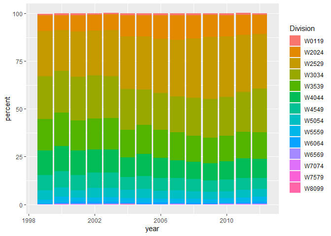

Case Study 2 - EDA
================
Nikhil Gupta
2020-09-12 13:26:11

  - [Missing Values](#missing-values)
  - [Participants by Year](#participants-by-year)
  - [Age Brackets by Year](#age-brackets-by-year)
  - [Race Times](#race-times)

``` r
library(tidyverse)
```

    ## -- Attaching packages ------------------------------------------------------------------------------------------------------- tidyverse 1.3.0 --

    ## v ggplot2 3.3.0     v purrr   0.3.4
    ## v tibble  3.0.0     v dplyr   0.8.5
    ## v tidyr   1.0.2     v stringr 1.4.0
    ## v readr   1.3.1     v forcats 0.5.0

    ## -- Conflicts ---------------------------------------------------------------------------------------------------------- tidyverse_conflicts() --
    ## x dplyr::filter() masks stats::filter()
    ## x dplyr::lag()    masks stats::lag()

``` r
data = readRDS("../../data/data.rds")
str(data)
```

    ## 'data.frame':    75866 obs. of  22 variables:
    ##  $ Race         : chr  "10M" "10M" "10M" "10M" ...
    ##  $ Name         : chr  "Jane Omoro " "Jane Ngotho " "Lidiya Grigoryeva " "Eunice Sagero " ...
    ##  $ Gender       : chr  "W" "W" "W" "W" ...
    ##  $ Age          : num  26 29 NA 20 29 24 38 NA 27 30 ...
    ##  $ Time         : POSIXct, format: "0000-01-01 00:53:37" "0000-01-01 00:53:38" ...
    ##  $ Pace         : POSIXct, format: "0000-01-01 00:05:22" "0000-01-01 00:05:22" ...
    ##  $ PiS          : num  1 2 3 4 5 6 7 8 9 10 ...
    ##  $ TiS          : num  2358 2358 2358 2358 2358 ...
    ##  $ Division     : chr  "W2529" "W2529" "NR" "W2024" ...
    ##  $ PiD          : num  1 2 NA 1 3 2 1 NA 4 1 ...
    ##  $ TiD          : num  559 559 NA 196 559 196 387 NA 559 529 ...
    ##  $ Hometown     : chr  "Kenya" "Kenya" "Russia" "Kenya" ...
    ##  $ Home State   : chr  NA NA NA NA ...
    ##  $ year         : int  1999 1999 1999 1999 1999 1999 1999 1999 1999 1999 ...
    ##  $ divisionTitle: chr  "Overall+Women" "Overall+Women" "Overall+Women" "Overall+Women" ...
    ##  $ section      : chr  "10M" "10M" "10M" "10M" ...
    ##  $ page         : int  1 1 1 1 1 1 1 1 1 1 ...
    ##  $ link         : chr  "http://www.cballtimeresults.org/performances?utf8=%E2%9C%93&section=10M&year=1999&division=Overall+Women&page=1" "http://www.cballtimeresults.org/performances?utf8=%E2%9C%93&section=10M&year=1999&division=Overall+Women&page=1" "http://www.cballtimeresults.org/performances?utf8=%E2%9C%93&section=10M&year=1999&division=Overall+Women&page=1" "http://www.cballtimeresults.org/performances?utf8=%E2%9C%93&section=10M&year=1999&division=Overall+Women&page=1" ...
    ##  $ DivisionCode : chr  "W" "W" "N" "W" ...
    ##  $ DivisionNum  : chr  "529" "529" "" "024" ...
    ##  $ TimeMins     : num  53.6 53.6 53.7 53.9 54.1 ...
    ##  $ PaceMins     : num  5.37 5.37 5.37 5.4 5.42 ...

``` r
summary(data)
```

    ##      Race               Name              Gender               Age       
    ##  Length:75866       Length:75866       Length:75866       Min.   : 7.00  
    ##  Class :character   Class :character   Class :character   1st Qu.:27.00  
    ##  Mode  :character   Mode  :character   Mode  :character   Median :32.00  
    ##                                                           Mean   :33.85  
    ##                                                           3rd Qu.:39.00  
    ##                                                           Max.   :87.00  
    ##                                                           NA's   :20     
    ##       Time                          Pace                          PiS      
    ##  Min.   :0000-01-01 00:51:44   Min.   :0000-01-01 00:05:10   Min.   :   1  
    ##  1st Qu.:0000-01-01 01:28:39   1st Qu.:0000-01-01 00:08:52   1st Qu.:1356  
    ##  Median :0000-01-01 01:37:29   Median :0000-01-01 00:09:45   Median :2786  
    ##  Mean   :0000-01-01 01:38:13   Mean   :0000-01-01 00:09:50   Mean   :3305  
    ##  3rd Qu.:0000-01-01 01:46:58   3rd Qu.:0000-01-01 00:10:42   3rd Qu.:4905  
    ##  Max.   :0000-01-01 02:57:31   Max.   :0000-01-01 00:17:45   Max.   :9729  
    ##                                                                            
    ##       TiS         Division              PiD              TiD      
    ##  Min.   :2166   Length:75866       Min.   :   1.0   Min.   :   1  
    ##  1st Qu.:4333   Class :character   1st Qu.: 165.0   1st Qu.: 559  
    ##  Median :6395   Mode  :character   Median : 404.0   Median : 953  
    ##  Mean   :6609                      Mean   : 595.6   Mean   :1190  
    ##  3rd Qu.:8853                      3rd Qu.: 816.0   3rd Qu.:1678  
    ##  Max.   :9729                      Max.   :5302.0   Max.   :2803  
    ##                                    NA's   :20       NA's   :20    
    ##    Hometown          Home State             year      divisionTitle     
    ##  Length:75866       Length:75866       Min.   :1999   Length:75866      
    ##  Class :character   Class :character   1st Qu.:2005   Class :character  
    ##  Mode  :character   Mode  :character   Median :2008   Mode  :character  
    ##                                        Mean   :2007                     
    ##                                        3rd Qu.:2010                     
    ##                                        Max.   :2012                     
    ##                                                                         
    ##    section               page           link           DivisionCode      
    ##  Length:75866       Min.   :  1.0   Length:75866       Length:75866      
    ##  Class :character   1st Qu.: 68.0   Class :character   Class :character  
    ##  Mode  :character   Median :140.0   Mode  :character   Mode  :character  
    ##                     Mean   :165.7                                        
    ##                     3rd Qu.:246.0                                        
    ##                     Max.   :487.0                                        
    ##                                                                          
    ##  DivisionNum           TimeMins         PaceMins     
    ##  Length:75866       Min.   : 51.73   Min.   : 5.167  
    ##  Class :character   1st Qu.: 88.65   1st Qu.: 8.867  
    ##  Mode  :character   Median : 97.48   Median : 9.750  
    ##                     Mean   : 98.22   Mean   : 9.823  
    ##                     3rd Qu.:106.97   3rd Qu.:10.700  
    ##                     Max.   :177.52   Max.   :17.750  
    ## 

``` r
head(data)
```

    ##   Race               Name Gender Age                Time                Pace
    ## 1  10M        Jane Omoro       W  26 0000-01-01 00:53:37 0000-01-01 00:05:22
    ## 2  10M       Jane Ngotho       W  29 0000-01-01 00:53:38 0000-01-01 00:05:22
    ## 3  10M Lidiya Grigoryeva       W  NA 0000-01-01 00:53:40 0000-01-01 00:05:22
    ## 4  10M     Eunice Sagero       W  20 0000-01-01 00:53:55 0000-01-01 00:05:24
    ## 5  10M   Alla Zhilyayeva       W  29 0000-01-01 00:54:08 0000-01-01 00:05:25
    ## 6  10M    Teresa Wanjiku       W  24 0000-01-01 00:54:10 0000-01-01 00:05:25
    ##   PiS  TiS Division PiD TiD Hometown Home State year divisionTitle section page
    ## 1   1 2358    W2529   1 559    Kenya       <NA> 1999 Overall+Women     10M    1
    ## 2   2 2358    W2529   2 559    Kenya       <NA> 1999 Overall+Women     10M    1
    ## 3   3 2358       NR  NA  NA   Russia       <NA> 1999 Overall+Women     10M    1
    ## 4   4 2358    W2024   1 196    Kenya       <NA> 1999 Overall+Women     10M    1
    ## 5   5 2358    W2529   3 559   Russia       <NA> 1999 Overall+Women     10M    1
    ## 6   6 2358    W2024   2 196    Kenya       <NA> 1999 Overall+Women     10M    1
    ##                                                                                                              link
    ## 1 http://www.cballtimeresults.org/performances?utf8=%E2%9C%93&section=10M&year=1999&division=Overall+Women&page=1
    ## 2 http://www.cballtimeresults.org/performances?utf8=%E2%9C%93&section=10M&year=1999&division=Overall+Women&page=1
    ## 3 http://www.cballtimeresults.org/performances?utf8=%E2%9C%93&section=10M&year=1999&division=Overall+Women&page=1
    ## 4 http://www.cballtimeresults.org/performances?utf8=%E2%9C%93&section=10M&year=1999&division=Overall+Women&page=1
    ## 5 http://www.cballtimeresults.org/performances?utf8=%E2%9C%93&section=10M&year=1999&division=Overall+Women&page=1
    ## 6 http://www.cballtimeresults.org/performances?utf8=%E2%9C%93&section=10M&year=1999&division=Overall+Women&page=1
    ##   DivisionCode DivisionNum TimeMins PaceMins
    ## 1            W         529 53.61667 5.366667
    ## 2            W         529 53.63333 5.366667
    ## 3            N             53.66667 5.366667
    ## 4            W         024 53.91667 5.400000
    ## 5            W         529 54.13333 5.416667
    ## 6            W         024 54.16667 5.416667

``` r
unique(data$Race)
```

    ## [1] "10M"

``` r
unique(data$Gender)
```

    ## [1] "W"       "xue Zhu" "suzy"    "Cindy"

``` r
unique(data %>% arrange(Age) %>%  select(Age) %>%  pluck(1)) 
```

    ##  [1]  7 10 11 12 13 14 15 16 17 18 19 20 21 22 23 24 25 26 27 28 29 30 31 32 33
    ## [26] 34 35 36 37 38 39 40 41 42 43 44 45 46 47 48 49 50 51 52 53 54 55 56 57 58
    ## [51] 59 60 61 62 63 64 65 66 67 68 69 70 71 72 73 74 75 76 77 78 80 81 83 84 85
    ## [76] 86 87 NA

``` r
unique(data %>% arrange(Division) %>%  select(Division) %>%  pluck(1)) 
```

    ##  [1] "NR"    "W0119" "W2024" "W2529" "W3034" "W3539" "W4044" "W4549" "W5054"
    ## [10] "W5559" "W6064" "W6569" "W7074" "W7579" "W8099"

  - Some issues with Gender –\> Does it matter?

# Missing Values

``` r
data %>% 
  select_if(function(x) any(is.na(x))) %>% 
  summarise_each(~ sum(is.na(.))) 
```

    ##   Age PiD TiD Home State
    ## 1  20  20  20        241

``` r
noresults = data %>% dplyr::filter(Division == "NR")
dim(noresults)
```

    ## [1] 19 22

``` r
head(noresults)
```

    ##   Race                 Name Gender Age                Time                Pace
    ## 1  10M   Lidiya Grigoryeva       W  NA 0000-01-01 00:53:40 0000-01-01 00:05:22
    ## 2  10M        Gladys Asiba       W  NA 0000-01-01 00:54:50 0000-01-01 00:05:29
    ## 3  10M   Connie Buckwalter       W  NA 0000-01-01 00:59:36 0000-01-01 00:05:58
    ## 4  10M            Ann Reid       W  NA 0000-01-01 01:53:03 0000-01-01 00:11:18
    ## 5  10M        Loretta Cuce       W  NA 0000-01-01 01:53:38 0000-01-01 00:11:22
    ## 6  10M Unidentified Runner       W  NA 0000-01-01 01:19:45 0000-01-01 00:07:59
    ##    PiS  TiS Division PiD TiD   Hometown Home State year divisionTitle section
    ## 1    3 2358       NR  NA  NA     Russia       <NA> 1999 Overall+Women     10M
    ## 2    8 2358       NR  NA  NA      Kenya       <NA> 1999 Overall+Women     10M
    ## 3   17 2358       NR  NA  NA  Lancaster         PA 1999 Overall+Women     10M
    ## 4 2176 2358       NR  NA  NA   Bethesda         MD 1999 Overall+Women     10M
    ## 5 2611 2972       NR  NA  NA Alexandria         VA 2001 Overall+Women     10M
    ## 6  270 3333       NR  NA  NA Washington         DC 2002 Overall+Women     10M
    ##   page
    ## 1    1
    ## 2    1
    ## 3    1
    ## 4  109
    ## 5  131
    ## 6   14
    ##                                                                                                                link
    ## 1   http://www.cballtimeresults.org/performances?utf8=%E2%9C%93&section=10M&year=1999&division=Overall+Women&page=1
    ## 2   http://www.cballtimeresults.org/performances?utf8=%E2%9C%93&section=10M&year=1999&division=Overall+Women&page=1
    ## 3   http://www.cballtimeresults.org/performances?utf8=%E2%9C%93&section=10M&year=1999&division=Overall+Women&page=1
    ## 4 http://www.cballtimeresults.org/performances?utf8=%E2%9C%93&section=10M&year=1999&division=Overall+Women&page=109
    ## 5 http://www.cballtimeresults.org/performances?utf8=%E2%9C%93&section=10M&year=2001&division=Overall+Women&page=131
    ## 6  http://www.cballtimeresults.org/performances?utf8=%E2%9C%93&section=10M&year=2002&division=Overall+Women&page=14
    ##   DivisionCode DivisionNum  TimeMins  PaceMins
    ## 1            N              53.66667  5.366667
    ## 2            N              54.83333  5.483333
    ## 3            N              59.60000  5.966667
    ## 4            N             113.05000 11.300000
    ## 5            N             113.63333 11.366667
    ## 6            N              79.75000  7.983333

``` r
noage = data %>% dplyr::filter(is.na(Age))
dim(noage)
```

    ## [1] 20 22

``` r
head(noage)
```

    ##   Race                 Name Gender Age                Time                Pace
    ## 1  10M   Lidiya Grigoryeva       W  NA 0000-01-01 00:53:40 0000-01-01 00:05:22
    ## 2  10M        Gladys Asiba       W  NA 0000-01-01 00:54:50 0000-01-01 00:05:29
    ## 3  10M   Connie Buckwalter       W  NA 0000-01-01 00:59:36 0000-01-01 00:05:58
    ## 4  10M            Ann Reid       W  NA 0000-01-01 01:53:03 0000-01-01 00:11:18
    ## 5  10M        Loretta Cuce       W  NA 0000-01-01 01:53:38 0000-01-01 00:11:22
    ## 6  10M Unidentified Runner       W  NA 0000-01-01 01:19:45 0000-01-01 00:07:59
    ##    PiS  TiS Division PiD TiD   Hometown Home State year divisionTitle section
    ## 1    3 2358       NR  NA  NA     Russia       <NA> 1999 Overall+Women     10M
    ## 2    8 2358       NR  NA  NA      Kenya       <NA> 1999 Overall+Women     10M
    ## 3   17 2358       NR  NA  NA  Lancaster         PA 1999 Overall+Women     10M
    ## 4 2176 2358       NR  NA  NA   Bethesda         MD 1999 Overall+Women     10M
    ## 5 2611 2972       NR  NA  NA Alexandria         VA 2001 Overall+Women     10M
    ## 6  270 3333       NR  NA  NA Washington         DC 2002 Overall+Women     10M
    ##   page
    ## 1    1
    ## 2    1
    ## 3    1
    ## 4  109
    ## 5  131
    ## 6   14
    ##                                                                                                                link
    ## 1   http://www.cballtimeresults.org/performances?utf8=%E2%9C%93&section=10M&year=1999&division=Overall+Women&page=1
    ## 2   http://www.cballtimeresults.org/performances?utf8=%E2%9C%93&section=10M&year=1999&division=Overall+Women&page=1
    ## 3   http://www.cballtimeresults.org/performances?utf8=%E2%9C%93&section=10M&year=1999&division=Overall+Women&page=1
    ## 4 http://www.cballtimeresults.org/performances?utf8=%E2%9C%93&section=10M&year=1999&division=Overall+Women&page=109
    ## 5 http://www.cballtimeresults.org/performances?utf8=%E2%9C%93&section=10M&year=2001&division=Overall+Women&page=131
    ## 6  http://www.cballtimeresults.org/performances?utf8=%E2%9C%93&section=10M&year=2002&division=Overall+Women&page=14
    ##   DivisionCode DivisionNum  TimeMins  PaceMins
    ## 1            N              53.66667  5.366667
    ## 2            N              54.83333  5.483333
    ## 3            N              59.60000  5.966667
    ## 4            N             113.05000 11.300000
    ## 5            N             113.63333 11.366667
    ## 6            N              79.75000  7.983333

``` r
setdiff(noage, noresults)
```

    ##   Race             Name Gender Age                Time                Pace  PiS
    ## 1  10M Michelle Hinman       W  NA 0000-01-01 01:39:13 0000-01-01 00:09:55 2455
    ##    TiS Division PiD TiD Hometown Home State year divisionTitle section page
    ## 1 4333    W8099   1   2       NR       <NA> 2005 Overall+Women     10M  123
    ##                                                                                                                link
    ## 1 http://www.cballtimeresults.org/performances?utf8=%E2%9C%93&section=10M&year=2005&division=Overall+Women&page=123
    ##   DivisionCode DivisionNum TimeMins PaceMins
    ## 1            W         099 99.21667 9.916667

  - This seems to be an issue. It looks like this person is placed first
    in the division, but age is not set so she has been classified as
    W8099 and the time seems to be off from what would be expected from
    this age bracket.
  - TODO: Fix this

<!-- end list -->

``` r
# Remove no results
data = data %>% 
  dplyr::filter(Division != "NR")
```

# Participants by Year

``` r
plotdata = data %>% 
  group_by(year) %>% 
  summarise(count=n()) 

plotdata %>% 
  ggplot(aes(x=year, y=count)) +
  geom_line() +
  geom_point()
```

<!-- -->

``` r
plotdata %>% 
  ggplot(aes(x = year, y = count)) + 
  geom_bar(stat = "identity")
```

<!-- -->

``` r
# Alternate colored by Division
plotdata = data %>% 
  group_by(year, Division) %>% 
  summarise(count = n())

plotdata %>% 
  ggplot(aes(x = year, y = count, fill = Division)) + 
  geom_bar(stat = "identity", position = "stack") # +
```

<!-- -->

# Age Brackets by Year

``` r
plotdata_by_year = data %>% 
  group_by(year) %>% 
  summarise(count_year = n())

plotdata_by_year_div = data %>% 
  group_by(year, Division) %>% 
  summarise(count_year_div = n())


plotdata = plotdata_by_year %>% 
  plyr::join(plotdata_by_year_div, by = "year", type = "full") %>% 
  mutate(percent = round(count_year_div/count_year*100,1))
  
plotdata %>% 
  ggplot(aes(x = year, y = percent, fill = Division)) + 
  geom_bar(stat = "identity", position = "stack")
```

<!-- -->

# Race Times

``` r
data %>% 
  mutate_at("year", as.factor) %>% 
  ggplot(aes(x=year, y=TimeMins)) + 
  geom_boxplot()
```

<!-- -->

``` r
data %>% 
  dplyr::filter(!(Division %in% c("W8099", "W7579"))) %>% 
  mutate_at("year", as.factor) %>% 
  ggplot(aes(x=year, y=TimeMins, fill=year)) + 
  geom_boxplot() +
  facet_wrap(. ~ Division, ncol=4) +
  theme(axis.text.x = element_text(angle = 90, vjust = 0.5, hjust=1)) + 
  coord_flip()
```

<!-- -->

``` r
data %>% 
  dplyr::filter(Division %in% c("W2529", "W3034", "W3539", "W4044")) %>% 
  mutate_at("year", as.factor) %>% 
  ggplot(aes(x=year, y=TimeMins, fill=year)) + 
  geom_boxplot() +
  facet_wrap(. ~ Division, ncol=4) +
  theme(axis.text.x = element_text(angle = 90, vjust = 0.5, hjust=1)) + 
  coord_flip()
```

<!-- -->
