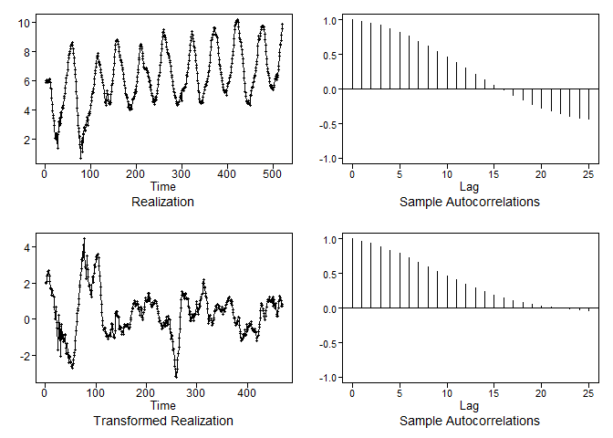
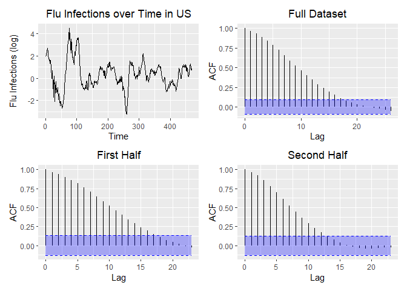
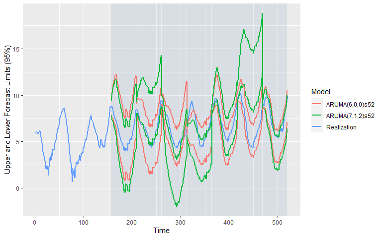
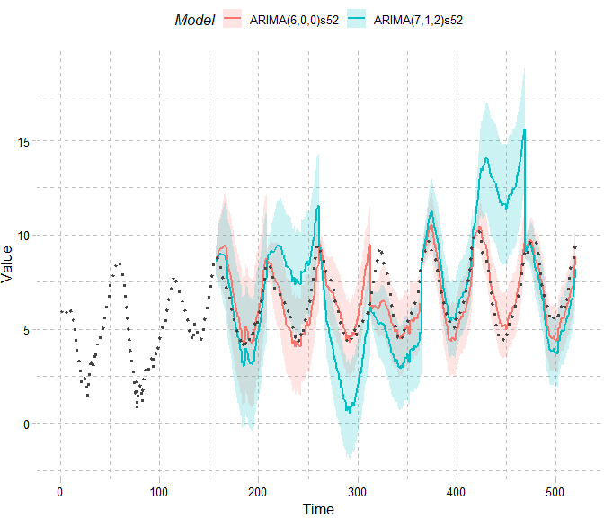
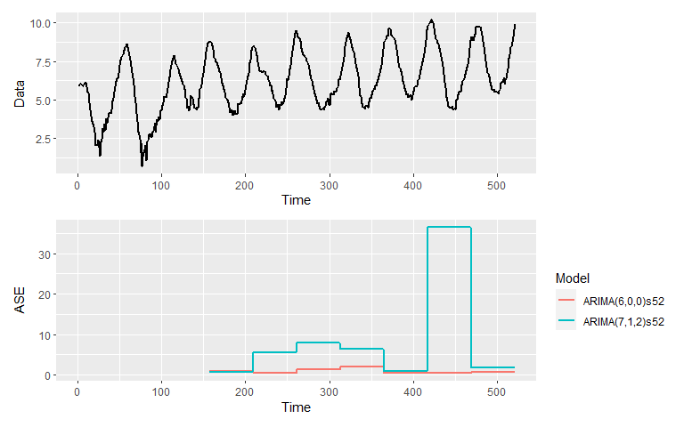

Flu Data Analysis
================
Nikhil Gupta
2020-10-17 09:18:40

-   [Response Variable](#response-variable)
-   [Checking for Mean and Variance grouping by
    year](#checking-for-mean-and-variance-grouping-by-year)
-   [Modeling](#modeling)
    -   [Stationarity](#stationarity)
    -   [Seasonal ARIMA Model](#seasonal-arima-model)
        -   [Model ID](#model-id)
        -   [Model Fit](#model-fit)
            -   [Evaluation of the
                Residuals](#evaluation-of-the-residuals)
            -   [Model Characterisics](#model-characterisics)
    -   [Conclusion](#conclusion)

    library(tidyverse)

    ## -- Attaching packages --------------------------------------- tidyverse 1.3.0 --

    ## v ggplot2 3.3.2     v purrr   0.3.4
    ## v tibble  3.0.3     v dplyr   1.0.2
    ## v tidyr   1.1.2     v stringr 1.4.0
    ## v readr   1.4.0     v forcats 0.5.0

    ## -- Conflicts ------------------------------------------ tidyverse_conflicts() --
    ## x dplyr::filter() masks stats::filter()
    ## x dplyr::lag()    masks stats::lag()

    library(tswge)
    library(tseries)

    ## Registered S3 method overwritten by 'quantmod':
    ##   method            from
    ##   as.zoo.data.frame zoo

    library(tswgewrapped) 
    #https://github.com/josephsdavid/tswgewrapped
    #https://josephsdavid.github.io/tswgewrapped/index.html

    data = read.csv("../../data/FluNetInteractiveReport_2010_2019.csv") 
    data %>% glimpse()

    ## Rows: 521
    ## Columns: 22
    ## $ Country           <chr> "United States of America", "United States of Ame...
    ## $ WHOREGION         <chr> "Region of the Americas of WHO", "Region of the A...
    ## $ FLUREGION         <chr> "North America", "North America", "North America"...
    ## $ Year              <int> 2010, 2010, 2010, 2010, 2010, 2010, 2010, 2010, 2...
    ## $ Week              <int> 1, 2, 3, 4, 5, 6, 7, 8, 9, 10, 11, 12, 13, 14, 15...
    ## $ SDATE             <chr> "2010-01-04", "2010-01-11", "2010-01-18", "2010-0...
    ## $ EDATE             <chr> "2010-01-10", "2010-01-17", "2010-01-24", "2010-0...
    ## $ SPEC_RECEIVED_NB  <int> 9600, 8678, 8626, 8622, 8485, 8270, 8463, 8106, 7...
    ## $ SPEC_PROCESSED_NB <int> 9600, 8678, 8626, 8622, 8485, 8270, 8463, 8106, 7...
    ## $ AH1               <int> 0, 1, 0, 0, 0, 0, 0, 0, 0, 0, 0, 0, 0, 0, 0, 0, 0...
    ## $ AH1N12009         <int> 266, 261, 317, 268, 290, 238, 260, 316, 338, 359,...
    ## $ AH3               <int> 0, 2, 1, 3, 0, 0, 0, 1, 0, 0, 1, 1, 1, 1, 1, 2, 0...
    ## $ AH5               <int> 0, 0, 0, 0, 0, 0, 0, 0, 0, 0, 0, 0, 0, 0, 0, 0, 0...
    ## $ ANOTSUBTYPED      <int> 92, 120, 126, 122, 108, 114, 114, 104, 102, 102, ...
    ## $ INF_A             <int> 358, 384, 444, 393, 398, 352, 374, 421, 440, 461,...
    ## $ BYAMAGATA         <int> 0, 0, 0, 0, 0, 0, 0, 0, 0, 0, 0, 0, 0, 0, 0, 0, 0...
    ## $ BVICTORIA         <int> 0, 0, 0, 0, 0, 0, 0, 0, 0, 0, 0, 0, 0, 0, 0, 0, 0...
    ## $ BNOTDETERMINED    <int> 8, 12, 3, 9, 6, 9, 6, 3, 5, 14, 4, 9, 5, 0, 2, 6,...
    ## $ INF_B             <int> 8, 12, 3, 9, 6, 9, 6, 3, 5, 14, 4, 9, 5, 0, 2, 6,...
    ## $ ALL_INF           <int> 366, 396, 447, 402, 404, 361, 380, 424, 445, 475,...
    ## $ ALL_INF2          <int> NA, NA, NA, NA, NA, NA, NA, NA, NA, NA, NA, NA, N...
    ## $ TITLE             <chr> "Local Outbreak", "Local Outbreak", "Local Outbre...

Response Variable
=================

    flu = data$ALL_INF

Checking for Mean and Variance grouping by year
===============================================

    ggplot2::ggplot(data=data,aes(x=Week,y=log(ALL_INF),color=(Year))) +
      geom_point()+
      #scale_color_brewer('blues')
      scale_color_gradient(breaks=unique(data$Year))

<!-- -->
\#\# Dickey-Fuller Test

Ho: The model has a root of +1 (nonstationary). Ha: The model does not
have a root of +1 (stationary).

    #https://stats.stackexchange.com/questions/225087/seasonal-data-deemed-stationary-by-adf-and-kpss-tests
    noSeas = tswge::artrans.wge(log(data$ALL_INF), phi.tr = c(rep(0,51), 1))

<!-- -->

    tseries::adf.test(noSeas)

    ## Warning in tseries::adf.test(noSeas): p-value smaller than printed p-value

    ## 
    ##  Augmented Dickey-Fuller Test
    ## 
    ## data:  noSeas
    ## Dickey-Fuller = -4.7929, Lag order = 7, p-value = 0.01
    ## alternative hypothesis: stationary

    p=tswge::plotts.sample.wge(log(data$ALL_INF),lag.max = 100,trunc = 100)

<!-- -->

    p=tswge::plotts.sample.wge(noSeas,lag.max = 100,trunc = 100)

<!-- -->
\#\# Running Avg

    library(zoo)

    ## 
    ## Attaching package: 'zoo'

    ## The following objects are masked from 'package:base':
    ## 
    ##     as.Date, as.Date.numeric

    ggplot2::ggplot(data=data,aes(x=as.Date(SDATE)
                                  ,y=zoo::rollmean(log(ALL_INF),52,fill=NA,align='right')
                                  ,color='Rolling Mean')) +
      geom_point()+
      geom_point(aes(y=log(ALL_INF),color='Actual'))

    ## Warning: Removed 51 rows containing missing values (geom_point).

<!-- -->

It may be worthwhile to take the log to smooth out the peaks

    log_flu = log(flu)

Modeling
========

Stationarity
------------

    tswgewrapped::check_stationarity(log_flu, ylab = 'Flu Infections (log)', title = 'Flu Infections over Time in US')

    ## Loading required namespace: ggfortify

    ## Loading required namespace: patchwork

    ## Warning: `mutate_()` is deprecated as of dplyr 0.7.0.
    ## Please use `mutate()` instead.
    ## See vignette('programming') for more help
    ## This warning is displayed once every 8 hours.
    ## Call `lifecycle::last_warnings()` to see where this warning was generated.

<!-- -->

    ## [1] TRUE

**Condition 1: Constant Mean**

The mean does not appear to be constant over time. Therefore, the
assumption of constant mean appears to be violated.

**Condition 2: Constant Variance**

Hard to say with just one realization. But if we superimpose year over
year, there may seem to be some periods (especially during peaks) where
the variance might be higher than the non-peak periods. Therefore, the
assumption of constant variance may be violated.

**Condition 3: Constant Autocorrelation**

The ACF of the first and second half of the realization appear to
exhibit similar behavior. Therefore, the assumption of constant
autocorrelation does not appear to be violated.

**Conclusion**

Given the above analysis, there does appear to be sufficient evidence to
suggest that the process generating the realization is not stationary.
We will continue the ananlysis assuming the process generating the
realization is not stationary.

Seasonal ARIMA Model
--------------------

### Model ID

There appears to be a seasonality of 52 weeks in the data (can be seen
from the peak at roughly 0.02 in the Parzen Window and from the
periodicity in the ACF plots as well).

There also seems to be a slight upward trend in the data which may be
removed by differencing

Lets remove that to try to make the data stationary

    flu_s52 = tswge::artrans.wge(log_flu, phi.tr = c(rep(0,51), 1))

<!-- -->

    px = plotts.sample.wge(flu_s52, lag.max = 125, trunc = 100)

<!-- -->

    flu_s52_d1 = tswge::artrans.wge(flu_s52, phi.tr = 1)

<!-- -->

    px = plotts.sample.wge(flu_s52_d1, lag.max = 125)

<!-- -->

    aicbic.tables_d1 = tswgewrapped::aicbic(flu_s52_d1, p=0:8, q=0:8, silent = TRUE, merge = TRUE)
    aicbic.tables_d1

    ##   p q       aic       bic
    ## 1 7 2 -2.429768 -2.341126
    ## 2 7 1 -2.399832        NA
    ## 3 5 0 -2.397205 -2.344019
    ## 4 0 5 -2.396141 -2.342956
    ## 5 0 7 -2.394554        NA
    ## 6 6 0        NA -2.330944
    ## 7 5 1        NA -2.330925

    aicbic.tables = tswgewrapped::aicbic(flu_s52, p=0:8,q= 0:8, silent = TRUE, merge = TRUE)
    aicbic.tables

    ##   p q       aic       bic
    ## 1 6 0 -2.443409 -2.381459
    ## 2 7 0 -2.442574 -2.371775
    ## 3 6 1 -2.442339 -2.371539
    ## 4 6 2 -2.438395 -2.358746
    ## 5 8 0 -2.438331        NA
    ## 6 1 5        NA -2.362821

ARMA(0,6) seems to be on the top of the list using both AIC and BIC for
flu\_s52\_d1. We will use this going forward ARMA(3,1) seems to be on
the top of the list using BIC for est\_s52. We will use this going
forward

    est_s52_d1 = tswge::est.arma.wge(flu_s52_d1, p = aicbic.tables_d1$p[1], q = aicbic.tables_d1$q[1])

    ## 
    ## Coefficients of Original polynomial:  
    ## 0.0538 1.1120 -0.0465 -0.2309 0.3143 -0.0195 -0.2811 
    ## 
    ## Factor                 Roots                Abs Recip    System Freq 
    ## 1+0.9153B             -1.0925               0.9153       0.5000
    ## 1-1.8185B+0.8349B^2    1.0891+-0.1079i      0.9137       0.0157
    ## 1+1.3799B+0.6565B^2   -1.0509+-0.6471i      0.8102       0.4122
    ## 1-0.5305B+0.5603B^2    0.4734+-1.2492i      0.7485       0.1924
    ##   
    ## 

    est_s52    = tswge::est.arma.wge(flu_s52, p = aicbic.tables$p[1], q = aicbic.tables$q[1])

    ## 
    ## Coefficients of Original polynomial:  
    ## 0.9321 0.2911 -0.3006 0.0413 0.2686 -0.2860 
    ## 
    ## Factor                 Roots                Abs Recip    System Freq 
    ## 1-1.8119B+0.8290B^2    1.0929+-0.1094i      0.9105       0.0159
    ## 1+1.3875B+0.6358B^2   -1.0911+-0.6183i      0.7974       0.4180
    ## 1-0.5077B+0.5426B^2    0.4678+-1.2744i      0.7366       0.1940
    ##   
    ## 

### Model Fit

    #Max: automatically build the text
    # setup object with unitvariate model
    getModel = function(est,s,d,sliding_ase=TRUE){
      t=list('unnamed' = 
             list(phi = est$phi, theta = est$theta, s=s, d=d, vara = est$avar, res = est$res, sliding_ase = TRUE))
      p = length(est$phi)
      if(p==1 & est$phi[1] ==0) p=0
      q = length(est$theta)
      if(q==1 & est$theta[1] ==0) q=0
      names(t)[1]=paste0("ARUMA(",p,",",d,",",q,")s",s)
      
      return(t)
    }

    models = c(getModel(est_s52_d1,s=52,d=1)
                  ,getModel(est_s52,s=52,d=0)
                  )
    # models = list(
    #   "ARUMA(2,1,0) s=52" = list(phi = est_s52_d1$phi, theta = est_s52_d1$theta, s=52, d=1, vara = est_s52_d1$avar, res = est_s52_d1$res, sliding_ase = TRUE),
    #   "ARUMA(3,0,1) s=52" = list(phi = est_s52$phi, theta = est_s52$theta, s=52, d=0, vara = est_s52$avar, res = est_s52$res, sliding_ase = TRUE)
    # )

    log_flu = data.frame(log_flu)
    head(log_flu)

    ##    log_flu
    ## 1 5.902633
    ## 2 5.981414
    ## 3 6.102559
    ## 4 5.996452
    ## 5 6.001415
    ## 6 5.888878

    var_interest = 'log_flu'
    n.ahead = 52
    batch_size = 208

    mdl_compare_uni = tswgewrapped::ModelCompareUnivariate$new(
      data = log_flu$log_flu,
      var_interest = var_interest,
      mdl_list = models,
      n.ahead = n.ahead,
      batch_size = batch_size
    )

    ## NULL

#### Evaluation of the Residuals

The residuals appear to be consisent with white noise. As secondary
evaluation, the Ljung-Box test does not reject the null hypothesis that
residuals are not white noise.

    tbl = mdl_compare_uni$evaluate_residuals()

    ## 
    ## 
    ## Evaluating residuals for model: 'ARUMA(7,1,2)s52'

<!-- -->

    ## None of the 'ljung_box' tests rejected the null hypothesis that the data is consistent with white noise at an significance level of  0.05  
    ## 
    ## 
    ## Evaluating residuals for model: 'ARUMA(6,0,0)s52'

<!-- -->

    ## None of the 'ljung_box' tests rejected the null hypothesis that the data is consistent with white noise at an significance level of  0.05

#### Model Characterisics

    # show sliding window forecasts
    tbl = mdl_compare_uni$plot_batch_forecasts(only_sliding = TRUE)

<!-- --><!-- -->

    #add windows sections
    dataReal= filter(tbl$forecasts,Model == 'Realization')
    dataModels= filter(tbl$forecasts,Model != 'Realization')

    p = ggplot2::ggplot(data=dataModels, aes(x=Time)) +
      geom_ribbon(aes(ymin=ll,ymax=ul,fill=Model),alpha=.2)+
      geom_line(aes(y=f,color=Model),size=.8) +
      geom_line(data=dataReal,aes(y=f),size=1.2,color='#444444',linetype=3) +
      ggthemes::theme_pander() +
      labs(x='Time',y='Value') +
      ggplot2::theme(
        legend.position = 'top'
        
      )
    p

    ## Warning: Removed 314 row(s) containing missing values (geom_path).

<!-- -->

    # show ASE over time (windows)
    tbl = mdl_compare_uni$plot_batch_ases(only_sliding = TRUE)

<!-- -->

    tbl <- mdl_compare_uni$plot_boxplot_ases()

<!-- -->

    fcstPlot = mdl_compare_uni$plot_simple_forecasts()

<!-- -->

    dataReal= filter(fcstPlot$plot_data,Model == 'Actual')
    dataModels= filter(fcstPlot$plot_data,Model != 'Actual')

    p = ggplot2::ggplot(data=dataModels, aes(x=Time)) +
      geom_ribbon(aes(ymin=ll,ymax=ul,fill=Model),alpha=.2)+
      geom_line(aes(y=f,color=Model),size=.8) +
      geom_line(data=dataReal,aes(y=f),size=.2,color='#444444',linetype=1) +
      ggthemes::theme_pander() +
      labs(x='Time',y='Value') +
      ggplot2::theme(
        legend.position = 'top'
        
      )
    p

<!-- -->

Conclusion
----------

In conclusion, it seems that the Seasonal ARIMA model without
differencing seems to be performing better in general. The trend is not
appreciable in the logged data to warrant differencing (adding the
Integrated term in the model).
