Flu Data Analysis
================
Nikhil Gupta
2020-10-07 06:26:48

  - [Response Variable](#response-variable)
  - [Modeling](#modeling)
      - [Stationarity](#stationarity)
      - [Seasonal ARIMA Model](#seasonal-arima-model)
          - [Model ID](#model-id)
          - [Model Fit](#model-fit)
              - [Evaluation of the
                Residuals](#evaluation-of-the-residuals)
              - [Model Characterisics](#model-characterisics)
      - [Conclusion](#conclusion)

``` r
library(tidyverse)
```

    ## -- Attaching packages ------------------------------------------------------------------------------------------------------------ tidyverse 1.3.0 --

    ## v ggplot2 3.3.0     v purrr   0.3.4
    ## v tibble  3.0.0     v dplyr   0.8.5
    ## v tidyr   1.0.2     v stringr 1.4.0
    ## v readr   1.3.1     v forcats 0.5.0

    ## -- Conflicts --------------------------------------------------------------------------------------------------------------- tidyverse_conflicts() --
    ## x dplyr::filter() masks stats::filter()
    ## x dplyr::lag()    masks stats::lag()

``` r
library(tswge)
library(tswgewrapped)
```

``` r
data = read.csv("../../data/FluNetInteractiveReport_2007_2019.csv", skip = 2)
data %>% glimpse()
```

    ## Rows: 678
    ## Columns: 22
    ## $ Country           <fct> United States of America, United States of Americ...
    ## $ WHOREGION         <fct> Region of the Americas of WHO, Region of the Amer...
    ## $ FLUREGION         <fct> North America, North America, North America, Nort...
    ## $ Year              <int> 2007, 2007, 2007, 2007, 2007, 2007, 2007, 2007, 2...
    ## $ Week              <int> 1, 2, 3, 4, 5, 6, 7, 8, 9, 10, 11, 12, 13, 14, 15...
    ## $ SDATE             <fct> 2007-01-01, 2007-01-08, 2007-01-15, 2007-01-22, 2...
    ## $ EDATE             <fct> 2007-01-07, 2007-01-14, 2007-01-21, 2007-01-28, 2...
    ## $ SPEC_RECEIVED_NB  <int> NA, NA, NA, NA, NA, NA, NA, NA, NA, NA, NA, NA, N...
    ## $ SPEC_PROCESSED_NB <int> 6711, 6430, 6200, 7200, 8261, 8986, 9780, 9947, 8...
    ## $ AH1               <int> 128, 180, 174, 310, 367, 497, 430, 297, 201, 169,...
    ## $ AH1N12009         <int> NA, NA, NA, NA, NA, NA, NA, NA, NA, NA, NA, NA, N...
    ## $ AH3               <int> 14, 35, 44, 86, 107, 133, 133, 156, 192, 199, 207...
    ## $ AH5               <int> NA, NA, NA, NA, NA, NA, NA, NA, NA, NA, NA, NA, N...
    ## $ ANOTSUBTYPED      <int> 240, 293, 420, 760, 1172, 1491, 1544, 1388, 1006,...
    ## $ INF_A             <int> 382, 508, 638, 1156, 1646, 2121, 2107, 1841, 1399...
    ## $ BYAMAGATA         <int> NA, NA, NA, NA, NA, NA, NA, NA, NA, NA, NA, NA, N...
    ## $ BVICTORIA         <int> NA, NA, NA, NA, NA, NA, NA, NA, NA, NA, NA, NA, N...
    ## $ BNOTDETERMINED    <int> 86, 86, 80, 154, 203, 411, 416, 526, 550, 470, 43...
    ## $ INF_B             <int> 86, 86, 80, 154, 203, 411, 416, 526, 550, 470, 43...
    ## $ ALL_INF           <int> 468, 594, 718, 1310, 1849, 2532, 2523, 2367, 1949...
    ## $ ALL_INF2          <int> NA, NA, NA, NA, NA, NA, NA, NA, NA, NA, NA, NA, N...
    ## $ TITLE             <fct> Widespread Outbreak, Regional Outbreak, Regional ...

# Response Variable

``` r
flu = data$ALL_INF
```

``` r
px = plotts.sample.wge(flu, lag.max = 125, trunc = 150)
```

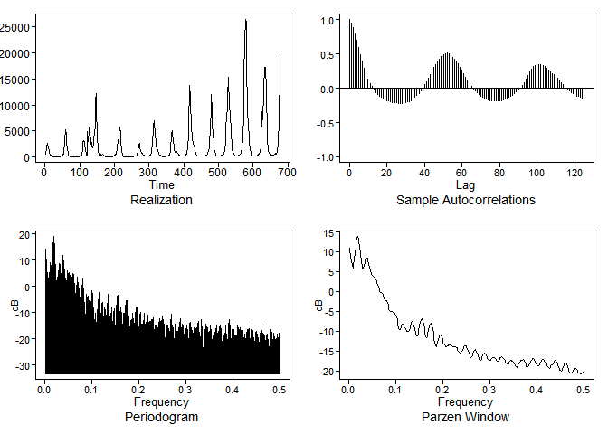<!-- -->

It may be worthwhile to take the log to smooth out the peaks

``` r
log_flu = log(flu)
```

# Modeling

## Stationarity

``` r
tswgewrapped::check_stationarity(log_flu, ylab = 'Flu Infections (log)', title = 'Flu Infections over Time in US')
```

    ## Loading required namespace: ggfortify

    ## Loading required namespace: patchwork

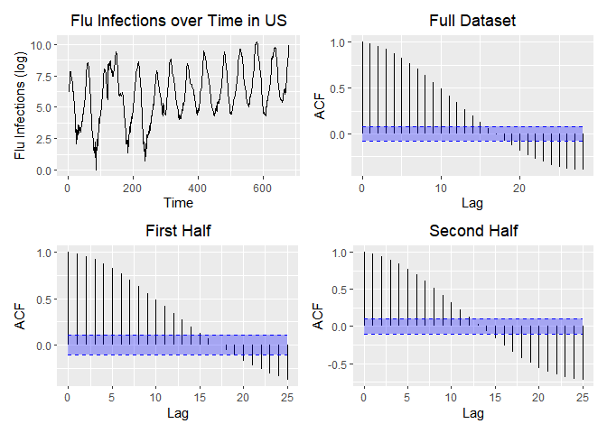<!-- -->

    ## [1] TRUE

**Condition 1: Constant Mean**

The mean does not appear to be constant over time. Therefore, the
assumption of constant mean appears to be violated.

**Condition 2: Constant Variance**

Hard to say with just one realization. But if we superimpose year over
year, there may seem to be some periods (especially during peaks) where
the variance might be higher than the non-peak periods. Therefore, the
assumption of constant variance may be violated.

**Condition 3: Constant Autocorrelation**

The ACF of the first and second half of the realization appear to
exhibit similar behavior. Therefore, the assumption of constant
autocorrelation does not appear to be violated.

**Conclusion**

Given the above analysis, there does appear to be sufficient evidence to
suggest that the process generating the realization is not stationary.
We will continue the ananlysis assuming the process generating the
realization is not stationary.

## Seasonal ARIMA Model

### Model ID

There appears to be a seasonality of 52 weeks in the data (can be seen
from the peak at roughly 0.02 in the Parzen Window and from the
periodicity in the ACF plots as well).

There also seems to be a slight upward trend in the data which may be
removed by differencing

Lets remove that to try to make the data stationary

``` r
flu_s52 = tswge::artrans.wge(log_flu, phi.tr = c(rep(0,51), 1))
```

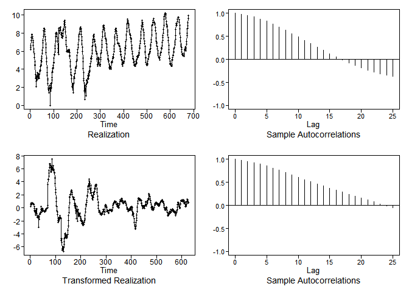<!-- -->

``` r
px = plotts.sample.wge(flu_s52, lag.max = 125, trunc = 100)
```

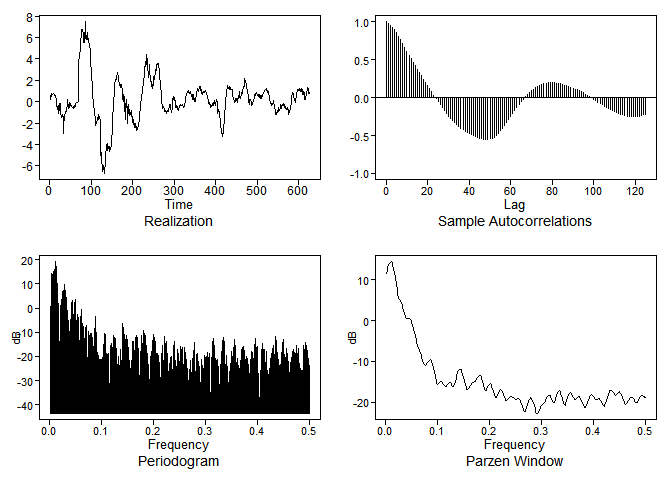<!-- -->

``` r
flu_s52_d1 = tswge::artrans.wge(flu_s52, phi.tr = 1)
```

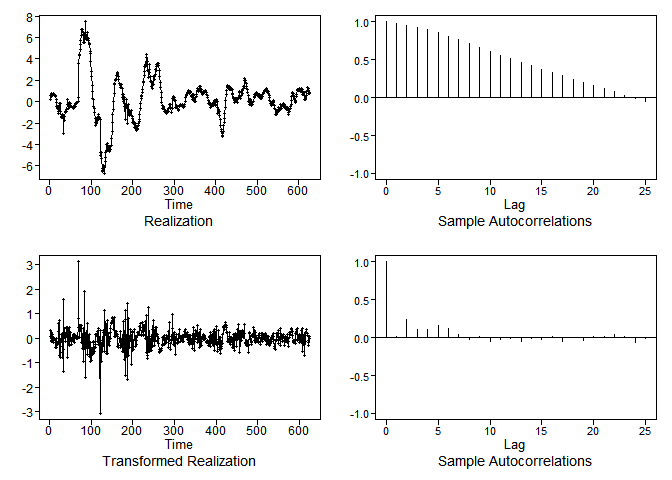<!-- -->

``` r
px = plotts.sample.wge(flu_s52_d1, lag.max = 125)
```

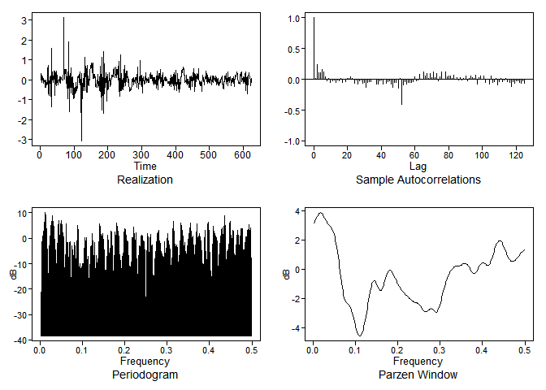<!-- -->

``` r
aicbic.tables = tswgewrapped::aicbic(flu_s52_d1, 0:8, 0:8, silent = TRUE, merge = TRUE)
aicbic.tables
```

    ##   p q       aic       bic
    ## 1 0 6 -1.889890 -1.840187
    ## 2 0 7 -1.888762        NA
    ## 3 1 6 -1.888522        NA
    ## 4 1 5 -1.888429 -1.838726
    ## 5 2 5 -1.888417        NA
    ## 6 2 1        NA -1.842001
    ## 7 1 2        NA -1.839922
    ## 8 2 4        NA -1.833572

``` r
aicbic.tables = tswgewrapped::aicbic(flu_s52, 0:8, 0:8, silent = TRUE, merge = TRUE)
aicbic.tables
```

    ##    p q       aic       bic
    ## 1  2 8 -1.929805        NA
    ## 2  2 5 -1.915443        NA
    ## 3  6 2 -1.914222        NA
    ## 4  2 6 -1.913329        NA
    ## 5  1 7 -1.912448        NA
    ## 6  3 1        NA -1.869426
    ## 7  2 2        NA -1.866400
    ## 8  2 3        NA -1.861163
    ## 9  3 2        NA -1.859786
    ## 10 4 1        NA -1.859672

ARMA(0,6) seems to be on the top of the list using both AIC and BIC for
flu\_s52\_d1. We will use this going forward ARMA(3,1) seems to be on
the top of the list using BIC for est\_s52. We will use this going
forward

``` r
est_s52_d1 = tswge::est.arma.wge(flu_s52_d1, p = 0, q = 6)
est_s52    = tswge::est.arma.wge(flu_s52, p = 3, q = 1)
```

    ## 
    ## Coefficients of Original polynomial:  
    ## 1.6209 -0.4109 -0.2226 
    ## 
    ## Factor                 Roots                Abs Recip    System Freq 
    ## 1-1.8730B+0.8830B^2    1.0605+-0.0878i      0.9397       0.0131
    ## 1+0.2521B             -3.9667               0.2521       0.5000
    ##   
    ## 

### Model Fit

``` r
# setup object with unitvariate model
models = list(
  "ARUMA(2,1,0) s=52" = list(phi = est_s52_d1$phi, theta = est_s52_d1$theta, s=52, d=1, vara = est_s52_d1$avar, res = est_s52_d1$res, sliding_ase = TRUE),
  "ARUMA(3,0,1) s=52" = list(phi = est_s52$phi, theta = est_s52$theta, s=52, d=0, vara = est_s52$avar, res = est_s52$res, sliding_ase = TRUE)
)
```

``` r
log_flu = data.frame(log_flu)
head(log_flu)
```

    ##    log_flu
    ## 1 6.148468
    ## 2 6.386879
    ## 3 6.576470
    ## 4 7.177782
    ## 5 7.522400
    ## 6 7.836765

``` r
var_interest = 'log_flu'
n.ahead = 52
batch_size = 208
```

``` r
mdl_compare_uni = tswgewrapped::ModelCompareUnivariate$new(
  data = log_flu$log_flu,
  var_interest = var_interest,
  mdl_list = models,
  n.ahead = n.ahead,
  batch_size = batch_size
)
```

    ## NULL

#### Evaluation of the Residuals

The residuals appear to be consisent with white noise. As secondary
evaluation, the Ljung-Box test does not reject the null hypothesis that
residuals are not white noise.

``` r
tbl = mdl_compare_uni$evaluate_residuals()
```

    ## 
    ## 
    ## Evaluating residuals for model: 'ARUMA(2,1,0) s=52'

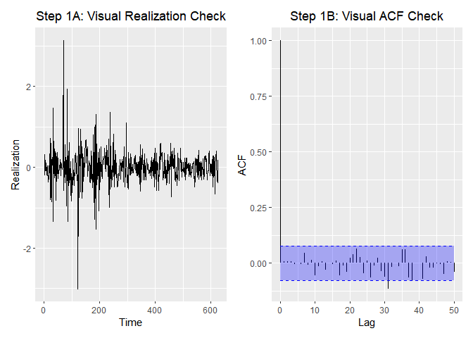<!-- -->

    ## None of the 'ljung_box' tests rejected the null hypothesis that the data is consistent with white noise at an significance level of  0.05  
    ## 
    ## 
    ## Evaluating residuals for model: 'ARUMA(3,0,1) s=52'

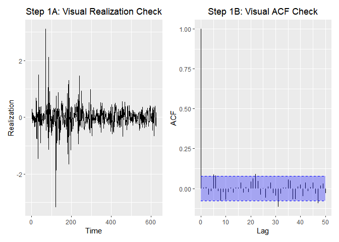<!-- -->

    ## At least one of the 'ljung_box' tests rejected the null hypothesis that the data is consistent with white noise at an significance level of  0.05

#### Model Characterisics

``` r
# mdl_compare_uni$plot_multiple_realizations()
```

``` r
# show sliding window forecasts
tbl = mdl_compare_uni$plot_batch_forecasts(only_sliding = TRUE)
```

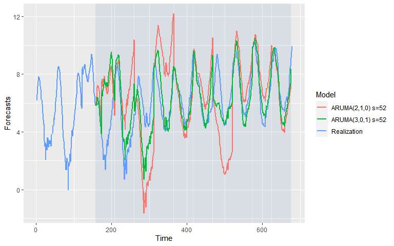<!-- -->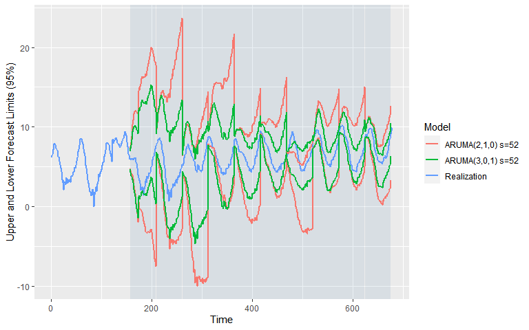<!-- -->

``` r
# show ASE over time (windows)
tbl = mdl_compare_uni$plot_batch_ases(only_sliding = TRUE)
```

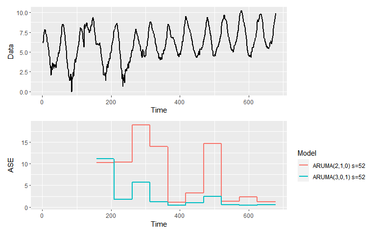<!-- -->

``` r
tbl <- mdl_compare_uni$plot_boxplot_ases()
```

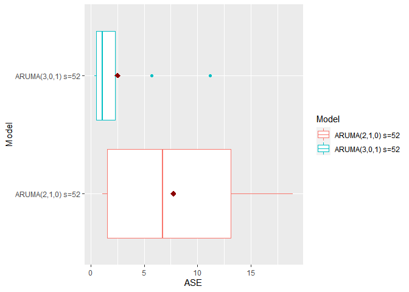<!-- -->

``` r
p = mdl_compare_uni$plot_simple_forecasts()
```

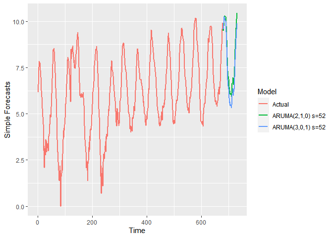<!-- -->

## Conclusion

In conclusion, it seems that the Seasonal ARIMA model without
differencing seems to be performing better in general. The trend is not
appreciable in the logged data to warrant differencing (adding the
Integrated term in the model).
